# JELENTÉS 

## az Állami Számvevőszék 2004. évi tevékenységéről

| 0516 | J/15678. | 2005. április |
| :-- | :-- | :-- |

---

Jelentéseink az Országgyúlés számítógépes hálózatán és az Interneten a www.asz.hu címen is olvashatók.

---

# TARTALOMJEGYZÉK 

1. AZ ÁSZ 2004. ÉVI FELADATAI ..... 4
1.1. Ellenőrzési feladatok ..... 4
1.1.1. Ellenőrzési területek ..... 4
1.1.2. Ellenőrzési súlypontok ..... 6
1.2. Egyéb számvevőszéki feladatok ..... 7
1.2.1. Ellenjegyzési, véleményezési jogkör ..... 8
1.2.2. Javaslattételi jogkör ..... 8
2. A 2004. ÉVI ELLENŐRZÉSEK TAPASZTALATAI ..... 9
2.1. Főbb tapasztalatok államháztartási alrendszerenként ..... 10
2.1.1. Központi költségvetés ..... 10
2.1.2. Elkülönített állami pénzalapok ..... 17
2.1.3. Társadalombiztosítási alapok ..... 18
2.1.4. Helyi önkormányzatok ..... 20
2.2. Az uniós források felhasználásának ellenőrzési tapasztalatai ..... 25
2.2.1. Általános tapasztalatok ..... 25
2.2.2. Az előcsatlakozási alapokból nyújtott támogatások felhasználása ..... 27
2.2.3. Megállapodások alapján végzett ellenőrzések ..... 34
2.3. Életminőséget befolyásoló közérdekű szolgáltatások finanszírozása és a kapcsolódó ellenőrzési tapasztalatok ..... 37
2.3.1. Egészségügy ..... 37
2.3.2. Felső- és középfokú oktatás ..... 41
2.3.3. Közútfejlesztés ..... 44
2.3.4. Közmédia ..... 45
2.4. Állami feladatok ellátása államháztartáson kívül ..... 46
3. AZ ELLENŐRZÉSEK HASZNOSÍTÁSA ..... 48
3.1. Jelentések országgyűlési tárgyalása, határozatok és az országgyűlési kapcsolatok ..... 49
3.2. Számvevőszéki javaslatok érvényesülése ..... 51
3.2.1. A javaslatok érvényesülése az Országgyűlés szintjén ..... 52
3.2.2. A javaslatok érvényesülése kormányzati szinten ..... 54
3.2.3. A javaslatok érvényesülése a vizsgált szervezeteknél ..... 59
3.3. Büntető feljelentések, közérdekű bejelentések ..... 60

---

3.4. A számvevőszéki tevékenység nyilvánossága ..... 63
4. AZ ELLENŐRZÉSI MUNKA MINŐSÉGÉNEK FEJLESZTÉSE ..... 65
4.1. Humánerőforrás gazdálkodás és fejlesztés ..... 66
4.2. Az ellenőrzések minőségbiztosítása ..... 70
4.3. Nemzetközi kapcsolatok ..... 70
5. A SZÁMVEVŐSZÉKI TEVÉKENYSÉGHEZ KAPCSOLÓDÓ KUTATÓ ÉS MÓDSZERTANI MUNKA ..... 74
6. INTÉZMÉNYI MŰKÖDÉS ÉS GAZDÁLKODÁS ..... 75
6.1. Költségvetési gazdálkodás ..... 75
6.2. Infrastrukturális fejlesztések ..... 77
6.3. Informatikai és telekommunikációs fejlesztések ..... 79
6.4. Független belső ellenőrzés ..... 81
MELLÉKLETEK

1. számú Az Állami Számvevőszék 2004. évi jelentéseiben a fejezetek veze- ..... 1 tőinek megfogalmazott javaslatok és az azokra adott válaszok
2. számú A 2004. évi jelentések jellemzői ..... 57
3. számú ÖSSZEFOGLALÓK a 2004-ben befejezett ellenőrzések tapasztala- ..... 77 tairól
4. számú ÁSZ jelentések az országgyűlési bizottságok/plenáris ülések na- ..... 181 pirendjén 2004-ben
5. számú 2001-2004-ben tett, még meg nem valósult jelentősebb tör- ..... 187 vénymódosításra vonatkozó ÁSZ javaslatok

---

# JELENTÉS 

## az Állami Számvevőszék 2004. évi tevékenységéről

Az Állami Számvevőszék (ÁSZ) feladatait törvényi előírások határozzák meg. Minden évben az előző évi tevékenységünkről szóló jelentésben számolunk be e feladatok teljesítéséről, az államháztartás egyes területeinek múködésével kapcsolatos ellenőrzési tapasztalatokról, a folyamatok és a megtett intézkedések figyelembevételével. A korábbi gyakorlatnak megfelelően az ÁSZ intézményi és emberi erőforrás fejlesztési, kapcsolatépítési és kommunikációs tevékenységének főbb jellemzői is helyet kapnak az éves jelentésben. ${ }^{1}$

A jelentés két fő szerkezeti egységből áll. Az első az intézmény ellenőrzési tevékenységéről, az ellenőrzési munka minőségének fejlesztéséről, az ÁSZ működéséről és gazdálkodásáról számol be. Tapasztalataink összefoglalása mellett első alkalommal készítünk áttekintést az Európai Számvevőszék részére az uniós források felhasználásának ellenőrzéseiről, amely beszámoló jelentésünk részét képezi. E többcélú megközelítésből adódóan a bemutatott ellenőrzési tapasztalatok között értelemszerűen átfedések vannak. A második rész (mellékletek) a 2004-ben tett javaslatok hasznosulását, a befejezett jelentések jellemzőit, illetve a legfontosabb megállapítások összefoglalását, a jelentések bizottsági tárgyalásait és a jelentősebb - még meg nem valósult - törvénymódosításra irányuló ajánlásokat veszi sorra és mutatja be.

Az ÁSZ az éves gazdálkodásról a zárszámadás keretében részletes tájékoztatást ad az Országgyűlésnek. E mellett gazdálkodását - a számvevőszéki törvény előírása szerint - az Országgyűlés elnöke által pályázat útján megbízott független könyvvizsgáló ellenőrzi. A 2004. évre vonatkozó könyvvizsgálat hitelesítő minősítéssel zárult.

[^0]
[^0]:    ${ }^{1}$ Az ÁSZ 2003. évi tevékenységéről szóló jelentését az Országgyűlés elfogadta, és 22/2004. (III. 31.) OGY határozatában megállapította, hogy az intézmény törvényi kötelezettségeinek eleget tett.

---

# 1. Az ÁSZ 2004. ÉVI FeladATAI 

A törvények ellenőrzési kötelezettségeket és jogosultságokat, valamint egyéb feladatokat határoznak meg az ÁSZ számára. E törvényi rendelkezések egy része közvetlen determinációt jelent az éves ellenőrzési kapacitás felhasználásában, melyek támogatására az Országgyűlés 2002-től többletlétszámot biztosított. Más rendelkezések közvetett módon gyakorolnak hatást a kapacitás igénybevételére. A véges és determinált kapacitás összehangolása a szerteágazó ellenőrzési feladatokkal minden évben kihívást jelent az intézménynek.

### 1.1. Ellenőrzési feladatok

### 1.1.1. Ellenőrzési területek

Az ÁSZ 2004-ben is az elnöke által jóváhagyott - az Országgyűlés Számvevőszéki bizottsága által megtárgyalt - ellenőrzési tervben foglaltak szerint végezte munkáját. A szervezet széles körű ellenőrzési kötelezettségeit és jogosítványait amelyek kiterjednek a teljes államháztartás, az állam kincstári, valamint vállalkozói vagyonának, az államháztartáson kívüli egyes állami feladatokat ellátó, részben vagy egészben állami tulajdonban lévő szervezetek gazdálkodásának, az Országgyűlésnek beszámolási kötelezettséggel tartozó egyes szervezetek múködésének ellenőrzésére, továbbá a pártok gazdálkodásának törvényességi ellenőrzésére - a 2004. évi ellenőrzési tervben 106 ellenőrzés fedte le. A vizsgálatok száma év végéig 107-re módosult. ${ }^{2}$ Az ÁSZ ellenőrzési tervét teljesítette.

Ellenőrzési tevékenységünk 2004-ben összesen 65000 közvetlen ellenőri napot igényelt, közel 5000 nappal többet, mint az előző évben. A kapacitás növekedés főként a zárszámadás megbízhatósági ellenőrzésének kiteljesedéséhez köthető.

Év közben az ÁSZ ellenőrzési terve a feladatok időbeni ütemezését illetően nagyobb arányban módosult. A változás legfőbb tényezője, hogy 12, kiemelt körbe tartozó önkormányzat ellenőrzése 2005 helyett már 2004-ben befejeződött. Így az ellenőrzési tervben szereplő 58 befejezni tervezett vizsgálattal szemben 2004-ben 70 ellenőrzésről készült jelentés. ${ }^{3}$

[^0]
[^0]:    ${ }^{2}$ A Földművelésügyi és Vidékfejlesztési Minisztérium felkérte az ÁSZ-t az EMOGA Garancia Részlegből finanszírozott intézkedések tekintetében kifizető ügynökségi feladatokat ellátó szervezettel kapcsolatos igazoló szervi feladatok ellátására. ÁSZ és az FVM között létrejött megállapodás alapján az ellenőrzési tervbe két új vizsgálatként bekerült az EMOGA Garancia részlegből finanszírozott intézkedések kifizető ügynökségi feladatait ellátó szervezet 2004. és 2005. évi igazoló szervi ellenőrzése. A 2004. évre ütemezett feladatok közül - akadályoztatás miatt - törlésre került a „Kereszténydemokrata Néppárt 2002. évi gazdálkodása törvényességének ellenőrzése". Az erre a vizsgálatra előirányzott ellenőri kapacitás az EU választási pénzek felhasználásának ellenőrzésére került átcsoportosításra.
    ${ }^{3}$ Két vizsgálatról (SAPARD 2003. évi igazoló ellenőrzés és az EMOGA Garancia Részleg kifizető ügynökség feladatait ellátó szervezet akkreditációját megelőző ellenőrzés) főigazgatói hatáskörben aláírt - nem nyilvános - jelentés került kiadásra.

---

A 2004-ben elkészült jelentések jellemzőit (a jelentés tárgya, a jelentést készítő igazgatóság, az ellenőrzés jogszabályi alapja és indoka, célja, a költségvetési nagyságrend) a 2. sz. melléklet tartalmazza, a jelentések összefoglalóinak (a 3. sz. melléklet) sorrendjével megegyezően.

A hatályos törvények meghatározott gyakorisággal végrehajtandó, illetve nem rendszeres ellenőrzési kötelezettségeket szabnak meg. A rendszeres feladatok együttesen - az eddigi évek átlagát tekintve - az ellenőrzési kapacitás mintegy $60 \%$-át kötötték le. Ily módon - természetesen az Á5Z-ra vonatkozó jogszabályokban foglaltak figyelembe vételével - az ellenőrzési kapacitás hozzávetőleg $40 \%$-a tekintetében volt lehetőség olyan, nem rendszeres ellenőrzési feladatok, témák kijelölésére, amelyek időszerű és fontos, az érdeklődés középpontjában álló, a közszolgáltatásokat érintő társadalmi és gazdasági kérdésekhez kapcsolódtak. Az ellenőrzések jogalap szerinti megoszlása az előző évihez hasonlóan alakult.
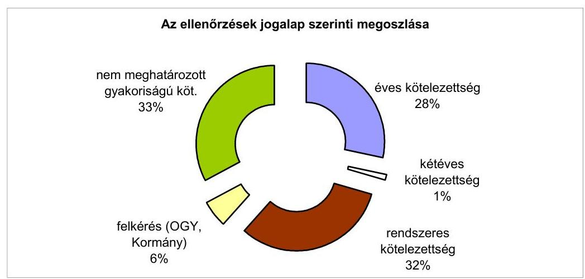

A 2004. évi ellenőrzési kapacitás felhasználásában 61\%-ot vett igénybe a törvényekben előírt, meghatározott gyakoriságú (évenkénti, kétévenkénti, illetve rendszeres) kötelezettségek teljesítése. E feladatok között kiemelten szerepelnek az évenkénti végrehajtási kötelezettséggel meghatározott ellenőrzések. Ebben a körben 4 jelentés készült, ezek közül a legnagyobb kapacitást igénylő feladat a 2003. évi költségvetés végrehajtásának ellenőrzése volt. Kétévenkénti ellenőrzési kötelezettségként jelentkező feladat 2004-ben 4 párt gazdálkodásának ellenőrzése volt. A rendszeres ellenőrzési feladatok teljesítéséhez 30 jelentés kapcsolódott. A rendszeres feladatok meghatározó részét a helyi önkormányzatok gazdálkodásának átfogó ellenőrzése képezte.

A törvényi előírások teljesítése mellett a 2004. évi kapacitás 39\%-át vehették igénybe olyan ellenőrzések, amelyek végrehajtásának gyakoriságát törvény nem rögzíti. Az Á5Z elnökének döntése alapján meghatározásra került témákból 32 jelentés készült. Ezen belül 5 ellenőrzés felkérés alapján történt.

---

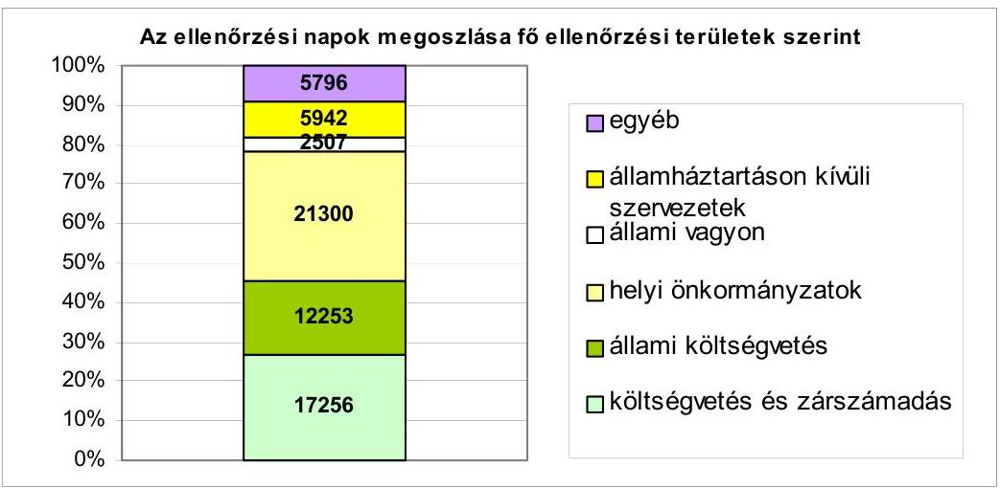

# 1.1.2. Ellenőrzési súlypontok 

A 2004. évi ellenőrzési terv összeállításakor irányadónak tartottuk az Országgyűlés 35/2003. (IV. 9.) OGY határozatát, ami a zárszámadás és az önkormányzatok átfogó ellenőrzése tekintetében jelölt ki feladatokat.

Stratégiánk évek óta érvényesülő rendező elve, hogy lehetőleg a nagyösszegű költségvetési pénzfelhasználásokra, a számottevő gazdasági kockázatokat hordozó területekre, a közszféra, illetve a nemzetgazdasági versenyképesség kritikus pontjaira, valamint a lakosság életminőségét befolyásoló területekre megfelelő figyelmet fordítsunk.

Az Országgyúlés - korábbi határozatát megerősítve - szükségesnek tartotta a központi költségvetés végrehajtásának ellenőrzésénél a beszámolók megbízhatóságát minősítő ellenőrzések teljes körűvé tételét, a fejezeti ellenőrző szervezetek fokozatos bevonásával. E feladatot a 2004-ben lefolytatott zárszámadási vizsgálat során teljesítettük. Az ÁSZ által vállalt körben teljes körűvé vált a zárszámadás megbízhatósági nyilatkozattal záruló ellenőrzése, amely az éves közvetlen ellenőrzési kapacitás 19\%-át kötötte le.

Az országgyűlési határozatnak megfelelően kiemelten végezzük a jelentős nagyságrendű költségvetéssel, illetve vagyonnal rendelkező önkormányzatok gazdálkodásának átfogó ellenőrzését. Ezek az ellenőrzések az éves közvetlen ellenőrzési kapacitás $24 \%$-át kötötték le, a jelentések száma a 2003. évi 5-ről 2004-re 13-ra nőtt. Az önkormányzatoknak juttatott állami támogatások kincstári ellenőrzésének folyamatossá válása lehetővé teszi, hogy az átfogó ellenőrzésen belül is nagyobb hangsúlyt kapjon a gazdálkodás egyes elemeinek teljesítményközpontú értékelése. Hosszabb távú stratégiánkkal összhangban célunk az, hogy az átfogó önkormányzati ellenőrzések mellett a teljesítményellenőrzés módszerének szélesebb körű alkalmazásával segítsük elő az államháztartás helyi szintjén a gazdálkodás eredményességének javítását, a közfeladatellátás teljesítményének növelését. Természetesen e feladatellátáshoz szükséges felülvizsgálni a parlamenti ciklusonkénti önkormányzati ellenőrzési számosságot, nevezetesen azt, hogy az ÁSZ-nak évente kötelezően mintegy 800 helyi önkormányzatnál kell helyszíni vizsgálatot lefolytatni.

---

A 2004. évi ellenőrzési terv témaválasztásánál szakmai súlypont volt az egészségügy, az oktatás, az államháztartáson kívüli feladatellátás, valamint a közútfejlesztés átfogó értékelését, többoldalú összefüggései bemutatását célzó vizsgálatsorozatok továbbvitele, melyekről 20 jelentés készült.

Az ÁSZ ellenőrzéseit azok típusa szerint három fő csoportba sorolja, úgymint szabályszerűségi, átfogó és teljesítmény-ellenőrzések. Ellenőrzéseinket a nemzetközi (INTOSAI) standardok alapján a legjobb nemzetközi gyakorlat figyelembevételével folytatjuk le. Az éves, kétéves és rendszeres ellenőrzési feladatokat jellemzően szabályszerűségi és átfogó ellenőrzésekkel teljesítjük. A leginkább szabad választás az ellenőrzés típusa tekintetében az elnöki hatáskörben meghatározott ellenőrzések esetében adott.
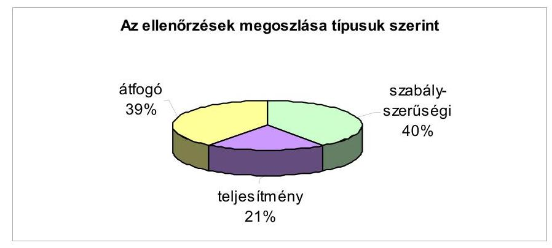

Az ÁSZ elnöke által meghatározott feladatok között fokozatosan előtérbe kerülnek a gazdaságosságra, hatékonyságra, eredményességre koncentráló ellenőrzések. 2004-ben 19 jelentés készült a teljesítmény-ellenőrzés módszerének alkalmazásával.

A teljesítmény-ellenőrzés módszerével vizsgáltuk többek között a gyógyszerfogyasztás helyzetét és finanszírozását, az egészségügy területén megvalósult PHARE programokat, az állami egészségügyi beruházásokra, felújításokra fordított pénzeszközök hasznosulását, az ISPA támogatásból megvalósított környezetvédelmi programokat, a környezetvédelmi alap célfeladatokra fordított pénzeszközök hasznosulását, valamint a helyi önkormányzatok társulásait.

# 1.2. Egyéb számvevőszéki feladatok 

A szervezet egyéb tevékenységi körébe számos - a szoros ellenőrzési kötelezettségeken és jogosítványokon túlmutató - felhatalmazás, illetve feladat tartozik, melyeket az Alkotmány, a számvevőszéki törvény, illetve egyéb törvények írnak elő.

Az ÁSZ elnöke ellenjegyzi a költségvetés hitelfelvételeire vonatkozó szerződéseket, véleményezi az államháztartás számviteli rendjének, belső pénzügyi ellenőrzési rendszere múködésének továbbfejlesztésére vonatkozó javaslatokat.

Az ÁSZ elnöke véleményezi az állami vagyonkezelő szervezet belső ellenőrzési szabályzatát, s javaslatot tesz a szervezet felügyelő bizottságának elnökére, könyvvizsgálójára, továbbá a jegybank könyvvizsgálójára, az elkülönített ál-

---

lami pénzalapok könyvvizsgálóira, valamint előzetesen véleményezi az APEH elnöke kinevezését.

Az államháztartási törvény értelmében az állam legalább többségi befolyása alatt álló gazdálkodó szervezet esetében - ha a jegyzett tőke meghaladja a kétszáz millió forintot - a felügyelő bizottság elnökének személyére is az ÁSZ tesz javaslatot, a gazdálkodó szervezet vezetőjének megkeresése alapján.

# 1.2.1. Ellenjegyzési, véleményezési jogkör 

A számvevőszéki törvény 2004. évi módosítása - többek között - a szervezet ellenjegyzési, véleményezési jogkörével kapcsolatos előírást is pontosította.

A módosítás az ÁSZ-nak a költségvetés hitelfelvételeire vonatkozó ellenjegyzési feladatát annak tartalmi meghatározásával egészítette ki. Eszerint az ellenjegyzés a hitelfelvétel törvényességét tanúsítja. Ebből adódóan az ÁSZ nem vizsgál olyan tartalmi kérdéseket, amelyek a Kormány gazdaságpolitikai döntéseihez kapcsolódnak.

A törvénymódosítás az „állami számviteli rend" továbbfejlesztésére vonatkozó javaslatok ellenjegyzése helyett az „államháztartás számviteli rendjének", illetve az „államháztartás belső pénzügyi ellenőrzési rendszerének" továbbfejlesztését célzó javaslatok véleményezését írta elő.

Költségvetési hitelfelvétellel kapcsolatos ellenjegyzés 2004-ben nem új hitelfelvétellel függött össze, hanem a Magyar Köztársaság nevében 2003. november 28án 500 millió euró összegű, az ÁSZ elnökének ellenjegyzése mellett aláírt készenléti hitelkeretre vonatkozó szerződés meghosszabbításával. A szerződésmódosítással egyidejűleg a keretszerződés egyes pénzügyi feltételeinek javítására is sor került.

A számviteli rend változásával összefüggésben ellenjegyzési, véleményezési jogkör gyakorlása 4 alkalommal történt. Ilyen kötelezettségünk az önkéntes kölcsönös egészség- és önsegélyező pénztárak beszámolókészítési és könyvvezetési kötelezettségeinek sajátosságairól szóló Korm. rendelet, a számviteli törvény, a kincstári elszámolások beszámolási és könyvvezetési kötelezettségének sajátosságairól szóló Korm. rendelet, valamint az államháztartás szervezetei beszámolási és könyvvezetési kötelezettségének sajátosságairól szóló Korm. rendelet módosításai kapcsán jelentkezett.

## Az ÁSZ teljesítette az e körbe tartozó törvényi feladatait.

### 1.2.2. Javaslattételi jogkör

A hatályos törvények rendelkezései alapján az ÁSZ elnökének feladatkörébe tartozik a könyvvizsgálók, továbbá az ÁPV Rt. felügyelő bizottsága elnökének személyére vonatkozó javaslattétel.

A könyvvizsgálók javaslattételt megelőző pályáztatása elnöki hatáskörben, az eddig bevált gyakorlat alapján, egyedi pályázati kiírások szerint folyik. 2004-ben került sor az MFB Rt., az Innovációs Kutatási Alap, továbbá a Nukleáris Pénzügyi Alap könyvvizsgálói pályázatainak megkeresésre történő meghirdetésére, és értékelés alapján a javaslattételre. 2004 decemberében jelent meg az ÁPV Rt. könyv-

---

vizsgálójának jelölésével összefüggő pályázati kiírásunk. (A javaslattétel 2005-re áthúzódott.) Az ÁPV Rt. felügyelő bizottsága elnökének személyére - lemondás miatt - szintén 2004-ben tettünk javaslatot. Visszahívás a tárgyévben nem volt.

Az államháztartási törvénynek az ún. „üvegzseb" törvény rendelkezései útján történt módosításával az ÁSZ a korábbiakban feladatkörébe tartozó jelölési javaslattételhez viszonyítva rendkívül terjedelmes és bonyolult feladat elvégzésére kapott felhatalmazást. Szabályozásunk értelmében évente egy pályázatot hirdetünk meg a felügyelő bizottság elnöki megbízatás ellátására alkalmas személyek névjegyzékének gyarapítása érdekében, és a gazdálkodó szervezetektől érkezett megkeresésekre a névjegyzékbe bekerült, eredményes pályázók köréből teszünk javaslatot a felügyelő bizottságuk elnökének személyére.

A pénzügyi-gazdasági ellenőrzési hatáskörtől eltérő, speciális, és számosságában a korábbi, elnöki hatáskörű jelölési javaslattételhez képest lényegesen megnövekedett feladatkörnek a nyilvánosság számára is átlátható végrehajtása érdekében „Jelölési szabályzat"-ot készítettünk. A szabályzatot a hatályba léptetést és a széles körben - többek között a honlapunkon - történő nyilvánosságra hozatalt megelőzően az adatvédelmi biztossal, az Igazságügyi Minisztériummal és az Országgyűlés illetékes bizottságaival véleményeztettük. Eddig összesen 565 pályázatot bíráltunk el. A jelölésre alkalmas személyek névjegyzéke - három kiírt pályázatunk elbírálását követően - 2004. december 31-én 539 főt tartalmazott. 2004-ig a gazdálkodó szervezetektől összesen 82 megkeresés/kérelem érkezett.

A társaságoktól 2004-ben 63 kérelmet iktattunk, melyekből 55 kérelem volt - a törvény hatálya alá tartozóan - megkeresésnek tekinthető, december 31-ig öszszesen 51 gazdálkodó szervezet részére tettünk főtitkári hatáskörben jelölési javaslatot. (További 4 megkeresésre a javaslattétel 2005-re áthúzódott.)

A felügyelő bizottság elnöki megbízatásra alkalmas személyek névjegyzéke, a felügyelő bizottság elnöki megbízatásra megkeresésre javasolt konkrét személyek névjegyzéke, továbbá a könyvvizsgálói megbízatásra megkeresésre javasolt könyvvizsgálók névjegyzéke a hatályos „Jelölési szabályzat"-tal, valamint pályáztatás időszakában - az aktuális pályázati felhívásunkkal együtt az ÁSZ honlapján negyedéves frissítéssel, folyamatosan elérhető.

# A javaslattételt támogató rendszer szabályozottan múködik, a javaslattételek - főtitkári hatáskörben - az ellenőrzési tevékenységtől egyértelmúen elkülönítve történnek. 

## 2. A 2004. ÉVI ELLENŐRZÉSEK TAPASZTALATAI

Beszámoló jelentésünkben ellenőrzési tapasztalatainkat több megközelítésben is összefoglaltuk. Bemutatjuk azokat államháztartási alrendszerenként, az uniós kapcsolódások összefüggésében, valamint fontosabb ellenőrzési területenként is. A többszempontú bemutatásból adódóan egyes megállapítások átfedéssel, helyenként ismétlődve szerepelnek jelentésünkben.

Az ÁSZ az uniós források és a hazai társfinanszírozás tervezésének, felhasználásának ellenőrzését stratégiai kérdésként kezeli. Ezen túlmenően az Európai

---

Számvevőszék a nemzeti számvevőszékektől - az uniós források hasznosításának ellenőrzési tapasztalatait áttekintő - értékelő összeállítást igényelt. Ezek figyelembevételével az uniós források felhasználásának ellenőrzési tapasztalatait önálló pontban (2.2. pont) jelenítjük meg.

A számvevőszéki ellenőrzések megállapításai - jellegükből fakadóan - a vizsgálatok lefolytatását megelőző hosszabb-rövidebb időszakra vonatkoznak, a jelentésekben a lezárt pénzügyi évek adatai jelennek meg. Beszámolónk a 2004. évi jelentések tapasztalatain alapul ${ }^{4}$, ugyanakkor a tendenciák és következtetések túlmutatnak egy-egy költségvetési éven.

# 2.1. Főbb tapasztalatok államháztartási alrendszerenként 

Számos olyan megállapítás, javaslat fogalmazódott meg az elmúlt években, melyeket szinte állandóan ismételnünk kell az egyes ellenőrzési területekkel kapcsolatos jelentéseinkben. Jellemzően ilyen vagy ehhez hasonló, sok esetben átfogó, rendszerszemléletű megállapításokban foglalhatók össze a 2004-es ellenőrzési tapasztalatok. Így ismétlődő kritikákat kell megfogalmaznunk a nagy közösségi ellátórendszerek működtetéséhez, az önkormányzatok finanszírozottságához, és újabban a fejlesztésekhez, a közigazgatáshoz kapcsolódóan, valamint például az állami feladatok felülvizsgálatával, a gazdálkodás szabályozottságával, az előirányzat-maradványokkal, az államháztartáson kívüli feladatellátással kapcsolatban is.

Sem az államháztartási törvényben, sem más, az államháztartási gazdálkodáshoz kapcsolódó joganyagban nincs meghatározva az állami feladat jelentése, határai, illetve az, hogy az állami finanszírozás mely feladatokra és milyen mértékben terjed ki. Az állami feladatok tartalmi meghatározása és szabályokba foglalása nélkül pedig hatékony, folyamatában átlátható finanszírozás nem teremthető meg. Ehhez közmegegyezésen alapuló szakmai, politikai döntések szükségesek. Mindeddig nem történt meg az állami feladatok tisztázása, az állami szerepvállalás meghatározása, noha ennek szükségességét senki nem vitatja.

Az államháztartás pénzügyi reformján belül sok szó esik a finanszírozás megújításáról. A megoldás azonban nem magában a finanszírozásban rejlik, a finanszírozás csak következmény. Az állami feladatok egyértelmú meghatározása az átláthatóan múködő államháztartás, az ellenőrizhetőség alapja.

### 2.1.1. Központi költségvetés

A 2004-ben lefolytatott 2003. évi zárszámadási ellenőrzés megállapította, hogy a költségvetés pozíciója - az előző évben végrehajtott, az áfa visszatérítése-

[^0]
[^0]:    ${ }^{4}$ A pénzügyi folyamatok összefüggéseinek bemutatása érdekében beszámolónkba néhány olyan vizsgálati megállapítás is beépült, amelyeknél maga az ellenőrzés 2004ben befejeződött, a jelentés véglegesítése az egyeztetések miatt azonban átlépte a naptári évet.

---

ket érintő ${ }^{5}$ pénzügytechnikai intézkedések ellenére - a tervezettnél kedvezőtlenebbül alakult. A központi költségvetés mérlegének főösszegei ${ }^{6}$ és a hiány - a megelőző évhez hasonlóan - jelentős összegekkel meghaladták az előirányzatokat. A költségvetési hiány előirányzatot meghaladó növekedéséhez hozzájárult a központi költségvetés egyes közvetlen kiadásai közül az előirányzatmódosítási kötelezettség nélkül teljesülő előirányzatoknál (lakástámogatások, GYES stb.) mutatkozó jelentős túllépés. A közvetlen termelői és piaci támogatások esetében túlteljesítés azért nem következett be, mert a kifizetéseket az előirányzat elérésekor az APEH és a Kincstár felfüggesztette. A költségvetési hiány növekedésének jelentős tényezője volt az adósságszolgálattal kapcsolatos folyó kamatkiadások tervezettet meghaladó összege is.
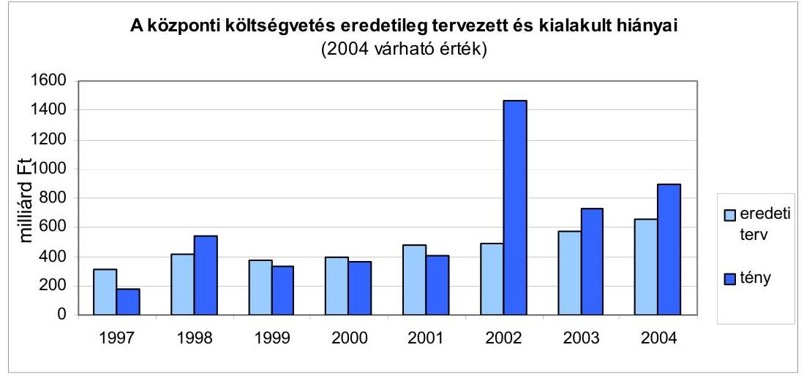

Forrás: költségvetési és zárszámadási törvények, Kincstár
Ismételten jeleztük ${ }^{7}$, hogy a költségvetési törvénynek az adott év vége előtt hatályba lépő módosítása (amely 2003-ban a hiány összegét változatlanul hagyta) nem tükrözte a költségvetés valós pozícióját, és nem járt együtt azzal, hogy a tervek szorosabban közelítsenek a reálfolyamatokhoz. Így a tényleges hiány az előirányzatot mintegy 29\%-kal meghaladta.

A központi költségvetés összes bevételének 80\%-át kitevő - az APEH és a VP illetékességébe tartozó - adók és vámok esetében egyes adónemeknél jelentős eltérések mutatkoztak az eredeti előirányzathoz képest. A személyi jövedelemadó bevallási és visszaigénylési rendszerének 2004. évi vizsgálata rámutatott arra, hogy az adóbevételek realizálását az adóhatóság ellenőrzési rendszere nem támogatja kellő hatékonysággal.

[^0]
[^0]:    ${ }^{5}$ A 2002. évi zárszámadásról szóló jelentésünkben szóltunk arról, hogy a 2003 januárjában esedékes 73 Mrd Ft összegű áfa visszafizetést határidő előtt, 2002 decemberében teljesítették, ami a 2002. évi költségvetés pozícióját rontotta, viszont a 2003. évit javította.
    ${ }^{6}$ A központi költségvetés teljesített kiadása 5670,6 Mrd Ft, bevétele 4938,2 Mrd Ft, hiánya 732,4 Mrd Ft volt 2003-ban.
    ${ }^{7}$ 2002-re hasonló megállapítást tettünk a költségvetési törvény év vége előtti módosítása kapcsán.

---

Helytállónak bizonyult a 2003. évi költségvetésről szóló véleményünk, amely az egyes előirányzat-tervezetek (pl. vám- és importbefizetések) megvalósulásának kockázatait, illetve egyes adónemek (pl. társasági adó) megalapozottságát, valamint az eva esetében a nagyfokú bizonytalanságot jelezte.

A központi költségvetési szervek gazdálkodásának szabály- és feltételrendszerében - a korábbi évekhez hasonlóan - alapvető, átfogó változásokra 2003-ban sem került sor, annak ellenére, hogy az államháztartási törvény módosítása többek között a gazdálkodás szabályozottságának javítására, a pénzügyi, számviteli elszámolások szakszerűségének emelésére is irányult. A kívánt eredményt a szervezeti és múködési szabályzatok, gazdálkodási szabályzatok, valamint a költségvetési alapokmány tartalmára vonatkozó előírások szigorítása sem hozta meg.

A 2003. évi fejezeti tervezést - a költségvetés eredeti előirányzatai teljesülésének tükrében - a bevételek alultervezése jellemezte. A fejezetek bevételei az eredeti előirányzatot - egy fejezet kivételével - meghaladták, azonban a módosított bevételi előirányzatokat az előző évekhez hasonlóan a fejezetek többsége nem teljesítette. Az eredeti tervszámokhoz képest a kiadások a fejezetek többségénél $100 \%$ felettiek voltak, ezzel szemben a módosított előirányzathoz viszonyítva a kiadások teljesítése minden fejezetnél eltérő mértékben elmaradt a lehetőségektől. Ez a jelenség döntően összefügg az előző évi előirányzatmaradványok késedelmes jóváhagyásával.

Az előző évekhez hasonlóan a jelentősebb összegű maradványok a kiterjedt intézményhálózattal, illetve szakmai programokkal, célfeladatokkal, támogatási célelőirányzatokkal rendelkező minisztériumoknál döntő részben a fejezeti kezelésű előirányzatoknál, központi beruházásoknál és a célelőirányzatoknál keletkeztek. A kötelezettségvállalással terhelt előirányzat-maradvány meghaladta a $90 \%$-ot. Nem erősíti a gazdálkodási fegyelmet, hogy a PM az előző évi előirányzat-maradványok jóváhagyásának törvényi határidejét évek óta nem tartja be, sőt a jóváhagyás időpontja még tovább tolódott. ${ }^{8}$

A minisztériumok többsége a fejezeti kezelésú előirányzatokat az előírásoknak megfelelően, meghatározott jogcímeken, rendeltetésszerűen használta fel, jogcímtől eltérő felhasználás három fejezetnél történt. A feladatfinanszírozás körébe vont fejezeti kezelésű előirányzatok felhasználásánál a tárcák az államháztartás működési rendjéről szóló kormányrendeletben foglaltaknak megfelelően jártak el.
A költségvetési előirányzatok között egyre nagyobb hányadot képvisel a célfeladatok és a programfinanszírozott feladatok aránya. Az ilyen típusú finanszírozás azonban csak akkor éri el célját, ha a feladatok teljesítését a fejezetek rendszeresen és következetesen értékelik, számon kérik. E területen számos kö-

[^0]
[^0]:    ${ }^{8}$ A 2001. évi előirányzat-maradványt a törvényes határidőt jóval meghaladóan, 2002 novemberében, a 2002. és 2003. évi előirányzat-maradványt a következő év decemberében hagyta jóvá a PM.

---

vetkezetlenség, hiányosság volt tapasztalható, ami szinte valamennyi fejezeti kezelésű előirányzat esetében jellemző.

A fejezeti kezelésű előirányzatok felhasználási problémái is tükröződnek a nemzeti és etnikai kisebbségek támogatási rendszerének ellenőrzési tapasztalataiban. A nemzeti és etnikai kisebbségek több csatornás támogatási rendszere nehezen átlátható, decentralizált és feladatátfedéseket is tartalmazott. A nemzeti és etnikai kisebbségeket célzó támogatásokat nyújtó fejezetek köre, a kapcsolatos előirányzatok száma 2001-2004 között fokozatosan bővült (18-ról 28-ra). Jellemző volt, hogy a támogatást folyósító szervezeteknél e témakörhöz nem kapcsolódott egységes monitoring rendszer, nem határoztak meg teljesítmény elvárásokat, kritériumokat. A beszámoltatások és elszámoltatások többnyire a pénzfelhasználásra irányultak, amelyeket nem követett a támogatók és támogatottak részéről a pénzügyi források felhasználásának eredményességét, hatékonyságát, gazdaságosságát vizsgáló, kiértékelő tevékenység.

A költségvetési szervek tartozásállománya tekintetében az előző három évben tapasztalt kedvező tendenciák 2003-ban tovább folytatódtak, a tartozások átlagos állománya jelentős mértékben csökkent, belső szerkezete tovább javult, az adós intézmények száma és az adósságok összege viszonylag alacsony volt. A javulás mellett ugyanakkor továbbra is jellemző volt, hogy az egészségügyi, valamint a felsőoktatási intézmények közül is az orvostudományi centrumokkal rendelkező egyetemeken következett be eladósodás.

A 2004-ben végzett zárszámadási ellenőrzés keretében az ÁSZ és a fejezetek által végzett megbízhatósági ellenőrzés a kiadási főösszeg 76,3\%-át fedte le. A fejezetek igazgatási címeinél, alcímeinél ( 36 intézmény) lefolytatott pénzügyi szabályszerűségi ellenőrzések eredményeként az intézményi elemi beszámoló jelentés $2 \%$-át elutasító, $6 \%$-át korlátozó véleménnyel láttuk el. Egy intézmény esetében az ellenőrzött szerv hibájából a beszámoló jelentés minősítését megtagadtuk. A minősített véleménnyel zárult pénzügyi szabályszerűségi ellenőrzések feltárták az igazgatási címek tekintetében a bruttó pénzügyi elszámolások megsértését, a megbízási díjak elszámolása esetében a szabálytalan foglalkoztatásokat és a beszámoló jelentés vagyonkimutatásának pontatlanságait. A fejezeti kezelésű előirányzatokkal való megbízható elszámolás tekintetében kedvezőtlenebb volt a helyzet, a beszámoló jelentések 43\%-át láttuk el korlátozó véleménnyel a pénzügyi és vagyoni helyzet nem valós bemutatása, illetve a céltól eltérő felhasználás miatt.

A tervezési rendszer megújításának irányába mutató változások történtek a 2005. évre vonatkozó költségvetési tervezés módszerében. A korábbi években a költségvetés megalapozottsági problémái is hozzájárultak ahhoz, hogy év közben korrekciókra, a hiány növekedésére kerüljön sor. Ezért is szorgalmazta az ÁSZ az elmúlt években - egy, a megfelelő rendező elvek és egyértelmú célok ismeretében megvalósuló - új tervezési rend kialakítását.

---

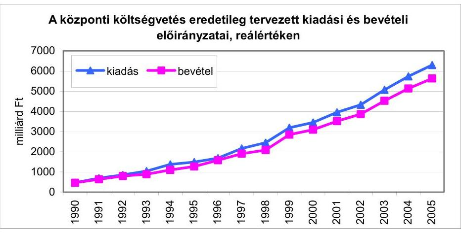

Forrás: költségvetési törvények, PM
A fejezeti tervező munka jellemzője volt, hogy - szakítva a korábbi évek gyakorlatával - elöször alkalmazott egy új típusú, a kitüzött célokat jobban szolgáló tervezési módszert. A fejezetek részére nem fejezeti (a fejezetek valamennyi előirányzatát magában foglaló), hanem csak intézményi szintű támogatási keretszámokat adtak meg 2005-re, míg a szakmai fejezeti kezelésű előirányzatok és a kormányzati beruházások támogatására szolgáló források elosztása belső kormányzati „versenyeztetéssel, pályáztatással" történt. E tervezési modell gyakorlati alkalmazása során azonban a tárcák továbbra sem gondoskodtak a feladatok átgondoltabb rangsorolásáról, az adott mozgástéren belül az igények reálisabb megítéléséről. Ezen hiányosságok is hozzájárultak ahhoz, hogy a tervező munka elhúzódott, jelentős többletmunkával járt együtt és különösen a fejezeti kezelésú előirányzatok tervezésénél maradéktalanul még nem hozta meg az elvárt eredményt.

A tervezési köriratokban kiemelt hangsúlyt kap a fejezetek intézményrendszerének felülvizsgálata. Tapasztalataink szerint a fejezetek nem vállaltak kezdeményező szerepet a végrehajtásban. 2004 során néhány fejezetnél megvalósultak szervezetkorszerűsítő intézkedések, amelyek eredményeként intézmények megszüntetésére, átszervezésére került sor. A 2005-re vonatkozó tervező munka során ezen intézkedések pénzügyi-gazdasági hatása azonban nem volt számszerűsíthető.

A Kormány által az Országgyúlésnek benyújtott 2005. évi költségvetési törvényjavaslat fejezeti struktúrája lényegesen módosult a tervezési köriratban foglaltakhoz képest. A változások mértékéről és irányairól a helyszíni ellenőrzés során hivatalos tájékoztatást nem kaptunk. A megváltozott költségvetési rend több fejezetet érintően teljesen új helyzetet teremtett, így az újonnan létrehozott fejezetek tervszámainak megalapozottságát nem állt módunkban megítélni. Emiatt a 2005. évi költségvetési törvényjavaslathoz kapcsolódó véleményező munkánkkal csak részben tudtuk segíteni az Országgyúlés döntéshozatali tevékenységét.

Ellenőrzési tapasztalataink azt jelzik, hogy a kormányzati munkamegosztásban végrehajtott, egyre gyakoribb feladat át- és visszarendezések a közszféra múködésében fennakadásokkal járnak, a költségvetés szerkezeti rendjének -

---

megfelelő előkészítés nélkül végrehajtott - változásai veszélyeztetik az összehasonlíthatóságot, az átláthatóságot és az elszámoltathatóságot, s ha átmenetileg is, fékezően hatnak a feladatellátásra.

A költségvetés előirányzatainak minden szempontból megalapozott kimunkálását a tervezési rendszer - az eddig megvalósult eredmények ellenére - nem teszi lehetővé. Ezért továbbra is fennálló és sürgető feladat az államháztartás pénzügyi reformja keretében a tervezési folyamat továbbfejlesztése, új alapokra helyezése.

A feladatellátás újszerú megoldásának - a vállalkozások, a magánszektor és a költségvetés együttmúködésével nyújtott közszolgáltatások - különféle formái terjedőben vannak. A fejezeti rend megváltoztatása mellett a legjelentősebb változtatást a tervezésben a gyorsforgalmi úthálózat költségvetésen kívüli finanszírozási rendje jelentette. Észrevételeztük, hogy Közösségi-Magán Együttmúködés (Public Privat Partnership, PPP) ${ }^{9}$, illetve azon belül a kormányzati tervekben megjelenő Magánfinanszírozás Kezdeményezés (Private Finance Initiative, PFI) jogi feltételeinek és a konstrukciók garanciarendszerének kidolgozása, a tisztán állami építés és múködtetés ráfordításai, garanciális viszonya összehasonlítása nélkül az újonnan induló, illetve összes folyamatban lévő PPP-projektek együttes pénzügyi kihatásának determinációja a jövőbeni költségvetésekre, az állami adósságpozíciókra is nagy kockázatot jelent. Éppen ezért jeleztük, hogy szükség van a PPP-kel érintett területeken olyan korlátok megalkotására, amelyek a hosszú távú kötelezettségvállalásoknak határt szabnak.

A költségvetésen kívüli állami feladatellátás és finanszírozás feltételezi és igényli a megfelelő átláthatóságot biztosító eljárási szabályokat, s az ezek alkalmazását szakszerűen és következetesen számon kérő ellenőrzést. E területen az átláthatóság hiányát állapítottuk meg a 2005. évi költségvetés véleményezése során a PPP elképzelésekkel kapcsolatban és valamennyi közúttal kapcsolatos ellenőrzésünknél is. ${ }^{10}$

A zárszámadási adatok, az eredeti előirányzatok „túlteljesítésének" aránya, a költségvetési kiadások megnyirbálásának folyamatosan jelen lévő kényszere, de emellett az intézmény és feladat felülvizsgálat elmaradása egyaránt jelzik, hogy a költségvetés alapkérdése, hogyan tud megfelelő forrást biztosítani az állami feladatok végrehajtásához. Ez idáig nem történt érdemi előrelépés az állami feladatok körének definiálásában, és az ellátás teljesítménykövetelményeire vonatkozó mennyiségi és minőségi kritériumok meghatározásában. A rendszerben együtt jelentkezik a rendelkezésre álló elöirányzatok felhasználásának időbeli késése, elmaradása és a költ-

[^0]
[^0]:    ${ }^{9}$ Az EU-n belül az Egyesült Királyság kötötte a legtöbb PPP, illetve PFI szerződést. Az Egyesült Királyság Számvevőszéke több éves ellenőrzési gyakorlattal rendelkezik e téren. Ezeket az ellenőrzési tapasztalatokat, az ellenőrzés módszertanát kétoldalú együttműködés keretében az ÁSZ rendelkezésére bocsátja.
    ${ }^{10}$ Jelentés az M3 autópálya beruházás pénzügyi folyamatának ellenőrzéséről (0218), Jelentés az M7 autópálya felújítás pénzügyi folyamatának ellenőrzéséről (0342), Jelentés a szekszárdi Duna-híd beruházás ellenőrzéséről (0428)

---

ségvetési egyensúly közelítését célzó évközi beavatkozások szükségessége. Az évközi beavatkozások jellemzően csak a forráselosztást érintik, ezzel párhuzamosan a feladatrendszer átfogó, rendszerszemléletú újragondolása nem történik meg.

Az államháztartás belső pénzügyi ellenőrzési rendszerével kapcsolatban több éve halogatott, uniós követelményekhez igazodó jogi szabályozás 2003-ban megszületett. A PM tervezési körirata prioritásként kezelte az ellenőrzési létszám és az ehhez szükséges költségvetési előirányzat biztosítását, ugyanakkor a fejezetek az e célra biztosított többletforrások hiányára hivatkozva nem teremtették meg az új szabályozásnak megfelelő képzettségű és gyakorlatú ellenőri kapacitást, s e tekintetben továbbra sem történt érdemi fejlesztés.

Az ÁSZ ellenőrzési tevékenységének hangsúlyos feladata a belső kontroll rendszer ellenőrzése (az ellenőrzés szabályozottsága, hatékonysága, jogszerűsége, alkalmazott módszertana, személyi és infrastrukturális feltételei stb.). A beszámolási időszak ellenőrzési megállapításai sajnálatosan megerősítették a korábbi tapasztalatainkat, miszerint a nem megfelelő belső kontrollrendszer változatlanul kockázati tényező a közszféra múködésének hatékonysága, a költségvetési gazdálkodás szabályszerűsége, illetve a költségvetési beszámoló megbízhatósága szempontjából.

A fejezetek megbízhatósági ellenőrzési hatáskörébe tartozó intézményhálózat pénzügyi-szabályszerűségi ellenőrzése vonatkozásában - bár az ellenőrzések ütemét nem tartjuk megfelelőnek - az előző évekhez képest történt előrelépés. Figyelemmel az intézmények számára (közel 800 intézmény), erőfeszítésekre van szükség ahhoz, hogy a Kormány legkésőbb 2010-re megteremtse a zárszámadás teljes körű ellenőrzésének feltételeit, az országgyűlési határozatokon alapuló, az államháztartási törvényben és kormányrendeletben foglalt előírások megvalósítását. Ebben az esetben a zárszámadás teljes körű megbízhatósági ellenőrzésével lehetővé válik a szakmai nyilatkozattétel arról, hogy az Országgyűlésnek benyújtott, a költségvetés végrehajtásáról készített beszámoló valós és megbízható képet ad-e.

A Kormány 2004 júliusában határozatot hozott az Alkotmánybíróság és az Országgyűlés döntéseiből adódó egyes feladatokról, amiből azonban kimaradt az ÁSZ 2003. évi beszámoló jelentése elfogadásáról szóló OGY határozat, amely felkéri a Kormányt a 2010-es határidő felülvizsgálatára és előrehozására. (Az Áht. 121/A. §-a kimondja, hogy a belső ellenőrzési tevékenység során a költségvetési szervek éves elemi költségvetési beszámolóit felül kell vizsgálni, azokról megbízhatósági igazolásokat kell kibocsátani.) 2004 augusztusában a Kormány megalkotta az államháztartás belső pénzügyi ellenőrzési rendszerének továbbfejlesztéséről szóló határozatát, amely szerint a pénzügyminiszter feladatul kapta, hogy 2004. december 31-ig javaslatot készítsen az államháztartási törvényben foglaltak végrehajtására. Figyelemfelhívásunkat követően a Kormány 2220/2004. (IX. 3.) számú határozatával kiegészítette az államháztartási belső pénzügyi ellenőrzési rendszer továbbfejlesztéséről hozott, előzőekben jelzett határozatát és ebben a feladat végrehajtásának határidejét 2005. március 31 -ében rögzítette.

Mindennek az ad különös jelentőséget, hogy az ÁSZ által ismétlődően tapasztalt hibák nem csak a strukturális problémákra, az állami fegyelem hiányára mutatnak rá, hanem arra is, hogy a külső ellen-

---

őrzés szerepe, funkciója más, mint a belsőé. A külső kontroll még igen kiterjedt hatásköri felhatalmazások és jelentős kapacitáskoncentráció ellenére sem oldhatja fel a különböző intézmények, minisztériumok szervezetébe telepített belső vezetői irányítás és ellenőrzés gyengeségeit.

# 2.1.2. Elkülönített állami pénzalapok 

Az elkülönített állami pénzalapok ${ }^{11}$ pénzügyi helyzete kiegyensúlyozott volt. A törvényi előírásoknak megfelelően költségvetési beszámolóik könyvvizsgálói ellenőrzése megtörtént, mindegyik beszámoló hitelesítő záradékot kapott. Az elkülönített állami pénzalapok 2005. évi költségvetési javaslatait illetően az államháztartási hiány szempontjából kockázati tényezőket nem érzékeltünk.

Az elkülönített állami pénzalapok és a társadalombiztosítási alapok könyvvizsgálata módszerében eltér az ÁSZ gyakorlatától. Ahhoz, hogy az ÁSZ ne csak a központi költségvetés, hanem az állami költségvetés zárszámadásának megbízhatóságát minősíthesse, célszerű újragondolni a jelenlegi szabályozást. (Megoldást jelenthetne például, ha a könyvvizsgálók kiválasztásánál a pályázati feltételek között szerepelne az ÁSZ ellenőrzési módszerének ismerete és alkalmazása. Ez természetesen azzal a következménnyel járna, hogy a könyvvizsgáló nem a saját, hanem a megbízó nevében végezné tevékenységét.)

Az alrendszert alkotó négy alap közül költségvetési előirányzataikat tekintve a Munkaerőpiaci Alap a meghatározó ( $90 \%$-kal), amely a foglalkoztatás elősegítésével és a munkanélküliség kezelésével kapcsolatos állami feladatokat az országosan kiépített munkaerőpiaci szervezeten keresztül látja el.

Az Alap múködésének átfogó ellenőrzése során megállapítottuk, hogy a munkaerőpiaci folyamatok változását követő jogalkotási munka ellenére nem történt meg az ellátó, a támogató és a szolgáltató tevékenység jogszabályi hátterének rendszerszemléletű áttekintése, a foglakoztatási törvény átfogó jellegű módosítása, az Alap kezelését, felhasználását szabályozó miniszteri rendelet aktualizálása. Az irányítás, a felügyelet folyamatos változása kedvezőtlenül hatott az Alappal kapcsolatos feladatok végrehajtására, annak várható hatásait, költségigényét nem mérték fel sem kormányzati, sem tárca szinten.

Az Alap tervezési rendszerében alapvető változások nem következtek be. Észrevételeztük, hogy az Alap 2005. évi kiadási szerkezete nem tükrözi az uniós követelményeket is kielégítő aktív foglalkoztatáspolitika megvalósításához szükséges pénzeszközök elégséges nagyságát.

A radioaktív hulladékok és a kiégett üzemanyag elhelyezésére szolgáló tárolók létesítésére, üzemeltetésére, valamint a nukleáris létesítmények leszerelésének finanszírozására létrehozott Központi Nukleáris Pénzügyi Alap előirányzatai - az előző évhez hasonlóan - 2003-ban is az előírások szerint teljesültek. A 2005. évi kiadásainak korlátozása miatt a kis- és közepes aktivitású hulla-

[^0]
[^0]:    ${ }^{11}$ Az elkülönített állami pénzalapok összesített teljesített kiadása 244,8 Mrd Ft, bevétele 244,8 Mrd Ft volt 2003-ban.

---

déktároló (Bátaapáti) 2008-ra tervezett befejezési határideje elhalasztódhat. Az Alap többlete felhalmozott egyenlegét növeli.

A lakosságot ért ár- és belvízzel kapcsolatos káresemények enyhítésére költségvetési támogatásból, illetve lakossági befizetésből 110 millió Ft-os előirányzattal 2003-ban hozták létre a Wesselényi Miklós Ár- és Belvízvédelmi Kártalanítási Alapot. Az Alap eddigi múködésének tapasztalatai arra utalnak, hogy az eredeti cél elérése (a lakosságot ért káresemények enyhítése a megteremtett forrásokból) teljesen bizonytalan. A megkötött szerződésekből származó bevétel olyan csekély, hogy az még a szerződéskötések költségeit sem fedezi.

A 2004 januárjától múködő Kutatási és Technológiai Innovációs Alap a vállalkozások innovációs tevékenységének támogatását célozza. A 2005. évi költségvetés megalapozottsága szempontjából bizonytalansági tényezőnek tekintettük, hogy a tervezéssel párhuzamosan zajlott az Alapról szóló törvény módosítása, aminek hatásait a költségvetési előirányzatok meghatározásánál még nem lehetett maradéktalanul figyelembe venni.

# 2.1.3. Társadalombiztosítási alapok 

A társadalombiztosítás pénzügyi alapjainak ${ }^{12}$ beszámolói, a Nyugdíjbiztosítási Alap és az Egészségbiztosítási Alap 2003. évi költségvetési beszámolóinak könyvvizsgálói záradéka szerint megbízható, valós képet nyújtanak az Alapok vagyoni, pénzügyi és jövedelmi helyzetéről.

Az Alapok pénzügyi helyzete a tervezettnél kedvezőtlenebbül alakult, összevont hiányuk az előző évi hiányt, annak csaknem 2,5-szeresével haladta meg. Ez a tény önmagában jelzi az Alapok romló pénzügyi pozícióját, a társadalombiztosítás ellátó rendszereinek forráshiányos állapotát. A Ny. Alap formálisan jobb helyzetét részben a központi költségvetésből nyújtott nagyobb összegű hozzájárulás magyarázza, részben az, hogy a járulék és hozzájárulás bevételek még nagyobb arányban fedezik a kiadásokat, mint az egészségbiztosítás területén.
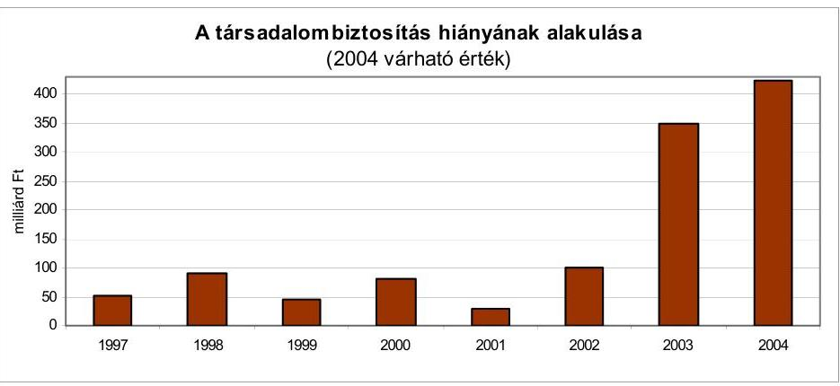

Forrás: zárszámadási törvények, Kincstár

[^0]
[^0]:    ${ }^{12}$ A társadalombiztosítás pénzügyi alapjainak teljesített kiadása 2875,5 Mrd Ft, bevétele 2526,5 Mrd Ft, hiánya 348,9 Mrd Ft volt 2003-ban.

---

Az Alapok járulék és hozzájárulás bevételei összességében az előirányzat szintje közelében teljesültek. Főleg a munkáltatókat terhelő járulékokra jellemző az ismétlődő felültervezés, aminek következményeként a bruttó keresettömeg tervezettet meghaladó növekedése a járulékok növekedésében nem jelentkezik. A bevételek elmaradásában a fizetési hajlandóság romlása is szerepet játszott.

Az Alapok meghatározó ellátási kiadásai a tervezettnél nagyobb öszszegben teljesültek. A társadalombiztosítási alrendszer meghatározó kiadási előirányzatainak tervezési, teljesítési kockázataira évek óta felhívjuk a figyelmet éves költségvetési véleményünkben.

Az E. Alap - tartós - forráshiányos állapota a napi likviditási zavarok mellett kifejezésre jut az alap növekvő év végi hiányában is. A bevételek és a kiadások összhangja megbomlott, a múködés jelenlegi körülményei között ez nem is állítható helyre. A gyógyszerkiadások elöirányzatot emelték, egyúttal az addig zárt előirányzatot „kinyitották". A gyógyszer-támogatási előirányzat megtartására, növekedésének megfékezésére irányuló kormányzati intézkedések a tárgyévben még csak részleges eredményeket hoztak. A gyógyszerkiadások előirányzata ismételten tarthatatlannak bizonyult.

Az Ny. Alap működőképessége, látszólagos pénzügyi egyensúlya csak a központi költségvetésből történő mind nagyobb pénzátadás mellett biztosítható. Az Ny. Alap tervezett bevételei alapvetően azért nem fedezik a kiadásokat, mert a többletkiadások nem járnak együtt a tervezettet meghaladó források képződésével. Mindeddig elmaradtak az 1998-ban bevezetett „új" kötelező társadalombiztosítási nyugdíjrendszer belső feszültségeinek kezelésére irányuló konkrét intézkedések.

Az egészségügyi ellátó rendszer reformja 2005-ben sem kezdődik meg, de a legfontosabb területeken a tervezett intézkedésekhez biztosították a forrásokat. Az Ny. Alap - államháztartási törvényen alapuló - egyenleg követelménye 2002 óta nem érvényesül. A tervezett „0" egyenleg helyett a költségvetési évek növekvő összegű hiánnyal zárultak. Megítélésünk szerint (a munkáltatói nyugdíjbiztosítási és az egyéni nyugdíjjárulék bevételek előirányzatainak felültervezése miatt) az Alap költségvetésében 2005-re vonatkozóan akkor is hiány keletkezik, ha 2005-ben kiegészítő nyugdíjemelésre nem kerül sor. Az Alapok 2005. évi tervezett hiányával kapcsolatos kockázatot erősíti, hogy az Alapok járulék és hozzájárulás bevételeinek alakulása nincs összhangban a keresetek (keresettömeg) alakulásával.

---

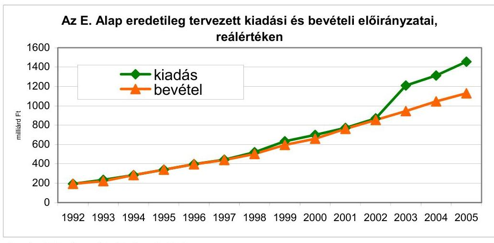

Forrás: költségvetési törvények, PM
A munkáltatói egészségbiztosítási járulék, illetőleg az egyéni egészségbiztosítási járulékok esetében az E. Alap bevételi előirányzata is felültervezett, emiatt a tervezettet meghaladó hiány bekövetkezése valószínűsíthető. Emellett a kiadási oldalon a meghatározó természetbeni ellátások esetében is érzékelhető feszültség.

A társadalombiztosítási ellátórendszerek átalakítása évek óta halasztódik, az egyre sürgetőbb reformokra nem került sor, ami a finanszírozhatóság szempontjából is egyre nagyobb nehézségeket okoz.

# 2.1.4. Helyi önkormányzatok 

A helyi önkormányzatok ${ }^{13}$ és intézményeik elsődleges kiadásainak aránya az államháztartáson belül évek óta hasonlóan, 22\% körül alakult. Az összesen 3187 helyi önkormányzat és mintegy 1840 kisebbségi önkormányzat 2003. évi kiadása $11,7 \%$-kal, a bevételek pedig $12,2 \%$-kal haladták meg az előző évit, a növekedés mértéke meghaladta az inflációt. Az önkormányzatok romló gazdasági pozíciójaként értékelhető azonban, hogy a múködési kiadások a tárgyévi kiadások növekvő́ részarányát kötik le (2002-ben 69\%, 2003ban $74 \%$ ), csökken a felhalmozásra fordított hányad és nőnek a társadalmi és szociálpolitikai juttatások.

Az önkormányzati forrásszabályozási és támogatási rendszer lényegét tekintve nem változott, továbbra is erőteljes jövedelemcentralizáció, a feladat, hatáskör és felelősség vonatkozásában pedig a decentralizáció jellemzi. A források elosztásában és a pénzügyi szabályozásban alapvető változás nem történt, de kedvezően értékelhető, hogy többszöri javaslatunk nyomán módosult az szja megosztása, az elvileg szabad felhasználású hányad emelésével. Növelte az önkormányzatok bevételeit az is, hogy az általuk beszedett gépjármúadó teljes összege helyben maradt.

[^0]
[^0]:    ${ }^{13}$ A helyi önkormányzatok teljesített kiadása 2533,4 Mrd Ft, bevétele 2501,7 Mrd Ft, hiánya 31,7 Mrd Ft volt 2003-ban.

---

A forrásszabályozás módjában nem hozott változást a következő évi költségvetés sem, amely alapvetően az önkormányzatoknál és intézményeiknél végrehajtandó takarékossági, hatékonyságot növelő intézkedésekre helyezte a hangsúlyt és a helyi önkormányzatok saját bevételeinek növekvő hányadát vette figyelembe a feladatok finanszírozásánál. Bár az önkormányzatoknak átadott költségvetési támogatások és hozzájárulások arányának 2001 óta tartó növekedése a központi költségvetés kiadásai között tovább folytatódott, s az átengedett személyi jövedelemadóval együtt $21 \%$-kal haladta meg az előző évit, továbbra sem nyújtott fedezetet a kormányprogramból adódó bér- és szociálpolitikai többletkiadásokra.

Rendkívül kritikus a közalkalmazotti és köztisztviselői béremelések tervezett mértékének megvalósítása, tekintve, hogy ennek jó részét - elégtelen központi költségvetési támogatás miatt - az önkormányzatok saját forrásból kénytelenek előteremteni. Ez a körülmény fokozottan hívja fel a figyelmet a társulások szükségességére, annál is inkább, mivel az önkormányzatok alig több mint negyede (832 önkormányzat) volt képes saját erőből már 2004-ben is a 6\%-os béremelés megvalósítására.

Az önkormányzatok 97\%-a élt a helyi adókivetés lehetőségével, múködtetett egy vagy több helyi adónemet. A helyi adót kivetők számának növekedéséhez hozzájárult, hogy az alacsonyabb adóerő-képességű önkormányzatok az ÖNHIKI kiegészítő támogatás igénylési feltétele teljesítése érdekében vezettek be helyi adót. Mindezek ellenére a helyi adóbevételek részaránya csökkent az önkormányzati bevételek közötti. A helyi adóbevételek többsége ( $85 \%$-a) továbbra is az iparűzési adóból keletkezett.

Az önkormányzatok közel 40\%-a múködési forráshiányos volt ${ }^{14}$, aminek kialakulásában a kedvezőtlen adottságok mellett a túlzott mértékű kötelezettségvállalás, az intézményi kapacitás alacsony kihasználtsága, a feladatellátás célszerútlen szervezeti struktúrája játszott szerepet. Az egyensúly megteremtése érdekében az önkormányzatok felhalmozási kötelezettségvállalásaikat csökkentették, önként vállalt feladataikra fordított forrásaikat visszafogták, és takarékossági intézkedéseket vezettek be. A megtett intézkedések azonban nem bizonyultak elegendőnek a forráshiány rendezésére, szükség volt az ÖNHIKI támogatás igénybevételére.

A gazdaságosabb feladatellátást szolgáló ösztönzés növekedése ellenére a térségi szemlélet továbbra sem kielégítő az önkormányzatok múködésében. Bebizonyosodott, hogy a társulási hajlandóság a pénzügyi támogatással ugyan növelhető, de megfelelő ágazati, szakmai követelmények meghatározása nélkül ezek múködése (pl. körjegyzőségek) csak formális. Az önkor-

[^0]
[^0]:    ${ }^{14}$ Megjegyezzük, hogy a múködési forráshiányos önkormányzatok száma 2003-ban 6,8\%-kal csökkent, amit a támogatások között megjelenő új jogcím - kiegészítő támogatás a helyi önkormányzatok bérkiadásaihoz - okozott. 2003-ban az ÖNHIKI-s támogatásban részesülő önkormányzatok száma az előző évi 1483 -al szemben 1220 volt. Az ÖNHIKI-ben részesülő önkormányzatok 92,5\%-a községi, 7,2\%-a városi, a fennmaradó $0,3 \%$-uk megyei, illetve megyei jogú városi önkormányzat volt. Az ÖNHIKI támogatások iránti legnagyobb igény az 1000 fő alatti lakosságszámú községi önkormányzatok részéről merült fel.

---

mányzatok döntő többsége - gazdálkodási méreteinél, a hivatalok létszámánál fogva - nem képes megfelelni a gazdaságos és hatékony múködés követelményeinek.

A körjegyzőséget alkotó önkormányzatok számának és együttes lakosságszámának függvényében megállapított differenciált támogatási rendszer nem hatott ösztönzőleg a körjegyzőségekhez tartozó települések számának növekedésére, különösen nem a nagyközségek és a városok önkormányzatainak részvételére a polgármesteri hivatali feladatok közös ellátásában. A helyi önkormányzatok társulásainak különösen az ezer fő alatti lakosságszámú település (1482) esetében van fontos szerepe, mert ezen kis önkormányzatok és hivatalaik sem a helyi közszolgáltatási, sem pedig igazgatási feladataikat nem tudják önállóan, aránytalanul nagy ráfordítás nélkül, szabályosan teljesíteni. ${ }^{15}$

Az 1100 főnél kisebb lakosságszámú települések esetében a tanulók intézményfenntartó társulás keretében való oktatását a kistelepülési kiegészítő közoktatási hozzájárulással is ösztönzi a központi költségvetés. A gazdasági kényszer és az ösztönzés együttes hatására az ellenőrzött önkormányzatok $45 \%$-a vett részt közoktatási intézményfenntartó társulásban. A közoktatási intézményfenntartó társulások mind a feladatellátás hatékonyságát, mind a feladatellátás színvonalát javították. Csökkent az általános iskolákban az osztatlan képzési forma és növekedett a szakos ellátottság. A 2003-ban hatályos jogszabályi környezet és ösztönző rendszer keretei között az önkormányzatok további társulások létrehozására nem vállalkoztak. A városok működési kiadásaik növekedését intézményrendszerük racionalizálásával korlátozták, és nem hoztak döntést intézményfenntartó társulások alapításáról. Így a feladatellátás hatékonyságának és színvonalának további javulása csak a jogszabályi környezet módosításától és az ösztönzés növelésétől várható.

# Az ÁSZ az állami költségvetés zárszámadásának ellenőrzésével egyidejűleg ellenőrizte a helyi önkormányzatok költségvetési kapcsolatait. A zárszámadási jelentés tartalmazza a normatív állami hozzájárulások, a kötött felhasználású, valamint a fejlesztési támogatások igénybevételének, felhasználásának és elszámolásának ellenőrzéséről készített jelentések megállapításait is. 

A zárszámadási ellenőrzés kapcsán az ÁSZ - a működő, folyamatba épített kincstári ellenőrzés mellett - javaslatot tett mintegy 235 millió Ft jogosulatlanul igénybe vett támogatás visszafizettetésére.

[^0]
[^0]:    ${ }^{15}$ Az Ötv. az 1000 főnél kisebb lakosságszámú, a megyén belül egymással határos községek számára előírta, hogy igazgatási feladataik ellátására körjegyzőséget alakítsanak és tartsanak fenn, megfelelő képesítésű jegyző alkalmazása esetén megengedte az önálló hivatal létrehozását. Ezzel a lehetőséggel a 2004. január 1-jei adatok szerint az e körbe tartozó önkormányzatok 22\%-a (385 önkormányzat) élt. Ugyanezen időpontban az ezernél több, de kétezernél kevesebb lakosú községek 29\%-a volt részese a körjegyzőségi együttműködésnek és a kétezernél magasabb lakosságszámú települések 11,9\%-a vett részt körjegyzőségi feladatok ellátásában - az Ötv. előírásainak megfelelően - székhelyként.

---

Kedvező, hogy a helyi önkormányzatok részére biztosított központi költségvetési hozzájárulások és támogatások igénybevételi szabályait tovább pontosították, illetve szigorították, különösen vonatkozik ez az önhibájukon kívül hátrányos helyzetben lévő helyi önkormányzatok támogatására.

Az 1999. évi szabályozástól kezdődően kiemelt szerepet kaptak az EU környezetvédelmi követelményeihez közelítő, az elmaradást csökkentő szennyvízcsatornázás és szennyvíztisztító telepfejlesztések. Az ösztönzés erősítésével a támogatások koncentráltabbá váltak és több támogatási feltétel előírásával segítették elő a beruházások gazdaságosságát, a kapacitások jobb kihasználását. Az önkormányzati fejlesztések támogatásában meghatározó ( 73 milliárd Ft) címzett és céltámogatási rendszer hatékonyabbá vált.

A központosított támogatások 2003-ban olyan új címekkel bővültek mint az EU-s fejlesztési pályázatok saját forrásainak kiegészítésére, a kistérségi fejlesztések és társulások támogatására, az önkormányzatok törvényi előírásaiból adódó bérkiáramlások részbeni fedezésére, valamint a belső ellenőrzési társulások működtetésének ösztönzésére szolgáló előirányzatok. Az EU-s, valamint a hazai fejlesztési pályázatok saját forrásainak kiegészítésére szánt 4,4 milliárd Ft 2\%-át sem vették igénybe az önkormányzatok, a kistérségi fejlesztések és társulások 7,7 milliárd Ft-ra módosított előirányzatát csaknem 100\%-ban felhasználták.

Az ellenőrzések megállapítása szerint a helyi önkormányzatok részére biztosított hozzájárulásokról és támogatásokról készített, a 2003. évi költségvetés végrehajtására vonatkozó kimutatások megalapozottak voltak. A hozzájárulásokról és támogatásokról a jogszabályi előírások betartásával döntöttek és azok önkormányzatok részére történő átutalása szabályszerű volt. A helyi önkormányzatok elszámolása a központi költségvetésből kapott hozzájárulásokkal és támogatásokkal, valamint a személyi jövedelemadó részesedéssel - a lényegességre is tekintettel - megbízható és valós, azonban ezen belül a központosított előirányzatok igénybevétele nem szabályszerű és elszámolása nem megbízható.

Az évek óta tartó javulás ellenére az önkormányzati gazdálkodás helyi szabályozottsága még mindig nem kielégítő. ${ }^{16}$ Az operatív gazdálkodással összefüggő döntési és felelősségi szinteket az önkormányzatok több mint 40\%-a nem a jogszabályi előírásoknak megfelelően alakította ki, vagy egyáltalán nem szabályozta. A számviteli politikák, pénzkezelési és leltározási szabályzatok csak mintegy 40\%-a felelt meg az előírásoknak. A szabályozási hiányosságok is hozzájárultak ahhoz, hogy a munkafolyamatba épített ellenőrzés színvonala a korábbi évekhez viszonyítva nem javult.

A vizsgált önkormányzatok közel egynegyede megsértette a közbeszerzési törvényt és a helyi szabályozások közbeszerzési előírásait, illetve elmulasztotta a közbeszerzési eljárás lefolytatását. A nem megfelelő előkészítésre utal, hogy az eljárás alapján megkötött szerződések közel felét módosították.

[^0]
[^0]:    ${ }^{16}$ Jelentés a helyi és a helyi kisebbségi önkormányzatok gazdálkodásának átfogó ellenőrzéséről (0436)

---

Az ellenőrzött önkormányzatok kétharmada a jogszabályi előírás ellenére a korábbi évekhez hasonlóan nem rendelkezett hosszabb időtávra szóló gazdasági programmal. A gazdasági program hiányában az önkormányzatok gazdasági döntéseiket az adott időpontban ismert szükségletek és lehetőségek számbavételével hozták meg.

Az önkormányzatok többsége (80\%-a) a törvényben rögzített határidőn belül terjesztette elő költségvetési rendelet tervezetét. Közel 90\%-uknál azonban elmaradt az államháztartási törvényben előírt, a költségvetés előterjesztésekor tájékoztatásul bemutatandó mérlegek, kimutatások benyújtása. A költségvetési rendeletek mintegy $30 \%$-a nem tartalmazta az ellátottak pénzbeli juttatásait, a speciális célú támogatásokat, a létszámkereteket, a céltartalékokat.

Az önkormányzatok a költségvetési beszámolókészítési és adatszolgáltatási kötelezettségeiknek eleget tettek, 94\%-uknál a polgármester az előírt határidőben nyújtotta be a zárszámadási rendelet-tervezetet a közgyűlés, illetve a képviselőtestület részére. A zárszámadási előterjesztéseket azonban az önkormányzatok közel harmada nem a költségvetéssel összehasonlítható módon készítette el, megismétlődtek a korábbi években már jelzett hiányosságok, nem csatolták az előírt mérlegeket, kimutatásokat, nem megfelelően számolták ki és hagyták jóvá a pénzmaradványt. A vizsgált önkormányzatok közel fele nem a jóváhagyott költségvetési előirányzaton belül gazdálkodott, megsértette azt a törvényi előírást, amely szerint tárgyévi fizetési kötelezettség előirányzat nélkül nem vállalható.

Az önállóan gazdálkodó intézmények ellenőrzését és a hivatali belső ellenőrzést az önkormányzatok alig több mint fele szabályozta valamilyen formában. Az elkészített ellenőrzési szabályzatok nem adtak megfelelő, gyakorlatban hasznosítható útmutatást az ellenőrzési munkához. Nem kielégítő az ellenőrzési társulások múködése. Az önkormányzatok és a költségvetési szervek együttműködésével létrehozott nagy létszámú ellenőrzési társulások működése nem biztosította az önkormányzati ellenőrzési feladatok ellátását valamennyi érdekelt önkormányzatnál. Az önkormányzatok az ellenőrzési kötelezettségüket a korábbi évekhez hasonlóan nem kezelték szakmai súlyának és a jogszabályban elöírtaknak megfelelően.

A jogszabályban előírt esetekben az önkormányzatok teljesítették a könyvvizsgálati kötelezettséget. A költségvetési beszámolókat a könyvvizsgálók az önkormányzatok 95\%-ánál hitelesítő záradékkal, négy önkormányzatnál korlátozott záradékkal látták el. A könyvvizsgálók jellemzően a számviteli nyilvántartások, mérlegek, kimutatások szabályszerűsége érdekében tettek javaslatokat.

A helyi önkormányzatok vagyona a kötelezettségek nélkül 2003-ban 8716 milliárd Ft volt. A növekedés mértéke az előző évi $87 \%$-kal szemben $47 \%$-ra csökkent. Az immateriális javak és tárgyi eszközök értékének még mindig kiugró mértékű növekedése döntően továbbra is a korábbi években érték nélkül nyilvántartott ingatlanok érték-megállapításának - főként az ingatlanvagyonkataszter felülvizsgálatának -, az önkormányzati tulajdonban lévő ingatlanok (elsősorban belterületi földek) állományba vételének, egyidejűleg az értékelés elvégzésének a következménye.

---

A tárgyi eszközök tényleges gyarapodását jelentő, tárgyévben aktivált beruházások értéke 44,2 milliárd Ft-tal alacsonyabb volt, mint az előző évben. Az önkormányzatok forrásai között mérsékeltebben (5,7\%), de tovább nőtt a kötelezettségállomány értéke, elérte az 518 milliárd Ft-ot. A hosszú lejáratú kötelezettségek növekedése 10\%-kal magasabb a rövid lejáratúakénál (a hosszú lejáratú kötelezettségek állománya 2000 és 2003 között megduplázódott). A kötelezettségállomány magas szintje jelezte, hogy az önkormányzatok csak külső források bevonásával tudták a közszolgálati feladataikat ellátni. Az országos öszszesen adatokból számított likviditási mutatószámok alakulása a helyi önkormányzatok pénzügyi helyzetének folyamatos rosszabbodását jelzi. Ebben szerepet játszik a reális gazdasági lehetőségeiket meghaladó mértékű fejlesztési és múködési kötelezettségek vállalása is.

A vizsgált önkormányzatok mintegy 70\%-ánál a rendeletek nem tartalmazzák a vagyon ingyenes átruházásának, a követelések lemondásának szabályait, az összeghatárt, ami felett vagyont értékesíteni, átadni csak versenytárgyalás útján lehet, illetve az egyes önkormányzati rendeletekben meghatározott összeghatárok indokolatlanul magasnak bizonyultak, nem biztosították a verseny, illetve a nyilvánosság érvényesülését.

Az önkormányzatok egyharmada adott át felhalmozási célra pénzeszközt a közműveket üzemeltető szervezetek részére. A legtöbb szabálytalanságot az üzemeltetésre, kezelésre átadott eszközök esetében tárták fel a vizsgálatok.

Az önkormányzati gazdaság jellemzője, hogy jogi szempontból szinte korlátlan önállóságot élvez, anélkül, hogy ennek pénzügy feltételei következetesen megoldottak lennének. A államháztartás meghatározóan nagy területéről, jelentős közpénzről, közvagyonról, másrészt ezek rendkívül decentralizált elköltéséről, felhasználásáról és az intézményi kör működtetéséről van szó. Az állami feladatok újragondolása, pontosabb meghatározása ezért nem nélkülözheti a központi költségvetés és a helyi önkormányzatok közötti hatás- és feladatkör elhatárolást, a regionalitás és ezekhez kapcsolódóan a finanszírozás újragondolását.

# 2.2. Az uniós források felhasználásának ellenőrzési tapasztalatai 

### 2.2.1. Általános tapasztalatok

Az ÁSZ, mint az államháztartás külső ellenőrző szervezete stratégiai kérdésként kezelte az uniós források és a hazai társfinanszírozás tervezésének, végrehajtásának ellenőrzését. Tudatosan készültünk fel - a nemzetközi együttmúködés lehetőségeit kihasználva - az uniós tagsággal együtt járó új feladatok teljesítésére. A számvevőszéki ellenőrzés szakmai fejlesztésénél e tekintetben is támaszkodtunk az uniós tagországok legjobb gyakorlatára, az Európai Számvevőszék elvi és gyakorlati segítségére. Így tevékenységünket az uniós támogatások felhasználásának ellenőrzése során is a nemzetközi standardoknak megfelelően, az uniós követelményeket kielégítő módszerek alkalmazásával végeztük. Rendszervizsgálatok keretében, szabályszerűségi és teljesítményellenőrzés módszeré-

---

vel vizsgáltuk a szabályozási környezetet, az intézményrendszert, a monitoring rendszert, illetve a kiválasztott programokat.

A beszámolási időszakban is kiemelt figyelmet fordítottunk az EU-csatlakozást előkészítő feladatok, illetve végrehajtásuk vizsgálatára, az uniós forrásokból így a PHARE, az ISPA, a SAPARD előcsatlakozási alapok, illetve 2004-től a Strukturális Alapokból és a Kohéziós Alapból - juttatott pénzeszközök felhasználásának ellenőrzésére. Törvény adta felhatalmazás keretei között, de kormányzati felkérésre, külön megállapodás alapján jelentős szerepet vállaltunk az agráriumot érintő uniós támogatások folyósítására létrehozott magyar intézményrendszer (SAPARD, EMOGA Garancia Részleg Kifizető Úgynöksége) akkreditáció előtti átvilágításában is, majd az ezekhez kapcsolódó igazoló szervi feladatok ellátásában.

Ehhez kapcsolódóan jegyezzük meg, hogy ellenőrzési tapasztalataink alapján egyetértünk az EU-tagországok egyes számvevőszékeinek azon véleményével, mely szerint erősíteni célszerű a nemzeti számvevőszékek és erre építkezve az Európai Számvevőszék ellenőrzési szerepét az uniós támogatások terén. Ez azonban a közösségi források ellenőrzési rendszerének uniós szintű áttekintését és összehangoltabbá tételét igényli, a felesleges párhuzamosságok megszüntetése a bürokratikus megoldások egyszerűsítése, az ellenőrzések hatékonyságának erősítése érdekében.

Összegző értékelésünk részben az előcsatlakozási folyamat utolsó éveit átívelő (2000-2004 évek), illetve a csatlakozást követően eltelt időszakra vonatkoznak és a 2004. évi számvevőszéki jelentésekre, illetve azok vonatkozó megállapításaira alapozottak.

A 2000-2004. évek tekintetében az előcsatlakozási eszközök (PHARE segély, ISPA előcsatlakozási alap, SAPARD előcsatlakozási alap) felhasználásával, intézményeivel és azok feladataival, az ellenőrzési követelményekkel, a fogalmi meghatározások tartalmával stb. összefüggésben történtek változások, sőt a csatlakozást követően is folyamatos a jogszabályi korrekció az intézményi felkészüléssel, a regionális rendszerrel kapcsolatban, illetve pénzügyminiszteri útmutatókat adnak ki a számviteli elszámolásokhoz, nyilvántartásokhoz.

Az ellenőrzések eddigi tapasztalatai alátámasztották, hogy az előcsatlakozási programok hozzásegítették Magyarországot ahhoz, hogy folyamatosan kiépüljön az EU-támogatások felhasználására vonatkozó szabályozási és intézményrendszer. A Kiterjesztett Decentralizációs Végrehajtási Rendszer (EDIS) folyamatot csak a közlekedési infrastruktúra-fejlesztési programok esetében sikerült eredményesen lezárni a csatlakozás időpontjára. Egyéb területeken az EDIS folyamat a csatlakozás időpontjával befejezetlen maradt, további folytatása okafogyottá vált a Strukturális Alapok és a Kohéziós Alap kezelésének eltérő sajátosságai miatt. Hátráltatták a hatékony „tanulási", felkészülési folyamatot a magyar államháztartás szervezeti és intézményi rendszerének gyakori változásai, a feladatok és hatáskörök módosításai.

Korlátozta a gördülékeny felkészülést és átállást, hogy elkülönített és független folyamatokat/követelményeket kellett érvényesíteni az előcsatlakozási alapok és a csatlakozás utáni támogatások kezelésére. A nyelvtudással és megfelelő

---

szakismeretekkel rendelkező szakemberek alacsony száma miatt a felkészülés a gyakorlatban akadozott. Ez alátámasztja az Európai Számvevőszék azon megállapítását, hogy a kohéziós és strukturális célkitűzésekkel nehezen volt összeegyeztethető az előcsatlakozási támogatások folyamata. Kevés előrehaladás tapasztalható a többéves programozás bevezetésében. Az ágazati szakterületek fejlesztési stratégiája nem minden esetben tartalmazza a feladatokhoz rendelt költségvetést és ebben a költségvetésben az EU és hazai forrásszerkezet együttes bemutatását.

A felkészítést szolgáló programok jellemzően a pályázati követelmények EUkívánalmaknak megfelelő kielégítésére, az előcsatlakozási támogatások elnyerésére irányultak, kevésbé volt meghatározó a strukturális, kohéziós források lekötésére való képesség fejlesztése. Ezzel is összefügg, hogy a kohéziós és strukturális alapokból származó források felhasználására szolgáló intézményrendszer teljes kifejlesztésében és gördülékeny müködtetésében vannak elmaradások, a regionális és ágazati országos irányítás közötti harmónia még nem alakult ki. Bizonytalanság volt az irányító, kifizető hatóságok kijelölésében, így a regionális intézményfejlesztés háttérbe szorult.

Mindezekre figyelemmel a csatlakozást követően is szükség van a szabályozási és intézményrendszer végleges és teljes kifejlesztésének korrekcióira, támogatására, az uniós pénzeszközöket elszámoló szoftverfejlesztés befejezésére és az együttműködési gyakorlat kialakítására a regionalizmus erősítése érdekében. Az ellenőrzési rendszer átfedéseit és hiányosságait fel kell számolni és teljes körűvé kell tenni az EU-standardokra alapozott ellenőrzési követelmény érvényesítését, arányossá kell tenni a rendszer-, a program, illetve projektellenőrzéseket, illetve az egyedi tranzakciók vizsgálatát.

Az ÁSZ utólagos ellenőrzéseket végez, így az előcsatlakozási alapok vizsgálata részünkről még nem fejeződött be. Az előcsatlakozási alapok teljes kifutásáig hátralévő feladatokat a költségvetési szerkezet EU-konform, projektszemléletű átalakításában, a több évre szóló, megalapozott költségvetési tervezés során az EU-források és a hazai költségvetési lehetőségek valamint a gazdasági kohéziós igények összhangjának biztosításában, a támogatható programok műszaki előkészítéséhez szükséges források elkülönített tervezésében, a regionális és helyi önkormányzati rendszer kölcsönös megfeleltetésében, a pontosság és a szubszidiaritás elvének gyakorlati érvényesítésében látjuk.

Ugyanakkor a jövőbeni ellenőrzési feladataink tekintetében a speciális EUtámogatásokra - így a közösségi kezdeményezések hasznosulására - irányuló témavizsgálatok tervezését fontosnak tartjuk.

# 2.2.2. Az előcsatlakozási alapokból nyújtott támogatások felhasználása 

### 2.2.2.1. Az ISPA támogatásból megvalósított környezetvédelmi programok

A felzárkózást segítő, gazdaságfejlesztő hatású ISPA program kiterjed a környezetvédelem és a közlekedési infrastruktúra fejlesztésére, a közösségi követelményekkel összhangban lévő beruházások finanszírozására.

---

A 2004-ben végzett számvevőszéki ellenőrzés a környezetvédelmi infrastruktúra fejlesztésére felhasznált források hasznosulására irányult. Célja a Csatlakozási Partnerség, az EU környezetvédelmi joganyagában foglalt követelmények teljesítésének elősegítése. Az ellenőrzött időszak a 2000. évtől 2004. júniusig terjedt, kitekintéssel az előkészítő folyamatokra és ráfordításokra.

Az ISPA támogatások igénybevételével a magyarországi környezetvédelmi infrastruktúra, a környezetvédelmi programok megvalósítása felgyorsult. Ezzel az EU hozzájárult az uniós normáktól való elmaradásunk csökkentéséhez. Az EU 2000 óta évi 88 millió euró támogatási keretet különített el Magyarország számára, 50-50\%-ban megosztva a környezetvédelmi és a közlekedési fejlesztési célok között. Magyarország a 2000-2003. évi környezetvédelmi célokra rendelkezésre álló ISPA keretet 332,7 millió euró értékben kötötte le. A 19 építési projekt közül négyet ellenőriztünk, amelyek teljes értéke 113 millió euró, a jóváhagyott beruházási projektek $21 \%$-a.

Az ISPA program intézményeinek és szabályozásainak kialakítása 2000-2004 közötti időszakban folyamatosan változó és követő jellegű volt, a beruházási folyamatokban két-három éves késedelmek voltak tapasztalhatók, így az elsőként támogatott ISPA beruházásokat 2006-2008 között fejezik be. Valamennyi fejlesztési projekt megvalósítása folyamatban van, a leginkább előrehaladott beruházás közel 70\%-os mértékben készült el. Az ISPA környezetvédelmi támogatások hatékony felhasználását nem biztosították a megvalósítás magyarországi feltételei és körülményei. A környezetvédelmi fejlesztési források prioritásai részben érvényesültek. A hazai források felhasználását nem hangolták öszsze a stratégiai fejlesztési célokkal. A vonatkozó szabályozás nem tisztázta a projekt-tervezés, előkészítés felelősségét, a forráselosztás koncepcionális kérdéseit, a fejlesztések finanszírozási forrásainak rendelkezésre bocsátását. A program 2000. évi indulásakor a feltételeknek megfelelő, jól előkészített projektek alacsony száma miatt korlátozottan valósulhatott meg az ISPA támogatási források kihasználására kialakított stratégia. A folyamat 2002-2003-ban felgyorsult és ennek eredményeként javult a forráslekötési képesség.

A projektjavaslatok nem tartalmazták a tervezés és előkészítés fázisában a partnerség érvényesítésének és a társadalmi érdekegyeztetés lefolytatásának kritériumait és finanszírozásának forrásait. Az előzetes társadalmi egyeztetés elmaradása miatt a már támogatott projektek helyszíne kérdésessé vált. A társadalmi érdekegyeztetés utólagos lefolytatása többletköltségeket, több hónapos csúszásokat okozott, ami rontotta a fejlesztési források felhasználásának gazdaságosságát.

# A projektek előkészítése, tervezése és múszaki menedzsmentje nem kapott megfelelő hangsúlyt. A szükséges szakmai felkészültség, tapasztalat, valamint a kapacitás hiánya miatt nem volt kielégitő a projektmenedzsment múködése, a közbeszerzések lebonyolítása, a végső kedvezményezettek forráselosztási rendszere. Mindezek a hiányosságok a végrehajtás kockázatát jelentik. 

Az uniós és a hazai számviteli szabályozás eltéréséből adódóan a végrehajtásban résztvevő intézményeknek egyidejűleg két különböző irányú és típusú jelentéstételi, beszámolási kötelezettségnek kellett megfelelni. Az Európai Bizott-

---

ság felé a projektek pénzügyi helyzetét eredményszemléletben, az elért előrehaladást bemutatva kellett jelenteni, míg a Kormány felé költségvetési típusú és pénzforgalmi szemléletben.

Az ISPA támogatásból 2000-2004 közötti időszakban lekötött keretek a csatlakozástól a Kohéziós Alap részét képezik, így felhasználásukat is a Kohéziós Alapra vonatkozó előírások határozzák meg. Az ISPA környezetvédelmi szektor intézményrendszer EDIS eljárásrendre való áttéréséhez kapcsolódó akkreditációs folyamat nem fejeződött be a csatlakozás idejére, így nem nyert akkreditációt. A sikertelenség nem akadályozta a támogatási források felhasználását, de a hiányosságok megszüntetése a Kohéziós Alap feltételrendszerének való megfeleléshez jelent többletfeladatot az intézményeknek. Kedvező irányú változást jelez, hogy az ellenőrzés lezárásakor öt projektjavaslat elbírálás alatt volt, amely a 2004-2006-ra leköthető környezetvédelmi keretet 80 millió euróval meghaladta. Ez előremutató, hiszen felgyorsulhat a végrehajtás, így lehetővé válhat a környezetvédelmi fejlesztési célú kohéziós keretek teljes felhasználása. ${ }^{17}$

# 2.2.2.2. Az egészségügy területén megvalósult PHARE programok 

A népegészségügy azon területek egyike, amely az európai szemléletű társada-lom- és gazdaság fejlődés közös tartalmi céljainak megvalósításában kiemelt jelentőségű. Ezért fontosnak tartottuk a népegészségügy területére irányuló PHARE támogatások számvevőszéki ellenőrzését, amely hat projektre irányult. Ellenőrzésünk célja annak értékelése volt, az EU csatlakozás időpontjára a magyar népegészségügyi intézményrendszer felkészült-e arra, hogy bekapcsolódjon az EU által felállított szakmai szervezetek munkájába, a PHARE programokra jóváhagyott támogatások és a hazai források felhasználásával. A népegészségügy különböző területeinek fejlesztését célzó PHARE programokat az 1998-ban elindult tervezéstől követtük végig 2004 februárjáig.

Az ellenőrzött projektek keretében nyújtott támogatásokat 1998-2002 között a népegészségügy különböző területein a hatósági- és az ellenőrzési funkció erősítésére, a dolgozók szakmai továbbképzésére, a laboratóriumi vizsgáló kapacitások korszerűsítésére, az informatikai háttér megteremtésére fordították. A közegészségügy és a járványügy fejlesztését célzó projektek esetében az egészségügyi tárca szakmai irányítása alatt az Állami Népegészségügyi és Tisztiorvosi Szolgálat hálózata volt a kedvezményezett. A Kábítószer Információs Rendszer Nemzeti Kapcsolattartó Pontjának intézményesítése az Országos Epidemiológiai Központhoz került. E projekt megvalósításában a kábítószer elleni küzdelemben részt vevő társtárcák és intézmények is részt vettek. A munkahelyi egészség és biztonság EU direktíváinak alkalmazását előmozdító projektek a munkaügyi tárca irányításával valósultak meg. A magyarországi szervezetek közötti munkamegosztásban a munkahelyi biztonság és egészségvédelem feladatait több szervezetben végzik, ezért az ennek a területnek nyújtott PHARE támogatás kedvezményezettjei az egészségügyi és a munkaügyi tárcához tartozó szervezetek voltak.

[^0]
[^0]:    ${ }^{17}$ Jelentés az ISPA támogatásból megvalósított környezetvédelmi programok ellenőrzéséről (0469)

---

A PHARE projektek megteremtették a feltételeket a magyar népegészségügy és az EU szakmai szervezeteinek együttműködéséhez, elősegítették a közösségi jogszabályok végrehajtásában részt vevő intézmények létrehozását és felkészítését. A hat támogatott projekt céljainak megvalósítása javította az eszköz- és az informatikai feltételeket a kábítószerek elleni küzdelem fejlesztéséhez, növelte a közegészségügyi laboratóriumok mérőeszköz ellátottságát, a megvalósulás szakaszába került a járványügyi laboratóriumok fejlesztése, a szoftver és hardver fejlesztések révén az uniós követelmények kielégítésére alkalmassá tette az adatok feldolgozását támogató információ-technológiai eszközöket. Az intézményfejlesztés, a munkatársak korszerű képzése megerősítette a hatósági és az ellenőrzési funkciók gyakorlását. Befejezési szakaszba jutott a Nemzeti Drog Információs Pont intézményi fejlesztése, az ehhez szükséges jogi és technikai feltételek kialakítása. A támogatásban részesült projektek céljai és a megvalósult fejlesztések megfeleltek a csatlakozási felkészülés stratégiai keretét adó dokumentumokban megfogalmazott célkitűzéseknek, prioritásoknak. Az uniós intézményi együttműködés teljessé tétele megkívánja a még folyamatban lévő PHARE projektek befejezését és a fejlesztések fenntartási, üzemeltetési forrásainak rendszeres biztosítását.

# A projektek ütemezés szerinti megvalósítását befolyásolták a lebonyolítás alatt bekövetkezett szervezeti, intézményi változások, a hazai népegészségügyi stratégia hiánya. 

A PHARE támogatással megvalósuló, népegészségügyi intézményfejlesztést és beruházást szolgáló hat projekt tervezett összköltsége a kötelező hazai ráfordításokkal 37,7 millió euró volt, amelyből 24,9 millió euró összegű volt az uniós támogatás. Ezek közül a 2002. évi keretre jóváhagyott mikrobiológiai laboratóriumhálózat fejlesztési PHARE projekt a legnagyobb összegű, 12,3 millió euró értékű, amelynek megvalósítása nem jutott a tenderkiírási szakaszba ellenőrzésünk lezárásáig. Az ütemezés szerint lezárult öt projektben, jogosulatlan kifizetés nem volt. A támogatási keretből mindössze 1,3 millió eurót (7,3\%) nem használtak fel, amely nem volt átcsoportosítható más területre.

A hazai társfinanszírozás 12,8 millió euró értékben rendelkezésre állt, forráshiány nem gátolta a megvalósítást. A kötelező társfinanszírozás kifizetése a jóváhagyott ütemezés szerint történt a lezárult 5 projekt esetében, 2000-2004. február között. A kötelező társfinanszírozást meghaladó, a pályáztatás előkészítésére, szakértők igénybevételére fordított - indokolt - kiadások a jóváhagyott támogatási keret egyötödét tették ki, amely jelzi, hogy az EU-támogatások felhasználásának tervezésekor a költségvetésben a kötelező hazai forráson felül további, járulékos kiadások finanszírozásával is számolni kell.

A projektek pénzügyi elszámolásánál eltérő eljárási és nyilvántartási rend volt jellemző az EU-tól átvett pénzeszközökre és a hazai társfinanszírozásra. A PHARE projektek hazai kifizetéseit el kell különíteni a minisztérium intézményi múködési kiadásaitól. Ezeket nem különítették el, ami átláthatatlanná tette a felhasználást. A közremúködő intézmények közötti adatszolgáltatás, a tájékoztatási kötelezettség teljesítése nem volt kielégítő. A PHARE projektek hazai ráfordításainak pontos elszámolásához szükséges a felhasználás pénzfolyamában

---

érintett szervezetek nyilvántartásainak kölcsönös és rendszeres egyeztetése, az ellenőrzéssel feltárt adateltérések rendezése. ${ }^{18}$

# 2.2.2.3. EU-tagsági felkészülést, illetve uniós források igénybevételét érintő megállapítások 

## Költségvetési tervezés és az EU-tagság

Kiemelt feladatként jelöli meg a 2005. évi költségvetési törvényjavaslat az EUval való kapcsolatokat, így az EU-források hazai társfinanszírozásának biztosítását és az infrastruktúra felzárkóztatását. A költségvetési irányelvek, a kockázati tényezőket is számba vevő alappálya meghatározásával, a tervezés folyamatában meghatározó tényezőként deklarálta az óvatosság elvét. Az EU tagságból adódóan kiemelt jelentőséget kap ugyanis a programban foglalt célok hitelességének, megvalósíthatóságának megbízható alátámasztottsága.

A 2005. évi költségvetési törvényjavaslat EU-forrásként 176 599,9 millió Ft-ot tartalmaz. Ezt a tárcák bevételként és kiadásként egyaránt megtervezték. Ezt növeli az EU által vállalt visszatérítés 7915,7 millió Ft összege, amely szabadon felhasználható forrás. A törvényjavaslatban nevesített programok, projektek, előcsatlakozási alapok még le nem zárt részeihez a hazai társfinanszírozás központi költségvetési forrása 90645,8 millió Ft. Ennek megfelelően a 2005. évi költségvetésben megjelenő források és kiadások összege 275 161,4 millió Ft. A költségvetésen kívül unióból érkező pénzeszközök sajátossága, hogy az EUszabályok alapján a tagállamra előfinanszírozási kötelezettség hárul. A támogatások előfinanszírozását az ÁKK Rt. a finanszírozási tervben figyelembe vette.

Az EU költségvetéséhez való hozzájárulások 2005. évre tervezett összegét érintően véleményünkben jeleztük, hogy a csatlakozást követő időszakra vonatkozóan a vámbevételek prognosztizálásánál (a háttérszámítások során) nem mérték fel kellő körültekintéssel az EU-n kívüli országokkal folytatott kereskedelem nagyságrendjét. Ennek tulajdonítható, hogy a 2004. évi ellenőrzéskori időarányos adatok jelentősen elmaradtak a tervezettől, így a bázisadatokon nyugvó 2005. évi vámbevételi tervszámokról sincs ok feltételezni, hogy azok megalapozottak lennének. A vámbefizetés és visszatérítés bevételek realizálását - főképp az átálláskori hatások tervezési nehézsége miatt a számvevőszéki ellenőrzésünk - magas kockázatúnak ítélte.

Az EMOGA Garancia Alapból folyósítandó közvetlen mezőgazdasági támogatások 30 százalékpontnyi nemzeti kiegészítő támogatásának forrását nem tartalmazta a 2005. évi költségvetési törvényjavaslat. Fedezet hiányában 2005-ben is az előző évi gyakorlat alkalmazására kényszerülhet az érintett tárca. A költségvetés egyensúlyi helyzetének problémáival összefüggésben a közvetlen uniós támogatásokhoz kapcsolódó költségvetési források ugyanis 2004-ben nem álltak rendelkezésre. Emiatt a kereskedelmi bankok biztosították az előfinan-

[^0]
[^0]:    ${ }^{18}$ Jelentés az egészségügyi területén megvalósult PHARE programok ellenőrzéséről (0432)

---

# szírozást, ami egyben azzal járt, hogy a pénzintézetek részére fizetendő lebonyolítási díj a következő időszak költségvetését terheli. ${ }^{19}$ 

## Gazdasági Versenyhivatal

A tisztességtelen piaci magatartás és a versenykorlátozás tilalmáról szóló törvény 2003. évi módosítása az EU-csatlakozás következtében előállt új helyzethez való igazodást célozta, így a közösségi és a hazai versenyjog közötti viszonyrendszer rendezését, illetve a Gazdasági Versenyhivatal képessé tételét a közösségi versenyszabályok közvetlen alkalmazására. A felkészülés lényeges elemét jelentette, hogy 2002-ben a Gazdasági Versenyhivatal felkérést kapott a közösségi versenyhatóságtól, hogy más tagjelölt országok versenyhatóságaival együtt vegyen részt a közösségi versenyjog kibővült közösségben való tagállami alkalmazásának módszerét kidolgozó European Competition Network munkájában.

A nemzetközi együttmúködés eredményei közül kiemelést érdemel az OECD ajánlások figyelembevételével megvalósult törvénymódosítás, a versenyfelügyeleti eljárásokhoz kapcsolódó svéd és finn segítségnyújtás, a Gazdasági Versenyhivatal általános kedvező nemzetközi megítélése. ${ }^{20}$

## Kutatás-fejlesztés

A magyarországi kutatás-fejlesztés ( $\mathrm{K}+\mathrm{F}$ ) ráfordítás a bruttó hazai termékhez (GDP) mért aránya az 1996. évi 0,7\%-os mélypontról, 2002-ben 1\%-ra, majd 2003-ban 0,95\%-ra változott. Nem teljesült a 2000. évi kormányzati irányelvekben 2002-re előirányzott 1,5\%-os GDP ráfordítási arány és ennek 50\%-os vállalkozási részaránya, a vállalkozási szféra alacsony mértékű részvállalása miatt (a megvalósult 1\% 171,5 milliárd Ft-ot tett ki, amin belül az állami részarány $59 \%$-os volt). A magyarországi kutatóhelyek több mint kétharmada költségvetési gazdálkodási rendszerben múködő kutatóhely. A vállalkozási K+F helyek $28 \%$-ot képviselnek.

Magyarországnak az EU tagjaként és az Európai Kutatási Térség résztvevőjeként figyelembe kell vennie azt az uniós célkitűzést, hogy 2010-re a nemzetgazdasági $\mathrm{K}+\mathrm{F}$ ráfordítások a GDP 3\%-át tegyék ki. E ráfordítások 2/3-át a vállalkozásoknak kellene finanszírozniuk, mely cél elérésének alapvető feltétele a vállalkozások aktivizálódása. A kormányzati szándék 2006-ra 1,8-1,9\%-os GDP részarányt irányoz elő. A célkitúzés megvalósításában az új Kutatási és Technológiai Innovációs Alap jut kiemelt szerephez, mely elkülönített állami pénzalapként, vállalkozási társfinanszírozással együtt biztosít pénzeszközöket a gazdasági társaságok által közvetetten vagy közvetlenül megvalósított kutatási és innovációs tevékenységekre, köztük az EU-s pályázatokra.

Az EU-csatlakozáskor még nem volt a súlyponti területeket meghatározó nemzetgazdasági innovációs stratégia, amely meghatározza a kutatás-fejlesztési tevékenység prioritásait, súlyponti, ágazati területeit, összhangban csatlakozá-

[^0]
[^0]:    ${ }^{19}$ Vélemény a Magyar Köztársaság 2005. évi költségvetési javaslatáról (0449)
    ${ }^{20}$ Jelentés a Gazdasági Versenyhivatal fejezet múködésének ellenőrzéséről (0453)

---

sunkkal az Európai Kutatási Térséghez. Az Országgyűlés 2004 végén fogadta el a kutatás-fejlesztésről és a technológiai innovációról szóló törvényt. ${ }^{21}$

# Munkaerőpiaci Alap 

Az uniós csatlakozásra való felkészülés keretében a Kormány és az EU Bizottság által 2001-ben közösen készített munkaerő piaci feladatokat meghatározó foglalkoztatáspolitikai értékelés a célok között elsőként nevesítette a foglalkoztatás növelésének szándékát. A közös célok megvalósulásáról és a további feladatokról szóló 2002. és 2003. évi „követő jelentések" alapján, a pozitív értékeléssel egyidejűleg az EU Bizottság illetékes főigazgatósága felhívta a figyelmet többek között a nemek közötti esélyegyenlőség érvényesítésére, a munkahelyi egészség és biztonság fontosságára, a foglalkoztatási szint emelésére. A foglalkoztatási szint emelését, a munkaerő versenyképességének javítását és a társadalmi beilleszkedés elősegítését célzó Humánerőforrás-Fejlesztési Operatív Program végrehajtásáért, annak jogszerűségéért és hatékonyságáért a Foglalkoztatáspolitikai és Munkaügyi Minisztérium felelős. A regionális alapon megszervezett információs tanácsadó szolgálat a csatlakozás időpontjától lehetővé teszi - a feltételek megteremtése esetén - a külföldön történő képzéshez és munkavállaláshoz való hozzáférést.

A Munkaerőpiaci Alap foglalkoztatási alaprészéből finanszírozott, a munkaadók és munkavállalók érdekképviseleti szerveinek uniós felkészülési programjai hozzájárultak az EU tagországokkal való együttmúködés megalapozásához.

A 2005. évi költségvetési törvényjavaslat véleményezésénél észrevételeztük, hogy a Munkaerőpiaci Alap kiadási szerkezete nem tükrözi az uniós követelményeket is kielégítő aktív foglalkoztatáspolitika megvalósításához szükséges pénzeszközök elégséges nagyságát. Emelkedik az Alap befizetési kötelezettsége, a rehabilitációs foglalkoztatás kiadásainak támogatásához, illetve a munkanélküli ellátórendszer múködtetéséhez kapcsolódó pénzeszközátadással. ${ }^{22}$

## Magyar Posta Rt., a postai szolgáltatások

Az ÁSZ kiemelt figyelmet fordít, a közszolgálati rendszerek múködésének fontossága miatt, a közszolgáltató társaságok ellenőrzésére. Ennek keretében ellenőrizte az egyik legnagyobb közfeladatot ellátó közszolgáltató társaságot, a Magyar Posta Rt.-t. Az ellenőrzés a pénzügyi gazdasági szempontok mellett a szolgáltatás minőségének alakulását és a lakossági érdekek érvényesülését is szem előtt tartotta.

A postai szolgáltatások tekintetében az EU-elvárásoknak megfelelő intézményi rendszer kialakítása, a struktúra szétválasztása 2000 második félévében megtörtént. A postai szolgáltatások EU-normák szerinti nyújtását a Magyar Posta Rt. belső szabályozásába - vezérigazgatói utasítások formájában - beillesztette.

[^0]
[^0]:    ${ }^{21}$ Jelentés a központi költségvetésből kutatás-fejlesztési célokra fordított pénzeszközök hasznosulásának ellenőrzéséről (0440)
    ${ }^{22}$ Jelentés a Munkaerőpiaci Alap múködésének ellenőrzéséről (0439), Vélemény a Magyar Köztársaság 2005. évi költségvetési javaslatáról (0449)

---

A külső és belső szabályozás összhangja 2003-tól valósult meg. A belső szabályozási munka egy éves elhúzódása részben a hatóságnak nyújtandó adatszolgáltatást szabályozó végrehajtási rendelet, részben az Magyar Posta Rt. felkészültségének hiányából eredt. A késői szabályozás következménye, hogy a postai alaptevékenység színvonalát jellemző mérőszámok nem egységesek, így a 2002. és a 2003. évi teljesítmények csak a tendenciák alakulása tekintetében hasonlíthatók össze.

A postai szolgáltatások EU-normák szerinti nyújtása a hazai jogi szabályozás alapján 2002. évtől kezdődően fokozatosan, az uniós csatlakozás évében -2004-ben - teljes körűen kötelező. Az ágazati-szakmai irányítás az EU csatlakozásból adódó jogharmonizációs követelményekre fordította figyelmét. A hangsúly eltolódás és a gyakori stratégia váltások azon fejlesztések elhalasztását, vagy befejezésük elhúzódását eredményezték, amelyek közvetlenül és közvetve az EU irányelve szerinti egyetemes postai szolgáltatás versenyképes megvalósítását szolgálják. Az 1999-2003 közötti években - az Magyar Posta Rt. stratégiai célkitűzéseivel ellentétben - nem valósultak meg azok a fejlesztések és beruházások, amelyek feltételét képezték az EU-követelmények maradéktalan teljesíthetőségének. Ilyen stratégiai elemek voltak: a csomagok házhoz kézbesítése és a gyorsasági levél küldemény kategória bevezetése, az informatikai és számítástechnikai alapstruktúra 1997-ben megkezdett beruházásainak folytatása és továbbfejlesztése, valamint az egyetemes szolgáltatás viteléhez is kapcsolódó korszerű csomaglogisztikai kereskedelmi szolgáltatások, és a csomagszállítás nyomkövető rendszerének megvalósítása. Az eredetileg 2002-re megvalósíthatónak tartott egyetemes szolgáltatás teljesítésére a folyó intézkedések alapján csak 2004. második félévben került sor.

A Magyar Posta Rt. 2000-től kezdődően rendszeresen vizsgálta és mérte felkészültségét a postai szolgáltatásokra meghatározott EU-irányelvek szerint. Az uniós normatíváknak megfelelő minőség elérését és ellenőrzését szolgáló minőségirányítási rendszerét folyamatosan alakította ki. A felállított minőségirányítási rendszer felépítését, irányítását, működtetését és célkitűzéseit tekintve alkalmas a postai szolgáltatások minőségének EU-követelmények szerinti biztosítására. A rendszer eredményes és hatékony működtetéséhez 2004-et megelőzően hiányoztak a minőség eléréséhez szükséges műszaki és technikai feltételek. ${ }^{23}$

# 2.2.3. Megállapodások alapján végzett ellenőrzések 

Az ÁSZ - a számvevőszéki törvény adta felhatalmazás keretei között, de kormányzati felkérésre - külön megállapodás alapján jelentős szerepet vállalt az agráriumot érintő uniós támogatások folyósítására létrehozott magyar intézményrendszer (SAPARD, EMOGA Garancia Részleg Kifizető Ügynöksége) akkreditáció előtti átvilágításában, majd az ehhez kapcsolódó igazoló szervi feladatok ellátásában.

[^0]
[^0]:    ${ }^{23}$ Jelentés a Magyar Posta Rt. gazdálkodásának ellenőrzéséről (0429)

---

# 2.2.3.1. SAPARD Igazoló Szervi ellenőrzése 

A számvevőszéki törvényben, továbbá a Többéves Pénzügyi Megállapodásban foglaltakkal összhangban az ÁSZ elnöke elfogadta a Kormány felkérését, amelynek alapján a SAPARD igazoló szervi feladatok ellátására a NAO és az ÁSZ elnöke által kijelölt felelős vezető 2002. október 8-án munkamegállapodást kötött.

A felkérést követően az ÁSZ Igazoló Osztálya 2003-tól folyamatosan végzi a SAPARD igazoló szervi ellenőrzést, a Többéves Pénzügyi Megállapodás és az EU Bizottsága által kiadott SAPARD Irányelvek alapján, a nemzetközileg elfogadott audit standardoknak (INTOSAI, IFAC-ISA) és a SAPARD Igazoló Szerv Kézikönyve előírásainak megfelelően.

A 2002. évben SAPARD forrásból nem volt kifizetés, a NAO az erre vonatkozó Igazolást küldte meg az EU Bizottság részére. A SAPARD Igazoló Szerv 2004. április 15-ére elkészítette a 2003. évi SAPARD folyamatokról szóló Jelentést és kiadta az Igazolást.

### 2.2.3.2. EMOGA Garancia Részleg

Az EMOGA Garancia Részlegéből történő közösségi finanszírozás alapvető feltétele, hogy a kifizetéseket az arra feljogosított, akkreditált Kifizető Ügynökség végezze. Az akkreditáció a tagállam által kijelölt Illetékes Hatóság feladata és felelőssége. Az akkreditációs okirat igazolja, hogy a Kifizető Ügynökség megfelel a tagállam által - az EU Bizottság rendeletei, irányelvei alapján - meghatározott akkreditációs feltételeknek.

Magyarországon a Kifizető Ügynökség akkreditációjáért Illetékes Hatóságként a földművelésügyi és vidékfejlesztési miniszter a felelős, aki feladatkörében jogosult az akkreditáció megadására, illetve megvonására.

Az akkreditációt megelőző ellenőrzés alapján az Illetékes Hatóságnak meg kell győződnie arról, hogy a Kifizető Ügynökség szervezete, eljárásai biztosítják-e a támogatások kezelésének átláthatóságát, az EU pénzügyi érdekeinek védelmét, garanciát nyújtanak-e arra, hogy az igazgatási, számviteli, kifizetési és belső ellenőrzési szabályai teljesítik az uniós követelményeket.

Az akkreditációt megelőző ellenőrzésre az Illetékes Hatóság az ÁSZ-t kérte fel, amelynek elvégzésére 2003. november 23-án a Földművelésügyi és Vidékfejlesztési Minisztérium közigazgatási államtitkára és az ÁSZ elnöke által kijelölt vezető megállapodást kötött.

## Az EMOGA Garancia Részleg kifizetö ügynökség feladatait ellátó szervezet akkreditációját megelőző ellenörzés

Az akkreditáció előtti átvilágítás lefolytatásáért felelős szerv szerepét ellátva feladatunk - ellenőrzésünk alapján - véleményt formálni arról, hogy a Mezőgazdasági és Vidékfejlesztési Hivatal kifizető ügynökségként kielégítően teljesíti$\mathrm{e} „ \mathrm{Az}$ EMOGA Garancia Részlegéből finanszírozott intézkedések tekintetében kifizető ügynökségi feladatokat ellátó szervezet akkreditációjának feltételeiről" szóló 2/2003. (FVÉ 23.) FVM utasítás rendelkezéseit. Ellenőrzésünk során külö-

---

nös figyelmet fordítottunk az írásos eljárásokra, a hatás- és felelősségi körök elkülönítésére, a kifizetést megelőző ellenőrzésekre, a kifizetési és a könyvelési eljárásokra, az ellenőrzési nyomvonalra, az adósnyilvántartásra, az intervenciós készletek könyvelésére, a számítógépes biztonságra, a belső ellenőrzésre, a kihelyezett feladatok ellátását szabályozó szerződésekre.

A három szakaszban lefolytatott ellenőrzésünk megállapításait és eljárásait tartalmazó első Jelentésünket 2004. április 15 -én adtuk át az Illetékes Hatóság részére.

A földművelésügyi és vidékfejlesztési miniszter a Magyar Köztársaságnak az Európai Unióhoz történő nemzetközi szerződést kihirdető törvény hatályba lépésének napjától kezdődő hatállyal a Mezőgazdasági és Vidékfejlesztési Hivatalt provizórikusan akkreditálta az EMOGA Garancia Részlegéből finanszírozott intézkedések tekintetében a kifizető ügynökségi feladatok ellátására. Az Akkreditációs Okirat részletesen meghatározta a provizórikus akkreditáció feltételeit, így azok végrehajtását munkánk második (2004. június 15 -én lezárult) és harmadik szakaszában követtük nyomon.

Ellenőrzésünket a nemzetközileg elfogadott ellenőrzési szabványok alapján végeztük. Oly módon terveztük meg és folytattuk le az ellenőrzést, hogy kellő bizonyosságot szerezzünk arról, hogy a Mezőgazdasági és Vidékfejlesztési Hivatal, mint Kifizető Úgynökség az elhatározott szándékoknak megfelelően múködik és teljesíti valamennyi alapvető akkreditációs feltételt. Ellenőrzésünk - az akkreditációra benyújtott - 67 támogatási jogcímre vonatkozóan követendő eljárásokra irányult, s kiterjedt arra is, hogy a Kifizető Úgynökség igazgatási, ellenőrzési és könyvviteli rendszere garantálja-e az akkreditációs kritériumok teljesítését. Az akkreditáció előtti ellenőrzésünk 2004. október 15-én zárult le.

# Az EMOGA Garancia Részlegböl finanszírozott támogatás 2004 évi felhasználásának igazoló ellenörzése 

Az EMOGA Garancia Részlegből finanszírozott támogatások felhasználása igazoló szervi feladatainak ellátására a Mezőgazdasági és Vidékfejlesztési Minisztériummal kötött a Megállapodásnak megfelelően az Illetékes Hatóság 2004. szeptember 1-jei hatállyal felkérte az ÁSZ-t az igazoló szervi ellenőrzési feladatok megkezdésére. Az Illetékes Hatósággal történt egyeztetés értelmében az ÁSZ által végzett akkreditációt megelőző ellenőrzés és ajánlásainak nyomon követését is az igazoló szervi ellenőrzés keretében kell elvégezni.

Az igazoló ellenőrzést (pénzügyi szabályszerűségi ellenőrzés) az EU és a hazai jogi szabályozás előírásaival összhangban, az EU Bizottsága által kiadott Irányelvek alapján, a nemzetközileg elfogadott audit standardoknak (INTOSAI, IFAC-ISA) és az EMOGA Garancia Részleg Igazoló Szerv Kézikönyve előírásainak megfelelően végzi az ÁSZ Igazoló Osztálya.

Az Igazoló Osztály, mint az EMOGA Garancia Részleg Igazoló Szerve, az Illetékes Hatóság felkérésének megfelelően lefolytatta a 2004. EMOGA pénzügyi évre - Magyarország vonatkozásában 2004. május 1. és október 15. közötti időszak - vonatkozó igazoló ellenőrzését és a 1663/95. EK rendelet előírásainak megfelelően 2005. január 31-én kiadta a Jelentést és az Igazolást.

---

# 2.3. Életminőséget befolyásoló közérdekú szolgáltatások finanszírozása és a kapcsolódó ellenőrzési tapasztalatok 

Mind nyilvánvalóbbá válik, hogy egy ország minden adottságával, képességével, így a közigazgatás, az egészségügyi ellátás, az iskolarendszer teljesítményével, sőt a jogbiztonság, a közbizalom, a szociális kohézió erejével mérettetik meg. A hazai, nemkülönben a nemzetközi tapasztalatok azt támasztják alá, hogy a hatékonyság és az ellenőrizhetőség követelményének teljesítése mellett, a költségvetési reformoknak a hosszabb távú tervezésre, a programokban való gondolkodásra és a teljesítmény-követelmények megalkotására, a teljesítmények mérésére kell irányulniuk. Az ÁSZ ellenőrzései során rendre ezek hiányával szembesül.

Ellenőrzési tapasztalataink alapján megállapítható, hogy az „olcsóbb állam" megteremtését, a közigazgatás reformértékű megújítását csak hosszú távra felállított, konszenzuson alapuló, hatástanulmányokkal alátámasztott stratégiai elvek mentén lehet végrehajtani. Mindenek előtt meg kell haladni azt a szabályozási gyakorlatot, ami az egyes rendelkezések, előirások hatásait, megvalósításuk anyagi követelményeit, pénzügyi feltételeit nem, vagy nem kellő körültekintéssel vizsgálja.
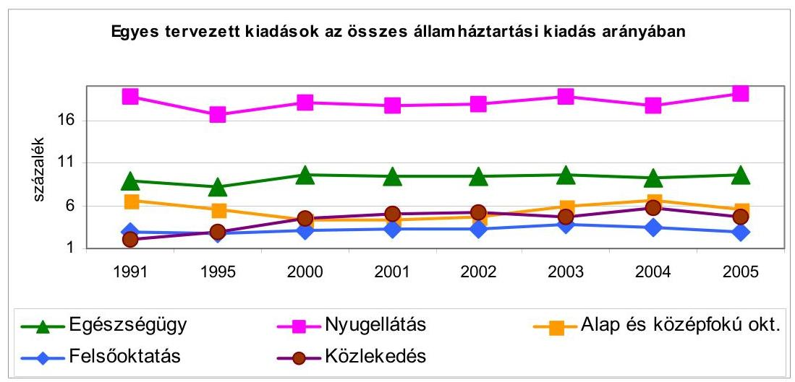

Forrás: költségvetési törvényjavaslatok

### 2.3.1. Egészségügy

Az ÁSZ kiemelt figyelmet fordít az államháztartás nagy ellátó rendszerei múködésének ellenőrzésére. Ennek megfelelően rendszeresen foglalkozik az egészségügy helyzetével, amely egyrészt az éves költségvetési törvényjavaslat véleményezéséhez, a zárszámadási törvényjavaslat értékeléséhez, másrészt az egészségügy egy-egy területét átvilágító tematikus ellenőrzésekhez kapcsolódik.

Az egészségbiztosítási rendszer egyik neuralgikus tényezőjének, a gyógyszertámogatási és finanszírozási rendszernek, a fogyasztás helyzetének 1998-2003-ra visszatekintő ellenőrzése során megállapítottuk, hogy a gyógyszerfogyasztás befolyásolására, a gyógyszerkiadások növekedési ütemének csökkentésére irányult állami intézkedések eredményes végrehajtásához

---

alapvető szabályozási, nyilvántartási feltételek hiányoztak ${ }^{24}$. A kormányprogramokban kitűzött egészségpolitikai célok eléréséhez szükséges jogszabályok nem épültek közép- és hosszú távú stratégiákra. Átfogó koncepció hiányában a gyógyszerellátás terén jellemzően rövidtávú intézkedések történtek.
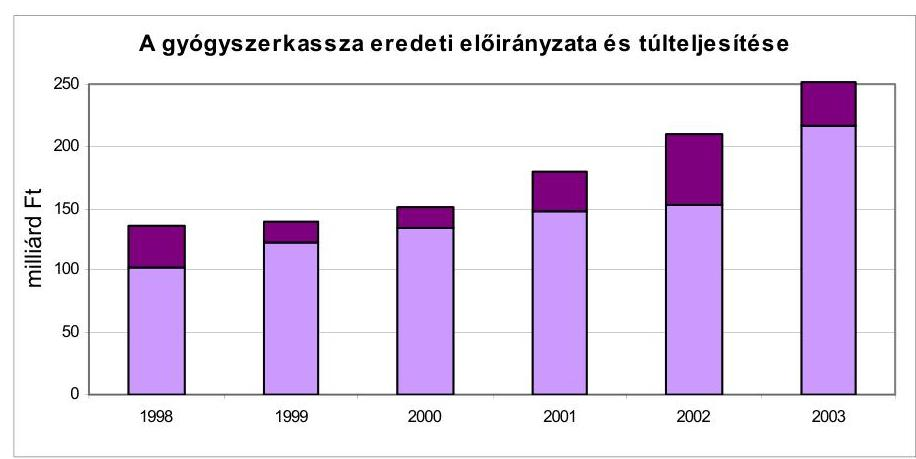

Forrás: Jelentés a gyógyszerek támogatási és finanszírozási rendszerének, a fogyasztás helyzetének ellenőrzéséről (0448)

A lakosság gyógyszerfogyasztása a vizsgált években számottevően nem emelkedett, a társadalombiztosítás és a lakosság mégis mintegy két és félszeresét költötte gyógyszerekre 2003-ban, mint 1998-ban. Sem a szaktárca, sem az OEP nem elemezte azt, hogy a fogyasztás szerkezetének változása milyen mértékben és hogyan befolyásolta gyógyszerkiadásaink növekedését.

Az egészségügyi intézmények gyógyszer-felhasználására és -beszerzéseire sem a szaktárcának, sem az OEP-nek nincs rálátása. Hiányzik az erre vonatkozó megfelelő részletezettségű, döntéshozatalt támogató - központi adatgyűjtés.

A gyártói promóció erősödésével szemben csökkent az állam szerepvállalása az orvosok informálásában, és nem kapott megfelelő hangsúlyt az új gyógyszerekkel kapcsolatos állami tájékoztatás javítása. A hazai gyógyszerellátási rendszerben hatósági és információs feladatokat ellátó Országos Gyógyszerészeti Intézet múködtetéséhez a költségvetés 2004-től egyáltalán nem járul hozzá.

A gyógyszertámogatási és -finanszírozási rendszer valamennyi területén voltak kezdeményezések, módosítások, de a rendszer egészét tekintve alapvető változtatásra a vizsgált években nem került sor. (Ellenőrzésünk lezárásakor kezdte meg a Kormány a gyógyszerpiaci rendtartásról szóló szabályozás előkészítését a kiszámíthatóság, a hosszú távú stabilizáció érdekében.)

A gyógyszerkassza kiadásainak tervezésekor az államháztartási egyensúly megőrzésének prioritása állt az egészségügyi szakmapolitikai érvekkel szemben. A kassza rendszeres alultervezéséhez kellően nem megalapozott kiadáscsökkentő intézkedések kapcsolódtak.

[^0]
[^0]:    ${ }^{24}$ Jelentés a gyógyszerek támogatási és finanszírozási rendszerének, a fogyasztás helyzetének ellenőrzéséről (0448)

---

Az ÁSZ 2004-ben ellenőrizte az 1999-ben megkezdett irányított betegellátási modellkísérletet. Az ellenőrzés alapvetően az 1999-2003 közötti időszakra (lezárt modellévek) irányult, de 2004 decemberéig figyelemmel kísértük a változásokat ${ }^{25}$.

A Modellkísérlet célját jogszabályi szinten nem határozták meg, stratégiai megalapozását a vizsgált időszak kormányprogramjai nem tartalmazzák. A Modellkísérlet szakmai és pénzügyi megalapozása hiányos. Nem határozták meg a bevezetésétől várt eredményeket és az azok értékeléséhez szükséges módszereket, valamint a kiterjesztés feltételeit.

Az Egészségügyi Minisztérium és jogelődei a Modellkísérlet szakmai, szakmapolitikai irányítását nem tartották kézben. A Modellkísérlet bevezetésével és kiterjesztésével kapcsolatos szervezési, irányítási, jogszabály-előkészítési feladatokat szinte kizárólag az OEP látta el.

A Modellkísérlet céljának rögzítését, múködésének tartalmi értékelését, további sorsának meghatározását a vizsgált időszakban nem végezték el. A Modellkísérlet az E. Alap szintjén kiadáscsökkenést nem eredményezett, a szervezési és prevenciós díj pluszkiadásként jelentkezik. A Modellkísérlettel kapcsolatos múködési költségeket sem az OEP-nél, sem a Szervezőknél nem tartják nyilván.

A gyógyító-megelőző kasszákban a Modellkísérlet múködése eredményességének tendenciái értékelhető módon nem jelentkeznek. A megtakarítások keletkezésének okait az OEP nem vizsgálta. A költség-hatékony felhasználásra tett szervezői intézkedések hatása nem mérhető.

A Modellkísérlet útjára indításának előkészítetlensége, koncepcionális rendezetlensége, a szaktárca részéről a múködése iránt tanúsított érdektelenség, az OEP belső szabályainak hiánya ellenére mind a Szervezőknél, mind az OEP-nél olyan folyamatok indultak el, gyakorlatok alakultak ki, amelyek értékelése és hasznosítása fontos az egészségügyi ellátás egészét érintően, és felhasználhatók a másfél évtized óta halogatott átalakítási koncepcióhoz.

Az ÁSZ stratégiai célkitűzése az EU-s támogatások hasznosulásának rendszeres vizsgálata, ennek keretében történt az egészségügy területén megvalósult PHARE programok ellenőrzése is. A csatlakozás előtt 1992-től a PHARE programok felhasználásának ellenőrzése jó felkészülési alapot jelentett 2000-től az előcsatlakozási alappá átalakuló támogatások ellenőrzéséhez. A népegészségügy azon kiemelt területek egyike, amely az európai szemléletű társadalomés gazdaságfejlődés közös tartalmi céljainak megvalósításában jelentős.
A PHARE projektek megteremtették a feltételét a magyar népegészségügy és az EU szakmai szervezeteinek együttmúködéséhez, elősegítették a közösségi jogszabályok végrehajtásában részt vevő intézmények felállítását, felkészítését és megerősítését. A hat támogatott projekt céljainak megvalósítása javította az eszköz- és az informatikai feltételeket a kábítószerek elleni küzdelem fejlesztéséhez, növelte a közegészségügyi la-

[^0]
[^0]:    ${ }^{25}$ Jelentés az irányított betegellátási modellkísérlet ellenőrzéséről (0508)

---

boratóriumok mérőeszköz ellátottságát, a megvalósulás szakaszába került a járványügyi laboratóriumok fejlesztése, az uniós követelmények kielégítésére alkalmassá tette az adatok feldolgozását támogató információ-technológiai eszközöket a szoftver és hardver fejlesztések révén. Az intézményfejlesztés, a munkatársak korszerű képzése megerősítette a hatósági és az ellenőrzési funkciók gyakorlását. Befejezési szakaszba jutott a Nemzeti Drog Információs Pont intézményi fejlesztése, az ehhez szükséges jogi és technikai feltétek kialakítása. A támogatásban részesült projektek céljai és a megvalósult fejlesztések megfeleltek a csatlakozási felkészülés stratégiai keretét adó dokumentumokban megfogalmazott célkitűzéseknek, prioritásoknak. Az uniós intézményi együttmúködés teljessé tétele megkívánja a még folyamatban lévő PHARE projektek befejezését és a fejlesztések fenntartási, üzemeltetési forrásainak rendszeres biztosítását.
A vizsgálat tapasztalatai szerint a projektek ütemezés szerinti megvalósítását befolyásolták a lebonyolítás alatt bekövetkezett szervezeti, intézményi változások, a hazai népegészségügyi stratégia hiánya. A vizsgálat lezárásakor kiemelt feladat volt a tisztiorvosi szervezet korszerűsítésének szükségessége.

Az ütemezés szerint lezárult öt projektben jogosulatlan kifizetés nem volt. A támogatási keretből 7,3\%-ot nem használtak fel, amely nem volt átcsoportosítható más területre.
A hazai társfinanszírozás a fejezeti költségvetésből rendelkezésre állt, forráshiány nem gátolta a megvalósítást. A kötelező társfinanszírozáson felül további kiadás merült fel, amelyet a pályáztatás sikeres előkészítésére, szakértők igénybevételére indokoltan használtak fel. A kötelező társfinanszírozást meghaladó kiadások a jóváhagyott támogatási keret egyötödét tették ki, amely jelzi, hogy az EU-támogatások felhasználásának tervezésekor a költségvetésben a kötelező hazai részen felül további, járulékos kiadások finanszírozásával is számolni kell.

Az egészségügy ellenőrzésének folyamatába illeszkedik a központi költségvetésből támogatott, a sugárterápiát, a radiológiát, az aneszteziológiai és intenzív ellátást érintő eszközberuházásokra fordított pénzeszközök hasznosulásának vizsgálata is. A három eszközcsoportnál a hangsúlyt a sugárterápiás beruházások értékelésére helyeztük, mert a keringési betegség után a daganatos megbetegedések okozzák a legtöbb halálesetet Magyarországon.

Az orvosi szakmai kollégiumok irányításával 1996-ban készített értékelések megállapították, hogy elöregedett a géppark, nem vagy csak részben teljesültek a szakmai minimum feltételek. A javaslatokat figyelembe vette a miniszteri előterjesztés, illetve az indítvány alapján született kormányhatározat, de a jóváhagyott, több évre tervezett programot nem alapozta meg hoszszabb távra szóló pénzügyi és eszközfejlesztési terv.

A már elfogadott programok teljesítéséhez nem biztosított elegendő forrást a központi költségvetés. A szakmailag indokoltnál alacsonyabb összegű beruházások miatt nem lett jobb a gépek korösszetétele, mert tovább használták az elöregedett eszközöket is. A nullára leírt eszközök aránya 30-80\% között alakult.

---

Az ellenőrzés kapcsán a hazai és a nemzetközi orvosi gyakorlatban elfogadott szempontok alapján értékeltük, hogy a megvalósult beruházások javították-e az egészségügyi ellátás feltételeit, hatékony volt-e a működtetésük.

A vizsgálati tapasztalatok alapján eredményesnek minősíthetők a megvalósult sugárterápiás eszközberuházások, mert 1996-hoz képest a sugárterápiás centrumok országos szinten már elegendő kapacitással rendelkeztek a rászoruló betegek ellátásához, ezáltal javultak a gyógykezeléshez való hozzáférés feltételei is. A minőségi mutatóként is elfogadott egy betegre jutó átlagos mezőszám tekintetében azonban jelentős, két-háromszoros volt az eltérés az egyes centrumok között. Az eszközök használatának megítélése, a különbségek értékelése, illetve az eltérések lehetséges mérséklése orvos-szakmai feladat, amely azonban a további eszközfejlesztési programok tervezésénél fontos szempont lehet. Az intézmények tájékoztatása szerint csökkent a várakozási idő, de a betegek kifogásolták a több órás, nem megfelelő körülmények közötti várakozást.

A pénzügyi ráfordítások tartalmi-tárgyi hasznosulásával kapcsolatban meg kell jegyeznünk, hogy a röntgengépekkel való ellátottság minőségi jellemzői országos szinten nem javultak, de a beruházásokkal az adott intézményekben csökkent a betegek és a kezelőszemélyzet káros sugárterhelése és javult a felvételek minősége. Az aneszteziológiai és intenzív ellátás feltételeit illetően ma sem jobb a helyzet, mint 1998ban, a beruházási program elindulásakor.

Az eszközök működtetése csak részben tekinthető hatékonynak, mert nem volt elegendő a szakszemélyzet. A sugárterápiás ellátásnál a tervezett szakorvosi létszám 20\%-a hiányzott. Kevés a speciálisan képzett szakorvos.

# 2.3.2. Felső- és középfokú oktatás 

Az oktatási és képzési rendszerek nem pusztán versenyképességi tényezők, hanem a foglalkoztatás, a munkaerőpiac, a társadalmi esélyegyenlőség alakítása és az uniós prioritásokhoz is alkalmazkodó regionális követelmények kielégítésének tényezőjeként is számolni kell velük. Ellenőrzéseink e területen arra hívják fel a figyelmet, hogy mind az oktatási rendszer fejlesztésének fő irányait, mind a finanszírozás lehetőségeit komplex megközelítéssel lenne célszerű kialakítani. A területet nem ágazati szemléletben, hanem gazdaságpolitikai beágyazódottsággal, átfogó humánerőforrás-fejlesztési feladatként kellene kezelni.

A felsőoktatás normatív finanszírozásának 2001-2003 közötti időszakra kiterjedő ellenőrzése megállapította, hogy a normatívák reálértéke bevezetésük óta csökkent, ${ }^{26}$ a 2003. évi költségvetési támogatás reálértéke az 1991. évinek az $50 \%-a$.

[^0]
[^0]:    ${ }^{26}$ Jelentés a felsőoktatás normatív finanszírozási rendszere múködésének ellenőrzéséről (0433).

---

Az 1996-97-es tanévben bevezetett normatív finanszírozási rendszer a hazai ráfordítások elemzésén, közgazdasági számításokon alapult, alkalmazását széles körű szakmai egyetértés kísérte. Kezdetben az észlelt hibák kijavításának szándékával, majd egyre gyakrabban a központi költségvetés aktuális szempontjai miatt a normatívák szerkezetét és a hozzájuk rendelt összegeket többször módosították. Emiatt a finanszírozási rendszertől várt kedvező hatások fokozatosan csökkentek, majd jórészt elmaradtak.

A gyakori változások, évközi elvonások az intézmények számára bizonytalanná tették a normatív alapon tervezett bevételek teljesítését, pótlásukra rendkívüli intézkedéseket kellett tenni. A kialakított normatívák reálértéke egyre jobban elszakadt a ténylegesen felmerülő költségektől.

A finanszírozási rendszer a hallgatói létszám gyors fejlesztésére ösztönzött, ami megfelelt a kormányzati szándékoknak. A hallgatói létszám növekedése azonban nem járt együtt a felsőoktatási infrastruktúra (tantermek, előadótermek, laboratóriumok, kollégiumok stb.) fejlesztésével, s ez a további létszámnövelés egyre nagyobb akadálya. Helyenként a friss diplomások elhelyezkedése is nehézségekbe ütközik.
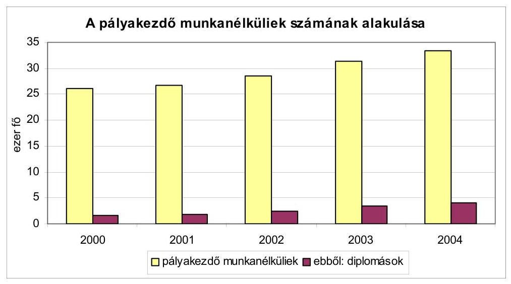

Forrás: Foglalkoztatási Hivatal
A normatívában a személyi juttatások aránya a központi bérpolitikai intézkedések hatására megnövekedett, a fenntartásra jutó hányad rovására. Emiatt a normatíva a fenntartási költségekhez alig nyújt támogatást. A gyakori változások a képzés költségeinek optimalizálását nem tudták elősegíteni. Az intézmények többségénél még nincsenek belső minőségbiztosítási rendszerek, a vizsgálatba bevont intézmények több mint felénél nem alkalmaznak oktatói követelményrendszert.

A felsőoktatás finanszírozásán belül a kutatás-fejlesztési tevékenység - az oktatás-képzés mellett a másik felsőoktatási alapfeladat - központi költségvetésben számszerűen előirányzott támogatása nem fejezi ki a feladat valódi jelentőségét. A támogatási előirányzat (2\%) és a ráfordítási arány (15\%) alakulása közötti különbség oka az volt, hogy a felsőoktatási intézmények saját bevételeikből, pályázati forrásokból és az intézményfinanszírozásra kapott támo-

---

gatásaikból egyaránt fordítottak kutatás-fejlesztési tevékenységre. Az állami felsőoktatás kutatás-fejlesztés irányítási, szervezeti és támogatási rendszere túlzottan tagolt, nem kellően hatékony, valamint hasznosulási problémák jellemzik. ${ }^{27}$ Az állami támogatás elnyeréséhez nem kapcsolódik teljesítményorientált követelményrendszer. A felsőoktatási intézmények, az akadémiai kutató-fejlesztő intézetek kutatási tématerületei gyakran párhuzamosságokat, de egyben szervezetek közötti versenyhelyzetet is jeleztek. A felsőoktatási kutató-fejlesztő helyek teljesítménye - az alapkutatást végző akadémiai kutatóintézetek és felsőoktatási kutatóhelyek esetében - kevéssé pi-ac- és gyakorlatorientált.

A középfokú oktatás feltételei alakulásának ellenőrzése ${ }^{28}$ azokkal a célokkal és a feladatok ellátásához szükséges feltételekkel foglalkozott, melyeket az oktatási tárca a társadalmi igények és az elmúlt évek tapasztalatai alapján fogalmazott meg az oktatás modernizációja érdekében. Kiemelt szerepet kapott a záróvizsga rendszerének átalakítása, az idegen nyelv és az informatika oktatásának fejlesztése, melyek egyaránt szolgálják a felsőfokú képzésbe és a társadalmi munkamegosztásba történő eredményes bekapcsolódást. E feladatokra több fejezetnél és különféle jogcímeken növekvő összegű források kerültek biztosításra (pl. ECDL számítógép-kezelői vizsga és a nyelvvizsga dijának visszatérítése, középiskolai pedagógusok felkészülésének támogatása, szakmai és informatikai fejlesztési feladatok stb.).

A jogszabályi környezet alapvetően segítette a kétszintű érettségire való felkészülést. A tanulók emelt szintű érettségire való felkészítését a vizsgált intézményekben a törvényben előírt vagy azt meghaladó mértékben megszervezték. A pedagógusok felkészüléséhez a központi költségvetés normatív, kötött felhasználású támogatással járul hozzá, de a továbbképzéseknek az előkészítés időigényessége miatt késői beindulása problémákat okozott.

Az informatika tantárgy oktatása az egyes iskolák pedagógiai programjában eltérő súllyal szerepel, de a kerettantervi ajánlásnál mindenütt magasabb óraszámban oktatták a tantárgyat. Ennek ellenére a diákok kevesellték a tárgy oktatására rendelkezésre álló - elsősorban a gyakorlati - időt. A meglévő számítógéppark felének használhatósági foka nem érte el a 30\%-ot. Az elmúlt években központi segítséggel beszerzett géppark mára már elavult, ami akadályozza a korszerű programok alkalmazhatóságát.

A tanulóknak csak 16\%-a rendelkezett legalább egy nyelvvizsgával. Az intézmények alig harmadának volt nyelvi laboratóriuma, s ezek kihasználtsága sem volt megfelelő.

A közoktatás egységes értékelési és vizsgarendje még nem alakult ki, annak egyes elemeiben azonban történt előrelépés. A fenntartói beszámoltatás színvonalának javulása várható az önkormányzati minőségirányítási programok elkészültétől.

[^0]
[^0]:    ${ }^{27}$ Jelentés a központi költségvetésből kutatás-fejlesztési célokra fordított pénzeszközök hasznosulásáról (0440)
    ${ }^{28}$ Jelentés a középfokú oktatás feltételei alakulásának ellenőrzéséről (0445)

---

Az intézményekben végzett tanulói teljesítménymérések széles körű nyilvánosságra hozatala nem kötelező. Az intézmények többsége nem tájékoztatta ezek eredményéről sem a fenntartót, sem a szülőket, akik így nem rendelkeznek kellő információval a végzett diákok továbbtanulásáról, elhelyezkedéséről, az intézmény munkájának tartalmáról, színvonaláról, ami segíthetné iskolaválasztási döntéseiket.

# 2.3.3. Közútfejlesztés 

Az ÁSZ stratégiai célkitűzéseivel összhangban megkülönböztetett figyelmet fordít a gyorsforgalmi úthálózat-fejlesztési program megvalósításának ellenőrzésére. 2001-2002. évben ellenőriztük az M3 autópálya Füzesabony-Polgár közötti szakasz beruházást, 2003-ban az M7 autópálya felújítás, 2004-ben a szekszárdi Duna-híd beruházás és a hozzá tartozó útszakasz pénzügyi folyamatait.

Az országos közúthálózat fejlesztési és finanszírozási szervezeti konstrukcióban valósult meg a szekszárdi Duna-híd, valamint az M3 és az M7 autópálya, amelyek együttes ellenőrzési tapasztalatai alátámasztják, hogy az alkalmazott tulajdonosi-társasági konstrukció nem segítette eló a közpénzek átlátható és elszámoltatható felhasználását. Az állami költségvetésben nem jelentek meg teljes körűen e beruházások finanszírozási terhei, a társaságok által felvett hitelek (a bank esetében állami készfizető kezességvállalással, a Nemzeti Autópálya Kezelő Rt. (NA Rt.) esetében bankgarancia vállalással járó pénzügyi kötelezettségek).

Az országos közúthálózat fejlesztésre juttatott költségvetési források felhasználása államháztartási körön kívülre került úgy, hogy nem voltak szabályozottak az ilyen, költségvetési eredetű pénzeszközök felhasználásának nyilvántartási, elszámolási kötelezettségei. A gyorsforgalmi úthálózat fejlesztésének költségvetési előirányzata egy összegben tartalmazta az adott évre ütemezett fejlesztések forrásait, beleértve a társasági múködés költségeit is. A gyorsforgalmi úthálózat fejlesztés tőke- és/vagy tőketartalék emelések útján történő finanszírozási rendszere egyrészt a projektek megvalósulásakor jelentett problémát azáltal, hogy nem teremtette meg az átlátható és költségtakarékos finanszírozást a megfelelő szabályok hiányában. Másrészt a projektek megvalósulása után az aktiválás az NA Rt.-nél a jegyzett tőke csökkentésével ellensúlyozható. E konstrukció miatt nem mutathatók ki a költségvetésben teljes körűen a közútfejlesztésre igénybe vett források konszolidált pénzügyi hatásai.

Követhetőbbé tette a fejlesztési célú költségvetési források felhasználását az, hogy az NA Rt. múködési támogatás előirányzata a fejlesztési program finanszírozására jóváhagyott egyösszegű előirányzattól elválasztva jelent meg, először a 2003. évi költségvetési törvényben. Továbbra sem jelent meg viszont a fejlesztési program előirányzat projektekre lebontva, a fejlesztési program feladatokhoz igazítva, projekt előirányzatként.

A szekszárdi Duna-híd és kapcsolódó útszakaszok beruházás vállalkozásba adása nem közbeszerzési eljárás keretében valósult meg. Ez alól kormányhatározat felmentést adott, más versenyeztetési eljárást sem alkalmaztak, ami hátrányosan befolyásolta a gazdaságosságot. A beruházás finanszírozásához, amit az MFB Rt. teljesített, a költségvetésből kapott tőkejuttatások és a

---

szindikált hitel elegendő fedezetet nyújtottak. A beruházói feladatok ellátására hozott tulajdonosi döntések nem teremtették meg a gazdaságos megvalósítás lehetőségét, beleértve a vállalkozási szerződések előfeltételeit, a szerződéses árak kialakítását, valamint a technológiai megvalósítást és a minőségbiztosítás mérnöki felügyeletét.

Az állam tulajdonosi érdekeit képviselni hivatott ágazati szakmai irányítás és felügyeleti ellenőrzés szerepe 2002 végéig formális volt, így a szakminisztérium nem volt hatással a beruházás hatékony megvalósítására, az átlátható és költségtakarékos gazdálkodásra. A kincstári kivásárlással 2003. januártól megváltozott a tulajdonosi szerkezet, az NA Rt. állami tulajdonosi jogai a GKM-hez kerültek, megszűnt az MFB Rt. finanszírozási feladata, amely előremutató lépés volt a közvetlen ágazati szakmai irányítás érvényesítése és a közpénzfolyósítás átláthatóbbá tétele szempontjából.

# 2.3.4. Közmédia 

A közmédiát az ÁSZ rendszeresen vizsgálta, és a megállapításokat - az irányítási, tulajdonosi struktúrák döntési mechanizmusára, különösen az MTV Rt.-t illetően a gazdálkodásra - 2004. évi ellenőrzésünk is alátámasztotta. Megállapítottuk, hogy szükséges a közmédia esetében a kialakított sajátos tulajdonosi és irányítási konstrukció (közalapítványok közbeiktatása) felülvizsgálata, valamint a közszolgálati feladatellátás követelmény- és normarendszerének törvényi szintű meghatározása. A központi költségvetésből kapott támogatásaik évenkénti összegei nem álltak arányban e részvénytársaságok tényleges tevékenységének eredményességével. Finanszírozásuk objektív megalapozottsága ez ideig nem alakult ki. Folyamatos vagyonvesztés mellett múködtek a média-részvénytársaságok, 2002-ben 11 milliárd Ft, 2003-ban 11,1 milliárd Ft veszteséget felhalmozva. Az MTV Rt.-nél a részvénytársasággá alakulástól kezdve megoldatlan volt a bevételek és kiadások egyensúlyban tartása, a minden évben veszteséges üzleti tevékenység következtében 2003 végére a teljes vagyonát elvesztette és a tulajdonos részesedése a saját tőkéből -9,1 milliárd Ft volt. Az előzetes adatok szerint a 2004. év mérleg szerinti eredménye várhatóan több milliárd forint veszteség lesz.

A beszámolási időszakban e körben a Hungária Televízió Közalapítvány és a Duna TV Rt. múködését több évre (1997-2002) visszatekintően ellenőriztük. A Duna TV Rt. vagyona mintegy harmadával csökkent, a bevételei nem nyújtottak fedezetet múködésének költségeire. A társaságnál folyamatosan születtek szigorító intézkedések a költségek visszafogása, a pénzügyi stabilitás megőrzése érdekében. 2003 közepétől likviditási hitel igénybe vételére már nem volt szüksége, lejárt határidejú kötelezettsége nem volt a társaságnak. A tartós használatra rendelt tárgyi eszközök fejlesztésének finanszírozása azonban továbbra sincs megoldva, a társaság múszaki fejlesztéseihez hiányzik a szabad tőke. Az előzetes adatok szerint a 2004. év mérleg szerinti eredménye várhatóan 530 millió Ft veszteség lesz.

A Magyar Távirati Iroda Rt. 2003. évi gazdálkodásának ellenőrzése megerősítette, hogy a társaság múködtetésére kialakított speciális tulajdonosi megoldás célszerűtlen. Az MTI Rt.-nél a korábbi szabályozási és társasági gazdálkodási hiányosságok 2003-ban megismétlődtek, sőt újak is keletkeztek, szervezete,

---

múködési költségei és ráfordításai nem igazodtak a csökkenő saját bevételekhez, miközben a társaság folyamatosan növekvő összegű támogatásra tart igényt. Gazdálkodását 2002-ben 142 millió Ft, 2003-ban 138 millió Ft veszteséggel zárta, az előzetes adatok szerint 2004. évi vesztesége 91 millió Ft. Az állami támogatás átláthatóságának szükségességét évek óta szorgalmazzuk. A közszolgálati feladatok pontos meghatározása, a támogatások odaítélésének és felhasználásának átláthatósága, hatékony ellenőrzése uniós követelmény. A követelményeknek való megfelelés feltételezi a nemzeti hírügynökségi törvény felülvizsgálatát. Az uniós csatlakozásunk időpontjától különösen időszerűvé vált a közösségi joggyakorlatnak megfelelő szabályozás azért, hogy az állami támogatás a jövőben is legitim maradhasson. Emellett változatlanul aktuális feladatnak tartjuk a hírügynökségi törvényben jelzett, a választási időszakban végzendő feladatokról szóló törvény megalkotását.

# 2.4. Állami feladatok ellátása államháztartáson kívül 

Az államháztartás egészére gyakorolt hatására és nagyságrendjére, illetve az életminőséget befolyásoló közérdekű szolgáltatásokkal való összefüggéseire figyelemmel külön témaként vizsgáltuk az államháztartáson kívüli állami feladatellátást. ${ }^{29}$ Az ÁSZ-nál először került sor ennek átfogó, rendszerszemléletű átvilágítására a központi költségvetés és az alapok, azok intézményei, gazdasági és közhasznú társaságok, alapítványok tekintetében.

A vizsgált államháztartási alrendszereknél nem érvényesült az államháztartáson kívüli állami feladatellátásban a rendszer-szemlélet. A jogi szabályozás nem határozott meg egységes, átlátható követelményrendszert az állami feladatok államháztartáson kívülre szervezésére, sőt az állami feladatok tartalmát, követelményeit illetően sem volt következetes. A szabályozási hiányosságok is hozzájárultak ahhoz, hogy a fejezetek sem törekedtek a feladatok, a vagyon, a pénzeszközök államháztartáson kívülre helyezésénél egységes rendező elvek kimunkálására, a döntések gyakran nem támaszkodtak megalapozó hatástanulmányokra. Nem volt egyértelműen behatárolható az államháztartáson kívüli szervezeteknek az állami feladatok ellátásával való kapcsolata sem.

A központi költségvetési szervek számára előírt folyamatos létszámleépítést, az állami feladatok csökkentését a tárcák, az alapok, azok intézményei gazdasági és közhasznú társaságok, (köz)alapítványok létesítésével oldották meg, sok esetben érdemi funkció- és feladatelemzés, hatékonyság-vizsgálat nélkül. A fejezetek több mint háromnegyedénél e tekintetben alapvetően szabályozási és múködési hiányosságokat állapítottunk meg.

[^0]
[^0]:    ${ }^{29}$ A támogatások összege 2002-ben 613 Mrd Ft, 2003-ban 578 Mrd Ft volt, a központi költségvetés kiadásának 10\%-át tette ki. Ezen belül a fejezetek a vagyonkezelésükben lévő gazdasági és közhasznú társaságoknak, az alapítók a (köz)alapítványoknak 2002ben közel 70 Mrd Ft, 2003-ban mintegy 180 Mrd Ft állami támogatást és tőkejuttatást nyújtottak. Az állami feladatellátás kapcsán igénybevett tevékenységekre kötött megbízási, szakértői, tanácsadói szerződésekre évente további 40-50 Mrd Ft-ot fizettek ki.

---

Az állami feladatokat ellátó államháztartáson kívüli szervezetek finanszírozásához egységes rendező elvek hiányában a tulajdonosok, alapítók pénzügyi lehetőségeik függvényében egyedi döntések alapján nyújtottak támogatást. A tárcák érdekeltségükben levő és érdekeltségükön kívüli szervezeteket is támogattak.

# A szervezetek létrehozásával tervezett hatékonyabb közfeladatellátás csak deklarált cél volt, müködésük kimutatható megtakarítással nem, esetenként - megalapozó elemzések hiányában - többletköltséggel járt. A szervezetek harmada a vizsgált időszakban veszteségesen gazdálkodott, évenként 20-28 milliárd Ft nagyságú veszteség jelentkezett a gazdasági társaságoknál. Folyamatos vagyonvesztés mellett múködtek a mé-dia-részvénytársaságok, évente 11 milliárd Ft körüli veszteséget halmoztak fel. 

A gazdasági, közhasznú társaságok és a tárcák között létrejött támogatási szerződések többségénél nem dolgoztak ki a finanszírozott feladatokra költségnormákat, nem volt szoros korreláció a feladatok és az azokra elszámolt költségek (állami támogatás) között.

A szervezetek múködésére, a támogatások felhasználására irányuló belső és külső ellenőrzések hatékonyságát több tényező befolyásolta kedvezőtlenül. A minisztériumok a többségi állami tulajdonban lévő gazdasági társaságoknál a tulajdoni jogok gyakorlására nem fordítottak kellő figyelmet. A (köz)alapítványok egyharmadánál nem múködött ellenőrző szervezet. A 100\%os állami részesedésű gazdasági társaságok, illetve közhasznú társaságok egyötödénél nem funkcionált az ellenőrzés. A társaságok, (köz)alapítványok kétharmadánál az alapítók, tulajdonosok elmulasztották az állami támogatások felhasználásának ellenőrzését, illetve annak megfelelő dokumentálását. Az ellenőrzések során a vizsgált szervezetek több mint felénél állapítottak meg szabálytalanságokat ${ }^{30}$.

A rendszeres központi költségvetési támogatásban részesült kétévenkénti ellenőrzési kötelezettséggel ütemezett öt parlamenti párt közül négynek az ellenőrzése a múlt évben teljesült. Az ellenőrzés akadályoztatása miatt törölni kellett a Kereszténydemokrata Néppárt vizsgálatát. A pártok törvényi előírások alapján nyilvánosságra hozott beszámolói többségében továbbra sem felelnek meg a megbízhatóság és valódiság követelményeinek. Az ellenőrzés által feltárt hibák, mulasztások ismételten megerősítették a pártok múködéséről és gazdálkodásáról szóló 1989. évi XXXIII. törvény, valamint a 2001. január 1-jétől hatályos számviteli törvény előírásai összehangolásának szükségességét.

[^0]
[^0]:    ${ }^{30}$ Az államháztartás egyensúlyi helyzetének javítása kapcsán az államháztartás hatékony múködését elősegítő szervezeti átalakításokról és a megalapozó intézkedésekről a vizsgált időszakot követően, 2004-ben - hozott kormányszintű döntések az egész állami feladatellátás rendszerét is érintő átfogó intézkedés-sorozatot rendeltek el (fejezeti intézkedési tervek, hozzárendelt módszertani útmutató alapján; feladat, szervezet, intézményi-felülvizsgálatok; szakmai költséghatékonysági átvilágítások).

---

2004-ben négy, Kormány által alapított közalapítvány gazdálkodásának átfogó ellenőrzését is elvégeztük, amelyek múködését - egy kivételével, amely külföldről kapott jelentős támogatást - csaknem teljes egészében a központi költségvetés finanszírozta, így az ez évi ellenőrzési tapasztalataink is azt igazolják, hogy a közalapítványok által ellátott közhasznú feladatokhoz a vállalkozások és az állampolgárok adományokkal nem járulnak hozzá, a saját bevételek túlnyomó része az átmenetileg fel nem használt és pénzintézetnél lekötött állami források kamatbevételeiből származik. A minisztériumok a közhasznú szervezetekről szóló törvénynek a szerződéskötési kötelezettségre vonatkozó előírását megszegve a támogatások felhasználására a közalapítványokkal nem minden esetben kötöttek szerződést. A kuratóriumok a közfeladatokra szánt pénzeszközök döntő többségét az alapító okiratban meghatározott célokkal összhangban osztották szét. Egy közalapítvány esetében kifogásoltuk, hogy a kuratórium, az alapító okiratban előírt pályáztatási kötelezettség mellőzésével, ítélte oda az alapítói célok megvalósítására nyújtott támogatásait. A kuratóriumok múködésének jellemző hiányosságaként állapítottuk meg, hogy a határozatképesség megállapításánál törvénysértő gyakorlatot folytattak.

A törvényes gazdálkodást megalapozó belső szabályzatokkal rendelkeztek a közalapítványok, azonban azok nem tükrözték az adott közalapítvány sajátosságait. Jellemző szabálytalanságként állapítottuk meg, hogy a kuratóriumon kívül más személyek is rendelkezhettek és a gyakorlatban rendelkeztek is a közalapítványok vagyona felett, mivel a képviseleti jog valamint a bankszámla és értékpapírszámla feletti rendelkezési jog gyakorlása nem felelt meg a jogszabályi előírásoknak. A közalapítványok fele az alapító okiratban meghatározott múködési költség keretét túllépte, ennek ellenére a múködésben kirívó pazarlást nem tapasztaltunk. Az ellenőrzött közalapítványoknál a kuratóriumok ellenőrzésére a Kormány - mint alapító - által felkért felügyelő bizottságok egyike sem látta el maradéktalanul feladatát.

Az elmúlt tíz év ellenőrzései során az ÁSZ szembesült azzal, hogy az alapító nem mindig rögzítette megfelelően az alapító okiratban az ellátandó közfeladatot. A közalapítványok többségének a Kormány az alapító okiratban nagyszámú vagy nem kellően behatárolt közfeladatot határozott meg, jóllehet az ellátásukban való közremúködés fedezetét - az állam feladat-ellátási kötelezettségére tekintettel - a központi költségvetésből kell biztosítani. Kifogásolnunk kellett azt is, ha a kuratóriumok jóhiszemúen, a közalapítvány közremúködésével ellátandó közfeladat megoldása iránti elkötelezettség által motiválva bővítették, szűkítették vagy átértelmezték az alapító okiratokban megjelölt, jogszabályokra alapozott közfeladatot.

# 3. Az EllenŐrzéSEK hASZNOSítÁSA 

Az ÁSZ tevékenységét számos törvényi előírás keretei között végzi. A szervezet nem hatóság, nem szankcionálhat és nincs lehetősége kikényszeríteni javaslatai, ajánlásai realizálását. Azokban az esetekben azonban, ahol e tekintetben az ÁSZ-nak törvény adta felhatalmazása van, a rendelkezésre álló eszközöket munkája során alkalmazza (felhív a törvényes állapot helyreállítására, kezde-

---

ményezi a jogtalanul igénybe vett pénzeszközök visszafizetését, zároltathat anyagi- és pénzeszközöket, felelősségre vonásra tesz javaslatot stb.).

A számvevőszéki munka közvetetten, az országgyűlési és a kormányzati munkán keresztül hasznosulhat, érhet el érdemi eredményeket. Tapasztalataink szerint rendre hasznosulnak a számvevőszéki felvetések azokban a kérdésekben, ahol ellenőrzéseink alapján korrekciós jellegű módosításokra vagy egyes, különállóan is megvalósítható szabályozási kérdésekben teszünk javaslatot. Ezzel szemben ott, ahol rendszer méretű és szemléletű változásokat tart szükségesnek az ellenőrzés, a javaslatok megvalósításának sikeressége már jóval szerényebb.

Az utóbbi években az Országgyúlés rendre megtárgyalta az ÁSZ éves beszámolóját és munkáját értékelő, stratégiai céljait megerősítő, érdemi útmutatást nyújtó határozatokat hozott. Rendszerré vált a javaslatok sorsának figyelemmel kísérése, az ÁSZ beszámolókban a javaslatok megvalósításának miniszteri tájékoztatókra, intézkedési tervekre, visszatérő vizsgálatokra, egyéb információkra építő bemutatása, illetve szervezetté vált a jelentések bizottsági üléseken történő megtárgyalása.

Az egyes ellenőrzési jelentésekben megfogalmazott javaslatok, illetve azok hasznosítása, megvalósítása az ÁSZ honlapján figyelemmel kísérhető.

# 3.1. Jelentések országgyúlési tárgyalása, határozatok és az országgyúlési kapcsolatok 

Az ÁSZ 2004-ben is az előírt határidőre eleget tett azoknak a jelentéstételi kötelezettségeinek, amelyeket a hatályos törvények és országgyúlési határozatok előírnak számára (zárszámadási jelentés, költségvetés véleményezése, jelentések az MTI Rt., az ÁPV Rt., a választásokkal, népszavazásokkal kapcsolatos pénzfelhasználások ellenőrzéséről).

2004-ben 18 jelentés szerepelt a bizottságok napirendjén, önállóan vagy kapcsolódva törvényjavaslatok tárgyalásához. A jelentéseken túlmenően az ÁSZ Fejlesztési és Módszertani Intézetének 2 tanulmányát is napirendre tűzték a bizottságok. Az ÁSZ éves tevékenységéről szóló jelentését évről-évre több - a 2003. évről szólót 12 - bizottság tárgyalta, kifejezetten a feladatkörükbe tartozó kérdésekre összpontosítva.

A zárszámadási és költségvetési törvényjavaslatokhoz kapcsolódó ÁSZ jelentésen, illetve véleményen túlmenően 14 állandó bizottság tárgyalt ÁSZ-jelentést. A tárgyalt jelentések 1/3-a az előző évben készült. A nagyösszegű költségvetéssel, illetve magas költségvetési kockázattal gazdálkodó önkormányzatok ellenőrzéséről készült önálló jelentések még nem szerepeltek bizottsági ülésen. A bizottságok közül főként a Gazdasági, az Egészségügyi, a Költségvetési és pénzügyi, valamint a Kulturális és sajtó bizottság támaszkodott munkájában az ÁSZ jelentéseire.

Plenáris ülésen az intézmény 2003. évi tevékenységéről szóló jelentés, a Magyar Távirati Iroda Rt. 2002., valamint a 2003. évi gazdálkodásának ellenőrzéséről készült jelentések, továbbá a zárszámadási és költségvetési törvényjavaslatokhoz kapcsolódó jelentés, illetve vélemény szerepeltek. Az ÁSZ elnöke ple-

---

náris ülésnapon 6 alkalommal szólalt fel a tárgyalt jelentések, illetve a számvevőszéki törvény módosítása kapcsán.

Az ÁSZ 2003. évi tevékenységéről szóló jelentésének tárgyalásakor a Számvevőszéki bizottság által benyújtott országgyúlési határozati javaslat a beszámoló elfogadásán túlmenően megerősítette a nemzetközi kapcsolatokból adódó kötelezettségek teljesítését, a szükséges források biztosítását. Felkérte a Kormányt, hogy a megbízhatósági ellenőrzések évenkénti és teljes körű végrehajtására meghatározott 2010. évi határidőt vizsgálja felül és hozza előbbre, az ÁSZ az éves jelentésében értékelje javaslatainak hasznosulását, felhasználva a Kormánynak címzett javaslatai megvalósításáról a Kormány által adott tájékoztatót. A határozati javaslatot módosítás nélkül, egyhangúlag fogadta el az Országgyúlés.

Az Országgyúlés 2004-ben törvényalkotási tevékenysége során több olyan törvényt, országgyúlési határozatot hozott, amelyek nevesítették, érintették az ÁSZ feladatkörét, hatáskörét, múködését. A legjelentősebb ezek közül az ÁSZtörvény módosítására vonatkozó javaslat, amelyet az Országgyúlés a Számvevőszéki bizottság által benyújtott, négypárti egyeztetések során kialakított konszenzusos módosító javaslatokkal fogadott el.

A törvényjavaslat a következő főbb kérdéskörökben javasolta az ÁSZ-törvény módosítását: az ÁSZ függetlenségének erősítése, feladat- és jogkörének pontosítása, a főtitkár funkciója, az adatvédelem, illetve a nem teljesíthető rendelkezések kiiktatása, címhasználat, a szervezetet érintő egyéb kisebb módosítások.

Új feladat az Eximbank és a Mehib Rt. felügyelő bizottsági elnökjelölése, a települési önkormányzatok többcélú kistérségi társulásainak, valamint az új elkülönített állami pénzalapként működő Szülőföld Alapnak az ellenőrzése.

Az M5-ös autópálya megvalósítására és továbbépítésére megkötött szerződések számvevőszéki ellenőrzését országgyúlési határozat rendelte el.

# A képviselők az előző évihez hasonló arányban, a plenáris ülésnapok 70\%-án, több mint 250 felszólalásban hivatkoztak a jelentések, tanulmányok megállapításaira, javaslataira. A hivatkozások jelentős része 

az önkormányzatok gazdálkodási gondjaival, az egészségügy finanszírozásának problémáival, a privatizáció tapasztalataival kapcsolatos ÁSZ megállapításokat (tanulmányokat) idézte. Napirenden kívül, interpellációk, kérdések kapcsán 24 felszólalásban hivatkoztak ÁSZ-jelentésre a felszólalók.

A törvényhozási munkában a bizottságok önálló napirendként vagy háttéranyagként hasznosították az ÁSZ-jelentéseket.

Példa erre a „Vélemény és javaslatok a Kormány takarékossági intézkedéseinek megalapozásához" című anyag, amelyet a Költségvetési és pénzügyi bizottság a pénzügyminiszter-jelölt meghallgatásakor háttéranyagként hasznosított. A „brókerbotrányt" vizsgáló bizottság munkájában felhasználta a Gazdasági és Közlekedési Minisztérium fejezet múködésének ellenőrzése keretében az autópályaépítéssel, az Állami Autópálya Kezelő Rt.-nél, illetve a Nemzeti Autópálya Rt.-nél végzett ÁSZ-vizsgálat megállapításait. A Bizottság tájékoztatást kért a minisztériumtól az ÁSZ-javaslatok végrehajtására készített intézkedési terv megvalósításáról.

---

A korábbi évekhez hasonlóan továbbra is fontos feladatának tartja az ÁSZ, hogy az Országgyűlés mind szélesebb körű tájékoztatást kapjon ellenőrző szervezetének tevékenységről.

Az ÁSZ kapcsolata az országgyűlési képviselőcsoportokkal rendszeres. A korábbi években kialakított gyakorlatot folytatva az ÁSZ elnöke és vezető munkatársai 2004-ben is tájékoztatták a képviselöcsoportokat, illetve azok vezető politikusait az ÁSZ tevékenységéről, terveiről.

Az Országgyűlés Számvevőszéki bizottságával folyamatos és az ÁSZ országgyűlési kapcsolattartásában továbbra is meghatározó az együttmúködés. Az ÁSZ elnöke, illetve vezető munkatársai a bizottság ülésein részt vettek, az intézmény múködésének, ellenőrzési témáinak főbb kérdéseiről tájékoztatást adtak. A Számvevőszéki bizottság elsősorban a törvényalkotó munkájához kapcsolódóan támaszkodott az ellenőrzések megállapításaira, és módosító javaslatokat nyújtott be, illetve támogatott az ÁSZ tevékenységének elősegítése érdekében.

A Számvevőszéki bizottság 2004 decemberében - a korábbi gyakorlatnak megfelelően - kihelyezett ülésen tűzte napirendre az ÁSZ 2005. évi ellenőrzési tervének tervezetét.

Az előző évi tevékenységünkről szóló jelentés gyakorlatát folytatva az ellenőrzések során tett, törvénymódosításra vonatkozó javaslatainkat a 5. számú melléklet mutatja be.

Az elmúlt 2 évi, jelentősebb törvénymódosításokra vonatkozó számvevőszéki javaslatok, amelyek nem valósultak meg, ismét bekerültek az Országgyűlés „Kimutatás az Országgyűlés által meghatározott feladatokról és határidőkről" című kiadványába.

A bizottságok és a plenáris ülések napirendjén szereplő ÁSZ-jelentésekről készült kimutatást a 4. számú melléklet foglalja össze.

# 3.2. Számvevőszéki javaslatok érvényesülése 

A 2004. évben is tevékenységünk meghatározó tényezőjének tartottuk a magas szintű bizonyossági követelmények mellett végzett ellenőrzésekre alapozott tanácsadó szerepünk erősítését, az értékadó ellenőrzést, amellyel célunk az ellenőrzött szervezetek tevékenységének, a közpénzekkel való gazdálkodás eredményességének növelése, javítása. A legjobb nemzetközi gyakorlat átvételével, a módszertani fejlesztő munka eredményeinek mind szélesebb körben való alkalmazásával és megismertetésével törekedtünk arra, hogy megalapozott javaslatokkal segítsük az ellenőrzött szervezetekben, rendszerekben, folyamatokban rejlő kockázatok feltárását és kiküszöbölését, a szabályszerűség érvényesülését, a hatékonyság javítását. Figyelmet fordítottunk a korábbi megállapításaink, ajánlásaink hasznosulására, a tett intézkedések végrehajtásának ellenőrzésére, nyomon követésére. Ehhez kapcsolódóan is figyelemmel kísérjük az ellenőrzéseink javaslataival kapcsolatos intézkedésekről kapott tájékoztatásokban foglaltakat.

---

# 3.2.1. A javaslatok érvényesülése az Országgyúlés szintjén 

A Magyar Honvédség Szárazföldi csapatai múködtetését szolgáló pénzeszközök hasznosulásának ellenőrzéséről, valamint a Magyar Honvédség közbeszerzési rendszere múködésének ellenőrzéséről készített jelentéseinknek az országvédelemhez kapcsolódó felső szintű szabályozási korrekcióra irányuló javaslata találkozott az ország-védelemmel összefüggő jogszabályi háttér napirenden levő harmonizációjával, ezáltal főbb elemei beépülhettek a Magyar Köztársaság Alkotmányának módosításáról szóló, valamint a honvédelemröl és a Magyar Honvédségről alkotott törvényekbe.

Az Országgyúlés elfogadta a kutatás-fejlesztésről és a technológiai innovációról szóló törvényt. A törvény - a központi költségvetésből kutatásfejlesztési célokra fordított állami pénzeszközök hasznosulásának ellenőrzéséről készített jelentésünkben tett - javaslatainknak megfelelően rögzíti a ku-tatás-fejlesztési és technológiai innovációs eredmények létrehozását és azok gazdasági, társadalmi hasznosítását segítő állami feladatrendszer kereteit, megállapítja a közfinanszírozású támogatások felhasználásával kapcsolatos legfontosabb jogszabályokat, megkönnyíti a költségvetési kutatóhelyen létrejött eredmények gazdasági hasznosíthatóságát.

Javaslatainkra is figyelemmel - a jogértelmezési különbségek megszüntetése érdekében - megtörtént az adózás rendjéről szóló törvény és a személyi jövedelemadóról szóló törvény összehangolása. Ennek eredményeként 2005-től egyrészt jogszabályilag biztosított a munkáltatói adómegállapítással elszámoló mintegy 2 millió adóalany jövedelmi és adó adatainak az APEH adatbázisaival történő egybevetésének lehetősége, másrészt pontosításra került az adatszolgáltatás elmaradása, késedelmes benyújtása, hiányos, illetve hibás kitöltése miatt kiszabható mulasztási bírság összegének meghatározási módja. Az egyszerűsített ellenőrzések lefolytathatóságának növelése érdekében módosult az adatszolgáltatások köre, struktúrája, tartalma.

A helyi önkormányzatok ellenőrzésének tapasztalatai alapján számos javaslatot tettünk a támogatási rendszer pontosítására, egyszerúsítésére. Növekszik azon javaslatok száma, amelyek nyomán a vonatkozó jogszabályok módosulnak.

- A normatív hozzájárulások rendszerében 2005-ben a közoktatás területén a hatékonyabb és méretgazdaságos intézményhálózat kialakítását kiegészítő hozzájárulások ösztönzik. A szociális és gyermekjóléti ellátásban az általános (lakónépesség alapján megállapított) normatívák egy részét konkrét feladatmutatóhoz kapcsolódó hozzájárulások váltják fel, így e források azokhoz az önkormányzatokhoz jutnak el feladatarányosan, amelyek az adott tevékenységet ténylegesen ellátják.
- A szociális és gyermekjóléti, gyermekvédelmi feladatok támogatásának rendszere 2005-től szerkezetében átalakul. A helyben biztosítandó alapszolgáltatásoknál a lakosságszám szerinti finanszírozás helyébe a feladat és létszámarányos támogatás lép. Az alapellátás tartalmának meghatározásakor

---

figyelembe vették a kisebb településeken is felmerülő általános feladatokat, amely biztosítja a normatívák célzottabb, feladatarányosabb eljuttatását az érintetthez. Régi elemként, de külön fajlagos összeggel szerepel az étkeztetés és a házi segítségnyújtás. A szociális és gyermekjóléti általános feladatok gyűjtőjogcímként tartalmazzák az információnyújtást, a családsegítést, illetve a gyermekjóléti ellátást és szolgáltatást.

A központosított és a normatív kötött támogatások felhasználásának igénybevételi, illetve elszámolási szabályait kialakító minisztériumoknak címzett javaslataink alapján tett intézkedések tetten érhetők a jogszabályok, egyes pályázati kiírások, elszámolási szabályok változásában.

- Korábbi javaslatainkat figyelembe véve már a 2003. évi költségvetési beszámoló kibővült az előző évről feladattal terhelten áthozott támogatásokkal, a 2004. évi beszámolóban pedig már azonos szemléletű a központosított és a kötött felhasználású támogatások elszámolása.
- Évről évre finomodik a létszámcsökkentéshez kapcsolódó támogatások pályázati kiírása. Javaslatunk alapján a 2005. évi pályázatban már nem vehetők figyelembe az önkormányzati döntést követő fél évben teljes összegű előrehozott nyugdíjra jogosulttá váló személyek.
- Többszöri kezdeményezésünk nyomán a támogatások egy részénél feloldották az elszámolás, dokumentálás oldaláról fölösleges adminisztrációs terheket jelentő felhasználási kötöttséget (2004-től az ingyenes étkezés, tankönyvtámogatás, 2005-től pedig a pedagógusok szakkönyvvásárlásának támogatása esetében).

# A zárszámadási, illetve költségvetési ellenőrzéseinkkel összefüggésben: 

- A helyi önkormányzatok támogatásaival kapcsolatos visszafizetési és pótlólagos kifizetési javaslataink beépítésre kerültek a zárszámadási törvénybe.
- A belügyminiszter intézkedett a címzett és céltámogatások számítógépes nyilvántartási programjának módosításáról, valamint az eltérő nyilvántartás miatt a céltámogatásokhoz kapcsolódóan az önkormányzati visszafizetések egyeztetési módszerének kidolgozásáról a Kincstár és a BM között.
- Javaslatunk nyomán a 2005. évi költségvetési törvény meghatározta a múködésképtelen helyi önkormányzatok egyéb támogatásának célját.

A fejlesztési források koordinációja érvényesítésének szempontjából lényeges változás, hogy a 2004-ben még döntően az ágazati fejezeteknél előirányzott fejlesztési programok támogatását ez évtől önálló fejezetben (XVII. Területfejlesztés) összevonták. (Az önkormányzatokat érintő fejlesztési támogatások koncentrálásában történt jelentős előrelépés ellenére azonban egyes szaktárcák fejezeti kezelésű előirányzatai még mindig tartalmaznak olyan kereteket, amelyek bővítik az önkormányzatok fejlesztési lehetőségeit és ezek összehangolása továbbra is indokolt.)

---

A fejlesztési döntések decentralizációja tekintetében a területfejlesztésről és a területrendezésről szóló törvény hatályba lépése óta jelentős fejlődésként értékeljük, hogy a megyei területfejlesztési tanácsok mellett egyre nagyobb szerepet kapnak a regionális fejlesztési tanácsok is.

A Kormány jelentősen, 48\%-kal növelte a helyi önkormányzatok EU-s fejlesztési pályázatai saját forrás kiegészítése támogatásának előirányzatát. Kedvező változtatás, hogy az EU Önerő Alap felhasználása felülről nyitott, így nem fordulhat elő, hogy az EU-támogatás igénybevételének lehetőségéről saját forrás hiánya miatt kelljen lemondani.

Ezen túlmenően a fel nem használt előirányzatból kizárólag hazai finanszírozású önkormányzati pályázatok saját forrásához is nyújtható támogatás. Ez utóbbi a regionális fejlesztési tanácsok döntési jogkörébe került azzal, hogy elsősorban a címzett vagy céltámogatásban részesülő vízgazdálkodási beruházások saját forrás kiegészítéséhez lesz felhasználható.

A társulások vizsgálata kapcsán javasoltuk, hogy a közigazgatás korszerűsítési programja keretében a hatékonyabb szervezeti formák gyorsabb elterjesztése érdekében hozzanak intézkedést az ösztönző rendszer és érdekeltség továbbfejlesztésére. Ezzel kapcsolatosan megszületett a 2004. évi CVII. törvény a települési önkormányzatok többcélú kistérségi társulásáról.

# 3.2.2. A javaslatok érvényesülése kormányzati szinten 

A számvevőszéki vizsgálatok során tett ajánlások, javaslatok hasznosításának nyomon követése érdekében a korábbi évek gyakorlatának megfelelően az ÁSZ 2004-ben is tájékoztatást kért a Kormánytól és a tárcák vezetőitől az éves ellenőrzések kapcsán tett ajánlások hasznosulásáról. A megkereséseknek az érintettek eleget tettek.

Ez a tájékoztatás azért is fontos információ az ÁSZ számára, mert a számvevőszéki javaslatok figyelembevételére - a törvényesség helyreállítására irányuló jogi realizálás kezdeményezésén túl - nincs általános érvényű törvényi előírás. Az ÁSZ annak alapján választja meg javaslatainak címzettjét, hogy az adott ajánlás megvalósítására - illetékességénél, hatáskörénél fogva - mely szervezet (vezetője) tehet érdemi lépéseket. Az ÁSZ 2004-ben 297 javaslatot tett a tárcák vezetőinek. A Kormány 73 ajánlás címzettje volt.

A tájékoztató válaszlevelek azt mutatják, hogy az egyes tárcáknak címzett ajánlások - az előző évhez hasonló szerkezetben - jellemzően megvalósultak, illetve megvalósításuk folyamatban van.

---

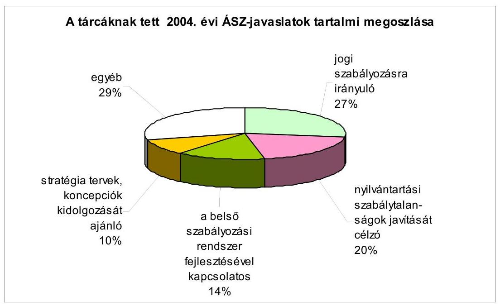

A jogi szabályozásra irányuló - törvény, kormányrendelet vagy miniszteri rendelet módosítását célozó - javaslatokra beérkezett válaszok szerint ezek közel fele megvalósult, az esetek további mintegy 40\%-ában az intézkedések folyamatban vannak, vagy a jövőben tervezik megtenni azokat. A javaslatok $15 \%$-ára a válaszok nem tértek ki, vagy a fennálló szabályozást megfelelőnek tartották.

A számviteli, nyilvántartási szabálytalanságok javítását, adatszolgáltatási és nyilvántartási rendszerek korszerúsítését célzó javaslatokra a beérkezett válaszok alapján azok 70\%-ával egyetértettek, a realizálás folyamatban van, vagy befejeződött. A fennmaradó esetekben a javaslatok válasz nélkül maradtak illetve a válaszok nem adtak számot egyértelmúen a javaslat megvalósításáról.

A javaslatok 14\%-a az ellenőrzöttek belső szabályozási rendszerének, illetve a fejezeti és a belső ellenőrzés múködésének felülvizsgálatát, továbbfejlesztését célozta, valamint hatékonysági, racionalizálási kezdeményezéseket várt el. A beérkezett válaszok alapján e javaslatok többségével kapcsolatban konkrét intézkedések történtek, illetve az érintettek megkezdték a javaslatok hasznosításának előkészítését. A javaslatok kisebb részét érintően csak a jövőben tervezik azok megvalósítását.

A javaslatok kisebb hányada, mintegy 10\%-a stratégiai tervek, koncepciók kidolgozását ajánlotta. A válaszok szerint ezek az ajánlások többségükben pozitív fogadtatásra találtak, megvalósultak, vagy az ellenőrzöttek a jövőben tervezik azok megvalósítását.

Az egyéb, egyedi jellegüknél fogva nem rendszerezhető és az előző csoportokba nem sorolható ajánlások 29\%-ot jelentettek.

A javaslattétel egyik legjelentősebb súlypontja a zárszámadási ellenőrzés, amihez az ajánlások mintegy negyedrésze kapcsolható. A 2003. évi zárszám-

---

adás ellenőrzéséről készült jelentésben az ÁSZ minden fejezet vezetője számára fogalmazott meg ajánlásokat. Ezek az ellenőrzések megállapításai alapján szükséges intézkedések megtételére, a múködés, gazdálkodás, beszámolás szabályzatainak elkészítésére, aktualizálására, a belső ellenőrzés megfelelő múködésére, a részesedések értékelésére vonatkoztak. A beérkezett válaszok alapján a tárcák többsége konkrét intézkedéseket tett.

A Kormány is tájékoztatta az ÁSZ-t javaslatainak hasznosításáról. Ezek - az előzőekben már ismertetett konkrét törvényalkotáson, illetve törvénymódosításon túlmenően - a következőkben foglalhatók össze:

- Folyamatban van a közúthálózat-fejlesztési program kidolgozása. A programban a projektrangsor kialakítása szakértői bizottság módszertani irányításával, költség-haszon elemzéssel és minden lényeges hatásra kiterjedő analitikus értékelés szerint történik. Ezen kívül megkezdődött a közúti közlekedésről szóló 1988. évi I. törvény felülvizsgálata, amelyet a tárca a félév végére tervez. A javaslatban a hatékonysági szempontok normatív szabályozását érvényesíteni kívánják.
- A 2005. évi költségvetési törvény 88. § (16) bekezdése tartalmazza az Áht. 41. § (1) bekezdés pótköltségvetés készítési kötelezettségre vonatkozó rendelkezésének módosítását.
- 2005. január 1-jén hatályba lépett a 27/2004. (XII. 14.) FMM-ICsSZEM-PM együttes rendelet, amely biztosítja a megváltozott munkaképességű személyek foglalkoztatási támogatása kiáramlásának mérséklését. Ezen kívül elkezdődött a megváltozott munkaképességűeket foglalkoztató gazdálkodó szervezetek átvilágítása és akkreditálása. A tervek szerint 2006-tól már csak akkreditált célszervezetek kaphatnak támogatást.
- Az Európai Közösséget létrehozó Szerződés 87. cikkének (1) bekezdése szerinti állami támogatásokkal kapcsolatos eljárásról és a regionális támogatási térképről szóló 85/2004. (IV. 19.) Korm. rendelet megteremti az összhangot az állami támogatással megvalósuló beruházások és az EU szabályai között.
- Az államháztartás működési rendjéről szóló 217/1998. (XII. 30.) Korm. rendelet 66. §-át a 382/2004. (XII. 29.) Korm. rendelet 31. §-a 2005. január 1jével módosította annak érdekében, hogy az előirányzat-maradvány jóváhagyásának határideje reális, teljesíthető legyen.
- Stratégiai jelentőségű a gyógyszergyártók 99\%-ának a Magyar Állammal a 2004. július 1-jétől 2006. december 31-ig terjedő időszakra vonatkozó megállapodása, amely megalapozza olyan szabályozás kialakításának igényét, amely egyértelműen meghatározza a gyógyszerpiaci szereplők, valamint az Állam gyógyszerellátásért viselt felelősségének kereteit. Lényeges lépés volt továbbá az árak megállapításáról szóló 1990. évi LXXXVII. törvény módosítása, amely megteremtette a gyógyszerpiac zavara esetén szükséges intézkedések jogi alapjait. Folyamatban van a gyógyszerpiac újraszabályozását megvalósító törvény előkészítése. Ez az ÁSZ javaslat szerinti hosszabb távon kiszámítható komplex stratégia törvényi megjelenítése lesz.
- A Kormány 2004-ben több intézkedést tett a közalapítványok vizsgálatával feltárt hiányosságok megszüntetésére.

---

- Sor került a központosított illetményszámfejtő rendszer felülvizsgálatára, a vizsgálat által meghatározott feladatokról intézkedési terv készült.

Az ÁSZ a tárcák vezetői által tett intézkedések végrehajtását további ellenőrzései során figyelemmel kíséri, jelentéseiben kitér ezek megvalósítására. A legfontosabb ÁSZ ajánlásokat és az ezekre adott válaszokat az 1. sz. melléklet foglalja össze.

A javaslataink hasznosításáról tájékoztató miniszteri levelekben jelzetteken túlmenően a következő konkrét intézkedések valósultak meg ajánlásaink nyomán:

A társulásokkal kapcsolatos ellenőrzésünk javaslataival összefüggésben az alábbi jogszabály-alkotások történtek:

- 1030/2004. (IV. 15.) Korm. határozat a többcélú kistérségi társulások ösztönzéséhez szükséges intézkedésekről,
- 65/2004. (IV. 15.) Korm. rendelet a többcélú kistérségi társulások 2004. évi támogatása mértékének, igénylésének, döntési rendszerének, folyósításának és elszámolásának részletes feltételeiről,
- 113/2004. (IV. 28.) Korm. rendelet a többcélú kistérségi társulások 2004. évi támogatása mértékének, igénylésének, döntési rendszerének, folyósításának és elszámolásának részletes feltételeiről szóló 65/2004. (IV. 15.) Korm. rendelet módosításáról,
- 25/2004. (VI. 11.) BM rendelet a többcélú kistérségi társulások létrehozását célzó modellkísérletek 2004. évi támogatásáról.
- Eredményként értékeljük, hogy javaslatainkkal összefüggésben módosult a belső ellenőrzési társulások 2005. évi támogatása.

A felsőoktatás normatív finanszírozási rendszere működésének ellenőrzéséről készült jelentésben javasoltuk, hogy:

- a miniszter dolgoztassa ki a változó szerkezetben működő felsőoktatás új, normatív alapú finanszírozása zárt rendszerét, amely figyelembe veszi az eddigi finanszírozás tapasztalatait, a felsőoktatás változó igényeit. Javasoltuk, hogy a norma mutatóinak alakulása gyakoroljon befolyást az egyes felsőoktatási intézmények további támogatásának mértékére. Az új felsőoktatási törvény tervezete több ponton segíti a javaslat megvalósulását.
- A felsőoktatás normatív támogatása igyekszik messzemenően figyelembe venni a felsőoktatás változó igényeit, amelyről a minden évben meghozandó kormányrendelet az igényeknek/lehetőségeknek megfelelően alakítja ki a normatív támogatás zárt rendszerének kereteit.

A honvédelmi területen végzett teljesítmény-ellenőrzéseink alkalmával a haderő-átalakítással, a védelmi célú beszerzések szabályozásával, a szabályszerűség mellett az eredményesség elvű követelménytámasztással és a végrehajtás felügyeletével, ellenőrzésével, továbbá a védelmi tervezés hatékonyságával öszszefüggésben éltünk javaslattal, melyeket a tárca vezetése elfogadott, részletes

---

intézkedési tervek készültek. A tárcaintézkedések hatékonyságát szinte folyamatosan értékeljük, ez évben például a HM fejezet múködésének átfogó ellenőrzésébe illesztett utóellenőrzés keretében.

- A Magyar Honvédség, valamint a honvédelmi miniszter közvetlen irányítása és felügyelete alá tartozó szervezetek beszerzéseinek eljárási rendjét a tárca még az ellenőrzésünk lezárását megelőzően (2004 novemberében) szabályozta.
- A 89/2004. (HK 25.) HM utasítás - figyelembe véve a helyszíni ellenőrzésünk jelzéseit - részletes eljárási rendet határozott meg, szigorúbb felügyeleti és ellenőrzési feladatokat írt elő.

Az ESZCSM a szegénység további mélyülésének megakadályozása és a legrosszabb helyzetben lévők életkörülményeinek javítása végett - vizsgálati javaslatainkat is figyelembe véve - kidolgozta a szociális ellátó rendszer megújításának programját. Mindez érinti a pénzbeli ellátások korszerűsítését, a személyes szolgáltatások szükségletekhez igazodó átalakítását, valamint a szociális igazgatás és finanszírozás megszervezését. A 2005-ben induló program a tervek szerint a következő években folytatódik a szociális támogatási rendszer nyugdíjminimumtól történő leválasztásával és a szociális minimum bevezetésével.

A költségvetési szervek belső ellenőrzéséről szóló 193/2003. (XI. 26.) Korm. rendelettel összefüggésben a PM - az államháztartási rendszer EUkonformmá tétele kapcsán több éve szorgalmazott javaslatainkat is figyelembe véve - 2004-ben közzétette a belső ellenőrzési kézikönyv mintáját, amely általános érvénnyel használható az önkormányzati alrendszerben is.

A szennyvízközmű fejlesztési és működtetési feladatok vizsgálatával összefüggésben a környezetvédelmi és vízügyi miniszter a következő intézkedésekről döntött:

- Kezdeményezte a belügyminiszternél az önkormányzati és a vízgazdálkodási törvények mellett az egyéb érintett törvények áttekintését és a jogi szabályozás összhangjának mielőbbi megteremtését. A szakminisztérium elkészítette a vízgazdálkodási törvény módosításának koncepcióját, amely jelenleg államigazgatási egyeztetésen van.
- A szennyvíztisztító telepek kapacitás-kihasználásának felmérése érdekében a minisztérium intézkedési tervet fogadott el. Ennek keretében szakmai módszertani útmutató készült és a területileg illetékes igazgatóságok a szükséges felmérési munkákat megkezdték.
- Intézkedés történt a vízközművek statisztikai és pénzügyi adatszolgáltatási rendszerei EU igényeknek megfelelő átalakítására. Ennek keretében a Kormány újraszabályozta a szennyvízelvezető és szennyvíztisztító létesítmények adatgyűjtésével és az uniós adatszolgáltatással kapcsolatos teendőket, amelyek beépültek az Országos Statisztikai Adatgyűjtési Programba (OSAP).

---

# 3.2.3. A javaslatok érvényesülése a vizsgált szervezeteknél 

Javaslatainknak az ellenőrzöttek által történt fogadtatása és hasznosítása öszszességében kedvezőnek ítélhető. Ellenőrzési megállapításaink és javaslataink hasznosulása jellemzően a jelentés közzétételét követően kezdődik meg, ugyanakkor 2004-ben is előfordult, hogy még az ellenőrzés lefolytatása alatt megkezdődött a feltárt hiányosságok megszüntetése.

Az ellenőrzött szervezetek tevékenységük során általában törekedtek a feltárt szabálytalanságok, hibák, hiányosságok felszámolására. Ezt tükrözik az intézkedési tervek, amelyekben foglaltak végrehajtása várhatóan kedvező hatással lesz a tevékenység, a múködés szabályozottságának, a gazdálkodás színvonalának javulására. Megállapítható azonban az is, hogy az intézkedési tervben visszajelzett feladatokat nem mindenütt hajtották végre teljes körűen, illetve az előirányzott ütemezés szerint. (Megjegyezzük, hogy a közzétett jelentéseink mintegy harmadát érintően 2005 februárjáig még nem készült intézkedési terv.)

Az önkormányzati gazdálkodás átfogó ellenőrzésének tapasztalatairól 2004-ben Budapest Főváros Önkormányzatánál, 7 megyei, 6 megyei jogú városi, 4 kerületi, 54 városi, 27 nagyközségi, 252 községi és 123 helyi kisebbségi önkormányzatnál végzett ellenőrzések alapján készült számvevőszéki jelentés. A jogszabályi előírások betartásával és a gazdasági tevékenység ellátásával kapcsolatban megfogalmazott javaslatokat a vizsgált önkormányzatok elfogadták. A feltárt hiányosságok felszámolása érdekében elkészített, az érintett képviselőtestületek által megtárgyalt és jóváhagyott, tájékoztatásul megküldött intézkedési tervek alapján a javaslatok a következőképpen hasznosultak:

- A gazdasági programot az érintett önkormányzatok fele elkészítette.
- Intézkedések történtek a költségvetési koncepciók, költségvetési és zárszámadási rendeletek szerkezetére, tartalmára, az előírt mérlegek bemutatására, a jogszabályoknak megfelelő előterjesztés-tervezetek elkészítésére. A költségvetés, zárszámadás előterjesztésekor bemutatandó mérlegek, kimutatások tartalmi követelményeit a javaslatok alapján az önkormányzatok közel fele már meghatározta. Hasonlóan eredményesek az előirányzat-módosítások szabályszerűségével kapcsolatos intézkedések is.
- A gazdálkodás szabályozottsága és a meglévő szabályzatok pontosítása, kiegészítése terén valamennyi önkormányzatnál előrelépés történt. Az önkormányzatok egyharmada javaslatainknak megfelelően teljes körűen felülvizsgálta szabályzatait, a többieknél azok kiegészítése, módosítása folyamatban van.
- A javasolt informatikai szabályzatokat az önkormányzatok harmada már elkészítette, a többieknél pedig a tervezetek előkészítése folyik.
- A gazdálkodási és munkafolyamatba épített ellenőrzési jogkörök szabályszerű gyakorlására - a kapott tájékoztatás szerint - az eddigieknél nagyobb figyelmet fordítanak.

---

- A céljellegű támogatások nyújtásának jogszabályszerú gyakorlatát (számadási kötelezettség előírása, a felhasználás ellenőrzése, döntéshozatali szabályok betartása) az érintett önkormányzatok többsége kialakította.
- Az önként vállalt feladatok körének, a feladatelvégzés módjának meghatározására tett javaslataink megvalósításáról az önkormányzatok fele számolt be.
- A függetleníttett belső ellenőrzést és annak szabályszerű múködtetését a kifogásolt gyakorlatot folytatott önkormányzatok felénél kialakították.

Az ÁSZ korábbi törvényességi felhívásai hatására javult a pártok gazdálkodásának számviteli szabályozottsága, könyvvezetési és bizonylatolási fegyelme. A pártok a jogtalan gazdálkodásból befolyt bevételeket a központi költségvetésbe befizették.

# 3.3. Büntető feljelentések, közérdekű bejelentések 

## Büntető́ feljelentések

A számvevőszéki törvény, illetve a büntetőeljárásról szóló törvény rendelkezéseinek megfelelően 2004-ben is eleget tettünk feljelentési kötelezettségünknek minden olyan ügyben, amikor a számvevőszéki vizsgálat alapján minden kétséget kizáróan meg lehetett állapítani a bűncselekmény elkövetésének megalapozott gyanúját.

2004-ben 13 jelentés adatai alapján tettünk feljelentést. Feljelentés elutasítására 2004-ben nem került sor. A feljelentéseket 7 esetben a számvitel rendjének megsértése, 4 esetben jogosulatlan gazdasági előny megszerzése, 5 esetben hűtlen kezelés, 2 esetben magánokirat-hamisítás és 1 esetben sikkasztás elkövetésének gyanúja alapozta meg.
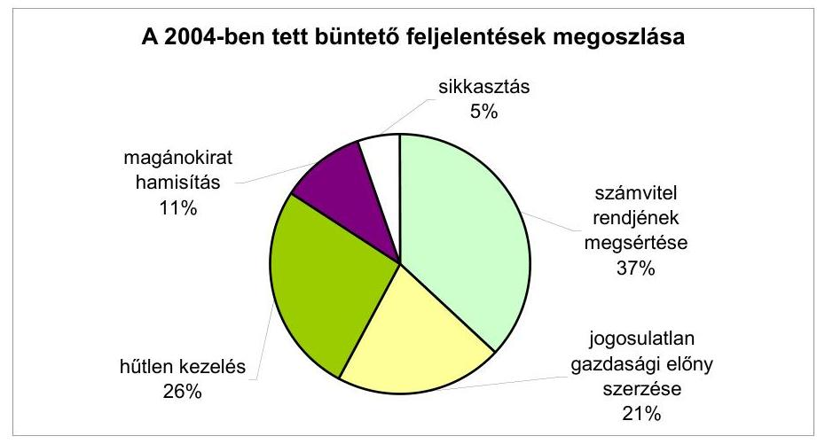

---

A jogosulatlan gazdasági előny megszerzésére irányuló cselekmények elkövetésének elsődleges indoka, hogy az önkormányzatok - a folyamatos forrásszűke miatt - mindent megpróbálnak, hogy forrásaikat kiegészítsék az állami költségvetésből, közalapítványi támogatásokból és egyéb közpénzekből. Más oldalról a Btk. módosításának következtében e cselekmény elkövetési magatartásának meghatározása bővült. Az ÁSZ jelentéseiben már több esetben javasolta a pályázati rendszer jelenlegi gyakorlatának felülvizsgálatát.

A 2003. évihez hasonlóan továbbra is gyakori a számvitel rendjének megsértése. A helyi önkormányzatok, de egyéb költségvetési szervek sem fordítanak elegendő figyelmet a gazdálkodási fegyelem betartására, amit - a jelentések tanúsága szerint - a nem megfelelő szakértelemre, a leltározási és könyvvezetési problémákra lehet visszavezetni.

A jogszabályt nem sértő, a jogi szabályozás hiányában bűncselekményként nem kezelhető, de erkölcsileg alaposan kifogásolható ügyekben csak korlátozottak a lehetőségeink. Jogi korrekcióra, annak alapján belső vizsgálat elrendelésére, továbbá indokolt esetben a munkáltató részéről fegyelmi eljárás kezdeményezésére lenne szükség e cselekmények visszaszorítása érdekében.

# Közérdekú bejelentések 

2004-ben 306 közérdekű bejelentés és panasz címzettje volt az ÁSZ. Ezen kívül hivatalos szervektől további 69 megkeresést kaptunk, melyek vizsgálati jelentéseinket, azokhoz kapcsolódó állásfoglalásunkat kérték, illetve közérdekű bejelentésekhez kapcsolódó tájékoztatást tartalmaztak. A bejelentések számának alakulását - az 1999 és 2004 közötti időszakban - a következő ábra mutatja.
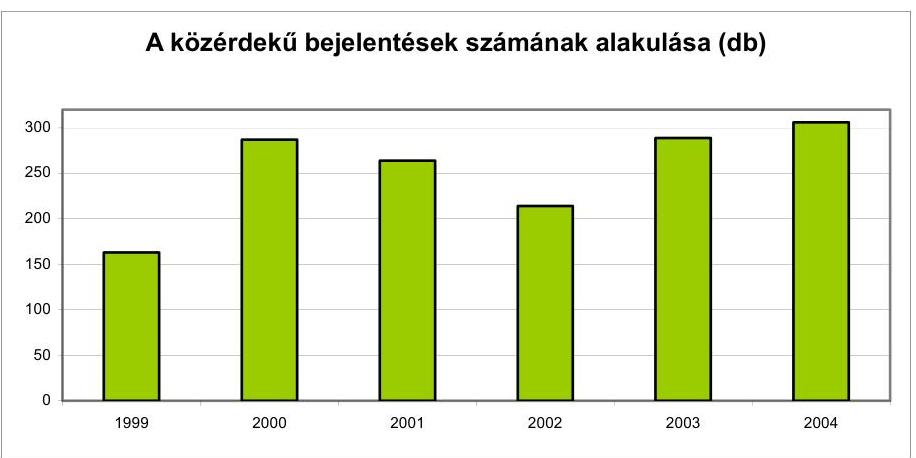

A bejelentések témáiban évek óta nem tapasztalható változás. A lakosságot, az adófizető állampolgárokat érintő szolgáltatásokkal, a mindennapi életvitelt befolyásoló helyi igényekkel, lehetőségekkel, a helyi önkormányzatok gazdálkodásával, a vonatkozó szabályozás hiányosságaival, a helyi önkormányzati vezetők vélt, vagy valós visszaéléseivel, továbbá a helyi önkormányzatoknak juttatott állami költségvetési támogatásokkal kapcsolatos bejelentések aránya a meghatározó. Ez 2004-ben a beadványok mintegy háromnegyedét tette ki.

---

# A közérdekú bejelentések megoszlása 2004-ben tárgyuk szerint 

| Helyi önkormányzatokkal kapcsolatos | 165 | $54 \%$ |
| :-- | --: | --: |
| Kisebbségi önkormányzattal kapcsolatos | 23 | $8 \%$ |
| Állami támogatás felhasználásával kapcsolatos | 18 | $6 \%$ |
| Állami szervekkel, intézményekkel kapcsolatos | 18 | $6 \%$ |
| Egyéb, a fentiekbe nem sorolható | 82 | $26 \%$ |
| Összesen: | $\mathbf{3 0 6}$ | $\mathbf{1 0 0 \%}$ |

A bejelentések egy része más szervektől (közigazgatási hivatalok, APEH, ügyészség) került az ÁSZ-hoz, amelyekben szinte kivétel nélkül a helyi önkormányzatok gazdálkodásának ellenőrzését kérték.

Magánszemélyek, valamint önkormányzatok polgármesterei, jegyzői és számos más hivatalos szerv is gyakran kérnek az ÁSZ-tól állásfoglalást. Ez jelzi azt az igényt, hogy fontosnak tartják az ÁSZ szakmai megítélésének megismerését. Az ÁSZ, mint ellenőrző szervezet ennek kiadására nem jogosult. Ezért e bejelentésekre és megkeresésekre a törvényi hatáskörünknek megfelelő tájékoztatást adunk. Olyan esetekben, amikor a jogszabályi előírások nem, vagy egymásnak ellentmondóan rendelkeznek, az önkormányzati munkát segítendő, szakmai véleményünkről adunk tájékoztatást a hozzánk forduló szerveknek.

A bejelentések 11\%-a esetében az éppen folyamatban lévő ellenőrzés kitért a jelzett probléma vizsgálatára, illetve tervezett ellenőrzéseinkben vettük figyelembe a felvetett kérdéseket. Előfordult, hogy kifejezetten a bejelentésre tekintettel került sor az ellenőrzés ütemezésére. A bejelentések 17\%-át hatáskör hiánya miatt az ÁSZ elutasította, 16\%-át pedig az illetékességgel rendelkező szervhez tette át. A bejelentések 29\%-ában közvetlen ellenőrzés elrendelésére nem volt lehetőség kapacitás hiánya, illetve a bejelentés kézhezvételekor már lezárt számvevőszéki vizsgálat miatt.

## A közérdekú bejelentések megoszlása 2004-ben az előterjesztő szerint

| Névtelen | 87 | $28 \%$ |
| :-- | --: | --: |
| Magánszemély | 140 | $46 \%$ |
| Helyi önkormányzati képviselő, polgármester, jegyző | 55 | $18 \%$ |
| Egyéb (gazdasági társaság, szakszervezet, egyesület) | 24 | $8 \%$ |
| Összesen: | $\mathbf{3 0 6}$ | $\mathbf{1 0 0 \%}$ |

A bejelentést tevők megoszlása évek óta változatlan. A névtelen bejelentések aránya 2004-ben az összes bejelentés 28\%-a volt. Ezek, valamint a vizsgálatot nem kérő, tájékoztató bejelentések a kialakult gyakorlatnak megfelelően általában további intézkedést nem igényelnek, kivéve, ha az intézkedést a bejelentés súlya indokolja, illetve a bejelentésben bűncselekmény alapos gyanújáról számolnak be. Az utóbbi esetben a szükséges intézkedés érdekében a bejelentést az illetékes szervhez megküldtük.

---

# 3.4. A számvevőszéki tevékenység nyilvánossága 

A számvevőszéki jelentések nyilvánossága három alapvető területen érvényesül, úgymint a jelentések felhasználói (Országgyúlés, kormányzat, ellenőrzött szervezetek), a széles közvélemény és a szakmai nyilvánosság. Az ÁSZ e három nyilvánosságot többféle eszközzel igyekszik megközelíteni, kiszolgálni.

Az Országgyúlés ellenőrző és döntéshozó szerepét - az előzőekben leírt munkakapcsolatokon túl - a mind szélesebb körű tájékoztatással kívántuk segíteni. Az országgyúlési képviselőkhöz eljuttatott jelentésekkel együtt az ÁSZ elnöke külön tájékoztató levélben hívja fel a figyelmet a jelentés legfontosabb megállapításaira, javaslataira. A jelentésekben megjelennek a témához, megállapításokhoz kapcsolódó korábbi jelentésekre, összefüggésekre való hivatkozások is. A kialakult gyakorlatnak megfelelően a két intézmény dokumentumai hozzáférhetők az informatikai hálózatokon. Az ellenőrzési jelentéseken túl az ellenőrzési programok is elérhetők elektronikus formában a képviselők számára.

Az Országgyúlés kiemelt tájékoztatása mellett bővítettük a közvélemény tájékoztatását, e téren 2004. évi tájékoztatási munkánkat a kialakult és bevált gyakorlat folyamatos továbbfejlesztése és számos új kezdeményezés jellemezte. Jelentéseinket megküldtük mind nyomtatott, mind elektronikus formában könyvtáraknak, szerkesztőségeknek, a sajtó számára készülő összefoglalókat megjelentettük a Magyar Közlöny mellékletét képező Hivatalos Értesítőben. Az önkormányzatokkal kapcsolatos vizsgálatokról a valamennyi helyi önkormányzathoz eljutó Önkormányzati Tájékoztatóban és önkormányzati szaklapokban is rendszeresen adtunk információt. A legnépszerűbb azonban az előző évi forgalmat csaknem megduplázó, évi mintegy 90 ezer látogató által felkeresett Internet honlapunk volt. Itt a jelentések teljes szövege, az országgyúlési képviselőknek címzett figyelemfelhívó összefoglalók, továbbá a szervezettel és a múködéssel kapcsolatos információk érhetők el.

Az elmúlt év kommunikációs szempontból különbözött a korábbiaktól, mert egyes önkormányzatok átfogó ellenőrzésének önálló megjelenésével, az ÁSZjelentések száma jelentősen növekedett és ezt követte az ÁSZ-ról szóló tudósítások emelkedése is. Sajátos, a szerkesztőségekkel való szoros együttmúködést igénylő kommunikációs feladat volt a közvélemény tájékoztatása az INTOSAI Kongresszus budapesti üléséről. Az eseményről 26 tudósítás született.

A sajtótájékoztatók rendszerét megváltoztattuk. A hagyományos, negyedévenkénti elnöki sajtótájékoztatókat megtartottuk az időszerű események általános értékelésével és néhány jelentés, vagy program nyilvánosságra hozásával. Az újságíróknak átadtuk a negyedévben megjelent jelentések - speciálisan a sajtó számára készített - összefoglalóinak gyűjteményét tartalmazó dokumentumot. Ezeken túl tíz alkalommal tartottunk a szervezet múködéséhez kötődő jelentős nemzetközi eseménnyel, létesítmény átadással, továbbá ellenőrzések szakmai tapasztalataival kapcsolatos sajtótájékoztatót elnöki, főtitkári és főigazgatói részvétellel.

---

Az ÁSZ megfelelő súlyt helyez a széles közvélemény tájékoztatására, de jelentéseink a közpénzek átlátható felhasználására, az államháztartás hatékonyabb múködését szolgáló súlypontokra összpontosítanak és ezek - érthető módon nem mindig találkoznak a közvéleményt adott időszakban élénken foglalkoztató jelenségekkel, témákkal. Az ellenőrzések témaválasztásától, a jelentések tartalmától idegen a közvélemény igényének követése, azokat pusztán szakmai kritériumok és célok határozzák meg.

Az Observer Médiafigyelő adatai szerint a televízió- és rádióadásokban összesen 994 esetben, az internetes újságokban 1057 esetben, a nyomtatott sajtóban 1324 esetben publikáltak az ÁSZ-ról. Ez éves szinten összesen 3375 megjelenést jelentett.
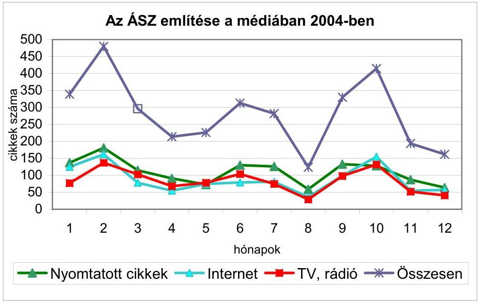

Folyamatosan törekszünk arra, hogy a publikációk minél inkább az ÁSZ véleményét, megállapításait tükrözzék. Erre az egyik legjobb lehetőséget az elektronikus sajtó (rádió, televízió) kínálja. A számvevőszékkel kapcsolatos híradások száma már megközelítette a nyomtatott sajtóban történő megjelenést. Az elektronikus sajtóban közzétett információk számának fokozatos emelkedése mellett ugrásszerúen gyarapodott az Internet újságokban megjelenő híradások száma, az előző évhez képest háromszorosára nőtt.

Az ÁSZ Internet honlapján 2004-ben átalakítottuk az elnöki fogadóórák és a jelentések fóruma rovatot. Az „ÁSZ-jelentések fóruma" változott jelentősen, mert a bejelentkezőktől már nem kérjük, hogy a jelentések témakörében tegyenek észrevételt, hanem bármilyen felvetésüket köszönettel vesszük.

Az elnöki fogadóórák kérdezői többségükben a számvevőszéki szervezet múködéséről és az elnök személyes véleményéről érdeklődtek. Az ellenőrzési munka témái közül a költségvetéssel, az elkülönített állami pénzalapok múködésével, valamint az önkormányzati gazdálkodással kapcsolatos kérdések voltak jellemzők.

---

Az internetes elnöki fogadóórák 2004. évi forgalma

| Elnöki fogadóóra | 1. | 2. | 3. |
| :-- | :--: | :--: | :--: |
| Dátum | jan. 22. | máj. 26. | nov. 22. |
| Meghirdetett témák, db | 1 | 1 | 2 |
| Érkezett kérdések, db | 18 | 14 | 12 |

Az ÁSZ fórumára többségében önkormányzati gazdálkodással kapcsolatos, valamint az ellenőrzésekhez nem köthető, általános tartalmú megkeresések érkeztek. A fórumba és a 3 alkalommal megrendezett elnöki fogadóórán mintegy 100 kérdés-hozzászólás érkezett, és az ÁSZ központi e-mail címén is közel 100 észrevételt, kérdést fogadtunk.

Stratégiájának megfelelően az ÁSZ hazai kapcsolatrendszerének fejlesztése az ellenőrzési kultúra színvonalának emelését szolgálja. A korábban kialakult együttmúködés folytatódott a gazdasági felsőoktatás és kutatás intézményeivel. Az ÁSZ több vezetője, munkatársa folyamatosan részt vállal a graduális és posztgraduális képzésben. Emellett támogatjuk a hallgatók gyakorlatát, szakdolgozataik elkészítését.

Továbbra is közremúködünk szakmai szervezetek, egyesületek munkájában, vezetésében (Magyar Pénzügyi-Gazdasági Ellenőrök Közhasznú Társasága, Magyar Közgazdasági Társaság, Gazdálkodási és Tudományos Társaságok Szövetsége), szerepet vállalunk nagyrendezvényeiken, konferenciáikon (pl. V. Ellenőrzési Konferencia, International Center for Economic Growth és az ÁSZ FEMI közös konferenciái, Magyar Jogász Egyesület - jogásznapok, IGCFM Conference - Miami).

Könyvtárunk az ÁSZ szakmai információs központja. Fő feladata ebben az évben is az ÁSZ vezetői és munkatársai részére az ellenőrzési munkához kapcsolódó hazai és külföldi szakirodalomnak és információknak az igényekre épített beszerzése, feldolgozása, az elektronikus szolgáltatások körének szélesítése. Az ÁSZ jelentései itt hozzáférhetőek a nyilvánosság (képviselők, újságírók, tanulók, kutatók, állampolgárok) számára, helyben olvasási és másolatkészítési lehetőséggel. Az érdeklődők száma nem csökkent, annak ellenérre, hogy az Interneten is elérhetőek a jelentések. A Könyvtár segítségét igénybe vették egyetemi, főiskolai vagy PhD. hallgatók, akik szakdolgozatuk témájául a számvevőszéki ellenőrzést választották.

# 4. AZ ELLENŐRZÉSI MUNKA MINŐSÉGÉNEK FEJLESZTÉSE 

Az ellenőrzési munka minőségének fejlesztése két részből áll. Egyrészt a személyi feltételekből, amelybe beletartozik a kiegyensúlyozott létszámgazdálkodás, a megfelelő munkatársak felvétele, illetve a személyi állomány képzése, másrészt az ellenőrzések minőségbiztosításából.

---

# 4.1. Humánerőforrás gazdálkodás és fejlesztés 

## Személyi feltételek

2004-ben lezárult az a hároméves létszámfeltöltési program, amelyben az ÁSZ tényleges vizsgálati kapacitásait - az Országgyúlés jóváhagyó egyetértése mellett - megközelítőleg egyensúlyba hoztuk a törvényekben, jogszabályokban előírt, szakmai szempontból indokolt ellenőrzési feladatokkal. A szervezeti egységek és főbb foglalkoztatási csoportok között kialakult létszámarányok hosszabb távra irányadók lehetnek. A szervezetépítő periódus az ellenőrzési munka színvonalát nem vetette vissza, sőt alkalmat adott olyan középtávú humánstratégiai célok elérésére, mint az állomány fiatalítása vagy egyes szakmaifelkészültségi mutatók javítása.
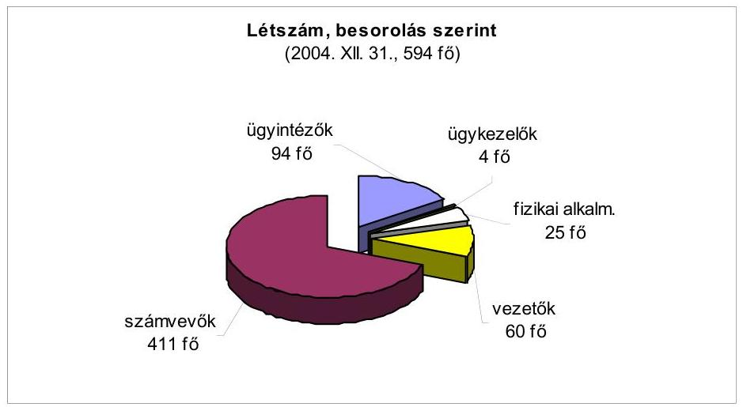

Az Országgyűlés határozatában megjelölt, a költségvetési zárszámadás mélyebb és teljeskörűbb vizsgálata feltételeinek, a megbízhatósági nyilatkozattal záruló financial audit megteremtésének, valamint az önkormányzatok kiemelt körében (városi önkormányzatok) végzett ún. átfogó vizsgálatok kapacitásigényének tulajdoníthatóan 3 év alatt az ÁSZ dolgozóinak száma 30\%-kal, az ÁSZ Fejlesztési és Módszertani Intézet munkatársaival együtt 600 fő fölé, a jóváhagyott felső határ közelébe emelkedett. A továbbiakban vizsgálati kapaci-tás-kiegészítés csak kis mértékben - belső tartalékok felszabadításával, vagy külső, megbízott szakértők bevonásával - lehetséges.

---

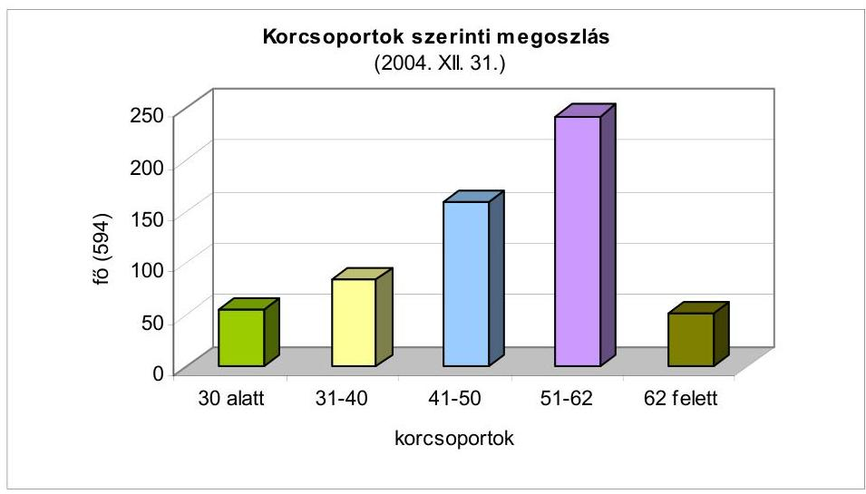

A 90-es évek végén a teljes állomány átlagéletkora 50 év felett volt. Ez az utóbbi években - a számvevő gyakornokok és fiatalabb számvevők felvételével, valamint a tervszerű, fokozatos nyugdíjazásokkal - 48-49 év körül alakul. Ennél valamivel alacsonyabb (47 év) a helyszíni ellenőrzést folytatók átlagéletkora. Mivel az életkori különbségek a szakmai ismeret-struktúrában is markánsan megjelennek, a felvételeknél tudatosan törekedtünk a korszerű tudással rendelkező fiatalabb ellenőri korosztály bevonására.
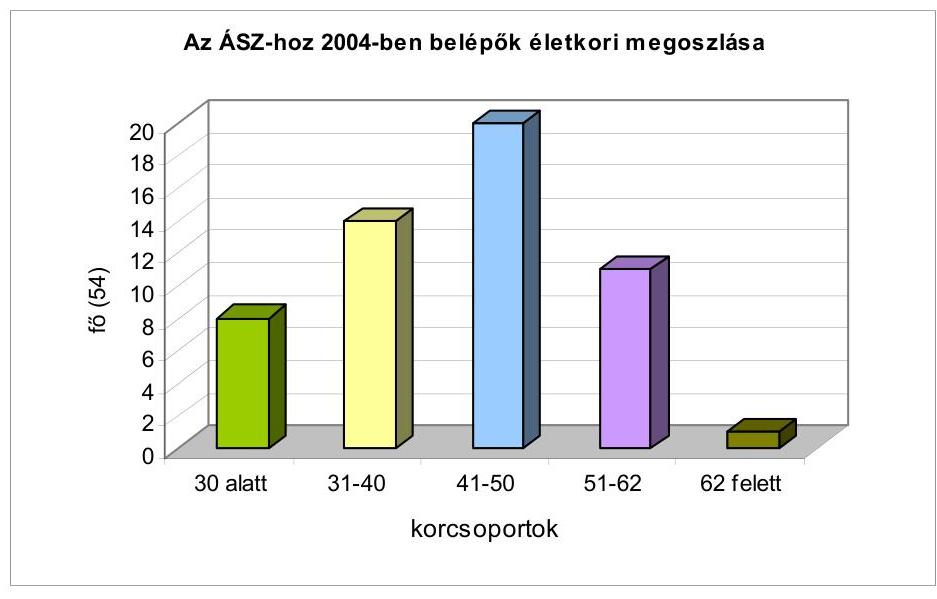

Az év folyamán 18 alkalmazott munkaviszonya szűnt meg, ebből 6-an nyugdíjba vonultak. Három fő munkaviszonya azért szűnt meg, mert a szervezet adta az Európai Számvevőszék egy tagját, illetve a mellette múködő Magyar Kabinet attaséját és kabinetfőnökét. A foglalkoztatottak összlétszámához képest továbbra is minimális a munkaköri cserélődés. A szervezet szakember-megtartó képessége jó, sőt igen nagy érdeklődés mutatkozik az esetlegesen megüresedő álláshelyeink iránt. Ehhez képest magas szakmai követelményeket támasztunk a pályázókkal szemben. Folyamatosan növekszik a több-diplomások (210 fő), az okleveles könyvvizsgálók (136 fő) és az idegen nyelvből legalább középfokú állami nyelvvizsgával rendelkezők száma (207 fő). A számítógépet - a munka-

---

kör által megkívánt módon - gyakorlatilag minden munkatárs használja, ismeretszintjük speciális alkalmazásokra is továbbfejleszthető.
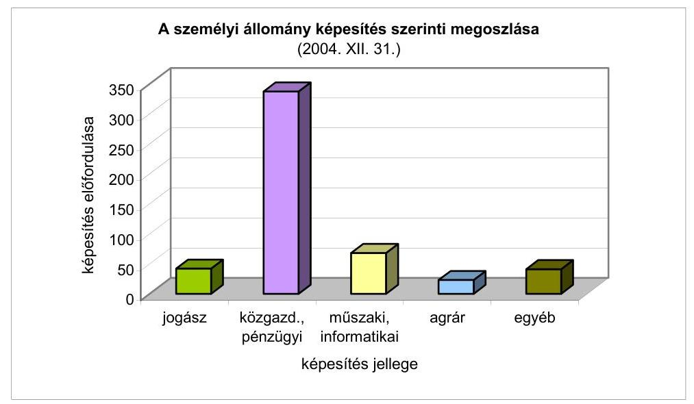

2002-ben középtávú stratégiai célkitúzésként fogalmazódott meg, hogy olyan a legkorszerúbb felkészültséggel rendelkező - számvevő generáció kinevelésére van szükség, amely megfelel az európai követelményeknek és azokkal hoszszabb távon lépést tart. A 2004-ben befejezett létszámfeltöltési program során kialakult - életkori, illetve felkészültségi mutatóiban megújult - számvevői kör kellő vizsgálati tapasztalatszerzés és átgondolt továbbképzési rend múködtetése mellett alkalmas lesz arra, hogy az ellenőrzést megfelelő szakmai színvonalon végezze el.

A törvényi szintű szabályozás (ÁSZ-tv., Ktv.) korrekciói kapcsán belső utasításaink jelentős részét is megújítottuk. Egyebek között áttekintettük a számvevők teljesítmény-értékelésének gyakorlatát és a vonatkozó előírásokat a bevezetésük óta eltelt két esztendő helyi tapasztalatai alapján rugalmasabbá, az értékelő szempontokat árnyaltabbá tettük. Módosítottuk az egyetemi és főiskolai hallgatók ÁSZ-nál eltöltött szakmai-tanulmányi gyakorlatára vonatkozó utasítást is.

2004-ben előkészítettük a foglalkozás-egészségügyi ellátások helyi rendszerének jelentős átalakítását. Az egy szolgáltatóra épülő különböző szintű ellátások jobban áttekinthetők és könnyebben elérhetők. A kezdeti tapasztalatok máris kedvezőek. A kötelező foglalkoztatás-egészségügyi alapellátások mellett az évenkénti általános szűrővizsgálatokat is a SOTE II. sz. Belklinika szervezi, egyúttal gondoskodik a Lónyay utcai irodaházban lévő üzemorvosi rendelő múködtetéséről is.

# Oktatás 

Az ÁSZ 2004-ben is sokrétú oktató-továbbképző tanfolyamokat szervezett. 39 témában, 44 alkalommal tartottunk foglalkozást, amelyeken összesen 1056 munkatársi részvételt regisztráltunk.

---

A hagyományos tárgyak (financial és performance audit, korszerű önkormányzati ellenőrzés, készség-tréningek, informatikai ECDL-, és IDEA auditálást támogató modulok stb.) mellett új elemek kerültek az éves oktatási tervbe. Ezek közül az EU múködési rendjével kapcsolatos tematikus képzéseket, az Ellenőrzési Kézikönyv oktatását, továbbá a korrupciómentes és etikus közszolgálat problematikájának bemutatását emelhetjük ki. A kommunikációs készségfejlesztő tréningek blokkját a „Közszereplés, megjelenés a médiumokban" c. témával frissítettük, amelyre vezetők, beosztott ellenőrök is nagyobb számban jelentkeztek.

A Magyar Közigazgatási Intézettel (MKI) együttmúködésben előbbre léptünk a közszolgálat szükségleteit és sajátosságait szem előtt tartó távoktatási rendszer fejlesztésében. A két éve indult programmal előbb a távoktatás szervezési eszközeinek (felhívások, jelentkezések, regisztráció stb.) belső számítógépes alkalmazását vezettük be. 2004-ben elkészítettük a financial audit képzés távoktatási tematikáját, ami azáltal, hogy felkerült az MKI minősített képzések jegyzékébe, szélesebb szakmai körökben - minisztériumok, intézmények belső ellenőrei számára is - elérhetővé teszi a vonatkozó szakismereteket. A múlt évben a financial, illetve performance audit legjobb gyakorlatának hagyományos oktatásába 294 külső munkatárs kapcsolódott be, 144-en pedig az elektronikus tananyag tanulmányozására jelentkeztek be.

Az idegen nyelvi képzés alapvetően a belső (megyei irodákon is elérhető) hálózatra telepített nyelvoktató-kommunikáló szoftverekkel történik, a 3 fő nyugati nyelvből - angol, francia, német - gyakorlatilag valamennyi ismeretszinten. Emellett 2004-ben a Külügyminisztérium közvetítésével külföldi intézetek (Goethe Intézet, British Council, Francia Intézet stb.) haladó és speciális tanfolyamain 80 munkatársunk vett részt. A szaknyelvi ismereteket és kommunikációs készséget legjobban a külföldi tanulmányutak szolgálják: 15 kollégának adódott ilyen lehetősége.

Folyamatosan emelkedik a munkatársak iskolarendszerű és tanfolyami (képesítési) oktatását támogató tanulmányi szerződések száma: 20 fő befejezte ugyan tanulmányait, de 77 új megállapodást kötöttünk. Kiemelten kezeljük a számítógépes alkalmazások fejlesztésének támogatását ( 33 fő az uniós ECDL-licence megszerzését tűzte célul), és továbbra is többen vesznek részt ( 22 fő) másoddiplomás képzésben.

Továbbképzéseinken elsősorban saját munkatársaink voltak az oktatók ( 75 fő), de e mellett 13 meghívott előadóval kötöttünk év közben szerződést. A belső kapacitások tudatos, jobb kihasználásával 2004-ben számottevően mérsékeltük a megbízási díj-költségeket ( 5,4 millió Ft az előző évi 8,5 millió Ft-hoz képest). Ugyanakkor a külső szakmai rendezvények, konferenciák - nem utolsó sorban a Szegeden tartott országos ellenőrzési konferencia - költségei (az elhelyezési, étkeztetési, terembérleti stb. költségek folyamatos emelkedése) miatt 2004-ben az oktatás-képzés összköltsége 2 millió Ft-tal emelkedett az előző évihez (13 millió Ft) képest. Az ÁSZ teljes múködési költségeihez viszonyítva ez az arány megfelelő, kifejezi a szakmai továbbképzések folyamatosan növekvő jelentőségét, ugyanakkor - a szervezési tartalékok kiaknázásával - csak a feltétlenül szükséges mértékben haladja meg a korábbi évek ráfordításait.

---

# 4.2. Az ellenőrzések minőségbiztosítása 

Az ÁSZ ellenőrzési véleményének megbízhatósága, az ellenőrzési megállapítások és javaslatok megalapozottsága érdekében 2004-ben is hatásosan múködött a belsö minőségkontroll és minőségbiztosítási rendszer. Az ellenőrzési folyamatba épített vezetői felügyelet és a meghatározott pontokon végzett szakmai felülvizsgálat folyamatos kontroll alatt tartotta a számvevők ellenőrzési tevékenységét. Valamennyi számvevőszéki jelentés tervezete - az ellenőrzött szervezetekkel folytatott egyeztetésekkel párhuzamosan - kétszeri el-lenőrzés-szakmai és jogi felülvizsgálaton is átesett. Az érintetteknek történő átadást megelőzően megalapozottsági kontroll alá kerültek továbbá azok a számvevői jelentés-tervezetek, amelyek személyes felelősséget vetettek fel.

A számvevőszéki jelentések elnöki aláírására csak - az ellenőrzésekért felelős igazgatóságoktól függetlenített - a Minőségbiztosítási Önálló Osztály eredményes felülvizsgálatát igazoló tanúsítványok birtokában, a felelősséget felvető számvevői jelentések átadására a szükségesnek ítélt korrekciók elvégzése után kerülhetett sor. Az állami költségvetés zárszámadásának ellenőrzése keretében elvégzett, az éves költségvetési beszámolók megbízhatóságát minősítő pénzügyi ellenőrzések (financial auditok), valamint a helyi önkormányzatok gazdálkodásának átfogó ellenőrzései végrehajtásának minőségbiztosítási felülvizsgálata a deklarált magas fokú ellenőrzési bizonyosság elérését volt hivatott igazolni.

A számvevőszéki ellenőrzés szakmai szabályainak 2004. évi egységes keretbe foglalásával megérett a helyzet arra, hogy a minőségközpontú belső irányítás és szabályozás elveit, követelményeit és eljárásait - bárki számára megismerhetően - külön szabályzatban rögzítsük. A szabályozás a bevált, múködő belső kontrollokra és minőségbiztosításra alapozva a korszerű minőségügyi szabványok és az élenjáró nemzetközi gyakorlat lényeges elemeit és megoldásait célozza meg érvényesíteni. Az előkészítés alatt álló minőségirányítási kézikönyv terveink szerint 2005 második felére jelenik meg és előírásait 2006. január 1jétől léptetjük hatályba.

### 4.3. Nemzetközi kapcsolatok

## Többoldalú együttmüködés

Az ÁSZ 2004. évi nemzetközi tevékenységét az INTOSAI (Legfőbb Ellenőrző Intézmények Nemzetközi Szervezete), EUROSAI (Legfőbb Ellenőrző Intézmények Európai Szervezete), valamint az Európai Unió szervezeteiben való fokozott tevékenység jellemezte.

Ennek pozitív hatásaként folyamatos az ellenőrzési technikák, módszertanok ismeretanyagának átvétele, átadása és továbbfejlesztése. E mellett ismereteket kapunk a világ országaiban zajló államháztartási folyamatokról. A nemzetközi szervezetekben való feladatellátás hozzájárulhat a hazánkról alkotott kedvező országkép kialakításához is.

---

A nemzetközi együttműködés szempontjából a 2004. év legkiemelkedőbb eseménye az INTOSAI XVIII. Kongresszusának megrendezése volt Budapesten. ${ }^{31}$

A XVIII. Kongresszuson 149 ország és 12 nemzetközi szervezet vett részt. A Kongresszus napirendjén szereplő kérdések meghatározóak voltak az INTOSAI továbbfejlődése szempontjából. A legfontosabb az INTOSAI reformját megalapozó „Stratégiai terv 2005-2010" c. dokumentum elfogadása, s emellett a számvevőszékek közötti két- és többoldalú együttműködés lehetőségei, valamint a nemzeti regionális és helyi, illetve az önkormányzati ellenőrzés közötti koordináció volt, melyek szerves kapcsolatban állnak a korszerűsítési folyamattal.

Az INTOSAI XVIII. Kongresszusának üléseit az ÁSZ elnöke vezette, akit a nemzetközi szervezet Kormányzó Tanácsa elnökének választottak. A kongresszusi vita eredményeit összefoglaló és a legfontosabb - főként a reformokra és a tartalmi témákra vonatkozó - ajánlásokat tartalmazó Budapest Accords hosszú időre meghatározza a nemzetközi ellenőrzési együttműködés irányát.

A kongresszust megelőzően, illetve követően került sor a Kormányzó Tanács 52. és 53. ülésére, amelyek szakmai előkészítése az ÁSZ feladata volt. Az ÁSZ aktívan vett részt az INTOSAI több munkaszervének tevékenységében. Így meghatározóan közreműködtünk az INTOSAI Belső Ellenőrzési Szabvány Bizottságán belül az új belső ellenőrzési szabványok kidolgozásában, amelyeket a XVIII. Kongresszus elfogadott. Hasonlóan vettünk részt a Privatizációs Munkacsoport tevékenységében, s a szófiai ülésen a magyarországi privatizáció tapasztalatairól tartottunk beszámolót.

Szakértőt küldtünk az INTOSAI Ellenőrzési Szabvány Bizottság Pénzügyi Ellenőrzési Irányelvek Munkacsoportjához, melynek feladata, hogy az IFAC-kal kidolgozza az INTOSAI Ellenőrzési Irányelveit. Az INTOSAI oktatási szerve (IDI) megbízásából az ÁSZ munkatársa előadást tartott a Nairobiban megtartott környezetvédelmi ellenőrzési tanfolyamon.

Számvevőszéki munkatársak publikáltak a magyarországi pénzügyi rendszerben alkalmazott belső és külső ellenőrzési gyakorlatról az INTOSAI folyóiratában.

Szintén aktív a részvételünk az EUROSAI tevékenységében is. Részanyagot készítettünk a „Számvevőszék szerepe a bevételek ellenőrzésében a költségvetési ciklus különböző szakaszaiban" c. vita témához az EUROSAI 2005 májusában, Bonnban sorra kerülő VI. Kongresszusára. E mellett összehasonlító tanulmányt készítettünk "Az Európai Unióhoz csatlakozó országok pénzügyi ellenőrzésének fejlődése" témában a kongresszusra készülő, az európai országok pénzügyi ellenőrzését bemutató kézikönyvhöz.

[^0]
[^0]:    ${ }^{31}$ A kongresszus az INTOSAI legfontosabb szerve, amely a legmagasabb szinten koordinálja a nemzetközi ellenőrzési együttműködést és meghatározza a szakmai fejlődés fő irányait.

---

Az ÁSZ elnöke részt vett az EUROSAI és a dél-amerikai országok számvevőszékeit képviselő OLACEFS konferenciáján, ahol az ÁSZ oktatási, képességfejlesztési kötelezettségeiről és eredményeiről tartott előadást.

Segítettük a Környezetvédelmi és az IT Munkacsoport, az EUROSAI Oktatási Bizottsága, valamint az EURORAI (Regionális Külső Pénzügyi Ellenőrző Intézmények Európai Szervezete) Barcelonában megrendezett V. Kongresszusa munkáját. Az kooperáció során főként az önkormányzati ellenőrzésben szerzett tapasztalatok cseréjére nyílik lehetőség.

A visegrádi országok számvevőszékeinek együttműködésében is részt vállalunk, melyhez Ausztria is csatlakozott. Elnöki szinten veszünk részt a párhuzamos vizsgálatok előkészítése és lebonyolítása során szerzett tapasztalatokkal kapcsolatos vitákban.

Az Európai Unióhoz történő csatlakozás természetesen az ÁSZ 2004. évi tevékenységében is éreztette a hatását. Az Európai Számvevőszékkel való kapcsolataink az eddiginél intenzívebbé váltak. Első ízben vettünk részt egyenjogú tagként a tagszámvevőszékek elnökeit tömörítő Összekötő Bizottság (Contact Committee) Luxemburgban megtartott soros ülésén, amely a folyamatban lévő ügyeket tárgyalta. Így szó volt többek között az Európai Számvevőszék és a nemzeti számvevőszékek közötti együttműködés kérdéseiről. Az Európai Számvevőszék 2004-ben is 5 hónapos szakmai gyakorlatot szervezett Luxemburgban, ahol 2 munkatársunk bővíthette szakmai tapasztalatait.

A NATO Nemzetközi Számvevő Testülete és az ÁSZ közötti kapcsolatok a tárgyévben is továbbfejlődtek: részt vettünk a Testület éves beszámoló jelentésének vitájában, valamint aktív szerepet vállaltunk minden olyan fórumon, ahol a Testület, valamint a tagországok legfőbb ellenőrző intézményeinek együttmúködését érintő kérdések merültek fel.

Tovább folytatódott az OECD és az Európai Unió közös szervével, a SIGMA-val hosszú évek óta kialakult együttműködés, melynek keretében a magyarországi kormányzati belső ellenőrzési rendszerre vonatkozó vizsgálatuk eredményeit véleményeztük. Az OECD pénzügyi ellenőre az ÁSZ munkatársa.

Az ÁSZ nemzetközi kapcsolatai túlnyúlnak a nemzeti számvevőszékekkel és azok nemzetközi szervezeteivel való kapcsolattartáson. Így már hosszabb ideje részt veszünk az ICGFM (International Consortium on Governmental Financial Management) amerikai szervezet vezetésében, tevékenységében. A szervezet 2004. évi Miamiban rendezett éves konferenciáján az ÁSZ elnöke előadást tartott a korrupció csökkentése és a fejlődés segítése közötti összefüggésekről.

# Kétoldalú együttmüködés 

Az ún. kétoldalú találkozókra a rendkívül sok kötelezettséggel járó INTOSAI Kongresszus és a regionális együttműködés miatt az előző éveknél szerényebb számban kerülhetett sor.

Legintenzívebb az együttmúködés és a kapcsolat az eddigi gyakorlatnak és az INTOSAI elnökségének köszönhetően az Osztrák Számvevőszék vezetőivel. Tavaly két ízben is sor került a már hagyományos határmenti találkozóra. Az

---

ÁSZ elnöke az ukrán, a macedón és a litván számvevőszéki vezetőkkel is találkozott.

Több olyan szakértői találkozóra is sor került, melyek párhuzamos vizsgálatok folytatását, illetve előkészítését segítették elő, így Ausztriával és Szlovéniával a közös határ melletti környezetvédelemmel, illetve Ukrajnával a FelsőTiszavidék árvizvédelmével kapcsolatosan.

Kétoldalú tapasztalatcserére került sor francia és szlovén szakértőkkel a költségvetés végrehajtásának ellenőrzésével kapcsolatos módszerekről, mintavételezési technikáról.

Folytatódott az a folyamat, amelynek során az ÁSZ segítséget nyújt a keleteurópai, illetve a FÁK térséghez tartozó országok számvevőszékeinek szakmai fejlődéséhez.

Az USAID amerikai szervezet szervezésében több közép-ázsiai ország mintegy 25 fős küldöttsége ismerkedett hazánkban a korszerű ellenőrzési módszerekkel.

# Külföldi szakmai utak és az INTOSAI Kongresszusa 

2004-ben az ÁSZ munkatársai 58 külföldi úton vettek részt, és azokon 119 kiküldött 920 napot töltött el. Az utak közül 7 a különböző képzési formákban való részvételhez kapcsolódott, összesen 729 napban. (Az egy külföldi útra eső átlagmunkanap-szám a hosszú időtartamú képzések nélkül 3,7 nap/út.) A külföldi utazások költségei 27,0 millió forintot tettek ki, mely az éves előirányzat $93 \%$-át jelentette.

Az ÁSZ elnöke 13 alkalommal utazott hivatalosan külföldre, összesen 47 nap időtartamban. Egy elnöki út átlagos költsége 332 ezer forint, az egy napra jutó költség 92 ezer forint volt.

Az ÁSZ vezetői és munkatársai külföldi útjaikon tolmácsot nem vesznek igénybe, a különféle szakmai konferenciákra felkért előadásokért díjat nem vesznek fel, ezekben az esetekben a regisztrációs díjat, egyes alkalmakkor az utazási költségeket is a külföldi fél viseli.

Az utazásokról, azok hasznosítható tapasztalatairól minden esetben belső szabályokban meghatározott módon készült útijelentés. Valamennyi útijelentés mindenki számára hozzáférhetően megtalálható az ÁSZ könyvtárában.

A kongresszus megrendezésének, a kapcsolódó programok lebonyolításának kiadásai a 2004. évben 497,8 millió forint kiadást jelentettek. A szervezési feladatokat az ÁSZ munkatársai látták el, ezért mintegy 30-40 millió forint költségmegtakarítást értünk el. A kongresszus megrendezéséhez a nemzetközi szervezettől 8,7 millió forint hozzájárulást kaptunk.

---

# 5. A SZÁMVEVŐSZÉKI TEVÉKENYSÉGHEZ KAPCSOLÓDÓ KUTATÓ ÉS MÓDSZERTANI MUNKA 

Az ÁSZ másfél évtizedes tapasztalatai, nemzetközi szakmai kapcsolatai és az elmúlt években kiteljesedő módszertani fejlesztések eredményei alapján elkészült az ellenőrzési tevékenység átfogó szakmai szabályait összefoglaló „ÁSZ Ellenőrzési Kézikönyv" és az „ÁSZ Ellenőrzési Elvek és Standardok", melyeket egy közel 600 oldal terjedelmű szakkönyvben adtunk közre. Ezzel indítottuk útjára az „ÁSZ - Módszertani kiadványok" sorozatot. A szabályozási rendszert kidolgozó szakértői munkacsoport az igazgatóságok, az Elnök Tanácsadó Testülete, a Módszertani Bizottság, valamint a ÁSZ Fejlesztési és Módszertani Intézet (FEMI) támogatása mellett a FEMI-ben készült (rész)tanulmányokat is hasznosította. A szakmai szabályozási rendszerhez csatlakozó konkrét módszertanokat és segédleteket - előre programozottan, a Módszertani Bizottság közremúködésével - folyamatosan készítették, készítik az ellenőrzési igazgatóságok. A FEMI három nyelvű (angol-magyar-német) ellenőrzési glosszáriuma is kapcsolódik a legjobb nemzetközi gyakorlat adaptációjára is támaszkodó módszertani tevékenységhez. Mindez annak a stratégiai alapkövetelménynek a jegyében valósult meg, amelynek értelmében az ÁSZ végigviszi a számvevőszéki ellenőrzés technológiájának, metodikájának korszerűsítését, hogy a vizsgálatok lebonyolítása, eljárástechnikája teljes mértékben megfeleljen a nemzetközi standardoknak, az európai uniós elvárásoknak.

Az ÁSZ stratégiája azt is célul tűzte ki, hogy az ellenőrzéseket segítő módszertani tevékenység mellett közgazdasági tartalmú kutatásokat valóra váltó szakmai műhelymunka is kibontakozzon. Tudatos „építkezéssel" a Fejlesztési és Módszertani Intézet alkalmassá vált arra, hogy - kooperálva az ellenőrzést végzőkkel, a stratégiai összefoglaló tevékenységet végző apparátussal, valamint külső gazdaságkutatókkal - olyan kutatásokat valósítson meg, amelyek a közszférának a fenntartható növekedés szempontjából meghatározó területeire, illetőleg problémakomplexumaira összpontosítva feltárják a legfontosabb tendenciákat és azok mozgatórúgóit. E tanulmányok sorából említést érdemelnek a hazai privatizációval, a gyógyszerfelhasználással, a felsőoktatással, valamint az állam és a magánszektor kapcsolataival foglalkozó kritikai értékelések. Ezeket országgyűlési képviselők, mértékadó pénzügyi körök, gazdasági szakemberek is megismerhették. Tanulságaikat, együtt az ÁSZ ellenőrzési tapasztalataival és módszertani eredményeivel - az ellenőrzési kultúra fejlesztésére irányuló stratégiai törekvéseinknek megfelelően - a felsőoktatásban, szakmai rendezvényeken (Közgazdász Vándorgyűlés, V. Ellenőrzési és Felügyeleti Konferencia, a FEMI és az ICEG Európai Központ konferencia-sorozata stb.), valamint az elektronikus és az írott (szak)sajtóban is hasznosítottuk.

Az elnök stratégiai munkáját segítő konzultatív munkaszervezet, az Elnök Tanácsadó Testülete 2004-ben 8 ülésen 13 témában folytatott szakmai vitát. Ezek során megkülönböztetett figyelmet fordított a közszféra, illetve az államháztartás korszerűsítésére, valamint az EU-tagságból adódó feladatok teljesítésére vonatkozó ellenőrzési tapasztalatok rendszerezésére, értékelésére. E célokat jól szolgálták azok a viták, melyek a FEMI-ben, az ÁSZ szakmai műhelyében készült átfogó-elemző tanulmányok tervezeteit kritikailag értékelték. A Testület súllyal az államháztartás (közpénzügyi rendszer) korszerűsítésének szükségességét megfogalmazó ellenőrzési tapasztalatok meghatározó területeivel - a fi-

---

nanszírozási reform értékelése, a felsőoktatás finanszírozási rendszere, a helyi önkormányzatok finanszírozási rendje, a kormányváltásokkal járó államháztartást érintő változások hatásainak elemzése, az EU legfontosabb pénzügyi jogszabályának tanulságai stb. - kapcsolatban folytatott gondolatcserét, fogalmazott meg ajánlásokat. Emellett az előző évek gyakorlatának megfelelően a stratégiai tervezést és vezetést támogató véleménycserék részeként középponti helyet kapott a testület munkájában a számvevőszéki tevékenység fő irányait és arányait meghatározó tényezők elemzése, csakúgy, mint az ellenőrzés oktatásának, módszertanának, valamint nyilvánosságának kérdései is.

# 6. INTÉZMÉNYI MŰKÖDÉS ÉS GAZDÁLKODÁS 

### 6.1. Költségvetési gazdálkodás

Az ÁSZ fejezet gazdálkodását, a számvevőszéki törvény 2004. évi módosításának megfelelően, az Országgyúlés elnöke által pályázat útján megbízott független könyvvizsgáló ellenőrzi. A könyvvizsgálat főbb megállapításai az alábbiakban összegezhetőek:
„A könyvvizsgálat során az Állami Számvevőszék éves költségvetési beszámolóját, annak részeit és tételeit, azok könyvelési és bizonylati alátámasztását az érvényes nemzeti könyvvizsgálati standardokban foglaltak szerint felülvizsgáltuk, és ennek alapján elegendő és megfelelő bizonyosságot szereztünk arról, hogy az éves költségvetési beszámolót a számviteli törvényben, illetve az államháztartás szervezetei beszámolási és könyvvezetési kötelezettségének sajátosságairól szóló 249/2000 (XII. 24.) Korm. rendeletben foglaltak, és az általános számviteli elvek szerint készítették el.

Véleményünk szerint, az éves költségvetési beszámoló az Állami Számvevőszék vagyoni és pénzügyi helyzetéről, múködéséről megbízható és valós képet ad.

Az ÁSZ költségvetési gazdálkodásában 2004-ben színvonalas belső szabályozottság, szervezettség érvényesült. Az összesen 29 db gazdálkodást (müködést) érintő szabályzatból 27 db-ot korszerüsítettek, vagy újat adtak ki a múlt évben. A belső ellenőrzés, ÁSZ elnöke által jóváhagyott munkatervében foglaltakat maradéktalanul teljesítette, szabálytalanságot, vagy külön intézkedést igénylő súlyosabb hiányosságot, hibát nem állapított meg. Az ÁSZ költségvetési gazdálkodását a külső jogszabályok és a belső szabályzatok betartása, valamint a célszerüség, illetve a takarékosságra való törekvés jellemezte. Igen jelentős összeget használtak fel infrastrukturális-, valamint informatikai és telekommunikációs fejlesztésekre, amelyek már évek óta szükségesek és indokoltak voltak az ÁSZ-nál. Ennek során eleget tettek a közbeszerzési pályázat kiírásával kapcsolatos szabályoknak, és a célszerú takarékosságra vonatkozó elvárásoknak is".

A törvénymódosítás folytán 2004-ben, a 2005. évi költségvetés tervezésekor élhetett első ízben az ÁSZ azzal a felhatalmazással, mely szerint maga állítja öszsze a számvevőszéki fejezet költségvetésére és a költségvetés végrehajtására vonatkozó javaslatát, melyet a Kormány a központi költségvetési, illetve a zárszámadási törvényjavaslat részeként előterjeszt az Országgyúlésnek, elkerülvén ezzel az ÁSZ feletti kormányzati kontroll látszatát is. A felhatalmazásból következő nagyobb felelősség okán szükségesnek tartottuk, hogy a fejezet 2005. évi

---

költségvetési javaslata mutassa be az ÁSZ szakmai feladatait, külön kiemelve a törvények által determinált ellenőrzéseket és azok erőforrás igényét. Ezen túlmenően önálló programként mutattuk be mindazon múködtetési feladatokat, amelyek jól körülhatárolható csoportokba sorolhatók és meghatároztuk a végrehajtáshoz szükséges erőforrásokat.

Mindezen módszerek az első lépést jelentették a bázisalapú tervezéssel való szakítás folyamatában.

Az Országgyúlés részére a Pénzügyminisztérium útján az előző éveknél jóval részletesebb, átláthatóbb, a Pénzügyminisztérium illetékeseivel többszörösen egyeztetett költségvetési tervjavaslatot nyújtottunk be, amely tartalmazta a 2005. évi főbb feladatainkat, bemutatva azt, hogy az ÁSZ kellő körültekintéssel, takarékosan, az ország gazdasági helyzetének figyelembevételével igyekszik törvényi kötelezettségeinek, lehetőségeihez képest maradéktalanul eleget tenni. Az Országgyúlés elé benyújtott költségvetési tervjavaslat - az előbbiekben részletezett okok miatt - értelemszerúen nem tartalmazott néhány, az elmúlt évekhez hasonlóan megoldatlan ügyet, így ez évben sem volt lehetőség a megnövekedett feladatellátással összefüggő megbízási és szakértői díjak dinamikusabb emelésére, a saját gépjárművek hivatalos célra történő használata utáni térítési díjak valorizálására, továbbá az állomány jutalmazási előirányzatának megtervezésére. Ez utóbbi a 217/1998. (XII. 30.) sz. Korm. rendelet 58. § 5. pontja alapján tervezhető lenne, az előzetes keretszám azonban erre fedezetet ez évben sem biztosított.

Mindez megkövetelte a feladatok tudatos, az aktuális prioritásoknak, a hatékonysági számításoknak megfelelő rangsorolását, valamint azt, hogy a munkacsúcsok idején (zárszámadás, költségvetés tervezés) jelentkező kapacitás hiányt rugalmasabb munkaszervezéssel (a munkaidejük csak egy részében ellenőrzést végzők ez irányú teljesítményének fokozásával, az ellenőrök arányának a funkcionális támogatást végzők terhére való növelésével), valamint külső szakértők időszakonkénti, fokozottabb igénybevételével, a főfoglalkozású létszám növelése nélkül teljesítsük.

Az Országgyúlés az ÁSZ 2004. évi feladatainak ellátására a költségvetési törvényben 7329,5 millió forintot hagyott jóvá, melynek fedezetét 7309,5 millió forint támogatás és 20,0 millió forint saját bevétel biztosította. Ez a megelőző év módosított előirányzatához képest 14\%-os növekedést jelentett. A költségvetési forrásokkal való gazdálkodás mozgásterét ez évben is csökkentette az ÁSZ előtt álló szakmai feladatok több mint kétharmadának törvényi, illetve országgyúlési határozatok általi kötöttsége, ezzel összefüggésben a bér és közteher, valamint a dologi kiadások automatizmusaiból következő determináció.

A kiadási főösszegből a személyi juttatások előirányzatai 4065,2 millió forintot, a munkaadókat terhelő járulékok 1278,9 millió forintot, a dologi kiadások 1302,7 millió forintot, az intézményi beruházási kiadások 303,8 millió forintot, a felújítási előirányzatok 378,9 millió forintot jelentettek.

A jóváhagyott előirányzatot az évközi módosítások 647,7 millió forinttal növelték, a módosítások után 7977,2 millió forint állt rendelkezésre. A módosításokból 451,3 millió forint az előző évi előirányzat-maradvány jóváhagyásának,

---

161,6 millió forint az EMOGA Garancia Részleg igazoló szervi és akkreditációt megelőző vizsgálati feladatoknak, 30,6 millió forint meghatározott feladatokhoz (INTOSAI rendezvény lebonyolításához, oktatási feladatokhoz, számítógépes tárgyaló- és oktatóterem kialakításához) biztosított hozzájárulásnak, 4,2 millió forint a dolgozók részére folyósított lakásvásárlási kölcsönök törlesztésének a következménye.

A felhasználás 7391,8 millió forint volt, amely a kiadási előirányzat 92,7\%-a. A személyi juttatások és a munkaadókat terhelő járulékok együttes összege a kiadások $71,8 \%$-át tették ki, a dologi kiadások aránya $17,6 \%$, a felhalmozási kiadásoké pedig $10,6 \%$ volt.

A maradvány (melynek összege 3,8 millió forint bevételi elmaradás figyelembevételével 581,6 millió forint) $12,7 \%$-a az államháztartás egyensúlyi helyzetének javításához felajánlott összeg, 5\%-a a feladatelmaradásból származik, a többi ( $82,3 \%$ ) teljes egészében kötelezettségvállalással lekötött, a teljesítések, illetve a számlák megküldése 2005-re való áthúzódásának következménye.

Mindezek alapján megállapítható, hogy a rendelkezésre álló előirányzatok öszszességében biztosították az intézmény takarékos, de zavartalan feladatellátásához szükséges működési, üzemeltetési feltételeket.

A 2004. évben is kiemelt feladatot jelentett a munkafeltételek megfelelő színvonalú biztosítása, a meglévő irodaépületek állagának megőrzése, illetve javítása, valamint az eszközellátottság fejlesztése.

# 6.2. Infrastrukturális fejlesztések 

Az ÁSZ többségében örökölt, szétszórt elhelyezésű (a 18 megyei irodán kívül Budapesten 4 saját kezelésű és 2 bérelt iroda-együttes múködik), és a 15 éves fennállás során többségükben jelentős mértékben elhasználódott ingatlanai felújításának folytatása, a korábbi évek beszámolóiban már jelzett ok (az egységes székház biztosításának elmaradása) miatt 2004-ben is az ÁSZ egyik meghatározó jelentőségű feladata volt.

Ennek keretében az ÁSZ Apáczai Csere János utcai székházában folytatódott a 2002-2003. évben elkezdett elektromos rekonstrukció. Új, nagyobb keresztmetszetű felszálló vezetékek és elosztó szekrények kerültek beépítésre az I-II. emelet után a III-IV-V. emeleten is. A kivitelezőt meghívásos közbeszerzési pályázat útján választottuk ki. A kivitelezés során az elektromos rekonstrukcióval egy időben készült el a III-IV-V. emeleti vizes blokkok felújítása, valamint a földszinten, a fogyatékkal élők részére kiépített szociális blokk. A felújítás - melyre 2004. évi költségvetésünkből 103,0 millió forintot fordítottunk - határidőre, szeptember 30-ára befejeződött.

A székház homlokzatának felújítása a 2003. évben a homlokzatra kerülő szobrok elhelyezése nélkül fejeződött be. A szobrok a II. világháborúban megsemmisültek, emiatt korabeli fényképek alapján a Kulturális Örökségvédelmi Hivatal előírásainak megfelelően másolatok készültek, melyek 2004 júniusában kerültek az épület III. emeleti homlokzat szintjére. A homlokzat-felújítás utolsó üteme 24,0 millió forintba került.

---

Az Apáczai Csere János utcában az év második felében 8 munkaszoba felújítása megtörtént. A munkaszobákban új elektromos vezeték-rendszert építettünk ki, csatlakozva a folyosókon kábeltálcán elhelyezett gerincvezetékhez. A felújítás értéke 12,3 millió forint.

A Lónyay utcai irodaházban a korábban jóváhagyott terveknek megfelelően megkezdődött az új fűtő-hűtő rendszer kiépítése. A gépészeti tervek alapján írtuk ki a nyílt közbeszerzési pályázatot, az átépítés június elején kezdődött meg. Ennek megfelelően az egész épületben új, takarékos, négycsöves fűtő-hűtő rendszer alakult ki. A szerződött összeg 96,4 millió forint, melyből 2004. év során a felhasználás 84,7 millió forint volt. (A munkák egy része áthúzódott 2005-re.)

Az Apáczai Csere János utcai székházhoz hasonlóan, a Lónyay utcai irodaházban is elkészült a fogyatékkal élők részére kialakított speciális felvonó - melynek költsége 9,2 millió forint volt -, és az általuk is használható mellékhelyiség.

A megyei irodák felújítására ez évben 64,7 millió forint állt rendelkezésre. Megvalósításra került a Heves Megyei Önkormányzat lebonyolításában a Megyeháza „D" épületének tetőtér-beépítése és a homlokzat felújítása, melynek során az ÁSZ Heves Megyei Ellenőrzési Irodája a tetőtérben új munkaszobákkal, tárgyalóval, konyha és mosdó helyiséggel bővült, a korábbi irodák teljes felújításával egyidejűleg.

Megoldódott a Zala Megyei Ellenőrzési Iroda évek óta tartó elhelyezési problémája, miután az Önkormányzat egy emeleten, lezárható folyosó szakaszon biztosította az összes irodát. 2004-ben az új irodaegység fele teljes felújításra került. A költözés befejeztével 2005. januárban került sor az irodaegység második felének felújítására. Az elektromos hálózat felújításával együtt valósult meg a Somogy Megyei Ellenőrzési Iroda klimatizálása.

Az egykori, Magyar Királyi Állami Számvevőszék első elnökének, Gajzágó Salamonnak emlékére a Fiumei úti sírkertben felállított és erősen megrongálódott síremléket a hozzátartozók és a Nemzeti Kegyeleti Bizottság együttműködésével újítottuk fel, úgy, hogy egyidejűleg megemlékeztünk a Számvevőszék összes korábbi elnökéről, valamint az 1990-ben újjáalakult Állami Számvevőszék elhunyt alapítóiról. Így a síremlék örök emléket állít az Állami Számvevőszék megalakításában és működésében résztvevőknek. A síremlék felújítására és átalakítására 4,5 millió forintot fordítottunk.

A gép-, eszköz-beszerzés során öt (Fejér, Jász-Nagykun-Szolnok, Szabolcs-Szatmár-Bereg, Baranya, Zala) megyében új fénymásoló gépet állítottunk használatba. Az Apáczai Csere János utcában 34 munkaszobában, a Lónyay utcában 10 munkaszobában, a Medimpex-irodaházban 8 munkaszobában, a Garibaldi utcai garázsban 2 helyiségben, a Bécsi utcai irodahelyiségekben 9 munkaszobában (összesen 45,1 millió forint értékben) volt lehetőség bútorcserére. A tavalyi év során a megyei irodák részére 47,4 millió forint állt rendelkezésre bútorcserére, ennek keretében Egerben, Zalaegerszegen, Kecskeméten és Tatabányán teljes bútorcsere történt 25 munkaszobában. Pécsett, Miskolcon, Veszprémben a 2003. évben elkezdett bútorcsere befejeződött. A irodabútorok

---

cseréjével párhuzamosan a függönyök, szőnyegek és egyéb berendezési tárgyak is folyamatosan cserére kerültek.

A beruházási előirányzat megtakarítások terhére 3 db Audi A6 TDI típusú gépjármú beszerzése valósulhatott meg a központosított közbeszerzés keretei között, 30,6 millió forint értékben. Ez a beruházás lehetőséget biztosított 3 db hat éves Opel gépkocsi értékesítésére, melynek eredményeként jelentősen korszerűsödött az ÁSZ gépkocsiparkja.

# 6.3. Informatikai és telekommunikációs fejlesztések 

A ÁSZ informatikai és telekommunikációs fejlesztései 2004-ben is az évente aktualizált IT stratégiájában meghatározott projekt tervek szerint történtek.

Ennek megfelelően az infrastruktúra fejlesztés keretében a Lónyay utcai számítógépes hálózat aktív eszközeinek cseréjét végeztük el, amely a felhasználók lokális számítógépei és a szerverek között lényegesen gyorsabb, hatékonyabb kommunikációt biztosít az épületben. 2004. második negyedév elején befejeztük a Medimpex-irodaházban (I. és III. emelet), valamint a Dunaházban bérelt új irodák telekommunikációs hálózatának kiépítését, és a telefonközpontok bővítését. A Medimpex-épületben mintegy 290 db új végpontot, a Dunaházban 50 új végpontot létesítettünk.

Az Apáczai u. és a Medimpex-irodaház között a közvetlen elérést biztosító mikrohullámú összeköttetést $11 \mathrm{Mbit} / \mathrm{s}$-ról $54 \mathrm{Mbit} / \mathrm{s}$ sávszélességre bővítettük.

A Fővárosi Önkormányzat épületében a bérelt irodahelyiségekben kiépítettük a helyi hálózatot, és az ÁSZ többi telephelyéhez hasonlóan bérelt vonali összeköttetést biztosítunk az Apáczai u. központhoz.

A telephelyeink IT infrastruktúrájának kialakítására és továbbfejlesztésére 36,0 millió forintot költöttünk.

Az elmúlt évben összesen 120 db asztali PC-t, 80 db notebook számítógépet és 105 db LCD monitort vásároltunk központosított közbeszerzési eljárással. A 2004-ben beszerzett gépek az új dolgozóknak szükséges munkaállomások biztosítását ( 40 db ), az INTOSAI rendezvény lebonyolítását ( 40 db ), valamint az elavult gépek cseréjét szolgálták. Terveinknek megfelelően 35 db új fekete-fehér, valamint 2 db színes lézernyomtatót vásároltunk. Lecseréltük az Apáczai és a Lónyay u.-i irodaházak nagyteljesítményű hálózati nyomtatóit, a Medimpexirodaház I. és III. emeletén szintén nagyteljesítményű hálózati nyomtatókat állítottunk üzembe. A vidéki irodákban minden titkárnői számítógépet - amely egyben szerver funkciókat is ellát - szünetmentes tápegységgel láttunk el, illetve minden egyes aktív eszközhöz túlfeszültség védőberendezést telepítettünk. A dinamikusan növekvő számítógépes igények megfelelő színvonalú kiszolgálása érdekében egy új szervergépet vásároltunk, amely az ÁSZ egyre bővülő adatbázisainak múködtetését biztosítja.

A számítógépes munkahelyek (hardver és szoftver környezet) kialakítása az elmúlt évben 78,0 millió forintba került.

---

2004 szeptemberében magas technikai színvonalon elkészült az Apáczai u. székházban egy 20 munkahellyel rendelkező multimédiás és számítástechnikai eszközökkel felszerelt tárgyaló- és oktatóterem. A hatékony oktatást és a vezetői értekezleteket az asztalokba épített, de egyszerűen kiemelhető notebook-ok, mikrofonok, konferencia központ, modulárisan felépülő vezérlőpult, érintőpaneles vezérlő, egy plazma monitor, video és DVD lejátszó szolgálja. Ehhez ki kellett építeni (a padozat cseréjével egyidejúleg) a kábelcsatornákat, a faburkolatba be kellett építeni a plazma monitort és speciális, a számítástechnikai eszközök elhelyezésére alkalmas bútorokat kellett megterveztetni és elkészíttetni.

A számítástechnikai képzéseket az ÁSZ oktatási terve alapján 2005-ben már ebben a teremben tartjuk. Az ÁSZ 600 dolgozójának 90\%-a valamilyen formában használja az „e-tárgyalóterem" nyújtotta lehetőségeket.

A terem kialakításának költsége 69,0 millió forint volt, amelyből a számítástechnikai és multimédiás eszközök, szoftverek és a telepítés költsége 48,0 millió forint. A projektet az Informatikai és Hírközlési Minisztérium 18,5 millió forinttal támogatta.

Az infrastruktúra fejlesztése mellett új felhasználói alkalmazásokat fejlesztettünk, és folyamatosan fejlesztjük a már bevezetett rendszereket is.

2004 végére elkészült az Elektronikus elnöki értekezlet (3E) alkalmazói rendszerünk, amelyben a vezetői értekezletek információi, a meghívók, a megtárgyalásra kerülő dokumentumok az előkészítéstől kezdődően elektronikus úton elérhetők és visszakereshetők az érintettek számára. A rendszer további szolgáltatása az értekezleten meghozott döntések tárolása, a feladatok kiadása és azok nyomon követése. A megtárgyalt napirendi pontokról készült emlékeztető az ÁSZ minden dolgozója számára elektronikusan hozzáférhető.

A rendszer fejlesztését az ÁSZ informatikusai végezték, külön költség nem merült fel.

Az ÁSZ által kidolgozott és folyamatosan fejlesztett financial audit módszertan távoktatási tananyaga 2004. április 30 -án készült el, amelyet május 6 -án mutattunk be a fejezetek humánpolitikai és belső ellenőrzés vezetőinek, valamint a megyei közigazgatási hivatalok irodavezetőinek. A köztisztviselők továbbképzési rendszere részeként megvalósuló fejlesztést és a rendszer üzemeltetését a Magyar Közigazgatási Intézettel (MKI) közösen végeztük.

Az elektronikus tananyag kiegészíti a tanfolyami képzést, előzetes felkészülési lehetőséget, utólagos információ-frissítést nyújt az ellenőröknek, alkalmazva a legmodernebb képzéstámogató technológia eszköztárát és az Internet előnyeit. Az elkészült tananyag az elméleti ismeretek bemutatása mellett az auditálást támogató WinIdea szoftver alapfunkcióinak megismerését és a statisztikai mintavételezés használatának elsajátítását interaktív módon segíti. A módszertanban előírt mintavételezési eljárásra megoldandó példát is tartalmaz. A tananyaghoz témazáró tesztkérdések tartoznak, amelynek megválaszolását a távoktatási keretrendszer programja kiértékeli. Így az ellenőrök az elméleti és gyakorlati tudásukról visszajelzést kapnak a rendszertől.

---

Az ÁSZ számvevői az Intranet rendszerből bármikor elérhetik munkaállomásaikról a tananyagot. A felügyeleti és fejezeti ellenőrzésben dolgozó ellenőrök előzetes regisztráció után - jelszavas belépéssel az Interneten keresztül férhetnek hozzá az Magyar Közigazgatási Intézet (MKI) honlapjáról.

A financial audit távoktatási tananyag elkészítésére összesen 7,1 millió forintot fordítottunk, ebből 2004-ben a kiadás 4,5 millió forint volt.

Az elmúlt évben folytattuk az ÁSZ honlapjának tartalmi és formai továbbfejlesztését. Csatlakoztunk a Kormányzati Informatikai Egyeztető Tárcaközi Bizottság (KIETB) hatáskörébe tartozó központi államigazgatási szervek honlapjainak tartalmi és formai összehangolására indított projekthez. Módosítottuk a Fórum oldalt és elkészítettük annak angol nyelvű verzióját is. A honlap fejlesztésére 1,5 millió forintot fordítottunk.

A SZEKRETER vizsgálat-nyilvántartó és nyomon követő rendszerünket folyamatosan fejlesztjük. A rendszerben tárolt információk hasznosítása érdekében 2004-ben számos új lekérdezést készítettünk, melyek adatait jelen beszámolóhoz is felhasználtuk. 2004-ben a rendszer az ÁSZ-jelentések országgyűlési tárgyalásának, valamint a vizsgálatokhoz kapcsolódó személyi felelősségre vonások folyamatos figyelését biztosító modullal bővült. A rendszerben lévő adatok közül az ellenőrzési tervünk, valamint a jelentéseinkben megfogalmazott javaslatok és az arra érkezett válaszok az ÁSZ internetes honlapján is megtekinthetők.

Az INTOSAI XVIII. Kongresszusa és a kapcsolódó rendezvények informatikai és telekommunikációs hátterének megtervezése, megszervezése, a szükséges fejlesztési feladatok elvégzése 2002-től folyamatos feladatunk volt. A Kongresszus többnyelvű honlapja és angol nyelvű regisztrációs rendszere 2003. január 15. óta folyamatosan üzemel. A Kongresszus megrendezéséhez szükséges informatikai és telekommunikációs eszközöket (asztali számítógép konfigurációk, nyomtatók, különböző nyelvi klaviatúrák, és office programok) 2004. májusban központosított közbeszerzés keretében megvásároltuk. Az eszközök, szoftverek telepítését a kongresszus helyszínén, illetve az ÁSZ központban elvégeztük. A kongresszus időtartama alatt mindkét helyszínen biztosítottuk a technikai eszközöket és gondoskodtunk a folyamatos rendszer-felügyeletről.

A kongresszussal kapcsolatos informatikai fejlesztésekre 21,0 millió forintot fordítottunk.

Az ÁSZ Intranet rendszerének korszerűsítését is folyamatosan végezzük annak érdekében, hogy az ÁSZ dolgozói minden munkájukhoz szükséges adatbázishoz és információhoz minden telephelyről egyszerűen és könnyen hozzáférjenek.

# 6.4. Független belső ellenőrzés 

Az ÁSZ vezetése a szervezet jogszerű, hatékony működését a vezetést támogató belső ellenőrzés útján is előmozdítja. Ennek jegyében - a vonatkozó jogszabályi előírásokra is tekintettel - a független belső ellenőrzési tevékenységet egy fő belső ellenőr látja el.

---

A belső ellenőr feladatait a vonatkozó jogszabályi előírások és az ÁSZ belső szabályzatai szerint az ÁSZ elnökének, illetve az ÁSZ-törvény módosítása óta a fejezet főtitkárának közvetlenül alárendelve, éves munkaterv alapján végezi. Tevékenységében érvényesül a funkcionális függetlenség. A belső ellenőr jelentéseit - tájékoztató jelleggel - megküldtük az Országgyűlés Számvevőszéki bizottsága elnökének.

A beszámolási időszakban a belső ellenőr fontosabb megállapításai a következők voltak:

- A vizsgált területeken a feladatokat szabályszerűen, gazdaságosan hajtották végre, így a 2002-2003. évi gépjármúbeszerzés, az ún. „üvegzseb" intézkedési tervben szereplő feladatok megvalósítása, a 2003. évi felhalmozási tervhez kapcsolódó kötelezettségvállalások végrehajtása a jogszabályokban és a belső szabályzatokban/utasításokban meghatározott követelményeknek megfelelően történt.

Az ellenőrzések kapcsán büntető-, szabálysértési, kártérítési, illetve fegyelmi eljárás megindítására okot adó cselekmény, mulasztás vagy hiányosság gyanúja sem merült fel.

- A belső szabályozás összhangban van a jogszabályi előírásokkal. A belső utasítások és szabályzatok alapvetően megfelelő módon tartalmazzák a vizsgált területekkel kapcsolatos feladatokat, felelősségi és hatásköri feltételeket, a munkamegosztást az egyes szervezeti egységek között. A vizsgálatok során tapasztalt kisebb jelentőségú hiányosságok megszüntetése érdekében a belső szabályozás egyes részletkérdésekben kiegészítésre szorul. Ennek végrehajtása a belső ellenőr javaslatainak megfelelően folyamatban van.

Az ÁSZ belső ellenőre 2004-ben részt vett az Államháztartási Belső Pénzügyi Ellenőrzési Tárcaközi Bizottság egyik szakmai albizottsága munkájában.

Budapest, 2005. április „ 13 „
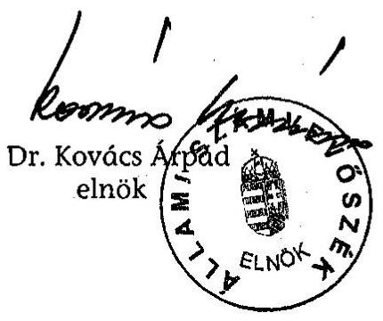

---

# Mellékletek

---

# 1. számú melléklet 

Az Állami Számvevőszék 2004. évi jelentéseiben a fejezetek vezetőinek megfogalmazott javaslatok és az azokra adott válaszok

---

.

---

# Az Állami Számvevőszék 2004. évi jelentéseiben a fejezetek vezetőinek megfogalmazott javaslatok és az azokra adott válaszok 

## Belügyminiszter

| Jelentés a helyi önkormányzatok társulásainak ellenőrzéséről (0407) |  |
| :--: | :--: |
| Javaslat: | Kezdeményezze a közigazgatási korszerűsítési program keretében   - a hatékonyabb szervezeti formák gyorsabb elterjedése érdekében az ösztönző rendszer, az érdekeltség továbbfejlesztését;   - az Ötv. nagyközségi/városi székhelyű körjegyzőségekre vonatkozó rendelkezéseinek a kiegészítését annak érdekében, hogy az a benne résztvevő önkormányzatok tényleges együttműködési formájává váljon, a csatlakozó települések részt vehessenek a döntéshozatalban és az ellenőrzésben;   - a körjegyzőségek működésére vonatkozó ösztönző támogatási rendszer módosítását, hogy a nagyközségek és városok önkormányzatai érdekeltté váljanak a körjegyzőségi együttműködésben való részvételben és ezáltal a feladatellátás színvonala javuljon. |
| Válasz: | A többcélú kistérségi társulások 2004. évi támogatása felhasználásának szabályait a BM által előkészitett 65/2004 (IV. 15.) Korm. rendelet rögziti. A BM 2005. évben újabb fejlesztési célú pályázatot indit, továbbá a megalakult kistérségi társulások részére müködési célú támogatási rendszert dolgoz ki. |
| Javaslat: | Kezdeményezze az Ötv. 39. § (3) bekezdésének módosításával a körjegyzőséghez csatlakozás és az abból való kiválás feltételeinek az alapítással, illetve megszűnéssel kapcsolatos követelményekkel összhangban levő meghatározását. |
| Válasz: | A BM az önkormányzatokról szóló 1990. évi LXV. tv. átfogó módosítása során tervezi az ÁSZ javaslatainak figyelembevételét. |
| Javaslat: | Kezdeményezze a köztisztviselők jogállásáról szóló 1992. évi XXIII. törvény 1. § (8) bekezdésének módosítását, hogy egyértelművé váljon annak hatálya és ne akadályozza a helyi önkormányzatok belső ellenőrzési társulásainak létrehozását, müködését. |
| Válasz: | A javaslat szerinti módosításról jelenleg is folyik a szakmai egyeztetés. |
| Javaslat: | Kezdeményezze az Áht. 66. §-ának módosítását, az Ötv. 44. § (2) bekezdésének előírásaival való összhang megteremtését, a közös képviselő-testület helyett a társult kép-viselő-testület megnevezés használatát. |
| Válasz: | A PM jogharmonizációra való felkeresése megtörtént. |
| Jelentés a 2003. április 12-én megtartott országos népszavazás lebonyolításához felhasznált pénzeszközök elszámolásának ellenőrzéséről (0423) |  |
| Javaslat: | Gondoskodjon a választásban közreműködő szervek tervezési, költségmegosztási és elszámolási feladatainak egyértelmű szabályozásáról. |
| Válasz: | Az érintett belügyi szervezetek kezdeményezték a teljes körü újraszabályozást, a fejezeti javaslatokat a PM nem tartotta időszerűnek, ezért a jogszabályi rendezés a közeljövőben nem valósul meg. A feladatokat egyértelmüen meghatározó informatikai támogatással biró rendszer 2005. április 30-ra készül el. |

---

| Javaslat: | Intézkedjen a BM KÖNYV Hivatal vezetője felé, hogy gondoskodjon a közbeszerzési előírások megsértése miatti felelősségre vonásról. |
| :--: | :--: |
| Válasz: | A problémás esetek kivizsgálása és a felelősségre vonás megtörtént. |
| Javaslat: | Utasítsa az OVI vezetőjét, hogy a jövőben a póttámogatás esetén a feladat elvégzéséhez szükséges időben értesítse a választási szerveket, póttámogatást csak indokolt esetben nyújtson. |
| Válasz: | A póttámogatások kiutalását az OVI vezetője szigorította. |
| Javaslat: | Rendelje el, hogy az OVI vezetője teljes körűen vizsgálja felül a póttámogatások felhasználását a területi választási irodák és a megyei közigazgatási hivatalok által leadott elszámolások és az azokat alátámasztó bizonylatok alapján a rendeltetéstől eltérő felhasználása megállapítására, és jogszerütlen felhasználás esetén a rendezésére. |
| Válasz: | A póttámogatások elszámolásának tételes felülvizsgálata támogatás-visszafizetést eredményezett. |
| Jelentés a helyi és a helyi kisebbségi önkormányzatok gazdálkodásának átfogó ellenőrzéséről (0436) |  |
| Javaslat: | Kezdeményezze az önkormányzati törvény felülvizsgálata kapcsán az önkormányzatok kötelező feladatainak egyértelmű meghatározását. |
| Válasz: | Fejezeti megítélés szerint az ágazati törvényekben meghatározott feladatok - az eltérő szóhasználatok ellenére - egyértelmü feladat meghatározást jelentenek. |
| Javaslat: | Kezdeményezze az önkormányzatok által kötelezően elkészítendő gazdasági program időbeli kiterjedésének, főbb tartalmi követelményeinek, elkészítési határidejének meghatározását, valamint az önkormányzati képviselő választásokat követően a felülvizsgálati kötelezettség előírását. |
| Válasz: | Az Ötv. módosításának tervezete elkészült. A törvény elfogadási arányára tekintettel valamennyi parlamenti párttal elözetes egyeztetés szükséges. |
| Javaslat: | Kezdeményezze a közigazgatás tervezett informatikai korszerűsítése keretében az önkormányzatok pénzügyi-számviteli feladatainak ellátásához szükséges hardverszoftver ellátottság fejlesztését, a szakmai követelmények egységesítését, rendszerszervezési eljárások elvégzését és ennek alapján az integrált adatnyilvántartások, feldolgozások elterjesztését. |
| Válasz: | A kérdésben önálló BM intézkedés nem lehetséges, az informatikai feladatok tekintetében első helyi felelős az Informatikai és Hírközlési Minisztérium. A BM szorgalmazta, hogy a szükséges informatikai környezet megteremtésének költségvetési forrása biztosított legyen. |
| Jelentés a Magyar Köztársaság 2003. évi költségvetése végrehajtásának ellenőrzéséről (0443) |  |
| Javaslat: | Vizsgáltassa felül a 3/2003. BM utasítást és az állami támogatású lakásprogramokhoz tartozó pályáztatás rendjét, határozzon meg egyértelmű hatásköri és felelősségi viszonyokat az előirányzatokat szakmailag kezelő, és a pénzügyi számviteli feladatokat ellátó szervezetek részére. |
| Válasz: | A javaslat hasznosítására a tájékoztatás nem tért ki. |
| Javaslat: | Vizsgáltassa meg a fejezeti kezelésű előirányzatokat érintő követelésállományt, intézkedjen a lejárt, vagy behajthatatlan követelések jogszabálynak megfelelő rendezésére. |

---

| Válasz: | A javaslat hasznosítására a tájékoztatás nem tért ki. |
| :--: | :--: |
| Javaslat: | Gondoskodjon a BM igazgatás intézmény működésének, gazdálkodásának, beszámolásának rendjét meghatározó, a jogszabályi előírásoknak megfelelő szabályzatok elkészítéséről, betartásáról, az ellenőrzés minden szinten történő erősítéséről. |
| Válasz: | A BM Központi Igazgatás müködésének, gazdálkodásának, beszámolásának rendjét meghatározó szabályzatok elkészültek. |
| Javaslat: | Pontosítsa és egészítse ki a működésképtelen helyi önkormányzatok egyéb támogatásának célját, ehhez munkáltassa ki az egyéb támogatás odaítélésének feltételrendszerét, és határozza meg a támogatási igények felülvizsgálati feladatait és módszereit. |
| Válasz: | A 2005. évi költségvetési törvény alapján módosultak a támogatások. A felülvizsgálat módszereit a kiadásra kerülő BM utasitás tartalmazza. |
| Javaslat: | Kezdeményezze az egyes jövedelempótló támogatások kiegészítése és az önkormányzatok által szervezett közcélú foglalkoztatás támogatása év végi előleg elszámolásához kapcsolódó önkormányzati visszafizetések BM és Kincstár közötti adatszolgáltatási rendszerének kialakítását annak érdekében, hogy a visszafizetett összegek a tárgyévben a helyi önkormányzatok támogatása kiadási és a megosztott bevételek lebonyolítási számla között rendezhetőek legyenek. |
| Válasz: | Az év végi elszámolásokhoz kapcsolódó értesitést - a tárca kezdeményezésére - a Kincstár, új adatszolgáltatási rendszerének köszönhetően lényegesen korábban tudja szolgáltatni a BM részére. |
| Javaslat: | Intézkedjen a címzett és céltámogatások számítógépes nyilvántartási programjának módosításáról, a visszafizetéseket érintő programhiba kijavításáról. |
| Válasz: | A BM és a Magyar Terület- és regionális Fejlesztési Hivatal között jelenleg zajló feladatátadási eljárások során a cél az, hogy a korábban az ÁSZ által észrevételezett fejlesztési támogatásokkal kapcsolatban megfogalmazott valamennyi ajánlást vegye figyelembe az átadási-átvételi jegyzőkönyv. |
| Javaslat: | Intézkedjen az eltérő adattartalmú nyilvántartási rendszerek miatt a céltámogatásokhoz kapcsolódóan az önkormányzatok által történt visszafizetések Kincstár és BM közötti egyeztetési módszerének a kidolgozásáról. |
| Válasz: | A BM és a Magyar Terület- és regionális Fejlesztési Hivatal között jelenleg zajló feladatátadási eljárások során a cél az, hogy a korábban az ÁSZ által észrevételezett fejlesztési támogatásokkal kapcsolatban megfogalmazott valamennyi ajánlást vegye figyelembe az átadási-átvételi jegyzőkönyv. |
| Javaslat: | Kezdeményezze a felhalmozási célú támogatások felhasználása szabályozásának - a döntési időpontokra vonatkozó követelmények meghatározásával történő - módosítását, hogy a támogatások odaítélése a tárgyév I. félévében megtörténjen. |
| Válasz: | A BM és a Magyar Terület- és regionális Fejlesztési Hivatal között jelenleg zajló feladatátadási eljárások során a cél az, hogy a korábban az ÁSZ által észrevételezett fejlesztési támogatásokkal kapcsolatban megfogalmazott valamennyi ajánlást vegye figyelembe az átadási-átvételi jegyzőkönyv. |

---

| Javaslat: | Kezdeményezze a megyei területfejlesztési tanácsok által nyújtott decentralizált felhalmozási célú támogatások egységes nyilvántartási rendszerének kialakítását, a TERKI és a CÉDE támogatásokra a központi információs igényeket teljes körűen kielégítő számítógépes program, integrált információs rendszer kidolgozását, és kezdeményezze ennek egységes alkalmazását a megyei területfejlesztési tanácsoknál és munkaszervezeteiknél, biztosítva a szükséges adatokat a decentralizált felhalmozási célú támogatások döntéseiről, felhasználásáról és elszámolásáról. |
| :--: | :--: |
| Válasz: | A BM és a Magyar Terület- és regionális Fejlesztési Hivatal között jelenleg zajló feladatátadási eljárások során a cél az, hogy a korábban az ÁSZ által észrevételezett fejlesztési támogatásokkal kapcsolatban megfogalmazott valamennyi ajánlást vegye figyelembe az átadási-átvételi jegyzőkönyv. |
| Javaslat: | Vizsgáltassa meg a megyei területfejlesztési tanácsokkal az elszámolatlan TERKI és CÉDE beruházási támogatások több évre elhúzódó, lezárást igénylő előirányzatainak jogszerűségét és kezdeményezzen intézkedést ezek rendezésére, lezárására. |
| Válasz: | A 2004. I. félévi beszámolás kapcsán már megtörtént, az év végi beszámoló során újólag levélben felszólítást kap a döntési jogosultsággal rendelkező Megyei Területfejlesztési Tanács a több éve rendezetlen támogatások lezárására. |
| Javaslat: | Kezdeményezzen olyan jogszabály-módosítást, mely szerint - a TERKI támogatásokhoz hasonlóan - a CÉDE támogatások folyósításának is legyen feltétele a számlák megyei területfejlesztési tanácsok általi igazolása. |
| Válasz: | Az elkészült kormányrendelet-tervezet tartalmazza a számlák megyei területfejlesztési tanácsok általi igazolásának feltételét. |
| Javaslat: | A törvényi előírások betartása, a pályázati rendszer hatékonyabb működtetése érdekében a központosított támogatások szabályozása keretében   - gondoskodjon róla, hogy a pincerendszerek, természetes partfalak és földcsuszamlások veszély-elhárítási munkálatainak támogatására a pályázatokat az önkormányzatok az Áht. 64/B. § (3) bekezdésében foglaltaknak megfelelően a MÁK Területi Igazgatóságokon keresztül nyújtsák be,   - biztosítsa, hogy a települési hulladék közszolgáltatás-fejlesztéshez pályázat útján nyújtott támogatások utólagos elszámoltatása és annak felülvizsgálata megtörténjen. |
| Válasz: | A javaslat hasznosítására a tájékoztatás nem tért ki. |
| Javaslat: | A helyi önkormányzatok létszámcsökkentéshez kapcsolódó pályázatainak eredményessége érdekében:   - módosítsa a pályázati feltételeket, a csatolandó dokumentumok körét úgy, hogy azokból az előrehozott teljes összegű nyugdíjra való jogosultság feltételeinek fennállása megállapítható legyen,   - rendelje el a létszámcsökkenés önkormányzati szintű megvalósulásának a BM által történő ellenőrzését. |
| Válasz: | A helyi önkormányzatok létszámcsökkentési döntéseihez kapcsolódó kiadásainak támogatására rendelkezésre álló központosított előirányzat pályázati rendszere müködéséről szóló BM rendelet tervezete tartalmazza a megvalósulás ellenőrzését, továbbá a teljes összegü nyugdijjogosultság feltételei fennállásának megállapítását lehetővé tevő szabályozást. |

---

| Javaslat: | Tegye egyértelművé a helyi önkormányzati hivatásos tüzoltóságok esetében a cél sze-   rinti felhasználás és a következő évre átvihető támogatás meghatározását, tartalmát,   határozza meg konkrétan, hogy milyen esetekben keletkezik támogatás-visszafizetési   kötelezettség. |
| :-- | :-- |
| Válasz: | A javaslat hasznosítására a tájékoztatás nem tért ki. |
| Az informatikai és hírközlési miniszterrel, a honvédelmi miniszterrel és a pénzügyminiszterrel kö-   zösen: |  |
| Javaslat: | Intézkedjenek a PM fejezet 17/1. Vegyes kiadások költségvetési alcím 17/1/8. K-600   hírrendszer működtetésére szolgáló előirányzatból megvalósult beruházások, beszer-   zett eszközök tételes leltározásáról, nyilvántartásba vételéről és annak a megfelelő   fejezet költségvetési intézménye mérlegében való szerepeltetéséről. |
| Válasz: | A javaslat hasznosítására a tájékoztatás nem tért ki. |

# Egészségügyi miniszter 

| Jelentés az állami egészségügyi beruházásokra fordított pénzeszközök hasznosulásának ellenőrzéséről (0410) |  |
| :--: | :--: |
| Javaslat: | Dolgoztassa ki a szakmai kollégiumokkal együttműködve a támogatások - a betegségi adatokon alapuló, a területi megoszlást és az ellátás minőségét is figyelembevevő hosszú távú pénzügyi és eszközfejlesztési és tervét. |
| Válasz: | A javaslat hasznosítására a tájékoztatás nem tért ki. |
| Javaslat: | Vizsgáltassa meg az egyes HBCS súlyszámok egymás közötti arányait, valamint a sugárterápiás kúraellátások - a teljesítményfinanszírozási rendszerben az ellátáshoz rendelt HBCS besorolások szerinti - súlyszáma és az ellátás szakmai tartalma közötti összefüggést és intézkedjen a meglévő súlyszám arányok módosításáról. |
| Válasz: | A karbantartási munka megkezdődött, de a szakmai egyeztetések és háttérszámítások volumene miatt a HBCS-módosítások kihirdetésére az egészségügyi szakellátás társadalombiztositási finanszirozásának egyes kérdéseiről szóló 9/1993. (IV. 2.) NM rendelet legközelebbi módosítása során kerül sor. |
| Javaslat: | Tegyen intézkedéseket a pályáztatási idő lerövidítésére. Készíttesse el a pályázatok elbírálásának belső szabályzatát, amelyben szabályozzák a megvalósítás eljárási rendjét, az egyes pályázatok előkészítő, kiértékelő szakaszainak időtartamát, határidejét. |
| Válasz: | A pályázat útján történt felhasználásra a központi kormányzat egységes eljárásrendet kiván alkalmazni, mellyel kapcsolatban az EÜM is megküldte a kért információkat. |
| Javaslat: | Vizsgálja felül az MKGI-vel (KSZF-el) kötött megállapodási szerződés módosításában foglalt közbeszerzési díj háttérszámítását és a 125/1996. (VII. 24.) Korm. rendeletnek megfelelően, egységesen határozzák meg. |
| Válasz: | A javaslat hasznosítására a tájékoztatás nem tért ki. |

---

| Jelentés az egészségügy területén megvalósult PHARE programok ellenőrzéséről (0432) |  |
| :--: | :--: |
| Javaslat: | Gondoskodjon a minisztérium irányításával megvalósuló projekteknél az EU támogatások, a hozzá kapcsolódó hazai társfinanszírozás és a társfinanszírozáson felül felmerült költségek projektenkénti átlátható, követhető, egyidejű forint és euro alapú nyilvántartásáról. |
| Válasz: | Az EU támogatások 2003. február hónaptól a kifizetés időpontjában érvényes árfo-   lyamon forintra átszámolva kerülnek rögzitésre. |
| Javaslat: | Intézkedjen a megvalósult informatikai fejlesztések hosszú távú alkalmazásfejlesztési stratégiájának elkészíttetéséről. |
| Válasz: | A stratégia elkészitésének határideje 2005. április 1. |
| Javaslat: | Kísérje figyelemmel a járványügyi adatkezelő rendszer teljes körű alkalmazásba vételét. |
| Válasz: | Az adatok bekérése majd értékelése folyamatban van, határideje 2005. február 15. |
| Jelentés a központi költségvetésből kutatás-fejlesztési célokra fordított pénzeszközök hasznosulásának ellenőrzéséről (0440) |  |
| Javaslat: | Vizsgálják felül eddigi $\mathrm{K}+\mathrm{F}$ támogatási gyakorlatukat és a felülvizsgálat alapján koncentrált módon állítsák össze a fejezeti költségvetés $\mathrm{K}+\mathrm{F}$ forrásait; értékeljék a támogatások hasznosulását. |
| Válasz: | Az ajánlásokban foglaltaknak az Egészségügyi Tudományos Tanács müködése eleget tesz, külön intézkedések meghozatalára nem került sor. |
| Javaslat: | Segítsék elő az ágazati $\mathrm{K}+\mathrm{F}$ cálelőirányzatok pályáztatásakor eredményességi követelmények előírásával, tárcaközi pályáztatás szervezésével, a kutatóhelyek értékelési rendszerének kidolgozásával és megvalósításával, valamint az innovációra alkalmas pályázati eredmények értékelésével, átadásával a közpénzek felhasználásának hatékonyságjavulását, a vállalkozási szféra versenyképességét. |
| Válasz: | Az ajánlásokban foglaltaknak az Egészségügyi Tudományos Tanács müködése eleget tesz, külön intézkedések meghozatalára nem került sor. |
| Javaslat: | Kísérjék figyelemmel az ellenőrzés megállapításainak, javaslatainak hasznosítását a kutatás-fejlesztésben érintett intézményeknél, gondoskodjanak azok megvalósításáról, a visszacsatolás érvényesítéséről. |
| Válasz: | Az ajánlásokban foglaltaknak az Egészségügyi Tudományos Tanács müködése eleget tesz, külön intézkedések meghozatalára nem került sor. |
| Jelentés a gyógyszerek támogatási és finanszírozási rendszerének, a fogyasztás helyzetének ellenőrzéséről (0448) |  |
| Javaslat: | Gondoskodjon arról, hogy a gyógyszerek befogadásakor és támogatási kategóriákba való besorolásakor érvényesüljenek a költséghatékonyság szempontjai. |
| Válasz: | A javaslat hasznosítására a tájékoztatás nem tért ki. |
| Javaslat: | Gondoskodjon az Országos Egészségbiztosítási Pénztár és az Országos Gyógyszerészeti Intézet gyógyszeradatbázisai közötti összhang megteremtéséről, az adatok megfelelő kategorizálásáról, egységes értelmezéséről, továbbá arról, hogy az elemzésekhez, ellenőrzésekhez szükséges naprakész orvos-nyilvántartási adatok az OEP számára rendelkezésre álljanak. |

---

| Válasz: | A javaslat hasznosítására a tájékoztatás nem tért ki. |
| :--: | :--: |
| Javaslat: | Szabályozza az orvosi szakmai protokollok érvényesítésének ellenőrzését; a minőségfejlesztés jegyében a szakmai protokollok továbbfejlesztését és további közreadását, a betegségcsoportonkénti gyógyszerfogyasztás trendjeinek rendszeres értékelését. |
| Válasz: | A javaslat hasznosítására a tájékoztatás nem tért ki. |
| Javaslat: | Rendelje el az egészségügyi intézmények gyógyszerfelhasználása és -beszerzése egységes szempontok szerinti nyilvántartási és adatszolgáltatási rendszerének kidolgozását. |
| Válasz: | A javaslat hasznosítására a tájékoztatás nem tért ki. |
| Javaslat: | Szabályozza miniszteri rendeletben a gyógyszerismertetői tevékenység engedélyezéséért fizetendő díjakat, és hagyja jóvá az Országos Gyógyszerészeti Intézet Szervezeti és Müködési Szabályzatát. |
| Válasz: | A javaslat hasznosítására a tájékoztatás nem tért ki. |
| Javaslat: | Kérje fel az Országos Egészségbiztosítási Pénztár főigazgatóját, hogy:   - Rendszeresen modellezze és értékelje a gyógyszertámogatás és finanszírozás terén megtett intézkedések hatását, segítve a költségvetési tervezés megalapozását; |
| Válasz: | A javaslat hasznosítására a tájékoztatás nem tért ki. |
| Javaslat: | - Egységesítse a különkeretből finanszírozott gyógyszerek betegenkénti, TAJszámonkénti nyilvántartását, valamint a kettős finanszírozás lehetőségének kizárása érdekében végeztessen elemzést a HBCs-ben finanszírozott - a különkeretes gyógyszerekkel azonos hatóanyag-tartalmú - gyógyszerek költségeiről, továbbá alakíttassa ki a különkeretes gyógyszerfelhasználás egységes szempontok szerinti, ellenőrizhető rendszerét; |
| Válasz: | Az ajánlásnak megfelelően elindult a munkafolyamat, melynek célja a párhuzamosságok feltárása és kiküszöbölése, a finanszírozás átláthatóvá tétele. |
| Javaslat: | - Pontosítsa a méltányossági alapú gyógyszertámogatás nyilvántartásainak kezelését; |
| Válasz: | A javaslat hasznosítására a tájékoztatás nem tért ki. |
| Javaslat: | - Aktualizálja a gyógyszertári szerződéseket és tegyen lépéseket a patikai rendszergazdákkal való kapcsolat megfelelő szabályozása érdekében; |
| Válasz: | A javaslat hasznosítására a tájékoztatás nem tért ki. |
| Javaslat: | - Határozza meg a gyógyszertámogatással és finanszírozással kapcsolatos lekérdezésekhez szükséges fogalmakat, az informatikai rendszerekből lekérdezett adatok egységes értelmezése érdekében; |
| Válasz: | A javaslat hasznosítására a tájékoztatás nem tért ki. |
| Javaslat: | - Folytassa az irányított betegellátás gyógyszerfogyasztásra gyakorolt hatásának elemzését, valamint a racionálisabb gyógyszerfogyasztást befolyásoló orvosi érdekeltségi rendszer értékelését; |
| Válasz: | A javaslat hasznosítására a tájékoztatás nem tért ki. |

---

| Javaslat: | - Gondoskodjon a gyógyszerek támogatási és finanszírozási rendszerével kapcsolatos döntések, jogszabályi változások megfelelő dokumentálásáról. |
| :--: | :--: |
| Válasz: | A javaslat hasznosítására a tájékoztatás nem tért ki. |
| Javaslat: | Kísérje figyelemmel az Országos Egészségbiztosítási Pénztár főigazgatójának tett javaslatok végrehajtását. |
| Válasz: | A javaslat hasznosítására a tájékoztatás nem tért ki. |

# Foglalkoztatáspolitikai és munkaügyi miniszter 

| Jelentés a Munkaerőpiaci Alap múködésének ellenőrzéséről (0439) |  |
| :--: | :--: |
| Javaslat: | Intézkedjen -a források biztosítása mellett - hogy a Foglalkoztatási Hivatalnál dolgozzák ki az alkalmazott informatikai rendszerek biztonságos müködtetéséhez szükséges szabályokat és feltételeket. |
| Válasz: | A tárca a szükséges intézkedést megtette, elkészitésre kerülnek a szabályzati keretek, a biztonsági eljárási rendek, ezt követően készülnek el a szabályok. |
| Javaslat: | Teremtse meg az ellenőrzési feladatok és az ellenőrzési szervezet létszáma közötti összhangot. |
| Válasz: | A Foglalkoztatási Hivatal Ellenőrzési Osztálya vizsgálatot folytatott, melynek eredményeként a Foglalkoztatási Hivatal javaslatokat fogalmazott meg a megyei munkaügyi központok részére. |
| Jelentés a Magyar Köztársaság 2003. évi költségvetése végrehajtásának ellenőrzéséről (0443) a pénzügyminiszterrel közösen: |  |
| Javaslat: | Intézkedjenek a 8/1983. (VI. 29.) EüM-PM együttes rendelet 27/D. § (8) bekezdésében foglaltak felülvizsgálatáról annak érdekében, hogy a normatív támogatást kiutaló adóhatóság a célszervezeti kijelölésről, illetve annak visszavonásáról közvetlenül és időben értesüljön. |
| Válasz: | 2005. január 1-jétől átalakult a megváltozott munkaképességü munkavállaló foglalkoztatásának támogatására vonatkozó szabályozás (kihirdette a 27/2004. (XII. 14.) FMM-ICSSZEM-PM együttes rendelet). A változás a dotáció mértékét érintette. A rendelet pontositó szabályokat is tartalmaz az állami támogatás igénybevételének rendjére vonatkozóan. |

---

# Földművelésügyi és vidékfejlesztési miniszter 

| Jelentés a központi költségvetésből kutatás-fejlesztési célokra fordított pénzeszközök hasznosulásának ellenőrzéséről (0440) |  |
| :--: | :--: |
| Javaslat: | Vizsgálják felül eddigi $\mathrm{K}+\mathrm{F}$ támogatási gyakorlatukat és a felülvizsgálat alapján koncentrált módon állítsák össze a fejezeti költségvetés $\mathrm{K}+\mathrm{F}$ forrásait; értékeljék a támogatások hasznosulását. |
| Válasz: | Az ÁSZ javaslatainak hasznosítása részben folyamatban van. A tárca 2004. december 31-ig elvégezte az elmúlt évek során lezárult kutatási pályázatok hasznosulásának kérdöives felmérését, értékelését, és elkészítette az összegző értékelés dokumentumait. |
| Javaslat: | Segítsék elő az ágazati $\mathrm{K}+\mathrm{F}$ cálelőirányzatok pályáztatásakor eredményességi követelmények előírásával, tárcaközi pályáztatás szervezésével, a kutatóhelyek értékelési rendszerének kidolgozásával és megvalósításával, valamint az innovációra alkalmas pályázati eredmények értékelésével, átadásával a közpénzek felhasználásának hatékonyságjavulását, a vállalkozási szféra versenyképességét. |
| Válasz: | Az ÁSZ javaslatainak hasznosítása részben folyamatban van. Az elöirt értékeléskorszerüsités párhuzamosan folyik a pályázati lehetőségek és törvényi szabályozások változásával. |
| Javaslat: | Kísérjék figyelemmel az ellenőrzés megállapításainak, javaslatainak hasznosítását a kutatás-fejlesztésben érintett intézményeknél, gondoskodjanak azok megvalósításáról, a visszacsatolás érvényesítéséről. |
| Válasz: | A javaslat hasznosítására a tájékoztatás nem tért ki. |
| Jelentés a Magyar Köztársaság 2003. évi költségvetése végrehajtásának ellenőrzéséről (0443) |  |
| Javaslat: | Vizsgálja felül a támogatási rendszert a kifizetések egységes és naprakész nyilvántartásának kialakítása érdekében, figyelemmel az FVM szervezeti rendjén kívüli szervezetektől igényelt normatív költségvetési támogatásokra is, megteremtve egyúttal a felelősségi és ellenőrzési rendszert is. |
| Válasz: | A tárca által kidolgozott intézkedési terv része a támogatások nyomon követhetőségét biztositó szoftverfejlesztések koordinálása, illetve végrehajtása, valamint el az Átfogó Informatikai Biztonsági Szabályzat elkészítése 2005 évi teljesitéssel. |
| Javaslat: | Alakítsa ki az egyes agrárgazdasági támogatásokhoz kapcsolódó ügyintézési folyamat egészére kiterjedő, részletes eljárásrendeket. |
| Válasz: | Kidolgozásra kerültek a támogatási jogcímek végrehajtására, ellenőrzésére, kifizetésére vonatkozó eljárásrendek, folyamatos karbantartásuk biztositott. |
| Javaslat: | Intézkedjen, hogy a fejezeti kezelésű előirányzatokból megvalósuló felhasználások pénzügyi-szakmai lezárásának egységes dokumentálása érdekében határozzák meg a felhasználásról készülő jelentések, elszámolások "törzs" adattartalmát. Vizsgáltassa meg - a szakmai információs igények ismeretében - annak további bővítési szükségességét. |
| Válasz: | A javaslat hasznosítására a tájékoztatás nem tért ki. |

---

# Gazdasági és közlekedési miniszter 

| Jelentés a Magyar Fejlesztési Bank Részvénytársaság müködésének és a központi költségvetés végrehajtásához kapcsolódó tevékenységének ellenőrzéséről (0413) |  |
| :--: | :--: |
| Javaslat: | Rendelje el alapítói határozattal, hogy a Bank SZMSZ-e tartalmazza a két vezérigazgató irányítási és döntési felelősségének megosztását, elhatárolását. |
| Válasz: | A tárca Alapitói Határozatban intézkedett, a két vezérigazgató feladat és hatásköre az SZMSZ-ben szétválasztásra kerüljön, melyet végrehajtottak. |
| Javaslat: | Dolgoztassa ki az üzleti aktivitás és a müködési költség közötti összhang megteremtésének feltételeit, és alapítói határozatban rendelje el azoknak a Bank üzleti tervében való érvényre juttatását. |
| Válasz: | A bank igazgatósága kidolgozta a folyamatos összhang biztositásának feltételeit. Az MFB éves mérlegbeszámolójában bemutatásra kerül a bank feladatainak és a müködés kereteinek az összhangja. |
| Javaslat: | Kérje fel az FB-t, hogy írja elő a belső ellenőrzés vizsgálataihoz kapcsolódó intézkedési tervek végrehajtásának ellenőrzését az azokban foglalt határidők szerint. |
| Válasz: | A GKM felkérésére az FB megtette a szükséges lépéseket a belső ellenőrzéssel összefüggő kérdésekben. |
| Jelentés a szekszárdi Duna-híd beruházás ellenőrzéséről (0428) |  |
| Javaslat: | Szabályozza Alapítói Határozatban az NA Rt.-nél a fejlesztési beruházások vállalkozásba adásának eljárási rendjében a vállalkozásba adáskor alkalmazható árképzési forma feltételeit és kötöttségeit (átalányár alkalmazása, tételes elszámolás stb.). |
| Válasz: | A gyorsforgalmi szakaszok épitésére kötendő vállalkozási szerződések lehetséges változatait az alkalmazandó árformák tekintetében a Nemzeti Autópálya Rt. áttekintette. A legmegfelelőbb szerzödéses forma kérdésében egyértelmü állásfoglalás még nem alakult ki. |
| Javaslat: | Szabályozza Alapítói Határozatban az NA Rt.-nél a beruházások műszaki ellenőrzési feladatait ellátó Mérnökkel való szerződéskötés feltételeit, a függetlenséget garantáló és a költségtakarékosságra ösztönző biztosítékok beépítésével, ellenőrzésével. Térjen ki a szabályozás az NA Rt. és a Mérnök közötti hatáskör- és munkamegosztásra azokban az esetekben, amelyeknél a megvalósítás során a szerződésestől eltérő műszaki tartalomváltozás, pótmunkák elbírálásának és jóváhagyásának igénye merül fel. |
| Válasz: | Javasolták egy Szakmai Bizottság felállitását a Mérnökkamara és FIDIC szakértők bevonásával, mely az NA Rt.-vel, mint beruházóval a gyorsforgalmi szakaszok épitésének lebonyolítására kötendő mérnök szerzödések vonatkozásában a Mérnök függetlenségének státuszát is megvizsgálja, hogy a munkavégzés során alkalmazott felelösség és feladatmegosztás minél pontosabban definiálásra kerülhessen. |
| Javaslat: | Követelje meg - a beruházások előkészítésének javítása érdekében megfelelően részletes müszaki-technológiai tartalommal - a tervezési, felmérési dokumentáció elkészíttetését a vállalkozásba adást megelőzően. |
| Válasz: | A Magyar Útügyi Társaság szerzödést kötött a Hollandiában kifejlesztett és Európa szerte elterjedten alkalmazott RAW rendszer honositására. A megvalósitás folyamatban van. |

---

| Javaslat: | Kísérje figyelemmel az NA Rt.-nél költségelemzésre alkalmas, saját aktualizálható egységár adatbázis és beruházás összehasonlító elemzésre alkalmas, megvalósítási mutatókat tartalmazó beruházási adatbázis kialakítását. |
| :--: | :--: |
| Válasz: | Elkészült az UKIG és az NA Rt. együttmüködésével a közút és hídépitési munkák fajlagos költségei c. költségbecslési segédlet, melynek adatfrissitése folyamatos. |
| Javaslat: | Gondoskodjon olyan adatbázis és nyilvántartási rendszer kialakításáról, amely lehetővé teszi az állami beruházások alapdokumentumainak hatékony visszakeresését, műszaki, gazdasági és gazdaságtörténeti feldolgozását, valamint ezen alapdokumentumok egy helyen történő tárolását. |
| Válasz: | Minden keletkező dokumentum digitalizálásra kerül, így a szerződések elektronikusan is tárolásra kerülnek, és elérhetők a Társaság belső szerverén. |
| Jelentés a központi költségvetésből kutatás-fejlesztési célokra fordított pénzeszközök hasznosulásának ellenőrzéséről (0440) |  |
| Javaslat: | Vizsgálják felül eddigi $\mathrm{K}+\mathrm{F}$ támogatási gyakorlatukat és a felülvizsgálat alapján koncentrált módon állítsák össze a fejezeti költségvetés $\mathrm{K}+\mathrm{F}$ forrásait; értékeljék a támogatások hasznosulását. |
| Válasz: | A fejezeti költségvetés $K+F$ forrásainak koncentrálására vonatkozó ajánlás teljesitése az elmúlt évben elmaradt. Kezdeményezések történtek az átcsoportositásokra, alapvetően azonban fennmaradt az egyes források szigorúan kötött célú felhasználhatósága. |
| Javaslat: | Segítsék elő az ágazati $\mathrm{K}+\mathrm{F}$ cálelőirányzatok pályáztatásakor eredményességi követelmények előírásával, tárcaközi pályáztatás szervezésével, a kutatóhelyek értékelési rendszerének kidolgozásával és megvalósításával, valamint az innovációra alkalmas pályázati eredmények értékelésével, átadásával a közpénzek felhasználásának hatékonyságjavulását, a vállalkozási szféra versenyképességét. |
| Válasz: | A 9/2004. sz. belső szabályzat szerint a témagazda a szervezeti egységektől kapott beszámolók alapján évente egyszer tájékoztatót készít a minisztérium vezetése számára az előző évben beszerzett kutatási és fejlesztési szolgáltatások hasznosulásáról. |
| Javaslat: | Kísérjék figyelemmel az ellenőrzés megállapításainak, javaslatainak hasznosítását a kutatás-fejlesztésben érintett intézményeknél, gondoskodjanak azok megvalósításáról, a visszacsatolás érvényesítéséről. |
| Válasz: | A javaslatnak megfelelően a hasznosítás folyamatban van. |
| Jelentés a (0443) | Magyar Köztársaság 2003. évi költségvetése végrehajtásának ellenőrzéséről |
| Javaslat: | Intézkedjen, hogy a GKM felügyelete alá tartozó intézmények és fejezeti kezelésű előirányzatok kezelői fordítsanak fokozott figyelmet az előirányzat-módosításokat és a kiadási-bevételi teljesítéseket érintő, Magyar Államkincstárral való adategyeztetésre, az eltérések ok-okozati összefüggéseinek feltárására. |
| Válasz: | A GKM felügyelete alá tartozó intézmények a Magyar Államkincstárral való adategyeztetésről és az eltérések okainak feltárásáról beszámolót készítettek, a fejezeti kezelésű előirányzatok tekintetében az adategyeztetés folyamatos. |

---

| Javaslat: | Intézkedjen az UFCE-ből finanszírozott és az UKIG által kezelt előirányzatok esetében a beruházások az Áht. 109/A és 109/B §-ai előírásainak, a 183/1996. (XII. 11.) Korm. rendelet vonatkozó szabályainak, valamint a Sztv. 15. §-ában rögzített teljesség, folytonosság, valódiság alapelveknek megfelelő elszámolására és kimutatására. Biztosítsa, hogy a 2004. január 1-jétől hatályos 109/2003. (XII. 29.) GKM rendelet alapján az UKIG, mint központi vagyonkezelő számviteli elszámolásai maradéktalanul támasszák alá a hivatkozott GKM rendeletben előírt vagyonkezelői körbe tartozó értéknyilvántartásokat. |
| :--: | :--: |
| Válasz: | Az UKIG-KVI vagyonkezelési szerzödését követően valósul meg az utak és a hozzájuk tartozó ingatlanok induló értékének meghatározása, melynek várható legkorábbi határideje 2005. április-május.   Várhatóan 2005. III. negyedév végére készül el az országos közutak vagyonkezelésével összefüggő - informatikai háttérrel támogatott - nyilvántartási és számviteli információs rendszer. |
| Javaslat: | Biztosítsa, hogy a fejezeti kezelésű előirányzatok könyvviteli mérlegében kimutatott eszközök köre és állománya feleljen meg a 217/1998. (XII. 30.) Korm. rendeletben foglaltaknak. |
| Válasz: | A javaslat hasznosítására a tájékoztatás nem tért ki. |
| a Miniszterelnöki Hivatalt vezető miniszterrel közösen: |  |
| Javaslat: | Gondoskodjanak a privatizációs törvény módosulásával összefüggő intézkedésekről szóló 2192/2002. (VI. 21.) Korm. határozat 3. bekezdése rendelkezéseinek végrehajtásáról. A Regionális Fejlesztési Holding Rt.-ben részvényesi jogokat kizárólagosan gyakorló Miniszterelnöki Hivatalt vezető miniszter kössön megállapodást a gazdasági és közlekedési miniszterrel a Holding közös irányításához szükséges együttműködés kérdéseiről. Intézkedjenek a Holdingban megtestesülő GKM részesedések MeH részére történő átadásáról. |
| Válasz: | A tárca 2004. október végéig a részesedéseket és a részvényesi jogokat átadta a MEH-nek. Az idöközben megjelent 293/2004. (X. 28.) Korm. rendelet miatt a Regionális Fejlesztési Holding közös irányítása ügyében kötendő GKM, MeH megállapodás okafogyottá vált. |

# Honvédelmi miniszter 

| Jelentés a Magyar Honvédség Szárazföldi csapatai müködtetését szolgáló pénzeszközök hasznosulásának ellenőrzéséről (0424) |  |
| :--: | :--: |
| Javaslat: | Gondoskodjon a haderő átalakítására vonatkozó döntéseknél - hatástanulmányok, gazdasági számítások megkövetelésével - a finanszírozhatóságot befolyásoló kockázati tényezők teljes körének figyelembevételéről, különös tekintettel a szövetségi követelmények egyeztetési folyamataira, az önkéntes haderőre való áttérés, a sorállomány kiváltás és a katonák alaprendeltetésű foglalkoztatását biztosító változtatások (egyes tevékenységek költségvetési körön kívülre szervezésének) költségvetési öszszefüggéseire. |

---

| Válasz: | A döntések megalapozása érdekében folyamatosan készültek hatástanulmányok, gazdasági számítások. Ennek során feldolgozásra, értékelésre kerültek a 2005-2014. évi 10 éves terv kidolgozásának tapasztalatai, a TVRT kísérleti müködése, az egyes területeken folyó tevékenységek, az együttmüködés rendje, a tervezés során kialakult erő-forrás- és költségszámvetések alátámasztottsága, megalapozottsága, továbbá összegyüjtésre kerültek a felmerült problémák, hiányosságok kiküszöbölését célzó intézkedések. |
| :--: | :--: |
| Javaslat: | Gondoskodjon a NATO és a hazai védelmi tervezés folyamatának harmonizálásáról, a Tárca Védelmi Tervező Rendszer (és alrendszerei) alkalmazhatósági szintre hozásáról |
| Válasz: | A HM Védelmi Tervező Bizottság irányitásával folyt a 2004. évre elöirt rendszerkisérlet, amelynek részletes rendjét, feladatait és ütemezését a 33/2004. (HI 13.) HM KÁT - HM HVKF együttes intézkedés, illetve a jóváhagyott Kísérleti Rendszerterv határozta meg. |
| Javaslat: | Gondoskodjon a gyakorlatok finanszírozási rendjének racionalizálásáról, ezen a téren is a költségvetési forrás-felhasználás átlátható kezeléséről. |
| Válasz: | A gyakorlatok költségvetési finanszirozási rendjének racionalizálását, a költségvetési forrásfelhasználás átláthatóságának biztositását szolgálják a Költségvetés Gazdálkodási Információ Rendszer keretében kialakitást nyert és alkalmazott projektkódok, valamint az évenként kiadásra kerülő HM utasításokban meghatározott szakmai felülvizsgálati, visszaigazolási rend. |
| Javaslat: | Intézkedjen a HM Honvéd Vezérkar főnöke felé, hogy hatáskörében gondoskodjon a haderő-átalakítás menetében a kidolgozói munka eredményes végrehajtásához szükséges feltételek (szakmai és pénzügyi-gazdasági információk, dokumentációk) időben történő biztosításáról, a belső kommunikáció, információátadás hatékonyabb szervezéséről. |
| Válasz: | Az MH középszintü vezetési rendszerének átalakítása keretében az MH SZFP, illetve az MH LEP szervezeti elemei feladatrendszerének kidolgozása folyamatban van. Az átalakitást nyomon követő rendszer próbaüzeme lezárult, a jelentések rendszeresek. Az alárendeltek szervezeti struktúrájának átalakítása egy szervezet kivételével megtörtént. |
| Javaslat: | Intézkedjen a HM Honvéd Vezérkar főnöke felé, hogy hatáskörében gondoskodjon a honvédség vezetési szintjeihez rendelt felügyeleti ellenőrzések, valamint a képesség alapú ellenőrzések (Ideiglenes Szakutasítás alapján végzett ellenőrzések és OPEVAL értékelések) megállapításainak érdemi feldolgozásáról, ezek figyelembevételével a katonai szervezetek (közöttük a felajánlott erők) képességeinek és harckészültségének követelményeknek megfelelő szintre hozása és a nemzeti hatáskörbe tartozó hiányosságok felszámolása érdekében szükséges intézkedések foganatosításáról. |
| Válasz: | A Harcászati Értékelő Programok alkalmazásáról szóló 42/2004. (HK 10.) HM utasitás és az annak végrehajtásáról szóló 43/2004. (HK 10.) HM KÁT - HM HVKF együttes intézkedés elöirásainak megfelelően a készenléti követelmények és a valós állapot összevetésére, az ellenőrzési tapasztalatok ismételt feldolgozására került sor. Elkészült az MH készenléti helyzetére vonatkozó éves összefoglaló jelentés, amely a szükséges intézkedési javaslatokat tartalmazza. |

---

| Javaslat: | Az MH Szárazföldi Parancsnokság parancsnoka tegye meg a szükséges intézkedéseket az alárendelt állomány - NATO katonai integrációval kapcsolatos - ismeretszerzésének felgyorsításáról, a szövetségi kötelékben történő alkalmazás (együttmüködés, kommunikáció) személyi feltételeinek javítása érdekében. |
| :--: | :--: |
| Válasz: | Az hazai és a külföldi nyelvi felkészitő foglalkozásokra, tanfolyamokra, valamint a NATO ismeretekkel kapcsolatos szakmai tanfolyamokra történő 2005. évi beiskolázások tervezésénél a prioritást a szövetségi kötelékben alkalmazásra kijelölt személyek és alegységek képezték. |
| Javaslat: | Az MH Szárazföldi Parancsnokság parancsnoka tegye meg a szükséges intézkedéseket a kiképzés-technikai eszközök, berendezések - különösen a nagy értékủ szimulátorok, szimulációs rendszerek - helyőrségi felhasználói tapasztalatainak elemzéséről, a fejlesztési, beruházási igények meghatározásánál az értékelések hasznosításáról. |
| Válasz: | A felhasználói tapasztalatok elemzését az MH SZFP az MH ÖLTP-vel közösen hajtja végre. A nagy értékü szimulátorok, szimulációs rendszerek üzemeltetési idejének helyörségi felhasználói tapasztalatainak jelentéséről szóló 607/2004. MH ÖLTP intézkedést az MH SZFP az alárendeltek részére megküldte. |
| Jelentés a Magyar Köztársaság 2003. évi költségvetése végrehajtásának ellenőrzéséről (0443) |  |
| az informatikai és hírközlési miniszterrel, a belügyminiszterrel és a pénzügyminiszterrel közösen: |  |
| Javaslat: | Intézkedjenek a PM fejezet 17/1. Vegyes kiadások költségvetési alcím 17/1/8. K-600 hírrendszer müködtetésére szolgáló előirányzatból megvalósult beruházások, beszerzett eszközök tételes leltározásáról, nyilvántartásba vételéről és annak a megfelelő fejezet költségvetési intézménye mérlegében való szerepeltetéséről. |
| Válasz: | A HM részéről 2004. szeptember 16.-án ismételt sürgető megkeresésre került sor, melyre az IHM részéről visszajelzés nem történt. |
| Jelentés a Magyar Honvédség közbeszerzési rendszere müködésének ellenőrzéséről (0451) |  |
| Javaslat: | Kezdeményezze a főbb haditechnikai eszközök körének pontosítását, amelyek fejlesztéséről az Országgyűlés dönt, továbbá gondoskodjon az átalakítás folyamatában szükségessé váló döntések előkészítéséről. |
| Válasz: | A javaslat kidolgozása és elöterjesztése 2005. májusára került ütemezésre. A haderőátalakítás folyamatában szükségessé váló döntések előkészitése szükség szerint történik. |
| Javaslat: | Mutassa be a Kormány Nemzetbiztonsági Kabinetjének a haditechnikai eszközbeszerzések közbeszerzési eljárások alóli mentesítésének indokolt eseteit (teljes körű vagy egyes kötelezettségek alóli mentesség szükségességét), elfogadása esetén gondoskodjon az eljárásrend tárcaszintű szabályozásáról. |
| Válasz: | A belső eljárási rend szabályozása a 89/2004. (HK 25.) HM utasitás kiadásával megtörtént, a kérdésben illetékes központi beszerzö szerv Beszerzési Szabályzata jóváhagyásra került. A mentesitések szabályozására az utasitás módositásával összhangban kerül sor. |
| Javaslat: | Szorgalmazza a beszerzések eredményesség elvű követelménytámasztását, az ezt megalapozó - az eredményesség, gazdaságosság, hatékonyság mérésére irányuló teljesítményellenőrzések végrehajtását, a tapasztalatok beszerzéseknél történő hasznosítását. |

---

| Válasz: | Az érintett vezetők hatáskörében a belső szabályokkal összhangban folyamatosan történik a követelmények érvényesitésének, a feladat hatályosulásának figyelemmel kisérése. Folyamatban van az „Elözetes Éves Beszerzési Terv" véglegezése, amely alapját képezi a beszerzési eljárások lefolytatásának. |
| :--: | :--: |
| Javaslat: | Gondoskodjon a védelmi képesség felülvizsgálat alapján készített hosszú távú terv költségvetési kiegyensúlyozásának felgyorsításáról, a tervezést elősegítő eszközrendszer (Tárca Védelmi Tervező Rendszer, haderő-fejlesztési törzskönyvek) mielőbbi alkalmassá tételéről, illetve a kiegyensúlyozás objektív akadályának felmerülése esetén a Kormány és az Országgyűlés tájékoztatásáról |
| Válasz: | A Kormány a 2329/2004. (XII. 21.) Korm. határozatával tudomásul vette az MH 2005-2014. közötti időszakra vonatkozó 10 éves fejlesztése tervéről szóló jelentést, mely vázolta a haderő-átalakítás végrehajtásának eddigi tapasztalatait, és részletezte a módosuló feladatokat, azok okait, hatását, továbbá jelezte a kormánydöntést igénylő kérdéseket. |
| Javaslat: | Gondoskodjon a közbeszerzések szakmai és pénzügyi-számviteli folyamatai tárca szintű szabályozásának teljes körűvé tételéről, ésszerűsítéséről (párhuzamosságok, ellentmondásos helyzetek felszámolásáról, eljárási módok választásához egyértelmű útmutatást adó feltételek meghatározásáról stb.), a haderő-átalakítás menetében a szabályozások időben történő aktualizálásáról |
| Válasz: | A belső szabályozók kialakítása során a javaslatban foglalt elvek érvényesültek, a további, EU irányelvek, illetve jogszabályi változásokhoz kapcsolódó módosítások 2005. II. félévére kerültek ütemezésre. |
| Javaslat: | Gondoskodjon a közbeszerzések felügyeleti és információs rendszerének összehangolt, kellő áttekintést és hatékony funkcionálást biztosító, a számon kérhetőség feltételeinek megfelelő kialakításáról, továbbá a beszerzések előírásszerű végrehajtásáról, azok szabályszerűségének folyamatos ellenőrzéséről. |
| Válasz: | A központi beszerző szerv által 2004. évben tesztelt Beszerzési Információs Rendszer fejlesztése folyamatban van. A belső ellenőrzési módszertani feltételek felülvizsgálata és realizálási feltételeinek megteremtése 2005 végére várható. |
| Javaslat: | Gondoskodjon a központi beszerző, a logisztikai és az ellenőrző szervezetek szemé-lyi-, tárgyi feltételeinek az ellátandó feladataihoz igazításáról. |
| Válasz: | 2005. első negyedév végére ütemezett feladat. |
| Javaslat: | Gondoskodjon a tárca beszerzéseinél a gazdasági társaságainak a közbeszerzések esélyegyenlőségi alapelvéhez igazodó szerepléséről. |
| Válasz: | A jogszabályok és a belső rendelkezések alapján a követelmény érvényesült. |

---

# Ifjúsági, családügyi, szociális és esélyegyenlőségi miniszter 

| Jelentés az Országos Cigány Önkormányzat pénzügyi-gazdasági tevékenységének ellenőrzéséről (0406)   Az oktatási miniszterrel, a nemzeti kulturális örökség miniszterével közösen: |  |
| :--: | :--: |
| Javaslat: | Gondoskodjanak a pályázati pénzek elszámolásánál az Áht. 13/A. § (2) bekezdésében foglaltak maradéktalan érvényesítéséről. |
| Válasz: | A javaslat hasznosítására a tájékoztatás nem tért ki. |
| Javaslat: | Vizsgálják felül a jelentésben jelzett támogatások esetében az Áht. 13/A. § (2) bekezdésének megfelelően az OCÖ visszafizetési kötelezettségét. |
| Válasz: | A javaslat hasznosítására a tájékoztatás nem tért ki. |
| Jelentés a helyi önkormányzatok gyermekvédelmi szakellátási tevékenységének ellenőrzéséről (0430) |  |
| Javaslat: | Készítessen számításokat a Gyvt.-ben szereplő ellátások fejlesztéséhez, az új szolgáltatások beindításához szükséges pénzügyi igényre, a központilag szükséges források biztosítására és ütemezésére. |
| Válasz: | A javaslat hasznosítására a tájékoztatás nem tért ki. |
| Javaslat: | Ösztönözze pótlólagos források biztosításával a fenntartó önkormányzatokat az ellátott gyermekek igényeit követő rugalmas intézményrendszer kialakítására. |
| Válasz: | A javaslat hasznosítására a tájékoztatás nem tért ki. |
| Javaslat: | Kezdeményezze a Gyvt. módosítását a hivatásos nevelőszülőnél gondozható gyermekek létszámának csökkentése, a nevelőszülők kifáradásának megelőzése és a gyermekek ellátásának javítása érdekében. |
| Válasz: | A javaslat hasznosítására a tájékoztatás nem tért ki. |
| Javaslat: | Kezdeményezze a hagyományos nevelőszülők tevékenységének munkaviszonyként történő elismerését. |
| Válasz: | A javaslat hasznosítására a tájékoztatás nem tért ki. |
| Javaslat: | Egységesítse országosan az örökbefogadók alkalmassági vizsgálatát. |
| Válasz: | A javaslat hasznosítására a tájékoztatás nem tért ki. |
| Javaslat: | Vizsgálja felül az ellátásért fizetendő gondozási díjak megosztásának szükségességét és - figyelemmel annak alacsony összegére - kezdeményezze a forrásmegosztás megszüntetését. |
| Válasz: | A javaslat hasznosítására a tájékoztatás nem tért ki. |
| Javaslat: | Kezdeményezze a statisztikai adatszolgáltatások módosítását, a gyermekvédelmi törvényhez kapcsolódó differenciált ellátási típusoknak megfelelően. Tegyen javaslatot a KSH-nak a TEGYESZ-ek információira épülő statisztikai adatszolgáltatásra. |
| Válasz: | A javaslat hasznosítására a tájékoztatás nem tért ki. |

---

| Javaslat: | Kezdeményezze a müködési engedélyezési eljárásról szóló jogszabály módosítását a   gyámhivatalok illetékességének egységesítése érdekében. |
| :-- | :-- |
| Válasz: | A javaslat hasznosítására a tájékoztatás nem tért ki. |
| Jelentés a Magyar Köztársaság 2003. évi költségvetése végrehajtásának ellenőrzéséről   (0443) |  |
| Javaslat: | Gondoskodjon a pályázati támogatások értékelésének teljes körű kialakításáról, kö-   vetelje meg a pályázati kategóriánkénti, programonkénti értékelést, beszámoltatást. |
| Válasz: | A tárca a fejezeti kezelésű előirányzatoknál a pályáztatási folyamat teljes rendszervizsgálatát rendelte el. |
| Javaslat: | Alakítsa ki a pályázati feltéteket nem teljesítők esetében, a támogatási összeg vissza-   fizetésének jogszabály szerinti eljárásrendjét. |
| Válasz: | A javaslat hasznosítására a tájékoztatás nem tért ki. |

# Informatikai és hírközlési miniszter 

| Jelentés a Magyar Posta Rt. gazdálkodásának ellenőrzéséről (0429) |  |
| :--: | :--: |
| Javaslat: | Kezdeményezze az egyetemes szolgáltatási körben a Magyar Posta árképzési mechanizmusának felülvizsgálatát. |
| Válasz: | A szabályozás a 17/2004. (IV.28.) IHM rendelet kiadásával rendezésre került. |
| Javaslat: | Követelje meg minden esetben a fejezeti kezelésű, fejlesztési típusú postai támogatások felhasználásának tervét, maradéktalanul végezze el a támogatás felhasználásával kapcsolatos utóellenőrzést. |
| Válasz: | A támogatások felhasználásának nyomon követését, valamint értékelését biztositó beszámolási rendszer kidolgozása folyamatban van, befejezésének határideje: 2005. március 15 . |
| Jelentés a központi költségvetésből kutatás-fejlesztési célokra fordított pénzeszközök hasznosulásának ellenőrzéséről (0440) |  |
| Javaslat: | Vizsgálják felül eddigi $\mathrm{K}+\mathrm{F}$ támogatási gyakorlatukat és a felülvizsgálat alapján koncentrált módon állítsák össze a fejezeti költségvetés $\mathrm{K}+\mathrm{F}$ forrásait; értékeljék a támogatások hasznosulását. |
| Válasz: | A Magyar Űrkutatási Irodánál és a fejezetnél a vizsgálat mindent rendben talált, specifikus feladat nem került meghatározásra. |
| Javaslat: | Segítsék elő az ágazati $\mathrm{K}+\mathrm{F}$ cálelőirányzatok pályáztatásakor eredményességi követelmények előírásával, tárcaközi pályáztatás szervezésével, a kutatóhelyek értékelési rendszerének kidolgozásával és megvalósításával, valamint az innovációra alkalmas pályázati eredmények értékelésével, átadásával a közpénzek felhasználásának hatékonyságjavulását, a vállalkozási szféra versenyképességét. |
| Válasz: | A javaslat hasznosítására a tájékoztatás nem tért ki. |

---

| Javaslat: | Kísérjék figyelemmel az ellenőrzés megállapításainak, javaslatainak hasznosítását a   kutatás-fejlesztésben érintett intézményeknél, gondoskodjanak azok megvalósításáról,   a visszacsatolás érvényesítéséről. |
| :-- | :-- |
| Válasz: | A javaslat hasznosítására a tájékoztatás nem tért ki. |
| Jelentés a Magyar Köztársaság 2003. évi költségvetése végrehajtásának ellenőrzéséről   (0443) |  |
| A honvédelmi miniszterrel, a belügyminiszterrel és a pénzügyminiszterrel közösen: |  |
| Javaslat: | Intézkedjenek a PM fejezet 17/1. Vegyes kiadások költségvetési alcím 17/1/8. K-600   hírrendszer működtetésére szolgáló előirányzatból megvalósult beruházások, beszer-   zett eszközök tételes leltározásáról, nyilvántartásba vételéről és annak a megfelelő   fejezet költségvetési intézménye mérlegében való szerepeltetéséről. |
| Válasz: | A beruházások nyilvántartásba vételének feladata a 3064/2004. Korm. határozatban   került 2005. június 30-i határidővel az érintett fejezetek számára meghatározásra. |

# A Kormánynak tett javaslatok 

| Jelentés a Magyarországi Zsidó Örökség Közalapítvány gazdálkodásának ellenőrzéséről (0402) |  |
| :--: | :--: |
| Javaslat: | Vizsgálja felül - a MAZSÖK kuratóriumának közremüködésével - a részleges kárpótlás keretében induló vagyonként átadott ingatlanok jövedelemtermelő képességének és a MAZSÖK alapító okiratában megjelölt célok teljesíthetőségének összhangját és ennek eredményeként az éves költségvetési törvényjavaslatokban kezdeményezze a MAZSÖK számára   - a már átadott ingatlanok jövedelmező hasznosításához szükséges felújítások céltámogatását;   - az alapító okiratban megjelölt személyek, közösségek és célok támogatására felhasználható állami támogatás juttatását biztosító előirányzat jóváhagyását. |
| Válasz: | A felújitásokhoz a költségvetés 2005-ben céltámogatást nem biztositott, tárgyalások folynak öt újabb ingatlan tulajdonjogának átadására, a portfolió összeállitása a Kincstári Vagyoni Igazgatóságon folyamatban van. A költségvetés müködési támogatásként 50 millió Ft elöirányzatot tartalmaz. |
| Javaslat: | Alakítson tárcaközi egyeztető bizottságot - amelybe meghívja a MAZSÖK és a MAZSIHISZ képviselőit is - annak a törvényjavaslatnak a szakmai előkészítésére, amely a Párizsi Békeszerződésről szóló 1947. évi XVIII. törvény 27. Cikke 2. pontjában foglaltak végrehajtásáról szóló 1997. évi X. törvény 4. § (2) bekezdése alapján - az Alkotmánybíróság 16/1993. (III. 12.) AB határozatában megállapított alkotmányellenes helyzet teljes körű rendezése érdekében - intézkedik azoknak a hagyatékoknak (vagyontárgyaknak) a Magyarországi Zsidó Örökség Közalapítványnak való átadásáról, amelyet a Magyar Állam - örökös vagy igénybejelentés hiányában e törvény hatálybalépését követően szerzett vagy szerez meg. |
| Válasz: | A közösségi kárpótlás igényeinek rendezésére 2003. decemberében egyeztető bizottság jött létre. A munka folytatására tárcaközi bizottság jön létre, amelybe a |

---

|  | MAZSÖK és MAZSIHISZ képviselői is meghivást kapnak. A tárcaközi bizottság létrehozására és feladataira vonatkozó kormányhatározat tervezete elkészült, egyeztetés alatt áll. |
| :--: | :--: |
| Javaslat: | Kezdeményezze az Országgyűlésnél a Párizsi Békeszerződésről szóló 1947. évi XVII. törvény 27. Cikke 2. pontjában foglaltak végrehajtásáról szóló 1997. évi X. törvény 2. § (3) bekezdésében felsorolt hivatkozások bővítését az 1992. évi XXXI. törvény 1. § b) pontjával annak érdekében, hogy azok a Holocaust-túlélők, akik munkaképességüket legalább $67 \%$-ban elveszítették, de még a 60 . életévet nem töltötték be, életjáradékban részesülhessenek. |
| Válasz: | A törvényjavaslat benyújtásra került. Az 1997. évi X. törvény módosítására vonatkozó törvényjavaslat a jogosultságot 1997. január 1. napjával visszamenöleges hatálylyal biztositja azzal, hogy a korábban jogosulttá vált személyek az új jogcímen támogatásra nem tarthatnak igényt. Az életjáradék összegét a kárpótlási jegyek életjáradékra váltásáról szóló 1992. évi XXXI. törvény alapján kell majd megállapítani. |
| Javaslat: | Támogassa a MAZSÖK-nek azt a törekvését, hogy a kárpótlási törvényekben a vagyoni kárpótlásokkal kapcsolatosan meghatározott aránnyal azonos kárpótlási arány kialakítása érdekében a kuratórium felmérje és értékelje azt a vagyoni kört, amelynek magyarországi zsidó szervezetekre való átruházására a Párizsi Békeszerződésről szóló 1947. évi XVIII. törvény 27. Cikke 2. pontja kötelezte Magyarország Kormányát. A felmérés, adatgyűjtés és értékelés lebonyolításához szükséges pénzeszközöket figyelemmel a MAZSÖK saját bevételeinek alacsony összegére - céltámogatásként biztosítsa a közalapítvány számára. Az értékelés eredménye alapján vizsgálja meg a közalapítványnak juttatandó további vagyon indokoltságát. |
| Válasz: | A törvényjavaslat benyújtásra került. |
| Javaslat: | Módosítsa, illetve egészítse ki a MAZSÖK alapító okiratát a következőkkel:   - egészítse ki a kuratórium határozathozatalára vonatkozó szabályokat - a határozatképességhez szükséges feltételek bővítése érdekében - a levélszavazás szabályozásával;   - mérlegelje, szükség van-e a közalapítványnál a tiszteletbeli kuratóriumi elnöki funkcióra, ennek megfelelően - figyelemmel a kuratórium határozatképességének biztosítására - döntsön a tiszteletbeli elnöki funkció soron kívüli betöltéséről vagy a funkció megszüntetéséről;   - a képviseleti jog gyakorlásával kapcsolatos felhatalmazást hozza összhangba az engedélyezett kötelezettségvállalásokkal, figyelemmel a Ptk. 74/C. § (3) bekezdésének előírására, ennek keretében célszerű, ha az alapító okiratban engedélyezi, hogy a kuratórium a kuratóriumi titkárnak a müködés körén túlmenően is képviseleti jogot biztosíthasson, megjelölve a képviseleti jog gyakorlásának módját, illetőleg terjedelmét;   - a kuratórium és a felügyelő bizottság kapcsolatának pontosítása érdekében az alapító okirat azt rögzítse, hogy a felügyelő bizottság a munkatervét és éves beszámolóját tájékoztatásul terjeszti a kuratórium elé. |
| Válasz: | Az alapító okirat módosítását a biróság bejegyezte. Az alapító okirat újabb módosítása egyeztetés alatt áll, a kormányzat jelenleg a MAZSÖK álláspontjának közlésére vár. A levélszavazás bevezetését sem a MAZSÖK kuratóriuma, sem az érdekelt közigazgatási szervek nem tartják indokoltnak. |

---

| Jelentés a Nemzeti Színház beruházás ellenőrzéséről (0405) |  |
| :--: | :--: |
| Javaslat: | Vizsgáltassa felül az állami, vagy állami támogatással megvalósuló beruházások előkészítésére és kivitelezésére vonatkozó jogszabályokat, azok egymással és az EU jogrendjével való összhangját, a fogalmak egységesítése, valamint az ellenőrizhetőség és a felelősség egyértelmű megteremtése érdekében. |
| Válasz: | Az ajánlás végrehajtását a 85/2004. (IV. 19.) Korm. rendelet szolgálja, amely megteremti az összhangot az állami támogatással megvalósuló beruházások és az EU szabályai között. |
| Jelentés a Hungária Televízió Közalapítvány és a Duna Televízió Rt. müködésének ellenőrzéséről (0408) |  |
| Javaslat: | Kezdeményezze az Országgyűlésnél   - a kiszámítható bevételekre épülő, független, veszteségmentes gazdálkodás lehetőségének megteremtését;   - a költségvetésből a médiának juttatott támogatások szabályozását, a párhuzamos fejlesztések kiszürése, illetve a médiumok tevékenységének összehangolása céljából. |
| Válasz: | Az üzembentartási dij 2005. évi mértéke kiszámíthatóbbá teszi a gazdálkodást. Hoszszú távú megoldást a médiatörvény módosítása jelenthetne, amely előkészités alatt áll.   A párhuzamos fejlesztések kiszürésére és a médiumok tevékenységének összehangolására a Kormánynak nincs hatásköre. |
| Jelentés a Magyar Fejlesztési Bank Részvénytársaság müködésének és a központi költségvetés végrehajtásához kapcsolódó tevékenységének ellenőrzéséről (0413) |  |
| Javaslat: | Tekintse át a tulajdonosi jogok gyakorlója által készített éves beszámoló alapján a Bank feladatainak és a müködés kereteinek összhangját. |
| Válasz: | A tulajdonosi jogokat gyakorló gazdasági és közlekedési miniszter intézkedése következtében az MFB Rt. két vezérigazgatójának feladat- és hatásköre szétválasztásra került. A Bank kidolgozta a müködési költségek és a banki tevékenység összehangolásához szükséges eljárást. A Kormány számára készülő éves jelentésben a bank feladatait és müködési kereteit meghatározó feltételeket egybevetik és szükség esetén javaslatot tesznek a korrekcióra. |
| Javaslat: | Kezdeményezze az Áht. módosítását annak érdekében, hogy egyértelműen szabályozva legyen a központi költségvetésből és a pénzalapokból államháztartáson kívüli szervezeteknek és magánszemélyeknek céljelleggel juttatott támogatások felhasználásának rendje (teljesítés ütemezése, elszámolása). |
| Válasz: | Az államháztartási szabályozás felülvizsgálatának keretében a 2005. év folyamán történik meg. |
| Javaslat: | Tekintse át az állam által vállalt kezességek előkészítésének és a kezesség beváltásának eljárási rendjét és intézkedjen, hogy a Magyar Államkincstár részére teljesített adatszolgáltatás az egyedi mellett a jogszabályi kezességvállalásokat is tartalmazza. |
| Válasz: | A hatályos kormányrendelet módosítása közigazgatási egyeztetés alatt áll. |

---

| Jelentés a Magyar Honvédség Szárazföldi csapatai müködtetését szolgáló pénzeszközök hasznosulásának ellenőrzéséről (0424) |  |
| :--: | :--: |
| Javaslat: | Tegye meg a szükséges intézkedéseket az ország-védelemmel kapcsolatos jogszabályi háttér Magyarország NATO tagságával harmonizáló kialakításához, annak figyelembevételével, hogy az ország fegyveres védelmét a Magyar Honvédségnek szövetségesi környezetben kell biztosítani. |
| Válasz: | Az Országgyülés elfogadta a Magyar Köztársaság Alkotmányának módosításáról szóló 2004. évi CIV. törvényt, valamint a honvédelemről és a Magyar Honvédségről szóló2004. évi CV. törvényt. A végrehajtási kormányrendeletek előkészítése folyamatban van. |
| Jelentés a Magyar Távirati Iroda Rt. 2003. évi gazdálkodásának ellenőrzéséről (0425) |  |
| Javaslat: | Kezdeményezzen a 68/2002. (X. 4.) OGY határozatban az MTI Rt. támogatásával kapcsolatban megfogalmazott átláthatósági követelmény érvényre juttatása érdekében szükséges jogalkotási és egyéb intézkedéseket, különös figyelemmel a közösségi jog előírásaira. |
| Válasz: | Az ajánlás végrehajtása az államháztartási szabályozás felülvizsgálatának keretében történik meg. |
| Javaslat: | Kezdeményezze az Nht. 2. § (1) bekezdése h) pontjában megjelölt - a választási időszak feladataira vonatkozó - külön törvény megalkotását. |
| Válasz: | A törvény módosításának koncepciója keretében - március hó folyamán - kerül sor. |
| Javaslat: | Fontolja meg a - a következő évi költségvetési törvényjavaslatban - a TTT működési költségei támogatásának elkülönítését az MTI Rt. előirányzatától. |
| Válasz: | A külön előirányzat a költségvetési törvényjavaslat kidolgozásakor nem mutatkozott indokoltnak. |
| Jelentés a (0427) Magyarországi Cigányokért Közalapítvány gazdálkodásának ellenőrzéséről (0427) |  |
| Javaslat: | Gondoskodjék a kuratórium és a felügyelő bizottság működőképessé tételéről a lemondott, illetve a delegálók által visszahívott tagok helyett más személyek soron kívüli jelölésével és az alapító okirat erre vonatkozó módosításának a Fővárosi Bírósághoz történő benyújtásával.   Vegye figyelembe a kuratórium összetételének kialakításánál, hogy a Ptk. 74/C. § (3) bekezdése szerint az alapító a vagyon felhasználására meghatározó befolyást nem gyakorolhat.   Módosítsa, illetve egészítse ki az alapító okiratot a következőkkel:   - kötelezze a kuratóriumba való delegálásra felhatalmazott szervezeteket és minisztereket, hogy haladéktalanul gondoskodjanak a feladatukat ellátni nem képes vagy lemondott kuratóriumi és felügyelő bizottsági tagok cseréjéről;   - határozza meg a kuratórium tagjai tiszteletdíját, folyósításának feltételeit, az elszámolható költségtérítés jogcímeit és felső határát. |
| Válasz: | Az ifjúsági, családügyi, szociális és esélyegyenlőségi miniszter január végén, február elején a Kormány elé kívánja terjeszteni az Alapitó Okirat módosítására vonatkozó előterjesztését. Ehhez az ÁSZ javaslatait érvényesiteni kívánja. |

---

| Jelentés a szekszárdi Duna-híd beruházás ellenőrzéséről (0428) |  |
| :--: | :--: |
| Javaslat: | Szabályozza a kincstári körön kívül felhasznált költségvetési források nyilvántartásának és elszámolásának rendjét az átlátható és elszámoltatható közpénzfelhasználás követelményeinek érvényesítése érdekében, a feladatfinanszírozási előirányzatok szabályainak figyelembevételével. |
| Válasz: | A javaslat az államháztartási szabályozás általános felülvizsgálatának keretében valósul meg. |
| Javaslat: | Mutassa be a Magyar Köztársaság éves költségvetésében - gazdasági számítások alapján, a projektek megvalósításának ütemezésével összhangban, beruházási ütemenként elkülönítve - a több éves pénzügyi kihatásokkal járó országos közúthálózat fejlesztési program várható ráfordításait. |
| Válasz: | A közúthálózat fejlesztési program kidolgozása folyamatban van. |
| Javaslat: | Gondoskodjon arról, hogy hasznosuljanak az országos közúthálózat fejlesztési program egyes projektjeinek ütemezésében a projektekre az előkészítés több éves szakaszában készített gazdaságossági számítások, megvalósíthatósági tanulmányok és egyéb gazdasági elemzések eredményei, a minimálisan gazdaságosan megvalósítható projektek tervezése érdekében. |
| Válasz: | Folyamatban van a közúthálózat fejlesztési program kidolgozása. A programban a projektrangsor kialakítása szakértői bizottság módszertani irányitásával, költséghaszon elemzéssel és minden lényeges hatásra kiterjedő analitikus értékelés szerint történik.   Megkezdődött a közúti közlekedésről szóló 1988. évi I. törvény felülvizsgálata. A javaslatban a hatékonysági szempontok normatív szabályozását érvényesiteni kivánják. |
| Javaslat: | Hangolja össze a gyorsforgalmi úthálózat fejlesztési programban elkészült beruházások használatához szükséges bekötő-, illetve rákötő utak megépítését az érintett tárcák bevonásával, a térségi gazdaságélénkítő hatás hatékonyabb érvényesítése érdekében. |
| Válasz: | A bekötő- illetve rákötő utak és a gyorsforgalmi úthálózat fejlesztésének összehangolását a programban és a törvénymódosításban a tárca az ÁSZ ajánlásnak megfelelően kezeli. |
| Jelentés a Magyar Posta Rt. gazdálkodásának ellenőrzéséről (0429) |  |
| Javaslat: | Vizsgálja meg a Magyar Posta Rt. által kialakított EKR rendszer hasznosításának lehetséges megoldásait. |
| Válasz: | A javasolt vizsgálat megtörtént. A Magyar Posta rendszere általános alkalmazásra nem felel meg. A 167/2004. (V. 25.) Korm. rendeletben az EKR rendszer megfelelően szabályozott. |
| Jelentés a Pénzügyminisztérium fejezet múködésének ellenőrzéséről (0431) |  |
| Javaslat: | Tekintse át és értékelje az államháztartási reform kapcsán a 2064/2000. (III. 29.) Korm. határozatban, továbbá a közigazgatás továbbfejlesztése terén az 1052/1999. (V. 21.) Korm. határozatban előírt feladatok teljesítését, tárja fel az egyes feladatok elmaradásának, vagy részleges megvalósulásának okait és intézkedjen azok szükség szerinti pótlásáról. |
| Válasz: | Az említett Korm. határozatok hatályon kívül kerültek. |

---

| Javaslat: | Gondoskodjon a költségvetési előirányzatok szakmai megalapozottságának növelését biztosító jogszabályi környezet kialakításáról. |
| :--: | :--: |
| Válasz: | Az egyes uniós támogatások fogadásával, pénzügyi lebonyolításával foglalkozó jogszabályok külön fejezetben rendezik az előirányzat tervezés kérdéseit. További jogalkotást az érintett tárcák nem tartanak szükségesnek. |
| Javaslat: | Intézkedjen az államháztartás belső pénzügyi ellenőrzési rendszerének hatékony müködtetése érdekében a megfelelő képzettségű és gyakorlatú ellenőrzési kapacitás biztosításának feltételeiről. |
| Válasz: | Az ellenőrzési kapacitás a Pénzügyminisztérium megállapítása szerint általában kielégitő, a költségvetési szervek létszámgazdálkodására vonatkozó döntések a tárcáknál az ellenőrzés területét viszonylag kisebb mértékben érintették. |
| Javaslat: | Tekintse át a központosított illetményszámfejtés bevezetésének, müködtetésének tapasztalatait, és azok értékelésével teremtse meg a célszerű és hatékony működtetés feltételeit. |
| Válasz: | A rendszer átfogó vizsgálatára sor került. A feladatokról intézkedési terv készült. A PM kezdeményezi az illetményszámfejtő helyek körének újraszabályozását, biztositja a szakmai szervezetek és szakértők részvételét az előkészitésben, felülvizsgálja a kis létszámú illetményszámfejtő helyek összevonását, és kidolgozza a rendszerbe még bevonandó költségvetési szervek belépési ütemtervét. |
| Jelentés az egészségügy területén megvalósult PHARE programok ellenőrzéséről (0432) |  |
| Javaslat: | Vizsgálja felül a meglévő rendszereket és koordinálja, hogy az EU támogatások felhasználásáért felelős minisztériumok egységes informatikai támogatással alakítsák ki az EU támogatások és a magyar társfinanszírozás egységes adattartalmú, átlátható nyilvántartási, elszámolási rendjét, amely alkalmas a projektek pénzügyi, szakmai előrehaladásának követésére. |
| Válasz: | Kialakításra került az ún. EMIR rendszer. A Kormány Fejlesztéspolitikai Kabinetje a közeljövőben részleteiben is foglalkozik ezzel a kérdéssel. |
| Javaslat: | Gondoskodjon az EU támogatással megvalósított beruházások, beszerzett eszközök hosszú távú üzemeltetési, fenntartási feltételeinek megteremtéséről. |
| Válasz: | A javaslat elsősorban a költségvetési tervezés területén jelent folyamatos feladatot, az államháztartási szabályozás felülvizsgálata keretében szükséges visszatérni rá. |
| Jelentés a Magyarországi Nemzeti és Etnikai Kisebbségekért Közalapítvány gazdálkodásának ellenőrzéséről (0437) |  |
| Javaslat: | Gondoskodjék a kuratórium működőképessé tételéről a lemondott, elhalálozott, illetve a delegálók által visszahívott kuratóriumi tagok helyett más személyek soron kívüli jelölésével és az alapító okirat erre vonatkozó módosításának a Fővárosi Bírósághoz történő benyújtásával.   Gondoskodjék az FB működőképessé tételéről a lemondott FB elnök és tagok helyett más személyek soron kívüli jelölésével és az alapító okirat erre vonatkozó módosításának a Fővárosi Bírósághoz történő benyújtásával. |
| Válasz: | Az Alapitó Okirat módosítása közigazgatási egyeztetés alatt áll. |

---

| Javaslat: | Módosítsa, illetve egészítse ki a MNEKK alapító okiratát a következőkkel:   - engedélyezze, hogy a kuratórium - figyelemmel a Ptk. 74/C. § (4) bekezdésének előírására - képviseleti jogot biztosíthasson a MNEKK irodaigazgatójának, megjelölve a képviseleti jog gyakorlásának módját, illetőleg terjedelmét;   - módosítsa a támogatások jogszerủ felhasználásának figyelemmel kísérését, értékelését és ellenőrzését biztosító tanácsadó-értékelő rendszer pénzügyi forrását, azt a müködési költségek helyett az alapítványi célú tevékenység közvetlen költségei között jelölje meg. |
| :--: | :--: |
| Válasz: | Az alapító Okirat átfogóbb felülvizsgálatára 2005. öszén kerülhet sor, mivel meg kell várni a kisebbségi önkormányzati képviselők választásáról, valamint a nemzeti és etnikai kisebbségekre vonatkozó egyes törvények módosításáról szóló T/9126. számú törvényjavaslat elfogadását, mely módositaná a közalapitványra vonatkozó törvényi szabályokat is. |
| Jelentés a Munkaerőpiaci Alap müködésének ellenőrzéséről (0439) |  |
| Javaslat: | Vizsgálja felül a megváltozott munkaképességủ személyek foglalkoztatási támogatásának és finanszírozásának rendszerét és intézkedjen a megfelelő felhasználás érdekében - a konkrét követelmények és a munkaerőpiaci hatások figyelembevételével - a támogatási rendszer szükséges átalakításáról, az ehhez kapcsolódó intézményi háttér feltételeiről. |
| Válasz: | A 8/1983. (VI. 29) EüM-PM együttes rendelet módosítására kiadásra került és január 1-jén hatályba lépett a 27/2004. (XII. 14.) FMM-ICsSZEM-PM együttes rendelet, amely biztositja a támogatás kiáramlás mérséklését. Elkezdödött a megváltozott munkaképességüeket foglalkoztató gazdálkodó szervezetek átvilágitása és akkreditálása. A tervek szerint 2006-tól már csak akkreditált célszervezetek kaphatnak támogatást. |
| Jelentés a központi költségvetésből kutatás-fejlesztési célokra fordított pénzeszközök hasznosulásának ellenőrzéséről (0440) |  |
| Javaslat: | Dolgoztasson ki hosszabb távú, átgondolt tudomány-, technológia- és innovációpolitikai stratégiát; e gazdaságorientált stratégia határozza meg a $\mathrm{K}+\mathrm{F}$ tevékenység prioritásait, súlyponti szakmai-ágazati területeit, összhangban csatlakozásunkkal az Európai Kutatási Térséghez.   Készítse elő a kutatás-fejlesztésről és a technológiai innovációról szóló keretjellegủ törvény elfogadtatását; e törvény és további jogszabályok tartalmazzanak előírásokat a $\mathrm{K}+\mathrm{F}$ eredmények szervezett hasznosulása érdekében, különös tekintettel a költségvetési kutatóhelyek és a vállalkozási szféra közötti közvetítő, tanácsadó - un. spinoff - szervezetek létesítésére, a közös részvételű gazdasági társaság alapítás kötöttségeinek oldására és a kockázati tőke bevonására.   Végeztesse el a jogszabályi környezet vizsgálatával együtt a $\mathrm{K}+\mathrm{F}$ kormányzati fela-dat-végrehajtás irányítási- és szervezeti rendszerének átfedéseket kiszürő, a tárcák közötti koordinációt erősítő, valamint az állami támogatás hatékonyabb felhasználását célzó finanszírozási mechanizmusának felülvizsgálatát, ez utóbbin belül az egységes tartalmú kutatóintézeti alapellátás meghatározását. |
| Válasz: | Az Országgyülés 2004. december 20-án elfogadta a kutatás-fejlesztésről szóló 2004. évi CXXXIV. törvényt. A törvény előkészitése során a Kormány figyelembe vette az ÁSZ javaslatait. A jogszabályi környezet és a szervezeti rendszer vizsgálata - a kockázati tőke fokozottabb bevonási lehetőségének vizsgálatával együtt - a kutatásfejlesztésről és a technológiai innovációról szóló törvényhez kapcsolódó intézkedé- |

---

|  | sekről szóló 2286/2004. (XI. 17.) Korm. határozat alapján folyamatos. A TTI stratégia elkészitési határideje 2005. május 31. |
| :--: | :--: |
| Jelentés a Hitelgarancia Rt. múködésének és a központi költségvetés végrehajtásához kapcsolódó tevékenységének ellenőrzéséről (0442) |  |
| Javaslat: | Tekintse át a kis- és középvállalkozások helyzetéről az Országgyűlésnek benyújtott beszámolók keretében az Rt. e szektor támogatásában betöltendő szerepét, különös tekintettel az EU csatlakozás hatására és gondoskodjon a Társasággal kapcsolatos hosszú távú, a kormányzati támogatási szándékot figyelembe vevő stratégia kidolgozásáról. |
| Válasz: | A pénzügyminiszter szeptemberben felkérte az ÁPV Rt. vezérigazgatóját arra, hogy figyelemmel kell kísérni a feladatok elvégzését, tájékoztatót kell készíteni a Hitelgarancia Rt.-nek a kis- és középvállalkozások támogatásában betöltött szerepéről, valamint ki kell dolgozni a társaság hosszú távú stratégiáját. |
| Jelentés a Magyar Köztársaság 2003. évi költségvetése végrehajtásának ellenőrzéséről (0443) |  |
| Javaslat: | Kezdeményezze az Áht. 41. § (1) bekezdés pótköltségvetés készítési kötelezettségre vonatkozó rendelkezés módosítását úgy, hogy a törvényi szakasz a kiadási föösszeg legfeljebb 2,5\%-ában meghatározott eltérést tegyen lehetővé pótköltségvetés készítési kötelezettség nélkül. |
| Válasz: | A javaslat alapján elfogadott Áht. módosítást a 2005. évi költségvetési törvény 88. § (16) bekezdése tartalmazza. |
| Javaslat: | Rendelje - a következő évek költségvetése fejezeti rendjének kialakítása során - az agrárgazdasági kezesség érvényesítéséből származó fizetési kötelezettségeket, illetve az ezek megtérüléséből származó bevételeket a XXII. PM fejezet 18. Állam által vállalt kezesség és viszontgarancia érvényesítése címhez. |
| Válasz: | Az elöirányzat a javaslatnak megfelelően 2005. évben a PM fejezetben szerepel az Állam által vállalt kezesség és viszontgarancia érvényesitése címen. |
| Javaslat: | Rendelje - a következő évek költségvetése fejezeti rendjének kialakítása során - az ESZCSM fejezetbe a GYED, egyéb szociális ellátások és költségtérítések, valamint a családi támogatások, egyéb szociális ellátások és költségtérítések költségvetési címeket az átláthatóság érdekében. |
| Válasz: | A szóban forgó ellátások egy kivételével 2005-ben az ICsSzEM fejezetbe kerültek. A megváltozott munkaképességüek kereset kiegészitése jellegére tekintettel a megváltozott munkaképességüek foglalkoztatásának támogatásával egy címben szerepel (normatív támogatások). |
| Javaslat: | Módosítsa a családok támogatásáról szóló 1998. évi LXXXIV. törvény végrehajtására kiadott 223/1998. (XII. 30.) Korm. rendeletet a jogalap nélkül felvett ellátásokra vonatkozó eljárási rend meghatározásával. |
| Válasz: | A Cst. 41-43. §-ai, illetve a hivatkozott kormány-rendelet időközi módosításai a jogalap nélküli ellátásokkal kapcsolatos eljárási rendet megfelelően szabályozzák. |
| Javaslat: | Vizsgáltassa felül a központosított illetményszámfejtő rendszer (KIR) működését, végeztesse el a program korrekcióját oly módon, hogy az alkalmas legyen kívánt funkciójának hibamentes, gyors, szakszerű ellátására. |
| Válasz: | A rendszer átfogó felülvizsgálatára sor került. A vizsgálat által meghatározott fel adatokról külön intézkedési terv készült. |

---

| Javaslat: | Számoltassa be az érintett fejezetek felügyeletét ellátó szervek vezetőit, hogy a minősített véleménnyel zárult beszámoló jelentésekre vonatkozó megállapításokra megtet-ték-e a szükséges intézkedéseket. |
| :--: | :--: |
| Válasz: | A szükséges nyilvántartási rendszer kialakításra került, a tárcák vezetőit határidő kitüzésével hívják fel az intézkedések megtételére. |
| Javaslat: | Követelje meg a pénzügyminisztertől az előirányzat-maradvány jogszabályban előírt határidőre történő jóváhagyását. |
| Válasz: | Az államháztartás müködési rendjéről szóló 217/1998. (XII. 30.) Korm. rendelet 66. §-át a 382/2004. (XII. 29.) Korm. rendelet 31. §-a 2005. január 1-jével módosította annak érdekében, hogy a határidő reális, teljesíthető legyen. |
| Javaslat: | Alakítsa ki a Munkaerőpiaci Alapból történő képzési célú, beruházás ösztönzési támogatások elvi alapjait és annak megfelelő jogszabályi hátterét. |
| Válasz: | A 8/2003. (VII. 4.) FMM rendelet 2005. I. félévében módosításra kerül. |
| Javaslat: | Vizsgálja meg „a nyugdíjasok helyzetének és életminőségének javításáról az uniós csatlakozás folyamatában" tárgyban hozott 78/2003. (VI. 24.) OGY határozatban foglaltak végrehajtásának lehetőségeit, a költségvetési tervezéssel összehangoltan dolgozzon ki munkaprogramot, illetve ütemtervet. |
| Válasz: | Az országgyülési határozat végrehajtásának lehetőségét a 2005. évi költségvetés elő készítése során áttekintették. 2005-ben a végrehajtásra nem kerülhetett sor, a megvalósitás hosszabb távon, a költségvetési mozgástér figyelembevételével történhet meg. Az egyes szociális tárgyú törvények módosításáról szóló 2004. évi CXXXVI. törvény felemelte a 75 éven felüli egyedül álló személyek járadékának mértékét, és kibővítette a jogosultsági kört. |
| Javaslat: | Törekedjen az E. Alap ellátó rendszerei belső feszültségeinek feloldására, ennek érdekében - az Áht. 86. § (9) bekezdésében foglaltak alapján - tegyen szakmai és jogszabályi intézkedésekre vonatkozó javaslatot az Országgyűlésnek. |
| Válasz: | A hiány követelményt nem rendszerenként, hanem az egész államháztartás szintjén indokolt érvényesiteni. A nullszaldós vagy ahhoz közeli vállalkozáshoz nem elégséges a kormányzat politikai akarata, ahhoz társadalmi konszenzus is szükséges. |
| Jelentés az Állami Privatizációs és Vagyonkezelő Rt. 2003. évi müködésének és a központi költségvetés végrehajtásához kapcsolódó tevékenységének ellenőrzéséről (0444) |  |
| Javaslat: | Fontolja meg az ÁPV Rt. jelenlegi beszámolórendszerének kormányrendeletben való egységes szabályozását. |
| Válasz: | Az ÁSZ javaslata új konstrukciót feltételez, amelyben a számviteli elöírások következetesen érvényesülnek. Ennek felvállalása esetén - amiről a pénzügyminiszter javaslatára hozhat a Kormány döntést - törvényi felhatalmazás szükséges a javasolt kormányrendelethez. |
| Jelentés a gyógyszerek támogatási és finanszírozási rendszerének, a fogyasztás helyzetének ellenőrzéséről (0448) |  |
| Javaslat: | Dolgoztasson ki a gyógyszerellátás teljes rendszerére kiterjedő, átgondolt, hosszabb távra kiszámítható, komplex stratégiát, és egyidejűleg határozza meg a megvalósítás prioritási szempontjait, egészségügyi szakmai súlyponti területeit. |
| Válasz: | A gyógyszerpiac újraszabályozását megvalósitó törvény - amely az ÁSZ javaslat |

---

|  | szerinti hosszabb távon kiszámítható komplex stratégia törvényi megjelenitése lesz elökészitése folyamatban van. |
| :--: | :--: |
| Javaslat: | Intézkedjen arról, hogy a gyógyszerek támogatási és finanszírozási rendszerével kapcsolatos átgondolt, megalapozott intézkedések időben meghirdetésre kerüljenek, ezáltal hosszabb távon biztosítsák a rendszer kiszámíthatóságát, átláthatóságát a gyártók, a forgalmazók és a lakosság számára egyaránt. |
| Válasz: | A transzparencia irányelv átvétele az átláthatóságot biztositja a gyógyszerek társadalombiztositási rendszerbe való befogadásával kapcsolatban. A javaslat lényegét tekintve megvalósitásra került, a módositott jogi normáknak megfelelö gyakorlat alapján. |
| Javaslat: | Biztosítsa a gyógyszerkassza költségvetési előirányzatának átgondolt, megalapozott tervezését, az egészségügyi szakmai szempontok érvényesülését a tervezés során, továbbá intézkedjen a gyógyszertámogatási kiadások növekedésének visszafogására elrendelt kormányzati intézkedések rendszeres értékeléséről, az elemzések tapasztalatainak hasznosulásáról. |
| Válasz: | A gyógyszergyártók és a Magyar Állam között 2004. július 1. - 2006. december 31. időszakra vonatkozó megállapodás rendezi a gyógyszerkassza alakulását és a támogatás kiáramlás fedezetére irányadó szabályokat, azonban indokolt egyes kötelezettségek néhány elemét normatív szabályá tenni. |
| Javaslat: | Intézkedjen az E. Alapnak okozott kár megállapítására kialakított eljárási rend egyértelmű jogi szabályozásáról az OEP ellenőrzéseinek hatékonyabbá tétele céljából. |
| Válasz: | A javaslat megvalósitása folyamatban van. Az Ebtv. valamint a végrehajtásáról szóló 217/1997. (XII. 1.) Korm. rendelet módositása keretében várható az eljárási rend korszerüsitése. A törvénymódositás a közeljövöben benyújtásra kerül. |
| Javaslat: | Teremtse meg annak intézményes hátterét, hogy megalapozott, rendszeres nemzetközi gyógyszerár- és gyógyszerpiaci elemzések segítsék az állam döntéshozatali tevékenységét. |
| Válasz: | A hatályos jogszabály szerint a támogatás megállapítása iránti kérelmet benyújtónak a nemzetközi gyakorlatban alkalmazott árakra vonatkozó dokumentációt is csatolniuk kell. Az OEP a referencia ár megállapitásakor a legalacsonyabb EU árat veszi figyelembe. |
| Javaslat: | Értékelje a gyógyszergyártók és forgalmazók promóciós és reklám tevékenységének korlátozására, ellenőrzésére kialakított jelenlegi szabályozás eredményességét, tegyen további lépéseket annak szigorítása érdekében. |
| Válasz: | A gazdasági reklámtevékenységről szóló 1997. évi LVIII. törvénynek és az Ebtv.-nek a 2004. május 1-jétől hatályos módositásával a törvényi szintü szabályozás elkészült. Várhatóan tavasszal készül el a szabályozott gyógyszerpiacról szóló törvénytervezet, melyben az EüM a szankciórendszert is felül kivánja vizsgálni. |
| Javaslat: | Méresse fel az állami szerepvállalás növelésének lehetőségét az orvosok és a lakosság gyógyszerekkel kapcsolatos tájékoztatásában, az egészségügyi dolgozók szakmai továbbképzéseiben. |
| Válasz: | Az orvosok, gyógyszerészek részére szóló információ bővitését szolgálja a 2004. évben bevezetett „Dr. Info", valamint a lakosság számára készített „Helyettesithető és egyenértékü gyógyszerkészitmények" címü kiadvány (2004. november). |

---

| Javaslat: | Vizsgáltassa meg az Országos Gyógyszerészeti Intézet feladatainak ellátásához költségvetési források bevonásának szükségességét. |
| :--: | :--: |
| Válasz: | Az intézet 2004. óta saját bevételből müködik. Ha a feladatok bővitése indokolja, a szükséges többletforrással a 79/1999. (XII. 30.) EüM rendelettel elöirt igazgatási szolgáltatási dijak emelése szolgálhat. Ennek előkészitése folyamatban van, a bevezetésre az év második felében kerülhet sor. |
| Javaslat: | Kísérje figyelemmel az egészségügyi, szociális és családügyi miniszternek tett javaslatok végrehajtását. |
| Válasz: | A javaslat hasznosítására a tájékoztatás nem tért ki. |
| Vélemény a Magyar Köztársaság 2005. évi költségvetési javaslatáról (0449) |  |
| Javaslat: | Kezdeményezze az államháztartási törvény teljes megújítását annak érdekében, hogy a törvény a költségvetési gazdálkodás alapszabályait időtállóan rögzítse. Ennek keretében a költségvetési tervezés és a zárszámadás készítés olyan tartalmi és munkaszervezési módosítását kezdeményezze, hogy a tervezés és a beszámolás reálisan végrehajtható és ellenőrizhető munkafolyamat legyen. |
| Válasz: | Az államháztartási reformfeladatok meghatározása a Pénzügyminisztériumban miniszteri biztos irányitásával folyik. A reform az ÁSZ vizsgálat szempontjait is figyelembe véve, azonban szélesebb hatókörben kivánja újraszabályozni a költségvetési gazdálkodást. A munkálatok eredményeként új államháztartási törvény készül. A tervek szerint a legfontosabb szabályozási elemek kialakítása 2005-ben befejeződik. |
| Javaslat: | Dolgoztassa ki a köz- és magánszféra újszerű együttműködésének (PPP) jogi, garanciális és adminisztratív feltétel- és szabályrendszerét. |
| Válasz: | A PPP jellegü kötelezettségvállalásokkal kapcsolatos elöterjesztések legföbb tartalmi követelményeit és benyújtási rendjét az államháztartás müködési rendjéről szóló kormányrendelet 138/A. §-a szabályozza. Ennél részletesebb egységes szabályozást a Kormány nem tart célszerünek, mivel az alkalmazott pénzügyi és jogi konstrukciók igen változatosak. |
| Javaslat: | Gondoskodjon arról, hogy a fejezeti tervező munka során a tárcák tartsák be a feladatok kijelölésében a tervezési irányelvekben megfogalmazott követelményeket. |
| Válasz: | A tervezési irányelvek követelményeinek betartását a PM a költségvetési javaslat kidolgozása során fokozottan figyelemmel kisérte. |
| Javaslat: | Gondoskodjon a költségvetési törvényjavaslat parlamenti tárgyalásához a helyi önkormányzatok címzett és céltámogatási rendszeréről szóló 1992. évi LXXXIX. törvény, a szociális igazgatásról és szociális ellátásokról szóló 1993. évi III. törvény, a gyermekek védelméről és a gyámügyi igazgatásról szóló 1997. évi XXXI. törvény módosítására vonatkozó törvényjavaslatok benyújtásáról. |
| Válasz: | A hiányolt törvénymódosítások közül a szociális igazgatásról és a szociális ellátásokról szóló 1993. évi III. törvény és a gyermekek védelméről és a gyámügyi igazgatásról szóló 1997. évi XXXI. törvény módosítása az egyes szociális tárgyú törvények módosításáról szóló 2004. évi CXXXVI. törvényben megtörtént. A helyi önkormányzatok címzett és céltámogatási rendszeréről szóló 1992. évi LXXXIX. törvényt a 2005. évi költségvetési törvény 89.§-a módosítja. |

---

| Javaslat: | A törvényjavaslat 5. számú mellékletének 24. sorában szereplő települési önkormányzati szilárd burkolatú belterületi utak felújításának támogatására szolgáló előirányzat igénybevételének részletes feltételeit meghatározó kormányrendeletben kerüljön meghatározásra, hogy a forrás regionális fejlesztési tanácsok által történő felosztása a kistérségi társulások véleménye, javaslata alapján történik. |
| :--: | :--: |
| Válasz: | A javaslattal az érintett tárcák előzetesen egyetértenek, a kormányrendelet előkészítése a regionális fejlesztésért és felzárkóztatásért felelős tárca nélküli miniszter feladata. |
| Javaslat: | Kezdeményezze, hogy a Magyar Köztársaság 2005. évi költségvetéséről szóló törvény elfogadása során valósuljanak meg:   - Az Áht. pótköltségvetés készítésére vonatkozó 41. §-a az ÁSZ javaslatának megfelelően módosuljon. |
| Válasz: | A 2005. évi költségvetési törvény 88.§ (16) bekezdése az ÁSZ javaslatát a Házszabályra tekintettel továbbfejlesztve szabályozza. |
| Javaslat: | - A törvényjavaslat 22. §-ában az alkalmazandó jogszabályi hivatkozások közé kerüljön beépítésre a fővárosi önkormányzat és a kerületi önkormányzatok közötti forrásmegosztásról szóló 2003. évi CXIV. törvény. |
| Válasz: | Beépitésre került. |
| Javaslat: | Határozzák meg a költségvetési törvényjavaslat 5. számú mellékletében a többcélú kistérségi társulások megalakulásának ösztönzése, vagy a többcélú kistérségi társulások normatív működési támogatására szolgáló előirányzat esetében, hogy a normatív működési támogatást a 2005. évben megalakuló többcélú kistérségi társulások is igényelhetik. |
| Válasz: | Az 5. számú melléklet 20. pontja szerinti müködési támogatást a 2004. november 30áig létrejött társulások igényelhetnek, a 19. pont szerint az újonnan megalakuló társulások is részesülhetnek támogatásban. |
| Jelentés a Magyar Honvédség közbeszerzési rendszere müködésének ellenőrzéséről (0451) |  |
| Javaslat: | Gondoskodjon a haditechnikai eszközbeszerzések - 2004. augusztus 2-tól hatályos rendelkezéssel előirt - mentesítésének jogszerűségéről (megkövetelve a közbeszerzési előírások helyett mindössze a Ptk. rendelkezéseinek betartására kötelezett haditechnikai beszerzések esetében a mentesítés indokoltságának bemutatását), továbbá a Kormány Nemzetbiztonsági Kabinetjének állásfoglalása alapján a mentesített beszerzések eljárási rendjének - közbeszerzési jogszabályokhoz illeszkedő - szabályozásáról. |
| Válasz: | Az Európai Bizottság által e tárgyban kiadásra kerülő jelentéshez a tárca kialakította a magyar álláspontot. Ez a dokumentum jelentősen befolyásolhatja a 228/2004. (VII. 30.) Korm. rendeletben elöirt rendet, ezért a HM megkezdte a rendelet módosításának elökészitését. A kormány-elöterjesztés a HM intézkedési terve szerint április végéig kerül benyújtásra. Ehhez kapcsolódóan a tárca a mentesitések eljárási rendjének megfelelő szabályozását is tervezi. |

---

| Jelentések az Összefogás Magyarországért CENTRUM, a Munkáspárt, a FIDESZ-Magyar   Polgári Szövetség, a Magyar Demokrata Fórum 2002-2003. évi gazdálkodása törvényességé-   nek ellenőrzéséről (0435, 0441, 0454, 0457) |  |
| :--: | :--: |
| Javaslat: | Kezdeményezze a párttörvény következők szerinti módosítását:   A korábbi pártellenőrzések alapján tett jelzésekre is figyelemmel a pártok számviteli   nyilvántartási és beszámolási rendszerét érintő ellentmondások feloldását, amelyek a   pártok müködéséről és gazdálkodásáról szóló - többször módosított - 1989. évi   XXXIII. törvény, valamint a 2001. január 1. napjától hatályos számviteli törvény   között továbbra is fennállnak. |
| Válasz: | A Kormány a javaslattal továbbra is egyetért. A módosítás a parlamenti pártok ál-   láspontjának megváltozása esetén lenne elfogadható, ezért a párttörvény módosítását   a Kormány 2005. I. félévre szóló törvényalkotási programjavaslata sem tartalmazza. |

# Környezetvédelmi és vízügyi miniszter 

| Jelentés a Környezetvédelmi alap célfeladatokra előirányzott pénzeszközök hasznosulásának ellenőrzéséről (0409) |  |
| :--: | :--: |
| Javaslat: | Gondoskodjon a pénzeszközök pályázatonkénti, ill. jogcímenkénti hasznosulása teljesítményszemléletű értékelés módszerének, évenkénti beszámolási rendszerének teljes körű kialakításáról, és nyilvántartási hátterének kiépítéséről. |
| Válasz: | A KvVM a 2004. évi szakmai programok kidolgozásakor felvette a programok közé a 2001. és 2003. év között támogatásban részesitett pályázatok hatékonysági ellenörzésének, illetve az 1996. és 2003. közötti pályázatok hasznosulásának és eredményességének komplex értékelését, összegzését célzó szakértői anyag kidolgozását. |
| Javaslat: | Gyorsítsa fel a szervezeti háttér megkezdett átalakítását, és ezzel egyidejűleg intézkedjen az előirányzat-felhasználás és a pályázati mechanizmus szabályozásának teljes körű kialakításáról. |
| Válasz: | A szervezeti háttér átalakítása 2003. év végén lezajlott. |
| Javaslat: | Gondoskodjon a KAC éves költségvetési előirányzat és az Intézkedési Terv tervezésének összhangjáról, és a célokhoz nem igazodó támogatások megszüntetéséről. |
| Válasz: | Éves intézkedési terv nem készült, igy a tervezés fázisában a két program összehasonlítása nem valósulhatott meg.   A célokhoz nem igazodó támogatások elkerülése az alaposabb előkészitéssel megvalósul, amit a 3/2004. (II. 24) KvVM rendelet biztosit, a területi szervek szerepének növelésével és az OKTVF, illetve a Minisztérium szakfőosztályainak bevonásával. |
| Javaslat: | Intézkedjen a pályázati mechanizmus bírálati rendszerében a bizottságokban - kiemelten a társadalmi szervezetek, programok munkabizottságban - résztvevők feladat és hatáskörének teljes körű rögzítéséről, a szakértők és bizottsági tagok tevékenységének és a tapasztalt összeférhetetlenségek egyértelmű szabályozásáról és végrehajtásának ellenőrzéséről, szerezzen érvényt az állami felelősséghez igazodó irányítás érvényre jutásának. |

---

| Válasz: | A bizottságok az alakuló üléseken megállapították ügyrendjüket, hatáskörüket, szabályozták az összeférhetetlenséget. A bizottsági tagokat delegáló szervezetek összetétele alapján biztosított az állami irányitás érvényre jutása. |
| :--: | :--: |
| Jelentés a településú önkormányzatok szennyvízközmú fejlesztési és müködtetési feladatai ellátásának vizsgálatáról (0416) |  |
| Javaslat: | Tekintse át a viziközművek tulajdoni viszonyait, figyelemmel az Ötv. és a Vt. hatályos szabályozására, kezdeményezve a belügyminiszternél az Ötv, a Vt. és a Cct. összhangjának megteremetését; és ezzel összefüggésben segítse elő a törvényes keretek között legcélszerübb működtetési forma elterjesztését. |
| Válasz: | Miniszteri szintü levél született a belügyminiszter részére, amelyre még nem érkezett válasz. Miniszteri döntés szerint a víggazdálkodásról szóló törvény módositása keretén belül kell kimunkálni a feladat érdemi részét. A realizálásra kitüzött határidő 2005. december. |
| Javaslat: | Tekintse át a szennyvíztisztító telepek kapacitáskihasználását, terhelését és ennek figyelembe vételével vizsgálják felül a szennyvízközművek fejlesztésének ütemét, nagyságrendjét és a közcsatorna hálózatokkal való összhangját. |
| Válasz: | A szennyvíztisztitó telepek kapacitásának felülvizsgálatát az OKTVF megkezdte, és folyamatosan ellátja a feladat realizálásához szükséges teendőket, előzetes ütemezések szerint 2005. szeptember 30-i befejezési határidővel. |
| Javaslat: | Vizsgálja felül a viziközművek statisztikai és pénzügyi adatszolgáltatásának jelenlegi rendszerét, tartalmát, az adatszolgáltatók körét és az önkormányzatok feladatait az adatszolgáltatás megalapozásában annak érdekében, hogy a statisztikai adatok a valós képet mutassák be és megfeleljenek az EU adatszolgáltatási követelményeinek. Ebbe a munkába vonják be a Központi Statisztikai Hivatalt is. |
| Válasz: | A Kormány a 165/2004. (V. 21.) Korm. rendelettel újraszabályozta a szennyvitelvezető és tisztitó létesitmények beruházása finanszírozásának pénzügyi nyomon követésével, az adatgyűjtéssel és az uniós adatszolgáltatással kapcsolatos teendőket. Az adatgyüjtés és feldolgozás az Országos Statisztikai Adatgyüjtési Programba integrálódott. |
| Jelentés a központi költségvetésből kutatás-fejlesztési célokra fordított pénzeszközök hasznosulásának ellenőrzéséről (0440) |  |
| Javaslat: | Vizsgálják felül eddigi $\mathrm{K}+\mathrm{F}$ támogatási gyakorlatukat és a felülvizsgálat alapján koncentrált módon állítsák össze a fejezeti költségvetés $\mathrm{K}+\mathrm{F}$ forrásait; értékeljék a támogatások hasznosulását. |
| Válasz: | A tárca $K+F$ támogatási gyakorlatának felülvizsgálatára intézkedési tervet készített. A realizálás folyamatban van. A gyakorlati hasznosulás ellenőrzése, illetve elemzése a kiadott intézkedési tervben foglaltaknak megfelelően történt. |
| Javaslat: | Segítsék elő az ágazati $\mathrm{K}+\mathrm{F}$ cálelóirányzatok pályáztatásakor eredményességi követelmények előírásával, tárcaközi pályáztatás szervezésével, a kutatóhelyek értékelési rendszerének kidolgozásával és megvalósításával, valamint az innovációra alkalmas pályázati eredmények értékelésével, átadásával a közpénzek felhasználásának hatékonyságjavulását, a vállalkozási szféra versenyképességét. |
| Válasz: | A Minisztérium közigazgatási államtitkára és a Nemzeti Kutatási és Technológiai Hivatal elnöke aláirta a környezetvédelmi, természetvédelmi és vizügyi szakterület kutatásaira és müszaki fejlesztéseire vonatkozó megállapodást. |

---

| Javaslat: | Kísérjék figyelemmel az ellenőrzés megállapításainak, javaslatainak hasznosítását a   kutatás-fejlesztésben érintett intézményeknél, gondoskodjanak azok megvalósításá-   ról, a visszacsatolás érvényesítéséről. |
| :-- | :-- |
| Válasz: | A javaslat hasznosítására a tájékoztatás nem tért ki. |
| Jelentés a Magyar Köztársaság 2003. évi költségvetése végrehajtásának ellenőrzéséről   (0443) |  |
| Javaslat: | Rendezze a Környezet- és Természetvédelmi Főfelügyelőség gazdálkodási jogkörét. |
| Válasz: | A tárca önállóan gazdálkodó, teljes jogkörü költségvetési szervként létrehozta a Kör-   nyezetvédelmi és Vizügyi Föfelügyelöséget. |
| Javaslat: | Intézkedjen, hogy a Környezetvédelmi Alap Célelöirányzatot kizárólag a rendelteté-   sének megfelelő célra használják. |
| Válasz: | A KÖVICE 2005. évtől elvonásra került, az intézkedések aktualitásukat vesztették. |

# Miniszterelnöki hivatalt vezető miniszter 

| Jelentés az állami egészségügyi beruházásokra fordított pénzeszközök hasznosulásának ellenőrzéséről (0410) |  |
| :--: | :--: |
| Javaslat: | Végeztesse el a Központi Szolgáltatási Főigazgatósággal az alapradiológiai géppark központosított közbeszerzéséhez kapcsolódó dokumentumok irattározását. |
| Válasz: | Az irattározás megtörtént. |
| Jelentés a Magyar Köztársaság 2003. évi költségvetése végrehajtásának ellenőrzéséről (0443) |  |
| Javaslat: | Gondoskodjon arról, hogy azok a közalapítványok, közhasznú szervezetek, amelyek jelenleg a MeH szervezetén belül szakmai felügyelet alá nem tartoznak és csak finanszírozási kapcsolatban állnak a MeH Költségvetési Főosztályával, a jövőben kapjanak a tevékenységük szerint illetékes szakmai besorolást a MeH irányításán belül. A támogatásukra folyósított összegek elszámolásáról készülő beszámolóikat e szakmai irányítást végző szervezeti egységek vizsgálják felül. |
| Válasz: | A javaslat a MeH Szervezeti és Müködési Szabályzatának közeljövőben megtörténö módositása során valósitható meg. |
| a gazdasági és közlekedési miniszterrel közösen: |  |
| Javaslat: | Gondoskodjanak a privatizációs törvény módosulásával összefüggő intézkedésekről szóló 2192/2002. (VI. 21.) Korm. határozat 3. bekezdése rendelkezéseinek végrehajtásáról. A Regionális Fejlesztési Holding Rt.-ben részvényesi jogokat kizárólagosan gyakorló Miniszterelnöki Hivatalt vezető miniszter kössön megállapodást a gazdasági és közlekedési miniszterrel a Holding közös irányításához szükséges együttmüködés kérdéseiről. Intézkedjenek a Holdingban megtestesülő GKM részesedések MeH részére történő átadásáról. |
| Válasz: | A GKM a MeH-hel megállapodást kötött a részesedések és részvényesi jogok átadásáról. A teljes részesedés $88.2 \%$-a került átadásra, mivel a GKM ennyit tartott |

---

nyilván a könyveiben. A fennmaradó 1 milliárd Ft (11,8\%) részvény átadásáról a megállapodás aláírásra került, a KVI a letétbe helyezést nem tudja a Központi Szolgáltatási Föigazgatóság nevére átírni. Az egyeztetések e tárgyban folyamatosak.

# Nemzeti kulturális örökség minisztere 

## Jelentés a múzeumi rekonstrukcióra előirányzott pénzeszközök hasznosításának ellenőrzéséről (0401)

Javaslat: Tekintse át a múzeumi rekonstrukció befejezéséhez szükséges forrásokat, s ennek ismeretében dolgoztasson ki kultúrpolitikai és idegenforgalmi szempontok figyelembevételével középtávú, szakmailag megalapozott beruházási koncepciót a múzeumi rekonstrukció további folyamatára.

Válasz: A teljes múzeumi rekonstrukció áttekintésre került. Első ütemben alapvetően a megkezdett beruházások befejezése került meghatározásra. A tervezhető források racionális felhasználhatóságát figyelembe véve a második ütemben a megkezdett, de félbeszakadt beruházások folytatása kerül meghatározásra, várhatóan a tárgyév második felére. Harmadik ütemben új múzeumok rekonstrukciója is tervezésre kerülhet.
Javaslat: Kezdeményezze a jelenleg fejezeti kezelésű múzeumi rekonstrukció előirányzat átalakítását annak érdekében, hogy az előzetesen eldöntött támogatási összegek az érintett intézményekre nevesítetten jelenjenek meg az éves költségvetési törvényekben.

Válasz: Az új projekt szemléletü tervezéssel összefüggésben nevesítve került előterjesztésre a megvalósítható beruházások köre. A költségvetési törvény az intézményi részletezést nem tartalmazza. A múzeumi rekonstrukció előirányzat fejezeti kezelésű tervezése változatlanul indokolt arra is figyelemmel, hogy a kidolgozásra kerülő, szakmailag megalapozott koncepciók alapján a döntések megfelelő szinten történhessenek.
Javaslat: Készíttessen a rekonstrukciós folyamat múzeumszakmai értékeléséhez a nemzetközi gyakorlat alapján módszertant, szakmailag értékelhető eredményességi mutatókat.

Válasz: A tárca felhívta az intézmények figyelmét rekonstrukciók intézményenkénti szakmai értékelésére, valamint specifikus eredményességi mutatók kidolgozására.
Javaslat: Gondoskodjon arról, hogy a felügyelete alá tartozó múzeumok vezetői:

- törekedjenek a felújítások építészeti és szakmai tartalmának összhangjára a múzeumszakmai modernizáció elősegítése érdekében; szabályozzák és alakítsák ki a tárgyi eszközök, immateriális javak üzembe helyezésének dokumentálását és megjelenítését a vagyonnyilvántartásban;
- járjanak el minden esetben szabályszerűen a közbeszerzési pályázatok meghirdetésekor és készítsenek aktualizált közbeszerzési szabályzatot, amely tartalmazza a filiálékra vonatkozó szabályozást is;
- dolgozzanak ki közművelődési, kiállítás-szervezési és marketing stratégiát a rekonstrukció nyomán biztosított szakmai lehetőségek kihasználása és a látogatottság növelése érdekében; az újabb múzeumi rekonstrukciós ütemeket megelőzően minden esetben készüljön átfogó és a felügyeleti szerv által is elfogadott részletes szakmai koncepció, müködtetési és marketing terv;

---

|  | - gondoskodjanak a mütárgyak megfelelő elhelyezéséről, technikai védelméről, s a szükséges személyi feltételek biztosításáról. |
| :--: | :--: |
| Válasz: | A minisztérium felügyelete alá tartozó - a rekonstrukciós programba bevont - múzeumok vezetői a vizsgálat megállapításait megismerték, azokat tudomásul vették, az abban megfogalmazott javaslatokat a szakmai programok felülvizsgálatakor hasznosították. Új program elfogadása előtt az illetékes szakmai területek előzetesen véleményezték azokat, illetve intézmények vezetőivel múzeum-szakmai, marketing-, valamint egyéb szempontból egyeztették. |
| Javaslat: | Kísérje figyelemmel az ellenőrzés megállapításainak, javaslatainak hasznosítását az érintett múzeumoknál. |
| Válasz: | Miniszteri Biztos tájékozódott rendszeresen és közvetlenül a beruházásokkal összefüggő szakmai javaslatok érvényesüléséről. |
| Jelentés a Nemzeti Színház beruházás ellenőrzéséről (0405) |  |
| Javaslat: | Vizsgáltassa felül a 2003. évi gazdasági beszámoló ismeretében a Nemzeti Színház gazdálkodási formájának célszerűségét, figyelemmel a vezérigazgató alkalmazására vonatkozó szerződésre, a Nemzeti Színház alapító okiratára és a Nemzeti Színház működéséhez nyújtandó állami támogatás feltételrendszerére. |
| Válasz: | A Nemzeti Színház Rt. müködési formáját, a támogatási rendszert az alapító felülvizsgálta. A felülvizsgálat eredményeként az alapító okirat jelentősen módosult, a szervezeti forma azonban nem változott. |
| Javaslat: | Dolgoztasson ki javaslatot a Kormány részére „A Nemzet Színésze" dí továbbil folyósításának rendezésére annak érdekében, hogy a nagy társadalmi megbecsülést kifejező dí pénzügyi feltételei hosszútávon is biztosítottak legyenek. |
| Válasz: | A dij adományozásával járó költségek a jövőben is a Nemzeti Színház Rt. költségvetésében jelennek meg. A Nemzet Szinésze dij adományozásának jogi hátterét egyértelmüvé tevő miniszteri rendelet kiadására a 2005. évben kerül sor. |
| Javaslat: | Intézkedjen, hogy a Nemzeti Színház Rt. vezérigazgatója folyamatosan tartsa karban a társaság Szervezeti és Müködési Szabályzatát. |
| Válasz: | A részvénytársaság új szervezeti és müködési szabályzatát a felügyelő bizottság a 2004. november 24-i ülésén fogadta el, az alapítói jóváhagyás még nem történt meg. |
| Javaslat: | Hozzon döntést a beruházás eddig megoldatlan kérdéseiben:   - a színház parkolóhelyének végleges megoldásáról; |
| Válasz: | A Müvészetek Palotája térszint alatti parkolójában való parkolás feltételeiről a Müvészetek Palotája majdani üzemeltetőjével állapodik meg a részvénytársaság. |
| Javaslat: | - a szabadtéri színpad hasznosításáról; |
| Válasz: | A részvénytársaság vezérigazgatója elkészitette a hasznosítás programját. E beruházások megvalósitásához azonban 2005-ben pénzügyi forrás nem áll rendelkezésre. |
| Javaslat: | - a déli oldal elmaradt létesítményeiről; |
| Válasz: | A részvénytársaság vezérigazgatója elkészitette a hasznosítás programját. |
| Javaslat: | - a díszletgyártó üzem hosszabb távú hasznosításáról. |

---

| Válasz: | A díszletgyártó üzem hosszabb távú hasznosításáról a részvénytársaság gondoskodik. |
| :--: | :--: |
| Javaslat: | Kísérje folyamatosan figyelemmel az általa tett intézkedések végrehajtását, és arról   évente tájékoztassa az Állami Számvevőszéket. |
| Válasz: | A tárca az ÁSZ jelentésekben foglaltakra is figyelemmel intézkedett az 1999-2000.   évben a Nemzeti Színház felépitésére felhasznált 580.530.911 Ft értékü befejezetlen   beruházási állomány kivezetéséröl, illetve a Nemzeti Színház Rt. részére történő át-   adásáról. |
| Jelentés az Országos Cigány Önkormányzat pénzügyi-gazdasági tevékenységének ellenőrzéséről (0406) |  |
| Javaslat: | Gondoskodjanak a pályázati pénzek elszámolásánál az Áht. 13/A. § (2) bekezdésé-   ben foglaltak maradéktalan érvényesítéséről. |
| Válasz: | A tárca a szükséges intézkedéseket megtette (számlákon a NKÖM megállapodás   számának feltüntetése, hiteles másolatok bekérése). |
| Javaslat: | Vizsgálják felül a jelentésben jelzett támogatások esetében az Áht. 13/A. § (2) be-   kezdésének megfelelően az OCÖ visszafizetési kötelezettségét. |
| Válasz: | A jogtalanul igénybevett támogatások visszafizetése ügyében a tárca jogi lépéseket   kezdeményezett. |

# Oktatási miniszter 

| Jelentés az Országos Cigány Önkormányzat pénzügyi-gazdasági tevékenységének ellenőrzéséről (0406) |  |
| :--: | :--: |
| Javaslat: | Gondoskodjanak a pályázati pénzek elszámolásánál az Áht. 13/A. § (2) bekezdésében foglaltak maradéktalan érvényesítéséről. |
| Válasz: | A jelenleg használt szerződésminta szerint a támogatott a felhasználást dokumentáló eredeti számlákra, bizonylatokra köteles ráirni, hogy azok mely ügyiratszámú támogatási szerződéshez kerültek felhasználásra. |
| Javaslat: | Vizsgálják felül a jelentésben jelzett támogatások esetében az Áht. 13/A. § (2) bekezdésének megfelelően az OCÖ visszafizetési kötelezettségét. |
| Válasz: | A minisztérium felszólította az OCÖ elnökét a szabálytalanság kivizsgálására, de nem érkezett válasz. |
| Jelentés a felsőoktatás normatív finanszírozási rendszere múködésének ellenőrzéséről (0433) |  |
| Javaslat: | A felsőoktatás reform előkészületeivel szoros összhangban dolgoztassa ki a változó szerkezetben működő felsőoktatás új normatív alapú finanszírozása zárt rendszerét, amely figyelembe veszi az eddigi finanszírozás tapasztalatait, a felsőoktatás változó igényeit. |
| Válasz: | A felsőoktatás változó igényeit egyrészt a minden évben meghozandó kormányrendelet, másrészt a készülő Ftv. tervezet figyelembe veszi. A Bologna folyamat keretében meg- |

---

|  | valósuló kétciklusú képzés bevezetésének és finanszirozásának kialakítása 2004. évben   valósult meg. |
| :-- | :-- |
| Javaslat: | Ösztönözzön hatékonyabb müködésre, minőségi fejlesztésre, az új feltételekhez igazí-   tott normatív alapú finanszírozás alkalmazzon átfogó értékelést biztosító mutatószám-   rendszert, a kapcsolódó adatbázis tegye lehetővé a teljesítések folyamatos követését. |
| Válasz: | Kidolgozásra került a „vezetői döntéseket támogató mutatószám rendszer kidolgozá-   sa" címü új projekt, Döntés született egy 2005-ben felállitandó Kompetencia Központ   létrehozásáról. |
| Javaslat: | Kötelezze a támogatott intézményeket a kormányrendeletben előírt nyilvántartások   vezetésére. |
| Válasz: | A fenti projekt és a Kompetencia Központ müködése során az intézmények érdekeltté   válnak az adatszolgáltatásban. |
| Javaslat: | Gondoskodjon arról, hogy a norma mutatóinak alakulása gyakoroljon befolyást az   egyes felsőoktatási intézmények további támogatásának mértékére. |
| Válasz: | A fenti projekt és a Kompetencia Központ müködése 2005. évben elkezdődik, valamint   a Ftv. tervezet rendelkezései jelentik a megoldást. |
| Jelentés a Munkaerőpiaci Alap müködésének ellenőrzéséről (0439) |  |
| Javaslat: | Kezdeményezze - a foglalkoztatáspolitikai és munkaügyi miniszterrel együttmüködve   - a képzési alaprészre vonatkozó szabályozások felülvizsgálatát annak érdekében,   hogy egyértelmúvé váljanak a fejlesztési, a támogatási, a döntési feltételek, hatáskö-   rök, a központi keret felhasználásának feltételei. |
| Válasz: | A minisztérium kezdeményezte 2003. évi LXXXVI. törvény (Szht.) felülvizsgálatát,   melybe valamennyi minisztérium, bevonását tervezik.   A döntési és hatásköri szabályok, valamint a központi keret felhasználása az Szht. egy-   séges alkalmazása, valamint az OSZT eljárásrendjének kialakítása révén egyértelmüvé   vált. |
| Javaslat: | Intézkedjen, hogy az alaprészből támogatandó szervezetek előzetes értékelése megtör-   ténjen, a szerződéskötés, a szerződés-módosítás, a nyilvántartás, a teljesítés ellenőrzé-   se, a szükséges szankciók érvényesítése az előírásoknak megfelelő és átlátható, illetve   a keretek éven belüli felhasználása ütemezhető legyen. |
| Válasz: | Jóváhagyásra került az alaprész központi és decentralizált keretéből finanszírozott   pályázati eljárás lebonyolítását szabályozó eljárásrend. A pénzügyi keretek éven belüli   felhasználásának ütemezése érdekében folyamatos egyeztetés indult el az illetékes szer-   vezetek és a pályáztatást lebonyolító bizottságok között. |
| Jelentés a központi költségvetésből kutatás-fejlesztési célokra fordított pénzeszközök hasz-   nosulásának ellenőrzéséről (0440) |  |
| Javaslat: | Kezdeményezze a felsőoktatási intézmények állami kutatási támogatásában a teljesít-   ményarányos finanszírozás súlyának növelését, ezzel párhuzamosan minden felsőokta-   tási intézményben és kutatóhelyen nevesítsenek kutatói követelményrendszert, vala-   mint a felsőoktatási kutatóhelyek támogatás-számítási alapjában vegyék figyelembe a   kutatás eredményességét jellemző teljesítménymutatókat. |
| Válasz: | Az új felsőoktatási törvényjavaslat tartalmazza a javaslatok megvalósitására vonatko-   zó elveket, rendelkezéseket. |

---

| Javaslat: | Alakittasson ki a Nemzeti Kutatási és Technológiai Hivatal stratégiai feladatellátása keretében a kutatás-fejlesztési eredmények számbavételére országos monitoringrendszert, továbbá a $\mathrm{K}+\mathrm{F}$ pályázatoknál EU-konform kritériumrendszert, valamint a központi programok, pályázati témák értékeléséhez EU kompatibilis innovációs érté-kelési- és mutatószám rendszert, melyhez finanszírozási visszacsatolási rendszer is kapcsolódik; az értékelési rendszerben kapjon kiemelt szerepet a tudás- és technológia átadás, a $\mathrm{K}+\mathrm{F}$ eredmények gyakorlati hasznosulása. |
| :--: | :--: |
| Válasz: | A kutatás-fejlesztés és a létrehozott új tudás alkalmazásának megfelelő mértéküés kiszámitható finanszírozását elkülönített állami pénzalap, a Kutatási és Technológiai Innovációs Alap biztositja. (2003. évi XC. Törvény). |
| Javaslat: | Biztosítson a Nemzeti Kutatási és Technológiai Hivatalon keresztül módszertani szakmai segítséget a hazai $\mathrm{K}+\mathrm{F}$ adatok és mutatószámok egységes, összehasonlítható, teljes körű, információs rendszerének kötelező kialakításához, a statisztikai és pénzügyi beszámolók összhangjának megteremtéséhez, valamint a hazai kutatóintézetek és a felsőoktatási kutatóhelyek alap- és alkalmazott kutatási eredményeinek s a gazdasági szféra innovációs eredményeinek értékeléséhez; kísérje figyelemmel a $\mathrm{K}+\mathrm{F}$ produktumok Országgyülés felé történő értékelési kötelezettségének teljesítését. |
| Válasz: | A Kormány rendeletben határozza meg a tudományos célú támogatás számításának, elosztásának, igénylésének, a felsőoktatási intézmények kutatási eredmények alapján történő rangsorolásának a rendjét. A felsőoktatási intézmények nyilvánossá teszik, honlapjukon bemutatják oktatási, kutatási, fejlesztési és innovációs tevékenységüket, azok legfontosabb területeit, az aktuális eredményeket. |
| Javaslat: | Vizsgálják felül eddigi $\mathrm{K}+\mathrm{F}$ támogatási gyakorlatukat és a felülvizsgálat alapján koncentrált módon állítsák össze a fejezeti költségvetés $\mathrm{K}+\mathrm{F}$ forrásait; értékeljék a támogatások hasznosulását.   Segítsék elő az ágazati $\mathrm{K}+\mathrm{F}$ cálelőirányzatok pályáztatásakor eredményességi követelmények előírásával, tárcaközi pályáztatás szervezésével, a kutatóhelyek értékelési rendszerének kidolgozásával és megvalósításával, valamint az innovációra alkalmas pályázati eredmények értékelésével, átadásával a közpénzek felhasználásának hatékonyságjavulását, a vállalkozási szféra versenyképességét.   Kísérjék figyelemmel az ellenőrzés megállapításainak, javaslatainak hasznosítását a kutatás-fejlesztésben érintett intézményeknél, gondoskodjanak azok megvalósításáról, a visszacsatolás érvényesítéséről. |
| Válasz: | Az OM K+F támogatási gyakorlatának felülvizsgálata folyamatos tevékenység, melynek eredménye és a jóváhagyott költségvetési források alapján kerül sor az OM éves pályázati tervének összeállitására. Az OM Alapkezelö feladata a pályázati monitoring rendszer müködtetése és a szakterületek számára történő adatszolgáltatás. |
| Jelentés a Magyar Köztársaság 2003. évi költségvetése végrehajtásának ellenőrzéséről (0443) |  |
| Javaslat: | Intézkedjen az igazgatás cím és a címhez tartozó intézmények alapfeladatai közötti összhang megvalósításáról. |
| Válasz: | Az intézkedés megtörtént. |
| Javaslat: | Gondoskodjon az igazgatási cím követelés-állományának - beleértve a nyilvántartott értékvesztéseket is - teljes körű felülvizsgálatáról, aktualizálásáról. |
| Válasz: | Az eszközök és források értékelési szabályzata módositása 2004. októberében megtörtént. A 2004. évi beszámoló elkészitése során a követelés állomány aktualizálása megtörténik. |

---

| Javaslat: | Kezdeményezze a pedagógus-továbbképzésről, pedagógus szakvizsgáról, valamint a továbbképzésben résztvevők juttatásairól és kedvezményeiről szóló 277/1997. (XII. 22.) Korm. rendelet korszerűsítését. Ehhez kapcsolódóan egyszerűsítse és pontosítsa a 2005. évi költségvetési törvényjavaslat elkészítése során a támogatás alapját képező pedagóguslétszám meghatározását. |
| :--: | :--: |
| Válasz: | A tárca a kormányrendelet szakmai szempontú felülvizsgálatát a felsőoktatás megújulásával összhangban vizsgálta.   A mutatószám meghatározása összhangban van a közoktatás tanév/pénzügyi év eltéréséből adódó sajátosságával. |
| Javaslat: | Kezdeményezze a közoktatásról szóló 1993. évi LXXXIX. törvény végrehajtásáról szóló 20/1997. (II. 13.) Korm. rendelet 4-7. §-ai módosításával a pedagógusok szakkönyvtámogatásra való igényjogosultságának és a kifizetés feltételeinek egyszerűsítését, pontosítsa a szakirodalom meghatározását. |
| Válasz: | A kormányrendelet felülvizsgálata megtörtént, kiadásra került a 232/2004. (VIII. 6.) Kormányrendelet és a 310/2004. (XI. 13.) kormányrendelet. |
| Javaslat: | Kezdeményezzen olyan jogszabály-módosítást, hogy az október 2. és december 31. között született gyermekek neveléséhez igényelhető legyen a normatív állami hozzájárulás a harmadik életévük betöltését követő év január 1. és augusztus 31. között is. |
| Válasz: | A 2005. évre szóló költségvetési törvény 3. sz. melléklet 19/a. pontja biztositja a normativát. |
| Javaslat: | A pedagógus szakvizsga és továbbképzés támogatásánál közelítsék a fajlagos támogatási összeget és a felhasználási szabályokat a szociális dolgozókéhoz, az évközi támogatásmódosítás elkerülése érdekében a szociális továbbképzésnél szabályozott módon határozzák meg a mutatószámot is. |
| Válasz: | A mutatószám meghatározása összhangban van a közoktatás tanév/pénzügyi év eltéréséből adódó sajátosságával.   A fajlagos támogatás összege már 2004. évben is meghaladta a szociális dolgozók továbbképzésére biztositott összeget. |
| Jelentés a középfokú oktatás feltételei alakulásának ellenőrzéséről (0445) |  |
| Javaslat: | Kezdeményezze a pénzügyminiszternél, hogy a közoktatási törvényből adódó feladatok megvalósításához szükséges források rendelkezésre álljanak; kutassa fel azokat a forrásokat, melyek a kiemelt területek eredményességét elősegíthetik. |
| Válasz: | A közoktatási szakterület kidolgozta javaslatait forrásigényére. A feladatok egy része project tervekbe, más része a normativák szabályozásába épült be. Forrásokra vonatkozó kutatás nem indult. |
| Javaslat: | Szabályozza a tanulói teljesítmény mérések intézményi szintű nyilvánosságának megteremtése érdekében az eredmények közzétételének módját; kezdeményezze a végzett tanulók továbbtanulásáról adatok gyüjtését és eljuttatását az iskolákhoz. |
| Válasz: | A közoktatásról szóló törvény több ponton módosult. A nyilvánosság, az adatok közzététele biztositható.   A középfokú továbbtanulással, beiskolázással kapcsolatban a 11/1994. (VI.8) MkM rendelet 8. sz. melléklete alapján az adatok iskolai visszajelzése biztositott. |
| Javaslat: | Kezdeményezze a pénzügyminiszternél az elavult szakfeladat-rend felülvizsgálatát és megváltoztatását annak érdekében, hogy képzési típusonként, illetve szintenként tör |

---

|  | ténjen a fenntartó önkormányzatok szakfeladatonkénti beszámoltatása. |
| :--: | :--: |
| Válasz: | A tárca a PM által készitett munkaanyag véleményezésében részt vett. |
| Javaslat: | Kezdeményezze a Kormánynál, hogy - az intézmények müködési kiadásainak hosszú távú csökkentése érdekében - a decentralizált források elosztása során kapjanak nagyobb szerepet az önkormányzatok közoktatási intézményeinek energiaracionalizálását szolgáló támogatások. |
| Válasz: | A decentralizált források felhasználásáról a területfejlesztési tanácsok döntenek, a tárca irányitási jogkört nem gyakorol felettük. A tárca javasolta az ÁSZ ajánlását. |
| Javaslat: | Hívja fel az OKÉV-ek figyelmét arra, hogy - azon önkormányzatok intézményeinél, amelyeknél miniszteri intézkedés, fenntartói, intézményi megkeresés alapján szakmai ellenőrzést végez - az ellenőrzés során vizsgálja meg azt is, hogy a fenntartók biztosít-ják-e a közoktatási törvényben előirt órák fedezetét, az intézmények működtetése meg-felel-e a törvényben foglalt előírásoknak. |
| Válasz: | A vonatkozó hatályos jogszabályok nem adnak felhatalmazást az OKÉV számára, hogy közoktatási intézmény gazdálkodását ellenőrizze, igy a törvényi előirások vizsgálatára csak meghatározott keretek között jogosult. |

# Az Országgyülésnek tett javaslatok 

| Jelentés a Hungária Televízió Közalapítvány és a Duna Televízió Rt. müködésének ellenőrzéséről (0408)   az Országgyülésnek, mint a Hungária Televizió Közalapítvány alapitójának |  |
| :--: | :--: |
| Javaslat: | A Hungária Televízió Közalapítvány Alapító Okiratának módosításával tegye egyértelművé, hogy az érintettek a közalapítvány tevékenységével összefüggésben felmerült, igazolt költségeik megtérítését igényelhetik vagy/és a költségek igazolása nélkül, adóköteles költségtérítésben részesíthetők; a költségtérítéssel kapcsolatban választott megoldás függvényében   - egészítse ki az Alapító Okiratot azzal, hogy az elszámolható költségek körét, mértékét, a költségek igazolásának módját a közalapítvány Szervezeti és Müködési Szabályzatában kell megállapítani, vagy   - határozza meg a költségtérítés összegét, illetve e jogkörrel hatalmazza fel a Kuratóriumot az Alapító Okiratban. |
| Válasz: | Az ÁSZ jelentését a kijelölt bizottságok még nem tárgyalták meg, várhatóan 2005. márciusában kerül erre sor. |
| Jelentés a Magyar Távirati Iroda Rt. 2003. évi gazdálkodásának ellenőrzéséről (0425) az Országgyülésnek, mint a Magyar Távirati Iroda Rt. közgyülése jogai gyakorlójának |  |
| Javaslat: | Tekintse át és módosítsa a 68/2002. (X. 4.) OGY határozatban megfogalmazott jogalkotási feladatnak megfelelően a nemzeti hírügynökségről szóló törvényt és az MTI Rt. Alapító Okiratát a teljes körűen összehangolt szabályozás kialakítása, a közszolgálati feladatok és az azok ellátásához szükséges állami támogatás egyértelmübb és pontosabb meghatározása, a jelenlegi tulajdonosi megoldás felülvizsgálata és hatékonyabbá tétele érdekében. |

---

| Válasz: | A MTI Rt. Alapitó Okirata módosításának előkészitése a Tulajdonosi Tanácsadó Tes-   tület feladata. A TTT javaslatait még nem küldte meg, igy a módosítás kérdése eddig   nem szerepelhetett a Kulturális bizottság napirendjén. |
| :-- | :-- |
| Javaslat: | Tüzze napirendjére az MTI Rt 2002. évi beszámolóját és hozza meg tulajdonosi dön-   tését. |
| Válasz: | Az Országgyülés 2004. októberében elfogadta az MTI Rt. 2002. és 2003. évi tevékenységéről szóló beszámolójára vonatkozó határozatait. A határozati javaslatokat a   Kulturális bizottság nyújtotta be, amely javaslatok indokolásaiban külön kiemelte az   ÁSZ észrevételeit. |

# Pénzügyminiszter 

| Jelentés a helyi önkormányzatok társulásainak ellenőrzéséről (0407) |  |
| :--: | :--: |
| Javaslat: | Készítse el a törzskönyvi nyilvántartás adatait és az adatszolgáltatás rendjét megállapító - az Ámr. 158. § (2) bekezdésében feladatául meghatározott - miniszteri rendeletet. A rendeletben írja elő a törzskönyvi nyilvántartás adatállományának az államház tartás önkormányzati rendszerére vonatkozó felülvizsgálatát. |
| Válasz: | A PM rendelet tervezet elkészült. Az egyeztetések eredményeként megállapítható, hogy az eltérő vélemények, álláspontok részben a jogszabályi összhang hiányából is következnek. Ismételten újra kell gondolni, és át kell dolgozni a törzskönyvi nyilvántartás jogi szabályozását. |
| Jelentés a Magyar Posta Rt. gazdálkodásának ellenőrzéséről (0429) |  |
| Javaslat: | Ellenőrizze az ÁPV Rt. Igazgatósága részére megfogalmazott ajánlások teljesülését. |
| Válasz: | Az ÁPV Rt. Felügyelő Bizottsága 2005. I. félévi munkatervében szerepel a társaság gazdálkodásának vizsgálata, amelynek során ellenőrizni fogja, hogy az ÁPV Rt. Igazgatósága milyen módon hajtotta végre a részére megfogalmazott ajánlásokat. |
| Jelentés a Pénzügyminisztérium fejezet müködésének ellenőrzéséről (0431) |  |
| Javaslat: | Vizsgálja felül az államháztartás információs rendszerét az államháztartási tevékenységet támogató informatikai rendszerek összekapcsolhatósági szintje növelése érdekében, kezdeményezze a szükséges jogszabályi módosításokat. |
| Válasz: | Az APEH, VPOP, MÁK és PM informatikát felügyelő szakterületeinek egyeztetése szükséges, a koordináló munka megkezdődött. |
| Javaslat: | Gondoskodjon a fejezetek előirányzat-maradványaival kapcsolatos felülvizsgálati kötelezettség előirt határidőre történő elvégzéséről a tervezés, a kötelezettségvállalások és a teljesítések összehangolása érdekében. |
| Válasz: | Az államháztartás müködésének rendjéről szóló 217/1998. (XII. 30.) Korm. rendelet 66 §-ának módosításával az elöirányzat-maradvány jóváhagyásának határidői a jövőben tarthatóak lesznek. Megteremtődik az összhang a kötelezettségvállalások és a teljesitések között azáltal is, hogy a maradványt terhelő kifizetést megelőző 5 munkanapon belül lehet és kell az elöirányzatot módosítani. |

---

| Javaslat: | Fordítson kiemelt figyelmet a közbeszerzés (szabadkézi vételi) jogszabályi előírásai betartásának ellenőrzésére. |
| :--: | :--: |
| Válasz: | 2004. év során a PM Ellenőrzési Főosztálya több vizsgálata irányult a közbeszerzési törvény előirásai betartásának ellenőrzésére. Az ellenőrzési Főosztály 2005. évi ellenőrzési tervében feladatként szerepel a közbeszerzési törvény elöirásai betartásának ellenőrzése, különös tekintettel az egyszerüsitett eljárásokra. |
| Javaslat: | Gondoskodjon a fejezeti kezelésű előirányzatok pénzeszközeinek célszerű felhasználásáról. |
| Válasz: | A fejezeti kezelésű előirányzatok 2005. évi felhasználási szabályzata kiegészitésre került, meghatározták azokat a kritériumokat, amelyek a fejezeti kezelésü előirányzatok felhasználása engedélyezésénél a döntések megalapozottságát biztositják. |
| Javaslat: | Intézkedjen a fejezeti és azzal összhangban az intézményi informatikai stratégiák kidolgozására, az informatikai szakmai irányítás koordinációjának javítására, az informatikai rendszerek magasabb szintű összekapcsolása biztonsági követelményeinek hatékonyabb érvényesítése érdekében. |
| Válasz: | Megalakult a Fejezeti Informatikai Koordinációs Iroda, melynek feladata többek között a fejezet informatikai stratégiájának kidolgozása, valamint a biztonsági követelmények következetes érvényesitése, javitása. |
| Javaslat: | Tegye meg a szükséges intézkedéseket annak érdekében, hogy a KVI a kincstári vagyonkezelés tulajdonosi ellenőrzésével, nyilvántartásával kapcsolatos feladatait maradéktalanul és hatékonyan láthassa el. |
| Válasz: | A KVI kincstári vagyonkezelés tulajdonosi ellenőrzése legfontosabb garanciális szabályai törvényben kerültek meghatározásra. (ÁHT módosítása), a kincstári vagyonra vonatkozó törvényi elöírások végrehajtási szabályairól új Kormányrendelet készül. A KVI 2005. évi tulajdonosi ellenőrzési terve minden eddiginél nagyobb számú vagyonkezelö vizsgálatot irányoz elő. |
| Jelentés a (0434) | személyi jövedelemadó bevallási és visszaigénylési rendszerének ellenőrzéséről |
| Javaslat: | Azonnal kezdeményezze az Art., illetve az Szja tv. összehangolását annak érdekében, hogy a munkáltatón keresztül elszámoló adóalanyok egyszerűsített ellenőrzése elvégezhető legyen. |
| Válasz: | A jogszabályok összehangolása megtörtént. |
| Javaslat: | Kezdeményezze az adatszolgáltatásokkal összefüggésben az Art. módosítását a mulasztási bírság felső összeghatárának emelésére, valamint a bírság kiszabásának differenciált megállapíthatóságára és egységes jogértelmezésére. |
| Válasz: | A javaslatot azzal a korrekcióval illesztette a tárca a szabályozásba, hogy a mulasztási birság felső összegének változatlanul hagyása mellett, a birság felső határának meghatározását pontositotta a módosítás.((Art. 172. § (13)) A felső határ meghatározásában az adóhatóság számára egy szélesebb differenciálási lehetőség nyilik meg a szankció megállapításakor. |

---

| Javaslat: | Vizsgáltassa felül az Art-ban meghatározott adatszolgáltatások körét, struktúráját, tartalmát az egyszerüsített ellenőrzések rendszerjellegü lefolytathatósága érdekében és tegyen javaslatot az Art. módosítására figyelembe véve az adatvédelmi törvényt is. |
| :--: | :--: |
| Válasz: | Az adatszolgáltatások struktúrájának, tartalmának áttekintése - az adóhatóság bevonásával - megtörtént, az adóhatóság a szükséges korrekciókat elvégezte. |
| Javaslat: | Kérje fel az APEH elnökét saját hatáskörben ellenőrzés lefolytatására valamennyi igazgatóságnál a 2000-2002. adóévekre vonatkozóan abból a célból, hogy állapítsa meg az adóbevallást benyújtó és munkáltatón keresztül is elszámoló adóalanyok számát, az általuk visszaigényelt és a részükre visszautalt adó összegét, intézkedjen az adóigazgatási eljárás lefolytatásáról, a jogosulatlanul kiutalt adó összegének beszedéséről, továbbá az ellenőrzések elmaradása miatti személyi felelősség megállapításáról és minderről adjon tájékoztatást. |
| Válasz: | Az APEH vizsgálat eredményeképp megállapították, hogy a vizsgált jelenség relatíve alacsony kockázatúnak itélhető. Az ellenörzések elmaradása miatt személyi felelösség nem állapítható meg. |
| Javaslat: | Fogalmazzon meg elvárásokat az APEH felé az ellenőrzöttségi szintre, azaz adóteljesítményi kategóriák szerinti követelményekre vonatkozóan (vizsgálandó adóteljesítmény összege, illetve adózók száma) fontosabb adónemenkénti bontásban. |
| Válasz: | A javaslatot az APEH Tervezési és Elemzési Főosztálya, valamint Ellenőrzési Főosztálya a 2005. évi értékelési rendszerrel kapcsolatos szabályozás során figyelembe veszi. |
| Javaslat: | Kérje fel az APEH elnökét, hogy tegyen intézkedéseket:   - az ugyanabban az évben adóbevallást benyújtó és munkáltatón keresztül is elszámoló adóalanyok kiszürésére és azok ellenőrzésének kötelező lefolytatására;   - az egyszerüsített ellenőrzések és ezen belül az adatszolgáltatói ellenőrzések felgyorsitására;   - az adatszolgáltatás tartalmának és struktúrájának oly módon történő kialakítására, hogy a munkáltatón keresztül elszámoló adóalanyok utólagos ellenőrzése informatikai eszközökkel elvégezhető legyen;   - az utólagos ellenőrzésekre a kiválasztásához a kockázatkezelést is magában foglaló informatikai rendszer fejlesztésének felgyorsítására. |
| Válasz: | A személyi jövedelemadó bevallási és visszaigénylési rendszerének ellenörzése során feltárt hiányosságok megszüntetése érdekében az APEH elnöke Intézkedési Tervet adott ki, amelyben meghatározott feladatok időarányos teljesitéséről folyamatos tájékoztatást küldött a PM részére. |
| Jelentés a helyi és a helyi kisebbségi önkormányzatok gazdálkodásának átfogó ellenőrzéséről (0436) |  |
| Javaslat: | Kezdeményezze a helyi önkormányzatok feladat- és hatásköri rendszerének felülvizsgálatához kapcsolódó önkormányzati finanszírozási rendszer korszerűsítése keretében a hatályos szakfeladat-rend átgondolását, szükséges mértékủ módosítását, annak érdekében, hogy a főbb alapellátási formák kiadásai-bevételei, feladatmutatói, a különböző szintű tervezéshez, a költségarányos finanszírozási rend és a teljesítménykövetelmények kialakításához, valamint ezek teljesítésének ellenőrzéséhez megállapíthatók legyenek. |

---

| Válasz: | A 2005. évi elemi költségvetési (államháztartási) információt megalapozó szakfeladat rend módosul - első lépésben - a közoktatási alapellátási formáknak megfelelő, továbbá a szociális ellátó rendszert érintő ágazati törvénymódosítással és a többcélú kistérségi társulások létrejöttével indokolttá vált szakfeladat-tartalmi pontositásokkal, kiegészitésekkel, illetve új szakfeladatok beillesztésével. Elválasztásra kerültek az alaptevékenységektől a kiegészitő-kisegitő, valamint a vállalkozási tevékenységek föbb ágazatonként. Ezzel megteremtődtek az alapjai az önkormányzati feladatrendszer struktúrájához kapcsolódó, az ágazati szaktörvények szerint differenciált elszámoláshoz. |
| :--: | :--: |
| Javaslat: | Határozza meg az Ötv. 1. § (4) bekezdés szerint a törvény által kötelezően előírt önkormányzati feladat- és hatáskörök veszélyeztetése nélkül önként vállalható feladatok, valamint az Ötv. 1. § (5) bekezdése alapján a kötelező önkormányzati feladatokhoz biztosítandó költségvetési források mértékének meghatározásához és a közpénzek felhasználásának átláthatóbbá tételéhez szükséges információk érdekében a helyi önkormányzatok kötelező feladatainak kiadásairól, bevételeiről vezetendő számviteli nyilvántartási rendszer követelményeit; |
| Válasz: | A javaslat hasznosítására a tájékoztatás nem tért ki. |
| Javaslat: | Kezdeményezze, hogy az Áht. 124. § (2) bekezdés b) pontjában foglaltak alapján a Kormány határozza meg az Áht. 118. §-ában előírt, a költségvetés és a zárszámadás előterjesztésekor kötelezően bemutatandó mérlegek, kimutatások tartalmi követelményeit. |
| Válasz: | Az államháztartás szervezetei beszámolási és könyvvezetési kötelezettségének sajátosságairól szóló 249/2000. (XII. 24.) Korm. rendelet január 1-jén hatályba lépett mó dosítása tartalmazza a helyi költségvetések és zárszámadások előterjesztésekor bemutatandó mérlegek tartalmi követelményeinek meghatározását. |
| Javaslat: | Kezdeményezze az Ötv. 88. § (2) bekezdés előírásainak módosítását, amelynek értelmében az adósságot keletkeztető éves kötelezettségvállalások felső határának meghatározásakor vegyék figyelembe a több éven keresztül fizetési kötelezettségként jelentkező váltótartozások, illetve a szállítóknak több év alatt részletekben fizetendő összeget. |
| Válasz: | A BM 2004. öszén elkészítette az Ötv. módosításáról szóló Kormányelöterjesztéstervezetét, mely módosítja az Ötv. 88 §-át is. A módosítást várhatóan a tavaszi ülésszakban tárgyalja az Országgyülés. |
| Javaslat: | Kezdeményezze az önkormányzati gazdálkodás átláthatóságának, nyilvánosságának fokozása érdekében az Áht. 108. § (1) bekezdésének kiegészítését, azon értékhatár konkrét meghatározásával, amely felett - a vagyont értékesíteni, a vagyon használatát, illetve a hasznosítás jogát átengedni csak nyilvános (indokolt esetben zárt körü) versenytárgyalás, pályáztatás útján a legjobb ajánlattevő részére lehet. |
| Válasz: | A 2005. évi költségvetési törvény 7. § (1) bekezdése kimondja, hogy a helyi, helyi kisebbségi önkormányzatok tekintetében az Áht. 108. §-ának (1) bekezdésében szabályozott versenytárgyalás alkalmazása kötelezö, amennyiben az érintett vagyontárgy forgalmi értéke a 20,0 millió forintot meghaladja. |
| Javaslat: | Kezdeményezze az Áht. 13/A. § (2) bekezdésének kiegészítését a céljelleggel - nem szociális ellátásként - juttatott támogatások esetében a számadási kötelezettség és a felhasználás ellenőrzési módjára vonatkozó követelmények meghatározásával. |

---

| Válasz: | A tárca a céljelleggel juttatott támogatások esetében a számadási kötelezettséget, annak részszabályozása kiadásának lehetőségét az államháztartási törvény és végrehajtási rendelete újraszabályozása során vizsgálja meg. |
| :--: | :--: |
| Javaslat: | A helyi kisebbségi önkormányzatok esetében:   - kezdeményezze a teljesítés-igazolásra jogosultak körét kijelölő személy meghatározását; |
| Válasz: | az Ámr. 135. §-ának (3) bekezdésének módosítása nyomán a költségvetési szerv vezetője belső szabályzatban köteles rendelkezni |
| Javaslat: | - kezdeményezze, hogy jogszabályban meghatározásra kerüljön a helyi kisebbségi önkormányzatok előirányzat-módosítási hatásköre, az előirányzat-módosítás végrehajtása abban az esetben, ha az Országgyűlés, vagy a Kormány a kisebbségi önkormányzatok számára pótelőirányzatot biztosít; |
| Válasz: | Az Ámr. 53. §-ának (2) bekezdése módosult, a helyi kisebbségi önkormányzatok számára is a helyi önkormányzatokra vonatkozó szabályok az irányadóak. |
| Javaslat: | - Kezdeményezze a gazdálkodásával kapcsolatos számviteli nyilvántartási követelmények részletes meghatározását; |
| Válasz: | A számviteli nyilvántartási követelmények részletes meghatározásáról a hatályos jogi szabályozás már rendelkezik. |
| Javaslat: | - intézkedjen annak érdekében, hogy a szabályszerű működés elősegítéseként a kisebbségi önkormányzatok gazdálkodásával összefüggő pénzügyi-számviteli nyilvántartási követelmények, valamint az operatív gazdálkodási és belső ellenőrzési feladatok sajátos rendjét összefoglaló kézikönyv megjelenjen. |
| Válasz: | A PM 2004. áprilisában közzétette a belső ellenőrzési kézikönyv mintáját, amely általános érvénnyel használható az önkormányzati alrendszerben is. Előkészületek folynak egy olyan útmutató elkészitéséhez, mely további segitséget nyújt a minta adaptálására az önkormányzatok részére. |
| Javaslat: | Kezdeményezze a belső ellenőrzési feladatok megoldásának elősegítése érdekében, hogy a 2005. évi költségvetésről szóló törvényben a helyi önkormányzatok által felhasználható központosított előirányzatok között a belső ellenőrzési társulások támogatására nyújtható összeg feltételrendszere - az érintett önkormányzatok és költségvetési szervek számának csökkentésével - segítse elő a társulások szakmának növekedését. |
| Válasz: | A belső ellenőrzési társulások 2005. évi támogatása a központositott támogatások köréből a normatív, kötött felhasználású támogatások közé került át. A támogatás feltételrendszere már nem tartalmaz az önkormányzatok, illetve a költségvetési szerveik száma tekintetében korlátozást. |
| Javaslat: | Kezdeményezze az önkormányzati belső ellenőrzési feladatok ellátására, elvégzésére, irányítására vonatkozó jogszabályi előírások - a feladatellátásra vonatkozóan a Ktv. 1. § (8) bekezdésének és a Ber. 2. § m) pontjában foglaltaknak, a feladat irányítására, szervezeti hovatartozására vonatkozóan az Ötv. 90.§ (1) bekezdésének és a Htv. 140. § (1) bekezdés e) pontjának, az Áht. 97.§ (1) bekezdésének, az Áht 121/A. § (2) bekezdésének - összhangba hozatalát annak érdekében, hogy egyértelmű legyen ki jo- |

---

|  | gosult az önkormányzatoknál a polgármesteri hivatal és az önkormányzat felügyelete alá tartozó intézményeknél belső ellenőrzés elvégzésére és a belső ellenőrzési feladatok felelős vezetésére, irányítására. |
| :--: | :--: |
| Válasz: | A PM a BM-el együttmüködve kidolgozta az Ötv. vonatkozó módosításainak tervezetét. Jelenleg a tervezet négypárti egyeztetés előtt áll. |
| Jelentés a központi költségvetésből kutatás-fejlesztési célokra fordított pénzeszközök hasznosulásának ellenőrzéséről (0440) |  |
| Javaslat: | Gondoskodjon a költségvetési beszámolási rend szabályozása során a K+F-re vonatkozó szakfeladat rend korszerűsítéséről, a tevékenységi típusoknak megfelelő költségvetési tervezés és beszámoltatás összhangjának megteremtéséről, valamint a Központi Statisztikai Hivatal elnökével közösen a K+F ráfordítások szakmai tevékenységek szerinti egységes, EU kompatibilis és megbízható számbavételének biztosításáról. |
| Válasz: | A $K+F$-re vonatkozó szakfeladatrend korszerüsitése, a tervezés és a beszámolás összhangjának megteremtése a 2005. évben megindult reform munkálatok keretében megtörténik, amely nemcsak a $K+F$ tevékenységre, hanem a költségvetési szervek egészére kiterjed. |
| Javaslat: | Vizsgálják felül eddigi $\mathrm{K}+\mathrm{F}$ támogatási gyakorlatukat és a felülvizsgálat alapján koncentrált módon állítsák össze a fejezeti költségvetés $\mathrm{K}+\mathrm{F}$ forrásait; értékeljék a támogatások hasznosulását. |
| Válasz: | A javaslat hasznosítására a tájékoztatás nem tért ki. |
| Javaslat: | Segítsék elő az ágazati $\mathrm{K}+\mathrm{F}$ célelóirányzatok pályáztatásakor eredményességi követelmények előírásával, tárcaközi pályáztatás szervezésével, a kutatóhelyek értékelési rendszerének kidolgozásával és megvalósításával, valamint az innovációra alkalmas pályázati eredmények értékelésével, átadásával a közpénzek felhasználásának hatékonyságjavulását, a vállalkozási szféra versenyképességét. |
| Válasz: | A javaslat hasznosítására a tájékoztatás nem tért ki. |
| Javaslat: | Kísérjék figyelemmel az ellenőrzés megállapításainak, javaslatainak hasznosítását a kutatás-fejlesztésben érintett intézményeknél, gondoskodjanak azok megvalósításáról, a visszacsatolás érvényesítéséről. |
| Válasz: | A javaslat hasznosítására a tájékoztatás nem tért ki. |
| Jelentés a Magyar Köztársaság 2003. évi költségvetése végrehajtásának ellenőrzéséről (0443) |  |
| Javaslat: | Gondoskodjon arról, hogy a KESZ finanszírozási terve módosítása esetén az alapítói jóváhagyás meghatározott időn belül megtörténjen. |
| Válasz: | Az ÁKK Rt. alapítója módosított a jóváhagyás rendszerén 2003. év során. A pénzügyminiszter által adott felhatalmazás alapján lényegesen egyszerüsödött és felgyorsult az Alapitói Határozatok jóváhagyásának ügymenete. |
| Javaslat: | Intézkedjen, hogy a Vám- és Pénzügyőrség országos parancsnoka vizsgáltassa felül a 9000/1980. sz. VPOP ÜMSZ ellenőrzésre vonatkozó paragrafusait és ezt követően gondoskodjon arról, hogy az ÜMSZ ellenőrzési fejezete térjen ki az államháztartási bevételek kezelését végző szerv ellenőrzési feladataira; |
| Válasz: | A VP parancsnoka Intézkedési Tervet adott ki, melynek végrehajtását a VPOP Ellenőrzési Igazgatósága ellenőrzi. |

---

| Javaslat: | Intézkedjen, hogy a Vám- és Pénzügyőrség országos parancsnoka intézkedjen a VP vámletét elszámolási rendszerének belső szabályozásáról. |
| :--: | :--: |
| Válasz: | A VP vámletét elszámolási rendszerének belső szabályozásával kapcsolatban belső utasitások kerültek kiadásra. |
| Javaslat: | Rendelkezzen, hogy az APEH elnöke vizsgáltassa felül a gyakorított támogatásigénylés engedélyezési rendjét, és ennek alapján intézkedjen „a támogatások gyakoribb igénybevétele és az egyszeri támogatási előleg engedélyezésénél követendő eljárásról" szóló 5/1999. (AEÉ11.) APEH utasítás - ÁSZ ellenőrzési tapasztalatait is magába foglaló - módosításáról. |
| Válasz: | Az APEH az 5/1999. (AEÉ 11.) APEH utasitását 2005. február közepére módosítja. |
| Javaslat: | Vizsgáltassa felül a 249/2000. (XII. 24.) Korm. rendelet központi beruházások elszámolására vonatkozó előírásait a 217/1998. (XII. 30.) Korm. rendelet 70-76. §-aival történő összehangolás biztosítása érdekében. |
| Válasz: | A központi beruházások elszámolására vonatkozó javaslat megoldása törvényi szabályozással lehetséges. A tárca az Áht. ez irányú módosítását tervezi. |
| Javaslat: | Gondoskodjon az államháztartás szervezeteinek beszámolási és könyvvezetési kötelezettségéről szóló 249/2000. (XII. 24.) Korm. rendeletben az éven túli kötelezettségvállalások elszámolási rendjének szabályozásáról. |
| Válasz: | A PM véleménye szerint a szabályozás megoldott. |
| Javaslat: | Tekintse át a Wesselényi Miklós Ár- és Belvízvédelmi Kártalanítási Alap eddigi müködését, a szabályozás célszerűségét. |
| Válasz: | Az Alap müködésének áttekintése folyamatosan megvalósul, rendszeres jelentéseket, beszámolókat készít az Alap kezelésével megbizott Magyar Államkincstár. |
| Javaslat: | Vizsgálja felül az Ámr. 114. §-ában foglaltak gyakorlati alkalmazását, szükség szerint intézkedjen a számviteli szabályoknak is megfelelő jogszabály-módosításra. Egyúttal kötelezze az APEH-ot a járuléktartozások szabályszerű, általános és egységes nyilvántartási-értékelési rendjének kialakítására, a járulékfizetők fokozottabb és hatékonyabb ellenőrzésére, a tartozások behajtására. |
| Válasz: | A 240/2003. (XII.17.) és 249/2000. (XII. 24.) Korm. rendeletek módosításai lehetővé teszik az értékvesztés csoportos megállapítását. |
| Javaslat: | Vegye figyelembe a következő évi költségvetési törvényjavaslat összeállításánál a magánnyugdíj pénztárak várható tagdíjbevétele mértékéig az Ny. Alap ezzel összefüggő bevételkiesésének teljes körű pótlását. |
| Válasz: | A tárca úgy itéli meg, hogy a 2005. évi költségvetés kérdéses elöirányzata az ÁSZ által megfogalmazott követelményeknek eleget tesz. |
| Javaslat: | A zárszámadási törvényjavaslatban tegyen javaslatot a fegyveres testületek kedvezményes nyugellátásainak kiadásaihoz történő BM és az IM fejezetek által 2003-ban nem tejesített hozzájárulás ( $1297,5 \mathrm{M}$ Ft-os, illetve $47,3 \mathrm{M}$ Ft-os) utólagos megtérítésére. |
| Válasz: | A BM és IM fejezetek által 2003-ban nem teljesitett hozzájárulás kizárólag a Nyugdijbiztosítási Alap 2003. évi hiányát növelték. A Ny-Alap hiányát a 2003. évi költségvetés végrehajtásáról rendelkező Tv. a KESZ hitelállományából elengedte. |

---

| Javaslat: | A 2005. évi költségvetési törvény kidolgozásánál tegyen javaslatot a NYUFIG által   folyósított valamennyi nyugdíj és nyugdíjszerủ ellátásra kiterjedően az évközi nyug-   díjemelések müködési kiadási többletének ellentételezésére. |
| :--: | :--: |
| Válasz: | A 2005. évi költségvetési törvény szabályozza a túllépést. |
| Javaslat: | Tekintse át és szabályozza a zárszámadási törvényjavaslat szerkezetét, tartalmát, kez-   deményezze, hogy a Kormány határozza meg az Áht. 124. § (2) bekezdés b) pontjá-   ban foglaltak alapján az Áht. 116. § 6. pontjában előírt, a költségvetés és a zárszam-   adás előterjesztésekor kötelezően bemutatandó mérlegek tartalmi követelményeit. |
| Válasz: | A végrehajtás az államháztartási reformmunkálatok keretében történik meg. |
| Javaslat: | Kezdeményezze az államháztartás szervezetei beszámolási és könyvvezetési kötele-   zettségének sajátosságairól szóló 249/2000. (XII. 24.) Korm. rendelet módosítását a   helyi önkormányzatokat megillető személyi jövedelemadó elszámolás módjának   meghatározásával. |
| Válasz: | 2005. január 1-én életbe lépett a 249/2000 (XII.24) Korm. rendelet módosítása. |
| Javaslat: | Vizsgálja meg, hogy a helyi önkormányzatok számára átengedett személyi jövede-   lemadóból finanszírozott hozzájárulások és támogatások nyilvántartásának és elszá-   molásának átláthatósága, egyszerűsítése miképpen valósítható meg. |
| Válasz: | A 2004. évi beszámoló információs rendszere gondoskodik az átengedett SZJA részle-   tes bemutatásáról, az érintett ürlapok kitöltési útmutatói tartalmazzák a részletszabá   lyokat. |
| Javaslat: | Hívja fel a Kincstár figyelmét, hogy az Áht. 64/D. § (1) bekezdésében foglaltak alap-   ján végezze el a megyei önkormányzatok elszámolásának felülvizsgálatát a megyei   fenntartású intézményekben ellátottak után járó személyi jövedelemadó részesedésre   vonatkozóan. |
| Válasz: | A felülvizsgálati tevékenységet 2004. december 31-ével befejezték. |
| Javaslat: | Kezdeményezze a 2005. évi költségvetés tervezése keretében az oktatási miniszterrel   együttműködve a közoktatáshoz kapcsolódó normatív, kötött támogatási jogcímek   igénybevételi feltételeinek egyszerűsítését, a felhasználási kötöttség feloldását. |
| Válasz: | A támogatások a költségvetési törvényben a normatív kötött támogatások köréből   átkerültek a normatív hozzájárulások körébe, így ezen jogcímeknél szükségtelenné   vált a felhasználási jogcím szerinti tételes elszámolás. |
| Javaslat: | Kezdeményezze, hogy minden kötött felhasználású támogatási jogcímnél a tárgyév-   ben cél szerint fel nem használt támogatást csak a pénzügyi kötelezettségvállalás sze-   rint lehessen a következő évre átvinni. |
| Válasz: | Az éves költségvetési beszámoló összeállítására szolgáló PM tájékoztató előirása   tartalmazza. |
| Javaslat: | Írja elő az önkormányzatoknak a belső ellenőrzési társulások támogatásának felhaszn-   nálásával kapcsolatban elkülönített nyilvántartás vezetésének és - a többlettámogatá-   si igény jogosságának felülvizsgálatához - szöveges indoklás benyújtásának kötele-   zettségét. |
| Válasz: | A tárca a 2004. évet érintően felhívta a MÁK Területi Igazgatóságait, hogy az év végi   elszámoláskor kiemelt figyelmet fordítsanak a többlettámogatási igény jogosságának |

---

|  | felülvizsgálatára.   Mivel a támogatás átkerült a normativ, kötött felhasználású támogatások körébe, a   tárca a jövőre nézve nem tartja indokoltnak a kérdés jogszabályi szintü rendezését. |
| :--: | :--: |
| Javaslat: | Intézkedjen a többször módosított 249/2000. (XII. 24.) Korm. rendelettel előírt költségvetési beszámoló nyomtatvány-garnitúrájának pontositásával (a 33. és 51., továbbá a 46. és 47. ürlapokon) az elszámolandó kötött felhasználású támogatások eltéréseinek - mértékegységében és előjel értelmezésében - azonos tartalmú bemutatását. A MÁK területi igazgatóságai számára készülő ellenőrzési útmutatóval gondoskodjon arról, hogy a beszámolóban a törvényi előírással ellentétes támogatás-átvitelre ne kerüljön sor. |
| Válasz: | Az ürlapokon egységesitésre került az elszámolandó kötött felhasználású támogatások eltéréseinek elöjele. |
| Javaslat: | Szüntesse meg - a tényszámokon alapuló támogatásigénylés miatt - a szociális továbbképzés, szakvizsga támogatási jogcím mutatószáma évközi módosításának lehetőségét, az év végi módosításra csak a helytelen statisztikai adat alapján történt igénylés miatt adjon lehetőséget. |
| Válasz: | A tárca egyetért azzal, hogy az évközi módosítás nem indokolt, de a jelenleg hatályos Áht rend miatt a módosítás lehetőségét csak 2006-tól lehet átgondolni. |
| Javaslat: | Határozza meg a közcélú foglalkoztatás támogatásának felhasználásával kapcsolatban - az egységes eljárás érdekében - az elszámolható szervezési kiadások felső határát. |
| Válasz: | A tárca nem tartja szükségesnek, mivel a támogatás alapvetően a minimálbérhez kapcsolódik, igy a kifizetendő munkabéren és járulékon felül az önkormányzatok szervezési feladataira felhasználható összeg automatikusan adódik. |
| az informatikai és hírközlési miniszterrel, a honvédelmi miniszterrel és a belügyminiszterrel közösen: |  |
| Javaslat: | Intézkedjenek a PM fejezet 17/1. Vegyes kiadások költségvetési alcím 17/1/8. K-600 hírrendszer működtetésére szolgáló előirányzatból megvalósult beruházások, beszerzett eszközök tételes leltározásáról, nyilvántartásba vételéről és annak a megfelelő fejezet költségvetési intézménye mérlegében való szerepeltetéséről. |
| Válasz: | A K-600-as hírközlési rendszer müködésével kapcsolatban a PM feladata: MATÁV Rt. által kiállitott és az IHM által ellenőrzött számla alapján negyedévi teljesitéssel történő folyósitás. |
| a foglalkoztatáspolitikai és munkaügyi miniszterrel közösen: |  |
| Javaslat: | Intézkedjenek a 8/1983. (VI. 29.) EüM-PM együttes rendelet 27/D. § (8) bekezdésében foglaltak felülvizsgálatáról annak érdekében, hogy a normatív támogatást kiutaló adóhatóság a célszervezeti kijelölésről, illetve annak visszavonásáról közvetlenül és időben értesüljön. |
| Válasz: | 2004. április 1-től felfüggesztésre került a célszervezetek kijelölése, nincs új kijelölés, meglévő célszervezetek átalakulására is csak 2004. december 31-ig volt mód, ezért a rendelet nem került módosításra. |

---

| Jelentés az Állami Privatizációs és Vagyonkezelő Rt. 2003. évi müködésének és a központi költségvetés végrehajtásához kapcsolódó tevékenységének ellenőrzéséről (0444) |  |
| :--: | :--: |
| Javaslat: | Követelje meg az ÁPV Rt.-től a privatizációs tranzakciók előkészítésének előirányzatainál a korábbi tranzakciók járulékos költségeinek feldolgozását, elősegítve a költségigény reálisabb meghatározását. |
| Válasz: | Az ÁPV Rt. a privatizációs tranzakciók előkészitésének költségvetési előirányzatai meghatározására vonatkozó javaslatainál a privatizációk költségét több évre visszamenőleg vizsgálta. A 2005. évi üzleti tervet kiegészítette a tranzakciók 2004. évi járulékos költségeinek bemutatásával. |
| Javaslat: | Vizsgáltassa meg a Hajógyári Sziget Vagyonkezelő Kft.-ben lévő műemlékingatlan visszavásárlására kötött szerződésben rögzített árat, és a reális ár figyelembevételével intézkedjen a szóban forgó ingatlan állami tulajdonba vétele érdekében. |
| Válasz: | A tranzakciót az ÁPV Rt. Felügyelő Bizottsága kivizsgálta. A 2003. július 14-i opciós adásvételi szerzödés lehetőséget adott az államnak a tulajdonszerzésre, garantált ár kikötése mellett. Az opció érvényesitésére a KVI jogosult. |
| Javaslat: | Intézkedjen, hogy az ÁPV Rt. Igazgatóságának elnöke   - vizsgálja felül az ÁPV Rt. kötelezettségeire vonatkozó adatok nyilvántartási rendszerét, rögzítse egyértelműen és áttekinthetően az adatkezeléssel, adatellenőrzéssel kapcsolatos feladatokat, jogosultságokat, felelősségeket; |
| Válasz: | Az ÁPV Rt. szabályzatainak alkalmazásával tesz eleget nyilvántartási rendszere felülvizsgálatának. |
| Javaslat: | - vegye figyelembe a vagyonelemek megbontással való értékesítésénél a vagyonértékelők ajánlásait, a piac értékítéletét. |
| Válasz: | Az ÁPV Rt. az ilyen jellegü értékesitések során támaszkodik a vagyonértékelők ajánlataira. |
| Jelentés a Magyar Nemzeti Bank 2003. évi müködésének ellenőrzéséről (0447) |  |
| Javaslat: | Kezdeményezze a Pénzjegynyomda Rt. tulajdonosi helyzetének rendezését a forintbankjegy gyártás biztonságának fenntartása mellett. |
| Válasz: | Az MNB Igazgatósága a korábbi stratégiát felülvizsgálva úgy döntött, hogy a vállalatot a forint periódus lezárásáig az MNB tulajdonában célszerü tartani. |
| Jelentés az Országos Takarékszövetkezeti Intézményvédelmi Alap müködésének ellenőrzéséről (0452) |  |
| Javaslat: | Kezdeményezze a Magyar Állam alapítói hozzájárulásáról szóló szerződés módosítását annak érdekében, hogy az állam képviseltesse magát az OTIVA Felügyelő Bizottságában. |
| Válasz: | Az OTIVA közgyülése elfogadó döntést hozott- |
| Javaslat: | Indítványozza a Magyar Állam és az OTIVA között létrejött konszolidációs szerződés módosítását úgy, hogy a Takarékbank részvényeinek leértékelése és a Garancia Biztosító Rt. által adott kezesi biztosításból származó követelések miatti takarékszövetkezeti veszteségek rendezését szolgáló állami kötelezettség megszűnjön. |

---

| Válasz: | Az OTIVA Igazgatósága jelenleg további egyeztetést tart szükségesnek. |
| :-- | :-- |
| Javaslat: | Követelje meg, hogy az OTIVA biztonsági tartalékának nagysága megfeleljen az   alapszabály előírásainak. |
| Válasz: | Az OTIVA közgyülése nem szavazta meg, a kérdésre a tavaszi közgyülésen vissza kell   térni. |
| Javaslat: | Intézkedjen az OTIVA igazgatóságán keresztül, hogy a részjegyvagyon nyilvántartá-   sa a fökönyvi könyvelésen belül megfeleljen a konszolidációs szerződésekben előír-   taknak. |
| Válasz: | Az OTIVA Igazgatósága egy új szoftver beszerzéséről döntött, amelynek jelenleg fo-   lyik a tesztelése. |

# A fejezetek, fejezeti jogosultságú költségvetési szervek felügyeletét ellátó szervek vezetői 

| Jelentés a Magyar Köztársaság 2003. évi költségvetése végrehajtásának ellenőrzéséről (0443) |  |
| :-- | :-- |
| Javaslat: | Tegyék meg a szükséges intézkedéseket az ellenőrzések megállapításai alapján, különös tekintettel a minősített véleménnyel ellátott beszámoló jelentésekre, annak érdekében, hogy a hibák ne ismétlődjenek meg. |
| BM: | A jóváhagyott intézkedési tervvel összhangban - a Központi Igazgatási címnél feltárt   hiányosságok súlyára tekintettel - a személyi felelősség megállapításához szükséges   fegyelmi eljárás lefolytatása megtörtént. |
| EüM: | Az ÁSZ jelentése ajánlásainak megfelelően került összeállításra az éves ellenőrzési   terv. |
| FMM: | A Foglalkoztatási Hivatal az ÁSZ ellenőrzések jelentéseit minden esetben áttekinti, és   azok megállapításait figyelembe veszi az ellenőrzési, illetve az éves ellenőrzési irány-   elvek kiadása folyamán. |
| FVM: | Tárca a jelentésben megfogalmazott javaslat alapján meghatározott Intézkedési Terv-   ben foglaltakat teljesítette. Az FVM megújított számviteli politikáját és számlarendjét a   javaslatok figyelembevételével a miniszter jóváhagyta. |
| GKM: | A javaslat hasznosítására a tájékoztatás nem tért ki. |
| HM: | A HM fejezetnél minősített vélemény nem fordult elő. Az ÁSZ és a saját hatáskörben   végzett vizsgálatok is elfogadható minősitéssel zárultak. A beszámoló elfogadó minősit-   tését nem befolyásoló hiányosságok megszüntetését, illetve a további elöfordulásuk   megelőzését szolgáló intézkedések megtörténtek. |
| ICSSZEM: | A javaslat hasznosítására a tájékoztatás nem tért ki. |
| IHM: | A tárca a szükséges intézkedéseket megtette. |

---

| KvVM: | A tárca a szabályozottság naprakészsége, egyes kifogásolt számviteli nyilvántartási   gyakorlat korrigálása érdekében nemcsak elöirásokat fogalmazott meg, hanem konkrét   intézkedéseket is tett. |
| :-- | :-- |
| MEH: | A megállapítások a Miniszterelnökség fejezetet nem érintették. |
| NKÖM: | A javaslat hasznosítására a tájékoztatás nem tért ki. |
| OM: | A tárca a szükséges intézkedéseket megtette. Az érintett intézmények intézkedési tervet   készítettek. A felvetett személyi felelősségek tisztázásra kerültek. |
| PM: | A PM beszámolójára az ÁSZ nem tett olyan észrevételt, ami minősített véleményt   eredményezett volna. |
| Javaslat: | Intézkedjenek a felügyeletük alá tartozó költségvetési szerveknél a működés (SZMSZ,   ügyrend, munkaköri leírások stb.), a gazdálkodás (számviteli politika, számlarend,   leltározási-, önköltség-számítási, térítésköteles szolgáltatások megosztása, kötelezettségvállalás és a teljesítés módja, felelőse stb.), a beszámolás (számszaki- és szöveges   beszámoló, kiegészítő melléklet stb.) szabályzatainak jogszabályok által meghatározott   időben és tartalommal való elkészítésére, aktualizálására. Gondoskodjanak a megvalósítás ellenőrzéséről. |
| BM: | Elkészültek a BM Központi Igazgatás müködésének, gazdálkodásának, beszámolásá-   nak rendjét meghatározó szabályzatok. |
| EüM: | A jogszabályokban elöirt legfontosabb müködési és gazdálkodási szabályok, a felada-   tok megvalósitása, illetve a beszámolás ellenörzését az ÁSZ mintadokumentumaira   épülően végezte. |
| FMM: | A Foglalkoztatási Hivatal az ÁSZ ellenörzések jelentéseit minden esetben áttekinti, és   azok megállapitásait figyelembe veszi az ellenörzési, illetve az éves ellenörzési irány-   elvek kiadása folyamán. |
| FVM: | A javaslat hasznosítására a tájékoztatás nem tért ki. |
| GKM: | A tárca a felügyelete alá tartozó költségvetési szerveket körlevélben szólította fel az   SZMSZ és a belső szabályozások felülvizsgálatára és korszerüsitésére, melyeknek vég-   rehajtása megtörtént. |
| HM: | Az ellenörzés megállapításai alapján szükséges intézkedéseket megtették. A tárca a   beszámolójelentést az „Ellenörzési jelentések"-kel együtt a PM-nek megküldte. |
| ICSSZEM: | A minisztérium 2004. végi létrehozása során az új belső szabályzatok kialakításánál   tekintettel voltak az ÁSZ javaslataira is. |
| IHM: | A javaslat hasznosítására a tájékoztatás nem tért ki. |
| KvVM: | Az ellenörzések évek óta kiterjednek a gazdálkodást, müködést, beszámolást biztositó   helyi szabályzatok jogszabályoknak való megfelelésének vizsgálatára. |
| MEH: | A javaslat hasznosítására a tájékoztatás nem tért ki. |
| NKÖM: | A minisztérium a jóváhagyott 2005. évi ellenörzési tervében szerepel az NKÖM Hiva-   tala leltározási tevékenységének vizsgálata. |

---

| OM: | A Szervezeti és Müködési Szabályzatának módosítása folyamatban van, pontositásra kerülnek a felügyeleti jogosítványok. A minisztérium évente eleget tesz a 217/1998. (XII.30.) kormányrendelet 149. § (3)-(5) bekezdéseiben rögzített intézményi beszámolók felülvizsgálati kötelezettségének. |
| :--: | :--: |
| $P M$ : | A PM az Ellenőrzési Főosztálya valamennyi vizsgálati programjának része a vizsgált intézmény szabályozottságának áttekintése. A PM fejezethez tartozó intézmények belső szabályozottsága teljes körű, azok naprakészsége több esetben kifogásolható. Az előírások, változások módosításának átvezetése rendre megtörténik. |
| Javaslat: | Gondoskodjanak arról, hogy a belső ellenőrzés rendszerének minden szintje - a müködés, gazdálkodás és beszámolás során bekövetkezett hibák kiszürése, a feltárt hiányosságok időben való kijavítása érdekében - a jogszabályi előírásoknak megfelelően müködjön. Intézkedjenek, hogy a függetlenített belső ellenőrzés munkatervébe valamennyi gazdálkodási terület kontrolljainak ellenőrzése felvételre kerüljön és a vizsgálatok megállapításai alapján a realizálások időben, és maradéktalanul megvalósuljanak. |
| BM: | A folyamatba épített elözetes és utólagos belső ellenőrzés megszervezését a PM FEUVE belső ellenőrzési szabályzatára vonatkozó ajánlásának megjelenését követő 60 napon belül kell végrehajtani. |
| EüM: | Az Ellenőrzési Főosztály arra törekedett, hogy a Számvevőszék tapasztalataira és ajánlásaira épülve végezze a vizsgálatokat. A felügyelt intézményeknél kiemelt ellenőrzési témaként szerepelt a támogatások cél szerinti felhasználásának pénzügyigazdasági ellenőrzése, az elöirányzat maradványok elszámolása, a beszámoló és a kötelezettségvállalások dokumentáltsága. |
| FMM: | A belső ellenőrzési rendszer egyik szintje - a folyamatba épített ellenőrzés mellett - az FMM Ellenőrzési Iroda által végzett tevékenység, melyet az Iroda a vonatkozó jogszabályok előirásainak megfelelően végez. 2004-ben sor került a Belső Ellenőrzési Kézikönyv PM útmutatónak megfelelő kiadására. |
| FVM: | A javaslat hasznosítására a tájékoztatás nem tért ki. |
| GKM: | A fejezet és költségvetési intézményei átalakították a belső ellenőrzési rendszert, elkészítették a szükséges kézikönyveket. Az éves munkatervek kockázatelemzés alapján készültek. A tervek megvalósulásáról készült beszámolók a PM részére továbbításra kerültek. |
| HM: | A belső kontrollmechanizmus vizsgálata az érintett honvédelmi szerveknél végrehajtás alatt áll. A függetlenített belső ellenőrzés 2005. évi munkatervei elkészültek. A vizsgálatok megállapításainak realizálása folyamatban van. |
| ICSSZEM: | AZ Ellenőrzési Főosztály 2005. évben 12 intézményben hajt végre szabályszerűségi vagy pénzügyi, vagy megbízhatósági ellenőrzést. A Minisztérium felügyelete alá tartozó ezen költségvetési intézményeknél a FEUVE kialakításának, müködtetésének és belső ellenőrzési egységének tevékenységére is kiterjed a vizsgálat. |
| IHM: | A javaslat hasznosítására a tájékoztatás nem tért ki. |

---

| KvVM: | A tárca belső ellenőrzése éves ellenőrzési munkatervben, kockázatelemzéssel alátámasztottan tervezi vizsgálni a pénzügyi és gazdálkodási terület kontrolljának meglétét, funkcióját. |
| :--: | :--: |
| MEH: | Az ellenőrzés a Miniszterelnöki Hivatal függetlenített belső ellenőrzésével kapcsolatban nem tárt fel hiányosságot. |
| NKÖM: | A javaslat hasznosítására a tájékoztatás nem tért ki. |
| OM: | A tárca elkészítette a 2004. július 20-tól hatályos ellenőrzési kézikönyvet. A minisztériumban megkezdődött a FEUVE rendszer teljes körü kialakítása, és véglegesítésének szabályozása folyamatban van. |
| $P M$ : | A financial audit típusú vizsgálatoknak része az adott intézmény belső ellenőrzési rendszerének minősitése, müködésének áttekintése. A PM 2004. évben beszámoltatta a fejezethez tartozó intézmények belső ellenőrzési vezetöit arról, hogyan valósitották meg a 193/2003. (XI. 26.) Korm. rendelet új előirásait. |
| Javaslat: | Intézkedjenek a megbízási szerződéssel foglalkoztatott külső munkatársak szerződéseinek felülvizsgálatáról a köztisztviselői törvény hatályos előírásának figyelembevételével. |
| BM: | A megbizási szerződések felülvizsgálatra és módosításra kerültek, elkészült az SzMSz mellékleteként a megbizási szerzödések megkötésének rendje, amely belső egyeztetés alatt áll. |
| EüM: | A javaslat hasznosítására a tájékoztatás nem tért ki. |
| FMM: | A megbizási szerződések vonatkozásában a FMM Ellenőrzési Irodája 2004-ben vizsgálatot végzett, a megállapítások hasznosulása folyamatban van. |
| FVM: | A javaslat hasznosítására a tájékoztatás nem tért ki. |
| GKM: | A megbizási szerződések tervezetét előzetesen véleményezi a jogi és a költségvetési szakterület, így érvényesül a Ktv. elöirása. |
| HM: | Az egyes megbizási szerződések megkötése előtt az azokban foglaltak jogszabályi és pénzügyi vizsgálata, majd ellenjegyzése megtörténik. A belső ellenőrzés e kérdésben is végez vizsgálatot. |
| ICSSZEM: | A javaslat hasznosítására a tájékoztatás nem tért ki. |
| IHM: | A javaslat hasznosítására a tájékoztatás nem tért ki. |
| KvVM: | A javaslat hasznosítására a tájékoztatás nem tért ki. |
| MEH: | A 2004. évben a Hivatal szerződéseinek felülvizsgálata megtörtént. Ennek keretében került kiadásra a megbizási, a felhasználási és a vállalkozási szerzödések megkötésének szabályairól szóló 1/2004. MeH KÁ. utasítás. A szervezeti egységek a szerződések kezdeményezésekor, továbbá a Humánpolitikai és Jogi Főosztály a szerződések elkészitésekor mindenkor a hivatkozott utasításban és a jogszabályokban foglaltaknak megfelelően járnak el. |

---

| NKÖM: | Megtörtént a Ktv. előirásainak figyelembevételével az állományba nem tartozó munkatársak megbizási szerzödéseinek felülvizsgálata, igy azóta külső munkatársa a minisztérium alapfeladatai közé tartozó munkát nem lát el. |
| :--: | :--: |
| $O M:$ | A megbizási szerzödések felülvizsgálata a köztisztviselői törvény hatályos elöirásainak megfelelöen megtörtént. |
| $P M:$ | A PM és az általa felügyelt intézmények vonatkozásában közigazgatási államtitkár által jóváhagyott Szabályzat is rendelkezik a megbizási szerzödések megkötésének és jóváhagyásának kompetenciaszintjéről és eljárási rendjéről. |
| Javaslat: | Intézkedjenek a részesedések helyes értéken történő nyilvántartására. Állapítsanak meg olyan beszámolási határidőt a részesedéseknél, amely alapot ad a minisztériumnak mint tulajdonosnak, a valós érték mérlegben való szerepeltetésére. |
| BM: | A javaslat hasznosítására a tájékoztatás nem tért ki. |
| EüM: | A 2005. január 20-i Intézkedési terv része a részesedések nyilvántartása is. |
| FMM: | A tárca az analitikus nyilvántartásait felülvizsgálta, és a javaslatnak megfelelően módositotta. |
| FVM: | A javaslat hasznosítására a tájékoztatás nem tért ki. |
| GKM: | A fejezeti kezelésű előirányzatok könyvviteli mérlegében kimutatott részesedések és eszközök kivezetésére az intézkedés megtörtént. |
| $H M:$ | A részesedések helyes értéken történő számbavétele a HM fejezet egységes számviteli politikájában a jogszabályi elöírásokkal összhangban került rögzitésre. |
| ICSSZEM: | A javaslat hasznosítására a tájékoztatás nem tért ki. |
| IHM: | A javaslat hasznosítására a tájékoztatás nem tért ki. |
| KvVM: | A tárca kereste és keresi az optimális megoldást. |
| MEH: | A jelentés a Regionális Fejlesztési Holding Rt. átvételével kapcsolatban irt elő feladatot, melyre a tárca megtette az intézkedéseket. |
| NKÖM: | A tárca a 2003. évi beszámoló készitésekor fokozott figyelmet forditott a befektetések év végi állományának leltárral történő alátámasztására, a kimutatott érték ellenőrzésére. |
| $O M:$ | A részesedések értékelése minden évben megtörténik, de a gazdasági társaságok előző évi beszámolói alapján, mivel beszámolójukat csak későbbi időpontban kötelesek elkésziteni. |
| $P M:$ | A részesedések helyes értéken történő értékelése és nyilvántartása szabályozott, amelyre a beszámolási határidőt illetően az általános elöírások vonatkoznak. |

---

# 2. számú melléklet 

A 2004. évi jelentések jellemzői

---

.

---

A 2004. évi jelentések jellemzői

|  Sorszám | A jelentés tárgya, száma | Jelentést készítő föcsoport | Az ellenőrzés jogszabályi alapja és indoka | Az ellenőrzés célja | Az ellenőrzött költségvetési nagyságrend  |
| --- | --- | --- | --- | --- | --- |
|  I. A KÖLTSÉGVETÉS VÉGREHAJTÁSÁVAL ÉS A KÖLTSÉGVETÉS ELŐIRÁNYZATAINAK VÉLEMÉNYEZÉSÉVEL KAPCSOLATOS ELLENŐRZÉSEK |  |  |  |  |   |
|  1. | A Magyar Köztársaság 2003. évi költségvetése végrehajtásának ellenőrzése
(pénzügyi és egyéb szabályszerűségi)
0443 | 33. Átfogó Ellenőrzések Főcsoport
32. Pénzügyi-szabályszerűségi és Teljesítményellenőrzési Főcsoport
22. Pénzügyi Ellenőrzési Főcsoport
11. Szervezetirányítási és Kapcsolattartási Főcsoport | törvényekben előírt évenkénti ellenőrzési kötelezettség | annak értékelése, hogy a költségvetés végrehajtásában jog- és hatáskörrel rendelkező szervek a törvényekben kapott felhatalmazásuk keretei között, annak megfelelően jártak-e el; az állami költségvetés teljesítését bemutató adatok valósághűen tükrözik-e a 2003. évi folyamatokat és az egyes pénzügyi műveletek miként befolyásolták a költségvetés pozícióját; az ÁSZ stratégiájában foglaltak szerint vállalt körben végzett ellenőrzések alapján a 2003. évi költségvetése végrehajtásáról szóló törvényjavaslat adatai megbízható és valós képet nyújtanak-e; a zárszámadási dokumentum előterjesztése megfelel-e a vonatkozó törvényi előírásoknak, adattartalma segíti-e a költségvetési év lezárásához szükséges rendelkezések meghozatalát. | a központi költségvetés tényleges kiadási föösszege:
$5760,6 \mathrm{Mrd} \mathrm{Ft}$
bevételi föösszege:
$4938,2 \mathrm{Mrd} \mathrm{Ft}$
hiánya $732,5 \mathrm{Mrd} \mathrm{Ft}$  |
|  2. | Vélemény a Magyar Köztársaság 2005. évi költségvetéséről (egyéb szabályszerűségi) | 33. Átfogó Ellenőrzések Főcsoport
22. Pénzügyi Ellenőrzési Főcsoport
11. Szervezetirányítási és Kapcsolattartási Főcsoport | törvényekben előírt évenkénti ellenőrzési kötelezettség | annak megállapítása, hogy: a 2005. évi költségvetési törvényjavaslat előirányzatai megalapozottak-e; teljesültek-e a tervezési köriratban és a tájékoztatóban foglaltak; a 2005-re, illetve 2006-2007. évekre kimunkált költségvetési irányszámoknál számításba vették-e az EU-és egyéb fejlesztési forrásokat, a hazai forrásigényt, az EU költségvetési befizetési kötelezettséget; megfelel-e a végrehajtási rendeletek előírásainak; az önkormányzati forrásszabályozás és támogatási rendszer tervezett változtatásai megalapozottak-e, az átengedett források és támogatások kialakítása során figyelembe vették-e a kötelező feladatokat; a szabályozott források, és a saját bevételek hogyan hatnak az önkormányzatok egyensúlyi helyzetére. | a központi költségvetés kiadási föösszege:
$6582,9 \mathrm{Mrd} \mathrm{Ft}$
bevételi föösszege:
$5883,2 \mathrm{Mrd} \mathrm{Ft}$
hiány: $699735,6 \mathrm{M} \mathrm{Ft}$  |
|  II. A KÖZPONTI KÖLTSÉGVETÉSSEL KAPCSOLATOS ELLENŐRZÉSEK |  |  |  |  |   |
|  3. | Az állami egészségügyi beruházásokra fordított pénzeszközök hasznosulásának ellenőrzése (teljesítményellenőrzés) | 23. Átfogó Ellenőrzési Főcsoport | az ÁSZ elnökének döntése alapján végzett egyéb ellenőrzések | annak értékelése, hogy az Egészségügyi, Szociális és Családügyi Minisztérium (ESZCSM) és jogelődje felügyelete alá tartozó fejezeti kezelésű előirányzatból finanszírozott egészségügyi eszközberuházások összhangban voltak-e a vonatkozó egészségpolitikai célokkal és az előírásoknak megfelelően valósultak-e meg; javították-e az egészségügyi ellátás feltételeit, a vizsgálatokhoz, a sugárterápiás kezelésekhez való hozzájutás esélyeit; működtetése, kihasználtsága hatékony volt-e. | fejezeti kezelésű egészségügyi eszköz beruházások előirányzata 1997-2002. között: 7,6 Mrd Ft  |
|  4. | A Pénzügyminisztérium fejezet működésének ellenőrzése | 23. Átfogó Ellenőrzési Főcsoport | törvényekben előírt rendszeres ellenőrzési kötele- | annak értékelése, hogy a PM fejezet: az államháztartással, annak alrendszereivel, az állami költségvetéssel és zárszámadás- | PM fejezet 2003. évi kiadási előirányzata: 184,7 Mrd Ft-ban  |

---

|  Sorszám | A jelentés tárgya, száma | Jelentést készítő föcsoport | Az ellenőrzés jogszabályi alapja és indoka | Az ellenőrzés célja | Az ellenőrzött költségvetési nagyságrend  |
| --- | --- | --- | --- | --- | --- |
|   | (átfogó)
0431 |  | zettség | sal kapcsolatos feladatait a jogszabályok szerint látta-e el; az államháztartás belső pénzügyi ellenőrzési rendszerét megfelelően alakította-e ki; költségvetési előirányzatai összhangban voltak-e a szakmai feladatokkal, illetve gazdálkodási feladatokat a jogszabályi előírásoknak megfelelően látta-e el; fejezeti kezelésű előirányzatainak felhasználása összhangban volt-e a szakmai célokkal; a korábbi számvevőszéki ellenőrzések megállapításait, javaslatait megfelelően hasznosították-e. |   |
|  5. | A Környezetvédelmi alap célfeladatokra előirányzott pénzeszközök hasznosulásának ellenőrzése (teljesítményellenőrzés)
0409 | 23. Átfogó Ellenőrzési Főcsoport | az ÁSZ elnökének döntése alapján végzett egyéb ellenőrzések | annak értékelése, hogy: a tárca biztosította-e a célelóirányzat hatékony felhasználását, az EU követelményeknek megfelelő szervezeti hátteret, a pályázati mechanizmus szabályos és célszerű működtetését, valamint a támogatások értékeléséhez meghatározott módszerek és mutatószámok célszerűségét; megvalósult-e a KAC-ból támogatott ágazati stratégiák (és ezen belül elsősorban a Nemzeti Környezetvédelmi Program) éves intézkedési terveinek, valamint EU követelmények összhangja; az alapkezelő tárca hasznosította-e a KAC felhasználását érintő korábbi ÁSZ ellenőrzések megállapításait és javaslatait. | A KAC módosított kiadási előirányzatai:
1999. : 29,1 Mrd Ft
2000.: 50,9 Mrd Ft
2001.: 47,9 Mrd Ft
2002.: 50,9 Mrd Ft
2003.: 28,1 Mrd Ft  |
|  6. | A felsőoktatás normatív finanszírozási rendszere működésének ellenőrzése (teljesítményellenőrzés)
0433 | 23. Átfogó Ellenőrzési Főcsoport | az ÁSZ elnökének döntése alapján végzett egyéb ellenőrzések | annak értékelése, hogy: a normatív finanszírozás eredményessége a felsőoktatás céljainak megvalósításában, mennyiben segítette elő a hallgatók esélyegyenlőségének megteremtését; a felsőoktatási intézmények időben és a jogszabályok alapján meg határozott mértékben jutottak-e a támogatási összegekhez; az intézmények belső szabályozásai és gyakorlata biztosította-e a törvényesség, célszerűség, hatékonyság és eredményesség érvényesülését a források felhasználása során; a korábbi ÁSZ ellenőrzéseket hogyan hajtották végre. | Képzési és fenntartási tényleges támogatás évenkénti alakulása: 2001.: 70,8 Mrd Ft 2002.: 82,7 Mrd Ft 2003.: 104,8 Mrd Ft  |
|  7. | A múzeumi rekonstrukcióra előirányzott pénzeszközök hasznosításának ellenőrzése (teljesítményellenőrzés)
0401 | 21. Teljesítmény Ellenőrzési Főcsoport | az ÁSZ elnökének döntése alapján végzett egyéb ellenőrzések | annak értékelése, hogy a „múzeumi rekonstrukció" fejezeti kezelésű előirányzat pénzeszközei 1998-2002. évi hasznosítása során az érintett intézményeknél a rekonstrukciós folyamat irányítási és szabályozási rendje, műszaki és pénzügyi előkészítése, lebonyolítása, a szerződéses feltételek kialakítása költségtakarékosan biztosította-e a rekonstrukciós célkitűzések megvalósítását; a beruházásokat, eredményesen hajtották-e végre, különös tekintettel a közbeszerzési és szakmai előírások figyelembevételére; a felhasznált költségvetési pénzeszközök biztosítják-e a múzeumok eredményesebb feladatellátását. | 1998-2002 között rekonstrukciós kiadási és támogatási előirányzat összesen: 14,5 Mrd Ft  |
|  8. | A központi költségvetésből kuta- | 21. Teljesítmény El- | az ÁSZ elnökének dön- | annak értékelése, hogy: az országos és fejezeti szintű kutatás- | kutatás-fejlesztésre előirányzott ál-  |

---

|  Sorszám | A jelentés tárgya, száma | Jelentést készítő föcsoport | Az ellenőrzés jogszabályi alapja és indoka | Az ellenőrzés célja | Az ellenőrzött költségvetési nagyságrend  |
| --- | --- | --- | --- | --- | --- |
|   | tás-fejlesztési célokra fordított pénzeszközök hasznosulásának ellenőrzése (teljesítményellenőrzés) | lenőrzési Főcsoport | tése alapján végzett egyéb ellenőrzések | fejlesztési tevékenység célkitűzései, irányítása és állami támogatása eredményesen valósult-e meg, biztosította-e a K+F tevékenység megfelelő működési feltételeit; a pályáztatási és lebonyolítási rendszere szabályszerűen és eredményesen biztosította-e a kitűzött célok elérését, a befejezett K+F projektek az innovációs szemléletben is hoztak-e eredményeket; az állami támogatásban részesülő kutató-fejlesztő helyek eredményesen és hatékonyan használták-e fel az intézményi alapellátás és a K+F programok pénzeszközeit. | lami támogatás összege: 2000-ben 33,6 Mrd Ft 2001-ben 44,5 Mrd Ft 2002-ben: 59,7 Mrd Ft 2003-ban 62,6 Mrd Ft  |
|  9. | A személyi jövedelemadó bevallási és visszaigénylési rendszerének ellenőrzése (teljesítményellenőrzés) 0434 | 21. Teljesítmény Ellenőrzési Főcsoport | az ÁSZ elnökének döntése alapján végzett egyéb ellenőrzések | annak értékelése, hogy: az APEH ellenőrzési rendszere biztosítja-e az szja-ból származó költségvetési bevételek minél teljesebb körű realizálását, ezen belül figyelembe veszi-e a munkáltatói és önbevallást benyújtók ellenőrzésének különböző kockázatát, valamint eredményesek-e a jogosulatlan visszaigénylések felderítésére és a kifizetések megakadályozására tett intézkedései. | a szja-ból származó bevétel 2001-ben: 1 117 Mrd Ft 2002-ben: 1 275 Mrd Ft 2003-ban: 1 372 Mrd Ft (előzetes adat)  |
|  10. | A Magyar Honvédség Szárazföldi csapatai működtetését szolgáló pénzeszközök hasznosulásának ellenőrzése (teljesítményellenőrzés) 0424 | 23. Átfogó Ellenőrzési Főcsoport | az ÁSZ elnökének döntése alapján végzett egyéb ellenőrzések | annak értékelése, hogy a Honvédelmi Minisztérium költségvetési fejezetnél a szárazföldi haderőnem működésénél a haderőkorszerűsítési követelmények nyújtottak-e kellő támpontot a katonai szervezetek kiképzésének, felkészítésének képességorientált kialakításához; a kiképzések, a gyakorlatok rendszere a NATO katonai integrációs programjához igazodóan, eredményesen szolgálta-e a személyi állomány, a katonai szervezetek felkészülését, a rendelkezésre álló költségvetési források célszerű elhasználását; a fogyasztói logisztika szervezettsége, forrása megfelelő feltételeket biztosított-e a kiképzési feladatokhoz és a gyakorlatokhoz. | kiadási előirányzat: 2002. évre 29,0 Mrd Ft 2003. évre 36,4 Mrd Ft  |
|  11. | A Magyar Honvédség közbeszerzési rendszere működésének ellenőrzése (teljesítményellenőrzés) 0451 | 23. Átfogó Ellenőrzési Főcsoport | az ÁSZ elnökének döntése alapján végzett egyéb ellenőrzések | annak értékelése, hogy a HM fejezetnél: a haderő-átalakítás menetében biztosították-e a közbeszerzési alapelvek érvényesülését a Magyar Honvédség beszerzéseinek eredményességéhez; a katonai beszerzések megvalósítása során, a minisztériumi és a Magyar Honvédség szervezetei, háttérintézmények (főosztályok, csoportfőnökségek, hivatalok, parancsnokságok, ellátó központok), együttműködésük szervezettsége megfelelő volt-e; a korábbi számvevőszéki ellenőrzésekben tett javaslatok hogyan hasznosultak. | tátca beszerző szervezetei 2002. évben 52 Mrd Ft, 2003. évben 180,7 Mrd Ft nettó értékben folytattak közbeszerzést  |
|  12. | A Gazdasági Versenyhivatal fejezet működésének ellenőrzése (átfogó) | 23. Átfogó Ellenőrzési Főcsoport | törvényekben előírt rendszeres ellenőrzési kötelezettség | annak értékelése, hogy a fejezet szervezeti, irányítási és működési rendje, költségvetése összhangban volt-e a szakmai feladatokkal, verseny felügyeleti feladatainak ellátását megfelelően | a fejezet kiadásai: 1996-ban: 291,4 M Ft, 1997-ben: 370,6 M Ft,  |

---

|  Sorszám | A jelentés tárgya, száma | Jelentést készítő fócsoport | Az ellenőrzés jogszabályi alapja és indoka | Az ellenőrzés célja | Az ellenőrzött költségvetési nagyságrend  |
| --- | --- | --- | --- | --- | --- |
|   | 0453 |  |  | biztosította-e, megfelelt-e az Európai Unióhoz való csatlakozási folyamat követelményeinek, a közpénzek és egyéb források felhasználása során gazdálkodási és a törvényben meghatározott feladatait, célszerűen és eredményesen látta-e el, mennyiben hasznosította a korábbi ÁSZ ellenőrzések megállapításait és ajánlásait. | 1998-ban: 425,0 M Ft, 1999-ben: 524,9 M Ft, 2000-ben: 544,5 M Ft, 2001-ben: 827,7 M Ft, 2002-ben: 1 136,6 M Ft, 2003-ban: 1 114,0 M Ft  |
|  13. | A magyarországi nemzeti és etnikai kisebbségek támogatási rendszerének ellenőrzése (teljesítményellenőrzés) | 23. Átfogó Ellenőrzési Főcsoport | az ÁSZ elnökének döntése alapján végzett egyéb ellenőrzések | annak értékelése, hogy: a nemzeti etnikai kisebbségek pénzügyi támogatási rendszere megfelelően segítette-e az Alkotmánybank és a Nek. tv-ben megfogalmazott kisebbségi jogok érvényesítését; biztosították-e a jóváhagyott előirányzatok összehangolt és jogszabályi előírásoknak megfelelő felhasználásának feltételeit; a támogatások célszerűen, eredményesen kerültek-e felhasználásra; a korábbi ÁSZ ellenőrzések tapasztalatai hogyan hasznosultak. | támogatások: 2001. 9 020,5 MFt, 2002. 11 159,1 M Ft, 2003. 14 849,1 M Ft  |
|  0468 |  |  |  |  |   |
|  III. A HELYI ÉS HELYI KISEBBSÉGI ÖNKORMÁNYZATOKKAL KAPCSOLATOS ELLENŐRZÉSEK |  |  |  |  |   |
|  14. | Az Országos Cigány Önkormányzat pénzügyi-gazdasági tevékenységének ellenőrzése (egyéb szabályszerűségi) | 33. Átfogó Ellenőrzések Főcsoport | Országgyűlési határozat és egyéb felkérés alapján végzett ellenőrzések | annak megállapítása, hogy a működés feltételrendszere hogyan változott a vizsgált időszakban, a gazdálkodás megfelelt-e a jogszabályi követelményeknek és az önkormányzati működés sajátosságainak, biztosított volt-e a gazdálkodás és a pénzeszközök felhasználásának törvényessége és szabályszerűsége, a vonatkozó jogszabályok előírásainak betartása. | 2002. évi teljesített kiadás: 287,3: M Ft, mérleg szerinti vagyon: 2001. 9,0 M Ft 2002. 7,2 M Ft teljesített állami támogatás: 2001. 171,2 M Ft 2002. 187,7 M Ft  |
|  15. | A helyi önkormányzatok gyermekvédelmi szakellátási tevékenységének ellenőrzése (teljesítményellenőrzés) | 32. Pénzügyi-szabályszerűségi és Teljesítményellenőrzési Főcsoport | az ÁSZ elnökének döntése alapján végzett egyéb ellenőrzések | annak feltárása, hogy: a gyermekvédelmi törvény hatására hogyan alakult a személyes gondoskodást nyújtó, szakellátást biztosító intézmények rendszere; az önkormányzatok eleget tettek-e a feladatellátási kötelezettségüknek, rendelkezésre állnak-e a gyermekvédelemhez szükséges ellátási formák, az intézményi ellátások feladatrendszerében bekövetkezett változások milyen hatást gyakoroltak az intézményekben folyó szakmai munkára; a meglévő intézményhálózat átalakítását, az új ellátási formák kialakítását segítették-e költségvetési többletforrások. | a vizsgált gyermekvédelmi szakellátás költségvetési kiadása: 1999.: 10,7 Mrd Ft 2000.: 12,5 Mrd Ft 2001.: 14,4 Mrd Ft 2002.: 18,0 Mrd Ft  |
|  16. | A települési önkormányzatok szennyvízközmű fejlesztési és működtetési feladatai ellátásának vizsgálata (teljesítményellenőrzés) | 32. Pénzügyi-szabályszerűségi és Teljesítményellenőrzési Főcsoport | az ÁSZ elnökének döntése alapján végzett egyéb ellenőrzések | annak megállapítása, hogy: a települési önkormányzatok a fejlesztésekhez biztosított központi és egyéb állami támogatásokat célszerűen, eredményesen használták-e fel, a megvalósított, üzembe helyezett szennyvízelvezetési és szennyvíztisztítási létesítmények biztosítják-e a keletkezett szennyvízek összegyűjtését, az ingatlanok és a lakások hálózatba való bekötését, a | önkormányzatok országosan 1996 és 2002 között 465 911 millió Ft-ot fordítottak szennyvízcsatornahálózat és szennyvíztisztító telep építésre, a vizsgált önkormányzatok kiadásai  |

---

|  Sorszám | A jelentés tárgya, száma | Jelentést készítő föcsoport | Az ellenőrzés jogszabályi alapja és indoka | Az ellenőrzés célja | Az ellenőrzött költségvetési nagyságrend  |
| --- | --- | --- | --- | --- | --- |
|   | 0416 |  |  | szennyvizek előírt fokozatú tisztítását; hogyan érvényesültek a vízminőség védelmi követelmények, a szabályozás, a támogatás rendszere hogyan segítette a fejlesztések megvalósítását, a tisztítás megfelel-e a hatósági előírtaknak; a fejlesztések milyen mértékben elégíti ki az Európai Közösségi követelményeket; az önkormányzati előírások érvényesülnek-e, az üzemelés, működtetés költségei megtérülnek-e a csatornadíjakban. | szennyvízelvezetés és -kezelés szakfeladaton:
2000. 11,4 Mrd Ft
2001. 27,1 Mrd Ft
2002. 22,3 Mrd Ft
2003. I. félév. 5,4 Mrd Ft  |
|  17. | A helyi és a helyi kisebbségi önkormányzatok gazdálkodásának átfogó ellenőrzése (átfogó)
0436 | 33. Átfogó Ellenőrzések Főcsoport | törvényekben előírt rendszeres ellenőrzési kötelezettség | annak értékelése, hogy: az önkormányzati gazdálkodás törvényességet, szabályszerűségét biztosította-e a tervezés, a költségvetés végrehajtása és a zárszámadás során; a gazdálkodás szabályszerűségét biztosító kontrollok megfelelően segítették-e a végrehajtást; a feladatok és a rendelkezésre álló pénzforrások összhangja biztosított volt-e, különös tekintettel egyes kiemelt feladatokra; az önkormányzat gazdálkodása során érvényesültek-e az Áht. és a vonatkozó kormányrendeletek előírásai. | az ellenőrzött önkormányzatok teljesített kiadásai:
2002. évben 1014 Mrd Ft  |
|  18. | A helyi önkormányzatok társulásainak ellenőrzése (teljesítményellenőrzés)
0407 | 33. Átfogó Ellenőrzések Főcsoport | az ÁSZ elnökének döntése alapján végzett egyéb ellenőrzések | annak megállapítása, hogy a helyi önkormányzatok társulásai az 1990. évi LXV. törvény és az 1997. évi CXXXV. törvény előírásainak megfelelően jöttek-e létre, és működésük jogszerű-e, a költségvetési törvényekben biztosított anyagi ösztönzés hogyan érvényesült, milyen feladatokat látnak el társulásos formában, a feladatellátás hatékonyabbá vált-e, vannak-e akadályozó tényezők. | a vizsgált önkormányzatoknál a társulások működését biztosító normatív állami hozzájárulás:
2000.: 455,0 M Ft
2001.: 592,2 M Ft
2002.: 637,0 M Ft  |
|  19. | Budapest Főváros II. kerület Önkormányzata gazdálkodásának átfogó ellenőrzése (átfogó)
404 | 33. Átfogó Ellenőrzések Főcsoport | törvényekben előírt rendszeres ellenőrzési kötelezettség | annak értékelése, hogy: az önkormányzati gazdálkodás törvényességét, szabályszerűségét biztosították-e a tervezés, a költségvetés végrehajtása és a zárszámadás során; a gazdálkodás szabályszerűségét biztosító kontrollok megfelelően segítették-e a végrehajtást; a feladatok és a rendelkezésre álló pénzforrások összhangja biztosított volt-e, különös tekintettel egyes kiemelt feladatokra; a helyi kisebbségi önkormányzat gazdálkodása során érvényesültek-e az Áht. és a vonatkozó kormányrendeletek előírásai. | 2002. évi költségvetés föösszege: 15030 M Ft,
könyvviteli mérleg szerinti vagyon: 20241 M Ft
önkormányzati vagyon:
2000. év: 17093 M Ft
2001. év: 17143 M Ft
2002. év: 20240 MFt  |
|  20. | Budapest Főváros X. kerület Kőbánya Önkormányzata gazdálkodásának átfogó ellenőrzése (átfogó) | 33. Átfogó Ellenőrzések Főcsoport | törvényekben előírt rendszeres ellenőrzési kötelezettség | annak értékelése, hogy: az önkormányzati gazdálkodás törvényességét, szabályszerűségét biztosították-e a tervezés, a költségvetés végrehajtása és a zárszámadás során; a gazdálkodás szabályszerűségét biztosító kontrollok megfelelően segítették-e a végrehajtást; a feladatok és a rendelkezésre álló pénzforrások összhangja biztosított volt-e, különös tekintettel egyes kiemelt feladatokra; a helyi kisebbségi önkormányzat gazdálkodása során érvényesültek-e az Áht. és a vonatkozó kormányrendeletek | 2002. évi költségvetés föösszege: 18898 M Ft,
könyvviteli mérleg szerinti vagyon: 104,4 M Ft
önkormányzati vagyon:
2000. év: 15150 M Ft
2001. év: 18405 M Ft
2002. év: 104418 MFt  |

---

|  Sorszám | A jelentés tárgya, száma | Jelentést készítő
főcsoport | Az ellenőrzés jogszabályi alapja és indoka | Az ellenőrzés célja | Az ellenőrzött költségvetési
nagyságrend  |
| --- | --- | --- | --- | --- | --- |
|   | 0417 |  |  | előírásai. |   |
|  21. | Jász-Nagykun-Szolnok Megyei
Önkormányzat gazdálkodásának átfogó ellenőrzése
(átfogó)
0411 | 33. Átfogó Ellenőrzések Főcsoport | törvényekben előírt rendszeres ellenőrzési kötelezettség | annak értékelése, hogy: az önkormányzati gazdálkodás törvényességét, szabályszerűségét biztosították-e a tervezés, a költségvetés végrehajtása és a zárszámadás során; a gazdálkodás szabályszerűségét biztosító kontrollok megfelelően segítették-e a végrehajtást; a feladatok és a rendelkezésre álló pénzforrások összhangja biztosított volt-e. | 2002. évi költségvetés föösszege: 14 341 M Ft,
könyvviteli mérleg szerinti vagyon: 18 142 M Ft
önkormányzati vagyon: 2000. év: 8 517 M Ft
2001. év: 9 628 M Ft
2002. év: 18 142 M Ft  |
|  22. | Székesfehérvár Megyei Jogú Város Önkormányzata gazdálkodásának átfogó ellenőrzése
(átfogó)
0412 | 33. Átfogó Ellenőrzések Főcsoport | törvényekben előírt rendszeres ellenőrzési kötelezettség | annak értékelése, hogy: az önkormányzati gazdálkodás törvényességét, szabályszerűségét biztosították-e a tervezés, a költségvetés végrehajtása és a zárszámadás során; a gazdálkodás szabályszerűségét biztosító kontrollok megfelelően segítették-e a végrehajtást; a feladatok és a rendelkezésre álló pénzforrások összhangja biztosított volt-e, különös tekintettel egyes kiemelt feladatokra; a helyi kisebbségi önkormányzat gazdálkodása során érvényesültek-e az Áht. és a vonatkozó kormányrendeletek előírásai. | 2002. évi költségvetés föösszege: 27 377 M Ft,
könyvviteli mérleg szerinti vagyon: 32 754 M Ft
önkormányzati vagyon: 2000. év: 24 005 M Ft
2001. év: 30 525 M Ft
2002. év: 40 755 M Ft  |
|  23. | Zalaegerszeg Megyei Jogú Város Önkormányzata gazdálkodásának átfogó ellenőrzése
(átfogó)
0418 | 33. Átfogó Ellenőrzések Főcsoport | törvényekben előírt rendszeres ellenőrzési kötelezettség | annak értékelése, hogy: az önkormányzati gazdálkodás törvényességét, szabályszerűségét biztosították-e a tervezés, a költségvetés végrehajtása és a zárszámadás során; a gazdálkodás szabályszerűségét biztosító kontrollok megfelelően segítették-e a végrehajtást; a feladatok és a rendelkezésre álló pénzforrások összhangja biztosított volt-e, különös tekintettel egyes kiemelt feladatokra; a helyi kisebbségi önkormányzat gazdálkodása során érvényesültek-e az Áht. és a vonatkozó kormányrendeletek előírásai. | 2002. évi költségvetés föösszege: 16 790,0 M Ft,
könyvviteli mérleg szerinti vagyon: 18 600,5 M Ft
önkormányzati vagyon: 2000. év: 13 896 M Ft
2001. év: 16 392 M Ft
2002. év: 18 600 M Ft  |
|  24. | Salgótarján Megyei Jogú Város Önkormányzata gazdálkodásának átfogó ellenőrzése
(átfogó)
0414 | 33. Átfogó Ellenőrzések Főcsoport | törvényekben előírt rendszeres ellenőrzési kötelezettség | annak értékelése, hogy: az önkormányzati gazdálkodás törvényességét, szabályszerűségét biztosították-e a tervezés, a költségvetés végrehajtása és a zárszámadás során; a gazdálkodás szabályszerűségét biztosító kontrollok megfelelően segítették-e a végrehajtást; a feladatok és a rendelkezésre álló pénzforrások összhangja biztosított volt-e, különös tekintettel egyes kiemelt feladatokra; a helyi kisebbségi önkormányzat gazdálkodása során érvényesültek-e az Áht. és a vonatkozó kormányrendeletek előírásai. | 2002. évi költségvetés föösszege: 11 349 M Ft,
könyvviteli mérleg szerinti vagyon: 17 668 M Ft
önkormányzati vagyon: 2000. év: 13 291 M Ft
2001. év: 14 790 M Ft
2002. év: 17 668 M Ft  |
|  25. | Szekszárd Megyei Jogú Város Önkormányzata gazdálkodásának átfogó ellenőrzése | 33. Átfogó Ellenőrzések Főcsoport | törvényekben előírt rendszeres ellenőrzési kötelezettség | annak értékelése, hogy: az önkormányzati gazdálkodás törvényességét, szabályszerűségét biztosították-e a tervezés, a költségvetés végrehajtása és a zárszámadás során; a gazdálkodás | 2002. évi költségvetés föösszege: 8 287 M Ft,
könyvviteli mérleg szerinti vagyon:  |

---

|  Sorszám | A jelentés tárgya, száma | Jelentést készítő
főcsoport | Az ellenőrzés jogszabályi alapja és indoka | Az ellenőrzés célja | Az ellenőrzött költségvetési
nagyságrend  |
| --- | --- | --- | --- | --- | --- |
|   | (átfogó)
0422 |  |  | szabályszerűségét biztosító kontrollok megfelelően segítették-e a végrehajtást; a feladatok és a rendelkezésre álló pénzforrások összhangja biztosított volt-e, különös tekintettel egyes kiemelt feladatokra; a helyi kisebbségi önkormányzat gazdálkodása során érvényesültek-e az Áht. és a vonatkozó kormányrendeletek előírásai. | 4 952 M Ft
önkormányzati vagyon:
2000. év: 4 147 M Ft
2001. év: 4 925 M Ft
2002. év: 6 299 MFt  |
|  26. | Budapest Főváros XIX. kerület Kispest Önkormányzata gazdálkodásának átfogó ellenőrzése
(átfogó)
0415 | 33. Átfogó Ellenőrzések Főcsoport | törvényekben előírt rendszeres ellenőrzési kötelezettség | annak értékelése, hogy: az önkormányzati gazdálkodás törvényességét, szabályszerűségét biztosították-e a tervezés, a költségvetés végrehajtása és a zárszámadás során; a gazdálkodás szabályszerűségét biztosító kontrollok megfelelően segítették-e a végrehajtást; a feladatok és a rendelkezésre álló pénzforrások összhangja biztosított volt-e, különös tekintettel egyes kiemelt feladatokra; a helyi kisebbségi önkormányzat gazdálkodása során érvényesültek-e az Áht. és a vonatkozó kormányrendeletek előírásai. | 2002. évi költségvetés föösszege: 10 608 M Ft,
könyvviteli mérleg szerinti vagyon: 9 068 M Ft
önkormányzati vagyon:
2000. év: 8 658 M Ft
2001. év: 8 920 M Ft
2002. év: 9 068 MFt  |
|  27. | Bács-Kiskun Megyei Önkormányzat gazdálkodásának átfogó ellenőrzése
(átfogó)
0420 | 33. Átfogó Ellenőrzések Főcsoport | törvényekben előírt rendszeres ellenőrzési kötelezettség | annak értékelése, hogy: az önkormányzati gazdálkodás törvényességét, szabályszerűségét biztosították-e a tervezés, a költségvetés végrehajtása és a zárszámadás során; a gazdálkodás szabályszerűségét biztosító kontrollok megfelelően segítették-e a végrehajtást; az Önkormányzat által ellátandó feladatok és az azokhoz rendelkezésre álló pénzforrások összhangja biztosított volt-e. | 2002. évi költségvetés föösszege: 19 453 M Ft,
könyvviteli mérleg szerinti vagyon: 15 421 M Ft
önkormányzati vagyon:
2000. év: 11 107 M Ft
2001. év: 12 475 M Ft
2002. év: 16 421 MFt  |
|  28. | Csongrád Megyei Önkormányzat gazdálkodásának átfogó ellenőrzése
(átfogó)
0426 | 33. Átfogó Ellenőrzések Főcsoport | törvényekben előírt rendszeres ellenőrzési kötelezettség | annak értékelése, hogy: az önkormányzati gazdálkodás törvényességét, szabályszerűségét biztosították-e a tervezés, a költségvetés végrehajtása és a zárszámadás során; a gazdálkodás szabályszerűségét biztosító kontrollok megfelelően segítették-e a végrehajtást; az Önkormányzat által ellátandó feladatok és az azokhoz rendelkezésre álló pénzforrások összhangja biztosított volt-e. | 2002. évi költségvetés föösszege: 14 832 M Ft,
könyvviteli mérleg szerinti vagyon: 12 408 M Ft
önkormányzati vagyon:
2000. év: 8 164 M Ft
2001. év: 9 689 M Ft
2002. év: 12 408 MFt  |
|  29. | Miskolc Megyei Jogú Város Önkormányzata gazdálkodásának átfogó ellenőrzése
(átfogó) | 33. Átfogó Ellenőrzések Főcsoport | törvényekben előírt rendszeres ellenőrzési kötelezettség | annak értékelése, hogy: az önkormányzati gazdálkodás törvényességét, szabályszerűségét biztosították-e a tervezés, a költségvetés végrehajtása és a zárszámadás során; a gazdálkodás szabályszerűségét biztosító kontrollok megfelelően segítették-e a végrehajtást; a feladatok és a rendelkezésre álló pénzforrások összhangja biztosított volt-e, különös tekintettel egyes kiemelt feladatokra; a helyi kisebbségi önkormányzat gazdálkodása során érvényesültek-e az Áht. és a vonatkozó kormányrendeletek | 2002. évi költségvetés föösszege: 42 692 M Ft,
könyvviteli mérleg szerinti vagyon: 48 187 M Ft
önkormányzati vagyon:
2000. év: 34 874 M Ft
2001. év: 43 009 M Ft
2002. év: 48 187 MFt  |

---

|  Sorszám | A jelentés tárgya, száma | Jelentést készítő föcsoport | Az ellenőrzés jogszabályi alapja és indoka | Az ellenőrzés célja | Az ellenőrzött költségvetési nagyságrend  |
| --- | --- | --- | --- | --- | --- |
|   | 0419 |  |  | előírásai. |   |
|  30. | Budapest Főváros Önkormányzatánál a beruházási rendszer működésének ellenőrzéséről Az önkormányzati gazdálkodás átfogó ellenőrzésének I. üteme
(átfogó)
0421 | 33. Átfogó Ellenőrzések Főcsoport | törvényekben előírt rendszeres ellenőrzési kötelezettség | annak értékelése, hogy: a költségvetés tervezése, végrehajtása, a számviteli elszámolások és a zárszámadás során a beruházási feladatok tekintetében betartották-e a jogszabályi előírásokat, a belső szabályozatok előírásait, a szabályszerűséget biztosító kontrollok megfelelően segítették-e a beruházásokkal kapcsolatos feladatok végrehajtását, célszerűen alakították-e ki a beruházási feladatok szervezeti rendszerét; biztosított volt-e a feladatok és a rendelkezésre álló pénzforrások összhangja. | 2002. évi költségvetés föösszege: 351 117,6 M Ft
könyvviteli mérleg szerinti vagyon: 2002.: 1 733,8 M Ft
2003.: 1 810,8 M Ft
önkormányzati vagyon:
2000. év: 1 006 114 M Ft
2001. év: 1 035 049 M Ft
2002. év: 1 865 154 M Ft  |
|  31. | Budapest Főváros Önkormányzatánál a működési célú pénzeszközátadások rendszerének ellenőrzéséről Az önkormányzati gazdálkodás átfogó ellenőrzésének II. üteme
(átfogó)
0450 | 33. Átfogó Ellenőrzések Főcsoport | törvényekben előírt rendszeres ellenőrzési kötelezettség | annak értékelése, hogy: a költségvetés tervezése, a költségvetés végrehajtása, a számviteli elszámolások és a zárszámadás során a működési célú pénzeszközátadások esetében betartották-e az önkormányzati gazdálkodásra vonatkozó jogszabályok és belső szabályzatok előírásait; a gazdálkodás szabályszerűségét biztosító kontrollok megfelelően segítették-e a végrehajtást. | 2003. évi költségvetés föösszege: 382,9 Mrd Ft,
könyvviteli mérleg szerinti vagyon: $1,8 \mathrm{Mrd} \mathrm{Ft}$  |
|  32. | A középfokú oktatás feltételeinek alakulásának ellenőrzése
(teljesítményellenőrzés)
0445 | 32. Pénzügyi-szabályszerűségi és Teljesítményellenőrzési Főcsoport | az ÁSZ elnökének döntése alapján végzett egyéb ellenőrzések | annak megállapítása, hogy: a jogszabályi környezet változása segítette-e a kétszintű érettségire való felkészítés, az informatikai oktatás, a nyelvi képzés fejlesztése feltételrendszerének kialakítását; és az intézmények megteremtették-e feltételeket, a feladatellátás tapasztalatait hasznosították-e az oktatás céljainak meghatározásában, a feladatok megszervezésében, ellátásában. | vizsgált önkormányzatok középfokú oktatásra fordított költségvetési kiadásai:
2000. 143,8 Mrd Ft,
2002. 206,3 Mrd Ft  |
|  33. | A 2003. április 12-én megtartott országos népszavazás lebonyolításához felhasznált pénzeszközök elszámolásának ellenőrzése
(pénzügyi és egyéb szabályszerűségi)
0423 | 33. Átfogó Ellenőrzések Főcsoport | törvényekben előírt rendszeres ellenőrzési kötelezettség | annak megállapítása, hogy a központi szerveknél, a közigazgatási hivataloknál, valamint a megyei és a helyi önkormányzatoknál a népszavazással kapcsolatos feladatok ellátása során a kiadások tervezése megalapozottan történt-e, a pénzeszközök felhasználása, a jogszabályi előírásoknak megfelelő-e a pénzügyi elszámolásokat a jogszabályban meghatározott módon teljesítették-e. | népszavazás előirányzatai összesen: eredeti: $\quad 3,8 \mathrm{Mrd}$ Ft módosított: 3,7 Mrd Ft teljesítés: $\quad 3,4 \mathrm{Mrd}$ Ft  |
|  34. | Borsod-Abaúj-Zemplén Megyei Önkormányzat gazdálkodásának átfogó ellenőrzése
(átfogó)
0458 | 33. Átfogó Ellenőrzések Főcsoport | törvényekben előírt rendszeres ellenőrzési kötelezettség | annak értékelése, hogy: az önkormányzati gazdálkodás törvényességét, szabályszerűségét biztosították-e a tervezés, a költségvetés végrehajtása, a vagyongazdálkodás és a zárszámadás során; a feladatok és a rendelkezésre álló források összhangja biztosított volt-e, különös tekintettel egyes kiemelt feladatokra; a gazdálkodás szabályszerűségét biztosító kontrollok megfelelően segítették-e a végrehajtást. | 2003. évi költségvetés föösszege: 35,5 Mrd Ft,
könyvviteli mérleg szerinti vagyon: 19,9 Mrd Ft  |

---

|  Sorszám | A jelentés tárgya, száma | Jelentést készítő föcsoport | Az ellenőrzés jogszabályi alapja és indoka | Az ellenőrzés célja | Az ellenőrzött költségvetési nagyságrend  |
| --- | --- | --- | --- | --- | --- |
|  35. | Fejér Megyei Önkormányzat gazdálkodásának átfogó ellenőrzése (átfogó)
0464 | 33. Átfogó Ellenőrzések Főcsoport | törvényekben előírt rendszeres ellenőrzési kötelezettség | annak értékelése, hogy: az önkormányzati gazdálkodás törvényességét, szabályszerűségét biztosították-e a tervezés, a költségvetés végrehajtása, a vagyongazdálkodás és a zárszámadás során; a feladatok és a rendelkezésre álló források összhangja biztosított volt-e, különös tekintettel egyes kiemelt feladatokra; a gazdálkodás szabályszerűségét biztosító kontrollok megfelelően segítették-e a végrehajtást. | 2003. évi költségvetés föösszege: 31,2 Mrd Ft, könyvviteli mérleg szerinti vagyon: 21,3 Mrd Ft  |
|  36. | Hajdú-Bihar Megyei Önkormányzat gazdálkodásának átfogó ellenőrzése (átfogó)
0446 | 33. Átfogó Ellenőrzések Főcsoport | törvényekben előírt rendszeres ellenőrzési kötelezettség | annak értékelése, hogy: az önkormányzati gazdálkodás törvényességét, szabályszerűségét biztosították-e a tervezés, a költségvetés végrehajtása, a vagyongazdálkodás és a zárszámadás során; a feladatok és a rendelkezésre álló források összhangja biztosított volt-e, különös tekintettel egyes kiemelt feladatokra; a gazdálkodás szabályszerűségét biztosító kontrollok megfelelően segítették-e a végrehajtást. | 2003. évi költségvetés mérleg föösszege: 21,6 Mrd Ft, könyvviteli mérleg szerinti vagyon: 12,6 Mrd Ft  |
|  37. | Komárom-Esztergom Megyei Önkormányzat gazdálkodásának átfogó ellenőrzése (átfogó)
0459 | 33. Átfogó Ellenőrzések Főcsoport | törvényekben előírt rendszeres ellenőrzési kötelezettség | annak értékelése, hogy: az önkormányzati gazdálkodás törvényességét, szabályszerűségét biztosították-e a tervezés, a költségvetés végrehajtása, a vagyongazdálkodás és a zárszámadás során; a feladatok és a rendelkezésre álló források összhangja biztosított volt-e, különös tekintettel egyes kiemelt feladatokra; a gazdálkodás szabályszerűségét biztosító kontrollok megfelelően segítették-e a végrehajtást. | 2003. évi költségvetés föösszege: 14,5 Mrd Ft, könyvviteli mérleg szerinti vagyon: 15,0 Mrd Ft  |
|  38. | Tolna Megyei Önkormányzat gazdálkodásának átfogó ellenőrzése (átfogó)
0465 | 33. Átfogó Ellenőrzések Főcsoport | törvényekben előírt rendszeres ellenőrzési kötelezettség | annak értékelése, hogy: az önkormányzati gazdálkodás törvényességét, szabályszerűségét biztosították-e a tervezés, a költségvetés végrehajtása, a vagyongazdálkodás és a zárszámadás során; a feladatok és a rendelkezésre álló források összhangja biztosított volt-e, különös tekintettel egyes kiemelt feladatokra; a gazdálkodás szabályszerűségét biztosító kontrollok megfelelően segítették-e a végrehajtást. | 2003. évi költségvetés föösszege: 14,5 Mrd Ft, könyvviteli mérleg szerinti vagyon: 16,4 Mrd Ft  |
|  39. | Kecskemét Megyei Jogú Város Önkormányzata gazdálkodásának átfogó ellenőrzése (átfogó)
0463 | 33. Átfogó Ellenőrzések Főcsoport | törvényekben előírt rendszeres ellenőrzési kötelezettség | annak értékelése, hogy: az önkormányzati gazdálkodás törvényességét, szabályszerűségét biztosították-e a tervezés, a költségvetés végrehajtása, a vagyongazdálkodás és a zárszámadás során; a feladatok és a rendelkezésre álló források összhangja biztosított volt-e, különös tekintettel egyes kiemelt feladatokra; a gazdálkodás szabályszerűségét biztosító kontrollok megfelelően segítették-e a végrehajtást. | 2003. évi költségvetés föösszege: 82,6 Mrd Ft, könyvviteli mérleg szerinti vagyon: 25,1 Mrd Ft  |
|  40. | Eger Megyei Jogú Város Önkormányzata gazdálkodásának átfogó ellenőrzése (átfogó) | 33. Átfogó Ellenőrzések Főcsoport | törvényekben előírt rendszeres ellenőrzési kötelezettség | annak értékelése, hogy: az önkormányzati gazdálkodás törvényességét, szabályszerűségét biztosították-e a tervezés, a költségvetés végrehajtása, a vagyongazdálkodás és a zárszámadás során; a feladatok és a rendelkezésre álló források összhangja | 2003. évi költségvetés föösszege: 12,7 Mrd Ft, könyvviteli mérleg szerinti vagyon: 56,3 Mrd Ft  |

---

|  Sorszám | A jelentés tárgya, száma | Jelentést készítő
főcsoport | Az ellenőrzés jogszabályi alapja és indoka | Az ellenőrzés célja | Az ellenőrzött költségvetési
nagyságrend  |
| --- | --- | --- | --- | --- | --- |
|   | 0461 |  |  | biztosított volt-e, különös tekintettel egyes kiemelt feladatokra; a gazdálkodás szabályszerűségét biztosító kontrollok megfelelően segítették-e a végrehajtást. |   |
|  41. | Szombathely Megyei Jogú Város Önkormányzata gazdálkodásának átfogó ellenőrzése (átfogó)
0456 | 33. Átfogó Ellenőrzések Főcsoport | törvényekben előírt rendszeres ellenőrzési kötelezettség | annak értékelése, hogy: az önkormányzati gazdálkodás törvényességét, szabályszerűségét biztosították-e a tervezés, a költségvetés végrehajtása, a vagyongazdálkodás és a zárszámadás során; a feladatok és a rendelkezésre álló források összhangja biztosított volt-e, különös tekintettel egyes kiemelt feladatokra; a gazdálkodás szabályszerűségét biztosító kontrollok megfelelően segítették-e a végrehajtást. | 2003. évi költségvetés föösszege: 20,5 Mrd Ft, könyvviteli mérleg szerinti vagyon: 69,0 Mrd Ft  |
|  42. | Budapest Főváros I. kerület Budavári Önkormányzata gazdálkodásának átfogó ellenőrzése (átfogó)
0455 | 33. Átfogó Ellenőrzések Főcsoport | törvényekben előírt rendszeres ellenőrzési kötelezettség | annak értékelése, hogy: az önkormányzati gazdálkodás törvényességét, szabályszerűségét biztosították-e a tervezés, a költségvetés végrehajtása, a vagyongazdálkodás és a zárszámadás során; a feladatok és a rendelkezésre álló források összhangja biztosított volt-e, különös tekintettel egyes kiemelt feladatokra; a gazdálkodás szabályszerűségét biztosító kontrollok megfelelően segítették-e a végrehajtást. | 2003. évi költségvetés föösszege: 6,8 Mrd Ft, könyvviteli mérleg szerinti vagyon: 13,3 Mrd Ft  |
|  43. | Budapest Főváros IX. kerület Ferencvárosi Önkormányzata gazdálkodásának átfogó ellenőrzése (átfogó)
0460 | 33. Átfogó Ellenőrzések Főcsoport | törvényekben előírt rendszeres ellenőrzési kötelezettség | annak értékelése, hogy: az önkormányzati gazdálkodás törvényességét, szabályszerűségét biztosították-e a tervezés, a költségvetés végrehajtása a vagyongazdálkodás és a zárszámadás során; a feladatok és a rendelkezésre állópénzforrások összhangja biztosított volt-e, különös tekintettel egyes kiemelt feladatokra; a gazdálkodás szabályszerűségét biztosító kontrollok megfelelően segítették-e a végrehajtást. | 2003. évi költségvetés föösszege: 15,4 Mrd Ft, könyvviteli mérleg szerinti vagyon: 225,7 Mrd Ft  |
|  44. | Budapest Főváros XVI. kerület Önkormányzata gazdálkodásának átfogó ellenőrzése (átfogó)
0462 | 33. Átfogó Ellenőrzések Főcsoport | törvényekben előírt rendszeres ellenőrzési kötelezettség | annak értékelése, hogy: az önkormányzati gazdálkodás törvényességét, szabályszerűségét biztosították-e a tervezés, a költségvetés végrehajtása, a vagyongazdálkodás és a zárszámadás során; a feladatok és a rendelkezésre álló források összhangja biztosított volt-e, különös tekintettel egyes kiemelt feladatokra; a gazdálkodás szabályszerűségét biztosító kontrollok megfelelően segítették-e a végrehajtást. | 2003. évi költségvetés föösszege: 9,5 Mrd Ft, könyvviteli mérleg szerinti vagyon: 18,0 Mrd Ft  |
|  IV. ELKÜLŐNÍTETT ÁLLAMI PÉNZALAPOK |  |  |  |  |   |
|  45. | A Munkaerőpiaci Alap működésének ellenőrzése (átfogó) | 23. Átfogó Ellenőrzési Főcsoport | törvényekben előírt rendszeres ellenőrzési kötelezettség | annak értékelése, hogy: a jogszabályi környezet, az Alap feletti rendelkezési joggal felruházott minisztérium(ok) irányítási, felügyeleti és beszámoltatási tevékenysége, az érdekegyezetés intézményrendszere biztosította-e a források célszerű felhasználását; az előirányzatok mértéke igazodott-e a jogszabályokban rögzített feladatokhoz, a fejezet célkitűzéseihez; a támogatások, a szervezeti háttér miként segítette a munkanélküli ellátó | az Alap kiadási előirányzata: 1999.: 154 697,0 M Ft 2000.: 162 420,3 M Ft 2001.: 185 460,7 M Ft 2002.: 209 201,1 M Ft 2003.: 217 405,4 M Ft  |

---

|  Sorszám | A jelentés tárgya, száma | Jelentést készítő
főcsoport | Az ellenőrzés jogsza-
bályi alapja és indoka | Az ellenőrzés célja | Az ellenőrzött költségvetési
nagyságrend  |
| --- | --- | --- | --- | --- | --- |
|   | 0439 |  |  | rendszer szabályos és célszerű működését; a munkaerő piaci
szervezet működését és gazdálkodását a szakmai feladatokkal
összhangban alakították-e ki; mennyiben hasznosultak az előző
számvevőszéki ellenőrzések megállapításai, javaslatai. |   |

# V. A TÁRSADALOMBIZTOSÍTÁSI ALAPOKKAL KAPCSOLATOS ELLENŐRZÉSEK

|  46. | A gyógyszerek támogatási és fi-
nanszírozási rendszerének, a fo-
gyasztás helyzetének ellenőrzése
(teljesítményellenőrzés)
0448 | 21. Teljesítmény El-
lenőrzési Főcsoport | Országgyűlési határozat
és egyéb felkérés alapján
végzett ellenőrzések | annak értékelése, hogy: a gyógyszerfogyasztás befolyásolására,
irányult állami intézkedések eredményes, célszerű és hatékony
végrehajtásához rendelkezésre álltak-e a szükséges feltételek,
teljesültek-e az egészségpolitikai célok; befolyásolták-e a tár-
sadalombiztosítás gyógyszerkiadásait, az E. Alap gyógyszer-
kasszájának költségvetési előirányzatait célszerűen és hatéko-
nyan használták-e fel. | 1998-2003 között a gyógyszert
ámogatási kiadások 135,5 Mrd Ft-
ről 251,8 Mrd Ft-ra (85,9%-kal)
emelkedtek
gyógyszertámogatás előirányzatai
(tényadatok):
2000-ben: 150,8 Mrd Ft
2001-ben: 179,5 Mrd Ft
2002-ben: 209,0 Mrd Ft
2003-ban: 251,8 Mrd Ft  |
| --- | --- | --- | --- | --- | --- |
|  47. | A Magyar Posta Rt. gazdálkodá-
sának ellenőrzése
(átfogó)
0429 | 23. Átfogó Ellenőr-
zési Főcsoport | az ÁSZ elnökének döń-
tése alapján végzett
egyéb ellenőrzések | a társaság vagyoni helyzete:
1999.: 105 508 M Ft
2000.: 90 358 M Ft
2001.: 91 385 M Ft
2002.: 125 066 M Ft
2003.: 197 506 M Ft
költségek és ráfordítások:
1999.: 88 493 M Ft
2000.: 103 748 M Ft
2001.: 117 012 M Ft
2002.: 141 099 M Ft
2003.: 141 491 M Ft | a társaság vagyoni helyzete:
1999.: 105 508 M Ft
2000.: 90 358 M Ft
2001.: 91 385 M Ft
2002.: 125 066 M Ft
2003.: 197 506 M Ft
költségek és ráfordítások:
1999.: 88 493 M Ft
2000.: 103 748 M Ft
2001.: 117 012 M Ft
2002.: 141 099 M Ft
2003.: 141 491 M Ft  |
|  48. | A Magyar Fejlesztési Bank Rt.
működésének és a központi költi-
ségvetés végrehajtásához kapcsolódó tevékenységének ellenőrzése | 21. Teljesítmény El-
lenőrzési Főcsoport | az ÁSZ elnökének dön-
tése alapján végzett
egyéb ellenőrzések | annak értékelése, hogy a Bank működése, tevékenysége meg-
felelt-e a törvényi előírásoknak, az állam tulajdonosi elvárásai-
nak, a belső szabályzatoknak; a forrásszerzés céljából külföld-
ről és belföldről felvett hitelek, illetve a kötvénykibocsátások | mérlegfőösszeg:
1999.: 179 138 M Ft
2000.: 212 439 M Ft
2001.: 342 388 M Ft  |

---

|  Sorszám | A jelentés tárgya, száma | Jelentést készítő
főcsoport | Az ellenőrzés jogsza-
bályi alapja és indoka | Az ellenőrzés célja | Az ellenőrzött költségvetési
nagyságrend  |
| --- | --- | --- | --- | --- | --- |
|   | (átfogó)
0413 |  |  | összhangban voltak-e a költségvetési törvényben előírtakkal; a
források biztosították-e a Bank törvényben előírt feladatai vég-
rehajtását. | 2002.: 507 788 M Ft  |
|  49. | A Magyar Távirati Iroda Rt. 2003.
évi gazdálkodásának ellenőrzése
(átfogó)
0425 | 23. Átfogó Ellenőr-
zési Főcsoport | törvényekben előírt éven-
kénti ellenőrzési kötele-
zettség | annak feltárása, hogy az MTI Rt.: szervezeti és működési rend-
szere összhangban volt-e a feladatokkal, mennyiben segítette
azok hatékony és eredményes ellátását, belső szabályozása
megfelelt-e a hatályos jogszabályoknak; eredményesen gazdál-
kodott-e a rendelkezésére bocsátott vagyonnal és a központi
költségvetésből a részvénytársaság közszolgálati feladatai ellá-
tásához nyújtott működési céltámogatásokkal. | az MTI Rt. 2003. évi
mérlegfőösszege: 4 Mrd Ft
támogatás: 1,8 Mrd Ft
üzleti vesztesége: 163,1 M Ft  |
|  50. | Az Állami Privatizációs és Va-
gyonkezelő Rt. 2003. évi működé-
sének és a központi költségvetés
végrehajtásához kapcsolódó tevékenységének ellenőrzése
(átfogó)
0444 | 23. Átfogó Ellenőr-
zési Főcsoport | törvényekben előírt éven-
kénti ellenőrzési kötele-
zettség | annak értékelése, hogy: a Társaság szervezeti és működési
rendszere biztosította-e a feladatok ellátását; gazdaságos, cél-
szerủ és eredményes volt-e a hozzárendelt vagyonának válto-
zása és portfóliók kezelése; a törvényi előírásokkal összhang-
ban teljesültek-e a költségvetési törvényben az előirányzatok,
kötelezettségek, garanciavállalások; a gazdálkodásban érvé-
nyesültek-e a szabályszerűségi, takarékossági szempontok; a
működési bevételek, ráfordítások megfeleltek-e az üzleti tervé-
ben meghatározott célkitűzéseknak; összehangoltan működött-
e; megfelelő volt-e a belső ellenőrzése. | hozzárendelt vagyon 2003. évben:
bevételek: 160,3 M Ft
kiadások: 160,2 M Ft
privatizációs tartalék 2003. évben:
összes forrás: 68,0 Mrd Ft
összes kiadás 28,8 Mrd Ft
záróegyenleg: 40,4 Mrd Ft  |
|  VII. A KÜLFŐLDI TÁMOGATÁSOK |  |  |  | KAL KAPCSOLATOS ELLENŐRZÉSEK |   |
|  51. | Az egészségügy területén megva-
lósult Phare programok ellenőrzése
(teljesítményellenőrzés)
0432 | 21. Teljesítmény El-
lenőrzési Főcsoport | az ÁSZ elnökének döntése alapján végzett
egyéb ellenőrzések | annak értékelése, hogy a csatlakozás időpontjára a magyar
népegészségügyi intézményrendszer felkészült-e, hogy bekap-
csolódjon a szakma szervezetei munkájába, a támogatások és a
hazai források felhasználásával; a PHARE projektek illeszked-
tek-e az egészségügy területére kidolgozott hazai stratégiába a
PHARE projektek megvalósítása során betartották-e a pénz-
ügyi, számviteli és vagyongazdálkodási szabályokat; a projekt-
tervezés során a kedvezményezett mutatók értékelése alapján a
PHARE projektek megvalósítása megfelelte a megkövetelt el-
járási rendnek. | az eü. területén megvalósuló PHA-
RE programok támogatása:
EU 16,0 M EU
hazai 8,0 M EU
(2 077,4 M Ft)  |
|  52. | Az ISPA támogatásból megvalósított környezetvédelmi programok ellenőrzése
(teljesítményellenőrzés)
0469 | 21. Teljesítmény El-
lenőrzési Főcsoport | az ÁSZ elnökének döntése alapján végzett
egyéb ellenőrzések | annak értékelése volt, hogy az ISPA támogatásra lekötött pro-
jektek kiválasztása, előrehaladása gazdaságosan és hatékonyan
szolgálta-e a magyar környezetvédelmi célok megvalósítását és
az EU támogatások hasznosulását, illetve a projektek folytatá-
sát a Kohéziós Alap feltételrendszere szerint. | központi költségvetés beruházási
előirányzata 2004-ben:
- környezetvédelemre 40 Mrd Ft
- jelentős mértékben környezetvé-
delemre: 117,4 Mrd Ft  |

---

|  Sorszám | A jelentés tárgya, száma | Jelentést készítő
főcsoport | Az ellenőrzés jogsza-
bályi alapja és indoka | Az ellenőrzés célja | Az ellenőrzött költségvetési
nagyságrend  |
| --- | --- | --- | --- | --- | --- |
|  |   |   |   |   |   |

# VIII. AZ ÁLLAMHÁZTARTÁSON KÍVÜLI SZERVEZETEKKEL KAPCSOLATOS ELLENŐRZÉSEK

|  53. | A Magyarországi Zsidó Örökség
Közalapítvány gazdálkodásának
ellenőrzése
(egyéb szabályszertüségi)
0402 | 31. Szabályszerüségi
Ellenőrzések Főcsoport | az ÁSZ elnökének döntése alapján végzett egyéb ellenőrzések | annak értékelése, hogy: a gazdálkodás törvényes volt-e; az alapító által juttatott ingatlan- és műkincsvagyon értéke, kellő fedezetet nyújtott-e a közalapítvány céljainak teljesítéséhez, a célokkal összhangban gazdálkodott-e a kapott vagyonnal, törvényesen és célszerüen használta-e fel a kapott állami támogatást és egyéb bevételeit. | költségvetési támogatás:
2000.: 30 M Ft
2001.: 30 M Ft
2002.: 42 M Ft
2003.: 42 M Ft
2004.: 50 M Ft  |
| --- | --- | --- | --- | --- | --- |
|  54. | A Hungária Televízió Közalapítvány és a Duna Televízió Rt. müködésének ellenőrzése
(átfogó)
0408 | 23. Átfogó Ellenőrzési Főcsoport | az ÁSZ elnökének döntése alapján végzett egyéb ellenőrzések | annak értékelése, hogy: a Hungária Televízió Közalapítvány gazdálkodása törvényes és célszerủ volt-e; a Kuratórium és a Kuratórium elnöksége törvényesen és célszerủen gyakorolta-e részvényesi jogait a Duna TV Rt. müködése, gazdálkodása körében; az Ellenőrző Testület milyen hatást gyakorolt a közalapítvány gazdasági-pénzügyi tevékenységére; a Duna Televízió Rt. törvényesen és célszerủen gazdálkodtak-e a rendelkezésére bocsátott vagyonnal, a központi költségvetési támogatással, mi okozta saját vagyona csökkenését. | HTK KA saját vagyona:
1997.: 1200 M Ft
DTV Rt. saját vagyona:
1997.: 1835 M Ft
2002.: 1173 M Ft
Költségvetési támogatás:
2000-ben 2 672,3 M Ft
2001-ben 2 635,2 M Ft
2002-ben 4 392,5 M Ft
2003. (várható) 6 532,8 M Ft  |
|  55. | A Hitelgarancia Rt. müködésének és a központi költségvetés végrehajtásához kapcsolódó tevékenységének ellenőrzése
(átfogó)
0442 | 21. Teljesítmény Ellenőrzési Főcsoport | az ÁSZ elnökének döntése alapján végzett egyéb ellenőrzések | annak értékelés, hogy: a Társaság müködése, tevékenysége megfelelte-e a törvényi előírásoknak, az állami tulajdonosok, elvárásainak, a belső szabályzatoknak; a Társaság által vállalt készfizető kezesség összhangban van-e a költségvetési törvény előírásaival, a költségvetési (viszont garancia miatti) kiadások indokoltak voltak-e; az elszámolások megfeleltek-e a szabályoknak; a Társaság tevékenységének befolyása a kis- és középvállalkozások tevékenységére, az állami gazdaságpolitikára. | az Rt. mérleg szerinti eredménye: 2001-ben 3,3 Mrd Ft 2002-ben 3,2 Mrd Ft 2002-ben 3,6 Mrd Ft  |
|  56. | A Magyar Nemzeti Banknál alkalmazott teljesítményértékelési rendszer müködésének ellenőrzése (teljesítményellenőrzés)
0438 | 21. Teljesítmény Ellenőrzési Főcsoport | az ÁSZ elnökének döntése alapján végzett egyéb ellenőrzések | annak értékelése, hogy: a rendszer mennyiben segíti elő az egyéni teljesítmények növekedését, elismerését, és ezen keresztül hogyan biztosítja az intézményi célok elérését; az újonnan bevezetett és alkalmazott teljesítményértékelési rendszer szabályozottsága mennyiben teljes körű; a teljesítményértékelési rendszer működtetése a belső szabályzatoknak hogyan felel meg; a rendszer hogyan hat a személyzeti politikára és hogyan kapcsolódik az emberi erőforrás alrendszerekhez. | a bank bónusz kifizetése: 2002-ben 1,4 Mrd Ft 2003-ban 1,4 Mrd Ft  |

---

|  Sorszám | A jelentés tárgya, száma | Jelentést készítő föcsoport | Az ellenőrzés jogszabályi alapja és indoka | Az ellenőrzés célja | Az ellenőrzött költségvetési nagyságrend  |
| --- | --- | --- | --- | --- | --- |
|  57. | A Magyarországi Cigányokért Közalapítvány gazdálkodásának ellenőrzése
(egyéb szabályszerűségi)
0427 | 31. Szabályszerűségi Ellenőrzések Főcsoport | Országgyűlési határozat és egyéb felkérés alapján végzett ellenőrzések | annak értékelése, hogy: a közalapítvány a kapott állami támogatást rendeltetésszerűen és eredményesen használta-e fel, a közalapítvány működése és gazdálkodása elősegítette-e a feladatok megvalósítását; a gazdálkodása törvényes és célszerű volt-e; hogyan hasznosította az Állami Számvevőszék korábbi ellenőrzései során tett megállapításait. | költségvetési támogatások:
1999. : 272,0 M Ft
2000. : 272,7 M Ft
2001. : 350,0 M Ft
2002.: 348,9 M Ft
2003.: 1 135,0 M Ft  |
|  58. | A Magyarországi Nemzeti és Etnikai Kisebbségekért Közalapítvány gazdálkodásának ellenőrzése (egyéb szabályszerűségi)
0437 | 31. Szabályszerűségi Ellenőrzések Főcsoport | Országgyűlési határozat és egyéb felkérés alapján végzett ellenőrzések | annak értékelése, hogy: a közalapítvány az állami támogatást rendeltetésszerűen és eredményesen használta-e fel; a közalapítvány működése és gazdálkodása elősegítette-e célok és feladatok megvalósítását; a gazdálkodás törvényes volt-e; hogyan hasznosította az Állami Számvevőszék korábbi megállapításait. | költségvetési támogatás:
1999.. 515,0 M Ft
2000..: 544,6 M Ft
2001.: 600,0 M Ft
2002.: 618,0 M Ft
2003.: 665,0 M Ft  |
|  59. | Az Összefogás Magyarországért Centrum 2002-2003. évi gazdálkodása törvényességének ellenőrzése
(pénzügyi-szabályszerűségi)
0435 | 31. Szabályszerűségi Ellenőrzések Főcsoport | törvényekben előírt kétévenkénti ellenőrzési kötelezettség | annak megállapítása, hogy: a párt által készített és a Magyar Közlönyben közzétett éves beszámolók a törvényi előírásoknak megfelelnek-e, a könyvvezetéssel és a valósággal megegyező adatokat tartalmaznak-e; a könyvvezetés és a gazdálkodás során betartották-e a vonatkozó jogszabályi rendelkezéseket, belső előírásokat; a párt a működéséhez szabályszerűen igénybe vehető forrásokat használt-e fel, nem folytatott-e a párttörvény által tiltott gazdálkodó tevékenységet, nem fogadott-e el tiltott vagyoni hozzájárulást, illetőleg adományt. | a Centrum párt
2002. évi (módosított)
kiadása: 132,6 e Ft
bevétele : 215,9 e Ft
2003. évi
kiadása: 67,5 e Ft
bevétele: 114,4 e Ft  |
|  60. | A Munkáspárt 2002-2003. évi gazdálkodása törvényességének ellenőrzése
(pénzügyi-szabályszerűségi)
0441 | 31. Szabályszerűségi Ellenőrzések Főcsoport | törvényekben előírt kétévenkénti ellenőrzési kötelezettség | annak megállapítása, hogy: a párt által készített és a Magyar Közlönyben közzétett éves beszámolók a törvényi előírásoknak megfelelnek-e, a könyvvezetéssel és a valósággal megegyező adatokat tartalmaznak-e; a könyvvezetés és a gazdálkodás során betartották-e a vonatkozó jogszabályi rendelkezéseket, belső előírásokat; a párt a működéséhez szabályszerűen igénybe vehető forrásokat használt-e fel, nem folytatott-e a párttörvény által tiltott gazdálkodó tevékenységet, nem fogadott-e el tiltott vagyoni hozzájárulást, illetőleg adományt. | a Munkáspárt
2002. évi
kiadása: 141,9 e Ft
bevétele : 105,3 e Ft
2003. évi
kiadása: 60,8 e Ft
bevétele: 70,8 e Ft  |
|  61. | A Magyar Demokrata Fórum 2002-2003. évi gazdálkodása törvényességének ellenőrzése
(pénzügyi-szabályszerűségi)
0457 | 31. Szabályszerűségi Ellenőrzések Főcsoport | törvényekben előírt kétévenkénti ellenőrzési kötelezettség | annak megállapítása, hogy: a párt által készített és a Magyar Közlönyben közzétett éves beszámolók a törvényi előírásoknak megfelelnek-e, a könyvvezetéssel és a valósággal megegyező adatokat tartalmaznak-e; a könyvvezetés és a gazdálkodás során betartották-e a vonatkozó jogszabályi rendelkezéseket, belső előírásokat; a párt a működéséhez szabályszerűen igénybe vehető forrásokat használt-e fel, nem folytatott-e a párttörvény által tiltott gazdálkodó tevékenységet, nem fogadott-e el tiltott vagyoni hozzájárulást, illetőleg adományt. | a Magyar Demokrata Fórum 2002 évi
kiadása: 284,8 e Ft
bevétele: 236,3 e Ft
2003. évi
kiadása: 242,4 e Ft
bevétele: 308,6 e Ft  |

---

|  Sorszám | A jelentés tárgya, száma | Jelentést készítő föcsoport | Az ellenőrzés jogszabályi alapja és indoka | Az ellenőrzés célja | Az ellenőrzött költségvetési nagyságrend  |
| --- | --- | --- | --- | --- | --- |
|  62. | A FIDESZ-Magyar Polgári Szövetség 2002-2003. évi gazdálkodása törvényességének ellenőrzése (pénzügyi-szabályszerüségi)
0454 | 31. Szabályszerüségi Ellenőrzések Főcsoport | törvényekben előírt kétévenkénti ellenőrzési kötelezettség | annak megállapítása, hogy: a párt által készített és a Magyar Közlönyben közzétett éves beszámolók a törvényi előírásoknak megfelelnek-e, a könyvvezetéssel és a valósággal megegyező adatokat tartalmaznak-e; a könyvvezetés és a gazdálkodás során betartották-e a vonatkozó jogszabályi rendelkezéseket, belső előírásokat; a párt a működéséhez szabályszerűen igénybe vehető forrásokat használt-e fel, nem folytatott-e a párttörvény által tiltott gazdálkodó tevékenységet, nem fogadott-e el tiltott vagyoni hozzájárulást, illetőleg adományt. | A FIDESZ MPP 2002 évi kiadása: 2 281,3 e Ft bevétele: 1 778,0 e Ft 2003. évi kiadása: 920,5 e Ft bevétele: 1 036,3 e Ft  |
|  63. | Az Országos Takarékszövetkezeti Intézményvédelmi Alap működésének ellenőrzése (egyéb szabályszerüségi)
0452 | 21. Teljesítmény Ellenőrzési Főcsoport | az ÁSZ elnökének döntése alapján végzett egyéb ellenőrzések | annak értékelése, hogy: az OTIVA működése megfelel-e a törvényi előírásoknak, az állam tulajdonosi elvárásainak, a belső szabályzatoknak; az Állam és az OTIVA közötti szerződésben foglaltak alapján kötötték-e meg az OTIVA és a takarékszövetkezetek a konszolidációs szerződéseket; az OTIVA és a költségvetés közötti elszámolások az előírások szerint teljesültek-e; megalapozott volt-e a törvény szerinti tartozás elengedés. | 2002. évben az OTIVA mérleg föösszege: 11 319 M Ft, saját tőke: 7 667 M Ft, jegyzett tőke: 2 753 M Ft  |
|  64. | A Magyar Nemzeti Bank Rt. 2003. évi működésének ellenőrzése (átfogó)
0447 | 21. Teljesítmény Ellenőrzési Főcsoport | törvényekben előírt rendszeres ellenőrzési kötelezettség | annak értékelése, hogy: az MNB működése megfelel-e a törvényesség követelményeinek, hogyan működik az ellenőrzési rendszere; az intézményi gazdálkodás megfelelte-e a jogszabályoknak és a belső szabályzatoknak; a belső gazdálkodásban érvényesült-e a költségtakarékosság követelménye; az előző számvevőszéki ellenőrzések megállapításait, ajánlásait figyelembe vették-e; a Látogatóközpont a célnak megfelelően és határidőre készült-e el. | 2003-ban az MNB mérleg szerinti eredménye: 78,4 Mrd Ft költségvetés föösszege: 4 179 Mrd Ft működési költség 2003-ban: 12,7 Mrd Ft  |
|  65. | Az államháztartáson kívüli állami feladatellátás rendszerének ellenőrzése (átfogó)
0467 | 23. Átfogó Ellenőrzési Főcsoport | az ÁSZ elnökének döntése alapján végzett egyéb ellenőrzések | annak értékelése, hogy az államháztartás alrendszereiből – kivéve a helyi önkormányzatok alrendszerét – kikerülő pénzeszközök felhasználása során érvényesültek-e egységes rendezőelvek, különös tekintettel a döntés-előkészítésnél és a megvalósításnál a célszerűség, hatékonyság szempontjaira, a kímutatható megtakarításokra. | állami feladatellátásokkal kapcsolatban átadott támogatások összege: 2002-ben 613,1 Mrd Ft 2003-ban 578,1 Mrd Ft  |
|  66. | Az Illyés Közalapítvány gazdálkodásának ellenőrzése (egyéb szabályszerűségi)
0466 | 31. Szabályszerűségi Ellenőrzések Főcsoport | az ÁSZ elnökének döntése alapján végzett egyéb ellenőrzések | annak értékelése, hogy a alapítvány gazdálkodása törvényes és célszerű volt-e; vagyonát, illetve az állami támogatást céljainak megfelelőn használta-e fel. | 2003. év költségvetési címzett támogatás: 1,0 Mrd Ft, céltámogatást: 80,3 Mrd Ft, 2004. évi eredeti támogatási előirányzat: 1,0 Mrd Ft  |

---

|  Sorszám | A jelentés tárgya, száma | Jelentést készítő
főcsoport | Az ellenőrzés jogsza-
bályi alapja és indoka | Az ellenőrzés célja | Az ellenőrzött költségvetési
nagyságrend  |
| --- | --- | --- | --- | --- | --- |
|  |   |   |   |   |   |

# IX. EGYÉB ELLENŐRZÉSEK

|  67. | A Nemzeti Színház beruházás ellenőrzése (teljesítményellenőrzés) | 21. Teljesítmény Ellenőrzési Főcsoport 23. Átfogó Ellenőrzési Főcsoport | az ÁSZ elnökének döntése alapján végzett egyéb ellenőrzések | annak értékelése, hogy a Nemzeti Színház építési beruházása gazdaságosan, eredményesen valósult-e meg, ezen belül: a kormányzati döntések, határozatok kellő időben születtek-e meg, készült-e megvalósíthatósági tanulmány, a források rendelkezésre álltak-e, és azokat célszerűen használták-e fel; a műszaki előkészítés megfelel-e a jogszabályi előírásoknak, végeztek-e számításokat a források gazdaságos felhasználására; a kivitelezésnél a jogszabályokban foglaltak szerint jártak-e el, a megvalósult beruházás megfelel-e a beruházási célnak, megfelelő-e az összhang az üzemeltetési költségek és a rendelkezésre álló források között. | Nemzeti Színház beruházás forrásmegoszlása:
közadomány: $\quad 3535 \mathrm{MFt}$
központi költségvetés:
12601 M Ft  |
| --- | --- | --- | --- | --- |
|  68. | A szekszárdi Duna-híd beruházás ellenőrzése (teljesítményellenőrzés) | 21. Teljesítmény Ellenőrzési Főcsoport | az ÁSZ elnökének döntése alapján végzett egyéb ellenőrzések | annak értékelése, hogy: a műszaki és a pénzügyi lebonyolítás, a szerződéses feltételek és az árképzési elv, az elszámolás megfelel-e a szabályozás különböző szintű előírásainak, költségtakarékosan szolgálta-e a kormányzati célok megvalósítását; az erőforrásokat a gazdaságosan használták-e; érvényesültek-e a közlekedésbiztonsági, környezetvédelmi és területfejlesztési szempontok; a jogszabályok, a műszaki-technikai előírások teljesítése hozzájárult-e, a minőségi követelmények és a kormányzati célok teljesítéséhez, figyelembe véve a korábbi ÁSZ ellenőrzési ajánlásokat; a tényleges ráfordítások elszámolása megfelel-e a pénzügyi szabályossági követelményeknek. | híd és a forgalomba helyezett 20,6 km hosszú útszakasz összesen nettó 24,8 Mrd Ft  |

---

.

---

# 3. számú melléklet 

## ÖSSZEFOGLALÓK   a 2004-ben befejezett ellenőrzések tapasztalatairól

---

.

---

# ÖSSZEFOGLALÓK 

## a 2004-ben befejezett ellenőrzések tapasztalatairól

A 2004-ben befejezett ellenőrzéseinkről a következőkben egybegyűjtött összefoglalók az ellenőrzések célját és legfontosabb megállapításait tartalmazzák, de nem térnek ki javaslatainkra és azok megvalósítására. Jelentésünkben önálló pontban foglalkozunk javaslataink realizálásával, illetve külön mellékletben jelenítjük meg a tárcáknak tett javaslatokat és az azok alapján tett intézkedéseket.

## I. A KÖLTSÉGVETÉS VÉGREHAJTÁSÁVAL ÉS A KÖLTSÉGVETÉS ELŐIRÁNYZATAINAK VÉLEMÉNYEZÉSÉVEL KAPCSOLATOS ELLENŐRZÉSEK

## 1. A Magyar Köztársaság 2003. évi költségvetése végrehajtásának ellenőrzése

Az ellenőrzés célja annak értékelése volt, hogy a költségvetés végrehajtásában jog- és hatáskörrel rendelkező szervek az államháztartási és az éves költségvetési, illetve az azt módosító törvényekben kapott felhatalmazásuk keretei között, az előírásoknak megfelelően jártak-e el; az állami költségvetés teljesítését bemutató adatok valósághűen tükrözik-e a 2003. évi pénzügyi folyamatokat és az egyes pénzügyi műveletek miként befolyásolták a költségvetés pozícióját; az ÁSZ stratégiájában és az azt megerősítő országgyűlési határozatban foglaltak szerint vállalt körben végzett, megbízhatóságot tanúsító pénzügyi szabályszerűségi ellenőrzések alapján a Magyar Köztársaság 2003. évi költségvetése végrehajtásáról szóló törvényjavaslat adatai megbízható és valós képet nyújtanak-e; a zárszámadási dokumentum előterjesztése megfelel-e a vonatkozó törvényi előírásoknak, adattartalma segíti-e a költségvetési év lezárásához szükséges rendelkezések meghozatalát.

A 2003. évi központi költségvetés bevételi főösszegéből (4938 milliárd Ft) a nemzetgazdasági elszámolások 4399 milliárd Ft-ot reprezentálnak, amit teljes körűen auditáltunk. A fejezetek ellenőrzési körébe tartozó intézményi kör bevételeiből (539 milliárd Ft) a fejezetek mintegy 57 milliárd Ft-ot auditáltak. A központi költségvetés 2003. évi kiadási főösszege ( 5671 milliárd Ft) 72,8\%-át ellenőriztük a zárszámadási adatok megbízhatóságát tanúsító pénzügyi-szabályszerúségi ellenőrzés módszerével. Ezzel teljes körűvé vált az ÁSZ stratégiájában az e típusú ellenőrzésre kijelölt kör lefedése. A kiadási főösszeg 27,2\%-ának megbízhatósági ellenőrzése a vonatkozó kormányrendelet szerint a fejezet felügyeletét ellátó szerv feladata, amit azonban szintén e rendelet alapján legkésőbb 2010-ig kell teljes körűen teljesíteni. Jelenleg a kiadási főösszeg 3,5\%-át fedték le a fejezetek pénzügyiszabályszerúségi ellenőrzéssel.

Az állami költségvetés zárszámadási ellenőrzése keretében, a korábbi évek gyakorlatának megfelelően az ÁSZ - a különböző hibák, szabálysértések, nem megfelelően alátámasztott elszámolások miatt - a számvevői jelentésekben nevesítette a személyi felelősséget.

Az elmúlt évek zárszámadási jelentéseiben az ÁSZ számos megállapítást és javaslatot fogalmazott meg. Ezek áttekintése alapján ismételten elmondható, hogy a költségvetési gazdálkodás területén ugyan történtek kedvező változások, de számos területen az ellenőrzés nem tapasztalt érdemi fejlődést, rámutattunk a gazdálkodás belső fegyelmezetlenségére egyes fejezeteknél, a gazdasági társaságokhoz két, illetve több éve indokolatlanul kihelyezett és fel nem használt pénzeszközök kockázataira, és a beszámoló jelentések adatainak megbízhatóságával összefüggő problémákra. Formai megjelenését tekintve ugyan a zárszámadási dokumentum évek óta pontosabbá, egységesebbé válik, de a dokumentumra vonatkozó hasonló tartalmú számvevőszéki észrevételek ellenére egyes, a prezentációval kapcsolatos előírások teljesítésében nem történik előrelépés. Az ÁSZ ún. financial audit típusú

---

ellenőrzéseinek tapasztalatai szerint a bemutatott adatok mögött lévő beszámolók megbízhatósága nem javul.
Az elmúlt évek módosítási gyakorlata rontja a szabályozás hitelességét, a feladatok és ráfordítások tervszerűségét, átláthatóságát, nem utolsó sorban fellazítja a gazdálkodási fegyelmet. Az ÁSZ ezt évek óta jelzi. Az államháztartás múködésének keretét az államháztartási törvény, pénzügyi kereteit a költségvetési törvények szabályozzák. Így e törvényeknek a kiszámíthatóság, a jogbiztonság szempontjából is fontos szerepük van. A gazdasági és egyéb környezeti változások követése, annak az Áht.-ban történő megjelenítése természetesen szükséges, de az utóbbi néhány évben az Áht. változtatása szinte folyamatosnak tekinthető. Az Áht.-hoz hasonlóan a költségvetési törvények esetében is gyakori a módosítás. Ez a gyakorlat a zárszámadási törvényjavaslat esetében is érvényesül, és az ÁSZ ezt ismételten kifogásolja.

A központi kormányzathoz tartozó alrendszerek (központi költségvetés, elkülönített állami pénzalapok, társadalombiztosítási alapok) 2002. és 2003. évi költségvetése végrehajtásának mérlegfőösszegei és a hiányok meghaladták a törvényi módosított előirányzatokat (a hiányok esetében 2002-ben 323 milliárd Ft, 2003-ban 235 milliárd Ft volt a túllépés). Az előirányzatok négy szinten végrehajtható tömeges módosításai formailag ugyan megfeleltek a jogszabályi előírásoknak, de a terv és a tényadatok jelentős eltérései ráirányítják a figyelmet arra, hogy az éves tervező munka komplex átgondolást, a várható adatok pontosabb felmérését, ezáltal a tervszámok jobb megalapozását teszik szükségessé. Mindemellett a realitásokat, a várható hatások felmérését sok esetben mellőző tervezés kényszerpályára tereli a végrehajtást, egyben magában hordozza a folyamatos módosítási kényszert. A költségvetésről szóló véleményeiben az ÁSZ évről-évre jelezte az előirányzatok megalapozottságával kapcsolatos kockázatokat, amelyek később, a zárszámadási vizsgálatok tapasztalatai szerint igazolódtak. Az Áht. jelenlegi szabályozása mellett a mindenkori Kormány pótköltségvetés készítés alól gyakorlatilag mentesül, ezáltal az Országgyűlés költségvetési joga csak korlátozottan érvényesülhet. Egy esetleges pótköltségvetés az eredeti költségvetés újragondolását, átstruktúrálását jelenti, míg a költségvetési törvény módosításai erre nem nyújtanak lehetőséget.

A költségvetési előirányzatok között egyre nagyobb hányadot képvisel a célfeladatok és a programfinanszírozott feladatok aránya. Az ilyen típusú finanszírozás azonban csak akkor éri el célját, ha a feladatok teljesítését a fejezetek rendszeresen és következetesen értékelik, számon kérik. E területen azonban számos következetlenség, hiányosság tapasztalható, ami szinte valamennyi fejezeti kezelésű előirányzat esetében jellemző.

A központi költségvetést érintő pénzügyi szabályszerűségi ellenőrzések 2003. évi tapasztalatai azt mutatják, hogy a fejezeti kezelésű előirányzatokról összeállított beszámolók hitelessége tekintetében az előző évben tapasztaltakhoz képest érdemi előrelépés nem történt. A beszámolók felülvizsgálata eredményeként azok 43\%-át pénzügyi és vagyoni helyzet nem valós bemutatása, illetve céltól eltérő felhasználás miatt korlátozott véleménnyel láttuk el. A korlátozott vélemény azt jelzi, hogy a beszámoló jelentésekben sok esetben tapasztalható a vagyoni helyzetet bemutató elszámolások szabálytalansága, pontatlansága. A megbízható, valós képet mutató vélemények aránya 57\%-ot képviselt, amelyből azonban 45\%-nál figyelemfelhívó észrevételt tettünk. A fejezetek igazgatási címeinek (alcímeinek) minősítésekor az elutasító vélemény aránya 2\% volt, a korlátozott vélemény pedig 3\%. Figyelemfelhívó észrevételünk jellemzően a szabályozottság, illetve a belső kontrollok múködésének hiányosságaira mutatott rá. Egy intézmény esetében az ellenőrzött szerv hibájából a beszámoló jelentés minősítését megtagadtuk.

A központi költségvetés bevételeinek zavartalan elszámolásához elengedhetetlen a Vám- és Pénzügyőrség (VP) adatvagyonának és elektronikus infrastruktúrájának biztonsága. A VP-nél jelenleg is hatályban lévő biztonsági szabályozások továbbra sem garantálják az informatikai rendszerek zárt, teljes körű, folyamatos és kockázatokkal arányos védelmét.

Elmaradt a fejezetek által alapított gazdasági társaságok múködtetése indokoltságának felülvizsgálata, a veszteségforrások felszámolása 2003-ban is.

Az állam vagyonáról nem áll rendelkezésre állami szintű, egységes, hiteles vagyonnyilvántartás. Az államháztartás alrendszereinek egységes szemléletű vagyonkimutatása eddig egyetlen zárszámadásban sem jelent meg, annak ellenére, hogy ezt minden évben kifogásoltuk. A központi költségvetési szervek, valamint a fejezeti kezelésű előirányzatok vagyonkimutatásainak megbízhatósága területén az elmúlt három évben előrelépés nem történt. Általános jelenség, hogy a vagyonkimutatás adatait leltárral nem támasztják alá, az eszközök és források kimutatása nem teljes körű. A kincstári

---

vagyont képező országos közúthálózat építése és fejlesztése keretében létrehozott közúthálózat egyes elemei nem jelennek meg értékkel a kincstári vagyonban.

A társadalombiztosítási alrendszer meghatározó kiadási előirányzatainak tervezési, teljesítési kockázataira évek óta felhívja a figyelmet az ÁSZ éves költségvetési véleményében.

Az E. Alap - tartós - forráshiányos állapota a napi likviditási zavarok mellett kifejezésre jut az Alap növekvő év végi hiányában is. A bevételek és a kiadások összhangja megbomlott, a múködés jelenlegi körülményei között ez nem is állítható helyre. Az E. Alap kiadásainak 2/3-át a gyógyítómegelőző egészségügyi ellátás múködésének finanszírozása és a gyógyszertámogatások teszik ki. Az ellátórendszerek átalakítása e területeken évek óta halasztódik, ami a finanszírozhatóság szempontjából is egyre nagyobb nehézségeket okoz.

Az Ny. Alap múködőképessége, látszólagos pénzügyi egyensúlya csak a központi költségvetésből történő mind nagyobb pénzátadás mellett biztosítható. Az Ny. Alap tervezett bevételei alapvetően azért nem fedezik a kiadásokat, mert a többletkiadások nem járnak együtt a tervezettet meghaladó források képződésével. Mindeddig elmaradtak az 1998-ban bevezetett „új" kötelező társadalombiztosítási nyugdíjrendszer belső feszültségeinek kezelésére irányuló konkrét intézkedések.

A helyi önkormányzatok részére biztosított központi költségvetési hozzájárulások és támogatások igénybevételi szabályait tovább pontosították, illetve szigorították, különösen vonatkozik ez az önhibájukon kívül hátrányos helyzetben lévő helyi önkormányzatok támogatására. A szabályozás szigorításának hatására a támogatást igénylő önkormányzatok számának növekvő tendenciája megállt, ezek száma a 2003. évben csökkent. A szabályozás hiányosságát feltáró vizsgálati megállapításunk ellenére nem került sor a múködésképtelen önkormányzatok egyéb támogatása igénylési feltételeinek normatív jellegű meghatározására.

A felhalmozási célú támogatások változatlanul elaprózottan, több jogcímen igényelhetők egy-egy beruházásra (a BM fejezetben szereplőkön kívül a környezetvédelmi és vízügyi célelóirányzatból, valamint az útfenntartási és fejlesztési előirányzatból). A forráskoordináció a szabályozás ellenére nem érte el a kívánt mértéket. A források hatékony felhasználását korlátozza a decentralizált, kis összegű támogatások biztosításának többször kifogásolt gyakorlata. A felhalmozási célú támogatások 30-35\%-a évek óta csak a költségvetésben rendelkezésre állását követő években került felhasználásra. Különösen súlyos problémát jelent az EU által kiemelt területeken - így a környezetvédelmet érintő szennyvíztisztítási beruházásoknál - jelentkező maradványok jelentős nagyságrendje.

A költségvetés alapkérdése, hogyan tud megfelelő forrást biztosítani az állami feladatok végrehajtásához. Ezen feladatok teljesítését és a teljesítés számonkérését - mind a tárcák, mind az ellenőrzés szempontjából - alapvetően befolyásolja, hogy 2003-ban sem történt érdemi előrelépés az állami feladatok körének definiálásában, és az ellátás teljesítmény-követelményeire vonatkozó mennyiségi és minőségi kritériumok meghatározásában. Az állami feladatellátás nagyobb részének teljesítménye konkrét célmeghatározás és egzakt mérőszámok hiányában nem mérhető megbízhatóan. (Kivételnek tekinthető a központi beruházások és a feladatfinanszírozott előirányzatok egy része. Ezek céljainak kijelölése időben megtörténik és a teljesítésről való elszámolás is rendezett.)

A rendszerben együtt jelentkezik a rendelkezésre álló előirányzatok felhasználásának időbeli késése, elmaradása (ebből adódóan magas maradványok képződése) és a költségvetési egyensúly közelítését célzó évközi beavatkozások szükségessége. Az évközi beavatkozások jellemzően csak a forráselosztást érintik, ezzel párhuzamosan a feladatrendszer átfogó, rendszerszemléletű újragondolása nem történik meg. Mindezek következtében a zárszámadás alkalmával csak differenciáltan ítélhető meg a költségvetési célok teljesítése, az állami feladatok ellátása.

A feladatot a 2004. évi ellenőrzési terv 01. pontja tartalmazta. A jelentés nyilvánosságra hozatalának ideje 2004. szeptember hónap, sorszáma: 0443

A jelentést 23 bizottság tárgyalta meg.
A vizsgálat előkészitésétől a jelentés-tervezet elkészitéséig ráfordított ellenőri napok száma: 14833

---

# 2. Vélemény Magyar Köztársaság 2005. évi költségvetéséről 

Az ellenőrzés célja annak megállapítása volt, hogy megalapozottak-e a 2005. évi költségvetésről szóló törvényjavaslat bevételi és kiadási előirányzatai. Megfelelő módon vették-e számításba az EU-tól származó és egyéb fejlesztési forrásokat, az azokat kiegészítő hazai forrásigényt, az EU költségvetésébe való befizetési kötelezettséget. A költségvetési javaslat összeállítása megfelel-e a jogszabályi előírásoknak, valamint az önkormányzati forrásszabályozás és támogatási rendszer tervezett változtatásai megalapozottak-e és a tervezés során megfelelően figyelembe vették-e az önkormányzatok kötelező feladatait és saját bevételeit.
Az ÁSZ a költségvetési törvényjavaslatot (annak fő kötetét) az Országgyűlés elé történő benyújtással azonos időpontban kapta meg, a fejezeti indokolások október 15-től álltak rendelkezésre. A költségvetési vélemény elkészítésére nincs törvényben rögzített határidő, ami szorossá teszi a mindenkori számvevőszéki véleményalkotás ütemezését.

A költségvetési dokumentummal kapcsolatosan az ÁSZ évek óta hasonló megállapításokat kénytelen tenni. Nincs meghatározva a költségvetési törvényjavaslat dokumentumának tartalma, szerkezete. Az Áht.-nak az előterjesztésre vonatkozó előírásait az éves költségvetési törvényjavaslatok csak részlegesen teljesítik. A törvényjavaslat normaszövegéből, illetve törvényi mellékletéből hiányoznak egyes törvényerőre emelendő javaslati összegek. A 2003. év zárszámadásáról szóló jelentésében és most is jelezte az ÁSZ, hogy az áttekintést nagyban segítené egy olyan kimutatás, amely összefoglalóan bemutatná a több éves kihatású döntéseket és azok számszerűsített, évekre bontott összegeit.

A költségvetési törvényjavaslat ismételten több ponton tervezi módosítani az Áht.-t. A változtatások mértéke és gyakorisága - amint azt már többször jelezte az ÁSZ - rontja a törvény kiszámíthatóságát és nehezen összeegyeztethető az állam múködésének pénzügyi kereteit meghatározó törvényi jelleggel, ezért szükséges az Áht. felülvizsgálata és teljes megújítása.

A helyszíni ellenőrzés befejezési időpontjához képest egy több szempontból lényegesen megváltozott struktúrájú és tartalmú törvényjavaslatot nyújtott be az Országgyűlésnek. A fejezeti rend megváltoztatása mellett a legjelentősebb változtatást a gyorsforgalmi úthálózat költségvetésen kívüli finanszírozási rendje jelentette.

A 2005. évi költségvetési törvényjavaslat kiemelt céljainak elérése, mindenek előtt az államháztartás 2005. évi tervezett hiányának kézben tartása - a tervezett bevételi és kiadási előirányzatok ismeretében, valamint a szabályozási rendszerrel összefüggésben - különböző mértékű kockázatokat rejt magában. Ezek az egyes adóbevételi tervszámokkal, a kamatpálya meghatározásával, az előirány-zat-módosítási kötelezettség nélkül teljesülő (ún. automatikus) kiadási előirányzatok bővülésével vannak összefüggésben. A központi költségvetés 2005. évi vám- és adóbevételi előirányzatainak megalapozottsága nem nyújt megnyugtató képet. Ez a megállapítás lényegében megegyezik az előző évek ellenőrzési tapasztalataival.

A közvetlen bevételek jelentős (50\%) hányadát képező szja, társasági adó, EVA, jövedéki adó, lakossági illetékek, energiaadó, környezetterhelési díj, vám, bérfőzési szeszadó bevételek 2005. évi előirányzatai a helyszíni ellenőrzés lezárásakor még munkaanyag szintjén sem álltak az ellenőrzés rendelkezésére.

A PM munkaprogramjában megjelölt határidő után készült el a vámbefizetés és visszatérítés indokolásának szövegtervezete. Az ellenőrzés e bevételek realizálását - főképp nem kellően kimunkált bázisadatok miatt - magas kockázatúnak ítéli.
A nemzetgazdasági számlákon realizálódó bevételek várható teljesülésének ellenőrzése alapján számításaink szerint - a költségvetési törvényjavaslat mérleg szerinti bevételi föösszege 52,6\%-ának várható realizálása hordoz közepes, illetve magas kockázatot.

Az államháztartás központi szintje nettó finanszírozási igényének biztosításához, valamint a központi költségvetés lejáró adósságállományának megújításához szükséges forrásbevonást alátámasztó kamatpálya megvalósulásának esélye rendkívül csekély. A kamatpálya alakulása kockázatot jelent a 2005. év finanszírozási tervének teljesítésében.

A törvényjavaslatban a központi költségvetés közvetlen kiadásainak többsége, továbbá néhány kiemelt jelentőségű előirányzat előirányzat-módosítási kötelezettség nélkül teljesíthető. A 2004. évi

---

várható kiadások azt mutatják, hogy ezek túlteljesülése a 2005. évi központi költségvetés tervezett hiányának növekedéséhez jelentős mértékben hozzájárulhatnak.

A Kormány által elindított tervezési modell gyakorlati alkalmazása során a tárcák továbbra sem gondoskodtak a feladatok átgondoltabb rangsorolásáról, az adott mozgástéren belül az igények reálisabb megítéléséről.

A Kormány a köz- és magánszféra („Public Private Partnership" - PPP) újszerű együttműködése keretében kívánja megvalósítani a közúti infrastruktúra és börtönépítések, valamint az oktatási infrastruktúra fejlesztését. A már épülő, vagy kivitelezés előtt álló autópályák koncesszióba adásának a jogi feltétele és a konstrukció garanciarendszere jelenleg nincs kidolgozva. Nagy kockázatot jelent az újonnan induló, illetve az összes folyamatban lévő PPP-projektek együttes pénzügyi kihatásának determinációja a jövőbeni költségvetésekre is, erre vonatkozó számításokat a költségvetési törvényjavaslat nem tartalmaz.

Az elkülönített állami pénzalapok költségvetési javaslatait illetően az államháztartási hiány szempontjából kockázati tényezőket nem érzékeltünk.

A társadalombiztosítás pénzügyi alapjai esetében jeleznünk kell a hiánnyal kapcsolatos kockázatot.
A Nyugdíjbiztosítási Alap egyenleg követelménye 2002 óta nem érvényesül. A tervezett „0" egyenleg helyett a költségvetési évek növekvő összegű hiánnyal zárultak, aminek bekövetkezésére 2004-ben is számítani kell.

Az Egészségbiztosítási Alap bevételi előirányzata is felültervezett, emiatt a tervezettet meghaladó hiány bekövetkezése valószínűsíthető. Emellett a kiadási oldalon a meghatározó természetbeni ellátások esetében is érzékelhető feszültség.

Az önkormányzatok forrásszabályozásának módjában változást nem tartalmaz a javaslat, az egyes elemeinek korrekciói viszont az ésszerűbb feladatellátás ösztönzését, a feladatarányosabb finanszírozást, helyenként az adminisztráció egyszerűsítését célozzák.

A többcélú kistérségi társulások megalakulásának ösztönzésére szolgáló támogatások fajlagos összegének meghatározásához szükséges információk nem álltak rendelkezésre, amely a tervezésben jelentős kockázati tényező. A törvényjavaslat szerint a támogatás mértékének, igénybevételének, folyósításának és elszámolásának részletes feltételeit a Kormány rendeletben szabályozza.

Az esélyegyenlőséget és hatékonyságot elősegítő feladatstruktúra kialakításának a legnagyobb tartalékai a közoktatás területén vannak, ahol ez a tanévkezdés időpontjához igazodóan alakítható ki. A szakmai és méretgazdaságossági követelmények teljesítését és közvetve a kistelepülések társulását ösztönözhetik a normatív hozzájárulások körébe beépülő kiegészítő hozzájárulások. A szabályozás megteremti az összhangot az önhibájukon kívül hátrányos helyzetű települések kiegészítő támogatásával is azáltal, hogy az utóbbiból a minimumkövetelményeket nem teljesítő önkormányzatokat kizárja. Az ösztönző rendszer következetességét gyengíti és egyben a hatékonyságát is csökkenti ugyanakkor, hogy a közös feladatellátást ösztönző támogatások növekedése mellett megmarad minden korábbi - többek között az ez ellen ható - normatív hozzájárulási jogcím is.

A fejlesztési döntések decentralizációja érdekében jelentős lépés, hogy a megyei területfejlesztési tanácsok mellett szerepet kapnak a regionális fejlesztési tanácsok is.
A közszolgáltatásban dolgozók reálbérének javasolt emelkedése az önkormányzati támogatások növekményéből, helyi megtakarításokat eredményező szervezési intézkedésekből és a személyi jövedelemadó tábla tervezett módosítása révén valósulhat meg. Az önkormányzatok bérkiadásaihoz, a normatív hozzájárulások, támogatások fajlagos összegeinek javasolt emelése a Pénzügyminisztérium számítása szerint a közszolgáltatásban dolgozó közalkalmazottak részére 4,5\%-os béremelést tesz lehetővé. A közalkalmazottak esetében így mintegy 1,5\%-os növekményre, a közigazgatásban pedig a teljes béremelés és a 13. havi illetmény visszapótlására a forrást helyi szervezési intézkedésekkel kell megteremteni.

A nagymértékű megtakarítás csak a többcélú kistérségi társulások közös feladatellátását ösztönző támogatás eredményessége esetén valószínűsíthető, ezért is fontos, hogy az önkormányzatok érdekeltségét megteremtse a javaslat az oktatási intézmények 2005. szeptember 1-jével történő átszerve-

---

zéséhez. A költségvetési törvény 2004-re a közszolgáltatás területén 6\%-os béremelést irányzott elő, miközben annak végrehajtását a bértáblák módosításával nem kényszerítette ki. Felmérések szerint az önkormányzatok 74\%-a nem tudta végrehajtani a 2004. évi 6\%-os béremelést. Számukra a bértábla kétévi béremelést tartalmazó módosítása jelentős forráshiányt okozhat.

A törvényjavaslat önkormányzatokat érintő rendelkezéseinek kimunkálása során figyelembe vett törvénymódosítási javaslatok közül csak a közoktatási törvényre vonatkozó tervezet szerepel a költségvetési törvényjavaslatban. A szociális, a gyermekvédelmi, illetve a címzett és céltámogatási törvények módosító javaslatai nem kerültek benyújtásra és elmaradt a többcélú kistérségi társulásokról szóló törvényjavaslat ismételt beterjesztése is, amely a vélemény kialakításánál bizonytalanságot jelentett.

A törvényjavaslat azzal számol, hogy az önkormányzatok számára szükséges forrásokat részben a jelenleg meglévő önkormányzati feladatellátás szervezeti felülvizsgálata és átalakítása révén elérhető megtakarításokból kell biztosítani. Indokolt lenne ezért a közigazgatás modernizációjára irányuló korábbi kormányhatározatok alapján elkezdett munkának, valamint az ágazati feladat és hatáskörök felülvizsgálatának a felgyorsítása.

A feladatot a 2004. évi ellenőrzési terv 42. pontja tartalmazta. A jelentés nyilvánosságra hozatalának ideje 2004. október hónap, sorszáma: 0449

A jelentést 23 bizottság tárgyalta meg.
A vizsgálat előkészítésétől a jelentés-tervezet elkészítéséig ráfordított ellenőri napok száma: 2561

# II. A KÖZPONTI KÖLTSÉGVETÉSSEL KAPCSOLATOS ELLENŐRZÉSEK 

## 3. Az állami egészségügyi beruházásokra fordított pénzeszközök hasznosulásának ellenőrzése

Az egészségügy ellenőrzésének folyamatába illeszkedik a központi költségvetésből támogatott, a sugárterápiát, a radiológiát, az aneszteziológiai és intenzív ellátást érintő eszközberuházásokra fordított pénzeszközök hasznosulásának vizsgálata. A három eszközcsoportnál a hangsúlyt a sugárterápiás beruházások értékelésére helyeztük, mert a keringési betegség után a daganatos megbetegedések okozzák a legtöbb halálesetet Magyarországon.

Az 1996. évi vizsgálatok alapján készített szakértői jelentések megállapították, hogy elöregedett a géppark, nem vagy csak részben teljesültek a szakmai minimum feltételek. A javaslatokat figyelembe vette a miniszteri előterjesztés, illetve az indítvány alapján született kormányhatározat, de a jóváhagyott, több évre tervezett programot nem alapozta meg hosszabb távra szóló pénzügyi és eszközfejlesztési terv.

A már elfogadott programok teljesítéséhez nem biztosított elegendő forrást a központi költségvetés, mert a 22 milliárd Ft szakmai javaslattal szemben mintegy 7,5 milliárd Ft-tal támogatta a fejezeti kezelésű eszközberuházásokat (az egészségügyi tárcánál központi beruházásokra összesen mintegy 40 milliárd Ft-ot fordítottak az ellenőrzött időszakban). A sugárterápiás eszközöknél az 5 milliárd Ft támogatási igény háromnegyede, a hagyományos röntgengéppark esetében a javasolt 12 milliárd Ft-nak az egynegyede, az aneszteziológiai és intenzív ellátáshoz igényelt 5 milliárd Ft-os központi juttatásnak az egyhatoda teljesült. A szakmailag indokoltnál alacsonyabb összegű beruházások miatt nem lett jobb a gépek korösszetétele, mert tovább használták az elöregedett eszközöket is. A nullára leírt eszközök aránya 30-80\% között alakult.

Az egészségügyi tárca - a sugárterápiás fejlesztések kivételével - az évenként meghirdetett pályázatokon keresztül segítette az intézményi beruházásokat. Az eszközcsoportokat érintő költségvetési támogatásokról a miniszter döntött. Az elbírálást szakmai bizottságok segítették. A pályázatok rendjét nem szabályozták, elmaradt a pályázatok egyes szakaszainak ütemezése. A pályázati felhívások kiírásának, a miniszteri döntéseknek, a támogatási szerződések aláírásának, a közbeszerzési eljárásnak az elhúzódása miatt nőtt a beruházások előkészítése és megvalósulása között eltelt időtartam, amely eszközcsoportonként néhány hónaptól egy-két évig terjedt. Ebből a szempontból, egyébként

---

kötelezettséggel lekötött források felhasználása nem volt kellően hatékony. Elmaradt a beruházások rendszeres felügyeleti ellenőrzése. A közbeszerzési díjak elszámolásánál nem volt egységes a minisztériumi gyakorlat. A Miniszterelnöki Hivatal illetékes igazgatóságán nem volt megfelelően dokumentálva a központi közbeszerzéssel kapcsolatos eljárás.

Az ellenőrzés kapcsán a hazai és a nemzetközi orvosi gyakorlatban elfogadott szempontok alapján értékeltük, hogy a megvalósult beruházások javították-e az egészségügyi ellátás feltételeit, hatékony volt-e a múködtetésük. A vizsgálati tapasztalatok alapján eredményesnek minősíthetők a megvalósult sugárterápiás eszközberuházások, mert 1996-hoz képest a sugárterápiás centrumok országos szinten már elegendő kapacitással rendelkeztek a rászoruló betegek ellátásához, ezáltal javultak a gyógykezeléshez való hozzáférés feltételei is.

A beruházások eredményeként a jelzett időszakban 80\%-kal 12,5 ezerről 22,5 ezerre nőtt az ellátásban részesülők száma, az utolsó évben a betegek felét már a korszerűbbnek tekintett gyorsítóval kezelték. A minőségi mutatóként is elfogadott egy betegre jutó átlagos mezőszám tekintetében azonban jelentős, két-háromszoros volt az eltérés az egyes centrumok között. Az eszközök használatának megítélése, a különbségek értékelése, illetve az eltérések lehetséges mérséklése orvos-szakmai feladat, amely azonban a további eszközfejlesztési programok tervezésénél fontos szempont lehet.

Az intézmények tájékoztatása szerint csökkent a várakozási idő, de a betegek kifogásolták a több órás, nem megfelelő körülmények közötti várakozást. Az intézményeknél nem általános gyakorlat a betegek időpontra történő berendelése.

A röntgengépekkel való ellátottság minőségi jellemzői országos szinten nem javultak, de a beruházásokkal az adott intézményekben csökkent a betegek és a kezelőszemélyzet káros sugárterhelése és javult a felvételek minősége. Az aneszteziológiai és intenzív ellátás feltételeit illetően ma sem jobb a helyzet, mint 1998-ban, a beruházási program elindulásakor.

Az eszközök működtetése csak részben tekinthető hatékonynak, mert nem volt elegendő a szakszemélyzet. A sugárterápiás ellátásnál a tervezett szakorvosi létszám 20\%-a hiányzott. Kevés a speciálisan képzett szakorvos. Az ellenőrzött intézmények véleménye szerint a szakvizsgázott orvosok, aszszisztensek egy része a fizikai és a lelki leterheltség miatt, illetve a külföldi munkalehetőséget kihasználva hagyta el a munkahelyét. Csökkent a radiológiai szakképzettséggel rendelkező orvosok száma, és 10-20\% között változott a betöltetlen orvosi, asszisztensi munkakörök aránya.

Az ellátandó betegek változó száma, a szükségesnél kevesebb kezelőszemélyzet, valamint az eszközök kímélése miatt nem használták ki a lehetséges üzemidőt. A tényleges üzemidőn belül azonban az egy betegre jutó kezelési idő - centrumonként változóan - a rendelet szerint irányadó 4 órás szakmai értéknek a fele-kétharmada volt. Az ellenőrzött időszakban javult a teljesítmény az alapradiológiai ellátásban, mert a betegszám 10\%-kal, a felvételek száma 22\%-kal, az egy betegre jutó felvétel $4 \%$-kal nőtt.

A helyszíni ellenőrzés tapasztalatai szerint a sugárterápiás ellátásokra elszámolt kiadásokhoz képest többletbevétel keletkezett. Az alkalmazott finanszírozás nem vette figyelembe, hogy a kezelések eltérő szakmai tartalma, munkaigényessége következményeként változott az egyes ráfordítások összege. Az alapradiológiánál, valamint az aneszteziológiai és intenzív ellátásnál nem volt érzékelhető a változás a bevételek és a kiadások arányában.

A feladatot a 2004. évi ellenőrzési terv 02. pontja tartalmazta. A jelentés nyilvánosságra hozatalának ideje 2004. június hónap, sorszáma: 0410

A jelentést az Egészségügyi bizottság tárgyalta meg.
A vizsgálat előkészitésétől a jelentés-tervezet elkészitéséig ráforditott ellenőri napok száma: 1125

# 4. A Pénzügyminisztérium fejezet múködésének ellenőrzése 

Az Állami Számvevőszék a PM fejezetet átfogóan 1999-ben ellenőrizte, ugyanakkor a köztes időszakban a minisztériumot, egyes intézményeit, feladatait számos alkalommal vizsgáltuk. Jelen ellenőrzésünk a fejezethez tartozó 7 intézmény és a fejezeti kezelésű előirányzatok múködésének átfogó ellenőrzése mellett a minisztériumnak az államháztartással kapcsolatos feladatellátása értékelését is

---

magába foglalta, de nem terjedt ki a technikailag a PM költségvetésében megjelenő nemzetgazdasági elszámolások vizsgálatára.

A PM a hatályos jogszabályi keretek között, alapvetően a korábban kialakított gyakorlat szerint végezte a költségvetési és zárszámadási törvényjavaslatok előkészítését. Ennek során a minisztérium az általános koordinátori feladatát a fejezetekkel kapcsolatban nem tudta következetesen érvényesíteni, ugyanakkor a Kormánynál nem kezdeményezte a feladatok maradéktalan végrehajtását biztosító intézkedéseket, így a központi intézményrendszer felülvizsgálatát, a tervezést megalapozó, a feladatokkal összhangban lévő létszámszükséglet, feladatmutatók, normatívák kidolgozását, érvényesítését.

Az államháztartási reform munkálatait az "üvegzseb törvény" felgyorsította, a feladatokhoz rendelt végrehajtási határidőket azonban nem tartották be. A reform jegyében szigorították, racionalizálták a költségvetési szervek múködésére, gazdálkodására vonatkozó jogszabályi előírásokat (szakmai, gazdasági feladatellátás elkülönítése; az általuk alapított társaságok folyamatos értékelése), de nem hozott jelentős eredményt a minisztériumok háttérintézményi struktúrájának felülvizsgálata és a létszámgazdálkodás sem lett racionálisabb, a csökkentési követelmények nem kapcsolódtak össze a feladatellátás felülvizsgálatával.

A PM az uniós csatlakozási tárgyalási fejezetek egyharmadának volt főfelelőse. Az országjelentések értékelése szerint a PM általánosságban eleget tett a jogharmonizációs feladatainak, bár néhány területen (államháztartás belső pénzügyi ellenőrzési rendszere, pénzügyi irányítás) késedelmesen, 2003-ban hozták meg a szükséges jogszabályokat, illetve építették ki az előcsatlakozáshoz, valamint a majdani uniós támogatások fogadásához szükséges stabil intézményrendszert.

A felügyeleti szakmai irányítás koordinálatlansága is hozzájárult ahhoz, hogy az informatikai fejlesztések nem voltak összehangoltak, az államháztartási tevékenységet támogató informatikai rendszerek összekapcsolhatósága a technológiai lehetőségek alatt maradt. A központosított illetményszámfejtés előkészítését és bevezetését is jellemezték szakmailag hibás döntések (irreálisan rövid fejlesztési időtartam, fejlesztés és bevezetés egyidejűsége), ezért az illetményszámfejtés a folyamatos korrekciók mellett jelenleg sem múködik egységes rendszerként.

A vizsgált időszakban a Kincstár folyamatos feladatbővüléséhez nem biztosították a stabil szervezeti hátteret. Nem támasztották alá megfelelő elemzésekkel és hatástanulmányokkal a költségvetési intézményi, részvénytársasági, majd ismételten költségvetési intézményi formában való múködés előnyeit, indokoltságát.

Az intézményi feladatok ellátását a fejezet rendelkezésére álló, minden évben emelkedő kiadási előirányzatok biztosították. A kiadások összege a vizsgált időszakban több, mint másfélszeresére nőtt, ebben szerepet játszottak a feladat- és intézményi változások, pl. a Területi Államháztartási Hivatalok átvétele, a KVI fejezethez sorolása. Az engedélyezett létszám 2003-ra mintegy 4000 fővel nőtt. A személyi összetétel a képzettségi szintet tekintve kedvezően alakult. A dologi kiadások közel egyharmadát a szolgáltatási (üzemeltetési) kiadások képviselték, növekedésük nem lépte túl az éves infláció mértékét. Az intézmények tárgyi eszköz ellátottsága összességében megfelelő volt, az ingatlanok állományában bekövetkezett több mint tízszeres emelkedés feladat növekedéshez kapcsolódott.

Teljesítményellenőrzés keretében kiemelten vizsgáltuk a tartósan állami tulajdonban maradó múemlékek (várak) helyreállítását. A kivitelezés műszaki-pénzügyi szempontból alapvetően szabályosan történt, mégis a befejezett beruházások összességében a tervezett kiadásokhoz képest magasabb költségen valósultak meg, esetenként egy éves késéssel. A várak tervezett vagyonkezelésbe adása azonban - többnyire a korábbinál magasabb üzemeltetési költségek miatt - nem teljes körűen valósult meg.

Az ÁSZ korábbi megállapításai alapján tett javaslatok realizálása rendkívül egyenetlen színvonalon történt. Az államháztartás számvitelét érintő egyes javaslatok, az adó- és járulék behajtási tevékenység eredményességének javítása érdekében a szükséges intézkedések megtörténtek. A kincstári vagyonnal történő gazdálkodást érintően a feladatokat csak részben és/vagy nem határidőre hajtották végre.

A Pénzügyi Szervezetek Állami Felügyelete, mint a Pénzügyminisztérium fejezet önálló költségvetési címe 2002. január 1-jétől fejezeti jogosítványokkal felhatalmazott költségvetési szerv. Kiadásait a

---

felügyeleti díjak, a bírság bevételek és az eljárási díjak finanszírozták, melyek biztosították a szakmai feladatok ellátását, az intézmény kiegyensúlyozott, zavartalan működését. A Felügyelet kedvező pénzügyi helyzete az államigazgatási szféra átlagát meghaladó színvonalú múködési feltételeket, személyi juttatásokat tett lehetővé.

A Felügyelet 2002. évi beszámolóját elszámolás-technikai okok miatt elutasító minősítéssel láttuk el. A Felügyelet korábbi elnöke ezt a véleményünket vitatta, a jogszabályok egyértelmú előírásai miatt azonban - mint ez a jelentésünk függelékéhez csatolt levélváltásokból kiderül - nem tudtuk észrevételeit elfogadni. A PM igazgatása címének és a PSZÁF 2003. évi beszámolójának felülvizsgálata folyamatban van.

A feladatot a 2004. évi ellenőrzési terv 03. pontja tartalmazta. A jelentés nyilvánosságra hozatalának ideje 2004 .június hónap, sorszáma: 0431
A vizsgálat előkészitésétől a jelentés-tervezet elkészitéséig ráfordított ellenőri napok száma: 1753

# 5. A környezetvédelmi alap célfeladatokra előirányzott pénzeszközök hasznosulásának ellenőrzése 

A környezetvédelmi alap célfeladatok (KAC) forrásainak hasznosulását, felhasználását az 1998-2003 évek közötti időszak alapján értékeltük. Az előirányzat kezelésének, felhasználásának szabályozásában és pályázati mechanizmusában kedvező változásokat hajtottak végre, de a vizsgálat - részben korábbi ÁSZ vizsgálatokban is jelzett - hiányosságokat tárt fel.

Az időszakot a felső- és középszintű vezetés gyakori fluktuációja jellemezte, emiatt nem alakult ki a KAC hatékony hasznosítását hosszú távon megalapozó koncepció, gyakran változott a KAC jogszabályi és belső szabályozási háttere, szervezeti struktúrája, a feladat-, hatás- és felelősségi körök megosztása. A kezelési feladatokat 2001-től részben, 2002-től teljes egészében a minisztérium szervezetébe integrálták, az ellenőrzési feladatokat 2002-től a Magyar Államkincstárra bizták, ezzel szervezeti háttér és a feladatmegoszlás állandósult. Ez a tervezési, irányítási, végrehajtási és ellenőrzési rendszer ugyanakkor ellentétes volt a szolgáltató és információs feladatok külső szervekhez telepítését előíró kormányhatározatokkal. Emellett nem vették figyelembe a 2001-ben EU támogatással megvalósított twinning programban lefektetett KAC stratégia ajánlásait sem, ami önálló jogi személyiségű szervezet felállítását javasolta. A feladat ellátása 2004-től már ehhez fog igazodni, de a szervezet SzMSz-e még nem hatályos, a feladatok átvétele még nem történt meg. A KAC felhasználását miniszteri rendeletek és miniszteri utasítások szabályozták, 2003-ban megjelent a kezelő főosztályok ügyrendje, és a KAC eljárásrendje, azonban hiányos maradt az ellenőrzés, az informatikai háttér és a nyilvántartásra vonatkozó szabályozás. Ezért javasoltuk a szervezeti struktúra átalakításának felgyorsítását és a szabályozás ezzel párhuzamos teljes körűvé tételét.

A KAC szakmai hátterét jelentő Nemzeti Környezetvédelmi Program (NKP) folyamatossága nem volt biztosított, mert ennek első szakasza 2002-ben lezárult, de az NKP II. csak 2003 elején került az Országgyűlés elé, elfogadására 2003 végén került sor. A késedelem miatt a 2003-ra érvényes előirányzat és a 2003-ban támogatható célokat kijelölő miniszteri rendelet mögött elfogadott program nem volt. A támogatandó célokat és ezek fedezetét évente kormányhatározatban kiadott Intézkedési Terv rögzítette, de megjelenésük a KAC tervezéséhez képest több hónappal késett, ezért a KAC forrásokkal való összhangja nem valósult meg, ezekben a KAC feladatok forrása két esetben meghaladta a KAC költségvetési előirányzatát. Javaslatot tettünk a tervezés összhangjának biztosítására.

A vizsgált időszakban a négy fő támogatható cél (fejlesztés, közcél, bányászati tájrendezés és az Országos Környezeti Kármentesítési Program) nem változott, a főbb támogatási területekről és arányaikról a miniszteri rendeletek évente rendelkeztek. A vizsgált időszakban pályázati úton a KAC keretének döntő hányada 105,2 milliárd Ft jutott környezetvédelmi célokra. Ezen belül a vizsgált időszakban a vízminőség védelmi cél (szennyvíz projekti kapott a legtöbb (52 \%) támogatást, az igénylők szerinti rangsort a települési önkormányzatok vezették ( $51,4 \%$ ). A KAC-ból a tárca szakmai tevékenységének támogatására is jutott, mivel a vizsgált időszakban pályázati és egyedi döntés utján 12,5 millárd Ft került a fejezet intézményeihez. A támogatott pályázatok darabszáma és összege a 2000-2001. években volt a legmagasabb, ezt követően a támogatási összeg összességében és támogatási célokként, pl. a végig prioritást élvező fejlesztési célú támogatások esetében is csökkent. A közcélú támogatásokon belül a miniszternek egyedi döntési lehetősége volt, ennek keretében 2002-ben összességében kb. 1,5 milliárd Ft-ról döntött. Kifogásolható volt, hogy egyes feladatokat nem a sú-

---

lyuk szerint támogattak, pl. a pollen allergének csökkentésére juttatott pénz csak lokális védekezésekre volt elegendő, ugyanakkor előfordult több, összességében mintegy 1 milliárd Ft nem kifejezetten környezetvédelemi célú támogatás is. A közpénzek védelmét jelzálogjog és bankgarancia biztosította.

A környezetvédelmi fejlesztések forrásain belül a KAC támogatás részaránya mintegy $20 \%$-ot tett ki, a többit - a támogatási döntés előírása szerint - a pályázóknak más forrásból kellett előteremteniük. Ez a 4-5 csatornás finanszírozási rendszer nem volt átlátható, a pályázók forrásmegszerzésének esélyeit csökkentette, ugyanakkor nem volt összhangban több EU ajánlással, amelyek - az EU alapok vonatkozásában - kifejezetten tiltják ezt a finanszírozási módot. A környezetvédelmi célú források együttes kezelése a döntési jogkörnek a Regionális Fejlesztési Tanácsokhoz kerülésével 2004-től részben megvalósul.

A KAC hatékony felhasználását a pályázati mechanismus lassúsága korlátozta, mert a pályázatok feldolgozása átlag 160 nap volt, de esetenként a fél évet is elérte. A bírálati rendszerben a szakértők és a bírálók esetében az összeférhetetlenség szabályozott volt, ennek ellenére egy esetben az összeférhetetlenség szabályait megsértették. A bírálati mechanizmus 2003-tól állami és civil szervezetek részvételével létrehozott négy munkabizottság révén kedvezően változott. Kifogásoltuk ugyanakkor, hogy egy bizottságban a szabályozás következtében a civil szervezetek túlsúlyba kerülhettek (és kerültek), a minisztérium irányító szerepe háttérbe szorult, nem volt kellően tisztázott a civil szervezetek szakérői tevékenysége, ezért javasoltuk az irányító szerep érvényesülésének biztosítását és szakértői tevékenység szabályozásának kiegészítését. A formailag és tartalmilag megfelelő pályázatokat egy bizottság kivételével - előre meghatározott, szakmai és gazdasági pontszámos rendszer alapján értékelték. Az azonos célú pályázatok elbírálásánál a javaslatot relatív módon, az adott időpontban jelen levő pályázatok összevetése alapján hozták meg. A forráshiány miatt elutasított pályázatok csak ismételt benyújtás esetén kaptak esélyt a támogatáshoz.

A támogatási mechanizmus valamennyi ellenőrzési fázisának szabályozottsága hiányos, nem volt megoldott a támogatási rendszer függetlenített ellenőrzése. A felügyeleti és a belső ellenőrzés nem volt hatékony, mivel az indított vizsgálatok mindössze $8 \%$-a irányult a KAC felhasználására. A fentiek miatt javaslatot fogalmaztunk meg az ellenőrzés szabályainak teljes körűvé tételére. Rendezett volt ugyanakkor a pénzügyi ellenőrzés, valamint Magyar Államkincstár ellenőrzési feladatainak ellátása.

A KAC felhasználásáról csak naturális adatok álltak rendelkezésre, a támogatások hasznosulását elemző értékelések annak ellenére nem készültek, hogy a pályázatonkénti, ill. jogcímenkénti teljesítményszemléletű értékelést jogszabály és miniszteri utasítás is előírta. Elkészült egy - külső szervezet által készített, - az 1996-2001. évek támogatásainak értékelését összefoglaló tanulmány, de a hatások elemzésére ez sem vállalkozott, 2002-re ilyen összefoglalót nem készítettek. Az értékeléshez hiányoztak a megalapozó adatok, nyilvántartások, valamint az elemzési módszerek. Az értékelő mutatók kidolgozása egy tanulmány keretében 2002-ben megkezdődött, de bevezetésükre csak a 2002-től megkezdett beruházások teljes megvalósítását követően kerül majd sor.

A szennyvíz beruházások és a légszennyezés csökkentését célzó pályázatok kijelölték az elérendő célt, ezért itt lehetőség nyílt - a helyszínen vizsgált pályázatok esetében - egyedi értékelésre. A szennyvízberuházási támogatást elnyert településeken a csatornára való rákötési arány esetenként - a megkövetelt - $90 \%$-ot meghaladta, de előfordult, hogy a rákötések aránya, vagy a tisztítőmű kihasználtsága csak $50 \%$ körül alakult. Emiatt az eredeti környezetvédelmi cél - egyelőre - nem teljesülhetett. Más támogatási célok esetében a felhasználások eredményességét a megfelelő nyilvántartások hiányában ellenőrzésünk átfogóan nem tudta értékelni, ezért javasoltuk a szakmai értékelés módszerének és nyilvántartásának teljes körű kiépítését.

A feladatot a 2004. évi ellenőrzési terv 04. pontja tartalmazta. A jelentés nyilvánosságra hozatalának ideje 2004 . június hónap, sorszáma: 0409
A jelentést a Gazdasági bizottság tárgyalta meg.
A vizsgálat előkészitésétől a jelentés-tervezet elkészitéséig ráfordított ellenőri napok száma: 638

# 6. A felsőoktatás normatív finanszírozási rendszere múködésének

---

# ellenőrzése 

A normatív finanszírozás alapelve az, hogy részben vagy egészben a központi költségvetés megtéríti a felsőoktatási intézményeknél felmerült oktatási, müködtetési és fenntartási költségeknek azon részét, amelyek az államilag finanszírozott felsőoktatásban részt vevő hallgatók képzésével kapcsolatban felmerül. A támogatás módja és mértéke tükrözze a képzéshez szükséges munka mennyiségét, minőségét és hatékonyságát.

A külföldi tapasztalatokon és a hazai ráfordítások elemzésén, közgazdasági számításokon alapuló normatívákat széles körű szakmai közmegegyezéssel 1996-1997-ben vezették be. Kezdetben az észlelt hibák kijavításának szándékával, majd egyre gyakrabban a központi költségvetés aktuális szempontjai miatt a normatívák szerkezetét és a hozzájuk rendelt összegeket többször módosították, amelynek következtében a finanszírozási rendszertől várt kedvező hatások fokozatosan csökkentek, majd jórészt elmaradtak.

A gyakori változások, évközi elvonások az intézmények számára bizonytalanná tették a normatív alapon tervezett bevételek teljesítését, pótlásukra rendkívüli intézkedéseket kellett tenniük. A kialakított normatívák reálértéke egyre jobban elszakadt a ténylegesen felmerülő költségektől, bevezetésük óta reálértékük csökkent.

A finanszírozási rendszer a hallgatói létszám gyors fejlesztésére ösztönzött, melyre hatással volt az a körülmény is, hogy az úgynevezett számított hallgatói létszámba bekerültek a továbbképzésben és a kiegészítő alapképzésben résztvevők is. A hallgatói létszám többszöröződése megfelelt a kormányzati szándékoknak, azonban egyre több adat és jelzés utal arra, hogy a további létszámnövelésnek egyre nagyobb akadálya a felsőoktatási infrastruktúra fejlesztésében mutatkozó elmaradás. Helyenként a friss diplomások elhelyezkedése is nehézségekbe ütközik. A gyors létszámfejlesztés egyébként ellentmondásos hatásokkal járt, mert a hallgatói létszám növekedésével nem járt együtt a felsőoktatási infrastruktúra fejlesztése (tantermek, előadótermek, laboratóriumok, kollégiumok, stb.), ezek elégtelensége akadályát képezi a további extenzív fejlesztésnek.

A normatívában a személyi juttatások aránya a központi bérpolitikai intézkedések hatására megnövekedett a fenntartásra jutó hányad rovására. E miatt a normatíva a fenntartási költségekhez alig nyújt támogatást. Különösen nehéz helyzetben vannak azok a felsőoktatási intézmények, amelyeknek múemlék épületeket, botanikus kertet, többfunkciós könyvtárat, leromlott kollégiumot kell fenntartani.

A minősített oktatók arányszáma nőtt a normatívában biztosított többletjövedelmek hatására, a hallgatói képzettségi szint javulásában kedvező hatása még nem mutatható ki. A hallgatói esélyegyenlőség vonatkozásában a normatíva a fogyatékossággal élő hallgatók tanulmányainak folytatásához szükséges esélyegyenlőséget biztosító feltételekben járul hozzá, s ennek megfelelően egy fogyatékos hallgató után 100 ezer Ft támogatás jár 2003-tól, amely megilleti a költségtérítéses és a távoktatásban résztvevő hallgatókat is.

A normatív finanszírozás egyes elemeinek gyakori változása ellenére nem sikerült a költségvetés hatékony tényezőjévé tenni a finanszírozás kialakított rendszerét, a kezdeti hatékonysági célok elhalványultak, a képzés költségeinek csökkentésében, optimalizálásában az intézmények nem váltak érdekeltté. Az intézmények többségénél még nincsenek belső minőségbiztosítási rendszerek, a vizsgálatba bevont intézmények több mint felénél nem alkalmaznak oktatói követelményrendszert.

A vizsgált körben két egyetem, a Nyugat-Magyarországi Egyetem és a Pécsi Tudományegyetem törekszik gazdálkodásában költséghatékonysági érdekeltséget alkalmazni és terveik szerint a tapasztalatok birtokában továbbfejleszteni.

A feladatot a 2004. évi ellenőrzési terv 05. pontja tartalmazta. A jelentés nyilvánosságra hozatalának ideje 2004. július hónap, sorszáma: 0433

A vizsgálat előkészitésétől a jelentés-tervezet elkészitéséig ráfordított ellenőri napok száma: 932

## 7. A múzeumi rekonstrukcióra előirányzott pénzeszközök hasznosí-

---

# tásának ellenőrzése 

Az ellenőrzés a rekonstrukció 1998-2003 közötti időszakának műszaki-pénzügyi folyamatait tekintette át. Értékelte a rekonstrukciós folyamat előkészítését, irányítását és lebonyolítását, a közbeszerzési, műemlékvédelmi és múzeumi szakmai előírások betartását. A Nagytétényi Kastélymúzeum felújítása fejeződött be 2003-ig, a többi intézménynél a készültségi fok 40-70\% között van. A beruházások kormányzati ciklusokon átívelő rekonstrukcióként valósulnak meg. Az ellenőrzés megállapította, hogy a pénzügyileg lezárt 1998-2002. években összesen 12,8 milliárd Ft-ot használtak fel a rekonstrukció céljaira, ami $11 \%$-kal elmaradt az eredeti előirányzattól, a tervezett pénzügyi források szűkülése miatt. A rekonstrukciós ütemek végrehajtását, az előirányzatot érintő elvonások miatt folyamatos elhúzódások jellemezték.

A NKÖM felügyeleti irányítása és szabályozási eszközei a rekonstrukciós feladatok végrehajtásához megfelelő keretet jelentettek. Az intézmények rekonstrukciós programtervei megalapozottak és szakmailag előremutatók voltak. Az ellenőrzés hiányolta azonban, hogy a felügyeletet gyakorló minisztérium nem készített a beruházásokat megalapozó átfogó múzeumi szakmai koncepciót, és nem készítette el a múzeumi rekonstrukció helyzetének időközi értékelését sem.

A közbeszerzés keretében folytatott több éves beruházások gyakorlati lebonyolítását nehezítette, hogy az éves költségvetési előirányzatok nem nyújtottak fedezetet a minisztérium által a beruházási alapokmányokban vállalt éven túli kötelezettségekre. Ennek egyik következményeként függesztették fel a Szépművészeti Múzeum rekonstrukcióját 2002. októberében, a Román csarnok helyreállításának a megkezdése előtt.

A megvalósult beruházási szakaszok megfeleltek a rekonstrukciós terveknek, az ajánlati felhívásoknak és a kivitelezési szerződéseknek. A rendelkezésre álló beruházási összegeket a múzeumok nem lépték túl, a helyreállítás műszaki tartalmát több alkalommal a pénzeszközök nagyságához igazították. Az átütemezések, a határidők módosítása és az elvonások a gazdaságosság ellen hatottak. Így a Magyar Természettudományi Múzeum rekonstrukciója III. ütemének 3,5 milliárd Ft-os összegű 2002. évre tervezett befejezése - a műszaki tartalom egyidejű bővülése mellett - 4,8 milliárd Ft-ra és 2004. évi befejezési határidőre módosult.

Az ellenőrzés pozitívan értékelte, hogy a rekonstrukciós beruházásokkal párhuzamosan a múzeumok folyamatosan üzemeltek. Legfontosabb teljesítménymutatóik - a kiállítások száma, alapterületük és kiállítási területük nagysága - 5-17 \%-kal javultak a rekonstrukció következtében. A látogatói létszám múzeumonként változóan alakult, összességében a vizsgált időszak végére $1 \%$-kal csökkent. A vizsgálat hiányolta, hogy az intézmények nem rendelkeznek közművelődési, kiállításszervezési és marketing stratégiával. Ennek egyik alapvető oka, hogy a múzeumi rekonstrukciós előirányzat nem valóságos fejezeti kezelésű előirányzatként múködött, a fejezet nem pályáztatással, követelmények előírásával biztosította a beruházási összegeket. A rekonstrukciós program végrehajtása a költségvetési források mérséklődése ellenére is eredményesen halad, de a tervezett rekonstrukciók befejezéséhez további beruházási ütemek és források szükségesek.

A feladatot a 2004. évi ellenőrzési terv 06. pontja tartalmazta. A jelentés nyilvánosságra hozatalának ideje 2004. február hónap, sorszáma: 0401

A vizsgálat előkészitésétől a jelentés-tervezet elkészitéséig ráforditott ellenőri napok száma: 573

## 8. A központi költségvetésből kutatás-fejlesztési célokra fordított pénzeszközök hasznosulásának ellenőrzése

Az ellenőrzés célja az volt, hogy a kutatás-fejlesztési tevékenység állami támogatása eredményesen biztosította-e a K+F célkitűzések megvalósítását, a központi és ágazati programok hoztak-e megfelelő eredményeket, a kutató-fejlesztő helyek eredményesen és hatékonyan hasznosítják-e az állami pénzeszközöket. Az ellenőrzés alapjául szolgáló nemzetgazdasági kutatás-fejlesztési célkitűzéseket a kormányprogramok és a 2000. évi kormányzati irányelvek rögzítették, amelyekben helyet kapott az innovációs tevékenység ösztönzése, a programok eredményességének javítása, a K+F ráfordítások GDPhez mért arányának növelése.

A hazai kutatás-fejlesztési tevékenység az 1990-es évektől piacgazdasági környezetbe került. Ehhez való alkalmazkodása lassú és nehézkes volt, amelynek okai a magyar gazdaság fejlettségi szintje, a

---

hazai vállalkozások nem kellő innováció érzékenysége és a K+F-ben továbbra is meghatározó részarányú állami megrendelői-támogatói pozíció.

Magyarországnak az Európai Unió tagjaként és az Európai Kutatási Térkép résztvevőjeként figyelembe kell vennie azt az uniós célkitüzést, hogy 2010-re a nemzetgazdasági K+F ráfordítások a GDP $3 \%$-át tegyék ki. E ráfordítások 2/3-át a vállalkozásoknak kellene finanszírozniuk. A magyarországi $\mathrm{K}+\mathrm{F}$ ráfordítás a GDP \%-ában (és ebből a költségvetés és a vállalkozási szektor részesedése) 1990 óta alig változott, tartósan $1 \%$ körül mozgott.

A hazai kutatás-fejlesztés szerkezete aránytalan. Az alap- és alkalmazott kutatást végez és költségvetési gazdálkodási rendszerben múködik a kutatóhelyek 72\%-a, míg a vállalkozási K+F helyek részaránya mindössze $28 \%$. A hazai $\mathrm{K}+\mathrm{F}$ ráfordítások $59 \%$-át az állami támogatás biztosítja. A társadalom kutatásorientáltságát leginkább kifejező, egy lakosra jutó K+F ráfordítás hazánkban az EU-átlag $22 \%$-a, az ezer lakosra jutó kutatók száma az EU-átlag 53\%-a volt 2001-ben.

Az ellenőrzött időszakban a hazai kutatás-fejlesztés állami irányítása, koordinációja megosztott volt az Oktatási Minisztérium, a Magyar Tudományos Akadémia és az ágazati minisztériumok között. 2004. január 1-től fontos előrelépés, hogy a kormányzati feladatok összefogására megalakult a Nemzeti Kutatási és Technológiai Hivatal, de nem elégséges, mivel feladat- és hatásköre nem terjed ki az alapkutatással összefüggő állami feladatokra, és nem érinti az akadémiai törvényben szabályozott szervezetek funkcióit sem.

A K+F tevékenység finanszírozását meghatározó állami támogatás - a kormányzati célkitűzéseknek megfelelően - mind nominálértékben, mind reálértéken folyamatosan emelkedett (2000-ben: 33,6 milliárd Ft, 2003-ban: 62,6 milliárd Ft). Az irányelvek szerint nőtt a projektfinanszírozás aránya (2002. évben $58 \%$ volt) és összege az intézményfinanszírozással szemben, főként a Nemzeti Kutatás Fejlesztési Programok 2001. évi elindításával. A költségvetési kutatóhelyek intézményfinanszírozásában nem teljesült a kormányzati irányelv a kutatóintézeti alapellátás teljes körű biztosítására, ugyanis nem történt meg az alapellátás egységes tartalmú meghatározása.

Mind a központi programoknál, mind az ágazati programoknál jellemző a témák túlzott tagolódása, a pályázati pénzeszközök elaprózódása. A kutatás-fejlesztés teljes rendszerét - irányítás, szerveze-ti- és támogatási rendszer - a megfelelő koncentráltság hiánya, a nem kellő hatékonyság és az ezekből adódó hasznosulási problémák jellemzik. Hazánk EU csatlakozásakor hiányzik a gazdasági versenyképesség alapját jelentő átgondolt, hosszabb távú innovációs stratégia, valamint a K+F tevékenység keretfeltételeit biztosító innovációs szemléletű törvényi szabályozás. Ez utóbbit már az Országos Műszaki Fejlesztési Bizottság 1993. évi ÁSZ ellenőrzésekor javasoltuk.

Az ellenőrzött költségvetési kutató-fejlesztő helyek teljesítménye kevéssé piac- és gyakorlatorientált. Eredményeiket főként a publikációk, szakkönyvek száma és az idézettségi mutatók jellemzik. Ezek a vizsgált időszakban emelkedést mutattak. A bejelentett és elfogadott kutatóintézeti szabadalmak száma csökkenő. A költségvetési kutatóhelyek kutatási eredményeinek hasznosulása nem elégséges, nem megfelelő a tudásáramlás a kutatóhelyek és a vállalkozások között. Nem megoldott a K+F tevékenység innovációs szemléletű és EU-kompatibilis mérési- és értékelési rendszere.

A központi és ágazati kutatási programok eredményessége sajátosságaiknál fogva eltérően alakult. Az ellenőrzött kutatási programok 33 befejezett projektje eredményeként 7 új termék és 5 új eljárás jött létre, amelyek átlagon felüli, $36 \%$-os innovációs eredményességet tükröznek. A központi $\mathrm{K}+\mathrm{F}$ programok esetében és az ágazati programok többségénél - néhány kivételtől eltekintve - nem fordítják a Kormány által kitűzött 5\%-os mértékű összeget a kutatási eredmények ismertetésére.

A feladatot a 2004. évi ellenőrzési terv 07. pontja tartalmazta. A jelentés nyilvánosságra hozatalának ideje 2004. augusztus hónap, sorszáma: 0440

A jelentést a Gazdasági bizottság tárgyalta meg.
A vizsgálat előkészítésétól a jelentés-tervezet elkészitéséig ráfordított ellenőri napok száma: 891

# 9. A személyi jövedelemadó bevallási és visszaigénylési rendszeré-

---

# nek ellenőrzése 

A személyi jövedelemadó bevallási és visszaigénylési rendszerére irányuló ellenőrzés célja annak értékelése volt, hogy az APEH ellenőrzési rendszere biztosítja-e a személyi jövedelemadóból származó költségvetési bevételek minél teljesebb körű realizálását, ezen belül figyelembe veszi-e a munkáltatói és önbevallást benyújtók ellenőrzésének különböző kockázatát, továbbá eredményesek-e a jogosulatlan visszaigénylések felderítésére és a kifizetések megakadályozására tett intézkedések.

Az APEH az adózás rendjéről szóló törvényben, illetve a személyi jövedelemadóról szóló törvényben meghatározott feladatainak ellátásához kialakította és folyamatosan fejleszti a személyi jövedelemadó bevételek beszedésének és az adóbevallások ellenőrzésének adminisztratív és informatikai rendszerét. Az ellenőrzések eredményessége a vizsgált időszakban valamennyi főbb ellenőrzési típus (egyszerűsített, kiutalás előtti, átfogó és adónem ellenőrzés) esetében folyamatosan javult. A Hivatal ellenőrzési rendszere azonban nem segíti elő a személyi jövedelemadóból származó költségvetési bevételek teljes körű realizálását.

A PM adóztatással kapcsolatos feladatai ellátása keretében figyelemmel kíséri az adóbevételek alakulását (törvényi előirányzatok), folyamatosan bevonja a Hivatalt a törvények módosításának előkészítésébe, de nem fogalmaz meg elvárásokat a Hivatallal szemben a személyi jövedelemadó adónem ellenőrzések eredményességére, illetve ellenőrzöttségi arányára.

A PM és az APEH jogértelmezése eltér a munkáltatói adó-megállapítások minősítése, valamint a hibás adatszolgáltatás, vagy az adatszolgáltatás be nem nyújtása miatt kiszabható mulasztási bírság alapjának meghatározása terén. A PM a vizsgált időszakban hatályos törvények alapján adóbevallásnak minősíti a munkáltatói adó-megállapításokat, az APEH pedig - ugyancsak törvényi előírásra hivatkozva - nem. Az ÁSZ álláspontja szerint mind a PM, mind az APEH jogszabályi hivatkozása megalapozott. Ennek következtében, valamint az adatok összevethetőségének hiányában a vizsgált időszakban a Hivatal nem ellenőrzi a mintegy 2,2 millió munkáltatón keresztül elszámoló adóalanyt, vagyis az adózók közel felét.

Mind a PM, mind az adóhatóság szerint az adózás rendjéről szóló törvény egyértelműen meghatározza az adatszolgáltatókkal szemben kiszabható mulasztási bírság összegének alapját, azonban a PM azt az adatszolgáltatásokban érintett adóalanyok számára értelmezi, az APEH pedig az adatszolgáltatást hibásan, vagy be nem nyújtók számára vonatkoztatja. A Hivatal a saját jogértelmezése alapján alakította ki szankcionálási gyakorlatát. Az adatszolgáltatás elmulasztása, vagy hibás adatszolgáltatás miatt I. fokú határozatban kivetett mulasztási bírság átlagos összege az 1998. évi 73,6 ezer Ft-ról 2002-ben 19,4 ezer Ft-ra csökkent. A Hivatal mulasztási bírságolási gyakorlata nem készteti az adatszolgáltatókat a törvényben megfogalmazott kötelezettségeik pontos és időbeni teljesítésére.

A kiutalás előtti ellenőrzések esetében az APEH a visszaigénylést tartalmazó adóbevallások 1,2-2,0\%-át ellenőrizte, ami az összes adóbevallásnak 0,6-1,0\%-a. A megállapítással zárult ellenőrzések aránya az 1998-1999. évi 12-13\%-ról a 2000-2002. évek mindegyikében 22\%-ra emelkedett. Az informatikai alapú kiválasztás valamennyi visszaigénylést tartalmazó adóbevallásra kiterjedt. Az igazgatóságok a kötelezőn felül használták a saját hatáskörben állítható kiválasztási paramétereket és a magas kockázatú visszaigényléseket minden esetben leellenőrizték. A Hivatal által fizetett késedelmi kamat összege 1998-2002 között fokozatosan csökkent, 2000-től egyik évben sem érte el a viszszaigényelt adó összegének az egy tízezrelékét.

A Hivatal a vizsgált évek mindegyikében az adatszolgáltatóknak mindössze 0,3 \%-át ellenőrizte annak ellenére, hogy a 2001-2002. években az ellenőrzés informatikai támogatottsága kialakításának, valamint önálló szervezeti egységek létrehozásának hatására az ellenőrzések száma mintegy megtízszereződött. Az adatszolgáltatókon belül az adókedvezményre jogosító igazolást kiállító szervezetek ellenőrzését a Hivatal 2001. évi 126 db-ról 2002-re 544 db-ra emelte, azaz megnégyszerezte. Az ellenőrzések 2001-ben a 78\%-a, 2002-ben pedig a 60\%-a zárult megállapítással, ezen belül az adatszolgáltatás elmulasztását 2001-ben az ellenőrzések 59\%-ánál, 2002-ben pedig a 41\%-ánál állapították meg.

Az APEH az egyes adatszolgáltatások tartalmát az adózás rendjéről szóló törvény, valamint a személyi jövedelemadóról szóló törvény előírásának megfelelően határozta meg. A kifizetői, munkáltatói adatok, bevallások esetében a jogszabályi előírások lehetővé teszik részletesebb adatstruktúra kiala-

---

kítását is, de az APEH nem élt ezzel a lehetőséggel. Az adatok struktúrája sok esetben nem, vagy csak korlátozottan teszi lehetővé a különböző adatállományok informatikai alapú összevetését. Az adatszolgáltatások eltérő, vagy hiányos részletezettsége miatt nem szürhető ki informatikai módszerekkel, hogy mely jövedelmi, illetve kedvezményi elemnél melyik adatszolgáltató, vagy az adózó szolgáltatott hibás adatot. Nem állapítható meg, hogy az adóalany az egyes jövedelem-források után megfizette-e az adót. Nem veti össze a Hivatal a munkáltatói adó-megállapításokat és a kifizetői adatszolgáltatás adatait, így nem tárja fel, ha az adózó valótlan jövedelmi és más, adót érintő adatokkal számol el munkáltatójával. Számos adatszolgáltatói kontroll adat csak az egyes adóalanyok utólagos ellenőrzése során és esetlegesen használható fel.

Az utólagos ellenőrzéseket, illetve az ellenőrzésre kiválasztást a vizsgált időszakban nem támogatta egy kockázatkezelést is magában foglaló központi informatikai rendszer. Az ellenőrzések száma és ezért az ellenőrzöttségi arány is a vizsgált időszakban csökkent. A megállapítással zárult ellenőrzések aránya azonban az 1998. évi 18\%-ról 2002-ben 25\%-ra emelkedett. Az utólagos ellenőrzéseken belül a vagyongyarapodási vizsgálatok a legeredményesebbek, 2001-ben az ellenőrzések 58\%-a, 2002-ben 47\%-a zárult megállapítással.

A Hivatal átfogó adóellenőrzéseket végez a vállalkozásokat terhelő személyi jövedelemadóra. Ezen belül a személyi jövedelemadó előlegek levonásának gyakorlatára, az elszámolások szabályszerűségének vizsgálatára, valamint az esetleges adóelkerülési konstrukciók feltárására. Nem terjednek ki az ellenőrzések a magánszemélyek jövedelmének kontroll adatokkal történő egybevetésére, nyilatkozattételük jogszerűségének vizsgálatára, valamint a munkáltatón keresztül elszámoló adóalanyokra, illetve azon állandó tartózkodási hellyel nem rendelkező külföldi magánszemélyekre sem, akik Magyarországon adóztatható jövedelemmel rendelkeznek. Az igazgatóságok nem végeztek vizsgálatokat arra vonatkozóan, hogy volt-e - és ha igen, hány - olyan adóalany, aki ugyanabban az évben adóbevallást is benyújtott és munkáltatóját is megbízta adója elszámolásával. Ezáltal nem tárta fel, ha az adót az adóalany kétszer fizette be, vagy igényelte vissza. A helyszíni ellenőrzésbe bevont egyik igazgatóságnál a Számvevőszék kezdeményezésére elvégzett vizsgálat kimutatta, hogy a mintaként kiválasztott 42 ezer adózóból 2002-ben 222 fő nyújtott be kétszer adóbevallást. Az ellenőrzések végrehajtásának jogszabályi akadálya nincs, az adatszolgáltatások adatstruktúrája, illetve a Hivatal informatikai rendszere elvileg lehetővé tenné az ellenőrzések végrehajtását.

A feladatot a 2004. évi ellenőrzési terv 08. pontja tartalmazta. A jelentés nyilvánosságra hozatalának ideje 2004. július hónap, sorszáma: 0434

A vizsgálat előkészítésétől a jelentés-tervezet elkészítéséig ráfordított ellenőri napok száma: 615

# 10. A Magyar Honvédség Szárazföldi csapatai múködtetését szolgáló pénzeszközök hasznosulásának ellenőrzése 

Az ellenőrzés rendszerszemléletben tekintette át a szárazföldi haderőnem működésének szabályozási hátterét és az eredményesség szempontjából közelítette a kiképzések, a gyakorlatok, ezek logisztikai támogatásának körülményeit.

A Magyar Köztársaság biztonság- és védelempolitikájának megváltozása, valamint az egymást váltó kormányok eltérő haderő-alkalmazási elképzelései következtében többször változott a haderő átalakításának koncepciója. Legutóbb a 2002. évben indított ún. védelmi képesség felülvizsgálat tűzte ki célul a képesség alapú, finanszírozható, a nemzeti és a szövetségi elvárásokat ötvöző követelményrendszernek megfelelő haderő kialakítását. A NATO tagországgá válással kulcskérdéssé vált a katonai integráció mielőbbi végrehajtása.

A szövetségi tagságból adódó követelmények (a magyar haderő képes legyen az együttmúködésre a tagországok katonai szervezeteivel, a felajánlott erőink érjék el az előírt képességeket és készenlétet, továbbá adott esetben a nemzeti haderő a Magyarország megsegítésére küldött szövetséges csapatok megérkezéséig a haza fegyveres védelmét el tudja látni) egyes elemei az Alkotmányban, a Magyar Köztársaság biztonság- és védelempolitikájának alapelveiről szóló OGY határozatban megjelentek. Az ország-védelemhez kapcsolódóan irányadó, felső szintű szabályozásokban azonban nem tükröződött egyértelműen, hogy a fegyveres védelmi tervezés egyes funkciói a szövetségi rendszerben módosultak. Ezért az ellenőrzés a Kormány figyelmébe ajánlotta az ország-védelemben a nemzeti és szövetségi szerepvállalást együtt kezelő (Magyarország NATO tagságával harmonizáló) jogszabályi háttér kialakításával kapcsolatos teendőket.

---

A haderő 2013-ra kialakítandó struktúráját a védelmi képesség felülvizsgálat első szakaszában egy központilag létrehozott adatbázisra alapozva készítették el. Erre építve indult a haderőfejlesztés tízéves tervének a kidolgozása. A kidolgozói munka fontos eleme a tervek ún. költségvetési kiegyensúlyozása, aminek jelentőségét szemléltette, hogy a tíz éves erőforrás-tervkészítésnél, illetve a részfeladatok ütemezésénél - a forráslehetőségekre is tekintettel - az előzetes számításokon alapuló döntések már korrekciót igényeltek.

A jövőkép tervezési bizonytalanságait hordozzák még, hogy a szövetségi követelmények is módosulhatnak, a képesség-orientált haderő kialakítását önkéntes haderőre való áttéréssel párhuzamosan kell végezni, érvényesíteni kell azt az alapelvet, hogy a katonák csak a hadsereg alaprendeltetésével összefüggő feladatokkal foglalkozzanak. Mindezek költség vonzatának nagyságrendjére alapozva hangsúlyoztuk a tárca vezetésének a finanszírozhatóságot befolyásoló kockázati tényezők teljes körének figyelembevételét (hatástanulmányok, gazdasági számítások megkövetelésével), továbbá nem utolsó sorban a szövetségi és hazai védelmi tervezés folyamatainak harmonizálását, a Tárca Védelmi Tervező Rendszer alkalmazhatósági szintre hozását. Lényegében a tíz évet átfogó haderőfejlesztés tervezési munkái eredményeként válhat láthatóvá a 2013-as haderőkép költségvetési realitása.

A szárazföldi haderőnem NATO katonai integrációja megfelelő koordináció hiányában relatív késéssel jutott a megfelelő pályára. A honvédelmi tárca és a Magyar Honvédség vezetése 2002-ben hozott intézkedést az integrációs program kidolgozására: a honvédelmi tárca 2003 februárjában jóváhagyott NATO katonai Integrációs Programjában a szövetségi ajánlások figyelembevételével határozták meg a Magyar Honvédség számára azokat a területeket (az oktatást, a kiképzést és felkészítést, a gyakorlatokat, valamint a védelmi tervezést), melyek mentén az integráció megvalósítható.

A NATO tagországgá válást követően történtek lépések a szövetségi követelményeket figyelembevevő kiképzési rendszer kialakítására, azonban a kiképzés, felkészítés képesség-orientálttá, doktrínabázisúvá tételére csak 2003-ban hoztak intézkedéseket. A kiképzések anyagi biztosítása terén MH szintű parancsnoki hatáskörbe a reális igény-meghatározás és a célirányos forrásfelhasználás tartozik. Az ellenőrzött időszakban előfordult ellátási gondok több tényező hatásával (a kiképzési rendszer átalakításának átmeneti kiforratlanságával, a soron kívüli feladatok jelentkezésével és nem utolsó sorban a behatárolt költségvetési forrásokkal) voltak összefüggésbe hozhatók.

A kiképzési kiadások tervezéséhez a normatív erőforrás tervező alrendszer nem készült el, annak ellenére sem, hogy a tárca vezetése 2002-től a fejlesztés felgyorsítását határozta el. A kiképzési, felkészítési feladatok erőforrás igényének tervezését aktualizált kiképzési normák nem segítették. Az elévült normák a NATO alkalmazási elveinek megfelelő kiképzési feladatok tervezéséhez lényegében használhatatlanok, az ellenőrzés megítélése szerint azonban csak a finanszírozható haderő kialakítása teremti meg a megalapozott normák kialakításának, egyben a reális költségvetés készítésének feltételét.

A katonai szervezetek rendelkezésére álló kiképzés-technikai eszközök, berendezések állapota rendkívül vegyes képet mutatott, egyaránt megtalálhatók az elavult, de a kiképzéshez még használható és a korszerű, számítógép vezérlésű eszközök. Ez utóbbiak a különösen nagy értékű szimulációs rendszerek és szimulátorok, melyek alkalmazása hozzájárul a képzettség objektív értékeléséhez, továbbá a felhasználásukkal megtakaríthatók a valós csapatok igénybevételével egyébként együtt járó kiadások.

A kedvezőtlen helyzet kialakulásában szerepet játszott, hogy 2001 és 2003 között minden évben csökkentették a kiképzés-technikai eszközbeszerzési, felújítási, üzemeltetési tervek beruházási tételeit. A védelmi felülvizsgálat nyomán módosuló haderőstruktúra velejárója az is, hogy a közelmúlt egyes beszerzései, fejlesztései (pl. a BMP harcjármú hadrendből tervezett kivonása következtében) nem hasznosulnak. Tekintettel a fejlesztések költségvetési forrásfüggőségére, szükségesnek ítéltük a szárazföldi haderőnem vezetésének figyelmét a kiképzés-technikai fejlesztések prioritásainak megalapozottabbá tételére irányítani.

A katonai szervezetek múködésének, költségvetési gazdálkodásának belső ellenőrzéséhez a tárca szabályozásai megfelelő keretet adtak. Ugyanakkor a képesség alapú ellenőrzések, objektív hadműveleti és harcászati értékelések feltételét, a NATO-nál alkalmazott ellenőrzési követelmény és értékelési módszer adaptálásával készített Ideiglenes Szakutasítás 2003. évben történt kiadásával teremtették meg a tárcánál. A szárazföldi haderőnemnél végzett belső ellenőrzések is visszatérően jelezték a

---

folyamatosan változó feltételek között múködő katonai szervezetek gondjait (kiképző eszközök hiányát, létszámfeltételek kedvezőtlen alakulását), de ezek megszüntetése a központosított gazdálkodásból adódóan általában meghaladta a haderőnem vezetésének lehetőségeit.

A feladatot a 2004. évi ellenőrzési terv 09. pontja tartalmazta. A jelentés nyilvánosságra hozatalának ideje 2004. május hónap, sorszáma: 0424

A vizsgálat előkészitésétől a jelentés-tervezet elkészitéséig ráfordított ellenőri napok száma: 902

# 11. A Magyar Honvédség közbeszerzési rendszere múködésének ellenőrzése 

Az ellenőrzés célja annak feltárása, hogy a haderő-átalakítás menetében a jogszabályi háttér, a közbeszerzések tárcaszintű szabályozása, valamint a katonai logisztikai rendszer működési rendje biztosította-e a közbeszerzési alapelvek érvényesülését, a beszerzések eredményességét.

A teljesítményellenőrzés következtetései szerint a védelmi beszerzések eredményességére - a több mint egy évtizede átalakításban levő honvédség esetében - elsődlegesen a haderő-fejlesztési koncepciók időtállóságának a hiánya hatott kedvezőtlenül. Részben a szövetségi szerepvállalás részletes követelményeinek azonosítatlanságával összefüggésbe hozhatóan, nem fogalmazták meg teljes körűen és egyértelműen a magyar haderővel szembeni elvárásokat. (Pl. a Nemzeti Katonai Stratégia - a kiadása halasztásának következményeként - legkorábban a 2006. évi tervezéshez adhat támpontot a tárca tervező szervezetei számára.) A nemzeti és a vállalt szövetségesi feladatokhoz szükséges haditechnikai eszközkorszerűsítéseket, cseréket a korábbi hosszú távú koncepciók a tízéves tervidőszak végére határozták meg. Ezeket az elképzeléseket a 2002-ben indított védelmi felülvizsgálat döntéseivel megalapozott újabb országgyűlési határozat változtatta meg, a módosuló új haderőstruktúra egy sor korábban tervezett, majd végrehajtott eszközbeszerzést, építés-beruházást, felújítást tett okafogyottá.

A honvédségi beszerzések szabályozási hátterének áttekintése eredményeként tettünk javaslatot egyfelől a főbb haditechnikai eszközök körének jogszabályi szintű pontosítására, másfelől a haditechnikai eszközök beszerzési rendjének kormányrendeletben történt szabályozásával összefüggésben.

A honvédelmi tárca közbeszerzési rendszere az elmúlt években fejlődésen ment keresztül, amit korábbi ellenőrzéseink során is tapasztaltunk, azonban a kialakított szabályozás még ma is tartalmaz párhuzamosságokat, átfedéseket, ugyanakkor egyes részletes szabályozások - melyek a végrehajtó szervek munkáját segíthették volna - már évek óta hiányoznak. A közbeszerzési rendszer müködésének megítéléséhez áttekintett beszerzési folyamatok értékelése során szerzett tapasztalatok mind a szabályszerűség, mind az eredményesség szempontjainak fokozottabb betartására hívták fel a figyelmet.

Sajátos gyakorlat alakult ki az olyan haditechnikai eszközbeszerzéseknél, melyeknél a beszerzést a hatályos közbeszerzési előírások szerint nem látták megoldhatónak, illetve élni tudtak a kormányrendeletben rögzített mentesítési lehetőséggel (2001-2003. években összesen 221 milliárd Ft értékű beszerzésnél, a beszerzési eljárások 3,7 \%-ánál). Az indokok között egyaránt szerepeltek objektív és szubjektív tényezők is, mint a kormányzati döntéshozatal igénye (harcászati repülőgép beszerzésénél), közvetítőn keresztül érkezett konkrét ajánlat hasznosítása (AN-26 szállító repülőgép beszerzésnél), nem kívántak, vagy nem tudtak ellentételezést előírni (MiG-29 alkatrész- és javítás szolgáltatás beszerzésénél), nem volt elérhető az ajánlattevő indulása magyar közbeszerzési eljárásban (Bundeswehr által felajánlott gépjárművek beszerzésekor), és a példák még tovább sorolhatók. Az a felmentésre feljogosított kormánykabinet felelőssége volt, hogy mennyiben megalapozott előterjesztést fogadott el. A mentességet élvező eljárások bonyolítása ettől kezdve azonban nem szabályozott eljárási rend szerint alakult.

A példaként kiemelt mentesített beszerzések utólagos értékelése szemléltette, hogy mennyire sokszínű következménnyel járt a közbeszerzési előírások részbeni vagy teljes figyelmen kívül hagyása. A harcászati repülőgép beszerzésénél a szóba jöhető ajánlattevők megtehették az ajánlataikat, viszont az elbírálásban a tárca előterjesztését tárgyaló kabinetülésen hozott kormányzati döntés volt a mérvadó. A szállító repülőgép beszerzésnél más ajánlatok hiányában pontosan nem tudható, hogy volt-e kedvezőbb ajánlat. A MiG-29 repülőgépek rendszerben tartása körüli bizonytalanság, a szakanyag

---

ellátás, a javítások tervezésének hiányosságai, közreműködő cég körüli tisztázatlan helyzet mind szerepet játszott a kapcsolódó beszerzések problématerhes kivitelezésében, aminek keretében egy javításnál például szerződés nélküli munkavégzést követően, peren kívüli megállapodás keretében történt a kifizetés. Más mentesített eljárásoknál is tapasztalható voltak olyan eljárási elemek (fizetőképesség, műszaki alkalmasság bizonyítása, tevékenységi engedélyek bekérése stb.) elmaradása, amelyek kifejezetten a beszerző érdekeit hivatottak védeni.

A közbeszerzési eljárások alól nem mentesített beszerzéseket általában a törvényi és jogszabályi előírásoknak megfelelően végezték, ugyanakkor a paragrafusok pontatlan értelmezése olykor nem az előírásoknak megfelelő eljárás alkalmazásához vezetett. A honvédelmi tárca a gazdaságossági követelmények érvényesülését általánosságban, a gazdálkodás egészére kiterjedő belső rendelkezésekből kiolvashatóan valamennyi gazdálkodó szerve tekintetében lényegesnek tartotta, de konkrét kritériumokat nem határoztak meg, eredményességi elven alapuló - szervezetre vagy tevékenységi területre meghatározott - követelményt a közbeszerzéseknél sem írtak elő.

A közbeszerzésekben érintett szervezetek feladat-, hatásköri, és együttmúködési rendszerének áttekintése több olyan jelenséget hozott felszínre, melyek korrekciója szabályosabbá, célszerűbbé és nem utolsó sorban gazdaságosabbá teheti a tárca beszerzéseit.

A feladatot a 2004. évi ellenőrzési terv 43. pontja tartalmazta. A jelentés nyilvánosságra hozatalának ideje 2004. november hónap, sorszáma: 0451

A vizsgálat előkészítésétől a jelentés-tervezet elkészítéséig ráfordított ellenőri napok száma: 947

# 12. A Gazdasági Versenyhivatal múködésének ellenőrzése 

A GVH tevékenységét - szervezeti, irányítási és múködési rendjét, költségvetési - gazdálkodási, valamint szakmai feladatainak teljesítését - összességében kedvezőnek ítéltük meg. A tisztességtelen piaci magatartás és a versenykorlátozás tilalmáról szóló törvényben foglalt feladatait teljesítette, amelyet az OECD is elismert. A törvénymódosításokból fakadó többlet feladatait közel azonos létszám kapacitás mellett, belső átcsoportosításokkal oldotta meg. Prioritásként kezelte a kőkemény kartellek elleni fellépést, amely megmutatkozott az eljárások számának és a kiszabott bírságok öszszegének növekedésében is. A bíráság összegek növekedésében a törvényi szigorításon túl szerepe volt a tudatos bírságolási politikájának is.

Kiemelt figyelmet fordított a legnagyobb arányú visszaeséseket mutató ügytípus, a fogyasztók tisztességtelen befolyásolásának a visszaszorítására. Ezzel kapcsolatban javasoltuk, hogy elnöke kezdeményezze a bírságok visszatartó erejének fokozását célzó törvényi módosításokat, továbbá korszerűsítse a bírságok nyilvántartását, biztosítva azok áttekinthetőségét és teljeskörűségét. A kartellekkel és a fogyasztók tisztességtelen befolyásolásával kapcsolatos fellépés szigorítását a GVH közleményekben is megjelentette, továbbá új szervezeti egységet - Fogyasztóvédelmi Iroda - hozott létre.

A szakmai tevékenységét minősítő jogorvoslati mutatók alapján a Versenytanács határozatai megalapozottak voltak. Az összes kérelemre és hivatalból indított ügyekben hozott érdemi határozatok 2,9 \%-nál, a keresettel megtámadott határozatok 14,6 \%-nál történt jogerős bírósági beavatkozás 2004. februárjáig. A Versenytanács által elutasított bejelentések ellen kezdeményezett jogorvoslati kérelmek 13,4 \%-nál ( a bejelentések kevesebb mint $1 \%$-a ) kényszerült a GVH az eljárás lefolytatására a Fővárosi Bíróság döntése alapján.

A belső felülvizsgálatok körében a befejezett versenyfelügyeleti eljárásokhoz (755) elenyésző számban - 11 esetben - nyújtottak be az érintettek vizsgálati kifogást. Az eljáró Versenytanács a vizsgált időszakban a határozattal lezárt ügyekhez (520) viszonyítva ugyancsak csekély számban (23) adta vissza az iratokat a vizsgálónak.

A GVH elnöke - a 2000. évi törvénymódosítás adta lehetőséggel élve - három esetben indított ágazati vizsgálatot, ebből a helyszíni vizsgálatunk idején egy (a mobiltelefon ágazat vizsgálata) lezárult, kettő (a villamosenergia ipar, valamint a jelzálog fedezetű lakáshitelezéssel kapcsolatos banki gyakorlat vizsgálata) folyamatban volt. A mobiltelefon ágazati vizsgálat tapasztalatait többek között az új hírközlési szabályozás, valamint a verseny felügyeleti eljárások során hasznosították.

---

A versenypártolási tevékenység keretében a vizsgált időszakban több mint 600 jogszabály tervezetet véleményeztek. Álláspontjukat az érdekelt tárcák nem mindig vették figyelembe, a fogyasztói csoportokról szóló kormányrendelet korábbi egyeztetése során felmerült véleményeltérést is csak 2004ben sikerült rendezni.
A GVH elnökének az Országgyűlés elé terjesztett éves beszámolóiban a verseny tisztasága és szabadsága érvényesülésével kapcsolatban megfogalmazott javaslatai nem érvényesültek teljes körűen, a megvalósításuk részben folyamatban van, részben a felelősök közötti egyetértés hiányában elvetették azokat.
A Hivatal a vizsgált időszakban az Európai Bizottság ajánlásainak megfelelően a versenykultúra fejlesztésében katalizátor szerepet töltött be, annak ellenére, hogy az nem volt törvényben foglalt feladata. A hiteles és átlátható versenykultúra kiépítése és az ehhez kapcsolódó források biztosítása érdekében javasoltuk, hogy az elnök kezdeményezze a feladat törvényi meghatározását.

Az eredményes nemzetközi együttműködést példázza többek között az OECD ajánlások figyelembe vételével megvalósult törvénymódosítás, a verseny felügyeleti eljárásokhoz kapcsolódó svéd és finn segítségnyújtás, valamint a GVH kedvező nemzetközi megítélése.

A feladatot a 2004. évi ellenőrzési terv 44. pontja tartalmazta. A jelentés nyilvánosságra hozatalának ideje 2004. december hónap, sorszáma: 0453

A vizsgálat előkészítésétől a jelentés-tervezet elkészítéséig ráfordított ellenőri napok száma: 376

# 13. A magyarországi nemzeti és etnikai kisebbségek támogatási rendszerének ellenőrzése 

A támogatási rendszer múködésében az ellenőrzött időszak alatt lényeges változások mentek végbe. A nemzeti és etnikai kisebbségek jogairól szóló 1993. évi törvény hatályba lépése előtt a feladatok támogatását mindössze két fejezet (OGY, ME) költségvetésében biztosították. A 2001-2004. évek közötti időszakban decentralizáltan és rendszerszerűen már 6 fejezet (BM, IM, ME, NKÖM, OM, OGY) költségvetésében jelentek meg, és további 2 fejezetnél (IHM, GKM) a vizsgált időszak utolsó két évében. Az évenkénti költségvetési törvényekben a kifejezetten kisebbségi előirányzatok száma 2001. évi 18-ról 2004. évben 28-ra emelkedett. Az előirányzatok számának emelkedése elsősorban a romaprogramok kiválásával és nevesítésével valósult meg. A 2002. évben végrehajtott jelentős feladatátcsoportosítás nem egyszerűsítette a több csatornás, nehezen átlátható, decentralizált támogatási rendszert, és feladatátfedéseket is tartalmazott. Az új kormányzati struktúrában létrejött 2004 októberében az Ifjúsági, Családügyi, Szociális és Esélyegyenlőségi Minisztérium szervezete. Az átfedések lehetőségét megszüntette és hatáskörébe utalta a kisebbségi feladatok ellátását, koordinációját.

A 2001-2003. évek alatt az összes felhasznált állami támogatás mintegy 35 milliárd Ft-ot tett ki. Ebből 2,8 milliárd Ft támogatás jutott az országos kisebbségi önkormányzatok (okö-k) részére, ami az összes pénzügyi forrásuk 92,8\%-a volt. A támogatás $86 \%$-át a müködésükre használták fel. A nemzeti és etnikai támogatások elosztásában jelentős szerepet betöltő közalapítványok ugyanezen időszak alatt 3,7 milliárd Ft támogatást kaptak a központi költségvetésből, ebből a müködésükre fordított kiadás a teljes támogatás $11 \%$-a volt. A kisebbségi feladatokra juttatott állami támogatás összege a 2001. évi 9 milliárd Ft-ról 2003. évre jelentősen, 14,8 milliárd Ft-ra, 64,4\%-kal emelkedett. A nemzeti és etnikai kisebbségi feladatokra fordított összes állami támogatás legnagyobb hányadát (60-66\%-át) oktatásra fordították. A kisebbségi célokat szolgáló állami támogatások meghatározó, és növekvő arányát - 2001-ben 78\%-át, 2003-ban 90\%-át közvetlen (normatív és egyedi elbírálás) módon, a kisebb hányadát pályáztatással osztották szét. A fejezeti kezelésű források elosztására jellemző volt, hogy a források szakmai szempontok szerinti elosztását, pályáztatását az ágazati minisztériumok (NKÖM, OM) végezték, a BM gyakorlatilag kiutaló funkciót látott el a helyi önkormányzatokon keresztül. A MEH mint a nemzeti és etnikai kisebbségekkel kapcsolatos feladatok ellátásában kiemelt szerepet betöltő szervezet a nemzeti és etnikai kisebbségi feladatokra rendelkezésre álló fejezeti kezelésű előirányzatok felhasználását közvetlen fejezeti kifizetéssel, és előirányzat-átadással biztosította.

Jellemző volt, hogy a folyósító szervezeteknél a támogatási rendszerhez nem kapcsolódott egységes monitoring rendszer, nem határoztak meg teljesítmény elvárásokat, kritériumokat. A beszámoltatások és elszámoltatások többnyire a pénzfelhasználásra irányultak, amelyet nem követett a támogatók és támogatottak részéről a pénzügyi források felhasználásának eredményességét, hatékonyságát, gazdaságosságát vizsgáló kiértékelő tevékenység.

---

Az okö-k működésének jogi szabályozottsága hiányos és ellentmondásos (közhiteles nyilvántartás, törvényességi felügyelet, gazdálkodás szabályozása). A jogszabályi hiányosságok, ellentmondások megszüntetését már korábbi számvevőszéki vizsgálat is javasolta. A Nek tv. módosítására benyújtott törvényjavaslat elfogadása esetén az országos kisebbségi önkormányzatok gazdálkodása szabályozottabbá, számonkérhetőbbé válhat.

A támogatást nyújtó hivatalok - a vizsgálati tapasztalatok alapján - helyszíni ellenőrzést az általunk vizsgált 163 támogatásnál mindössze 1 alkalommal végeztek. A támogatott szervezetek által elkészített pénzügyi és szakmai elszámolások, a számviteli nyilvántartások többségében kisebb hibákat, hiányosságokat tartalmaztak, de súlyosabb szabálytalanságok miatt két esetben az érintettek személyes felelősségét felvetettük.

A feladatot a 2004. évi ellenőrzési terv 45. pontja tartalmazta. A jelentés nyilvánosságra hozatalának ideje 2005. január hónap, sorszáma: 0468

A vizsgálat előkészitésétől a jelentés-tervezet elkészitéséig ráfordított ellenőri napok száma: 889

# III. A HELYI ÉS HELYI KISEBBSÉGI ÖNKORMÁNYZATOKKAL KAPCSOLATOS ELLENŐRZÉSEK 

## 14. Az Országos Cigány Önkormányzat pénzügyi-gazdasági tevékenységének ellenőrzése

A vizsgált időszak - 1999. január 1. - 2003. január 3. - alatt az önkormányzat személyi összetételében, illetve vezetésében változások történtek. 2003. márciusában az országos kisebbségi választás eredménye alapján új elnök és testület kezdte meg a munkáját, de 2003. júniusában az elnök személyében ismét változás történt. A szabályszerű működés alapját képező Szervezeti és Működési Szabályzatban nem határozták meg az önkormányzat által ellátott feladatokat és az gazdálkodással kapcsolatos előírásokat, a költségvetés és zárszámadás készítésének kötelezettségét, a vagyonnal való gazdálkodást.

A gazdálkodást érintő belső szabályzatok a korábbi számvevőszéki vizsgálatok megállapításaival megegyezően továbbra sincsenek összhangban a számviteli törvényben és a végrehajtását biztosító kormányrendeletben meghatározott előírásokkal, a gazdálkodási sajátosságokra nem térnek ki. A pénzgazdálkodási szabályzatában foglaltak nem feleltek meg a vonatkozó jogszabályi rendelkezéseknek, mivel a hatáskör átruházás, a helyettesítés pontos rendjét nem határozták meg, a szabályzat mellékleteként az írásbeli felhatalmazásokat és aláírás mintákat nem csatolták, és hiányzott a teljesítés szakmai igazolásának a szabályozása.

A nemzeti és etnikai kisebbségek jogairól szóló törvényben (Nek. tv.) meghatározott költségvetés készítési kötelezettségüknek a 2003. évben nem tettek eleget, a 2001-2002. évi költségvetés elfogadásakor pedig megsértették a költségvetési törvény előírását, mivel 2002-re nem az abban meghatározott összeget szerepeltették. A költségvetéssel, zárszámadással kapcsolatos belső szabályozás hiánya miatt évente eltérő adattartalmú zárszámadás, pénzforgalmi kimutatás készült, ami az évek közötti összehasonlítást lehetetlenné tette. A feladatok valós forrásainak és kiadásainak bemutatása nem történt meg. Az országos kisebbségi önkormányzatokat gazdálkodásukat tekintve a társadalmi szervek közé sorolták be, azonban a Nek. tv. alapján költségvetés és zárszámadás készítésére kötelezettek. Ezt az ellentmondást a Nek. tv. tervezett módosítása már feloldja, mivel költségvetési szervként nevesíti az országos önkormányzatokat.

A pénzgazdálkodás során a szabályszerűség, a célszerű és takarékos gazdálkodás követelménye nem teljesült. Az OCÖ a képviselők számára útiköltség térítést és kiküldetési költséget is biztosított, melynek rendszerét nem szabályozták. Az éves állami támogatás $10 \%$-át elnöki keretként elkülönítették, melyből segélyek, programtámogatások, ösztöndíjak és egyéb támogatások kifizetését teljesítették. A segélyek kifizetésére jogszabályi felhatalmazásuk nem volt. A kifizetések során jogszabályellenesen jártak el, mivel személyi jövedelemadót nem vontak belőle. Szintén szabálytalan, hogy a programtámogatásokat elszámolási kötelezettség nélkül fizették ki. A 2000. évi beszámoló készítésénél a be-

---

hajthatatlan követelések (kifizetett előlegek) leírása, illetve átminősítése programtámogatássá, bár közgyűlési jóváhagyással történt, nem volt megalapozott és szabályszerű. Nem tartották be a megjelölt elszámolási határidőt, illetve az újabb elszámolásra kiadott összeg kifizetésének feltételül szabott - előzőleg felvett összeggel való elszámolásra vonatkozó - előírásokat a teljes vizsgált időszak alatt. A kifizetett számlákon a teljesítésigazolás nem szabályszerűen történt meg, hiányoztak a kifizetések mellől a megrendelések, szerződések, a meglévő szerződésekben nagyvonalúan fogalmazták meg az elvégzendő feladatot. Ez utóbbiak miatt több ponton is sérült a számviteli fegyelem.

A pályázati úton nyert forrásokból teljesített kiadások felhasználását nem különbözték el támogatónként, és az elszámolás során előfordult, hogy ugyanazon számlákat három-négy támogató felé is benyújtották, ezáltal jogosulatlanul jutottak 2000-2001. években összesen 1883 ezer Ft támogatáshoz. A támogatások jogtalan igénybevétele, valamint a számviteli fegyelme megsértése miatt ismeretlen tettes ellen feljelentést tettünk.

A visszaélésre lehetőséget adott az is, hogy a pályázatot kiírók által végzett elszámoltatások során nem érvényesült a törvény általi ellenőrzési kötelezettség, mivel olyan számlákat is elfogadtak, amelyek nem feleltek meg a támogatási szerződésben meghatározott feltételeknek (nem a pályázó nevére szólt a számla, nem a szerződésben meghatározott szolgáltatás történt), illetve a kifizetési bizonylatokon nem jegyeztették fel a pályázat pontos megjelölését.

A vagyongazdálkodásra vonatkozó előírásokat különböző szabályzatokban határozták meg. A leltározási és a selejtezési szabályok megszegése miatt az vagyon védelme nem volt megfelelő. Vagyonának értéke a vizsgált időszakban $80 \%$-kal csökkent. Az önkormányzat ellenőrzési szabályzattal nem rendelkezett. A Pénzügyi Ellenőrző Bizottság a végzett ellenőrzésekről készült jegyzőkönyvekben tett javaslatokat, amelyek hasznosítása az ellenőrzésünk által érintett területeken nem történt meg. A gazdálkodás belső ellenőrzési rendszerét nem alakították ki.
2003. évről áthúzódó feladat, a 2003. évi ellenőrzési tervben nem szerepel. A jelentés nyilvánosságra hozatalának ideje 2004. április hónap, sorszáma: 0406
A vizsgálat előkészitésétől a jelentés-tervezet elkészitéséig ráfordított ellenőri napok száma: 168

# 15. A helyi önkormányzatok gyermekvédelmi szakellátási tevékenységének ellenőrzése 

A gyermekvédelmi törvény 1997. évi megalkotásával Magyarország megtette a legjelentősebb lépést a Gyermekek Jogairól szóló Egyezményben, a Magyar Köztársaság Alkotmányában megfogalmazottak és az európai jóléti államok által hirdetett elvárások összehangolt megvalósítása érdekében.

A gyermekek védelméről és a gyámügyi igazgatásról szóló törvény alapvető szemléletváltást, teljes körű reform megvalósítását jelentette, ugyanakkor egységes rendszerbe foglalta a gyermekvédelmi ellátásokat. A magyar gyermekvédelemben, a törvényi szabályozást megelőzően hiányoztak azok a helyi megelőző kríziskezelő ellátások, amelyek lehetővé tették volna a gyermek intézményes ellátása helyett a gyermek családban tartását, a szülővel közös elhelyezését. Az ellátórendszer létrehozása érdekében ki kellett alakítani a hiányzó, személyes gondoskodást nyújtó gyermekjóléti alapellátásokat, feladatként jelentkezett a több évtizeden keresztül centralizáltan múködő szakellátás megváltoztatása, az akkor még túlsúlyban lévő nagy létszámú gyermekotthonok kiváltása, átalakítása.

Az intézményrendszer nagyrészt átalakult, többségében megszűntek a nagy létszámú gyermekotthonok, számos kisebb létszámú gyermekotthon és lakásotthon kezdte meg múködését. Az intézményrendszer átalakítása, az előírt személyi és tárgyi feltételek biztosítása pótlólagos központi és helyi forrásokat igényelt. A jogszabályok megjelenését megelőzően nem készült felmérés az átalakítások forrásigényére, a változások miatti költségtöbbletekre és a szükséges szakmai létszámfejlesztésre. Megfelelő pénzügyi eszközök hiányában a gyermekvédelmi törvény hatályba lépése óta az átalakításra vonatkozó határidőt folyamatosan módosítani kellett.

A minisztériumnak a jogszabályok hatálybalépését követően, az 1999. és a 2003. évben kizárólag az önkormányzatoknál végzett felméréseiből megállapítható, hogy az intézmények átalakításának, fejlesztésének, illetve a szakmai jogszabályokban előírt feltételek megteremtésének forrásai a központi költségvetésben és az önkormányzatoknál sem álltak rendelkezésre. A vizsgált fővárosi és megyei önkormányzatok az 1999-2002. évek között felhalmozási kiadásaik mindössze 1,5\%-át fordították a

---

gyermekvédelmi szakellátás fejlesztésére. A minisztérium szakmai pályázati pénzeszközökkel segítette a célok megvalósítását, de az önkormányzati saját források elégtelensége miatt, a pályázati feltételek meghatározásából adódóan a rendszer alacsony hatékonysággal múködött, 2003-ban a felhasználható keret $36 \%$-a megmaradt.

A gyermekek gondozási helyének kijelölését alapvetően a szabad férőhelyek befolyásolják. A fenntartó önkormányzatok számára az intézmény-múködtetés akkor a leggazdaságosabb, ha a gyermekotthoni férőhelyek kihasználtsága teljes, így nem érdekük csökkenő gyermeklétszám mellett a fajlagos költségeket tekintve legkedvezőbb nevelőszülői hálózat bővítése sem. Szakmailag optimális megoldás a gyermekek nevelőszülőknél történő elhelyezése. A feladatellátásra alkalmas nevelőszülők hiányában azonban a nevelőszülői hálózatok sem fejleszthetők korlátlanul.

A hagyományos nevelőszülőként tevékenykedő személyek ugyanolyan gondozási feltételeket biztosítanak, mint a hivatásos nevelőszülők. A fenntartók szabadon döntenek a nevelőszülők alkalmazási formájáról, a hivatásos nevelőszülők munkaviszony keretében, míg a hagyományos nevelőszülők megállapodás alapján végzik feladataikat. Az elmúlt időszakban takarékossági okokból egy megyében a hivatásos nevelőszülők munkaviszonyát megszüntették és a nevelőszülők érdekeivel ellentétben a megállapodás keretében történő alkalmazásról döntöttek.

A gyermekvédelmi szakellátásban ellátottak tartására köteles személyeknek a gondozási költségekhez hozzá kell járulniuk. A gondozási díjak megállapításának, befizetésének rendje bonyolult, a jogszabályban előírt forrásmegosztás a kis összegre tekintettel indokolatlan.

A gyermekvédelmi szakellátásban gondozott kiskorúak száma az 1999-2002. évek között csökkenő (összesen 4,4\%) tendenciát mutat, ezzel szemben a 18. életévüket betöltött fiatalok közül egyre többen veszik igénybe a 24 éves korukig tartó utógondozói ellátást.

A gyermekvédelmi ellátásból kikerülő örökbefogadott gyermekek száma évek óta 400-500 fő. Az örökbefogadás a vizsgált megyék mindegyikében a jogszabályoknak megfelelően történt. Az örökbefogadó szülőkre vonatkozó alkalmassági, lélektani vizsgálati módszerek azonban országosan nem egységesek, minden intézmény saját belátása szerint alkalmaz teszteket, mélyinterjúkat.

A feladatot a 2004. évi ellenőrzési terv 10. pontja tartalmazta. A jelentés nyilvánosságra hozatalának ideje 2004. július hónap, sorszáma: 0430

A vizsgálat előkészitésétől a jelentés-tervezet elkészitéséig ráfordított ellenőri napok száma: 987

# 16. A települési önkormányzatok szennyvízközmú fejlesztési és múködtetési feladatai ellátásának vizsgálata 

A fejlesztések sokcsatornás - címzett és cél-, egyéb decentralizált állami-, a fővárosi és a megyei jogú városok szennyvíztisztítási programjának támogatásai, fejezeti kezelésű célelőirányzatok, valamint kamattámogatás - támogatási rendszerében a fejlesztési célok között kiemelt szerepet kaptak a közmúfejlesztések és a támogatási rendszer is folyamatosan fejlődött. Az ösztönzés erősítésével a támogatások koncentráltabbá váltak, és több támogatási feltétel (kihasználatlan kapacitású telepekre történő rákötések ösztönzése, csatornahálózat és telep együttes megvalósításának preferálása, 60\%os rákötési arány kötelezése) előírásával segítették elő a beruházások gazdaságosságát, a kapacitások jobb kihasználását. A települési önkormányzatok országos szinten 1996. és 2002. között 465911 millió Ft-ot fordítottak szennyvízcsatorna-hálózat és szennyvíztisztító telep építésre, amelyből az állami támogatás aránya $51,9 \%$-ot tett ki.

Az ellenőrzött önkormányzatok összesen 90 045,1 millió Ft-ot fordítottak szennyvízközmű fejlesztésre, melyből a központi és az egyéb állami támogatások együttesen $47,4 \%$-ot tettek ki. A települési önkormányzatok szennyvízcsatorna hálózatának hossza 1996. évről 2002-re 23\%-kal nőtt. Az ivóvízhálózatba és a szennyvízhálózatba bekötött lakások arányának különbözete, a közműolló az 1996. évi 38,2\%-ról 2002. évre 28\%-ra csökkent. A szennyvízcsatorna hálózatba bekötött lakások 2002. évi átlagos aránya $67,6 \%$ volt, amely az Európai Unió elvárásainak megfelelő. A vizsgált időszak végén minden ellenőrzött önkormányzat rendelkezett szennyvíztisztítóval. A tisztítótelepek névleges kapacitásának átlagos kihasználtsága kismértékben csökkent az ipari és a lakossági vízfogyasztás csökkenésével összefüggésben, aminek következtében a szennyezettség koncentrációja

---

megnőtt. Így a tisztítótelepek 29\%-ánál nem volt kielégítő a tisztítási hatásfok, a szennyvíztisztító telepek $87 \%$-a fizetett szennyvízbírságot.

A vízminőség-védelmi követelmények a korábbiaknál jobban érvényesültek. Az ellenőrzött körben a közcsatornán összegyűjtött és elvezetett szennyvízmennyiség 57,7\%-át tisztították, 42,3\%-a tisztítatlanul került a befogadókba. A vizsgálati időszak végére nem maradt olyan szennyvíztisztító, amely csak mechanikai tisztítást végezne. A 2002. évben megtisztított napi 579,9 ezer m szennyvíznek $75,3 \%$-át biológiailag is tisztítják, $24,7 \%$-a pedig a III. fokozatú tisztításon is keresztül megy, azaz megtörténik a növényi tápanyagok ( P és N ) eltávolítása is.

A főváros és a megyei jogú városok kiemelt - 80 milliárd Ft-os - szennyvíztisztítási programja - az eredetileg előirányzott 2004. évi határidőre - nem valósult meg. Az alacsony központi támogatási arány (25-30\%), a megfelelő műszaki-gazdasági előkészítés és hatósági egyeztetés hiánya is közrejátszott ebben. Az EU tárgyalásokon 2010. végéig kaptak mentességet a program teljes körű megvalósítására. A Fővárosban a Központi (Észak-Csepeli) szennyvíztisztító telep műszaki-gazdasági előkészítése nem volt kielégítő. A Dél-Badai szennyvíztisztító telepnél még a pályázati anyag sem készült el. Az EU követelményekben megfogalmazott 2015. évi célállapot eléréséhez - 2003-2015. években a szakminisztérium szerint a részletes műszaki-gazdasági elemzések és számítások alapján jelenleg mintegy 900-1000 milliárd Ft nagyságrendű szennyvízközmű fejlesztés megvalósítása szükséges.

A vizsgált szennyvízközművek egy része - a céltámogatási törvény megengedő szabályozása következtében - a víziközműveket üzemeltető gazdasági társaságok, illetve az önkormányzatok vagyonkezelő társaságainak tulajdonába került, ami ellentétes az önkormányzati és a vízgazdálkodási törvénnyel. A két törvényi szabályozás a privatizációt nem teszi lehetővé, egyértelműen kimondja, hogy az önkormányzatok víziközmű vagyona az önkormányzati törzsvagyon körébe tartozik és korlátozottan forgalomképes vagyontárgy, a közművagyon müködtetése szerződéses, illetve koncessziós formában történhet. Ezért szükséges - a lakossági ellátás biztonsága szempontjából is - a jogszabályi összhang megteremtése.

A feladatot a 2004. évi ellenőrzési terv 11. pontja tartalmazta. A jelentés nyilvánosságra hozatalának ideje 2004. május hónap, sorszáma: 0416

A jelentést a Gazdasági bizottság tárgyalta meg.
A vizsgálat előkészítésétől a jelentés-tervezet elkészítéséig ráfordított ellenőri napok száma: 1682

# 17. A helyi és a helyi kisebbségi önkormányzatok gazdálkodásának átfogó ellenőrzése 

Az ÁSZ a 2003. évben 350 helyi önkormányzat és 123 helyi kisebbségi önkormányzat gazdálkodásának átfogó ellenőrzését végezte el. Ezek az önkormányzatok rendelkeztek az önkormányzati vagyon $45 \%$-ával, s az önkormányzati összes kiadás $34 \%$-át teljesítették. Az ellenőrzésnél alapvetően a 2002. évi gazdálkodásra koncentráltunk.

Az ellenőrzött önkormányzatok kétharmad része a korábbi évekhez hasonlóan nem rendelkezett hosszabb távra szóló gazdasági programmal a törvényi előírás ellenére. Ennek hiányában a gazdasági döntéseket nem hosszabb távú programban megfogalmazott célkitűzések figyelembevételével, hanem az adott időpontban ismert szükségletek és lehetőségek számbavételével hozták meg. Az éves költségvetési gazdálkodás megalapozásánál az egyes szakterületekre vonatkozó ágazati koncepciókat, valamint az önkormányzatok $96 \%$-a az előírt határidőben elkészített költségvetési koncepciót vette figyelembe. Az éves költségvetési rendelettervezetet minden ötödik önkormányzatnál a polgármester a törvényben rögzített határidő után terjesztette elő döntéshozatalra.

Az önkormányzatok a költségvetési előterjesztések szerkezetére, tartalmára vonatkozó előírásokat nem tartották be. A költségvetés végrehajtásával kapcsolatos szabályokat az előző evinél nagyobb arányban nem, vagy hiányosan rögzítették. Az önkormányzatok közel fele a törvényi előírást megsértve nem a jóváhagyott költségvetési előirányzaton belül gazdálkodott, az előirányzatokról és azok teljesítéséről közel kétharmaduk nem vezetett naprakész nyilvántartást. Az önkormányzatok 36\%-a nem a jogszabályi előírásoknak megfelelően alakította ki az operatív gazdálkodással összefüggő döntési és felelősségi szinteket. A gazdálkodás helyi szabályozottsága, az évek óta tartó folyamatos javulás ellenére, még mindig kritikus területe az önkormányzati gazdálkodásnak. Legkisebb arány-

---

ban a pénzügyi-számviteli feladatok elvégzésének folyamatát és az ellenőrzések viszonyítási alapját szabályozták.

A szabályozási hiányosságok is hozzájárultak ahhoz, hogy a munkafolyamatba épített ellenőrzés színvonala a korábbi évekhez viszonyítva nem javult. A gazdálkodási fegyelem sorozatos megsértése miatt kilenc önkormányzatnál, összesen 24 fő felelősségét vetettük fel, bűncselekmény alapos gyanúja miatt három esetben tettünk feljelentést.

Az önkormányzatok könyvviteli mérlegben kimutatott vagyona a 2002. évben 2918 milliárd Ft-tal, a 2003. évben 2811 milliárd Ft-tal nőtt, amely emelkedést mindkét évben elsősorban a korábban érték nélkül nyilvántartott ingatlanok értékének megállapítása és nyilvántartásba vétele eredményezte, nem pedig tényleges vagyongyarapodás következménye. Az önkormányzatoknál mind a rövid, mind a hosszú lejáratú kötelezettségek év végi állománya növekedett, ami jelzi, hogy növekvő mértékben csak külső források bevonásával tudják feladataikat ellátni. Az országosan összesített adatokból számított likvidítási mutatók alakulása az önkormányzatok pénzügyi helyzetének folyamatos rosszabbodását jelzi.

Az önkormányzatok a vagyont érintő döntéseiknél mintegy 90\%-ban a szabályoknak megfelelően jártak el. Az önkormányzatok 69\%-a nem szabályozta rendeletben, hogy milyen módon és esetekben lehet a vagyon tulajdonjogát ingyenesen átruházni, illetve a követelésekről lemondani, 38\%-a rögzítette rendeletben azt az összeghatárt, amely felett vagyont értékesíteni csak nyilvános versenytárgyalás útján, a legjobb ajánlatot tevő részére lehet. A portfolió vagyon hasznosításakor egy önkormányzat célszerűtlen megoldást választott, emiatt közel 500 millió Ft kár érte. Az önkormányzatok $88 \%$-a nyújtott céljelleggel - nem szociális ellátásként - támogatást közalapítványoknak, alapítványoknak és egyéb szervezeteknek, vállalkozásoknak, magánszemélyeknek. A törvényben rögzített számadási kötelezettséget az önkormányzatok mintegy fele nem írta elő és nem ellenőrizte a felhasználást. A számadási kötelezettség és a felhasználás ellenőrzési módját sem központi jogszabály, sem az önkormányzatok nem szabályozták. Az önkormányzatok közül minden hatodik megsértette a döntéshozatal szabályait.

A közbeszerzési eljárás lefolytatását az önkormányzatok 23\%-a elmulasztotta, az eljárás alapján megkötött szerződések közel felét módosították, ami a nem megfelelő előkészítés következménye.

Az önkormányzatok a múködési költségvetés egyensúlyát a központi költségvetési támogatások segítségével biztosították. A felhalmozási kiadásokat a felhalmozási bevételek nem fedezték, az előző évhez képest a deficit mértéke közel kétszeresére növekedett. Az adósságot keletkeztető kötelezettségvállalásoknál az önkormányzatok 41\%- a felső korlátot túllépte.

Az ellenőrzési kötelezettséget az önkormányzatok a korábbi évekhez hasonlóan nem kezelték a szakmai súlyának és a jogszabályban előírtaknak megfelelően. Az önállóan gazdálkodó intézmények ellenőrzését és a hivatali belső ellenőrzést az önkormányzatok fele szabályozta valamilyen formában. A hivatali belső ellenőrzés szervezeti kereteit a kiemelt körbe tartozó önkormányzatok közül egy megyei önkormányzat nem alakította ki. Az elmúlt három évben a községi önkormányzatok közel 60\%-ánál a belső ellenőrzési feladatokat sem a polgármesteri hivatalban, sem az intézményeknél nem végezték el. Az elvégzett ellenőrzések tapasztalatait a képviselő-testületek kétharmada nem tekintette át az intézmények, egyharmada a hivatali belső ellenőrzés vonatkozásában.

A települési és a helyi kisebbségi önkormányzatok közötti kapcsolatot mintegy 20\%-uk nem rögzítette megállapodásban a jogszabályi előírás ellenére, ennek következtében mind a tervezésben, mind az operatív gazdálkodásban és az ellenőrzésben gyakoriak voltak a különböző hiányosságok. A mulasztásokhoz hozzájárult, valamint a követelmények elsajátítását és a gyakorlatban való alkalmazását nehezítette, hogy a helyi kisebbségi önkormányzatok feladatait, működését, gazdálkodását a törvények és kormányrendeletek nem összefoglaltan, hanem csak a települési önkormányzatoktól eltérő, alapvető gazdálkodási sajátosságaikra vonatkozóan határozták meg.

A feladatot a 2004. évi ellenőrzési terv 12. pontja tartalmazta. A jelentés nyilvánosságra hozatalának ideje 2004. július hónap, sorszáma: 0436

A vizsgálat előkészítésétől a jelentés-tervezet elkészítéséig ráfordított ellenőri napok száma: 12611

---

# 18. A helyi önkormányzatok társulásainak ellenőrzése 

A helyi önkormányzatokról szóló 1990. évi LXV. törvény az alkotmányi előírással összhangban rögzíti, hogy a települési önkormányzatok képviselő-testületei feladataik hatékonyabb, célszerűbb megoldására szabadon társulhatnak. A társulási szabadság korlátozó tényezője, hogy nem sértheti az abban résztvevő önkormányzat jogait.

A törvény az ezer főnél kisebb lakosságszámú, a megyén belül egymással határos községek számára előírta, hogy igazgatási feladataik ellátására körjegyzőséget alakítsanak és tartsanak fenn, megfelelő képesítésű jegyző alkalmazása esetén megengedte az önálló hivatal létrehozását. Ezzel a lehetőséggel még 385, az e körbe tartozó önkormányzatok 22,4\%-a élt a 2004. január 1-i adatok szerint. Azok az önkormányzatok, amelyek lakosságszáma nem éri el az 500 főt és nem vesz részt körjegyzőségben, 2000. évtől nem jogosult az önhibájukon kívül hátrányos helyzetben lévő önkormányzatok támogatására. E szabályozás következményeként nőtt a körjegyzőségek száma, azonban nem szabályszerű körjegyzőségek jöttek létre, az együttműködés csak a jegyző közös foglalkoztatására szorítkozik a külön-külön fenntartott hivatali munkaszervezet mellett. Még az ilyen körjegyzőségek alakulása ellenére is 95 , az 500 fő alatti lakosságszámú települések $9,5 \%$-a nem vett részt 2004. januárban körjegyzőségben. Ugyanezen időpontban az ezernél több, de kétezernél kevesebb lakosú községek $29 \%$-a volt részese a körjegyzőségi együttmüködésnek és a kétezernél több lakosságszámú települések 11,9\%-a vett részt körjegyzőségi feladatok ellátásában - az Ötv. előírásainak megfelelően székhelyként.

A körjegyzőségek részére biztosított ösztönző támogatási rendszer a körjegyzőségek differenciált támogatását jelentette a körjegyzőséget alkotó önkormányzatok számának és együttes lakosságszámának függvényében, de nem hatott ösztönzőleg a körjegyzőségekhez tartozó települések számának növekedésére, különösen nem a nagyközségek és városok önkormányzatainak a részvételére a polgármesteri hivatali feladatok közös ellátásában. A városokat nagyközségeket a költségvetési törvényben meghatározott anyagi ösztönzés alacsony összege nem készteti a körjegyzőségi feladatellátásban való részvételre, a községek pedig nem szívesen csatlakoznak a városi, nagyközségi székhelyű körjegyzőséghez, mert ott nem jön létre körjegyzőség által ellenőrizhető munkaszervezet. Így a hivatali munka színvonalának emelésében, egységessé tételében nem jelentkezett a nagyobb lakosságszámú települések önkormányzati hivatalai szakmailag jobban felkészült, egy-egy szakterületet jobban ismerő munkatársainak a hatása.

A körjegyzőségek múködésének, gazdálkodásának szabályszerűségében számos hiányosság volt tapasztalható. A körjegyzőségek 21,6\%-ának nem volt alapító okirata, elfogadott SzMSz-szel pedig csak egy körjegyzőség rendelkezett. Az ellenőrzött körjegyzőségek ügyrendjei tartalmilag hiányosak, nem tartalmazták a vezetők és dolgozók feladat-, hatás- és jogkörét.

A kötelezettségvállalási, utalványozási és érvényesítési feladatok munkatársak közötti megosztása a körjegyzőségek 38\%-ánál nem biztosítja az összeférhetetlenség kizárásával kapcsolatos követelményeket. Az ösztönzés ellenére sem alakultak ki olyan méretű körjegyzőségek, amelyek az ehhez szükséges személyi feltételeket biztosítani tudták volna.

A költségvetési törvények az önkormányzatok közszolgáltatási feladatai közül a közoktatási feladatok társulás keretében való ellátásához nyújtanak ösztönző támogatást. A közoktatási feladatok intézményfenntartó társulás keretében való ellátásának ösztönzésére a központi költségvetés 1996. évtől biztosít normatív hozzájárulást. Az 1100 főnél kisebb lakosságszámú települések esetében az 5-8. évfolyamra járó tanulók intézményfenntartó társulás keretében való oktatását azzal is ösztönzi a központi költségvetés 2000. évtől, hogy az ezt teljesítő önkormányzatok az 1-4. osztályos tanulók neveléséhez, oktatásához a kistelepülési kiegészítő közoktatási hozzájárulást, 2001. évtől a hozzájárulás négyszeres összegét vehetik igénybe. A gazdasági kényszer és az ösztönzés együttes hatására az ellenőrzött önkormányzatok $45 \%$-a vett részt közoktatási intézményfenntartó társulásban. A 2002. év végén az országban 601 közoktatási társulás múködött 1827 önkormányzat részvételével.

A belső ellenőrzési társulások múködéséhez 2003. évtől központosított előirányzatból biztosít támogatást a központi költségvetés, de az igénybevétel feltételei indokolatlanul szigorúak voltak. A társulásban résztvevő önkormányzatok számának legalább 11-nek, a felügyeletük alá tartozó költségvetési szerveknek pedig legalább 30-nak kellett lenni a támogatás jogszerú igénybevételéhez. A 2004. évre vonatkozó költségvetési törvény a belső ellenőrzési társulások létrehozását akadályozó szigorú feltételeket enyhítette. A belső ellenőrzési társulások alakulását akadályozta a köztisztviselők jogál-

---

lásáról szóló törvény azon előírása, hogy a közigazgatási szerv ellenőrzési hatáskörének gyakorlásával közvetlenül összefüggő feladat ellátására kizárólag közszolgálati jogviszony létesíthető, különböző értelmezése, az ezt tükröző eltérő tartalmú minisztériumi szakmai vélemények. Az akadályt jelentő értelmezés és szakmai vélemény szerint polgármesteri hivatalban, körjegyzőségben belső ellenőrzést csak köztisztviselő végezhet, a belső ellenőrzési társulásban pedig közalkalmazottak dolgoznak. A további önkormányzati feladatok esetében a normatív hozzájárulás fajlagos összege független az ellátás szervezeti megoldásától. Ennek következtében az e körbe tartozó szociális és gyermekjóléti szolgálati feladatok ellátásában a társulásokkal azonos arányban vesznek részt gazdasági társaságok.

A társulásos feladatellátás hatékonyságának értékelését a képviselő-testületek nem tartották szükségesnek, mert más feladatellátási módra való áttérésre nem láttak lehetőséget. Az önkormányzatok azok is, ahol sok társulást múködtetnek, illetve sok társulásban vesznek részt - a társulás megalakításával és a költségekhez való hozzájárulással teljesítettnek tekintik a feladatokat. A polgármesteri hivatalok feladatainak körjegyzőség útján történő ellátása hatékonyabb munkavégzést eredményezett, de a múködésükkel kapcsolatosan megállapított szabálytalanságok azt jelzik, hogy a feladatellátás színvonala nem emelkedett. Azoknak a körjegyzőségeknek az esetében, amelyeknél a körjegyzőség székhelyén kívül is tartanak fenn munkaszervezetet a hatékonyság sem növekedett, nem használták ki a körjegyzőségi forma alkalmazásában rejlő lehetőségeket. A közoktatási intézményfenntartó társulások mind a feladatellátás hatékonyságát, mind a feladatellátás színvonalát javították. Csökkent az általános iskolákban az osztatlan képzési forma és növekedett a szakos ellátottság.

Ellenőrzési tapasztalataink szerint a jelenlegi jogszabályi környezet és ösztönző rendszer keretei között az önkormányzatok már további társulások létrehozására nem vállalkoznak. A városok a múködési kiadásaik növekedését intézményrendszerük racionalizálásával korlátozzák, és nem hoztak döntést intézményfenntartó társulások alapítására. Így a feladatellátás hatékonyságának és színvonalának további javulása csak a jogszabályi környezet módosítása és hatékonyabb ösztönzés révén érhető el. Ebbe az irányba hat a Kormány közigazgatás korszerűsítési programja, amely jogilag lehatárolt és szabályozott kistérségi szint létrehozását tervezi, melyben a települési együttműködési formák - a szabad társulás elvének figyelembe vételével - intézményi keretek között fejlődhetnek tovább.

A feladatot a 2004. évi ellenőrzési terv 13. pontja tartalmazta. A jelentés nyilvánosságra hozatalának ideje 2004. április hónap, sorszáma: 0407

A jelentést a Gazdasági bizottság tárgyalta meg.
A vizsgálat előkészitésétől a jelentés-tervezet elkészitéséig ráfordított ellenőri napok száma: 1032

# 19. A Budapest Főváros II. kerület Önkormányzata gazdálkodásának átfogó ellenőrzése 

A jelentés megállapításai alapvetően a 2002. évre vonatkoznak, de a több éves áthúzódó folyamatok miatt kitekintünk az előtte lévő két évre és a helyszíni ellenőrzés idejének évére is.

Az Önkormányzat feladatainak végrehajtása érdekében nyolc önállóan gazdálkodó és 34 részben önállóan gazdálkodó költségvetési intézményt működtetett, valamint három gazdasági társasága és egy közhasznú társasága is részt vett a feladatok ellátásában. Az Önkormányzat a szolgáltatásvásárlás, valamint a társulásos feladatellátás lehetőségével is élt. Az önkormányzati feladatok végrehajtására foglalkoztatott közalkalmazottak száma a 2002. évben 2225 fő volt, a Polgármesteri hivatalban 303 fő köztisztviselő dolgozott. Az Önkormányzat a 2002. évben 14460 millió Ft költségvetési bevételt, 13078 millió Ft költségvetési kiadást teljesített, és a 2002. év végén 20241 millió Ft könyvviteli mérleg szerinti vagyonnal rendelkezett.

Az Önkormányzat nem rendelkezett a feladatokat több évre kijelölő gazdaság programmal. A 2002. és a 2003. évre vonatkozó költségvetési koncepciókat a polgármester határidőre terjesztette a Képvi-selő-testület elé, nem csatolták azonban a Költségvetési bizottság és a kisebbségi önkormányzatok koncepcióról alkotott írásos véleményét. A költségvetési rendeletek a jogszabályban előírt szerkezetben és tartalommal készültek, azonban tájékoztatásul nem mutatták be a közvetett támogatásokat (adóelengedéseket, adókedvezményeket) tartalmazó kimutatást. A költségvetés előterjesztésekor bemutatandó mérlegek, kimutatások tartalmi követelményeit - a vagyonkimutatás kivételével - nem határozták meg. A polgármester a zárszámadási rendelettervezetet határidőben terjesztette a Képvi-

---

selő-testület elé. A zárszámadáskor nem mutatták be a többéves kihatással járó döntések számszerűsített hatásait, a közvetett támogatásokat, valamint a vagyonkimutatást.

A Polgármesteri hivatalban a gazdálkodási és az ellenőrzési jogkörök szabályozottak voltak. A polgármesteri és a jegyzői intézkedések hatására a szabályozás a célszerűség irányába változott. A számviteli politika részeként a helyi sajátosságok figyelembevételével készítették el a kapcsolódó szabályzatokat. Egyes szabályzatok (leltározási, selejtezési) tartalma hiányos volt, mivel a szabályozás nem terjedt ki az ellátandó feladatok teljes folyamatára. A Polgármesteri hivatalban a pénzügyi feladatoknál a munkafolyamatba épített ellenőrzések nem érvényesültek kielégítően. A felügyeleti és a belső ellenőrzés szervezeti kereteit kialakították és múködtették. A Képviselő-testület nem tekintette át az ellenőrzések tapasztalatait.

Határidőre nem biztosították az ingatlanvagyon kataszteri és a számviteli nyilvántartás közötti összhangot. A Polgármesteri hivatalban a 2002. évi könyvviteli mérleg adatait nem minden eszközre kiterjedően támasztották alá megfelelő leltárral.

Az Önkormányzat rövid lejáratú értékpapírokkal gazdálkodott a rendelkezésre álló pénzeszközök hasznosítása céljából. A rövid lejáratú befektetések forrása az önkormányzati bérlakások értékesítéséből származó bevétel volt, amelynek részét képezte a Budapest Fővárosi Önkormányzatot megillető, de át nem utalt összeg is. A végrehajtott értékpapírügyleteknél a befektetési jegy vásárlása képvi-selő-testületi felhatalmazás nélkül történt.

A testületi döntésen alapuló, céljelleggel juttatott támogatások felhasználásáról jellemzően számadási kötelezettséget előírtak, és a benyújtott elszámolásokat a szakmai irodák ellenőrizték. A közoktatási megállapodás alapján juttatott támogatások felhasználásáról elszámolási kötelezettséget nem írtak elő, nem történt meg az elszámolás sem.

Az Önkormányzat a közbeszerzési törvény hatálya alá tartozó beszerzéseinek eljárási rendjét rendeletben szabályozta. A 2003. évben hatályos rendelete nem megfelelően jelölte ki a rendelet alanyi hatályát, és nem a törvényi előírásnak megfelelően szabályozták a döntéshozatalt. Egy felújítási feladat kivételével a jogszabályban meghatározott értékhatárt elérő beszerzéseknél a közbeszerzési eljárást lefolytatták.

Az Önkormányzat az önként vállalt feladatait - a nem kötelező közoktatási feladatok kivételével nem határozta meg. Az önként vállalt feladatok finanszírozásába külső forrásokat is bevont, így ezek pénzügyi fedezete biztosított volt. A kötelező feladatellátást az önként vállalt feladatok finanszírozása nem veszélyeztette.

A kerületben a 2002. évi választásokig hat kisebbségi önkormányzat, a 2002. évi választásokat követően pedig 10 kisebbségi önkormányzat múködött. Az Önkormányzat a kisebbségi önkormányzatokkal a jogszabályi előírás ellenére nem kötött megállapodást a pénzügy-gazdasági feladatok ellátására. A kisebbségi önkormányzatok gazdálkodási feladataikat a Polgármesteri hivatal útján látták el. A költségvetési és zárszámadási rendeletben kisebbségenként bemutatták a kisebbségi önkormányzatok kiadási és bevételi előirányzatait és annak teljesítését a számviteli nyilvántartások alapján.

A feladatot a 2004. évi ellenőrzési terv 14. pontja tartalmazta. A jelentés nyilvánosságra hozatalának ideje 2004. február hónap, sorszáma: 0404

A vizsgálat előkészítésétől a jelentés-tervezet elkészítéséig ráfordított ellenőri napok száma: 85

# 20. A Budapest Főváros X. kerület Kőbánya Önkormányzata gazdálkodásának átfogó ellenőrzése 

Az Önkormányzat feladatainak végrehajtása érdekében 8 önállóan gazdálkodó és 55 részben önállóan gazdálkodó költségvetési szervet múködtet, a feladatellátásban közremúködnek gazdasági társaságok, közalapítványok, alapítványok, közhasznú társaságok. A feladatok ellátására foglalkoztatott közalkalmazottak száma a 2002. évben 2736 fő volt, a Polgármesteri hivatalban 333 fő dolgozott. Az Önkormányzat a 2002. évben 15,3 milliárd Ft költségvetési bevételt, 15,8 milliárd Ft költségvetési kiadást teljesített, és könyvviteli mérlegében kimutatott vagyonának értéke 104,4 milliárd Ft volt.

---

Az Önkormányzat az 1999-2002. évekre nem határozott meg gazdasági programot. A költségvetési koncepciókat és a költségvetési rendelettervezetet a polgármester a jogszabályban előírt határidőben nyújtotta be a Képviselő-testületnek, a Pénzügyi bizottság és a helyi kisebbségi önkormányzatok véleményét nem mellékelték az előterjesztéshez. Az Önkormányzat költségvetésébe a 2002. évben a helyi kisebbségi önkormányzatok költségvetéséről hozott határozatokat nem építették be. A Képviselőtestület rendeletben nem határozta meg a költségvetés és a zárszámadás előterjesztésekor tájékoztatásul bemutatandó mérlegek és kimutatások tartalmi követelményeit és egyik évben sem mutatták be a helyi kisebbségi önkormányzatok mérlegeit, a közvetett támogatásokat, valamint a zárszámadás előterjesztésekor a hosszú lejáratú hitelállományt. Nem határozták meg a költségvetési gazdálkodásban alkalmazott címrendet. Elmaradt az évközben kialakuló hiány finanszírozásának szabályozása, és a 2003. évi költségvetési rendeletben a tervezett hiány összegének bemutatása. A 2002. évi költségvetési rendeletében jóváhagyott előirányzatokat két alkalommal módosították, melynek során a negyedévenkénti költségvetési rendeletmódosításra vonatkozó jogszabályi előírásnak nem tettek eleget. A 2002. évben önkormányzati szinten a kiemelt előirányzatokon belül gazdálkodtak, a Polgármesteri hivatalnál és három önállóan gazdálkodó költségvetési szervnél a kiadások módosított előirányzatát túllépték.

A Polgármesteri hivatalban a gazdálkodással kapcsolatos döntési, ellenőrzési feladatkörök szabályozása megtörtént. Azonban nem alakították ki az 50 ezer Ft-ot el nem érő kötelezettségvállalások nyilvántartási rendjét. A kötelezettségvállalás és utalványozás ellenjegyzésekor esetenként nem győződtek meg arról, hogy a költségvetési előirányzat biztosított volt-e. A Polgármesteri hivatal számviteli politikával rendelkezett. Nem határozták meg a leltározás elvégzését helyettesítő összesítő kimutatás tartalmát és formáját, valamint az üzemeltetésre átadott eszközök leltározási rendjét. A gazdálkodási eseményeket rögzítő bizonylatok megfeleltek a törvényben előírt alaki és tartalmi követelményeknek.

A számviteli rendszer keretében gondoskodtak az önkormányzati vagyon analitikus nyilvántartásáról és ezen belül a törzsvagyon elkülönítéséről. A 2002. évben az immateriális javaknál, a tárgyi eszközöknél és az üzemeltetésre átadott eszközöknél mennyiségi felvétellel leltározást nem végeztek. A Képviselő-testület egyetértésének hiányában a leltárt helyettesítő összesítő kimutatás készítésének feltételei nem álltak fenn. Az Önkormányzat a vagyongazdálkodással kapcsolatos feladat és döntési hatásköreit a vagyongazdálkodási rendeletben szabályozta. A vagyont érintő döntések meghozatalakor betartották a vagyongazdálkodási rendelet előírásait.

Az Önkormányzat a részvényekből álló - 2000. november 2-án 6,1 milliárd Ft árfolyamértéket képviselő - portfolió vagyonának kezelését megosztotta. A portfolió vagyonkezelést a Polgármesteri hivatal a K \& H Bank Rt-hez tartozó befektetési szolgáltató, valamint a 100\%-os önkormányzati tulajdonban lévő Vagyonkezelő Rt. által alapított KÖBETA Rt. végezte. A portfolió vagyonkezelés az Önkormányzat szempontjából nem volt eredményes. Az Önkormányzatot legkevesebb 493 millió Ft veszteség érte a portfoliókezelés miatt.

A Polgármester befektetési tanácsadásra irányuló megbízási szerződést és ügyfélszámla szerződést kötött a K \& H Befektetési Rt.-vel. A szerződés megkötése során a polgármester a vagyonnal való felelős gazdálkodás követelményének érvényesülését fokozottabban elősegítő lehetőséggel nem élt, nem nyittatott az Önkormányzat nevére a KELER Rt.-nél nevesített értékpapír alszámlát, és nem kérte az alszámla zárolását. A 2003. április 28-ig lebonyolított ügyletek az állampapír piacon elvárható hozamot biztosították. Az ezt követően adott befektetési megbízásokat a K \& H Equities Rt. már nem teljesítette. Az Önkormányzat különböző jogcímeken 2,8-3 milliárd Ft-os követelést mutatott ki, amelynek érvényesítése érdekében keresetet nyújtott be a Pénz és Tőkepiaci Választott Bírósághoz. A Polgármesteri hivatal nem kísérte figyelemmel az osztalék-fizetésre vonatkozó hirdetményeket, nem kérte az Önkormányzatnak járó osztalék befektetését, vagy kifizetését.

Az Önkormányzat számadási kötelezettséget tartalmazó megállapodások alapján nyújtott támogatást alapítványoknak, egyesületeknek és más társadalmi szervezeteknek. A támogatott szervezetek számadásait a szakmai irodák ellenőrizték, a felhasználás ellenőrzésére nem került sor.

Az Önkormányzat által ellátott feladatok és az azokhoz rendelkezésre álló pénzforrások összhangja folyósámlahitel igénybevételével biztosított volt. A kötelező feladatok végrehajtását az Önkormányzat vállalt feladatainak ellátása nem veszélyeztette.

---

A közbeszerzési törvény hatálya alá tartozó beszerzésekkel kapcsolatos eljárás rendjét rendeletben szabályozták. Nem megfelelően szabályozták a döntéshozatalt, mivel nem személyhez rendelték, ezért a 2002. évben lefolytatott nyolc közbeszerzési eljárás során az eljárást lezáró döntést nem személy hozta meg. Az előírt közbeszerzési értékhatárt elérő beszerzéseknél két szolgáltatási feladatnál nem folyatták le a közbeszerzést, ezzel megsértették a közbeszerzési törvény előírásait.

Az Önkormányzat valamennyi helyi kisebbségi önkormányzattal együttmúködési megállapodást kötött a pénzügyi-gazdasági feladatok ellátására. A Polgármesteri hivatal a megállapodásban foglaltak alapján elvégezte a kisebbségi önkormányzatok költségvetésével, gazdálkodásával összefüggő feladatokat.

A Polgármesteri hivatalban kialakították a belső- és a felügyeleti ellenőrzés rendszerét, azonban nem biztosították az önálló szervezeti egységként történő múködését. Az Önkormányzat rendszeresen és megfelelő színvonalon teljesítette a felügyeleti ellenőrzési kötelezettségét.

A feladatot a 2004. évi ellenőrzési terv 15. pontja tartalmazta. A jelentés nyilvánosságra hozatalának ideje 2004. május hónap, sorszáma: 0417

A vizsgálat előkészitésétől a jelentés-tervezet elkészitéséig ráfordított ellenőri napok száma: 170

# 21. A Jász-Nagykun-Szolnok Megyei Önkormányzat gazdálkodásának átfogó ellenőrzése 

Az Önkormányzat feladatainak végrehajtása érdekében két önállóan gazdálkodó és 23 részben önállóan gazdálkodó költségvetési szervet múködtetett. Az Önkormányzat a szolgáltatásvásárlás, valamint a társulásos feladatellátás lehetőségével is élt. Az önkormányzati feladatok végrehajtására foglalkoztatott közalkalmazottak száma a 2002. évben 3855 fő volt, az Önkormányzati hivatalban 109 fő köztisztviselő dolgozott. Az Önkormányzat a 2002. évben 14889 millió Ft költségvetési bevételt, 14024 millió Ft költségvetési kiadást teljesített, és a 2002. év végén 18142 millió Ft könyvviteli mérleg szerinti vagyonnal rendelkezett.

Az önkormányzati gazdálkodás törvényességét, szabályszerűségét alapvetően biztosították a tervezés, a költségvetés végrehajtása és a zárszámadás során. Az Önkormányzat a választási ciklusok időszakára rendelkezett a gazdasági programnak megfelelő munkaprogrammal. A 2001-2002. évi költségvetési koncepciót az előírt határidő után, a 2003. évi költségvetési koncepciót és a költségvetési rendelettervezeteket határidőn belül benyújtották a Közgyűlésnek. A költségvetési rendeletben nem állapították meg a címrendet, a szabad pénzeszközök betétként való elhelyezésével kapcsolatos eljárás rendjét. A Közgyűlés önkormányzati rendeletben nem határozta meg a költségvetés (és a zárszámadás) mellékleteként bemutatandó mérlegek, kimutatások tartalmi követelményeit. A zárszámadáskor nem mutatták be a többéves kihatással járó döntések számszerűsített hatásait. A pénzmaradványt költségvetési szervenként a jogszabályi előírásnak megfelelően állapították meg. A 2002. évi költségvetés előirányzatait december 31-i hatállyal az előírásnak megfelelő időn belül módosította a Közgyűlés. Az önállóan gazdálkodó intézménynél és egy részben önállóan gazdálkodó intézménynél egyes kiemelt előirányzatokat túllépték.

Az Önkormányzati hivatalnál a gazdálkodás szabályszerűsége érdekében a feladat-, jog- és hatásköröket kialakították. Meghatározták a számviteli politikát; a kapcsolódó szabályzatok, valamint a számlarend a helyi sajátosságoknak megfelelően kerültek kidolgozásra. Az Önkormányzati hivatalban az 50000 Ft-ot el nem érő kifizetések esetén, az előzetes írásbeli kötelezettségvállalásokhoz nem kötött kötelezettségvállalások rendjét és nyilvántartási formáját szabályzatban nem rögzítették. Nem gondoskodtak a leltározás elvégzését igazoló, leltárt helyettesítő összesítő kimutatás tartalmának, formájának és kellékeinek meghatározásáról. A Közgyűlés egyetértése nélkül a leltározás elvégzését igazoló leltárt kétévente helyettesítették a részletező nyilvántartások alapján készített összesítő kimutatással. Az Önkormányzati hivatalban a számviteli bizonylati rend betartása mind a pénztári, mind a banki bizonylatok esetében biztosított volt. A gazdálkodási jogköröket a szabályozásnak megfelelően gyakorolták.

A vagyon nyilvántartása a számviteli nyilvántartás, valamint az ingatlanvagyon kataszter vezetésével biztosított. A Közgyűlés a vagyongazdálkodásról szóló rendeletben megállapította a vagyonértékesítéssel kapcsolatos döntési jogköröket. A vagyonértékesítések és vásárlások a vagyongazdálko-

---

dásról szóló rendeletben foglalt előírásoknak megfeleltek, célszerűek voltak. Nem vizsgálták a részesedéseknél az értékvesztés elszámolásának szükségességét, ehhez adatokat nem kértek.

A céljelleggel juttatott támogatásokról a támogatott szervezetek felé számadási kötelezettséget nem teljes körűen írtak elő. Az Önkormányzat nem ellenőrizte a céljelleggel juttatott támogatások rendeltetésszerű felhasználását. Az Ötv-ben biztosított kizárólagos közgyűlési hatáskört megsértve elnöki keretből adtak támogatást alapítvány részére.

Az Önkormányzat által ellátott feladatok és az azokhoz rendelkezésre álló pénzforrások összhangja a költségvetési év egészét tekintve biztosított volt, a tervezett hiány ellenére a gazdálkodást folyó-számla-hitel igénybevétele nélkül oldották meg. A Közgyűlés folyamatosan biztosított saját forrásokat a pályázati lehetőségek kihasználása érdekében. Az önként vállalt feladatok nem veszélyeztették az Önkormányzat kötelező feladatainak ellátását. Az Önkormányzat közbeszerzési rendeletben szabályozta a közbeszerzési eljárás rendjét. Az Önkormányzati hivatalnál és intézményeinél a Kbt. előírását megsértve, több áruféleség (élelmezési kiadások, gépkocsi beszerzés) becsült értékét nem számították egybe. A vizsgált építési beruházások esetében a közbeszerzési eljárás lefolytatása a Kbt. előírásainak megfelelő volt.

A felügyeleti jellegű ellenőrzési rendszert a részben önállóan gazdálkodó költségvetési szervekre is kiterjesztve alkalmazták. A függetlenített belső ellenőrzési szervezetet nem alakították ki, a belső ellenőr a Pénzügyi Iroda állományába tartozott. A munkafolyamatba épített ellenőrzés a munkaszervezés és a munkaterületeken dolgozók speciális szakosodása és nagy gyakorlati tapasztalata miatt jól működött.

A feladatot a 2004. évi ellenőrzési terv 16. pontja tartalmazta. A jelentés nyilvánosságra hozatalának ideje 2004. április hónap, sorszáma: 0411

A vizsgálat előkészítésétől a jelentés-tervezet elkészítéséig ráfordított ellenőri napok száma: 58

# 22. A Székesfehérvár megyei jogú város gazdálkodásának átfogó ellenőrzése 

Az Önkormányzat feladatainak végrehajtása érdekében 45 önállóan gazdálkodó és 34 részben önállóan gazdálkodó költségvetési intézményt múködtet, a feladatellátásban közremúködnek gazdasági társaságok, közalapítványok, alapítványok, közhasznú társaságok. A feladatok ellátására foglalkoztatott közalkalmazottak száma a 2002. évben 4006 fő volt, a Polgármesteri hivatalban 315 fő dolgozott. Az Önkormányzat a 2002. évben 26677 millió Ft költségvetési bevételt, 24112 millió Ft költségvetési kiadást teljesített, és könyvviteli mérlegében kimutatott vagyonának értéke 32754 millió Ft volt.

Az Önkormányzat rendelkezett a feladatait több évre meghatározó gazdasági programmal. A költségvetési előterjesztésekhez a Pénzügyi bizottság és a bizottságok írásos véleményét nem csatolták. A helyi kisebbségi önkormányzatok elnökeit a koncepció kisebbségekre vonatkozó részéről írásban nem tájékoztatták. A költségvetési rendeletekben nem mutatták be a több éves elkötelezettséggel járó kiadási tételek későbbi évekre vonatkozó kihatását, a közvetett támogatásokat, a helyi kisebbségi önkormányzatok költségvetését, valamint a múködési és felhalmozási célú bevételi és kiadási előirányzatokat mérlegszerűen.

Az első negyedévben nem kezdeményezték a pótelőirányzatok miatti előirányzat-módosítást, valamint a zárszámadással egyidejűleg is előterjesztettek közgyűlési döntésre előirányzat-módosítást. A személyi juttatási és a kapcsolódó járulék-előirányzatot túllépték, valamint az intézmények a saját hatáskörben végrehajtott előirányzat-módosítások mintegy negyede esetében elmulasztották a módosítás költségvetési rendeletben történő átvezetésének kezdeményezését. A Hivatal gazdálkodásának rendjét, valamint a pénzügyi feladatok ellátását szabályozták. Nem rögzítették a terven felüli értékcsökkenés elszámolási rendjét, az éven túli követelések és készletek értékvesztés elszámolásának szabályait. Szabályszerű volt a gazdasági események elszámolása, a nyilvántartásokban való rögzítése.

Az önkormányzati vagyon nyilvántartásának módját a vagyongazdálkodási rendeletben, a számviteli politikában és szabályzatokban határozták meg. A 2002. évi mérleg adatait leltárral alátámasztották. A vagyongazdálkodási rendelet a sajátosságokat figyelembe véve szabályozta a feladat- és

---

döntési hatásköröket, az eszközök forgalomképesség szerinti meghatározását. Az értékesítések során a döntési hatásköröket betartották.

A céljelleggel juttatott támogatásokról szóló döntés meghozatalakor az Önkormányzatnál alapítványok támogatásáról a polgármester, az alpolgármesterek, a bizottságok és egyéni képviselők is döntöttek a törvényi tiltás ellenére. Az Önkormányzat nem szabályozta a céljelleggel juttatott támogatások feltételrendszerét, az elszámolás rendjét, valamint a felhasználás ellenőrzésének módját. A biztosított támogatások esetében előírták a számadási kötelezettséget. A Pénzügyi iroda a kapott elszámolások számszerú ellenőrzését elvégezte, a felhasználás szakmai kontrollját és a céljellegú megvalósítás ellenőrzését nem biztosították.

Az Önkormányzat az 1996. évtől bevezette - majd 2004. január 1-től hatályon kívül helyezte - az „iparűzési adó címkézését", amely szerint az a vállalkozás, amelynek éves adófizetési kötelezettsége a 100 ezer Ft-ot meghaladta, a tárgyévi adója 10\%-ának felhasználására önkormányzati közérdekú célokat jelölhetett meg. A Közgyűlés a „címkézésre" vonatkozó döntéseivel az önkormányzati saját bevételi forrás feletti rendelkezési jogról mondott le.

Az Önkormányzat nem volt múködési forráshiányos, a múködési célú bevételek fedezték a múködési kiadásokat. Az önként vállalt feladatokra fordított kiadások nem veszélyeztették az Önkormányzat pénzügyi egyensúlyát.

A Közgyűlés a közbeszerzési eljárás szabályait közbeszerzési rendeletében meghatározta. A Közbeszerzési törvény előírását megsértve egyes beszerzéseknél a beszerzések becsült értékét nem számították egybe.

Az Önkormányzat és a 2002. évi választásokat követően megalakult, új helyi kisebbségi önkormányzatok nem kötöttek együttmúködési megállapodást. A helyi kisebbségi önkormányzatok költségvetéseit az Önkormányzat költségvetési rendeletei nem tartalmazták, azok a jogszabályi előírás ellenére, csak az első alkalommal végrehajtott módosítással egyidejűleg épültek be a költségvetési rendeletekbe. Az előirányzat-módosításokat a kisebbségi önkormányzat határozatának hiányában is végrehajtották.

A zárszámadási rendeletben nem mutatták be a vagyonkimutatást, a több éves kihatással járó döntések számszerűsítését, valamint szöveges indokolással a közvetett támogatásokat, továbbá nem adtak tájékoztatást az önkormányzati alapítású költségvetési szervek létszámadatairól, valamint a múködési és felhalmozási célú bevételi és kiadási előirányzatok teljesítéséről mérlegszerűen. Az Önkormányzat ellenőrzési szabályzata tartalmazza a Hivatalon belüli belső ellenőrzés, valamint az intézményi felügyeleti ellenőrzés szervezeti kereteit. A felügyeleti ellenőrzéseknél a gyakoriságot nem határozták meg, az intézményeket kétévente ellenőrizték.

A feladatot a 2004. évi ellenőrzési terv 17. pontja tartalmazta. A jelentés nyilvánosságra hozatalának ideje 2004. április hónap, sorszáma: 0412

A vizsgálat előkészitésétől a jelentés-tervezet elkészitéséig ráfordított ellenőri napok száma: 215

# 23. A Zalaegerszeg megyei jogú város gazdálkodásának átfogó ellenőrzése 

Az Önkormányzat feladatainak végrehajtása érdekében 34 önállóan gazdálkodó és 14 részben önállóan gazdálkodó költségvetési intézményt múködtet, valamint 8 gazdasági társasága és két közhasznú társasága is részt vesz a feladatok végrehajtásában. A feladatok ellátására foglalkoztatott közalkalmazottak száma a 2002. évben 2489 fő volt, a Polgármesteri hivatalban 179 fő dolgozott. Az Önkormányzat a 2002. évben 16749 millió Ft költségvetési bevételt, 15725 millió Ft költségvetési kiadást teljesített, és könyvviteli mérlegében kimutatott vagyonának értéke 18600 millió Ft volt.

Az Önkormányzat a Közgyűlés által jóváhagyott, a feladatokat több évre meghatározó gazdasági programmal rendelkezett. Az éves költségvetési koncepciókról a kisebbségi önkormányzatokat nem tájékoztatták és a koncepciók közgyűlési előterjesztéséhez a kisebbségi önkormányzatok véleményét nem csatolták. A költségvetési rendelet végrehajtásához szükséges rendelkezések közül az intézmények saját hatáskörú előirányzat-módosítás rendjére vonatkozó helyi előírások hiányoztak. A költségvetési rendelet az előirányzatok évközi módosításának gyakoriságára vonatkozó rendelkezései a

---

negyedévenkénti módosítást nem biztosították. A költségvetésben a közvetett támogatásokat tartalmazó kimutatást szöveges indoklással, a hitelállomány összegét és lejárat szerinti részletezését nem mutatták be, és nem készítették el az előirányzat-felhasználási ütemtervet. A jóváhagyott költségvetési előirányzatokat két intézmény és a Polgármesteri hivatal nem tartotta be.

A gazdálkodási jogkörök gyakorlásának hatásköri rendjét a Polgármesteri hivatal ügyrendi szabályzatában határozták meg. A Polgármesteri hivatal számviteli politikáját, és az előírt belső szabályzatokat elkészítették. Nem rendelkeztek a leltárt helyettesítő összesítő kimutatás alkalmazásának feltételeiről, az immateriális javak és a tárgyi eszközök terven felüli értékcsökkenésének elszámolásáról. A számlarendben az analitikus nyilvántartások formáját, tartalmát nem határozták meg. A pénzgazdálkodásban a kötelezettségvállalás és annak ellenjegyzése, a kifizetésekhez szükséges szakmai teljesítések igazolása megfelelően dokumentált volt. A bevételek esetében az érvényesítési, utalványozási és az utalvány ellenjegyzési jogkörök gyakorlása hiányos volt. A pénzmozgásokhoz kapcsolódó bizonylatok a törvényben előírt általános alaki és tartalmi követelményeknek megfeleltek.

Az önkormányzati vagyon nyilvántartási rendszerét kialakították, az ingatlanvagyon kataszteri nyilvántartást felfektették, folyamatos vezetését biztosították. Az ingatlan értékelést a jogszabályi előírásnak megfelelően elvégezték. A vagyon 2002. évi leltározását elvégezték. Az ingatlanok menynyiségi leltározását a Közgyűlés előzetes egyetértésének kérése nélkül, összesítő kimutatások készítésével helyettesítették Az üzemeltetésre átadott ingatlanok és eszközök mennyiségi leltározását nem szabályozták, nem végezték el. Az Önkormányzat a forgatási célú értékpapír befektetéseinél nem élt a vagyonnal való felelős gazdálkodás követelményét fokozottan elősegitő nevesített zárolt alszámlanyitás lehetőségével.

Az Önkormányzat vagyongazdálkodási rendeletében nem rendelkezett az ingyenes vagyonátadás módjáról. Nem határozták meg azt az értékhatárt, amely felett a vagyont értékesíteni, használatba adni csak versenytárgyalás útján lehet. Az Önkormányzat saját költségvetése terhére államháztartáson kívüli és belüli szervezeteknek nyújtott támogatásokat. A támogatottakkal minden esetben írásos megállapodásokat kötöttek, amelyekben a számadási kötelezettség módját nem, vagy nem egységesen határozták meg. A Polgármesteri hivatal az elszámolások, illetve a beszámolók elfogadásán túl további ellenőrzéseket a támogatottaknál nem végzett.

A közbeszerzési eljárás rendjére a törvény felhatalmazása alapján rendeletet alkottak. A városüzemeltetési, valamint az intézmények felújítási, karbantartási feladatainak elvégzésénél megsértették a közbeszerzési törvény részekre bontás tilalmára vonatkozó rendelkezését.

Az Önkormányzat és a helyi kisebbségi önkormányzatok közötti együttműködési megállapodásokban a jogszabályok által előírt követelményrendszert és az együttmúködés feltételeit nem rögzítették. A számviteli nyilvántartásokban nem biztosították a kisebbségi önkormányzatok készpénzforgalmának elkülönítését.

A zárszámadási rendeletben, a teljesítési adatok bemutatása mellett, a jóváhagyott múködési kiadások kiemelt előirányzatait nem szerepeltették. A pénzmaradványt önállóan gazdálkodó intézményenkénti részletezésben a Közgyűlés jóváhagyta. Az Önkormányzat az önállóan gazdálkodó intézményei felügyeleti és pénzügyi ellenőrzéséhez, valamint a Polgármesteri hivatal belső ellenőrzéséhez szükséges szervezeti kereteket kialakította.

A feladatot a 2004. évi ellenőrzési terv 18. pontja tartalmazta. A jelentés nyilvánosságra hozatalának ideje 2004. május hónap, sorszáma: 0418

A vizsgálat előkészitésétől a jelentés-tervezet elkészitéséig ráfordított ellenőri napok száma: 44

# 24. A Salgótarján Megyei Jogú Város Önkormányzata gazdálkodásának átfogó ellenőrzése 

Az Önkormányzatnak a 2002. év végén, a Polgármesteri hivatalon kívül hat önállóan gazdálkodó és 17 részben önállóan gazdálkodó költségvetési szerve volt. A feladatellátás érdekében az Önkormányzat négy közhasznú társaságot, két közalapítványt alapított, illetve három kft. 100\%-os tulajdonosa. A Polgármesteri hivatal és az intézmények összesen 13628 millió Ft bevételt értek el, és 13 232 millió Ft költségvetési kiadást teljesítettek a 2002. évben. A könyvviteli mérlegben kimutatott önkormányzati vagyon értéke 17668 millió Ft volt a 2002. év végén.

---

Az Önkormányzat nem határozta meg a feladatokat több évre kijelölő gazdasági programját. A polgármester határidőre előterjesztette a 2002. évi költségvetési koncepciót és a költségvetési rendelettervezetet. A koncepció előterjesztéséhez nem csatolták a Pénzügyi bizottság és a helyi kisebbségi önkormányzatok véleményét, a rendelettervezethez pedig a Pénzügyi bizottság írásos véleményét. A kisebbségi önkormányzatokra vonatkozó előirányzatokat nem azok határozatai alapján építették be az Önkormányzat költségvetésébe. Nem mutatták be két önállóan gazdálkodó költségvetési szerv esetében a bevételeket költségvetési szervenként külön-külön, a kiadásokat kiemelt előirányzatonként, illetve az éves létszámkeretet.

A 2002. évi költségvetési rendeletét az Önkormányzat többször módosította. Az előirányzat módosítások során az Önkormányzatnál a 2002. évi költségvetési rendelet utolsó módosítási határidő tekintetében, illetve a kisebbségi önkormányzatok költségvetési előirányzatainak kisebbségi önkormányzati határozata nélküli módosítások esetében nem tartották be a jogszabályi előírásokat. A Polgármesteri hivatalnál és az Önkormányzat intézményeinél a 2002. évben nem volt kiemelt kiadási előirányzat túllépés.

A jegyző nem rendelkezett az önkormányzati intézmények számviteli rendjének kialakításáról. Elmaradt a 2003. évre érvényes számviteli politikában a megbízható és valós összkép kialakítását befolyásoló lényeges információk minősítési szempontjainak rögzítése. Nem kérték a Közgyűlés egyetértését a leltározás elvégzését igazoló leltárt helyettesítő összesítő kimutatás alkalmazásához, nem határozták meg ezen összesítő kimutatás tartalmát, formáját és kellékeit. Az eszközök és források értékelésének szabályait nem alakították ki, a terven felüli értékcsökkenés, az értékvesztés és az értékvesztés visszaírása elszámolási rendjét nem szabályozták. A szabályozási hiányosságok ellenére a pénzügyi, gazdálkodási és számviteli területen a munkafolyamatba épített ellenőrzéseket ellátták. A gazdasági események bizonylatolását, könyvelését alapvetően az előírásoknak megfelelően végezték. Az Önkormányzat a követelések minősítését nem végezte el, a nem kizárólagos tulajdonában lévő társaságok részesedései esetében az értékvesztés elszámolásának szükségességét nem vizsgálta.

Az önkormányzati vagyon, ezen belül a törzsvagyon és a törzsvagyonon kívüli egyéb vagyon elkülönített számviteli nyilvántartása megvalósult. A számviteli nyilvántartásokban és a mérlegben az üzemeltetésre átadott eszközök nem tartalmaztak minden olyan eszközt, amelynek múködését gazdasági társaságra bízták. Az üzemeltetési szerződések nem tartalmazták az üzemeltetésre átadott eszközökkel kapcsolatos nyilvántartási, leltározási feladatokat. A vagyongazdálkodási rendeletben szabályozták a vagyongazdálkodással kapcsolatos feladatokat és döntési hatásköröket. Nem határozták meg a vagyontárgyak ingyenes átruházásának és a követelésekről lemondásnak az eseteit. A vagyon értékesítésére vonatkozó döntéseket szabályosan hozták meg.

Az önkormányzati alapítású közhasznú társaságoknak, közalapítványoknak a költségvetési rendeletben meghatározott összegű támogatások esetében és a felhalmozási célú pénzeszköz átadásokra vonatkozó megállapodásokban (egy kivétellel) számadási kötelezettséget nem írtak elő. A támogatások jog- és rendeltetésszerú felhasználását nem ellenőrizték.

Az Önkormányzat által ellátott feladatok és az azokhoz rendelkezésre álló pénzforrások összhangját likvidhitelek, illetve felhalmozási célú hitel igénybevételével biztosították.

Az Önkormányzat a 2002. évi közbeszerzéseinél a döntési jogkört nem személyhez kötötte, a közbeszerzési eljárás belső rendjét, az eljárásba bevont személyek felelősségi körét nem alakította ki.

A településen múködő két kisebbségi önkormányzattal nem a megállapodások alapján valósult meg az együttműködés. Az Önkormányzat a kisebbségi önkormányzatok zárszámadási határozatai nélkül építette be a zárszámadási rendeletébe a kisebbségi önkormányzati adatokat.
A zárszámadási rendelet nem tartalmazta a két önállóan gazdálkodó intézményre vonatkozóan az összesen és az előírás szerint részletezett adatokat. A zárszámadáskor bemutatott vagyonkimutatás nem a teljes vagyoni körre terjedt ki.

Az Önkormányzat a feladatellátás szervezeti struktúráját célszerűen alakította ki. Az Önkormányzat az éves költségvetésének 1,5-2,5\%-át fordította önként vállalt kiadásainak teljesítésére a 2000-2003. években.

---

Az Önkormányzat a felügyeleti és belső ellenőrzés szervezeti kereteit kialakította, az ellenőrzési szabályzatot azonban nem aktualizálták. Az ellenőrzést a jegyző irányítása alá tartozó ellenőrzési referensek látták el.

A feladatot a 2004. évi ellenőrzési terv 19. pontja tartalmazta. A jelentés nyilvánosságra hozatalának ideje 2004. április hónap, sorszáma: 0414

A vizsgálat előkészitésétől a jelentés-tervezet elkészitéséig ráforditott ellenőri napok száma: 158

# 25. A Szekszárd Megyei Jogú Város Önkormányzata gazdálkodásának átfogó ellenőrzése 

Az Önkormányzat összes bevétele a 2002. évben 8252 millió Ft volt, a kiadások 8145 millió Ft-ban teljesültek. A kötelezettségekkel nem terhelt saját vagyon 4952 millió Ft volt. Az Önkormányzat a feladatokat több évre meghatározó gazdasági programot nem fogadott el. A 2002. és a 2003. évi költségvetési koncepciót a polgármester az előírt határidőn belül benyújtotta a Közgyűlésnek. A bizottságok és a kisebbségi önkormányzatok koncepcióról alkotott véleményét nem csatolták a költségvetési koncepcióhoz, a 2002. és a 2003. évi költségvetési rendelettervezet előterjesztéséhez nem csatolták a Pénzügyi bizottság írásos véleményét. A költségvetési rendelettervezet benyújtásakor nem mutatták be a kisebbségi önkormányzatok mérlegeit, a több éves kihatással járó döntések számszerűsítését évenkénti bontásban és összesítve, valamint a közvetett támogatásokat tartalmazó kimutatást a szöveges indoklással együtt. A költségvetésben a költségvetési bevételek és a költségvetési kiadások között mutatták ki a finanszírozási célú pénzügyi műveleteket (a hitellelvételeket, illetve a hiteltörlesztéseket). A személyi juttatások, a munkaadót terhelő járulékok, valamint a dologi kiadások hivatali szintű összesítése elmaradt. A költségvetési rendeletekben az egyéni képviselői keretek jóváhagyásával megsértették az önkormányzati törvényben foglalt hatáskör átruházására vonatkozó előírást. A 2002. évi költségvetési rendeletbe nem építették be elkülönítetten a kisebbségi önkormányzatok költségvetését. A 2003. évi költségvetési rendelet a kisebbségi önkormányzatok határozatainak megfelelően tartalmazta a kisebbségi önkormányzatok költségvetését.

A Közgyűlés a 2002. évi költségvetésben jóváhagyott bevételi és kiadási előirányzatokat öt alkalommal módosította. A költségvetési rendeletet a központi pótelőirányzatokkal nem módosították legalább negyedévenkénti gyakorisággal. A Hivatal három kiemelt kiadási előirányzatát túllépte.

A polgármester és a jegyző a pénzgazdálkodási jogkörök gyakorlásának rendjére együttes szabályzatot adott ki, melyben rögzítették a gazdálkodási, ellenőrzési jogkörrel felhatalmazottakat. A szakmai teljesítésigazolás módját nem határozták meg, a feladatot ellátó személyek kijelölése elmaradt. Elkészítették a számviteli politikát és a kapcsolódó szabályzatokat, valamint a számlarendet. A leltározási és leltárkészítési szabályzatban az eszközök és források évenkénti mennyiségi felvétellel és egyeztetéssel történő leltározását írták elő.

A kifizetésekkel összefüggő kötelezettségvállalások ellenjegyzése 26\%-ban - a felhalmozási kiadások teljesítéséhez kapcsolódóan - történt meg. A kötelezettségvállaló az előírt ellenjegyzés nélkül vállalt kötelezettséget. Az utalványozás ellenjegyzése a készpénzforgalom 95\%-ában elmaradt Az érvényesítők a feladat elvégzését „érvényesítve" jelöléssel nem igazolták.

A korábban érték nélkül nyilvántartott ingatlanok értékének megállapítását, a számviteli nyilvántartásba vételét 2003. évben végezték el. Az ingatlanvagyon kataszteri és a számviteli nyilvántartás között a teljes körű egyezőség 2003. szeptember 30-án még nem állt fenn. A vagyongazdálkodási rendeletben rögzítették, hogy a vagyonhasznosítás nem veszélyeztetheti a kötelező feladatok ellátását, nem rendelkeztek a törzsvagyon forgalomképessé minősítésének feltételeiről. A Közgyűlés vagyongazdálkodási döntéseit elsődlegesen a költségvetési forráshiány indukálta értékesítések jellemezték. Az Önkormányzat a 2000-2002. években 2,5 millió Ft nyilvántartási értékủ eszközt adott át ingyen államháztartáson kívüli szervezeteknek, az ingyenes vagyonátruházás során nem tartotta be a vagyongazdálkodási rendeletének előírását.

A Közgyűlés az éves költségvetési rendeletekben a támogatás folyósítását írásbeli, elszámolási kötelezettséget tartalmazó megállapodáshoz kötötte. A 2002. évi támogatások 52\%-ára nem írtak elő számadási kötelezettséget. A támogatási szerződésekben előírt, a támogatottak számadási kötelezettsége teljesítését a kapott elszámolások alapján elfogadták, helyszíni ellenőrzést nem végeztek. Az

---

Önkormányzatnál az alapítványoknak juttatott támogatásokról szóló döntések meghozatalakor megsértették az önkormányzati törvény előírásai szerinti hatásköri szabályokat.

A helyi adókról és az adózás rendjéről szóló önkormányzati rendelet helyi iparűzési adóra vonatkozó szabályozása - mely alapján a saját bevétel meghatározott részéről való rendelkezést átengedi bizonyos feltételekkel rendelkező vállalkozás számára - sérti az önkormányzati törvény helyi adó megállapításra vonatkozó előírását.

A gazdálkodás során folyamatosan jelentkező likviditási gondok áthidalására folyószámla- és munkabérhiteleket vettek igénybe.

Az Önkormányzat a közbeszerzési eljárás szabályait rendeletben meghatározta, a közbeszerzési rendelet azonban nem tartalmazza az eljárás kiírásával és elbírálásával kapcsolatos tevékenység részletes előírásait. Értékhatár feletti útfenntartási, kátyúmentesítési, burkolatjavítási munkákra, valamint három saját konyhával rendelkező intézmény esetében az élelmezési anyagok beszerzéseire nem hirdetettek meg közbeszerzési eljárást.

A kisebbségi önkormányzatokkal a gazdálkodási feladataik lebonyolításához szükséges együttmúködési megállapodás megkötése az Önkormányzat kezdeményezése ellenére 2003. december 31-ig nem történt meg. A kisebbségi önkormányzatok a 2002. évi zárszámadásukról az Önkormányzat zárszámadási rendeletének jóváhagyását követő időpontokban hozták meg a határozatukat, emiatt a zárszámadásuknak és a pénzmaradványuknak a rendeletbe történő beépítése nem volt biztosított.

A zárszámadási rendelet nem tartalmazta önkormányzati szinten összesítve a múködési, felhalmozási előirányzatok teljesítését és a tényleges létszámadatokat, hivatali szinten nem összesítették a személyi jellegű kiadásokat, a munkaadót terhelő járulékokat és a dologi kiadásokat, nem határozták meg költségvetési szervenként a tényleges létszámadatokat. Nem mutatták be tájékoztató jelleggel, mérlegszerűen a múködési és felhalmozási bevételi és kiadási előirányzatok teljesülését, a kisebbségi önkormányzatok mérlegelt, a több éves kihatással járó döntéseket évenkénti bontásban, valamint a közvetett támogatásokat. A zárszámadás elfogadásakor az önkormányzati szintű módosított pénzmaradvány jóváhagyásáról döntöttek, a költségvetési szervek pénzmaradványát később határozták meg.

Az önként vállalt feladatok nem veszélyeztették a kötelező feladatok ellátását.
Az Önkormányzat ellenőrzési kötelezettségének teljesítése a Hivatalon belül két szervezeti egység feladatkörébe tartozik: a Jogi iroda a belső ellenőrzést, a Közgazdasági iroda a felügyeleti ellenőrzést végzi. A belső ellenőrnek a Jogi iroda szervezetébe történő besorolása nem biztosította a belső ellenőrzés funkcionális függetlenségét.

A feladatot a 2004. évi ellenőrzési terv 20. pontja tartalmazta. A jelentés nyilvánosságra hozatalának ideje 2004. május hónap, sorszáma: 0422

A vizsgálat előkészítésétől a jelentés-tervezet elkészitéséig ráfordított ellenőri napok száma: 121

# 26. A Budapest Főváros XIX. kerület Kispest Önkormányzata gazdálkodásának átfogó ellenőrzése 

Az Önkormányzat 28 tagú Képviselő-testületének munkáját kilenc állandó bizottság segítette. A polgármester személye a 2002. évi helyhatósági választások során változott. Az Önkormányzat feladatainak végrehajtása érdekében kilenc önállóan gazdálkodó és 41 részben önállóan gazdálkodó költségvetési intézményt múködtetett, valamint két gazdasági társasága és egy közhasznú társasága is részt vett a feladatok végrehajtásában. A feladatok ellátására foglalkoztatott közalkalmazottak száma a 2002. évben 1778 fő volt, a Polgármesteri hivatalban 250 fő köztisztviselő dolgozott. Az Önkormányzat a 2002. évben 8031 millió Ft költségvetési bevételt, 7862 millió Ft költségvetési kiadást teljesített, és a 2002. év végén 9068 millió Ft értékű könyvviteli mérleg szerinti vagyonnal rendelkezett.

A kerületben a 2002. évi választásokig négy helyi kisebbségi önkormányzat, a 2002. évi választásokat követően pedig hét helyi kisebbségi önkormányzat múködött.

---

A 2002. és a 2003. évre vonatkozó költségvetési koncepciókat és költségvetési rendelettervezeteket a polgármester határidőre a Képviselő-testület elé terjesztette, a helyi kisebbségi önkormányzatok koncepcióról alkotott írásos véleményének a koncepció előterjesztéséhez történő csatolása elmaradt. A 2003. évi költségvetési rendelethez csatolták az előirányzat felhasználási ütemtervet, de tájékoztatásul nem mutatták be a közvetett támogatásokról (adókezdeményekről) szóló kimutatást és az Önkormányzat összevont mérlegét. A költségvetési rendeletben a bevételek és a kiadások különbségeként tervezett hiány összegét a 2002. és a 2003. évben nem mutatták be, törvényi előírás ellenére.

A 2002. és a 2003. évi költségvetési rendeletekben a költségvetés végrehajtásával kapcsolatos szabályok között nem szabályozták az önkormányzati költségvetési szervek saját hatáskörben végrehajtott előirányzat változtatásának költségvetési rendeleten történő átvezetésének határidejét. A Képviselőtestület a költségvetési rendeletet a 2002. évben egy alkalommal módosította, nem tett eleget a kormányrendeletben előírt gyakoriságú költségvetési rendeletmódosítási kötelezettségnek. A jóváhagyott felhalmozási előirányzatokon rendelkezésre álló összeg túllépése hat költségvetési intézménynél fordult elő.

A Polgármesteri hivatalban a gazdálkodási és az ellenőrzési jogkörök szabályozottak voltak. A pénzkezelési szabályzatot nem egészítették ki az üzemanyagkártya nyilvántartásának és kezelésének szabályaival. A Pénzügyi iroda pénzügyi és számviteli tevékenységének folyamatszabályozását a minőségügyi rendszerdokumentáció tartalmazta. A rendszerdokumentáció magában foglalta - a költségvetési tervezés, végrehajtás és beszámolás feladatain túl - a bejövő és kimenő számlák feldolgozásának munkafolyamatát. A számvitel területén a részletező és a főkönyvi nyilvántartások adatai közti egyeztetéseket, ellenőrzéseket írásban rögzítették. A Polgármesteri hivatal a jogszabályi előírás ellenére az ingatlanvagyon kataszteri nyilvántartás módosítását határidőben nem készítette el.

Az Önkormányzat a Centrum Áruházak Rt. törzsrészvényeinek eladásáról döntött a 2003. évben, mivel a részvények tőkekivonás miatt leértékelésre kerültek volna, ez a döntés gazdaságilag indokolt volt.

Az Önkormányzat a céljelleggel nyújtott támogatásoknál az Ötv. hatásköri előírásait megsértette, a közhasznú szervezetek részére nyújtott támogatásnál a törvényben előírtak ellenére szerződésben nem rögzítette a számadási, ellenőrzési feladatokat. A támogatott szervezetek által benyújtott számadásokat - a sporttámogatások és az egyházi épületek, valamint a társasházak felújítására biztosított támogatások kivételével - nem vizsgálta meg, illetve a támogatás felhasználását nem ellenőrizte, ezzel az Áht. előírásait megsértették.

Az Önkormányzat a 2003. évben hatályos közbeszerzési rendeletében törvényellenesen jelölte ki a rendelet alanyi hatályát, elmaradt a döntéshozatal szabályozása, valamint hiányzott az éves öszszegzés készítésének előírása és a teljesítésért felelős személy kijelölése. A polgármester a közbeszerzési törvény előírását megsértve, nem indított közbeszerzési eljárást a 2002. évben két szolgáltatásra, egy felújításra, valamint a részekre bontás tilalmát sértette meg a 2002. évben négy, a 2003. évben egy esetben.

A polgármester a zárszámadási rendelettervezetet határidőre terjesztette a Képviselő-testület elé, de a rendelettervezet nem tartalmazta összesítve a személyi jellegű kiadásokat, a munkaadókat terhelő járulékokat, a dologi jellegű kiadásokat, az ellátottak pénzbeli juttatásait és a speciális célú támogatásokat.

A 2000-2002. években négy helyi kisebbségi önkormányzat folyamatosan múködött. A gazdálkodási feladatok végrehajtása érdekében az 1999. évben kötöttek együttmúködési megállapodást a kerületi önkormányzattal, amely hiányosan tartalmazta a gazdálkodásra vonatkozó szabályokat.

Az Önkormányzat feladatainak ellátásában meghatározó szerepe az önkormányzati intézményeknek volt. Az Önkormányzat a kommunális feladatai színvonalasabb ellátására közhasznú társaságot alapított. A Polgármesteri hivatal a hosszú távú fejlesztéseket megalapozó informatikai stratégiával rendelkezik.

A Polgármesteri hivatal Szervezeti és Múködési Szabályzatában meghatározták az Önkormányzat intézményeinek pénzügyi-gazdasági és az önkormányzati hivatal belső ellenőrzésének feladatait. A 2002. évben végzett ellenőrzésekről beszámolót készítettek, a Képviselő-testület a beszámolót nem tárgyalta, nem tett eleget törvényi kötelezettségének.

---

A feladatot a 2004. évi ellenőrzési terv 21. pontja tartalmazta. A jelentés nyilvánosságra hozatalának ideje 2004. április hónap, sorszáma: 0415

A vizsgálat előkészitésétől a jelentés-tervezet elkészitéséig ráfordított ellenőri napok száma: 165

# 27. A Bács-Kiskun Megyei Önkormányzat gazdálkodásának átfogó ellenőrzése 

Az Önkormányzat 2003. évi költségvetésének főösszege 19,4 milliárd Ft, számviteli mérlegének főöszszege 2002. év végén 15,4 milliárd Ft volt. Az Önkormányzat intézményeinek száma: 36, az Önkormányzat hivatalában és intézményeiben a 2003. évi költségvetés szerint 186 fő köztisztviselőt és 4118 fő közalkalmazottat foglalkoztattak. Az Önkormányzatnak nyolc gazdasági társaságban van részesedése. A szociális, közoktatási és művelődési feladatellátást három közalapítvány segíti.

A 2002. évi önkormányzati választásokhoz kapcsolódóan a Közgyűlés elnöke és alelnökei személyében változás történt. A 46 tagú Közgyűlés 11 állandó bizottságot hozott létre. Az önkormányzati feladatokat hosszabb távra kijelölő gazdasági programmal rendelkezik az Önkormányzat. A 2002. és a 2003. évre szóló költségvetési rendelettervezet tartalmazta a törvényben előírt mérlegeket, kimutatásokat, de a szükséges szöveges indoklás nélkül. A költségvetés végrehajtási szabályai között a Közgyűlés elnöke részére az alapítványok támogatására biztosított döntési lehetőség biztosítása nem felel meg a jogszabályi előírásnak.

A zárszámadási rendeletben szereplő - önkormányzati szintű - módosított előirányzatokat a teljesítési adatok nem haladták meg. A költségvetési rendeletben jóváhagyott előirányzatokról, azok változásairól a jogszabályban előírt követelményeknek megfelelő nyilvántartást vezettek. A gazdálkodási és ellenőrzési jogkörök tartalmát, a jogkörök gyakorlására jogosultak körét a jogszabályban előírtakkal összhangban határozták meg. A főjegyző elkészíttette az Önkormányzat hivatalának számviteli politikáját, a kapcsolódó szabályzatokat, valamint a számlarendet.
A munkafolyamatba épített ellenőrzési feladatokat nem végezték el, a jogszabályban előírtak ellenére a kötelezettségvállalást tartalmazó bizonylatok $43,8 \%$-ánál hiányzott a kötelezettségvállalás ellenjegyzését igazoló aláírás, az ellenjegyzés nélküli kötelezettségvállalást tartalmazó bizonylatok alapján is folyamatosan teljesítették a kifizetéseket.

A vagyon nyilvántartásának módját a számviteli törvény és a vonatkozó kormányrendeletben foglaltaknak megfelelően kialakították. Az ingatlanvagyon kataszteri nyilvántartást elkészítették. Az ingatlanoknál az ingatlanvagyon-kataszteri nyilvántartás bruttó értékadata és a számvitelben rögzített bruttó értékadatok egyezőségét a vonatkozó kormányrendelet előírása ellenére nem biztosították. A vagyon 2002. év végi leltározását a leltározási szabályzatban foglaltaknak megfelelően elvégezték. Az Önkormányzat vagyona - a 2000-2002. években - összességében 38,8\%-kal növekedett. Ezen belül kiemelkedő a beruházások és az illetékkövetelések év végi állományának növekedése. A 2002-2003. évi vagyonértékesítések kapcsán az 1996. évben alkotott vagyongazdálkodási rendelet előírásait nem tartották be. A Közgyűlés a 2002. évben úgy döntött három - összesen 6773 ezer Ft követelés elengedéséről, hogy annak eseteit a vagyongazdálkodási rendelet nem tartalmazta.

Az Önkormányzat a 2002. évben 277 szervezetnek nyújtott céljellegú támogatást, részükre a támogatás célját és a számadási kötelezettséget előírták. A 2002. évben 70 szervezet nem tett eleget a számadási kötelezettségnek, azonban ezen szervezeteket az elszámolás pótlására nem szólították fel és a jogszabály előírását megsértve a felhasználást nem ellenőrizték. A számadási kötelezettséget teljesítő szervezeteknél a szerződésben előírt feltételek teljesítését ellenőrizték. A jogszabályt megsértve a 11 közösségi célú alapítvány támogatásáról a Közgyűlés elnöke döntött.

Az Önkormányzat által ellátott feladatokra a pénzügyi források rendelkezésre álltak a működésre, illetve fejlesztésre éven túl lejáró hitelt nem vettek igénybe.
Az Önkormányzat a közbeszerzési eljárások szabályozására a közbeszerzési törvény előírásainak megfelelő rendeletet alkotott. Az Önkormányzat a közbeszerzési törvényben meghatározott értékhatárt elérő esetekben a közbeszerzési eljárást lefolytatta.

A zárszámadási rendelettervezetet a Közgyűlés elnöke az előírt határidőn belül benyújtotta, annak szerkezete azonos volt a költségvetési rendelet szerkezetével.

---

Az Önkormányzat a kötelező és önként vállalt feladatok ellátásáról saját intézményhálózatával, általa alapított közhasznú társasággal és gazdasági társaságok útján gondoskodott, a 2000. évben kötelező feladatokat vett át egy települési önkormányzattól, a középiskolai, az alapfokú művészeti oktatás, valamint a fogyatékosok nevelése és oktatása szakfeladat körében. A vizsgált években intézményeket szervezett át, illetve szüntetett meg és helyette kht-t, kft-t alapított. Az önként vállalt feladatok ellátása és ezek finanszírozása nem veszélyeztette a kötelező feladatok ellátását.

Az Önkormányzat 2003. év végéig az Önkormányzat hivatala és 36 intézménye közül az Önkormányzat hivatalában és hat intézményben végezte el a mozgáskorlátozottak akadálymentes közlekedését elősegítő beruházásokat, azonban a feladatok 2005. január 1-ig történő teljesítése nem biztosított. Az Önkormányzat informatikai eszközökkel való ellátottsága megfelelő. Az informatikai rendszerrel összefüggő szabályozást kialakították.

Az önkormányzati intézmények felügyeleti ellenőrzését négy fő végezte a főjegyző által jóváhagyott éves ellenőrzési terv alapján. A felügyeleti és a belső ellenőrzések tapasztalatairól a 2002-2003. években a Közgyűlés előtt átfogóan nem szerepelt beszámoló, a Közgyűlés nem tekintette át a költségvetési szervek ellenőrzésének tapasztalatait. Az Önkormányzati hivatal belső ellenőre a 2002. és a 2003. évben a céljelleggel juttatott támogatásokat ellenőrizte, a költségvetés tervezésével, végrehajtásával és a végrehajtásról szóló beszámolóval kapcsolatos ellenőrzést nem végzett.

Az Önkormányzat könyvvizsgálati kötelezettségét - választott könyvvizsgáló megbízásával - a jogszabályi előírásoknak megfelelően teljesítette.

A feladatot a 2004. évi ellenőrzési terv 22. pontja tartalmazta. A jelentés nyilvánosságra hozatalának ideje 2004. május hónap, sorszáma: 0420

A vizsgálat előkészitésétől a jelentés-tervezet elkészitéséig ráfordított ellenőri napok száma: 2

# 28. A Csongrád Megyei Önkormányzat gazdálkodásának átfogó ellenőrzése 

Az Önkormányzat feladatainak végrehajtása érdekében 30 önállóan gazdálkodó és három részben önállóan gazdálkodó költségvetési intézményt múködtet, amelyekben a különböző szakmai és gazdasági feladatokat 3589 fő látta el. Az Önkormányzat 2003. évi költségvetésének bevételi és kiadási főösszege 14431 millió Ft, a könyvviteli mérlegének főösszege a 2002. év végén 12408 millió Ft volt.

A Közgyűlés az 1999-2002 közötti valamint a 2003-2006. közötti évekre szóló gazdasági program meghatározásával teljesítette az Ötv-ben előírt erre vonatkozó kötelezettségét. Az Önkormányzatnál 2002. évre szóló költségvetés előkészítése, a tervezés és a költségvetési rendeletalkotás folyamata a törvényi előírásoknak megfelelő volt. A költségvetési javaslat kidolgozására vonatkozó Ámr-ben foglalt előírások ellenére az Önkormányzat hivatalához rendelt három, részben önálló költségvetési intézmény bevételi előirányzatának tervezetét a rendelettervezet nem tartalmazta.

Két intézmény a költségvetés végrehajtási szabályai között előírt előirányzat módosítási határidőt túllépve módosította az átvett pénzeszközök előirányzatát. A költségvetési rendelet év közbeni módosításairól vezetett analitikus előirányzat nyilvántartás áttekinthető és hiteles dokumentumokkal alátámasztott. A zárszámadási rendeletben szereplő - önkormányzati szintű - módosított előirányzatokat a teljesítési adatok nem haladták meg.

Az Önkormányzat hivatala rendelkezett a jogszabályi előírásnak megfelelő szervezeti és múködési szabályzattal, valamint ügyrenddel. A kötelezettségvállalás, utalványozás, ellenjegyzés, érvényesítés, szakmai teljesítésigazolás az Ámr-ben foglalt előírásoknak megfelelt. A főjegyző kialakította és szabályozta az Önkormányzat hivatala számlarendjét, számviteli politikáját és elkészítette az annak részét képező szabályzatokat. A gazdasági események számviteli nyilvántartásban történő rögzítése során a számviteli alapelvek érvényesültek.

A törzsvagyon nyilvántartásáról - elkülönítéséről a számvitelben és az ingatlanok esetében az ingatlanvagyon kataszterben - gondoskodtak. Az analitikus és főkönyvi könyvelés, valamint az ingatlanvagyon kataszter egyezősége 2002. végén nem volt biztosított, mert a számviteli nyilvántartás az ingatlanok esetében 35 millió Ft-tal magasabb bruttó értéket mutatott ki, mint az ingatlanvagyon kataszter. A 2002. évi leltározási kötelezettséget a leltározási szabályzatban, valamint a költségvetési

---

rendelet végrehajtási szabályai között előírtak szerint összesítő kimutatás alapján elvégezték. Az üzemeltetésre átadott eszközök és források leltározását nem szabályozták, de azok leltározása megtörtént. A vagyonnal való gazdálkodás szabályait a Közgyűlés megalkotta, azonban az üzemeltetésre átadott eszközökre nem terjedt ki. A követelésről való lemondást, valamint a vagyon tulajdonjogának ingyenes átruházás módját, eseteit az Áht. alapján szabályozták.

Az Önkormányzat eszközeinek értéke a 2000. évről a 2002. évre mintegy 50\%-kal növekedett. A tárgyi eszközök állományának jelentős növekedését a korábban érték nélkül nyilvántartott ingatlanok számviteli nyilvántartás szerinti értékének megállapítása okozta. A részesedések, értékpapírok év végi értékvesztésének elszámolási szabályozása és végrehajtása megfelelően megtörtént. A követelés állomány 2002. év végi felülvizsgálatát elvégezték.

Az Önkormányzat által ellátott feladatok és azokhoz rendelkezésre álló saját pénzforrás összhangja biztosított volt. Felhalmozási célú kiadások hiányát a müködési célú bevételek átcsoportosításával biztosították. A tervezett 2002. évi feladatok zavartalan ellátása és a biztonságos gazdálkodás érdekében a főjegyző likvidítási tervet készített, azt szükség szerint aktualizálta.

Az Önkormányzat által céljelleggel juttatott alapítványi támogatások egyharmadánál megsértették az Ötv. előírásait, mert a Közgyűlés elnöke, illetve bizottságai döntöttek a támogatásról. A támogatásban részesült szervezetek a folyósított összegek felhasználásáról - az Áht-t megsértve - az esetek közel felénél nem számoltak el. Az Önkormányzat a benyújtott elszámolások, bizonylatok alapján ellenőrizte a támogatás felhasználását, helyszíni ellenőrzést nem végzett. Az elszámolást elmulasztókat - az Áht. előírását megsértve - nem szólította fel a számadási kötelezettség teljesítésére, nem intézkedett a visszafizetési kötelezettség érvényesítéséről.

Az Önkormányzat a Kbt. hatálya alá tartozó beszerzéseinek feladat és hatásköreit a Kbt. előírását megsértve szabályozták, mivel a döntéshozatalt nem személyhez rendelték, hanem a bíráló bizottság hatáskörébe utalták. A közbeszerzésekre előírt értékhatárt elérő beszerzéseknél a közbeszerzési eljárást, a közbeszerzési eljárást lezáró döntéshozatalt kivéve szabályosan folytatták le.

Az elnök az előírt határidőn belül, az előírásoknak megfelelő részletezettséggel nyújtotta be a Közgyűlés részére a főjegyző által előkészített zárszámadási rendelettervezetet.

Az Önkormányzat kötelező feladatellátását elsősorban költségvetési szervein keresztül, ezen túlmenően gazdasági, illetve közhasznú társaságai, közalapítványa útján szervezte meg. A Közgyűlés nem tekintette át és nem értékelte a non-profit szervezetek, az egyéni és társas vállalkozások feladatellátásában betöltött szerepét, eredményességét. Az önként vállalt feladatok nem veszélyeztették a kötelező feladatok ellátását.

Az Önkormányzat beruházásai során az új épületeinek építésénél, valamint azokban a meglévő épületekben, ahol átalakítás, felújítás volt, megvalósította a mozgásukban korlátozott személyek biztonságos, akadálymentes közlekedésének lehetőségét, azonban ezt a feladatot pénzügyi forrás hiányában teljes körűen az előírt határidőre teljesíteni nem tudják.

Az Önkormányzati hivatal széles körben alkalmaz informatikai eszközöket, azonban ezek rendszerének szabályozottsága nem kialakított. Nem készítettek informatikai stratégiát, adatvédelmi szabályzatot és katasztrófa elhárítási tervet.

Az Önkormányzat hivatal intézményi ellenőrei éves ellenőrzési terv alapján látták el felügyeleti ellenőrzési feladataikat. Az ellenőrzésekről készült jelentések megfelelő információt adtak a Közgyűlésnek, az ellenőrzött intézményeket segítették a hibák kijavításában. A Közgyűlés a Htv-ben előírt kötelezettségének előterjesztés hiányában az Önkormányzat hivatalának ellenőrzése tekintetében nem tett eleget, csak a költségvetési intézmények ellenőrzésének tapasztalatait tekintette át az éves költségvetési beszámolók, zárszámadások keretében. Az Önkormányzat hivatalán belül az Ötv., az Áht. és a Htv. előírását megsértve a főjegyző nem szervezte meg és nem müködtette a függetlenített belső ellenőrzést. Az Önkormányzat hivatalánál hivatali belső ellenőrzési feladattal megbízott személy nem volt alkalmazásban.

Az Önkormányzat a törvényben előírt könyvvizsgálati kötelezettségét költségvetési minősítésű könyvvizsgálóval teljesítette, összeférhetetlenség nem állt fenn. Az ÁSZ korábbi ellenőrzéseiről ké-

---

szült jelentések közül két esetben a megfogalmazott javaslatok alapján intézkedtek a hiányosságok megszüntetésére. Négy vizsgálat javaslatai intézkedések hiányában nem hasznosultak.

A feladatot a 2004. évi ellenőrzési terv 23. pontja tartalmazta. A jelentés nyilvánosságra hozatalának ideje 2004. június hónap, sorszáma: 0426

A vizsgálat előkészitésétől a jelentés-tervezet elkészitéséig ráforditott ellenőri napok száma: 123

# 29. A Miskolc Megyei Jogú Város Önkormányzata gazdálkodásának átfogó ellenőrzése 

Az Önkormányzat 2002. évi mérlegében szereplő eszközök értéke 48,2 milliárd Ft, a 2002. évi költségvetési kiadások összege 38,3 milliárd Ft volt. Miskolc megyei jogú városban 11 kisebbségi önkormányzat múködik. A Közgyűlés tagjainak száma 48 fő, a Polgármesteri hivatalban foglalkoztatott köztisztviselők száma 382 fő volt. Az Önkormányzat 87 költségvetési intézményt tart fenn, amelyekben 9636 fő közalkalmazottat foglalkoztattak. Az ellenőrzött időszakban a Polgármesteri hivatal vezetésében, irányításában, illetve egyes osztályok vezetésében személyi változások következtek be, az önkormányzati választások következtében változott a polgármester személye, és nyugdíjazás miatt új jegyzőt neveztek ki. Az átszervezés az ÁSZ ellenőrzés ideje alatt is folyamatban volt.

Az Önkormányzat gazdasági programját meghatározta. A 2002. és a 2003. évi költségvetési koncepciót és rendelettervezetet a polgármester határidőben a Közgyűlés elé terjesztette. A Közgyűlés a költségvetési rendeletet a 2002. évben hat alkalommal módosította. Az Önkormányzat intézményeinél 708,3 millió Ft-tal, a Polgármesteri hivatalnál 233,8 millió Ft-tal lépték túl a Közgyűlés által jóváhagyott előirányzatokat, a túllépések okait nem vizsgálták, felelősségre vonást nem kezdeményeztek.
A Polgármesteri hivatalban a gazdálkodással kapcsolatos feladat- és hatásköröket szabályozták. A kötelezettségvállalások nyilvántartásának formai és tartalmi követelményeit jogszabályban foglaltak ellenére nem írták elő. A bankszámlával kapcsolatos pénzforgalom utalványozása az arra feljogosítottak részéről elmaradt, a 100 millió Ft feletti kifizetések ellenjegyzését a jogszabályban és az együttes utasításban előírtak ellenére a jegyző elmulasztotta. A 2003. november hónaptól alkalmazott utalványrendeleten az arra feljogosított személyek gyakorolták az utalványozási, ellenjegyzési jogkörüket.

A Polgármesteri hivatal a helyi sajátosságok figyelembevételével elkészítette a számviteli politika részeként az előírt szabályzatokat és a számlarendet. A leltározási szabályzatban előírtak ellenére nem rögzítették a leltározás elvégzését igazoló leltárt helyettesítő összesítő kimutatás tartalmát, és alkalmazásához a Közgyűlés egyetértését nem kérték ki. A jegyző a törvényben előírtakat megsértve nem alakította ki az intézmények egységes számviteli rendjét.

Az ingatlanvagyon-kataszter és a számviteli nyilvántartás közötti összhang 2003. január 1-jét követően biztosított volt. A Polgármesteri hivatalnál mennyiségi leltározást a jogszabályban és a leltározási és leltárkészítési szabályzatban meghatározott eszközcsoportoknál az előírtak ellenére nem végeztek. Az ingó és ingatlanvagyon értékesítésére, hasznosítására megállapított versenyeztetési kötelezettség értékhatárát indokolatlanul magas összegben határozták meg. A vagyonváltozást eredményező intézkedéseknél - értékesítés, bérbeadás, követelések törlése - betartották a vagyongazdálkodási rendelet előírásait. Az önkormányzati eszközök nettó értéke 2000. évről 2002. évre 37,8\%-kal nőtt, azonban ennek $40 \%$-át idegen (kölcsön) tőke finanszírozta.

A Polgármesteri hivatal a 2002. évben 2040 millió Ft, a 2003. évben 2295 millió Ft támogatást adott önkormányzati gazdasági társaságok, különféle szervezetek, magánszemélyek részére (nem szociális ellátásként). A törvény előírásait megsértve a támogatások felhasználásáról az elszámolást nem követelték meg az önkormányzati gazdasági társaságoktól, illetve nem végezték el a felhasználások ellenőrzését. Az egyéb szervezeteknél - alapítványok, egyházak, non-profit szervezetek - megfelelő volt az elszámoltatás és az ellenőrzés. A megállapított elszámolási hiányosságok miatt a törvény előírásait megsértve nem intézkedtek a támogatások folyósításának a felfüggesztésére, illetve a visszafizetésre.

Az Önkormányzat 2002. évi múködési célú bevételei és kiadásai közötti egyensúly költségvetési támogatás és hitel igénybevételét követően biztosított volt. A növekvő mértékű felhalmozási kiadásokat azonban fokozódó eladósodás árán tudták teljesíteni. Az Önkormányzat beruházásokra felvett hitelállománya a 2002. év végén összesen 3 milliárd Ft-ot tett ki.

---

A múködés gazdaságosabbá tétele érdekében, valamint a demográfiai változásokat követve, intézmény-összevonás, illetve megszüntetés lehetőségével három óvoda, és egy általános iskola esetében éltek, két általános és egy középiskola feladat-ellátási kötelezettségét pedig egyházaknak adták át a vizsgált időszakban. A hiány csökkentése érdekében az iparűzési, az építmény- és az idegenforgalmi adó mértékét növelték, melynek következtében a 2002. évi összes bevétel 12,2\%-át tudták biztosítani. A közbeszerzési törvény előírásait megsértve az önkormányzati rendelet közbeszerzési eljárást lezáró szabályozása a döntés meghozatalára a közbeszerzési bizottságot jogosítja fel. A felújításokra és az útberuházásokra adott megrendeléseknél a közbeszerzési eljárás lefolytatásának elmaradásával több esetben megsértették a törvényben foglalt részekre bontás tilalmát, és az egybe számítás követelményét.

Az Önkormányzat és a helyi kisebbségi önkormányzatok megállapodás keretében szabályozták az együttműködés körébe tartozó feladatokat. A megállapodásokban nem rögzítették, a jogszabályban foglaltakkal ellentétben a költségvetési előirányzatok módosításának és a teljesítések szakmai igazolásának rendjét, a leltározással és a belső ellenőrzéssel kapcsolatos feladatokat.

Az Önkormányzat a 2002. évi zárszámadásról szóló rendeletet határidőben, a költségvetéssel összehasonlítható módon fogadta el.

A Közgyűlés a jogszabályi előírásait megsértve nem határozta meg az általa ellátandó kötelező és önként vállalt feladatokat. A feladatok ellátásának finanszírozásában az Önkormányzat fokozott szerepvállalásra kényszerült. A feladatmutatókkal mérhető feladatok fajlagos kiadásai az inflációt meghaladóan nőttek a vizsgált időszakban. A változást döntően a központi bérintézkedések miatti személyi jellegű kiadások növekedése idézte elő.

A mozgáskorlátozottak akadálymentes közlekedését elősegítő beruházásokkal kapcsolatosan a 20012003. években elvégzett - mennyiségi és időarányos - feladatok nem teszik lehetővé a még hátralévő feladatok 2005. január 1-jei határidőre történő elvégzését.

Az Önkormányzat informatikai fejlesztési koncepcióját 1997. évben elkészítették, azonban az abban meghatározott feladatok végrehajtását nem értékelték. Az informatikai biztonságvédelmi - jogosultsági, adatbiztonsági - rendszer kialakítása a pénzügyi, számviteli területen nem felel meg az általuk meghatározott adatvédelmi követelményeknek.

Az Önkormányzat kialakította az intézmények és a hivatal belső pénzügyi ellenőrzési szervezetét. Az intézmények ellenőrzésére előírt ötévenkénti gyakoriság nem tette lehetővé a hibák megfelelő időben történő feltárását, s azok gyors kijavítását. A Polgármesteri hivatal belső ellenőrzési feladatai ellátására nem foglalkoztattak ellenőrt.

Az Önkormányzat a törvényben előírt könyvvizsgálati kötelezettségét költségvetési minősítésű könyvvizsgáló foglalkoztatásával teljesítette. A korábbi ÁSZ vizsgálatok tapasztalatainak, javaslatainak hasznosítására készített intézkedési tervekben meghatározták az elvégzendő feladatokat, azok végrehajtásáért felelős személyeket és határidőt. A javasolt intézkedések 78\%-át megvalósították.

A feladatot a 2004. évi ellenőrzési terv 24. pontja tartalmazta. A jelentés nyilvánosságra hozatalának ideje 2004. május hónap, sorszáma: 0419

A vizsgálat előkészitésétől a jelentés-tervezet elkészitéséig ráfordított ellenőri napok száma: 86

# 30. A Budapest Főváros Önkormányzatánál a beruházási rendszer múködésének ellenőrzése.   Az önkormányzati gazdálkodás átfogó ellenőrzése I. üteme 

Az Önkormányzat 66 tagú Közgyűlésének munkáját 21 állandó bizottság segítette. Az Önkormányzatnak a 2002. év végén, a Főpolgármesteri hivatalon kívül 260 intézménye volt, valamint az önkormányzati feladatok ellátását 14 részvénytársaság, 6 korlátolt felelősségű társaság és 11 közhasznú társaság segítette. Az Önkormányzat költségvetési szerveinél foglalkoztatottak száma 44626 fő, ebből 967 fő a köztisztviselő. Az Önkormányzat a 2002. évben 664,4 milliárd Ft bevételt ért el és

---

512,7 milliárd Ft kiadást teljesített, amelyből a felhalmozási célú kiadások összege 74,8 milliárd Ft. A felhalmozási célú kiadásokból a beruházásokra és a felhalmozási célú pénzeszközátadásokra 55,1 milliárd Ft-ot fordítottak, ami az Önkormányzat összes kiadásának a 10,7\%-a. A könyvviteli mérleg szerint az Önkormányzat a 2002. év végén 1737,5 milliárd Ft vagyonnal rendelkezett. A Főpolgármesteri hivatal nem rendelkezik szervezeti és múködési szabályzattal.

A beruházási feladatok megvalósításához a szervezeti rendszert a beruházási rendeletben célszerűen alakították ki, azonban az egyes beruházási feladatok beruházóinak kijelölési feltételrendszerét nem határozták meg. A beruházások bekerülési értékének kialakítását a jogszabály előírásainak megfelelően szabályozták. A 2003. évi számlarendben teljes körűen szabályozták a beruházások elszámolását, aktiválását, valamint a beruházást végrehajtó ügyosztályok közötti egyeztetések elvégzésének rendjét, megalkották az ellenőrzésükre vonatkozó előírásokat.

Az Önkormányzat több évre szóló működési és fejlesztési elgondolásait, terveit - a hétéves időszakot felölelő - finanszírozási prognózisok és a hétéves fejlesztési tervek tartalmazzák. Azokat a Közgyűlés évente, az éves költségvetési koncepció elfogadásával egyidejűleg felülvizsgálja, egy évvel kiegészíti. A költségvetési rendeletek a Főpolgármesteri hivatal költségvetésében önálló címen tartalmazták az önkormányzati beruházások összevont kiadási előirányzatát, a jóváhagyott beruházásokat, felhalmozási célú pénzeszközátadásokat feladatonként bemutatták. A Közgyűlés az éves költségvetési rendeleteiben meghatározottak szerint előirányzat átcsoportosítási hatáskört biztosított a főpolgármester, illetve a bizottságai részére. A főpolgármesternek a beruházási feladatokat érintő előirányzat átcsoportosítási intézkedései megfeleltek az éves költségvetési rendeletek előírásainak.

A beruházások előkészítésével és megvalósításával kapcsolatos bizonylatok többsége megfelelt a számviteli törvényben előírt alaki és tartalmi követelményeknek. A kötelezettségvállalást és annak ellenjegyzését, az utalványozást és annak ellenjegyzését, valamint az érvényesítést a főpolgármester és a főjegyző az 531/1998. számú együttes intézkedésben szabályozták. Az együttes intézkedésben az Ámr. előírása szerint a pénzgazdálkodással összefüggő feladatok meghatározásakor az utalványozás ellenjegyzőjének feladatát nem egészítették ki a kötelezettségvállalás célszerűségét megalapozó eljárás, a szakmai teljesítésigazolás és az érvényesítés megtörténtéről való meggyőződés kötelezettségének előírásával. Az összeférhetetlenségi szabályok között nem határozták meg, hogy az érvényesítést végző személy és a szakmai teljesítést igazoló személy nem lehet azonos. A szakmai teljesítésigazolás tartalmának meghatározásában az Ámr-ben előírtak ellenére nem rendelkeztek annak módjáról, és az azt végző személyek kijelöléséről. A Főpolgármesteri hivatalban meghatározták az előirányzat és kötelezettségvállalások egységes nyilvántartási formáját, azonban nem tartották be az Ámr-ben előírtakat, mert a Főpolgármesteri hivatalban nem vezettek olyan nyilvántartást, amelyből az évenkénti kötelezettségvállalások összege megállapítható lenne.

A beruházásokhoz kapcsolódó gazdálkodási és ellenőrzési jogkörök gyakorlásával kapcsolatban feltárt hiányosságokkal megsértették az Ámr. előírásait, illetve nem tartották be a belső szabályozásban leírtakat. A beruházási feladatok kiadásainak számviteli elszámolása és nyilvántartása a számviteli törvényben, továbbá az érvényes számlarendben leírtaknak megfelelően megtörtént. A befejezett beruházások műszaki átadás-átvétele, üzembe helyezése és aktiválása megfelelően dokumentált, a központi és helyi szabályozásnak megfelelt. A beruházások leltározását az ügyosztályi analitikus nyilvántartás és a főkönyvi könyvelés adataival való egyeztetetéssel oldották meg, ami nem felelt meg a vonatkozó kormányrendelet előírásainak.

Az Önkormányzat tulajdonában lévő ingatlanvagyon műszaki állapotát felmérték, és elvégezték az értékelést. Az Önkormányzat ingatlanvagyonának számviteli nyilvántartás szerinti értéke 2002. december 31-én 1528,9 milliárd Ft, mely több mint kétszerese az előző év végi értéknek. A növekedést a korábban érték nélkül nyilvántartott ingatlanok értékének megállapítása okozta. Az ingatlanvagyon kataszterben nyilvántartott érték 27,9 milliárd Ft-tal kevesebb mint a számviteli nyilvántartásban szereplő érték. Az eltérés részben indokolt, azonban 4,8 milliárd Ft esetében az eltérés rendezéséről gondoskodni kell.

A beruházási döntésekhez kapcsolódó előterjesztések a beruházások mintegy négyötödénél megfelelt a beruházási rendelet követelményeinek. A beruházások az előirányzott összköltségen belül valósultak meg, azonban a beruházások több mint fele az eredetileg tervezett határidőn túl fejeződött be, ebből a beruházási feladatok mintegy egyharmadánál a késés 4-12 hónap között volt, két nagy értékủ, 6 milliárd Ft feletti szennyvízközmű beruházás esetében a csúszás elérte az egy, illetve három

---

évet. A beruházások előkészítési és megvalósítási szakaszának kezdési és befejezési határidejének meghatározása a megvalósítás tükrében nem kellően megalapozott.

Az Önkormányzat költségvetési rendelete meghatározta, hogy a Főpolgármesteri hivatal és az önkormányzati intézmények költségvetéséből támogatott szervezetek számadási kötelezettséggel tartoznak a részükre juttatott céljellegű összeg felhasználására vonatkozóan. Az államháztartási törvény, illetve a költségvetési rendelet előírásának megfelelően meghatározták számadási kötelezettséget, illetve a jóváhagyott támogatás finanszírozásának feltételeit. A kapott támogatásról a támogatottak az előírt számadási kötelezettséget teljesítették. A Főpolgármesteri hivatalban a pénzeszközátadáshoz, annak rendeltetésszerű felhasználásához kapcsolódó ellenőrzés módjára, a beszámoltatás formájára és tartalmára általános érvényű előírást nem határoztak meg.

Az Önkormányzat által ellátott feladatok, ezen belül a beruházási feladatok és az azokhoz rendelkezésre álló pénzforrások összhangja a 2001-2002. évben biztosított volt. Az éves költségvetési beszámolók teljesítési adatai szerint a múködési célú bevételek fedezték a múködési célú kiadásokat, a múködési célú bevételek és kiadások egyenlege forrásul szolgált a felhalmozási kiadásokhoz. Az Önkormányzatnak a 2001-2002. évi pénzügyi helyzete stabil volt. Pénzügyi tartalékai ellenére a felhalmozási célú kiadások finanszírozásához mindkét évben külföldi bankoktól hitelt vett fel. Az Önkormányzat az adósságot keletkeztető kötelezettségvállalásakor betartotta a jogszabályban foglaltakat.

Az Önkormányzat a költségvetési szerveinek közbeszerzési tevékenységét a közbeszerzési törvény előírásaival összhangban rendeletben szabályozta. A részekre bontás tilalmára és a becsült értékre vonatkozó előírást két esetben megsértették. Az előírás ellenére nem írtak ki közbeszerzési eljárást négy beruházási feladatra. Nem vizsgálták az összeférhetetlenség kizárását, valamint az előírt személyi döntés helyett bizottság döntött a közbeszerzési eljárás lezárásáról három gyógyfürdő beruházásnál. A beruházási rendeletben foglaltak ellenére a lakásfejlesztésekhez nyújtott támogatások pénzeszköz átadási megállapodásaiban nem írták elő a közbeszerzésre vonatkozó jogszabályi előírások kötelező alkalmazását. Az értékhatár alatti beszerzéseknél két esetben megsértették a legalább három ajánlat beszerzésére vonatkozó beruházási rendeleti előírást.

A zárszámadási rendeletben felhalmozási feladatonként nem mutatták be az önkormányzati intézmények költségvetésében jóváhagyott intézményi felhalmozási feladatokat. Az Önkormányzat 2002. évi zárszámadási rendeletében és a vonatkozó előterjesztésekben a beruházási feladatok teljesítéséről a Közgyűlés részére adott információ áttekinthető és teljes körű volt, a számviteli nyilvántartás szerint megbízható teljesítési adatokat tartalmazott.

A beruházási feladatokhoz kapcsolódó vezetői és munkafolyamatba épített ellenőrzések során nem észrevételezték a gazdálkodási és ellenőrzési jogkörök gyakorlásánál megállapított hiányosságokat. A Vizsgálóbiztosi csoport a 2002. és a 2003. évi munkaterve alapján a beruházásokat ellenőrizte. Az ellenőrzésekről készített jelentések megállapításokat és javaslatokat tartalmaztak, a javaslatok realizálását utólagosan ellenőrizték. A Főjegyzői irodához tartozó Belső ellenőrzési csoport munkaterve alapján folyamat közben ellenőrizte a beruházási feladatok időbeni és engedélyokirat szerinti megvalósítását. A jelentésekben hiányosságokat nem tártak fel. Az ÁSZ korábbi beruházással kapcsolatos ellenőrzési javaslatának négyötödét megvalósították. Az ÁSZ utóellenőrzésében a beruházásokhoz kapcsolódóan javasolt feleslegessé vált vagyontárgyak selejtezésével kapcsolatos eljárás rendjét továbbra sem szabályozták, nem alakították ki a pénzeszköz átadás-átvételi „minta" megállapodásokat.

A feladatot a 2004. évi ellenőrzési terv 25. pontja tartalmazta. A jelentés nyilvánosságra hozatalának ideje 2004. május hónap, sorszáma: 0421

A vizsgálat előkészítésétől a jelentés-tervezet elkészítéséig ráfordított ellenőri napok száma: 465

# 31. A Budapest Főváros Önkormányzatánál a múködési célú pénzeszközátadás rendszerének ellenőrzése. Az önkormányzati gazdálkodás átfogó ellenőrzése II. üteme 

A Budapest Főváros Önkormányzata négy évre ütemezett átfogó ellenőrzésének I. ütemeként az ÁSZ 2003-ban a beruházási rendszer múködését ellenőrizte, a II. ütemben pedig a múködési célú pénzeszközátadások rendszerét vizsgálta.

---

A költségvetési rendelettervezet előkészítése keretében végezték el az Önkormányzat által, az önkormányzati intézmények és a Főpolgármesteri hivatal költségvetéséből társadalmi szervezeteknek, közalapítványoknak, alapítványoknak nyújtott támogatások előirányzatának tervezését. Az Önkormányzat által nyújtott támogatásokat a rendelkezésre álló szerződések alapján a bázis év szintjén tervezték, a feladatmutatókhoz kötött támogatásoknál figyelemmel voltak a szerkezeti változásokra.

A Közgyűlés a törvényben előírtak alapján meghatározta a költségvetés címrendjét. A feladatok költségvetési címének a címrend felépítési elveinek megfelelő meghatározása azért jelentős, mert a címrendhez igazodóan határozták meg a költségvetési gazdálkodás sajátos előírásait, a gazdálkodási jogköröket, intézkedéseket. Az önkormányzati kiadások címrendbe sorolásához nem alakítottak ki a költségvetés felépítésének áttekinthetőségét biztosító szempontrendszert. A működési célú pénzes-zköz-átadások előirányzatát alátámasztó feladatok vonatkozásában a többéves elkötelezettséggel járó kiadási tételek későbbi évekre vonatkozó kihatásait a költségvetési rendelettervezet benyújtásakor a törvényi előírás ellenére nem mutatták be. A Közgyűlés az éves költségvetési rendeletekben meghatározott költségvetés végrehajtási szabályok között a törvényi előírásokkal összhangban közgyűlési engedélyhez kötötte a közalapítványok, alapítványok, társadalmi szervezetek közvetlen támogatását. A Közgyűlés előirányzat átcsoportosítási hatáskört biztosított a főpolgármesternek, illetőleg a bizottságoknak, meghatározta a múködési célú támogatások folyósításának rendjét. A múködési célú pénzeszköz-átadások kiadási előirányzatát önkormányzati és főpolgármesteri hivatali szinten betartották.

Az Önkormányzat a 2003. évben 701,8 milliárd Ft bevételt és 546,9 milliárd Ft kiadást teljesített. Az Önkormányzat költségvetésében, a múködési jellegű kiadásokon belül a különböző, önkormányzaton kívüli szervezetek részére múködési céllal nyújtott támogatások részaránya a 2003. évben 7\% volt.

Önkormányzati szinten a 2003. évi múködési céllal juttatott támogatásokból közlekedési célokra 3037,8 millió Ft-ot, kulturális célokra 3114,2 millió Ft-ot, egészségügyi célokra 1653,1 millió Ft-ot, oktatási célokra 1080,3 millió Ft-ot, sport, kereskedelmi és turisztikai célokra 946,1 millió Ft-ot, közmúfejlesztési, védelmi, rendészeti, lakásügyi, városrendezési és környezetvédelmi célokra 763,4 millió Ft-ot, szociálpolitikai célokra 680,8 millió Ft-ot, egyéb feladatok támogatására 592,5 millió Ft-ot, öszszesen 11 868,2 millió Ft-ot fordítottak. A különböző gazdálkodó szervezetek feladatellátásához biztosított támogatások magas kockázatú kiadásai az Önkormányzatnak. A sokféle támogatott cél teljesítéséhez nyújtott támogatás felhasználására a Közgyűlésnek korlátozott a rálátása, ezért is kiemelt jelentőségű a közpénz szabályszerű elköltésének és a támogatott felhasználási cél megvalósításának ellenőrzése.

A múködési célú támogatások feladataihoz kapcsolódó gazdálkodási és ellenőrzési jogköröket a hatályos jogszabályok alapján a helyi sajátosságok figyelembevételével szabályozták. A szakmai teljesítésigazolásra a személyek kijelölése a 2004. évben valósult meg. Az alapítványok, társadalmi szervezetek, egyéb szervek támogatásánál a gazdálkodási és ellenőrzési jogkörök gyakorlására több személyt is felhatalmaztak, de nem rögzítették, hogy ki, milyen esetekben jogosult azok gyakorlására. A gazdálkodási és ellenőrzési feladatok elvégzésére felhatalmazott, kijelölt dolgozók munkaköri leírása, egyedi esetek kivételével, tartalmazta a munkafolyamatba épített ellenőrzési kötelezettséget.

A múködési célú támogatásokhoz kapcsolódó gazdálkodási és ellenőrzési jogkörök gyakorlásával kapcsolatban hiányosságokat tárt fel az ellenőrzés. Az Önkormányzat által nyújtott támogatás kiutalása - a nem önkormányzati fenntartású színházak támogatása kivételével - írásos kötelezettségvállaláson alapult. Rendszeresen hiányzott a gazdasági eseményt tartalmazó bizonylatokról a pénzügyi kiadás elrendelését alátámasztó szakmai teljesítésigazolás, ennek követelményét belső szabályozás sem írta elő. A kötelezettségvállalásokról a jogszabályi előírás ellenére külön nyilvántartást nem vezettek, az utalványrendeleteken nem tüntették fel a kötelezettségvállalás-nyilvántartásba vételi sorszámot.
A Főpolgármesteri hivatal 2003. évi számlarendjében megfelelően szabályozták a múködési célú végleges pénzeszköz-átadások előirányzatainak és az azok terhére teljesített kiadások főkönyvi könyvelésére és analitikus nyilvántartására vonatkozó előírásokat. A teljesített pénzeszköz-átadások számviteli rögzítésénél nem tartották be a múködési és a felhalmozási célú támogatások következetes elkülönítését. A 2003. évi könyvelésben és beszámolóban 98,7 millió Ft felhalmozási célú támogatást a múködési célú véglegesen átadott pénzeszközök között szerepeltettek. Jogszabály nem írja elő és nem is vezettek olyan analitikus nyilvántartást, amelyből megállapítható lenne önkormány-

---

zati szinten egy-egy szervezet részére folyósított valamennyi támogatás, bár célszerű lenne ilyen nyilvántartás vezetése.

A múködési célú pénzeszköz-átadásokról szóló döntéseknél betartották a hatásköri szabályokat. A törvények előírásainak megfelelően az alapítványok, közalapítványok támogatásáról a Közgyűlés döntött, a társadalmi szervezeteket érintő pénzeszköz-átadásokat a Közgyűlés engedélyezte. A közhasznú szervezetekkel a törvény előírásainak megfelelően szerződést kötöttek a támogatásokról. A nagyrendezvények kerete címből elnyert támogatásoknál előírták a közbeszerzési törvény előírásainak alkalmazását, de a közbeszerzési eljárás lebonyolításához nem biztosítottak elegendő időt. A több évre szóló közszolgáltatási szerződéseknél nem tüntették fel a 2003. évi támogatás összegét. A támogatási célt sem jelölték meg konkrétan, ennek hiánya gátolta az elszámolás ellenőrzését. Az elszámolás módját szakmai beszámoló és pénzügyi elszámolás készítés előírásában határozták meg, de a szakmai beszámoló formájára és tartalmára vonatkozó részletes előírásokat nem rögzítették a támogatási szerződésekben, ezért azok részletezettsége és színvonala eltérő. Az elszámolási határidő betartását folyamatosan figyelemmel kísérték, a mulasztókat felszólították a szerződésben foglaltak betartására, de a határidő módosításokat nem foglalták írásba valamennyi támogatásnál. Az elszámolás felülvizsgálatának rendjét nem szabályozták részletesen, a támogatás felhasználásának ellenőrzéséhez szükséges adatok, bizonylatok bekérése, illetve a helyszíni ellenőrzés lehetőségének kikötése nem helyettesítette a konkrét szabályozást. A Főpolgármesteri hivatalban meghatározták a támogatásokra vonatkozó közszolgáltatási szerződések tartalmi elemeit, melyek alkalmazását a 2004. évtől rendelték el.

A múködési támogatásra átadott összeg felhasználását és a számadási kötelezettség teljesítését a benyújtott szakmai beszámolók, és pénzügyi elszámolások bizonylatainak ellenőrzésével teljesítették, helyszíni ellenőrzéseket a támogatások 2,8 \%-ánál, ügyosztályonként eltérő számban végezték el. A szakmai beszámolók felülvizsgálatának és a helyszíni ellenőrzések lefolytatásának dokumentálása nem megfelelő. A meghiúsult, vagy elmaradt feladatokra folyósított támogatások miatt a 2003. évben 18 esetben történt visszafizetés a Főpolgármesteri hivatal számlájára 24,9 millió Ft értékben. A Roma Polgárjogi Alapítvány 2003. évi pénzügyi elszámolásának hiányosságai miatt a 2004. évi támogatási szerződés megkötését felfüggesztették a hiányosságok pótlásáig, a helyszíni ellenőrzés lefolytatására külső szervezetet kértek fel.

Az Önkormányzatnál a múködési célú pénzeszköz-átadások vonatkozásában biztosították a számszaki egyezőséget az önkormányzati szintű költségvetési beszámoló és a zárszámadási rendelet adatai között. A zárszámadási rendeletben, bár erre nincs jogszabályi előírás, bemutatták az önkormányzati intézmények és a Főpolgármesteri hivatal 2003. évi költségvetési előirányzata terhére a társadalmi szervezetek, alapítványok részére nyújtott támogatásokat, de nem teljes körűen. A bizottsági rendelkezésű előirányzatokból, az alapokból és más keret jellegű előirányzatokból alapítványok, társadalmi szervezetek részére nyújtott támogatásokat összefoglaltan nem mutatták be.

A Főpolgármesteri hivatal ügyrendje szerint a Belső ellenőrzési csoport a Főjegyzői iroda szervezeti egységei közé tartozik, melyet a Főjegyző irányít. A Belső ellenőrzési csoport szakmai feladatellátása tekintetében való függetlensége a 2004. évtől biztosított. A Főpolgármesteri hivatal nem rendelkezik szervezeti és múködési szabályzattal. A belső ellenőrzési kötelezettséget, az ellenőrzést végző Belső ellenőrzési csoport jogállását, feladatait a 2004. január 1-jétől hatályos jogszabályi előírástól eltérően nem a Főpolgármesteri hivatal szervezeti és múködési szabályzatában, hanem az ügyrendben írták elő. A 2003. és a 2004. évre szóló belső ellenőrzési munkatervek nem tartalmaztak múködési célú pénzeszköz-átadások szabályosságának ellenőrzésére vonatkozó vizsgálatot. Az ügyosztályok átfogó ellenőrzése során e feladat szabályszerű elvégzését is vizsgálták. A Közgyűlés a törvényben előírtaknak megfelelően meghatározott időszakonként - évente - áttekintette az önkormányzati intézmények ellenőrzésének a tapasztalatait. A főjegyző a 2002. évi és a 2003. évi hivatali belső ellenőrzésről összefoglaló jelentést készített a Közgyűlés SzMSz-ben átadott feladatköre alapján a Pénzügyi ellenőrző bizottság részére.

A 2001-2003. év közötti időszakban az Önkormányzatnál végzett ÁSZ ellenőrzések közül a működési célú pénzeszköz-átadásokkal kapcsolatban hiányosságokat egy jelentés tartalmazott. Ebben a jelentésben az ÁSZ megállapításaként szerepelt, hogy a múködési célú pénzeszközátadások közül írásos kötelezettségvállalás nélkül adtak át támogatást a Fővárosi Településtisztasági és Környezetvédelmi Kft. részére, amely hiányosság megszüntetését javasoltuk. Az ÁSZ javaslata ellenére elmaradt a támogatás rendeltetésszerű felhasználásáról a számadási kötelezettség előírása.

---

A feladatot a 2004. évi ellenőrzési terv 77. pontja tartalmazta. A jelentés nyilvánosságra hozatalának ideje 2004. október hónap, sorszáma: 0450

A vizsgálat előkészítésétől a jelentés-tervezet elkészítéséig ráfordított ellenőri napok száma: 136

# 32. A középfokú oktatás feltételei alakulásának ellenőrzése 

Az Állami Számvevőszék a középfokú oktatás sokrétű feladatán belül azokkal a célokkal és a feladatok ellátásához szükséges feltételekkel foglalkozott, melyeket az oktatási tárca a társadalmi igények és az elmúlt évek tapasztalatai alapján fogalmazott meg az oktatás modernizációja érdekében. Kiemelt szerepet kapott a záróvizsga rendszerének átalakítása, az idegen nyelv és az informatika oktatásának fejlesztése, melyek egyaránt szolgálják a felsőfokú képzésbe és a társadalmi munkamegosztásba történő eredményes bekapcsolódást.

A célok megvalósítása érdekében a közoktatási törvény 2003. évi módosítása alapvetően átalakítja a középiskolák és a felsőoktatási intézmények kapcsolatát. A felvételi eljárás kiiktatása nagy lépés a tanulói túlterhelés csökkentése és az esélyegyenlőség javítása terén. A vizsgakövetelmények közzététele segíti az iskolák közötti eltérő követelményszintek közelítését. Az emelt szintű érettségi térhódítása a bevezető intézkedések sikerességétől függ, de várhatóan a középiskolák és a felsőfokú intézmények érdekellentéte is kihat rá. A jogszabályi környezet alapvetően segítette a kétszintű érettségire való felkészülést.

Egyes feladatok átütemezését követően ebben az évben a szükséges 1 milliárd Ft rendelkezésre áll a kétszintű érettségi bevezetéséhez. A következő évre számított 2,8 milliárd Ft tételes felülvizsgálata nem történt meg, ezért a bevezetés pénzügyi szükségletének reális nagyságrendje sem konkretizált. Így a 2005. évi költségvetés tervezése során biztosított előirányzat határozza meg a kétszintű érettségi bevezetésének sikerességét.

A tanulók emelt szintű érettségire való felkészítését a vizsgált intézményekben a törvényben előírt vagy azt meghaladó mértékben megszervezték. A pedagógusok felkészüléséhez a központi költségvetés normatív, kötött felhasználású támogatással járul hozzá, de a továbbképzéseknek az előkészítés időigényessége miatt késői beindulása problémákat okozott.

A kerettantervekben ajánlott óraszámtól az egyes intézmények helyi tanterveikben pénzügyi lehetőségeik és a rendelkezésre álló személyi feltételeik függvényében eltérnek. Az ellátott nyelvi órák száma a 2003/2004. tanévben $65 \%$-kal magasabb volt a vizsgált körben, mint amit a kerettanterv ajánl. Ez azonban nemcsak a magasabb tanulói óraszámnak, hanem a csoportbontásnak is következménye. A fenntartó önkormányzatok az emelt óraszámú képzéshez biztosították a fedezetet. Az összes kimutatott iskolai taneszköz-hiánynak - ami országosan a középiskolákban 27,1 milliárd Ftot tett ki - csak 4,8\%-a volt a vizsgált körben az intézmények nyelvi képzéshez szükséges eszközeinek hiánya, holott az intézmények alig harmada rendelkezik nyelvi laborral, s ezek kihasználtsága sem megfelelő. A szülői és tanulói igények alapján az intenzív nyelvi felkészítő osztályok indítását a fenntartók $83 \%$-a engedélyezte, de nem engedélyeztek az intézményekben tanulólétszám, tanulócsoport szám és költségnövekedést. A nyelvi képzés területén korábban általános pedagógus létszámhiány mérséklődött, de az összes túlóra és megbízásos óra közel $28 \%$-a most is itt jelentkezik. Az idegen nyelvtudást - a pedagógusok és diákok megfelelő nyelvi alapképzettségének hiánya miatt ma még ritkán hasznosítják más tárgyak oktatásánál.

Az informatika tantárgy oktatása az egyes iskolák pedagógiai programjában eltérő súllyal szerepel, de a kerettantervi ajánlásnál mindenütt magasabb óraszámban oktatták a tantárgyat. Ennek ellenére a diákok kevesellték a tárgy oktatására rendelkezésre álló - elsősorban a gyakorlati - időt. A vizsgált intézményeknek csak 40\%-át érintette az informatika oktatásához szükséges eszközök hiánya, ami az összes eszközhiány 8,3\%-át tette ki, de a meglévő számítógéppark felének használhatósági foka a 30\%-ot sem érte el. Az elmúlt években központi segítséggel beszerzett, mára már elavult géppark akadályozza a korszerű programok alkalmazhatóságát is.

A tanulók közoktatási törvényben rögzített tanórai foglalkozásának heti időkeretét az intézményfenntartók - néhány kivétellel - eltérő költségvetési ellátottságuk ellenére finanszírozták. Azok az önkormányzatok, amelyek az előírt órák fedezetét sem biztosították, középfokú oktatási intézményük működtetését annak ellenére látták el önként vállalt feladatként, hogy teherbíró képességüket meghaladta az intézmény forrásszükséglete. A középfokú oktatási intézmények dologi kiadásainak

---

emelkedésére a fenntartók fele nem biztosított inflációkövető finanszírozást, így a rendelkezésre álló pénzeszközök reálértékének csökkenése miatt ezen intézmények működtetésének körülményei a vizsgált időszakban romlottak annak ellenére, hogy a pályázaton elnyert források szerepe számottevő a fejlesztésekben. A fenntartói döntésekben nem szerepelnek kellő súllyal a költséghatékonysági szempontok, de ennek feltételeit sem biztosítja a pénzügyi információs rendszer.

A közoktatás egységes értékelési és vizsgarendje még nem alakult ki, annak egyes elemeiben azonban történt előrelépés. A fenntartói beszámoltatás színvonalának javulása várható az önkormányzati minőségirányítási programok elkészültétől. Az iskolákban folyó emelt szintű nyelvi és informatikai oktatás eredményességét a fenntartók kétharmada nem értékelte. A sikeresen nyelvvizsgát tett tanulók számának alakulásáról az önkormányzatok csak azóta rendelkeznek összesített információval, amióta a tanulók visszaigényelhetik annak díját az önkormányzaton keresztül. A számítástechnikai ismeretekből szerzett bizonyítványok, ECDL vizsgák számát csak azokban az intézményekben figyelik, ahol emelt szintű informatikai képzést folytatnak, vagy az intézménynek ilyen vizsgáztatási joga van.

Az intézményekben végzett tanulói teljesítménymérések széleskörű nyilvánosságra hozatala nem kötelező. Az intézmények többsége nem tájékoztatta ezek eredményéről sem a fenntartót, sem a szülőket, akik így nem rendelkeznek kellő információval a végzett diákok továbbtanulásáról, elhelyezkedéséről, az intézmény munkájának tartalmáról, színvonaláról, ami segíthetné iskolaválasztási döntéseiket.

A feladatot a 2004. évi ellenőrzési terv 46. pontja tartalmazta. A jelentés nyilvánosságra hozatalának ideje 2004. szeptember hónap, sorszáma: 0445
elkészítéséig ráfordított ellenőri napok száma: 974

# 33. A 2003. április 12-én megtartott országos népszavazás lebonyolításához felhasznált pénzeszközök elszámolásának ellenőrzése 

A Magyarország Európai Unióhoz való csatlakozása tárgyában kiírt ügydöntő országos népszavazás költségelőirányzatát 2003. március 4-én a Kormány 3824 millió Ft-os összegben hagyta jóvá. A tervezett kiadásokból 1583 millió Ft ( $41,4 \%$ ) a helyi választási irodák, OEVK-k, területi választási irodák és közigazgatási hivatalok feladatai ellátásának fedezetére szolgált. A központi kiadásokat 1191 millió Ft-ban ( $31,1 \%$ ), az informatikai kiadásokat 1050 millió Ft-ban ( $27,5 \%$ ) határozták meg.

A népszavazás lebonyolítására jóváhagyott 3824 millió Ft előirányzatból a BM fejezeti hatáskörben 80 millió Ft-ot átcsoportosított a rendőri biztosítás költségeire. Az OVI és a BM KÖNYV Hivatal vezetője hét alkalommal döntött belső átcsoportosításokról, melyek közül hat intézkedés a központi és az informatikai kiadások alcímeit érintette, egy pedig a helyi és a területi választási irodák, illetve közigazgatási hivatalok számára pótlólag meghatározott feladatokkal volt összefüggésben.

A vizsgált szervek a központi támogatást a Népsz. rendelet előírásának megfelelően átvett pénzeszközként kezelték. A helyi önkormányzatok $72 \%$-a, a megyei önkormányzatok mindegyike gondoskodott a költségvetési előirányzatok évközi módosításáról. A rendelkezésre bocsátott pénzügyi fedezet a Népsz. rendelet által előírt határidőben a választásban résztvevő szerveknél rendelkezésre állt.

A választási pénzeszközökkel való gazdálkodás jogköreit a BM KÖNYV Hivatalnál, a területi választási irodáknál és a közigazgatási hivataloknál a jogszabályi előírásoknak megfelelően szabályozták, a helyi önkormányzatok $24,1 \%$-a nem gondoskodott a jogszabályi előírások érvényesítéséről.

A népszavazás lebonyolításában közreműködő szervek a feladat ellátására biztosított normatív támogatást a Népsz. rendelet előírásának megfelelően használták fel, de a pöttámogatásként biztosított pénzeszköz felhasználásánál eltértek az OVI vezetőjének előírásától, mivel abból személyi jellegű kifizetéseket is teljesítettek. A szakfeladaton való elkülönítési kötelezettségének a népszavazás lebonyolításában közreműködő szervek $12,8 \%$-a nem tett eleget.

Az OVI vezetője célszerinti felhasználásra többlettámogatást biztosított a népszavazásban közreműködő területi, illetve helyi szerveknek. A céltámogatás tartalma és a támogatásról történt rendelkezés időpontja a népszavazásra kitűzött dátumhoz képest a teljesíthetőség szempontjából megkésett volt. A továbbképzések szervezése már előkészített állapotban volt, a tanfolyamok költségstruktúrája ki-

---

alakult, a jogi és az igazgatási felkészítőket már megtartották. A helyszíni ellenőrzések tapasztalatai azt igazolták, hogy a póttámogatás meghaladta a szükségletet.

A BM KÖNYV Hivatal a népszavazás lebonyolítása érdekében hat esetben kötött megbízási szerződést közbeszerzési eljárás lefolytatására, illetve informatikai (számítástechnikai) anyagokat központosított közbeszerzés keretében szereztek be két esetben. Az eljárás során a kiemelt termékek központosított közbeszerzésére vonatkozó előírásokat betartották. Két esetben - a fordítások megrendelésénél és a BM Duna Palota bérbevételénél - a közbeszerzési értékhatárt meghaladó szolgáltatás megrendelésénél megsértették a Kbt. előírását, mivel nem folytatták le a közbeszerzési eljárást. A szabadkézi vétel körébe tartozó beszerzések ajánlatkérései - minőségi követelmények meghatározásának, referenciakérések tájékoztató adatok hiánya miatt - nem feleltek meg a vonatkozó kormányrendeletben meghatározott előírásoknak.

A népszavazás összkiadásának 27,7 \%-át fordították informatikai szolgáltatásokra. A népszavazási feladat fontosságának megfelelően az alkalmazott rendszerek fejlesztésénél a magas színvonalon való és biztonságos müködtetésre helyezték a hangsúlyt.

A népszavazás lebonyolításáról intézkedő Népsz. rendelet valamennyi választásban közreműködő szerv számára előírt ellenőrzési kötelezettséget, melynek a helyi választási irodák $69 \%$-a nem tett eleget. A területi választási irodák eltérő módon (helyszíni ellenőrzés, dokumentális ellenőrzésről feljegyzés készítése, elszámolások aláírása) gondoskodtak a kötelezettség teljesítéséről.

A BM KÖNYV Hivatal ellenőrzési program alapján 48 helyen végzett ellenőrzést, melynek tapasztalatait összegezte és megállapításait a következő választásnál kívánja hasznosítani. Az ellenőrzések során rendeltetéstől eltérő felhasználást nem állapítottak meg.

A BM KÖNYV Hivatal vezetője a jogszabályban megjelölt határidőben elkészítette beszámolóját a 2003. április 12-én megtartott EU népszavazás költségvetésének felhasználásáról. A beszámoló szerint a népszavazás lebonyolítására rendelkezésre álló 3824,0 millió Ft-os előirányzat 3744,0 millió Ft-ra módosult a fejezeti szintű elvonás miatt. Ebből a választási szerveket illette meg 1774,3 millió Ft, amelyből felhasználtak 1721,5 millió Ft-ot, így a maradvány 52,8 millió Ft. A 734,7 millió Ft-ot kitevő központi kiadások teljesülése $79 \%$-os, a maradványa pedig 193,5 millió Ft, az informatikai kiadások maradványa 98,3 millió Ft. Az összegzés szerint a népszavazás lebonyolítására a 943,1 millió Ft informatikai kiadásokkal együtt 3399,3 millió Ft-ot használtak fel és 344,6 millió Ft maradvány keletkezett. Az OVI vezetője a beszámolót elfogadta, és továbbította a belügyminiszter részére.

A feladatot a 2004. évi ellenőrzési terv 47. pontja tartalmazta. A jelentés nyilvánosságra hozatalának ideje 2004. május hónap, sorszáma: 0423

A vizsgálat előkészítésétől a jelentés-tervezet elkészítéséig ráfordított ellenőri napok száma: 444

# 34. A Borsod-Abaúj-Zemplén Megyei Önkormányzat gazdálkodásának átfogó ellenőrzése 

Az Önkormányzat gazdasági programját a 2003-2006. évekre a Közgyűlés meghatározta. A 2003. és a 2004. évi költségvetési koncepciót és rendelettervezetet az előírt határidőben a Közgyűlés elé terjesztették. A költségvetési koncepciókat a helyben képződő bevételek és az ismert kötelezettségek figyelembevételével állították össze. A 2003. és a 2004. évi költségvetési rendelettervezeteket a jogszabályok betartásával, a szükséges egyeztetések elvégzése mellett készítették el. A címrendet és a költségvetés végrehajtásával összefüggő végrehajtási szabályokat a költségvetési rendeletben meghatározták. A költségvetés és a zárszámadás előterjesztésekor bemutatandó mérlegek, kimutatások tartalmi követelményeit a 2004. évben rendeletben határozták meg. A tájékoztatásul bemutatott mérlegek közül, a többéves kihatással járó döntésekről nem készítettek szöveges indoklást. A költségvetési rendelet módosítására előírt határidőket betartották. Az előirányzat módosítások következtében az előirányzatok 13\%-kal nőttek. Az Önkormányzat hivatala és az intézmények kiemelt előirányzataikat nem lépték túl, az előirányzatokon belüli gazdálkodás megvalósult.

Az Önkormányzat SzMSz-e magába foglalta az Önkormányzat hivatalának szervezeti és múködési szabályzatát, amely az államháztartás múködési rendjét szabályozó kormányrendeletben részletezett előírásokat nem tartalmazta. A gazdasági szervezet ügyrendjét a jogszabályi előírásoknak megfelelően elkészítették. A gazdálkodással összefüggő döntési hatásköröket és ellenőrzési jogköröket

---

szabályozták, azok gyakorlása és a felhatalmazások szabályai megfeleltek az előírt követelményeknek. A főjegyző kialakította és szabályozta az Önkormányzat hivatalának számlarendjét, számviteli politikáját és elkészítette annak részét képező szabályzatokat. Az eszközök és források leltározási és leltárkészítési szabályzatának 2004. évi módosítása nem tartalmazta a mennyiségi leltározásra vonatkozó új szabályokat, a pénzkezelési szabályzatban nem határozták meg a külső pénzkezelő helyként működő üdülők pénzforgalmával kapcsolatos szabályokat.

A kötelezettségvállalást, utalványozást, ellenjegyzést, érvényesítést, a teljesítések szakmai igazolását a banki és pénztári bizonylatok esetében az arra feljogosított dolgozók elvégezték. Az eszközökről és forrásokról a számlarendben előírt tartalmú analitikus nyilvántartást vezettek, kialakították a főkönyvi könyvelés, az analitikus nyilvántartások és a bizonylatok közötti egyeztetési pontokat. A 2003. évi beszámoló főkönyvi kivonattal alátámasztott volt, azzal számszakilag megegyezett. A főkönyvi könyvelés számítógépes támogatottsága biztosított volt.

Az Önkormányzat gondoskodott a törzsvagyon és a nem törzsvagyon elkülönített nyilvántartásáról. Az Önkormányzat hivatalánál a mennyiségi leltározást az előírások ellenére az üzemeltetésre, kezelésre átadott eszközöknél nem végezték el. A számviteli törvény előírásait megsértve a követelések értékelését nem végezték el. Az értékvesztés elszámolásának, visszaírásának szükségességét a részvények, részesedések esetében vizsgálták és egy-egy esetben került sor értékvesztés elszámolására, illetve értékvesztés visszaírására.

A vagyongazdálkodással kapcsolatos feladatokat, döntési hatásköröket - célszerűen szabályozva - a vagyongazdálkodási rendeletben rögzítették. Az önkormányzati vagyon értéke a 2001. évről a 2003. évre 43,1\%-kal emelkedett. Egy esetben nem tartották be a vagyongazdálkodási rendelet előírását, mivel három darab személygépjármú értékesítésekor a döntést nem az arra felhatalmazott bizottság hozta meg. A követelésekről történő lemondás és a tulajdonjog ingyenes átruházásának módjait, eseteit a vagyongazdálkodási rendeletben és az SzMSz-ben egyaránt meghatározták, gyakorlati végrehajtásuk a szabályozásnak megfelelően történt.

Az Önkormányzat a 2003. évben múködési célra 291,3 millió Ft támogatást adott közalapítványok, alapítványok, egyesületek, egyházak, vállalkozások, különféle egyéb szervezetek, valamint magánszemélyek részére. Az Önkormányzat az államháztartási törvény előírásait megsértve a 2004. évben nyolc esetben folyósított támogatást olyan szervezet részére, amely a 2003. évben a kapott támogatással nem számolt el. A megállapodásokban előírt elszámolási határidőnek negyven támogatott szervezet nem tett eleget. Az alapítványi, közalapítványi támogatások során 78 esetben sértették meg az önkormányzati törvény előírásait, mivel ezekben az esetekben a döntést nem a Közgyűlés, hanem a Közgyűlés elnöke , illetve bizottság hozta meg.

A lefolytatott közbeszerzési eljárások során az ajánlattételre, az ajánlatok felbontására, értékelésére és az eredményhirdetésre megállapított szabályokat, illetve határidőket betartották. A nyertes pályázók kiválasztásáról szóló döntést a közbeszerzési törvény előírását betartva a Közgyűlés elnöke hozta meg.

A Közgyűlés a 2003. évi zárszámadásról szóló rendeletet határidőben, az elfogadott költségvetéssel összehasonlítható módon fogadta el. A zárszámadás elfogadásakor a Közgyűlés részére az államháztartási törvényt megsértve nem mutatták be a többéves kihatással járó döntések számszerűsítését évenkénti bontásban, valamint összesítve, szöveges indoklással. A zárszámadáskor a vagyonkimutatást a Közgyűlésnek nem a vagyongazdálkodási rendeletben előírt módon mutatták be.

Az Önkormányzat a kötelező feladatok ellátásáról döntő mértékben az általa alapított és fenntartott költségvetési intézményekkel és a tulajdonában lévő gazdasági társaságokkal gondoskodott. A folyamatos fizetőképességet a 2003. évtől csak likviditási célú hitel felvételével tudta megőrizni. Az Önkormányzat adósságot keletkeztető kötelezettségvállalása nem veszélyeztette a működőképességet a 2003. évben. A kötelező feladatok ellátásának finanszírozásában az Önkormányzat fokozott szerepvállalásra kényszerült. A változást elsősorban a központi bérintézkedések miatti személyi jellegű kiadások növekedése idézte elő.

A középületek akadálymentesítése a 2001-2003. években megtett intézkedéseket, az eddigi ráfordításokat és az időarányos teljesítéseket figyelembe véve a fogyatékos személyek jogairól és esélyegyenlőségük biztosításáról szóló törvényben meghatározott 2005. január 1-i határidőre nem biztosítható.

---

Az Önkormányzat belső ellenőrzési kötelezettségének eleget tett, az ellenőrzésekre az ellenőrzési munkaterv alapján került sor, azokról minden esetben jelentés készült. A hivatali belső ellenőr funkcionális függetlenségét 2003. november 27. után nem biztosították, mivel az ellenőrzési tevékenységen kívül más tevékenység végrehajtásába is bevonták. A 2004. évtől a belső ellenőrzési szervezetet nem alakították ki, a belső ellenőrzési vezető személyét nem jelölték ki.

A feladatot a 2004. évi ellenőrzési terv 78. pontja tartalmazta. A jelentés nyilvánosságra hozatalának ideje 2004. december hónap, sorszáma: 0458

A vizsgálat előkészítésétől a jelentés-tervezet elkészítéséig ráfordított ellenőri napok száma: 127

# 35. A Fejér Megyei Önkormányzat gazdálkodásának átfogó ellenőrzése 

Gazdasági programot az önkormányzati törvény előírása ellenére az Önkormányzat nem készített. A költségvetés tervezése során betartották az államháztartási törvény előírásait, a költségvetési koncepciót és rendelettervezetet határidőben terjesztették a Közgyűlés elé. A költségvetési koncepciót a gazdálkodást meghatározó prioritásokat, a helyben képződő bevételeket, valamint az ismert kötelezettségeket figyelembe véve állították össze. A 2003. és a 2004. évi költségvetési rendeletek a jogszabályi előírásoknak megfelelően tartalmazták a működési és a felhalmozási célú bevételeket és kiadásokat elkülönítetten és mérlegszerűen bemutatva. Az államháztartási törvény előírása ellenére a 2003. és a 2004. évi költségvetési rendeletek a bevételek és kiadások különbségeként a hiányt nem mutatták be, a költségvetés és a zárszámadás előterjesztésekor bemutatandó mérlegek és kimutatások tartalmi követelményeit a vagyonkimutatás kivételével rendeletben nem határozták meg, valamint a költségvetés előterjesztésekor és a zárszámadáskor nem mutatták be a közvetett támogatásokat tartalmazó kimutatást szöveges indoklással.

A Közgyűlés a jogszabályi előírásokat betartva módosította az éves költségvetési rendeletet. Az Önkormányzat költségvetési intézményei közül hét az éves előirányzat-gazdálkodás során nem tartotta be a költségvetési rendeletben jóváhagyott módosított kiadási előirányzatot a dologi, a személyi juttatások és járulékaik, az ellátottak pénzbeli juttatása, a felújítási és a beruházási kiadások tekintetében.

Az Önkormányzat hivatalának szervezeti felépítését és feladatait az SzMSz-ben meghatározta a Közgyűlés, valamint a gazdasági szervezet feladatait a Közgyűlés elnöke és a főjegyző az ügyrendben rögzítette. Az operatív gazdálkodással kapcsolatos hatás- és jogkörök kialakítása során nem rendelkeztek a teljesítés szakmai igazolásának módjáról, nem jelölték ki az azt végző személyeket. A főjegyző nem alakította ki az intézmények egységes számviteli rendjét. A számviteli politika keretében hagyták jóvá a számlarendet, az eszközök és források értékelési szabályzatát, valamint a leltározási és pénzkezelési szabályzatot. A pénzügyi és számviteli feladatok munkafolyamatát az ügyrendben szabályozták. Az egyes munkafázisokhoz rendelt ellenőrzési kötelezettségeket és a végrehajtandó feladatokat az éves ellenőrzési tervben határozták meg.

Az Önkormányzat hivatalának működésével, épületének fenntartásával kapcsolatos dologi kiadások bonyolítása az Ellátó szervezetnél történt, azonban az Önkormányzat hivatalát érintő feladatellátás megosztását és az együttmúködés módját nem szabályozták. A gazdasági műveletek bizonylatai közül a kötelezettségek és követelések számviteli bizonylatainak közel egyharmada nem felelt meg az előírt alaki és tartalmi követelményeknek, mivel a pénztári kifizetések kétharmadánál elmaradt a kötelezettségvállalás ellenjegyzése, a teljesítés szakmai igazolása, a bevételek utalványozásának ellenjegyzése. A gazdasági események bizonylatainak adatait a készpénzforgalomnál és a banki tételeknél a jogszabályi előírások ellenére késéssel rögzítették a könyvvitelben.
Az Önkormányzat hivatalában kiépített számítógép hálózat múködött. A pénzügyi és számviteli területen számítógépen, különféle szoftverek segítségével látták el a feladatokat.

Az Önkormányzat vagyontárgyainak nyilvántartásáról a főkönyvi és analitikus nyilvántartásokkal, valamint az ingatlanvagyon kataszter vezetésével gondoskodtak. Elkülönítetten tartották nyilván az Önkormányzat törzsvagyonát. A 2003. évi leltározási feladatokat az immateriális javak, az ingatlanok, beruházások, az üzemeltetésre átadott eszközök, a részesedések és az értékpapírok esetében a jogszabályban és a leltározási szabályzatban foglaltaktól eltérően, a Közgyűlés egyetértése nélkül, a részletező nyilvántartásokból összesítő kimutatás készítésével végezték el.

---

A vagyongazdálkodás szabályait célszerűen, a helyi sajátosságok figyelembe vételével alakították ki. A vagyontárgyak értékesítése, apportálása, bérbeadása, ingyenes és kedvezményes átadása a vagyongazdálkodási rendeletben meghatározott hatáskörök betartásával valósult meg. Öt pártszervezet részére biztosítottak kedvezményes bérleti díj mellett helyiségeket, amely ellentétes az önkormányzati törvény előírásaival. A Közgyűlés elnöke a vagyongazdálkodási rendelet előírását figyelmen kívül hagyva döntött az átmenetileg szabad pénzeszközökből államilag nem garantált nyílt végű befektetési jegy vásárlásáról.

Az Önkormányzat a céljellegú támogatások, pénzeszközátadások rendjét szabályozta. A kiutalt támogatásokról készített számadások ellenőrzési módját, feltételeit azonban nem határozták meg. Az önkormányzati törvény előírása ellenére az alelnökök részére is biztosítottak hatáskört a támogatási keretek felhasználásához kapcsoltan. A támogatások felhasználásának ellenőrzését nem végezték el, a számadás elmulasztása esetén nem intézkedtek a visszafizettetésre, a további finanszírozást, támogatást nem függesztették fel.

A Közgyűlés az 1998. évben rendeletet alkotott a közbeszerzési eljárás helyi szabályairól, ebben azonban az eljárást lezáró határozatot hozó személy helyett, bíráló bizottság hatáskörébe rendelték az ajánlatok elbírálását. Az Önkormányzat tulajdonában lévő épületek felújítása, és az Ellátó szervezetnél az őrzés-védelem, valamint a takarítás megrendelése a törvényi előírás ellenére nem közbeszerzési eljárás keretében történt.

A zárszámadást az elfogadott költségvetéssel összehasonlítható módon készítették el. A pénzmaradvány megállapítását, elszámolását és felhasználását a jogszabályban foglaltaknak megfelelően mutatták ki.

Az Önkormányzat kötelező és önként vállalt feladatait a Közgyűlés az SzMSz-ben határozta meg. Az önként vállalt feladatokra fordított kiadás nem veszélyeztette a kötelező feladatok ellátását. A kötelező feladatokat döntően költségvetési intézmények útján biztosították. Az Önkormányzat pénzügyi helyzete a likviditási mutatók alapján romlott, a költségvetésekben folyamatosan forráshiány jelentkezett, amely állandósult. A felhalmozási jellegú feladatok bevételei a felhalmozási célú kiadásokat a 2002. és a 2003. évben nem fedezték, a finanszírozási szükségletet a múködési bevételi többlet bevonásával és értékpapír eladásával biztosították. A szociális és oktatatási ágazatot érintő feladatok finanszírozása összességében a 2001-2003. években átlag kétharmad részben állami támogatásból valósult meg, melynek aránya azonban folyamatosan csökkent.

A főjegyző elkészítette a likviditási terveket és gondoskodott annak aktualizálásáról. Az Önkormányzat a 2003. évben adósságot keletkeztető kötelezettségvállalásról nem döntött, erre a 2002. évben került sor.

A középületek akadálymentes megközelíthetőségét a fogyatékos személyek jogairól és esélyegyenlőségük biztosításáról szóló törvényben meghatározott 2005. január 1-i határidőre nem alakították ki.

Az Önkormányzat biztosította az ellenőrzési szervezet függetlenségét. Az ellenőrzési szabályzatban meghatározták az Önkormányzat hivatala belső ellenőrzési, valamint az intézmények ellenőrzési feladatait. Az elvégzett ellenőrzések megállapításait hasznosították, az ellenőrzött szervezetek a megállapításokat elfogadták.

Az Önkormányzat a törvényben előírt könyvvizsgálati kötelezettségének eleget tett, a könyvvizsgáló az éves beszámolót hitelesítő záradékkal látta el. A korábbi számvevőszéki vizsgálatok megállapításait hasznosították, a javaslatok $85 \%$-át megvalósították.

A feladatot a 2004. évi ellenőrzési terv 79. pontja tartalmazta. A jelentés nyilvánosságra hozatalának ideje 2005. február hónap, sorszáma: 0464

A vizsgálat előkészitésétől a jelentés-tervezet elkészitéséig ráfordított ellenőri napok száma: 120

# 36. A Hajdú-Bihar Megyei Önkormányzat gazdálkodásának átfogó ellenőrzése 

Az Önkormányzat a feladatokat több évre meghatározó gazdasági programmal nem rendelkezett. A költségvetés tervezése és megállapítása során az előírt határidőket betartották, a szükséges egyezteté-

---

seket elvégezték. A költségvetési koncepció a jogszabályoknak megfelelő tartalommal készült, amelyre alapozva fogadta el a Közgyűlés az Önkormányzat költségvetési rendeletét. Az államháztartási törvény előírásait megsértve a költségvetési bevételek és kiadások egyenlegeként a hiányt nem mutatták be a költségvetésben, a költségvetés és zárszámadás előterjesztésével együtt benyújtandó mérlegek, kimutatások tartalmi követelményeit rendeletben nem szabályozták. Az előirányzatok módosítására vonatkozó hatásköri, gyakorisági követelményeket betartották. A kiemelt előirányzatokat az Önkormányzat hivatalánál nem, a 2002. évben az intézmények felénél, a 2003. évben egyharmadánál túllépték, aminek okait nem vizsgálták, felelősségre vonásra nem került sor.

Az Önkormányzat elkészítette a jogszabályban előírt szabályzatokat, de azok hiányosak voltak. A számviteli politikában az eszközök piaci értékelésére, továbbá a terven felüli értékcsökkenés elszámolásának szempontjaira vonatkozó rendelkezéseket, a törvény előírásait megsértve ellentmondásosan határozták meg. Az immateriális javak, tárgyi eszközök üzembe helyezése dokumentálásának szabályait nem alakították ki. A leltározási szabályzat nem tartalmazza az üzemeltetésre átadott eszközök leltárfelvételével kapcsolatos speciális feladatokat, eljárási rendet. Az eszközök és források értékelési szabályzatában az értékvesztés és annak visszairása részletes szabályait a készletek és követelések tekintetében nem határozták meg. A munkafolyamatba épített belső ellenőrzési feladatokat a szabályzatokban és a munkaköri leírásokban hiányosan, vagy nem egyértelmú elhatárolással fogalmazták meg. Az önkormányzati hivatal pénzügyi-számviteli feladatait az informatikai rendszer megfelelően támogatta. Az üzem és adatbiztonság - a dokumentációk hiányosságai mellett megfelelő volt.

A vagyon számbavétele és nyilvántartása a jogszabályoknak megfelelően történt. A mérlegtételeket az adott kölcsönök kivételével leltárral alátámasztották. A 2003. évben a dolgozók lakásépítési támogatásából fennálló hátralékokról vezetett nyilvántartás és az ingatlankataszter pontosítása elmaradt. Az évenkénti leltározási kötelezettségnek maradéktalanul nem tettek eleget. Az adott kölcsönök év végi állományát nem leltározták, az eszközök közül az adósok és a vevők 2003. év végi minősítését, értékelését, a tőzsdén nem forgalmazott részesedések érték-megállapításának dokumentálását elmulasztották, a tőzsdén forgalmazott részvényt a korábban elszámolt értékvesztés visszaírása helyett piaci értéken vették nyilvántartásba. A várhatóan meg nem térülő követelésekre értékvesztést nem számoltak el, az értékpapírok év végi étékét a beszerzéskori felhalmozott kamattal együtt állapították meg, az illeték-követeléseket a mérlegben a ténylegesnél alacsonyabb összegben mutatták ki. Az Önkormányzat vagyona a vizsgált időszakban főként a központi forrásokkal megvalósuló beruházások révén gyarapodott, a vagyon számviteli nyilvántartás szerinti értéke a három év alatt 14,5\%-kal nőtt, emellett a pénzügyi-gazdasági egyensúlyt is megőrizték. A 2003. december 31-i adósságállomány a készpénz és pénzügyi befektetések együttes összegénél alacsonyabb.

A Közgyűlés 1999. évi döntése alapján a beruházásokhoz, felújításokhoz az államháztartási törvény előírásait megsértve a költségvetési gazdálkodástól elkülönített alapot hoztak létre. Ezen alapba helyezett összeg portfoliókezelésbe adásával megsértették az önkormányzati törvény önkormányzati tulajdonnal való gazdálkodási hatáskörrel kapcsolatos előírásait. A portfoliókezelési szerződést a vizsgálat ideje alatt felmondták, a tulajdonosi jogosítványok az értékpapírok tekintetében is a Közgyűlés hatáskörébe kerültek.

A közbeszerzési törvény hatálya alá tartozó beszerzéseknél a törvény és a vonatkozó helyi szabályok előírásai szerint jártak el.

Az Önkormányzatnál az alapítványoknak juttatott támogatásokról szóló döntések meghozatalakor több esetben megsértették az önkormányzati törvény előírásai szerinti hatásköri szabályokat, valamint a közhasznú szervezetek részére odaítélt támogatások esetében megsértették a közhasznú szervezetekről szóló törvény előírásait is. A Közgyűlés által odaítélt támogatások egyharmadánál, a Közgyűlés elnöke által támogatottak ötödénél számadási kötelezettséget nem írtak elő. A kapott elszámolások és a rendeltetésszerű felhasználások ellenőrzését az államháztartási törvény előírásait megsértve 16 szervezetnél nem biztosították.

A zárszámadási rendeletet határidőben fogadta el a Közgyűlés. A rendeletben azonban a közgyűlési döntéssel megvalósuló beruházások, felújítások eredeti előirányzatát és a ténylegesen foglalkoztatottak létszámát nem tüntették fel. A Hivatal 2003. évi pénzmaradványát érintően az áthúzódó kötelezettségvállalást 15 millió Ft vonatkozásában nem dokumentálták.

---

Az Önkormányzat feladat-ellátási kötelezettségének eleget tett. Az önként vállalt feladatok körét, az ezekre fordított kiadásokat bővítette 2001-2003. év között, ami a kötelező feladatok ellátását nem veszélyeztette. A kötelező feladatok ellátásához felhasznált pénzeszközök forrásszerkezetében a központi költségvetési hozzájárulások részaránya csökkent. Az ellátott feladatok és a források összhangja, a gazdálkodás egyensúlya biztosított volt.

Az Önkormányzat belső ellenőrzési kötelezettségét teljesítette, az intézmények ellenőrzéséhez és az önkormányzati hivatal függetlenített belső ellenőrzéséhez szükséges szervezeti, személyi feltételeket a 2003. évben nem, hanem csak 2004. január 1-től biztosította.

A feladatot a 2004. évi ellenőrzési terv 80. pontja tartalmazta. A jelentés nyilvánosságra hozatalának ideje 2004. október hónap, sorszáma: 0446

A vizsgálat előkészítésétől a jelentés-tervezet elkészitéséig ráfordított ellenőri napok száma: 128

# 37. Komárom-Esztergom Megyei Önkormányzat gazdálkodásának átfogó ellenőrzése 

Az Önkormányzat a 2003-2006. közötti évekre vonatkozó, a Közgyűlés által jóváhagyott gazdasági programmal rendelkezett. A 2003. és a 2004. évre szóló költségvetés tervezésével kapcsolatos határidőket betartották, az előírt egyeztetéseket, véleményeztetéseket elvégezték. A költségvetési koncepciók és a költségvetési rendelettervezetek előterjesztéséhez az előírások ellenére a Pénzügyi bizottság írásos véleményét a Közgyűlés elnöke nem csatolta. A 2003. évi és a 2004. évi költségvetési rendeletekben az államháztartási törvény előírásait megsértve a költségvetési bevételek és kiadások egyenlegeként tervezett hiányt a hitelfelvételen kívül a kiadási előirányzatok zárolásával fedezték, valamint a költségvetési rendeletek nem tartalmazták a speciális célú támogatásokat, továbbá a felújítási előirányzatokat célonként. Az államháztartási törvényben előírtakat megsértve rendeletben nem határozták meg a költségvetés és a zárszámadás mellékleteként tájékoztatásul bemutatandó mérlegek és kimutatások tartalmi követelményeit, és nem mutatták be a közvetett támogatásokat tartalmazó kimutatást szöveges indoklással együtt.

A költségvetési rendeletek évközi módosításai során a hatáskörökre és a gyakoriságra vonatkozó előírásokat betartották. A Közgyűlés utólagosan költségvetési szerveinek olyan pótelőirányzatokat, átcsoportosításokat engedélyezett, amelyeket még a tárgyévben, az előirányzatok felhasználását megelőzően kellett volna végrehajtani. A költségvetési intézmények közül a kiadási módosított előirányzatot hat intézmény nem tartotta be, az előirányzatok túllépésének okait nem vizsgálták, felelősségre vonásra nem került sor.

Az Önkormányzat a szervezeti, pénzügyi-gazdálkodási szabályozó rendszerét kialakította. A jogszabályban előírtak ellenére a számviteli politikában úgy rendelkeztek, hogy terven felüli értékcsökkenést nem számolnak el, és hiányos a leltározási és leltárkészítési szabályzat, mivel nem tartalmazza a források leltározására vonatkozó előírásokat. Nem alakították ki a kötelezettségvállalások nyilvántartására, a folyamatba épített ellenőrzésre vonatkozó szabályokat, nem határozták meg a szakmai teljesítés igazolásának módját és az azt végző személyeket.

A számviteli nyilvántartások rendszere kiépített és múködik. A pénzforgalomban rögzített gazdasági eseményeket az alaki és tartalmi követelményeknek megfelelő bizonylatokkal támasztották alá. Az operatív gazdálkodási feladatok ellátása szabályszerű volt.

Az Önkormányzati hivatal pénzügyi-számviteli feladataihoz kapcsolódó nyilvántartások vezetésére, a beszámoló és egyéb információk készítésére manuális és számítógépes megoldásokat egyaránt alkalmaznak. Az Önkormányzati hivatal egészére kiterjedő jogosultsági rendszer kialakítására, adatvédelmi, adatbiztonsági rendszer kialakítására nem került sor.

Az Önkormányzat vagyonának nyilvántartásában biztosították a törzsvagyon, ezen belül a forgalomképtelen, illetve a korlátozottan forgalomképes vagyon elkülönített nyilvántartását. Az Önkormányzati hivatal a leltározási kötelezettségének eleget tett.

Az Önkormányzat a vagyonának meghatározásáról és hasznosításának szabályairól rendeletet alkotott. A vagyongazdálkodási rendelet tartalmazza az eszközök csoportosítására, nyilvántartására, hasznosítására vonatkozó szabályokat, azonban a versenyeztetési szabályok mellőzésére, értékha-

---

tártól függetlenül, lehetőséget biztosít a Közgyűlés számára, megsértve ezáltal az államháztartási törvény előírását. A vagyon változásához kapcsolódó vagyonértékesítések szabályszerűen történtek.

Az Önkormányzat könyvviteli mérleg szerint kimutatott vagyona a 2001-2003. közötti időszakban a 2,1-szeresére növekedett. A növekmény jelentős része ( $61 \%$-a) a korábban érték nélkül nyilvántartott ingatlanok érték-megállapításának következménye. A vagyon ingyenes (térítésmentes) átadásának módját, eseteit, a kapcsolódó hatásköröket a vagyongazdálkodási rendelet tartalmazza, ingyenes (térítésmentes) vagyonátadásra a Közgyűlés jóváhagyásával, két alkalommal került sor. Az Önkormányzat a követelések elengedésének módját, eseteit az éves költségvetési rendeletben szabályozta, a Közgyűlés a behajthatatlannak minősített követelések törlését hagyta jóvá.

A Közgyűlés a céljelleggel nyújtott támogatások odaítélésének rendjét önkormányzati szinten egységesen nem szabályozta, a bizottságok maguk döntöttek a támogatások folyósításának szabályairól. A céljelleggel juttatott pénzeszközökkel kapcsolatos számadási kötelezettséget a támogatásban részesülőknek előírták, az elszámolások benyújtását megkövetelték. Egy közhasznú szervezet részére odaítélt támogatás esetében megsértették a közhasznú szervezetekről szóló törvény előírásait, mivel nem kötöttek szerződést és nem írták elő a számadási kötelezettséget. A számadások ellenőrzését a beküldött dokumentum másolatok alapján végezték el, az elszámolásokat elfogadták. Az önkormányzati bizottságok, valamint a Közgyűlés elnöke döntöttek a 2003. évben 14 alapítvány támogatásáról, ezzel az önkormányzati törvény előírásait megsértették, mivel a Közgyűlés hatásköréből nem ruházható át az alapítványok részére történő forrásátadás.

Az Önkormányzat a közbeszerzési törvény hatálya alá tartozó beszerzéseivel kapcsolatos eljárási rendet, a feladat- és hatásköröket rendeletben szabályozta. A közbeszerzési eljárásokat szabályosan, a központi jogszabályok és a közbeszerzési rendelet előírásaival összhangban, folytatták le.

A Közgyűlés elnöke a zárszámadási rendelettervezetet költségvetési rendelettel összehasonlítható módon, határidőre a Közgyűlés elé terjesztette. A rendeletben a speciális célú támogatásokat és az intézményi felújítási, valamint felhalmozási előirányzatokat nem külön-külön célonként, hanem összesítve hagyták jóvá, továbbá nem készítették el a közvetett támogatásokat tartalmazó kimutatást. A Közgyűlés a zárszámadási rendeletben jóváhagyta a költségvetési szervek pénzmaradványát.

Az Önkormányzat kötelező feladatait az SzMSz-ben tételesen, jogszabályi megalapozottsággal nevesítette. Az önként vállalt feladatokat, azok ellátásának mértékét és módját nem határozták meg. Az önként vállalt feladatok nem érték el az éves költségvetési kiadások 1\%-át, nem veszélyeztették a kötelező feladatok ellátását. A kötelező feladatok ellátását az Önkormányzati hivatal, valamint 29 önálló, és öt részben önállóan gazdálkodó költségvetési intézmény biztosította. Az intézményrendszer kialakítását, fejlesztésének irányait a szakmai koncepciókra alapozottan, az ellátási igényekhez, illetve a helyi sajátosságokhoz, adottságokhoz igazodóan határozták meg. Az intézmények szakmaigazdasági átvilágítása alapján a Közgyűlés a 2004. évben intézményi összevonásokról, megszüntetésekről és létszámcsökkentésekről döntött.

Az Önkormányzat a 2001-2003. években az ellátandó feladatok pénzigénye és a várható bevételek közötti pénzügyi egyensúlyt az éves költségvetéseiben nem teremtette meg, azonban a költségvetés végrehajtása során a pénzügyi egyensúlyt elsősorban a bevételek tervezettet meghaladó mértékű teljesítésével biztosítani tudta. A gazdálkodás során a folyamatosan jelentkező likviditási gondok áthidalására működési és növekvő mértékű munkabérhitelt vettek igénybe, „kiskincstári" típusú finanszírozási rendszert múködtettek.

Az Önkormányzat folyamatos fizetőképességét elősegítő, a pénzállományának várható alakulását jelző likviditási tervet a főjegyző nem készített és a kötelezettségvállalások nyilvántartási rendszerét nem szabályozta. A vezetett nyilvántartások nem alkalmasak az éves kötelezettségvállalás összegének bemutatására, illetve annak biztosítására, hogy kötelezettségvállalásra és utalványozásra a jóváhagyott előirányzatok mértékéig kerüljön sor.

A középületekben az akadálymentes közlekedés biztosítása feladat keretében - a saját források és a központi költségvetési támogatások felhasználásával - az Önkormányzat elsősorban a szociális intézmények akadály mentesítésére törekedett. A feladatok jelentős költségigényét, valamint a 2004. évi tervezett kiadásokat figyelembe véve a fogyatékos személyek jogairól és esélyegyenlőségük biztosításáról szóló törvényben meghatározott 2005. január 1-i határidőre a feladatok elvégzése nem biztosítható.

---

Az Önkormányzat az önkormányzati törvényben előírt ellenőrzési kötelezettségei közül az intézmények ellenőrzésére vonatkozóan alakította ki ellenőrzési szervezetét és biztosította személyi feltételeit. A főjegyző az önkormányzati és a hatásköri törvények előírásait megsértve nem gondoskodott az Önkormányzati hivatal gazdálkodásának belső ellenőrzéséről, nem biztosította a belső ellenőrzés szervezeti függetlenségét. Elmaradt a belső ellenőrzési kötelezettségnek, a belső ellenőri szervezet jogállásának, feladatainak az Önkormányzati hivatal SzMSz-ében történő előírása. A korábbi ÁSZ vizsgálatok tapasztalatainak, javaslatainak hasznosítására intézkedtek, a javasolt intézkedések $80 \%$-át megvalósították.

A feladatot a 2004. évi ellenőrzési terv 81. pontja tartalmazta. A jelentés nyilvánosságra hozatalának ideje 2004. december hónap, sorszáma: 0459

A vizsgálat előkészitésétől a jelentés-tervezet elkészitéséig ráfordított ellenőri napok száma: 136

# 38. A Tolna Megyei Önkormányzat gazdálkodásának átfogó ellenőrzése 

Az Önkormányzat a feladatokat hosszabb távra kijelölő gazdasági programmal az önkormányzati törvény előírásának megfelelően rendelkezett. A 2003. évi költségvetési koncepciót és a költségvetési rendelettervezetet a Közgyűlés elnöke az előírt határidőn belül, a 2004. évi költségvetési koncepciót és a költségvetési rendelettervezetet az államháztartási törvény előírását megsértve határidőn túl terjesztette a Közgyűlés elé. Az Önkormányzat az államháztartási törvény előírásai ellenére előre nem határozta meg - a vagyonkimutatás kivételével - a költségvetés és a zárszámadás előterjesztésekor bemutatandó mérlegek, kimutatások tartalmi követelményeit, ennek ellenére a törvényben előírt mérlegeket és kimutatásokat bemutatták a költségvetés előterjesztésekor. A költségvetési rendelet szerkezetére, tartalmára vonatkozó jogszabályi előírásokat mindkét évben betartották. A költségvetési rendeletekben rögzítették a költségvetés végrehajtásával összefüggő helyi szabályokat, meghatározták a címrendet.

A Közgyűlés a 2003. évi költségvetésben jóváhagyott előirányzatokat 15\%-kal módosította. A jogszabályban előírtak ellenére a költségvetési rendeletet a központi pótelőirányzatokkal nem módosították legalább negyedévenkénti gyakorisággal és a költségvetési szervek saját hatáskörben végrehajtott előirányzat-változtatásairól a főjegyző előkészítésében a Közgyűlés elnöke 30 napon belül nem tájékoztatta a Közgyűlést. A költségvetési rendelet módosított előirányzatait, ezen belül a kiemelt kiadási előirányzatokat önkormányzati szinten és költségvetési szervenként is betartották.

Az Önkormányzati hivatal - mint önálló gazdálkodási jogkörű költségvetési szerv - szervezeti és múködési szabályzattal nem rendelkezett. A gazdasági szervezet részére a jogszabályban előírtaknak megfelelő ügyrendet a 2003. évben készítették, azt a főjegyző a 2004. év áprilisában hagyta jóvá. Az operatív gazdálkodással kapcsolatos döntési hatásköröket és a felelősségi körök gyakorlására vonatkozó szabályokat meghatározták. A gazdálkodás szabályozottsága és szabályszerűsége érdekében elkészítették a számviteli politikát, melyben a számviteli elszámolás és értékelés szempontjából a megbízható és valós kép kialakítását lényegesen befolyásoló hibahatár indokolatlanul magas. A számviteli politika keretében elkészített szabályzatok megfeleltek a jogszabályi előírásoknak, gondoskodtak a változások követéséről. A pénzügyi-számviteli munkafolyamatokban elvégzendő ellenőrzési feladatokat, egyeztetési kötelezettséget - a felelősség előírásával egyidejűleg - a dolgozók munkaköri leírásában rögzítették.
A főjegyző a törvényi előírást megsértve nem alakította ki az önkormányzati intézmények számviteli rendjét. Az Önkormányzati hivatalban - a számlarend előírásainak megfelelően - minden főkönyvi számlához analitikus nyilvántartást vezettek, a főkönyvi könyvelés és az analitikus nyilvántartások egyeztetését a negyedéves zárásokhoz kapcsolódóan elvégezték. A könyvviteli nyilvántartásokban elszámolt gazdasági műveletekről, eseményekről a számviteli törvényben előírt követelményeknek megfelelő, a helyi szabályozással összhangban lévő bizonylatokat állítottak ki. A pénzgazdálkodási jogkörök gyakorlása során nem tartották be a jogszabály és a helyi szabályozás előírásait, a kifizetések 6\%-ában elmaradt az előzetes írásbeli kötelezettségvállalás, a kötelezettségvállalások 22\%-ában a kötelezettségvállalások ellenjegyzése nem történt meg.

Az Önkormányzati hivatalban a pénzügyi-számviteli feladatok ellátásának informatikai támogatása megoldott. A főkönyvi könyvelést, valamint az analitikus nyilvántartások 70\%-át számítástechnikai segítséggel vezették.

---

Az Önkormányzati hivatalban a vagyon nyilvántartásának módját a jogszabályban előírtaknak megfelelően kialakították. A könyvviteli mérleg, a főkönyvi számlák és az analitikus nyilvántartások értékadatai a 2003. évben megegyeztek. A 2003. évi könyvviteli mérleg értékadatait leltárral alátámasztották. A leltározást mennyiségi felvétellel és egyeztetéssel végezték el. A részesedés és követelés eszközcsoport év végi értékelését a számviteli politikában foglaltak alapján, megfelelően végezték el.

Az Önkormányzat könyvviteli mérlegeiben kimutatott eszközérték a 2001-2003. évek között 48\%-kal emelkedett, ezen belül az ingatlanok állományának 169\%-os növekedése volt a meghatározó, melyet a korábban érték nélkül nyilvántartott ingatlanok érték-megállapítása eredményezett.

A Közgyűlés az 1999. évben alkotta meg a vagyongazdálkodási rendeletét, melyben meghatározta a vagyongazdálkodással kapcsolatos feladatokat és a döntési hatásköröket. A vagyontárgyakat az önkormányzati törvény előírásainak megfelelően sorolták be a törzsvagyon és a forgalomképes vagyon körébe. Önkormányzati vagyon ingyenes átadására, követelésről lemondásra nem került sor. A vagyonváltozást eredményező döntéseknél és azok végrehajtásánál szabályszerűen jártak el.

Az Önkormányzat a 2003. évben a költségvetési kiadása 1\%-át kitevő, összesen 153,7 millió Ft müködési célú pénzeszköz átadásról adott számot költségvetési beszámolója keretében.

A Közgyűlés a támogatási rendszer múködésének főbb elveit a költségvetési rendeleteiben rögzítette, a részletes szabályokat azonban nem dolgozta ki. Az Önkormányzati hivatalban nem alakították ki a céljellegú támogatások nyilvántartásának egységes rendszerét. Az Önkormányzat megsértve a törvényi előírást nem kötött szerződést a közhasznú szervezetekkel. A támogatások 3\%-át kitevő megyei kulturális és sport nagyrendezvények támogatásánál nem írtak elő számadási kötelezettséget és a számadási kötelezettséget elmulasztó szervezeteket nem szólították fel a számadás pótlására, visszafizetést nem kezdeményeztek, nem biztosították, hogy további támogatásban ne részesüljön az, aki nem adott számadást, mindezekkel megsértették az államháztartási törvény előírását. Az Önkormányzati hivatalban - az államháztartási törvény előírásait megsértve - nem ellenőrizték a támogatások felhasználását.

A Közgyűlés az 1999. évben alkotta meg a közbeszerzési rendeletet. A közbeszerzésekre előírt értékhatárt elérő beszerzéseknél a közbeszerzési eljárást lefolytatták, a végrehajtás során a közbeszerzési törvény és a közbeszerzési rendelet előírásait betartották.

A Közgyűlés elnöke a 2003. évi zárszámadási rendelettervezetet a törvényben előírt határidőn belül terjesztette a Közgyűlés elé. Az államháztartási törvény előírását megsértve nem mutatták be tájékoztatásul a többéves kihatással járó döntéseket évenkénti bontásban és összesítve, a szöveges indoklással együtt. A Közgyűlés a zárszámadás keretében jóváhagyta az Önkormányzat és költségvetési szervei 2003. évi pénzmaradványát.

A Közgyűlés meghatározta az Önkormányzat kötelezően ellátandó és önként vállalt közszolgáltatásait. Az Önkormányzat az egészségügyi, a szociális, a közoktatási és a közművelődési közfeladatait költségvetési intézményein keresztül látta el, a feladatellátásban három közalapítvány vállalt szerepet. A 2001-2003. években végrehajtott szervezeti változások az ágazati koncepciókban jóváhagyott feladatok végrehajtásához, az óvodai és bölcsődei ellátás települési önkormányzat részére történő átadásához, továbbá feladatbővüléshez kapcsolódtak.

A Közgyűlés jelentős ráfordítást igénylő, nem kötelező feladatok ellátását nem vállalta fel, az önként vállalt feladatok finanszírozása nem veszélyeztette a kötelezően ellátandó feladatok végrehajtását. A 2001-2003. években az Önkormányzat pénzügyi helyzete stabil volt, a költségvetési bevételek fedezték a költségvetési kiadásokat.

A középületekben az akadálymentes közlekedés kialakítása érdekében az eddigi ilyen célú felhasználást és a 2004. évi tervezett kiadásokat figyelembe véve a fogyatékos személyek jogairól és esélyegyenlőségük biztosításáról szóló törvényben meghatározott 2005. január 1-i határidőre a feladatok elvégzése nem biztosítható.

Az Önkormányzat a feladatkörébe utalt ellenőrzés végrehajtásának szervezeti kereteit kialakította, a Közgyűlés belső ellenőrzési egységet hozott létre. Az ellenőrzéseket éves ellenőrzési terv szerint, ellenőrzési program alapján végezték. A 2003. évben sem a hivatali belső ellenőrzési, sem az intézményi

---

ellenőrzési tervet nem teljesítették. A Közgyűlés évente napirendjére tűzte az intézményi pénzügyi ellenőrzések tapasztalatait összegző beszámolót. Az Önkormányzat az önkormányzati törvényben előírt könyvvizsgálati kötelezettségének eleget tett.

Az ÁSZ a 2000. évben átfogó ellenőrzést, a 2002. évben három - a címzett- és céltámogatások, a tartós szociális feladatellátás, az Illetékhivatal tevékenysége - témavizsgálatot végzett az Önkormányzatnál. Az Önkormányzat a számvevői jelentések javaslatait 47\%-ban realizálta.

A feladatot a 2004. évi ellenőrzési terv 83. pontja tartalmazta. A jelentés nyilvánosságra hozatalának ideje 2005. február hónap, sorszáma: 0465

A vizsgálat előkészitésétől a jelentés-tervezet elkészitéséig ráfordított ellenőri napok száma: 190

# 39. A Kecskemét Megyei Jogú Város Önkormányzata gazdálkodásának átfogó ellenőrzéséről 

Az Önkormányzat 2004-2006. évekre kiterjedő gazdasági programjáról a 2004. évben döntött a Közgyűlés. A 2003. és a 2004. évi költségvetési koncepciókat a helyben képződő bevételek és kiadások figyelembevételével állították össze. A polgármester a jogszabályban előírtak ellenére nem csatolta a költségvetési koncepció előterjesztéséhez a helyi kisebbségi önkormányzatok és a Pénzügyi bizottság koncepcióról alkotott véleményét, a költségvetés előterjesztéséhez a Pénzügyi bizottság és a könyvvizsgáló véleményét. Az Önkormányzat az államháztartási törvény előírásai ellenére előre nem határozta meg az előírt mérlegek és kimutatások tartalmi követelményeit. A költségvetés szerkezete a jogszabályi előírásoknak megfelelő volt, a költségvetés végrehajtásának szabályait meghatározták, valamint elfogadták azon rendeleteket, amelyek a javasolt költségvetési előirányzatokat megalapozták. Az előirányzat-módosítások szabályszerűek, hitelt érdemlően dokumentáltak voltak. A módosított kiemelt előirányzatokat önkormányzati szinten betartották, egy költségvetési intézmény a kiadási előirányzatát túllépte a 2003. évben.

A Polgármesteri hivatal a jogszabályban meghatározott szervezeti és múködési szabályzattal, a Polgármesteri hivatal gazdasági szervezete ügyrenddel nem rendelkezett. A gazdálkodási jogkörök gyakorlásának rendjét a pénzgazdálkodási szabályzatban rögzítették. A Polgármesteri hivatal számviteli politikáját a főjegyző a jogszabályi követelményeknek megfelelően kialakította, melyet a Polgármesteri hivatalhoz kapcsolódó részben önálló költségvetési szervekre is kiterjesztett. A számviteli politika nem tartalmazta a kisebbségi önkormányzatok gazdálkodásával összefüggő sajátos feladatokat. A számviteli politika keretében elkészítették és hatályba léptették a kötelezően készítendő szabályzatokat. A leltározási és leltárkészítési szabályzatban az ingatlanoknál és a járművek eszközcsoportnál a jogszabály előírásai ellenére a 2004. évtől kétévenkénti mennyiségi felvétellel történő leltározást határoztak meg az évenkénti mennyiségi felvétellel történő leltározással szemben. A számlarendben nem határozták meg az analitikus nyilvántartásokból készült összesítő bizonylatok (feladások) elkészítésének határidejét. A gazdasági eseményeket magukban foglaló bizonylatok 32\%-a nem felelt meg a számviteli törvényben előírt általános alaki és tartalmi követelményeknek, mivel elmaradt a bevételeknél a teljesítés szakmai igazolása, és az érvényesítve megjelölés, valamint a bizonylatok $40 \%$-a nem tartalmazta a könyvviteli rögzítés időpontját.

A Polgármesteri hivatalban a pénzügyi-számviteli feladatok megoldását informatikai rendszer segítette, a számítógépes programok aktualizálását a számviteli szabályok változása esetén biztosították.

Az Önkormányzat vagyonának nyilvántartási rendszerét a főkönyvi könyvelés és az analitikus nyilvántartások együttesen, az ingatlanok esetében ezen túlmenően az ingatlanvagyon-kataszter biztosította. A könyvviteli mérlegben szereplő értékadatokat leltárral alátámasztották, a gépek, berendezések, felszerelések leltárának elkészítéséhez szükséges egyedi azonosítás azonban nem megoldott a Polgármesteri hivatalban. Az adóköveteléseknél indokolt értékvesztést számoltak el, amely a jogszabályi előírások ellenére a kisösszegű értékhatár feletti követeléseknél is százalékos mértékben, nem egyedi értékelés alapján történt. Az Önkormányzat vagyonáról és a vagyongazdálkodás szabályairól az Önkormányzat rendeletet alkotott, elkülönítette a törzsvagyont az egyéb vagyontól, a vagyonnal való rendelkezési, döntési hatásköröket döntően a Közgyűlés hatáskörében tartotta. Az államháztartási törvény előírása ellenére nem határozták meg azt az értékhatárt, amely felett nyilvános versenytárgyalás útján lehetséges a hasznosítás. Az Önkormányzat honlapján közzétette az értékhatárt elérő támogatásokat és szerződéseket.

---

Az Önkormányzat saját vagyona a 2001. december 31-i 22579 millió Ft-ról 2003. december 31-re 79263 millió Ft-ra, 251\%-kal növekedett, döntően a korábban érték nélküli ingatlanok értékének megállapítása miatt.

Az Önkormányzat a 2003. évben 291 szervezetnek 733 millió Ft összegű működési és 71 szervezetnek 159 millió Ft összegű felhalmozási célú támogatást nyújtott. Az Önkormányzat a támogatott szervezetekkel minden esetben támogatási szerződést kötött, amelyben meghatározták a támogatás összegét, ütemezését, a felhasználás jogcímét, a számadás módját, határidejét és ellenőrzését. A számadásokat számszakilag ellenőrizték, a támogatások megfelelő célra történő felhasználását a helyszínen nem ellenőrizték. A támogatásra vonatkozó döntéseket a nevesített, kiemelt szervezeteknél, valamint az alapítványoknál, közalapítványoknál a Közgyűlés hozta meg.

Az Önkormányzat rendeletében szabályozta a közbeszerzési eljárások lebonyolítását, a közbeszerzés hatálya alá nem tartozó beruházások, felújítások esetében pedig a versenyeztetés általános szabályait és formáit. A 2003. évben az Önkormányzatnál 12 közbeszerzési eljárást bonyolítottak le, a Közbeszerzési Döntőbizottság a közbeszerzési törvény három esetben történő megsértése miatt az Önkormányzatot összesen 5 millió Ft bírsággal sújtotta. Az Önkormányzat egy felújítás esetében nem folytatta le az előírás ellenére a közbeszerzési eljárást.

A zárszámadási rendelettervezetet a polgármester határidőben beterjesztette, azonban a költségvetési szervenként a létszámkereteket nem tartalmazta az előterjesztés és az elfogadott rendelet sem. A felújítási és felhalmozási előirányzatok teljesítését az intézményeknél nem mutatták be. A Közgyűlés részére tájékoztatás céljából bemutatták a zárszámadás előterjesztéséhez az államháztartási törvényben előírt mérlegeket és kimutatásokat. A Polgármesteri hivatal 2003. évi pénzmaradványának megállapítása és jóváhagyása a jogszabályi előírásoknak megfelelően történt.

A szervezeti és működési szabályzatban meghatározták a helyi kisebbségi önkormányzatokkal való kapcsolattartás általános rendjét, a kisebbségi önkormányzatok segítését. A kisebbségi önkormányzatok pénzgazdálkodásával kapcsolatos jogköröket a helyi kisebbségi önkormányzatokkal megkötött együttműködési megállapodásokban szabályozták.
Az Önkormányzat szociális, egészségügyi, közoktatási, közművelődési, sport, településüzemeltetési kötelező és önként vállalt feladatait az általa alapított és fenntartott költségvetési szervekkel, az Önkormányzat gazdasági társaságaival, vállalkozások, non-profit szervezetek útján, valamint a könyvtári feladatot a Bács-Kiskun Megyei Önkormányzattal együttmüködve látta el.

Az Önkormányzat a 2001-2003. évi költségvetési rendeleteiben forráshiányt, illetve hitelfelvételt tervezett. A működési bevételek a 2001-2003. években éves szinten fedezték a működési kiadásokat, a felhalmozási kiadásokat az Önkormányzat a múködési bevételek felhasználásával, valamint hitel felvételével fedezte. A múködési kiadások csökkentése érdekében az Önkormányzat a költségvetés tervezésekor elsődlegesen a kötelező feladatok ellátására szorítkozott. Az Önkormányzat nem határozta meg a kötelező és önként vállalt feladatokat, valamint azt, hogy mely feladatokat milyen mértékben és módon lát el. Az Önkormányzat a források növelése érdekében sikeres pályázatokat nyújtott be, valamint vagyonhasznosítás, ingatlanértékesítés útján növelte bevételeit. Az Önkormányzat az intézmények múködését - a kiadásokon belül az állami támogatás és hozzájárulás arányának csökkenése mellett - a feladatok megoldásának átalakításával, a kapacitáskihasználás növelését célzó intézkedésekkel, átszervezésekkel biztosította. Az önként vállalt feladatok ellátása nem veszélyeztette a kötelező feladatellátást.

A középületek akadálymentesítésére fordított eddigi felhasználást és a 2004. évi tervezett kiadásokat figyelembe véve a fogyatékos személyek jogairól és esélyegyenlőségük biztosításáról szóló törvényben meghatározott 2005. január 1-jei határidőre a feladatok elvégzése nem biztosítható.

Az Önkormányzat az intézmények, valamint a Polgármesteri hivatal belső ellenőrzésére kialakította a belső ellenőrzés szervezetét, biztosította a személyi feltételeit. A 2004. évi ellenőrzési tervet a jogszabály előírásai ellenére nem a költségvetési szerv vezetője, hanem a Közgyűlés hagyta jóvá. Az Ellenőrzési csoport az ellenőrzéseket éves ellenőrzési terv alapján az ütemezésnek megfelelően és a szabályozással összhangban végrehajtotta. Az ellenőrzések hasznosulását utóellenőrzés keretében vizsgálták. A Közgyűlés az ellenőrzések tapasztalatait évente áttekintette.

---

Az Önkormányzat könyvvizsgálatra vonatkozó kötelezettségének eleget tett. Gazdálkodását az ÁSZ az elmúlt négy évben hat alkalommal vizsgálta, a megtett javaslatok 62\%-át hasznosították.

A feladatot a 2004. évi ellenőrzési terv 84. pontja tartalmazta. A jelentés nyilvánosságra hozatalának ideje 2005. február hónap, sorszáma: 0463

A vizsgálat előkészitésétől a jelentés-tervezet elkészitéséig ráfordított ellenőri napok száma: 199

# 40. Az Eger Megyei Jogú Város Önkormányzata gazdálkodásának átfogó ellenőrzése 

Az Önkormányzat a feladatokat hosszabb távra kijelölő gazdasági programmal, az önkormányzati törvény előírását megsértve nem rendelkezett. A 2003-2004. évi költségvetési koncepció benyújtására vonatkozó határidőket betartották, az előírt egyeztetéseket, véleményeztetéseket elvégezték. A 2003. és a 2004. évi költségvetési rendelettervezetek előkészítése, egyeztetése, előterjesztése az államháztartási törvényben előírtaknak megfelelően történt. Mindkét év bevételei-kiadásai között az államháztartási törvény előírásait megsértve elszámoltak finanszírozási célú pénzügyi műveleteket és a költségvetési hiány bemutatása nem történt meg. A költségvetési rendeletekben meghatározták a költségvetés végrehajtásával kapcsolatos legfontosabb szabályokat. A Közgyűlés az előírások ellenére nem határozta meg rendeletben a költségvetés és a zárszámadás előterjesztésekor tájékoztatásul bemutatandó mérlegek és kimutatások tartalmi követelményeit.

A költségvetési rendelettel a 2003. évben nem módosították a nyilvántartásba vett előirányzatmódosítások 71\%-át. A költségvetési rendelet utolsó módosításáról a jogszabályban előírt határidő után döntött a Közgyűlés. Az előirányzat nyilvántartások tartalmazták a költségvetési rendelet módosítása során elfogadott előirányzatokat, a költségvetési szerv saját hatáskörében végrehajtott előirányzat-változtatásokat és a kapott pótelőirányzatok miatti előirányzat-változtatásokat. A költségvetési szervek, egy kivételével a jóváhagyott előirányzatokon belül gazdálkodtak.

A Hivatal SzMSz-e tartalmazta a Hivatal szervezeti felépítését és működésének rendjét, a Gazdasági iroda rendelkezett ügyrenddel. A polgármester és a jegyző a költségvetési gazdálkodással kapcsolatos hatásköröket szabályzatban rögzítette, azonban a szakmai teljesítés igazolását végző személyek kijelöléséről jogszabályi előírás ellenére a jegyző nem rendelkezett. A jegyző kialakította a Hivatal, valamint az intézmények számviteli rendjét, a számviteli politikát és a kapcsolódó szabályzatokat elkészítették. A befektetett eszközök kétévenkénti leltárkészítési kötelezettségét írták elő, de a leltározás ezen megoldásához nem rendelkeztek a Közgyűlés egyetértésével. A gazdasági műveletekről, eseményekről szóló bizonylatok adatai a számviteli törvény előírásainak megfelelően a könyvviteli nyilvántartásokban rögzítésre kerültek. A kötelezettségvállalások írásba foglalása a bizonylatok 15\%ánál elmaradt. Az államháztartási törvény előírását megsértve nem határozták meg a bevételi előírások folyamatos nyilvántartását.

Az informatikai fejlesztések eredményeképpen a számviteli, pénzügyi nyilvántartások vezetése a részvények, üzletrészek, kárpótlási jegyek állományáról vezetett nyilvántartás kivételével, számítógépes programmal történt.

A vagyonnyilvántartásban a jogszabályi előírásoknak megfelelően elkülönítették a törzsvagyont és a törzsvagyonon kívüli egyéb vagyont. A főkönyvi számlákhoz részletező analitikus nyilvántartás kapcsolódott. Az értékvesztés elszámolásának szükségességét vizsgálták. A vagyongazdálkodással kapcsolatos feladatokat és döntési hatásköröket a Közgyűlés rendeletben szabályozta. A vagyonhasznosítás nyilvánosságának biztosítása érdekében az ingatlanok értékesítése esetében fő szabályként a licites eljárás lefolytatásának kötelezettségét írták elő, azonban a versenyeztetési, licitálási eljárás mellőzésére értékhatártól függetlenül lehetőséget biztosítottak, amellyel megsértették az államháztartási törvény előírását. A vagyon tulajdonjoga ingyenes átruházásának és a követelésről való lemondásnak az eseteit rendeletben nem határozták meg. Az Önkormányzat könyvviteli mérleg szerinti vagyona a 2001. évi 12,1 milliárd Ft-ról a 2003. évre 56,3 milliárd Ft-ra emelkedett.

A céljelleggel - nem szociális ellátásként - nyújtott támogatás összegének 95\%-áról a Közgyűlés, a többiről a bizottságok és a polgármester döntött.

Az alapítványok, közalapítványok támogatásáról az önkormányzati törvényben foglaltakat betartva a Közgyűlés döntött. A közhasznú szervezetek részére biztosított támogatás elszámolásnak módjá-

---

ról, határidejéről a támogatási összeg 6\%-a esetében szerződésben nem állapodtak meg. Megsértették az. államháztartási törvény előírását, mivel a támogatott szervezetek 26\%-a részére nem írták elő a számadási kötelezettségét és nem biztosították a támogatások rendeltetésszerú felhasználásának ellenőrzését. A támogatás felfüggesztéséről, illetve visszafizetése érdekében a számadási kötelezettséget nem teljesítők, vagy késve teljesítők felé nem intézkedtek.

A Közgyűlés rendeletben meghatározta az önkormányzati beszerzések eljárási rendjét. A közbeszerzési törvény előírását megsértve a közbeszerzési eljárás eredményéről a Közbeszerzési bizottság döntött. Négy beszerzésnél elmulasztották a közbeszerzési eljárás lefolytatását. A 2003. évben meghirdetett és lezárult kettő közbeszerzési eljárás során a közbeszerzési törvény eljárási szabályait több ponton megsértették.

A 2003. évi zárszámadás rendelettervezetét a polgármester az államháztartási törvény által előírt határidőn belül a Közgyűlés elé terjesztette. A zárszámadási rendelet nem tartalmazta a müködési célú bevételek és kiadások, valamint a felhalmozási célú bevételek és kiadások előirányzatait egymástól elkülönítetten, és nem mutatták be a többéves kihatással járó döntések számszerúsítését. Az Önkormányzat és a költségvetési intézmények 2003. évi pénzmaradványát a jogszabályi előírásoknak megfelelően állapították meg.

A helyi kisebbségi önkormányzatokkal való együttmúködés rendjét az államháztartási törvény előírásainak megfelelően megállapodások tartalmazták. A megállapodásokban nem rögzítették a költségvetési, zárszámadási határozattervezetek egyes kisebbségi önkormányzatok, illetve a költségvetési, zárszámadási határozatok Hivatal részére történő átadásának határidejét.

A Közgyűlés a 2001-2003. években az intézmények szakmai feladatainak megtartása mellett intézményracionalizálási intézkedéseket hozott, a közoktatási ágazatban intézmény összevonásokról és létszámcsökkentésekről döntött.
Az Önkormányzat a célkitűzések megvalósításához a 2001-2003. években hitel felvételét tartotta szükségesnek, amely egyik évben sem haladta meg a tervezett költségvetési bevételek 6\%-át. Az adósságot keletkeztető kötelezettségvállalás során az Önkormányzat betartotta az önkormányzati törvény előírását. A kötelező feladatellátást az önként vállalt feladatok nem veszélyeztették.

A középületek akadálymentesítésére fordított eddigi felhasználást és a 2004. évi tervezett kiadásokat figyelembe véve a fogyatékos személyek jogairól és esélyegyenlőségük biztosításáról szóló törvényben meghatározott 2005. január 1-jei határidőre a feladatok elvégzése nem biztosítható.

Az Önkormányzat az intézményi és a hivatali belső ellenőrzések szervezeti kereteit kialakította. A hivatali belső ellenőr funkcionális függetlensége a Polgármesteri iroda szervezetébe történt besorolása miatt a 2003. évben nem volt biztosított, a függetlenséget az ügyrend módosításával az ÁSZ helyszíni ellenőrzésének ideje alatt biztosították. A ellenőrzési tevékenység tartalmát, módját az ellenőrzési szabályzatban rögzítették, az intézmények ellenőrzését a 2003. évben éves terv és ellenőrzési programok alapján végrehajtották. A Közgyűlést az intézményi ellenőrzések tapasztalatairól évente tájékoztatták.

Az Önkormányzat könyvvizsgálatra vonatkozó kötelezettségének eleget tett. Az ÁSZ a 2000. évi átfogó pénzügyi-gazdasági ellenőrzése során tett javaslatainak 90\%-ára történt intézkedés.

A feladatot a 2004. évi ellenőrzési terv 86. pontja tartalmazta. A jelentés nyilvánosságra hozatalának ideje 2005. február hónap, sorszáma: 0461

A vizsgálat előkészitésétől a jelentés-tervezet elkészitéséig ráfordított ellenőri napok száma: 226

# 41. Szombathely Megyei Jogú Város Önkormányzata gazdálkodásának átfogó ellenőrzése 

Az Önkormányzat rendelkezett a feladatokat több évre meghatározó gazdasági programmal. A költségvetési koncepciót a jogszabályi előírásoknak megfelelően állították össze. A költségvetés tervezése során a jogszabályok előírásaival ellentétben véleményeket nem csatoltak a tervezetekhez. Az államháztartási törvény előírásait megsértve a költségvetés és zárszámadás előterjesztésével együtt bemutatandó mérlegek, kimutatások tartalmi követelményeit - a vagyonkimutatás kivételével rendeletben nem szabályozták.

---

A költségvetési előirányzatok módosítására előterjesztett rendelet-tervezetek a költségvetéssel összehasonlítható módon tartalmazták a módosítási javaslatokat. Az előirányzatok alakulásáról részletes analitikus nyilvántartást vezettek. Az államháztartási törvény vonatkozó előírásait megsértették azáltal, hogy a 2003. évben önkormányzati szinten a kiadások teljesítése meghaladta a jóváhagyott előirányzatot. A túllépések okait belső ellenőrzés keretében felülvizsgálták, felelősségre vonást nem kezdeményeztek.

A gazdálkodási, ellenőrzési feladatokat, jogköröket meghatározták. A jegyző a számviteli politika összehangolása, az egységes számviteli és pénzügyi információs rendszer kialakítása érdekében az intézményeknek utasítást adott ki. A Polgármesteri hivatal számviteli politikáját a jogszabályi követelményeknek megfelelően alakították ki és elkészítették az előírt belső szabályzatokat, melyek azonban részben hiányosak voltak. A pénzügyi, gazdálkodási és számviteli feladat-ellátás területén a munkafolyamatba épített belső ellenőrzési kötelezettséget a dolgozók munkaköri leírása tartalmazta.

A számviteli rend végrehajtása során a főkönyvi számlákhoz kapcsolódóan a szükséges analitikus nyilvántartást vezették, az egyeztetéseket negyedévenként dokumentáltan elvégezték. A könyvviteli nyilvántartásokban elszámolt gazdasági műveletekről, eseményekről az előírt számviteli bizonylatokat kiállították. A gazdálkodásban a bizonylatok harmada nem felelt meg a központi és helyi szabályozásban előírt, kötelezettségvállalásra, utalványozásra, érvényesítésre vonatkozó előírásoknak, mivel a karbantartásnál, kis értékű tárgyi eszköz beszerzésnél és egyes pénzeszköz-átadásnál elmaradt a kötelezettségvállalás, az érvényesítést hiányosan végezték. A gazdálkodási, ellenőrzési jogkörök gyakorlásánál előfordult hiányosságok a számviteli elszámolások megbízhatóságát nem befolyásolták.

A Polgármesteri hivatal pénzügyi-számviteli feladatainak ellátását informatikai rendszer segítette. A Polgármesteri hivatal rendelkezett az informatikai rendszer múködésének feltételeit meghatározó szabályzatokkal.

A vagyon nyilvántartásáról és ezen belül a törzsvagyon elkülönítéséről gondoskodtak. Az ingatlanvagyon értékét befolyásoló gazdasági eseményeket rögzítették a számviteli nyilvántartásokban. A követelések, részesedések, értékpapírok értékelését a 2003. gazdálkodási év végén elvégezték. Az Önkormányzat vagyona a 2001-2003. évek között több mint háromszorosára nőtt, elsősorban a korábban érték nélkül nyilvántartott ingatlanok értékének megállapítása miatt. A vagyongazdálkodással kapcsolatos tulajdonosi jogok gyakorlásának hatás- és jogkörét szabályozták, de az államháztartási törvényben előírtak ellenére nem határozták meg a követelés elengedésének módját és eseteit, valamint a vagyon tulajdonjoga ingyenes átruházásának módját. A kizárólag nyilvános versenytárgyalás útján történő vagyonértékesítés, hasznosítás értékhatárát indokolatlanul magas összegben állapították meg. A versenyeztetési eljárás mellőzésével lebonyolított értékesítések gyakorlata (az esetek 80\%-ában) nem biztosította a közvagyonnal történő gazdálkodás nyilvánosságát, átláthatóságát. A vagyon apportálása, a helyiségek bérbeadása során érvényesültek a vagyongazdálkodási rendeletben foglalt előírások.

Az alapítványok, közalapítványok céljellegú támogatásáról az önkormányzati törvényben előírtakat betartva a Közgyűlés döntött. Egyéb szervezetek, magánszemélyek támogatására vonatkozó döntési jogkört a Közgyűlés a bizottságok, a polgármester és az alpolgármester és az adózók egy részének biztosított. Ezen döntési jogkörnek az alpolgármester és az adózók egy részének történő átadásával megsértették az önkormányzati törvényben foglaltakat. A 2003. első félévben többségében, ezt követően eseti jelleggel maradt el a számadási kötelezettség előírása, amellyel megsértették az államháztartási törvény előírását. Az előírt számadási kötelezettségek határidőben történő teljesítését ellenőrizték. A támogatások felhasználásának ellenőrzését végző szakmai osztályok rendszerszerűen a tá-mogatás-elszámolások összegszerűségét ellenőrizték, a felhasználás cél szerintiségét nem.

Az Önkormányzat rendeletet alkotott az Önkormányzat és szervei közbeszerzési eljárásainak helyi szabályairól, azonban ebben több ponton megsértette a közbeszerzési törvény előírásait. A lefolytatott közbeszerzési eljárások során a törvényi előírást megsértve a nyertes pályázók kiválasztásáról szóló döntést nem személy, hanem a Közbeszerzési bizottság hozta meg, egy beruházásra benyújtott ajánlatok tartalmi és formai hiányosságai ellenére nem állapították meg azok érvénytelenségét, valamint az Önkormányzat négy esetben nem indított közbeszerzési eljárást, melyek közül kettő korábbi szerződés közbeszerzési eljárás nélküli meghosszabbítására vonatkozott. A kifogásolt esetekben a jogorvoslatra biztosított határidő letelte miatt az ÁSZ-nak nem volt módja eljárást kezdeményezni.

---

A polgármester az Önkormányzat 2003. évi gazdálkodásáról szóló beszámolót, a zárszámadási rendelettervezetet és az egyszerűsített tartalmú beszámolót a könyvvizsgálói jelentéssel együtt a jogszabályi határidőn belül a Közgyűlés elé terjesztette. A zárszámadási rendelet a költségvetési rendelettel összehasonlítható módon készült, annak hiányosságai megismétlésével. Az Önkormányzatnál az intézményi beszámolókat felülvizsgálták. A pénzmaradványt költségvetési szervenként a jogszabályi előírásoknak megfelelően állapították meg.

A településen négy kisebbségi önkormányzat működik, melyekkel a gazdálkodási feladatok végrehajtása érdekében együttmúködési megállapodást kötött a polgármester. A megállapodások alkalmasak voltak arra, hogy az Önkormányzat és a kisebbségi önkormányzatok együttmúködése a központi előírásoknak megfelelő legyen.

Az Önkormányzat rögzítette a szervezeti és működési szabályzatban a kötelező feladatait, nem határozta meg azonban az önként vállalt feladatok körét és tartalmát, valamint azt, hogy a feladatokat milyen mértékben és módon látja el. Az Önkormányzat gondoskodott azon feladatok megoldásáról, amelyeket számára a különböző törvények meghatároztak. A Közgyűlés 2001-2003. években több alkalommal hozott döntést a feladatellátás egyes részterületeinek módosítására. Ezekben az években a gazdálkodásában tartós forráshiány mutatkozott, amelyet hitel felvételével ellensúlyozott az Önkormányzat. Az ellátott feladatokhoz a saját bevételek és a központi költségvetésből, valamint egyéb szervektől kapott támogatások nem biztosítottak elegendő forrást, ezért a 2001-2003. években összesen 1871 millió Ft fejlesztési célú hitelből eredő kötelezettséget vállaltak. Az Önkormányzat fizetési kötelezettségeinek eleget tett, a hiteltörlesztési kötelezettségek a működőképességet nem veszélyeztették. A Polgármesteri hivatal gondoskodott a kötelezettségvállalások naprakész nyilvántartásáról, amelyből megállapítható az évenkénti kötelezettség-vállalások összege. A saját bevételek között a helyi adók aránya növekedett, az önkormányzati összes bevételeken belül viszont csökkent, ami a helyi adók költségvetési szerepének mérséklődését jelzi. Az önként vállalt feladatok teljesítése nem veszélyeztette a kötelező feladatok ellátását. A nevelési, oktatási és szociális feladatellátás egyes kiadásai több mint $50 \%$-kal emelkedtek, elsősorban a központi és helyi bérintézkedések hatására. A fogyatékos személyek érdekében a középületek egyharmad részében biztosították az akadálymentes bejutást.

A Polgármesteri hivatal ellenőrzési szabályzatában meghatározták a hivatal gazdálkodásának ellenőrzési rendszerét, az ellenőrzés szervezeti kereteit, azonban a 2003. évi központi jogszabály módosítás hatását nem tükrözte a szabályzat. A hivatali belső ellenőrzési feladatok ellátásánál 2003. november 27-től, az államháztartási törvény előírásait megsértve nem volt biztosított a belső ellenőrzés funkcionális függetlensége a kinevezés, felmentés, szervezeti alárendeltség, valamint az irányítási és végrehajtási tevékenységtől való egyértelmú elkülönítése tekintetében. A jegyző az intézmények ellenőrzési tapasztalatairól beszámolt, a hivatali belső ellenőrzés tapasztalatait, a törvényi előírást megsértve, előterjesztés hiányában nem tárgyalta meg a Közgyűlés.

A feladatot a 2004. évi ellenőrzési terv 87. pontja tartalmazta. A jelentés nyilvánosságra hozatalának ideje 2004. december hónap, sorszáma: 0456

A vizsgálat előkészitésétől a jelentés-tervezet elkészitéséig ráfordított ellenőri napok száma: 239

# 42. A Budapest Főváros I. kerület Budavári Önkormányzat gazdálkodásának átfogó ellenőrzése 

Az Önkormányzat 2006. évig szóló gazdasági programmal rendelkezett. A költségvetési koncepció a jogszabályoknak megfelelő tartalommal készült el. A költségvetés tervezése és megállapítása során az előírt határidőket betartották, a szükséges egyeztetéseket elvégezték, az írásos véleményeket részben csatolták. Az államháztartási törvény előírásait megsértve a költségvetés és zárszámadás előterjesztésével együtt bemutatandó mérlegek, kimutatások tartalmi követelményeit rendeletben nem szabályozták. A költségvetési rendeletmódosításokat az eredeti költségvetéssel összehasonlító módon készítették el. A módosítások gyakorisága nem felelt meg a jogszabályi előírásoknak.

---

Az Önkormányzat elkészítette a jogszabályokban előírt szabályzatokat, de azok hiányosak voltak. A leltározási és leltárkészítési szabályzatban nem rendelkeztek a leltárt helyettesítő összesítő kimutatás tartalmáról, formájáról és alkalmazásának feltételeiről. Elmaradt az üzemeltetésre, kezelésre átadott eszközök leltározásának, az értékvesztés visszaírásának szabályozása. A számlarendben rendelkeztek az analitikus nyilvántartások formájáról, tartalmáról és azok vezetésének módjáról. A kötelezettségvállalás, ellenjegyzés, érvényesítés, utalványozás rendjének szabályzatában az ellenőrzési pontokat és az ellenőrzéskor elvégzendő feladatokat az érvényesítés esetében nem határozták meg. A gazdálkodási jogkörök gyakorlása során betartották az összeférhetetlenségi követelményeket.

A Polgármesteri hivatalban a pénzügyi-számviteli feladatellátás számítógépes támogatottságát biztosították, azonban a főkönyvi és az analitikus nyilvántartások programjai egymással nem voltak összhangban. A pénzügyi-számviteli informatikai rendszert alkalmazók a szükséges számítógépkezelői ismeretekkel rendelkeztek. A felhasználók munkaköri leírásai tartalmazzák az informatikai rendszer használatát és benne az általuk elvégzendő feladatok leírását.

A Polgármesteri hivatal gondoskodott az önkormányzati vagyon nyilvántartásáról, számbavételéről, a törzsvagyon elkülönítéséről. Az ingatlanok, a befektetett pénzügyi eszközök, az üzemeltetésre átadott eszközök főkönyvi számláihoz tartozó analitikus nyilvántartásokat kialakították és megfelelően vezették. A jegyző a 2003. évre leltározási utasítást és ütemtervet nem adott ki. A 2003. év végi leltározást az eszközöknél az analitikus nyilvántartásokból készített összesítő kimutatás alapján egyeztetéssel végezték el. A Polgármesteri hivatal az eszközök és források értékelési követelményének - egy gazdasági társaságban tulajdoni részesedést jelentő befektetései kivételével - eleget tett. A számviteli törvény előírásait megsértették, mivel egy gazdasági társaságban lévő részesedés 2003. év végi értékelését és ennek alapján az indokolt értékvesztés elszámolását nem végezték el.

Az Önkormányzat vagyongazdálkodási rendelete a vagyongazdálkodással összefüggő feladat- és döntési hatásköröket megfelelően szabályozta. A Képviselő-testület a bizottságokat és a polgármestert - értékhatártól függően - döntési hatáskörrel ruházta fel. A 2001-2003. években értékesített ingatlanoknál a hozott döntések megfeleltek a vagyongazdálkodási rendelet előírásainak. A Képviselőtestület a pártok számára az általuk használt önkormányzati tulajdonú nem lakás céljára szolgáló helyiségek bérleti díjára vonatkozó határozatára a Budapest Főváros Közigazgatási Hivatala törvényességéi észrevételt tett, mert álláspontja szerint a csekély összegben megállapított bérleti díj a pártok támogatásának tekinthető. A Képviselő-testület a törvényességi észrevételt elfogadva visszavonta kifogásolt határozatát.

Az Önkormányzat a céljelleggel - nem szociális ellátásként - nyújtott támogatások odaítélésének, nyilvántartásának és a rendeltetésszerű felhasználás ellenőrzésének eljárási rendjét nem szabályozta. Az alapítványoknak juttatott támogatásokról szóló döntések meghozatalakor több esetben megsértették az önkormányzati törvény előírásai szerinti hatásköri szabályokat. A társasházi támogatások odaítéléséről a társasházak támogatását elbíráló munkacsoport döntött, megsértve a vonatkozó jogszabályt, mivel az Önkormányzat a döntési hatáskört nem ruházta át. A társasházak felújításának támogatása esetében a pályázati kiírás tartalmazta a számadási kötelezettséget. A támogatásban részesült szervezetek a számadást kilenc szervezet kivételével az előírt határidőben benyújtották. A Polgármesteri hivatal illetékes szakirodáinak dolgozói a bizottságok által odaítélt támogatások esetében a becsatolt bizonylatok alapján a benyújtott számadást ellenőrizték.

Az Önkormányzat a támogatott szervezeteknek az átadott pénzeszközök egyharmadát múködési célra, kétharmadát felhalmozási célra biztosította. Az Önkormányzat a támogatások felét a társasházak felújításához nyújtotta.

A Képviselő-testület rendeletet alkotott az Önkormányzat által alapított költségvetési szervek közbeszerzési eljárásainak helyi szabályairól. A Polgármesteri hivatal ügyrendje, valamint az egyes eljárásokhoz kiadott Polgármesteri utasítások szabályozták a végrehajtással kapcsolatos feladatokat, melyek alapján a közbeszerzés törvényes lebonyolításának eljárási és elbírálási rendszere a 2003. évben biztosított volt. Ennek ellenére a 2002. és a 2003. évben egy-egy esetben megsértették a közbeszerzési törvényt, mert nem folytatták le a közbeszerzési eljárást.

A polgármester a zárszámadási rendelettervezetet - az elfogadott költségvetéssel összehasonlítható módon - határidőre a Képviselő-testület elé terjesztette. A Képviselő-testület tájékoztatására szolgáló mérlegeket és kimutatásokat az államháztartási törvényben előírtak szerint mutatták be. A zárszámadási rendelet az önállóan gazdálkodó, valamint a részben önállóan gazdálkodó költségvetési

---

intézmények pénzmaradványait a jogszabályoknak megfelelően állapította meg. A Polgármesteri hivatal az önállóan gazdálkodó intézmények féléves és éves beszámolóinak ellenőrzését az előírt határidőre elvégezte.

Az Önkormányzat által önként vállalt feladatok finanszírozása a 2001-2003. években nem veszélyeztette a kötelező feladatok ellátását. Az Önkormányzat a 2003. évi költségvetésének egyensúlyát külső források segítségével biztosította. Nőtt a pótlólagos központi támogatások szerepe, a Fővárosi Önkormányzattól átvett pénzeszközök összege, melyek az önkormányzati feladatok ellátásához is hozzájárultak.
Az Önkormányzat a szervezeti és múködési szabályzatában a belső ellenőrzés megszervezését és irányítását a polgármester feladatává tette, mellyel megsértették az államháztartási törvény azon előírását, hogy a belső ellenőrzés megszervezéséért és múködéséért a költségvetési szerv vezetője a felelős. A Polgármesteri hivatalban 2002. november 30-tól, 2004. március 11-ig belső ellenőrt nem foglalkoztattak, megsértve az ellenőrzés múködésére vonatkozó előírást. Két alkalommal hirdették meg 2003-ban a belső ellenőri munkát, azonban a beérkezett pályázatok közül egyiket sem tartotta elfogadhatónak az Önkormányzat.

A feladatot a 2004. évi ellenőrzési terv 88. pontja tartalmazta. A jelentés nyilvánosságra hozatalának ideje 2004. december hónap, sorszáma: 0455

A vizsgálat előkészitésétől a jelentés-tervezet elkészitéséig ráfordított ellenőri napok száma: 186

# 43. A Budapest Főváros IX. kerület Ferencváros Önkormányzata gazdálkodásának átfogó ellenőrzése 

Az Önkormányzat a feladatokat több évre meghatározó gazdasági programmal nem rendelkezett. A költségvetés tervezése és megállapítása során az előírt határidőket betartották, a szükséges egyeztetések részben elmaradtak és az írásos véleményeket nem csatolták. A költségvetési koncepció a jogszabályoknak megfelelő tartalommal készült, amelyre alapozva fogadta el a Képviselő-testület az Önkormányzat költségvetési rendeletét. Az államháztartási törvény előírásait megsértve a költségvetés és a zárszámadás előterjesztésével együtt bemutatandó mérlegek, kimutatások tartalmi követelményeit rendeletben nem szabályozták. Az előirányzatok módosítására vonatkozó hatásköri követelményeket betartották, a módosítások gyakorisága nem felelt meg a jogszabályi előírásoknak. Önkormányzati szinten a módosított kiadási előirányzatokat betartották a teljesítés során, azonban négy intézménynél a 2003. évben a kiemelt előirányzatokat túllépték, aminek okait két intézménynél vizsgálták, felelősségre vonásra nem került sor.

Az Önkormányzat elkészítette a gazdálkodásra vonatkozó szabályzatokat, de azok hiányosak voltak. A Polgármesteri hivatal számviteli politikáját polgármesteri és jegyzői közös intézkedésben kiadták. Az intézmények egységes számviteli rendjét a jegyző a törvény előírásait megsértve nem alakította ki.

A leltározási és leltárkészítési szabályzatban nem rögzítették a források leltározásának szabályait. Az eszközök és források értékelési szabályzatában előírták az eszközök bekerülési értékébe beszámítandó kifizetések, ráfordítások tartalmát, valamint a tartós hitelviszonyt megtestesítő értékpapíroknál az értékvesztés elszámolásának, az értékvesztés visszaírásának rendjét. A pénzkezelési szabályzat nem tartalmazta a megnyitandó bankszámlák körét, rendeltetésüket és az azok felett rendelkezésre jogosultak megnevezését, valamint nem határozták meg a bankszámlák és a pénztár kapcsolatrendszerét.

A számlarendben nem írták elő az analitikus nyilvántartások adataiból készített összesítő kimutatások, feladások elkészítésének határidejét a jogszabályi előírás ellenére. A számlarendben foglaltak alátámasztását szolgáló bizonylati rendet elkészítették, elmaradt azonban a felelősök megnevezése, határidők meghatározása. A Pénzügyi iroda dolgozóinak munkaköri leírásában nem jelölték ki a folyamatba épített ellenőrzési feladatokat, az egyeztetési kötelezettségeket, azok gyakoriságát, a határidőket.

A Polgármesteri hivatal pénzügyi-számviteli feladatait az informatikai rendszer elfogadhatóan támogatta. Az üzem- és adatbiztonság - a dokumentációk hiányosságai mellett - megfelelő volt. A Polgármesteri hivatal nem rendelkezett informatikai stratégiával, katasztrófa elhárítási tervvel, vi-

---

szont a hosszú távú fejlesztéseket is megalapozó Közszolgálati Informatikai Programmal a 2004. évtől rendelkezik.

A számviteli nyilvántartásban a törzsvagyon, valamint a nem törzsvagyon részét képező eszközök elkülönítéséről gondoskodtak. A jegyző az évenkénti leltározási kötelezettségének eleget tett, amely a jogszabályi előírás ellenére nem tartalmazta a követelések, a bankszámlák és kötelezettségek leltározására vonatkozó előírást. A tulajdoni részesedést jelentő befektetéseik esetében indokolt lett volna értékvesztés elszámolása, mert három társaság esetében a saját tőke értéke alacsonyabb volt a jegyzett tőkénél. A vagyonnal való rendelkezési, döntési hatásköröket értékhatárhoz kötötték, megjelölték a döntéshozókat, 100 millió Ft-ban rögzítették azt az értékhatárt, amely felett a versenytárgyalás kötelező.

Az Önkormányzat 2003. évi költségvetéséből 213 szervezet részére nyújtott célhoz kötött támogatást. Az önkormányzati bizottságok és a polgármester is részesített alapítványt támogatásban az önkormányzati törvény hatásköri előírásait megsértve. A támogatott közhasznú szervezetek közel negyedénél nem kötöttek megállapodást a támogatás juttatására vonatkozóan. Hat alapítvány tekintetében nem írták elő a támogatás felhasználásáról a számadási kötelezettséget. Az államháztartási törvény előírásait az Önkormányzat által a 2003. évben céljelleggel nyújtott támogatásoknál megsértették, mert eseti jelleggel nem írták elő a számadási kötelezettséget. A támogatásban részesültek számadásainak tartalmi és formai ellenőrzését a támogatottak mintegy felénél nem végezték el, a támogatások felhasználását a helyszínen nem ellenőrizték.

A lefolytatott közbeszerzési eljárások során a törvény és a vonatkozó helyi szabályok előírásai szerint jártak el. A Polgármesteri hivatalnál a 2003. évre vonatkozó közbeszerzési értékhatárok feletti összeget tartalmazó szerződéseknél négy esetben elmulasztották a közbeszerzési eljárás lefolytatását.

A polgármester a zárszámadási rendelettervezetet - az elfogadott költségvetéssel összehasonlítható módon - határidőre terjesztette a Képviselő-testület elé. A zárszámadási rendelet az államháztartási törvényben előírtak ellenére nem tartalmazta elkülönítve az ellátottak pénzbeli juttatásait és a speciális célú támogatásokat. Nem mutatták be a múködési és a felhalmozási célú bevételi és kiadási előirányzatokat és a teljesítést elkülönítetten és mérlegszerűen.

A kerületben a 2002. évi választásokat követően a helyi kisebbségi önkormányzatok száma tíze emelkedett. Az Önkormányzat valamennyi kisebbségi önkormányzattal megkötötte a vonatkozó jogszabályokban előírt együttmúködési megállapodásokat. A kerületi és a helyi kisebbségi önkormányzatok közötti megállapodások tartalma - a kisebbségi önkormányzatok zárszámadásainak határozattal történő elfogadását, illetve azok Polgármesteri hivatal részére történő átadásának idejét kivéve - megfeleltek a jogszabályi előírásoknak.

Az Önkormányzat feladat-ellátási kötelezettségének eleget tett. Az önként vállalt feladatok körét, az ezekre fordított kiadásokat bővítette a 2001-2003. év között, ami a kötelező feladatok ellátását nem veszélyeztette. A kötelező feladatok ellátásához felhasznált pénzeszközök forrásszerkezetében a központi költségvetési hozzájárulások, támogatások részaránya csökkent. Az ellátott feladatok és a források összhangja, a gazdálkodás egyensúlya biztosított volt.

Az Önkormányzat a fogyatékos személyek mozgásának segítése érdekében, a középületek akadálymentesítésére vonatkozóan felmérést készített, de az éves költségvetésben a tényleges akadálymentesítésre előirányzatot nem tervezett. A fogyatékos személyek jogairól és esélyegyenlőségük biztosításáról szóló törvényben foglalt határidőre a végrehajtás nem biztosított.

Az Önkormányzat intézményi ellenőrzési kötelezettségét teljesítette, az ahhoz szükséges személyi feltételeket az 1999-ben kiadott ellenőrzési szabályzatban határozta meg. Nem biztosították a belső ellenőr funkcionális, illetve szervezeti függetlenségét, nem szabályozták az SzMSz-ben a belső ellenőrzést végző szervezeti egység jogállását és feladatait.

A feladatot a 2004. évi ellenőrzési terv 90. pontja tartalmazta. A jelentés nyilvánosságra hozatalának ideje 2005. január hónap, sorszáma: 0460

A vizsgálat előkészítésétől a jelentés-tervezet elkészítéséig ráfordított ellenőri napok száma: 180

# 44. A Budapest Főváros XVI. kerület Önkormányzata gazdálkodásá-

---

# nak átfogó ellenőrzése 

A Képviselő-testület nem határozta meg az Önkormányzat gazdasági programját. A 2003. és a 2004. évre vonatkozó költségvetési koncepciókat és költségvetési rendelettervezeteket a polgármester az államháztartási törvényben előírt határidőn belül a Képviselő-testület elé terjesztette. A 2003. és a 2004. évi költségvetetési rendeletekben az államháztartási törvény előírásait megsértve a bevételek és kiadások különbségének, a hiánynak a fedezetét biztosító hitelfelvételt költségvetési bevételként szerepeltették. A költségvetés és a zárszámadás előterjesztésekor bemutatandó mérlegek és kimutatások tartalmi követelményeit rendeletben nem határozták meg és a bevételi forrásokat nem a jogszabályban előírt főbb jogcím-csoportonként részletezték.

A Képviselő-testület a 2003. évi költségvetési előirányzatok módosítása során a költségvetés főösszegét közel egy milliárd Ft-tal növelte. Önkormányzati szinten a 2003. évi költségvetési kiadási és bevételi módosított előirányzat főösszegén belül gazdálkodtak, azonban a költségvetési intézmények $51 \%$-a a módosított előirányzatokat túllépte. A jóváhagyott előirányzatok túllépését nem vizsgálták, az előirányzaton belüli gazdálkodásra vonatkozó kötelezettség megszegése ellenére felelősségre vonást nem kezdeményeztek. Az előirányzatok nyilvántartását hiányosan vezették, nem biztosították az előirányzatok és azok teljesülésének folyamatos nyilvántartására vonatkozó kötelezettséget.

A Polgármesteri hivatal a Képviselő-testület által jóváhagyott szervezeti és múködési szabályzattal, a gazdasági szervezet pedig ügyrenddel nem rendelkezett. Az operatív gazdálkodással kapcsolatos feladatokat és hatásköröket polgármesteri-jegyzői együttes utasítással szabályozták, amelyben a jogszabályi előírásokkal összhangban rögzítették a kötelezettségvállalás és utalványozás, valamint azok ellenjegyzésének rendjét. A teljesítés szakmai igazolására jogosult személyek kijelölése a múszaki jellegú munkák kivételével nem történt meg, valamint a teljesítés igazolásának módját nem határozták meg. A jegyző nem alakította ki a költségvetési szervek egységes számviteli rendjét, a számviteli politika nem megfelelően kidolgozott, elmaradt annak meghatározása, hogy a számviteli elszámolás és a terven felüli értékcsökkenés számviteli elszámolása szempontjából mit tekintenek lényegesnek és jelentős összegnek, valamint nem rögzítették a mérlegkészítés időpontját.

A számviteli politika keretében a kötelezően előírt szabályzatokat elkészítették. A pénzkezelési szabályzat hiányossága, hogy a házipénztár, valamint az Úgyfélszolgálati és okmányiroda, mint készpénzkezelő hely között a kapcsolatot nem szabályozták, a felvett előleg elszámolásának rendjét nem határozták meg. A leltározási szabályzatban az ingatlanok, a gépek, jármúvek és az 50 ezer Ft alatti tárgyi eszközök vonatkozásában nem évenkénti mennyiségi leltározási kötelezettséget írtak elő, így az nem felel meg a 2004. január 1-től hatályos jogszabályi előírásnak. A számlarendben az analitikus nyilvántartások tartalmát, a főkönyvi könyveléssel való egyeztetésének gyakoriságát és a zárlati feladatokat rögzítették, a számviteli analitikus nyilvántartások adataiból készülő összesítő feladások elkészítésének határidejét azonban nem határozták meg.

A Polgármesteri hivatal házipénztárából felvett előlegek esetében a bevételek elszámolása - a számviteli törvény bruttó elszámolás alapelvét megsértve - nettó módon történt. A kötelezettségvállalásokat írásba foglalták, a szerződéseket, megrendeléseket az arra jogosultak írták alá.

A Polgármesteri hivatalban az informatikai rendszerről nem készült üzemeltetési leírás, viszont a felhasználói programokhoz üzemeltetéssel kapcsolatos dokumentációk készültek. A Polgármesteri hivatalban nem készült rendkívüli helyzetekben szükséges teendőket meghatározó katasztrófa elhárítási terv. Az Önkormányzatnál az adatmentések, az adatvédelem szabályozása megtörtént.

A Polgármesteri hivatal gondoskodott az önkormányzati vagyon nyilvántartásáról, számbavételéről. A 2003. évi könyvviteli mérleg adatait leltárral, illetve összesítő kimutatásokkal alátámasztották. A Polgármesteri hivatal a mérleg készítését megelőzően a számviteli törvény előírását megsértve a követeléseket egyedileg nem minősítette.

A vagyongazdálkodással kapcsolatos feladatokat és döntési hatásköröket a Képviselő-testület rendeletben szabályozta. A vagyonhasznosítás nyilvánosságának biztosítása érdekében külön rendeletet alkottak a versenyeztetési szabályokról. A versenyeztetés mellőzését megalapozó méltánylandó körülmények konkrét tartalmát a rendelet nem határozta meg, erről a Képviselő-testület esetenként döntött, az eljárás nem segítette elő a köztulajdonnal való gazdálkodás nyilvánosságát, átláthatóságát. Az önkormányzati vagyont érintő döntések meghozatalakor - a selejtezett eszközök térítésmentes átadása kivételével - betartották a vagyongazdálkodási rendeletben előírt hatásköröket.

---

A 2003. évben az Önkormányzat közel 200 esetben nyújtott céljelleggel - nem szociális ellátásként támogatást szervezetek, illetve magánszemélyek részére 79,4 millió Ft összegben. A támogatások 94,4\%-ánál előírták a számadási kötelezettséget, 5,6\%-nál ezt elmulasztották, megsértve az államháztartási törvény előírását. A támogatott szervezetek és magánszemélyek a számadási kötelezettségüknek eleget tettek. Az Önkormányzat bizottságai és a Polgármesteri hivatal érintett ügyosztályai a számadásokat a benyújtott dokumentumok alapján ellenőrizték. A 2003. évi költségvetés 2003. november 15-i módosításakor a Képviselő-testület az önkormányzati törvény előírásait megsértve a bizottságok hatáskörébe utalta az alapítványok támogatásaival összefüggő döntések meghozatalát.

A Képviselő-testület a közbeszerzési eljárás helyi szabályáról rendeletet alkotott. A közbeszerzési törvény 2004. május 1-ig hatályos előírása ellenére a rendelet a közbeszerzési eljárást lezáró határozat meghozatalát az adott eljárást lebonyolító munkabizottság hatáskörébe utalta. Két beszerzés esetében - megsértve a közbeszerzési törvény előírásait - nem írtak ki közbeszerzési eljárást, annak ellenére, hogy a felújításra fordított összeg meghaladta a törvényben előírt értékhatárt.

A polgármester a zárszámadási rendelettervezetet - az elfogadott költségvetéssel összehasonlítható módon - határidőre terjesztette a Képviselő-testület elé. A zárszámadási rendelettervezetben tájékoztatásul bemutatták az államháztartási törvényben előírt mérlegeket és kimutatásokat, azonban elmaradt a közvetett támogatások szöveges indoklása. A Képviselő-testület költségvetési szervenként jóváhagyta a pénzmaradvány összegét.

A kerületben a 2003. évben 12 kisebbségi önkormányzat működött. Az együttmúködés feltételeit szabályozó megállapodás nem tartalmazta a költségvetésről és a zárszámadásról szóló kisebbségi önkormányzati határozatok Önkormányzat részére történő átadásának határidejét, az előirányzat módosításának eljárási rendjét. A kisebbségek készpénzforgalmáról pénztári nyilvántartást nem vezettek.

Az Önkormányzat az önként vállalt feladatok ellátásának mértékét és módját nem határozta meg. A feladatait alapvetően az általa alapított költségvetési szervein keresztül látta el. A szervezeti struktúrában bekövetkezett változásokat egyedi előterjesztések előzték meg. Az Önkormányzat kötelező feladatainak teljesítését az önként vállalt feladatok ellátása nem veszélyeztette.

Az Önkormányzat 2003. évi költségvetésében a múködési bevételek fedezetet nyújtottak a múködési kiadásokra. A felhalmozási jellegú feladatok finanszírozási szükségletét a teljesített felhalmozási bevételek nem biztosították, ezért a felhalmozási kiadások fedezetét hitel felvételével és a múködési bevételek egy részének átcsoportosításával teremtették meg. Az Önkormányzat bevételei növelésének érdekében külső pénzügyi forrásokat is igénybe vett pályázatok útján. A 2003. évi gazdálkodást átmeneti likviditási gondok kísérték, amelyet folyószámlahitel igénybevételével oldottak meg. Az adósságot keletkeztető kötelezettségvállalás önkormányzati törvény szerinti felső korlátját vizsgálták, betartották.

Az intézmények akadálymentesítéséhez szükséges kiadásokat felmérték, azonban a feladatok jelentős költségigénye, valamint az erre a célra fordított eddigi kiadások miatt a fogyatékos személyek jogairól és esélyegyenlőségük biztosításáról szóló törvényben meghatározott akadálymentesítési feladatokat a 2005. január 1-i határidőre nem biztosították.

A belső ellenőrzés szervezeten belüli helyét, feladatait sem a Polgármesteri hivatal ügyrendje, sem a szervezeti és múködési szabályzata nem tartalmazta. A Polgármesteri kabinethez tartozó három fő belső ellenőr szakmai felettese a munkaköri leírások szerint a polgármester volt, ellenőrzési vezetőt nem neveztek ki. Nem biztosították a belső ellenőrzés funkcionális függetlenségét. A 2004. évi ellenőrzéseket a 2000. évben elfogadott belső ellenőrzési szabályzat alapján hajtották végre. Az Önkormányzat a 2003. évre, a törvényben előírt könyvvizsgálati kötelezettségét teljesítette. A korábbi ASZ vizsgálatok javaslatainak hasznosítására intézkedtek, a javaslatok felét teljes mértékben, egyharmadát részben megvalósították.

A feladatot a 2004. évi ellenőrzési terv 92. pontja tartalmazta. A jelentés nyilvánosságra hozatalának ideje 2005. január hónap, sorszáma: 0462

A vizsgálat előkészítésétől a jelentés-tervezet elkészítéséig ráfordított ellenőri napok száma: 175

---

# IV. ELKÜLÖNÍTETT ÁLLAMI PÉNZALAPOK 

## 45. A Munkaerőpiaci Alap múködésének ellenőrzése

A piacgazdaságba való átmenet alapvetően megváltoztatta a magyar munkaerőpiacot, nőtt a munkanélküliség. A 90-es években 1993 februárjában volt a legtöbb a regisztrált munkanélküli: 705 ezer fő. A gazdaság élénkülése, a munkahely teremtő beruházások következtében csökkent a nyilvántartott munkanélküliek száma, amely az ellenőrzött időszakot megelőzően 1998 végén 404 ezerre, 2003 IV. negyedévében átlagosan 232 ezerre mérséklődött. Az ÁSZ vizsgálata a ténylegesen regisztrált munkanélküliek támogatására kiterjedő alaprészek felhasználására vonatkozott, a látens munkanélküliek létszámának alakulására nem volt rálátása.

Az ország különböző régióinak eltérő gazdasági helyzetéből következően az 1999-2003. években egyszerre volt jelen a munkanélküliség és a munkaerőhiány. Új munkahelyeket elsősorban a középmagyarországi régióban (Budapest, Pest megye) és a közép, illetve a nyugat dunántúli megyékben létesítettek, így tovább nőttek a regionális különbségek.

A problémák kezelésére a jogi alapot a foglalkoztatás elősegítéséről és a munkanélküliek ellátásáról szóló 1991. évi törvény teremtette meg. A változó feltételekhez alkalmazkodva a törvényt többször módosították. Fontos szemponttá vált, hogy a munkanélküliség kezelésében ne az ellátások, hanem a munkaalkalmak teremtése, a munkanélküliek újbóli munkába állása kapjon nagyobb hangsúlyt.

A munkaerőpiaci folyamatok változását követő jogalkotási munka ellenére nem történt meg az ellátó, a támogató és a szolgáltató tevékenység jogszabályi hátterének rendszerszerű áttekintése, a törvény átfogó jellegű módosítása, az Alap kezelését, felhasználását szabályozó miniszteri rendelet aktualizálása. Az irányítás, a felügyelet folyamatos változása kedvezőtlenül hatott az Alappal kapcsolatos feladatok végrehajtására, a várható hatásait, költségigényét nem mérték fel sem kormányzati, sem tárca szinten.

Az 1996-ban létrehozott egységes Munkaerőpiaci Alapot először 1999-ben ellenőrizte az Állami Számvevőszék. A jelenlegi ellenőrzésnek része volt, hogy az Alap múködésének értékelése mellett figyelemmel kísértük az Európai Unióhoz való csatlakozás előkészítésének az Alapot érintő fontosabb mozzanatait.

Az Alap bevételeinek 85-90\%-a járulékbevétel volt. Az aktív és passzív ellátásokat biztosító alaprészek felhasználását, a jogszabályi feltételek, a rendelkezésre álló keretek, változó igények, juttatások, támogatások és a költségek összegének növekedése egyaránt befolyásolták. A kiadások 42\%-kal emelkedtek az ellenőrzött időszakban. A kiadási előirányzatból évről-évre növekvő összeget csoportosítottak át az aktív korúak rendszeres szociális segélyezésére, a közcélú munkavégzés kiadására.

Az aktív foglalkoztatási eszközökön belül 2000-től kibővítették a támogatható, közhasznúnak minősíthető tevékenységek körét és az átlagosnál kedvezőtlenebb helyzetű régiókban a rendszeres szociális segélyekben részesülő, vagy ellátással nem rendelkező, nem megfelelő egészségi állapotú munkanélküliek közcélú foglalkoztatására törekedtek. Az említett időponttól megszigorították a munkanélküli ellátásokhoz jutás feltételeit.

A foglalkoztatási alaprészen belül a teljesítmény-ellenőrzéssel értékelt eszközfelhasználás hatékony, eredményes volt, mert szinten maradt, illetve javult a támogatásban részesülők, valamint az abból kikerülők elhelyezkedési, az alaprész segítsége nélkül is múködőképes vállalkozások aránya. A rehabilitációs alaprész felhasználását megelőzően elmaradt a támogatások várható munkaerőpiaci hatásainak elemzése, a konkrét követelmények megfogalmazása. A fejlesztési és képzési alaprész felhasználását szabályozó törvény és a végrehajtási rendelet hiányos, illetve nem egyértelmú, ezért az alkalmazott gyakorlat is ellentmondásos volt. A képzési alaprész központi kerete 95-98\%-át egyedi döntés alapján fizették ki és jellemzőnek tekinthető, hogy a döntést megelőzően a támogatandó szervezetek alkalmasságának értékelése nem történt meg. A késedelmes elbírálás miatt a keretek felhasználása több hónapos csúszással kezdődhetett meg és a kifizetések jelentős része (2003-ban a $60 \%-a)$ decemberre maradt.

A munkaerőpiaci szervezet múködési rendje szabályozott volt, amely biztosította az intézmények közötti együttmúködést. Az intézmények az előírásoknak megfelelően látták el a feladataikat, de az is

---

megállapítható, hogy a Foglalkoztatási Hivatal nem rendelkezik az informatikai rendszerek múködtetéséhez elengedhetetlen biztonsági szabályzatokkal.

Az EU Bizottság pozitívan értékelte Magyarország csatlakozási felkészülését, de egyidejúleg felhívta a figyelmet többek között a nemek közötti esélyegyenlőség érvényesítésére, a munkahelyi egészség és biztonság fontosságára. A foglalkoztatottság növelése (amelynek átlagos szintje 2003-ban Magyarországon 57\%, az Európai Unióban 64\% volt), a munkaerő versenyképességének javítása és a társadalmi beilleszkedés elősegítése érdekében elkészült a Humánerőforrás-Fejlesztési Operatív Program, amelynek végrehajtásáért, jogszerűségéért, hatékonyságáért a Foglalkoztatáspolitikai és Munkaügyi Minisztérium a felelős.

A feladatot a 2004. évi ellenőrzési terv 26. pontja tartalmazta. A jelentés nyilvánosságra hozatalának ideje 2004. július hónap, sorszáma: 0439

A jelentést a Foglalkoztatási és munkaügyi bizottság tárgyalta meg.
A vizsgálat előkészítésétől a jelentés-tervezet elkészítéséig ráfordított ellenőri napok száma: 1763

# V. A TÁRSADALOMBIZTOSÍTÁSI ALAPOKKAL KAPCSOLATOS ELLENŐRZÉSEK 

## 46. A gyógyszerek támogatási és finanszírozási rendszerének, a fogyasztás helyzetének ellenőrzése

Az egészségügyi technológiák fejlődése, az életminőség javulása, a betegségek korai felismerése, a lakosság korszerű terápiák iránti igénye, továbbá az idős korú népesség arányának növekedése valamennyi fejlett országban az egészségügyi, ezen belül a gyógyszerkiadások erőteljes emelkedéséhez vezetett.

A napirenden lévő egészségügyi reform és a költségvetés egyensúlyi követelményei folyamatosan felvetették a gyógyszer-támogatási kiadások hatékony állami befolyásolásának igényét. A gyógyszerügy problémáira a korábbi ÁSZ ellenőrzések folyamatosan rámutattak és a Számvevőszék - ellenőrzési szándékát összehangolva a kormányfő kérésével - 2005-ről előre hozta jelen vizsgálat határidejét.
Az ellenőrzés az 1998-2003. évekre irányult, de 2004 augusztusáig figyelemmel kísértük a változásokat.

Az ellenőrzés során azt vizsgáltuk, hogy álltak-e rendelkezésre feltételek a gyógyszerkiadások növekedési ütemének megfékezéséhez, eredményesen hatottak-e a gyógyszerfogyasztásra és a gyógyszerkiadásokra az ár- és -támogatási rendszer, valamint a finanszírozás módosításai; célszerúen és hatékonyan használták-e fel az E. Alap gyógyszer-támogatási előirányzatait; továbbá történtek-e újabb kezdeményezések, vannak-e további lehetőségek a kiadások növekedési tendenciájának megváltoztatására.

A vizsgált években nem sikerült megfékezni a gyógyszerkiadások növekedési ütemét, az ár- és támogatás rendszerének, finanszírozásának módosításai a lakosság és a társadalombiztosítás gyógyszerkiadásait nem csökkentették. Az éves gyógyszerkeretek betartása érdekében valamennyi kormányzat dolgozott ki „védekező mechanizmusokat", de a kiadások megfékezésére irányuló törekvések nemegyszer a lakosság, a gyártók és forgalmazók számára kiszámíthatatlan lépésekhez vezettek.

A gyógyszerfogyasztás befolyásolására, a gyógyszerkiadások növekedési ütemének csökkentésére irányult állami intézkedések eredményes végrehajtásához hiányoztak az alapvető szabályozási és nyilvántartási feltételek. Az ár és támogatás megállapításában résztvevő központi szervezetek tevékenysége nem volt megfelelően koordinált. A jogszabályok nem rendelkeztek egyértelműen az ár és a hozzá kapcsolódó támogatás megállapításáról. Az árak rendszerszerű, nemzetközi összehasonlító elemzésének gyakorlata nem alakult ki. A gyógyszerek költséghatékonyságának szempontját sem a befogadások, sem a támogatási kategóriákba való besorolások alkalmával rendszerszerűen nem vették figyelembe. Kiszámítható befogadási és támogatási elveket jogszabályban első alkalommal csak EU csatlakozásunkkal egyidejúleg hirdettek meg.

---

A társadalombiztosítás és a lakosság az 1998. évinek mintegy két és félszeresét költötte gyógyszerekre 2003-ban, miközben a gyógyszerfogyasztás - a felhasznált dobozok és a beváltott vények száma alapján - nem emelkedett számottevően. Az ágazati szervek nem elemezték azt, hogy a fogyasztás szerkezetének változása pontosan milyen mértékben és hogyan befolyásolta gyógyszerkiadásaink növekedését.

A gyógyszerkassza alultervezése miatti előirányzat-túllépés nagyobb hangsúlyt kapott, mint amekkorát a GDP-arányos tényleges gyógyszerkiadás indokolt, hiszen a gyógyszerekre fordított közkiadások részesedése a GDP-ből nem változott 1999 óta. Világosabb és átláthatóbb helyzetet teremtett volna a döntéshozók számára a reálisabb tervezés, és ezzel számonkérhetőbb lett volna az előirányzat betartása is.

A gyártók forgalomarányos visszafizetési kötelezettségéről szóló „támogatás volumen" és „globális támogatás volumen" megállapodások, bár rövidtávon mérsékelték az E. Alap hiányát, a gyógyszerfogyasztási tendenciákat nem befolyásolták. A gyógyszerkassza előirányzatának zárttá tétele nem hatott a kiadások alakulására.

Az egészségügyi intézmények gyógyszer-felhasználására és -beszerzéseire sem az egészségügyi szaktárcának, sem az Országos Egészségbiztosítási Pénztárnak nincs rálátása. Hiányzik az erre vonatkozó - megfelelő részletezettségű, döntéshozatalt támogató - központi adatgyűjtés.

Az olcsóbb, ún. generikus gyógyszerek fogyasztásának ösztönzésére eddig megtett intézkedések értékelését nehezíti, hogy a társadalombiztosítás által támogatott generikus gyógyszerekről nem készül állami nyilvántartás. Hiányoznak továbbá azok az orvosi szakmai szabályozási elemek is, amelyek ösztönöznék a generikumok alkalmazását. Az orvosok rendelési szokásait befolyásoló gyógyszerterápiás ajánlások, terápiás protokollok alkalmazását bár jogszabályok nem követelik meg, a vizsgált időszakban ennek ellenére számos orvosi szakterület készített a tárgyban módszertani leveleket és szakmai ajánlásokat, azonban követelményrendszerük nem egységes, az alkalmazhatóságukról nincs megbízható országos szintű információ és költségelemzések általában nem kapcsolódnak hozzájuk. A több száz szakmai irányelv, módszertani ajánlás felülvizsgálatát ebben az évben kezdte meg az egészségügyi szaktárca.

A gyógyszergyártók és -forgalmazók meghatározó szerepet töltenek be a termékismertetésben, a tájékoztatásban, a szakmai továbbképzésekben. A gyártói promóció erősödése mellett csökkent az állam szerepvállalása az orvosok informálásában. A vizsgált időszakban nem kapott megfelelő hangsúlyt az új gyógyszerekkel kapcsolatos állami tájékoztatás javítása. A hazai gyógyszerellátási rendszerben hatósági és információs feladatokat ellátó Országos Gyógyszerészeti Intézet múködtetéséhez a költségvetés 2004-től egyáltalán nem járul hozzá.

A gyógyszerfelhasználás befolyásolását célzó, egyik újabb központi kezdeményezés első lépéseként az OEP 2003-tól rendszeresen visszaigazoló tájékoztatást küld a háziorvosok számára. A program eredményes megvalósítása megkívánná az orvosi-szakmai értékelést, a rendszeres elemzést és az ösztönzés módszerének kidolgozását, azonban kétséges az eddig elért eredmények jövőbeli hasznosulása a racionális gyógyszerrendelés anyagi érdekeltségi rendszerének kialakításához szükséges pénzügyi keretek hiányában.

A gyógyszer-támogatási és -finanszírozási rendszer valamennyi területén voltak kezdeményezések, jelenleg is folynak módosítások, de a rendszer egészét tekintve alapvető változtatásra a vizsgált években nem került sor. Az ellenőrzés lezárásakor kezdte meg a Kormány a gyógyszerpiaci rendtartásról szóló szabályozás előkészítését a kiszámíthatóság, a hosszú távú stabilizáció érdekében.

A feladatot a 2004. évi ellenőrzési terv 27. pontja tartalmazta. A jelentés nyilvánosságra hozatalának ideje 2004. október hónap, sorszáma: 0448

A jelentést a Egészségügyi bizottság tárgyalta meg.
A vizsgálat előkészítésétől a jelentés-tervezet elkészítéséig ráfordított ellenőri napok száma: 1608

---

# VI. AZ ÁLLAM VÁLLALKOZÓI ÉS KINCSTÁRI VAGYONÁVAL KAPCSOLATOS ELLENŐRZÉSEK 

## 47. A Magyar Posta Rt. gazdálkodásának ellenőrzése

A Magyar Posta Rt. (MP Rt.) múködését, gazdálkodását, a közszolgálati feladatai ellátásának színvonalát 1993-ban és 2000-ben ellenőrizte az Állami Számvevőszék, a legutóbb végzett vizsgálat során ellenőrizte azt is, hogy a társaság felkészült-e az EU-csatlakozásra.

A postai szolgáltatások feltételeinek törvényi szabályozása többször változott. Az 1992. évi postatörvényt 2001-ben hatályon kívül helyezték. A szabályozás a hírközlési törvény része lett. 2004. január 1-jével hatályba lépett a postáról szóló új törvény, amely ismét önálló törvénnyel szabályozta a postai tevékenység végzését. A jogszabályok változását az EU jogharmonizáció is indokolta.

A Magyar Posta Rt. felett - többszöri változás után - a tulajdonosi jogokat az ÁPV Rt. gyakorolja, az ágazati-szakmai irányítását az Informatikai és Hírközlési Minisztérium látja el.

A jelenlegi átfogó ellenőrzés célja többek között annak értékelése volt, hogy a 2000-ben szétválasztott tulajdonosi és szakmai irányítás törvényesen, célszerűen és eredményesen múködtette-e a társaságot; biztosított volt-e a közszolgálati feladatok teljesítése, a postai szolgáltatások színvonalának javítása; a társaság felkészült-e az Európai Uniós csatlakozásra. A Magyar Posta Rt. a vizsgált időszakban összességében stagnáló, majd romló minőségi színvonalon, folyamatos átszervezések mellett, a tulajdonosok által el nem fogadott, hektikusan változó stratégiák alapján múködött. 2002. évben a társaságnak jelentős vesztesége keletkezett.

Az irányítási struktúra szétválasztása az MP Rt. múködését és a postai szolgáltatás teljesítését tekintve nem hozott eredményeket. Az ágazati-szakmai irányítás az EU csatlakozásból adódó jogharmonizációs követelményekre koncentrált, de a döntési jogköröket szétválasztó új struktúrában, az ágaza-ti-szakmai irányítás nem dolgozott ki külön programokat a postai szolgáltatások fejlesztésére. A tulajdonosi jogok gyakorlói nem aktualizálták a hírközlés-politikában megfogalmazott feladatokat a 2002. év utáni időszakra. A döntési jogköröket szétválasztó rendszer bevezetését követően a tulajdonos nem hagyott jóvá a szakmai irányítással is egyeztetett fejlesztési stratégiát. A 2002. évet megelőzően az MP Rt. Igazgatósága által megfogalmazott stratégiai célkitűzések mindegyikének az volt a jellemzője, hogy a rendelkezésre álló fejlesztési források felhasználását tekintve nem a postai alaptevékenység fejlesztésére helyezték a hangsúlyt.

A hangsúlyeltolódás és gyakori stratégia váltások azon fejlesztések elhalasztását vagy befejezésük mai napig fennálló elhúzódását eredményezték, amelyek közvetlenül és közvetve az EU irányelve szerinti egyetemes szolgáltatás versenyképes megvalósítását szolgálták. Az EU irányelvek szerinti postai szolgáltatás színvonala és minősége romlott. Az MP Rt. teljesítménye a szolgáltatása terjedelmét, színvonalát és minőségét tekintve alapvetően három területen - a területi hozzáférés, a csomagok házhoz kézbesítése és a levélküldemények átfutási ideje - maradt el a hazai és az uniós követelményektől. Az elmaradás miatt a felügyeleti hatóság átmeneti felmentést adott, illetve nem érvényesített szankciókat.

A szolgáltatás és a minőség fejlesztése céljából az MP Rt. 2002-ben postahálózati modernizációs programot készített. A program végrehajtása részeként a hatszáz fő alatti településeken a mobil szolgáltatás kiterjesztésénél jelentkező panaszok és észrevételek figyelembevételével 2003-ban 120 mobiljárat indult, 440 település emeltszintű postahelyi szolgáltatásának biztosításával.

A részben kormányhatározatok alapján végrehajtott költségigényes fejlesztések esetében a tulajdonosi jogok gyakorlója az ágazati irányítással közösen nem vizsgálta és nem egyeztette a beruházások gazdaságossági kritériumait. Jóváhagyott hatástanulmányok, gazdaságossági számítások nem készültek. A projektek végrehajtását megelőzően nem biztosították a gazdaságos és az eredményes megvalósításukhoz szükséges kormányzati feltételek teljes körű meglétét. Az összesen 4,8 milliárd Ft értékben előirányzott, majd 3,5 milliárd Ft értékben megvalósított kormányzati, kormányzatival öszszefüggő, valamint az önálló társasági és társasági szintű stratégiai beruházások és befektetések együttesen 5,7 milliárd Ft kalkulált veszteséget eredményeztek.

---

A társaság megalakulásakor a Posta saját tőkéje 15,6 milliárd Ft, ezen belül a jegyzett tőke 11,6 milliárd Ft volt. Az átalakulástól 1998 végéig, a szinte folyamatosan növekvő éves mérleg szerinti nyereségek - a saját tőkét közvetlenül növelő külső források mellett - gyarapították a Posta vagyonát. A társaság jegyzett tőkéje az alapítástól 2002-ig nem változott, 2002-ben tulajdonosi döntéssel a jegyzett tőkét jelentősen megemelték. (A KöViM összesen 33,9 milliárd Ft értékű Postabank és Takarékpénztár Rt. részvényt apportált a Magyar Posta Rt. jegyzett tőkéjébe két részletben.)

A vizsgált időszakban 2002-ig a társaság üzemi eredménye folyamatosan csökkent, a mérleg szerinti eredményt ingatlanok és befektetések értékesítésével javították. A Magyar Posta gazdálkodása 2002ben jelentős veszteséggel zárult a társaság 7,1 milliárd Ft üzleti vesztesége mellett, az adózás előtti eredménye $-9,1$ milliárd Ft volt. 2003-ban a társaság üzleti eredménye 3,4 milliárd Ft-ra, az adózás előtti eredménye 60 milliárd Ft-ra növekedett, ez utóbbi a postabanki részesedés értékesítésének eredménye. A társaság 1999. évi feladatait 44161 fővel látta el, a 2003. évi statisztikai állományi létszáma 41097 fő volt. A társaság négy év alatt a statisztikai állományi létszámát 3064 fővel csökkentette.

A társaság a pénzkészletek vagyonvédelmét 2002. év elejétől tiszta profilú vállalkozás formájában működteti. A JNT Kft. értékesítésére kormányhatározat utasította a Posta Rt.-t. A JNT a magánosítás során - hasonlóan a Defendhez - kikerülhet a Posta felügyelete és szakmai irányítása alól. A nélkülözhetetlen pénzszállítási és pénzfeldolgozási tevékenység privatizációja az ár- és teljesítménygarancia oldaláról jelentős kockázatot hordoz.

A feladatot a 2004. évi ellenőrzési terv 28. pontja tartalmazta. A jelentés nyilvánosságra hozatalának ideje 2004. június hónap, sorszáma: 0429

A vizsgálat előkészitésétől a jelentés-tervezet elkészitéséig ráfordított ellenőri napok száma: 813

# 48. A Magyar Fejlesztési Bank Részvénytársaság múködésének és a központi költségvetés végrehajtásához kapcsolódó tevékenységének ellenőrzése 

Az Állami Számvevőszék a Banknál korábban átfogó ellenőrzést még nem végzett, de célvizsgálatok keretében már tapasztalatokat szerzett. Az ellenőrzés a Bank 2002. évi és 2003. októberig terjedő tevékenységére irányult.

A Magyar Fejlesztési Bank Részvénytársaság (továbbiakban: Bank) a Magyar Állam 100\%-os tulajdonában álló szakosított hitelintézet, amelynek feladatait, tevékenységi körét 2001. év közepétől külön törvény határozza meg.
A Bank alapítása óta a vele szemben megfogalmazott állami elvárások gyakran változtak. Az állami feladatellátás volt 2002 májusa előtt a meghatározó, a Bank egyes esetekben „második költségvetésként" múködött. A 2002. évi törvénymódosítással fogalmazódott meg a bankszerű, biztonságos múködés követelménye és 2003. évtől állami finanszírozási feladatot a Bank már nem lát el. A 2003. évet megelőző időszakban az állami feladatok teljesítése jelentős állami vagyonvesztéssel járt. A tiszta banki profil tényleges eredményei viszont legkorábban a 2004. üzleti év lezárását követően értékelhetőek.

A 2002. év a Bank múködésében az átmenet éve volt, mivel az év második felében lépett hatályba a feladatait alapvetően megváltoztató törvénymódosítás. A Bank múködése megfelelt a törvényi előírásoknak és az azokkal összhangban álló belső szabályzatoknak. A tevékenységeket és a múködést keretbe foglaló szabályok, utasítások rendelkezésre álltak. A szervezeti felépítés és az irányítás új sajátossága - a 2002. évi törvénymódosítás után - a munkaszervezet két vezérigazgató irányítása alá rendelése. Ez azért aggályos, mert az SZMSZ nem szabályozza a vezérigazgatók egymás közötti fela-dat- és hatáskör szétválasztását, illetve a felelősség megosztását. A szervezeti felépítésben a változást követően a vezetési pontok száma folyamatosan emelkedett, a szervezeti tagoltság mind horizontálisan, mind mélységét tekintve nőtt.

Az MFB tv. 2002. évi változása után, az annak megfelelő banki múködés következtében a Bank a saját tőkéjét élte fel. A 2002. évi 137 milliárd Ft-os veszteség elsődleges oka, hogy a Bank alapvetően állami feladatot látott el banki keretek között, de nem banki feltételekkel. Ez azt jelentette, hogy a Bank az állami tulajdonú társaságoknak, kormányhatározatok és alapítói határozatok alapján, a

---

hiteleket nem kellő fedezet mellett, kedvezőbb kondíciókkal, saját erő nélkül nyújtotta, és olyan befektetéseket eszközölt, amelyek megtérülésével nem számolt.

A veszteség közvetlen oka az értékvesztés elszámolás és a céltartalékképzés gyakorlata volt. A Bank a 2001-ben és 2002. I. negyedévében alkalmazott gyakorlatában a korábbi törvény szellemében járt el, azaz a kormányzati feladatokhoz kapcsolódó eszközök után kevesebb értékvesztést számolt el, mint amennyit a bankszerű működés indokolt volna.

A törvény 2002. évi módosítását követően a Bank feladata volt a befektetések átláthatóvá tétele (portfoliótisztítás), valamint a bankszerű múködés érvényesítése. A portfoliótisztítás feltételeit, kereteit (ár, árképzés elvei, vevőkör) a törvény módosításakor nem határozták meg, csupán annak határidejét írták elő. A feltételek hiánya és a bankszerű működés követelménye együttes hatásaként, valamint az óvatosság elve alapján a Bank megszigorította az eszközök minősítését és ehhez kapcsolódóan az értékvesztések elszámolásánál a vonatkozó szabályzat alapján egyedileg eltérítette azokat. Mindkét minősítési, értékelési gyakorlat (2002. I. és II. félévi) a múködésére közvetlenül ható kormányzati döntéseknek, tulajdonosi elvárásoknak a következménye, amely a veszteség 62,8\%-át okozta.

A Bank saját üzleti tevékenysége sem volt eredményes. A befektetésekből osztalék nem származott, a végrehajtott tőkeemelések veszteséget finanszíroztak. A veszteséget a Bank kamatkülönbözete nem tudta mérsékelni. A hitelezési tevékenysége a korábban megkezdett ügyletek folytatására korlátozódott, új hitelkihelyezési programok csak 2003. III. negyedévtől indultak.

A portfoliótisztítás 2003-ban gyakorlatilag befejeződött, ennek következményeként a Banknak vesztesége keletkezett, amelyek elsősorban az állami körben való értékesítéseknél mutathatók ki. Az állami feladatokat ellátó társaságokat a Magyar Állam nevében a KVI vásárolta meg. A Bank 2002. évben 2 és 2003. évben 17 befektetést értékesített az ÁPV Rt.-nek, így a befektetések továbbra is állami körben maradtak. Az ügyletekből származó több tízmilliárd Ft banki veszteség az államháztartás szintjén ma még nem ítélhető meg. Erre csak a társaságok privatizációja után lesz lehetőség. A portfoliótisztítás miatt keletkezett veszteséget a Bank egyéb tevékenysége ellensúlyozta, így a Bank eredménye 2003. I. félévében 1,2 milliárd Ft nyereség volt.

A Bank hitelfelvételéhez és kötvénykibocsátásához kapcsolódó állami garanciák tekintetében a törvényi limiteket betartotta. A 19 forrásbevonási ügyletből 8 esetben a Kormány döntött, 11 eset pedig jogszabályon alapuló kezességvállalás volt. A PM által előírt adatszolgáltatási kötelezettségek a jogszabályokon alapulókra nem, csak kormányhatározatban vállalt kezességekre vonatkoznak, amelyet a Bank teljesített. A Magyar Állam így nem ismeri teljes körűen az általa vállalt kezességek állományát.

A Bank a múködési költségek előirányzatához hatékonysági követelményeket (2002. I. és II. félévében egyaránt) nem határozott meg. A múködési költségeken belül meghatározó volt a bérköltség, a marketing kiadás és a szakértői díj. A bérköltség az előző évhez viszonyítva, több mint 30\%-kal nőtt. Ennek egyharmadát a vezetőváltással és a létszám fluktuációval összefüggő kifizetések tették ki. További egyharmad a létszámbővülés, új szervezetek létrehozása és a minőségi cserék bérnövelő hatása volt. A marketing szerződések a korábbi stratégia végrehajtásához kötődtek, amelyeket az új vezetés 2002. III. negyedévében megszüntetett.

A tulajdonosi jogokat 2002. június 14-től a gazdasági és közlekedési miniszter gyakorolja, azt megelőzően ezt a tisztséget a miniszterelnöki hivatalt vezető miniszter látta el. A tulajdonosi jogok gyakorlója aktívan részt vett a kockázatvállalási, forrásbevonási döntésekben, amelyek elsősorban az állami feladatok ellátását szolgáló, stratégiai kockázatú ügyleteket érintették. A tulajdonosi joggyakorló személyében bekövetkezett váltásig - 2002. június 14-ig - az alapítói határozatok felmentést adtak - amelyre a szabályzatok lehetőséget biztosítottak - a hitelfedezetek és az önrész esetében a Bank szabályzataiban előírt prudenciális feltételek teljesítése alól.

A tulajdonosi beavatkozás 2002. II. félévétől sem szorult vissza, de a hitelezési és garanciavállalási ügyletekkel kapcsolatos döntések a hitelfedezeti előírásoknak megfeleltek, azonban továbbra is tapasztalható egyedi kamat- és díjmegállapítás.
A függetlenített belső ellenőrzés az FB szakmai irányítása alatt múködik. Vizsgálati megállapításai helytállóak és dokumentumokkal alátámasztottak voltak. Hiányossága az ellenőrzési tevékenység-

---

nek, hogy a vizsgálatait követően intézkedési tervben meghatározott feladatok teljesítését nem kéri számon, azokat csak több év elteltével esedékes újabb vizsgálata során ellenőrzi.

A feladatot a 2004. évi ellenőrzési terv 29. pontja tartalmazta. A jelentés nyilvánosságra hozatalának ideje 2004. április hónap, sorszáma: 0413

A jelentést a Gazdasági bizottság tárgyalta meg.
A vizsgálat előkészítésétől a jelentés-tervezet elkészítéséig ráfordított ellenőri napok száma: 887

# 49. A Magyar Távirati Iroda Rt. 2003. évi gazdálkodásának ellenőrzése 

Az Magyar Távirati Iroda Rt. (MTI Rt.) gazdálkodását a nemzeti hírügynökségről szóló törvény felhatalmazása alapján az Állami Számvevőszék évente ellenőrzi. Az ÁSZ az MTI Rt. 2003. évi gazdálkodásának ellenőrzésével a törvény előírásainak - annak hatályba lépése óta - hetedik alkalommal tett eleget. A nemzeti hírügynökségről szóló törvény értelmében az MTI Rt. tulajdonosi/közgyűlési jogait az Országgyúlés gyakorolja. Az MTI Rt. alapító okirata szerint az Rt. elnöke évente beszámol az Országgyűlésnek a társaság tevékenységéről, amelynek keretében sor kerül a mérleg és az eredménykimutatás jóváhagyására, valamint a nyereség felosztására. Az elnök a beszámolóját az Rt. felügyelő bizottságának véleményével együtt terjeszti az Országgyűlés elé, amihez mellékelni kell az Állami Számvevőszék elnökének jelentését. Éveken keresztül szorgalmaztuk, hogy az Országgyűlés éljen a tulajdonosi jogaival. Az Országgyűlés 2002. október 4-én visszamenőleges hatállyal elfogadta a társaság megalapítása óta benyújtott éves beszámolókat. A 2001. évi beszámolót az Országgyűlés a Számvevőszék kezdeményezésére azzal fogadta el, hogy át kell tekinteni a nemzeti hírügynökségről szóló törvényt és az MTI Rt. Alapító Okiratát a teljes körűen összehangolt szabályozás kialakítása, a közszolgálati feladatok és azok ellátásához szükséges állami támogatás egyértelműbb és pontosabb meghatározása érdekében. Az OGY határozat végrehajtására 2003-ban sem került sor.

A korábbi ellenőrzések tapasztalatai és a jelenlegi ellenőrzés megállapításai azt igazolták, hogy az MTI Rt. működtetésére kialakított, speciális tulajdonosi megoldás célszerútlen. Az Országgyűlés, a Tulajdonosi Tanácsadó Testület, a Felügyelő Bizottság és az MTI Rt. elnöke között megosztott tulajdonosi irányítás és ellenőrzés törvényi szabályozása, e szervezetek feladat- és hatásköri szabályozásának pontosítása, az Rt. alapító okiratának felülvizsgálata azonban 2003-ban is elmaradt. A korábbi szabályozási és társasági gazdálkodási hiányosságok 2003-ban megismétlődtek. Az együttműködésben meglévő korábbi zavarok mellett 2003-ban újak keletkeztek, szükségtelen feszültséget és felesleges többletkiadásokat okozva az MTI Rt.-nek. Az Országgyűlés még nem fogadta el az MTI Rt. 2002. évi tevékenységéről szóló éves beszámolót.

Az állami támogatás átláthatóságának szükségességét évek óta szorgalmazzuk. Európai Uniós csatlakozásunk időpontjától különösen időszerű és sürgető feladat a közösségi joggyakorlatnak megfelelő szabályozás annak érdekében, hogy az állami támogatás a jövőben is legítim cél maradhasson. A közszolgálati feladatok pontos meghatározása, a támogatások odaítélésének és felhasználásának átláthatósága, hatékony ellenőrzése uniós követelmény. Mindezen követelményeknek való megfelelés feltételezi a nemzeti hírügynökségi törvény felülvizsgálatát. Emellett változatlanul aktuális feladat a hírügynökségi törvényben jelzett, a választási időszakban végzendő feladatokról szóló törvény megalkotása.

A társasági intézkedési tervek formai eredményt hoztak, a társasági működésben a szabályozás hiányosságai megmaradtak. Az SZMSZ módosításai az új beosztások szervezeti megoldásainak átvezetését, az igazgatói szintek növelését jelentették. Az állami támogatás (működési céltámogatás) társasági igénylésének, felhasználásának szabályozása nem készült el.

Az MTI Rt. 2003. évi gazdálkodását 138 millió Ft veszteséggel zárta annak ellenére, hogy a belföldi értékesítés nettó árbevétele nőtt és múködési, valamint céltámogatások révén az állami költségvetésből 334 millió forinttal több támogatásban részesült. Az Rt. szervezete, múködési költségei és ráfordításai 2003-ban nem igazodtak a csökkenő saját bevételekhez, miközben a társaság folyamatosan növekvő összegű támogatásra tart igényt.
Nincs összhangban a hírügynökségi törvénnyel - az európai uniós normáknak megfelelő - a vállalatoknak nyújtott állami támogatások tilalma alóli mentességek egységes rendjéről szóló kormányrendelet. Az Európai Uniós csatlakozással kapcsolatos állami támogatást szerződés nélkül, konkrét feladatok, illetve feltételek meghatározása nélkül folyósítják az Rt-nek. Mindez tág teret biztosított a

---

támogatás felhasználására. Szerződés hiányában az MTI Rt. nem alanya a támogatások felhasználását szabályozó kormányrendeletnek, az igénybe vett támogatás viszont csak e rendelet szerint használható fel.

Az MTI-NET projektre biztosított állami támogatás keretében ugyan megkötötték a támogatási szerződést, de a 2003. évi folyósításkor a támogató a jogszabálytól eltérően nem módosította a támogatási szerződést, nem határozta meg a konkrét támogatási kategóriát. Az MTI Rt. pedig nem csak ku-tatás-fejlesztési célra használta fel a támogatást.

A veszteséges gazdálkodás fő oka a személyi jellegű ráfordítások inflációt meghaladó, túlzott mértékű növekedése, konkrét feladatok meghatározása, teljesítmény és hatékonyság javulás nélkül. A céltámogatásokból megvalósított feladatok ellátására az MTI Rt. munkavállalójának részvételével alapított külső vállalkozások és a munkavállalói szerződések összeférhetetlenek. Ismétlődően megfogalmazott javaslatunk ellenére nem szüntették meg a kettős foglalkoztatottság gyakorlatát.

Az Állami Számvevőszék előző évi jelentésében megfogalmazott megállapításai, javaslatai és ajánlásai az MTI Rt.-nél többségükben 2003-ban sem hasznosultak.

A feladatot a 2004. évi ellenőrzési terv 30. pontja tartalmazta. A jelentés nyilvánosságra hozatalának ideje 2004. június hónap, sorszáma: 0425

A jelentést a Számvevőszéki, Kulturális és sajtó, valamint a Költségvetési és pénzügyi bizottság tárgyalta meg.
A vizsgálat előkészítésétől a jelentés-tervezet elkészítéséig ráfordított ellenőri napok száma: 210

# 50. Az Állami Privatizációs és Vagyonkezelő Rt. 2003. évi múködésének és a központi költségvetés végrehajtásához kapcsolódó tevékenységének ellenőrzése 

Az Állami Számvevőszék törvényben előírt kötelezettségének eleget téve 2004-ben is elvégezte az ÁPV Rt. előző évi tevékenységének ellenőrzését. Az ellenőrzés célja volt többek között annak értékelése, hogy a társaság szervezeti és működési rendje biztosította-e a szakmai feladatok hatékony és eredményes ellátását; gazdálkodásában érvényesültek-e a szabályszerűségi, a takarékossági szempontok; a társaság gazdaságosan, célszerűen és eredményesen kezelte-e hozzárendelt vagyonát; a társaság tevékenységét érintő költségvetési előirányzatok teljesültek-e.

A 2002. évben hivatalba lépett Kormány programja az ÁPV Rt.-t jelentősen érintő változásokat eredményezett. A Kormány a privatizáció újraindítását és felgyorsítását tűzte ki célul, s ez meghatározta az ÁPV Rt. 2003. évi privatizációs tevékenységét. A privatizáció felgyorsult. Az új stratégiából következően - az állam vállalkozói vagyonának egységes kezelése jegyében, a privatizációs törvényben foglaltakkal összhangban - az ÁPV Rt.-hez kerültek a korábban az ágazati minisztériumok, a Kincstári Vagyoni Igazgatóság (KVI) és a Magyar Fejlesztési Bank (MFB) portfóliójába tartozó vállalkozói vagyonelemek. Megszűnt a társaság kormányzati beruházási programokban való - alapvető feladatkörébe nem tartozó - szerepvállalása is.
A privatizáció újraindításával az ÁPV Rt. ismét nettó költségvetési befizetővé vált. Előző évi javaslatunknak megfelelően az ÁPV Rt. 2003-ban rendelkezett a részvényesi jogok gyakorlója (RJGY) által jóváhagyott üzleti tervvel. A társaság bevételi tervének végrehajtása az év közben megváltozott gazdasági körülmények miatt módosult. A teljesítésben a föösszegek megvalósulása volt az alapvető kritérium, a bevételek nem a terv szerinti összetételben teljesültek. Az eredeti üzleti tervben meghatározott bevételek és kiadások egyenlege még fedezetet nyújtott volna 100 milliárd Ft befizetés teljesítésére a központi költségvetés javára, az RJGY által jóváhagyott módosított üzleti terv azonban - a társaság tervmódosítási javaslatával szemben - már csak 57 milliárd Ft befizetésére nyújtott fedezetet.

A 2003. évi üzleti terv privatizációs célkitűzéseiben a bankprivatizáció lezárása és a kárpótlási jegyek bevonása kapott hangsúlyt. A tranzakciók összességében eredményesek voltak, azonban az egyes tranzakcióknál hiányosságok is előfordultak. A Postabank Rt. értékesítésének elszámolása rendkívül bonyolult volt, a tranzakció eredménye 2003-ban jelent meg, a bevételek és kiadások teljes elszámolása 2004-ben valósult meg. A 2003. decemberi tranzakcióhoz szükséges kormányhatározatot 2004 áprilisában - utólag - adták ki. A forgalomban lévő kárpótlási jegyek teljes bevonása céljából értékesítésre bocsátott Forrás Rt. esetében az apportált társaságok egyedi értékelése nem volt következetes. A Hajógyári Sziget Vagyonkezelő Kft. privatizációs tranzakciója során a szigeten lévő római kori

---

Hadriánus palota romműemlék törvény szerinti állami tulajdonba vétele nem valósult meg. A műemlékvédelem szempontjából magas kockázatú privatizációs megoldáshoz a nemzeti kulturális örökségért felelős miniszter nem adta jóváhagyását.

Az ÁPV Rt.-nek a privatizációs törvény megengedi, hogy szakértői és tanácsadó szervezeteket vegyen igénybe az értékesítések lebonyolításánál. Továbbra is jelentős a privatizációknál a tanácsadói közreműködés. A költségvetési törvények évről évre alátámasztás nélkül, az ÁPV Rt. előterjesztése alapján határozták meg ezen előirányzat keretét. A hozzárendelt vagyon értékesítésének előkészítésével kapcsolatos egyes kiadások nagyságának indokoltsága nincs alátámasztva.

A privatizációs tartalékból 2003-ban 28849 millió Ft értékű kifizetés történt, amely az elfogadott módosított tervnél $37,2 \%$-kal kevesebb. A korábbi évekkel szemben 2003-ban likviditási problémák nem akadályozták a tervezett kifizetések teljesítését. A kifizetések jogcíme megfelelt a költségvetési törvényben megengedetteknek, elszámolásuk dokumentált és pontos volt. Előfordultak azonban olyan esetek, amikor a kifizetést megelőző eljárásokban kifogásolható volt az időtényező kezelése, a jogi képviselet szakszerűsége, az ÁPV Rt. érdekének nem egyértelmű figyelembe vétele.

A hozzárendelt vagyonba tartozó társaságok - az együttes teljesítményt tekintve - 2003-ban hatékonyabbak voltak, mint 2002-ben. 2003-ban véget ért az 1999. évtől tartó eredménycsökkenés. A Szerencsejáték Rt. és a Budapest Airport Rt. kimagasló jövedelmezősége hozzájárult ahhoz, hogy az ÁPV Rt. működő társaságainál összességében a 2002. évi veszteség után 2003-ban nyereség képződjön.

Az ÁPV Rt.-nél 2003-ban a feladatokhoz jobban igazodó szervezetet alakítottak ki, a jogi területen azonban még mindig nincs összhangban a szervezet a feladatokkal. Összességében a társaság 2003ban megfelelő személyi és tárgyi feltételeket biztosított a privatizációs és a vagyonkezelői tevékenységhez, működési bevételei és ráfordításai a tervezett célkitűzéseknek megfelelően, a költségvetési törvényben előírt keretek között alakultak.

A feladatot a 2004. évi ellenőrzési terv 48. pontja tartalmazta. A jelentés nyilvánosságra hozatalának ideje 2004. szeptember hónap, sorszáma: 0444

A vizsgálat előkészitésétől a jelentés-tervezet elkészitéséig ráforditott ellenőri napok száma: 870

# VII. A KÜLFÖLDI TÁMOGATÁSOKKAL KAPCSOLATOS ELLENŐRZÉSEK 

## 51. Az egészségügy területén megvalósult PHARE programok ellenőrzése

Az Állami Számvevőszék stratégiai célkitűzése az Európai Uniós támogatások hasznosulásának rendszeres vizsgálata. A csatlakozás előtt 1992-től a PHARE programok felhasználásának ellenőrzése jó felkészülési alapot jelentett 2000-től az előcsatlakozási alappá átalakuló támogatások ellenőrzéséhez. A népegészségügy azon kiemelt területek egyike, amely az európai szemléletű társadalomfejlődés közös tartalmi céljainak megvalósításában jelentős. E szempontok irányították rá a figyelmet az egészségügy, azon belül a népegészségügy területére irányuló PHARE támogatások felhasználásának számvevőszéki ellenőrzésére.

1998-2002. között a népegészségügy különböző területén a hatósági- és az ellenőrzési funkció erősítésére, a dolgozók szakmai továbbképzésére, a laboratóriumi vizsgáló kapacitások korszerűsítésére,

---

az egyes szakterületek informatikai hátterének megteremtésére használták fel a most vizsgált hat projekt keretében nyújtott támogatásokat. A közegészségügy és a járványügy fejlesztését célzó PHARE projektek esetében az egészségügyi tárca szakmai irányítása alatt az Állami Népegészségügyi és Tisztiorvosi Szolgálat volt a kedvezményezett. A Kábítószer Információs Rendszer Nemzeti Kapcsolattartó Pontjának intézményesítése az Országos Epidemiológiai Központhoz került. A projekt megvalósításában a kábítószer elleni küzdelemben részt vevő társtárcák és intézmények vettek részt. A munkahelyi egészség és biztonság EU direktíváinak alkalmazását előmozdító PHARE projektek a munkaügyi tárca irányításával valósultak meg. A magyarországi szervezetek közötti munkamegosztásban a munkahelyi biztonság és egészségvédelem feladatai nem egy szervezetben összpontosulnak, ezért az ennek a területnek nyújtott PHARE támogatás kedvezményezettjei az egészségügyi és a munkaügyi tárcához tartozó szervezetek, így az Állami Népegészségügyi és Tisztiorvosi Szolgálat, az Országos Munkaügyi és Munkabiztonsági Főfelügyelőség és a gazdasági tárcához tartozó Bányászati Hivatal voltak.

A PHARE előcsatlakozási alapból megvalósult projektek megteremtették a feltételét a magyar népegészségügy és az EU szakmai szervezeteinek együttműködéséhez, elősegítették a közösségi jogszabályok végrehajtásában részt vevő intézmények felállítását, felkészítését és megerősítését. A hat támogatott projekt céljainak megvalósítása javította a közegészségügyi laboratóriumok mérőeszköz ellátottságát, a megvalósulás szakaszába került a járványügyi laboratóriumok fejlesztése; az uniós követelmények kielégítésére alkalmassá tette az adatok feldolgozását támogató információ technológiai eszközöket a szoftver és hardver fejlesztések révén. Az intézményfejlesztés, a munkatársak korszerű képzése megerősítette a hatósági és az ellenőrzési funkciók gyakorlását. A támogatásban részesült projektek céljai és a megvalósult fejlesztések megfeleltek az európai uniós csatlakozási felkészülés stratégiai keretét adó dokumentumokban megfogalmazott célkitűzéseknek, prioritásoknak.

A PHARE támogatással megteremtették az eszköz és az informatikai feltételeket a kábítószerek elleni küzdelem fejlesztéséhez, folyamatban volt, illetve befejezés előtt állt a Nemzeti Drog Információs Pont intézményi fejlesztését teljessé tevő jogi és technikai feltétek kialakítása. Az uniós intézményi együttműködés teljessé tétele megkívánja a még folyamatban lévő PHARE projektek befejezését és a fenntartás, az üzemeltetés forrásainak biztosítását.

A projektek ütemezés szerinti megvalósítását befolyásolták a lebonyolítás alatt bekövetkezett szervezeti, intézményi változások, a vizsgálat lezárásakor kiemelt feladat a tisztiorvosi szervezet korszerűsítésének szükségessége.

A PHARE támogatás felhasználással megvalósuló hat projekt tervezett összköltsége a kötelező hazai ráfordításokkal 37,7 millió euro volt, amelyből 24,9 millió euro összegű volt az uniós támogatás. A közegészségügy és a járványügy fejlesztése kapta a támogatási keret négyötödét, három projektre. Ezek közül a 2002. évi keretre jóváhagyott mikrobiológiai laboratóriumhálózat fejlesztési PHARE projekt a legnagyobb összegű, 12,3 millió euro értékű, amelynek megvalósítása nem jutott a tenderkiírási szakaszba, az ASZ vizsgálat időtartama alatt. A támogatási keret maradék egyötödét a munkahelyi egészség és biztonság fejlesztésére és a kábítószer elleni küzdelemre fordították. A támogatásokat a nyilvántartásra és elszámolásra előírt szabályok betartásával használták fel az ütemezés szerint lezárult öt projektben, jogosulatlan kifizetés nem volt. A támogatási keretből mindössze 1,3 millió euro-t $(7,3 \%)$ nem használtak fel, amely nem volt átcsoportosítható más területre.

A hazai társfinanszírozás 12,8 millió euro értékben a fejezeti költségvetésből rendelkezésre állt, forráshiány nem gátolta a megvalósítást. A kötelező társfinanszírozás kifizetése a jóváhagyott ütemezés szerint folyt a lezárult 5 projekt esetében, 2000-2004. február között. A kizárólag hazai forrásból finanszírozható komponenseknél - képzések, felkészítések - a kötelezettségvállalások lezárultak, a szerződéseket megkötötték, a kifizetések az ütemezés szerint folynak. A kötelező társfinanszírozáson felül, további 5,3 millió euronak megfelelő forint kiadás ( $260 \mathrm{Ft} /$ euro árfolyamon) merült fel, amelyet a pályáztatás sikeres előkészítésére, szakértők igénybevételére indokoltan használtak fel. A kötelező társfinanszírozást meghaladó kiadások a jóváhagyott támogatási keret egyötödét tették ki, amelyekre a szükséges fedezet rendelkezésre állt. Ez jelzi, hogy az EU támogatások felhasználásának tervezésekor a mindenkori költségvetésében a projektek költségvetéseinek kötelező hazai részén felül további, szükségszerű, járulékos kiadások finanszírozására is kell fedezetet biztosítani.

A projektek pénzügyi elszámolásánál eltérő eljárási és nyilvántartási rend volt jellemző az EU-tól átvett pénzeszközökre és a hazai társfinanszírozásra is. A PHARE projektek hazai kifizetéseit el kell különíteni a minisztérium intézményi múködési kiadásaitól, mind a költségvetés tervezésekor, mind a

---

zárszámadási adatok elszámolásakor. A közreműködő intézmények közötti adatszolgáltatás, a tájékoztatási kötelezettség teljesítése nem volt kielégítő. A PHARE projektek hazai ráfordításainak pontos elszámolásához szükséges a felhasználások pénzügyi folyamatainak nyilvántartásában érintett szervezetek és a minisztériumok adatainak kölcsönös és rendszeres egyeztetése, továbbá a vizsgálat idején tapasztalt eltérések rendezése.

A feladatot a 2004. évi ellenőrzési terv 31. pontja tartalmazta. A jelentés nyilvánosságra hozatalának ideje 2004. június hónap, sorszáma: 0432

A vizsgálat előkészítésétől a jelentés-tervezet elkészítéséig ráfordított ellenőri napok száma: 797

# 52. Az ISPA támogatásból megvalósított környezetvédelmi programok ellenőrzése 

Az Állami Számvevőszék stratégiájában kiemelt helyet foglal el az Európai Uniós támogatások felhasználásának, hasznosulásának rendszeres vizsgálata. Az ISPA támogatások egyik célja a magyarországi környezetvédelmi infrastruktúra fejlesztése, az európai színvonalú környezeti állapot elérésének felgyorsítása. A magyar környezetvédelmi programok, a szennyvíztisztítás, a regionális hulladékkezelés, hamarabb megvalósulhattak az ISPA támogatások felhasználásával, mintha csak hazai forrásokat vennénk igénybe. Ezzel az EU hozzájárult az uniós normáktól való elmaradásunk csökkentéséhez.

Az ISPA 2000 óta évi 88 millió euro támogatási keretet jelentett Magyarország számára, 50-50\%-ban megosztva a környezetvédelmi és a közlekedési fejlesztési célok között. Magyarország a 2000-2003. évi környezetvédelmi célokra rendelkezésre álló ISPA keretet 332,7 millió euro értékben kötötte le. A projektek megvalósítása többéves késedelemmel indult el, így az elsőként támogatott ISPA beruházásokat 2006-2008. évek között fejezik be. A 19 db építési projekt közül négyet vizsgáltunk: a Győr város szennyvíztisztító telep és Szeged város szennyvíztisztító telep és csatornahálózat fejlesztését, valamint a Hajdú-Bihar megyei és a Miskolc városi regionális hulladékgazdálkodási projekteket. Ezek teljes értéke 113 millió euro, amely az összes 2006-ig jóváhagyott beruházási projekt 21\%-a.

A 2000-2004 közötti időszakban folyamatosan változó és követő jellegű volt az ISPA program intézményeinek és szabályozásainak kialakítása, valamint két-három éves késedelmek tapasztalhatók a beruházási folyamatokban. Mindezek következménye, hogy az ISPA környezetvédelmi támogatások gördülékeny és hatékony felhasználását nem biztosították a megvalósítás magyarországi feltételei és körülményei.

A környezetvédelmi fejlesztési források prioritásai részben érvényesültek az ISPA program esetében. A vonatkozó szabályozás nem tisztázta a projekt-tervezés és előkészítés felelősségét, a forráselosztás koncepcionális kérdéseit és a fejlesztések finanszírozási forrásainak rendelkezésre bocsátását, a kedvezményezett önkormányzatoktól a központi költségvetésig. A hazai források felhasználását nem hangolták össze a stratégiai fejlesztési célokkal, nem fordítottak megfelelő figyelmet az EU támogatás feltételeinek érvényesítésére, a forráselosztás és a regionális érdekek harmonizálására.
Az ISPA program indulásakor a feltételeknek megfelelő, jól előkészített projektek kevés száma miatt korlátozottan valósulhatott meg az ISPA támogatási források kihasználására kialakított stratégia. Ez a folyamat 2002-2003-ban felgyorsult, ami segített az uniós támogatási lehetőségekhez igazodó forráslekötési képesség fejlesztésében.

A projektjavaslatok kiválasztási feltételei nem tartalmazták a tervezés és előkészítés fázisára is kiterjedően a partnerség érvényesítésének és a társadalmi érdekegyeztetés lefolytatásának kritériumait és finanszírozásának forrásait. Az előzetes társadalmi egyeztetés elmaradása miatt fordult elő, hogy a már támogatott projektek helyszíne kérdésessé vált a társadalmi fogadókészség hiányában. A társadalmi érdekegyeztetés utólagos lefolytatása, a helyi népszavazások többletköltségei mellett a projektek helyszínváltozásából eredő műszaki tartalomváltozást, az áttervezések költségeit, és több hónapot kitevő csúszásokat eredményeztek, amelyek kizárólag hazai források terhére finanszírozhatók. A Pénzügyi Megállapodásokban előre nem tervezett költségek a projektek eredeti költségvetésének növekedését, az ISPA támogatási arány csökkenését, a hazai társfinanszírozási arány növekedését okozták. Az előkészítési hiányosságok pótlásának ráfordításai rontották a fejlesztési források felhasználásának gazdaságosságát.

---

Az uniós és a hazai számviteli szabályozás eltéréséből adódóan az ISPA intézményeknek, felelősöknek egyidejűleg két különböző irányú és típusú jelentéstételi, beszámolási kötelezettségnek kellett megfelelni és ehhez megfelelő nyilvántartási rendszert kialakítani. Az Európai Bizottságnak az ISPA támogatások felhasználását, a projektek pénzügyi helyzetét eredményszemléletben, az elért előrehaladást bemutatva kellett jelenteni, míg a Kormány által az államháztartási szervezetek részére előírt beszámolási kötelezettség költségvetési típusú és pénzforgalmi szemléletű volt.

Az ISPA programban a szabályozó és ellenőrző rendszerek széles körének kialakítása mellett a projektek előkészítése, tervezése és műszaki menedzsmentje nem kapta meg a feladat műszaki tartalmának megfelelő hangsúlyt. A szükséges műszaki szakmai felkészültség és tapasztalat, valamint a kapacitás hiánya miatt nem volt kielégítő a projektmenedzsment múködése, a közbeszerzési eljárások lebonyolítása, a végső kedvezményezettek forráselosztási rendszere és a jelenleg alkalmazott szerződéskötési, műszaki ellenőrzési gyakorlata. Mindezek a hiányosságok a végrehajtás kockázatát jelentik, amely érvényesült abban, hogy a fizikai megvalósítás alatt nem minden esetben az ajánlatokban, illetve a szerződésekben vállalt kötelezettségeik szerint teljesítette feladatát a kivitelező, a Mérnök, illetve a megbízott szakértő a kivitelezési szerződés megkötését követően.

Kialakították és múködik a jogszabályokban meghatározott monitoring rendszer. A projekt és program monitoring a végrehajtás fázisában lépett be a rendszerbe, így ezen keresztül a tervezésből és előkészítésből adódó késedelmeket, utólagos tudomásulvétel mellett, érdemben befolyásolni nem tudták.

Az ISPA támogatásból 2000-2004 közötti időszakban lekötött ISPA keretek a csatlakozástól a Kohéziós Alap részét képezik, így felhasználásukra ettől az időponttól a Kohéziós Alapra vonatkozó előírások vonatkoznak. A két támogatási eszköz egymásra épült, az ISPA szabályozási és intézményrendszere, múködtetése a Kohéziós Alap támogatás fogadására való felkészülést szolgálta.

Az ISPA intézményrendszer tekintetében a tagjelölt országokra vonatkozó EDIS eljárásrendre való áttéréshez kapcsolódó akkreditációs folyamat nem fejeződött be a csatlakozás idejére, mivel a Bizottság az ISPA környezetvédelmi szektor intézményrendszerének felkészültségét nem találta teljes körűnek. A sikertelen akkreditáció nem akadályozta a támogatási források felhasználását, de a feltárt hiányosságok pótlása a Kohéziós Alap feltételrendszerének való megfeleléshez jelent többletfeladatot az intézményeknek.

Kedvező irányú változást jelez, hogy az ellenőrzés lezárásakor öt KA projektjavaslat elbírálás alatt volt, amely a 2004-2006-ra leköthető környezetvédelmi keretet 80 millió euroval meghaladta. Ez előremutató, hiszen javulhat az előkészítés megalapozottsága, felgyorsulhat a végrehajtás, így lehetségessé válhat a környezetvédelmi fejlesztési célú kohéziós keretek teljes felhasználása.

A feladatot a 2004. évi ellenőrzési terv 49. pontja tartalmazta. A jelentés nyilvánosságra hozatalának ideje 2005. január hónap, sorszáma: 0469

A vizsgálat előkészítésétől a jelentés-tervezet elkészítéséig ráfordított ellenőri napok száma: 651

# VIII. AZ ÁLLAMHÁZTARTÁSON KÍVÜLI SZERVEZETEKKEL KAPCSOLATOS ELLENŐRZÉSEK 

## 53. A Magyarországi Zsidó Örökség Közalapítvány gazdálkodásának ellenőrzése

Az Alkotmánybíróság 1993-ban megállapította, hogy Magyarország csak részben tett eleget a Párizsi Békeszerződésben foglalt kötelezettségének, mivel nem ruházta át a magyarországi zsidó szervezetekre azokat a magyar állam tulajdonába került vagyontárgyakat, amelyeket az állam - örökösök hiányában - azoknak a személyeknek a hagyatékaként megszerzett, akik izraelita vallásuk vagy zsidó származásuk miatt ellenük folytatott üldözés folytán 1941. június 26. - 1946. december 31. között életüket vesztették. Az átadandó vagyontárgyak számbavétele, értékének megközelítő becslése azonban sem az 1946-47. években, sem a rendszerváltozást követően nem történt meg. Az állam a Békeszerződésben előírt és törvényben vállalt kötelezettségeit - a történelmi körülmények megváltozása folytán - a konkrét vagyontárgyak átadásával már nem tudja teljesíteni. Az Alkotmánybíróság arra hívta fel az Országgyűlést, hogy 1993. december 31-ig tegye meg a szükséges intézkedéseket az

---

alkotmányellenes helyzet felszámolására. E kötelezettség alapján alkotta meg az Országgyúlés 1997ben a részleges kárpótláshoz szükséges törvényt, majd e törvény alapján a Kormány 1997-ben létrehozta a Magyarországi Zsidó Örökség Közalapítványt (MAZSÖK).

Az Országgyúlés 1997-ben négymilliárd forint címletértékű kárpótlási jegyet biztosított a 60. életévüket betöltött Holocaust-túlélők életjáradéka fedezetére, amelyet - mivel a 2004. évtől esedékes további életjáradékokra már nem nyújtott volna fedezetet - az Országgyúlés 2003. novemberében további kétszázmillió forint kerettel kipótolt. Az életjáradék induló összege 1997-ben a hatvan éves nőknél $2278 \mathrm{Ft} /$ hó, a hatvan éves férfiaknál $2860 \mathrm{Ft} /$ hó volt, 2003-ban ez az összeg - az átlagos nyugdíjemelés mértékével és időpontjával megegyező növekedések következtében - $5621 \mathrm{Ft} /$ hó, illetve 7058 Ft/hó összegre növekedett. A 2002. év végéig a központi költségvetés tizenegymilliárd forintot használt fel a Holocaust-túlélők életjáradékának finanszírozására. A MAZSÖK 1997-től 2003. szeptember 30-ig összesen 20111 fő számára kezdeményezte az életjáradék folyósítását, a 2003. szeptember 30-i állapot szerint 14232 fő részesül életjáradékban. Az életjáradék folyósításával kapcsolatos feladatok teljesítése szabályos és zökkenőmentes volt.

A MAZSÖK a négymilliárd forint címletértékű kárpótlási jegyen kívül induló vagyonként 1271,8 millió Ft értékű ingatlant és 12,4 millió Ft értékű műkincset (festményt) kapott. A Kormány kötelezettséget vállalt arra, hogy a folyamatos múködés biztosítása érdekében a közalapítványt az éves költségvetési törvényekben meghatározott összegű költségvetési támogatásban részesíti. A MAZSÖK 2003 végéig azonban nem kapta meg maradéktalanul azt a vagyont, amelyet az 1997-es törvény a részleges kárpótlás fejében előírt. Így pl. a MAZSÖK 2003 végéig nem vette birtokba a kijelölt muzeális értéktárgyak felét, mivel nem volt megnyugtatóan tisztázva azok per-, teher- és igénymentessége. A műtárgyak cseréjéről a Kormány csak 2003. december végén intézkedett. 2003 decemberéig a MAZSÖK nem kapott olyan hagyatékokat (vagyontárgyakat) sem, amelyeket a magyar állam örökös vagy igénybejelentés hiányában - 1997. március 27 -ét követően szerzett meg, az ezzel kapcsolatos külön törvényt az Országgyúlés 2003 végéig nem alkotta meg. A MAZSÖK kuratóriuma 2004 januárjában kezdeményezte a „zsidók tulajdonából kikerült ingó- és ingatlanvagyon" felmérését és értékelését annak megállapítása érdekében, hogy a többi kárpótlási törvényben megállapított részleges vagyoni kárpótlással arányos volt-e a békeszerződés végrehajtásaként megállapított kárpótlás összege.

Az 1997-2003. évek között a MAZSÖK múködési célokra összesen 234 millió Ft állami támogatást kapott, az 1997-2002. évek között évente 30 millió Ft-ot, de a 2002. évi előirányzatot a Kormány 2002 végén 12 millió Ft pótelőirányzattal kiegészítette. A 2003. évi költségvetési törvény 42 millió Ft, a 2004. évi pedig 50 millió Ft előirányzatot hagyott jóvá a MAZSÖK számára. A MAZSÖK megalakulása óta nem kapott állami támogatást az ingatlanok felújítására, ezáltal jövedelmező hasznosítására, pedig a kuratóriumnak a vagyon hozamából kellene fedezetet teremteni alapítványi célja ellátásához. A Kormány az alapító okiratban ugyanis az írta elő a MAZSÖK-nek, hogy az átruházandó javakból, illetve ezek hozadékából teremtsen lehetőséget a kedvezményezett személyek és szervezetek számára ahhoz, hogy újjászervezhessék vallási, kulturális, oktatási rendszerüket, erősíthessék zsidó identitásukat, javíthassák szociális helyzetüket. A MAZSÖK vállalkozási tevékenysége eredménye révén (amely 99\%-ban az ingatlanok bérbeadásából és az értékesített tárgyi eszközök bevételéből származott) az 1997-2002. évek között összesen csak 252 millió Ft jövedelem származott, ezt egészítette ki az átmenetileg szabad pénzeszközökből vásárolt államilag garantált értékpapírok 83,8 millió Ft összegű hozama.

Kifogásoltuk, hogy a kuratórium a vagyon kezeléséhez nem készített stratégiát, így nem határozta meg a jövedelemtermelésre képes vagyon jövőbeni összetételét, ennek elérési módját, valamint azt, hogy nem készített támogatási koncepciót és pályáztatási szabályzatot. A kuratórium a szervezetek egyedi döntéssel odaítélt támogatásait tekintette elsődlegesnek, emiatt a pályázati támogatás pénzügyi kereténél a „maradványelv" érvényesült. A MAZSÖK 1997 közepétől 2003 közepéig összesen 404 millió Ft támogatást fizetett ki, ebből pályázatok alapján 164,3 millió Ft-ot ( $40,7 \%$ ), egyedi döntésekkel 239,7 millió Ft-ot (59,3\%). A források szűkössége miatt a benyújtott 1525 pályázat alig 20\%ának ítélt meg támogatást - ütemtelen elbírálással - a kuratórium, emiatt a támogatásra szoruló és a támogatást igénylő szervezetek számára kiszámíthatatlan volt a pályázati támogatás realitása. A pályázatok alapján jóváhagyott támogatásból $50 \%$ oktatási és kulturális célokat, $18 \%$ szociális célokat, $15 \%$ vallási célokat, $14 \%$ egészségügyi célokat, $3 \%$ egyéb célokat szolgált. A pályázaton kívül, egyedileg megítélt támogatásokat, a támogatott közösségek kiválasztását, a támogatható célokat sem az SZMSZ, sem más belső szabályzat nem szabályozta. A támogatott szervezetek, intézmények körét és a támogatási összeget a kuratórium évente határozta meg, a müködésük segítése céljából. A

---

mintegy tizenhét-tizennyolc - Magyarországon múködő - zsidó szervezet közül összesen csak kilenc szervezet (intézmény) kapott egyedileg támogatást, rendszeresen öt, esetileg négy szervezet. A kuratóriumi jegyzőkönyvek és határozatok hiányosan rögzítették a szavazással kapcsolatos adatokat, emiatt a döntéshozatalra vonatkozó összeférhetetlenségi szabályok betartását - öt kurátor egyben a pályázaton kívül támogatott intézmények és szervezetek vezetője is volt - az Állami Számvevőszék nem tudta ellenőrizni. Adminisztrációs hibák miatt az 1998-2001. évek között a jóváhagyott támogatásokhoz kapcsolódó szerződések és az elszámolások több mint fele nem volt fellelhető a MAZSÓK irattárában. A támogatott szervezeteknek alig fele számolt csak el a támogatás felhasználásáról, de az elszámolás hiányát a MAZSÓK 2002 elejéig nem kifogásolta. A késedelmesen elszámoló szervezeteket 2002-2003 folyamán felszólították, ennek hatására a támogatások elszámolása 2003 végéig teljes körűen megtörtént.

A MAZSÓK az 1997-2002. évek között összesen 12 600,7 millió Ft bevétellel rendelkezett, amelynek 92,5\%-a alapítványi célú bevétel volt, ezen belül a külföldről kapott támogatás összege 11346 millió Ft volt. A külföldi támogatásokból 11118,7 millió Ft az osztrák, a német és a svájci kárpótlások finanszírozását szolgálta, amelynek lebonyolításáért a MAZSÓK 209,1 millió Ft költségtérítést kapott. A külföldi kárpótlások szabályosságát a támogatók által megbízott nemzetközi könyvvizsgáló cégek ellenőrizték, illetve ellenőrzik.

A Kormány és a zsidó szervezetek megállapodása eredményeként a MAZSÓK vagyonát nagy létszámú (huszonegy tagú) kuratórium kezeli. A kurátorok az alapító okirat szerint nem részesülhetnek támogatásban vagy más anyagi juttatásban, az ellenőrzés megállapításai szerint az elmúlt időszakban nem is részesültek. A kuratórium folyamatos múködését megalakulásától napjainkig szervezeti, jogi és személyi tényezők akadályozzák, elsősorban azért, mert kurátorok közel fele életvitelszerűen külföldön él, emiatt nehéz a határozatképes kuratóriumi ülések megszervezése. A Kormány által a kuratórium ellenőrzésére felkért felügyelő bizottság (FB) 2003 közepéig érdemben nem működött, az új személyi összetételű FB azonban ezt követően már ellátja a feladatait. Mind az alapító, mind a kuratórium ellentmondásosan szabályozta a közalapítvánnyal kapcsolatos képviseleti jog gyakorlását, emiatt - elsősorban a múködés körén túlnyúló ügyekben - a képviseletet erre felhatalmazással nem rendelkező személyek is gyakorolták. Az alapító okirat és az SZMSZ - a múködési körbe tartozó képviseleti jog gyakorlását illetően - 2002. január 1-jét követően összhangba került a Ptk. hatályos előírásaival, továbbra is szabálytalanok azonban az SZMSZ-nek azok a rendelkezései, amelyek a múködés körébe nem tartozó ügyekben adtak képviseleti felhatalmazást a közalapítvány alkalmazottainak.

A feladatot a 2004. évi ellenőrzési terv 34. pontja tartalmazta. A jelentés nyilvánosságra hozatalának ideje 2004. február hónap, sorszáma: 0402

A vizsgálat előkészítésétől a jelentés-tervezet elkészitéséig ráfordított ellenőri napok száma: 319

# 54. A Hungária Televízió Közalapítvány és a Duna TV Rt. múködésének ellenőrzése 

A Duna TV Rt. múködését, gazdálkodását legutóbb 1996-1997-ben ellenőrizte átfogóan az Állami Számvevőszék. Az Országgyűlés határozata alapján pedig 2002 végén célvizsgálat keretében értékelte a Duna TV Rt. 2003. évi költségvetési támogatási igényének megalapozottságát, indokoltságát. A Duna TV Rt. tulajdonosa a Hungária Televízió Közalapítvány. A jelenlegi átfogó ellenőrzés célja többek között annak értékelése volt, hogy 1997-2002-ben a közalapítvány hogyan gyakorolta részvényesi jogait a Duna TV Rt. múködése, gazdálkodása körében; a Duna TV Rt. törvényesen és célszerűen gazdálkodott-e a rendelkezésére bocsátott vagyonnal, központi költségvetési támogatással, mi okozta vagyona csökkenését, közszolgálati feladatai és múködésének személyi, tárgyi és pénzügyi feltételei összhangban vannak-e.

A közalapítvány múködésének belső szabályozottsága megfelelő volt, a gazdálkodás kötelező szabályzataival rendelkezett, a gazdálkodására vonatkozó előírásokat betartotta. A Kuratórium múködésében évről évre problémát jelentett a kuratóriumi tagok megválasztásának, beiktatásának időpontja, mert az éves beszámolók elfogadásáról az új összetételű kuratóriumnak úgy kellett rövid határidőn belül döntenie, hogy nem rendelkezett a döntéshez szükséges elégséges információval, idővel.

---

A Kuratórium és elnöksége 1997-2003 között minden évben értékelte a hivatalban lévő tv-elnök pályázatba foglalt vállalásainak teljesítését. Az 1995. évi elnöki pályáztatás rendszerétől eltérően sem a 2000. évi pályázati kiírás, sem a nyertes pályázat nem tartalmazott részletes, számon kérhető gazdálkodási tervet, mutatókat. Ezek hiányában az értékelést csak szubjektív szempontok szerint lehetett végrehajtani.

A Duna TV Rt. vagyona a vizsgált időszak alatt mintegy harmadával csökkent. A bevételei ilyen mértékben nem nyújtottak fedezetet múködésének költségeire. A társaság alapítás után beszerzett eszközei az adott kor színvonalának megfeleltek, de fejlesztési források hiányában folyamatosan elavultak. Az időszak végére a visszafogott költségfelhasználás és a fejlesztések elmaradása gátjává vált a modernebb músorstruktúra és színvonal kialakításának.

A Duna TV Rt. saját vagyona 1997 elején 1,8 milliárd Ft volt, amely az 1997-2002. években keletkezett összesen 662 millió Ft veszteség - a hat év alatt felmerült összes költség 1,7\%-a - következtében 2002 végére 1,2 milliárd Ft-ra csökkent. Összesen 33,7 milliárd Ft rendszeres - médiatörvényben meghatározott formákban, mértékben - és eseti támogatásban részesült 1997-2002-ben a központi költségvetésből, illetve a Músorszolgáltatási Alapból. A támogatás a bevételeit növelte. Ugyanezen időszak alatt a társaság összes bevétele 37,2 milliárd Ft, összes költsége és ráfordítása 37,8 milliárd Ft volt. A támogatás mértéke független volt a társaság tevékenységének színvonalától, eredményességétől, "piacképességétől", alakulására sem a társaságnak, sem a közalapítványnak nem volt közvetlen hatása. A 2002-ben a támogatásból származó 6,1 milliárd Ft bevétel 33,7\%-kal haladta meg az 1997-ben kapott összeget. Ugyanezen időszak alatt az infláció mértéke 58,8\% volt.

A társaságnál folyamatosan születtek szigorító intézkedések a költségek visszafogása, a pénzügyi stabilitás megőrzése érdekében. Az üzemszervezésben, a honoráriumokban rejlő tartalékok felhasználásának folyamata 2002-ben elkezdődött, amely jelentős gazdasági sikerrel járt: négy veszteséges év után a társaság terven felüli nyereséget ért el. A külső és belső gyártású produkciók pénzügyi öszszemérhetőségéhez kötelező figyelembe venni a társaság piaci ár alapú belső árait a műsorok költségvetésének összeállításánál. Az éves üzleti tervek korábbiaknál részletezettebb, számon kérhetőbb adatokat tartalmaztak. Megvalósult 2002-re az egységes számítógépes rendszerre épülő integrált vállalatirányítási rendszer, amely lehetőséget ad a tervezéshez, a döntések előkészítéséhez szükséges hatékony információáramlásra, a gazdálkodás tervszerűségének naprakész kontrolljára. A társaság szerződéseinek nyilvántartása ugyanakkor nem alkalmas arra, hogy teljes körű képet adjon a vállalt kötelezettségek nagyságáról, ellenőrizhető legyen a szerződések teljesítése, illetve a szerződéses teljesítmények hasznosítása. Az ötszázezer forintos szerződési értéket meghaladó szerződéseiről a médiatörvényben előírt külön nyilvántartása nincs a társaságnak.

A Duna TV Rt. a megalakulása óta forgótőkehiánnyal küzdött, de 2003 közepétől - köszönhetően az üzemben tartási díj rendszeres érkezésének, valamint a 698,1 millió Ft költségvetési tőkejuttatásnak - likviditási hitel igénybe vételére már nem volt szüksége, lejárt határidejű kötelezettsége nem volt a társaságnak. A tartós használatra rendelt tárgyi eszközök fejlesztésének finanszírozása azonban továbbra sincs megoldva, a társaság műszaki fejlesztéseihez hiányzik a szabad tőke. 1997-ben a teljes eszközpark nettó és bruttó értékének aránya $73,1 \%$, 2002 végére már csak $28,6 \%$ volt.

A Duna TV Rt.-nél a létszám emelkedését tervezték az időszak elején, majd 2001-ben már leépítést vettek tervbe. Az elsősorban tb-járulék megtakarítása céljával tervezett létszámleépítést 2001-ben nem hajtották végre. A feladatok egy részét egyéni vállalkozói, vagy gazdasági társaságon keresztül számlát benyújtó saját dolgozókkal és kültagokkal, folyamatos és eseti, külső és belső foglalkoztatottakat érintő megbízási szerződések alapján végeztették. Ezek a szerződések valójában munkaviszonyt takarnak. A bért helyettesítő megoldás bár „költségtakarékos", de nem jogszerú. A társaság átlagos állományi létszáma önmagában nem mutatja meg, hogy a tevékenységgel hány fő foglalkozik, ezért a főállású munkaviszonyban foglalkoztatottak létszáma és a feladatok közötti összhang sem ítélhető meg.

A Duna TV Rt. múködését meghatározó alapvető belső szabályzatok a vonatkozó jogszabályok, országgyűlési határozatok figyelembevételével készültek el, azonban a médiatörvény által előírt archiválási szabályzatát az ORTT még nem fogadta el. Az ORTT ugyanis a korábbi vállalásától eltérően nem dolgozta ki azokat a szempontokat, amelyeknek érvényesítését elvárja a társaság archiválási szabályzatában. Jelenleg nem tartja aktuálisnak új szempontrendszer kidolgozását.

---

A feladatot a 2004. évi ellenőrzési terv 35. pontja tartalmazta. A jelentés nyilvánosságra hozatalának ideje 2004. április hónap, sorszáma: 0408

A vizsgálat előkészitésétől a jelentés-tervezet elkészitéséig ráfordított ellenőri napok száma: 579

# 55. A Hitelgarancia Rt. múködésének és a központi költségvetés végrehajtásához kapcsolódó tevékenységének ellenőrzése 

Az Állami Számvevőszék a Társaságnál korábban átfogó ellenőrzést még nem végzett, de a központi költségvetés ellenőrzése keretében folyamatosan vizsgálja a Társaság tevékenységéhez kapcsolódó állami viszontgarancia megalapozottságát és a garanciabeváltások szabályszerűségét. A most lezárult ellenőrzés a Társaság 2002-2003. évi tevékenységére irányult.

A Társaságban a Magyar Állam közvetlen tulajdonosi részesedése 2003. december 31-én 50,02\%, közvetett tulajdoni részesedése - a Magyar Fejlesztési Bank Rt.-n és az Export-Import Bank Rt.-n keresztül - 14,3\% volt. A Magyar Államon túl magyarországi hitelintézetek a Társaság tulajdonosai. Az állami és magántulajdon együttes megléte a múködés során problémát nem okozott, az állami szándékok a hitelintézeti érdekekkel jól ötvöződtek.

Az Rt. kizárólagos tevékenysége - a Társaság tulajdonosi körébe tartozó bankok és takarékszövetkezetek által a kis- és középvállalkozások részére nyújtott hitelekhez - készfizető kezesség nyújtása. A kezességvállaláson keresztül a Társaság hozzájárul a kis- és középvállalkozások fejlődésének és múködőképességének javításához.
A kis- és középvállalkozások súlyát jelzi, hogy e szektor 2003. évben a vállalkozások összes árbevételéből $40 \%$-kal, az összes exportból $17 \%$-kal részesedett, valamint kis- és középvállalkozásoknál dolgozik a foglalkoztatottak mintegy 65-70\%-a.

Az Rt. 2002-ben a mikro-, kis- és középvállalkozások részére nyújtott teljes banki hitelek 12\%-ára, 2003-ban 9\%-ára vállalt kezességet. Az Rt. üzleti aktivitása 2002-ben 24\%-kal, 2003-ban 5,5\%-kal nőtt, utóbbi teljes egészében a Széchenyi hitelkártyához adott kezességvállalásból adódott. A kis- és középvállalkozásoknál a likviditási gondok miatt a rövid lejáratú, éven belüli hitelek domináltak és a fejlesztési igények háttérbe szorultak. A kezességvállalás összege - a hitelekre és azok kamataira a 2001-2003. időszakban 309 milliárd forint volt, amely 28.500 db hitelszerződéshez és ezáltal 400 milliárd Ft hitelkihelyezéshez kapcsolódott. (A csak a hitelösszegre vállalt kezességek a hitelintézetek által nyújtott teljes hitelösszeg 66\%-át érték el.)

A Társaság által vállalt kezesség, és az abból származó fizetési kötelezettség 70\%-ára a központi költségvetés viszontgaranciát vállal a mindenkori költségvetési törvényben meghatározott keretöszszegig. A viszontgarancia miatti kiadás a költségvetési előirányzaton belül maradt, annak 25\%-át (2002-ben), illetve 57\%-át (2003-ban) tette ki. Ezáltal 1 millió Ft hitelnyújtás elősegítése mindössze 17.600 Ft-os költségvetési kiadással párosult.

A kezességvállalások 3,6\%-át váltották be a bankok, ami közvetetten arra utal, hogy a kis- és középvállalkozások tevékenysége a Társaság biztosítéki hátterével megerősödött, azaz a hitelt törleszteni tudták. A kockázatmegosztás jól múködött, mivel átlagosan a bankokat $34 \%$, a költségvetést $46 \%$, az Rt.-t 20\% kockázat terhelte. A beváltások megfeleltek a Társaság üzletszabályzatában foglalt feltételeknek. A beváltott kezességekből származó követelések behajtásából elért bevétel a követelések átlagosan $37 \%$-a volt. A követelésekre elszámolt értékvesztés a vizsgált időszakban összességében megfelelő volt, de egyes esetekben a hitelintézetek nem adtak információkat a fedezetek értékének változásáról, a hitelintézet által végzett követelésbehajtás helyzetéről, így azokat az Rt. az értékvesztés elszámolásánál nem vette/vehette figyelembe.

A Magyar Állam részéről a közvetlen tulajdonosi jogokat 2002. május 26-ig a pénzügyminiszter, azt követően az ÁPV Rt. gyakorolja. Az ÁPV Rt. rendszeres adatszolgáltatási kötelezettséget ír elő a Társaság számára, aki a tényleges üzleti folyamatokba nem avatkozott be, az üzleti terv jóváhagyása előtti egyeztetésekbe azonban közvetlenül bekapcsolódik. Az elmúlt két éves múködésben tapasztaltak az állami érdekek érvényesülését támasztották alá. Az ÁPV Rt. megfelelően közvetítette a bérezéssel kapcsolatos állami elvárásokat is. A Társaság tevékenysége megfelelt a törvényi előírásoknak és a belső szabályzatoknak.

---

A Társaság vagyoni helyzete stabil, a hatékony gazdálkodás következtében az Rt. nyereséges volt, a közvetlen állami tulajdon folyamatosan növekedett. A vagyon növekedésében a nyereséges gazdálkodáson túl az is szerepet játszott, hogy az Rt. mentesül a társasági adó fizetése alól és a tulajdonosok - az alapítás óta - osztalékot nem vontak ki. A szabad pénzeszközök befektetését a Társaság saját maga végzi, amely során a hozam maximalizálására és a biztonságra való törekvés együttesen érvényesül. A müködési költségek viszonylag állandóak voltak, indokolatlan tételeket nem tartalmaztak.

A Társaság szervezete, illetve a vezetők személye 2002-2003-ban nem változott, ami hozzájárult a stabil és kiegyensúlyozott múködéshez. A feladatok és hatáskörök jól elhatároltak voltak. Az igazgatóság és a felügyelő bizottság a Gt. előírásainak megfelelően múködött.

A kis- és középvállalkozásokról és támogatásukról, ezen belül a Társaság tevékenységéről is a GKM évente beszámolót készít a Kormány részére, aki azt benyújtja az Országgyúlés részére. A kormányzati beszámolók a múltbeli tényeket és adatokat értékelik, a jövőben követendő stratégiai célkitűzéseket, elvárásokat nem határozzák meg a szektor támogatásában részt vállaló (részben) állami intézményekre, társaságokra, így az Rt.-re sem.

A feladatot a 2004. évi ellenőrzési terv 36. pontja tartalmazta. A jelentés nyilvánosságra hozatalának ideje 2004. szeptember hónap, sorszáma: 0442

A vizsgálat előkészitésétől a jelentés-tervezet elkészitéséig ráfordított ellenőri napok száma: 533

# 56. A Magyar Nemzeti Banknál alkalmazott teljesítményértékelési rendszer müködésének ellenőrzése 

Az Állami Számvevőszék minden évben átfogóan ellenőrzi a Magyar Nemzeti Bank múködését és gazdálkodását. Emellett egy-egy részterület ellenőrzésére is sor került. Így ez évben vizsgálta az MNB 2002. évtől bevezetett teljesítményértékelési rendszerének múködését.

A teljesítményértékelés az emberi erőforrás gazdálkodás központi eleme, amelynek alkalmazása biztosítja a munkavállalók hatékonyságának növelését és minőségének fejlesztését, hozzájárul a szervezet eredményes múködéséhez.

Az ellenőrzés 2002 és 2003-ra vonatkozóan vizsgálta a teljesítményértékelés szabályozottságát, az MNB múködése és gazdálkodása területén a szabályszerű múködést, a rendszer hatását az intézményi célok elérésére és az egyéni teljesítmények növekedésére, a teljesítményértékelés eredményeként fizetett bérjellegú juttatás ösztönző hatását, és a teljesítményértékelés kapcsolatát az emberi erőforrás gazdálkodás területeivel. Az ellenőrzés értékelte az ÁSZ 2002 szeptemberében nyilvánosságra hozott számvevőszéki jelentésében tett javaslat hasznosulását, amely az MNB-nél bevezetett humánerőforrás gazdálkodás alrendszerek hatékony, egymással összehangolt müködésének megvalósítására irányult.

2002 és 2003-ban az MNB stratégiai és éves céljait összehangolták a szervezetben. A szervezeti célok és a munkaköri feladatok alapján határozták meg a munkavállalók éves egyéni célkitűzéseit, amelyek teljesülését évközben és év végén értékelték. Az egyéni célkitűzésekhez kapcsolódtak a munkavállaló képzési feladatai. A munkaköri leírások és a teljesítményértékelések dokumentáltak és teljes körűek voltak. A kijelölt, meghatározott költségnem(ek) betartásáért felelős költséggazda szervezeti egységek vezetőinél nem minden esetben épült be az éves célkitűzések közé a költségterv betartásának mutatója. Ezért az ÁSZ javasolta, hogy a költségtakarékos gazdálkodás érdekében a szabályzatok betartásán túl a költséggazda vezetők célkitűzésében, értékelésében megjelenjen a költségterv betartásának szempontja.

Az MNB igazgatósága az évközi és az éves beszámolók alapján, az intézmény felső vezetése pedig folyamatosan figyelemmel kísérte a szakterületi és banki célkitűzések teljesítését, valamint a középtávú fő célkitűzések realizálását, ezen belül az átfogó projektek megvalósulását. A szervezeti egységek értékelése és a vezetők minősítése alapvetően összhangot mutatott.

Az MNB vezetése a munkavállalók ösztönzésére olyan bérjellegű juttatást (bonusz) alkalmaz, amely megoszlik fix és teljesítménytől függő részre. A teljesítményrész arányát alacsonyan állapították meg, az egyéni teljesítményeknél hatékonyabb ösztönzést és jobb differenciálást tenne lehetővé an-

---

nak magasabb aránya. A szervezeti egységekre - a „jó szintű" teljesítmény alapján - egységesen meghatározott bérjellegú juttatás kerete részben teszi lehetővé az átlagon felüli teljesítmény elismerését. Az ÁSZ javaslatot tett arra, hogy a fix és teljesítménytől függő arány megváltoztatásával és a keret képzés módszerének felülvizsgálatával az MNB vezetése gondoskodjon a teljesítményértékelési rendszerben fizetett bérjellegú juttatás ösztönző hatásának növeléséről. 2002-ben ösztönzésre 1415 millió Ft, 2003-ban a létszámleépítések miatt 1416 millió Ft összeget fizettek, az egy főre jutó kifizetések összegei mindkét évben alapvetően a bérfejlesztéssel összhangban emelkedtek.

2003-tól a teljesítményértékelés belső szabályozottsága megfelelő, múködtetése - a vezetői kifizetésének kivételével - szabályszerű. Az ÁSZ javaslatában a kifizetési szabályzat rendelkezéseinek maradéktalan betartására hívta fel az MNB elnökének figyelmét.

A teljesítményértékelés folyamatát - amely az emberi erőforrás gazdálkodás egyik meghatározó eleme - a felügyelő bizottság még nem ellenőrizte, ezért az ÁSZ javasolta, hogy a teljesítményértékelési rendszer múködésének vizsgálata épüljön be az intézmény belső ellenőrzési szervezetének munkatervébe.

Az MNB vezetése a teljesítményértékelés eredményeit hasznosította a humán erőforrás gazdálkodásában. E gazdálkodás részterületei - munkaerő tervezés, kiválasztás, képzés, karrierprogram, teljesítményértékelés, bér és ösztönzés - zárt és összehangolt rendszert képeznek a szabályozás és a működtetés folyamatában, és támogatják az intézmény munkavállalói hatékonyságának növelését. A teljesítményértékelés alkalmazása hozzájárult az intézményi célkitűzések eléréséhez, a munkateljesítményekre ösztönző hatással volt. A munkavállalók körében a változtatások hatásait külső cég mérte fel, amelynek eredménye az elégedettség növekedését igazolta vissza. A rendszer egyre eredményesebb múködtetésével az intézménynél megteremtették a teljesítményközpontú értékrendet.

A feladatot a 2004. évi ellenőrzési terv 37. pontja tartalmazta. A jelentés nyilvánosságra hozatalának ideje 2004. július hónap, sorszáma: 0438

A vizsgálat előkészitésétől a jelentés-tervezet elkészitéséig ráfordított ellenőri napok száma: 279

# 57. A Magyarországi Cigányokért Közalapítvány 1999-2003. évek közötti gazdálkodásának ellenőrzése 

Az elmúlt években az MCKA szerepe az állami támogatások felhasználásában megerősödött: amíg a kisebbségek támogatását szolgáló összes nem normatív előirányzat 2001-ről 2003-ra 182\%-ra (3,8 milliárd Ft-ról 6,9 milliárd Ft-ra), addig az MCKA-nak juttatott támogatás több mint háromszorosára ( 350 millió Ft-ról 1135 millió Ft-ra) nőtt. A kuratórium a kapott állami támogatásból és egyéb bevételeiből a cigányság megélhetését, a cigány munkavállalók foglalkoztatását, a cigány gyermekek, fiatalok tanulmányainak sikeres folytatását, a közéleti képzést, az előítélet-mentes jogalkalmazást, a hátrányos megkülönböztetés megakadályozását szolgáló kezdeményezéseket, a társadalmi integrálódást elősegítő oktatási programokat támogatott rendszeresen. Kítogásoltuk, hogy a támogatott célok között nem szerepelt az egészségmegőrzés. Az MCKA az ellenőrzött négy év alatt 2,8 milliárd Ft bevételt realizált, amelyből az Országgyűlés (OGY) által jóváhagyott támogatás 2,4 milliárd Ft $(85,7 \%)$ volt. A kuratórium az ellenőrzött időszak egyik évében sem vásárolt az átmenetileg szabad pénzeszközökből a Kincstár által forgalmazott, államilag garantált értékpapírokat, így az MCKA elesett az ezekből realizálható bevételektől. Az MCKA szabad pénzeszközeinek átlagos havi állománya 2003-ban pl. meghaladta a 480 millió Ft-ot.

A kuratórium összesen 47 pályázatot írt ki, melyekre 117463 db pályázat érkezett be 5673,9 millió Ft támogatási igénnyel, az elbírálás eredményeként pályázatokra összesen 1,9 milliárd Ft-ot fordítottak. Az elfogadott pályázatok száma 45100 db volt, amelyekre 2741 millió Ft-ot, az igényelt összeg átlag $48,3 \%$-át adományozták. Négy év alatt a támogatásban részesített pályázatok $92,1 \%$-a tanulmányi ösztöndíj volt, ennek során 41539 fő részére összesen 969,8 millió Ft-ot fizettek ki. A cigány fiatalok iskolai esélyegyenlőségének növelésére kiszélesítették az ösztöndíjrendszert, így e pályázati keret az 1999. évi 50 millió Ft-ról 2002-re 111 millió Ft-ra növekedett. Az OGY 2003-ban az Igazságügyi Minisztérium fejezet ösztöndíj-támogatási előirányzatát is az MCKA előirányzatai közé csoportosította át, ezt követően az MCKA ösztöndíj kerete 650 millió Ft-ra nőtt.

A támogatások odaítélésével, elszámolásával és a felhasználás ellenőrzésével kapcsolatos eljárási rendet a kuratórium nem szabályozta, a pályázatok kiírásáról, elbírálásáról, a szerződések tartalmá-

---

ról, a támogatások odaítéléséről egyedileg döntött. A nyertes pályázókkal - az ösztöndíj támogatást és a természetbeni juttatást kivéve - szerződést kötöttek. A kuratórium természetbeni juttatásban részesített 106993 családot, pénzbeni támogatást kapott 680 magánszemély és 1322 szervezet, közéleti képzésre 209 pályázónak 122,7 millió Ft, közösségi ház programokra 313 pályázónak 130,5 millió Ft, jogvédő iroda pályázatra 128 szervezetnek 158,8 millió Ft támogatást adott. A cigányság megélhetését, a cigány munkavállalók foglalkoztatását segítő vállalkozási és egyéb lehetőségek növelésére természetbeni, megélhetési és vállalkozási (2002-től kísérletképpen vállalkozói) támogatásokat nyújtottak, részben vagy egészében visszatérítendő jelleggel. Megélhetési támogatásként 312 pályázónak 176,1 millió Ft pénzbeli, 149,6 millió Ft természetbeni támogatást nyújtottak. Vállalkozói programokra 303 esetben 454,5 millió Ft visszatérítendő támogatást adtak, a visszafizetés fedezetéül felajánlott ingatlanokra jelzálogjogot jegyeztettek be. A visszafizetések elmaradása miatt azonban 248 pályázót érintően 123 millió Ft értékvesztést kellett az MCKA-nak elszámolni. A kuratórium a vállalkozások és a megélhetési programok alacsony jövedelmezősége, illetve veszteségessége miatt egyedi kérelmekre hozzájárult a visszafizetés átütemezéséhez, de csak vis major (pl. árvizkár) esetén minősítette át a támogatást vissza nem térítendővé.

Az ÁSZ kifogásolta az informatikai pályázat elhúzódását és alacsony hatékonyságát, amelyet a Miniszterelnöki Hivatal Informatikai Kormánybiztosságával (MEH IKB) 2001. augusztus 27 -én kötött 100 millió Ft-os támogatási szerződésére alapozva hirdetett meg a kuratórium. A támogatás célja az volt, hogy 300 db számítógép ingyenes használatba adásával segítsék a jó tanulmányi eredményt elérő cigány diákokat. Mivel a MEH IKB irreális követelményeket támasztott a diákokkal szemben (pl. saját telefonvonal, Internet előfizetés, ECDL vizsga), a kuratórium pedig túlbecsülte a kiírás feltételeinek megfelelő diákok számát, a 2002-ben beszerzett és kifizetett 300 db számítógépből 2003 végéig csak 242 számítógépet osztottak ki, 58 számítógépet - tárolási dí ellenében - jelenleg is a szállító cég tárol.

A tanulmányi ösztöndíj támogatásokra, az erdei iskolai támogatásokra és a természetbeni juttatásokra vonatkozó kuratóriumi határozatok és kifizetések bizonylatai a könyvvezetésben megtalálhatók voltak, de a szabálytalan iratselejtezés miatt az ellenőrzött időszak teljes egészére vonatkozóan a tanulmányi ösztöndíj támogatások, illetve az 1999. és a 2000. évre vonatkozóan a természetbeni juttatások és az erdei iskolai támogatások pályázataihoz kapcsolódó, számviteli bizonylatnak minősülő egyedi dokumentumok hiányoztak. Az iratkezelési szabályzatnak a pályázatok és ösztöndíjpályázatok dokumentációjának - mint számviteli bizonylatoknak - a megőrzésére vonatkozó rendelkezése ellentétes volt a számviteli törvényekben előírt (2000-ig öt, 2001 után nyolc éves) megőrzési kötelezettséggel. Mivel az iratmegsemmisítés részleges volt, a megmaradt dokumentumok és számítógépes nyilvántartások az ellenőrzés érdemi lefolytatását lehetővé tették. A számviteli bizonylatok selejtezése nem az ÁSZ, illetve más ellenőrző szervek munkájának megakadályozása miatt, hanem a közalapítvány szűkös irattári kapacitására hivatkozással történt.

A 2000. év óta az MCKA kuratóriumába huszonegy tagból összesen tízet a Kormány tagjai, illetve vezető tisztségviselők delegáltak, illetve a Kormány jelölte ki a kuratórium elnökét. Mivel 2002-ben az OCÓ képviselője politikai államtitkári megbízást kapott, tizenkét főre növekedett a Kormányt mint alapítót képviselő kurátorok száma, így nem érvényesült a Ptk.-nak az a követelménye, hogy az alapító - közvetlenül vagy közvetve - az alapítvány vagyonának felhasználására meghatározó befolyást nem gyakorolhat. Az MCKA az ellenőrzött időszak minden évére elkészítette az egyszerúsített éves beszámolót, közhasznúsági jelentést azonban - a törvény előírása ellenére - csak a 2001. évtől készített. A kuratórium az MCKA múködéséről az alapító felé beszámolási kötelezettségének éves beszámolói és - 2001-től - a közhasznúsági jelentés megküldésével eleget tett. A felügyelő bizottság múködése 2002 áprilisától nem felelt meg az alapító okirat és a saját ügyrendje előírásainak, mivel az öttagú bizottság létszáma a határozatképesség alá csökkent.

Az MCKA múködési kiadásai 1999-től minden évben meghaladták (4,1 millió Ft-tal, 15,2 millió Fttal, 29,0 millió Ft-tal, 39,8 millió Ft-tal, 4,4 millió Ft-tal) az éves költségvetési támogatás $10 \%$-os arányában engedélyezett múködési költséget. A túllépést elsősorban az okozta, hogy a könyvvezetésben nem különítették el a kuratórium és közalapítványi iroda múködési költségeit a közalapítványi célú tevékenység közvetlen költségeitől, a múködési költségek között számolták el pl. a közalapítványi célú költségnek minősülő, 26 millió Ft-ot meghaladó monitoring költséget is. Az alapító okirat nem határozta meg a kuratóriumi tagok tiszteletdíjának konkrét összegét vagy számítási módját, csak a tiszteletdíjban részesülők körét szabályozta, emiatt nem zárta ki azt az elikailag kifogásolható értelmezési lehetőséget, hogy a kuratórium tagjai jogosultak lehetnek saját maguk számára megállapítani a tiszteletdíjat. A kurátorok a tiszteletdíj megállapításakor megszegték a döntéshoza-

---

tali összeférhetetlenségi előírásokat, tekintve, hogy a határozat eredményében személy szerint érdekeltek voltak.

A feladatot a 2004. évi ellenőrzési terv 38. pontja tartalmazta. A jelentés nyilvánosságra hozatalának ideje 2004. május hónap, sorszáma: 0427

A vizsgálat előkészitésétől a jelentés-tervezet elkészitéséig ráfordított ellenőri napok száma: 178

# 58. A Magyarországi Nemzeti és Etnikai Kisebbségekért Közalapítvány ellenőrzése 

A MNEKK megalapítása óta közreműködik a hazai kisebbségek önazonosságának megőrzését, hagyományai gondozását, átörökítését, az anyanyelv ápolását, fejlesztését, szellemi és tárgyi emlékeik fennmaradását, a kisebbségi létből fakadó kulturális és politikai hátrányok mérséklését szolgáló tevékenységek támogatásában.

A MNEKK az ellenőrzött 1999-2003. évek között összesen mintegy 3,1 milliárd Ft bevételt realizált, ennek $95,5 \%$-a állami támogatás volt. A kapott támogatás reálértéke összességében csökkent. A feladatok ellátásához szükséges pénzeszközök mértékére a kuratórium nem tudott érdemi hatást gyakorolni, mivel a támogatást finanszírozó minisztériumok a tervezés során - az ÁSZ 1997. évi ellenőrzését követően tett javaslata ellenére - nem igényelték a közreműködését.

A kuratórium a kapott állami támogatás $96,8 \%$-át nyilvános pályázatok alapján adományozta a törvényben elismert nemzeti és etnikai kisebbségek tagjainak, illetve szervezeteinek. A pályázati támogatások tapasztalt aránya az ÁSZ által eddig ellenőrzött közalapítványok között a legmagasabb volt. A pályázatok kiírásáról, elbírálásának rendjéről, a támogatási szerződésről, valamint a támogatások odaítéléséről minden esetben a kuratórium döntött, a döntések előkészítését pedig a kuratóriumi tagokból megválasztott szakértő bizottságok végezték. A kuratórium által elfogadott támogatásokról a szerződéseket - a MNEKK SZMSZ-ének a Ptk.-val ellentétes előírására alapozva - az irodaigazgató írta alá. Kifogásoltuk, hogy a kuratórium nem szervezte meg a közel 2,8 milliárd Ft támogatás felhasználásának ellenőrzését, pedig ezt az alapító okirat - ugyancsak az ÁSZ 1997. évi ellenőrzését követő javaslata alapján - előírta.

A jóváhagyott támogatások összességében összhangban voltak a MNEKK alapító okiratával és a pályázatokban meghirdetett célokkal. A pályázók $96,5 \%$-a a kuratórium által előírt módon számolt el a támogatással. Az ellenőrzött négy év alatt a támogatások 43,9\%-át az országos terjesztésű kisebbségi lapok támogatására, $41,5 \%$-át a hazai kisebbségek általános identitásának megőrzését segítő célprogramokra (hagyományőrző és kulturális rendezvényekre, gyermek és ifjúsági táborokra, tudományos rendezvények, kutatói programok és kutatóműhelyek támogatására, közéleti szakemberek képzésére, a regionális és a helyi elektronikus média és kiadói tevékenység támogatására, közgyűjtemények gyarapításának elősegítésére, a hitélethez kapcsolódó tevékenységek és az anyanyelvű színházi tevékenységek támogatására), 13,7\%-át tanulmányi és alkotói ösztöndíjakra, 0,9\%-át az ún. elnöki keret terhére kisebbségi rendezvényekhez, találkozókhoz, továbbképzésekhez nyújtott támogatásokra fizették ki. Az összes támogatás 15,6\%-át 7322 magánszemély részére adományozta a kuratórium, ennek $84,3 \%$-át tanulmányi vagy alkotói ösztöndíjként. A támogatások összegének 23,5\%-át a cigány, 19,9\%-át a német, 11,3\%-át a szlovák, 10,5\%-át a horvát kisebbségek által benyújtott pályázatok nyerték el.

Az ellenőrzés során a MNEKK irodaigazgatója személyes felelősségét állapítottuk meg 0,4 milliárd Ft összegű tanulmányi és alkotói ösztöndíj támogatás, ezen keresztül a közalapítvány vagyoni helyzete ellenőrzésének megnehezítése miatt, mivel az alkotói ösztöndíjak és a tanulmányi ösztöndíjak pályázati dokumentumait (pályázatokat, támogatási szerződéseket és elszámolásokat) az ösztöndíjak odaítéléséről szóló kuratóriumi határozatok, valamint a kifizetések alapbizonylatai (banki átutalások) kivételével a közalapítvány szabálytalan tartalmú iratkezelési szabályzata alapján kiselejtezte. Ezek a dokumentumok számviteli bizonylatok voltak, így selejtezésükkel az irodaigazgató megszegte a hatályos számviteli törvények előírásait. A selejtezést az adatvédelmi törvény szerint a különleges adatokra (nemzetiségi és etnikai kisebbséghez tartozás) előírt fokozott biztonsági követelményekre hivatkozva végeztette, mivel tévesen értelmezte az adatvédelmi törvényt és az adatvédelmi biztos 1997-ben adott állásfoglalását. A dokumentumok selejtezése helyett az ezekben feltüntetett különleges adatok törlésével eleget tehetett volna adatvédelmi kötelezettségének. A számvitel rendje megsér-

---

tésének gyanúja miatt az Állami Számvevőszék a felelősségre vonással kapcsolatos intézkedések megtételét kezdeményezte.

A kuratórium az ülések határozatképességének megállapításánál törvénysértő gyakorlatot folytatott, mivel a jelenlévők számát nem az alapító okiratban megállapított létszámhoz, hanem az egyéni lemondásokkal csökkentett létszámhoz viszonyította. Emiatt az ellenőrzött időszakban a kuratóriumi ülések 33\%-a határozatképtelen, a hozott határozat 25\%-a törvénysértő volt. A kuratórium a minősített többséget igénylő határozatoknál sem tartotta be az alapító okirat előírásait. A kuratórium működőképességének zavarait elsősorban a nemzeti és etnikai kisebbségek jogairól szóló törvény és az ezzel összhangban lévő alapító okiratnak a kurátorok delegálására vonatkozó szabályai okozták, mivel a Kormány - mint alapító - a kurátori tisztségekről történt lemondások, illetve a kisebbségi törvény által meghatározott delegáló szervezetekben történt változások miatt nem módosította időben az alapító okiratot. A MNEKK-nél - az időközben bekövetkezett lemondások és az új tagok felkérésének elmulasztása miatt - csak 2000 szeptembere és 2001 májusa között működött felügyelő bizottság, de a beszámolási kötelezettségének egyik évben sem tett eleget.

A belső szabályzatok közül a kuratórium - az alapító okirat felhatalmazásával - elkészítette és jóváhagyta a vagyonkezelési szabályzatot és az SZMSZ-t. Kifogásoltuk, hogy az SZMSZ a képviseleti jogosultság tekintetében nem volt összhangban a Ptk.-val és az alapító okirattal, a vagyonkezelési szabályzat pedig az alapító okirat előírásait meghaladóan szabályozta a törzsvagyont. A leltárkészítési és leltározási-, valamint a pénzkezelési szabályzatokat hatáskörét meghaladóan hagyta jóvá az irodaigazgató.

A MNEKK pénzügyi helyzete stabil volt, az év végi likvid eszközök (rövid lejáratú értékpapírok és pénzeszközök) állománya évente átlagosan meghaladta a 60 millió Ft-ot. Az átmenetileg szabad pénzeszközöket 2000-től a Kincstár által forgalmazott, államilag garantált értékpapírokba fektették. Az értékpapír-állomány négy év alatt átlagosan az eszközök 54,5\%-át tette ki.

A kuratórium a működési költségekkel takarékosan gazdálkodott, betartotta az alapító okiratban meghatározott mértéket. A kuratórium és a felügyelő bizottság tagjai nem részesültek tiszteletdijban, a kurátorok által elszámolt és igazolt költségtérítés összesen egy millió Ft volt.

A feladatot a 2004. évi ellenőrzési terv 39. pontja tartalmazta. A jelentés nyilvánosságra hozatalának ideje 2004. július hónap, sorszáma: 0437

A vizsgálat előkészítésétől a jelentés-tervezet elkészítéséig ráfordított ellenőri napok száma: 216

# 59. Az Összefogás Magyarországért Centrum 2002-2003. évi gazdálkodása törvényességének ellenőrzése 

A Párt gazdálkodása törvényességének ellenőrzésére első alkalommal került sor. A Párt 2002. és 2003. évi pénzügyi beszámolóját a párttörvényben előírt határidőben és formában közzétette. A Párt 2002. évi beszámolója nem érvényesítette a valódiság, a teljesség, az összemérés, a következetesség számviteli alapelvét. Az összes bevételt 28,3\%-kal magasabb összeggel közölte, ugyanakkor az összes kiadásban nem szerepeltetett 2600 ezer Ft politikai kiadást. A lényeges hibákra tekintettel módosította 2002. évi beszámolóját és a 2003. évi beszámolójával egyidejűleg ismételten közzétette. A 2003. évi beszámoló közzétett adatai - az ellenőrzés hibafeltárása nyomán korrigált kiadási adatokkal - a könyveléssel összhangban álló pénzforgalomról tájékoztattak.

Az ellenőrzés által megállapított eltérések a Párt számviteli szabályozásának ellentmondásaiból, hiányosságaiból fakadtak. A hatályos számviteli politika nem igazodott a párttörvényben előírtakhoz, a Pártot jellemző gazdálkodási sajátosságokhoz, továbbá a számviteli törvényben tételesen megjelölt szabályozási területet hiányosan szabályozott. A számviteli politika keretében nem szabályozták az eszközök és források értékelését.

Az éves beszámoló alapjául szolgáló könyvvezetéshez nem állítottak össze számlarendet. Ennek hiányában nem határozták meg az éves beszámoló sorokhoz rendelt főkönyvi számlákat, a főkönyvi számlák és analitikus nyilvántartások kapcsolatát, a számviteli tevékenység bizonylati rendjét. A számviteli törvény előírásának megfelelően elkészítették a számviteli politika keretében az eszközök és a források leltárkészítési és leltározási szabályzatát. A hatályba helyezett házipénztár kezelési szabályzat kiegészítésre szorult, mivel nem rögzítette a házipénztár létesítésének és kialakításának fel-

---

tételeit, továbbá hiányosak voltak az utalványozással kapcsolatos rendelkezések. A Párt időközben módosította szabályzatát, s a megállapított hiányosságok megszüntetéséről adott számot.

A könyvvezetés a vizsgált időszakban a kettős könyvvitel rendszerében, az alapbizonylatok számítógépes feldolgozásával, azonos számítógépes program alapján történt. Több helytelen kontírozás a beszámolókban lényeges hibát eredményezett. A főkönyvi és analitikai egyeztetések elmulasztása miatt a zárlati munkálatokat mindkét évben hiányosan hajtották végre.

Az analitikus nyilvántartások vezetésére vonatkozó előírások hiányában a tárgyi eszközök nyilvántartásában nem szerepeltették a kis értékű és bérelt eszközöket; az elszámolási előlegek nyilvántartása nem tartalmazta a felvétel jogcímét, az elszámolás határidejét. A készpénzforgalom nyilvántartását nem kezelték a szigorú számadás szabályai szerint. A leltározást mindkét évben a leltározási szabályzat előírásainak megfelelően hajtották végre.

A Pártnál a kötelezettségvállalás és utalványozás rendjét hiányosan szabályozták. A kötelezettségvállalási jogot az ellenőrzött időszakban döntő részt jogszerűen gyakorolták. A pénzforgalom mintegy $80 \%$-át kitevő banki átutalások és kapcsolódó alapbizonylatok utalványozása szabályszerűen történt. A készpénzforgalom bizonylatolása a tranzakciók több mint felénél - alaki és tartalmi szempontból - nem felelt meg a számviteli törvény előírásainak. A bizonylati fegyelmet sértő szabálytalanságok között jellemzően az alapbizonylatok utalványozásának; az előleg felvétel jogcíme és elszámolási határideje meghatározásának; a befizető, illetve pénzfelvevő aláírásának; a könyvelésben történt rögzítés aláírással való igazolásának és időpontjának hiánya fordult elő.

A Párt könyvviteli nyilvántartásai szerint a vizsgált időszakban, a párttörvényben tiltott forrásból származó vagyoni hozzájárulást nem fogadott el, kizárólag engedélyezett gazdálkodó tevékenységet folytatott. Gazdasági társaságban részesedést nem szerzett. Az adózási és társadalombiztosítási jogszabályokban előírt bejelentési kötelezettségének a Párt eleget tett, éves bevallásait határidőben teljesítette. A kötelező nyilvántartásokat vezették, a kifizetett munkabérekből és bérjellegú jövedelmekből az adóelőlegeket és a járulékokat levonták. A költségvetést megillető befizetési kötelezettségeit likviditási helyzetétől függően teljesítette, melyből eredően év végi hátralékai keletkeztek.

A Párt gazdálkodásának, pénzügyi és számviteli tevékenységének egységes belső ellenőrzési rendszerét nem építették ki, nem szabályozták.
A vizsgált időszakban a Számvizsgáló Bizottság az Alapszabályban előírt működési rendjét nem határozta meg, szabályos ellenőrzést nem végzett. A vezetői és munkafolyamatba épített ellenőrzés hiányosan funkcionált. A beszámolási és könyvvezetési, illetve a gazdálkodási és pénzkezelési hibák, szabályozási mulasztások a belső ellenőrzési feladatok hiányos elvégzéséből is fakadtak.

A feladatot a 2004. évi ellenőrzési terv 51. pontja tartalmazta. A jelentés nyilvánosságra hozatalának ideje 2004. július hónap, sorszáma: 0435

A vizsgálat előkészítésétől a jelentés-tervezet elkészítéséig ráfordított ellenőri napok száma:165

# 60. A Munkáspárt 2002-2003. évi gazdálkodása törvényességének ellenőrzése 

A Párt a 2002. és 2003. évi pénzügyi beszámolóit nem a párttörvényben előírt határidőben tette közzé a Magyar Közlönyben. A 2002. évi gazdálkodásáról összeállított beszámolóját határidő után egy évvel jelentette meg. A késedelmet döntően befolyásolta, hogy a Párt több mint 800 szervezetére kiterjedt önálló gazdálkodási jogkört 42 gazdasági egységre korlátozták, de nem gondoskodtak a széleskörű gazdasági átszervezés szakszerű irányításának, bonyolításának feltételeiről. Mindez a 2003. évi pénzügyi beszámoló megjelentetésének kisebb késedelmét is okozta.

A Párt nyilvánossá tett éves beszámolói a bevételek forrásáról egyik évben sem adtak teljes körű, hiteles képet. A 2002. évi beszámolóban az országgyűlési jelöltállítás arányában kapott 12448 ezer Ft állami költségvetésből származó támogatást - a belső előírástól eltérően - képviselőcsoportnak nyújtott állami támogatásként szerepeltették. A 2003. évi bevételeknél a magánszemélyektől befolyt 5276 ezer Ft adományt jogi személyektől származónak közölték. A bevételek összesített adatát nem befolyásoló eltérések lényeges hibának minősültek, ezért a Párt újra közzétette - mindkét évre - módosított pénzügyi beszámolóját.

---

A Párt éves beszámolóit megalapozó könyvvezetés döntő részt 2001-től hatályos számviteli szabályozásokon alapult. A számviteli politikához kapcsolódott leltározási és leltárkészítési, valamint pénzkezelési szabályzat. A számviteli törvény előírásaival ellentétben nem gondoskodtak az eszközök és források értékelési szabályainak kialakításáról. A számviteli politikából hiányzott több, a gazdálkodó szervezet hatáskörébe utalt terület szabályozása. Az ÁSZ felhívására összeállított számlarend a törvényi rendelkezésekkel összhangban, a gazdasági sajátosságokra figyelemmel készült.

A kettős könyvviteli rendszerú, számítógépes feldolgozású könyvvezetésben nem érvényesültek következetesen a törvényi és belső előírások. A főkönyvi könyveléshez 2002. évben a tételeket egyáltalán nem kontírozták. Az ellenőrzött főkönyvi számlákon mindkét évben előfordult, hogy adományt vagy tagdíjat nem a jogcímének megfelelően könyveltek. Nem valósult meg a könyvvezetés naprakészsége és az előírt elszámolási, zárlati határidők betartása. A 2002. évre vonatkozó könyvelést szabálytalanul 2004-ben zárták le, így nem teljesülhetett a következő évi főkönyv határidőben történő, szabályszerű megnyitása sem. A könyvvezetési szabálytalanságok miatt az éves beszámolók összeállítása során nem érvényesültek a valódiság, a világosság, a tartalom elsődlegessége a formával szemben számviteli alapelvek. Az analitikus nyilvántartások körét, tartalmát szabályozták. A könyveléshez kapcsolódó részletező nyilvántartásokat teljes körűen és szabályszerűen vezették. Az eszközöket és forrásokat mindkét évben előírások szerint leltározták.

A Pártnál a kötelezettségvállalás és utalványozás rendjét meghatározták. A gazdálkodási jogkörök gyakorlását a 2003. évi átszervezéssel jelentősen leszűkítették. A vizsgált időszakban a meghatározott vezetők vállaltak kötelezettséget, az utalványozást a feljogosított személyek végezték. Ennek ellenére a bizonylatolás alaki és tartalmi követelményei következetesen nem érvényesültek.

A Párt bevételszerző gazdálkodó tevékenysége összhangban állt a párttörvény rendelkezéseivel. Saját bevételei szabályozott tagdíj befizetésből, egyéb hozzájárulásokból és adományokból, saját tulajdonú ingatlan dí ellenében történő hasznosításából, tárgyi eszközök értékesítéséből, valamint kamatbevételből és biztosítási kártérítésből származtak. A könyvelésben vizsgált tételek szerint a párttörvényben tiltott forrásból származó vagyoni hozzájárulást nem fogadtak el, gazdasági részesedést nem szereztek.

A Párt az adózási és társadalombiztosítási jogszabályokban előírt bevallási kötelezettségét rendszeresen teljesítette. A kötelező nyilvántartásokat áttekinthetően vezették. A költségvetést megillető befizetéseket időszakonként egy havi késéssel teljesítették. Nyilvántartásai szerint ebből eredő év végi hátralékai nem keletkeztek.

A Párt gazdálkodásának belső ellenőrzési rendszerét alapdokumentumokban szabályozták. Ehhez képest a belső ellenőrzés nem megfelelően múködött. A központi ellenőrzési testület a gazdálkodás törvényességét érintő tevékenységét dokumentálni nem tudta, a munkafolyamatba épített ellenőrzés nem funkcionált. A vezetői ellenőrzés a kialakított új elszámolási rendszer alapján utólagosan történt.

A Párt az előző ellenőrzés törvényességi felhívására intézkedési tervet fogadott el, mely az ÁSZ felhívásával összhangban készült. Ennek végrehajtása során összeállították a számlarendet, kialakították a bizonylati rend és bizonylati fegyelem előírásait. A pénzügyi szabályok betartása érdekében egységes szerkezetbe foglalt gazdálkodási és vagyonkezelési szabályzatot adtak ki, figyelemmel a törvényesség érdekében végrehajtott átszervezésre is. A jogtalan gazdálkodásból származó bevételét a költségvetésbe befizették. A 2000-2001. évi gazdálkodásának módosított pénzügyi beszámolóját jelentős határidőkéséssel, a vizsgálat időszakában jelentették meg.

A feladatot a 2004. évi ellenőrzési terv 52. pontja tartalmazta. A jelentés nyilvánosságra hozatalának ideje 2004. augusztus hónap, sorszáma: 0441

A vizsgálat előkészitésétől a jelentés-tervezet elkészitéséig ráforditott ellenőri napok száma: 200

---

# 61. A Magyar Demokrata Fórum 2002-2003. évi gazdálkodása törvényességének ellenőrzése 

A Párt a 2002-2003 közötti időszak éves beszámolóit a párttörvényben előírt határidőben és formában közzétette. A nyilvánosságra hozott beszámolók nem feleltek meg a megbízható tájékoztatatás követelményének, mivel nem érvényesítették a valódiság, teljesség, lényegesség, következetesség számviteli törvényben meghatározott alapelveit.

A 2002. évi beszámoló összeállításával összefüggésben feltárt hibák értéke a bevételeknél 2705 ezer Ft, illetve a kiadásoknál 4870 ezer Ft összegű volt. Az együttes hiba a közzétett beszámoló összes bevételére vetítve $1,1 \%$, az összes kiadást tekintve $1,7 \%$ mértékủ volt. A hibahatás önmagában elmaradt a $2 \%$-os lényegességi küszöbtől, de a Párt nyilvántartása szerint az 510 helyi szervezet közül 154 nem számolt el a bevételeivel és kiadásaival.

A 2003. évi beszámoló megállapított hibái a bevételi oldalon 11943 ezer Ft, a kiadási oldalon 4758 ezer Ft értékűek voltak. Az együttes hiba 3,9\%-os, illetve 2,0\%-os mértéket ért el, melyek egyaránt lényegesnek minősültek. A hibahatás döntő hányada bevételi és kiadási halmozódásból, valamint a beszámolóból kimaradt tételekből tevődött össze. Utóbbinál a Párt nem állapította meg a helyi és területi szervei által bérelt önkormányzati ingatlanok kedvezményes díjtétele, illetve tényleges piaci ára közötti különbözetet.

A vizsgálat speciális, lényeges hibaként állapította meg, hogy az 500 ezer Ft értéket meghaladó adománybevételeket nem a valós jogcímen mutatták ki az éves beszámolókban, továbbá egy-egy adományozó esetében a párttörvényben előírt nevesítést is elmulasztották.
Az éves beszámolókkal kapcsolatos lényeges hibák annak ellenére fordultak elő, hogy a Párt rendelkezett a számviteli törvényben előírt szabályozásokkal. A kiadott számviteli politikát és kapcsolódó leltározási, értékelési, pénzkezelési szabályzatot 2002. január 1-jével léptették hatályba. A számviteli szabályozásokban nem fordítottak kellő figyelmet a Párt gazdálkodási sajátosságaira, ebből eredően a beszámolás és könyvvezetés összehangolását ellentmondásosan valósították meg. A számlarendben hiányosan szabályozták az alkalmazott főkönyvi számlákat, a számlacsoportok ellenőrzési pontjait, valamint a könyvvezetés bizonylati rendjét.

A könyvvezetés központosított, számítógépes kettős könyvvitelen alapult, melyhez naplófőkönyvi könyveléssel és összesítő feladással kapcsolódtak a területi irodák és helyi szervezetek. A könyvvezetésben sérültek a törvényi és belső előírások. Hibás kontírozás következtében a szervezetek közötti belső pénzforgalmat tényleges bevételnek, illetve kiadásnak könyvelték. A határidő után benyújtott pénzügyi elszámolásokat nem teljes körűen rögzítették. Az analitikus nyilvántartást a belső előírásoknak részben megfelelve vezették. A vagyonleltározást a szabályzatban foglaltakhoz képest hiányosan bonyolították, illetve dokumentálták.

A Pártnál a kötelezettségvállalási és utalványozási jogot a pénzügyi és gazdálkodási szabályzatban meghatározott módon gyakorolták. A pénzforgalom mintegy $60 \%$-át kitevő banki átutalásokat szabályszerűen bizonylatolták. A készpénzforgalomban a számviteli törvény előírásaiba ütköző, bizonylati fegyelmet sértő szabálytalanságok fordultak elő.
A Párt központi költségvetésben meghatározott éves állami támogatása a bevételszerző tevékenység eredményeként tagdíjjal, egyéb hozzájárulással és adománnyal, eszközértékesítési és ingatlanhasznosítási, valamint betéti kamatbevétellel egészült ki. Az egyéb hozzájárulások és adományok között a párttörvény korlátozása ellenére költségvetési szervtől 45 ezer Ft összegben, névtelen adományként 10 ezer Ft értékben elfogadtak tiltottnak minősült forrásokat.

A társadalombiztosítási és adózási jogszabályok rendelkezéseinek megfelelően a Pártnál a kifizetett munkabérekből és bérjellegű jövedelmekből az adóelőleget, a nyugdíj- és egészségbiztosítási, valamint munkavállalói járulékot levonták. A könyvviteli nyilvántartásokban a munkavállalókat, a munkáltatót terhelő járulékfizetési kötelezettségeket előírták és bevallották. A Párt határidőben eleget tett költségvetési befizetési kötelezettségeinek. A cégautóadó fizetési kötelezettség bevallását és befizetését a Párt nem teljesítette annak ellenére, hogy a tulajdonában lévő két gépkocsi menetlevelének vezetése alapján egyik évben sem volt egyértelműen megállapítható a kizárólagos hivatali célú használat.

A belső ellenőrzés rendszerét hatályos alapdokumentumokban szabályozták, de hatékony működését nem biztosították. Az Országos Számvizsgáló Bizottság éves munkatervi ellenőrzése nyomán ész-

---

revételezte a budapesti és megyei irodák elszámolási hiányosságait, de megszüntetésére javaslatot nem tett. A vezetői és munkafolyamatba épített ellenőrzés rendszertelen volt, a hibákat döntően nem tárta fel. Az éves beszámolók auditálásával megbízott könyvvizsgáló a párttörvény előírásaira figyelemmel összeállított és közzétett beszámolók megbízhatóságát, valódiságát nem vizsgálta. A hitelesítő záradékot mindkét évben a közzétételre nem került zárómérlegre, valamint eredménykimutatásra adta ki.

Az előző ellenőrzés törvényességi felhívására a Párt ismételten megjelentette 2000. és 2001. évi helyesbített beszámolóját, teljesítette a költségvetést megillető átutalási kötelezettségét, módosította a pénzügyi és számviteli szabályozását. A szabályozást nem követte megbízható gazdasági beszámolás és szabályszerű gazdálkodás.

A feladatot a 2004. évi ellenőrzési terv 53 pontja tartalmazta. A jelentés nyilvánosságra hozatalának ideje 2004. december hónap, sorszáma: 0457

A vizsgálat előkészítésétől a jelentés-tervezet elkészitéséig ráfordított ellenőri napok száma: 173

# 62. A FIDESZ-Magyar Polgári Szövetség (Párt) 2002-2003. évi gazdálkodása törvényességének ellenőrzése 

A Párt a 2002-2003. évi gazdálkodás beszámolóit, a párttörvényben előírt határidőn belül, meghatározott formában közzétette. A 2003. évi beszámolót a párttörvény módosításának megfelelően internetes honlapján is nyilvánosságra hozta. A Párt éves beszámolói összeállítása során a teljesség és következetesség elve kivételével mindkét évben érvényesítette a számviteli alapelveket. Az ellenőrzés által feltárt hibák egyik évben sem minősültek lényegesnek.

A Párt beszámolási és könyvvezetési szabályozásának rendszere 2001. január 1-jétől hatályos számviteli szabályozásokon alapult. A számviteli politika összhangban állt a számviteli törvénnyel, valamint a gazdálkodás sajátosságaival. A hozzákapcsolódó leltározási, értékelési, pénzügyi szabályzatok előírásai megfeleltek a jogszabályi követelményeknek.

A számviteli politikához rendelt számlarendben a beszámolási követelményekhez igazodva meghatározták a beszámolósorok főkönyvi számlakapcsolatait, valamint a sajátos bevételi és kiadási jogcímek fogalmi ismérveit, besorolási kritériumait. A számlarend előírásai egy kivétellel összhangban álltak a törvényi előírásokkal. A párttörvénnyel ellentétesen rögzítette, hogy az alapítványi részesedést a vállalkozások alapítására fordított kiadásként mutatják ki.

A könyvvezetés a kettős könyvvitel rendszerében központilag, az alapbizonylatok számítógépes feldolgozásával történt, mindkét vizsgált évben azonos számítógépes program alapján. A kialakított számítógépes könyvelési rendszerből minden, az ellenőrzés részére szükséges adat biztosítható volt. A könyvelés eseti kontírozási hibától eltekintve szabályosnak minősült.

A Párt a pénzügyi szabályzatban és a számlarendben szabályozta a főkönyvi számlákhoz kapcsolódó analitikák körét, tartalmát és vezetési rendjét. Az előírt nyilvántartásokat teljes körűen és szabályszerűen vezették. Az analitikus nyilvántartások zárlati adatai a főkönyvi számlákkal megegyeztek. A Párt a leltározási szabályzatnak megfelelően mindkét vizsgált évben eleget tett a leltározási kötelezettségének. A bizonylati rendre és okmányfegyelemre vonatkozó követelmények érvényesültek.

A gazdálkodó és bevételszerző tevékenységgel kapcsolatos alapvető rendelkezéseket az alapszabályban rögzítették. A Párt gazdálkodására vonatkozó részletes szabályokat a költségvetési és gazdálkodási szabályzat tartalmazta. A Párt bevételei a vizsgált években jogszerűen igénybe vehető forrásokból származtak. Az éves beszámolóban a belső előírásokkal összhangban az egyéb bevétel sorhoz kapcsolódóan külön is kimutatásra került az adott évben felvett hitel, kölcsön.

A Pártnál a személyi jellegű kifizetések szabályozottan kerültek megállapításra. A különféle költségtérítéseket - a vonatkozó jogszabályoknak megfelelően - szabályosan folyósították.

A Párt, mint munkáltató eleget tett a társadalombiztosításról és az egészségügyi ellátásról szóló, valamint a személyi jövedelemadóról és az adózás rendjéről szóló törvények rendelkezéseinek. A kötelező nyilvántartásokat vezették, az előírt adatszolgáltatásokat teljesítették. A kifizetett munkabérek-

---

ből és bérjellegű jövedelmekből az adóelőlegeket és járulékokat levonták. A vizsgált időszakban határidőre teljesítették a költségvetéssel szembeni bevallási és befizetési kötelezettséget.

A Párt gazdálkodásának, számviteli tevékenységének belső ellenőrzési rendszerét hatályos alapdokumentumokban szabályozták. A megválasztott Számvizsgáló Bizottság ügyrendi tevékenységét 2003. évben munkaterv alapján végezte. Az országos testület a tisztújító kongresszusnak beszámolt a 2001-2003 között végzett tevékenységéről. E szerint a vizsgálatok során nem észleltek olyan szabálytalanságot, amelynek nyomán felelősségre vonást kellett volna kezdeményezni. A munkafolyamatba épített ellenőrzés szabályszerűen működött. A költségvetési és gazdálkodási szabályzatnak megfelelően a gazdasági területeket illetően célellenőrzéseket végeztek. A vezetői ellenőrzés az utalványozáson és számla ellenőrzésen keresztül valósult meg. Rendszeresen ellenőrizték a házipénztári és a banki kifizetéseket.

Az ÁSZ korábbi jelentésében, öt pontban sorolta fel azokat a hiányosságokat, amelyek megszüntetésére intézkednie kellett. A Párt a felhívásban foglaltaknak eleget tett. Az intézkedéseket szabályszerűen dokumentálták, hiteles bizonylatokkal igazolták.

A feladatot a 2004. évi ellenőrzési terv 54. pontja tartalmazta. A jelentés nyilvánosságra hozatalának ideje 2004. december hónap, sorszáma: 0454

A vizsgálat előkészitésétől a jelentés-tervezet elkészitéséig ráfordított ellenőri napok száma: 228

# 63. Az Országos Takarékszövetkezeti Intézményvédelmi Alapmúködésének ellenőrzése 

Az Állami Számvevőszék első alkalommal végezte el az Országos Takarékszövetkezeti Intézményvédelmi Alap (OTIVA, ill. Alap) ellenőrzését, amely a múködése tekintetében a 2002-2003. évi, a bankkonszolidációt illetően az 1993-2003. évi tevékenységre irányult. Az OTIVÁ-t mint önkéntes intézményvédelmi alapot takarékszövetkezetek és a Kormány döntése alapján a Magyar Állam képviseletében a pénzügyminiszter hozta létre 1993-ban.

Feladatait - a törvényi rendelkezésekkel összhangban - az alapszabályban határozták meg. Megalakulásakor elsődleges feladata volt a közreműködés a takarékszövetkezetek konszolidálásában, majd ezt követően a tagok bankbiztonságának és jövedelmezőségének növelése. Ennek érdekében 1995-től az Alap pénzügyi segítséget nyújtott a takarékszövetkezeteknek a megfelelő méret és tőkeerő eléréséhez és a biztonságos múködéshez.

Az OTIVA a Magyar Állam által juttatott egyszeri forrásból ( 2,7 milliárd Ft) és a takarékszövetkezetek éves befizetéseiből biztosította az integrációban résztvevő tagszövetkezetek biztonságos múködését, és az alapító okiratban meghatározott állami céloknak megfelelően az egyes tagszövetkezeteknél kialakult válsághelyzeteket kezelte, ezáltal a Magyar Államnak fizetési kötelezettsége nem keletkezett. Az Alapban meglévő tulajdona alapján az államnak rálátása és intézkedési lehetősége volt/van a szektor múködésére, amely az egész hitelintézeti szektor biztonságához hozzájárul(t).

Az Állam az alapítói vagyon 98\%-ának biztosítása mellett a vonatkozó szerződésben vagyoni és az OTIVA megszüntetésével kapcsolatos kérdésekben kötött ki magának vétójogot. Az igazgatóság elnöki tisztét 1993. évtől a PM képviselője töltötte be.
A hitelintézeti törvény szerint 2001. január 1-jétől az Alap ügyvezetését a Felügyelő Bizottság ellenőrzi. Az FB-ba az állam tagot nem delegált, így az ügyvezetés átfogó ellenőrzése az Alap főtulajdonosának hatókörén kívül esik.

Az OTIVA a takarékszövetkezetek múködésével kapcsolatos feladatát (válsághelyzet kezelése és megelőzése, ellenőrzés) eredményesen ellátta, de nem gondoskodott maradéktalanul a saját szabályszerű múködéséről. Tevékenysége megfelelt a törvényi előírásoknak, azonban a belső szabályzatokat nem alkotta meg teljes körűen, illetve nem aktualizálta azokat.

A vezető testületek az alapszabályban foglaltakat nem tartották be teljes körűen. A közgyűlés 2003. évre az alapszabálytól eltérően határozta meg a tagszövetkezetek éves befizetési kötelezettségének mértékét, ez hozzájárult ahhoz, hogy a biztonsági tartalék (a feladatellátáshoz kapcsolódó likvid eszközök) egyenlege 2003. júniusától folyamatosan alatta maradt az alapszabályban előírt mértéknek. Az igazgatóság a rendezés érdekében nem intézkedett a közgyűlés összehívására. A Felügyelő

---

Bizottság nem ellenőrizte az Alap ügyvezetését, nem vizsgálta az OTIVA belső szabályzatainak teljes körűségét és aktualizáltságát, valamint azt, hogy az Alap múködése megfelel-e a szabályzatokban foglaltaknak.

A takarékszövetkezetek konszolidációja az 1993-1994. években az OTIVA közremúködésével valósult meg, amelyhez a forrást a központi költségvetés biztosította 7,1 milliárd Ft névértékű konszolidációs államkötvény OTIVÁ-nak történő eladásával, halasztott fizetés mellett. Az Alap egyedi megállapodásokat kötött a konszolidálandó takarékszövetkezetekkel, ezek során kölcsönt nyújtott a tagszövetkezeteknek, vagy tulajdont szerzett azokban. A takarékszövetkezetek tőkehelyzete rendeződött, biztonságos múködésük feltételei 1994. évben helyreálltak.

A számviteli törvény 1997. évi módosításának következtében - azzal, hogy a részjegytőkét a tőketartalék helyett a jegyzett tőke között kellett kimutatni - a tagszövetkezetek egy részénél a törvényi előírásoktól eltérően a saját tőke kisebb lett, mint a jegyzett tőke. A tőkehelyzetet a jegyzett tőke leszállításával rendezni kellett. Ez a részjegytulajdonosoknak, így az OTIVÁ-nak is veszteséget okozott. Az Állam 2001-ben az addig keletkezett veszteségek ellentételezésére 3 milliárd Ft-tal csökkentette az OTIVA 7,1 milliárd Ft-os kötelezettségét. Az elengedés összegére irányuló megalapozó vizsgálatot a PM nem végzett, így az összeg mintegy 960 millió Ft indokolatlanul elszámolt veszteséget is kompenzált.

Az OTIVA javaslatára és a PM egyetértése mellett 1996-ban kialakult a konszolidációs kötvények visszavételének és ismételt kiadásának gyakorlata, az eljárást azonban csak 2001-ben szabályozták. Az előírások nem teljesültek maradéktalanul. A visszavett és ismételten kihelyezett állomány elkülönített nyilvántartását nem oldották meg és a bevételeket sem számolták el teljes körűen.

A Magyar Állam két esetben vállalt szerződésbeli kötelezettséget a takarékszövetkezetek veszteségeinek megtérítésére, amelyeket nem teljesített. Mindkét alkalommal az OTIVA állt helyt, az elmaradt állami támogatások összege meghaladta az 1 milliárd Ft-ot.

Az Alap 2002. és 2003. évben nyereségesen gazdálkodott, a mérleg szerinti eredménye 548 millió, illetve 509 millió Ft volt. A saját tőke 2003. december 31-re 7667 millió Ft-ra növekedett, amely az alapítói vagyon 2,8-szerese. Az OTIVA a törvényi előírásoknak megfelelően szabad pénzeszközeit állampapírban tartja, a vagyonkezelési szerződéseket a Takarékbankkal kötötte meg. A vagyonkezelésből származó hozam alatta maradt a referencia hozamnak, az ebből származó veszteség 20, illetve 30 millió Ft volt.

A feladatot a 2004. évi ellenőrzési terv 55. pontja tartalmazta. A jelentés nyilvánosságra hozatalának ideje 2004. november hónap, sorszáma: 0452

A vizsgálat előkészitésétől a jelentés-tervezet elkészitéséig ráfordított ellenőri napok száma: 265

# 64. A Magyar Nemzeti Bank 2003. évi múködésének ellenőrzése 

Az Állami Számvevőszék harmadik éve látja el ellenőrzési feladatait a Magyar Nemzeti Banknál. A kialakult gyakorlat szerint az MNB gazdálkodásának és múködésének átfogó vizsgálatakor az ÁSZ minden évben más-más területre helyezi a hangsúlyt és kibővíti ellenőrzéseit egyes témák teljesítményértékelési szempontú vizsgálatával.

A jelenlegi ellenőrzés az MNB 2003. évi múködésének törvényességét és szabályszerűségét, a függetlenített belső ellenőrzés tevékenységét, az intézményi gazdálkodást, a költségtakarékosság érvényesülését vizsgálta, valamint az előző évben végzett ellenőrzés megállapításainak és ajánlásainak hasznosulását, teljesítményértékelési szempontból pedig az új Látogatóközpont megvalósítását értékelte.

Az MNB 2002. évi múködéséről készített ÁSZ jelentés javaslatait elfogadva az Országgyűlés - az MNB törvény 2004 januárjától hatályos módosításával - pontosította a felügyelő bizottság és az igazgatóság irányítási hatáskörét az MNB belső ellenőrzési szervezete felett, továbbá a felügyelő bizottság közgyűléssel szembeni jelentéstételi kötelezettségét annak hatásköréhez igazította. A felügyelő bizottság múködésének első teljes éve 2003. volt. A testület teljesítette a munkatervében kitűzött feladatokat, ügyrendjét összhangba hozta a módosított MNB törvény előírásaival. A napirendjére

---

tűzött témákkal kapcsolatban több területet érintően tett javaslatot az MNB vezetésének és adott tájékoztatást a pénzügyminiszternek.

Az Ellenőrzési főosztály munkatervét 2003-ban számszerűen túlteljesítette, viszont kapacitásfelhasználásának megoszlása kedvezőtlenül alakult az előző évhez képest. Kapacitásának 2003-ban kisebb hányadát fordította az alapfeladatát jelentő ellenőrzésekre, ezért javasoltuk az MNB vezetésének, hogy a belső szabályzatok módosításával és garanciális elemek beépítésével biztosítsa a függetleníttett belső ellenőrzés és a folyamatba épített ellenőrzés elkülönülését.
Az MNB az elmúlt három évben egyre csökkenő működési költségek mellett látta el a törvényben meghatározott feladatait. 2003. évi múködési költsége 12,7 milliárd Ft volt, 0,8 milliárd Ft-tal kevesebb, mint az előző évben. A múködési költségek kétharmadát a személyi költségek tették ki. Ez az arány az elmúlt három évben ugyanolyan mértékű volt, összege azonban évről-évre mérséklődött, 2003-ban a 2002. évinek $93 \%$-a lett.

Az MNB beruházási ráfordításai az előző évekhez képest növekedtek. 2003-ban fejlesztésekre 3,3 milliárd Ft-ot fordítottak, szemben a 2002. évi 1 milliárd Ft-tal. A felhasználás mintegy felét a jegybanki alapfeladatok ellátásához szükséges rendszerek fejlesztéséhez és korszerűsítéséhez kapcsolódó infor-máció-technológiai beruházások tették ki. Az MNB jelenleg legnagyobb - több év alatt megvalósuló - beruházása a Logisztikai Központ. 2003-ban 0,7 milliárd Ft-ot fordítottak e célra, amelynek döntő részét a telek vételára tette ki. Az MNB tervei szerint a létesítmény egy korszerű emissziós területet, a pénzverőt és egy tartalék számítógépközpontot foglal magában.

Az MNB kiemelt beruházása volt 2003-ban a Látogatóközpont. A létesítményt megfelelő előkészítés után, a tervezés és kivitelezés fázisaiban a költségtakarékossági szempontok érvényesítésével, a tervezett határidőre valósították meg a főépületben, 320 millió Ft ráfordítással. A Látogatóközpont a terveknek megfelelően mutatja be az MNB feladatait és közérthető módon, korszerű kommunikációs és multimédiás eszközökkel nyújt történelmi, pénz- és banktörténeti ismereteket. A létesítmény látogatottsága és népszerűsége növekszik.

Az MNB múködési költségei és a beruházási ráfordításai jobban megközelítették az igazgatóság által jóváhagyott tervezettet, mint 2002-ben és ez a tervezési rendszer - az előző évi ÁSZ jelentésben is javasolt - megváltoztatásának eredményeit igazolja. Javult a tervezés megalapozottsága, a 2003. évi tervkészítés egyes fázisaiban a dokumentáltság hiánya még fennállt, de a megszüntetését elrendelő szabályzatot kidolgozták és a 2004. évi terveket ennek megfelelően állították össze.

Az MNB befektetett eszközeinek állományán belül továbbra is a tulajdoni részesedések aránya a meghatározó, mintegy $60 \%$. A társaságok gazdálkodása eredményes volt, az MNB belföldi érdekeltségei alapján várhatóan több, mint 2 milliárd Ft osztalékot realizál. Az MNB állami vagyonkezelő szervezetnek tervezi átadni a $100 \%$-os tulajdonában álló Pénzjegynyomda Rt.-t. Ez ügyben az egyeztetések 2001 őszén kezdődtek az érintett intézményekkel, de a vagyonkezelő kijelöléséről, az átadás módjáról és a társaság további múködtetéséről a kormányzati oldalon még nem született döntés, ezért az ÁSZ javaslatot tett a Pénzjegynyomda Rt. tulajdonosi helyzetének rendezésére.
A feladatot a 2004. évi ellenőrzési terv 56. pontja tartalmazta. A jelentés nyilvánosságra hozatalának ideje 2004. október hónap, sorszáma: 0447

A vizsgálat előkészítésétól a jelentés-tervezet elkészitéséig ráfordított ellenőri napok száma: 411

# 65. Az államháztartáson kívüli állami feladatellátás rendszerének ellenőrzése 

Az Állami Számvevőszéknél először került sor az államháztartáson kívüli állami feladatellátás átfogó, rendszerszemléletű átvilágítására, a központi költségvetés és az alapok tekintetében. Az ellenőrzést a 2002-2003. év gazdálkodási folyamataira vonatkozó részletes kérdőíves felméréssel készítettük elő, az adatokat reprezentatív minta alapján, a helyszínen is ellenőriztük. A felmérést és az elemzést nehezítette a pontatlan, illetve késedelmes, főleg a nagy fejezetek hiányos adatszolgáltatása. A vizsgálat a célját elérte, megállapításaink számos következtetésre adtak lehetőséget.

Az állami feladatok felülvizsgálata, az állam múködési költségeinek csökkentése, a nagy ellátó rendszerek reformja hosszú évek óta, Kormányokon túlmutatóan központban lévő, ám napjainkig alapvetően megoldatlan feladat. Ebben szerepe volt az állami feladatok kevésbé következetes meghatározásának, az államháztartáson kívüli állami feladatellátás külön követelményrendszer nélküli bő-

---

vülésének. Az állami feladatoknak - a Kormányok által prioritásként meghatározott - csökkentését a tárcák, az alapok, azok intézményei gazdasági és közhasznú társaságok, alapítványok létesítésével oldották meg, sok esetben érdemi funkció- és feladatelemzés, hatékonyságvizsgálat nélkül.

A különböző szervezetek alapítására, finanszírozására egységes rendező elveket nem állapítottak meg. A tárcák érdekeltségükben levő és érdekeltségükön kívüli szervezeteket is támogattak. A támogatások összege 2002-ben 613,1 milliárd Ft, 2003-ban 578,1 milliárd Ft volt, a központi költségvetés kiadásának 10\%-át tette ki. Ezen belül a fejezetek a vagyonkezelésükben lévő gazdasági és közhasznú társaságoknak, az alapítók a (köz)alapítványoknak 2002-ben közel 70 milliárd Ft, 2003-ban mintegy 180 milliárd Ft állami támogatást és tőkejuttatást nyújtottak. Az állami feladatellátás kapcsán igénybevett tevékenységekre kötött megbízási, szakértői, tanácsadói szerződésekre évente további 40-50 milliárd Ft-ot fizettek ki.

A források döntő részét a fejezetek költségvetésében megjelenő feladatokhoz rendelt fejezeti kezelésű előirányzatokból biztosították, azok kétharmada gazdasági társaságok, egyötöde közhasznú társaságok, 5-7\%-a pedig (köz)alapítványok részére került átadásra. A források átlagosan 8\%-át fordították - külön rendező elvek nélkül - múködésre, a többit feladatfinanszírozás keretében biztosították.

Az államháztartáson kívülre került források felhasználásának jog- és célszerúségét, a tulajdonosi, alapítói jogok gyakorlását tekintve komoly aggályok merültek fel. A fejezetek, költségvetési intézmények több mint egyharmada előzetes felmérés, elemzés nélkül alapított szervezeteket, szerzett részesedéseket.

A fejezetek több mint háromnegyedénél alapvetően szabályozási és múködési hiányosságokat állapítottunk meg. A tulajdonosi, alapítói joggyakorlást általában a sajátosságok (pl. többségi, kisebbségi tulajdon; eltérő szervezetek) figyelembevétele nélkül, elnagyoltan szabályozták, többnyire a tulajdonosi joggyakorlók, vezető tisztségviselők kinevezésére, az üzleti terv, éves beszámoló, közhasznúsági jelentés jóváhagyására korlátozva. A költségvetés szerkezete, tervezési, nyilvántartási rendszere sem biztosítja, hogy az állami feladatokat ellátó, a fejezet intézményei vagyonrészesedésében lévő gazdasági és közhasznú társaságok részére átadott állami/költségvetési eszközök teljes körűen áttekinthetők, azonosíthatók legyenek.

A fejezetek jellemző módon vissza nem térítendő támogatást nyújtottak. Az egyedi döntéseknél külön eljárási rendet nem dolgoztak ki, a pályázati támogatások rendszere sem volt egységes. A közfeladatoknak a szervezetek létrehozásával tervezett hatékonyabb ellátása csak deklarált cél volt, múködésük kimutatható megtakarítással nem járt, sőt a szervezetek harmada a vizsgált időszakban veszteségesen gazdálkodott, évenként 20-28 milliárd Ft nagyságú veszteség jelentkezett a gazdasági társaságoknál. A média-részvénytársaságok folyamatos vagyonvesztés mellett múködtek, évente 11 milliárd Ft körüli veszteséget halmoztak fel.

Az állami feladatellátásban közreműködő - adatot szolgáltató - társaságok, (köz)alapítványok 2002-ben összesen 82 milliárd Ft bevételt realizáltak, amelynek 40\%-át a média-részvénytársaságok jelentették, 2003-ban az összbevétel 122 milliárd Ft volt, melynek közel 30\%-át képviselték a médiarészvénytársaságok. A bevételeken belül domináns volt az alapítói, illetve a költségvetési és az egyéb törvényben biztosított támogatás.

A szervezetek múködésére, a támogatások felhasználására irányuló belső és külső ellenőrzések hatékonyságát több tényező kedvezőtlenül befolyásolta. Az ellenőrzési funkciók szabályozásában a vizsgált időszakban bekövetkezett szigorítások hatása kevésbé érvényesült, a (köz)alapítványok 32\%ánál nem múködött ellenőrző szervezet. Kedvezőbb helyzetben voltak a 100\%-os részesedésű gazdasági társaságok, illetve a közhasznú társaságok, amelyek négyötödénél funkcionált az ellenőrzés.

A társaságok, (köz)alapítványok kétharmadánál az alapítók, tulajdonosok elmulasztották az állami támogatások felhasználásának ellenőrzését, illetve annak megfelelő dokumentálását. Az ellenőrzések során a vizsgált szervezetek több mint felénél állapítottak meg szabálytalanságokat, ezért a gazdasági társaságok 5\%-ánál, a közhasznú társaságok és közalapítványok több mint 10\%ánál (összesen a részesedések 3\%-át kitevő, évente 15-18 milliárd Ft vagyonra vonatkozóan) a beszámolókat korlátozó, illetve függő záradékkal látták el. A felhasználás ellenőrzése alapján a támogatások egy részének visszafizetésére - 14 szervezet esetében 956 millió Ft értékben - intézkedtek.

---

A feladatot a 2004. évi ellenőrzési terv 57. pontja tartalmazta. A jelentés nyilvánosságra hozatalának ideje 2005. február hónap, sorszáma: 0467

A vizsgálat előkészitésétől a jelentés-tervezet elkészitéséig ráfordított ellenőri napok száma: 1554

# 66. Az Illyés Közalapítvány 2000-2003. évek közötti gazdálkodásának ellenőrzése 

A közalapítvány a vizsgált 2000-2003. években összesen 6,5 milliárd Ft bevételt realizált, amelyet csaknem teljes egészében a központi költségvetésből kapott. Összesen 5,8 milliárd Ft támogatást nyújtott, saját múködésére 0,3 milliárd Ft-ot fordított. A kuratórium a határainkon túl élő magyarság önazonosságának megőrzését, fejlődését és megerősödését, az anyanyelv ápolását, fejlesztését szolgáló kezdeményezéseket, a határainkon túl élő magyarságot érintő tudományos munkákat, az anyanyelvű hitélet tárgyi és személyi feltételeinek javítását, valamint a határon túli magyar kisebbségek hazai kulturális bemutatóit támogatta rendszeresen.

A határon túli magyar szervezetek által létrehozott ún. alkuratóriumok javaslattétellel segítették a kuratóriumot. A támogatás $44 \%$-át a Romániában, $16 \%$-át a Szlovákiában, $7 \%$-át az Ukrajnában, 7\%-át a Szerbiában és Boszniában élő magyarság kapta, a fennmaradó 7\% a Horvátországban, Szlovéniában, Csehországban élő magyarok, valamint a nyugati magyarság között oszlott meg, illetve régióhoz nem köthető támogatás volt. A kuratórium összesen húsz célra ítélt meg támogatást, amelyből összegét tekintve a legjelentősebb a magyar nyelvű rádió és TV adások (17\%), az oktatási intézmények és szervezetek (16\%), a kulturális intézmények és szervezetek (15\%), az egyházi intézmények és szervezetek (7\%) támogatása, valamint a magyar nyelvű lapok szerkesztőségei működési feltételeinek javítása (6\%) volt. Az IKA-hoz 2000-2003 között összesen 19939 db pályázat érkezett be 35,1 milliárd Ft támogatási igénnyel. Az elfogadott pályázatok száma 10231 db volt, 5,5 milliárd Ft támogatási összeggel. A pályázók $51 \%$-a kapott támogatást, összességében az igényelt összeg $16 \%$-át tudta az IKA teljesíteni. A támogatások $81 \%$-át határon túli, $19 \%$-át magyarországi pályázók nyerték el.

A kuratórium - az alapító okiratban rögzített céljait jóhiszemúen kiterjesztően értelmezve - összesen 39,5 millió Ft támogatást ítélt meg a Határon Túli Magyarok Hivatala (HTMH) részére a határon túli magyar szervezetek képviselőinek hivatalos utazási és tartózkodási költségeire, különböző, egyedi elbírálás alapján támogatandó eseményekre, valamint a határon túli magyarságot érintő, érdeklő könyvek beszerzésére és továbbítására. A HTMH - törvénysértő készpénzkezeléssel és könyvvezetéssel - 30,4 millió Ft összegben olyan kiadásokat teljesített, amelyeket a saját vagy más államigazgatási szervek költségvetéséből kellett volna fedeznie. Ez a gyakorlat elfogadhatatlan az állami pénzek útjának követése, a teljesített államháztartási kiadások számbavételének, nagyságának és jogosságának elemzése, vagy ellenőrzése szempontjából is, mivel a kiadások nem ott jelennek meg, ahol azt a feladatok indokolják. A HTMH által felhasznált további 9,1 millió Ft a felhasználás célját tekintve összhangban volt az IKA alapító okiratával, indokolatlan volt azonban, hogy a HTMH a kuratórium kizárásával döntött a támogatottak kiválasztásáról, támogatásuk módjáról, mértékéről.

Az ellenőrzés a teljesített kiadások mintegy $46 \%$-át kifogásolta: az alapítói célok megvalósítására nyújtott 5,8 milliárd Ft-ból a központi keret terhére fizetett ki a kuratórium 3,1 milliárd Ft-ot, ebből 2000-2001. években a közhasznú szervezetekről szóló törvény előírásainak nem megfelelően kiírt pályázatok alapján 1,3 milliárd Ft-ot, továbbá 2002-2003. években az alapító okiratban megjelölt pályáztatási kötelezettség mellőzésével 1,5 milliárd Ft-ot, valamint a saját működésére felhasznált 0,3 milliárd Ft-ból az alapító okirat előírásait megszegve az engedélyezettnél 11 millió Ft-tal többet költött. A kuratórium a központi kerete terhére adott támogatások lebonyolításánál a támogatások 3\%ánál nem tartotta be a döntéshozatali összeférhetetlenséget, $14 \%$-ánál megsértette a pályázati kiírások feltételeit, $3 \%$-ánál az elszámolási kötelezettség elmulasztása ellenére újabb támogatást adott, az ingatlan vásárlásokra adott támogatások mintegy felénél nem követelte meg a pályázóktól a független szakértői értékbecslés elkészíttetését. A pályázatok nyerteseivel nem kötöttek támogatási szerződést, az alkalmazott elszámolási szabályzat viszont nem nyújtott elegendő garanciát a támogatások rendeltetésszerű felhasználására. A támogatottak 9\%-a a kuratórium által előírt elszámolási határidőt túllépte. Az IKA a támogatások célszerinti felhasználását, a pályázatokban megjelölt célok megvalósulását a támogatott pályázatok mindössze 0,3\%-ánál ellenőrizte a helyszínen.

A „Televizió - határok nélkül 2001." program pénzügyi fedezetére az Országgyűlés külön 900 millió Ft támogatást hagyott jóvá, amelyet a kuratórium a kárpát-medencei magyar tömegtájékoztatás fel-

---

tételeinek javítására kívánt fordítani. A kuratórium 600 millió Ft-ot pályázati úton osztott el, felét műsorkészítési programokra, felét tárgyi eszköz beszerzésre és stúdióingatlanok megvásárlására. A műsorkészítési programra 232 db pályázat érkezett be, amely keretében 77 pályázó 281,8 millió Ft-ot kapott. A támogatottak 33,8\%-a a támogatással nem, illetve nem teljes körűen számolt el, ennek ellenére az IKA nem alkalmazott szankciókat. A kuratórium az alapító okirattal ellentétesen pályázat nélkül részesítette 300 millió Ft támogatásban a Duna TV Rt.-t, amely a kapott összeget a kérvényében leírtakkal ellentétesen csak mintegy kétharmad részben fordította eszközeinek bővítésére, egyharmadát likvidítási gondjai enyhítésére használta fel.

A „Szülőföldön magyarul" 1200 millió Ft összegű programja a kedvezménytörvényben meghatározott nevelési-oktatási, valamint tankönyv és taneszköz támogatások 2002. évi lebonyolítását tartalmazta. A határon túli lebonyolító szervezetek által kiírt pályázati felhívásokra 51957 db pályázat érkezett be, amelyből a formai ellenőrzést követően 50653 db pályázat került az IKA-hoz. A kuratórium által létrehozott bizottság 2002. októberi múködésének befejezéséig 14467 db pályázatot tárgyalt meg, ebből is 9851 pályázat esetében elnapolta a döntést (mivel a pályázók nem rendelkeztek a pályázat feltételeként előírt magyar igazolvánnyal), 4615 esetben megítélte, egy esetben elutasította a támogatást. Az IKA a 4615 elfogadott pályázatra - az 1200 millió Ft célelőirányzattal szemben csak 180 millió Ft támogatást hagyott jóvá, amelyből ténylegesen 122 millió Ft-ot fizetett ki. A lebonyolító szervezetek a helyszíni ellenőrzés 2004. júliusi befejezéséig a kifizetett összeg 96\%-ával a megállapodásokban előírtaknak megfelelően elszámoltak. A Kormány 2002-ben kibővítette a felhasználás eredeti jogcímeit, így a kuratórium a maradvány felhasználásáról - elkülönített nyilvántartás mellett - a központi keretén belül döntött. Kifogásoltak, hogy két esetben olyan elszámolást is elfogadtak, amelyekben a támogatott cél egyáltalán nem vagy csak részben valósult meg.

Az ellenőrzött négy évben a kuratórium három alkalommal törvénysértően állapította meg ülései határozatképességét, így ezeken az üléseken érvénytelen határozatokat hozott. Két és fél évig nem működött a felügyelő bizottság, mert a lemondott elnök és tag helyett a Kormány nem jelölt más személyeket. Az IKA pénzügyi helyzete stabil volt, az átmenetileg szabad pénzeszközöket a Kincstár által forgalmazott, rövidllejáratú értékpapírba fektették.

A feladatot a 2004. évi ellenőrzési terv 58. pontja tartalmazta. A jelentés nyilvánosságra hozatalának ideje 2005. január hónap, sorszáma: 0466

A vizsgálat előkészítésétől a jelentés-tervezet elkészítéséig ráfordított ellenőri napok száma: 455

# IX. EGYÉB ELLENŐRZÉSEK 

## 67. A Nemzeti Színház beruházásának ellenőrzése

Az ellenőrzés a Déli Duna Városközpontban felépült új Nemzeti Színház beruházására terjedt ki. Az előzmények, így az Erzsébet téri beruházás nem volt az ellenőrzés tárgya, azzal összefüggésben kizárólag azt vizsgáltuk, hogy az objektum értékesítésére volt-e lehetőség, és abból származó bevétel egy része felhasználható volt-e a színház beruházásához.

A Kormány 1998. november 6-án döntött úgy, hogy az Erzsébet téri építkezést leállítja és a színházat új helyszínen építi fel. A végleges helyszín kiválasztására 1999 december utolsó napjaiban került sor. A Kormány a költségvetési támogatást 1998. évi áron 8,2 milliárd Ft-ban határozta meg és döntött a közadományok beruházási célú felhasználásáról, a színház átadásának időpontjául 2002. március 15 -ét jelölte meg.

A tervezés és kivitelezés irányítására 2000 márciusában kormánybiztos kapott megbízást, ugyanebben az évben, augusztusban a színház építésével kapcsolatos feladatok ellátására az Új Nemzeti Kht. jogutód nélküli megszüntetésével életre hívták a Nemzeti Színház Rt.-t.

---

A feszített határidőre való tekintettel a beruházásról döntés-előkészítési tanulmányterv nem készült, nem készült úgynevezett színházprogram sem, amely meghatározta volna a megvalósítandó funkciókat és az üzemeltetési költségeket alapvetően befolyásoló tényezőket.
A színház építészeti kialakítására egy részletesen kidolgozott koncepcionális terv alapján 2000 februárjában meghívásos pályázatot írtak ki. A terv, illetve a pályázati kiírás meghatározta a műszaki és technológiai követelményeket és a kötelezően betartandó költségelőirányzatot.

A pályázat nyertesét ki is hirdették, de terve a várható 2,5 milliárd Ft nagyságrendű többletköltség miatt mégsem valósult meg, a pályaművek értékes elemei nem hasznosultak. Végül kivitelezésre egy pályázaton kívüli terv alapján került sor. Az épület kivitelezésére 1999 októberében nyílt beszerzési eljárást írtak ki, de a dokumentációból hiányzott a színháztechnika, a belső építészet, a kertépítés, a képzőművészeti munkák, a közművek, az utak, a gépkocsi parkolók és a környezetrendezés. Ilyen okokból a beruházás részprogramjai az állandó rögtönzés jegyében készültek.
Az épület kivitelezése a kivitelező kiválasztását követően rendezetten folyt és az épület 16 hónap alatt felépült. A színpadtechnika folyamatosan módosult, próbaüzemre csak megkésve volt lehetőség. Az épület használatbavételi engedélyét 3 nappal a nyitóelőadás előtt adta ki a Ferencvárosi Polgármesteri Hivatal. A színpadtechnika műszaki átadására 2002. augusztus 4-én került sor.

Szakértői vélemény szerint a megvalósult létesítmény magas műszaki színvonalú. A gyalogos megközelíthetőség még nem ideális, hiányzik a végleges parkoló. Jó a díszletszállítás és mozgatás megoldása, ugyancsak jó a művészbejáró, az öltözők kialakítása, a próbatermek, műszaki és adminisztratív helyiségek elhelyezése, a főszínpadi színpadnyílás végső megoldása.

Korszerű és egyedülálló a főszínpadi süllyesztőrendszer, de a süllyedő elemek balesetveszélyesek, ezért szigorú és állandó felügyeletet igényel használatuk. A nagyszínházi hangosítási rendszer világszínvonalú. A 100 db programozható fényvető meghaladja a színház igényeit. Az akusztika minősége, ha nem is kiváló, de jó. A színpad láthatósága megfelel a keretes színpadú színházakkal szemben támasztott követelményeknek. Egyes belsőépítészeti megoldások (pl. trópusi fából készült mosdótálak, drága és nehezen pótolható lámpatestek, egyedi szövésű szőnyeg a nézőtéri várakozóban stb.) a fenntartási költségeket növeli, de kirívóan drága megoldásnak nem tekinthetők. Az összesített kimutatások szerint a beruházásra bruttó 19,3 milliárd Ft-ot fordítottak, amelyet a visszaigényelt áfa tartalom tett lehetővé. ÁFA nélkül a beruházás nettó költségek 15,5 milliárd Ft volt.

A színház látogatottsága 2002-ben megközelítette a 100\%-ot, 2500 Ft átlagos jegyárral. A színház működtetésének költségei más színházakéval nehezen állítható szembe, mert a Nemzeti Színháznál számos olyan többletköltség merül fel, ami a többinél nem fordul elő (kertfenntartás, térvilágítás, mesterséges tó üzemeltetése, őrzési többletköltségek).

A feladatot a 2004. évi ellenőrzési terv 40. pontja tartalmazta. A jelentés nyilvánosságra hozatalának ideje 2004. március hónap, sorszáma: 0405

A vizsgálat előkészítésétől a jelentés-tervezet elkészitéséig ráforditott ellenőri napok száma: 506

# 68. A szekszárdi Duna-híd beruházás ellenőrzése 

Az Állami Számvevőszék stratégiájával összhangban ellenőrzi a gyorsforgalmi úthálózat-fejlesztési program megvalósítását. Vizsgáltuk az M3 autópálya Füzesabony - Polgár közötti szakasz beruházást, valamint az M7 autópálya felújítás pénzügyi folyamatait. Ennek folytatása a szekszárdi Dunahíd és a hozzá tartozó útszakasz építési beruházások vizsgálata. A híd a Duna két partja mentén haladó 6-os és 51-es országos főutat köti össze, az országos közúthálózat fejlesztési programban az M9 autóút része, annak első fejlesztési ütemeként szerepel.

Az ellenőrzés a megépült útszakasz megvalósításának finanszírozására, a közpénzfelhasználás gazdaságosságára és a műszaki, minőségi követelmények teljesülésére irányult. A beruházással kapcsolatos 1999-2003. évi tevékenységeket és pénzügyi folyamatokat tekintettük át az NA Rt.-nél, a GKM, az MFB Rt., valamint az ÁAK Rt. kapcsolódó ellenőrzésével, utalva az 1992-től folytatott előkészítésre. Visszatekintettünk a korábbi autópálya beruházás ellenőrzési tapasztalatokra és az előző jelentésekben megfogalmazott ajánlások hasznosulására is.

Az M9 autóút forgalomba helyezett 20,6 km hosszú szakasza összesen 24,8 milliárd Ft-ba került nettó áron. A szekszárdi hidat és a kapcsolódó útszakaszokat a kormányhatározatban módosított ha-

---

táridőre, 2003. június 29-én helyezték forgalomba. Az átadáskor a híd a Szent László Híd nevet kapta.

A beruházásra a gyorsforgalmi úthálózat tizenöt éves fejlesztési programjának megvalósításáról szóló Kormány határozat (2117/1999.) alapján került sor. Az országos közlekedési rendszerbe tagozódás gazdaságossági követelményei nem hasznosultak a kormányprogramban, továbbá hátrányosan befolyásolta a beruházás gazdaságos megvalósítását a vállalkozásba adás módja és az alkalmazott finanszírozási konstrukció. A kormányzati döntés eredményeként kialakított szervezeti konstrukció amelyben megvalósult a szekszárdi Duna-híd, valamint az M3 és az M7 autópálya - együttes ellenőrzési tapasztalatai alátámasztják, hogy az alkalmazott tulajdonosi-társaságú konstrukció nem kedvezett az átlátható és elszámoltatható közpénzfelhasználás érvényesítésének. Az állami költségvetésben nem jelentek meg teljes körűen e beruházások finanszírozási terhei, a társaságok által felvett hitelek, az ezekkel járó pénzügyi kötelezettségek. Emiatt nem mutathatók ki a költségvetésben teljes körűen a közútfejlesztésre igénybevett források konszolidált pénzügyi hatásai. A költségvetési források felhasználása államháztartási körön kívülre került úgy, hogy nem voltak szabályozottak a költségvetési eredetű pénzeszközök felhasználásának nyilvántartási, elszámolási kötelezettségei. Követhetőbbé tette a fejlesztési célú költségvetési források felhasználását, hogy a 2002. év végi kincstári kivásárlás eredményeként az NA Rt. közvetlenül az ágazati minisztérium irányítása alá került. Javult a ráfordítások átláthatósága azzal, hogy a beruházó társaság múködési támogatás előirányzata a fejlesztési programra jóváhagyott egyösszegű előirányzattól elválasztva jelent meg, először a 2003. évi költségvetésben. Továbbra sem jelent meg viszont a fejlesztési program előirányzat projektekre lebontva, a feladatokhoz igazítva. Ez nem felel meg az államháztartási törvényben előírt követelménynek, amely szerint - az 1997. évi költségvetési évtől kezdődően - be kell mutatni a költségvetésben a többéves elkötelezettséggel járó kiadási tételek kihatásait a költségvetési évet követő két évre.

A szekszárdi Duna-híd és a kapcsolódó útszakaszok beruházásnál az NA Rt. projektmenedzsmentje a projekt ütemterv teljesítésének, a beruházás megvalósításának felügyeletét megfelelő körültekintéssel látta el, a fővállalkozók betartották a szerződésben vállalt határidőket. A telekalakításnál és a kivitelezésben érvényesült a későbbi autópályává fejlesztés követelménye, párhuzamos útsáv és híd létesíthető, a közúti műtárgyak kialakítása megfelelő.

A beruházás vállalkozásba adása nem közbeszerzési eljárás keretében valósult meg, és más versenyeztetési eljárást sem alkalmaztak, ami hátrányosan befolyásolta a gazdaságosságot, megerősítette a kijelölt fővállalkozók kizárólagos helyzetét, nem kedvezett az áralkuban a takarékossági szempontok érvényesítésének. A kormányhatározat felmentést adott az MFB Rt. által finanszírozott beruházásokra a közbeszerzési törvény alkalmazása alól. A vállalkozásba adás folyamata így feltétlenül gyorsabb volt, de az árverseny hiánya miatt nem érvényesülhetett a piaci verseny árleszorító hatása. E tényezők számszerű kimutatására a több éves piaci trendeket is tükröző adatok hiányában nem volt lehetőség. A vállalkozásba adás módja egyértelműen lehetővé tette a kormányhatározatokban előírt hazai vállalkozók alkalmazását, viszont a gyakorlatban nem volt értelmezhető és végrehajtható az elfogadható árszinthez viszonyított 5\%-os árcsökkentés követelményének teljesítése.
A szekszárdi Duna-híd finanszírozását az MFB Rt. teljesítette, a források bevonásához kapcsolódó, illetve a készfizető kezesség-vállalásból és bankgaranciából származó kötelezettségeit ellátta és koordinálta a hitelfelvételi ügyleteket. Költségvetési forráshiány nem akadályozta az MFB Rt. finanszírozási kötelezettségeinek ellátását. A költségvetési törvényben eredetileg autópálya építési célra szánt előirányzat átcsoportosítása lehetővé tette az MFB Rt. számára, hogy a Kormány döntésével összhangban, de az eredeti költségvetési törvényben előírt céltól eltérően fektesse be az átadott forrásokat, illetve maga határozza meg a költségvetési eredetű forrás továbbadásának időpontját és módját. A Bank a költségvetésből kapott forrásokat részletekben - az Alapítói Határozatokkal összhangban - adta tovább az NA Rt. számára, ahol a forrásjuttatás ütemezése nem biztosította a feladatok végrehajtásához igazodó, gördülékeny finanszírozást. A Bank a pénzügyi nehézségek kiküszöbölése érdekében áthidaló hitelt nyújtott az NA Rt.-nek, amelynek szükségességét nem támasztja alá egyértelműen a költségvetési forrásjuttatás módja. Az összesen 40 milliárd Ft áthidaló hitel az NA Rt. számára 2003. évben 4,3 milliárd Ft többlet ráfordítást okozott a kamatfizetési kötelezettség miatt.

A beruházói feladatok ellátására hozott tulajdonosi döntések nem teremtették meg a gazdaságos megvalósítás lehetőségét, beleértve a vállalkozási szerződések előfeltételeit, a szerződéses árak kialakítását, valamint a technológiai megvalósítást és a minőségbiztosítás mérnöki felügyeletét.

---

A szekszárdi Duna-híd és autóút vállalkozásba adásának előfeltételei nem álltak teljes körűen rendelkezésre. A rendelkezésre álló engedélyezési terv alapján készített ajánlati ár, valamint az áralkut követően megkötött átalányáras árforma bizonytalanságai és kockázati tartalma árfelhajtó hatású volt.

A szerződéses ár tárgyalások sorozatával alakult ki, amelyek során az NA Rt. alkupozícióban összesen 2,8 milliárd Ft árcsökkentést ért el. Ez a benyújtott ajánlatok 12,5\%-át tette ki, amit a benyújtott ajánlati árak bizonytalanságai, illetve az összevont tételrend alkalmazása tett lehetővé. Költségnövelő kockázatokat jelentett a megvalósítás során az átalányárak megalapozottságának hiánya, a kiviteli tervdokumentáció hiánya, az acélszerkezetű mederhid esetében az engedélyezési dokumentáció és a szerződéskötés párhuzamos lebonyolítása, valamint a vállalkozásba adási előfeltételek bizonytalanságai.

A hídépítést végző fővállalkozó konzorciumnak ténylegesen kifizetett 9,7 milliárd Ft összesen 0,3 milliárd Ft-tal; míg az útépítést végző fővállalkozó konzorciumnak ténylegesen kifizetett 13,8 milliárd Ft összesen 0,8 milliárd Ft-tal haladta meg az eredeti szerződéses árat, amelyek a megvalósítás során indokoltan felmerült pótmunkákból származó költségnövekmények voltak.

Költségelemzéssel vizsgáltuk a kialakult árat a meghatározó aszfaltburkolati és földmunka tételekre, az átalányáras szerződés megkötésekor meglévő árképzési kockázati tartalom és az előkészítésből következett bizonytalanságok mértékének összegszerű megállapítása érdekében. A költségszakértői elemzés a vállalkozói (szerződéses) árral összevetve, a hídépítési tételeknél 0,3 milliárd Ft, az útépítési tételeknél 2,2 milliárd Ft becsült költségtöbbletet mutatott, amely az átalányár vállalkozói kockázatát jelenti.

A Mérnök tevékenységének díjazására 546 millió Ft összegű megbízási szerződést kötött az NA Rt., amelyet megalapozó kalkuláció nem készült. A teljesítésigazolások összevontan, negyedéves időszakokra készültek, az ezt alátámasztó dokumentumok és a havi jelentések alapján. A Mérnök és a tervező közötti személyi összefonódás miatt nem teljesült a függetlenség követelménye. A kiviteli tervdokumentáció elkészíttetéséért, a műszaki ellenőrzési feladatok ellátásáért felelős Mérnök szerződésében nem szerepel olyan pont, amely jogi és gazdasági ösztönzéssel érdekeltté tette volna - a műszaki tartalommal arányosan -, a tényleges ráfordítások csökkentésében. A vállalkozók által készített, a Mérnök által ellenőrzött megvalósulási dokumentáció részben eltért a tényleges teljesítésektől, amelynek megfelelő javításáról az NA Rt. a helyszíni vizsgálat alatt intézkedett.

Az aszfaltrétegeknél - a pályaszerkezet kialakítása szempontjából - eltéréseket tapasztaltunk az eredeti szerződésben rögzített műszaki tartalommal összehasonlítva. Ezeket a megvalósítás során készített szerződésmódosításokban megfelelően rögzítettek. A változtatásokat kockázatosnak tartjuk, mivel a dokumentumokban leírtak alapján teljes körűen és megalapozottan műszakilag nem ítélhető meg azok szükségessége.

A korrózióvédelemre alkalmazott bevonatrendszer és a hegesztett szerkezetek minősége kiemelt jelentőségű az acélszerkezetű híd élettartama szempontjából. A szükségessé vált minősítési kiegészítések után sem állt rendelkezésre olyan minőségtanúsítási dokumentáció, amely tükrözte volna, hogy a festék rétegvastagság megfelelő, továbbá rögzítette volna, hogy nincs az előírt minimum értéknél kisebb egyedi érték. A korrózióvédelem műszaki átvételét az eredetileg megállapodott előírásoknak megfelelő tartalmú és mérésszámú dokumentum nem támasztja alá. Minőségi indokkal levonás a benyújtott számlákból nem történt, a Mérnök javaslatára a Beruházó képviselője elfogadta a minősítési dokumentációt. A hegesztett szerkezetek roncsolásos és roncsolás-mentes vizsgálatai megtörténtek, az előírt ultrahangos, röntgen és egyéb vizsgálatokat elvégezték és ezek eredményei dokumentáltak és megfelelő minőségű munkát igazoltak. A helyszíni szerelést követő próbaterhelések mérési eredményei a szabvány előírta követelményeket kielégítették.

A feladatot a 2004. évi ellenőrzési terv 41. pontja tartalmazta. A jelentés nyilvánosságra hozatalának ideje 2004. június hónap, sorszáma: 0428

A vizsgálat előkészítésétől a jelentés-tervezet elkészítéséig ráfordított ellenőri napok száma: 560

---

# 4. számú melléklet 

ÁSZ jelentések az országgyúlési bizottságok/plenáris ülések napirendjén 2004-ben

---

.

---

ÁSZ jelentések az országgyűlési bizottságok/plenáris ülések napirendjén 2004-ben*

|  Sorszám | ÁSZ   szám* | OGY   szám | A jelentés címe | Bizottság | A bizottsági tárgyalás dátuma | A plenáris tárgyalás dátuma | Megjegyzés  |
| --- | --- | --- | --- | --- | --- | --- | --- |
|  1. | 0315 |  | Jelentés a Magyar Televízió Kőzalapítvány és a Magyar Televízió Rt. müködésének ellenőrzéséről | Kulturális és sajtó | 03.02 . |  | Az ÁSZ jelentést a kuratóriumi beszámolóhoz kapcsolódóan tárgyalták. A J/5814. kuratóriumi beszámolót az ÁSZ jelentés megállapításaira is figyelemmel, a bizottság nem találta általános vitára alkalmasnak.  |
|  2. | 0326 | J/3741/1 | Jelentés a Magyar Távirati Iroda Rt. 2002. évi gazdálkodásának ellenőrzéséről | Számvevőszéki
Kulturális és sajtó
Költségvetési és pénzügyi | $\begin{aligned} & 09.20 . \ & 09.21 . \ & 09.22 . \end{aligned}$ | $\begin{aligned} & 09.28 . \ & 10.11 . \end{aligned}$ | A 2002. és 2003. évi MTI beszámoló jelentéseket és ÁSZ ellenőrzési jelentéseket együtt tárgyalták.
A 99/2004. (X. 13.) OGY határozattal a Magyar Távirati Iroda Részvénytársaság 2002. évi tevékenységéről szóló beszámoló elfogadását követően az ÁSZ javaslatait is figyelembe véve a bizottság kezdeményezte a jogi szabályozás áttekintését.  |
|  3. | 0330 | J/4940 | Jelentés az Állami Privatizációs és Vagyonkezelő Rt. 2002. évi müködésének és a központi költségvetés végrehajtásához kapcsolódó tevékenységének ellenőrzéséről | Mezőgazdasági | 02.11 . |  | A J/8145 kormányzati jelentést - az ÁSZ jelentést is figyelembe véve - általános vitára alkalmasnak tartották.  |
|  4. | 0344 |  | Jelentés a mozgáskorlátozottak támogatására előirányzott pénzeszközök hasznosulásának ellenőrzéséről | Egészségügyi | 02.18 . |  | Az ÁSZ jelentés megállapításait, javaslatait a készülő törvényjavaslatnál szándékoznak hasznosítani.  |
|  5. | 0350 |  | Jelentés a Gazdasági és Közlekedési Minisztérium fejezet müködésének ellenőrzéséről | Számvevőszéki és Gazdasági | 02.10 . |  | Az Állami Autópálya Kezelő Rt. pénzbefektetési tevékenységével kapcsolatos, a jelentés függelékében szereplő témák álltak középpontban.  |

[^0] [^0]: *a jelentések ÁSZ számának sorrendjében

---

|  Sor-
szám | ÁSZ
szám* | OGY
szám | A jelentés címe | Bizottság | A bizottsági tárgyalás dátuma | A plenáris tárgyalás dátuma | Megjegyzés  |
| --- | --- | --- | --- | --- | --- | --- | --- |
|  6. | 0357 |  | Jelentés a központi költségvetést megillető 2001-2002. évi jövedéki adóbevételek realizálása hatékonyságának és eredményességének ellenőrzéséről | Gazdasági | 04.21. |  | Kapcsolódó napirendként tárgyalták a T/9629 számú a jövedéki adóról és a jövedéki termékek forgalmazásának különös szabályairól szóló 2003. évi CXXVII. törvény módosításáról utóbb visszavont - törvényjavaslat tárgyalásakor.  |
|  7. | 0403 | J/8813 | Jelentés az Állami Számvevőszék 2003. évi tevékenységéről | Emberi jogi, vallásügyi Egészségügyi Gazdasági Honvédelmi Költségvetési és pénzügyi Környezetvédelmi Mezőgazdasági Oktatási és tudományos Önkormányzati Számvevőszéki Szociális és családügyi Társadalmi szervezetek | 03.09 .
03.17 .
03.16 .
03.10 .
03.17 .
03.10 .
03.10 .
03.09 .
03.09 .
03.10 .
03.17 . | $\begin{gathered} 03.24 . \ 03.29 . \end{gathered}$ | 22/2004. (III. 31.) OGY határozat az Állami Számvevőszék 2003. évi tevékenységéről szóló jelentés elfogadásáról.  |
|  8. | 0407 |  | Jelentés a helyi önkormányzatok társulásainak ellenőrzéséről | Gazdasági | 04.21. |  | Háttéranyagként tárgyalták a T/8726. a települési önkormányzatok többcélú kistérségi társulásáról szóló törvényjavaslat tárgyalásakor.  |

[^0] [^0]: *a jelentések ÁSZ számának sorrendjében

---

|  Sorszám | ÁSZ Szám* | OGY Szám | A jelentés címe | Bizottság | A bizottsági tárgyalás dátuma | A plenáris tárgyalás dátuma | Megjegyzés  |
| --- | --- | --- | --- | --- | --- | --- | --- |
|  9. | 0409 |  | Jelentés a Környezetvédelmi alap célfeladatokra előirányzott pénzeszközök hasznosulásának ellenőrzéséről | Gazdasági | 10.13. |  | Háttéranyagként tárgyalták a J/10520. az egyes területi folyamatok megvalósítását szolgáló kormányzati intézkedésekről szóló 61/2003. (V.28.) országgyűlési határozat végrehajtásáról szóló jelentéssel együtt.  |
|  10. | 0410 |  | Jelentés az állami egészségügyi beruházásokra fordított pénzeszközök hasznosulásának ellenőrzéséről | Egészségügyi | 05.19. |  | A minisztérium képviselőjével egyetértésben a bizottság által elismeréssel fogadták a jelentést, mely szerint – a beszerzések eljárási rendje csökkenti az előirányzott pénzeszközök felhasználásának hatékonyságát.  |
|  11. | 0413 |  | Jelentés a Magyar Fejlesztési Bank Részvénytársaság működésének és a központi költségvetés végrehajtásához kapcsolódó tevékenységének ellenőrzéséről | Gazdasági | 05.05. |  | A T/9842. A pénzügyi szolgáltatásokhoz kapcsolódó egyes törvények módosításáról szóló törvényjavaslathoz kapcsolódó napirendi pontként tárgyalták.  |
|  12. | 0416 |  | Jelentés a települési önkormányzatok szennyvízközmű fejlesztési és működtetési feladatai ellátásának vizsgálatáról | Gazdasági | 10.13. |  | Kapcsolódó napirendi pontként tárgyalták a J/10520. kormányzati jelentéshez, a kormányzat figyelmébe ajánlva a megállapításokat.  |
|  13. | 0425 | J/10430 | Jelentés a Magyar Távirati Iroda Rt. 2003. évi gazdálkodásának ellenőrzéséről | Számvevőszaki Kulturális és sajtó Költségvetési és pénzügyi | 09.20. (06.15.) 09.21. 09.22. | 09.28. | A 2002. és 2003. évi MTI beszámoló jelentéseket és ÁSZ ellenőrzési jelentéseket együtt tárgyalták. A 100/2004. (X. 13.) OGY határozattal a Magyar Távirati Iroda Részvénytársaság 2003. évi tevékenységéről szóló beszámoló elfogadását követően az ÁSZ javaslatait is figyelembe véve a bizottság kezdeményezte a jogi szabályozás áttekintését.  |

*a jelentések ÁSZ számának sorrendjében

---

|  Sorszám | ÁSZ szám* | OGY szám | A jelentés címe | Bizottság | A bizottsági tárgyalás dátuma | A plenáris tárgyalás dátuma | Megjegyzés  |
| --- | --- | --- | --- | --- | --- | --- | --- |
|  14. | 0439 |  | Jelentés a Munkaerőpiaci Alap működésének ellenőrzéséről | Foglalkoztatási és munkaügyi | 11.22. |  | A Munkaerőpiaci Alap 2003. évi költségvetésének teljesítéséről szóló MPA alapkezelési főigazgatósági beszámolóhoz kapcsolódó anyagként tárgyalták.  |
|  15. | 0440 |  | Jelentés a központi költségvetésből kutatás-fejlesztési célokra fordított pénzeszközök hasznosulásának ellenőrzéséről | Gazdasági | 11.24. |  | Kapcsolódott a T/12724. sz. törvényjavaslat általános vitára alkalmasságáról való döntéshez. A törvény a 2004. évi CXXXIV. tv. a kutatás-fejlesztésről és a technológiai innovációról címmel jelent meg.  |
|  16. | 0443 | T/11020
/1 | Jelentés a Magyar Köztársaság 2003. évi költségvetése végrehajtásának ellenőrzéséről | 23 bizottság | 09.07.-09.15. | $\begin{aligned} & 09.21 . \ & 09.28 . \ & 10.18 . \ & 10.25 . \end{aligned}$ | 2004. évi C. törvény a Magyar Köztársaság 2003. évi költségvetésének végrehajtásáról.  |
|  17. | 0448. |  | Jelentés a gyógyszerek támogatási és finanszírozási rendszerének, a fogyasztás helyzetének ellenőrzéséről | Egészségügyi | 11.17. |  | A költségvetési témák során hasznosítani kívánják az - egyébként saját gyakorlati tapasztalataikkal is egyező - jelentést.  |
|  18. | 0449 | T/11700
/1. | Vélemény a Magyar Köztársaság 2005. évi költségvetési javaslatáról | 23 bizottság | 10.26.-10.28. | $\begin{aligned} & 10.29 . \ & 11.03 . \ & 11.04 . \end{aligned}$ | 2004. évi CXXXV. törvény a Magyar Köztársaság 2005. évi költségvetéséről  |
|  19. |  |  | A nonprofit szektor müködése és ellenőrzése | Társadalmi szervezetek | 02.18. |  | FEMI tanulmány  |
|  20. |  |  | A fekvőbeteg-ellátás 10 éve - egy lehetséges terápia elemei | Egészségügyi | 02.11. |  | FEMI tanulmány  |

[^0] [^0]: *a jelentések ÁSZ számának sorrendjében

---

# 5. számú melléklet 

2001-2004-ben tett, még meg nem valósult jelentősebb törvénymódosításra vonatkozó ÁSZ javaslatok

---

.

---

# 2001-2004-ben tett, még meg nem valósult jelentősebb törvénymódosításra vonatkozó ÁSZ javaslatok 

## A)

Javaslatok, melyek az ÁSZ korábbi jelentései alapján bekerültek a „Kimutatás az Országgyülés által meghatározott feladatokról és határidőkröl" c. kiadványba, de megvalósításuk még nem történt meg

## Jelentés az erdőgazdálkodás ellenőrzéséről (0030)

A Kormány kezdeményezzen törvénymódosítást annak érdekében, hogy állami pénzeszközökből kincstári tulajdonon megvalósuló beruházások kincstári vagyont eredményezzenek, ne válhassanak társasági tulajdonná. Intézkedjen az erdővagyont érintő állami támogatások jelenlegi számviteli elszámolásának megváltoztatására, megszüntetve az erdőtelepítések jelenlegi számviteli elszámolása gyakorlatából adódó tulajdonjogi problémákat.

## Jelentés a Magyar Köztársaság 2000. évi költségvetése végrehajtásának ellenőrzéséről (0126)

A Kormány gyorsítsa fel az államszámviteli törvény megalkotására irányuló munkálatokat.

## Jelentés a társadalombiztosítás pénzügyi alapjai 2000. évi költségvetése végrehajtásának ellenőrzéséről (0127)

A Kormány tekintse át a társadalombiztosítás pénzügyi alapjai költségvetésének tartalmi kérdéseit, ezzel összefüggésben az Áht. és az A.T. szabályozásának kapcsolatát.

## Jelentések a Pártok gazdálkodása törvényességének ellenőrzéseiről

A Kormány kezdeményezze a korábbi pártvizsgálatok alapján tett jelzésekre is figyelemmel azon, a pártok számviteli nyilvántartási és beszámolási rendszerét érintő ellentmondások feloldását, amelyek a pártok múködéséről és gazdálkodásáról szóló - többször módosított - 1989. évi XXXIII. törvény, valamint a 2001. január 1. napjától hatályos új Számviteli törvény között továbbra is fennállnak.

## Jelentés a települési önkormányzatok adóztatási tevékenységének vizsgálatáról (0121)

A belügyminiszter és a pénzügyminiszter kezdeményezzék az önkormányzati törvény felülvizsgálata keretében a feladat- és hatáskör, valamint a finanszírozási rendszer átfogó felülvizsgálatát, a kötelező feladatok ellátásában a finanszírozási kötelezettségek és garanciák egyértelmúbb, számonkérhető meghatározását.

---

# B)   Javaslatok az ÁSZ 2003. évi ellenőrzései alapján 

## Jelentés a Gazdasági és Közlekedési Minisztérium fejezet múködésének ellenőrzéséről (0350)

A Kormány kezdeményezze az Áht módosítását úgy, hogy az állami feladatokat ellátó társaságok esetében is az e feladatok megvalósításához biztosított állami támogatások pénzforgalmának lebonyolítása a Magyar államkincstáron keresztül történjen, és intézkedjen a kockázatok minimalizálása érdekében a többségében állami tulajdonú gazdasági társaságok szabályzatában a pénzügyi szolgáltatások igénybevétele rendjének rögzítéséről;

A Kormány kezdeményezze az Áht. módosítását annak érdekében, hogy a kincstári körbe tartozó társaságok vagyonkezeléséről az Országgyűlés a Kormánytól évente tájékoztatást kapjon.

## Vélemény a Magyar Köztársaság 2004. évi költségvetéséről (0338)

A Kormány kezdeményezze az államháztartási törvény felülvizsgálatát és teljes megújítását annak érdekében, hogy a törvény a költségvetési gazdálkodás alapszabályait időtállóan rögzítse a megváltozott környezeti feltételek figyelembevétele mellett. Ennek keretében:

- tekintse át a költségvetés tervezésének és a zárszámadás készítésének ütemezését és kezdeményezze annak módosítását, hogy a tervezés és a beszámolás reálisan végrehajtható és ellenőrizhető munkafolyamat legyen;
- teremtse meg annak feltételeit, hogy a pótköltségvetés készítésének szabályai az Áht. 41. § (1) bekezdésében foglaltak szerint érvényesüljenek.

## Jelentés a Magyar Köztársaság 2002. évi költségvetése végrehajtásának ellenőrzéséről (0329)

A Kormány tűzze napirendre a foglalkoztatási törvény (Flt.) és a rehabilitációval kapcsolatos jogi szabályozás komplex felülvizsgálatát, szükség szerinti módosítását, az összhang megteremtését, az EU elvárásainak érvényesítését. Ezzel összefüggésben tekintse át a Munkaerőpiaci Alap (MPA) teljes múködési rendszerét.

## Jelentés a megyei területfejlesztési tanácsok és munkaszervezeteik rendelkezésére álló támogatások igénylésének és felhasználásának ellenőrzéséről (0327)

A Kormány a területfejlesztési törvény módosítás előkészítése során a törvényjavaslatba építse be:

- A közigazgatás átfogó reformjának tervezett alapelveihez igazodóan a területfejlesztés, annak egyes szintjei feladatának, hatáskörének átalakítását, az

---

EU-ban alkalmazott gyakorlat magyarországi átvételéhez szükséges döntések meghozatalát, az uniós támogatások fogadása feltételeinek kialakítását.

- A területfejlesztés intézményrendszerének átalakítása során az államháztartás részét képező szervezeti megoldások alakuljanak ki és biztosítsa a törvényességi felügyelet egységes gyakorlásának feltételeit.
- A közpénzek felhasználása átláthatóságának és nyilvánosságának igényére figyelemmel a területfejlesztés átalakuló rendszerében kapjon nagyobb súlyt a támogatások felhasználásának szabályszerű, eredményes megvalósulását célzó ellenőrzés.

# A 2002. évi országgyúlési választásra fordított pénzeszközök elszámolásának ellenőrzése a jelölő szervezeteknél és a független jelölteknél (0307) 

A Kormány kezdeményezze a választási eljárásról szóló törvény kiegészítését figyelemmel az Állami Számvevőszék korábbi jelentéseiben megfogalmazott javaslataira is - annak érdekében, hogy a választási kampány finanszírozása átlátható legyen.

## Jelentés a Magyar Televízió Közalapítvány és az MTV Rt. müködésének ellenőrzéséről (0315)

Az Országgyűlés fontolja meg - a közalapítvány és az Rt. alapítása óta eltelt időszak rendkívül kedvezőtlen működési, gazdálkodási tapasztalataira figyelemmel - a közszolgálati média átfogó újraszabályozását;

## Jelentés a helyi önkormányzatoknak bérlakás építésre és korszerúsítésre juttatott pénzügyi támogatások ellenőrzéséről (0349)

A belügyminiszter tegyen javaslatot a lakások és helyiségek bérletére, valamint az elidegenítésükre vonatkozó egyes szabályokról szóló 1993. évi LXXVIII. törvény 62. § (1) bekezdésének a lakásértékesítési bevételek elkülönített számlán tartására vonatkozó előírásának módosítására, ami - az önkormányzat pénzügyi helyzetének függvényében - lehetővé teszi visszapótlási kötelezettséggel az átmeneti más irányú felhasználást, egyben szankcionálja is ennek elmulasztását.

## Jelentés a Magyar Köztársaság 2002. évi költségvetése végrehajtásának ellenőrzéséről (0329)

A belügyminiszter kezdeményezze a helyi önkormányzatokról szóló 1990. évi LXV. törvény 88. § (7) bekezdésének módosítását, amely alapján a folyamatosan megújított (éven belül visszafizetett és újra felvett) hitelek ne tartozzanak a hivatkozott bekezdésben meghatározott likvid hitelek körébe, ezáltal a 88. § (2) és (3) bekezdésében foglalt korlátozás (hitelfelvételi korlát) vonatkozzon a folyamatosan megújított hitelállományokra is.

---

# C)   Javaslatok az ÁSZ 2004. évi ellenőrzései alapján 

## Jelentés a helyi önkormányzatok társulásainak ellenőrzéséről (0407)

A belügyminiszter kezdeményezze:

- az Ötv. 39. § (3) bekezdésének módosításával a körjegyzőséghez csatlakozás és az abból való kiválás feltételeinek az alapítással, illetve megszűnéssel kapcsolatos követelményekkel összhangban levő meghatározását.
- a köztisztviselők jogállásáról szóló 1992. évi XXIII. törvény 1. § (8) bekezdésének módosítását, hogy egyértelművé váljon annak hatálya és ne akadályozza a helyi önkormányzatok belső ellenőrzési társulásainak létrehozását, múködését.
- az Áht. 66. §-ának módosítását, az Ötv. 44. § (2) bekezdésének előírásaival való összhang megteremtését, a közös képviselő-testület helyett a társult képviselő-testület megnevezés használatát.

## Jelentés a helyi és a helyi kisebbségi önkormányzatok gazdálkodásának átfogó ellenőrzéséről (0436)

A belügyminiszter kezdeményezze:

- az önkormányzati törvény felülvizsgálata kapcsán az önkormányzatok kötelező feladatainak egyértelmű meghatározását
- az önkormányzatok által kötelezően elkészítendő gazdasági program időbeli kiterjedésének, főbb tartalmi követelményeinek, elkészítési határidejének meghatározását, valamint az önkormányzati képviselő választásokat követően a felülvizsgálati kötelezettség előírását.

## Jelentés a Magyar Távirati Iroda Rt. 2003. évi gazdálkodásának ellenőrzéséről (0425)

Az Országgyűlés tekintse át és módosítsa a 68/2002. (X. 4.) OGY határozatban megfogalmazott jogalkotási feladatnak megfelelően a nemzeti hírügynökségről szóló törvényt és az MTI Rt. Alapító Okiratát a teljes körűen összehangolt szabályozás kialakítása, a közszolgálati feladatok és az azok ellátásához szükséges állami támogatás egyértelműbb és pontosabb meghatározása érdekében.

A Kormány: kezdeményezzen a 68/2002. (X. 4.) OGY határozatban az MTI Rt. támogatásával kapcsolatban megfogalmazott átláthatósági követelmény érvényre juttatása érdekében szükséges jogalkotási és egyéb intézkedéseket, különös figyelemmel a közösségi jog előírásaira; valamint kezdeményezze az Nht. 2. § (1) bekezdése h) pontjában megjelölt - a választási időszak feladataira vonatkozó - külön törvény megalkotását.