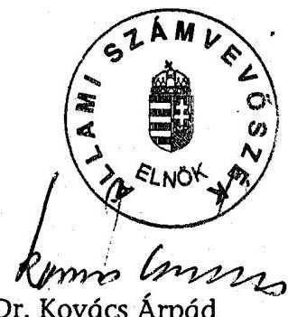
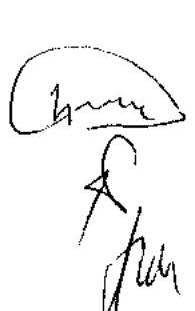
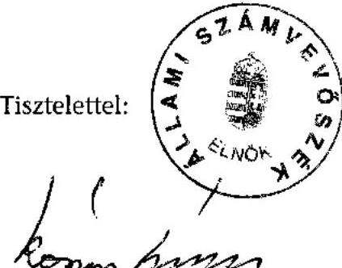
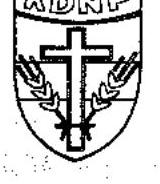
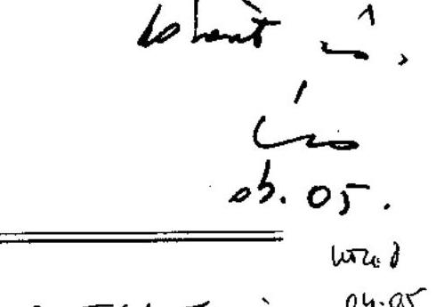
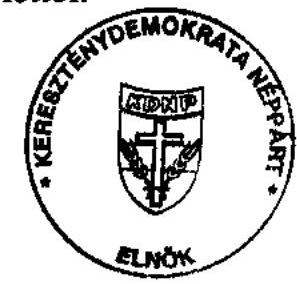
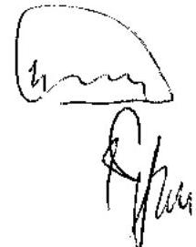
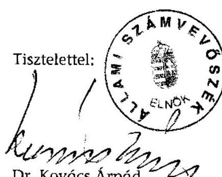

# JELENTÉS 

a központi költségvetési támogatásban nem részesült pártok 2001-2004. évi gazdálkodása törvényességének ellenőrzéséről

---

# 3. Önkormányzati és Területi Ellenőrzési Igazgatóság 

3.1. Szabályszerüségi Ellenőrzési Főcsoport

Iktatószám: V-1006-090/2004.
Témaszám: 700
Vizsgálat-azonosító szám: V0182

## Az ellenőrzést felügyelte:

Dr. Lóránt Zoltán
föigazgató
Az ellenőrzés végrehajtásáért felelős:
Dr. Elek János
általános főigazgató-helyettes
Az ellenőrzést vezette:
Horváth Balázs
osztályvezető főtanácsos
Az összefoglaló jelentést készítette:
Tóth István
tanácsadó
Baracsi Szilvia
számvevő
Az ellenőrzést végezték:

| Baracsi Szilvia | Dr. Dotterweich Antal | Dr. Faragóné Tóth Mária |
| :-- | :-- | :-- |
| számvevő | tanácsadó | tanácsos |
| Szakmányné Bilik | Szendrey Lajos | Tóth István |
| Mária | számvevő | tanácsadó |
| számvevő |  |  |

A témához kapcsolódó eddig készített számvevőszéki jelentések:
címe
sorszáma
Jelentés a pártok beszámolási és beszámoló közzétételi 9807
kötelezettsége teljesítésének általános gyakorlatáról

---

# TARTALOMJEGYZÉK 

BEVEZETÉS ..... 5
I. ÖSSZEGZŐ MEGÁLLAPÍTÁSOK, KÖVETKEZTETÉSEK, JAVASLATOK ..... 8
II. RÉSZLETES MEGÁLLAPÍTÁSOK ..... 18

1. A pártok 2001-2003. évi beszámolási kötelezettségének teljesítése, értékelése ..... 18
1.1. A teljes vizsgálati időszakra érvényes megállapítások ..... 18
1.2. A 2001-2003. évi pénzügyi beszámolók megbízhatósága ..... 19
1.2.1. Bevételek ..... 19
1.2.2. Kiadások ..... 20
2. A pártok belső számviteli szabályozása és gyakorlata ..... 21
2.1. A belső szabályozás rendszere ..... 21
2.2. A könyvvezetés gyakorlata, összhangja a törvényi és belső előírásokkal ..... 21
2.3. Analitikus nyilvántartások ..... 22
2.4. A bizonylati elv és a bizonylati fegyelem érvényesülése ..... 22
3. A pártok bevételszerző, gazdálkodó tevékenysége ..... 23
4. A gazdálkodással összefüggő egyéb jogszabályokban foglalt előírások betartása ..... 25
5. A pártok belső ellenőrzésének rendszere ..... 25
5.1. A belső ellenőrzés rendszerének szabályozottsága ..... 25
5.2. A belső ellenőrzés múködése ..... 26
6. Az előző ellenőrzés megállapításaira tett intézkedések ..... 26
7. A pártok megszüntetésével és nyilvántartásával összefüggő szabályozási kérdések ..... 26
7.1. A gazdálkodást nem folytatott pártok megszüntetésével kapcsolatos problémák ..... 26
7.2. A pártok nyilvántartására vonatkozó jogszabályi követelmények érvényesülése ..... 27

---

# MELLÉKLETEK 

| 1. számú melléklet | Kimutatás a helyszíni ellenőrzési körbe nem vonható pártokról |
| :--: | :--: |
| 2/a. számú melléklet | Az ellenőrzött pártok Magyar Közlönyben közzétett 2001. évi beszámolói bevételeinek és kiadásainak összege, felülvizsgálati eredménye |
| 2/b. számú melléklet | Az ellenőrzött pártok Magyar Közlönyben közzétett 2002. évi beszámolói bevételeinek és kiadásainak összege, felülvizsgálati eredménye |
| 2/c. számú melléklet | Az ellenőrzött pártok Magyar Közlönyben közzétett 2003. évi beszámolói bevételeinek és kiadásainak összege, felülvizsgálati eredménye |
| 3. számú melléklet | Beszámolási és közzétételi kötelezettséget nem teljesített pártok könyvviteli nyilvántartás szerint felülvizsgált 2001-2003. évi bevételeinek és kiadásainak kimutatása |
| 4. számú melléklet | A pártok számviteli szabályozása és gyakorlata |
| 5. számú melléklet | A vizsgált időszakban bejegyzett, törvényes módon nem múködött pártok 2001-2004. évi gazdálkodásának jellemző adatai |
| 6/a. számú melléklet | A Magyar Nyugdíjasok Pártja elnökének észrevétele |
| 6/b. számú melléklet | Az Állami Számvevőszék elnökének válasza |
| 7/a. számú melléklet | A Kereszténydemokrata Néppárt elnökének észrevétele |
| 7/b. számú melléklet | Az Állami Számvevőszék elnökének válasza |

---

# RÖVIDÍTÉSEK JEGYZÉKE ${ }^{1}$ 

| ÁSZ | Állami Számvevőszék |
| :-- | :-- |
| ÁSZ törvény | Az Állami Számvevőszékről szóló 1989. évi XXXVIII. tör- |
|  | vény |
| Etv. | Az egyesülésről szóló 1989. évi II. törvény |
| IHM | Informatikai és Hírközlési Minisztérium |
| OITH | Országos Igazságszolgáltatási Tanács Hivatala |
| KVI | Kincstári Vagyoni Igazgatóság |
| Párttörvény | A pártok múködéséről és gazdálkodásáról szóló - többször |
| Pártok | módosított - 1989. évi XXXIII. törvény |
| Számviteli törvény | Központi költségvetési támogatásban nem részesült pár- |
| Szja. törvény | tok |
| F. É. P. | A számvitelről szóló - többször módosított - 2000. évi C. |
| Független Kisgazdapárt | törvény |
| KDNP | A személyi jövedelemadóról szóló - többször módosított - |
| KPDP | 1995. évi CXVII. törvény |
| MAVEP | Földi Élet Pártja |
| MDNP | Független Kisgazda-, Földmunkás és Polgári Párt |
| MÉP | Keresztény Demokrata Néppárt |
| MKPP | Magyar Vállalkozó Egység Párt |
| MSZDP | Magyar Demokrata Néppárt |
| MSZMP | Magyar Érdek Pártja |
| SZDP | Magyar Kisgazda és Polgári Párt |
| ÚMP | Magyarországi Szociáldemokrata Párt |
|  | Magyar Szocialista Munkáspárt |
|  | Szociáldemokrata Párt |
|  | Új (Zöld) Magyarország Párt |

[^0]
[^0]:    ${ }^{1}$ A pártok nevének rövidítései megfelelnek a bírósági nyilvántartás hivatalos rövidítéseinek.

---

.

---

# JELENTÉS 

## A központi költségvetési támogatásban nem részesült pártok 2001-2004. évi gazdálkodása törvényességének ellenőrzéséről

## BEVEZETÉS

Az Állami Számvevőszékről szóló 1989. évi XXXVIII. törvény 5. §-a és a 16. § (2) bekezdése, valamint a pártok múködéséről és gazdálkodásáról szóló - többször módosított - 1989. évi XXXIII. tv. (továbbiakban: párttörvény) 10. § (1) bekezdése alapján a pártok gazdálkodása törvényességének ellenőrzésére az Állami Számvevőszék (továbbiakban: ÁSZ) jogosult. Az ÁSZ 2004. évi ellenőrzési tervének megfelelően vizsgálta a központi költségvetési támogatásban nem részesült pártok 2001-2004. évi gazdálkodása törvényességét.

A jogállamiság kiépítéséhez 1989. év végén nyílt meg a lehetősége annak, hogy a társadalmi szervezetek megfelelő feltételek megléte esetén pártként múködjenek, illetve az állampolgárok csoportjai pártot alapítsanak. A párttörvény adta lehetőséggel élve 1990. év elejére közel 70 párt jött létre.

A rendszerváltás óta eltelt másfél évtizedben összességében $238^{2}$ pártot jegyeztek be a bíróságok, melyek közül 2004-ig 128-at töröltek. A pártok megszüntetése döntően ügyészségi indítványra - részben az ÁSZ előzetes javaslatára - történt. A Legfőbb Úgyész hivatalos tájékoztatása szerint a benyújtott keresetek a következő eredménnyel jártak:

- Az 1998. évi országgyűlési képviselő választást követően 69 párt ellen nyújtottak be keresetet a párttörvény 3. § (3) bekezdése alapján, mivel két egymást követő általános országgyűlési választáson nem állítottak jelöltet. A bíróságok 15 párt megszüntetését és nyilvántartásból való törlését rendelték el a párttörvény 3. § (2) bekezdése alapján, továbbá 44 pártnak engedélyezték, hogy társadalmi szervezetként múködhetnek tovább. Az ÁSZ javaslatával összefüggésben a bíróságok 8 párt megszűnését állapították meg az éves beszámolók közzétételének elmulasztása miatt.
- A 2002. évi országgyűlési képviselő választást követően 58 párt ellen nyújtottak be keresetet, melynek nyomán 45 politikai szervezet pártként megszűnt, de társadalmi szervezetként tovább múködhetett. A bíróságok 8 párt megszűnését, nyilvántartásból való törlését rendelték el.

[^0]
[^0]:    ${ }^{2}$ Nem tekinthető pontos adatnak, mivel az Országos Igazságszolgáltatási Tanács Hivatala által vezetett társadalmi szervezetek nyilvántartásban a pártként történő múködés nem volt jelölve.

---

A pártok finanszírozásának törvényi szabályozása az elmúlt időszakban többször változott:

- A párttörvény hatályba lépésekor a pártoknak járó állami költségvetési támogatást az első választási fordulóban a pártlistákra és az egyéni pártjelöltekre leadott szavazatok alapján rendelte felosztani. Állami költségvetési támogatásra azon párt volt jogosult, amely a szavazáson részt vett választók szavazatának $1 \%$-át megszerezte. A költségvetési törvényben meghatározott támogatási keret negyedét a parlamenti mandátummal rendelkező pártok között egyenlően, a többit pedig szavazatarányosan osztották szét. A támogatást a költségvetés negyedévente utólagosan folyósította. A törvény 5. § (3) bekezdése kimondta, hogy „A (2) bekezdés második mondatában említett költségvetési támogatás a párt bevételeinek 50\%-át nem haladhatja meg. A párt köteles a többlet költségvetési támogatás visszafizetésére, ha az éves mérlege elkészitésekor megállapítja, hogy a költségvetési évben 50\%-on felüli támogatást vett fel."
- Az előző bekezdés utolsó mondatában említett szabályt a pártok működéséről és gazdálkodásáról szóló törvényt módosító 1990. évi LXII. törvény hatályon kívül helyezte. A hivatkozott törvény 2. §-a kimondta, hogy „A támogatások kifizetése negyedévenként történik, a negyedév első napján".
- Az 1991. évi XLIV. törvény 2. §-a kimondta, hogy „az állami költségvetésből a pártok támogatására fordítható összeg 25\%-át - egyenlő arányban - az Országgyúlésben az országos listán mandátumot szerzett pártok között kell felosztani ", így az állami támogatás egynegyedét nem mandátummal, hanem az országos listás mandátummal rendelkező pártok között kellett felosztani.

Az Országos Igazságszolgáltatási Tanács Hivatala (továbbiakban: OITH) által központilag vezetett számítógépes nyilvántartásában szereplő és a megyei bíróságok által múködő pártként nyilvántartott 110 párt közül a jelenleg hatályos párttörvényi szabályozás szerint mindössze 7 párt részesült rendszeres költségvetési támogatásban. Jelen ellenőrzés a rendszeres központi költségvetési támogatásban nem részesült pártok gazdálkodása törvényességének ellenőrzésére irányult.

Az ellenőrzéshez előtanulmány készült a rendszeres állami költségvetési támogatásban nem részesült pártok 2001-2004 közötti gazdálkodási tevékenységének, jellemző pénzügyi adatainak, könyvvezetési és beszámolási kötelezettségének - kérdőíves adatai - elemzésével.

A kérdőíves beszámoltatás eredményeként a helyszíni ellenőrzésbe vonható pártok körét a következők befolyásolták:

| Csoport | Szempontok | Pártok száma |
| :--: | :-- | :--: |
| 1. | A vizsgált időszakban megszűnt | 14 |
| 2. | Nyilvántartásban szereplő címen nem található | 18 |
| 3. | A megkeresést átvette, de nem válaszolt | 18 |
| 4. | Vizsgált időszakban bejegyzett, de törvényesen nem   múködött | 24 |
| 5. | Működő, de tevékenységét 2004. évtől kezdte meg | 10 |
| 6. | A vizsgált időszakban múködő, vizsgálandó | 19 |
|  | Kérdőíves felmérés összesen | 103 |

---

A felülvizsgálat során kiszűrésre kerültek a vizsgált időszakban megszűnt és a nyilvántartási címen nem található, továbbá elkülönítésre kerültek az ÁSZ megkeresésére nem válaszoló pártok (1-3 csoportba tartozó pártok név szerinti listáját az 1. számú melléklet részletezi). A nyilvántartási adatok alapján nem található pártok vonatkozásában az ÁSZ a Legfőbb Ügyész intézkedését kérte, mivel nem lehetett megállapítani, hogy a névjegyzékben szereplő adatok valós, létező pártot takarnak-e.

A felülvizsgálat eredményeként az ÁSZ a Legfőbb Ügyész további intézkedését kezdeményezi az adatszolgáltatást nem teljesített 18, valamint a vizsgált időszakban bejegyzett, de törvényesen nem múködött 24 párt körében. Utóbbi, 4. csoportra jellemző helyzetértékelést a jelentés 7.1. pontja, valamint az 5. számú melléklet részletezi.

A gazdasági tevékenységét 2004. évtől kezdő pártokat nem volt indokolt vizsgálni, így végül a helyszíni ellenőrzés 19 pártnál valósulhatott meg.

Az ellenőrzés célja annak megállapítása volt, hogy:

- a pártok a gazdálkodásról készített beszámolókat a párttörvény 9. § (1) bekezdésében foglaltak alapján, annak 1. számú mellékletében meghatározott minta szerint közzétették-e,
- érvényesültek-e a számviteli törvény szabályozási, könyvvezetési és bizonylatolási követelményei,
- betartották-e a gazdálkodó tevékenységre vonatkozó korlátozásokat,
- eleget tettek-e az egyéb jogszabályokban foglalt kötelezettségeknek.

Az ellenőrzés körülményeit illetően rögzíteni szükséges, hogy az ÁSZ évek óta folyamatosan javasolja a Kormánynak a pártok ellenőrzéseiről készített jelentéseiben a párttörvény módosítását tekintettel arra, hogy

- a párttörvény 1. sz. melléklete szerinti beszámoló-mintához magyarázatot, kitöltési útmutatót nem készítettek a jogalkotók, így ennek kitöltése pártonként - kialakított számviteli politikájuknak megfelelően - eltérő lehet;
- a beszámoló-minta a számviteli törvény rendelkezéseivel nem harmonizál, nem felel meg sem a mérleg, sem az eredmény-kimutatás követelményeinek.
Az ellenőrzés egységes szempontjait és módszereit az ÁSZ elnöke 13/2003. 03. 25. számú utasításával kiadott "Módszertan a pártok gazdálkodása törvényességének ellenőrzéséhez", valamint az azt kiegészítő „Segédlet a pártok gazdálkodása törvényességének ellenőrzése tervezéséhez, előkészítéséhez, az egyedi ellenőrzési program összeállításához és a helyszíni vizsgálat lefolytatásához" című szakmai iránymutatások határozták meg.

Az ellenőrzött időszak: a 19 vizsgált párt esetében kiterjedt a pártok 20012004 közötti gazdálkodására, kivéve a 2002. évi választások eredményeként 2003-tól rendszeres támogatásban nem részesült pártokat (KDNP, MDNP, Független Kisgazdapárt), melyek gazdálkodásának ellenőrzése - a korábbi kétéves rendszeres ellenőrzések végrehajtásával - 2003-2004. évekre korlátozódott.

Az elnöki értekezlet által elfogadott jelentésre kapott érdemi észrevételeket, illetve az erre adott válaszokat a 6/a-b, 7/a-b. számú melléklet tartalmazza.

---

# I. ÖSSZEGZŐ MEGÁLLAPÍTÁSOK, KÖVETKEZTETÉSEK, JAVASLATOK 

A központi költségvetési támogatásban nem részesült pártok 2001-2004. évek közötti gazdálkodási tevékenységének szervezésében nem érvényesültek a múködés törvényességi kritériumai.

A párttörvényben előírt éves beszámolási, közzétételi kötelezettséget a vizsgált pártok kétharmada rendszeresen elmulasztotta. A 2001. évben a 14 beszámolásra kötelezett párt közül öt határidőben megjelentette éves beszámolóját. A 2002-2003. évi pénzügyi beszámolót 16, illetve 19 párt közül mindössze egy-egy párt jelentette meg a törvényben előírt határidőre. A törvényi mulasztás következtében a 2001-2003 között nyilvánosságra nem hozott bevételek aránya - a számviteli nyilvántartások alapján - 25\%-ról 80\%-ra, a kiadásoknál $26 \%$-ról $86 \%$-ra emelkedett.

A közvélemény hiányos informálása mellett a pártok a megbízható tájékoztatásról, a beszámoló és könyvvezetés összehangolásáról sem gondoskodtak. A Magyar Közlönyben megjelentetett 2001-2003. évi beszámolók háromnegyede lényeges hibák miatt nem felelt meg a teljesség és valódiság elvének. A törvényi rendelkezések betartásának, érvényesítésének alacsony szintje a számviteli szabályozás, a könyvvezetés és bizonylatolás, valamint a belső ellenőrzés hiányosságaiból fakadt.

A számviteli törvényben előírt belső számviteli szabályozási kötelezettségnek a KDNP, az MDNP tett teljes körűen eleget. A Magyar Nópárt szabályozásából hiányzott az eszközök és a források leltárkészítési és leltározási szabályzata. A pártok által összeállított szabályzatok a törvényi rendelkezésekkel összhangban, a gazdálkodási sajátosságokra figyelemmel készültek. Az ellenőrzött 19 párt közül ugyanakkor 16 nem rendelkezett számviteli politikával és hozzárendelt eszközök és források értékelési, leltárkészítési és leltározási, valamint pénzkezelési szabályzattal. A pártok a szabályozási mulasztással megsértették a számviteli törvény előírásait.

A könyvvezetési kötelezettséget három párt kettős, 12 párt egyszeres könyvvitel vezetésével teljesítette. A könyvvezetési kötelezettségét naplófőkönyv vezetésével teljesítő pártok közül négynek a könyvelését külső vállalkozó, további hétnek a párt egy-egy tagja végezte. A főkönyvi könyvelést a Független Kisgazdák Országos Pártja, a Magyarországi Népjóléti Párt, a Magyar Nópárt és a KDNP szabályszerűen vezette. Az ellenőrzés több - jelentősnek minősülő könyvvezetési hibát tárt fel, így a Nyugdíjasok Pártjánál, illetve a Magyar Nyugdíjasok Pártjánál nem könyvelték a kft. alapításával kapcsolatos pénzmozgásokat, az SZDP központilag nem gondoskodott a helyi szervezetek pénzforgalmi feladásainak könyveléséről, továbbá négy párt teljes körűen elmulasztotta a gazdasági események könyvelését.

A kettős könyvvitelhez kapcsolódó számlarend hiánya, illetve az egyszeres könyvvezetés elégtelenségei miatt az ellenőrzés tartalmi hibákat állapított meg

---

az analitikus nyilvántartási kötelezettségek tekintetében. A szigorú számadású nyomtatványokról és részletező nyilvántartásokról 13 párt nem vezetett kimutatást. A könyvviteli záráshoz kapcsolódó évenkénti leltározást a leltárkészítési szabályozással nem rendelkező pártok mindegyike elmulasztotta.

A bizonylati elv és bizonylati fegyelem előírásai nyolc pártnál érvényesültek, hat pártnál a bizonylati rend a pártok képviseletére jogosult vezető nyilatkozata szerint - például iratok eltulajdonítása miatt - nem volt vizsgálható. Az utalványozási, pénzforgalmi hiányosságok következtében öt pártnál sérültek a bizonylatolás alaki és tartalmi törvényi követelményei.

A bevételszerző gazdálkodó tevékenység - három párt kivételével - megfelelt a párttörvény előírásainak. A pártok bevételei tagdíjakból, adományokból és hozzájárulásokból, gazdálkodási tevékenységgel összefüggő hasznosításból és kölcsönből, választási célú eseti juttatásból tevődtek össze.

Az SZDP az általa ingyenesen használt helyiségek egy részét térítés ellenében hasznosította, ezzel megsértette az állami tulajdonban lévő ingatlanok pártok által történő hasznosításáról szóló törvény használatra vonatkozó előírásait. Figyelemmel a hivatkozott törvény hatásköri előírásaira az ÁSZ a KVI-hez fordult a szükséges intézkedések megtétele érdekében. A KVI az ügyben soron kívüli célvizsgálatot végzett és ennek eredményéről tájékoztató jelentést küldött.

A párttörvény előírásaiba ütköző tiltott gazdálkodó tevékenységet 2003. évben állapított meg az ellenőrzés. A Magyar Nyugdíjasok Pártja meg nem engedett nem pénzbeli vagyoni hozzájárulást fogadott el és tiltott bevételt szerzett, a KDNP nem a tulajdonában álló ingatlant hasznosított díj ellenében. A megállapított összegre a párttörvény előírásai vonatkoznak. A nevezett pártoknál költségvetési támogatás hiányában nincs lehetőség a párttörvényben szereplő azon szankció alkalmazására, miszerint a párt költségvetési támogatását az elfogadott vagyoni hozzájárulás összegével csökkenteni kell. A pártok csak a tiltott gazdálkodásból eredő bevétel befizetésére kötelezhetőek. A hatályos szabályozás a szankcionálásban különbséget tesz a költségvetési támogatásban részesülő és nem részesülő pártok között.

A vizsgált pártok az ellenőrzött időszakban vállalatot nem alapítottak, részvényt és egyéb értékpapírt nem vásároltak, a párttörvényben korlátozott gazdasági társaságban részesedést nem szereztek. Egyszemélyes kft-t alapított a Nyugdíjasok Pártja, amelyet még ugyanabban az évben értékesített és a Magyar Nyugdíjasok Pártja, amelyet a következő évben felszámoltak.

A gazdálkodással összefüggő adózási és társadalombiztosítási kötelezettségek a vizsgált pártoknál bér- és bérjellegú kifizetés hiányában nem keletkeztek. Ennek megfelelően a pártok adó- és járulék bevallási kötelezettségüknek minden évben nullás bevallással tettek eleget. A pártok által teljesített különféle költségtérítésekkel összefüggésben adófizetési kötelezettség nem keletkezett.

A pártok nem szabályozták átfogóan a gazdálkodás belső ellenőrzési rendszerét. Ellenőrző/Számvizsgáló Bizottság létrehozásáról 17 párt rendelkezett. A megválasztott ellenőrző testületek közül 14 nem múködött. Dokumentált ellenőrzést a Független Kisgazdák Országos Pártja, a KDNP és az MDNP ellenőrző

---

testülete végzett. A vezetői és munkafolyamatba épített ellenőrzés négy pártnál - utalványozás, pénztárellenőrzés formájában - szabályozás szerint működött.

Az ÁSZ előző ellenőrzésének megállapításaira a korábban, kétéves rendszerességgel ellenőrzött KDNP-nél, MDNP-nél és Független Kisgazdapártnál tartalmaztak a törvényes állapot helyreállítására szóló felhívást. A KDNP intézkedései nem értékelhetők teljes körűnek, mivel nem jártak eredménnyel a kintlévőségek behajtására, a vagyoni helyzet tisztázására irányult kezdeményezések. Emiatt a Párt ismeretlen tettes ellen büntető feljelentést tett. Az MDNP hasonlóan részben tett eleget a felhívásban foglaltaknak. A szabályozás terén nem történt meg a pénzügyi és gazdálkodási szabályzat aktualizálása, a Párt a 2003. évi beszámoló összeállításánál nem érvényesítette teljes körűen a számviteli alapelveket. A Független Kisgazdapárt az előző ÁSZ jelentésben, öt pontban megfogalmazott felhívásnak nem tett eleget.

A gazdálkodást nem folytatott pártok esetében a párttörvény nem határozza meg, hogy milyen tényezők együttes fennállása esetén teljesül „a tevékenységével felhagy és vagyonáról nem rendelkezik" megszüntetés kritériuma. A szabályozás fogyatékosságára vezethető vissza, hogy a központi költségvetési támogatásban nem részesült 24 pártnál gazdálkodási tevékenység hiányában az ellenőrzés meghiúsult.

A pártok nyilvántartására vonatkozó követelmények a társadalmi szervezetek nyilvántartásának ügyviteli rendszerében szabályozottak. A társadalmi szervezetek nevéről vezetett nyilvános országos névjegyzék a pártok teljes körű felméréséhez nem szolgáltatott megbízható adatot. A pártokról nyilvántartott adatok pontatlanságát okozta a változások aktualizálásának hiánya, illetve a politikai tevékenység besorolás nem megfelelő alkalmazása.

A helyszíni ellenőrzés tapasztalatainak hasznosítása mellett javasoljuk:

# a Kormánynak 

1. Kezdeményezze a pártok működéséről és gazdálkodásáról szóló - többször módosított - 1989. évi XXXIII. törvény következők szerinti módosítását:
a) A korábbi pártellenőrzések alapján tett jelzésekre is figyelemmel a pártok számviteli nyilvántartási és beszámolási rendszerét érintő ellentmondások feloldását, amelyek a párttörvény, valamint a 2001. január 1. napjától hatályos számviteli törvény között továbbra is fennállnak.
b) A párttörvény 3. § (2) bekezdésében szereplő „tevékenységével felhagy és vagyonáról nem rendelkezik" szövegrészt értelmező rendelkezéssel pontosítsa.
c) A párttörvény 4. § (4) bekezdés és 6. § (5) bekezdését úgy változtassa meg, hogy megszűnjön a költségvetési támogatásban részesülő és nem részesülő pártok között jelenleg meglévő szankcionálási különbség.
2. Kezdeményezze az egyesülési jogról szóló 1989. évi II. törvény 15. § (7) bekezdésének módosítását, a változás-bejelentési kötelezettség határidejének elmulasztása esetére írjon elő szankciót.

---

# az igazságügyi miniszternek 

Vizsgálja felül a társadalmi szervezetek nyilvántartásának ügyviteli szabályairól szóló többször módosított - 6/1989. (VI. 8.) IM rendeletet annak érdekében, hogy a társadalmi szervezetek nyilvántartásából társadalmi szervezet típusonként legyen biztosított az adatok elkülönített nyilvántartása.

A helyszíni ellenőrzés megállapításainak hasznosítása mellett az Állami Számvevőszék elnöke felhívja:

## a Magyar Szocialista Munkáspárt elnökét

1. Intézkedjen a számviteli törvény 14. §-ában előírt, a Párt gazdálkodási sajátosságait figyelembe vevő számviteli politika, az eszközök és források leltárkészítési és leltározási, az eszközök és források értékelési, valamint a pénzkezelési szabályzatok elkészíttetéséről.
2. Gondoskodjon a 2002. és 2003. évi gazdálkodásról szóló beszámolók ismételt öszszeállításáról a számviteli törvény 15. § (2)-(3) és (9) bekezdésében rögzített teljesség, valódiság számviteli alapelvek érvényesítésével, valamint a párttörvény 4. § (5) bekezdésében előírt nem pénzbeni vagyoni hozzájárulás értékének meghatározásáról és a módosított beszámolók a párttörvény 9. § (1) bekezdésben szabályozott módon történő közzétételéről.
3. Alakítsa ki a Párt gazdálkodása, pénzügyi és számviteli tevékenysége belső ellenőrzési rendszerének átfogó szabályozását és biztosítsa a belső ellenőrzés múködését.

## a Magyar Érdek Pártja elnökét

1. Tegyen eleget múködésének teljes időszakára kiterjedően a számviteli törvény 12. §ában előírt könyvvezetési kötelezettség teljesítésének.
2. Intézkedjen a számviteli törvény 14. §-ában előírt, a Párt gazdálkodási sajátosságait figyelembe vevő számviteli politika, az eszközök és források leltárkészítési és leltározási, az eszközök és források értékelési, valamint a pénzkezelési szabályzatok elkészíttetéséről.
3. Gondoskodjon a számviteli törvény 15. § (2)-(3) bekezdésében rögzített teljesség és valódiság számviteli alapelvek figyelembevételével a 2001-2003. évi beszámolók elkészítéséről és a párttörvény 9. § (1) bekezdésében szabályozott módon történő közzétételéről.
4. Alakítsa ki a Párt gazdálkodása, pénzügyi és számviteli tevékenysége belső ellenőrzési rendszerének átfogó szabályozását és biztosítsa a belső ellenőrzés múködését.

---

# a Magyarországi Népjóléti Párt elnökét 

1. Intézkedjen a számviteli törvény 14. §-ában előírt, a Párt gazdálkodási sajátosságait figyelembe vevő számviteli politika, az eszközök és források leltárkészítési és leltározási, az eszközök és források értékelési, valamint a pénzkezelési szabályzatok elkészíttetéséről.
2. Gondoskodjon a párttörvény 9. § (1) bekezdésében szabályozott módon a Párt gazdálkodásáról szóló 2001-2003. évi pénzügyi beszámolók közzétételéről.
3. Alakítsa ki a Párt gazdálkodása, pénzügyi és számviteli tevékenysége belső ellenőrzési rendszerének átfogó szabályozását és biztosítsa a belső ellenőrzés müködését.

## a Földi Élet Pártja elnökét

1. Tegyen eleget müködésének teljes időszakára kiterjedően a számviteli törvény 12. §ában előírt könyvvezetési kötelezettség teljesítésének.
2. Intézkedjen a számviteli törvény 14. §-ában előírt, a Párt gazdálkodási sajátosságait figyelembe vevő számviteli politika, az eszközök és források leltárkészítési és leltározási, az eszközök és források értékelési, valamint a pénzkezelési szabályzatok elkészíttetéséről.
3. Gondoskodjon a 2001-2002. évi beszámolók elkészítéséről és a párttörvény 9. § (1) bekezdésében szabályozott módon történő közzétételéről, továbbá az ellenőrzés megállapításaira tekintettel a 2003. évről közzétett beszámoló ismételt megjelentetéséről.
4. Biztosítsa a számviteli törvény 167. § (1) bekezdésében szabályozott módon a könyvviteli elszámolást közvetlenül alátámasztó bizonylatok általános alaki és tartalmi követelményeinek betartását.
5. Alakítsa ki a Párt gazdálkodása, pénzügyi és számviteli tevékenysége belső ellenőrzési rendszerének átfogó szabályozását és biztosítsa a belső ellenőrzés müködését.

## a Független Kisgazdák Országos Pártja elnökét

1. Intézkedjen a számviteli törvény 14. §-ában előírt, a Párt gazdálkodási sajátosságait figyelembe vevő számviteli politika, az eszközök és források leltárkészítési és leltározási, az eszközök és források értékelési, valamint a pénzkezelési szabályzatok elkészíttetéséről.
2. Tegyen eleget a Párt 2002-2003. évi gazdálkodásáról készített beszámolók közzétételi kötelezettségének a párttörvény 9. § (1) bekezdésében előírt módon.

## a Magyar Vállalkozó Egység Párt elnökét

1. Tegyen eleget müködésének teljes időszakára kiterjedően a számviteli törvény 12. §ában előírt könyvvezetési kötelezettség teljesítésének.

---

2. Intézkedjen a számviteli törvény 14. §-ában előírt, a Párt gazdálkodási sajátosságait figyelembe vevő számviteli politika, az eszközök és források leltárkészítési és leltározási, az eszközök és források értékelési, valamint a pénzkezelési szabályzatok elkészíttetéséről.
3. Gondoskodjon a Párt 2001-2003. évi gazdálkodásáról szóló beszámolók elkészítéséről és a párttörvény 9. § (1) bekezdésében szabályozott módon történő közzétételéről.
4. Alakítsa ki a Párt gazdálkodása, pénzügyi és számviteli tevékenysége belső ellenőrzési rendszerének átfogó szabályozását és biztosítsa a belső ellenőrzés múködését.

# a Független Kisgazda-, Földmunkás és Polgári Párt elnökét 

1. Intézkedjen a számviteli törvény 14. §-ában előírt, a Párt gazdálkodási sajátosságait figyelembe vevő számviteli politika, az eszközök és források leltárkészítési és leltározási, az eszközök és források értékelési, valamint a pénzkezelési szabályzatok elkészíttetéséről.
2. Gondoskodjon a Párt 2003. évi gazdálkodásáról szóló beszámoló elkészítéséről és a párttörvény 9. § (1) bekezdésében szabályozott módon történő közzétételéről.
3. Biztosítsa a tárgyi eszközök nyilvántartásának és számbavételének teljes körűvé tételét.
4. Alakítsa ki a Párt gazdálkodása, pénzügyi és számviteli tevékenysége belső ellenőrzési rendszerének átfogó szabályozását és biztosítsa a belső ellenőrzés múködését.
5. Tegyen eleget az előző ÁSZ jelentésben, öt pontban meghatározott felhívásnak.

## a Magyarországi Szociáldemokrata Párt elnökét

1. Tegyen eleget múködésének teljes időszakára kiterjedően a számviteli törvény 12. §ában előírt könyvvezetési kötelezettség teljesítésének.
2. Intézkedjen a számviteli törvény 14. §-ában előírt, a Párt gazdálkodási sajátosságait figyelembe vevő számviteli politika, az eszközök és források leltárkészítési és leltározási, az eszközök és források értékelési, valamint a pénzkezelési szabályzatok elkészíttetéséről.
3. Gondoskodjon a Párt 2001-2003. évi gazdálkodásáról szóló beszámolók elkészítéséről és a párttörvény 9. § (1) bekezdésében szabályozott módon történő közzétételéről.
4. Gondoskodjon a Párt belső ellenőrzési rendszerének múködtetéséről.

## a Magyar Nők Pártja elnökét

1. Intézkedjen a számviteli törvény 14. §-ában előírt, a Párt gazdálkodási sajátosságait figyelembe vevő számviteli politika, az eszközök és források leltárkészítési és leltáro-

---

zási, az eszközök és források értékelési, valamint a pénzkezelési szabályzatok elkészíttetéséről.
2. Gondoskodjon a Párt 2001-2003. évi gazdálkodásáról szóló beszámolók elkészítéséről és a párttörvény 9. § (1) bekezdésében szabályozott módon történő közzétételéről.
3. Alakítsa ki a Párt gazdálkodása, pénzügyi és számviteli tevékenysége belső ellenőrzési rendszerének átfogó szabályozását és biztosítsa a belső ellenőrzés müködését.

# a Magyar Nö́rárt elnökét 

1. Gondoskodjon a Párt 2001-2003. évi gazdálkodásáról szóló beszámolók elkészítéséről és a párttörvény 9. § (1) bekezdésében szabályozott módon történő közzétételéről.
2. Készíttesse el a számviteli törvény 14. § (5) bekezdésében előírt eszközök és források leltárkészítési és leltározási szabályzatát.
3. Biztosítsa a Párt belső ellenőrzési rendszerének müködtetését.

## a Szociáldemokrata Párt elnökét

1. Biztosítsa, hogy a Párt az ellenőrzött évekre teljes körűen, minden gazdasági eseményre kiterjedően tegyen eleget a számviteli törvény 12. §-ában előírt könyvvezetési kötelezettségnek
2. Intézkedjen a számviteli törvény 14. §-ában előírt, a Párt gazdálkodási sajátosságait figyelembe vevő számviteli politika, az eszközök és források leltárkészítési és leltározási, az eszközök és források értékelési, valamint a pénzkezelési szabályzatok elkészíttetéséről.
3. Gondoskodjon a számviteli törvény 15. § (2)-(3) bekezdésében rögzített teljesség és valódiság számviteli alapelve érvényesülése érdekében, valamint a helyszíni ellenőrzés megállapításaira figyelemmel a Párt 2001-2003. évi gazdálkodásáról szóló beszámolók ismételt közzétételéről.
4. Alakítsa ki a számviteli törvény 162. § (1) bekezdés előírásainak megfelelő részletező nyilvántartásokat.
5. Biztosítsa a Párt belső ellenőrzési rendszerének működtetését.

## az Új (Zöld) Magyarország Párt elnökét

1. Intézkedjen a számviteli törvény 14. §-ában előírt, a Párt gazdálkodási sajátosságait figyelembe vevő számviteli politika, az eszközök és források leltárkészítési és leltározási, az eszközök és források értékelési, valamint a pénzkezelési szabályzatok elkészíttetéséről.

---

2. Gondoskodjon a Párt 2002-2003. évi gazdálkodásáról szóló beszámolók elkészítéséről és a párttörvény 9. § (1) bekezdésében szabályozott módon történő közzétételéről.
3. Gondoskodjon a számviteli törvény 167. § (1) c. pontja előírásainak betartása érdekében a bevételek és kiadások utalványozásáról.
4. Biztosítsa a Párt belső ellenőrzési rendszerének múködtetését.

# a Korrupcióellenes Polgári Demokrata Párt elnökét 

1. Intézkedjen a számviteli törvény 14. §-ában előírt, a Párt gazdálkodási sajátosságait figyelembe vevő számviteli politika, az eszközök és források leltárkészítési és leltározási, az eszközök és források értékelési, valamint a pénzkezelési szabályzatok elkészíttetéséről.
2. Gondoskodjon a Párt 2001-2003. évi gazdálkodásáról szóló beszámolók elkészítéséről és a párttörvény 9. § (1) bekezdésében szabályozott módon történő közzétételéről.
3. Alakítsa ki a Párt gazdálkodása, pénzügyi és számviteli tevékenysége belső ellenőrzési rendszerének átfogó szabályozását és biztosítsa a belső ellenőrzés múködését.

## a Kereszténydemokrata Néppárt elnökét

1. Készíttesse el, és tegye ismételten közzé a Párt 2003. évi gazdálkodásáról szóló beszámolót, figyelemmel az ellenőrzés egyéb kiadásokat érintő megállapítására.
2. Gondoskodjon a számviteli törvény 167. § (1) c. pontja előírásainak betartása érdekében a bevételek és kiadások utalványozásáról.
3. Alakítsa ki a Párt gazdálkodása, pénzügyi és számviteli tevékenysége belső ellenőrzési rendszerének átfogó szabályozását és biztosítsa a belső ellenőrzés múködését.
4. A tiltott gazdálkodó tevékenységből származó 450 ezer Ft összegű bevételt a párttörvény 4. § (4) bekezdése előírásának megfelelően fizesse be a központi költségvetésbe.

## a Magyar Kisgazda és Polgári Párt elnökét

1. Intézkedjen a számviteli törvény 14. §-ában előírt, a Párt gazdálkodási sajátosságait figyelembe vevő számviteli politika, az eszközök és források leltárkészítési és leltározási, az eszközök és források értékelési, valamint a pénzkezelési szabályzatok elkészíttetéséről.
2. Gondoskodjon a Párt 2001-2003. évi gazdálkodásáról szóló beszámolók elkészítéséről és a párttörvény 9. § (1) bekezdésében szabályozott módon történő közzétételéről.

---

3. Határozza meg a számviteli törvény 162. § (1) bekezdés előírásai figyelembevételével a vezetendő részletező nyilvántartásokat és a 168. §-ban előírt szigorú számadású bizonylatok vezetésnek rendjét.
4. Gondoskodjon a számviteli törvény 165. § (1)-(2) bekezdése előírásainak megfelelően a bizonylati elv és bizonylati fegyelem, valamint a 167.§ (1) bekezdés c. pontjában rögzítettek szerint a bizonylatok alaki és tartalmi követelményeinek érvényesítéséről.
5. Alakítsa ki a Párt gazdálkodása, pénzügyi és számviteli tevékenysége belső ellenőrzési rendszerének átfogó szabályozását és biztosítsa a belső ellenőrzés müködését.
6. Gondoskodjon a jelentésben megjelölt nem pénzbeli hozzájárulás értékének meghatározásáról és ennek összegét szerepeltesse a 2001-2003. évi gazdálkodásáról készítendő beszámolóban.

# a Magyar Nyugdíjasok Pártja elnökét 

1. A Párt könyvvezetése során szerezzen érvényt a számviteli törvény 162. § (1) bekezdésében rögzített egyszeres könyvvitelre vonatkozó előírásainak, gondoskodjon a szükséges analitikus nyilvántartások vezetéséről.
2. Intézkedjen a számviteli törvény 14. §-ában előírt, a Párt gazdálkodási sajátosságait figyelembe vevő számviteli politika, az eszközök és források leltárkészítési és leltározási, az eszközök és források értékelési, valamint a pénzkezelési szabályzatok elkészíttetéséről.
3. A Párt könyvvezetése és a beszámoló elkészítése során szerezzen érvényt a számviteli törvény 15. § (2) bekezdésében megfogalmazott teljesség számviteli alapelvnek.
4. Gondoskodjon a Párt 2001-2003. évi gazdálkodásáról szóló beszámolók elkészítéséről és a párttörvény 9. § (1) bekezdésében szabályozott módon történő közzétételéről.
5. Gondoskodjon a számviteli törvény 165. § (1) bekezdésében szabályozottaknak megfelelően az alapbizonylatok kiállításáról, továbbá a 167. § (1) bekezdés c) pontja előírásai szerint az utalványozás és a pénztárellenőrzés dokumentálásáról.
6. A tiltott gazdálkodásból és tiltott vagyoni hozzájárulás elfogadásából származó 2348 ezer Ft összegű bevételt a párttörvény 4. § (4) bekezdése előírásának megfelelően fizesse be a központi költségvetésbe.
7. Tegye meg a szükséges intézkedést annak érdekében, hogy a Párt Központi Pénzügyi Ellenőrző Bizottsága az Alapszabály előírásainak megfelelően lássa el feladatát.

## a Magyar Vidék és Polgári Párt elnökét

1. Intézkedjen a számviteli törvény 14. §-ában előírt, a Párt gazdálkodási sajátosságait figyelembe vevő számviteli politika, az eszközök és források leltárkészítési és leltározási, az eszközök és források értékelési, valamint a pénzkezelési szabályzatok elkészíttetéséről.

---

2. Határozza meg a számviteli törvény 162. § (1) bekezdés előírásai figyelembevételével a vezetendő részletező nyilvántartásokat és a 168. §-ban előírt szigorú számadású bizonylatok vezetésének rendjét.
3. Gondoskodjon a könyvvezetés során a számviteli törvény 164-165. §-ában, a könyvviteli zárlatra, a bizonylati elv és fegyelemre vonatkozó törvényi előírások betartatásáról.
4. Alakítsa ki a Párt gazdálkodása, pénzügyi és számviteli tevékenysége belső ellenőrzési rendszerének átfogó szabályozását és biztosítsa a belső ellenőrzés múködését.

# a Magyar Demokrata Néppárt elnökét 

1. Gondoskodjon a Párt 2003. évi gazdálkodásáról szóló beszámolók ismételt elkészítéséről és a párttörvény 9. § (1) bekezdésében szabályozott módon történő közzétételéről.
2. Intézkedjen a Párt pénzügyi és gazdálkodási szabályzata korszerűsítésére.
3. Biztosítsa, hogy a Párt gazdálkodásának ellenőrzéseit megfelelően dokumentálják.

## a Nyugdíjasok Pártja elnökét

1. Intézkedjen a számviteli törvény 14. §-ában előírt, a Párt gazdálkodási sajátosságait figyelembe vevő számviteli politika, az eszközök és források leltárkészítési és leltározási, az eszközök és források értékelési, valamint a pénzkezelési szabályzatok elkészíttetéséről.
2. Gondoskodjon a Párt 2001-2003. évi gazdálkodásáról szóló beszámolók ismételt elkészítéséről és a párttörvény 9. § (1) bekezdésében szabályozott módon történő közzétételéről.
3. A Párt könyvvezetése és a beszámoló elkészítése során szerezzen érvényt a számviteli törvény 15. § (2)-(3) bekezdésében megfogalmazott teljesség és valódiság számviteli alapelveknek.
4. A Párt gazdálkodása és könyvvezetése során biztosítsa a számviteli törvény 162. § (1), 165. § (3), valamint a 167. § (1) bekezdésében rögzítettek érvényesülését.
5. Tegye meg a szükséges intézkedést annak érdekében, hogy a Párt Ellenőrző Bizottsága az Alapszabály előírásainak megfelelően lássa el feladatát.
6. Gondoskodjon a bérleti díjkedvezmény formájában kapott nem pénzbeli vagyoni hozzájárulás értékének meghatározásáról, és ennek összegét szerepeltesse a 2003. évi gazdálkodásáról készítendő beszámolóban.

---

# II. RÉSZLETES MEGÁLLAPÍTÁSOK 

## 1. A PÁrtok 2001-2003. ÉVI BESZÁmolási KÖTELEZETTSÉGÉNEK TELJESÍTÉSE, ÉRTÉKELÉSE

### 1.1. A teljes vizsgálati időszakra érvényes megállapítások

A költségvetési támogatásban nem részesült pártok alapvetően figyelmen kívül hagyták a párttörvény 9. § (1) bekezdésében foglaltakat. A törvényi előírás értelmében: A pártok kötelesek minden év április 30 -ig az előző évi gazdálkodásukról szóló beszámolót a Magyar Közlönyben - e törvény 1. számú mellékletében meghatározott minta szerint - közzétenni.

A helyszíni vizsgálattal ellenőrzött pártok 2001-2003. évi beszámolási kötelezettségének teljesítése gazdasági évenként a következőkben részletezhető:

| Megnevezés | Gazdasági évek |  |  |
| :--: | :--: | :--: | :--: |
|  | 2001. | 2002. | 2003. |
| Beszámolásra kötelezett pártok száma | 14 | 16 | 19 |
| Közzétett beszámolók száma (db) | 5 | 4 | 7 |
| aránya (\%) | 36 | 25 | 37 |
| ebből határidőre megjelentek száma (db) | 5 | 1 | 1 |
| aránya (\%) | 36 | 6 | 5 |

Az összeállításból megállapíthatóan a vizsgált időszakban 5\%-ra csökkent az éves beszámolási kötelezettséget határidőben teljesítők aránya. A pártok mintegy egyötöde illetve egyharmada 2002-2003 között késedelemmel tett eleget a közzétételi előírásoknak. A párttörvényben meghatározott beszámolási követelményeket a pártok kétharmada minden évben megszegte.

A Magyar Közlönyben megjelentetett éves beszámolók pénzügyi adatainak felülvizsgálata alapján az ellenőrzés a 2002-2003. évi beszámolókhoz kapcsolódóan lényeges eltéréseket is megállapított. A lényegességi küszöböt meghaladó mértékben tért el az MSZMP 2002. évre közölt bevételi és kiadási főösszege, a Nyugdíjasok Pártja egyaránt 3000-3000 ezer Ft-tal kisebb összeggel szerepeltette bevételét és kiadását, valamint 2003. évre az MSZMP bevételei $44 \%$-kal alacsonyabb, illetve a KDNP bevételei $18 \%$-kal, kiadásai $16 \%$-kal magasabb összeggel szerepeltek ( $2 / a$-c. számú melléklet).

Az ellenőrzés a beszámolási és közzétételi kötelezettséget nem teljesített pártok pénzforgalmi felülvizsgálata alapján megállapította, hogy 2001-2003 között a nyilvánosságra nem hozott bevételek aránya $25 \%$-ról $80 \%$-ra, a kiadásoknál $26 \%$-ról $86 \%$-ra emelkedett (3. számú melléklet).

---

# 1.2. A 2001-2003. évi pénzügyi beszámolók megbízhatósága 

A rendszeres támogatásban nem részesült pártok nyilvánosságra hozott beszámolóinak 75\%-a lényeges hibák, hiányosságok miatt nem felelt meg a számviteli törvény 15. § (2)-(3) bekezdésében foglalt teljesség és valódiság számviteli alapelvének.

A beszámolók közül nem volt ellenőrizhető az ÚMP 2001. évi beszámolójának valódisága, mivel a könyvelés és az alapbizonylatok nem álltak rendelkezésre. A Párt bejegyzett képviselőjének nyilatkozata szerint a képviselőváltáskor nem történt meg a gazdasági ügyek és kapcsolódó iratok átadása-átvétele.

Az SZDP 2001-2003. évi beszámolói egyik évben sem minősültek megbízhatónak, mivel a helyi szervezetek pénzforgalmát nem könyvelték és a beszámolóban sem szerepeltették.

Az MDNP 2003. évi beszámolójából szintén kimaradt a helyi szervezetek pénzforgalmának közlése, ugyanis nem gondoskodtak a pénzügyi beszámoltatásról.

A F.É.P. elnökének nyilatkozata szerint a Párt működésére saját pénzéből évente mintegy 150 ezer Ft-ot fordított. A Párt az adományt és annak felhasználását szabályszerűen nem dokumentálta, a 2003. évi közzétett beszámolójában nem szerepeltette.

A pártok nyilvánosságra hozott beszámolói a könyvelési adatokkal döntő részt nem voltak egyeztethetők, mivel a pártok többsége nem teremtette meg az összhangot a beszámolósorok és könyvelési jogcímek között. E pártok körében az egyeztetéshez számítási anyagok nem álltak rendelkezésre.

### 1.2.1. Bevételek

Tagdíjak címen a beszámolókban feltüntetett adatok a Nyugdíjasok Pártja, az MSZMP, az MKPP esetében mindhárom évben megegyezett a főkönyvi nyilvántartás adatával. A KDNP 2003. évi beszámolójában szereplő adat szintén megegyezett a könyvelésben szereplő tagdíjbevétel összegével.

Állami költségvetésből származó bevételt az SZDP mutatott ki 313 ezer Ft összeggel, mely megegyezett a 2002. évi országgyűlési választáson történt jelöltállítás arányában kapott támogatással. Ugyanezen jogcímen az MSZMP 35 ezer Ft támogatásban részesült, de az összeg könyvelésének hiányában a 2002. évi beszámolójában elmulasztotta a szerepeltetését.

Az egyéb hozzájárulások, adományok beszámolósoron feltüntetett összeg mindegyik párt esetében megegyezett a főkönyvi könyvelésben szereplő összeggel. Ennek ellenére egyes pártok által közölt bevétel nem a valóságot tükrözte a következő szabálytalanságok miatt.

- Az SZDP 2001-2003. évi beszámolóiban szereplő, összességében 17813 ezer Ft bevétel teljes egészében - a jelentés 3. pontjában részletezett tiltott gazdálkodó tevékenységből származott.

---

- Az MDNP 2003. évi beszámolójából hiányzott a helyi szervezetek belföldi magánszemélyektől származó adománybevétele 364 ezer Ft összegben.
- Az önkormányzati tulajdonú ingatlanok 2003. évi ingyenes, vagy kedvezményes használatával összefüggésben az MKPP, a Nyugdíjasok Pártja és az MSZMP a beszámolóban nem állapította meg a piaci értékhez képest mutatkozó nem pénzbeli vagyoni hozzájárulás értékét.

A beszámolókban szereplő egyéb hozzájárulások egy személy által adott értéke a párttörvény 1. számú mellékletében meghatározott nevesítési határt - egy kivétellel - nem érte el. Az MDNP 2003. évben az Összefogás Magyarországért Centrumtól 2000 ezer Ft összegű támogatást kapott, melyet a beszámolóban szabályszerűen nevesítettek.

Az egyéb bevétel beszámolósoron a pártok által kimutatott összegek - az MSZMP, a Nyugdíjasok Pártja kivételével - megegyeztek a főkönyvi könyvelésben szereplő bevétellel. Az MSZMP nem közölte a könyvelésében szereplő költségtérítéseket a 2002. évi beszámolóban 100 ezer Ft, a 2003. évi beszámolóban 65 ezer Ft összegben. A Nyugdíjasok Pártja a Kft. alapításához igénybe vett 3000 ezer Ft kölcsönt 2002. évben nem könyvelte és beszámolójában sem szerepeltette.

# 1.2.2. Kiadások 

Vállalkozások alapítására fordított összeg címen egyik párt sem mutatott ki beszámolóiban kiadást. A beszámolók egy pártot kivéve a tényleges helyzetet tükrözték. A Nyugdíjasok Pártja 2002. évben egyszemélyes Kft-t alapított 3000 ezer Ft törzsbetéttel. A párt a vállalkozás alapítására fordított összeget 2002. évi beszámolójában nem szerepeltette.

Múködési kiadások címen 2001. évről a beszámolót közzétett öt párt közül három közölt összesen 4314 ezer Ft összeget. A 2002. évről négy párt összesen 5594 ezer Ft összeget szerepeltetett beszámolójában, ebből három párt esetében egyezett a kiadás a nyilvántartások adataival. A 2003. évről hét párt jelentetett meg adatot, együttesen 7095 ezer Ft összeggel. A nyilvántartásokkal megegyező adatokat három párt közölt.

Eszközbeszerzés címen az SZDP 2003. évi beszámolója tartalmazott adatot, mely az alapbizonylaton szereplő összegnél 30 ezer Ft-tal magasabb volt.

Politikai tevékenység kiadása címen 2001. évről három párt közölt együttesen 440 ezer Ft összeget. Két párt esetében egyezett a nyilvántartásokkal a beszámolóban jelzett összeg. A 2002. évről három párt szerepeltetett összesen 1156 ezer Ft-ot, amely a pártok könyvviteli zárlati adatainak felelt meg. A 2003. évről ugyancsak három párt közölt összesen 1510 ezer Ft összeget, melyből két pártnál egyezett a beszámolóban jelzett összeg a nyilvántartások adataival. Az MDNP 291 ezer Ft politikai tevékenység kiadást a múködési kiadások közt szerepeltetett.

Az egyéb kiadások beszámolósoron 2001. évről egy párt szerepeltetett összeget, ez egyezett a nyilvántartások adataival. A 2002. évről két párt közölt össze-

---

sen 611 ezer Ft összeget, ebből egy pártnak az adatai egyeztek a főkönyvi könyveléssel. A 2003. évben a KDNP 603 ezer Ft összeggel szerepeltetett kiadásából 445 ezer Ft összeg nem volt alapbizonylattal alátámasztva.

# 2. A PÁrTOK BELSŐ SZÁMVITELI SZABÁLYOZÁSA ÉS GYAKORLATA 

### 2.1. A belső szabályozás rendszere

A számviteli törvény 14. § (8) bekezdésének előírása alapján a hatálya alá tartozó szervezetek kötelesek voltak 90 napon belül a hivatkozott törvény 14. § (4) bekezdése alapján a számviteli politikát, (5) bekezdése szerint az eszközök és a források leltárkészítési és leltározási, az eszközök és a források értékelési, a pénzkezelési szabályzatát összeállítani.

A törvényben meghatározott szabályozási kötelezettség teljesítésének alakulását a 4. számú melléklet részletezi. Az összeállításból megállapítható, hogy a KDNP és az MDNP tett eleget teljes körűen a törvényi előírásnak. Az elkészített szabályzatok tartalmazták a szabályzat tárgyával kapcsolatos fogalmakat, rögzítették a feladatokat és végrehajtásának módszereit, tartalmazták a könyvvezetés bizonylatait, dokumentációját és a kapcsolatot az analitikus nyilvántartásokkal.

A Magyar Nópárt az eszközök és a források leltárkészítési és leltározási szabályzata kivételével teljesítette a törvényben előírt szabályozási kötelezettséget. A szabályzatok megfeleltek a törvényi követelményeknek és tükrözték a Párt sajátosságait is.

Az ellenőrzött 19 párt közül 16 megsértette a számviteli törvény 14. § előírásait.

### 2.2. A könyvvezetés gyakorlata, összhangja a törvényi és belső előírásokkal

A számviteli törvényben előírt könyvvezetési kötelezettségének kettős könyvvitel vezetésével tett eleget a KDNP, a Független Kisgazdapárt és az ÚMP. A kettős könyvvitelt vezető pártok közül a Független Kisgazdapárt és az ÚMP nem rendelkezett a számviteli törvény 161. §-ában előírt számlarenddel.

A könyvvezetési kötelezettségnek egyszeres könyvvezetéssel tett eleget 12 párt, ebből 11 naplófőkönyvet vezetett. A Magyar Vidék és Polgári Párt pénztárkönyvben rögzítette a gazdasági eseményeket, amely nem felelt meg a számviteli törvény 162. §-ában az egyszeres könyvvezetésre vonatkozó előírásoknak. A könyvvezetési kötelezettségét naplófőkönyv vezetésével teljesítő pártok közül négy párt könyvelését külső vállalkozó, hét párt könyvelését a párt egy-egy tagja végezte. Nem tett eleget a számviteli törvény 12. §-ában meghatározott könyvvezetési kötelezettségnek a MÉP, a F. É. P., a MAVEP és az MSZDP.

A Független Kisgazdák Országos Pártja, a Magyarországi Népjóléti Párt, a Magyar Nópárt és a KDNP főkönyvi könyvelése megfelelt a számviteli törvényben előírt követelményeknek.

---

Az ellenőrzés az egyes pártoknál az alábbi könyvvezetési hibákat állapította meg:

- A Nyugdíjasok Pártja könyvelése nem felelt meg a számviteli törvény 15. § (2)-(3) bekezdésben előírt teljesség, valódiság követelményének. A Párt 2002. évben kft-t alapított 3000 ezer Ft törzsbetéttel, de a szükséges forrással nem rendelkezett, azt kölcsönből fedezte. A könyvelésből hiányzott a kölcsön felvételével és visszafizetésével, valamint a Kft. alapításával kapcsolatos pénzmozgások könyvelése.
- Az MKPP könyvelésében a bevételi és a kiadási jogcímeket nem különítették el. A könyvelést a gazdasági évek végén szabályosan nem zárták le, ezzel megsértették a számviteli törvény 164. § (3) bekezdésének előírását.
- A Magyar Nyugdíjasok Pártja pénztári forgalom könyvelésében negatív pénztári egyenlegek is előfordultak, mivel a tagi kölcsönöket nem, vagy csak a felhasználás után bizonylatoltak, könyveltek. A 2003. évben alapított egyszemélyes Kft. törzsbetétének fedezetére felvett 3000 ezer Ft összegű kölcsönt, annak visszafizetését és a Kft. alapításával kapcsolatos pénzmozgásokat nem könyvelték. Ezzel a Párt megsértette a számviteli törvény 15. § (2) bekezdésében megfogalmazott teljesség és a (3) bekezdésében rögzített valódiság számviteli alapelvet.
- Az SZDP a helyi szervezetek éves könyvelési feladásait egyik évben sem könyvelte.
- Az MSZMP 2002. évben nem könyvelte az országgyűlési képviselő választásra kapott 35 ezer Ft támogatást és annak felhasználását.

# 2.3. Analitikus nyilvántartások 

A főkönyvi könyveléshez kapcsolódó analitikus nyilvántartások körét és tartalmát a Magyar Nőpárt, a KDNP és az MDNP határozta meg. Az analitikus nyilvántartásokat a követelményeknek megfelelően vezette az MSZMP, az ÚMP, a KDNP, az MDNP és a Magyar Nópárt; a Független Kisgazdapárt esetében az analitika hiányos volt. A szigorú számadású nyomtatványok és részletező nyilvántartások vezetését 13 párt elmulasztotta.
A könyoviteli záráshoz kapcsolódó leltározási kötelezettségét a KDNP és az MDNP szabályzatának megfelelően, a Független Kisgazdapárt hiányosan teljesítette. A leltárkészítési szabályozással nem rendelkező pártok az évenkénti leltározási kötelezettséget elmulasztották.

### 2.4. A bizonylati elv és a bizonylati fegyelem érvényesülése

A bizonylati elv és bizonylati fegyelem érvényesülésével kapcsolatos összefoglaló megállapítások pártok szerinti részletezését a 4. számú melléklet részletezi.

Az ellenőrzés során megvizsgált bizonylatok esetében nyolc pártnál az ellenőrzés hiányosságot nem tapasztalt, hat pártnál a bizonylati fegyelem a pártok képviseletére jogosult vezető nyilatkozata szerint - például iratok eltulajdonítása miatt - nem volt vizsgálható.

---

Az ellenőrzés az egyes pártoknál az alábbi bizonylatolási hibákat állapította meg:

- A Nyugdíjasok Pártjánál a bizonylatokat nem utalványozták. A pénztári kifizetések számlák alapján történtek, azokról azonban hiányzott a felvételre jogosult neve és aláírása, a kifizetés dátuma, valamint a kifizető aláírása. Ezzel a Párt megsértette a számviteli törvény 167. § (1) c pont előírásait.
- A KDNP-nél 2003. évben a készpénzes bizonylatokat nem utalványozták, ezzel megsértették a számviteli törvény 167. § (1) c pont előírásait.
- Az ÚMP-nél a bizonylatokat nem utalványozták, ezzel megsértették a számviteli törvény 167. § (1) c pont előírásait.
- Az MKPP-nál a 2001. és 2002. évi kifizetésekről kiállított kiadási pénztárbizonylatok 19\%-áról hiányzott a felvételre jogosult neve és aláírása, valamint az utalványozás. Ezzel a Párt megsértette a számviteli törvény 167. § (1) c pont előírásait. A 2002. évi pénztári kifizetések 9\%-ánál a kiállított kiadási pénztárbizonylathoz nem csatoltak alapbizonylatot, ezzel megsértették a számviteli törvény 165. § (1) és (2) bekezdés előírásait.
- A Magyar Nyugdíjasok Pártjánál a gazdálkodási bevételekről - újság értékesítés, számítógép-kezelői tanfolyam díja - nem állítottak ki számlát. Az Országos Elnökség pénztári kifizetéseinél hiányzott az utalványozás, a kifizető aláírása, valamint a felvételre jogosult neve és aláírása. A helyi szervezeteknél 2002. évben 16 kifizetés alkalmával ugyanez a hiányosság fordult elő. A Párt megsértette a számviteli törvény 165. § (1) bekezdés és 167.§ (1) c pont előírásait.

# 3. A PÁrTOK BEVÉTELSZERZŐ, GAZDÁlKODÓ TEVÉKENYSÉGE 

A pártok bevételei - a választási célú eseti juttatást figyelmen kívül hagyva tagdíjakból, adományokból és hozzájárulásokból, gazdálkodási tevékenységgel összefüggő hasznosításból és kölcsönből teljesültek.

A pártok bevételszerző gazdálkodó tevékenysége - három párt kivételével - igazodott a párttörvény 4. § (2), valamint 6. § (1) bekezdésében meghatározott korlátozásokhoz.

Az SZDP az állam tulajdonában és a Párt ingyenes használatában lévő, a Budapest, VIII. Baross u. 61. szám alatti helyiségek egy részét térítés ellenében hasznosította. A Pártnak a hasznosításból három év alatt 17813 ezer Ft bevétele származott. Az állami tulajdonban lévő ingatlanok pártok által történő hasznosításáról szóló 2000. évi XCIV. törvény 5. §-ának rendelkezése értelmében a Párt az ingatlant rendeltetésének megfelelő módon hasznosíthatja, bérbe nem adhatja, használatát más módon vagy jogcímen sem engedheti át harmadik személynek. A Párt a fenti törvényi rendelkezést megszegte, így a hivatkozott törvény 7. §-ában előírt szankciót kell vele szemben alkalmazni. Ezért az ÁSZ a KVI-hez fordult a szükséges intézkedések megtétele érdekében. A KVI az ÁSZ felkérésére soron kívüli vizsgálatot végzett, melyről tájékoztatásul megküldte a célvizsgálati jelentését.

---

A Magyar Nyugdíjasok Pártja 2003. évben az Informatikai és Hírközlési Minisztériumtól 2198 ezer Ft értékű - a párttörvény 4. § (2) bekezdésében meg nem engedett - számítógépes szoftver és hardver formájában nem pénzbeli vagyoni hozzájárulást fogadott el. A Párt a számítógépek felhasználásával térítéses számítógép-kezelői tanfolyamokat szervezett, így az ebből származó 150 ezer Ft bevételével megsértette a párttörvény 6. § (1) bekezdés a) pontjának előírását. A bevétel a párttörvény 6. § (5) bekezdése szerint tiltott bevételnek minősül. Az összességében 2348 ezer Ft jogtalan bevételre a törvény 4. § (4) bekezdésében meghatározott szankció vonatkozik. Ezzel összefüggésben az IHM felé jelezni kell az ÁSZ törvény 25. § (2) bekezdése második mondata alapján, hogy a pályázat elbírálása során mulasztást követtek el.

A KDNP 2003. évben, a tulajdonában nem álló irodaház bérlőitől 450 ezer Ft összegű bérleti dijbevételre tett szert. Ezzel a Párt megsértette a párttörvény 6. § (1) bekezdés b) pontja előírását, mivel nem a tulajdonában álló ingatlant hasznosított. A szabálytalanul szerzett bevétel kapcsán a párttörvény 6. § (5) bekezdése, a 4. § (4) bekezdésben meghatározott jogkövetkezmények alkalmazását írja elő.

A jogkövetkezményeket előíró párttörvény 4. § (4) bekezdése a következőt tartalmazza: „Az a párt, amely a (2)-(3) bekezdésben foglalt szabályt megsértve vagyoni hozzájárulást fogadott el, köteles annak értékét - az Állami Számvevőszék felhívására- tizenöt napon belül az állami költségvetésnek befizetni. Késedelem esetén a tartozást adók módjára kell behajtani. A párt költségvetési támogatását ezen kívül az elfogadott vagyoni hozzájárulás értékét kitevő összeggel csökkenteni kell". Tekintettel arra, hogy az érintett pártok költségvetési támogatásban jelenleg sem részesülnek, így a jogkövetkezmény mértéke a költségvetési befizetési kötelezettségre korlátozódik esetükben a hatályos szabályozás alapján.

Az ellenőrzött időszakban a párttörvény által nem tiltott forrásból jelentősnek értékelhető, nem pénzbeli vagyoni hozzájárulás teljesült a következő pártoknál:

- A Nyugdíjasok Pártja a Budapest Főváros XI. kerületi Önkormányzattól a Kalotaszeg u. 3. alatti $107 \mathrm{~m}^{2}$ alapterületú helyiséget kapott határozatlan időre, ingyenes használatra. A bérleti dijkedvezmény formájában kapott nem pénzbeli vagyoni hozzájárulás értékét a Párt nem állapította meg.
- Az MKPP könyvelését a vizsgált időszakban külső vállalkozó végezte térítés nélkül. A Párt a vizsgált időszakban ingyenesen használta a Békéscsaba Város Önkormányzata tulajdonát képező, Békéscsaba, Andrássy u. 19. szám alatti ingatlan két helyiségből álló részét. A két nem pénzbeli vagyoni hozzájárulás értékének meghatározásáról a Párt nem gondoskodott.

A vizsgált pártok az ellenőrzött időszakban vállalatot nem alapítottak, részvényt és egyéb értékpapírt nem vásároltak, a párttörvény 6. § (3) bekezdésében nem megengedett gazdasági társaságban részesedést nem szereztek. Egyszemélyes kft-t alapított a Nyugdíjasok Pártja 2002. évben, a Magyar Nyugdíjasok Pártja 2003. évben 3000-3000 ezer Ft törzsbetéttel. A pártok az alapításhoz szükséges forrással nem rendelkeztek, azt mindkettő magánszemély által nyújtott kölcsönből biztosította. A Nyugdíjasok Pártja az általa alapított egyszemélyes kft-t 2002. évben eladta, az eladásból 1080 ezer Ft összegű bevétele származott. A Magyar Nyugdíjasok Pártja által alapított kft-t 2004. évben felszámolták.

---

# 4. A GAZDÁLKODÁSSAL ÖSSZEFÜGGŐ EGYÉB JOGSZABÁLYOKBAN FOGLALT ELŐÍRÁSOK BETARTÁSA 

Az ellenőrzött pártoknál a vizsgált időszakban a hatályos társadalombiztosítási jogszabályokban, a személyi jövedelemadóról és az adózás rendjéről szóló törvényekben meghatározott bejelentési, nyilvántartási, levonási és befizetési kötelezettség nem keletkezett, mivel bér- és bérjellegű kifizetés nem történt. A pártok adó- és járulék bevallási kötelezettségüknek minden évben nullás bevallással tettek eleget.

A KDNP korábbi vezetése a vizsgálatot megelőző időszakban adó- és járuléktartozást halmozott fel, amelyet 2004. évben pénzügyileg rendeztek. Az ellenőrzött pártok tagjaiknak természetbeni juttatást nem adtak. Költségtérítést tisztségviselőjének a Magyar Nyugdíjasok Pártja, a Független Kisgazdapárt, a Magyar Vidék és Polgári Párt, az MDNP és az MKPP fizetett, mellyel kapcsolatban adófizetési kötelezettség nem keletkezett.

A Független Kisgazdapárt és a Magyar Nyugdíjasok Pártja magántulajdonú gépkocsi hivatali használatára tekintettel 2003-ban költségtérítést folyósított. A magántulajdonú gépkocsik hivatali célú használatának költségelszámolása során a pártok a 60/1992. (IV. 1.) Korm. rendelet előírásai szerint jártak el. A futásteljesítmény kimutatására a pártok az szja. törvény 70. §-ában és a törvény 5. számú mellékletének II. 7. pontjában előírt tartalmi követelményeknek megfelelő útnyilvántartást fogadtak el. Az útnyilvántartások vezetése és az elszámolás gyakorlata megfelelt a jogszabályi előírásoknak.

A Független Kisgazdapárt a tulajdonában álló gépkocsi futásteljesítménye és költségelszámolása során az szja. törvény előírásai betartásával járt el, a hivatali célú használatra tekintettel cégautóadó fizetési kötelezettsége nem merült fel.

## 5. A PÁrTOK BELSŐ ELLENŐRZÉSÉNEK RENDSZERE

### 5.1. A belső ellenőrzés rendszerének szabályozottsága

A helyszínen ellenőrzött 19 párt egyike sem szabályozta átfogóan a gazdálkodásnak, pénzügyi és számviteli tevékenységnek belső ellenőrzési rendszerét.

Ellenőrző/Számvizsgáló Bizottság létrehozásáról 17 párt alapdokumentumai (Alapszabály, SZMSZ) rendelkeztek. A dokumentumok meghatározták a testületek hatáskörét, taglétszámát, megválasztásuk rendjét. A választott testületi ellenőrzés felépítése jellemzően egyszintű volt, az MDNP, SZDP, KDNP, Független Kisgazdapárt kivételével.

A vezetői és munkafolyamatba épített ellenőrzés rendjét a Magyar Nópárt, a KDNP és az MDNP pénzkezelési szabályzatban rögzítette. A Magyar Nyugdíjasok Pártja az Alapszabályban határozta meg a pénztár-ellenőrzési feladatokat.

A belső ellenőrzési rendszer szabályozásáról nem gondoskodott a MÉP, illetve a Magyar Vidék és Polgári Párt.

---

# 5.2. A belső ellenőrzés múködése 

Az Alapszabály, illetve az SZMSZ előírásai szerinti ellenőrző testületet 17 pártnál hozták létre, ebből 14 testület éves munkatervet nem készített, konkrét vizsgálatot nem folytatott, tevékenységéről nem számolt be, ténylegesen nem múködött. Dokumentált ellenőrzést a Független Kisgazdák Országos Pártja, a KDNP és az MDNP ellenőrző testülete végzett.

A vezetői és munkafolyamatba épített ellenőrzés utalványozás és pénztárellenőrzés formájában valósult meg a Magyar Nópártnál és a Magyar Nyugdíjasok Pártjánál. A KDNP és az MDNP esetében 2004-től érvényesült a pénzügyi szabályzatban részletezett ellenőrzési eljárási rend.

## 6. AZ ELŐZŐ ELLENŐRZÉS MEGÁLLAPÍTÁSAIRA TETT INTÉZKEDÉSEK

A korábban kétéves rendszerességgel ellenőrzött MDNP-nél, KDNP-nél és Független Kisgazdapártnál tartalmaztak az ÁSZ jelentések felhívást a törvényes állapot helyreállítására. A Független Kisgazdapárt az előző ÁSZ jelentésben, öt pontban megfogalmazott felhívásban foglaltaknak nem tett eleget.

A KDNP felhívás alapján tett intézkedései nem értékelhetők teljes körűnek. A Párt a számviteli törvény előírásait figyelembe véve elkészítette a gazdálkodási sajátosságaihoz igazodó számviteli politikát, érvényesítette a könyvvezetési előírásokat, gondoskodott a kifizetések szabályszerű utalványozásáról. A Pártnál nem jártak eredménnyel a kintlévőségek behajtására, a vagyoni helyzet tisztázására kezdeményezett intézkedések, ezért ismeretlen tettes ellen büntető feljelentést tettek.

Az MDNP hasonlóan csak részben tett eleget az ÁSZ felhívásának. A Párt az 1998-1999. és 2001. évi gazdálkodásáról szóló beszámolókat ismételten elkészítette, a Magyar Közlöny 2004. évi 76. számában közzétette. A felhívások közül elmaradt a pénzügyi és gazdálkodási szabályzat aktualizálása, a 2003. évi beszámoló elkészítésénél a számviteli elvek nem érvényesültek maradéktalanul.

## 7. A PÁrTOK MEGSZÜNTETÉSÉVEL És NYILVÁNTARTÁSÁVAL ÖSSZEFÜGGŐ SZABÁLYOZÁSI KÉRDÉSEK

### 7.1. A gazdálkodást nem folytatott pártok megszüntetésével kapcsolatos problémák

A rendszeres központi költségvetési támogatásban nem részesült pártok többségénél gazdálkodási tevékenység hiányában az ellenőrzés meghiúsult. Az OITH nyilvántartása szerint működőnek tekinthető pártok közül 24 arról nyilatkozott, hogy múködésének ciklusában politikai tevékenységével összefüggésben bevétele nem keletkezett, kiadása nem merült fel. A gazdálkodás során a párttörvényben és a számviteli törvényben meghatározott követelményeket nem teljesítették, így a helyszíni vizsgálat a törvényes kritériumok teljes körű hiányában célszerűtlenné vált (5. számú melléklet szerint).

---

A pártok e körénél a gazdálkodás tartós hiánya volt megállapítható, mellyel kapcsolatban a párttörvény 3. § (2) bekezdése a következőket tartalmazza: „A bíróság az ügyészség indítványára megállapítja a párt megszünését, ha az tevékenységével felhagy és vagyonáról nem rendelkezik." A jogszabály nem határozza meg, hogy milyen tényezők együttes fennállása esetén teljesül a tevékenységével felhagy és vagyonáról nem rendelkezik megszüntetés kritériuma. A szabályozás fogyatékosságára vezethető vissza, hogy az elmúlt időszakban, nagy számban maradhattak fenn olyan költségvetési támogatással nem rendelkező pártok, amelyek politikai tevékenysége gazdálkodásának alapvető feltételeit sem alakították ki.

# 7.2. A pártok nyilvántartására vonatkozó jogszabályi követelmények érvényesülése 

A pártok nyilvántartására vonatkozó szabályokat a társadalmi szervezetek nyilvántartásának ügyviteli szabályairól szóló - többször módosított - 6/1989. (VI. 8.) IM rendelet rögzíti. A jogszabály 2003. január 1-jei módosítása következtében a 3. § (1) bekezdése kimondja, hogy az OITH „a társadalmi szervezetek nevéről nyilvános országos névjegyzéket vezet". Az ellenőrzés szempontjából problémát jelentett, hogy a társadalmi szervezetek között nincs elkülönített nyilvántartása a pártoknak. A hivatkozott rendelet többszöri módosítása ellenére a pártokról vezetett jelenlegi nyilvántartás szerkezete nem szolgáltatott megbízható adatot.

A pártokról nyilvántartott adatok pontatlanságát az adatokban történt változások aktualizálásának hiánya, illetve a politikai tevékenység besorolás nem csak pártokra alkalmazása okozta. Az Etv. a változás-bejelentési kötelezettség határidejének elmulasztására nem tartalmaz szankciót.

Budapest, 2005. április 12.

Dr. Kovács Árpád

Melléklet: 11 db

---

Kimutatás a helyszíni ellenőrzési körbe nem vonható pártokról

| Sorszám | A vizsgált időszakban megszűnt párt neve | Nyilvántartásban szereplő címen nem található párt neve | A megkeresést átvette, de nem válaszolt párt neve |
| :--: | :--: | :--: | :--: |
| 1. | Magyar Keresztény Mozgalom | Vállalkozók Pártja | Magyarországi Zöldpárt |
| 2. | Kisvállalkozók Pártja | Kelet Népe Párt Kereszténydemokraták | Magyarországért Választási Szövetség |
| 3. | Zöld Alternatíva Magyarországi Zöldek Szövetsége | Keresztény Szociális Unió | Magánvállalkozók Pártja |
| 4. | Magyar Nemzeti Újjászületés Párt | Társadalmi Koalíció az Emberközpontú Politikáért | Nők Pártja |
| 5. | Demokrata Párt | Magyarországi Roma Párt | Magyar Sport Párt |
| 6. | Függetlenek Választási Együttmúködése | Szabadelvű Párt | Magyar Autósok Pártja |
| 7. | Nemzeti Katasztrófa Ellenes Párt | Egészséges Magyarországért Párt | 56-os Szellemiségű Nemzeti Párt |
| 8. | Magyarországi Adós Polgárok Pártja | Demokrata Unió | Magyar Kender Párt |
| 9. | Nemzeti Centrum Párt | Egyesült Magyar Republikánus Párt | Magyar Polgárok Demokratikus Pártja |
| 10. | Roma Egység Párt | Demokratikus Roma Párt | Összefogás a Fennmaradásért Szövetség |
| 11. | Magyarországi Republikánusok Szövetsége | Nemzeti Néppárt | Szociáldemokrata Unió |
| 12. | Magyarország Újraélesztéséért Párt | Független Magyar Néppárt | Környezetvédők Szociáldemokrata Pártja |
| 13. | Magyar Nemzeti Kisemberek Pártja | Keresztényszociális Unió | Függetlenek Listája |
| 14. | Magyar Jövő Párt | Hódmezővásárhelyi Etnikai Kisebbségek és Szimpatizánsai Pártja | Szabad Szabadságért Párt |
| 15. |  | Történelmi Szociáldemokrata Párt | Reform Kisgazda Párt |
| 16. |  | Harmadikutas Magyar Párt | Új Baloldal Párt |
| 17. |  | Civil Párt | Patrióta Ifjúság - Ifjúsági Párt |
| 18. |  | Ökológiai Demokrácia Pártja | Független Magyar Demokrata Párt |

---

# Az ellenőrzött pártok Magyar Közlönyben közzétett 2001. évi beszámolói bevételeinek és kiadásainak összege, felülvizsgálati eredménye

|  Bevételi jogcímek |  | UMP | SZDP | MSZMP | Nyugdíjasok Pártja | Magyar Kiegazda és Polgári P. | Összesen  |
| --- | --- | --- | --- | --- | --- | --- | --- |
|   |  | e Ft | e Ft | e Ft | e Ft | e Ft | e Ft  |
|  Tagdíjak |  | 2 | 558 | 72 | 20 | 5 | 657  |
|  Kapott támogatások |  | - | - | - | - | - | -  |
|  Egyéb hozzájárulások, adományok |  | - | 5463 | 21 | 420 | 354 | 6258  |
|  Párt által alapított váll.és kft. nyeresége |  | - | - | - | - | - | -  |
|  Egyéb bevételek |  | - | 4 | - | 5 | 1 | 10  |
|  Bevételek összesen |  | 2 | 6025 | 93 | 445 | 360 | 6925  |
|  Az ellenőrzés által megállapított eltérés | összege | - | - | - | - | - | -  |
|   | mértéke \% | - | - | - | - | - | -  |

|  Kiadási jogcímek |  | UMP | SZDP | MSZMP | Nyugdíjasok Pártja | Magyar Kiegazda és Polgári P. | Összesen  |
| --- | --- | --- | --- | --- | --- | --- | --- |
|   |  | e Ft | e Ft | e Ft | e Ft | e Ft | e Ft  |
|  Adott támogatás |  | - | - | - | - | - | -  |
|  Váll. alapításra fordított 0. |  | - | - | - | - | - | -  |
|  Müködési kiadások |  | - | 3821 | 50 | 443 | - | 4314  |
|  Eszközbeszerzés |  | - | - | - | - | - | -  |
|  Politikai tevékenység kiadása |  | - | 421 | 13 | - | 6 | 440  |
|  Egyéb kiadások |  | - | - | - | - | 34 | 34  |
|  Kiadások összesen |  | - | 4242 | 63 | 443 | 40 | 4788  |
|  Az ellenőrzés által megállapított eltérés | összege | - | - | - | - | - | -  |
|   | mértéke \% | - | - | - | - | - | -  |

---

# Az ellenőrzött pártok Magyar Közlönyben közzétett 2002. évi beszámolói bevételeinek és kiadásainak összege, felülvizsgálati eredménye

|  Bevételi jogcímek | SZDP | MSZMP | Nyugdíjasok Pártja | Magyar Kísgazda és Polgári P. | Összesen  |
| --- | --- | --- | --- | --- | --- |
|   | e Ft | e Ft | e Ft | e Ft | e Ft  |
|  Tagdíjak | 431 | 84 | 17 | 17 | 549  |
|  Kapott támogatások | 313 | - | - | - | 313  |
|  Egyéb hozzájárulások, adományok | 5202 | 25 | 210 | 500 | 5937  |
|  Párt által alapított váll.és kft. nyeresége | - | - | - | - | -  |
|  Egyéb bevételek | 40 | - | 1080 | 1 | 1221  |
|  Bevételek összesen | 5986 | 109 | 1307 | 518 | 8020  |
|  Az ellenőrzés által megállapított eltérés | összege | - | 135 | 3000 | -  |
|   | mértéke \% | - | 124 | 230 | -  |

|  Kiadási jogcímek | SZDP | MSZMP | Nyugdíjasok Pártja | Magyar Kísgazda és Polgári P. | Összesen  |
| --- | --- | --- | --- | --- | --- |
|   | e Ft | e Ft | e Ft | e Ft | e Ft  |
|  Adott támogatás | - | - | - | - | -  |
|  Váll. alapításra fordított ö. | - | - | - | - | -  |
|  Müködési kiadások | 5015 | 107 | 472 | - | 5594  |
|  Eszközbeszerzés | - | - | - | - | -  |
|  Politikai tevékenység kiadása | 520 | 13 | - | 623 | 1156  |
|  Egyéb kiadások | 435 | - | - | 176 | 611  |
|  Kiadások összesen | 5970 | 120 | 472 | 799 | 7361  |
|  Az ellenőrzés által megállapított eltérés | összege | - | - | 3000 | -  |
|   | mértéke \% | - | - | 636 | -  |

---

# Az ellenőrzött pártok Magyar Közlönyben közzétett 2003. évi beszámolói bevételeinek és kiadásainak összege, felülvizsgálati eredménye

|  Bevételi jogcímek |  | SZDP | MSZMP | Nyugdíjasok Pártja | KDNP | MDNP | F.E.P. | Magyar Kispazda és Polgári F. | Összesen  |
| --- | --- | --- | --- | --- | --- | --- | --- | --- | --- |
|   |  | e Ft | e Ft | e Ft | e Ft | e Ft | e Ft | e Ft | e Ft  |
|  Tagdíjak |  | 128 | 75 | 16 | 282 | - | - | 19 | 520  |
|  Kapott támogatások |  | - | - | - | - | - | - | - | -  |
|  Egyéb hozzájárulások, adományok |  | 7149 | 74 | 217 | 636 | 2000 | - | 160 | 10236  |
|  Párt által alapított váll.és kft. nyeresége |  | - | - | - | - | - | - | - | -  |
|  Egyéb bevételek |  | - | - | - | 555 | - | - | - | 555  |
|  Bevételek összesen |  | 7277 | 149 | 233 | 1473 | 2000 | - | 179 | 11311  |
|  Az ellenőrzés által megállapított eltérés | összege | - | 65 | - | - | 364 | 150 | - | 579  |
|   | mértéke\% | - | 44 | - | - | 18 | - | - | -  |

|  Kiadási jogcímek |  | SZDP | MSZMP | Nyugdíjasok Pártja | KDNP | MDNP | F.E.P. | Magyar Kispazda és Polgári F. | Összesen  |
| --- | --- | --- | --- | --- | --- | --- | --- | --- | --- |
|   |  | e Ft | e Ft | e Ft | e Ft | e Ft | e Ft | e Ft | e Ft  |
|  Adott támogatás |  | - | - | - | - | - | - | - | -  |
|  Váll. alapításra fordított ö. |  | - | - | - | - | - | - | - | -  |
|  Müködési kiadások |  | 3293 | 134 | 472 | 2101 | 1095 | - | - | 7095  |
|  Eszközbeszerzés |  | 277 | - | - | - | - | - | - | 277  |
|  Politikai tevékenység kiadása |  | 1455 | 26 | - | - | - | - | 29 | 1510  |
|  Egyéb kiadások |  | 320 | - | - | 603 | - | - | 210 | 1133  |
|  Kiadások összesen |  | 5345 | 160 | 472 | 2704 | 1095 | - | 239 | 10015  |
|  Az ellenőrzés által megállapított eltérés | összege | - | - | - | 445 | - | 150 | - | 295  |
|   | mértéke\% | - | - | - | 17 | - | - | - | -  |

---

# Beszámolási és közzétételi kötelezettséget nem teljesített pártok könyvviteli nyilvántartás szerint felülvizsgált 2001-2003. évi bevételeinek és kiadásainak kimutatása

|  Párt megnevezése | 2001.év |  | 2002.év |  | 2003.év |   |
| --- | --- | --- | --- | --- | --- | --- |
|   | Bevétel | Kiadás | Bevétel | Kiadás | Bevétel | Kiadás  |
|   | e Ft |  | e FT |  | e Ft |   |
|  Magyar Vállalkozó Egység Párt | 0 | 0 | 315 | 315 | 0 | 0  |
|  Korrupcióellenes Polgári Demokrata Párt | 0 | 0 | 35 | 0 | 0 | 0  |
|  Független Kisgazdák Országos Pártja | 2002.évben alakult |  | 28 | 73 | 98 | 94  |
|  Magyar Nők Pártja | 0 | 0 | 0 | 0 | 0 | 0  |
|  Új (Zöld ) Magyarországért Párt | Beszámolót jelentetett meg |  | 180 | 180 | 192 | 207  |
|  Független Kisgazda-,Földmunkás és Polgári Párt | Vizsgálat tárgyát nem képező évek |  |  |  | 39876 | 57702  |
|  Magyarországis Szociáldemokrata Párt | 334 | 0 | 779 | 0 | 1471 | 0  |
|  Magyar Nöpárt | 1828 | 1597 | 643 | 842 | 0 | 16  |
|  Magyar Érdek Pártja | 0 | 0 | 38 | 38 | 0 | 0  |
|  Magyarországis Népjöléti Párt | 5 | 5 | 159 | 159 | 0 | 0  |
|  Földi Élet Pártja | 0 | 0 | 0 | 0 | Beszámolót jelentetett meg |   |
|  Magyar Vidék és Polgári Párt* | 2002.évben alakult |  | 1384 | 1796 | 1400 | 376  |
|  Magyar Nyugdíjasok Pártja | 116 | 114 | 568 | 828 | 2247 | 1430  |
|  Nyilvánosságra nem hozott pénzforgalmi adatok | 2283 | 1716 | 4129 | 4231 | 45284 | 59825  |
|  Nyilvánosságra hozott beszámolók adatai | 6925 | 4788 | 8055 | 7361 | 11376 | 10015  |
|  Mindösszesen | 9208 | 6504 | 12184 | 11592 | 56660 | 69840  |

- A beszámolók a Magyar Közlöny 27. számában, 2005. március 3-án jelentek meg.

---

# A pártok számviteli szabályozása és gyakorlata

|  Párt
megnevezése | Belső számviteli szabályozás |  |  |  |  |  | Könyvvezetés |  | Analitika |  |  | Bizonylatolás |  |   |
| --- | --- | --- | --- | --- | --- | --- | --- | --- | --- | --- | --- | --- | --- | --- |
|   | Számviteli
politika | Pónzkezelési
szabályzat | Értékelési
szabályzat | Leltározási
szabályzat | Bizonylatolási
szabályzat | Számla-
rend | Egyszeres | Kettős | Szabályos | Hiányos | Nem vezette | Szabályos | Hiányos | Nem ellenó-
rizhető  |
|  MKKP | Nincs | Nincs | Nincs | Nincs | Nincs | Nincs | X |  |  |  | X |  | X |   |
|  Nyugdíjasok Pártja | Nincs | Nincs | Nincs | Nincs | Nincs | Nincs | X |  |  |  | X |  | X |   |
|  SZDP | Nincs | Nincs | Nincs | Nincs | Nincs | Nincs | X |  |  |  | X |  |  | X  |
|  F.E.P | Nincs | Nincs | Nincs | Nincs | Nincs | Nincs | Nincs |  |  |  | X |  |  | X  |
|  MDNP | Van | Van | Van | Van | Van | Van | X |  | X |  |  | X |  |   |
|  KDNP | Van | Van | Van | Van | Van | Van |  | X | X |  |  |  | X |   |
|  MSZMP | Nincs | Nincs | Nincs | Nincs | Nincs | Nincs | X |  | X |  |  | X |  |   |
|  Független Kísgazda
Párt | Nincs | Nincs | Nincs | Nincs | Nincs | Nincs |  | X |  | X |  | X |  |   |
|  UMP | Nincs | Nincs | Nincs | Nincs | Nincs | Nincs |  | X | X |  |  |  | X |   |
|  MAVEP | Nincs | Nincs | Nincs | Nincs | Nincs | Nincs | Nincs |  |  |  | X | X |  |   |
|  KPDP | Nincs | Nincs | Nincs | Nincs | Nincs | Nincs | X |  |  |  | X |  |  | X  |
|  Független Kísgazdák
Országos Pártja | Nincs | Nincs | Nincs | Nincs | Nincs | Nincs | X |  |  |  | X | X |  |   |
|  Magyar Nők Pártja | Nincs | Nincs | Nincs | Nincs | Nincs | Nincs | X |  |  |  | X |  |  | X  |
|  Magyar Nöpárt | Van | Van | Van | Nincs | Van | Van | X |  | X |  |  | X |  |   |
|  MÉP | Nincs | Nincs | Nincs | Nincs | Nincs | Nincs | Nincs |  |  |  | X | X |  |   |
|  Mo-i Népjóléti Párt | Nincs | Nincs | Nincs | Nincs | Nincs | Nincs | X |  |  |  | X | X |  |   |
|  Magyar Vidék és Polg. | Nincs | Nincs | Nincs | Nincs | Nincs | Nincs | X |  |  |  | X |  |  | X  |
|  Magyar Nyugdíjasok | Nincs | Nincs | Nincs | Nincs | Nincs | Nincs | X |  |  |  | X |  | X |   |
|  MSZDP | Nincs | Nincs | Nincs | Nincs | Nincs | Nincs | Nincs |  |  |  | X |  |  | X  |
|  Összesen | 19
Van: 3
N: 16 | 19
Van: 3
N: 16 | 19
Van: 3
N: 16 | 19
Van: 2
N: 17 | 19
Van: 3
N: 16 | 19
Van: 3
N: 16 | 12
Nincs 4 | 3 | 5 | 1 | 13 | 8 | 5 | 6  |

---

# A vizsgált időszakban bejegyzett, törvényes módon nem müködött pártok 2001-2004. évi gazdálkodásának jellemző adatai

|  Sor szám | Párt |  | Pénzforgalom |  | Szabályozás |  | Beszámoló készítés és közzététel |  | Könyvvezetés |  | Belső ellenőrzés |   |
| --- | --- | --- | --- | --- | --- | --- | --- | --- | --- | --- | --- | --- |
|   | Megnevezése | Végzés
száma | Bevétel | Kiadás | Szt.
szerint | Alapszabály | Készített és
közzétett | Egyszeres | Nem
vezette | Testületi | Vezetői |   |
|  1. | Magyar Szociális Zöld Párt | 60012/1996/6 | N | N | N | I | N |  | X | N | N |   |
|  2. | 1930-2000 Kisgazda Párt | 62977/2000/5 | N | N | N | N | N |  | X | N | N |   |
|  3. | Szövetség Kelet Magyarországért | 62138/2000/2 | N | N | N | I | N |  | X | N | N |   |
|  4. | Új Párt | 62796/2001/6 | I | I | N | I | N | X |  | N | N |   |
|  5. | Centrum-
Békejobb,Hom,Kereszténydemokrata,Z
ölddemokrata-Összefogás Mo-ért | 61107/2001/2 | N | N | N | I | N |  | X | N | N |   |
|  6. | Istennel a Nemzetért és a Rászorulók Igazságáért | 60161/2002/2 | N | N | N | I | N |  | X | N | N |   |
|  7. | Magyar Népjöléti Szövetség | 61135/1994/4 | N | N | N | I | N |  | X | N | N |   |
|  8. | Fogyatékkal Élők Pártja | 61101/2002/5 | N | N | N | I | I, 2002. évről |  | X | N | N |   |
|  9. | Együtt Magyarországért Unió | 61085/1996/5 | N | N | N | I | N | X |  | N | V |   |
|  10. | Magyar Nép Pártja | 62464/1998/2 | N | N | N | N | N |  | X | N | N |   |
|  11. | Magyar Cigányok Demokratikus Pártja | 62256/1997/7 | N | N | N | I | N |  | X | N | N |   |
|  12. | Nemzetiségi Fórum | 60087/1998/3 | N | N | N | I | N | X |  | N | N |   |
|  13. | Szent Korona Lovagrend | 60227/1998/6 | N | N | N | I | N | X |  | N | N |   |
|  14. | Magyar Királyság Párt | 60018/1998/6 | N | N | N | I | N | X |  | N | N |   |
|  15. | Keresztény Demokrata Párt Unió | 60010/1999/6 | N | N | N | I | N |  | X | N | N |   |
|  16. | Magyar Realista Egység Párt | 023/200/8 | N | N | N | I | N |  | X | N | N |   |
|  17. | Független Polgári Párt | 62295/2001/4 | N | N | N | I | N | X |  | N | N |   |
|  18. | Magyarország Romák Demokratikus Pártja | 60052/2001/3 | N | N | N | I | N | X |  | N | N |   |
|  19. | Sportolók és Sportkedvelők Pártja | 60083/2001/5 | N | N | N | I | N | X |  | N | N |   |
|  20. | Magyarország Roma Összefogás Párt | 60285/2001/1 | N | N | N | I | N | X |  | N | N |   |
|  21. | Magyar Ökumenikus Néppárt | 60108/2001/6 | N | N | N | I | N |  | X | N | N |   |
|  22. | Magyar Keresztény Roma Párt | 60236/2001/4 | N | N | N | I | N |  | X | N | N |   |
|  23. | Liberális Roma Unió Párt | 60189/2002/6 | N | N | N | I | N |  | X | N | N |   |
|  24. | Választó Polgárok Szövetsége | 60200/2002/6 | N | N | N | I | N |  | X | N | N |   |
|  Megjegyzés |  |  | $\begin{aligned} & \mathrm{I}=\mathrm{Igen} \ & \mathrm{~N}=\mathrm{Nem} \end{aligned}$ | $\begin{aligned} & \mathrm{I}=\mathrm{Igen} \ & \mathrm{~N}=\mathrm{Nem} \end{aligned}$ | $\begin{aligned} & \mathrm{N}=\mathrm{Nem} \ & \mathrm{~N}=\mathrm{Nem} \end{aligned}$ | $\begin{aligned} & \mathrm{I}=\mathrm{Igen} \ & \mathrm{~N}=\mathrm{Nem} \end{aligned}$ | $\begin{aligned} & \mathrm{I}=\mathrm{Igen} \ & \mathrm{~N}=\mathrm{Nem} \end{aligned}$ |  |  | $\begin{aligned} & \mathrm{N}=\mathrm{Nincs} \ & \mathrm{~N}=\mathrm{Nincs} \end{aligned}$ | $\begin{aligned} & \mathrm{V}=\mathrm{Van} \ & \mathrm{~N}=\mathrm{Nincs} \end{aligned}$ |  |   |

---

# MAGYARNYUGDIJASOK PÁRTJA 

Adó sz.: 18436783-1-05
3530 Miskolc, Corvin u. 5. fsz. 4.
tel:0646382-306 E-mail:mnyugdi@freemail.hu

Dr. Kovács Árpád Úr
Elnök

Állami Számvevőszék

## Budapest

Tisztelt Elnök Úr !

ÁLLAM: 22. 1. 1. 2. 3. 4. 5. 6. 7. 8. 9. 10. 11. 12. 13. 14. 15. 16. 17. 18. 19. 20. 21. 22. 23. 24. 25. 26. 27. 28. 29. 30. 31. 32. 33. 34. 35. 36. 37. 38. 39. 40. 41. 42. 43. 44. 45. 46. 47. 48. 49. 50. 51. 52. 53. 54. 55. 56. 57. 58. 59. 60. 61. 62. 63. 64. 65. 66. 67. 68. 69. 70. 71. 72. 73. 74. 75. 76. 77. 78. 79. 80. 81. 82. 83. 84. 85. 86. 87. 88. 89. 90. 91. 92. 93. 94. 95. 96. 97. 98. 99. 100. 101. 102. 103. 104. 105. 106. 107. 108. 109. 110. 111. 112. 113. 114. 115. 116. 117. 118. 119. 120. 121. 122. 123. 124. 125. 126. 127. 128. 129. 130. 131. 132. 133. 134. 135. 136. 137. 138. 139. 140. 141. 142. 143. 144. 145. 146. 147. 148. 149. 150. 151. 152. 153. 154. 155. 156. 157. 158. 159. 160. 161. 162. 163. 164. 165. 166. 167. 168. 169. 170. 171. 172. 173. 174. 175. 176. 177. 178. 179. 180. 181. 182. 183. 184. 185. 186. 187. 188. 189. 190. 191. 192. 193. 194. 195. 196. 197. 198. 199. 200. 201. 202. 203. 204. 205. 206. 207. 208. 209. 210. 211. 212. 213. 214. 215. 216. 217. 218. 219. 220. 221. 222. 223. 224. 225. 226. 227. 228. 229. 230. 231. 232. 233. 234. 235. 236. 237. 238. 239. 240. 241. 242. 243. 244. 245. 246. 247. 248. 249. 250. 251. 252. 253. 254. 255. 256. 257. 258. 259. 260. 261. 262. 263. 264. 265. 266. 267. 268. 269. 270. 271. 272. 273. 274. 275. 276. 277. 278. 279. 280. 281. 282. 283. 284. 285. 286. 287. 288. 289. 290. 291. 292. 293. 294. 295. 296. 297. 298. 299. 210. 211. 212. 213. 214. 215. 216. 217. 218. 219. 220. 221. 222. 223. 224. 225. 226. 227. 228. 229. 230. 231. 232. 233. 234. 235. 236. 237. 238. 239. 240. 241. 242. 243. 244. 245. 246. 247. 248. 249. 250. 251. 252. 253. 254. 255. 256. 257. 258. 259. 260. 261. 262. 263. 264. 265. 266. 267. 268. 269. 270. 271. 272. 273. 274. 275. 276. 277. 278. 279. 280. 281. 282. 283. 284. 285. 286. 287. 288. 289. 290. 291. 292. 293. 294. 295. 296. 297. 298. 299. 210. 211. 212. 213. 214. 215. 216. 217. 218. 219. 220. 221. 222. 223. 224. 225. 226. 227. 228. 229. 230. 231. 232. 233. 234. 235. 236. 237. 238. 239. 240. 241. 242. 243. 244. 245. 246. 247. 248. 249. 250. 251. 252. 253. 254. 255. 256. 257. 258. 259. 260. 261. 262. 263. 264. 265. 266. 267. 268. 269. 270. 271. 272. 273. 274. 275. 276. 277. 278. 279. 280. 281. 282. 283. 284. 285. 286. 287. 288. 289. 290. 291. 292. 293. 294. 295. 296. 297. 298. 299. 210. 211. 212. 213. 214. 215. 216. 217. 218. 219. 220. 221. 222. 223. 224. 225. 226. 227. 228. 229. 230. 231. 232. 233. 234. 235. 236. 237. 238. 239. 240. 241. 242. 243. 244. 245. 246. 247. 248. 249. 250. 251. 252. 253. 254. 255. 256. 257. 258. 259. 260. 261. 262. 263. 264. 265. 266. 267. 268. 269. 270. 271. 272. 273. 274. 275. 276. 277. 278. 279. 280. 281. 282. 283. 284. 285. 286. 287. 288. 289. 290. 291. 292. 293. 294. 295. 296. 297. 298. 299. 210. 211. 212. 213. 214. 215. 216. 217. 218. 219. 220. 221. 222. 223. 224. 225. 226. 227. 228. 229. 230. 231. 232. 233. 234. 235. 236. 237. 238. 239. 240. 241. 242. 243. 244. 245. 246. 247. 248. 249. 250. 251. 252. 253. 254. 255. 256. 257. 258. 259. 260. 261. 262. 263. 264. 265. 266. 267. 268. 269. 270. 271. 272. 273. 274. 275. 276. 277. 278. 279. 280. 281. 282. 283. 284. 285. 286. 287. 288. 289. 290. 291. 292. 293. 294. 295. 296. 297. 298. 299. 210. 211. 212. 213. 214. 215. 216. 217. 218. 219. 220. 221. 222. 223. 224. 225. 226. 227. 228. 229. 230. 231. 232. 233. 234. 235. 236. 237. 238. 239. 240. 241. 242. 243. 244. 245. 246. 247. 248. 249. 250. 251. 252. 253. 254. 255. 256. 257. 258. 259. 260. 261. 262. 263. 264. 265. 266. 267. 268. 269. 270. 271. 272. 273. 274. 275. 276. 277. 278. 279. 280. 281. 282. 283. 284. 285. 286. 287. 288. 289. 290. 291. 292. 293. 294. 295. 296. 297. 298. 299. 210. 211. 212. 213. 214. 215. 216. 217. 218. 219. 220. 221. 222. 223. 224. 225. 226. 227. 228. 229. 230. 231. 232. 233. 234. 235. 236. 237. 238. 239. 240. 241. 242. 243. 244. 245. 246. 247. 248. 249. 250. 251. 252. 253. 254. 255. 256. 257. 258. 259. 260. 261. 262. 263. 264. 265. 266. 267. 268. 269. 270. 271. 272. 273. 274. 275. 276. 277. 278. 279. 280. 281. 282. 283. 284. 285. 286. 287. 288. 289. 290. 291. 292. 293. 294. 295. 296. 297. 298. 299. 210. 211. 212. 213. 214. 215. 216. 217. 218. 219. 220. 221. 222. 223. 224. 225. 226. 227. 228. 229. 230. 231. 232. 233. 234. 235. 236. 237. 238. 239. 240. 241. 242. 243. 244. 245. 246. 247. 248. 249. 250. 251. 252. 253. 254. 255. 256. 257. 258. 259. 260. 261. 262. 263. 264. 265. 266. 267. 268. 269. 270. 271. 272. 273. 274. 275. 276. 277. 278. 279. 280. 281. 282. 283. 284. 285. 286. 287. 288. 289. 290. 291. 292. 293. 294. 295. 296. 297. 298. 299. 210. 211. 212. 213. 214. 215. 216. 217. 218. 219. 220. 221. 222. 223. 224. 225. 226. 227. 228. 229. 230. 231. 232. 233. 234. 235. 236. 237. 238. 239. 240. 241. 242. 243. 244. 245. 246. 247. 248. 249. 250. 251. 252. 253. 254. 255. 256. 257. 258. 259. 260. 261. 262. 263. 264. 265. 266. 267. 268. 269. 270. 271. 272. 273. 274. 275. 276. 277. 278. 279. 280. 281. 282. 283. 284. 285. 286. 287. 288. 289. 290. 291. 292. 293. 294. 295. 296. 297. 298. 299. 210. 211. 212. 213. 214. 215. 216. 217. 218. 219. 220. 221. 222. 223. 224. 225. 226. 227. 228. 229. 230. 231. 232. 233. 234. 235. 236. 237. 238. 239. 240. 241. 242. 243. 244. 245. 246. 247. 248. 249. 250. 251. 252. 253. 254. 255. 256. 257. 258. 259. 260. 261. 262. 263. 264. 265. 266. 267. 268. 269. 270. 271. 272. 273. 274. 275. 276. 277. 278. 279. 280. 281. 282. 283. 284. 285. 286. 287. 288. 289. 290. 291. 292. 293. 294. 295. 296. 297. 298. 299. 210. 211. 212. 213. 214. 215. 216. 217. 218. 219. 220. 221. 222. 223. 224. 225. 226. 227. 228. 229. 230. 231. 232. 233. 234. 235. 236. 237. 238. 239. 240. 241. 242. 243. 244. 245. 246. 247. 248. 249. 250. 251. 252. 253. 254. 255. 256. 257. 258. 259. 260. 261. 262. 263. 264. 265. 266. 267. 268. 269. 270. 271. 272. 273. 274. 275. 276. 277. 278. 279. 280. 281. 282. 283. 284. 285. 286. 287. 288. 289. 290. 291. 292. 293. 294. 295. 296. 297. 298. 299. 210. 211. 212. 213. 214. 215. 216. 217. 218. 219. 220. 221. 222. 223. 224. 225. 226. 227. 228. 229. 230. 231. 232. 233. 234. 235. 236. 237. 238. 239. 240. 241. 242. 243. 244. 245. 246. 247. 248. 249. 250. 251. 252. 253. 254. 255. 256. 257. 258. 259. 260. 261. 262. 263. 264. 265. 266. 267. 268. 269. 270. 271. 272. 273. 274. 275. 276. 277. 278. 279. 280. 281. 282. 283. 284. 285. 286. 287. 288. 289. 290. 291. 292. 293. 294. 295. 296. 297. 298. 299. 210. 211. 212. 213. 214. 215. 216. 217. 218. 219. 220. 221. 222. 223. 224. 225. 226. 227. 228. 229. 230. 231. 232. 233. 234. 235. 236. 237. 238. 239. 240. 241. 242. 243. 244. 245. 246. 247. 248. 249. 250. 251. 252. 253. 254. 255. 256. 257. 258. 259. 260. 261. 262. 263. 264. 265. 266. 267. 268. 269. 270. 271. 272. 273. 274. 275. 276. 277. 278. 279. 280. 281. 282. 283. 284. 285. 286. 287. 288. 289. 290. 291. 292. 293. 294. 295. 296. 297. 298. 299. 210. 211. 212. 213. 214. 215. 216. 217. 218. 219. 220. 221. 222. 223. 224. 225. 226. 227. 228. 229. 230. 231. 232. 233. 234. 235. 236. 237. 238. 239. 240. 241. 242. 243. 244. 245. 246. 247. 248. 249. 250. 251. 252. 253. 254. 255. 256. 257. 258. 259. 260. 261. 262. 263. 264. 265. 266. 267. 268. 269. 270. 271. 272. 273. 274. 275. 276. 277. 278. 279. 280. 281. 282. 283. 284. 285. 286. 287. 288. 289. 290. 291. 292. 293. 294. 295. 296. 297. 298. 299. 210. 211. 212. 213. 214. 215. 216. 217. 218. 219. 220. 221. 222. 223. 224. 225. 226. 227. 228. 229. 230. 231. 232. 233. 234. 235. 236. 237. 238. 239. 240. 241. 242. 243. 244. 245. 246. 247. 248. 249. 250. 251. 252. 253. 254. 255. 256. 257. 258. 259. 260. 261. 262. 263. 264. 265. 266. 267. 268. 269. 270. 271. 272. 273. 274. 275. 276. 277. 278. 279. 280. 281. 282. 283. 284. 285. 286. 287. 288. 289. 290. 291. 292. 293. 294. 295. 296. 297. 298. 299. 210. 211. 212. 213. 214. 215. 216. 217. 218. 219. 220. 221. 222. 223. 224. 225. 226. 227. 228. 229. 230. 231. 232. 233. 234. 235. 236. 237. 238. 239. 240. 241. 242. 243. 244. 245. 246. 247. 248. 249. 250. 251. 252. 253. 254. 255. 256. 257. 258. 259. 260. 261. 262. 263. 264. 265. 266. 267. 268. 269. 270. 271. 272. 273. 274. 275. 276. 277. 278. 279. 280. 281. 282. 283. 284. 285. 286. 287. 288. 289. 290. 291. 292. 293. 294. 295. 296. 297. 298. 299. 210. 211. 212. 213. 214. 215. 216. 217. 218. 219. 210. 211. 212. 213. 214. 215. 216. 217. 218. 219. 210. 211. 212. 213. 214. 215. 216. 217. 218. 219. 210. 211. 212. 213. 214. 215. 216. 217. 218. 219. 210. 211. 212. 213. 214. 215. 216. 217. 218. 219. 210. 211. 212. 213. 214. 215. 216. 217. 218. 219. 210. 211. 212. 213. 214. 215. 216. 217. 218. 219. 210. 211. 212. 213. 214. 215. 216. 217. 218. 219. 210. 211. 212. 213. 214. 215. 216. 217. 218. 219. 210. 211. 212. 213. 214. 215. 216. 217. 218. 219. 210. 211. 212. 213. 214. 215. 216. 217. 218. 219. 210. 211. 212. 213. 214. 215. 216. 217. 218. 219. 210. 211. 212. 213. 214. 215. 216. 217. 218. 219. 210. 211. 212. 213. 214. 215. 216. 217. 218. 219. 210. 211. 212. 213. 214. 215. 216. 217. 218. 219. 210. 211. 212. 213. 214. 215. 216. 217. 218. 219. 210. 211. 212. 213. 214. 215. 216. 217. 218. 219. 210. 211. 212. 213. 214. 215. 216. 217. 218. 219. 210. 211. 212. 213. 214. 215. 216. 217. 218. 219. 210. 211. 212. 213. 214. 215. 216. 217. 218. 219. 210. 211. 212. 213. 214. 215. 216. 217. 218. 210. 211. 212. 213. 214. 215. 216. 217. 218. 219. 210. 211. 212. 213. 214. 215. 216. 217. 218. 219. 210. 211. 212. 213. 214. 215. 216. 217. 218. 219. 210. 211. 212. 213. 214. 215. 216. 217. 218. 219. 210. 211. 212. 213. 214. 215. 216. 217. 218. 219. 210. 211. 212. 213. 214. 215. 216. 217. 218. 219. 210. 211. 212. 213. 214. 215. 216. 217. 218. 219. 210. 211. 212. 213. 214. 215. 216. 217. 218. 219. 210. 211. 212. 213. 214. 215. 216. 217. 218. 219. 210. 211. 212. 213. 214. 215. 216. 217. 218. 219. 210. 211. 212. 213. 214. 215. 216. 217. 218. 219. 210. 211. 212. 213. 214. 215. 216. 217. 218. 219. 210. 211. 212. 213. 214. 215. 216. 217. 218. 219. 210. 211. 212. 213. 214. 215. 216. 217. 218. 219. 210. 211. 212. 213. 214. 215. 216. 217. 218. 219. 210. 211. 212. 213. 214. 215. 216. 217. 218. 219. 210. 211. 212. 213. 214. 215. 216. 217. 218. 219. 210. 211. 212. 213. 214. 215. 216. 217. 218. 219. 210. 211. 212. 213. 214. 215. 216. 217. 218. 219. 210. 211. 212. 213. 214. 215. 216. 217. 218. 219. 210. 211. 212. 213. 214. 215. 216. 217. 218. 219. 210. 211. 212. 213. 214. 215. 216. 217. 218. 219. 210. 211. 212. 213. 214. 215. 216. 217. 218. 219. 210. 211. 212. 213. 214. 215. 216. 217. 218. 219. 210. 211. 212. 213. 214. 215. 216. 217. 218. 219. 210. 211. 212. 213. 214. 215. 216. 217. 218. 219. 210. 211. 212. 213. 214. 215. 216. 217. 218. 219. 210. 211. 212. 213. 214. 215. 216. 217. 218. 219. 210. 211. 212. 213. 214. 215. 216. 217. 218. 219. 210. 211. 212. 213. 214. 215. 216. 217. 218. 219. 211. 212. 213. 214. 215. 216. 217. 218. 219. 210. 211. 212. 213. 214. 215. 216. 217. 218. 219. 210. 211. 212. 213. 214. 215. 216. 217. 218. 219. 210. 211. 212. 213. 214. 215. 216. 217. 218. 219. 218. 219. 217. 218. 219. 217. 218. 219. 217. 218. 219. 217. 218. 219. 217. 218. 219. 217. 218. 219. 217. 218. 219. 217. 218. 219. 217. 218. 219. 217. 218. 219. 217. 218. 219. 217. 218. 219. 217. 218. 219. 217. 218. 219. 217. 218. 219. 217. 218. 219. 217. 218. 219. 217. 218. 219. 217. 218. 219. 217. 218. 219. 217. 218. 219. 217. 218. 219. 217. 218. 219. 217. 217. 217. 218. 219. 217. 218. 219. 217. 218. 219. 217. 218. 219. 217. 218. 217. 217. 217. 217. 217. 217. 217. 217. 218. 217. 217. 218. 217. 217. 217. 217. 217. 217. 217. 217. 217. 217. 217. 217. 217. 217. 217. 217. 217. 217. 217. 217. 217. 217. 217. 217. 217. 217. 217. 217. 217. 217. 217. 217. 217. 217. 217. 217. 217. 217. 217. 217

---

# Állami Számvevőszék 

## Somsák Á. László úr

elnök
Magyar Nyugdijasok Pártja

## Miskolc

## Tisztelt Elnök Úr!

A központi költségvetési támogatásban nem részesült pártok 2001-2004. évi gazdálkodása törvényességének ellenôrzéséről készült V-1006-102/2005. számú je-lentés-tervezetre adott észrevételét köszönöm, egyben intézkedéseit tudomásul veszem.

Tájékoztatom, hogy az észrevételében jelzett, az IHM-től pályázat útján kapott 2198 ezer Ft értékủ számítógépes konfiguráció „Nyugdijasokért ma" alapítványnak való átadásának engedélyezésére nincs módom.

Tekintettel arra, hogy az ellenőrzés során nem kérdőjeleződött meg a pályázati támogatással kapcsolatosan jóhiszeműségük; tudomásul vesszük, hogy a jogtalanul birtokukba adott számítógép eszközöket visszajuttatják a minisztériumnak. Erről egyúttal az Informatikai és Hírközlési Minisztert is tájékoztatom.

A számítástechnikai eszközök állami tulajdonba való visszakerülésének dokumentált igazolása esetén a pártra vonatkozó felhívás 6. pontjában foglalt költségvetési befizetési kötelezettség 150 ezer Ft-ra módosul.

Kérem tájékoztatásom szíves tudomásulvételét.

Budapest, 2005. április " 12 "

Tisztelettel:

---

KERESZTÉNYDEMOKRATA-NÉPPÁRT ELNÖK

Tisztelt
Dr. Kovács Árpád
Elnök Úrnak
Állami Számvevőszék
Budapest, V. ker.
Apáczai Csere János utca 10.
1052.

Tisztelt Elnök Úr!

Dr Etch f- uir 04.05
$145 \mathrm{f} \mathrm{h}$
$1 /$ kowale $8 \mathrm{in}^{\prime}$.
04.06 . 7
$2,50 t h$ ut 1
Uerun $p$ ralautuckt
ulueintan' 04.08

Áttanulmányozva a központi költségvetési támogatásban nem részesült pártok 2001-2004. évi gazdálkodása törvényességének ellenőrzéséről megküldött 2005. március 22 -én kelt, V-1006-102/2005. számú „Jelentés"-t, az alábbi észrevételt kívánom előterjeszteni:

Az ellenőrzés során is előadtuk nehézségeinket, amelyek a vezetőségváltás miatt következtek be. Ismételten fogadja Tisztelt Elnök Úr köszönetünket a korábbi, és a jelenlegi eljárásuk során nyújtott segítségükért.

A hivatkozott jelentés négy pontban foglalja össze a javaslatokat.
1./ Ebben a pontban a gazdálkodásról szóló beszámoló kijavítását és megismételt közzétételt írják elő. A beszámolót elkészítettük, és annak
? közzétételét megkísérelttük. Várakozásra hívtak fel minket azzal, hogy majd a mostani jelentés átvételét követően tudjuk csak megismételni a közzétételt.
2./ Felhívást kaptam arra, hogy gondoskodjak a számviteli törvény 167.§. (1). bek. c. pontja alapján a bevételek és kiadások utalványozásáról. Elismerem, hogy ezen a téren a 2003. évben voltak hiányosságok, de a vizsgálat során megállapításra került, hogy a hibákat utóbb kijavítottuk, már az előírásoknak megfelelően végezzük a feladatokat.
3./ Ebben a pontban felhívást kaptunk a belső ellenőrzés rendszerének kialakítására. 2004. novemberében a szükséges szabályzatokat elfogadtuk, a

---

belső ellenőrzés szabályosan működik. Ezt egyébként a „Jelentés" 2.1 pontja meg is állapította.
4./ A tiltott gazdálkodó tevékenységből származó 450 ezer Ft. központi költségvetésbe történő befizetésére hívtak fel. Ennek a bevételnek a bizonylatai nem állnak rendelkezésünkre, csupán azt tudjuk, hogy a bankszámlára az összeg megérkezett, és azt, hogy az összeget szabálytalanul, a közben már leváltott elnök felvette, és arról nem számolt el. Mint a „Jelentés" is tartalmazza, számtalan szabálytalanság miatt feljelentést tettünk ismeretlen személy ellen. A jelenlegi „Jelentés" teljes másolatát meg kívánjuk küldeni a nyomozó hatóságnak, és kérjük ebben a témában is a vizsgálatukat. Figyelemmel arra, hogy a párt bevétellel nem rendelkezik, kérjük, hogy a befizetési kötelezettséget szíveskedjenek felfüggeszteni azzal, hogy a kérdésben a nyomozati eljárás befejezése után szülessen ismételten döntés.

Budapest. 2005. április 1.

Tisztelettel:

Dr. Sémjén Zsolt

---

# Állami Számvevőszék 

## Dr. Semjén Zsolt úr

elnök

Kereszténydemokrata Néppárt

## Budapest

## Tisztelt Elnök Úr!

A központi költségvetési támogatásban nem részesült pártok 2001-2004. évi gazdálkodása törvényességének ellenôrzéséről készült V-1006-102/2005. számú je-lentés-tervezetre adott észrevételét köszönöm. A törvényességi felhívásokhoz kapcsolódóan a következőkről tájékoztatom:

- Az 1. ponthoz füzött magyarázata nem kérdőjelezi meg a beszámoló újbóli közzétételének szükségességét.
- A 2. pontban szereplő - utalványozásra vonatkozó - felhívást a pénztári kifizetések utalványozásának 2003. évi elmulasztása indokolta. Elfogadjuk azt a kérését, hogy a felhívás a folyamatos utalványozás végrehajtására vonatkozzon.
- A 3. ponthoz kapcsolódóan a Párt belső ellenőrzési rendszerének átfogó szabályozása nem valósult meg, a pénztárellenőrzés a vizsgált időszakban nem múködött. A helyszíni vizsgálat alapján kiadott számvevői jelentés ezzel összhangban tartalmazott javaslatot, melyre korábban észrevételt nem tett.
- A 4. pontban szereplő - tiltott gazdálkodó tevékenységből származó - 450 ezer Ft befizetési kötelezettség tekintetében a párttörvény nem ad mérlegelési lehetőséget. A párttörvény 4. § (4) bekezdése második mondata értelmében „Késedelem esetén a tartozást adók módjára kell behajtani". A behajtási eljárás során az adóhatóság rendelkezik mérlegelési jogkörrel.

Kérem tájékoztatásom szíves tudomásulvételét.
Budapest, 2005. április " $t^{2}$ "

