Állami
Számvevőszék
State Audit Office of Hungary
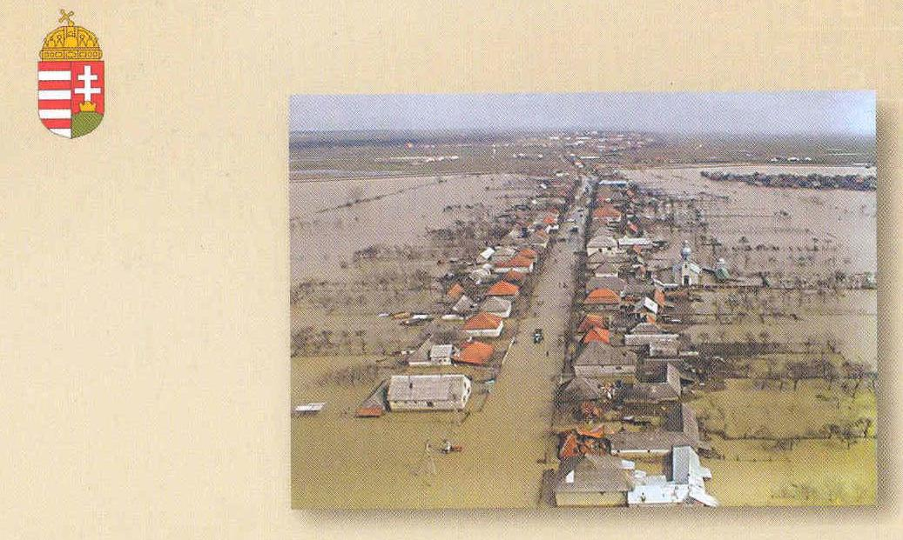

Рахункова палата України
Accounting Chamber of Ukraine

Report on auditing the flood control preparedness in the Upper Tisza region
Звіт про аудит протипаводкової готовності регіону Верхньої Тиси
Jelentés a Felső-Tisza-vidék árvízvédelmi felkészültségének ellenőrzéséről

---

**Report on auditing the flood control preparedness in the Upper Tisza region**

**Звіт про аудит протипаводкової готовності регіону Верхньої Тиси**

**Jelentés a Felső-Tisza-vidék árvízvédelmi felkészültségének ellenőrzéséről**

**2004-2005**

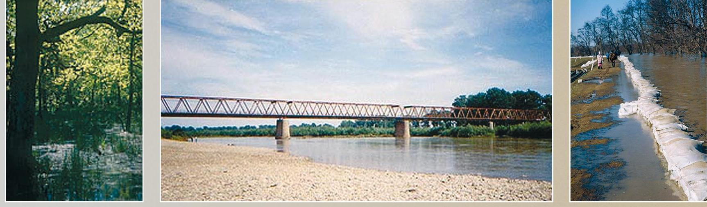

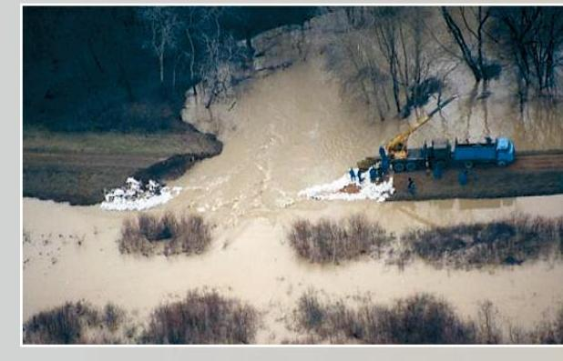

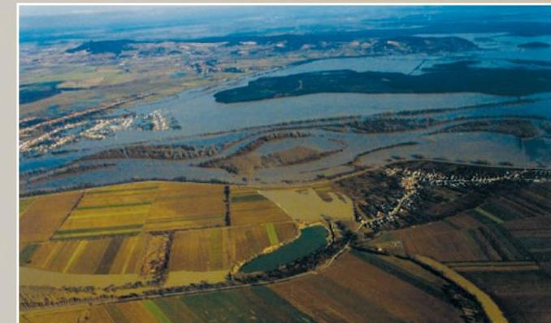

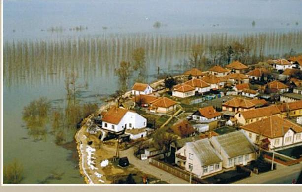

---

.

---

## Tartalomjegyzék

BEVEZETÉS ..... 5
MEGÁLLAPÍTÁSOK ÖSSZEFOGLALÁSA ..... 15
AJÁNLÁSOK ..... 27
MEGÁLLAPÍTÁSOK ..... 33

1. A természeti katasztrófák megelőzésével kapcsolatos magyar ellenőrzés főbb tapasztalatai ..... 35
2. A Tisza vízgyűjtő területe és a Kárpátaljai régió komplex árvízvédelmi felkészültségével kapcsolatos ukrán ellenőrzés főbb tapasztalatai ..... 41
3. A határvizi egyezményben foglaltak teljesítésére irányuló közös ellenőrzés megállapításai ..... 46
3.1. A határvizi együttmüködés szintjei, szabályozottsága ..... 46
3.2. Az árvízvédelmi rendszerek kiépítettsége ..... 49
3.3. Az árvízvédelmi fejlesztési koncepciók ..... 57
3.4. A közös belvízvédelmi rendszerek továbbfejlesztése, egységes lokalizációs tervek alkalmazása ..... 61
3.5. Az árvizi megfigyelő, riasztó és előrejelző rendszer ..... 65
3.6. Az árvízmegelőzéssel kapcsolatos közös kutatások ..... 68
3.7. Nemzetközi finanszírozású projektek, két- és többoldalú együttmüködés ..... 72

## Contents

INTRODUCTION ..... 5
SUMMARY OF THE FINDINGS ..... 15
RECOMMENDATIONS ..... 27
FINDINGS ..... 33

1. Main Experiences of the Hungarian Audit Relating to the Prevention of Natural Disasters ..... 35
2. Main Experiences of the Ukrainian Audit Relating to the Complex Flood Control Preparedness in the Catchment Area of the Tisza River and the Sub-Carpathian Region ..... 41
3. Findings of the Parallel Audit Aimed at the Implementation of the Contents of the Transboundary Water Agreement ..... 46
3.1. Levels and Level of Regulation of Transboundary Water Cooperation ..... 46
3.2. Construction of the Flood Protection System ..... 49
3.3. Development Concepts in Flood Protection ..... 57
3.4. Further Development of Joint Systems of Inland Water Protection, Application of Unified Localisation Plans ..... 61
3.5. The Flood Monitoring, Alarm and Forecasting System ..... 65
3.6. Joint Research Relating to Flood Prevention ..... 68
3.7. Internationally Financed Projects, Bilateral and Multilateral Cooperation ..... 72

## 3міст

ВСТУП ..... 5
ПІДСУМОК РЕЗУЛЬТАТІВ КОНТРОЛЮ ..... 15
РЕКОМЕНДАЦІЇ ..... 27
ВСТАНОВЛЕНІ РЕЗУЛЬТАТИ ..... 33

1. Основні висновки угорського контролю, пов'язаного із запобіганням природних катастроф ..... 35
2. Основні висновки контролю української сторони щодо комплексної протипаводкової готовності басейну р. Тиси і Закарпатського регіону ..... 41
3. Основні положення перевірки виконання Угоди на прикордонних водах ..... 46
3.1. Налагодженість та рівень співпраці на прикордонних водах ..... 46
3.2. Наявність протипаводкових систем ..... 49
3.3. Концепції розвитку протипаводкового захисту ..... 57
3.4. Подальший розвиток суміжних систем внутрішніх вод, впровадження спільних планів з локалізації паводків та повеней ..... 61
3.5. Система спостереження, сигналізації та прогнозування ..... 65
3.6. Спільні дослідження, пов'язані із запобіганням паводків ..... 68
3.7. Проекти міжнародного фінансування, дво- та багатостороння співпраця ..... 72

---

.

---

# INTRODUCTION

## BCTYII

## BEVEZETÉS

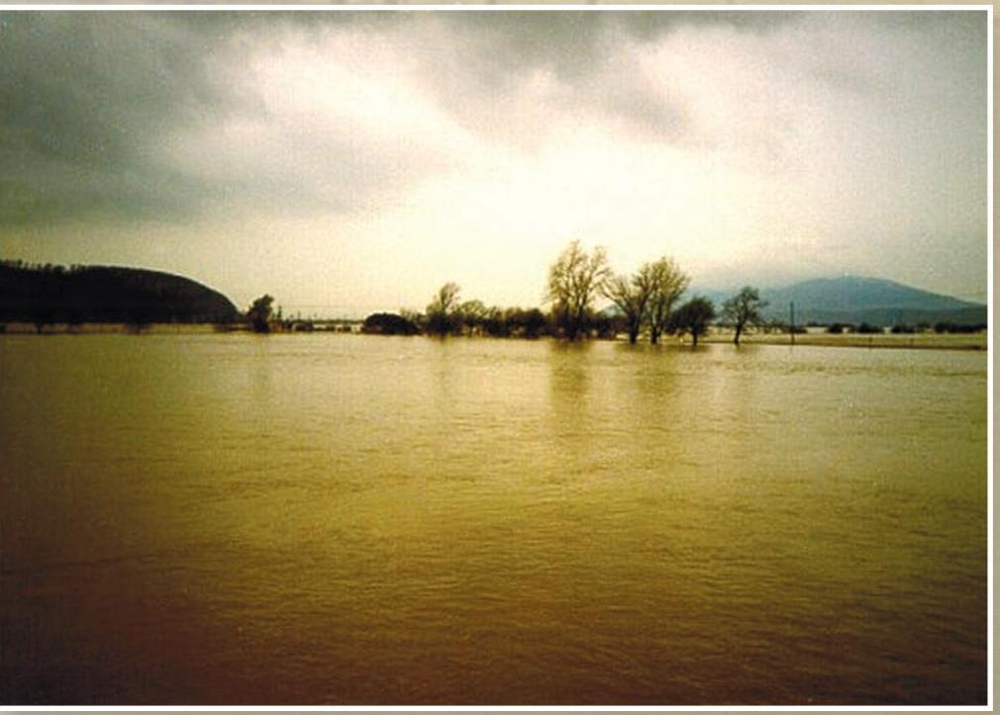

---

.

---

A Felső-Tisza medencéjének területe Európa egyik legnedvesebb és árvízveszélyeztetett régiója. A régióra jellemző gyakori és jelentős áradások kialakulásának alapvető oka a hidrometeorológiai és szinoptikus helyzet, valamint a hegyi folyók medreinek, a talajoknak és a hegyi kőzeteknek a különleges fekvése és felépítése. Az árvizek Ukrajnának és Magyarországnak egyaránt jelentős kárt okoznak és ez nagymértékben meghatározza a felek együttmüködését a víz káros hatásának megelőzésében és az árvizek következményeinek elhárításában.

A sokéves megfigyelések tanúsítják, hogy árvizekre és belvizekre évente 3-8 alkalommal kerül sor, és az utóbbi 60 éves időszakban előfordultak olyan évek, amikor ezek az események extrém jellegủek voltak. A legsúlyosabb katasztrófákat 1970 májusában, 1974 októberében, 1980 júliusában, 1998 novemberében és 2001 márciusában figyelték meg. A magyarországi árterületek $73 \%$-a, a hullámtér $66 \%$-a a Tisza völgyében található. Gyors hóolvadáskor, vagy egy-egy nagyobb csapadék után az árvíz a magyar szakaszokon is 1-2 napon belül megjelenik, akár 8-10 méteres vízszintemelkedést okozva.

Ukrajna területén, ezen belül a kárpátaljai területen alakul ki a Tisza medence összes vízhozamának majdnem 30 százaléka. Ezért a hidrometeorológiai folyamatok iránya tekintetében a Tisza-vízgyűjtőn - jellemzően a felvízialvizi sajátosságok miatt - aszimmetrikus érdekhelyzet áll fenn, amiből adódóan korlátozottak az érintett országok közötti ellentételezési lehetőségek. A nemzetközi együttmüködés célja az „alvizi" országok tekintetében is csak az lehet

The area of the basin of the Upper Tisza is one of Europe's wettest regions, at high risk from floods. The fundamental cause of the frequent and sizeable floods characteristic of the region, is the hydrometeorological and sinoptic situation, as well as the special location and structure of the beds of mountain rivers, soils and mountain rocks. Floods cause major damage to Ukraine and Hungary alike, and this determines to a large extent the parties' cooperation in preventing the damaging effects of water and averting the consequences of floods.

Observations over long years show that floods and inland water problems occur on 3 to 8 occasions per year, and in the past 60 -year period there have been years when these events had an extreme character. The most serious disasters were observed in May 1970, October 1974, July 1980, November 1998 and March 2001. 73\% of Hungary's flood basins and $66 \%$ of the flood-plains are to be found in the Tisza valley. With a rapid snow melt or after heavy rain the flood appears in the Hungarian river sections too, within 1 or 2 days, causing an elevation of the water level by as much as 8 to 10 metres.

Almost 30 percent of the total water output of the basin of the Tisza River is generated in the territory of Ukraine, and within that in the region of Sub-Carpathia. Therefore, there is an asymmetric interest situation in respect of the direction of the hydro-meteorological process in the Tisza River catchment area, characteristically due to the features headwater-low-water. In respect of the "low-water" countries the aim of international cooperation may only be to implement developments for common benefit, where possible, and in addition to reduce the disadvantageous consequences resulting from

Територія басейну Верхньої Тиси відноситься до найбільш зволожених і паводконебезпечних регіонів Європи. Основними причинами формування частих і значних паводків, притаманних цьому регіону, є гідрометеорологічна та синоптична ситуація, а також особливості русел гірських річок, грунтів і залягання гірських порід. Паводки завдають значних економічних збитків як Україні, так і Угорській Республіці, що істотно обумовлює тісну співпрацю обох країн з попередження шкідливого впливу води та усунення наслідків паводків.

Багаторічні спостереження свідчать про те, що повені та паводки бувають 3-8 разів на рік, і за минулі 60 років траплялися роки, коли вони були екстремальними. Найтяжчі катастрофи спостерігались у травні 1970 року, жовтні 1974 року, липні 1980 року, листопаді 1998 року і в березні 2001 року. 73 відс. заплавних територій і 66 відс. зон паводків Угорщини знаходяться в долині р. Тиси. При швидкому розтаванні снігу та після сильних опадів повені на угорських ділянках виникають через день-два і можуть призвести до 8-10 метрового підвищення рівня води.

На території України, зокрема, Закарпатської області, формується майже 30 відс. загального стоку басейну річки Тиса. Тому, виходячи з напрямку гідрометеорологічних процесів водозбірного регіону р. Тиси в основному, через особливості верхньої і нижньої течії - стан заінтересованості сторін можна вважати різновекторним. Метою міжнародної співпраці країн, що знаходяться по нижній течії, крім намагання скоротити несприятливу дію вод може бути й діяльність з виконання робіт, які дають спіль-

---

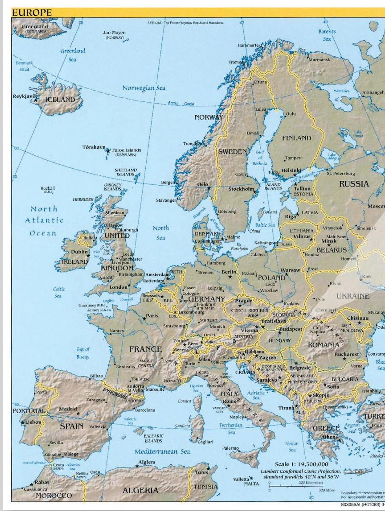
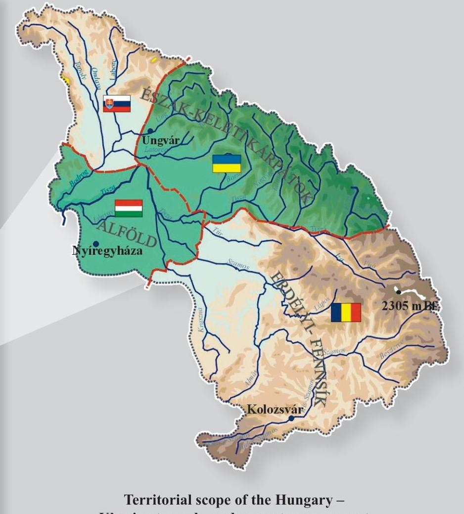

8
Report on Auditing the Flood Control Preparedness in the Upper Fissa Region

---

- a helyzetükből eredeztethető hátrányos következmények csökkentésén túlmenően -, hogy ahol csak lehetséges - közös előnyủ fejlesztések valósuljanak meg. Magyar-ukrán relációban az elmúlt években több alkalommal volt példa arra, hogy elsősorban magyar segélyek terhére közös előnyű fejlesztések folytak, amelyeknek az eredményei az árvíz-előrejelző rendszer közös fejlesztésében, valamint közös tervezési-kutatási programok lebonyolításában jelentek meg.

A Felső-Tiszavidék árvízvédelmi felkészültségére irányuló párhuzamos ellenőrzés végrehajtását a magyar Állami Számvevőszék és az Ukrán Ellenőrzési Kamara elnökei közötti - 2004. március 4-én Budapesten aláírt - megállapodás előzte meg. A párhuzamos ellenőrzés programja mindkét félnél a számvevőszékek éves ellenőrzési terveiben előirányzott ellenőrzési feladatok részeként jelent meg úgy, hogy a felek - a megállapodás értelmében - a közös ellenőrzési szempontokat a határvizekkel kapcsolatos vízgazdálkodási kérdésekről szóló, a Magyar Köztársaság Kormánya és Ukrajna Kormánya közötti Egyezményben (továbbiakban: Egyezmény) foglaltak teljesülésének figyelemmel kísérésére alapozva határozták meg.

A magyar-ukrán határvízi együttműködés nemzetközi jogi alapja a Magyar Köztársaság Kormánya és Ukrajna Kormánya között létrejött - Magyarországon a 117/1999. (VIII. 6.) Kormányrendelettel, ukrán oldalon a Miniszteri Kabinet ind. 34. számú 1999. május 20-án kelt Rendeletében meghatározott végrehajtási utasítással kiadott - Egyezmény. A hatályos magyarukrán határvízi Egyezmény megkötésének előz-
their situation. In the Hungary-Ukraine relationship there have been several examples in recent years of conducting developments serving mutual benefit, mainly to the debit of Hungarian grants, whose results appeared in the joint development of a flood forecast system and in the arrangement of joint programmes of planning and research.

The execution of a parallel audit covering the flood control preparedness in the Upper Tisza Region was preceded by an agreement signed in Budapest, on 4 March 2004, by the Presidents of the State Audit Office of Hungary and the Accounting Chamber of Ukraine. The programme of parallel audit appeared with both parties as part of the audit tasks envisaged in the annual audit plans of the Audit Offices in such a manner that, pursuant to the agreement, the parties defined the aspects of parallel audit on the basis of monitoring the implementation of the contents of the Transboundary Water Agreement (hereinafter: Agreement).

The Agreement entered into by the Government of the Republic of Hungary and the Government of Ukraine (issued in Hungary via Government Decree No. 117/1999 (VIII. 6.), on the Ukrainian side via the decree of execution defined in Decree No. 34 dated 20 May 1999 of the Cabinet of Ministers) serves as international legal basis for the cooperation between Hungary and Ukraine in respect of transboundary waters. The history of the conclusion of the Agreement in force between Hungary and Ukraine goes back several decades: during this period the works targeting flood safety were in progress, with varying success in respect of both the willingness to cooperate of the neighbouring countries and the professional contents. The important principle

ну вигоду. Зокрема, що стосується Угорщини і України, то за минулі роки можна навести ряд позитивних прикладів, коли за рахунок угорських коштів виконувались взаємовигідні для обох сторін роботи, які були втілені в спільний розвиток системи прогнозування повеней, а також у виконання спільних програм з проектування та досліджень.

Здійсненню паралельного контролю протипаводкової готовності регіону Верхньої Тиси передувала угода, підписана Головою Державного аудиторського офісу Угорщини і Головою Рахункової палати України в Будапешті 4 березня 2004 року. Програма паралельного контролю кожної сторони є частиною передбачених в річних планах інституцій контрольних завдань, причому, згідно з домовленістю, загальні критерії контролю визначені з урахуванням виконання положень Угоди про водогосподарські питання, пов’язані з прикордонними водами, (далі - Угода) між Урядом Угорської Республіки і Урядом України. Міжнародною юридичною основою угорсько-української співпраці на прикордонних водах є Угода між Урядом Угорської Республіки і Урядом України, опублікована в Угорщині Урядовою Ухвалою 117/1999 (6 серпня) і в Україні доведена до виконавців дорученням Кабінету Міністрів України від 20 травня 1999 року № інд.34. Передісторія чинної угор-сько-української Угоди про співпрацю на прикордонних водах сягає в минуле на десятки років, і за попередній період робота, направлена на протипаводкову безпеку, здійснювалася із змінним успіхом і щодо готовності до співпраці, і відносно змісту робіт. Вже в 1981 році був

---

ményei több évtizedes múltra tekintenek vissza, mely időszak alatt az árvízi biztonságot segitő munkálatok váltakozó sikerrel folytak, mind a szomszédos országok együttműködési készsége, mind a szakmai tartalom tekintetében. Már 1981ben rögzítették azt a fontos elvet, hogy a FelsöTisza vízgyűjtőjén tervezett (illetve megvalósított), a határvizek vízjárására hatást gyakorló vízgazdálkodási tevékenységet egyeztetni kell.

A magyar-ukrán (korábban szovjet) vízügyi együttműködés sajátossága volt az is, hogy a kormányközi határvizi együttműködéssel párhuzamosan több esetben olyan műszaki-tudományos együttműködés is folyt, ami elősegítette a határvizi kapcsolatok szakmai tartalmának bővülését. 1986-90 között a „Vizgyüjtők árvizvédelmi elörejelzési és vizkészlet-gazdálkodási információs mérőrendszere" című kutatás-fejlesztési együttműködés keretében a felek például kidolgozták a felső-tiszai egységes árvíz-előrejelző automatikus monitoring részletes tervét. Ennek szakmai tartalma napjainkban is helytálló, keretet adva a folyamatban levő fejlesztések megvalósításához.

A felek - 1999. április 16-án történt - jegyzékváltásával hatályossá vált határvizi Egyezmény minden cikke kapcsolatban áll az árvizi katasztrófákra való felkészülés közös feladataival, közvetlenül a tervezési munkákra, az árvíz és belvízvédekezésre, valamint az információcserére vonatkozó előírások tekintetében. Az árvízka-tasztrófa-megelőzés eredményességének alapvető feltételét az adja, hogy az Egyezmény területi hatálya a hatások tekintetében nemcsak a vizek közvetlen határmenti szakaszaira és szelvényeire terjed ki, hanem a tiszai vízgyűjtő egészére.
of reconciling the water management activity, planned (or implemented) in the catchment area of the Upper Tisza and affecting the watercourse of the transboundary waters, was laid down as early as 1981.

It was another specialty of water-related cooperation between Hungary and Ukraine (earlier the Soviet Union) that, in parallel with the intergovernmental cooperation related to transboundary waters, a technical and scientific cooperation was also in progress, which promoted the enlargement of the professional contents of the transboundary water relations. For example, in the framework of the research and development cooperation entitled "Information measurement system for flood control forecast and water management in the catchment areas", realised between 1986 and 1990, the parties elaborated the detailed plan of the automatic monitoring for unified flood forecasting for the Upper Tisza. The professional contents thereof are still correct even today, providing a framework for the implementation of developments in progress.

The Transboundary Water Agreement, which became effective through the parties' exchange of notes on 16 April 1999, is relevant in each of its articles for the joint tasks of preparations for flood disasters, in respect of the provisions relating directly to the works of planning, protection against floods and inland water problems and exchange of information. The basic condition of the successful prevention of flood disaster is that the territorial scope of the Agreement covers, in respect of the effects, not only the sections and chainages of the waters neighbouring directly on the national border, but the totality of the Tisza River's catchment area.

зафіксований важливий принцип, згідно з яким необхідно погоджувати заплановану (і здійснену) у водозбірному регіоні Верхньої Тиси водогосподарську діяльність, що здійснює вплив на режим прикордонних водотоків.

Відмінною рисою угорсько-української (раніше радянської) водогосподарської співпраці було також те, що поряд з міжурядовим співробітництвом на прикордонних водах здійснювалося і науково-технічне співробітництво, яке сприяло розширенню змістовної частини зв’язків на прикордонних водах. В період 1986-1990 років в рамках проекту з досліджень і розвитку «Інформаиійна вимірявальна система протипаводкового прогнозування і водогосподарської діяльності», сторони, наприклад, розробили детальний план єдиного автоматичного моніторингу прогнозування паводків на Верхній Тисі. Ця робота і сьогодні актуальна та служить основою для продовження здійснюваних робіт.

Кожна стаття Угоди з прикордонних вод, що набула чинності після обміну Сторонами нотами 16 квітня 1999 року, пов'язана із загальними завданнями з підготовки до паводкових катастроф в плані приписів з проектних робіт, захисту від повеней і паводків, а також обміну інформацією. Результативність запобігання паводковим катастрофам обумовлюється тим, що в територіальному відношенні і по впливу Угода розповсюджується не тільки безпосередньо на прикордонні водні ділянки і створи, а на весь водозбірний регіон р. Тиси.

При оцінці загального змісту Угоди слід враховувати і те, що після політичних і соціальноекономічних перетворень в країнах Центральної

---

Az Egyezmény általános tartalmi értékelésénél nem hagyható figyelmen kívül az sem, hogy a közép-kelet-európai rendszerváltozásokat követően ez az első olyan határvizi egyezmény, amelyik figyelembe vette a nemzetközi ajánlásokat is. (,,A határokon átlépő vízfolyások és nemzetközi tavak védelméről és hasznosításáról" szóló ENSZ EGB konvenció, 1992., ,,A Duna megóvásáról és fenntartható használatáról" szóló Szófiai Konvenció, 1994.)
Az együttműködő felek kötelezettséget vállaltak arra, hogy minden, az országhatáron átterjedő hatással bíró és a vízgyűjtőn megvalósuló vízgazdálkodási beavatkozást előzetesen egyeztetnek. Ennek az együttmüködési elvnek köszönhetően 2000-2004 között több fontos árvízkatasztrófa megelőzéssel összefüggő vizsgálat és egyeztetés történt.
Az árvízmegelőzéssel összefüggésben kiemelhető az Egyezmény azon előírása, miszerint a szerződő felek a saját területükön nem engednek meg olyan beavatkozásokat, melyek a határvizeken az egyeztetett legnagyobb vízhozam-értékek jelentős emelkedését idézhetnék elő. A határvizeken a kölcsönös árvízvédekezési segítségnyújtásra, a szükséges védekezési kapacitások (gépek, anyagok, felszerelések) készenlétben tartására utaló előírások az árvízvédelmi felkészülés öszszehangolását kívánták biztosítani.
Lényeges eleme az Egyezménynek a határvizeket érintő vízgazdálkodási tevékenységek terv-egyeztetési kötelezettségének vállalása, mivel az árvízmegelőzést szolgáló tervek egyeztetése révén válhat lehetővé, hogy a felek azonos biztonsági előírások figyelembe vételével tervez-

When evaluating in general the contents of the Agreement, we should not disregard the fact either that this is the first Transboundary Water Agreement after the change of regime in Central and Eastern Europe, which took into account the international recommendations too (UNO EGB Agreement "On the Protection and Utilisation of Cross-border Watercourses and International Lakes" 1992, Sophia Agreement "On the Protection and Sustainable Use of the Danube" 1994).
The cooperating parties undertook to firstly agree on all water management interventions having a cross-border effect and implemented in the catchment area. Thanks to this principle of cooperation, several important examinations and some agreements were made in connection with flood prevention between 2000 and 2004.
In connection with flood prevention it could be highlighted that the Agreement prescribes for the Contracting Parties not to allow any interventions in theirownterritories, which couldcause a considerable rise in the agreed maximum water output values in the transboundary waters. The provisions relating to mutual assistance in flood control protection at the transboundary waters and to keeping available the required protection capacities (machines, materials, outfits), were aimed at securing the harmonisation of the preparations for flood protection.
It is an essential element of the Agreement that the parties undertook to reconcile the plans of water management activities affecting the transboundary waters, since agreement on the plans for flood prevention allows for the parties to plan the flood protection facilities along the national border taking into account identical safety rules, creating thereby

і Східної Європи, це перша така угода по прикордонних водах, в якій використані і міжнародні рекомендації. («Конвениія по охороні і використанню транскордонних водотоків і міжнародних озер» ЕЕК ООН від 1992 року, «Конвениія про охорону і стале використання річки Дунай», прийнята в Софії в 1994 році).

Сторони узяли на себе зобов'язання про попереднє погодження всіх водогосподарських заходів, які здійснюються у водозбірному регіоні і які можуть мати транскордонний вплив. Завдяки цьому принципу співпраці в період 2000-2004 pp. було проведено ряд важливих інспекцій та узгоджень, пов'язаних із запобіганням паводкових катастроф.
3 огляду запобігання паводків слід виділити припис Угоди, згідно з яким Сторони не допустять на своїх територіях таких дій, які можуть призвести до значного підвищення на прикордонних водах погоджених максимальних значень водоносності. Приписи з надання взаємної допомоги на прикордонних водах, з підтримки готовності необхідних захисних засобів (машин, матеріалів, спорядження) повинні забезпечити узгодженість дій щодо захисту від паводків.

Важливим елементом Угоди є зобов’язання з погодження водогосподарських планів, що стосуються і прикордонних вод, оскільки тільки узгодження протипаводкових планів дозволяють Сторонам проектувати свої прикордонні протипаводкові споруди з урахуванням однакових нормативів з безпеки i, таким чином створювати надійну протипаводкову захисну систему. Це вкрай важливе прагнення, оскільки захист прикордонних заплавних котловин можуть за-

---

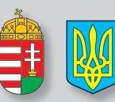

|  Settlements
flooded | Settlements protected
from flooding | Settlements not
endangered by
flooding  |
| --- | --- | --- |
|  Csaroda |  | Marokquipi  |
|  Gelénes |  | Tiszaadony  |
|  Gulács |  | Tiszakerzeseny  |
|  Hetefejerese |  | a part of
Gergelyisgornya  |
|  Jánd |  | Mátyas  |
|  Tarpa |  | Tiszaszalka  |
|  Tákos |  | Tiszavid  |
|  Vámosatya |  | Barabás  |
|  a part of
Gergelyisgornya |  | Lónya  |

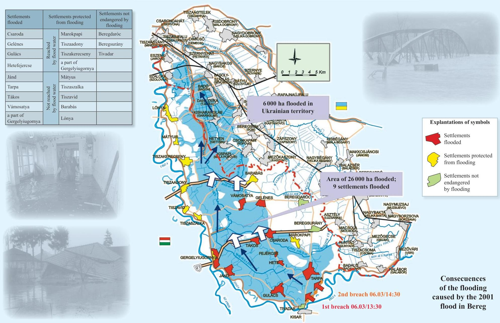

---

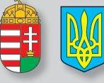

zék meg a határmenti árvízvédelmi létesítményeket, ezáltal egyenszilárdságú árvízvédelmi rendszer jöjjön létre. Ez a törekvés azért fontos, mert a határmenti közös ártéri öblözetek védelmét a határ két oldalán lévő árvízvédelmi és belvízvédelmi létesítmények csak együttesen biztosíthatják. Sajnálatos példaként támasztja ezt alá a 2001. évi márciusi felső-tiszai árvíz, amikor a Beregben a magyar oldalon bekövetkezett töltésszakadások miatt ukrán területek, az ukrán oldali Tisza balparti töltésszakadások miatt magyar területek kerültek víz alá.

A párhuzamos ellenőrzés a magyar Állami Számvevőszéknél *"A természeti katasztrófák megelőzésére való felkészülés ellenőrzése"* című teljesítményellenőrzési feladatba épült be, az Ukrán Ellenőrzési Kamaránál *"A Tisza vízgyűjtő területe és a Kárpátaljai régió komplex árvízvédelmi felkészültségének 2002–2006-os időszakra és 2015-ig szóló előrejelzésre kiterjedő állami program végrehajtásának elemzése és ellenőrzése,"* című feladat részét képezte. A számvevőszékek a saját jelentésüket az országuk törvényhozó testületének terjesztették be. A közös jelentés a magyar és ukrán oldali megállapítások összefoglalását, részletesebben a határvizi együttműködés területeit érintő közös következtetéseket mutatja be.

A flood protection system with equal stability. These efforts are important, since the protection of the common flood basin bays along the national border can only be secured jointly by the facilities of flood protection and inland water protection located on both sides of the border. This is supported by the regrettable example of the Upper Tisza flood in 2001, when the dykes burst in Bereg on the Hungarian side and Ukrainian areas were inundated, while Hungarian areas were inundated due to the bursting of dykes on the left bank of the Tisza River on the Ukrainian side.

The parallel audit was integrated, in case of the Hungarian State Audit Office, in the performance audit task entitled *"Audit of Preparations for the Prevention of Natural Disasters"*, while in the case of the Accounting Chamber of Ukraine it was a part of the task entitled *"Analysis and Audit of the Execution of the State Programme Covering the Complex Flood Control Preparedness of the Catchment Area of the Tisza River and the Sub-Carpathian Region for the Period 2002 to 2006 and the Forecast until 2015"*. The audit offices submitted their respective reports to the legislative bodies of their countries. The joint report presents the summary of the findings made on the Hungarian and Ukrainian sides, as well as the details of the joint conclusions concerning the fields of cooperation, which cover the transboundary waters.

безпечити тільки споруди із захисту від паводків і повеней, що є по обидві сторони кордону. Це підтверджується сумним прикладом паводку на Верхній Тисі в березні 2001 року, коли через руйнування греблі в Березі, на угорській стороні – українські території, а через руйнування греблі на лівому березі р. Тиси, в Україні – угорські території опинилися під водою.

Паралельний контроль в Державному аудиторському офісі Угорщини включено до питання з контролю результативності під назвою *«Контроль підготовки до запобігання стихійного лиха»*, в Рахунковій палаті України є частиною питання під назвою *«Аналіз і контроль виконання державної програми з комплексного протипаводкового захисту в басейні р. Тиси у Закарпатській області на період 2002–2006 рр. та прогноз до 2015 року»*. Обидві інституції подали звіти законодавчим органам своїх держав. Спільний звіт представляє узагальнення результатів контролю угорської і української Сторін, і більш детально робить загальні висновки, що стосуються співпраці на прикордонних водах.

---

.

---

# SUMMARY OF FINDINGS

## ПІДСУМОК РЕЗУЛЬТАТІВ КОНТРОЛЮ

## МЕСА́LLАРІ́ТА́SОК ÖSSZEFOGLALÁSA

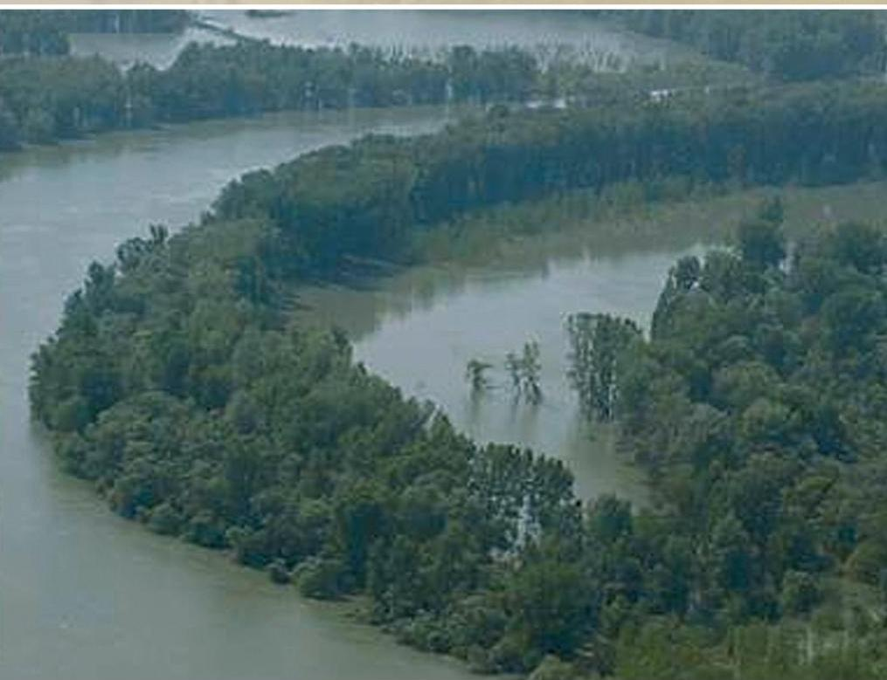

---

.

---

A magyar oldali ellenőrzés a hidrológiai jellegű katasztrófák elleni védekezés szabályozási hátterét tekintve feltárta, hogy a rendelkezésék fogalomhasználatában és a védekezés irányításában a kívánatos összhang nem valósult meg. Az önkormányzatok esetében a bekövetkezett árvizek után végzett szakmai elemzések és a korábbi számvevőszéki ellenőrzések jelzései ellenére továbbra is elmaradt a védművekről való gondoskodásra, illetve a települési belvíz- és csapadékvíz-elvezetés megoldására vonatkozó jogszabályi kötelezettség előírása. A védekezés helyi szintű döntéshozatalaiban kockázati tényezőt jelent a közigazgatási vezetők, polgármesterek estenként hiányos felkészültsége, ami hasonlóan visszavezethető az ilyen irányú jogszabályi kötelezettség előírásainak hiányára.

A Tisza-völgy árvízi biztonsága a magyar oldalon ellentmondásosan alakult. A települések biztonságát növelték ugyan a hagyományos árvízvédelmi koncepciók alapján végzett töltésfejlesztések és árvízvédelmi beruházások, ezzel együtt a védmüvek mintegy harmada még nem felelt meg a mértékadó árvízszint követelményének. A töltésépítés is lelassult az utóbbi években, miközben az elért biztonságot kérdésessé tették az újabb árvízi jelenségek (ezek a megváltozott mederviszonyokkal, a szélsőséges időjárási jelenségekkel és az ember környezeti beavatkozásaival hozhatók összefüggésbe).

A Vásárhelyi Terv Továbbfejlesztése (VTT) keretében Magyarországon először kezdték meg a mentesített árterek részbeni - szabályo-

In respect of the regulatory background of protection against disasters of a hydrological nature, the audit on the Hungarian side revealed that the desirable harmony in the terminology of provisions and in the management of protection had not been realised. In the case of the local governments there is a failure further on in providing for protective works and in prescribing a statutory obligation relating to the solution of the drainage of inland waters and rainwater in the settlements, despite the professional analyses made after the occurrence of floods and despite the signals of earlier audits carried out by the Audit Office. The preparedness of the leaders of administration and mayors, which is sometimes deficient, constitutes a risk factor in local decision-making on protection, which can be similarly attributed to the absence of the relevant statutory provisions regarding commitment.

The flood safety of the Tisza valley evolved in a contradictory manner on the Hungarian side. It is sure that the safety of settlements was increased by the dyke developments and flood control projects carried out on the basis of traditional flood protection concepts, but nevertheless around one-third of the protective facilities did not meet the requirement of the standard flood level. In recent years the construction of dykes has also slowed down, while new flood phenomena (which can be attributed to the changed river bed conditions, the extreme weather phenomena and human intervention into the environment) have made questionable the level of safety achieved.

In the framework of the Further Development of the Vásárhelyi Plan (VTT), the implementation of a programme setting as its goal the partial reactivation

Контроль угорської сторони щодо питань регулювання захисту від катастроф гідрологічного характеру виявив відсутність узгодженості між управлінськими діями і застосуванням нормативних положень. Всупереч професійним аналізам, проведеним після паводків, і висновкам за раніше проведеними перевірками Державним аудиторським офісом Угорщини, не прийняті обов'язкові правові норми, що зобов'язують місцеві адміністрації стежити за збереженням захисних споруд і застосовувати заходи відведення внутрішніх вод і опадів у даному населеному пункті. Недостатня підготовленість адміністрацій і мерів часто є фактором ризику при прийнятті рішень з локального захисту, що, знову-таки, пояснюється відсутністю такого роду правових зобов’язань.

Паводкова безпека долини р. Тиси з угорської сторони є недостатньою. Безпека населених пунктів хоча і підвищилася за рахунок будівництва гребель та інших протипаводкових капітальних споруд, здійснених на підставі діючих протипаводкових нормативів, проте приблизно третина захисних споруд ще не відповідає визначальним вимогам по рівню паводків. Будівництво дамб останнім часом теж сповільнилося, при тому, що недавні паводки (це пов’язано зі зміною русла, екстремальними погодними умовами і втручанням людини в навколишнє середовище) поставили під питання вже досягнутий рівень безпеки.

В рамках Удосконалення програми Вашархеї (VTT) в Угорщині вперше приступили до здійснення заходів з часткової рекультивації заплавних територій, звільнених від паводко-

---

zott vízkivezetéssel történő - reaktiválását is célként kitűző program megvalósítását, ami egyúttal új típusú gazdálkodást, táj-, föld- és vízhasználatváltást készítene elő. A program eredményességét alapvetően befolyásoló kockázati tényezőnek tartotta az ellenőrzés a hatékony operatív irányítás, valamint a műszaki és pénzügyi ütemezés összhangjának hiányát. (A végrehajtás kedvezőbb feltételeit - a koordináció új alapokra helyezésével - ez évtől kezdték kialakítani.)
Az Állami Számvevőszék a katasztrófavédelem állami irányításával összefüggésben kormányzati intézkedések szükségességét hangsúlyozta, a létrehozott tárcaközi bizottságok hatásköri, szervezeti, müködési feltételeinek és a feladatellátásuk összhangjának megteremtése érdekében. A vizek kártételei elleni védelem terén feltártakra tekintettel megállapítható volt, hogy megnőtt a társadalmi szinten elfogadható kockázat mértékén alapuló tervezés jelentősége. Mindezeket a kormányzati és az ágazati illetékesség alapján megfogalmazott javaslatok egyaránt tükrözték.
Az ukrán fél ellenőrzése megállapította, hogy Ukrajna Kárpátaljai régiójában a legmagasabb állami szinten hozott - az árvízkatasztrófák megelőzésére és a veszély elhárítására irányuló intézkedésekről szóló direktívák ellenére a helyzet alapvetően nem javult.
„A Kárpátaljai régió Tisza medencéjének komplex árvizvédelmi programja 2002-2006ra és elörejelzés 2015-ig" (a továbbiakban: Komplex program) a Tisza-medence árhullámai komplex kezelését, a települések, objektu-
of the released flood basins through regulated drainage, was started for the first time in Hungary, which would simultaneously prepare a new type of agricultural management, and a change in the use of landscape, land and water. The audit considered the absence of efficient operative management and that of the harmony of technical and financial scheduling to be a risk factor affecting basically the success of the programme. (As of this year the creation of more favourable conditions for implementation was begun, by placing the cooperation on new foundations.)
In connection with the state direction of disaster protection, the State Audit Office stressed the necessity for the Government to take measures in order to create harmony between the conditions of power, organisation and operation of the interministerial committees set up and the fulfilment of their tasks. With regard to what has been revealed in the field of protection against water damage, it could be stated that there was an increase in the importance of planning, based on the size of risk, which is acceptable at the social level. All this was reflected by the proposals which were worded on the basis of the respective competences of the Government and the various sectors.
The audit by the Ukrainian party stated that the situation had not, basically, improved in Ukraine's Sub-Carpathian region, in spite of the directives on the measures aimed at preventing flood disasters and avert the danger, which were issued at the highest state level.
"The Complex Flood Protection Programme for the Basin of the Tisza River in the Sub-Carpathian region 2002-2006 and Forecast until 2015"

вої небезпеки, шляхом регульованого відбору (відведення) води, що може стати підготовкою нового типу господарської діяльності, природокористування, земле- і водокористування. Перевірка визнала, що чинником ризику, який у своїй основі ставить під загрозу результативність програми, є відсутність ефективного оперативного управління, а також неузгодженість технічного і фінансового графіка (з цього року - шляхом забезпечення нових основ координації - почали розробку більш сприятливих умов для виконання).
Державний аудиторський офіс Угорщини щодо питання державного управління захистом від катастроф підкреслив необхідність урядових заходів на користь узгодження повноважень, організаційних і функціональних умов діяльності створених міжвідомчих комісій і узгодження їх завдань. Відносно захисту від шкідливої дії паводків встановлено, що зросло значення планування, яке грунтується на прийнятному з погляду громадськості ступені ризику. Все це відображалося в рекомендаціях, сформульованих на основі урядових і галузевих повноважень.

Контролем української сторони виявлено, що незважаючи на прийняті на вищому державному рівні рішення щодо здійснення заходів з попередження та усунення загрози паводкових катастроф у Закарпатському регіоні України, ситуація суттєво не поліпшується.
«Програма комплексного протипаводкового захисту в басейні р. Тиси у Закарпатській області на 2002-2006 роки та прогноз до 2015 року» (далі - Комплексна програма) ставить

---

mok, földek vízkárokkal szembeni védelmét, az árvizek és belvizek romboló hatásának minimálisra történő csökkentését tűzi ki célul. Az ellenőrzés eredményei azonban azt mutatták, hogy a 2002-2004 közötti időszakban a Komplex program nem a meghatározott ütemben valósult meg és a szükséges szervezésipénzügyi háttér hiánya miatt számos betervezett intézkedésre nem került sor.

A Komplex program végrehajtásának ellenőrzése feltárta azt, hogy a Kormány a Törvény végrehajtásáért felelős tárcák, központi és helyi végrehajtó szervek tevékenységét nem koordinálta. Megállapítást nyert, hogy a minisztériumok, hatóságok és helyi hatalmi szervek az intézkedéseket helyi szinten és rendszertelenül valósítják meg, ezért ezek az intézkedések a hatékony és komplex árvízvédelmet nem biztosítják. A Komplex program jogi támogatását a Kormány nem biztosította. A vízgazdálkodási szervezetek és szolgáltatók vízkárokkal szembeni védelem irányításával és együttmüködésével, működésükkel és a vízkészleti földeken megvalósított tevékenységük befektetési mechanizmusával kapcsolatos jogszabályok hiánya veszélyezteti a megfelelő terjedelmű árvízvédelem biztosítását.

A katasztrófa-méretű árvizek után az ukrán fél a védelmi vonalak egy részét újjáépítette, ami egyes települések biztonságát megnövelte, de 2004-ben és 2005-ben a védművek finanszírozása csökken, ami csak megnöveli a befejezetlen beruházások mennyiségét, az eszközök nem hatékony felhasználását és csökkenti az árvízvédelem szintjét. Ukrajna Számvevőszéke
(hereinafter: Complex Programme) set as its goal the complex treatment of the flood waves of the Tisza Basin, the protection of settlements, facilities and fields against water damage, and the minimisation of the destructive impact of floods and inland water problems. However, the results of the audit proved that in the period 2002-2004 the Complex Programme was not implemented at the scheduled pace, and a number of planned measures were not taken due to the lack of the required organisational and financial background.

The audit of the implementation of the Complex Programme revealed that the Government had failed to coordinate the activities of the ministries and the central and local executive organs responsible for the execution of the Act. It was stated that the ministries, authorities and local organs of power realised the measures at local level and irregularly, and therefore these measures did not secure any efficient, complex flood protection. The Government did not ensure any legal support for the Complex Programme. The absence of legal rules relating to the management of protection against water damage and to cooperation by the organisations of water management and service providers, to the operation thereof and to the investment mechanism of their activities realised on the lands with water stocks, endangers the provision of the requisite level of flood protection.

After the disastrous floods the Ukrainian party rebuilt a part of the defensive lines, which increased the safety of certain settlements, but the financing of protective works is reduced in 2004 and 2005, which will only increase the number of non-finished projects and the inefficient use of assets and reduce the level of flood protection.

за мету забезпечення комплексного підходу до управління паводковим стоком у басейні р. Тиса та захисту населених пунктів, об’єктів і земель від шкідливої дії вод, мінімізації збитків від руйнівної дії паводків і повеней. Проте результати контролю показали, що у 2002-2004 роках багато з намічених заходів Комплексної програми не виконано, оскільки не здійснено необхідного організаційно-фінансового забезпечення її виконання.

Контроль української сторони за виконанням Програми комплексного протипаводкового захисту в басейні р. Тиси виявив незабезпечення виконання Урядом завдань щодо координації діяльності міністерств, інших центральних та місцевих органів виконавчої влади, пов’язаних з виконанням програми. Встановлено, що вони здійснюють реалізацію заходів локально і безсистемно, тому не забезпечується ефективний і комплексний захист від повеней. Урядом не здійснено правового забезпечення виконання Програми. Відсутність нормативно-правових актів з питань управління та взаємодії водогосподарських організацій і служб у сфері захисту від шкідливої дії вод, господарської діяльності на землях водного фонду ставить під загрозу забезпечення паводкового захисту в достатніх обсягах.

Після катастрофічних паводків українською стороною відбудовано частину дамб, що посилило захист окремих населених пунктів, проте у 2004 та 2005 роках фінансування будівництва захисних споруд зменшується, що спричиняє збільшення незавершеного будівництва, неефективне використання коштів та знижує

---

felhívja a Kormány figyelmét arra, hogy a Komplex program finanszírozásának mechanizmusa nem tökéletes. Ennek eredményeként az árvízvédelemmel kapcsolatos munkák nem irányulnak a programban meghatározott intézkedések teljesítésére. Következésképpen nem biztosított a Tisza medencéjében levonuló árhullámok kezelése és a településeknek az árvizek romboló hatásával szembeni védelme.

Ukrajna Számvevőszékének javaslatai kihangsúlyozták azt, hogy a vízgazdálkodási kérdések szabályozása és a Komplex program megvalósítása érdekében létrehozott Tárcaközi Koordinációs Tanácsnak sokkal aktívabb tevékenységét kell folytatni. Továbbá, felhívják a figyelmet arra, hogy a Tanácsnak szigorúbban kell ellenőrizni a Program megvalósításába bevont minisztériumokat és hatóságokat, különösen az intézkedések teljesítésének megfelelő előkészítését a megvalósítás minden szakaszában (tervezés, egyeztetés, szerződéskötések stb.), valamint biztosítani a megfelelő pénzügyi támogatást.

Tekintettel a Komplex program megvalósítása során jelentkező rendszerjellegủ hiányosságokra a Számvevőszék következtetései alapján célszerűnek látszik a Komplex program számos rendelkezésének korrekciója, különös tekintettel azokra, amelyek vonatkozásában a megfelelő tudományos-müszaki megalapozás hiányzik. A Számvevőszék a vonatkozó javaslatokat elküldte a Kormánynak, és ezekben a Számvevőszék felvetette azt, hogy a munkába be kell vonni jelentős tudományos szervezeteket, szakembereket, a Nemzeti Tudományos

The Accounting Chamber of Ukraine draws the Government's attention to the fact that the mechanism of financing the Complex Programme is not perfect. Consequently, the works related to flood protection are not aimed at the fulfilment of the measures determined in the programme. As a result, the treatment of the flood waves subsiding in the basin of the Tisza River and the protection of the settlements against the destructive impact of floods are not secured.

The proposals of the Accounting Chamber of Ukraine stressed that the Inter-Ministerial Cooperation Board set up to regulate the issues of water management and to implement the Complex Programme should carry out much more effective activity. Furthermore, they draw the attention to the point that the Board should audit more strictly the ministries and authorities involved in the Programme, particularly the appropriate preparation of the fulfilment of the measures in all phases of implementation (planning, reconciliation, contracting, etc.), and it should provide the appropriate financial support.

With regard to the deficiencies of a systematic nature which have appeared in the course of the implementation of the Complex Programme, it seems expedient to correct a number of provisions of the Complex Programme, with particular regard to those in the case of which the appropriate scientific and technical foundations are lacking. The Audit Office sent the relevant proposals to the Government, and therein the Audit Office mentioned that important scientific organisations, experts, and scientists from the Academy of Sciences should be involved in the work, the legal rules should be amended and

рівень протипаводкового захисту. Рахункова палата України звернула увагу Уряду на недосконалість механізму фінансового забезпечення Комплексної програми. Як наслідок, не забезпечується комплексний підхід до забезпечення паводковими стоками у басейні р. Тиси та захисту населених пунктів від руйнівної дії паводків.

В пропозиціях Рахункової палати України було наголошено на необхідності більш активної роботи Міжвідомчої координаційної ради, створеної для регулювання питань водного господарства, із забезпечення виконання Комплексної програми, посилення нею контролю за діяльністю міністерств, інших центральних та місцевих органів виконавчої влади, залучених до виконання цієї програми, з питань належної підготовки виконання заходів на всіх етапах їх здійснення (проектування, узгодження, укладання договорів тощо)та відповідного фінансового забезпечення.

Враховуючи недоліки системного характеру, які виявилися у ході реалізації Комплексної програми, за висновками Рахункової палати України необхідно скоригувати ряд ії положень, особливо тих, які не мали належного науково-технічного обгрунтування. Відповідні пропозиції були направлені Уряду, в яких, зокрема, ставилися питання про залучення до цієї роботи провідних наукових організацій, фахівців, учених Національної академії наук, внесення змін та доповнень до відповідних нормативно-правових актів та визначення конкретних обов'язків кожного учасника у виконанні програми.

---

Akadémia tudósait, a jogszabályokat módosítani és kiegészíteni szükséges és a program minden résztvevője tekintetében meg kell határozni a konkrét kötelezettségeket.

A Felső-Tisza-vidék árvízvédelmi felkészültségével kapcsolatos párhuzamos ellenőrzésnek keretet adó magyar és ukrán oldali vizsgálatok alkalmával a felek alapvetően egymáshoz jól közelítő következtetésekre jutottak. Ezek szerint az együttműködés szabályozottsága általánosságban megfelelő, egyes területeken (mint a kiépített rendszerek üzemeltetése) kiegészítésekkel konkrétabbá tehető.

A határvizi Egyezmény végrehajtásában érintett személyek országhatáron túli mozgásának jogszabályi feltételeit a kormányok közötti egyezményekkel kialakították. Ezek Magyarország EU-hoz való csatlakozását követően sem igényeltek módosítást az érintettek okmányellátását illetően, sőt, a szabályozásokban foglaltaknak mind az igazolványokkal történő ellátásban, mind a határrendészeti ellenőrzések gyakorlatában - elsősorban az ukrán oldalon tapasztalt hiányosságokra, okmánykezelésre tekintettel - érvényt kell szerezni. Ugyanakkor a soron kívüli határátlépés indokolt eseteinek áttekintése adhat alapot annak eldöntéséhez, hogy az országhatáron történő mozgások operativitásának biztosításához szükséges-e pontosítani, kiegészíteni a felek közötti egyezményeket.

Mindkét fél adatokkal alátámasztva jellemezte az árvízvédelmi rendszerek kiépítettségének helyzetét (az ukrán oldali állapot kedvezőtlenebb paraméterű). Az évtizedekkel
complemented, and concrete obligations were to be determined in respect of each participant of the programme.

On the occasion of the examinations carried out on the Hungarian and Ukrainian sides giving a framework to the parallel audit relating to the flood control preparedness of the Upper Tisza Region, the parties basically came to conclusions which were quite similar. According to these the cooperation is in general well regulated, and in certain fields (such as, e.g., the operation of the constructed systems) it can be supplemented and thereby made more specific.

The statutory conditions for the movement beyond the national border of persons involved in the execution of the Transboundary Water Agreement, have been created by inter-governmental agreements. These do not need any amendment even after Hungary's EU accession in respect of providing the persons concerned with documents; moreover, the contents of the regulations must be enforced both in the provision of cards and in the practice of the audits of border policing, mainly with regard to the deficiencies and document handling experienced on the Ukrainian side. At the same time a review of the justified cases of border crossing out of turn can provide a basis for deciding whether it is necessary to specify or complement the agreements in force between the parties, in order to ensure the operational nature of movements along the state border.

Both parties characterised the situation of the construction of the flood control systems, supporting this with data (the condition on the Ukrainian side has less favourable parameters). In general, the flood protection dykes built several decades ago with the

При проведенні перевірки - в рамках паралельного контролю протипаводкової готовності регіону Верхньої Тиси - на українській i угорській стороні кордону Сторони дійшли до досить близьких за змістом висновків. Відповідно, налагодженість співпраці, в цілому, задовільна, а в деяких сферах (наприклад, експлуатація побудованих систем) взаємодія у разі певних доповнень може стати більш конкретною.

Правові умови перетину державного кордону особами, що задіяні у виконанні Угоди з питань водного господарства на прикордонних водах, передбачені в урядових угодах. В зазначені правові норми (в плані забезпечення відповідними документами) відсутня потреба вносити зміни і після приєднання Угорщини до ЄС. Навпаки, 3 урахуванням української практики оформлення документів, необхідно дотримуватись цих норм як в забезпеченні заінтересованих осіб відповідними документами, так і в самій практиці здійснення прикордонного контролю. У той же час, перегляд обгрунтованих випадків перетину кордонів без черги дозволить прийняти правильне рішення чи слід уточнювати та доповнювати угоди, підписані Сторонами, в інтересах забезпечення оперативного перетину державних кордонів.

Обидві Сторони охарактеризували рівень готовності протипаводкових споруд, спираючись на дані обстежень (параметри на українській стороні менш сприятливі). Побудовані раніше, відповідно до нормативів тих часів і за допомогою існуючої на той час техніки, протипаводкові споруди, як правило, не відповідають

---

korábban, korabeli technikával, az akkori előírások szerinti méretekkel épült árvízvédelmi töltések általában nem felelnek meg a mai, korszerű igényeknek: a koronájuk keskeny, a rézsűhajlásuk meredek, anyagösszetételük túl inhomogén, alacsonyak. (A zsílipekre is mások voltak a követelmények, mint ma.) Ez ugyanúgy igaz Magyarországra, mint Ukrajnában Kárpátaljára.

A magyar területen 1970 után változtak az előírások, az azóta épített árvízvédelmi létesítmények (pl. Tisza jobb parti töltés Jánd-Tarpa országhatár, Tisza bal parti töltés OlcsvaapátiTiszabecs közötti szakasza, Szamos jobb és bal parti töltés) Magyarországon kielégítik a korszerü követelményeket (magasságuk is a jelenleg érvényes mértékadó árvízszinthez igazodik). Azokon a szakaszokon, amelyek a korszerü követelményeknek ma sem felelnek meg, a mértékadó terhelés kivédése már most is csak jelentős védekezési munkával biztosítható.

Az ukrán oldal megállapítása szerint a létező gátrendszer ma nem képez megbízható árvízvédelmi komplexumot. Súlyosan hiányos Kárpátalja hegyvidékeinek árvízvédelmi létesítmény-ellátottsága Rahónál, Ökörmezőnél és Técsőnél. Az ukrán fél nem rendelkezik egységes védekezési tervekkel a meglévő védelmi létesítményeiről, ezért hiányzik a műszaki alap a létesítmények védőképességének megítélésére.

Önmagában nem elegendő az a közös ma-gyar-ukrán szándék, ami a Felső-Tiszai töltésrendszer azonos mértékủ kiépítésére törekszik,
techniques of that time and in the dimensions then prescribed do not meet today's modern demands: their crown is narrow, the inclination of their slopes is steep, they are composed of heterogeneous materials, and they are low. (The requirements relating to locks were also different from today's.) This is equally true for Hungary and Ukraine.

In the Hungarian territory the prescriptions changed after 1970, and the flood control facilities built since then in Hungary (e.g. the dyke along the right bank of the Tisza River, the section between Jánd-Tarpa and the national border, the dyke along the left bank of the Tisza River, the section between Olcsvaapáti-Tiszabecs, the dyke along the right and left banks of the Szamos River) meet the modern requirements (their height too is adjusted to the standard flood level of today). In the sections which still fail to meet modern requirements, defence against the governing load can only be secured with considerable defensive works.

According to the findings of the Ukrainian party, the existing dyke system does not constitute a reliable flood control complex. There are serious deficiencies in the provision of the Sub-Carpathian mountains with flood protection facilities at Rahó, Ökörmező and Técső. The Ukrainian party does not have unified protection plans for its existing defensive facilities, therefore there is no technical basis for judging the defensive capacity of the facilities.

The joint Ukrainian-Hungarian intention to endeavour to construct, on an identical scale, the dyke system at the Upper Tisza is not sufficient in itself; the programmes of dyke development must also be harmonised in the interest of success,

сучасним вимогам: вузькі гребені, круті схили скосів, склад матеріалу дуже неоднорідний, та й самі дамби занизькі (вимоги по шлюзах також не відповідали нинішнім вимогам). Це однаково стосується і Угорщини, і Закарпаття в Україні.

На угорській території вимоги змінилися після 1970 року, побудовані пізніше протипаводкові споруди (наприклад, правий берег р. Тиси, гребля Янд-Тарпа на державному кордоні, дамба на лівому березі р. Тиси на ділянці між Олчваапаті і Тісебечем, право- і лівобережна гребля на Самоші) в Угорщині відповідають сучасним вимогам (їх висота відповідає нинішньому паводковому рівню води). На тих ділянках, які не відповідають сучасним вимогам, тільки мобілізація всіх захисних сил дозволяє захищатися при досягненні максимального паводкового навантаження.

За визначенням української сторони, існуюча нині система дамб в Закарпатській області є ненадійним протипаводковим захисним комплексом. 3 точки зору наявності протипаводкових споруд великі прогалини спостерігаються в гірських районах Закарпаття біля селищ Рахів, Воловець, Тячево. В української Сторони відсутні єдині захисні плани на наявних спорудах, тому немає і технічної основи для оцінки захисної здатності споруд.

Спільних угорсько-українських намірів 3 урівноваження захисних систем дамб на Верхній Тисі недостатньо, програми з будівництва дамб - в інтересах досягнення належних результатів і з метою рівномірного графіка впровадження - необхідно погоджувати.

---

a töltésfejlesztési programokat - az eredményesség érdekében, a közel azonos ütemủ megvalósítás céljából - össze is kell hangolni. Számolni kell azzal is, hogy töltésfejlesztési programok megvalósítása következtében csökken a töltésszakadások száma és valószínűsége. Közös kutatói programok, hatásvizsgálatok végrehajtása a célszerű eszköz a biztonságosabbá vált szakaszok árvízszintnövelő tényezőinek számbavételéhez, amire figyelemmel kell lenni mind az ukrán, mind a magyar oldali árvizi vésztározási program további tervezésénél.
Az árvízvédelmi fejlesztési koncepciók egyeztetése - magyar oldalról a VTT program esetében, illetve ukrán oldalról a Tisza Kárpátaljai vízgyűjtőjére tervezett rövid (2002-2006), és hosszú távú (2015-ig tartó) komplex árvízvédelmi programokra kiterjedően - csak felszínesen, kivonatosan, a vázlattervek szintjén történt. A határvizi Egyezménybe foglalt, már a tervezésre is kiterjedő kölcsönös tájékoztatási és egyeztetési kötelezettségek maradéktalan betartásától nyilvánvalóan függ az árvízvédelmi felkészültség javítását célzó lépések eredményessége, hatékonysága és nem utolsó sorban a gazdaságossága.
Magyar oldalról nem maradhat el annak bemutatása, hogy a VTT első ütemében megvalósuló felső-tiszai fejlesztések javítják az ukrán határmenti területek árvízvédelmi biztonságát is, ezért azok Ukrajna számára is kedvezőek. Az ukrán oldali rövid, illetve hosszú távú programok alakulásáról a 2003-tól szünetelő információátadás érdemi felélesztése, a Tisza
for the purpose of implementation at a nearly identical pace. The fact has to be reckoned with that in consequence of the implementation of dyke development programmes, the number and probability of dykes bursting will be reduced. The execution of joint research programmes and impact studies will be an expedient tool for the evaluation of factors which increase the flood level at the sections which have become safer, which are to be taken into consideration upon the further planning of the flood-related emergency storage lake programme on both the Ukrainian and Hungarian sides.
The development concepts of flood protection have been agreed - on the Hungarian side in the case of the VTT programme, while on the Ukrainian side in respect of the complex flood control programmes, the short-term one (2002-2006) planned for the SubCarpathian catchment area of the Tisza River and the long-term one (until 2015) - only superficially, in extract form with sketches. It is evident that the success, efficiency, and last but not least the rentability of the steps aiming at improving the flood control preparations are highly dependent on complete compliance with the obligations of mutual information and agreement covering the planning, which have been included in the Transboundary Water Agreement.
The Hungarian party should not fail to indicate that the developments at the Upper Tisza, to be implemented in the first phase of the VTT, will improve the flood control safety of the areas along the Ukrainian border too, therefore they will also be beneficial for Ukraine. The revitalisation of the merits of the disclosure of information on the evolution of the short- and long-term programmes on

Внаслідок реалізації програм з будівництва дамб скоротиться кількість та вірогідність їх руйнувань. Доцільним засобом для визначення факторів, що підвищують рівень води на ділянках, які стали більш надійними, є спільні дослідження і вивчення дії вод. 3 підвищенням рівня води слід рахуватися при подальшому проектуванні програми з створення аварійних сховищ як на українській, так і на угорській стороні.

Узгодження розвитку протипаводкових концепцій - на угорській стороні за програмою VTT, на українській стороні за короткостроковою (2002-2006 рр.) і перспективною (20072011 та 2012-2015 pp.) програмою комплексного протипаводкового захисту було досить поверховим, на підставі схематичних планів. Результативність, ефективність і, не в останню чергу, рентабельність заходів, направлених на поліпшення протипаводкової готовності, залежить від скрупульозного виконання передбачених в Угоді зобов’язань щодо взаємного інформування і узгодження вже на стадії проектування.

Угорська Сторона обов'язково повинна вказати на те, що заходи, які виконуються на першому етапі здійснення VTT, підвищать і паводкову безпеку українських прикордонних територій, що сприятливо позначиться і в Україні. Продовження призупиненого у 2003 році обміну інформацією короткострокових і перспективних планів української сторони та винесення на обговорення, угорської позиції стосовно плану-схеми захисних споруд на Верхній Тисі могло б направити в правильне русло співробітництво за Угодою. Але зазначе-

---

Kárpátaljai vízgyűjtőjére vonatkozó árvízvédelmi vázlattervre adott magyar állásfoglalás elmaradt megvitatásának napirendre tüzése jelentheti az együttműködés - Egyezmény alapú elvárásának - megfelelő irányba tereléséhez vezető lépéseket.
A Beregi és a Beregszászi ár- és belvízvédelmi öblözetet egységes rendszernek tekintő új lokalizációs tervet kidolgozták, de tekintettel az öblözet országhatárokkal való osztottságára, szükséges a felek hivatalos jóváhagyása is. A jogérvényesítés módjának kidolgozásába célszerű bevonni a megyei, térségi, települési választott testületeket és a védelmi bizottságokat is. Célszerű még szem előtt tartani, hogy a lokalizációs terv a folyamatos karbantartása mellett töltheti be hatékonyan a szerepét, aminek ellátására a feleknek - a magyar álláspont alapján - ún. lokalizációs együttműködési szabályzatban szükséges rendelkezni.
Az 1999-től folyamatosan fejlesztett észlelő és előrejelző rendszer szolgáltatásai az Egyezmény területi hatálya alá eső FelsőTiszai vízgyűjtőn mindkét fél számára hasznosulnak. A magyar fél hozzájárulásával létrehozott észlelő és előrejelző rendszer jelenlegi állapotában sem tekinthető teljesen kiépítettnek. Az ukrán fél amerikai támogatással hat automatizált műholdas hidrometeorológiai állomást kapott és helyezett üzembe. A pozitív eredmények megerősítették a rendszer továbbfejlesztésének igényét.
Számos közös tanulmány és terv igazolta, hogy a felek a tudományos kutatások terén a határvízi Egyezmény adta együttműködési le-
the Ukrainian side, suspended since 2003, as well as the putting on the agenda of the missing discussion of the Hungarian opinion given on the sketchy plan of flood protection relating to the Sub-Carpathian catchment area of the Tisza River, could result in steps which will give an appropriate direction to the cooperation, living up to the expectations of the Agreement.

The new localisation plan, which considers the dyked marsh of flood and inland water protection of Bereg and Beregszász to be a unified system, has been elaborated, but the parties' official approval shall also be required, since the dyked marsh is divided by national borders. It would be expedient to involve the elected bodies and protection committees of the counties, regions and settlements in the elaboration of the method of enforcing the rights. It is also expedient to keep in mind that the localisation plan can play its role efficiently besides a continuous maintenance, for the ensuring of which the parties should make provisions in a so-called localisation cooperation regulation, based on the Hungarian position.

The services of the observation and forecast system developed from 1999 on a continuous basis are useful for both parties in the Upper Tisza catchment area, which is covered by the territorial scope of the Agreement. The observation and forecast system established with the contribution of the Hungarian party cannot be considered, even in its condition today, to be fully developed. The Ukrainian party received and commissioned, with US support, six automated satellite hydro-meteorological stations. The positive results confirmed the need for the further development of the system.

не обговорення не відбулося через відсутність Уповноваженого Уряду Угорської республіки у 2004 році.

Розроблено новий план локалізації, що розглядає всю Берегську і Берегівську котловину (заплавні території і території, що часто попадають під повені) як єдину систему, але враховуючи те, що котловину розтинає державний кордон, необхідне офіційне його затвердження сторонами. До розробки методу правозастосування доцільно залучити органи місцевого самоврядування і комісії із захисту від паводків. Доцільно також не забувати, що план локалізації може бути ефективним тільки у разі його перманентної актуалізації, для цього, згідно з угорською пропозицією, необхідно розробити відповідний регламент співпраці.

Послуги системи спостереження і прогнозування, що перманентно розвивалася ,починаючи з 1999 року, у водозбірному регіоні Верхньої Тиси, на який розповсюджується територіальна дія Угоди, корисні для обох сторін. Систему спостереження і прогнозування, створену за участю угорської сторони, в її нинішньому стані не можна вважати завершеною. Українська сторона з американською допомогою ввела в експлуатацію шість автоматизованих супутникових гідрометеорологічних станцій. Позитивні результати тільки зміцнили переконання в необхідності подальшого розвитку системи.

Цілий ряд спільних розробок і проектів підтверджує те, що сторони скористалися можливостями співпраці, які забезпечує Угода в області наукових досліджень. Досягнуті результа-

---

hetőségeket adottságaikhoz mérten igyekeztek kihasználni. Az elért eredmények világítottak rá az erdők vízrajzi szerepére, az erdőgazdálkodásban az árvízmegelőzés szempontjainak indokolt mértékủ figyelembe vételére. A feltárt összefüggések a földrajzi elhelyezkedésre tekintettel elsősorban a Kárpátaljai vízgyűjtő terület erdőgazdálkodását érintik, amit az ukrán fél ez irányban tett lépései is tükröztek. Mindkét oldal megítélése szerint indokolt folytatni, illetve bővíteni az árvízmegelőzéssel kapcsolatos közös kutatásokat.

A határvizi Egyezmény területi hatályát érintő régióban 2000-2004 között számos nemzetközi finanszírozású projekt indult. Az ezekkel kapcsolatos tájékoztatások a magyar-ukrán együttműködés különböző förumain aktualitásuk szerint változó súllyal napirenden voltak, de ezt nem követte minden esetben megfelelő információáramlás. Az egyes projektek hasznosak a kétoldalú árvíz-megelőzési tevékenység szempontjából is, azonban nem tekinthető rendezettnek a kormányközi egyezmények alapján működő fórumok és a projektek munkaszervezeteinek együttműködése, ami biztosítaná a megfelelő koordinációt és összhangot a fejlesztési programok között.

A kétoldalú együttműködés - az általánosság szintjén elfogadott alapelv (miszerint az árvízi biztonság kezelésének eredményessége független az országhatároktól) érvényesítésére - a 2001-ben magyar-ukrán közös kezdeményezésre szervezett budapesti találkozón ötoldalúvá szélesedett. A Tisza-völgyi ötoldalú együttműködést azonban az utóbbi évek-

A number of joint studies and plans proved that the parties had made efforts, within the limits of possibility, to utilise the opportunities of cooperation provided by the Transboundary Water Agreement, in the field of scientific research. The results achieved cast light on the hydrological role of forests and on reasonable attention being paid to the aspects of flood prevention in sylviculture. With regard to the geographical location the correlations discovered concern primarily the sylviculture of the Sub-Carpathian catchment area, which was also reflected by the steps of the Ukrainian party made in this direction. In the judgment of both sides it is justified to continue and enlarge the joint research relating to flood prevention.

Lots of projects with international funding were launched in the region covered by the territorial scope of the Transboundary Water Agreement between 2000 and 2004. The relevant information was on the agenda, with a weighting which varied according to its topicality, in the various forums of Hungarian-Ukrainian cooperation, but this was not followed in each case by an appropriate flow of information. The individual projects are also useful from the aspect of bilateral flood prevention activity; however, the cooperation of the work organisations of the forums and projects, operating on the basis of the inter-governmental agreements, cannot be considered as being regulated, which could ensure the appropriate coordination and harmony between the development programmes.

In order to enforce a basic principle which is accepted at the level of generality (according to which the success of the treatment of flood safety is independent of national borders), the bilateral

тати вказали на гідрографічну роль лісів, на те, що в лісовому господарстві повинні ураховуватися і питання, пов’язані з уникненням паводків. Виявлені взаємозв'язки, з урахуванням географічного розташування, зачіпають, перш за все, лісове господарство водозбірного регіону Закарпаття, що знайшло своє відображення і у відповідних заходах української сторони. Обидві сторони вважають, що має сенс продовження і розширення спільних досліджень, пов’язаних із запобіганням паводків.

В регіоні, на який розповсюджується територіальна дія Угоди, в період 2000-2004 років почав здійснюватися цілий ряд проектів міжнародного фінансування. На різних форумах угорсько-української співпраці пов’язані з такими проектами повідомлення вносилися в порядок денний, проте обсяг інформації залежав від актуальності питання. До того ж , зазначена інформація в багатьох випадках в подальшому не надходила. Окремі проекти важливі з погляду двосторонньої діяльності щодо запобігання паводків, проте не налагоджено співпрацю робочих організацій форумів і проектів, які працюють на основі міжурядових угод. Налагодження такої співпраці могло б забезпечити координацію і узгодженість програм розвитку.

Двостороння співпраця, що грунтується на загальновизнаному принципі, що результати протипаводкового захисту не залежать від державних кордонів, на будапештській зустрічі, яку було організовано у 2001 році за спільною угорсько-українською ініціативою, розширилася до п’ятисторонньої співпраці. Проте п’я-

---

ben mérsékelt előrehaladás jellemezte, amiben - többek között - szerepet játszott egy közös munkaszervezet hiánya éppúgy, mint az egyes részt vevő országok mindenkori költségvetési helyzete. A közelmúltban reális közelségbe került - a vízgyűjtő-szintű feladatok Európai Uniós kezelési gyakorlata alapján - az ötoldalú együttműködésnek a Duna-védelmi Nemzetközi Bizottság (ICPDR - International Commission for the Protection of the Danube River) működési keretei közötti folytatása.
cooperation was enlarged into a quinquelateral one at the Budapest meeting, which was organised upon a joint Hungarian-Ukrainian initiative in 2001. However, the quinquelateral Tisza Valley cooperation was characterised by a moderate progress in the past years, which was caused - among other things - by the absence of a joint working organisation and by the prevailing budgetary situation of the individual participating countries. Recently, the continuation of the quinquelateral cooperation within the operational framework of the ICPDR (International Commission for the Protection of the Danube River) came much nearer, based on the EU's practice in the treatment of tasks at the catchment area level.

тистороннє співробітництво по долині р. Тиси в минулі роки просувалося дуже повільно. Причиною цього, разом з іншим, була не тільки недостатність робочої організації, але й також стан бюджетів країн-учасниць. Нещодавно стало реальним продовження п’ятисторонньої співпраці в рамках Міжнародної комісії по захисту Дунаю (ICPDR - International Commission for the Protection of the Danube River), відповідно до практики управління, що склалася в Європейському Союзі, з питань, пов’язаних з водозбірними регіонами.
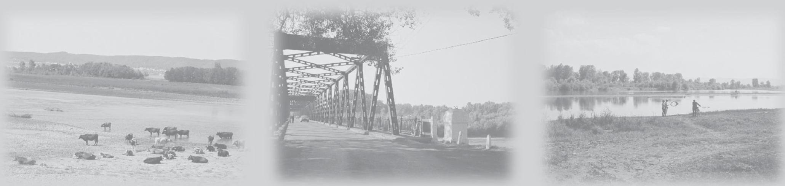

---

# RECOMMENDATIONS

## РЕКОМЕНДАЦІЇ

## АЈÁNLÁSOK

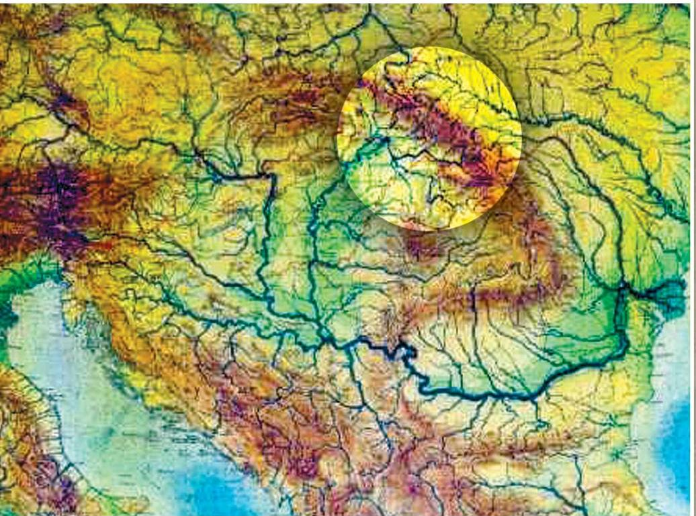

---

.

---

A magyar Állami Számvevőszék és az Ukrán Ellenőrzési Kamara a vizsgálatukat követően javaslatokat fogalmaztak meg országuk kormánya és felelős szervei részére a megállapításaik, következtetéseik hasznosítása céljából. Konkrétan a határvizi együttműködés tapasztalataira alapozva - a Felső-Tisza-vidék árvízvédelmi helyzetének javítása érdekében - figyelembevételre ajánljuk:

- a határvizi együttműködés szabályozásának aktualizálása keretében javasoljuk kiegészíteni a vízkárelháritási együttműködési szabályzatot a gátszakadások okozta helyzetek kezelésére, valamint a hidrometeorológiai és vízgazdálkodási együttműködési szabályzatot a megvalósított monitoring rendszer üzemeltetésére vonatkozó rendelkezésekkel; mivel a kormánymeghatalmazottak jogosítványait a határvizi Egyezmény rögzíti, a szerződő feleknek (kormányoknak) saját jogrendjüknek megfelelően kell biztosítani a kötelezettségek végrehajthatóságát;
- a magyar-ukrán határvizi Egyezmény kormánymeghatalmazottainak figyelmébe ajánljuk, hogy gondoskodjanak - szükség esetén országaik kormányzati intézkedésének kezdeményezésével - az előírásoknak megfelelő határátlépési gyakorlat feltételeinek biztosításáról, a soron kívüli határátlépések indokolt eseteinek függvényében tegyenek kezdeményezéseket a nemzetközi szerzödések pontosítására, kiegészítésére;
- az árvízvédelmi rendszerek kiépítettségével öszszefüggésben a töltésrendszer azonos mértékű

Following their examinations, the Hungarian State Audit Office and the Accounting Chamber of Ukraine conceived proposals for the Governments and responsible organs of their respective countries in order to utilise their findings and conclusions. In order to improve the flood protection situation of the Upper Tisza Region we recommend, based specifically on the experiences of the transboundary water cooperation, that the following be taken into consideration:

- in the framework of updating the regulation of transboundary water cooperation we propose complementing the regulation of the cooperation in water damage prevention by provisions relating to the treatment of situations caused by dykes bursting, as well as the regulation of hydro-meteorological and water management cooperation by provisions relating to the operation of the implemented monitoring system; since the powers of the Government delegates are laid down in the Transboundary Water Agreement, the contracting parties (Governments) have to ensure the enforceability of the obligations according to their own legal systems;
- we draw the attention of the Government delegates of the Hungarian-Ukrainian Transboundary Water Agreement to the necessity of providing for the conditions of a border-crossing practice which meets the prescriptions, by initiating governmental measures on behalf of their respective countries, if necessary, and to that of initiating the specification and supplementation of the international treaties, depending on the justified cases of border-crossing out of turn;

Державний аудиторський офіс Угорщини i Рахункова палата України після проведених досліджень, з метою врахування результатів контролю і зроблених за його результатами висновків, сформулювали свої пропозиції для урядів і компетентних органів своїх держав. Грунтуючись на конкретному досвіді співпраці на прикордонних водах і для сприяння поліпшенню протипаводкової ситуації регіону Верхньої Тиси, рекомендують:

- В межах актуалізації співпраці на прикордонних водах доповнити регламент співпраці по ліквідації шкідливої дії вод положеннями, які б регулювали ситуацію у разі руйнування дамб, а регламент гідрометеорологічної і водогосподарської співпраці - положеннями, що регулюють експлуатацію створеної системи моніторингу. Повноваження Уповноважених урядів передбачені в Угоді про прикордонні води. Договірні сторони (уряди) повинні забезпечити можливість виконання ними зобов'язань відповідно до свого законодавства.
- Уповноваженим урядів по Угоді необхідно забезпечити виконання відповідних приписів щодо умов перетину кордонів, а в разі необхідності - ініціювати прийняття відповідних урядових рішень. Залежно від необхідності перетину кордону без черги, внести пропозиції щодо уточнення і доповнення міжнародних угод.
- 3 питання будівництва протипаводкових споруд для забезпечення їх результативності та, 3 метою забезпечення рівноцінності систем

---

kiépítésére törekvő pozitív közös szándék eredményessége érdekében javasoljuk a megvalósítás ütemét is összehangolni; a magyar oldali fejlesztések mellett az árvízvédelmi rendszer fenntartása is igényli a megfelelő pénzügyi feltételek biztosítását; az ukrán oldalon a védelmi létesítmények felmérését és a védekezési tervek elkészítését tartjuk sürgető feladatnak (pl. szerepeltetve a nemzetközi pályázatokon elnyerhető támogatással kivitelezendő projektek célkitűzési között);

- az árvízvédelmi fejlesztési koncepciók kialakításában, a közös belvízvédelmi rendszerek továbbfejlesztésében, az egységes lokalizációs tervek alkalmazásában, valamint a saját, vagy nemzetközi segítséggel megvalósuló projekteknél mindkét fél tartsa szem előtt az Egyezmény tájékoztatási és egyeztetési kötelezettségekre vonatkozó előírását; szorgalmazzák továbbá a tervezett ukrán és magyar beavatkozások együttes hatását elemző közös vizsgálatokat (pl. közös modellezési-tervezési program kidolgozásával), különös tekintettel a Beregi és a Beregszászi ár- és belvízvédelmi öblözet, valamint a Szőlősi járás területére;
- az árvízmegelőzéssel kapcsolatos közös kutatások jelentőségét mindkét fél fontosnak ítélte, az ellenőrzés is indokoltnak tartotta a XI. határvizi kormány-meghatalmazotti ülésszakon elhatározott kutatási célok megvalósítását, amihez az EU támogatások pályázati lehetőségeit célszerű együttműködés keretében feltárni;
- az árvízi megfigyelő, riasztó és előrejelző rendszer magasabb szintű szolgáltatásainak elérése
- in the interest of the success of the positive joint intention to make efforts, in connection with the construction of the flood control systems, for the construction to an identical extent of the dyke system, we also propose harmonising the schedule of implementation; besides the developments on the Hungarian side, the maintenance of the flood control systems also requires the provision of appropriate financial conditions; on the Ukrainian side we consider the survey of the protective facilities and the preparation of protection plans to be urgent tasks (e.g. they should be included in the objectives of the projects, which are to be implemented by grants won in international tenders);
- the prescription of the Agreement relating to the obligation of information and agreement should be kept in mind by both parties in the elaboration of the concepts of flood control developments, in the further development of the joint systems for inland water protection, in the application of unified localisation plans, as well as in the projects implemented on their own or with international assistance; they should urge, furthermore, joint investigations analysing the cumulative effect of the planned Ukrainian and Hungarian interventions (e.g. by the elaboration of a joint programme of modelling and planning), with particular regard to the area of the flood and inland water protection dyked marsh of Bereg and Beregszász and to the area of the Szőlős District;
- both parties judged as important joint research relating to flood prevention; the audit, too, found it justified to implement the objectives of research
дамб, передбачити погодження також графіків будівництва. Поряд із заходами, здійсненими на угорській стороні для утримання протипаводкової захисної системи, вважати невідкладним завданням на українській стороні дослідження наявних захисних споруд і складання планів захисту (наприклад, можна вказати в числі цілей проекти, які будуть здійснюватися за рахунок грантів по міжнародних проектах).
- При розробці концепції розвитку протипаводкового захисту, удосконаленні загальних систем внутрішніх вод, застосуванні єдиних планів локалізації, а також при здійсненні проектів своїми силами або за рахунок міжнародної допомоги обидві сторони повинні дотримуватись вимог Угоди щодо інформування та узгодження. Сторони також повинні активізувати проведення спільних досліджень загального впливу запланованих українських і угорських заходів (наприклад, розробка спільної програми з моделювання і планування) з особливою увагою на територію паводкової котловини і котловини внутрішніх вод Берега і Берегово.
- Доцільно в рамках співпраці виявити можливість участі в тендерах ЄС з метою отримання грантів для проведення спільних досліджень, пов’язаних із запобіганням паводків, по яких рішення було ухвалено на 11 -й сесії Уповноважених урядів.
- Для підвищення якості роботи протипаводкової системи спостереження, сигналізації і прогнозування вважати доцільним подаль-

---

céljából indokoltnak tartjuk a rendszer továbbfejlesztését a következő területeken: az állomások számának növelése a magasabb régiókban, meteorológiai radar és földi állomások adatainak együttes feldolgozása, előrejelző modellek fejlesztése, előrejelzésekhez szükséges térképészeti, geodéziai munkák végrehajtása; az USA segítséggel megépült műholdas távmérőket javasoljuk a közös ukrán-magyar rendszer részévé tenni; célszerủnek tartjuk továbbá a felső-tiszai magyar és ukrán árvízvédelmi és katasztrófavédelmi szervezetek informatikai rendszereinek összeillesztését;

- a két- és többoldalú együttműködés hatékonysága növelése érdekében javasoljuk, hogy a kormánymeghatalmazottak a nemzetközi megállapodásokban foglaltak végrehajtásának figyelemmel kísérésével gondoskodjanak az országaik területén érintett ágazatok, felelős szervek összehangolt közreműködéséről, amennyiben szükséges, a nemzeti és közös érdekek érvényesítésére kormányzati beavatkozást igénylő lépések kezdeményezéséről.
resolved at the XIth meeting of the transboundary water delegates of the Governments; it would be expedient to disclose, in the framework of cooperation, the opportunities for EU grants serving such objectives;
- in order to achieve higher-standard services through the flood observation, alarm and forecast systemwe deem it justified to further develop the system in the following fields: increasing the number of stations in the higher regions, joint processing of the data from meteorological radar and terrestrial stations, development of forecasting models, execution of cartographic and geodesic works required for the forecasts; we propose integrating the satellite tachometers constructed with US assistance into the joint Ukrainian-Hungarian system; furthermore, we deem it expedient to combine the IT systems of the Upper Tisza organisations of flood and disaster protection of Hungary and Ukraine;
- to increase the efficiency of bilateral and multilateral cooperation we propose that the Government delegates monitor the execution of the provisions of the international agreements, and to provide thereby for a coordinated contribution by the sectors and responsible organs involved in the territories of their respective countries, and, if necessary, to initiate steps requiring governmental intervention in order to enforce the national and joint interests.

ший розвиток системи в наступних напрямах: збільшення кількості станцій у високогірних районах, спільна обробка даних метеорологічних радарних і наземних станцій, розробка моделей прогнозування, проведення картографічних і геодезичних робіт, необхідних для прогнозування. Слід включити побудовані з американською допомогою гідрометеорологічні станції із супутниковим зв’язком, супутникові дистанційні вимірники в спільну угорсько-українську систему. Вважати за доцільне об'єднати систему інформатики верх-нє-тисайських угорських і українських організацій по захисту від паводків і запобіганню катастроф.

- 3 метою забезпечення узгодженості у діях заінтересованих галузей та компетентних органів, в інтересах підвищення ефективності двоі багатосторонньої співпраці пропонується, щоб Уповноважені урядів тримали постійно на контролі виконання положень міжнародних угод і, у разі потреби, для забезпечення національних та спільних інтересів, ініціювали здійснення заходів, що вимагають урядового втручання.

---

.

---

# FINDINGS 

## BCTAHOBJEHI PESYJLATATU

## MEGÁLLAPÍTÁSOK

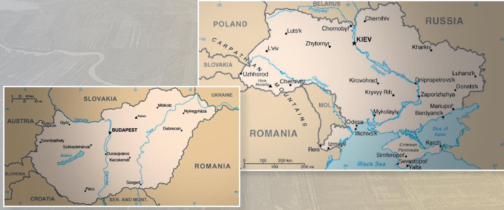

---

.

---

## 1. A természeti katasztrófák megelőzésével kapcsolatos magyar ellenőrzés főbb tapasztalatai

Az Állami Számvevőszék a teljesítményellenőrzés módszerével értékelte a katasztrófavédelem kormányzati, illetve ágazati szintekhez rendelt feladatainak áttekintésével a hidrológiai jellegű katasztrófák megelőzésében mérvadó szabályozási, irányítási, intézményi feltételek alakulását, kiemelten a Tisza-völgy árvízi biztonsága érdekében hozott intézkedések hatékonyságát.

A katasztrófavédelem törvényi szabályozása - ami egyben a védekezés irányítását, a megelőzés és végrehajtás összehangolását, a tervezés kormányszintű feladatainak végrehajtását a Kormány kompetenciájába adta - jelentős előrelépés volt, mind az EU jogharmonizációs folyamatot, mind a hazai katasztrófavédelem szervezeti rendezését tekintve. A természeti katasztrófák megelőzésének magyarországi szabályozásában - a hidrológiai jellegű katasztrófák dominanciájára figyelemmel - irányadók a vízgazdálkodásról szóló törvény és a vízkárok elleni védelemmel és védekezéssel kapcsolatos jogszabályok is.

A természeti (hidrológiai) katasztrófákra vonatkozóan a törvények végrehajtásáról szóló kormányrendeletek írták elő a megelőzéssel és a felkészüléssel kapcsolatos intézkedési, ellenőrzési feladatok végrehajtását, szabályozták a vízügyi igazgatás központi szervezeteinek és területi szerveinek feladat- és hatáskörét, rendelkeztek a vizek kártételei elleni védekezés szabályairól. KHVM

## 1. Main Experiences of the Hungarian Audit Relating to the Prevention of Natural Disasters

The development of the regulatory, directional and institutional conditions governing the prevention of disasters of a hydrological nature, and (with high priority) the efficiency of the measures taken for the flood safety of the Tisza Valley were evaluated by the State Audit Office using the method of performance audit, overviewing the tasks of disaster protection assigned to the various levels of the Government and the different sectors.

The statutory regulation of disaster protection - which simultaneously transferred the management of protection, the harmonisation of prevention and execution and the execution of the Governmentlevel tasks of planning into the competence of the Government - was a considerable step forward regarding both the EU's process of legal harmonisation and the organisational regulation of domestic disaster protection. With regard to the pre-eminence of disasters of a hydrological nature, the Act on Water Management and the legal rules relating to protection against water damage and defence are authoritative in the Hungarian regulation of the prevention of natural disasters.

In relation to natural (hydrological) disasters, the government decrees implementing the Acts prescribed the execution of the action and audit tasks relating to prevention and preparation, regulated the scope of tasks and powers of the central organisations and regional organs of water management, and provided for the rules of protection against the damage caused by water. A KHVM [Ministry of Transport, Communications

## 1. Основні висновки угорського контролю, пов'язаного із запобіганням природних катастроф

Державний аудиторський офіс Угорщини за допомогою методу контролю продуктивності, розглянувши урядові і галузеві завдання захисту від катастроф, зробив оцінку найважливіших умов регулювання, управління, а також інституційних умов запобігання катастроф гідрологічного характеру, сконцентрувавши свою увагу на ефективності заходів, спрямованих на протипаводкову готовність долини р. Тиси.

Законодавче регулювання захисту від катастроф, яке віднесло питання управління захистом, узгодження і здійснення превентивних заходів до компетенції уряду було суттєвим досягненням як з огляду процесу правової гармонізації із законодавством ЄС, так і з огляду організаційного регулювання вітчизняного захисту від катастроф. В угорському регулюванні запобігання стихійних катастроф, ураховуючи переважання катастроф гідрологічного характеру, слід керуватися Законом про водне господарство і правовими нормами, які регулюють захист від шкідливої дії вод та протипаводковий захист.

В урядових ухвалах про виконання названого вище закону, що стосується стихійних (гідрологічних) лих, передбачені зобов’язання з виконання завдань і контролю заходів, пов’язаних із підготовкою та запобіганням стихійних лих, врегульовані завдання і повноваження центральних водогосподарських органів і їх територіаль-

---

rendelet szabályozta az árvíz- és a belvízvédekezést. Az ágazati szabályozások áttekintése hozta felszínre, hogy a katasztrófavédelmi rendelkezések fogalomhasználatát és a védekezés irányítását illetően nem alakították ki a megfelelő összhangot.

A katasztrófavédelemmel kapcsolatos feladatok tárcák közötti koordinációjának eredményessége érdekében létrehozott Kormányzati Koordinációs Bizottság (KKB) - a védekezés feladatainak eredményes ellátása mellett - a védekezésre történő felkészülés és megelőzés időszakára meghatározott feladatait nem tudta teljes körűen teljesíteni. (A Nemzeti Katasztrófavédelmi Stratégia többszöri próbálkozás ellenére nem készült el végleges formában, kevésbé volt eredményes a koordináció a megelőzés feladataiban, az országos katasztrófavédelmi információs rendszer kialakításának alapkövetelményeit nem sikerült tisztázni).

Az árvízvédelmi programként indult, majd 2003-tól komplex terület- és vidékfejlesztési programmá teljesedett Vásárhelyi-terv továbbfejlesztése (VTT) és a Tisza térség komplex program szintén kormányzati irányítást, koordinációt igényel, ennek kapcsolódása (vagy önálló kezelése) a KKB részére előírt jogszabályi feladatokhoz még nem képezte elemzés, illetve döntés tárgyát. Ezért ajánlotta az ellenőrzés a Kormány figyelmébe a másmás közelítésből (általános katasztrófavédelmi szempontok alapján, illetve az árvízvédelmi fejlesztések tekintetében) létrehozott bizottságok beszámoltatása alapján - az egységes állami irányítás törvényben deklarált elvének érvényesítésére - a működésük harmonizálásának szükségességét.

A vizek kártételei elleni védelem érdekében szükséges feladatok ellátása - a védművek épi-
and Water] Decree regulated the protection against flood and internal water. The review of the sectors' regulations resulted in the recognition of the fact that no appropriate harmony had been created in respect of the terminology of the provisions on disaster protection and in that of the managment of protection.

The Governmental Coordination Committee (KKB) set up for the successful coordination, between the ministries, of tasks related to disaster protection provided successfully for the tasks of protection, but it could not entirely fulfil its tasks defined for the periods of preparation for protection and of prevention. (Despite several trials, the National Disaster Protection Strategy has not been finalised, coordination was less successful in the tasks of prevention, and the basic requirements of the establishment of a national antidisaster information system could not be clarified).

The Further Development of the Vásárhelyi Plan (VTT), which started as a flood protection programme and blossomed out, as of 2003, as a complex programme of regional and rural development, as well as the complex programme of the Tisza Region, require both governmental management and coordination, while the connection of these to the statutory tasks prescribed for KKB (or the independent treatment thereof) has not yet been subject to analysis or decisionmaking. Therefore, the audit drew the attention of the Government to the necessity of harmonising the operations of the committees which were set up from various aspects (on the basis of the viewpoints of general disaster protection and/or in respect of flood protection developments), based on the reports of such committees, in order to enforce the principle of unified management by the state, as declared by law.

It is the obligation of the state, the local governments, and of the entities interested in the prevention or

них підрозділів, і передбачені правила захисту від шкідливої дії вод. В постанові Міністерства транспорту, зв’язку і водного господарства Угорщини врегульовані питання захисту від паводків і повеней. При перегляді міжгалузевого регулювання з'ясувалася неузгодженість питань управління захистом і нормативними поняттями, які використовуються в ухвалах Уряду при захисті від катастроф.

Створена в інтересах поліпшення координації між міністерствами з питань, що стосуються захисту від катастроф, Урядова Координаційна Комісія (KKB) завдання із захисту виконала i, поряд з цим, із завданнями, пов’язаними з підготовкою і попередженням, справилася не повною мірою. (Національна стратегія захисту від катастроф, не дивлячись на неодноразові спроби, в остаточній формі не розроблена, не була успішною координація в період попередження, найважливіші вимоги створення інформаційної системи по захисту від катастроф так і не з'ясувалися).

План Удосконалення програми Вашархеї (VTT), що почала здійснюватися як програма захисту від паводків, а потім, з 2003 року перетворилася на комплексну програму розвитку регіонів, і комплексна програма регіону р. Тиси також потребують урядового управління і координації. Поки не розглядалося питання, i, відповідно, не ухвалювалися рішення щодо віднесення названих програм до законодавчо встановлених завдань ККВ. Саме тому Державний аудиторський офіс Угорщини рекомендував уряду - під знаком здійснення задекларованого в законі принципу єдиного державного управління - необхідність

---

tése, fejlesztése, fenntartása, valamint a védekezés - az állam, a helyi önkormányzatok, illetve a károk megelőzésében vagy elhárításában érdekeltek kötelezettsége. A vízgazdálkodásért felelős miniszter hatáskörébe utalt vízkárelhárítással öszszefüggő állami feladatokat a vízügyi igazgatási szervezetek - az ágazati minisztérium, valamint az e célra létrehozott központi szervek és területi szerveik - kormány-, illetve miniszteri rendeletekben meghatározott illetékességük alapján látják el. Nem egyszerúsítette a helyzetet, hogy a vízügyi igazgatás az áttekintett négy év alatt három minisztérium szervezetében müködött.

A hidrológiai jellegű katasztrófák elleni védekezésben érintett országos hatáskörű szervek közremüködését - bár együttmüködési megállapodásokkal rendelkeztek - az ellenőrzés nem tartotta kellően hatékonynak. Ennek következményeként nem alakult ki érdemi együttmüködés a katasztrófavédelmi tervezésben és a nemzetközi egyezményeken foglaltak végrehajtásában. A katasztrófa jellegéhez igazodóan ágazati hatáskörben müködnek információs rendszerek, igaz, az adott tárca fejlesztési lehetőségétől függő kiépítettségben. A vízügyi ágazat monitoring rendszere, értékelő központjainak kiépítettsége, müködése és az adatforgalom szabályozási rendje biztosítja a megelőzéshez, illetve a megelőzés tervezéséhez szükséges információkat. Ezzel együtt az információs rendszerek közvetlen kapcsolatának hiánya miatt a rendszerek fejlesztésének összehangolása nem valósulhatott meg.

A vizek kártételei elleni védelem terén az éves tervezést 2000-től komplex szemléletű ágazati vízkárelhárítási stratégia alapozta meg, ami teljes
elimination of the damage to provide for the tasks required in the interest of protection against the damage caused by water. The organs of water direction - the sector ministry, as well as the central organs set up for this purpose and the regional organs thereof - provide for the state tasks connected with the elimination of water damage as referred to the competence of the Minister responsible for water management, on the basis of their competences as defined in Government Decrees and the decrees of ministers. The situation has not been simplified at all by the fact that the water management was operating within the organisations of three ministries during the four years under review.

The audit did not consider as efficient enough the contribution of the organs with nationwide competence, involved in the protection against disasters of a hydrological nature, although they had cooperation agreements. Consequently, no cooperation on the merits has been developed in the planning of disaster protection and in the execution of the international agreements. Information systems are operating with sectoral jurisdiction, adjusted to the character of the disaster, but it is true that such systems are constructed depending on the development possibilities of the given ministry. The water sector's monitoring system, the construction of evaluation centres, the operation thereof and the regulatory order of data flow ensure the information required for prevention and for the planning of prevention. Nevertheless, the harmonisation of the development of systems could not be implemented due to the absence of a direct link between the information systems.

As of the year 2000, a complex sectoral strategy of water damage prevention provided the basis for annual planning in the field of protection against water damage, which strategy could not be entirely enforced. The main individual directions of development were

узгодження діяльності комісій, створених на базі різних критеріїв (критерій загального захисту від катастроф, критерій здійснення капіталовкладень в протипаводковий захист).

Виконання завдань, направлених на протипаводковий захист - будівництво, розвиток, утримання захисних споруд, а також сам захист, є обов'язком держави, місцевих адміністрацій, а також суб'єктів, прямо заінтересованих в запобіганні або усуненні втрат. Державні завдання, пов'язані з ліквідацією наслідків паводків і віднесені до компетенції міністра, відповідального за водне господарство, виконуються адміністративними водогосподарськими організаціями - галузеве міністерство, а також спеціально створені центральні і територіальні органи - на підставі повноважень, передбачених в урядових або міністерських рішеннях. Стан справ тільки погіршується з огляду на те, що за чотири звітні роки водогосподарська адміністрація функціонувала в трьох різних міністерствах.

Державний аудиторський офіс Угорщини, не дивлячись на наявність угод про співпрацю, не визнав у достатній мірі ефективною взаємодію республіканських органів, в компетенцію яких входив захист від катастроф гідрологічного характеру. В результаті цього, ефективного співробітництва не було ні в плануванні захисних заходів, ні у виконанні зобов’язань за міжнародними угодами. Галузеві інформаційні системи працюють залежно від характеру катастрофи, хоча і вони значною мірою залежать від фінансових можливостей даної галузі. Система моніторингу водогосподарської галузі, ступінь оснащеності і робота центрів з оцінки, порядок обороту да-

---

körűen nem vált érvényesíthetővé. Az egyes fejlesztési fő irányokat egyedi és eseti kormányhatározatok támogatták, a vízügyi igazgatás egyéb céljai - többek között a normatívák elfogadása nem váltak elismertté. A vízügyi ágazat költségvetési gazdálkodásában - a megelőzési feladatok forrásigényességére tekintettel - a szükségletek és a források összhangja az áttekintett időszakban nem alakult ki, azzal együtt sem, hogy az intézményi költségvetési előirányzatok évről-évre növekedtek. A kialakult helyzetet a bekövetkezett árvizi események csak súlyosbították.

A vízügyi ágazatnál érvényesített létszámcsökkentések mind a védekezés műszaki irányítását, mind a speciális védekezési feladatokat ellátó védelmi osztagok tevékenységét tekintve a biztonságot veszélyeztető tényezővé váltak. A megelőzés eredményességét elsősorban a karbantartási feladatok ellátásának alulfinanszírozottsága befolyásolta kedvezőtlenül. Nem nyílt lehetőség a veszélyeztetettség megbízható felméréséhez szükséges tárgyi eszközök beszerzésére, így rejtve maradhat a mütárgyak - esetleg gátszakadást előidéző - állagromlása.

Az árvizi eseményeket követő elemzői beszámolók anyagai is rámutattak, hogy az árvízvédelem érdekében - adott költségvetési kondíciók között - a forráselosztásra vonatkozóan hozott egyes döntések utólag értékelve célszerütlennek bizonyultak, illetve gazdaságtalan megoldást eredményeztek. A néhány milliárd forint ráfordítással megoldható gátmagasítási, illetve karbantartási feladatok elodázása több milliárd forintos kárt eredményezett a 2000-2001. évi árvizi károk révén, a milliós nagyságrendben kifejezhető belvízcsator-
supported by individual and ad hoc government resolutions, while the other objectives of water management (among other things the acceptance of normative rules) have not been recognised. With regard to the high demand for resources of the tasks of prevention, the harmony of needs and resources was not created in the budgetary management of the water sector in the period under review, in spite of the fact that the budgetary allocations of the institutions increased from year to year. The instances of flooding which having occurred in the meanwhile only worsened the situation that had come into being.

The reductions of redundancies enforced in the water sector became a factor jeopardising safety in respect of both the technical management of protection and in that of the activity of certain divisions of protection providing for special tasks. The success of prevention was unfavourably affected primarily by the insufficient funding of the maintenance tasks. There was no possibility to purchase the tangible assets required for the reliable survey of risks, thus the deterioration of engineering structures resulting potentially in dykes bursting might remain hidden.

It was also pointed out by the materials of the analysts' reports following the flood events that, according to the subsequent evaluation, certain decisions made in respect of the distribution of resources in the given budgetary conditions, in the interest of flood protection, proved to be inexpedient and/or resulted in an uneconomical solution. The deferral of the tasks of heightening and maintaining the dykes, to be carried out at a cost of several billion Forints, resulted in damage amounting to billions due to the flood damage in the years 20002001, while the "saving" of expenses for maintaining the system of inland water channels, expressible in an order of magnitude of millions, caused damage of an
них забезпечує інформацію, необхідну для запобігання або планування превентивних заходів. Разом $з$ цим, через відсутність прямого зв'язку між інформаційними системами, погоджувати розвиток систем неможливо.

На виконання завдань, направлених на протипаводковий захист, щорічне планування з 2000 року грунтується на стратегії комплексної галузевої ліквідації таких наслідків, проте повною мірою впровадити її в життя не вдалося. Окремі істотні напрями розвитку були підтримані разовими урядовими рішеннями, проте інші цілі водогосподарської адміністрації, у тому числі і затвердження нормативів, залишилися не вирішеними. Навіть при тому, що бюджетні асигнування зростали з року в рік, в бюджетних призначеннях водогосподарської галузі не були збалансовані потреби і ресурси з урахуванням ресурсомісткості превентивних завдань. Ситуація, яка виникла, тільки погіршувалася в результаті паводків, що наступили.

Скорочення штатів у водогосподарській галузі стало чинником ризику і з точки зору технічного керівництва захисною діяльністю, і з точки зору діяльності спеціальних підрозділів, що виконують спеціальні захисні завдання. Недостатність фінансування заходів з технічного обслуговування несприятливо вплинула на здійснення заходів по запобіганню паводків. Не було можливості придбати основні засоби, необхідні для надійного інспектування, що, в свою чергу, призведе до не визначення вчасно погіршення стану споруд та попередження руйнування дамб.

Матеріали аналітичних звітів, складених після паводків, теж вказали на те, що, за даних бю-

---

na rendszer karbantartási kiadásainak "megtakarítása" milliárdos nagyságrendủ károkat okozott az 1999-2000. évi belvízi katasztrófák után.

Az árvízi kockázatelemzés - ami a katasztrófaesemény valószínűségén túlmutatva, a várható kár mértékét is figyelembe veszi - nem vált a katasztrófa megelőzés tervezésének általánosan alkalmazott módszerévé. Mindezekre tekintettel szorgalmazta az ellenőrzés a társadalmi szinten elfogadható kockázat mértékén alapuló tervezést.

A bekövetkezett árvizek után végzett szakmai elemzésekre alapozva (és a korábbi ÁSZ ellenőrzések jelzéseit ismételve) ez alkalommal is szabályozási hiányosságnak tartotta az ellenőrzés az önkormányzatok esetében a védművekről való gondoskodásra, illetve a települési belvíz- és csapadékvíz-elvezetés megoldására vonatkozó jogszabályi kötelezettség előírásának elmaradását. Megállapítható volt még, hogy a védekezés helyi szintű döntéshozatalaiban kockázati tényezőt jelent a közigazgatási vezetők, polgármesterek estenként hiányos felkészültsége, ami hasonlóan visszavezethető volt az ilyen irányú jogszabályi kötelezettség előírásainak hiányára. Ezek visszatérően idéztek elő nehézségeket a védekezésben.

Az adott körülmények között a Tisza-völgy árvízi biztonságát növelték ugyan a hagyományos árvízvédelmi koncepciók alapján végzett töltésfejlesztések és egyéb árvízvédelmi beruházások, de az utóbbi években a töltésépítés lelassult, az elért biztonságot kérdésessé tették - a megváltozott mederviszonyokkal, a szélsőséges időjárási jelenségekkel és az ember környezeti beavatkozásaival összefüggésbe hozható - újabb árvízi jelenségek.
order of magnitude of billions after the inland water disasters in the years 1999-2000.

The flood risk analysis, which takes into consideration, over and above the probability of the disaster event, the extent of the anticipated damage, has not become a generally applied method of planning in disaster prevention. With regard to all this the audit urged planning which was based on the extent of risk acceptable at the social level.

Based on the professional analyses made after the occurrence of the floods (and repeating the signals of the earlier audits by the Audit Office), the audit also considered it to be a regulatory deficiency on this occasion that no statutory obligation had been prescribed, in the case of the local governments, relating to the provision of protective works and to the solution of the drainage of the settlements' internal water and rainwater. It could also be stated that the preparedness of administration executives and mayors, which was sometimes deficient, meant a risk factor in the decision-making on protection at local level, which was similarly to be attributed to the absence of the prescription of the relevant statutory obligations. These repeatedly caused difficulties in protection.

It is true that in the circumstances given, the flood safety of the Tisza Valley has been increased by the development of dykes constructed on the basis of traditional concepts of flood protection and by other flood control investment projects, but in the past years the construction of dykes has slowed down and the safety level achieved has been made questionable by newer flood phenomena, which may be deduced from the changed river bed conditions, the extreme weather phenomena and human intervention into the environment.

The evaluation of the experiences of a series of floods and appropriate professional investigations

джетних умов, деякі рішення з розподілу ресурсів для забезпечення протипаводкової готовності, при послідуючій оцінці, виявилися недоцільними і в результаті призвели до нерентабельних piшень. Невиконання завдань із збільшення висоти дамб та їх ремонту, які обійшлися б в декілька мільярдів форинтів, через збитки від паводків 2000-2001 рр. дали в результаті збиток у розмірі багатьох мільярдів форинтів. «Економія» витрат на техобслуговування каналізаційної системи (у розмірі мільйона форинтів), яка повинна була поглинути внутрішні води, привела до збитку у розмірі мільярда форинтів під час катастроф у 1999-2000 роках.

Аналіз паводкового ризику, який крім вірогідності настання паводку ураховує і розмір можливого збитку, не став загальноприйнятим методом планування запобігання катастроф. Враховуючи викладене, Державний аудиторський офіс Угорщини рекомендує застосовувати планування, основане на суспільноприйнятному ступеню ризику.

На основі професійних аналізів, що проводилися після паводків (повторюючи висновки проведених відомством перевірок), Державний аудиторський офіс Угорщини і на цей раз вважає недоліком заходів регулювання відсутність законодавчих розпоряджень, що зобов'язують муніципалітети забезпечувати збереження захисних споруд, а також вирішувати локальні проблеми з відведення внутрішніх, а також дощових і талих вод. Встановлено також, що під час прийняття рішень із протипаводкового захисту на місцевому рівні, чинником ризику є недостатня підготовленість окремих керівників адміністрації, ме-

---

A sorozatos árvizek tapasztalatainak kiértékelése és célirányos szakmai vizsgálatok vezettek az először kormányhatározattal elrendelt, majd 2004-ben törvényileg is megerősített Vásárhelyiterv továbbfejlesztése program kidolgozásához. 2004 novemberében a VTT kiemelt, komplex árvízvédelmi és területfejlesztési programmá minősítésével és a megvalósításában az első helyi kormányzati koordináció felelősségét a regionális fejlesztésért és felzárkóztatásért felelős tátca nélküli miniszterhez rendelve új helyzet állt elő. Az új felállásban készített dokumentumok tanúsága szerint számba vették a végrehajtás problematikus területeit és az eredményes kormányzati koordináció - intézményes, kommunikációs, forrásoldali - feltételeit. (Ez utóbbi kérdéskörrel kapcsolatos megállapodást az érintett tárcák vezetői ez év februárjában írták alá.)
led to the elaboration of the programme "Further Development of the Vásárhelyi Plan" (VTT), which was first ordered by a government resolution and then, in 2004, confirmed by an Act. In November 2004 a new situation was produced through the classification of the VTT as a high-priority complex programme of flood protection and regional development, when the primary responsibility for the governmental coordination in the implementation was assigned to the minister without portfolio responsible for regional development and catching up. As witnessed by the documents prepared in the new structure, these take account of the difficult areas of implementation and the (institutional, communication, resource) conditions of successful governmental coordination. (The agreement relating to this latter issue was signed by the heads of the ministries involved in February this year.)
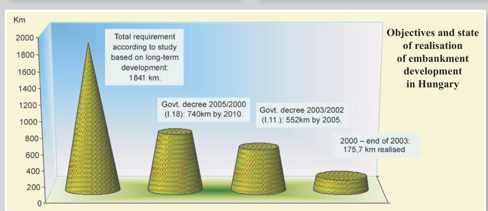
pik ta відсутність законодавчого врегулювання. При протипаводковому захисті це неодноразово призводило до ускладнень.

На фоні викладених обставин, паводкову безпеку долини р. Тиси підвищувало будівництво дамб та інших захисних капітальних споруд, виконаних на основі традиційних протипаводкових концепцій, проте будівництво дамб за останні роки сповільнилося і нові паводкові явища знову і знову ставлять під загрозу досягнутий ступінь безпеки. Причиною цього є зміна русла, екстремальні погодні умови і втручання людини в природу.

Оцінка досвіду проходження одного за одним паводків і цілеспрямовані професійні дослідження призвели до розробки програми Удосконалення плану Вашархєї (VTT), яка спочатку була затверджена постановою Уряду, а потім у 2004 році, стала законом. В листопаді 2004 року, в результаті затвердження VTT як особливо важливої, комплексної програми з протипаводкового захисту, розвитку регіонів і встановлення обов'язків з її урядової координації та виконання, до компетенції міністра без портфеля, відповідального за розвиток регіонів, виникла нова ситуація. Документи, розроблені вже після зміни ситуації, свідчать про те, що розглянуті особливо проблематичні області виконання і умови успіху урядової координації і з боку інституційного, і з боку технічних та фінансових ресурсів (відносно останнього керівники заінтересованих міністерств в лютому поточного року підписали угоду).

---

## 2. A Tisza vízgyűjtő területe és a Kárpátaljai régió komplex árvízvédelmi felkészültségével kapcsolatos ukrán ellenőrzés főbb tapasztalatai

Tekintettel arra, hogy Ukrajnában 1994 óta az árvízvédelemmel kapcsolatos kérdés megoldása a Kormány által elfogadott komplex programok alapján valósul meg, Ukrajna Számvevőszéke ellenőrzését a programok megvalósitására, az azokban meghatározott intézkedések hatékonyságára, valamint az intézkedéseknek a közös magyar-ukrán határvizi Egyezmény eredményeire kifejtett hatására alapozta.

A vizsgálatok a Tisza medencéjének kárpátaljai részében katasztrofális árvizi következményeket kiváltó legfontosabb vízgazdálkodási okokhoz sorolják a vízvédelmi töltések és part-megerősítések hiányos kiépítettségét, a vízilétesítmények, különösen a hidak csekély vízáteresztő kapacitását (különösen kritikus helyzetekben), a folyóvölgyek túlterheltségét (különböző közlekedési fơutakkal), számos meder és folyó, valamint vízfolyás melletti terület nem kielégítő állapotát. A helyzetet csak súlyosbítja a folyók menti, potenciálisan belvízveszélyes területek beépítése. Az árvizek szociális és gazdasági következményei nem lennének ennyire súlyosak, ha a telekkijelölésnél (lakás és gazdasági célú építkezésre) szigorúan betartanák a normákat és az ár- és belvízveszélyes területeken nem engednék meg a településépítési szabályok megsértését. Az 1998-as és 2001. évi árvizek 1,1 milliárd Hrivnya össze-

## 2. Main Experiences of the Ukrainian Audit Relating to the Complex Flood Control Preparedness in the Catchment Area of the Tisza River and the Sub-Carpathian Region

With regard to the fact that in Ukraine the solution of issues relating to flood protection has been implemented, since 1994, on the basis of complex programmes adopted by the Government, the Accounting Chamber of Ukraine based its audit on the implementation of the programmes, the efficiency of the measures defined therein and the effects exercised by the measures on the results of the Agreement on the common Hungarian-Ukrainian transboundary waters.

The deficient construction of flood protection dykes and bank reinforcements, the minor water throughput capacity of the hydraulic engineering facilities (particularly of the bridges), mainly in critical situations, the overloading of the river valleys (with various main transport routes), and the unsatisfactory condition of a number of beds and rivers and areas along watercourses are categorised by the studies as being among the main causes, with respect to water management, which result in disastrous floods in the Sub-Carpathian part of the Tisza River basin. The situation is further worsened by the building up of areas along the rivers, endangered potentially by inland waters. The social and economic consequences of floods would not be so grave, if the norms were strictly complied with upon the designation of plots (for housing and economic construction), and if the violation of the

## 2. Основні висновки контролю української сторони щодо комплексної протипаводкової готовності басейну р. Тиси і Закарпатського регіону

Враховуючи те, що вирішення питання протипаводкового захисту в Україні, починаючи з 1994 року, грунтується на базі прийнятих Урядом комплексних програм, Рахункова палата України за основу контролю взяла питання стану виконання і ефективності заходів, передбачених цими програмами, їх впливу на результати спільної угорсько-української Угоди з діяльності на прикордонних водах.

Серед основних водогосподарських чинників, що призводять до катастрофічних наслідків паводків у Закарпатській частині басейну р. Тиса, проведені дослідження відносять: недостатню забезпеченість водозахисними дамбами та берегоукріплювальними спорудами, низьку здатність гідроспоруд, особливо мостів, до пропуску критичних мас води, перевантаження долин річок різного типу транспортними магістралями, незадовільний стан русел і прирічкових ділянок багатьох річок та водостоків. Ситуацію погіршує практика масової забудови заплави річок у зонах можливого затоплення. Соціальні та економічні наслідки паводків були б менш катастрофічні, коли б чітко витримувалися норми відведення земельних ділянок для житлового та господарського будівництва, не допускалися порушення правил забудови населених пунктів у зонах затоплення паводками і повенями. Паводки 1998

---

gủ kárt okoztak. A kár sokkal kisebb lett volna, ha a költségvetés az árvízvédelmi programban meghatározott 207 millió Hrivnya összeget biztosította volna (ami ötször kevesebb, mint a bekövetkezett kár).

Árvízvédelmi problémák megoldásában a komplex programok elfogadása komplex megközelítést tételez fel, például: árvizhullámok levonulásának speciális vésztározók és polderek által történő szabályozása és ezzel együtt árvízvédelmi töltések megerősítése és fejlesztése, mederszabályozás és szabályozó hidrotechnikai létesítmények kiépítése, erdőtelepítés, talajerózió és földcsuszamlás elleni intézkedések.

Az árvíz kezelésének komplex megközelítését biztosítandó, és a Tisza medencéjében található települések, objektumok és földek vízkárral szembeni védelme, valamint az ár- és belvizek romboló hatásának minimalizálása érdekében Kárpátalján, Ukrajna Miniszteri Kabinetje a 1388. számú 2001. 10. 24-én kelt Rendelettel elfogadta a „Komplex árvizvédelmi programot Kárpátalja Tisza medencéjében a 2002-2006. évekre és elörejelzés 2015ig" (a továbbiakban: Komplex program), amely az Ukrajna 2002. 01. 17-én kelt 2988. számú törvénye által elfogadott Állami vízgazdálkodási fejlesztési program részét képezi. A program meghatározza a cél elérésének alapvető irányait, ezen belül: elveiben is teljesen új árvízvédelmi létesítmények létrehozása; a meglévő hidrotechnikai létesítmények rekonstrukciója az állóképesség és a müködtetési megbízhatóság növelése érdekében. Mindez a speciális árvízvédelmi vésztározókkal együtt árvízcsúcsok idején képes biztosítani a lakosság és az objektumok műszaki védelmét.
rules of settlement construction were not allowed in areas endangered by floods and inland waters. The floods in 1998 and 2001 caused damage amounting to 1.1 bn Hrivnas. The damage would have been much less, if the budget had granted the amount of 207 mn Hrivnas fixed in the flood control programme (which is five times less than the damage caused).

The adoption of the complex programmes presupposes a complex approach in the solution of flood protection programmes, e.g.: regulation of the development of flood waves with the help of special emergency basins and polders, with the simultaneous reinforcement and development of flood control dykes, regulation of the river bed and construction of regulatory hydraulic engineering facilities, afforestation, and measures against soil erosion and landslides.

To secure a complex approach to the treatment of flood, to protect the settlements, facilities and lands located in the Tisza Basin against water damage, and to minimise the destructive effect of floods and inland waters in Sub-Carpathia, the Cabinet of Ministers of Ukraine accepted, by Decree No. 1388 dated 24 October 2001, "The Complex Flood Protection Programme in the Tisza Basin of SubCarpathia for 2002-2006 and Forecast until 2015" (hereinafter: "Complex Programme"), which forms part of the State Programme for the Development of Water Management, adopted by Act No. 2988 dated 17 January 2002 of Ukraine. The programme defines the fundamental steps for achieving the goal, including: the establishment of flood control facilities based on totally new principles; and reconstruction of existing hydraulic engineering facilities to increase stability and reliability. All this, together with the

та 2001 років нанесли збитки в обсязі 1,1 млрд. гривень. Збитки були б значно меншими, якби з бюджету було забезпечено передбачені програмами із запобігання паводків обсяги фінансування - 207 млн. грн., що в п’ять разів менше суми нанесених збитків, що відшкодовані з бюджету після паводків.

Прийняття програм має на меті забезпечити комплексний підхід до вирішення паводкових проблем, який передбачає: регулювання паводкового стоку за допомогою спеціальних протипаводкових ємностей і польдерів в поєднанні з посиленням і удосконаленням систем протипаводкових дамб, регулювання русел і будівництвом регулюючих гідротехнічних споруд, проведенням лісозахисних, протиерозійних i протиселевих заходів.

3 метою забезпечення комплексного підходу до управління паводковим стоком у басейні p. Тиса та захисту населених пунктів, об'єктів і земель від шкідливої дії вод, мінімізації збитків від руйнівної дії паводків і повеней у Закарпатській області Кабінет Міністрів України постановою від 24.10.2001 № 1388 затвердив «Програму комплексного протипаводкового захисту в басейні р. Тиси у Закарпатській області на 2002-2006 роки та прогноз до 2015 року» (далі - Комплексна програма), яка є складовою частиною Загальнодержавної програми розвитку водного господарства, затвердженої Законом України від 17.01.2002 № 2988. Програмою визначені основні напрями досягнення її мети, зокрема: створення принципово нової системи протипаводкових споруд; проведення реконструкції діючих гідротехнічних споруд для підвищення

---

A komplex program jellegzetessége az, hogy megvalósításában az Állami Vízgazdálkodási Bizottság mellett az alábbi intézmények vesznek részt: Közlekedési és Távközlési Minisztérium (hidak, utak és műszaki (mélyépítési) létesítmények tervezése és építése), Környezetvédelmi Minisztérium (vízjelző, megfigyelési és előrejelzési rendszerek építése és rekonstrukciója), Agrárpolitikai Minisztérium (erózióellenes programok), Állami Erdőgazdasági Hivatal (erdőtelepítés és vízvédelmi erdősávok telepítése). A felsorolt minisztériumokat és állami hivatalokat a szükséges összegek bekalkulálásával is megbízták azon költségek keretein belül, amelyeket számukra Ukrajna adott évi költségvetésének készítése során előirányoznak. Ezen túl még a Programban meghatározott intézkedések teljesítése érdekében gondoskodni kellett kiegészítő pénzügyi eszközök, ezen belül külföldi befektetők bevonásáról is.

Ukrajna Miniszteri Kabinetje az 1388. számú Rendeletében a Komplex program teljesítésének koordinálásával az Állami Vízgazdálkodási Hivatalt bízta meg, amely Hivatal fajsúlya a 2002-2006-ra tervezett munkákban $88 \%$-ot tesz ki. Ezzel szemben az ellenőrzés megállapította, hogy a Hivatalra ruházott koordinálási funkciókat nem támogatják megfelelő kiegészítő jogkörök és a szerephez méltó jogok. Ezért a Hivatal nem képes megfelelően ellátni a koordinációt és a komplex program teljesítésének ellenőrzését.

A Komplex program megvalósítása érdekében létrejött a Tárcaközi Koordinációs Tanács. Tagjai: az érdekelt minisztériumok és végrehajtó hatalmi szervek, jelentős tudományos szervezetek kép-
special flood control emergency basins, will be able to ensure the technical protection of the population and facilities in the case of flood peak.

It is a characteristic feature of the Complex Programme that the following institutions participate therein, besides the State Water Management Commission: Ministry of Transport and Telecommunications (planning and construction of bridges, roads and engineering (civil engineering) structures), Ministry of Environmental Protection (construction and reconstruction of water indicator, observation and forecast systems), Ministry of Agricultural Policy (anti-erosion programmes), State Office of Sylviculture (afforestation and plantation of water protection forest belts). The ministries and state offices listed above were also entrusted with the calculation of the required moneys, within the framework of the expenses, which are allocated to them in the course of the preparation of Ukraine's budget for the given year. In addition, it was necessary to provide for the involvement of complementary financial assets, including foreign investments, in order to implement the measures defined in the Programme.

In its Decree No. 1388 the Cabinet of Ministers of Ukraine entrusted the State Water Management Office (having a proportion of $88 \%$ in the works planned for 2002-2006) with the coordination of the fulfilment of the Complex Programme. However, the audit found that the functions of coordination vested in the Office had not been supported by appropriate complementary powers and rights worthy of such a role. Therefore the Office is unable to provide appropriately for the coordination and for the audit of the fulfilment of the Complex Programme.
íx стійкості та експлуатаційної надійності, що, в комплексі з протипаводковими ємностями спеціального призначення, має забезпечити інженерний захист об'єктів і населення під час проходження високих паводків.

Особливістю Комплексної програми є те, що у її реалізації поряд з Державним комітетом по водному господарству беруть участь: Міністерство транспорту і зв’язку (проектування і будівництво мостів, шляхів та інженерних споруд), Міністерство охорони навколишнього природного середовища (будівництво та реконструкція гідропостів, систем спостереження і прогнозування), Міністерство аграрної політики (протнерозійні заходи), Державний комітет лісового господарства (створення лісонасаджень та водоохоронних смуг лісів). Зазначеним міністерствам та державним комітетам доручено передбачати кошти на її виконання в межах видатків, що визначаються їм на ці цілі щороку під час формування проекту Державного бюджету України на відповідний рік. Крім того, належало провести відповідну роботу щодо залучення додаткових фінансових ресурсів, у тому числі, іноземних інвесторів, для реалізації заходів Програми.

Координатором виконання Комплексної програми постановою Кабінету Міністрів України від 24.10.2001 № 1388 визначено Державний комітет по водному господарству, питома вага якого у загальних обсягах фінансування робіт на 2002-2006 рр. складає 88 відсотки. Проте у ході контрольного заходу було звернуто увагу на те, що покладені на цей Комітет функції координатора не підкріплені відповідними додатковими

---

viselői, szakemberek, a Nemzeti Tudományos Akadémia és az Ukrán Agrártudományi Akadémia tagjai. Az ellenőrzés feltárta, hogy a Tanács - a munkájának szervezetlensége miatt - a funkcióját nem képes ellátni, nem tartotta szemmel a program végrehajtásának állapotát és nem készítette elő a programban meghatározott intézkedések megvalósítása érdekében hozandó határozatokat.

A program állami költségvetésből és más forrásokból történő finanszírozási mechanizmusa nem tökéletes. A Kormány hatályos törvényt sértett azzal, hogy a Program törvényileg meghatározott finanszírozását nem biztosította. A költségvetés összeállításának időszakában a program egyes végrehajtói (Közlekedési Minisztérium, Agrárpolitikai Minisztérium, Állami Földhivatal és Állami Erdőgazdálkodási Hivatal) önként háttérbe vonultak és a Költségvetési törvényt is megsértve nem készítették el és nem terjesztették be a szokásos rendben az elhatározott intézkedések teljesítéséhez szükséges költségvetési igényeket.

A Kárpátaljai régió folyóin a műtárgy-hálózat fejlesztésére (a megfigyelő rendszer üzem-be-helyezésére) szánt és törvényileg meghatározott finanszírozás biztosításának elmaradása 2002-2004-ben nem teszi lehetővé azt, hogy az árvízveszélyes időszakokban a lakosság védelmét szolgáló rendszerek maximális hatékonysággal müködjenek. Az elégtelen finanszírozás nem teszi lehetővé anyagi vésztartalékok képzését technogén és természeti jellegű rendkívüli szituációk és azok következményeinek megelőzése és elhárítása érdekében.

Az ellenőrzés eredményei tanúsítják, hogy a Komplex program számos rendelkezése változta-

In order to implement the Complex Programme, the Inter-Ministerial Coordination Board has been set up. Its members are the representatives of the interested ministries and executive organs of power, important scientific organisations, experts and members of the National Academy of Sciences and the Academy of Agrarian Sciences of Ukraine. The audit revealed that due to the disorganised nature of its work the Board had been unable to fulfill its function, it had not monitored the status of the execution of the programme and had failed to prepare the resolutions to be adopted in order to implement the measures which had been defined in the programme.

The mechanism of funding the programme from the state budget and other sources is not perfect. The Government violated an Act in force by failing to provide for the Programme the funding defined by law. Certain entities executing the Programme (Ministry of Transport, Ministry of Agricultural Policy, State Land Office and State Office of Sylviculture) voluntarily remained in the background in the period of the compilation of the budget, and in violation of the Budget Act they did not prepare and submit in the usual course of business the budgetary demands required for the fulfilment of the measures decided on.

The failure of the funding intended for the development of the network of engineering structures (commissioning of the observation system) on the rivers of the Sub-Carpathian region and defined by law will not allow, in 2002-2004, the operation with maximum efficiency of the systems serving to protect the population in periods endangered by floods. The insufficient financing does not allow

його повноваженнями і правами. 3 цієї причини Комітет за своїм статусом не забезпечує належним чином координацію і контроль виконання комплексної програми.

Для реалізації Комплексної програми утворено Міжвідомчу координаційну раду в складі представників заінтересованих міністерств та органів виконавчої влади, а також провідних наукових організацій, фахівців, учених Національної академії наук, Української академії аграрних наук. Як показала перевірка, через низький рівень організації роботи ця рада не забезпечує своїх функцій щодо розгляду стану виконання програми та підготовки відповідних рішень стосовно забезпечення здійснення програмних заходів.

В порушення чинного законодавства Урядом не забезпечено законодавчо встановлених обсягів фінансування Програми, а механізм фінансового забезпечення Програми з державного бюджету та інших джерел фінансування є недосконалим. На стадії складання проектів бюджетів окремі виконавці програми (Мінтранс, Мінагрополітики, Держкомзем, Держлісгосп) самоусунулись від її виконання, i, в порушення Бюджетного кодексу України, не забезпечили підготовку та подання в установленому порядку бюджетних запитів щодо виконання передбачених заходів.

Незабезпечення у 2002-2004 роках законодавчо встановлених обсягів фінансування розвитку мережі споруд для ведення гідроспостережень на річках Закарпаття не дає змоги максимально ефективно задіяти систему захисту населення в період загрози паводків. Через недостатнє фі-

---

tásra és aktualizálásra szorul. Különösképpen vonatkozik ez azokra a rendelkezésekre, amelyek nem biztosítják az elveiben is új, a hidrotechnikai és vízáteresztő létesítmények, hidak, átjárók rekonstrukcióját tartalmazó árvízvédelmi rendszer létrehozását, nem tiltják lakóházak és ipari objektumok építését árvízveszélyes területeken, nem szorgalmazzák a Víz-, Föld- és Erdőtörvény, valamint egyéb jogszabályok rendelkezéseinek figyelembevételével az ökológiailag ártalmatlan vízgazdálkodási, mező- és erdőgazdálkodási tevékenység meghonosítását és megakadályozzák a hatékony komplex árvízvédelmet és a vízkárok kivédését.

A program végrehajtásában a rendszerszerủ megközelítés és a végrehajtás megbízható ellenőrzésének hiánya, valamint a finanszírozás elégtelensége azt eredményezte, hogy a Program alapvető célja - a Tisza-medence árvízlevonulásának kezelése, települések, népgazdasági objektumok és földek vízkárokkal szembeni védelme és Kárpátalja az ár- és belvizek romboló hatásával szembeni védelme tekintetében - nem biztosított. Ukrajna Számvevőszéke a vizsgálat eredményei alapján erre hívta fel hangsúlyozottan a parlament és a Kormány figyelmét.
the formation of emergency financial reserves to prevent and eliminate extraordinary situations of a technological and natural character and the consequences thereof.

The results of the audit attest that a number of the provisions of the Complex Programme are in need of being changed and updated. This applies particularly to the provisions which do not ensure the establishment of a flood protection system based on new principles, including the reconstruction of hydraulic engineering facilities and water throughput, bridges and passages, do not prohibit the construction of dwelling houses and industrial facilities in areas endangered by floods, do not urge the introduction of activities of water management, agriculture and sylviculture causing no ecological harm, taking into consideration the provisions of the Water Act, the Land Act and the Forest Act and other legal rules, and hinder the efficient complex flood protection and the prevention of water damage.

The absence of a systematic approach in the execution of the programme and the lack of a reliable audit over the execution, as well as insufficient funding, resulted in the fact that the basic goals of the Programme regarding the treatment of development of floods in the Tisza Basin, the protection of settlements, facilities of national economy and lands against water damage and the protection of SubCarpathia against the destructive impact of floods and inland waters are not secured. On the basis of the investigation, the Accounting Chamber of Ukraine emphatically drew the attention of Parliament and the Government to this fact.

нансування не забезпечено створення аварійного запасу матеріальних резервів в повному обсязі, призначених для запобігання та ліквідації надзвичайних ситуацій техногенного і природного характеру їх наслідків.

Результати контролю свідчать, що ряд положень Комплексної програми потребують змін і актуалізації, оскільки не забезпечують створення системи протипаводкового захисту, яка б передбачала реконструкцію гідротехнічних і водопропускних споруд, мостів, переходів, заборону будівництва житлових і виробничих об'єктів у зонах можливого затоплення, впровадження екологічно безпечних технологій ведення водного, сільського та лісового господарства з дотриманням вимог Водного, Земельного та Лісового кодексів, інших нормативно-правових актів. Це не дозволяє ефективно здійснювати комплексний захист від шкідливої дії вод при виникненні паводкових ситуацій.

Відсутність системного підходу в організації виконання заходів Програми та неналежний контроль за її виконанням, а також необхідного фінансування, призвели до того, що основна мета Програми по комплексному підходу до управління паводковими стоками у басейні р. Тиси та захисту населених пунктів, народногосподарських об'єктів і земель від шкідливої дії вод, мінімізації збитків від руйнівної дії паводків і повеней у Закарпатській області, не забезпечується. На це, за результатами контролю, Рахунковою палатою України було акцентовано увагу Верховної Ради і Уряду України.

---

## 3. A határvízi egyezményben foglaltak teljesítésére irányuló közös ellenőrzés megállapításai

3.1. A határvízi együttmüködés szintjei, szabályozottsága

Az Egyezményben foglaltak végrehajtási feltételeit kialakították, megfelelő dokumentáltsággal tartottak éves gyakorisággal kormány-meghatalmazotti üléseket (csak 2004. évben maradt el a magyar kormány-meghatalmazott és helyettese személyében történt változás, illetve a kinevezésük elhúzódása miatt), ugyanakkor 2001-ben és 2002-ben soron kívüli tanácskozásokra is sor került. Árvízvédelmi kérdésekben évente 2-3 alkalommal szerveztek szakértői szintü találkozókat, együttműködési szabályzatokban rögzítették az egyezményhez kapcsolódó operatív feladatok tartalmát, végrehajtásának módját.

Az együttmüködési szabályzatokban foglaltak teljesítése jól nyomon követhető, általánosságban megállapítható volt, hogy megfelelő alapot adtak a folyamatos, napi operatív adat- és információcserére, úgy az árvíz-védekezési, mint az azon kívüli időkben. Ugyanakkor szükségesnek tartotta az ellenőrzés a szabályzatok rendszeres aktualizálását, mind a közös tevékenység során felmerülő különböző szituációk vonatkozásában, mind az Európai Unió természetvédelmi törvényhozási követelményeinek tekintetében.

A vízkárelhárítási együttműködési szabályzat például jól vizsgázott a 2000-2004 között

## 3. Findings of the Parallel Audit Aimed at the Implementation of the Contents of the Transboundary Water Agreement

3.1. Levels and Level of Regulation of Transboundary Water Cooperation

The conditions of execution of the contents of the Agreement have been created, meetings of the Government delegates were held annually and duly documented (this was only omitted in the year 2004 due to a change in the person of the Hungarian government delegate and his deputy and the protraction of their appointment), and at the same time extraordinary meetings were also held in 2001 and 2002. In issues of flood protection meetings at expert level were organised on 2 to 3 occasions annually, and the contents and the method of execution of the operative tasks connected to the Agreement were laid down in cooperation regulations.

The performance of the contents of the cooperation regulations can be well monitored, and it could be stated in general that they provided an appropriate basis for the ongoing daily exchange of operative data and information both in the periods of flood protection and without flood protection. At the same time the audit considered it necessary to update the regulations on a regular basis, both in respect of the various situations emerging in the course of joint activity and in respect of the EU requirements of legislation on nature preservation.

For example the regulation on cooperation in the prevention of water damage successfully passed

## 3. Основні положення перевірки виконання Угоди на прикордонних водах

3.1. Налагодженість та рівень співпраиі на прикордонних водах

Умови виконання положень Угоди розроблені у відповідних регламентах (порядках) по співпраці. Сторонами щорічно проводилися ретельно документовані засідання Уповноважених Урядів (за виключенням 2004 року, коли через зміну особи Угорського Уповноваженого, його заступника, і пов’язану з цим затримку призначення нових осіб, засідання не відбулося). Водночас у 2001 та 2002 роках проводилися і позачергові наради. 3 питань протипаводкового захисту 2-3 рази на рік відбувалися зустрічі на рівні експертів, які діяли відповідно до регламентів по співпраці, що передбачають обсяги та зміст оперативних завдань і форми їх виконання.

При цьому у протоколах зустрічей простежується якісне виконання положень, передбачених в регламентах по співпраці. В цілому, можна зазначити, що регламенти забезпечили належну основу для безперервного, щоденного оперативного обміну даними та інформацією як під час паводків, так і за «спокійних» часів. У той же час, контрольні органи вказували на необхідність періодичного удосконалення регламентів як в плані різних ситуацій, що виникають у процесі спільної діяльності, так і щодо законо-

---

levonult árhullámok idején, de érzékelhető volt a gátszakadások okozta helyzetek kezelésére vonatkozó közös rendelkezések hiánya is. A 2001. évi beregi árvízi elöntések idején végzett lokalizációs, illetve mentési munkák összehangolását segíthették volna közös - katasztrófa-elhárítást megalapozó - árvíz-lokalizációs tervek, ilyenek azonban akkor nem álltak rendelkezésre.
A hidrometeorológiai és vízgazdálkodási együttmüködési szabályzatban foglaltak alapján a felek illetékes szervei folyamatos hidrológiai megfigyeléseket folytatnak a határvizeken, megállapodás szerint közös vízhozam és egyéb méréseket végeznek, meghatározzák a határvizek vízhozamait, viszont célszerú kiegészíteni a szabályzatot a megvalósított monitoring rendszer üzemelési rendjével.
A kormánymeghatalmazottak és helyetteseik feladatait, jog- és hatáskörét az Egyezmény rendelkezései szabályozzák. Magyarországon az Egyezményt kihirdető kormányrendelet - a jogszabályok végrehajtásának müködési mechanizmusára tekintettel - elég jogalap arra, hogy a kormánymeghatalmazott - ha szükséges - más tárcák felé eljárjon. Az ukrán oldali ellenőrzés megítélése szerint ezzel együtt nincsenek pontosan meghatározva a kormány-meghatalmazottak és helyetteseik jogai és kötelezettségei más hatalmi szervekkel való közremüködés esetén, nincs rendelkezés a határozathozatali jogkörükről, az Egyezmény teljesítése során felmerülő fontos nemzetgazdasági kérdések egyeztetésével kapcsolatos eljárásokról, különösképpen a kiélezett helyzetekben.
the examination at the time of the flood waves subsiding between 2000 and 2004, but the lack of joint provisions relating to the treatment of situations caused by burst dykes was also perceptible. Joint plans for flood localisation as the basis for disaster prevention could have assisted the harmonisation of the tasks of localisation and rescue carried out at the time of the 2001 flood inundations in Bereg; however, no such plans were then available.
Based on the contents of the regulation of hydrometeorological and water management cooperation, the competent organs carry out continuous hydrological observations on the transboundary waters, they make joint water output and other measurements according to the agreement, and they define the water outputs of transboundary waters; however, it would be expedient to complement the regulation by the rules of operation of the monitoring system implemented.
The scope of rights and powers and the tasks of the government delegates and their deputies are regulated by the provisions of the Agreement. In Hungary, the government decree promulgating the Agreement provides - with regard to the operational mechanism of the execution of statutory instruments - a sufficient legal basis for the government delegate to act before other ministries, if required. In the judgment of the audit on the Ukrainian side the rights and obligations of the government delegates and their deputies are, however, not defined exactly; in the case of cooperation with other organs of power there is no provision for their decisionmaking authority and for the proceedings related to the reconciliation of important issues of national economy arising in the course of the performance of the Agreement, particularly in acute situations.

давчих вимог Європейського Союзу з охорони природи.

Регламент співробітництва по захисту від шкідливої дії вод, наприклад, засвідчив свою якість під час паводків в період 2000-2004 років, проте відчувався брак положень про спільні дії, які регулюють ситуацію, що виникає у разі руйнувань гребель. В 2001 році, під час повені в Берегові, спільні плани по локалізації паводків, що є основою ліквідації катастроф, могли б допомогти в узгодженні робіт по їх локалізації або в рятувальних роботах.

Відповідно до положень регламенту співробітництва по гідрометеорології і водних ресурсах компетентні органи сторін проводили безперервні гідрологічні спостереження на прикордонних водах, спільні вимірювання водоносності та інші вимірювання згідно з Угодою, визначали водоносність прикордонних вод, проте для чіткого забезпечення робіт, доцільно запровадити регламент експлуатації системи моніторингу, впровадженої в останні роки.

Правомочність, компетенція та завдання Уповноважених урядів та їх заступників регулюються положеннями Угоди. Постанова Уряду Угорської Республіки від 06.08.99 № 117 є достатньою юридичною підставою для Уповноваженого Уряду, у разі потреби здійснювати заходи щодо взаємодії з іншими міністерствами. Перевірка 3 української сторони показала, що постанова Кабінету Міністрів України від 12.11.93 № 920 із змінами і доповненнями, внесеними постановами від 18.07 .98 № 1118 та від 09.08 .2001 № 989 , не визначає повною мірою права і зобов’язання Уповноваженого Уряду і його заступників у їх

---

Azon túl, hogy a magyar-ukrán határvizi Egyezmény 11. Cikke foglalkozik az államhatár átlépésével, az Egyezményből adódó feladatok végrehajtásában érintett személyek szolgálati célból történő államhatár-átlépésének jogszabályi feltételeit az Ukrajna Miniszteri kabinetje és a Magyar Köztársaság kormánya közötti - egyrészt a 2002. február 6-án aláírt szolgálati célú határátkeléshez szükséges dokumentumok egységesítéséről szóló, másrészt a 2003. október 9-én aláírt, az állampolgárok utazását szabályozó - egyezményekkel megteremtették. Különböző okokra viszszavezethetően azonban egyik fél határátlépési gyakorlata sem vált zökkenőmentessé az utóbbi években.

A magyar vízügyi szervek munkatársai rendelkeztek az ukrán területen történő mozgáshoz, tartózkodáshoz szükséges kétnyelvű szolgálati célú Határátlépési Igazolvánnyal, ezt azonban - a jelzéseik szerint - az ukrán határrendészeti szervek nem a szabályozásoknak megfelelően vették figyelembe (a határátkeléshez az útleveleiket vették igénybe). Az ukrán oldalon érintettek Határátlépési Igazolvánnyal való ellátásának hiánya megnehezítette a felek operatív együttműködését.

Magyarország EU-hoz való csatlakozása a határátlépési okmányok tekintetében nem hozott változást, viszont ezt követően a határátkelésnél a soron kívüliség korábbi magyar oldali engedélyezési formája megszűnt. Míg a csatlakozás előtt a kivételes méltánylást érdemlő körülmények esetén, írásbeli kérelemre a Határőrség egyszeri vagy - legfeljebb hat hónap időtartamra - többszöri soron kívüli ellenőrzéssel történő

In addition to the fact that Article 11 of the HungarianUkrainian Transboundary Water Agreement deals with the crossing of the state border, the statutory conditions of the crossing of the state border by the persons involved in the execution of tasks resulting from the Agreement, for service purposes, have been created, on the one hand, by the Agreement on the Unification of Documents Required for Border Crossing for Service Purposes, signed on 6 February 2002, and, on the other hand, by the Agreement Regulating the Travel of Citizens, signed on 9 October 2003 by Ukraine's Cabinet of Ministers and the Government of the Republic of Hungary. However, the water crossing practice of neither party has become smooth in recent years, due to various reasons.

The collaborators of the Hungarian water organs disposed over the bilingual Border Crossing Certificate for service purposes which was required for moving and staying in Ukrainian territory; however, as indicated by them, such a certificate was not accepted according to the regulations by the Ukrainian organs of border policing (they used their passports for border crossing). The lack of border crossing certificates for persons involved on the Ukrainian side made difficult the operative cooperation of the parties.

Hungary's EU accession resulted in no change in respect of the border crossing documents; however, after this, the form of authorising border crossing out of turn, which prevailed earlier on the Hungarian side, ceased to exist. While prior to accession the Border Guards could, in case of circumstances deserving exceptional judgment and upon written request, license border crossing for one occasion, or for several occasions for the duration of no more

взаємодії з іншими органами виконавчої влади. Зокрема, відсутні положення про їх повноваження ухвалювати рішення, пов’язані з діяльністю органів виконавчої влади та з узгодженням виникаючих в процесі виконання Угоди і важливих 3 погляду національної економіки питань, особливо в критичних ситуаціях.

Крім того, статтею 11 угорсько-української Угоди на прикордонних водах розглядається питання перетину кордону, правові умови перетину державного кордону в службових цілях особами, що приймають участь у виконанні завдань по Угоді, забезпечені в рамках відповідних угод між урядами України і Угорщини. Мається на увазі, що з одного боку угода підписана 6 лютого 2002 року про встановлення єдиних документів, необхідних для перетину кордону в службових цілях, а з другого боку, діє угода від 9 жовтня 2003 року, яка регулює поїздки громадян. Проте існують різні причини, що заважають в останні роки перетину кордону 3 будь-якої сторони.

У співробітників угорських водогосподарських органів були двомовні службові прикордонні посвідчення, що мали забезпечити безперешкодний рух та знаходження на території України, проте надходили сигнали, що українські прикордонні органи не завжди з ними рахувалися (як наслідок, при перетині кордону стали користуватись своїми паспортами.) 3 українського боку взагалі відсутні службові прикордонні посвідчення, що не дозволяє сторонам оперативно співпрацювати.

Приєднання Угорщини до ЄС не призвело до змін щодо документів, необхідних для перетину

---

határátlépést engedélyezhetett, a 2004. május 1jei hatállyal módosított jogszabály előírása szerint a határátkelőhelyen a személyek, járművek és szállítmányok határforgalmi ellenőrzése és átléptetése alapvetően a határátkelőhelyre való érkezés sorrendjében történik. Ugyanakkor a magyar oldali szabályozás nem a korábbi formában, de mégis biztosít meghatározott esetekben soron kívüli átlépési lehetőséget. Amennyiben nemzetközi szerződés, vagy jogszabály alapján soron kívüli ellenőrzéssel történő határátlépésre jogosult személy vagy jármủ vezetője határátlépési szándékát a határőrnek jelzi, vagy azt a határőr észleli, a határforgalom-ellenőrzést soron kívül végre kell hajtani.

A soron kívüliség korábbi engedélyezésen alapuló rendjében a határvizi Egyezmény államhatár átlépésére vonatkozó rendelkezései között nem volt jelentősége az ilyen esetek meghatározásának, elegendő volt annak indokoltságát az engedélyezési kérelemhez bemutatni. Az új határátlépési rendben viszont a nemzetközi szerződés, vagy jogszabály alapján biztosítandó soron kívüliség indokoltságát célszerủ egyértelművé tenni.

### 3.2. Az árvizvédelmi rendszerek kiépitettsége

A közel másfél évszázad alatt kiépült Tisza*völgyi árvizvédelmi töltésrendszer, tartozékaival együtt, az árvizek kivédésének továbbra is egyik legfontosabb eszköze. A töltések erősítését, magasítását szinte folyamatosan végezték. A töltéseket magyar területen - az országos árvízvédelmi stra-
than six months, with control out of turn, according to the prescription of the legal rule amended with effect from 1 May 2004, the control of border traffic of persons, vehicles and shipments is effected basically according to the sequence of arrival at the border station. At the same time, the regulation on the Hungarian side provides crossing opportunities out of turn in certain cases, although not in the earlier form. If a person or the driver of a vehicle entitled to border crossing with control out of turn on the basis of an international treaty or a statutory provision signals his or her border crossing intention to the border guard, or this is perceived by the border guard, the control of border traffic has to be executed out of turn.

In the rules of crossing out of turn based on the earlier authorisation, the definition of such cases was not relevant among the provisions relating to the crossing of the state border of the Transboundary Water Agreement; it was sufficient to demonstrate its justification together with the request for licensing. However, in the new border crossing order it would be expedient to make clear the justification for crossing out of turn, to be secured on the basis of an international treaty or a legal rule.

### 3.2. Construction of the Flood Protection System

The flood control dyke system in the Tisza Valley, constructed over nearly one and a half centuries, continues to be, together with its accessories, one of the most important tools of protection against floods. The reinforcement and heightening of dykes was carried out almost on a continuous basis. In the Hungarian territory the dykes are to be developed,
кордону, Проте позачерговість, яка дозволялась на угорській стороні при перетині кордонів, була скасована. Якщо до зазначеного приєднання прикордонні органи у випадку особливо поважних причин, за письмовою заявою мали можливість дати дозвіл на разовий або багаторазовий, терміном не більше 6 місяців, перетин кордону за умови перевірки паспорта без черги, то після 1 травня 2004 року контроль і пропуск громадян, транспортних засобів і вантажів проходить в порядку їх прибуття до прикордонного пункту. У той же час, угорська сторона, хоч і не в тій формі, що раніше, але в певних випадках забезпечує можливість перетину кордону без черги. У випадку, якщо водій машини чи особа, які мають право перетнути кордон без черги (на основі міжнародної угоди або правової норми), повідомлять прикордоннику про свій намір перетнути кордон, перевірку потрібно провести без черги.

У визначенні таких випадків за раніше існуючої системи дозволу позачерговості в положеннях Угоди про прикордонні води, що регулюють перетин державного кордону, не було потреби. Достатньо було подати документ, що підтверджує обгрунтованість перетину кордону. Проте при новій системі доцільно переглянути положення, що аргументує необхідність забезпечення можливості перетину кордону по міжнародній угоді або правовій нормі без черги.

### 3.2. Наявність протипаводкових систем

Побудована за майже півтора століття система гребель Тисайської долини все ще є найваж-

---

tégia alapján - a mindenkori mértékadó árvízszintek figyelembevételével kell fejleszteni. A magyarországi folyók mértékadó árvízszintjeit több alkalommal felülvizsgálták (legutóbb 1990-ben, az akkor meghatározott értékeket a későbbi szabályozások csak megerősítették). A magyar vízügyi igazgatás a módosításokat még nem tartotta kellően indokoltnak, ugyanakkor azt a biztonság új szemléletű - a kockázatok megfelelő értékelésén alapuló - megfogalmazása sem váltotta még fel.

Magyarországon a Felső-Tisza-vidéki Környezetvédelmi és Vízügyi Igazgatóság működési területén összesen 544,1 km védvonal található, melyből $541,0 \mathrm{~km}$ földtöltés 111 m árvizi védelmi fal és $3,0 \mathrm{~km}$ magaspart. A magyar-ukrán közös érdekeltségű szakaszokat, illetve azok jellemzőit a vízkárelhárítási szabályzat mellékleteiben tételesen rögzítették, a magyar területen lévő szakaszok hossza $71,2 \mathrm{~km}$, az ukrán területen lévő szakaszok hossza $34,7 \mathrm{~km}$.

A felső-tiszai töltésrendszer és benne a ma-gyar-ukrán határvizeken lévő töltések - magyar részről történt - 1996. évi átfogó felülvizsgálatára alapozott árvízvédelmi fejlesztési koncepciónak megfelelően 1997. évben újabb árvízvédelmi fejlesztési programot indítottak. A program indítását követő évben csaknem katasztrófával járó árhullám vonult le a Tiszán, számos felső-tiszai magyar és ukrán vízmércén megdöntve az addigi vízállás maximumokat. Ennek tapasztalatait is hasznosítva vizsgálták felül, illetve a szükséges mértékben módosították az árvízvédelmi fejlesztési koncepciót, amire az 1998. utáni magyar oldali fejlesztéseket és folyamatban levő beruházásokat is alapozták.
based on the national strategy of flood protection, taking into account the flood levels as prevailing from time to time. The prevailing flood levels of Hungarian rivers have been revised several times (for the last time in 1990; the values defined then were only confirmed by the subsequent regulations). The Hungarian water management did not consider the modifications to be sufficiently justified, but at the same time this has not yet been replaced by a safety concept with a new approach, based on the appropriate evaluation of risks.

In Hungary, in the area of operation of the Directorate of Environmental Protection and Water of the Upper Tisza Region, a total of 544.1 km defensive line is located, of which 541.0 km are earth dykes, 111 metres flood protection walls and 3.0 km high banks. The sections of HungarianUkrainian joint interest, as well as the characteristics thereof, have been laid down in the Schedules to the Regulation on the Prevention of Water Damage in an itemised manner., The length of the sections located in Hungarian territory is 71.2 km , and the length of the sections in Ukrainian territory is 34.7 km .

In the year 1997 a new programme for flood control development was started according to the concept of flood protection development, which was based on the comprehensive review, in 1996, on the Hungarian side, of the dyke system of the Upper Tisza and within that of the dykes along the Hungarian-Ukrainian transboundary waters. In the year following the start of the programme a flood wave developed on the Tisza River, almost causing a disaster, which exceeded the maximum water levels measured so far on a number of water meters in the Hungarian and Ukrainian sections of the Upper Tisza. The concept
ливішим засобом протипаводкового захисту. Зміцнення та підвищення гребель здійснюється перманентно. На угорських територіях греблі, відповідно до республіканської стратегії захисту від паводків, необхідно розвивати з урахуванням актуального визначального рівня паводку. Актуальний визначальний рівень паводків на угорських річках неодноразово переглядався (востаннє, в 1990 році). Встановлені тоді значення пізніше були підтверджені в регламентах(порядках). Угорська водогосподарська адміністрація на сьогодні не визначила обгрунтувань для внесення поправок. Водночас не розроблялись зміни рівня паводків, обгрунтовані відповідною оцінкою ризиків та новими, сучасними підходами до питання протипаводкової безпеки.

На території Угорщини, що знаходиться у віданні Дирекції по охороні навколишнього середовища і водному господарству регіону Верхньої Тиси, усього налічується 544,1 км захисних споруд, з них 541,0 км земляних гребель, 111 м протипаводкових захисних стін і 3,0 км крутих берегів. Суміжні угорсько-українські ділянки і їх характеристики детально визначені в додатках до регламенту по захисту від шкідливої дії вод та усуненню збитків від паводків. Протяжність цих ділянок на угорській території складає 71,2 км, на українській території - 34,7 кілометра.

У 1997 році почала здійснюватися нова програма розвитку протипаводкових систем відповідно до концепції розвитку, заснованої на проведеній угорською стороною у 1996 році інспекції системи гребель на Верхній Тисі, у тому числі, гре-

---

Az 1997-től indított fejlesztési munkák eredményeként javult az árvízvédelmi rendszer állapota. 2004-ig összesen 90 km töltés megerősitésére került sor, de még így is további 44 km sorolható a sürgősen kiépítendők közé. (Ennél gyengébb prioritással vár megerősítésre 130 km töltés.) A 2004. évi adatok szerint a Felső-Tiszán - magyar oldalon - az árvízvédelmi töltések mintegy harmada nem felelt meg a biztonsági előírásoknak. A magyar-ukrán közös érdekeltségű szakaszokon 2000-2004 között megvalósított töltésfejlesztések hossza $18,5 \mathrm{~km}$.

A Tisza leghevesebb vízjárású hazai szakasza jobb és bal parti töltéseinek fejlesztése Tiszabecs és Olcsvaapáti, illetve Tarpa és Jánd között befejeződött. 2004-ben véget ért a Szamos védvonalainak 30 éve elkezdődött kiépítése. A Túr folyó és a Palád-patak azon töltésszakaszai, amelyeken 2001-ben az árvíz átbukott, illetve töltésszakadás következett be, még abban az évben kiépítésre, a Túr alsó szakaszán magasításra kerültek.
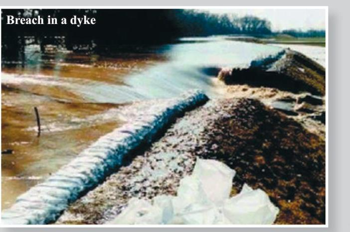
of flood protection development was revised and amended accordingly, making use of the experience of this event, and the developments made after 1998 on the Hungarian side and the current projects were also based on such development concept.

As a result of the development works started from 1997 on, the condition of the flood protection system has improved. By 2004 a total of 90 km of dykes had been reinforced, nevertheless, a further 44 km can be highlighted as being among the dykes to be urgently constructed. (A dyke of 130 km is in need of reinforcement with a somewhat lower priority.) According to the 2004 data, around one third of the flood protection dykes located on the Hungarian side of the Upper Tisza did not meet the safety requirements. The length of dyke developments implemented between 2000 and 2004 in the sections of joint Hungarian-Ukrainian interest is 18.5 km .

The development of the dykes on the right and left banks of the Tisza River's domestic section with the strongest watercourse has been finished between Tiszabecs and Olcsvaapáti and between Tarpa and Jánd. The construction, commenced 30 years ago, of the Szamos River's defensive lines was completed in 2004. The dyke sections of the Túr River and the Palád stream, which were exceeded by the flood in 2001 or at which a dyke burst occurred, were constructed in the same year, while they were heightened along the lower section of the Túr River.

To improve the accessibility of the dykes a solid pavement was prepared with a total length of 50 km on the crown of the constructed dyke sections by 2004. Upon protection the protection lines can be easily approached on the paved crown, thus the necessary protective interventions can be made

бель на українсько-угорських прикордонних водах. Надалі, після початку виконання програми по р. Тисі пройшла майже катастрофічна паводкова хвиля, що побила всі рекорди рівня води на багатьох Верхнє-Тисайських водомірних палях. Виходячи з цього досвіду, була переглянута та в необхідній мірі модифікована концепція розвитку системи протипаводкових споруд, на базі якої після 1998 року почали планувати і здійснювати капіталовкладення на угорській стороні.

В результаті робіт, розпочатих після 1997 року, стан протипаводкової системи поліпшився. До 2004 року завершилося зміцнення 90 км гребель, проте ще 44 км можна віднести до таких, які вимагають невідкладних робіт. На сьогодні 130 км гребель потребують ремонту, проте не з таким ступенем пріоритетності. За даними 2004 року, на Верхній Тисі, на угорській території, майже третина протипаводкових гребель не відповідають приписам по безпеці. На сумісних угорськоукраїнських ділянках в період 2000-2004 років роботи проводилися усього на протяжності 18,5 км гребель.

На угорських ділянках р. Тиси з найшвидшою течією будівництво гребель на лівому і правом березі, в районі селищ Тисабеч та Олчваапаті, Тарпа та Янд завершилося. В 2004 року закінчилися роботи по будівництву захисних споруд на Самоші, розпочаті 30 років тому. Ті ділянки гребель, через які паводкова вода прорвалася в 2001 році на Турі і Палладі, і мало місце руйнування греблі, були в тому ж році відновлені, а в пониззі Туру - підвищені.

Гребені побудованих гребель загальною протяжністю 50 км, в інтересах більш зручного

---

A kiépített töltésszakaszok koronáján - a töltések jobb megközelíthetősége érdekében - 2004-ig öszszesen 50 km hosszban készült szilárd burkolat. A burkolt koronán védekezéskor is jól megközelíthetők a védvonalak, így a szükséges védelmi beavatkozások időben és olcsóbban megtehetők. Szilárd töltéskorona burkolat építését végezték a Tisza jobb parti töltésén Tarpa és Gulács térségében. Ezzel az országhatár és Jánd közötti töltéskorona árvízvédekezéskor is járható lesz gépjárművel.

A töltésekben lévő 144 db műtárgy állapota jórészt kielégítő, de néhányuknak a teljes felújítása egyre sürgetőbb, esetleges halogatása jelentős kockázat növekedéssel járhat. Az elmúlt évben fejeződött be a nagyecsedi és a tiszakóródi zsilip rekonstrukciója.

A Kárpátaljai régióban működő árvízvédelmi rendszer jelenleg az alábbiakat tartalmazza: árvízvédelmi töltések, part-megerősítések, szabályozott folyószakaszok, fö- és mellékcsatornák építményekkel, talajjavító rendszerek szivattyúállomásai, víztározók és felrakások (sáncok). A töltések összes hossza 824 km , ezen belül a fö folyóhálózat mentén 690 km , mellékfolyókon és lecsapolt földek melletti csatornákon 134 km . Parterősítő és medermódosító létesítmények 275 km hosszban, támfalak formájában terméskőbeton építményekből, kővel kirakva, kővel töltött matracokkal (sodronykosarakkal) stb. szolgálják a védekezést.

Az 1998-as és 2002-es árvizek következtében a partok megerősítése sok helyen megsérült, ezért helyreállítást és megerősítést igényelnek. A fö folyóhálózat szabályozott szakaszai összesen 82 kilométert tesznek ki. A meder alatti főcsatornák összes hossza 1344 kilométer és ezeken 1107 da-
in due time and with less expense. A solid dyke crown pavement was built on the left bank dyke of the Tisza River in the region of Tarpa and Gulács. Consequently, the dyke crown between the state border and Jánd will be able to be travelled with motor vehicles even during flood protection.

The condition of the 144 engineering structures along the dykes is for the most part satisfactory, but the total refurbishment of some of them is becoming more and more urgent, and any potential delay may involve a considerable increase of risk. The reconstruction of the lock at Nagyecsed and Tiszakóród was completed last year.

The flood protection system operating in the SubCarpathian region currently comprises the following: flood protection dykes, reinforced banks, regulated river sections, main and side channels with structures, pump stations for soil improvement systems, water basins and trenches. The total length of dykes is 824 km , of which 690 km are located along the main river network, while 134 km are to be found along the side rivers and the channels along the drained lands. Facilities reinforcing the bank and modifying the bed serve as protection along a length of 275 km , in the form of supporting walls, with structures from quarry-stone concrete, encrusted with stones, mattresses (wire baskets) filled with stones, etc.

In consequence of the 1998 and 2002 floods, the reinforced banks were damaged at many points, therefore they require restoration and reinforcement. The regulated sections of the main river network amount to a total of 82 kilometres. The total length of the main channels under the bed is 1344 kilometres, and 1107 pieces of hydraulic structures are to be found thereon. 49 pump stations

під’їзду, до 2004 року вкриті твердим покриттям. При рятувальних роботах по жорстких гребенях до захисних споруд зручно під’їхати, i, таким чином, необхідні захисні роботи можна виконати вчасно і дешевше. На правобережній греблі p. Тиси, в районі Тарпи і Гулача, гребінь греблі покритий жорстким покриттям, завдяки чому по гребенно греблі між державною кордоном і Яндом можна їздити на автомобілях.

Стан 144 одиниць гідроспоруд, в основному, задовільний. Проте деякі з них потребують капітального ремонту, і відстрочка може призвести до істотного підвищення ризиків. Минулого року завершилася реконструкція шлюзів у селищах Надьечед і Тісакород.

Протипаводкова система Закарпатського регіону України нині складається з протипаводкових дамб, берегових укріплень, врегульованих ділянок річок, магістральних і підвідних рукавних каналів із спорудами, насосних станцій меліоративних систем, водосховищ і валів. Загальна протяжність гребель складає 824 км, у тому числі уздовж головної річної мережі - 690 км, на рукавах і каналах на осушених територіях - 134 км, споруди по зміцненню берегів і регулюванню русел завдовжки 275 км у вигляді опорних стін з бутобетону, бутової кладки, габіонів тощо.

В результаті паводків у 1998 і 2001 роках кріплення берегів у багатьох місцях постраждали і потребують відновлення та зміцнення. Врегульовані ділянки головної річкової мережі складають 82 кілометри. Загальна протяжність магістральних каналів під руслами складає 1344 км, на яких знаходиться 1107 одиниць гід-

---

rab vízügyi építmény található. A vízelvezetési rendszer fölösleges vizeinek a töltés melletti területeken kívüli elvezetéséhez 49 szivattyúállomás épült. A régió területén 9 db , összesen 1 millió köbméter befogadóképességủ víztározó és 49 tároló medence található. Az összes víztározó űrtartalma 60,5 millió köbméter víz befogadását teszi lehetővé.

A korábbi időszakokban épült árvízvédelmi létesítmények üzemelési jellemzők tekintetében az építés idején hatályos műszaki követelményeket követték és számos paraméter tekintetében nem felelnek meg a mai igényeknek. Ráadásul nagy részük rekonstrukcióra vagy generál felújításra szorul. A létesítmények zöme az 1998. és 2001. évi árvizek alkalmával nem sérült meg és védelmi funkcióját ellátta. A 646 km árvízvédelmi töltésből $41,3 \mathrm{~km}$ sérült vagy semmisült meg ( $6,4 \%$ ), az 1337 km csatornából 17 km sérült ( $1,3 \%$ ), 1033 db vízügyi létesítményből 5 sérült meg ( $0,5 \%$ ).

A közös ukrán-magyar határszakaszokon található összes létesítményből az ukrán területen van 5 töltés, ezen belül 3 a Tiszán 43,2 km, a Borsán 3 km , a Túron 5 km ; és 7 db csatorna összesen 56,7 km hosszban. Jelenleg folynak a Beregszászi belvízelvezető rendszer rekonstrukciójával kapcsolatos munkálatok. A Csaronda-Latorca csatorna torkolatánál felépített 68 köbméter/másodperc áteresztó képességủ zsilip, és az 52,9 köbméter/másodperc teljesítményű 16 szivattyúállomás biztosította a katasztrofális árhullámok leengedését különösen jelentős sérülések nélkül.

A különböző technológiák szerint épült, eltérő árhullámokra tervezett árvízvédelmi töltések nagy része a ma hatályos normatíváknak nem
have been constructed for draining the superfluous waters of the water drainage system out of the areas along the dyke. In the area of the region 9 pieces of water basins with a total capacity of 1 million cubic metres and 49 storage basins are to be found. The capacity of all water basins allows the reception of 60.5 million cubic metres of water.

In respect of the operational characteristics, the flood protection facilities constructed in earlier times met the technical requirements in force at the time of construction, and with regard to a number of parameters they do not meet today's demands. In addition, many of them are in need of reconstruction or overhaul. Most of the facilities were not damaged on the occasion of the 1998 and 2001 floods and they fulfilled their protective function. Of 646 km of flood protection dykes, 41.3 km were damaged or destroyed ( $6.4 \%$ ); of the 1337 km of channels 17 km were damaged ( $1.3 \%$ ), and of 1033 hydraulic facilities, 5 were damaged ( $0.5 \%$ ).

From among all the facilities located along the common Ukrainian-Hungarian border sections, 5 dykes are to be found in Ukrainian territory, of which 3 are on the Tisza River, with a length of 43.2 km , one on the Borsa River with a length of 3 km and one on the Túr River with a length of 5 km ; and 7 channels are to be found here with a total length of 56.7 km . The works relating to the reconstruction of the Beregszász system for inland water drainage are currently in progress. A lock with a throughput capacity of 68 cubic metres/second constructed at the mouth of the Csaronda-Latorca channel, as well as 16 pump stations with a capacity of 52.9 cubic metres/second, ensured the passage of disastrous flood waves without particularly heavy damage.

ротехнічних споруд. Для відведення надмірних вод системою водовідведення із віддалених від гребель територій побудовано 49 насосних станцій. На території регіону знаходяться 9 водосховищ загальною місткістю 1 млрд куб. і 49 басейнів-сховищ. Загальна місткість всіх ємкостей сховищ дозволяє акумулювати 60,5 млн куб. води.

Протипаводкові споруди, побудовані в більш ранні періоди, за характеристиками експлуатації відповідають технічним вимогам часів будівництва і по багатьох параметрах не відповідають сучасним. До того ж, значна їх частина потребує реконструкції або капітального ремонту. Переважаюча частина цих споруд під час паводків 1998 і 2001 років не постраждала і свої функції виконала. 3646 км протипаводкових гребель постраждало або повністю зруйновано 41,3 км ( 6,4 відс.), з 1337 км каналів постраждало 17 км ( 1,3 відс.), з 1033 одиниць гідротехнічних об'єктів постраждали 5 одиниць ( 0,5 відс.).

Iз споруд, що знаходяться на суміжних ділянках кордону на українській території це - 5 гребель, у тому числі 3 на Тисі - 43,2 км, на Боржаві -3 км, на Турі -5 км, та 7 каналів загальною довжиною 56,7 кілометра. Зараз здійснюються роботи з реконструкції Берегівської меліораційної системи. Шлюз, побудований в гирлі Чаронди і Латориці, пропускною спроможністю 68 куб. м/сек., і насосна станція потужністю 52,9 куб. м/сек., забезпечили спуск паводкових вод без яких-небудь значних пошкоджень.

Значна частина протипаводкових гребель, побудованих за різними технологіями та розрахованих на різні паводкові хвилі, сьогоднішнім

---

felel meg, ezért a létező töltésrendszer nem alkot egy megbízható árvízvédelmi komplexumot. Súlyosan hiányosnak kell tekinteni a védelmi létesítményeket a megye hegyvidékein - Rahó, Ökörmező, Técső. Rekonstrukcióra szorul 93 km töltés és a Beregszászi lecsapoló rendszer főcsatornáinak 230 km -es szakasza, valamint az Új és az Öreg Batár csatornák.

2000 és 2004 között a Tisza közös magyarukrán szakaszán 116 km védőgát rekonstrukciója valósult meg, folynak a Beregszászi lecsapoló rendszer HC-21. szivattyúállomásának felújításával kapcsolatos munkák. A belvízrendszerek megfelelő állapotának fenntartása és korszerűsítése érdekében a vízügyi létesítmények közös vizsgálata alkalmával (2000. december 22-23.) az ukrán-magyar államhatár mentén különös figyelmet fordítottak a stratégiailag olyan fontos objektumok ellenőrzésére, mint a szivattyúállomások (Krasznoje faluban az 1. és a Beregszászi lecsapoló rendszer 13. szivattyúállomása Eszenyben), illetve a Tisza jobb parti töltésének állapota az Ungvári járás Csap melletti, a Beregszászi járás Vári és Csetfalva melletti, a Szőlősi járás Újlak melletti szakaszán. A szakértők munkacsoportja a magyar területen nagyon tüzetesen vizsgálta a Tiszaszalkai szivattyúállomást és a Tisza vízgyűjtőjében található árvízvédelmi központokat. A vizsgálat résztvevői megállapították, hogy az összes létesítmény müszakilag működő állapotban van és az árhullám levezetésére alkalmas. A 2001. év márciusi árvíz következményeinek elhárítása megmutatta, hogy a határ ezen szakaszán a létesítmények ilyen állapota lehetővé tette az árvizek káros hatásainak jelentős mérséklését.

A major part of the flood protecting dykes constructed according to various technologies and planned for different flood waves does not correspond to the standards in force today, and, therefore, the existing dyke system does not constitute a reliable flood control complex. The protective facilities located in the mountains of the county (Rahó, Ökörmező, Técső) must be considered as seriously deficient. A dyke of 93 km , a section of 230 km of the main channels of the Beregszász drainage system, and the Új and Öregbatár channels are in need of reconstruction.

Between 2000 and 2004 the reconstruction of 116 km of protective dykes was implemented on the joint Hungarian-Ukrainian section of the Tisza River, while work relating to the refurbishment of pump station HC-21 of the Beregszász drainage system is in progress. In order to maintain the appropriate condition of, and to modernise, the inland water systems, particular attention was paid, on the occasion of the joint examination of hydraulic facilities (22-23 December 2000) along the Ukrainian-Hungarian state border, to the audit of objects of strategic importance, like the pump stations (pump station 1 in Krasnoye village and pump station 13 of the Beregszász drainage system in Eszeny), and the condition of the right bank dyke of the Tisza River at the section near Csap in Ungvár District, at the section near Vári and Csetfalva in Beregszász District and at the section near Újlak in Szőlősi District. The team of experts examined very thoroughly the Tiszaszalka pump station and the flood protection centres located in the Tisza River catchment area in Hungarian territory. Those conducting the examination found that all facilities were in a technically operational condition and were

нормативам не відповідає, тому наявна система гребель не є надійним протипаводковим комплексом. Недостатня кількість захисних споруд в гірських районах області - Рахівському, Воловецькому, Тячівському. Потребують реконструкції греблі загальною довжиною 93 км та 230 кілометрова ділянка головного каналу Берегівської меліоративної системи, а також канали Старий і Новий Батар.

На спільній угорсько-українській ділянці р.Тиси у період 2000-2004 років здійснена реконструкція 116 км захисних гребель, ведуться роботи з реконструкції 21-ї насосної станції Берегівської меліоративної системи. В цілях підтримки належного стану систем внутрішніх вод та їх модернізації при спільній перевірці гідротехнічних споруд (22-23.12.2000) вздовж українсько-угорського державного кордону особливу увагу звертали на контроль таких, в стратегічному плані важливих об'єктів, як насосні станції (1-а насосна станція в селищі Червоне, 13-а насосна станція Берегівської меліоративної системи в Есене), стан правобережних гребель р. Тиси біля м.Чоп в Ужгородському районі, біля сіл Вари і Четфалва в Берегівському районі, біля селища Вилок у Виноградівському районі. Робоча група експертів дуже ретельно перевіряла на угорській стороні насосну станцію в Тисасалке й інші протипаводкові центри, які знаходяться у водозбірному регіоні р. Тиси. Учасники інспекцій констатували, що перевірені об'єкти в технічному плані працездатні і придатні для пропуску паводкової хвилі. Ліквідація наслідків березневого паводку 2001 року показала, що на вказаній ділянці кордону стан споруд

---

Az árvízvédelmi szempontból - magyar területen - fontosnak tartják a folyószabályozást is. A Tisza és a Szamos folyón összesen mintegy 160 km hosszban található folyószabályozási művek állapota igen változatos képet mutatott. Az elmúlt évek nagy árvizei a korábbi - néha már több évtizedes - rongálódásokat tovább növelték. A legnagyobb veszélyt az árvízvédelmi töltés közelében lévő folyókanyarok jelentik. A Tiszán 26, a Szamoson 4 olyan folyószakasz van, amelyek partvédelmének kiépítése, illetve helyreállítása igényel sürgős beavatkozást. (Az utóbbi 6 évben 18 kanyar rendezésére került sor, 2004-ben 4 helyen végeztek folyószabályozási munkát.)

A töltések állapotára vezethető vissza az 19982001. között levonult árvizek idején keletkezett töltésszakadások nagy száma és gyakorisága. Mindkét fél szem előtt tartja a Felső-Tiszai töltésrendszer fejlesztésének jelentőségét, azonban látni kell, hogy e folyamat a fejlesztési programok öszszehangolása, közös elemzések, kutatások és hatásvizsgálatok nélkül nem lehet valóban eredményes.
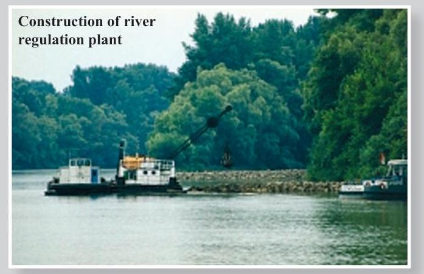
suitable for draining a flood wave. The prevention of the consequences of the flood in March 2001 showed that such a condition of the facilities, located at this section of the state border, allowed a considerable mitigation of the injurious effects of floods.

The regulation of rivers is also considered important from the aspect of flood protection in Hungarian territory. The river regulation structures to be found in a total length of around 160 km on the Tisza and Szamos Rivers displayed considerable variation picture. The big floods of last years continued to increase the earlier damage, which was in some cases several decades old. The highest risk is caused by the river bends located in the proximity of the flood protection dyke. There are 26 river sections on the Tisza and 4 on the Szamos where urgent intervention is required for the construction or reconstruction of the bank protection. (In the last 6 years 18 elbows were regulated, and in 2004 river regulation works were carried out at 4 sites.)

The high number and frequency of dyke bursts occurring due to floods, which happened between 1998 and 2001, can be attributed to the condition to the dykes. Both parties keep in mind the importance of the development of the Upper Tisza dyke system; however, it must be understood that this process cannot be really successful without the harmonisation of the development programmes and without joint analyses, research and impact studies.

According to the sketchy plan presented in 2001 the Ukrainian party planned a refurbishment of the dyke system, with a total length of 824.7 km , together with dykes and revetments, dimensioned for a standard $1 \%$ flood, and the construction of a further 132 km of new dykes. In the absence of the required

дозволив значною мірою пом'якшити шкідливі наслідки водної стихії.

3 точки зору захисту від паводків на угорській території вважається важливим заходом регулювання річок. Стан об’єктів регулювання на р. Тисі та р. Самоші, загальною протяжністю біля 160 км, дуже неоднорідний. Великі паводки минулих років погіршили стан споруд (деяким 3 них вже десятки років). Найбільшу небезпеку представляють собою вигини річок, що знаходяться поблизу протипаводкових гребель. На р. Тисі - 26, на р. Самоші - 4 таких ділянки, які потребують термінових робіт по будівництву берегових укріплень або ремонтних робіт. За останні шість років приведено в порядок 18 вигинів річок, у 2004 році на 4 -х ділянках проводилися роботи з їх регулювання.

Незадовільний стан гребель пояснюється тим, що під час паводків 1998 і 2001 рр. було багато руйнувань, які часто повторювалися. Обидві сторони розуміють важливість розвитку системи гребель на Верхній Тисі, проте необхідно зауважити, що без узгодження програм розвитку, без спільних аналізів, досліджень і вивчення впливів, процес впровадження протипаводкових заходів на прикордонних водах не може бути успішним.

Українською стороною презентовано в 2001 році план-схему, якою намічено реконструкцію всієї системи гребель загальною довжиною 824,7 км в розрахунку на одновідсотковий визначаючий рівень паводку та будівництво додаткових 132 км нових гребель. В період 2002-2004 років через брак необхідних бюджетних асигнувань побудовано або реконструйовано усього 27,9 км

---

Az ukrán fél - a 2001-ben bemutatott vázlatterve szerint - a teljes, töltésekkel és partbiztosításokkal együtt $824,7 \mathrm{~km}$ hosszú töltésrendszer $1 \%$-os mértékadó árvízre méretezett felújítását és további 132 km új töltés építését irányozta elő. A 2002 és 2004 közötti időszakban a szükséges költségvetési előirányzatok hiányában összesen $27,9 \mathrm{~km}$ gát épült meg vagy került rekonstrukcióra, azaz az időszakra a „A Tisza Kárpátaljai vizgyüjtő területének 2002 és 2006 közötti évekre vonatkozó komplex árvizzvédelmi programja és elörejelzés 2015-ig" c. anyagban tervezett mennyiség $26,1 \%$-a.

A magyar fél az árvízvédelmi rendszerek kiépítésének folytatásaként további - a magyar-ukrán közös öblözeteket is érintő - fejlesztéseket tervezett, úgymint a beregi öblözet árvízvédelmi rendszerének teljes kiépítése Jánd és Lónya között (38 km), a Túr árvízvédelmi rendszerének fejlesztése a védvonalak torkolati szakaszának kiépítésével és a felső-túri árviztározó megvalósításával, az árvízvédelmi infrastruktúra elemeinek (zsilipek, védelmi központok, információs rendszer, partvédelem) korszerűsítése. A jövő tervei között szerepel még a Zsurk-Vásárosnamény közötti árvízvédelmi szakasz fejlesztési tanulmányának elkészítése.

A közös érdekeltségủ szakaszokon a töltésrendszer azonos mértékủ kiépítésére irányuló ma-gyar-ukrán közös törekvés célszerủ irányvonalat tükröz. A felek nagyvonalakban tájékoztatták egymást koncepcionális terveikről, azonban a további feladatok eredményességéhez nélkülözhetetlen részletekre is kiterjedő információcserék, érdemi egyeztetések még nem történtek, a tervezett ukrán és magyar beavatkozások együttes hatását elemző közös vizsgálatokat nem végeztek.
budgetary allocations a total of 27.9 km of dykes were constructed or reconstructed in the period between 2002 and 2004, i.e. $26.1 \%$ of the quantity planned for such period in the material entitled "Complex Flood Protection Programme relating to the Years Between 2002 and 2006 for the Tisza River's Sub-Carpathian Catchment Area and Forecast Until 2015".

To continue the construction of the flood protection systems, the Hungarian party planned further developments also affecting the HungarianUkrainian joint diked marshes, like the full construction of the flood protection system of the Bereg diked marsh between Jánd and Lónya ( 38 km ), the development of the Túr River's flood protection system with the construction of the mouth section of the defensive lines and the implementation of the Upper Túr flood basin, the modernisation of the elements of the flood control infrastructure (locks, protection centres, information system, bank protection). In addition, the preparation of a development study for the flood protection section between Zsurk and Vásárosnamény is also included in the future plans.

The joint Hungarian-Ukrainian efforts aimed at the construction on an identical scale of the dyke system at the sections of joint interest reflect an expedient guideline. The parties informed each other very grandly of their concept plans; however, no exchange of information or reconciliation on the merits, covering even the details which are indispensable for the success of further tasks, have yet taken place, and no joint examinations have been carried out to analyse the joint effect of the planned Ukrainian and Hungarian interventions.

гребель або лише 26,1 відс. обсягів, передбачених «Програмою комплексного протипаводкового захисту в басейні р. Тиси у Закарпатській області на 2002-2006 роки та прогноз до 2015 року».

Угорська сторона, як продовження будівництва протипаводкових систем, запланувала подальші роботи, що стосуються і угорсько-українських спільних котловин, наприклад: повністю відбудувати протипаводкову систему Берегської котловини між Яндом і Лонею ( 38 км), розвиток протипаводкової системи Туру шляхом будівництва захисних ліній в гирлі та будівництво водосховища на Верхньому Турі, модернізація елементів протипаводкової інфраструктури (шлюзи, захисні центри, інформаційна система, береговий захист). В планах на майбутнє передбачено складання технічного завдання з розвитку протипаводкової ділянки між Журком і Вашарошнаменью.

Вважаємо доцільним обопільне угорськоукраїнське прагнення домогтися врівноваженості систем гребель на спільних ділянках водотоків. Сторони, в загальних рисах, інформували один одного про свої плани-концепції. Проте поки що не було обміну інформацією, яка охоплює деталі запроваджуваних заходів, що є передумовою успішного виконання подальших завдань. Не було також суттєвих узгоджень, не проводилися спільні дослідження, що аналізують загальну мету запланованих українських і угорських дій.

---

### 3.3. Az árvizvédelmi fejlesztési koncepciók

Az árvizek kivédésének továbbra is egyik fontos eszköze a kiépített Tisza-völgyi árvízvédelmi töltésrendszer. Ugyanakkor mindkét fél felismerte, hogy az eredményes megelőzést nem lehet csak a töltésrendszerek fejlesztésére alapozni. A hagyományos védekezés mellett új típusú ár-víz-védekezési koncepciót jelent a folyóknak szabadabb teret biztosító, árvízi tározásra alapozott védművek kiépítése. Ezt figyelembe véve dolgozták ki magyar oldalon a Vásárhelyi-terv továbbfejlesztése (VTT) programot, és ukrán oldalon a „Komplex árvizvédelmi programot a Kárpátaljai Tisza vizgyüjtöjében a 2002-2006. évekre és elörejelzést 2015-ig", ami az Ukrajnában a 2002-ben törvény által elfogadott „Állami vízgazdálkodási fejlesztési program" részét képezi.

A VTT program maradéktalan megvalósításával az árvízi veszélyeztetettség harmadára csökkenését prognosztizálták. A tervezésben a szakmai szemlélet komplexitása azonban nem párosult a kivitelezési költségterv készítésének hasonló megközelítésével. A fejlesztési célok és felelőseik kormányhatározatban történt részletezése mellett nem azokhoz rendelten jelenítették meg a forrásokat, mindössze a VTT program I. ütemének megvalósítása érdekében évente felhasználható keretösszegekről rendelkeztek. Így az adott költségvetési évben a rendelkezésre álló forrásokhoz kellett a végrehajtható fejlesztéseket meghatározni. Az sem volt egyértelmű, tekintettel a VTT agrár- és vidékfejlesztési összefüggéseire, hogy az egyes fejlesztési célokat mikor, melyik tárca költségvetése finanszírozza. A ter-

### 3.3. Development Concepts in Flood Protection

The extended flood control dyke system in the Tisza Valley continues to be an important tool for the defence against floods. At the same time both parties recognised that successful prevention could not based on the development of the dyke systems only. Alongside the traditional protection, the construction of protective works allowing a freer space for the rivers and based on flood basins means a new type of flood protection concept. With this in mind the programme entitled Further Development of the Vásárhelyi Plan (VTT) has been elaborated on the Hungarian side and the "Complex Flood Protection Programme in the Tisza River's Sub-Carpathian Catchment Area for the Years 2002 to 2006 and Forecast Until 2005" has been prepared on the Ukrainian side, which forms part of the "State Development Programme of Water Management" enacted in Ukraine in 2002.

The reduction to one third of the flood risk was forecast through the complete implementation of the VTT programme. However, the complex professional approach was not accompanied, in the planning, by a similar approach in the preparation of the cost budget of implementation. While the development objectives and the persons responsible for them have been detailed in a government resolution, the resources were not assigned to them: only the framework amounts available annually in order to implement Phase I of the VTT programme have been provided. Thus the executable developments had to be defined bearing in mind the resources available in the given budgetary year. With regard to the correlations of VTT with agrarian and rural development, there was a lack of clarity over whether the various development

### 3.3. Концепції розвитку протипаводкового захисту

Добудована система протипаводкових гребель в долині р. Тиси і на сьогодні все ще є важливим засобом уникнення паводків. Водночас сторони розуміють, що успішні превентивні заходи не можуть базуватися тільки на розвитку систем гребель. Разом з традиційними формами захисту протипаводковою захисною концепцією нового типу є будівництво паводкових захисних спо-руд-сховищ, що забезпечують більшу свободу руху води в річках. 3 урахуванням цього, угорська сторона розробила програму «Удосконалення програми Ваиархеї» (VTT), а українська сторона - «Програму комплексного протипаводкового захисту в басейні р. Тиси у Закарпатській області на 2002-2006 роки та прогноз до 2015 року» (далі - Комплексна програма), що є частиною «Державної програми розвитку водного господарства», затвердженої в 2002 році в рамках закону.

Згідно з прогнозами, за умови повного здійснення програми VTT небезпека паводків скоротиться до однієї третини. Проте, якщо на стадії проектування забезпечено комплексність професійного підходу, то складання кошторису робіт не супроводжувалося таким же підходом. Незважаючи на те, що в урядових постановах достатньо детально вказувалися цілі і відповідальні особи, фінансові ресурси, пов’язані з повним обсягом робіт не визначені, а визначені тільки річні ліміти, які можна було використовувати на першому етапі здійснення програми VTT. Отже, кількість робіт необхідно було спів-

---

vezett uniós források biztosítása 2004-ben történt meg.

Különösen az ilyen volumenủ és összetett projektnél lényeges a felső szintű irányítás, menedzselés hatékonysága. A magyar Kormány 2003-ban ugyan elrendelte tárcaközi bizottság létrehozását (az árvízvédelmi fejlesztések és a kapcsolódó egyéb szakterületi fejlesztési feladatok végrehajtásának koordinálására), de funkcionálása nem pótolta az operatív irányítás hiányát. Projekt kontrolling, vagy ennek megfelelő rendszer sem támogatta a megvalósítási folyamat nyomon követését, a forrásfelhasználás alakulását.

A magyar oldali ellenőrzés elismerte, hogy a nemzetgazdaság teherbíró képességétől függően szűkülhetnek a finanszírozás feltételei, a célszerüség és gazdaságosság szempontjából azonban rendkívül kockázatosnak ítélte a feladatok és a források összhangjának tapasztalt mértékủ hiánya mellett úgy érvényesíteni a módosításokat, hogy a változtatások többirányú kihatásai érdemi elemzés nélkül maradtak. Pozitívan értékelve azt a szándékot, hogy kormányzati szinten is kiemelt figyelmet kívánnak fordítani a forrásfelhasználás kontrolljára, rámutatott, ez - a kockázatelemzések elmaradása esetén - önmagában nem elegendő a VTT program célszerủ és egyben gazdaságos megvalósításához.

Az ukrán oldali „Komplex árvízvédelmi program" meghatározta a Tisza vízgyűjtőjében a településeknek, népgazdasági objektumoknak és földeknek a víz káros hatásával szembeni védelme, az ár- és belvizek romboló hatása miatt bekövetkezett veszteségek csökkentése érdeké-
objectives would be financed by the budget of which of the ministries and when. The planned EU resources were secured in 2004.

The efficiency of direction and management at the executive level is particularly important in the case of such a high volume, complex project. It is true that the Hungarian government ordered in 2003 the setting up of an inter-ministerial committee (for the coordination of the implementation of flood protection developments and other related development tasks of the special fields), but the operation thereof did not replace the operative direction. Neither did a project controlling or a corresponding system support the monitoring of the process of implementation and the development of the utilisation of resources.

Recognising that the conditions of funding might be narrowed down depending on the load bearing capacity of the national economy, the Hungarian-side audit judged, nevertheless, as extremely risky from the aspect of expediency and rentability the fact that the modifications were enforced alongside the lack, to the extent experienced, of the harmony of tasks and resources, in such a manner that the merits of the manifold effects of the changes were left unanalysed. It evaluated in an affirmative manner the intention for a desire at governmental level as well to highlight the control of the utilisation of resources, but it indicated that in case of the absence of risk analyses this was in itself insufficient for the implementation of the VTT programme in a manner which was expedient and at the same time economical.

The "Complex Flood Protection Programme" of the Ukrainian side defined the most important directions of the action to be followed in order to protect settlements, facilities of national economy
відносити з ресурсами, які були у розпорядженні лише в даному бюджетному році. Не було однозначно вказано і те, бюджет якого міністерства і коли фінансує окремі завдання. Ресурси Європейського Союзу, заплановані на 2004 рік, були забезпечені.

При здійсненні таких великих і складних проектів особливо важлива ефективність керівництва на вищому рівні. Не дивлячись на те, що угорський Уряд у 2003 році розпорядився про створення міжвідомчої комісії (для координації виконання робіт з розвитку протипаводкових споруд та суміжних завдань інших галузей), діяльність цієї комісії не забезпечила оперативного управління при виконанні програми. Процес виконання програми та витрачання коштів на її здійснення проходив безконтрольно.

Державний аудиторський офіс Угорщини розумів, що залежно від актуальності питання та стану національної економіки обсяги фінансування можуть скоротитися. Проте, з огляду доцільності і рентабельності, визнав надзвичайно ризикованим (за відсутності узгодженості між завданнями та ресурсами) вносити будь-які зміни без грунтовного аналізу. Абсолютно позитивно оцінюючи яскраво виражений намір урядових кіл здійснити ревізію використання ресурсів, Державний аудиторський офіс визнав необхідним проведення аналізу ризиків з погляду доцільного і рентабельного(ефективного) здійснення програми VTT.

Державна програма комплексного протипаводкового захисту української сторони визначила найважливіші напрями захисту населених пунктів, об'єктів народного господарства та

---

ben követendő cselekvés legfontosabb irányait. Elveiben is új árvízvédelmi létesítmények kifejlesztését tűzték ki célul, valamint a működő vízügyi létesítmények rekonstrukcióját állóképességük és üzemelési biztonságuk növelése érdekében, ami a speciális rendeltetésű árvízvédelmi tározókkal együtt biztosítani fogja az objektumok és a lakosság védelmét magas árhullámok levonulása esetén. Előirányozták a vízgyűjtő területek körvonalazott-csapolási megszervezését; hidak, átjárók és vízáteresztő létesítmények rekonstrukcióját közutakon és vasútvonalakon; lakó- és üzemi épületépítési tilalmat az ártereken; ökológiailag biztonságos technológiák bevezetését a vízgazdálkodásban, feltételezve a Víztörvény, a Földtörvény, az Erdőtörvény és egyéb normatív jogszabályok követelményeinek betartását a mező- és erdőgazdaságban.

A program végrehajtását három szakaszra bontották. Az első szakaszban (2002-2006) a haváriák megelőzését szolgáló komplexumok megvalósításával kapcsolatos halaszthatatlan munkákat kell elvégezni. A második szakaszban (2007-2011) be kell fejezni a Tisza vízgyűjtője egységes árvízvédelmi rendszerének létrehozását. A harmadik szakaszban (2012-2015) hoszszú távú perspektivikus intézkedésekre kell sort keríteni. A fentiekben sorolt intézkedések teljes körű megvalósítása lehetővé tenné 500 település, 2600 ipari objektum és 200 ezer hektár termőföld árvízvédelmét.

A Felső-Tisza árvízvédelmével kapcsolatos munkákat alapvetően az állami költségvetésből, kisebb hányadát külföldi államok pénzügyi tá-
and lands in the Tisza River's catchment area against the harmful effects of water and to reduce the losses caused by the destructive effect of floods and inland waters. They set as an objective the development of flood protection facilities which were new in terms of their principles, as well as the reconstruction of the operating water facilities in order to increase their stability and operational safety, which would, together with the flood protection basins of special designation, secure the protection of facilities and population in case of the development of high flood waves. They planned to organise the circular drainage of catchment areas; to reconstruct bridges, passages and culverts on public roads and railways; to prohibit the construction of houses and factories in the flood areas; and to introduce ecologically safe techniques into water management, supposing compliance with the requirements of the Water Act, the Land Act, the Forest Act and other normative legal rules in agriculture and sylviculture.

The implementation of the programme was divided into three phases. I In the first phase (2002-2006), the most urgent works related to the implementation of complexes serving the prevention of accidents have to be carried out. In the second phase (2007-2001) the implementation of the unified flood protection system in the Tisza River catchment area must be completed. In the third phase (2012-2015) longterm perspective measures are to be taken. The fullrange realisation of the aforementioned measures would ensure flood protection for 500 settlements, 2600 industrial facilities and 200 thousand hectares of arable land.

It was planned to finance the works related to the flood protection of the Upper Tisza River

земель басейну р. Тиси від шкідливої дії води, ліквідації збитків, які виникли внаслідок руйнівних паводків та повеней. Намічено будівництво принципово нових протипаводкових споруд з метою підвищення стійкості і надійності здійснення реконструкції таких працюючих гідротехнічних споруд, які разом з паводковими сховищами спеціального призначення забезпечать безпеку об'єктів і населення при екстремальних паводкових хвилях. Передбачена організація контурного осушення водозбірних територій, реконструкція мостів, переходів, естакад та водопропускних споруд на автодорогах і залізницях, заборона будівництва житла та промислових об'єктів на заплавних територіях, введення екологічно безпечних технологій у водному господарстві, за умови дотримання в сільському і лісовому господарстві вимог Водного, Земельного і Лісового кодексів та інших нормативних актів.

Виконання Комплексної програми розділено на три етапи. На першому етапі (2002-2006 pp.) необхідно виконати невідкладні першочергові роботи по будівництву комплексів споруд, покликаних запобігти аваріям, на другому етапі (2007-2011 pp.) - завершити створення єдиної протипаводкової системи водозбірного басейну p. Тиси. На третьому етапі (2012-2015 рр.) будуть виконуватися довгострокові, перспективні заходи. Повне виконання всіх перелічених заходів дозволить захистити від паводків 500 населених пунктів, 2600 промислових об'єктів та 200 тисяч гектарів родючих земель.

Фінансування робіт, пов'язаних з вказаними протипаводковими захисними заходами, передбачалося переважно за рахунок коштів держав-

---

mogatásából és egyéb bevételekből (helyi költségvetés, gazdasági tevékenység bevétele) tervezték finanszírozni. A 2002 és 2004 közötti években a hiányzó előirányzatok miatt a programban meghatározott intézkedéseket nem hajtották végre és ezzel nem valósult meg a program legfontosabb célja - a települések, ipari létesítmények és mezőgazdasági művelésű termőföldek a vizek káros hatásával szembeni védelme és a lakosság biztonságos életvitelének biztosítása.

A magyar fél azon túl, hogy 2002-ben az ukrán félnek átadta a VTT koncepcióterv kivonatát, további tájékoztatásra és egyeztetésre nem törekedett, nem helyezett hangsúlyt a felső-tiszai fejlesztések Ukrajna számára is kedvező hatásának bemutatására. A felek 2000-2004 között az árvízmegelőzés szempontjából meghatározó jelentőséggel bíró két ukrán koncepcióterv a Kárpátalján tervezett árvízvédelmi fejlesztések koncepciója (tanulmányterv), és a Kárpátalján tervezett automata árvízvédelmi információs rendszer műszaki feladatai (tanulmány) - egyeztetését kezdték el.

Az ukrán fél még 2001-ben átadta a „Tisza folyó Kárpátaljai vizgyüjtöjére vonatkozó komplex árvizvédelmi vázlatterv" anyagát, amivel kapcsolatban a megküldött - alapvetően elismerő, de a fenntartásokat is tartalmazó - magyar álláspontot nem vitatták meg. A 2003. évi kormány-meghatalmazotti információátadás is annak közlésére szűkült, hogy Ukrajna Állami Vizgazdálkodási Bizottsága a kárpátaljai végrehajtó szervekkel közösen - a Tisza Kárpátaljai vizgyüjtöjére rövid, illetve hosszú távú (2015-ig tartó) komplex árvíz-
basically from the state budget, a smaller portion from the financial support of foreign states and from other revenues (local budget, revenues from economic activities). In the years between 2002 and 2004 the measures defined in the programme were not executed, due to the missing allocations, and, therefore, the most important aims of the programme - protecting the settlements, industrial facilities and arable lands under agricultural cultivation against the damaging effect of waters, as well as ensuring the safety of the population - were not realised.

In addition to handing over the extract from the VTT concept plan to the Ukrainian party in 2002, the Hungarian party made no further efforts for information and reconciliation, and it did not press for the presentation of the effects, which would also be beneficial to Ukraine, of the Upper Tisza developments. The parties commenced, between 2000 and 2004, the reconciliation of two Ukrainian concept plans with a determining importance from the aspect of flood prevention: the concept of flood protection developments planned in Sub-Carpathia (study plan), and the technical tasks of the automatic flood protection information system planned in SubCarpathia (study).

The Ukrainian party handed over in as early as 2001 the material of the "Complex Flood Protection Sketches relating to the Tisza River's SubCarpathian Catchment Area", but the Hungarian position disclosed in connection therewith, which was basically in agreement although it also contained reservations, was not discussed. The disclosure of information by government delegates was also narrowed down, in the year 2003, to the communication of the fact that the State Water
ного бюджету та за рахунок грантів зарубіжних держав і інших доходів (місцевий бюджет, доходи від господарської діяльності). В період 2002-2004 років через недостатність бюджетних асигнувань не були виконані передбачені програмою заходи. Як наслідок, не реалізована одна з найважливіших цілей Комплексної програми, а саме, не був забезпечений захист населених пунктів, промислових об'єктів і оброблюваних сільськогосподарських угідь від шкідливої дії води, не створені надійні умови життєдіяльності населення.

Незважаючи на те, що в 2002 році українській стороні був переданий витяг з плану-концепції VTT, до подальшого інформування та узгоджень угорська сторона не прагнула, та не акцентувала увагу на тому, що роботи на Верхній Тисі з погляду інтересів України будуть мати сприятливу дію для неї. У період 2000-2004 років сторони приступили до узгодження двох, визначальних з погляду протипаводкового захисту українських проектів-концепцій, а саме: концепція робіт по протипаводкових спорудах на Закарпатті (проект реферату) та технічних завдань по створенню на Закарпатті автоматичної протипаводкової інформаційної системи(реферат).

Українська сторона ще в 2001 році передала угорській стороні матеріали під назвою «Плансхема комплексного протипаводкового захисту водозбірного регіону річки Тиси в Закарпатській області». Угорська позиція щодо цього матеріалу була в цілому позитивна, проте містила деякі зауваження, але не була обговорена сторонами. Обмін інформацією Уповноважених урядів у 2003 році обмежився повідомленням, згідно з яким Державний комітет водного господарства

---

védelmi programjai elvégzésére, a reális pénzügyi lehetőségek figyelembevételével - folytat munkálatokat. A magyar oldalról szükségesnek tartották továbbá a komplex beavatkozások együttes árvíz-csúcs-csökkentő hatásának további részletes vizsgálatát, az összetett árhullámok levonulásának, valamint az árhullámok összeesésének vizsgálatát, illetve a hidrológiai észlelőhálózat mielőbbi megvalósítását.

A magyar fél felvetése alapján célszerű közös vizsgálatokat végezni egy esetleges Beregi árvizi szükségtározó közös kialakítására is. Ehhez jól illeszkedő, megalapozott tájgazdálkodási, vidékfejlesztési, természetvédelmi programok kidolgozásával lehet eredményesen pályázni az EU támogatásokra.

### 3.4. A közös belvizzvédelmi rendszerek továbbfejlesztése, egységes lokalizációs tervek alkalmazása

A beregi belvízrendszer magyar és ukrán területen helyezkedik el, emiatt a rendszert egységes egésznek tekintve lehet csak eredményes vízgazdálkodást folytatni. Az 1999. évi rendkívüli belvíz és a 2001. évi rendkívüli árvíz alkalmával magyar és ukrán területen egyaránt jelentős területek - benne belterületek is - kerültek elöntés alá. Ezek tapasztalataira alapozott közös felismerés tükröződik a 2001. év tavaszán történt miniszterelnöki, szakminiszteri találkozók, majd az ezeket követően tartott kormány-meghatalmazotti ülések dokumentumaiban, melyek figyelembevételével hoztak döntéseket külön-

ManagementCommittee of Ukraine carried out work, jointly with the Sub-Carpathian executive organs, to execute the short-term and long-term (lasting until 2015) complex flood protection programmes of the Tisza River's Sub-Carpathian catchment area, taking into account the realistic financial possibilities. Furthermore, on the Hungarian side it was considered necessary to further examine in detail the joint flood peak reducing effect of complex interventions, to examine the occurrence of composite flood waves and the coincidence of flood waves, as well as to implement as soon as possible the hydrological observation network.

Based on the Hungarian party's proposal it would be expedient to carry out joint examinations for the implementation of an emergency flood basin in Bereg. The EU grants can be successfully tendered for by the elaboration of well-grounded programmes of harmonised landscape management, rural development and nature preservation.

### 3.4. Further Development of Joint Systems of Inland Water Protection, Application of Unified Localisation Plans

The Bereg internal water system is located in the territories of Hungary and Ukraine, therefore a successful water management may only be carried out if the system is regarded as a unified whole. On the occasion of the extraordinary inland water of 1999 and of the extraordinary flood in 2001, considerable areas (including central areas of settlements) were inundated both in Hungary and in Ukraine. The joint recognition based on the

України разом з органами виконавчої влади Закарпаття, з урахуванням реальних фінансових можливостей, проводить роботи по здійсненню Комплексної програми. Угорська сторона вважала за необхідне продовжити дослідження загального впливу комплексних робіт на зниження пікового рівня паводків, дослідження стоку сумарних паводкових хвиль, а також дослідження їх збігу, та найшвидше здійснення мережі гідрологічних спостережень.

Угорська сторона висунула пропозицію щодо проведення спільних досліджень можливості спільного будівництва аварійного паводкового водосховища в м. Берегові. За умови розробки обгрунтованих програм з розвитку регіонів, раціонального використання природних ресурсів та по охороні природи, що добре поєднуються з протипаводковими заходами, можна передбачати їх ефективність, та брати участь в європейських тендерах щодо фінансування цих програм.

### 3.4. Подальший розвиток суміжних систем внутрішніх вод, впровадження спільних планів з локалізаиії паводків та повеней

Берегівська система внутрішніх вод знаходиться на угорській та українській території, тому ефективною водогосподарська діяльність може бути тільки у випадку, якщо всю систему розглядати як єдине ціле. У 1998 році під час безпрецедентної повені та в 2001, під час надзвичайного паводку були залиті величезні території на українській і угорській сторонах, у тому числі і території забудовані населеними пункта-

---

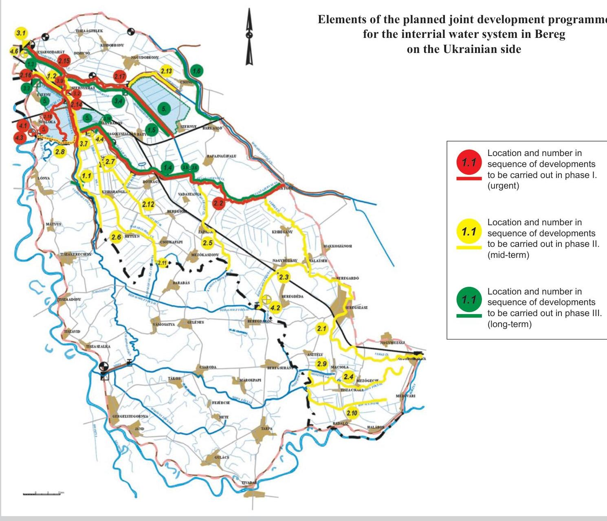

# Elements of the planned joint development programme for the intertial water system in Bereg on the Ukrainian side

1. Location and number in sequence of developments to be carried out in phase I. (urgent)
2. Location and number in sequence of developments to be carried out in phase II. (mid-term)
3. Location and number in sequence of developments to be carried out in phase III. (long-term)

---

böző fejlesztési és lokalizációs tervek készítéséről.
A belvízvédelmi fejlesztési terv - határvizi kormány-meghatalmazotti ülésen történt - jóváhagyását és a legsürgősebb munkákat felölelő kiviteli tervek elkészítési határidejének (2002. 07. 30.) meghatározását követően a magyar fél elkezdte a tervezési- és kivitelezési projektekhez szükséges környezetvédelmi engedélyek beszerzését. Miután az ukrán fél a magyar terveket jóváhagyta, a kivitelezési munkák magyar oldalon, ha lassú ütemben is, de elindultak. Az ukrán oldali munkák elkezdéséről a magyar vízügyi szervek nem kaptak tájékoztatást.
A Beregi és a Beregszászi ár- és belvízvédelmi öblözetet egységesen - az országhatár általi megosztottságától függetlenül - kezelő rendszer részeként a térség lokalizációs tervének kidolgozása a meghatalmazott-helyettesek, valamint a vízkárelháritási szakcsoportvezetők felügyelete és többszöri tervezői egyeztetés mellett zajlott. A lokalizációs terv közös finanszírozással, határidőre (2002-ben) elkészült. Az egységes lokalizációs terv magyar vonatkozású gyakorlati alkalmazhatóságát a magyar fél helyszíni kontrollja visszaigazolta. A terv ukrán oldali alkalmazhatóságának szoftverigényét és az adaptációs munkák tartalmát a felek szakértői szinten meghatározták, azonban a szoftverek átadása, illetve adaptációja nem történt meg.
A belvízvédelmi rendszer fejlesztésére ennek szellemében közösen kidolgozott terv alapos és részletes. A térség vízrajzi adottságainak és természeti értékeinek figyelembevételével határozták meg a belvíz-katasztrófa elhárításának közös
experiences thereof is reflected in the documents of the meetings of the prime ministers and sectoral ministers in spring 2001 and of the meetings of government delegates held subsequently, which documents were also taken into consideration when resolving the preparation of various development and localisation plans.
After having approved the inland water protection development plan at the transboundary water government delegates' meeting and having set the deadline of the preparation of the detailed drawings covering the most urgent works (30 July 2002), the Hungarian party started obtaining the environmental licences required for the projects of planning and execution. After the approval of the Hungarian plans by the Ukrainian party, the execution works started on the Hungarian side, although at a slow pace. The Hungarian water bodies received no information on the start of the works on the Ukrainian side.
The elaboration of the region's localisation plan, as part of a system handling the Bereg and Beregszász diked marsh for unified flood and inland water protection, regardless of it being divided by the national border, was carried out under the supervision of the deputy delegates and the heads of specialised groups of water damage prevention, accompanied by repeated agreement at the level of planners. The localisation plan was prepared by the deadline (in 2002), with joint funding. The practical applicability of the unified localisation plan with relation to Hungary was confirmed by the local control of the Hungarian party. The software requirements of the applicability of the plan on the Ukrainian side and the contents of the works of adaptation were also defined by the parties' experts,

ми. В зустрічах прем'єр-міністрів та галузевих міністрів навесні 2001 року, і в документах зустрічей Уповноважених урядів відобразилося обопільне розуміння проблеми, що базується на досвіді цих подій, внаслідок чого були ухвалені рішення про розробку різних планів розвитку та локалізації.

Після затвердження плану розвитку системи внутрішніх вод на засіданні Уповноважених урядів за Угодою про прикордонні води і визначення строку складання планів термінових робіт (30 липня 2002 г.) угорська сторона приступила до дій по отриманню екологічних дозволів, необхідних для проектних і підрядних робіт. Після затвердження українською стороною угорських проектів, підрядні роботи на угорській стороні, хоча і дещо сповільнено, але почалися. Разом $з$ тим, угорські водогосподарські органи не отримали інформацію про те, чи розпочато роботи на українській стороні.

Розробка проекту локалізації регіону, що розглядає Берегську та Берегівську котловину паводкових і внутрішніх вод як єдине ціле, незважаючи на розділяючий її державний кордон, почалася під контролем заступників уповноважених і керівників груп фахівців по усуненню паводкової шкоди, та при багаторазових узгодженнях проектувальників. План локалізації при спільному фінансуванні був готовий своєчасно, у 2002 році. Практичне застосування в Угорщині єдиного плану локалізації паводків було підтверджено угорською стороною перевірками на місці. Сторони на рівні експертів визначили потребу в програмному забезпеченні для застосування плану на українській стороні, і було обумовлено

---

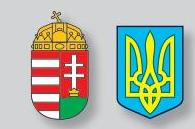

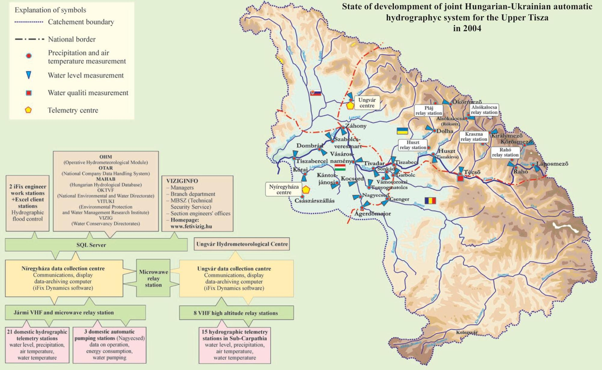

# Explanation of symbols

- **Catchement boundary**
- **National border**
- **Precipitation and air temperature measurement**
- **Water level measurement**
- **Water quality measurement**
- **Telemetry centre**

# State of development of joint Hungarian-Ukrainian automatic hydrography system for the Upper Tisza in 2004

## Overview

The project is a comprehensive and comprehensive study of the current and future water quality and water quality management systems in the Tisza region. The project aims to develop a comprehensive water quality and water quality management system for the Upper Tisza in 2004.

## Key Objectives

- **Easily use and maintain the Tisza water system in the Tisza region**: To ensure the safe and efficient use of the Tisza water system in the Tisza region.
- **Easily use and maintain the Tisza water system in the Tisza region**: To maintain the Tisza water system in the Tisza region, including the water quality assessment and water quality management.
- **Easily use and maintain the Tisza water system in the Tisza region**: To maintain the Tisza water system in the Tisza region, including the water quality assessment and water quality management.
- **Easily use and maintain the Tisza water system in the Tisza region**: To maintain the Tisza water system in the Tisza region, including the water quality assessment and water quality management.
- **Easily use and maintain the Tisza water system in the Tisza region**: To maintain the Tisza water system in the Tisza region, including the water quality assessment and water quality management.
- **Easily use and maintain the Tisza water system in the Tisza region**: To maintain the Tisza water system in the Tisza region, including the water quality assessment and water quality management.
- **Easily use and maintain the Tisza water system in the Tisza region**: To maintain the Tisza water system in the Tisza region, including the water quality assessment and water quality management.
- **Easily use and maintain the Tisza water system in the Tisza region**: To maintain the Tisza water system in the Tisza region, including the water quality assessment and water quality management.
- **Easily use and maintain the Tisza water system in the Tisza region**: To maintain the Tisza water system in the Tisza region, including the water quality assessment and water quality management.
- **Easily use and maintain the Tisza water system in the Tisza region**: To maintain the Tisza water system in the Tisza region, including the water quality assessment and water quality management.
- **Easily use and maintain the Tisza water system in the Tisza region**: To maintain the Tisza water system in the Tisza region, including the water quality assessment and water quality management.
- **Easily use and maintain the Tisza water system in the Tisza region**: To maintain the Tisza water system in the Tisza region, including the water quality assessment and water quality management.
- **Easily use and maintain the Tisza water system in the Tisza region**: To maintain the Tisza water system in the Tisza region, including the water quality assessment and water quality management.
- **Easily use and maintain the Tisza water system in the Tisza region**: To maintain the Tisza water system in the Tisza region, including the water quality assessment and water quality management.
- **Easily use and maintain the Tisza water system in the Tisza region**: To maintain the Tisza water system in the Tisza region, including the water quality assessment and water quality management.
- **Easily use and maintain the Tisza water system in the Tisza region**: To maintain the Tisza water system in the Tisza region, including the water quality assessment and water quality management.
- **Easily use and maintain the Tisza water system in the Tisza region**: To maintain the Tisza water system in the Tisza region, including the water quality assessment and water quality management.
- **Easily use and maintain the Tisza water system in the Tisza region**: To maintain the Tisza water system in the Tisza region, including the water quality assessment and water quality management.
- **Easily use and maintain the Tisza water system in the Tisza region**: To maintain the Tisza water system in the Tisza region, including the water quality assessment and water quality management.
- **Easily use and maintain the Tisza water system in the Tisza region**: To maintain the Tisza water system in the Tisza region, including the water quality assessment and water quality management.
- **Easily use and maintain the Tisza water system in the Tisza region**: To maintain the Tisza water system in the Tisza region, including the water quality assessment and water quality management.
- **Easily use and maintain the Tisza water system in the Tisza region**: To maintain the Tisza water system in the Tisza region, including the water quality assessment and water quality management.
- **Easily use and maintain the Tisza water system in the Tisza region**: To maintain the Tisza water system in the Tisza region, including the water quality assessment and water quality management.
- **Easily use and maintain the Tisza water system in the Tisza region**: To maintain the Tisza water system in the Tisza region, including the water quality assessment and water quality management.
- **Easily use and maintain the Tisza water system in the Tisza region**: To maintain the Tisza water system in the Tisza region, including the water quality assessment and water quality management.
- **Easily use and maintain the Tisza water system in the Tisza region**: To maintain the Tisza water system in the Tisza region, including the water quality assessment and water quality management.
- **Easily use and maintain the Tisza water system in the Tisza region**: To maintain the Tisza water system in the Tisza region, including the water quality assessment and water quality management.
- **Easily use and maintain the Tisza water system in the Tisza region**: To maintain the Tisza water system in the Tisza region, including the water quality assessment and water quality management.
- **Easily use and maintain the Tisza water system in the Tisza region**: To maintain the Tisza water system in the Tisza region, including the water quality assessment and water quality management.
- **Easily use and maintain the Tisza water system in the Tisza region**: To maintain the Tisza water system in the Tisza region, including the water quality assessment and water quality management.
- **Easily use and maintain the Tisza water system in the Tisza region**: To maintain the Tisza water system in the Tisza region, including the water quality assessment and water quality management.
- **Easily use and maintain the Tisza water system in the Tisza region**: To maintain the Tisza water system in the Tisza region, including the water quality assessment and water quality management.

---

teendőit. A további tervezési munkákat célszerű összehangolni a beregi árvízi szükségtározó és a hozzá csatlakoztatható tájgazdálkodási, természetvédelmi tervezés-előkészítő munkákkal. Ugyanakkor a kivitelezési munkáknál tapasztalt elmaradások - a fejlesztések mindkét fél által elismert fontosságára tekintettel - ukrán oldalon a munkák mielőbbi elkezdésének, magyar oldalon a felgyorsításának szükségességére irányítják a figyelmet.

### 3.5. Az árvizi megfigyelő, riasztó és elörejelzö rendszer

Az 1999-ben tartott négyoldalú (magyar-uk-rán-román-szlovák) kormány-meghatalmazotti találkozó ajánlásának figyelembevételével tárca szinten kötött magyar-ukrán együttmüködési megállapodás képezte az alapját annak a magyar segítségnyújtásnak, amivel a magyar fél hozzájárult a Kárpátaljai árvíz-elörejelzési és vízgazdálkodási automatizált információs mérőrendszer (AIMR-,,Tisza") fejlesztéséhez. Az 1999-2003 között - döntően magyar kormánysegélyből megvalósított informatikai, adatátviteli és monitoring fejlesztések egy nemzetközi mértékkel is korszerü árvízfigyelő-és előrejelző rendszer alapját teremtették meg. Az AIMR-,,Tisza" rendszert a Közös Ukrajna-NATO Árvízkészültségi és Reagálási projekt keretében müködő nemzetközi szakértői csoport jó alapnak minősítette, konkrét javaslatokat adva annak továbbfejlesztésére és az egész Tokaj feletti Tisza-völgyre történő kiterjesztésére. A felek fenntartási-üzemeltetési köte-
however, the software has not been handed over or adapted.

The plan, elaborated jointly in this spirit for the development of the inland water protection system, is thorough and detailed. The joint tasks of the prevention of an inland water disaster were defined taking into consideration the hydrological features and natural assets of the region. It would be expedient to harmonise the further works of planning with the planning preparation work of the Bereg emergency flood basin and the related landscape management and nature preservation. At the same time the backlogs experienced with work being carried out draw attention, with regard to the importance of the developments recognised by both parties, to the need to start work on the Ukrainian side as soon as possible, while to the necessity of the acceleration thereof on the Hungarian side.

### 3.5. The Flood Monitoring, Alarm and Forecasting System

The Hungarian offer of assistance, by which the Hungarian party contributed to the development of the Sub-Carpathia automated information measurement system of flood forecasting and water management (AIMR-"Tisza"), was based on the Hungarian-Ukrainian cooperation agreement entered into at the level of ministries, which took into account the recommendations of the quadrilateral (Hungarian-Ukrainian-Romanian-Slovak) meeting of government delegates held in 1999. The IT, data transmission and monitoring developments implemented between 1999 and 2003, for the most

перелік адаптаційних робіт, проте до передачі софтвера та адаптації справа не дійшла.

Спільно розроблений проект по розвитку системи внутрішніх вод є грунтовним і докладним. Спільні дії щодо уникнення катастроф, які спричиняються внутрішніми водами, визначаються з урахуванням особливостей гідрографії та природних ресурсів регіону. Подальші проектні роботи доцільно погоджувати з підготовчими роботами за проектами будівництва водосховища в Березі, та проектами природокористування і охорони природи. У той же час, зважаючи на відставання в підрядних роботах, з урахуванням важливості розвитку системи, що визнається обома сторонами, звертається увага на необхідність початку робіт на українській стороні і прискорення робіт на угорській стороні.

### 3.5. Система спостереження, сигналізаиії та прогнозування

Угорсько-українська Угода про співпрацю на прикордонних водах, з урахуванням рекомендацій чотиристоронньої зустрічі (угорської, української, румунської, словацької) Уповноважених урядів у 1999 році, лягла в основу угорської допомоги щодо сприяння українській стороні у створенні спільної українсько-угорської автоматизованої інформаційно - вимірювальної системи для прогнозування паводків і управління водними ресурсами в басейні р. Тиси (AIBC -«Tиса»). Нова інформаційна система передачі даних та моніторингу здійснена, переважно, за рахунок угорської сторони і стала основою су-

---

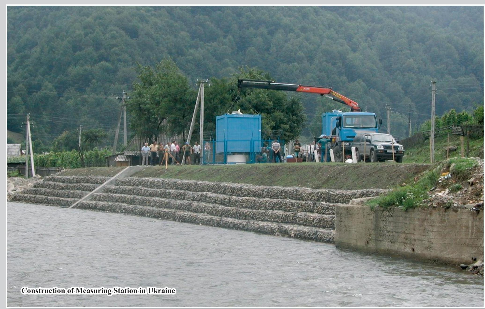

66 Report on Auditing the Flood Control Preparedness in the Upper Tisza Region

---

lezettségeit szakértői szinten kidolgozták, azonban kormány-meghatalmazotti jóváhagyása, így szabályzatba foglalása nem történt meg.

Az AIMR-,,Tisza" rendszer már a 2001. évi kiépítettsége mellett is - az akkori felső-tiszai árvízvédekezés idején - hatékonyan segítette a védekezési munkákat. Ugyanakkor az is egyértelművé vált, hogy az állomások számát jelentős mértékben kell növelni..

A 2001. évi tapasztalatok alapján - az ukrán fél által készített műszaki koncepció figyelembevételével - határoztak a felső-tiszai árvíz-előrejelző rendszer fejlesztésének folytatásáról. Az ehhez kapcsolódó magyar segítségnyújtásról a tárca szinten - 2002. évben - kötött újabb magyar-ukrán együttműködési megállapodás rendelkezett.

Az AIMR-,,Tisza" rendszer tervezésénél figyelembe vették a korábban készített magyar és ukrán középtávú fejlesztési programokat. A kivitelezés során beépített informatikai rendszer hardver és szoftver elemei korszerüek, szabványosak. A müködés szabályozására vonatkozó részletes fenntartási-üzemeltetési rendet kidolgozták. Ennek kormány-meghatalmazotti jóváhagyásának elmaradása - a 2004. évi ülésszak elmaradása következtében - még nem adott teret a kötelezettségek betartatásának, ami a rendszer hatékonysága szempontjából legalább olyan fontos tényező, mint például a beépített eszközök korszerüsége.

Az automatizált mérőállomások hálózata Kárpátalja területén 14 hidrometeorológiai és egy vízminőség-ellenőrzési állomásból áll. Ezen felül, nemzetközi pénzügyi támogatással szélesítik az AIMR-,,Tisza"-t. 2003 júniusában és 2004 októberében az Ukrajna kormánya és az USA
part from Hungarian government grants, created the basis for a flood monitoring and forecasting system which is modern even by international standards. The AIMR-"Tisza" system was assessed as being a good basis by the international expert team operating in the framework of the Joint Flood Preparedness and Response Project of Ukraine and NATO, and the team made concrete proposals for the further development thereof and for expanding it to the whole Tisza Valley above Tokaj. The Parties' obligations of maintenance and operation have also been elaborated at expert level; however, it was not approved by the government delegates and thus it was not included in a regulation.

The AIMR-"Tisza" system helped the work of protection even in its 2001 level of development, at the time of the flood protection at the Upper Tisza River. At the same time it also became clear that the number of stations had to be considerably increased.

On the basis of the 2001 experiences and taking into consideration the technical concept elaborated by the Ukrainian party, a decision was made to continue the development of the Upper Tisza flood forecasting system. Another Hungarian-Ukrainian cooperation agreement entered into at the level of ministries in 2002 provided for the relevant Hungarian assistance.

Upon the planning of the AIMR-"Tisza" system the medium term development programmes prepared earlier by the Hungarian and Ukrainian sides were taken into consideration. The hardware and software elements of the IT system, integrated in the course of execution, are up to date and standardised. The detailed rules of maintenance and operation relating

часної системи спостереження і прогнозування паводків в басейні р. Тиси. Група міжнародних експертів, що працюють в рамках спільного проекту Україна - НАТО по протипаводковій готовності та реагуванню, систему AIBC -«Tиса» кваліфікувала як добру основу і внесла свої пропозиції щодо її удосконалення та розширення на долину р. Тиси над м. Токаєм. На рівні експертів розроблені зобов’язання сторін щодо утримання та експлуатації системи, проте Уповноваженими урядів вони поки що не затверджені і, таким чином, відсутній відповідний регламент дій.

Система AIBC-«Tиса» навіть при тому ступені готовності, який був у 2001 році, під час паводку на Верхній Тисі, виявилася ефективною допомогою. У той же час, абсолютно однозначно з'ясувалося і те, що число станцій системи слід у багато разів збільшити.

На підставі досвіду 2001 року, з урахуванням технічної концепції, розробленої українською стороною, було ухвалено рішення про продовження розвитку системи прогнозування паводків на Верхній Тисі. Пов’язана з цим угорська допомога була передбачена в новій угорськоукраїнській угоді, укладеній в 2002 році на рівні міністерств.

При проектуванні системи AIBC-«Tиса» були враховані раніше розроблені угорські та українські середньострокові програми розвитку систем протипаводкового захисту. Вбудовані при виконанні проекту елементи апаратного і програмного забезпечення системи мають сучасний та стандартний рівень. Розроблено детальний порядок змісту і експлуатації, що регулює роботу системи, проте поки що він не затверджений

---

kormánya közötti Együttműködési Memorandum értelmében Ukrajna hat automatizált műholdas hidrometeorológiai állomást kapott és helyezett üzembe. A legutóbbi ukrán-magyar szakértői megbeszélésen közös megegyezés született arról, hogy az USA segítséggel megépült műholdas távmérőket a közös ukrán-magyar rendszer részévé kell tenni.

### 3.6. Az árvizmegelőzéssel kapcsolatos közös

kutatások
Az Egyezmény szerint a kormány-meghatalmazottak külön megállapodás, illetőleg szerződés alapján nyújtanak segítséget egymásnak a határvizeket érintő tudományos, kutatási, tervezési és kivitelezési munkák végrehajtásában. Közös vizsgálatokat folytattak már az 1990-es években, pl. Vári-Badaló települések mellett, majd Csap térségében a gátak szilárdságának megállapítására, ennek eredményeit ukrán-magyar nemzetközi szemináriumon elemezték és megvitatták. A lefolytatott vizsgálatok eredményeit a későbbiekben az ukrán fél a Tisza jobb partján található árvízvédelmi gátak rekonstrukciójának megtervezésénél felhasználta annak érdekében, hogy az áradással szemben megvédje a Csetovo-VáriÚjlak és Szalóka-Tiszasalamon (Solomonove) településeket.

2000-2004 között elsőként háromoldalú alapon (magyar-ukrán-román), majd kétoldalú ma-gyar-ukrán alapon közös kutatócsoport foglalkozott a felső-tiszai erdőgazdálkodásnak az áradó víz lefolyására gyakorolt hatásával. A kutatási
to the regulation of operation have been elaborated. Due to the cancellation of the 2004 meeting this has not been approved by the government delegates, and, therefore, compliance with the obligations could not yet be enforced, although this is a factor which is at least as important from the aspect of the efficiency of the system as, for example, the up-todateness of the built-in instruments.

In the area of Sub-Carpathia the network of automated measurement stations consists of 14 hydro-meteorological stations and one water quality control station. In addition, AIMR-"Tisza" will be enlarged with the help of international financial aid. Pursuant to a Cooperation Memorandum between the Government of Ukraine and the Government of the USA, Ukraine received and commissioned six automated satellite hydro-meteorological stations in June 2003 and in October 2004. At the last Ukrainian-Hungarian meeting of experts a joint agreement was made that the satellite tachometers built with US assistance were to be made a part of the joint Ukrainian-Hungarian system.

### 3.6. Joint Research Relating to Flood Prevention

According to the Agreement the government delegates provide assistance to each other on the basis of a separate agreement or treaty in the execution of the scientific, research, planning and execution work affecting the transboundary waters. Joint examinations were carried out as early as the 1990s, e.g. close to the settlements of Vári-Badaló, then in the region of Csap, to assess the stability of the dykes, and the results of these were analysed and

урядовими уповноваженими (через не проведення чергового засідання уповноважених урядів у 2004 році), тому сторони поки не мають можливості виконувати узгоджені зобов’язання, хоча з погляду ефективності роботи системи це не менше важливо, ніж те, наскільки сучасні технічні засоби системи.

Мережа автоматизованих вимірювальних станцій на території Закарпаття складається з 14 гідрометеорологічних станцій і однієї станції з контролю якості води. Крім цього, за міжнародної підтримки здійснюється розширення АІВС-«Тиса». Відповідно до Меморандуму між урядом України і США в червні 2003 року і жовтні 2004 року Україна отримала і ввела в експлуатацію шість гідрометеорологічних станцій із супутниковим звя’зком. На останніх українськоугорських переговорах експертів сторони домовилися про те, що побудовані з американською допомогою станції мають стати частиною спільної українсько-угорської системи.

### 3.6. Спільні дослідження, пов'язані із запобіганням паводків

Відповідно до Угоди Уповноважені урядів надають один одному допомогу в проведенні наукових, дослідницьких, проектних і підрядних робіт на підставі спеціальних угод або договорів. Вже в 1990-х роках проводилися спільні дослідження, наприклад, дослідження стійкості гребель біля селищ Вари-Бадалово, та в районі м. Чопа, результати яких потім аналізувалися і обговорювалися на українсько-угорських між-

---

eredmények értékelése, következtetések alapján történt feladatkijelölések a kormány-meghatalmazotti ülésszakok dokumentumaiban jól nyomon követhetők. A kutatásokra alapozva jutottak arra a következtetésre, hogy az árvizek kialakulásában az erdők csak egy tényezőt jelentenek, az erdősítés önmagában nem tekinthető az árhullám kialakulását megakadályozó eszköznek, ugyanakkor az erdők csapadék-visszatartó képessége vitathatatlan. Nem csak az erdőborítottság nagyságát szükséges növelni, hanem az erdők minőségi összetételét is célszerű javítani őshonos fajták telepítésével. Lényegében ezek alapozzák meg a kutatások indokoltságát.

Kárpátalja erdőborítottsága 95-98\%-os értékről döntően az utóbbi 300 évben közel 51\%-ra csökkent. A kutatási eredményekre támaszkodva Kárpátalja vízgazdálkodási szempontból optimális erdőborítottságára 65-70\%-os mértéket állapítottak meg. A tudományos munkák alapján Kárpátalja megye Tanácsának Közgyűlése határozatot fogadott el a fakivágások jelentős csökkentéséről és az erdőgazdasági ellenőrzés szigorításáról. A Kárpátaljai megyei erdőgazdálkodási hivatal tájékoztatása szerint az Egyezmény érvényességi határideje alatt a megyében a fakivágás a tervezett termelési adatokon belül maradt. Az utóbbi években a terület erdőborítottsága növekedőben van.

Legutóbb a 2003. évi határvizi kormány-meghatalmazotti ülésszakon jóváhagyott terv figyelembevételével jelölték ki - az elért eredmények hasznosításával, információátadásával, valamint a még vizsgálandó témakörökkel kapcsolatos - további feladatokat. Eszerint a kutatómunka a víz-
discussed at an international Ukrainian-Hungarian seminar. The results of the examinations carried out were subsequently used by the Ukrainian party when planning the reconstruction of the flood control dykes located on the right bank of the Tisza River, in order to protect the settlements of Csetovo-VáriÚjlak and Szalóka-Tiszasalamon (Sholomonove) against flooding.

Between 2000 and 2004 a joint research team, first on a trilateral basis (Hungary, Ukraine, Romania), and then on a bilateral Hungarian-Ukrainian basis, dealt with the effect exercised on the flow of the rising water by the Upper Tisza sylviculture. The designation of tasks based on the evaluation of, and conclusions from, the results of research can be well traced in the documents of the meetings of the government delegates. Based on the research they came to the conclusion that the forests constituted only one of the factors in the development of floods, and afforestation in itself was not to be considered a way of hindering the development of flood waves; at the same time, the forests' ability to retain precipitation was undisputable. Not only is an increase in the magnitude of area covered by forests required, but it would also be expedient to improve the qualitative composition of forests by planting indigenous species. The justification of the research is based essentially on these facts.

The coverage of Sub-Carpathia by forests has been reduced from a value of 95 to $98 \%$ to a value of $51 \%$, mainly in the last 300 years. Relying on the results of the research, a value of 65 to $70 \%$ was found for the coverage by forests of SubCarpathia as the optimum from the aspect of water management. On the basis of the scientific work, the

народних семінарах. Результатами проведених досліджень українська сторона скористалася при проектуванні реконструкції правобережних протипаводкових гребель р. Тиси з тим, щоб захистити від затоплення селища Четово - Вари - Вилок і Саловка - Соломоново.

У 2000-2004 роках спочатку на тристоронній основі (угорська - українська - словацька), потім на двосторонній основі (угорська - українська) група фахівців вивчала питання впливу лісогосподарської діяльності в районі Верхньої Тиси на стік паводкової води. Завдання, які були визначені на базі оцінки результатів і висновків досліджень, чітко простежуються в документах нарад Уповноважених урядів. Виходячи з проведених досліджень, зроблено висновок, що ліси є тільки одним з чинників утворення паводків. Лісонасадження не можна вважати засобом, здатним запобігти паводкам, і в той же час водозатримуюча здатність лісів незаперечна. Необхідно не тільки збільшувати лісистість, але насадженням аборигенних видів дерев слід поліпшувати і якісний склад лісів. Саме це і обгрунтовує важливість досліджень.

Лісистість Закарпаття за останні 300 років з 95-98 відс. скоротилася приблизно до 51 відсотка. Спираючись на результати досліджень, встановлено, що з погляду водного господарства оптимальна лісистість Закарпаття - 65-70 відсотків. На підставі наукових робіт сесія обласної ради депутатів Закарпатської області ухвалила рішення про значне скорочення вирубки лісу та більш суворий контроль лісогосподарської діяльності. За інформацією управління лісового господарства Закарпатської області, протягом

---

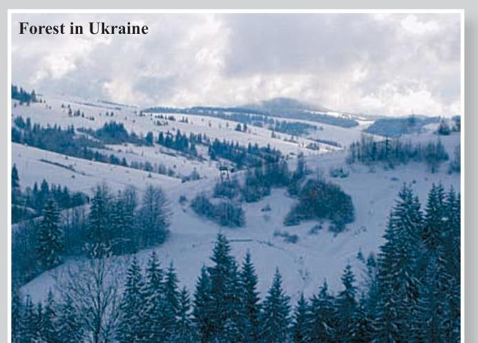
gyűjtő területre vonatkozó lefolyás-vizsgálatok készítésével annak megállapítására irányul, hogy a meteorológiai jellemzők, a felszíni lefolyás jellemzői és az erdőborítottság változása hogyan befolyásolta az elmúlt évek nagy tavaszi áradásainak kialakulását.

További feladatok között határozták meg többek között, hogy vizsgálják a Keleti- Kárpátok erdőterületeinek térbeli, korbeli, és állapoti struktúrájának az árvizek kialakulására gyakorolt hatását, az erdőállomány vízmegtartó képessége milyen koreloszlás és alkalmazott vágáskorok mellett optimális, az erdőhasználattal kapcsolatos alternatív lehetőségeket (kiemelten a gyephavas polonin - erdők felső határának helyreállítását, az erózió csökkentését), a csapadék függvényében a lefolyási tényező változását stb.

A kormány-meghatalmazottak tanácskozásán született döntés a Tisza folyó Tiszabecs-Tarpa és Lónya-Tiszasalamon közötti szakaszának közös

General Assembly of the Council of Sub-Carpathia County adopted a resolution to considerably reduce the felling of trees and to make stricter the audits in sylviculture. According to information from the Office of Sylviculture of Sub-Carpathia County, felling remained within the planned production data in the county during the period of validity of the Agreement. In recent years the coverage by forests of the area has been increasing.

Recently, the further tasks related to the utilisation of the results achieved, to the transmission of information and to the topics still to be examined, have been designated, taking into consideration the plan which was approved at the 2003 meeting of the transboundary water government delegates. According to this, the research work will aim at finding out, by the preparation of watercourse examinations relating to the catchment area, how the development of the big spring floods of recent years was influenced by the changes in meteorological characteristics, in the characteristics of surface watercourse and in the coverage by forests.

It was determined among other things, in the scope of further tasks, to examine the effect exercised on the development of floods by the spatial, age and condition structure of the forested areas of Eastern Carpathia, the optimum water retention capacity of the forests in case of a given age distribution and the felling ages applied, the alternative possibilities related to forest use (highlighting the restoration of the upper limit of grass-covered alps - Polonine - forest, the reduction of erosion), the change in the downflow factor depending on precipitation, etc.

At the meeting of the government delegates a decision was made on the preparation of a joint study
терміну дії Угоди вирубка лісу в області не перевищить передбачених у планах показників. За останні роки спостерігається зростання заліснення території молодими насадженнями.

Подальші завдання, пов'язані з використанням досягнутих результатів, передачею інформації та тих питань, які ще належить вивчити, востаннє були визначені з урахуванням плану, затвердженого в 2003 році на нараді Уповноважених урядів. Відповідно, дослідницька робота з аналізу стоку на водозбірній території р. Тиси спрямовується на визначення того, як вплинули метеорологічні характеристики, особливості поверхневого стоку, зміна лісистості на великі паводки минулих років.

Серед інших завдань: дослідження впливу територіальної, вікової структури лісів Східних Карпат та їх стану на паводки; при якому віковому розподілі, при вирубці дерев якого віку є оптимальною водозатримуюча здатність лісів; альтернативні можливості лісокористування (особливо, відновлення верхньої межі лісів, скорочення господарської діяльності на полонині); зміна коефіцієнта стоку залежно від опадів тощо.

Рішення, прийняте на нараді Уповноважених урядів про підготовку технічного завдання про спільне регулювання русла р. Тиси на ділянці між селищами Тисабеч-Тарпа і ЛоняСоломоново, було виконано своєчасно, до квітня 2004 року. На наступній зустрічі було ухвалено нове рішення: спільно провести детальне геодезичне дослідження ділянки р. Тиси між селищами Лоня та Соломоново і на підставі цього дослідження здійснити необхідні випро-

---

mederszabályozási tanulmánytervének elkészítéséről, ami határidőre, 2002. áprilisban elkészült. A következő ülésszakon további feladat született: közösen el kell végezni Lónya-Tiszasalamon közötti Tisza szakasz részletes geodéziai felmérését és erre alapozva kell végezni a szükséges modellvizsgálatokat. A modellvizsgálatok elkészültek, egyeztetésre az ukrán Félnek átadásra kerültek. Időközben megállapítást nyert, hogy a 719-722. és a 626-635. km-szelvényben is szükséges a modellvizsgálatokat elvégezni az újabb feladatkitúzés teljesítéséhez, vagyis a közös folyószakaszok közös mederszabályozási tervének elkészítéséhez. A modellvizsgálat elvégzésére a szükséges lépések megtörténtek. A modellezési adatok alapján egy általános mederszabályozási projekt elkészítését (2005. március 30-ig) vették tervbe a Lónya-Tiszasalamon (Solomonove) szakaszra.

Mindkét fél kifejezte igényét a közös tudományos kutatások és közös projektek szélesítése terén az új együttműködési formák kidolgozására, különös tekintettel a sokoldalú nemzetközi és kormányközi egyezményekre. Az ukrán oldali megítélés szerint nem kellő mértékben használják ki az árvizek kialakulási területein a közös árvízvédelmi létesítmények (tározók, polderek) projektjeinek készítési lehetőségeit, holott ezek jelentős mértékben hozzájárulnának a felszíni vízfolyások kumulációjához és nem csak az elemi csapás veszélyét, hanem a következmények likvidálásával kapcsolatos költségeket is csökkentenék.

A magyar fél jelezte, hogy egyfelől elnyert pályázatai (a PHARE-CBC projekt keretében „A Magyar-Ukrán Belvizzvédelmi Szabályzat korszerüsitése " címmel, és a Gazdasági Versenyképesség
plan on the bed regulation of the Tisza River's sections between Tiszabecs-Tarpa and Lónya-Tiszasalamon, which was prepared by the deadline, in April 2002. At the next meeting a further task was defined: a detailed geodesic survey of the Tisza section between LónyaTiszasalamon was to be carried out jointly, and based on this the required model examinations had to be made. The model examinations were prepared and handed over to the Ukrainian party for approval. In the meanwhile it was found that the model examinations were also to be carried out at the $719-722 \mathrm{~km}$ and $626-635 \mathrm{~km}$ segments in order to perform the newer task, i.e. to prepare the joint plant of bed regulation of the common river sections. The necessary steps were taken to carry out the model examination. Based on the modelling data, the preparation of a general bed regulation project (by 30 March 2005) was planned for the Lónya-Tiszasalamon (Sholomonove) section.

Both parties expressed their need for the elaboration of new forms of cooperation in the field of joint scientific research and common projects, with particular regard to the multilateral international and inter-governmental agreements. In the judgment of the Ukrainian side the possibilities to prepare projects of joint flood protection facilities (basins, polders) are not exploited sufficiently in the areas where floods develop, although they would considerably contribute to the accumulation of surface waterflows and they would reduce not only the risk of natural disasters but also the costs of liquidating the consequences.

The Hungarian party signalled that, on the one hand, it wished to involve Ukrainian experts in the implementation of its won tenders (entitled "Modernisation of the Hungarian-Ukrainian Inland

бування з моделювання, і його матеріали були передані українській стороні на узгодження. Водночас з'ясувалося, що для визначення наступного завдання, тобто, для складання плану щодо спільного регулювання русла на сумісних ділянках необхідно провести випробування шляхом моделювання на ділянках між 719-722 км і 626-635 км. Необхідні заходи для проведення таких випробувань вжиті. На підставі даних моделювання запланована розробка проекту по загальному регулюванню русла на ділянці Лоня-Соломоново.

Обидві сторони заявили про необхідність розширення взаємодії в проведенні спільних наукових досліджень та здійсненні спільних проектів, розроблення нових форм співпраці з урахуванням багатосторонніх міжнародних і міжурядових угод. Українська сторона вважає, що можливості розробки проектів по спільних протипаводкових спорудах (сховища, польдери) на паводконебезпечних територіях використовуються не повною мірою, незважаючи на те, що ці споруди могли б відіграти дуже важливу роль в акумуляції поверхневих стоків, і не тільки істотно знизити небезпеку стихійних лих, але й стримати витрати на ліквідацію їх наслідків.

Угорська сторона, з одного боку, виявила намір залучити українських фахівців у здійснення тендерів, в яких вона перемогла (в рамках проекту PHARE-CBC під назвою «Модернізація Угорсько-Українського Регламенту на внутрішніх водах», в рамках Оперативної програми економічної конкурентоспроможності під назвою «Комплексне прогнозування паводків та режиму водотоку Верхньої Тиси»), з другого боку,

---

Operatív Program keretében „A Felső-Tisza árvizeinek és vizjárásának komplex elörejelzése" címen nyert pályázatok) megvalósításában ukrán szakembereket szándékozik bevonni, másfelől, hogy az ukrán vízügyi szervekkel együtt több szakterületen kíván közös INTERREG III. pályázatot készíteni a konkrét tervezési munkák finanszírozása érdekében.

### 3.7. Nemzetközi finanszírozású projektek, két- és többoldalú együttmüködés

A határvizi nemzetközi együttműködés rendszerében az ukrán kormány - a magyar kormánnyal kötött Egyezményen kívül - hasonló egyezményeket kötött több (a vízgyűjtő szerint) szomszédos országgal, így Szlovákiával (1994ben) és Romániával (1997-ben).

A magyar-ukrán határvizi egyezmény területi hatályát érintő régióban 2000-2004 között számos nemzetközi finanszírozású projekt is indult, illetve van folyamatban. (Ukrajna és a NATO Közös projektje Kárpátalja területén; a dán ügynökséggel folytatott együttmüködési projekten belül a DANCEE Projekt a MIKE 11 programcsomag alapján, az Ung és a Latorca folyók (Ukrajna) hidrodinamikai és csapadék- és vízhozam-modellezése tárgyában; a TACIS CBC SPF programon belül - támogatás az „Árvizvédelem kezelése a Tisza medencéjében" EU TACIS program megvalósítása keretében; TACIS Projekt „Árvizi kockázatértékelés és az árvizek kezelése Kárpátaljai területen" címmel. A Svájci Konföderáció kormánya

Water Protection Regulation" in the framework of the PHARE-CBC project and "Complex Forecasting of the Floods and Waterflow of the Upper Tisza River" in the framework of the Operative Programme of Economic Competitiveness), and, on the other hand, that it wished to prepare joint INTERREG III tenders in several fields together with the water bodies in Ukraine, in the interest of funding specific planning work.

### 3.7. Internationally Financed Projects, Bilateral and Multilateral Cooperation

Intheframeworkofinternationalcooperationrealised in the field of transboundary waters, the Ukrainian Government concluded, alongside the Agreement entered into with the Hungarian Government, similar agreements with several countries neighbouring on the catchment area, for example with Slovakia (in 1994) and Romania (in 1997).

In the region covered by the territorial scope of the Hungarian-Ukrainian Transboundary Water Agreement, a number of internationally financed projects were launched between 2000 and 2004 and are in progress (Ukraine's and NATO's joint project in the area of Sub-Carpathia; within the cooperation project carried out jointly with the Danish agency: the DANCEE Project based on the programme package MIKE 11, on the subject of the hydro-dynamic and precipitation and water output modelling of the Ung and Latorca Rivers (Ukraine); within the TACIS CBC SPF programme: support in the framework of the implementation of the EU TACIS programme entitled "Flood Protection Management in the

має намір на користь фінансування конкретних робіт прийняти участь разом з українськими водогосподарськими органами у спільному тендері INTERREG III, який охоплює багато областей співпраці на прикордонних водах.

## 3.7. Проекти міжнародного фінансування, двота багатостороння співпраця

В системі міжнародної співпраці на прикордонних водах українським Урядом, крім Угоди, укладеної з угорським Урядом, укладено подібні угоди з іншими державами, які є (по водозбірному басейну р. Тиси) сусідами: в 1994 році із Словаччиною, в 1997 році - з Румунією.

В період 2000-2004 років на території, що підпадає під дію угорсько-української Угоди на прикордонних водах, почато та продовжується реалізація багатьох проектів міжнародного фінансування. (Спільний проект України та НАТО на Закарпатті; на базі групи програм MIKE 11 Проект DANCEE, в рамках проекту співпраці з датським агентством щодо гідродинамічного моделювання і моделювання опадів і водоносності річок Уж та Латориця (Украина); в рамках програми TACIS CBC SPF - підтримка в рамках здійснення програми EU TACIS «Протипаводковий захист в басейні Тиси»; проект TACIS під назвою «Оиінка паводкового ризику і управління паводками в Закарпатській області». В рамках Угоди про технічну і фінансову співпрацю між Урядом Швейцарії та Урядом України здійснюється спільний українсько-швейцарський проект під назвою

---

és Ukrajna kormánya közötti műszaki és pénzügyi együttműködési egyezmény keretein belül valósul meg a „Kárpátaljai régió hegyi folyóinak és folyamainak üzemeltetése" című közös ukrán-svájci projekt.)

A NATO Békepartnerség program keretében ukrán hivatalos felkérésre - 2001-ben megkezdett Közös Ukrajna-NATO Árvizkészültségi és Reagálási projekt a 2002-re kitűzött első ütem céljai teljesítésre kerültek. A tag- és társult országok képviselőiből álló szakértőcsoport értékelő tanulmánya az egész Tisza-völgyre kiterjedően elemezte az árvíz- és a katasztrófavédelem feladatait, az árvízkatasztrófa megelőzés minden fontos elemével összefüggésben javaslatokat fogalmazott meg. (A projekt szakértői csoportjában Belgium vezetésével további 9 ország, Csehország, Németország, Magyarország, Svédország, Svájc és az Egyesült Államok, Szlovákia, Románia és természetesen Ukrajna, mint érdekelt vett részt.)

A szakértői csoport a tanulmányában - azon túl, hogy megadta a rendszerszemléletű közelítés területeit és módját - mielőbbi regionális, többoldalú együttműködést sürgetett a felső-tiszai vízgyűjtő országhatárral való osztottságából következő hatások csökkentésére, megfogalmazva a regionális együttműködés lehetséges műszaki tartalmát. Javasolta továbbá a különböző finanszírozásban folyó és az árvizi katasztrófavédelemmel foglalkozó EU és más nemzetközi projektek mielőbbi összehangolását.

A projekt finanszírozása is elismerést érdemlő nemzetközi összefogást tükrözött. A felméréssel, elemzéssel, tanulmánykészítéssel kapcsola-

Tisza Basin"; the TACIS Project entitled "Flood Risk Evaluation and Flood Management in the Area of Sub-Carpathia". The joint Ukrainian-Swiss project entitled "Operation of the Mountain Rivers and Processes of the Sub-Carpathian Region" was implemented in the framework of a agreement on technical and financial cooperation between the Government of the Swiss Confederation and the Government of Ukraine.)

The aims of the first phase, set for 2002, of the joint Ukraine-NATO Flood Preparedness and Response Project which was started in 2001 at an official request by Ukraine in the framework of NATO's Piece Partnership Programme, have been achieved. The evaluation study by an expert team consisting of the representatives of the member and associated states analysed, with respect to the whole Tisza Valley, the tasks of flood and disaster protection, and worded proposals in connection with each important element of the prevention of flood disaster. (Under the leadership of Belgium a further 9 countries - the Czech Republic, Germany, Hungary, Sweden, Switzerland, the United States, Slovakia, Romania and, of course Ukraine, as an interested party - participated in the expert team of the project.)

Over and above defining the fields and the method of systematic approach, the expert team urged in its study a multilateral cooperation in order to reduce the effects resulting from the fact that the Upper Tisza catchment area is divided by state borders, also describing the possible technical contents of regional cooperation. Furthermore, it proposed harmonising as soon as possible the EU and other international projects in different sources of funding and dealing with flood disaster protection.
«Експлуатація гірських річок та водотоков Закарпатської області»).

Цілі першого етапу, розпочатого в 2001 році, за офіційним українським запитом у рамках Проекту НАТО з мирного партнерства спільного Проекту Україна - НАТО по протипаводковій готовності та реагуванню до 2002 року здійснені. Група експертів, що представляли країничлени та асоційовані держави, в своєму рефера-ті-оцінці, складеному стосовно всієї долини р. Тиси, проаналізувала завдання, що стоять перед органами по захисту від паводків та катастроф, та сформулювала рекомендації стосовно кожного важливого елемента запобігання паводкових катастроф (в групі експертів проекту під керівництвом Бельгії приймали участь ще 9 країн, а саме: Чехія, Німеччина, Угорщина, Швеція, Швейцарія, США, Словаччина, Румунія і, як заінтересована сторона, Україна).

Група експертів у своєму звіті-рефераті, крім визначення територій і методів системного підходу, сформулювала можливий технічний зміст регіональної співпраці та наполягала на найшвидшому встановленні регіонального, багатостороннього співробітництва для забезпечення пом'якшення дії, що виникає з розділеності водозбірного регіону Верхньої Тиси державним кордоном. Крім цього, експерти рекомендували якомога раніше погоджувати проекти ЄС та інші міжнародні проекти, присвячені захисту від паводкових катастроф щодо фінансування з різних джерел.

Фінансування проекту відобразило міжнародне об'єднання сил. Витрати, пов'язані з дослідженнями, аналізом і розробкою рефератів,

---

tos költségeket a NATO Polgári Költségvetése, továbbá Kanada, Csehország, Magyarország, Lengyelország, Svédország és Belgium Flamand Közösségének önkéntes hozzájárulása fedezte. Emellett Magyarország, Románia, Szlovákia, Svájc, Svédország, Belgium, Csehország, az Egyesült Államok és Ukrajna szakembereik rendelkezésre bocsátásával természetbeni támogatást is biztosított.

A projekt hasznosulása már szerényebbnek minősíthető, amit az ukrán oldali ellenőrzési megállapítás azzal együtt jelzett, hogy célszerúnek tartották a problémák magasabb nemzetközi együttműködési szintű megoldását (pl. úgy, hogy a vízgazdálkodási tevékenység irányítása és ellenőrzése nemzetközi medence-elv szerint valósuljon meg az érdekelt felek által létrehozott közös vezetéssel, hivatalokkal, műszaki eszközökkel és költségvetéssel, illetékes nemzetközi szervezetek ellenőrzése mellett). Az ukrán oldali megítélés szerint az erőfeszítések és pénzeszközök rendszerszemléletű és céltudatos egyesítése szempontjából az egyes lokális projektek (utalva a Közös Ukrajna - NATO projektre) a Felső Tisza árvízvédelmét nem oldják meg.

A párhuzamos ellenőrzés közös következtetésre jutott abban, hogy a Tisza vízgyűjtőjének természetvédelmi és árvízvédelmi kérdései kapcsán nemcsak kétoldalú, hanem többoldalú egyezményeket is célszerű kötni azon országokkal, amelyeket a Tisza átszel. Ezt indokolja az ökológiai állapot monitoringjának, a vízkészletek medenceelvű szabályozásának szükségessége, és ezzel az irányítás komplex jellegének biztosítása, a Tisza medence határain belül a potenciálisan veszélyes

The funding of the project also reflected an international cooperation worthy of recognition. The costs related to surveys, analyses and the preparation of studies were covered by the Civilian Budget of NATO and also by the voluntary contributions of Canada, the Czech Republic, Hungary, Poland, Sweden and the Flemish Community of Belgium. In addition, by making available their experts, Hungary, Romania, Slovakia, Switzerland, Sweden, Belgium, the Czech Republic, the United States and Ukraine also provided a support in kind.

The utilisation of the project can already be qualified as more modest, something which was signalled by the findings of the audit by the Ukrainian side, together with the fact that they considered it expedient to solve the problems at a higher level of international cooperation (e.g. in such a manner that the direction and audit of the water management activity should be implemented according to an international river bed principle, with joint leadership, offices, technical tools and budget created by the interested parties, under the control of competent international bodies). In the judgment of the Ukrainian side the individual local projects (with reference to the joint Ukraine-NATO project) would not solve the question of the flood protection of the Upper Tisza River from the point of view of the expedient unification, with a systematic approach, of efforts and financial means.

The parallel audit came to a joint conclusion in that it would be expedient to conclude not only bilateral, but also multilateral agreements with the countries intersected by the Tisza River, in relation to the issues of nature preservation and flood protection of the Tisza River catchment area. This

покривалися за рахунок Цивільного бюджету НАТО та добровільних внесків Канади, Чехії, Угорщини, Польщі, Швеції та Фламандської общини Бельгії. Крім цього, наданням своїх фахівців Угорщина, Румунія, Словаччина, Швейцарія, Швеція, Бельгія, Чехія, США і Україна забезпечили реальну технічну підтримку.

При цьому українська сторона вважає доцільним розв’язання проблем на більш високому рівні міжнародної співпраці (наприклад, так, щоб управління і контроль водогосподарської діяльності здійснювався за принципом міжнародних басейнів з керівним органом і відомствами, технічним засобами і бюджетом, створеним заінтересованими сторонами, під контролем компетентних міжнародних організацій.). Українська сторона вважає, що з погляду системного і цілеспрямованого об'єднання зусиль і фінансових ресурсів, окремі локальні проекти не можуть вирішити всі питання, пов'язані із захистом Верхньої Тиси від паводків.

В ході паралельного контролю сторони дійшли до загального висновку про те, що з природоохоронних та протипаводкових питань басейну p. Тиси доцільно укласти не тільки двосторонні, але і багатосторонні угоди з державами, через які протікає р. Тиса. Це аргументується необхідністю моніторингу екологічного стану, управлінням водними ресурсами за басейновим принципом i , цим самим, забезпечення комплексного характеру управління, доцільністю створення спільних структур, контролюючих в рамках басейну p . Тиси стан потенційно небезпечних об'єктів.

За українською ініціативою у 1999 році в м. Ужгороді була організована чотиристороння,

---

objektumok állapotát ellenőrző közös struktúrák megteremtésének célszerüsége.

Ukrán kezdeményezésre 1999-ben Ungváron négyoldalú, majd 2001-ben magyar-ukrán közös kezdeményezésre Budapesten ötoldalú találkozót szerveztek, ahol elfogadták a Budapesti Nyilatkozatot. Továbbá a Tisza és vízgyűjtőjére vonatkozó árvízvédelmi együttműködés koordinálására létrehozták az ötoldalú Tisza-völgyi Árvízvédelmi Fórumot Szlovákia, Ukrajna, Románia, Magyarország és Jugoszlávia (Szerbia és Montenegró) részvételével. A Közös Ukrajna - NATO projekt szakértői csoportja a javaslatai megvalósításához megfelelő intézményi és jogi keretnek tekintette a Budapest Nyilatkozat alapján indult ötoldalú Tisza-völgyi árvízvédelmi együttműködést.

A Budapesti Nyilatkozat elfogadását követően minden magyar-ukrán kétoldalú határvizi kor-mány-meghatalmazotti ülésszakon foglalkoztak az ötoldalú együttműködésből adódó feladatok meghatározásával. Mindkét fél kezdeményezései igyekeztek hozzájárulni az ötoldalú együttműködés konkrét tartalommal való kitöltéséhez. A nemzetközi finanszírozású projektekkel kapcsolatos tájékoztatások azonban nem minden esetben voltak kellő mélységűek, vagy csak késedelemmel valósult meg az érdemi információáramlás (pl. a 2003-ban kezdett ,,Árvizi kockázatbecslés és -kezelés Kárpátalján" című TACIS projekt keretében folyó munka esetében a kiírt feladat újraértelmezése és a határvizi egyeztetések elhúzódása).

Még nem alakult ki a kormányközi egyezmények alapján működő fórumok és a projektek
is justified by the necessity of regulating, on the basis of the river bed principle, the water stocks, of monitoring the ecological condition, and thereby by securing the complex nature of management, by the expedience of the creation of joint structures auditling the condition of potentially dangerous objects within the boundaries of the Tisza Basin.

On a Ukrainian initiative, a quadrilateral meeting was organised in Ungvár in 1999, then on a joint Hungarian-Ukrainian initiative a quinquelateral meeting was organised in Budapest in 2001, where the Budapest Declaration was adopted. Furthermore, a quinquelateral Tisza Valley Flood Protection Forum was created to coordinate the flood protection cooperationregardingtheTiszaRiveranditscatchment area, with the participation of Slovakia, Ukraine, Romania, Hungary and Yugoslavia (Serbia and Montenegro). The expert team of the joint UkrainianNATO project considered the quinquelateral Tisza Valley flood protection cooperation, launched on the basis of the Budapest Declaration, as constituting an appropriate institutional and legal framework for the implementation of the team's proposals.

After the adoption of the Budapest Declaration, the determination of the tasks resulting from the quinquelateral cooperation was dealt with by each meeting of government delegates of the HungarianUkrainian bilateral transboundary water cooperation. The initiatives of both parties tried to contribute to giving the quinquelateral cooperation concrete contents. However, the information related to the internationally founded projects was not always of the requisite depth, or the flow of information on the merits was only realised belatedly (e.g. the delay in the reinterpretation of the prescribed task

потім за спільною угорсько-українською ініціативою в 2001 році в м. Будапешті - п’ятистороння зустріч, де була прийнята Будапештська Декларація. Далі, в інтересах координації співпраці по протипаводковому захисту р. Тиси і водозбірного регіону р. Тиси створено п’ятисторонній Форум захисту долини р. Тиси від паводків за участю Словаччини, України, Румунії, Угорщини і Югославії (Сербія і Чорногорія). Група експертів Спільного проекту Україна - НАТО вважає, що п’ятистороння співпраця, розпочата на базі Будапештської Декларації, забезпечує необхідні інституційні та юридичні рамки для здійснення їх рекомендацій.

Після ухвалення Будапештської Декларації на кожній нараді Уповноважених урядів по двосторонній угорсько-українській співпраці на прикордонних водах розглядалися питання, пов'язані з визначенням завдань із п'ятисторонньої співпраці. Обома сторонами проявлялась ініціатива, спрямована на наповнення п’ятисторонньої співпраці конкретним змістом. Проте, що стосується проектів міжнародного фінансування, то не завжди передавалася достатньо вичерпна інформація, або ж потік її зазнавав значної затримки (наприклад, дуже затягнулися узгодження по прикордонних водах, або нове тлумачення завдання, сформованого по роботах, що ведуться в рамках програми TACIS під назвою «Оиінка і управління паводковим ризиком на Закарпатті»).

Поки що не налагоджена належна співпраця між форумами, що працюють на підставі міжурядових угод, та робочими структурами проектів. Тому, не забезпечується координація і узгодже-

---

munkaszervezetei között a folyamatos együttmüködés. Ezért nem biztosított a koordináció és az összhang a fejlesztési programok között. Nem érvényesülhetett közvetlenül a kormányok és a területi szervek akarata. A projektek szakmai felügyeletét nem azok látták el, akik egyébként felelősek a térség árvizi biztonságáért.
Az utóbbi időben tapasztalható a Tisza-völgyi Árvizvédelmi Fórum résztvevői aktivitásának bizonyos lanyhulása, ami elsősorban az állandó szervezési és irányító szervek hiányával magyarázható, de ebben szerepe volt az érintett országok költségvetési lehetőségeinek is. Kedvezőnek tünik a Nemzetközi Duna Bizottság javaslata, miszerint 2004 végén kezdeményeztea TiszaVízgyűjtőjeVizkészleteinek Integrált Kezelési Tervét, és ennek érdekében létrehozott egy speciális szakértői csoportot, amelyben valamennyi, a Tisza által érintett ország képviseltetve van. A tervek szerint ez az Integrált Terv a Duna Vizgyüjtője Kezelési Tervének része lesz. A nem EU-tagországok (Ukrajna, Románia, Szerbia, Montenegró) által elvégzendő munka finanszírozását az ENSZ Fejlesztési Program nemzetközi projektjének és a Környezetvédelmi Világalap támogatásából szándékozzák megoldani. A müszaki feladat és a tartalom meghatározása már gyakorlatilag megtörtént. Az ehhez szükséges ötoldalú egyetértés kifejezése - 2004 decemberében - a Tisza-menti országok szándéknyilatkozatának aláírásával megtörtént.
Az ICPDR Ad Hoc Tisza Csoport első ülését 2005. február 9-én tartotta Budapesten az öszszes érdekelt fél - beleértve a nem-kormány-
and in the transboundary water reconciliation in case of the work carried out in the framework of the TACIS project entitled "Flood Risk Estimating and Management in Sub-Carpathia", started in 2003).
No continuous cooperation has yet been developed between the forums operating on the basis of inter-governmental agreements and the working organisations of the projects. Therefore, no coordination and harmony are secured in the development programmes. The will of the governments and regional bodies could not be directly enforced. The professional supervision of the projects was not provided for by the persons who were otherwise responsible for the flood safety of the region.
Recently a certain slackening has been experienced in the activity of the participants of the Tisza Valley Flood Protection Forum, which may be explained mainly by the absence of permanent bodies of organisation and management, but the budgetary possibilities of the countries involved have also had a role in this. The proposal of the International Danube Commission seems to be favourable: it initiated, late in 2004, an Integrated Management Plan of the Water Stocks of the Tisza River Catchment Area, and in order to carry this out it set up a special expert team, in which all countries affected by the Tisza River were represented. According to the plans this Integrated Plan will be a part of the Management Plan of the Catchment Area of the River Danube. They wish to solve the question of financing the works to be carried out by the non-EU member states (Ukraine, Romania, Serbia, Montenegro) from a grant of the international project of the UNO Development Programme and of the World

ність між програмами їх розвитку. Прагнення урядів і місцевих органів не може прямо втілитися в життя. Професійний контроль проектів здійснювався не тими посадовими особами, хто відповідає за безпеку регіону в питаннях захисту від паводків.
Останнім часом відчувається зниження активності учасників Протипаводкового Форуму басейну р. Тиси, що пояснюється, перш за все, відсутністю постійних організаційних та управлінських органів, проте, безумовно, не можна заперечувати і роль бюджетних можливостей заінтересованих країн. Дуже сприятливою видається ініціатива Міжнародної Дунайської Комісії, направлена в кінці 2004 року на розробку Плану інтегрованого управління водними ресурсами басейну р. Тиси, відповідно до якої була створена спеціальна група експертів, в якій представлені всі країни, розташовані на р. Тиса. Планується, що в подальшому цей документ стане частиною Плану управління басейну р. Дунай. Передбачається, що фінансування робіт, які виконуватимуться державами, що не є членами ЄС (Україна, Румунія, Сербія, Чорногорія), буде здійснюватися за рахунок грантів міжнародних проектів Програми Розвитку OOH і Всесвітньої Екологічної Фундації. Технічне завдання та зміст практично вже готові. У грудні 2004 року був підписаний Протокол намірів притисайських держав, що виражає необхідну для цього згоду п’яти сторін.
Перше засідання Спеціальної Тисайської групи ICPDR відбулося під головуванням ЄС в Будапешті 9 лютого 2005 року за участю всіх заінтересованих сторін, включаючи і неурядові

---

zati szerveket - részvételével, EU elnöklettel. Elhatározták, hogy UNDP-GEF kisprojekt segítségével 2006-ra elkészítik a Tisza vízgyűjtő-gazdálkodási és árvízkezelési helyzetjelentést az EU és ICPDR normáknak megfelelően és meghatározzák a 2009. évi jelentési időszakig terjedő további feladatokat. Az árvízkezelési jelentés involválja a Tisza Fórum keretében folyó munka eredményeit is.

Budapest/Kiev, 2005. június
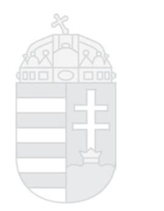

Dr. Kovács Árpád
President - State Audit Office Republic of Hungary

Wildlife Fund. The technical task and the contents have been practically defined. The quinquelateral consent required for this purpose was expressed in December 2004, by signing the declaration of intent of the countries located along the Tisza River.

The first meeting of the ICPDR Ad Hoc Tisza Team was held on 9 February 2005 in Budapest, with the participation of all interested parties, including the non-governmental bodies, under an EU presidency. It was resolved that the situation report on the Tisza River catchment area management and flood management would be prepared with the help of the UNDP-GEF minor project by 2006, according to the standards of the EU and the ICPDR, and that they would define the further tasks to cover the period lasting until the 2009 reporting period. The flood management report will also integrate the results of the work carried out in the framework of the Tisza Forum.

Budapest/Kiev, June 2005
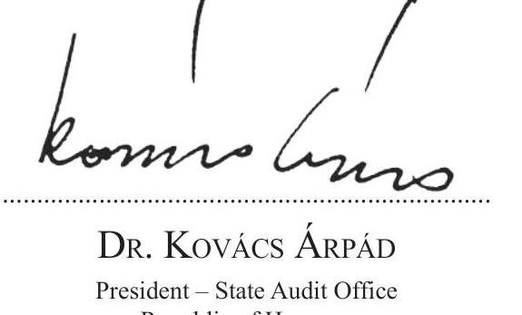

The Head of the Accounting Chamber of Ukraine

---

.

---

.

---

Edited by
Zsigmond Bihary, Director General of Audit
Volodymyr Pershyn, First Deputy Head
Compiled by
Zoltán Hudik, Associate Head of Division
Mariya Shulezhko, Director of Department
Responsible for publishing
Pál Csapodi, Secretary General
Cover Design by
István Kiss
Tipographer-designer
Gergely Pattantyus
Published by
Király \&Társai Ltd., Budapest
Printed and bound by
Typo-Rep Nyomda, Budapest
The photos in the report are protected by copyright.

---

# Рахункова палата України 

вул. М. Коцюбинського, 7
01601, Київ-30 УКРАЇНА
Tel.: ++380442249565,2354347.
Fax: ++380442240563,2342030
http://www.ac-rada.gov.ua

## Állami Számvevőszék

1052 Budapest, Apáczai Csere János utca 10.
Levélcím: 1364 Budapest, Pf. 54
Tel.: +36 14849100 Fax: +36 14849200
http://www.asz.hu