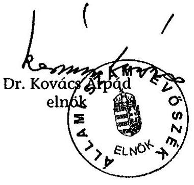
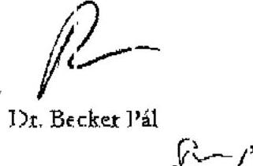

# JELENTÉS 

## a Köztársasági Elnökség fejezet működésének ellenőrzéséről

---

2. Államháztartás Központi Szintjét Ellenőrző Igazgatóság
2.3. Átfogó Ellenőrzési Főcsoport
Iktatószám: V-4-20/2005.
Témaszám: 751.
Vizsgálat-azonosító szám: V0192
Az ellenőrzést felügyelte:
Bihary Zsigmond
főigazgató
Az ellenőrzés végrehajtásáért felelős:
Hegedűsné dr. Müllern Veronika
főcsoportfőnök
Az ellenőrzést vezette:
dr. Horváth Margit
osztályvezető főtanácsos
Az ellenőrzést végezték:
Séra Andrásné Szabóné Simai Mária
számvevő tanácsos számvevő
főtanácsadó

# A témához kapcsolódó eddig készített számvevőszéki jelentések: címe 

sorszáma
Jelentés a Köztársasági Elnökség fejezet működésének pénzügyigazdasági ellenőrzéséről 1993.
Jelentés a Köztársasági Elnökség fejezet működésének pénzügyigazdasági ellenőrzéséről
Jelentés a Köztársasági Elnökség fejezet működésének 0227
ellenőrzéséről
Jelentés a Magyar Köztársaság 2002. évi költségvetése 0329
végrehajtásának ellenőrzéséről
Vélemény a Magyar Köztársaság 2003. évi költségvetési 0241
törvényjavaslatáról
Jelentés a Magyar Köztársaság 2003. évi költségvetése 0443
végrehajtásának ellenőrzéséről
Vélemény a Magyar Köztársaság 2004. évi költségvetési 0338
javaslatáról
Vélemény a Magyar Köztársaság 2005. évi költségvetési 0449
javaslatáról

---

# TARTALOMJEGYZÉK 

BEVEZETÉS ..... 3
I. ÖSSZEGZŐ MEGÁLLAPÍTÁSOK, KÖVETKEZTETÉSEK, JAVASLATOK ..... 5
II. RÉSZLETES MEGÁLLAPÍTÁSOK ..... 9

1. A fejezet feladat-és szervezetrendszere, valamint a költségvetési források összhangja ..... 9
1.1. A szakmai feladatok és a szervezeti rendszer alakulása ..... 9
1.2. A belső kontroll rendszer kialakítása és működtetése ..... 11
1.3. Az informatikai rendszer kialakítása, szabályozottsága, működtetése ..... 14
1.3.1. A Hivatal informatikai rendszerének kialakítása ..... 14
1.3.2. Az informatikai rendszer szabályozottsága és működtetése ..... 17
2. A fejezet gazdálkodása ..... 18
2.1. A költségvetés tervezése ..... 18
2.2. A bevételek alakulása ..... 21
2.3. Az előirányzatok módosítása, az előirányzat-maradványok alakulása ..... 21
2.4. A személyi juttatásokkal és a létszámmal való gazdálkodás ..... 23
2.4.1. A vezetői juttatásokra vonatkozó előírások érvényesülése ..... 25
2.5. A dologi kiadások alakulása ..... 26
2.6. A felhalmozási kiadások alakulása ..... 27
2.6.1. A Köztársasági Elnöki Hivatal székhelyváltozása, a működési, gazdálkodási feltételek kialakítása ..... 28
2.7. A fejezeti kezelésű előirányzatok felhasználása ..... 30
2.8. Az éves költségvetési beszámolók, mérlegek valódisága ..... 31
3. Az előző vizsgálataink javaslatai alapján megtett intézkedések ..... 32
MELLÉKLETEK
4. számú A Köztársasági Elnöki Hivatal vezetőjének észrevétele
5. számú A Köztársasági Elnöki Hivatal Sándor-palotába történő elhelyezésének folyamatábrája
6. számú Táblázatok

---

# RÖVIDÍTÉSEK JEGYZÉKE 

| ÁSZ | Állami Számvevőszék |
| :-- | :-- |
| Hivatal | Köztársasági Elnöki Hivatal |
| OGY | Országgyűlés |
| OGY Hivatala | Országgyűlés Hivatala |
| Áht. | Az államháztartásról szóló 1992. évi XXXVIII. törvény |
| Ámr. | Az államháztartás működési rendjéről szóló 217/1998. |
|  | (XII. 30.) Korm. rendelet |
| SzMSz | Szervezeti és Működési Szabályzat |
| eKormányzat | Elektronikus kormányzat |
| Ktv. | a köztisztviselők jogállásáról szóló 1992. évi XXIII. tör- |
|  | vény, illetve a köztisztviselők jogállásáról szóló 1992. évi |
|  | XXIII. törvény, valamint egyéb törvények módosításáról |
|  | szóló 2001. évi XXXVI. törvény |
| HM | Honvédelmi Minisztérium |
| NKÖM | Nemzeti Kulturális Örökség Minisztériuma |
| ME | Miniszterelnökség fejezet |
| MKGI | Miniszterelnökség Közbeszerzési és Gazdasági Igazgatósá- |
|  | ga |
| KVI | Kincstári Vagyoni Igazgatóság |

---

# JELENTÉS 

## a Köztársasági Elnökség fejezet működésének ellenőrzéséről

## BEVEZETÉS

Az éves költségvetési törvények a központi költségvetés részeként határozzák meg a Köztársasági Elnökség fejezet működését biztosító államháztartási forrásokat azzal a céllal, hogy a fejezet egyetlen intézményén, a Köztársasági Elnöki Hivatalon (Hivatal) keresztül a köztársasági elnök elláthassa az alkotmányos feladatkörét.

A köztársasági elnök és hivatala méltó elhelyezéséről a 2002. évi XLI. törvény rendelkezett. A Hivatal 2003. január végén költözött az Országgyűlés épületéből a Sándor-palotába.

A fejezet kiadási előirányzata - a korábbi, az 1998-tól 2001-ig terjedő időszakra vonatkozó átfogó ellenőrzésünk óta - a vizsgált időszakban jelentősen nőtt.

Az Állami Számvevőszék (ÁSZ) a Köztársasági Elnökség fejezetnél 1993-ban, 1998-ban, majd 2002-ben végzett átfogó ellenőrzést, ezt követően minden évben véleményezte a fejezet éves költségvetési javaslatának megalapozottságát, továbbá ellenőrizte az annak végrehajtásáról készített beszámolót.

Ellenőrzésünk célja annak értékelése volt, hogy a fejezet

- irányítási, működési rendje és a székhelyváltozást követő adminisztráció kialakítása összhangban volt-e a jogszabályokban meghatározott feladatokkal;
- költségvetési gazdálkodásában érvényesültek-e a törvényességi és a célszerűségi szempontok; a fejezeti kezelésű előirányzatok felhasználása szabály- és célszerűen történt-e;
- informatikai rendszerének kialakítása, szabályozottsága és működtetése megfelelt-e a célszerűségi szempontoknak;
- gazdálkodási tevékenységében hasznosította-e a korábbi ellenőrzéseink megállapításait, javaslatait.

Az átfogó ellenőrzésünk a 2002-2004. év végéig terjedő időszak feladatellátására és gazdálkodására terjedt ki, a helyszíni ellenőrzés lezárásáig tartó időszak gazdálkodási folyamataira is kitekintünk. A Magyar Köztársaság 2004. évi költségvetéséről és az államháztartás hároméves kereteiről szóló 2003. évi CXVI. törvény szerint a fejezet költségvetési támogatással fedezett 2004. évi kiadási előirányzata 933,1 M Ft volt.

---

Az ellenőrzést az Állami Számvevőszékről szóló 1989. évi XXXVIII. törvény 2. § (3), illetve 17. § (3) bekezdései alapján végeztük.

A Hivatalnál az előtanulmány keretében kimunkált teljesítmény-ellenőrzési kérdéskörök és kritériumok figyelembevételével megvizsgáltuk az informatikai rendszer kialakítását költséghatékonyság (az informatikai fejlesztés eredményének értékelése a költségek függvényében) és eredményesség (a célok megvalósulásának mértéke) szempontjából.

Ellenőrzésünk keretében - külön program alapján - megkezdtük a Magyar Köztársaság 2004. évi költségvetése végrehajtásának ellenőrzéséhez kapcsolódóan a pénzügyi szabályszerűségi ellenőrzést a fejezet 2004. évi kiadási és bevételi pénzforgalmi adatai figyelembevételével. Az ellenőrzési feladat végrehajtásának eredményeit (megállapításait) a Magyar Köztársaság 2004. évi költségvetése végrehajtásának ellenőrzéséről szóló jelentés fogja tartalmazni.

A jelentést egyeztettük a Köztársasági Elnöki Hivatal vezetőjével, aki a megállapításainkra nem tett észrevételt (1. sz. melléklet).

---

# I. ÖSSZEGZŐ MEGÁLLAPÍTÁSOK, KÖVETKEZTETÉSEK, JAVASLATOK 

A fejezetnek a köztársasági elnök, mint legfőbb közjogi méltóság hagyományos alkotmányos feladatai ellátásának feltételeit kellett biztosítani az éves költségvetési törvényekben meghatározott forrásokból.

Az elnök munkaszervezeteként működő Köztársasági Elnöki Hivatal 2003 januárjában az Országház épületéből átköltözött a felújított ${ }^{1}$ budavári Sándorpalotába, ezzel is kifejezve a köztársasági elnöknek az Országgyűléstől való alkotmányos függetlenségét. A Hivatal méltó elhelyezéséről külön törvény² rendelkezett.

A Hivatal a székhelyváltozást megelőzően az OGY Hivatalával kötött megállapodásban rögzített feladat-megosztással látta el a gazdálkodási, műszaki feladatok nagy részét, így nem alakította ki teljes körűen a saját gazdaságiműszaki szervezetét.

A költözést követően a Hivatal által használható alapterület a másfélszeresére nőtt ${ }^{3}$. A Hivatal szervezete a gazdálkodási és működtetési többletfeladatok miatt célszerűen módosult. A főosztályi szintű szervezeti egységek számának változatlanul hagyásával, gondnokság létrehozásával, továbbá a pénzügyi terület státuszainak növelésével megerősítették a Központi Titkárságot, miközben a Hivatal költségvetési létszámát a 2002. évi 48 főről 2004-re csak 6 fővel növelték.

A belső kontrollok kiépítésénél és működtetésénél hasznosították az előző átfogó ellenőrzésünk megállapításait, a vizsgált időszakban a Hivatal rendelkezett a szabályszerű gazdálkodást biztosító, a Hivatal szempontjából lényeges szabályzatokkal, amelyeknek az előírásait betartották. Ugyanakkor szabályozási hiányosságokat a jelen ellenőrzésünk is feltárt, a ruházati költségtérítés összegét nem aktualizálták; az ötvenezer forint alatti gazdasági eseményeknél a pénzügyi jogkörök gyakorlását ${ }^{4}$ nem szabályozták.

Az üvegzseb törvényben és a kapcsolódó jogszabályokban előírt feladatokat - az alapító okirat honlapon való megjelentetése kivételével - teljesítették.

[^0]
[^0]:    ${ }^{1}$ A teljes rekonstrukcióhoz a költségvetésben a forrásokat a NKÖM, illetve az ME fejezetnél biztosították, a felhasználás ellenőrzését az ÁSZ az érintett fejezetek soron következő vizsgálata keretében végzi el.
    ${ }^{2}$ A köztársasági elnök és Köztársasági Elnöki Hivatal elhelyezéséről szóló 2002. évi XLI. törvény.
    ${ }^{3}$ A palota hasznos alapterülete $5368 \mathrm{~m}^{2}$. Az Országház épületében a Hivatal $3638 \mathrm{~m}^{2}$ területet használt.
    ${ }^{4}$ Hivatalvezetői utasításként a helyszíni ellenőrzés időszakában kiadásra került.

---

A Hivatal informatikai rendszere ${ }^{5}$ speciális funkciókkal és adatbázissal bővített irodaautomatizálási környezetet jelent. A rendszer biztonságos működtetése szempontjából fontos szabályozások azonban a Hivatalnál hiányoznak. Nem rendelkeznek Informatikai Biztonsági Szabályzattal, továbbá a felhasználói jogosultságra, a mentésekre vonatkozó szabályozásokkal. Ugyanakkor a rendszer fizikai és logikai védelme megoldott. Kockázatos gyakorlatként a levelező rendszernek és az Internetnek a használatát felhasználói oldalon nem korlátozták.

Az informatikai rendszernek a Hivatalnál történő kialakítását a teljesítményellenőrzés módszerével vizsgáltuk. A beszerzéseknél törekedtek a költséghatékonyság szempontjainak érvényesítésére. Az informatikai fejlesztések eredményesek voltak, 2004 végére a Hivatal egy korszerű, a felhasználói munkaállomásokon azonos műszaki paraméterekkel rendelkező informatikai hátteret alakított ki. A rendszer működésének hatékonyságát kedvezőtlenül befolyásolja, hogy a levelező rendszer és az Internet használatánál nem alkalmaznak tartalomszűrést.

A rendelkezésre álló költségvetési források ( 2716 M Ft ) kiegyensúlyozott, zavartalan működést tettek lehetővé. A fejezet kiadási előirányzata 2002-ről 2004-re ${ }^{6} 50 \%$-kal növekedett, amelyet a személyi juttatásoknak a köztisztviselői törvény módosításaival elrendelt emelkedése, továbbá a palota fenntartási, üzemeltetési költségeinek megjelenése, a kitüntetésekhez kapcsolódó díjazások összegének növekedése indokolt.

Előirányzat-módosításokra az előző évi maradványok igénybevétele, a fejezeti kezelésű előirányzatok felhasználása, az átvett pénzeszközöknek, a kormányzati hatáskörben elrendelt támogatásoknak és a saját bevételeknek a többlete nyújtottak lehetőséget. Az előirányzat-módosítások minden esetben szabályosak és dokumentáltak voltak.

Az ellenőrzött időszakban likviditási probléma nem volt. Az intézmény finanszírozása negyedéves előirányzat-felhasználási tervek alapján, időarányosan történt. A Hivatal részére évente az előirányzat-felhasználási kereteket időben megnyitották. Az időarányos ütemezéstől eltérést az állami kitüntetések előirányzatánál kért a Hivatal minden évben, mivel a Kossuth- és Széchenyi-díjak és a velük járó jutalmak átadására évente március 15-én került sor. A fejezeti kezelésű előirányzatot a vizsgált időszakban a díjazottak számának tervezési bizonytalanságai miatt minden évben kiegészítették (2002-ben az ME fejezettől csoportosították át az előirányzatot 17%-kal növelő összeget, 2003-2004-ben pedig az általános tartalék terhére - annak az Áht²-ban meghatározott céljától eltérően - kapott a fejezet az előirányzatot 62%-kal növelő összeget).

[^0]
[^0]:    ${ }^{5}$ A Hivatal, mint nem kormányzati szerv, közvetlenül nem kapcsolódik a Magyar Információs Társadalom Stratégia célkitűzéseihez.
    ${ }^{6}$ A fejezet 2005. évi 1651,9 M Ft összegű kiadási előirányzatában jelenik meg a 2005. évi köztársasági elnöki ciklusváltás költsége, amely annak egynegyedét teszi ki.
    ${ }^{7}$ Az Áht. 25. § (1) bekezdése szerint: „A központi költségvetésben általános tartalékot kell

---

A fejezeti előirányzat-maradványok (összes teljesített kiadás 8%-a) az ellenőrzött időszakban kiadási megtakarításból keletkeztek, azok felhasználása szabályszerűen történt.

A személyi juttatásokra teljesített kiadások tették ki az ellenőrzött időszakban az összes kiadás 52%-át. Az e célra történő kifizetések jelentősen növekedtek, 2002-ről 2004-re 66,5%-kal a központi intézkedések hatására, illetve az átköltözést követő működtetési és gazdálkodási többletfeladatok létszámvonzatával összefüggésben. A Hivatalnál a Ktv. előírásainak betartásával alkalmaztak személyi fizetést, differenciált alapilletmény-emelést, továbbá illetménykiegészítést. Jutalmazásra a nem rendszeres személyi juttatások közel 70%-át fordították.

Az ellenőrzött időszakban felmerült összes kiadás 27%-át fordították dologi kiadásokra, melyek között meghatározó volt az üzemeltetésre, fenntartásra, továbbá a szolgáltatások igénybevételére fordított összegek nagysága. A kiadások növekedéséhez a feladatbővülés, az épület és az informatikai rendszer üzemeltetése mellett a fejezeti kezelésű előirányzatokból felhasználható keretösszegek emelkedése is hozzájárult.

Az ellenőrzött időszakban intézményi beruházási kiadásokra összesen 240,2 M Ft-ot fordítottak. A Hivatal költségvetéséből biztosítottak fedezetet a palota rekonstrukciója során elmaradt feladatok megvalósítására (épület és környezete
 díszítő elemei, a faragott kőkerítés, a díszlánc, a zászlótartó rúd, a szökőkút felújítása; elnöki lakosztály kialakítása és bebútorozása).

A központi beruházás keretében helyreállított Sándor-palotát a Hivatal 2003. január 23-án vette birtokba az MKGI, a KVI és a Hivatal vezetői által aláírt birtokbaadási jegyzőkönyv alapján. A KVI a Hivatal elhelyezéséről szóló törvény rendelkezései alapján az intézményt a palota vagyonkezelőjének kijelölte, annak érvényességéhez azonban hiányzik a kezelői jog ingatlan-nyilvántartásba történő bejegyzése.

A működéshez a Hivatal az OGY Hivatalától térítésmentesen vett át tárgyi eszközöket, továbbá az MKGI közreműködésével szerzett be bútorokat, informatikai eszközöket, műtárgyakat. Az átadás-átvételek szabályszerűen történtek.

Az Állami kitüntetésekkel kapcsolatos kiadásokra fejezeti kezelésű előirányzatból az összes kiadás 21%-át fordították. A rendelkezésre álló előirányzatokat az éves költségvetési törvényekben meghatározott feladatokra az államháztartási törvény előírásaival összhangban, a célnak megfelelően használták fel. Az előirányzatok felhasználásáról, az előirányzat-maradványokról a Hivatal megfelelően dokumentált és részletezett elszámolást készített. A Kossuth- és Széchenyi-díjakkal járó jutalom-összegek kifizetésénél készpénzkímélő technikát alkalmaztak.
képezni az előre nem valószínűsíthető, nem tervezhető kiadásokra, illetve az előirányzott, de elháríthatatlan ok miatt elmaradó bevételek pótlására".

---

Az ellenőrzött időszakban az ÁSZ az éves költségvetési törvények végrehajtásának ellenőrzése keretében minden évben elvégezte a fejezetnél a pénzügyi szabályszerűségi ellenőrzést a financial audit módszere alapján. Megállapításaink szerint a költségvetési beszámolókat, mérlegeket a számviteli törvény és a vonatkozó kormányrendeletek előírásai alapján készítették el. Az éves intézményi beszámolók a költségvetési szerv vagyoni, pénzügyi helyzetéről megbízható és valós képet adtak.

Korábbi ellenőrzéseink javaslatait a Hivatal megfelelően hasznosította. Az Áht. előírásai szerint a pénzügyminiszter egyetértésével szabályozták a fejezeti kezelésű előirányzatok felhasználását; megfelelő képzettséggel és gyakorlattal rendelkező belső ellenőrt foglalkoztattak 2003-tól; a már nem adományozható régi kitüntetések érme-állományát szabályszerűen selejtezték.

A helyszíni ellenőrzés megállapításainak hasznosítása mellett javasoljuk:

# a Köztársasági Elnöki Hivatal vezetőjének 

1. biztosítsa a Hivatal honlapján az Alapító okirat elérhetőségét;
2. intézkedjen a szabályozási hiányosság pótlására (ruházati költségtérítés összegének aktualizálása);
3. gondoskodjon az informatikai rendszer biztonságos működtetéséhez szükséges szabályozások (Informatikai Biztonsági Szabályzat, Felhasználói jogosultságok, Mentések rendje) elkészítéséről és alkalmazásáról; mérlegelje a közvetlen Internet-, illetve levelező rendszer-hozzáférés ésszerű korlátozását;
4. tegye meg a szükséges intézkedéseket annak érdekében, hogy a Hivatalnak a Sándor-palota feletti vagyonkezelői jogát az ingatlan-nyilvántartásba bejegyezzék.

---

# II. RÉSZLETES MEGÁLLAPÍTÁSOK 

## 1. A fejezet feladat-és szervezeti rendszere, valamint a költségvetési források összhangja

### 1.1. A szakmai feladatok és a szervezeti rendszer alakulása

A Köztársasági Elnökség fejezet intézménye, a Köztársasági Elnöki Hivatal (Hivatal) a köztársasági elnök munkaszervezetének feladatkörében biztosítja a köztársasági elnök alkotmányos teendőinek ellátási feltételeit.

A köztársasági elnöknek az Alkotmányban meghatározott feladatköre a vizsgált időszakban nem változott. Az külön törvény alapján kiegészült a Szent Korona Testület elnöki tisztségével ${ }^{8}$, valamint a kitüntetésekről szóló törvény módosításával ${ }^{9}$ a Nagy Imre érdemrend adományozásának jogával.

Az Alkotmány 30/A. §-a értelmében a köztársasági elnök képviseli a magyar államot; nemzetközi szerződéseket köt; megbízza és fogadja a nagyköveteket és a követeket; kitűzi az országgyűlési és önkormányzati választások, valamint az országos népszavazás időpontját; kinevezi és felmenti a minisztereket és az államtitkárokat, a Magyar Nemzeti Bank elnökét és alelnökeit, a tábornokokat; megerősíti tisztségében a Magyar Tudományos Akadémia elnökét; címeket, kitüntetéseket adományoz; egyéni kegyelmezési jogot gyakorol; dönt az állampolgársági ügyekben.

A köztársasági elnök a Magyar Köztársasági Érdemrendet a miniszterelnök, a Magyar Köztársasági Érdemkeresztet a miniszterek előterjesztése alapján, a Kossuth-díjat és a Széchenyi-díjat a Kormány előterjesztésére adományozza. Az Állami kitüntetésben részesülők száma évente növekedett, a vizsgált időszakban összesen 2946 volt (2002-ben 768; 2003-ban 915; 2004-ben 1263). 2005. március végéig további 628 kitüntetés adományozására került sor.

A köztársasági elnök a belügyminiszter előterjesztésére 22 esetben adományozott városi címet és 4 települést községgé nyilvánított, az igazságügy miniszter, illetve a Legfőbb Ügyész előterjesztésére 2002-ben 30, 2003-ban 42 és 2004-ben 38 esetben élt egyéni kegyelmezési jogkörével.

[^0]
[^0]:    ${ }^{8}$ A Testületet a Szent István államalapításának emlékéről és a Szent Koronáról szóló 2000. évi I. törvény 4. § (1) bekezdése szerint a Szent Koronának és a hozzá tartozó jelvényeknek a védelmére és megóvására, valamint a velük kapcsolatos intézkedések megtételére hozta létre az Országgyűlés. A Szent Korona Testület a vizsgált időszakban évente egy-két alkalommal ülésezett.
    ${ }^{9}$ A Magyar Köztársaság kitüntetéseiről szóló 1991. évi XXXI. törvény módosításáról szóló 2002. évi XXX. törvény.

---

A belügyminiszter előterjesztésére, évente növekvő mértékben (2002-ben 3354, 2003-ban 3944 és 2004-ben 4241), összesen 11539 állampolgársági okiratot állított ki a magyar állampolgárságról szóló 1993. évi LV. törvény alapján.

A köztársasági elnök feladatainak egy része változatlanul az őt 5 évre megválasztó Országgyűléshez (OGY) kapcsolódik: törvényt kezdeményezhet; aláírja az OGY elnöke által kihirdetésre megküldött törvényeket, egyben gondoskodik azok kihirdetéséről; összehívja az OGY alakuló ülését; kezdeményezheti zárt ülés tartását; az OGY akadályoztatása esetén jogosult a hadiállapot kinyilvánítására.

A köztársasági elnök az Alkotmány 26. § (1) bekezdése szerint összesen 341 (2002-ben 68, 2003-ban 133, 2004-ben 140) törvény kihirdetéséről gondoskodott. Az Országgyűlés által elfogadott törvényt az aláírás előtt véleményezésre 2004-ben 4 alkalommal küldte meg az Alkotmánybíróságnak, összesen 5 alkalommal adta vissza az Országgyűlésnek.

A Hivatal szervezetében és főleg működtetésében az ellenőrzött időszakban jelentős változást hozott a székhelyváltozás, a Hivatalt az OGY épületéből átköltöztették a budavári Sándor palotába. A palotának a köztársasági elnök részére történt kijelölése lehetőséget adott arra, hogy a Hivatal az Országház épületéből elköltözzön, ezzel is kifejezve a köztársasági elnöknek, mint legfőbb közjogi méltóságnak az Országgyűléstől való elkülönülését, függetlenségét.

A költözést megelőzően a Hivatal a működtetési, gazdálkodási feladatok nagy részét az OGY Hivatala közreműködésével látta el az évenként megkötött megállapodások alapján.

A működési kiadások fedezetéül szolgáló összeget minden évben a költségvetés tervezésekor közösen, a Hivatal által használt területtel arányosan, továbbá az OGY által nyújtott szolgáltatás költségigényének megfelelően határozták meg.

Az OGY Hivatalával kötött megállapodás alapján a Köztársasági Elnöki Hivatal működésének fedezetéül 2002-re 85,5 M Ft összeget terveztek. Az OGY Hivatala a működtetés keretében ügyviteli szolgáltatásként ellátta az illetményszámfejtést, a társadalombiztosítási és adóügyintézést, az anyagok raktározását, az eszköznyilvántartások vezetését és az eszközbeszerzéseket, valamint a pénztár kezelését 2004. január 1-ig.

A Hivatal jogállását az alapító okiratnak minősülő határozata önállóan gazdálkodó központi költségvetési szervként határozza meg. A vizsgált időszakban a Hivatal jogállása nem változott. Feladatát a köztársasági elnök, a miniszterelnök, az Országgyűlés elnöke, az Alkotmánybíróság elnöke és a Legfelsőbb Bíróság elnöke tiszteletdíjáról és juttatásairól szóló 2000. évi XXXIX. törvény keret jellegűen határozza meg, azok részletezése a Hivatal alapító okiratában és SzMSz-ében történik meg, feladata lényegében a köztársasági elnök munkájának folyamatos és zavartalan biztosítása.

A törvény 10. § (1) bekezdése szerint a köztársasági elnököt feladatainak ellátásában a Hivatal segíti. A Hivatal ellátja a köztársasági elnök törvényekben meghatározott hatásköre gyakorlásával kapcsolatos feladatokat és végzi azokat a te-

---

vékenységeket, amelyeket az elnök - a jogszabályok keretei között - részére meghatároz.

A Hivatal szervezete az önálló adminisztráció működtetési feltételeinek kialakítása miatt az ellenőrzött időszakban célszerűen módosult.

A változás a Központi Titkárságot érintette, ahol gondnokságot hoztak létre, továbbá bővítették a pénzügyi területen dolgozók létszámát (könyvelő és eszköznyilvántartó).

Nem növelte a Hivatal a főosztályi szintű szervezeti egységeinek számát, sőt a költségvetési létszám a 2002. évi 48 főről 2005. évre csak 6 fővel emelkedett. A létszámbővítés a többletfeladatok racionális ellátását szolgálta.

A Palota üzemeltetési és fenntartási munkáinak biztosítása indokolta 2003. évtől a főmérnöki és gondnoki álláshely létrehozását.

A Központi Titkárságon új feladatként jelentkezett 2004-től a házipénztár működtetése.

Az adatnyilvánosság biztosítása érdekében a közpénzek felhasználásával, a köztulajdon használatának nyilvánosságával, átláthatóbbá tételével és ellenőrzésének bővítésével összefüggő egyes törvények módosításáról szóló 2003. évi XXIV. törvény 6. §-ában foglaltak végrehajtása érdekében a helyszíni ellenőrzés lezárásáig az elrendelt intézkedések biztosították a honlapon - az Alapító okirat kivételével - az előírt adatok hozzáférhetőségét.

A Hivatal munkatársai munkaköri leírásokkal rendelkeztek.

# 1.2. A belső kontroll rendszer kialakítása és működtetése 

A Hivatalnál az átköltözést követő önálló adminisztráció kialakításakor figyelembe vették az ÁSZ előző átfogó ellenőrzése által feltárt kockázati tényezőket (belső ellenőrzés, pénzügyi jogkörök gyakorlása, készlet-nyilvántartási problémák). Intézkedéseikkel biztosították a kontrollok kiegyensúlyozott működését.

Az intézmény belső kontroll rendszere - a kitöltött munkalapok és a helyszíni ellenőrzés értékelése alapján - alacsony kockázati értéket mutatott.

Kisebb szabályozási hiányosságok fordultak elő a gazdálkodási rendben (a ruházati költségtérítés összegét nem aktualizálták, a pénzügyi jogkörök gyakorlásánál az ötvenezer forint alatti gazdasági eseményekre nem tértek ki), valamint a gazdálkodást támogató informatikai rendszerek működtetésében (központi kontroll nélküli mentés gyakorlata).

A Hivatal a vizsgált időszakban a törvényi előírásoknak megfelelően a köztársasági elnök által jóváhagyott alapítói okirat és SzMSz szerint működött.

---

A Hivatal Szervezeti és Működési Szabályzatát a Hivatal vezetője állapította meg és azt a köztársasági elnök a 2000. évi XXXIX. törvény 10. § (2) bekezdése értelmében hagyta jóvá.

Az SzMSz az előírásoknak megfelelően tartalmazza a Hivatal feladat- és hatáskörét, a szervezeti egységek tevékenységi körét, továbbá az irányítás rendjét és a működés főbb szabályait.

Az ellenőrzött időszakban az SzMSz módosítására két alkalommal került sor, részint a székhelyváltozás és az önálló hivatali adminisztráció ellátását jelentő feladatkör bővülése miatt (2003. január 1.), részint a törvényi előírások változása, így a Hivatal egyes munkatársai vagyonnyilatkozat-tételi kötelezettségének rögzítése, az „üvegzseb" törvényből adódó feladatok, valamint az SzMSz mellékleteként az Ellenőrzési Kézikönyv jóváhagyása miatt (2004. augusztus 6.).

A Hivatalnál az irányítási, döntési mechanizmusok kialakításában a feladatellátás sajátosságait figyelembe vették.

A Hivatal a köztársasági elnök által a 2000. évi XXXIX. törvény 10. § (3) bekezdése alapján kinevezett vezetővel és vezető-helyettessel működött.

A fejezetnél a költségvetés végrehajtásáért a Hivatal vezetője felel, aki az Ámr. 2. § 2. pontja szerint egyben a fejezet felügyeletét ellátó szerv vezetője.

A SZMSZ szerint a hivatalvezető egyszemélyben felelős a költségvetés Országgyűlésnek történő előterjesztéséért.

A Hivatal gazdálkodási feladatait a Központi Titkárság végezte az SzMSz, a hivatalvezető utasításai és a hatályos jogszabályok alapján.

Az Ámr. 10. § (6) bekezdésének előírása szerinti költségvetési alapokmányt minden évben elkészítették.

A gazdálkodási feladatok nagy részét 2002. végéig - az OGY Hivatala gazdasági főigazgatójával kötött részletes megállapodás alapján - az OGY Hivatala látta el.

A székhelyváltozást követően a Titkárság feladatai bővültek az épület, az informatikai rendszer fenntartási, üzemeltetési feladataival, a házipénztár kialakításával és működtetésével, valamint az eszköz-nyilvántartási feladatokkal. Az SzMSz a gazdálkodási feladatokat tekintve ügyrendi részletezettségű volt.

A Hivatal az ellenőrzött időszakban a szabályszerű gazdálkodás feltételeit biztosító szabályzatokkal rendelkezett. A hatályos köztisztviselői és az éves költségvetési törvényekben meghatározott juttatások összegei módosulását (ruházati költségtérítés) a Közszolgálati szabályzat azonban nem követte, továbbá a kötelezettségvállalás, utalványozás, ellenjegyzés és érvényesítés rendjéről szóló szabályzat nem tartalmazta az Ámr. 134. § (4) bekezdésében előírt, gazdasági eseményenként 50000
 Ft-ot el nem érő kifizetéseknél az alkalmazandó eljárást. A gazdálkodási gyakorlatban azonban betartották az érvényes jogszabályi előírásokat.

---

A gazdálkodással összefüggő tevékenységek szabályozásánál figyelembe vették a törvényi előírásokat és az ÁSZ megállapításait, javaslatait. Elkészítették és folyamatosan aktualizálták a közbeszerzési eljárás lebonyolításának rendjére, a személyi használatú mobiltelefon készülék használatára és költségeinek elszámolására, a házipénztár kezelésére, a kincstári bankkártya használatára vonatkozó szabályzatokat.

A fejezeti kezelésű előirányzatok felhasználását évente a Pénzügyminisztérium egyetértésével szabályozták az Áht. előírásainak megfelelően.

A Hivatal számviteli politikáját, a számlarendjét és a számlatükröt a számvitelről szóló 2000. évi C. törvény, továbbá a költségvetés alapján gazdálkodó szervek beszámolási és könyvvezetési kötelezettségének sajátosságairól szóló többször módosított 249/2000. (XII. 24.) Korm. rendelet előírásaival összhangban alakították ki.

A főkönyvi és analitikus könyvelést a Teljes körű Ügyvitel-szolgáltató és Információs Rendszer programmal végezték, melyet az ellenőrzési időszakban továbbfejlesztettek. A program zárt rendszerű, a kötelezettségvállalástól végigköveti a gazdasági eseményt a pénzügyi teljesítésig, továbbá az analitikus nyilvántartás vezetését is biztosítja.

A számviteli folyamatot támogató informatikai rendszer megfelelően követte a számviteli előírásokat, a számlarend változásait. A költségvetési gazdálkodásról a beszámolási kötelezettség, a zárási tevékenység számítógépes támogatottsága megoldott.

A főkönyvi könyvelés mellett az analitikus nyilvántartások vezetésére és egyeztetésére is alkalmas a program. A készlet- és tárgyi eszköznyilvántartást a program továbbfejlesztett moduljával végzik. A rendszer alkalmas a ki- és bejövő számlák könyvelésére, a házipénztári tételek rögzítésére.

Az OGY Hivatala végezte a házipénztár kezelését, a pénzszállítást 2003 végéig. Ügyviteli szolgáltatásként jelenleg is ellátja a Köztársasági Elnöki Hivatal részére az illetmény-számfejtési feladatokat, a társadalombiztosítási és adóügyintézést külön megállapodás alapján.

A Hivatal gazdasági tevékenységét támogató informatikai rendszerek (analitikus rendszerek, stb.) független, belső lokális hálózaton informatikai szakember felügyelete nélkül működnek. Az informatikai rendszer felhasználói munkaállomásaik lokális merevlemezeit is használhatják a munkavégzésük során keletkezett dokumentumaik mentésére, ugyanakkor a lokális merevlemezek mentése központilag nincs biztosítva.

Az Áht. és a vonatkozó kormányrendeletek ${ }^{10}$ alapján a Hivatalnál a belső ellenőrzést szabályozták.

[^0]
[^0]:    ${ }^{10}$ A központi, a társadalombiztosítási és a köztestületi költségvetési szervek kormányzati, felügyeleti, valamint belső költségvetési ellenőrzéséről szóló 15/1999. (II. 5.) Korm. rendelet és a költségvetési szervek belső ellenőrzéséről szóló 193/2003. (XI. 26.) Korm. rendelet

---

A belső ellenőrzés működésének főbb elveit, a belső ellenőrzés eljárási rendjét hivatalvezetői utasításként, az SzMSz mellékleteként 6/2003. (III. 16.) sz. alatt kiadott Belső Ellenőrzési Szabályzatban, illetve a 2/a/2004. (VII. 1.) sz. Hivatalvezetői Utasításként az Ellenőrzési Kézikönyvben megfelelően rögzítették. Az ellenőrzési nyomvonal meghatározására és a szabálytalanságokkal kapcsolatos eljárásrendre a tervezetet elkészítették.

A Szabályzat tartalmazza a hivatalvezető, illetve a szervezeti egységek vezetőinek feladat- és hatáskörébe tartozó, az általuk irányított szervezeti egységre vonatkozó ellenőrzés megszervezését, a téma- és célellenőrzések elrendelését, valamint az ellenőrzésre kötelezettek beszámoltatását, tevékenységük ezirányú értékelését.

A Hivatalnál a folyamatba épített, előzetes és utólagos vezetői és a belső ellenőrzési rendszert kiépítették, az a jogszabályi előírásoknak megfelelően működött.

2003-tól a belső ellenőrzési tevékenységet megbízási szerződéssel foglalkoztatott belső ellenőr látta el, aki közvetlenül a Hivatal vezetőjének alárendelve végezte a tevékenységét. A belső ellenőrzés funkcionális függetlensége biztosított volt.

A belső ellenőr a hivatalvezető által jóváhagyott éves ellenőrzési terv alapján végezte a tevékenységét.

Az ellenőrzési tervben szereplő ellenőrzések témáit az előírásoknak megfelelően kockázatelemzéssel jelölték ki. Kiemelt szempontként vették figyelembe a még nem ellenőrzött területeket, továbbá azoknak a Hivatal költségvetési forrásaihoz való viszonyát, mértékét, a pénzügyi jogkörök gyakorlását.

A kötelezettségvállalás ellenjegyzésére az Ámr. 134. § (9) bekezdésében előírt előírásokat az ellenőrzött tételeknél egy esetben nem tartották be, de a tételt a kötelezettségvállalás nyilvántartásába felvezették (a Budapesti Műszaki és Gazdaságtudományi Egyetemmel 2002. november 6-án kötött megbízási szerződés).

A belső ellenőr megállapításairól, javaslatairól - a Titkárság vezetőjével egyeztetett - jelentést írt. Az éves ellenőrzések tapasztalatairól a hivatalvezető számára összefoglaló jelentést, beszámolót készített. A belső ellenőr megállapításai, javaslatai hasznosultak.

# 1.3. Az informatikai rendszer kialakítása, szabályozottsága, működtetése 

### 1.3.1. A Hivatal informatikai rendszerének kialakítása

A Hivatal 2002 és 2004 között összesen 90922 E Ft-ot fordított informatikai eszközök és berendezések beszerzésére, beépítésére, ennek 95%-át 2003-2004-ben, a Sándor-palotába költözést követően.

A Sándor-palotába költözést megelőzően a Hivatal számítógépes rendszere az OGY Hivatalának hálózatán működött, a működtetéssel összefüggő feladatokat az OGY Hivatala látta el a két szervezet közötti Megállapodásban foglaltak szerint.

---

Az OGY hálózata biztosította az Internet kijáratot a Hivatal önálló weblapjához, a vírusvédelmet, a tűzfalat, az Office '97. és a Windows NT 4.0 programokhoz való hozzáférést. A felhasználók száma 32 fő volt.

2002 júliusában már körvonalazódott a Hivatal Sándor-palotába történő költözésének lehetősége, ezért a Hivatal 2002-ben csak a legszükségesebb informatikai célú beszerzéseket hajtott végre 6322 E Ft értékben.

A Sándor-palotába történő költözés új irányt adott a folyamatban lévő informatikai fejlesztéseknek, egyúttal felgyorsította annak addigi menetét. A fejlesztésekhez fel kellett mérni és értékelni az épületben az eredeti elképzeléseknek megfelelően kialakított informatikai infrastruktúrát.

Az 1127/1999. (XII. 16.) Korm. határozatban megfogalmazott koncepció szerint a palota épületét Miniszterelnöki Rezidenciaként kívánták hasznosítani. ${ }^{11}$ A miniszterelnöki kabinet a 2002. évi választások után foglalta volna el helyét a helyreállított Sándor-palotában. Az informatikai rendszer szempontjából ez több problémát is felvetett. Az alapvető koncepcióbeli különbség abban fogalmazható meg, hogy a korábbi elképzelések a Miniszterelnöki Hivatal informatikai infrastruktúrájára épültek, míg a Hivatalnak önálló üzemelésre kellett berendezkednie. (Eredetileg a szerverfarm a MeH épületében került volna elhelyezésre, és az erőforrásokat a kiépített optikai kábeleken keresztül vették volna igénybe.)

Ebből adódóan a szakértők több problémával szembesültek. Így például a szerver szobául szolgáló helyiség mérete túl kicsi volt és a hűtése elégtelen, leárnyékolása egyáltalán nem volt megoldva. Eredetileg nem terveztek önálló kapcsolódást az Internethez, a szerverek hiányoztak, a rendezőszekrényekhez tartozó „belső berendezés" hiányos volt vagy teljesen hiányzott (kábelfogó modulok, patch panelek stb.).

A teljesítmény-ellenőrzés módszerével megvizsgáltuk a Hivatalnál az informatikai rendszer kialakítását.

2002 novemberében a felméréseket végző informatikai kft. írásban tett javaslata alapján az informatikai, illetve az általuk tágabban is felmért elektronikus irodatechnikai (beleértve a telefonrendszert is) fejlesztések irányának meghatározásánál és a végrehajtásnál a Hivatal vezetése a takarékossági és hatékonysági szempontokat figyelembe vette.

A Hivatal a Sándor-palotában rendelkezésre álló adottságokat, illetve a tulajdonában álló, meglévő eszközöket felhasználta. Törekedtek az átköltözés kapcsán felmerülő egyszeri beszerzési, majd a későbbi üzemeltetési költségek minimalizálására.

[^0]
[^0]:    ${ }^{11}$ A Sándor-palotának Miniszterelnöki Rezidenciaként történő hasznosításának előkészítettségét, a koncepció megváltoztatását az ÁSZ az ME fejezet 2006 utolsó negyedévében soron következő vizsgálata keretében értékeli.

---

Az IT rendszer fejlesztését az irodaautomatizálás rendszerfunkciói indokolták. Az informatikai fejlesztés szempontjából indokoltan szükséges beszerzéseket hajtották végre.

2002-ben a Miniszterelnöki Hivatallal kötött Megállapodás szerint 59739 E Ft-ot fordítottak az informatikai eszközök, anyagok beszerzésére és beépítésére. A teljesítéshez a Hivatal saját költségvetéséből 312 E Ft-tal járult hozzá.

2003-ban 5023 E Ft-ot fordítottak informatikai eszközök beszerzésére (3 db nyomtató, 3 db számítógép és tartozékai, 2 db notebook, CD olvasók, stb). 2003. december 15-ei határidővel készült el a szerver szoba NATO szabványnak megfelelő elektromágneses árnyékolása és zavarvédelme. Az ingatlan értékét növelő beruházás 8375 E Ft volt.

A Hivatal a 2004. évi költségvetésében 28000 E Ft informatikai célú kiadást tervezett, a teljesítés 69,7%-os volt (19 526 E Ft). Ebből közbeszerzés keretében szereztek be 20 db számítógépet, 18 db monitort, valamint 1 db szünetmentes tápegységet és 3 db akkumulátor pack-ot, melyek beüzemelése 2005-re áthúzódott (EMC mérés, szünetmentes tápegység részére erősáramú megtáplálás kiépítési munkái, szerver szoba átalakítási munkái). A 2004. évet terhelő költség 2085 E Ft volt, 2005-ben került sor 1832 E Ft kiegyenlítésére.

A beszerzéseknél törekedtek a költséghatékonyság szempontjainak érvényesítésére. Ahol a közel azonos műszaki paraméterek lehetővé tették, közbeszerzés keretében a legalacsonyabb ajánlati árat fogadták el.

A 2004 májusi beszerzésnél az ajánlati árak azonos műszaki konfiguráció ${ }^{12}$ mellett 396 E Ft és 497 E Ft között szóródtak, melyek közül a legalacsonyabbat fogadták el.

Az informatikai fejlesztések eredményesek voltak. 2004 végére a Hivatal egy korszerű, majdnem minden felhasználónál azonos műszaki színvonalú informatikai hátteret alakított ki, amely biztosítja a megfelelő munkavégzés feltételeit.

A Hivatalnál a hardver és alapszoftver paletta egységes, a felhasználói munkaállomásokon azonos műszaki paraméterekkel rendelkező, korszerű informatikai hátteret alakítottak ki. A Hivatal informatikai rendszerének jellemző alkalmazása az integrált irodai programcsomag, valamint az elektronikus levelező rendszer (IBM Lotus Notes) volt.

Felhasználói munkaállomások jellemzően IBM kompatibilis PC-k, operációs rendszerként jellemzően Windows NT 4.0, Windows XP operációs rendszert használnak. Szerverként Compaq szervereket alkalmaznak, szerver oldali operációs rendszerként LINUX implementációkat (SuSe, Red Hat) alkalmaznak. Hálózati

[^0]
[^0]:    ${ }^{12}$ Az ajánlati konfigurációk azonos műszaki paraméterekre vonatkoztak: 2,4-2,8 GHz, 40 GB, 512 Mb , Combo drive, LCD 17"-os monitor, optikai egér, hangfal, Office XP prof. HU

---

kábelezési rendszerként korszerű üvegszálas, valamint csavartérpáras (UTP Cat 5, Cat 6) strukturált kábelezési rendszert használnak, tipikusan $100 \mathrm{mb} / \mathrm{s}$ sávszélességen. Jellemző hálózati protokollok az Ethernet és TCP/IP. Nagytávolságú távadatátviteli vonalaik bérelt vonalak TCP/IP protokollal.

A rendszer működésének hatékonyságát kedvezőtlenül befolyásolja, hogy a levelező rendszer és az Internet használatánál nem alkalmaznak tartalomszűrést.

# 1.3.2. Az informatikai rendszer szabályozottsága és működtetése 

A Hivatal csak közvetetten kapcsolódik a Magyar Információs Társadalom Stratégia célkitűzéseihez, az eKormányzat kialakításához. A Hivatal informatikai rendszere néhány speciális funkcióval és adatbázissal bővített irodaautomatizálási ${ }^{13}$ környezetet jelent.

Az informatikai rendszer szabályozottsága hiányos, a rendszer biztonságos működtetése szempontjából fontos szabályzatokkal - Informatikai Biztonsági Szabályzat, Felhasználói jogosultságok mentések rendje - nem rendelkeznek. Ezek a tényezők kockázatot hordoznak, azonban a biztonságos működést hátrányosan befolyásoló események a helyszíni ellenőrzés lezárásáig nem fordultak elő.

A Hivatal informatikai környezete biztonsági követelményeiről az e rendszer működését meghatározó jogszabályok jellemzően csak általánosságban, közvetett módon rendelkeznek.

A rendszer fizikai és logikai védelme megoldott (a rendszer és központi gépei fizikailag rendkívül jól és korszerűen védett környezetben üzemelnek), azonban a felhasználói adminisztrációról, a hozzáféréseket biztosító jelszavak képzéséről, azok engedélyezési rendjéről, dokumentálásáról nem rendelkeztek.

Az épületet elektronikus behatolás-védelmi rendszer, tűzjelző rendszer, valamint zártláncú, rögzített videó-felügyeleti rendszer védi 24 órás megőrzési idővel. Az IT rendszer központi számítógépeit, illetve adatátviteli eszközeit befogadó helyiségekbe csak a jogosult személyek léphetnek be. A számítógépterem központi gépei, az informatikai rendszer hálózati aktív eszközei kettős betáplálású szünetmentes erősáramú hálózatról üzemelnek.

Az informatikai hálózatot tűzfalrendszer, valamint behatolás-detektáló (IDS) rendszer védi, a rendszer vírusvédelme szerver és kliens oldalon is megoldott, vírusellenőrzött az elektronikus levelezés is.

Az informatikai rendszert érintő szabályozási kérdésekben, illetve az IT rendszer fejlesztésére vonatkozó döntésekről a Hivatal Központi Titkársága javaslatára a hivatalvezető dönt. 2001. év óta egy főállású informatikus látja el az informatikai feladatokat, aki külső szakmai támogatást is kap. A hálózat üzemeltetését

[^0]
[^0]:    ${ }^{13}$ Integrált

 irodai programcsomag (Microsoft Office alkalmazások) valamint elektronikus levelező rendszer, a kegyelmi kérvények és a kitüntetések adatbázisa.

---

és szervizmunkálatait a 2001. novemberében kötött ún. outsourcing szerződésben foglaltak szerint azóta is egy informatikai kft. látja el. A megbízási szerződés keretében 2001-ben 2337 E Ft, 2002-ben 5100 E Ft, 2003-ban 10087 E Ft, 2004-ben 10762 E Ft kifizetésére került sor.

Az IT fejlesztések fontossági sorrendben, a Parlament által jóváhagyott keretek között kerültek tervezésre a hivatalvezető és az informatikus által meghatározott prioritások alapján. 2005. évre jelentős IT fejlesztést nem terveztek. A hivatalvezetés a jelenlegi IT szolgáltatásokat érdemben meghaladó funkcionális fejlesztési igényeket nem fogalmazott meg.

Az IT rendszerhez, illetve annak biztonságához kapcsolódó funkciók döntő többségét (fejlesztés, hálózat felügyelet, tűzfal felügyelet, telefon tarifaszámláló, stb.) - megfelelő szerződéses feltételek mellett - külső szervezetek látják el.

# 2. A FEJEZET GAZDÁLKODÁSA 

A feladatokhoz a fejezet számára az éves költségvetési törvények a központi költségvetés részeként határozták meg a Hivatal működését biztosító költségvetési forrásokat, változatlan címrendi tagolásban (Hivatal és fejezeti kezelésű előirányzatok). A fejezet eredeti költségvetési kiadási előirányzata a 2002. évi 490,1 M Ft-ról 2004-re 933,1 M Ft-ra, közel kétszeresére emelkedett ${ }^{14}$, amelyet költségvetési támogatással biztosítottak. Az előirányzatnövekedését a köztisztviselői törvény módosítása miatti illetményemelkedés, 2003-tól a palota üzemeltetési és fenntartási költségeinek megjelenése, valamint a Kossuth- és Széchenyi díjakkal járó jutalom-összegek emelkedése indokolta.

A költségvetési források biztosították a köztársasági elnök jogállami szerepének megfelelően a szakmai feladatok ellátását, melyhez a Sándor palotában való elhelyezés impozáns keretekkel szolgál.

### 2.1. A költségvetés tervezése

A fejezet működési kiadásainak eredeti előirányzata az ellenőrzött időszakban az éves költségvetési törvények szerint összesen 2 283,5 M Ft volt ${ }^{15}$. Az éves eredeti kiadási előirányzat megegyezett a költségvetési támogatás tervezett összegével. Az éves költségvetési törvényekben meghatározott előirányzatok biztosították a kiegyensúlyozott működést.

A fejezet költségvetési főösszege a 2002. évi 490,1 M Ft-ról 2005-ben 1651,9 M Ft-ra, több mint háromszorosára emelkedett. A támogatási előirányzat-növekedést a 2005. évi elnöki ciklusváltás többletköltsége, a kitünteté-

[^0]
[^0]:    ${ }^{14}$ A kiadási előirányzat növekedésének dinamikája az előző átfogó ellenőrzés időszakában, 1998-ról 2001-re 35\%-os volt. Forrás: a Köztársasági Elnökség fejezet működésének ellenőrzéséről szóló 0227 számú ÁSZ jelentés.
    ${ }^{15}$ 2002-ben 490,1 M Ft, 2003-ban 860,3 M Ft, 2004-ben 933,1 M Ft

---

sekhez kapcsolódó díjazások, a köztisztviselői törvény módosítása miatti személyi juttatások emelkedése és az Állami Protokoll előirányzat Külügyminisztériumtól (KüM) történő átvétele indokolta.

A Hivatal a fejezet éves költségvetésének tervezését a Pénzügyminisztériummal egyeztetett sarokszámok figyelembevételével végezte. Némi bizonytalanságot jelentett a 2003. évi tervezési munkában a Sándor-palota üzemeltetési, fenntartási kiadásainak prognosztizálása.

A fejezet eredeti előirányzata a szerkezeti változások mellett 42\%-ban 855,3 M Ft (2003-ban 342,6 M Ft; 2004-ben 60,2 M Ft; 2005-ben 452,5 M Ft) fejlesztési többletet tartalmazott.

A 2003. évi tervezéskor a Sándor palotába való költözés miatt összesen 275 M Ft-ot, a rendezvények és az Állami kitüntetések többlet dologi kiadásaira 67,6 M Ft-ot biztosítottak a Hivatal költségvetésben.

A 2004. évi tervezésekor a köztársasági elnök tiszteletdíjának emeléséről szóló törvényi előírások miatt 10,2 M Ft előirányzat és a műemlék állagmegóvására 50 M Ft többlet előirányzattal számoltak.

A 2005. évi tervezéskor személyi juttatásokra 150 M Ft-ot, munkaadókat terhelő járulék címén 48 M Ft-ot és - a mandátuma lejártát követően a rezidenciából kiköltöző köztársasági elnök számára - lakás vásárlására (a 2000. évi XXXIX. tv. alapján) 150 M Ft többlet előirányzatot terveztek. A köztisztviselők 13. havi illetményére 27,8 M Ft-ot, a 2004. évi fejezeti kezelésű előirányzat elvonás visszapótlása miatt 41,8 M Ft-ot és a dologi kiadások visszapótlása miatt 34,9 M Ft-ot tartalmaz.

A fejezeten belül a személyi juttatások eredeti előirányzata a 2002. évi 261 M Ft-ról 2004 évre 397,9 M Ft-ra, 52,5\%-kal emelkedett.

Az éves tervezési köriratok alapján, számításokkal alátámasztottan és a jogszabályi előírásoknak megfelelően alakították ki a személyi juttatások előirányzatát.

A munkaadókat terhelő járulékok eredeti előirányzata 2002-2004. között 50,3 M Ft-ról 94,9 M Ft-ra 88,7\%-kal növekedett.

A dologi kiadások eredeti előirányzata 2002-2004. között 156,8 M Ft-ról 317 M Ft-ra, kétszeresére növekedett a palota fenntartási, üzemeltetési kiadásai miatt.

A Hivatal az ellenőrzött időszakban 2003-ban és 2004-ben tervezett beruházásokra eredeti előirányzatot (2003-ban 89,3 M Ft-ot és 2004-ben 117,3 M Ft-ot). Az intézményi beruházások között a palota bútorzatának, informatikai rendszerének fejlesztése szerepelt.

A fejezetnél önálló címként összesen 876 M Ft fejezeti kezelésű előirányzatot hagyott jóvá az OGY az éves költségvetési törvényekben. Az eredeti kiadási előirányzatok teljes egészében költségvetési támogatásként kerültek megállapításra (2002-ben 119 M Ft; 2003-ban 144 M Ft; 2004-ben 144 M Ft; 2005-ben 469 M Ft ).

---

A fejezeti kezelésű előirányzatok tervezésének alapját változatlanul a köztársasági elnök az Alkotmányban meghatározott feladatai, a Magyar Köztársaság kitüntetéseiről szóló 1991. évi XXXI. törvény, a Kossuth-díjról és a Széchenyi-díjról szóló, módosított 1990. évi XII. törvény képezte.

Az állami kitüntetések fedezetére szolgáló fejezeti kezelésű előirányzatok eredeti előirányzata a jelen vizsgálati időszakban sem fedezte a tényleges felhasználás összegét. 1998-2001. között az volt a jellemző gyakorlat, hogy más fejezetek adtak át (Miniszterelnökség, Nemzeti Kulturális Örökség Minisztériuma, Oktatási Minisztérium) pénzeszközöket 14-30 M Ft/év nagyságrendben; 2003-2004-ben a Kormány az általános tartalékából - annak az Áht. 25. §. (1) bekezdésében rögzített céljától ${ }^{16}$ eltérően - biztosított 68-120 M Ft összeget.

A fejezetnél a költségvetés tervezésénél az előző évi tényszámok képezték a kitüntetésekre tervezett összeg bázisát. A tervezési munkát nehezíti, hogy a kitüntetések adományozásáról szóló jogszabályok ${ }^{17}$ csak egyes, díjjal nem járó kitüntetések esetén tartalmaznak az adható díjak évenkénti darabszámának maximalizálására rendelkezést. A Kossuth- és Széchenyi-díjak esetében ilyen megkötés nincs.

2005-től az államfői protokollal kapcsolatos feladatok forrásainak megtervezése a KüM kezdeményezésére a fejezethez került, addig a KüM fejezetnél volt, a feladatokat is a KüM látta el a Hivatallal kötött megállapodás alapján. A feladat ellátása a fejezeti kezelésű előirányzatnak a Köztársasági Elnökség fejezethez rendelése után lényegében változatlan maradt.

Az Államfői protokollal kapcsolatos (államfő kül- és belföldi programjai, volt államfők kül- és belföldi programjai, valamint államfői protokoll) feladatok pénzügyi fedezete a Köztársasági Elnökség 2005. évi költségvetésben 225 M Ft fejezeti kezelésű célelőirányzatként került megtervezésre.

A Hivatal vezetője és KüM közigazgatási államtitkára megállapodás keretében rögzítették, hogy a feladat szervezését és lebonyolítását a korábbi gyakorlatnak megfelelően továbbra is a KüM látja el, melyhez a költségvetési fejezetek közötti előirányzat-átcsoportosítást - az Áht. 24. § (11) bekezdése, valamint az Ámr. 46. § (2) bekezdése szerint - hajtottak végre 2005. január 26-án. A Megállapodásban rögzítették az előirányzat felhasználásával kapcsolatos elszámolás rendjét, határidejét és az egyéb eljárási szabályokat is. Az Államfői protokoll ajándékraktárát továbbra is a KüM-ben kezelik elkülönítetten. Az előirányzathoz kapcsolódó személyi kiadások számfejtését és az adózással kapcsolatos feladatokat a KüM végzi.

[^0]
[^0]:    ${ }^{16}$ Áht. 25. §. (1): „A központi költségvetésben általános tartalékot kell képezni az előre nem valószínűsíthető, nem tervezhető kiadásokra, illetve az előirányzott, de elháríthatatlan ok miatt elmaradó bevételek pótlására".
    ${ }^{17}$ A Kossuth-díjról és a Széchenyi-díjról szóló 1990. évi XII. törvény, a Kossuth- és Széchenyi-díj adományozási szabályzatáról szóló 1101/1996. (X. 2.) Korm. Határozat.

---

# 2.2. A bevételek alakulása 

A Hivatal - az alapító okirat szerint - bevételt eredményező szakmai tevékenységet nem folytat, egyéb sajátos bevételei a rendeltetésszerű működéssel összefüggésben keletkeztek. A Hivatal 2716 M Ft összegű bevételének 94\%-át költségvetési támogatás biztosította.

Az ellenőrzött időszakban az intézményi működési bevételek teljesített összege jelentéktelen, 2,7 M Ft volt eszközértékesítésből és biztosítási térítésből (2002-ben 0,8 M Ft; 2003-ban 1,1 M Ft; 2004-ben 0,8 M Ft).

Más fejezetektől átvett pénzeszköz címén 2002-ben 29,6 M Ft-ot az állami kitüntetésekhez biztosított a Miniszterelnöki Hivatal.

A Hivatalnál többletbevétel a korábbi években a lakásvásárláshoz nyújtott munkáltatói támogatások visszatérüléséből 4,8 M Ft realizálódott, melyet az Áht. 93. §. (2)-(3) bekezdésében előírtaknak megfelelően, intézményi előirányzat-módosítást követően használták fel.

### 2.3. Az előirányzatok módosítása, az előirányzatmaradványok alakulása

Előirányzat-módosításokra az előző évi maradványok igénybevétele, a fejezeti kezelésű előirányzatok felhasználása, az átvett pénzeszközök többlete, a kormányzati hatáskörben elrendelt támogatási többletek és a saját többletbevételek nyújtottak lehetőséget. A Hivatal eredeti előirányzatait kormányhatáskörben történő módosítás, a fejezeti kezelésű előirányzatok átcsoportosítása és a más fejezetektől átvett pénzeszközök növelték.

A végrehajtott előirányzat-módosítások következtében a fejezet költségvetése az eredeti kiadási előirányzathoz képest évente 14-30\%-kal (2002-ben 147,5 M Ft-tal, 2003-ban 149,8 M Ft-tal, 2004-ben 135,2 M Ft-tal) növekedett.

Az előirányzat növekedés 62\%-át, 266 M Ft-ot Kormány szintű előirányzatmódosítások eredményezték (2002-ben 58,6 M Ft; 2003-ban 88 M Ft és 2004-ben 119,4 M Ft összeggel növelték a fejezet eredeti előirányzatát.

Az Áht. 39. § (5) bekezdéseinek megfelelően a központi költségvetésben fejezetet alkotó, de a Kormány irányítási és felügyeleti jogkörébe nem tartozó szervek és testületek esetében a Kormány hatáskörébe tartozó előirányzatátcsoportosítási jogokat a fejezet felügyeletét ellátó szerv vezetője gyakorolta.

A fejezettől a költségvetés általános tartalékának emelésére az 1192/2002. (XI. 7.) Korm. határozat alapján 1,6 M Ft-ot vontak el.

A központi költségvetés céltartalékából 2002-ben - a 2000. évi CXXXIII. tv. 5 §-ának (1) bekezdése alapján - a köztisztviselők új illetményének bevezetéséből adódó többlet kiadások fedezetére 39,9 M Ft, a jubileumi jutalom kifizetésekhez 3,6 M Ft támogatási előirányzatot biztosítottak.

---

A fejezet részére a 2039/2003. (III. 7.) Korm. határozattal a költségvetés általános tartaléka terhére 67,2 M Ft pótelőirányzatot biztosítottak, az Állami kitüntetések személyi juttatások előirányzatát növelték. A Magyar Köztársaság 2003. évi költségvetéséről szóló 2002. évi LXII. tv. 4. §-ának (1) bekezdése értelmében a köztisztviselők illetményhelyzetének javításából adódó 2003. évi többletkiadások fedezetére a fejezetnek 9,7 M Ft támogatási előirányzatot határoztak meg. Az előirányzatokat a PM-nek megküldött részletes számítási dokumentáció alapján biztosították.

A Kormány az államháztartás egyensúlyi helyzetét javító intézkedései keretében 2004-ben megkereste az irányítási és felügyeleti jogkörébe nem tartozó fejezeteket is a takarékossági intézkedésekhez történő csatlakozásukat kérve. A felkérésnek a Köztársasági Elnökség fejezet a köztársasági elnök egyetértése mellett eleget tett, a PM számításai alapján a fejezeti kezelésű előirányzatokat érintően 41,8 M Ft, az intézményi működési előirányzatot érintően 20,6 M Ft került zárolásra. A megtakarítással egyetértő levelében a fejezet jelezte, hogy a megmaradt fejezeti kezelésű előirányzat maximum 15 db Kossuth- és Széchenyi-díj adományozására biztosít fedezetet, melynek figyelembe vételét kérte a kitüntetésekre vonatkozó javaslatok megtételénél. Ezzel szemben összesen 38 díj került kiadásra, melyhez a hiányzó fedezetet a Kormány az általános tartalékból biztosította a 2049/2004. (III.5.) Korm. határozattal 119,4 M Ft összegben.

Felügyeleti szervi hatáskörben végrehajtott előirányzat-módosítás a fejezeti kezelésű előirányzat módosításán felül az átvett pénzeszközök és a saját bevételi előirányzat
 növelése eredményezte.

A fejezeti kezelésű előirányzatokat - felhasználásuk során - a Hivatal címhez az előirányzatok céljának és rendeltetésének megfelelően, a fejezet felügyeletét ellátó szerv vezetője hatáskörében - az Ámr. 48. §. (5) bekezdése alapján - csoportosították át.

Az előirányzat-módosítások minden esetben szabályosak és dokumentáltak voltak. A Hivatalnál az előirányzat-módosításokat folyamatosan, tételesen vezették, a bizonylatok (az előirányzat-módosítást kezdeményező feljegyzés, a Kincstári adatlapok, a könyvelés bizonylata) rendelkezésre álltak. Az előirányzat-módosítások megfeleltek a hatásköri előírásoknak, figyelemmel az Áht. 24. §. (2) - (3) bekezdésének a kiemelt előirányzatok túllépését tiltó törvényi előírásaira. Az előirányzat-módosításokkal kapcsolatos - az intézkedést követő 5 munkanapon belüli - adatszolgáltatási kötelezettségnek eleget tettek.

Az ellenőrzött időszakban likviditási probléma nem volt. Az intézmény finanszírozása negyedéves előirányzat-felhasználási tervek alapján, időarányosan történt. A Hivatal részére évente az előirányzat-felhasználási kereteket időben megnyitották. Időarányos ütemezéstől eltérően az állami kitüntetések előirányzatát a Hivatal minden évben kérte, mivel a díjak átadása és a kifizetések évente egy alkalommal, március 15-én történtek.

A fejezeti előirányzat-maradványok az ellenőrzött időszakban teljes összegben kiadási megtakarításból keletkeztek. A fejezet az előirányzatmaradványt az éves beszámoló készítésekor állapította meg a beszámoló készítési és a könyvvezetési kötelezettségről szóló jogszabályoknak megfelelően. Az előirányzat-maradványból 2004-ben elvonásra felajánlottak 42,2 M Ft-ot.

---

A fejezet előirányzat-maradványa összesen 202,5 M Ft volt (2002-ben 58,7 M Ft; 2003-ban 56 M Ft; 2004-ben 87,8 M Ft).

A miniszterelnök felkérésére - az általános takarékossági célkitűzések és a szolidaritás elvek figyelembevételével - a fejezetnél a költségvetési takarékosság lehetőségeit áttekintette a Hivatal vezetése és a 2003. évi előirányzat (716 M Ft) 2,5%-át, 17,9 M Ft-ot felajánlotta.

A központi költségvetési fejezetek és a társadalombiztosítási költségvetési szervek 2003. évi előirányzat-maradványainak felhasználásával kapcsolatos intézkedésekről szóló 2176/2004. (VII. 19.) Korm. határozat alapján összesen 42,3 M Ft előirányzat zárolása történt meg önrevízió alapján, melyből 18,5 M Ft a személyi juttatásokat érintette, 5,9 M Ft a munkaadókat terhelő járulékokat és 17,9 M Ft a dologi kiadásokat.

Az ország gazdasága növekedési ütemének és egyensúlyának megőrzése érdekében - a Kormány javaslatának megfelelően - a fejezet támogatás csökkentése 61,6 M Ft összegű volt.

A jóváhagyott előirányzat-maradványokat a kötelezettségvállalások szerint, a jogszabályi előírások figyelembevételével használták fel elsősorban beruházási és dologi kiadásokra.

# 2.4. A személyi juttatásokkal és a létszámmal való gazdálkodás 

A személyi juttatásokra összesen 1240,9 M Ft kiadást teljesítettek. A kifizetések 2002-2004. évek között 66,5%-kal (298,6 M Ft-ról 497,3 M Ft-ra) elsősorban központi intézkedések hatására és a létszámnövekedések miatt emelkedtek.

A személyi juttatásokon belül a rendszeres személyi juttatások teljesített kiadásai 41,6%-kal növekedtek. (2002-ben 155,7 M Ft; 2003-ban 201,8 M Ft; 2004-ben 220,5 M Ft).

A személyi juttatások módosított előirányzaton belüli részaránya a 2002. évi 52%-ról 2004-ben 48%-ra csökkent $^{18}$.

Az illetményemelésekkel kapcsolatos kiadásnövekedést csak részben tervezhette meg a fejezet eredeti előirányzatként, a többit a Kormány évközbeni előirányzat módosításként bocsátotta a Hivatal rendelkezésére, a köztisztviselőkre vonatkozóan 2002-2003 évben, a köztársasági elnök esetében 2003-ban.

Az alapilletmények alakulását az illetményalap növekedésén túl a személyi fizetések határozták meg, emellett differenciált alapilletmény-emelést alkalmaztak.

[^0]
[^0]:    $^{18}$ 2002-ben 155,6 M Ft; 2003-ban 220,2 M Ft; 2004-ben 250,7 M Ft módosított előirányzat állt rendelkezésre

---

Személyi illetményben 2002. évben 4 fő, 2004-ben 2 fő részesült, az illetmény beállási szint 131% és 258% között alakult.

Az átlag illetmény a főosztályvezetőknél a 2002. évi havi 538,4 E Ft/hóról 2004-re 574,6 E Ft/hóra 6,7%-kal, az I. besorolású köztisztviselőknél 8,9%-kal (2002. évi 298 E Ft/hóról, 2004-ben 324,6 E Ft/hóra) nőtt.

A Hivatalnál a Ktv. 44. § (5) bekezdése szerint illetménykiegészítés került megállapításra. Mértéke a felsőfokú iskolai végzettségű köztisztviselőknél az alapilletmény 80%, a középiskolai végzettségű köztisztviselők esetében az alapilletményének 35%-a volt.

A vezetői illetménypótlékok megállapításánál érvényesítették a Ktv. 46. § (1) bekezdés előírásait.

A nyelvpótlék megállapítása és kifizetése a Ktv. 48. §-ában előírtaknak megfelelően történt. A pótlékban részesülők száma növekedett 2002-ben 16 fő, 2003-ban 19 fő, 2004-ben 20 fő volt.

Nem rendszeres személyi kifizetésekre 161,6 M Ft kiadást (2002-ben 29,4 M Ft-ot; 2003-ban és 2004-ben egyaránt 66,1 M Ft-ot) teljesítettek. Az egy főre jutó nem rendszeres személyi kifizetés összege 2002-ben 0,7 M Ft, 2003-ban 1,4 M Ft és 2004-ben 1,2 M Ft volt.

A személyekhez kapcsolódó költségtérítéseket és juttatásokat - ruházati költségtérítés, üdülési hozzájárulás, utazási költségtérítés, étkezési hozzájárulás - a Ktv. 49/F-49/H. §-aiban foglalt előírások alapján állapították meg és fizették ki.

Jubileumi jutalomban a Hivatal Közszolgálati Szabályzata alapján évente átlag 3 fő részesült.

Az ellenőrzött időszakban jutalmazásra összesen, évente növekvő mértékben 111,3 M Ft-ot használtak fel (2002-ben 13,8 M Ft-ot; 2003-ban 49,8 M Ft-ot; 2004-ben 47,7 M Ft-ot). A teljesített kiadásokat a költségvetésben eredetileg tervezett normatív jutalom előirányzat terhére és az üres álláshelyekre tervezett előirányzatokból biztosították.

Az egy fő átlag létszámra jutó kifizetett jutalom összege 2002-ben 0,5 M Ft; 2003-ban 1,1 M Ft; 2004-ben 0,9 M Ft volt.

Külső személyi juttatásokra évente növekvő mértékben összesen 501,3 M Ft-ot (2002-ben 113,5 M Ft, 2003-ban 177,1 M Ft, 2004-ben 210,7 M Ft) a kitüntetésekkel járó díjazásra teljesítettek.

Az ellenőrzött időszakban a Hivatal költségvetési létszámkerete a 2002. évi 48 főről 2003-tól 54 főben került meghatározásra, a 6 üres álláshely betöltése 2005-ben történt meg. A létszámbővítés a többletfeladatok ellátását szolgálta.

A Hivatal az alapfeladatait elsősorban teljes munkaidőben foglalkoztatott köztisztviselőkkel látta el. Megbízásos jogviszonyban 2003-tól 3 főt, 2005-től 5 főt

---

foglalkoztatnak. A Hivatalra háruló gazdálkodási feladatokhoz igazodva megbízásos jogviszony keretében látták el a főkönyvelői és a belső ellenőri munkakört.

A Hivatalban 5 titkárság és 6 főosztály működött (Alkotmányügyi és jogi-, Külügyi-, Sajtó és Kommunikációs-, Belföldi programok-, Társadalompolitikai és a Katonai Főosztály).

A Központi Titkárságon új feladatként jelentkezett a gondnoki teendők ellátása és a házipénztár működtetése. 2003-ig a Hivatal rendelkezett ugyan önálló pénztárral, melyet az Országgyűlés Hivatala Képviselő Irodaházban, elkülönítetten kezelt. A palota üzemeltetése és fenntartási munkái indokolták 2003-tól a főmérnöki és gondnoki álláshely létrehozását.

A köztársasági elnöknek honvédségi feladatainak végrehajtása érdekében a Honvédelmi Minisztérium közigazgatási államtitkára és a hivatalvezető 2004. január 29-én aláírt megállapodása értelmében a HM-ből 2 fő vezénylésére került sor a Hivatal állományába. A Katonai Főosztály vezetőjét és munkatársát 2004. január 1-jétől határozatlan időre a Hivatal köztisztviselői állományához sorolták, kiadásaikat a Hivatal költségvetéséből biztosítják.

A Külügyminisztérium állományából 1 munkatársat foglalkoztattak a Külügyi Főosztályon. A kifizetett illetmények és a munkaadókat terhelő járulékok a Hivatal költségvetését terhelik.

# 2.4.1. A vezetői juttatásokra vonatkozó előírások érvényesülése 

A Hivatalnál a köztársaság elnökének, a volt köztársasági elnöknek járó juttatásokat a törvényi előírások szerint biztosították.

A köztársasági elnök havi tiszteletdíja a köztisztviselők jogállásáról szóló 1992. évi XXIII. törvény szerint megállapított köztisztviselői illetményalap hét és félszerese, továbbá ennek az összegnek a 180%-a volt 2002-ig a 2000. évi XXXIX. tv. 1. §-a alapján. A törvényt a Magyar Köztársaság 2003. évi költségvetéséről szóló 2002. évi LXII. tv. 100. § (1) bekezdése módosította. Így 2003. január 1-jétől a tiszteletdíj összege a főtisztviselővé kinevezett közigazgatási államtitkár illetményének 1,5 szerese. Az illetményemelés - a törvény alapján - két ütemben történt.

A 2000. évi XXXIX. törvény 5. §-a biztosítja a köztársasági elnök számára az elnöki rezidencia használatát, a biztonsági és protokolláris igényekre tekintettel azt kötelezővé is teszi. A törvény 6. §-a rendelkezik a hivatali használatra szolgáló személygépkocsikról, a zártcélú távközlő hálózatról, a kíséretről.

A köztársasági elnök számára a személyes használatú gépkocsi biztosításáról nem a Hivatal, hanem a Köztársasági Őrezred gondoskodik.

A jogszabályok alapján járó egyes juttatásokat nem a Hivatal biztosított a köztársasági elnöknek, így azok fedezete nem a fejezet költségvetését terhelte. Így pl. a Kormány központi üdülőjének használatával, az egészségügyi ellátással összefüggő igazgatási teendők központi intézéséről a MEH gondoskodott.

---

A 2000. évi XXXIX. tv. 10. § (4) bekezdése értelmében a Hivatal vezetője államtitkári, vezető-helyettese pedig helyettes államtitkári illetményben, illetőleg juttatásokban részesült.

# 2.5. A dologi kiadások alakulása 

A dologi kiadások között meghatározó volt (38-40% részarány) az üzemeltetésre, fenntartásra, továbbá a szolgáltatások igénybevételére fordított összegek nagysága. Az egyéb folyó kiadások nyolcszorosukra (6,3 M Ft-ról 52,4 M Ft-ra), a készletbeszerzések a kétszeresükre (27,2 M Ft-ról 54 M Ft-ra) növekedtek. A kommunikációs szolgáltatás kiadásai 2003-ban voltak a legmagasabbak 32,7 M Ft.

Az ellenőrzött időszakban összesen 767,4 M Ft-ot fordítottak dologi kiadásokra, amely az összes kiadás 30,5%-át tette ki. A Hivatal dologi és egyéb folyó kiadásai a 2002. évi 173,7 M Ft-ról 2004 évre 300 M Ft-ra, (73%-kal) emelkedtek. A kiadások növekedéséhez a feladatbővülés, az épület és informatikai rendszer üzemeltetéseinek többletköltségei is hozzájárultak.

Az intézmény üzemeltetését, fenntartását - szerződés alapján - az ellenőrzött időszak első évében az OGY Hivatala végezte, a székhelyváltozást követően egy közhasznú társaság, 2004. január 1-jétől a közbeszerzési pályázat nyerteseként egy elektromos szerelő rt. végezte. Az rt-vel kötött szerződés az irodaépület, valamint környezetének általános és műszaki üzemeltetésére és karbantartására vonatkozott, határozott időre, két évre szól (2004. január 1-től 2005. december 31-éig).

A dologi kiadásokon belül 2004-ben - az előző évihez képest - előnyös szerződési feltételek mellett csökkent a vásárolt közszolgáltatásokra (áram, fűtés, víz, stb.) felhasznált összeg (a 2003. évi 17,3 M Ft-tal szemben 2004-ben 6,2 M Ft volt a kiadás).

Az OGY Hivatalával 2002. január 18-án kötött megállapodás alapján a működés feltételéül 2002-ben 85,5 M Ft összeg állt rendelkezésre. (Ebből a szolgáltatások fedezetére 65,5 M Ft, szabad rendeltetésű keretként 20 M Ft.)

Az OGY Hivatala a megállapodás alapján a szolgáltatás fajtájától függően továbbszámlázta a közös elhelyezésből adódó külső szolgáltatók által végzett munkák, közüzemi díjak, üzemeltetési szolgáltatások ellenértékét. A telefonszolgáltatás díját a MATÁV és a mobiltelefon-szolgáltatók által megküldött számlák, valamint a tényleges felhasználásokról készített tételes elszámolás alapján számlázták tovább. Az OGY Hivatala a 2002. december 23-ai megállapodás alapján az elszámolást követően 2,69 M Ft-ot átutalt a Hivatal számlájára.

A mobil távközlési szolgáltatás használati rendjéről szóló 4/2002. (IX. 15.) sz. utasítás alapján mobiltelefondíj kiadásokra 2002-2004 között összesen 17,4 M Ft-ot fizettek ki, eltérő mértékben havi 2 E Ft-tól havi 395 E Ft-ig terjedő összegben. A személyenként megállapított keret túllépések megtérítéséről - a belső szabályzatban foglaltaknak megfelelően - intézkedtek, a hivatalvezető méltányossági jogkörében - a vizsgált időszakban háromszor - ettől eltekintett.

---

Reprezentációs és reklám kiadásokra az ellenőrzött időszakban összesen 60,5 M Ft-ot - az összes dologi kiadás 2%-át - fordították. A kitüntetésekkel kapcsolatos reprezentációra összesen 19,6 M Ft-ot teljesítettek (2002-ben 4,1 M Ft-ot; 2003-ban 3,9 M Ft-ot; 2004-ben 6,6 M Ft-ot). Az ellenőrzött tételeknél az engedélyezés
 és az elszámolás szabályszerű volt.

# 2.6. A felhalmozási kiadások alakulása 

Az ellenőrzött időszakban intézményi beruházási kiadásokra összesen a 313,6 M Ft előirányzatból 240,2 M Ft-ot (2002-ben 41 M Ft-ot, 2003-ban 118,6 M Ft-ot, 2004-ben 80,6 M Ft-ot) fordítottak. A Hivatal költségvetéséből biztosítottak fedezetet a palota rekonstrukciója során elmaradt feladatok megvalósítására. A hiányokat - az épület és környezete díszítő elemei, a faragott kőkerítés, a díszlánc, a zászlótartó rúd, a szökőkút felújítása - pótolták. Elhúzódott az elnöki lakosztály kialakítása és bebútorozása. Az előirányzat terhére megvalósult 3 gépkocsi cseréje és berendezési tárgyak vásárlása, valamint az informatikai rendszer kialakításához is hozzájárultak.

Az intézményi beruházás terhére 2004-ben 20 M Ft-ot a BM ORFK Köztársasági Őrezred részére átadtak 1 db, elnöki kíséretre, illetve személyszállításra is alkalmas terepjáró gépkocsi beszerzésére.

A 2000. évi XXXIX. tv. 15. §-a alapján a volt köztársasági elnök kérelmére a Hivatal lakáshasználati jogot köteles biztosítani. A Hivatal, a lakás vásárlása címén - 2004. október 18-án kelt adás-vételi szerződés alapján - 2004-ben 15 M Ft foglalót fizetett ki az eladó részére, a második esedékes vételár részösszeget, 111 M Ft-ot a Hivatal 2005. februárban az eladónak átutalta.

Az épület rekonstrukciós tervében szerepelt a palota múltját bemutató kis múzeum létrehozása, melynek megvalósítása 2005 évre húzódott át.

A fejezet saját tárgyi eszközállományának a mérleg szerinti nettó értéke 2002-2004 között 8 M Ft-ról 542 M Ft-ra emelkedett. A növekedést elsősorban a székhelyváltozás, a Sándor-palota és berendezési tárgyainak a Miniszterelnökség Közbeszerzési és Gazdasági Igazgatóságától (MKGI) való átvétele, a saját eszközök OGY Hivataltól történő átvétele és a saját beszerzések indokolták.

A Hivatal ingatlanvagyonnal 2003-ig nem rendelkezett, mivel székhelyéül az OGY Hivatala kezelésében lévő Országház szolgált. A működéshez, fejlesztéshez szükséges eszközök beszerzését és nyilvántartását az OGY Hivatala végezte és azokat a saját költségvetési beszámolója mérlegében szerepeltette.

Az immateriális javak és tárgyi eszközök állománya az ellenőrzött időszakban összesen 782,3 M Ft-tal növekedett, melynek 83%-a (650,8 M Ft) a költözést követő időszakra esett. A 2003. évi összes eszközállomány növekedés 74%-a térítésmentes átvétel eredménye volt.

Az átköltözés miatti új eszközbeszerzések eredményeként jelentősen növekedett a gépek, berendezések nettó értéke a 2002. évi 2 M Ft-ról 464 M Ft-ra, a használhatósági foka - az új gépek vásárlása eredményeként - a 2002. évi 44%-ról 77%-ra emelkedett.

---

A járművek értéke az átvételi eljárás és a gépkocsi-csere eredményeként 2003-ban 28,6 M Ft volt, 2004. végére 33,8 M Ft-ra növekedett. A személygépkocsik száma a vizsgált időszakban 7-ről 9-re nőtt, 2003-tól Seat típusú kisteher-gépkocsival is rendelkezett a Hivatal.

# 2.6.1. A Köztársasági Elnöki Hivatal székhelyváltozása, a működési, gazdálkodási feltételek kialakítása 

A Hivatal 2003. január 23-án költözött az Országgyűlés épületéből a Sándor-palotába. A köztársasági elnök és a Köztársasági Elnöki Hivatal méltó elhelyezéséről törvény ${ }^{19}$ rendelkezett.

A Szent György téren meglévő műemlék épületeknek és romoknak a hely történelmi és kulturális szellemiségéhez, környezetéhez illő helyreállításáról kormányhatározat ${ }^{20}$ döntött. Az ingatlan kezelői jogát a beruházást lebonyolító kht. részére adták át. A kormányhatározat 7. pontja alapján a palotának teljes mértékben a költségvetési forrásból megvalósuló helyreállításához szükséges költségét központi beruházásként a Nemzeti Kulturális Örökség Minisztériuma (NKÖM) költségvetési fejezetében biztosították.

Az ingatlan szakszerű helyreállítását a NKÖM és a Budavári Önkormányzat tulajdonában lévő Budai Várgondnokság Közhasznú Társaság koordinálta. ${ }^{21}$.

A hivatal Sándor palotában történő elhelyezésének folyamatábráját az 2. sz. melléklet mutatja be.

Az épület rekonstrukciós munkáinál, a személy- és létesítmény védelmi feladatok ellátása érdekében kialakított helyiségekben a köztársaság elnökét megillető állandó személyi védelemhez a megfelelő biztonsági és híradástechnikai berendezéseket biztosították.

A palota különleges funkcióját kiemelve, a hazai hagyományokat ápolja 2004. márciusától megszervezett díszőrjárat.

A Sándor-palota a nagyközönség számára évente egyszer, a Kulturális Örökség Napján látogatható. 2004-ben a nyílt napon 10655 látogató kereste fel a palotát.

A köztársasági elnök és a Köztársasági Elnöki Hivatal elhelyezéséről szóló 2002. évi XLI. törvény végrehajtása érdekében 2003. január 15-én megtörtént a palota birtokbaadása, melyről aláírták a birtokbaadási jegyzőkönyvet. A birtokba adó a Miniszterelnökség Közbeszerzési Igazgatósága (MKGI) és a Budai Várgondnokság Kht. volt, a palota az 1127/1999. (XII. 16.) Korm. határozat ér-

[^0]
[^0]:    ${ }^{19}$ 2002. évi XLI. törvény a köztársasági elnök és a Köztársasági Elnöki Hivatal elhelyezéséről
    ${ }^{20}$ 1127/1999. (XII. 16.) Korm. határozat a budavári Szent György térnek és a Várbazárnak a Millennium méltó megünnepléséhez kapcsolódó helyreállítási programjáról.
    ${ }^{21}$ 1120/2002. (VII. 2.) Korm. határozat

---

telmében a rekonstrukciós munkákat végző kht. vagyonkezelésében állt. Az átadási eljáráson a Kincstári Vagyoni Igazgatóság (KVI) képviselője is jelen volt.

A Hivatal elhelyezésről szóló 2002. évi XLI. törvény 1. §-ában foglaltaknak megfelelően a KVI a Hivatalt a budavári Sándor-palota vagyonkezelőjévé - az Áht. 109/F. § (2) bekezdésének a) pontja szerint - 2003. január 20-án kijelölte, ahhoz azonban az ingatlan-nyilvántartásba történő bejegyzés is szükséges.

A Sándor-palota rekonstrukciós munkáinak befejezését követően a létesítmény üzembe helyezése, aktiválása - a vagyonkezelői jog rendezetlensége miatt - a helyszíni ellenőrzés lezárásának időpontjáig nem történt meg.

A Hivatal és a Miniszterelnöki Hivatal együttműködött az épület bútorozásával, a költözéssel kapcsolatos teendők ellátásában.

A Hivatal 2003. január 23-áig az OGY épületében működött, összesen $3638 \mathrm{~m}^{2}$ területen. A Sándor-palota hasznos alapterülete $5368 \mathrm{~m}^{2}$ (négy szint padlástérrel és pincével), melyből a történelmi és irodai helyiségek $1686 \mathrm{~m}^{2}$-t, az őrszolgálat helyiségei $500 \mathrm{~m}^{2}$-t foglalnak el.

A Hivatal a költözést megelőzően a Parlament épületében 28 szobát bérelt.
A költözést követően a Hivatal - a köztársasági elnöknek az Országgyűléshez kötődő protokolláris feladatai ellátása érdekében - továbbra is bérel $107 \mathrm{~m}^{2}$ alapterületen helyiségeket. Ezeknek a közüzemi szolgáltatását, takarítását, teljes informatikai és telekommunikációs infrastruktúráját az OGY Hivatala biztosítja térítés ellenében.

A palota birtokbaadását megelőzően az OGY Hivatala tételes lista alapján 2003. január 3-án 106,9 M Ft bruttó (37,2 M Ft nettó) értékben térítésmentesen adta át a tárgyi eszközöket.

Az átadott tárgyi eszközök értéke - a személygépkocsikat kivéve - 20%-os használhatósági értéket mutatott. A teljesen 0-ra leírt szellemi termékek bruttó értéke 3 M Ft, az ügyviteli és számítástechnikai eszközök bruttó értéke 18,2 M Ft, a gépek, berendezések bruttó értéke 1 M Ft volt.

Az MKGI 2003-ban háromszori átadás-átvétel keretében adta át - a mindegyik esetben egyeztetési problémák miatt közel 2 hónapos visszamenőleges hatállyal - a palotához tartozó, általa beszerzett eszközöket 466,5 M Ft értékben, melyből a kis értékű eszközök állomány-értéke 2,6 M Ft volt. Az átadási jegyzőkönyvekhez az eszközök egyedi összesítő listáját, az idegen tulajdonú eszközök használatbavételi szerződését csatolták. Az átvett eszközök azonosítását nehezítette, hogy nem volt leltárszámmal ellátva. A Hivatal már azonban a 2003. év végi leltározás idejére biztosította a vonalkódos azonosítást.

Az 1. sz. átadás-átvételi jegyzőkönyv alapján 2003. március 26-án (január 15-i hatállyal) 504 db 453,9 M Ft bruttó, 433,7 M Ft nettó értékű eszközállomány adtak át. Az ingatlan 8,7 M Ft nettó értéken került átadásra.

---

A 2. sz. átadás-átvételi jegyzőkönyv alapján, 2003. március 28-án (január 20-ai hatállyal) 1 db telefonközpontot 12,5 M Ft bruttó és 11,8 M Ft nettó értékben adtak át.

A 3. sz. átadás-átvételi jegyzőkönyv alapján, 2003. június 2-án (április 1-ei hatállyal) 1 db festményt 24,6 E Ft értékben adtak át.

Az idegen tárgyi eszközök állománya 113 db volt 2004. december 31-én, ebből 5 db-ot 41 M Ft értékben, a többit csak mennyiségben - érték nélkül - tartották nyilván. A történelmi termekben elhelyezett műtárgyak (képek, szobrok, grafikák) a Magyar Nemzeti Galéria, az Iparművészeti Múzeum és a Magyar Nemzeti Múzeum tulajdonát képezik. Az átadások szabályszerűen történtek.

A Magyar Nemzeti Galéria tulajdona 4 db műtárgy, az Iparművészeti Múzeum szerződés alapján 3 db kályhát és 1 db órát adott át a Hivatalnak.
A Magyar Nemzeti Múzeum a Történelmi Képcsarnok gyűjteményéből 13 db műtárgyat adott át a 2004. szeptember 16-án kötött kölcsön szerződés alapján a Hivatalnak.

A Köztársasági Őrezred egyes berendezési és felszerelési tárgyai (biztonsági berendezések, számítástechnikai eszközök, stb.) idegen eszközként szerepelnek a Hivatal nyilvántartásában.

A Központi Titkárság a költözést megelőzően, 2003. január 16-án a Hivatal iratainak levéltárba történő elhelyezését és selejtezését is elvégezte.

A közokiratokról, a közlevéltárakról és a magánlevéltári anyag védelméről szóló 1995. évi LXVI. törvény előírásai szerint a nem selejtezhető iratokat jegyzék alapján 2004. július 2-án átadták a Magyar Országos Levéltárnak.

# 2.7. A fejezeti kezelésű előirányzatok felhasználása 

Külön fejezeti kezelésű előirányzat keretében az Állami kitüntetésekkel kapcsolatos kiadásokra az összes kiadás 23,5%-át, 835,5 M Ft ${ }^{22}$-ot irányoztak elő. A rendelkezésre álló módosított előirányzat összege 618,8 M Ft volt, maradvány 27,3 M Ft (3%).

A rendelkezésre álló előirányzatokat az éves költségvetési törvényekben meghatározott feladatokra az Áht. 24. §. (4) bekezdés előírásaival összhangban, a célnak megfelelően használták fel. Az előirányzatok felhasználásáról, az előírányt-maradványokról a Hivatal megfelelően dokumentált és részletezett elszámolást készített.

A kiadások 83%-át, 697,7 M Ft-ot a Kossuth- és Széchenyi-díjjal járó jutalmazásra teljesítették (2002-ben 106,7 M Ft-ot; 2003-ban 169,2 M Ft-ot; 2004-ben 201,4 M Ft-ot és 2005-ben 220,4 M Ft-ot). A köztársaság elnöke törvényes előterjesztés alapján Kossuth-díjat összesen 63 fő részére, Széchenyi-díjat 70 fő részére, megosztott díjat 14 fő részére (147 Díj) adományozott.

[^0]
[^0]:    ${ }^{22}$ 2002-ben 135,2 M Ft-ot, 2003-ban 215,5 M Ft-ot, 2004-ben 240,8 M Ft-ot, 2005-ben 244 M Ft-ot.

---

A Kossuth-díjról és a Széchenyi-díjról szóló 1990. évi XII. törvény 3. § (1) bekezdése értelmében a Díjjal okirat, jutalom, jelvény és emlékszobor jár.

A hivatkozott törvény 3. § (3) bekezdése szerint a Díjjal járó jutalom összege a bérből és a fizetésből élők előző évi - a Központi Statisztikai Hivatal által számított - országos szintű nettó nominál átlagkereset ötszöröse, ötvenezer, illetőleg százezer forintra való felkerekítéssel. A Díjjal járó jutalom összeg - összhangban a magánszemélyek jövedelemadójáról szóló törvénnyel - adó- és illetékmentes.
A Díjjal járó jutalom összege 2002-ben 3950 E Ft, 2003-ban 4700 E Ft, 2004-ben 5300 E Ft, 2005-ben 5650 E Ft volt.

A Díjakkal járó jutalom-összegek kifizetését készpénzkímélő módon bonyolították le és szabályszerűen dokumentálták.

A Hivatal az Országos Takarékpénztár és Kereskedelmi Bank Rt-vel kötött megállapodás keretében adott megbízást 2002-ben betéti jegy, 2003-ban, illetve 2004-ben takaréklevél, 2005-ben takarékbetétkönyv fedezetéül szolgáló pénzbetét biztosítására.

A Kossuth- és Széchenyi-díj tartozékai beszerzésére az ellenőrzött időszakban 12,1 M Ft kiadást teljesítettek, melyre a fedezetet az eredetileg tervezett előirányzat biztosította. A Díjjal járó jutalom-összegek emelkedése és a díjazottak számának növekedése miatt azok fedezetét más fejezetektől, illetve az általános tartalékból egészítették ki.

A kitüntetésekről, tartozékokról, érmékről a készlet-nyilvántartást
 előírás szerint vezették.

A kitüntetések raktári készletállománya a 2002. december 31-ei 13,2 M Ft-ról 2004. december 31-ére 23,4 M Ft-ra növekedett. Az érmék darabszáma 2002. december 31-én 2357 db, 2003. december 31-én 2744 db, 2004. december 31-én pedig 3333 db volt. A 2002. évi alacsony készletállomány oka, hogy a Magyar Köztársaság kitüntetéseiről szóló 1991. évi XXXI. törvény által hatályon kívül helyezett, már nem adományozható kitüntetéseket, érméket kiselejtezték, illetve megsemmisítették.

# 2.8. Az éves költségvetési beszámolók, mérlegek valódisága 

Az ellenőrzött időszakban a fejezeti és intézményi költségvetési beszámolókat, mérlegeket főkönyvi kivonatokkal megfelelően alátámasztották. A költségvetési beszámolókat, mérlegeket a számviteli törvény, továbbá az államháztartás szervezetei beszámolási és könyvvezetési kötelezettségének sajátosságairól szóló, többször módosított 249/2000. (XII. 24.) Korm. rendelet előírásai alapján készítették el. Az éves költségvetési beszámolók adatai a kincstári beszámolók adataival egyeztek. Az éves intézményi beszámolók a költségvetési szerv vagyoni, pénzügyi helyzetéről megbízható és valós képet adtak.

Az eszközök és források leltározását a hatályos jogszabályi előírásoknak és a belső szabályzataiknak megfelelően végezték el. A leltározás 2003-tól vonalkód-leolvasó készülékkel történt. A leltározás során hiányt vagy többletet nem

---

tártak fel. A leltár kiértékelés szabályszerűen megtörtént. A főkönyvi adatokat az analitikus készletnyilvántartásokkal egyeztették.

# 3. Az előző vizsgálataink javaslatai alapján megtett intézkedések 

A fejezet működésének 2002. évi pénzügyi-gazdasági ellenőrzését követően - elfogadva az ÁSZ javaslatait - a Hivatal intézkedési tervet készített, határidő és felelős megjelöléssel, amelyet megküldtek az ÁSZ elnökének. Az intézkedési tervben foglaltakat maradéktalanul teljesítették.

A szabályozással kapcsolatos javaslataink alapján a fejezeti kezelésű előirányzatok felhasználásáról szóló szabályzatot a jogszabályban meghatározott határidőben a pénzügyminiszter egyetértésével véglegesítették. Megfelelően szabályozták a mobiltelefonok használatának és költségei elszámolásának rendjét. Megteremtették az összhangot az SzMSz és a reprezentáció felhasználásának rendjéről szóló szabályzat között.

Javaslatunknak megfelelően áttekintették a Hivatal feladatköréhez igazodóan a függetlenített belső ellenőrzési teendők ellátásának lehetőségét. A Hivatalnál belső ellenőrt megbízási szerződéssel 2003-tól foglalkoztatnak. A belső ellenőri szabályzatban foglaltak alapján végezte a tevékenységét, amelyről írásbeli jelentést és éves összefoglaló jelentést készített. Munkájával, javaslataival megfelelően segítette a Hivatal szabályszerű gazdálkodását.

A hivatalvezető a már nem adományozható régi kitüntetések érmeállományának archiválásáról, jegyzék alapján annak selejtezéséről, a készletekből való törléséről rendelkezett, a feladatot a Központi Titkárság selejtezési bizottsága külső szakértő bevonásával, még a székhelyváltozást megelőzően, 2002. december hónapban szabályszerűen elvégezte.

Budapest, 2005. május " 25 "

Melléklet: $\quad 3 \mathrm{db} \quad 6$ lap

---

# HIVATALVEZETŐ 

BANDOR-PALOTAY
1014 Budapest, Szent György tér 1.
tel: (1) 214 - 5010
fax: (1) 224 - 5013
www.keh.hu

Dr. Kovács Árpád úrnak
a Köztársasági Elnöki Hivatal
székházának
BUDAPEST
igen Tisztelt Elnök Úr!

Kézhez vettem a Köztársasági Elnökség átfogó vizsgálatáról szóló Jelentés-t.
A Jelentés-ben foglaltakkal kapcsolatban nincs észrevételem.
Tájékoztatom egyidejűleg, hogy jóváhagytam azt az intézkedési tervet, amely a feltárt hiányosságok kiküszöbölését célozza. A végrehajtásról Elnök Urat természetesen tájékoztatni fogom.

Engedje meg, hogy ezúton is megköszönjem Önnek és munkatársainak a vizsgálat szakszerű és segítőkész lefolytatását.

Nagyrabecsüléssel:

Budapest, 2005. május 13.

---

# A Köztársasági Elnöki Hivatal Sándor-Palotába történő elhelyezésének folyamatábrája 

## Budai Várgondnokság Kht. (NKÖM)

A Sándor Palota rekonstrukciós munkáira az előirányzat a NKÖM költségvetésében szerepelt
1999. december 16.: Kormányhatározat a beruházás koordinálásáról és a kezelői jog átvételéről

A Sándor Palota üzemeltetése és fenntartása 2003 végéig

## Kincstári Vagyoni Igazgatóság

Birtokbaadás (2003. január 15.), a vagyonkezelői szerződés megkötése (2003. április 2.)

Országgyűlés Hivatala
Tárgyi eszközök átadása (2003. január 25.)

## Köztársasági Elnöki Hivatal

Sándor Palota birtokbavétele (2003. január 15.), költözés (2003. január 25.), tárgyi eszközök átvétele (2003. január-november), ingatlan vagyon átvétele (2003. március 26.), vagyonkezelői szerződés megkötése (2003. április 2.), a rekonstrukciós munkák aktiválása nem történt meg

## KIPSZER Rt.

Épület üzemeltetése határozott idejű szerződéssel (2003 végétől 2005 végéig)

---

# A kiadások alakulása kiemelt előirányzatonként

|   |  | 2002. |  |  | 2003. |  |  | 2004. |  |  | 2005.  |
| --- | --- | --- | --- | --- | --- | --- | --- | --- | --- | --- | --- |
|  Sor sz. | Megnevezés | Eredeti | Módosított | Teljesítés | Eredeti | Módosított | Teljesítés | Eredeti | Módosított | Teljesítés | Eredeti el.  |
|   |  | előirányzat |  |  | előirányzat |  |  | előirányzat |  |  |   |
|  1. | Személyi juttatások | 261000 | 298618 | 298616 | 380800 | 463567 | 445012 | 397900 | 517447 | 497311 | 700400  |
|  2. | Munkaadókat terhelő járulékok | 50300 | 61514 | 61514 | 89200 | 94554 | 91227 | 94900 | 95815 | 95815 | 157700  |
|  3. | Dologi és egyéb folyó kiadások | 156800 | 193279 | 173707 | 299000 | 317971 | 293676 | 317000 | 347031 | 299968 | 484800  |
|  4. | Pénzeszközátadás, egyéb támogatás | 22000 | 110 | 110 |  | 803 | 803 |  | 100 | 100 |   |
|  5. | Ellátottak pénzbeli juttatásai |  |  |  |  |  |  |  |  |  |   |
|  6. | Felújítás |  |  |  |  | 1775 | 1775 | 2000 | 3717 | 3717 | 3000  |
|  7. | Beruházási kiadások |  | 80090 | 40959 | 89300 | 128431 | 118555 | 117300 | 97175 | 80607 | 302000  |
|  8. | Egyéb kiadás |  | 4000 | 4000 | 2000 | 3000 | 3000 | 4000 | 7000 | 3000 | 4000  |
|  9. | Kiadás összesen | 490100 | 637611 | 578906 | 860300 | 1010101 | 954048 | 933100 | 1068285 | 980518 | 1651900  |

Tanúsítom, hogy az adatok a nyilvántartásban szereplőkkel megegyezőek!

Budapest, 2005.

---

# A bevételek alakulása kiemelt előirányzatonként

|   |  | 2002. |  |  | 2003. |  |  | 2004. |  |  | 2005.  |
| --- | --- | --- | --- | --- | --- | --- | --- | --- | --- | --- | --- |
|  Sorsz. | Megnevezés | Eredeti | Módosított | Teljesítés | Eredeti | Módosított | Teljesítés | Eredeti | Módosított | Teljesítés | Eredeti előir.  |
|   |  | előirányzat |  |  | előirányzat |  |  | előirányzat |  |  |  |
|  1. | Intézményi működési bevételek |  | 810 | 810 |  | 1125 | 1125 |  | 827 | 827 |   |
|  2. | Felhalmozási és tőke jellegű bevételek |  |  |  |  | 1124 | 1124 |  | 1905 | 1905 |   |
|  3. | Felügyeleti szervtől kapott támogatás | 490100 | 597169 | 597169 | 860300 | 948297 | 948297 | 933100 | 1006500 | 1006500 | 1651900  |
|  4. | működésre | 470100 | 529008 | 529008 | 771000 | 858997 | 858997 | 813800 | 913200 | 913200 | 1342900  |
|  5. | felhalmozásra | 20000 | 68161 | 68161 | 89300 | 89300 | 89300 | 119300 | 93300 | 93300 | 309000  |
|  6. | Átvett pénzeszközök | 0 | 29592 | 29592 | 0 | 0 | 0 | 0 | 0 | 0 | 0  |
|  7. | működésre |  | 14613 | 14613 |  |  |  |  |  |  |   |
|  8. | felhalmozásra |  | 14979 | 14979 |  |  |  |  |  |  |   |
|  9. | Kölcsönök igénybevétele és visszatérülése |  | 950 | 950 |  | 850 | 850 |  | 3000 | 3000 |   |
|  10. | Pénzforgalom nélküli bevétel (előir. maradvány igénybevétele) |  | 9090 | 9090 |  | 58705 | 58705 |  | 56053 | 56053 |   |
|  11. | Bevételek összesen | 490100 | 637611 | 637611 | 860300 | 1010101 | 1010101 | 933100 | 1068285 | 1068285 | 1651900  |

Tanúsítom, hogy az adatok a nyilvántartásban szereplőkkel megegyezőek!

Budapest, 2005.

---

# A kiadási és a bevételi előirányzatok módosítása

|  Sorsz. | Megnevezés | 2002. | 2003. | 2004. | 2005.  |
| --- | --- | --- | --- | --- | --- |
|  1. | Eredeti kiadási előirányzat | 490100 | 860300 | 933100 | 1651900  |
|  3. | Módosítás hatáskörök szerint: |  |  |  |   |
|  4. | OGY |  |  |  |   |
|  5. | Kormány | 58618 | 87997 | 119400 |   |
|  6. | felügyeleti szervi | 79803 | 3099 | -46000 |   |
|  7. | saját | 9090 | 58705 | 61785 |   |
|  8. | Módosítás összesen | 147511 | 149801 | 135185 | 0  |
|  9. | Módosított kiadási előirányzat | 637611 | 1010101 | 1068285 | 1651900  |
|  10. | Eredeti bevételi előirányzat | 490100 | 860300 | 933100 | 1651900  |
|  11. | Módosítás: |  |  |  |   |
|  12. | saját bevétel | 1760 | 3099 | 5732 |   |
|  13. | átvett pénzeszköz | 29592 |  |  |   |
|  14. | költségvetési támogatás | 107069 | 87997 | 73400 |   |
|  15. | pénzforgalom nélküli bevétel | 9090 | 58705 | 56053 |   |
|  16. | Módosítás összesen | 147511 | 149801 | 135185 | 0  |

 |
|  17. | Módosított bevételi előirányzat | 637611 | 1010101 | 1068285 | 1651900  |

Tanúsítom, hogy az adatok a nyilvántartásban szereplőkkel megegyezőek!

Budapest, 2005.

---

# Az előirányzat-maradvány felhasználásának alakulása 

|  |  |  |  | E Ft-ban |
| :--: | :--: | :--: | :--: | :--: |
| Megnevezés | 2001. év | 2002. év | 2003. év | 2004. év |
| Előző évi halmozott előir. maradvány |  |  |  |  |
| Tárgyévben képződött előir. maradvány | 9090 | 58705 | 56053 | 87766 |
| Elvonásra felajánlott előir. maradvány |  |  |  |  |
| Tárgyévben jóváhagyott előir. maradvány | 19787 | 9090 | 58705 | 56053 |
| Felhasználható előir. maradvány | 19787 | 9090 | 58705 | 13854 |
| Költségvetési befizetési kötelezettség |  |  |  | 42199 |
| Beszámolási időszakban felhasznált előirányzat-maradvány összesen |  | 9090 | 58705 | 56053 |
| Ebből: |  |  |  |  |
| - jutalmazásra |  |  |  |  |
| - egyéb személyi juttatásra | 955 |  | 2 | 147 |
| - munkaadókat terhelő járulék | 306 |  |  |  |
| - dologi kiadásra | 16222 | 9090 | 19572 | 3832 |
| - beruházásra |  |  | 39131 | 9875 |
| - felújításra |  |  |  |  |
| - pénzeszköz átadásra | 2304 |  |  |  |
| Költségvetési tartalék év végén: | 9090 | 58705 | 56053 | 87766 |
| ebből: |  |  |  |  |
| - bevételi többlet |  |  |  |  |
| - kiadási megtakarítás | 9090 | 58705 | 56053 | 87766 |
| - korábbi évek elír. maradványa |  |  |  |  |

Tanúsítom, hogy az adatok a nyilvántartásban szereplő adatokkal megegyeznek!

Budapest, 2005.

---

# A személyi juttatások alakulása

|   |  | 2002. |  |  | 2003. |  |  | 2004. |  |  | 2005.  |
| --- | --- | --- | --- | --- | --- | --- | --- | --- | --- | --- | --- |
|  Sorsz. | Megnevezés | Eredeti | Módosított | Teljesítés | Eredeti | Módosított | Teljesítés | Eredeti | Módosított | Teljesítés | Eredeti előir.  |
|   |  | előirányzat |  |  | előirányzat |  |  | előirányzat |  |  |   |
|  1. | Rendszeres személyi juttatások | 147313 | 155663 | 155663 | 240889 | 220215 | 201807 | 250707 | 250707 | 220507 | 282774  |
|  2. | Ebből: |  |  |  |  |  |  |  |  |  |   |
|  3. | alapilletmény | 89097 | 98618 | 98618 | 173767 | 146003 | 127595 | 170343 | 170343 | 135692 | 187666  |
|  4. | Nem rendszeres személyi juttatások | 11687 | 29438 | 29436 | 31911 | 66071 | 66071 | 34393 | 34393 | 66139 | 146377  |
|  5. | Ebből: |  |  |  |  |  |  |  |  |  |   |
|  6. | jutalom |  | 13844 | 13844 | 19271 | 49776 | 49776 | 20057 | 20057 | 47710 | 22731  |
|  7. | jubileumi jutalom | 4571 | 6541 | 6541 | 3143 | 3740 | 3740 | 1327 | 1327 | 2430 | 8392  |
|  8. | végkielégítés |  |  |  |  |  |  |  |  |  | 46476  |
|  9. | Külső személyi juttatások | 102000 | 113517 | 113517 | 108000 | 177281 | 177134 | 112800 | 232347 | 210665 | 271250  |
|  10. | Ebből: |  |  |  |  |  |  |  |  |  |   |
|  11. | nyugdíjas fogl. juttatásai |  |  |  |  |  |  |  |  |  |   |
|  12. | állományba nem tart. juttatásai | 102000 | 113517 | 113517 | 108000 | 177281 | 177134 | 112800 | 212347 | 210665 | 212200  |
|  13. | Személyi juttatások összesen | 261000 | 298618 | 298616 | 380800 | 463567 | 445012 | 397900 | 517447 | 497311 | 700401  |

Tanúsítom, hogy az adatok a nyilvántartásban szereplőkkel megegyezőek!

Budapest, 2005.

---

# A dologi kiadások alakulása

|   |  | 2002. |  |  | 2003. |  |  | 2004. |  |  | 2005.  |
| --- | --- | --- | --- | --- | --- | --- | --- | --- | --- | --- | --- |
|  Sorsz. | Megnevezés | Eredeti | Módosított | Teljesítés | Eredeti | Módosított | Teljesítés | Eredeti | Módosított | Teljesítés | Eredeti előir.  |
|  1. | Készletbeszerzés | 16750 | 31529 | 27206 | 40600 | 49481 | 48849 | 49450 | 50074 | 54011 | 74040  |
|  2. | Kommunikációs szolgáltatások | 19410 | 26325 | 19338 | 25000 | 33970 | 32774 | 28335 | 29531 | 27902 | 28335  |
|  3. | Szolgáltatási kiadások | 58240 | 71527 | 63836 | 127000 | 129407 | 108736 | 125405 | 113081 | 85741 | 97847  |
|  4. | Vásárolt közszolgáltatások | 5000 | 8827 | 8827 | 10000 | 17878 | 17328 | 5610 | 6160 | 12682 | 9610  |
|  5. | Általános forgalmi adó | 28000 | 29713 | 29713 | 52300 | 48510 | 47792 | 54900 | 52619 | 45730 | 45025  |
|  6. | Kiküldetés, reprezentáció, reklámkiadások | 20400 | 18305 | 17752 | 30000 | 22684 | 22173 | 19500 | 19550 | 20461 | 215100  |
|  7. | Egyéb dologi kiadások | 2000 | 747 | 729 | 100 | 561 | 561 | 19800 | 19800 | 1072 | 800  |
|  8. | Dologi kiadások összesen | 149800 | 186973 | 167401 | 285000 | 302491 | 278213 | 303000 | 290815 | 247599 | 470757  |
|  9. | Különféle költségvetési befizetések |  | 65 | 65 |  | 89 | 72 | 60 | 42276 | 42306 | 60  |
|  10. | Adók, díjak, befizetések | 7000 | 6241 | 6241 | 14000 | 15391 | 15391 | 13940 | 13940 | 10063 | 14000  |
|  11. | Kamatkiadások |  |  |  |  |  |  |  |  |  |   |
|  12. | Egyéb folyó kiadások | 7000 | 6306 | 6306 | 14000 | 15480 | 15463 | 14000 | 56216 | 52369 | 14060  |
|  13. | Dologi kiadások és egyéb folyó kiadások | 156800 | 193279 | 173707 | 299000 | 317971 | 293676 | 317000 | 347031 | 299968 | 484817  |

Tanúsítom, hogy az adatok a nyilvántartásban szereplőkkel megegyezőek!

Budapest, 2005.

---

# A tárgyi eszközök és immateriális javak alakulása

|  Év | Sorsz. | Eszközcsoport | Nyitó bruttó érték | Összes növekedés | Összes csökkenés | Érték csökkenési leírás | Nettó érték | Nettó érték a záró bruttó érték %-ában | Teljesen (0-ra) leírt eszközök értéke  |
| --- | --- | --- | --- | --- | --- | --- | --- | --- | --- |
|   | 1. | Immateriális javak | 11622 |  |  | 5794 | 5828 | 50,15 |   |
|   | 2. | Ingatlanok |  |  |  |  | 0 |  |   |
|  2002. | 3. | Gép, berendezés | 4835 | 40959 | 40848 | 2766 | 2180 | 44,08 | 1523  |
|   | 4. | Jármű |  |  |  |  | 0 |  |   |
|   | 5. | Összesen | 16457 | 40959 | 40848 | 8560 | 8008 | 48,33 | 1523  |
|   | 1. | Immateriális javak | 11622 | 13282 |  | 12837 | 12067 | 48,45 | 559  |
|   | 2. | Ingatlanok |  | 24703 | 5125 | 205 | 19373 | 98,95 |   |
|  2003. | 3. | Gép, berendezés | 4946 | 577194 | 3854 | 66282 | 512004 | 88,54 | 1253  |
|   | 4. | Jármű |  | 35609 | 1047 | 5944 | 28618 | 82,80 |   |
|   | 5. | Összesen | 16568 | 650788 | 10026 | 85268 | 572062 | 87,03 | 1812  |
|   | 1. | Immateriális javak | 24904 | 4778 | 79 | 19495 | 10108 | 34,15 | 9526  |
|   | 2. | Ingatlanok | 19578 | 35063 | 19625 | 519 | 34497 | 98,52 |   |
|  2004. | 3. | Gép, berendezés | 578286 | 34826 | 10158 | 138680 | 464274 | 77,00 | 602  |
|   | 4. | Jármű |

 | 34562 | 15942 | 2570 | 14114 | 33820 | 70,56 |   |
|   | 5. | Összesen | 657330 | 90609 | 32432 | 172808 | 542699 | 75,85 | 10128  |

Tanúsítom, hogy az adatok a nyilvántartásban szereplőkkel megegyezőek!

Budapest, 2005.
