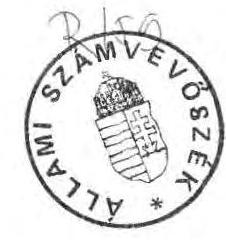
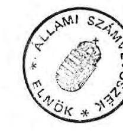

# ふllami ふ̧ámbrböséé 

## JELENTÉS

a Központi Statisztikai Hivatal pénzügyi-gazdasági ellenôrzésérôl

---

Az ellenőrzést végezték:
Belics János számvevő tanácsos, Benkő János számvevő tanácsos, Bodonyi Miklós számvevő tanácsos, Varga Ildikó számvevő tanácsos, Surányi Tamás számvevő, dr. Dörnyei József külső szakértő.

Az ellenőrzést vezette és a jelentést összeállította:
Kolossváry György főtanácsos

---

# JELENTÉS 

## a Központi Statisztikai Hivatal pénzügyi-gazdasági ellenőrzéséről

A Központi Statisztikai Hivatal (KSH) a felügyelete alá tartozó 27 önálló költségvetési szervvel és a részben önálló besorolásu jóléti intézményekkel 1990. év végéig önálló fejezetet alkotott az állami költségvetésben. Ez évtől a Miniszterelnökség fejezet keretében változatlan gazdálkodási jogosítványokkal rendelkező cimként jelenik meg.

A fejezethez tartozó szervezetek 1988-ban még 3600 fôt foglalkoztattak. Az intézmények közül 1989. év végén az Államigazgatási Számitógépes Szolgálat (ÁSZSZ) vállalattá alakult, az Állami Népességnyilvántartó Hivatal (ÁNH) pedig 1990. VII. 3-tól szakmailag, 1991. I. 1-től pénzügyileg is - a Belügyminisztérium felügyelete alá került. Ezek, valamint a többi intézménynél folytatott folyamatos létszámleépités hatására a foglalkoztatott létszám 1990. év végére 2400 fôre csökkent.

Az intézmények müködését $90 \%$-ot meghaladó mértékben költségvetési eredetü pénzeszközök finanszirozták. A népszámlálási célokra egyszeri alkalommal biztosított 400 millió Ft-tal együtt, a fejezet 1990-ben 1,4 milliárd Ft költségvetési támogatásban részesült.

Az ellenőrzés célja a fejezet müködésének és költségvetési gazdálkodásának értékelése volt. Ennek keretében vizsgáltuk az ellátandó feladatok és az azokhoz rendelt pénzforrások összhangját, a gazdálkodás gyakorlatában és annak fejezeti irányitásában a célszerüségi, eredményességi és a törvényességi követelmények érvényesitését.

Az ellenőrzés az 1988-1990. évek gazdálkodására, valamint az 1991. évi költségvetés megalapozottságára terjedt ki. Az elektronikai fejlesztési program /EGP/ esetében a vizsgálat szükség szerint a korábbi éveket is érintette.

---

# I. 

## Összefoglaló megállapítások, javaslatok

A KSH 1973. évtől kiépített rendszerének hiányosságai (a korlátozott koordináció, az értékfolyamatok hiányos megfigyelései, a teljes körű felvételek nehézségei, stb.) az 1980-as évek közepére váltak olyan mértékben nyilvánvalóvá, hogy a statisztikai rendszerbe nagyobb beavatkozás vált időszerűvé.

Az 1990. évi rendszeráltás, a társadalmi és gazdasági változások új követelményeket fogalmaztak meg a statisztikai információs rendszerrel és igy a KSH tevékenységével szemben. A megváltozott követelményekhez való alkalmazkodás korszerü információs rendszer, új jogi és szervezeti keretek kialakítását, valamint a Hivatal politikai függetlenségét teszi szükségessé. Az új jogi szabályozással összehangolt szervezeti korszerűsítés annál is inkább indokolt, mivel a fejezet szervezeti rendszerében az elmult években jelentős aránytalanságok keletkeztek.

Az 1990. évi szervezeti módosítás — amelyhez előzetes átvilágitást nem végeztettek — az eddigiekben továbbra is több célszerütlen megoldást tartott fenn. Ezek a hiányosságok egyrészt a müködést nehezitik, másrészt pedig a szervezet fenntartását gazdaságtalanná teszik. A költségvetési szervezetek gondjai mellett, egyes esetekben az állami vállalati vagyon gazdasági társaságba vitele nem volt kellően átgondolt, más esetben pedig az intézményi müködési keretek vállalkozási formává való átalakítása lenne indokolt.

A fejezet állami támogatásának reálértéke - a vizsgált időszakban - jelentősen csökkent, ami a kialakult struktura szerinti feladatok ellátásánál számottevő feszültséget okozott. Ebben a helyzetben bár igyekeztek egyes mobilizálható forrásokat is igénybevenni (részben szabálytalanul), a saját bevételek feltárására, számbavételére nem fordítottak kellő gondot, azokat rendszeresen alátervezték. Az intézményi költségvetések belső szerkezetében sulyos aránytalanságot okozott, hogy a forráshiányt a dologi előirányzatok kimunkálásánál érvényesitették, sőt az évek során elrendelt zárolásokat is általában a dologi költségek fedezete terhére hajtották végre. A fejezet és egyes intézményeinek 1991. évi költségvetése megalapozatlan, a bevételek és a kiadások nincsenek összhangban.

---

A Hivatal gazdálkodásában elfogadhatatlan gyakorlat, hogy azt érdemben a háttérintézmény, a Gazdasági Müszaki Ellátó Szervezet (GMESZ) végzi. A Hivatal létszáma 1988-ról 1991-re 150 fővel csökkent, a felszabaduló bér jelentős részét indokoltan bérfejlesztésre használták fel. A GMESZ által végzett eszközgazdálkodásban viszont a célszerüség, a gazdaságosság biztositékai nincsenek meg.

Az intézmények gazdákodásában az önállóság hangsúlyozása a KSH részéről azzal járt, hogy az indokolt segítséget nem mindig adták meg az intézményeknek. Az Állami Népességnyilvántaró Hivatalnál a megalapozatlan gazdálkodás következtében súlyos eladósodás, 1990. végére 47 millió Ft-os netto adósságállomány alakult ki, amely várhatóan csak állami vagyonvesztéssel fedezhető.

Az ágazati feladatokat szolgáló pénzeszközök felhasználásának hatékonysága nem volt megfelelő. Az 1990. évi népszámlálás pénzügyi tervezése a feladatokkal nem volt összhangban. Az 1989. évben a Népszámlálás intézmény költségvetésébe a népszámlálási célfeladatra biztosított összegek beépültek. Ebből adódóan 128 millió Ft, a különböző költségigények túltervezését is figyelembe véve együttesen mintegy 200 millió Ft többlettámogatást vettek igénybe. Ennek mintegy felét indokoltan használták fel, a másik része célszerű gazdálkodással megtakarítható lett volna.

Az elektronikai fejlesztési program (EGP) végrehajtása a kitűzött céltól elmaradt. A jelentős összegekkel támogatott fejlesztések napjainkban már jórészt nem időszerűek. A KSH ágazati felelőssége valójában csak a keretelosztásig terjedt, a különböző tárcák (OT, PM, BM stb.) fejlesztési törekvéseinek nem tudott ellenállni. Hasonlóképpen nem volt megfelelő a számitástechnika-alkalmazás elősegítésére a fejezet előirányzataiban rendelkezésre álló keret felhasználásának hatékonysága.

Az ellenőrzés megállapításai alapján a következőket javasoljuk:

# 1) A Kormány 

mihamarabb terjessze az Országgyűlés elé az új, európai igényeknek megfelelő statisztikai információs rendszer múködésének jogi, szervezeti és pénzügyi feltételeit megalapozó törvény tervezetét. A jogi szabályozás keretében össze kell hangolni a statisztikai rendszer egyes alrendszereit.

A törvény előkészitése során indokolt felülvizsgálni a KSH-nak a számitástechnika alkalmazásával kapcsolatos ágazati felelősségét és kijelölni azt a szervet, amely az államigazgatás informatikai fejlesztésének az összehangolását ellátja.

---

# 2) A Központi Statisztikai Hivatal 

a) az új törvényi szabályozáshoz igazodóan, feladatainak alakulásával összhangban folytassa a szervezeti korszerűsitést, indokolt esetben a szervezeti átvilágításokra támaszkodva. Ennek keretében:
— szüntessék meg a Hivatalon belüli párhuzamosságokat és aránytalanságokat,
—különitsék el a közszolgálati és az üzleti tevékenységet,
— indokolt megszüntetni a Népszámlálás, a Számitóközpont és a GMESZ önálló intézményi státuszát és azokat a Hivatal szervezetéhez integrálni,
— kezdeményezni kell a felügyelet alá tartozó vállalatok helyzetének, a bennük lévő állami vagyon legcélszerűbb hasznositási lehetőségeinek megvizsgálását,
— meg kell vizsgálni a Statisztikai Kiadó Vállalat gazdasági társasággá alakításának körülményeit,
— vállalkozási alapokra kell helyezni a Gazdaságkutató Intézet múködését;
b) a feladatok és a pénzügyi feltételek összhangjának megteremtése érdekében
— javítsa a költségvetési tervezés megalapozottságát, a ráfordítások indokoltságának, valamint a bevonható bevételi forrásoknak a felülvizsgálatával,
— az állami feladatokkal le nem kötött kapacitások gazdaságos hasznositásához mérje fel a stabil bevételt eredményező lehetőségeket és ezek kihasználásához az intézményeknek nyújtson segítséget,
—állítsa helyre a Hivatalnál a gazdálkodói jogkör érdemi gyakorlását, a GMESZ csak lebonyolitoói feladatokat lásson el;
c) az Állami Népességnyilvántartó Hivatal pénzügyi válsága kapcsán járjon el az intézmény volt vezetőjének — az 1990. évi költségvetési ellenőrzés által már felvetett — személyes felelőssége érvényesítése céljából;

---

d) végezze el - a Pénzügyminisztériummal együttműködve - Népszámlálás intézmény és a népszámlálási feladat cimzett támogatásának szétválasztását úgy, hogy az 1992. évi költségvetésben már elkülönitve jelenjen meg az intézmény támogatása és külön célfeladatként a népszámlálás, mint feladat pénzigénye;
e) vizsgálja felül a népszámlálási feladatokkal kapcsolatos költséggazdálkodás megalapozottságát, az indokolatlan többletköltségek jövőbeni elkerülésére tegyen intézkedést és a szükséges esetekben a felelősséget állapítsa meg;
f) az EGP 1991. évi kötelezettségvállalással nem terhelt beruházási keretmaradványát - miután a program 1990. év végén megszűnt, új program pedig még nem alakult ki - az állami költségvetés általános tartalékába fizesse be.

# II. 

## Részletes megállapítások

1) A statisztikai információs rendszer, a feladatok és a szervezet kölcsönhatása
a) A statisztikai információs rendszer és a feladatok változása

Az 1973. évi V. törvény és a 78/1990. MT rendelet értelmében a KSH elnökének feladata "a statisztikai tevékenységek összehangolásának, fejlesztésének és ellenőrzésének irányítása". Közvetlen hatáskörébe azonban csak a központi statisztikai rendszer tartozott. Az állami statisztika másik nagyobb - része az igazgatási statisztikai tevékenység, melyet a minisztériumok, az országos főhatóságok és (korábban) a fővárosi és megyei tanácsok végeztek.

A különböző statisztikák összehangolását a korábbi években nem sikerült megoldani, az állami statisztika egységes rendszere helyett egyre több autonóm rendszer alakult ki. A Kormány az 1980-as évek közepén a kedvezőtlen helyzetet nem ismerte fel, nem fogalmazta meg újra a KSH

---

feladatait. Új feladatként - a korábbi, főként a gazdasági reálfolyamatok mérése helyett - az értékfolyamatok, valamint a társadalom belső változásaiból adódó jelenségek megfigyelése került előtérbe.

Az 1990. évi rendszerváltás következtében a Hivatallal szemben támasztott követelmények megváltoztak. Egyre nagyobb kihivást jelent a mozgásba lendült, terjedelmében kibővült - korábban nem követett - gazdasági és társadalmi folyamatok mérése.

Többek között a tulajdonviszonyok, a termelés, a forgalom, a fogyasztás a társadalmi rétegződés területén igen erőteljes, az eddigiektől eltérő folyamatok indultak meg. A gazdaságban pl. megtöbbszöröződött a jogi személyiségü (1990-ben 30 ezer egység) és a nem jogi személyiségü társaságok száma (meghaladta a 65 ezret). Ezek megfigyelése a régi — teljes körü — módszerekkel ma már sem idő, sem pénzkorlátok miatt nem lehetséges. A kis szervezetek tevékenységének a mérését a Hivatal még nem tudta megoldani.

Az átalakulás felszínre hozott olyan jelenségeket is, amelyek megfigyelése és mérése elől a KSH nem térhet ki.

#### Abstract

A vállalati statisztika terén a magánvállalkozások hatékonyságának és nyereségének, külkereskedelmi tevékenységének stb. megfigyelése; a vállalatok társasági forma szerinti összetétele, tőkéje, külföldi részesedése stb.; a közgazdasági statisztikán belül a pénzügyi információs rendszer, az állami vagyon, a létminimum stb.; a társadalomstatisztika terén a hajléktalanok száma, a munkanélküliség, a politikai mozgalmak összetétele, stb.

Az előző jelenségek részlegesen ma számos intézmény által megfigyeltek, koordinálásukra azonban a KSH, jelenlegi jogosítványával és szervezetével csak részben alkalmas.

A megváltozott feladatok új jogi és szervezeti keretek kialakítását igénylik. Erre annál is inkább szükség van, mivel a KSH-nak az új kormányzati struktúrában elfoglalt helye módosult. Elnöke nem tagja a Kormánynak, a Hivatalt önálló költségvetési fejezet helyett költségvetési címmé sorolták át.

A Kormány jelenleg még adós a Hivataltól elvárt feladatok megfogalmazásával és Parlament elé terjesztésével. Az új szabályozás hatályba lépésének elhúzódása súlyos, nehezen pótolható információs veszteségeket okoz, sőt fennáll a veszélye a statisztikai rendszer szétzilálódásának. A gazdaság és a társadalom szerkezetátalakítása csak megfelelő információk birtokában lehetséges, a kieső információk soha többé nem pótolhatók.

---

Már most értékelhető az egyes ágazati információs rendszerek igen erőteljes autark fejlődése. Mindez a párhuzamosságok veszélye mellett az indokoltnál nagyobb ráfordítások miatt is vitatható megoldásnak tünik.

A statisztikai rendszer új szabályozására 1991. évben törvény- és kormányrendelet tervezet készül.

#### Abstract

A tervezetek szerint megszünik a többcsatornás statisztikai rendszer és azt egy centralizált, egycsatornás váltja fel. Ennek értelmében megszünik mind a KSH-nak, mind a minisztériumoknak az a joga, hogy vállalatok és intézmények számára kötelező adatszolgáltatást rendeljenek el. Ehelyett - az igények mérlegelésével évente országos statisztikai programot hagyna jóvá a kormány. A tervezet nem rendezi egyértelmüen az igazgatási nyilvántartások (népesség-, adó-, cég-, társadalombiztositási stb.) és a hivatalos statisztika viszonyát, holott számos országban a hivatalos statisztika jelentós forrásai az igazgatási nyilvántartások. Ugyanilyen rendezetlennek tünik a KSH és a területi önkormányzatok kapcsolata, mivel itt kölcsönös elvárások és kötelezettségek állnak fenn. Ezeknek pontos tartalma, mértéke és fedezete szabályozatlan. Hasonló nagyvonalusággal szól a tervezet a KSH tájékoztatási kötelezettségéről.

Meg kell jegyezni azt is, hogy a pénzügyi statisztikai rendszer szinte semmilyen tekintetben nem felel meg a nemzetközi követelményeknek és ennek korábban nem is tulajdonitottak jelentőséget. Nem készült olyan statisztika, amely a fó jövedelemtulajdonosok: a gazdasági szféra, a pénzintézetek, a lakosság, a költségvetés és a külföld folyó bevételeit és kiadásait, hitelmüveleteit és megtakaritásait, valamint felhalmozási juttatásait és ráfordításait összefoglalná.

Ennek a hiánynak az oka csak kisebb részben a KSH-nál keresendő, mivel a PM-nek, az MNB-nek, az ÁFI-nak és korábban a KKM-nek nem állt érdekében, hogy a saját adatrendszerébe más is betekintést nyerjen. Igy sem az OT, sem a KSH nem tudott konzisztens adatokhoz jutni.

A statisztikai információs rendszer — társadalmi és gazdasági változásokhoz igazodó - korszerűsitését követően lesz lehetőség a KSH szervezetét érdemben továbbfejleszteni.

---

b) A KSH szervezete és a feladatok összhangja, a szervezet müködése

A KSH szervezete a központból, a területi (megyei) igazgatóságokból, valamint az intézményekből épül fel és a felügyelete alatt vállalatok is vannak.

A KSH 1990. évi átlaglétszáma — fejezeti szinten — 2721 fó volt (vállalatok nélkül) ebből a Központ 490 fő, a területi igazgatóságok 1423 fő, az intézmények pedig (az ÁNH-val együtt) 808 főt foglalkoztattak.

A tervutasitásos rendszerben létrejött hivatali szervezet az öntörvényü fejlődés (főként az intézmények esetében), továbbá jelentős mértékben az időközben - kormányzati határozatokból - rárakódott feladatok (számitás-technika-felügyelet, állami népességnyilvántartás) következtében az 1970-es évektől felduzzadt, abban jelentős aránytalanságok keletkeztek.

A Központ szervezetében 1990. év végéig, az átszervezésig csak szerény módosulások voltak. A szervezet felépitésében az ágazati és a funkcionális elvek kombinációja volt a jellemző. Érdekellentétek forrásává vált, hogy az ágazati főosztályok jórészt bedolgozó munkát végeztek a funkcionális főosztályok részére. E mellett további feszültséget okozott, hogy az adatfeldolgozás nem a Hivatal keretei között, hanem az önálló intézményként működő Számítóközpontnál valósult meg. Az ezzel kapcsolatos koordináció a Hivatal számára többletmunkát jelentett, az egyes munkák rangsorolása és átfutási ideje gyakran nem az igényekhez igazodott.

A szervezet müködésének egyik legkritikusabb pontját képezte, hogy a szervezeti egységek (főként az osztályok) érdekei a hivatali érdekekkel szembe kerültek. A parciális szempontok uralkodása miatt a koordináció időnként lehetetlenné vált. A belterjesség egyes - a piac által értékelt - területeken a külön munkák révén plusz jövedelmet is jelentett.

A Hivatal 1990. közepén megújult vezetése látva a szervezet müködésének zavarait és a jelentkező új feladatokat, 1990. végén átalakította a Központ szervezetét. Az 1990-es átszervezéshez a - mind a nemzetgazdasági, mind az önkormányzati kapcsolatok területén elbizonytalanodott - Hivatal csak részleges támpontokkal rendelkezett. A szervezet átalakítása előtt szakértői átvilágitást nem végeztek sem a Hivatal, sem az intézmények tekintetében, nem vizsgáltatták azok egymással kialakult kapcsolatait. Nem képezte kritika tárgyát, hogy az érdemi statisztikai munkát milyen mértékben segitik (egyáltalán szükségesek-e) a felügyelt intézmények és vállalatok.

---

A Központ átszervezése után három blokk (gazdaság-, társadalomstatisztika és a müködtetést szolgáló) jött létre.

A gazdasági és a társadalomstatisztikai tevékenység szétválasztásával profiltisztitást végeztek, jóllehet ezek a feladatok élesen, a mindennapi munkában igy nem válnak szét.

A két blokkon belül azonban párhuzamosságok alakultak ki, az egyik blokkon belül két közgazdasági, a másik blokkon belül lényegében két társadalomstatisztikai fóosztály müködik. Az eredeti koncepció szerint ezeket a területeket egy-egy egységben tervezték müködtetni. A szervezési megoldásnak személyi okai voltak. /Egyes szakemberek megtartását és felkészültségének hasznosítását így látták megoldhatónak./

Az adatgyüjtésben a továbbiakban mindinkább a reprezentativ jelleg fog előtérbe kerülni, ezért két főként reprezentativ adatgyüjtéssel foglalkozó főosztályt (lakossági és vállalati) hoztak létre. A statisztikai munkákról leválasztották az annak müködését szolgáló tevékenységeket, s azokat bizonyos mértékben csökkentették (a személyzeti, oktatási munkát főosztály helyett osztály látja el).

Kedvező, hogy a nagy létszámot képviselő területi igazgatóságok munkájának koordinálására - ha kis létszámmal is - Területi Önkormányzati főosztályt hoztak létre. Célszerünek itélhető, hogy az ágazati főosztályokat megszüntették és egy főosztályba vonták össze.

Az átszervezés során nem sikerült a főosztályok számát mérsékelni (továbbra is 13 maradt) és esetenként vitatható szervezeti megoldások születtek.

Nem került sor a demográfiai területek (Népesedés és Egészségügystatisztikai Főosztály, Népszámlálás, Népességtudományi Kutató Intézet) súlyának mérséklésére, amit a megváltozott feladatok és a szervezet hatékony müködtetése indokolt volna. Ugyanakkor a reprezentativ gazdaságstatisztikára való áttérés, a kis szervezetek megfigyelésében már most is mutatkozó zavarok (a kérdóivek alacsony visszaérkezési aránya) arra engednek következtetni, hogy erre a területre nagyobb erőket kellett volna koncentrálni. Nehezen indokolható hogy miközben a gazdasági ágazatok statisztikáját egy fóosztályba vonták össze, a mezőgazdasági statisztika továbbra is önálló maradt és főosztályi szervezetet alkot. Továbbra is megoldásra vár a Népszámlálás státusza.

A Hivatal központján belül továbbra sem különböitették el az üzleti tevékenységet (az adatértékesitést) és a közszolgálati munkát. Jelenleg az üzleti tevékenységek is fóosztályi hatáskörbe tartoznak.

---

Az átszervezés hatására 80 fővel(490-ről 410-re) csökkent a központ létszáma.

Az elnökhelyettesek száma 1-gyel csökkent, a fóosztályvezetők száma továbbra is 13 fó maradt, a fóosztályvezetőhelyetteseké 3-mal, az osztályvezetőké 6-tal, az ügyviteli alkalmazottaké pedig 11 fővel csökkent.

Az egy vezetőre jutó beosztottak száma alig növekedett (1990-ben 4,2), 1991 elején 4,4 fő volt.

Ha figyelmen kívül hagyjuk az osztályadminisztrátorokat és a középfoku végzettségủ ügyintézőket, egy vezetőre mintegy 2,5 érdemi statisztikai munkatárs jut. Az átszervezés után 100-120 fó érdemi statisztikus végzi a Központ szakmai feladatait, őket menedzseli, s részben szintén a napi statisztikai munkában is részt vesz 57 vezető.

Számottevően torzítja a vezetőkre jutó beosztottak arányát, hogy a Központ szervezetében mintegy 10 osztályon csak egy, illetve két beosztott van, ami egyidejüleg a szervezeti megoldás gazdaságtalanságára utal.

A Hivatal fővárosi és 19 megyei igazgatósága átlagosan 50-80 fős létszámmal müködik. Szervezetük egyszerü, mindemellett indokolt - a Hivatal korszerüsített feladataival és szervezetével összhangban - szervezetük és tevékenységük átvilágitása. Ennek során figyelembe kell venni, hogy a régi beidegződések mellőzésével a Hivatal központja különböző feladatokat leadhat a megyei igazgatóságok részére (pl. számjel-kód kiadás). A mai infrastrukturális ellátottság mellett a növekvő reprezentativ adatfelvételek végrehajtása és megbizhatóságának ellenőrzése önmagában jelentős feladatokat ró a területi igazgatóságokra.

A Hivatal statisztikai munkáját 6 intézmény segiti közel 600 fővel (1990-es átlaglétszám). Ezen intézmények közül a Számitóközpont és a Népszámlálás kapcsolódik szervesen az érdemi munkához. A Hivatal intézményei zömében önálló költségvetési szervezetként müködnek, ezért azoknak - vagy egy részüknek - a hivatali központ szervezetébe olvasztásával számos, az önállóságukból adódó, jelenleg párhuzamos, többletköltséget jelentő tevékenység (gazdasági vezetés, személyzeti munka stb.) megtakaritható.

A Népszámlálás (1990-ben 130 fơvel), önálló gazdálkodóként müködik (ugyanakkor szervezetileg a hivatali központ része). A 10 évenkénti népszámlálásokra való felkészülés és annak végrehajtása, valamint feldolgozása legfeljebb 4-5 évet igényel,

---

igy a további 5-6 évben csak egy jelentősen csökkentett létszám foglalkoztatása indokolható.

A Népszámlálás és az Állami Népességnyilvántartó Hivatal egymás adatait a lehetséges mértékben nem használta fel. Miután - az 1990-ben közel fél milliárd Ft költségvetési forrást felhasználó - ÁNH a Belügyminisztérium felügyelete alá került, a párhuzamosságok konzerválódásának veszélye fokozódott.

A hivatali müködést 140 fős létszámu GMESZ segiti. Ez a létszám még akkor is tulzottnak tekinthető, ha figyelembe veszzük, hogy a hivatal dolgozói 7 épületben tevékenykednek.

A 184 fős (1990-ben) Számitóközpont a Hivatal életében önálló érdekcentrumként müködött, ami számos feszültséget váltott ki. Hiányolható, hogy nem került sor a szervezet átvilágítására az indokolt mértékủ létszám és műszaki kapacitás megállapítására.

A Népességtudományi Kutató Intézet ( 34 fő) önálló költségvetési szervkénti müködése indokoltnak mondható. Ezzel szemben a Gazdaságkutató Intézet ( 30 fó) esetében - mivel mindinkább a piaci szférán alapuló tevékenységet folytat felmerül, hogy a továbbiakban vállalkozói keretek között müködjön és költségvetési támogatása megszünjön.

A Hivatal vezetése a 3.459/1990. számu Korm. határozat alapján megkezdte - a vizsgálat lezárásakor - a háttérintézmények szervezetének, tevékenységének felülvizsgálatát. Döntés után a háttérintézmények szervezetét 1991. julius 1-ig korszerűsitik, a GMESZ-t és a Számítóközpontot a Központ szervezetébe integrálják.

A Hivatal felügyelete alá tartozó vállalatok közül a Statisztikai Kiadó Vállalat (SKV) szorosan kapcsolódott a statisztikai tevékenységhez. A költségvetési forrásokból létrehozott, korszerü gépekkel ellátott 200 fős vállalatot 1990. végén gazdasági társasággá alakították és igy a Hivatal nyomda, kiadó és terjesztő nélkül maradt. Mindezek költségvetési forrásokból történő u jraszervezése mellett a Hivatalnak a reklám és propaganda tevékenységet is meg kell szerveznie, mert azt is az SKV látta el.

A Hivatal felügyelete alá tartozik az Államigazgatási Számitógépes Szolgálat (ÁSZSZ), amely eredményérdekeltségủ költségvetési szervből 1989. végétől önálló vállalattá alakult át. Ezzel háromra szaporodott a Hivatal körül müködő és a számitástechnika-alkalmazással foglalkozó vállalatok száma. A három vállalat számitógép kapacitásának kiépitésére, részben azok székházainak

---

építésére a Hivatal által kezelt forrásokból 440 millió Ft-ot fordítottak az elmúlt öt évben.

Az ÁSZSZ mellett ilyen feladatokat lát el a Számitástechnika és Ügyvitelszervezó Vállalat (SZÜV), valamint a Számitástechnika Alkalmazási Vállalat (SZÁMALK).

A vállalatok számos egymást átfedő tevékenységet folytatnak, s a kis szervezetekkel folyó piaci versenyben mindinkább hátrányba kerülnek.

# 2) A költségvetési tervezési és támogatási rendszer 

A KSH bevételei fejezeti szinten az 1988. évi 1,2 milliárd Ft-ról 1990-re 2,2 milliárd Ft-ra nőttek. A dinamizmus azonban csak látszólagos, tekintve, hogy az 1990-es évben egyszeri feladatok (népszámlálás, választások stb.) miatt jutott jelentős többlet pénzeszközökhöz, ráadásul ezek a fejezeten belüli átcsoportositások következtében halmozottan jelentek meg. A fejezet szintü kiadások ugyanakkor az 1988. évi 1,2 milliárd Ft-ról 1990-ben 2,3 milliárd Ft-ra nőttek, ami az eredeti előirányzat $225 \%$-os, a módosított előirányzat $101 \%$-os teljesítését jelenti.

Az éves előirányzatok kialakításánál a KSH-t a restriktiv költségvetési politika (az automatizmusok elmaradása, 1988-ban $4 \%$-os, 1989-ben $15 \%$-os támogatás zárolás) és az évenkénti kormányzati csomagtervek egyaránt kedvezőtlenül érintették. /A zárolások összege a három év alatt 272 millió Ft volt./ A fejezet költségvetési támogatása az 1988. évi 765,1 millió Ft-os eredeti előirányzathoz viszonyítva - az adóreform hatásának és a társadalombiztositási járulék növekedésének ellentételezését, valamint az egyszeri támogatásokat leszámitva - 1990-re mindössze 3,6 \%-kal nőtt. Ez a növekmény is ráadásul annak köszönhető, hogy az 1990. évi népszámlálás előkészítésére 1988-ban és 1989-ben eredetileg egyszeri támogatásként folyósitott 110 millió Ft — illetve annak az 1989. évi $15 \%$-os zárolással csökkentett összege - beépült a fejezet bázis előirányzatába.

A tartós finanszirozási források elégtelensége ellenére a KSH vezetése nem tett határozott lépéseket a statisztikai- és feladatrendszer átfogó felülvizsgálatára és a változó követelményekhez igazitott szelektiv módosítására.

---

Bizonyos adatszolgáltatások megszüntetésével a tematikus adatfeldolgozások száma csökkent ugyan, de az adatszolgáltatók számának jelentős emelkedése következtében a feladatok mennyisége érzékelhetően nem mérséklődött.

A KSH intézmények költségeinek 70-80 \% közötti része személyi jellegü és az ahhoz kapcsolódó közteher. A megyei igazgatóságoknál ez az arány eléri a 90 \%-ot. Igy természetes, hogy a támogatások reálértékének csökkenésére az intézmények létszámcsökkentéssel reagáltak. A kieső kapacitásokat belső átcsoportositásokkal, a teljesitmény tartalékok felhasználásával (fokozottabb terheléssel) többnyire pótolták, de helyenként szükséges feladatokat hagytak el.

Az igazgatóságok költségcsökkentést értek el azzal is, hogy a saját kezdeményezésű kiadványok, monográfiák készitését szinte teljes egészében megszüntették, igy a negyedéves és az éves statisztikai jelentések kiadásán kivül más elemzésekkel, tájékoztatókkal csak elvétve jelentek meg.

Csökkentették a statisztikai adatlapok feldolgozás előtti, folyamatba épitett, valamint az adatszolgáltatók helyszini ellenőrzését. A Pest megyei igazgatóság pl. három év alatt közel a felére (186-ról 101-re) apasztotta a helyszini ellenőrzéseket. Az adatszolgáltatók számának ugrásszerủ növekedése mellett igy az egyébként sem magas ellenőrzési reprezentáció a töredékére esett, holott az adatszolgáltatási morál romlása az ellenkezőjét igényelné.

A KSH lépéshátrányba került vezetése az apparátus spontán leépülését megakadályozni nem, csak késleltetni tudta. Ehhez a már említett támogatás zárolások és a fejezet központositott pénzeszközeinek (tartalékának és pénzmaradványának) bizonyos prioritások alkalmazásával végzett felosztása mellett egyéb mobilizálható forrásokat vett - nem mindig szabályosan - igénybe.

Az egységes pénzgazdálkodás lehetőségével élve 1988-ban 8,5 millió Ft-ot, 1989-ben 22,6 millió Ft-ot csoportositott át a fejezet beruházási keretéből müködési célokra. A kincstárjegyek, vásárlása ill. jegyzése (1988-ban 15 millió Ft-ért, 1990-ben különböző időpontokban és különböző összegekért, összesen 128,6 millió Ft-ért) mintegy 6 millió Ft kamatbevételt biztosított a támogatások kiegészitésére. A KSH pénzügyi apparátusa e befektetéseket többnyire a fejezet költségvetési (pénzellátási) számláján lévő támogatási pénzeszközökből hajtotta végre, ami ellentétes volt a hatályos jogszabályokkal (a módositott 19/1980. (IX. 27.) PM sz. rend. 21. par. (3) bek.). Az átmenetileg szabad — elsősorban a népszámlálási célokra kapott - pénzeszközök kincstárjegybe fektetése az intézményeknél is általános jelenség volt. A Budapesti igazgatóság pl. közel 40, a Pest megyei 20 millió Ft-ot fektetett be 1990-ben különböző részletekben.

A zárolásoknál és a központositott pénzeszközök felosztásánál a megyei igazgatósági hálózat és a KSH központja élvezett viszonylagos prioritást. A

---

zárolásoktól általában mentesitették az igazgatóságokat, a KSH Gazdálkodó Szervezetét érintő támogatás csökkentést pedig a fejezeti tartalékból és pénzmaradványból többnyire kompenzálták.

A visszapótlás nem érintette az ágazati feladatok ellátására a KSH-n belül elkülönitett pénzügyi keretet, igy annak összege az utóbbi három évben 38 millió Ft-ról 5 millió Ft-ra csökkent.

A központilag kezelt pénzeszközök elosztása általában rutinszerüen történt, az igények csak ritkán voltak számításokkal megalapozva. A nagyjavitási keret elosztását pl. nem előzte meg a müszaki állapot felmérése, a felujitási szükségletek erre alapozott rangsorolása. A fejezet éves pénzfelhasználásából 3-4 \%-ot képviseló összegek - a nagyjavitások finanszirozásán felül - a felügyelt intézmények számára nem is jelentettek elérhető forrást, csak a müködőképesség veszélyeztetése esetén. Ezzel szemben az év közben fel nem használt keretek jelentős része a KSH Gazdálkodó Szervezet és a GazdaságiMüszaki Ellátó Szolgálat (GMESZ) többlet támogatását szolgálta. A fejezet 1988-1990. évi, céltámogatásra le nem kötött pénzellátási tartalékának 50, pénzmaradványának $70 \%$-át meghaladó része e két intézményhez került. Ez a gyakorlat az intézményi többség kritikus pénzügyi helyzetében különösen feltünő. Előfordult az is, hogy a KSH céltámogatási pénzeszközt sem utalt át maradéktalanul az intézménynek.

A népszámlálás 1989. évi előkészitésére eredetileg elöirányzott 100 millió Ft $15 \%$-os zárolásának ellentételezésére a Pénzügyminisztérium még 1988 december végén átutalt a fejezet számára 10 millió Ft-ot, ami a pénzmaradvány részévé vált. A KSH viszont a következő évben csak 8 millió Ft-ot továbbított népszámlálási célokra, a fennmaradó összeg a Gazdálkodó Szervezethez került nemzetközi rendezvények céljaira.

A fejezet bevételi forrásait jelentős mértékben növelték az 1990. évi népszámlálás előkészitésére és lebonyolitására kapott költségvetési támogatások. A három év alatt a mintegy 700 millió Ft pénzforrás nagy részét a KSH intézményei használták fel. Ezek az összegek az elvégzett többletfeladatok finanszirozása mellett közrejátszottak az intézmények müködőképességének fenntartásában is. Ez a hatás elsősorban - az államigazgatás átlagához viszonyitott alacsony jövedelmek kiegészitésén keresztül - a munkaerő megtartásban játszott szerepet.

Átvett pénzeszközként, de a fejezeten belül csak az ÁNH bevételeit növelték — az 1989. évi népszavazás, aláírás hitelesités és az 1990. évi parlamenti és

---

helyhatósági választások, valamint a népszavazások lebonyolítására - a Belügyminisztériumtól kapott összegek. Annak ellenére, hogy az ÁNH költségvetése nagyobb részt az átvett pénzeszközök miatt — az eredeti előirányzathoz képest — e két évben 80 , illetve $260 \%$-kal nőtt, az intézmény már 1989-ben, de 1990-ben még inkább súlyosan forráshiányossá vált. (Ennek részletezése a 4. fejezetben).

A fejezet intézményei tettek ugyan kísérleteket a saját bevételek növelésére,de ezeknek az aránya $5 \%$ alatt maradt.

Az intézmények müködési, valamint ár- és dijbevételei - az idöközben vállalattá alakult ÁSZSZ-t figyelmen kivül hagyva - az 1988. évi 143 millió Ft-ról 1990-re 205 millió Ft-ra nőttek. E bevételeknek azonban mintegy a felét a Gazdálkodó Szervezet által a GMESZ és a KSH Számitóközpont részére adott szolgáltatási és alvállalkozói megbizások ellenértéke alkotta.

A kiélezett pénzügyi helyzet ellenére sem a fejezet, sem az egyes intézmények nem vették reálisan számba a várható saját bevételeket. Az éves költségvetési előirányzatok egészében alátervezettek, szerkezetükben pedig torzak, ezáltal megalapozatlanok voltak. A bevételi tervszámok fejezeti szinten 1988-1989-ben kétszeresükre, 1990-ben háromszorosukra teljesültek. Az előirányzatok kialakításánál jellemzően a fejezeten kivülről származó bevételi forrásokat hagyták figyelmen kivül.

Az ÁNH például az évi 40-50 millió Ft-os saját bevételi szinvonalával szemben csak 2,5 millió Ft-ot irányzott elő a költségvetésben. (A belső használatra készített tervekben már reálisabb mértékek szerepeltek.)

A KSH Gazdálkodó Szervezete az 1990-re 10 millió Ft fölé emelkedett saját bevételét nem tervezte meg, a 20 igazgatóság költségvetésében is mindössze 2-3 ezer Ft-os előirányzat fordult elő.

A forrás oldalról hiányzó összegek a dologi előirányzatokban nem jelentek meg. Ezt a tendenciát tovább erősítette, hogy az évek során elrendelt zárolásokat általában szintén a dologi költségek fedezetének terhére hajtották végre. Ezáltal az intézményi költségvetések belső szerkezetében súlyos aránytalanságot idéztek elő. Erre a tényezőre vezethető vissza alapvetően, hogy a többletbevétellel ellentételezett előirányzat módosítás mellett több intézménynél a béralap egy részét is át kellett csoportositani a dologi előirányzatok kiegészítésére.

---

A liberalizált költségvetési gazdálkodás mellett ezt a — bérlapot féltő, beidegződésen alapuló - magatartást az is motiválta, hogy a bérautomatizmus az utóbbi években (ha volt) meghaladta a dologi automatizmus mértékét.

Az intézményi költségvetési előirányzatok részben az alátervezési gyakorlat, nagyobb részt a népszámlálási célokra átadott, illetőleg a fejezet részéről leosztott nagyjavitási és egyéb tartalék pénzeszközök hatására jelentősen módosultak. Az 1990. évben — az 1988-1989. évi 25 és $30 \%$-os évközi előirányzat emelkedéssel szemben - a növekmény $100 \%$-ot meghaladó volt fejezeti szinten. A módositások - a saját bevételek és az átvett pénzeszközök természeténél fogva - fokozódó mértékben saját hatáskörben történtek. A többlet saját bevételek jellemzően az alátervezett dologi előirányzatok kiegészítését tették lehetővé, az átvett pénzeszközök a felhasználás szerinti (többségében a béralap) rovatok növelését indokolták. Az előirányzatok módosítását általában a szabályoknak megfelelően végezték.

A fejezet és egyes intézményeinek 1991. évi költségvetése különösen megalapozatlan. A jelzett kedvezőtlen tendenciák továbbélése mellett a KSH még azt a tervezési hibát is elkövette, hogy a 20 igazgatóság dologi előirányzatát 3,1 millió Ft-tal csökkentő parlamenti döntést - praktikussági okokra hivatkozva - a Fővárosi és a Pest megyei igazgatóságoknál érvényesítette.

A Fővárosi Igazgatóság jóváhagyott 1991. évi költségvetésében a 32,5 millió Ft-os béralaphoz 8,3 millió Ft ( $25,5 \%$ ) TB járulék és 0,2 millió Ft dologi előirányzat kapcsolódik. (A bevételi tervszám 3 ezer Ft, szemben az 1990. évi 3,7 millió Ft-os bevétellel.)

A Pest megyei Igazgatóság esetében annyiban kedvezőbbek az előirányzatok, hogy a 16,4 millió Ft béralaphoz 5,7 millió Ft ( $34,8 \%$ ) TB járulék társul, a dologi kiadásokat pedig 1,1 millió Ft "fedezi". (A bevételi előirányzat itt is 3 ezer Ft, , az 1990-es tényszám 800 ezer Ft.)

Elöirányzati szinten - a reális költségekkel számolva - szinte valamennyi megyei igazgatóságnál 1-2 millió Ft (10-15 \%) forráshiány állapítható meg.

A KSH Számitóközpontnál sem megalapozottabbak az 1991. évi tervszámok. Az 1990-ben teljesített mintegy 40 millió Ft-os dologi kiadással szemben erre az évre 16,2 millió Ft-ot állított be a költségvetésbe. Az intézmény béralapja a januárban munkajogi állományban lévő 196 fő dijazására elégséges, ezért a 252 fős tervezett átlaglétszám szintén nem reális.

---

# 3) A Hivatal gazdálkodása 

A KSH Szervezeti Müködési Szabályzatában a vizsgált időszak szervezeti változásait nem vezették át.

Az 1/1987. sz. KSH utasitással kiadott SZMSZ-t követően 1988-89-ben és 1990-ben KSH utasitással történt a változtatás, de az az SZMSZ-en átvezetésre nem került.

A Hivatalnál a gazdálkodást megalapozó szabályzatok hiányoznak. A pénzügyiszámviteli jogszabályokban előirt szabályzatokkal csak a Gazdasági Müszaki Ellátó Szervezet (GMESZ) rendelkezik (azok sem egészen aktualizáltak). A Hivatalnál összefogott gazdálkodás nincs. A főosztályokra bontott néhány keret kivételével, a pénzeszközökkel a GMESZ gazdálkodott, amely a KSH egyik háttérintézménye. Ez a gyakorlat - a pénzügyminiszter egyetértésével - az akkor hatályos 19/1980. (IX.27.) PM sz. rendelet 3. paragrafus (2) bekezdésében foglaltak megsértését jelentette, amelynek értelmében a Hivatalnak, mint önálló költségvetési szervnek, a gazdálkodás előírt feltételeivel rendelkeznie kellett.

A Gazdálkodó Szerv költségvetésében tervezett előirányzatok közül a bér és a reprezentáció fóosztályokra van lebontva. A fóosztályvezetők felelnek a keretek betartásáért és közvetlenül a GMESZ-szel vannak kapcsolatban a pénzügyi teljesítések tekintetében.

A Gazdálkodó Szerv MNB számláján az aláirók a GMESZ kijelölt dolgozói, a Hivataltól nincs aláirásra jogosult, ezáltal a pénzmozgást közvetlenül senki sem figyeli. A GMESZ havonta ad egy pénzforgalmi kimutatást az Igazgatási és Költségvetési fóosztálynak, ez azonban összevontsága miatt nem elegendő a gazdálkodás figyelemmel kiséréséhez.

A Gazdálkodó szerv eredeti költségvetési előirányzata az 1988. évi 204.790 ezer Ft-ról 1990-ben 249.348 ezer Ft-ra változott. A változást elsősorban a központi intézkedések (TB. járulék felemelése stb.) eredményezték a kötelező zárolások mellett.

A Hivatal költségvetésének elkészitése a megadott keretszámok figyelembevételével a GMESZ feladata, ami az érdemi gazdálkodás átengedését még inkább bizonyítja. Az előirányzatok kialakítása a bér és egy-két előre közölt előirányzat kivételével, a maradék elv alapján történik.

Igy fordulhatott elő, hogy az 1989-es és az 1990-es években pl. társadalombiztositási járulék címén 5,6 és 7,2 millió Ft-tal kevesebbet állítottak be a költségvetésbe a szükségesnél. Az évek során a ténylegesen kifizetett bérek nagysága miatt ezt pótolni kellett.

---

Ezzel az alátervezéssel az esetleges TB járulék előirányzat maradvány befizetési kötelezettségétől is mentesültek. Mindezeket figyelembe véve hiányzik a feladatok és az előirányzatok összhangja, illetve a költségvetés megalapozottsága.

A Hivatal többszöri átszervezése során végrehajtott létszámcsökkentésből keletkezett bérkeret jelentős részét bérfejlesztésre, jövedelemjavitásra használták fel. Ennek eredményeként az átlagbér az 1988. évi 12.243 Ft/főről 1990. évre 19.303 Ft/főre változott, ami $57,7 \%$-os emelkedésnek felelt meg. Az összes átlagkereset pedig 1988. évi 15.034 Ft/főről 1990-re 23.471 Ft/főre nőtt.

A megbizásos foglalkoztatás lényegében két nagy területre bontható. A jelentősebb összeget az un. szakmány munkákra kifizetett díjak teszik ki. A másik terület a KSH feladatával összefüggő különböző megbizások teljesitésének ellenértéke. Itt szerepel a Hivatal vállakozási tevékenységével kapcsolatban felmerülő megbízói díjak kifizetése is. A beszámoló szerint 1988. évben 3.114 ezer Ft , 1989-ben 2.966 ezer Ft és 1990-ben 6.126 ezer Ft volt a kifizetett megbizási dij.

Előfordultak olyan esetek, amikor a megbizási dij fizetés indokolatlan volt, mert a főfoglalkozáson belül is meg lehetett volna oldani a munka elvégzését (pl. új dolgozók betanittatásáért külön óradij fizetés).

A kutatói feladatokkal összefüggésben éventé mintegy fél millió Ft megbízási díjat a bér helyett a szolgáltatási kiadások között számolták el. Ez a gyakorlat a 19/1980. (IX. 27.) PM sz. rendelettel ellentétes volt, a bérfelhasználást így nem a valóságnak megfelelően mutatták ki.

Meg kell azonban jegyezni, hogy ezzel nem vonták ki a kifizetést az állammal szembeni kötelezettségek teljesitése alól, az SZJA előleget levonták és be is fizették.

A külső munkavállalókkal minden esetben szabályszerű szerződést kötöttek, a munkavégzés igazolása is általában megtörtént.

A kifizetett jutalmak és egyéb anyagi ösztönzők döntően három forrásból keletkeztek. Elsősorban a tervezett jutalom és az évközi bérmaradvány, ezen tul — 1989. II. félévétől — a vállakozói tevékenységből származó jutalom és jutalék biztosított lehetőséget a kifizetésekre. Az ilyen jogcímen 1 fơre kifizetett öszszeg átlagosan az 1988. évi 33,5 ezer Ft-ról 1990-ben 50 ezer Ft-ra emelkedett.

A vállalkozási tevékenység lebonyolítására szabályzatot készítettek. Ez azonban kellően nem megalapozott, egyes elemei etikailag kifogásolhatók, jelenlegi

---

formájában nem a Hivatalnak, inkább egy-egy főosztálynak és azon belül is egyes személyeknek az érdekeit szolgálja.

A vállalkozások két tipikus formája a kiadványokban elhelyezett reklám és a meglévő adatállomány hasznositása. A szabályzat mindkét esetben - a közvetlen költségek levonása után - azonos kulcsok alkalmazásával rezsitéritést ir elő a Gazdálkodó Szervezet és a GMESZ javára, a valós rezsiköltségektől függetlenül. Lehetővé teszi, hogy a megrendelést megszerző szervezeti egység vezetője közvetlenül részesedjen a bevételből, a fennmaradó összeg pedig a szervezeti egység szabad rendelkezésü keretévé váljon. (Ez nem reális, mivel csak néhány főosztálynak van lehetősége az adatszolgáltatásra.) Az adatszolgáltatások esetében ez jellemzően jutalmazási, a reklámbevételeknél kiadványi forrást jelent. A gyakorlat ellentmondásosságát mutatja, hogy azonos típusú adatszolgáltatásoknál egyes fóosztályok a Számitóközpontot alvállalkozóként vonják be, míg mások a szerződés jogát átengedik az intézménynek.

A külföldi kiküldetésekre tervezett előirányzat szinte változatlan évről-évre, a felhasználás azonban eltérő mértékü. A külföldi kiküldetések lebonyolitása az előirásoknak megfelelő.

Törekedtek a deviza kimélő megoldásokat előnyben részesiteni (meghívások). Külföldre szinte teljes egészében KSH dolgozók utaztak. Amennyiben valamelyik társszerv, intézmény dolgozójának az utaztatását bonyolították, a kiadást minden esetben megtérítették.

Külföldi kiküldetés zömmel a nyugati országokba volt. Értekezletre, kétoldalu kapcsolaton alapuló tárgyalásokra és konferenciákra utaztak, általában 1 fő, esetenként 2 fő.

A Hivatal eszközökkel, anyagokkal való ellátását a GMESZ végzi. Ennek során a célszerüség, a gazdaságosság biztosítékai nincsenek meg.

Az ellátás fedezetét a Gazdálkodó Szerv költségvetésében a "GMESZ szolgáltatások" cimü, előirányzat képezte. Az évközi felhasználáskor a fóosztályok leadták igényeiket a GMESZ-nek, amelynek nem volt jogköre azok felülbirálására. A gazdálkodás rendje és célszerüsége ellen hatott, hogy a GMESZ-nek átutalt pénzek ellenében nyujtott szolgáltatásokat nem rögzítették. A Gazdálkodó Szerv az átutalt pénzek felhasználását nem ellenőrizte.

A GMESZ által vezetett számítógépes vagyonnyilvántartás megbizható. A feleslegessé vált eszközök, vagyontárgyak hasznositására esetenként kerül sor. Selejtezésük a selejtezési szabályzatban foglaltak szerint történik, az előirásoknak megfelelő.

---

A beruházási és felujitási munkákat szintén a GMESZ bonyolitja le, a KSH hivatali épületei, valamint a szociális létesitményei tekintetében. A beruházási és álló́eszközfenntartási munkák előkészitése éves terven és a fontossági sorrend figyelembevételén alapszik, lebonyolitása, dokumentálása az előirásoknak megfelelő, a takarékos, gazdaságos megoldásokat előnyben részesitették.

A Gazdálkodó Szerv költségvetésében a külső szolgáltatások előirányzatának legnagyobb részét a GMESZ foglalkoztatása köti le. A GMESZ - a már említett feladatai mellett - az épületek tekintetében helyiséggazdálkodó feladatot is ellát.

A KSH a Hivatal átszervezését követően felszabaduló helyiségeket a zsufoltság enyhitésére, valamint a bérelt ingatlanban elhelyezett egységek áthelyezéséhez használta fel.

A 3303/1990. számú kormányhatározatban foglaltaknak megfelelően a saját ingatlanban lévő bérlők bérleti jogviszonyának fokozatos megszüntetésével a bérelt ingatlanokban dolgozó főosztályokat folyamatosan áthelyezik.

Tapasztalhatók a költségvetési eszközöket gyarapitó vagy megtakarító eredményes vállalkozások is. A GMESZ a rábizott pénzeszközöket az anyagi gondok enyhitése érdekében rövid lejáratu Lakásalap kötvény vásárlással gyarapitotta.

A GMESZ-nél összesen 36 millió Ft, a Gazdálkodó Szervnél összesen 85 millió Ft átmenetileg szabad pénzt 1990-ben többször kihelyezték egy-két hetes idôre. Ennek haszna mintegy 3 millió Ft a két intézménynél együtt, amelyet a GMESZ megkapott a költségei fedezetére. Ez költségvetési támogatás többletigény csökkentését eredményezte.

Költségkimélő volt az év folyamán az a lépés, hogy a bérelt helyiségben lévố éttermet kft. által müködtetik. A KSH résztulajdonos maradt apport bevitelével. Kiadásai között igy megtaritásként jelentkezett az étterem bérleti dija és közüzemi dija is.

---

# 4) Az intézmények gazdálkodásának irányítása 

A KSH ellenőrzött intézményeinek gazdálkodását a szélsőségek jellemezték. A napi pénzügyi, likviditási problémák ellenére általánossá vált a szabad pénzeszközök kamatra történt lekötése (tipikusan kincstárjegy vásárlásra). Ezt elsősorban a népszámlálási célu pénzeszközök - a tervezettől eltérő ütemü felhasználása miatti - igénybevétele tette lehetővé.

A KSH Területi főosztályának 1987. évi megszünéséig a megyei igazgatóságok felügyeletét, pénzügyileg is, a kézi vezérlés, az operativ beavatkozás jellemezte. Ezt követően viszont a tendencia az ellenkezőjére fordult. Az önálló gazdálkodás jogának és felelősségének hangsúlyozása került előtérbe a KSH részéről, ami a fejezeti kötelezettségek és az indokolt segítségnyújtás elmulasztásával párosult. Az intézményi alapfeladatok és a költségvetési támogatások összhangjának hiánya mellett a KSH - a vállalkozási tevékenységben járatlan, hagyományok nélküli - intézményeit a bevételi források feltárásához, a rendelkezésre álló kapacitások megfelelő hasznositásához nem segitette hozzá. Az elmult években a hatalmas adatbázissal rendelkező intézményrendszer csak eseti bevételekre tudott szert tenni.

A vállalkozástól való idegenkedést az is jelzi, hogy a KSH az intézmények érdekeltségi rendjét nem vizsgálta felül és a helyi szabályozásokat sem kérte számon. Ehelyett a Gazdálkodó Szervezet belső érdekeltségi szabályzatát küldte ki — ajánlásként — az intézményeknek.

Súlyos hiányosságot jelent, hogy az intézményeknél a költséggazdálkodás számviteli feltételei nem biztosítottak. A különbözö (alap és vállalkozási) tevékenységekkel összefüggő költségek elkülönítésének hiánya a számviteli szabályok megsértése mellett 1991.-től - a vállalkozási nyereségadóra vonatkozó szabályokra tekintettel - az intézményeknél adóigazgatási következményekkel is járhat. A költségkalkuláció hiánya a Számitóközpont esetében eddig még nem vezetett finanszírozási gondokhoz, de ennek bekövetkezése - a konstrukció változatlansága esetén - elkerülhetetlennek látszik.

[^0]
[^0]:    A Számitóközpont alkalmaz ugyan munkaszámos nyilvántartási rendszert - a gépidők és a szellemi időráfordítás kimutatására -, erre azonban nem épül rá a költségek elszámolása. A munkák önköltségének megfigyelését nem tartották fontosnak, megelégedtek a ráfordítások fő tevékenység típusonkénti felosztásával. A külső megrendelések díjszabásának megalapozásához az önköltségi adatokra nem is volt szükségük, mert a számlázást a KSH-nak a számítástechnikai szolgáltatások

---

hatósági iránydijaira vonatkozó 1987-es rendelkezése alapján végezték. Ez mindeddig pozicionális előnyt is jelentett az államilag támogatott intézmény számára.

A költségkalkuláció hiánya a legsúlyosabb következménnyel az ÁNH-nál járt. Több más tényező mellett ez egyike volt azoknak az okoknak, amelyek az intézmény igen jelentős eladósodásához vezettek. Az elengedhetetlenül szükséges számítások hiányában megkötött, a teljesítés esetleges többletköltségeire garanciát nem biztositó szerződések, a fedezet nélküli beruházási és rekonstrukciós munkák, bérkiáramlások, valamint egyéb megalapozatlan gazdasági döntések játszottak szerepet az 1990. végére - 52 millió Ft bruttó tartozás és 5 millió Ft-os vevőállomány egyenlegeként - felhalmozódott 47 millió Ft-os nettó adósságállományban és az ennél is magasabb forráshiányban.

Az ÁNH pénzügyi helyzetének kialakulásában a felügyeleti szervi irányitás fogyatékosságai is szerepet játszottak. A KSH, hasonlóan a többi intézményhez, az ÁNH állami feladatrendszerét sem vizsgálta felül, így az alapfeladatok és a - sorozatos zárolások miatt abszolút összegben is csökkenő - költségvetési támogatások közötti összhang alapjaiban megbomlott. Nem tett érdemleges intézkedéseket az ÁNH belső gazdálkodási rendjének megteremtése érdekében, pedig az e téren tapasztalható súlyos hiányosságokra az intézménynél végzett költségvetési ellenőrzések felhívták a figyelmet és az éves költségvetési beszámolók is jeleztek.

Az 1990. évi KSH ellenőrzés - amely az intézmény belügyminisztériumi felügyelet alá kerüléséhez kapcsolódott - a pénzügyi válsághoz vezető okok sorát tárta fel, megállapította az intézmény volt vezetőjének személyes felelősségét és a megállapításokat tartalmazó jegyzőkönyveket a KSH a Belügyminisztériumnak átadta. A felelősség érvényesítésére azonban mindez ideig nem került sor. (Részletes megállapítások az 1. sz. mellékletben.)

Az 1991. I. negyedév végére - a vevőállomány csökkenésével, a Népszámlálás utólagos térítésével és egyéb bevételi forrásokkal összefüggésben - 43,5 millió Ft-ra mérséklődött nettó adósság, valamint a tartozások után kalkulált közel 10 millió Ft-os késedelmi pótlék és kamat rendezése nagy valószinüséggel csak állami vagyonvesztéssel oldható meg.

Az érintett fóhatóságok által is támogatott terv szerint az eddig bérbeadott épületrészek, valamint az intézmény csúcshegyi ingatlanának eladásából származó bevételből az ÁNH képes lesz kifizetni tartozásait.

---

Az értékesítés egyedi engedélyezése (a minisztériumi ingatlanok eladási tilalmáról szóló 3303/1990. számú kormányhatározat alóli mentesités) hónapok óta húzódik. A késedelmi pótlékokból és kamatokból származó további veszteségek halmozódásának elkerülése érdekében a BM és a KSH 1991. áprilisában megállapodott a tartozások fedezetének megelőlegezésében. A költségvetési források mielőbbi megtérülése az értékesítési engedély kiadásától és az ingatlanok eladásának gyors eredményétől függ.

# 5) Az ágazati feladatok pénzügyi megvalósitása 

a) Népszámlálás végrehajtása

Az 1990. évi népszámlálást — részben az előkészítés hiányossága, részben a megváltozott feltételek miatt - szakmailag és technikailag a tervezettnél rosszabb feltételek mellett, pénzügyileg pedig kedvezőtlenebb ráfordítással valósították meg. A jelentős áremelkedéseken túl legalább 80-100 millió Ft. többletköltség merült fel. Ebben szerepet játszottak a Népszámlálás intézmény működési és gazdálkodási rendjének fogyatékosságai.

A KSH Népszámlálásnak, mint ōnálló költségvetési szervnek a müködését és gazdálkodását érdemben nem szabályozták, illetve a szabályzatok egy része elavult.

A gazdálkodáshoz szükséges alapvető nyilvántartások hiányoznak (előirányzat felhasználás, kötelezettségvállalás, tartozások és követelések nyilvántartása stb.). A szabályozások és a tervek önmagukban is ellentmondásosak, az elszámolások több esetben hiányosak. A hatáskörök megállapítása, a szakmai, gazdasági műveletek tartalma gyakran nem egyértelmü, az operativ gazdasági utasítások nem mindig egyértelmüek. (A szabályozási, ügyvitelszervezési, nyilvántartási hiányosságok felszámolása vizsgálatunk idején megkezdődött.)

A KSH Népszámlálás a kedvezőtlen változások ellensúlyozására több intézkedést tett. Kisebb eszközök beszerzésével (szövegszerkesztő, sokszorosító, nyomdagépek) a költségeket lényegesen csökkentette, a gyakorlatilag kieső Statisztikai Kiadó Vállalatot pótolta.

Az 1990. évi népszámlálásról szóló 2016/1987. (XI. 16.) MT számu határozat a népszámlálás költségeiről csak annyiban rendelkezik, hogy annak költségkerete 1987. évi árszinten 350 millió Ft és ebből 1988-ban a KSH költségvetésében 10 millió Ft-ot kell biztosítani. Az 1989-92. közötti felhasználás mértékét, a szükségletnek megfelelően, a pénzügyminiszter és a KSH elnöke állapítja meg.

---

A KSH 1989.évi MT előterjesztésében a várható költségeket folyó áron már 700 millió Ft-ban jelölte meg. Ennek kormányhatározatban való jóváhagyására azonban nem került sor. Az 1991-ig a Népszámlálás célfeladatra 729,5 millió Ft támogatást vettek igénybe. Jelentős költségek merültek még fel a fővárosi és a megyei tanácsoknál is.

Az előzőek szerint az 1990. évi népszámlálásra biztosított pénzügyi keret céljellegủ előirányzatnak minősül. A KSH Népszámlálás erről elkülönített nyilvántartást és elszámolást nem készített, így a keret felhasználása megfelelő pontossággal nem ellenőrizhető.

Az MT határozatban 1987-es árszinten megállapított 350 millió Ft-os költségkeret az ár- és feladatváltozás következtében devalválódott. Ezért vizsgálatunk érdemben a kapcsolatos éves költségvetések megalapozottságára irányult. A felhasználást célszerűségi és eredményességi szempontból ellenőriztük.

A KSH fejezet az 1990. évi népszámlálásra kért támogatást évente az igényeknek megfelelően megkapta, ugyanakkor ezekből az összegekből az 1989. évi költségvetés jóváhagyása során 10 millió Ft-ot, majd a fejezet maradványában kimutatott támogatásból további 2 millió Ft-ot elvont.

A Népszámlálásnak az 1990. évi népszámlálásra vonatkozó támogatási igényei gyakran és jelentős kihatással nem a tényleges feladatellátás költségigényei szerint kerültek a tervekbe. Azok jogcím és számszaki szempontból is többször megalapozatlanok, illetve hibásak voltak. A megalapozatlan támogatási igények korrigálására a fejezet előterjesztése és a költségvetés jóváhagyása során nem került sor. Igy az 1989-91. években a költségvetési támogatás megállapításának módjából adódóan 128 millió Ft, a különböző költségigények túltervezését is figyelembe véve együttesen mintegy 200 millió Ft többlettámogatást vettek igénybe.

A KSH fejezet az 1990. évi népszámlálás előkészítésére 1988-ban egyszeri alkalommal kapott 10 millió Ft pótelőirányzatot az 1989. évi költségvetés bázisába beszámitotta. A Pénzügyminisztérium az 1990. évi népszámlálás 1989. évi előkészítéséhez 100 millió Ft-ot "fejlesztésként" (nem egyszeri céltámogatásként) biztositott a fejezet költségvetésébe, amit a KSH a Népszámláláshoz telepített. Az intézkedés eredményeként a Népszámlálás intézmény költségvetésébe a népszámlálásra biztosított összegek 1989-ben közvetlenül, 1990-től a bázison keresztül beépültek. Ezt a körülményt az

---

1990. évi népszámlálás feladat 1990. és 1991. évi költségeinek tervezésénél figyelmen kívül hagyták és igy kétszeres finanszirozás valósult meg.

A Népszámlálás támogatási többletét a Pénzügyminisztérium a fejezetnél hagyta azzal a céllal, hogy a finanszirozási hiányok megoldását segitse. A tulfinanszirozásból adódó eszközök egy részét a KSH elvonta, illetve más intézmények finanszirozásába vonta be. A finanszírozási többlet másik, nagyobb része a Népszámlálás intézménynél maradt és 1989-90-ben lehetóséget adott a laza, nem kellően hatékony gazdálkodásra.
millió forint

|  | 1988 | 1989 | 1990 | 1991 |
| :-- | --: | --: | --: | --: |
| a népszámlálás jóváhagyott költségvetése | 15,2 | $111^{*}$ | 76,0 | 92,2 |
| népszámlálás korrigált törzs költségvetése*** | 15,2 | 17,5 | 21,1 | 27,6 |
| többlet igénybevétel | 0 | $8,5^{* *}$ | 54,9 | 64,6 |

x Az 1990. évi népszámlálás előkészitésére biztosított $85+10$ millió Ft-tal együtt. A KSH ebből 10 millió Ft-ot elvont, igy a KSH népszámlálás költségvetése ténylegesen 101 millió Ft-ban került jóváhagyásra.
xx Az 1988-ban egyszeri (elsö) alkalommal biztosított 10 millió Ft $15 \%$-os zárolással csökkentett összege.
xxx A KSH és a KSH Népszámlálás képviselöivel közösen számitott összegek — általános tervezési feltételek mellett.

A felhasználásokat elsődlegesen a "keretátadások" tekintetében vizsgáltuk. A Népszámlálás a fejezeten belüli gazdasági kapcsolatainál mindig ezt a módszert alkalmazta. Az ilyen módon felhasznált összegek az 1990. évi népszámlálás előirányzatainak kb. felét, háromnegyedét tették ki.

A keretátadáshoz az összeirási és kódólási feladatok kivételével költségvetés (kalkuláció), kétoldalu megállapodás nem készült. Igy azok indokoltsága, a feladatokkal való összhangja - az előzőek kivételével - nem, vagy csak közvetetten ellenőrizhető.

A vizsgált körben mintegy 60-70 millió Ft-ra tehetők azok a kiadások, amelyek célszerü, takarékos gazdálkodással megtakarithatók lettek volna.

Ebből az ANH népszámlálás előkészitésében való közremüködésének többletköltsége (kb. 20 millió Ft), a tanácsoknak összeirási feladatokra, elszámolásra átadott összegek maradványának visszahagyása ( 6,4 millió Ft), a miniszteri jutalmazási kereten kivüli

---

jutalmazások ( 6 millió Ft), a megyei igazgatóságok kódolási és ellenőrzési keretének $10 \%$-os idöközi emelése tartalék címén ( 7 millió Ft ), 1989. év végén az intézményi "maradványok" szétosztása az igazgatóságok között ( 1 millió Ft ) és az ÁNH-val az ELÁR feladatokra kötött szerződés előzetes kiegyenlitése (kb. 5 millió Ft) emelhető ki.
(Részletes megállapítások a 2. és a 3. sz. mellékletben)
b) Az elektronikai fejlesztési program végrehajtása

Az elektronika társadalmi-gazdasági alkalmazása elterjesztésének központi gazdaságfejlesztési és szervezési programjáról (EGP) 1985-ben előterjesztés készült a Minisztertanács részére. Ezt az előterjesztést az Állami Tervbizottság 1985. október 30 -án jóváhagyta, a Minisztertanács pedig a 3238/1986. MT számu határozatával elfogadta.

Az EGP a célkitűzéseit a VII. ötéves tervbe (1986-1990) épitette be, ágazatközi részprogramok formájában. Ilyen ágazatközi részprogram készült a számitástechnika államigazgatási alkalmazásának fejlesztésére is.

Ez a részprogram — az egyéb állami beruházások között — 2,6-3 milliárd Ft összegű forrást irányzott elő azzal, hogy a "regionális igazgatás információs rendszerének fejlesztését a területi tanácsi szervek rendelkezésére álló eszközök felhasználásával kell végrehajtani". A határozat a részprogram felelőseként a KSH elnökét jelölte meg.

A KSH feladatait a statisztikáról szóló 1973. évi V. törvény, illetve a 78/1990. (IV. 25.) MT sz. rendelet szabályozza. A rendelet értelmében ellátja a számitástechnika alkalmazásának országos szakma felügyeletét és a számitástechnikával kapcsolatban rábizott feladatokat.

Az előzőek mellett a KSH elnökének feladatáról, hatásköréről és az ágazati irányító tevékenységéről az 1017/1985. (III. 20.) sz. MT határozat rendelkezik. E szerint "kezeli a költségvetésből gazdálkodó kijelölt szervezetek számitástechnika célu központi beruházási kereteit és felhasználásukra az illetékes szervekkel egyeztetett döntéseket hoz". Igy az EGP részprogramjának végrehajtási felelőssége a KSH elnökére hárult.

Az EGP előterjesztéséhez az OMFB (SZKB-K 63/1/85. szám alatt) Függelékeket állíttatott össze, amelyek közül a 4/4. számu tartalmazza az alkalma-

---

zásfejlesztés VII. ötéves tervi feladatait. A terv időhorizontja 1990. december 31-ig terjedt, igy 1991-re vonatkozóan az EGP hatályon kivülinek tekinthetố.

A részprogram összevont beruházási céljainak tervezett forrásai a 4/4. függelékben az alábbiak voltak (MFT-ban):

|  | 1986/90 | ebből   évekre | 1988/90 |
| :--: | :--: | :--: | :--: |
| 1) Központi és funkcionális rendsz. | 889 |  | 508 |
| 2) Alapnyilvántartások | 1414 |  | 997 |
| 3) Informatikai infrastruktura | 150 |  | 87 |
| 4) Ágazatközi ráforditások | 455 |  | 435 |
| 5) Előző tervidőszak kötelezettségei | 146 |  | - |
| 1-5 mindösszesen | 3054 |  | 2027 |
| ebből: költségvetési juttatás | 3000 |  | 2020 |
| 6) Tanács igazgatási rendszerek | 500 |  | 350 |
| 1-6 költségv. juttatás összesen | 3500 |  | 2370 |

A minisztertanácsi határozattal nem állt összhangban a 4/4. sz. függelék beruházási célokra vonatkozó javaslata. A "3. Informatikai szolgáltatások egyes infrastrukturális feltételei" elnevezésủ beruházási cél nem tartozott a minisztertanácsi határozatban kijelölt fơcélok közé, mivel az a Számitástechnikai és Ügyvitelszervezó Vállalat (SZÜV), illetve a KSH egyes megyei igazgatóságainak közös székházépitéseit tartalmazta. A minisztertanácsi határozat azt is kimondotta, hogy a regionális igazgatás fejlesztését tanácsi eszközök felhasználásával kell végrehajtani, ugyanakkor a függelék erre a célra elkülönitetten költségvetési juttatást is előirányzott.

A KSH a továbbiakban, a részprogram végrehajtásánál nem a minisztertanácsi határozat szükítő, hanem a 4/4. sz. függelék bővitő értelmezése szerint járt el, mind az "infrastruktura", mind a tanácsi fejlesztések terén.

A KSH a számitástechnika bevezetése és alkalmazása terén a Számitástechnikai Központi Fejlesztési Program (SZKFP) érvényessége alatt (1971-1985) nélkülözhetetlen, uttörő szerepet játszott. Ennek eredményeként az 1980-as évek közepére az egyes főhatóságoknál, intézményeknél és fontosabb vállalatoknál létrejöttek a számitóközpontok és az azokat alkalmazni képes szakemberállomány. Ilyen körülmények között a KSH által végzett, közpon-

---

tositott fejlesztési irányitás és keretgazdálkodás tulhaladottá vált és az EGP végrehajtásában a KSH szerepe lényegesen szükült. Hatásköréből kikerültek a vállalati alkalmazások, az oktatás és az államigazgatási szakágazatok, s feladata a központi funkcionális szervek (OT, PM, KSH, KKM, MM, OAÁH) és az államigazgatási alapnyilvántartások fejlesztésére korlátozódott. Ehhez járult még a helyi igazgatás (tanácsszervek) számítógépesítésének ösztönzése.

Ezt a szükített feladatkört a KSH már nem tudta kellő eredményességgel ellátni és "ágazati felelőssége", szerepe az igényösszegyüjtés, feldolgozás, a másodlagos tervalku és a keretelosztás (tervtárgyalások) ellátására összpontosult. Az EGP időszaka alatt (1986-90) az egyre erősebb funkcionális főhatóságok (OT, PM) számítástechnikai érdekcsoportjai befolyásolták a KSH döntésképességét. A vizsgált időszakban pedig az új kormányzati és államhatalmi szervek nyomatékkal megjelenő "ad hoc" igényei (Miniszterelnöki Hivatal, Alkotmánybiróság, NGKM stb.) lényegesen megváltoztatták az EGP-ben kitüzött célok megvalósithatóságát.

A szétosztott keretek célszerü felhasználása a tárcák hatáskörébe tartozott. A KSH szakmai befolyása legfeljebb az EGP-ben meghatározott prioritások érvényesítésére hatott a keretelosztásnál, arra is folyamatosan csökkenő mértékben. A KSH az "ágazati felelősségét" nem is értelmezte ugy, mintha az a tárcákon belüli keretfelhasználásra is kiterjedne.

A KSH az EGP keretében az 1988-90. években csökkenő költségvetési előirányzatokat kezelt (1988-ban 525, 1990-ben 375 millió Ft-ot).

Ez a csökkenés ellentmondásos fejlődést takar, mivel az államigazgatási intézmények számítástechnikai beruházása 1986-90-ben folyamatosan nőtt, viszont ezen belül csökkent a KSH által központilag kezelt informatikai beruházások forrásának aránya:

|  | 1986 | 1987 | 1988 | 1989 | 1990 |
| :-- | :--: | :--: | :--: | :--: | :--: |
| A központi és az össz, beruházás aránya \% | 78 | 45 | 36 | 23 | 21 |

Az 1988-90. évekre együttesen rendelkezésre álló 1325 millió Ft EGP keretet $100 \%$-osan felhasználták. Bár a pénzeszközök legnagyobb hányadát a különböző alapnyilvántartási rendszerek ( $35 \%$, népességnyilvántartás, társadalombiztositás ellátási rendszere stb.), valamint a központi és funkcionális informatikai rendszerek ( $27 \%$, pénzügyi, statisztikai, munkaügyi stb.) kiépi-

---

téséhez folyósitották, a támogatott alkalmazások napjainkra jórészt elvesztették időszerüségüket.

Mindezek mellett megállapitható, hogy az EGP-nek a KSH által irányitott részprogramja fokozatosan elvesztette a központi prioritások irányába befolyásoló szerepét is. Az 1985/86-ban meghatározott prioritások jelentős része is elvesztette érvényét az államigazgatásnak 1989-től bekövetkezett struktruális átalakulásával.

Igy az OT tervinformációs rendszerének továbbfejlesztése 1989-ben fejeződött be, a tervidőszakban összesen 36 millió Ft-os ráfordítással (ÁFA nélkül), a PSZTI-nek fokozatosan épültek ki a területi alrendszerei a megyei tanácsi költségelszámoló hivataloknál (TAKEH), mintegy 170 millió Ft juttatással (ÁFA nélkül), mignem azok megváltozott feladatokkal 1990-ben a BM felügyelete alá kerültek (TÁKISZ). Emlithető az Országos Árhivatal részére történt keretjuttatás is.

Az eredeti prioritások gyengülése mellett a vizsgált időszakban uj igények is születtek.

Igy pl. "kormányzati információs rendszer" fejlesztése címén a Miniszterelnöki Hivatal, "alkotmányügyi információs rendszer" címén az Alkotmánybíróság stb. részesült költségvetési juttatásban, az országgyülési, illetve önkormányzati választások érdekében pedig a BM lépett fel terven kivüli igényekkel.

A KSH a költségvetési keretek kezeléséből adódó lehetőségeket kihasználva az ország legjelentősebb információfeldolgozó hálózatát hozta létre.

A KSH által irányitott és az EGP hatálya alá tartozó intézmények a vizsgált idôszakban a KSH Számitóközpont (KSH SZK), az Állami Népességnyilvántartó Hivatal (ÁNH), az Államigazgatási Számitógépes Szolgálat (ÁSZSZ) és a Számitástechnikai és Ügyvitelszervező Vállalat (SZÜV) voltak.

Az EGP időtartartama alatt e szervezetek a beruházási keretekből 840 millió Ft-tal részesültek. Ezen belül a KSH SZK 300 millió Ft juttatást vett igénybe. Mindez jelentősen megváltoztatta az EGP által a fő tervcélokra meghatározott nagyságrendeket. (Központi és funkcionális rendszerek - Informatikai infrastruktura.)

A KSH saját keretfelhasználása nemcsak a számitógépek korszerűsitését tette lehetővé, hanem a kapcsolódó építési és szerelési munkákat, a KSH-n belüli irodaautomatizálást (PC-k, másológépek, irógépek, diktafonok, stb.) és a szükséges telefon- és adatátviteli vonalak létesítését is. A SZÜV országos

---

hálózatának kiépítésekor a megyeközpontokban ugyancsak a keretből kerültek elhelyezésre a megyei statisztikai igazgatóságok és számítógépeik (Nyiregyháza, Salgótarján).

A KSH-ban a vizsgált időszakban célszerütlen gépi beruházásokra is sor került.

Igy befejeződött az IBM géprendszer üzembehelyezése, amelynek indoka a népszámlálási munkák lökésszerüen növekvő terhelése volt, ugyanakkor a beruházás befejezése után alig egy évvel, a PHARE-program keretében az egész géprendszer lecserélést látják indokoltnak. A vizsgált időszakban bővült az ÁNH gépállománya egy SIEMENS rendszerrel, igazgatásrendészeti célra, majd 1990-ben, 1991-re áthuzódóan egy meróben más (IBM AS-400) rendszer került beállitásra, amelynek néhány éven belül a jelenleg az ÁSZSZ-nél igénybevett és elavultnak minősitett gépkapacitást kell felváltania. Ugyanakkor az ÁSZSZ-nél egy DPS nagygépet szereztek be, amely kifejezetten az alapnyilvántartások fejlesztésének támogatását célozta.

A KSH fejlesztési koordinációja általában a kapacitásfejlesztő keretjuttatásig terjedt, de kivül esett a koordináció hatáskörén a lecserélt vagy feleslegessé vált gépekkel való tervszerü gazdálkodás. Igy azoknak a vállalati szektorba (SZÜV) való átadása vagy könyvjóváirással, vagy értékbecsléssel alá nem támasztott áron történt. A bevétel nem a fejlesztési kereteket, hanem a müködési költségvetés forrását növelte.

A KSH SZK 1990-ben, az intézmény vagyonában 13,4 millió Ft netto értéken kimutatott számítástechnikai eszközöket 7,6 millió Ft-ért (ÁFA nélkül) értékesitette a SZÜV-nek. Az eladásiár megállapításába külső szakértőt nem vontak be. Az eladott eszközök között a legjelentősebb értéket azok a központi egységek jelentették, amelyeknek a 47,2 millió Ft-os rekonstrukcióját (cseréjét) a KSH az ÉGP keretből támogatta.

A KSH 1991. évi tervjavaslata (ÁFA-val együtt) 475 millió Ft-ot tett ki, annak ellenére, hogy az EGP 1990. végére megszünt. A javaslat mintegy a kormányzati szervek számítástechnikai beruházásainak kezelőjeként fogalmazódott meg. (E felfogást a PM 33.015/1990. sz. levele is kifejezte.)

Az 1991. évi költségvetés előkészitésének első fordulójában a PM, a KSH és a BM közös tervjavaslatát ( $475+300=775$ millió Ft) 440 millió Ft-ra csökkentette. A költségvetés előkészitésének második fordulójában a KSH keretét további 200 millió Ft-tal — 240 millió Ft-ra csökkentették (ÁFA-val). Ebből a keretből a már folyamatban levő és 1991-re áthuzódó beruházások

---

137 millió $\mathrm{Ft}+17$ millió Ft (a forint-leértékelés miatt) összeget tesznek ki. A KSH "ágazati" felosztható beruházási kerete 86 millió Ft. Ennek a keretmaradványnak az elosztására a KSH-ban még nincs döntés, de azt a tárcák közti pályázat kiirásával kivánják megoldani egy 1991. március 25 -én elküldött elnöki levél szerint, bár az előző keret felhasználására előzetesen jóváhagyott koncepció nincs.
c) A fejezeti pénzeszközök felhasználása az ágazati feladatokra

A KSH a számítástechnika-alkalmazás elősegitésére 1987-ig évente mintegy 38 millió Ft-ot fordított. Ennek nagyobb része a Gazdálkodó Szervezet éves költségvetési támogatásából származott. Az 1987-ben még 26,8 millió Ft-os KSH saját forrás a sorozatos zárolások következtében 1990-re 5 millió Ft-ra csökkent. Az időszakban - 3,8 millió Ft-ról 1,5 millió Ft-ra - mérséklődött a visszterhes támogatásokból származó visszafizetések összege is, miközben más tárcák (IpM és MÉM) hozzájárulása meg is szünt. A pénzforrások beszükülését az ágazati feladatok felülvizsgálata, a kormányhatározat ennek megfelelő módosítása nem követte. Nyilvánvalóvá vált pedig, hogy a feladatokat változatlan tartalommal a KSH már nem képes ellátni. Az ágazati felelősség kérdésének háttérbe szorulását jelzi, hogy a költségvetési elvonások alkalmával a KSH főként ennek a keretnek a csökkentésében látta a megoldást.

A KSH Számitástechnika-alkalmazási fóosztálya (majd osztálya) rendelkezésére bocsátott pénzügyi keret felhasználásának hatékonysága - a keret leapadása ellenére - nem javult. Arányaiban megnőtt a döntéselőkészítést, a hivatali érdekeket szolgáló, a feladatok kitelepítésére irányuló megrendelések, támogatások száma. Ez a tendencia is ráirányítja a figyelmet az ágazati irányító szerep értelmezési zavaraira.

Ebből a keretből finanszirozták pl. 1988-ban a Hivatal statisztikai elemző munkáját segitő mikroszámitógépes alkalmazási rendszer elkészitését ( 500 ezer Ft), egyes KGST feladatok teljesitését ( 500 ezer Ft), 1989-ben pl. az ÁSZSZ vállalattá történő átalakítását ( 813 ezer Ft), 1990-ben pl. a KGST komplex programban való közremüködést ( 200 ezer Ft), a KSH jogszabályalkotó munkáját támogató rendszer tervének kidolgozását ( 187 ezer Ft), a nemzetközi szabványositással foglalkozó szervezetek munkájában való részvételt ( 300 ezer Ft) stb.

Kedvezőnek tekinthető, hogy az utóbbi három évben visszaszorult az egyedi fejlesztési támogatások aránya. Ebbe a körbe az 1988. évi 20 millió Ft-os felhasználásnak még közel fele volt sorolható.

---

Jellemzően nem váltak országos mintarendszerré a Nógrád megyei ( 2.500 ezer Ft), a fövárosi ( 2.250 ezer Ft ) és a Győr városi tanácsoknak ( 4.450 ezer Ft ) nyújtott, az információrendszer fejlesztését célzó támogatások. Rendeltetéstől eltérő felhasználás miatt a győri tanács támogatását vissza is kellett fizetni.

Vitatható a számítástehnikai ágazati érdek jelenléte azokban az esetekben, amelyek a müszaki fejlesztés irányításának informatikai megalapozását ( 3 év alatt 1.500 ezer Ft), a piacfelügyeleti információs rendszer kifejlesztését ( 3 év alatt 3.238 ezer Ft), az egységes épületnyilvántartási rendszer létrehozását ( 4 év alatt 3.700 ezer Ft) célozták, vagy pl. a rehabilitációs betegnyilvántartó és elemző rendszer ( 400 ezer Ft), a Legfelsőbb Biróság határozatai adatbázisának ( 500 ezer Ft), a munkaerőprognózis információs rendszerének ( 460 ezer Ft) fejlesztésére irányultak (rendszerkialakítás, softver fejlesztés).

Többszöri próbálkozás ellenére sem járt még sikerrel a svéd közigazgatási (számítástechnikai) oktatási rendszer hazai célirányos elterjesztése. Az 1987 óta ráfordított 2.580 ezer Ft hasznosulása és akár részleges megtérülése is - fizetőképes kereslet hiányában - kétséges.

Az ágazati irányitás érdekeltsége az egyes vállalkozásokban való anyagi részvételen keresztül sem egyértelműen igazolható. A SOFTINVEST betéti társaság alapítási céljai még közel estek az ágazatirányitás céljaihoz, a szoftverforgalmazás fellendítéséhez. A társaság szerepe idővel csökkent és piaci befolyása is gyengült. A KSH ugyanakkor igénybevette e vállalkozást pénzeszközeinek rendeltetéstől eltérő felhasználására is.

A számítástechnika-alkalmazási pénzforrások terhére 1987-ben kötött 6 millió Ft-os keretmegállapodás a szoftverellátáshoz szükséges árualap megteremtésére és a szoftverek exportjának fejlesztésére irányult. Az 1990. végéig felhasznált 4,4 millió Ft-ból mindössze egy 1 millió Ft-os támogatás volt a megállapodással tartalmilag összhangba hozható, a felhasználás nagyobb része ( 2,4 millió Ft ) a keretet kezelő Számitástechnika-alkalmazási (fő)osztály lokális számítógépes hálózatának fejlesztését szolgálta. További 788 ezer Ft a KSH épületfenntartási nyilvántartási rendszerének kialakítását finanszirozta. A fennmaradó összegből rendezvényeket, folyóiratokat és tanulmány készítést támogattak.

Az INFO KFT 1989. évi alapításában a KSH intézményi érdeke szintén kétséges, mert az információk kereskedelmét saját vállalkozásban is végezheti.

A KFT alapításába a KSH az INTERINVEST-től származó részesedést ( 500 ezer Ft) vitte be. Az induló cég sajátos támogatásának minősithető, hogy az ÁNH — amely maga is alapítója a KFT-nek — olyan 1,3 millió Ft összegű megbízást adott 1989-ben, amelynek eredete ( 1,6 millió Ft) a KSH számítástechnika-alkalmazási kerete volt.

---

A vállalkozásokba kihelyezett vagyoni értékek a KSH vagyonnyilvántartásában (mérlegében) nem szerepeltek.

Budapest, 1991. június hó

Mellékletek: 1. sz. 3 oldal
2. sz. 2 oldal
3. sz. 6 oldal

Hagelmayer István

---

# Az Állami Népességnyilvántartó Hivatal eladósodásával kapcsolatos részletesebb megállapítások 

A KSH ellenőrzése során - eleget téve egyben a pénzügyminiszter ilyen irányú kérésének is — részletesebb vizsgálatot végeztünk az Állami Népességnyilvántartó Hivatalnál (ÁNH).

Az intézményben általánosan tapasztalható laza gazdálkodási fegyelem mellett, a súlyos pénzügyi helyzet kialakulását - megítélésünk szerint - a következő főbb tényezők idézték elő:

1) A megalapozatlan rekonstrukciós és beruházási munkálatok közül is kiemelkedik az ÁNH egyik épületének eredetileg 60 millió Ft-ra, beruházási juttatásból tervezett rekonstrukciója, mely az 1989. évi átadásig 130 millió Ft-ot emésztett fel. A nyilvánvaló alátervezésnél az intézmény elszámította magát, mert a többletköltségeket saját magának kellett finanszíroznia. A munkálatokra átcsoportosított 70 millió Ft intézményi forrás csak részben volt kötelezettségektől mentes, szabad pénzeszköz. A fokozatosan felszabaduló épületrészek kiadásából befolyt mintegy 20 millió Ft bérleti díjbevételét teljes egészében igénybe vette a rekonstrukció céljaira, a bérlettel összefüggő költségei így fedezetlenül maradtak. (Ezek pontos összege nyilvántartási hiányosságok miatt nem állapítható meg.) A költségmegtakarítás címén 1986-ban e munkákra felhasznált 15 millió Ft tényleges eredete sem megnyugtatóan igazolható.

Megalapozatlan döntés alapján az intézmény 2 millió Ft-ért átvett és további 6,3 millió Ft-ért felújított egy romos csúcshegyi épületet továbbképzési és üdülési célokra. A kezelői jog megszerzése szabálytalanul 1-1 millió Ft éves bérleti díj ellenében történt. A beruházáshoz az ÁNH pénzügyi forrásokkal nem rendelkezett, a felújított épületből jövedelme nem származott.

---

2) Az állami megbízási szerződésektől eltérő teljesítések közül az 1990. évi parlamenti választások lebonyolításában való közremüködés növelte jellemzően az ÁNH forráshiányát. Az intézmény ugyanis olyan ráfordításokat teljesített, amelyekről a Belügyminisztériummal kötött szerződésben — megfelelő előkalkuláció hiányában - előzetesen nem állapodott meg. Igy pl. választási irodát müködtetett, beruházási támogatást folyósított a Távközlési Vállalatnak stb. A Belügyminisztérium ezeket utólag nem fogadta el és az intézményi rezsiköltségek és nyereséghányadok felszámítását sem tartotta indokoltnak. (Erre pedig az ÁNH-nak nagy szüksége lett volna, mert az intézményi általános költségek az 1988. évi 26 millió Ft-ról 1990-re - számos, helyzetével össze nem egyeztethető ráfordítás eredményeként is - 68 millió Ft-ra nőttek.) A szerződés szerinti 73,3 millió Ft-ból végül is a Belügyminisztérium 72,6 millió Ft-ot utalt át, szemben az ÁNH 98,2 millió Ft-os számlavégösszegével.

A választásokkal összefüggő fedezetlen befektetés volt annak a 433 db kalkulátornak a beszerzése is, amelyből - az önkormányzatoknak történt részbeni értékesítés után - az intézménynek 9,3 millió Ft, meg nem térült kiadása származott. A közel egy évig raktárban tárolt mintegy 200 db eszközből az intézmény a helyszini ellenőrzés idején próbált bizományosi értékesítési formában megszabadulni.
3) Pénzügyileg alá nem támasztott vezetői döntés értelmében nagymértékü személyi jövedelem (munkabér, megbízási díj, prémium, jutalom) kiáramlás történt, amelyet az ÁNH a későbbi (elsősorban választások miatti) megtérülés reményében teljesített. Az intézmény dolgozóinak átlagalapbére az 1989. év elejétől számított másfél évben 57, átlagjövedelme $70 \%$-kal nőtt. Hibát követett el azzal is, hogy nem gondoskodott pl. azok társadalombiztosítási járulék vonzatának fedezetéről sem, emiatt költségvetésének vonatkozó előirányzatát 1990-ben 2 millió Ft-tal lépte túl.

Szintén pénzügyi fedezet nélkül került sor két társulásba való belépésre, összesen 1,3 millió Ft tőkerészesedéssel. Jelenleg is rendezetlen annak a további 766 ezer Ft-nak a sorsa, amelyet az ÁNH a társasági szerződésben meghatározottakon felül az Informatikai Egyesülés beindításához, előleg jelleggel biztosított (ez szerződés hiányában hitelnek minősül). Az intézmény mérlege a kihelyezett vagyonrészt nem tartalmazza.

---

Csak részleges eredménnyel járt az intézménynek az a törekvése, hogy a szerződéses alapon végeztetett külső számítástechnikai feldolgozásokat maga végezze. A 25 millió Ft-ra tervezett megtakarítás - amelyet technikai szempontból az EGP forrásból megvalósított számítástechnikai beruházás tett lehetővé - az 1989-90. évi többletfeladatok miatt fél-egy évet húzódott. A költségmegtakarítás elmaradása miatti forráskiesés tovább rontotta az ÁNH a pénzügyi pozicióját.

A fizetési kötelezettségek sorozatos elmulasztása miatt az ÁNH-val szemben az elmult három évben - meredeken növekvő tendenciával - összesen 4,5 millió Ft kamatot és késedelmi pótlékot érvényesítettek. Ez a teher 1991. márc. végére számítások szerint — további közel 10 millió Ft-tal nőtt. (Az év végi 47 millió nettó adósságállományból 17 millió Ft volt az adóhatósággal és a társadalombiztosítással szembeni, halmozódó hátralék.)

Budapest, 1991. június hó

---

# Részletes megállapítások 

## az 1990. évi népszámlálás költségtervezésének megalapozottságáról

- Az 1990. évi népszámlálás összeirási feladatainak költségeit az alap összeirásnál 450, a reprezentatív összeirásnál 300 lakossal (átlag 420 fő) és 32,5 ezer összeirási körzettel (ez 14,7 millió fő összeirási feladatnak felel meg), illetve egyenként 4 ezer Ft-tal számolva 170 millió Ft-ban irányozták elő. Az igy kialakított és jóváhagyott előirányzat terhére a tanácsoknak a költségfedezetet a ténylegesen összeirandó népességszám (+ tartalék) és a részfeladatonként megállapított egységköltségek (+ tartalék) alapján biztosították. A tervezés és a finanszírozás eltérő rendszere következtében a KSH Népszámlálás intézménynél 30,2 millió Ft "megtakaritás" maradt.
- A 1990. évi összeirási (bér)költségeket társadalombiztositás nélkül, a kódolás és az ellenőrzés (bér)költségeit $43 \%$ ( 30 millió Ft) társadalombiztositási járulékkal emelve tervezték. Ténylegesen mindkét feladat költségeit olyan kisösszegü eseti megbizás alapján számolták el, illetve fizették ki, hogy társadalombiztositási költség csak jelentéktelen összeggel ( 0,2 millió Ft) merült fel és igy 29,8 millió Ft-ot "megtakaritottak".
- Az 1991. évi 100 millió Ft költségvetési támogatás az előzőeken tulmenően az 1990. évi népszámláláshoz nem tartozó ELÁR (Egységes Lakossági Adatgyüjtési Rendszer) feladatokra 10,8 millió Ft-ot is tartalmaz. A KSH ilyen feladatokkal több mint egy évtizede foglalkozik és ilyen feladatai az 1990. évi népszámlálás lezárása után is lesznek. Az ELÁR feladatok az 1990-es népszámlálás bázisán nyilván megnövekedtek, de ez nem lehet ok arra, hogy annak költségvetésébe beépüljenek.

Az ELÁR feladatokat a KSH központ, a területi igazgatóságok és a KSH Népszámlálás is ellátott. Ennek megfelelően az ELÁR feladatokat több cim költségvetése terhére látták el.

- 1991-re a $20 \%$-os bérfejlesztés ( 2 millió Ft) és 1 havi jutalom ( 1 millió Ft) tervezésének alapját a népszámlálási irodák 1991. I. negyedévi müködtetésével

---

kapcsolatos bérek, illetve a szakmánymunka (eseti megbizási) díjak ( 7,1 millió Ft) képezik.

A megyei igazgatóságoknál müködő népszámlálás irodák 1991. évi finanszirozására a KSH Népszámlálás a helyszíni vizsgálat befejezéséig nem intézkedett. A Pest megyei Igazgatóság irodája esetében 1990-hez viszonyítva bérfejlesztés nem történt.

A kapcsolódóan tervezett 6 millió Ft társadalombiztositási költségelőirányzatból kb. 4 millió Ft tervezése minősül megalapozatlannak.
—Az 1991. évi előirányzat a népszámlálás megyei kötetei kiadásának költségét átlag 700 példánnyal tartalmazza. A kötelező díjmentes információszolgáltatás igénye ennek legfeljebb az 1/3-1/4-ét indokolja. Az értékesítésre szánt kiadványok bevételeit a költségvetés nem tartalmazza.
—Az 1990. évi népszámlálás 1991. évi költségelőirányzata a fentieken tulmenően is meglehetősen lazán fogalmazott feladatokat tartalmaz, jelentős költségkihatásokkal. (Pl. 2000 csomag papir 1 millió Ft, terven felüli feladatok papirigénye 1 millió Ft, belföldi kiküldetés, szállítás, posta 3 millió Ft.)

Budapest, 1991. június hó

---

# 3. sz. melléklet 

## Részletes megállapítások

## az 1990. évi népszámlálás egyes költségelőirányzatainak felhasználásáról

## 1) Az összeirási költségelőirányzat felhasználása

Az 1990. évi költségvetés számítási anyaga és az 1990. évi népszámlálás összeirási költségeinek fedezetére a megyei (fővárosi) tanácsok részére ilyen címen átutalt (átadott) összegek jogcímenként és összegszerűen is lényegesen eltértek. A tényleges felhasználás pedig ez utóbbitól kisebb volt.

| ezer forint |  |  |  |
| :--: | :--: | :--: | :--: |
|  | 1990. évi ktgv.   szám anyagában | átutalásban | tényleges   felhasználás* |
| Számlálóbiztosok dijazása | 136.000 | 105.936 | . |
| Területfelelősök dijazása | 34.000 | 21.187 | . |
| $10 \%$ tartalék | - | 12.712 | . |
| Összeirási anyagok begyüjtése | 500 | 500 | . |
| Kiküldetés | - | 1.000 | . |
| Együtt | 170.500 | 141.335 | 133.483 |
| Tanácsi felelősök és helyetteseik   dijazása | 12.000 | - | - |
| jutalma | - | 10.570 | 9.952** |
| Összesen: | 182.500 | 151.905 | 143.035 |
| Maradvány a költségvetésböl | - | 30.595 | 39.465 |
| Maradványból jutalmazásra és   egyéb címen visszahagyott | - | - | 6.376 |
| Végleges felhasználás | - | - | 149.411 |
| Végleges megtakaritás | - | - | 33,089 |

## Megjegyzés:

* A beküldött elszámolások jogcímenkénti összesitésére nem volt lehetöség.
** A kimutatott jutalom a valóságostól eltér. Egyes megyék bruttó, mások nettó értékben adták meg, a közölt adatok is többször pontatlanok voltak (csak a tervezettet mutatták ki, megbízási dijakat is tartalmaztak).

---

A számlálóbiztosok és területfelelősök díjazásánál mutatkozó nagy összegű ( 42.877 ezer Ft) különbség annak következménye, hogy az alap- és reprezentatív összeírások költségét a költségvetés számítási anyagában indokolatlanul sok, 32.500 összeirási körzettel számolták (ez kb. 14,7 millió összeirási feladatnak felel meg).

Az összeirási körzetek mérőszámként való alkalmazása, mert állandóan változik, egyébként sem alkalmas.

A költségvetésben tartalékkal és kiküldetési költségekkel nem számoltak. Több megye ilyen címeken nem is mutatott ki költséget.

A tanácsi felelősök és helyetteseik díjazása (jutalmazása) címen kimutatott megtakarítás annak is következménye, hogy a költségvetésnél alkalmazott módszertől (településnagyság szerinti igény) ez esetben is eltértek. A leosztás ugyanis a valóságosnál lényegesen nagyobb népesség figyelembevételével történt ( 10,4 millió helyett 11,4 millió lakos).

A maradványok jutalmazási és egyéb célokra való visszahagyásával nem lehet egyetérteni, mert az jórészt a népszámlálás költségeinek a megyei tanácsok terhére való elszámolásának a következménye.

Az átutalt összegekhez viszonyított megtakarítás alapvetően annak a következménye, hogy a leosztásnál a számlálóbiztosok és területfelelősök esetében jelentős (megyénként eltérő szintü) tartalékkal számoltak. Az ilyen címen kimutatott megtakarítások több, mint 4 millió Ft-ot tettek ki.
2) A tanácsoknak átutalt népszámlálási pénzek felhasználása

A KSH elnökhelyettese 1990. január 16-án kelt intézkedésével a népszámlálás adatfelvételi költségeinek fedezetét a tanácsok letéti számlájára - az igazgatási osztályvezető rendelkezésére - elszámolási felelősséggel utalták át.

Az intézkedés mellékletét képező "Útmutató" a megtakarításokat saját hatáskörben felhasználhatónak minősítette. A maradványoknak saját hatáskörben jutalmazási célra való felhasználásáról 1989 végén és 1990. január 24-én tartott értekezleteken a jelenlévők és a KSH képviselője megállapodtak.

---

Az egymással ellentétes intézkedések következtében a megyei tanácsok egyik része a maradványt egészében, vagy részben előre felhasználta, mások erre csak a "jóváhagyás" után intézkedtek.

A gyakorlatban a KSH Népszámlálás egyrészt formálisan ragaszkodott az átutalt összegek elszámoltatásához (kétszer is kértek elszámolást), illetve a maradványok feletti rendelkezési jog gyakorlásához - miközben egyes megyékben a maradvány felhasználását előzetesen is tudomásul vették,máshol viszont bizonyos összegeket vissza is fizettettek, másrészt a maradványt keretátadásként kezelték.

A tanácsok a letéti számlára átutalt összeget mindvégig külön kezelték és azt a költségvetési elszámolásaikban nem szerepeltették. Közvetkezésképp az átutalt összegekkel való elszámolás rovat-tétel szerint sehol sem történt meg.

A megyei tanácsok első elszámolásának formája és tartalma központilag nem volt szabályozva. A beküldött beszámolók többsége tájékoztató jellegű volt, a pénzeszközök rendeltetésszerű felhasználásának megítélésére nem, vagy csak részben adott lehetőséget. A KSH Népszámlálás a beküldött beszámolókat a megyei tanácsok által már kezdeményezett - teljesített - maradványok visszafizetésének megerősítésén túl észrevétel nélkül elfogadta. Ellenőrzés elrendeléséről, végrehajtásáról dokumentumot nem tudtak bemutatni.

A maradványok jutalmazási célu felhasználását Szabolcs és Szatmár megyéknél azzal engedélyezték, hogy abból lehetőség szerint a megyei igazgatóság dolgozóinak jutalmazását is tegyék lehetővé. A Szabolcs megyei tanács ilyen céllal 100 ezer Ft-ot utalt át a megyei igazgatóság részére.

A KSH Népszámlálás 1990. augusztus 21 -én a "tanácsi elszámolások szemléletbeli különbözősége miatt" jogcím szerinti elszámolást ("adatszolgáltatást") kért. Az elszámolások többsége ezúttal is érdemi hiányossággal volt terhes. Megfelelően részletes elszámolást csak 7 megye nyujtott be, 2 megye elszámolása használhatatlan volt, mig 6 megye együttesen 214 ezer Ft hiányt mutatott ki, aminek rendezésére még nem került sor.

A KSH Népszámlálás az elszámoltatásnál a maradványok forrását és mértékét ezuttal sem vizsgálta, lényegében a kialakult helyzetet hagyta jóvá akkor is, ha nyilvánvaló volt, hogy a megtakarítás túlfinanszírozás, vagy a költségek máshol való (megyénél) elszámolásának az eredménye.

A normatív feladatokra (alap-, reprezentatív felvétel és ellenőrzés) címen leosztott 128,8 millió Ft-ból ezeken a címeken összesen 124,6 millió Ft-ot

---

mutattak ki felhasználásra, ugyanakkor a normatív tételek alapján leosztott 12,4 millió Ft-ból 7,6 millió Ft-ot ( 5 megyénél ilyen költség nem merült fel), a kiküldetésre biztosított 1 millió Ft-ból 865 ezer Ft-ot használtak fel (4 megye nem, 1 megye jelentéktelen ilyen költséget számolt el).

Az 1990. évi elszámoltatás részét képezték az 1989 végén, a népszámlálás előkészítése (oktatás) címen, a megyei tanácsoknak átutalt összegek elszámolásai is. Egyenlegük ( 2 megye megtakarítása, 7 megye túllépése) a kimutatott maradványt módosította.

A KSH 623/I-17/90. sz. leirata szerint a területi népszámlálási felelősök és helyetteseik jutalmazását a megállapított keret erejéig a megyei tanács és a megyei igazgatóság javaslata alapján a KSH Népszámlálás engedélyezi. Jóllehet, a benyújtott javaslatok gyakran formailag (részletes javaslat hiánya) és tartalmilag (kerettúllépés, a jutalmazottak körének bővítése, köztük igazgatósági dolgozók) hiányosak voltak, azokat a KSH Népszámlálás változatlan tartalommal, megjegyzés nélkül elfogadta.

A jutalmazási javaslatok mögött Pest megyében megbízási díjak is voltak. (A megbízási szerződések között néhány biankó is volt.)

A tanácsoknál - jutalom és megbízási díj kifizetésénél - az adózás és a társadalombiztosítás előirásait több esetben megszegték (Pest, Vas megye).
3) A területi igazgatóságoknak átutalt összegek alakulása

Az 1990. évi népszámlálás költségére tervezett és a KSH területi igazgatóságaira leadott összegek címenként és öszszegszerűen is jelentős eltérést mutatnak. (A tényleges ráfordítást, mert az az igazgatóságok költségeibe épült be, nem mutatták ki.) Az igazgatóságok részére átutalt összegek 11.678 ezer Ft-tal (36 $\%$-kal) haladták meg a költségvetési számítási anyagban figyelembe vett és elfogadott költségeket, tervezési hiányosságok következtében.

---

| megnevezés | a ktgv.   számítási   anyagában | operativ   finansz. terv | leutalt |  |  |
| :-- | :--: | :--: | :--: | :--: | :--: |
|  |  |  | eredeti | pót | együtt |
| Felv.kapcs. ell.és kiszállás | 3.000 | 4.000 | 3.780 | - | 3.780 |
| Irodák múk.kiad. | 4.000 | 6.000 | 6.000 | 1.488 | 7.488 |
| Irodák bére és társ. bizt. | 17.000 | 23.000 | 17.651 | 200 | 17.851 |
| Anyagszállítás | 650 | 1.000 | - | - | - |
| $2 \%$-os minta kiv. |  | 1.860 | 1.198 | - | 1.198 |
| Kettős lakóhelyüek   egyeztetése | 5.000 | - | - | 6.781 | 6.781 |
| Ig.dolg. jutalmaz. | - | - | - | 6.230 | 6.230 |
| Összesen: | 31.650 | 35.860 | 28.629 | 14.699 | 43.328 |

A költségnövekedés alapvetően három tényező eredménye:
Az irodák működésénél már az operatív finanszírozási tervben is $50 \%$-os többlettel számoltak, amit még elsődlegesen a fővárosban "többletköltség" címen tételes igazolás nélkül ki is egészítettek. (Amint arra már rámutattunk az irodák működési költségei a megyei igazgatóságok költségvetésével részben átfednek.)

A kettős lakóhelyűek egyeztetési költségét a KSH Népszámlálás az operatív terv összeállításánál még megtakaríthatónak értékelte (ilyen címen költséget nem osztott le), később azonban elsősorban az ÁNH kapcsolatos munkájának a fogyatékossága miatt a feladatot csak nagy ráfordítással tudta megoldani.

A költségvetés a miniszteri jutalmazási kereten túl nem tartalmazott jutalmazási előirányzatot. Az ilyen címen eszközölt kifizetések teljes összegükben kiadási többletet jelentettek.

Az igazgatóságoknál a kódolás és az ellenőrzés költségeire a KSH Népszámlálás költségvetésében 100 millió Ft-ot ( 69 millió Ft bér és 30 millió Ft társadalombiztosítás) a finanszirozási tervben 106,7 millió Ft-ot ( 74,6 millió Ft bér és 32,1 millió Ft társadalombiztosítás) tervezett. Az igazgatóságok részére az elsődleges keretfelosztásnál 76,0 millió Ft bért adtak le.

---

Egy 1990. évi operatív bizottsági döntés alapján az igazgatóságok részére az igazolt többletköltségeken túl $10 \%$ tartalék került leosztásra. A tervezett 69,6 millió Ft bérköltséggel szemben az igazgatóságok kódolási feladatokra végül is mintegy 90 millió Ft-ot ( 20 millió Ft-tal többet, mint tervezték) használhattak fel, miközben a fejezet a 30,4 millió Ft társadalombiztosítási költséget csaknek teljes egészében "megtakarította".

A költségnövekedés többségét a leosztásnál a reprezentativ kódolás költségeinek (a személyi kód díjtétele a tervezettnél kb. $25 \%$-kal magasabb) csaknem megduplázódása ( 9,2 millió Ft-tal szemben 17,8 millió Ft), valamint az ellenőrzési költségek számítási hibája (kb. 5 millió Ft) okozta, amihez a $10 \%$-os tartalékkeret kiadása kb. 7 millió Ft-tal járult hozzá.

# 4) Felhasználás egyéb célra 

A KSH Népszámlálás a KSH-nak kutatási feladatokra 1989-1990-ben 2,5 millió Ft-ot utalt át. Az átutalás szakmai, pénzügyi megalapozása hiányzott.

A hivatkozott megállapodásokat egyrészt nem tudták bemutatni, másrészt a bemutatottak nem szolgáltak alapul a keretátadás teljesitéséhez. A kapott tájékoztatás szerint a Népszámlálásnak ilyen kutatási feladatai nem voltak, azokra elözetesen kötelezettséget sem vállalt.

Hasonló feltételek mellett adott át 1989-ben 2 millió Ft-ot a KSH-nak. Nem állt rendelkezésre olyan megállapodás, amiből a feladat és a költségviselés megitélhető lett volna.

Az Igazgatóságoknak 1989. október 23-án átadott 1 millió Ft-ot hol maradványnak, hol többletköltség fedezetnek minősitették. Háttéranyag (honnan származik a maradvány, milyen többletköltség merült fel) ez esetben is hiányzott.

A Népszámlálás a KSH nevében az ÁNH-val 1990. augusztus 30-án az ELÁR rendszerének kialakítására és folyamatos karbantartására szerződést kötött, részletezés nélkül 7 millió Ft értékben. Az összeg kifizetése még az első részhatáridő teljesítése előtt megtörtént (a részhatáridők 1990. október 31-tól 1995. december 15-ig szóródnak).