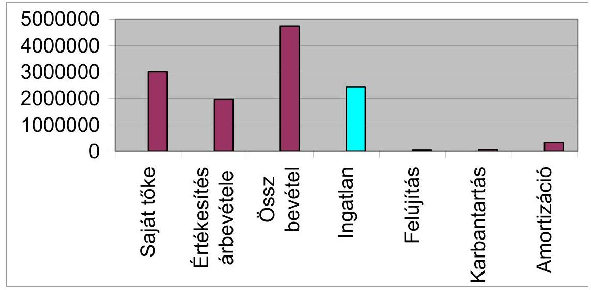
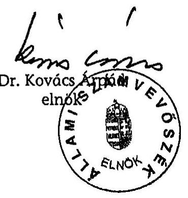
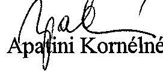
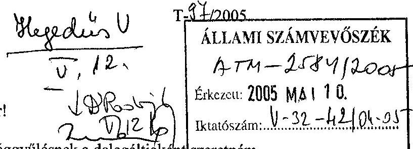
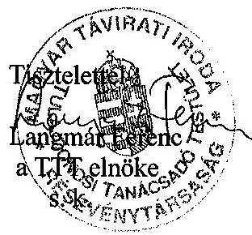
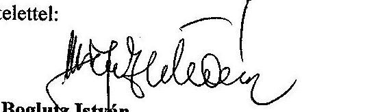
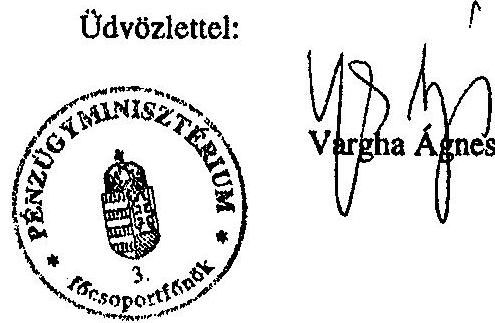
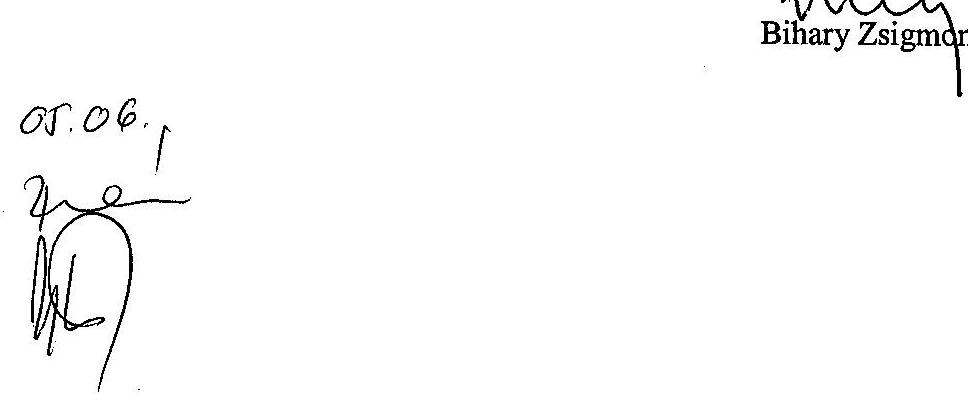
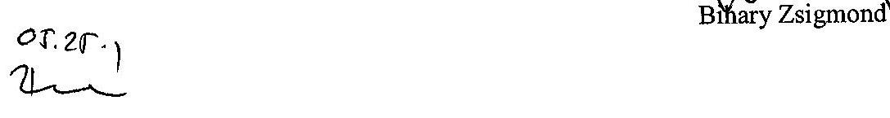
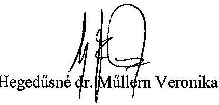

# JELENTÉS 

a Magyar Távirati Iroda Rt. 2004. évi gazdálkodásának ellenőrzéséről
$\qquad$
$\qquad$

---

2. Államháztartás Központi Szintjét Ellenőrző Igazgatóság
2.3. Átfogó Ellenőrzési Főcsoport
V-32-45/2004-2005.
Témaszám: 743
Vizsgálatazonosító szám: V0179
Az ellenőrzést felügyelte:
Bihary Zsigmond
főigazgató
Az ellenőrzés végrehajtásáért felelős:
Hegedűsné dr. Müllern Veronika
főcsoportfőnök
Az ellenőrzést vezette:
Dr. Podonyi László
igazgatóhelyettes
Az ellenőrzést végezték:
Koós Lászlóné Dr. Majoros Sándor
számvevő tanácsos, számvevő tanácsos,
tanácsadó
A témához kapcsolódó eddig készített számvevőszéki jelentések:
címe
sorszáma
Jelentés a Magyar Távirati Iroda költségvetési fejezet és a Magyar 9829
Távirati Iroda Részvénytársaság pénzügyi-gazdasági ellenőrzéséről (1997.)

Jelentés a Magyar Távirati Iroda Részvénytársaság működésének 9924
pénzügyi-gazdasági ellenőrzéséről (1998.)
Jelentés a Magyar Távirati Iroda Rt. 1999. évi gazdálkodásának 0029
ellenőrzéséről
Jelentés a Magyar Távirati Iroda Rt. 2000. évi gazdálkodásának 0124
ellenőrzéséről
Jelentés a Magyar Távirati Iroda Rt. 2001. évi gazdálkodásának 0236
ellenőrzéséről
Jelentés a Magyar Távirati Iroda Rt. 2002. évi gazdálkodásának 0326
ellenőrzéséről
Jelentés a Magyar Távirati Iroda Rt. 2003. évi gazdálkodásának 0425
ellenőrzéséről

Jelentéseink az Országgyűlés számítógépes hálózatán és az Interneten a www.asz.hu címen is olvashatók.

---

# TARTALOMJEGYZÉK 

BEVEZETÉS ..... 5
I. ÖSSZEGZŐ MEGÁLLAPÍTÁSOK, KÖVETKEZTETÉSEK, JAVASLATOK ..... 7
II. RÉSZLETES MEGÁLLAPÍTÁSOK ..... 16

1. Az MTI Rt. működésének szabályozottsága, törvényessége, a feladatok és a szervezeti rendszer összhangja ..... 16
1.1. A társasági működés szabályozása ..... 20
1.2. A részvénytársaság közfeladatainak ellátásához kapcsolódó társasági szabályzatok ..... 22
1.3. A TTT és az FB működését biztosító társasági szabályozás ..... 25
2. Az MTI Rt. gazdálkodása ..... 26
2.1. Az éves üzleti terv és az elfogadott stratégiai terv kapcsolata ..... 26
2.2. Az MTI Rt. 2004. évi árbevétel-, költség- és eredménytervének teljesülése ..... 28
2.3. Az állami támogatások felhasználásának megalapozottsága ..... 31
2.3.1. A működési célú támogatás felhasználásának célszerűsége, hatékonysága, az EU szabályok betartása ..... 31
2.3.2. A tervezett céltámogatások igénylésének megalapozottsága, célszerűsége, a felhasználás hatékonysága ..... 33
2.3.3. A Digitális Archiválási Komplexumok (DAK) projekt teljesítményellenőrzése ..... 35
2.4. Az Rt. ingatlangazdálkodásának célszerűsége, az eszközállományban bekövetkezett változások indokoltsága ..... 35
2.5. A felújítások és beruházások elszámolásának megalapozottsága, nyilvántartása ..... 38
3. Az Állami Számvevőszék 2004. évi jelentésének hasznosulása ..... 39
MELLÉKLETEK
4. sz. melléklet A jelentéstervezetre tett észrevételek és az arra adott válaszok
5. sz. melléklet ÁSZ-javaslatokkal összefüggő OGY határozatok
6. sz. melléklet Az 1999-2004. évi ÁSZ-jelentésekben foglalt javaslatok
7. sz. melléklet Tanúsítványok jegyzéke
FÜGGELÉK
A Magyar Távirati Iroda Rt. Digitális Archiválási Komplexumok (DAK) projekt teljesítmény-ellenőrzése

---

.

---

# RÖVIDÍTÉSEK JEGYZÉKE 

| ÁSZ | Állami Számvevőszék |
| :-- | :-- |
| DAK-projekt | Digitális Archiválási Komplexumok kutatásfejlesztési projekt |
| FB | Felügyelő Bizottság |
| Gt. | A gazdasági társaságokról szóló 1997. évi CXLIV törvény |
| Kbt. | A közbeszerzésekről szóló 1995. évi XL. törvény módosította |
|  | a 2003. évi CXXIX. törvény |
| MTA | Magyar Tudományos Akadémia |
| MTI-NET projekt | A Magyar Távirati Iroda Rt. digitális tartalomszolgáltatás |
|  | kiszélesítését bővítő kutatásfejlesztési projekt |
| MTI Rt., társaság | Magyar Távirati Iroda Részvénytársaság |
| Nht. | A nemzeti hírügynökségről szóló 1996. évi CXXVII. törvény |
| OGY | Országgyűlés |
| Pilot rendszer | Több, egymástól független adatbázis közötti kapcsolat meg- |
|  | teremtésével az adatbázisok széleskörű kereshetőségének a |
|  | kialakítása |
| SZKTSZ | Szakmai Tájékoztatási Szabályzat |
| SZMSZ | Szervezeti és Működési Szabályzat |
| TTT | Tulajdonosi Tanácsadó Testület |

---

.

---

# JELENTÉS 

## a Magyar Távirati Iroda Rt. 2004. évi gazdálkodásának ellenőrzéséről

## BEVEZETÉS

A nemzeti hírügynökségi tevékenység ellátására az állam nevében az Országgyűlés egyszemélyes részvénytársaságként megalapította a Magyar Távirati Iroda Részvénytársaságot (MTI Rt.). A részvénytársaság a nemzeti hírügynökségről szóló 1996. évi CXXVII. tv. (Nht.) 2. § (1) bekezdésében felsorolt közszolgálati feladatokat köteles ellátni, amelyhez állami támogatásban részesül.

A Magyar Távirati Iroda költségvetési intézményből 1997. július 15-ével alakult át egyszemélyes - 100\%-ban állami tulajdonú - részvénytársasággá. Tevékenységét budapesti székhelyén kívül öt telephelyen ${ }^{1}$ és egy fióktelepen ${ }^{2}$ végzi, a tulajdonosi jogokat az Országgyűlés gyakorolja. Az Nht. 9. §-a és az MTI Rt. alapító okiratának 5.7. pontja szerint a részvénytársaság elnöke évente beszámol az Országgyűlésnek a részvénytársaság tevékenységéről, amelynek keretében sor kerül a mérleg és az eredménykimutatás jóváhagyására, valamint a nyereség felosztására. Az elnök beszámolóját a részvénytársaság Felügyelő Bizottságának véleményével együtt kell az Országgyűlés elé terjeszteni. A beszámolóhoz mellékelni kell az Állami Számvevőszék elnökének jelentését a részvénytársaság tevékenységéről. Az Nht. 29. §-a értelmében a részvénytársaság gazdálkodását az Állami Számvevőszék ellenőrzi.

Az MTI Rt. 2004-re tervezett 3606 M Ft bevételéből a központi költségvetés működési célú támogatása 1607 M Ft (45\%) volt, ezt meghaladóan 697 M Ft céltámogatásban részesült.

Az ellenőrzés célja annak értékelése volt, hogy az MTI Rt.:

- szervezeti és működési felépítése, szabályozása összhangban volt-e a feladatokkal, mennyiben segítette azok hatékony és eredményes ellátását, belső szabályozása összhangban volt-e a hatályos jogszabályokkal;
- hogyan gazdálkodott a rendelkezésére bocsátott vagyonnal és a központi költségvetésből a részvénytársaság közszolgálati feladatai ellátásához nyújtott működési célú és egyéb (Digitális Archiválási Komplexumok (DAK), létszámgazdálkodással kapcsolatos céltámogatások) céltámogatásokkal;

[^0]
[^0]:    ${ }^{1}$ Budapest I., Fém u. 8., Budapest I., (Lisznyai u. 28. értékesítve), Budapest I., Naphegy tér 1., Budapest I., Krisztina krt. 24., Budapest VII., Károly krt. 19-21.
    ${ }^{2}$ Gödöllő, Hegy u. 1.

---

- hogyan hasznosította a 2003. évi tevékenységének ellenőrzéséről készült ÁSZ-jelentés megállapításait, javaslatait, ajánlásait.

Az ellenőrzés társasági szintű, átfogó jellegű vizsgálat volt, amely az MTI Rt. működésének az ellenőrzési programban meghatározott tevékenységeire, területeire terjedt ki.

A vizsgálat részét képezte az MTI Rt.-nél 2003. december 23-án indult és 2004. május 1-jén zárult Digitális Archiválási Komplexumok projekt (DAK projekt) költségvetési forrás felhasználásával megvalósított - fejlesztésének a teljesítményellenőrzése. A projekt megvalósításához az MTI Rt. 100 M Ft vissza nem térítendő támogatás igénybevételére kapott lehetőséget, amelyből 91,4 M Ft-ot használt fel. A teljesítmény-ellenőrzés célja a programhoz felhasznált források hasznosulásának és a kitűzött célok teljesülésének vizsgálata volt. Az eredményesség kritériuma, hogy a DAK-projekt megvalósításával az elérni kívánt cél teljesült-e.

Az MTI Rt. székházában végzett helyszíni ellenőrzés módszere a dokumentális vizsgálat és elemzés volt. A helyszíni vizsgálat hamarabb befejeződött, mint a mérlegkészítés időpontja, azonban az éves beszámolóig bekövetkezett változásokat az ellenőrzés figyelemmel kísérte. A jelentés elkészítéséig a TTT elnökétől kért dokumentumok teljes körűen nem álltak rendelkezésre. A TTT két tagja a jelentéstervezettel kapcsolatban (elsősorban a TTT munkájával összefüggésben) saját véleményt fogalmazott meg, melyet közvetlenül az ÁSZ-nak juttatott el.

A jelentéstervezetet megküldtük a Miniszterelnöki Hivatal közigazgatási államtitkárának, az MTI Rt. Tulajdonosi Tanácsadó Testület, a Felügyelő Bizottság és a társaság elnökének. Az észrevételeket és az arra adott válaszokat az 1. sz. melléklet tartalmazza.

---

# I. ÖSSZEGZŐ MEGÁLLAPÍTÁSOK, KÖVETKEZTETÉSEK, JAVASLATOK 

Az ÁSZ a korábbi években és 2004-ben is megállapította, hogy az MTI Rt. működtetésére kialakított speciális tulajdonosi megoldás célszerűtlen, a szabályozási és társasági hiányosságokból eredő problémák gyakorlatilag a Magyar Távirati Iroda Rt. 1997. évi részvénytársasággá alakulása óta évről évre megismétlődtek. A nemzeti hírügynökségi törvény felülvizsgálata elmaradt. A közszolgálati tevékenység pontosabb meghatározása, a feladatok ellátáshoz szükséges mértékű állami támogatás meghatározása, e céltámogatás szabályos, célszerű és eredményes felhasználása érdekében megkerülhetetlen.

Korábbi javaslatainknak megfelelően az MTI Rt. éves beszámolóit - a 2003. évit is - a közgyűlési jogokat gyakorló Országgyűlés elfogadta. Ugyanakkor a 68/2002. (X. 4.) OGY határozatban megfogalmazott feladat végrehajtása - a nemzeti hírügynökségi törvény felülvizsgálata, összehangolása - elmaradt. A közszolgálati feladatok pontos meghatározása a támogatások odaítélésének és felhasználásának átláthatósága, hatékony ellenőrzése uniós követelmény, amelynek az MTI Rt. a törvényi szabályozás felülvizsgálata, változtatásának elmaradása, a jogszabályi rendszer hibája miatt nem felelt meg. Ennek érdekében az MTI vezetése sem tette meg a szükséges intézkedéseket. Nem készült el az Nht.-ban jelzett, a választási időszakban végzendő feladatokról szóló törvény. Az ÁSZ ellenőrzési tapasztalatai, megállapításai, javaslatai alapján készített társasági intézkedési terv néhány feladat - pl. a közfeladatok és a társaság egyéb feladatainak meghatározása - esetében 2004-ben sem volt eredményes. ${ }^{3}$

A társaság 1997. évi megalakulása után először 2002-ben, majd 2003-ban is 142 M Ft, illetve 138 M Ft - veszteséges volt. Az elmúlt három évben az üzleti tervekben megfogalmazott mérleg szerinti eredményt az Rt. nem tudta teljesíteni, ezáltal az elmúlt három év vesztesége meghaladta a 370 M Ft-ot. Az Rt. működési költségei és ráfordításai ezekben az években nem igazodtak a csökkenő saját bevételekhez, miközben a társaság - a céltámogatásokat is figyelembe véve - folyamatosan növekvő összegű támogatást kapott, a korábban kialakított szervezetet és létszámot megtartotta. A társaság veszteségének csökkentése, illetve gazdasági stabilitásának megteremtése, finanszírozhatósági problémái érdekében 2004-ben egy nagy értékű ingatlant ${ }^{4}$ értékesített, jelentős létszámleépítést hajtott végre nagyobb részben állami támogatás, kisebb rész-

[^0]
[^0]:    ${ }^{3}$ Lásd az Állami Számvevőszéknek az MTI Rt.-nél végzett korábbi ellenőrzése alapján tett ajánlásaiból az ÁSZ Jelentés a Magyar Távirati Iroda Rt. 2000. évi gazdálkodásának ellenőrzéséről (0124), a Jelentés a Magyar Távirati Iroda Rt. 2001. évi gazdálkodásának ellenőrzéséről (0236), Jelentés a Magyar Távirati Iroda Rt. 2002. évi gazdálkodásának ellenőrzéséről (0326) és a Jelentés a Magyar Távirati Iroda Rt. 2003. évi gazdálkodásának ellenőrzéséről (0425).
    ${ }^{4}$ Budapest, I. Lisznyai u. 28.

---

ben saját forrás felhasználásával. Az intézkedések ellenére 2004-ben a mérleg szerinti eredmény tervezett (-51 M Ft) értékét meghaladó (-92 M Ft) veszteség realizálódott. A társaság a csökkenő bevételei ellensúlyozását a költségek csökkentése mellett az állami támogatási igény folyamatos növelésével kívánja ellensúlyozni.

Az Országgyűlés, a TTT, az FB és az MTI Rt. elnöke között megosztott tulajdonosi irányítás és ellenőrzés törvényi szabályozása és az MTI Rt. alapító okirata felülvizsgálatát, e szervezetek feladat- és hatáskörének pontosítását az ÁSZ évek óta szorgalmazza. Ennek eredményeként 2004-ben egy jogszabály felülvizsgálatot kezdeményező folyamat indult el az Országgyűlés elnökének intézkedései alapján. Az ÁSZ javaslatainak és ajánlásainak hasznosulására ez a kezdeményezés 2004-ben nem járt eredménnyel. Az alapító okirat módosítását a TTT is kezdeményezheti. Az Országgyűlés elnökének kérésére 2004-ben sem érkezett testületi módosító javaslat. A Magyar Országgyűlés főtitkára 2005. január 27-ei levelében az ÁSZ elnökét arról tájékoztatta, hogy a TTT módosításra vonatkozó testületi javaslatait 2003-ban, és 2004-ben sem készítette el, ezért nem történt meg az alapító okirat és a nemzeti hírügynökségről szóló törvény módosítása.

Az MTI Rt. elsődleges érdekeinek figyelembevételével, a hatékony együttműködésre való törekvés az Rt. és a testületek között - egyértelműen megfogalmazott elvárások, követelményrendszer, a végrehajtás ellenőrzése, továbbá ezek szabályozása - 2004-ben sem valósult meg teljes körűen.

Az együttműködésében meglévő, a tulajdonosi struktúrából eredő gondok a hatásköri kérdések eltérő értelmezésében mutatkoztak meg, szükségtelen feszültséget és felesleges többletkiadásokat okoztak az MTI Rt.-nek. Az SZMSZ véleményezése, a díjszabás megállapítása, az elnök prémiumfeladatának meghatározása, a TTT belső működésében, a társaság és a TTT közötti együttműködésben ismétlődő nézetkülönbségeket jelentenek. ${ }^{5}$ A TTT határozattal kezdeményezett, 2004-re tervezett SZMSZ-t a társaság Testületi határozat nélkül 2005-ben léptette hatályba. A díjszabást 2004-ben a TTT elfogadta, de 2005-re a társaságnak a TTT által elfogadott díjszabása a helyszíni ellenőrzés időszakában még nem volt. Az MTI Rt. elnöke számára a TTT 2003-ban és 2004-ben sem határozott meg prémiumfeladatot, a 2003. évi prémium kifizetése 2004-ben megtörtént. A TTT belső működésében 2003-ban keletkezett zavarok a TTT Titkárságának megszűnéséhez vezettek. A testületi határozatok több mint egyharmada az előterjesztett határozati javaslatok elvetését tartalmazta. Ezek közül kettő az MTI Rt. elnökének munkájával függött össze. Az első szerint 2004. május 20-án a TTT elvetette azt a határozati javaslatot, amely szerint „A TTT elfogadja az MTI Rt. elnökének a pályázati célok 2003. évi megvalósításáról és a pályázat aktualizálásáról készített beszámolóját". A második határozatban 2004. június 17-én a TTT elvetette azt a határozati javaslatot, amely szerint a TTT a miniszterelnöknél indítványozza az MTI Rt. elnökének felmentését. Nem készült testületi javaslat az alapító okirat módosítására, a testület ügyrendjében sem volt változás. Az ÁSZ 2003. évre vonatkozó javaslatai, ajánlásai nem hasznosultak.

[^0]
[^0]:    ${ }^{5}$ Ugyanaz, mint a 3. sz. lábjegyzet.

---

2004-ben a társasági működés szabályozásában - bár 11 elnöki utasítás született - az SZMSZ-re, elnöki, alelnöki utasításokra, a Szakmai és Közszolgálati Tájékoztatási Szabályzatra (SZKTSZ), szakmai kézikönyvekre, munkaköri leírásokra épülő szabályozás hiányosságai megmaradtak, mert az SZMSZ 2004-re tervezett változtatása 2005-ben valósult meg, és az SZKTSZ-t is 2005-ben adták ki. A TTT és a társaság az SZMSZ véleményezése folyamatának szabályozásában nem tudott megállapodni.

Az új szervezeti rend működési eredményeinek hatása az SZMSZ 2005-ös bevezetése miatt 2004-re nem volt értékelhető. A társasági szabályzatok elkészítése, aktualizálása, az SZMSZ és a munkaköri leírások közötti összehangolás elmaradt, az SZMSZ-ben a korábban kifogásolt pontatlanságokat nem szüntette meg az MTI Rt.

2004-ben TTT határozatában foglalt felkérésre elkészült az SZMSZ módosítások szükségességének indoklása, az SZMSZ tervezett fontosabb változtatásaira. Nem készült el a hatékonyabb működés várható eredményeinek bemutatása, a változtatások várható hatása a költségek és ráfordítások összegének alakulására. 2004-ben sem készült el a társaság humánerőforrás gazdálkodási terve, a humánerőforrás gazdálkodás tartalmának, szabályainak, kritériumrendszerének meghatározása, ösztönző rendszer bevezetése. Nem vezették be az évek óta szorgalmazott teljesítményértékelési rendszert.

2004-ben a két ütemben hajtottak végre csoportos létszámleépítést, amelynek következtében a munkaviszony keretében foglalkoztatottak létszáma 458-ról 334-re (28\%), a külsős foglalkoztatottak száma 143-ról 126-ra (13\%) csökkent. A kettős jogviszonyban foglalkoztatottak száma 23 fővel (28\%) csökkenve 2005. január 1-jén 60 fő volt.

A részvénytársaság közfeladatainak ellátásához kapcsolódó társasági szabályzatok, az állami támogatás (működési céltámogatás) társasági igénylésének szabályozása nem készült el, a társaság megalakulása óta folytatott gyakorlat (ugyanazokra az okokra hivatkozó, egyre nagyobb támogatásra igényt tartó) a 2004. évi igény megfogalmazásakor nem változott. ${ }^{6}$ Az MTI Rt. 2005. évi céltámogatási igényét - véleményüket utólag kialakítva ${ }^{7}$ - mind az FB, mind a könyvvizsgáló megalapozottnak tartotta. Az alapító okirat szerint a támogatási igényeket korábban is az FB és a könyvvizsgáló véleményével együtt kellett volna beterjeszteni. Ezt az előírást az érintettek részlegesen (utólag jóváhagyva) először 2004-ben tartották be. (A meghatározott célra kapott állami támogatások felhasználását a gazdasági alelnök utasításban szabályozta.) A társaság 2004-ben szakértőt bízott meg a közszolgálati feladatok meghatározásával, finanszírozásával kapcsolatos jelenlegi szabályozás áttekintésére, különös tekintettel az EU-s szabályokra és gyakorlatra. Az 1630 E Ft-ba került szakértői anyag elkészült, a társaság 2004-ben nem hasznosította azt.

[^0]
[^0]:    ${ }^{6}$ Ugyanaz, mint a 3. sz. lábjegyzet.
    7 Az MTI Rt. a támogatási igényt 2004. augusztus 2-án küldte el a Pézügyminisztériumba, az FB határozat 2004. augusztus 31-én született meg, a könyvvizsgáló véleménye 2004. augusztus 26-án készült. E véleményeket az Rt. 2004. szeptember 8-án továbbította.

---

A közfeladatok ellátásához kapcsolódó szabályok közül 2004-ben a törvényi változást követve az Rt. módosította a közbeszerzések rendjéről szóló szabályozást. Megtörtént az archiválási szabályzat tervezett aktualizálása is, de azt az ORTT-hez nem terjesztették be jóváhagyásra. A Szakmai Közszolgálati Tájékoztatási Szabályzat elkészült, 2005. január 24-én lépett hatályba, de kimaradt belőle a személyes adatok védelmével összefüggő szabályozás, annak ellenére, hogy ennek elkészítéséhez jogi szakértőt foglalkoztattak. Az elkészített 625 E Ft-os szakértői anyagot az Rt. 2004-ben nem hasznosította.

Az MTI Rt. 2004. évben gazdálkodását -92 M Ft mérleg szerinti veszteséggel zárta. Az előző évinél alacsonyabb, de a tervezettől (-51,2 M Ft) nagyobb veszteség annak ellenére következett be, hogy a társaság 2004-ben 27\%-kal magasabb költségvetési támogatásban részesült, amelyből az intézményi támogatás 1607 M Ft volt. A belföldi értékesítés árbevétele tovább csökkent és működési valamint céltámogatások révén az állami költségvetésből a 2003. évhez képest 546 M forinttal több, összesen 2304 M Ft támogatásban részesült. A támogatások felhasználásáról rendelkező érvényben lévő jogszabályok betartása és ellenőrzése a közszolgálati tevékenység fogalmának konkrét meghatározása nélkül továbbra sem lehetséges. Az intézményi és céltámogatások jelenlegi rendszerben történő folyósításának gyakorlata - támogatási cél meghatározásának elmaradása, támogatási szerződés hiánya - nem felel meg az Európai Uniós törvényi szabályozás feltételeinek. Ilyen körülmények között a támogatásokon belül az intézményi támogatás adott mértékét szakmailag és pénzügyi szempontból nem lehetett megfelelően megalapozni.

Az MTI Rt. elnöke a korábbi elnök hivatali ideje alatt készített és a TTT által elfogadott 2000-2004 közötti időszakra vonatkozó stratégiai tervet hatályon kívül helyezte. Az új, 2004-ben készített stratégiai terv átfogó helyzetképet ad az MTI Rt. piaci környezetéről és gazdasági helyzetéről, valamint a 2004-2007 közötti időszakra vázolja az MTI Rt. által követendő irányvonalat. A középtávra tervezett stratégia nem határozza meg azokat a konkrét célokat és eszközöket, amelyek a közszolgálati feladatok ellátásának, javításának az érdekeit szolgálják. A stratégiai terv konkrét és határidőhöz kötött feladatokat nem tartalmaz és nem alkalmas a feladatokhoz rendelt döntéshozói felelősség és számon kérhetőség összevezetésére. A stratégiai tervhez nem készült középtávú üzleti terv, az informatikai fejlesztés lehetséges irányait meghatározó középtávú informatikai fejlesztési terv, pénzügyi terv és nem része az átfogó ingatlangazdálkodási terv sem.

Az MTI Rt. gazdálkodása harmadik éve veszteséges, annak ellenére, hogy a különböző jogcímeken biztosított - költségvetési támogatások összege az utóbbi két évben az inflációt meghaladó mértékben emelkedett. A veszteséges gazdálkodás megszüntetésére és a költségvetési támogatás növekedésének a megakadályozására a stratégiai tervben felvázolt intézkedések nem egyértelműek, nem feladatorientáltak, hiányzik a hozzájuk tartozó döntéshozói felelősség és határidő, valamint érdekeltségi rendszer. A felsorolt okok, valamint az üzleti terv hiánya miatt a stratégiai terv nem nyújt elégséges információt a tulajdonos részére a támogatási igény elbírálásához, valamint nem alkalmas az évekre lebontott üzleti tervek konkrét céljainak a meghatározására. Üzleti terv hiányában nem értékelhető a stratégiában vállalt gazdasági célkitűzések megvalósulása vagy meghiúsulása, másrészt a 2004. évi gazdálkodási folyamatot csak az

---

adott évre vonatkozó tervszámokkal lehet összevetni. A középtávon megfogalmazott célok teljesülésének elmaradása, nem jár a döntéshozókra nézve konzekvenciával.

Az MTI 1997. évi részvénytársasággá alakulásának kedvező időpontjára utal a kereskedelmi televíziózás bevezetésével gyorsan bővülő piaci környezet, amely megerősítette az MTI Rt.-t piacvezető státuszában. Az elmúlt években az MTI Rt. nem készült fel helyesen a várható - és bekövetkezett - kedvezőtlen piaci tendenciákra. A 2004. évben készített stratégiát a korábbi gyakorlattal szemben sem a TTT sem az FB nem vitatta meg. A társaság testületeivel történő egyeztetés hiányára és a kellően gondos tervezési eljárás elmaradására visszavezethető stratégiai hiányosságok felelőssége egy személyben a stratégia készítőjét, az MTI Rt. elnökét terheli. Viszont a jelenlegi szabályozás nem rendelkezik sem a stratégia készítésének kötelezettségéről, illetve jóváhagyásáról, sem a stratégiai terv végrehajtásához kapcsolódó felelősségről, ezért a további piacvesztés és az esetlegesen rosszul választott stratégia felelőssége elsődlegesen az MTI Rt.-t terheli, de az esetlegesen bekövetkező kedvezőtlen gazdasági hatása támogatás növekedése, vagyonvesztés - már a költségvetést terheli.

A 2004. évi üzleti tervben szereplő értékesítési árbevétel alultervezett, annak ellenére, hogy a tervezési folyamat májusban ért véget. A belföldi értékesítési árbevétel 2003. évi árbevételtől való tervezett 18\%-os és tényleges 9\%-os elmaradása a médiapiacon tapasztalható tőkekoncentrációs folyamatokra és a szolgáltatási igény - erős piaci verseny következtében tendenciaszerű - visszaesésére vezethető vissza. Mindemellett kedvező, hogy az export árbevétel nemcsak a tervhez, hanem az előző év értékesítési bevételéhez képest is emelkedett.

A költségek és ráfordítások - céltámogatások felhasználása nélkül számított - értéke a tervezett szinten alakult. Növekedés a személyi jellegű ráfordítások és az egyéb költségek esetében tapasztalható. A személyi jellegű ráfordítások értéke $14 \%$-kal - céltámogatások hatása nélkül számítva $10 \%$-kal - növekedett 2004. évben, annak ellenére, hogy a menedzsment bérfejlesztést nem hajtott végre és az egyéni teljesítmények növelését célzó intézkedéseket nem foganatosított. A növekedés oka a menedzsment véleménye szerint a kettős jogviszony megszüntetését követően visszavett dolgozókkal kapcsolatos többlet (bér, járulék, egyéb) költség. A költségvetési tartalék terhére folyósított létszám leépítési támogatás egyszeri összegének felhasználása további 411 M Ft-tal növelte a társaság személyi jellegű kiadásait 2004. évben. A 2005. évi bérfejlesztés $11 \%$-os mértéke is meghaladja az előre jelzett infláció növekedési mértékét ${ }^{8}$, és eltér a PM részére benyújtott költségvetési támogatás igénylésében feltüntetett adattól (7\%). A bérfejlesztés fedezete csak a támogatási igények mással nem indokolható növelésével volt biztosítható. Elmaradt az elmúlt évben is a teljesítménykritériumok meghatározása.

A támogatásigénylés folyamata a tervezési folyamattal nincs összhangban. Az intézményi támogatási összeg a tervezési folyamat lezárása előtt már is-

[^0]
[^0]:    ${ }^{8}$ A többségi állami tulajdonú társaságok részére kiadott keresetszabályozási irányelvben a 2004. évre előirányzott keresetnövekedés mértéke 7\%.

---

mert, ezáltal az éves üzleti terv nem a támogatási igény jogosultságának a megalapozását szolgálja. Az intézményi támogatás mértékének meghatározása a költségvetési törvény keretein belül, míg az üzleti terv véglegesítése ezt követően, az előző évi mérleg elfogadásával egy időben, a következő év májusában történik. A céltámogatás igénylésének és folyósításának tervszerűtlen, ad hoc jellegére utal, hogy a 2004. évre megítélt 697 M Ft céltámogatásból mindössze 200 M Ft szerepelt az MTI Rt. üzleti tervében. Ellentétes tendenciájú és évente erősödő az a kedvezőtlen folyamat, amely az MTI Rt. részére megítélt összes támogatás valamint az üzleti eredmény értékei között tapasztalható. Az elszámolt támogatások összege az 1999. évi 1277 M Ft értékről 2004. évre 2304 M Ft-ra változott. Ezzel szemben az üzleti eredmény az 1999. évi 28 M Ft pozitív értékével szemben 2004-ben - 275 M Ft veszteség volt, azzal a kiegészítéssel, hogy az utolsó három év üzleti vesztesége összesen -607 M Ft.

Az MTI Rt. számára folyósított céltámogatások közül a három, nagyságrendileg meghatározó összeget felhasználó projekt a Digitális Archiválási Komplexumok projekt (DAK), a létszámleépítés költségeinek a támogatása és a struktúraváltási projekt. Az előző évi EU-s projekttől eltérően nem tartozott a TTT hatáskörébe a céltámogatások felhasználásának véleményezése.

A DAK projekt keretében az IHM támogatásával kutatás-fejlesztési tevékenységként kialakított pilot-rendszer létrehozásának célja a széleskörű tájékoztatás megvalósítása a meglévő adatbázisok összehangolása révén. A felhasznált állami támogatás hatékonysága és a Ki kicsoda adatbázisnak a projekt keretében történő megvásárlása gazdaságilag indokolatlan, a projekt további működtetésének, fenntartásának a költségfedezete nem biztosított.

A struktúraváltási támogatást az érvényben lévő jogszabályok ellenére szerződés hiányában és konkrét cél, valamint feladat meghatározása nélkül folyósította a támogató. A vissza nem térítendő támogatásból finanszírozott telefonrendszer csere indokolt volt, - az előzetes számítások szerint a beruházás négy év alatt megtérül - viszont az állami pénzek hatékony felhasználása szempontjából célszerűbb lett volna egy visszatérítendő támogatási forma alkalmazása.

A csoportos létszámleépítés költségeinek az ellensúlyozását szolgáló egyszeri többlet támogatás igénylése a jogszabályban rögzített feltételeknek megfelelően történt. A csoportos létszámleépítéshez terv nem készült. A támogatás folyósításának célja az MTI Rt. költségeinek csökkentése és likviditási helyzetének a javítása volt. A támogató által kitűzött cél nem érvényesült maradéktalanul. Az üzemi tanáccsal kötött megállapodásra hivatkozással az alkalmazottak a Kollektív szerződésben biztosított dolgozói kedvezményeket meghaladó mértékű juttatásban részesülhettek, ami nem felel meg a kitűzött célnak. A létszámleépítéshez nem társítottak komplex, a létszámgazdálkodás egészét középtávon meghatározó teljesítményelvű szabályozást, elkerülendő az 1997. évi létszámleépítés felhasználására vonatkozó kedvezőtlen tapasztalatokat. ${ }^{9}$

[^0]
[^0]:    ${ }^{9}$ Lásd: Jelentés a Magyar Távirati Iroda Rt. 2000. évi gazdálkodásának ellenőrzéséről (0124) 1.2.1 pontja

---

Az MTI Rt. saját vagyonának 80\%-át a tulajdonában álló, nyilvántartási értéken számított, ingatlanvagyon jelenti. Az ingatlanokkal való tervszerű gazdálkodáshoz szükséges vagyongazdálkodási terv elkészült, de a hozzá rendelt forrásigények biztosítása és hatályba léptetése nélkül nem tölti be funkcióját és nem alkalmas az állagmegóváshoz szükséges feladatok kivitelezésére. Az értékesítési árbevételhez és a saját tőkéhez képest nyilvántartási értéken számolva is nagy értékű ingatlanvagyon fenntartása jelentős költséget jelent az MTI Rt. számára. A tulajdonosi érdek, valamint a felújításra és korszerűsítésre fordított összeg nagysága mindenképpen indokolttá teszi az összehangolt, tervszerű vagyongazdálkodás középtávú kialakítását és a várható költségek fedezetének a hozzárendelését.

Az ÁSZ 2004-ben javaslatot fogalmazott meg a Kormány részére is. A Miniszterelnöki Hivatalt vezető miniszter az ÁSZ elnökét 2005. január 25-ei levelében arról tájékoztatta, hogy az állami támogatások átláthatóságával összefüggő intézkedéseket az államháztartási szabályozás felülvizsgálatának keretében teszik meg. A választási időszakra vonatkozó külön törvény megalkotásával összefüggő javaslatunk vizsgálatára 2005. márciusban kerül sor a választási eljárási törvény módosításának koncepciója keretében. Ez azonban nem történt meg. Bár az ÁSZ évek óta javasolta, hogy a TTT működési költségei támogatásának elkülönítése céljából külön előirányzat kerüljön meghatározásra, ez a MeH véleménye szerint a költségvetési törvényjavaslat kidolgozásakor nem mutatkozott indokoltnak. (Az ÁSZ az elkülönítést azért javasolta, mert a TTT működési költségeinek alakítására az MTI Rt.-nek nincs hatásköre.)

Az FB részére megfogalmazott ajánlásaink alapján a társaság belső ellenőrzése működésében 2004-ben hangsúlyt kapott az ellenőri megállapítások és javaslatok hasznosításának, a hiányosságok felszámolásának, az FB határozatok végrehajtása ellenőrzésének igénye. 2004-ben a függetlenített belső ellenőr erről készített beszámolója szerint a belső ellenőr javaslatainak nagy részét a társaság hasznosította.

Az Állami Számvevőszék 2004. évi jelentésében megfogalmazott megállapításai, javaslatai és ajánlásai az MTI Rt.-nél 2004-ben nagyobb részben hasznosultak. A MTI Rt elnöke intézkedési tervében szereplő 13 feladatból 6 feladatot nem végeztek el határidőre, vagy teljes körűen. Évek óta részben elvégzett legfontosabb feladatok: egyes szabályzatok, utasítások elkészítése összehangolása, aktualizálása; a közfeladatok és a társaság egyéb feladatainak meghatározása, a munka-, a megbízási- és vállalkozási szerződések tartalmi, teljesítmény szempontú felülvizsgálata, módosítása vagy megszüntetése; a nem jogszerű kettős foglalkoztatás (munka- és vállalkozási szerződések együttes alkalmazása), a színlelt munkaszerződések megszüntetése az ún. adómoratórium figyelembe vételével; a megbízási és vállalkozási szerződések egységesítése a feladatmeghatározás, a teljesítés és számonkérés összhangja alapján; a Károly körúti bérlemény hasznosítása.

Az ÁSZ évenkénti ellenőrzési tapasztalatai, megállapításai, javaslatai alapján formailag ugyan mindig készültek intézkedési tervek, de a feladatok nagy részét általában nem hajtották végre határidőre, vagy nem teljes körűen. 2004-ben a feladatok végrehajtásának számonkérésében a következetesség javult. A társaság egyes feladatok esetében nem kellő körültekintéssel mérte fel a felada-

---

tok nagyságát, elvégezhetőségének határidejét, az egyeztetésekhez szükséges időtényezőt. A vezetők személyében végrehajtott cserék is okoztak határidő módosításokat.

A helyszíni ellenőrzés megállapításainak hasznosítása mellett javasoljuk:

# az Országgyűlésnek

1. tekintse át és módosítsa a 68/2002. (X. 4.) OGY határozatban megfogalmazott jogalkotási feladatnak megfelelően a nemzeti hírügynökségről szóló 1996. évi CXXVII. törvényt és az MTI Rt. Alapító Okiratát a teljes körűen összehangolt szabályozás kialakítása, a közszolgálati feladatok és az azok ellátásához szükséges állami támogatás egyértelműbb és pontosabb meghatározása, a jelenlegi tulajdonosi megoldás felülvizsgálata és hatékonyabbá tétele érdekében;
2. gondoskodjon az MTI Rt. működését hosszú távon befolyásoló középtávú stratégiai tervre vonatkozó tulajdonosi kontroll megteremtéséről;
3. fontolja meg az MTI Rt. Alapító okiratának módosítását annak érdekében, hogy az Rt. támogatási igényét szakmai szempontból a TTT véleményezze a támogatások igénylésének célszerűsége érdekében.

## a Kormánynak

1. kezdeményezze a 68/2002. (X. 4.) OGY határozatban az MTI Rt. támogatásával kapcsolatban megfogalmazott átláthatósági követelmény érvényre juttatása érdekében szükséges jogalkotási és egyéb intézkedéseket, különös figyelemmel a közösségi jog előírásaira;
2. kezdeményezze az Nht. 2. § (1) bekezdése h) pontjában megjelölt - a választási időszak feladataira vonatkozó - külön törvény megalkotását;
3. fontolja meg a - következő évi költségvetési törvényjavaslatban - a TTT működési költségei támogatásának elkülönítését az MTI Rt. előirányzatától;
4. fontolja meg a költségvetési törvényben szabályozott támogatáson kívül folyósított céltámogatások Tulajdonosi Tanácsadó Testület általi véleményének igénylését.

## a TTT elnökének

1. szabályozza a testület ügyrendjében a döntési, a tanácsadói, a javaslattételi, a véleményezési hatáskörében végzett feladatai ellátásával kapcsolatos eljárási rendet, szüntesse meg a testület működésében kialakult zavarokat az MTI Rt. elsődleges érdekeinek figyelembevételével;
2. kezdeményezze a tulajdonosnál a TTT-hez rendelt tulajdonosi jogosítványok egyértelmű meghatározását, az MTI Rt. alapító okiratának módosítását.

## az MTI Rt. elnökének

1. intézkedjen, hogy az ÁSZ jelentések megállapításai, javaslatai alapján utasításban kiadott intézkedési tervek eredményes végrehajtása megtörténjen;

---

2. elemezze a 2005-ben kialakított szervezeti rend hatékonyságát és eredményeit; hozza összhangba az SZMSZ-t az elnöki, alelnöki utasításokat és a munkaköri leírásokat; a felülvizsgálat és elemzés keretében kezdeményezze a TTT-nél, hogy az SZMSZ részeként szabályozásra kerüljön a TTT, az FB és az MTI Rt. közötti kapcsolattartás és együttműködés rendje;
3. teremtse meg a középtávú stratégiai terv és az éves üzleti tervek közötti kapcsolatot. Egészítse ki a középtávú stratégiai tervet évekre lebontott, de középtávra megfogalmazott üzleti és pénzügyi tervvel, valamint intézkedési tervvel, amely tartalmazza a növekvő támogatási igény megállítását ellensúlyozó intézkedéseket és azok konkrét megtakarítási eredményeit, valamint meghatározza a tervhez kapcsolódó és határidőhöz kötött döntéshozói felelősséget. A kiegészített stratégiai tervről, hatályba léptetése előtt, kérje ki a TTT és az FB előzetes szakmai véleményét;
4. készíttesse el az egységes, a szükséges forrásokat évekre lebontva tartalmazó középtávú ingatlangazdálkodási tervet;
5. végezze el a megbízási - ezen belül a jogi szakértői - és vállalkozási szerződések hatékonyságelemzését, a hasznosítás elsődlegessége alapján döntsön azok szükségességéről, határozza meg a szerződések egységes tartalmi követelményeit és biztosítsa azokban a feladatmeghatározás, a teljesítés és a számonkérés összhangját;
6. intézkedjen a Károly krt.-i bérelt ingatlan kihasználatlan helyiségeinek hasznosítása érdekében;
7. szüntesse meg a még meglévő nem jogszerű kettős foglalkoztatást; gondoskodjon a munkavállalói szerződésekben kikötött összeférhetetlenség mellőzésével kötött vállalkozói szerződések megszüntetéséről;
8. intézkedjen a humánerőforrás gazdálkodás szabályainak, kritériumrendszerének megalkotásáról, az évek óta szorgalmazott teljesítményellenőrzési és ösztönző rendszer bevezetéséről.

---

# II. RÉSZLETES MEGÁLLAPÍTÁSOK

## 1. Az MTI Rt. MŰKÖDÉSÉNEK SZABÁLYOZOTTSÁGA, TÖRVÉNYESSÉGE, A FELADATOK ÉS A SZERVEZETI RENDSZER ÖSSZHANGJA

Az Országgyűlés, az MTI Rt. alapítója, részvényesi és közgyűlési jogainak gyakorlója, 68/2002. (X. 4.) OGY határozatában - az ÁSZ korábbi, évenként megismételt javaslatai alapján - jogalkotási feladatot fogalmazott meg a hírügynökségi törvény és az MTI Rt. Alapító Okirata áttekintésére, a teljes körű összehangolt szabályozás kialakítására, a közszolgálati feladatok és azok ellátásához szükséges állami támogatás egyértelműbb és pontosabb meghatározására. Az Országgyűlés elnökének kezdeményezései ellenére a jogalkotási feladat - az ÁSZ 2005. évi helyszíni ellenőrzésének befejezéséig - nem teljesült. Nem alkották meg az Nht.-ben rögzített, a választási időszakban végzendő feladatokra vonatkozó törvényt.

Ugyanakkor hasznosultak a társaság éves beszámolóinak elfogadására irányuló ÁSZ javaslatok. Az Országgyűlés tudomásul vette az MTI Rt. 2002. és 2003. évi tevékenységéről szóló beszámolóját, az abban foglalt mérleg- és eredménykimutatást jóváhagyta, illetve hozzájárult a veszteségeknek a korábbi évek eredménytartalékával szembeni elszámolásához. (99/2004. (X. 13.), 100/2004. (X. 13.) OGY határozatok) ${ }^{10}$

Az Rt. tulajdonosi szerkezete, irányítási, működtetési és ellenőrzési megoldása speciális, eltér a társasági törvény szabályaitól. Az MTI Rt. tulajdonosa az Országgyűlés, igazgatósága nincs, az igazgatóság feladatait az MTI Rt. elnöke látja el. A Felügyelő Bizottságnak sajátos feladata van, ami kiterjed a meghatározott értékhatárok feletti szerződések megkötésének előzetes jóváhagyására. A Tulajdonosi Tanácsadó Testület javaslattevő, véleményező, tanácsadó testület, ugyanakkor a törvényben meghatározott esetekben döntéshozó szervként működik.

Az Országgyűlés, a TTT, az FB és az MTI Rt. elnöke között megosztott tulajdonosi irányítás és ellenőrzés törvényi szabályozása, e szervezetek feladat- és hatásköri szabályozásának hiányosságaiból eredő gondok lényegében az Rt. megalakulása óta ismétlődtek, illetve új feszültségpontokat is eredményeztek.

Az ÁSZ évek óta kezdeményezi a jogalkotóknál, a TTT-nél és az MTI Rt.-nél a szabályozás felülvizsgálatát és pontosítását sikertelenül. 2004-ben is elmaradt a nemzeti hírügynökségi törvény, az MTI Rt. alapító okirata, a testületek ügyrendje, a Szervezeti és Működési Szabályzat (SZMSZ) rendelkezéseinek pontosítása, a tulajdonosi jogok gyakorlóinak egymás és a társaság közötti, a zavartalan működéshez szükséges eljárási rendek megalkotása. A szervezetek közötti együttműködés hatékonysága 2004-ben sem javult. A tulajdonosi struktúrából eredő és az

[^0]
[^0]:    ${ }^{10}$ A számvitelről szóló 2000. évi C tv. 153. § (1) szerint ahhoz, hogy a társaság éves beszámolási kötelességének eleget tudjon tenni az Országgyűlésnek, mint a közgyűlési jogok gyakorlójának, az éves beszámolót az adott üzleti év mérlegforduló napjától számított 150 napon (május 31.) belül kell elfogadnia.

---

együttműködésben meglévő zavarokat ugyanazok az okok, a hatásköri kérdések eltérő értelmezése eredményezték.

A társaság és az FB megállapodott az együttműködésben, ezt azonban a 2005. január 24-én kiadott SZMSZ-ben nem vezették át. A társaság a TTT-vel történt megállapodás után, a kettőt együtt figyelembe véve, tervezi az SZMSZ módosítását.

Az ÁSZ véleményét tükrözi az FB elnökének a Magyar Országgyűlés Kulturális és sajtóbizottsága részére küldött - az MTI Rt. 2003. évi gazdálkodásáról szóló felügyelő bizottsági jelentés kiegészítését tartalmazó - levél is. Eszerint a tulajdonosi struktúrából adódó körülmény működési, hatékonysági problémákat okoz, lényegében a cég részvénytársasággá alakítása óta. A levélben az FB elnöke utal arra is, hogy a TTT ellentmondásos helyzetéből származóan a lényegében folyamatosan kialakuló konfliktusok kifejezetten káros hatással vannak az Rt. működésére.

A hatásköri kérdések eltérő értelmezése elsősorban a TTT-én belül, továbbá a TTT és az MTI Rt. elnöke közötti együttműködésben okozott működési zavarokat. Ezek azt eredményezték, hogy a TTT-nek 2004. július 1-je óta nincs titkársága, nem készült a testület által is elfogadott javaslat az MTI Rt. Alapító Okiratának módosítására, a testület nem szabályozta ügyrendjében a döntési, a tanácsadói, a javaslattételi, a véleményezési hatáskörében végzett feladataival kapcsolatos eljárási rendet, nem lépett hatályba a 2004-re tervezett társasági SZMSZ módosítás, nem írtak ki prémiumfeladatot az MTI Rt. elnökének 2004-re sem, nem hagyták jóvá az MTI Rt. 2005. évi díjszabását a helyszíni ellenőrzés befejezéséig.

Feszültség alakult ki 2003 szeptemberében a TTT elnöke, tagjai és a TTT titkársága vezetője között az igazgatói rangban lévő titkárságvezető és a beosztott munkatársak foglalkoztatása ügyrendnek megfelelő hatásköri kérdésében. A konfliktus következtében a Titkársági létszám a szükségnél nagyobb mértékű lett. Az elnök és a titkárság vezetője továbbá az egyik dolgozó közötti viszony megromlott, a TTT működésének hatékonysága romlott. Végül a testület 2004. március 25-ei határozataival a titkárságvezető és egy beosztott dolgozó munkaviszonyát rendes felmondással - de a titkárságvezetőét azonnali hatállyal - megszüntette, egy dolgozót pedig más munkakörbe helyezett az Rt. Az intézkedések eredményeként 2004. július 1-jétől a titkársági beosztások nincsenek betöltve, az elnök az elnök körüli adminisztrációs feladatok elvégezhetősége érdekében - saját költségtérítése terhére - foglalkoztatja a korábban elküldött egyik dolgozót.

A TTT 2004-ben a rendelkezésre álló dokumentumok szerint 35 határozatot hozott, ebből 13 határozat a határozati javaslatok elvetését tartalmazza, pl. 2004. május 20-án a TTT elvetette azt a határozati javaslatot, amely szerint „A TTT elfogadja az MTI Rt. elnökének a pályázati célok 2003. évi megvalósításáról és a pályázat aktualizálásáról készített beszámolóját". Egy másik határozatban 2004. június 17-én a TTT elvetette azt a határozati javaslatot, amely szerint a TTT a miniszterelnöknél indítványozza az MTI Rt. elnökének felmentését.

2004-ben nem készült a testület által is elfogadott javaslat az MTI Rt. Alapító Okiratának módosítására, a testület ügyrendje nem változott, nem szabályozták a döntési, a tanácsadói, a javaslattételi, a véleményezési hatáskörében végzett feladatokkal kapcsolatos eljárási rendet sem. (Részletes megállapítások az ÁSZ jelentés 2. pontjában.)

---

Az Alapító Okirat V.5.5. pontja szerint a TTT-nek az MTI Rt. SZMSZ-ével kapcsolatban véleményezési joga van. A véleményezési jogot, a jog gyakorlásának eljárási rendjét a TTT (saját ügyrendjében), és a társaság - megegyezés hiányában - (SZMSZ-ben) 2004-ben sem szabályozta. Korábban, pl. 2003-ban is, megállapodás helyett a hatásköri kérdések értelmezése céljából a testület és az MTI Rt. elnöke is többször rendelt meg jogi szakértői véleményeket, amelyek nem hasznosultak, a vitatkozó felek megegyezni nem tudtak. (A véleményezési jog gyakorlásával összefüggésben 2001-ben és 2002-ben is nézetkülönbség volt a TTT és a társaság között.)

2004-ben az SZMSZ 2003. október 31-ei változata volt hatályban, érvényességét a TTT vitatta. Ebben az évben a TTT a társaság SZMSZ-ével kapcsolatban 3 határozatot hozott, de testületi vélemény a társasági tervezettel kapcsolatban nem készült, az MTI Rt. elnöke testületi határozat hiányában léptette hatályba az új SZMSZ-t 2005. január 24-én.

A TTT 2004. február 12-ei határozatában az SZMSZ-szel kapcsolatos vita folytatását a következő ülésre halasztotta. Március 11-én úgy határozott a testület, felkéri a társaság elnökét, hogy a 2002. szeptemberi pályázatában jelzett reorganizációs program és az MTI Rt. hosszú távú stratégiájának kidolgozása keretében készítse el az MTI Rt. új SZMSZ-ének tervezetét. A határozatban a feladat teljesítésére határidőt nem jelöltek meg. Az október 21-ei TTT határozatban felkérte a társaság elnökét, hogy két héten belül az SZMSZ tervezett módosítását és a 2004-2007-re szóló Stratégiai tervét a korábban beterjesztettnél áttekinthetőbb formában (az SZMSZ és a Stratégiai terv közötti összefüggéseket kibontva) nyújtsa be. Az SZMSZ-ben tervezett változásokat az ÁSZ jelentésben felvetettekre tekintettel is indokolja meg. Tisztázza a közszolgálati és nem közszolgálati feladatok közötti különbségeket is az SZMSZ és a Stratégiai terv kapcsán. A TTT csak ezen információk birtokában tud megfelelni a törvényben meghatározott véleményalkotási kötelezettségének. A fenti előterjesztés kézhezvétele után a TTT legkésőbb két héten belül kialakítja álláspontját.

Az MTI Rt. elnöke 2004. november 4-ei levelében arról tájékoztatta a TTT elnökét, hogy az SZMSZ-szel kapcsolatos október 22-ei TTT határozatban foglalt felszólítást jogászokkal történt konzultáció alapján nem teljesíti, mert a határozat nincs hitelesítve, nem jogszerű, a véleményezési jogkör önkényes kiterjesztését valósítja meg azáltal, hogy az MTI Rt. elnöke számára véleménynyilvánítás helyett tételes feladatokat szab meg. Az MTI Rt. elnöke e levélhez mellékelt egy írásos anyagot, amely véleménye szerint részletesen áttekinti az ÁSZ javaslatok és a stratégiai terv összefüggéseit az SZMSZ tervezett módosításaival. E levélben az elnök kérte az SZMSZ véleményezésének napirendre tűzését, a véleményezési folyamat lezárását. Az elnöki levél szerint a TTT-nek immár több mint három hónapja megküldött SZMSZ tervezet ügye még mindig nem jutott nyugvópontra, ami a társaság hatékony és eredményes működését már kifejezetten hátráltatja, mert a társaság jövője szempontjából igen fontos szervezeti változásokat az elnök nem tudja megvalósítani. (A TTT elnökének észrevétele szerint „a TTT határozatai (egyetlen kivétellel) megfelelően hitelesítve lettek, így az SZMSZ-szel kapcsolatban minden alap nélküli ennek a hiányára hivatkozni.")

A TTT az SZMSZ ügyét 2004. november 18-ai ülésére - a meghívó szerint - napirendre tűzte, határozat nem született.

---

Nem határozott meg a testület kellő időben (az év első negyedévének végéig) 2003. évi prémiumfeladatot az Rt. elnöke számára. A TTT és az Rt. elnöke közötti megbízási szerződés alapján az alapdíj 20\%-ában meghatározott prémium összegét a kiírás elmaradása esetén is ki kell fizetni. A TTT-26/2004. (V. 20.) sz. határozatában úgy döntött, hogy a társaság elnöke 2003. évi prémiuma kifizethető. Az MTI Rt. elnöke 2004. évi prémiumfeladatainak meghatározása érdekében a TTT négy határozatot hozott. Az elsőben február 12-én felkérték a társaság elnökét, hogy a 2003. üzleti évre vonatkozó beszámolót és értékelést, a 2004. évi üzleti tervet március 16-áig juttassa el a testület tagjainak, annak érdekében, hogy a TTT az elnöki prémium meghatározására vonatkozó feladatát teljesíteni tudja. A második határozatban március 25-én az egyik testületi tag elnöki prémiumfeladatra vonatkozó előterjesztését elvetették. A harmadik határozatban március 25-én a prémiumfeladat kitűzésének határidejét 2004. május 31-ére módosították és rögzítették, hogy az MTI Rt. elnökének megbízási szerződésében szereplő automatizmus nem alkalmazható. A negyedik határozatban ugyancsak március 25-én felhatalmazták a TTT elnökét, hogy az MTI Rt. elnökének megbízási szerződését közös megegyezéssel módosítsák. A módosítás szerint a prémiumfeladat kiírási határideje az első negyedév vége helyett május 31. A témával kapcsolatban több határozat nem született, prémiumfeladatot a módosított határidőn belül sem határoztak meg. Az MTI Rt. elnökével kötött megbízási szerződés alapján a prémiumot akkor is ki kell fizetni, ha a TTT a prémiumfeltételeket nem tűzi ki.

Az MTI Rt. díjszabásának jóváhagyása a TTT ügydöntő hatáskörébe tartozik. Az Nht. [21. § (1) bek. h) pont, 2. § (3) bek.] és az Alapító Okirat sem pontosítja, hogy a díjszabás jóváhagyása az MTI Rt. mely termékeire, termékcsoportjaira vagy szolgáltatásaira - csak a közszolgálati vagy az MTI Rt. összes termékére, szolgáltatására - vonatkozik, a díjszabás milyen mélységű bemutatása szükséges a döntés meghozatalához. E döntési hatáskör gyakorlásának eljárási rendjét a TTT ügyrendje és az MTI Rt. SZMSZ-e az ÁSZ korábbi javaslatai ellenére sem tartalmazza. (Az elmúlt három évben azt javasoltuk a TTT-nek, hogy szabályozza a testület ügyrendjében, a döntési, a tanácsadói, a javaslattételi, a véleményezési hatáskörében végzett feladatai ellátásával kapcsolatos eljárási rendet. ${ }^{1}$)

Az Nht., az MTI Rt. Alapító Okirata díjszabással kapcsolatos pontatlansága, a TTT és a társaság közötti megegyezés, szabályozás hiánya miatt a társaságnak 2002-ben és 2003-ban sem volt TTT által elfogadott, érvényes díjszabása. A 2004. évi díjszabást a TTT-3/2004. (02. 12.) sz. határozatával elfogadta azzal, hogy a menedzsment 2004 első félévének végén beszámol az ártárgyalások eredményeiről. (A TTT elnökének véleménye szerint a testület többsége a 2004-es díjszabást csupán azért szavazta meg, „mert az összeomlani látszó piaci helyzetben erősíteni akarta - az MTI Rt. elnökének kifejezett kérésére - a cég tárgyalási pozícióit.") A 2004. évi díjakról még egy határozat született 2004. április 15-én. E szerint a

[^0]
[^0]:    ${ }^{1}$ Jelentés a Magyar Távirati Iroda Rt. 2001. évi gazdálkodásának ellenőrzéséről (0236), a Jelentés a Magyar Távirati Iroda Rt. 2002. évi gazdálkodásának ellenőrzéséről (0326) és a Jelentés a Magyar Távirati Iroda Rt. 2003. évi gazdálkodásának ellenőrzéséről (0425).

---

TTT megtárgyalta az MTI Rt. vezetése által az OS (Országos Sajtószolgálat) OTS (Original Text Service) szolgáltatások szervezeti összevonása tárgyában benyújtott előterjesztést, a szolgáltatások díjszabását elfogadta.

Az MTI Rt. elnöke megbízási szerződésének 26. pontja szerint az elnök évente október 15-ig köteles a TTT elé terjeszteni a következő évi díjszabást, a TTT pedig november 30-áig dönt a díjszabás elfogadásáról. A 2004. évi díjszabás elfogadása a megbízási szerződés határidőihez képest késett, előrelépés a 2005. évi díjszabás jóváhagyási folyamatában sem volt. Az MTI Rt. elnöke nem terjesztette határidőre a TTT elé a 2005. évi díjszabást. Az MTI RT. elnöke 19 napot késett a tervezet benyújtásával.

A határidő elmulasztásával kapcsolatos kérdést - meghívó szerint - a TTT 2004. november 4-ei ülésére tűzte napirendre. Az MTI Rt. elnöke 2004. november 4-ei, a TTT elnökének írt levelében a késés okát az első féléves ártárgyalások eredményeiről készült társasági előterjesztés megvitatásának elmaradásában jelölte meg. A levél szerint az elnök a díjszabás beterjesztésével meg szerette volna várni, hogy mi hangzik el az első féléves ártárgyalások eredményeiről folytatott vitában. A 2005. évi díjszabási javaslat e levél melléklete volt.

A TTT-35/2004. (XII. 09.) sz. határozatában az MTI Rt. díjszabási tervezetét hiányosnak minősítette és arra kérte a társaság elnökét, hogy az előterjesztést több ponton (4 főpont, 8 alpont, továbbá 7 szolgáltatás) egészítse ki. A határozatban határidőt nem szabtak meg, de a határozatot továbbító, a társaság elnökének címzett, 2004. december 16-ai keltezésű levélben a TTT elnöke a határozatban foglaltak teljesítését 2004. december 31-éig kérte. A TTT határozatnak megfelelő előterjesztést a helyszíni ellenőrzés befejezéséig
 a testület nem kapott.

Az MTI Rt. elnöke 2004. december 22-ei válaszlevelében közölte, hogy a határidőt nem tudja elfogadni egyrészt, mert a TTT határozatban határidő nincs megjelölve, másrészt, mert a TTT elnökének levelét december 21-én vette kézhez, így a határidő irreálisan rövid, harmadrészt előre bejelentette az erre az időtartamra eső szabadságát.

# 1.1. A társasági működés szabályozása 

A társaság SZMSZ-ét az MTI Rt. elnöke 2003-ban kétszer módosította, 2004-ben a szabályzat nem változott. 2003. október 31-étől - formailag új SZMSZ készült, ami hatályban volt 2004-ben is - de az SZMSZ generális felülvizsgálata elmaradt, így a megváltoztatott szervezet egységei között a feladatok megosztásának, a hatályos elnöki és alelnöki utasításoknak és a munkaköri leírásoknak az összehangolása nem történt meg. (Pl. az Informatikai Titkárságnak a létre nem hozott humánpolitikai osztály számára kellene munkaügyi jelentést készíteni. A hatályban lévő, az archiválási szabályzatról szóló 1/1999. évi Elnöki utasításban nem létező szervezeteknek van feladata, mert nem hangolták össze az SZMSZ új szervezeteinek, illetve azok elnevezésének és a hatályos utasításoknak a szövegét. A 2003-ban hatályba lépett szervezeti változások szabályozásában sem volt elvárás a munkaköri leírások elkészítéséért és folyamatos karbantartásáért való felelősség egységes és következetes megjelenítése. Ez a feladat, illetve felelősség nem elvárás az Elnöki iroda, az informatikai, a humánerőforrás igazgatója esetében, így a munkaköri leírások hiánya miatt nem vonhatók felelősségre. Elmaradt az ÁSZ ellenőrzési megállapításaiban koráb-

---

ban többször kifogásolt SZMSZ hiányosságok és pontatlanságok megszüntetése is. 2004-ben a szúrópróbaszerűen kiválasztott 6 munkavállaló közül 5-nek nem volt munkaköri leírása.)

A 2003-as változtatások lényegében az igazgatói szintek bővülését eredményezték, 9 igazgatói munkakör lett, a munkavállalók száma 2003. december 31-én 459 fő volt. A társaság munkatervében vállalt átfogó szervezeti felülvizsgálatra nem került sor, a vállalt határidőt egyszer módosították. Az MTI Rt. létszámtervezése és a létszámgazdálkodás elveinek kidolgozására vonatkozó munkatervi feladat 2003. szeptember 30-ai határideje 2004. április 15-ére változott.
2004. július 30-ai dátummal készült el az „Indoklás a Magyar Távirati Iroda Rt. Szervezeti és Működési Szabályzatának 2005......-i tervezett módosításához" című dokumentum. A dokumentum szerint a társaság az új szervezet kialakításánál figyelembe veszi a szervezet átvilágítását végző szakértők véleményét, az MTI Rt. középtávú stratégiáját, a csoportos létszámleépítés alapján megszűnő feladatokat, illetve szervezeteket, az ÁSZ által kifogásolt következetlenségeket. Nem készült el a szakértői anyag adaptálása az MTI Rt. szervezeteire, a munkakörökre, a megmaradó munkakörökben, beosztásokban foglalkoztatni kívánt dolgozók nevesítésére, alkalmasságuk minősítésére. A dolgozók teljesítménye nem volt elsődleges szempont a két ütemben végrehajtott csoportos létszámleépítésnél sem. Az MTI Rt. Üzemi Tanácsával kötött megállapodásban rögzített létszám-leépítési szempont rendszerben a dolgozó teljesítménye a harmadik helyen, az öregségi és korengedményes nyugdíjazás után, szerepelt. Elmaradt a hatékonyabb működés várható eredményeinek bemutatása, a változtatások várható hatása a költségek és ráfordítások összegének alakulására. 2004-ben sem készült el a társaság humánerőforrás gazdálkodási terve, a humánerőforrás gazdálkodás tartalmának, szabályainak, kritériumrendszerének meghatározása, ösztönző rendszer bevezetése. Nem vezették be az évek óta szorgalmazott teljesítményértékelési rendszert, mivel a menedzsment értékelése szerint „még nem teremtődtek meg a feltételei".

A meglévő szervezeti rend komplex áttekintése szervezetfejlesztő tanácsadó cég megbízásával, a szükséges, szervezettel összefüggő feladatok elvégzésének a megkezdése az elnöki pályázatban és a társaság 2003-as I. és II. negyedévi munkatervében is szerepelt, végrehajtása a tervezett határidőben nem történt meg. Az MTI Rt. 2003-ban szerződést kötött egy tanácsadó céggel az operatív működés fejlesztésére és az oktatás támogatására 10 M Ft értékben. A cél az volt, hogy átvilágítva az aktuális működést és erőforrásokat, olyan gyorsan realizálható erőforrás csökkentési potenciálokat tárjon fel, amelyek a napi működés megzavarása és az aktuális teljesítmény romlása nélkül rövidtávon realizálhatóak. A részanyagok és az összegző szakértői anyag is elkészült. A szakértői anyagban megfogalmazott és beazonosítható javaslatokat a 2004-ben tervezett és megvalósított csoportos létszámleépítés alkalmával részben figyelembe vette az Rt.

Az emberi erőforrás gazdálkodásnak a középtávú (2004-2007) humánerőforrás-gazdálkodási tervét - az MTI Rt. 2004. II. félévi munkaterve szerint 2004. VIII. 31-ig kellett volna elkészíteni. Ilyen terv nem készült, a 2004. július 29-én kiadott stratégiai terv általánosan megfogalmazott célokat tartalmaz. Nem készült el határidőre teljes körűen a 2004. évi képzési, továbbképzési terv.

Az elkészült részterveket nem hagyták jóvá. A 2004-2007. évi stratégia intézkedési tervében meghatározott, „az MTI Rt. jövedelmezőségével arányos bérfejlesztési kon-

---

cepció kialakítása", továbbá „az MTI Rt. bér- és jövedelmi rendszere általános elveinek kidolgozása, a bértáblázat elkészítése" című, eredetileg 2005. I. negyedévre tervezett feladat elvégzésének határidejét 2005. IV. negyedévre módosították

A TTT 2004. március 11-ei határozata alapján készített új SZMSZ-t az Rt. elnöke több hónapra nyúló egyeztetési folyamat után a TTT testületi vélemény nélkül 2005. január 24-én léptette hatályba. A TTT és az MTI Rt. elnöke között a korábbi, feszültségeket eredményező gyakorlat folytatódott.

A szervezeti változtatás konkrét eredményeinek kimutatására és értékelésére a közszolgálati és az új, piaci feladatok pontos megfogalmazása, a feladatok elvégzését biztosító szervezeti formák kijelölése, működésük összehangolása, a feladatok létszámigényének, személyi és tárgyi feltételei meghatározásának várható költségtervezése hiányában 2005-ben sem lesz mód.

# 1.2. A részvénytársaság közfeladatainak ellátásához kapcsolódó társasági szabályzatok 

Az SZMSZ 2003-ban önálló, kiemelt feladatként igazgatói szintre emelte a projektelszámolások és költségvetési kapcsolatok ügyintézését, elhatározva az elszámolások szabályozását. A 2003-ban kinevezett igazgató 2004-ben tervezte e szabályok megalkotását. 2004-ben 3 alelnöki utasítást adtak ki, amelyekben az egyedi jelleggel megítélt céltámogatások - célnak megfelelő - felhasználásának folyamatba épített ellenőrzését, a létszám-leépítési támogatás felhasználását, és az informatikai eszközökkel kapcsolatos gazdálkodás egyes kérdéseit szabályozták. A szabályok megalkotását az ÁSZ szorgalmazta.

A működési céltámogatás társasági igénylésének és felhasználásának szabályozása nem készült el. A szabályozásra az MTI Rt. megalapítása óta nem került sor.

A társaság közszolgálati feladatai ellátásához szükséges mértékű állami támogatása (működési céltámogatás) összegének meghatározása 2003-ban, 2004-ben és a 2005-ös költségvetési törvény előkészítési folyamatában alku eredménye volt. Az igényelt támogatások összegének meghatározását nem előzte meg a közszolgálati feladat termék vagy termékcsoport/szolgáltatás szintű társasági meghatározása, kritériumrendszerének és számítási módszerének kialakítása.

A támogatási kérelemben megfogalmazott támogatási igény összegének nagy részét a 2003-as és a 2004-es és a 2005. évi költségvetési törvényben is méltányolták. A közszolgálati feladatok pontos meghatározása nélkül nem teljesíthetők az uniós elvárások, a támogatások odaítélésének, felhasználásának átláthatósága és ellenőrizhetősége. E megállapításunkra hivatkozik a TTT egyik tagjának az ÁSZ elnöke részére 2005. február 7-én írt levele is, amelyben az MTI Rt. támogatási kérelmével foglalkozik. Pontosításra szorul az Nht. megfogalmazása a társaság nyereségének, illetve eredménytartalékának a felhasználásával kapcsolatban is, mivel a felhasználást a közszolgálati feladatokkal összefüggésben határozza meg a törvény.

---

A társaság szerint szükségesnek tartott támogatási összeg meghatározásakor a meglévő szervezet költségeivel számoltak, hatékonyságjavító intézkedéseket nem vettek figyelembe. (A korábbi és a 2004-es igényt alátámasztó kérelmekhez nem csatolták az FB és a könyvvizsgáló véleményét, azokat nem is kérték. ${ }^{12}$ Az MTI Rt. Alapító Okirata 10.3. pontja alapján a támogatási javaslatot az FB és a könyvvizsgáló véleményével együtt kell az MTI Rt. elnökének megtenni. Megállapításaink hasznosításának tekintjük, hogy a 2005-ös támogatási igényhez még ha utólag is de, csatolták az FB és a könyvvizsgáló véleményét, akik az MTI Rt. igényét megalapozottnak tartották.) A részvénytársasági indoklások tartalma általában mindig ugyanaz volt: inflációkövetés, vagy annak elmaradása; a TTT működési költségei; a választások idejére törvényben meghatározott feladatok költségei, a bérfejlesztés elmaradása. 2004-ben az MTI Rt. az 1607 M Ft működési célú támogatáson kívül 706 M Ft állami céltámogatást kapott, amelyből 689 M Ft-ot használt fel.

Az Állami Számvevőszék korábban és 2004-ben - a költségvetési törvényjavaslat elkészítésénél - is javasolta a TTT működési költségeinek elhatárolását az MTI Rt. támogatásától, mert ezek a költségek a Társaság tevékenységétől függetlenül alakulnak. A költségvetési törvényjavaslat módosítása elmaradt. Az Állami Számvevőszék javaslata ellenére nem alkották meg az Nht.-ban rögzített, a választási időszakban végzendő feladatokra vonatkozó külön törvényt. ${ }^{13}$

A Miniszterelnöki Hivatalt vezető miniszter a Kormánynak tett ajánlások nyomán tett kormányzati intézkedésekről készített összeállításában az ÁSZ elnökét 2005. január 25-ei levelében arról tájékoztatta, hogy a 68/2002. (X. 4.) OGY határozatban megfogalmazott átláthatósági követelmény érvényre juttatása érdekében szükséges jogalkotási és egyéb intézkedéseket, különös figyelemmel a közösségi jog előírásaira, az államháztartási szabályozás felülvizsgálatának keretében történik majd meg. A levél szerint a választási időszakra vonatkozó külön törvény megalkotásával összefüggő Kormánynak tett másik javaslatunk vizsgálatára 2005. márciusában kerül sor a választási eljárási törvény módosításának koncepciója keretében. Harmadik javaslatunk figyelembe vétele - a TTT működési költségei támogatásának elkülönítése céljából külön előirányzat meghatározása - a költségvetési törvényjavaslat kidolgozásakor nem mutatkozott indokoltnak. A Miniszterelnöki Hivatalt vezető miniszter ugyanakkor a Pénzügyminisztérium fejezet működésének ellenőrzéséről készült javaslatainkkal kapcsolatban megemlíti, hogy a költségvetési előirányzatok megalapozottságának és hatékonyságának kikényszerítése alapvetően nem jogi megoldást igényel, bár a szankcionálás tekintetében valóban szükséges a szabályozás fejlesztése.

[^0]
[^0]:    ${ }^{12}$ Lásd az Állami Számvevőszék Jelentés a Magyar Távirati Iroda Rt. 2000. évi gazdálkodásának ellenőrzéséről (0124), a Jelentés a Magyar Távirati Iroda Rt. 2001. évi gazdálkodásának ellenőrzéséről (0236) és a Jelentés a Magyar Távirati Iroda Rt. 2002. évi gazdálkodásának ellenőrzéséről (0326) 1.1 pontjait.
    ${ }^{13}$ Lásd az Állami Számvevőszéknek az MTI Rt.-nél végzett korábbi ellenőrzése alapján tett ajánlásaiból az ÁSZ Jelentés a Magyar Távirati Iroda Rt. 2000. évi gazdálkodásának ellenőrzéséről (0124), a Jelentés a Magyar Távirati Iroda Rt. 2001. évi gazdálkodásának ellenőrzéséről (0236), a Jelentés a Magyar Távirati Iroda Rt. 2002. évi gazdálkodásának ellenőrzéséről (0326) és a Jelentés a Magyar Távirati Iroda Rt. 2003. évi gazdálkodásának ellenőrzéséről (0425).

---

Az MTI Rt. a közbeszerzés rendjét 2003 végén újra szabályozta. A közbeszerzési szabályok 2004. évi változását követően, - a közbeszerzési értékhatárok 2004. január 1-jétől - a 2003. évi társasági szabályozást az Rt. 2004. május 26-án január 1-jére visszamenőleges hatállyal aktualizálta.

A személyes adatok védelmére - a személyes adatok védelméről és a közérdekű adatok nyilvánosságáról szóló, többször módosított 1992. évi LXIII. törvény előírásainak betartására - az MTI Rt.-nél önálló szabályozás nincs, egyes elemei a társaság különböző szabályzataiban fellelhetők. (Pl. a Szakmai Közszolgálati Tájékoztatási Szabályzatról 2001. május 15-én kiadott Elnöki utasítás, az archiválási szabályzatról szóló, 1999. január 18-án kiadott Elnöki utasítás.) A szabályozás szükségességét indokolja, hogy az MTI Rt. elnöke 2003-ban jogi szakértői véleményt kért annak eldöntésére, hogy kiadhatók-e a TTT részére munkajogi dokumentációk.

A Szakmai Közszolgálati Tájékoztatási Szabályzat megújított változata 2004-ben elkészült, 2005. január 24-én lépett hatályba, de kimaradt belőle a személyes adatok védelmével összefüggő szabályozás, ami a korábbi szabályzat melléklete volt. A személyes adatok védelmével
 kapcsolatos szabályozás elkészítésére az MTI Rt. 2004-ben jogi szakértőt bízott meg. Az elkészített szakértői anyag 625 E Ft-ba került. A szakértői anyagot az Rt. 2004-ben nem hasznosította.

A társaság jelenleg érvényes archiválási szabályzatát az ORTT 1998. december 9-én hagyta jóvá. Az 1999-ben kiadott archiválási szabályzatot a társaság 2003. december 15-ei határidőre tervezte korszerűsíteni megbízott ügyvéd véleményének figyelembevételével, mivel az archiválás technikai, technológiai megoldásai, jogszabályi és társasági szervezeti keretei az eltelt időszakban megváltoztak. Az archiválási szabályzat végleges tervezetét az ORTT részére is meg kell küldeni, egyetértő véleményük megadását követően lehet hatályba léptetni. Az szabályzat 2004 elején elkészült, amelyet az MTI Rt. elnöke 2004. április 29-én megküldött a TTT elnökének véleményezésre. Az archiválási szabályzat véleményezése nem tartozik a TTT hatáskörébe. Ezt a társaság médiaszakértő ügyvédje is megerősítette. A szabályzatról 2004-ben TTT határozat nem született. Az utasítás tervezetét az MTI Rt. elnöke 2004-ben nem terjesztette az ORTT elé.

A nemzeti hírügynökségről szóló 1996. évi CXXVII. törvény 2. § (1) j) bekezdése szerint a nemzeti hírügynökség közszolgálati feladata, hogy a tevékenysége során birtokába került kulturális értékek és történelmi jelentőségű eredeti dokumentumok tartós megőrzéséről és védelméről archívumában gondoskodik, azokat szakszerűen összegyűjti, tárolja, gondozza, és az azokhoz való hozzáférhetőséget biztosítja. A törvény 11. §-a előírja, hogy az archiválás szabályait és feltételeit, a hasznosítás módját a közgyűjteménynek nem minősülő dokumentumok vonatkozásában az MTI Rt. elnöke az ORTT-vel egyetértésben külön szabályzatban állapítja meg.

Az MTI Rt. termékei jogosulatlan felhasználásának megakadályozására a - korábbi Monitoring csoport (két fő) helyett az SZMSZ 2005. január 24-ei hatálybaléptetésével egyidejűleg létrejött - Médiafigyelő osztálynak, kibővített tevékenységi köre van. A Monitoring csoport az értékesítési igazgatósághoz tartozott, a Médiafigyelő osztály munkáját viszont a hírigazgató irányítja. (A munkaszerződések, munkaköri leírások 2005. február 28-án még a régi szervezeti felállást tükrözték.) A változást a társaság eredetileg 2004. októberére tervezte

---

megvalósítani. A korábban kétfős csoport létszámát jelentősen - 4 fő plusz egy fő külsős megbízottra - megemelték.

A 2004. szeptember 30-ai indoklás szerint a Médiafigyelő osztály feladatai:

- az MTI által kibocsátott hírek és képek engedély nélküli felhasználásának megakadályozása, korlátozása, az engedély nélküli felhasználói kör lehetőség szerinti jogszerű csatornába történő terelése;
- folyamatosan nyomon követi és regisztrálja az MTI szolgáltatásainak előfizetői felhasználását;
- statisztikákat, napi, heti és havi elemzéseket készít, szükség esetén dokumentációt szolgáltat az MTI jogainak megsértése ügyében induló jogi eljárásokhoz;
- folyamatosan elemzi az MTI-anyagok, -képek, -grafikák és más információk hasznosulásának jellegzetességeit, a sajtópiacon történő szakmai változásokat.

Az új szervezeti egység munkájának hatására új előfizetői szerződés megkötésére vagy meglévő szerződés módosítására nem került sor. A 2005. január 24-ei SZMSZ az említett indoklás első pontjában meghatározott legfontosabb feladatot nem is tartalmazza.

# 1.3. A TTT és az FB működését biztosító társasági szabályozás 

A korábbi és a 2004-ben érvényes SZMSZ változatok nem szabályozták a társaságnak a TTT-vel és az FB-vel való kapcsolattartási és együttműködési feladatait, a kapcsolattartás területeit, módját, rendszerességét, a testületek működési (személyi és tárgyi) feltételeit, a feltételek biztosításának garanciáit.
(A szabályozás szükségességét az együttműködésben kialakult zavarok miatt az ÁSZ korábbi jelentéseiben is hangsúlyozta. A társaság és az FB 2004. augusztus 31-én megállapodott az együttműködésben, ezt azonban a 2005. január 24-én kiadott SZMSZ-ben nem vezették át. A társaság és a TTT ez idáig nem állapodott meg az együttműködésben. A társaság a két megállapodást együtt figyelembe véve tervezi majd az SZMSZ módosítását.)

A szabályozás hiánya 2004-ben a társaság és a TTT együttműködésében az 1. pontban kifejtettek szerint okozott zavarokat és szükségtelen többletköltséget az MTI Rt.-nek. ${ }^{14}$

Pályázatában az MTI Rt. jelenlegi elnöke fontosnak tartotta a testületek és a Társaság közötti együttműködés javítását. Az elnökválasztás pályázatának egyik kritériuma volt a TTT-vel való kölcsönös együttműködés szabályozása.

[^0]
[^0]:    ${ }^{14}$ Lásd az Állami Számvevőszéknek az MTI Rt.-nél végzett korábbi ellenőrzése alapján tett ajánlásaiból az ÁSZ Jelentés a Magyar Távirati Iroda Rt. 2000. évi gazdálkodásának ellenőrzéséről (0124), a Jelentés a Magyar Távirati Iroda Rt. 2001. évi gazdálkodásának ellenőrzéséről (0236), a Jelentés a Magyar Távirati Iroda Rt. 2002. évi gazdálkodásának ellenőrzéséről (0326). és a Jelentés a Magyar Távirati Iroda Rt. 2003. évi gazdálkodásának ellenőrzéséről (0425).

---

# 2. Az MTI Rt. GAZDÁLKODÁSA 

### 2.1. Az éves üzleti terv és az elfogadott stratégiai terv kapcsolata

A vizsgálat részére átadott éves üzleti terv első változata 2004. február 2-án készült, amelyet többszöri átdolgozás után 2004 májusában véglegesítettek. Az üzleti terv elsődleges célja, hogy vázat adjon az évi gazdálkodáshoz, felmérve a rendelkezésre álló erőforrásokat és reálisan összegezve a gazdasági környezet változásait, a kedvező és kedvezőtlen hatásokat, előre jelezve a bevételek és kiadások várható alakulását. Elkészítésére nincs törvényi kötelezettség, elsősorban a tulajdonos elvárásai alapján a menedzsment vagyon gyarapítási szándékainak eléréséhez szükséges ésszerű és racionális gazdasági folyamatok meghatározása az üzleti tervek készítésének célja. Az MTI Rt. tulajdonosának az Országgyűlésnek - és a társaságnak nem elsődleges célja a vagyon gyarapítása, hanem a közszolgálati feladatok ellátása. A tulajdonos által meghatározott társasági forma - a részvénytársaság - célja viszont az, hogy a közszolgálati feladatok ellátása a rendelkezésre álló eszközök célszerű és hatékony működtetésével, a legkisebb ráfordítással valósuljon meg.

Az intézmény működése azonban nem attól válik hatékonnyá, hogy piacorientált szervezet kereteiben működik, hanem hogy ez az irányítási forma alkalmas keretet nyújt a hatékony gazdálkodás és a döntéshozatali felelősség együttes érvényesítésére. A döntéshozatali felelősség az MTI Rt. testületeinél - beleértve az igazgatósági hatáskört gyakorló elnöki funkciót is - nem kidolgozott, nincs arányban a döntéshozói hatáskörrel, érvényesítésének a jogi szabályozás hiánya szab határt. A felelősség megteremtése érdekében az elsődleges szempont az átlátható, egyértelmű szervezet kialakítása és a jogszabályi háttér megváltoztatása a testületi tagok felelősségének a kiterjesztésével, kötelességeikkel illetve a gondos gazdálkodás szabályainak a megszegése estén, a döntéshozói jogosultságokkal és feladatokkal arányban. A testületeket maga az Nht. pontatlan megfogalmazása is akadályozza abban, hogy a legfontosabb felügyeleti feladataikat ellássák (nincs egyértelműen meghatározva a TTT feladata, hatásköre és jogosultsága, az elnöki tevékenység gyakorlása körében végrehajtott intézkedések TTT általi kifogásolása nem von maga után következményeket, stb.).

A jelenlegi gyakorlat szerint az üzleti tervet a közcélú feladatok ellátásának költségeit ellensúlyozni hivatott költségvetési támogatás ismeretében és tulajdonosi kontroll nélkül véglegesítik. Sem jogszabályi előírás, sem az alapító okirat nem rendelkezik az üzleti terv és az arról kialakított társasági testületek véleményeinek tulajdonos részére történő benyújtásáról, ennek ellenére az FB az éves üzleti tervet véleményezi. A gondos tulajdonosi szemlélet és a hatékony gazdálkodás szempontjai szerint a támogatásigénylést a jóváhagyott stratégia és egy erre épülő, megalapozott üzleti terv ismeretében indokolt benyújtani és meghatározni.

Az MTI Rt. 2004. évi üzleti tervének készítésekor a vezetést a veszteséges gazdálkodás elkerülésének koncepciója vezérelte, amelynek két pillére a takarékossági terv és a létszámleépítés. A takarékossági intézkedések hatására a költsé-

---

gek nem emelkedtek, a létszámleépítés eredménye viszont a 2005. év tevékenységének értékelésekor állapítható meg. Az MTI Rt. tevékenységéből következően a személyi jellegű kiadásokra fordított összeg jelenti a legnagyobb költségtételt. A külső szakértő cég bevonásával végzett felmérések szerint „120-150 fő leépítése révén az MTI Rt. megbomlott pénzügyi egyensúlya már 2005-re helyreállna, amennyiben a bevételek nem csökkennek tovább, és a 2005. évi támogatást reálértéken biztosítja az állam".

A közszolgálati feladatok ellátásához szükségszerű központi költségvetési támogatásnak csak akkor van értelme, ha ezzel a közszolgálat költségigénye maradéktalanul fedezhető. A finanszírozásban megjelenő támogatási összeg a feladatokkal nincs összefüggésben, évente változó összegű, az igényelt összegszámításokkal nem alátámasztott, ezért megalapozatlan. A konkrét költségigény kiszámítása komplex feladat, amelyen belül a kereskedelmi és közszolgálati tevékenység szétválasztása az MTI Rt. jelenlegi számviteli-nyilvántartási rendszerével technikailag megoldható.

A 2004-2007. évekre vonatkozó stratégiai terv piaci szemléletű, a nemzeti hírügynökségről szóló törvény által meghatározott közszolgálati feladatok ellátását, a közszolgálati jelleg elsődleges szempontjait csak részben érinti. A benne szereplő megállapítások általános jellegűek és nagyvonalúak, egyes esetekben pontatlanok, megalapozatlanok.

Mint például:
„A 2004. év a fordulat stratégiája megvalósításának első esztendeje: megkezdődött a hangsúly áthelyezése a médiatípusú hírügynökségi vásárlókról a gazdasági szféra potenciális vevőire." A megfogalmazásból nem egyértelmű ki számít potenciális vevőnek a következő években. Az árbevétel szempontjából meghatározó húsz legnagyobb vevő adatainak az elemzése a jelentés 2.2 pontjában megtalálható.
„A cég hatékonyan használja fel a közszolgálati feladatainak ellátásához szükséges költségvetési támogatást." A közszolgálati feladatok egyértelmű meghatározásának a hiányában - amelyet az ÁSZ MTI Rt. gazdálkodását ellenőrző vizsgálati jelentései tartalmaznak - az állami támogatás hatékony felhasználása nem lehetséges.
„A gazdálkodási fő cél az egyensúly stabilizálása és a fizetőképesség megőrzése takarékos költség- és bérgazdálkodással, valamint a bevételek növelésével." Azt, hogy milyen eszközökkel kívánja az MTI Rt. menedzsmentje elérni az egyensúly stabilizálását, arra nem ad választ a stratégia. A takarékos bérgazdálkodásnak ellentmond a személyi jellegű ráfordítások 2004. évi 14\%-os növekedése és 2005. évre jóváhagyott 11\% béremelési mérték.
„...az éves béremelés mértéke alatta marad a tárgyévi inflációnak." Pontosítani szükséges a bérköltség és az MTI Rt.-ben az ÁSZ által kifogásolt kettős foglalkoztatottság révén kialakított személyi jellegű ráfordítások közötti tartalmi különbséget és ezek növekedésének különbségét. Az 5. számú tanúsítványban közölt adatok 1999-től tartalmazza a személyi jellegű ráfordítások növekedését, amely a következő: 2000-ben 17%-kal, 2001-ben 2%-kal, 2002-ben 11%-kal 2003-ban 12%-kal, 2004-ben 14%-kal magasabb volt a személyi jellegű ráfordítások aránya a megelőző évnél.

---

#### Abstract

„...a központi költségvetési támogatás reálértékének csökkenése." A 8. sz. tanúsítvány adatai szerint az MTI Rt. számára juttatott költségvetési támogatások összege 2002-ben 8%-kal, 2003-ban 23%-kal, 2004-ben 31%-kal volt magasabb az előző évi értéknél, míg ugyanezen időszak inflációs rátája 5,3%, 4,7% és 6,8% volt.

A stratégiai terv készítését, elfogadását vagy jóváhagyását az érvényben lévő törvényi szabályozás nem írja elő, illetve a tulajdonos egyik testület vagy intézmény hatáskörébe sem utalta. Az FB a középtávú stratégiával kapcsolatban véleményt nem fogalmazott meg, tudomásul vette azt, anélkül, hogy napirendi pontként tárgyalta vagy alakszerű határozatot hozott volna a stratégiáról.

A középtávú stratégiában megfogalmazott célokhoz és irányvonalakhoz nem készült a célok elérését elősegítő üzleti vagy pénzügyi terv. A stratégia egyik alappillére a központi támogatás évenként biztosított összegétől való függőség megjelenítése. A stratégiai terv nem tartalmaz adatokat arra vonatkozóan, milyen mértékű állami támogatásra tart igényt az MTI Rt. az elkövetkezendő években. A felvázolt célok, a kapcsolódó forrásigények megjelölése és a gazdasági események várható eredményének a feltüntetése nélkül megalapozatlanok, még akkor is, ha azok utólag az MTI Rt. gazdálkodását elősegítő, eredményességét javító intézkedések. Ezért a középtávú stratégia kiegészítése a középtávra megfogalmazott üzleti tervvel elengedhetetlen ahhoz, hogy a stratégia betöltse funkcióját, és meghatározza az évekre lebontott üzleti elképzelések irányvonalát, illetve megnyugtató képet adjon a tulajdonos számára a jövőben várható támogatási igényekről. Jelenlegi formájában a középtávra tervezett stratégia nem alkalmas az éves üzleti tervekkel való értékelések elvégzésre és az elkövetkezendő évek támogatási igényeinek előrejelzésére. A stratégiai terv nem határoz meg olyan célokat és a hozzájuk tartozó várható eredményeket, amelyek a költségvetési támogatás csökkentését elősegítő megtakarításokat eredményeznek.

A jelenlegi törvényi szabályozás lehetővé teszi az Nht. pontatlan megfogalmazása következtében a közszolgálati feladat sajátos értelmezését. A tulajdonos által elfogadott stratégiai terv hiányában, valamint az üzleti tervkészítési és a támogatás igénylési folyamat szétválásának következtében, a jelenlegi finanszírozási rendszerben a közszolgálati hírügynökségnek rendszeresen pótlólagos támogatásért kell folyamodnia a költségvetéshez, ami nem erősíti a közmédia függetlenségét.

# 2.2. Az MTI Rt. 2004. évi árbevétel-, költség- és eredménytervének teljesülése 

Az MTI Rt., a hazai média piac legjelentősebb hírügynöksége, a korlátozott hazai piacon betöltött vezető szerepének nemcsak előnyével, hanem hátrányával is szembe kell néznie. Az értékesítési bevételek 2004. évi csökkenő tervszámai a médiapiacon végbemenő változások negatív hatásait tükrözik. A tőkekoncentrációs folyamatok és az intézményi gazdasági átalakulások kihatnak az MTI Rt. 2004. évi gazdálkodására, értékesítési árbevételének csökkenésére és eredményére.

---

Az MTI Rt. a 2004. évi terv készítésekor 1 799 212 E Ft értékesítési árbevétellel és 1 807 200 E Ft költségvetési támogatás kiegészítéssel számolt. A költségek és ráfordítások tervezett összege 3 817 724 E Ft. A tervezett üzleti és a szokásos vállalkozói eredmény -211 312 E Ft, 51\%-kal rosszabb az előző évben elért eredménynél. Az ingatlan értékesítéséből tervezett 160 066 E Ft rendkívüli eredmény a szokásos vállalkozói eredményt javítva jelenik meg a mérlegben, ezáltal az MTI Rt. 2004. évre prognosztizált mérlegszerinti eredménye -51 246 E Ft veszteség.

A 2004. évi üzleti terv adataival szemben a mérleg tényleges bevételi adatai kedvezőbben alakultak. A 2004 évi belföldi értékesítés nettó árbevétele a bázisnak tekintett 2003. évi 2 040 869 E Ft-tól 9\%-kal alacsonyabb, azaz 1 836 034 E Ft értéken realizálódott, viszont a tervezett értéket 152 122 E Ft-tal haladta meg. Az export árbevétel a 2003. évi 102 091 E Ft-tal szemben 124 811 E Ft-ot (+22\%) ért el 2004-ben.

E Ft

|  | 2003   tény | 2004   terv | 2004   tény | Eltérés   tény |
| :-- | --: | --: | --: | --: |
| Belföldi értékesítés árbev. | 2040869 | 1683912 | 1836034 | -204835 |
| Exportértékesítés árbev. | 102091 | 70300 | 124811 | 22720 |
| Egyéb bevételek | 20720 | 45000 | 7858 | 12862 |
| Költségvetési támogatás   (projektek nélkül) | 1757970 | 1807200 | 2304186 | 546216 |
| Összes bevétel | $\mathbf{3 9 2 1 6 5 0}$ | $\mathbf{3 6 0 6 4 1 2}$ | $\mathbf{42 7 2 8 8 9}$ | $\mathbf{3 5 1 2 3 9}$ |

A belföldi értékesítés árbevételének tervezett 21\%-os visszaesése a „hagyományosan nagy" médiumok szolgáltatás igényléseinek a visszaesésére vezethető vissza. Az MTI Rt. 20 legjelentősebb partnerének megrendelése a 2003. évi 1 400 362 E Ft-ról 2004-re 1 159 406 E Ft-ra esett vissza. A 20 legnagyobb partnertől származó árbevétel az összes belföldi értékesítési árbevételen belül 2003-ban $69 \%$, 2004-ben $63 \%$ volt, ezen belül az államilag finanszírozott intézményektől származó bevétel részaránya 33 -ról $30 \%$-ra, 113 581 E Ft-tal esett viszsza. Közvetlen - támogatás - és közvetett - az állami tulajdonú intézményekből származó díjbevételek révén - módon az állam részvétele az MTI Rt. bevételében eléri a kétharmados részarányt. Az alultervezett 2004. évi belföldi árbevételi terv és a tény közötti 152 175 E Ft eltérés a menedzsment indoklása szerint a bizonytalan piaci viszonyok mellett a Magyar Hírlap Rt. és a Magyar Rádió Rt. szerződéskötési bizonytalanságából adódott.

Az export értékesítés árbevétele 77%-kal haladta meg a tervezett és 22%-kal az előző évi bevételi szintet. Az export árbevételek növekedésének a tervezettől ellentétes irányban bekövetkezett változását a legnagyobb külföldi partner -

---

Bloomberg Lt. - megrendelésének várható, de nem megvalósult elmaradása körüli bizonytalanság indokolta.

Az összes értékesítési árbevétel 2003. évhez képest 194 977 E Ft-tal (9\%) esett vissza.

A költségvetésből biztosított támogatás összege a 2003. évi 1 757 970 E Ft-tal szemben 2004-ben 546 216 E Ft-tal magasabb értéken összesen 2 304 186 E Ft-ban realizálódott. Az eltérés a tervezett és jóváhagyott céltámogatási összegek közötti különbségre vezethető vissza. A költségvetésből kiutalt magasabb céltámogatási összeg a tervezési folyamattól független alku eredménye. Az MTI Rt. részére biztosított támogatáson belül a költségvetésből működési célú támogatásként megítélt összeg 1 607 200 E Ft volt 2004-ben, 85 000 E Ft-tal magasabb, mint 2003-ban.

Az üzleti tevékenység költségeinek és ráfordításainak értékét a bázis 2003. évi 4 084 716 E Ft-tal szemben 7%-kal alacsonyabban, 3 817 724 E Ft-ra tervezték 2004-ben. A tervezettel szemben a költségek és ráfordítások értéke 19%-kal növekedett és 4 547 895 E Ft értéken realizálódott. A jelentős eltérést az évközben igényelt céltámogatások elszámolása okozta, mivel a költségek és ráfordítások között a terven felül folyósított céltámogatások elszámolt költségei a tervezési folyamat lezárásakor még nem voltak ismertek. (1/b. számú tanúsítvány)

A 2003. évi bázisadatokhoz viszonyítva az anyagjellegű ráfordítások az év közben bevezetett takarékossági intézkedések hatására 5%-kal csökkentek. A személyi jellegű ráfordítások a tervezett csökkenéssel szemben $14 \%$-kal növekedtek, és 2 436 205 E Ft értéken realizálódtak. Az összes költség és ráfordítás értékén belül a személyi jellegű ráfordítások aránya $\mathbf{5 0 \%}$. A tervhez képest tapasztalható $31 \%$-os eltérést egyrészt a létszám leépítési célú támogatás tervezett ( 320 M Ft ) értékét meghaladó ( 427 M Ft ) felhasználás, másrészt az okozta, hogy az éves üzleti tervben a felhasznált céltámogatás várható költségeit és ráfordításait nem szerepeltették. Az egyéb költségek és ráfordítások értékének 214 471 E Ft bázis évhez viszonyított növekedése az év közben megítélt struktúraváltási támogatás költségeinek az elszámolására vezethető vissza. A rendkívüli ráfordítások értéknövekedése az év közben eladott Lisznyai úti ingatlan könyvszerinti értékének az elszámolásából adódik. (5. számú tanúsítvány)

A Társaság eredménye a tervezettnél kedvezőtlenebbül alakult annak ellenére, hogy az árbevétel és a céltámogatások a tervezett értéktől 496 986 E Ft-tal magasabb értéken realizálódtak. A társaság alaptevékenységének az eredményessége 2000. évtől folyamatosan romlik annak ellenére, hogy a költségvetési támogatás összege ugyanezen időszakban folyamatosan növekedik. (6. számú tanúsítvány) Az üzemi tevékenység eredménye a 2003. évi -163 066 E Ft veszteséggel szemben 2004-ben - 275 006 E Ft veszteséget mutat. A 2004. évi eredmény, tervhez képest kedvezőtlen alakulása, az árbevétel csökkenése mellett a személyi jellegű ráfordítások, beleértve a projektek keretében felhasznált személyi jellegű kifizetéseket is, további növekedésre vezethető vissza. A 2003. évhez viszonyítottan alacsonyabb -91 798 E Ft mérleg szerinti veszteség az ingatlanértékesítésből származó 152 152 E Ft rendkívüli eredmény mérleg szerinti eredményre gyakorolt pozitív hatására alakult ki.

---

# 2.3. Az állami támogatások felhasználásának megalapozottsága 

### 2.3.1. A működési célú támogatás felhasználásának célszerűsége, hatékonysága, az EU szabályok betartása

|  |  |  |  |  |  | E Ft |
| :--: | :--: | :--: | :--: | :--: | :--: | :--: |
|  | 1999 | 2000 | 2001 | 2002 | 2003 | 2004 |
| Árbevétel (tám. nélkül) | 1631651 | 1954703 | 2083604 | 2164962 | 2163680 | 1968703 |
| Működési támogatás | 1207000 | 1322200 | 1322200 | 1322200 | 1522200 | 1607200 |
| Egyéb támogatás | 70247 | 35650 | 17752 | 101953 | 235770 | 696986 |
| Támogatás összesen | 1277247 | 1357850 | 1339952 | 1424153 | 1757970 | 2304186 |
| Költség és ráf. összesen | 2880591 | 3256786 | 3402496 | 3757908 | 4084716 | 4547895 |
| Üzleti eredmény | 28307 | 55767 | 21060 | $-168793$ | $-163066$ | $-275006$ |
| Egyéb eredménytételek | 76739 | 40460 | 171521 | 26410 | 25111 | 183208 |
| Mérleg sz. eredmény | 105046 | 96227 | 192581 | $-142383$ | $-137955$ | $-91798$ |

Az MTI Rt. 2004. évben a Magyar Köztársaság 2004. évi költségvetéséről szóló 2003. évi CXVI. törvény szerint 1 607 200 E Ft - az előző évi támogatási összegnél 85 000 E Ft-tal nagyobb - ún. „működési célú" intézményi támogatásban részesült, az Nht. 2. § és a 24. §-aiban meghatározott feladatok ellátására, illetve az Alkotmányban megfogalmazott közszolgálati hírügynökség fenntartása érdekében.

A korábbi évek ÁSZ ellenőrzései is megállapították, ami jelenleg is érvényes, hogy az intézményi támogatás összegének és célszerű felhasználásának az objektív elbírálását több szempontból akadályozza a közszolgálati feladatok részletes meghatározásának a hiánya.

Nem vitatott, hogy a közszolgálati feladatok ellátása nem piacorientált, nem várható el elsődleges célként a nyereségérdekeltség, ezért a feladatellátáshoz szükséges eszközöket pótolni kell. A közszolgálati feladatok meghatározása viszont nincs deklarálva, az ezzel kapcsolatos költségek elszámolása nincs feladatokhoz rendelve, ezáltal hiányzik a támogatás objektív meghatározásához szükséges alapinformáció.

---

Az MTI Rt. számára, az Nht. szerint biztosított támogatás célja továbbra sem meghatározott, amit a 2001. évi gazdálkodásról készített ÁSZ jelentés már szükségesnek ítélt. Az Nht. 30. § (1) bekezdése szerint az MTI Rt. „a 2. §-ban rögzített közszolgálati feladatok ellátásához szükséges mértékű céltámogatásban" részesül. A közszolgálati feladatok viszont átölelik a részvénytársaság teljes tevékenységi körét. Ennek megfelelően a támogatás felhasználásának ellenőrzése csak a teljes gazdálkodási folyamat ellenőrzésével biztosítható. Ez a tény viszont ellentmond a 30. § (1) bekezdésben megjelölt „céltámogatás" megfogalmazással.

Az Nht. 30. § (2) bekezdése olyan korlátozást tartalmaz a részvénytársaság nyereségének a felhasználására, miszerint a „nyereséget kizárólag a közszolgálati hírügynökségi tevékenység folytatására, fejlesztésére, illetve vállalkozásainak fejlesztésére, valamint munkavállalóinak javadalmazására használhatja fel."

Konkrét feladat meghatározás hiányában nem lehet elkülöníteni és ellenőrizni az éves gazdálkodáson belül a közszolgálati célokat szolgáló árbevétel és ráfordítás mértékét, az igényelt támogatás összegének indokolt mértékét, valamint a képződött eredmény felhasználásának jogszerűségét. Az alaptevékenységet jelentő hírszolgáltatás feladat ellátása során ugyanazon eszközök igénybevételével történik a munkavégzés mind a közszolgálatinak tekintett, mind a nem közszolgálati tevékenység végzése során.

A vállalkozásoknak nyújtott állami támogatások tilalma alóli mentességek egységes rendjét szabályozó 163/2001. (IX. 14.) Korm. rendeletet, a Magyar Köztársaság és az Európai Közösséget Létrehozó Szerződés 87. cikkének (1) bekezdése szerinti, állami támogatásokkal kapcsolatos eljárásról és a regionális támogatási térképről szóló 85/2004. (IV. 19.) Korm. rendelet hatályon kívül helyezte, egyben egységesítette a támogatásokra vonatkozó alapelveket.

A rendelet hatálya kiterjed a támogatást nyújtó szervekre és az általuk nyújtott állami támogatásokra, a támogatást folyósító szervekre, a támogatások kedvezményezettjeire és a pénzügyminiszter állami támogatásokkal kapcsolatos eljárására egyaránt. ${ }^{15}$

Az MTI Rt., bár közszolgálati feladatot lát el, gazdasági társaságként működik és támogatás szempontjából a 85/2004. (IV. 19.) Korm. rendelet hatálya alá tartozik. A rendelet nem tesz különbséget közszolgálati vagy más típusú tevékenység között, hanem szektor semlegesen vonatkozik a támogatással érintett szervezetekre és a támogatásra.

A közös piaccal összeegyeztethető állami támogatások közé egyedül a kultúrát és a kulturális örökség megőrzését előmozdító támogatás adható, ha a kereskedelmi és versenyfeltételeket nem befolyásolja a közös érdekkel ellentétes mér-

[^0]
[^0]:    ${ }^{15}$ A Pénzügyminisztérium a PM 10820/2004. levelében már a 2003. évi gazdálkodás ellenőrzéséről készített jelentéssel kapcsolatban is vitatta az MTI Rt. részére nyújtott támogatásoknak az Európai Közösséget létrehozó Szerződés 87. cikkének (1) bekezdésében megfogalmazott állami támogatás hatálya alá tartozását. A MEH álláspontja, egyezően az ÁSZ megállapításaival, a támogatás folyósításának jelenlegi gyakorlatát a jogszabályi előírásokkal ellentétesnek tartja.

---

tékben. Ilyen tevékenységi körbe tartozik az MTI Rt. archív állományának a megőrzése, amely a mai napig 3000 Ft nyilvántartási értéken szerepel.

Az EU tagállamai a média finanszírozás tekintetében nem képviselnek egységes álláspontot, és az állami szerepvállalás valamilyen formája a hírügynökségi tájékoztatás területén fellelhető minden tagállamban. Az EU még nem végzett a médium, illetve a hírügynökségek finanszírozását célzó ellenőrzést, de ennek valószínűsége a jövőben nem zárható ki.

A költségvetési támogatást az Nht. alapján, de szerződés nélkül biztosítja az Országgyűlés az MTI Rt. részére. A támogatás célját nem határozták meg és nem rendeltek hozzá konkrét feladatot sem. Ezek hiányában az MTI Rt. részére nyújtott támogatás a 85/2004. (IV. 19.) Kormányrendeletben foglalt uniós piaccal összeegyeztethető támogatási követelményeknek nem felel meg.

# 2.3.2. A tervezett céltámogatások igénylésének megalapozottsága, célszerűsége, a felhasználás hatékonysága 

Az MTI Rt. a központi költségvetésből finanszírozott egyéb céljellegű támogatás címén 200000 E Ft bevételt tervezett, de összességében 696986 E Ft támogatást használt fel, amelyből 410669 E Ft a létszámleépítést, 190000 E Ft a struktúraváltást elősegítő támogatás, míg a fennmaradó összeget kilenc kisebb projektben használták fel. (8. sz. tanúsítvány) A céltámogatások tervezett és tényleges összege közötti különbségnek csak részben lehet magyarázata a létszámleépítés költségeinek finanszírozása. A 2004. második felében folyósított céltámogatást az áfa arányosításból adódó többletköltség következtében fellépő veszteség mértékének a csökkentése érdekében igényelték.

A Kormány 2154/2004. (VI. 28.) határozata alapján a Magyar Köztársaság 2004. évi költségvetésről és az államháztartás hároméves kereteiről szóló 2003. évi CXVI. tv. 8. §-nak (3) bekezdésében foglaltaknak megfelelően a költségek csökkentése, valamint likviditási helyzetének javítása céljából a céltartalék terhére 278327 E Ft-tal támogatta a létszámleépítés első és 148688 E Ft-tal a második ütemének költségeit. A támogatás igénylésére a Magyar Köztársaság 2004. évi költségvetéséről és az államháztartás hároméves keretéről szóló 2003. évi CXVI. tv. 8. § (3) bekezdésének módosítása alapján nyílott lehetőség.

A kormányhatározat törvényi hivatkozása a központi költségvetés tartalékelőirányzatának terhére javasolta elszámolni a központi költségvetési szerveknél foglalkoztatott közalkalmazottak és köztisztviselők létszámleépítésével kapcsolatos egyszeri személyi kifizetéseket. Az MTI Rt. nem tartozik a központi költségvetési szervek körébe, de a módosító indítvány elfogadását követően, mint az Országgyűlés tulajdonában álló társaságra, a jogszabály keretei között a kedvezményt kiterjesztették a költségvetési szervek esetében megfogalmazott irányelvek alkalmazásával.

A támogatás folyósításának a célja a létszámleépítést követő költségcsökkentés és a likviditási helyzet javítása. A létszámleépítéshez nem készítettek tervet. A létszámleépítést két ütemben 2004. június és 2004. decemberében valósították meg. Az MTI Rt. menedzsmentje az üzemi tanáccsal és a szakszervezettel kötött megállapodás alapján a Kollektív szerződésben biztosított kötelező juttatáso-

---

kon túl, többletjuttatásokat eszközölt (pl. munkaviszony kiterjesztése a végkielégítés idejére, időarányostól eltérő 13. havi fizetés, átlagkereset megállapítás és választható béren kívüli juttatások (VBK) keret felhasználás). A létszámleépítés és az Üzemi Tanáccsal kötött megállapodás olyan dolgozókat is érintett, akik önként jelezték nyugdíjazási vagy távozási szándékukat. Ezen alkalmazottak leépítési költségei az MTI Rt.-t terhelték, indokolatlan (30-40 M Ft) többletköltséget okozva a 2004. év gazdálkodásában. Ezen intézkedések ellentétesek a támogatás folyósításának céljaként megjelölt likviditási helyzetjavítással és költségcsökkentéssel.

Az MTI Rt. részére biztosított támogatást a kormányzati létszámcsökkentéssel összhangban annak elvei alapján, de a pénzügyminiszterrel kötött megállapodás szerint lehetett megvalósítani. A Megállapodásnál a PM nem vette figyelembe az MTI Rt.-re nem vonatkozó, de iránymutató, kormányzati létszámcsökkentés végrehajtására kiadott 1106/2003. (X. 31.) Korm. határozatban rögzített feltételeket (a munkáltatót terheli a felmentési idő első 3 hónapjára eső összeg, a szabadságmegváltás összege, valamint a 13. havi külön juttatás időarányos része). Az MTI Rt. humánpolitikai gyakorlata az újonnan belépők felvétele és a szerződési feltételek vonatkozásában nem változott, annak ellenére, hogy 1997-ben végrehajtott létszámleépítéshez igénybevett költségvetési támogatás összege meghaladta a 605 M Ft-ot.

Az államháztartásról szóló 1992. évi XXXVIII. tv. 38. § (1) bekezdése alapján a 2143/2004. (VI. 15.) Korm. határozata a központi költségvetés általános tartalékából 200000 E Ft támogatást nyújtott az MTI Rt. részére. A támogatás folyósítása szerződés nélkül történt, ezért a felhasználás célszerűségére, hatékonyságára irányuló ellenőrzést nem lehet elvégezni. A kormány határozatban feltételhez nem kötött, szabadon elkölthető támogatás az MTI Rt. általános költségeinek a finanszírozását, azaz a 1607200 E Ft működési támogatás kiegészítését szolgálta. A támogatási cél meghatározásának hiánya mellett, a támogatást folyósító szervezet nem jelölt ki a társaságon belüli vagy kívüli szervezetet a felhasználás ellenőrzésére, egyedül a társaság elnökének a hatáskörébe utalva ezzel a döntés jogosultságát.

A 200000 E Ft támogatási keretből 100000 E Ft-ot a telefonrendszer korszerűsítésére fordítottak, a fennmaradó részből informatikai beruházásokat finanszíroztak. A telefonrendszer korszerűsítése, amely az elérhető megtakarítások révén négy év alatt megtérülő beruházásnak minősül, nem indokolta a költségvetésből folyósított vissza nem térítendő támogatás igénylését. Ez a példa is rávilágít a menedzsment helytelen gyakorlatára, amely szerint az átmeneti likviditási problémák megoldása esetén is a költségvetési támogatásban keresik a megoldást.

A Tulajdonosi Tanácsadó Testület 2004. évben vizsgálta a 10/2003. (II. 19.) OGY. határozatban az MTI Rt. részére az Európai Unió népszerűsítését szolgáló 100 M Ft értékű céltámogatás felhasználását. A TTT 23/2004. (V. 20.) sz. határozatában az MTI Rt. elnökének felhasználásról szóló beszámolóját nem fogadta el.

---

# 2.3.3. A Digitális Archiválási Komplexumok (DAK) projekt teljesítményellenőrzése 

A projekt az IHM támogatásával valósult meg. A támogatási szerződés nem tartalmazott gazdasági célkitűzéseket, ezért a támogatási összeg felhasználásának ellenőrzése az eredményességi szempontokra korlátozódott. Az Informatikai és Hírközlési Minisztérium Nemzeti Digitális Adattár (NDA) Programja keretében támogatott és megvalósított cél „a digitális média elterjesztése és a hazai internetes és digitális tartalom növelésének a biztosításán belül a kulturális tartalomfejlesztés. Az NDA on-line tartalomfejlesztési kezdeményezések decentralizált hálózata, amelynek feladata elősegíteni a közhasznú tartalmak digitalizálását és elérhetővé tételét." Ehhez csatlakozva, az MTI Rt.-n belül támogatott DAK projekt megvalósítása egyben kutatás-fejlesztésnek minősül a támogató szerint. A támogatással megvalósult közhasznú tartalmak digitalizálását és elérhetőségét célul tűző program eredményét az elmúlt fél év tapasztalatai alapján, az adattartalmak ingyenes hozzáférésének biztosításával fel lehetett volna mérni. Az ingyenes hozzáférés a felhasznált eszközök és a megvalósított cél társadalmi eredményességét támaszthatta volna alá, ami egy átmeneti időszakot követően bevezetendő fizető szolgáltatássá változtatva, annak gazdasági eredménye is láthatóvá válna. Az állami támogatásból megvalósított projekt, a közhasznú cél és a kutatás-fejlesztési jelleg egyaránt alátámasztotta az ingyenes elérhetőséget.

A DAK projekt keretében megvalósított pilot-rendszer létrehozásának egyértelmű célja nem határozható meg. A megjelölt célok egyike a „nagyobb számú önálló tartalomtulajdonos széles körű tartalmi integrációjának technikai - megvalósítása az egységes szolgáltatási rendszerbe kapcsoláson keresztül". A támogatási szerződés megfogalmazása alapján a Ki kicsoda adatbázis megvásárlásának célszerűsége nem igazolható. A korábbi tulajdonosok megtartásával és az MTA-hoz hasonló szerződési konstrukció alkalmazásával a kívánt cél megvalósítása változatlanul elérhető lett volna. Aggályos a DAK projekt fenntartásának - a benne szereplő adatbázisok esetleges bővítésének - a további sorsa, sem a támogató, sem a felhasználó MTI Rt. nem készített kalkulációt a megvalósítás évét követő időszakra vonatkozó igények költségeivel összefüggésben. A jelenlegi üzemeltetési formában ezért mind a társadalmi, mind a gazdasági célok elérése bizonytalan.

### 2.4. Az Rt. ingatlangazdálkodásának célszerűsége, az eszközállományban bekövetkezett változások indokoltsága

Az MTI Rt. befektetett eszközeinek értéke 2004. december 31-én 3080876 E Ft volt, 56387 E Ft-tal kevesebb, mint egy évvel korábban. A befektetett eszközök 80%-át a tárgyi eszközök között kimutatott ingatlanvagyon jelenti, amelynek nyilvántartási értéke 337959 E Ft-tal csökkent 2004-ben, és záró állománya 2439749 E Ft volt.

Az ingatlanvagyonon belül az MTI Rt. székházának könyvszerinti (nyilvántartási) értéke 1776947 E Ft, a teljes ingatlanvagyon 73%-a.

A nyilvántartási érték és a forgalmi érték közötti reális különbözet csak becsülhető, de az ingatlanok frekventált fekvése miatt többszöröse a könyvszerinti érték-

---

nek. A 2004-ben értékesített Lisznyai utcai épület értékesítési ára a nyilvántartási érték 159%-a.

Az ingatlanvagyonhoz tartozó épületgépészeti eszközök 216069 E Ft nyilvántartási értéke az amortizáció elszámolását követően 69175 E Ft-tal csökkent 2004-ben. Az MTI Rt. tulajdonában álló épületek az 1997. évi alapítástól számítva a hírügynökségi tevékenységhez szükségesnél több irodaterületet foglalnak magukba. 2004. évben az MTI Rt. által nem használt terület meghaladta a 3000 m${ }^{2}$-t. A nem használt ingatlanokat illetve ingatlanrészeket az MTI Rt. bérbeadás útján hasznosítja.

Az 1999. évi ÁSZ jelentés javasolta, hogy készítsenek ingatlanonként állapotfelmérést és gondoskodjanak az épületek felújításáról, állagjavításáról. A 2003. évi ÁSZ jelentés az állagmegőrzéshez és felújításhoz szükséges források biztosítása érdekében javasolta a középtávú üzleti terv részeként egy projekt szemléletű felújítási és korszerűsítési terv elkészítését. Az MTI Rt 2004-2007 közötti időszakra vonatkozó középtávú ingatlanhasznosítási és vagyongyarapítási tervét amely 2003. decemberében elkészült - a középtávú stratégia kidolgozásánál nem vették figyelembe. Az ingatlangazdálkodással kapcsolatos, a 2004-2007. évekre vonatkozó ingatlanhasznosítási és vagyongyarapítási terv konkrét felmérések alapján tartalmazza a teljes ingatlanvagyon nagyságát, rendelkezik azokra vonatkozó műszaki állapotfelméréssel. Viszont az egyes épületek felújítására, korszerűsítésére vonatkozó ütemterv a mai napig nem készült el.

Az épületek az építési kor, a műszaki állapot és a használat jellege szerint eltérőek, de az állapotfelmérés szerint az épületek átlagéletkora és műszaki állapota közepes. Az MTI Rt. saját tőkéjéhez, árbevételéhez és nyereségtermelő képességéhez viszonyítottan magas értékű ingatlanállomány állagmegóvásának szükségszerű forrásigénye hosszútávon csak további támogatásokkal biztosítható. Az értékesítési árbevételt is meghaladó nyilvántartási értékű ingatlanvagyon - amelynek egy része kihasználatlan (pl. gödöllői ingatlanok) más részeinek fenntartása gazdaságtalan (pl. vidéki irodák vagy a Lisznyai úti bérlemény) - fenntartási költségei indokolatlan nagy terhet jelentenek az MTI Rt. számára. Átgondolt értékesítésük a költségvetési források egyszeri csökkentését eredményezné.

---

Az ingatlanvagyon könyvszerinti értékének összehasonlítása a 2004. évi adatok alapján

E Ft

Az állagmegóvásra fordítható összegek nagyságát meghatározza az éves amortizáció, amelynek az értéke a Számvitelről szóló 2000. évi C. törvény szerint megállapított legalacsonyabb amortizációs kulcs következtében 2004-ben 63658 E
 Ft volt. Az amortizáció és az MTI Rt. által nem használt területek bérbeadásából származó bérleti díj bevétel, amely 2004-ben 117396 E Ft volt, együttes összege nyújt lehetőséget a beruházások, felújítások költségeinek a fedezetére. A képződő amortizáció és bérleti díjbevétel nem nyújt elégséges fedezetet az épületek műszaki állapota szerint szükséges mértékű költségekre.

A bérbeadással hasznosított ingatlanrészek után fizetett bérleti díjbevétel 2001-től fokozatosan csökkenő tendenciát mutat, a kínálati piac és a csökkenő bérleti díjak következtében. A bérbeadással hasznosítható területek nagysága 2004. évben $3044 \mathrm{~m}^{2}$ volt, amely az 1997. évi bérbe adott területnagyságtól alacsonyabb érték, annak ellenére, hogy a hírügynökségi tevékenység céljára igénybevett ingatlanok részaránya, a szervezet korszerűsítésével összefüggésben, csökkenő tendenciát mutat, a bérbeadás céljára felszabaduló ingatlanrészek arányának javára.

A kedvezőtlen építészeti adottságokkal rendelkező központi épületegyüttes üzemeltetési költségei magasak (2004. évben 233 M Ft), fenntartásuk nem rentábilis. A felújításhoz szükséges források hiánya az ingatlanvagyon állapotának romlását eredményezi, valamint további ingatlan értékesítéséhez, ezáltal vagyonfeléléshez vezet.

A likviditási problémák enyhítése és a magas felújítási költségigény egyaránt indokolta a korábban az MTI Foto Kft. tulajdonában, majd kihasználatlanul álló Lisznyai úti ingatlanépület értékesítését. Az értékesítés, amelynek célja a legmagasabb vételár elérése, nyilvános pályázat alapján történt. A pályázat lezárását követően kialakult jogi problémák miatt peres eljárás indult, amely-

---

nek tárgya a második helyezést elért pályázó befizetett bánatpénzének a visszafizetése körül kialakult nézetkülönbség. A Felügyelő Bizottság (38/2004) ülésén foglalkozott a bánatpénz visszatérítésének témakörével, amellyel kapcsolatban aggályukat fejezték ki a menedzsment felé.

A Lisznyai út 28. szám alatti ingatlan nyilvántartási értéke 291 M Ft, értékesítési ára 461 M Ft. Az értékesítésből befolyó árbevétel nyilvántartási értékkel megegyező része az MTI Rt. likviditási problémáit enyhítette. A nyilvántartási érték és az értékesítési ár közötti különbözetből mindössze 45 M Ft-ot használtak fel ingatlanhasznosítási céllal, míg a fennmaradó 130 M Ft a Felügyelő Bizottság jóváhagyásával rövidlejáratú forgóeszközök, illetve az EPA Nemzetközi Fotóügynökség tulajdoni hányadának a megvásárlását szolgálta. Az ingatlanértékesítésből származó jövedelem nem ingatlancélú hasznosítása a vagyon felélését eredményezi.

Továbbra is megoldatlan a Károly körúton lévő, több év óta üresen álló, kihasználatlan bérlemény jogi helyzete. ${ }^{16}$ A bérleti jog ellenértékének a megváltása és ezt követően az ingatlan tulajdonjogának az értékesítése jogi problémák miatt nehézségbe ütközik, ami gazdaságilag is kedvezőtlen az MTI Rt. számára. Az ingatlan emeleti része évek óta üresen áll és az MTI Rt. fizeti utána a bérleti díjat. Bérleti díjbevétel csak a földszinti rész bérbeadásából származik, míg a pincei rész használója a rendezetlen jogi helyzet következtében bérleti díjat az MTI Rt. részére nem fizet. A menedzsment intézkedései nem oldották meg a problémát.

# 2.5. A felújítások és beruházások elszámolásának megalapozottsága, nyilvántartása 

Az ingatlanvagyonra beruházás, felújítás és rekonstrukció céljából a tervezett 126550 E Ft-tal szemben 172350 E Ft-ot költöttek 2004-ben, amelyből az ingatlancélú beruházás összértéke 117346 E Ft volt.

A beruházásokra és felújításokra évente tervet készít az üzemeltetési igazgatóság, de az éves felújítási tervek közötti kapcsolat és a szükséges mértékű forrás biztosításának a hiányában az elvégzendő feladatok a rendelkezésre álló pénzügyi források függvényében valósíthatók meg. A pénzügyi források bizonytalansága a beruházási és felújítási munkák kivitelezését rendszertelenné teszi, és egyben gátolja az egységes projektszemlélet és ingatlangazdálkodás megvalósítását. Közbeszerzési pályázatot nem írtak ki a 2004. évben végzett munkákra, mivel az elvégzendő feladatok volumene a közbeszerzési értékhatár alatt maradt. A kivitelezők kiválasztása a munka jellegének függvényében zártkörű pályáztatás keretében történik. A konkrét kivitelezői szerződések tartalmazzák azokat a garanciális elemeket, amelyek elősegítik a határidők és a minőségi követelmények betartását. A korábbi évek gyakorlatától eltérően az egyes tevékenységekről és szerződéses partnerekről készített nyilvántartások naprakészen tartalmazzák az aktuális információkat.

[^0]
[^0]:    ${ }^{16}$ Lásd: 0124 Jelentés a Magyar Távirati Iroda Rt. 2000. évi gazdálkodásának ellenőrzéséről 1.2.2.1 pontja

---

A középtávú ingatlanhasznosítási terv részletezi az egyes ingatlanok állapotát és az állagmegóváshoz ingatlanonként szükséges forrásigényeket. Átfogó ingatlanhasznosítási koncepció és a középtávú stratégia ingatlanvagyonra vonatkozó fejezetének a hiányában tervszerű és projektszemléletű felújítási ütemtervet nem lehet készíteni. Terv és forrás hiányában az MTI Rt. tulajdonában álló ingatlanvagyon állapota romlik, aminek következtében további vagyonelemek értékesítésére kényszerül a menedzsment.

# 3. Az Állami Számvevőszék 2004. Évi jelentésének hasznosulása 

Az ÁSZ a 2004. évi jelentésében az Országgyűlésnek, a TTT, az FB és az MTI Rt. elnökének fogalmazott meg ajánlásokat. Az Országgyűlésnek, a TTT elnökének tett ÁSZ javaslatok, amelyek nagy része évek óta ismétlődő megállapításokra épült, nem hasznosultak. Az MTI Rt. elnöke a korábbi gyakorlathoz hasonlóan intézkedési terveket készített, az abban foglalt feladatok egy részét határidőre, teljes körűen a társaság 2004-ben sem hajtotta végre. (A jogalkotási és szabályozási hiányosságokat, az Országgyűlés és a Kormány számára megfogalmazott javaslataink, ajánlásaink hasznosulását a részletes megállapítások 1. pontja tartalmazza).

A TTT tulajdonosi jogosítványai egyértelmű meghatározásának kezdeményezése érdekében 2003. szeptember 18-án hozott határozatot. A TTT 27/2003. (IX. 18.) sz. határozatával az Nht. módosítására vonatkozó javaslat kidolgozására albizottságot hozott létre. Erről az Országgyűlés elnökét is tájékoztatta. A javaslat kidolgozásának határideje 2003. november 15-e volt. A testület 2003. december 11-ei ülésén határozatot nem hozott. 2004-ben a testület egy határozatot hozott - 2004. június 17-én - az Alapító Okirat XI. pontja módosítására. A határozat szerint e pontban az Nht. 30. § (2) bekezdésének szövege szerepeljen. (A jelenlegi szabályozásban ellentmondás van az alapító okirat és a törvény nyereségfelosztásra és az osztalékfizetésre vonatkozó szabályaiban.) A testület a meghívók szerint kétszer - 2004. május 6-án és május 20-án - tervezte törvénymódosítást előkészítő új albizottság létrehozását, illetve az albizottsági előterjesztés elkészítésének határidejét megszabni. A második tervezett határidő 2004. november 15-e volt. A tervezett napirendi pontokkal összefüggésben határozat nem született.

Az Országgyűlés elnöke 2004. december 6-ai levelében a TTT, az FB és a társaság javaslatát, illetve véleményét - 60 napon belül - kérte az ÁSZ jelentésben foglalt aktuális kérdések véleményezése, a minél alaposabb és szélesebb körű tájékozódás érdekében. Az FB véleményét, javaslatát 2005. január 24-én elkészítette és az Országgyűlés elnökének megküldte. Az MTI Rt. elnöke véleményét a TTT márciusi 3-ai ülését követően, a törvénymódosítási javaslat tárgyalásán elhangzottak ismeretében tervezi kialakítani. (Időközben a TTT egy tagja a törvényi szabályozás módosítására vonatkozó javaslatát az ÁSZ MTI Rt. ellenőrzését felügyelő főigazgatójának 2005. február 7-ei levele mellékleteként megküldte.

A TTT elnökének tájékoztatása szerint: a 2003-ban az elnökhelyettes vezetésével létrehozott testületi albizottság egyetlen alkalommal sem ült össze, javaslatot nem terjesztett elő, 2004-ben a TTT nem tudott megállapodni egy új albizottság létrehozásában, ami késleltette a munkát, ezért a felelősség nem a TTT egészét terheli. Az Országgyűlés elnökének felkérésére újból elindult a jogszabály-

---

előkészítő munka, ennek eredményeként a TTT 2005. március 3-án úgy döntött, hogy három alternatív jogszabály módosítási csomagot küld meg az Országgyűlés elnökének.

Az FB részére megfogalmazott ajánlásunk lényegében hasznosult. A belső ellenőr 2004-ben munkaterve alapján ellenőrizte a belső ellenőri megállapítások, javaslatok társasági hasznosítását. A belső ellenőr megállapította, hogy javaslatai nagy részét a társaság hasznosította, illetve egyes javaslatai hasznosítása időigényes, ezért ezeket későbbi időpontban fogja majd ellenőrizni. Ez utóbbiak közül említésre méltó az MTI Rt. létszámgazdálkodásával összefüggő belső ellenőri jelentés.

A Társaság belső ellenőre 2004-ben is féléves munkatervek alapján dolgozott. A belső ellenőr tevékenységével kapcsolatos szabályok (az FB ügyrendje, a belső ellenőrzési szabályzat) 2004-ben sem módosultak. A 2005. január 24-i SZMSZ-ben sem pontosították az előző évi ÁSZ jelentésben kifogásolt, az SZMSZ belső ellenőrzésre vonatkozó szövegszerű hibáit. A belső ellenőr az SZMSZ hatálybalépése után felhívta az MTI Rt. elnökének figyelmét a hibák kijavítására.

A MTI Rt elnöke 13 feladat elvégzésére készített intézkedési tervet. Ebből 7 feladatot végeztek el határidőre, majdnem teljes körűen. A többi feladat elvégzése határidő módosítások után folyamatban van.

- Nem készült el az intézkedési tervben vállalt határidőre - 2004. december 31. - az MTI Rt. tevékenységének és szervezeti rendjének felülvizsgálata az SZMSZ és más utasítások, szabályzatok, a munkaköri leírások felülvizsgálata és összehangolása. Nem készült el a testületekkel egyeztetett SZMSZ amelyben a testületek és az MTI Rt. közötti kapcsolattartás és együttműködés rendjét is szabályozni tervezték. A módosított határidő 2005. március 31. (részletes megállapítások 1. pontja)
- Nem volt teljes körű a megbízási és vállalkozási szerződések felülvizsgálata, döntés - a hasznosítás elsődlegessége alapján - azok szükségességéről, és az ügyvédi szerződések átalakítása óradíjassá. Az ügyvédi szerződések, illetve a gazdasági alelnökhöz tartozó területeken a szerződések felülvizsgálata és módosítása megtörtént, a többi szervezetnél ez a munkafolyamatban van. (A határidő 2004. december 31. volt.)
- A kettős jogviszonyban foglalkoztatottak száma 2004. január 1-jén 83 fő, 2005. január 1-jén 60 fő volt. Az ÁSZ éveken keresztül kifogásolta e jogviszonyok indokoltságát, kereteit. Pl. vezető állású munkavállalók kettős jogviszonyát a társaság megszüntette, a létszámleépítés lehetőségeit kihasználva az informatikai igazgatóságon 2004. december 31-én a kettős foglalkoztatás megszűnt. Ugyanakkor 2004-ben is előfordult újonnan létesített kettős jogviszony. (A határidő 2004. december 31. volt.)

Az ún. adómoratórium alapján (bizonyos feltételek fennállása esetén a színlelt szerződések megszüntetésének végső határideje 2005. június 30.) az FB először 2004. június 30-ai, majd december 31-ei határidőt szabott a teljes kör felülvizsgálatára és a színlelt szerződések megszüntetésére. 2004 decemberében az FB tudomásul vette, hogy az Rt. a határidőt 2005. február 15-ére módosította az üzemi tanács és a szakszervezet fellépése miatt. Az MTI Rt. elnöke újabb határidő módosítást engedélyezett 2005. április 30-ára.

---

- A megbízási és vállalkozási szerződések egységesítése olyan követelménnyel, hogy azokban biztosított legyen a feladat-meghatározás, a teljesítés és számonkérés összhangja, a gazdasági alelnökhöz tartozó területeken e szerződések felülvizsgálata és átalakítása megtörtént. A többi szervezeti egységnél a feladat végrehajtása - adótanácsadó és a szervezeti egységek bevonásával - folyamatban van. (A határidő 2004. december 31. volt.)
- Az MTI Rt. az általános szakmai alelnök hatáskörébe tartozó munkaszerződések felülvizsgálatát a határidő - 2004. október 31. - lejárata után kezdte el. A társaság beszámolója szerint a munkaszerződések tartalmi és formai követelményeit tartalmazó elnöki utasítás a felülvizsgálat lezárása után készül el.
- A Károly körúti bérlemény hasznosítását az ÁSZ évek óta szorgalmazza. A társaság tájékoztatója szerint a hasznosításra a bérleményben lévő vállalkozás vezetőjével folynak a tárgyalások. (A határidő 2004. október 31. volt.)

Budapest, 2005. május 27.

| Melléklet: | 4 db | 14 lap |
| :-- | --: | --: |
| Függelék: | 1 db | 3 lap |

---

# Mellékletek jegyzéke 

a V-32-45/2004-2005. sz. jelentéshez

1.  sz. melléklet A jelentéstervezetre tett észrevételek és az arra adott válaszok
2.  sz. melléklet ÁSZ-javaslatokkal összefüggő OGY
 határozatok
3. sz. melléklet Az 1999-2004. évi ÁSZ-jelentésekben foglalt javaslatok
4. sz. melléklet Tanúsítványok

---

1. sz. melléklet

a V-32-45/2004-2005. sz. jelentéshez

# A jelentéstervezetre tett észrevételek és az arra adott válaszok

---

1. sz. melléklet
a V-32-45/2004-2005. sz. jelentéshez

MINISZTERELNÖKI KABINETIRODA
GAZDASÁG- ÉS TÁRSADALOMPOLITIKAI TitKÁRSÁG
Helyettes Államtitkár

Ikt.szám: 1-2/1802/2/2005
Hivatkozási szám: V-32-35/04.
Úgyintéző: dr. Tóth Judit
Tárgy: Jelentés az MTI Rt. 2004. évi
gazdálkodásának ellenőrzéséről

Bihary Zsigmond úr
főigazgató
Állami Számvevőszék
Budapest

ÁLLAMI SZÁMVEVŐSZÉK
ATM- 2590/2001
Érkezett: 2005. május 10.
Iktatószám: 12-92-42/04-04
Melléklet:

Tisztelt Főigazgató Úr!

Az MTI Rt. 2004. évi gazdálkodásának ellenőrzéséről készült jelentés tervezetét alaposan áttanulmányozva, a következő észrevételeket teszem.

A jelentés, a már megszokott alapossággal és magas színvonalon tekinti át az meglehetősen szövevényes helyzetet, amely az MTI Rt. működését és gazdálkodását, annak szabályozását illeti. A feltárt hiányosságok egy része hosszabb időre tekint vissza, éppen ezért alapos tájékozódásra volt szüksége a kormányzati szerveknek a teendők megfogalmazásához.

A jelentés a Kormány részére négy fontosabb tennivalót fogalmaz meg.

Elsőként az MTI Rt. állami támogatásának átláthatóságához szükséges jogalkotási munkák elvégzését, előkészítését javasolja. Egyetértünk a jelentés azon megállapításával, miszerint az MTI archiválási tevékenysége csak akkor részesülhet az EK Szerződés 87. cikk (3) bekezdés d.) pontja szerint állami támogatásban, ha ezt a tevékenységet a számviteli nyilvántartásban teljes egészében el lehet különíteni. Ez elvezet a MTI Rt. közszolgálati feladatainak szabályozottságához, hiszen ez az alapja a kompenzálást biztosító állami támogatások jogszerűségének. Az Európai Bíróság 2003. júliusában mondta ki (Altmark-ügy, C-280/2000), hogy a közszolgálati

1055 Budapest, Kossuth Lajos tér 1-3. Telefon: 441-4439, 441-4644; Fax: 441-4778
www.meh.hu Apatini.Klara@meh.hu

---

feladatok ellátásának kompenzálására nyújtott állami támogatás akkor tartozik az EK Szerződés 87.cikk (1) bekezdésének körébe, ha a következő feltételeknek tesz eleget:

- a kompenzációban részesülő cég világosan meghatározott közszolgálati megbízással rendelkezik;
- a kompenzáció számításának szabályai előzetesen, objektív és átlátható módon meghatározottak, annak érdekében, hogy az ellentételezésben részesülő cég ne jusson gazdasági előnyhöz versenytársaival szemben;
- a kompenzáció mértéke nem haladhatja meg a közszolgálati feladatok ellátásához szükséges költségeket, egy ésszerű profitot is figyelembe véve;
- ha a közszolgálati feladatot ellátó céget nem közbeszerzési eljárással választották ki, a kompenzáció mértékénél egy jól működő és megfelelő, tipikus vállalat költségeit veszi alapul.
Ebből az következik, hogy a nemzeti hírügynökségről szóló 1996. évi CXXVII. törvényt ki kell egészíteni a közszolgálati feladatok részletes meghatározásával, továbbá olyan számviteli rendelkezésekkel, amelyek lehetővé teszik a közszolgálati és a nem-közszolgálati feladatok bevételeinek, költségeinek elkülönített vezetését. Noha ez már bizonyos fokig része volt a korábbi ajánlásoknak, a közösségi joggyakorlat még nem szilárdult meg, és ennek nyomán az Európai Bizottság által előkészítendő normák, különösen a számviteli szabályok kidolgozása nem fejeződött be. Ezért azok megszületését mindenképpen figyelembe véve, az Nht. módosításának szükségessége nem vitatható.

Az ajánlás második eleme, hogy az MTI feladatait a választási időszakra, az Nht. felhatalmazása alapján, szabályozni kellene. Álláspontunk szerint az Nht.2.§ (1) bekezdés a.) pontjában meghatározott feladatoktól nem kell eltérni a választási időszakban. Mivel ez a felhatalmazó szabály még a választási eljárásról szóló 1997.évi C. törvény előtt született, az időközben kialakult szabályokat és gyakorlatot figyelembe kell venni. Mivel a választási eljárási törvény novellájával kapcsolatosan folyik az előkészítő munka, a jogrendszer egységessége érdekében is az lenne a megfelelő, ha a Nht. meg nem valósult felhatalmazó szabályának hatályon kívül helyezése mellett, a Ve. megfelelően kiegészülne - ha az szükséges - az MTI részére meghatározott sajátos közszolgálati feladatokkal. Például ilyen lehet az országgyűlési választásokon országos listát állító pártok rendezvényeiről tudósítás. Így tehát a külön törvény elkészítését nem látjuk indokoltnak, a választási eljárási törvényben lévő és az Nht. rendelkezései elegendőek, a felhatalmazó szabály hatályon kívül helyezését, valamint a választási eljárási novella esetleges kiegészítését kellene tehát célként megfogalmazni.

Az ajánlások alapgondolata, hogy az MTI közszolgálati és nem közszolgálati feladatainak elhatárolása megtörténjen, egyben azt is megköveteli, hogy felülvizsgáljuk az MTI Rt-re, mint gazdasági társaság működésére vonatkozó törvényi rendelkezéseket. Ugyanis a szétválasztás egyértelművé teszi, hogy az Rt. piaci szolgáltatásokat nyújt, amelyeknek egy részéhez - a közszolgálati jelleg miatt - az

---

állami támogatás indokolt. Így az MTI-nek olyan szervezeti és jogi keretek közt kell működnie, amely a legjobban szolgálja a rugalmas, piaci igényekhez alkalmazkodást, hatékonyságot. A részvénytársasági forma ehhez - a piacgazdaságban kialakult tapasztalatok tükrében - megfelelő működési forma. Ezért a szabályozás korszerűsítésekor azt kell áttekinteni, miként lehet az MTI Rt-re vonatkozó szabályokat a leginkább közelíteni a gazdasági társaságokra vonatkozó általános szabályokhoz. A sajátosságot az egyoldalú politikai befolyásolás kizárása és az alkotmányosság követelményei alapozhatják meg, a szükségesség mértékéig. Például ilyen speciális szabályozási elem lehet, ha a tulajdonosi jogok gyakorlásának stratégiai kérdéseit klasszikus igazgató tanács kezébe tenné az Nht., míg a parlamenti pártok delegálási jogköre az FB-re összpontosulna, és a vezetés bizonyos rotációs rendszerben a működőképességet biztosítaná.

Az ajánlás azon pontja, amely a költségvetési törvényjavaslatban a TTT működési költségeihez támogatás elkülönítését az MTI Rt. előirányzatától, már korábban is felmerült. Ennek a tulajdonos, az Országgyűlés egyetértése esetén nem látjuk akadályát.

Végül az ajánlás azon pontja, miszerint a céltámogatások igénylésének és felhasználásának kontrollját a TTT végezze el, csak a fentiekben jelzett átfogó szabályozási munka részeként valósítható meg.

Bízom abban, hogy a tulajdonosi jogkörökkel, a működéssel és közpénzek felhasználásával kapcsolatos átláthatóság az MTI Rt. Alapító okiratának korrigálásával rövidtávon javítható, amelynek konkrét előkészületeiről értesültünk, és azokat támogatjuk. A törvényi szintű átfogó korszerűsítés a már említett közösségi jogértelmezésre épülő számviteli szabályok elkészülte után várható.

Budapest, 2005. május „10.".

Tisztelettel:

---

# Apatini Kornélné asszony helyettes államtitkár 

Miniszterelnöki Hivatal

Budapest

## Tisztelt Helyettes Államtitkár Asszony!

Megköszönöm az MTI Rt. 2004. évi gazdálkodásának ellenőrzéséről készített jelentéstervezettel kapcsolatban tett észrevételeit, amelyek megerősítik az ÁSZ jelentéstervezetében foglalt javaslatainkat és elősegítik azok tárgyilagos megítélését.

Köszönettel vettem az Európai Bizottság jogértelmezési gyakorlatában kialakult, és a vizsgálathoz kapcsolódó, tapasztalatok átadását. Reméljük, hogy az MTI Rt. következő vizsgálata során készülő jelentésben már mutatkozhatnak a levelében írt, az uniós joggyakorlat közszolgálati feladatokkal összefüggő támogatási gyakorlatában fellelhető hiányosságok megszüntetésének, valamint az Európai Bizottság norma kialakítási folyamatának az eredményei.

Az MTI Rt.-nek a választási időszakra vonatkozó feladatait a jelenlegi szabályozás alapján az Nht.-ban megfogalmazott külön törvény szerint kell ellátnia. A korábbi évek jelentéseiben a külön törvény megalkotására tett javaslataink a törvényalkotás elmaradásának következtében előállt hiányosság megszüntetésére hívták fel a figyelmet. Természetesen a választások finanszírozásának témakörére többféle megoldás is elképzelhető.

Bízom abban, hogy a jelentéstervezetbe foglalt és az Önök egyetértő véleményével alátámasztott javaslataink elősegítik a közösségi jogértelmezésre épülő törvényi szintű átfogó korszerűsítés folyamatát.

Budapest, 2005. május 12.

Tisztelettel:

---

# MTI 

## Magyar Távirati Iroda Rt. $\cdot$ Tulajdonosi Tanácsadó Testület Elnöke

Bihary Zsigmond Állami Számvevőszék, Főigazgató részére részére

Tisztelt Főigazgató Úr!

Az MTI Rt. tulajdonosának, az Országgyűlésnek a delegáltjaként szeretném
megköszönni az Állami Számvevőszék (ÁSZ) színvonalas munkáját! Az MTI Rt. 2004. évi gazdálkodásának ellenőrzéséről szóló jelentéséhez csupán kiegészítést kívánok fűzni.

Az ÁSZ hangsúlyosan tárgyalja a több mint 400 millió forintos állami támogatásból finanszírozott létszámleépítés körülményeit. A létszámcsökkentést az Rt. elnöke oly módon hajtotta végre, hogy bárki bejelentkezhetett a távozók közé. Mivel ennek keretében az egyébként lehetségesnél nagyobb összeget kaptak, olyanok is távoztak, akikre az MTI Rt.-nek szüksége lenne. Ez 25-35 millió felesleges többletkiadást jelentett az MTI számára.

Az ÁSZ vizsgálatának zárása után nyújtotta be Vince Mátyás elnök a 2004. évről szóló beszámolóját a TTT-nek. A létszámcsökkentéssel kapcsolatban a következőket írja: „A még színvonalasabb munka személyi feltételeinek kialakítását nem segítette (kiemelés tőlemL. F.) a 2004-ben végrehajtott csoportos létszámcsökkentés törvényi szabályozása, illetve a Pénzügyminisztériummal kötött megállapodás feltételrendszere sem..." Tehát ma már az MTI elnöke is elismeri, hogy a létszámcsökkentés feltételeit rosszul határozták meg. Ezzel megerősíti az ÁSZ megállapítását és kihangsúlyozza az elnök és a kormányzati szerveknek a tulajdonosi testületek megkerülő eljárásában rejlő kockázatokat.

A rendelkezésre álló információk szerint 2004-ben az MTI Rt. egyes részletekben nem a hatályos SZMSZ szerint működött.

Megalapozott az ÁSZ észrevétele a törvényi szabályozás felülvizsgálatának hiányáról, de a közszolgálati feladatok meghatározásában a jelenlegi keretek között is előre lehetett volna lépni. Az Rt. jelenlegi elnöke többször is ígéretet tett ezek részletesebb meghatározására, amit azonban nem teljesített. A TTT többek között ezért nem fogadta el már a 2003. évi munkájáról szóló beszámolót sem.

A 2004-ben készített stratégiai tervnél az elnök nem teljesítette a TTT ezzel kapcsolatos határozatát, az általa átfogó helyzetképnek nevezett elemzés több szempontból felszínes, megalapozatlan, többek között ezért is téves az ebből kiinduló stratégia.

Ha az ÁSZ korábbi javaslatai az Rt.-nél még „nagyobb részben hasznosultak" volna, akkor a mostani ÁSZ jelentésnek sem kellene ennyi kritikát megfogalmazni, sokkal átláthatóbb lenne a közpénzek felhasználása az MTI-ben, talán az MTI Rt. nem szorulna egyre nagyobb költségvetési támogatásra.

A nemzeti hírügynökség esetében a Felügyelő Bizottságnak a gazdasági társaságokra vonatkozó szabályozáshoz képest többlet-jogosítványai vannak. A jelenlegi tulajdonosi

---

struktúra egyik problémája az FB 'túlhatalma', és az, hogy az FB nem a tulajdonos érdekeit szem előtt tartva él a jogosítványaival. Strukturális problémát jelent, hogy túlságosan nagy a munkavállalók aránya a Bizottságon belül. A testület két tagját nem az Alapító Okiratnak megfelelően választották és nem minden tagja azt a tiszteletdíjat kapja, amit a TTT meghatározott. Az FB tavaly először véleményezte az MTI éves költségvetésben szereplő támogatását, de azt is csak utólag, az egyéb céltámogatásokról tavaly sem fejtette ki az álláspontját.

A díjszabás tervezetét az elnök nem terjesztette be határidőre, csak azután, hogy a késésre felhívtam a kulturális- és sajtóbizottság figyelmét. Később az elnök nem teljesítette a TTT határozatát a tervezet kiegészítéséről. Az MTI díjszabás nélküli árpolitikája jogsértő, tízmilliós károkat okoz az Rt.-nek, sérti a tulajdonosi érdekeket. Ez az elnök felelőssége. Sérülnek a tisztességes versenyre vonatkozó elvek; az egyenlő elbírálás és az átlátható elszámolási rendszer elve; a felhasználói csoportokon belüli különbségtétel tilalma; felmerül az erőfölénnyel való visszaélés vádjának megalapozottsága.

A tulajdonost képviselő testület, a TTT megfelelő eszközök hiányában több alkalommal nem tudta érvényesíteni álláspontját olyan kérdésekben, amelyek a TTT kompetenciájába tartoznak, nem tudta elérni határozatainak végrehajtását. Ez a körülmény is jelzi a szabályozás változtatásának szükségességét.

Az SZMSZ módosításával kapcsolatban az elnök megtagadta a TTT határozatának a végrehajtását, ezért úgy kell tekinteni, hogy az RT. elnöke jogellenesen léptetett életbe új SZMSZ-t.

A stratégiai terv elfogadottsága ügyében Vince Mátyás elnök tavalyi parlamenti beszámolójakor félrevezette az MTI Rt. közgyűlését és az ÁSZ elnökét is.

Általánosságban szeretném kiemelni -nem kis részben az Állami Számvevőszék évekre visszanyúló megállapításai alapján-, hogy az MTI Rt. 2004-2005. évi céltámogatási igényei önmagában azért sem tekinthető megalapozottnak, mert nem határolták el a közszolgálati és nem közszolgálati feladatokat, nem készítettek elő kellő részletességű és kellően megindokolt díjszabás-tervezetet, nem ismertek a költségek, márpedig enélkül az állami támogatás mértékét megalapozni nem lehet.

Az MTI Rt. elnökének tett javaslatok között hiányolható a közszolgálati feladatok meghatározására és megfelelő díjszabás-tervezet elkészítésére való felszólítás, amely pedig a menedzsment legnagyobb mulasztásai közé tartozik

Okkal szól arról a jelentés, hogy az MTI szervezetei között az együttműködés nem megfelelő. De ha a pl. TTT úgy látta, hogy az elnök nem teljesítette a pályázatában foglaltakat, akkor ez nem együttműködési probléma, hanem a működésében alig korlátozott Rt. elnök nem teljesíti a kötelezettségeit.

A jelentés több formában kitér rá, de a tulajdonos képviselőjeként -az ÁSZ megállapításait csak tovább erősítve- ezúton is hangsúlyoznom kell a kormányzati szervek a felelősségét. A kormány úgy részesíti gyakran megkérdőjelezhető célú és mértékű támogatásokban az MTI Rt., hogy arról nem kérdezi meg a tulajdonosi testületeket. A TTT-nek formálisan ugyan nincs ilyen jogosítványa, de a kormányzati szerveknek kellően gondos eljárás esetén meg kellene kérdezni a TTT vagy a kulturális- és sajtóbizottság véleményét. Az Országgyűlés az EU-kommunkációra folyósított 100 millió forintos támogatásnál kötötte csak a TTT álláspontjához a támogatás folyósítását. Ennek eredményeképpen az eredeti tervekhez képest lényegesen hatékonyabb lett a támogatás felhasználása, még akkor is, ha a

---

menedzsment beszámolóját, annak hiányosságai miatt a TTT 2004-ben nem tudta elfogadni, ahogyan ezt a jelentés meg is említi.

A TTT szerepét és felelősségét az ÁSZ korrekt módon tárgyalja, de hangsúlyoznom kell, hogy a TTT 2004-ben élt a rendelkezésére álló eszközökkel. Nem fogadta el az Rt. elnök éves munkájáról szóló beszámolót (a Testület tagjainak kevesebb mint harmada fogadta el); az SZMSZ-ről való véleményének kialakításához további információt, megfelelően elkészített anyagot kért; a díjszabás tervezetét töredékesnek ítélte, s részletesebb előterjesztést kért.

Az adatvédelmi biztos 2004. évi állásfoglalás szerint az MTI-nek, mint közszolgáltató szervnek az árazási gyakorlata ellentétes a személyes adatok védelméről és a közérdekű adatok nyilvánosságáról szóló törvénnyel, illetve az Nht-val. Megfelelő díjszabás esetén ez a probléma a vonatkozó törvények módosítása nélkül is megoldható lenne.

Budapest, 2005. május 3.

---

# Langmár Ferenc úr 

elnök
Magyar Távirati Iroda Rt. TTT

## Budapest

## Tisztelt Elnök Úr!

Megköszönjük a Magyar Távirati Iroda Rt. 2004. évi gazdálkodásának ellenőrzéséről készített jelentéstervezetünkre megfogalmazott véleményét.
A levélben megfogalmazott, több területet érintő véleményében Elnök Úr hiányolja az MTI Rt. elnökének tett javaslatok között a közszolgálati feladatok meghatározására és az ezzel összefüggő díjszabásra vonatkozó javaslatot. Ezzel kapcsolatban szeretnénk megjegyezni, hogy a közszolgálattal kapcsolatos jogalkotási feladatot az Országgyűlésnek címeztük.

Budapest, 2005. május 12
Tisztelettel:

## 

---

# mti 

## Magyar Távirati Iroda Rt. $\cdot$ Felügyelő Bizottság

T.
Állami Számvevőszék
Bihary Zsigmond
Főigazgató Úrnak!

Igen Tisztelt Főigazgató Úr!
Köszönettel megkaptam az MTI Rt. 2004. évi gazdálkodásának ellenőrzéséről készített jelentéstervezetüket.

A jelentés-tervezettel kapcsolatosan a Felügyelő Bizottságnak egyéb észrevételei nincsenek.
Fentiek szíves tudomásulvételét kérve, és a Számvevőszék értékes munkáját ezúton is megköszönve, maradok

Budapest, 2005. április 27.
tisztelettel:

Dr. Boglutz István
MTI Rt.
Felügyelő Bizottság elnöke

---

# 1. sz. melléklet 

a V-32-45/2004-2005. sz. jelentéshez

## mti

## Elnök   Magyar Távirati Iroda Rt.

Bihary Zsigmond Főigazgató úr
részére
Állami Számvevőszék

Tisztelt Főigazgató Úr!
ÁLLAMI SZÁMVEVŐSZÉK
A.TH-2.HH9/2001
Érkezett: 2005 MA 104.
Iktatószám: $1-32-35 / 04-04$
Melléklet:

## 94405

I 9 Podony Laitl
Hh. 9
IKT.SZ.:602/2005
Hiv.sz.: V-32-35/2004-2005
Témaszám: 743
Vizsgálatszám: V0179

Az Állami Számvevőszék által a Magyar Távirati Iroda Rt. 2004. évi gazdálkodásának ellenőrzéséről készített jelentését kézhez vettem. A magam és a Magyar Távirati Iroda Rt. nevében megköszönöm az átfogó és alapos vizsgálatot, és annak megállapításait általában korrektnek tartom. Élve azonban a jogszabályok adta lehetőséggel, a jelentés egyes megállapításaihoz szeretnék észrevételt fűzni.

Elöljáróban rögzíteni szeretném, hogy meggyőződésem szerint 2004. a fordulat éve volt az MTI Rt.-nél. 2004.-ben megtörtént az évek óta halogatott radikális, jelentős létszámleépítés, egy átfogó takarékossági terv keretében megindult az anyagjellegű költségek csökkentése, elkészült az MTI Rt. középtávú stratégiai terve, megindult a kereskedelmi szervezet átfogó átalakítása, szakmai vonalon életbe lépett a megújult Szakmai és Közszolgálati Tájékoztatási Szabályzat, és üzembe helyeztük a XXI. század technikai színvonalának megfelelő hírközpontot (newsroom-ot), - hogy csak a leglényegesebb változásokat említsem.

Rátérve a jelentés konkrét megállapításaira; az összegző megállapítások fejezetben a 10. és 11. oldalon, a részletes megállapítások fejezetben pedig a 26.-28. oldalakon az ÁSZ-jelentés részletesen foglalkozik az MTI Rt. tavaly elfogadott stratégiai tervével, s több dolgot hiányol azzal kapcsolatban, például azt, hogy nem készült hozzá középtávú üzleti terv, hogy konkrét és határidőhöz kötött feladatokat nem tartalmaz, stb.

Álláspontom az, hogy mivel az MTI Rt. 2004-2007. közötti időszakra vonatkozó stratégai terve úgynevezett felsőszintű stratégia, s mivel az ilyen jellegű stratégiai terv általában a piaci környezetre, az intézmény belső helyzetére, és a főbb irányvonalakra koncentrál, ezen stratégiának nem kell, hogy része legyen a középtávú üzleti és/vagy pénzügyi terv, az ingatlangazdálkodási, az informatikai-fejlesztési és még több más területet - például az emberi erőforrás-gazdálkodást - felölelő terv.

Megítélésem szerint a felsőszintű stratégiai tervnek a felvázolt irányokkal kapcsolatos célok, feladatok részletezése, a felelősök felsorolása, valamint a stratégiai időszakon belüli határidők részletezése ugyancsak nem feladata. Ezekre a kérdésekre az MTI Rt. 2004-2007. évi stratégiájának intézkedési terve ad választ. Az intézkedési terv, amelyet természetesen az ÁSZ rendelkezésére bocsátottunk, 79 pontban listázva sorolja fel a stratégiai akciókat, a felelősöket és a határidőket. (A dokumentum első oldalán megjegyzésként olvasható: „az intézkedési terv

---

# mti

## Elnök   Magyar Távirati Iroda Rt.

lebontott határidőket 2005. év végéig tartalmaz, az azt követő időszakra a gördülő tervezés vonatkozik.") A felsőszintű stratégiának véleményem szerint nem célja, és nem feladata a következő évek támogatási igényeinek előrejelzése sem.

Az ÁSZ-jelentés 10. oldalán szereplő megállapítás szerint: „A középtávra tervezett stratégia nem határozza meg azokat a konkrét célokat, amelyek a közszolgálati feladatok ellátásának, javításának az érdekeit szolgálják." Meggyőződésem szerint stratégiánk igenis meghatározza a hiányolt célokat. Állításom alátámasztására idézném stratégiai tervünk összefoglaló részéből az erre utaló részt: „Az MTI Rt. közszolgálati, szakmai alapfeladata a széleskörű hírszolgáltatás - a törvényi feladatoknak megfelelve - a hazai és külföldi politikai, társadalmi, gazdasági, tudományos, kulturális és sportélet történéseiről, ezek dokumentálása az archívumok bővítésével, versenyképes hír-, információ- és multimédiás szolgáltatások - a cég hírnevének és a piaci elvárásoknak megfelelően - magas minőségű, költség-hatékony előállítása. Emelni kell a közszolgálati szakmai tevékenység színvonalát, elsősorban a hírkiadás javításával."

A Magyar Távirati Iroda Rt. közszolgálati szakmai stratégiai fő célja címszó alatt stratégiánk többek közt a következőket rögzíti: „a termék és szolgáltatásfejlesztés a tényleges igények alapján, a termékstruktúra átalakítása, a hír- és fotóarchívum, valamint a könyvtár folyamatos bővítése, és új szolgáltatások kialakítása, a hírkiadás reformja (newsroom), a létszám racionalizálása a stratégiával összhangban". Összefoglalva véleményemet: mind a stratégiai terv, mind az intézkedési terv felső szinten tartalmazza azokat az eszközöket - szám szerint hatot, illetve harminchetet - amelyek a közszolgálati feladatok ellátásának, javításának az érdekeit szolgálják.

Az ÁSZ-jelentés 32. oldalán szerepel az a megállapítás, miszerint „Az MTI Rt., bár közszolgálati feladatot lát el ... támogatás szempontjából a 85/2004. (IV.19.) kormányrendelet hatálya alá tartozik." Álláspontom szerint az MTI Rt. nem tartozik az Áht. hatálya alá, ezért az ebben a törvényben a kormánynak a támogatások szabályozására adott felhatalmazás alapján megalkotott 85/2004. (IV. 19.) kormányrendelet hatálya alá sem tartozhatunk működési céltámogatásunk tekintetében.

Mivel az MTI "támogatását" nem a kormánytól, vagy alárendelt szervétől kapja, hanem az Országgyűléstől, ezért erre vonatkozóan a kormány nem hozhat rendeletet. Az MTI Rt. esetében nem egy magánvállalkozás esetenkénti állami támogatásáról van szó, hanem a költségvetési törvényben számszerűsített, de eredendően jogszabály (a nemzeti hírügynökségről szóló törvény) által meghatározott „kötelező" támogatásról, amelyet ráadásul - mert ilyen a jogszabályi megoldás - voltaképpen tulajdonosa, az Országgyűlés rendelkezése alapján kap. Az MTI korábbi, a Minisztertanácsnak illetve a kormánynak való alárendeltségét tudatosan (dogmatikailag és törvényileg) szüntették meg és rendelték közvetlenül az Országgyűlés alá. Indirekt módon bizonyítja a fentieket az a tény az is, hogy az Nht. 29. § rendeli el az MTI Rt. állami számvevőszéki vizsgálatát, azaz a vizsgálat nem az Áht. hatálya alatt történik. Álláspontunk további alátámasztására mellékeljük a Pénzügyminisztérium 2005. április 1.-jei állásfoglalását.

---

# mti

## Elnök   Magyar Távirati Iroda Rt.

Az állásfoglalást azért fogadjuk el mérvadónak, mert az Áht. szerint a pénzügyminiszter gondoskodik az állami támogatási programok szabályozásának és a Szerződés 87.cikk 1. bekezdése szerinti egyedi állami támogatásoknak az Európai Közösségek versenyjogi szabályaival való összehangolásáról. Ebben a jogkörében részint normatív szabályozást végez, részben pedig ügydöntő jellegű egyedi döntéseket hoz. A támogatásokkal kapcsolatos összes hatályos (és már nem hatályos) rendelet megegyezik abban, hogy végső soron a pénzügyminiszter hatáskörébe utalja annak eldöntését, hogy vita esetén mi minősül, és mi nem minősül - vagy a korábbi rendelet, vagy a hatályos rendelet - alapján az Európai Unió szabályai szerinti állami támogatásnak.

Az ÁSZ-jelentés 33. oldalán az MTI Rt. 2004. évi létszámleépítésével kapcsolatban az a kitétel szerepel, hogy „a jogszabály keretei között a kedvezményt kiterjesztették a költségvetési szervek esetében megfogalmazott irányelvek alkalmazásával". Ez az állítás azt feltételezi, hogy a létszámleépítésre az MTI Rt. csak korlátozottan vehette volna igénybe a Pénzügyminisztériummal kötött szerződéseiben biztosított támogatást. Álláspontunk szerint - a 2003. évi CXVI tv. 8. §-ban meghatározott előirányzat terhére - az MTI Rt. létszámcsökkentésével kapcsolatos egyszeri személyi kifizetések feltétel-rendszerét a pénzügyminiszterrel kötött megállapodások képezik, nem pedig a költségvetési szervekre vonatkozó 1106/2003. (X.31.) kormányhatározat. Álláspontunkat megerősíti, hogy a létszámleépítési támogatást vizsgáló Kormányzati Ellenőrzési Hivatal is elfogadta az alkalmazott megoldást.

Budapest, 2005. május 2.

Melléklet!

Tisztelettel:

Vince Máté 1004 elnök
ELNÖKE
DOS
DOS

---

# PÉNZÜGYMINISZTÉRIUM FŐCSOPORTFŐNÖK 

$73251 / 1 / 2005$.
Ügyintéző: dr. Für István
Tel: 327-25-95

Echter István úr részére projektelszámolások és költségvetési kapcsolatok igazgatója

Magyar Távirati Iroda Rt.
1016 Budapest, Naphegy tér 8.

Tárgy: Az Állami Számvevőszék MTI Rt-t érintő megállapításai a 85/2004. (IV. 19.) Korm. rendelettel kapcsolatban

## Tisztelt Igazgató Úr!

Hivatkozással 2005. március 31 -én faxüzenetére az alábbiakról tájékoztatom.

Az Európai Közösséget létrehozó Szerződés 87. cikkének (1) bekezdése szerinti állami támogatásokkal kapcsolatos eljárásról és a regionális támogatási térképről szóló 85/2004. (IV. 19.) Korm. rendelet (a továbbiakban: Kormányrendelet) hatálya „a támogatást nyújtó szervekre, az általuk nyújtott állami támogatásokra, a támogatást folyósító szervekre, a támogatások kedvezményezettjeire és a pénzügyminiszter állami támogatásokkal kapcsolatos eljárására terjed ki" [2. § (1) bekezdés].

Az Európai Közösséget létrehozó Szerződés (EKSZ) 87. cikke szerint „a közös piaccal összeegyeztethetetlen a tagállamok által vagy állami forrásból bármilyen formában nyújtott olyan támogatás, amely bizonyos vállalkozásoknak vagy bizonyos áruk termelésének előnyben részesítése által torzítja a versenyt, vagy azzal fenyeget, amennyiben ez érinti a tagállamok közötti kereskedelmet". E feltételek együttes megléte szükséges ahhoz, hogy egy intézkedés az EKSZ, illetve a Kormányrendelet értelmében vett állami támogatásnak minősüljön.

A nemzeti hírügynökségről szóló 1996. évi CXXVII. törvény (Nht.) 24. §-a alapján a nemzeti hírügynökség (MTI) feladatai a következők:
„A részvénytársaság a közszolgálati feladatainak folyamatos és zavartalan ellátása érdekében
a) az ország minden megyéjére és a fővárosra kiterjedő belföldi tudósítói hálózatot tart fenn és működtet,
b) az ország nemzetközi kapcsolatrendszerének és érdekeinek megfelelő külföldi tudósítói hálózatot tart fenn és működtet,
c) gondoskodik műszaki eszközeinek üzemeltetéséről és fejlesztéséről."

---

Az Nht. rendelkezései, illetve az MTI tevékenységének figyelembe vételével az MTI Rt. részére folyósított támogatások nem minősülnek az EKSZ szerinti állami támogatásnak, így azokra nem terjed ki a Kormányrendelet hatálya sem, mivel a fent felsorolt konjunktív feltételek közül nem teljesül a tagállamok közötti kereskedelem érintettségére vonatkozó feltétel.

A fentiek alapján az MTI Rt. részére a költségvetési törvényben biztosított működési jellegű céltámogatásra nem terjed ki a Kormányrendelet hatálya.

Budapest, 2005. április 1.

---

# Vígh Mátyás úr 

elnök
Magyar Távirati Iroda Rt.

## Budapest

## Tisztelt Elnök Úr!

Megköszönöm az MTI Rt. 2004. évi gazdálkodásának ellenőrzéséről készített jelentéstervezettel kapcsolatban tett észrevételeit.

Az Önnel való egyeztetés során kapott észrevételek többségét hasznosítottuk, a stratégiával és a támogatásokkal kapcsolatos kérdésben figyelemmel a helyszíni ellenőrzési megállapításainkra továbbra is fenntartjuk álláspontunkat.

Az MTI Rt. 2004-2007 közötti időszakra vonatkozó stratégiai tervvel kapcsolatos észrevételei, valamint az abban alkalmazott „felsőszintű" minősítés figyelemre méltó, de közgazdaságilag vitatható. A nemzeti hírügynökségről szóló törvény megfogalmazása szerint a részvénytársaság gazdálkodását az Állami Számvevőszék (ÁSZ) ellenőrzi. A MTI Rt. gazdálkodásáról évente végzett számvevőszéki vizsgálat egyik célja a Társaság működési költségeinek a fedezetét biztosító, törvényben szabályozott állami támogatás célszerűségének és hatékony felhasználásának az ellenőrzése. A stratégiai terv feladata, hogy meghatározza középtávon azokat a célokat, amelyek a rendelkezésre álló eszközökkel, az MTI Rt. törvényben meghatározott feladatainak hatékony ellátását szolgálják. A tulajdonos szempontjából - az ÁSZ ellenőrzési feladatával összhangban - a stratégiai terv jelentősége a stratégiában megfogalmazott célok eléréséhez szükséges eszközök és források - különös tekintettel a várható támogatási igény - meghatározása és a rendelkezésre álló vagyonnal való gazdálkodás várható eredményének az előrejelzése. Az előbbi célok a stratégiai terv konkrét és határidőkhöz kötött feladatok meghatározásával érhetők el.

A stratégiai tervhez nem mellékelt, és a jelentéstervezetben említett - a Társaság várható gazdálkodási folyamatait leginkább jellemző - középtávú üzleti és/vagy pénzügyi terv hiányában a várható támogatási igényeket nem lehet felmérni. A középtávra vonatkozó üzleti és/vagy pénzügyi terv hiányában a stratégiához kapcsolódó intézkedési terv várható hatásai és eredményei sem prognosztizálhatóak. Az intézkedési terv, amely a gördülő tervezés alkalmazása miatt 2004-2005 évekre készült el, nem alkalmas a 20042007. évekre vonatkozó stratégia várható hatásainak és eredményeinek a megjelenítésére.

A működési célú támogatás nem normatív jellegű és nem automatikus, mivel a törvény szerint „az Országgyűlés a részvénytársaságot a közszolgálati feladatok ellátásához

---

szükséges mértékű" támogatásban részesíti. Mivel a támogatás igénylése és az éves üzleti tervezés időben eltérő, egymással összefüggésben nem lévő folyamatok az MTI Rt. esetében, ezért egyedül a középtávra vonatkozó üzleti terv biztosítja a tulajdonos számára azokat az információkat, amelyek alapján a támogatás törvényben rögzített közszolgálati feladatok ellátásához "szükséges mértéke" előre jelezhető.

A stratégiai terv nem ad iránymutatást az éves üzleti tervek készítéséhez, mivel konkrét, számszerűsített adatokat nem tartalmaz. A stratégiai terv elfogadására, jóváhagyására nincs törvényi előírás, ezért kezdeményezzük a tulajdonos által meghatározott testület jóváhagyásának a szükségességét. Változatlanul fenntartjuk a stratégiai terv és az éves üzleti terv készítése kapcsán tett megállapításainkat, mivel tény, hogy a középtávon megfogalmazott célok teljesülésének elmaradása következményei egyedül a tulajdonost terhelik. Ezért javasoljuk a tervkészítési folyamatban a tulajdonos által delegált testületek részvételét.

A közszolgálati feladatok ellátásának, javításának érdekeit szolgáló intézkedések a stratégiában konkrétan nem jelennek meg, amelyet a jelentés 2.1. fejezete részletez. A felvázolt célok, a kapcsolódó forrásigények megjelölése és a gazdasági események várható eredményének a feltüntetése nélkül megalapozatlanok, még akkor is, ha azok utólag az MTI Rt. gazdálkodását elősegítő, eredményességét javító intézkedések lesznek is. Ezért a középtávú stratégia kiegészítése a középtávra megfogalmazott üzleti tervvel elengedhetetlen ahhoz, hogy a stratégia betöltse funkcióját, és meghatározza az évekre lebontott üzleti elképzelések irányvonalát, illetve megnyugtató képet adjon a tulajdonos számára a jövőben várható támogatási igényekről.

A működési célú támogatás az MTI Rt.-re vonatkozóan is a 85/2004. (IV. 19.) Korm. rendelet hatálya alá tartozik. Az Európai Közösséget létrehozó Szerződés 87. cikkének (1) bekezdése szerint az állami támogatásokkal kapcsolatos eljárásról és a regionális támogatási térképről szóló 85/2004. (IV. 19.) Korm. rendelet hatálya a támogatást nyújtó szervekre, az általuk nyújtott állami támogatásokra és a támogatást folyósító szervekre, a támogatások kedvezményezettjeire és a pénzügyminiszter állami támogatásokkal kapcsolatos eljárására terjed ki. Ezért nem elfogadható az MTI Rt. érvelése, miszerint azért nem alanya az idézett rendeletnek a társaság, mert „nem tartozik az Áht. hatálya alá".

Ellentmondást vélünk felfedezni a támogatással kapcsolatos további érvelésében, amennyiben az MTI Rt. azért nem alanya az Áht.-nak, mert az Országgyűléstől kapja a támogatást, viszont azért fogadja el a Pénzügyminisztérium 2005. április 1-jén e tárgyban írt állásfoglalását, „mert az Áht. szerint a pénzügyminiszter gondoskodik az állami támogatási programok szabályozásának és az egyedi állami támogatásoknak az Európai Közösségek versenyjogi szabályaival való összehangolásáról". Szeretném felhívni a figyelmet arra, hogy a Pénzügyminisztérium állásfoglalása a támogatásokkal kapcsolatban nem írhatja felül a magyar törvényeket és az EU-s jogszabályokat.

A létszámleépítés támogatásával kapcsolatban továbbra is a jelentésben szereplő megállapításra hivatkozunk, miszerint a támogatás igénylésére a Magyar Köztársaság 2004. évi költségvetéséről és az államháztartás három éves keretéről szóló 2003. évi CXVI. tv 8. § (3) bekezdésének módosítása alapján nyílott lehetőség. A Kormányhatározat törvényi hivatkozása a központi költségvetés tartalék-előirányzatának terhére javasolta el-

---

számolni a központi költségvetési szerveknél foglalkoztatott közalkalmazottak és köztisztviselők létszámleépítésével kapcsolatos egyszeri személyi kifizetéseket. Az MTI Rt. nem tartozik a központi költségvetési szervek körébe, de a módosító indítvány elfogadását követően, mint az Országgyűlés tulajdonában álló társaságra, a jogszabály keretei között a kedvezményt kiterjesztették a költségvetési szervek esetében megfogalmazott irányelvek alkalmazásával.

Kérem Elnök urat, hogy a jelentéstervezetben foglalt megállapításokat - a jelen levelemben leírtakra is figyelemmel - elfogadni, illetve tudomásul venni szíveskedjék.

Budapest, 2004. május 11.
Tisztelettel:

---

# Vígh Mátyás úr 

elnök

Magyar Távirati Iroda Rt.

Budapest

## Tisztelt Elnök Úr!

Szíves tájékoztatásul megküldöm a 85/2004. (IV. 19.) Korm. rendelet hatályát értelmező 7389/1/2005. számú pénzügyminisztériumi főcsoportfőnöki válaszlevéllel kapcsolatban írt levelünk másolatát.

Budapest, 2005. május 25.

Tisztelettel:

## 

---

# V-32-46/2004-2005. 

## Vargha Ágnes úrhölgy

főcsoportfőnök

Pénzügyminisztérium
Budapest

## Tisztelt Főcsoportfőnök Asszony!

Az Állami Számvevőszék a nemzeti hírügynökségről szóló 1996. évi CXXVII. törvény (Nht.) 29. §-a alapján évente ellenőrzi a Magyar Távirati Iroda Rt. gazdálkodását. A 2004. évi ellenőrzés megállapításaival kapcsolatban az MTI Rt. faxüzenetben kereste meg a Pénzügyminisztériumot, a társaságot érintő támogatásoknak az - Európai Közösséget létrehozó Szerződés (EKSZ) 87. cikkének (1) bekezdése szerinti állami támogatásokkal kapcsolatos eljárásról és a regionális támogatási térképről szóló - 85/2004. (IV. 19.) Korm. rendelet értelmezése céljából.

Az MTI Rt. elnöke az ÁSZ MTI Rt. 2004. évi gazdálkodásáról készített jelentésének, támogatást érintő megállapításait kifogásolta, indoklásában hivatkozva a Pénzügyminisztérium - az MTI Rt. faxüzenetére adott - válaszlevelére, amelyet mellékelten megküldött az ellenőrzés részére.

A Pénzügyminisztérium válaszlevelében az Nht. 24. §-ára hivatkozva az MTI Rt. részére folyósított állami támogatásokat úgy minősítette, hogy azok „nem minősülnek az EKSZ szerinti állami támogatásnak, így azokra nem terjed ki a Korm. rendelet hatálya sem, mivel... nem teljesül a tagállamok közötti kereskedelem érintettségére vonatkozó feltétel".

Az MTI Rt. 2004-ben is több alkalommal részesült állami költségvetést érintő támogatásban. Egyrészt az Nht. 24. §-ában meghatározott közszolgálati feladatainak a folyamatos és zavartalan ellátása érdekében biztosítanak számára az Országgyűlés költségvetési fejezetéből ún. működési célú támogatást. Másrészt 2004. év folyamán három alkalommal kapott szintén a költségvetést érintő céltámogatást.

A hatályos törvény rendelkezése szerint a nemzeti hírügynökség közszolgálati feladatait az Nht. 2. § (1) bekezdése tizenegy pontban határozza meg. Az Nht. 24. §-a (amelyre a Pénzügyminisztérium levele hivatkozik) a részvénytársaság közszolgálati feladatainak folyamatos és zavartalan ellátása érdekében végzendő feladatairól rendelkezik, míg a 28. § lehetőséget ad arra, hogy a részvénytársaság közszolgálati feladatainak ellátása mellett, azok elősegítésére vállalkozzon.

Az Országgyűlés az MTI Rt.-t a törvény 30. §-ában rögzítettek szerint részesíti céltámogatásban, a 2. §-ban meghatározott közszolgálati feladatainak ellátásához szükséges mértékben.

---

Az MTI Rt. nem különíti el számviteli nyilvántartásában a közszolgálati feladatait egyéb tevékenységétől. Ezért az Nht. 30. § szerint folyósított támogatás a célszerűségi szempontoknak nem felel meg, a támogatási összeg „szükséges mértéke" nem mutatható ki. Az MTI Rt. elnökének tájékoztatása szerint a részvénytársaság támogatása nem tartozik az EKSZ és a Korm. rendelet hatálya alá, amelyet a mellékelten megküldött pénzügyminisztériumi levéllel igazol.

A törvény szerint az MTI Rt. részére, a közszolgálati tevékenységgel kapcsolatban folyósítható a működési célú támogatás. Mivel a társaság könyvelésében nincs a közszolgálati feladatokra elkülönített nyilvántartás, ezért a támogatás közszolgálati célja nem igazolt. A közszolgálati tevékenység elkülönítésének hiányában a támogatás az MTI Rt. egész tevékenységét érinti, beleértve a vállalkozási tevékenységét is. Vállalkozási tevékenysége keretében az MTI Rt. olyan tevékenységet is végez (pl. bérbeadás), valamint olyan „terméket" is előállít (pl. fénykép, könyv, stb.), amelynek értékesítése független a közszolgálati tevékenységtől és összefüggésben állnak a Pénzügyminisztérium levelében hivatkozott konjunktív feltételekkel. Az MTI Rt. tevékenységén belül a közszolgálati tevékenység elkülönítésének hiánya, valamint a támogatással előidézett versenyképességet befolyásoló feltételek megléte alapján a Kormányrendelet hatálya kiterjed a támogatást nyújtó szervekre, az általuk nyújtott állami támogatásra, a támogatások kedvezményezettjére és a pénzügyminiszter állami támogatásokkal kapcsolatos eljárására. Az MTI Rt. tevékenysége szervesen illeszkedik a nemzetközi hírszolgáltatás rendszerébe, amelyet a nemzetközi szervezetekkel, egymás tevékenységének kiegészítése céljából kötött megállapodások is alátámasztanak. Az EKSZ szerint az állami forrásból bármilyen formában folyósított támogatás, amely bizonyos vállalkozásoknak előnyben részesítése által torzítja a versenyt, vagy azzal fenyeget, összeegyeztethetetlen a közös piaccal.

Az MTI Rt. részére folyósított céltámogatások - pl. kutatás-fejlesztési, struktúraváltási - támogatási szerződések hiányában nem felelnek meg a Kormányrendeletben foglalt előírásoknak. A támogatások jogszabályi feltételektől ellentétes folyósítási gyakorlatára az ÁSZ jelentések több alkalommal felhívták a figyelmet. Támogatási szerződések hiányában - nem ismert a támogatás célja - nem lehet kizárni a támogatás versenyképességet befolyásoló célját, amely ellentétes az EKSZ 87. cikkének előírásaival.

Álláspontunkkal egyező a Miniszterelnöki Kabinetirodának az MTI Rt. 2003. és 2004. évi gazdálkodásáról készített jelentésekkel kapcsolatban - az adott jogszabályi környezet figyelembe vételével - kialakított véleménye.

A fentiek értelmében tájékoztatom, hogy az ÁSZ továbbra is a törvényi előírások értelmében jár el az MTI Rt. részére folyósított támogatások ellenőrzése során.

Budapest, 2005. május 25.
Tisztelettel:

---

# ÁSZ-javaslatokkal összefüggő OGY határozatok 

## 99/2004. (X. 13.) OGY határozat a Magyar Távirati Iroda Részvénytársaság 2002. évi tevékenységéről szóló beszámolójáról

Az Országgyűlés a nemzeti hírügynökségről szóló 1996. évi CXXVII. törvény 9. §-a alapján
 a Magyar Távirati Iroda Részvénytársaság 2002. évi tevékenységéről szóló beszámolót tudomásul veszi, és az abban foglalt mérleg és eredménykimutatást jóváhagyja.

Az Országgyűlés hozzájárul a 2002. évi mérleg szerinti eredménynek - 142383 E Ft veszteség - a korábbi évek eredménytartalékával szembeni elszámolásához.

## 100/2004. (X. 13.) OGY határozat a Magyar Távirati Iroda Részvénytársaság 2003. évi tevékenységéről szóló beszámolójáról

Az Országgyűlés a nemzeti hírügynökségről szóló 1996. évi CXXVII. törvény 9. §-a alapján a Magyar Távirati Iroda Részvénytársaság 2003. évi tevékenységéről szóló beszámolót tudomásul veszi, és az abban foglalt mérleg és eredménykimutatást jóváhagyja.

Az Országgyűlés hozzájárul a 2003. évi mérleg szerinti eredménynek - 137955 E Ft veszteség - a korábbi évek eredménytartalékával szembeni elszámolásához.

64/2002. (X. 4.) OGY határozat a Magyar Távirati Iroda Részvénytársaság 1997. évi tevékenységéről szóló jelentés elfogadásához

Az Országgyűlés a nemzeti hírügynökségről szóló 1996. évi CXXVII. törvény 9. §-a alapján a Magyar Távirati Iroda Részvénytársaság 1997. évi tevékenységéről szóló beszámolót tudomásul veszi, és az abban foglalt mérleg és eredménykimutatást jóváhagyja.

65/2002. (X. 4.) OGY határozat a Magyar Távirati Iroda Részvénytársaság 1998. évi tevékenységéről szóló jelentés elfogadásához

Az Országgyűlés a nemzeti hírügynökségről szóló 1996. évi CXXVII. törvény 9. §-a alapján a Magyar Távirati Iroda Részvénytársaság 1998. évi tevékenységéről szóló jelentést tudomásul veszi, és az abban foglalt mérleg és eredménykimutatást jóváhagyja.

66/2002. (X. 4.) OGY határozat a Magyar Távirati Iroda Részvénytársaság 1999. évi tevékenységéről szóló jelentés elfogadásához

---

Az Országgyűlés a nemzeti hírügynökségről szóló 1996. évi CXXVII. törvény 9. §-a alapján a Magyar Távirati Iroda Részvénytársaság 1999. évi tevékenységéről szóló jelentést tudomásul veszi, és az abban foglalt mérleg és eredménykimutatást jóváhagyja.

67/2002. (X. 4.) OGY határozat a Magyar Távirati Iroda Részvénytársaság 2000. évi tevékenységéről szóló beszámolójáról

Az Országgyűlés a nemzeti hírügynökségről szóló 1996. évi CXXVII. törvény 9. §-a alapján a Magyar Távirati Iroda Részvénytársaság 2000. évi tevékenységéről szóló beszámolót tudomásul veszi, és az abban foglalt mérleg és eredménykimutatást jóváhagyja.

68/2002. (X. 4.) OGY határozat a Magyar Távirati Iroda Részvénytársaság 2001. évi tevékenységéről szóló beszámolójáról

1. Az Országgyűlés a nemzeti hírügynökségről szóló 1996. évi CXXVII. törvény 9. §-a alapján a Magyar Távirati Iroda Részvénytársaság 2001. évi tevékenységéről szóló beszámolót - az ahhoz pótlólag benyújtott kiegészítéssel együtt - tudomásul veszi, és az abban foglalt módosított mérleg és eredmény-kimutatást jóváhagyja.
2. Az Országgyűlés hozzájárul a 2001. évi módosított eredmény - 192581 E Ft eredménytartalékba való helyezéséhez.
3. Az Országgyűlés tulajdonosként hozzájárul az MTI Fotó Kft. végelszámolásával kapcsolatban elengedett tagi kölcsön eredménytartalék terhére való elszámolásához 53000 E Ft összegben.
4. Az Országgyűlés megállapítja, hogy a Magyar Távirati Iroda Részvénytársaságra vonatkozó hatékonyabb tulajdonosi joggyakorlás és irányítás, ellenőrzés, valamint működtetés, továbbá a közszolgálati feladatok és azok ellátásához az állami támogatás egyértelműbb és pontosabb meghatározása érdekében indokolt a nemzeti hírügynökségről szóló 1996. évi CXXVII. törvény és az MTI Rt. létrehozásáról szóló 70/1997. (VII. 15.) OGY határozat (az MTI Rt. Alapító Okirata) áttekintése és a teljes körűen összehangolt szabályozás kialakítása.

---

# Az 1999-2004. évi ÁSZ-jelentésekben foglalt javaslatok 

## 0425. Jelentés a Magyar Távirati Iroda Rt. 2003. évi gazdálkodásának ellenőrzése

A helyszíni ellenőrzés megállapításainak hasznosítása mellett javasoljuk:

## az Országgyűlésnek, mint a Magyar Távirati Iroda Rt. közgyűlése jogai gyakorlójának

1. tekintse át és módosítsa a 68/2002. (X. 4.) OGY határozatban megfogalmazott jogalkotási feladatnak megfelelően a nemzeti hírügynökségről szóló törvényt és az MTI Rt. Alapító Okiratát a teljes körűen összehangolt szabályozás kialakítása, a közszolgálati feladatok és az azok ellátásához szükséges állami támogatás egyértelműbb és pontosabb meghatározása, a jelenlegi tulajdonosi megoldás felülvizsgálata és hatékonyabbá tétele érdekében;
2. tűzze napirendjére az MTI Rt 2002. évi beszámolóját és hozza meg tulajdonosi döntését.

## a Kormánynak

1. kezdeményezzen a 68/2002. (X. 4.) OGY határozatban az MTI Rt. támogatásával kapcsolatban megfogalmazott átláthatósági követelmény érvényre juttatása érdekében szükséges jogalkotási és egyéb intézkedéseket, különös figyelemmel a közösségi jog előírásaira;
2. kezdeményezze az Nht. 2. § (1) bekezdése h) pontjában megjelölt - a választási időszak feladataira vonatkozó - külön törvény megalkotását;
3. fontolja meg a - a következő évi költségvetési törvényjavaslatban - a TTT működési költségei támogatásának elkülönítését az MTI Rt. előirányzatától.

## a TTT elnökének

1. szabályozza a testület ügyrendjében a döntési, a tanácsadói, a javaslattételi, a véleményezési hatáskörében végzett feladatai ellátásával kapcsolatos eljárási rendet, szüntesse meg a testület működésében kialakult zavarokat az MTI Rt. elsődleges érdekeinek figyelembevételével;

---

2. kezdeményezze a tulajdonosnál a rábízott tulajdonosi jogosítványok egyértelmű meghatározását, az MTI Rt. alapító okiratának módosítását.

# az FB elnökének 

intézkedjen, hogy határozatait az MTI Rt. végrehajtsa, szervezze meg a végrehajtás ellenőrzését, gondoskodjon a belső ellenőri megállapítások társasági hasznosításának utóellenőrzéséről.

## az MTI Rt. elnökének

1. intézkedjen, hogy az ÁSZ jelentések megállapításai, javaslatai alapján utasításban kiadott intézkedési tervek eredményes végrehajtása megtörténjen;
2. vizsgálja felül az MTI Rt. tevékenységét, szervezeti rendjét, alakítsa ki a tevékenység elvégzéséhez szükséges, hatékony szervezeti rendet; hangolja össze a szervezeti egységek közötti feladatokat, az SZMSZ-t az elnöki, alelnöki utasításokat és a munkaköri leírásokat; a felülvizsgálat keretében kezdeményezze a TTT-nél és az FB-nél, hogy az SZMSZ részeként szabályozásra kerüljön a TTT, az FB és az MTI Rt. közötti kapcsolattartás és együttműködés rendje;
3. végezze el a megbízási - ezen belül az ügyvédi - és vállalkozási szerződések hatékonyságelemzését, a hasznosítás elsődlegessége alapján döntsön azok szükségességéről, határozza meg a szerződések egységes tartalmi követelményeit és biztosítsa azokban a feladatmeghatározás, a teljesítés és a számonkérés összhangját;
4. alakíttassa ki a társaság elő- és utókalkulációját úgy, hogy azok megfelelő adatokat szolgáltassanak az egyes termékek, szolgáltatások árképzéséhez; intézkedjen az új tarifarendszer kidolgozására és bevezetésére;
5. intézkedjen a Károly krt.-i bérelt ingatlan kihasználatlan helyiségeinek hasznosítása érdekében;
6. vizsgálja felül az MTI Rt. munkaszerződéseinek feladat meghatározásait, felmondási és végkielégítési gyakorlatát. Intézkedjen a számviteli politikában és az önköltségszámítási szabályzatban a fotó és hírvásárlás elszámolásának és nyilvántartásának szabályozásáról;
7. intézkedjen a nem jogszerű kettős foglalkoztatás megszüntetéséről; a munkavállalói szerződésekben kikötött összeférhetetlenség mellőzésével kötött vállalkozói szerződések megszüntetéséről;
8. rendelkezzen az informatikai eszközök célnak megfelelő felhasználásának és folyamatos, naprakész nyilvántartásának a kialakításáról; hozzon azonnali költségtakarékossági intézkedéseket a túlzott mértékű személyi jövedelem kiáramlás megszüntetésére és a létszám racionalizálásra.

---

# 0326 Jelentés a Magyar Távirati Iroda Rt. 2002. évi gazdálkodásának ellenőrzéséről 

A helyszíni ellenőrzés megállapításainak hasznosítása mellett javasoljuk:

## az Országgyűlésnek,

1. tekintse át és módosítsa a 68/2002. (X. 4.) OGY határozatban megfogalmazott jogalkotási feladatnak megfelelően a nemzeti hírügynökségről szóló törvényt és az MTI Rt. Alapító Okiratát a teljes körűen összehangolt szabályozás kialakítása, a közszolgálati feladatok és az azok ellátásához szükséges állami támogatás egyértelműbb és pontosabb meghatározása érdekében;
2. gondoskodjon az Nht. 2. § (1) bekezdése h) pontjában megjelölt (a választási feladatokra vonatkozó) külön törvény megalkotásáról;
3. fontolja meg a TTT működési költségeinek az MTI Rt. működési céltámogatásától való elkülönítését a következő évi költségvetési törvényben.

## a Tulajdonosi Tanácsadó Testület elnökének,

1. szabályozza a testület ügyrendjében a döntési, a tanácsadói, a javaslattételi, a véleményezési hatáskörben végzendő feladatai ellátásával kapcsolatos eljárási rendet;
2. kezdeményezze a tulajdonosnál jogosítványai egyértelmű meghatározását.;
3. vizsgálja meg a közbeszerzésekkel és az MTI NET-projekttel kapcsolatban a személyi felelősség kérdését.

## a Felügyelő Bizottság elnökének,

intézkedjen, hogy a belső ellenőr munkatervében hangsúlyt kapjon az utóellenőrzés, az MTI Rt. munkájában pedig a belső ellenőri megállapítások hasznosításának igénye.

## az MTI Rt. elnökének,

1. vizsgálja felül az MTI Rt. tevékenységét és szervezeti rendjét, hangolja össze a szervezeti egységek közötti feladatokat, az SZMSZ-t és az elnöki, alelnöki utasításokat, az SZMSZ-t és a munkaköri leírásokat; a felülvizsgálat keretében, a testületekkel együttműködve szabályozza a TTT, az FB és az MTI Rt. közötti kapcsolattartás és együttműködés rendjét: ellenőrizze az MTI Rt.-nél végzett beruházási, felújítási és karbantartási munkák számviteli nyilvántartási gyakorlatát, szabályozottságát és a közbeszerzések összefüggéseit;
2. végezze el a megbízási és a vállalkozási szerződések hatékonyságelemzését, egységesítse a megbízási és vállalkozási szerződéseket, és biztosítsa azokban a feladatmeghatározás, a teljesítés és a számonkérés összhangját; vizsgáltassa ki a megbízási - ezen belül az ügyvédi - és tanácsadási szerződések szükségességét, valamint a feladatnak megfelelő tartalom- és a teljesítésigazolások összefüggéseit, az MTI Rt. munkaszerződéseinek feladatmeghatározásait, felmondási és végkielégítési gyakorlatát;

---

3. alakíttassa ki úgy a Társaság elő- és utókalkulációját, hogy azok megfelelő adatokat szolgáltassanak az egyes termékek, szolgáltatások árképzéséhez; intézkedjen az új tarifarendszer kidolgozására, és szüntesse meg a határidők folyamatos módosítását;
4. intézkedjen a Károly krt.-i bérelt ingatlan hasznosítására;
5. alakítsa ki a céltámogatások célnak megfelelő felhasználásának folyamatba épített ellenőrzési rendszerét, vizsgálja felül a céltámogatási szerződések feladatnak megfelelő megvalósulását;
6. vizsgálja meg a NET-projekt keretében eddig felhasznált támogatás cél- és jogszerűségét és a személyi felelősség felvetésének szükségességét;
7. intézkedjen a közbeszerzési törvény és a közbeszerzési eljárás rendjéről szóló elnöki utasítás maradéktalan betartásáról;
8. pontosítsa az ügyvédi megbízási szerződések feladatmeghatározásait a közbeszerzési törvény alkalmazásának meghatározásához;
9. intézkedjen, hogy az ÁSZ-jelentések megállapításai, javaslatai alapján utasításban kiadott intézkedési terveknek - a határidők betartásával - eredménye legyen.

# 0236 Jelentés a Magyar Távirati Iroda Rt. 2001. évi gazdálkodásának ellenőrzéséről 

A helyszíni ellenőrzés megállapításainak hasznosítása mellett javasoljuk:

## a Kormánynak

1. Kezdeményezze a nemzeti hírügynökségről szóló törvény és az MTI Rt. létrehozásáról szóló 70/1997. (VII. 15.) OGY határozat (az MTI Rt. Alapító Okirata) módosítását az MTI Rt.-re vonatkozó tulajdonosi jogosítványok, az eljárási rendek és a döntési folyamatok, valamint a közfeladatok szükséges mértékű támogatásának pontosítása és szabályozása érdekében.
2. Kezdeményezze az Nht. 2. § (1) bekezdése h) pontjaiban megjelölt (a választási időszak alatti tájékoztatásra vonatkozó) külön törvény megalkotását.
3. Fontolja meg a TTT működési költségeinek elkülönítését - a következő évi költségvetési törvényjavaslatban - az MTI Rt. támogatásától.

## a Tulajdonosi Tanácsadó Testületnek

Szabályozza a testület ügyrendjében a döntési, a tanácsadói, a javaslattételi, a véleményezési hatáskörében végzett feladatai ellátásával kapcsolatos eljárási rendet.

## az FB elnökének

Intézkedjen, hogy a belső ellenőr munkatervében hangsúlyt kapjon az utóellenőrzés, az MTI Rt. munkájában pedig a belső ellenőri megállapítások hasznosításának igénye.

---

# az MTI Rt. elnökének 

1. Vizsgálja felül a megbízási és vállalkozási szerződések hatékonyságát, egységesítse a megbízási és vállalkozási szerződéseket és biztosítsa azokban a feladat meghatározás, a teljesítés és a számonkérés összhangját.
2. Alakíttassa ki úgy a Társaság elő- és utókalkulációját, hogy azok megfelelő adatokat szolgáltassanak az egyes termékek, szolgáltatások árképzéséhez. Intézkedjen az új árképzési elvek kidolgozásával és bevezetésével kapcsolatos határidők betartására.
3. Intézkedjen a Károly krt.-i bérelt ingatlan kihasználatlan helyiségeinek hasznosítása érdekében, szüntesse meg a Társaság területén két esetben tapasztalt szerződés nélküli ingatlan használatot, és a Társaság 100\%-os tulajdonában álló MTI ECO Kft. által bérelt ingatlanra vonatkozó üzemeltetési költségtérítési engedményt.
4. Szüntesse meg a befektetett üzletrészek között nyilvántartott korlátolt felelősségű társaságokban a 100\% tulajdoni hányadot és a tulajdonosi jóváhagyást követően vezettesse át a mérlegén az MTI Fotó Kft. vagyonrendezéséhez biztosított pénzügyi intézkedést az adózott eredmény terhére.
5. Szabályozza a Társaság Szervezeti és Működési Szabályzatában a TTT, az FB és az MTI Rt. közötti kapcsolattartás és együttműködés rendjét. Vizsgáltassa felül a TTT-t érintő kérdésekben a TTT egyetértésével a hatályos társasági szabályokat, intézkedjen, hogy azok tartalmi és formai követelményei a 2002-ben kiadott utasításban foglaltaknak megfeleljenek.

## 0124 Jelentés a Magyar Távirati Iroda Rt. 2000. évi gazdálkodásának ellenőrzéséről

Az ÁSZ 2000. évi és korábbi jelentéseiben megfogalmazott megállapítások nagy része - az érdemi intézkedések elmaradása miatt - jelenleg is helytálló, az ajánlások időszerűek. Az Állami Számvevőszék ezek határozott megerősítése mellett és az MTI Rt. 2000. évi gazdálkodásának 2001-ben végzett ellenőrzési tapasztalatai alapján javasolja, hogy

## a Kormány

1. Kezdeményezze a nemzeti hírügynökségről szóló törvény és az MTI Rt. Alapító Okiratának módosítását az MTI Rt.-re vonatkozó tulajdonosi jogosítványok megosztásának, az eljárási rendek és a döntési folyamatok, valamint a közfeladatok szükséges mértékű támogatásának a szabályozása érdekében.
2. Kezdeményezze az Nht. 2. § (1) bekezdése h) és i) pontjaiban megjelölt külön törvények megalkotását.
3. Fontolja meg a TTT működési költségeinek elhatárolását - a következő évi költségvetési törvényjavaslatban - az MTI Rt. támogatásától.

## az MTI Rt. elnöke

1. Intézkedjen, hogy az évenként ismétlődő ÁSZ-jelentések megállapításai

---

alapján utasításban kiadott intézkedési terveket - a határidők betartásával végrehajtsák.
2. Egységesítse az egymástól tartalmában el nem különíthető megbízási szerződéseket. A megbízási és vállalkozási szerződésekben biztosítsa a feladatmeghatározás, a teljesítés és a számonkérés összhangját.
3. Vizsgálja felül a szerzői díjas tevékenységre vonatkozó felhasználási szerződéseket. Értékelje, hogy adójogi szempontból a szerződések kifejezik-e a tényleges foglalkoztatási jogviszonyt, ennek eredményeként fontolja meg az önrevízió szükségességét. Az esetleges többletköltség okozta veszteség miatt vizsgálja meg a személyes felelősségrevonás felvetésének szükségességét.
4. Szüntesse meg a társaság 100\%-os tulajdonában álló kft.-k által bérelt ingatlanokra vonatkozóan a bérleti díjkedvezményeket.
5. Intézkedjen a Károly krt.-i ingatlan bérleti jogának rendezése és hasznosítása érdekében.
6. Vizsgálja felül és szüntesse meg a társaság 100\% tulajdonában álló kft.-k veszteségeit.
7. Alakíttassa ki úgy a társaság elő- és utókalkulációját, hogy azok megfelelő adatokat szolgáltassanak az egyes termékek, szolgáltatások árképzéséhez.

# 0029 Jelentés a Magyar Távirati Iroda Rt. 1999. évi gazdálkodásának ellenőrzéséről 

Az Állami Számvevőszék az ellenőrzés tapasztalatai alapján javasolja, hogy

## a Kormány

1. Fontolja meg a TTT működési költségeinek elhatárolását a költségvetésben az MTI Rt. támogatásától, hasonlóan a többi médiaszervezethez.
2. Intézkedjen a KEHI által "jogtalan felhasználásnak" minősített és elkülönített számlán elhelyezett 32,9 millió Ft rendezéséről - az 1998. évi helyi és önkormányzati választásokkal összefüggő költségvetési támogatás - törvényjavaslattal vagy a visszafizetés elrendelésével.

## a Tulajdonosi Tanácsadó Testület elnöke

Az alapfeladat ellátásán felül tevékenységével segítse elő az MTI Rt. tevékenységének folyamatos illeszkedését a részvénytársaság gazdálkodási és működési rendjébe, amíg a részvénytársaság egységes szervezeti működése véglegessé nem válik.

## az FB képviselője az Rt. elnökével együtt

1. különítse el ügyrendjében:

- a részleges stratégiai irányítási jogkörbe tartozó feladatokat,

---

- az egyes stratégiai ellenőrző, valamint
- operatív, hagyományos ellenőrző funkcióit,
- ehhez igazítsa a belső ellenőrzés feladat- és hatáskörét.

2. Szabályozza a Felügyelő Bizottság tagjaira vonatkozóan az összeférhetetlenség kritériumait.
3. Dolgozza ki a FB tagok és az Rt. elnök felelősségét a fokozott polgári jogi felelősségi mérce alapján.
4. Határozza meg a társaság érdekében végzett menedzsment tevékenység MTI Rt.-re alkalmazható egységes követelményrendszerét.

# az Rt. elnöke 

1. Növelje az átvilágító tanulmányok ajánlása alapján a részvénytársasági személytelen tulajdonformához illő intézményesítettség mértékét az MTI Rt. szervezeti működési rendjében.
2. Teremtse meg a szerződések tartalmának pontosítása során a vállalkozói díjak és a feladat-meghatározások összhangját.
3. Fontolja meg indokoltság hiányában a bartermegállapodások megszüntetésének lehetőségét.
4. Vizsgáltassa át a médiával kötött szolgáltatási szerződések tartalmát. Dolgoztassa ki az egységes árképzési elveket.
5. Vizsgáltassa felül a kettős foglalkoztatást, a pótlékok és túlórák címén kifizetett összegek mértékét és a kifizetések rendszerét. Határozza meg a hétvégi műszakok időtartamát.
6. Értékelje a saját alapítású Kft.-k fenntartásának szükségességét.
7. Dolgozza ki a beruházásoknál, fejlesztéseknél, épület-felújításoknál a gazdaságosság feltételrendszerét, a számítás módját.
8. Intézkedjen az éves üzleti terv és az éves beszámoló beruházási adatai közötti egyezőség biztosításáról, az üzleti terv számai (esetleges) változásainak nyomonkövethetőségéről, a legalább negyedéves - forrásoldalról így biztosított - ütemezésről és a források megbontásáról saját forrás és támogatás összegekre.
9. Intézkedjen a közbeszerzés eljárási rendjéről szóló 8/2000. sz. Elnöki utasítás kiegészítéséről a közbeszerzések sürgősségi eseteire vonatkozóan, kiemelten az informatikai fejlesztésekre.
10. Intézkedjen a leltározási és selejtezési szabályzat kiegészítéséről az elveszett, valamint ellopott tárgyakra vonatkozó eljárási rend módosításával.
11. Gondoskodjon az ingatlanok állapotfelmérésen alapuló felújításairól, állagjavításairól ingatlanonkénti részletezettséggel.

---

# 9924 Jelentés a Magyar Távirati Iroda Részvénytársaság működésének pénzügyi-gazdasági ellenőrzéséről 

Az ellenőrzés megállapításainak hasznosítása mellett javasoljuk

## az Országgyűlésnek:

1. A Felügyelő Bizottság törvényes működésének helyreállítása igényli, hogy az Nht. 13. §. (1) bek. a/ pontja szerint az FB elnökét az Országgyűlés minél hamarabb megválassza.
2. Olyan döntési eljárást javasolunk kialakítani, hogy az Országgyűlés az MTI Rt. elnökének éves gazdasági beszámolóját, eredményfelosztását reálisan rövid határidőn belül tárgyalja meg és döntsön azok elfogadásáról.
3. Kezdeményezze, hogy a Kormány a számviteli és szakmai szempontok mérlegelése alapján szabályozza a közszolgálati tömegkommunikációs szervezetek (MTI Rt., MTV Rt., Duna TV, MR) archívumainak készletértékelési rendjét.

## a Tulajdonosi Tanácsadó Testület elnökének:

1. A TTT és FB tagokat megillető juttatások tekintetében kezdeményezze az alapdíj és a költségtérítési átalány - méltányos keretek közötti - arányának meghatározását az Rt. működési költségeinek kímélése figyelembevételével.
2. Kezdeményezze a TTT Ügyrendjének felülvizsgálatát és olyan értelmű módosítását, amely lehetővé teszi a hatékonyabb működést, gyorsítja a TTT döntési folyamát, figyelembe véve az Nht. és az MTI Rt. Alapító Okiratában a testületre vonatkozó jogosultságokat.

## a Felügyelő Bizottság elnökének:

Szabályozni kell a függetlenített belső ellenőrzés eljárási rendjét. A szabályzatnak lehetővé kell tennie, hogy az Rt. elnöke is ellenőriztethessen és a belső ellenőr által tett megállapításokra észrevételeket tehessen.

## a Részvénytársaság elnökének:

1. Az ügyrendek és a munkaköri leírások elkészítésére - az SZMSZ hatálybalépéséhez igazítva - határozzon meg a vezetők számára új határidőt. A teljesítés ellenőrzése képezze a belső ellenőri munkaterv részét.
2. Az új KSZ kidolgozási munkálataira és elfogadására dolgozzon ki ütemtervet.
3. Gondoskodjon az üzleti terv és a beszámoló megfelelő adatai közötti egyezőség biztosításáról; az üzleti terv számai (esetleges) változásai nyomonkövethetőségéről.
4. A létszám- és bérgazdálkodás keretében - a keresetek szerkezeti átalakulására is figyelemmel - intézkedjen a külsős- és belsős megbízási (vállalkozási) jogviszony keretében történt foglalkoztatások felülvizsgálatáról és azok szabályozásáról.
5. Az éves fejlesztési tervekben dolgozza ki a megvalósítás részletes ütemezését és a forrásszükséglet tervezett struktúráját.

---

6. Készíttesse el és haladéktalanul léptesse hatályba a jelentésben hiányolt, a gazdálkodás egyes részterületeire irányuló szabályzatokat (önköltség-számítási szabályzat, külföldi tudósítók járandóságának szabályzata).
7. Döntsön az MTI Fotó Kft. jövőjéről.
8. A controlling rendszer eddigi fejlesztési eredményei felülvizsgálata alapján tegyen intézkedéseket a vezetői információs igények jobb kielégítésére. Az információs rendszerelemzésekkel kiegészítve segítse az operatív és távlatosabb vezetői döntések megalapozását.
9. A pénzügyi helyzet folyamatos áttekinthetősége érdekében valamennyi pénzügyi kihatású szerződésről (követelések és kötelezettségek) vezessenek központi nyilvántartást. Tegyen eleget az Nht. 27. § (2) bekezdésében foglalt előírásnak, azaz gondoskodjon az 500 E Ft szerződési értéket meghaladó szerződések külön nyilvántartásáról.
10. Az ügyrendek és a munkaköri leírások elkészítésére az SZMSZ késedelmes hatálybalépése miatt új határidőket indokolt megállapítani.
11. A Kollektív Szerződés elkészítésére új határidőt szükséges megállapítani.

---

# Tanúsítványok jegyzéke 

1/a. sz. tanúsítvány Árbevétel és eredményterv kimutatása 2004. XII. 31. 1/b. sz. tanúsítvány Költség- és ráfordítás terv kimutatása 2004. XII. 31.
2. sz. tanúsítvány A társaság vagyoni helyzetének alakulása (eszközök)
3. sz. tanúsítvány A társaság vagyoni helyzetének alakulása (források)
4. sz. tanúsítvány Bevételek alakulása
5. sz. tanúsítvány Költségek és ráfordítások alakulása
6. sz. tanúsítvány Eredmény alakulása
7. sz. tanúsítvány Költségvetési befizetési kötelezettségek (adók, járulékok)
8. sz. tanúsítvány Költségvetési juttatások (közvetlen és közvetett támogatások)
9. sz. tanúsítvány Az MTI Rt. létszámmegoszlása

---

Magyar Távirati Iroda Rt. Budapest

1/a. sz. tanúsítvány a V-32-45/2004-2005. sz. jelentéshez

|  Megnevezés | 2002. Tény | Terv 2003. | Tény 2003. | Index (%) 2003/2002 tény/tény | 2003/2002 tény/tény | Terv 2004.12.31. | Tény 2004.12.31. | Index (%) 2004. tény/terv  |
| --- | --- | --- | --- | --- | --- | --- | --- | --- |
|  Belföldi értékesítés nettó árbevétele | 1 998 857 | 2 131 801 | 2 040 869 | 95,73% | 102,10% | 1 683 912 | 1 836 034 | 109,03%  |
|  Export értékesítés nettó árbevétele | 118 818 | 126 200 | 102 091 | 80,90% | 85,92% | 70 300 | 124 811 | 177,54%  |
|  Egyéb bevételek | 47 287 | 20 000 | 20 720 | 103,60% | 43,82% | 45 000 | 7 858 | 17,46%  |
|  Árbevétel összesen | 2 164 962 | 2 278 001 | 2 163 680 | 94,98% | 99,94% | 1 799 212 | 1 968 703 | 109,42%  |
|  Költségvetési támogatás | 1 424 153 | 1 727 200 | 1 757 970 | 101,78% | 123,44% | 1 807 200 | 2 304 186 | 127,50%  |
|  Intézményi támogatás | 1 322 200 | 1 522 200 | 1 522 200 | 100,00% | 115,13% | 1 607 200 | 1 607 200 | 100,00%  |
|  céltámogatások | 101 953 | 205 000 | 235 770 | 115,01% | 231,25% | 200 000 | 696 986 |   |
|  Aktivált saját teljesítmény | 0 | 0 | 0 |  |  | 0 | 0 |   |
|  Bevételek összesen | 3 589 115 | 4 005 201 | 3 921 650 | 97,91% | 109,27% | 3 606 412 | 4 272 889 | 118,48%  |
|  Költségek és ráfordítások összesen | 3 757 908 | 4 029 696 | 4 084 716 | 101,37% | 108,70% | 3 817 724 | 4 547 895 | 119,13%  |
|  Érleti eredmény (II-V) | -168 793 | -24 495 | -163 066 | 665,71% | 96,61% | -211 312 | -275 006 | 130,14%  |
|  Pénzügyi műveletek bevétele | 47 224 | 34 000 | 38 260 | 112,53% | 81,02% | 0 | 36 130 |   |
|  Pénzügyi műveletek ráfordítása | 17 664 | 9 000 | 15 330 | 170,33% | 86,79% | 0 | 5 074 |   |
|  Pénzügyi műveletek eredménye | 29 560 | 25 000 | 22 930 | 91,72% | 77,57% | 0 | 31 056 |   |
|  Szokásos vállalkozói eredmény | -139 233 | 505 | -140 136 | -27749,70% | 100,65% | -211 312 | -243 950 | 115,45%  |
|  Rendkívüli eredmény | -3 150 | 0 | 2 181 |  | 169,24% | 160 066 | 152 152 |   |
|  Mérleg szerinti eredmény | -142 383 | 505 | -137 955 | -27317,82% | 96,89% | -51 246 | -91 798 | 179,13%  |

Adatforrás: 2004. IV. negyedévi kontrolling jelentés

Budapest, 2005. Április 19.

Készítette:

Magyar Távirati Iroda Rt. 1016 Budapest, Naphegy tér 8. Levélcím: Budapest, Pf. 3, 142. Felelős vezető: Kárh Rt. 10402142-21418881-00000000 Adószám: 12283208-2-41

---

Magyar Távirati Iroda Rt. Budapest

Költség- és ráfordításterv kimutatása 2004.12.31. a V-32-45/2004-2005. sz. jelentéshez

szer Ft-ban

|  Megnevezés | 2002. Tény | Terv 2003. | Tény 2003. | Index (%) 2003. tény/terv | Index (%) 2003/2002 tény/tény | Terv 2004.12.31. | Tény 2004.12.31. tény/terv | Index (%) 2004.12.31. tény/terv  |
| --- | --- | --- | --- | --- | --- | --- | --- | --- |
|  IV. Anyagjellegű ráfordítások | 1 467 084 | 1 457 456 | 1 448 462 | 99,38% | 98,73% | 1 445 147 | 1 477 552 | 102,24%  |
|  V. Személyi jellegű ráfordítások | 1 898 949 | 2 036 730 | 2 040 848 | 100,20% | 107,47% | 1 857 225 | 2 005 753 | 108,00%  |
|  VI. Értékcsökkenés összesen | 331 278 | 307 410 | 312 377 | 101,62% | 94,29% | 307 751 | 301 883 | 98,09%  |
|  VII. Egyéb költség és ráford. össz. | 60 597 | 25 100 | 19 388 | 77,24% | 31,99% | 207 601 | 233 859 | 112,65%  |
|  Céltámogatás elszámolt költségei | 0 | 203 000 | 263 641 | 129,87% | 0 |  | 528 848 |   |
|  Költség és ráfordítások összesen | 3 757 908 | 4 029 696 | 4 084 716 | 101,37% | 108,70% | 3 817 724 | 4 547 895 | 119,13%  |

Adatforrás: 2004. IV. negyedévi kontrolling jelentés Budapest, 2005. Április 19.

- Céltámogatás elszámolt költségei:

Projekt költségek= 110 857+ Létszámleépítés 417 991

Készítette: Felelős vezető:

Magyar Távirati Iroda Rt. 1016 Budapest, Naphegy tér 8. Levélcím: Budapest, Pf. 3. 1426 K&H Rt. 10402142-21418581-00000000 Adószám: 12283226-2-41 08.

---

Magyar Távirati Iroda Rt. Budapest

A társaság vagyoni helyzetének alakulása (ESZKÖZÖK)

2. sz. tanúsítvány a V-32-45/2004-2005. sz. tanúsítvány

|  Megnevezés | 1999. | 2000. | 2001. | 2002. | 2003. | 2004.12.31  |
| --- | --- | --- | --- | --- | --- | --- |
|  Befektetett Eszközök | 3 033 394 | 2 996 070 | 3 084 308 | 3 067 162 | 3 136 963 | 3 080 876  |
|  ebből: Immateriális javak | 158 025 | 149 500 | 112 128 | 132 612 | 105 656 | 148 651  |
|  tárgyi eszközök | 2 826 295 | 2 799 967 | 2 921 726 | 2 896 471 | 2 998 015 | 2 862 112  |
|  befektetett pő. eszközök | 49 074 | 46 603 | 50 454 | 38 079 | 33 292 | 70 113  |
|  Forgóeszközök | 586 098 | 703 965 | 694 133 | 537 031 | 431 964 | 676 359  |
|  ebből: készletek | 13 310 | 20 179 | 19 110 | 20 362 | 15 651 | 11 040  |
|  követelések | 232 209 | 229 517 | 253 553 | 234 503 | 269 904 | 263 873  |
|  értékpapírok | 205 777 | 205 777 | 305 791 | 205 777 | 0 | 0  |
|  pénzeszközök | 134 802 | 248 492 | 115 679 | 76 389 | 146 409 | 401 446  |
|  Aktív időbeli elhatárolások | 39 873 | 29 454 | 30 064 | 105 226 | 31 461 | 44 605  |
|  ESZKÖZÖK ÖSSZESEN: | 3 659 365 | 3 729 489 | 3 808 505 | 3 709 419 | 3 600 388 | 3 801 840  |

Adatforrás: 2004. IV. negyedévi kontrolling jelentés

Budapest, 2005. Április 19

Készítette: *J. V. V.*

Felelős vezető:

*V. V.*

Magyar Távirati Iroda Rt. 1016 Budapest, Naphegy tér 8. Levélcím: Budapest, Pf. 3. 1426 K&H Rt. 10402142-21416581-00000000 Adószám: 12283226-2-41 08.

---

Magyar Távirati Iroda Rt. Budapest

A társaság vagyoni helyzetének alakulása (FORRÁSOK)

3. sz. tanúsítvány a V-32-45/2004-2005. sz. jelentéshez

|  Megnevezés | 1999. | 2000. | 2001. | 2002. | 2003. | 2004.12.31  |
| --- | --- | --- | --- | --- | --- | --- |
|  Saját tőke | 3 159 535 | 3 255 762 | 3 395 343 | 3 252 510 | 3 114 101 | 3 022 303  |
|  ebből: jegyzett tőke | 1 750 000 | 1 750 000 | 1 750 000 | 1 750 000 | 1 750 000 | 1 750 000  |
|  tőketartalék | 892 396 | 892 396 | 892 396 | 892 396 | 892 396 | 892 396  |
|  eredménytartalék | 412 093 | 517 139 | 560 816 | 752 497 | 609 660 | 471 705  |
|  mérleg szerinti eredmény | 105 046 | 96 227 | 192 131 | -142 383 | -137 955 | -91 798  |
|  Céltartalék | 18 057 | 10 997 | 10 997 | 26 533 | 15 536 | 16 712  |
|  Kötelezettségek | 355 701 | 355 022 | 242 671 | 231 327 | 297 165 | 567 427  |
|  Passzív időbeli elhatárolások | 126 072 | 107 708 | 159 494 | 199 049 | 173 586 | 195 398  |
|  FORRÁSOK ÖSSZESEN: | 3 659 365 | 3 729 489 | 3 808 505 | 3 709 419 | 3 600 388 | 3 801 840  |

Adatforrás: 2004. IV. negyedévi kontrolling jelentés

Budapest, 2005. Április 19.

Készítette: *M. V. V.*

Magyar Távirati Iroda Rt. 1018 Budapest, Naphegy tér 8. Levélcím: Budapest, Pf. 3. 1426 K&H Rt. 10402142-21418581-00000000 Adószám: 12263226-2-41 08.

---

4. sz. tanúsítvány a V-32-45/2004-2005. sz. jelentéshez

|  Megnevezés | 1999. | 2000. | 2001. | 2002. | 2003. | 2004.12.31  |
| --- | --- | --- | --- | --- | --- | --- |
|  Belföldi értékesítés nettó árbevétele | 1 364 519 | 1 772 421 | 1 912 884 | 1 998 857 | 2 040 869 | 1 836 034  |
|  Export értékesítés nettó árbevétele | 79 288 | 133 739 | 116 839 | 118 818 | 102 091 | 124 811  |
|  Egyéb bevételek | 1 465 091 | 1 372 091 | 1 393 833 | 1 471 440 | 1 778 690 | 2 312 044  |
|  Saját előállítású eszközök aktivált értéke | 0 | 43 302 | 0 | 0 | 0 | 0  |
|  Pénzügyi műveletek bevételei | 96 929 | 66 507 | 75 219 | 47 224 | 38 260 | 36 130  |
|  Rendkívüli bevételek | 71 388 | 1 407 | 149 752 | 24 199 | 8 091 | 460 820  |
|  BEVÉTELEK ÖSSZESEN: | 3 077 215 | 3 389 467 | 3 648 527 | 3 660 538 | 3 968 001 | 4 769 839  |

- A számviteli törvény változása miatt a 2000. és a 2001. évi adatok változatlan szerkezetben nem hasonlíthatók össze, ezért a 2000. évit korrigáltuk.

Adatforrás: 2004. IV. negyedévi kontrolling jelentés

Budapest, 2005. Április 19.

Készítette: *Valuel*

PHS

Felelős vezető:

*V. S.*

Magyar Távirati Iroda Rt. 1016 Budapest, Naphegy tér 8. Levélcím: Budapest, Pf. 3. 1426 K&H Rt. 10402142-21418581-00000000 Adószám: 12282226-2-41 08.

---

Magyar Távirati Iroda Rt. Budapest

Költségek és ráfordítások alakulása

5. sz. tanúsítvány a V-32-45/2004-2005. sz. jelentéshez

ezer Ft-ban

|  Megnevezés | 1999. | 2000. | 2001. | 2002. | 2003. | 2004.12.31  |
| --- | --- | --- | --- | --- | --- | --- |
|  Anyagjellegű ráfordítások | 516 293 | 1 257 370 | 1 328 488 | 1 467 084 | 1 594 208 | 1 521 194  |
|  Személyi jellegű ráfordítások | 1 429 085 | 1 677 735 | 1 714 190 | 1 898 949 | 2 128 316 | 2 436 206  |
|  Értékcsökkenési leírás | 218 376 | 282 635 | 281 188 | 331 278 | 342 804 | 356 636  |
|  Egyéb költségek és ráfordítások | 716 837 | 48 046 | 78 630 | 60 597 | 19 388 | 233 859  |
|  Pénzügyi műveletek ráfordításai | 14 852 | 15 962 | 5 313 | 17 664 | 15 330 | 5 074  |
|  Rendkívüli ráfordítások | 76 726 | 11 492 | 48 137 | 27 349 | 5 910 | 308 668  |
|  KÖLTSÉGEK ÉS RÁFORD. ÖSSZESEN: | 2 972 169 | 3 293 240 | 3 455 946 | 3 802 921 | 4 105 956 | 4 861 637  |

- A számviteli törvény változása miatt a 2000. és a 2001. évi adatok változatlan szerkezetben nem hasonlíthatók össze, ezért a 2000. évit korrigáltuk.

Adatforrás: 2004. IV. negyedévi kontrolling jelentés

Budapest, 2005. Április 19.

Készítette: *Málinula*

PHS

Felelős vezető:

*Magyar Távirati Iroda Rt.*

1016 Budapest, Naphagy tér 8.

Levélcím: Budapest, Pf. 3. 1426

K&H Rt. 10402142-21418581-00000000

Adószám: 12283226-2-41 08.

---

Magyar Távirati Iroda Rt. Budapest

|  Megnevezés | 1999. | 2000. | 2001. | 2002. | 2003. | 2004.12.31  |
| --- | --- | --- | --- | --- | --- | --- |
|  1. Üzemi(üzleti)tevékenység eredménye | 28 307 | 55 767 | 21 060 | -168 793 | -163 066 | -275 006  |
|  2. Pénzügyi műveletek eredménye | 82 077 | 50 545 | 69 906 | 29 560 | 22 930 | 31 056  |
|  3. Szokásos vállalkozási eredmény (1+2) | 110 384 | 106 312 | 90 966 | -139 233 | -140 136 | -243 950  |
|  4. Rendkívüli eredmény | -5 338 | -10 085 | 101 615 | -3 150 | 2 181 | 152 152  |
|  5. Adózás előtti eredmény (3+4) * | 105 046 | 96 227 | 192 581 | -142 383 | -137 955 | -91 798  |

Adatforrás: 2004. IV. negyedévi kontrolling jelentés

Budapest, 2005. Április 19.

Készítette: *M. B. P.*

PH

Felelős vezető: *M. B. P.*

Magyar Távirati Iroda Rt. 1016 Budapest, Naphagy tér 8. Levélcím: Budapest, Pf. 3. 1426 K&H Rt. 10402142-21418581-00000000 Adószám: 12283226-2-41 08.

---

Magyar Távirati Iroda Rt.

Költségvetési befizetési kötelezettségek (adók, járulékok)

7. sz. tanúsítvány a V-32-45/2004-2005. sz. jelentéshez

|  |   |   |   |   |   |   |
| --- | --- | --- | --- | --- | --- | --- |
|  Megnevezés | 1999. | 2000. | 2001. | 2002. | 2003. | 2004.12.31  |
|  Személyi jövedelemadó | 323 868 | 340 775 | 361 924 | 401 319 | 441 679 | 505 783  |
|  Általános forgalmi adó | 137 392 | 172 454 | 169 999 | 171 976 | 113 490 | 360 630  |
|  Munkaadói járulék | 25 800 | 27 712 | 30 552 | 15 510 | 38 264 | 46 818  |
|  Munkavállalói járulék | 11 673 | 12 537 | 13 794 | 15 392 | 11 075 | 12 185  |
|  Mindösszesen: | 498 733 | 553 478 | 576 269 | 604 197 | 604 508 | 925 416  |

Adatforrás: 2004. IV. negyedévi főkönyvi kivonat

Budapest, 2005. Április 19.

Készítette: *Makuleh*

Felelős vezető: *M. B.*

Magyar Távirati Iroda Rt. 1016 Budapest, Naphagy tér 8. Leveleim: Budapest, Pf. 3. 1426 K&H Rt. 10402142-21418581-00000000 Adószám: 12283226-2-41 08.

---

Magyar Távirati Iroda Rt. Budapest

Költségvetési juttatások (közvetlen és közvetett támogatások)

a V-32-45/2004-2005. sz. jelentéshez

|  |   |   |   |
| --- | --- | --- | --- |
|  Megnevezés | 2001.tény | 2002. Tény | 2003.  |
|  Bevételt növelő támogatások (kp. költségvetés) |  |  |   |
|  Működési támogatás | 1 322 200 | 1 322 200 | 1 522 200  |
|  Átvakciósváltási támogatás |  |  |   |
|  Működési támogatás összesen: |  |  | 1 322 200  |
|  Céltámogatás: |  |  |   |
|  Választási feladatok |  |  |   |
|  Európai unió közös feladatok |  |  | 87 679  |
|  Európai unió táv |  |  |   |
|  Létszámbővítési támogatás |  |  |   |
|  ÖSSZESEN: |  | 1 322 200 | 1 609 879  |
|  Saját töltett növelő támogatások |  |  |   |
|  |   |   |   |
|  |   |   |   |
|  ÖSSZESEN: |  |  |   |
|  Egyéb, bevételt növelő támogatások |  |  |   |
|  Ilyes Készépítmény |  | 12 264 | 10 885  |
|  IKB-IHM MTI Net projekt* |  | 76 770 | 85 498  |
|  IHM önkormányzatok hírallátása |  |  |   |
|  IHM - MTI DÁK projekt* |  |  |   |
|  NKÖM Digitálos Fethenhív pr.* |  | 11 119 | 34 775  |
|  Környezetvédelmi Minisztérium - Zöld Forrás |  |  | 10 000  |
|  Oktatási Minisztérium |  | 1 800 | 3 174  |
|  EU delegáció |  |  | 3 755  |
|  MEH - EU Adatbark |  |  |   |
|  Nemzeti Külszélás Alap - "KorKépek 45-47" |  |  |   |
|  ÖSSZESEN: |  | 181 953 | 148 091  |
|  MINDÖSSZESEN: |  | 1 424 153 | 1 757 970  |

- A céltámogatások tárgyévben elszámolt összegei nem tartalmazzák a beruházások miatt a következő évekre az amortizációval arányosan oltatárolt támogatási fedezetet.

Budapest, 2004. Április 19.

Magyar Távirati Iroda Rt. 1018 Budapest, Naphagy tér 6. 1018 Budapest, Budapest, Pf. 3, 1426 Levélcím: Budapest, Pf. 3, 1426 K&H Rt. 10452142-2141 Közti: 0000000000 Közti: 122832262-41 122832262-41 Közti: 122832262-41 Közti: 122832262-41

Közszöm: 122832262-41

Közszöm: 122832262-41

Közszöm: 122832262-41

122832262-41

---

9. sz. tanúsítvány a V-32-45/2004-2005. sz. jelentéshez

|  Foglalkoztatottak | 1999.12.31 | 2000.12.31 | 2001.12.31 | 2002.12.31 | 2003.12.31 | 2004.01.01 | 2004.09.30 a felhuzást távzik valósít | 2004.12.31 a felhuzást távzik valósít | 2005.01.01 a felhuzást távzik valósít  |
| --- | --- | --- | --- | --- | --- | --- | --- | --- | --- |
|  Munkaviszony keretében foglalkoztatott aktív munkavállalók | 423 | 411 | 415 | 444 | 433 | 432 | 361 | 326 | 322  |
|  Munkaviszony keretében foglalkoztatott nyugdíjasok | 9 | 18 | 13 | 19 | 25 | 26 | 12 | 8 | 8  |
|  Összesen | 432 | 427 | 428 | 463 | 458 | 458 | 373 | 334 | 330  |
|  Határozott időben foglalkoztatott nyugdíjasok | 2 | 2 | 1 | 1 | 0 | 0 | 0 | 0 | 0  |
|  Határozatlan időben foglalkoztatott nyugdíjasok | 7 | 14 | 12 | 18 | 25 | 26 | 12 | 8 | 8  |
|  Mellekfoglalkozás | 3 | 3 | 3 | 3 | 2 | 1 | 1 | 1 | 1  |
|  Másodállás | 0 | 1 | 1 | 0 | 0 | 0 | 0 | 0 | 0  |
|  Munkaszerződéssel és vállalkozási szerződéssel foglalkoztatottak | 74 | 95 | 76 | 87 | 89 | 83 | 69 | 65 | 60  |
|  **Külsős foglalkoztatottak** |  |  |  |  |  |  |  |  |   |
|  Határozott | 73 | 38 | 42 | 80 | 187 | 43 | 34 | 44 | 44  |
|  Határozatlan | 32 | 58 | 67 | 126 | 118 | 100 | 88 | 82 | 80  |
|  Összesen | 106 | 96 | 106 | 206 | 305 | 143 | 122 | 126 | 124  |
|  **Munkaszerződés és vállalkozási szerződéssel foglalkoztatottak bontása** |  |  |  |  |  |  |  |  |   |
|  Megelőzős megnevezése szerint | 1999.12.31 | 2000.12.31 | 2001.12.31 | 2002.12.31 | 2003.12.31 | 2004.01.01 | 2004.09.30 | 2004.12.31 | 2005.01.01  |
|  Megalkotási felhasználási szerződés | 27 | 24 | 0 | 0 | 0 | 0 | 0 | 0 | 0  |
|  Megbízási szerződés | 3 | 11 | 0 | 0 | 0 | 0 | 0 | 0 | 0  |
|  Vállalkozási szerződés | 52 | 60 | 76 | 87 | 89 | 83 | 69 | 65 | 60  |
|  Összesen: | 82 | 95 | 79 | 87 | 89 | 83 | 69 | 65 | 60  |

Budapest, 2005. április 19.

Magyar Távirati Iroda Rt. 1016 Budapest, Naphagy térjé. Kérelő: 1016. 1426. 10402142-2141/2011-000001016 Adószám: 12283226-2-41

---

# A Magyar Távirati Iroda Rt Digitális Archiválási Komplexumok (DAK) projekt teljesítmény-ellenőrzése 

Az MTI Rt. és az Informatikai és Hírközlési Minisztérium között 2003. december 23-án támogatási szerződés jött létre az „MTI-DAK Kutatásfejlesztési projektnek a Nemzeti Digitális Adattár Programhoz (NDA) való csatlakozás" megvalósítása érdekében.

A támogatott kutatás fejlesztési projekt teljes előirányzata 114000000 Ft , amelyből 100000000 Ft a költségvetési forrásból származó támogatás. A projekt megvalósítási ideje 2004. május 31.

A támogatási szerződés alapján az MTI Rt a támogatás felhasználásáról 2004. március és június hónapban szakmai szöveges és pénzügyi elszámolást nyújtott be az elvégzett tevékenységről.

## A kutatásfejlesztési program tárgya

Az IHM-mel kötött együttműködési koncepció szerint az MTI szolgáltatási feladataiból kiindulva, alapvetően az MTI Rt. tulajdonában lévő adatvagyonra építve koordinálja a Digitális Archiválási Komplexum nevesítéssel létrehozandó Hírarchívum, Közéleti Személyiségek Tára és Magyar Szervezetek Tára adatbázisok rendszerét. A jelenlegi szerződés keretében a fejlesztés a Közéleti Személyiségek Tárának létrehozására irányul, amelyben legalább 5000 fő adatai találhatók meg. A fejlesztés keretében fel kell kutatni olyan adatbázisokat, amelyek tartalma kapcsolható a szolgáltatási célhoz.

A projekt megvalósítási feltételei között szerepelt, hogy az MTI Rt. mint gesztor, szükség esetén technikai, technológiai támogatást biztosít a szakmai tartalom alapján még megfelelő archívummal rendelkező 10 nevesített partnernek. A fejlesztésben résztvevő partnerek kiválasztásánál elsődleges szempont, hogy az informatikai rendszerek egymással illeszthetők legyenek. A tervezett szolgáltatások, az adatbázisok hagyományostól eltérő alkalmazása szükségessé tette a metaadat tartalom bővítését. A támogatási összeg megállapítása és a feladatok végrehajtásának az ütemterve a Támogatási szerződés 1. sz. mellékletét képező projektterv alapján történt.

A Támogatási szerződés aláírásának az időpontja 2003. december 23. A Projekt szabályzat szerinti kötelező aláírási formanyomtatvány alapján a projekt jóváhagyásában érdekelt vezető beosztású alkalmazottak ugyanezen a napon írták alá a projekt tervezetet, de az MTI Rt. elnöke a jóváhagyását csak 2004. január 31-ei dátummal adta meg.

---

A Támogatási szerződés összegének a megállapításához a Projekttervben rögzített költségvetés és ütemterv szolgáltatta az alapot. A Támogatási szerződés 3.3 pontja a költségvetés és a feladatok végrehajtásának ütemterve forrásául a Támogatási szerződés 2.1 pontját jelöli meg, viszont a szerződés nem tartalmazza a hivatkozott 2.1 pontot.

A Projektterv a megvalósítás időszakában összegében nem, de a rendelkezésre álló támogatási összeg felhasználásának tartalmában viszont módosult. A módosításokat az IHM felé, azok konkrét tartalmai megjelölése nélkül, 2004. március 12-én jelezték. A módosítások az adott keretösszegen belüli, a szakmai cél eléréséhez szükségtelen átcsoportosításokat jelentettek. (Ekkor került az üzleti tervbe a projektmenedzsment részére kifizethető 7500 E Ft, amelynek érdekében csökkent a kutatásra és felmérésre, a koncepció kidolgozására, a rendszertervezésre és a marketingre tervezett összeg) Az egyes feladatok céljára elkülönített összegek munkabér céljára történő felhasználása a támogatási szerződéstől való jelentős eltérés, amelyet az IHM előzetesen nem hagyott jóvá, utólag nem kifogásolt.

Az eredeti üzleti tervben 35000 E Ft volt a beruházás és 19000 E Ft a rendszertervezés céljára elkülönített összeg. Az elszámolás szerint rendszertervezés és fejlesztés címén 11800 E Ft-ot, hardware és software beszerzése címén 37300 E Ft-ot használtak fel beruházásként.

A fejlesztés keretében az MTI Rt. megvásárolta a Ki Kicsoda? adatbázist. A projekt tervezésében sem az adatbázis beszerzése, sem a felsorolt 10 lehetséges, archívummal rendelkező partner között nem szerepelt a Ki kicsoda? Az adatbázis megvásárlásának indoka, hogy egyrészről rendelkezik az elvárásnak megfelelő metaadatbázissal, másrészről alkalmas az MTI Rt. fotóadatbázisában személyhez kötött fotók leválogatásával az adategyeztetésre. Az adatbázis megvásárlása ellentétes a támogatási szerződés 3.1 pontjával - az adatvagyon tulajdonosoknál maradó archívumok integrálása - és a 4.2 pontjával - a támogatási összeg kizárólag a jelen szerződésben meghatározott célra használhatja fel. A projekt keretében felhasznált marketing költség a kutatás-fejlesztési célokkal összeegyeztethetetlen. Nehezen érthető a koncepció kidolgozásának céljára tervezett és felhasznált összeg, mivel konkrétan kidolgozott Projekt Terv állt rendelkezésre, amely tartalmazta a megvalósítás ütemtervét és költségeit.

A fejlesztés végére létrejött rendszer több szolgáltatási funkció ellátását biztosítja, és lehetőség van a kiépített rendszer továbbfejlesztésére is. A Támogatási szerződés nem tartalmazza, de a Projektterv szerint a szolgáltatás beindításához szükséges értékesítési és marketing eszközök kidolgozása és alkalmazási feltételeinek a bevezetése, valamint a fizetési rendszer kialakítása és implementálása a létrehozott fejlesztés részét képezi.

A projekt elszámolását az Informatikai és Hírközlési Minisztériummal az MTI Rt. határidőben megtette.

---

# 1. Előkészítés 

1.1. A projekt megkezdése előtt egyértelműen megfogalmazták-e a fejlesztés műszaki céljait? - Igen. A projekt az Informatikai és Hírközlési Minisztérium keretében beindított Nemzeti Digitális Adattár program (NDA) része. Induló anyaga a minisztériummal kötött Együttműködési megállapodás. Ennek keretében határozták el a közéletben szereplő személyiségek komplex metaadatbázisának a létrehozását virtuális eszközök segítségével úgy, hogy a külön intézményekben fellelhető elkülönült adatbázisokat az informatikai eszközök segítségével egységes elérhetőség céljából összekapcsolják.
1.1.1. A fejlesztéshez készültek-e stratégiai dokumentumok? - Igen. A Digitális archiválási Komplexumok Projekt kapcsolódik az Informatikai és Távközlési Minisztérium Nemzeti Digitális Adattár programjához. A program kidolgozása a „Stratégiai Alapvetések az MTI Archívumairól és a lehetséges fejlesztési irányokról" című tanulmány elkészítésével kezdődött.
1.1.2. Készült-e helyzetértékelés? - Igen. A projekt kezdetét megelőzően készítettek felmérést az MTI archívumairól és a más intézményeknél fellelhető adatbázisok helyzetéről. A szolgáltatás beindítását követő várható igények felmérését és a piaci kereslet meghatározását a projekt terv nem tartalmazta.
1.1.3. Meghatározták-e a célkitűzéseket? - Igen. A projekt indításakor kettős célt tűztek ki. Egyrészről, hogy online elérhetőséget biztosítsanak az MTI Rt. birtokában lévő adatbázisokhoz, másrészről, hogy a megvalósítandó technikai fejlesztéssel más intézmények birtokában lévő azonos témakörű adatbázisok is egységes formátumban elérhetővé váljanak. Nem szerepelt a célkitűzések között a piacorientált és marketing szemléletű megvalósítás annak ellenére, hogy a Projekt terv részét képezte az értékesítési eszközök kidolgozása és a fizetési rendszer implementálása.
1.1.4. Megfogalmazták-e a pályázatok tartalmi elemeit, a legfontosabb elvárásokat és értékelési szempontokat? - Nem. Az IHM támogatásával megvalósítani kívánt Projekt Terv a projekt elemeire lebontva tartalmazza a megvalósítás ütemtervét és költségeit. A projekt keretében létrehozni kívánt pilot-rendszer működésével kapcsolatos elvárások nem részletezettek, nem határozták meg a projektben résztvevő adatbázisok körét, azok tartalmi követelményeit. A kialakított pilot-rendszer alkalmas „több önálló tartalomtulajdonos széleskörű integrációjának megvalósítására, azok egységes, online működő szolgáltatási rendszerbe szervezésén keresztül". Az értékelési szempontok kialakítása a kutatás-fejlesztési tevékenység jellege miatt csak részben valósulhatott meg.
1.2. A fejlesztés megkezdése előtt egyértelműen megfogalmazták-e az elérni kívánt gazdasági célokat. - Nem. A fejlesztés céljaként megvalósítandó projektet kutatás-fejlesztési tevékenységként hagyta jóvá az IHM. Sem a pályázat kiírója, sem a megvalósításban résztvevő MTI Rt. terveiben és elvárásaiban nem szerepel a piacorientált gazdasági cél annak el-

---

lenére, hogy a Projekt terv tartalmazta a fizetési rendszer bevezetését szolgáló marketing eszközök meghatározását.
1.2.1. Készült-e előzetes értékelés a várható gazdasági eseményekről? - Nem. Az MTI Rt. nem készített a várható gazdasági események hatását elemző felmérést. A fejlesztés eredményeként létrehozni kívánt adatbázis kezelő rendszer alkalmas további fejlesztések megvalósításához is (Hírarchívum, Magyar Szervezetek Tára). Sem a jelenlegi támogatásból megvalósított fejlesztéshez, sem a további két fejlesztési célhoz nem készült előrejelzés azok várható gazdasági hatásairól. A projekt keretében megvalósított metaadatbázis kezelő rendszert a média területén korábban még nem valósítottak meg.
1.2.2. Végeztek-e a fejlesztést megelőző gazdaságossági számításokat? - Nem. A fejlesztéshez nem készült a projektre vonatkozóan eredményességi, gazdaságossági megtérülési számítás. A projekt tartalmazza, hogy az általa elérni kívánt szolgáltatás fizetős, ennek ellenére a várható piaci igényekre alapozott megtérülést nem prognosztizálták. A fejlesztést megelőzően készített gazdaságossági számítások a műszaki berendezések és fejlesztések beszerzési költségeinek a kidolgozására vonatkoztak. Sem a jelenlegi támogatásból megvalósított fejlesztéshez, sem a további két fejlesztési célhoz nem készítettek gazdaságossági számításokat vagy a megtérülésre vonatkozó kimutatásokat.
1.3. Felmérték-e hogy a célok megvalósításához milyen és mekkora erőforrások szükségesek? - Igen. A fejlesztéshez nyújtott állami támogatás igényléséhez készített Projekt Terv részletesen tartalmazza a szükséges erőforrás allokációt.
1.3.1. Biztosították-e a megvalósításhoz szükséges erőforrásokat? Igen. A Projekt Terv részletesen tartalmazza a DAK projekt megvalósításához szükséges pénzügyi és műszaki erőforrások igényét. Az IHM által befogadott pályázat alapján a fejlesztéshez szükséges erőforrások 90%-a biztosított volt, a fennmaradó részt az MTI saját erőként bocsátotta a fejlesztés rendelkezésére.

# 2. Lebonyolítás 

2.1. Írtak-e ki pályázatot a technológiai berendezések beszerzésére és a szolgáltatási feladatok ellátására? - Igen. A szükséges hardware és software eszközök beszerzése közbeszerzési eljárás keretében történt.
2.1.1. Betartották-e a vonatkozó közbeszerzési előírásokat? - Igen. A projekt keretein belül beszerzett eszközökre tárgyalásos közbeszerzési eljárást folytattak le a Közbeszerzési Döntőbizottság jóváhagyásával.
2.1.2. Megfelelt-e a szerződés a pályázati feltételeknek? - Igen. A megkötött szerződés a közjegyző által jóváhagyott pályáztatási feltételek és pályázati anyag szerint készült.

---

2.2. Megfelelő volt-e a projektvezetés módszere, a projektszervezet felépítése és működése? - Igen. A projekthez szükséges szervezet kialakítása a rövid megvalósítási időtartam miatt döntően megbízási szerződésekkel ideiglenesen alkalmazott munkavállalókkal történt. Három esetben tapasztalható átfedés a főmunkaviszonyban és a projektszervezetben is foglalkoztatott munkavállalók munkaidejére vonatkozóan, ami viszont törvényi szabályokba nem ütközik, viszont megkérdőjelezi alkalmazásuk indokoltságát és teljesítményét. A megbízási szerződés alapján végzett tevékenységet teljesítményigazolás alapján látták el.
2.3. A fejlesztés megfelelő határidőre és minőségben készült-e? - Igen. Az eredeti támogatási szerződést, a támogatást nyújtó és a támogatott közös elhatározással módosította. A módosítás nem érintette a projekt eredeti befejezésének a határidejét csak az elszámolási időszakot hosszabbodott.
2.3.1. Voltak-e ellenőrző pontok beépítve annak érdekében, hogy a felhasználó az igényeinek és céljainak megfelelő rendszert kapja? - Igen. Annak ellenére, hogy meghatározták az ellenőrző pontokat, és az 1.1. pontban rögzített cél megvalósult, a tervet kétszer is módosították. A rendszer működéséhez szükséges adatbázis csak részben épült a rendelkezésre álló saját archívumok anyagára. A Ki kicsoda? adatbázis megvásárlása nem szerepelt a Projekt Tervben. Az adatbázis kezelő szoftver és hardver beüzemelését a szerződésben feltüntetett határidőkben, a projektszervezetben résztvevő munkatársak felügyeletével valósították meg.
2.3.2. Volt-e az MTI Rt.-nek eljárási lehetősége arra az esetre, ha a fejlesztés nem teljesíti a kívánt paramétereket? - Igen. A támogatási szerződés nem írt elő konkrétan a fejlesztésre vonatkozó tartalmi paramétereket. A fejlesztés műszaki paramétereire vonatkozóan a kiírt pályázat tartalmazott konkrét leírást, amelyet a kivitelezői szerződésben is rögzítettek. A feltételek és határidők be nem tartásának eshetőségére a szerződés megfelelő szankciókat tartalmazott.
2.3.3. Voltak-e eszközök annak biztosítására, hogy a fejlesztésben vállalt kötelezettségek a kívánt színvonalon készüljenek el? Igen. A fejlesztés tárgya az adatvagyon tulajdonosaknál maradó különféleképpen szervezett archívumok integrálása egységes szolgáltatási rendszerbe és a Közéleti Személyiségek Tára összekapcsolt adatbázis kiépítése megvalósult, de a felhasználás és a további hasznosítás céljai a tervezés során nem lettek definiálva, így kérdéses a kialakított rendszer további üzemeltetési költségeinek a forrása. A projekthez megvásárolt informatikai eszközök kihasználtsága a szakszerű piackutatás elmaradása következtében előállt érdektelenség miatt.
2.4. Az MTI-DAK projekt teljes körű, hatékony használatához szükséges feltételek rendelkezésre álltak-e? - Igen. A projekt keretében megvalósított metaadatbázis kezelő rendszer és maga az adatbázis létrejött, a teljes körű és hatékony használatához szükséges feltételeket biztosítot-

---

ták a megvalósítás évében. A projekt keretein belül létrehozott software és hardware alkalmas a további feladatok - hírarchívum és Magyar Szervezetek Tára - kiszolgálására is, de a projekt folytatása nélkül a fejlesztés hatékony használata megkérdőjelezett.

# 2.5. A fejlesztés költségei és finanszírozása megfelelt-e a ter- 

veknek? - Igen. A fejlesztés költségeinek finanszírozására rendelkezésre álló állami támogatást és saját erőt teljes körűen felhasználták, amelyet a támogatási szerződés szerint a projekt megvalósulása után a támogatást nyújtó szerv ellenőrzött. A projekt a tervezett költségek keretein belül, de a tervezettől eltérő tartalommal valósult meg. A tartalmi eltéréseket a támogató nem kifogásolta, de a tervtől való tartalom megvalósítása a költségvetési támogatás hatékony felhasználása szempontjából aggályos.

### 2.5.1. Az MTI DAK projekt tényleges költségei megegyeztek-e a tervezettel? - Igen. Mind a felhasznált állami támogatás mind a saját erő vonatkozásában a tényleges költségek nem haladták meg a tervezett mértéket.

## 3. Eredmény

3.1. A terveknek megfelelő fejlesztés valósult-e meg? - Igen. A projekt keretében az adatvagyon-tulajdonosoknál maradó egységesített metaadat rendszereket használó archívumok megfelelően kialakított felületeken keresztüli integrálása egy szolgáltatási rendszerbe, megvalósult. A rendszer alkalmas a különböző helyeken meglévő adatbázisok integrálására és arról az adatok elektronikus úton történő
 lehívására. A fejlesztés keretében az MTI Rt. tulajdonába került adatbázis megvásárlásának indokoltsága megkérdőjelezhető, célszerűsége aggályos.

### 3.1.1. Az MTI Rt. teljes egészében használja-e a fejlesztés során megvalósított technológiai berendezéseket és finanszírozott szolgáltatásokat? - Igen. A fejlesztés keretében beszerzett technológiai berendezések révén az adatbázisban szereplő információk bármikor elérhetők.

### 3.2. Készült-e utólagos értékelés a fejlesztés céljainak értékeléséről? - Nem. A fejlesztés konkrét céljának a hiányában a fejlesztéssel elért cél nem értékelhető. A fejlesztéshez felhasznált állami támogatás folyósításához sem rendeltek gazdasági célok elérését meghatározó feladatokat. A támogatási összeg felhasználását az állami támogatást nyújtó szerv ellenőrizte és elfogadta. Az értékelési szempontok között a támogatás hatékony felhasználására vonatkozó elemek nem szerepeltek. A fejlesztéssel megvalósított rendszer használatáról és gazdaságosságáról, esetleges továbbfejlesztéséről az eddigi tapasztalatok felhasználásával, nem készült értékelés.