# JELENTÉS 

a helyi önkormányzatok közművelődési és könyvtári feladatellátásáról és
finanszírozásáról

---

3. Önkormányzati és Területi Ellenőrzési Igazgatóság
3.2. Szabályszerűségi és Teljesítmény Ellenőrzési Főcsoport

Iktatószám: V-1017-41/2004-2005.
Témaszám: 725
Vizsgálat-azonosító szám: V0155

# Az ellenőrzést felügyelte: 

Dr. Lóránt Zoltán
főigazgató
Az ellenőrzés végrehajtásáért felelős:
Németh Péterné
főcsoportfőnök
Az ellenőrzést vezette:
Turnheimné Lakos Zsuzsa
vizsgálatvezető, főcsoportfőnök-helyettes
A számvevői jelentések feldolgozásában és a jelentés összeállításában
közreműködtek:
Dr. Lacó Bálintné
főtanácsadó
Borbély Zsuzsanna
főtanácsadó
Az ellenőrzést végezték:
Hirka Mihály
főtanácsadó
Csiszárné dr. Kosik Mária
számvevő tanácsos
Dr. Lacó Bálintné
főtanácsadó
György Árpád
számvevő tanácsos
Tormáné Ivánfi Irén
számvevő tanácsos
Eigner György Zoltán
számvevő
Kiss Rita
számvevő
Nagy Ervin
számvevő

Jakubcsák Jenő
számvevő
Mohl Anna
számvevő
Korsósné Vígh Andrea
számvevő tanácsos
Borbély Zsuzsanna
főtanácsadó
Dr. Szücs Zoltán
számvevő tanácsos
Kispálné Wiedemann Gyöngyi
számvevő tanácsos
Ritecz Tibor
számvevő

---

# A témához kapcsolódó eddig készített számvevőszéki jelentések: 

Jelentés a kötött felhasználású önkormányzati támogatások 0234
igénylésének és felhasználásának ellenőrzéséről.
Jelentés a kötött felhasználású önkormányzati támogatások 2002. évi 0331
felhasználásának ellenőrzéséről
Függelék a Magyar Köztársaság 2003. évi költségvetése végrehajtásának 0443-F ellenőrzéséhez (II. A kötött felhasználású támogatások 2003. évi felhasználásának vizsgálata)

---

# TARTALOMJEGYZÉK 

BEVEZETÉS ..... 5
I. ÖSSZEGZŐ MEGÁLLAPÍTÁSOK, KÖVETKEZTETÉSEK, JAVASLATOK ..... 7
II. RÉSZLETES MEGÁLLAPÍTÁSOK ..... 12

1. A könyvtári és a közművelődési feladatok meghatározása, ellátásának szervezeti keretei ..... 12
1.1. A feladatellátásra vonatkozó koncepciók ..... 12
1.2. A feladatellátás jogszabályi környezete ..... 13
1.3. A feladat ellátásának helyi szabályozása és szervezeti keretei ..... 15
1.3.1. A könyvtári feladat ellátásának szervezeti keretei ..... 15
1.3.2. A közművelődési feladat ellátásának helyi szabályozása és szervezeti kerete ..... 18
1.4. Az intézmények átszervezése, megszüntetése ..... 20
2. A települési könyvtári, közművelődési feladatok ellátása ..... 22
2.1. A feladatellátás irányítása ..... 22
2.1.1. Ágazati irányítói feladatok ..... 22
2.1.2. Fenntartói irányítás ..... 24
2.1.3. Megyei intézmények feladatirányítást segítő tevékenysége ..... 27
2.2. A feladatok ellátása ..... 27
2.2.1. Nyilvános könyvtári feladatok ellátása ..... 29
2.2.1.1. Nyitva tartás és beiratkozás ..... 29
2.2.1.2. Kölcsönzések, könyvtári dokumentumok állománya ..... 31
2.2.1.3. Megyei könyvtári feladatok ..... 34
2.2.1.4. Kiegészítő tevékenységek ..... 34
2.2.1.5. Térítési díjak ..... 36
2.2.2. Közművelődési feladatok ellátása ..... 36
2.2.2.1. Programok, rendezvények ..... 38
2.2.2.2. Egyéb szervezetek tevékenysége ..... 40
2.2.2.3. Kiegészítő feladatok ..... 41
2.2.2.4. Megyei közművelődési feladatok ..... 42
3. A könyvtári és közművelődési feladatellátás feltételei ..... 43
3.1. A feladatellátás pénzügyi feltételei ..... 43
3.1.1. A feladatellátás forrásai ..... 44
3.1.1.1. A Belügyminisztérium költségvetésében tervezett támogatások ..... 44

---

3.1.1.2. A NKÖM költségvetésében megjelenő, az önkormányzati feladatellátást is segítő pénzeszközök ..... 49
3.1.1.3. Egyéb támogatások ..... 52
3.1.1.4. Intézmények bevételei ..... 52
3.1.2. A feladatellátás kiadásai ..... 53
3.1.3. A vizsgált önkormányzatok könyvtári és közművelődési feladatellátásának kiadásai és azok forrásai a 2003. évi adatok tükrében ..... 55
3.2. A feladatellátás létesítményi, tárgyi, személyi feltételei ..... 58
3.2.1. Létesítményi feltételek ..... 59
3.2.2. Intézmények működésének egyéb tárgyi feltételei ..... 62
3.2.3. A működés személyi feltételei ..... 62
4. A feladatellátás ellenőrzése, fenntartói beszámoltatás ..... 64
4.1. A szakmai feladatellátás ellenőrzésére tett ágazati intézkedések ..... 64
4.2. Az intézmények önkormányzati beszámoltatása ..... 67
MELLÉKLETEK

1. sz. melléklet A szakfeladaton elszámolt kulturális kiadások országos alakulása
2. sz. melléklet Az ellenőrzött önkormányzatoknál a könyvtári szakfeladaton megjelenő 2003. évi bevételek és kiadások
3. sz. melléklet Az ellenőrzött önkormányzatoknál a közművelődési szakfeladaton megjelenő 2003. évi bevételek és kiadások
4. sz. melléklet Az ellenőrzött önkormányzatok kulturális feladatainak kiadásai és a kiadások forrásai a 2003. évben

---

# RÖVIDÍTÉSEK JEGYZÉKE 

| kulturális törvény | a muzeális intézményekről, a nyilvános könyvtári ellátás-   ról és a közművelődésről szóló 1997. évi CXL. törvény |
| :-- | :-- |
| önkormányzati törvény | a helyi önkormányzatokról szóló 1990. évi LXV. törvény |
| hatásköri törvény | a helyi önkormányzatok és szerveik, a köztársasági meg-   bízottak, valamint egyes centrális alárendeltségű szervek   feladat- és hatásköreiről szóló 1991. évi XX. törvény |
| NKÖM | Nemzeti Kulturális Örökség Minisztériuma |
| Intézet | Könyvtári Intézet |
| MMI | Magyar Művelődési Intézet |
| ODR | Országos Dokumentum-ellátási Rendszer |

---

.

---

# JELENTÉS   a helyi önkormányzatok   közművelődési és könyvtári   feladatellátásáról és finanszírozásáról 

## BEVEZETÉS

A kulturális élet a településpolitika fontos területe, mint közérzetformáló erő nagyban hozzájárulhat a település arculatának pozitív változásához, idegenforgalmi vonzerejének növeléséhez. Az Európai Unióhoz történő csatlakozás kapcsán a nemzeti identitás fenntartása a helyi, hagyományos kultúrák ápolásán, a nemzeti kultúra mind szélesebb körű megismerésén, megőrzésén keresztül valósulhat meg.

A kulturális törvény az önkormányzatok kötelező feladataként nevesíti a könyvtári feladatok ellátását és a közművelődési tevékenység támogatását. Ez utóbbi az iskolarendszeren kívüli tanuláson túl magába foglalja a hagyományőrzést, a szabadidő kulturális célú eltöltését és a közösségi tevékenység különböző formáit. Az önkormányzatoknak a feladat ellátásának tekintetében a helyi szokásoktól, a település nagyságától függően településtípusonként eltérőek az adottságai és az anyagi lehetőségei. A korábbi számvevőszéki vizsgálatok - amelyekben kizárólag a központosított támogatás igénybevételének jogosságát vizsgáltuk - tapasztalatai alapján mind az önkormányzatok feladatellátása, mind a kialakított finanszírozási gyakorlat ellentmondásai indokolták, hogy ezt a területet szélesebb összefüggésben vizsgáljuk.

A vizsgálatot az Állami Számvevőszékről szóló 1989. évi XXXVIII. törvény 2. §a, az államháztartásról szóló 1992. évi XXXVIII. törvény 120/A. § (1) bekezdés, valamint a helyi önkormányzatokról szóló 1990. évi LXV. törvény 92. § (1) bekezdés felhatalmazása alapján végeztük.

A vizsgálat célja annak megállapítása volt, hogy

- a szakmai irányítást ellátó szervek eleget tesznek-e a közművelődési törvényben meghatározott feladataiknak; az irányítás rendszere segítette-e az önkormányzatok szakmai feladatellátását;
- a helyi önkormányzatok az önkormányzati és a kulturális törvény szerinti kötelező feladataikat miként tudják teljesíteni. A tárgyi és személyi feltételek biztosításával eleget tudnak-e tenni a törvényi előírásoknak;
- a feladatok ellátását mennyiben fedezik a költségvetési juttatások; a pénzügyi feltételek változása milyen hatással volt a szolgáltatások változására; melyek az ellátás javításának akadályozó tényezői.

---

Ellenőrzést végeztünk a NKÖM Közgyűjteményi és Közművelődési államtitkársághoz tartozó Könyvtári, illetve Közművelődési főosztályoknál, a Könyvtári Intézetnél és a Magyar Művelődési Intézetnél, az önkormányzatok kulturális kiadásainak mintegy 10%-át teljesítő hét megyei és 38 települési önkormányzatnál, valamint ez utóbbiak közművelődési és könyvtári feladatot ellátó intézményeinél. A vizsgálati egységek kiválasztásánál szempontunk az volt, hogy az egyes önkormányzati típusok feladatellátását megfelelően bemutassuk. (Az ellenőrzött önkormányzatok a 2-3. számú mellékletben szerepelnek.)

Az ellenőrzés a helyi önkormányzatok 2000-2003. évi feladatellátásának értékelésére, a támogatások országos adatai és a szabályozás tekintetében pedig a 2004. évre kiterjedt.

---

# I. ÖSSZEGZŐ MEGÁLLAPÍTÁSOK, KÖVETKEZTETÉSEK, JAVASLATOK 

A helyi önkormányzatok kötelező feladatai közé tartozik a könyvtári ellátás biztosítása, a közművelődési tevékenység támogatása és feltételeinek biztosítása. A kötelező önkormányzati feladatok ellátásának mértékét és módját a központi és a helyi szakmai irányítás; a jogszabályi környezet; a gazdasági, pénzügyi tényezők; a település nagysága, az ott élő lakosság összetétele; a személyi és létesítményi feltételek, valamint a szolgáltatást nyújtó személyek felkészültsége, szakmai elkötelezettsége befolyásolják.

Az ellenőrzött terület szakmai irányítását a NKÖM két főosztálya végzi a Könyvtári Intézet, a Magyar Művelődési Intézet, valamint szakfelügyeleti rendszere segítségével, ezzel a kulturális törvényben meghatározott feladatainak eleget tesz. A NKÖM szakmai irányító feladataihoz tartozik az intézmények alapításával, megszüntetésével, átszervezésével kapcsolatos véleményezési jogkör, ami a gyakorlatban - mivel az önkormányzatok számára a véleménykérés elmulasztásának, illetve betartásának következménye nincs - formális, a szakmai irányításban betöltött szerepe gyenge.

A szakmai irányításban a megyei intézményeknek nincs szerepük, de a helyi intézmények feladatellátását az előírásnak megfelelően segítik. Az önkormányzati szakmai irányítást a település nagyságától függően önálló szervezeti egység, önálló ügyintéző, illetve kis településeknél - a szakmai kompetenciát nélkülözve - a polgármester és a jegyző közvetlenül látja el.

A Közgyűjteményi és Közművelődési államtitkársághoz tartozó főosztályok saját szakterületük - a könyvtári, illetve közművelődési feladatellátás céljait meghatározó, szakértőkkel, szakmai szervezetekkel egyeztetett - meglévő koncepcióját, stratégiáját folyamatosan alakítják. A könyvtári terület 2007-ig érvényes stratégiai céljai között szerepel az információhoz és dokumentumokhoz való hozzáférés javítása, valamint a regionális és kistelepülési könyvtári ellátás megoldása. A közművelődési terület fő céljának a mindenki számára igénye és a társadalom szükséglete szerint elérhető közművelődési lehetőség biztosítását jelölte meg. A vizsgált területre vonatkozóan a miniszter által elfogadott, az ágazat fejlesztésére vonatkozó koncepció, illetve egységes kulturális stratégia ugyanakkor nem készült. Jelenleg folyik a - szakértők által készített - „Magyar kulturális stratégia" egyeztetése, amely a 2005-ben várható elfogadásától 2013-ig határozza meg a kulturális fejlesztések irányát.

Az ellenőrzött önkormányzatok - kötelező előírás és útmutatás híján - hosszabb távú elképzeléseiket eltérő módon és különböző dokumentumokban fogalmazták meg. Jellemzően a terv elkészítésekor meglévő állapot elemzéséből indultak ki, és az intézmények fejlesztésére vonatkozó hosszabb távú elképzeléseiket fogalmazták meg, a feladatellátás irányvonalának meghatározásával nem foglalkoztak.

---

A közművelődési feladat támogatását a hatásköri törvény az önkormányzatok önként vállalt feladataként jelöli meg, szemben az 1997. évben elfogadott kulturális törvény rendelkezésével, amely kimondja az ellátás kötelezettségét a könyvtári és a közművelődési területre vonatkozóan. Hiányzik azonban - a törvény által a miniszter szabályozási feladatai között nevesített - a feladatok ellátásával kapcsolatos szakmai kritériumok, irányelvek, és közművelődési területen a feladatellátás személyi, tárgyi feltételeinek a meghatározása. Ezen előírások hiányában nem kérhető számon az önkormányzatoktól, hogy legalább egy előírt minimális szintnek megfelelően biztosítsák a közművelődés helyi feltételeit ${ }^{1}$.

A könyvtári feladat ellátását az önkormányzatok - saját, illetve társulásban működtetett - nyilvános könyvtár fenntartásával vagy szolgáltatás megrendelésével teljesíthetik. A vizsgált körre nem volt jellemző a könyvtári feladatnak a szolgáltatás megrendelésével való teljesítése és a társulás lehetőségével sem azok a kistelepülések éltek, ahol az anyagi erőforrások együttes biztosításával a lakosság színvonalasabb ellátását lehetett volna elérni, hanem a megyei önkormányzatok.

A könyvtári feladatellátási kötelezettségüknek az ellenőrzésbe vont önkormányzatok eltérő szervezeti formában tesznek eleget. Egy községi önkormányzat a kulturális törvény előírásával ellentétben nem biztosította a nyilvános könyvtári ellátást. A megyei önkormányzatoknak több mint fele nyilvános könyvtárat tart fenn, a többi pedig társult önkormányzatként támogatja a megyei jogú város által ellátott feladatot. A városi önkormányzatok és a községi önkormányzatok negyede a könyvtárat intézményként üzemelteti, míg az önkormányzatok harmada a könyvtárát törzskönyvbe bejegyzett intézményként nem hozta létre. A nyilvános könyvtárakról a tárca jegyzéket vezet, amelybe alapító okirattal rendelkező könyvtárak vehetők fel. Mivel a jegyzékben való szereplés a feltétele az érdekeltségnövelő támogatás odaítélésének, ezért azon kisebb településeken is elfogadta a testület a könyvtár alapító okiratát, ahol azt intézményként nem hozták létre. A kormányrendelet ezen könyvtárak esetében alapító okiratként bármilyen, a tevékenység folytatására jogosító okiratot elfogad.

A könyvtárak nyitvatartása függ a település nagyságától, azonban a település nagysága és a könyvtárba beiratkozottak aránya között szoros összefüggés nem volt megállapítható. A könyvkölcsönzés mellett - elsősorban a városokban - megjelent az Internet használat, az audiovizuális eszközök és dokumentumok iránti igény, ugyanakkor 2003-ban az olvasók átlagosan 12%-kal kevesebb könyvet kölcsönöztek a 2000. évinél. A könyvtárak feladatuk ellátása során egyre szélesebb körben látnak el közművelődési feladatokat is. Jellemző az író-olvasó találkozók, irodalmi, zenei rendezvények és kiállítások megtartása is.

Közművelődési feladatukat az önkormányzatok intézmény, illetve közösségi színtér fenntartásával teljesíthetik. Az önkormányzatokat a kulturális törvény

[^0]
[^0]: 
 ${ }^{1}$ Az Állami Számvevőszék az egyes önkormányzati feladatok ellátását érintő jelentéseiben, valamint éves beszámolóiban többször hiányolta a közszféra teljesítményének méréséhez és az ellenőrzéshez szükséges szakmai feltételek törvényi meghatározását.

---

közművelődési rendelet megalkotására kötelezi. Az előírásnak egy kivételével eleget tettek a vizsgált önkormányzatok, és meghatározták a feladatellátás szervezeti kereteit, a finanszírozás forrásait, azonban az ellátandó, illetve támogatandó feladatokat nem részletezték. A kulturális törvénynek megfelelően az önkormányzatok a helyi igények és lehetőségek alapján, szabadon határozhatják meg feladatellátásuk kereteit, így ennek - ha különböző színvonalon is - valamennyi ellenőrzött eleget tett. A művelődési házak, közösségi színterek rendezvényein kistelepüléseken 2,5-szeresére, de a városokban is 50%-kal emelkedett a résztvevők száma a vizsgált időszakban.

Az 1999-2000. év óta kiépült szakfelügyelet - véleményével, javaslataival - segítette az önkormányzatok és az intézmények munkáját. Hasznos információkat nyújtott a tárcának is a feladatok ellátásáról, szervezeti kereteiről, de elfogadott szakmai kritériumok hiányában a feladatellátás minőségét nem értékelte.

A rendelkezésre álló statisztikai és pénzügyi adatok csak tendenciák megítélésére alkalmasak, mélyebb következtetések levonására, elemzésekre azonban nem. A statisztikai adatszolgáltatók köre nem teljes, az évek során változott - s így nem hasonlítható össze - a kért közművelődési adatok tartalma, a megyei szolgáltatásokról pedig nem készül felmérés. Pénzügyi oldalról a feladatokat érintően nincs egyértelmű költségelhatárolás, a kiadások több mint egytizede nem az érintett szakfeladatokon jelenik meg, ezért a feladatok teljes ráfordításáról - részben az egységes besorolást segítő módszertan hiánya miatt - pénzügyi információ még a szakfeladatok 2005. évtől bővülő száma ellenére sem áll rendelkezésre.

Az ellenőrzött önkormányzatok átlagosan éves kiadásaik 1,4%-át fordították a kulturális feladatok ellátására. A település nagyságától, az önkormányzat egyéb feladatainak összetételétől, illetve a végrehajtott beruházások nagyságrendjétől függően ez 0,3-13,3% között szóródott. Az egy lakosra jutó kulturális kiadások összességében 4000 Ft/fő körül alakultak, ezen belül a kistelepülések átlaga - a fejlesztésekhez átvett pénzeszközök révén megvalósuló beruházások miatt - ennek közel háromszorosa volt. Az önkormányzatok könyvtári és közművelődési feladatellátásának finanszírozása elsősorban saját forrásból történik. A külső források közül a legjelentősebb a központi költségvetésben közel 17,8 milliárd forintot kitevő normatív állami hozzájárulás, ami átlagosan a feladatra fordított működési kiadások közel 40%-át fedezte. Nem elhanyagolható a pályázati úton juttatott támogatások szerepe, amelyek elsősorban a kistelepülések költségvetésében emelték meg a kulturális kiadások arányát. A pályázati pénzeszközök az intézmények létesítményi és technikai feltételei javításában nyújtottak segítséget az infrastrukturális elmaradottság felszámolásához, a munka színvonalasabb ellátásához, de jelentőségükben nem maradtak el a rendezvények támogatására szolgáló lehetőségek sem. A feladatellátás létesítményi, tárgyi feltételei meghatározó részben ott javultak, ahol a pályázati lehetőségeket kihasználták, ezek nélkül a szakmai munka továbbra is szűkös, rossz körülmények között folyik (különösen jellemző ez a könyvtárak raktározási feltételeire).

Pályázati úton az önkormányzatok több minisztériumtól is támogatáshoz jutnak, de döntő súlyú - az évi 380-1400 millió Ft-ot kitevő - NKÖM költségvetésé-

---

ből juttatott rész. Nem biztosított azonban a pályázati rendszer átláthatósága, mivel a minisztériumnak nincs összesített adata az adott évben önkormányzatonként juttatott támogatásról és a meghatározott feladatok támogatásának összetételéről.

A központosított előirányzatok között megjelenő, a könyvtári és a közművelődési területet érintő évi 600 millió Ft könyvtári érdekeltségnövelő támogatási része elosztásának jelenlegi szabályozása nem alkalmas arra, hogy a finanszírozáshoz hozzájárulva ösztönözze - az elsősorban a kistelepülések ellátását segítő - megrendelhető szolgáltatás igénybevételét, illetve a társulások létrejöttét. A szolgáltatás igénybevevőjének és a társulás tagjának nem minden esetben van saját könyvtára, ezért a könyvtárak jegyzékében sem szerepelhet, így a kulturális törvény előírása alapján nem jogosult az érdekeltségnövelő támogatásra. Az intézmények három év alatt könyvtári állományukat 2,5%-kal gyarapították, amelyet a könyvtárellátó rendszer is segített.

A működés személyi feltételei lényegesen nem változtak a vizsgált időszak alatt. A nagyobb településekkel ellentétben az 1000 fő lélekszám alatti települések 70%-ánál továbbra sem alkalmaznak megfelelő végzettséggel rendelkező szakembert a közművelődési és a könyvtári feladatok ellátására. Csak a megfelelő végzettségű, teljes munkaidős kulturális szakemberek továbbképzéséhez jár állami támogatás, ám e feltételnek éppen a kistelepülések nem tudnak eleget tenni, ennek ellenére nem élnek a szolgáltatás megrendelésének lehetőségével.

A szakmai feladatok ellátásával kapcsolatos helyi ellenőrzési rendszer nem szabályozott, így az önkormányzatok eltérő megoldásokat alkalmaznak, illetve nem kerítenek sort az ellenőrzésre. Az ágazatban még nem működik a minőségbiztosítás és minőségfejlesztés, követelményeinek kidolgozására a vizsgált időszakban nem történtek intézkedések.

A helyszíni ellenőrzés során az önkormányzatok számára a vizsgálatot végző számvevők több javaslatot is megfogalmaztak. Szabályozottsággal kapcsolatban a helyi közművelődési rendeletek felülvizsgálatára, a vállalt feladatok konkretizálására, az intézményi alapdokumentumok kiegészítésére tértek ki. A társulásban való feladatellátás esetén javaslatként szerepelt az együttműködés területeinek pontos meghatározása, közművelődési megállapodás megkötésénél pedig a jogszabályi kritériumok betartása és az elszámoltathatóság biztosítása. Javasoltuk a pályázati lehetőségek kihasználását, a feladatfinanszírozás elemeinek erősítését és teljesítménymutatók meghatározását. Az intézmények beszámoltatási rendszerének kidolgozására, a feladatellátással kapcsolatos bevételek és kiadások szakfeladaton való elszámolására, valamint a szolgáltatások díjtételeinek meghatározására, a díjmentes és díjköteles tevékenységek pontos elhatárolására is tettünk javaslatot.

---

A nyilvános könyvtári és a közművelődési feladatok eredményes ellátásához vizsgálati tapasztalataink és főbb megállapításaink alapján javasoljuk

# a nemzeti kulturális örökség miniszterének: 

1. Tegyen eleget szabályozási kötelezettségének és
a) határozza meg a kulturális törvény 78. § (5) bekezdés c) pontja végrehajthatósága érdekében a közösségi szintér, illetve a közművelődési intézmény fenntartásához szükséges szervezeti, személyi és tárgyi feltételeket, illetve - amennyiben az ennek meghatározása esetén szükséges költségvetési források nem biztosíthatók - kezdeményezze a jelzett törvényi előírás módosítását;
b) szabályozza a különböző típusú könyvtárak szakmai követelményeit, valamint adja ki a közművelődési feladatellátás biztosításához szükséges szakmai irányelveket a kulturális törvény 69 § a) és 88. § b) pontjai alapján;
c) módosítsa a helyi önkormányzatok könyvtári és közművelődési érdekeltségnövelő támogatásáról szóló 4/2004. (II. 20.) NKÖM rendeletet annak érdekében, hogy az - a kialakítandó ellátási formák sajátosságait figyelembe véve - megfelelően szabályozza a támogatás igénybevételét, felhasználását és elszámolását.
2. A feladatellátás átláthatósága, szakmai és pénzügyi ellenőrizhetősége és elemezhetősége érdekében:
a) intézkedjen a szakmai statisztikák folyamatos tartalmi felülvizsgálatáról, szükség szerinti módosításáról, az adatszolgáltatás módszertani segítéséről; gondoskodjon arról, hogy valamennyi közművelődési, könyvtári feladatot ellátó intézmény, szervezet adata folyamatosan figyelemmel kísérhető legyen;
b) kezdeményezze a pénzügyminiszternél a szakfeladat rend felülvizsgálatát, hogy az valós képet nyújtson az egyes feladatok ellátásával kapcsolatos kiadásokról, azok forrásairól;
c) teremtse meg tárca szinten a minisztériumi pályázati pénzeszközök felosztásának összehangolását, egységes, önkormányzati szintű nyilvántartását és felhasználásának figyelemmel kísérését;
d) Intézkedjen a szakmai feladatok minőségbiztosítási, minőségfejlesztési rendszerének - azok egyes elemeinek - fokozatos kidolgozásáról és bevezetéséről, annak érdekében, hogy a fenntartói szakmai ellenőrzés megvalósulhasson.

---

# II. RÉSZLETES MEGÁLLAPÍTÁSOK 

## 1. A KÖNYVTÁRI ÉS A KÖZMŰVELŐDÉSI FELADATOK MEGHATÁROZÁSA, ELLÁTÁSÁNAK SZERVEZETI KERETEI

### 1.1. A feladatellátásra vonatkozó koncepciók

A Nemzeti Kulturális Örökség Minisztériuma Szervezeti és Működési Szabályzatáról szóló 2/2004. (KK. 5.) NKÖM utasítás szerint a miniszter feladata többek között, hogy gondoskodjon a Kormány programjának ágazati megvalósításáról, dolgozza ki a kulturális ágazat fejlesztésére vonatkozó koncepciókat, döntési javaslatokat. A miniszter által elfogadott, egységes kulturális stratégia nem készült. Jelenleg folyamatban van egy szakértőkből álló bizottság által készített, a „Magyar kulturális stratégia" egyeztetése, amely a 2005-ben várható elfogadásától 2013-ig határozza meg a kulturális fejlesztések irányát.

A Közgyűjteményi és Közművelődési Államtitkársághoz tartozó főosztályok (a Könyvtári és a Közművelődési) szakterületükre nézve folyamatosan alakítják elképzeléseiket, és a könyvtári, illetve közművelődési feladatellátás céljaira vonatkozóan rendelkeznek - szakértőkkel, szakmai szervezetekkel egyeztetett koncepcióval, stratégiával. Az elkészült dokumentumokat az Interneten közzítették, ezáltal azok mindenki számára hozzáférhetők.

A könyvtári területen 1998. évben és 2003. évben fogalmazták meg a stratégiai elképzeléseket. Az 1998-2003. közötti stratégiában meghatározták a könyvtári szakterület hosszabb távú céljait és a megvalósításhoz szükséges feladatokat. Ennek nyomán kialakították az Országos Dokumentum-ellátási Rendszert (ODR), amelynek 53 tagkönyvtára van (köztük a megyei könyvtárak), erősítették a külföldi kapcsolatokat, korszerűsítették a továbbképzéseket és létrehozták a Könyvtári Intézetet. A 2003-2007. közötti időszak stratégiai céljai a könyvtári területen a következők:

- Az EU-csatlakozásból adódó könyvtári követelmények teljesítése
- Az információhoz és a dokumentumokhoz való hozzáférés javítása
- A regionális és kistelepülési könyvtári ellátás megoldásainak kidolgozása
- A könyvtárosi életpálya vonzóbbá tétele

Az ellenőrzésünk szempontjából fontos települési területre vonatkozóan az a cél, hogy a kistelepüléseken és kisvárosokban élők ugyanazt a könyvtári ellátást kapják, mint amit az ODR tagkönyvtáraiban nyújtanak. Ennek módja, hogy a kistelepülések könyvtári ellátását hozzá kell kapcsolni a nagyobb egységekhez. A regionális és kistelepülési könyvtári ellátás megoldásainak kidolgozására munkabizottságot hoztak létre, amely a témában szerzett tapasztalatait feldolgozza és publikálja. A megfogalmazott feladatok végrehajtása folyamatban van.

---

A közművelődési területre vonatkozóan, szakértők bevonásával 2002. évben készült a Nemzeti Fejlesztési Tervhez részanyag, amely egyben a közművelődési terület stratégiai elképzeléseit tartalmazza a közművelődés 2002. évi helyzetének elemzésén keresztül. A fejlesztés fő céljának a „mindenki számára igénye és a társadalom szükséglete szerint elérhető közművelődési lehetőség biztosítását" jelölték meg és meghatározták a „részcélok"-at az intézményhálózatra, szakmai, pénzügyi szükségletre, szakmai tanácsadásra, képzésre, tájékozottságra és a közművelődési dolgozók elismerésére vonatkozóan.

A kitűzött célok, feladatok mindkét területen előremutatóak, azonban a megvalósításnak határt szab az ország teherbíró képessége.

Az ellenőrzéssel érintett önkormányzatok - kötelező előírás és útmutatás híján - hosszabb távú elképzeléseiket eltérő módon és különböző dokumentumban fogalmazták meg. Jellemzően a terv elkészítésekor meglévő állapot elemzéséből indultak ki, és az intézmények fejlesztésére vonatkozó hosszabb távú elképzeléseiket fogalmazták meg a feladat ellátás irányvonalának meghatározása helyett.

A 7 megyei önkormányzat közül csak Heves megye nem rendelkezik koncepcióval. Vas megye koncepciójában megjelentek az uniós követelményeknek megfelelő, a Nemzeti Fejlesztési Terv kulturális céljait figyelembe vevő elképzelések is.

A két ellenőrzött megyei jogú város közül Székesfehérvár koncepcióját 1991. évben alkották meg. A két vizsgált fővárosi kerület meghatározta koncepciójában, hogy költségvetési főösszegének hány %-át kívánja a közművelődési feladatra fordítani.

A kilenc város közül csak Dunaföldvár nem rendelkezett a közművelődésre vonatkozóan írásban megfogalmazott hosszabb távú elképzeléssel. Budaörs koncepciója az elfogadáskor meglévő helyzetet értékelte, iránymutatást a feladatok ellátásához nem adott. Sárvár és Tokaj az idegenforgalommal, turizmusfejlesztéssel összefüggésben értékelte a kulturális elképzeléseit.

A községek 40%-ban nem külön koncepcióban, hanem a fejlesztési terv részeként, illetve a gazdasági programban határozták meg a közművelődés területére vonatkozó hosszabb távú elképzeléseket.

# 1.2. A feladatellátás jogszabályi környezete 

Az önkormányzatok közművelődési és könyvtári feladatának ellátására a törvények nem egységesen határoznak meg kötelezettséget.

- Az önkormányzati törvény 6. §-a szerint a községnek, városnak, fővárosnak és kerületeinek, azaz a települési önkormányzatoknak és a megyei önkormányzatnak egymástól eltérő feladat- és hatáskörei lehetnek, és a helyi igényektől és teljesítőképességtől függően egymástól eltérő önkormányzati feladat- és hatásköröket
 vállalhatnak.

Az ellenőrzés témakörébe tartozó két feladat közül a törvény a települési önkormányzat feladataként jelöli meg a közösségi tér biztosítását és a közművelődési tevékenység támogatását, amelyekkel kapcsolatban maga határozhatja meg - a lakosság igényei alapján, anyagi lehetőségeitől függően -

---

mely feladatokat, milyen mértékben és módon lát el. A törvény a könyvtári feladat ellátásáról nem tesz említést.

- A hatásköri törvény szintén kötelezettségként határozza meg a települési önkormányzatok számára a lakosság művelődése érdekében a közművelődési tevékenység és szolgáltatások közösségi színteréül szolgáló hely biztosítását, azonban a tevékenység támogatását csak önként vállalt feladatként jelöli meg. Ebben a törvényben már megjelenik a felnőtt lakosság, az ifjúság és a nemzetiségek számára biztosítandó általános nyilvános könyvtári szolgáltatás kötelezettsége is.
- A kulturális törvény a települési és a megyei könyvtári ellátás biztosítását, a helyi közművelődési tevékenység támogatását, feltételeinek biztosítását a helyi önkormányzatok kötelező feladataként jelöli meg.

A kulturális törvényben meghatározták a nyilvános könyvtárak alapkövetelményeit és alapfeladatait. Az alapkövetelményként megjelölt „rendelkezik kizárólagosan könyvtári szolgáltatások céljaira alkalmas helyiséggel" és „rendszeresen, a felhasználók többsége számára megfelelő időpontban tart nyitva", valamint az alapfeladatok között szereplő „gyűjteményét folyamatosan fejleszti, feltárja, megőrzi, gondozza, és rendelkezésre bocsátja" meghatározások - a követelmények konkretizálásának híján - az önkormányzatok számára lehetőséget adnak arra, hogy a kötelező feladatot egyéni megítélés szerint - nem a szakma által megkívánt minőségben - lássák el. Kiegészítő szabályozás a vizsgált időszakra nem készült. Minisztériumi tájékoztatás szerint a „Minőségfejlesztés 21" program keretében 2006. évre kidolgozzák azokat a standardokat, amelyek a feladat minőségi ellátásának értékelését lehetővé teszik.
A kulturális törvény előírása szerint a települési önkormányzat kötelező feladata a helyi közművelődési tevékenység támogatása, feltételeinek biztosítása. A törvény meghatározza a tevékenység formáit. A megfogalmazás szerint nem a feladat ellátása, hanem támogatása a kötelező, de nem határoztak meg erre vonatkozóan minimális elvárást az önkormányzatok számára. A támogatás, feladatellátás módját, mértékét az önkormányzatokra bízták. Az előírás szerint a tevékenység folytatásához az önkormányzatnak közösségi színteret, illetve közművelődési intézményt kell biztosítania. Ez utóbbit a kulturális törvény kötelezően a megyei jogú városi, városi, illetve fővárosi kerületi önkormányzatok számára írja elő. A törvény előírása szerint az önkormányzat, ha közösségi színteret, illetve közművelődési intézményt tart fenn, biztosítania kell a feladatok ellátásához és a közösségi színtér, illetve közművelődési intézmény fenntartásához szükséges, a törvény szerinti szervezeti, személyi, szakképzettségi és tárgyi feltételeket is. A kulturális törvény - a hivatkozás ellenére - ez utóbbiakra nem tartalmaz előírást, nem jelöli meg az intézmény, illetve közösségi színtér minimumfeltételeit sem, és a törvény végrehajtására utasítás nem készült.
A jogi szabályozás hiányosságát nem pótolja, de a feltételek kialakítása tekintetében segítséget nyújt a fenntartók és az intézmények részére a minisztérium által kiadott - Szempontok és segédanyagok „A kulturális javak védelméről és a muzeális intézményekről, a nyilvános könyvtári ellátásról és a közművelődésről" szóló 1997. évi CXL. törvény önkormányzati közművelődési feladatainak végrehajtásáról (továbbiakban: Szempontok és segéd-

---

anyagok) szóló - kiadvány, valamint a Magyar Művelődési Intézet honlapján megjelent szakmai anyagok. A „Közművelődési szakmai követelmények" című anyagban a jól működő közművelődési intézménnyel kapcsolatos alapvető feltételeket, az intézmény munkatervével, tájékoztatási, dokumentálási követelményével, a végzett munka értékelésével, a foglalkoztatottak létszámával, a közművelődési szakember személyiségével, felkészültségével, szemléletével, magatartásával kapcsolatos követelményeket fogalmazza meg a szerző.

Az önkormányzati törvény előírása szerint a települési önkormányzat maga határozza meg - a lakosság igényei alapján, anyagi lehetőségeitől függően mely feladatokat, milyen mértékben és módon lát el, ezért fontos lenne, hogy azokat a feladatellátás legfontosabb alapdokumentumának tekinthető SzMSz-ben rögzítsék. A vizsgált helyi önkormányzatok kulturális feladataik tekintetében ezt nem minden esetben tették meg.

A megyei önkormányzatok közül Heves megye nem nevesítette a kötelező és önként vállalt feladatokat, amelyeket Zala megye korábbi SzMSz-e tartalmazott, az új azonban nem.

A két megyei jogú város szabályzata nem tartalmazza az ellátandó feladatokat, a két fővárosi kerület mind a feladatokat, mind annak szervezeti kereteit meghatározta.

A városi önkormányzatok közül Budaörs, Esztergom, Komárom, és Tokaj nem jelölte ki az ellátandó feladatokat, illetve azokat a könyvtári és a közművelődési területre vonatkozóan csak a bizottságra átruházott hatáskörök között, általánosan említette meg.

A 25 községi önkormányzat közül mindössze hat szervezeti és működési szabályzatában szerepelnek az ellátandó feladatok.

Azoknál az önkormányzatoknál, ahol az SzMSz-ben nevesítették a közművelődési és könyvtári feladatot, ott a hatásköri és a kulturális törvény e feladatok ellátására vonatkozó szabályozását figyelmen kívül hagyták.

Dunaföldvár szabályzatában a közművelődési tevékenység önként vállalt feladatként szerepel és hiányzik a könyvtári feladat ellátása, miként ez utóbbit Rakamaz sem jelölte meg.

Hat önkormányzat az önkormányzati törvénynek megfelelően a közművelődési feladatellátást nevesítette, de a könyvtárit nem.

# 1.3. A feladat ellátásának helyi szabályozása és szervezeti keretei 

### 1.3.1. A könyvtári feladat ellátásának szervezeti keretei

A kötelező könyvtári ellátást a megyei önkormányzatoknak és a fővárosi önkormányzatnak nyilvános könyvtár fenntartásával kell biztosítania.

---

A vizsgált hét megyei önkormányzat közül a Zala megyei az egyedüli, amely a megyei jogú város önkormányzatától függetlenül, míg a másik hat a városi önkormányzattal társulásban tart fenn könyvtárat.

Békés megye esetében a megyei önkormányzat, Csongrád és Szabolcs-Szatmár-Bereg megye esetében a városi önkormányzat, Heves és Vas megye esetében mindkét önkormányzat, Somogy megye esetében pedig a Társulási Tanács van bejegyezve fenntartóként a nyilvános könyvtárak jegyzékében. Heves megye esetében a feladatot ténylegesen a megyei jogú városi önkormányzat látja el, ugyanúgy, mint Csongrád és Szabolcs-Szatmár-Bereg megyében.

# A Csongrád, a Heves és a Szabolcs-Szatmár-Bereg megyei önkormányzat feladatellátása eltér a kulturális törvény 64. § (3) bekezdésében foglaltaktól, mivel nem tartanak fenn könyvtárat, hanem a feladatellátásra – melyet a megyei jogú városi önkormányzat lát el – társultak. 

Alapító okirattal, szervezeti és működési szabályzattal valamennyi megyei könyvtár rendelkezik, feladataikat meghatározták. A társulási szerződésekben meghatározták a feladatellátás és a finanszírozás feltételeit, arányait.

A könyvtári ellátást a községi, városi, megyei jogú városi önkormányzat nyilvános könyvtár fenntartásával, vagy önkormányzatok közötti társulásban nyilvános könyvtár fenntartásával, vagy nyilvános könyvtár szolgáltatásának megrendelésével biztosíthatja.

A vizsgált két megyei jogú város könyvtárat tart fenn, amelyet önálló intézményként üzemeltet.

Sajátos helyzetben vannak a fővárosi kerületek, mivel a fővárosi önkormányzat - a kulturális törvény előírásának megfelelően - Budapest egész területére tart fenn könyvtárat. Ennek ellenére a vizsgált két kerületben az önkormányzat feladatai között megjelölte a könyvtári ellátást. A III. kerületi önkormányzat könyvtárát részben önállóan gazdálkodó költségvetési intézményként hozta létre. Feladatait folyamatosan bővíti, a Fővárosi Szabó Ervin Könyvtár megszűnő fiókját a Békásmegyeri Közösségi Házban saját fiókkönyvtáraként üzemelteti tovább. A XX. kerületben a CSILI Művelődési Központban szakmailag önálló könyvtárat működtet az önkormányzat.

A kulturális törvény előírása szerint városokban elsődlegesen önálló intézményben kell a nyilvános könyvtári ellátást biztosítani. Ez az előírás gyakorlatilag azt jelenti, hogy a városok számára szintén nyilvános könyvtár fenntartásával kell az előírt feladatot teljesíteni. A kilenc vizsgált városi önkormányzat a törvényi előírásnak eleget tett. Kettő önálló, hét pedig részben önállóan gazdálkodó költségvetési intézményként működteti könyvtárát. Alapító okirattal, szervezeti és működési szabályzattal valamennyi intézmény rendelkezik, azonban nem mindenben felelnek meg az előírásoknak.

Bonyhád könyvtárának alapító okirata csak részben tartalmazza az ellátandó feladatokat, az SzMSz-e pedig nincs összhangban az alapító okirattal.

A budaörsi könyvtár alapító okirata aktualizálásra szorul, az SzMSz-ét a fenntartó önkormányzat nem hagyta jóvá. Ez utóbbi hiányosság a dunaföldvári könyvtár esetében is fennállt.

---

Esztergomban a könyvtár tevékenységi körét kiterjesztették a város oktatási intézményeire, iskolai letétek működtetését rendelték el, de ezt sem az alapító okiraton, sem az SzMSz-en nem vezették át.

A 25 ellenőrzött községi önkormányzat könyvtári feladat ellátási kötelezettségének Sajóörös kivételével eleget tesz.

Sajóörös Község Önkormányzata sem saját könyvtár fenntartásával, sem a szolgáltatás megrendelésével nem látja el a feladatot, s mivel a településen alapfokú oktatási intézmény sem működik, a közeli városba járó iskoláskorú gyermekek a könyvtári szolgáltatást ott veszik igénybe.

A törvényi előírás szerint a feladatot nyilvános könyvtár fenntartásával, önkormányzatok közötti társulásban nyilvános könyvtár fenntartásával, illetve szolgáltatás megrendelésével láthatják el az önkormányzatok. Ez utóbbi lehetőséggel a vizsgált körben csak egy önkormányzat élt.

Dunaalmás Község Önkormányzata a könyvtári feladat ellátására ugyan Társulási Megállapodást kötött Tata Város Önkormányzatával, a megállapodás szerint azonban ténylegesen a szolgáltatást veszi igénybe, melyért évente változó díjat fizet.

A nyilvános könyvtárakról a tárca jegyzéket vezet. A kulturális törvény 54. § (3) bekezdése szerint a helyi önkormányzatok által fenntartott települési könyvtárak az előírt feltételekre vonatkozó nyilatkozat és kérelem nélkül bekerülnek a nyilvános könyvtárak jegyzékébe. A nyilvános könyvtárak jegyzékének vezetéséről szóló 64/1999. (IV. 28.) Korm. rendelet 3. §-a előírja, hogy a jegyzékbe való felvételhez a könyvtár alapító okiratát és a könyvtár vezetőjének nevét meg kell küldeni a NKÖM-nek. A 64. § (2) bekezdése alapító okiratként jelöl meg bármilyen, a nyilvános könyvtári tevékenység folytatására jogosító okiratot.

A nyilvános könyvtárak jegyzékében való szereplés azért fontos az önkormányzatok számára, mert csak az ennek megfelelő önkormányzatok juthatnak érdekeltségnövelő támogatáshoz. A könyvtárat fenntartó 23 önkormányzat közül kettő (Csány és Fülesd) nem szerepel a nyilvános könyvtárak jegyzékében. A jegyzékben szereplő 21 önkormányzat közül 15 önkormányzat könyvtára a költségvetési szervek KSH adattárában nem szerepel, mivel költségvetési szervként való működésük feltételei nem biztosítottak. Törzskönyvi bejegyzésük ezért nem történt meg, de az önkormányzatok - Bucsa és Fülesd kivételével - a könyvtárak alapító okiratát elkészítették és jóváhagyták.

A gyakorlatban a kis településeken a könyvtárat intézményként nem hozzák létre, de a feladatot az önkormányzat ellátja. Az önkormányzat hivatala saját ellátandó feladataként - alapító okiratában - jelöli meg a könyvtári ellátást és a könyvtári szakfeladaton számolja el a feladathoz kapcsolódó bevételeket és kiadásokat. A fenntartó a könyvtár feladatait, használati szabályzatát meghatározza, és biztosítja a feladatok ellátásához szükséges személyi és tárgyi feltételeket. Ez esetben a könyvtár rendelkezik alapító okirattal (törzskönyvi bejegyzéssel nem), szervezeti és működési szabályzattal, eleget tesz a nyilvános könyvtári követelményeknek.

---

A 25 községi önkormányzat közül 18 könyvtár szervezeti és működési szabályzatát hagyta jóvá az önkormányzat a kulturális törvény 68. § b) pontjának megfelelően.

Kiegészítő feladatokat a vizsgált könyvtárak 38%-a számára határoztak meg az alapító okiratban, illetve a szervezeti és működési szabályzatban. E feladatok a teljesség igénye nélkül a következők:

Békés megye: fogyasztási cikkek kölcsönzése, adatbázis kialakítása; Somogy megye: szórakoztatási, szabadidős tevékenységek, oktatási nevelési munkában való közreműködés; III. kerület: pedagógiai kiállítások, előadások, olvasótáborok, versenyek, vetélkedők; XX. kerület: irodalmi kiállítások, író, olvasó találkozók; Miskolc: terem bérbeadás; Esztergom: rendezvények befogadása, helyi szerveződések befogadása; Sárvár: pályázatokon való részvétel, együttműködés alapítványokkal, helyiségek alkalmi bérbeadása; Dévaványa: világtalálkozó megszervezése, író-olvasó találkozók, ismeretterjesztő előadások, kiállítások; Dunaföldvár: közművelődési feladatok.

A helyszíni tapasztalatok azt igazolták, hogy ténylegesen a könyvtárak 71%-a végez valamilyen szinten kiegészítő tevékenységet.

# 1.3.2. A közművelődési
 feladat ellátásának helyi szabályozása és szervezeti kerete 

A települési önkormányzatoknak a helyi társadalom művelődési érdekeinek és kulturális szükségleteinek figyelembevételével, a kulturális törvény előírása és a helyi lehetőségek, sajátosságok alapján rendeletben kell meghatározniuk, hogy a törvényben felsorolt feladatokból mit, milyen konkrét formában, módon és mértékben látnak el.

Az ellenőrzött önkormányzatok - Fülesd kivételével - megalkották közművelődési rendeletüket. A rendeletekben minden esetben meghatározták a célokat, a kiemelt feladatokat, amelyek megfeleltek a kulturális törvény 76. § (2) bekezdésében foglaltaknak, a helyi sajátosságokat azonban csak az önkormányzatok 65 %-a mutatta be.

Az önkormányzatok felsorolták a törvény 76. § (2) bekezdésében meghatározott tevékenységeket, függetlenül attól, hogy valójában ellátják-e azokat. A helyi hagyományok ápolását, a helyi közösség összetartását valamennyi önkormányzat feladatának tartja.

A helyi közművelődési feladatellátást szolgáló intézményeket megnevezték, azt azonban nem, hogy a tevékenységekből ezek az intézmények konkrétan mit és milyen módon látnak el, miként azt sem, hogy az önkormányzat által támogatott civil szerveződések a rendeletben meghatározott feladatok közül miben vesznek részt. A rendeletekben rögzítették a feladat ellátásában részt vevő intézmények finanszírozásának forrásait.

A kulturális törvény előírása szerint a megyei (fővárosi) önkormányzat a megye települései, (a fővárosi kerületek) önkormányzatai, közművelődési intézményei, szervezetei és közösségei részére, a közművelődési tevékenységek előse-

---

gítése és fejlesztése érdekében közművelődési szakmai tanácsadásról és szolgáltatásról gondoskodik.

A megyei önkormányzatok a kulturális törvény 86. § előírásának megfelelően rendeletükben meghatározták a szakmai tanácsadással és szolgáltatással kapcsolatos feladataikat, az ellátás intézményi szervezeti kereteit, formáit, költségvetési támogatását, valamint a szakmai tanácsadás és a szolgáltatások díjköteles és díjmentes körét is. A feladatok ellátására az önkormányzat megyei művelődési központot működtethet. A jogszabály előírása szerint a művelődési központ működtetése nem kötelező feladata a megyei önkormányzatoknak. A vizsgált körben ennek megfelelően különbözőképpen alakították ki a megyei önkormányzatok közművelődési szervezetüket:

A Békés Megyei Önkormányzat kézműves szakiskolával és alapfokú művészeti iskolával közös fenntartású művelődési központot működtet.

A Csongrád Megyei és a Szabolcs-Szatmár-Bereg Megyei Önkormányzat - a kulturális törvény adta lehetőségnek megfelelően - nem tart fenn művelődési központot. Csongrádban az önkormányzat részben önállóan gazdálkodó, részjogkörű intézményeként közművelődési tanácsadó központot üzemeltetnek, Szabolcs-Szatmár-Bereg megyében pedig a szakmai tanácsadást és szolgáltatást a Megyei Pedagógiai, Közművelődési és Képzési Intézet útján látják el.

A Heves Megyei Önkormányzat és a Vas megyei Önkormányzat - a könyvtári feladatellátáshoz hasonlóan - társulásban tart fenn Megyei Művelődési Központot a megyei jogú városi önkormányzattal. Az alapító okiratban és a szervezeti és működési szabályzatban a megyei és a városi feladatokat elkülönítették.

Somogy megyében és Zala megyében önálló intézmény a Megyei Művelődési Központ. A vizsgált időszakot követően Zala megyében a megyei művelődési központ feladatköre - összevonás miatt - kibővült, létrehozták a Zala Megyei Művelődési, Képzési Központ és Szakiskolát.

A vizsgált megyei jogú városok, városok és a kerületek eleget tesznek a törvényi előírásnak, és közművelődési intézményt tartanak fenn. Az intézmények feladatait az alapító okiratban, a szervezeti és működési szabályzatban meghatározták.

A két megyei jogú város és a főváros III. kerülete több közművelődési intézményt is fenntart. A III. kerületben kialakították az intézmények közötti szakosodást, mely szerint az Óbudai Művelődési Központ elsősorban a kerületi gyermek és ifjúsági korosztály amatőr művészeti tevékenységét fogja össze, a Békásmegyeri Közösségi Ház a kisebbségi és nemzetiségi kultúra bemutatását, ápolását vállalja fel, az Óbudai Társaskör pedig a hivatásos művészeti tevékenységet mutatja be.

A városi önkormányzatok önálló, illetve részben önálló gazdálkodási jogkörű intézményeik segítségével végzik feladataikat. A feladat ellátásába bevonják a helyi intézményeket, civil szervezeteket, illetve három önkormányzatnál a könyvtárat is.

Budaörsön és Komáromban az intézményi feladatellátás mellett civil szerveződésekkel közösségi színtér működtetésére is megállapodást kötöttek. Ezeket a megállapodásokat részben az ellátatlan városrészekben a közösségi tevékenység kiszé-

---

lesítésére, illetve az önkormányzat tulajdonában álló ingatlan közművelődési célú hasznosítására kötötték.

Községekben az önkormányzat a közművelődési tevékenységek folyamatos megvalósíthatósága érdekében közösségi színteret, illetve közművelődési intézményt biztosít. Az előírásnak mind a 25 vizsgálatba vont községi önkormányzat eleget tesz.

18 önkormányzat közösségi színteret működtet, mivel közművelődési tevékenységük folytatásához intézményt nem hoztak létre. Jellemző, hogy közösségi színtérként - a meglévő „művelődési ház" (ami lehet faluház, tájház, művelődési klub) mellett - megjelölik az iskolát, könyvtárat is.

Csanádapáca, Dég, Adony, Algyő, Gencsapáti, Martonvásár, Sajóörös önkormányzata a költségvetési szervek adattárában bejegyzett közművelődési intézményt tart fenn.

A hét közművelődési intézmény rendelkezik alapító okirattal. A közösségi színteret üzemeltető önkormányzatok a feladatról eltérően rendelkeztek.

A feladat ellátásának megfelelően Bucsán a közművelődési feladatokat a polgármesteri hivatal alapító okiratában határozták meg.

Öt önkormányzat alapító okiratot adott ki a közösségi színtérre vonatkozóan, amit intézményként nem hozott létre.

Szervezeti és működési szabályzatot a községek 36 %-ának közművelődési intézménye, illetve közösségi színtere számára készítettek. Használati szabályzatot nem készítettek az önkormányzatok a közösségi színtérre vonatkozóan. Ezzel nem tettek eleget a kulturális törvény 78. § (5) bekezdése előírásának, mely szerint az az önkormányzat, amely közösségi színteret, illetve közművelődési intézményt tart fenn, meghatározza a közösségi színtér, illetve a közművelődési intézmény használati szabályait, működésének módját, valamint a közművelődési intézmény feladatait.

A vizsgált önkormányzatok közül egyetlen településen sem működik Közművelődési Tanács. Az önkormányzatoknak a településükön működő, közművelődési feladatokat ellátó civil szervezetekről vannak információik. Kapcsolatuk a közösségi színtér biztosításában, tevékenységük támogatásában jelenik meg. Működésükről az ismereteket mindennapi kapcsolatukban, a támogatások odaítélésénél, illetve a számukra nyújtott támogatással való elszámoltatás során szerzik.

# 1.4. Az intézmények átszervezése, megszüntetése 

A kulturális törvény előírása alapján települési könyvtár megszüntetése, az önkormányzati rendelet hatálya alá tartozó közművelődési intézmény létesítése, átszervezése, megszüntetése, tevékenységének 60 napon túli szüneteltetése esetén - a testületi döntés meghozatala előtt - be kell szerezni a minisztérium véleményét, amelynek azonban nincs kötelező ereje, így a szakmai irányítás e jogkör gyakorlásán keresztül gyengén tudja érvényesíteni véleményét.

---

Szakterületenként évente 20-30 átszervezéssel kapcsolatos véleményezési kérelem érkezik a tárcához. A törvény nem rendelkezik a véleménykérés kapcsán benyújtandó dokumentumokról, információkról. A szakmai véleményezésre meghatározó részben a tárca rendelkezésére álló információk alapján kerül sor. Előfordul azonban, hogy a véleményezéshez szükséges alapvető információkkal nem rendelkeznek, és kiegészítő információk bekérése válik szükségessé.

Megalapozott véleményezéshez a tárcának - a kapott tájékoztatás szerint - szüksége lenne a működő intézmény alapdokumentumaira (alapító okirat, SzMSz), a helyi közművelődési rendeletre, a létesítéssel, átszervezéssel kapcsolatos testületi előterjesztés tervezetre, a gazdaságossági számításokra.

A tapasztalatok szerint jelentős azon önkormányzatok száma, amelyek az első kiegészítő információkérésre sem jelentkeznek. A tárca véleményének kialakításához közművelődési területen a „Szempontok és segédanyagok" című kiadvány nyújt eligazítást. Könyvtári területen - a kiadott vélemények, javaslatok alapján - nagyobb településeken a feladatellátás önálló intézményi keretek között történő megvalósítását tartják a legcélszerűbb megoldásnak, kisebb településeken közös intézményben történő feladatellátást is támogatnak, véleményükben azonban minden esetben hangot adnak a szakmai önállóság garanciáinak kiépítésére, annak biztosítására.

A tárca véleményezési jogkörének érvényesítése nagyrészt formális. A tapasztalatok szerint a támogató állásfoglalást általában figyelembe veszik, a nemleges vélemény azonban csak mintegy 50%-ban befolyásolja a döntést. Ugyanakkor jelentős azon önkormányzatok száma, amelyek szervezeti változással kapcsolatos döntéseiket a tárca megkérdezése nélkül hozzák meg, illetve előfordul utólagos véleménykérés is. A tárca véleményének figyelembe vételéről nincs visszacsatolás, arról a törvény nem rendelkezik. Egyéb úton, pl. a nyilvános könyvtári jegyzékbe való bejegyzés kapcsán kapnak erről tájékoztatást vagy a szakfelügyeleti vizsgálatok keretében kérnek róla információt. Esetenként az önkormányzat megküldi a tárgyban hozott határozatát.

A vizsgált kör közel nyolcadánál történt a 2000. és 2003. évek között átszervezés a feladatellátás tekintetében: Vas megyében, Miskolcon, Esztergomban, Dévaványán, Algyőn, és Dunakilitin.

Vas megyében a Megyei Művelődési és Ifjúsági Központnál 2001-ben történt szervezeti változtatás, mivel az addig az intézmény keretein belül működő UNGARESCA Táncegyüttest szervezetileg kiemelték, és az önkormányzat részben önálló költségvetési szerveként működtették tovább. A változtatást önkormányzati vizsgálat előzte meg, melyet követően meghatározták a változtatás alapelveit. A döntés meghozatala előtt - a törvényi előírásnak megfelelően - beszerezték a NKÖM véleményét. A minisztérium nem tartotta indokoltnak az átszervezést. A megye és a város képviselő testülete a helyi indokok alapján az átszervezés mellett döntött, amely jelentős létszám-racionalizálással járt (52,5 főről 30,5 főre csökkent a főfoglalkozású dolgozók száma, a munka színvonalának megtartása mellett).

Miskolcon a közművelődési feladatokat ellátó Miskolci Idegenforgalmi és Kulturális Iroda átszervezéséről a Közgyűlés 2003. évben döntött. Az átszervezést a NKÖM szakfelügyeleti vizsgálati megállapítása tette indokolttá, mely szerint az intézmény munkamegosztása, személyi állománya nem ideális a közművelődési

---

feladat ellátása szempontjából. Az átszervezéssel az iroda létszáma és feladata csökkent, az elvont feladatot a városi könyvtár, egy létrehozott Kht., valamint egy, a polgármesteri hivatalon belül létrehozott új egység látja el.

Esztergomban a korábban a művelődési ház telephelyeként működő olvasókör kiválása miatt alakította át az önkormányzat részben önállóan gazdálkodó intézménnyé. Az átszervezéshez véleményt kértek a NKÖM-től, amely az intézkedéssel egyetértett.

Dévaványán a művelődési házat 2000. évig vállalkozó működtette. Az önkormányzat 2000. szeptemberében feladat összevonással létrehozta a József Attila Művelődési Ház és Alapfokú Művészetoktatási Intézményt. A minisztérium véleményét - megsértve a kulturális törvény 81. § (1) bekezdésének előírását - nem kérték ki.

Algyőn az eredetileg Faluház és Könyvtárként működő közművelődési intézményt a szabadidőközpont megvásárlása miatt átszervezték. Két intézményt hoztak létre, a Faluház és Szabadidőközpontot és a Könyvtár és Tájházat. Az átszervezéssel kapcsolatban sem a Könyvtári, sem a Közművelődési főosztály véleményét nem kérték ki, megsértve ezzel a kulturális törvény 69. § d) pontjának és 81. § (1) bekezdése előírását.

Dunakilitin 2002. nyarán a közművelődési könyvtárat vonták össze az iskolai könyvtárral, az iskolai könyvtár jobb elhelyezése, a két állomány közös kezelése és a közművelődési könyvtár nyitvatartási idejének meghosszabbítása érdekében. A NKÖM véleményét, a kulturális törvény 69. § d) pontjának előírását megsértve, itt sem kérték ki.

# 2. A TELEPÜLÉSI KÖNYVTÁRI, KÖZMŰVELŐDÉSI FELADATOK ELLÁTÁSA 

### 2.1. A feladatellátás irányítása

### 2.1.1. Ágazati irányítói feladatok

A miniszternek a nyilvános könyvtári tevékenységgel és a közművelődéssel kapcsolatos ágazati irányítási feladat- és hatáskörét a kulturális törvény 69, illetve 88. §-ai rögzítik. A szakmai irányítás körébe tartozó feladatok közül az intézmények átszervezésével, megszüntetésével kapcsolatos véleményezéssel, a könyvtári jegyzék vezetésével a jelentés 1.3.1., 1.4. pontjaiban már foglalkoztunk.

A törvényi felhatalmazás alapján a közművelődési feladatellátás országos szakfelügyeletéről 1999-ben (5/1999. (III. 26.) NKÖM), a könyvtári szakfelügyeletéről 2001-ben (14/2001. (VII. 5.) NKÖM) jelent meg a tárca rendelete. A miniszteri rendeletek szerint a szakfelügyelet feladata a szakmai követelmények betartásának, az irányelvek figyelembe vételének vizsgálata, a működtetés hatékonyságának értékelése.

A tárca véleménye szerint a szakfelügyeletnek az ágazati irányítás megvalósításában, a központi irányítás döntéseinek előkészítéséhez szükséges információk, tapasztalatok gyűjtésében is fontos szerepe van. E vizsgála-

---
 időszakban a vizsgálatok elsődleges célja a fenntartói irányítás szakmai munkájának segítése volt. A szaktanácsadók jelentéseiből a tárca fontos információkhoz jut az egyes területek feladatellátásának alakulásáról, a szakmai tevékenységekkel kapcsolatos folyamatokról, tendenciákról, az intézmények működési feltételeiről. A jelentések tapasztalatait összegzik, azt főosztályi, államtitkári szinten megvitatják, a levont következtetéseket a döntés-előkészítés során hasznosítják.

A megjelent tanulmányok fontos következtetése, hogy a szakfelügyeleti vizsgálatok során az intézményi feltételekről, a végzett munka minőségéről szerzett információk figyelembe vételével szakmai normatívák meghatározása, kötelezővé tétele szükséges, ami elősegítené a fenntartók számára az ellátandó feladatok konkrét meghatározását és a végrehajtás megítélését.

A különböző típusú könyvtárak szakmai követelményeinek, normatíváinak szabályozását, a közművelődési feladatellátás biztosításához szükséges szakmai irányelvek, állásfoglalások kiadását a kulturális törvény is előírja, azonban - a különféle kezdeményezések, elkészült tanulmányok ellenére - erre vonatkozó miniszteri szintű szabályozás nem jelent meg.

A könyvtárak, közművelődési intézmények, szervezetek feladatellátásának szakmai informálását, irányítását a minisztérium intézményei is segítik. A kulturális törvény 60. § (4) bekezdése alapján a könyvtáraknak, illetve a könyvtári rendszernek nyújtott szakmai szolgáltatásokat a Könyvtári Intézet látja el.

Az Intézet jogállását a miniszter a kulturális törvény felhatalmazása alapján a Könyvtári Intézet jogállásáról szóló 6/2000. (III. 24.) NKÖM rendeletben szabályozta. A rendelet szerint az Intézet az Országos Széchenyi Könyvtár részjogkörű belső szervezeti egységeként működik. A kulturális törvény 60. § (3) bekezdésében fogalmazták meg azokat a szakmai szolgáltatásokat, amelyeket az Intézetnek kell ellátnia. Az Intézet éves munkaterv alapján végzi feladatát. A munkatervben meghatározott feladatai megfelelnek a törvényben megfogalmazottaknak, és igazodnak az aktuális igényekhez.

Az Intézetnek közvetlen, személyes kapcsolata az önkormányzatokkal, intézményekkel nincs. A feladatellátást segítő információkat, a felvetett kérdésekre adott válaszait internetes honlapján jeleníti meg. Az Intézet honlapján a legfrissebb szakmai hírek mellett figyelemmel kísérhetők a törvényben előírt szakmai szolgáltatások.

A helyi közművelődési tevékenységek és a megyei (fővárosi) feladatok segítése érdekében az országos közművelődési szakmai tanácsadást és szolgáltatást a törvény 87. §-a alapján az MMI biztosítja. Az MMI önállóan gazdálkodó központi költségvetési szerv, amelyet a minisztérium tart fenn. Alapító okirata szerint feladata rendkívül sokrétű, az igazodik a kulturális törvényben meghatározott helyi tevékenységi formákhoz.

---

Az MMI-nek az önkormányzati közművelődési intézményekkel a pályázati rendszeren keresztül volt közvetlen kapcsolata mindaddig, amíg a pályázatok az első körben ide érkeztek be, és hiánypótlásra az MMI hívta fel az önkormányzatokat. Ezt a szerepet a Kincstár vette át, de a beérkezett pályázatok összesítése, döntésre való előkészítése továbbra is az MMI feladata.

Az internet elérhetőséggel rendelkező önkormányzatok az MMI honlapjáról naprakész információkat szerezhetnek be munkájukhoz.

# 2.1.2. Fenntartói irányítás 

A könyvtári feladatok ellátásának, a közművelődés támogatásának kötelezettjei a helyi önkormányzatok. Fenntartói-, irányítói jogkörükben ellátandó feladataikat a törvény 68. §-a rögzíti. Eszerint meghatározzák, hogy milyen feladatokat vállalnak, kiadják az intézmények alapító okiratát, jóváhagyják alapdokumentumaikat, biztosítják a feladatellátás szervezeti, személyi, tárgyi feltételeit. A kulturális törvény 68. § e)-g) pontjai szerint a könyvtárat fenntartó önkormányzatok feladata továbbá, hogy szakértők közreműködésével értékeljék a könyvtár szakmai tevékenységét, biztosítsák a könyvtár szakmai önállóságát, ellássák a fenntartással, irányítással kapcsolatos, más jogszabályokban meghatározott feladatokat.

A feladat- és hatáskörök a képviselő-testületet illetik meg, azok egy részét azonban a testület átruházhatja bizottságaira vagy a polgármesterre. Az önkormányzati törvény 22. §-a szerint a képviselő-testület határozza meg bizottságai szervezetét és választja meg bizottságait (kivéve a kétezernél több lakosú településeket, ahol pénzügyi bizottság létrehozása kötelező). A vizsgált települések mintegy 36%-ában - bár a törvény nem teszi kötelezővé - működött a kulturális-, közművelődési feladatokkal foglalkozó bizottság. A bizottságok a testületek által átruházott hatáskörben különböző feladatokat látnak el, döntési jogosítványokat gyakorolnak:

- A bizottságok átruházott jogkörükben részt vesznek az ágazati feladatokat érintő koncepciók, tervek kidolgozásában, jóváhagyják az intézmények éves munkaterveit, beszámolóit (amennyiben azok elkészítését helyi szinten előírták), képzési, továbbképzési terveit.

A XX. kerületi önkormányzatnál a bizottság munkáját a civil és társadalmi kapcsolatokért felelős tanácsnok segíti, akinek feladata többek között a közművelődés terén tevékenykedő civil szervezetek koordinálása is.

- Azon településeken, ahol az önkormányzat a kulturális rendezvények, programok, civil szerveződések támogatására költségvetési előirányzatán belül alapokat, pályázati összegeket különített el, ezek felett a bizottságok döntési jogkört gyakorolnak vagy részt vesznek a döntés előkészítésében (Somogy Megyei Önkormányzat, Székesfehérvár megyei jogú város).
- Községekben a kulturális bizottság elnöke és tagjai maguk is aktívan részt vesznek a programok szervezésében, lebonyolításában (Dunakiliti, Dég, Adony).

Intézmények társulási megállapodás alapján történő működtetése esetén

---

egyes fenntartói jogosítványokat - szerződésben rögzítettek szerint - a társulási tanács gyakorol (Heves, Somogy, Vas megyei önkormányzatok esetében).

A társulási tanácsba a társult önkormányzatok egyenlő arányban delegálnak képviselőket. A tanács az önkormányzatok felhatalmazása és megbízása alapján közös döntést hozó, véleményező szervként működik. Ennek keretében jóváhagyja az SzMSz-t, a könyvtár használati szabályzatot, a vezető munkaköri leírását, a szakmai munkára vonatkozó éves munkatervet, annak értékeléséről szóló beszámolót, részt vesz az éves költségvetések előkészítésével kapcsolatos feladatokban, a szakmai munka, gazdálkodás ellenőrzésében.
A Vas Megyei Önkormányzat esetében a megállapodásban rögzítettektől eltérően a társulási tanács az éves munkatervek értékelését nem tárgyalta, azt a közművelődési bizottság tűzte napirendjére.

# A döntések szakmai előkészítésére, végrehajtására az önkormányzatok hivatalaiban eltérő szervezeti megoldásokat alkalmaznak, 

különböző köztisztviselői létszámot foglalkoztatnak.

- A megyei önkormányzatok közül Békés, Vas és Zala megyében, Miskolc és Székesfehérvár megyei jogú városokban, valamint Sárváron a hivatal szervezeti egységei megfelelő szakképzettségű dolgozókkal látják el a fenntartói irányítási feladatokat.

Az osztályok, ügyosztályok nem kizárólagosan ezen feladatok ellátásával foglalkoznak. Jellemzően ellátják a közoktatási, sport feladatok irányítását is, illetve valamennyi, az önkormányzat fenntartásában lévő intézményre kiterjedő intézmény-felügyeleti osztályként működnek.

- A főváros vizsgált kerületeiben, az ellenőrzött városok felében (Bonyhád, Budaörs, Esztergom, Komárom, Dunaföldvár) megfelelő képesítéssel rendelkező szakember foglalkoztatásával látják el a feladatokat.
- A városok harmadában a feladatok irányítását a hivatal dolgozói kapcsolt munkakörben látják el.

Dévaványán az igazgatási iroda vezetője tartja a kapcsolatot a könyvtárral és a közművelődési intézménnyel, Rakamazon az e feladatokat ellátó köztisztviselő végzi az anyakönyvi, hagyatéki, földműveléssel kapcsolatos ügyek intézését is.

- Községekben, kisvárosokban az ellátandó feladatok köre, mértéke nem indokolja a hivatalokban e feladatokra külön szakember alkalmazását, de ezt az önkormányzatok pénzügyi helyzete sem teszi lehetővé. E településeken a fenntartói-irányítói feladatokat jellemzően a polgármester és/vagy a jegyző végzi, s - néhány kivételtől eltekintve - a fenntartói irányításhoz hiányzik a kellő szakmai kompetencia. E községekben a feladatok ellátását is jellemzően egy-egy fő - gyakran megbízásos jogviszonyban, heti pár órában - látja el, akinek szakmai felkészültsége, a képviselő-testülettel való kapcsolata alapvetően befolyásolja a szervezett programok körét, a feladatellátás tartalmát. A polgármester, a jegyző ezen feladatai munkaköri leírásban nem jelennek meg, a kialakult gyakorlat szerint a szervezési, koordinálási feladatokat a polgármester, a jogi, egyéb feladatokat a jegyző látja el.

A helyszíni vizsgálatok során az ellenőrzés sajátos - esetenként összeférhetetlen - feladatellátásokkal is találkozott.

---

Sajóörösön maga a népművelés-történelem szakot végzett polgármester látja el a fenntartói irányításon kívül a közművelődéssel kapcsolatos végrehajtási feladatokat is. Dég községben a polgármester a helyi múzeumbarátok körének elnöke. Adonyban a művelődési ház vezetője - aki közművelődési szakértő is - egy személyben betölti a kulturális bizottság elnöki tisztét is.

A vizsgált időszakban az intézményirányítási feladatok között kiemelt szerepet kaptak a távlati tervezői, stratégiai teendők. A képviselő-testületek elfogadták közművelődési rendeleteiket, új létesítmények létrehozásával, meglévő intézményeik felújításával hosszú távra kötelezettséget vállaltak azok működtetésére.

A fenntartók intézményeik számára irányelveket, kötelező jellegű utasításokat a költségvetés tervezése, beszámoltatás, a gazdálkodási feladatok bonyolításával kapcsolatosan adtak ki. Ilyenek a szakmai feladatok ellátására jellemzően nem készültek.

A vizsgált önkormányzatok közül dokumentáltan csak a Vas Megyei Önkormányzat adott ki irányelveket intézményei részére az éves munkatervek összeállításához, a feladatellátás értékeléséhez. Sárvár város a közművelődési és könyvtári érdekeltségnövelő támogatás elszámolását, az intézmények által benyújtott pályázathoz szükséges önerő biztosítását szabályozta.

Az önkormányzatok a szakmai feladatok ellátását a szükséges feltételek biztosításával segítették. A tartalmi feladatok meghatározását, ellátását intézményeikre bízták. Ahhoz kisebb településeken, községekben megfelelő szakmai kompetenciával nem is rendelkeztek.

Az irányítás keretében az önkormányzati hivatalok dolgozói koordináló feladatokat láttak el, segítették az intézményeket munkaterveik összeállításában, figyelemmel kísérték annak megvalósulását. A megyei önkormányzatok, városok intézményeik számára rendszeres időközönként igazgatói értekezletet tartottak, melyen az intézmények tájékoztatást adtak az elmúlt időszak eseményeiről, megvitatták a jogszabályokból adódó feladatokat, az elkövetkező időszak fontosabb teendőit. Községekben, kisebb településeken az irányítás informális eszközei jellemzőek. A polgármester, a jegyző szinte napi munkakapcsolatban áll az intézményekkel, melynek keretében közvetlenül egyeztetik a teendőket, a hivatal dolgozói, a képviselő-testület tagjai közvetlenül is részt vesznek a különböző programok szervezésében (pl. Dunakiliti).

A fenntartói irányítás keretében az önkormányzatok kapcsolata a NKÖM illetékes főosztályaival eseti, konkrét ügyek intézéséhez kapcsolódik (alapítás, átszervezés, intézmény megszüntetés, pályázatokkal kapcsolatos konzultáció, központi támogatással megvalósuló beruházások előkészítése), ezen túlmenően különféle szakmai fórumokon találkoznak a tárca vezetőivel, dolgozóival.

A legjelentősebb szakmai fórum a Megyei Önkormányzatok Országos Szövetségén belül megalakult Közművelődési és Művészeti Szakbizottság, melyben a NKÖM és más minisztériumok is képviseltetik magukat. Itt vitatják meg a szakmai kérdéseket, ami az élő kapcsolatok kialakítását segíti más megyék munkatársaival is. A megye településeivel rendszeres kapcsolatot jelentenek a polgármesterek tanácskozásai, a jegyzőkonferenciák.

---

# 2.1.3. Megyei intézmények feladatirányítást segítő tevékenysége 

A megyei intézmények, a megyei könyvtár, közművelődési szakmai szolgáltató szervezetek elsősorban a konkrét intézményi feladatellátást segítik, a fenntartói, irányítói feladatokat kevésbé.

A megyei könyvtárak felkérés alapján segítséget nyújtanak könyvtári állomány selejtezésében, leltározásában, az állomány feldolgozásában, a könyvtár ellátó rendszerének keretében a könyvek beszerzésében.

A közművelődési szolgáltató szervezetek a feladatellátás szakmai módszertani segítése mellett a különféle programok megszervezését segítik, szolgáltatásokat ajánlanak a helyi települések részére.

A megyei szakmai szolgáltató szervezet véleményét a helyi szakmai irányítási feladatokhoz ritkán kérik ki. A vizsgált körben mindössze két önkormányzat polgármestere kért szakmai állásfoglalást döntés-előkészítéshez, a művelődési ház igazgatói pályázatának elbírálásához. A fenntartói irányítást jellemzően a szakfelügyeleti ellenőrzések támogatják, segítik.

### 2.2. A feladatok ellátása

A kulturális törvény a települési és megyei könyvtári ellátást, a helyi közművelődési tevékenység támogatását az önkormányzatok kötelező feladatává teszi. A nyilvános könyvtárak alapfeladatait a törvény 55. §-a, a helyi közművelődési tevékenység formáit a 76. §-a rögzíti, mértékére, tartalmára vonatkozóan azonban előírásokat nem tartalmaz a törvény. Az ellátandó feladatok, a szakmai követelmények, normatívák meghatározását, a feladatok ellátását elősegítő irányelvek, állásfoglalások kiadását a miniszter ágazatirányító feladat- és hatáskörébe utalja.

A témakörben készültek különböző elemzések, szakmai véleményezések, - melyekre a jelentés 1.2., 2.1.1. pontjaiban már utaltunk - tárcaszintű szabályozás kiadására azonban a helyszíni vizsgálatok lezárásáig nem került sor.

Szabályozás hiányában nem vagy nem kellő megalapozottsággal ítélhető meg - különösen azon településeken, ahol az ágazati szakmai statisztikai jelentésben közölt adatok jelentősen elmaradnak
 az átlagos értékektől, - hogy az önkormányzatok eleget tettek-e feladat-ellátási kötelezettségüknek, azt milyen mértékben látták el, a szakmai munka színvonala eléri-e a kívánt szintet.

A könyvtári, közművelődési feladatellátást végzők száma, az intézményekben, közösségi színtéren folyó szakmai tevékenység mutatói a statisztikai jelentések adataiból követhetők. A statisztikai jelentéseket a szakmailag önálló intézmények állítják össze. Községekben, ahol intézmény alapítására nem került sor, a közművelődési tevékenységre vonatkozó jelentéseket települési szinten az önkormányzatok hivatalai készítik el. A jelentések megyei szintű összesítése a megyei könyvtárak, a megyei művelődési központok, módszertani intézetek közreműködésével történik, míg az országos összesítést a Könyvtári Intézet illetve az MMI végzi. A kapcsolódó adatok évente statisztikai kiadványban jelennek meg, az olvasható a NKÖM honlapján is.

---

A minisztériumban a 2000-ben elindított informatikai fejlesztés részeként kialakult az egységes elektronikus, kulturális statisztikai adatgyűjtési rendszer, mely lehetővé teszi az internetes adatszolgáltatást, az elemi adatok adatbázisban történő tárolását, az adatokhoz az interneten keresztül történő széleskörű hozzáférést.

Az adatokból levonható következtetéseket, tendenciákat a tárca a szakmai terület fejlesztésére vonatkozó elképzelései, döntései meghozatalánál veszi figyelembe, míg az adatok változását bemutató idősorok, az azok mögött meghúzódó indokok mélyebb elemzésére az intézetek, azok kutatói vállalkoznak. Az adatokon keresztül a fenntartók is fontos információkhoz jutnak az intézményeikben folyó szakmai munkáról, a településen folyó közművelődési tevékenységről, közösségi életről. A hasonló nagyságrendű és feltételekkel rendelkező települések adataival azonban nem rendelkeznek, ami nehezíti számukra a feladatellátás mértékének megítélését, az összehasonlítást, illetve a kialakítandó szakmai kritériumok megalapozását.

A közművelődési, könyvtári tevékenységről megjelent statisztikai tájékoztatók szerint 1990-1999. évek között - könyvtárak esetében 2000-ig - az intézmények számában, a feladatellátás szakmai mutatóiban jelentős törés, visszaesés jelentkezett. Az utóbbi időben ez a tendencia megállt, mind az intézmények számában, mind a tevékenységet jellemző egyéb adatokban lassú emelkedés tapasztalható. A kulturális, közművelődési feladatellátás kiadásait a statisztikai jelentésekben közölt, valamint a pénzügyi információs rendszer adatai alapján elemzik. A minisztérium által alapított intézetek kutatási anyagaiban ${ }^{2}$ megfogalmazottak szerint a pénzügyi ráfordításokkal kapcsolatos szakmai statisztikai adatokat óvatosan kell kezelni, azok csak fenntartásokkal értékelhetők. Ezt támasztják alá a helyszíni vizsgálat tapasztalatai is. Így az adatok mélyebb elemzése nem lehetséges, a feladatellátás színvonaláról, mértékéről, a kapcsolódó ráfordításokról messzemenő következtetések nem vonhatók le, azok inkább csak a tendenciák bemutatására alkalmasak.

- Az intézmények számával kapcsolatos adatokat torzítja, hogy jelentős (a tárca fenntartásában működő intézetek becslései szerint könyvtárak esetében 300-400, közművelődés tekintetében 400-600) az ún. „lappangó" intézmények száma, melyek nem szolgáltatnak adatokat. A vizsgált körben nem készített statisztikai jelentést a közművelődéssel kapcsolatos tevékenységről Siójut, Pusztakovácsi község. Elbizonytalanítja az adatszolgáltatókat a törvényi megfogalmazás nem egyértelmű volta, az hogy mely feltételek megléte esetén tekinthetjük a működtetést intézménynek: ahol alapító okirat rendelkezik arról, és/vagy azokat a feladatellátásokat, ahol a közművelődési rendelet szerint intézményt biztosítanak és/vagy azokat az intézményeket, ahol kinevezett vezető van.
- A feladatellátás szakmai mutatóinak teljességét, adattartalmát befolyásolja, hogy közművelődési tevékenységgel kapcsolatos adatszolgáltatásra csak az

[^0]
[^0]:    ${ }^{2}$ Vidra Szabó Ferenc: Könyvtári trendek a statisztikai adatok tükrében. G.Furulyás Katalin: Résztanulmány „a közművelődést érintő jogszabályok hatásvizsgálata" című kutatáshoz. MMI Kutatási Főosztály: Művelődésgazdaságtani kutatás című részanyag

---

alapfeladatként közművelődési feladatot ellátók kötelezettek, így a jelentések nem adnak tájékoztatást a nem alaptevékenység keretében végzett ezen tevékenységekről. A vizsgált könyvtárak által szervezett közművelődési jellegű rendezvények, programok is csak azon települések adatszolgáltatásában szerepeltek, ahol a közművelődési tevékenységre vonatkozó statisztikai jelentéseket az önkormányzat hivatala az intézményeitől bekért adatok alapján állította össze. A feladatellátást jellemző - a statisztikai jelentésekben bekért - szakmai mutatók változtak az évek során, a korábbi években közölt adatoknak való megfeleltetés nem minden esetben szabályozott. Ezáltal az egyes kategóriákba való besorolás értelmezése intézményenként eltérő lehet (pl. ha egy klub fellép valahol, akkor művészeti közösség is, de az is előfordulhat, hogy az adat mindkét helyen megjelenik). Azon kívül, hogy egyes adatok nem hasonlíthatók össze, a statisztikákban közölt adatok egy része dokumentumokkal sincs alátámasztva. Ez arra vezethető vissza, hogy a statisztikákhoz kapcsolódó munkanaplókat nem vezetik (Martonvásár, Dég), illetve a statisztika becsült érték közlését kéri, ám a becsléshez egységes módszertani előírás nem társul.

- A megyei önkormányzatok kötelező feladatát képező könyvtári, közművelődési szakmai tanácsadás és szolgáltatás ellátásáról adatokat nem gyűjtenek. A statisztika egyrészt nem tér ki valamennyi szolgáltatásra, illetve azok nem különíthetők el a megyei önkormányzat által fenntartott nyilvános könyvtár, illetve a megyei művelődési központ egyéb adataitól.

Fentiek következtében a jelentésben az önkormányzatok és intézményeik által ellátott feladatokat, azok különbözőségét mutatjuk be a szakmai statisztikai jelentések, egyéb dokumentumok adatai, a helyszíni vizsgálatok kapcsán nyert információk alapján.

# 2.2.1. Nyilvános könyvtári feladatok ellátása 

A nyilvános könyvtári ellátással kapcsolatos önkormányzati feladatokat, s az azok végrehajtására létrejött szervezeti kereteket a jelentés 1.2, 1.3.1, 1.3.2. pontjai részletezik.

Vizsgálatunk 45 önkormányzat 41 könyvtári intézményére terjedt ki. A könyvtárak 89 szolgáltató helyet működtettek, vagyis a könyvtárhasználók ennyi helyen fértek hozzá a szolgáltatásokhoz. Az önkormányzatok, az általuk fenntartott intézmények a könyvtári szolgáltatásokat eltérő időtartamban és mértékben biztosítják a lakosság számára. A kulturális törvény előírása szerint (54. § (1) d) pont) a nyilvános könyvtár rendszeresen, a felhasználók többsége számára megfelelő időpontban tart nyitva. Erre vonatkozó előzetes igényfelmérést sehol sem végeztek, így összesíthető, dokumentált adatok sem állnak rendelkezésre.

### 2.2.1.1. Nyitva tartás és beiratkozás

Az 1000 fő alatti településeken - egy kivételével (Pusztakovácsi, ahol a könyvtár a hét három napján nyitva tart) - a könyvtár heti 1-2 nap nyitva tartással, átlagosan 3 és fél órában, nagyobb községekben a hét 4 napján, 20 órában biztosítja az ellátást. Az 1000 főnél nagyobb lélekszámú településeken a könyvtár jellemzően a hét öt napján, de differenciált időtartamban - melynek szélső értékei 9, illetve 36 óra/hét - tart nyitva. Városokban a könyvtár nyitva tartási ideje hosszabb, ezen intézményekben jellemzően a hét 6 napján, heti 40 órában fogadják a könyvtárhasználókat. Valamennyi könyvtár biztosítja a lakosság részére a kulturális törvény 56. § (2) bekezdésében meghatározott ingyenes alapszolgáltatásokat, a könyvtárlátogatást, a kijelölt gyűjteményrészek helyben használatát, az állományfeltáró eszközök (katalógus) használatát, a könyvtár és a könyvtári rendszer szolgáltatásaira vonatkozó információnyújtást. Az ingyenes alapszolgáltatáson kívül egyéb szolgáltatások - így például a könyvtári dokumentumok kölcsönzése is - a könyvtárba való beiratkozással vehetők igénybe.
2003. évben országos szinten a helyi önkormányzatok által fenntartott települési könyvtárakba a lakosság 14,9%-a iratkozott be. A vizsgált községekben ugyanez az arány 12,1%, városokban (a fővárosi kerületek adatait figyelmen kívül hagyva) 13,7%. (A megyei könyvtárakba beiratkozottak arányát e szempontból nem vizsgáltuk, az nem értelmezhető, szolgáltatásait közvetlenül szinte kizárólagosan a működés telephelye, valamint közvetlen környezetében lévő települések lakói veszik igénybe.) Nagyobb városokban (mint pl. Miskolc megyei jogú város), valamint a főváros kerületeiben az arányt torzítja, hogy e településeken, településrészeken egyéb szervezetek (egyház, munkahely), főiskolák, egyetemek által fenntartott intézmények is működnek, melyek „elszívják" a könyvtárhasználók egy részét. Fentieken kívül a fővárosi önkormányzat által működtetett Szabó Ervin könyvtár széleskörű hálózata, valamint az egyéb szakkönyvtárak jelenléte is erőteljesen befolyásolja a főváros kerületei által fenntartott könyvtárakba beiratkozottak létszámát.

Az országos statisztikai jelentések, a tárca intézménye által készített elemzések ${ }^{3}$ megállapításai szerint „a szakkönyvtárakba átlagosan több mint kétszer annyi olvasó iratkozik be, és majdnem háromszor annyian látogatják, mint az önkormányzatok által fenntartott nyilvános könyvtárakat." A könyvtárba beiratkozott olvasók arányában az egyes települések között rendkívül nagyok az eltérések. A lakossági igényeket, a könyvtárba beiratkozottak arányát számos tényező befolyásolja, így többek között a lakosság korösszetétele, foglalkozási csoportok szerinti megoszlása, egyéni érdeklődése, az intézmény felszereltsége és nem utolsó sorban a szakmai feladatot ellátók munkája. A település nagysága és a beiratkozott olvasók aránya között szoros összefüggés nem állapítható meg.

A mindössze 407 fős Fülesden a lakosság 16%-a iratkozott be a helyi könyvtárba, ugyanez az arány a 2323 fős Csány községben csak 1,3%. Nagyok a különbségek a közel azonos nagyságrendű települések között is: a 2448 fős Dég községben 12,7%, a 2489 fős Gencsapáti községben 27,0%, az 5255 fős Rakamaz városban 15,1%, a 4420 fős Tokaj városban 24,0% a könyvtárba beiratkozott lakosság aránya.

[^0]
[^0]:    ${ }^{3}$ Könyvtári Intézet: Könyvtári trendek a statisztikai adatok tükrében (2003)

---

A beiratkozott létszámon belül a 14 éven aluli korosztály arányát tekintve azonban már megfigyelhető tendencia. A 10 ezer főnél alacsonyabb lélekszámú városokban az összes beiratkozott olvasón belül viszonylag magas, átlagosan 42,4% a 14 éven aluliak aránya. (Vannak kiugró értékek is, Röjtökmuzsajon 85,7%, Csány községben 90% ez az arány.) Ez részben összefügg azzal, hogy a vizsgált kisebb települések könyvtárainak mintegy 30%-a iskolai könyvtári feladatot is ellát. Nagyobb városokban és a megyei könyvtárakban a 14 éven aluliaknak csak kisebb hányada, átlagosan 22,2%-a veszi igénybe a közművelődési könyvtárak szolgáltatásait. A városokban is jelentős eltérések tapasztalhatók, míg pl. Székesfehérváron a beiratkozott olvasók 34,4%-a 14 éven aluli, Esztergomban ez az arány 19,1%.

A vizsgált nyilvános könyvtárak heti nyitva tartási ideje és a könyvtárba beiratkozottak aránya a 2003. évben:

| Megnevezés | Heti nyitva tartási   idő (óra/hét) | Beiratkozott   lakosság   aránya   % | Összes beiratko-   zott létszámon   belül a 14 éven   aluliak aránya % |
| :-- | --: | --: | --: |
| Község 1000 fő alatt | 3,7 | 8,3 | 45,3 |
| Község 1000 fő felett | 21,7 | 12,7 | 42,1 |
| Községek összesen | $\mathbf{14,7}$ | $\mathbf{12,1}$ | $\mathbf{42,4}$ |
| Város 10 ezer fő alatt | 40,0 | 18,0 | 42,4 |
| Város 10-50 ezer fő között | 42,2 | 13,1 | 24,9 |
| Város 50 ezer fő felett | 39,5 | 5,6 | 29,4 |
| Vizsgált fővárosi kerületek | 33,5 | 1,7 | 27,3 |
| Városok összesen | $\mathbf{39,7}$ | $\mathbf{8,5}$ | $\mathbf{23,2}$ |

A beiratkozottak aránya a vizsgált intézmények 20%-ánál csökkent (Röjtökmuzsaj, Bátor, Fülesd, Diósberény, Bucsa, Csány, Sióagárd községekben, valamint Rakamaz, Komárom városokban). Az intézmények 80%-ánál emelkedés - 0,2 százalékponttól (Pusztakovácsi) 5 százalékpontig (Bonyhád) - volt tapasztalható.

Az egyes településeken különféle intézkedésekkel próbálják vonzóvá tenni a könyvtári szolgáltatásokat, megtartani, növelni a beiratkozott olvasók, a könyvtárhasználók számát.

Sióagárdon pl. vasárnap is nyitva tart a könyvtár. Dég községben a könyvtáros a helyi lapban tájékoztatást ad, bemutatja az érdeklődőknek az újonnan beszerzett könyveket. Komárom városban a mozgáskorlátozottak részére
 házhoz szállítják az igényelt dokumentumokat. Speciális feladatként a Vas megyei könyvtár felsőoktatási intézmény szakkönyvtáraként működik. A könyvtárosok jó szervező munkájának eredményeként a Martonvásári Közművelődési és Iskolai Könyvtárba jelentős számban beiratkoztak a környező települések lakói is.

# 2.2.1.2. Kölcsönzések, könyvtári dokumentumok állománya 

A kölcsönzött dokumentumok száma 2003-ban 5,6%-kal kevesebb volt, mint 2000-ben. A kölcsönzött dokumentumok számának csökkenése a vizsgált intézmények mintegy felénél (20 könyvtárban) jelentkezett. A 14 éven aluli korosztály tekintetében a csökkenés még szembetűnőbb, 9,7%. A 14

---

éven aluliak által kölcsönzött dokumentumokban 18 intézménynél következett be csökkenés. Ez azt jelenti, hogy ezen intézményekben a csökkenés az átlagot jelentősen meghaladta. (A települési könyvtárak tekintetében a csökkenés országos szinten is megfigyelhető, az összesített statisztikai jelentések adatai szerint a 2003. évben kölcsönzött dokumentumállomány a 2002. évi állomány 97,5%-a).

Városokban a könyvállomány forgási sebessége (kölcsönzött dokumentumok száma/könyvtári dokumentumok száma) 1,03. Kiemelkedően kedvező Miskolc megyei jogú város könyvtárában 1,28, valamint Székesfehérváron 1,21.

A községekben kevesebb dokumentumot kölcsönöznek, mint amekkora a könyvtár állománya. Míg összességében 2003. évben a kölcsönzött dokumentumok száma átlagosan az összes könyvtári állomány 86,1%-át tette ki, ugyanez az arány a községi könyvtáraknál 53,4%. A vizsgált körben 5 olyan település is van (Röjtökmuzsaj, Nova, Vindornyalak, Csány, Bátor), ahol a kölcsönzések száma nem érte el az állomány 10%-át sem. Tekintettel arra, hogy ezen településeken a könyvállomány csökkent, vagy legfeljebb 1-2%-kal emelkedett, ezért általában hiányzanak az elmúlt években megjelent művek.

Az egy beiratkozott olvasó által kölcsönzött dokumentumok éves, átlagos száma:

| Megnevezés | 2000 |  | 2003 |  |
| :-- | :--: | :--: | :--: | :--: |
|  | országos | vizsgált   egységek | országos | vizsgált   egységek |
| összesen (db/fő) | 25,4 | 26,3 | 22,5 | 22,8 |
| ebből 14 éven aluli korosztály | 21,3 | 20,0 | 19,1 | 17,7 |

Az egyes intézmények között e tekintetben is jelentősek az eltérések. Az 50 ezer fő feletti lakónépességű településeken, a főváros kerületeiben jellemzően magasabb éves szinten az egy főre jutó kölcsönzött dokumentumok száma (Székesfehérváron 29 db/fő, Miskolcon 50 db/fő). Kiemelkedően magas a mutató a községek közül Eperjesen (28,8), Szatymazon (27), Dégen (37), a városok közül pedig Budaörsön (38,6), Tokajban (34), illetve Sárváron (32).

A kölcsönzők igényeit a könyvtárak oly módon is próbálják kielégíteni, hogy a kurrens könyvekre, kiadványokra, előzetes igénybejelentést vesznek fel vagy (pl. Bonyhád könyvtára) a könyvek gyorsabb forgása érdekében ezen dokumentumokra heti kölcsönzési időt vezetnek be. Sajátos tendencia figyelhető meg a 14 éven aluli könyvtárhasználók körében. Míg 2000-ben a 14 éven aluli beiratkozottak által kölcsönzött dokumentumok száma városokban 24,8 db/fő volt, községekben 20,1 db/fő, 2003-ra az eltérés megszűnt, sőt a kölcsönzött dokumentumok száma ezen korosztály körében a községekben kismértékben meghaladta a városi átlagot (községi intézményekben 24,1 db/fő, városon 23,6 db/fő), tehát a statisztikai adatok szerint a községi diákok több könyvet kölcsönöznek és olvasnak mint városi társaik. A városi könyvtárakban előtérbe került

---

a modern technika lehetőségeinek alkalmazása, a digitális dokumentumok⁴, a számítástechnikai eszközök, az Internet használata.

A jobb könyvellátás, a szolgáltatások színvonalasabb ellátása érdekében a könyvtárak alapfeladataik körében folyamatosan fejlesztik, gondozzák gyűjteményüket. A könyv és egyéb dokumentumok áremelkedése mellett a könyvtárak saját állománya 2000-ről 2003. év végére 2,5%-kal emelkedett. Az év végi könyvtári állomány négy intézmény (Siójut, Csanádapáca, Dunakiliti, valamint Székesfehérvár) kivételével mindenütt nőtt. A kivételek esetében az állománycsökkenést az okozta, hogy az elavult, illetve erősen megrongálódott könyvek körében jelentős állományselejtezést végeztek, mely meghaladta az újonnan beszerzett darabszámot.

Dunakiliti esetében az állomány változását az is befolyásolta, hogy az általános iskolától átvett könyvállomány még nem került feldolgozásra, így az nem szerepel a könyvtár állományában.

A könyvtári állomány szinte kizárólag saját állomány, az intézmények által összeállított kimutatások szerint a 2003. év végén letétbe kapott könyvvel mindössze négy könyvtár (Bonyhád, Nova, Vindornyalak, valamint Rédics) rendelkezett, mintegy 13 ezer kötet nagyságrendben, mely nem éri el ezen könyvtárak összes könyvállományának 6%-át.

Négy települési önkormányzat (Szulok, Diósberény, Kisnána, Sárvár) által fenntartott, valamint a megyei könyvtárak idegen nyelvű, nemzetiségi (főleg német, szlovák) könyvállománnyal is rendelkeznek. Kezdeményezések történtek (Komárom, Somogy megyében) a vakok, gyengénlátók könyvtári ellátását segítő eszközök beszerzésére, hangoskönyvek tárolására. Valamennyi könyvtár feladatának tekinti a helytörténeti kiadványok gyűjtését, esetenként annak szerkesztését is (Miskolc, Székesfehérvár). A Vas megyei könyvtár az Alpok-Adria munkaközösség dokumentumainak gyűjtőhelye.

A könyveket az intézmények maguk szerzik be. A nagyobb volumenben történő központosított beszerzésből adódó előnyök kihasználására 11 vizsgált önkormányzat vett részt könyvtárellátó rendszer működtetésében, illetve szolgáltatásainak igénybevételében. Az ellátórendszer keretében a nagyobb könyvtárak (a vizsgált körben a megyei könyvtárak és Sárvár) megállapodást kötnek a környezetükben lévő kisebb önkormányzatokkal, illetve azok könyvtáraival a közös könyvbeszerzésre. Az átvett pénzeszközök ellenében beszerzik a könyveket, biztosítják feldolgozásukat is. Jogi szabályozás hiányában az átadott-átvett pénzeszközök ellenében vállalt feladatok körére, a beszerzett könyvek tulajdonjogára (letét, vagy tulajdonba kerülés) csak az önkormányzatok közötti megállapodás az irányadó.

# A könyvtárak állományán belül csökkent a könyv és egyéb bekötött dokumentumok aránya. Községekben az arány nem változott, a könyv ké- 

[^0]
[^0]:    ⁴ Meghatározott tartalmú információs egységek, melyeket a könyvtár digitalizált vagy melyet digitalizált formában szerzett be gyűjteménye részeként, valamint hálózaton hozzáférhető audiovizuális dokumentumok.

---

pezi az összes könyvtári állomány 98,1%-át. Az 1000 fő alatti lakosú települések könyvtáraiban, három intézmény kivételével (Eperjes, Vindornyalak és Diósberény) csak könyv és egyéb bekötött dokumentumok találhatók, hiányoznak a modern technikát alkalmazó ismerethordozók (CD, DVD, VHS). Nagyobb könyvtárakban (megyei könyvtárak, Sárvár) ugyanakkor már megjelent a könyvek teljes vagy rövidített tartalommal történő digitalizálása. A könyvkölcsönzéssel egyidejűleg egyre növekvő tendenciát mutat a modern ismerethordozók, a számítógép, Internet használattal kapcsolatos szolgáltatások iránti igény (Szatymaz, Rakamaz, Esztergom, Budaörs, Sárvár, fővárosi kerületi könyvtárak).

# 2.2.1.3. Megyei könyvtári feladatok 

A könyvtárhasználók könyvtári dokumentumokhoz való hozzáférését jelentősen segíti a vizsgált időszakban megszervezett ODR működtetése. Amennyiben az adott könyvtárban nem áll rendelkezésre a kívánt dokumentum, az országos lelőhely-nyilvántartás alapján megkereshető az a szolgáltató könyvtár - elsősorban a területileg illetékes, illetve a megyei könyvtár megjelölésével -, ahol a dokumentum hozzáférhető. 2003. év végéig a vizsgált körben hét könyvtár (Miskolc, Székesfehérvár megyei jogú városi, Esztergom, Bonyhád városi önkormányzatok, valamint a Békés, Somogy és a Vas megyei könyvtár) kapcsolódott be az országos dokumentum-ellátás rendszerébe.

A megyei könyvtárak a települési könyvtárak által ellátott feladatokon túl a kulturális törvény 66. §-a szerint: ellátják a köteles példányokkal a könyvtári dokumentum-ellátással kapcsolatos feladatokat; végzik a kisebbségekhez tartozó lakosok könyvtári ellátását; szervezik a könyvtárak együttműködését; a települési könyvtárak tevékenységét segítő szolgáltatásokat nyújtanak; szervezik a nyilvános könyvtárak statisztikai adatszolgáltatásait; végzik az iskolán kívüli könyvtári továbbképzést, szakképzést is.

E feladatokat a megyei könyvtárakban módszertani osztályok végzik. Társulásban működtetett könyvtárak esetében a megyei jogú, megyeszékhely városokkal kötött megállapodások alapján a települési önkormányzatok által működtetett könyvtárak e feladatokat a megyével kötött szerződésben foglaltak alapján látják el. Az e körben elvégzett feladatokról statisztikai jelentés nem készül, így annak formáiról, tartalmáról, mértékéről részletes információk nem állnak rendelkezésre.

Felmérésünk szerint az intézmények 31%-a rendszeresen vagy alkalmanként igénybe veszi a megyei könyvtár szakmai szolgáltatásait. Ennek keretében részt vesznek a megyei intézmények által rendezett szakmai tanfolyamokon, megyei szakemberek segítségét kérik a könyvtári állomány leltározásához, az elavult könyvek selejtezéséhez.

### 2.2.1.4. Kiegészítő tevékenységek

A kulturális törvény 55. § (2) bekezdése alapján a fenntartó az alapfeladatokon túl kiegészítő feladatokat is meghatározhat intézményei részére. Függetlenül attól, hogy az az alapdokumentumokban rögzítésre került vagy sem, felmérésünk szerint a könyvtárak mindössze 29%-a nem végzett kiegészítő jellegű te-

---

vékenységet. A többi intézményben a könyvtár adottságai, felszereltsége, a szakmai munkakörben foglalkoztatott dolgozó(k) felkészültségének függvényében jelentős - elsősorban közművelődési jellegű - kiegészítő tevékenység folyik. (Lásd jelentés 1.3.1. pontja.)

A statisztikai jelentések keretében a könyvtárak ezen tevékenységükről nem adnak számot, holott jelentős lakossági rétegeket mozgatnak meg, ezen tevékenységük keretében is lehetőségük nyílik a könyvtárak és szolgáltatásaik lakosság körében történő népszerűsítésére, újabb könyvtárhasználók megnyerésére.

Az egyéb feladatok keretében a könyvtárak a szolgáltatások rendkívül széles körét és változatos formáit nyújtják a lakosságnak. A vizsgált körben a 2003. évben a könyvtárak felében 709 ismeretterjesztő foglalkozást, 159 író-olvasó találkozót, 149 alkalommal kiállítást rendeztek, egyéb rendezvények, kötetlen foglalkozások a könyvtárak 44%-ában voltak, összesen 502 alkalommal. E programokon - a halmozódásokat is figyelembe véve, hiszen egy-egy személy több rendezvényen is megfordulhatott - mintegy 55 ezren vettek részt. A rendezvények, az azokon résztvevők száma az elmúlt években folyamatosan emelkedett. Községekben a különféle rendezvények évente csak néhány (1-8) alkalomra korlátozódnak, nagyobb intézményekben, városokban - amennyiben azt a személyi, tárgyi feltételek lehetővé teszik - rendszeresek, számuk éves szinten író-olvasó találkozók esetében 4-48, kiállításoknál 3-17, egyéb kötetlen foglalkozások tekintetében 4-165 között változott.

A 2000-2003. évek között valamennyi rendezvényfajtánál dinamikus növekedés volt tapasztalható. Különösen népszerűek az író-olvasó találkozók, melyek száma 67,3, hallgatósága 74,6%-kal emelkedett. Az író-olvasó találkozók, felolvasó estek jellemzően a helyi írók, költők részvételével zajlanak, de azokon országosan elismert alkotók, előadóművészek is részt vettek. A költészet napja, a könyvhét, egyéb rendezvények kapcsán irodalmi esteket, prózamondó, szavalóversenyeket rendeztek Bucsa, Adony, Martonvásár, Bonyhád, Székesfehérvár, a III. kerület könyvtáraiban. Zenés esteket tartottak Budaörsön és a Somogy megyei könyvtárban.

A különböző korosztályok részére szerveztek programokat Bonyhádon, Tokaj városban, Bucsa községben. Ennek keretében pl. „nagyi filmklub” működik, játékos mese foglalkozásokat, mesedélutánokat tartanak, képzőművészeti alkotásokból tárlatokat, gyermekrajz kiállítást rendeznek. Nem ritkák a családi hétvégék, családi ünnepek a főváros XX. kerületében működő Csili Művelődési Központ és Közművelődési Könyvtárban, Sióagárd, Budaörs könyvtáraiban. Budaörs, Adony könyvtáraiban kézműves szakköri foglalkozásokra várják az érdeklődőket.

Egyes könyvtárakban helytörténeti kutatásokat végeznek, kiadványokat jelentetnek meg, újságot szerkesztenek (Miskolc, Székesfehérvár, a főváros XX. kerületében), kötészeti, sokszorosítási feladatot látnak el (Algyő, Szatymaz, Gencsapáti, Diósberény, Sárvár, Esztergom, főváros XX. kerület). Algyőn a könyvtárban nyert elhelyezést a teleház, valamint az intézmény működteti a tájházat is.

---

# 2.2.1.5. Térítési díjak 

Az ingyenes alapszolgáltatásokon (gyűjteményrészek helyben használata, állományfeltáró eszközök igénybevétele, a könyvtári rendszer szolgáltatásairól történő információ-szolgáltatás) kívül a könyvtárak 58,5%-a a könyvtárba történő beiratkozást - mely a dokumentum-kölcsönzés feltétele - beiratkozási díj megfizetéséhez köti. A községi intézményekben a szolgáltatások ingyen vehetők igénybe.

A fizetendő beiratkozási díjak mértéke rendkívül differenciált, 200 Ft-tól (Adony) 2500 Ft-ig (Somogy megyei könyvtár), megállapítására eltérő megoldásokat alkalmaznak.

A Vas megyei könyvtárban a szolgáltatások nagyrészt ingyenesek, ugyanakkor többféle regisztrációs módot is alkalmaznak. Váltható napi kutatójegy, 14 éven aluliaknak látogatói, a 14 éven aluli
 könyvtárhasználót kísérő felnőtt számára kísérői jegy, olvasójegy 6, illetve 12 hónapra. A Somogy megyei könyvtárban az igénybe vett szolgáltatások szintjéhez kötik a beiratkozási díj összegét (kölcsönzés 1500 Ft/év, könyv és/vagy számítógép-használat 2000 Ft, könyv kölcsönzés és/vagy könyv és/vagy számítógép-használat, továbbá videó, CD lemezhasználat éves díja 2500 Ft). Budaörsön a számítógép, a hangzó dokumentumok igénybevételét klubtagsághoz kötik, vagy az igénybevétel időtartamának függvényében téríttetik 100-150 Ft/óra díjjal.

A könyvtárhasználókat megillető egyes kedvezményekről szóló 6/2001. (I. 17.) Korm. számú rendeletben foglaltakon túl a vizsgált körben - figyelmen kívül hagyva a teljesen ingyenesen történő könyvtárhasználatot, melyet 14 intézmény alkalmazott - a könyvtárak 36%-a nyújtott a szolgáltatást igénybevevők számára további kedvezményeket, abban jellemzően a diákok (15 intézményben), a nyugdíjasok (10 intézményben), a pedagógusok (9 esetben), valamint a jövedelemmel nem rendelkezők (6 esetben) részesültek. Az intézményekben vannak alkalmakhoz kötött kedvezmények is, így pl. a XX. kerületi könyvtárban Erzsébet napon ingyenes a beiratkozás, a Vas megyei könyvtárban a hét egy-egy napján az érdeklődők ingyenesen internetezhetnek.

### 2.2.2. Közművelődési feladatok ellátása

A kulturális törvény a települési önkormányzatok kötelező feladatává teszi a helyi közművelődési tevékenység támogatását. Az ezzel kapcsolatos feladatok megvalósíthatósága érdekében közösségi színteret vagy közművelődési intézményt biztosítanak, tartanak fenn. A közművelődési intézmény, színtér városokban, megyeszékhelyeken, a fővárosban a kultúrát, az igényes szórakoztatást kínáló létesítményeknek csak egyik formája, ezen kívül a közigazgatási egységben jelen vannak a speciális (réteg, korosztály) igényeket szolgáló szakintézmények is, mint a színház, mozi, múzeum, levéltár, koncerttermek. Községekben ugyanakkor a több funkciót is ellátó létesítmények gyakran a kultúra közvetítésének, a közösségi művelődésnek egyedüli intézményei. Az önkormányzatoknak, intézményeiknek ennek figyelembevételével kell feladataikat tervezni, ellátni.

A közművelődési tevékenység formáit - mintegy választékát - a kulturális törvény 76. § (2) bekezdése rögzíti. Az önkormányzatok e kereteken belül a kulturálódási lehetőségek, a közművelődési feladatok széles skáláját vállalják fel és különféle szolgáltatások keretében biztosítják azt a lakosság részére, illetve támogatják ezirányú kezdeményezéseiket. Valamennyi önkormányzat kiemelt közművelődési feladatának tekinti a település meglévő hagyományainak ápolását, újak megteremtését, a honismereti mozgalom, a lokálpatriotizmus erősítését, az ünnepek kultúrájának gondozását, gazdagítását, a lakosság önképző és öntevékeny tevékenységének támogatását, a szabadidő kulturált eltöltéséhez a feltételek biztosítását.

A művelődési házak, közösségi színterek lehetőséget nyújtanak a kultúra, a társas közösségi közművelődés igénybevételére, a kulturált társas együttlétre. A kulturálódási lehetőségeket biztosító intézmények közül az önkormányzati fenntartásúaknak van a település lakossága köréből a legszélesebb és legdifferenciáltabb látogatói köre. Kisebb településeken, községekben a művelődési házak programjait jellemzően a fiatalok, illetve a nyugdíjasok igénylik. A középiskolás korosztály, valamint az aktív dolgozók jelentős részben a környező településeken, városokban dolgoznak, tanulnak, így nagyrészt csak a hétvégi programokba vonhatók be.

Azon településeken, ahol több közművelődési intézmény is működik (Budapest III. kerület, Székesfehérvár, Komárom, Miskolc) az intézmények között munkamegosztás alakult ki. Egyes létesítmények gyermek-ifjúsági programok, mások kisebbségi-nemzetiségi programok szervezésére specializálódtak. Az eltérő hagyományokkal rendelkező városrészek programjai pedig ehhez igazodnak (Komárom, Szőny, Koppánymonostor).

A vizsgált önkormányzatok által fenntartott, illetve működtetett intézményekben, színtereken - oktatáson, ismeretterjesztő előadásokon, kiállításokon, rendezvényeken, kötetlen foglalkozások alkalmával - 2003-ban a lakosság éves átlagban 2,9, községekben 4,2 alkalommal fordult meg. A művelődési házak, színterek programjain, műsoros rendezvényein részt vettek száma 2000-2003 között mindenütt emelkedett. A növekedés a községekben nagyobb mértékű mint a városokban, mivel az előbbiekben 150%-kal, az utóbbiakban pedig átlagosan 50%-kal növekedett a résztvevők száma. Ebben szerepe van annak, hogy városokban, nagyobb településeken a kulturális igények különböző módon (mozi, színház, tárlatlátogatás) is kielégíthetők, így előfordul, hogy a kultúrának egyébként nagy fontosságot tulajdonító lakossági csoportok nem vagy csak kevésbé veszik igénybe a közművelődési intézmények szolgáltatásait. Alkotó közösségekben, klubokban, szakköri foglalkozásokon a lakosság 3,5%-a, ezen belül községekben 7,1%-a vesz részt.

A közművelődési intézmények mintegy negyede nem rendelkezik intézményhasználati szabályzattal, így az érdeklődők nem kapnak teljes körű tájékoztatást az igénybe vehető szolgáltatásokról, annak térítési díjairól. Szabályozás esetén sem rögzítették azonban, hogy mely rendezvények, szolgáltatások térítéskötelesek, illetve díjmentesek, milyen díjtételeket alkalmaznak.

A vizsgált művelődési házak, közösségi színterek szolgáltatásaikat jellemzően ingyenesen nyújtják a lakosság részére, kivételt képeznek azok a rendezvények, melyekkel kapcsolatosan az intézménynek előadói vagy fellépti díjat kell fizetnie. A tanfolyamok és a konferenciák nem ingyenesek.

# 2.2.2.1. Programok, rendezvények

Feladataikat az intézmények éves munkaterv alapján végzik. Az egyes önkormányzatok által felvállalt feladatok köre, mértéke differenciált. Míg egyes településeken a kulturálódási lehetőségek széles skálája biztosított, másutt a közművelődési feladatellátás néhány rendezvény megtartására, klub működésére korlátozódik.

Csány községben tájházat működtetnek a dinnyetermesztés hagyományainak bemutatására, valamint augusztusban dinnyefesztivál megrendezésére kerül sor. A művelődési házban működik a nyugdíjas klub, az év nagy részében azonban az épület üresen áll, árubemutatókat tartanak benne.

Fülesd településen civil szerveződés nem működik, a faluház építése 2002-ben befejeződött, annak használatát azonban az önkormányzat még nem szervezte meg, szervezett közművelődési tevékenységet nem végeztek.

Bátor településen az aktívabb közösségi életet a lakosság elöregedése, viszonylag magas életkora akadályozza.

## A leglátogatottabbak a különféle műsoros, települési nagyrendezvények, fesztiválok. A rendezvények száma községekben a vizsgált négy évben közel 80%-kal nőtt, városokban, a főváros kerületeiben a növekedés 10%. A rendezvények eltérő jellegük miatt (fesztiválok, koncertek, előadói esetek) más és más látogatói kört vonzanak. Egyes településeken e programoknak már hagyományai vannak, s jelentős részben ismétlődő jelleggel kerülnek megrendezésre. A hagyománnyal bíró, esetleg turisztikai nevezetességekhez is kapcsolódó rendezvényekre a helyi lakosságon kívül más településekről is érkeznek látogatók.

Községekben az évente megrendezésre kerülő falunapok, búcsúk rendezvényei mozgatják meg igazán a település lakosságát (Röjtökmuzsaj, Szatymaz, Bucsa). 2000-ben a millenniumi rendezvények jelentettek kiemelkedő eseményeket ezen településeken.

A programok egy része az ott élő lakosság foglalkozásához, a helyi hagyományokhoz kapcsolódik.

A szőlőtermesztés, bortermeléshez kapcsolódóan Sióagárdon szüreti napokat, borversenyt rendeznek. Sok látogatót vonz a Tokaji borok fesztiválja, az ezzel kapcsolatos rendezvénysorozatok. Csányban dinnyefesztivált, Kisnánán Orbán napi borünnepeket szerveznek. A főváros XX. kerületében hagyományosak az Erzsébet napi irodalmi rendezvények, Esztergomban a Híd-ünnep, a Szent István napi rendezvények, Székesfehérváron az Alba Regia Táncverseny, Jazz-fesztivál, Komáromban, a szlovákiai Révkomárom részvételével András napi vígasságokat tartanak.

Jelentős látogatói létszámot vonzanak a hagyományos egyházi, nemzeti ünnepek rendezvényei, rendezvénysorozatai.

Községekben karácsonykor bensőséges ünnepséget rendeznek, melyen megajándékozzák a település idős lakóit, a gyermekek részére ünnepváró (karácsony, húsvét) programokat szerveznek, farsangi bálokat tartanak, Gencsapátiban Pünkösdi Vígasságok elnevezéssel rendezvénysorozatot szerveznek.

A programokat, rendezvényeket az önkormányzatok a településükön lévő nevezetességek, műemléki adottságok, neves személyek településhez kötődése figyelembevételével tervezik. Ezekre építve rendezvényeket, rendezvénysorozatokat tartanak, melyek kapcsán jelentős idegenforgalmat is lebonyolítanak.

Miskolc megyei jogú városban a Diósgyőri Várfesztivál keretében tartják meg a Középkori Forgatag rendezvényeit. Sárváron, Kisnánán várjátékokat, zenei fesztivált, szentivánéji vígasságokat tartanak. Komáromban, a Koppánymonostori erődítményben történelmi színjátékot, Dégen a Festetics kastélyban hangversenyeket, zenei találkozókat rendeznek.

Martonvásáron Beethoven eseteket rendeznek, Dunaalmáson Csokai Vitéz Mihály szerelmének, Lillának emlékszobát alakítottak ki és versmondó versenyeket tartanak.

A településeken megrendezésre kerülő programokban hangsúlyos szerepet kap az ott élő nemzetiségek - Esztergomban, Kisnánán szlovák, Dunaalmáson sváb, Bonyhádon német, székely és zsidó kisebbség - szokásainak, hagyományainak bemutatása. Bonyhádon és Pusztakovácsiban a roma etnikum is szerepet kap a különféle programok megszervezésében. Ez utóbbi településen a "Romák felemelkedéséért" alapítvány is segíti a szervezőmunkát.

Népszerűek a településeken a rendezvény sorozatok, illetve időszaki rendezvények. (Pl. a szegedi nyár és művészeti fesztivál, martonvásári napok, adonyi nyár rendezvénysorozatai, sárvári nemzetközi folklór-fesztivál.)

A művelődési házak, színterek rendezvényeikről a lakosságot, az érdeklődőket különféle módon, változatos formában értesítik.

Jellemzően a programokról plakátok, szórólapok készülnek, van olyan település (Bátor), ahol hangosbemondón mondják be a programokat. A helyi, megyei sajtóban felhívást jelentetnek meg, a kábeltelevízió helyi adásain keresztül tájékoztatják a lakosságot a rendezvényekről, a programok helyszínéről, időpontjáról. A városi, megyei intézmények protokoll lista alapján, személyre szóló meghívókat is készítenek.

A különböző korosztályok részére kívánnak tartalmas, sokrétű szabadidő eltöltést biztosítani a kötetlen foglalkozások, melyeket 2003-ban 15 önkormányzati intézményben tartottak. Számuk a 2000. évhez viszonyítva több mint 60%-kal nőtt. A foglalkozások leggyakoribb formái a zenehallgatás, játékok, sportfoglalkozások (pl. sakk, asztalitenisz), TV, videó, DVD - és amennyiben a feltételek rendelkezésre állnak - számítógép és Internet-használat. Igénybevételükre az intézmények mintegy 36%-ában került sor.

Egyes településeken (Adony, Röjtökmuzsaj) a hagyományos ünnepekhez kapcsolódóan játszóházakat szerveznek, passiójátékokat tartanak. Advent, húsvétvárás, farsangi készülődés kapcsán a gyermekek - esetleg a szülők részvételével - ajándékokat, lampionokat készítenek, megismerkednek a különféle technikákkal (foltvarrás, szalvéta technika, üvegfestés).

Szatymazon szünidei foglalkozásokat szerveznek a gyermekek részére.
Sárváron családi napok keretében különböző programokkal várják a gyermekeket és szüleiket.

A változatos szórakozási lehetőségek megteremtésére a községi intézmények színházlátogatást szerveznek a fővárosi színházakba, nagyobb településekre, kirándulásokra hívják az érdeklődőket.

Állandó vagy időszaki jelleggel kiállításokat, gyermekrajz bemutatókat tartottak a vizsgált intézmények harmadában. A kiállítások mintegy 30%-a honismereti, helyrajzi, helytörténeti anyagokat mutat be (Pusztakovácsi, Siójut, Bonyhád, Esztergom), másutt amatőr, illetve helyi alkotók (festők, fotó- és képzőművészek) műveit, a gyermekek rajzait állítják ki.

# 2.2.2.2. Egyéb szervezetek tevékenysége

A település kulturális életéhez az önkormányzatok és intézmények által szervezett rendezvényeken kívül a civil szervezetek is hozzájárulnak. Alkotó közösségek, művészeti, népi előadó-, illetve tárgyalkotó népművészeti csoportok Bátor, Pusztakovácsi, Siójut, Fülesd, Vindornyalak, Sajóörös, Csány kivételével mindenütt működnek. Számuk intézményenként rendkívül változó, szélső értékei a vizsgált körben községekben 0-8, városokban 3-19. E civil szerveződések nagyrészt egyesületi formában tevékenykednek, részükre az önkormányzat - a kulturális tevékenység támogatásaként - ingyenesen biztosítja a létesítményeiben való működés feltételeit. Ennek ellenében fellépéseikkel, bemutatkozásaikkal színesítik a különböző rendezvényeket, programjaik beépülnek a művelődési ház, színtér tevékenységébe. A közösségek tevékenysége a helyi, nemzetiségi hagyományokhoz, szokásokhoz kapcsolódik.

Felnőtt vagy gyermek néptánc-együttes minden városban működik, a vizsgált községeknek azonban csak 16%-ában (Sióagárdon, Gencsapátiban, Dévaványán, Röjtökmuzsajon, Martonvásáron). Citera együttes tevékenykedik Sióagárdon, kórus Dunaalmáson, fúvószenekar Röjtökmuzsajon, színjátszó csoport Sióagárdon, a főváros vizsgált kerületeiben, Dévaványán, Dunakilitin, Esztergomban, haditorna egyesület Kisnánán.

A civil szerveződésekkel az önkormányzatok folyamatosan építették ki a kapcsolatot, viszonylag nagy számukra, illetve taglétszámukra tekintettel Esztergomban kerekasztalt, Rakamazon szövetséget hoztak létre.

Az alkotó közösségek mellett a vizsgált időszakban 49%-kal nőtt a különféle klubok, szakköri foglalkozások száma, míg a foglalkozásokon résztvevők száma 63%-kal emelkedett. Leggyakrabban - a települések mintegy negyedében - nyugdíjas, ifjúsági klub működik.

A kézműves foglalkozások keretében szövő, himző, foltvarró, fafaragó, szabásvarrást ismertető szakkör működik Diósberényben, Gencsapátiban, Adonyban, a vizuális kultúrát ismertető, film- és fotóklubok a fővárosi kerületi művelődési házakban. Népi játékok, modern- és néptánc, irodalmi színpad Sióagárdon, Miskolcon, Dunakilitin, Csanádapácán, Adonyban.

Esztergomban a feladatok ellátásában részt vállalnak az önkormányzat által létrehozott, szakosodott közalapítványok is (Várszínház, Balassa kórus, Gitár fesztivál Közalapítvány).

Tíz településen a művelődési ház nem közművelődési intézményeknek is helyet ad.

Martonvásáron óvodamúzeum
 múködik, a művelődési intézményhez kapcsoltan két településen tájház (Csány, Kisnána), három településen (Adony, Rédics, Nova) teleház nyert elhelyezést a művelődési házban.

A XX. kerületi Csili Művelődési Központ és Közművelődési Könyvtárban működik a Budapest táncszínház, Budaörsön a Jókai Művelődési Központban a Budaörsi Játékszín, a Vas megyei Művelődési Központ üzemelteti a Velemi Fesztiválszínpadot.

Eperjesen, Algyőn a művelődési házban rendszeresen filmvetítéseket tartanak.

# 2.2.2.3. Kiegészítő feladatok 

Az intézmények egyéb, nem kizárólagosan a kulturális tevékenységek körébe tartozó feladatokat is ellátnak.

Miskolc megyei városban a művelődési központ üzemelteti a diósgyőri várfürdőt, valamint az annak keretében működő szaunát is. Az intézmény részt vállal a település szociális és egyéb problémáinak megoldásában is, a munkanélküliek számára átképző tanfolyamokat szervez, a kallódó fiataloknak éjszakai foglalkozásokat szerveznek (filmvetítés, asztalitenisz).

A sárvári Művelődési Központ megrendelésre idegenvezetéseket végez, Családi Irodát működtet.

Diósberényben, Sióagárdon a hátrányos helyzetű gyermekek nyári táboroztatását is felvállalták.

Községekben jellemző (a vizsgált intézmények mintegy 60%-ában), de városokban is előfordul (Tokaj), hogy a művelődési ház helyiségeit alkalomszerűen vagy huzamosabb ideig bérbe adják vásári célokra, termékbemutatókra. Ez a közművelődési feladatok ellátását nem gátolta, ugyanakkor elősegíti a falusi lakosság áruellátását, és az intézménynek is némi többletforrást biztosít.

A helyiségek bérbeadásával kapcsolatos bérleti díjakat eltérő módon állapították meg az önkormányzatok. A települések egyik felénél a bérleti díjak meghatározásánál a lakások és nem lakás céljára szolgáló helyiségek bérleti díjáról szóló önkormányzati rendeletben foglalt díjtételeket alkalmazzák. A települések másik felénél a díj összegét alkalmanként a polgármesterrel, jegyzővel egyeztetve vagy intézményvezetői hatáskörben határozzák meg.

---

# 2.2.2.4. Megyei közművelődési feladatok 

A kulturális törvény a megyei önkormányzatok számára speciális feladatokat határoz meg, a megyei közművelődési szakmai tanácsadással és szolgáltatással kapcsolatos feladataikat a kulturális törvény 84-86. §-ában rögzíti. A törvény a megyei (fővárosi) önkormányzatok számára nem írja elő közművelődési intézmény működtetését.

A Csongrád, valamint a Szabolcs-Szatmár-Bereg megyei közművelődési szakmai tanácsadó és szolgáltató szervezet ennek alapján közművelődési intézményi háttérrel nem rendelkezik.

Heves, Somogy és Vas megyében - a könyvtárak fenntartásához hasonlóan - a közművelődési intézmények fenntartására is társulási megállapodást kötöttek a várossal, melynek keretében az intézmények a helyi közművelődési feladatokat is ellátják. A Vas megyei megállapodásban nem intézkedtek egyértelműen a megyei, valamint a helyi feladatok elhatárolására, ami többszöri egyeztetést is szükségessé tett.

A megyei intézmények a szolgáltatások széles körét nyújtják a helyi közművelődést ellátó önkormányzatok részére.

Valamennyi megyei intézmény részt vesz az amatőr mozgalom gondozásában, ennek keretében megrendezik az országos szintű versenyek megyei fordulóit. Továbbképzéseket, konferenciákat szerveznek, szabályzat mintákat készítenek, pályázati tanácsadást végeznek, felkérésre véleményezik a művelődési ház igazgatói pályázatokat, megyei adattárat vezetnek, segítséget nyújtanak rendezvények megszervezéséhez, együttműködnek kistérségi, egyéb feladatellátási társulásokkal, elemzéseket készítenek a feladatok ellátásáról, kiadványokat jelentetnek meg, bemutatják a sikeres helyi kezdeményezéseket.

Az intézmények feladataikat térségi, területfelelősi rendszerben végzik. Rendezvényeikről eseménynaptárt készítenek, melyet valamennyi intézmény számára megküldenek. Az intézményi háttérrel rendelkező szervezetek (megyei művelődési központok) egyéb feladatokat is ellátnak.

Rendezvények megszervezéséhez eszközöket, technikai berendezéseket kölcsönöznek, programajánlatokat készítenek, ún. körprogramokat állítanak össze, melyet a települési önkormányzatoknak ajánlanak, kérelem alapján a feladatok ellátásához szakembert biztosítanak (Somogy megyei Művelődési Központ).

A közművelődési szakmai tanácsadással, szolgáltatásokkal kapcsolatos tevékenységről számszerűsített összesíthető statisztikai adatfelmérés nem készül. A településeken működő intézményeknek mindössze 31%-a nyilatkozott úgy, hogy rendszeresen vagy időszakonként igénybe veszi-e szolgáltatásokat. A szolgáltatásokat igénylők többsége (77%) községi önkormányzat, illetve községben működő intézmény.

---

# 3. A KÖNYVTÁRI ÉS KÖZMŰVELŐDÉSI FELADATELLÁTÁS FELTÉTELEI 

### 3.1. A feladatellátás pénzügyi feltételei

A közművelődési és könyvtári feladatok ráfordításainak és azok fedezetét képező forrásoknak pontos megismerését sok tényező nehezíti. Mind bevételi, mind kiadási oldalon más összegeket kapunk, ha csak a szakfeladaton szereplő adatokat vesszük figyelembe, illetve, ha a fenntartó teljes költségvetésében megjelenő feladatra fordított kiadásokat és az ahhoz kapcsolódó bevételeket vizsgáljuk.

Az ellenőrzéssel érintett feladatok bevételei és kiadásai a költségvetés és beszámoló készítéséhez kiadott szakfeladat rendben „Művelődési központok, házak tevékenysége", „Egyéb szórakoztatási és kulturális tevékenység", valamint „Közművelődési, könyvtári tevékenység" szakfeladatokon jelentek meg.

A könyvtári és közművelődési feladatok ellátásának a forrásai egyrészt megjelennek az önkormányzat költségvetésében központi állami hozzájárulásként és átvett pénzeszközként, amelyet az intézmény - illetve a feladat - finanszírozása keretében fordít az ellátásra, másrészt megjelennek közvetlenül a közművelődési, könyvtári intézmény saját bevételei között.

A kulturális törvény hatálya alá tartozó intézmények feladatellátása nem tiszta profilú, sok benne az átfedés. A könyvtárak működésük során ellátnak közművelődési feladatokat is, sok esetben közösségi színtérként is működnek. Mind a könyvtárak, mind a közművelődési intézmények rendeznek kiállításokat, azaz múzeumi feladatokat is ellátnak. Az előzőkön túl az önkormányzat a közművelődési feladatellátása során esetenként az intézménye bevonása nélkül saját maga is szervez rendezvényeket, vagy külső szervezettel köt szerződést nagyrendezvények megtartására, illetve támogat kulturális rendezvényeket, szervezeteket, szerveződéseket. Ebből adódik, hogy a ténylegesen közművelődési és könyvtári célra fordított kiadásokat és azok forrásait egy-egy önkormányzatnál csak tételes kigyűjtéssel lehet megállapítani, ugyanakkor országos szinten kizárólag a szakfeladatokon elszámolt a tényleges ráfordításoknak és bevételeknek csak egy részét tartalmazó - összegek jelennek meg. Az említett átfedések miatt a szakfeladatokon elszámolt kiadások és bevételek sem pontosak.

A szakfeladat rend 2005. évig nem különítette el a közösségi színterek ráfordításait, ezáltal a korábbi években az önkormányzatok vagy a művelődési házak tevékenysége vagy az önkormányzatok igazgatási tevékenysége szakfeladaton szerepeltették az így felmerülő kiadásaikat. A 2005. évtől a vizsgált területen alkalmazandó szakfeladatok számának bővülése nyomán a szakfeladat rend már megjelölte ezt a szakfeladatot, továbbá a szórakozás, kultúra, sport ágazatban végzett kiegészítő tevékenységek bevételeinek és kiadásainak nyilvántartására - attól függően, hogy vállalkozási tevékenységként végzik, vagy nem - két új szakfeladatot is. Mivel az önkormányzatok - pontos iránymutatás hiányában - nem egységesen sorolják be alap és kiegészítő tevékenységeiket, továbbra sem lehet e feladatok kiadásait elkülönítve és egyértelműen megállapítani.

---

A könyvtárak által kiegészítő tevékenységként megjelölt azon feladatok, amelyek közművelődési körbe tartoznak (és ha valóban elkülönítve könyvelik), az új besorolás szerint a kiegészítő tevékenység nyilvántartására szolgáló „vegyes" szakfeladatba kerülnek. (Pl.: adatbázis kialakítása, pályázatok készítése, oktatási munkában való részvétel, irodalmi kiállítások, író, olvasó találkozó, olvasótáborok, versenyek rendezése.)

# 3.1.1. A feladatellátás forrásai 

A települési önkormányzatok könyvtári és közművelődési feladatuk ellátásához több csatornán keresztül is támogatáshoz jutnak.

### 3.1.1.1. A Belügyminisztérium költségvetésében tervezett támogatások

Minden önkormányzatnak jár és szabadon felhasználható a lakosságszám alapján juttatott normatív állami hozzájárulás. A normatívák kialakításban a NKÖM szakmai főosztályainak nincs szerepe. Az elmúlt időszakban az adott évi költségvetési törvényben biztosított normatív állami hozzájárulás országosan évi 11,3-17,8 milliárd forintot tett ki. A normatívák az alábbiak szerint alakultak:

| Megnevezés | 2000 | 2001 | 2002 | 2003 | 2004 | 2004/2000. |
| :-- | :--: | :--: | :--: | :--: | :--: | :--: |
| Helyi közművelődési és közgyűj-   teményi feladatok (lakosságszám   alapján Ft/fő) | 731 | 792 | 859 | 1114 | 1156 | $158,1 \%$ |
| Megyei/fővárosi közművelődési és   közgyűjteményi feladatok (lakos-   ságszám alapján Ft/fő) | 243 | 265 | 287 | 373 | 385 | $158,4 \%$ |
| Megyei/fővárosi közművelődési és   közgyűjteményi feladatok (me-   gyénként egységesen, millió Ft) | 61,3 | 67,5 | 73,2 | 94,5 | 98,7 | $161,0 \%$ |

A vizsgált körbe tartozó önkormányzatok normatív állami hozzájárulása a lakosságszám 2,5%-os csökkenése mellett a 2000. évi 1577868 ezer Ft-ról 2004. évre 56,9%-kal 2476130 ezer Ft-ra emelkedett. Ez a támogatás a közművelődési és a könyvtári szakfeladaton elszámolt kiadásoknak évente 4539%-át fedezte, évről évre csökkenő mértékben. A számításnál a megyei önkormányzatokat - mivel az általunk gyűjtött adatok a közgyűjteményi feladatok kiadásait nem tartalmazzák, és ez a támogatás felhasználását befolyásolja - nem vettük figyelembe.

Szintén a BM fejezetben tervezték meg a központosított előirányzatok között megjelenő könyvtári és közművelődési érdekeltségnövelő támogatást. A támogatás részletes pályázati feltételeit, az igénylés és az elszámolás rendjét a NKÖM rendeletben szabályozta. ${ }^{5}$

[^0]
[^0]:    ${ }^{5}$ A helyi önkormányzatok könyvtári és közművelődési érdekeltségnövelő támogatásáról szóló 15/1998. (III. 31.) MKM rendelet, 13/2002. (IV. 13.) NKÖM rendelet, 4/2004.(II. 20.) NKÖM rendelet.

---

Az érdekeltségnövelő támogatás központi költségvetési előirányzata 2000-ben 568 millió, 2001-ben 600 millió, 2002-ben, 2003-ban és 2004-ben 630 millió Ft volt. 2004. évben a kormány takarékossági intézkedése miatt a támogatást részben zárolták. Az emelkedés lényegesen elmaradt a normatív hozzájárulásától, mindössze 10,9% volt. A 2005. évi költségvetési törvény a korábbi elmaradást részben pótolta és ezen a jogcímen 755 millió Ft előirányzatot tartalmaz. A támogatás összegének kialakulása a NKÖM-BM-PM közötti alkufolyamat eredménye volt, azt számításokkal nem támasztották alá Az önkormányzatok által benyújtott igények minden esetben meghaladták a lehetőségeket. A támogatás a miniszteri rendelet szerint fele-fele arányban oszlik meg a könyvtári és a közművelődési feladatok között.

A közművelődési érdekeltségnövelő támogatásra pályázók 2002. évben 718085 ezer Ft, 2003. évben 803453 ezer Ft támogatást igényeltek, amely a felosztható összeg 2,53, illetve 2,83-szorosa.

A könyvtári támogatásokra rendelkezésre álló összeg elsősorban a települési és megyei könyvtárak állománygyarapítási kereteinek fejlesztésére használható fel, 2002. évtől legfeljebb 30 százaléka azonban a könyvtárak technikai, műszaki feltételeinek fejlesztésére is felhasználható. A könyvtári érdekeltségnövelő támogatás 90%-át az önkormányzatok által az előző évben állománygyarapításra fordított összeg arányában automatikusan, a 10%-os részt pedig azok között az önkormányzatok között osztották fel, amelyek előző évi könyvbeszerzésének egy lakosra vetített összege nem érte el az országos átlagot, és önerő biztosítása mellett pályáztak a támogatásra. Mindkét támogatás feltétele a nyilvános könyvtárak jegyzékében való szereplés volt. A támogatott önkormányzatok száma és a felosztott összeg alakulása országosan a következő:

| év | Községi és városi könyvtárak   állománygyarapítási támogatása |  | Községi és városi könyvtárak fel-   zárkóztató támogatása |  |
| :--: | :--: | :--: | :--: | :--: |
|  | db | ezer Ft | db | ezer Ft |
| 2000. | 1522 | 269445 | 132 | 14555 |
| 2001. | 1494 | 279185 | 128 | 20815 |
| 2002. | 1610 | 293520 | 112 | 21480 |
| 2003. | 1689 | 286242 | 145 | 28758 |
| 2004. | 1375 | 246150 | 215 | 27350 |

Az állománygyarapítási támogatásban részesült önkormányzatok számának 2004. évi csökkenését az okozza, hogy a 2004. évben kiadott NKÖM rendelet ${ }^{6}$ szerint 10 ezer Ft alatti támogatási összeget nem fizetnek ki, hanem arányosan felosztják a jogosult önkormányzatok között.

A vizsgált körben - az 1.3.1. pontban már említett hat önkormányzaton kívül (négy települési önkormányzat nem szerepel a nyilvános könyvtárak jegyzékében, két megyei önkormányzat
 pedig nem tart fenn könyvtárat) - vala-

[^0]
[^0]:    ${ }^{6}$ A helyi önkormányzatok könyvtári és közművelődési érdekeltségnövelő támogatásáról szóló 4/2004.(II. 20.) NKÖM rendelet.

---

mennyi részesült érdekeltségnövelő támogatásban, kilenc pedig felzárkóztató támogatásban.

| év | Községi és városi könyvtárak állománygyarapítási támogatása |  | Községi és városi könyvtárak felzárkóztató támogatása |  |
| :--: | :--: | :--: | :--: | :--: |
|  | db | ezer Ft | db | ezer Ft |
| 2000. | 33 | 21321 | 1 | 20 |
| 2001. | 35 | 22236 | 1 | 50 |
| 2002. | 37 | 22634 | 0 | 0 |
| 2003. | 36 | 22772 | 3 | 340 |
| 2004. | 31 | 16692 | 4 | 1855 |

A Heves megyei önkormányzat annak ellenére részesült támogatásban, hogy a könyvtárat a megyei jogú városi önkormányzat tartja fenn, amely szintén támogatásban részesült. Ugyanez történt Vas megye esetében, ahol mind a megyei önkormányzat, mind a megyei jogú városi önkormányzat megkapta a támogatást. Mind a két esetben a nyilvános könyvtárak jegyzékében csak az egyik könyvtár szerepel, ezáltal csak az jogosult a támogatásra.

A vizsgált önkormányzatok a 2000. évben 80120 ezer Ft-ot, a 2001. évben 94320 ezer Ft-ot, a 2002. évben 101158 ezer Ft-ot, a 2003. évben 106103 ezer Ft-ot fordítottak könyvbeszerzésre. Az önkormányzatok az érdekeltségnövelő és felzárkóztató támogatást - ami a könyvbeszerzésre fordított kiadásokat összességében 26,6 %-ban, 23,6 %-ban, 22,4 %-ban és 21,8 %-ban fedezte - a célnak megfelelően állománygyarapításra használták fel.

A feladatellátásban bekövetkezett változásokra való tekintettel módosították 2004. novemberében a helyi önkormányzatok könyvtári és közművelődési érdekeltségnövelő támogatásáról szóló 4/2004. (II. 20.) NKÖM rendeletet, melynek 1. §-a szerint a rendelet hatálya nem csak azokra a helyi önkormányzatokra terjed ki, amelyek nyilvános könyvtárat tartanak fenn, hanem azokra is, amelyek a nyilvános könyvtári szolgáltatásokat megrendelés vagy társulás útján biztosítják. Az előírás szerint a támogatás az állománygyarapítást, illetve fejlesztést szolgálja, és a rendelet 7. § (8) bekezdése szerint állománygyarapításra fordított összeg alatt csak az intézmény által állománygyarapításra fordított összeg értendő. Bár a változtatás nem a vizsgált időszakot érinti, annak érdekében, hogy az érdekeltségnövelő támogatást mindazok, akikre az új szabályozás kiterjed jogosan igénybe vehessék, szükségesnek látjuk a módosítással kapcsolatos észrevételeink megfogalmazását.

- A társulásban részt vevő önkormányzatok nem szereznek be könyveket, hanem a társulási szerződésben meghatározott célra, pénzeszközátadással teljesítik a feladatot. Az önkormányzat saját nyilvános könyvtárral nem minden esetben rendelkezik, legfeljebb a társuláshoz tartozó telephellyel. Ez esetben az állománygyarapításról közvetlen bizonylattal nem rendelkeznek. A beszerzett könyvek a társulás könyvtárát gyarapítják, még akkor is, ha helyileg nem a gesztor önkormányzatnál találhatók.

Nova és Rédics községek önkormányzata a támogatást saját forrással kiegészítve a Lenti Városi Könyvtár részére átutalta. A könyvbeszerzést a városi könyvtár végezte, a számlák az ő nevére szóltak. Az önkormányzatok e számlamásolatokat mutatták be elszámolásként.

---

Vindornyalak Község Önkormányzata a keszthelyi Fejér György Városi Könyvtár részére utalta át a könyvbeszerzésre szánt összeget. Az átutalási bizonylaton kívül más dokumentummal nem rendelkezett.

A társult önkormányzat számvitelében az átutalt összeg nem állománygyarapításként, hanem átadott pénzeszközként jelenik meg, ezért az átadó azt nem számolhatja el állománygyarapításként. A beszerzést végző önkormányzat számvitelében az egész beszerzést jogosan számolja el állománygyarapításként.
Az önkormányzatok közvetve akkor is részesülnek az állománygyarapítás után támogatásban, ha azt a társulás gesztora kapja meg. Az önkormányzatok által megkötött szerződésnek kell arra kiterjednie, hogy a társulásban részt vevő önkormányzatok - fiókkönyvtáruk - befizetésük után milyen módon részesülnek az állománygyarapítás utáni érdekeltségnövelő támogatásból, miként a beszerzés, elszámolás szabályaira is.

- A szolgáltatást megrendelő önkormányzatok esetében a fentiek mellett az elszámolás további problémája, hogy a szolgáltatási díj nem különül el az állománygyarapítástól.

Az ellátórendszerben lévő és a szolgáltatást megrendelő önkormányzatok, melyek nem szerepelnek a nyilvános könyvtárak jegyzékében - támogatása ellentétes a kulturális törvény 54. § (2) bekezdésének előírásával.

A közművelődési támogatásokra rendelkezésre álló összeg 90%-a települési és megyei önkormányzatok által fenntartott közművelődési intézmények, színterek technikai-műszaki berendezéseinek bővítésére, 10%-a a helyi önkormányzatok által újonnan alapított közművelődési intézmények technikaiműszaki felszereltségének javítására használható fel. A közművelődési érdekeltségnövelő támogatáshoz az önkormányzatok pályázat útján jutnak hozzá. A központosított támogatások elosztását az ÁSZ az elmúlt években vizsgálta. Megállapításaink és javaslataink alapján 2003. évtől az elosztás módja már megfelelt a miniszteri rendelet előírásainak.

A közművelődési érdekeltségnövelő támogatás összege és a támogatott önkormányzatok száma országosan a következők szerint alakult:

| év | Közművelődési érdekeltségnövelő   támogatás |  | Közművelődési érdekeltségnövelő   támogatás új intézmények szá-   mára |  |
| :--: | :--: | :--: | :--: | :--: |
|  | db | ezer Ft | db | ezer Ft |
| 2000. | 455 | 255600 | 63 | 28400 |
| 2001. | 564 | 270000 | 80 | 30000 |
| 2002. | 496 | 283000 | 76 | 31500 |
| 2003. | 693 | 283500 | 69 | 31500 |
| 2004. | 614 | 246150 | 31 | 27350 |

Közművelődési érdekeltségnövelő támogatásban a vizsgált körben 41 önkormányzat részesült, amelyek 2000-2003. között összesen 110208 ezer Ft forráshoz jutottak e jogcímen. Ebből az összegből 83062 ezer Ft-ot fordítottak felhalmozási célra, ami az immateriális javak, gépek és berendezések beszerzésének 241059 ezer Ft-os összegére 34,4 %-os fedezetet nyújtott. A 27146 ezer Ft

---

kisértékű tárgyi eszköz beszerzésre fordított rész az e címen összesen elköltött 354735 ezer Ft 7,7 %-át fedezte. Az érdekeltségnövelő támogatást jellemzően színpadtechnikai berendezésekre (erősítők, hangfalak, fénytechnika), hangszerekre, bútorokra fordították. A beruházások során a támogatás és saját forrás aránya a pályázotthoz képest változott. A pályázatban megjelölt támogatási igényt a minisztérium nem tudta kielégíteni, a kisebb összegű támogatás miatt változott az eszközbeszerzés mértéke, és az önkormányzat a saját forrás biztosítása során nem az eredeti arányt, hanem a lehetőségeit és a beszerzés szükségességét tartotta szem előtt. Ezt a 4/2004. (II. 20.) NKÖM rendelet már nem teszi lehetővé.

A BM fejezetben megtervezett, az önkormányzati közművelődési és könyvtári feladatokat érintő címzett támogatások elosztásában a NKÖM-nek véleményezési kötelezettsége van.

A könyvtári, közművelődési feladatellátást segítő beruházások a céltámogatási körben nem támogatottak, így évente jelentős az önkormányzatok szakmai fejlesztési programjai alapján a címzett támogatásra beadott pályázatok száma. A vizsgált szakterületeket érintően országosan a tárca 2001-ben 36, 2002-ben 31, 2003-ban 38 pályázatot véleményezett. Ebből a könyvtárak rekonstrukciójára benyújtott pályázatok száma időrendi sorrendben 8, 9, illetve 10 db volt. A pályázatokban foglaltak szerint a beruházások megvalósítását, a címzett támogatási igényt az indokolja, hogy a feladatellátás eredetileg nem könyvtári, közművelődési célokra épült helyiségekben történik vagy a 30-50 éve épült épületek időközben életveszélyessé váltak, illetve a feladatellátás túlnőtte eredeti kereteit.

A pályázatokat a feladatellátás alapján illetékes főosztály véleményezi, több szakterületet érintő címzett támogatási igény esetén a főosztályok együttes, egyeztetett javaslatot készítenek. A javaslatok megfogalmazásánál a tapasztalatokra, rendelkezésre álló adatokra támaszkodnak, figyelembe veszik a feladatellátás körülményeit, azt, hogy a tervezett beruházás milyen lakossági kört érint. A szakmai indokokon kívül azt is értékelik, ha az önkormányzat többször adta már be címzett támogatásra pályázatát, amit komoly elszántságra, a feladat megvalósítása iránti elkötelezettségre utaló tényezőnek tekintenek. (A minisztérium tájékoztatása szerint nem ritka, hogy egy-egy beruházásra 6-7 alkalommal is eredménytelenül pályázik az önkormányzat.)

A rendelkezésre álló előirányzatok volumene csak szűk körben teszi lehetővé a pályázatok támogatását. A benyújtott és véleményezett pályázatok közül a témakörben 2001-ben öt, 2002-ben három, 2003-ban pedig hat önkormányzati beruházás indulhatott jelentős (206 millió - 1,3 milliárd Ft közötti összegű) címzett támogatással.

A Somogy Megyei Önkormányzat 1999-2001. években címzett támogatással megvalósult könyvtári rekonstrukciója során a könyvtár hasznos alapterülete 2200 m²-ről 4577 m²-re nőtt.

Vas megyében a Berzsenyi Dániel Megyei és Városi Könyvtár rekonstrukciója valósult meg. Ennek hatására alapterülete 2392 m²-ről 4493 m²-re, tárolókapacitása 210 ezer állományegységről 600-800 ezer állományegységre nőtt, olvasótermi

---

férőhelye megduplázódott, a mozgáskorlátozottak közlekedése minden szinten megoldott.

Budapest főváros XX. kerületében az önkormányzat a CSILI Művelődési Központ épületében 2002. évben önkormányzati forrásból - a teljes rekonstrukció első ütemeként - a színháztermet és a protokoll-termet, illetve ezek kiszolgáló környezetét újította fel és korszerűsítését végezte el. 2002-2004. években történt meg az épület teljes felújítása, amelyhez 2003-ban összesen 282 millió Ft összegű központi címzett támogatást nyert el. A 2003. évi felújítási ütem keretében a fűtés korszerűsítése, új kazánház kialakítása és a színházterem tetőszigetelése történt meg, összesen 30,2 millió Ft értékben. Ebből a felhasznált címzett támogatás összege 26 millió Ft volt. A felújítás döntő része 2004-ben valósult meg. A beruházás a szerződésben rögzítetteknek megfelelően elkészült, a teljes használatba vétel megtörtént. A határidőre befejeződött fejlesztés jelentős minőségi javulást biztosított a közművelődési feladatok ellátásában. A beruházás pénzügyi lezárását, a címzett támogatással történő elszámolást az önkormányzat részéről elvégezték.

A Közművelődési Főosztály 2000. évben 169 db, 2001-ben 88 db, 2002-ben 86 db és 2003-ban 96 db céljellegű decentralizált támogatási pályázatot véleményezett. A pályázatok jellemzően a közművelődési intézmények állagromlásának megszüntetésére készültek. A rangsor felállításánál minden esetben figyelembe vették a beruházással érintett lakosok számát, azt, hogy a település szerepel-e a társadalmi-gazdasági és infrastrukturális szempontból elmaradott, illetve az országos átlagot jelentősen meghaladó munkanélküliséggel sújtott települések jegyzékén, szerepel-e a területfejlesztés kedvezményezett térségeiről szóló 219/1996. (XII. 24.), illetve 7/2003. (I. 14.) Korm. rendeletek mellékletében megadott listán, a megyei területfejlesztési tanácsok pályázati kiírásának megfelel-e. Vizsgálták még a Közművelődési Főosztály szakmai koncepciójával való összhangot, és a megyei közművelődési módszertani központ vezetőjének szakmai véleményét.

# 3.1.1.2. A NKÖM költségvetésében megjelenő, az önkormányzati feladatellátást is segítő pénzeszközök 

A NKÖM költségvetésében több jogcímen jelennek meg előirányzatok, amelyeket pályázati úton osztanak el.

A pályázati lehetőségek az önkormányzatok feladatellátását jelentős forrással segítik. Pozitívumuk a célhoz kötöttség, a meghatározott feladat támogatása. A különböző pályázatokat minisztériumi szinten nem együtt kezelik, és - a Könyvtári Főosztály által kezelt támogatásokon kívül - nem rendelkeznek olyan nyilvántartással sem, melyből megállapítható lenne, hogy az egyes években mely önkormányzatok, milyen célra és összesen mekkora összeget nyertek el a tárca által meghirdetett pályázati forrásokból.

A Békés Megyei Művelődési Központ átvett pénzeszközei között 2000. évben 6 jogcímen 9999 ezer Ft, 2001. évben 17 jogcímen 13371 ezer Ft, 2002. évben 12 jogcímen 7855 ezer Ft és 2003. évben 6 jogcímen 1949 ezer Ft olyan támogatás szerepel, amelyet a NKÖM-tól kapott. A vizsgálattal érintett főosztályokon ezekből csak 5-6 jogcímmel találkoztunk. Emellett a Nemzeti Kulturális Alapprogram keretében 2000. évben 12 jogcímen, 2001.
 évben 7 jogcímen, 2002. évben 2 jogcímen, 2003. évben 6 jogcímen jutottak támogatáshoz.

---

Mindez magában hordozza annak lehetőségét, hogy egy-egy önkormányzat a többivel szemben aránytalanul magasabb mértékű támogatáshoz jusson. A minisztérium honlapján a pályázati kiírások és eredmények visszakeresése a honlap megújítása óta nem lehetséges.

A 2000-2004. években a könyvtárakat érintően folyamatosan a „Könyvtárpártoló Önkormányzat" cím elnyerésére pályázhattak azok a községi és városi önkormányzatok, amelyek a megelőző három év során könyvtáruk működési feltételeit, illetve a lakosság részére nyújtott szolgáltatások színvonalát jelentősen fejlesztették. A címet a települések nagysága szerint három kategóriában lehetett elnyerni. A támogatás éves összege 2000-2002. években 20 millió Ft, 2003. és 2004. évben 10 millió Ft volt. Az elnyert összeget a könyvtár technikai, műszaki fejlesztésére kellett fordítani.

A vizsgált önkormányzatok közül 2000. évben Szatymaz (600 ezer Ft), 2001. évben Miskolc (600 ezer Ft) és Sióagárd (200 ezer Ft), 2002. évben Budaörs (800 ezer Ft), 2003. évben Dunaföldvár (600 ezer Ft) és Somogy megye (1000 ezer Ft), 2004. évben a Budapest XX. kerület önkormányzata (600 ezer Ft) nyerte el a kitüntető címet. Az elnyert összeget az előírásnak megfelelően használták fel.

A közművelődési tevékenység ellátásához kapcsolódik a „Közművelődést Pártoló Önkormányzat" cím elnyerésének lehetősége. A pályázaton a közművelődésre fordított előző évi kiadásokat hasonlították össze, értékelték, külső szakértők bevonásával. A település nagysága szerint három kategóriába sorolt díj összege évente csökkent. A 2000. évi 14,4 millió Ft-tal szemben 2004. évben 10 millió Ft-ot osztottak szét. Ennél a támogatásnál a felhasználásra nem volt megkötöttség.

A vizsgált körben 2000. évben a Vas megyei önkormányzat (1000 ezer Ft) 2001. évben Algyő (1000 ezer Ft) és Miskolc (800 ezer Ft), 2003. évben Gencsapáti (700 ezer Ft) és Miskolc (800 ezer Ft), 2004. évben Budapest XX. kerület önkormányzata (800 ezer Ft) nyerte el a címet. 2003. évben a XX. kerületi önkormányzat 500 ezer Ft különdíjban részesült. Az elnyert összeget a közművelődési intézmény műszaki, technikai fejlesztésére fordították.

Közművelődési és könyvtári hálózatfejlesztésre a vizsgált időszak alatt eltérő céllal és körben pályázhattak az önkormányzatok. A minisztérium által kiosztott támogatás országos szinten a következők szerint alakult.

| év | Nemzeti közművelődési és könyvtári hálózatfejlesztés |  |  |  |
| :--: | :--: | :--: | :--: | :--: |
|  | önkormányzati könyvtárak támogatása |  | önkormányzati közművelődési intézmények támogatása |  |
|  | db | ezer Ft | db | ezer Ft |
| 2000. | 0 | 0 | 67 | 200000 |
| 2001. | 241 | 67799 | 84 | 120000 |
| 2002. | 210 | 65925 | 76 | 120000 |
| 2003. | 42 | 198230 | 108 | 597000 |

„A közművelődési hálózat újjáépítésére, újjászervezésére" azok a települési önkormányzatok pályázhattak, amelyeknek szándékában állt a helyi művelődési ház működtetésének újraindítása. A pályázatban az intézmény korábbi működését, megszűntetésének okait, az újraindítás tervét, az igényelt tá-

---

mogatás összegét és felhasználásának célját kellett egyebek között bemutatni. A 2000. évi költségvetésben erre a célra 200 millió Ft-ot terveztek. A közművelődési és könyvtári hálózat újjáépítésére és újjászervezésére a 2001. és 2002. években is 200 millió Ft előirányzatot terveztek, amelyből 120 millió Ft érintette a közművelődési feladatokat az előző évi kiíráshoz hasonló feltételekkel, és 80 millió Ft a könyvtárakat, „Korszerű könyvtári rendszer, korszerű könyvtári környezet" címmel. Támogatásra pályázhattak azok az egyházi, főiskolai és városi könyvtárak, amelyek szerepelnek a nyilvános könyvtárak jegyzékében. A pályázat célja 2001. évben egységesen, a mozgássérültek által is használható könyvtári bejárat és környezet kialakítása (a támogatás az átalakítás teljes költségének max. 50%-a lehetett); könyvtári bútorok beszerzése, felújítása, számítástechnikai infrastruktúra fejlesztése (Internet csatlakozás, lokális hálózat, számítástechnikai eszközök, könyvtári szoftver) volt, 2002. évben az önkormányzati könyvtárak ez utóbbi célra nem pályázhattak.

A 2003. évben „Nemzeti közművelődési és könyvtári hálózatfejlesztési program" címen jelent meg 700 millió Ft-os előirányzat a NKÖM költségvetésében és gyermekprogramok támogatása címen 100 millió Ft a GYISM költségvetésében közös pályázatként. A pályázat a gyermek és ifjúsági célú közösségi terek és intézmények kialakítását, illetve a már meglévők működési feltételeinek javítását célzó beruházásokat kívánta támogatni (a közművelődési intézmények, közösségi színterek kialakítása, felújítása, működési körülményeik javítása), valamint „Korszerű könyvtárakkal az Európai Unióba" címen könyvtári szolgáltatások végzésére alkalmas helyiségek kialakítása, nyilvános könyvtárak felújítása, működési körülményeik javítása volt a cél.

A vizsgált körben az önkormányzatok 18%-a részesült összesen 69 millió Ft támogatásban. Az érintett önkormányzatok a kapott pénzeszközt művelődési intézményük bővítésére, felújítására, számítástechnikai fejlesztésre használták fel.

Az „Olvasás Éve" célkitűzéseinek megvalósítása érdekében esélyegyenlőségnövelő könyvtári szolgáltatások fejlesztésére írt ki pályázatot a NKÖM 2000. évben. A támogatott célok az Internet-csatlakozás kiépítése, elektronikus dokumentumok szolgáltatása, az olvasás presztízsének növelését segítő programok megvalósítása, könyvtári szoftver alkalmazása, technikai eszközök vásárlása voltak. A rendelkezésre álló 70 millió Ft felosztásáról szakmai kuratórium javaslata alapján döntött a NKÖM. A minisztérium kimutatása szerint (az önkormányzatokat érintően) 194 önkormányzati intézmény között 35 millió Ft-ot osztottak szét.

A vizsgált körben öt önkormányzat részesült a támogatásból, amelyet a pályázatban meghatározott célnak megfelelően használtak fel.

A közművelődési feladatellátást segítő, támogató programokat évente 20 millió Ft-os előirányzatból segítette a NKÖM. A támogatásból - amelyből nem csak önkormányzatok és intézményeik részesültek - a 2001. évben 20 önkormányzat összesen 8500 ezer Ft-ot, a 2002. évben 18 önkormányzat összesen 8005 ezer Ft-ot és a 2003. évben 20 önkormányzat összesen 9050 ezer Ft-ot kapott.

---

A fentebbiek túl a megyei önkormányzatok minden évben részesültek az ODR kialakítását és működtetését segítő támogatásban, amely országosan a megyei könyvtárakat érintően a 2000. évben 47940 ezer Ft, a 2001. évben 50017 ezer Ft, a 2002. évben 50295 ezer Ft és a 2003. évben 57088 ezer Ft volt.

# 3.1.1.3. Egyéb támogatások 

A mindenkori költségvetési törvény több fejezete is tartalmaz olyan előirányzatokat, amelyeket pályázati úton osztanak szét, és amelyek önkormányzatok számára is elérhetőek.

Az ellenőrzésünk által nem érintett GYISM költségvetésében többek között a kábítószer-fogyasztás megelőzéséhez, illetve az ifjúsági programokhoz terveznek előirányzatokat. Az IHM költségvetésében az Internetes és egyéb távközlési kapcsolatok létesítéséhez, számítógép beszerzésekhez találunk olyan előirányzatokat (Esély a felzárkózásra; Az információs műveltség térnyeréséért; 24. óra Kulturális kincseink digitalizálása; Önkormányzati informatikai rendszerek bevezetésének, elterjesztésének és továbbfejlesztésének támogatása), amelyek az önkormányzatoknak (közművelődési intézményeknek, könyvtáraknak) pályázati lehetőséget jelentenek. E támogatásoknak a feladat ellátásra gyakorolt hatását bővebben a feladatellátás feltételeinek értékelésénél írjuk le. A közös pályázatok esetén a pályázati kiírást a minisztériumok egyeztetik, közösen vesznek részt a döntés előkészítésében és a döntésben.

A minisztériumok a fentieken kívül - a teljesség igénye nélkül - a vizsgált körben a következő jogcímeken nyújtottak támogatást: a Gazdasági Minisztérium turisztikai leporello kiadását, népzenei találkozót, folyóirat kiadását, könyvtáros vándorgyűlést; könyvtári állomány kialakítását; a Gyermek, Ifjúsági és Sportminisztérium rendezvénysorozat megtartását, tűzijátékot, művészeti tábort; az Egészségügyi Szociális és Családügyi Minisztérium egészségügyi ismeretterjesztő rendezvényeket; a Környezetvédelmi Minisztérium ÖKO hét eseményeit; a Külügyminisztérium az EU Információs Pont működési kiadásait támogatta.

A minisztériumi támogatásokon túl a Munkaügyi Központ támogatta a közhasznú foglalkoztatást, az Országos Széchenyi Könyvtár a könyvtárosok továbbképzését, a Magyar Művelődési Intézet szakmai kiadvány megjelentetését, színházi előadás megtartását, színpadfelújítást. A Soros alapítvány mind fejlesztési, mind működési célú támogatásokat nyújtott. A települési önkormányzatok rendezvényeikhez támogatást kaptak a megyei önkormányzattól, megyei könyvtártól, megyei művelődési központtól, vállalkozóktól, alapítványoktól, magánszemélyektől. A vizsgált körben az átvett pénzeszközök az önkormányzatok könyvtári, közművelődési célú bevételeinek 18%-át jelentették.

### 3.1.1.4. Intézmények bevételei

Az önkormányzati könyvtárak bevételeinek jelentős részét (2003. évben átlag közel 80%-át) az önkormányzati támogatás jelenti. A támogatás a vizsgált négy évben összességében 75-ről 80%-ra növekedett. Ezen belül az 1000 fő lélekszám feletti községek 33%-ának, az 1000 fő lélekszám alatti községek 60%-ának a felügyeleti szervi támogatáson kívül egyéb bevétele nem

---

volt. Ezek a községek a könyvtárban a kötelezően ingyenes könyvtárhasználaton kívül a kölcsönzést is ingyenesen biztosítják.

A könyvtárak saját bevételei a beiratkozási díjból keletkeznek. A könyvtári kölcsönzéstől esetenként eltér a hangzó dokumentumok kölcsönzési rendje és díja, az Internet használatának lehetősége, ami szintén bevételi forrás a könyvtárnak. A működési bevételek a megyei könyvtárak esetében 4-12%-át, a városi, megyei jogú városi könyvtárak esetében 2-9%-át, a községek esetében 0-9%-át jelentették az összes bevételnek.

Ez utóbbi alól kivételt képez Csány önkormányzat, ahol a közösségi színtérrel való közös üzemeltetés miatt a könyvtári szakfeladaton számolták el a terem bérbeadást, így itt a többi könyvtártól eltérően magas (19%) működési bevételt mutattak ki.

A rendezvényekhez, működéshez átvett pénzeszközök átlagosan a bevételek 14%-át tették ki, jelentősége a megyei könyvtárak esetében volt nagyobb, ott összességében 22%, míg a települési önkormányzatoknál átlag 3% volt.

A közművelődési intézmények esetében - mivel nagyobb a saját bevételszerzési lehetőségük - a felügyeleti szerv támogatása kisebb arányú, mint a könyvtáraknál, összességében 65%. Ezen belül a 25 községi önkormányzat között összesen három volt, amely más bevételi forrásra nem tett szert.

A működési bevételek a közművelődési intézmények esetében minden szinten nagy szóródást mutatnak. Így a megyei intézményeknél 7-30%, a megyei jogú városoknál, fővárosi kerületeknél 17-54%, városoknál 10-34%, 1000 fő lélekszám feletti községeknél 0-31%, ennél kisebb községeknél 0-54% között változtak 2003. évben. Az intézmények saját bevételei a rendezvényekből, és a termek - lehetőség szerinti - bérbeadásából adódtak.

# 3.1.2. A feladatellátás kiadásai 

Az országos szintű adatok szerint a jelzett szakfeladatokon elszámolt kiadások növekedése 2001. és 2003. között 36,5% volt. (Lásd: 1. sz. melléklet) A működési kiadásokon belül a személyi juttatások és járulékai 66,7%-kal, a dologi kiadások 20,5%-kal emelkedtek. A kiadások összetételének aránya a következők szerint változott:

| év | működési kiadások |  | felhalmozási kiadások |  | átadott pénzeszközök |  | összesen (millió Ft) |
| :--: | :--: | :--: | :--: | :--: | :--: | :--: | :--: |
|  | összege (millió Ft) | aránya % | összege (millió Ft) | aránya % | összege (millió Ft) | aránya % |  |
| 2001. | 24958 | 77,9 | 5732 | 17,9 | 1356 | 4,2 | 32046 |
| 2002. | 29717 | 78,4 | 6752 | 17,8 | 1444 | 3,8 | 37913 |
| 2003. | 36075 | 82,5 | 5521 | 12,6 | 2159 | 4,9 | 43755 |

A 2003. évre a felhalmozási kiadások - részben a bérköltségek jelentős növekedésének
 hatására - összegükben és arányukban csökkentek, amely a beruházások visszafogására mutat.

---

Jelen vizsgálatunk tapasztalatai azt mutatják, hogy a kulturális kiadásoknak átlagosan 11,4 %-a nem az érintett szakfeladatokon jelenik meg. Ebből azt a következtetést vonhatjuk le, hogy a 2003. évben, számított értéken országosan 5629 millió Ft-tal magasabb a kulturális kiadások összege a kimutatottnál, vagyis a vizsgált feladatok ellátására az önkormányzatok mintegy 49 milliárd Ft-ot fordítottak.

A könyvtári szakfeladat működési kiadásain belül a személyi kiadások aránya - a nagyobb létszámigény miatt - magasabb, mint a közművelődési feladatellátásnál. A vizsgált körben 2003. évben a könyvtári szakfeladaton 1420525 ezer Ft működési kiadást számoltak el, amelynek - az országos arányokkal azonosan - 71 %-a volt személyi kiadás és annak járuléka, és csupán 24 %-a volt a dologi kiadás. (A fennmaradó 5 % pénzeszközátadás volt.) A dologi kiadások aránya a községi önkormányzatoknál volt magasabb, mivel ezeknél a rövid nyitvatartás, illetve a pedagógus foglalkoztatása miatt a személyi kiadás kevésbé jelenik meg: az 1000 fő lélekszám feletti önkormányzatoknál átlag 36 %, az 1000 fő lélekszám alatti önkormányzatoknál átlag 65 %. (Lásd: 2. sz. melléklet)

Dunakilitin a könyvtári szakfeladaton elszámolt kiadások között a dologi kiadások aránya 94 %, Sióagárdon 99 %, Nován és Szulokon 100 % volt. Ez az arány azt jelzi, hogy ezeknél az önkormányzatoknál a személyi jellegű kifizetéseket nem a könyvtári szakfeladaton számolták el. Mind a négy önkormányzat statisztikai jelentésében egy fő felsőfokú végzettségű, egyéb jogviszony keretében alkalmazott létszámot jelentett.

A közművelődési feladatellátással kapcsolatos szakfeladaton a vizsgált önkormányzatok 2003. évben 1984401 ezer Ft működési kiadást mutattak ki, aminek 53 %-a volt személyi kiadás és járulékai és 47 %-a dologi kiadás. Ennél a feladatnál a dologi kiadások aránya minden szinten 40 % feletti volt, azonban itt is előfordult községi önkormányzatoknál, hogy kizárólag dologi kiadást számoltak el. (Lásd: 3. sz. melléklet)

Sajóörös 752 ezer Ft, Diósberény 287 ezer Ft, Siójut 180 ezer Ft, Vindornyalak 189 ezer Ft szakfeladaton elszámolt dologi kiadása az önkormányzati szintű működési kiadásaik 0,5-1,3 %-át jelentette.

A vizsgált időszak alatt minden területen a személyi kiadások emelkedtek nagyobb mértékben a központi bérpolitikai intézkedések miatt. A dologi kiadások emelkedése a vizsgált feladatellátást tekintve 2000. évről 2003. évre 29,9 % volt.

A könyvtári, közművelődési feladatellátáshoz kapcsolódó felhalmozási kiadások a vizsgált négy év alatt - az összes feladatra fordított kiadás 16,6 %-át - összeségében 2440456 ezer Ft-ot tettek ki. Ennek 47,1 %-a volt az ingatlan beruházás, melyből jelentősebb a címzett támogatás segítségével megvalósuló Somogy és Vas megyei könyvtár, valamint a Miskolci művelődési intézmény építése volt, ezen túl közművelődési intézmények bővítése történt meg. A felhalmozási kiadásoknak mind a felújítás, mind a gépek beszerzésének összege közel negyedét tette ki, a járműbeszerzés 2,5 %-os az immateriális javak beszerzése pedig 1 %-os arányt képviselt.

---

A helyszíni vizsgálatok tapasztalatai szerint a költségvetési előírányzatok kialakításánál az intézményvezetők, feladatért felelős dolgozók véleményét figyelembe veszik. A feladatok ellátásához a forrásokat a szükségletek figyelembevételével a lehetőségekhez képest biztosítják. Az eredeti előirányzatokat a pénzmaradvány, illetve a pályázati pénzek felhasználásának jóváhagyása miatt módosították.

# 3.1.3. A vizsgált önkormányzatok könyvtári és közművelődési feladatellátásának kiadásai és azok forrásai a 2003. évi adatok tükrében 

Az ellenőrzéssel érintett önkormányzatok bevételei és kiadásai a vizsgált időszakban fokozatosan emelkedtek.

A kulturális kiadások fedezetét a normatív állami hozzájárulás, az érdekeltségnövelő és egyéb támogatások, valamint a saját források teremtették meg. Mivel a megyei önkormányzatok kötelező feladatai között a levéltári, közgyűjteményi feladatok is szerepelnek, amelyeknek fedezetét a költségvetésben a közművelődési feladatokkal együtt biztosítják és vizsgálatunk ezeket a feladatokat nem érintette, elemzésünk csak a települési önkormányzatok adataira terjed ki. (Lásd: 4. sz. melléklet)

A 2602568 ezer Ft kulturális célú kiadás fedezetéből 1665646 ezer Ft volt önkormányzati saját forrás. Az önkormányzatok - az 1000 lélekszám alatti településeken kívül - jelentős saját forrást (átlagosan 64 % ) vonnak be a feladat ellátásának finanszírozásába.
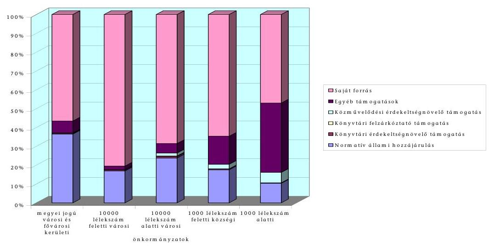

A települési önkormányzatokat érintő 936922 ezer Ft külső forrás (támogatások) összetétele a települések nagysága szerint szintén változatos képet mutat.

---

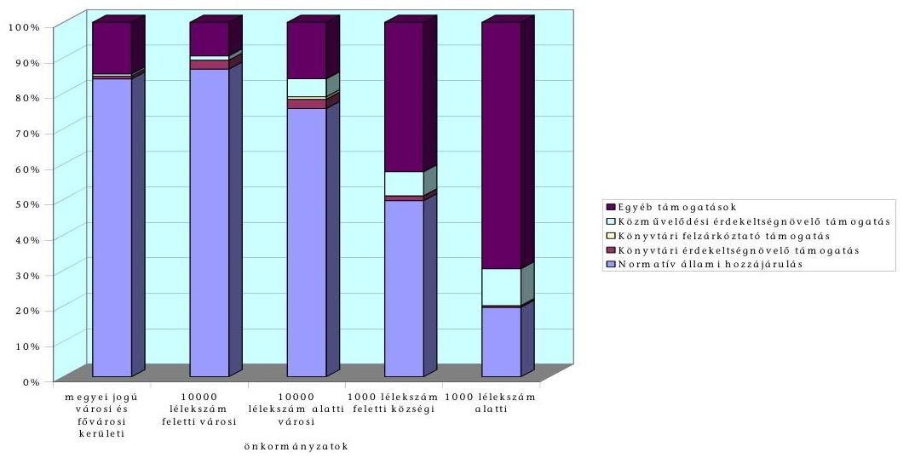

A közművelődési és könyvtári feladatellátásra fordítható külső forrásokon belül a normatív állami hozzájárulás aránya átlagosan 80,6 %. Minél kisebb lakosságszámú önkormányzat forrásait nézzük, a normatív támogatás aránya úgy csökken, ami egyben összefügg az átvett pénzeszközök összegének emelkedésével is. Az egyéb támogatások (pályázatokon nyert pénzek, átvett pénzeszközök) a támogatásokon belül 17,7 %-ban járulnak hozzá a feladatok finanszírozásához. Az 1000 lélekszám alatti települések magasabb támogatottsági aránya a kulturális feladatellátáshoz kapcsolódó beruházásokhoz, fejlesztésekhez átvett pénzeszközök miatt van, amely mértéke miatt költségvetésükben nagyobb súlyt képvisel, mint a nagyobb önkormányzatoknál.

Eperjes (2700 ezer Ft) és Diósberény (8000 ezer Ft) községek a revitalizációs pályázaton nyertek a művelődési ház felújításához támogatást a NKÖM-től, Nova 9436 ezer Ft vidékfejlesztési támogatásban részesült.

A normatív állami hozzájárulás a működési kiadásoknak közel 40 %-át fedezte, de a személyi juttatásokra és annak járulékaira sem nyújtott fedezetet. Alakulását a települések nagysága szerint a következő táblázat mutatja.

| Település | A normatív állami hozzájárulás aránya |  |
| :-- | :--: | :--: |
|  | a működési kiadá-   sokhoz   % | a személyi juttatá-   sok és a járulékai-   hoz % |
| Megyei jogú városok és fővárosi kerületek | 48 | 88 |
| Városok | 25 | 39 |
| 1000 lélekszám feletti községek | 24 | 41 |
| 1000 lélekszám alatti községek | 28 | 85 |
| Települések együtt | 39 | 67 |

Az érdekeltségnövelő támogatások sem összegükben, sem arányukban nem jelentősek, összesen 1,7 %-os részt jelentenek a külső források között.

---

Az ellenőrzött önkormányzatok kiadásai 2003. évben a következők szerint alakultak:

| Kiadás |  |  |
| :-- | --: | --: |
| jogcíme | összege (millió Ft) | aránya (%) |
| Felhalmozási kiadás | 33235 | 11,1 |
| - ebből kulturális célú | 380 | 0,1 |
| Működési kiadás | 253115 | 84,3 |
| - ebből kulturális célú | 3891 | 1,3 |
| Pénzeszköz átadás | 14038 | 4,6 |
| Önkormányzati kiadások összesen | 300388 | 100,0 |

Az ellenőrzött önkormányzatok összes kiadásán belül a kulturális kiadások aránya (működési és felhalmozási) 1,4 % volt.

Az 1000 fő lélekszám alatti községeknél 6,6 %-os a kulturális kiadások aránya, ami összefügg az átvett pénzeszközöknél már említett, támogatásokkal létrejött beruházások alakulásával. Az önkormányzat összes kiadásához viszonyítva a megyei jogú városi és fővárosi kerületi önkormányzatoknál az arány 1,3 %.

A 2003. évi kulturális kiadások belső összetételét vizsgálva önkormányzat típusonként a belső arányok eltérő képet mutatnak.
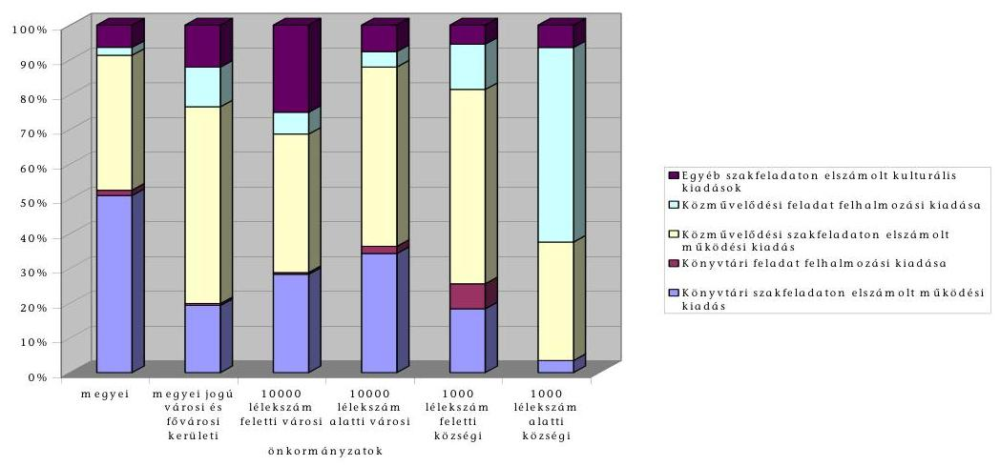

A megyei önkormányzatok kivételével mindenhol alacsonyabb a könyvtári feladatra fordított kiadások aránya, mint a közművelődésre. Az egyéb szakfeladaton elszámolt kiadás a 10000 lélekszám feletti városoknál jelentősebb arányú. Ezeknél a városoknál nagyobb a súlya a civil szerveződések támogatásának, amely a polgármesteri hivatal költségvetésében jelenik meg.

Budaörs Város Önkormányzata az intézmények fenntartására fordított mértéket megközelítő arányban támogatja az egyéb szervezeteket, valamint a társadalmi önszerveződéseket. 2003. évben az erre fordított kiadása 37760 ezer Ft volt, amely a közművelődési és könyvtári feladatellátásra fordított összes kiadásának 24 %-a.

Esztergom Város Önkormányzata kulturális kiadásainak 57,3 %-a 113968 ezer Ft nem jelent meg a könyvtári és a közművelődési szakfeladaton. Ebből az összegből 66740 ezer Ft-ot fordítottak rendezvényekre, a többit egyéb civil szerveződések támogatására.

Bonyhádon, amely szintén a 10000 lélekszám feletti városok közé tartozik, nem számoltak el egyéb szakfeladaton kulturális kiadásokat.

Az egy lakosra jutó szakfeladaton elszámolt kulturális kiadások a városokban a megyei jogú városok és a fővárosi kerületek kivételével - és a községekben közel azonosan 4000 Ft/fő körül alakultak, míg az egyéb szakfeladaton elszámolt kiadások különböző mértéke miatt a települési önkormányzatok összes fajlagos kulturális kiadása változó volt.
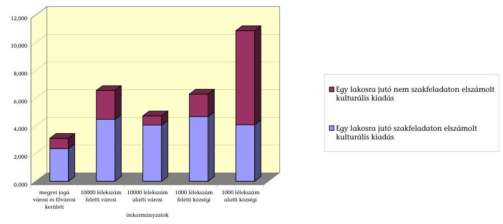

Összességében a felhalmozási kiadásokat és az egyéb szakfeladatokon elszámolt kiadásokat is tartalmazó átlagos egy főre jutó kiadás 3981 Ft. Az összeg az 1000 lélekszám alatti községeknél ennek közel háromszorosa, a fejlesztésekhez átvett pénzeszközök révén megvalósuló beruházások miatt. A szakfeladaton elszámolt kulturális kiadások összege lakosonként átlagosan 2918 Ft volt. Ez esetben a városi és községi önkormányzatok közötti különbség kevésbé mutatkozik, azonban értékét tekintve a kis önkormányzatok lényegesen kevesebbet - a lakosságszámukkal arányos összeget - fordítanak a kulturális feladat ellátására.

A vizsgált körben az egy önkormányzatra jutó kulturális kiadás a települések besorolása szerint:

| Önkormányzat | összeg (ezer Ft) |
| :-- | :--: |
| Megyei jogú város és fővárosi kerület | 280027 |
| 10000 fő lélekszám feletti város | 93076 |
| 10000 fő lélekszám alatti város | 16148 |
| 1000 fő lélekszám feletti község | 10380 |
| 1000 fő lélekszám alatti község | 2332 |

# 3.2. A feladatellátás létesítményi, tárgyi, személyi feltételei 

Az önkormányzatok által felvállalt feladatok körét, azok ellátását alapvetően meghatározzák a rendelkezésre álló feltételek.

---

A nyilvános könyvtár működtetésének alapkövetelménye a kulturális törvény 54. § (1) bekezdése szerint többek között, hogy könyvtári szakembert alkalmaz, rendelkezik kizárólagosan könyvtári szolgáltatások céljára alkalmas helyiséggel. A közművelődési feladatellátással kapcsolatosan a kulturális törvény 78. § (5) bekezdés c) pontja úgy fogalmaz, hogy az önkormányzat biztosítja a feladat ellátásához, a közösségi színtér, illetve közművelődési intézmény fenntartásához szükséges, e törvény szerinti szervezeti, személyi, szakképzettségi és tárgyi feltételeket. A törvény 1. számú melléklete a különböző fogalmak alkalmazása kapcsán ad némi eligazítást az intézmények, közművelődési színterek meghatározásához, a működtetéssel kapcsolatos feltételek tekintetében azonban további szabályozást nem tartalmaz. Nem tesz különbséget a törvény a kistelepüléseken szűkebb körű feladatellátást biztosító, illetve a nagyobb városban működő, változatos programokat és ellátást kínáló intézmények feltételei között.

A működtetés feltételeihez kapcsolódóan miniszteri rendelet csak a könyvtári dolgozók, az egyes közművelődési munkakörök betöltéséhez szükséges képesítési feltételekre, valamint a továbbképzés rendjére vonatkozóan jelent meg.

Mindezek alapján az önkormányzatok - a szakmai munkakörben foglalkoztatottakra előírt képesítési feltételek kivételével - saját maguk, alapvetően pénzügyi pozícióik függvényében dönthetik el, hogy intézményeik, illetve a színterek számára milyen működési feltételeket biztosítanak. Tág határok között értelmezhető a színvonalas szakmai munkához szükséges és elvárható feltételek köre, mértéke.

Ezt támasztják alá a tárca által végzett szakfelügyeleti vizsgálatok alapján tett javaslatok is. A vizsgált intézményeket érintő szakfelügyelői jelentések mindegyike - jogszabályhelyre való hivatkozás nélkül - javasolja a fenntartónak a létesítményi, egyéb működtetéssel összefüggő tárgyi-személyi feltételek javítását elősegítő intézkedés megtételét.

# 3.2.1. Létesítményi feltételek 

A szakmai munka ellátásának létesítményi feltételei a 2000-2003. évek között - meghatározó részben a jelentés 3.1.1.1., 3.1.1.2., 3.1.1.3. pontjában részletezett pályázati forrásoknak köszönhetően - javultak, önkormányzatonként, intézményenként azonban rendkívül differenciáltak.

A kötelező feladatellátás keretében működtetett
 nyilvános könyvtárak, közművelődési intézmények, közösségi színterek létesítményei – néhány kivétellel önkormányzati tulajdonban vannak.

A Heves megyei Művelődési Központ épülete a Magyar Katolikus Egyház Egri Főegyházmegye tulajdonában van. A Főegyházmegyei Hatóság az ingatlan térítésmentes használatát biztosítja az önkormányzat részére a működés érdekében.

A kiemelt műemlékek tulajdonjogát szabályozó törvényi rendelkezés alapján állami tulajdonban van a vizsgált intézményeknek helyet adó létesítmények közül többek között a sárvári Nádasdy vár, a Miskolc-Diósgyőri vár.

---

A nem önkormányzati tulajdon, az épületek műemlék vagy műemléki jellegéből adódó egyeztetési kötelezettségek meghosszabbítják, esetenként nehezítik a felújítási, karbantartási munkálatokkal kapcsolatos ügyintézést.

A vizsgált körben az önkormányzatok 66%-a felmérte a feladatellátást végző intézményei, a közművelődési színterek állagát. Pótlásra, teljeskörű felújításra pénzügyi számításokkal alátámasztott ütemtervet azonban csak 36%-uk készített, jellemzően azok, amelyek már felújították vagy különféle támogatással felújítani szándékoznak ezen létesítményeiket.

A könyvtárak, közművelődési intézmények, közösségi színterek műszaki állapota a vizsgált körben javult. 2000–2003 között a vizsgált körben a közművelődési létesítmények 51%-ánál, a könyvtárak 31%-ában volt vagy folyamatban van teljes körű, illetve részleges felújítás.

- Az 1000 fő alatti lakónépességű települések mindegyikén – Fülesd község kivételével, ahol új faluház épül, melynek használatba vételére várhatóan 2005. évben kerül sor – felújították a művelődési, közösségi vagy faluházat. Ennek is köszönhető, hogy e községekben aktívabbá vált a közösségi élet.
- A részleges felújítások kapcsán javult, korszerűbbé vált a művelődési létesítményekben a hang- (Dévaványán, Sárváron, a Heves megyei intézményben), fény- (Szatymazon, Sióagárdon, Bonyhádon), a színpadtechnika berendezései (Gencsapátiban, Dévaványán, Adonyban, a Vas megyei művelődési központban).
- A Vas, a Somogy megyei, a miskolci megyei jogú városi könyvtár, valamint a főváros XX. kerületében működő Csili Művelődési központ – melyben a könyvtár is elhelyezést nyert – felújítása az önkormányzatok jelentős saját erő felhasználása mellett címzett támogatással valósult meg. A rekonstrukciós beruházások eredményeképpen a korszerű követelményeknek mindenben megfelelő könyvtári ellátást tudnak nyújtani ezen intézmények. A fejlesztések következtében nőtt az intézmények hasznos alapterülete, bővítették a raktárakat, a differenciált közönségforgalomra tekintettel az olvasószolgálati tereket, felújították az energiahálózatot, számítógép hálózatot építettek ki, javult a létesítmények épület és vagyonvédelme. (A címzett támogatásokkal a jelentés 3.1.1.1. pontja foglalkozik).

A korszerű, felújított létesítmények azonban nem jellemzőek általánosan. Sajóörösön nem látják el a könyvtári feladatot. Röjtökmuzsajon, Fülesden nincs biztosítva a kizárólagosan könyvtári célokra használt helyiség.

Fülesden a könyvtárat a nappali szociális ellátást biztosító épületben helyezték el, a könyvtári célokat szolgáló helyiséget nem kizárólagosan a könyvtár használja.

Röjtökmuzsajon a helyi általános iskola egyik tantermében működik a könyvtár, ahol délelőtt oktatás folyik.

A felújított főépületek mellett jellemzően a könyvtárak fiókkönyvtárai szűkös elhelyezési feltételekkel, elhasználódott bútorzattal rendelkeznek.

---

A felújítások, korszerűsítések ellenére az intézmények egy részében még mindig szűkös, rossz körülmények között folyik a szakmai munka. Az épületek nagy része nem e célra épült, időközben az igények azt túlnőtték vagy állaguk erősen leromlott (tetőbeázások, nedvesedések jelentkeznek).

Leromlott műszaki állapotban van többek között Szulok, Pusztakovácsi település könyvtára.

Sajóörösön, Tokaj városban a művelődési ház épület adottságai kedvezőtlenek, kiscsoportos foglalkozásokra csak egy-egy terem áll rendelkezésre.

Martonvásáron a Művelődési ház a tűzoltószertár emeleti részén nyert elhelyezést.

Sárváron a Művelődési központ az egykori Nádasdy várban működik, ahol nem rendelkeznek nagyobb létszámú rendezvény befogadására alkalmas nagyteremmel.

Csány községben, Dévaványán az épület állaga leromlott, gyakoriak a beázások, az elektromos hálózat elavult.

Egyes önkormányzatok (Esztergom, Komárom, Budaörs, Miskolc) távlati fejlesztési elképzelései között új, a korszerű követelményeknek megfelelő létesítmény megépítése vagy a meglévő jelentős bővítése szerepel, melyet meghatározó részben címzett vagy egyéb támogatással kívánnak megvalósítani. Így az elmúlt időszakban a meglévő épületeken csak a legszükségesebb felújítási, karbantartási munkálatokat végezték el.

A könyvtárakban elsősorban a könyvek raktározása okoz gondot. E tekintetben a könyvtárak mintegy 60%-ában nem megfelelőek a körülmények.

Esztergomban gördülő polcos, tömör raktározási rendszert alkalmaznak, ennek ellenére szűk a raktári kapacitás.

Martonvásáron a könyvtáros irodája szolgál raktározási célokat, a sióagárdi könyvtár nem rendelkezik raktárral.

A Békés megyei könyvtár raktárai is szűkösek, nedvesek, szigetelési problémák miatt e célra csak kevésbé alkalmasak.

A fogyatékos személyek jogairól és esélyegyenlőségük biztosításáról szóló 1998. évi XXVI. törvény 29. § (6) bekezdésében a középületek akadálymentessé tételére előírt eredeti határidőt (2004. december 31.) nem tartották be. Felméréseket ezzel kapcsolatosan az önkormányzatok készítettek ugyan – a felmerülő költségek nagyságrendje miatt –, azonban a megvalósítás érdekében nem tettek intézkedéseket, megsértve a törvény előírását.

A Zala megyei Nova községben az állapotfelmérés alapján a két vizsgált létesítmény esetében az akadálymentessé tételi kötelezettség teljesítésének költségigénye 5,5 millió Ft, ugyanakkor a településen mindössze egy mozgáskorlátozott személy él.

---

# 3.2.2. Intézmények működésének egyéb tárgyi feltételei 

A tárgyi feltételek körében a legdinamikusabb fejlődés a modern informatikai eszközökkel való ellátottságban, valamint annak használatában jelentkezett. Az önkormányzatok és intézményei az IHM-hez benyújtott, illetve egyéb pályázati forrásokból munkavégzésükhöz, illetve szolgáltatásaik bővítéséhez számítástechnikai eszközökhöz jutottak. Az IHM pályázatok keretében az önkormányzatok részére számítógépeket juttattak, az pénzforgalmi kiadásként, bevételként nem jelent meg. Ezen eredményes pályázatok kapcsán az önkormányzatok egy éves ingyenes Internet használati lehetőséget is kaptak. Az intézmények, melyek bekapcsolódtak az Internet hálózatba email címmel is rendelkeznek, honlapjuk azonban jellemzően a városi intézményeknek van. A fejlesztések eredményeként a vizsgált körben a városokban működő közművelődési intézmények közül már csak elvétve (Dévaványa, Sárvár) fordul elő, hogy nem rendelkeznek Internet hozzáféréssel.
Még az 1000 főnél nagyobb lélekszámú községi közművelődési létesítmények közül is mindössze 4%-uk rendelkezett 2000-ben e kommunikációs lehetőséggel, 2003. év végére pedig már minden második község intézményében biztosított volt az Internet hozzáférés.

Internet hozzáféréssel rendelkező vizsgált közművelődési intézmények arányának változása
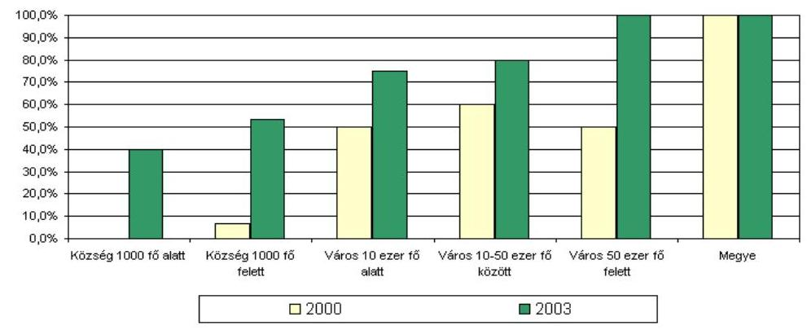

Hasonlóak a tendenciák a könyvtárak esetében is. E területen valamennyi városi intézmény rendelkezik Internet hozzáféréssel. Községekben ez az arány a 2000. évi 8%-ról 20%-ra nőtt. Nagyobb városokban működő, illetve a megyei könyvtárakban (Vas megye) külön helyiség áll rendelkezésre a számítógépek, szoftverek, a digitalizált könyvek használatához.

A berendezések, egyéb felszerelési tárgyak cseréjére, pótlására, jellemzően a felújított intézményekben került sor, másutt e téren előrelépés nem volt tapasztalható.

### 3.2.3. A működés személyi feltételei

Az egyes létesítmények létszámellátottsága, a szakmai munka létszámfeltételei rendkívül differenciált képet mutatnak. Annak ellenére, hogy a vizsgált önkormányzatok közül Eperjes, Röjtökmuzsaj, Pusztakovácsi településeken főfoglalkozású közművelődési szakalkalmazott beállítására került sor, az 1000 fő

---

alatti lakónépességű települések 70%-ánál a feladatellátás személyi feltételei nem megoldottak. A nagyobb községek mintegy 30%-ánál nem alkalmaznak a közművelődési feladatok ellátására főfoglalkozású dolgozót. A feladatok ellátását négy településen időszakonként közhasznú foglalkoztatott, illetve a falugondnok segíti (Szulok, Bátor, Adony, Diósberény). Városokban az intézmény, a felvállalt feladatok nagyságrendje függvényében – több (szélső értékek 2–17 fő) megfelelő szakmai végzettséggel rendelkező dolgozó szervezi a közművelődési programokat. A dolgozók rendelkeznek munkaköri leírással, az elkészített munkaköri leírások alapján azonban nem követhető minden esetben az egyes dolgozók közötti feladatelhatárolás. A főfoglalkozású dolgozók mellett a klubokat, szakköri foglalkozásokat, tanfolyamokat, előadásokat jellemzően megbízás keretében látják el.

A nyilvános könyvtárak esetében a kulturális törvény alapkövetelményként írja elő (54. § (1) bekezdés b) pont) szakember alkalmazását. Ennek ellenére a vizsgált 1000 fő alatti lakónépességű települések mintegy 70%-ában, az 1000 lélekszámnál nagyobb községeknek pedig mintegy 33%-ában nem szakember látta el a feladatot. E településeken a könyvtári feladatokat jellemzően heti pár órás foglalkoztatás keretében pedagógus vagy a falugondnok (Bátor) végzi, akik viszont nem rendelkeznek könyvtárosi szakmai végzettséggel. Így e települések nem tettek eleget a törvényi előírásoknak. A nyilvános könyvtárak jegyzékének vezetéséről szóló 64/1999. (IV. 28.) Korm. rendelet 4. § (5) bekezdése szerint az alapkövetelményeket nem teljesítő könyvtárat az elrendelt hiánypótlás elmaradása esetén a hiánypótlásra megadott határidő elteltét követő 30 napon belül törli a minisztérium a jegyzékből. Erre azonban egyetlen esetben sem került sor. Rendkívül nagy gondot, sokszor megvalósíthatatlan feladatot jelent kistelepüléseken megfelelő szakképzettséggel rendelkező, heti 2–3 órás megbízásos jogviszonyban könyvtáros dolgozó alkalmazása, illetve e dolgozók tanfolyamokon történő részvételre való kötelezése.

Városokban, ahol a könyvtárban főállásban alkalmazzák a könyvtárosokat, az egyes feladatok elhatárolása, egymásra épülése már biztosítható.

A kulturális szakemberek szervezett képzési rendszeréről, követelményeiről és a képzés finanszírozásáról az 1/2000. (I. 14.) NKÖM számú rendelet rendelkezik. A tárca rendelete a közalkalmazotti jogviszony, illetve munkaviszony alapján, teljes munkaidőben foglalkoztatott közép- és felsőfokú végzettségű szakemberek szervezett képzését szabályozza, az nem vonatkozik azon intézményekre, melyek heti pár órai időszakra egyéb jogviszony keretében foglalkoztatott dolgozókkal látják el a feladatot. Ezen utóbbiak aránya a vizsgált körben nyilvános könyvtárak esetében 36%, a közművelődés területén 32%. A hétéves továbbképzési, valamint éves beiskolázási terv készítési kötelezettségének az arra kötelezett könyvtárak 10, a közművelődési intézmények mintegy 30%-a nem tett eleget.

A képzés keretében a dolgozók vagy magasabb szintű szakmai végzettséget szereznek vagy jellemzően nyelv-, illetve számítástechnikai tanfolyami képzésben vesznek részt.

Eltérően alakul a dolgozók részére a képzéssel kapcsolatosan biztosított kedvezmények köre, mértéke is. Egyes intézmények (a főváros kerületei, megyei

---

önkormányzatok közül Csongrád, Somogy megyei közművelődési intézmények) a dolgozók részére a továbbképzéshez munkaidő-kedvezményt sem biztosítanak, nagyrészt arra való hivatkozással, hogy a dolgozó nem munkaidőben vesz részt azon, másutt (pl. Komáromban) pótszabadságot engedélyeznek, illetve tanulmányi szerződést kötnek (Bonyhád) a képzésben résztvevőkkel.

# 4. A feladatellátás ellenőrzése, fenntartói beszámoltatás 

### 4.1. A szakmai feladatellátás ellenőrzésére tett ágazati intézkedések

A célok megvalósulását, újabb reális célkitűzések kidolgozását segítheti a szakmai munka folyamatos mérése, rendszerszerű ellenőrzése, értékelése. E téren különféle kezdeményezésekre került sor, kutatások, tanulmányok készültek, a feladatellátás rendszerszerű ellenőrzése, értékelése azonban az ágazatban nem működik, a minőségbiztosítás, minőségfejlesztés meghatározására, követelményeinek kidolgozására nem került sor.
A vizsgált időszakban kedvező változást hozott a feladatellátás országos szakfelügyeletének megszervezése. Ennek kapcsán újjá kellett éleszteni az egyszer már kiépített, de megszüntetett rendszert.

Az önkormányzati rendszer létrejöttével a korábban működött szakfelügyeleti rendszer megszűnt, így a tárca a feladatellátásra vonatkozóan jelentős információktól esett el, az intézmények pedig a szakmai feladataik ellátásában nagyrészt magukra maradtak.

A jogszabályok részletesen rögzítik a szakfelügyelettel kapcsolatos feladatokat, azt, hogy a vizsgálatok mely területek ellenőrzésére, értékelésére térjenek ki. A szakfelügyelet keretében vizsgálja a tárca a jogszabályok betartását, a könyvtári alapfeladatok és alapkövetelmények teljesítését, a helyi közművelődési rendeletekben rögzített kötelező feladatok megvalósítását. A miniszteri rendeletek szerint a szakfelügyelet feladata a szakmai követelmények betartásának, az irányelvek figyelembevételének vizsgálata, a működtetés hatékonyságának értékelése is.

A vizsgálatok egységes szempontok szerint történő elvégzése, a tapasztalatok összesíthetősége érdekében a vizsgálandó kérdésekre, szempontokra vonatkozóan részletes útmutatást, kérdőívet dolgoztak ki, a közművelődési terület szakfelügyeletéhez módszertani útmutató is készült. Az egyes szakterületek szakfelügyeletének megszervezésére eltérő módon kerül sor. A közművelődési feladatellátás országos szakfelügyeletét a NKÓM Közművelődési Főosztálya közvetlenül szervezi és irányítja, míg a könyvtári szakfelügyeletet decentralizálták. A megyei könyvtárak a minisztériummal kötött megállapodás alapján szervezik és vesznek részt a vizsgálatokban, e területen a minisztérium
 elsősorban irányítási, koordinálási feladatokat lát el.

A települési önkormányzatok könyvtári és közművelődési feladatellátásának szakfelügyeletét éves munkaterv alapján végzik, melyet a helyettes államtitkár hagy jóvá. A könyvtári területen a vizsgálandó egységekre a megyei vezető szakfelügyelők tesznek javaslatot, a közművelődés területén folyó szakfelügyelet irányítását, szervezését az országos vezető szakfelügyelő segíti.

---

A minisztériumi kezdeményezésű szakfelügyeleti vizsgálatokkal kapcsolatos kiadásokat a tárca fejezeti kezelésű pénzeszközeinek keretében tervezik, ennek éves nagyságrendje a könyvtári területen mintegy 30 millió Ft, a közművelődés kapcsán 50 millió Ft. Az előirányzatok felhasználásának pénzügyi bonyolítását a tárca intézményei, az Országos Idegennyelvi Könyvtár (OIK), illetve az Magyar Művelődési Intézet végzi.

A vizsgált időszakban jelentős számú szakfelügyeleti vizsgálat elvégzésére került sor. Országosan, a nyilvános könyvtárak körében 2002-ben 427, 2003-ban 530, 2004-ben mintegy 500 szakfelügyelői vizsgálatot végeztek. A települési könyvtárakat néhány megyében, ahol nagyobb számban működnek szakfelügyelők, már teljes körűen ellenőrizték. Az önkormányzati közművelődési feladatellátókra vonatkozóan a rendelet megjelenése (1999) óta 1015 szakfelügyeleti vizsgálat elvégzésére került sor. Ez azt jelenti, hogy az elmúlt években a helyi önkormányzatok mintegy egyharmadában volt szakmai vizsgálat, amely kiterjedt az önkormányzat jogalkotói, jogalkalmazói tevékenységére, intézményfenntartói feladataira, valamint a helyi feladatellátásban résztvevő társadalmi és gazdasági szervezetekre is.

A vizsgálatba bevont településeket érintően míg a nyilvános könyvtárak ellenőrzésére döntően a községi intézményekben került sor (e körben a vizsgálattal érintettek aránya a mintában 44% volt), addig közművelődési szakmai ellenőrzések nagyobb arányban a megyei intézményekben, illetve városokban voltak (ezen kört érintően az intézmények 65%-ában volt szakmai ellenőrzés). Hét településen, a vizsgált községek 28%-ánál mindkét szakterületet érintően volt szakfelügyeleti vizsgálat.
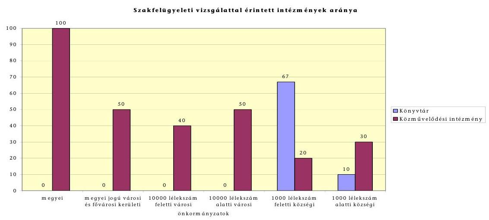

A szakfelügyeleti vizsgálatok meghatározó részben átfogó jellegűek voltak, elvétve fordult elő cél- vagy tematikus vizsgálat.

Célvizsgálat keretében a Békés megyei könyvtárban ellenőriztette a tárca az ODR kiépítéséhez biztosított támogatás jogszerű felhasználását.

Községekben a vizsgálatot egy szakértő, míg városokban, nagyobb önkormányzatok esetében 2-4 fős szakértői csoport végezte. A közművelődési feladatellátásra vonatkozó szakfelügyeleti jelentések településtörténeti, szociológiai

---

összefüggéseivel együtt mutatják be az önkormányzat által vállalt, ellátott feladatokat.

A szakfelügyelői jelentések sokrétű információt tartalmaznak a feladatellátás módjáról, mértékéről, feltételeiről, s nem vagy csak kevésbé foglalkoznak a szakmai munka színvonalával, annak értékelésével, a működtetés hatékonyságával. Ez összefügg azzal, hogy a mérés, értékelés, minőségbiztosítás rendszere nem épült ki. Hiányosságaik ellenére a jelentések rávilágítanak az intézményekben folyó munka, a fenntartás problémáira, ami kellő alapot adhat a hibák kijavítására, intézkedések megtételére.

- A jelentésekben foglaltak alapján a szakfelügyelők a vizsgálatok mintegy 20%-ánál javasolták a fenntartók részére közművelődési koncepcióik áttekintését, a rendeleteknek a helyi viszonyok és a tényleges feladatellátás alapján történő felülvizsgálatát.
- Kiemelt figyelmet kapott a szakfelügyeleti vizsgálatok során az intézményi alapdokumentumok (alapító okirat, SzMSz, könyvtár-, illetve intézményhasználati szabályzat) megléte, tartalmára vonatkozó előírások betartása. Ezzel kapcsolatosan a jelentések 50%-a fogalmaz meg javaslatokat.
- Valamennyi jelentés foglalkozik az intézmények elhelyezési körülményeivel, a berendezési, felszerelési tárgyak állapotával, a létszámellátottsággal, könyvtárak esetében a könyvbeszerzésekkel, a könyvállomány korszerűségével, az előírt leltározási időszak betartásával és tesz javaslatot a könyvállomány fejlesztésére, a könyvtári dokumentumok kezelésével kapcsolatos előírások betartására.
- A megyei intézményekben végzett közművelődési szakfelügyeleti vizsgálatok az intézmények munkáját alapvetően jónak ítélték, javaslatként a településekkel kialakított kapcsolatok erősítését, a közművelődési szakemberek szervezett felkészítési rendszerének további gazdagítását fogalmazták meg.

A szakfelügyelet alapján a tárca fontos információkhoz jutott a feladatok ellátásáról, annak feltételeiről, összesített kimutatást azonban erről nem készítettek. A szakfelügyelet működésének, valamint a jelentésekben értékelt feladatellátásnak a tapasztalatait tanulmányok, kutatási anyagok dolgozták fel. ${ }^{7}$

A szakfelügyeleti jelentések tartalmát az érintett önkormányzatok megismerték, azt képviselő-testületi ülésen megvitatták, a javaslatok végrehajtására történtek intézkedések, azok azonban a települések egy részében nem voltak teljes körűek. Azoknál az önkormányzatoknál, amelyek a szakfelügyelet javaslatait figyelmen kívül hagyták, jelen vizsgálatunk az ott megfogalmazottakkal hasonló megállapításokat tett.

Nova községben a közművelődési feladatellátás vizsgálatáról készített szakfelügyeleti jelentés a kulturális koncepció hiányát, az SzMSz-t, a közművelődési

[^0]
[^0]:    ${ }^{7}$ Szabó Irma: Jelentés az általános művelődési központokról, Németh János István: A megyei közművelődési feladatellátás tapasztalatairól

---

rendeletet kifogásolta, azok általánossága, túlzott tömörsége miatt. A feltárt hiányosságok helyszíni vizsgálatunk idején továbbra is fennálltak.

Martonvásáron a javaslatok közül nem készült el a könyvtárnak a szakfelügyelet által igényelt, bár nem előírt „küldetésnyilatkozata”, részben történt meg a bútorzat cseréje.

Csány községben a 2002-ben végzett könyvtári szakfelügyeleti vizsgálat megállapításai szerint az intézmény nem rendelkezett a működést szabályozó alapdokumentumokkal, a könyvtáros feladatait nem kellő színvonalon látta el, 12 éve nem volt a könyvtárban leltározás, a katalógus sem volt naprakész. Az ÁSZ vizsgálat idejére a szabályzatok elkészültek.

A vizsgált körben a minisztérium a könyvtárak 29, a közművelődési intézmények 42%-ában végeztetett szakfelügyeleti ellenőrzést. Önkormányzati megrendelés alapján szakfelügyeleti vizsgálatra nem került sor, amit az intézményfenntartók a rendelkezésre álló anyagi források szűkösségével indokoltak. Az intézmények pénzügyi-gazdasági vizsgálatai azonban érintik a szakmai feladatok ellátását is. A megyei önkormányzatoknál, városokban, ahol szakapparátus, illetve megfelelő végzettségű szakember áll rendelkezésre, jellemzően négy évente az intézményi felügyeleti vizsgálatokban részt vesznek a hivatal e szakterülettel foglalkozó dolgozói is, akik a szakmai munka egy-egy elemét (dokumentumállomány kezelése, szakalkalmazottak továbbképzése) ellenőrzik, s tesznek javaslatot a hiányosságok felszámolására.

# 4.2. Az intézmények önkormányzati beszámoltatása 

Az intézmények képviselő-testületek, bizottságok által történő beszámoltatására jellemző, hogy az önkormányzatok a szakmai munka értékeléséhez, azzal kapcsolatos beszámolók elkészítéséhez követelményeket, irányelveket nem fogalmaztak meg, tartalmát az intézményekre bízták. Utasításokat csak a költségvetési beszámolók összeállításához, a gazdálkodással kapcsolatos feladatok értékeléséhez adtak ki, melyben meghatározták, hogy mely feladatok ellátását és milyen szempontok szerint kell értékelni.

A szakmai munka elemzéséhez szükséges kritériumokat sem a fenntartó önkormányzatok, sem az intézmények nem dolgozták ki. Így a beszámolók a statisztikai adatokra hivatkozva a különböző programok, rendezvények, az azon részt vettek körének bemutatására, versenyeredmények, elért díjak bemutatására terjedtek ki. Összehasonlító adatok, szakmai standardok hiányában a feladatellátás mélyebb értékelésére nem kerülhetett sor. Arra sem az intézmények, sem fenntartóik nem vállalkoztak.

- A vizsgált települések mintegy 50%-án az önkormányzatok képviselőtestületei, illetve bizottságai beszámoltatták intézményeiket a végzett szakmai munkáról, annak tapasztalatairól.

A Békés Megyei Önkormányzat esetében a beszámoltatás rendszeres, a beszámolók részletesek. Az éves beszámoltatáson túl az önkormányzat középtávon is áttekintette a megye kulturális tevékenységét, meghatározta a legfontosabb feladatokat (nyilvános könyvtári kritériumoknak való megfelelés, a létesítmények felújítása).

---

- Az önkormányzatok negyedénél a testület vagy bizottság napirendjén a szakmai munka tapasztalatainak értékelése egyáltalán nem szerepelt vagy a beszámoltatás nem terjedt ki az intézmények teljes körére.

Röjtökmuzsajon pl. a közösségi ház tevékenységét, míg Dunakilitin a könyvtár feladatellátását értékelte a testület.

Azon településeken, ahol az intézmények testületek előtt történő beszámoltatására nem került sor, a polgármester és a jegyző napi munkakapcsolat formájában tájékozódott az ellátott feladatokról.

- A többi településen a kétévenkénti beszámoltatás volt jellemző (Budaörs, Dévaványa, Kisnána), vagy arra a vezetői megbízatás lejárta kapcsán került sor (Sárvár).

Dunaalmáson a kulturális feladatok ellátásáról a testület az idegenforgalmi és kulturális program elfogadása kapcsán kapott tájékoztatást.

A testületek a szakmai munkáról szóló jelentéseket megvitatták, azt jóváhagyólag tudomásul vették, feladatok meghatározásáról, intézkedési tervek kidolgozásáról nem rendelkeztek.
Azon intézmények, melyekben több főfoglalkozású dolgozót is alkalmaznak, az éves munkaterv teljesítését munkaértekezleten is megvitatták, számba vették a határidővel és felelősökkel megjelölt munkaterv végrehajtását, az elmaradásokat. Arról írásos tájékoztatást készítettek, melyet továbbítottak az önkormányzatok hivatalaiba. Az elmaradások miatt felelősségre vonást sehol sem kezdeményeztek.

Budapest, 2005. június 11.

Melléklet:  4 db 6 lap
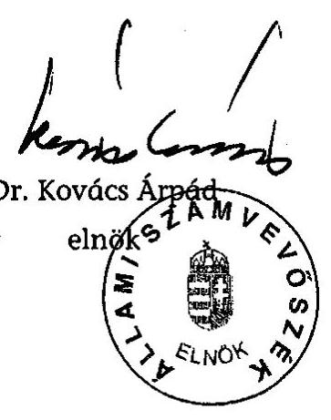

---

# A szakfeladatokon elszámolt kulturális kiadások országos alakulása

|  szakfeladat | személyi juttatás és járulék | dologi kiadások | személyi juttatások és dologi kiadások együtt | felújítás | beruházás | felújítás és beruházás együtt | Közvetlen kiadások összesen (átadott pénzeszközök nélkül | kiadás összesen (átadott pénzeszközök kel együtt)  |
| --- | --- | --- | --- | --- | --- | --- | --- | --- |
|  2001. |  |  |  |  |  |  |  |   |
|  921815 Múvelődési központok, házak tevékenysége | 6809341 | 7552524 | 14361865 | 1318026 | 1502616 | 2820642 | 17182507  |
|  921925 Egyéb szórakoztatási és kulturális tevékenység | 272472 | 815171 | 1087643 | 47516 | 174830 | 222346 | 1309989  |
|  923127 Közművelődési könyvtári tevékenység | 5926595 | 3582128 | 9508723 | 227515 | 2461179 | 2688694 | 12197417  |
|   | Összesen: | 13008408 | 11949823 | 24958231 | 1593057 | 4138625 | 5731682 | 30689913  |

2002. 921815 Múvelődési központok, házak tevékenysége 921925 Egyéb szórakoztatási és kulturális tevékenység 923127 Közművelődési könyvtári tevékenység 923127 Összesen: változás az előző évhez képest 2003. 921815 Múvelődési központok, házak tevékenysége 921925 Egyéb szórakoztatási és kulturális tevékenység 923127 Közművelődési könyvtári tevékenység 923127 Összesen: változás az előző évhez képest 2003. 921815 Múvelődési központok, házak tevékenysége 921925 Egyéb szórakoztatási és kulturális tevékenység 923127 Közművelődési könyvtári tevékenység 923127 Összesen: változás az előző évhez képest változás az előző évhez képest változás 2001. évhez képest

|  8252289 | 8381893 | 16634182 | 1704657 | 2489122 | 4193779 | 20827961 | 21216872  |
| --- | --- | --- | --- | --- | --- | --- | --- |
|  325369 | 832679 | 1158048 | 124895 | 465691 | 590586 | 1748634 | 2724199  |
|  7796493 | 4128765 | 11925258 | 360866 | 1606891 | 1967757 | 13893015 | 13971453  |
|  16374151 | 13343337 | 29717488 | 2190418 | 4561704 | 6752122 | 36469610 | 37912524  |
|  125,9\% | 111,7\% | 119,1\% | 137,5\% | 110,2\% | 117,8\% | 118,8\% | 118,3\%  |
|  10668298 | 9158767 | 19827065 | 1365316 | 2517548 | 3882864 | 23709929 | 24252180  |
|  428403 | 907164 | 1335567 | 182856 | 484795 | 667651 | 2003218 | 3378155  |
|  10583587 | 4328388 | 14911975 | 265115 | 705517 | 970632 | 15882607 | 16124461  |
|  21680288 | 14394319 | 36074607 | 1813287 | 3707860 | 5521147 | 41595754 | 43754796  |
|  132,4\% | 107,9\% | 121,4\% | 82,8\% | 81,3\% | 81,8\% | 114,1\% | 115,4\%  |
|  166,7\% | 120,5\% | 144,5\% | 113,8\% | 89,6\% | 96,3\% | 135,5\% | 136,5\%  |

---

# Az ellenőrzött önkormányzatoknál a könyvtári szakfeladaton megjelenő 2003. évi bevételek és kiadások

|  Önkormányzat | Bevételek |  |  |  |  |  |  | Kiadások |  |  |  |  |  | 

 |  |   |
| --- | --- | --- | --- | --- | --- | --- | --- | --- | --- | --- | --- | --- | --- | --- | --- | --- |
|   | összes | működési | arány | pénzügyi bevétel | arány | támogatás | arány | összes | személyi juttatás | arány | járulék | arány | dologi | arány | pénzátutalás | arány  |
|  BÉKÉS MEGYE | 224622 | 19564 | 9\% | 28274 | 13\% | 176784 | 79\% | 224662 | 122172 | 54\% | 40568 | 18\% | 61922 | 28\% | 0 | 0\%  |
|  CSONGRÁD MEGYE | 0 | 0 |  | 0 |  | 0 |  | 0 | 0 |  | 0 |  | 0 |  | 0 |   |
|  HEVES MEGYE | 76509 | 0 |  | 0 |  | 76509 | 100\% | 76509 | 0 | 0\% | 0 | 0\% | 9042 | 12\% | 67467 | 88\%  |
|  SOMOGY MEGYE | 215673 | 26217 | 12\% | 75415 | 35\% | 114041 | 53\% | 215673 | 121458 | 56\% | 40460 | 19\% | 53755 | 25\% | 0 | 0\%  |
|  SZABOLCS-SZATMÁR-BEREG MEGYE | 0 | 0 |  | 0 |  | 0 |  | 0 | 0 |  | 0 |  | 0 |  | 0 |   |
|  VAS MEGYE | 200940 | 23605 | 12\% | 73373 | 37\% | 103962 | 52\% | 197830 | 105061 | 53\% | 35154 | 18\% | 56568 | 29\% | 1047 | 1\%  |
|  ZALA MEGYE | 138796 | 5089 | 4\% | 7588 | 5\% | 126119 | 91\% | 135122 | 79700 | 59\% | 26270 | 19\% | 22752 | 17\% | 6400 | 5\%  |
|  Megyei könyvtárak összesen | 856540 | 74475 | 9\% | 184650 | 22\% | 597415 | 70\% | 849796 | 428391 | 50\% | 142452 | 17\% | 204039 | 24\% | 74914 | 9\%  |
|  BUDAPEST III. KERÜLET | 27276 | 760 | 3\% | 283 | 1\% | 26233 | 96\% | 27276 | 14316 | 52\% | 4746 | 17\% | 8214 | 30\% | 0 | 0\%  |
|  BUDAPEST XX. KERÜLET | 16233 | 1127 | 7\% | 0 | 0\% | 15106 | 93\% | 16233 | 10216 | 63\% | 3200 | 20\% | 2817 | 17\% | 0 | 0\%  |
|  MISKOLC | 142213 | 3535 | 2\% | 1469 | 1\% | 137209 | 96\% | 138828 | 84669 | 61\% | 29352 | 21\% | 24765 | 18\% | 42 | 0\%  |
|  SZÉKESFEHÉRVÁR | 102102 | 3519 | 3\% | 820 | 1\% | 97763 | 96\% | 102102 | 59383 | 58\% | 18966 | 19\% | 23753 | 23\% | 0 | 0\%  |
|  Megyei jogú városi és fővárosi kerületi könyvtárak | 287824 | 8941 | 3\% | 2372 | 1\% | 276311 | 96\% | 284439 | 168584 | 59\% | 56264 | 20\% | 59549 | 21\% | 42 | 0\%  |
|  BONTHÁD | 28185 | 1903 | 7\% | 885 | 3\% | 25397 | 90\% | 28185 | 15806 | 56\% | 5101 | 18\% | 7278 | 26\% | 0 | 0\%  |
|  BUDAÓRS | 54341 | 1766 | 3\% | 0 | 0\% | 52575 | 97\% | 52370 | 29090 | 56\% | 9835 | 19\% | 13445 | 26\% | 0 | 0\%  |
|  ESZTERGOM | 39364 | 1149 | 3\% | 429 | 1\% | 37786 | 96\% | 39364 | 21031 | 53\% | 7085 | 18\% | 11248 | 29\% | 0 | 0\%  |
|  KOMÁROM | 29436 | 622 | 2\% | 446 | 2\% | 28368 | 96\% | 28692 | 17847 | 62\% | 6087 | 21\% | 4758 | 17\% | 0 | 0\%  |
|  SÁRVÁR | 44506 | 2402 | 5\% | 2160 | 5\% | 39944 | 90\% | 44506 | 24032 | 54\% | 8096 | 18\% | 12378 | 28\% | 0 | 0\%  |
|  DÉVAVÁNYA | 16411 | 1132 | 7\% | 1297 | 8\% | 13982 | 85\% | 16411 | 8566 | 52\% | 2889 | 18\% | 4956 | 30\% | 0 | 0\%  |
|  DUNAFÖLDVÁR | 13051 | 1166 | 9\% | 49 | 0\% | 11836 | 91\% | 13051 | 7590 | 58\% | 2518 | 19\% | 2943 | 23\% | 0 | 0\%  |
|  RAKAMAZ | 6119 | 247 | 4\% | 49 | 1\% | 5823 | 95\% | 6119 | 3328 | 54\% | 1156 | 19\% | 1635 | 27\% | 0 | 0\%  |
|  TORAI | 9530 | 196 | 2\% | 0 | 0\% | 9334 | 98\% | 9530 | 5173 | 54\% | 1736 | 18\% | 2621 | 28\% | 0 | 0\%  |
|  Városi könyvtárak összesen | 240943 | 10583 | 4\% | 5315 | 2\% | 225045 | 93\% | 238228 | 132463 | 56\% | 44503 | 19\% | 61262 | 26\% | 0 | 0\%  |
|  ADONY | 2243 | 121 | 5\% | 0 | 0\% | 2122 | 95\% | 2243 | 1179 | 53\% | 411 | 18\% | 653 | 29\% | 0 | 0\%  |
|  ALGYÓ | 13615 | 1159 | 9\% | 1310 | 10\% | 11146 | 82\% | 13615 | 6005 | 44\% | 1990 | 15\% | 5620 | 41\% | 0 | 0\%  |
|  BUCSA | 2724 | 0 | 0\% | 0 | 0\% | 2724 | 100\% | 2724 | 1525 | 56\% | 518 | 19\% | 681 | 25\% | 0 | 0\%  |
|  CSANADAPÁCA | 1522 | 0 | 0\% | 0 | 0\% | 1522 | 100\% | 1522 | 799 | 52\% | 291 | 19\% | 432 | 28\% | 0 | 0\%  |
|  CSÁNY | 1551 | 288 | 19\% | 0 | 0\% | 1263 | 81\% | 1551 | 725 | 47\% | 268 | 17\% | 558 | 36\% | 0 | 0\%  |
|  DÉG | 2903 | 47 | 2\% | 0 | 0\% | 2856 | 98\% | 2903 | 1697 | 58\% | 527 | 18\% | 679 | 23\% | 0 | 0\%  |
|  DUNAALMÁS | 0 | 0 |  | 0 |  | 0 |  | 0 | 0 |  | 0 |  | 0 |  | 0 |   |
|  DUNAKILÉT | 1887 | 0 | 0\% | 61 | 3\% | 1826 | 97\% | 1887 | 110 | 6\% | 9 | 0\% | 1768 | 94\% | 0 | 0\%  |
|  GENCSAPÁTI | 3863 | 174 | 5\% | 0 | 0\% | 3689 | 95\% | 3863 | 2148 | 56\% | 749 | 19\% | 966 | 25\% | 0 | 0\%  |
|  KISNÁNA | 2511 | 0 | 0\% | 0 | 0\% | 2511 | 100\% | 2511 | 923 | 37\% | 337 | 13\% | 1251 | 50\% | 0 | 0\%  |
|  MARTONVÁSÁR | 7900 | 110 | 1\% | 0 | 0\% | 7790 | 99\% | 7900 | 4147 | 52\% | 1358 | 17\% | 2395 | 30\% | 0 | 0\%  |
|  RÉDICS | 624 | 0 | 0\% | 0 | 0\% | 624 | 100\% | 624 | 364 | 58\% | 116 | 19\% | 100 | 16\% | 44 | 7\%  |
|  SÁJOORÓS | 0 | 0 |  | 0 |  | 0 |  | 0 | 0 |  | 0 |  | 0 |  | 0 |   |
|  SIOAGÁRD | 296 | 0 | 0\% | 0 | 0\% | 296 | 100\% | 296 | 3 | 1\% | 0 | 0\% | 293 | 99\% | 0 | 0\%  |
|  SZATYMAZ | 4271 | 0 | 0\% | 101 | 2\% | 4170 | 98\% | 4271 | 2334 | 55\% | 758 | 18\% | 1179 | 28\% | 0 | 0\%  |
|  1000 lélekszám feletti települések | 45910 | 1899 | 4\% | 1472 | 3\% | 42539 | 93\% | 45910 | 21959 | 48\% | 7332 | 16\% | 16575 | 36\% | 44 | 0\%  |

---

|  Önkormányzat | Bevételek |  |  |  |  |  |  | Kiadások |  |  |  |  |  |  |  |   |
| --- | --- | --- | --- | --- | --- | --- | --- | --- | --- | --- | --- | --- | --- | --- | --- | --- |
|   | összes | működési | arány | pénzügyi bevétel | arány | támogatás | arány | összes | személyi juttatás | arány | járulék | arány | dologi | arány |  |   |

 | dologi | arány | pénzmaradvány |
átadás | arány  |
|  BÁTOR | 540 | 20 | 4\% | 0 | 0\% | 520 | 96\% | 540 | 144 | 27\% | 32 | 6\% | 364 | 67\% | 0 | 0\%  |
|  DIÓSBERÉNY | 207 | 5 | 2\% | 50 | 24\% | 152 | 73\% | 207 | 90 | 43\% | 8 | 4\% | 109 | 53\% | 0 | 0\%  |
|  EPERJES | 209 | 0 | 0\% | 0 | 0\% | 209 | 100\% | 209 | 100 | 48\% | 9 | 4\% | 100 | 48\% | 0 | 0\%  |
|  FÜLESD | 165 | 0 | 0\% | 0 | 0\% | 165 | 100\% | 165 | 113 | 68\% | 20 | 12\% | 32 | 19\% | 0 | 0\%  |
|  NOVA | 418 | 0 | 0\% | 0 | 0\% | 418 | 100\% | 418 | 0 | 0\% | 0 | 0\% | 418 | 100\% | 0 | 0\%  |
|  PUSZTAKOVÁCSI | 213 | 0 | 0\% | 18 | 8\% | 195 | 92\% | 213 | 120 | 56\% | 19 | 9\% | 74 | 35\% | 0 | 0\%  |
|  BÓJTÓKMUZSAI | 17 | 0 | 0\% | 0 | 0\% | 17 | 100\% | 17 | 6 | 35\% | 2 | 12\% | 9 | 53\% | 0 | 0\%  |
|  SIÓJUT | 0 | 0 | 0\% | 0 | 0\% | 0 | 0\% | 0 | 0 | 0\% | 0 | 0\% | 0 | 0\% | 0 | 0\%  |
|  SZULOK | 283 | 0 | 0\% | 0 | 0\% | 283 | 100\% | 283 | 0 | 0\% | 0 | 0\% | 283 | 100\% | 0 | 0\%  |
|  VINDOBNYALAK | 100 | 0 | 0\% | 0 | 0\% | 100 | 100\% | 100 | 60 | 60\% | 6 | 6\% | 0 | 0\% | 34 | 34\%  |
|  1000 féleszám alatti települések | 2152 | 25 | 1\% | 68 | 3\% | 2059 | 96\% | 2152 | 633 | 29\% | 96 | 4\% | 1389 | 65\% | 34 | 2\%  |
|  Mindösszesen: | 1433369 | 95923 | 7\% | 194077 | 14\% | 1143369 | 80\% | 1420525 | 752030 | 53\% | 250647 | 18\% | 342814 | 24\% | 75034 | 5\%  |

A táblázatban a pénzmaradványfelhasználás nem jelenik meg, ezért egyes önkormányzatoknál a kiadások meghaladhatják a bevételt.

---

# Az ellenőrzött önkormányzatoknál a közművelődési szakfeladaton megjelenő 2003. évi bevételek és kiadások

|  Önkormányzat | Bevételek |  |  |  |  |  |  | Kiadások |  |  |  |  |  |  |   |
| --- | --- | --- | --- | --- | --- | --- | --- | --- | --- | --- | --- | --- | --- | --- | --- |
|   | összesen | működési | arány | pénzbeli | arány | támogatás | arány | összesen | működési | arány | jándék | arány | dologi | arány | pénzbeli  |
|  BÉKÉS MEGYE | 124717 | 32947 | 26\% | 14635 | 12\% | 77135 | 62\% | 124717 | 52532 | 42\% | 17208 | 14\% | 54877 | 44\% | 100  |
|  CSONGRÁD MEGYE | 24307 | 1286 | 5\% | 3617 | 15\% | 19404 | 80\% | 24307 | 11084 | 46\% | 3783 | 16\% | 9440 | 39\% | 0  |
|  HEVES MEGYE | 119870 | 30363 | 25\% | 19719 | 16\% | 69788 | 58\% | 120797 | 48631 | 40\% | 15363 | 13\% | 53144 | 44\% | 3659  |
|  SOMOGY MEGYE | 48701 | 3994 | 8\% | 6190 | 13\% | 38517 | 79\% | 48701 | 25650 | 53\% | 8750 | 18\% | 14035 | 29\% | 266  |
|  SZABOLCS-SZATMÁR-BEREG MEGYE | 28793 | 1903 | 7\% | 4110 | 14\% | 22780 | 79\% | 28793 | 15525 | 54\% | 5074 | 18\% | 8194 | 28\% | 0  |
|  VAS MEGYE | 158898 | 48178 | 30\% | 54538 | 34\% | 56182 | 35\% | 161838 | 74706 | 46\% | 24254 | 15\% | 62878 | 39\% | 0  |
|  ZALA MEGYE | 138424 | 34009 | 25\% | 12959 | 9\% | 91456 | 66\% | 138424 | 58844 | 43\% | 18533 | 13\% | 61047 | 44\% | 0  |
|  Megyei intézmények összesen | 643710 | 152680 | 24\% | 115768 | 18\% | 375262 | 58\% | 647577 | 286972 | 44\% | 92965 | 14\% | 263615 | 41\% | 4025  |
|  BUDAPEST III.KERÜLET | 284208 | 82208 | 29\% | 22879 | 8\% | 179121 | 63\% | 284208 | 104236 | 37\% | 34948 | 12\% | 144934 | 51\% | 90  |
|  BUDAPEST XX. KERÜLET | 133956 | 71714 | 54\% | 6465 | 5\% | 55777 | 42\% | 133956 | 43573 | 33\% | 14192 | 11\% | 76191 | 57\% | 0  |
|  MISKOLC | 296566 | 89968 | 30\% | 24816 | 8\% | 181782 | 61\% | 285053 | 82765 | 29\% | 26770 | 9\% | 175401 | 62\% | 117  |
|  SZÉKESFEHÉRVÁR | 132423 | 22153 | 17\% | 3108 | 2\% | 107162 | 81\% | 132453 | 61726 | 47\% | 19673 | 15\% | 51054 | 39\% | 0  |
|  Megyei jogú városok és fővárosi kerületek | 847153 | 266043 | 31\% | 57268 | 7\% | 523842 | 62\% | 835670 | 292300 | 35\% | 95583 | 11\% | 447580 | 54\% | 207  |
|  BONYHÁD | 53451 | 11209 | 21\% | 3758 | 7\% | 38484 | 72\% | 53451 | 25964 | 49\% | 8293 | 16\% | 19116 | 36\% | 78  |
|  BUDAÖRS | 69144 | 6844 | 10\% | 0 | 0\% | 62300 | 90\% | 67159 | 32865 | 49\% | 10374 | 15\% | 23920 | 36\% | 0  |
|  ESZTÉRGOM | 42537 | 10413 | 24\% | 0 | 0\% | 32124 | 76\% | 45537 | 23004 | 51\% | 7774 | 17\% | 14759 | 32\% | 0  |
|  KOMÁROM | 52343 | 17869 | 34\% | 1782 | 3\% | 32692 | 62\% | 53476 | 22407 | 42\% | 7142 | 13\% | 23927 | 45\% | 0  |
|  SÁRVÁR | 52639 | 12427 | 24\% | 3374 | 6\% | 36838 | 70\% | 52639 | 19272 | 37\% | 6365 | 12\% | 27002 | 51\% | 0  |
|  DÉVAVÁNYA | 9091 | 2534 | 28\% | 337 | 4\% | 6220 | 68\% | 9091 | 3249 | 36\% | 923 | 10\% | 4919 | 54\% | 0  |
|  DUNAFÖLDVÁR | 32581 | 8105 | 25\% | 737 | 2\% | 23739 | 73\% | 32237 | 12408 | 38\% | 4159 | 13\% | 15670 | 49\% | 0  |
|  RAKAMAZ | 10988 | 1694 | 15\% | 390 | 4\% | 8904 | 81\% | 10988 | 4844 | 44\% | 1554 | 14\% | 4590 | 42\% | 0  |
|  TOKAJ | 15612 | 1740 | 11\% | 389 | 2\% | 13483 | 86\% | 15612 | 5695 | 36\% | 1817 | 12\% | 8100 | 52\% | 0  |
|  Városi intézmények összesen | 338386 | 72835 | 22\% | 10767 | 3\% | 254764 | 75\% | 340190 | 149708 | 44\% | 48401 | 14\% | 142003 | 42\% | 78  |
|  ADONY | 16444 | 899 | 5\% | 130 | 1\% | 15415 | 94\% | 16444 | 7209 | 44\% | 2134 | 13\% | 7101 | 43\% | 0  |
|  ALGYŐ | 41345 | 9856 | 24\% | 875 | 2\% | 30614 | 74\% | 41345 | 20153 | 49\% | 6547 | 16\% | 14645 | 35\% | 0  |
|  BUCSA | 6708 | 509 | 8\% | 0 | 0\% | 6199 | 92\% | 6708 | 3214 | 48\% | 1112 | 17\% | 2382 | 36\% | 0  |
|  CSÁNÁDAPÁCA | 4603 | 588 | 13\% | 0 | 0\% | 4015 | 87\% | 4603 | 2555 | 56\% | 920 | 20\% | 1128 | 25\% | 0  |
|  CSÁNY | 0 | 0 | 0\% | 0 | 0\% | 0 | 0\% | 0 | 0 | 0\% | 0 | 0\% | 0 | 0\% | 0  |
|  DÉG | 6883 | 249 | 4\% | 290 | 4\% | 6344 | 92\% | 6883 | 2717 | 39\% | 929 | 13\% | 3237 | 47\% | 0  |
|  DUNAALMÁS | 3672 | 1070 | 29\% | 0 | 0\% | 2602 | 71\% | 3672 | 1236 | 34\% |

 420 | 11\% | 2016 | 55\% | 0  |
|  DUNAKILITI | 4502 | 0 | 0\% | 20 | 0\% | 4482 | 100\% | 4502 | 1096 | 24\% | 386 | 9\% | 3020 | 67\% | 0  |
|  GENCSAPÁTI | 19187 | 2439 | 13\% | 3393 | 18\% | 13355 | 70\% | 19187 | 6537 | 34\% | 2093 | 11\% | 10527 | 55\% | 30  |
|  KISNÁNA | 0 | 0 | 0\% | 0 | 0\% | 0 | 0\% | 0 | 0 | 0\% | 0 | 0\% | 0 | 0\% | 0  |
|  MARTONVÁSÁR | 13844 | 4305 | 31\% | 230 | 2\% | 9309 | 67\% | 13844 | 4978 | 36\% | 1650 | 12\% | 7166 | 52\% | 50  |
|  BÉDICS | 6907 | 159 | 2\% | 430 | 6\% | 6318 | 91\% | 6907 | 3648 | 53\% | 1285 | 19\% | 1744 | 25\% | 230  |
|  SAJOORÓS | 752 | 61 | 8\% | 0 | 0\% | 691 | 92\% | 752 | 0 | 0\% | 0 | 0\% | 752 | 100\% | 0  |
|  SÍOAGÁRD | 3779 | 292 | 8\% | 50 | 1\% | 3437 | 91\% | 3779 | 1383 | 37\% | 469 | 12\% | 597 | 16\% | 1330  |
|  SZATYMAZ | 11168 | 962 | 9\% | 75 | 1\% | 10131 | 91\% | 11168 | 4681 | 42\% | 1617 | 14\% | 4870 | 44\% | 0  |
|  1000 lélekszám feletti községek | 139794 | 21389 | 15\% | 5493 | 4\% | 112912 | 81\% | 139794 | 59407 | 42\% | 19562 | 14\% | 59185 | 42\% | 1640  |

---

|  Önkormányzat | Bevételek |  |  |  |  |  |  | Kiadások |  |  |  |  |  |  |  |   |
| --- | --- | --- | --- | --- | --- | --- | --- | --- | --- | --- | --- | --- | --- | --- | --- | --- |
|   | összesen | müködési | arány | pénzütrelet | arány | támogatás | arány | összesen | személyi jutt | arány | járulék | arány | dologi | arány | pénze.átadás | arány  |
|  BÁTOR | 0 | 0 | 0\% | 0 | 0\% | 0 | 0\% | 0 | 0 | 0\% | 0 | 0\% | 0 | 0\% | 0 | 0\%   |
|  DIOSBERÉNY | 287 | 5 | 2\% | 0 | 0\% | 282 | 98\% | 287 | 0 | 0\% | 0 | 0\% | 287 | 100\% | 0 | 0\%  |
|  EPERIES | 4175 | 80 | 2\% | 0 | 0\% | 4095 | 98\% | 4175 | 716 | 17\% | 359 | 9\% | 3100 | 74\% | 0 | 0\%  |
|  FÜLESD | 198 | 106 | 54\% | 0 | 0\% | 92 | 46\% | 198 | 13 | 7\% | 1 | 1\% | 184 | 93\% | 0 | 0\%  |
|  NOVA | 5670 | 128 | 2\% | 1000 | 18\% | 4542 | 80\% | 5670 | 521 | 9\% | 207 | 4\% | 4822 | 85\% | 120 | 2\%  |
|  PUSZTAKOVÁCSI | 2567 | 4 | 0\% | 306 | 12\% | 2257 | 88\% | 2567 | 971 | 38\% | 274 | 11\% | 1322 | 51\% | 0 | 0\%  |
|  ROJTÓKMÚZSAJ | 3107 | 0 | 0\% | 194 | 6\% | 2913 | 94\% | 3108 | 1514 | 49\% | 506 | 16\% | 1088 | 35\% | 0 | 0\%  |
|  SIOJUT | 180 | 0 | 0\% | 0 | 0\% | 180 | 100\% | 180 | 0 | 0\% | 0 | 0\% | 180 | 100\% | 0 | 0\%  |
|  SZULOK | 4796 | 155 | 3\% | 15 | 0\% | 4626 | 96\% | 4796 | 1319 | 28\% | 493 | 10\% | 1944 | 41\% | 1040 | 22\%  |
|  VINDORNYALAK | 189 | 0 | 0\% | 0 | 0\% | 189 | 100\% | 189 | 0 | 0\% | 0 | 0\% | 189 | 100\% | 0 | 0\%  |
|  1000 lélekszám alatti községek | 21169 | 478 | 2\% | 1515 | 7\% | 19176 | 91\% | 21170 | 5054 | 24\% | 1840 | 9\% | 13116 | 62\% | 1160 | 5\%  |
|  Végösszeg | 1990212 | 513425 | 26\% | 190811 | 10\% | 1285976 | 65\% | 1984401 | 793441 | 40\% | 258351 | 13\% | 925499 | 47\% | 7110 | 0\%  |

A táblázatban a pénzmaradványfelhasználás nem jelenik meg, ezért egyes önkormányzatoknál a kiadások meghaladhatják a bevételt.

---

# Az ellenőrzött önkormányzatok kulturális feladatainak kiadásai és a kiadások forrásai a 2003. évben

|  Jogcímek | megyei jogú városi és fővárosi kerületi | városok |  | községek |  | települési önkormányzatok összesen | megyei önkormányzatok* | Mindösszesen  |
| --- | --- | --- | --- | --- | --- | --- | --- | --- |
|   |  | 10000 fő
lélekszám
felett | 10000 fő
lélekszám
alatt | 1000 fő
lélekszám
felett | 1000 fő
lélekszám
alatt |  |  |   |
|  Források |  |  |  |  |  |  |  |   |
|  Normatív állami hozzájárulás | 538410 | 115738 | 31336 | 43915 | 6447 | 735846 | 1670033 | 2405879  |
|  Könyvtári érdekeltségnövelő támogatás | 5185 | 3390 | 1078 | 1167 | 164 | 10984 | 11788 | 22772  |
|  Könyvtári felzárkóztató támogatás | 0 | 0 | 300 | 40 | 0 | 340 | 0 | 340  |
|  Közművelődési érdekeltségnövelő támogatás | 3905 | 1622 | 2092 | 6022 | 3426 | 17067 | 9952 | 27019  |
|  Egyéb támogatások | 93299 | 12606 | 6605 | 37280 | 22895 | 172685 | 356740 | 529425  |
|  Támogatás összesen | 640799 | 133356 | 41411 | 88424 | 32932 | 936922 | 2048513 | 2985435  |
|  A támogatottság aránya** | $43,44 \%$ | $19,51 \%$ | $31,46 \%$ | $35,35 \%$ | $53,02 \%$ | $36,00 \%$ |  |   |
|  Kiadások |  |  |  |  |  |  |  |   |
|  Önkormányzat összes kiadása | 110163090 | 34245245 | 5892578 | 5604464 | 939816 | 156845193 | 143542557 | 300387750  |
|  Könyvtári szakfeladaton elszámolt működési kiadás | 284439 | 193117 | 45111 | 45910 | 2152 | 570729 | 849796 | 1420525  |
|  Könyvtári feladat felhalmozási kiadása | 8075 | 3604 | 2694 | 18020 | 0 | 32393 | 25736 | 58129  |
|  Közművelődési szakfeladaton elszámolt működési kiadás | 835670 | 272262 | 67928 | 139794 | 21170 | 1336824 | 647577 | 1984401  |
|  Közművelődési feladat felhalmozási kiadása | 167863 | 42853 | 5828 | 32662 | 34759 | 283965 | 37934 | 321899  |
|  Egyéb szakfeladaton elszámolt kulturális kiadások | 179081 | 171693 | 10090 | 13763 | 4030 | 378657 | 107536 | 486193  |
|  Kulturális kiadások összesen | 1475128 | 683529 | 131651 | 250149 | 62111 | 2602568 | 1668579 | 4271147  |
|  Kulturális kiadások aránya az önkormányzat összes kiadásán belül | $1,34 \%$ | $2,00 \%$ | $2,23 \%$ | $4,46 \%$ | $6,61 \%$ | $1,66 \%$ | $1,16 \%$ | $1,42 \%$  |
|  Lakosságszám (fő) | 476060 | 104316 | 27907 | 39780 | 5717 | 653780 |  |   |
|  1 lakosra eső összes kulturális kiadás (ezer Ft/fő) | 3,099 | 6,552 | 4,717 | 6,288 | 10,864 | 3,981 |  |   |
|  1 lakosra eső könyvtári és közművelődési szakfeladaton elszámolt működési kiadás (ezer Ft/fő) | 2,353 | 4,461 | 4,051 | 4,668 | 4,079 | 2,918 |  |   |

- A normatív állami hozzájárulás a megyei önkormányzatok esetében a közgyűjteményi feladatokat is szolgálja, míg az ellenőrzés e feladatot nem érintette, és a kiadások erre vonatkozóan adatot nem tartalmaznak, ezért a támogatottsági arány nem számítható és nem hasonlítható össze a települési önkormányzatok adataival. ** Támogatottság aránya = támogatás összesen/kulturális kiadások összesen

---

H-1051 BUDAPEST V., JÓZSEF NÁDOR TÉR 2-4. POSTACIM: 1369 BUDAPEST, POSTAFIÓK 481.

TELEFON: (36-1) 327-2159, (36-1) 327-2141
FAX: (36-1) 318-0738

PÉNZÜGYMINISZTER

Dr. Kovács Árpád úr részére elnök

Állami Számvevőszék
Budapest

E-MAIL: janos.veres@pm.gov.hu
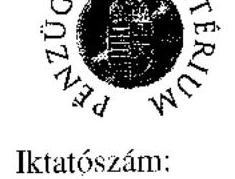

Iktatószám:
v.01 8396/5/2005.

## Tisztelt Elnök Úr!

A helyi önkormányzatok közművelődési és könyvtári feladatellátásáról és finanszírozásáról készített Jelentést köszönettel vettem. A dokumentum átfogóan tartalmazza, és tárgyilagosan elemzi a könyvtári és közművelődési érdekeltségnövelő támogatás tervezésének, felhasználásának és elszámolásának tapasztalatait. Fontos eredménynek tartom, hogy a Jelentés végső tartalmának kialakítása során, a különféle szakértői szintű egyeztetéseken megfogalmazott eltérő álláspontok jelentősen közeledtek egymáshoz.
A kulturális területet szabályozó joganyagban lényeges és egyben pozitív elemnek látom azt, hogy míg más ágazat különféle szakmai előírások, követelmények hosszú sorával igyekszik az önkormányzatok feladatellátását keretek közé szorítani, addig a kulturális tárca
 már a szaktörvény elkészítése során felismerte, hogy a feladatokat helyben kell megoldani, a helyi lehetőségekhez és adottságokhoz mérten a legjobban, és ehhez nagy (gazdálkodási) szabadságot is adott az önkormányzatoknak.
Most, amikor a Kormány olyan nagy ellátórendszerek, mint az oktatás, a szociális ágazat és az egészségügy tekintetében arra törekszik, hogy az önkormányzatok mozgásterét korlátozó mind a törvényi, mind a végrehajtási szintű szabályozási kötöttségeket oldja, nem tartom szerencsésnek a kultúra területén éppen ezzel ellentétes irányban haladni. Célunk olyan feltételek megteremtése, amely lehetővé teszi a meglévő, adott esetben kevesebb, forrásból is - nagyobb gazdálkodási szabadsággal és egyben nagyobb felelősséggel - a feladat változatlan, sőt jobb minőségű ellátását.
Kérem ezért Elnök urat, hogy az Állami Számvevőszék által, a szaktárca részére megfogalmazott javaslatok ne tartalmazzanak újabb szakmai követelmények meghatározására irányuló feladatot.

Budapest, 2005. május 25.
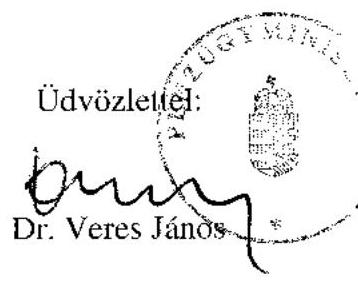

---

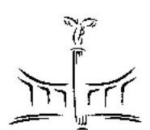

NEMZETI KULTURÁLIS ÖRÖKSÉG MINISZTÉRIUMA MINISZTER

Ikt.szám: 4.1.1/42-1/2005.

# Dr. Kovács Árpád 

elnök úr részére
Állami Számvevőszék

## Budapest

Tisztelt Elnök Úr!

Hivatkozva a V-1017-36/2004-2005 számú levelére, tájékoztatom, hogy a helyi önkormányzatok közművelődési és könyvtári feladatellátásának és finanszírozásának ellenőrzéséről készült jelentéssel egyetértek.

Budapest, 2005. május „ JG „

Üdvözlettel,

Dr. Bozóki András

---

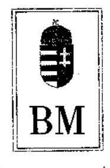

Önkormányzati Helyettes Államtitkár

Iktatószám: 5-39/50/2005.

Dr. Kovács Árpád
elnök úrnak
Állami Számvevőszék

Budapest

Tisztelt Elnök Úr!

Köszönettel vettem a helyi önkormányzatok közművelődési és könyvtári feladatellátásáról és finanszírozásáról készült jelentés megküldését, az abban foglalt észrevételekkel egyetértek és azokkal kapcsolatosan észrevételt nem teszek.

Az elmúlt időszak hatékony együttműködését továbbra is fenntartva, a jövőben is várom az ellenőrzések során tapasztalt észrevételeiket és javaslataikat, amelyek segítik a gazdálkodás szempontjából hatékonyabb szakmai tevékenységet, hiszen ez mindannyiunk közös érdeke.

Budapest, 2005. május „ 24 ".

Üdvözlettel:

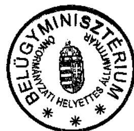

Dr. Bujdosó Sándor

Budapest V., József Attila u. 2-4. Postacím: 1903 Budapest, Pf.: 314
TE: (1) 338-2086 • e-mail: hat3@bm.gov.hu • Telefax: (1) 317-5710
