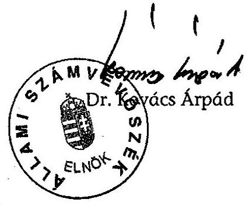
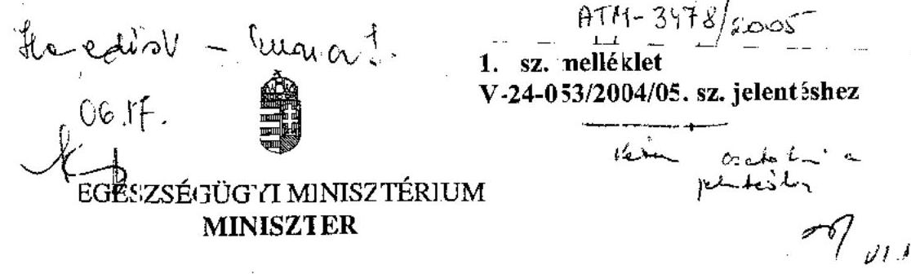
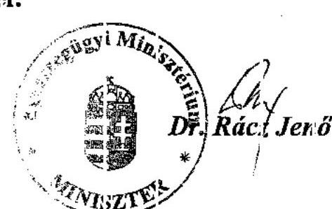
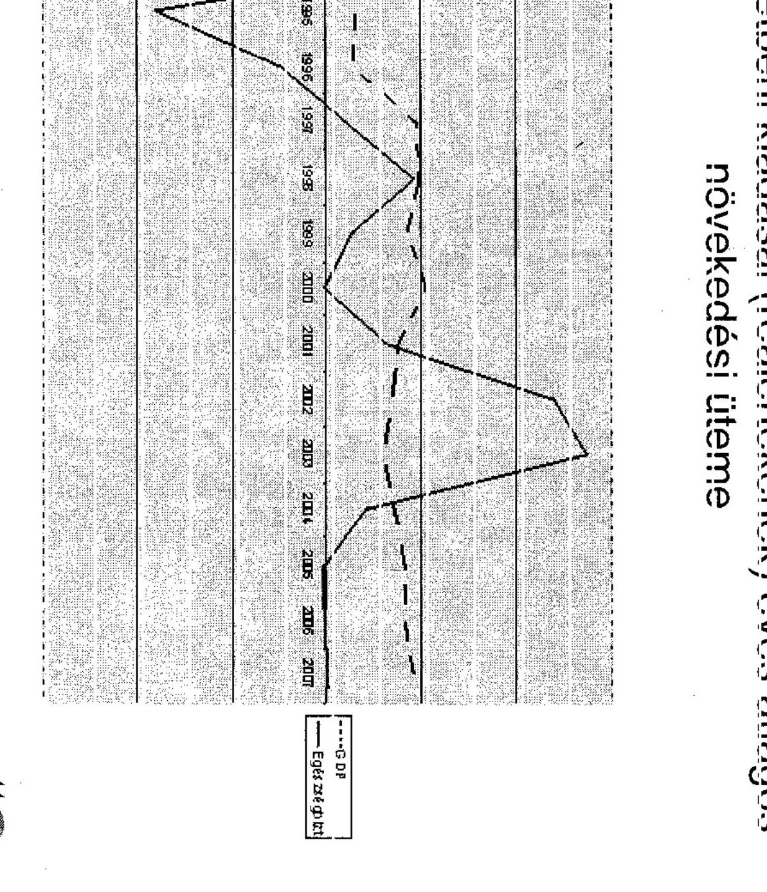

# JELENTÉS 

## az Egészségügyi Minisztérium fejezet működésének ellenőrzéséről

---

2. Államháztartás Központi Szintjét Ellenőrző Igazgatóság
2.3. Átfogó Ellenőrzési Főcsoport

Iktatószám: V-24-053/2004/05.
Témaszám: 731
Vizsgálat-azonosító szám: V-0146
Az ellenőrzést felügyelte:
Bihary Zsigmond
főigazgató
Az ellenőrzés végrehajtásáért felelős:
Hegedüsné dr.Müllern Veronika
főcsoportfőnök
Az ellenőrzést vezette:
Dr. Kurucz István
számvevő igazgatóhelyettes
Az ellenőrzést végezték:
Juhász József Gábor Szólya Ildikó
számvevő
Fekete Anikó Gyöngyi Salamin Viktor
számvevő
Tóth Árpád
számvevő
dr. Kuti Anna Számvevő
Szendrődi Józsefné
számvevő tanácsos,
Lődiné Cser Zsuzsanna tanácsadó
számvevő

# A fejezetet érintő korábbi ellenőrzéseink címei: 

címe
sorszáma
Jelentés az Egészségügyi Minisztérium fejezet működésének ellenőrzéséről ..... 0222
Jelentés a Magyar Köztársaság 2001. évi költségvetése végrehajtásának ellenőrzéséről ..... 0232
Jelentés az állami és egyházi tulajdonban lévő kórházak, egyetemi klinikák gazdálkodásának ellenőrzéséről ..... 0301
Jelentés az Egészségbiztosítási Alap működésének ellenőrzéséről ..... 0324
Jelentés a Magyar Köztársaság 2002. évi költségvetése végrehajtásának ellenőrzéséről
Jelentés az állami egészségügyi beruházásokra fordított pénzeszközök ..... 0329
hasznosulásának ellenőrzéséről
Jelentés az egészségügy területén megvalósult PHARE programok ..... 0410
ellenőrzéséről ..... 0432
Jelentés a gyógyszerek támogatási és finanszírozási rendszerének és ..... 0448
fogyasztás helyzetének ellenőrzéséről
Jelentés az irányított betegellátási modellkísérlet ellenőrzéséről ..... 0508

---

## Eierlikör (1)

Menge: 1 Drink

2 Zentiliter Zitronensaft
2 Zentiliter Zuckersirup
1 Zentiliter Zuckersirup
1 Zentiliter Zuckersirup
etwas Zitronensaft
etwas Zuckersirup
etwas Zuckersirup
etwas Zuckersirup
etwas Zuckersirup
etwas Zuckersirup
etwas Zuckersirup
etwas Zuckersirup
etwas Zuckersirup
etwas Zuckersirup
etwas Zuckersirup
etwas Zuckersirup
etwas Zuckersirup
etwas Zuckersirup
etwas Zuckersirup
etwas Zuckersirup
etwas Zuckersirup
etwas Zuckersirup
etwas Zuckersirup
etwas Zuckersirup
etwas Zuckersirup
etwas Zuckersirup
etwas Zuckersirup
etwas Zuckersirup
etwas Zuckersirup
etwas Zuckersirup
etwas Zuckersirup
etwas Zuckersirup
etwas Zuckersirup
etwas Zuckersirup
etwas Zuckersirup
et

---

# TARTALOMJEGYZÉK 

BEVEZETÉS ..... 5
I. ÖSSZEGZŐ MEGÁLLAPÍTÁSOK, KÖVETKEZTETÉSEK, JAVASLATOK ..... 7
II. RÉSZLETES MEGÁLLAPÍTÁSOK ..... 13

1. A fejezet szakmai irányító, felügyeleti tevékenysége ..... 13
1.1. A feladatrendszer és a szervezeti keretek, valamint a működés összhangja ..... 13
1.2. A fejezet egészségügyi ágazatra vonatkozó szakmai ágazatirányító tevékenysége ..... 16
1.2.1. Az egészségügy átalakítására vonatkozó kormányprogramok, hosszú távú ágazati programok ..... 16
1.2.2. Az egészségügyi ellátórendszer működésének szakmai irányítása, felügyelete ..... 19
1.2.3. A társadalombiztosítási alapok igazgatási szerveinek felügyelete ..... 22
1.3. A minisztérium szabályozó tevékenysége ..... 22
1.3.1. A jogszabály előkészítő tevékenység ..... 22
1.3.2. Az alapítványokkal, civil szervezetekkel való együttműködés ..... 23
1.3.3. A szakmai képesítés rendszerének, követelményeinek meghatározása, a rendszer működésének tapasztalatai ..... 24
1.4. A belső kontrollrendszer működése ..... 25
1.4.1. A fejezet irányítás ellenőrzési tevékenysége ..... 29
1.4.2. Az intézményi belső ellenőrzési rendszer ..... 30
1.4.3. Az intézmények informatikai kontrolljainak működése ..... 31
2. A fejezet költségvetési gazdálkodást irányító és felügyeleti tevékenységének ellenőrzése ..... 33
2.1. A tervezési rendszer kialakításának és működésének rendje, szabályozottsága ..... 33
2.2. A költségvetés fejezeti szintű végrehajtása ..... 35
2.2.1. A bevételi és kiadási előirányzatok alakulása, hatása a működésre és a szakmai feladatok ellátására ..... 35
2.2.2. A fejezeti szöveges beszámolók előírás szerinti részletezettsége, egységes felépítése ..... 40
2.2.3. A létszám alakulása ..... 41
2.3. A Központi Igazgatás pénzügyi szabályszerűségi ellenőrzésének előkészítése ..... 43

---

3. A fejezeti kezelésű előirányzatok felhasználása ..... 45
3.1. Az előirányzatok számának alakulása, változásai ..... 45
3.1.1. Az előirányzat felhasználása, az előirányzat-maradvány alakulása ..... 46
3.1.2. A fejezeti kezelésű előirányzatok felhasználásának ellenőrzése ..... 47
3.2. Egyes kiemelt egészség- és szociálpolitikai feladatok ..... 49
4. Az egészségügyi reform előkészítése ..... 51
4.1. Az egészségügy regionális szervezése, tervezése, finanszírozása ..... 52
4.2. A kórházak konszolidációjára és reorganizációjára fordított előirányzatok hasznosulása ..... 53
4.3. A reform kidolgozása ..... 57
5. Az informatika fejezeti irányítási rendszere ..... 61
6. A korábbi számvevőszéki vizsgálatok utóellenőrzése ..... 64
6.1.Az átfogó ellenőrzés megállapításai alapján tett javaslatok megvalósulása ..... 64
6.2. A zárszámadási ellenőrzések, témavizsgálatok megállapításainak, javaslatainak hasznosulása ..... 64

# MELLÉKLETEK 

1. sz. melléklet EüM Dr. Rácz Jenő miniszter úr észrevétele
2/a. sz. melléklet Eredeti, módosított és teljesített kiadási, bevételi és támogatási előirányzatok alakulása címenként 2002. év
2/b. sz. melléklet Eredeti, módosított és teljesített kiadási, bevételi és támogatási előirányzatok alakulása címenként 2003. év
2/c. sz. melléklet Eredeti, módosított és teljesített kiadási, bevételi és támogatási előirányzatok alakulása címenként 2004. év
2. sz. melléklet Az Egészségügyi Minisztérium felügyelete alá tartozó intézmények költségvetési adatai 2002-2004. között
4/a. sz. melléklet Az ESzCsM fejezeti kezelésű előirányzat egészségügyi kiadásainak alakulása
4/b. sz. melléklet Az ESzCsM 10.2.73.1. fejezeti kezelésű kiadásainak alakulása 2003.
3. sz. melléklet Kimutatás a konszolidációban részt vett intézmények támogatásáról
4. sz. melléklet A GDP és az egészségbiztosítás természetbeni kiadásai reálértékének éves átlagos növekedési üteme

---

# RÖVIDÍTÉSEK JEGYZÉKE 

| Áht. | 1992. évi XXXVIII. törvény az államháztartásról |
| :--: | :--: |
| Ámr. | 217/1998. (XII. 30.) Korm. rendelet az államháztartás működési rendjéről |
| ÁNTSZ | Állami Népegészségügyi és Tisztiorvosi Szolgálat |
| ÁSZ | Állami Számvevőszék |
| E. Alap | Egészségbiztosítási Alap |
| EKG | Elektronikus Kormányzati Gerinchálózat |
| EKI | Egészségügyi Készletgazdálkodási Intézet |
| ESKI | Egészségügyi Stratégiai Kutatóintézet |
| EszCsM | Egészségügyi, Szociális és Családügyi Minisztérium |
| ESzCsM EKH | Egészségügyi, Szociális és Családügyi Minisztérium Engedélyezési és Közigazgatási Hivatala |
| ESZIB | Egészségügyi és Szociális Információs Bizottság |
| ESZTT | Egészségügyi Szakképzési és Továbbképzési Tanács |
| ETT | Egészségügyi Tudományos Tanács |
| EU | Európai Unió |
| EüM | Egészségügyi Minisztérium |
| Eütv. | 1997. évi CLIV. törvény az egészségügyről |
| FMM | Foglalkoztatáspolitikai és Munkaügyi Minisztérium |
| GYISM | Gyermek, Ifjúsági és Sportminisztérium |
| GYÓGYINFOK | Egészségügyi, Szociális és Családügyi Minisztérium Gyógyító Ellátás Információs Központja |
| HEFOP | Humánerőforrás fejlesztési Operatív Program |
| ICsSzEM | Ifjúsági, Családügyi, Szociális és Esélyegyenlőségi Minisztérium |
| IHM | Informatikai és Hírközlési Minisztérium |
| IT | Információs Technológia |
| KEHI | Kormányzati Ellenőrzési Hivatal |
| KES | Kórházi Ellátási Standardok |
| KI | Központi Igazgatás |
| KORFOK | Főkönyvi könyvelő program |
| MEDINFO | Országos Egészségügyi Információs Intézet és Könyvtár |
| MITS | Magyar Információs Társadalom Stratégia |
| MITSESZ | A Magyar Információs Társadalom Stratégia Egészségügyi és Szociális részstratégiája |
| MKMK | Magyar Koraszülött Mentő Közalapítvány |
| MOK | Magyar Orvosi Kamara |
| MOTESZ | Magyar Orvostársaságok és Egyesületek Szövetsége |
| NEP | Nemzeti Egészségfejlesztési Program |
| NFT | Nemzeti Fejlesztési Terv |
| NM | Népjóléti Minisztérium |
| Ny. Alap | Nyugdíjbiztosítási Alap |

---

| OBSI | Országos Baleseti és Sürgősségi Intézet |
| :-- | :-- |
| OEFI | Országos Egészségfejlesztési Intézet |
| OEP | Országos Egészségbiztosítási Pénztár |
| OGY | Országgyúlés |
| OGYI | Országos Gyógyszerészeti Intézet |
| OGYK | Országos Gyógyintézeti Központ |
| OKJ | Országos Képzési Jegyzék |
| OMSZ | Országos Mentőszolgálat |
| ONKI | Országos Onkológiai Intézet |
| ONYF | Országos Nyugdíjbiztosítási Főigazgatóság |
| OORI | Országos Orvosi Rehabilitációs Intézet |
| OSEI | Országos Sportegészségügyi Intézet |
| OTH | Országos Tisztifőorvosi Hivatal |
| OVSZ | Országos Vérellátó Szolgálat |
| PM | Pénzügyminisztérium |
| RET | Regionális Egészségügyi Tanács |
| RFT | Regionális Fejlesztési Tanács |
| SOTE | Semmelweis Orvostudományi Egyetem |
| SzCsM | Szociális és Családügyi Minisztérium |
| SzMSz | Szervezeti és Működési Szabályzat |
| TGAZD | Tárgyi eszköznyilvántartó program |
| Üvegzseb törvény | A közpénzek felhasználásával, a köztulajdon használatá- |
|  | nak nyilvánosságával, átláthatóbbá tételével és ellenőrzé- |
|  | sének bővítésével összefüggő egyes törvények módosításá- |
|  | ról szóló 2003. évi XXIV. törvény |

---

# JELENTÉS   az Egészségügyi Minisztérium fejezet ${ }^{1}$ működésének ellenőrzéséről 

## BEVEZETÉS

Az egészségügy az állami újraelosztás egyik legjelentősebb, az egész társadalmat érintő ágazata. Az Országgyúlés már az egészségügyi törvény megalkotásakor ${ }^{2}$ hangsúlyozta, hogy szükség van az egészségügyben átfogó, egyes területeken alapvető változtatásokat eredményező, összehangolt lépésekre. A változtatások célja a betegségek gyógyítását és megelőzését lehetővé tevő, a megváltozott szükségletekhez és gyógyítási technológiákhoz alkalmazkodó, számon kérhető minőségű és finanszírozható egészségügyi rendszer kialakítása, és az ellátásokhoz a betegek egyenlő esélyű hozzáférésének biztosítása.

A törvény a kormányprogramok és az egészségügyi programok kidolgozásában, meghatározta a Kormány és a miniszter feladatát. Az ellátórendszer feltételeinek megteremtésében, a kötelező egészségbiztosítási rendszer működtetésében, az egészségpolitikai cél-, feladat- és eszközrendszer meghatározásában és annak érvényre juttatásában a felelősséget a Parlament, a Kormány, a helyi önkormányzatok, az egészségbiztosítási szervek és az egészségügyi intézmények fenntartói között osztotta meg.

Az Egészségügyi Minisztérium (EüM) közvetlen jogelődje az Egészségügyi, Szociális és Családügyi Minisztérium (EszCsM), amely a 2002. évi kormányváltást követően a Szociális és Családügyi Minisztérium (SzCsM), valamint az EüM összevonásával jött létre. A fejezet megnevezése a 2004. szeptemberi kormányváltás után, október 21-től ismét Egészségügyi Minisztériumra változott, ugyanis a szociális és családügyi feladat- és hatáskör átkerült az Ifjúsági, Családügyi, Szociális és Esélyegyenlőségi Minisztériumhoz (ICsSzEM-hez).

A minisztérium jogelődjénél 2001-2002-ben végeztünk átfogó pénzügyigazdasági ellenőrzést. Ezt követően évente ellenőriztük a fejezet költségvetési előirányzatainak tervezését és azok végrehajtását. Témaellenőrzés keretében vizsgáltuk többek között az állami és egyházi tulajdonban lévő kórházak és egyetemi klinikák gazdálkodását, az állami egészségügyi beruházásokra fordí-

[^0]
[^0]:    ${ }^{1}$ Az ÁSZ 2004. évi ellenőrzési tervében az ESzCsM fejezet működésének ellenőrzése szerepelt, de a 2004. szeptemberi kormányváltást követően az ÁSZ az EüM fejezet működését vizsgálta
    ${ }^{2}$ Az egészségügyről szóló 1997. évi CLIV. törvény (Eütv)

---

tott pénzeszközök hasznosulását, az egészségügy területén megvalósult PHARE programokat.

A jelenlegi ellenőrzés a 2002. január - 2004. október közötti időszakot fogta át, ezen belül hangsúlyozottan a 2003-2004. I. félévére terjedt ki. A helyszíni ellenőrzés során a pénzügyi gazdasági folyamatokat 2004 végéig figyelemmel kísértük. A költségvetés fejezeti szintű végrehajtásának ellenőrzésénél a költségvetési törvényben jóváhagyott adatok helyett a minisztérium által számított adatokat vettük figyelembe, tekintettel a fejezet 2004. októberi átszervezésére. Az egészségügyi területet érintő kiadási előirányzat 2002-ben 114,8 Mrd Ft, 2003-ban 160,4 Mrd Ft, 2004-ben 145,9 Mrd Ft volt. A 2005. évre jóváhagyott kiadási előirányzat 141,2 Mrd Ft.

A 2005. évben az EüM a Központi Igazgatás (KI) mellett 25 önálló költségvetéssel rendelkező intézmény irányítását végzi, a fejezet 2005. évre elfogadott létszámkerete 26153 fő.

Az ellenőrzés célja annak értékelése volt, hogy a fejezet

- szervezeti, irányítási és működési rendszere, költségvetési előirányzatai, személyi és tárgyi feltételei összhangban voltak-e a jogszabályokban meghatározott szakmai feladatokkal, biztosították-e a szakmai feladatok ellátását;
- a felügyeleti és ágazati irányító a szakmai és költségvetési gazdálkodási feladatokat a jogszabályoknak megfelelően, célszerűen látta-e el, intézményeinél és a fejezeti kezelésű előirányzatoknál biztosította-e a források szabályszerű felhasználását, a kitűzött ágazati szakmai célok elérését;
- informatikai stratégiája reálisan tükrözi-e az ágazat szakmai információs szükségleteit, az intézmények informatikai rendszereinek szabályozottsága, működtetése, fejlesztése megfelelt-e a célszerűségi szempontoknak;
- a korábbi számvevőszéki ellenőrzések megállapításait, ajánlásait a fejezet irányító és gazdálkodási tevékenységében hasznosították-e.

Az ellenőrzés során áttekintettük az egészségügyi reform előkészítését és a teljesítményellenőrzés módszerével értékeltük a feladatra jóváhagyott előirányzatok hasznosulását. Értékeltük a minisztérium felügyelete alá tartozó intézmények belső kontroll rendszerét, a zárszámadási vizsgálat előkészítéseként a Központi Igazgatás (KI) 2004. évet érintő évközi tevékenységét. Utóellenőrzés keretében vizsgáltuk a korábbi számvevőszéki ellenőrzések megállapításainak, javaslatainak hasznosulását.

Az Állami Számvevőszék (ÁSZ) az államháztartásról szóló, többször módosított 1992. évi XXXVIII. törvény (Áht.) 120/A.
 § (1) bekezdése alapján ellenőrzi az államháztartás forrásait, azok felhasználását, a vagyonnal való gazdálkodást. A fejezet ellenőrzését az Állami Számvevőszékről szóló 1989. évi XXXVIII. törvény 2. § (3) és 17. § (5) bekezdése alapján végeztük.

A jelentést az Állami Számvevőszékről szóló 1989. évi XXXVIII. törvény 25. § (1) bekezdésének megfelelően észrevételezésre megküldtük az egészségügyi miniszternek, aki a jelentésben foglaltakat elfogadta, észrevételt nem tett. Levelének másolatát a jelentés 1. sz. melléklete tartalmazza.

---

# I. ÖSSZEGZŐ MEGÁLLAPÍTÁSOK, KÖVETKEZTETÉSEK, JAVASLATOK 

A fejezet alapvető feladatát elsősorban az egészségügyi törvény, a tárca mindenkori vezetőjének feladat- és hatásköréről szóló kormányrendelet határozta meg. A feladatok rangsorolásában éreztette a hatását, hogy az ellenőrzött három évben a tárca vezetésében többször volt személyi változás. A szervezeten belüli feladatmegosztás felülvizsgálata elmaradt.

A vizsgált időszakban az ágazati feladatok elvégzéséhez szükséges források csak részben álltak rendelkezésre és a meglevő bizonytalanság (pl. az évközi elvonás, zárolás) megnehezítette a hosszabb távú programok megkezdését, illetve végrehajtását. Rendszeressé vált a fejezeti kezelésű előirányzatok átcsoportosítása, eredeti rendeltetéstől eltérő felhasználása, ami azzal is összefüggött, hogy gyakran változtak a kormányzati egészségpolitika prioritásai.

Az egészségügyi törvény előírta a Nemzeti Egészségfejlesztési Program megalkotását és országgyűlési jóváhagyását, de ez nem történt meg. Az Országgyűlés 2003-ban határozott az Egészség Évtizedének Johan Béla Nemzeti Programja elfogadásáról. ${ }^{3}$

Az egészségügyi törvény alapján készített különböző kormányprogramok nem hoztak reformértékű változásokat, de előrehaladás történt a szakmai szabályozás megújításában. A korlátozott pénzügyi lehetőségek ellenére a tárca erőfeszítéseket tett egyes hosszú távú programok folytatására, például a sürgősségi betegellátás fejlesztésére. A következetes megvalósítást akadályozta, hogy az ellenőrzött időszakban a Kormánynak erre vonatkozóan nem volt elfogadott koncepciója. Az egészségügyi intézmények gépparkjának megújítására indított hosszú távú program a forráshiány miatt lényegében egy éves időszakra szűkült. ${ }^{4}$

Az egészségügyi törvény az egészségügyi szolgáltatók számára kötelezővé tette 1999 januárjától a belső minőségügyi rendszer működtetését. A törvény meghatározta az egészségügyi szolgáltatások megfelelő minőségének alap fel-

[^0]
[^0]:    ${ }^{3}$ A jóváhagyott program a Kormány által 2001-ben elfogadott, a 2001-2010 közötti évekre szóló Egészséges Nemzetért Népegészségügyi Programra épült.
    ${ }^{4}$ A címzett támogatásból finanszírozott egészségügyi beruházások, rekonstrukciók ellenőrzéséről szóló 2005. évi ÁSZ jelentés megállapításai szerint a tervezhetőséget nehezítette, hogy nem határozták meg legalább középtávon a támogatások pénzügyi keretét. Az egészségügyi ágazat címzett támogatásának éves ütemei jelentősen ingadoztak, reálértéken csökkentek. A jelentés megállapította, hogy a beruházók az építés-szereléssel összefüggő kiadások többletforrás igényét kényszerűségből a gép-műszer keretük terhére biztosították.

---

tételeit. Ehhez kapcsolódóan az 1998. évi miniszteri rendelet előírta a szakmai minimum feltételeket és a 2003. évi módosítás lehetővé tette, hogy az intézményeken számon kérhető legyen e feltételek megteremtése.

Az egészségügyi ellátások hatékonyságát biztosíthatják a tudományos bizonyítékokra, szakértői véleményekre támaszkodó szakmai irányelvek, de e tekintetben még nincsenek igazi eredmények.

A tárca jogszabályalkotási programját a mindenkori Kormány munkaterve határozta meg. Az Eütv-hez kötődő szabályozás teljes körű volt. Az ellenőrzött időszakban elsősorban a szabályozás korszerűsítését, az egészségpolitika változásához igazodó módosításokat, az európai uniós elvárásokhoz kapcsolódó jogharmonizációt végezték el. A tárcánál 2004 májusától működik a belső határ-idő-figyelő informatikai rendszer, amely a megfelelő adatbevitellel naprakész információt biztosít.

Az egészségügyi képzés az ellátás valamennyi területére kiterjed az ágazatban, amelynek magas színvonalát mutatja, hogy a szakmai okleveleket, végbizonyítványokat az Európai Gazdasági Térség tagállamaiban korlátozás nélkül elismerik.

A tárca felügyelete alá tartozó intézményeknél a belső kontrollrendszer működését tekintve kedvező változást állapítottunk meg. A javulás az intézmények szervezete, tevékenysége szabályozottságának, a hiányzó szabályzatok elkészítésének, aktualizálásának tulajdonítható. Egyes intézmények szervezeti és működési szabályzatának (SzMSz) felügyeleti jóváhagyása, az intézményi alapító okiratok aktualizálása elmaradt. Kielégítő a számviteli rendszer szabályozottsága és informatikai támogatottsága. A függetlenített belső ellenőrzés kontroll kockázatát közepesnek értékeljük, mert a jogszabályi előírások csak részben teljesültek. Továbbra is magas kockázatúnak minősítjük az intézmények informatikai tevékenységét a szabályozottságnál, az informatikai rendszer működésénél megállapított hiányosságok miatt. Nem biztosított az intézmények szakmai tevékenységét támogató és a gazdasági rendszerek közötti kölcsönös adatcseréhez szükséges automatikus adatkapcsolat.

A tárca a jogszabályi rendelkezések szerint látta el a költségvetési tervezéssel kapcsolatos feladatait. A költségvetési javaslatokat a tervezési előírások figyelembevételével készítették el. A tervezés folyamatát hátrányosan befolyásolta, hogy az ellenőrzött időszakban többször változott a fejezet felépítése, amely egyúttal címrend és feladatváltozásokkal járt.

A kormányzati munkamegosztásból, a fejezet feladatának és szervezetének változásából adódóan, valamint a kapcsolódó előirányzat-átadások és -átvételek következtében módosultak a bevételi és kiadási előirányzatok. Az ellenőrzéshez felhasznált tanúsítványok adatait a szociális terület előirányzatai leválasztásával számították, de nem volt mód az adatok elkülönítésére a KI-nál és azon fejezeti kezelésű előirányzatok vegyes jogcím csoportjainál, ahol a szociális és egészségügyi területek költségvetési támogatását, valamint a felhasználást nem tudták egyértelműen megállapítani. A fejezet költségvetési forrásainál 2002-ben a növekedés, 2003-2004-ben az elvonás volt a jellemző. Az intézmé-

---

nyek a kiadásaik 50%-át a saját bevételekből, 50%-át a költségvetési támogatásokból fedezték.

Az előirányzat-módosításoknál betartották a jogszabályi előírásokat. Nyilvántartásuk és dokumentálásuk megfelelő volt. A támogatáscsökkentések a takarékosabb gazdálkodásra ösztönözték az intézményeket.

A fejezet 2002. évi beszámolója nem az előírásoknak megfelelően készült, de a 2003. évről szóló beszámoló összeállítása már megfelelő volt. Elvégezték az önálló költségvetési szervek szakmai értékelését, a háromévenkénti felügyeleti ellenőrzés keretében értékelték az intézmények pénzügyi-számviteli tevékenységét.

Az ún. üvegzseb törvény alapján a minisztérium és az intézmények felülvizsgálták az alapítványok, a közalapítványok, a közhasznú társaságok és a gazdasági társaságok tevékenységét, amelynek eredményeként 2004-ben egy alapítványt közalapítvánnyá minősítettek, négy alapítvány működését megszüntették.

A minisztériumnál és az intézményeknél szabályozták a beruházások és az eszközbeszerzések rendjét. A 2003. évben jóváhagyott új közbeszerzési törvény szerint felül kellett vizsgálni a közbeszerzési szabályzatot és a közbeszerzési feladatokat ellátó létszámot, de ez elmaradt mind a minisztériumban, mind az intézményeknél.

A fejezet engedélyezett létszáma az ellenőrzött időszakban 29-30 ezer között alakult. Az ICsSzEM megalakulásával mintegy 1,8 ezer főt helyeztek át az újonnan létrehozott fejezethez. A minisztérium a kormányhatározatokban előírt létszámleépítéseknek, az előírt ütemtervnek megfelelően ${ }^{5}$ eleget tett. A létszámleépítésekkel együtt az egészségügyi közigazgatás területén dolgozók feladata nem csökkent. A feladat ellátás érdekében a hiányzó létszámot átszervezéssel kívánták pótolni, ezért elsősorban a létszámleépítéssel érintett központi költségvetési szerveknél további szervezeti módosításokat hajtottak végre.

A Központi Igazgatásnál és az intézményeknél az időszakosan hiányzó létszámot egyes speciális területeken (pl. informatikai, közbeszerzési feladatok ellátása) külső megbízásokkal pótolták. A létszámról, a külső munkatársak feladatairól nem készült megbízható nyilvántartás. A 2003. évi szabályozás előírta a munkaszerződés-kötés nélküli foglalkoztatást szolgáló szerződések felülvizsgálatát, illetve megszüntetését, de ez elmaradt a fejezetnél.

A Központi Igazgatásnál a zárszámadási ellenőrzés előkészítése érdekében végzett pénzügyi egyéb szabályszerűségi vizsgálat során nem tapasztaltunk alapvető szabálytalanságot, de az ellenőrzés feltárta többek között, hogy az

[^0]
[^0]:    ${ }^{5}$ Összesen 614 főt (60 főt az Igazgatás, 554 főt az OTH központi és az ÁNTSz területi szerveitől) bocsátottak el. A vizsgált időszak kezdete és vége között adatok azonban nem hasonlíthatóak össze a különböző fejezetek közötti átcsoportosítások, szervezeti módosulások miatt, így nem lehet arra egyértelműen következtetni, hogy a munkavégzés hivatalszervezési szempontból hatékonyabbá vált vagy sem.

---

Igazgatásnak nincs alapító okirata, belső ügyrendje és több szabályzata pontosításra szorul és egyes előirányzatok, pl. az internetre fordítható előirányzat felhasználásának a feltételei nem rendezettek.

Az Igazgatás feladata volt a Club Aliga Vagyonkezelő Rt-vel kapcsolatos minisztériumi kötelezettségek ellátása. A vagyon állagának megőrzésére vonatkozó törvényi kötelezettségüknek eleget tettek, de a kötelező felügyeleti ellenőrzések elmaradtak. Az EüM célja, hogy a pályázat útján értékesítendő Club Aliga ingatlan nettó bevételéből fele-fele arányban építési beruházást, illetve felújítást, rekonstrukciót finanszírozzon.

A fejezeti kezelésű előirányzatok az ágazat szakmai programjait szolgálták. Az egészségügy fejlesztése, illetve szinten tartása növekvő forrást igényelt volna, de az előirányzatok összege évről-évre csökkent. Ez azonban nem indokolta, hogy a nagy értékű egészségügyi beavatkozások jogcímcsoport 59 M Ft előirányzat maradványát a vonatkozó kormányhatározatban előírt zárolás helyett felhasználják.

Az előirányzatok száma és címszáma többször módosult. A két tárca 2002. évi összevonását követően olyan mértékben nőtt ez a szám, hogy szükségessé vált a jogcímcsoportok csökkentése. Az előirányzatok felhasználásáról nem vezettek pontos, jogcímcsoportonként részletezett, majd összegzett nyilvántartást, a kapcsolódó felügyeleti ellenőrzések tapasztalata nem ismert, a megállapítások realizálása még nem valósult meg. Az ellenőrzés továbbra sem kielégítő, mint ahogy azt a korábbi ÁSZ jelentés ${ }^{6}$ is megállapította. Az előirányzaton belül a megvalósult beruházásoknál állandósult a forráshiány, a befejezésük többszöri halasztása többletköltséggel járt.

A progresszív ellátás elveire épülő szolgáltatások megszervezése, a helyes fejlesztéspolitika kialakítása érdekében indokolt volt az egészségügy regionális szintű szervezése, amely szerepelt a 2002. évi kormányprogram céljai között. A regionális egészségügyi tanácsokat végül is 2004-ben hozták létre, egyelőre hat régióban. Jogi helyzetüket a 2005. évi költségvetési törvény rendezte. Az egészségügyi tanácsok a jövőben ajánlattevő, koordináló szerepet töltenek be a területi fejlesztések és kapacitások meghatározásában, 2006 januárjától kezelői az egészségügyi fejlesztési előirányzat regionális részének.

A teljesítményellenőrzés módszerével vizsgáltuk az egészségügyi reform előkészítésére fordított pénzeszközök hasznosulását. Az ellenőrzés során azt vizsgáltuk, hogy az előirányzatokat a céloknak megfelelően használták-e fel. Az eredményesség tekintetében a szándékolt és a tényleges hatást hasonlítottuk össze. Azt értékeltük, hogy a reform előkészítésére fordított összegek mennyiben alapozták meg az egészségügy átalakításának további lépéseit.

Az egészségügyi reformmal kapcsolatos célokról, intézkedésekről 1994-től több mint 20 (ebből a 2002. évi kormányváltást követően 12) kormányhatározat jelent meg. Az említett időszakban az egészségügyi reformra fordított kiadások

[^0]
[^0]:    ${ }^{6}$ Jelentés az Egészségügyi Minisztérium fejezet működésének ellenőrzéséről, 2002. június

---

csak részben számszerűsíthetők, mivel a fejezet költségvetése pontosan nem határozta meg az e feladatot érintő előirányzatokat.

A reform előkészítésére a Kormány az egészségügyi tárca keretein belül 2002-ben Programirodát hozott létre kormánymeghatalmazott, később kormánybiztos vezetésével. Az iroda két éves fennállása alatt mintegy 3,8 Mrd Ft-ot használt fel a reformmal kapcsolatos feladatok ellátására. A források 80%-át az ún. konszolidációs - reorganizációs program első lépését képező adósságkönnyítési program keretében a kórházak, klinikák pénzügyi támogatására fordították. A visszafizetési kötelezettség elengedésével a forrás felhasználás nem az eredeti céloknak megfelelően történt. A program az ún. adósságmentesség elérését, valamint a tartós működést megalapozó szerkezet-átalakítást illetően csak részben volt eredményes, tekintettel arra, hogy a 30 támogatott kórház közül 14 kórháznál továbbra is maradt lejárt tartozás, összesen 4,1 Mrd Ft (ebből 3 Mrd Ft a három egyetemi intézménynél), és a pénzügyi támogatáshoz kapcsolódó strukturális átalakítási feladat (pl. az aktív ágyak átalakítása krónikussá) csak részben valósult meg.

A Programirodán a reform kidolgozása a Kormány reformmal kapcsolatos céljai, elvárásai alapján, szakértők közreműködésével folyt. A Kormány elvárásai a vizsgált időszakban az átfogó koncepciók
 helyett az azonnal végrehajtható tervezetek irányába tolódtak el, majd 2004 őszén a reformlépések lekerültek a napirendről.

A Programirodán előkészített jogszabálytervezetek, átfogó reform program parlamenti megtárgyalására, a tervezetek elfogadására nem került sor. Az Iroda megszűnése után a minisztérium a helyszíni ellenőrzés befejezéséig nem kezdeményezte a szakmai anyagok hasznosítását. A szakértői díjakra mintegy 520 M Ft kifizetése - alapvetően a kormányzati koncepcióváltások miatt - nem volt eredményes, segítségükkel az egészségügy modernizációjához nem jutottak közelebb.

A forrásfelhasználás részben minősíthető hatékonynak, a feladatváltozásokat esetenként (pl. a konszolidációval foglalkozó szakértők megbízásánál) nem követte a szerződések megfelelő módosítása, és a Programiroda feladataitól eltérő célokra is (pl. az Országos Tisztiorvosi Hivatal működésének finanszírozására) történt kifizetés.

A kormányhatározatokban előírtak ellenére az ágazat 2003 júliusáig nem rendelkezett elfogadott informatikai stratégiával. Az informatikai stratégia elfogadása után, 2003 végén, a komplex fejlesztési program keretében mintegy 30 projektet indítottak. A hosszú távú fejlesztési tervek megvalósulását megnehezítheti a forráshiány, valamint az egészségügy ágazati stratégiájához kapcsolódó és az Elektronikus Kormányzati Gerinchálózat (EKG) kiépítésére indított projektek összehangolásának elmaradása.

Az ágazati informatikai irányításnak 2003-ig nem volt feladatokhoz rendelt szervezeti egysége. Az informatikai terület felügyelete nem felel meg a jogszabályi rendelkezéseknek, mert miniszteri, illetve államtitkári felügyelet helyett helyettes államtitkár hatáskörébe tartozik az ágazati informatika irányítása.

---

A korábbi ÁSZ ellenőrzések ajánlásainak többségét figyelembe vették. A tárca intézkedési tervei alapján elkezdődött, illetve megtörtént a javaslatok megvalósítása. Továbbra sem kielégítő a fejezeti kezelésű előirányzatok felhasználásával kapcsolatos ellenőrzés, illetve annak dokumentálása.

A helyszíni ellenőrzés megállapításainak hasznosítása mellett javasoljuk:

# az egészségügyi miniszternek 

1. intézkedjen, hogy az ágazati informatikai terület felügyelete összhangban legyen a jogszabályi előírásokkal;
2. intézkedjen, hogy a tárca felügyelete alá tartozó önálló költségvetési szervek készítsék el a még hiányzó szabályzataikat és vizsgálják felül, illetve szüntessék meg a munkaszerződés-kötés nélküli foglalkoztatást szolgáló szerződéseket, gondoskodjon az intézmények szervezeti és működési szabályzatának jóváhagyásáról, az alapító okirataik aktualizálásáról;
3. kezdeményezze a sürgősségi ellátás fejlesztésére vonatkozó kormányzati koncepció jóváhagyását, a szakmai irányelvekkel összefüggő tudományos bizonyítékok gyűjtése, rendszerezése, ellenőrzése feltételeinek kialakítását, az egészségügyi reform előkészítésével kapcsolatos, a Programiroda irattárában található szakmai dokumentumok hasznosítását;
4. intézkedjen, hogy a fejezeti kezelésű előirányzatok felhasználásáról megfelelő nyilvántartás készüljön és a korábbi ÁSZ ajánlásnak megfelelően rendszeressé váljon a felhasználással kapcsolatos ellenőrzés, intézkedjen hogy a nagy értékű egészségügyi beavatkozások előirányzatánál keletkezett 59 M Ft összegű megtakarítás a fejezet előirányzatmaradvány számlájára kerüljön, állapítsa meg a 2176/2004 (VII. 29.) számú Korm. határozat végrehajtásának elmulasztásával kapcsolatos személyi felelősséget.

---

# II. RÉSZLETES MEGÁLLAPÍTÁSOK 

## 1. A FEJEZET SZAKMAI IRÁNYÍTÓ, FELÜGYELETI TEVÉKENYSÉGE

### 1.1. A feladatrendszer és a szervezeti keretek, valamint a működés összhangja

A minisztérium feladatait, szervezeti struktúráját alapvetően a miniszter feladat- és hatásköréről szóló kormányrendelet szabályozza. A miniszter feladatát az Eütv. 150. §-a határozta meg, amely szerint a Kormány egészségpolitikai döntéseinek megfelelően ellátja az ágazat irányítását. Az egészségügyi, szociális és családügyi miniszter feladat- és hatáskörét a 142/2002. (VI. 28.) Korm. rendelet az Ny. Alap igazgatási szerveinek irányításával bővítette. Ezt váltotta fel az egészségügyi miniszter feladat- és hatásköréről szóló 288/2004. (X. 28.) Korm. rendelet, amelyre az EU-hoz történt csatlakozás, a Kormány és miniszter váltás következményeként volt szükség.

A vizsgált 3 évben a két kormányalakítás során 4 miniszter váltotta egymást a tárca élén. Ez utóbbi önmagában is hangsúlyeltolódásokat vont maga után a feladatok rangsorolásában, a munka szervezésében.

A Kormány éves jogharmonizációs programjai meghatározták a tárca szabályozási feladatait, melyek 2004. májusától a tagállami működésből származó új feladatokkal egészültek ki. A 2002. évi kormányprogram egészségügyi fejezete Egészség Évtizede címmel átfogó reformprogramot tartalmazott, ennek prioritásai, a végrehajtás sorrendje a későbbiekben - az 1085/2003. (VIII. 19.), majd a 2334/2003. (XII. 23.) Korm. határozat szerint - módosult.

A szervezeti változások elsősorban a miniszter statútumának, illetve személyének változásához kötődtek. Az ESzCsM első SzMSz-e 2002. október 1-jétől 2003. április 7-ig volt hatályban, az összevont tárcák vezetési struktúráját összegezte. Az SzMSz 2003-ban kétszer, 2004-ben - a minisztérium szétválásáig háromszor módosult. 2004 október 21-től a Kormány döntése alapján ismét önálló lett az egészségügyi tárca. Az SzMSz-ek főosztályi szintű szabályozást tartalmaztak, abban az osztályszerkezet, illetve a feladatok osztályokra történő lebontása nem szerepelt. Az egyes főosztályok feladatait eltérő részletezettséggel és konkrétsággal határozták meg.

A feladatváltozáshoz kötődően az engedélyezett létszám is módosult. Az ESzCsM megalakulásakor bővült, majd a 2004. évi feladatváltozáshoz létszámcsökkenés járult. Az EüM 2005. évi engedélyezett nyitólétszáma 356 fő (tárca Engedélyezési és Közigazgatási Hivatalával - EKH-val - együtt), ami 18 fővel kevesebb, mint az azonos feladatstruktúrával rendelkező minisztérium 2002. évi nyitó létszáma. Az egészségpolitikai államtitkárhoz tartozó területen a szakmai feladatok ellátására 2002-ben 81 fő, 2004. év végén 73 fő volt az engedélyezett létszámkeret.

---

A feladatellátáshoz a tárca megbízási, illetve vállalkozási szerződéssel rendszeresen foglalkoztatott külső munkatársakat. Olyan nyilvántartást, melyből egyértelműen megállapítható lett volna, hogy a tárcánál adott időszakban hány külső munkatárs vett részt a feladatellátásban, nem tudtak bemutatni.

Egy 2004. június 30-i állapotot tükröző kimutatás szerint a külső munkatársak száma magában foglalta a jogszabályi előírások alapján működtetett különböző szakmai testületek tiszteletdíjas tagjainak létszámát is (Egészségügyi Tudományos Tanács /ETT/, Egészségügyi Szakképzési és Továbbképzési Tanács /ESZTT/ stb.), továbbá a tárca gyakornoki programja keretében meghatározott idejű szerződéssel foglalkoztatott felsőfokú végzettségű pályakezdőket is (számuk ebben az időpontban 38 fő volt).

A fejezet intézményeinek köre - az egészségügyi területet illetően - 2004-ben a GYÓGYINFOK megszüntetésével csökkent, feladatát a jogutód Országos Egészségbiztosítási Pénztár (OEP) vette át. Az SzMSz szerint a szétválást megelőzően a tárca felügyeleti körébe az egészségügy területén 46 intézmény tartozott (ez a szám a részben önálló intézményeket is tartalmazza).

A költségvetési törvényben nevesített 3 kiemelt egészségügyi intézmény - az Állami Népegészségügyi és Tisztiorvosi Szolgálat (ÁNTSZ), az Országos Mentőszolgálat (OMSZ) és az Országos Vérellátó Szolgálat (OVSZ) - közül az ÁNTSZ feladatai bővültek. Az integrációs felkészülés során 2002-ben folytatódott az intézményfejlesztési tevékenység a kémiai biztonság, a környezet egészségügy, a járványügyi biztonság növelése és a munkaegészségügy területén. Az ÁNTSZ részt vett a Nemzeti Népegészségügyi Program kidolgozásában és a végrehajtással kapcsolatos koordinációs feladatok ellátása is kötelessége. Megváltozott a népegészségügyi feladatokkal kapcsolatos koordinációs tevékenység szervezeti háttere, az Országos Tisztiorvosi Hivatalhoz (OTH) tartozó korábbi háttérintézmény átszervezésével erre a feladatra létrejött az Országos Egészségfejlesztési Intézet (OEFI).

A szakfelügyeleti rendszer átalakítása kapcsán 2004-ben megkezdődött a fekvőbeteg ellátást nem végző, úgynevezett ráépített országos intézetek átszervezése.

A vizsgált időszakban az ágazati feladatok elvégzéséhez szükséges források csak részben álltak rendelkezésre és a meglévő bizonytalanság (pl. az évközi elvonás, zárolás) megnehezítette a hosszabb távú programok megkezdését, illetve végrehajtását. Rendszeressé vált a fejezeti kezelésű előirányzatok átcsoportosítása, rendeltetéstől eltérő felhasználása.

2004-ben a támogatások csökkentésére vonatkozó kormányzati döntések - a legkülönbözőbb előirányzatokon fellelhető szabad (még le nem kötött) keretek folyamatos átcsoportosításával teremtettek forrást.

Gyakran változott a kormányzati egészségpolitika prioritása és többször volt változás a tárca vezetésében.

Az ágazati célok megvalósulásában azokon a területeken mutatható fel eredmény, amelyeknek minimális volt a forrásigénye, és távolabb estek az egészségpolitika változásainak fő folyamataitól.

---

A vizsgált időszakban kormányzati döntések alapján végrehajtott feladatátadások lebonyolítása kormányhatározatokkal, illetve az érintett szervek közötti megállapodásokkal történt.
2004. július 1-jétől az Esélyegyenlőségi Kormányhivatalhoz került egyes szociális feladatok ellátása. A miniszterek között létrejött megállapodás témánként felsorolta a tárcánál maradó, illetve az átkerülő feladatokat, ezen kívül meghatározta a működési feltételek biztosításának módját is.

A Magyar Köztársaság minisztériumainak felsorolásáról szóló 2002. évi XI. törvény módosításáról szóló 2004. évi XCV. törvényben foglalt kormányzati szerkezetváltozással összefüggő feladatok - az ESzCsM szétválásának - végrehajtására az érintett miniszterek között 2004. októberében megállapodás jött létre. A megállapodás mellékletében felsorolt fejezeti kezelésű előirányzatok feletti rendelkezési jog átkerült az ICsSzEM fejezethez. Az EüM állományából 130 fő került át, a kapcsolódó bevételi és kiadási előirányzatokkal. Az Akadémia utcai székház vagyonkezelői jogának átadására intézkedést kezdeményeztek, a székházban található vagyontárgyakat térítésmentesen az ICsSzEM részére átadták.

A Kormány 2004. januárjában döntött egyes egészségügyi és egészségbiztosítási informatikai feladatokat ellátó intézetek feladatainak átrendezéséről. Ez az ESzCsM informatikai háttérintézményének, a GYÓGYINFOK-nak a megszüntetését jelentette. A Megszüntető Okirat szerint a megszűnő költségvetési szerv jogutódja az OEP, de egyes feladatait az Egészségügyi Stratégiai Kutatóintézet (ESKI), illetve az ÁNTSZ vette át. A források átcsoportosításáról a 2034/2004. (II. 12.) Korm. határozat rendelkezett.

A Kormány a 32/2003. (III. 27.) Korm rendelettel 2003. április 1-jétől létrehozta az ESzCsM feladatkörébe tartozó közigazgatási és hatósági feladatok ellátására az ESzCsM (2004. októberétől EüM) Engedélyezési és Közigazgatási Hivatalát. Alapító Okirata szerint a Hivatal tevékenységi köre többek között az orvostechnikai eszközökkel kapcsolatos hatósági feladatok ellátása, a gyógyászati célú felhasználással rendelkező kábítószerekkel és pszichotróp anyagokkal kapcsolatos tevékenységek engedélyezése, a külföldi egészségügyi szakképesítések, diplomák honosítása, illetve elismerése.

A regisztrációs és engedélyezési feladatok után a Hivatal a jogszabályban meghatározott összegű igazgatási szolgáltatási díjakat számít fel. A belső ellenőr 2003-ban folytatott vizsgálatai megállapították, hogy a regisztrációs feladatokra és az igazgatási szolgáltatási díjak számlázására kialakított számítógépes rendszer megfelelően működött.

A Hivatal az ügyfelekkel való kapcsolattartást heti háromszori ügyfélfogadás keretében végzi. Különösen növekszik az ügyfélforgalom a Kábítószer Igazgatóságon és az Elismerési Főosztályon. 2003-ban a tényleges működés 6,5 hónapja alatt mintegy ezer ügyet intéztek.

Tekintettel arra, hogy a regisztrációs és engedélyezési feladatok, és az azokkal kapcsolatos díjak számlázása nem illeszkedik a minisztérium hivatali rendjébe, így arra egy létszámában fejleszthető önálló hivatal létrehozása indokolt volt.

---

# 1.2. A fejezet egészségügyi ágazatra vonatkozó szakmai ágazatirányító tevékenysége 

Az Eütv. 150. §-a szerint a miniszter ágazati irányító tevékenységét az ETT, a szakmai kollégiumok és az országos intézetek segítik. Az ETT a miniszter javaslattevő, véleményező, tanácsadó és döntés-előkészítő testülete egészségpolitikai és az egészségügyet érintő kérdésekben, koordinálja a miniszter felelősségi körébe tartozó területen a hazai kutatás-fejlesztést és az eredmények alkalmazását, a betegellátásban véleményt alkot etikai kérdésekben.

A testület feladatainak ellátását és munkája szervezését az ETT Titkársága segíti, amely a minisztérium kötelékében működik, a miniszter közvetlen alárendeltségében. A Titkárság ellátja az ETT és bizottságai döntés-előkészítő, koordináló és adminisztratív feladatait. A kutatási és fejlesztési albizottságokkal együttműködve javaslatokat dolgoz ki a tárca kutatási programjaira, gondoskodik a pályázat kiírásáról. Megbízás alapján képviseli a tárcát a tudományos testületek bizottságaiban. ${ }^{7}$

A fekvőbeteg ellátást nyújtó országos intézetek - az 1997-ben megújított és egységes szerkezetbe foglalt alapító okirataik szerint - szakterületükön a legmagasabb szintű ellátást nyújtják, országos hatáskörűek, meghatározó szerepet töltenek be a szakmai terület módszertani, oktatási és kutatási tevékenységében.

A szakmai kollégiumokról szóló 20/2004. (III. 31.) ESzCsM rendelet szerint az egészségügyért felelős miniszter legmagasabb szintű javaslattevő, véleményező és tanácsadó testületeként az adott szakterületeken szakmai kollégiumok működnek. A miniszter ágazati irányító
 tevékenységének segítésében, a szakmapolitikai döntések előkészítésében kiemelt szerepet játszanak.

### 1.2.1. Az egészségügy átalakítására vonatkozó kormányprogramok, hosszú távú ágazati programok

Az Egészségügyi Világszervezet 2000. évi felmérése szerint 191 ország egészségügyi rendszerének összehasonlítása alapján Magyarország a 151. helyre került. A 2004. évi népegészségügyi jelentés megállapította, hogy az egészségben eltöltött várható életévek számát tekintve a magyar nők a 43. a férfiak a 63. helyen állnak a világ országainak rangsorában. Az elmúlt másfél évtizedben az egészségbiztosítás természetbeni kiadásai reálértékének éves átlagos növekedési üteme - az 1994, a 2002-2003. évek kivételével - kisebb volt a GDP növekedési üteménél (5. sz. melléklet).

A kormányprogramok az egészségügyi rendszer teljes körű megújítását tűzték ki célul. A tárca reformprogramja - az Egészség Évtizede - négy fő csoportba sorolta azokat a feladatokat, amelyektől a célok elérése várható. Ezek a népegészségügy, az egészségügyi ellátó rendszer konszolidációs és modernizációs programja, a finanszírozás reformja - beleértve a forrásteremtést és az elosztás átalakítását is - és a humán erőforrás fejlesztésének programja.

Az Egészség Évtizede reformprogram egyes elemeinek kidolgozottsága a 2002. évi kormányváltás időpontjában különböző volt. A 100 napos program keretében végrehajtották az egészségügyben dolgozók 50%-os bérfejlesztését.

Az Egészség Évtizedének Johan Béla Nemzeti Programját - mely sok tekintetben az Egészséges Nemzetért Népegészségügyi Program folytatásaként tekinthető - 2003. áprilisában a 46/2003. (IV. 16.) OGY határozattal fogadta el az Országgyűlés. Az Eütv. 146. §-ában előírt Nemzeti Egészségfejlesztési Program (NEP) országgyűlési előterjesztésére nem került sor.

Az Egészség Évtizedének Programja az éppen aktuálisan kiemelt, és a nyilvánosság számára reformként bemutatott elemeken kívül (intézményi konszolidáció-reorganizáció, majd az irányított betegellátás) számos olyan, a tárca ágazatirányító tevékenysége részét képező feladatot is integrált, amelyek esetében a megújítás, a kialakult anomáliák felszámolása a rendes feladatellátás része. Vitathatatlan, hogy ezek is új hangsúlyt kaptak és felgyorsultak. Megállapítottuk, hogy miközben a kiemelt programok nem hoztak reformértékű eredményeket, a szakmai szabályozás megújításában több területen (pl. a minőségügyben, a szakmai eljárási szabályok megújításában, a szakfelügyelet átszervezésében, a szakképzés rendszerének korszerűsítésében, a folyamatos betegellátás szabályrendszerének kidolgozásában) kedvező változás történt.

A korlátozott pénzügyi lehetőségek ellenére a tárca erőfeszítéseket tett egyes hosszú távú programok folytatására. Ezek közül a sürgősségi betegellátás fejlesztését és a gép-műszerprogramokat vizsgáltuk részletesebben.

A sürgősségi betegellátás fejlesztése - mint komplex program - 1998 óta szerepel a tárca hosszú távú programjai között, időszakonként változó prioritással és pénzügyi feltételekkel. Célja, hogy az európai normáknak megfelelően a rászoruló beteg az ország bármely pontján az első intézkedéstől számítva 15 percen belül szakszerű sürgősségi ellátásban részesüljön.

A sürgősségi ellátásnak három összetevője van: az alapellátási ügyelet, a mentés és a kórházak sürgősségi osztályai. Ezek az elemek az ellátórendszer különböző szintjeihez tartoznak, eltérőek a tulajdonosi és felelősségifelügyeleti viszonyaik is. A sürgősségi betegellátás fejlesztésére 1998 óta nincs a Kormány által jóváhagyott koncepció.

A vizsgált időszak eredményei közé sorolható a jogszabályi háttér megteremtése. Az egészségügyi ellátás folyamatos működtetésének egyes szervezési kérdéseiről szóló 47/2004. (V. 11.) ESzCsM rendelet meghatározta a sürgősségi ellátás egységes szakmai elveit, az orvosi ügyelet működési formáit, a fogadóhelyek kialakításának feltételeit, hierarchiáját, amely szerint 2006. január 1-jétől nem működtethető készenléti ügyelet.

A sürgősségi betegellátás fejlesztésére 2002-ben csak 100 M Ft eredeti előirányzatot tartalmazott a költségvetés, amelyből két kormányhatározat rendelkezésével és a 2001. évi maradvánnyal együtt 1006,3 M Ft módosított előirányzat lett. Ebből 139,7 M Ft-ot előző évi pályázatokra fizettek ki, 710,4 M Ft-ot egyedi miniszteri döntés alapján használtak fel.

A Bethesda Gyermekkórház 90 M Ft-ot kapott gyermek égéssebészeti osztály kialakítására, 75 M Ft-ot a Magyar Koraszülött Mentő Közalapítvány, 381,4 M Ft-ot az OMSZ, 154 M Ft-ot az Országos Baleseti Intézetnek utaltak ki, 10 M Ft-ot a Szegedi Tudományegyetem (SZTE) Gyermekklinika kapott.

2003-ban ezen a jogcímen csak a maradvány felhasználása történt, de „Alap és sürgősségi betegellátás fejlesztése, mentés, katasztrófa egészségügyi ellátás" címen 2459,5 M Ft-os fejezeti kezelésű előirányzat állt rendelkezésre. A sürgősségi betegellátás feltételeinek javítására még a konszolidáció-reorganizáció fejezeti kezelésű előirányzat is tartalmazott 83,1 M Ft előirányzatot.

A mentőszolgálat fejlesztése, működőképességének fenntartása folyamatos feladatot jelentett, aminek a tárca a központi források csökkenése mellett is igyekezett eleget tenni a különböző fejezeti kezelésű pénzeszközök és egyéb források átcsoportosításával. Az OMSZ beszámolóiból az derült ki, hogy ezek a támogatások a vizsgált években még az amortizáció pótlására sem voltak elegendőek, túl azon, hogy jelentős részüket a működés támogatására kellett fordítani. 2002-ben az OMSZ az egészségügy átalakítási programjához kapcsolódva elkészítette 3 éves fejlesztési programját. A fejlesztéshez szükséges pénzeszközök azonban inkább csökkentek, összegük és rendelkezésre állásuk bizonytalan volt.

A mentés feltételei az ÁSZ legutóbbi ellenőrzése óta nem sokat javultak. A 15 perces kiérkezési idő elérése országos szinten 2003-ban is csak 78%-ban volt biztosítható, ennek teljesüléséhez - 2003. évi adatok szerint - 48 új mentőállomás létesítésére volna szükség. Mindössze két megyében megfelelő a lefedettség.

2002-ben az OMSZ kiadási előirányzata 4239,4 M Ft-tal bővült, amiből 2580,4 M Ft támogatás növekedés, 1168,8 M Ft felügyeleti hatáskörben történt módosítás volt. Ennek fedezetét 5 fejezeti kezelésű előirányzatból történt átcsoportosítással lehetett biztosítani. 2003-ban kormányzati szintű módosításra nem került sor, felügyeleti hatáskörben 450,0 M Ft előirányzat növelés történt.

2002-ben 84 mentő-gépkocsit szereztek be, ebből csak 43 darabot tudtak berendezni és forgalomba állítani. (1990 és 1999 között 1131 mentő-gépkocsi állt rendelkezésre, a 2002. év végén már csak 990). 2003-ban új beszerzés nem volt, ezért az előző évben fel nem szerelt gépkocsikat állították be. A minisztérium saját hatáskörében 5 évre szóló keretszerződést kötött mentő-gépkocsik és esetrohamkocsik beszerzésére. 2003-ban ennek terhére 101 db mentőgépjármű 2004. évi szállítására kötött szerződést, a 2004. évi fejezeti kezelésű előirányzat terhére pedig további 60 db-ot rendeltek meg.

A beszerzéseket megdrágította a regisztrációs adóról szóló 2003. évi CX. törvény 2004. február 1-jei hatályba lépése, amely a mentőgépjárművekre is kiterjedt. A minisztérium számítása szerint ez a 2003-2006. évi megrendeléseknél további 26 mentő-gépkocsi árának megfelelő összeg. A mentesítés ügyében folytatott tárgyalások 2005-től eredményre vezettek.

Az egyes szociális és egészségügyi tárgyú törvények módosításáról szóló 2004. évi XXVI. törvény 94. § (8) bekezdése felhatalmazta az egészségügyi, szociális és családügyi minisztert, hogy az Európa Terv megvalósításához a 2004. évi költségvetésben a fejezet számára jóváhagyott előirányzaton felül 10 Mrd Ft összeg erejéig kötelezettséget vállaljon, de erre nem került sor.

Az Európa Terv a Kormány hosszú távú (2003-2015-ig) fejlesztési céljait tartalmazza, valamint 1365 Mrd Ft értékben, uniós és hazai forrásokból finanszírozható fejlesztési programokat.

A gép-műszer beszerzési programok keretében a hagyományos röntgen géppark és a sugárterápiás eszközpark szakmai pénzügyi programjáról szóló 1075/1997. (VII. 11.) Korm. határozattal megindított rekonstrukciós program 2002-ben lezárult, a kitűzött célok csak részlegesen teljesültek. ${ }^{8}$

Az Európa Terv újabb 15 Mrd Ft-os gép-műszer fejlesztési programot tartalmazott, amelyből 2003-ra 2 Mrd Ft-os előirányzat épült be a költségvetésbe. 2003-ban a két lépcsős pályáztatás elhúzódása miatt a fejezeti kezelésű előirányzatból csak az onkológiai-sugárterápiás eszközpark bővítésére szánt 400 M Ft-ot teljesítették. Az előirányzatból 211,4 M Ft-ot zároltak, 350 M Ft más területre történő átcsoportosításáról pedig a miniszter döntött. 2004-ben az alapradiológia fejlesztése 450 M Ft-ot, az aneszteziológiai és intenzív ellátásra 516 M Ft-ot és a Nemzeti Fejlesztési Terv előkészítésére 72,6 M Ft-ot irányzott elő a költségvetés.

A 2176/2004. (VII. 19.) Korm. határozat elrendelte a kötelezettségvállalással terhelt maradványok kifizetésének felfüggesztését. Miután a 2004-re áthúzódó közbeszerzési eljárások fedezetét ez a maradvány képezte, a maradvány felhasználásának egyedi engedélyeztetésére volt szükség, amelyhez a PM 2004. augusztus 6-án hozzájárult.

A gép-műszer program 2004. évi eredeti költségvetési előirányzatát, 300 M Ft-ot szintén zároltak. A hosszú távú programnak szánt gép-műszer beszerzési program a forráshiány miatt lényegében 1 évesre zsugorodott. Arról, hogy ezzel milyen mértékben sikerült javítani az Európa Terv kapcsán feltárt helyzetet, nincs információ, mert a 2004. évben nem végeztek országos felmérést az egészségügyi gépek és műszerek állapotáról, az egyes szakterületek ellátottságáról.

# 1.2.2. Az egészségügyi ellátórendszer működésének szakmai irányítása, felügyelete 

A szakmai irányítás körébe tartozó feladatok közül az egészségügyi szolgáltatások minőség-biztosításának kérdéskörét és a minisztériumnak az egészségügyi finanszírozással kapcsolatos tevékenységét tekintettük át.

Az egészségügyi szolgáltatások minőség-biztosításának és ellenőrzésének célja az ellátások minőségének javítása, az egyenletes minőség garantálása, a betegek számára az egyenlő gyógyulási esélyek biztosítása. Az Eütv. 120. § szerint az egészségügyi szolgáltatások minőségét és minőségfejlesztését az egészségügyi szolgáltató belső és külső minőségügyi rendszere biztosítja.

Az egészségügyi intézmények külső minőségügyi rendszerei az első időben (a 90-es évek közepén) az ISO szabványok szerint szerveződtek, ez azonban nem minősíthető egészségügy-specifikus rendszernek. Az EüM és a Kórházszövetség 2001-ben kifejlesztette a Kórházi Ellátási Standardokat (KES), ennek továbbfejlesztett változata 2003-ban készült el. Az egészségügyi intézmények a minőségügyi rendszer, vagy azok kombinációja szerint építhetik fel és tanúsíttathatják minőségi rendszerüket. Az Eütv. 121. §-a 1999. január 1-jétől minden egészségügyi szolgáltató számára kötelezővé tette belső minőségügyi rendszer működtetését.

Az Eütv. 119. § (3) bekezdés a) pontja szerint az egészségügyi szolgáltatás megfelelő minőségének alapvető feltétele, hogy azt kizárólag a jogszabályokban meghatározott személyi-tárgyi feltételekkel rendelkező szolgáltató nyújtsa. Az egészségügyi szolgáltatók szakmai minimumfeltételeit a 21/1998. (VI. 3.) NM rendelet írta elő. A 2003. évi módosítás a minimumfeltételek meghatározásánál a korábbiaktól eltérő elveket követett: osztályok helyett tevékenységekre határozta meg a személyi, tárgyi feltételeket, megszabta az adott tevékenységek hatékony végzésének progresszivitási szintjeit, a biztonságos betegellátáshoz szükséges minimális beavatkozás számot.

# Ezzel a módosítással megszűnt az előző szabályozás következtében kialakult helyzet, amikor szinte minden szolgáltató ideiglenes működési engedéllyel rendelkezett, ez nem tette lehetővé a minimumfeltételek számonkérését. A működési engedélyek megújítása megkezdődött és ütemezetten folyik. 

A szakmai kollégiumokról szóló 20/2004. (III. 31.) ESzCsM rendelet 4. §-a a szakmai kollégiumok kötelező feladatává tette a szakmai protokollok ${ }^{9}$ kidolgozását, felülvizsgálatát és azok bevezetésének, alkalmazásának figyelemmel kísérését. A tárca és a szakmai kollégiumok ütemtervet fogadtak el a szakmai protokollok fejlesztésére. A szakmai irányelvek ${ }^{10}$ a szakmai szabályozás legmagasabb szintű dokumentumai, amelyeknek az aktuálisan létező legjobb tudományos
 bizonyítékokra kell támaszkodniuk, ez biztosíthatja az ellátások hatékonyságát. E tekintetben még nincsenek igazi eredmények. A 2004-ben létrehozott Egészségügyi Stratégiai Kutató Intézet (ESKI) Alapító Okirata ugyan tartalmazza ezt a feladatot, de még nem alakultak ki a tudományos bizonyítékok gyűjtésének, rendszerezésének, ellenőrzésének feltételei, módszertana.

[^0]
[^0]:    ${ }^{9}$ Egy adott intézményben egy meghatározott egészségügyi ellátás, kezelés vagy beavatkozás elvégzéséhez szükséges események és tevékenységek rendszerezett listája
    ${ }^{10}$ Tudományos bizonyítékokra és szakértői véleményekre támaszkodó szisztematikus, kifejlesztett, a tudomány jelenlegi állását tükröző szakmai állásfoglalás sorozat

---

A szakfelügyeleti rendszert a 8/1993. (III. 31.) NM rendeletnek megfelelően az ÁNTSZ működteti, a feladatot megyei és városi szakfőorvosok útján látja el. A módszertani irányításért felelős országos intézetek és a szakmai kollégiumok tájékoztatása esetleges. A rendszer nem biztosítja egységes elvek érvényesülését a szakmai ellenőrzésben. A 2005-től bevezetendő új rendszer szakmánként országos szakfőorvosokra bízza az irányítást. A tervek szerint az ÁNTSZ kötelékében módszertani részleg kezdi meg működését, amely első fázisban a ráépített, betegellátást nem végző országos intézetek szakembereit integrálja.

A minőségüggyel kapcsolatos feladatok ellátására a tárca 2003-ra mindössze 80 M Ft-os fejezeti kezelésű előirányzattal rendelkezett, amiből 35 M Ft-ot zároltak. A fennmaradó összegből a minőségüggyel összefüggő célra mindössze 5 M Ft-ot fordítottak. Ebből egy országos betegelégedettségi vizsgálat egységes elvek szerinti lebonyolításához szükséges szoftvert vásároltak.

Az egészségügyi finanszírozási rendszer a vizsgált időszakban alapelveiben nem változott, annak ellenére, hogy az 1085/2003. (VIII. 19.) Korm. határozat 2.2. pontja az intézményi finanszírozási rendszer átalakítására 2003. november 30-i határidőt szabott meg.

A fekvőbeteg és járóbeteg ellátásban 2004. január 1-jétől volumenkorlátos degresszív finanszírozás bevezetésére került sor. Az egészségügyi szolgáltatások Egészségbiztosítási Alapból történő finanszírozásának részletes szabályairól szóló 43/1999. (III. 3.) Korm. rendelet módosítása szerint a finanszírozási szerződésben meghatározható a szolgáltató által nyújtott szolgáltatások köre, mennyisége, a teljesítés időbeli ütemezése és a többletteljesítmény elszámolásának mértéke (teljesítményvolumen-megállapodás). A teljesítményvolumen-korlát 2004-re a 2003. évre elszámolt teljesítmény 98%-a volt. Az időarányos teljesítményvolument meghaladó teljesítmény finanszírozásában az OEP degressziót alkalmaz. Ennek mértéke sávosan nő, 5%-ig 60%-os, de 10%-os túlteljesítést már csak 10%-os mértékben finanszíroz az OEP.

A degresszív finanszírozás bevezetését az tette indokolttá, hogy az intézményeknek a teljesítmények növelésében való érdekeltsége a rögzített összegű díjak mellett 2002-ben és 2003-ban is a gyógyító-megelőző ellátások előirányzatának túllépéséhez vezetett.

A krónikus fekvőbeteg ellátásban új nemzetközi kódrendszert vezettek be. Több évi előkészület után 2004. októberétől a védőnői ellátás normatív finanszírozására tért át az OEP. Megtörtént a sürgősségi osztályok különböző szintjeihez kapcsolódó fix összegű díjak meghatározása, és a több rendelőben működő háziorvosi szolgálatok fix díjának emelése.

A járóbeteg ellátásban elvégezték az átvett német pontrendszer felülvizsgálatát és megtörtént a magyarországi költségstruktúrának megfelelő adaptációja. Elkészült a járóbeteg ellátás teljesítmény-elszámolási szabályait tartalmazó új Szabálykönyv. A finanszírozási jogszabályok módosításának előkészítése és a finanszírozási kódrendszerek karbantartása az Egészségbiztosítási Főosztály koordinációjában történik, az OEP részvételével.

---

# 1.2.3. A társadalombiztosítási alapok igazgatási szerveinek felügyelete 

A társadalombiztosítás igazgatási szerveinek irányításával kapcsolatos feladatkörökről szóló 131/1998. (VII. 23.) Korm. rendelet alapján az Egészségbiztosítási Alap (E. Alap) kezelését végző OEP felügyelete az egészségügyi miniszter feladata. Az SZMSZ szerint az OEP irányításával kapcsolatos tevékenységben résztvevő osztályok a miniszteri döntések előkészítői, másrészt együttműködnek az OEP-pel egyes közös feladatok végrehajtásában (pl. a költségvetési javaslat elkészítése, a finanszírozás, a gyógyszerügyek területén). E kapcsolatokban utasítást az OEP szakfőosztályainak közvetlenül nem, csak a hivatalos út betartásával adhatnak.

A minisztérium szervezetében az Egészségbiztosítási Főosztály tevékenysége kapcsolódik legtöbb ponton az OEP-hez. Részt vesz például az E. Alap költségvetésének tervezésében, a PM-mel folyó egyeztetéseken. Az OEP Ellenőrzési Főosztálya a szakmai ellenőrzések megállapításairól szintén az Egészségbiztosítási Főosztályon keresztül tájékoztatja az EüM-et. A Főosztály tevékenysége a gyógyszerügyekre nem terjed ki, az azokkal kapcsolatos költségvetési egyeztetések helyettes államtitkári, nem egyszer kormány szinten folynak. A gyógyszerügyekkel kapcsolatos feladatok ellátására az SzMSz a Gyógyszerügyi és Orvostechnikai Főosztályt nevesíti.

A finanszírozási kódrendszerek karbantartására a tárca az OEP részvételével működteti a Finanszírozási Kódkarbantartó Bizottságot. Ehhez a munkához az adatokat - a GYÓGYINFOK 2004. évi megszüntetése óta - az OEP Finanszírozási Informatikai Főosztálya szolgáltatja.

Az OEP működési költségvetésének tervezésével kapcsolatos feladatokat (ezek elsődlegesen a törvényességi szempontokra terjednek ki) a Közgazdasági, Tervezési és Vagyongazdálkodási Főosztály, a végrehajtásával összefüggő feladatokat a Pénzügyi Főosztály látja el. Koordinációs feladatai vannak még a Nemzetközi és Európai Ügyek Főosztályának.

### 1.3. A minisztérium szabályozó tevékenysége

### 1.3.1. A jogszabály-előkészítő tevékenység

Az EüM részt vesz egészségügyi tárgyú törvények és kormányrendeletek előkészítésében és miniszteri rendeletek megalkotásában, esetenként együttműködik más tárcákkal együttes rendeletek elkészítésében.

Az egészségügyi rendszer működtetésével kapcsolatos szabályozási feladatok körét alapvetően az Eütv. határozza meg. Megállapítható, hogy az Eütv.-hez kötődő szabályozás a törvény 1998. évi hatályba lépése óta teljes körű volt. A vizsgált időszakban e szabályozás korszerűsítésére, az egészségpolitika változásaihoz igazodó módosítására került sor.

Az elmúlt évek kiemelkedő feladata volt az egészségüggyel kapcsolatos magyar szabályozás megfeleltetése az EU jogrendjének. Folyamatos a közösségi jog újabb szabályozásaival kapcsolatos jogharmonizációs feladatok ellátása. A

---

tárca az utóbbi 3 évben - az egészségügyi ágazatot illetően - 9 törvény, 71 kormányrendelet előkészítésében vett részt, továbbá 224 miniszteri rendeletet alkotott és 37 együttes rendelet elkészítésében működött közre. A törvények közül 4, a kormányrendeletek közül 41, a miniszteri rendeletek közül 140 korábbi jogszabály módosításában, vagy hatályon kívül helyezésében vettek részt.

A tárca jogalkotási programját a Kormány féléves munkatervei határozták meg. A minisztérium munkatervének teljesítéséről félévente beszámoló készült.

A minisztériumban 2004. májusától belső határidő-figyelő informatikai rendszer működik. A rendszer a vezetők számára számos lekérdezést tesz lehetővé, megfelelő adatbevitel esetén naprakész információkat képes szolgáltatni.

A 2004. májusától működő Nemzetközi Jogszabály-előkészítési Koordinációs Főosztály koordinációs tevékenységet lát el az európai szervezetek döntés-előkészítési folyamataiban való ágazati részvétellel, a képviselendő magyar állásponttal és egyéb, a tagállami működésből adódó feladatokkal kapcsolatban.

# 1.3.2. Az alapítványokkal, civil szervezetekkel való együttműködés 

A fejezet költségvetése 2003-ban és 2004-ben 4 egészségügyi tevékenységet végző alapítvány támogatására tartalmazott előirányzatot. Ezek a Magyar Koraszülött Mentő Közalapítvány, a Gézengúz Alapítvány, a Húszan még vagyunk Alapítvány és a Segítő jobb Alapítvány, aminek támogatása 2005-re megszűnt. Az alapítványok közül a Magyar Koraszülött Mentő Közalapítvány (MKMK) tevékenységét tekintettük át.

A MKMK létrehozásáról az 1143/2001. (XII. 29.) Korm. határozat döntött a koraszülött és beteg újszülött és csecsemő mentés országos hálózatának megteremtése céljából, amely koordinációs feladatokat lát el az országban működő 9 Perinatális Centrum ${ }^{11}$ tevékenységéhez kapcsolódó csecsemő mentő-szállító alapítványok integrálásával. Létrehozásához 70 M Ft-ot biztosított a fejezet.

A mentésről szóló 20/1998. (VI. 3.) NM rendelet 4. § (3) bekezdése szerint a koraszülött mentés és szállítás az MKMK és az OMSZ között megkötött együttműködési megállapodásnak megfelelően történik. Ilyen megállapodást eddig nem kötöttek.

A mentési feladat alapítványi formában történő ellátásához a változó összegű támogatások nem biztosítanak egyenletes finanszírozási hátteret. A közalapítvány minimális külső forrást tudott bevonni. A tárcával kötött szerződés nem tér ki arra, hogy az alapítvány tevékenysége hogyan illeszkedik a sürgősségi betegellátás rendszerébe. Az OMSZ-szal kötendő szerződés hiányában nem állapítható meg, hogy az egységes szakmai elvek szerinti működésre milyen biztosítékok vannak, és ki látja el a szakmai felügyeletet.

[^0]
[^0]:    ${ }^{11}$ Újszülöttekre szakosodott intenzív osztály, melynek célja, hogy komplex orvosi kezelést biztosítson az arra rászoruló kora- és újszülöttek számára

---

# 1.3.3. A szakmai képesítés rendszerének, követelményeinek meghatározása, a rendszer működésének tapasztalatai 

Az Eütv. 115-118. §-a értelmében az egészségügyben dolgozók képzése alap-, közép- és felsőfokú szakképzés keretében, valamint egyetemi és főiskolai szinten történik. A képzések az egészségügyi ellátás valamennyi területére kiterjednek.

Az egészségügyi képzés magas színvonalát mutatja, hogy 5 egészségügyi szakma (orvosok, általános ápolók, fogorvosok, szülésznők, gyógyszerészek) okleveleit, végbizonyítványait az Európai Gazdasági Térség tagállamaiban feltétel nélkül elismerik.

A felsőfokú képzés, szakirányú szakképzés és továbbképzés alapvetően az orvosegyetemek szervezésében működik, a tárcának elsődlegesen koordinációs feladatai vannak. A középfokú szakképzéssel és továbbképzéssel kapcsolatos feladatok lebonyolítását Alapító Okiratának megfelelően az Egészségügyi Szakképzési és Továbbképzési Intézet végzi a tárca felügyelete mellett.

A minisztert - képzéssel összefüggő - feladatainak ellátásában, mint döntéselőkészítő, véleményező és javaslattevő testület, az ESZTT és annak bizottságai segítik. A 2004-ben megújított szabályozás (74/2004. (VIII. 13.) ESzCsM rendelet) a korábbinál nagyobb hangsúlyt helyez a képzések minőségének biztosítására és meghatározza ennek szervezeti hátterét is.

Az ESZTT elnökét és tagjait a miniszter bízza meg az orvostudományi egyetemek, a szakmai kamarák, szakmai szervezetek és a szakmai kollégiumok által javasolt személyek közül. Az egyetemeket a 23 fős testületből 7 fő képviseli. Az ESZTT összetétele biztosítja az egészségpolitikai-szakmapolitikai elvek, az egységes szakmai irányítás érvényre juttatását az egészségügyi miniszter felügyeleti körébe nem tartozó felsőoktatási intézmények vonatkozásában.

Az ESZTT működésének, személyi és dologi költségeinek fedezetét a KI költségvetési előirányzata tartalmazza, a 10/1998. (XII. 11.) EüM rendeletnek megfelelően.

Az egészségügyi felsőoktatás alapképzési szakjainak képesítési követelményeit a 36/1996. (III. 5.) Korm. rendelet tartalmazza. Az alapképzést évente megkezdők száma a 90-es évek létszámához képest fokozatosan csökkent, jelenleg 800 fő körül van. Az egészségügyi felsőfokú szakirányú szakképzést és továbbképzést a 11/1998. (XII. 11.) EüM rendelet szabályozza.

Az egészségügyi felsőfokú szakirányú szakképzésben résztvevők számára szervezett központi gyakornoki rendszerről a 125/1999. (VIII. 6.) Korm. rendelet intézkedik. Ennek értelmében a törzsképzésre az EüM fejezet költségvetése biztosít fedezetet. A központi gyakornoki programra kiutalt összeg 2002-ben 5611,3 M Ft, 2003-ban 7313,3 M Ft, 2004. október 10-ig 6218,4 M Ft volt. Mindhárom évben elvonások és zárolások csökkentették az eredeti előirányzatot.

Az orvosképzés támogatására a minisztérium költségvetésében további két fejezeti kezelésű előirányzat állt rendelkezésre. A tancélos betegellátás támogatása az oktatás, a betegbemutatás következtében meghosszabbodó ápolási

---

idő miatti bevételkiesés pótlására szolgált. A felsőfokú szakirányú szakképzés, továbbképzés támogatása fejezeti kezelésű előirányzat célja a kötelezően előírt továbbképző tanfolyamok, valamint a régi rendszerű (a rezidensprogram előtti) szakképzésben résztvevők számára előírt kötelező tanfolyamok költségeinek a biztosítása.

Az orvosok, fogorvosok, gyógyszerészek és klinikai szakpszichológusok folyamatos továbbképzésének rendjét az 52/2003. (VIII. 22.) ESzCsM rendelet szabályozza. Ennek értelmében az orvosok folyamatos szakmai továbbképzésben kötelesek részt venni. Az elméleti és gyakorlati képzési formák pontértékét a rendelet melléklete határozza meg. Kötelezően és szabadon választható tanfolyamot más szervezet is szervezhet, továbbképzési programjának befogadásáról az egyetem, a pontérték meghatározásáról az ESZTT bizottsága dönt.

A felsőfokú szakirányú képzés, továbbképzés támogatására 2002-ben és 2003-ban 200-200 M Ft, 2004-ben 305 M Ft előirányzat került átadásra az egyetemeknek, támogatási szerződés alapján. Az előirányzatból 2003-ban 50 M Ft támogatást adtak a klinikák képzési tevékenységének támogatására, 2004-ben 5 M Ft-ot a Magyar Orvostársaságok és Egyesületek
 Szövetségének (MOTESZ) támogatására fordítottak.

Az egészségügyi szakdolgozók számára a szakirányú szakképzésben és továbbképzésben való részvétel jogát az Eütv. 115. § (3) bekezdése biztosítja. Az egészségügyi szakdolgozók továbbképzésének szabályairól szóló 28/1998. (VI. 17.) NM rendelet szerint a szakdolgozók továbbképzése 5 éves továbbképzési időszakok alatt történik. 2002-től az egészségügyi szakdolgozók továbbképzését is támogatja az állam. Az ápolók munkahelyi társadalmi ösztöndíjának, valamint szakosító képzésének támogatása címen rendelkezésre álló fejezeti kezelésű pénzeszköz felhasználása pályázatok útján történik.

A középfokú szakképzés és továbbképzés aktuális feladatait az egészségügyi tárca számára az iskolarendszerű szakképzés munkaerőpiac által igényelt korszerűsítésére irányuló intézkedésekről szóló 2015/2003. (I. 30.) Korm. határozat írta elő. Ennek 5. pontja felhívja a szakképesítésért felelős minisztereket az Országos Képzési Jegyzék (OKJ) felülvizsgálatára. Az egészségügy területén ez 80 OKJ-s szakképesítés szabályozásának felülvizsgálatát igényli.

2003-ban meghatározták az ápolói szakmacsoport szakmai struktúráját, megtörtént az ápolói szakmacsoport szakképesítéseinek fejlesztése, a szakmai vizsgakövetelmények meghatározása, az ápolói szakképesítések központi oktatási programjának előkészítése.

# 1.4. A belső kontrollrendszer működése 

„A belső kontroll egy összetett folyamat, amelyet egy szervezet vezetése és dolgozói valósítanak meg, és amelyet a kockázatok meghatározására és az ésszerű biztosítékok megteremtésére alakítanak ki azért, hogy a szervezet küldetésének teljesítése során a tevékenységeket (műveleteket) szabályszerűen, etikusan, gazdaságosan, hatékonyan és eredményesen hajtsa végre, teljesítse az elszámolási kötelezettségeket, megfeleljen a vonatkozó törvényeknek és szabályozásoknak, megvédje a szervezet forrásait a vesz-

---

teségektől, a nem rendeltetésszerű használattól és károktól"12. A fejezet irányításának feladata többek között a kontrollok működésének értékelése.

A belső kontrollrendszerek működésében a vizsgált időszakban bekövetkezett változásokat értékelve a korábbi, 2000-ben végzett ellenőrzés tapasztalataihoz viszonyítva 2004-ben a pozitív irányú elmozdulást állapítottunk meg.

A javulást fejezeti szinten az intézmények szervezetének, tevékenységének szabályozottságában bekövetkezett kedvező változások, döntően a hiányzó szabályzatok elkészítése, aktualizálása eredményezték. Továbbra is magas kockázatot képviseltek az informatikai környezet szabályozottságának, valamint az informatikai rendszer működésének hiányosságai. A fejezet intézményeinél a függetlenített belső ellenőrzés működése közepes kockázatot hordozott, így a kontrollkockázatokat mérséklő szerepe továbbra sem érvényesült megfelelően. A számviteli rendszer szabályozottsága és informatikai támogatottsága ugyanakkor kiegyensúlyozottan működött.

A helyszíni ellenőrzések megállapításai az előzetes felmérés eredményét - az OTH informatikai kontrolljai kivételével - valamennyi intézménynél igazolták. Alapvető hiányosságokat az ellenőrzés nem tárt fel.

A kontrollrendszer működésének helytállóságát rétegzett véletlenszerű mintavételi módszerrel kiválasztott Országos Sportegészségügyi Intézetnél (OSEI), az OVSZ-nél és az OTH-nál a helyszínen értékeltük. A kiválasztott 3 intézménynél és a KI-nál a helyszíni vizsgálat keretében a kitöltött tanúsítványok adattartalmát is ellenőriztük.

Az OTH-nál az informatikai környezet szabályozottságát és az informatikai rendszer működését bemutató munkalapokkal szemben, a helyszíni ellenőrzés kedvezőbb helyzetet állapított meg.

A feladatrendszerhez, a szervezeti felépítéshez, a jogszabályi előírásokhoz kapcsolódó szabályozás alapján az intézmények kétharmadánál alacsony kockázatúnak, a negyedénél közepes kockázatúnak minősítettük a működés és gazdálkodás rendjét.

Az intézményi kör 43%-a esetében (beleértve az OVSZ-t és OTH-t) következett be személyi változás a felső vezetésben és/vagy a gazdasági szervezet vezetésében, és mintegy harmadát érintette változás a szervezet struktúráját, a feladatrendszert illetően. Egyes területek vezetői státuszai esetlegesen hosszabb időn keresztül (pl. OTH gazdasági főigazgatói státusza 2004 augusztus óta) betöltetlenek voltak.

Az intézmények - a KI kivételével - rendelkeztek alapító okirattal, valamint költségvetési alapokmánnyal. A dokumentumok tartalmukban nem minden esetben feleltek meg az államháztartás működési rendjéről szóló 217/1998. (XII. 30.) Korm. rendelet (Ámr.) előírásainak. A minisztérium gazdálkodási feladatait ellátó KI alapító okirattal nem rendelkezett.

[^0]
[^0]:    ${ }^{12}$ Irányelvek a belső kontroll standardokhoz a közszférában (az INTOSAI XVIII. Kongresszusán, Budapesten jóváhagyott dokumentum)

---

A fejezet megnevezése a 2004. szeptemberi kormányátalakítást követően ismét EüMre változott. A fejezet intézményeinek alapító okiratait a felügyeletet ellátó szerv vonatkozásában még nem módosították.

Az intézmények költségvetési alapokmányai a költségvetési évre vonatkozó pénz-ügyi- és létszámadatokat nem tartalmazták teljes körűen. Az OTH alapokmánya ezen túl nem tartalmazta a hozzárendelt, részben önálló költségvetési szervek adatait, az OSEI alapokmánya az intézet és szervezeti egységei felépítését, létszámát, alapító okirata számára, keltére történő hivatkozást sem.

Az ún. üvegzseb törvény rendelkezéseiből adódó adatszolgáltatási kötelezettségnek a tárca saját honlappal rendelkező intézményei eltérő módon és mértékben tettek eleget. Az intézmények honlapján az egységes üvegzsebmenüpontok kialakítása, az ezzel kapcsolatos teljes körű adatszolgáltatás csak részlegesen valósult meg.

A minisztérium Ellenőrzési Főosztálya által elvégzett felmérés alapján az intézmények mintegy harmadánál üvegzseb hivatkozás és ezzel kapcsolatos adatszolgáltatás nem volt megtalálható a honlapon, míg az intézmények ötöde esetében a honlap tartalmazta ugyan az üvegzseb programhoz kapcsolódó anyagokat, de nem eléggé közérthető formában. Hiányosságok a helyszíni vizsgálat időpontjában is mutatkoztak.

Valamennyi intézmény rendelkezett az Ámr. előírásaival összhangban álló, a kötelezettségvállalás rendjét rögzítő szabályzattal, de nem fordítottak kellő figyelmet e feladatok ellátására jogosultak, pl. az OTH-nál a szabályzatok mellékletét képező jegyzékének folyamatos karbantartására, aktualizálására.

Az üvegzseb törvény alapján a minisztérium és az intézmények felülvizsgálták az alapítványok, a közalapítványok, a közhasznú társaságok és a gazdasági társaságok tevékenységét, amelynek eredményeként 2004-ben egy alapítványt közalapítvánnyá minősítettek, négy alapítvány működését megszüntették.

A fejezet három intézményénél a kontrollrendszer eredményes működésére kihatott a gazdálkodás feladatait részletesen leíró ügyrend hiánya. Az OTH és OVSZ gazdálkodási ügyrendjei nem tükrözték az intézmények helyszíni vizsgálat idején fennálló szervezeti felépítését, nem feleltek meg a hatályos szabályozásnak.

A szabályozottság a helyszínen ellenőrzött intézményeknél javult. A felügyeleti és külső ellenőrzések nyomán többnyire megtörtént a hiányzó szabályzatok pótlása, a meglévők aktualizálása. Az OTH belső szabályzatai kiadása, karbantartása, nyilvántartása rendjének szabályozatlansága folytán a hatályban lévő szabályzatairól teljes körű, naprakész információval nem rendelkezett.

Az OVSZ-nél a szabályzatrendszer korszerűsítése, a hiányzó szabályzatok pótlása, illetve a párhuzamos szabályozások megszüntetése érdekében a dokumentumok felülvizsgálata, aktualizálása a helyszíni vizsgálat idején folyamatban volt.

A belső kontrollrendszer működése szempontjából előremutató az OSEI minőségbiztosítási rendszere, melynek elemei (szabályzatok, működési rendek, eljárások stb.) az

---

intézet intranet hálózatán a munkatársak számára hozzáférhetők, követelményei kötelező betartását a munkaköri leírások írják elő. A szabályzatok elkészültének, hatályba lépésének dátuma, vezető általi jóváhagyása azonban nem minden esetben (pl. Adatvédelmi Szabályzat, Anyaggazdálkodási Szabályzat, SZMSZ) volt fellelhető.

Az OSEI, illetve az OTH által kidolgozott SZMSZ-t jóváhagyás végett a felügyeleti szerv részére megküldték, de annak jóváhagyása nem történt meg.

A fejezet intézményei az OMSZ, valamint a Semmelweis Orvostörténeti Múzeum, Könyvtár és Levéltár kivételével rendelkeztek számviteli politikával, a jogszabályok rendelkezéseivel ellentétben azonban az intézmények negyede esetében a szervezetek szakmai feladatait és sajátosságait nem, vagy csak részben tartalmazta. A számlarend tartalmi kellékei esetenként (pl. az Országos Gyógyszerészeti Intézetnél és az Országos Onkológiai Intézetnél) nem feleltek meg a jogszabályban előírt követelményeknek.

A helyszínen ellenőrzött intézmények közül az OSEI és az OVSZ számviteli tevékenységének szabályozottsága javult a korábbi időszakhoz képest a gazdálkodás egyes területeire vonatkozó szabályzatok elkészítése, a számlarend hiányzó tartalmi kellékeivel történő kiegészítése eredményeként. Az OTH esetében a számviteli tevékenység szabályozottsága mindkét felmérés idején megfelelő volt.

A beszámoló készítés folyamatát a számítógépes rendszer néhány intézmény (pl. ESKI, KI, OMSZ) kivételével teljes körűen támogatta. A helyszínen ellenőrzött intézmények gazdálkodási tevékenységének egyes részterületeit lefedő programok (jellemzően a bérgazdálkodás és számvitel) között - az OSEI kivételével - nem volt automatikus adatkapcsolat. Az adatátadás a rendszerek között mágneses adathordozón, vagy papír alapon történt.

Az intézmények anyagi erőforrásaikhoz mérten törekedtek a gazdasági terület egészét lefedő integrált rendszerek bevezetésére, de a komplex rendszereknek nem része a bérszámfejtéssel kapcsolatos program. Nem biztosított az intézmények szakmai tevékenységét támogató és a gazdasági rendszerek közötti kölcsönös adatcseréhez szükséges automatikus adatkapcsolat.

Az OVSZ integrált gazdasági programrendszere a helyszíni vizsgálat idején még nem fedte le a gazdálkodási tevékenység egészét, a kötelezettségvállalások nyilvántartása egyes szervezeti egységeknél manuális tevékenységet igényelt.

Az OSEI stratégiai célkitűzései között szerepelt egy - mind az intézet gazdasági, mind orvos szakmai tevékenységét támogató - kórházi integrált informatikai rendszer bevezetése. A 2002. év folyamán szervezetten került sor több szoftvergyártó termékének bemutatására, a lehetséges alternatíváknak az intézet valamennyi szakterületével történő megismertetésére. További tárgyalásokra és a rendszer bevezetésére forráshiány miatt nem került sor. Az OSEI gazdálkodási tevékenységét a helyszíni vizsgálat időpontjában több, egymástól független, különböző részterületeket lefedő program támogatta, amelyek között esetenként nem volt automatikus adatkapcsolat, pl. TGAZD-KORFOK programok között.

---

# 1.4.1. A fejezet irányítás ellenőrzési tevékenysége 

A fejezeti ellenőrzésekre jellemző volt, hogy átfogó, főként szabályszerűségi vizsgálatok mellett egyre jelentősebb szerepet kaptak a téma- és célvizsgálatok, az utóvizsgálatok, illetve 2002-től kezdődően kibővült a financial-audit típusú ellenőrzéssel.

A fejezet 2002-ben három kórháznál (az Országos Rehabilitációs Intézetnél, a Balatonfüredi, illetve a Parádfürdői Állami Szívkórháznál), 2004-ben három intézetnél (az Országos Gyógyszerészeti Intézetnél, az Országos Onkológiai Intézetnél, az Aszódi Javítóintézetnél) végzett financial audit ellenőrzést.

Az ellenőrzések során megállapították, hogy a beszámolók, a mérlegek megfeleltek a számviteli előírásoknak és teljes körűen, a valóságnak megfelelően mutatták be a pénzügyi-gazdasági folyamatokat. Az ÁSZ minősítési kategóriáit alkalmazva az elfogadó, a figyelemfelhívó értékelések során javaslatot tettek többek között egyes hiányzó szabályzatok elkészítésére, illetve a szabályzatok aktualizálására, az áruként kapott gyógyszer rabatt mérlegben való szerepeltetésére, a megbízási szerződések megfelelő dokumentálására, az évenkénti teljes körű leltározás rendszerének kialakítására.

A 2005. évben négy intézménynél tartanak financial audit ellenőrzést.
A jogszabályi előírásoknak megfelelően, a közigazgatási államtitkár által jóváhagyott munkaterv alapján végezték a felügyeleti, illetve a belső ellenőrzést. A munkatervben rögzített feladatoknak átlagosan mintegy 70-80%-át tudták végrehajtani, mert év közben soron kívüli ellenőrzésekre (főként az állampolgári bejelentésekkel összefüggő célvizsgálatokra) kapott megbízást a főosztály.

Az ellenőrzések és a vizsgálati jelentések készítésének 2002-től kialakított formája volt a többfordulós egyeztetési rendszer, amely az elmúlt időszak tapasztalatai alapján bevált. A vizsgálatok záró tárgyalások keretében, az ellenőrzött intézmény által készített intézkedési terv elfogadásával realizálódtak.

Az ellenőrzések során felhívták az intézmények figyelmét többek között a szabályozottság hiányára, vagy pontatlanságára, a jogszabályi előírások be nem tartására, a nyilvántartások, a bizonylatolás hiányosságaira, a selejtezés, a leltározás szabálytalanságára, a vezetői, illetve a munkafolyamatba épített ellenőrzéssel kapcsolatos problémákra. Rendszeresen végeztek utóellenőrzéseket.

A tárcánál folyamatos a minisztérium és a fejezet intézményei belső ellenőreinek továbbképzése.

A vizsgált időszakban a Kormányzati Ellenőrzési Hivatal (KEHI) 6 ellenőrzést tartott, amely érintette a tárca intézményeit, és fejezeti kezelésű előirányzatok felhasználását. Vizsgálták többek között a 2004. évi felhasználásra jelentett 2002. évi előirányzat maradványokat. Az ellenőrzés kiterjedt 1500 M Ft összegű maradvány esetében az adatszolgáltatás dokumentáltságára, megalapozottságára és az adattartalom értékelésére. A kifogásolt teljes összeg 534 M Ft volt.

---

A fejezet a Phare támogatáson kívül EU-s támogatással a vizsgált időszakban nem rendelkezett. A Phare programok teljesülését az ÁSZ önálló vizsgálat keretében értékelte.

# 1.4.2. Az intézményi belső ellenőrzési rendszer 

A 2003. év végén hatályba lépett, a költségvetési szervek belső ellenőrzéséről szóló 193/2003. (XI. 26.) Korm. rendeletből adódó új feladatoknak, követelményeknek a helyszíni vizsgálat idején csak
 részben feleltek meg a fejezet intézményei.

## Az intézmények negyede 2004. júliusában még nem rendelkezett a jogszabályban előírt, kötelezően kidolgozandó belső ellenőrzési kézikönyvvel.

A kormányrendelet a belső ellenőrzési kézikönyv kidolgozásának határidejét a pénzügyminiszter által elkészítendő minta közzétételétől számított 60 napban rögzítette. A kézikönyv minta a PM honlapján 2004. április 29. óta hozzáférhető. (Az OVSZ és az OSEI ellenőrzési kézikönyve jogszabályi követelményeknek megfelelő kidolgozása, hatályba léptetése a helyszíni vizsgálatig megtörtént.)

A helyszíni vizsgálat idején egyeztetés alatt állt az OTH, mint középirányító szerv részére az egyes fejezeti ellenőrzési jogosítványok átruházását szabályozó miniszteri rendelet. A Hivatal belső ellenőrzésének jelenlegi szabályozása az ÁNTSZ intézeteinek belső ellenőrzésére vonatkozó rendelkezéseket nem tartalmaz.

Az éves ellenőrzési tervek és programok - az OSEI kivételével - tartalmukban megfeleltek a jogszabályban meghatározott tartalmi követelményeknek. Az intézmények a munkatervben szereplő feladatokat végrehajtották, az éves terven felül soron kívüli vizsgálatokra is sor került. Az OTH esetében az aktuális vezetői igényeknek megfelelően terven felül végzett vizsgálatok miatt a munkatervben szereplő feladatok csak részben valósultak meg.

Az OTH Belső Ellenőrzési Főosztályának munkatervében minden évben szerepelt a megyei ÁNTSZ intézetek átfogó felügyeleti vizsgálata. A tervezetthez képest minden évben kevesebb megyei vizsgálat végrehajtására került sor.

A helyszíni ellenőrzésbe vont intézmények belső ellenőrzési vezetői (belső ellenőrei) a 2005. évre vonatkozó ellenőrzési tervüket elkészítették, a jogszabályban előírt, a költségvetési szerv hosszú távú céljaival összhangban álló stratégiai tervek, illetve 3 éves időtartamra szóló középtávú ellenőrzési tervek azonban - az OVSZ kivételével - nem születtek.

Az OSEI folyamatban lévő szervezeti átalakítását követően a 2005-2009. időszakra vonatkozó szakmai stratégiája alapján készülhetnek el a belső ellenőrzés tervei.

A fejezet valamennyi intézményénél a költségvetési szerv vezetője közvetlen alárendeltségében dolgoztak a belső ellenőrök. Az ellenőrzési tevékenység funkcionális függetlensége szempontjából kifogásoljuk, hogy a jogszabály 6. § (3) bekezdésében foglaltakkal ellentétben a belső ellenőr a Svábhegyi Állami Gyermekgyógyintézetnél és az Országos Tisztifőorvos közvetlen irányítása alá tartozó megyei intézetek egy részében nemcsak belső ellenőrzési tevékenységet látott el.

---

Az ÁNTSZ 4 megyei intézetében osztott munkakörben oldották meg a belső ellenőrzés feladatait, melyre a jogszabály már nem ad lehetőséget. Az ÁNTSZ több megyei intézeténél nincs függetlenített belső ellenőrzés.

Az intézmények belső ellenőreinek képesítése többségében megfelelt a szakmai követelményeknek. A szakmai követelmények, illetve a gyakorlati idő szempontjából 4 intézmény élt a vezetői felmentés megadásának lehetőségével.

Az OTH esetében pályakezdőként (az alkalmazást megelőző kétéves szakmai gyakorlat hiányában) került sor belső ellenőr alkalmazására. A jogszabályi követelmény alóli mentesítés engedélyezése megtörtént, ám annak indokoltsága a rendelkezésre álló dokumentumok alapján nem követhető nyomon.

A helyszíni vizsgálat tapasztalatai alapján az OSEI belső ellenőrzési kapacitása nem elegendő, különös tekintettel az új jogszabályból adódó feladatok, valamint az elmúlt időszakban megnövekedett főigazgatói megbízás alapján teljesítendő soron kívüli ellenőrzési feladatok megfelelő színvonalú ellátására.

Az OSEI megbízási jogviszonyban heti 2 alkalommal 12 órában foglalkoztatott belső ellenőrének megbízási szerződése félévente került megújításra, amely a feladat jellege miatt, illetve a munkavégzés folytonossága szempontjából nem célszerű.

# 1.4.3. Az intézmények informatikai kontrolljainak működése 

A fejezet intézményei - három intézmény kivételével - rendelkeztek az informatikai feladatokat ellátó önálló szervezeti egységekkel. Az SzMSz-ek rendszerint tartalmazták az informatikai feladatokat, a feladat meghatározások ugyanakkor nem egyértelműek, nem teljes körűek. Nem szabályozták megfelelően a szakterületek és az informatika közötti koordinációs feladatokat, és az SzMSz-ekben nem rögzítették (pl. az OSEI esetében) a projektmenedzsment feladatokra, a projektszervezetek jogállására vonatkozó rendelkezéseket.

Az OVSZ esetében informatikai vonatkozású részfeladatok megjelentek - az SzMSzben nevesített informatikai osztály mellett - más szervezeti egységek feladatkörében is, mely feladatok megjelenítése az SzMSz-ben nem történt meg.

## Az intézmények fele nem rendelkezett informatikai stratégiával,

vagy az tartalmában nem felelt meg teljes körűen az Informatikai Tárcaközi Bizottság (ITB) ajánlásainak.

Az OTH a helyszíni vizsgálat idején nem rendelkezett a felső vezetés által jóváhagyott naprakész, a Szolgálat jövőbeni célkitűzéseihez illeszkedő és az elkövetkező évek fő irányvonalait az informatika vonatkozásában meghatározó stratégiával. A vizsgált szerv tájékoztatása szerint a 2005-2008 közötti időszakra vonatkozó informatikai stratégia kidolgozása megkezdődött az informatika jelenlegi helyzetének, működésének felmérésével.

Az OTH informatikai tevékenységét az ÁNTSZ informatikai megújításának 1998-ban kidolgozott terve, és információrendszerei fejlesztésének stratégiája alapozta meg. A döntő többségében Phare-finanszírozott (és egyéb) projektek megvalósulása indokolttá tette az elkövetkező évek informatikai irányvonalainak meghatározását.

---

Az OVSZ és az OSEI informatikai stratégiája - bár aktualizálásuk nem történt meg - egységes, integrált rendszer kialakítását célozta, de egyik stratégia sem tartalmazott erőforrás elemzést, amire a végrehajtás épülhetett volna. A hiányosságot azzal együtt is kifogásoljuk, hogy a rendelkezésre álló források hiányában a megvalósítás is bizonytalan. A stratégiákban szereplő célok megvalósítására nem készült éves ütemterv, így az informatikai feladatok tervezését az alapfeladatok ellátásán túl - a rendelkezésre álló források és az adott intézmény aktuális vezetése által preferált célkitűzések határozták meg.

Az intézmények informatikai munkavégzést meghatározó szabályzatait illetően hiányosságot tapasztaltunk. Az intézmények körében nem valósult meg az informatikai fejlesztésekhez kötődő területek teljes körű szabályozása, ami magas kockázatot jelent, különös tekintettel arra, hogy az intézmények háromnegyede az informatikai rendszerek fejlesztését teljes egészében, vagy részben külső erőforrással oldja meg.

A helyszínen ellenőrzött intézmények megoldották a külső fejlesztések tervszerű integrálását a szervezetbe. Az informatikai rendszerek fejlesztésének, üzembe helyezésének és üzemeltetésének szabályozása területén azonban volt hiányosság. Az ellenőrzött intézmények (az OTH kivételével) nem szabályozták a szerződéskötési folyamatot a külső cégek bevonása esetén.

Az OVSZ a rendszerváltoztatások bevezetésének, üzemeltetésre való átadásának folyamatára vonatkozó szabályozással nem rendelkezett. A hiányosságra felhívtuk a szakterület vezetésének figyelmét. A hiányzó szabályzatok pótlására a szükséges intézkedéseket megtették. Az OSEI megvalósította az informatikai fejlesztéstől az üzemeltetési környezet kialakításáig terjedő feladatok átfogó szabályozását. A szabályozásban általános szerződési feltételek (szerződésminták) nem kerültek kialakításra. Az OTH esetében a rendszerfejlesztés, illetve ahhoz kapcsolódó projektirányítás módszertanának kialakítására, az átadás-átvétel mechanizmusának rögzítésére az ÁNTSZ informatikai rendszereinek fejlesztését célzó valamennyi projekt esetén sor került. Az ÁNTSZ Számítástechnikai Üzemeltetési Szabályzata - mely az informatikai fejlesztések és beszerzések menetére és az informatikai szervezet feladataira, döntési jogosultságaira vonatkozó rendelkezéseket is tartalmazott - a helyszíni vizsgálat idején lépett hatályba.

Az informatikai eszközökhöz, mint vagyontárgyakhoz és az informatikai rendszerekhez való hozzáférések szabályozása megoldott, azonban a munkalapok kitöltésének idején az intézmények harmada átfogó biztonságtechnikai szabályzattal nem rendelkezett, illetve a biztonsági szabályozás nem szabvány (ITB ajánlások, ISO stb.) szerint történt. Növelte a kockázatot, hogy az intézmények felénél a védelmi intézkedések nem ismertek a megfelelő mélységben, azok betartásának ellenőrzése, dokumentáltsága nem megoldott.

Az OVSZ informatikai üzemeltetési szabályzata tartalmazott elemi biztonsági intézkedésekre (hozzáférési jogosultságok, az adatok mentési, archiválási feladatai) vonatkozó rendelkezéseket, ez azonban nem felelt meg egy átfogó informatikai biztonsági szabályzat kritériumainak. Az OSEI rendelkezett Adat-, illetve Számítástechnikai védelmi szabályzattal, amely szabályozott bizonyos alapvető informatikai biztonsági kérdéseket, tartalmában azonban ez sem elégítette ki egy teljes körű informatikai biztonságtechnikai szabályzat követelményeit. Az OTH-nál az Informatikai Biztonsági Politika és Szabályzat 2004. júniusában készült el.

---

Egy teljes körű informatikai biztonsági szabályozásnak nevesítve kell tartalmaznia a feladat-, illetve felelősségi köröket, amelynek érvényesítésére az intézmények gyakori átszervezése miatt nem minden esetben volt mód.

Az OTH esetében az informatikai biztonsági előírások betartásának, az adat- és információvédelmi előírások végrehajtásának ellenőrzéséért felelős informatikai biztonsági felügyelő, csakúgy, mint az adatvédelmi felelős kijelölése a helyszíni vizsgálat lezárásáig nem történt meg, noha a felelősök személyére vonatkozóan az informatikai szakterület konkrét javaslatot tett az OTH felső vezetésének.

# 2. A FEJEZET KÖLTSÉGVETÉSI GAZDÁLKODÁST IRÁNYÍTÓ ÉS FELÜGYELETI TEVÉKENYSÉGÉNEK ELLENŐRZÉSE 

### 2.1. A tervezési rendszer kialakításának és működésének rendje, szabályozottsága

A költségvetés tervezését az államháztartásról szóló 1992. évi XXXVIII. tv. (Áht.) és az Ámr. szabályozza. A fejezet a jogszabályi rendelkezések figyelembevételével végezte a tervezési feladatait. A minisztérium minden évben belső szabályzatban rögzítette a költségvetés tervezésének általános szabályait, eljárásrendjét, amely az ellenőrzött időszak alatt nem változott. A tervezés folyamatát hátrányosan befolyásolta, hogy az ellenőrzött időszakban többször változott a fejezet struktúrája, amely címrendészeti feladatváltozásokkal járt.

A fejezetnél az ellenőrzött időszakban a költségvetési javaslatokat a tervezési előírások figyelembevételével állították össze, a tervezés folyamatáról ütemtervet készítettek határidők és felelősök megjelölésével. Az intézményi számítások alátámasztottságát a szakmai szervezeti egységek ellenőrizték. A fejezet intézményei előirányzatainak tervezésénél általános jellegű feladatmutatókat alkalmaztak.

A fejezet felügyelete alá tartozó intézményeket már az előkészítés során bevonták a tervezési folyamatba adatszolgáltatás, információk bekérésével. Az intézményeket minden évben körlevélben tájékoztatták a Tervezési Köriratban megfogalmazott követelményekről, tervezési feltételekről.

A PM évente megadta a fejezet keretszámait, amellyel párhuzamosan a tárca is elkészítette javaslatát. A keretszámokat a bázis adatok alapján alakították ki, a szintre hozásokat és szerkezeti változásokat az előírásoknak megfelelően hajtották végre. A minisztérium a PM-nek évente jelezte, hogy a keretszámok nem elégségesek, az eltérések mértéke több fordulós egyeztetések során alakult, amellyel a fejezet pótlólagos forráshoz jutott. Az intézményi előirányzatok tervezése során elsődleges szempontként a működőképesség fenntartását, a feladatok végrehajtásához szükséges források biztosítását jelölte meg a tárca.

A költségvetésben az intézmények cím szerinti megjelenítése nem változott, egy részük önálló címet képezett (pl. OMSZ, OVSZ), más részük összevontan jelent meg. Az államháztartás egyensúlyi helyzetének javításához szükséges rövid és hosszabb távú intézkedésekről szóló 2050/2004. (III. 11.) Korm. határozat hatékonyabb működést szolgáló szervezeti átalakítást írt elő. Ennek érdekében elvé-

---

gezték a minisztérium átvilágítását és az intézményrendszer felülvizsgálatát, melyhez szervezeti- és feladatváltoztatásokat kapcsoltak.

Pl. a Szent András Állami Reumatológiai és Rehabilitációs Kórház Hévízfürdő, mint önálló központi költségvetési szerv megszűnt, Kht. formában működik tovább. Az ÁNTSZ feladata között szereplő labordiagnosztikai egységet kiszervezték, a tevékenységet kft. formában működtetik tovább. Az önálló költségvetési szervként működő Semmelweis Orvostörténeti Múzeum, Könyvtár és Levéltárat az ESKI-hez csatolták, mint részben önállóan gazdálkodó költségvetési szervet. A 2005. évi tervezésnél ezen változtatások a költségvetési támogatási előirányzatot nem csökkentették.

A fejezeti kezelésű előirányzatok kialakításánál - a Gazdálkodási Szabályzat előírásainak megfelelően - a szakmai szervezeti egységek javaslatait vették alapul. Az előirányzatokat a fejezet feladataival összefüggő, jogszabályokon alapuló determinációk, a tárca által meghatározott prioritások figyelembevételével tervezték, részben az előző években megkezdett szakmai programokat folytatták, egyes esetekben új feladatokat finanszíroztak, egyes programok elmaradtak.

Egyes, korábbi években megkezdett programok folytatására jellemző volt a csökkenő finanszírozás, részprogramok szűkítése (pl. Népegészségügyi Program) és átütemezések végrehajtása (pl. beruházások). 2004-ben új feladatot jelentett, pl. Magyar Rákellenes Liga, Magyar ILCO Szövetség, Egészségügyi Szakdolgozói Kamara támogatása. 2004-től az alternatív mentőszervezetek mentési tevékenységének finanszírozása, valamint a nagy értékű kiemelt beavatkozások támogatása a tb. finanszírozás körébe került. 2005-re - módosító indítvány alapján - a támogatott körbe bekerült az Aranyág Alapítvány.

A prioritásokhoz rendelt források mértéke évente eltérő nagyságrendű volt. Az államháztartás egyensúlyi helyzetének javítására hozott intézkedések érintették
 az egészségügy területén meghatározott kiemelt feladatokat is. A rendelkezésre álló források bizonytalansága (évközi elvonások, zárolások, maradvány felhasználásának tilalma) megnehezítette a felelősségteljes, hosszabb távú tervezést.

A kiemelt feladatként kezelt Népegészségügyi Program évente csökkenő eredeti előirányzattal rendelkezett (2003-ban 2000 M Ft, 2004-ben 1100 M Ft, 2005-re 927 M Ft-ot terveztek). A program elfogadásakor az időszak egészére pénzügyi tervet nem fogadott el az OGY, azonban szakemberek véleménye szerint ahhoz, hogy a program elérje célját - a lakosság életkilátásai az EU átlagához közelítsen - az eddigiek többszörösét kellene fordítani.

A fejezeti kezelésű előirányzatok általános szakmai indoklását, a részprogramokat, determinációkat, valamint a végrehajtás módját a tervezés során meghatározták. Egyes előirányzatok számszaki megalapozottsága nem volt kielégítő, amelyet korábbi ÁSZ ellenőrzések is kifogásoltak. Az előirányzatok megalapozott kimunkálását nehezítette, hogy a pénzügyi lehetőségek miatt a szakfőosztályok szakmai programok alapján számszerűsített igényeit a PM által meghatározott keretekhez kellett igazítani.

A Népegészségügyi Program fejezeti kezelésű előirányzat 2003. évi tervezése során ÁSZ ellenőrzés kifogásolta, hogy az összegek nem képviseltek részletekre kiterjedő tervezési munkát. Az előirányzat 2004. évi tervezésénél a program célkitűzéseit, el-

---

várt hatását dokumentálták, a részprogramokra tervezett előirányzatokat viszont jellemzően vélelmezéssel, a keretszám visszacsökkentésével határozták meg. A program 2005. évi támogatási igénye 1,9 Mrd Ft volt, amelyből a Kormány 1 Mrd Ft-ot hagyott jóvá.

A több évre kiható beruházások tervezésének alapját kellett volna, hogy képezze a beruházás indításakor a programismertetőben rögzített ütemezés, azonban a szűkös pénzügyi források következtében az évente tervezett előirányzat elmaradt ettől, valamint a költségvetésben a következő évek irányszámait tartalmazó ütemezéstől is (pl. Országos Orvosi Rehabilitációs Intézet /OORI/).

Az ellenőrzött időszakban a költségvetési előirányzatok száma csökkent, ugyanakkor egy-egy előirányzatra (pl. a Népegészségügyi Programra) nagyobb összeg jutott. Kialakítottak olyan előirányzatokat is (pl. az egyes kiemelt egészségügyi feladatok jogcímcsoportnál), amelyek között nincs tartalmi kapcsolat.

A 2005. évre vonatkozóan a tervezési körirat új tervezési rendet írt elő, mellyel a szakmai fejezeti kezelésű előirányzatok és a kormányzati beruházások tervezési rendszere megváltozott. A 2005. évi költségvetés fejezeti keretszámairól szóló 2183/2004. (VII. 21.) Korm. határozat szerint a támogatások teljes előirányzatából központi kormányzati pályázati keretet kellett képezni, így a fejezet csak pályázat útján juthat a forrásokhoz. A változtatás célja az volt, hogy ezen előirányzatok rangsorolt programként jelenjenek meg, a forrás elosztása kormányzati versenyeztetéssel, pályáztatással történjen.

A fejezet központi beruházásokra 9906,0 M Ft összegben nyújtott be pályázatot, amellyel szemben 3435,1 M Ft-ot fogadtak el (ebből felújítás 544,1 M Ft, GYISM átadott az OSEI rekonstrukciójára 15 M Ft-ot), így a tárca beruházási kerete 2906,0 M Ft lett, melynek felosztását a minisztérium tervezte be.

# 2.2. A költségvetés fejezeti szintű végrehajtása 

### 2.2.1. A bevételi és kiadási előirányzatok alakulása, hatása a működésre és a szakmai feladatok ellátására

Az EüM fejezet eredeti előirányzatai módosultak a kormányzati munkamegosztás változásából adódó feladat- és szerkezeti változások, valamint az azokhoz kapcsolódó előirányzat átadások, illetve átvételek következtében.

Az ellenőrzéshez, illetve elemzéshez felhasznált tanúsítványok adatait a minisztérium a vizsgálathoz az intézményi szektorban a szociális terület intézményeinek előirányzatai leválasztásával állította elő. A fejezeti adatok viszont teljes egészében tartalmazzák a Központi Igazgatás előirányzatait, valamint azokat a fejezeti kezelésű előirányzatokat is, amelyek vegyes jogcím csoportjaiban a szociális területet érintő támogatások összegei és az egészségügyi területen felmerült előirányzatai nagyságrendje nem volt egyértelműen szétválasztható. Ez a körülmény esetlegesen torzíthatja a bevételi és a kiadási előirányzatok adatainak összehasonlítását. (1/a.-1/c. sz. mellékletek)

A fejezet eredeti bevételi előirányzata 2002. évben 51,0 Mrd Ft, 2003-ra 66,6 Mrd Ft és 2004-re 83,8 Mrd Ft saját bevételt tartalmazott. A működéshez hiányzó feltételeket 2002-ben 63,7 Mrd Ft, 2003-ban 93,7 Mrd Ft, és 2004-ben 62,1

---

Mrd Ft költségvetési támogatásból biztosította. Az eredeti kiadási előirányzat 2002-ben 114,8 Mrd Ft, 2003-ban 160,4 Mrd Ft, 2004-ben 145,9 Mrd Ft volt.

A változás 2003-ban a saját bevételnél mintegy 30,5%-os, 2004-ben 25,8%-os növekedést, míg a támogatásnál 2003-ban 47,1%-os növekedést, 2004-ben 33,8%-os csökkenést jelentett az előző évi eredeti előirányzathoz képest. A kiadásoknál a változás az előző évi eredeti előirányzathoz képest 2003-ban 39,7%-os növekedést, míg 2004-ben 9,1%-os csökkenést jelentett.

A fejezet bevétele 2002-ben 60,5 Mrd Ft, 2003-ban 70,4 Mrd Ft, 2004. évben 94,3 Mrd Ft, kiadása 2002-ben 129,6 Mrd Ft, 2003-ban 156,5 Mrd Ft, 2004. évben 157,6 Mrd Ft volt. A feladatellátáshoz rendelt költségvetési forrásoknál 2002-ben a viszonylagos növekedés, 2003-ra és 2004-re az elvonások voltak jellemzőek.

A fejezet támogatása 2002-ben 5818,3 M Ft-tal bővült az egészségügyben dolgozók törvény szerinti bérfejlesztésére. A 2243/2002. (VIII. 12.) Korm. határozat alapján a központi költségvetés tartalékából az egészségügyi ágazat 1590 M Ft-ot kapott, ebből a betegellátás feltételeit javító, a kórházi és járóbeteg komfort program végrehajtására 1000 M Ft-ot, az OMSZ támogatására 500 M Ft-ot és a kormányváltással kapcsolatos személyi kiadásokra 90 M Ft-ot. A 2393/2002. (XII. 20.) Korm. határozat az általános tartalék terhére az egészségügyi ágazat számára 590 M Ft-ot juttatott, ebből 500 M Ft-ot a konszolidációs és reorganizációs feladatokra.

A fejezet költségvetéséből 2003-ban a 2166/2003. (VII. 22.) Korm. határozat 2404 M Ft előirányzatot zárolt, melyből 400 M Ft a konszolidáció-reorganizációs feladatok fejezeti kezelésű előirányzatát, 132 M Ft a népegészségügyi programok, 211,4 M Ft a gép-műszer beszerzési programok előirányzatait érintette. A 2327/2003. (XII. 16.) Korm. határozat elrendelte a 2166/2003. (VII. 22.) Korm. határozatban megjelölt előirányzat-zárolások helyett azok csökkentését. A kormányhatározatok rendelkeztek a még fel nem használt 2002. évi maradványok elvonásáról is.

A fejezet jóváhagyott költségvetése elfogadott főösszegeihez képest 2004-ben a pénzügyi folyamatok egyes kérdéseinek konszolidálásáról szóló 2345/2003. (XII. 23.) Korm. határozat úgy rendelkezett, hogy a fejezetnek 1221,3 M Ft-os „megtakarítást" kell elérnie. A 2083/2004. (IV. 15.) Korm. határozat 549,5 M Ft összegű zárolást rendelt el, ebből a tárca 320 M Ft-ot a beruházások, 100 M Ft-ot a mentés fejlesztése előirányzatainál csökkentett. A 2244/2004. (IX. 29.) Korm. határozat jóváhagyta, hogy az Egészségügyi Készletgazdálkodási Intézet (EKI) számlájára befolyó nettó bevételből átutalásra kerüljön 765 M Ft a fejezeti kezelésű előirányzatok címre, többek között az alap- és sürgősségi betegellátás, a mentés, a katasztrófa egészségügyi ellátás feltételeinek javítására.

A 2050/2004. (III. 11.) Korm. határozat a fejezet kiadási és támogatási előirányzatát további 6771,3 M Ft-tal csökkentette, ebből az egészségügyi területre 5175,3 M Ft vonatkozott. A csökkentés érintette pl. az ágazati kutatás-fejlesztés, a konszolidáció és reorganizáció, a gép-műszer programok, a népegészségügyi program, az intézményi felújítások előirányzatait. A PM további maradványra számít a fejezet költségvetésének végrehajtásánál, a kötelezően megtakarítandó maradvány összege 9,4 Mrd Ft. Ennek 2005. évi felhasználhatóságára a PM ígéretet tett.

Az intézményi szektor költségvetésére jellemző volt, hogy az intézmények a kiadásaikat közel 50-50%-ban fedezték bevételekből és költségvetési támogatásból. (2. sz. melléklet)

A fejezethez tartozó intézmények csak úgy tudtak működni, hogy bevételi forrásaikat lehetőségeik szerint igyekeztek növelni, és eszközeik felhasználásánál törekedtek a koncentrált, takarékos gazdálkodásra. Az intézmények saját bevételi előirányzatai a 2003. évi teljesítést átlagosan mintegy 5%-kal haladták meg.

Az intézményi szektor kiadásai az eredeti előirányzathoz képest magasabb értékben, de a módosított előirányzattól elmaradó összegben teljesültek. A 2003. évi eredeti kiadási előirányzat meghaladta az előző évi tényleges kiadásokat.

Az intézményi kiadások az OTH-nál és az OSEI-nél 2002-ben és 2003-ban is a módosított előirányzati szinten teljesültek, az OVSZ-nél a teljesítés a módosított és az eredeti előirányzattól is elmaradt.

Az önállóan gazdálkodó központi költségvetési szervek vagyongazdálkodásukról éves tervet készítettek, mely végrehajtását évente értékelték. Az éves terv és az éves terv végrehajtásának értékelése beküldésével az Ámr. 63/A §-ban meghatározottak szerint eleget tettek a jelentési kötelezettségüknek.

A 2004. évi előirányzatok - már a szerkezeti átalakulást követve - az előző évi tény adatok alatt maradtak. A főbb kiadási tételeket megvizsgálva megállapítható volt, hogy a kiadás-növekedés mögött nem volt egyforma az egyes kiemelt előirányzatok változása. A központi beruházások stagnálása mellett a személyi kiadások arányának növekedése volt jelentős, ami a 2002. évi illetmény-, illetve bérrendszer rendezésének, emelésének a következménye. Az intézményi szinten a struktúra változások eredményeképpen a megszűnő feladatok helyett belépő új feladatok ellátásához az előző évihez képest 1%-kal mérséklődött a kiadási előirányzat, amely csak a feladatok előző évi ellátásának szinten tartását biztosította.

A 2002. szeptember 1-jei hatállyal végrehajtott bérintézkedés a fejezethez tartozó intézmények körében és a tárca által finanszírozott feladatok vonatkozásában több mint 24 ezer főt érintett. Az illetményemelés mértéke intézményenként differenciált mértékben, fejezeti szinten 50% körül alakult.

# A közbeszerzési tevékenység 

A beruházások, eszközbeszerzések rendjét, a közbeszerzésekkel kapcsolatos tevékenységet szabályozták a minisztériumnál és a felügyelete alá tartozó intézményeknél. A fejezetnél, minisztériumi és intézményi szinten a beruházások, az eszközbeszerzések során, a közbeszerzésekről szóló módosított 1995. évi XL. törvény, a központi költségvetési szervek központosított közbeszerzéseinek részletes szabályairól szóló 125/1996. (VII. 24.) Korm. rendelet a központi költségvetési szervek szabadkézi vétellel történő beszerzéseinek szabályairól szóló 126/1996. (VII. 24.) Korm. rendelet és a hatályos közbeszerzési szabályzatok szerint jártak el.

---

Az EU jogharmonizációs elvárásainak megfelelően 2003. évben módosították a közbeszerzésekről szóló 1995. évi XL. törvényt. Az új, 2003. évi CXXIX. törvény a közbeszerzéseket teljes körűen újraszabályozta. Az új törvény a közbeszerzések rendszerére, az eljárási rendre vonatkozóan változásokat tartalmazott, amely alapján a közbeszerzési szabályzatokat, a közbeszerzéssel foglalkozó létszámot felül kellett vizsgálni, és szükség szerint módosítani, de ez a minisztériumnál és az ellenőrzött intézményeknél nem történt meg. A közbeszerzési törvény értékhatárainak változása miatt a szabályzatok mellékleteként kiadott összeghatárokat megjelenítő adatokat évente nem pontosították.

# Az előirányzat-maradványok alakulása 

Az előirányzat-maradvány összege 2002-ben 19 083,6 M Ft volt. Az előirányzat-maradvány nagysága a 2003. évben intézményi szinten növekedett, fejezeti összesenben viszont csökkent, így az előirányzat-maradvány összege 16 128,7 M Ft, az előző évinek 84,5%-a volt.

A 2002. évi előirányzat-maradványt a központi költségvetési szervek és a társadalombiztosítási költségvetési szervek 2002. évi előirányzat-maradványairól és a kezelésükre vonatkozó kiegészítő rendelkezésekről, valamint egyes korábban zárolt előirányzatok csökkentéséről szóló 2327/2003. (XII. 16.) Korm. határozat alapján felülvizsgálták, és egy részét elvonták, illetve zárolták.

A kormányhatározat a KEHI-t hatalmazta fel az ellenőrzésre. A KEHI jelentése alapján a minisztériumot terhelő 2002. évi előirányzat-maradvány elvonás a felülvizsgálatra javasolt előirányzatokkal együtt 222,6 M Ft volt. Az intézményi kört érintő elvonás összesen 169,1 M Ft, a fejezeti kezelésű előirányzatoknál 53,5 M Ft volt. Az ellenőrzés során a Hivatal 311,3 M Ft összegben talált olyan jellegű kifizetéseket, melyek a kormányhatározat 5/a. pontjával ellentétes kifizetéseket tartalmaztak. Erre vonatkozóan a PM külön felmérést, valamint részletes jelentést kért, melyet a tárca határidőre elkészített és benyújtott. A PM közigazgatási államtitkára 2004. március 19-én kelt, 7432/2004. sz. levelében intézkedett a
 KEHI jelentésben szereplő 222,6 M Ft előirányzat-maradványok zárolásáról.

A PM a fejezeti előirányzat-maradványt évente jelentős késéssel, például a 2002. évi előirányzat-maradványt csak 2003. december 19-én hagyta jóvá. A késedelmes jóváhagyás negatívan befolyásolta az intézményi maradványok fejezet általi jóváhagyásának időpontját.

Az intézmények előirányzat-maradványát a felügyeleti szerv minden évben felülvizsgálta. Elszámolásuk megfelelt az Áht. 93. § (3) bekezdése előírásainak, a maradványok a kimutatásokban jogcímenként elkülönültek, abból megállapítható volt a központi költségvetést megillető bevétel, az elvonásra felajánlott összeg. A jóváhagyott, kötelezettségvállalásokkal terhelt előirányzat-maradványokat az ellenőrzött esetekben az előírásoknak, a jogszabályoknak megfelelően használták fel.

Az éves költségvetések végrehajtása során a szükséges előirányzat-módosítások, átcsoportosítások vizsgálata alapján megállapítható volt, hogy a módosítások, átcsoportosítások a hatásköri és az Áht. 24. § - 24/A §-ban, illetve az Ámr. 45-51. §-ban meghatározott jogszabályi előírásoknak meg-

---

feleltek. Az előirányzatok módosításánál az előírásoknak megfelelő analitikus nyilvántartásokat vezették, a kötelező tájékoztatási kötelezettségnek eleget tettek.

A támogatások alakulását befolyásoló legfontosabb tényezők az OGY, illetve a Kormány hatáskörébe tartozó évközi előirányzat-módosítások, biztosítások, valamint zárolások voltak. Az államháztartáson belüli egyéb szereplőktől, valamint az államháztartáson kívülről érkező bevételek a fejezetnél pénzeszköz-átvételként jelentkeztek.

A vizsgált időszakban az ellenőrzött intézményeknél előirányzat-módosításokra jellemzően felügyeleti hatáskörben került sor, amely 2002-ben többségében a köztisztviselői törvény módosításából adódó személyi juttatások kiadásait érintette. A fejezet felügyelete alá tartozó intézményeknél kormányzati hatáskörben jelentősebb előirányzat-módosításokra került sor az ÁNTSZ-nél 5096,8 M Ft, az OMSZ-nél 2580,4 M Ft összegben. Fejezeti hatáskörben a gyógyító-megelőző ellátás országos intézeteinél 15,3 Mrd Ft előirányzat-módosítás történt.

# Az előirányzat-módosítások nyilvántartása és dokumentáltsága az ellenőrzött esetekben mind az ellenőrzött intézményeknél, mind a minisztérium Pénzügyi Főosztályán és a KI-nál megfelelő volt. 

A fejezet támogatási előirányzata a forrás átcsoportosítások előtt 118,7 Mrd Ft volt. A különböző mértékű támogatás-csökkenés az intézményeket összesen 6204,2 M Ft összegben érintette, melyből a tárca vezetése 1588,8 M Ft-ot a szakmai programok kerete terhére az intézmények javára visszapótolt. Ezáltal az intézményeknél összesen 4615,4 M Ft támogatás-csökkentésre került sor. A támogatások csökkentése az igényelte az intézményektől, hogy takarékosabban gazdálkodjanak. A visszapótlásból eredően a támogatás-csökkentés nem érintette a gyógyító-megelőző ellátással összefüggő fekvőbeteg-ellátás intézményeit, az OMSZ-t és az OVSZ-t sem. Forrás-átcsoportosításra került sor a mentési feladatok finanszírozásával, az EU által befogadott humánerőforrás-fejlesztési programok megvalósításához tervezett költségvetési támogatás koncentrálásával összefüggésben is. A fejezet költségvetési támogatás-előirányzata az átcsoportosítások következtében 98266,6 M Ft lett.

A költségvetés általános és céltartalékából, a fejezeti tartalékból összesen 606,7 M Ft volt a felhasználás. A nem központi intézmények rekonstrukciójára 200 M Ft-ot ${ }^{13}$, egyes kiemelt egészségügyi- és szociális feladatokra 50 M Ft-ot ${ }^{14}$, a költségvetés céltartalékából a főtisztviselői, illetve a központi tiszti kar illetményének 2003. évi finanszírozásáról szóló 2281/2003. (XI. 11.) Korm. határozattal 44,4 M Ft-ot használtak fel. A fejezeti tartalékból összesen felhasznált 312,3 M

[^0]
[^0]:    ${ }^{13}$ A központi költségvetés általános tartalékának 2003. évi felhasználására vonatkozó, az egyes fejezetek feladatával összefüggő költségvetési többletkiadások támogatásáról szóló 2221/2003. (IX. 19.) Korm. határozat alapján
    ${ }^{14}$ A 2003. évi központi költségvetés általános tartalékának felhasználásáról szóló 2343/2003. (XII. 23.) Korm. határozat alapján

---

Ft összegből központi beruházásra 54 M Ft-ot, egészségügyi és szociális ágazati célelőirányzatokra 200,9 M Ft-ot, az EU-hoz való csatlakozás egészségügyi és szociális nemzeti programjára 19,1 M Ft-ot, az egészségügyi és szociális ágazati szakmai szervezetek támogatására 38,3 M Ft-ot fordítottak.

A 2003. évi előirányzat-biztosítások és elvonások egyenlegében az elvonások mértéke dominált, de a fejezet 2003-ban az előző évhez képest 11,9%-kal több forrást biztosíthatott szakmai programjainak végrehajtására, az intézményei működtetésére.

# 2.2.2. A fejezeti szöveges beszámolók előírás szerinti részletezettsége, egységes felépítése 

A fejezeti költségvetési beszámolás módját az Ámr. XIV. fejezete, valamint az államháztartás szervezetei beszámolási és könyvvezetési kötelezettségének sajátosságairól szóló 249/2000. (XII. 24.) Korm. rendelet szabályozta. Az éves beszámolók elkészítéséhez, a beszámolási elvekről és feladatokról a PM által évenként kibocsátott körirat tartalmazott előírásokat, illetve útmutatást. A beszámolók a körirat által, a szöveges indoklással szemben támasztott tartalmi követelményeknek alapvetően megfeleltek, azokat határidőre elkészítették. A szöveges beszámoló előírás szerinti tagoltsága 2002-ben még kívánni valót hagyott maga után, de 2003-ban már az előírásnak, a PM iránymutatásnak megfelelően, kellő részletezettséggel készült.

A körirat előírásainak megfelelően a szöveges indoklás során kitértek az intézmények működési tevékenységének és a feladatok teljesítésének értékelésére. Beszámoltak a fejezeti kezelésű előirányzatok felhasználásáról, a felhasználók köréről, a szakmai célprogramok esetében az elosztási rendszerekről és a teljesített feladatokról. Értékelték a támogatási célelőirányzatok bevételeinek és kiadásainak alakulását, a támogatások eredményességét, valamint az éves maradványok nagyságát. 2002-ben hiányzott az előirányzat-felhasználások elmaradásának fejezeti szintű részletes leírása, indoklása.

A minisztérium és a Kincstár között a fejezeti költségvetés vonatkozásában a bevételek és a kiadások, az adott időszakra vonatkozó nem azonosított bevételek, a függő, átfutó és kiegyenlítő bevételek és kiadások folyamatos egyeztetése a vizsgált időszakban megtörtént. A főkönyvi könyvelés, a főkönyvi rendszerhez kapcsolódó analitikák vezetése, egyeztetése számítástechnikai programmal a minisztériumnál és a fejezethez tartozó, ellenőrzött intézményeknél megoldott volt, a tevékenység ellátásához a jogszabály által előírt szabályzatokat a vizsgált intézményeknél kiadták, alkalmazták.

A zárszámadási feladatokra vonatkozó jogszabályi előírások teljesültek. A költségvetési beszámolók számszaki felülvizsgálatát az Ámr. követelményeivel összhangban elvégezték. A fejezet irányítása alatt működő költségvetési szervek által ellátott szakmai feladatok értékelését a szakmai területek elkészítették, a pénzügyi-számviteli ellenőrzés a háromévenkénti felügyeleti ellenőrzés keretében megvalósult.

---

# 2.2.3. A létszám alakulása 

A fejezet engedélyezett létszáma 2002-ben 28792 fő, 2003-ban 30025 fő, 2004-ben 30093 fő volt, melyből a szociális területhez tartozó intézményeknél 1844 főt foglalkoztattak. A tényleges foglalkoztatás 2003-ban az előző évhez képest 1,7%-os növekedést, az eredeti előirányzott létszámhoz viszonyítva mintegy 5,7%-os elmaradást eredményezett. A vizsgált időszakban az engedélyezett létszám jogszabályban, kormányhatározatban előírt új feladat, más fejezettől való feladatátvétel miatt növekedett, vagy feladatátadás miatt csökkent.

A minisztériumok 2002. májusában történt összevonása következtében az SzCsM-ből 208 fő került át az EüM-hez, a Foglalkoztatáspolitikai és Munkaügyi Minisztérium (FMM) fejezethez 32 fő, a feladatok és az előirányzatok átadásával együtt.

Az intézmények működését, a gazdálkodás rendjét nagymértékben befolyásolta, meghatározta a gyakori jogszabályi, az azt követő szervezeti és az esetleges személyi változás a vezetésben. Az ellenőrzött intézmények a vizsgált időszakban a felügyeleti szerv folyamatos változásától függetlenül, a jogszabályváltozások következtében többször átalakultak, feladataik bővültek, létszámuk, vezetőik a szakmai és a gazdasági területen is változtak.

Az OVSZ-nél, az OTH-nál a betöltetlen álláshelyek következtében képződő bértömeget a dologi előirányzatok bővítésére, valamint a részmunkaidős, illetve a külső munkaerő foglalkoztatására fordították.

A Központi Igazgatásnál és az intézményeknél az időszakosan hiányzó létszámot egyes speciális területeken (pl. informatikai, közbeszerzési feladatok ellátása) külső megbízásokkal pótolták. A megbízási szerződésekkel történő foglalkoztatás nem volt jellemző foglalkoztatási forma. A korábban kötött megbízási szerződések megszüntetéséről még nem intézkedtek, annak ellenére, hogy a jogszabályi változások ezt előírták.

A foglalkoztatásokat néhány esetben megbízási szerződés keretében valósították meg. A munkaügyi ellenőrzésről szóló 1996. évi LXXV. törvény 1§ (4.) bekezdése szerint a törvény hatálya kiterjedt azokra a foglalkoztatásokra is, amelyek nem a foglalkoztatásra irányuló jogviszonyok keretében történtek. E szerint a megbízási szerződéseket nem megnevezésük, hanem tartalmuk szerint kellett vizsgálni.

Az adókról, járulékokról és egyéb költségvetési befizetésekről szóló törvények módosításáról szóló 2003. évi XCI. törvény 223. § (1) bekezdése szerint, a megbízási szerződéseket felül kellett vizsgálni, a munkaszerződés-kötés nélküli foglalkoztatást szolgáló szerződéseket meg kellett szüntetni, vagy a munkavégzés alapjául szolgáló színlelt szerződések helyett a munkavégzés alapjául szolgáló jogviszonyra vonatkozó foglalkoztatási jogszabályokat kellett alkalmazni.

A Központi Igazgatásnál és az intézményeknél a munkavállalók foglalkoztatása körülményeit, a munkavállalók, a munkáltató jogait, kötelezettségeit a Közalkalmazotti, Közszolgálati Szabályzatban, a Kollektív Szerződésben szabályozták.

Az OVSZ Kollektív Szerződése nem felel meg a hatályos jogszabályi rendelkezéseknek, de új szabályozás nem került kiadásra. A folyósított juttatásokat a korábbi sza-

---

bályozásnak megfelelően állapítják meg. Az OSEI Kollektív Szerződése naprakész, a hatályos jogszabályoknak megfelelően tartalmazza mind a munkavállalók, mind a munkáltató jogait, kötelezettségeit, a munkavállalók részére megállapítható juttatások mértékét, megállapítása és folyósítása feltételeit, módját. Az OTH Közszolgálati Szabályzata hiányos, nem tartalmazta teljes körűen a benne felsorolt mellékleteket.

A kormányzati munkamegosztás változását követően 2004-ben a 30093 fő engedélyezett létszámból 1795 fő került át az ICsSzEM fejezethez. A létszámbővülés mértéke az egészségügyi területen nem volt jelentős, 100,4% körül alakult.

A kormányzati létszámcsökkentésről és a létszámcsökkentés alapjául szolgáló intézkedési tervek készítéséről szóló 2263/2003. (X. 27.) Korm. határozat szerint a létszámleépítés végrehajtásának előkészítésére intézkedési tervet kellett készíteni. A létszámcsökkentési intézkedések meghatározása során a 2003. január 1-jére engedélyezett létszámból kellett kiindulni, amely a 2242/2002. (VIII. 12.) és a 2163/2003. (VII. 18.) Korm. határozatoknak megfelelően a fejezet tekintetében 614 fő volt.

A kormányzati létszámcsökkentésről szóló 1106/2003. (X. 31.) Korm. határozat a minisztérium Igazgatása tekintetében a 2004. évre 60 fő létszámcsökkenést írt elő. A létszámcsökkentés elsősorban a közigazgatási államtitkár alárendeltségébe tartozó területeket érintette. Az intézményi szinten elrendelt létszámleépítés a minisztérium felügyeleti jogkörébe tartozó OTH-ra és az ÁNTSZ-re vonatkozott, ahol a lebonyolításról az intézmények vezetői gondoskodtak. A kormányhatározat értelmében az OTH 22 fővel, az ÁNTSZ országos központjai 113 fővel, míg területi szerveinek létszáma 419 fővel csökkent. A vizsgált időszak kezdete és vége közötti adatok azonban nem hasonlíthatóak össze a különböző fejezetek közötti átcsoportosítások, szervezeti módosulások miatt, így nem lehet arra egyértelműen következtetni, hogy a munkavégzés hivatalszervezési szempontból hatékonyabbá vált vagy sem.

A minisztérium a kormányhatározatokban előírt létszámleépítésnek eleget tett, a létszámcsökkentés lebonyolítását megalapozó belső ütemtervet készített, melyet az abban előírt határidőknek megfelelően hajtott végre. A létszámleépítések során a Munka Törvénykönyvéről szóló 1992. évi XXII. tv. 94/A. §-ban, valamint a foglalkoztatás elősegítéséről és a munkanélküliek ellátásáról szóló többször módosított 1991. évi IV. törvényben a csoportos létszámleépítésre előírt bejelentési kötelezettségnek eleget tettek. A tartalékállományba helyezett köztisztviselőkről a 150/1998. (IX. 18.) Korm. rendelet 1. számú mellékletében előírtaknak megfelelően jelentést adtak a Belügyminisztériumnak.

A létszámleépítések többletkiadással jártak (pl. végkielégítés, jubileumi jutalom kifizetésével). A létszámcsökkentés egyszeri többletkiadásaira, a végrehajtás arányában a tárca 2003. december 23-án 137,9 M Ft támogatásban részesült, az áthúzódó feladatok miatt 2004-re 70,2 M Ft igényt jelentett be.

A létszámleépítésekkel összefüggésben az ellátandó feladatok köre nem csökkent. A zavartalan feladatellátás érdekében a minisztériumnál és intézményeinél 2004. év során, elsősorban a létszámleépítéssel érintett központi költségvetési szerveknél további szervezeti módosításokat hajtottak végre.

---

# 2.3. A Központi Igazgatás pénzügyi szabályszerűségi ellenőrzésének előkészítése 

A KI tevékenységét 2004. évi költségvetés végrehajtása ellenőrzésének előkészítése során vizsgáltuk az I. félévi beszámoló alapján, a kontrollértékelések, elemzések, tételes tesztek elvégzésével.

A helyszíni ellenőrzés alapján megállapítottuk, hogy
 a KI I. féléves költségvetési beszámolója formailag és tartalmilag megfelelt a 249/2000. (XII. 24.) Korm. rendeletben előírtaknak. A mérleg, valamint a beszámoló tartalmazták azokat az adatokat és információkat, amelyeket a hivatkozott kormányrendelet tartalmi követelményként meghatározott.

Az ellenőrzés nem tárt fel olyan lényeges hibát, amely a beszámoló valódiságát érintené. A 2004. évi I. féléves beszámolót a számviteli alapelvek és a számviteli politika következetes alkalmazásával készítették el. A beszámoló megfelelt a törvényi előírásoknak és a vonatkozó egyéb rendelkezéseknek.

Az EüM gazdálkodásának pénzügyi és számviteli feladatait gazdasági szervezete, a KI útján látja el, amely a közigazgatási államtitkár közvetlen irányítása alatt áll, és a 217/1998. (XII. 30.) Korm. rendeletnek megfelelően önállóan gazdálkodó költségvetési szerv. A 2004. évi módosított előirányzat a kiadásnál 5,74 Mrd Ft, a bevételnél 1,42 Mrd Ft, a támogatásnál 4,32 Mrd Ft, az I. félévi teljesítés sorrendben 52,7 %, 104,1 %, illetve 57,3 % volt. A pénzügyi, a számviteli és a gazdálkodási feladatait a minisztérium vezetése által jóváhagyott belső szabályok alapján látta el.

Tevékenységének szabályozottsága megfelelő volt. A számviteli politika, a számlarend és a kapcsolódó számviteli és egyéb belső szabályzatok, illetve az intézmény pénzügyi és számviteli nyilvántartásai megfeleltek a jogszabályi előírásoknak. A munkaköri leírásokból az egyéni feladatok és az egyéni felelősség megállapítható volt. Kifogásoljuk, hogy a KI-nak nincs Alapító Okirata, nem rendelkezik belső ügyrenddel és több szabályzata (például az értékelési szabályzat, az eszközök és források leltározási és leltárkészítési szabályzata, a pénzkezelési és pénzgazdálkodási jogkörök szabályzata) pontosításra, kiegészítésre szorul.

A pénzkezelési és pénzgazdálkodási jogkörök szabályzata nem tartalmazta a pénztáros és a pénztárost helyettesítő személy felelősségi nyilatkozattételét. Az eszközök és források leltározási és leltárkészítési szabályzatában nem írták elő a függetlenített belső ellenőrzés részére a leltározás folyamatban történő ellenőrzését és dokumentális felülvizsgálatát.

A Központi Igazgatás és a Kincstár között a bevételek és a kiadások egyeztetése, a nem azonosított bevételek, valamint az adott időszakra vonatkozó függő-, át-futó- és kiegyenlítő bevételek és kiadások folyamatos egyeztetése 2004. I. félévében megvalósult. A beszámoló adatainak tételes egyeztetése alapján megállapítottuk, hogy azok megegyeztek a 2004. június 30-i időpontra összeállított főkönyvi kimutatás, valamint az analitikus nyilvántartások adataival. Az eszközök és a források értéke a számviteli politikában és az értékelési szabályzatban meghatározott alapelveknek, a valóságnak megfelelően kerültek a mérlegbe.

---

A kiemelt előirányzatok - személyi juttatások, járulékok, dologi kiadások, beruházások és felújítások - teljesítése a rendelkezésre álló keretek figyelembevételével, a jogszabályokban meghatározott előírások betartásával történt. Egyes előirányzatok, például az internetre fordítható előirányzat felhasználásának feltételei nem rendezettek.

A korlátlan hozzáférési lehetőség következtében a 2004. évi 5,7 M Ft módosított előirányzat a megismert I-III. negyedévi adatok szerint 7,2 M Ft-ra teljesült. A szolgáltató Kft-nek a KI-val szembeni összes követelése (előfizetési díjra, vonaldíjra, stb.) 13 M Ft volt.

A lekönyvelt bizonylatokon megtalálhatók a 217/1998. (XII. 30.) Korm. rendeletben előírt igazolások. A tételes tesztek elvégzése alapján megállapítottuk, hogy az előirányzatokat a jogszabályokban meghatározott céloknak megfelelően használták fel. A kötelezettségvállaló, az ellenjegyző, a teljesítést igazoló és a számfejtő aláírása valamennyi vizsgált tétel esetében megtalálható volt.

A beruházások, a felújítások, illetve az egyéb nagy értékű kifizetéseknél betartották a közbeszerzési eljárás szabályait. A kötelezettségvállalást megelőző, a megrendelés előfeltételét képező ajánlatkérés, pályáztatás, illetve az adott közbeszerzési eljárásra vonatkozó utalás megtörtént.

A 2004. február és június havi pénztárbizonylatok tételes felülvizsgálata alapján megállapítottuk, hogy az előlegek elszámolását, a pénztári be- és kifizetések bizonylatolását szabályszerűen, a pénzkezelési szabályzat előírásainak megfelelően végezték. Kifogásoljuk, hogy a pénztárnapló folyamatos ellenőrzése nem megoldott.

Az KI feladata volt a Club Aliga Vagyonkezelő Rt.-vel kapcsolatos minisztériumi kötelezettségek ellátása. Az Rt. bekerülési értéke 130 M Ft, az elszámolt értékvesztés 111 M Ft, a 2003. évi tőkerendezés összege 42 M Ft, így a 2004. június 30-i nyilvántartási értéke 61 M Ft volt. A támogatási szerződések alapján 2001. január 1. és 2004. június 30-a között a minisztérium összesen 295 M Ft támogatást adott az Rt-nek.

A helyszíni ellenőrzés alapján megállapítottuk, hogy az Rt.-vel kapcsolatos felügyeleti stratégiai döntés elmaradt. A minisztérium a vagyon állagának megőrzésére vonatkozó törvényi kötelezettségének tett eleget, de a felügyeleti ellenőrzések rendre elmaradtak. Az előírt határidőre (2004. június 30-ig) nem teljesültek az államháztartás egyensúlyi helyzetének javításához szükséges rövid és hosszabb távú intézkedésekről szóló 2050/2004. (III. 11.) Korm. határozat 4. sz. melléklete 3.2. pontjában foglaltak.

Az említett határidőig a minisztériumnak értékesítenie kellett volna az Rt-t, de a rövid határidő a pályázat kiírására sem volt elegendő. Az ingatlan értékbecslésével megbízott Kft. csak 2004. július 1-jére tudta teljesíteni a feladatát.

Az EüM 2004. május 4-én kötött 2007. június 30-ig szóló együttműködési megállapodást a Kincstári Vagyon Igazgatósággal. A pályázat útján értékesítendő ingatlan javasolt eladási ára 6217 M Ft. A mintegy 93 M Ft értékesítési költség levonása után fennmaradó bevétel 50%-át építési beruházásra, 50%-át felújításra és rekonstrukcióra tervezi felhasználni az EüM.

---

# 3. A FEJEZETI KEZELÉSŰ ELŐIRÁNYZATOK FELHASZNÁLÁSA 

Az egészségügy fejlesztése, akár csak a szinten tartása is egyre növekvő forrást igényelt, ezzel szemben azt tapasztaltuk, hogy a források csökkentek. 2003-ban a fejezeti kezelésű eredeti előirányzatok összege 26,7 Mrd Ft volt, a 2005. évi előirányzat 12,4 Mrd Ft. (2003. évben szociális ráfordítás is található az előirányzatban (módosított előirányzat 4,6%-a.) Az eredeti kiadási előirányzaton belül a fejezeti kezelésű előirányzatok arányának alakulása, 2002-ben 14,0%, 2003-ban 17,1 %, 2004-ben 11,8 % volt, a 2005. évi költségvetés alapján pedig 8,8 %.

### 3.1. Az előirányzatok számának alakulása, változásai

A fejezeti kezelésű előirányzatok száma, volumene évről évre változott, de nemcsak a száma, hanem még a fejezeten belüli címszám is módosult. Ehhez kapcsolódóan az alcímek és a jogcímcsoportok nemcsak bővültek, hanem elnevezésben is változtak (pl. 2003-ban a 26-os jogcímcsoport szám, Bilaterális kapcsolatokhoz kötődő hozzájárulások 2004-ben Nemzetközi szervezetek tagdíj támogatása megnevezést kapta).

## A két tárca 2002. évi összevonását követően olyan mértékben nőtt a fejezeti kezelésű előirányzatok száma, hogy azt csökkenteni kellett, mert a költségvetési szinten kezelhetetlenné vált. Ez indokolta a jogcímcsoportok szűkítését, de az összevonás szempontjai, különösen a 73.1 Egyes kiemelt egészség-, és szociálpolitikai feladatok esetében nem ismertek.

Az előző évben önálló jogcímcsoportot képező előirányzatok az összevonás után (pl. Nagy értékű, kiemelt egészségügyi beavatkozásoknál), a nyilvántartásokban két soron szerepeltek. Egyszer az előző évi jogcímcsoport számon eredeti előirányzat nélkül, másodszor az összevont témán belül, mint új feladat, előző évi maradvány nélkül. Az így kialakított rendszer megnehezítette az összetartozó feladatokhoz kapcsolódó felhasználások nyomon követését.

A 2002. és 2003. évben az ÁSZ már vizsgálta az ESzCsM fejezeti kezelésű előirányzatait a zárszámadások keretében. Ennek során megállapítottuk, hogy míg 2002-ben 87, 2003-ban 193 fejezeti kezelésű előirányzattal rendelkezett a fejezet. A 87 feladathoz 38,9 Mrd Ft, a 193 témához 50 Mrd Ft eredeti és 73,9 Mrd Ft, valamint 46,9 Mrd Ft módosított előirányzat tartozott.

Ezek a számok a jogcímcsoportokon belül a felbontás utáni állapotot tükrözik, és magukban foglalják a szociális területet is, így pl. a 73,1 jogcímcsoporton belül 29 téma található.

Ha csak az egészségügyi feladatokat vizsgáljuk, akkor is növekedés tapasztalható. Az eredeti előirányzat 16 Mrd Ft-ról 26,7 Mrd Ft-ra, a módosított előirányzat 21,9 Mrd Ft-ról 20,3 Mrd Ft-ra változott 2003-ban az előző évhez képest.

A 2003. majd a 2004. évi eredeti és módosított előirányzatot úgy határoztuk meg, hogy a tanúsítványokból a 73,1 jogcímcsoport szociális területet érintő összegét levontuk. A szociális részt is tartalmazó jogcímcsoportokban (pl. intézményi felújítás, népegészségügyi program stb.) továbbra is szerepel a szociális támogatás.

---

# 3.1.1. Az előirányzat felhasználása, az előirányzat-maradvány alakulása 

A jogcímcsoporton belüli előirányzatokat, feladatokat több főosztály kezelte. Az sem volt ritka, ha egy adott feladat következő évi folytatását más főosztály kapta meg, vagy más ügyintézőhöz került, amely a gyakori átszervezések következménye volt. Így problémát jelent egy-egy témához kapcsolódó előirányzat felhasználásának megismerése, ellenőrzése. Nincs megoldva az egyes előirányzatok külön-külön és összevontan, egymással összhangban lévő nyilvántartásainak vezetése, amely lehetővé tenné az adott szempontok szerinti csoportosítást.

Megállapítottuk, hogy egy adott szempont szerinti leválogatás jelenleg komoly gondot okoz a szervezetnek, mert többszöri egyeztetés után sem sikerült a fejezeti kezelésű előirányzatok támogatás részének teljesítését az egészségügyi feladatokra lebontva elkészíteni.

A fejezeti kezelésű előirányzatok egészségügyet érintő feladatainak évek közötti összehasonlítását megnehezítette az a körülmény, hogy 2003. és 2004. években olyan közös alfejezet $^{15}$ is volt, amelyet nem lehetett szétválasztani (pl. Betegjogi és ellátott jogi képviselők országos rendszerének kialakítása, Ágazati információs programok, Médiatémák előirányzatok).

A 2002. évi fejezeti kezelésű előirányzat teljesítése közel megegyezett az eredeti előirányzattal, de jelentősen elmaradt a módosítottól. A 2003. és 2004. év teljesítése, mivel szociális témákat is tartalmaz, nem értékelhető az egészségügyi feladatok tekintetében. A fejezeti kezelésű eredeti előirányzatok szerkezete 2002-2004 között érdemben nem változott jelentősen. A beruházások és az ágazati célelőirányzatok aránya 2002. évben együttesen 92%, 2003. és 2004. években 74 % volt. (3/a. sz. melléklet)

A beruházásokra fordított fejezeti kezelésű előirányzatok elenyésző része volt a vizsgált időszakban a szociális területet érintő (2002-ben 2,5%-a, 2003-ban 1,6 %-a, 2004-ben 3,0 %-a).

A beruházások eredeti előirányzatainak összege évről évre csökkent; 2002-ről 2003-ra 15%-kal (7,4 Mrd Ft-ról 6,3 Mrd Ft-ra), 2004-ben 35%-kal (4,1 Mrd Ft-ra), 2005-re 30%-kal, így az előirányzat már csak 2,9 Mrd Ft. Az előirányzatok nagyságával párhuzamosan csökkent a beruházások (jogcímcsoportok) száma, amely 2002-ben még 9 volt, de 2003-ban 6-ra, 2004-ben pedig 3-ra esett vissza. Ennek oka elsősorban, hogy több beruházás a vizsgált időszakban befejeződött, és új beruházásra nem volt keret.

A megkezdett beruházások befejezési határidejének elhúzódása - az állandósult pénzügyi forráshiány miatt - minden esetben költségnövekedéssel járt.

[^0]
[^0]:    $^{15}$ alfejezet: a minisztérium által az egy jogcímhez tartozó témák megnevezése

---

Pl. az Országos Orvosi Rehabilitációs I rekonstrukcióját a Magyar Köztársaság 2000. évi költségvetéséről szóló 1999. évi CXXV. törvény hagyta jóvá, 2003. évi tervezett befejezéssel, 11,2 Mrd Ft teljes költséggel. Többszöri határidő módosítás következtében 2007-re várható a befejezés, 15,8 Mrd Ft-ra prognosztizált összköltséggel.

Az OSEI rekonstrukciójának első ütemét a Magyar Köztársaság 2001. és 2002. évi költségvetéséről szóló 2000. évi CXXXIII. törvény fogadta el. Az 5254 M Ft-ra tervezett költségű fejlesztés 2002. májusában kezdődött el és 2004. márciusában fejeződött volna be. 2004-ben azonban a központi támogatás gyakorlatilag megszűnt, mert a 100 M Ft eredeti előirányzat csak az állagmegóvási munkákra nyújtott fedezetet. Összesen 2424 M Ft került felhasználásra, ezzel a beruházás közel 50%-os készültségi fokot ért el. A novemberi előterjesztés tervezet szerint (amit a minisztérium vezetése még nem tárgyalt meg) „A tárca vezetése a ... fejlesztési prioritások
 kényszerítő hatására arra a következtetésre jutott, hogy a beruházást központi forrásból nem finanszírozza tovább", külső befektetőt kell keresni.

A fejezeti kezelésű előirányzatokon belül az ágazati célelőirányzatok aránya 2002-ben 46%, 2003-ban 50% volt. A beruházáson és az ágazati célelőirányzatokon kívül a fejezeti kezelésű feladatok között különböző megállapodások, törvényi előírások végrehajtásához szükséges források, alapítványok és egyéb szervezetek támogatása, EU-hoz való csatlakozáshoz kapcsolódó ráfordítások találhatók.

Az előirányzat jelentős módosítása ebben a csoportban történt. Az előirányzatot módosító okok közül a fontosabbak: a kormányhatározatok rendelkezései, az előző évi maradványok, pénzeszköz átvétel, átadás, előirányzat leadás, a miniszteri döntés alapján végzett elvonások, átcsoportosítások.

A Kormány rendelkezései alapján 2002-ben 3,5 Mrd Ft-tal megemelték a fejezeti kezelésű előirányzatot, amelynek 85%-át két jogcímcsoport kapta, a Konszolidációs és reorganizációs feladatok ellátása és az Egyéves járóbeteg- és kórházi komfortprogram támogatása. 2003-ban az előirányzat módosításban a kormányzati elvonás dominált, 2004. évben a beruházásokból történő elvonás volt a legjelentősebb (2,3 Mrd Ft). Ebből az előirányzatból került ki a teljesítményellenőrzés módszerével vizsgált előirányzat (részletezés a 4. pontban).

A fejezeti kezelésű előirányzat maradvány 2002. évben a módosított előirányzat 17%-a volt, a 2,1 Mrd Ft-os bevétel elmaradás miatt. A 2003. évi már 31,7%-a volt a módosított előirányzatnak 2,2 Mrd Ft-os bevétel elmaradás mellett
2002. évben 89,7 M Ft és 2003-ban 120,5 M Ft. 2002-ben az elvonásra felajánlott maradvány 57,8%-a Club-Aliga szak- és továbbképzési feladatok ellátása témánál keletkezett. 2003-ban 16 jogcímcsoportnál keletkezett kötelezettségvállalás nélküli maradvány, de ebből 44%, azaz 53 M Ft a Konszolidációs és reorganizációs feladatok ellátása programnál jött létre.

# 3.1.2. A fejezeti kezelésű előirányzatok felhasználásának ellenőrzése 

A szakmai főosztályok feladatait az ESzCsM Gazdálkodási Szabályzata rögzíti. Eszerint a fejezeti kezelésű előirányzat szakmai felügyeletét ellátó - diszpozíciós joggal rendelkező - szervezeti egység köteles az éves zárszámadás keretében az előirányzat teljesüléséről teljes körű beszámolót készíteni. A szabályzat kimond-

---

ja továbbá, hogy az ellenőrzések tapasztalatait írásban kell rögzíteni, ezek alapján készíti el az Ellenőrzési Főosztály az éves összefoglaló jelentést.

A diszpozíciós jogkör gyakorlói által a saját területükön végzett ellenőrzéseket, azok megállapításait, tapasztalatait nem gyűjtötte össze egy szervezet sem, az Ellenőrzési Főosztály központilag nem kezelte.

A fejezeti kezelésű előirányzatokért szakmailag felelős szervezeti egységek száma évről évre változott. A vizsgálat során öt szervezeti egység ellenőrzéseinek listáját kaptuk meg. Közülük a vizsgált időszakban kettő egyáltalán nem végzett ellenőrzést, a másik három főosztály hét vizsgálatot végzett, és az ellenőrzés alá vont előirányzat összege 2117 M Ft volt. Ezek között szerepel a Gyógyszerészeti és Orvostechnikai Főosztály felügyelete alá tartozó három olyan előirányzat, melyet az ÁSZ már vizsgált ${ }^{16}$.

Az ellenőrzések esetlegesek, rendszertelenek voltak, és nem a szabályzatban rögzítetteknek megfelelően valósultak meg (pl. nem készült jegyzőkönyv, ha az ellenőrzés során mindent rendben találtak).

2002-ben az Ellenőrzési Főosztály vizsgálta a fejezeti kezelésű előirányzatok tervezési, felhasználási, pénzügyi-elszámolási, valamint monitorozási rendszerét. Az ellenőrzés javaslatainak megvalósítására tettek lépéseket, de azok még nem realizálódtak. Az Ellenőrzési Főosztály 2004. I. félévi ellenőrzési tervében is szerepelt hasonló témájú célvizsgálat A fejezeti kezelésű előirányzatok felhasználásának szabályozottsága, ellenőrzése címmel. A vizsgálat - a helyszíni ellenőrzésünk befejezéséig - még nem zárult le, bár a tervben meghatározott határidő 2004. június 30. volt.

Egyes programoknál a feladat befejezését követően minden esetben bekérték a felhasználók elszámolását, amennyiben az nem volt kielégítő, újat kértek.

Pl. az OGYK elszámolását csak másodszorra fogadták el, a transzplantációs bizottságok beszámolója nem volt megfelelő, de nem ismételték meg, így a következő támogatást csak akkor kapják meg, ha az ismételt jelentés jobban alátámasztja az addigi munkavégzést.

A jogcímcsoportok, programok irányításával megbízott főosztály minden pályázattal szétosztott támogatás felhasználását az intézményeknél ellenőrizték, de írásos jegyzőkönyvek nem készültek. Megbízással, külső szakértőkkel nem végeztettek ellenőrzést.

2004-ben az Ellenőrzési Főosztály - részben a vizsgálat során tett észrevételek hatására - bekérte a különböző főosztályoktól a következő évben ellenőrizni tervezett előirányzatok listáját, és azt a 2005. évi ellenőrzési tervben már szerepeltette.

[^0]
[^0]:    ${ }^{16}$ Jelentés az állami egészségügyi beruházásokra fordított pénzeszközök hasznosulásának ellenőrzéséről, 2004. április

---

# 3.2. Egyes kiemelt egészség- és szociálpolitikai feladatok 

Az ESzCsM fejezet 2003. évi költségvetésében 10. cím 2. alcím és 73. jogcímcsoportja a Kiemelt egészség- és szociálpolitikai feladatok, 3 jogcímre bomlik. Ez a jogcímcsoport a két minisztérium egyesítését követően, a fejezeti kezelésű előirányzatok szűkítése során összevonással jött létre, amelybe több, az előző években önálló jogcímcsoportot is beolvasztottak. Ebből a 73.1. jogcímet vizsgáltuk meg részletesen. (3/b. sz. melléklet)

A 2003. évben a 73.1. jogcím 29 témát foglalt magában, és ezek között egészségügyi-, szociális-, esélyegyenlőségi, valamint közös feladatok egyaránt megtalálhatók. Az egészségügyet szolgáló feladatok száma 15 volt, ebből három közös a szociális területtel. Az egyes kiemelt egészség- és szociálpolitikai feladatok jogcím egészségügyet érintő feladatai között 7 még 2002. évben önálló jogcímcsoport volt. A 2002. évi összevonást követően megváltoztatták az eredeti alcím elnevezését.

A címváltoztatás célja a minisztérium tájékoztatása szerint a feladat pontosabb meghatározása volt. Véleményünk szerint ez a folytonosságot megnehezíti, valamint ugyanazon téma előző évi maradványa, a más megnevezés miatt külön nyilvántartást igényel.

A vizsgált 2002. évi 7 feladat előirányzatát összesen 1020 M Ft-tal emelte meg a Kormány, úgy hogy a Magzatvédelmi törvényből adódó feladatok előirányzatát csökkentette. 2003-ban és 2004-ben egyaránt csak elvonás volt az ellenőrzött feladatoknál.

A támogatás elosztása a komfort programoknál, valamint a kábítószer ellenes Nemzeti Stratégia megvalósítására alkalmas intézmények felmérése során pályáztatással történt. A felosztásnál betartották az előírásokat.

A kedvezményezettek közül az OGYK a felújításra kapott támogatás felhasználására előminősített közbeszerzési eljárást írt ki, amely eredménytelen volt. Ezt követően tárgyalásos eljárással választotta ki a kivitelezőt.

## A kiválasztott előirányzatok ellenőrzése során szerzett tapasztalatok

Betegjogi és ellátott jogi képviselők országos rendszerének kialakítása, működtetése előirányzattal összhangban, a 2234/2003. (X. 1.) Korm. határozat szerint megalapították a Betegjogi, Ellátott jogi és Gyermekjogi Közalapítványt. Ennek az előirányzatnak a terhére csak az alapítói vagyont biztosítottak, 250 M Ft összegben. A működéshez szükséges pénzeszközöket a 16 jogcímcsoport Alapítványok támogatása előirányzata keretében kötött szerződés biztosította, 345 M Ft értékben. A közalapítvány működtetését az ESzCsM szétválásakor ICsSzEM hatáskörébe utalták.

Komfortosítási program II. már 2002. évben elkezdődött. A 2003. évben felosztott 500 M Ft-ot év közben az egyes előirányzatok maradványaiból miniszteri döntés alapján csoportosították át. A támogatás odaítélését pályáztatással hajtották végre, amelyet gyorsan és szabályosan bonyolítottak le.

---

Egyéves járóbeteg és kórházi komfortprogram támogatása előirányzat a 2243/2002. (VIII. 12.) Korm. határozat alapján 2002-ben, (év közben), új jogcímcsoportként jött létre. Az 1 Mrd Ft támogatás odaítélése pályáztatás útján történt. (A 2003. évi pályázat címéből csak az ellátás szó maradt ki, de az alfejezet már Komfortosítási program II. elnevezéssel jelent meg a 10.02.73.1. jogcímen belül.) A program sorozatos átnevezése megnehezítette a teljesítés, a hasznosulás nyomon követését.

Kábítószerellenes Nemzeti Stratégia program megvalósítása, 2003. évben a Gyermek, Ifjúsági és Sportminisztérium (GyISM) előirányzatából kormányzati szinten átcsoportosított 126,7 M Ft-tal indult. Ezt az összeget 2004. novemberében kapta meg a minisztérium, amelynek terhére már márciusban megbízási szerződés keretében szakértőt alkalmaztak, de a szerződés fedezetét csak a pénzátvételt követően hagyta jóvá a miniszter. A programban résztvevő intézmények felmérését, az addiktológiai nyilvántartási rendszer működtetésének kialakítását az Országos Addiktológiai Intézetre (OAI-re) bízta az ESzCsM.

A Nagy értékű egészségügyi beavatkozások előirányzatot részletesebben tekintettük át, mivel a hozzátartozó előirányzat e jogcímen belül a legnagyobb volt. Ebből az előirányzatból kellett finanszírozni a 9/1993. (IV. 2.) NM rendelet 8. sz. mellékletében felsorolt nagy értékű még országosan nem elterjedt műtéti eljárásokat, beavatkozásokat. A szerződések ismeretében a minisztérium nemcsak beavatkozásokat finanszírozott az előirányzatból, hanem a beavatkozásokhoz kapcsolódó működést és felújítást, épületátalakítást is.

Pl. Országos Gyógyintézeti Központnak (OGYK) nyújtott 100 M Ft , majd 400 M Ft támogatást a csontvelő transzplantációs részleg áttelepítéséhez kapcsolódó átalakítási munkákhoz. Az áttelepítésre az OGYK létrejötte után került sor, amikor a csontvelő transzplantációs részleget a régi működési helyéről át akarta helyezni az OGYK Szabolcs utcai telephelyére. Az áttelepítés befejeződött, az átadás 2004. decemberében megtörtént. Az OGYK további működési támogatást kapott, összesen 120 M Ft-ot. A transzplantációs bizottságok működését is támogatták a 61/2003. (X. 27.) EszCsM rendelet 9. §-a előírásának megfelelően.

A 2002. évben 593 e Ft kötelezettségvállalás nélküli maradvány keletkezett, mert a többlet transzplantáció elvégzésére, a rendelkezésre álló keretnél a műtétek ennyivel kevesebbe kerültek. (Az említett összeg elvonását kezdeményezte a minisztérium.) A kötelezettségvállalás nélküli maradvány keletkezését elősegítette az elszámolás, az előirányzat szétosztás, a maradványok (a műtéti többlet költségek, többlet műtétek, stb.) rendezésének bonyolultsága is.

Pl. 2002. év decemberében a minisztérium felmérte a várható beavatkozásokat és ennek megfelelően módosította az intézményekkel kötött keretszerződéseket. Az így felszabadult összeget a 2001. évi maradvánnyal együtt újra felosztotta. A tervezettel ellentétben 2002. év utolsó napjaiban lehetőség adódott további szív transzplantáció elvégzésére, amelynek a fedezetét biztosítani kellett, amely újabb átcsoportosítást igényelt.

Az OEP a beavatkozásokat 2003-ban a kalkuláltnál 59 M Ft-tal kevesebbért végeztette el. A megtakarítást 2004. júniusában visszautalta az ESzCsM-nek, az Egyes kiemelt egészség- és szociálpolitikai feladatok jogcímcsoportra, amelynek

---

újrafelosztását augusztusban jóváhagyta a miniszter. Az elszámolás háromnegyed évet késett. A tárca tájékoztatása szerint az OEP írásban kérte, hogy a beszámolási kötelezettségének eleget tehessen 2004. júniusában. (Az említett dokumentumot a minisztérium nem adta át a helyszíni ellenőrzés során.)

A miniszteri engedélyeztetés időpontjában már érvényben volt a 2176/2004. (VII. 19.) Korm. határozat, amely szerint a 2003. évi, 2004. június 30 -ával bezárólag a nem előirányzatosított maradványokat át kell utalni a fejezetek maradványszámlájára. A kormányhatározat értelmében ez az összeg csak abban az esetben illeti meg a minisztériumot, ha a pénzügyminiszterhez beterjesztett kérelmet a Kormány elfogadta, és annak felosztását engedélyezte. A helyszíni vizsgálat végéig ezt az engedélyt nem mutatták be.

# 4. AZ EGÉSZSÉGÜGYI REFORM ELŐKÉSZÍTÉSE 

Az elmúlt másfél évtizedben az egészségügyi reform ügye folyamatosan napirenden volt, az ellentmondások feloldására indított programok - mint ahogy az 1. pontban már jeleztük - nem hoztak reform értékű változásokat. A kormányprogramok rendre kitértek a szükségesnek tartott változtatásokra, a reformmal kapcsolatos célokról, intézkedésekről 1994 óta 22 (ebből a 2002. évi kormányváltást követően 12) kormányhatározat jelent meg. Konszenzus a reformról nem született, az érdemi lépésekről átfogó, pénzügyileg is megalapozott koncepciót az Országgyűlés a mai napig nem fogadott el. Az említett időszakban az egészségügyi reformra fordított kiadások csak részben számszerűsíthetők, mivel a fejezet költségvetése pontosan nem határozta meg az e feladatot érintő előirányzatokat.

A reform céljaira, tartalmára is utaló határozatokban egyes - pl. a közfinanszírozás szerepére, az ellátórendszer többszektorúvá válására,
 a megelőzés és szűrés szerepére vonatkozó célok megmaradtak és egyes, a reform tartalmára vonatkozó elképzelések (pl. regionalitás szerepe, privatizáció szükségessége) ismétlődtek.

A 2002. júniusban hivatalba lépett Kormány kiemelt feladatként kezelte az egészségügy helyzetének javítását. A reform kidolgozásával, a végrehajtás irányításával kormány meghatalmazottat ${ }^{17}$, majd kormánybiztost ${ }^{18}$ bízott meg és a feladathoz külön célelőirányzatot rendelt. A Kormány megbízottai tevékenységét a minisztériumon belül létrehozott, Egészség Évtizede Programiroda, illetve új megnevezéssel az Egészségügyi Reform Programiroda segítette. Az OGY - a népegészségügyi helyzetről és a hosszú távú egészségpolitikáról hozott - két határozatával ${ }^{19}$, az érdemi változások több ciklusra kiterjedő

[^0]
[^0]:    ${ }^{17}$ 1145/2002.(VIII. 29.). Korm. határozat az „egészség évtizede" program kidolgozásáért és végrehajtásának koordinálásáért felelős kormánymeghatalmazott megbízásáról
    ${ }^{18}$ 1115/2003.(XI. 26) Korm. határozat az egészségügyi reformprogram végrehajtásának koordinálásáért felelős kormánybiztos feladat- és hatásköréről
    ${ }^{19}$ 35/2002.(VI. 28.) OGY határozat a hazai népegészségügyi helyzettel összefüggő egyes hosszú távú feladatokról, valamint 38/2002.(VII.4.) OGY határozat a hosszú távú egészségpolitika folyamatosságának megőrzéséről és az egészségügy, valamint a szociális rendszerekben ellátottak jogainak érvényesítését biztosító szervezet kialakításáról

---

időigényének kimondásával lényegében hosszabb időszakot biztosított a reform kidolgozásához, és a konszenzus megteremtésének szükségességét hangsúlyozta.

A jelenlegi vizsgálatban értékeltük az egészségügy regionális szervezésének előkészítését. Teljesítményellenőrzés módszerével vizsgáltuk az egészségügyi reform előkészítésére fordított pénzeszközök hasznosulását, konkrétan az intézményrendszer konszolidációja és reorganizációja végrehajtását és a reform kidolgozását.

Ellenőriztük, hogy az előirányzatokat a céloknak megfelelően használták-e fel. Az eredményesség szempontjából azt értékeltük, hogy az előirányzatok felhasználása mennyiben alapozta meg az egészségügy átalakításának további lépéseit.

# 4.1. Az egészségügy regionális szervezése, tervezése, finanszírozása 

Az elmúlt két kormányzati ciklust áttekintve megállapítható, hogy az 1998-2002. évre szóló kormányprogram nem foglalkozott az egészségügy regionális szintű szervezésével. A 2002. évi kormányprogram céljai között szerepelt a regionális fejlesztési tanácshoz kapcsolódóan a regionális egészségügyi tanácsok (RET) létrehozása. A Kormány a RET hatáskörébe tervezte adni a területi egészségfejlesztés stratégiai tervezését és koordinációját, a rendelkezésre álló források elosztását. A 2004. évi kormányprogram a fejlesztési és szervezési döntések decentralizációjának előkészítését jelölte meg kormányzati feladatként.

A területfejlesztésről és a területrendezésről szóló 1996. évi XXI. törvény döntött a regionális fejlesztési tanácsok (RFT) létrehozásáról. A Kormány intézkedése alapján 1997-2000 között hét statisztikai régióban megalakultak a fejlesztési tanácsok, amelyeknek tagja lett az EüM képviselője is. Az RFT-n belül több munkabizottság működik, de az egészségüggyel önállóan foglalkozó bizottságot nem szerveztek. Az RFT-k által készített stratégiai programoknak része volt az egészségügyi fejlesztési terv, amelynek összeállításában az egészségügyi ágazat nem vett részt.

Az egészségügyi kormányzat 2000-ben az RFT-k mellett működő Regionális Egészségügyi Fórum (Fórum) létrehozását tervezte, de ezek nem alakultak meg. A Fórum feladata lett volna, hogy szervezeti keretet biztosítson az adott régióban az egészségügy fejlesztési programjai megvalósításához, illetve az EU pályázatokon való részvételhez.

A 2002-es kormányprogramban szereplő regionális egészségügyi tanácsok létrehozására 2004-ben került sor. Jogi státuszát a Magyar Köztársaság 2005. évi költségvetéséről szóló 2004. évi CXXXV. törvény rendezte. Hat régióban alakult meg a RET. Az észak-magyarországi régióban még nem hozták létre az egészségügyi tanácsot. A RET feladatait az 1997. évi CLIV. törvény szabályozta, amely szerint a tanácsok feladata a regionális egészségügyi program összeállítása. A RET alapvetően ajánlattevő, koordináló szerepet tölt be a területi fejlesztések és kapacitások meghatározá-

---

sában, és kezelője 2006. januárjától az egészségügyi fejlesztési előirányzat regionális részének. 

Az egészségügy finanszírozását tekintve már a 90-es években világossá vált, hogy kiemelt szerepe van a regionális szintű tervezésnek, fejlesztésnek. Az egészségügy felügyeletét, irányítását ellátó tárca 1998-tól több alkalommal kísérelte megoldani ezt a feladatot, de csak részleges eredményt ért el, mert hiányzott ennek az intézményi feltétele. Az említett évben készültek az első regionális egészségügyi fejlesztési tervek 5 önkéntesen szerveződő régióban. A tervek átfogó tájékoztatást adtak a régió lakosságának egészségi állapotáról, a szolgáltatások modernizálására vonatkozó középtávú struktúra átalakítási elképzelésekről. A fejlesztési tervek megvalósítása az 1998. évi kormányváltást követően elmaradt, de a későbbi fejlesztési tervek alapjául szolgált.

Az EüM 2001-ben zártkörű, meghívásos pályázatot hirdetett a 7 régió számára, de ebben nem fogalmazta meg a pályázat célját, a követelményeket, így a pályázat lényegében csak a fejlesztési igények, elképzelések összegyűjtésére volt alkalmas.

A 2003. októberében kiírt pályázat beadásának határideje 2005. január 31-e volt. A pályázatra 6 régió jelentkezett. Az észak-magyarországi régió a törvényi rendezetlenség miatt (az Alkotmánybíróság 2003. decemberében megsemmisítette az ún. kórház törvényt) nem pályázott. Ugyanakkor a régió pályázat útján támogatást nyert a Strukturális Alapokból.

A Strukturális Alapok 2004-2006. évi felhasználására elkészült a Nemzeti Fejlesztési Terv, amelynek a Humánerőforrás-fejlesztés Operatív Programja - a régió fejlesztési tanácsok kezdeményezésére - 2 egészségügyi főprogramot is tartalmaz. Az észak-alföldi, az észak-magyarországi, a dél-dunántúli régióban összesen 26 Mrd Ft összegű fejlesztésre lesz mód, amely azonban nem fedi le a régiók teljes területét. A fejlesztési forrás nem része az EüM költségvetésének. Az egészségügyi infrastruktúra fejlesztése keretében a regionális egészségcentrum modell intézmény létrehozása, a térségi járóbeteg diagnosztikai - szűrő központ, illetve a rehabilitációs és ápolási központok kialakítása finanszírozható. Az egészségügyi információ technológia fejlesztés programjának megvalósítása során az informatikai infrastruktúrára, az intézményi irányítás költséghatékony működtetése megvalósítására, a beteg utak lerövidítése érdekében kívánják felhasználni a pályázati forrásokat.

A tárca 2000-2004 között összesen 485,5 M Ft-tal támogatta a régiók egészségügyhöz kapcsolódó tevékenységét. A megalakult egészségügyi tanácsok és háttérszervezeteinek támogatására 86 M Ft-ot, a fejlesztési tervek elkészítésére mintegy 45 M Ft-ot, szakmai fórumok és tervek finanszírozására 354,5 M Ft-ot fordítottak.

### 4.2. A kórházak konszolidációjára és reorganizációjára fordított előirányzatok hasznosulása

Az Egészség évtizede programon belül az intézményrendszer komplex konszolidációs és reorganizációs programjának célja a tartósan működőképes, az igényeknek megfelelő, korszerű szolgáltatásokat nyújtó intézményi rendszer kialakítása volt. A program több lépcsős végrehajtásában a reform többi területén bekövetkező előrehaladásra is számítottak. A programra az Iroda által felhasznált mintegy 3,8 Mrd Ft 80%-át fordították.

A Programirodán kidolgozott ütemterv szerint a meglévő intézmények működőképességének megőrzésével (2002-2003. nyara), az intézményhálózat teljes körű állapotfelmérésére és a területi fejlesztési célokra alapozottan elkészülnek (2003) és 2004 elején indulnak a részterületek és az egyes intézmények fejlesztési programjai. A reorganizációt a finanszírozási rendszerben és a szakmai-minőségi feltételekben időközben bekövetkezett változások is befolyásolják.

Az ellátórendszer konszolidációjának és szerkezeti átalakításának első lépéseként az eladósodott intézmények, jellemzően a kórházak pénzügyi helyzetének rendezését jelölték ki. A visszatérítendő, kamatmentes támogatásra a 2002. október végi adósságállomány nagysága alapján jelentkezhettek az intézmények. Az adósság rendezéséhez a fenntartónak is hozzá kellett járulnia, és az intézménynek a fenntartható működést megalapozó, struktúra átalakítást elősegítő intézkedéseket kellett felvállalnia.

A működési struktúra átalakításának szempontjait a területi kapacitásoknak a területi szükségletekhez igazítása, az aktív ágyaknak a krónikus és a rehabilitációs ellátásra való átcsoportosítása, a kevés beteget ellátó osztályok megszüntetése, a szervezeti rendszer egyszerűsítése, a telephelyek számának csökkentése, a létszámnak a feladatokhoz igazítása és csökkentése, valamint a gazdálkodási szabályzatok alkalmazása és szigorúbb keretgazdálkodás bevezetése képezte.

A konszolidációs-reorganizációs célelőirányzatra, az ún. adósságkönnyítési programra a Kormány és a minisztérium még 2002-ben mintegy 3 Mrd Ft-ot csoportosított át. A program finanszírozásához a célelőirányzat az adósság rendezését lehetővé tevő nagyságú fedezetet biztosított. A Bíráló Bizottság javaslatának miniszteri jóváhagyásával az előírt feltételeket teljesítő valamennyi intézmény (a 33 jelentkező közül 30) támogatásban részesült.

Az adósságot kimutató intézmények közvetlen pénzügyi támogatása nem volt kellően alátámasztott. Az intézkedés ellentmondott a 90-es évek eleje óta követett, a normatív eszközökkel történő szabályozás, a teljesítményeken alapuló finanszírozás elvének, valamint az alacsonyabb szintű ellátások (alapellátás, járóbeteg ellátás) előtérbe helyezésére vonatkozó reform céloknak is.

A kórházak pénzügyi helyzete - az adósságukról rendelkezésre álló adatok szerint - nem volt rendkívüli, az ellátást súlyos - és az eladósodásra visszavezethető - gondok országosan nem bénították. Rendkívüli intézkedésre, az adósságállomány keletkezésére vezető okok feltárása, a működést befolyásoló szabályok módosítása nélkül került sor. Nem állt rendelkezésre a struktúraváltást megalapozó szakmai stratégiai terv sem, így hosszú távú szempontok érvényesítésére nem volt mód.

---

A program szükségességét a Programiroda az ellátórendszer - a betegellátást, az ellátórendszer biztonságát veszélyeztető - mély válságával támasztotta alá ${ }^{20}$. A minisztérium 1997 óta félévente elkészített felmérései szerint a szállítói tartozások állománya a 2001. július - 2002. június közötti időszakban stagnált (az intézményi kör 80%-át meghaladó 149, jelentést adó intézmény adatai szerint). A lejárt tartozásoknak az éves kiadási előirányzathoz viszonyított aránya 1997. I. félév végén 1,8%, 1998. év végén 3,2%, és 2002. I. félév végén 2,6% volt.

A támogatási szerződéseket összesen 3015,5 M Ft összegben 2002. december 20-án írták alá, 2002-ben átutalt támogatásokat az intézmények haladéktalanul az adósságuk csökkentésére fordították, és az év vége előtt továbbutalták a szállítóknak. Az adósság rendezéséhez a fenntartók hozzájárulása 708 M Ft volt, az egyetemi intézmények fenntartóit terhelő önrészt (181,2 M Ft-ot) a Kormány biztosította. A támogatásokat az intézményeknek egy év türelmi időt követően 24 hónap alatt, 2004. januártól kellett törleszteni. A támogatásokról, a támogatott kórházakról és a visszafizetési kötelezettség alakulásáról a 4. melléklet tartalmaz összeállítást.

A támogatásra vonatkozó feltételek több szempontból nem alapozták meg a program céljainak teljesülését. A támogathatóságra vonatkozó, egyetlen arányszámban megállapított pénzügyi feltétel nem garantálta a támogatandók körébe a leginkább rászoruló, tartósan pénzügyi zavarokkal küszködő intézmények bekerülését. A nyáron visszaeső betegellátási teljesítményektől függő, őszi bevételek és - a nyárra jellemző szintet meghaladó - folyó kiadások október végére rendszerint, más hónapokénál kedvezőtlenebb pénzügyi helyzetet eredményeznek.

# A szerződések a működésbeli változásokra vonatkozó konkrét intézkedések helyett a kötelezően végrehajtandó intézkedések területeit 

határozták meg. A konkrét intézkedéseknek a támogatások átutalását követő meghatározása gyengítette az intézkedések kijelölésének és végrehajtásának kényszerét. Csökkenthette az érdemi intézkedések iránti eltökéltséget a visszafizetés elengedésének a szerződések megkötése előtti kilátásba helyezése is.

Az intézkedési és likviditási tervet a kórházaknak 2003. március végéig kellett elkészíteniük. A támogatott intézmények részére már a szerződéskötést megelőző egyeztetéseknél kilátásba helyezték, hogy a „valós struktúraváltás elindulása és konkrétan meghatározott projekt esetén visszafizetés helyett végleges fejlesztési támogatássá alakítható a visszterhes támogatás."21

## Az intézkedési tervekben a területi egyeztetéseket feltételező kötele-

zettségek nem voltak kellően megalapozottak. A regionális igények és kapacitások összehangolása, az intézményi kapacitásoknak az érdekelt intézmények egymás közötti egyeztetésére alapozott átstrukturálása nem volt reálisan elvárható. Előfordult, hogy a kórházak további támoga-

[^0]
[^0]:    ${ }^{20}$ Javaslat az egészségügyi intézményhálózat komplex konszolidációs és reorganizációs programjának elveire - Előterjesztés a miniszteri felsővezetői értekezlet részére, 2002. szeptember
    ${ }^{21}$ tartalmazza a Bíráló bizottság 2002.
 december 16-i üléséről készített Emlékeztető

---

tásokra alapozott intézkedéseket terveztek (pl. a szombathelyi kórház), amelyek forrása - és így a végrehajtás is - bizonytalan volt.

Területi egyeztetési kötelezettséget írtak elő a szerződések, pl. a budapesti, a Szeged környéki, a szolnoki kórházak között.

A konszolidációs-reorganizációs program tervezettek szerinti végrehajtását forráshiány (a 2003. évi támogatási előirányzat - 580 M Ft - az előző évit meg sem közelítette), és az egyéb szakmai programok csúszása (a szakmai stratégiai terv hiánya, a regionális egészségügyi tanácsok tevékenységének be nem indulása) gátolta. 2003. december elején a konszolidációs-reorganizációs program felügyelete a minisztérium illetékes szakmai vezetőjének felelősségi körébe került.

A struktúra-átalakítás az eredetileg tervezett, teljes intézményi kör helyett az adósságukat sikeresen rendező intézményeknél, a szerződések módosításával folytatódott. A kamatmentes hitelben részesült kör újabb pénzügyi megsegítésével a reorganizációs célú támogatásból a többi, adósságot fel nem halmozó kórházat kizárták.

A 2003. decemberi és 2004. március végi módosítások 24 kórház támogatását alakították át visszterhes nélkülivé az intézkedési és a likviditási terv teljesítésének alapján, a kórházak 2,1 Mrd Ft visszafizetésétől mentesültek. A visszafizetésre kötelezettek részére a moratóriumot először 5, majd 9 hónappal meghosszabbították.

A módosított szerződések előírták az elengedett összegek felhasználásának konkrét módját (pl. komfortosítás, sürgősségi ellátás, informatikai fejlesztés). Az elengedett támogatás voltaképpen az intézmények döntése alapján felhasználható szabad forrást jelentett azokban az esetekben, amikor már megvalósított intézkedést írtak elő felhasználási célként (pl. Miskolc-Semmelweis Kórház, Diósgyőr, Kalocsa, Kaposvár esetében).

A nem visszterhesse alakított támogatások szervezeti reorganizációra (felmentések, végkielégítésekre, szakértői díjakra), informatikai fejlesztésre, kontrolling kiépítésére, gép-műszer beszerzésre, komfortosításra, pályázati önrészekre, rekonstrukcióra, belső strukturális átalakításra voltak felhasználhatók.

A támogatások elengedése nem volt megalapozott. A pénzügyi rendezés tartósságát az eltelt idő rövidsége miatt még nem lehetett megítélni, a struktúra-változtatási intézkedések éppen beindulhattak.

A szerződések második, 2004. márciusi módosításánál ismét sérült a normativitás elve. A 2004-től bevezetett teljesítményfinanszírozási korlátokat a visszafizetés alól mentesült kórházaknál az általános mérték fölött állapították meg. Az intézkedésre a finanszírozási jogszabályba épített kivételes szabály adott lehetőséget ${ }^{22}$. (A program továbbviteléről 2004. decem-

[^0]
[^0]:    ${ }^{22}$ A finanszírozást szabályozó 43/1999. (III. 3.) Korm. rendelet 27. § (3) bekezdésének a 112/2004. (IV. 28.) Korm. rendelettel történt kiegészítése

---

ber 2-án tárgyaló Bíráló Bizottság 2005-re is a teljesítménykorlátoknak a különös szabály alapján történő megállapítását javasolta.)

A szerződésekben elfogadott, majd módosított intézkedési és likviditási tervek teljesítéséről a kórházak havonta jelentettek, a szerződések végrehajtását a minisztérium folyamatosan ellenőrizte. A helyszíni ellenőrzést a Kincstári Biztosi Iroda szakértői közül megbízott, mintegy 20 programellenőr végezte. Az ellenőrzésnél megmutatkozó következetesség a nem-teljesítés szerződéses következményeinek érvényesítésében már nem mutatható ki. A szerződést egyetlen, az adósságmentes állapotot el nem érő kórház (pl. Veszprém, egyetemi klinikák) esetében sem mondták fel.

A kórházak adósságának csökkentésére nyújtott támogatásokat valamennyi kórház az adott célra használta fel, de a visszafizetési kötelezettség elengedésével a reorganizáció címén történt forrás-felhasználás nem az eredeti célnak megfelelően valósult meg.

A program az adósságmentesség elérése, valamint a tartós működést megalapozó struktúra-átalakítás tekintetében részlegesen volt eredményes. A támogatott intézmények helyzetéről 2004. novemberben készített összefoglaló ${ }^{23}$ szerint - bár az anyag a programot általában, és különösen az önkormányzati körben eredményesnek minősítette - 2004. október 31-én 14 kórház mutatott ki rövidebb-hosszabb ideje lejárt tartozásokat, összesen 4,1 Mrd Ft összegben (ebből 3,0 Mrd Ft a három egyetemi intézményé).

Az összes adósság mintegy felét felhalmozó Pécsi Tudományegyetemet 2005. tavaszán ki is zárták a programból, a többi 29 intézmény közül 2005. április végén 12 kórháznak volt lejárt szállítói állománya. Az adósságot folyamatosan kimutató kórházak száma 8-ra csökkent, adósságuk összege mintegy 1,7 Mrd Ft-ot tett ki (ebből a másik két egyetem adóssága 899 M Ft volt).

A tartósan adósságmentes állapotba került, a szervezeten, a nyújtott ellátások összetételén változtató intézmények stabilabb működési háttérrel várják az egészségügy átalakításának elkövetkező lépéseit (pl. Kaposvár, Péterfy Sándor u. Kórház). Ugyanakkor strukturális elmozdulások az ellátórendszer szintjén nem mutathatók ki (pl. az aktív ágyak száma a vizsgált időszakban nem csökkent). Az egyes struktúraváltozási célok teljesülését bemutató, részletes értékelés a programról nem készült.

# 4.3. A reform kidolgozása 

A Programiroda feladatait a Kormánynak a reform kidolgozásával és végrehajtásával kapcsolatos elvárásai határozták meg. A szakmai feladatokat a Programiroda elsősorban külső szakértők, megbízottak közreműkö-

[^0]
[^0]:    ${ }^{23}$ Tájékoztató Az egészségügyi intézményhálózat komplex konszolidációs és reorganizációs programjának keretében végrehajtott adósságkönnyítési program eddigi eredményeiről - 2004. november 10.

---

désével látta el ${ }^{24}$, az alkalmazottak a titkársági, hivatali feladatokat végezték. A működés két éve alatt a mintegy 520 M Ft-ot fordítottak szakértők megbízására és 86 M Ft-ot fizettek ki a reformhoz nem kapcsolódó feladatokra, így pl. az Országos Tisztiorvosi Hivatal működésének támogatására.

Az Egészség Évtizede programon belül, az ellátórendszer és a finanszírozás átalakítására vonatkozó anyagok 2002-ben és 2003-ban munkabizottságok keretében, az összhang igényével készültek. Társadalmi vitára a kormányzati, tárcaközi egyeztetés után készített jogszabálytervezeteket szánták.

A reform kidolgozása a regionalitás, a konszolidációs és reorganizációs program, az ágazati informatika, az egyes ellátási formák finanszírozása, a biztosítás- és járulékrendszer (öngondoskodás, ápolásbiztosítás) területére, a kommunikációs stratégia meghatározására terjedt ki. A bizottságokban az érintett tárcák (elsősorban ESZCSM, PM) képviselői és szakértők vettek részt.

A szakmai konszenzus megteremtését alapvetően az elképzelések munkabizottság keretében való kidolgozásától, a bizottságok együttműködésétől, a Nemzeti Egészségfejlesztési Tanács fórumától, valamint szakmai konferenciáktól várták. A legszélesebb szakmai és társadalmi egyeztetés a Nemzeti Egészségügyi Tanács fórumán és az Országos Érdekegyeztető Tanácsban zajlott.

A munka előrehaladásáról, az elképzelések egyeztetéséről a Kormány részére tájékoztatást ${ }^{25}$ és előterjesztést ${ }^{26}$ nyújtottak be, majd a Programiroda előkészítette a reform továbbvitelére vonatkozó, a miniszter által 2003. nyarán benyújtott előterjesztést. Az előterjesztés alapján a Kormány 2003. nyarán elfogadta az egészségügyi reform soron következő feladatairól szóló határozatát ${ }^{27}$.

# A kormányhatározat felsorolásszerűen határozta meg az egészségügyi rendszer kívánatos jövőbeli állapotát és a rövid határidővel előírta a soron következő feladatokat. 

A határozat a kialakítandó egészségügyi rendszer jellemzőinek (pl. egyenlő esélyű hozzáférés, hatékony szolgáltatások, közfinanszírozás meghatározó jelentősége és szektorsemlegesség, a szolgáltatók sokszínű tulajdoni struktúrája) leírása mellett, kidolgozandó feladatként az ellátórendszer szakmai és területi struktúrája, az egyének finanszírozásban való közreműködése (önkéntes egészségpénztárak, ápolásbiztosí-

[^0]
[^0]:    ${ }^{24}$ A kormánymeghatalmazott és a kormánybiztos megbízása és hatásköre nem terjedt ki - a több tárca együttműködését igénylő feladathoz - a megfelelő (pl. jogi, pénzügyi, egészségügyi) szakembereknek a Programirodához rendelésére.
    ${ }^{25}$ Tájékoztató a Kormány részére az egészségügyi rendszer korszerűsítési programjáról és végrehajtásáról - Egészségügyi, Szociális és Családügyi Miniszter, 2003. február
    ${ }^{26}$ Előterjesztés a Kormány részére az „Egészség Évtizede" program egyes elemeiről folytatott társadalmi egyeztetésről - Egészségügyi, Szociális és Családügyi Miniszter, 2003. március
    ${ }^{27}$ 1085/2003.(VIII.19.) Korm. határozat az egészségügyi rendszer korszerűsítésének soron következő feladatairól

---

tás, egészségszámla), az informatikai rendszer, az ágazati és térségi forrásteremtés és szolgáltatásszervezés területeit sorolta fel, döntően 2003. évi határidőkkel.

A Kormány reformmal kapcsolatos elvárásai 2003. őszétől egyre inkább az egy-egy területen végrehajtható tervezetek kidolgozásának irányába tolódtak el. A Kormány 1115/2003. (XI. 26.) határozatában a reform végrehajtását tekintette aktuális feladatnak, amelynek irányításával más személyt bízott meg. A reform új szakaszát bejelentő 2003. decemberi kormányhatározat - a kialakítandó egészségügyi rendszer jellemzőinek szélesebb körű leírása mellett - a szükséges lépések körét leszűkítette. Feladatként a reform koncepció szakmai és társadalmi vitáját és az ellátások szervezését megvalósító szabályozást írta elő.

Az időszerűnek tekintett feladatok módosításának okait a Kormány 2003 végén nem világította meg. A koncepcióváltásra aktuális, rövidtávú gazdaságpolitikai célok elérése, az államháztartási hiány csökkentése érdekében került sor, amit a munka felgyorsítását előíró, 2004. márciusi kormányhatározat tett nyilvánvalóvá. A reformmal kapcsolatos figyelem ekkor az átfogó koncepció vitája helyett az azonnal bevezethető tervezetekre irányult.

A 2050/2004. (III. 11.) Korm. határozat az államháztartás egyensúlyi helyzetének javítása érdekében írta elő a reformmunkálatok felgyorsítását az egészségügy területén.

A Kormány nem mutatta be, hogy a reformprogramként éppen meghirdetett lépések miért és hogyan vezetnek el a reform céljaihoz, azok a társadalom, az egészségügy egyes szereplői számára milyen következményekkel járnak. A rövid időn belüli irányváltások az addigi lépések megalapozottságát, egyben a kormányzat reform iránti elkötelezettségét kérdőjelezték meg.

A kormánybiztos irányításával a Programiroda 2004-ben az ellátásszervezői koncepciót dolgozta ki, a tárca szakembereit a törvénytervezeti formába öntött koncepció egyeztetésébe vonták be. A fő munka mellett, az ellátásszervezéshez szorosan nem kapcsolódó területeken is készültek szakmai anyagok.

Tanulmány készült például az egészségügyi reform felügyeleti rendszeréről, az egészségügy felügyeletének nemzetközi tapasztalatairól, az adatvédelemmel kapcsolatos legfontosabb vitás kérdésekről, a járulékbefizetési informatikai rendszer létrehozásáról.

A Kormány 2004. május elején tárgyalta az ellátásszervezői törvény tervezetét. Előírta széleskörű szakmai és társadalmi vita lefolytatását, a javaslatok figyelembe vételét. Az elsősorban a regionális egészségszervezési koncepció figyelembe vételével átdolgozott, címében is megváltozott törvényjavaslat parlamenti vitájára nem került sor, 2004 őszén a reform lekerült a napirendről.

Az ellátásszervezők belépésétől többletforrásoknak az egészségügybe áramlását várta a jogalkotó. A társadalmi vita lebonyolítására vonatkozó előterjesztést a Kormány május közepén tárgyalta, a tervezetről a médiákban illetve a szakmai szervezetekkel folyt a vita, az egyeztetés. A tervezetet több szempontból ellenezték, még a

---

szakmai közvélemény sem tudott egyetérteni alapvető hatásaiban. Nem alakult ki konszenzus a tervezet mellett.

A vizsgált időszakban a változó feladatok szakértői végrehajtása eredményeként a reform céljait, lépéseit összefoglaló, az OGY elé terjeszthető koncepció nem született. A Programirodán a Kormány számára egy-egy területen előterjesztések készültek, de a tervezetek bevezetésére nem került sor.

A szakértői kifizetésekkel csak részben valósult meg a források célszerű felhasználása, mert a tervezeteket megalapozó részletes munkaanyagoknak a reform szempontjából való értékelése és a szakma számára közkinccsé tétele elmaradt. A minisztériumban az anyagok hasznosításának minimális feltételéről, azoknak a megfelelő szakterületekre való eljuttatásáról sem gondoskodtak, a tanulmányok a Programiroda anyagait tartalmazó szobában - rendszerezett nyilvántartás híján - csak fellelhetők. (az ÁSZ kezdeményezésére a helyszíni ellenőrzés lezárása után megkezdődött a dokumentumok rendszerezése.)

A feladatok változását nem követte a szakértői szerződések megfelelő módosítása. A konszolidációs-reorganizációs feladat háttérbe szorulását követően, a folyamatos megbízással dolgozó szakértők száma nem csökkent. A konszolidáció-reorganizáció módszertani feladataira vonatkozó, 75 M Ft-os szerződésnek a korábbi elképzelések szerinti megkötését 2003 novemberében nem előzte meg a megváltozott feltételek hatásainak elemzése. A reform továbbvitelében 2004 augusztusában tapasztalható bizonytalanság nem alapozta meg a hó vége felé 10 M Ft-nak tanulmányokra való elköltését és feleslegessé vált a mintegy 150 M Ft értékű kommunikációs szerződés teljesítése.

Az adósságkönnyítést koordináló cég megbízásában szereplő részfeladatokra a cég munkatársaival külön szerződéseket kötöttek.
 A konszolidációs szakértői szerződéseket 2004 nyarán az év végéig meghosszabbították. A konszolidáció-reorganizáció módszertanának kidolgozására és lebonyolítási feladatokra 2003. november 27-én írtak alá 75 M Ft-os szerződést. Az Iroda 4 tanulmány készítésére adott megbízást 2004. augusztus 25-én. Az Iroda a szakmai feladathoz nem kapcsolódó célokat is finanszírozott az előirányzatból (pl. az Országos Tisztiorvosi Hivatal működési kiadásait 86 M Ft értékben).

A reform kidolgozására fordított mintegy 520 M Ft felhasználása alapvetően a Kormány koncepcióváltásai, a rövid távú szempontok előtérbe helyezése miatt nem volt eredményes. A kormányzat a reform tartalmában való egyetértést, a jogszabálytervezetek elfogadásának fázisában kívánta elérni, ami túl későinek bizonyult. A reform címén 2002-2004 között történtek hozzájárulhattak, hogy a döntéshozókban megerősödött az egészségügyi rendszer átalakítását megalapozó szakmai program elkészítésének és széles körű elfogadásának szükségessége, amit 2004. decemberben az Eütv. módosítása, a NEP tartalmára vonatkozó előírások kiegészítése ${ }^{28}$ követett.

[^0]
[^0]:    ${ }^{28}$ 2004. évi CXXXV. törvény a Magyar Köztársaság 2005. évi költségvetéséről, 105. §.

---

Az OGY nem foglalkozott a NEP keretében megvalósítandó, a lakosság egészségi állapotára alapozott ellátási szükségletre, a finanszírozási és szakmai irányítási rendszerre, az ellátórendszer szerkezetére és - humán, valamint gép-, műszer-erőforrásaira, a kutatási-fejlesztési irányokra vonatkozó jövőképpel.

# 5. AZ INFORMATIKA FEJEZETI IRÁNYÍTÁSI RENDSZERE 

A vizsgált időszakban a minisztérium informatikai szakterületét egy stabil, hosszú távra kialakított informatikai szervezeti struktúra, valamint az irányításhoz szükséges hatáskörök és jogkörök stabil rendjének hiánya jellemezte. A gyakran változó szervezeti környezet az irányítás stabilizálását az informatika vonatkozásában sem tette lehetővé, különös tekintettel arra, hogy a szervezeti változásokat nem előzte meg elemzés, így hiányzott a szakterület átalakítására vonatkozó átfogó koncepció.

Az informatika felügyelete nem felelt meg a jogszabályi rendelkezéseknek, mert a minisztérium informatikai üzemeltetési feladatait, csakúgy, mint annak leválasztásával az ágazati informatikai feladatokat a helyettes államtitkár felügyelte.

Az államigazgatási informatika koordinációjának továbbfejlesztéséről szóló 1066/1999. (VI. 11.) Korm. határozat, illetve a helyébe lépő 1054/2004. (VI. 3.) Korm. határozat az informatika illető ágazatra kiterjedő koordinációjának, a felügyelt intézmények közös informatikai stratégiája kidolgozásának és végrehajtásának felügyeletét (miniszter vagy) államtitkár közvetlen alárendeltségébe tartozó informatikai vezető felelősségi körében írta elő.

A gyakori felsővezetői és szervezeti változások nem tették lehetővé az aktuálisan kialakított informatikai szervezeti egységek feladatának megfogalmazásában és azok végrehajtásában egy egységes szemlélet érvényesülését, akadályozták a folyamatos munkavégzést, a feladatok teljesítésének időbeli elhúzódását eredményezték, a rendelkezésre álló források hatékony felhasználását kedvezőtlenül befolyásolták. Az ágazati informatikai feladatok irányításának a 2003. évig nem volt a feladatokhoz rendelt szervezeti egysége. A folyamatos személycserék akadályozták, hogy egy kézben, egységes szemlélettel haladjanak az ágazati feladatok megfogalmazásában, végrehajtásában.

Az ágazati informatika jelentőségének, szerepe érvényesülésének szempontjából pozitív irányú és előremutató változást a 2003. év hozott az ágazati informatikai feladatok intézményesítésével és a felelősségi körök pontos körülhatárolásával. Kifogásoljuk azonban, hogy az ágazati informatika fő felelőseként létrehozott szervezeti egység a minisztérium SzMSz-ében nevesítetten nem jelent meg. A szabályozás szintjén pontosan körülhatárolt, jól definiált feladatok ellátását, az eddig elért eredményeket veszélyezteti, és az egészségügyi és szociális ágazati információs stratégia megvalósítása szempontjából kétséges, hogy egy mindössze néhány fővel tevékenykedő hivatali egység az egészségügyi ágazatban egyre nagyobb jelentőségre szert tevő informatika feladatainak, különösen az uniós tagságból eredő elvárásoknak, többletfeladatoknak képes-e eleget tenni.

A 2003. évben a Kormány által elfogadott Magyar Információs Társadalom Stratégia (MITS) alapján az ESzCsM Egészségügyi és Szociális Információs Bizottsága

---

(ESZIB) ágazati információs stratégiai munkacsoportja - a 1214/2002. (XII. 28.) Korm. határozatnak megfelelően az IHM ajánlásait figyelembe véve - kidolgozta az egészségügyi és szociális ágazat információs stratégiáját (MITSESZ). A célok megvalósítására 2003-2004 között 1869 M Ft-ot terveztek. A költségvetés 1110 M Ft-ot fogadott el.

A minisztérium szervezeti egységeként létrejött Ágazati Információs Politikai Iroda feladatait a tárca SzMSz-e a közgazdasági-stratégiai helyettes államtitkári hivatal ágazati információs feladatkörében rögzítette. Az Iroda engedélyezett létszáma a helyszíni vizsgálat időpontjában 2 fő volt, ügyrendjében foglalt szervezeti egységeit létszámhiány miatt kialakítani nem tudta.

A MITSESZ létrejötte fontos a minisztérium informatikai fejlődésében, hiszen a vonatkozó - 1039/1993. (V. 21.), illetve 1066/1999. (VI. 11.) - Korm. határozatok ellenére 2003 júliusáig az ágazat nem rendelkezett elfogadott informatikai stratégiával. A fentiek miatt jelentős lemaradás halmozódott fel az információs technológia (IT) alkalmazásában, azaz az IT nem segítette megfelelően sem az ágazati irányítás, sem a szolgáltatók munkáját. Ennek a helyzetnek a megszüntetésére jelentős és gyors fejlesztések elindítása vált szükségessé, amit a MITSESZ-ben - melynek elkészítését széleskörű szakmai és társadalmi egyeztetés előzte meg - megjelölt célok és számos projekt jól tükröz. A MITSESZ kiemelt figyelmet fordított az Európai Unió egészségügyi informatikával kapcsolatos programjaira, határozataira, ajánlásaira és azok változásainak folyamatos követésére.

A MITSESZ-ben megfogalmazott programok az egészségüggyel kapcsolatos kommunikációs és informatikai fejlesztési feladatok széles területét fedik le. Célja, hogy a széttöredezett, elszigetelt, alacsony szervezettségű és működési hatékonyságú intézményi rendszerek integrált közösségi információs rendszerek bevezetése irányába fejlődjenek tovább.

A MITSESZ-ben megfogalmazott célok (pl. egységes, egymással kommunikáló alapdokumentációk, alapnyilvántartások kialakítása, az ágazat zárt, a személyes adatok védelmét biztosító kommunikációs rendszerének kialakítása, egységes szabványrendszerre, fogalomtárra épülő fejlesztések indítása az egészségügyi szolgáltatók informatikai rendszereiben) megvalósításának előfeltétele egy, az egészségügy szereplői közötti biztonságos, nagysebességű kapcsolat létesítése, amit várhatóan az Elektronikus Kormányzati Gerinchálózat (EKG) kiépítésére indított projekt biztosít. A két projekt összehangolása szükséges, ugyanis jelenleg nincs megfelelő információ az EKG kiépülésének pontos ütemezéséről, az egyes egészségügyi szereplőknek a nagysebességű hálózatba történő bekapcsolásának idejéről.

Az egészségügyi és szociális ágazati információs stratégia komplex fejlesztési programja (eEgészség Program) 2003 végén mintegy 30 projektet indított, amiből 27 határidőre, illetve hamarabb teljesült, 3 (köztük több összetett) projekt vis major miatt (harmadik fél hibájából) hosszabbításra, halasztásra került. A projektek rendkívül széleskörű megalapozó lépései, előfeltételei a további szakmai munkának. Ha az eEgészség Program folytatódik, megvalósulásával várhatóan olyan elektronikus dokumentum- és üzenetszabványok, illetve fogalomtárak jönnek létre, amelyek lehetővé teszik a problémamentes kommunikációt az egészségügyi intézmények között. A létező közhiteles nyilvántartások

---

elektronikus elérhetősége és az elektronikus aláírás lehetőségének megteremtése az egészségügyben jelentős előrelépést jelent, hiszen - együtt a fentiekben említett szabványokkal - lehetővé teszi a dokumentumok elektronikus cseréjét.

Az eEgészség Program megvalósítása 2003-ban többek között a következő területeken kezdődött el és vezetett eredményekhez: elkészültek és a Szabványügyi Közlönyben hivatalosan is megjelentek az eEgészség Program elektronikus dokumentum- és üzenet szabványai. Elvégezték a létező közhiteles nyilvántartások felmérését, a közhiteles nyilvántartások jogi környezetének feltérképezését. Az egészségügyi és szociális telefonos és internetes tanácsadó rendszert az eredetileg kitűzött célt meghaladva, 2004 májusában sikerült beindítani (Dr. Info I. fázis).

A fejlesztési program koordinációjára, irányítására és felügyeletére nyílt pályázatban kiválasztott szakértőkből létrehozott eEgészség Programiroda, mint kiemelt, egyedi feladat elvégzésére létrehozott projektmenedzsment szervezet beintegrálása az ESKI (korábban MEDINFO) szervezeti struktúrájába nem történt meg. A Programiroda megjelenítését az ESKI SzMSzében a megvalósítandó feladat volumene, a megvalósítás időtávja is indokolja.

Az eEgészség Program előkészítésének és megvalósításának feladatát és az ehhez szükséges forrásokat az ESzCsM felső vezetése a minisztérium szakmai háttérszervezetére, az ESKI-re bízta, mely a feladatokat részben saját kapacitásai, részben az általa kötött külső szakértői szerződések útján hajtja végre.

A vizsgált időszak alatt a tárca informatikai fejlesztésekre, üzemeltetésre éves szinten 500 M Ft-ot költött. Az eEgészség Program elindításáig a minisztérium informatikai forrásainak jelentős részét a minisztérium hálózatának, gépparkjának kiépítésére, korszerűsítésére fordította. A 2003. évben a szervezeti átalakulások, személyi változások következtében az informatikai fejlesztési pénzeszközök felhasználása jelentős mértékben az év végére koncentrálódott, illetve a 2004. évre csúszott át.

A fejezet felügyelete alá tartozó intézmények informatikai tevékenységének szabályozottsága vonatkozásában a tárca fejezeti irányító szerepe nem érvényesült megfelelően. Nem realizálódtak az ÁSZ korábbi vizsgálata alapján megfogalmazott javaslatai tekintettel arra, hogy sem jogszabály - azon túl, hogy a központi államigazgatási szervek informatikai fejlesztéseinek koordinálásáról szóló 1039/1993. (V. 21.) Korm. határozat általánosságban rendelkezett a közigazgatási informatikai fejlesztések és üzemeltetések tervezése, lebonyolítása, nyilvántartása és finanszírozása szabályozásának kötelezettségéről -, sem a felügyeleti szerv nem adott egységes iránymutatást a valamennyi intézmény által kidolgozandó szabályzatokra vonatkozóan.

A vizsgált időszakban egyedül a minisztérium 2002. október 1-jétől hatályos SZMSZe nevesítette az Informatikai Főosztály feladatai körében a fejezeti körbe tartozó intézmények informatikai tevékenységének támogatását, a minisztérium felügyeletébe tartozó intézmények informatikai vezetőivel való kapcsolattartást, a feladat konkrét tartalmának meghatározása nélkül.

A vizsgált időszakot megelőzően a fejezet intézményei információs rendszereinek kialakításában nem érvényesültek egységes irányok, központi ajánlások, a

---

megfelelő informatikai átjárhatóság nem volt biztosított. ${ }^{29}$ A vizsgált időszakban e cél elősegítését szolgálták a Humánerőforrás-fejlesztési Operatív Program (HEFOP) 4.4. sz. intézkedése megvalósítását célzó, az eEgészség Program keretében megvalósuló szakmai előkészítő munkálatok eddig elért eredményei (pl. az elkészült és a Szabványügyi Közlönyben hivatalosan közzétett szabvány együttes).

A HEFOP 4.4. intézkedésének célja az egészségügyi infrastruktúra szempontjából legelmaradottabb három régió egészségügyi informatikai fejlesztése, ezen belül intézményközi mintarendszerek megvalósítása. Tekintettel arra, hogy a megvalósítandó fejlesztések több éves időtávra szólnak, az elért eredmények és azok hatásának értékelésére a fejezet intézményeinek információs rendszerei vonatkozásában egy későbbi vizsgálat keretében kerülhet sor.

# 6. A KORÁBBI SZÁMVEVŐSZÉKI VIZSGÁLATOK UTÓELLENŐRZÉSE 

### 6.1. Az átfogó ellenőrzés megállapításai alapján tett javaslatok megvalósulása

A 2002 júniusában megfogalmazott ÁSZ javaslatokat követően a hatékony forrásfelhasználás érvényesítését segítő monitoring rendszer kiépítése megtörtént. A szolgálati lakásokra vonatkozó kormányrendeletet, illetve miniszteri rendeletet 2002-ben módosították. Az Országos Baleseti és Sürgősségi Intézet (OBSI) átszervezése 2004. márciusában lezáródott, a volt Mentőkórház dolgozóinak munkajogi helyzete rendeződött. Továbbra sem kielégítő a fejezeti kezelésű előirányzatok felhasználásával kapcsolatos ellenőrzés, illetve annak dokumentálása.

### 6.2. A zárszámadási ellenőrzések, témavizsgálatok megállapításainak, javaslatainak hasznosulása

A 2001. évi költségvetés végrehajtásának ellenőrzése során leírt ÁSZ javaslatokkal összhangban a minisztérium belső szabályzata részletesen előírta a támogatási szerződések kötelező elemeit, a szerződési feltételeket.

Az adott időszakban rendezetlen volt az ONYF, illetve az OEP fővárosi és pest megyei szervének elhelyezése, amely időközben megoldódott. A minisztérium felügyeleti jogkörében felülvizsgálta az Országos Nyugdíjbiztosítási Főigazgatóságnál (ONYF) és az Országos Egészségbiztosítási Pénztárnál (OEP) a tartós kötelezettségvállalásokat, az informatikai fejlesztések helyzetét. Az ÁSZ 2004-ben önálló témaellenőrzés keretében értékelte a mintegy 6 évig tartó irányított betegellátás modellkísérletének (IBM) tapasztalatait. Az OEP főigazgatója méltányossági jogköre gyakorlásának szakmai koncepciója 2002-ben készült el, amelyet a 2003-2004. évi kormányrendelet módosítások szabályoztak.

[^0]
[^0]:    ${ }^{29}$ Az említett hiányosságot az EüM fejezet működésének ellenőrzéséről szóló 2002. évi ÁSZ jelentés is kifogásolta

---

A 2002. évet érintő zárszámadási ellenőrzés során ismételten szorgalmazta az ÁSZ az OEP informatikai fejlesztéseinek értékelését. A javaslatra a minisztérium 2003. évi válasza nem tért ki. Az ÁSZ a 2003. évi ellenőrzése során megállapította, hogy a korábban feltárt hiányosságok megszüntetésére az OEP intézkedési
 tervet készített. Befejeződött az általános tanácsadók és szakértők megbízási szerződés alapján történő foglalkoztatása. Megteremtették a személyes és különleges adatok biztonságos kezelésének feltételeit. A 2003. évben elkészült a 2003–2006 közötti időszakra vonatkozó informatikai stratégia.

Az állami és egyházi tulajdonban lévő kórházak, egyetemi klinikák gazdálkodásának 2003. évi ellenőrzése kapcsán megfogalmazott számvevőszéki ajánlásokat követően a finanszírozás alapját képező paramétereket 2003-ban és 2004-ben felülvizsgálták, módosították. A minisztérium megítélése szerint a finanszírozás változásai a valós költségekre épülnek. A felügyeleti ellenőrzések során vizsgálták, hogy az intézményi nyilvántartások, költségkalkulációk mennyiben feleltek meg a teljesítményfinanszírozás követelményeinek.

Az alapító okiratok, SzMSz-ek felülvizsgálata folyamatos, de aktualizálásuk, jóváhagyásuk nem teljes körű.

Az állami egészségügyi beruházásokra fordított pénzeszközök hasznosulásának ellenőrzése során megfogalmazott javaslatokat érintően 2004-ben megkezdték a támogatások hosszú távú pénzügyi és eszközfejlesztési tervének kidolgozását. Az illetékes szakterület feladatul kapta a homogén betegségcsoportok (HBCS) súlyszámainak, illetve a besorolásuknak felülvizsgálatát. Kidolgozták a pályázatok elbírálásának belső szabályzatát. Felülvizsgálták a Központi Szolgáltatási Főigazgatósággal kötött szerződést.

Az egészségügy területén megvalósult PHARE programok ellenőrzését követően a minisztérium kidolgozta a támogatások és a költségek részletes, forint és euró alapú nyilvántartását. Elkészítették az informatikai fejlesztések hosszú távú alkalmazásfejlesztési stratégiáját. A minisztérium folyamatosan figyelemmel kíséri a járványügyi adatkezelő rendszer alkalmazását.

Budapest, 2005. június 21.

---

Iktatószám: 1382-19/2005-0018 PÜF
Hivatkozásis szám: V-24-047/2004/05

Előadó: Domócos Sándor
Telefon: 301-7905

Dr. Kovács Árpád úrnak
elnök

Állami Számvevőszék
Budapest

# Tisztelt Elnök Úr! 

A V-24-047/2004/05 számú -- az Egészségügyi Minisztérium fejezet működésének ellenőrzéséről készített - jelentéstervezetre észrevételt nem teszek. A jelentés I. Összegzö megállapítások, következtetések, javaslatok fejezet részben, az egészségügyi miniszternek tett javaslatokra vonatkozó intézkedési tervet adok ki, melyet 30 napon belül megküldök Elnök Úr részére.

Budapest, 2005. június 14.

## Üdvözlettel:

---

2/a. sz. melléklet

V-24-053/2004/05. sz. jelentéshez

Eredeti, módosított és teljesített kiadási, bevételi és támogatási előirányzatok alakulása címenként 2002. év

|  Din | Címnév | Eredeti előirányzat |  |  |  | Módosított előirányzat |  |  |  | Teljesítés |  |   |
| --- | --- | --- | --- | --- | --- | --- | --- | --- | --- | --- | --- | --- |
|   |  | Kiadás | Bevétel | Támog. |  | Kiadás | Bevétel | Támog. | Kiadás | Bevétel | Támog. |   |
|  1 | ESzCsM igazgatás | 3 086 900 | 146 700 | 2 940 200 |  | 4 259 043 | 436 146 | 3 594 217 | 3 781 264 | 434 550 | 3 594 217 |   |
|  2 | AzCSZ | 32 339 300 | 5 459 500 | 15 919 800 |  | 33 956 183 | 6 417 382 | 22 652 096 | 31 839 536 | 5 788 729 | 24 952 096 |   |
|  3 | Szak- és tk. int-ek, kvt, dok. kp-ok, kut. int. | 8 980 500 | 229 400 | 8 751 100 |  | 8 266 913 | 359 310 | 7 538 315 | 8 099 188 | 330 258 | 7 144 294 |   |
|  4 | Gyógyító-megelőző ell. orsz. szakintézetei | 33 111 600 | 29 389 300 | 3 722 300 |  | 52 655 245 | 41 423 369 | 8 639 569 | 48 799 283 | 40 443 517 | 8 639 569 |   |
|  5 | Országos Mentőszolgálat | 16 024 900 | 4 046 200 | 11 978 700 |  | 20 269 359 | 4 546 708 | 15 227 375 | 19 568 574 | 4 530 568 | 15 227 375 |   |
|  6 | Állami szociális intézetek |  |  |  |  |  |  |  |  |  |  |   |
|  7 | Országos Utóváltó Szolgálat | 13 104 200 | 6 751 600 | 3 442 600 |  | 16 300 126 | 6 857 691 | 3 786 744 | 1 389 686 | 7 680 881 | 3 786 744 |   |
|  8 | Gyermek- és ifjúságvédelem intézetei |  |  |  |  |  |  |  |  |  |  |   |
|  9 | Fejezeti kezelésű előirányzatok | 16 017 500 | 2 021 000 | 13 996 500 |  | 21 926 810 | 3 451 565 | 10 430 111 | 16 131 521 | 1 388 543 | 10 430 111 |   |
|  10 | Összesen | 114 794 900 | 51 043 700 | 63 751 200 |  | 157 633 689 | 66 492 071 | 74 168 427 | 129 606 052 | 60 497 046 | 73 774 406 |   |
|  11 | GYED, egyéb szociális ellátások és kiegészítő térítések |  |  |  |  |  |  |  |  |  |  |   |
|   | Mindösszesen | 114 794 900 | 51 043 700 | 63 751 200 |  | 157 633 689 | 66 492 071 | 74 168 427 | 129 606 052 | 60 497 046 | 73 774 406 |   |

Tanúsítom, hogy az adatok a fejezet számviteli nyilvántartásában szereplő adatokkal megegyeznek.

Budapest, 2004. P.H.

---

2/b. sz. melléklet V-24-053/2004/05. sz. jelentéshez

Eredeti, módosított és teljesített kiadási, bevételi és támogatási előirányzatok alakulása címenként 2003. év

E Ft-ban

|  Tám | Címnév | Eredeti előirányzat | Módosított előirányzat | Teljesítési |  |  |  |  |  |   |
| --- | --- | --- | --- | --- | --- | --- | --- | --- | --- | --- |
|   |  | Kiadás | Bevétel | Támog. | Kiadás | Bevétel | Támog. | Kiadás | Bevétel | Támog.  |
|  1 | EGZCSM igazgatása | 4 670 600 | 147 100 | 4 523 500 | 7 208 485 | 833 928 | 5 898 374 | 5 886 327 | 866 437 | 5 898 374  |
|  2 | HOLLÁS | 20 553 200 | 5 023 400 | 24 956 400 | 36 385 176 | 6 640 492 | 27 326 324 | 23 667 326 | 6 232 487 | 27 326 324  |
|  3 | Szak- és fi. int-ek, hvt. dok. kp-ek, hvt.int-ek | 10 509 281 | 232 700 | 10 276 581 | 10 678 024 | 905 787 | 9 630 340 | 10 359 480 | 914 930 | 9 630 340  |
|  4 | Gyógyító-megelőző ell. ország szakintézetei | 46 095 200 | 41 783 600 | 4 311 600 | 61 714 228 | 48 977 683 | 9 806 807 | 56 410 129 | 47 597 982 | 9 806 807  |
|  5 | Országos Mentőszolgálat | 22 382 400 | 5 077 100 | 17 305 300 | 23 716 634 | 5 376 179 | 17 750 200 | 22 265 972 | 3 206 412 | 17 750 200  |
|  6 | Országos Vérellátó Szolgálat | 14 332 300 | 10 773 400 | 3 558 900 | 18 079 590 | 10 775 900 | 3 569 950 | 12 115 142 | 7 616 062 | 3 569 950  |
|  7 | Állami szociális intézetek |  |  |  |  |  |  |  |  |   |
|  8 | Gyermek- és ifjúságvédelem intézetei |  |  |  |  |  |  |  |  |   |
|  9 | Fejezeti kezelésű előirányzatok | 31 529 000 | 2 833 000 | 28 887 000 | 24 784 834 | 4 170 487 | 16 882 075 | 14 729 269 | 1 936 835 | 16 882 075  |
|   | Összesen | 150 368 581 | 66 649 300 | 83 719 281 | 182 566 971 | 77 880 495 | 104 686 476 | 158 553 140 | 70 420 172 | 88 132 968  |
|  10 | GYED, egyéb szociális ellátások és kiegészítő térítések |  |  |  |  |  |  |  |  |   |
|   | Mindösszesen | 150 368 581 | 66 649 300 | 83 719 281 | 182 566 971 | 77 880 495 | 104 686 476 | 158 553 140 | 70 420 172 | 88 132 968  |

Tanúsítom, hogy az adatok a fejezet számviteli nyilvántartásában szereplő adatokkal megegyeznek.

Budapest, 2004. P.H.

---

2/c. sz. melléklet V-24-053/2004/05. sz. jelentéshez

Eredeti, módosított és teljesített kiadási, bevételi és támogatási előirányzatok alakulása címénként 2004. év

|  |   |   |   |   |   |   |   |   |   |   |
| --- | --- | --- | --- | --- | --- | --- | --- | --- | --- | --- |
|  1 |  |  |  |  |  |  |  |  |  |   |
|  2 |  |  |  |  |  |  |  |  |  |   |
|  3 |  |  |  |  |  |  |  |  |  |  

 |
|  4 |  |  |  |  |  |  |  |  |  |   |
|  5 |  |  |  |  |  |  |  |  |  |   |
|  6 |  |  |  |  |  |  |  |  |  |   |
|  7 |  |  |  |  |  |  |  |  |  |   |
|  8 |  |  |  |  |  |  |  |  |  |   |
|  9 |  |  |  |  |  |  |  |  |  |   |
|  10 |  |  |  |  |  |  |  |  |  |   |
|  11 |  |  |  |  |  |  |  |  |  |   |
|  12 |  |  |  |  |  |  |  |  |  |   |
|  13 |  |  |  |  |  |  |  |  |  |   |
|  14 |  |  |  |  |  |  |  |  |  |   |
|  15 |  |  |  |  |  |  |  |  |  |   |
|  16 |  |  |  |  |  |  |  |  |  |   |
|  17 |  |  |  |  |  |  |  |  |  |   |
|  18 |  |  |  |  |  |  |  |  |  |   |
|  19 |  |  |  |  |  |  |  |  |  |   |
|  20 |  |  |  |  |  |  |  |  |  |   |
|  21 |  |  |  |  |  |  |  |  |  |   |
|  22 |  |  |  |  |  |  |  |  |  |   |
|  23 |  |  |  |  |  |  |  |  |  |   |
|  24 |  |  |  |  |  |  |  |  |  |   |
|  25 |  |  |  |  |  |  |  |  |  |   |
|  26 |  |  |  |  |  |  |  |  |  |   |
|  27 |  |  |  |  |  |  |  |  |  |   |
|  28 |  |  |  |  |  |  |  |  |  |   |
|  29 |  |  |  |  |  |  |  |  |  |   |
|  30 |  |  |  |  |  |  |  |  |  |   |
|  31 |  |  |  |  |  |  |  |  |  |   |
|  32 |  |  |  |  |  |  |  |  |  |   |
|  33 |  |  |  |  |  |  |  |  |  |   |
|  34 |  |  |  |  |  |  |  |  |  |   |
|  35 |  |  |  |  |  |  |  |  |  |   |
|  36 |  |  |  |  |  |  |  |  |  |   |
|  37 |  |  |  |  |  |  |  |  |  |   |
|  38 |  |  |  |  |  |  |  |  |  |   |
|  39 |  |  |  |  |  |  |  |  |  |   |
|  40 |  |  |  |  |  |  |  |  |  |   |
|  41 |  |  |  |  |  |  |  |  |  |   |
|  42 |  |  |  |  |  |  |  |  |  |   |
|  43 |  |  |  |  |  |  |  |  |  |   |
|  44 |  |  |  |  |  |  |  |  |  |   |
|  45 |  |  |  |  |  |  |  |  |  |   |
|  46 |  |  |  |  |  |  |  |  |  |   |
|  47 |  |  |  |  |  |  |  |  |  |   |
|  48 |  |  |  |  |  |  |  |  |  |   |
|  49 |  |  |  |  |  |  |  |  |  |   |
|  50 |  |  |  |  |  |  |  |  |  |   |
|  51 |  |  |  |  |  |  |  |  |  |   |
|  52 |  |  |  |  |  |  |  |  |  |   |
|  53 |  |  |  |  |  |  |  |  |  |   |
|  54 |  |  |  |  |  |  |  |  |  |   |
|  55 |  |  |  |  |  |  |  |  |  |   |
|  56 |  |  |  |  |  |  |  |  |  |   |
|  57 |  |  |  |  |  |  |  |  |  |   |
|  58 |  |  |  |  |  |  |  |  |  |   |
|  59 |  |  |  |  |  |  |  |  |  |   |
|  60 |  |  |  |  |  |  |  |  |  |   |
|  61 |  |  |  |  |  |  |  |  |  |   |
|  62 |  |  |  |  |  |  |  |  |  |   |
|  63 |  |  |  |  |  |  |  |  |  |   |
|  64 |  |  |  |  |  |  |  |  |  |   |
|  65 |  |  |  |  |  |  |  |  |  |   |
|  66 |  |  |  |  |  |  |  |  |  |   |
|  67 |  |  |  |  |  |  |  |  |  |   |
|  68 |  |  |  |  |  |  |  |  |  |   |
|  69 |  |  |  |  |  |  |  |  |  |   |
|  70 |  |  |  |  |  |  |

  |  |  |   |
|  71 |  |  |  |  |  |  |  |  |  |   |
|  72 |  |  |  |  |  |  |  |  |  |   |
|  73 |  |  |  |  |  |  |  |  |  |   |
|  74 |  |  |  |  |  |  |  |  |  |   |
|  75 |  |  |  |  |  |  |  |  |  |   |
|  76 |  |  |  |  |  |  |  |  |  |   |
|  77 |  |  |  |  |  |  |  |  |  |   |
|  78 |  |  |  |  |  |  |  |  |  |   |
|  79 |  |  |  |  |  |  |  |  |  |   |
|  80 |  |  |  |  |  |  |  |  |  |   |
|  81 |  |  |  |  |  |  |  |  |  |   |
|  82 |  |  |  |  |  |  |  |  |  |   |
|  83 |  |  |  |  |  |  |  |  |  |   |
|  84 |  |  |  |  |  |  |  |  |  |   |
|  85 |  |  |  |  |  |  |  |  |  |   |
|  86 |  |  |  |  |  |  |  |  |  |   |
|  87 |  |  |  |  |  |  |  |  |  |   |
|  88 |  |  |  |  |  |  |  |  |  |   |
|  89 |  |  |  |  |  |  |  |  |  |   |
|  90 |  |  |  |  |  |  |  |  |  |   |
|  91 |  |  |  |  |  |  |  |  |  |   |
|  92 |  |  |  |  |  |  |  |  |  |   |
|  93 |  |  |  |  |  |  |  |  |  |   |
|  94 |  |  |  |  |  |  |  |  |  |   |
|  95 |  |  |  |  |  |  |  |  |  |   |
|  96 |  |  |  |  |  |  |  |  |  |   |
|  97 |  |  |  |  |  |  |  |  |  |   |
|  98 |  |  |  |  |  |  |  |  |  |   |
|  99 |  |  |  |  |  |  |  |  |  |   |
|  100 |  |  |  |  |  |  |  |  |  |   |
|  101 |  |  |  |  |  |  |  |  |  |   |
|  102 |  |  |  |  |  |  |  |  |  |   |
|  103 |  |  |  |  |  |  |  |  |  |   |
|  104 |  |  |  |  |  |  |  |  |  |   |
|  105 |  |  |  |  |  |  |  |  |  |   |
|  106 |  |  |  |  |  |  |  |  |  |   |
|  107 |  |  |  |  |  |  |  |  |  |   |
|  108 |  |  |  |  |  |  |  |  |  |   |
|  109 |  |  |  |  |  |  |  |  |  |   |
|  110 |  |  |  |  |  |  |  |  |  |   |
|  111 |  |  |  |  |  |  |  |  |  |   |
|  112 |  |  |  |  |  |  |  |  |  |   |
|  113 |  |  |  |  |  |  |  |  |  |   |
|  114 |  |  |  |  |  |  |  |  |  |   |
|  115 |  |  |  |  |  |  |  |  |  |   |
|  116 |  |  |  |  |  |  |  |  |  |   |
|  117 |  |  |  |  |  |  |  |  |  |   |
|  118 |  |  |  |  |  |  |  |  |  |   |
|  119 |  |  |  |  |  |  |  |  |  |   |
|  120 |  |  |  |  |  |  |  |  |  |   |
|  121 |  |  |  |  |  |  |  |  |  |   |
|  122 |  |  |  |  |  |  |  |  |  |   |
|  123 |  |  |  |  |  |  |  |  |  |   |
|  124 |  |  |  |  |  |  |  |  |  |   |
|  125 |  |  |  |  |  |  |  |  |  |   |
|  126 |  |  |  |  |  |  |  |  |  |   |
|  127 |  |  |  |  |  |  |  |  |  |   |
|  128 |  |  |  |  |  |  |  |  |  |   |
|  129 |  |  |  |  |  |  |  |  |  |   |
|  130 |  |  |  |  |  |  |  |  |  |   |
|  131 |  |  |  |  |  |  |  |  |  |   |
|  132 |  |  |  |  |  |  |  |  |  |   |
|  133 |  |  |  |  |  |  |  |  |  |   |
|  134 |  |  |  |  |  |  |  |  |  |   |
|  135 |  |  |  |  |  |  |  |  |  |   |
|  136 |  |  |  |  |  |  |  |  |  |   |
|  137 |  |  |

  |  |  |  |  |  |  |   |
|  138 |  |  |  |  |  |  |  |  |  |   |
|  139 |  |  |  |  |  |  |  |  |  |   |
|  140 |  |  |  |  |  |  |  |  |  |   |
|  141 |  |  |  |  |  |  |  |  |  |   |
|  142 |  |  |  |  |  |  |  |  |  |   |
|  143 |  |  |  |  |  |  |  |  |  |   |
|  144 |  |  |  |  |  |  |  |  |  |   |
|  145 |  |  |  |  |  |  |  |  |  |   |
|  146 |  |  |  |  |  |  |  |  |  |   |
|  147 |  |  |  |  |  |  |  |  |  |   |
|  148 |  |  |  |  |  |  |  |  |  |   |
|  149 |  |  |  |  |  |  |  |  |  |   |
|  150 |  |  |  |  |  |  |  |  |  |   |
|  151 |  |  |  |  |  |  |  |  |  |   |
|  152 |  |  |  |  |  |  |  |  |  |   |
|  153 |  |  |  |  |  |  |  |  |  |   |
|  154 |  |  |  |  |  |  |  |  |  |   |
|  155 |  |  |  |  |  |  |  |  |  |   |
|  156 |  |  |  |  |  |  |  |  |  |   |
|  157 |  |  |  |  |  |  |  |  |  |   |
|  158 |  |  |  |  |  |  |  |  |  |   |
|  159 |  |  |  |  |  |  |  |  |  |   |
|  160 |  |  |  |  |  |  |  |  |  |   |
|  161 |  |  |  |  |  |  |  |  |  |   |
|  162 |  |  |  |  |  |  |  |  |  |   |
|  163 |  |  |  |  |  |  |  |  |  |   |
|  164 |  |  |  |  |  |  |  |  |  |   |
|  165 |  |  |  |  |  |  |  |  |  |   |
|  166 |  |  |  |  |  |  |  |  |  |   |
|  167 |  |  |  |  |  |  |  |  |  |   |
|  168 |  |  |  |  |  |  |  |  |  |   |
|  169 |  |  |  |  |  |  |  |  |  |   |
|  170 |  |  |  |  |  |  |  |  |  |   |
|  171 |  |  |  |  |  |  |  |  |  |   |
|  172 |  |  |  |  |  |  |  |  |  |   |
|  173 |  |  |  |  |  |  |  |  |  |   |
|  174 |  |  |  |  |  |  |  |  |  |   |
|  175 |  |  |  |  |  |  |  |  |  |   |
|  176 |  |  |  |  |  |  |  |  |  |   |
|  177 |  |  |  |  |  |  |  |  |  |   |
|  178 |  |  |  |  |  |  |  |  |  |   |
|  179 |  |  |  |  |  |  |  |  |  |   |
|  180 |  |  |  |  |  |  |  |  |  |   |
|  181 |  |  |  |  |  |  |  |  |  |   |
|  182 |  |  |  |  |  |  |  |  |  |   |
|  183 |  |  |  |  |  |  |  |  |  |   |
|  184 |  |  |  |  |  |  |  |  |  |   |
|  185 |  |  |  |  |  |  |  |  |  |   |
|  186 |  |  |  |  |  |  |  |  |  |   |
|  187 |  |  |  |  |  |  |  |  |  |   |
|  188 |  |  |  |  |  |  |  |  |  |   |
|  189 |  |  |  |  |  |  |  |  |  |   |
|  190 |  |  |  |  |  |  |  |  |  |   |
|  191 |  |  |  |  |  |  |  |  |  |   |
|  192 |  |  |  |  |  |  |  |  |  |   |
|  193 |  |  |  |  |  |  |  |  |  |   |
|  194 |  |  |  |  |  |  |  |  |  |   |
|  195 |  |  |  |  |  |  |  |  |  |   |
|  196 |  |  |  |  |  |  |  |  |  |   |
|  197 |  |  |  |  |  |  |  |  |  |   |
|  198 |  |  |  |  |  |  |  |  |  |   |
|  199 |  |  |  |  |  |  |  |  |  |   |
|  200 |  |  |  |  |  |  |  |  |  |   |
|  201 |  |  |  |  |  |  |  |  |  |   |
|  202 |  |  |  |  |  |  |  |  |  |   |
|  203 |  |  |  |  |  |  |  |  |  |  

 |
|  204 |  |  |  |  |  |  |  |  |  |   |
|  205 |  |  |  |  |  |  |  |  |  |   |
|  206 |  |  |  |  |  |  |  |  |  |   |
|  207 |  |  |  |  |  |  |  |  |  |   |
|  208 |  |  |  |  |  |  |  |  |  |   |
|  209 |  |  |  |  |  |  |  |  |  |   |
|  210 |  |  |  |  |  |  |  |  |  |   |
|  211 |  |  |  |  |  |  |  |  |  |   |
|  212 |  |  |  |  |  |  |  |  |  |   |
|  213 |  |  |  |  |  |  |  |  |  |   |
|  214 |  |  |  |  |  |  |  |  |  |   |
|  215 |  |  |  |  |  |  |  |  |  |   |
|  216 |  |  |  |  |  |  |  |  |  |   |
|  217 |  |  |  |  |  |  |  |  |  |   |
|  218 |  |  |  |  |  |  |  |  |  |   |
|  219 |  |  |  |  |  |  |  |  |  |   |
|  220 |  |  |  |  |  |  |  |  |  |   |
|  221 |  |  |  |  |  |  |  |  |  |   |
|  222 |  |  |  |  |  |  |  |  |  |   |
|  223 |  |  |  |  |  |  |  |  |  |   |
|  224 |  |  |  |  |  |  |  |  |  |   |
|  225 |  |  |  |  |  |  |  |  |  |   |
|  226 |  |  |  |  |  |  |  |  |  |   |
|  227 |  |  |  |  |  |  |  |  |  |   |
|  228 |  |  |  |  |  |  |  |  |  |   |
|  229 |  |  |  |  |  |  |  |  |  |   |
|  230 |  |  |  |  |  |  |  |  |  |   |
|  231 |  |  |  |  |  |  |  |  |  |   |
|  232 |  |  |  |  |  |  |  |  |  |   |
|  233 |  |  |  |  |  |  |  |  |  |   |
|  234 |  |  |  |  |  |  |  |  |  |   |
|  235 |  |  |  |  |  |  |  |  |  |   |
|  236 |  |  |  |  |  |  |  |  |  |   |
|  237 |  |  |  |  |  |  |  |  |  |   |
|  238 |  |  |  |  |  |  |  |  |  |   |
|  239 |  |  |  |  |  |  |  |  |  |   |
|  240 |  |  |  |  |  |  |  |  |  |   |
|  241 |  |  |  |  |  |  |  |  |  |   |
|  242 |  |  |  |  |  |  |  |  |  |   |
|  243 |  |  |  |  |  |  |  |  |  |   |
|  244 |  |  |  |  |  |  |  |  |  |   |
|  245 |  |  |  |  |  |  |  |  |  |   |
|  246 |  |  |  |  |  |  |  |  |  |   |
|  247 |  |  |  |  |  |  |  |  |  |   |
|  248 |  |  |  |  |  |  |  |  |  |   |
|  249 |  |  |  |  |  |  |  |  |  |   |
|  250 |  |  |  |  |  |  |  |  |  |   |
|  251 |  |  |  |  |  |  |  |  |  |   |
|  252 |  |  |  |  |  |  |  |  |  |   |
|  253 |  |  |  |  |  |  |  |  |  |   |
|  254 |  |  |  |  |  |  |  |  |  |   |
|  255 |  |  |  |  |  |  |  |  |  |   |
|  256 |  |  |  |  |  |  |  |  |  |   |
|  257 |  |  |  |  |  |  |  |  |  |   |
|  258 |  |  |  |  |  |  |  |  |  |   |
|  259 |  |  |  |  |  |  |  |  |  |   |
|  260 |  |  |  |  |  |  |  |  |  |   |
|  261 |  |  |  |  |  |  |  |  |  |   |
|  262 |  |  |  |  |  |  |  |  |  |   |
|  263 |  |  |  |  |  |  |  |  |  |   |
|  264 |  |  |  |  |  |  |  |  |  |   |
|  265 |  |  |  |  |  |  |  |  |  |   |
|  266 |  |  |  |  |  |  |  |  |  |   |
|  267 |  |  |  |  |  |  |  |  |  |   |
|  268 |  |  |  |  |  |  |  |  |  |   |
|  269 |  |  |  |  |  |  |  |  |  |   |
|  270 |  |  |  |  |  |  |

  |  |  |   |
|  271 |  |  |  |  |  |  |  |  |  |   |
|  272 |  |  |  |  |  |  |  |  |  |   |
|  273 |  |  |  |  |  |  |  |  |  |   |
|  274 |  |  |  |  |  |  |  |  |  |   |
|  275 |  |  |  |  |  |  |  |  |  |   |
|  276 |  |  |  |  |  |  |  |  |  |   |
|  277 |  |  |  |  |  |  |  |  |  |   |
|  278 |  |  |  |  |  |  |  |  |  |   |
|  279 |  |  |  |  |  |  |  |  |  |   |
|  280 |  |  |  |  |  |  |  |  |  |   |
|  281 |  |  |  |  |  |  |  |  |  |   |
|  282 |  |  |  |  |  |  |  |  |  |   |
|  283 |  |  |  |  |  |  |  |  |  |   |
|  284 |  |  |  |  |  |  |  |  |  |   |
|  285 |  |  |  |  |  |  |  |  |  |   |
|  286 |  |  |  |  |  |  |  |  |  |   |
|  287 |  |  |  |  |  |  |  |  |  |   |
|  288 |  |  |  |  |  |  |  |  |  |   |
|  289 |  |  |  |  |  |  |  |  |  |   |
|  290 |  |  |  |  |  |  |  |  |  |   |
|  291 |  |  |  |  |  |  |  |  |  |   |
|  292 |  |  |  |  |  |  |  |  |  |   |
|  293 |  |  |  |  |  |  |  |  |  |   |
|  294 |  |  |  |  |  |  |  |  |  |   |
|  295 |  |  |  |  |  |  |  |  |  |   |
|  296 |  |  |  |  |  |  |  |  |  |   |
|  297 |  |  |  |  |  |  |  |  |  |   |
|  298 |  |  |  |  |  |  |  |  |  |   |
|  299 |  |  |  |  |  |  |  |  |  |   |
|  300 |  |  |  |  |  |  |  |  |  |   |
|  301 |  |  |  |  |  |  |  |  |  |   |
|  302 |  |  |  |  |  |  |  |  |  |   |
|  303 |  |  |  |  |  |  |  |  |  |   |
|  304 |  |  |  |  |  |  |  |  |  |   |
|  305 |  |  |  |  |  |  |  |  |  |   |
|  306 |  |  |  |  |  |  |  |  |  |   |
|  307 |  |  |  |  |  |  |  |  |  |   |
|  308 |  |  |  |  |  |  |  |  |  |   |
|  309 |  |  |  |  |  |  |  |  |  |   |
|  310 |  |  |  |  |  |  |  |  |  |   |
|  311 |  |  |  |  |  |  |  |  |  |   |
|  312 |  |  |  |  |  |  |  |  |  |   |
|  313 |  |  |  |  |  |  |  |  |  |   |
|  314 |  |  |  |  |  |  |  |  |  |   |
|  315 |  |  |  |  |  |  |  |  |  |   |
|  316 |  |  |  |  |  |  |  |  |  |   |
|  317 |  |  |  |  |  |  |  |  |  |   |
|  318 |  |  |  |  |  |  |  |  |  |   |
|  319 |  |  |  |  |  |  |  |  |  |   |
|  320 |  |  |  |  |  |  |  |  |  |   |
|  321 |  |  |  |  |  |  |  |  |  |   |
|  322 |  |  |  |  |  |  |  |  |  |   |
|  323 |  |  |  |  |  |  |  |  |  |   |
|  324 |  |  |  |  |  |  |  |  |  |   |
|  325 |  |  |  |  |  |  |  |  |  |   |
|  326 |  |  |  |  |  |  |  |  |  |   |
|  327 |  |  |  |  |  |  |  |  |  |   |
|  328 |  |  |  |  |  |  |  |  |  |   |
|  329 |  |  |  |  |  |  |  |  |  |   |
|  330 |  |  |  |  |  |  |  |  |  |   |
|  331 |  |  |  |  |  |  |  |  |  |   |
|  332 |  |  |  |  |  |  |  |  |   |
|  333 |  |  |  |  |  |  |  |  |  |   |
|  334 |  |  |  |  |  |  |  |  |   |
|  335 |  |  |  |  |  |  |  |  |   |
|  336 |  |  |  |  |  |  |  |  |   |
|  337 |  |  |  |  |  |  |  |

 |  |   |
|  338 |  |  |  |  |  |  |  |  |   |
|  339 |  |  |  |  |  |  |  |  |   |
|  340 |  |  |  |  |  |  |  |  |   |
|  341 |  |  |  |  |  |  |  |  |   |
|  342 |  |  |  |  |  |  |  |  |   |
|  342 |  |  |  |  |  |  |  |  |   |
|  343 |  |  |  |  |  |  |  |  |   |
|  344 |  |  |  |  |  |  |  |  |   |
|  344 |  |  |  |  |  |  |  |  |   |
|  345 |  |  |  |  |  |  |  |  |   |
|  345 |  |  |  |  |  |  |  |  |   |
|  346 |  |  |  |  |  |  |  |  |   |
|  346 |  |  |  |  |  |  |  |  |   |
|  347 |  |  |  |  |  |  |  |  |   |
|  347 |  |  |  |  |  |  |  |  |   |
|  348 |  |  |  |  |  |  |  |  |   |
|  348 |  |  |  |  |  |  |  |  |   |
|  349 |  |  |  |  |  |  |  |  |   |
|  350 |  |  |  |  |  |  |  |  |   |
|  349 |  |  |  |  |  |  |  |  |   |
|  351 |  |  |  |  |  |  |  |   |
|  352 |  |  |  |  |  |  |  |   |
|  353 |  |  |  |  |  |  |  |   |
|  353 |  |  |  |  |  |  |  |   |
|  353 |  |  |  |  |  |  |  |   |
|  353 |  |  |  |  |  |  |  |   |
|  354 |  |  |  |  |  |  |  |   |
|  355 |  |  |  |  |  |  |  |   |
|  355 |  |  |  |  |  |  |  |   |
|  356 |  |  |  |  |  |  |  |   |
|  356 |  |  |  |  |  |  |  |   |
|  356 |  |  |  |  |  |  |  |   |
|  357 |  |  |  |  |  |  |   |
|  357 |  |  |  |  |  |  |   |
|  357 |  |  |  |  |  |  |   |
|  358 |  |  |  |  |  |  |   |
|  358 |  |  |  |  |  |  |   |
|  359 |  |  |  |  |  |  |   |
|  360 |  |  |  |  |  |  |   |
|  361 |  |  |  |  |  |  |   |
|  362 |  |  |  |  |  |   |
|  362 |  |  |  |  |  |  |   |
|  363 |  |  |  |  |  |  |   |
|  363 |  |  |  |  |  |  |   |
|  364 |  |  |  |  |  |  |   |
|  364 |  |  |  |  |  |   |
|  365 |  |  |  |  |  |  |   |
|  365 |  |  |  |  |  |  |   |
|  365 |  |  |  |  |  |  |   |
|  365 |  |  |  |  |  |  |   |
|  366 |  |  |  |  |  |  |   |
|  366 |  |  |  |  |  |  |   |
|  367 |  |  |  |  |  |  |   |
|  367 |  |  |  |  |  |  |   |
|  367 |  |  |  |  |  |  |   |
|  368 |  |  |  |  |  |  |   |
|  37 |  |  |  |  |  |  |   |
|  37 |  |  |  |  |  |  |   |
|  37 |  |  |  |  |  |  |   |
|  38 |  |  |  |  |  |  |   |
|  38 |  |  |  |  |  |  |   |
|  38 |  |  |  |  |  |   |
|  38 |  |  |  |  |  |   |
|  39 |  |  |  |  |  |  |   |
|  39 |  |  |  |  |  |  |   |
|  39 |  |  |  |  |  |  |   |
|  39 |  |  |  |  |  |   |
|  39 |  |  |  |  |  |  |   |
|  39 |  |  |  |  |  |  |   |
|  39 |  |  |  |  |  |  |   |
|  39 |  |  |  |  |  |   |
|  39 |  |  |  |  |  |   |
|  39 |  |  |  |  |  |   |
|  39 |  |  |  |  |  |   |
|  39 |  |  |  |  |  |   |
|  39 |  |  |  |  |  |   |
|  39 |  |  |  |  |  |   |
|  39 |  |  |  |  |  |   |
|  39 |  |  |  |  |  |   |
|  39 |  |  |  |  |  |   |
|  39 |  |  |  |  |  |   |

 |
|  39 |  |  |  |  |  |   |
|  39 |  |  |  |  |  |   |
|  39 |  |  |  |  |  |   |
|  39 |  |  |  |  |  |   |
|  39 |  |  |  |  |  |   |
|  39 |  |  |  |  |   |
|  39 |  |  |  |  |  |   |
|  39 |  |  |  |  |  |   |
|  39 |  |  |  |  |   |
|  39 |  |  |  |  |  |   |
|  39 |  |  |  |  |   |
|  39 |  |  |  |  |   |
|  39 |  |  |  |  |  |   |
|  39 |  |  |  |  |   |
|  39 |  |  |  |  |  |   |
|  39 |  |  |  |  |   |
|  39 |  |  |  |  |   |
|  39 |  |  |  |  |   |
|  39 |  |  |  |  |   |
|  39 |  |  |  |  |   |
|  39 |  |  |  |  |   |
|  39 |  |  |  |  |   |
|  39 |  |  |  |  |   |
|  39 |  |  |  |  |   |
|  39 |  |  |  |  |   |
|  39 |  |  |  |  |   |
|  39 |  |  |  |  |   |
|  39 |  |  |  |  |   |
|  39 |  |  |  |   |
|  39 |  |  |  |  |   |
|  39 |  |  |  |   |
|  39 |  |  |  |  |   |
|  39 |  |  |  |  |   |
|  39 |  |  |  |  |   |
|  39 |  |  |  |   |
|  39 |  |  |  |   |
|  39 |  |  |  |  |   |
|  39 |  |  |  |   |
|  39 |  |  |  |  |   |
|  39 |  |  |  |   |
|  39 |  |  |  |   |
|  39 |  |  |  |  |   |
|  39 |  |  |  |   |
|  39 |  |  |  |   |
|  39 |  |  |  |   |
|  39 |  |  |  |  |   |
|  39 |  |  |   |
|  39 |  |  |  |   |
|  39 |  |  |  |   |
|  39 |  |  |  |   |
|  39 |  |  |  |   |
|  39 |  |  |  |   |
|  39 |  |  |  |   |
|  39 |  |  |   |
|  39 |  |  |  |   |
|  39 |  |  |   |
|  39 |  |  |   |
|  39 |  |  |   |
|  39 |  |  |   |
|  39 |  |  |   |
|  39 |  |  |   |
|  39 |  |  |   |
|  39 |  |  |   |
|  39 |  |  |   |
|  39 |  |  |   |
|  39 |  |  |   |
|  39 |  |  |   |
|  39 |  |  |   |
|  39 |  |  |   |
|  39 |  |  |   |
|  39 |  |  |   |
|  39 |  |  |   |
|  39 |  |  |   |
|  39 |  |  |   |
|  39 |  |  |   |
|  39 |  |  |   |
|  39 |  |  |   |
|  39 |  |  |   |
|  39 |  |  |   |
|  39 |  |  |   |
|  39 |  |  |   |
|  39 |  |  |   |
|  39 |  |  |   |
|  39 |  |  |   |
|  39 |  |  |   |
|  39 |  |  |   |
|  39 |  |  |   |
|  

---

# 3. sz. melléklet   V-24-053/2004/05. sz. jelentéshez 

## Az Egészségügyi Minisztérium felügyelete alá tartozó intézmények költségvetési adatai

2003-2004. között

|  |  | Kiadás (M Ft) | Folyó bevétel (M Ft) | Támogatás (M Ft) | Maradvány (M Ft) | Létszám (fő) |
| :--: | :--: | :--: | :--: | :--: | :--: | :--: |
| 2002. évi előirányzat | eredeti | 98.777 | 49.023 | 49.755 | - | 27.165 |
|  | módosított | 135.179 | 63.040 | 63.738 | 8.928 | 28.149 |
|  | tény | 121.941 | 59.108 | 63.738 | 8.267 | 26.147 |
| 2003. évi előirányzat | eredeti | 128.849 | 64.016 | 64.832 | - | 28.235 |
|  | módosított | 157.022 | 73.710 | 73.987 | 5.325 | 28.098 |
|  | tény | 141.059 | 69.488 | 73.987 | 5.025 | 26.584 |
| 2004. évi előirányzat | eredeti | 126.347 | 82.783 | 43.564 | - | 28.333 |
|  | módosított | 159.497 | 96.312 | 51.748 | 11.437 | 28.099 |
|  | tény | 145.621 | 92.541 | 51.748 | 11.146 | 25.736 |

---

4/a sz. melléklet V-24-053/2004/05. sz. jelentéshez

Az ESZCSM fejezetközi kezelésű előirányzatai egészségügyi kiadásainak alakulása

|   |  |  |  |  |  |  |  |  |  |  |  |  |  |  |  |  |  |  |  |  |  |  |  |  |  |  |  |  |  |  |  |  |   |
| --- | --- | --- | --- | --- | --- | --- | --- | --- | --- | --- | --- | --- | --- | --- | --- | --- | --- | --- | --- | --- | --- | --- | --- | --- | --- | --- | --- | --- | --- | --- | --- | --- | --- |
|   |  |  |  |  |  |  |  |  |  |  |  |  |  |  |  |  |  |  |  |  |  |  |  |  |  |  |  |  |  |  |  |  |   |
|   |  |  |  |  |  |  |  |  |  |  |  |  |  |  |  |  |  |  |  |  |  |  |  |  |  |  |  |  |  |  |  |  |   |
|   |  |  |  |  |  |  |  |  |  |  |  |  |  |  |  |  |  |  |  |  |  |  |  |  |  |  |  |  |  |  |  |  |   |

 |  |  |  |  |  |  |  |  |  |   |
|  2003. |  |  |  |  |  |  |  |  |  |  |  |  |  |  |  |  |  |  |  |  |  |  |  |  |  |  |  |  |  |  |  |  |   |
|  Aicim | Megnevezés | Ered. előir. | Mód. előir. | Telj. |  |  |  |  |  |  |  |  |  |  |  |  |  |  |  |  |  |  |  |  |  |  |  |  |  |  |  |   |
|  tételek |  |  |  |  |  |  |  |  |  |  |  |  |  |  |  |  |  |  |  |  |  |  |  |  |  |  |  |  |  |  |  |  |   |
|  esélyi | Megnevezés |  |  |  |  |  |  |  |  |  |  |  |  |  |  |  |  |  |  |  |  |  |  |  |  |  |  |  |  |  |  |  |   |
|  10.1 |  | 6 330,0 | 3 482,7 | 2 621,1 |  |  |  |  |  |  |  |  |  |  |  |  |  |  |  |  |  |  |  |  |  |  |  |  |  |  |  |  |   |
|  10.2 | Egészségügyi, szociális igazgatási | 13 450,5 | 10 984,5 | 5 623,8 |  |  |  |  |  |  |  |  |  |  |  |  |  |  |  |  |  |  |  |  |  |  |  |  |  |  |  |  |   |
|  cselekmények* |  |  |  |  |  |  |  |  |  |  |  |  |  |  |  |  |  |  |  |  |  |  |  |  |  |  |  |  |  |  |  |  |   |
|  10.3 | Hozzákiírt évok. Miskolc. |  |  |  |  |  |  |  |  |  |  |  |  |  |  |  |  |  |  |  |  |  |  |  |  |  |  |  |  |  |  |  |   |
|  10.5 | Nem normatív humán szolg. |  | 2,2 | 2,2 |  |  |  |  |  |  |  |  |  |  |  |  |  |  |  |  |  |  |  |  |  |  |  |  |  |  |  |  |   |
|   | 10.6 |  |  |  |  |  |  |  |  |  |  |  |  |  |  |  |  |  |  |  |  |  |  |  |  |  |  |  |  |  |  |  |   |
|   | 10.7 | Nemzetközi szervezetek tagdíj |  | 16,8 | 16,8 |  |  |  |  |  |  |  |  |  |  |  |  |  |  |  |  |  |  |  |  |  |  |  |  |  |  |  |   |
|  10.10 | EU integ. felkész. eü. NP |  | 20,1 | 20,1 |  |  |  |  |  |  |  |  |  |  |  |  |  |  |  |  |  |  |  |  |  |  |  |  |  |  |  |  |   |
|  10.11 | Az EU-hoz való csatl. eü. szoc. NP-ja és | 5 220,0 | 4 045,8 | 947,6 |  |  |  |  |  |  |  |  |  |  |  |  |  |  |  |  |  |  |  |  |  |  |  |  |  |  |  |  |   |
|   | normatív fel. |  |  |  |  |  |  |  |  |  |  |  |  |  |  |  |  |  |  |  |  |  |  |  |  |  |  |  |  |  |  |  |   |
|  10.14 | Társ. szervezetek címzett t. | 55,0 | 55,0 | 55,0 |  |  |  |  |  |  |  |  |  |  |  |  |  |  |  |  |  |  |  |  |  |  |  |  |  |  |  |  |   |
|  10.16 | Alapítványok támogatása | 745,5 | 775,5 | 775,5 |  |  |  |  |  |  |  |  |  |  |  |  |  |  |  |  |  |  |  |  |  |  |  |  |  |  |  |  |   |
|  10.17 | Köztestületek támogatása | 300,0 | 300,0 | 300,0 |  |  |  |  |  |  |  |  |  |  |  |  |  |  |  |  |  |  |  |  |  |  |  |  |  |  |  |  |   |
|  10.20 | Eü. és szoc. befektető szervezetek | 506,8 | 560,7 | 562,2 |  |  |  |  |  |  |  |  |  |  |  |  |  |  |  |  |  |  |  |  |  |  |  |  |  |  |  |  |   |
|   | támogatása* |  |  |  |  |  |  |  |  |  |  |  |  |  |  |  |  |  |  |  |  |  |  |  |  |  |  |  |  |  |  |  |   |
|   | Eü. és közegészségügyi informatika | 50,0 |  |  |  |  |  |  |  |  |  |  |  |  |  |  |  |  |  |  |  |  |  |  |  |  |  |  |  |  |  |  |   |
|  10.22 | Tartalék* |  |  |  |  |  |  |  |  |  |  |  |  |  |  |  |  |  |  |  |  |  |  |  |  |  |  |  |  |  |  |  |   |
|   | Hozzákapcsolódó ber. maradványa* |  | 16,7 | 16,7 |  |  |  |  |  |  |  |  |  |  |  |  |  |  |  |  |  |  |  |  |  |  |  |  |  |  |  |

  |   |
|   |  |  | 1,6 | 1,6 |  |  |  |  |  |  |  |  |  |  |  |  |  |  |  |  |  |  |  |  |  |  |  |  |  |  |  |  |   |
|   |  |  | 26 665,8 | 20 291,6 |  |  |  |  |  |  |  |  |  |  |  |  |  |  |  |  |  |  |  |  |  |  |  |  |  |  |  |  |   |
|   |  |  | 26 665,8 | 20 291,6 |  |  |  |  |  |  |  |  |  |  |  |  |  |  |  |  |  |  |  |  |  |  |  |  |  |  |  |  |   |
|   |  |  | 10 942,6 | 7 089,8 |  |  |  |  |  |  |  |  |  |  |  |  |  |  |  |  |  |  |  |  |  |  |  |  |  |  |  |  |   |
|   |  |  | 10 942,6 | 7 089,8 |  |  |  |  |  |  |  |  |  |  |  |  |  |  |  |  |  |  |  |  |  |  |  |  |  |  |  |  |   |
|   |  |  | 10 942,6 | 7 089,8 |  |  |  |  |  |  |  |  |  |  |  |  |  |  |  |  |  |  |  |  |  |  |  |  |  |  |  |  |   |
|   |  |  | 10 942,6 | 7 089,8 |  |  |  |  |  |  |  |  |  |  |  |  |  |  |  |  |  |  |  |  |  |  |  |  |  |  |  |  |   |
|   |  |  | 10 942,6 | 7 089,8 |  |  |  |  |  |  |  |  |  |  |  |  |  |  |  |  |  |  |  |  |  |  |  |  |  |  |  |  |   |
|   | Fejezet összesen | 155 514,0 |  |  |  |  |  |  |  |  |  |  |  |  |  |  |  |  |  |  |  |  |  |  |  |  |  |  |  |  |  |  |   |
|   |  | 17,1 |  |  |  |  |  |  |  |  |  |  |  |  |  |  |  |  |  |  |  |  |  |  |  |  |  |  |  |  |  |  |   |
|   | *a jogcímszoport szociális támogatásokat is tartalmaz |  |  |  |  |  |  |  |  |  |  |  |  |  |  |  |  |  |  |  |  |  |  |  |  |  |  |  |  |  |  |  |   |
|   | **Regionális Fejlesztési Terv elkészítése és NFT egészségügyi és szociális tervezési feladatai** |  |  |  |  |  |  |  |  |  |  |  |  |  |  |  |  |  |  |  |  |  |  |  |  |  |  |  |  |  |  |  |   |

---

## 4/b. sz. melléklet V-24-053/2004/05. sz. jelentéshez

Az ESZCSM 10.2.73.1 fejezet kezelésű előirányzat egészségügyi kiadásainak alakulása 2003.

|  Előirányzat szám | Előirányzat neve | Eredeti előirányzat | Módosítások | Módosítások | Módosítási tervény  |
| --- | --- | --- | --- | --- | --- |
|   |  |  | Korm. hat. | Előző évi maradv.* | Pénz elv. |
|  10.2.73. 73.1 | Kiemelt egészség- és szociális feladatok Magzatvédelmi törvényből adódó feladatok (tervény) és útmutatások könyv. O. rend. kis működ.** (vegyes) | 100,0 | -20 |  |   |
|  3 | Sürgősségi esetek orvosi vizsgálatáért járó díj Egészségpolitikai elemzések, tanulmány elkész. támogatás | 140,0 |  |  |   |
|  3 | Képzési információs programok (vegyes) | 40,0 | -10,0 |  |   |
|  6 | Egészségügyi minőségfejlesztés | 270,0 |  | 200,0 | -301,3  |
|  7 | Ágazati és intézményfejlesztési feladatok | 80,0 | -35,0 | 2,8 | -15,0  |
|  8 | Nagy értékű kiemelt eü. beavatkozások | 150,0 | -10,0 |  | 2,1  |
|  9 | Ápolók munkakörülmény-javító társadalmi ösztöndíjának támogatása | 100,0 |  |  |   |
|  10 | Eü. szakképzések fejlesztése, központi kiegészítés | 40,0 |  |  |   |
|  25 | Hatósági Hivatal létrehozása | 40,0 |  |  |   |
|  26 | HUNGAROTRANSPLANT Kht. Támogatása | 110,0 |  |  |   |
|  27 |  |  |  |  |   |
|  29 | Ápolási Kamara létrehozása*** | 100,0 |  |  |   |
|  30 | Kórházfejlesztési program II. | 0,0 |  |  |   |
|  31 | Kábítószerellenes Nemzeti Stratégia | 0,0 |  |  |   |
|  32 | Eü. témák összesen Mindösszesen | 1036,0 | -285,6 |  | 320,1  |
|   |  | 7890,2 |  |  |   |

Eü. témák aránya

38,5

- téma összevonások miatt minden témát újként kezelt a minisztérium

* A megosztás során ez a feladat 2005-től az ESzCsM-hez került

* az előirányzaton lévő forrás miniszteri döntés alapján átcsoportosítva került.

---

5. sz. melléklet V-24-053/2004/05. sz. jelentéshez

Kimutatás a konszolidációban részt vett intézmények támogatásáról

|  Támogatott intézmény | Támog. összege | Ebből: |  |  | 2003. decemberi módosítás |  |  | 2004. tavaszi módosítás |  |  | Visszafizetendő összeg  |
| --- | --- | --- | --- | --- | --- | --- | --- | --- | --- | --- | --- |
|   |  |  | Visszafizetendő | Vissza nem térítendő | türelmi idő: + 5 év | türelmi idő: +5 év, nem teljesülésnél azonnali visszafizetés | 50%-os elengedés és + 5 év türelmi | Visszafizetés alól mentesültek | türelmi idő meghosszabbítása 9 hónappal | Visszafizetés alól mentesültek |   |
|  Szent Imre Kórház-Rendelőintézet, Budapest | 65 700 | 65 700 |  |  |  |  | X |  |  | X | X  |
|  Pólyai Móric Magyar Kórház, Képviselővár | 101 400 | 101 400 |  | X |  |  |  |  | X | X | X  |
|  II. Rákóczi Ferenc Kórház, Szikszó | 81 400 | 81 400 |  |  | X |  |  |  | X | X | X  |
|  Városi Kórház-Rendelőintézet, Marcali | 29 300 | 29 300 |  |  |  |  | X (szerk. átvitel) |  |  | X | X  |
|  Szigetvár Városi Kórház | 131 200 | 131 200 |  |  |  |  | X |  |  | X | X  |
|  Pest Megyei Flór Ferenc Kórház, Kistarcsa | 71 400 | 71 400 |  |  | X |  |  |  | X | X | X  |
|  Károcza Városi Kórház Rendelőintézet | 53 600 | 53 600 |  |  |  |  |  |  |  |

  |   |
|  Városi Kórház-Rendelőintézet, Kiskunfélegyháza | 36 900 | 36 900 |  |  |  |  | X |  |  | X | X  |
|  Városi Kórház-Rendelőintézet, Bonyhád | 4 700 | 4 700 |  |  |  |  | X |  |  | X | X  |
|  Siklósi Kórház Kht. | 49 800 | 49 800 |  | X |  |  |  |  |  | X | X  |
|  Erzsébet Kórház, Sopron | 52 500 | 52 500 |  |  |  |  | X |  |  | X | X  |
|  Szent Lázár Megyei Kórház, Szigetvár | 40 000 | 40 000 |  |  |  |  | X |  |  | X | X  |
|  Városi Kórház-Rendelőintézet, Kazincbarcika | 40 100 | 40 100 |  |  |  |  | X |  |  | X | X  |
|  Semmelweis Kórház-Rendelőintézet, Miskolc | 43 200 | 43 200 |  |  |  | X |  |  | X | X | X  |
|  Veszprémy Kolos Kórház, Esztergom | 129 700 | 129 700 |  |  |  |  | X |  |  | X | X  |
|  MÁV Kórház-Rendelőintézet, Szolnok | 49 400 | 49 400 |  |  |  |  | X |  |  | X | X  |
|  Hegedűs Sándor Utcai Kórház, Budapest | 300 000 | 300 000 |  |  |  |  | X |  |  | X | X  |
|  Jávorszky Odon Kórház, Vác | 89 500 | 89 500 |  |  | X |  |  |  | X | X | X  |
|  Miskolc M.IV. Onkológiai és Besugárzó Városi Kft. | 149 500 | 149 500 |  |  |  | X |  |  | X | X | X  |
|  Szent Rókus Kórház, Budapest | 52 200 | 52 200 |  |  | X |  |  |  | X | X | X  |
|  Lumniczer Sándor Kórház, Kapuvár | 11 800 | 11 800 |  |  |  |  | X |  |  | X | X  |
|  Magyar Imre Kórház, Ajka | 48 200 | 48 200 |  | X |  |  |  |  |  | X | X  |
|  Seifert János Kórház, Komárom | 7 100 | 7 100 |  |  |  |  | X |  |  | X | X  |
|  Szent-Györgyi Kórház, Szeged | 273 100 | 273 100 |  |  |  |  | X (szerk. átv.) |  |  | X | X  |
|  Semmelweis Egyetem, Budapest | 372 500 | 298 000 | 74 500 | X |  |  |  | X |  | X | 298 000  |
|  Szegedi Tudományegyetem | 318 500 | 254 800 | 63 700 | X |  |  |  | X |  | - | 254 800  |
|  Pécsi Tudományegyetem | 215 200 | 172 200 | 43 000 | X |  |  |  | X |  | - | 172 200  |
|  Csónnoky Ferenc Kórház-Rendelőintézet, Veszprém | 59 000 | 59 000 |  |  | X |  |  |  | X |  | 59 000  |
|  Szent Ferenc Kórház, Dunaharaszti | 76 800 | 76 800 |  | X |  |  |  |  | X |  | 76 800  |
|  Csongrád Megyei Onkológiai és Terápiás Kft., Szentlőrinc | 63 700 | 63 700 |  | X |  |  |  |  | X |  | 63 700  |
|  mindösszesen | 2 015 500 | 2 834 300 | 181 200 |  |  |  |  |  |  |  | 923 500  |
|  Vonatkozó támogatás összesen |  |  |  | 1 064 000 | 406 100 | 246 350 | 871 500 | 923 500 | 792 950 |  |   |
|  vissza nem térítendő 2002. dec-től |  |  |  | 181 200 |  |  |  |  |  |  |   |
|  vissza nem térítendő 2003. dec-től |  |  |  |  |  |  |  | 1 117 850 |  | 792 950 |   |
|  vissza nem térítendő 2004. áprilistól |  |  |  |  |  |  |  |  |  |  |   |
|  összesen |  |  |  | 2 092 000 |  |  |  |  |  |  |   |
|  visszatérítendő |  |  |  | 923 500 |  |  |  |  |  |  |   |
|  mindösszesen |  |  |  | 3 015 500 |  |  |  |  |  |  |   |

---

# Magyarország: a GDP és az egészségbiztosítás természetbeni kiadásai (reálértékének) éves átlagos növekedési üteme

