# JELENTÉS 

a címzett támogatásból finanszírozott egészségügyi beruházások, rekonstrukciók ellenőrzéséről

---

# 3. Önkormányzati és Területi Ellenőrzési Igazgatóság 

3.2. Szabályszerűségi és Teljesítményellenőrzési Főcsoport

Iktatószám: V-1016-36/2004-05.
Témaszám: 720
Vizsgálat-azonosító szám: V-0154

## Az ellenőrzést felügyelte:

Dr. Lóránt Zoltán
főigazgató
Az ellenőrzés végrehajtásáért felelős:
Németh Péterné
főcsoportfőnök
Az ellenőrzést vezette:
Dr. Sallai Antal
osztályvezető főtanácsos
A számvevői jelentések feldolgozásában és a jelentés összeállításában közreműködött/tek:

Dankó Géza
Böröcz Imre
főtanácsadó
tanácsadó
Szabó Tamás
Temesvári Zoltán
számvevő tanácsos
szakértő

## Az ellenőrzést végezték:

Alexovics Ágota
számvevő tanácsos
Baranya megye

Fodor Tivadarné
számvevő tanácsos
Jász-Nagykun-Szolnok megye

## Dr. Klapcsik László

főtanácsadó
Csongrád megye
Major Lászlóné
számvevő tanácsos
Tolna megye
Valu Tibor
tanácsadó
Szabolcs-Szatmár-Bereg megye

Böröcz Imre
tanácsadó
Komárom-Esztergom megye

Holman Magdolna
számvevő
Nógrád megye
Komlósiné Bogár Éva
számvevő tanácsos
Veszprém megye
Pálfi András
számvevő tanácsos
Hajdú-Bihar megye

Dankó Géza
főtanácsadó
Borsod-Abaúj-Zemplén megye

## Kalmár István

számvevő tanácsos
Győr-Moson-Sopron megye

## Laki Dóra

számvevő tanácsos
Békés megye

## Szabó Tamás

számvevő tanácsos
Pest megye

## Valu Tibor

tanácsadó
Szabolcs-Szatmár-Bereg megye

---

# A témához kapcsolódó eddig készített számvevőszéki jelentések: 

## címe

sorszáma
Jelentés az önkormányzati egészségügyi intézmények gép-műszer 9905
ellátottságának, valamint egyes diagnosztikai részlegek teljesítményeinek vizsgálatáról
Jelentés az önkormányzati tulajdonban lévő kórházak pénzügyi 0023 helyzetének, gazdálkodásának vizsgálatáról
Jelentés a helyi önkormányzatok beruházásaihoz és rekonstrukcióihoz nyújtott címzett és céltámogatások igénybevételének vizsgálatáról (a zárszámadáshoz kapcsolódóan évente végzett vizsgálatok)
Jelentés az állami egészségügyi beruházásokra fordított 0410 pénzeszközök hasznosulásának ellenőrzéséről

---

# TARTALOMJEGYZÉK 

BEVEZETÉS ..... 5
I. ÖSSZEGZŐ MEGÁLLAPÍTÁSOK, KÖVETKEZTETÉSEK, JAVASLATOK ..... 7
II. RÉSZLETES MEGÁLLAPÍTÁSOK ..... 14

1. A CÍMZETT TÁMOGATÁSBÓL FINANSZÍROZOTT BERUHÁZÁSOK, REKONSTRUKCIÓK ELŐKÉSZÍTÉSE ..... 14
1.1. A címzett támogatásból finanszírozott rekonstrukciók szabályozása ..... 14
1.2. A rekonstrukciók és a szakmai fejlesztési programok közötti összhang ..... 17
1.3. A címzett támogatással kapcsolatos döntéselőkészítés ..... 20
1.4. A helyi önkormányzatok kórházi ellátás fejlesztésében betöltött szerepe ..... 24
1.5. A kórházrekonstrukciók tervezése és forrásai a helyi önkormányzatoknál ..... 26
2. A KÖZBESZERZÉS, A KIVITELEZÉS ELŐKÉSZÍTÉSE ÉS A SZABÁLYOKNAK MEGFELELŐ LEBONYOLÍTÁSA, MEGVALÓSÍTÁSA ..... 31
2.1. A közbeszerzési törvény előírásainak betartása ..... 31
2.1.1. A közbeszerzés központi és helyi szabályainak alkalmazása ..... 31
2.1.2. Az előírt eljárást követően a lebonyolító, kivitelező megbízása ..... 34
2.1.3. Az ajánlattevők kiválasztása és a szerződéskötés ..... 37
2.2. A lebonyolítást, a kivitelezést befolyásoló intézkedések ..... 39
2.2.1. A tervezett és eredményes megvalósítás érdekében tett intézkedések ..... 39
2.2.2. A tervszerű, szabályos és eredményes megvalósítást célzó kontrollrendszer ..... 43
2.2.3. A kivitelezéssel összefüggő intézkedések és végrehajtásuk ..... 44
2.2.4. A rendelkezésre álló források felhasználása ..... 47
3. A REKONSTRUKCIÓ KÓRHÁZAK MŰKÖDÉSÉRE GYAKOROLT HATÁSA ..... 49
3.1. A rekonstrukciók szakmai célkitűzéseinek megvalósulása ..... 49
3.2. A rekonstrukciók teljesítményekre gyakorolt hatása ..... 56

---

# MELLÉKLETEK 

1. sz. melléklet Kimutatás a kórházrekonstrukciók 1996-2004 között jóváhagyott címzett támogatásáról (önkormányzatok összesen)
2. sz. melléklet A vizsgált önkormányzatok összes és egészségügyi célú tárgyi eszközei (épületek, gépek-berendezések)
3. sz. melléklet A fekvőbeteg gyógyintézetek tárgyi eszköz állománya (1996-2003)
4. sz. melléklet A vizsgált önkormányzatok bevételei és kiadásai (1996-2004. években)
5. sz. melléklet A vizsgált kórházrekonstrukciók építés-szerelési és egyéb költségeinek, valamint forrásainak összetétele 1996-2004 között
6. sz. melléklet A befejezett rekonstrukciók költségeinek megoszlása kórházi részlegek, funkciók között
7. sz. melléklet A vizsgált egészségügyi intézmények jellemző kapacitása, betegforgalmi-, teljesítmény-, finanszírozási és létszám adatai (1996-2004. években)

## FÜGGELÉKEK

1. sz. függelék Ellenőrzött önkormányzatok és kórházak jegyzéke

---

# RÖVIDÍTÉSEK JEGYZÉKE 

| OGY | Országgyűlés |
| :--: | :--: |
| ÁSZ | Állami Számvevőszék |
| BM | Belügyminisztérium |
| EszCsM | Egészségügyi, Szociális és Családügyi Minisztérium |
| EüM | Egészségügyi Minisztérium |
| OEP | Országos Egészségbiztosítási Pénztár |
| E. Alap | Egészségbiztosítási Alap |
| MEP | Megyei Egészségbiztosítási Pénztár |
| ÁNTSZ | Állami Népegészségügyi és Tisztiorvosi Szolgálat |
| ORKI | Orvos- és Kórháztechnikai Intézet |
| MÁK | Magyar Államkincstár |
| RET | Regionális Egészségügyi Tanács |
| NEP | Nemzeti Egészségfejlesztési Program |
| EFE | Egészségügyi Fejlesztési Program |
| TERKI | Területi kiegyenlítést szolgáló fejlesztési támogatás |
| Cct. | a helyi önkormányzatok címzett és céltámogatási rendszeréről szóló 1992. évi LXXXIX. törvény |
| Áht. | az államháztartásról szóló 1992. évi XXXVIII. törvény |
| Ötv. | a helyi önkormányzatokról szóló 1990. évi LXV. törvény |
| Étv. | az épített környezet alakításáról és védelméről szóló 1997. évi LXXVIII. törvény |
| Kbt. | a közbeszerzésekről szóló 1995. évi XL. törvény, és 2003. évi CXXIX. törvény |
| Ptk. | a Polgári Törvénykönyvről szóló 1959. évi IV. törvény |
| Eütv. | az egészségügyről szóló 1997. évi CLIV. törvény |
| Ebtv. | a kötelező egészségbiztosítás ellátásairól szóló 1997. évi LXXXIII. törvény |
| Eszt. | az egészségügyi szakellátási kötelezettségről, továbbá egyes egészségügyet érintő törvények módosításáról szóló 2001. évi XXXIV. törvény |
| EüMr. | az egészségügyi szakellátási kötelezettségről, továbbá egyes egészségügyet érintő törvények módosításáról szóló 2001. évi XXXIV. törvény rendelkezéseinek végrehajtásáról szóló 11/2002. (III.26.) EüM rendelet |
| Ekszt. | az egészségügyi közszolgáltatások nyújtásáról, valamint az orvosi tevékenység végzésének formáiról szóló 2001. évi CVII. törvény |
| Eüsztv. | az egészségügyi szolgáltatókról és az egészségügyi közszolgáltatások szervezéséről szóló 2003. évi XLIII. törvény |
| Számviteli tv. | a számvitelről szóló 2000. évi C. törvény |

---

működési engedély
minimumfeltételek
tervpályázat
építési napló
műszaki ellenőr
nosocomiális
HCCP
SBO
az egészségügyi szolgáltatás gyakorlásának általános feltételeiről, valamint a működési engedélyezési eljárásról szóló 96/2003. (VII. 15.) Korm. rendelet (korábban a hatályos Korm. rendelet) szerinti működési engedély
az egészségügyi szolgáltatások nyújtásához szükséges szakmai minimumfeltételekről szóló 60/2003. (X. 20.) ESzCsM rendeletben (korábban a hatályos miniszteri rendeletben) meghatározott minimumfeltételek
a településrendezési és építészeti tervpályázatok részletes szabályairól szóló 16/1998. (VI. 3.) KTM rendelet szerinti tervpályázat
az építőipari kivitelezési, valamint a felelős műszaki vezetői tevékenység gyakorlásának részletes szakmai szabályairól és az építési naplóról szóló 51/2000. (VIII. 9.) FVM-GM-KöViM együttes rendeletben (korábban a 14/1970. (VI. 6.) ÉVM rendeletben) előírt építési napló
az építési, műszaki ellenőri tevékenységről szóló 158/1997. (IX. 26.) Korm. rendeletben szabályozott műszaki ellenőri tevékenység
egészségügyi ellátás során szerzett fertőzés
Veszélyelemzés, Kiértékelés, Szabályozási Pontok (élelmiszerbiztonság biztosítási rendszer)
Sürgősségi Betegellátó Osztály

---

# JELENTÉS 

## a címzett támogatásból finanszírozott egészségügyi beruházások, rekonstrukciók ellenőrzéséről

## BEVEZETÉS

A helyi önkormányzatok társadalmi szempontból kiemelkedő fontosságú, nagy költségigényű infrastrukturális beruházásainak megvalósítását 1991. évtől címzett és céltámogatás segíti. Az egészségügyi ágazatot érintő beruházásaikhoz 1991-2004 között 184 milliárd Ft címzett támogatásban részesültek, amelyből meghatározó részt a kórházrekonstrukciók támogatása képviselt.

Az Állami Számvevőszék korábbi vizsgálatai ${ }^{1}$ rámutattak az önkormányzatok kórházfejlesztései és az ágazati fejlesztési programok közötti összhang hiányára. A rekonstrukciók eredményeként elsősorban az aktív ellátás kapacitása bővült, ezzel egyidejűleg a szociális ellátó rendszer hiányosságai miatt a krónikus ápolási részlegekben hiány mutatkozott.

A kórházi gép-műszer beszerzések döntő részét címzett és céltámogatás, valamint egyéb központi támogatás fedezte, amely nem mindig állt összhangban az egészségügyi ellátási igényekkel. Megfelelő előkészítés hiányában a rekonstrukciók egy része nem a tervezett időben fejeződött be, többletköltségek merültek fel. Ennek fedezetét a tulajdonos helyi önkormányzatok részben vagy egészben áthárították az állami költségvetésre, vagy a kórházra. Az amortizáció költségként történő elszámolásának hiánya az eszközök jobb kihasználásában a beruházók, működtetők érdekeltségét csökkenti. Az intézmények számára nem biztosított automatikusan az eszközpótlás a szükséglet alapján elvégzett tényleges teljesítménnyel arányos mértékben. A fejlesztésben rendelkezésre álló források nagysága bizonytalan, nem függ sem a lakossági igényektől, sem a korábbi évek igénybe vett szolgáltatásainak nagyságától, sem az ellátást jellemző mutatók értékétől.

[^0]
[^0]:    ${ }^{1}$ Az önkormányzati egészségügyi intézmények gép-műszer ellátottságának, valamint egyes diagnosztikai részlegek teljesítményeinek vizsgálatáról (9905)

    Az önkormányzati tulajdonban lévő kórházak pénzügyi helyzetének, gazdálkodásának vizsgálatáról (0023)

    A helyi önkormányzatok beruházásaihoz és rekonstrukcióihoz nyújtott címzett és céltámogatások igénybevételének vizsgálata (a zárszámadáshoz kapcsolódóan évente végzett vizsgálatok)

---

Az ellátó rendszer fejlesztései nem elfogadott ágazati fejlesztési terveken alapultak. A progresszív ellátás egyes szintjein elvégezhető beavatkozások, vizsgálatok körét nem határozták meg, így mindenütt a legfejlettebb orvostechnika, nagykapacitású műszerek beszerzését célozták meg. A differenciálatlan feladatellátásra törekvés, az összehangolatlan fejlesztések főként a diagnosztika területén kihasználatlan, párhuzamos kapacitások létrejöttéhez vezettek.

# Az ellenőrzés célja annak megállapítása volt, hogy: 

- a címzett támogatással kapcsolatos döntések, valamint a rekonstrukciók műszaki és pénzügyi előkészítése, a szakmai megalapozottság és a szabályozás mennyiben szolgálták a lakosság egészségügyi szükségletei és az ellátó rendszer közötti összhang javítását, az egészségügyi ellátás korszerűsítésének, átalakításának céljait;
- a beruházásokat, rekonstrukciókat a közbeszerzésre vonatkozó szabályok, a kivitelezésre, a lebonyolításra vonatkozó szerződések szerint, a terveknek megfelelő határidőben, minőségben és a jóváhagyott költségkereten belül valósították-e meg;
- a beruházások, rekonstrukciók megvalósításának hatására a tervezett mértékben javultak-e az egészségügyi intézmények működési feltételei, gazdálkodása.

A helyszíni ellenőrzésre a fővárosi, 10 megyei és 11 városi önkormányzatnál, összesen 29 címzett támogatásból finanszírozott beruházásra, rekonstrukcióra kiterjedően került sor. A vizsgált fejlesztések közül a helyszíni vizsgálat időpontjáig 19 fejeződött be, 9 folyamatban volt, illetve az 1994. évben indított Tolna megyei Kórház műtő- és diagnosztikai tömb beruházás üzembe helyezésére a tervezett időpont óta (2000. év) nem került sor.

Az ellenőrzés a kórházrekonstrukciót szolgáló pénzeszközök hasznosításának, a beruházási célok és tervek megvalósításának átfogó értékelése keretében egyrészt szabályszerűségi, másrészt gazdaságossági és eredményességi szempontok alapján értékelte a címzett támogatásból finanszírozott rekonstrukciók, beruházások 1996-2004 közötti pénzügyi-műszaki folyamatait. Magában foglalta a címzett támogatásokkal kapcsolatos döntések előkészítésével, a beruházások, rekonstrukciók megvalósításával kapcsolatos irányító tevékenység, a közbeszerzési eljárás, a tervezés és kivitelezés összhangjának, a források rendelkezésre állásának, a kivitelezés és az üzembe helyezés folyamatának, majd az üzemeltetés tapasztalatainak áttekintését.

A vizsgálat a címzett támogatással kapcsolatos döntések előkészítésében és végrehajtásában közreműködő központi szervekre, helyi önkormányzatokra, kórházakra terjedt ki. A fekvőbeteg gyógyintézetek ingatlankataszter, gépműszer állományára vonatkozóan adatokat szolgáltatott az Orvos- és Kórháztechnikai Intézet.

Az ellenőrzés végrehajtására az Állami Számvevőszékről szóló 1989. évi XXXVIII. törvény 2. §-ában, valamint a helyi önkormányzatokról szóló 1990. évi LXV. törvény 92. § (1) bekezdésében foglaltak adtak jogszabályi alapot.

---

# I. ÖSSZEGZŐ MEGÁLLAPÍTÁSOK, KÖVETKEZTETÉSEK, JAVASLATOK 

Az önkormányzati tulajdonban lévő 109 kórház 337 telephelyen, 3157 épületben működik. A térségi feladatokat ellátó kórházak épületeinek műszaki állapota, a korszerű orvos-technológia miatt jelentkező fejlesztési igények kielégítése olyan pénzügyi terhet jelent a kórháztulajdonos helyi önkormányzatok számára, amelyről saját forrásból eddig sem és a jövőben sem tudnak gondoskodni.

Az ORKI épületkataszter adatai alapján a kórházi épületek műszaki állapotának jellemzői a részleges, szakaszos rekonstrukció következtében továbbra is kedvezőtlenek. A folyamatos ráfordítás, állagmegóvás hiányában újratermelődnek a műszaki szükségességből indokolttá váló felújítási, rekonstrukciós igények.

A kialakult duális finanszírozási rendszerben más elveken alapul a működési és más a fejlesztési (beruházási) költségek biztosítása. Amíg a működési költségek fedezetét a tervezett piac elveinek megfelelően, teljesítmény alapján folyósítja az Egészségbiztosítási Alap (E. Alap), addig a fejlesztések finanszírozását alapvetően a teljesítményektől független központi támogatások szolgálják. A beruházók, működtetők érdekeltsége az eszközök jobb kihasználásában a megtérülési követelményt is kifejező értékcsökkenési leírás költségként történő elszámolhatóságának és finanszírozásának hiánya miatt nem érvényesül.

A vizsgált kórházak 57,3 milliárd Ft bruttó nyilvántartási értékű ingatlanjainak felújítására 9 év alatt (1996-2004 között) 3,4 milliárd Ft-ot (a könyvszerinti értéknek éves átlagban 0,7%-a) fordítottak. Ez az arány - amellett, hogy a ráfordítások igen
 szerény voltát jelzi - azért is mutat igen súlyos helyzetet, mert a tulajdonos helyi önkormányzatok kezdeményezésére indított, címzett támogatásból finanszírozott rekonstrukciók is így csak részben szolgálták az egészségpolitikai célkitűzések megvalósítását. A megfelelő fedezet hiányában elmulasztott felújítási, állagmegóvási kötelezettség pótlása, a kórházak működési körülményeinek korszerűsítése is ilyen céloknak volt alárendelve.

A helyi önkormányzatok címzett és céltámogatási rendszerét a Cct. szabályozza, amely a hatálybalépése óta évente módosult, pontosító előírásokkal bővült. Az elmúlt években a kiegészítések, pontosítások összesen 28 alkalommal érintették a törvény normaszövegét. Változtak a támogatható célok, de átfogó felülvizsgálatára, a támogatás objektív kritériumrendszerének meghatározására nem került sor.

Az egészségügyi ágazat (kórházak) rekonstrukcióinak, beruházásainak tervezhetőségét a címzett támogatás pénzügyi kerete - legalább középtávon történő - meghatározásának hiánya is nehezítette, kiszámíthatatlanná tette. A címzett támogatás pénzügyi üteme a beruházási koncepciókban, tervekben szereplő két-három évvel szemben négy-öt évben került meghatározásra, amely az áremelkedések miatt költségnövelő hatású volt. A beruházások előkészítése és megvalósulása között eltelt időtartam elérte a hat-tíz évet, amely időszakban a szakmai elképzelések, a műszaki feltételek is módosultak.

---

Az egészségügyi ágazat címzett támogatásának éves ütemei a vizsgált időszakban - a költségvetési döntésektől függően - jelentősen ingadoztak, reálértéken azonban csökkenő irányzatot mutatnak. Az egészségügyi beruházások aránya 1996-2003 között a GDP-hez viszonyítva 0,46%-ról 0,39%-ra, az összes beruházáson belül 2,4%-ról 2%-ra csökkent.

Az Egészséges Nemzetért Népegészségügyi Programot ${ }^{2}$ a Kormány 2001. évben hagyta jóvá, de az ellátó rendszer korszerűsítésének, átalakításának számos alkalommal megfogalmazott igénye ellenére a több kormányzati cikluson keresztül megoldandó főbb kérdésekben nem született egyetértés, a szükségletekre alapozott hosszú távú országos, regionális egészségfejlesztési program nem került elfogadásra. Részprogramokat (pl. sürgősségi betegellátás fejlesztése, gépműszerprogram) dolgoztak ki és valósítottak meg a pénzügyi lehetőségektől függően ${ }^{3}$.

Az ellenőrzött önkormányzatok 1996-2004 között 1142 milliárd Ft felhalmozási kiadást teljesítettek ${ }^{4}$, amelyből 95,4 milliárd Ft szolgálta az egészségügyi intézmények korszerűsítését, fejlesztését. A címzett és céltámogatás az önkormányzatok felhalmozási kiadásainak összességében 8,3%-át finanszírozta, amely arány a kórházrekonstrukcióknál - önkormányzatonként jelentős eltéréssel - már 60%-os volt.

A vizsgált - az ellenőrzött időszakban címzett támogatásból finanszírozott beruházások 37%-át kitevő - 29 rekonstrukció keretében 39,1 milliárd Ft értékű fejlesztés fejeződött be 33 milliárd Ft címzett támogatás felhasználásával, és további 24,6 milliárd Ft összköltségű beruházás van folyamatban, amelyhez a megítélt címzett támogatás 18,8 milliárd Ft. Az 1994. évben indított Tolna Megyei Kórház műtő-és diagnosztikai tömb beruházás az eredetileg jóváhagyott 2,2 milliárd Ft, és a további 2,3 milliárd Ft kiegészítő címzett támogatás felhasználása ellenére máig sem fejeződött be. A vizsgált rekonstrukciók 38%-a (11 db) 2 milliárd Ft feletti összköltséggel valósult meg, amely beruházások az ellenőrzött címzett támogatás kétharmadát kötötték le.

A rekonstrukciók szakmai-műszaki tartalmának szűkítésével, pénzügyi ütemezésével kapcsolatos egyeztetések során kényszerűen vállalt kompromisszumok ellenére a vizsgált és befejezett kórház-rekonstrukciók 42%-ánál törvénymódosítást követően - a címzett támogatás eredeti összege 2,3 milliárd Ft-tal nőtt. A törvény lehetőséget biztosít a folyamatban lévő rekonstrukciók körében a jogszabályváltozásból eredő jelentős feladatváltozás miatt az eredeti döntés módosítására. Az ehhez szükséges többletforrások odaítéléséről az OGY egyedi mérlegelés alapján döntött. A törvény előírásai szerint a beruházás műszaki tartalmának változtatásából, az ár- és árfolyamváltozásból, valamint a kivitelezés átütemezéséből származó többletköltség miatt az önkormányzatot a beruházás elfogadott összköltségéhez képest további központi támogatás nem illeti meg. E korlátozás alól a többlettámogatást megállapító törvényben külön mentesítették az érintett önkormányzatokat.

[^0]
[^0]:    ${ }^{2}$ Részletesen kifejtve a jelentés 17. oldalán.
    ${ }^{3}$ Részletesen az Egészségügyi Minisztérium fejezet működésének ellenőrzéséről készült ÁSZ jelentésben.
    ${ }^{4}$ A minta nagyságát jelzi, hogy az ellenőrzött önkormányzatok az összes felhalmozási kiadásból 40%-kal részesedtek.

---

ség miatt az önkormányzatot a beruházás elfogadott összköltségéhez képest további központi támogatás nem illeti meg. E korlátozás alól a többlettámogatást megállapító törvényben külön mentesítették az érintett önkormányzatokat.

Az ellenőrzés keretébe bevont helyi önkormányzatok a címzett támogatás igénybejelentése szerint a beruházási költség 14,6%-ának megfelelő önrészt vállaltak, bár nem volt követelmény a saját erő. A vizsgált 29 rekonstrukcióból kilencnél saját forrást nem tartalmazott az igénybejelentés. A már befejeződött 19 rekonstrukció tervezett beruházási költségeinek emelkedése miatt a vállalt 3,2 milliárd Ft-tal szemben a beruházó önkormányzatok által biztosított saját forrás 5,8 milliárd Ft-ra nőtt ${ }^{5}$.

Az önkormányzatoknak a beruházási koncepciót egyeztetni kell az ágazati minisztérium szakmai programjával, a tárca véleményezi a címzett támogatás iránti igényt. A megvalósításhoz szükséges forrásokat is megjelölő, az ellátórendszer fejlesztését meghatározó ágazati szakmai fejlesztési programot - amelyek a stratégiai tervezés és a címzett támogatások odaítélésének alapjául szolgálhattak volna - azonban nem dolgozták ki. Nem tisztázottak a regionális egészségpolitikai program kialakításának szakmai elvei, a már létrejött Regionális Egészségügyi Tanácsok átalakításának rendje, kapcsolatuk a Regionális Fejlesztési Tanácsokkal.

Az ellátás szervezettségét, hatékonyságát javító ágazati fejlesztéspolitika, a rekonstrukciós igények átfogó felmérése, megfogalmazása hiányában az egészségügyi ellátó rendszer átalakítását, a kapacitásoknak a változó ellátási igényekhez, szükségletekhez igazítását tartalmazó elképzelések a konszolidációt és adósságkezelést szolgáló intézményi intézkedési tervekben fogalmazódtak meg. Ezek végrehajtása nem eredményezett mélyreható változásokat, a strukturális gondok, egyenlőtlenségek folyamatosan újratermelődtek.

A rekonstrukciók szakmai programja megvalósításához nem voltak elegendőek az évente meghatározott pénzügyi keretek, a beruházásokat forráshiány jellemezte. A több ütemre bontott rekonstrukciók egymásra épülő további szakaszai nem voltak biztonságosan tervezhetőek. A részlegesen megvalósuló rekonstrukciók további ütemeinek forrásigényéről átfogó felmérés nem készült.

A címzett támogatások egészségügyi ágazati szakmai prioritásai az eltelt kilenc év alatt lényegében nem változtak, túlságosan általánosítva kerültek megfogalmazásra, emiatt nem tudtak kellően orientálni. A rekonstrukciókkal szemben nem határoztak meg konkrét eredménykategóriákban mérhető követelményeket.

A megvalósíthatósági tanulmány értékelése során a szakmai prioritások mellett egyéb szempontokat - az elégtelen forrás miatt befejezetlen beruházások folytatásának igényét, a területfejlesztési, a terület-megoszlási elveket, az első koncepció benyújtását követően eltelt évek számát, a működtetés ésszerűsítését elősegítő helyzet megteremtését - is érvényesítettek. Ágazati szakmai program hiányában az ehhez történő illeszkedés vizsgálatára nem, de az egyes beruházási koncepciók egyedi felülvizsgálatára sor került a tárca részéről.

[^0]
[^0]:    ${ }^{5}$ A költségemelkedések okai részletesen a jelentés 2.2.4 pontjában.

---

A beruházási koncepciókban elfogadott szakmai program az előkészítés időszakában a vizsgált beruházások 65%-ában módosult. A beruházási koncepciókban szereplő költségbecslést részletes tervek nem támasztották alá. A megvalósíthatósági tanulmányok, koncepciók nem számoltak az igényelttől eltérő pénzügyi ütem engedélyezésével, amely a beruházások költségnövekedését okozta.

A koncepciók szakmai tartalma, tervezett költsége és a rendelkezésre álló pénzügyi fedezet közötti ellentmondások a többszöri egyeztetést követően sem oldódtak meg. Jellemző a szakmai, ágazati szempontok háttérbe szorulására, hogy a 2002. évi új induló címzett támogatásra 16 kórház rekonstrukcióját javasolta az EüM, a Kormány nyolcat támogatott. A tárca által javasoltakból öt került a Kormány elé, három rekonstrukció támogatása nem szerepelt az eredeti ágazati elképzelésekben. A 2003. évi új induló címzett támogatásra a Kormány által támogatott beruházások közül 8-nak a koncepcióban (megvalósíthatósági tanulmányban) szereplő beruházási költsége 34,5 milliárd Ft volt, a címzett támogatással jóváhagyott 18,8 milliárd Ft-tal szemben.

A helyi önkormányzatok fejlesztési, beruházási elképzeléseiket gazdasági programban rögzítik, azonban annak tartalmi követelményeit, a tervezési időtávot, más tervekkel való kapcsolatát nem határozza meg a törvény. A jelentéstervezet egyeztetése keretében a BM és a PM jelezte, hogy a Kormány elfogadta az OGY elé terjesztendő Ötv-t módosító törvényjavaslatot, amely rögzíti a gazdasági programmal kapcsolatos követelményeket.

Az önkormányzati finanszírozás jelenlegi megoldásai, a forrásszabályozás évente változó előírásai gondot jelentenek a hosszabb távú, stratégiai programalkotásban. Emellett ennek kidolgozását az eltérő tulajdonosi szerkezetből fakadó egyeztetési problémák, az ágazati szakmai fejlesztési programok hiánya is nehezítette.

A kórházak térségi feladatokat látnak el, a területi ellátási kötelezettséggel érintett lakosság lakóhelye szerinti települési önkormányzatok és a kórházfenntartók közötti együttműködés nem jellemző, esetleges. A kórháztulajdonos, illetve a kórházzal nem rendelkező önkormányzatok között eltérőek a fenntartással összefüggő pénzügyi terhek (pl. két város egyikében van kórház, amelyik mindkét város lakosságát ellátja, de a felújítási, fejlesztési feladatok csak a tulajdonos önkormányzatot terhelik).

A beruházások előkészítésével kapcsolatos döntésekben a versenyelőnyök helyett a jogszabályban előírt határidők és formai követelmények játszottak meghatározó szerepet. A vizsgált helyi önkormányzatok szabályozták a közbeszerzési eljárással kapcsolatos feladatokat, amellyel összefüggésben az eljárást lezáró döntést hozó személy, az eljárásban közreműködők kijelölése, a gyakorlatot illetően a közbeszerzési eljárás mellőzése miatt merültek fel a helyszíni ellenőrzés során észrevételek.

Az engedélyezési, kiviteli tervek készítésére - a szerzői jog védelmére hivatkozással tervpályázatot nem írtak ki, tárgyalásos eljárás keretében bízták meg a korábban tanulmányterv (megvalósíthatósági tanulmány) készítésével közbeszerzési eljáráson kívül választott tervezőt. A címzett támogatással kapcsolatos döntések elhúzódása miatt az igénybejelentéshez előírt engedélyezési és kiviteli tervek elkészítésére

---

a rendelkezésre álló rövid idő miatt - megsértve a Kbt. előírásait - nyílt közbeszerzési eljárás helyett hirdetmény közzététele nélküli tárgyalásos eljárást indítottak.

A kivitelezési munkák teljesítésére alkalmas vállalkozók kiválasztására - a munkák volumene miatt - nyílt előminősítési eljárást követően került sor. Az ajánlati felhívások kötelező elemeként meghatározták az értékelési szempontokat. Három közbeszerzési eljárást kivéve az összességében legelőnyösebb ajánlatot jelölték meg az értékelés szempontjaként. A beérkező ajánlatok száma alapján érzékelhető volt a kínálati verseny, azonban az ajánlati árak szempontjából hátrányt jelentett, hogy a címzett támogatással kapcsolatos nyilvános döntésből ismert volt a beruházás költségkerete.

Az önkormányzatok háromnegyedénél a lebonyolítási feladatokkal külső, szakértő szervezetet bíztak meg, amelyek feladatát képezte - megállapodástól függően - az ajánlati dokumentáció kidolgozása, az ajánlatok értékelése, az eljárást lezáró döntés előkészítése. A szakértők megbízása ellenére a vizsgált eljárások 34%-ában indult jogorvoslat, amely a rekonstrukciók nagyságrendje, a beszerzések összetettsége miatt magasabb arányú, mint az összes közbeszerzési eljárásra vonatkozó országos átlag.

A vizsgált fejlesztések tervszerű, szabályos és eredményes megvalósítását célzó kontrollrendszer kialakítását a helyi szabályozás, a mérési-, eredményességi kritériumok és kockázatkezelés kidolgozásának hiánya hátráltatta. A vizsgált fejlesztési folyamatok korszerű monitoring rendszerének kiépítése és működtetése hiányos volt, az önkormányzatoknál jelentőségében és kiadási nagyságrendjében is kimagasló címzett támogatásos egészségügyi fejlesztések célzott vizsgálata pedig lényegében kimaradt az önkormányzati belső ellenőrzés (függetlenített) látóköréből.

A fejlesztések szerződés szerinti befejezése és tartalma a rekonstrukciók 44%-ában módosult. A támogatás elnyerésekor megcélzott ütemezéstől és határidőtől minden harmadik, a műszaki tartalomtól minden második fejlesztés eltért. A szerződésmódosításokban megjelenő műszaki változtatások nem jártak együtt a minőségi elvárások csökkentésével. A beruházói szemlélet még a műszaki tartalom mérséklése esetén is az volt, hogy ami megépül, az feleljen is meg az alapvető minőségi, szakmai - benne a helyi igény mellett az egészségügyi szolgáltatások nyújtásához szükséges szakmai minimumfeltétel - követelményeknek.

A kivitelezési folyamatok velejárója volt a szerződéses teljesítésnél mutatkozó elmaradás, minőségi kifogás. Mindössze a vizsgált befejezett fejlesztések egytizedénél nem mutatkozott semmilyen vonatkozó probléma. A megvalósult beruházások összköltsége 16,6%-kal lett magasabb az eredeti támogatáshoz, és 7,7%-kal a kiegészítő címzett támogatásokkal növelt tervadathoz viszonyítva.

A
 címzett támogatásból finanszírozott fejlesztések, rekonstrukciók előkészítése során az önkormányzatok elsősorban a központi támogatás elnyerésére, a beruházás helyi gazdaságfejlesztésre gyakorolt hatására voltak figyelemmel, nem helyeztek kellő hangsúlyt a beruházások körülményeinek, a későbbi üzemeltetés költségeinek vizsgálatára, valamint a lakosság tényleges egészségügyi szükségleteire. A fejlesztésekkel kapcsolatos döntésekben a helyi érdekek, szükségletek kaptak elsőbbséget és nem a területileg (regionálisan) egyeztetett kapacitásigények.

---

A fejlesztési döntések előkészítése során gazdasági racionalitást nélkülöző szakmai igények is megfogalmazódtak. A megszerzett eszközök hatékony kihasználásában kisebb, a beruházások helyi gazdaságfejlesztésre gyakorolt hatásában nagyobb érdekeltség érvényesült. A címzett támogatások a korábban megkezdett munkák folytatásaként, vagy a rekonstrukciós folyamat kezdeteként egy-egy kisebb vagy nagyobb részfeladat megvalósítását szolgálták. A források elégtelensége miatt a rekonstrukciók a kórházak korszerűsítésének és modernizációjának csupán egy részét oldották meg.
Annak ellenére, hogy a szakmai struktúra korszerűsítése valamennyi kormányprogramban kiemelt célkitűzésként jelent meg, a címzett támogatások prioritásai között csak 2004. évtől került nevesítésre. Ebből következően az elért eredmények sem bizonyulhattak átütő erejűnek. A fejlesztések, beruházások 90%-a a csökkenteni kívánt fekvőbeteg ellátást érintette.
A struktúra korszerűsítésére irányuló egyértelmű célkitűzések csupán két kórház rekonstrukciójának szakmai programjában tükröződtek vissza. A járóbetegszakellátás fejlesztésére a diagnosztika kapcsán, vagy a sürgősségi betegellátással összefüggésben ugyan több kórházban is sor került, de kiemelt szerepet csupán egy intézmény vonatkozásában kapott.

A vizsgálatba bevont 19 befejezett rekonstrukció eredményeként az egészségügyi ellátás helyi feltételei javultak. A sürgősségi betegellátás kialakításával 7 kórházban sikerült az egészségügyi szolgáltatásokhoz való igazságosabb és kiegyenlítettebb hozzáférést, a betegek gyorsabb, biztonságosabb ellátását megvalósítani.

A rekonstrukciók keretében 11 kórházban az elavult, korszerűtlen műtők helyett új műtőblokk megépítésére, vagy a meglévő műtők rekonstrukciójára, bővítésére került sor. Ennek eredményeként javultak az erőforrásokkal való gazdálkodás feltételei, és a korszerűen felszerelt műtőkben biztonságosabb körülmények között voltak a beavatkozások elvégezhetőek. A műtők kihasználtsága alapján azonban a fejlesztések szakmai megalapozottsága nem volt megfelelő.
A rekonstrukciók kapcsán kiemelt figyelmet fordítottak a tárgyi, építészeti minimumfeltételek megteremtésére. A gép-műszer vonatkozásában ennek gátat szabott a pénzügyi források elégtelensége. A beruházók az építés-szereléssel összefüggő kiadások többletforrás igényét kényszerűségből a gép-műszer keretük terhére biztosították, bízva abban, hogy a beszerzésekhez szükséges összeg céltámogatásból vagy egyéb más forrásból a későbbikben majd a rendelkezésre fog állni.
A kórház működésének és a betegellátás korszerűségének javítását tette lehetővé a diagnosztika korszerűsítése. A modern eszközök a gyorsabb és pontosabb diagnózis felállítását alapozták meg, amellyel az ápolás átlagos időtartamának folyamatos csökkenése mellett a szakmai tevékenység hatékonysága nőtt.

A rekonstrukcióval érintett kórházi osztályokon a hotelszolgáltatások komfortossága javult, amely főként a kórtermi betegágyak csökkenésében, ugyanakkor a vizesblokkok számának növekedésében mutatkozott meg. Az egy ágyra jutó m² a minimumfeltételekben előírt mértékre növekedett, javultak a helyiség kapcsolatok, új felvonók épültek.

---

Az intézmények betegforgalmát, elszámolt teljesítményeit a rekonstrukciók mellett a finanszírozási rendszer, a személyi feltételek, a gép-műszer állomány változása is befolyásolta. A kórházak a rekonstrukció időszakában folyamatosan működtek, időszakos kapacitás kiesés a kórházak egynegyedénél mutatkozott. A finanszírozási jogszabályban foglaltak szerinti csökkentett összegű díj nem fedezte a kiadásokat, ami átmeneti pénzügyi nehézségeket idézett elő.

A rekonstrukció célszerű és eredményes megvalósítását, valamint annak az egészségügyi intézmény működésére, gazdálkodására gyakorolt hatását elemző, értékelő beszámolók - a teljesítménykövetelmények meghatározásának hiányában - a vizsgált időszakban sem az ágazati minisztérium, sem pedig a tulajdonos önkormányzatok felé nem készültek, nem vizsgálták, hogy a címzett támogatáshoz benyújtott szakmai program megvalósult-e.

A helyszíni ellenőrzés megállapításainak hasznosítása mellett javasoljuk:

# a Kormánynak 

1. intézkedjen egy átfogó, szektorsemleges fejlesztéspolitika érdekében az egészségügyi fejlesztések jelenlegi tervezési gyakorlatának átalakítása, ennek keretében a szakmai célkitűzések megvalósításához szükséges pénzeszközök és azok forrásainak a meghatározása érdekében;
2. kezdeményezze a helyi önkormányzatok címzett és céltámogatási rendszeréről szóló 1992. évi LXXXIX. törvény módosítását annak érdekében, hogy az igénybejelentésen alapuló rendszer helyett a pályáztatás elemei erősödjenek, érvényesüljenek a pályázati rendszer nyilvános értékelési szempontjai;
3. határozza meg a költségvetési támogatásból megvalósuló befejezett beruházások, rekonstrukciók értékelésének követelményeit;

## az egészségügyi miniszternek

1. dolgozza ki a lakosság egészségügyi szükségletei és az ellátó rendszer összhangja érdekében az egészségügyi ágazat szakmai programját;
2. dolgozza ki az ágazat fejlesztési tervét a szükséges források és egyértelmű prioritások meghatározásával, a progresszív ellátás elvének, valamint a regionális, térségi szemléletnek az érvényesítése érdekében;
3. biztosítsa a beruházási koncepció részét képező megvalósíthatósági tanulmányok egységes értékelési szempontjainak és az értékelés eljárási rendjének kidolgozását, érvényesítését.

---

# II. RÉSZLETES MEGÁLLAPÍTÁSOK 

## 1. A CÍMZETT TÁMOGATÁSBÓL FINANSZÍROZOTT BERUHÁZÁSOK, REKONSTRUKCIÓK ELŐKÉSZÍTÉSE

### 1.1. A címzett támogatásból finanszírozott rekonstrukciók szabályozása

A címzett támogatási rendszer az önkormányzatok pénzügyi szabályozásának része, amelynek bevezetésére 1991. évben került sor. Feladata, hogy az Országgyűlés (OGY) által meghatározott társadalmilag kiemelt célok megvalósítását részben vagy egészben központi pénzforrásból elősegítse.

A helyi önkormányzatok címzett és céltámogatási rendszerét az 1992. évi LXXXIX. törvény (Cct) szabályozza, amely a hatálybalépése óta évente módosult, pontosító előírásokkal bővült. Az elmúlt években a kiegészítések, pontosítások összesen 28 alkalommal érintették a törvény normaszövegét. Változtak a támogatható célok, de átfogó felülvizsgálatára, a támogatás objektív kritériumrendszerének meghatározására nem került sor.

Az egészségügyi ágazatot érintő címzett támogatások döntéselőkészítését a címzett és céltámogatási rendszer 2005. évben hatályba lépő módosítását megelőzően legátfogóbban az 1997. december 10-én kihirdetett törvénymódosítás érintette. Ekkor a címzett támogatásokra 200 millió Ft alsó értékhatár került megállapításra, és bevezették a központi támogatásból finanszírozott beruházásoknál a megvalósíthatósági tanulmány készítésének kötelezettségét. Ennek célja a beruházások előkészítésének megalapozottabbá tétele műszaki-pénzügyi, gazdaságossági és célszerűségi szempontból. A megvalósíthatósági tanulmányok a beruházások gazdaságosságának és hatékonyságának vizsgálatát a koncepció szerinti fejlesztésre végezték el, azonban a vizsgált rekonstrukciók kétharmada nem az elképzeléseknek megfelelően került engedélyezésre, megvalósításra, így az előzetes számítások nem voltak hasznosíthatóak, nem igazolódtak.

A Cct-ben kapott felhatalmazás alapján a Kormány rendeletben⁶ szabályozta a címzett és céltámogatás igénybejelentésének, döntéselőkészítésének és elszámolásának rendjét, a Kincstár finanszírozási, elszámolási és ellenőrzési feladatait, valamint a megvalósíthatósági tanulmány tartalmát és értékelésének rendjét.

Az OGY a költségvetési törvényben állapítja meg a címzett támogatásra fordítható éves előirányzatot, amely magában foglalja a korábbi években jóváhagyott támogatások tárgyévi ütemét és az új induló beruházások címzett támogatását. Az OGY ezt követően a Kormány javaslata alapján dönt az új induló címzett támogatások-

[^0]
[^0]:    ⁶ A 9/1998. (I. 23.) Korm. rendelet, illetve az ezt hatályon kívül helyező 19/2005. (II. 11.) Korm. rendelet és a 104/1998. (V. 22.) Korm. rendelet

---

ról és azok éves üteméről a beruházás teljes időszakára. A címzett támogatás mértéke a beruházás saját forrásból nem fedezett része, de 2005. évet megelőzően nem volt követelmény a saját erő megléte, a minél nagyobb összegű címzett támogatás elnyerésében voltak érdekeltek a beruházó önkormányzatok és a működtető egészségügyi intézmények.

Az egészségügyi ágazat címzett támogatásának éves ütemei (1. sz. melléket) a vizsgált időszakban - a költségvetési döntésektől függően - jelentősen ingadoztak, reálértéken azonban csökkenő irányzatot mutatnak.
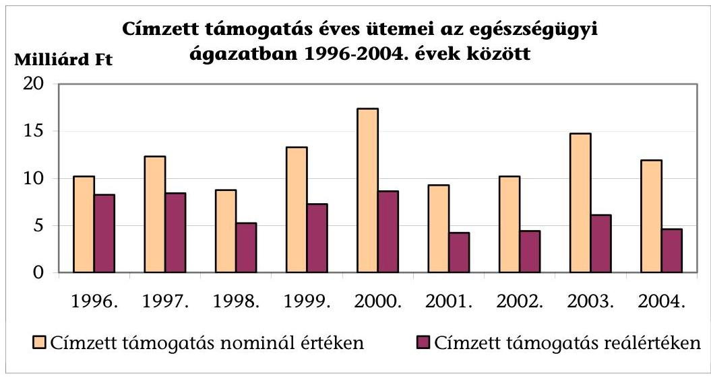

Az éves ütemmel ellentétben, a 2003-2004. évben indult rekonstrukciók teljes címzett támogatása nominálértéken megkétszereződött (a 2002. évi 9,57 milliárd Ft-ról 2003. évben 19,8 milliárd Ft-ra, 2004. évben 20,7 milliárd Ft-ra nőtt). A folyamatban lévő beruházások finanszírozása elsősorban a 2005. évi költségvetésben jelent determinációt (a 2004. évi 11,9 milliárd Ft-tal szemben a 2005. évi pénzügyi ütem 17,1 milliárd Ft-ra nőtt), miközben a 2005. évi költségvetésben új induló címzett támogatásra csökkenő keret áll rendelkezésre⁷.

Az egészségügyi ágazat nemzetgazdaságban betöltött szerepét jelző mutató, az ágazat részesedése a GDP-ből a vizsgált időszakban (elsősorban a közalkalmazottak 2002. szeptemberi béremelése miatt) 0,6%-kal nőtt, ezzel szemben az egészségügyi beruházások aránya a GDP-hez és az összes beruházáshoz képest is csökkent. (Az egészségügyi beruházások aránya 1996-2003 között a GDP-hez viszonyítva 0,46%-ról 0,39%-ra, az összes beruházáson belül 2,4%-ról 2%-ra változott.)

A címzett támogatásra az éves költségvetésben jóváhagyott előirányzat meghatározó részét (94-95%-át) a folyamatban lévő beruházások forrásigénye kötötte le, az új induló beruházások első évi pénzügyi üteme minimális volt, elsősorban az előkészítéssel kapcsolatos költségeket tartalmazta (engedélyezési, kiviteli tervek megrendelése, terület-előkészítés). Az egészségügyi ágazat (kórházak) rekonst-

[^0]
[^0]:    ⁷ 0449 ÁSZ jelentés „Vélemény a Magyar Köztársaság 2005. évi költségvetési javaslatáról"

---

rukcióinak, beruházásainak tervezhetőségét a felhasználható címzett támogatás - legalább középtávon történő - meghatározásának hiánya is nehezítette, kiszámíthatatlanná tette.

A címzett támogatásból megvalósuló beruházások pénzügyi üteme a beruházási koncepciókban, tervekben szereplő két-három évvel szemben, négy-öt évre került jóváhagyásra, amely az áremelkedések miatt költségnövelő hatású volt. A beruházások előkészítése és megvalósulása között eltelt időtartam elérte a hat-tíz évet, amely időszakban a szakmai elképzelések, a műszaki feltételek is módosultak.

A kórházi ágyak és az engedélyezett címzett támogatás régiónkénti megoszlása között - az Észak-Magyarországi régiót kivéve - viszonylag erős korreláció volt megfigyelhető (az önkormányzati kórházak ágyszámának megoszlását követte az elnyert címzett támogatás régiónként).
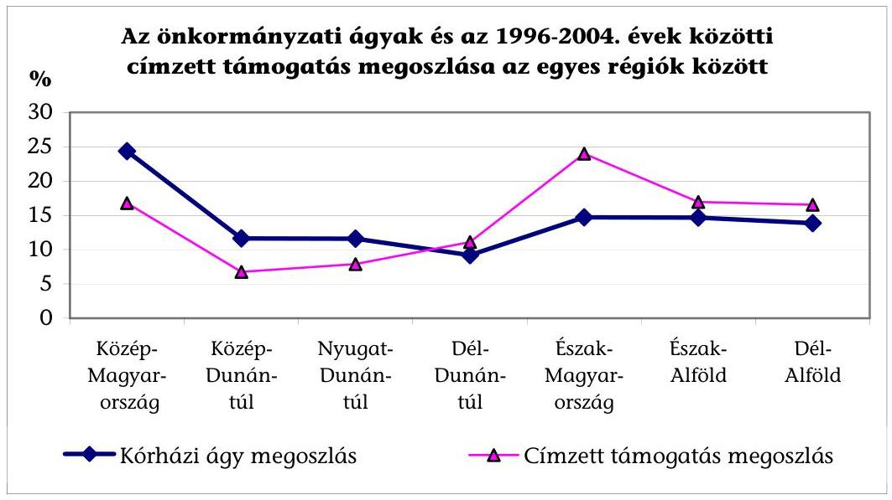

Az alacsonyabb ágyszámmal rendelkező keleti országrész régióiban (Észak-Alföld, Dél-Alföld, Észak-Magyarország) a címzett támogatásból való részesedés az átlagtól magasabb, amely területfejlesztési szempontok érvényesülését jelzi.

# Az ellátórendszer szakmai és területi struktúráját jellemző aránytalanságok megszüntetésére tett intézkedések a stratégiai tervezés elvén alapuló fejlesztéspolitika hiányában nem biztosították a kívánt eredményt. 

Magyarország társadalmi-gazdasági szempontból elmaradott régiói a lakosság egészségi állapota és az egészségügyi ellátórendszer tekintetében is hátrányos helyzetben vannak. Az egészségügyi szolgáltatások térbeli és időbeli hozzáférhetősége rossz, hiányosak, korszerűtlenek a diagnosztikai feltételek, a szükségletekhez képest alacsonyabb a krónikus kapacitás. Az egészségügyi intézmények főleg e régiókban korszerűtlenek, 35%-uk rekonstrukcióra, felújításra szorul. A korszerű orvostechnikai eszközök mellett sok az elavult. Megfelelő pótlás, csere hiányában az eszközök kétharmada nullára leírt.

---

# 1.2. A rekonstrukciók és a szakmai fejlesztési programok közötti összhang 

Az önkormányzatok a címzett támogatásra vonatkozó beruházási koncepciót a törvény szerint egyeztetik az ágazati minisztérium szakmai programjával, a tárca véleményezi a támogatási igényt. A megvalósításhoz szükséges forrásokat is megjelölő ágazati szakmai programok - amelyek a stratégiai tervezés és a címzett támogatások odaítélésének alapjául szolgálhattak volna - azonban nem kerültek kidolgozásra, elfogadásra.

Az egészségügy átalakításának 1997. évi feladat- és ütemtervéről szóló 2023/1997. (I. 30.) Korm. határozat II/1. pontja a struktúra átalakítást és a területi különbségek kiegyenlítését segítő központi forráselosztási rendszer létrehozásával, a címzett és céltámogatások új rendszerének kialakításával kapcsolatos jogalkotási feladatokért a belügyminisztert, a népjóléti minisztert, a pénzügyminisztert és az igazságügy minisztert tette felelőssé.

Az egészségügyi ellátó rendszer korszerűsítésének, átalakításának számos alkalommal megfogalmazott igénye ellenére a több kormányzati cikluson keresztül megoldandó főbb kérdésekben sem született egyetértés, nem készült szükségletekre alapozott hosszú távú országos, regionális egészségügyi fejlesztési stratégia.

A Kormány 2001. évben fogadta el az Európai Unió egészség stratégiájával harmonizáló, a megelőzésre és szűrésre, az egészséges életmódra hangsúlyt helyező Egészséges Nemzetért Népegészségügyi Programot. Ennek alapját
 az egészségügyi miniszter által 2000. évben készített „Program a Nemzet Egészségének Fejlesztésére és az Egészségügyi Ellátó Rendszer Átalakítására" című dokumentum képezte. A program a finanszírozási rendszer, a fejlesztési, beruházási politika módosítására is fogalmaz meg új elképzeléseket, azonban a program második szakaszára, a megvalósítandó projekteket, ütemtervet és a szükséges forrásokat megjelölő részletes cselekvési terv elkészítésére nem került sor. A Népegészségügyi Programot az Országgyűlés a 2003. évben elfogadott határozatban erősítette meg.

A 2002. évben elfogadott kormányprogram „Az egészség évtizede" címen foglalta össze az ellátó rendszer fejlesztésére, működtetésére, finanszírozására vonatkozó célkitűzéseket. A program szerint a címzett és céltámogatásra rendelkezésre álló forrásokat, valamint a beruházásokra szánt pótlólagos költségvetési eszközöket regionális programok alapján a népegészségügyi szempontból fontos fejlesztésekre, a korszerűtlen szakmai struktúrák átalakítására, az elfogadhatatlan területi és ellátásbeli különbségek kiegyenlítésére, valamint az intézmények technikai színvonalának javítására kell felhasználni.
„Az egészségügyi közszolgáltatások nyújtásáról, valamint az orvosi tevékenység végzésének formáiról" szóló 2001. évi CVII. törvény (Eütv.) előírta az egészségügyi közintézmények szakmai fejlesztési programjának készítését, amely tartalmazza a szakmai profil átalakítására vonatkozó, a beruházásokkal, fejlesztésekkel kapcsolatos elképzeléseket. Az öt évre szóló fejlesztési programot első ízben 2003. március 31-ig kellett a törvény szerint jóváhagyás céljából az intézményeknek a fenntartó helyi önkormányzathoz felterjeszteni, azonban a koncepció területi összehangolására vonatkozó követelmények nem szerepeltek a jogszabályban.

---

Az ágazati és térségi tervezés területi és szakmai összehangolásának jogszabályi kötelezettségét, az ezt szolgáló Regionális Egészségügyi Tanácsok létrehozásának kereteit „az egészségügyi szolgáltatókról és az egészségügyi közszolgáltatások szervezéséről" szóló 2003. évi XLIII. törvény (Eüsztv.) teremtette meg, amelyet azonban az Alkotmánybíróság 2003. december 15-én közjogi érvénytelenség miatt megsemmisített.

Ezt megelőzően az ESzCsM pályázati felhívást tett közzé a Regionális Egészségügyi Tanácsok (RET) megszervezésére és a Regionális Egészségügyi Fejlesztési Terv elkészítéséhez nyújtandó összesen 70 millió Ft támogatás elnyerésére. A pályázat kapcsán 6 régióban alakult meg a RET, de a működésüket megalapozó jogszabályi előírások - hosszabb törvényelőkészítést követően - csak 2004 decemberében a költségvetési törvénnyel együtt elfogadott, az egészségügyről szóló 1997. évi CLIV. törvény módosításában jelentek meg.

Eszerint a középtávú fejlesztési, stratégiai tervezés részét képező Nemzeti Egészségfejlesztési Program (NEP) tartalmazza többek között a lakosság egészségi állapota és az azt meghatározó tényezők alapján várható egészségügyi ellátási szükségletet, a fejlesztési prioritásokat, amelyhez igazodva a RET elkészíti az egészségügyi régió egészségfejlesztési programját.

Az Eütv. módosításával 2006. január 1-jével létrehozandó új fejezeti kezelésű előirányzat, az Egészségügyi Fejlesztési Előirányzat (EFE) 25%-át kitevő központi, és 75%-át jelentő regionális részének felhasználása a NEP-pel összhangban a regionális egészségpolitikai programban szereplő fejlesztések, átalakítások, rekonstrukciók finanszírozására, európai uniós forrásokhoz szükséges önrész kiegészítésére, a RET által támogatott prevenciós programra történhet.

Az EFE forrásait az EüM fejezetében prevenciós programokra jóváhagyott előirányzat, egészségügyi célt szolgáló ingatlanok értékesítéséből, önkéntes adományokból és egyéb támogatásokból származó bevételek képezik, azonban nem része a címzett és céltámogatás. Nem tisztázottak a regionális egészségpolitikai program kialakításának szakmai elvei, a már létrejött RET átalakításának rendje, kapcsolata a Regionális Fejlesztési Tanácsokkal.

Az ellátás szervezettségét, hatékonyságát javító ágazati fejlesztéspolitika, a rekonstrukciós igények átfogó felmérése, megfogalmazása hiányában az egészségügyi ellátó rendszer átalakítását, a kapacitásoknak a változó ellátási igényekhez, szükségletekhez igazítását, az aktív ágyak egy részének krónikus és rehabilitációs ellátásra történő átszervezését, a korszerűtlen részlegek megszüntetését tartalmazó elképzelések a konszolidációt és adósságkezelést szolgáló egyedi, intézményi intézkedési tervekben fogalmazódtak meg.

A Nógrád Megyei Kórház rekonstrukciójának előkészítése időben egybe esett a kórház 1998. évi adósságkezelésével. Az eladósodás egyik okaként a korábbi szakmai struktúrát jelölték meg, az elemzések alapján egyes osztályok és szervezeti egységek méretének, kapacitásának módosítását tervezték. A 3870 millió Ft összköltségű beruházás szakmai-műszaki tartalmát az adósságkezeléssel összefüggő struktúra átalakítás miatt módosították. A kórház 2003. évben is csak a konszolidációs program segítségével tudta adósságát csökkenteni.

Kazincbarcika Városi Kórház 2003. évben induló rekonstrukciójának előkészítésével egy időben fogadta el a képviselő-testület a kórház konszolidációs és reorganizációs

---

programjával összefüggő intézkedési tervet, amely kihatott a módosított szakmai program és engedélyezési tervek készítésére. A rekonstrukció részben az elmaradt felújítások pótlását szolgálta, a kórházi struktúra korábban végrehajtott módosítása, ágyszám csökkentés ettől függetlenül történt. Az Önkormányzat a 2004. évben 123 millió Ft-tal támogatta a kórházat, amelynek lejárt fizetési határidejű tartozásállománya meghaladta a 100 millió Ft-ot.

Az egészségügyi ellátórendszerrel kapcsolatosan az elmúlt évtizedben megfogalmazott legfontosabb strukturális probléma a betegellátáson belül a kórházi ellátások túlsúlya és a területi egyenetlensége. A kórházrekonstrukciók 90%-a az aktív fekvőbeteg-ellátás területén valósult meg, amelynek eredményeként 8707 aktív ágy létesült illetve került felújításra, a krónikus ellátásban a beruházások mindössze 829 ágyat érintettek, a járóbeteg-szakellátó intézmények (rendelőintézetek) felújítása pedig csak kivételesen fordult elő. A címzett támogatás a fekvőbeteg-szakellátáshoz kapcsolódott, így annak túlsúlyát nem is szüntethette meg.

Az ORKI épületkataszter adatai alapján a kórházi épületek műszaki állapotának jellemzői a részleges, több ütemre bontott rekonstrukció ellenére továbbra is kedvezőtlenek. A folyamatos ráfordítás, állagmegóvás hiányában újratermelődnek a műszaki szükségességből indokolttá váló felújítási, rekonstrukciós igények. Az egészségügyi ellátó rendszerben a modern eljárások, elhelyezési körülmények mellett jelen vannak a korszerűtlenek is, amely nagymértékben rontja a szakmai minimumfeltételekben meghatározott minőségű ellátáshoz való hozzájutás esélyegyenlőségét.

Az épületkataszter szerint az önkormányzati kórházak összes beépített alapterülete az 1994. évi 1530 ezer m²-ről 2003. év végére 1541 ezer m²-re nőtt. A kórházak átlagos életkora 60 év, a régebbi építésű kórházi osztályok építészeti, épületgépészeti és egyéb infrastrukturális állapota nem felel meg a mai követelményeknek.

Az elmaradt felújítások, fejlesztések következményeként a kórházak 96%-a az előírt tárgyi (építészeti) minimumfeltételeknek nem tudott eleget tenni, így csak ideiglenes vagy határozott idejű működési engedéllyel rendelkeztek.

A tulajdonos helyi önkormányzatok kezdeményezésére indított, címzett támogatásból finanszírozott rekonstrukciók nem elsősorban egészségpolitikai célkitűzések megvalósítását szolgálták, hanem a megfelelő fedezet hiányában elmulasztott felújítási, állagmegóvási kötelezettség pótlását, a kórházak működési körülményeinek korszerűsítését.

A rekonstrukciók szakmai programja a jobb minőségű, korszerűbb ellátást célozták, azonban azok megvalósításához nem voltak elegendőek az évente meghatározott pénzügyi keretek, a beruházásokat forráshiány jellemezte. A több ütemre bontott rekonstrukciók egymásra épülő további szakaszai nem voltak biztonságosan tervezhetőek. A részlegesen megvalósuló rekonstrukciók további ütemeinek forrásigényéről átfogó felmérés nem készült.

A kórházrekonstrukciók folytatása érdekében, a beruházás szakmai-műszaki tartalmának - forrás hiányában történő - szűkítése, vagy előkészítési problémák miatt rendszeresen új igények fogalmazódnak meg.

---

Az 1996. évben a címzett támogatásból finanszírozott, folyamatban lévő 12 kórházrekonstrukcióból 7 esetében az indokoltnak tartott fejlesztési elképzelés 1,2 milliárd Ft-os többlettámogatással volt megvalósítható. A 2002. évben folyamatban lévő 25 beruházás közül 10 kórháznál újabb rekonstrukciós ütemre nyújtottak be koncepciót.

A Tolna Megyei Kórház új műtő- és diagnosztikai tömb építésére 1994. évben elnyert 2,2 milliárd Ft, ezt követő további 3 milliárd Ft központi támogatásból a beruházás nem fejeződött be. Az Önkormányzat 2003. évben az elkészült építmény felszereléséhez szükséges orvos-technológia beszerzéséhez további 2,5 milliárd Ft támogatást igényelt, amelyet a döntéselőkészítés során nem támogattak.

A Győr-Moson-Sopron Megyei Kórházban az 1982. évben átadott diagnosztikai épület gép-műszer állománya jelentősebb felújítás, műszerpótlás hiányában korszerűsítésre szorult (az altatógépek, betegőrző monitorok, műtőasztalok, sebészeti vágóberendezések stb. életkora 18-19 év volt 2000-ben). A műtőblokk és sterilizáló rekonstrukciójára 2000-ben elkészített koncepció és megvalósíthatósági tanulmány a meglévő rész felújítása mellett bővítéssel is számolt 5,4-6 milliárd Ft költségelőirányzat mellett. A 2001. évben átdolgozott program a bővítéses rekonstrukciót 2-2,4 milliárd Ft költséggel fogalmazta újra. A szükséges egyeztetéseket követően a 2003. évi 1 milliárd Ft új induló címzett támogatás a betegfelvonók és a klíma felújításán túl csupán gépműszer beszerzési előirányzatot tartalmazott. A beruházás folytatásaként a központi műtőblokk, központi sterilizáló és központi intenzív osztály 1,8 milliárd Ft költségű bővítéses rekonstrukciója a Kormány közleménye szerint a 2005. évi új induló címzett támogatások között szerepel.

A Karcagi Városi Kórház elmaradt felújítást is pótló rekonstrukciójára készült koncepció 4,8 milliárd Ft költséggel került benyújtásra, az egyeztetést követően csökkentett szakmai programból elmaradt a műtőblokk toldaléképítéssel való bővítése, az informatikai fejlesztés. A beruházás 1999-2003 között 2 milliárd Ft címzett támogatásból valósult meg, az önkormányzat a rekonstrukció folytatására 2005. évben új címzett támogatásra 3,3 milliárd Ft-os koncepciót nyújtott be.

Az eredeti szakmai program módosítását alátámasztó szakmai érvekhez a központi egyetértés is biztosított volt.

A Győr-Moson-Sopron Megyei Kórház 1997-ben nyertes pályázatában foglaltak korrekcióra szorultak nagyrészt a Győri Honvédkórház megszűnésével összefüggésben, így a módosításokhoz három államtitkári, helyettes államtitkári egyetértő levél is kapcsolódott. A Kisvárdai Városi Kórház rekonstrukciója műszaki tartalmának megváltoztatásához ugyancsak helyettes államtitkári hozzájárulásokat kért az önkormányzat.

Nyolc befejezett és egy még befejezetlen fejlesztés kapott kiegészítésként további címzett támogatást, ami lényegében a változások és a kapcsolódó forrásigények törvényi szintű elismerését is jelentette.

# 1.3. A címzett támogatással kapcsolatos döntéselőkészítés 

A címzett támogatás engedélyezésével kapcsolatos döntéselőkészítés első ütemében az ágazati miniszter meghatározta a címzett támogatás igénybejelentéshez előírt szakmai program tartalmi követelményeit. A helyi önkormányzatok április 25-ig nyújtották be ez alapján a következő évre összeállított beruházási koncepciót (az 1999. évi igénybejelentéstől kezdve tartalmazta a megvalósíthatósági tanulmányt is). A beruházási koncepciót egyeztetni kell a minisztérium szakmai programjá-

---

val. Ilyen program azonban nem készült, illetve nem került elfogadásra a vizsgált időszakban, ennek hiányában az egyes beruházási koncepciók egyedi felülvizsgálatára került sor a tárca részéről.

A Kormány a támogatásra javasolt és nem javasolt beruházásokról július 31-ig (országgyűlési választás évében október 31-ig) közleményben adott tájékoztatást, az erről szóló határozatban felkérte az érintett minisztereket, hogy szükség szerint folytassák le az egyeztetéseket az önkormányzatokkal a szakmai-műszaki tartalom szűkítéséről, és a beruházások megvalósítási költségeinek csökkentéséről.

A támogatott beruházásokra az önkormányzatok a részletes műszaki (engedélyezési) tervek alapján december 15-ig (választást követő évben február 12-ig) igényelték a címzett támogatást.

A kórházfejlesztések és rekonstrukciók címzett támogatásának igénybejelentéséhez előírt szakmai program tartalmi követelményeit a miniszter a 9/1998. (I. 23.) Korm. rendelet alapján minden évben meghatározta. Eszerint a helyzetleírás, a rekonstrukció indokai, a szakmai tervezési program és a várható eredmények vonatkozásában a megvalósíthatósági tanulmány tartalmi követelményei szerint kell elkészíteni a beruházási koncepciót. A beruházási koncepció (megvalósíthatósági tanulmány) részét képező, elfogadott szakmai program a vizsgált beruházások 65%-ában módosult, az elkészült építészeti rész megfelelő hasznosításához vagy a műszerezettség volt hiányos, vagy a tervezettől eltérő funkciót kapott az elkészült létesítmény.

A címzett támogatásból megvalósuló kórházrekonstrukciók szakmai prioritásai tartalmazták a sürgősségi betegellátás feltételeinek kialakítását, fejlesztését, a műtéti feltételek javítását, a nosocomiális fertőzések lehetőségének csökkentését, az ágazati szakmai és munkavédelmi szabványosság megteremtését, a rövid ápolási idejű ellátás, az egynapos sebészet, a gyorsdiagnosztika, a hotelszolgáltatások komfortosságának, az ellátási és ápolási hatékonyság növelését, az energiatakarékos és környezetkímélő működtetés, valamint az előírt minimumfeltételek megteremtését egyaránt.

A szakmai prioritások az eltelt kilenc év alatt lényegében nem változtak, túlságosan általánosítva kerültek
 megfogalmazásra, és lényegében az intézményi működés teljes körét felöleli. Ebből adódóan valamennyi címzett támogatás vonatkozásában kapcsolatot lehet találni a végrehajtott fejlesztés, korszerűsítés és valamelyik központi célkitűzés között.

Kidolgozott és jóváhagyott ágazati fejlesztési program, központi célok meghatározásának hiányában a régiók sem készíthették el saját terveiket. Az ágazati konszolidációs, modernizációs, reorganizációs program a 2002. évi kidolgozását követően 2003. évben forráshiány miatt már nem biztosította az érdemi továbblépés lehetőségét, csupán az indítás évében bevont intézményekre koncentrálódott.

A népegészségügyi program átfogó célokat tartalmaz, ugyanakkor egy elkerülhetetlen épületrekonstrukció népegészségügyi programhoz illeszkedésének kritériumai nem kerültek kidolgozásra.

---

Az ágazati miniszter a 2003. évre szóló igénybejelentéstől kezdődően írta elő, hogy a szakmai programok illeszkedjenek:

- a regionális fejlesztési programokhoz;
- az ágazati konszolidációs, modernizációs, reorganizációs programhoz;
- a népegészségügyi prioritásokhoz.

A megvalósíthatósági tanulmány értékelésének szempontjait tartalmazó rögzített és mindenki számára megismerhető eljárási rend nem került meghatározásra. Nem ismert, hogy az egyes adatokat milyen szempontok szerint értékelték, milyen prioritásokat érvényesítettek, összességében hogyan befolyásolják az igények elfogadását, rangsorolását. (Csupán a tanulmányban szereplő változatok közötti gazdaságossági összehasonlítás módszere került megállapításra a jogszabályban.) Emiatt nem egyértelmű minek figyelembe vételével ad véleményt az ÁNTSZ és a MEP, és mi alapján készítették el értékeléseiket a tárcák szakértői.

A címzett támogatási igényekre vonatkozó javaslat kialakításánál elfogadott szakmai fejlesztési programok hiányában a koncepció részét képező megvalósíthatósági tanulmány értékelése során a szakmai prioritások mellett egyéb szempontokat is érvényesítettek.

Az ESzCsM Gyógyító és Ápolási Főosztálya a 2003. évi új induló címzett támogatásokkal kapcsolatos javaslata szerint a szakmai prioritások mellett figyelembe vette az elégtelen forrás miatt befejezetlen beruházások folytatásának igényét, a területfejlesztési, a terület-megoszlási szempontokat, az első koncepció benyújtását követően eltelt évek számát, a működtetés ésszerűsítését elősegítő helyzet megteremtését egyaránt.

A 2003. évi új induló címzett támogatásokra vonatkozó javaslatnál az ESzCsM illetékes főosztálya megállapítja „általában a rekonstrukciók indoka a 25 évnél többnyire idősebb épületállomány leromlott állapota, a korszerűtlen viszonyok, amelyek miatt az intézmények ideiglenes működési engedéllyel rendelkeznek, az erkölcsileg és valóságosan is amortizálódott gép-műszer park".

A különböző szempontok alkalmazásának módszereit, az értékelés szempontjait, kritériumait a kiadott tájékoztatók nem határozták meg, a rekonstrukciók műszaki és szakmai tartalmának összhangját biztosító részletes tervek, információk a döntéselőkészítés szakaszában nem álltak rendelkezésre.

A fejlesztési koncepciók, szakmai programok a rekonstrukcióktól várt eredmények között nem határoztak meg konkrét eredménykategóriákban mérhető célokat. Nem kerültek kialakításra a szakmai célok elérésének mérési módszerei, indikátorai (pl. betegforgalom, műtétek, vizsgálatok számának változása, átlagos ápolási idő csökkentése, energia megtakarítás mértéke, stb.).

A beruházási koncepciók kialakításakor nem vették számba (az önkormányzati fejlesztési gyakorlatból általában hiányzik) a rekonstrukciók megvalósításával, eredményével kapcsolatos bizonytalansági tényezőket, kockázatokat. Annak ellenére, hogy a rekonstrukciókat működő intézményekben tervezték, a koncepció kialakítása során a betegellátás teljesítményeinek csökkenésével sem számoltak.

---

A Fővárosi Szent Imre Kórház 1997-2003 között zajló rekonstrukciójának időszakában az átépítés alatt álló épületekben a betegellátás szünetelt, és ez likviditási gondok kialakulásához vezetett a kórház gazdálkodásában, több mint 300 millió Ft adósság halmozódott fel. A kórház működési kiadásai az új épület átadásával 80%-kal növekedtek, amelyet a teljesítményfinanszírozás nem ellensúlyozott, ezért az adósság konszolidáció keretében 2003. évben 65,7 millió Ft támogatásban részesült.

A döntéselőkészítés során a pénzügyi, műszaki és egyéb kockázatok és az ebből eredő hatások kezelésére a jóváhagyott beruházási program csak a vizsgált fővárosi kórházak rekonstrukciójánál tartalmazott tartalék előirányzatot.

A 2003. évben befejeződött Fővárosi Szent Imre Kórház rekonstrukció engedélyokirata 542,5 millió Ft tartalékot (a beruházási költség 10%-a) tartalmazott, amelyet a beruházási költségek emelkedése miatt 20 millió Ft-ra csökkentettek. A Bajcsy-Zs. Kórház folyamatban lévő rekonstrukciójának engedélyokirata 500 millió Ft tartalékot tartalmaz.

A 2000-2004 között benyújtott összes beruházási koncepció száma és a címzett támogatás igénye többszöröse volt a pénzügyi keretek alapján kielégítésre javasolhatónak.
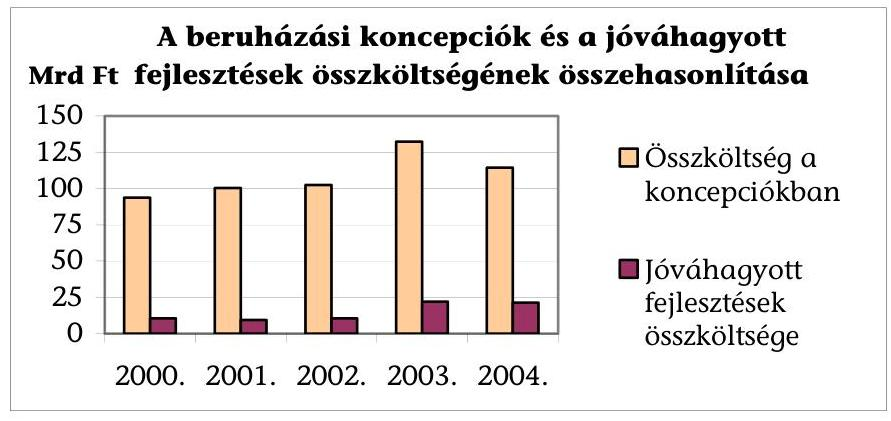

A beruházási koncepciókban szereplő költségbecslést részletes tervek nem támasztották alá, azokat az értékelés során a tárcák túlzottnak ítélték meg. A jelentős költséggel járó engedélyezési, kiviteli terveket az önkormányzatok csak a címzett támogatás első fordulójában támogatott elképzelések ismeretében rendelték meg. A megvalósíthatósági tanulmányok, koncepciók nem számoltak az igényeltől eltérő pénzügyi ütem engedélyezésével, amely a beruházások költségnövekedésében kimutathatóan szerepet játszott.

A Nógrád Megyei Önkormányzat a megyei kórház rekonstrukciójára 1997. évben benyújtott és támogatott koncepcióban a megvalósítást 1998-2000. évben tervezte, az új címzett támogatási törvény előkészítése szakaszában a BM ettől eltérő megvalósítási ütemmel és 2001. évi befejezéssel számolt. Az Önkormányzat számításai szerint a pénzügyi ütem jelentős módosítása 250-316 millió Ft többletköltséget okoz, amelyet a műszaki tartalom csökkentésével kellett ellensúlyozni.

A vizsgált önkormányzatoknál a beruházási koncepcióban szereplő, a megvalósíthatósági tanulmánnyal is alátámasztott beruházási költség 46,6 milliárd Ft volt, amely a Kormány támogató döntése után lefolytatott

---

egyeztetések eredményeként 30%-kal csökkent, így összesen 33 milliárd Ft összköltségű beruházás került címzett támogatással jóváhagyásra.

Az ágazati minisztérium által a kormánydöntéshez készített javaslat egyes években eltért a BM által a Kormány felé tett javaslattól. A koncepciók szakmai tartalma, tervezett költsége és a rendelkezésre álló pénzügyi fedezet közötti feszültségek miatti problémák a többszöri egyeztetést követően sem oldódtak meg.

Az EüM a 2002. évi új induló címzett támogatásra 16 kórháznál javasolt rekonstrukciót, a Kormány nyolcat támogatott. A tárca által javasoltakból öt került a Kormány felé előterjesztésre a BM részéről, három rekonstrukció támogatása nem szerepelt az eredeti ágazati elképzelésekben.

A 2003. évi új induló címzett támogatásokkal kapcsolatos EszCsM javaslatban szereplő 17 rekonstrukció közül a szakmai program pontosítását, szűkítését követően 7-8 beruházást tartott a tárca szakmai szempontok alapján elsősorban szükségesnek. A Kormány elé terjesztett javaslat ettől eltérő sorrendet és támogatási ütemet tartalmazott, egy beruházás (Nagykanizsai Városi Kórház rekonstrukció) az EszCsM által javasoltak között eredetileg nem szerepelt. A Kormány által támogatott beruházások közül 8-nak a koncepcióban (megvalósíthatósági tanulmányban) szereplő beruházási költsége 34,5 milliárd Ft volt, a címzett támogatással jóváhagyott 18,8 milliárd Ft-tal szemben.

# 1.4. A helyi önkormányzatok kórházi ellátás fejlesztésében betöltött szerepe 

Az egészségügyi ellátórendszer működtetésében, fenntartásában a helyi önkormányzatok felelőssége jelentős (a kórházi ágyak 76%-át működtetik). A térségi feladatokat ellátó kórházak épületeinek műszaki állapota, a korszerű orvostechnológia miatt jelentkező fejlesztési igények kielégítése komoly pénzügyi terhet jelent a kórháztulajdonos önkormányzatok számára, amelyről csupán helyi forrásból eddig sem és a jövőben sem tudnak gondoskodni.

Az OGY 1991 óta központi költségvetésből, elsősorban címzett támogatásból biztosította a kórházrekonstrukciók, beruházások megvalósításához szükséges fedezet túlnyomó részét (1991-2004 közötti címzett támogatási döntéseknél összesen 95%-át). A fejlesztések, rekonstrukciók előkészítése során az önkormányzatok a központi támogatás elnyerésére voltak figyelemmel, a döntésekben a helyi érdekek, szükségletek kaptak elsőbbséget és nem a területileg (regionálisan) egyeztetett kapacitásigények.

A vizsgált helyi önkormányzatoknál 1996-2003 között az egészségügyi ágazatba tartozó ingatlanok, gépek, berendezések és felszerelések értéke 139,4 milliárd Ft-tal (330%) nőtt (2. sz. melléklet), felerészben a beruházások, felújítások és felerészben a korábban érték nélkül nyilvántartott ingatlanok értékelésének és nyilvántartásba vételének eredményeként.

---

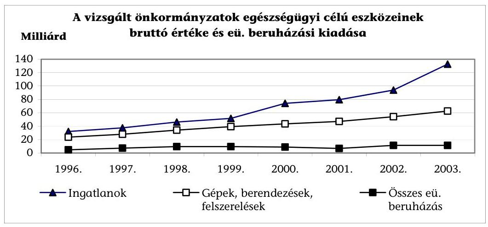

Az egészségügyi ellátás rendszerének átalakítása érdekében az elmúlt másfél évtizedben számos program, intézkedés született. Ezeket a lakosság kedvezőtlen egészségi állapota mellett a magas színvonalú és technológiailag gyorsan fejlődő egészségügyi ellátások iránti igények növekedése és a finanszírozási korlátok közötti ellentmondás kiéleződése motiválta. A lakosság egészségügyi szükségletei és a rendelkezésre álló kapacitások összhangját elősegítő, kórházrekonstrukciókra vonatkozó átfogó felülvizsgálat, felmérés a vizsgált időszakban nem készült.

A Népjóléti Minisztérium 1992. évben szakmai bizottságot hozott létre, amely a rekonstrukciós, fejlesztési program kialakítása érdekében az önkormányzati kórházak műszaki állapotáról átfogó elemzést készített és az 1993-96 évekre a kórházak infrastrukturális lemaradásának megakadályozása érdekében az épületállomány újraelőállítási értékének 5%-ának megfelelő éves rekonstrukciós programot dolgozott ki. A szakmai bizottság javasolta a magyar kórházi rendszer fejlődésének, a szakmai fejlesztések, rekonstrukciók alapját képező rendező elvek véglegesítését. A következtetések között szerepelt, hogy az egyre növekvő technológiai igények és a lakosság elöregedése miatti kihívásokra a kórházi struktúrára, fejlesztésekre, nagy értékű gép-műszer beszerzésekre vonatkozó döntések térségi, regionális összehangolása lehet az egyik fontos válasz. A koncepció megvalósításához szükséges pénzügyi források azonban nem álltak rendelkezésre, a rekonstrukciós program, a szerkezeti átalakítás csak részben valósult meg. Nem került sor a demográfiai változásokkal összhangban az aktív és krónikus ágyak megoszlásában az indokolt módosításra, az aktív ágyak aránya az 1990. évhez képest 2004. évben öt százalékponttal nőtt, a krónikus ágyak aránya ugyanennyivel csökkent.

A vizsgált kórházak 57,3 milliárd Ft bruttó értékű ingatlanainak (3. sz. melléklet) felújítására 9 év alatt (1996-2004 között) 3,4 milliárd Ft-ot fordítottak, amely éves átlagban 0,7%-a a nyilvántartott értéknek, nem éri el az elszámolt értékcsökkenés (a bruttó érték 2%-a) összegét sem. Ez a ráfordítás nem fejezi ki a tényleges felújítási szükségleteket. Ezen belül azonban jelentős a különbség fenntartók szerint. Amíg a megyei és városi önkormányzati kórházaknál a felújítás a nyilvántartott értéknek csupán 0,5%-a, addig a Fővárosi kórházaknál 2%-a volt éves átlagban.

A vizsgált kórházfenntartó önkormányzatok tárgyévi kiadásaiból - önkormányzat típusonként jelentős eltérések mellett - az egészségügyi ágazattal kapcsolatos kiadások 21-49% között részesednek, amelynek 89,7%-át a teljesítményfinanszírozás

---

keretében az Egészségbiztosítási Alaptól átvett pénzeszköz, és a beruházásokra, gépműszer beszerzésekre elnyert címzett és céltámogatás fedezte.
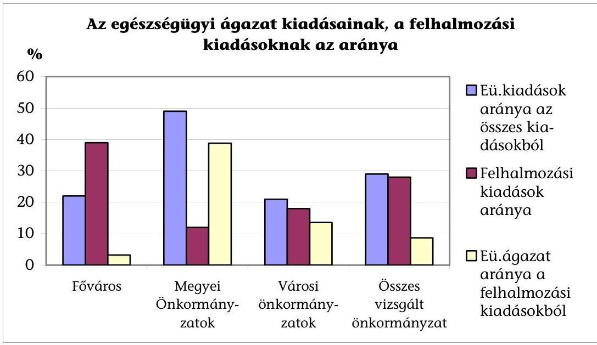

A fenntartó önkormányzatok egészségügyi intézményeik működéséhez nyújtott támogatása - pénzügyi lehetőségeik kedvezőtlen alakulása miatt - reálértéken csökkent. A vizsgált kórházak tárgyévi bevételeinek mindössze 1,3%-a származott 1996-2004 közötti időszakban a fenntartó támogatásából.

A fenntartó önkormányzatok eltérő pénzügyi helyzetéből adódóan jelentős szóródás volt megfigyelhető a kórházak támogatásának összegében.

Pápa Városi Önkormányzat a kórház fejlesztésére 1996-2003 között 512 millió Ft-ot fordított. Az intézmény bevételeinek 9,9%-a származott a fenntartó támogatásából a vizsgált években.

Berettyóújfalu Városi Önkormányzat a vizsgált időszakban a kórház fejlesztését, felújítását nem támogatta, a címzett és céltámogatás saját forrás fedezetét is a kórház biztosította saját bevételeiből 112 millió Ft összegben.

Kisvárda Városi Önkormányzat a vizsgált 1996-2004 közötti időszakban nem támogatta a kórház működését, amelynek lejárt fizetési határidejű tartozása nem volt.

A Győri Megyei Kórház bevételeinek 1,2%-a származott a fenntartó támogatásából a vizsgált évek átlagában, amely az utolsó öt évben már 0,8%-ra csökkent az önkormányzati források beszűkülése miatt.

# 1.5. A kórházrekonstrukciók tervezése és forrásai a helyi önkormányzatoknál 

Az ellenőrzött önkormányzatok 1996-2004 között 1142 milliárd Ft felhalmozási kiadást teljesítettek, amelyből 95,4 milliárd Ft szolgálta az egészségügyi intézmények felújítását, beruházását (4. sz. melléklet). Az önkormányzatok összes fejlesztésének 7,6%-át finanszírozta a címzett és céltámogatás, ez az arány az egészségügyi ága-

---

zatot érintő felhalmozási kiadásoknál - önkormányzatonként jelentős eltéréssel - már 60%-os volt.

A kórházrekonstrukciók legjellemzőbb indoka, hogy az intézményeknél az előírt szakmai minimumfeltételekhez képest lemaradás volt tapasztalható mind az építészeti feltételek, mind a gép-műszer állomány területén. (Erről azonban pontos felmérések nem készültek, a vizsgált időszakban a minimumfeltételek három alkalommal $^{8}$ kerültek újrafogalmazásra.)

Az egyes kórházi
 osztályokon, részlegeken nem volt biztosított a jogszabályban előírt alapterület, a sürgősségi betegellátás feltételrendszere, hiányos volt a betegszobák előírt komfortja, az orvosi gép-műszer állomány előírt mennyisége és minősége. A beruházási programok a minimumfeltételeknél tapasztalható hiányosságok pótlását, a kórházi infrastruktúra elmaradt felújítása miatti igényeket és ellátás korszerűsítését (új eljárások bevezetését) egyaránt célozták.

Az egészségügyi szolgáltatók szakmai minimumfeltételeinek 2003. évi újraszabályozásakor a korábbiaktól eltérően a kórházi osztályok helyett tevékenységekre, a progresszív ellátás szintjeihez igazodóan határozták meg a biztonságos betegellátáshoz szükséges személyi és tárgyi feltételeket, valamint az ellátás megfelelő szinten történő végzését garantáló éves minimális esetszámot, diagnosztikai háttért.

Az önkormányzati tulajdonban lévő kórházak - az ORKI nyilvántartása szerint 337 telephelyen, 3157 épületben üzemelnek. Az épületek műszaki állapotáról háromévente átfogó vagyonkataszter, felmérés készül. Eszerint a rendszeres karbantartás hiánya miatt 2003. évben az épületállomány 8,6%-a rekonstrukcióra, 16,7%-a jelentősebb felújításra szorul, 5%-a műszaki állagromlásuk miatt szanálandó. A leromlott állagú kórházi épületek felújítására, az infrastruktúra szükséges korszerűsítésére vonatkozó felújítási, beruházási igényekre csak közvetett adatok állnak rendelkezésre (pl. a címzett támogatásokra első ütemben benyújtott koncepciók szerint az igényelt támogatás évente 110-140 milliárd Ft között volt).

A vizsgált helyi önkormányzatok közül a megyei önkormányzatok 80%-a, a városi önkormányzatok 45%-a a beruházások, felújítások előkészítésének, jóváhagyásának, megvalósításának rendjéről - a törvény által nem szabályozott helyi társadalmi viszonyok rendezésére az Ötv-ben biztosított felhatalmazással élve - alkotott rendeletet. Ebben szabályozták a fejlesztések tervezésével kapcsolatos kérdéseket (tervezés időtávja, igényfelmérés rendje stb.), a fejlesztési programok előkészítésének, jóváhagyásának rendjét. A beruházási szabályzatot nem alkotó önkormányzatok a fejlesztések előkészítését az elnyerhető támogatásokhoz igazítva, ötletszerűen végezték.

A címzett támogatásból finanszírozott kórházrekonstrukciók koncepciójának (és ennek részét képező megvalósíthatósági tanulmány) készítésével külső vállalkozást bíztak meg, amelyben a kórházak műszaki állapotfelmérését kellő részletességgel végezték el, rámutattak a kórházi épületek, infrastruktúra hiányosságaira. A beruházási koncepciót, szakmai programot az önkormányzat és kórház vezetésének elképzeléseit figyelembe véve dolgozták ki.

[^0]
[^0]:    ${ }^{8}$ 19/1996. (VII. 26.) NM, a 21/1998. (VI. 30.) NM, a 60/2003. (X. 20.) EszCsM rendelet

---

A koncepciók kidolgozásakor nem fordítottak megfelelő figyelmet a beruházások körülményeinek, költségeinek vizsgálatára, a megvalósuló létesítmény, beszerzett gép-műszer üzemeltetésével kapcsolatos kérdések előzetes számbavételére. A megvalósíthatósági tanulmányban a létrehozott kapacitások és az egészségügyi szükségletek összhangjára vonatkozó elemzések elnagyoltak, a címzett támogatással kapcsolatos döntések előkészítése során nem hasznosultak. A műszaki előkészítés részeként az igénybejelentésre az engedélyezési tervek birtokában került sor, a döntéselőkészítés első szakaszát követően tervpályázatok kiírására a rendelkezésre álló 1,5-2 hónapban nem volt reális esély.

A helyi önkormányzatok fejlesztési, beruházási elképzeléseiket az Ötv. 91. §. (1) bekezdésében előírt gazdasági programban határozzák meg. A törvény azonban a program tartalmi követelményeire, a tervezési időtávra nem tartalmaz kötelező előírásokat. Nem tisztázott egyéb tervekkel (pl. területfejlesztési tervekkel, ágazati-szakmai fejlesztési programokkal) való kapcsolata sem.

A vizsgált önkormányzatok 1996-2004 között különböző időpontokban fogadtak el gazdasági programnak nevezett dokumentumot, amelyek röviden a címzett támogatási igényről, vagy a már folyamatban lévő rekonstrukcióról tartalmaztak információt, nem határozták meg a részletes célokat, a fejlesztés várható költségigényét és forrásösszetételét. Az önkormányzati finanszírozásban érvényesülő rövidtávú szemlélet, a forrásszabályozás évente változó előírásai miatti bizonytalanság sem kedvezett a hosszabb távú, stratégiai programalkotásnak. Ettől eltérő stratégiai szemlélet az önkormányzatoknál csak kivételesen, megfelelő saját források megléte esetén volt tapasztalható.

A Fővárosi Önkormányzat 1998. évtől 7 éves időtávra szóló fejlesztési terv készítését határozta el, a középtávú fejlesztési programot a Közgyűlés évente felülvizsgálja és erről a költségvetési koncepció elfogadásával egyidejűleg dönt. A fejlesztési tervben a vizsgált kórházrekonstrukciók a jóváhagyott előirányzattal szerepelnek. A Közgyűlés 1998. évben hosszú távú egészségfejlesztési stratégiát, majd 2002. évben Egészségpolitikai Cselekvési Programot fogadott el. A fejlesztési célkitűzésekben meghatározott regionális szerepet betöltő kórházakat a meglévő kórházak rekonstrukciójával, részben bővítéssel kívánják kialakítani 10 év alatt 80 milliárd Ft ráfordítással.

A fejlesztési stratégia kidolgozását nehezítették az eltérő tulajdonosi szerkezetből fakadó egyeztetési problémák, az ágazati szakmai fejlesztési programok kidolgozatlansága, a megvalósíthatóságát megkérdőjelezte a szükséges pénzügyi fedezet hiánya.

A Veszprém Megyei Önkormányzat 1999-ben tűzte ki célul egy közép- és hosszú távú egészségügyi koncepció kidolgozását. A megyében működő 12 kórház közül 3 megyei, 6 városi önkormányzati, 3 minisztériumi fenntartásban működött, a fenntartók ragaszkodtak a kialakult intézményi struktúrához, megegyezés hiányában hosszú távú fejlesztési koncepció nem került elfogadásra.

A Baranya Megyei Közgyűlés 2002-2006 közötti gazdasági programja az egészségügyi rekonstrukciók forrásigényét 6 milliárd Ft-ban állapította meg, de regionálisan, vagy megyei szinten elfogadott egészségügyi szakmai fejlesztési program hiányában a fejlesztés irányát nem tudták korrektül meghatározni.

A helyszínen vizsgált 22 helyi önkormányzat kétharmada a kórházrekonstrukciók előkészítése időszakában nem rendelkezett a testület által

---

elfogadott hosszú távú fejlesztési koncepcióval (stratégiával). Az egészségügyi ellátás fejlesztésével kapcsolatos célkitűzéseket a címzett támogatás igénybejelentéséhez készített szakmai programokban alkalmanként, nem teljes körűen, a várható támogatáshoz igazítva határozták meg.

Pápa Városi Önkormányzat a kórházrekonstrukció előkészítésének évében (1998. évben) nem rendelkezett gazdasági programmal. A 2001. évtől hatályos gazdasági program sem tartalmaz az egészségügy fejlesztésével kapcsolatos célkitűzéseket annak ellenére, hogy az akkor folyamatban lévő új kórházi szárny mellett egy újabb épület építése került a fejlesztési célok közé.

A kórházak térségi feladatokat látnak el, a területi ellátási kötelezettséggel érintett lakosság lakóhelye szerinti települési önkormányzatok és a kórház fenntartók közötti együttműködés nem jellemző, esetleges. A 22 vizsgált önkormányzat közül csupán kettőnél volt tapasztalható, hogy az ellátásban érdekelt önkormányzat pénzügyileg támogatta a térségi feladatot ellátó kórház fejlesztését.

A Baranya Megyei Kórház beruházásához Pécs Megyei Jogú Városi Önkormányzat 75 millió Ft (a beruházás összes költsége 5%-ának, illetve a saját forrás 29%-ának megfelelő összegű) támogatást nyújtott. A Veszprém Megyei Kórház Veszprém város lakosainak egészségügyi szakellátását teljes körűen biztosítja, a Városi Önkormányzat a kórház fejlesztéséhez szükséges saját forrás 35-38%-át vállalta a vizsgált években.

A vizsgált rekonstrukciók keretében 39 milliárd Ft értékű fejlesztés valósult meg 33 milliárd Ft címzett támogatás felhasználásával, és további 24,6 milliárd Ft összköltségű beruházás van folyamatban, amelyhez a megítélt címzett támogatás 18,8 milliárd Ft (5. sz. melléklet). A folyamatban lévő beruházások, rekonstrukciók pénzügyi-műszaki készültsége a 2002-2004 közötti kezdés időpontjától függően igen különböző, összességében 46%-os. A vizsgált rekonstrukciók 38%-a (11 db) 2 milliárd Ft feletti összköltségből valósult meg, amely beruházások az ellenőrzött címzett támogatás kétharmadát kötötték le.

A rekonstrukciók nem megfelelő előkészítése, a beruházás szakmai-műszaki tartalmának szűkítésével, pénzügyi ütemezésével kapcsolatos egyeztetések során kényszerűen vállalt kompromisszumok miatt a vizsgált és befejezett kórházrekonstrukciók 42%-ánál törvénymódosítást követően a címzett támogatás összege 2,3 milliárd Ft-tal nőtt.

A törvénymódosítással érintett nyolc rekonstrukció esetében ${ }^{9}$ az összes költség 31%-kal, a címzett támogatás 33%-kal, finanszírozáson belüli részaránya 92,4%-ról 94%-ra emelkedett.

A Cct. 3. § (8) bekezdése szerint jogszabályi változásból eredően a támogatásban részesülő beruházással ellátandó feladat jelentős változása miatt a folyamatban lévő beruházásokkal kapcsolatos eredeti döntés módosításáról törvényben kell gondoskodni. A jogszabályváltozásból eredő jelentős feladat változás tartalmi meghatározatlansága a címzett támogatással kapcsolatos eredeti döntések módosítására egyedi mérlegelés alapján adott lehetőséget.

[^0]
[^0]:    ${ }^{9}$ Az OGY a vizsgált időszakban nyolc alkalommal módosította a folyamatban lévő rekonstrukciók címzett támogatását.

---

Szabolcs-Szatmár-Bereg Megyei Önkormányzat a megyei kórház két telephelyének rekonstrukciójára 1997-2000 közötti időszakra 3332,4 millió Ft címzett támogatásban részesült, amely a beruházási koncepcióban szereplő összegtől 1000 millió Ft-tal volt alacsonyabb. Az önkormányzat jogszabályváltozásra (minimumfeltételek változására) hivatkozással 2000. és 2001 évben is 904 millió Ft többlettámogatási igényt nyújtott be, ebből 403 millió Ft kielégítését tartalmazta az elfogadott törvényjavaslat, és a befejezési határidő is 2001. évre módosult. Valójában a megvalósítás során az eredeti műszaki tartalomtól eltértek, a rekonstrukció építési költsége 2111,3 millió Ft volt, az elnyert címzett támogatás feltételei szerintit 684 millió Ft-tal haladta meg, gép-műszer beszerzésre a tervezetthez képest 382,5 millió Ft-tal kevesebbet használtak fel.

A Cct. 16. § (1) bekezdése szerint a beruházás műszaki tartalmának változtatásából, az ár- és árfolyamváltozásból, valamint a kivitelezés átütemezéséből származó többletköltség miatt az önkormányzatot a beruházás elfogadott összköltségéhez képest további központi támogatás nem illeti meg. E korlátozás alól a többlettámogatást megállapító törvényben külön mentesítette az OGY az érintett önkormányzatokat.

A Baranya Megyei Kórház (telephelyi rekonstrukció) elnevezéssel 1996. évben jóváhagyott beruházás műszaki tartalma és címzett támogatása két alkalommal összesen 760 millió Ft-tal 1260 millió Ft-ra módosult. Az 1999. évben jóváhagyott kiegészítő címzett támogatásból finanszírozott beruházás (T épület építése) eredeti műszakiszakmai tartalma és a megvalósítás határideje is módosult, amelyre újabb 200 millió Ft kiegészítő címzett támogatásban részesült az önkormányzat. Az elnyert címzett támogatás feltételei szerint az építés-szerelésre felhasználható összeg 1140 millió Ft volt, a tényleges 1396 millió Ft-tal szemben, a különbözettel a gép-műszer beszerzési keretet csökkentették.

A vizsgált helyi önkormányzatok a címzett támogatás igénybejelentése szerint a beruházási költség 14,7%-ának megfelelő önrészt vállaltak. Ennek 75%-a (6,7 milliárd Ft) a Fővárosi Önkormányzat által vállalt saját erő, amelyen belül 4,6 milliárd Ft a vizsgált két Fővárosi kórház címzett támogatási igénybejelentésében szereplő nem támogatott műszaki tartalmat finanszírozó saját forrás.

A már befejeződött 19 rekonstrukció tervezett beruházási költségeinek emelkedése miatt a vállalt 3,2 milliárd Ft-tal szemben a beruházó önkormányzatok által biztosított tényleges saját forrás 5,8 milliárd Ft-ra (81,3%-kal) nőtt, amelyet egyéb nem tervezett források is kiegészítettek. Ez utóbbiak azonban összességében nem voltak számottevőek.

A Baranya Megyei Kórház rekonstrukciójához az EüM által fejezeti kezelésű előirányzatokból gép-műszer beszerzésre biztosított 50 millió Ft is felhasználásra került. A Veszprém Megyei kórház rekonstrukcióját a sürgősségi betegosztály létrehozására pályázat keretében fejezeti kezelésű előirányzat terhére nyújtott 80 millió Ft is szolgálta. (A sürgősségi betegosztály létrehozása a rekonstrukció eredeti céljai között is szerepelt.) A Karcag Városi Önkormányzat által vállalt 1%-os (20 millió Ft) önrészt 19,1 millió Ft TERKI támogatással váltották ki.

A címzett támogatásból megvalósuló kórházrekonstrukciókhoz vállalt saját forrás a beruházási költségeken belül a megyei önkormányzatoknál 5,3%, a városi önkormányzatoknál 4,1% volt.

---

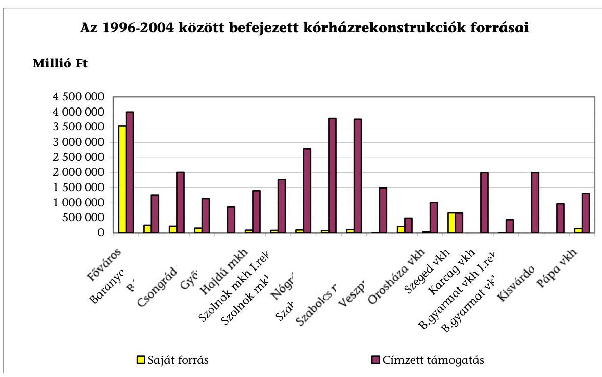

A vizsgált 29 rekonstrukcióból kilencnél saját forrást nem tartalmazott az igénybejelentés, a többinél a saját forrás széles határok között szóródott (a Karcagi, a Kazincbarcikai Városi, a Győr-Moson-Sopron Megyei Önkormányzat 1%-os, a Veszprém Megyei Önkormányzat 28,5%-os, a Szeged Városi Önkormányzat 34,1%-os önrész vállalása jelentették a szélső értékeket).

# 2. A KÖZBESZERZÉS, A KIVITELEZÉS ELŐKÉSZÍTÉSE ÉS A SZABÁLYOKNAK MEGFELELŐ LEBONYOLÍTÁSA, MEGVALÓSÍTÁSA 

### 2.1. A közbeszerzési törvény előírásainak betartása

2.1.1. A közbeszerzés központi és helyi szabályainak alkalmazása

A vizsgált időszakra esett a közbeszerzések rendszerének kialakítása, hazai gyakorlatban történő alkalmazásának elterjedése. A közbeszerzésekről szóló 1995. évi XL. törvény (Kbt) alkalmazásának kezdeti tapasztalatai, az értelmezési, gyakorlati problémák alapján a törvény átfogó, a rendelkezéseinek több mint felét érintő módosítására 1999. szeptember 1-jétől került sor.

A vizsgált önkormányzatok
 a Kbt. felhatalmazása alapján már 1996. évben, vagy későbbi időpontban (pl. Berettyóújfalu 2001. évben, Kisbér 2002. évben) szabályozták a közbeszerzési eljárás előkészítésével, az ajánlatkéréssel, az ajánlatok elbírálásával kapcsolatos tevékenységre és az abban eljáró személyekre vonatkozó, a törvényben nem szabályozott rendelkezéseket. A helyi szabályzatokat részben a jogszabályváltozások miatt, részben a gyakorlati tapasztalatok alapján egy-hat alkalommal is módosították. A kialakított szabályozást illetően az eljárást lezáró határozatot meghozó személy, az eljárásban közreműködők kijelölése, a gyakorlatot illetően a közbeszerzési eljárások mellőzése vagy a helyi szabályzattól eltérő lefolytatása kapcsán merültek fel észrevételek a vizsgálat során.

Veszprém Megyei Önkormányzat helyi rendeletében nem jelölték ki a közbeszerzési eljárást lezáró határozatot meghozó személyt, nem határozták meg a közbeszerzési munkabizottság tagjait.

Berettyóújfalu Város Önkormányzata 2001. évben alkotott rendeletet a közbeszerzés helyi szabályairól. A kórházrekonstrukcióra vonatkozó előminősítési és ajánlati szakaszban a helyi rendelettel ellentétben a döntéselőkészítéssel kapcsolatos javaslatot a Közbeszerzési Bizottság helyett a lebonyolító tette, a döntést a Polgármester helyett a Képviselő-testület hozta meg.

Balassagyarmat Városi Önkormányzat Képviselő-testülete a közbeszerzési rendeletet hat alkalommal módosította, de a Kbt. 31. § (3) bekezdésében foglaltakkal ellentétesen nem határozták meg a közbeszerzési eljárás belső rendjét, az ajánlatkérő nevében eljáró, illetőleg az eljárásba bevont személyek körét. A helyi rendelet szerint az ajánlatokat a Közbeszerzési Bizottság, vagy a Képviselő-testület bírálta el, amely nem felelt meg a Kbt. 31. § (3) bekezdésében foglalt személyi döntésre vonatkozó előírásnak. A Képviselő-testület 2000. novemberében a kórház tervezési munkáihoz kapcsolódó tanácsadói feladatok ellátására kért fel egy vállalkozást. Az erre vonatkozóan megkötött (módosított) szerződés szerint a megbízottat négy év alatt 31,4 millió Ft díjazás illeti meg. A szerződést nem előzte meg közbeszerzési eljárás arra hivatkozással, hogy a tanácsadói díj évenkénti összege nem érte el a közbeszerzési értékhatárt.

Két esetben megsértették a Kbt. 5. §-ában foglaltakat, amely szerint tilos a törvény megkerülése céljából a közbeszerzést részekre bontani. A Kbt. szerint a több év alatt megvalósuló építési beruházás esetén a közbeszerzés értéke a teljes beruházás ellenértéke, a becsült érték számításánál mindazon szolgáltatások ellenértékét össze kell vonni, amelyek felhasználása egymással összefügg.

A Kisbér Városi Kórház rekonstrukciójának teljes körű lebonyolításáért, beleértve a közbeszerzési eljárások lefolytatását és a műszaki ellenőrzését is, a díjat 3 éven keresztül évi 0,5%-os díjtétellel állapították meg, amelynek alapja a címzett támogatási beruházási érték. "Mivel az egy évre vonatkozó díj nem haladja meg a 10 millió Ft + áfa-t, ezért nem kell közbeszerzési eljárást lefolytatni." írja a kft. Az ajánlatot a képviselőtestület elfogadta.

Berettyóújfalu Város Önkormányzata a kiviteli terv készítésével közbeszerzési eljárás nélkül, ugyanazt a vállalkozót bízta meg nettó 8,98 millió Ft díjazás mellett, amely az engedélyezési terv készítésére tervpályázat nélkül kapott megbízást. Megsértették az akkor hatályos Kbt. 5. § (2) bekezdésében foglaltakat, amely szerint a becsült érték számításánál mindazon szolgáltatások ellenértékét össze kell vonni, amelyek felhasználása egymással összefügg.

A Kbt. változó előírásai miatt a vizsgált rekonstrukciókkal kapcsolatos szerződéskötésekre eltérő szabályok voltak érvényesek. Számottevően módosult a tervezők kiválasztásával kapcsolatos előírás. A Kbt. 1999. szeptember 1. előtt hatályos 9. § (2) bekezdése g) pontja szerint a törvény hatálya nem terjedt ki az építési engedélyezési tervdokumentáció, az építési beruházás kiviteli terveinek elkészítésére, így magas összegű tervezési feladatot lehetett közbeszerzési eljárás nélkül megbízásba adni.

A Nógrád Megyei Kórház rekonstrukciója III. üteme előkészítése keretében az építési engedélyezési terv elkészítésére 1997. szeptember 29-én, a kiviteli terv készítésére 1998. június 18-án kötöttek 120,6 millió Ft összegű szerződést, amelyet három tervezőtől ajánlat bekérés előzött meg. A Kbt. hatályos rendelkezései alapján nem kellett közbeszerzési eljárást lefolytatni.

A közbeszerzések szakszerű végrehajtása érdekében - különböző létszámú előkészítő bizottságot (tanácsot) vagy munkacsoportot hoztak létre. A bizottságok feladata önkormányzatonként változó tartalommal bírt, amelyet belső szabályzatban rögzítettek. Az előkészítő bizottságok feladatköre az ajánlatok érvényességi, alkalmassági, valamint az ajánlatkérésben előírt egyéb feltételek teljesítésének vizsgálatára terjedt ki. Magába foglalta a részvételi jelentkezések, ajánlatok érkeztetésének, bontásának szervezését.

A Fővárosi Önkormányzat által végzett beruházások száma, nagyságrendje és szakmai összetettsége miatt a Főpolgármester és a Főjegyző együttes intézkedésben rendelkezett a közbeszerzési eljárás előkészítési és lebonyolítási folyamatainak kontrolljáról. A létrehozott Vizsgáló Csoport ellenőrizte a jogszabályok betartását, amelyről tanúsítványt vagy hiánypótlási, észrevételezési jegyzőkönyvet állított ki.

A vizsgált beruházások háromnegyedénél a lebonyolítási feladatok ellátásával külső, szakértő szervezetet bíztak meg, a többi helyen - a speciális ismeretek meglétében vagy megszerzésében bízva - önkormányzati vagy intézményi szervezettel oldották meg e feladatot.

A külső, szakértő szervezetet alkalmazók 28,6%-a már a beruházási koncepció kidolgozásától, 57,1%-a a közbeszerzések előkészítésétől, 14,3%-a csak a kivitelezés kezdetétől igényelte lebonyolító közreműködését.

A rekonstrukciók teljes körű lebonyolítását végző vállalkozások feladatai közé tartozott - megállapodástól függően - többek között a pályázati dokumentációs anyag összeállítása, az ajánlatok kiértékelése, a közbeszerzési döntés előkészítése, a műszaki ellenőrzés, az átadás-átvételi eljárás, az utó-felülvizsgálati eljárás lefolytatása, minőségi kifogások és a kötbér igények érvényesítése.

A településrendezési és építészeti tervpályázatok szabályairól szóló 16/1998. (VI. 3.) KTM rendelet az előminősítési eljárás értékhatárát elérő, illetve az azt meghaladó építési beruházásokra tervpályázat kiírását írta elő. A vizsgált rekonstrukciók körében tervpályázat kiírásra csak 4 esetben került sor, az engedélyezési terv készítésének időszakában nem volt hatályos a jogszabály 5 esetben. A szerzői jog védelmére való alaptalan hivatkozással 11 önkormányzat megsértve a rendelet előírásait nem írt ki tervpályázatot.

Az önkormányzatok az engedélyezési és a kiviteli tervek készítésére hét esetben hirdetmény közzététele nélküli gyorsított tárgyalásos eljárás útján kérték fel az addig tervezési feladatokat ellátó vállalkozást, arra hivatkozva, hogy a szerzői jogot kikötöttek. Ennek következményeként a néhány millió Ft összegben megrendelt tanulmányterv vagy megvalósíthatósági tanulmány kifizetése határozta meg, hogy a tervező cég több tíz, akár százmillió Ft nagyságrendű - nyílt közbeszerzési eljárást mellőzve - tervezési megbízást kapott.

A Karcagi Városi Kórház beruházásánál a tanulmányterv elkészítésére két társaságtól kértek be árajánlatot, majd az elfogadott tanulmányterv készítő kapta meg az építési engedélyes és a kiviteli tervek készítését is a szerzői jog védelmére való hivatkozással. A tervezési munkák összes bruttó értéke elérte a 107,2 millió Ft-ot.

A Szolnok Megyei Kórház rekonstrukciójának megvalósíthatósági tanulmányát (8,5 millió Ft) elkészítő vállalkozást gyorsított tárgyalásos eljárás keretében a jogerős építési engedélyes terv (57 millió Ft), majd a szerzői jogok védelmére hivatkozva a kiviteli terv készítésével (86,5 millió Ft) bízták meg.

# 2.1.2. Az előírt eljárást követően a lebonyolító, kivitelező megbízása 

A helyi önkormányzatok a vizsgált rekonstrukciók kapcsán a tervezési, lebonyolítási és műszaki ellenőrzési feladatokra, a kivitelezésre 47,2 milliárd Ft felhasználását tervezték a címzett támogatás igénybejelentés szerint (a teljes építés-szerelés tervezett költsége), amelyre összesen 89 (átlagosan 3 db) közbeszerzési eljárást indítottak. Ezek 85%-a (76 db) nyílt eljárás, 15%-a (13 db) tárgyalásos eljárás volt. (Ez utóbbiak közül 6 db a tervező, 2 db a lebonyolító megbízásával kapcsolatos.)

A közbeszerzési eljárások sorozatát vállalták fel azon beruházók, akik közgazdasági és egyéb (pl. jelentős közbeszerzési tapasztalat) megfontolásokból műszakilag tagolt, több eljárásból álló megvalósítási folyamatot szerveztek.

A vizsgált befejezett fejlesztések közül a Szolnok Megyei Kórház fejlesztésénél 17 db közbeszerzési eljárást indítottak. A folyamatban lévő beruházások közül sajátos a Győr Megyei Kórház liftrekonstrukciós, gép-műszer beszerzéses beruházása, ahol 7 db közbeszerzés irányult a különböző eszközök egyedi beszerzésére.

Miután a vizsgált rekonstrukciók építési munkái meghaladták a Kbt-ben előírt értékhatárt $^{10}$, a kivitelezésre összesen 28 db két szakaszból álló nyílt előminősítéses eljárást, valamint 33 db nyílt és 4 db tárgyalásos eljárást indítottak. Összességében az egyenként is jelentős volumenű rekonstrukciók építés-szerelési, gép-műszer és egyéb beszerzési költségeinek 90-95%-át fedték le a közbeszerzési eljárás keretében indított munkákra fordított kiadások, amely alól egy kivétel volt a vizsgált rekonstrukcióknál.

A Tolna Megyei Kórház műtő- és diagnosztikai beruházásának indításakor 1994. évben még nem volt hatályos a Kbt., a kivitelező kiválasztására a versenytárgyalásra érvényes korábbi szabályok alapján került sor. A szerződés aláírásakor nem volt kiviteli terv, a műszaki tartalom megfelelő részletezettsége nem volt biztosított. Az orvostechnológiai eszközök, műszerek meghatározása teljes körűen nem történt meg. Az előkészítés hiányosságai is szerepet játszottak a beruházás sikertelenségében.

A támogatott koncepció szakmai és műszaki tartalmának döntéselőkészítés időszakában történő felülvizsgálata, a címzett támogatással kapcsolatos döntések elhúzódása miatt az igénybejelentéshez előírt engedélyezési tervdokumentáció elkészítésére rendkívül rövid idő (két hónap) állt rendelkezésre. Az engedélyezési és a kiviteli tervek elkészítésére nyílt eljárás helyett a hirdetmény közzététele nélküli tárgyalásos eljárást választották a Kbt. 70. § (1) bekezdés c) pontjára való hivatkozással. Eszerint ez az eljárás választható, ha az ajánlatkérő által előre nem látható okból előállt rendkívüli sürgősség miatt a törvényben előírt határidők nem tarthatók. A kiviteli tervek elkészítésére, a tervpályázat mellőzésével hirdetmény közzététele nélküli tárgyalásos eljárással azonban a Kbt. 70. § (1) bekezdésében foglalt előírást megsértették.

A Balassagyarmati Városi Kórház rekonstrukciójával kapcsolatos tervezési szerződést a rekonstrukció műszaki-beruházási programjának elkészítésével korábban megbízott vállalkozással 1999. november 29-én kötötték meg az engedélyezési és kiviteli tervekre. A szerződés szerint a tervezési díjat a beruházási költség 4,9%-ában határozták meg, amelyből 1,4% az engedélyezési tervszakaszra vonatkozott. A koncepció szerinti 3960 millió Ft címzett támogatás helyett 440 millió Ft címzett támogatásban részesült az önkormányzat. Az engedélyezési terv készítéséért a tervező által benyújtott 55,44 millió Ft-os számlából 42,94 millió Ft-ot nem utalt át az önkormányzat, az ezzel kapcsolatos peres eljárás nem zárult le. A 2001. évi igénybejelentés új szakmai koncepciója kidolgozására 3,75 millió Ft összegű megbízást adtak, majd hirdetmény közzététele nélküli tárgyalásos eljárás keretében az újabb tanulmányterv készítésével megbízott vállalkozással kötöttek szerződést, amely az engedélyezési terv készítésére 54,5 millió Ft, a kiviteli tervek készítésére 110,3 millió Ft tervezési díjat tartalmazott.

A Csongrád Megyei Önkormányzatnál a tervpályázat lefolytatására nem volt elegendő idő, mert a 2000. évi új címzett támogatás döntéselőkészítéséről szóló Kormány közlemény augusztus 31-e helyett október 12-én jelent meg. A Cct-ben előírt december 15-i határidőre kellett a kötelező mellékletként szereplő jogerős építési engedéllyel felszerelt igénybejelentést benyújtani. Az önkormányzat a tervpályázat mellőzésével tárgyalásos eljárást folytatott le.

A Kazincbarcikai Városi Kórház esetében a Közbeszerzési Döntőbizottság megállapította, hogy a tárgyalásos eljárás jogalapja a tervezésre kiírt eljárásban csak a kisebb részét jelentő engedélyezési tervnél állapítható meg, azonban a tervezési díjtételei alapján a megbízási díj nagyobb hányadát képező kiviteli terv vonatkozásában nem áll fenn.

A lebonyolító kiválasztásánál elsődleges szempont volt az egészségügyi beruházások lebonyolításában való jártasság. Az ajánlattevő műszaki
 alkalmasságának igazolására előírták a jelentősebb építési beruházások, felújítások műszaki ellenőrzésének, továbbá orvos-technológiai eszközök beszerzésére vonatkozó közbeszerzési eljárások felsorolását. A teljesítésbe műszaki ellenőrként bevonni kívánt szakemberekre vonatkozóan a műszaki ellenőri névjegyzékbe való felvételt elrendelő határozat másolatának becsatolását is elrendelték. Megkövetelték az ajánlattevő pénzügyi, gazdasági alkalmasságának igazolásához, a fizetőképességének megítéléséhez a Kbt. 44. § (1) bekezdés szerinti nyilatkozatokat.

A kivitelezésre vonatkozó ajánlati felhívás és az ajánlati dokumentáció műszaki tartalma, illetve a címzett támogatás alapját képező jogerős hatósági engedély tartalma egy esetet kivéve nem tért el egymástól.

A Nógrád Megyei Kórház esetében az ajánlati felhívás, az ajánlati dokumentáció szerinti részletes műszaki leírás és a címzett támogatás alapját képező jogerős építési engedély több ponton eltért. A tender dokumentációban az engedélyezési tervdokumentációban nem szereplő „G" épületszárny átalakítása, a B jelű épületben a 6. emelet ráépítésének, a gyermekosztály és a pathológia épületeinek módosításai.

Az ajánlati felhívások műszaki tartalmában nevesített követelmények - a teljesített beruházás műszaki tartalmának ismertetése, referencia összege, a műszaki-

---

technikai felszereltség, az alvállalkozók megnevezése, a teljesítés ideje - biztosították az alkalmas vállalkozások kiválasztását.

Az ajánlati felhívások kötelező elemeként a Kbt. 55. §-a alapján meghatározták az értékelési szempontokat. Az ajánlati felhívásban három közbeszerzési eljárás kivételével az összességében legelőnyösebb ajánlatot jelölték meg az értékelés szempontjaként. A részszempontokat, azok pontszámait és a hozzá rendelt súlyszámokat rögzítették, majd ezek alapján állapították meg a pontszámokat. A részszempontok kialakításánál kiemelten vették figyelembe az ajánlati árat, a műszaki tartalmat, a teljesítési határidőt, a vállalt garancia idejét, az ajánlattevő műszaki-technikai felszereltségét, a referencia munkákat, az egészségügyi beruházásokban való jártasságot és az ajánlat teljeskörűségét.

Az ajánlatok száma alapján (átlagosan 6 ajánlat érkezett egy eljárásban) érzékelhető volt a kínálati verseny. Az ár szempontjából befolyásolta az ajánlattevőket, hogy a címzett támogatás összege, a beruházás költségkerete a nyilvános Országgyűlési döntésekből ismert volt a közbeszerzési eljárás meghirdetésekor. Az építési árajánlatok esetében a nyertes ajánlatokhoz képest a legalacsonyabb és a legmagasabb árajánlat között 3-68% eltérés volt, a gép-műszer beszerzésnél ez az érték 13-86% között szóródott. A rekonstrukciók tervezett építésszerelési költségét, a beérkezett árajánlatok legkisebb és legmagasabb összegét és a nyertes ajánlatban szereplő árakat az alábbi diagram szemlélteti.
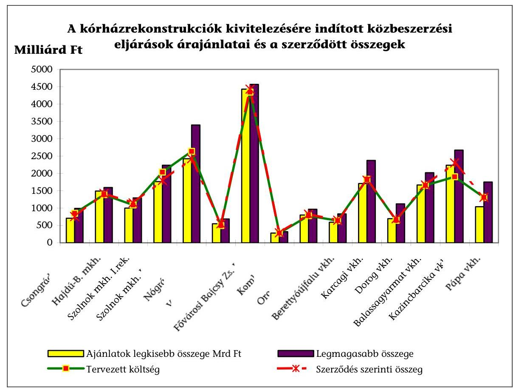

A diagram szemlélteti, hogy csupán 3 rekonstrukció esetében volt eltérés a tervezett és a szerződés szerinti költség között. Ebből kettőnél (a Szolnok és a Nógrád Megyei

---

Kórháznál) a szerződés szerinti ár a tervezett költségnél alacsonyabb volt, egy esetben (Kazincbarcika Városi Kórház) magasabb volt.

A közbeszerzési eljárás egyes szakaszaiban előírt határidőket betartották. A közbeszerzési eljárás lefolytatásának elhúzódása részben a hiánypótlások (hat esetben alkalmazták), az eljárások eredménytelensége és nem a határidők be nem tartásából adódott.

A Baranya Megyei Kórház esetében a beruházás elhúzódott, mert a „C" és „T" majd az „A" épület előminősítéses eljárása is eredménytelen volt. Az „A" épület esetében ez azt jelentette, hogy az eredetileg meghatározott építési határidő egy évet csúszott az eredeti kezdési időponthoz képest.

A Fővárosi Önkormányzat a rekonstrukció lebonyolítói feladatainak ellátására kiírt közbeszerzési eljárásban az elbírálás határidejét a Főpolgármester 30 nappal meghosszabbította a beruházás nagy összegére tekintettel a szakszerű döntés érdekében.

# 2.1.3. Az ajánlattevők kiválasztása és a szerződéskötés 

Az ellenőrzött rekonstrukciók közül négynél (elsősorban a gép-műszer beszerzésre kiírt) kilenc közbeszerzési eljárás volt eredménytelen. Az eredménytelen eljárások alapvetően az önkormányzatok korlátozott pénzügyi lehetőségeire, a nem megfelelően kidolgozott ajánlati felhívásra vezethetőek vissza.

A Szolnok Megyei Kórház rekonstrukciója keretében a 2002. évi gép-műszer beszerzéssel kapcsolatos ajánlati felhívás és az ajánlattételhez szükséges dokumentáció között a mennyiségekre, illetve a jellemzőkre vonatkozóan fennálló jelentős számú eltérések, ellentmondások miatt a kiírásra csak érvénytelen ajánlatot lehetett tenni.

A Balassagyarmati Városi Kórház gép-műszer beszerzése esetében négy termékcsoportban eredménytelen volt a közbeszerzés, egy kategóriában érvénytelennek nyilvánították a közbeszerzési eljárást.

Ha a közbeszerzési eljárásokban beérkező ajánlatok meghaladták a rendelkezésre álló forrásokat, akkor csökkentették az egyéb (pl. gép-műszer beszerzési) kereteket.

Kazincbarcikai Városi Kórház rekonstrukciójára kiírt közbeszerzés során felvetődött az eljárás eredménytelenné nyilvánításának lehetősége, mert a csökkentett műszaki tartalmat magába foglaló ajánlatok is 150-400 millió Ft-tal voltak magasabbak, mint a programban szereplő előirányzat. A döntést előkészítő bizottság megítélése szerint az új eljárás a kivitelezés megkezdését jelentősen hátráltatta volna és az infláció miatt az ajánlati ár csökkenése is kétséges volt, ezért az eljárást - csökkentve a gép-műszer beszerzési keretet - eredményesnek nyilvánították.

A helyi önkormányzatok által kiírt közbeszerzési eljárások ajánlati elemei megegyeztek a nyertes ajánlattevővel kötött szerződések tartalmi elemeivel. A közbeszerzési eljárás során - fedezet hiányában - elfogadott minőségi engedmények viszont az üzemeltetés során felmerülő meghibásodásokban játszanak szerepet, hatásuk a pótmunkák, az ajánlatban nem szereplő munkák utólagos megrendelésében is jelentkezett.

---

A bírálati szempontok között a teljesítőképességgel kapcsolatos mutatókat a vizsgált eseteknek csak felénél alakították ki. A vizsgált közbeszerzési eljárásoknál a nyertes ajánlattevőnek a szerződés teljesítéséhez szükséges alkalmassága összhangban volt a megvalósítandó feladattal.

Kivételt képez ez alól a Baranya Megyei Kórház, ahol a Közbeszerzési Bizottság a pályázatok előminősítése kapcsán egy Kft pályázatát elutasította, mert a beruházás volumenéhez képest nem volt megfelelő a gazdasági helyzete és hiányoztak a referencia munkák. Az eljárás eredménytelensége után a tárgyalásos eljárásra a Kft Rt-vé alakult, amelynek újabb pályázatát a Kórház Közbeszerzési Bizottsága nem, de a Közgyűlés Közbeszerzési Bizottsága elfogadta. A beérkezett ajánlatok értékelése során a Költségvetési és Gazdasági Bizottság javasolta az értékelő tábla megváltoztatását, mert véleménye szerint „nem a pénzügyi helyzet határozza meg az ajánlattevők sorrendjét. Indokolatlan négyes szorzóval szerepeltetni a pénzügyi helyzetet és a forgóeszköz mutató sem mond semmit. Javasolta a mutatók helyett a jegyzett tőke szerinti új sorrend kialakítását". A bizottság a véleményt elfogadta, amelynek eredményeként megváltozott az ajánlattevők sorrendje és a fenti Rt került ki nyertesként.

Garancia és pénzügyi biztosítékként jellemzően a részszámlák meghatározott százalékának nettó fedezeti visszatartását, a késedelem és a hibás teljesítés utáni kötbér mértékének megállapítását, meghiúsulás esetén fizetendő összeg kikötését, a jótállási idő meghosszabbítását, bankgarancia érvényesítését, jó-teljesítési garancia meghatározását, a vállalkozó felelősségbiztosításának kikötését alkalmazták.

Az önkormányzatok a beruházások bonyolultsága, a szakmai szervezetek által szerzett jártasság, valamint a jogorvoslatok elkerülése miatt a közbeszerzések lebonyolításába külső szakértő szervezetet is bevontak. Ennek ellenére a közbeszerzési eljárások 34%-ában indult jogorvoslati eljárás, amely az eljárások bonyolultsága miatt magasabb, mint az összes közbeszerzést érintő jogorvoslati eljárás (2003. évben a közbeszerzési eljárások 18,4%-a ellen indult hivatalból vagy kérelemre jogorvoslati eljárás az országban). A jogorvoslati eljárást három esetben a Közbeszerzési Döntőbizottság, a többi esetben a vesztes ajánlattevők kezdeményezték.

A jogorvoslati kérelmek felét (21 db) a Közbeszerzési Döntőbizottság elutasította, 16 esetben teljesen, míg egy esetben részben helyt adott a kérelmeknek, és összesen 26 millió Ft bírságot szabott ki. A jogorvoslatot kezdeményezők közül három vonta vissza keresetét az eljárás során.

A jogorvoslati eljárások okai összetettek, ezek között a belső ellentmondásokat rejtő pályázati feltételek, az ajánlatok értékelésének nem szakszerű végrehajtása, és az eljárási hibák egyaránt előfordultak.

A Békés Megyei Önkormányzatnál a központi orvosi ellátó beruházásának lebonyolítására közzétett ajánlati felhívás és az ajánlattevők által megvásárolt dokumentációban meghatározott követelmények közötti ellentmondás miatt indítottak jogorvoslati eljárást. A Közbeszerzési Döntőbizottság szerint az ajánlati felhívásban közzétett feltételeket kell teljesíteni, amelynek a kérelmező ajánlata megfelelt.

Pápa Város Önkormányzatnál két azonos pontszámú ajánlat között a bíráló bizottság szavazással döntötte el ki legyen a nyertes. Ezzel megsértették a Kbt. 59. § (1) bekezdésében foglaltakat, mert nem az ajánlati felhívásban közzétett szempontok szerint történt a kiválasztás. A Közbeszerzési Döntőbizottság a jogorvoslati kérelemnek helyt adott.

Balassagyarmat Városi Kórház esetében kifogásolták, hogy az ajánlatok értékelése során miért választották szét a fizetési határidőt és a számlázás ütemezését, amikor az szorosan összefüggő kérdés. A jogorvoslatot benyújtó szerint az ajánlatkérő megsértette a Kbt. 34.§ (2) és (3) bekezdését, illetve az ajánlati felhívásban foglaltakat, mert az ajánlati kiírásban foglalt súlyszámokat nem a résszempontok tényleges jelentőségével állította arányba.

# Az ajánlatok elbírálásánál a kidolgozott pontrendszert nem megfelelően, vagy nem azonos módon alkalmazták. 

A Szolnok Megyei Kórház rekonstrukciója során a Közbeszerzési Döntőbizottság kérelemre jogorvoslati eljárást indított az ajánlatkérővel szemben, mert a 13 értékelési szempontból 6 esetben a kérelmező ajánlata volt a jobb, míg 4 esetben a nyertes pályázóé, 3 szempont esetében pedig azonos szintűek voltak. A Közbeszerzési Döntőbizottság határozatában megállapította, hogy a jogorvoslat megalapozott volt.

Karcag Városi Kórház rekonstrukciójával kapcsolatos közbeszerzésnél a Közbeszerzési Döntőbizottság megállapítása szerint az ajánlatkérő nem volt objektív, mert az adott pontszámok közötti eltérés nem állt arányban a tartalmi elemek közötti különbséggel.

A Veszprém Megyei Kórház esetében jogorvoslatot kezdeményeztek, mert a közbeszerzési eljárás összegzése nem tartalmazta az értékelés alapját képező ajánlati adatok ismertetését és a részszempontok tartalmi elemeit. A Közbeszerzési Döntőbizottság az észrevételt megalapozottnak tartotta és bírságot szabott ki.

### 2.2. A lebonyolítást, a kivitelezést befolyásoló intézkedések

### 2.2.1. A tervezett és eredményes megvalósítás érdekében tett intézkedések

A vizsgált címzett támogatásos beruházásoknál a megvalósítás ütemeztségének szükségességét felismerték, eltérő részletességű ütemterveket alkalmaztak, amelyben elsősorban a kivitelezési folyamat határidőit, szakaszolását szerepeltették.

Az építés-szerelés mellett a gép-műszer beszerzéseket a fejlesztések 58,6%-ánál ütemezték a kivitelezés megkezdése előtt, míg az egyéb eszközöket érintően az arány ennél is lényegesen alacsonyabb, csak 34,5% volt.

Az egyes ellátó helyek, egységek ki-, át- illetve beköltöztetésének ütemezését is csak minden második fejlesztésnél igyekeztek még a kivitelezés megkezdése előtt tisztázni (egyeztetni), így az erre való felkészülés megfelelő szervezéséhez a lehetséges maximális időbeni lehetőséget biztosítani.

A kiviteli ütemezés dokumentumaiban, módszereiben többféle megoldást alkalmaztak. A szerződéshez csatoltan vagy külön kezelve összefoglaló és/vagy részütemtervek, pénzügyi-műszaki szakaszolási, organizációs, vonalas és egyéb tervek készültek - beruházói kikötések vagy kivitelezők saját módszerei szerint - már az ajánlatba építve vagy azt követően kidolgozva.

---

A megvalósítási ütemtervek a fejlesztések közel kétharmadában módosultak. Ezen belül a többször is változó ütemtervek aránya 72,2%-os, a véghatáridőt is érintőeké 61,1%-os volt. A módosítások okai között a legelső helyen a pótmunkák igénye mutatkozott (az esetek felében), a gyakoribb további - egymásra is ható - körülmények az újabb vagy elhúzódó tervezési folyamatok, tervezési problémák, kivitelezési késedelmek, kiegészítő források megszerzése voltak.

A vizsgált fejlesztések közül minden másodiknál a megvalósításhoz szükséges kiviteli tervek részben vagy egészben csak a kivitelezési folyamattal párhuzamosan készültek, amely a rendelkezésre álló rövid idő, vagy a műszaki változtatások, pótmunkák következménye volt.

# A fejlesztések egyötödében a kiviteli részlettervek nem álltak időben rendelkezésre, előfordult a beruházó felé történő írásbeli kivitelezői felszólítás is. 

A Nógrád Megyei Önkormányzat figyelmét a kivitelező levélben arra hívta fel, hogy amennyiben egy héten belül nem kapnak kiviteli tervet, a folyamatban lévő munkák tekintetében akadályozva lesznek. Kérte, hogy legalább egy szakaszos tervszolgáltatás beindulhasson.

A késedelem a
 kivitelezési folyamatok átütemezésével járt, ugyanakkor ezek a véghatáridőt vagy nem érintették, vagy pedig a befejezési határidő túllépése olyan körülmények együttes következménye volt, amelyeken belül a kiviteli tervrészlet átmeneti hiányának hatása önmagában, egyértelműen nem igazolható.

A vizsgált beruházások háromnegyedében a kivitelezéshez a munkaterületek átadása a szerződésben foglalt módon és határidőben megtörtént ${ }^{11}$. A többi esetben részleges - a kivitelezési ütemek egy-egy eleménél előforduló - késedelem történt.

A Főváros Szent Imre Kórházánál az építési ütemek közül kettőnél nem sikerült a szerződés szerinti határidőben a munkaterületek átadása a folyamatos gyógyító munka miatt. Az „A" épületbe történő átköltözések a tervezetthez képest 30 nappal később történtek meg.

A Nógrád Megyei Önkormányzat felé a kivitelező jelezte is, hogy a kórház gyermekosztályánál a munkaterületet 1998. december 12-én kellett volna megkapnia, azonban a részleges átadás csak 1999. február 22-én történt meg, a teljes munkaterülethez pedig 1999. szeptember 25-én jutott.

Berettyóújfalu Város Kórházánál a szülészet átalakítását egy ütemben tervezték, a működés fenntartása érdekében viszont négy szakaszra bontották. Így az átköltözések, területátadások részletekben történtek, a bővítéshez szükséges munkaterület viszont már kezdettől rendelkezésre állt.

A munkaterületek átadásának késedelmei a kivitelezési folyamatok belső átütemezésével jártak ugyan, de önmagukban a véghatáridőt, a szerződések alapvető teljesítését kevésbé befolyásolták.

[^0]
[^0]:    ${ }^{11}$ A 2004-ben odaítélt címzett támogatással induló beruházás Kisbéren még a közbeszerzés folyamatánál tartott a vizsgálat időszakában.

---

Átmeneti szervezési zavar minden negyedik vizsgált fejlesztésnél előfordult. Ezek jellemzően a munkaterület átadások, az ellátó helyek ki-, át- és visszaköltöztetése, a közműkapcsolatok biztosítása, a tervezés és kivitelezés összehangolása, az érintettek hatékony együttműködésének megszervezése terén mutatkoztak.

A megbízók a lebonyolítók munkáját a vizsgált beruházások 27,6\%-ában értékelték, ezekhez konkrét beszámolókat, gyűjtött információkat, vagy szóbeli tájékoztatókat kértek. Egy esetben született a lebonyolítási feladat további ellátását alapvetően meghatározó testületi döntés.

A Tolna Megyei Önkormányzat 1998 októberében visszavonta a lebonyolításra vonatkozó megbízást a kórházától, mert az új műtő- és diagnosztikai tömbjének építési, megvalósítási problémáit, bizonytalanságait nem tudta megfelelően kezelni. Ezt követően a műszaki ellenőrzésre és egyéb szervezési feladatokra vállalkozással kötöttek szerződést, de a beruházás befejezése ezzel együtt sem volt biztosítható.

A lebonyolításért fizetett díj maximum 75 millió Ft volt. Összegét elsősorban a beruházási összköltség befolyásolta, ugyanakkor a díjtételben is többszörös különbségek mutatkoztak.
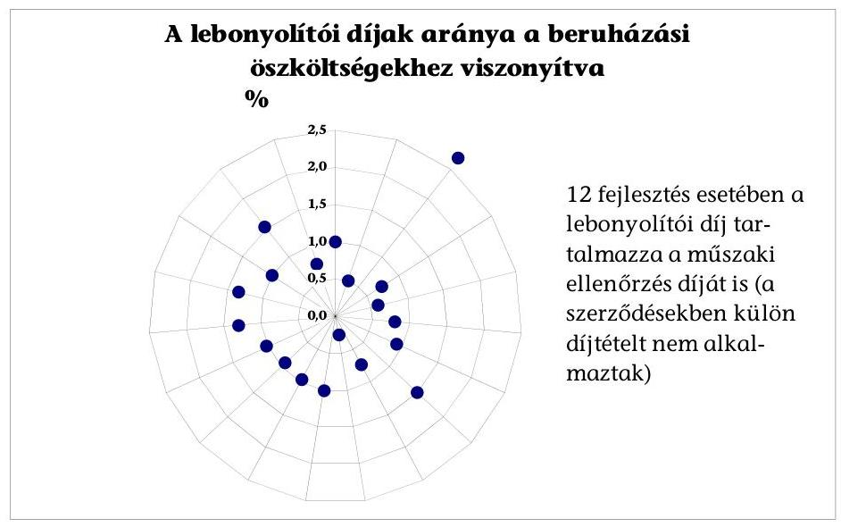

A lebonyolítói díjak mértékére a beruházási összköltséghez viszonyított 1\%-os vagy azon belüli arány volt a jellemző, de a vizsgált fejlesztések 17,2\%-ánál ezt meghaladó díjtételt alkalmaztak.

A legmagasabb díjtétel a Békés Megyei Kórháznál 1999-2001. évek között folyó fejlesztésnél mutatkozott; 48,6 millió Ft-ot fizettek a közbeszerzési és megvalósítási folyamat lebonyolítására, a műszaki ellenőrzésre és egyéb szervezési feladatokra az 1570 millió Ft összköltségből.

Az 1\%-nál magasabb lebonyolítói díjtételű további beruházások közül egynél a műszaki ellenőrzés nem volt része a lebonyolításnak. Balassagyarmaton a kórházrekonstrukciónál a beruházási összköltséghez viszonyítva 1,5\%-os lebonyolítási díj merült fel, a műszaki ellenőrzésre történő kifizetés ezen felül az érintett munkák tervezett összköltségének 1,05\%-a volt.

---

A vizsgált beruházások egyharmadában külön szerződések születtek a műszaki ellenőrzésre, egyéb esetekben ezt a lebonyolító végezte ${ }^{12}$. E feladat ellátásáért fizetett díj maximum 45,6 millió Ft volt. A kizárólag műszaki ellenőrzésre szóló külső megbízásokból hatnál a díjtétel 1\% alatti, a többinél azt elérő vagy alig meghaladó arányú volt az érintett költségekhez viszonyítva.

A műszaki ellenőrzést az építési naplók bejegyzései, műszaki ütemek átvételi jegyzőkönyvei, a számlák felülvizsgálati rájegyzései igazolták. Egy esetben - a Tolna Megyei Kórháznál - kerültek megállapításra a korábbi számvevőszéki vizsgálatokra hivatkozva a teljesség, megalapozottság tekintetében műszaki ellenőrzési hiányosságok.

A műszaki ellenőrzések által feltárt hiányosságok az érintett fejlesztések 82,1\%-ában mutatkoztak a különböző dokumentumok párhuzamos tanúságai szerint.
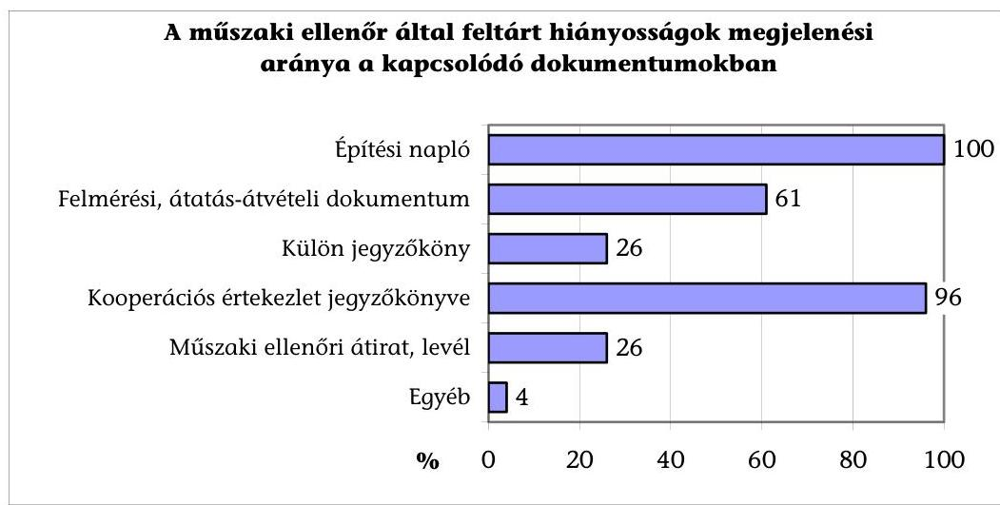

A műszaki ellenőr által dokumentált hiányosságok felszámolására az adott beruházások egyharmadában nem működött olyan monitoring rendszer, amely a hiányosságok pótlását utólag is követhető módon visszaigazolta volna. Ezeknél a probléma megoldására csak abból lehetett következtetni, hogy nem történtek újabb hasonló bejegyzések az építési naplókba. A hiányosságok pótlásának elmaradása is megállapítható volt a dokumentumokból.

A Nógrád Megyei Kórház gyermekosztályának rekonstrukciójánál a műszaki ellenőr az 1999. november 30-i teljesítési határidő betartását nem látta biztosítottnak, azt kritikusnak ítélte meg, majd minden ellenőrzésekor különös figyelmet fektetett a kivitelezési ütem vizsgálatára. Naplóbejegyzései igazolták, hogy a munkavégzés nem gyorsult, a dolgozói létszám nem bővült számottevően, a többműszakos munkarendet a kivitelező nem vezette be.

[^0]
[^0]:    ${ }^{12}$ Ide értve a külső lebonyolító vállalkozások mellett a saját szervezettel (önkormányzati hivatal, kórház) történő feladatellátást is.

---

A kivitelezés során beépített egyes anyagok, szerkezetek, berendezések megfelelőségi igazolásainak, a jótállásoknak az 5 éven belüli hozzáférhető kezelését, megőrzését a vizsgált beruházásoknál biztosították ${ }^{13}$.

# 2.2.2. A tervszerű, szabályos és eredményes megvalósítást célzó kontrollrendszer 

A vizsgált fejlesztési folyamatok korszerű monitoring rendszerének kiépítése és működtetése hiányos volt. Az adatok és információk (ütemesség, minőség, költségszint, műszaki tartalom) gyűjtésének, feldolgozásának, viszonyítási alapjainak, kiértékelésének, a dokumentálási, visszacsatolási, döntéshozatali eljárásoknak mindenhol működtek ugyan részelemei, de ezek összefüggő, hiánymentes rendszere egyetlen helyen sem volt megállapítható.

A vizsgált fejlesztések tervszerű, szabályos és eredményes megvalósítását célzó legalapvetőbb működő kontrollok a következők voltak:

- a többszereplős szervezési, építési és beszerzési folyamatokban a felek közti folyamatos koordináció, a dokumentált kooperációs értekezletek szükségszerű és szokásos megoldásként jelentkeztek ${ }^{14}$;
- a jogszabályi követelmények alapján biztosították a műszaki ellenőrzést, továbbá a teljesítésigazolást, az érvényesítést, az utalványozást és ellenjegyzést magában foglaló pénzügyi szabályszerűségi kontrollfolyamatot;
- kincstári ellenőrzés mellett végezték a központi támogatás lehívását, az elszámolási kötelezettségek teljesítését.

Az önkormányzatok - külső szakértők megbízása esetén is - külön önkormányzati illetve intézményi dolgozókat jelöltek ki az építtetői érdekek érvényesítéséhez. A formailag mindenütt nyomon követhető kontrollelemeket kiegészítették az önkormányzatonként rendkívül eltérő mélységű és gyakoriságú képviselő-testület vagy bizottság előtti beszámoltatások. A beruházási kiadások az évközi és év végi költségvetési beszámolásokban megjelentek, viszont a fejlesztés folyamatának egyéb vonatkozásairól szóló tájékoztatót a vizsgált önkormányzatoknak csak háromnegyede (külön napirendben fele) követelt meg.

A fejlesztésekről szóló tájékoztatók kétharmada a bizottságok, egyharmada a testületek napirendjén szerepelt. Ugyancsak egyharmad azon beruházások aránya, ahol a költségvetési beszámolásokon kívül a tájékozódás bizottsági szinten maradt. Négy önkormányzat (megyei önkormányzatok közül Baranya, Nógrád, Tolna; a városi önkormányzatok közül Karcag) testülete illetve bizottságai kiugróan magas, 20 vagy ezt meghaladó esetben, külön napirendben tárgyaltak beruházásaikról.

[^0]
[^0]:    ${ }^{13}$ A Tolna Megyei Kórháznál az 1994. évi indításból eredő sajátosságok, illetve Kisbéren a 2004. évtől támogatott kórházépítés miatt érdemben e kérdéskör nem volt vizsgálható.
    ${ }^{14}$ Kivételt jelent a Tolna Megyei Önkormányzat kórháza új műtőblokkjának tíz éve elindított, de máig befejezetlen beruházása, ahol a felek együttműködése, a koordináció a felmerült problémák miatt nem volt folyamatos.

---

A fejlesztések egynegyedében a képviselő-testületek határozatán alapuló beavatkozások is történtek a beruházás folyamatába a kivitelezési szakaszban. Ezek egy esetet kivéve a cél elérése tekintetében alapvetően eredményesek voltak.

A Tolna Megyei Önkormányzat kórháza új műtőblokkjának megvalósítása során különböző intézkedések, így pl. szakértői vizsgálat elrendelése, szerződésmódosítások történtek, amelyek a kívánt eredményt összességében mégsem érték el, a beruházás 1994-ben indult, de máig befejezetlen.

Az önkormányzatoknál jelentőségében és kiadási nagyságrendjében is kimagasló címzett támogatásos egészségügyi fejlesztéseket az önkormányzati belső ellenőrzés ${ }^{15}$ keretében nem vizsgálták. Mindössze a vizsgált önkormányzatok egytizedénél volt része a belső ellenőri tervnek a beruházás szabályszerűségi vizsgálata az 1996-2004. évek közti időszakban. E témában négy önkormányzatnál (a Fővárosnál a Szent Imre Kórház rekonstrukciójával kapcsolatban, a Baranya Megyei Önkormányzat, Orosháza és Dorog városok érintett beruházásainál) együtt 5 db ellenőri jelentés vagy részjelentés készült, amelyből mindössze kettő rögzített problémát, egy tett érdemi javaslatot is.

# 2.2.3. A kivitelezéssel összefüggő intézkedések és végrehajtásuk 

A vizsgált 29 rekonstrukció kivitelezésére, megvalósítására közvetlenül 255 szerződés ${ }^{16}$ irányult, amely széles szóródás mellett átlagosan 9 darabot - ezen belül a befejezett beruházások esetében 11-et - jelentett.

A vizsgált fejlesztések felénél a szerződések száma 5 db alatt maradt, egynegyedénél 5-10 db közötti, míg egyötödénél ennél is magasabb darabszámú volt.

Kiugróan magas volt a szerződések száma a Balassagyarmati Kórház rekonstrukciójánál (két címzett támogatás is kapcsolódik hozzá) a kivitelezéshez 38 vállalkozással összesen 65 db szerződést kötöttek.

A szerződésmódosítások a beruházási folyamatok elmaradhatatlan elemeiként jelentek meg, átlagosan minden második szerződést menet közben módosították. Egyetlen kivétellel minden befejezett beruházás esetében sor került legkevesebb egy megállapodás egy vagy többszöri korrekciójára. A 19 db befejezett fejlesztésnél a kiviteli tervek készítésére kötött eredeti megállapodásokhoz viszonyított 44,0\%-os szerződésmódosítási arány önmagában is magas. A változtatás mértéke a fővállalkozói, generálkivitelezői szerződéseknél még ezt is többszörösen meghaladta, 177,3\%-os volt.

A befejezett fejlesztések körében az egy-egy szerződést érintő módosítás a 0 és 8 db között szóródott. Az alsó szélső érték a Hajdú-Bihar Megyei Kórház, a felső Balassagyarmat Városi Kórház és a Nógrád Megyei Kórház rekonstrukcióinál mutatkozott.

[^0]
[^0]:    ${ }^{15}$ Korábban: függetlenített belső ellenőrzés.
    ${ }^{16}$ Ide értve a következő szerződéseket: kiviteli tervek készítésére /12,5\%, a tervezői művezetésre /5,9\%, a kivitelezésre, beszerzésre (megvalósításra) /81,6\%.

---

A Tolna Megyei Kórház új műtő- és diagnosztikai tömb építése 1994-ben indult, de máig befejezetlen, miközben a fővállalkozói szerződést már 15 esetben módosították.

A befejezett fejlesztéseknél a szerződésmódosítások közel kétharmada a pótmunkák miatt történt. A korábbi elképzelések korrekciója - az egyértelmű vis maior eseteket (13,3\%) kivéve - mindig előkészítési problémákra is utalt, a szakmai célok változtatása együtt járt a műszaki tartalom valamilyen mértékű módosulásával. Ez utóbbi körülmények magas aránya jelzi, hogy a kivitelezés folyamatában a címzett támogatások igénybejelentésében rögzített elképzelések, tervek nem jelentek meg okvetlenül betartandó kritériumként is.

A megállapodások felülvizsgálatát és korrekcióját előidéző alapvető körülményeket mutatja be a következő diagram:
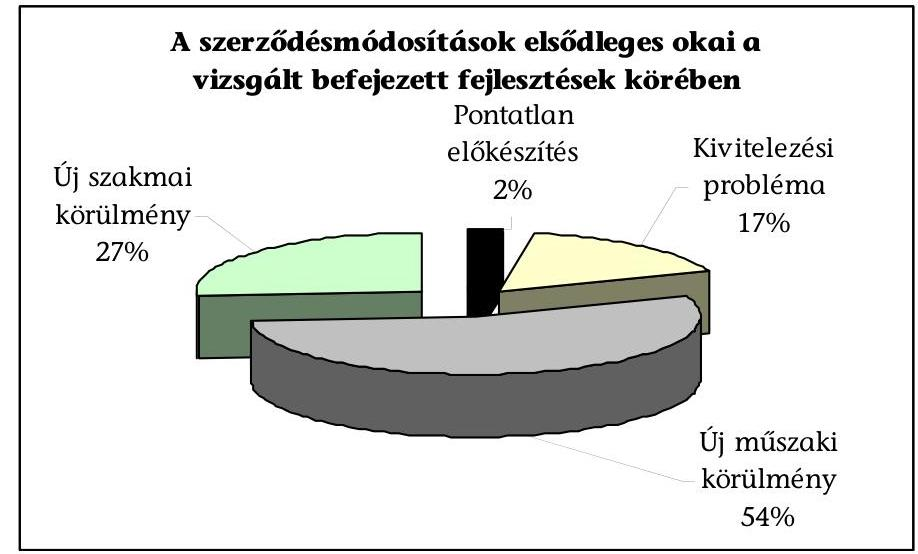

A szerződésmódosításokban megjelenő műszaki változtatások nem irányultak a minőségi elvárások csökkentésére. A műszaki tartalom mérséklése esetén is az alapvető minőségi, szakmai - benne a helyi igény mellett az egészségügyi szolgáltatások nyújtásához szükséges szakmai minimumfeltétel - követelményeknek való megfelelés érvényesült.

Az eredeti szerződés szerinti teljesítési határidő a fejlesztések 58\%-ában nem volt tartható. E fejlesztéseknél átlagosan 254 nap abszolút eltérés jelentkezett, ezen belül egyetlen esetben (Pápa Városi Kórház rekonstrukciója) az átadás 32 nappal megelőzte a szerződés szerinti teljesítési határidőt. A határidőcsúszás a módosított szerződésekhez képest is fennmaradt a vizsgált befejezett fejlesztések 26,3\%-ában, átlagosan 105 nap abszolút eltéréssel.

A támogatás elnyerésekor megcélzott ütemezéstől és határidőtől minden harmadik, a műszaki tartalomtól minden második fejlesztés eltért. Utóbbin belül az érintett hasznos területek nagysága a fejlesztések 31,6\%-ánál, a gép műszerek mennyisége 36,8\%-nál változott. A kedvező irányú változtatások (pl. szakmai minimumfeltételek változásához igazítás) mellett megmutatkoztak a szakmai elképzelések menetközi megváltoztatásának hatásai is.

---

Pápa Városi Kórháznál
 a nőgyógyászati részleg helyett urológiai osztály került kialakításra az új épületben, eltérő építészeti és gép-műszer igénynyel. A Baranya Megyei Kórház „T" épületénél az V. szint és a tetőtér beépítése is szükségessé vált, amikor a sebészeti hotelrészleg kialakítása helyett az épületbe a szülészet-nőgyógyászat került. A Szabolcs-Szatmár-Bereg Megyei Önkormányzat Fehérgyarmati Kórháza telephelyeinek egyes épületei között átrendezték a rekonstrukciós feladatokat.

Balassagyarmat Város Kórházánál az igazgatási épületnek is megtörtént a szerkezetkész felújítása, ugyanakkor nem épült meg a 3/a jelű épület, így a szülészet-nőgyógyászat a meglevő épületében maradt, a Tüdőgyógyintézet betelepítése nem történt meg.

Ugyan az orvos-technológia, a gép-műszer állomány a befejezett fejlesztések egyharmadánál elmaradt a támogatási pályázatokban rögzített tartalomtól, azt részben vagy egészben sikerült pótolni. Erre elsődlegesen egyéb központi források elnyerésével, a kapcsolódó önkormányzati forrással, intézményt terhelő megoldásokkal nyílt mód.

A költségszint mutatta a leggyakoribb eltérést (63,2\%-os) a támogatások elnyerésekor megcélzotthoz képest. A pénzügyi tervszámokat az ajánlati felhívásokban és a szerződésekben igyekeztek pontosítani a beruházók, összességében költségszint emelkedés mutatkozott.
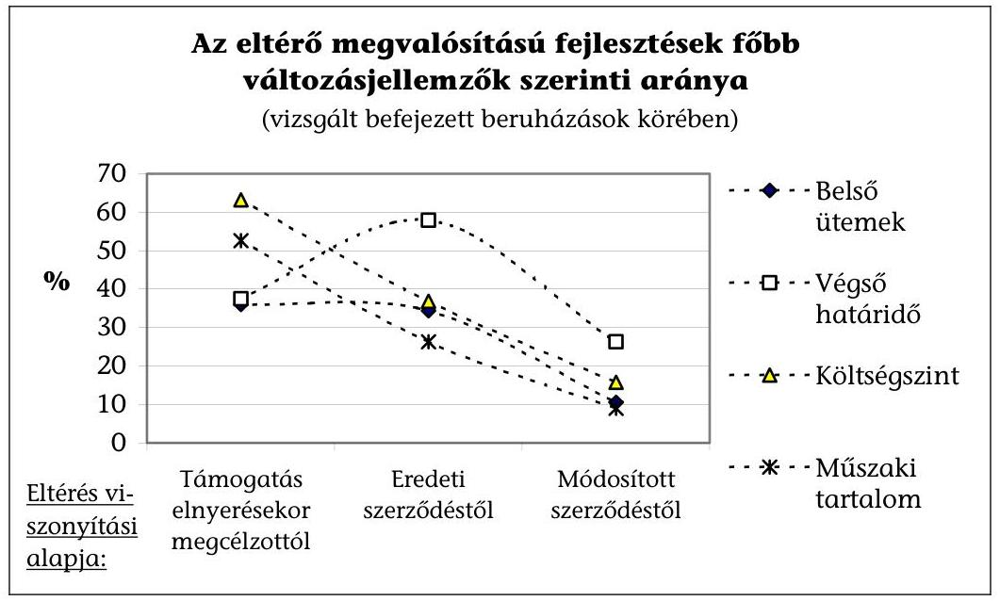

A szerződésmódosítások felmérése és elemzése azt mutatta, hogy az elsődleges ok mellett több körülmény együtt jelentkezett. A fejlesztések közel kétharmadát érintő és lényegében a költségigényt is befolyásoló műszaki tartalmi változtatások főbb okai a következők voltak:

- a műszaki célkitűzések, megállapodások igazítása a szakmai funkciók menet közben történő változásához;
- az építészeten kívüli területek visszafogása az építési többletköltségek fedezetének biztosíthatósága érdekében azon esetekben, ahol a központi forrás további kiegészítésére nem került sor;

---

- az egészségügyi szolgáltatások nyújtásához szükséges - menetközben változó szakmai minimumfeltételekhez való igazodás.

A közbenső intézkedések, szerződésmódosítások legalapvetőbb hatásait a megállapodásokra és ezzel a megvalósításokra a következő diagram szemlélteti:
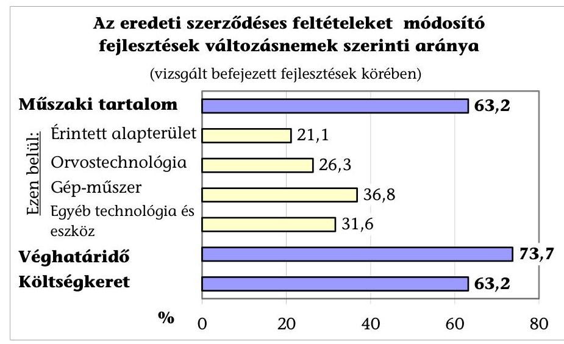

A kivitelezési folyamatok velejárója volt a szerződéses teljesítésnél mutatkozó elmaradás, minőségi kifogás. Mindössze a vizsgált befejezett fejlesztések egytizedénél nem mutatkozott semmilyen vonatkozó probléma. Sikerült elérni a műszaki ellenőrzéssel és egyéb eszközökkel a problémás esetek 65\%-ában még a teljesítési véghatáridő előtt, a további esetekben pedig azt követően a hiányosságok pótlását. Az egyéb eszközök között elsősorban az átmeneti díjvisszatartás, a díjcsökkentés fedezetéből vagy saját forrásból egyéb kivitelező vállalkozás bevonásával történő megoldás, a peres eljárás kezdeményezése szerepelt.

A kivitelezői szerződések teljesítésével kapcsolatos peres eljárást négy önkormányzat kezdeményezett, ezeknek fele nem eredményezett kedvező megoldást.

Peres eljárást indított a megrendelő Szeged Város Önkormányzata a kivitelezővel szemben késedelmi kötbér mértékéről. A bíróság másodfokú ítélete a kivitelezőnek adott igazat abban, hogy a határidő csúszása neki nem róható fel.

Karcag Város Önkormányzata a mosodarekonstrukció keretében beszerzett, majd javítás ellenére üzemképtelenné vált mosógépek miatt hibás teljesítésre hivatkozva indított per folyamatban van.

# 2.2.4. A rendelkezésre álló források felhasználása 

Az alapvetően központi forrásokat felhasználó és ezzel a saját vagyon gyarapodását elérő önkormányzatokat nem terheli a gazdaságosság és eredményesség igazolásának egyértelmű, utólagos kötelezettsége. Az igénylési illetve elszámolási dokumentumokban a pénzforgalmi illetve naturális terv majd tény szintű adatok részletezettsége az egészségügyi fejlesztések között nem egységes, a szabályszerűségen, utalási adategyezőségeken túllépő konkrét folyamatkontrollok, teljesítményvizsgá-

---

lati elemek (összehasonlítást, elemzést támogató mutatók) pedig nem épültek a rendszerbe.

A helyszíni vizsgálat során a Kincstár felé történő elszámolás információi mellett kiegészítő adatokat kértünk be és ezeket feldolgoztuk, elemeztük a vizsgált befejezett fejlesztésekre vonatkozó következtetések levonása érdekében. A megvalósult beruházások együttes 39,1 milliárd Ft-os tényleges összköltsége 16,6\%-kal lett magasabb az eredeti támogatási feltételekhez és 7,7\%-kal a kiegészítő címzett támogatásokkal növelt ${ }^{17}$ tervadathoz viszonyítva.

Az érintett fejlesztések felénél a tervezett (ide értve a kiegészítés miatti korrekciót) és tényleges összköltség eltérése egy százalékon belüli volt. Ugyanakkor minden ötödik esetben 5\%-nál is magasabb mértékű többletköltség mutatkozott, a Fővárosi Szent Imre Kórház rekonstrukciója 36\%-kal került többe, mint azt tervezték.

Mindez azzal is járt, hogy az önkormányzatoknak együtt - a 0,4\%-os egyéb támogatás bevonása mellett - saját forrásból magasabb költséghányadot kellett biztosítani az előirányzotthoz képest. Három fejlesztésnél (15,8\%) az önkormányzat a saját forrás többszörözésével biztosította a finanszírozást.

A Fővárosi Szent Imre Kórház rekonstrukciójához 1993 millió Ft-tal (117,4\%-kal), Szeged Megyei Jogú Város Önkormányzata az egészségügyi fejlesztéséhez 321 millió Ft-tal (94,2\%-kal), Pápa Város Önkormányzata 98 millió Ft-tal (195,7\%-kal) több saját forrást biztosított a tervezetthez képest.

A költségnövekedést okozó legjelentősebb körülmények előfordulási arányát a következő diagram szemlélteti:
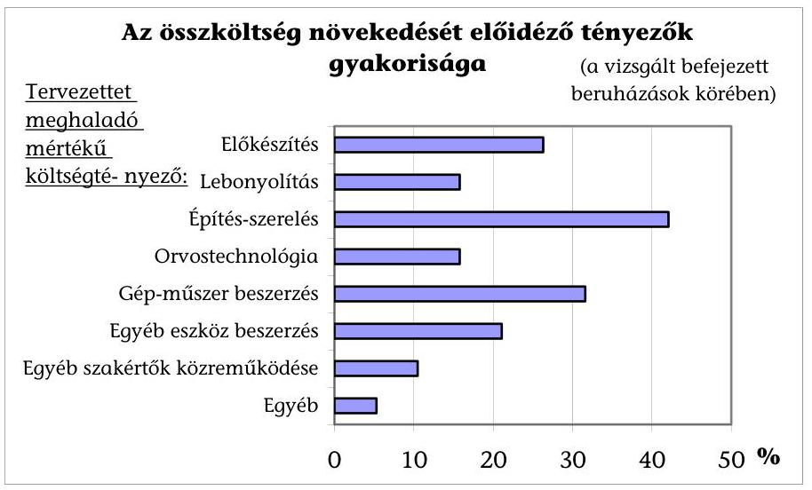

Az egyes fejlesztéseknél több tényező együttes hatása, és a legcélszerűbb megoldás reményében vállalt módosítások (többletforrás igény kielégítése, pontosított prioritások) együttes eredője alakította az összköltségeket.

[^0]
[^0]:    ${ }^{17}$ A már befejezett 19 fejlesztésből nyolcnál együtt 2297 millió Ft volt a kiegészítésként kapott címzett támogatás (emellett a Tolna Megyei Önkormányzat máig befejezetlen beruházásához további 2478 millió Ft kiegészítés kapcsolódott).

---

A beruházók a kiegészítő címzett támogatás elérése vagy a többletköltség saját forrásának megteremtése mellett - a nem elégséges központi támogatásra, a műszaki szükségességre, a változó igényekre hivatkozva - a finanszírozhatóság fenntartására további módszert is kerestek. A módosított műszaki tartalom megvalósítása érdekében a tervezett összköltségen belüli arányokat is megváltoztatták. Az építési szerelési költségkeret növeléséhez minden második befejezett fejlesztésnél a gép-műszer vagy az egyéb eszköz beszerzésre szánt keretet lecsökkentették.

Az Orosháza Városi Önkormányzat az építési-felújítási tervén korrigálva az építési költséget másfélszeresére növelte, a gép-műszer beszerzési költséget felére csökkentette az eredeti elképzeléséhez képest. A Veszprém Megyei Önkormányzat a kórházrekonstrukció során az „A" épületben nem alakította ki a stroke centrumot, az ehhez és az SBO-hoz tervezett gép-műszer beszerzéseket elhagyta. Szeged Megyei Jogú Város egészségügyi beruházásánál a rendelőintézeti bútorbeszerzésekről mondtak le a behatárolt anyagi lehetőségekre hivatkozva. A Nógrád Megyei Kórház rekonstrukciójánál elhagyott felújítási hányad és új bővítmény növelése együtt jelentkezett, az igénybejelentés szerinti 468 db gép-műszerrel szemben csak 380 db gép-műszer, medikai mobilia beszerzésére nyílt mód.

A vizsgált befejezett beruházásoknál a bruttó összköltség - eltérő anyagi-műszaki összetétel mellett - négyzetméterenként 81-412 E Ft, ezen belül az építési-szerelési költség 68-335 E Ft között szóródott. Az összköltség és a fajlagos költség teljesítési százaléka alapján számított tervteljesítési mutatók eltérése jelzi, hogy az érintett fejlesztések egyharmadánál a négyzetméterben mérhető naturális adatokban számottevő változások történtek a beruházási folyamatokban.

A változásmutatók legnagyobb különbsége az Orosházi Városi Kórház rekonstrukciójánál mutatkozott. Elsősorban annak a következményeként, hogy a tervezetthez (kiegészítő címzett támogatással együtt) képest közel hasonló összköltség mellett az eredeti elképzelést mintegy 2,5-szeresen meghaladó alapterületű felújítás történt.

# 3. A REKONSTRUKCIÓ KÓRHÁZAK MŰKÖDÉSÉRE GYAKOROLT HATÁSA 

### 3.1. A rekonstrukciók szakmai célkitűzéseinek megvalósulása

A rekonstrukciók eredményeként javultak az egészségügyi ellátás korszerűbb körülmények között, magasabb színvonalon történő végzésének építészeti, infrastrukturális és orvos-technológiai feltételei. Az elmaradt munkák miatt azonban a kórházak korszerűsítésének és modernizációjának csupán egy részét oldották meg. A címzett támogatások a korábban megkezdett rekonstrukciók folytatásaként, vagy a rekonstrukciós folyamat kezdeteként egy-egy kisebb vagy nagyobb részfeladat megvalósítását szolgálták.

A rekonstrukciókkal szemben alapvető követelményként fogalmazódott meg, hogy biztosítsák a minimumfeltételekben meghatározott szinten az intézmények működtetésének tárgyi feltételeit, illetve műszaki körülményeit. Lehetőséget nyújtsanak a szakmai tevékenység fejlesztésére, modernizációjára, az ágazati célkitűzések megvalósítására, valamint a szolgáltatásoknak a valós szükségletekhez történő igazítására, a struktúra átalakítására.

---

A korábbi években elmaradt felújítások olyan forrásigényt támasztottak, amelyhez a rendelkezésre álló előirányzatok nem biztosítottak fedezetet. Az eredeti beruházási elképzeléseket nem lehetett teljes körűen megvalósítani, végeredményben a jóváhagyott összeghez kellett igazodni, és ez szabta meg a rekonstrukció szakmai tartalmát.

A Veszprém Megyei Önkormányzat 1998. évtől tervezte az 1995. évben befejezett rekonstrukciós ütem folytatását, amellyel kapcsolatban a szakmai programot mindig az aktuális pénzügyi lehetőségek függvényében változtatták. A címzett támogatásból finanszírozott fejlesztés a tervezettnél szűkebb tartalommal és kevesebb költséggel valósult meg.

Balassagyarmat Városi Kórházban az elkészített és elfogadott szakmai program forráshiány miatt csak két ütemben valósulhat meg. Az első ütem épületbővítése többletköltséget jelentett a kórháznak, a második ütemre maradt korszerűsítést követően már a teljesítmények növekedtek.

A rekonstrukciók eredményeként az érintett kórházakban az egészségügyi ellátás tárgyi, építészeti feltételei javultak. A rekonstrukciók jóváhagyott szakmai programjának megvalósítását az egyes célkitűzések vonatkozásában a következők jellemezték:
A) A sürgősségi betegellátás feltételeinek biztosítása

A sürgősségi betegellátás kiépítése az ágazati politika kiemelt célkitűzése volt, amelynek segítségével az egészségügyi szolgáltatásokhoz való igazságosabb és kiegyenlítettebb hozzáférés valósulhat meg.

A sürgősségi betegellátás igénye akkor merül fel, ha az ellátás elmaradása maradandó egészségkárosodást, súlyos állapotromlást vagy súlyos és tartós fájdalmat eredményezne. Az ellátás ennek következtében az életveszély elhárítására az állapot stabilizálására és a kínzó fájdalom megszüntetésére koncentrálódik. A sürgősségi ellátás lényege, hogy a beteg előzetes bejelentés nélkül mindig ugyanazon a helyen az év minden napján, 24 órán keresztül részesülhet ellátásban, ha állapota megkívánja.

A rendszer négy szintre épül, ahol minden szintnek alkalmasnak kell lennie az alatta található feladatok ellátására is. A legalsó szintet a doktorinfo vonal jelenti, amely a megfelelő helyre irányítja a beteget. A második szint az alapellátási ügyelet, ahol az ellátottak száma, a hely és a rendelkezésre álló idő alapján kell kialakítani a sürgősségi ellátás helyszínét. A következő szinten a kórházak sürgősségi betegellátó osztályai állnak, amelyek a beteget, állapotának stabilizálódása után, rögtön tovább tudják küldeni a megfelelő kórházi osztályra. A legfelső szinten a regionális sürgősségi centrumok találhatók, ezek 24 órában egy-egy speciális betegség (pl. égési sérülések) ellátását biztosítják.

Hét kórház rekonstrukciójához kapcsolódóan a sürgősségi betegellátó helyek létrehozásával lehetővé vált a betegek gyorsabb, biztonságosabb fogadása az Orosházi, a Karcagi, a Veszprémi, a Salgótarjáni, a Gyulai, a Szentesi Kórházban valamint a Szent Imre kórházban.

A sürgősségi betegellátás szakmai kritériumainak kidolgozására és jogszabályban való rögzítésére csak 2004. év májusában került sor, holott a sürgősségi ellátás a szakmai prioritások között már 1995. évben megjelent, a szakmai minimumfeltételeket 2000. év októberében tették közzé.

---

B) A műtéti feltételek korszerűsítése

A rekonstrukciók keretében 11 kórházban az elavult, korszerűtlen műtők helyett új műtőblokk megépítésére került sor, vagy a meglévő műtők rekonstrukciója, bővítése valósult meg. Ez 4,1 milliárd Ft építési-szerelési, valamint 2 milliárd Ft gép-műszer beszerzést igényelt, amely összességében a befejezett beruházások kiadásainak 15,6\%-át tette ki (6. sz. melléklet). Ennek eredményeként a műtőasztalok száma 20\%-kal gyarapodott, a műtétszám 12,5\%-kal, a műtéti órák száma 13,7\%-kal nőtt.

Központi műtőblokk létrehozásának eredményeként az erőforrásokkal való gazdálkodás feltételei javultak, a korszerűen felszerelt műtőben biztonságos körülmények között végezhették a beavatkozásokat. A tárgyi feltételek javulásával csökkentek a nosocomiális fertőzések, nőtt az ellátási és ápolási hatékonyság és ezen keresztül az ellátás színvonala is emelkedett.

Jelentősen korszerűsödtek a műtéti feltételek a Baranya, a Győr-Moson-Sopron, a Jász-Nagykun-Szolnok, a Szabolcs-Szatmár-Bereg Megyei Kórházban, a Szegedi, a Karcagi, a Balassagyarmati, a Pápai, a Kisvárdai Városi Kórházban, valamint a Fővárosi Szent Imre kórházban. A Baranya Megyei Kórházban azonban altatóorvos hiány miatt a műtőket nem tudták teljes mértékben kihasználni.

A Jász-Nagykun-Szolnok Megyei Kórházban a központi műtő modern építészeti,
 épületgépészeti megoldásokkal és korszerű orvos-technikai berendezésekkel öt műtétes szakmát szolgál. Minden műtőhöz külön előkészítő tartozik monitorizálási lehetőséggel, a műtőket egy közös ébredő szolgálja ki, így a kieső idők minimalizálásával a központi műtő hatékonysága növelhető volt. A műtőasztalok univerzális kialakítása is hozzájárult a hatékonyság növekedéséhez, hiszen így a kapacitások az aktuális igényeket is tudják szolgálni. Az építészeti és épületgépészeti megoldásoknak (zsiliprendszer, kiszolgáló folyosó, központi klíma) köszönhetően a műtétet követő fertőzéses szövődmények száma lecsökkent. A modern altatógépek, monitorok, infúziós pumpák használata nagyobb betegbiztonságot jelent, és teret nyitott modernebb altatási eljárások bevezetésének.

Egy műtőasztalon a korszerűsítést megelőzően átlagosan 1021, azt követően pedig 957 műtétet végeztek. Egy műtét átlagos ideje 1,21 óráról 1,24 órára emelkedett. A műtők leterheltsége (évi 200 műtéti nappal számolva műtőasztalonként napi öt műtét több mint 6 órás időtartalommal) érdemben nem változott.

A műtők kihasználtságának vizsgálata alapján a bővítések szakmai megalapozottsága és hatékonysága nem volt teljes körű.

A műtőasztalok számának növelése mellett az átlagnál hosszabb műtéti idő szükséglettel, több műtétet végeztek a Szabolcs Megyei Kórházban (1,62 óra/műtét, 1262 műtét), míg a Kisvárdai Városi Kórházban ez az érték közel egyharmaddal alacsonyabb (0,55 óra/műtét és 330 műtét). Az adatok a fejlesztés alacsony kihasználtságáról árulkodnak a Karcagi, Balassagyarmati Városi Kórházban. A Nógrád Megyei Kórházban a műtőasztalok száma az 1998. évi nyolc darabról 2003. évben tíz darabra emelkedett, azonban a műtétek száma nem érte el a korábbi mértéket.

A műtők egy központi épületben való elhelyezése üzemeltetési költségcsökkentést eredményezett, azonban a klímák energiaigénye és a korszerű berendezések karbantartása többletköltséggel járt.

---

C) A tárgyi minimumfeltételek biztosítása

A rekonstrukciók kapcsán kiemelt figyelmet fordítottak a tárgyi, építészeti feltételek megteremtésére. A gép-műszer minimumfeltételek biztosításának gátat szabtak a pénzügyi keretek. A beruházók az építés-szereléssel összefüggő kiadások többletforrás igényét kényszerűségből a gép-műszer keretük terhére biztosították, bízva abban, hogy a beszerzésekhez szükséges összeg céltámogatásból vagy egyéb más forrásból a későbbiekben majd a rendelkezésre fog állni.

Az Orosházai Városi Kórházban a pénzeszközök elégtelensége miatt a szakmai minimumfeltételeknek csak építészeti szempontból tudott megfelelni a rekonstrukció lezárásáig. Az ezt követő években céltámogatásból és egyéb forrásokból pótolták a hiányokat.

A Szabolcs Megyei Önkormányzat Fehérgyarmati Kórházában, a Karcagi, a Kisvárdai Városi Kórházban a tárgyi feltételeket ugyan megteremtették, de a kórház működési engedélyét - a személyi feltételek hiánya miatt - csak határozott időre adta meg az ÁNTSZ.
D) A diagnosztikai háttér korszerűsítése

A kórház működésének és a betegellátás színvonalának további emelését tette lehetővé a diagnosztika korszerűsítése. A beszerzett új eszközök a gyorsabb és pontosabb diagnózis felállítását alapozták meg, amellyel a szakmai tevékenység hatékonysága nőtt. A diagnosztikai háttér javítására 4,2 milliárd Ft-ot fordítottak, amely az összes rekonstrukciós ráfordítások 11%-ának felel meg.

A diagnosztika műszerigényessége miatt a gép-műszer beszerzés 17%-a ezt a területet szolgálta. A gép-műszerpark ez irányú fejlesztése csaknem valamennyi intézménynél érzékelhető. Egyes szakterületeken a legújabb, nagyértékű diagnosztikai eszközök (MRI, CT, izotópdiagnosztika) alkalmazására is lehetőség nyílt.

A diagnosztikai szakterület fejlesztésének is köszönhető az ápolás átlagos időtartamának folyamatos csökkenése. A cserepótlások és a fejlesztések eredményeként létrejött diagnosztikai többletkapacitások kihasználtságát jelzi, hogy járóbeteg-szakellátásban elszámolt diagnosztikai beavatkozások volumene 1996. évhez mérten 2004. évre 62%-kal nőtt, miközben a beavatkozások átlag pontértéke is több mint a kétszeresére emelkedett.

A Kisvárdai Városi Kórházban a gép-műszerpark fejlesztése észrevehető minőségi változást eredményezett. A beruházás orvosi gép-műszer hatása a legmarkánsabban a laboratóriumnál jelentkezett, ahol a kor technikai szintjének megfelelő automata beüzemelésével bővült a vizsgálatok köre.

A Csongrád Megyei Önkormányzat Szentesi Kórházában a diagnosztika új épületben történő elhelyezésével valamint a gép-műszerpark korszerűsítésével megteremtették az alapokat a szakmai tevékenység hatékonyságának emeléséhez. A laboratórium központosításával az osztályokon működő kislaborok felszámolásra kerültek, amely költséghatékonyabb működést is lehetővé tett. A diagnosztikai tömbben történő elhelyezéssel a napi rutin vizsgálatok elkerültek a fekvőbeteg osztályról, amely az ottani folyosó rendszeres zsúfoltságát megszüntette, csökkentette a nosocomiális fertőzések lehetőségét is, így egyben a betegellátás minőségének javulását is sikerült elérni.

---

Új CT állomás kezdte meg működését a Veszprém Megyei Kórházban, a Csongrád Megyei Önkormányzat Szentesi Kórházában, a Pápai, az Orosházai Városi Kórházban. A régi CT és MRI berendezést modernebb készülék váltotta fel a Békés Megyei Önkormányzat Gyulai Kórházában, illetve a CT-t korszerűbbre cserélték a Fővárosi Szent Imre Kórházban.
E) A hotelszolgáltatások komfortosságának növelése

A rekonstrukcióval érintett osztályokon a hotelszolgáltatások komfortossága javult, amely főként a kórtermi betegágyak csökkenésében, ugyanakkor a vizesblokkok számának növekedésében mutatkozott meg. Az egy ágyra jutó $\mathbf{m}^{2}$ értéke a minimumfeltételekben előírt $6 \mathrm{~m}^{2}$-re növekedett, javultak a helyiség kapcsolatok, új felvonók épültek.

A Balassagyarmati Városi Kórházban minden kórterem fürdőszobával ellátott, és osztályonként ágytálmosó berendezés is felszerelésre került. Emellett jelentős figyelmet kapott az orvosok és szakdolgozók szociális körülményeinek javítása. Egy ágyra $8 \mathrm{~m}^{2}$ jut a régi $4,8 \mathrm{~m}^{2}$-rel szemben. Korábban 41 ágyat 11 kórteremben, a rekonstrukciót követően 35 ágyat 14 kórteremben helyezték el. Csökkent a kórtermek zsúfoltsága, 7 db 2 ágyas és 7 db 3 ágyas kórterem került kialakításra.

A gyógyítás feltételeiben bekövetkezett pozitív irányú változásokat a betegelégedettségi vizsgálatok is visszatükrözik. Ennek hatása megjelenik a betegmigráció, vagyis az intézmények ellátási területéről a nem kielégítő ellátás miatt más kórházat választók - csökkenésében is.
F) Ellátási és ápolási hatékonyság növelése

Az ellátási és ápolási hatékonyság növelését a már említett szakmai programok és további fejlesztések is szolgálták. A végrehajtott orvosi gép-műszerfejlesztések a korábbinál korszerűbb, modernebb és egyben biztonságosabb betegellátást tesznek lehetővé, ugyanakkor használatuk csökkenti az átlagos ápolási időt.

A központi intenzív osztályok kialakításával (Pápa, Balassagyarmat, Pécs), illetve korszerűsítésével a súlyos betegek valamint a műtét utáni intenzív ellátásra szoruló betegek ápolása biztonságosabbá vált, ezáltal az ápolási idő rövidebb lett, csökkent a komplikációk száma és a mortalitás.

A Szolnok Megyei Kórházban a modern építészeti, épületgépészeti megoldásoknak és a korszerű orvos-technikai berendezéseknek, lélegeztető gépeknek köszönhetően az osztály szakmai mutatója tovább emelkedhet. Minden ágy mellett monitor található és két központi monitor is működik, amelyek a biztonságos betegfelügyelet fontos eszközei. Egyágyas bokszok kialakításával valamint speciális klímával ellátott négyágyas szeptikus kórterem létrehozásával biztosítható a betegek elkülönítése, és csökkenthető a fertőzések átvitele a betegek között.

Az informatikai rendszerek fejlesztése egyrészt megkönnyíti a kórházi adminisztrációt, ellenőrizhetővé teszi az ápolási folyamatot, de hatékony támogatást nyújt a minél pontosabb költségelszámolás és a vezetői információs rendszerek komplexitásának, naprakészségének fokozása tekintetében is. A kommunikációs fejlesztés, a szünetmentes áramforrás kialakítása az üzemeltetés biztonságát orvos-szakmailag elfogadható szintre emelte.

---

G) A nosocomiális fertőzések lehetőségének csökkentése

A műtők korszerűsítése, az intenzív betegellátás fejlesztése, a központi sterilizálók, a mosodák valamint az élelmezési üzemek modernizálása a fertőzési lehetőségek csökkentését segítették elő.

A Szolnok Megyei Kórházban a formaldehidgőzös sterilizálást az ott szerzett fertőzések minimalizálását szolgáló korszerű plazmasterilizálás váltotta fel.

A Csongrád Megyei Önkormányzat Szentesi Kórházában a központi sterilizáló kialakítása az osztályokon, műtőkben található 55 db különböző fajtájú sterilizáló, részben évjáratos berendezés visszavonását vonta maga után.
H) Energiatakarékos és környezetkímélő működtetés feltételeinek megteremtése

Az építészeti megoldások választásánál valamint a gép-műszerpark fejlesztésénél az energiatakarékosság és a környezetkímélő működtetés is szempontként szerepelt. Az energiamegtakarítást szolgálta az épületek hőszigetelése valamint a nyílászárók cseréje is, amely valamennyi intézményi rekonstrukció része volt.

A hőellátás rendszerének rekonstrukciójára csak a Karcagi Városi Kórházban került sor.

Ennek során a modern gázkazánok beállításával megvalósult az épület külső hőmérséklettől függő fűtése. A régi hőkazánok lecserélésével megszüntették a nagy energiaveszteséggel működő távfűtést. Épületenként kazánházat alakítottak ki, amelynek eredményeként számottevő energiamegtakarítást értek el.

Ugyanakkor az új épületek, épületrészek miatti kubatúranövekedés, a műtők klimatizálása, a hotelszolgáltatások komfortosságának növelése valamint a gépműszerállomány gyarapodása és az áremelkedések egyaránt többlet energia és közműigényt jelentettek.

A Balassagyarmati Városi Kórházban az új épület beüzemelése miatt a villamos energia 7,4%-kal, a földgázfogyasztás 16%-kal nőtt. A gázenergia 41,4 millió Ft-os többletköltségéből 12,5 millió Ft az új épület gázigénye, a többi az áremelkedések miatt jelentkezett.

A Pápai Városi Kórházban beszerzett gépek-műszerek karbantartására kötött szerződések 6 millió Ft-tal, az új épület működtetése 23 millió Ft-tal növelte a költségeket.

A Baranya Megyei Kórház az energiaköltségek csökkenésével számolt a telephely bezárás, a hőszigetelés, a nyílászárók cseréje eredményeként, de az áremelkedések és a többlet energia felhasználása (légkondicionálók, szellőztető berendezések) miatt ez nem valósult meg.
I) Ágazati szakmai és munkavédelmi szabványosság érvényesítése

Valamennyi rekonstrukciós pályázat kiírásánál követelményként fogalmazták meg az ágazati szakmai és munkavédelmi előírások betartását. Az ezt szolgáló fejlesztések a létesítmények akadálymentesítését is magukban foglalták, amely a mozgásukban korlátozott személyek biztonságos közlekedését segíti.

A Szabolcs Megyei Önkormányzat Fehérgyarmati Kórháza, a Hajdú-Bihar megyei Kórház a létesítmény akadálymentesítését teljes körűen megoldotta.

---

A Békés Megyei Önkormányzat Gyulai Kórházában a rekonstrukció során figyelembe vették az akadálymentesítésre vonatkozó előírásokat. Rámpák, kapaszkodók meg- illetve kiépítésével a terek oly módon nyertek kialakítást, hogy a kerekesszékkel illetve különféle mozgást segítő berendezésekkel közlekedő betegek is használni tudják azokat.

A mosodai és élelmezési üzemek rekonstrukciója összefügg a hotelszolgáltatások komfortosságának növelésével, a fertőzési lehetőségek csökkentésével, a szabványok betartásával, az energiatakarékos és környezetkímélő működtetés feltételeivel, de az ellátási és ápolási hatékonyság növelésével egyaránt. Ezek a tevékenységek közvetett módon a betegellátás minőségét befolyásolják, az összes költség 2%-át fordították a rekonstrukciók keretében e célokra.

A Karcagi Városi Kórházban a mosoda rekonstrukcióját műszaki szükségességből kellett végrehajtani. Az üzem új és 120 m²-rel nagyobb helyen került elhelyezésre, ezáltal megszűnt a folyosói átvétel.

Az élelmezési üzemek újjáépítését, a technológiai berendezések teljes cseréjét az elhasználódáson kívül, a HACCP előírásainak való megfelelés követelménye is indokolta.

A rekonstrukció öt intézmény konyháját érintette. A Kisvárdai Városi Kórházban a rekonstrukciót követően az élelmezési napok száma emelkedett és a kapacitás lekötés 84%-ra nőtt. Az élelmezési üzemek kihasználtsága emelkedett a Karcagi Városi Kórházban is, de annak mértéke csupán 52%-os szintet ért el az alkalmazottak élelmezése nélkül.

A Baranya Megyei Kórházban a konyhai rekonstrukció eredményeként a korábbi három konyha helyett jelenleg csak egyet működtetnek.
J) Az ellátás struktúrájának korszerűsítése

Az egészségügyi ellátással szemben megfogalmazott kritikai észrevételek egyik fő eleme a korábbi extenzív fejlesztési politikából eredően örökölt helytelen struktúra, mely nem a valós szükségletekhez igazodik. Az ellátás indokolatlanul a költségesebb fekvőbeteg-szakellátás - és azon belül is az aktív fekvőbeteg ellátás - irányába tolódik el. Annak ellenére, hogy a szakmai struktúra korszerűsítése valamennyi programban kiemelt célkitűzésként jelent meg, a címzett támogatások prioritásai között csak 2004. évtől került nevesítésre. Ebből következően az elért eredmények sem bizonyulhattak átütő erejűnek.

A kórházak szakmai struktúrájának átalakítása a rekonstrukcióktól függetlenül zajlott le, nem járt számottevő eredménnyel. Az aktív ágyak vonatkozásában lényegében az egyébként sem üzemelő kapacitásaiktól váltak meg az intézmények. A struktúra korszerűsítésére irányuló egyértelmű célkitűzések csupán két kórház rekonstrukciójának szakmai
 programjában tükröződtek vissza.

A Hajdú-Bihar Megyei Kórházban 49 ággyal csökkentették az aktív ágyak számát, és egyúttal 104 ággyal növelték a krónikus ágyakét. A vizsgálat megállapította, hogy a rekonstrukció céljaival összhangban, a kórház szakmastruktúrája az igények irányába mozdult el, és a gyakorlat visszaigazolta az előzetesen felmért szükségleteket.

A Fővárosi Szent Imre kórházban végzett rekonstrukció megteremtette a mátrix ellátás feltételeit, amely szakított az eddigi hagyományos osztályos struktúrával. Ennek

---

eredményeként létrejött az Operatív Szakmák Mátrix Intézete az eredetileg meglévő négy sebészeti osztály és két újabb szakma (ér- és plasztikai sebészet) bevonásával. Az orvosi munkát profilokba szervezték, míg a betegek elhelyezésére ápolási egységekben került sor. A szervezet átalakítása lehetőséget biztosított az új szakmák elindítására, a betegforgalom növelésére, a kapacitások jobb kihasználására.

A járóbeteg-szakellátás fejlesztésére a diagnosztika kapcsán vagy sürgősségi betegellátással összefüggésben ugyan több kórházban is sor került, de kiemelt szerepet sehol sem kapott. A szakterületen belül a fentieken túlmenően elsősorban az orvos-technológia fejlődését követő új, speciális szakrendelések kezdték meg működésüket (izotópdiagnosztika, mammográfia, idegsebészet, kézsebészet).

A vizsgált rekonstrukciók közül a Szeged Városi Rendelőintézeté szolgálta a rendelőintézet teljes korszerűsítését, a járóbeteg-ellátás színvonalának emelését.

A Szeged Városi Rendelőintézetben az ellátás komplexitásának növekedése hozzájárult a magas színvonalú szakmai tevékenységhez, ami érdemben emelte a befejezett ellátások százalékos arányát. A párhuzamosságok megszüntetése, a szakmák átcsoportosítása és fizikai egymáshoz rendelése a betegutak lényeges rövidülését, a szakmai konzultáns munka kiteljesedését eredményezte. A felszabaduló alapterületen hiánypótló, a betegellátáshoz nélkülözhetetlen új szakterületek telepítésére került sor. A kialakított informatikai hálózat lehetővé tette az időpontra történő betegbehívási rendszer bevezetését, amely csökkentette a zsúfoltságot, a várakozási időt, az épületek fajlagos terhelését. Mindezek mellett telephelyet is megszüntettek, amely a költségek csökkentésének fontos eszköze volt.

# 3.2. A rekonstrukciók teljesítményekre gyakorolt hatása 

Az intézmények a rekonstrukció időszakában folyamatosan működtek. Ahol a munkálatok közvetlenül a betegellátást is érintették, ott a kivitelezés ideje alatt a szakmai feladatok ellátását az osztályok forgórendszerű átköltöztetésével, esetenként a betegek más kórházba történő átirányításával, a halasztható műtétek és egyéb beavatkozások későbbi időpontra történő átütemezésével igyekeztek biztosítani.

Az Orosházai Városi Kórházban a beruházás folyamán az osztályokat forgórendszerben költöztették át és vissza, így az a betegforgalomra negatív hatással nem volt.

Időszakos kapacitáscsökkenés a kórházak egynegyedénél mutatkozott. A finanszírozási jogszabályban foglaltak szerint az OEP a rekonstrukció miatt legalább egy hónapig szünetelő ágyakra - legfeljebb három hónapos időszakra - csökkentett összegű finanszírozást biztosít. Az így kifizetésre kerülő összeg messze nem fedezte a kiadásokat, hiszen a kapacitás fenntartás költségeinek 80%-a továbbra is felmerült.

A Békés Megyei Önkormányzat Gyulai Kórházában számszerűsítették a teljesítménycsökkenés miatti bevételkiesés mértékét. Az MRI új épületbe költöztetése miatti teljesítményelmaradás következtében 32 millió Ft, míg a fekvőbeteg osztályokon folyó munkák miatt 117 millió Ft bevételkiesés jelentkezett. Ennek hatására a kórház likviditási helyzete a korábbi évekhez mérten romlott.

---

A rekonstrukciók teljesítményre gyakorolt hatása a betegforgalom emelkedésében, az aktív fekvőbeteg ellátásnál a súlyszámok, a krónikusnál az ápolási napok, a járóbeteg-ellátásnál pedig a pontszámok alakulásában (7. sz. melléklet) a finanszírozási rendszer többszöri változtatása és számos egyéb tényező (pl. kódolást segítő program vagy külső szakértők alkalmazása) miatt nem volt kimutatható.

A teljesítmények fokozására irányuló intézményi törekvések következtében országos szinten is jelentős mértékben emelkedett az ellátottak száma valamint az elszámolt teljesítmény. Figyelembe kell azonban azt is venni, hogy 2003. évtől a teljesítményhatár, majd 2004. évtől a teljesítmény-volumenkorlát és az afölötti többletekre vonatkozó degresszív finanszírozás bevezetése miatt a betegforgalom további növelésében már nem érdekeltek az intézmények. A súlyszámok és pontszámok összegeinek gyakori módosításai, valamint az elszámolási szabályokban bekövetkezett változások ugyancsak megnehezítik az eredmények kimutatását.

A címzett támogatásból finanszírozott kórházrekonstrukciók értékelésére, ellenőrzésére a megvalósítás folyamatában és a befejezést követően az ágazati minisztérium illetve a BM részéről sem került sor. A helyi önkormányzatok címzett és céltámogatásának, a céljellegű decentralizált támogatásának igénybejelentési, döntéselőkészítési és elszámolási rendjéről, valamint a Magyar Államkincstár finanszírozási, elszámolási és ellenőrzési feladatairól, továbbá a Magyar Államkincstár Területi Igazgatóságai feladatairól szóló 9/1998. (I. 23.) Korm. rendelet 18. § (3) bekezdése szerint az önkormányzat a beruházás befejezését és üzembe helyezését követő 15 munkanapon belül értesítést küld a Magyar Államkincstárnak (MÁK), amely a BM által meghatározott formában adott évente tájékoztatást a tárcának. Az ágazati minisztérium a felhasználásról nem rendelkezett információval, csak ha az önkormányzat valamilyen problémát jelzett.

A címzett támogatásra, rekonstrukcióra vonatkozóan az igénybejelentésben és az önkormányzatok által a MÁK felé készített elszámolásban szereplő naturáliák eltérése esetén sem történt intézkedés.

Az Orosházi Városi Önkormányzat kórháza rekonstrukciója keretében az igénybejelentésben szereplő naturális mutatók (868 m² új építés, 4609 m² felújított) helyett 1657 m² új és 11221 m² felújított alapterület valósult meg, az építési munkára a tervezettnél 58%-kal többet, gép-műszer beszerzésre 51%-kal kevesebbet használtak fel.

A Veszprém Megyei Kórház „A” épület rekonstrukciójára, sürgősségi betegellátás kialakítására 2000. évi indítással 688 millió Ft címzett támogatást hagyott jóvá az OGY. A rekonstrukció keretében tervezett beszerzésekhez tételes orvos-technológiai, eszközbeszerzési tervet, illetve jegyzéket nem készítettek, a rekonstrukció során eltértek a címzett támogatás igénybejelentésben megjelölt céloktól. Orvos szakmai indokra hivatkozva nem alakították ki a stroke részleget, az elkészült épületrészben a 2002. évi műszaki átadástól 2004. évig nem működött betegellátó osztály, majd szakmai indokokra hivatkozva a bőrgyógyászati osztályt helyezték el a felújított emeleten. (Stroke centrumot a bőrgyógyászat korábbi helyén létesítettek.)

A szabályozás eszközei a vizsgált években a rekonstrukciók megvalósításának ellenőrzése, nyomon követése tekintetében bővültek, a gyakorlatban azonban ezekkel az eszközökkel sem a szaktárca, sem a BM nem élt. Az igénybejelentés, döntéselőkészítés és elszámolás rendjét szabályozó kormányrendelet 2001. évi módosítása szerint a BM és - a BM koordinálásával - az ágazati minisztérium a

---

támogatás rendeltetésszerű felhasználását ellenőrizhetik, amelynek tapasztalatairól tájékoztatják a helyi önkormányzatot.

Nem került kidolgozásra az ellenőrzés módszertana sem. A beruházási koncepcióhoz kapcsolódó megvalósíthatósági tanulmányban számos olyan adatot kérnek be az önkormányzatoktól (kórházaktól), amelyek teljesítését a befejezést követően nem ellenőrizték.

Budapest, 2005. június 21.
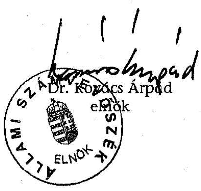

| Melléklet: | 7 db | 7 lap |
| :-- | :-- | :-- |
| Függelék: | 1 db | 1 lap |

---

# Kimutatás a kórházrekonstrukciók 1996-2004 között jóváhagyott címzett támogatásáról

(önkormányzatok összesen)

|  Megnevezés | Összes címzett támogatás | Jóváhagyott éves pénzügyi ütemek |  |  |  |  |  |  |  |  |  |  |   |
| --- | --- | --- | --- | --- | --- | --- | --- | --- | --- | --- | --- | --- | --- |
|   |  | 1996.év | 1997.év | 1998.év | 1999.év | 2000.év | 2001.év | 2002.év | 2003.év | 2004.év | 2005.év | 2006.év | 2007.év  |
|  1996. előtt indított rekonstrukció | 19770 | 9614 | 7398 | 1138 | 1500 | 120 |  |  |  |  |  |  |   |
|  1996.évi új induló | 11592 | 600 | 4268 | 2744 | 2216 | 1764 |  |  |  |  |  |  |   |
|  1997.évi új induló | 11394 |  | 643 | 3871 | 4625 | 1825 | 430 |  |  |  |  |  |   |
|  1998.évi új induló | 18857 |  |  | 1000 | 4360 | 10192 | 2805 | 500 |  |  |  |  |   |
|  1999.évi új induló | 8109 |  |  |  | 600 | 2930 | 2480 | 1075 | 1024 |  |  |  |   |
|  2000.évi új induló | 10130 |  |  |  |  | 560 | 2960 | 3650 | 2960 |  |  |  |   |
|  2001.évi új induló | 9030 |  |  |  |  |  | 600 | 4280 | 4150 |  |  |  |   |
|  2002.évi új induló | 9570 |  |  |  |  |  |  | 690 | 5310 | 3070 | 500 |  |   |
|  2003.évi új induló | 19844 |  |  |  |  |  |  |  | 1300 | 7484 | 8860 | 1500 | 700  |
|  2004.évi új induló | 20703 |  |  |  |  |  |  |  |  | 1349 | 7749 | 9930 | 1675  |
|  Összesen: | 138999 | 10214 | 12309 | 8753 | 13301 | 17391 | 9275 | 10195 | 14744 | 11903 | 17109 | 11430 | 2375  |

---

# A vizsgált önkormányzatok összes és egészségügyi célú tárgyi eszközei (épületek, gépek-berendezések)

|  Megnevezés | 1996. | 1997. | 1998. | 1999. | 2000. | 2001. | 2002. | 2003.  |
| --- | --- | --- | --- | --- | --- | --- | --- | --- |
|  Tárgyi eszközök bruttó értéke összesen | 158262 | 196052 | 248911 | 290933 | 767397 | 930203 | 1828867 | 2016117  |
|  Ebből:egészségügyi ágazat tárgyi eszközei | 59564 | 67645 | 84087 | 95694 | 120678 | 131577 | 151598 | 198364  |
|  Értékcsökkenés záró állománya önkormányzat összesen | 50868 | 57331 | 70836 | 82468 | 234956 | 294630 | 308114 | 338615  |
|  Ebből:egészségügyi ágazat értékcsökkenése | 23015 | 25901 | 33033 | 36514 | 41147 | 47084 | 51604 | 57908  |
|  Ingatlanok bruttó értéke önkormányzat összesen | 105704 | 138312 | 176402 | 204383 | 527952 | 631023 | 1323897 | 1489963  |
|  Ebből:egészségügyi ágazat ingatlanok bruttó értéke | 32078 | 37627 | 46344 | 51667 | 74186 | 79498 | 94040 | 132564  |
|  Ingatlanok nettó értéke önkormányzat összesen | 84901 | 114168 | 147948 | 172421 | 329450 | 408475 | 1096291 | 1238252  |
|  Ebből:egészségügyi ágazat ingatlanok nettó értéke | 25125 | 29967 | 37627 | 42762 | 58202 | 63658 | 77287 | 99220 |

 | 37674 | 43040 | 63683 | 67919 | 81377 | 118183  |
|  Egészségügyi célt szolgáló épületek száma db | 960 | 967 | 986 | 990 | 995 | 994 | 984 | 968  |
|  Ebből: felújítást nem igénylők száma db | 230 | 237 | 242 | 243 | 236 | 245 | 250 | 258  |
|  részleges felújítással megfelelővé tehető db | 489 | 487 | 494 | 496 | 505 | 508 | 495 | 487  |
|  teljes felújítással megfelelővé tehető db | 177 | 177 | 183 | 183 | 183 | 171 | 169 | 159  |
|  gazdaságosan fel nem újítható db | 64 | 66 | 67 | 68 | 71 | 70 | 70 | 64  |
|  Egészségügyi célt szolgáló épületekből |  |  |  |  |  |  |  |   |
|  1901 előtt épült db | 126 | 127 | 131 | 131 | 131 | 131 | 131 | 130  |
|  1901-1945 között épült db | 228 | 227 | 227 | 227 | 225 | 225 | 224 | 216  |
|  1946-1959 között épült db | 128 | 128 | 135 | 135 | 137 | 136 | 121 | 114  |
|  1960-1969 között épült db | 167 | 166 | 169 | 170 | 170 | 170 | 169 | 167  |
|  1970-1979 között épült db | 156 | 158 | 161 | 161 | 161 | 161 | 161 | 160  |
|  1980-1989 között épült db | 111 | 111 | 112 | 112 | 112 | 112 | 110 | 108  |
|  1990-1999 között épült db | 44 | 50 | 51 | 54 | 52 | 51 | 51 | 50  |
|  1999 után épült db |  |  |  |  | 7 | 8 | 17 | 23  |
|  Eü. célt szolgáló gép, ber., felsz. bruttó értéke | 23734 | 28044 | 34146 | 39417 | 43624 | 47154 | 54234 | 62601  |
|  Eü. célt szolgáló gép, ber., felsz. nettó értéke | 9452 | 11029 | 14139 | 14919 | 15508 | 14795 | 17812 | 22558  |
|  ORKI nyt. szerinti orvosi gépek, műszerek bruttó értéke | 16456 | 20256 | 24955 | 28614 | 31886 | 35633 | 40441 | 47690  |
|  ennek megoszlása a bruttó érték alapján |  |  |  |  |  |  |  |   |
|  1990 előtt beszerzett % | 31 | 26 | 22 | 19 | 18 | 16 | 15 | 13  |
|  1991-1995 között beszerzett % | 55 | 46 | 38 | 33 | 30 | 29 | 26 | 23  |
|  1995 év után beszerzett % | 14 | 28 | 40 | 49 | 52 | 56 | 59 | 64  |

---

# A fekvőbeteg gyógyintézetek tárgyi eszköz állománya (1996-2003)

(beszámolók 38-as űrlapjai egyes kiemelt adatai)

|  Megnevezés | Összes fekvőbeteg intézmény (kórház) |  |  |  |  |  | Vizsgált kórházak |  |  |  |  |   |
| --- | --- | --- | --- | --- | --- | --- | --- | --- | --- | --- | --- | --- |
|   | 1996. év |  |  | 2003. év |  |  | 1996. év |  |  | 2003. év |  |   |
|   | Összes | Ebből: |  | Összes | Ebből: |  | Összes | Ebből: |  | Összes | Ebből: |   |
|   |  | Ingatlanok | Gép,berendezés |  | Ingatlanok | Gép,berendezés |  | Ingatlanok | Gép,berendezés |  | Ingatlanok | Gép,berendezés  |
|  Bruttó nyitó állomány | 106648 | 61079 | 44203 | 279923 | 166339 | 107102 | 29295 | 16582 | 12317 | 83515 | 46475 | 34780  |
|  Beszerzés, létesítés | 8449 | 3933 | 4316 | 8734 | 1793 | 6427 | 3862 | 2424 | 1385 | 3023 | 371 | 2457  |
|  Felújítás | 1344 | 1191 | 150 | 1842 | 1694 | 147 | 359 | 305 | 52 | 384 | 350 | 33  |
|  Egyéb növekedés | 12296 | 6143 | 5812 | 79022 | 64275 | 13879 | 3199 | 1153 | 1809 | 15179 | 10615 | 4286  |
|  Összes növekedés (br.é.) | 22089 | 11267 | 10278 | 89598 | 67762 | 20453 | 7420 | 3882 | 3246 | 18586 | 11336 | 6776  |
|  Összes csökkenés (br.é.) | 9200 | 4678 | 4389 | 16982 | 8451 | 7143 | 3904 | 2653 | 1213 | 3116 | 535 | 2414  |
|  Bruttó záró állomány | 119537 | 67668 | 50092 | 352539 | 225650 | 120412 | 32811 | 17811 | 14350 | 98985 | 57276 | 39142  |
|  Értékcsökkenés nyitó érték | 35942 | 12232 | 22846 | 104847 | 25199 | 74488 | 10149 | 3144 | 6737 | 32320 | 7072 | 23642  |
|  Értékcsökkenés záró érték | 43104 | 13361 | 28543 | 115635 | 28275 | 82752 | 12359 | 3450 | 8462 | 36253 | 8074 | 26365  |
|  Nettó nyitó érték | 70706 | 48847 | 21357 | 175076 | 141140 | 32614 | 19146 | 13438 | 5580 | 51195 | 39403 | 11138  |
|  Nettó záró érték | 76433 | 54307 | 21549 | 236904 | 197375 | 37660 | 20452 | 14361 | 5888 | 62732 | 49202 | 12777  |
|  Teljesen leírt eszközök bruttó értéke | 8761 | 435 | 7882 | 50103 | 436 | 46365 | 2801 | 107 | 2559 | 14353 | 103 | 13033  |

---

# A vizsgált önkormányzatok bevételei és kiadásai (1996-2004. években)

|  Megnevezés | 1996. | 1997. | 1998. | 1999. | 2000. | 2001. | 2002. | 2003. | 2004.
várható | 1996-
2004.  |
| --- | --- | --- | --- | --- | --- | --- | --- | --- | --- | --- |
|  Önkormányzat összes tárgyévi bevétele | 257166 | 337596 | 389833 | 431834 | 487212 | 526470 | 615687 | 695487 | 671643 | 4412927  |
|  Ebből:müködési célra átvett Tb.alapoktól | 65470 | 75037 | 85188 | 95674 | 103738 | 112952 | 136887 | 169658 | 170017 | 1014620  |
|  Összes felhalmozási bevétel | 46028 | 80961 | 95982 | 92625 | 121623 | 130063 | 145068 | 141986 | 114779 | 969116  |
|  Ebből:címzett támogatás összesen | 3890 | 6571 | 10727 | 11944 | 12692 | 12916 | 8637 | 9570 | 9444 | 86390  |
|  egészségügyi ágazat címzett támogatása | 2604 | 3803 | 7249 | 8084 | 8348 | 6354 | 5879 | 6536 | 4099 | 52957  |
|  céltámogatás összesen | 497 | 975 | 909 | 1054 | 528 | 1501 | 1154 | 897 | 740 | 8254  |
|  egészségügyi ágazat céltámogatása | 698 | 372 | 334 | 497 | 270 | 398 | 382 | 608 | 479 | 4037  |
|  Önkormányzat összes tárgyévi kiadása | 244403 | 327842 | 374126 | 411887 | 462072 | 482582 | 548887 | 642176 | 633081 | 4127057  |
|  Ebből: Összes folyó (müködési) kiadás | 180069 | 216305 | 245452 | 274160 | 301352 | 339113 | 417641 | 483427 | 478273 | 2935792  |
|  Ezen belül: személyi kiadások és járulékok | 82819 | 100570 | 118106 | 124721 | 145298 | 163407 | 206050 | 262235 | 278305 | 1481512  |
|  dologi kiadások | 82854 | 92637 | 108913 | 125179 | 132604 | 127964 | 154729 | 160490 | 178134 | 1163505  |
|  Felhalmozási és tőke jellegű kiadások | 62202 | 108115 | 125676 | 135659 | 152355 | 139422 | 126729 | 155926 | 136262 | 1142347  |
|  Összesből egészségügyi ágazat kiadásai | 74242 | 89898 | 105010 | 116609 | 122149 | 131408 | 163623 | 195757 | 196261 | 1194956  |
|  Ebből: Összes folyó (müködési) kiadás | 68488 | 81171 | 93388 | 103786 | 110727 | 122052 | 148902 | 180485 | 183818 | 1092818  |
|  Ezen belül: személyi kiadások és járulékok | 36029 | 43862 | 49456 | 53056 | 58180 | 64366 | 80357 | 105510 | 110526 | 601344  |
|  dologi kiadások | 31601 | 36233 | 42051 | 48349 | 50503 | 56262 | 66432 | 72761 | 72394 | 476585  |
|  Felhalmozási és tőke jellegű kiadások | 5605 | 8583 | 11435 | 12720 | 11286 | 8845 | 14491 | 14080 | 12044 | 99089  |
|  Egészségügyi ágazat felhalmozási kiadásaiból |  |  |  |  |  |  |  |  |  |   |
|  Ingatlanok felújítása | 507 | 976 | 1159 | 2190 | 1435 | 1066 | 2279 | 1567 | 2098 | 13276  |

 Gépek berendezések felújítása | 41 | 18 | 92 | 38 | 55 | 60 | 87 | 80 | 106 | 577  |
|  Egyéb felújítás | 3 | 2 | 1 | 2 | 1 | 0 | 11 | 0 | 16 | 36  |
|  Felújítások ÁFÁ-ja | 135 | 250 | 311 | 549 | 362 | 278 | 585 | 409 | 538 | 3417  |
|  Felújítás összesen | 686 | 1246 | 1563 | 2779 | 1853 | 1404 | 2962 | 2056 | 2758 | 17307  |
|  Ingatlanok vásárlása, létesítése | 1890 | 2397 | 4177 | 4977 | 4265 | 2932 | 4289 | 4547 | 2823 | 32297  |
|  Gépek, berendezések vásárlása | 1796 | 3358 | 3452 | 2643 | 2859 | 2360 | 4633 | 4523 | 3562 | 29186  |
|  Egyéb eszközök vásárlása | 126 | 123 | 123 | 108 | 116 | 166 | 261 | 234 | 226 | 1483  |
|  Beruházások ÁFÁ-ja | 927 | 1340 | 1854 | 1764 | 1728 | 1459 | 2211 | 2238 | 1594 | 15115  |
|  Beruházás összesen | 4739 | 7218 | 9606 | 9492 | 8968 | 6917 | 11394 | 11542 | 8205 | 78081  |

---

# A vizsgált kórházrekonstrukciók építés-szerelési és egyéb költségeinek, valamint forrásainak összetétele 1996-2004 között

|  Megnevezés | Befejezett rekonstrukciók |  |  |  | Folyamatban lévő rekonstrukciók |  |  |  | Összes vizsgált rekonstrukció |  |  |   |
| --- | --- | --- | --- | --- | --- | --- | --- | --- | --- | --- | --- | --- |
|   | Előirányzat | Megosz-
lás \% | Tényleges | Megosz-
lás \% | Előirányzat | Megosz-
lás \% | Tényleges | Megosz-
lás \% | Előirányzat | Megosz-
lás \% | Tényleges | Megosz-
lás \%  |
|  A rekonstrukció költségei |  |  |  |  |  |  |  |  |  |  |  |   |
|  Tervezési költség | 1347 | 3,7 | 1387 | 3,5 | 492 | 2,0 | 517 | 5,1 | 1839 | 3,0 | 1904 | 3,9  |
|  Lebonyolítás,műszaki ellenőrzés | 372 | 1,0 | 480 | 1,2 | 286 | 1,2 | 116 | 1,1 | 658 | 1,1 | 596 | 1,2  |
|  Építés-szerelési költség | 25411 | 70,0 | 28282 | 72,4 | 13468 | 54,7 | 6139 | 60,7 | 38879 | 63,8 | 34421 | 70,0  |
|  Egyéb (bontás,közmű) költség | 1810 | 5,0 | 1167 | 3,0 | 821 | 3,3 | 81 | 0,8 | 2631 | 4,3 | 1248 | 2,5  |
|  Technológiai szerelés | 1907 | 5,3 | 559 | 1,4 | 1253 | 5,1 | 594 | 5,9 | 3160 | 5,2 | 1153 | 2,3  |
|  Teljes építés-szerelési költség | 30847 | 85,0 | 31875 | 81,6 | 16320 | 66,3 | 7447 | 73,6 | 47167 | 77,4 | 39322 | 79,9  |
|  Gép-műszer, készlet beszerzés | 5453 | 15,0 | 7199 | 18,4 | 8296 | 33,7 | 2667 | 26,4 | 13749 | 22,6 | 9866 | 20,1  |
|  Összes beruházási költség | 36300 | 100,0 | 39074 | 100,0 | 24616 | 100,0 | 10114 | 100,0 | 60916 | 100,0 | 49188 | 100  |
|  A rekonstrukció forrásai |  |  |  |  |  |  |  |  |  |  |  |   |
|  Címzett támogatás | 33144 | 91,3 | 33144 | 84,8 | 18850 | 76,6 | 8675 | 85,8 | 51994 | 85,4 | 41819 | 85,0  |
|  Saját forrás | 3156 | 8,7 | 5781 | 14,8 | 5766 | 23,4 | 1439 | 14,2 | 8922 | 14,6 | 7220 | 14,7  |
|  Egyéb forrás |  |  | 149 | 0,4 |  |  |  |  |  |  | 149 | 0,3  |

---

# A befejezett rekonstrukciók költségeinek megoszlása kórházi részlegek, funkciók között

|  Megnevezés | Új építés |  | Felújítás |  | Tényleges építésszerelési ktg. | Gép-műszer beszerzés | Egyéb készlet beszerzés | Összes költség  |
| --- | --- | --- | --- | --- | --- | --- | --- | --- |
|   | Érintett részleg db | új $\mathrm{m}^{2}$ | Érintett részleg db | felújított $\mathrm{m}^{2}$ |  |  |  |   |
|  Fekvőbeteg szakellátás |  |  |  |  |  |  |  |   |
|  Aktív kórházi osztály | 9 | 32110 | 14 | 63082 | 13649 | 2203 | 515 | 16367  |
|  Krónikus osztály | 2 | 5153 | 5 | 3777 | 1173 | 79 | 46 | 1298  |
|  Járóbeteg szakellátás |  |  |  |  |  |  |  |   |
|  Járóbeteg rendelőintézet | 5 | 4885 | 7 | 8979 | 2445 | 447 | 34 | 2926  |
|  Diagnosztika | 4 | 8392 | 3 | 1379 | 2954 | 1088 | 133 | 4175  |
|  Szakmai kiszolgáló részlegek |  |  |  |  |  |  |  |   |
|  Központi műtő | 5 | 6080 | 6 | 14570 | 4121 | 1971 | 130 | 6222  |
|  Központi sterilizáló | 5 | 2684 | 1 | 201 | 451 | 311 | 13 | 775  |
|  Egyéb szakmai szolgáltatás | 2 | 124 | 1 | 615 | 745 |  | 5 | 750  |
|  Egyéb kisegítő részlegek |  |  |  |  |  |  |  |   |
|  Mosoda |  |  | 1 | 572 | 177 | 4 |  | 181  |
|  Konyha |  |  | 5 | 4247 | 545 | 68 | 7 | 620  |
|  Energia ellátás | 2 | 259 | 4 | 635 | 325 | 6 |  | 331  |
|  Egyéb | 5 | 6297 | 7 | 16455 | 5290 | 94 | 45 | 5429  |
|  Mindösszesen |  | 65984 |  | 114512 | 31875 | 6271 | 928 | 39074  |

---

# A vizsgált egészségügyi intézmények jellemző kapacitás-, betegforgalmi-, teljesítmény-, finanszírozási- és létszám adatai (1996-2004. években)

| Megnevezés | Mért.e. | 1996. | 1997. | 1998. | 1999. | 2000. | 2001. | 2002. | 2003. | 2004.
várható |
| :--: | :--: | :--: | :--: | :--: | :--: | :--: | :--: | :--: | :--: | :--: |
| Fekvőbeteg-szakellátás |  |  |  |  |  |  |  |  |  |  |
| Engedélyezett ágy (dec.31.) | db | 19967 | 19324 | 19328 | 19212 | 19212 | 18644 | 18583 | 18522 | 18828 |
| - Ebből: Aktív | $d b$ | 16384 | 15934 | 15812 | 15593 | 15571 | 14928 | 14907 | 14859 | 14895 |
| Működő ágy éves átlagban | db | 19646 | 19198 | 19119 | 19080 | 18943 | 18467 | 18396 | 18342 | 18632 |
| - Ebből: Aktív | $d b$ | 16178 | 15913 | 15710 | 15520 | 15358 | 14789 | 14778 | 14679 | 14736 |
| Elbocsátott beteg (éves) | fő | 587659 | 602332 | 611479 | 620208 | 637545 | 654662 | 663544 | 672908 | 684059 |
| - Ebből: Aktív | fő | 561135 | 572059 | 578135 | 583541 | 596420 | 617926 | 629912 | 640131 | 649912 |
| Teljesített ápolási nap (éves) | nap | 5718258 | 5552502 | 5476549 | 5342029 | 5320470 | 5331033 | 5304667 | 5293973 | 5439714 |
| - Ebből: Aktív | nap | 4754475 | 4537353 | 4421711 | 4260761 | 4237321 | 4238395 | 4235839 | 4209633 | 4223359 |
| Átlagos ápolási idő | nap | 10 | 9,5 | 9,2 | 8,8 | 8,7 | 8,6 | 8,3 | 8,1 | 8,4 |
| - Ebből: Aktív | nap | 8 | 8,1 | 38,1 | 7,3 | 7,1 | 7,1 | 6,8 | 6,6 | 6,7 |
| Átlagos ágykihasználtság | \% | 77 | 79,4 | 77,4 | 75,9 | 75,7 | 78,8 | 78,4 | 77,9 | 78,4 |
| - Ebből: Aktív | \% | 76 | 78,9 | 76,6 | 73,7 | 74,1 | 78,8 | 77,1 | 77,3 | 76,9 |
| HBCS súlyszám (éves) | . | 551752 | 559558 | 597200 | 565732 | 569861 | 580812 | 568884 | 597156 | 583048 |
| Case mix index | . | 1 | 0,98 | 1,04 | 0,98 | 0,99 | 0,94 | 0,96 | 0,99 | 0,94 |
| Súlyozott ápolási nap | nap | 1011783 | 1234004 | 1285245 | 1361834 | 1447117 | 1489336 | 1356940 | 1348123 | 1507924 |
| Járóbeteg-szakellátás |  |  |  |  |  |  |  |  |  |  |
| Szerződött heti óra (dec.31.) |
 | óra | 44605 | 47558 | 47141 | 50941 | 51089 | 52987 | 53497 | 53428 | 51106 |
| - Ebből: diagnosztika | óra | 9112 | 9436 | 9539 | 11268 | 10687 | 10322 | 10258 | 10348 | 10143 |
| Működő heti óra éves átlaga | óra | 153626 | 147473 | 145848 | 153045 | 154341 | 168990 | 171043 | 164730 | 168822 |
| - Ebből: diagnosztika | óra | 34988 | 35991 | 37185 | 43371 | 39725 | 36261 | 40781 | 36590 | 36842 |
| Esetszám (éves) | ezer.. | 13889 | 16003 | 15620 | 14685 | 14699 | 15136 | 15955 | 16249 | 15638 |
| - Ebből: diagnosztika | ezer.. | 5885 | 7048 | 6910 | 6135 | 6227 | 6400 | 6904 | 7024 | 6915 |
| Beavatkozás (éves) | ezer.. | 55129 | 69170 | 71870 | 70500 | 67970 | 70628 | 81368 | 69617 | 65206 |
| - Ebből: diagnosztika | ezer.. | 23096 | 29057 | 30475 | 29982 | 29910 | 32825 | 39299 | 37836 | 36114 |
| Elszámolt Pont (éves) | millió.. | 6651 | 10830 | 12002 | 12626 | 14144 | 15861 | 17244 | 19271 | 18236 |
| Teljes TB finansz. (pénzforg.) | M Ft | 36728 | 44485 | 51837 | 57889 | 62747 | 69367 | 84530 | 104840 | 105932 |
| Orvoslétszám (átlagos) | fő | 3875 | 3775 | 3755 | 3672 | 3556 | 3544 | 3563 | 3502 | 3483 |
| Egyéb eü. lészám (átlagos) | fő | 16924 | 17032 | 16910 | 16670 | 16465 | 16669 | 16737 | 16808 | 17121 |

---

# Ellenőrzött önkormányzatok és kórházak 

| Megye | Önkormányzat | Kórház |
| :--: | :--: | :--: |
| Baranya megye | Megyei Önkormányzat Komló Városi Önkormányzat | Baranya Megyei Kórház Pécs Kórház Rendelőintézet Komló |
| Békés megye | Megyei Önkormányzat | Pándy K. Kórház Rendelőintézet Gyula |
|  | Orosháza Városi   Önkormányzat | Kórház Rendelőintézet Orosháza |
| Borsod-Abaúj-Zemplén megye | Kazincbarcika Városi   Önkormányzat | Kórház Rendelőintézet Kazincbarcika |
| Csongrád megye | Megyei Önkormányzat | Területi Kórház Szentes |
|  | Szeged M.J. Város   Önkormányzata | Városi Kórház Szeged Szakorvosi Rendelőintézet Szeged |
| Győr-Moson-Sopron megye | Megyei Önkormányzat | Petz A. Megyei Kórház Győr |
| Hajdú-Bihar megye | Megyei Önkormányzat   Berettyóújfalu Városi   Önkormányzat | Kenézy Gy. Kórház Debrecen   Városi Kórház Berettyóújfalu |
| Jász-Nagykun-Szolnok megye | Megyei Önkormányzat | Hetényi G. Megyei Kórház Szolnok |
|  | Karcag Városi Önkormányzat | Kátai G. Városi Kórház Karcag |
| Komárom-Esztergom megye | Dorog Városi Önkormányzat |  |
|  | Kisbér Városi Önkormányzat |  |
| Nógrád megye | Megyei Önkormányzat   Balassagyarmat Városi   Önkormányzat | Szt. Lázár Megyei Kórház Salgótarján Kenessey A. Kórház-Rendelőintézet Balassagyarmat |
| Szabolcs-Szatmár-Bereg megye | Megyei Önkormányzat | Jósa A. Megyei Kórház Nyíregyháza   Szatmár-Beregi Kórház Fehérgyarmat |
|  | Kisvárda Városi   Önkormányzat | Városi Kórház Kisvárda |
| Tolna megye | Megyei Önkormányzat | Megyei Kórház Szekszárd |
| Veszprém megye | Megyei Önkormányzat | Csolnoky F. Megyei Kórház Veszprém |
|  | Pápa Városi Önkormányzat | Városi Kórház Pápa |
| Budapest Főváros | Fővárosi Önkormányzat | Szent Imre Kórház   Bajcsy-Zsilinszky Kórház |

---

# EGÉSZSÉGÜGYI MINISZTÉRIUM MINISZTER 

Iktatószám: 11644-2/2005-0003EGP

Dr. Kovács Árpád úrnak elnök

Állami Számvevőszék

Budapest, Pf. 54.
1364

## Tisztelt Elnök Úr!

Köszönettel megkaptam V-1016-35/2004-05. számú levele mellékletében lévő, Dr. Kapócs Gábor helyettes államtitkár úrral egyeztetett, „Jelentés a címzett támogatásból finanszirozott egészségügyi beruházások, rekonstrukciók ellenőrzéséről" címû, 2005. május keltezésû dokumentumot.

Az egyeztetéssel összefüggő módosításokkal egyetértek, észrevételeink figyelembevételét köszönöm.

Budapest, 2005. június 9.

## Üdvözlettel:

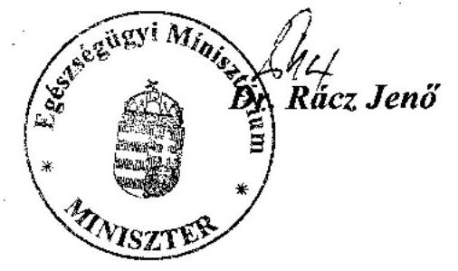

---

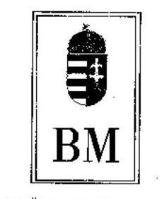

Ikt.sz.: 1-a-1/16/05
Hiv.sz.: V-1016-35/2004-05.

Dr. Kovács Árpád úrnak
elnök

# Állami Számvevőszék 

## Budapest

## Tisztelt Elnök Úr!

Az Állami Számvevőszék által készített - a címzett támogatásból finanszírozott egészségügyi beruházások, rekonstrukciók ellenőrzéséről szóló - "Jelentés"-t köszönettel vettem.

A "Jelentés"-ben - annak előzetes egyeztetése során - a Belügyminisztérium észrevételei többnyire figyelembe vételre kerültek, amelyet ezúton is köszönök.

Egyebekben az Állami Számvevőszék jelentése - az elmúlt évekhez hasonlóan idén is olyan előremutató jellegű megállapításokat tartalmaz, amelyek alapvetően járulhatnak hozzá mind az egészségügyi ágazat szakma-politikai kérdéseinek megoldásához, mind pedig a címzett támogatási rendszer átláthatóságához, illetőleg a finanszírozás hatékonyságához.

Budapest, 2005. június 10.
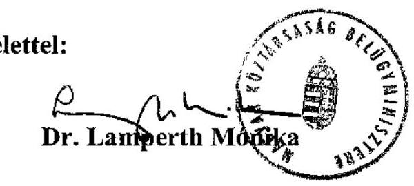

---

H-1051 BUDAPEST V., JÓZSEF NÁDOR TÉR 2-4. POSTACÍM: 1369 BUDAPEST, POSTAFIÓK 481.

TELEFON: (36-1) 327-2159, (36-1) 327-2141
E-MAIL: janos.veres@pm.gov.hu
FAX: (36-1) 318-0738

PÉNZÜGYMINISZTÉRIUM

Állami Számvevőszék
Dr. Kovács Árpád elnök úr részére
Budapest
Tárgy: jelentés a címzett támogatásból finanszírozott egészségügyi beruházások, rekonstrukciók ellenőrzéséről

Tisztelt Elnök Úr!
Ikt.sz.: 8457/5/2005.
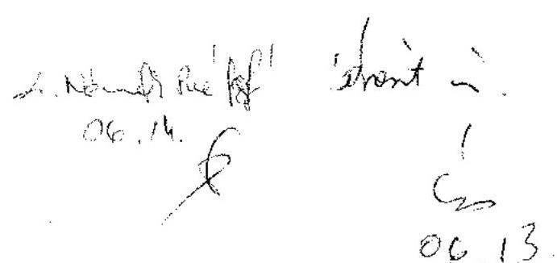

A címzett támogatásból finanszírozott egészségügyi beruházások, rekonstrukciók ellenőrzéséről szóló jelentést köszönettel vettem. A jelentés-tervezet korábbi egyeztetése során tett észrevételeink átvezetésre kerültek, a tervezetben foglaltakkal egyetértek.

Budapest, 2005. június 3.

Üdvözlettel:
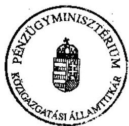

Dr. Veres János

