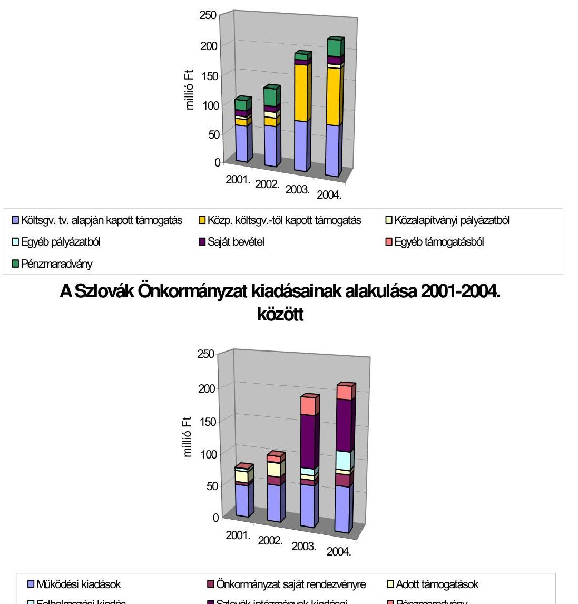
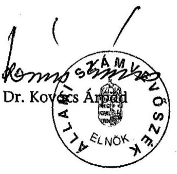

# JELENTÉS 

az Országos Szlovák Önkormányzat 2001-2004. évi pénzügyi-gazdasági tevékenységének ellenőrzéséről

---

3. Önkormányzati és Területi Ellenőrzési Igazgatóság
3.1. Szabályszerűségi Ellenőrzések Főcsoport
V-1002-021/2005.
Témaszám: 752
Vizsgálat-azonosító szám: V-0223
Az ellenőrzést felügyelte:
Dr. Lóránt Zoltán
főigazgató
Az ellenőrzés végrehajtásáért felelős:
Dr. Elek János
általános főigazgató-helyettes
Az ellenőrzést vezette:
Horváth Balázs
osztályvezető főtanácsos
Az összefoglaló jelentést készítette:
Dr. Dotterweich Antal
tanácsadó
Az ellenőrzést végezték:
dr. Dotterweich Antal, Tóth István
tanácsadó
A témához kapcsolódó eddig készített számvevőszéki jelentések:
címe
sorszáma
Jelentés az Országos Szlovák Önkormányzat pénzügyi- 0210
gazdasági tevékenységének vizsgálatáról
Jelentés az Országos Kisebbségi Önkormányzatok pénzügyi- 0201
gazdasági tevékenységének vizsgálatáról
Jelentés az Országos Szlovák Önkormányzat pénzügyi- 383
gazdasági tevékenységének vizsgálatáról

---

# TARTALOMJEGYZÉK 

BEVEZETÉS ..... 5
I. ÖSSZEGZŐ MEGÁLLAPÍTÁSOK, KÖVETKEZTETÉSEK, JAVASLATOK ..... 7
II. RÉSZLETES MEGÁLLAPÍTÁSOK ..... 11

1. A feladatellátás szervezettsége, szabályozottsága ..... 11
1.1. Az Önkormányzat szervezeti és működési rendje ..... 11
1.2. Az intézmények alapítása és működtetése ..... 11
1.3. A számviteli szabályozások összhangja a jogszabályi követelményekkel ..... 13
2. Az Önkormányzat működésének, a gazdálkodás rendjének szabályszerűsége ..... 14
2.1. A gazdálkodási tevékenység feltételei ..... 14
2.2. A vagyongazdálkodás és a vagyonvédelem szabályozottsága ..... 14
3. Az Önkormányzat számviteli tevékenysége ..... 15
3.1. Éves beszámoló készítési kötelezettség teljesítése ..... 15
3.2. A könyvvezetési kötelezettség teljesítése ..... 15
3.3. A bizonylati rend és a bizonylati fegyelem érvényesülése ..... 16
4. Az éves költségvetések jóváhagyása, végrehajtása és a zárszámadások szabályszerűsége ..... 17
4.1. Az éves költségvetések elkészítése, elfogadása ..... 17
4.2. A költségvetések végrehajtása ..... 17
4.3. Az éves költségvetés végrehajtásáról szóló zárszámadás ..... 18
5. Az Önkormányzat ellenőrzési rendszere ..... 20
5.1. Az ellenőrzési rendszer szabályozottsága ..... 20
5.2. Az ellenőrzési rendszer működése ..... 21
5.3. Az Önkormányzat által alapított intézmények és egyéb szervezetek tulajdonosi és felügyeleti ellenőrzése ..... 21
6. A korábbi ÁSZ vizsgálat megállapításai alapján tett javaslatok megvalósulása ..... 22

---

# MELLÉKLETEK 

1. számú Az Önkormányzat által a központi költségvetéstől kapott támogatásokból nemzeti és etnikai kisebbségi feladatokra kifizetett összegek feladatonként alakulása, mutatói
2. számú Az Országos Szlovák Önkormányzat bevételeinek alakulása jogcímenként, megoszlási viszonyszámai és növekedési indexei 2001-2004. évek között a zárszámadások adataiból
3. számú Az Országos Szlovák Önkormányzat kiadásainak alakulása jogcímenként, megoszlási viszonyszámai és növekedési indexei 2001-2004. évek között a zárszámadások adataiból
4. számú Kimutatás az Önkormányzat zárszámadásaiban szereplő és az ellenőrzés által feltárt eltérésekkel korrigált bevételekről
5. számú Az Önkormányzat működési kiadásai megoszlási viszonyszámai és növekedési indexei

---

# RÖVIDÍTÉSEK JEGYZÉKE 

| ÁSZ | Állami Számvevőszék |
| :-- | :-- |
| IM | Igazságügyi Minisztérium |
| Nek. tv. | A nemzeti és etnikai kisebbségek jogairól szóló 1993. évi |
|  | LXXVII. törvény |
| NEKH | Nemzeti és Etnikai Kisebbségi Hivatal |
| NKÖM | Nemzeti Kulturális Örökség Minisztériuma |
| OM | Oktatási Minisztérium |
| Önkormányzat | Országos Szlovák Önkormányzat |
| Számviteli törvény | A számvitelről szóló - többször módosított - 2000. évi C. |
|  | törvény |
| Szja tv. | A személyi jövedelemadóról szóló - többször módosított - |
|  | 1995. évi CXVII. törvény |
| SZMSZ | Szervezeti és Működési Szabályzat |

---

.

---

# JELENTÉS 

## az Országos Szlovák Önkormányzat 2001-2004. évi pénzügyi-gazdasági tevékenységének ellenőrzéséről

## BEVEZETÉS

Az Országos Szlovák Önkormányzat (továbbiakban: Önkormányzat) a nemzeti és etnikai kisebbségek jogairól szóló 1993. évi LXXVII. törvény (továbbiakban: Nek. tv.) 5. §-ának (1) bekezdésében foglaltak alapján 1995. áprilisában alakult meg. A 2000. évi népszámlálás adatai szerint 11816-an beszélik a szlovák nyelvet Magyarországon anyanyelvként, a szlovák nemzetiséget vallók száma 17692 fő volt. Az ország valamennyi megyéjében élnek szlovákok, jellemző az erőteljes szórvány elhelyezkedés, koncentráltabban 11 megyében helyezkednek el a szlovák nemzetiségűek.

A Nemzetiségi és Etnikai Kisebbségi Hivatal (továbbiakban: NEKH) 1997-ben kérdőíves felmérést végzett a magyarországi szlovákok helyzetére vonatkozóan. A felmérés szerint szlovák oktató-nevelő munkát végeznek 129 intézményben (63 óvodában, 56 általános iskolában, 4 középiskolában és 6 felsőoktatási intézményben) a kultúrházak, kulturális intézmények száma 22; továbbá néprajzi gyűjtemények, tájházak, tánccsoportok, pávakörök, színjátszó csoportok, hagyományőrző szakkörök, szlovák nyelvű istentiszteletek stb. szolgálják a kulturális értékek megőrzését és továbbfejlesztését.

Az Önkormányzat céljai megvalósítása érdekében széles körű kapcsolatrendszert épített ki. Az Önkormányzat együttműködési megállapodást kötött a Magyarországi Szlovákok Szövetségével. Az Önkormányzat anyagi támogatásával jelenik meg Romániában negyedévente az Alföldi Szlovák című folyóirat. A nemzetközi lap kiadására írásos megállapodást kötöttek.

Saját nemzetiségi szervezeteikkel rendszeres a kapcsolattartás, ennek érdekében az Önkormányzat elnökségének öt regionális tanácsnoka van, fő feladatuk az állandó kapcsolattartás a települési kisebbségi szlovák önkormányzatokkal.

Az Önkormányzat szoros kapcsolatot alakított ki valamennyi, a hazai kisebbségek sorsát alakító állami intézmény (Országgyülés Emberi jogi-, kisebbségi és vallásügyi bizottsága, a nemzeti és etnikai kisebbségi jogok országgyűlési biztosa, Oktatási Minisztérium, Nemzeti és Kulturális Örökség Minisztériuma, Nemzeti és Etnikai Kisebbségi Hivatal, Magyarországi Nemzeti és Etnikai Kisebbségekért Közalapítvány) illetékeseivel.

Az Állami Számvevőszékről szóló - többször módosított - 1989. évi XXXVIII. törvény 2. § (5) bekezdése, valamint a nemzeti és etnikai kisebbségek jogairól szóló 1993. évi LXXVII. törvény 57. §-ában kapott felhatalmazás alapján vizsgáltuk, hogy az állam által nyújtott pénzügyi támogatások felhasználása a törvényeknek megfelelően történt-e.

Az ellenőrzés célja: annak megállapítása volt, hogy

- az országos kisebbségi önkormányzat működési feltételrendszere miként változott a vizsgált időszakban;
- a gazdálkodás szervezettsége, szabályszerűsége mennyiben felelt meg a jogszabályi követelményeknek és az Önkormányzati működés sajátosságainak;
- biztosított volt-e a gazdálkodás és a pénzeszközök felhasználásának törvényessége és szabályszerűsége, a törvények és a vonatkozó kormányrendeletek előírásainak betartása.

A 2002. évi önkormányzati választáson 115 szlovák kisebbségi önkormányzat jött létre. Az Önkormányzat harmadik választására 2003. január 25-én került sor.

Az Önkormányzat pénzügyi-gazdasági tevékenységét az ÁSZ legutóbb 2001. évben ellenőrizte.

A vizsgált időszak: 2001. január 1-től 2004. december 31. gazdasági évek.
A helyszíni ellenőrzés: 2005. március 25. -április 18-a között, az Önkormányzat központjában történt.

---

# I. ÖSSZEGZŐ MEGÁLLAPÍTÁSOK, KÖVETKEZTETÉSEK, JAVASLATOK 

#### Abstract

Az Önkormányzat szervezetét, működésének szabályait SZMSZ-ben rögzítette. Az SZMSZ szerint az Önkormányzat szervei a Közgyűlés, az elnökség, a bizottságok és az Önkormányzat hivatala. Az SZMSZ előírása szerint az önkormányzati feladatok és hatáskörök a Közgyűlést illetik meg. A Közgyűlés a nem kizárólagos hatáskörébe tartozó feladatait átruházhatja, ami meg is történt, azonban rendelkezése szerint ezeket hatásköri jegyzékbe kell foglalni. Hiányosság, hogy az SZMSZ előírása ellenére az Önkormányzat nem rendelkezik hatásköri jegzékkel. Ezen túlmenően az önkormányzati feladatok meghatározása általános, a konkrét tevékenységeket nem nevesíti, továbbá olyan hatáskört említ a Közgyűlés át nem ruházható feladataként, amely ténylegesen nem létezett. Az éves költségvetés, a zárszámadás és a vagyonleltár megállapítása a Közgyűlés át nem ruházható hatásköre, azonban sem az SZMSZ-ben, sem egyéb belső utasításban nem rendelkeztek ezek elkészítésének és jóváhagyásának módjáról.

Az Önkormányzat az intézmények alapításánál érvényesítette a jogszabályi előírásokat. Az ellenőrzött időszak kezdetén két intézménnyel rendelkezett, öt intézményt hozott létre, egy intézményt átvett, így összesen nyolc intézményt tartott fenn. A működtetést illetően a 2003. és 2004. évben jogszabályba ütközött, hogy az Önkormányzat könyvvezetése és beszámolója tartalmazta a részben önálló költségvetési szervként működtetett intézmények adatait is. Az államháztartás működési rendjéről szóló kormányrendelet előírása szerint az Önkormányzatnak ki kellett volna jelölnie azt az önállóan gazdálkodó költségvetési szervet, amely a részben önállóan gazdálkodó költségvetési szervek pénzügyi gazdasági feladatait ellátja.

Az Önkormányzat készített számviteli politikát, amely a számviteli törvény tételes előírásainak megfelel, de nem rögzíti az önkormányzati sajátosságokat, így a beszámoló-készítéshez és a könyvvezetéshez nem ad kellő eligazítást. A számviteli törvény előírásának megfelelően módosították a számviteli politikát kiegészítő szabályzatokat is. A kötelezően előírt szabályzatokon túlmenően készült a feleslegessé vált vagyontárgyak hasznosítására, selejtezésére vonatkozó szabályzat, továbbá az Önkormányzat által alapított, illetve átvett intézmények feladatainak végrehajtását szolgáló fizetési vagy más teljesítési kötelezettség vállalását, utalványozását szabályzó elnöki utasítás. A szabályzatok összhangban álltak a jogszabályi előírásokkal és tükrözték az önkormányzati sajátosságokat.

A számviteli szabályozások közül a számlarend csak részben felel meg a törvényi követelményeknek, mivel nem tartalmazza: a számla tartalmát, ha az a számla megnevezéséből egyértelműen nem következik; minden alkalmazott főkönyvi számla számát, megnevezését; továbbá nem rögzíti a számlarendben foglaltakat alátámasztó bizonylati rendet; nem igazodik az önkormányzati sajátosságokhoz, a gyakorlatban nem alkalmazható.

---

Az Önkormányzat gazdálkodási tevékenységét részben saját hivatali szervezetével, részben külső szervezetek, személyek bevonásával oldotta meg. Az Önkormányzat hivatala ügyrendjének hiányossága, hogy a feladatok ellátásához több feladatkör esetében nem tartalmaz kellően részletes előírásokat és munkaköri leírások sem készültek, ezért a feladatkörök és a felelősségi körök nem állapíthatók meg egyértelműen. Az Önkormányzat hivatala 9 fő főfoglalkozású alkalmazottal működött a teljes vizsgált időszakban. A főfoglalkozású szakmai munkakörben foglalkoztatottak rendelkeztek az előírt iskolai végzettséggel, az összeférhetetlenségi szabályok érvényesültek. A foglalkoztatott létszám nem volt arányos az ellátott feladatokkal, ezért a vizsgált időszakban egyre nagyobb számban eseti megbízásokra került sor. A megnövekedett feladatokhoz képest szűknek minősíthetők a személyi és tárgyi feltételek. Az Önkormányzat vállalkozási tevékenységet nem folytatott.

A vagyongazdálkodás és vagyonvédelem terén az SZMSZ kimondja, hogy a Közgyűlés hatásköréből nem ruházható át az önkormányzati vagyon feletti rendelkezésre vonatkozó döntés. Más vagyongazdálkodásra vonatkozó rendelkezést sem az SZMSZ, sem egyéb szabályzat nem tartalmaz. Az Önkormányzatnak ingyenes vagyonjuttatás keretében adott értékpapírok forgatásával, felhasználásával és az egyéb vagyonfelhasználással kapcsolatos döntéseket minden esetben az SZMSZ előírásának megfelelően a Közgyűlés hozta meg. Az Önkormányzat vagyonának védelmét szolgálta az Eszközök és források leltárkészítési és leltározási szabályzata és a Feleslegessé vált vagyontárgyak hasznosítására, selejtezésére vonatkozó szabályzat. A 2002. évi hatálybalépés után bekövetkezett intézményi változások miatt azonban a szabályzatok az alapított, illetve átvett intézményekre nem terjednek ki. A vagyonvédelmet hivatott biztosítani a 2002. április 10-én kiadott, az Önkormányzat által átvett, illetve alapított intézmények gazdálkodását szolgáló kötelezettségvállalás, érvényesítés, utalványozás és ellenjegyzés rendjét szabályozó elnöki utasítás, melyet a gyakorlatban betartanak.

Az éves beszámoló-készítési kötelezettségnek az Önkormányzat határidőre eleget tett. A 2001-2002. évről készült beszámolók megbízhatók. A 2003-2004. évben a részben önálló költségvetési szervként működtetett intézmények adatait az Önkormányzat beszámolója összevontan tartalmazta, ez sérti a valódiság számviteli alapelvét. A részben önálló intézmények beszámoló adatai olyan nagyságrendűek, amelyek miatt az önkormányzati beszámoló nem minősült megbízhatónak.

Az Önkormányzat könyvvezetési kötelezettségének 2001-2002. és 2003-2004. években más-más külső vállalkozó igénybevételével, a két időszakban eltérő számítógépes programmal, kettős könyvvezetéssel tett eleget. A 2001-2002. évi főkönyvi zárások szabálytalanul történtek. Az ellenőrzött években hiányzott a bizonylatokról a könyvviteli nyilvántartásban történt rögzítés időpontja, valamint részben a számlakijelölés is, ez sérti a valódiság számviteli alapelvét.

A bizonylati fegyelem két területen nem felelt meg a jogszabályi követelményeknek. A dologi kifizetések bizonylatainak mintegy 50%-áról hiányzott a felvételre jogosult nevének feltüntetése. Az Önkormányzat tulajdonában állt személygépkocsi menetleveleiből a felkeresett partner megnevezése

---

hiányában nem volt megállapítható a hivatali célú használat. Az Önkormányzat cégautóadót nem fizetett a vizsgált időszakban.

Az éves költségvetések összeállításának rendjét nem szabályozták, így évente eltérő szerkezetben tervezték a bevételeket és kiadásokat. A bevételeknél az összegszerűen ismert forrásokat vették számításba.
 A konkrét kisebbségi feladatok forrásigényét és ráfordításait nem tervezték, ezek megvalósulása az év közben pályázati úton elnyert összegek függvényében alakult. A költségvetés elfogadása minden évben - az SZMSZ előírásának megfelelően - közgyűlési határozattal történt. Az év közben megszerzett forrásokkal egyik évben sem módosították a költségvetést. További hibája a kialakult gyakorlatnak, hogy a részben önálló intézmények költségvetésének tervezése 2003-tól az Önkormányzat költségvetésében történt.

Az éves költségvetések végrehajtása során biztosított volt a kötelezettségvállalások pénzügyi fedezete, az Önkormányzat megőrizte pénzügyi egyensúlyát, a pénzfelhasználás során takarékos és célszerű gazdálkodásra törekedtek.

Az Önkormányzat gazdálkodásáról, költségvetésének végrehajtásáról szóló - a beszámolón felül készített - zárszámadásokat minden évben közgyűlési határozattal fogadták el, ezek adatai azonban a számviteli nyilvántartásokból nem voltak levezethetők. A feltárt eltérések nagyságrendje olyan mértékű, hogy a zárszámadások nem minősültek megbízhatónak.

A pályázati és egyéb támogatást nyújtók az Önkormányzattal az államháztartás működési rendjéről szóló kormányrendeletben előírt tartalmú szerződéseket kötöttek. Az Önkormányzat az ellenőrzött időszakban a támogatási szerződésben foglalt felhasználási, nyilvántartási, dokumentálási és elszámolási követelményeket betartotta.

Az Önkormányzat ellenőrzési rendszere szabályozott, elemei a Pénzügyi Ellenőrző Bizottság, a vezetői és a munkafolyamatokba épített ellenőrzés. A Pénzügyi Ellenőrző Bizottság minden évben véleményezte a költségvetést és a zárszámadást, ellenőrizte az Önkormányzat pénztári bevételeit és kiadásait. A pénztárellenőrzés nem felelt meg a belső előírásnak. Az Önkormányzat az általa alapított, átvett intézmények és egyéb szervezetek ellenőrzéséről megfelelően gondoskodott.

A korábbi ÁSZ vizsgálat megállapításai alapján tett javaslatokat a közgyűlési jegyzőkönyv tanúsága szerint megvitatták. A javaslatok végrehajtásához a Közgyűlés határozata alapján intézkedési tervet készítettek, a szabályzatok módosítása megtörtént.

A helyszíni ellenőrzés megállapításainak hasznosítása mellett javasoljuk:

# az Önkormányzat Közgyűlésének 

1. Az SZMSZ módosításával határozza meg az önkormányzati feladatokat, az éves költségvetés, a zárszámadás és a vagyonleltár elkészítésének szabályait, továbbá egészítse ki az átruházott hatáskörök jegyzékével.

---

2. Gondoskodjon az államháztartás működési rendjéről szóló 217/1998. (XII. 30.) Korm. rendelet 17. § (1) bekezdésben foglaltak érvényesülése érdekében a részben önálló költségvetési szervként működtetett intézmények meghatározott pénzügyigazdasági feladatait ellátó, önállóan gazdálkodó költségvetési szerv kijelöléséről, továbbá az intézményi SZMSZ-ek jóváhagyásáról. Biztosítsa az államháztartási szervezetek beszámolási és könyvvezetési kötelezettségének sajátosságairól szóló 249/2000. (XII. 24.) Korm. rendelet részben önálló költségvetési szervek beszámolására vonatkozó előírásainak érvényesülését.

# az Önkormányzat elnökének 

1. A számviteli rend érvényesülése érdekében

- módosítsa a számviteli politikát a számviteli törvény 14. § (3) bekezdésében előírt követelményeknek megfelelően, hogy az feleljen meg az Önkormányzat szervezeti és működési sajátosságainak;
- egészítse ki a számlarendet oly módon, hogy az feleljen meg maradéktalanul a számviteli törvény előírásainak és az Önkormányzat sajátosságait is tükrözze;
- biztosítsa, hogy a jövőben a könyvvezetés és a beszámolási kötelezettség teljesítése során teljes körűen érvényesüljenek a számviteli törvény szerinti egyes egyéb szervezetek beszámoló készítési és könyvvezetési kötelezettségének sajátosságairól szóló 224/2000. (XII. 19.) Korm. rendelet előírásai;
- gondoskodjon a számviteli törvény 166-167. §-aiban meghatározott bizonylati követelmények érvényesüléséről.

2. Intézkedjen, hogy az Önkormányzat tulajdonában álló gépjárművek menetleveleinek vezetése feleljen meg az Szja tv. 70. §-a és 5. számú melléklete II/7. pontjában leírt követelményeknek. Önrevízió keretében állapítsák meg, vallják be és fizessék meg a vizsgált időszakra vonatkozó cégautóadót.
3. Gondoskodjon az Önkormányzat hivatala ügyrendjének kiegészítéséről, hogy az minden feladatcsoport esetében kellően részletesen rögzítse a feladatokat és felelősségi köröket. Készítse el és adja ki a hiányzó munkaköri leírásokat.
4. Biztosítsa, hogy a jövőben a zárszámadás adatai a számviteli nyilvántartásokból levezethetők legyenek.
5. Szerezzen maradéktalanul érvényt a Pénzkezelési szabályzat ellenőrzésre vonatkozó előírásainak.

---

# II. RÉSZLETES MEGÁLLAPÍTÁSOK 

## 1. A feladatELLÁTÁS SZERVEZETTSÉGE, SZABÁLYOZOTTSÁGA

### 1.1. Az Önkormányzat szervezeti és működési rendje

Az Önkormányzat szervezetét és működését az ellenőrzött időszakban az 1999. március 25-én és a 2003. május 28-án jóváhagyott Szervezeti és Működési Szabályzat (továbbiakban: SZMSZ) rögzítette. Az SZMSZ-ek szerint az Önkormányzati feladat- és hatáskörök a Közgyűlést illetik meg, a Közgyűlés hatásköréből át nem ruházható feladatokat tételesen felsorolták. Az SZMSZ szerint az Önkormányzat szervei a Közgyűlés, az elnökség, a bizottságok és az Önkormányzat hivatala. Az elnökségre, az elnökre, a bizottságokra átruházott feladat- és hatásköröket az SZMSZ előírása szerint hatásköri jegyzékben fel kell tüntetni, azonban hatásköri jegyzék sem az SZMSZ mellékleteként, sem önálló dokumentum formájában nem készült.

Az Önkormányzat hivatala munkáját az SZMSZ előírása szerint az alelnök irányítja. A hivatal az ügyrendje alapján végzi munkáját. Hiányosság, hogy a feladatok ellátásához több munkakör esetében sem a hatályos ügyrend nem tartalmaz részletes előírásokat, sem külön munkaköri leírás nem kapcsolódik.

Az SZMSZ főbb hiányosságai az átruházott hatáskörök jegyzéke hiányán túlmenően:

- az Önkormányzati feladatok meghatározása általános, a konkrét tevékenységeket nem nevesíti,
- olyan hatáskört említ a Közgyűlés át nem ruházható feladatként (a rendelkezésre álló rádió és televízió csatorna felhasználásának elveiről és módjáról szóló döntés), amely ténylegesen nem létezik,
- az éves költségvetés, a zárszámadás és a vagyonleltár megállapítása a Közgyűlés át nem ruházható hatásköre, azonban azok elkészítéséhez a részletes szabályokat (pl. szerkezeti felépítés, elkészítési határidő) nem rögzíti.

### 1.2. Az intézmények alapítása és működtetése

Az Önkormányzat az intézmények alapításánál érvényesítette a jogszabályi előírásokat.

Az Önkormányzat az ellenőrzött időszak kezdetén két intézménnyel rendelkezett, 5 intézményt hozott létre, egy intézményt átvett, így összesen 8 intézményt működtetett. Az Önkormányzat intézményei:

L’udové noviny hetilap, az Önkormányzat lapalapítói jogait 1999-ben jegyeztette be. A 2000. február 28-án megkötött Kiadói Szerződés alapján a lap kiadója a Magyar Közlönykiadó Kft, a lapnak 7 főállású munkatársa van.

---

Magyarországi Szlovákok Kutatóintézete, a Magyarországi Szlovákok Szövetsége által 1990-ben alapított intézmény működtetését az Önkormányzat 2001 tavaszán vette át, 4 főállású és 3 szerződéses munkatársa van.

Vertigó Szlovák Színház, az 1996-ban szlovák műkedvelők által alapított társulatot 2003. május 28-i Közgyűlési határozattal vette át az Önkormányzat. Az intézmény azóta amatőr és hivatásos tagozattal működik.

Szlovák Általános Iskola, Óvoda és Diákotthon Szarvas székhellyel, az önálló költségvetési szervként működő intézmény átvétele 2004. július 1-jével történt meg. Az általános iskolában 301 diák tanul, az óvodában 95 gyermeket nevelnek és 100 férőhelyes a kollégiumi ellátás.

Szlovák Közművelődési Központ, 2003-ban alakult, székhelye az Önkormányzat székházában van, hét regionális szlovák közművelődési házat fog össze.

Szlovák Dokumentációs Központ, 2003. évben alapította az Önkormányzat, székhelye az Önkormányzat székháza.

Szlovák Óvodai Módszertani Központ, 2003. évben hozta létre az Önkormányzat a békéscsabai Szlovák Tanítási Nyelvű Általános Iskola, Óvoda, Gimnázium és Diákotthon kezdeményezésére. Székhelye Békéscsabán van.

Legatum Kht, a teljes nevén Legatum (Örökség) Szolgáltató és Ingatlanközvetítő Közhasznú Társaság bejegyzési kérelmét 2004. február 18-án nyújtotta be az Önkormányzat. Létrehozásának célja a szlovákság tájházi, néprajzi gyűjteményi szférájának támogatására.

Az intézmények működtetését illetően az államháztartás szervezetei beszámolási és könyvvezetési kötelezettségeinek sajátosságairól szóló 249/2000. (XII. 24.) Korm. rendelet 1. § e) pontjának rendelkezése szerint a jogszabály hatálya kiterjed az országos kisebbségi önkormányzati költségvetési szervekre, így a 2003. és 2004. évet illetően jogszabályba ütközik, hogy az Önkormányzat könyvvezetése és beszámolója tartalmazza a részben önálló költségvetési szervként működtetett intézmények adatait is. A Legatum Kht. és az önálló költségvetési szervezetként működő Szlovák Általános Iskola, Óvoda és Diákotthon készít önálló beszámolót saját könyvvezetésük alapján. Az államháztartás működési rendjéről szóló 217/1998. (XII. 30.) Korm. rendelet 13. § (9) bekezdése szerint az országos kisebbségi önkormányzat látja el az általa alapított költségvetési szervek felügyeletét. Az Önkormányzat 2003. évben több intézményt hozott létre részben önálló költségvetési szerv formájában, a hivatkozott kormányrendelet 14. § (5) bekezdésének a) pontja szerint a felügyeleti szervnek kell kijelölni azt az önállóan gazdálkodó költségvetési szervet, amely a részben önállóan gazdálkodó költségvetési szerv 17. § (1) bekezdés alapján meghatározott pénzügyi-gazdasági feladatait ellátja. Ez nem történt meg. Az Önkormányzat hivatalát sem alakították oly módon, hogy az megfeleljen a hivatkozott jogszabályban a feladatellátáshoz előírt követelményeknek.

Az Önkormányzat a 217/1998. (XII. 30.) Korm. rendelet 10. § (4) bekezdése előírása ellenére az általa alapított intézmények SZMSZ-eit nem hagyta jóvá.

---

# 1.3. A számviteli szabályozások összhangja a jogszabályi követelményekkel 

Az Önkormányzat az előző ÁSZ jelentés javaslataira figyelemmel 2002. január 1-jével léptette hatályba új számviteli szabályzatait.

A számviteli politika csak a számviteli törvényben minden gazdálkodó szervezet számára tételesen rögzíteni előírtakat tartalmazza, azonban a 14. § (3) bekezdésében előírt követelménynek, hogy „a gazdálkodó adottságainak, körülményeinek leginkább megfelelő" számviteli politikát kell készíteni, nem felel meg. A szervezeti és működési sajátosságokat nem tartalmazza, ezért kiegészítése szükséges.

A számviteli politika keretében elkészítették az eszközök és források leltárkészítési és leltározási szabályzatát, az eszközök és források értékelési szabályzatát, valamint a pénzkezelési szabályzatot. A felsorolt szabályzatok megfelelnek a jogszabályi előírásoknak és a működés sajátosságaira tekintettel készültek.

A számlarend csak részben felel meg a követelményeknek, módosítása és kiegészítése szükséges, mivel

- nem vették figyelembe a működési sajátosságokat,
- a számviteli törvény 161. § (2) bekezdés b) pontja előírásának nem felel meg, nem tartalmazza a számla tartalmát, ha az a számla megnevezéséből egyértelműen nem következik,
- a számviteli törvény 161. § (2) bekezdés a) pontja előírása ellenére nem tartalmazza minden alkalmazott főkönyvi számla számát, megnevezését,
- nem alakították ki a számlarendben foglaltakat alátámasztó bizonylati rendet, nem készítették el a számviteli törvény 161. § (2) bekezdés d) pontja szerinti bizonylati szabályzatot.

A számviteli törvény 14. §-ában előírt szabályzatokon kívül az Önkormányzat elkészítette

- a feleslegessé vált vagyontárgyak hasznosítása, selejtezése tárgyú szabályzatot, továbbá
- az Országos Szlovák Önkormányzat által alapított, illetve átvett intézményei feladatainak végrehajtását szolgáló fizetési vagy más teljesítési kötelezettség vállalását, utalványozását szabályozó elnöki utasítást.

---

# 2. Az ÖNKORMÁNYZAT MŰKÖDÉSÉNEK, A GAZDÁLKODÁS RENDJÉNEK SZABÁLYSZERŰSÉGE 

### 2.1. A gazdálkodási tevékenység feltételei

Az ellenőrzött időszakban az Önkormányzat gazdálkodási tevékenységét részben saját hivatali szervezetével, részben külső szervezetek, személyek bevonásával oldotta meg.

Az SZMSZ-hez kapcsolódó Önkormányzat hivatala ügyrendje nem változott, a főfoglalkozású alkalmazottak engedélyezett létszáma 9 fő volt a teljes ellenőrzött időszakban. Ebből gazdasági munkakörben egy fő pénztárost foglalkoztattak. Megbízási szerződéssel foglalkoztattak jogászt és könyvelőt. A főfoglalkozású szakmai munkakörben foglalkoztatott dolgozók rendelkeznek a megfelelő iskolai végzettséggel, az összeférhetetlenségi szabályok érvényesültek. A létszám azonban nem arányos a feladatokkal, ezért eseti megbízásokra is sor került a vizsgált időszakban, évről évre nagyobb számban. Az eseti megbízások száma az intézmények alapításával nőtt, 2001. évben 45 alkalommal, 2002-ben 56 alkalommal, 2003. évben 82 alkalommal, 2004-ben 384 alkalommal került sor egy-egy feladat megbízással történő ellátására. Az intézmények dolgozói esetében részmunkaidős foglalkoztatásra 4, 4, ill. 2, 2 fő esetében került sor.

A feladatok bővülésével, az új intézmények alapításával és tevékenységük kiszélesítésével a rendelkezésre álló létszám nehezen képes a követelményeknek megfelelni, betegség vagy egyéb távollét esetén nem tudják helyettesíteni a hiányzót. A tevékenység sokrétű és nem biztosítható, hogy minden dolgozó a munkakörén kívüli minden feladatot teljes mértékben ismerjen.

Az Önkormányzat székháza
 és felszereltsége, pl. a számítástechnikai háttér megfelelő kereteket biztosít a feladatellátáshoz, az indokolt létszámbővítéshez azonban a tárgyi feltételek bővítése szükséges.

Az Önkormányzat részére az SZMSZ megengedi a vállalkozási tevékenységet, a gyakorlatban a vizsgált időszakban az alapfeladatokon túl, nem végeztek vállalkozási tevékenységet.

### 2.2. A vagyongazdálkodás és a vagyonvédelem szabályozottsága

Az Önkormányzat SZMSZ-ében rögzítette, hogy a Közgyűlés hatásköréből nem ruházható át az önkormányzati vagyon feletti rendelkezésre vonatkozó döntés. Egyebekben a vagyongazdálkodásra vonatkozóan sem az SZMSZ, sem egyéb szabályzat nem tartalmaz előírásokat. Az Önkormányzat a vizsgált időszakban a vagyongazdálkodással kapcsolatos gazdasági eseményeket (értékpapír átváltások, értékesítések, lekötések és ingatlanvásárlások) minden esetben előzetes Közgyűlési határozat alapján hajtotta végre.

Az Önkormányzat vagyonának védelmét szolgálja az eszközök és források leltárkészítési és leltározási szabályzat, valamint a feleslegessé vált vagyontárgyak hasznosítása, selejtezése szabályzata. A szabályzatok 2002. január 1-én

---

léptek hatályba, és az óta nem módosultak, annak ellenére, hogy 6 részben önálló gazdálkodású költségvetési intézmény kapcsolódott az Önkormányzathoz. A vagyonvédelmet szolgálta a 2002. április 12-én kiadott, az Önkormányzat által átvett, illetve alapított intézmények gazdálkodását szolgáló kötelezettségvállalás, érvényesítés, utalványozás és ellenjegyzés rendjét szabályozó elnöki utasítás, amelynek előírásai érvényesültek. Az Önkormányzat a kapott támogatást saját intézményeinek, illetve a helyi kisebbségi Önkormányzatoknak és egyéb kisebbségi szervezeteknek a 217/1998. (XII. 30.) Korm. rendeletben előírt tartalmú támogatási szerződéssel adta át.

# 3. Az ÖNKORMÁNYZAT SZÁMVITELI TEVÉKENYSÉGE 

### 3.1. Éves beszámoló készítési kötelezettség teljesítése

Az ellenőrzött időszakban az Önkormányzat beszámolási kötelezettségének a számviteli törvény szerinti egyes egyéb szervezetek beszámoló-készítési és könyvvezetési kötelezettségének sajátosságairól szóló 224/2000. (XII. 19.) számú Korm. rendelet alapján egyszerűsített éves beszámoló készítésével tett eleget.

Az éves beszámolókat minden ellenőrzött évben, a jogszabályban meghatározott formai követelményeknek megfelelően, május 31-i határidőre elkészítette az Önkormányzat. A 2001–2003. évi beszámolókat a Közgyűlés a zárszámadással együtt előzetesen jóváhagyta.

A 2001. és a 2002. évről készített beszámolókban elkövetett számszerűsíthető hibák mértéke nem érte el az Önkormányzat számviteli politikájában meghatározott értéket.

A 2003–2004. évben a részben önálló költségvetési szervként működtetett intézmények nem készítettek beszámolót. Ezzel megsértették az államháztartás szervezetei beszámolási és könyvvezetési kötelezettségeinek sajátosságairól szóló 249/2000. (XII. 24.) Korm. rendelet 10. § (1) bekezdésének rendelkezését. Ezen évek gazdálkodási adatait az Önkormányzat beszámolója tartalmazta, ez sérti a számviteli törvény 15. § (3) bekezdésében foglalt valódiság alapelvét.

Az eszközök és a források leltározását az Önkormányzat hivatalában szabályszerűen elvégezték, de a tárgyi eszközöket 2003–2004. évben a részben önálló gazdálkodású költségvetési intézményekben nem leltározták. Az 50 ezer Ft értékhatárt meghaladó tárgyi eszközökről a vizsgált időszakban egyedi nyilvántartást nem vezettek. Az intézmények vagyonmegállapító leltárának elkészítése a helyszíni ellenőrzés időszakában volt folyamatban.

### 3.2. A könyvvezetési kötelezettség teljesítése

Az Önkormányzat az ellenőrzött időszakban a könyvvezetési kötelezettségnek kettős könyvvitel vezetésével tett eleget, 2001–2002. évben és 2003–2004. években más-más külső szolgáltató végezte a könyvvezetést, különböző számítógépes programok alapján. Az ellenőrzés rendelkezésére bocsátott főkönyvi kivonatok és a szolgáltatók által készített a számviteli törvény szerinti egyéb szerve-

---

zetek éves beszámolóinak adatai a 2001. évben a követelések és a forgóeszközök, a 2002. évben a befektetett eszközök és az értékpapírok esetében nem egyeztek.

A 2003. és 2004. évben nem tettek eleget a számviteli törvény 167. § (1) bekezdése i) pontjában meghatározott azon követelménynek, hogy a könyvviteli nyilvántartásban történt rögzítés időpontját, igazolását az alapbizonylatoknak tartalmazniuk kell.

Az ellenőrzött évek könyvvezetése az Önkormányzat részben önálló költségvetési szervként működtetett intézményeinek adatait is tartalmazza. A gyakorlat a számviteli törvény valódiság alapelvét sérti.

A 2003. évről készült beszámoló egyeztethető volt a főkönyvi kivonat adataival.

# 3.3. A bizonylati rend és a bizonylati fegyelem érvényesülése 

A megbízási szerződések megkötése során az Önkormányzatnál a vizsgált időszakban a szerződések 50%-ában nem tüntették fel a megbízási díj összegét. Ezekben az esetekben a megbízási díj összege csak a teljesítés igazolása alkalmával volt megállapítható.

A kiadások teljesítésére, banki átutalások kezdeményezésére, és azok főkönyvi könyvelésére minden esetben a gazdasági eseményről szabályszerűen kiállított alapbizonylat alapján került sor. A könyvelés alapjául szolgáló bizonylatok azonban az alábbiak miatt nem feleltek meg maradéktalanul a számviteli törvény és egyéb jogszabályok követelményeinek:

- A dologi kiadások esetében a kiadási pénztárbizonylatok 50%-áról hiányzott a felvételre jogosult nevének feltüntetése. Ezáltal a felvételre jogosult neve nem állapítható meg annak ellenére, hogy az Önkormányzat Pénzkezelési Szabályzata kimondja, hogy „Pénzkifizetést csak utalványozott és arra jogosult személy részére szabad teljesíteni."
- Az Önkormányzat tulajdonában álló, személyi használatra kiadott két személygépkocsi üzemanyag költségét nem az üzemanyag töltőállomás által kiállított számlák alapján könyvelték a vizsgált időszakban, hanem a vezetett útnyilvántartásban feltüntetett futásteljesítmény alapján, a gépkocsik fogyasztási normájának és az adott időszakban érvényes APEH üzemanyag ár figyelembe vételével kiszámított adatok alapján. Az útnyilvántartás vezetését gépkocsi menetlevél vezetésével helyettesítették. A vezetett menetlevél adattartalma nem felelt meg az Szja. tv. 70. §-a 5. számú melléklete II/7. pontja által előírt követelményeknek, mivel hiányzott a felkeresett partner megnevezése. Ennek ellenére az Önkormányzat cégautóadót nem fizetett.
- Az Önkormányzat a vele munkaviszonyban nem álló elnökségi és bizottsági tagok részére kiküldetési rendelvény alapján számolt el utazási költségtérítést magántulajdonú gépkocsi önkormányzati célú használatára való tekintettel. A nyomtatvány az Szja. tv. 25. § (2) bekezdés c) pontja csak a munkáltató által munkavállalónak történő költségtérítés elszámolására engedi használni.

---

# 4. Az ÉVES KÖLTSÉGVEtÉSEK JÓVÁHAGYÁSA, VÉGREHAJTÁSA ÉS A ZÁRSZÁMADÁSOK SZABÁLYSZERŰSÉGE 

### 4.1. Az éves költségvetések elkészítése, elfogadása

Az SZMSZ a Közgyűlés kizárólagos hatásköreit felsoroló pontjában csak azt rögzíti, hogy a költségvetés megállapítása nem ruházható át, azonban elkészítésének rendjét, tartalmát belső előírás nem rögzíti. A költségvetések elfogadása az SZMSZ előírásának megfelelően minden ellenőrzött évben közgyűlési határozattal történt. A gyakorlatban kialakított szerkezeti rend az egyes évek bevételei közötti összehasonlítást nem biztosítja, az egyes években tartalmilag csak részben azonosak a bevételi jogcímek. A költségvetések a bevételeket és kiadásokat főbb jogcímek szerint csoportosításban rögzítik, a kiadások közül a működési kiadásokat tovább részletezik. A bevételek tervezése során az összegszerűen ismert forrásokat veszik számításba. Az éves költségvetés tervezésénél a kisebbségi feladatok végrehajtása a pályázatokon megszerzett összegek függvénye. A kisebbségi feladatok forrásigényét és felhasználását nem tervezik elkülönítetten. Az évközben pályázati úton és egyéb forrásból megszerzett forrásokkal (amelyek összege több ellenőrzött évben meghaladta a költségvetési törvény alapján kapott támogatást) nem módosították a költségvetést.

A költségvetés tervezésének további hiányossága, hogy az Önkormányzat intézményei költségvetésének tervezése nem különül el, az Önkormányzat költségvetésében az intézmények kiadásai egy soron, intézmények kiadásai címen jelennek meg.

A működés finanszírozási tervén és az intézmények kiadásain túl az évente rendszeresen ismétlődő rendezvények megtartását tervezik.

### 4.2. A költségvetések végrehajtása

A költségvetés végrehajtása során biztosított volt a kötelezettségvállalások pénzügyi fedezete. Az Önkormányzat megőrizte pénzügyi egyensúlyát, a pénzfelhasználás során takarékos és célszerű gazdálkodásra törekedtek.

A rendelkezésre álló adatok szerint a kisebbségi feladatok megvalósítása a pályázatokon megszerzett összegek függvénye.

A támogatásokat az Önkormányzat részben a NEKH-tól különböző intézmények működtetésére, részben különböző kormányszervektől, közalapítványoktól feladatok, programok megvalósítására pályázat útján kapta.

A pályázati és egyéb támogatásokra a támogatást nyújtók a 217/1998. (XII. 30.) Korm. rendelet 87–89. §-aiban előírt tartalmú támogatási szerződéseket kötöttek az Önkormányzattal. Az Önkormányzat 2003. és 2004. években 77966 ezer Ft, illetve 81136 ezer Ft összegű támogatást kapott az általa fenntartott költségvetési intézmények fejlesztésére és működtetésére a NEKH-tól. A támogatások felhasználását az Önkormányzat 2001–2002. években, a főkönyvi könyvelésben támogatási szerződésenként elkülönítetten tartotta nyilván. A

---

2003–2004. években könyvelőváltást követően az elkülönített nyilvántartás megszűnt.

Az Önkormányzat - a szúrópróbaszerűen ellenőrzött évi 10% támogatási dokumentáció szerint - a támogatási szerződésekben foglalt felhasználási, nyilvántartási, dokumentálási és elszámolási követelményeket betartotta. Az elszámolásokkal kapcsolatban a támogatást nyújtók kifogást nem emeltek. A támogatást nyújtók a helyszíni ellenőrzés megkezdésének időpontjáig a beadott elszámolások valódiságát a helyszínen nem ellenőrizték.

A kisebbségi feladatok megvalósítása részben saját szervezésben bonyolított kulturális rendezvények keretében, továbbá a helyi kisebbségi szervezeteknek továbbadott támogatásokból megvalósított kisebbségi feladatok révén, valamint az Önkormányzat által működtetett intézményeken keresztül valósult meg. Az Önkormányzat által adott tanúsítvány alapján a jelentés 1. számú melléklete szerinti kimutatás szemlélteti a központi költségvetésből kapott támogatásokból nemzeti és etnikai kisebbségi feladatokra kifizetett összegek feladatonként és évenkénti megoszlását és mutatóit.

Az 1. számú melléklet szerinti kimutatás „Adott támogatások" sora a helyi kisebbségi szervezeteknek továbbadott támogatásokat jelöli, amelyek révén kisebbségi feladatok valósulnak meg az Önkormányzat segítségével. Az intézmények átvételével, működtetésével felmerült többletköltség az Önkormányzat működtetésére kapott állami támogatást csökkentette, ezért az Önkormányzat által tovább adható támogatások mértéke is csökkent. A támogatási összegek 90%-át pályázat útján, a fennmaradó részt indokolt esetben a Közgyűlés által jóváhagyott módon adják át.

Az elvégzett szakmai feladatok és annak ráfordításai arányát az Önkormányzat nem méri, nem számolnak hatékonysági mutatókat és a számviteli törvény szerinti egyéb szervezetekre elkészíteni előírt beszámoló adatait sem elemzik. A továbbadott forrásoknál nem vizsgálják, hogy betöltötte-e a kisebbségi feladatoknak megfelelő célját.

A céltámogatásokat az Önkormányzat teljes egészében a támogatott célra számolta el. A költségvetési törvényben címzetten, az Önkormányzat működésére adott támogatásnak egy részét (2001. évben 21%-át, 2002. évben 16,8%-át, 2003. évben 23,6%-át, 2004. évben 17,4%-át,) az Önkormányzat által fenntartott intézményekre fordították.

# 4.3. Az éves költségvetés végrehajtásáról szóló zárszámadás 

A vizsgált időszakban az Önkormányzat gazdálkodásáról szóló zárszámadásokat, a gazdasági évet követő március hónapban terjesztették elfogadásra a Közgyűlés elé, az elfogadás minden évben határozattal megtörtént. Az ellenőrzött időszakban, az Önkormányzat zárszámadásaiban közölt bevételeinek alakulását jogcímenként, a megoszlási viszonyszámokat és a növekedési indexeket a 2. számú melléklet, a kiadások alakulását jogcímenként, a megoszlási viszonyszámokat és a növekedési indexeket a zárszámadásokban közölt jogcímenkénti összegekkel a 3. számú melléklet mutatja be.

---

Az Önkormányzat bevételeinek és kiadásainak alakulását az alábbi grafikus ábrázolások szemléltetik:

# A Szlovák Önkormányzat bevételeinek alakulása 2001–2004. között 

Az egyes zárszámadási sorok bevételi és kiadási jogcímeit belső előírás nem rögzíti. Ennek következtében az ellenőrzés a bevételeket az egyes évek főkönyvi könyvelésével jogcímenként, a kiadásokat csak a költségek és ráfordítások összesen adatával tudta egyeztetni. Az egyes évek zárszámadásainak bevételi adatai nem voltak levezethetőek a főkönyvi könyvelés adataiból.

Az Önkormányzat zárszámadásaiban szereplő és az ellenőrzés által feltárt eltérésekkel korrigált bevételekről összeállított kimutatás a jelentés 4. számú melléklete. Az Önkormányzat összes bevétele dinamikusan növekedett, a 2001. évi bázishoz képest 2002. évre 23,6%, 2003. évre 79,9%, 2004. évre 104,3% volt a

---

változás mértéke. Az összes bevételből a központi költségvetési szervektől kapott támogatások növekedése volt a meghatározó. Ennek alapvető oka, hogy az Önkormányzat a NEKH-tól 2003. évben 77966 ezer Ft, 2004. évben pedig 81136 ezer Ft összegű támogatást kapott az általa fenntartott intézmények fejlesztésére és működtetésére. A közalapítványi pályázat alapján kapott támogatások csökkenésének oka,
 hogy 2003. évtől az intézmények támogatása a NEKH részéről történt.

A zárszámadások kiadás összesen adatai a számviteli nyilvántartásokból nem voltak levezethetők.

A bevételek és kiadások esetében feltárt eltérések nagyságrendje olyan mértékű, hogy a zárszámadások nem minősültek megbízhatónak.

Az Önkormányzat működési kiadásait személyi jellegű juttatások, munkáltatói járulékok és dologi kiadások bontásban tervezte és közölte zárszámadásaiban. Az Önkormányzat működési kiadásait illetően tervszerűen, az előre meghatározott keretek közt gazdálkodott. Ezt szemlélteti, hogy az összes működési kiadás tény/terv %-a 2001. évben 92,6%, 2002. évben 99,7%, 2003. évben 93,2%, 2004. évben 88,8% volt. Az Önkormányzat működési kiadásai megoszlási viszonyszámait és a növekedési indexeket az 5. számú melléklet szemlélteti.

# 5. Az ÖNKORMÁNYZAT ELLENŐRZÉSI RENDSZERE 

### 5.1. Az ellenőrzési rendszer szabályozottsága

Az Önkormányzat SZMSZ-e háromtagú Pénzügyi és Ellenőrző Bizottság felállítását írja elő, a bizottság tagjait a Közgyűlés választja. A Pénzügyi és Ellenőrző Bizottság ügyrendje szerint a bizottság feladata, hogy véleményezi az Önkormányzat költségvetését és zárszámadását, saját munkaterve alapján ellenőrzi az Önkormányzat és a hivatal pénzügyi tevékenységét, elvégzi azokat a pénzügyi ellenőrzési feladatokat, amelyeket a Közgyűlés, az elnökség és az elnök a hatáskörébe utal.

Az Önkormányzat gazdálkodásának folyamatba épített ellenőrzésére vonatkozóan a Pénzkezelési Szabályzat és az Önkormányzat által átvett, illetve alapított intézmények gazdálkodását szolgáló kötelezettségvállalás, érvényesítés, utalványozás és ellenjegyzés rendjét szabályozó elnöki utasítás tartalmaz előírásokat.

A Pénzkezelési Szabályzat értelmében: a pénztáros feladata az utalványozott bizonylatok alaki és tartalmi ellenőrzése; a pénztárellenőr feladata a pénztári bizonylatok alaki és tartalmi ellenőrzése, a pénztárjelentések helyességének, a kimutatott pénzkészlet meglétének ellenőrzése, továbbá a pénztárban lévő egyéb értékek, értékpapírok, szigorú számadás alá vont nyomtatványok meglétének, a vezetett nyilvántartások helyességének rendszeres, illetve naponkénti ellenőrzése. A pénztárellenőri feladatokat az alelnök látja el.

Az elnöki utasítás értelmében: az érvényesítés során meg kell győződni arról, hogy az előzetes kötelezettségvállalás jogos-e; az anyag-, áru-, szolgáltatás átvétele megtörtént-e; az összeg, a számla kiállítása pontos-e; az ellenjegyzőnek

---

meg kell győződnie arról, hogy a kiadás teljesítéséhez a költségvetésben a fedezet biztosított-e.

A teljesítés igazolásának szabályait belső rendelkezés nem szabályozta annak ellenére, hogy az elnöki utasítás az érvényesítő feladatává tette az átvétel megtörténtének ellenőrzését. A teljesítés megtörténtének igazolása azért is szükséges, mivel az Önkormányzat és az általa fenntartott intézmények nem egyetlen telephelyen működnek, így az érvényesítő személyesen nem képes meggyőződni a teljesítésről.

# 5.2. Az ellenőrzési rendszer működése 

A vizsgált időszakban a Pénzügyi és Ellenőrző bizottság minden évben véleményezte az Önkormányzat költségvetését és zárszámadását, teljes körűen ellenőrizte az Önkormányzat pénztári bevételeit és kiadásait. Az ellenőrzés tényét a pénztárbizonylatokon, és 2001-2002. években az időszaki pénztárjelentésen a bizottság egy tagja aláírásával igazolta. Az ellenőrzés tapasztalata alapján 2003. évben a bizottság kifogásolta, hogy utazási költséget az Önkormányzat nevére kiállított számla nélkül fizettek ki.

Az érvényesítés és az ellenjegyzés során az előírt ellenőrzési feladatok - a teljesítés megtörténtének ellenőrzése kivételével - teljesültek.

A Pénzkezelési Szabályzat előírása szerint „pénztárzárlatot dekádonként (10 naponként) kell készíteni, melyet a pénztárellenőrnek ellenőriznie kell."

### 5.3. Az Önkormányzat által alapított intézmények és egyéb szervezetek tulajdonosi és felügyeleti ellenőrzése

Az Önkormányzat 2004. év végéig hét intézményt és egy egyszemélyes közhasznú társaságot alapított, illetve vett át.

Az Önkormányzat a közhasznú társaság feletti tulajdonosi jogokat a Közgyűlésen, az ügyvezető kinevezésén, valamint a felügyelő bizottságon keresztül gyakorolja.

Az önállóan gazdálkodó költségvetési szervként - 2004. július 1-vel - átvett Szlovák Általános Iskola, Óvoda és Diákotthon felett az alapítói jogokat az igazgató kinevezésén és a tulajdonost megillető egyéb döntéseken és beszámoltatásokon keresztül, a felügyeleti jogokat a 217/1998. (XII: 30.) Korm. rendelet 13. §-ában előírtak alkalmazásával gyakorolja.

A hat, részben önállóan gazdálkodó költségvetési intézményként átvett, illetve alapított intézmény gazdálkodásával kapcsolatos feladatokat az Önkormányzat hivatala látja el, így azok folyamatos tulajdonosi felügyelete biztosított, míg a szakmai munkáról évente szöveges szakmai beszámolót készítenek az intézmények.

---

# 6. A korábbi ÁSZ vizsgálat megállapításai alapján tett JAVASLATOK MEGVALÓSULÁSA 

Az ÁSZ az Országos Szlovák Önkormányzat pénzügyi-gazdasági tevékenységét 2001. évben vizsgálta. A vizsgálati jelentésben feltárt hiányosságok megszűntetése és a munka színvonalának javítása érdekében a következőket javasolta az Önkormányzat elnökének:

1. Dolgozzák át gazdálkodási szabályzataikat, hogy áttekinthetők legyenek, és tükrözzék a helyi sajátosságokat (amennyiben szükségesnek tartják az egyes fogalommagyarázatokat, úgy azt mellékletként csatolják a szabályzathoz.),
2. Biztosítsa, hogy teljes körűen alkalmazzák és tartsák be a gazdálkodási szabályzataikban előírtakat.

A Közgyűlési jegyzőkönyvek szerint az ellenőrzés megállapításait megvitatták. A javaslatok végrehajtásához az Önkormányzat 47/2001. (XII. 12.) határozata szerint intézkedési tervet készítettek. A szabályzatok módosítása megtörtént.

Budapest, 2005. június " 24 "

Melléklet: $\quad 5 \mathrm{db}$

---

# Az Önkormányzat által a központi költségvetésből kapott támogatásokból nemzeti és etnikai kisebbségi feladatokra kifizetett összegek feladatonkénti alakulása, mutatói

|  Feladat | 2001. év |  | 2002. év |  |  | 2003. év |  |  | 2004. év |  |   |
| --- | --- | --- | --- | --- | --- | --- | --- | --- | --- | --- | --- |
|   | Összeg ezer Ft | $\begin{gathered} \text { megoszl. } \ \% \end{gathered}$ | Összeg ezer Ft | $\begin{gathered} \text { megoszl. } \ \% \end{gathered}$ | változás $\%$ | Összeg ezer Ft | $\begin{gathered} \text { megoszl. } \ \% \end{gathered}$ | változás $\%$ | Összeg ezer Ft | $\begin{gathered} \text { megoszl. } \ \% \end{gathered}$ | változás $\%$  |
|  Önszerveződés, érdekképviselet | 53808 | 75,7 | 66281 | 74,4 | 23,2\% | 63686 | 40,0 | -3,9\% | 69568 | 39,0 | 9,1\%  |
|  Oktatás | 0 | 0 | 0 | 0 | 0,0\% | 2183 | 1,4 | 100,0\% | 3500 | 2,0 | 60,3\%  |
|  Kulturális tevékenység (saját rendezvények + 2003-tól intézmények) | 3371 | 4,7 | 4057 | 4,6 | 20,4\% | 21194 | 13,3 | 419,0\% | 44411 | 24,9 | 109,5\%  |
|  Kutatás (Kutatóintézet) | 6103 | 8,6 | 10000 | 11,2 | 63,8\% | 30863 | 19,4 | 208,6\% | 26512 | 14,9 | -14,1\%  |
|  Tömegtájékoztatás (heti lap) | 0 | 0 | 0 | 0 | 0,0\% | 1615 | 1,0 | 100,0\% | 1900 | 1,1 | 17,6\%  |
|  Nemzetközi kapcsolatok | 1622 | 2,3 | 1392 | 1,6 | -14,2\% | 250 | 0,2 | -82,1\% | 731 | 0,4 | 192,4\%  |
|  Beruházások (intézmények is) | 4200 | 5,9 | 803 | 0,9 | -80,9\% | 32635 | 20,5 | 3053,5\% | 25471 | 14,3 | -21,8\%  |
|  Adott támogatások | 2000 | 2,8 | 6500 | 7,3 | 225,0\% | 6725 | 4,2 | 3,7\% | 6230 | 3,4 | -7,3\%  |
|  Mindösszesen: | 71104 | 100,0\% | 89033 | 100,0\% | 25,2\% | 159151 | 100,0\% | 79,0\% | 178323 | 100,0\% | 12,0\%  |

---

Az Országos Szlovák Önkormányzat bevételeinek alakulása jogcímenként, megoszlási viszonyszámai és növekedési indexei 2001-2004. évek között a zárszámadások adataiból

Növekedési index bázis adata 2001. év Adatok ezer forintban

|  Megnevezés | 2001. |  |  | 2002. |  |  |  | 2003. |  |  |  | 2004. |  |  |   |
| --- | --- | --- | --- | --- | --- | --- | --- | --- | --- | --- | --- | --- | --- | --- | --- |
|   | Terv | Tény | megoszlás | Terv | Tény | megoszlás | növ. index | Terv | Tény | megoszlás | növ. index | Terv | Tény | megoszlás | növ. index  |
|  Állami támogatás | 64000 | 64000 | 66,2\% | 70400 | 70200 | 68,3\% | 9,7\% | 85100 | 85100 | 43,4\% | 33,0\% | 85100 | 85100 | 38,5\% | 33,0\%  |
|  Kózalapítványi pályázatok | 0 | 4989 | 5,2\% | 0 | 10753 | 10,5\% | 115,5\% | 0 | 6943 | 3,5\% | 39,2\% | 0 | 4310 | 2,0\% | -36,6\%  |
|  Egyéb pályázatok | 0 | 2145 | 2,2\% | 0 | 3225 | 3,1\% | 50,3\% | 0 | 8333 | 4,3\% | 288,5\% | 0 | 8343 | 3,8\% | 289,0\%  |
|  Saját bevétel | 11300 | 8577 | 8,7\% | 3000 | 4999 | 4,9\% | -41,7\% | 800 | 3408 | 1,7\% | -60,3\% | 1000 | 10809 | 4,9\% | 26,0\%  |
|  Egyéb támogatás | 0 | 0 | 0,0\% | 10000 | 10770 | 10,5\% | 0,0\% | 0 | 82865 | 42,2\% | 0,0\% | 0 | 86629 | 39,1\% | 0,0\%  |
|  Pénzmaradvány | 17000 | 17000 | 17,7\% | 6460 | 2804 | 2,7\% | -83,5\% | 2804 | 9545 | 4,9\% | -43,9\% | 25614 | 25914 | 11,7\% | 52,4\%  |
|  Mindösszesen | 92300 | 96711 | 100,0\% | 89860 | 102751 | 100,0\% | 6,3\% | 88704 | 196194 | 100,0\% | 102,9\% | 111714 | 221105 | 100,0\% | 128,6\%  |

---

Az Országos Szlovák Önkormányzat kiadásainak alakulása jogcímenként, megoszlási viszonyszámai és növekedési indexei 2001-2004. évek között a zárszámadások adataiból

Növekedési index bázis adata 2001. év Adatok ezer forintban

|  Megnevezés | 2001. |  |  | 2002. |  |  |  | 2003. |  |  |  | 2004. |  |  |   |
| --- | --- | --- | --- | --- | --- | --- | --- | --- | --- | --- | --- | --- | --- | --- | --- |
|   | Terv | Tény | megoszlás | Terv | Tény | megoszlás | növekedési index | Terv | Tény | megoszlás | növ. index | Terv | Tény | megoszlás | növ. index  |
|  Személyi jellegű juttatások | 31344 | 30495 | 39,4\% | 33500 | 35432 | 34,5\% | 16,2\% | 41958 | 38097 | 19,6\% | 24,9\% | 49645 | 41629 | 19,3\% | 36,5\%  |
| 

 Munkáltatói
járulék | 8847 | 7486 | 9,7\% | 9140 | 8026 | 7,8\% | 7,2\% | 8189 | 7823 | 4,0\% | 4,5\% | 12000 | 9798 | 4,6\% | 30,8\%  |
|  Dologi kiadások | 14400 | 12622 | 16,3\% | 15560 | 14576 | 14,2\% | 15,5\% | 19590 | 19085 | 9,8\% | 51,2\% | 17500 | 18872 | 8,8\% | 49,5\%  |
|  Működési
kiadások | 54591 | 50603 | 65,4\% | 58200 | 58034 | 56,5\% | 14,7\% | 69737 | 65005 | 33,4\% | 28,5\% | 79145 | 70299 | 32,7\% | 38,9\%  |
|  Önkormányzat
saját
rendvényeire | 4000 | 4238 | 5,5\% | 4000 | 12815 | 12,5\% | 202,4\% | 5000 | 7989 | 4,1\% | 88,5\% | 5000 | 17809 | 8,3\% | 320,2\%  |
|  Adott
támogatások | 18800 | 17497 | 22,6\% | 20000 | 21553 | 20,9\% | 23,2\% | 10000 | 7027 | 3,6\% | -59,8\% | 6000 | 6230 | 2,8\% | -64,4\%  |
|  Felhalmozási
kiadás | 16800 | 4650 | 6,0\% | 2000 | 803 | 0,8\% | -82,7\% | 8945 | 10335 | 5,3\% | 122,3\% | 3000 | 27471 | 12,8\% | 490,8\%  |
|  Szlovák
intézmények
kiadásai | 0 | 0 | 0,0\% | 0 | 0 | 0,0\% | 0,0\% | 0 | 78766 | 40,4\% | 100,0\% | 18200 | 73973 | 34,4\% | -6,1\%  |
|  Pénzmaradvány | 612 | 374 | 0,5\% | 5660 | 9545 | 9,3\% | 2452,1\% | 1762 | 25614 | 13,2\% | 6748,7\% | 369 | 19395 | 9,0\% | 5085,8\%  |
|  Mindösszesen | 94803 | 77362 | 100,0\% | 89860 | 102750 | 100,0\% | 32,8\% | 95444 | 194736 | 100,0\% | 151,7\% | 111714 | 215177 | 100,0\% | 178  |

---

# KIMUTATÁS

## az Önkormányzat zárszámadásaiban szereplő és az ellenőrzés által feltárt eltérésekkel korrigált bevételekről

|  Megnevezés | 2001. |  |  | 2002. |  |  | 2003. |  |  | 2004. |  |   |
| --- | --- | --- | --- | --- | --- | --- | --- | --- | --- | --- | --- | --- |
|   | Zárszám adás | Feltárt eltérés | Korrigált | Zárszám adás | Feltárt eltérés | Korrigált | Zárszámadás | Feltárt eltérés | Korrigált | Zárszám adás | Feltárt eltérés | Korrigált  |
|  Költségvetési törvény alapján kapott támogatás | 64000 | 0 | 64000 | 70200 | 0 | 70200 | 85100 | 0 | 85100 | 85100 | 0 | 85100  |
|  Központi költségvetési szervektől kapott támogatás | 0 | 11544 | 11544 | 0 | 14415 | 14415 | 0 | 92616 | 92616 | 0 | 92064 | 92064  |
|  Közalapítvány pályázat | 4989 | -309 | 4680 | 10753 | -690 | 10063 | 6943 | -6943 | 0 | 4310 | 1628 | 5938  |
|  Egyéb pályázat | 2145 | -2145 | 0 | 3225 | -3225 | 0 | 8333 | -8333 | 0 | 8343 | -8128 | 215  |
|  Saját bevétel | 8577 | 1849 | 10426 | 4999 | 3745 | 8744 | 3408 | 3990 | 7398 | 10809 | 58 | 10867  |
|  Egyéb támogatás | 0 | 0 | 0 | 10770 | -10010 | 760 | 82865 | -82865 | 0 | 86629 | -85622 | 1007  |
|  Pénzmaradvány | 17000 | 579 | 17579 | 2804 | 26814 | 29618 | 9545 | 141 | 9686 | 25914 | 0 | 25914  |
|  Összesen: | 96711 | 11518 | 108229 | 102751 | 31049 | 133800 | 196194 | -1394 | 194800 | 221105 | 0 | 221105  |
|  Növekedési index |  |  |  |  |  | 23,6\% |  |  | 79,9\% |  |  | 104,3\%  |

---

# A önkormányzat működési kiadásai, megoszlási viszonyszámai és növekedési indexei 

A működési kiadások megoszlási viszonyszámai (%)

| Megnevezés | $\mathbf{2 0 0 1 .}$ | $\mathbf{2 0 0 2 .}$ | $\mathbf{2 0 0 3 .}$ | $\mathbf{2 0 0 4 .}$ |
| :-- | --: | --: | --: | --: |
| Személyi jellegű kiadások + járulékok | $75,0 \%$ | $74,9 \%$ | $70,7 \%$ | $73,1 \%$ |
| Dologi kiadások | $25,0 \%$ | $25,1 \%$ | $29,3 \%$ | $26,9 \%$ |
| Összesen: | $\mathbf{1 0 0 , 0 \%}$ | $\mathbf{1 0 0 , 0 \%}$ | $\mathbf{1 0 0 , 0 \%}$ | $\mathbf{1 0 0 , 0 \%}$ |

A működési kiadások változásának százaléka 2001. évi bázishoz viszonyítva

| Megnevezés | $\mathbf{2 0 0 1 .}$ | $\mathbf{2 0 0 2 .}$ | $\mathbf{2 0 0 3 .}$ | $\mathbf{2 0 0 4 .}$ |
| :-- | --: | --: | --: | --: |
| Összeg ezer Ft-ban | 50603 | 58034 | 65005 | 70299 |
| Növekedési \% |  | $14,7 \%$ | $28,5 \%$ | $38,8 \%$ |

