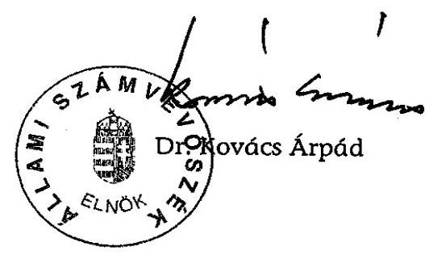
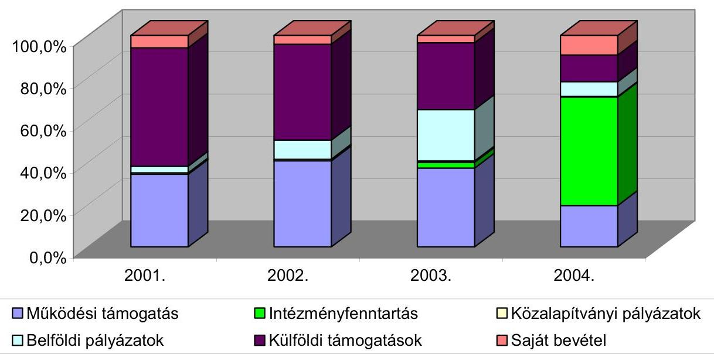
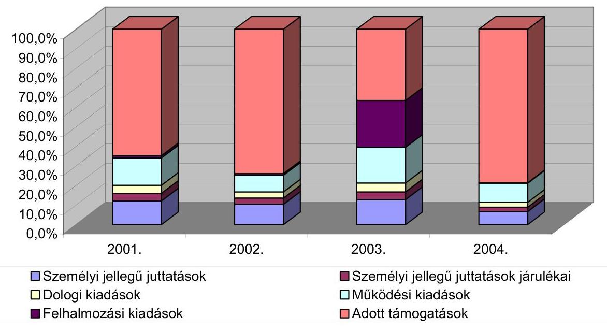
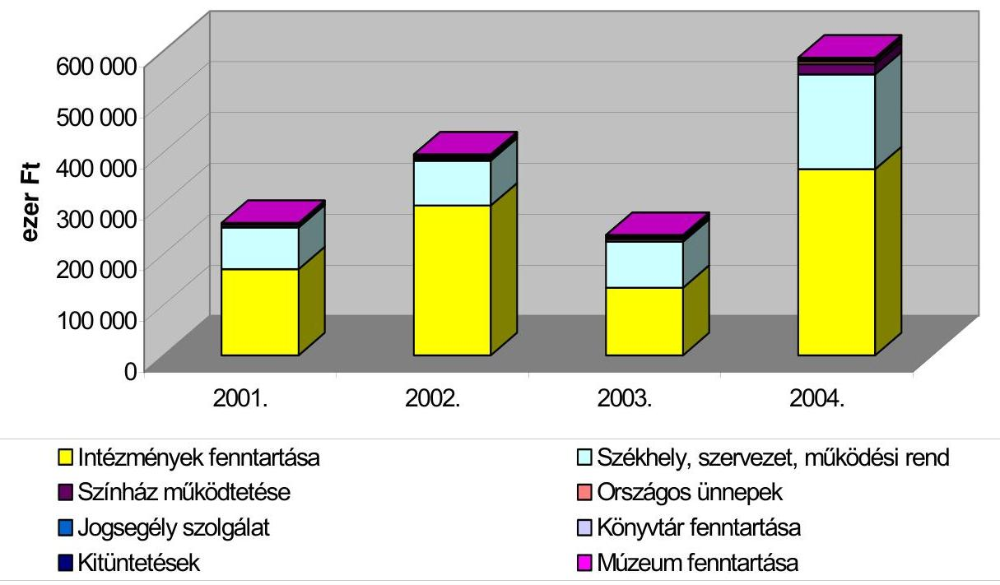

# JELENTÉS 

a Magyarországi Németek Országos Önkormányzata 2001-2004. évi pénzügyigazdasági tevékenységének ellenőrzéséről

---

3. Önkormányzati és Területi Ellenőrzési Igazgatóság
3.1. Szabályszerüségi Ellenőrzési Főcsoport
Iktatószám: V-1003-024/2005.
Témaszám: 753
Vizsgálat-azonosító szám: V0224
Az ellenőrzést felügyelte:
Dr. Lóránt Zoltán
főigazgató
Az ellenőrzés végrehajtásáért felelős:
Dr. Elek János
általános főigazgató-helyettes
Az ellenőrzést vezette:
Horváth Balázs
osztályvezető főtanácsos
Az összefoglaló jelentést készítette:
Dr. Faragóné Tóth Mária
tanácsos
Az ellenőrzést végezték:
Dr. Faragóné Tóth Mária Baracsi Szilvia Szendrey Lajos
tanácsos számvevő számvevő

# A témához kapcsolódó eddig készített számvevőszéki jelentések: 

címe
sorszáma
Jelentés a Magyarországi Németek Országos Önkormányzata 380 pénzügyi-gazdasági tevékenységének ellenőrzéséről
Jelentés az Országos Kisebbségi Önkormányzatok pénzügyi- 0201 gazdasági tevékenységének vizsgálatáról
Jelentés a Magyarországi Németek Országos Önkormányzata 0205 pénzügyi-gazdasági tevékenységének vizsgálatáról

---

# TARTALOMJEGYZÉK 

BEVEZETÉS ..... 5
I. ÖSSZEGZŐ MEGÁLLAPÍTÁSOK, KÖVETKEZTETÉSEK, JAVASLATOK ..... 7
II. RÉSZLETES MEGÁLLAPÍTÁSOK ..... 10

1. A feladatellátás szervezettsége, szabályozottsága ..... 10
1.1. Az önkormányzat szervezeti és működési rendje ..... 10
1.2. A gazdálkodási feladatok szabályozása ..... 10
1.3. A feladatellátás szervezeti háttere ..... 11
2. Az önkormányzat gazdálkodásának jellemzői ..... 11
2.1. A gazdálkodási tevékenység feltételei ..... 11
2.2. Vagyongazdálkodás, vagyonvédelem ..... 12
2.3. A gazdálkodás számviteli szabályozása ..... 12
3. Az éves költségvetések jóváhagyása, végrehajtása ..... 13
3.1. Az éves költségvetések elkészítése, elfogadása ..... 13
3.2. A költségvetés végrehajtása, zárszámadása ..... 14
3.3. A költségvetési feladatok teljesítése ..... 14
3.3.1. A költségvetési törvényben megállapított támogatás alakulása ..... 14
3.3.2. Az intézmények költségvetési támogatása ..... 15
3.3.3. Pályázati támogatások elszámolása, felhasználása ..... 15
3.3.4. Kiadások alakulása, összetétele ..... 17
4. Az önkormányzat számviteli tevékenysége ..... 17
4.1. Az éves beszámolók összeállítása, jóváhagyása ..... 17
4.2. A könyvvezetési kötelezettség teljesítése ..... 18
4.3. A bizonylati rend és a bizonylati fegyelem érvényesülése ..... 18
5. Az önkormányzat ellenőrzési rendszere ..... 19
6. Az előző ellenőrzés javaslataira tett intézkedések ..... 19

---

# MELLÉKLETEK 

1. számú Az önkormányzat bevételei, mutatói 2001-2004.
2. számú Az önkormányzat kiadásai, mutatói 2001-2004.
3. számú Az önkormányzat kisebbségi feladatainak költségvetési támogatása, évenkénti változása 2001-2004. között
4. számú A központi költségvetésből nemzeti és etnikai feladatokra kapott 2001-2004. évi pályázati támogatások részletezése, mutatói
5. számú

Kimutatás az önkormányzatnál vizsgált pályázatokról, elszámolásának szabályszerűségéről

---

# RÖVIDÍTÉSEK JEGYZÉKE 

| ÁSZ | Állami Számvevőszék |
| :-- | :-- |
| IM | Igazságügyi Minisztérium |
| MEH | Miniszterelnöki Hivatal |
| MNEKK | Magyarországi Nemzeti Etnikai Kisebbségekért Közalapít- |
|  | vány |
| MNOÖ | Magyarországi Németek Országos Önkormányzata |
| Nek. tv. | A nemzeti és etnikai kisebbségek jogairól szóló 1993. évi |
|  | LXXVII. törvény |
| NEKH | Nemzeti és Etnikai Kisebbségi Hivatal |
| NKA | Nemzeti Kulturális Alapprogram |
| NKÖM | Nemzeti Kulturális Örökség Minisztériuma |
| OM | Oktatási Minisztérium |
| Számviteli törvény | A számvitelről szóló - többször módosított - 2000. évi C. |
|  | törvény |
| Szja tv. | A személyi jövedelemadóról szóló - többször módosított - |
|  | 1995. évi CXVII. törvény |

---

.

---

# JELENTÉS 

## a Magyarországi Németek Országos Önkormányzata 2001-2004. évi pénzügyigazdasági tevékenységének ellenőrzéséről

## BEVEZETÉS

A magyarországi német közösség létszámáról 2001. évben a népszámlálásnál átfogó felmérés készült. Eszerint 62233 magyar állampolgár vallotta magát német nemzetiségűnek, továbbá 88416 fő vallotta magát a német kulturális értékekhez, hagyományokhoz kötődőnek. Az MNOÖ és más felmérések alapján 220000 fő a közösséghez tartozók becsült létszáma.

Az MNOÖ céljai megvalósítása érdekében széleskörű kapcsolatrendszert épített ki. A magyar-német alapszerződés 1992-ben jött létre. Az alapszerződés megkötése óta Németországból folyamatosan érkezett támogatás a különböző közösségformáló tevékenységek múködéséhez, bútorok, számítógépek vásárlásához. Széles együttmúködés valósult meg az Alpok-Adria megállapodás keretében, amelynél Ausztria, Magyarország, Szlovénia, Horvátország határ menti régiói és Dél-Tirol a partnerek. Dél-Tirol jelentős támogatást adott a pécsi kollégium építéséhez és évek óta rendszeresen tart pedagógus továbbképzéseket. Külkapcsolataikban az anyaországi kapcsolatok fenntartása mellett az elmúlt években szorosabbra fűzték együttműködésüket az egyes EU tagállamok német kisebbségeivel, valamint az Európai Népcsoportok Föderális Uniójával.

Az MNOÖ folyamatos kapcsolatot tart az állami szervekkel, ezen belül a Nemzeti és Etnikai Kisebbségi Hivatallal, az Oktatási Minisztériummal, a Nemzeti és Kulturális Örökség Minisztériummal.

Az MNOÖ széleskörű, jól kiépített területi és szakmai szervezeti háttérrel és feltételekkel rendelkezik a nemzeti és etnikai kisebbségek jogairól szóló törvényben meghatározott feladatok ellátására. A 2002. évi önkormányzati és kisebbségi önkormányzati választáson 340 német kisebbségi önkormányzat alakult. A települési önkormányzatoknál 35 polgármestert és 418 önkormányzati képviselőt választottak meg német nemzetiségi jelöltként.

Az önkormányzati választásokat követően 2003. január 26-án, Budapesten választották meg az MNOÖ 53 fős közgyűlését. Lemondások miatt a közgyűlés létszáma 51 főre csökkent. Az újonnan választott MNOÖ 2003 márciusában kezdte meg munkáját. Az önkormányzat közjogi struktúrája a vizsgált időszakban változatlan maradt.

A megyei szövetségi rendszer sajátos módon kapcsolódik az országos önkormányzat munkájához. Alapvető feladata a helyi kisebbségi önkormányzatok munkájának segítése, és a megyei közgyűlések felé a sajátos kisebbségi igények megjelenítése. Jelenleg 12 megyei szövetség, Budapesten a törvényeknek megfelelően Fővárosi Kisebbségi Önkormányzat múködik. A megyei szövetségek el-

---

nökei és tagjai munkájukért díjazást nem kapnak. Segítőik az MNOÖ által létrehozott regionális irodák munkatársai, akik ezen túl, az MNOÖ határozatainak végrehajtásában, a helyi német lakosság problémáinak megoldásában, a helyi kisebbségi önkormányzatok munkájának segítésében, továbbá az információk átadás-átvételében fejtik ki tevékenységüket. A megyei szövetségek munkáját az önkormányzat hivatala pénzügyi, jogi, szakmai támogatások formájában is segíti.

Az MNOÖ megbízásából a Neue Zeitung adja ki a Deutscher Kalender c. évkönyvet. A szerkesztőség a Magyarországi Németek Házában működik. Az 1957 óta működő Neue Zeitung hetilap, átfogó képet nyújt a német nemzetiség életéről, a Magyarország és Németország kapcsolatairól, a hazai és németországi települések kapcsolatairól.

Az Állami Számvevőszékről szóló - többször módosított - 1989. évi XXXVIII. törvény 2. § (5) bekezdése, valamint a nemzeti és etnikai kisebbségek jogairól szóló 1993. évi LXXVII. törvény 57. §-ában kapott felhatalmazás alapján vizsgáltuk, hogy a különböző állami forrásokból juttatott pénzeszközök felhasználása a jogszabályi előírásoknak megfelelően történt-e. A törvényi felhatalmazás alapján az Állami Számvevőszék 2005. évi ellenőrzési tervének megfelelően vizsgálta a Magyarországi Németek Országos Önkormányzata (továbbiakban: MNOÖ) 2001-2004. évi pénzügyi-gazdasági tevékenységének törvényességét.

# Az ellenőrzés célja annak megállapítása volt, hogy: 

- az országos kisebbségi önkormányzat működési feltételrendszere miként változott a vizsgált időszakban;
- a gazdálkodás szervezettsége, szabályszerűsége mennyiben felel meg a jogszabályi követelményeknek és az önkormányzati múködés sajátosságainak;
- biztosított volt-e a gazdálkodás és a pénzeszközök felhasználásának törvényessége és szabályserúsége, a számviteli törvény és a vonatkozó kormányrendeletek előírásainak betartása.

Az ellenőrzés a 2001-2004. beszámolóval lezárt gazdálkodási évekre terjedt ki.
A helyszíni ellenőrzés: 2005. április 1- május 5. között, az MNOÖ székhelyén történt.

---

# I. ÖSSZEGZŐ MEGÁLLAPÍTÁSOK, KÖVETKEZTETÉSEK, JAVASLATOK 

Az MNOÖ szervezett, szabályozott múködési kereteket biztosított az önkormányzati feladatok törvényes és hatékony ellátásához. Az önkormányzat megválasztott, döntéshozó, irányító testületei szabályszerűen múködtek. Az Alapszabályban a nemzeti és etnikai kisebbségi törvénnyel összhangban szabályozták a közgyúlési, bizottsági, elnökségi, szövetségi hatásköröket, funkciókat. Az ÁSZ előző jelentésének javaslatára közgyűlési határozattal a szabályozást kiegészítették. Az országos kisebbségi feladatok ellátása 2003-2004 között három oktatási, kollégiumi funkciót ellátó, önálló költségvetési szervvel bővült. Társulási megállapodást kötöttek 2004. január 1-jei hatállyal a Magyarországi Német Színház fenntartására. Az intézmények alapításánál érvényt szereztek a törvényi előírásoknak, teljesítették a szerződésben vállalt kötelezettségeket. A 2003. végén részben önálló költségvetési szervként alapított Magyarországi Német Kulturális és Információs Központ pénzügyi-gazdasági feladatai ellátására az államháztartás múködési rendje szerint nem jelöltek ki önálló gazdálkodó szervet, illetve nem hoztak létre saját gazdasági szervezeti egységet.

Az MNOÖ feladatai teljesítéséhez, gazdálkodási tevékenységéhez rendelkezett a szükséges személyi és tárgyi feltételekkel. Az önkormányzatnál foglalkoztatottak átlaglétszáma 2002-ben 21 fơről 22 főre emelkedett. A foglalkoztatási létszám fele-fele arányban oszlik meg a közgyúlési hivatal, illetve a regionális irodák között. A foglalkoztatottaknak kiadott munkaköri leírásokban meghatározták az ellátandó feladatokat, képesítési köröket. A könyvelést, beszámolást és költségvetési kapcsolatokat - megbízási szerződéssel - könyvelő szolgáltatóval végeztették. Az ingyenes használatú, állami tulajdonú székház állagát megóvták, berendezését korszerűsítették.

A vagyongazdálkodás alapelveit, rendelkezési és döntési jogköreit a vonatkozó törvényi rendelkezésekkel összhangban szabályozták. A tulajdonosi jogokat a közgyúlés kizárólagos hatáskörrel gyakorolta. Az önkormányzat mérleg szerinti vagyonértéke a vizsgált időszak alatt 844155 ezer Ft-ról 1100408 ezer Ft-ra emelkedett. A növekedés $30 \%$-ot meghaladó mértékének háromnegyedét a tárgyi eszközök vagyongyarapodása eredményezte. A vagyongazdálkodási intézkedések előzetes közgyúlési határozaton alapultak.

A vagyonvédelem érvényesülését szolgálták az éves leltározás szabályzatnak megfelelő végrehajtása, könyvvizsgálati ellenőrzése, valamint a kárbiztosítási szerződések kötése. A belső előírás 2001-2004. időszakban sérült, mivel együttesen 3550 ezer Ft bruttó értékű, de nullára leírt számítás- és irodatechnikai berendezés selejtezéséről felvett jegyzőkönyvben a megsemmisítés, hasznosítás módját nem dokumentálták.

Az MNOÖ a vizsgált időszakban rendelkezett a közgyűlés által elfogadott éves költségvetéssel. Az Alapszabálynak megfelelően a költségvetések előterjesztése a bizottságok véleményére, illetve az államháztartás tervezési követelménye-

---

ire figyelemmel történt. A költségvetést évente azonos bevételi és kiadási jogcímekkel, összehasonlítható szerkezetben készítették. Az önkormányzati költségvetés végrehajtása során a gazdálkodásban érvényesült a célszerűség és takarékosság. A kötelezettségeket közgyűlési felhatalmazással vállalták, folyamatosan gondoskodtak a pénzügyi egyensúly megőrzéséről. Az I. féléves költségvetés teljesítésének értékelése alapján rendszeresen módosították a tervet. A zárszámadást az egyszerűsített éves beszámolóval együtt - könyvvizsgálói jelentéssel kiegészítve - fogadta el a közgyűlés.

Az önkormányzat bevételei a 2001. évi bázishoz képest 2004. évre 131,1\%-kal nőtt. Az éves költségvetési törvényekben megállapított múködési célú támogatás 2004-ben szinten maradt, a központi költségvetés nem finanszírozta az inflációval járt többletköltségeket és az intézmény átvétellel jelentkezett többletfeladatok személyi és járulékos kiadási fedezetét. Az átvett oktatási intézmények 2004. évi költségvetési támogatása az összes bevétel 51,2\%-át tette ki.

A kisebbségi feladatok központi költségvetési támogatása a négyéves periódusban együttesen 1478272 ezer Ft-tal teljesült, melyből az intézmények fenntartására $65,2 \%$, az önkormányzat múködésére $30,3 \%$ jutott. Az MNOÖ a központi költségvetésből 285705 ezer Ft pályázati támogatást kapott, - a 20012002. évben három eset kivételével - szerződéses feltételekkel. A támogatások felhasználásának elszámolása szabályszerűen, határidőben történt, a célszerűséget a pályázati feltételeknek megfelelően dokumentálták. A támogató három esetben nem fogadta el az elszámolást, az MNOÖ a hiánypótlást a támogató felhívására elvégezte. Az önkormányzat külföldi támogatásokkal közvetlenül a támogató felé számolt el, a fel nem használt pénzösszeget visszafizette.

A gazdálkodás számviteli szabályzatait a 2001. január 1-jétől hatályba lépett számviteli törvény rendelkezéseihez képest hiányosan aktualizálták. A szabályozások módosítása nem terjedt ki a vállalkozási tevékenységre. A kiadott új számviteli politika a törvény előírása ellenére nem határozta meg a megbízható és valós képet lényegesen befolyásoló hiba nagyságát, továbbá a következetesség elvének kivételével nem tartalmazta a beszámoló összeállításánál, a kettős könyvvitelben érvényesítendő számviteli elveket. Az eszközök és források leltárkészítési és leltározási szabályzatban nem jelölték ki a leltározási körzeteket. A számlarendben nem szabályozták a vállalkozási tevékenység nyilvántartási követelményét, a főkönyvi adatok és mérlegsorok összefüggését, végül hiányzott az összhang a számlarend, számlatükör, főkönyv között. A szabályozási hiányosságok gazdálkodási hibát, mulasztást nem okoztak.

Az MNOÖ 2001-2004. évre összeállított egyszerűsített éves beszámolói a számviteli törvény és vonatkozó végrehajtási rendelete szerint készültek. Ennek megbízhatóságát és valódiságát évente könyvvizsgáló felülvizsgálta, melynek eredményeként az éves beszámolókra minden alkalommal tiszta véleményt, hitelesítő záradékot adott. A beszámolók valódiságát nem érintette, hogy a kettős könyvvitelben a rendeleti előírás ellenére elkülönítetten nem tartották nyilván a vállalkozási tevékenység költségét. A bizonylati rend és bizonylati fegyelem meghatározott alaki, tartalmi követelményei érvényesültek.

Az Alapszabály választott Ellenőrző Bizottság hatáskörébe utalta az önkormányzati múködés és gazdálkodás jogszerűségének ellenőrzését. A testület éves

---

munkaterv alapján, rendszeresen véleményezte az éves költségvetés tervezetét, az előző évi gazdálkodás értékeléséről szóló beszámolót. A bizottság ellenőrzése nem terjedt ki a 2003-2004. évben jelentőssé vált pályázati támogatásokra, átvett intézményekre. Az alapított költségvetési szervezetek ellenőrzése intézményi beszámoltatás formájában valósult meg. Az elnökség az éves beszámolókat és zárszámadásokat könyvvizsgálati véleménnyel terjesztette elő közgyűlési jóváhagyásra. A vezetői és folyamatba épített ellenőrzés - a pénztárellenőrzés kivételével - a belső szabályozásnak megfelelően funkcionált. A vizsgált időszak első felében, létszámhiányból fakadóan időszakosan nem volt megoldott a pénztár-ellenőrzési funkciók ellátása. Összességében az Önkormányzat ellenőrzési rendszere segítette a gazdálkodás eredményességét, jogszerűségét.

Az ÁSZ előző jelentésének javaslataira közgyűlési határozattal módosították a gazdálkodási és számviteli szabályozásokat. Alapszabálya kiegészült a törzsvagyon meghatározásával, egyben a gazdasági társaságok feletti tulajdonosi jogok gyakorlását a közgyűlés kizárólagos hatáskörébe vonták. A számviteli politikát és kapcsolódó szabályzatait hiányosan aktualizálták.

A helyszíni ellenőrzés megállapításainak hasznosítása mellett javasoljuk

# az Önkormányzat elnökének: 

1. A számviteli politikában alakítsa ki a gazdálkodás adottságainak, körülményeinek leginkább megfelelő szabályozást:
a) határozza meg a számviteli törvény 15-16. § előírásaival összhangban a beszámolás és könyvvezetés területén érvényesítendő számviteli elvek tartalmát;
b) rendelje el a vállalkozási tevékenység elkülönített kimutatásának számlarendi szabályozását, figyelemmel a 224/2000. (XII. 19.) Korm. rendelet 8. § (9) bekezdésben foglaltakra;
c) egészítse ki a leltározási körzetek meghatározásával az eszközök és források leltárkészítési és leltározási szabályzatát.
2. Intézkedjen a részben önálló intézmény pénzügyi-gazdasági feladatainak szabályszerű ellátására, figyelemmel az államháztartás működési rendjéről szóló 217/1998. (XII. 30.) Korm. rendelet 14. § (5)-(6) bekezdésében foglaltakra.
3. Gondoskodjon a számviteli törvény 161. § előírásaihoz igazodó számlarend kialakításáról.
4. Biztosítsa a vagyonvédelem érdekében a selejtezett tárgyi eszközök megsemmisítésének, hasznosításnak szabályszerű dokumentálását.
5. Terjessze elő az ellenőrző bizottság alapszabályban meghatározott feladatkörének kibővítését az alapított intézmények, pályázati támogatások rendszeres ellenőrzésével.

---

# II. RÉSZLETES MEGÁLLAPÍTÁSOK 

## 1. A feladATELLÁTÁs SZERVEZETTSÉGE, SZABÁLYOZOTTSÁGA

### 1.1. Az önkormányzat szervezeti és múködési rendje

Az MNOÖ szervezeti felépítését, működésének szabályait az 1999. évtől hatályos Alapszabály rögzítette, amely a 2003. március 29-i közgyűlési határozattal, az ÁSZ előző ellenőrzésének javaslatára módosult. Az Alapszabály meghatározta az MNOÖ jogállását, feladatát és hatáskörét. Részletesen szabályozta az önkormányzati szervek közötti döntési jogkört és munkamegosztást.

Az MNOÖ feladatait és hatásköreit a közgyűlés gyakorolta. Az önkormányzatot érintő legfontosabb gazdálkodási kérdések eldöntése a közgyűlés át nem ruházható hatáskörébe tartozott. A közgyűlés feladatainak hatékonyabb ellátása és határozatai törvényességének biztosítása érdekében 6 bizottság múködött. A közgyűlések közötti időszakban az önkormányzatot az elnökség irányította, amely tevékenységéről rendszeresen beszámolt a legfőbb döntéshozó testületnek.

A megyei szövetségek és a fővárosi német önkormányzat közvetítő szerepet töltött be a helyi önkormányzatok és az országos önkormányzat között. Összehangolták a megyékben lévő önkormányzatok munkáját. Az MNOÖ tevékenységével, testületi múködésével kapcsolatos feladatokat a közgyülés hivatala látta el, melyhez 11 regionális hivatal tartozott.

### 1.2. A gazdálkodási feladatok szabályozása

Az MNOÖ feladatkörét a Nek. tv. 36-39. §-ával összhangban szabályozták. Az Alapszabály IX. fejezetében meghatározták az önkormányzat gazdálkodásával és költségvetésével kapcsolatos szabályokat. Megállapították az önkormányzat múködésének pénzügyi feltételeit és forrásait. Az MNOÖ Alapszabálya, közgyűlési hivatalának szervezeti és működési szabályzata, valamint elnökségi ügyrendje szabályozta a költségvetés elkészítését, a zárszámadás összeállítását. A költségvetés tervezését az államháztartásról szóló 1992. évi XXXVIII. törvény és az éves költségvetési törvények alapján végezték. Az elnökség tett javaslatot az éves költségvetési tervre és annak alapelveire. A közgyűlés hivatalának feladatkörébe tartozott a költségvetési tervezet előkészítése. A közgyűlésnek, az elnökségnek a gazdálkodásra vonatkozó határozatai végrehajtásáért az elnök, az elnökhelyettesek és a hivatalvezető viseltek felelősséget.

Előzetes bizottsági véleményezést követően a közgyűlés kizárólagos hatáskörébe tartozott az éves költségvetés és zárszámadás elfogadása, az intézmények alapítása és fenntartása, az önkormányzati vagyon feletti rendelkezési jogkör, a törzs- és egyéb vagyon megállapítása, a gazdasági társaság alapítása, a vállalkozásban való részvétel engedélyezése.

---

# 1.3. A feladatellátás szervezeti háttere 

Az MNOÖ feladatai ellátásához - az ellenőrzött időszak kezdetén - egy közalapítványban vett részt, egy korlátolt felelősségű és egy közhasznú társasággal rendelkezett. A német nemzetiségi feladatok ellátásának szervezeti keretei 2003-2004 között költségvetési intézményekkel bővültek:

2003. szeptember 1-jén alapította a pécsi Valéria Koch Kollégiumot, amely önállóan gazdálkodó költségvetési szerve;
2003. november 29-én alapította a Magyarországi Német Kulturális és Információs Központot, amely részben önállóan gazdálkodó költségvetési szerve;
2004. január 1-jétől társulási megállapodással tartja fenn a Magyarországi Német Színházat, amelynek állami támogatáson felüli múködéséhez 50\%-os hozzájárulást biztosít;
2004. július 1-jétől átvette a pécsi Koch Valéria Óvoda, Általános Iskola és Középiskola, továbbá pilisvörösvári Német Nemzetiségi Gimnázium, Közgazdasági Szakközépiskola és Kollégium fenntartói jogát, amelyek önállóan gazdálkodó költségvetési szervei.

Az intézmények alapításánál a törvényi előírások szerint jártak el. Az önkormányzati intézmények fenntartói jogának átvételére szabályszerű szerződést kötöttek, a múködtetésnél érvényesültek a jogszabályi és szerződéses követelmények. A részben önállóan gazdálkodó költségvetési szerv pénzügyigazdasági feladatainak ellátására nem jelöltek ki önálló gazdálkodó szervet, illetve nem hoztak létre saját gazdasági szervezeti egységet. Ezzel megsértették az államháztartás múködési rendjéről szóló 217/1998. (XII. 30.) Korm. rendelet 14. § (5)-(6) bekezdésben foglaltakat.

## 2. AZ ÖNKORMÁNYZAT GAZDÁLKODÁSÁNAK JELLEMZŐI

### 2.1. A gazdálkodási tevékenység feltételei

Az MNOÖ gazdálkodási tevékenységét hivatali szervezetével és külső megbízásokkal oldotta meg. Az önkormányzatnál foglalkoztatottak átlaglétszáma 22 fő, amely a vizsgált időszakban 1 fővel emelkedett. A közgyűlési hivatal 10 fős létszámmal múködik, amelyet egyetemi végzettségú hivatalvezető irányít. A teljes létszámból 11 fő a regionális irodavezetők száma. A foglalkoztatottaknak kiadott munkaköri leírásokban meghatározták az ellátandó feladatokat, képesítési követelményeket. A könyvelést, mérlegbeszámoló- és adóbevallás készítést megbízási szerződés alapján, könyvelő szolgáltatóval végeztették. A gazdálkodáshoz kapcsolódóan két fő gazdasági referenst foglalkoztattak, akik az előírt szakképesítéssel rendelkeztek. Az MNOÖ székháza a Magyar Állam tulajdona, amelynek tervszerű állagmegóvásáról gondoskodtak, korszerű berendezését külföldi forrásból fedezték.

A rendelkezésre álló személyi és technikai feltételek megfelelő alapot biztosítanak az Alapszabályban megjelölt nemzetiségi célok és feladatok teljesítéséhez.

---

# 2.2. Vagyongazdálkodás, vagyonvédelem 

Az önkormányzat gazdálkodásának és vagyonkezelésének alapelveit, a vagyonnal kapcsolatos rendelkezési, döntési jogköröket - a Nek. tv. 60. § előírásaival összhangban - az Alapszabályban szabályozták. Az önkormányzatot megillető tulajdonosi jogokat a közgyűlés kizárólagos hatáskörrel gyakorolta. A vagyongazdálkodással összefüggő intézkedések minden esetben közgyűlési határozaton alapultak.

Az MNOÖ mérlegszerinti eszközértéke a vizsgált időszakban 844155 ezer Ft-ról 1100408 ezer Ft-ra emelkedett. A növekedés 30\%-ot meghaladó volt, melynek háromnegyede a tárgyi eszközökhöz kapcsolódott. Legjelentősebb beruházásként a pécsi kollégium emelhető ki. A szükséges ingatlan megvásárlását követő épület felújításra 60000 ezer Ft hitelt vettek igénybe. Ennek fedezetére, majd lejárat előtti kiegyenlítésére az 1997. évi egyszeri vagyonjuttatásból rendelkezésre állt MOL részvények szolgáltak, amelyet 2004-ben 59928 ezer Ft-ért, a névérték kétszeresén értékesítettek. Értéknövekedést eredményezett, hogy folyamatosan végezték a tulajdonban, használatban lévő tárgyi eszközök korszerűsítését, állagmegóvását.

A leltározás ingatlanoknál 5 évenként, berendezéseknél 2 évenként, személyeknek kiadott tárgyak esetén évente valósult meg a kiadott szabályzat előírásai szerint. A leltározást, a könyvvizsgálatot végző minden évben szúrópróbaszerűen ellenőrizte, szabályszerűnek minősítette. A vagyonvédelem érdekében kárbiztosítási szerződéseket is kötöttek. Az önkormányzat szabályozta a feleslegessé vált vagyontárgyak hasznosítását, selejtezését. A belső szabályozás előírása ellenére 2001-ben 50 ezer Ft bruttó értékű fénymásolót, 2002-ben 3500 ezer Ft bruttó értékű, nullára leírt számítástechnikai berendezést úgy vezették ki a könyvekből, hogy a felvett selejtezési jegyzőkönyvben a megsemmisítés, hasznosítás módját nem dokumentálták.

### 2.3. A gazdálkodás számviteli szabályozása

Az MNOÖ a számvitelről szóló 2000. évi C. törvény alapján, 2001. január 1-jei hatállyal új számviteli politikát adott ki, amelyben a gazdasági sajátosságokra figyelemmel a szabályzatokat hiányosan aktualizálták. A szabályozás módosítása nem terjedt ki a vállalkozási tevékenységre. Az Alapszabály a Nek. tv. 60. § (3) bekezdésének megfelelően csak olyan vállalkozásban való részvételre adott lehetőséget, amelynek felelőssége nem haladta meg a vagyoni hozzájárulásának mértékét.

A számviteli politika előírása értelmében egyszerűsített éves beszámolóval, kettős könyvvitellel teljesítették a számviteli törvény és végrehajtási rendeletének előírásait. Az eredmény-kimutatás összeállításánál az összköltség eljárást alkalmazták. Meghatározták az évközi és év végi zárlatok, az éves beszámoló készítésének rendjét, időpontját. A számviteli törvény 3. § (3) bekezdés 5. pont előírása ellenére a megbízható és valós képet lényegesen befolyásoló hiba nagyságát nem határozták meg. A számviteli politika a következetesség elvének kivételével nem tartalmazta a törvény 14-16. §-a szerint érvényesítendő elveket.

---

A számviteli törvény 14. § (5) bekezdésének a) pontja szerint kiadott eszközök és források leltárkészítési és leltározási szabályzata a leltári egységek, körzetek kijelölését nem tartalmazta. A szabályozás hiányossága mulasztáshoz nem vezetett.

Az eszközök és források értékelési szabályzata az általános értékelési szabályok mellett rendelkezett az eszközök bekerülési értékének meghatározásáról, a nyilvántartási érték változásának eseteiről, az év végi értékelés módjáról.

A pénzkezelési szabályzat rögzítette az utalványozással, a házipénztár múködtetésével, a pénzszállítással kapcsolatos szabályokat. Előírták, hogy a pénztáros az utalványozóval és a pénztári ellenőrrel azonos személy nem lehet. Utalványozási joggal az önkormányzat elnöke és a közgyűlési hivatal vezetője rendelkezett. A kötelezettségvállalási jogkört az önkormányzat elnöke a közgyűlés korlátozásával, illetve a hivatalvezető 500 ezer Ft értékhatárig gyakorolta. A pénztári ellenőr feladataként jelölték meg a bizonylatok alaki és tartalmi, valamint a pénztárjelentés egyezőségének ellenőrzését.

A számlarend alapvető hiányossága, hogy nem vették figyelembe az önkormányzat múködési sajátosságait. Nem szabályozták a vállalkozási tevékenység és a részben önálló intézmény elkülönített számviteli nyilvántartását, a főkönyvi számlák záró adatainak a mérlegbeszámoló soraival való összefüggését. A számlarend nem volt összhangban a számlatükörrel, a főkönyvi kivonattal. A szabályozási hiányosságok gazdálkodási hibát nem okoztak.

# 3. Az ÉVES KöltsÉGvetÉsek JÓvÁHAGYÁSA, VÉGREHAJTÁSA 

### 3.1. Az éves költségvetések elkészítése, elfogadása

Az MNOÖ-nál az éves költségvetések elkészítése során érvényesültek a belső szabályozás előírásai. Az Alapszabálynak megfelelően a közgyűlés szervei, a bizottságok részt vettek a közgyűlés döntéseinek előkészítésében, a tervezésben. A költségvetés megalapozottságát segítette, hogy évenként azonos szerkezetben, azonos elvek alapján, többlépcsősen készült. Az azonos bevételi és kiadási jogcímek biztosították az évek közötti összehasonlítást. Az éves költségvetéseket közgyűlési határozattal fogadták el. A jóváhagyott költségvetésben, 2001. évben 2511 ezer Ft tartalékot, a 2002. évben a pécsi kollégium beruházására 100080 ezer Ft céltartalék igénybevételét tervezték. A pénzügyi tervezésnél a konkrét feladatok forrásigényét, illetve felhasználását elkülönítetten határozták meg. A kisebbségi feladatoknak megfelelő bevételi és kiadási jogcímeket, költséghelyeket alakítottak ki.

A költségvetési bevételeket és kiadásokat főbb jogcímenként részletezték. A bevételek tervezése során az összegszerűen ismert forrásokat vették számításba. Az intézményi bevételeket és kiadásokat 2003. évtől intézményenként különkülön tervezték.

---

# 3.2. A költségvetés végrehajtása, zárszámadása 

A MNOÖ-nál a költségvetés végrehajtása során kötelezettségeket csak közgyűlési határozat felhatalmazása alapján vállaltak. Folyamatosan gondoskodtak az önkormányzat pénzügyi egyensúlyának fenntartásáról. A 2001. évi költségvetésben tartalékkal terveztek és zártak, mivel Pécsett ütemezték a kollégium kialakítását, amelyhez külföldi támogatásból ingatlant vásároltak.

Az elfogadott költségvetési előirányzatokat a közgyűlés éven belül egy alkalommal, az első féléves teljesítés tárgyalásánál, az addig ismertté vált támogatások, pályázatok összegével módosította. Az MNOÖ a 2003. és 2004. években bevételi többlettel zárt. Az önkormányzat összes bevétele - 2002. év kivételével dinamikusan növekedett, a 2001. évi bázishoz képest 2004. évre 131,1\%-kal nőtt. A kiadás 2001. évhez viszonyított növekedési indexe lényegesen a bevétel növekedési indexe alatt maradt (1-2. számú melléklet).

Az önkormányzat a zárszámadás keretében külön beszámolót készített a költségvetés szerkezete szerinti feladatoknak, jogcímeknek megfelelő bontásban. A zárszámadást az egyszerűsített éves beszámolóval együtt - könyvvizsgálói jelentéssel kiegészítve - fogadta el az önkormányzat közgyűlése.

### 3.3. A költségvetési feladatok teljesítése

Az MNOÖ a költségvetés végrehajtása során megőrizte pénzügyi egyensúlyát, biztosította a feladatok célszerú végrehajtását. Az országos önkormányzat a négyéves ciklusban 1478272 ezer Ft központi költségvetési támogatásban részesült. Ennek 65,2\%-át intézményi fenntartásra és kollégiumi felújításra, továbbá $30,3 \%$-át a székhely és szervezet múködésével összefüggő kiadásokra fordították (3. számú melléklet).

### 3.3.1. A költségvetési törvényben megállapított támogatás alakulása

Az MNOÖ múködési célra felhasználható költségvetési támogatását 20012002. évben az IM, 2003-2004. évben a Miniszterelnöki Hivatal fejezetnél tervezték. Az MNOÖ-nál a 143200 ezer Ft támogatást 2002. évben, kormányhatáskörben a 1192/2002. (XI. 7.) Korm. határozat alapján, 500 ezer Ft-tal csökkentették. Az MNOÖ 2004. évben az előző évivel azonos 165600 ezer Ft összegű támogatást kapott. Az önkormányzatok a Nemzetiségi és Etnikai Kisebbségi Hivatalon (továbbiakban NEKH) keresztül nyújtották be a Miniszterelnöki Hivatal kezelésébe tartozó költségvetési tervszámaikat. A benyújtott igényekkel ellentétben a támogatás összege nem nőtt. A múködési célú támogatás változatlan szinten maradt, nem finanszírozták meg az inflációt, és az állami feladat átvételével (kollégium, iskola) az önkormányzatnál jelentkező hivatali többletfeladatok létszám- és bérfedezetét.

Az MNOÖ-nál az összes bevételen belül az évenkénti múködési célú központi támogatás részaránya a vizsgált időszakban a 2001. évi 34,3\%-ról, 2004-ben 19,6\%-ra csökkent (1/B. számú melléklet).

---

# 3.3.2. Az intézmények költségvetési támogatása 

Az MNOÖ az általa alapított és átvett oktatási intézmények finanszírozására és fenntartására 2003-2004. évben 444911 ezer Ft támogatást kapott. Az önkormányzatnál 2003. évben a bevétel 2,7\%-át kitevő 11850 ezer Ft-ban csak a kollégium normatív állami hozzájárulása szerepelt. A kollégiumnál a 2003. szeptember 1-december 31-ig terjedő időszakra a működés támogatását a NEKH 19000 ezer Ft-os pályázatából egészítették ki. A kollégium múködési támogatása szerződés szerint teljesült. Az OM-mal 2003. évre kötött közoktatási megállapodás még nem volt, ezért erre az időszakra saját forrásból biztosították a múködtetést. A három oktatási intézmény 2004. évi normatív és múködési állami támogatása 433061 ezer Ft, amely az összes bevétel $51,2 \%$-át tette ki (1. számú melléklet).

### 3.3.3. Pályázati támogatások elszámolása, felhasználása

A MNOÖ által a központi költségvetésböl a nemzeti és etnikai kisebbségi feladatokra a vizsgált négyéves ciklusban 285705 ezer Ft összegű pályázati támogatást kapott (4. számú melléklet). A számadatokból tükröződik, hogy a 2001. évi támogatáshoz képest 2004-re ugrásszerűen 7,9-szeres növekedés következett be a központi költségvetésből kapott pályázati támogatásoknál. A dinamikus növekedést az intézmények átvételével, fenntartásával kapcsolatos többletköltségek finanszírozásához kapott támogatások eredményezték. A támogatások évek közötti megoszlását értékelve megállapítható, hogy a pályázati összegek 39, illetve 44\%-át 2003-2004. évben kapták.

Az ellenőrzés a központi költségvetésből nemzeti és etnikai kisebbségi feladatokra kapott 68 pályázatot vizsgálta, amelyek a tételes pályázati támogatás $87,3 \%$-át tették ki. Az MNOÖ az igényelt 259518 ezer Ft helyett 247653 ezer Ft-ot kapott (5. számú melléklet).

Az OM-től 21 pályázatra összesen 26555 ezer Ft támogatást kaptak. a pályázatok $43 \%$-át a német nyelvü pedagógusok, óvónők továbbképzésére fordították. A programok finanszírozása utólagosan történt. A pályázatban megjelölt feltételeknek megfelelően mind a pénzügyi, mind a szakmai beszámolók elkészültek, résztvevők listáját mellékelték, és határidőben benyújtották a támogató felé. A dokumentumok alapján az ellenőrzés megállapította, hogy a pályázatokra kapott összegeket a pályázati feltételeknek megfelelően használták fel.

A MNEKK-hez benyújtott pályázatok a vizsgált pályázati összegek 3\%-át tették ki. A támogatást könyvkiadásra, a Deutscher Kalender megjelentetésére, a trogeni táborozás hozzájárulására, a közéleti szakemberek és fiatal kisebbségi újságírók képzésére, a magyar német önkormányzat napján tartott kulturális rendezvényekre fordították. A benyújtott pályázatok közül kidolgozatlan program miatt 2003-ban kettőt elutasítottak. Támogatásokat szabályszerűen a pályázatban megjelölt jogcímekre számolták el. A támogató 3 esetben nem fogadta el az elszámolást, egy esetben a szerződés szerint az elszámolás részét képező jelenléti ívet nem csatolták, két esetben a számlák nem voltak hitelesítve. Az MNOÖ a hiánypótlást a támogató felhívására elvégezte.

---

Az MNOÖ 2001. évben az IM, 2002-2003. évben a MEH fejezeti kezelésébe rendelt kisebbségi koordinációs és intervenciós keretből kapott összesen 35300 ezer Ft értékű támogatást. A 2001. évben 5000 ezer Ft-ra nyújtott be kérelmet a Lendvay utcai kulturális központ működtetéséhez. Ehhez csatolták a kiadások bontását, ebben saját erőt 2407 ezer Ft-ban jelöltek meg. A támogató 5000 ezer Ft összeget biztosított a kulturális központ működtetésére. A támogatás összegével az MNOÖ hitelesített számlamásolatokkal, határidőre elszámolt. Erre az összegre az IM külön támogatási szerződést nem kötött. A támogató 2002. évben szintén kisebbségi intervenciós keretből a pécsi középiskolai kollégium épületének felújításához 10000 ezer Ft-ot és 14600 ezer Ft-ot biztosított. Ezekre az összegekre sem kötött a MEH támogatási szerződést. A 2003. évben a keretből igényelt támogatások felhasználását szerződésben rögzítették.

A NEKH-hez „kisebbségi intézmények átvételének és fenntartásának támogatása" célelőirányzatára 181973 ezer Ft támogatási kérelmet nyújtottak be. A 2003. évben 42000 ezer Ft-ot felhalmozásra a Pécs, Mikes Kelemen u. 13. szám alatti ingatlanon végzett beruházás befejezéséhez kapták, továbbá a támogató a működési költségekre (bérjellegű kifizetések, dologi kiadások, eszközbeszerzések) 10000 ezer Ft összegű támogatást biztosított. A támogató a 42000 ezer Ft-ot a szerződésben rögzített határidőben utalta, a 10000 ezer Ft-ot határidőn túl. Az MNOÖ a támogatásokról szabályszerűen, határidőben elszámolt. A kollégiumi beruházást a hatályos jogszabályoknak megfelelően a műszaki ellenőr folyamatosan ellenőrizte, az erről szóló ellenőri jelentést az MNOÖ az ellenőrzés rendelkezésre bocsátotta. Az MNOÖ a bajai Magyarországi Németek Általános Művelődési Központ működésére 8900 ezer Ft támogatást, valamint kollégium felújításra és tűzjelzőrendszer kialakításra 6900 ezer Ft támogatást kért. A támogatási szerződés az MNOÖ felelősségével köttetett. A támogatás elszámolása a támogatási szerződésben foglaltak szerint történt.

Az MNOÖ a központi költségvetési támogatásokat - három eset kivételével - az államháztartás múködési rendjéről szóló 217/1998. (XII.30.) Korm. rendelet 8789. §-aiban foglalt tartalmi követelményekkel összhangban álló szerződéses feltételekkel kapta. A pályázatok benyújtásához a pályázati feltételek szerinti tartalmi és formai követelményeknek megfelelő dokumentumokat csatolták. A pályázati támogatások elszámolása szabályszerűen, határidőben történt, a célszerű felhasználást a pályázati feltételeknek megfelelően dokumentálták. A pályázatok gondozását a benyújtásától az elszámolásig a hivatalban dolgozó négy szakreferens végezte. A szakreferensek figyelemmel kísérték a pályázatok kiírási, beadási határidejét, a benyújtással kapcsolatos feltételeket, elvégezték a pályázati támogatások elszámolásával összefüggő dokumentációs feladatokat.

Az MNOÖ külföldi támogatásokkal biztosította bevételeinek jelentős részét. A vizsgált időszakban a támogatások arányaiban csökkenő tendenciát mutattak: 2001. évben 55,9\%, 2002. évben 45,3\%, 2003. évben 31,5\% és 2004. évben 12,6\% (1/B. számú melléklet). Rendszeres támogatásokat kapott a városlődi tábor működtetésére, a nemzetiségi ünnepségekre, a könyvkiadásra, a regionális irodák múködésének kiegészítésére, a kollégium kialakítására. A külföldi támogatásokkal közvetlenül a támogató felé számolt el, a fel nem használt öszszegeket visszafizette. A támogatások vagy közvetlenül a német kisebbségi szervezetekhez kerültek, vagy az MNOÖ költségvetésén keresztül átutalták az adott projectekre.

---

# 3.3.4. Kiadások alakulása, összetétele 

Az önkormányzati kiadások a forrásokkal összhangban változtak. A költségvetés teljesítése során előző évi pénzmaradvány, valamint eseti hitel igénybe vételével megőrizték az önkormányzat pénzügyi egyensúlyát, biztosították a feladatok célszerű végrehajtását. Az éves kiadások növekedésével az adott támogatások túlsúlya erősödött: 2001-ben 64,7 \%, 2002-ben 73,9 \%, végül 2004-ben 78,6 \% részarányt képviselt. Intézményalapításhoz kapcsolódóan a 2003. évi költségvetésben 96069 ezer Ft felhalmozási kiadás is teljesült (2. számú melléklet).

A költségvetési beszámolókban 2001-2002. évekre az adott támogatások tették ki a kiadások több mint kétharmadát. A továbbadott támogatások a pécsi kollégium átvételével, beruházásával, valamint az intézménymúködéssel összefüggésben teljesültek. A támogatások között szerepelt a megyei szövetségeknek rendezvényekre, táborokra biztosított fedezet is. 2004-ben az átadott támogatásokban szerepeltették a fenntartásra átvett három oktatási intézmény múködési fedezetét. Az MNOÖ a helyi kisebbségi önkormányzatok által megvalósítandó feladatokat 2001-ben 435 ezer Ft-tal, 2002-ben 250 ezer Ft-tal, 2003-ban 2390 ezer Ft-tal, 2004-ben 3067 ezer Ft-tal támogatta.

A személyi jellegű kifizetésben az MNOÖ hivatala és a regionális irodák alkalmazottainak bére szerepelt. A személyi jellegű kiadások arányaiban csökkentek. Az átvett intézményekkel összefüggő hivatali többletfeladatokat a központi költségvetés nem finanszírozta meg, így az MNOÖ-nál 2002. évtől a foglalkoztatottak átlagos létszáma ( 22 fő) nem növekedett. Az MNOÖ gazdálkodására jellemzően a dologi és múködési kiadások összes kiadáson belüli részaránya a vizsgált időszakban 18,1\%-ról 12,3\%-ra csökkent. Múködési kiadások között a hivatal és a regionális irodák múködési kiadásai jelentek meg. Dologi kiadások az összes kiadás 5\%-át nem érték el.

## 4. Az ÖNKORMÁNYZAT SZÁMVITELI TEVÉKENYSÉGE

### 4.1. Az éves beszámolók összeállítása, jóváhagyása

A MNOÖ a vizsgált időszakban egyszerűsített éves beszámolót készített a számviteli törvény, valamint a számviteli törvény szerinti egyes egyéb szervezetek beszámoló-készítési és könyvvezetési kötelezettségének sajátosságairól szóló 224/2000. (XII. 19.) Korm. rendeletben foglaltak alkalmazásával. Az egyszerűsített éves beszámoló mérlegből, eredmény-kimutatásból és kiegészítő mellékletből áll, amit az MNOÖ a rendelet 4. számú melléklete, valamint a számviteli törvény szerint meghatározott formában és a számviteli politikában meghatározott időpontban - május 31-ig - készített el.

Az egyszerűsített éves beszámolót mindhárom évben költségvetési minősítéssel rendelkező könyvvizsgáló felülvizsgálta és hitelesítő záradékkal látta el. A 2001-2003. évi beszámolókat a könyvvizsgálói jelentéssel és a zárszámadással együtt a közgyűlés jóváhagyta. Az ellenőrzés a 2002. évi beszámolóban tárt fel hibát, amelynek mértéke nem érte el a számviteli törvény 3. § (3) bekezdés 5. pontjában meghatározott mértéket.

---

# 4.2. A könyvvezetési kötelezettség teljesítése 

Az MNOÖ az ellenőrzött időszakra könyvvezetési kötelezettségének a számviteli törvény szerint magyar nyelven, számítógépen vezetett kettős könyvvitel rendszerében tett eleget.

A főkönyvben a vállalkozási tevékenység költségét a számviteli törvény szerinti egyes egyéb szervezetek beszámoló készítési és könyvvezetési kötelezettségének sajátosságairól szóló 224/2000. (XII. 19.) Korm. rendelet 8. § (9) bekezdése szerint elkülönítetten nem tartották nyilván, azt csak az analitikából való kigyűjtésből lehetett megállapítani.

A kettős könyvvitellel alátámasztott éves beszámoló és a pénzforgalmi szemléletű költségvetési zárszámadás összeállítása közötti összhangot a költségviselőre és költséghelyre munkaszám alapján lekérdezhető főkönyvi könyvelési rendszerben teremtették meg. Így a számítógépes könyvelésből az ellenőrzés számára minden szükséges adat rendelkezésre állt.

A főkönyvi könyvelés az eszközök és források állományának és azok év közben bekövetkezett változásainak megbízható kimutatására alkalmas volt. A könyvvezetés során a belső előírások határidőit betartották, minden változás rögzítése legkésőbb az év végéig megtörtént. Az MNOÖ regionális irodái működési támogatásának elszámolása havi rendszerességgel, a belső utasításnak megfelelően történt. Az elszámolási dokumentumokat rendszeresen ellenőrizték és a könyveléssel folyamatosan egyeztették. A megyei szövetségek az ellenőrzött időszakra működési támogatást kaptak az MNOÖ-tól, a támogatás felhasználása a Hivatalba beküldött elszámolások alapján került be a költségvetésbe. Ezt év végén egyeztették a főkönyvi könyveléssel.

### 4.3. A bizonylati rend és a bizonylati fegyelem érvényesülése

Az MNOÖ a személyi jellegű kifizetéseket szabályosan kiállított bizonylatok alapján számfejtette. A vizsgált időszakban a társadalombiztosítási és adózási adatszolgáltatások szabályszerűen bizonylatoltak. A költségvetési bevallási, befizetési kötelezettségeket határidőben teljesítették. A könyvelés adatait folyamatosan egyeztették a nyilvántartásokkal és az APEH folyószámla kivonattal. A kisebbségi önkormányzat eleget tett a számviteli törvény 166. § (3) bekezdésének, a számviteli bizonylatokat magyar nyelven (is) kiállította. A bizonylatokat érvényesítő rendelkezett az államháztartás múködési rendjéről szóló 217/1998. (XII. 30.) Korm. rendelet 135. § (2) bekezdésében foglalt képesítéssel, megbízásánál figyelemmel voltak a 138. § (1)-(2) bekezdése szerinti összeférhetetlenségi előírásokra is.

Az utalványozásnál számla-előlapot alkalmaztak, amely tartalmazta az időpontokat, a számla összértékét, az elrendelő és ellenőrző aláírását; a költségnemek, költséghelyek megnevezését, illetve kódját, valamint az utalás engedélyezését. A bizonylatolás alaki és tartalmi követelményei érvényesültek.

---

# 5. AZ ÖNKORMÁNYZAT ELLENŐRZÉSI RENDSZERE 

Az Alapszabály választott Ellenőrző Bizottság hatáskörébe utalta az önkormányzati múködés és gazdálkodás jogszerűségének ellenőrzését. A háromfős testület éves munkaterv alapján végezte tevékenységét. Feladatkörében rendszeresen véleményezte az éves költségvetés tervezetét, valamint az előző évi gazdálkodás értékeléséről szóló beszámolót. Vizsgálta és szabályszerűnek minősítette a megyei szövetségek, regionális irodák támogatásának felhasználását, a pénztári kifizetéseket, a leltározás lebonyolítását. A bizottság ellenőrzése nem terjedt ki a 2003-2004. időszakban jelentőssé vált pályázati támogatásokra, átvett intézményekre. Ütemezésének hiánya kapcsolatba hozható azzal, hogy az Alapszabályban meghatározott funkciók a gazdálkodási változásokra figyelemmel nem módosultak. Az alapított költségvetési szervezetek ellenőrzése intézményi beszámoltatás formájában valósult meg, amelynek keretében a közgyűlés külön-külön tárgyalta, fogadta el a négy intézmény adott évi költségvetési és szakmai beszámolóját. Az MNOÖ elnöksége könyvvizsgálati audit jelentéssel kiegészítve terjesztette elő közgyűlési jóváhagyásra 20012004. évi egyszerűsített éves beszámolóit. A megbízott könyvvizsgáló társaság minden alkalommal korlátozás nélküli véleményt adott. A vezetői és folyamatba épített ellenőrzés - a pénztárellenőrzés kivételével - a belső szabályozásnak megfelelően funkcionált. Létszámhiányból fakadóan a pénztárellenőrzési feladatokat 2003. júniusáig nem látták el.

## 6. AZ ELŐZŐ ELLENŐRZÉS JAVASLATAIRA TETT INTÉZKEDÉSEK

Az ÁSZ előző jelentéseinek javaslataira az MNOÖ közgyűlési határozattal módosította gazdálkodási és számviteli szabályozásait. Alapszabálya kiegészült a törzsvagyon meghatározásával, egyben a gazdasági társaságok feletti tulajdonosi jogok gyakorlását a közgyűlés kizárólagos hatáskörébe vonták. A számviteli politikát és kapcsolódó szabályzatait a számviteli törvény, illetve az egyéb szervezetek éves beszámoló-készítésének és könyvvezetési kötelezettségének sajátosságairól szóló 224/2000. (XII. 19.) Korm. rendelet előírásaihoz képest hiányosan korszerűsítették.

Budapest, 2005. Jüllus C.

Melléklet: 5 db

---

# AZ ÖNKORMÁNYZAT BEVÉTELEI, MUTATÓI 2001-2004 

A/ A pénzforgalmi bevételek alakulása, változása
Adatok ezer forintban

| Megnevezés | Pénzforgalmi bevétel teljesítése |  |  |  |
| :-- | :--: | :--: | :--: | :--: |
|  | $\mathbf{2 0 0 1}$. (bázis) | $\mathbf{2 0 0 2 .}$ | $\mathbf{2 0 0 3 .}$ | $\mathbf{2 0 0 4 .}$ |
| Múködési | 125800 | 142700 | 165600 | 165600 |
| Intézményi |  |  | 11850 | 433061 |
| Közalapítványi | 2600 | 2950 | 2600 | 2975 |
| Belföldi | 11555 | 31544 | 108216 | 59330 |
| Külföldi | 204512 | 159045 | 139564 | 106680 |
| Saját bevétel | 21583 | 14844 | 15494 | 78248 |
| Összes bevétel | $\mathbf{3 6 6 0 5 0}$ | $\mathbf{3 5 1 0 8 3}$ | $\mathbf{4 4 3 3 2 4}$ | $\mathbf{8 4 5 8 9 4}$ |
| Változás (\%) |  | $\mathbf{- 4 , 1}$ | $\mathbf{2 1 , 1}$ | $\mathbf{1 3 1 , 1}$ |

B/ A bevételek pénzforgalmi forrásonkénti megoszlása

---

# AZ ÖNKORMÁNYZAT KADÁSAI, MUTATÓI 2001-2004 

A/ A pénzforgalmi kiadások alakulása, növekedése
Adatok ezer forintban

| Megnevezés | Pénzforgalmi kiadás teljesítése |  |  |  |
| :-- | :--: | :--: | :--: | :--: |
|  | $\mathbf{2 0 0 1 . ( b a ́ z i s )}$ | $\mathbf{2 0 0 2 .}$ | $\mathbf{2 0 0 3 .}$ | $\mathbf{2 0 0 4 .}$ |
| Személyi jellegü | 42173 | 50086 | 51572 | 49895 |
| Személyi járulék | 13792 | 15520 | 15822 | 16196 |
| Dologi kiadások | 14574 | 14898 | 18384 | 18185 |
| Múködési kiad. | 49368 | 41311 | 73456 | 72273 |
| Felhalmozási | 4367 | 3892 | 96069 | 1357 |
| Adott támogatás | 227978 | 356653 | 146438 | 581474 |
| Összes kiadás | $\mathbf{3 5 2 2 5 2}$ | $\mathbf{4 8 2 3 6 0}$ | $\mathbf{4 0 1 7 4 1}$ | $\mathbf{7 3 9 3 8 0}$ |
| Növekedés (\%) |  | $\mathbf{3 6 , 9}$ | $\mathbf{1 4 , 0}$ | $\mathbf{1 0 9 , 9}$ |
| Átlaglétszám(fö) | 21 | 22 | 22 | 22 |

B/ A pénzforgalmi kiadások jogcímenkénti megoszlása

---

# AZ ÖNKORMÁNYZAT KISEBBSÉGI FELADATAINAK KÖLTSÉGVETÉSI TÁMOGATÁSA, ÉVENKÉNTI VÁLTOZÁSA 2001-2004. KÖZÖTT 

A/ A kisebbségi feladatokra fordított költségvetési támogatás és megoszlása
Adatok ezer forintban

| Feladatok megnevezése | Központi költségvetési támogatás |  |
| :-- | :--: | :--: |
|  | Együttes összege | Megoszlás \%-a |
| Intézmények fenntartása | 963524 | 65,2 |
| Székhely, szervezet, múködés | 447657 | 30,3 |
| Színház múködtetése | 22438 | 1,5 |
| Országos ünnepek | 19344 | 1,3 |
| Jogsegély szolgálat | 13092 | 0,9 |
| Könyvtár fenntartása | 8112 | 0,5 |
| Kitüntetések | 3700 | 0,3 |
| Múzeum fenntartása | 405 | 0,0 |
| Mindösszesen | $\mathbf{1 4 7 8 2 7 2}$ | $\mathbf{1 0 0 , 0}$ |

B/ A költségvetési támogatás évenkénti, feladatonkénti alakulása

---

A központi költségvetésből nemzeti és etnikai kisebbségi feladatokra kapott 2001-2004. évi pályázati támogatások részletezése, mutatói

|  Támogatást nyújtó központi fejezet, közalapítvány alapprogram megnevezése | Gazdálkodási évek |  |  |  | 2001-2004.
együttesen  |
| --- | --- | --- | --- | --- | --- |
|   | 2001. | 2002. | 2003. | 2004. |   |
|  Nemzeti Etnikai Kisebbségi Hivatal | 0 | 0 | 103170 | 102195 | 205365  |
|  Oktatási Minisztérium | 4905 | 5244 | 3796 | 19352 | 33297  |
|  Igazságügyi Minisztérium | 5000 | 24600 | 0 | 0 | 29600  |
|  Magyarországi Nemzeti Etnikai Kisebbségekért Közalapítvány | 2600 | 2950 | 2600 | 2975 | 11125  |
|  Nemzeti Kulturális Örökség Minisztérium | 1650 | 200 | 1250 | 500 | 3600  |
|  Gazdasági Minisztérium | 0 | 1500 | 0 | 0 | 1500  |
|  Nemzeti Kulturális Alapprogram | 0 | 0 | 0 | 1218 | 1218  |
|  Mindösszesen: | 14155 | 34494 | 110816 | 126240 | 285705  |
|  Mutatók: |  |  |  |  |   |
|  |   |   |   |   |   |
|  Növekedési index $2001=100 \%$ |  | $144 \%$ | $683 \%$ | $792 \%$ |   |
|  |   |   |   |   |   |
|  Megoszlási index | $5 \%$ | $12 \%$ | $39 \%$ | $44 \%$ | 100\%  |

---

|  Támogató neve | Pályázat témája | Pályázatok száma 2001-2004. évben | Támogatás ezer forintban |  | Felhasználás jogcíme, finanszírozás módja | Szabályszerủen elszámoltak-e? | Volt-e támogatói ellenőrzés?  |
| --- | --- | --- | --- | --- | --- | --- | --- |
|   |  |  | igényelt | megítélt |  |  |   |
|  Oktatási Minisztérium | Kisebbségi anyanyevi hagyományőrző olvasó táborok | 9 | 5 998 | 4 650 | Utazás, szállás, étkezés szerződés aláírását követően utalja a Támogató | Igen | Nem  |
|  OM Közoktatási és Kisebbségi Kapcsolatok Főosztálya | Magyar Német Kulturális Vegyesbizottság Állandó Álbizottsági projektekre | 8 | 8 847 | 11 405 | Terembérlet előadói díj, szervezési ktg., szállás, utiköltség, étkezés (utófinanszírozás) | Igen | Nem  |
|  OM | Találkozás, pihenés, képzés - csereprojekt | 2 | 1 100 | 1 000 | Utiköltség (utófinanszírozás) | Igen | Nem  |
|  OM | Könyvkiadás (Die Deutschen in Ungarn) | 1 | 500 | 500 | Nyomdaköltség (utófinanszírozás) | Igen | Nem  |
|  OM | Intézményi nemzetiségi feladat támogatása | 1 | 10 000 | 9 000 | Három intézmény működésére, normatíva kiegészítéséhez forrás | Igen | Nem  |
|  MNEKK | Találkozás, pihenés, képzés - csereprojekt | 3 | 1 400 | 1 400 | Utiköltség, A program kezdete előtt 15 nappal utalja a Támogató | Igen | Nem  |
|  MNEKK | Rendezvénysorozat a magyarországi németek házában l és II.félév, Gála 2005 | 7 | 3 350 | 3 050 | Szállás-, szervezési-, nyomda-, szállítási-, anyag-, útiköltség program kezdete előtt 15 nappal, 2004-ben utófinanszírozás | Igen | Igen két esetben, a számlák nem voltak hitelesítve, egy esetben a jelenléti ív hiányzott  |
|  MNEKK | Kiadói tevékenység és kalendárium kiadása | 3 | 3 300 | 3 225 | Nyomdaköltség 2002-ben a program kezdete előtt 15 nappal, 2003-ban utófinanszírozás | Igen | Nem  |
|  MNEKK | Kisebbségi újságírók képzése | 2 | 600 | 600 | Honorárium, szállás ellátás | Igen | Nem  |
|  MEH, IM | Kisebbségi koordinációs és intervenciós keret | 6 | 35 300 | 35 300 | Lendvay u. Kulturális Kp. működéséhez, pécsi kollégiumi épület, Júlia utcai székház felújításához városiődi Iglauer Park feljlesztéséhez | Igen | Nem  |
|  NKÖM | Könyvkiadás, Kiállítás szervezés, Rendezvénysorozat, Továbbképzés | 8 | 2 850 | 1 860 | Személyi juttatás, dologi kiadás, étkezési költség 2002-ben utófinanszírozás, 2003-ban a szerződés visszaküldésétől számított 30.nap | Igen | Nem  |
|  NKA | Gála 2003, 2005, Kalender 2005 | 3 | 4 300 | 3 488 | A Németnyelvű Színházak Találkozója elmaradt, módosítása a pályázatnak 2003. évi Gálára, terembérlet, utiköltség, szállás, tiszteletdíj, kalendárium nyomdaköltsége | Igen | Nem  |
|  NEKH | Kisebbségi intézmények átvételének és fenntartásának támogatása | 15 | 181 973 | 172 175 | Felújítási költség, beruházás, működési költség, javítási költség | Igen | Nem  |
|  Pályázatok öszesen együtt: |  | 68 | 259 518 | 247 653 |  |  |   |