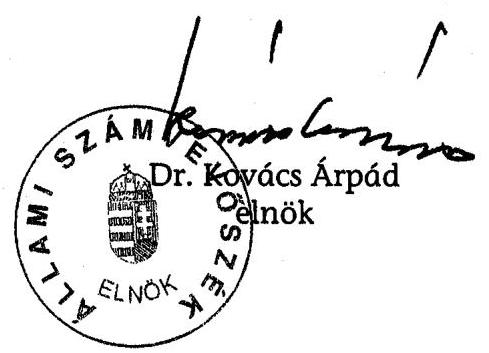
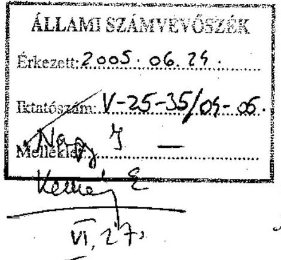
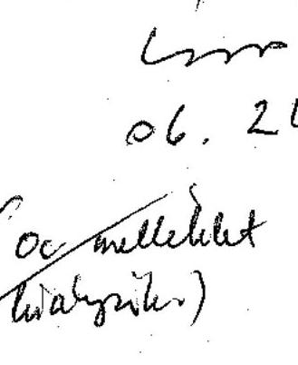
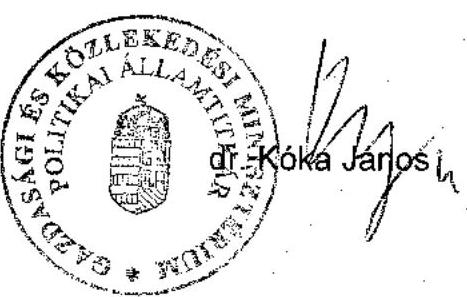
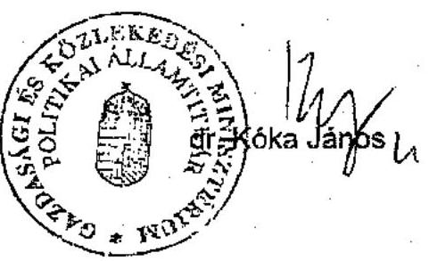

# JELENTÉS 

## a Magyar Exporthitel Biztosító Rt. működésének ellenőrzéséről

---

# 2. Államháztartás Központi Szintjét Ellenőrző Igazgatóság 

2.1. Teljesítmény Ellenőrzési Főcsoport

Iktatószám: V-25-36/2004-2005.
Témaszám: 734.
Vizsgálat-azonosító szám: V0184

## Az ellenőrzést felügyelte:

Bihary Zsigmond
főigazgató
Az ellenőrzés végrehajtásáért felelős:
Kemény Emil
főcsoportfőnök
Az ellenőrzést vezette:
Makkai Mária
főcsoportfőnökhelyettes
Az ellenőrzést végezték:

| Lucza Anikó | Massányi Tibor | Németh Béláné |
| :-- | :-- | :-- |
| számvevő | számvevő | főtanácsadó |
| Tornai József | Kovácsy Tamás |  |
| tanácsadó | külső munkatárs |  |

A témához kapcsolódó eddig készített számvevőszéki jelentések:
címe
sorszáma
Jelentés a magyar áruk és szolgáltatások exportjának 0013
ösztönzéséhez fűződő állami érdekek érvényesülése a Magyar Export-Import Bank Rt. és a Magyar Exporthitel Biztosító Rt. tevékenységén keresztül címú vizsgálatról

---

# TARTALOMJEGYZÉK 

BEVEZETÉS ..... 7
I. ÖSSZEGZŐ MEGÁLLAPÍTÁSOK, KÖVETKEZTETÉSEK, JAVASLATOK ..... 11
II. RÉSZLETES MEGÁLLAPÍTÁSOK ..... 17

1. A Biztosító feladata, működésének szabályozottsága és szervezete ..... 17
1.1. A Biztosító feladata és működésének szabályozottsága ..... 17
1.2. A Biztosító szervezete, döntési és irányítási tevékenységének szabályozottsága ..... 18
2. A tulajdonosi irányítás és a vezető testületek működése ..... 19
2.1. A tulajdonosi jogok gyakorlójának részvétele a Biztosító irányításában ..... 19
2.2. A vezető testületek működése ..... 21
3. A Biztosító középtávú stratégiája és éves üzleti tervei ..... 22
3.1. A stratégiai célok és az üzleti tervek meghatározása ..... 22
3.2. A középtávú stratégiai célkitűzések és az üzleti tervek végrehajtása ..... 23
4. A nem-piacképes biztosítási tevékenység értékelése ..... 27
4.1. A jogszabályi előírások érvényesítése, belső szabályozottság ..... 27
4.2. Az éves fedezetbevételek és a biztosítási állomány alakulása ..... 28
4.3. A Biztosító kockázatelbírálási és kockázatkezelési tevékenysége ..... 29
4.4. A díjpolitika és a nem-piacképes biztosításokból származó díjbevételek ..... 30
4.5. A céltartalék-képzés elszámolása ..... 31
4.6. A biztosító kárkezelési tevékenysége ..... 33
5. A piacképes biztosítási tevékenység értékelése ..... 36
5.1. A piacképes biztosítások fedezetbevételének, díjbevételének alakulása ..... 36
5.2. A kockázatelbírálási tevékenység ..... 38
5.3. A díjszámítási rendszer ..... 38
5.4. A biztosítástechnikai tartalékok ..... 40
5.5. A kárkezelési és kárbehajtási tevékenység ..... 42
5.6. A viszontbiztosítás ..... 43
6. A gazdálkodás értékelése ..... 44
6.1. Az eredmény alakulása, az eredményre ható tényezők ..... 44
6.2. Az üzletágak jövedelmezőségének alakulása ..... 46
6.3. A befektetési tevékenység értékelése ..... 49

---

# MELLÉKLETEK 

1/a sz. A pénzügyminiszter észrevétele
1/b sz. A gazdasági és közlekedési miniszter észrevétele
2. sz. A befektetések bevételei és ráfordításai
3. sz. A számviteli törvény szerinti bérköltség bemutatása 2000-2004
4. sz. Kritériumok a Magyar Exporthitel Biztosító Rt. működését ellenőrző vizsgálathoz
5. sz. Strukturált kérdések a Magyar Exporthitel Biztosító Rt. működésének teljesítmény-ellenőrzéséhez

## FÜGGELÉK

A korábbi ÁSZ ellenőrzésben a Mehib Rt. ügyvezetése számára megfogalmazott ajánlások végrehajtása

---

# RÖVIDÍTÉSEK JEGYZÉKE 

| Áht. | 1992. évi XXXVIII. törvény az államháztartásról |
| :--: | :--: |
| ÁKK | Államadósság Kezelő Központ Rt. |
| ÁPV Rt. (vagy Tulajdo- | Állami Privatizációs és Vagyonkezelő Rt. |
| nos) |  |
| ÁSZ | Állami Számvevőszék |
| Bit. | 1995. évi XCVI. törvény és 2003. évi LX. törvény a biztosítókről és a biztosítási tevékenységről |
| Etv. | 1994. évi XLII. törvény a Magyar Export-Import Bank Részvénytársaságról és a Magyar Exporthitel Biztosító Részvénytársaságról |
| Eximbank Rt. | Magyar Export-Import Bank Rt. |
| FÁK | Független Államok Közössége |
| FB | Felügyelő Bizottság |
| Gt. | 1997. évi CXLIV. törvény a gazdasági társaságokról |
| KEHI | Kormányzati Ellenőrzési Hivatal |
| Mehib Rt., Biztosító | Magyar Exporthitel Biztosító Rt. |
| MFB Rt. | Magyar Fejlesztési Bank Rt. |
| npk. (táblázatokban) | nem-piacképes biztosítások/üzletág |
| OECD | Organisation for Economic Co-operation and Development (Gazdasági Együttműködési és Fejlesztési Szervezet) |
| pk. (táblázatokban) | piacképes biztosítások/üzletág |
| PM | Pénzügyminisztérium |
| Priv. tv. | 1995. évi XXXIX. törvény az állam tulajdonában lévő vállalkozói vagyon értékesítéséről |
| PSZÁF | Pénzügyi Szervezetek Állami Felügyelete |
| Ptk. | 1959. évi IV. törvény a Polgári Törvénykönyvről |
| SZMSZ | Szervezeti és Működési Szabályzat |
| Sztv. | 2000. évi C. törvény a számvitelről |
| WTO | World Trade Organisation (Világkereskedelmi Szervezet) |

---

.

---

# ÉRTELMEZŐ SZÓTÁR 

Biztosított
nem-piacképes biztosításoknál

Biztosított piacképes biztosításoknál

ECA
Fedezetbevétel

Globállimit

Kárhányad mutató
Szállítói-hitel biztosítás

Vevőhitel biztosítás

Viszontbiztosítás

A külkereskedelmi tevékenységet folytató vagy a vele közvetlen jogviszonyban álló belföldi gazdálkodó szervezet, a külföldön közvetlen vállalkozásba befektető belföldi gazdálkodó szervezet, valamint az exportcélú külkereskedelmi szerződéshez kapcsolódóan pénzügyi szolgáltatást (hitelezés, lízing, kezesség és bankgarancia vállalása) nyújtó pénzügyi intézmény. Egyes esetekben az a külföldi székhelyű hitelbiztosító, aki által - magyar exporthoz - nyújtott biztosítást a Mehib Rt. viszontbiztosítja.
Belföldi gazdálkodó szervezet; belföldi hitelintézet vagy pénzügyi vállalkozás; belföldi székhelyű, Magyarországra történő utaztatási tevékenységet végző, utazásszervezési szolgáltatást nyújtó vállalkozás.
Export Credit Agency (hitelezéssel, garancianyújtással, exporthitel biztosítással foglalkozó intézmény)
A biztosítás egyes módozatok szerinti tárgyára vonatkozó nyilvántartásba vétel a biztosítási szerződés szerinti kockázatviselés megkezdése, illetve díjszámlázás céljából, azaz a kiszállítás vagy gyártás azon tényleges értéke, amelyre a Mehib Rt. kockázatot vállal.
Az éves költségvetési törvényben a Mehib Rt. által a Kormány készfizető kezessége mellett vállalható nem piacképes kockázatú biztosítások összegének felső határa.
A tárgyévi kárfelhasználás és a tárgyévi díjak hányadosa.
Annak a(z export)hitelnek a biztosítása, amelyet a(z exportőr mint) szállító nyújt a vevőjének a (kül)kereskedelmi szerződésben a halasztott fizetési megállapodással.
Annak az exporthitelnek a biztosítása, amelyet egy bank közvetlenül az áru- vagy szolgáltatásvásárlás finanszírozására a vevőnek vagy a vevő bankjának nyújt.
A biztosító által vállalt kockázat egy részének vagy egészének szerződésben meghatározott feltételek alapján, díjfizetés ellenében más biztosító által történő átvállalása.

---

.

---

# JELENTÉS 

## a Magyar Exporthitel Biztosító Rt. működésének ellenőrzéséről

## BEVEZETÉS

A Magyar Exporthitel Biztosító Rt.-t (továbbiakban: Mehib Rt., vagy Biztosító) a Magyar Állam az 1994. évi XLII. törvény (továbbiakban: Etv.) alapján alapította az Eximbank Rt.-vel egyidőben. A két intézmény működtetésének célja a magyar export növekedésének és versenyképességének elősegítése, a pénzügyi kockázatok megosztása és a költségvetési háttérből eredő előnyök kihasználása révén. A Mehib Rt. a hitelezés, kezesség és különböző pénzügyi veszteségek biztosítását exportirányú külkereskedelmi ügyletekhez, nemzetközi segélyügyletekhez, külföldi befektetésekhez és belföldi értékesítéshez kapcsolódóan jogosult végezni.

A Biztosító két üzletága a nem-piacképes, valamint a piacképes kockázatok biztosítása. Nem-piacképes kockázatúnak minősül az a biztosítás, amely piaci feltételekkel nem biztosítható és nem viszontbiztosítható. A Magyar Állam a központi költségvetés terhére készfizető kezesként felel a Biztosító által a 312/2001. (XII. 28.) Korm. rendeletnek megfelelően vállalt nem-piacképes biztosításokból eredő fizetési kötelezettségek (kárfizetések) teljesítéséért. A piacképes biztosítások kárfizetéseit a Mehib Rt. saját üzleti bevételéből fedezi.

A nem-piacképes kockázatok biztosításának feltételrendszerét, illetve költségvetési forrásokból való támogathatóságát több EU rendelkezés és tanácsi határozat, valamint az OECD irányelvei szabályozzák. A Biztosító működésére vonatkozó nemzetközi előírások a hazai jogszabályokba beépültek. A piacképes biztosításokat számviteli és egyéb nyilvántartásaiban elkülönítetten vezeti a Biztosító az EU támogatáspolitikai elveit követve.

Az exporthitel-biztosítás állami támogatása uniós és tengerentúli gyakorlaton alapul. A piaci alapon működő hitelbiztosítók egyes országokban, régiókban nem vállalják az exportkárok fedezését a gyakori piaci anomáliák, a lehetséges válságok, háborúk, terrorveszély stb. miatt, ezért a fokozott kockázatú országokba irányuló export kockázatainak enyhítéséhez az állam nyújt segítséget a nemzeti költségvetés terhére.

A fejlett országok exportösztönző intézményrendszereinek kiépítése több évtizedes múltra tekint vissza. Az exporthitel-biztosítás a gazdaságpolitikai és kormányzati célok megvalósulását szolgáló exportösztönzési eszközök egyike. A nemzetközi normák szerint működtetett és államilag támogatott exporttámogatási rendszerek keretében ezek az intézmények elősegítik a nemzeti áruk,

---

szolgáltatások exportját és a külföldi beruházásokat. A nyugat-európai ECA-k (Export Credit Agencies), azaz a hitelezéssel, garancianyújtással, exporthitel biztosítással foglalkozó intézmények az export támogatásával a foglalkoztatottságot és a gazdaság növekedését segítik elő. Ma már nemcsak az áruk és szolgáltatások, hanem a kormányzatok exportösztönző intézményei és tevékenységei is versenyeznek egymással. A korszerű szakmai háttér és kapacitás rendelkezésre állásából adódóan az ECA-k többségénél fix költséghányad áll szemben a jóval ingadozóbb forgalmú bevételi oldallal, így a nyereséges működés általában nem fogalmazódik meg követelményként, hanem a hosszú távon nem veszteséges tevékenység jelenik meg elvárásként. Az állami támogatást közvetítő intézmények egy része állami tulajdonban, egy része magántulajdonban áll. A hitelbiztosító 100%-os állami tulajdonban áll pl. Nagy-Britanniában, Belgiumban, Norvégiában, Svájcban és Csehországban, ugyanakkor pl. Németország, Franciaország, Hollandia és Ausztria hitelbiztosítója esetében nincs állami tulajdon, ezekben az országokban az ECA az állam ügynökeként - a költségvetés közvetlen kötelezettségvállalása mellett - lép fel.

A Biztosító tevékenysége megalakuláskor az ún. nem-piacképes (politikai) kockázatú biztosításra korlátozódott oly módon, hogy a vállalható kötelezettségekre a Kormány - a költségvetési törvényben meghatározott keretek között - készfizető kezességet vállalt. A nem-piacképes üzletág tekintetében a Biztosító az alapítói szándékkal és a nemzetközi szabályokkal összhangban tevékenységét nem klasszikus piaci szereplőként végzi, nincs üzleti riválisa, a pénzügyi rendszeren belül a piaci szereplők kiegészítő intézménye. Az EU nem tiltja a piacképes üzletág állami tulajdonban lévő biztosító által végzését, azt azonban előírja, hogy az üzletág művelését piaci alapon, versenyképes módon kell végezni, s azt az állam nem támogathatja. A Mehib Rt. 2004. május 1-jéig csak a vámszabad területen kívüli, nem multinacionális vállalatok által bonyolított exportot támogatta biztosítási tevékenységével, ezáltal a magyar export 43-45%-a képezte 2000-2003. évek között az exportösztönzés lehetőségét.

A 2000-2003 közötti időszakban a fejlett országokon kívülre irányuló export 43%-kal nőtt, miközben a Mehib Rt.-nél a fedezetbe (kockázatba) vett exportcélú biztosítási állomány ennél kedvezőbben, 60%-kal bővült, ezáltal tevékenységének exportlefedettsége javult. A Biztosító mindkét üzletágát jellemzi a magas koncentráció. A nem-piacképes területen ez folyamatosan fennáll (a lehetséges ügyfélszám viszonylag alacsony, kb. 30), míg a piacképes üzletág koncentrációja 2001-től fokozatosan csökken.

A Mehib Rt. működését az Etv., a gazdasági társaságokról szóló 1997. évi CXLIV. törvény (továbbiakban: Gt.), a piacképes üzletág tekintetében a biztosítókről és a biztosítási tevékenységről szóló 2003. évi LX. törvény (továbbiakban: Bit.) szabályozza (ezt megelőzően az 1995. évi XCVI. tv. volt hatályban). A nem-piacképes üzletág esetében a mindenkori költségvetési törvények az irányadóak.

A Mehib Rt. 2004 júniusáig az Etv. által deklaráltan a Magyar Állam egyszemélyes tulajdonában állt. A tulajdonosi jogokat 2000. január 18-tól az Állami Privatizációs és Vagyonkezelő Rt. (továbbiakban: ÁPV Rt. vagy Tulajdonos) gyakorolta. A pénzügyi szolgáltatásokhoz kapcsolódó egyes törvények módosításáról szóló 2004. évi XLVIII. törvény alapján 2004. december 15-től a közvet-

---

len állami tulajdon megszűnt, mivel az ÁPV Rt. térítés ellenében értékesítette a Biztosító 75%-1 szavazatot megtestesítő részvénycsomagját a Magyar Fejlesztési Bank Rt. (továbbiakban: MFB Rt.) részére, így ez a hányad közvetett állami tulajdonba került.

A Mehib Rt. tőkeellátottsága a fejlett európai régió exporthitel-biztosítóinak átlagához viszonyítva alacsony, kevesebb, mint annak egytizede. 2000-ben a Biztosító mérlegfőösszege 8269 millió Ft volt, amely 2004-re 9551 millió Ft-ra növekedett. A jegyzett tőke a vizsgált időszakban változatlanul 4250 millió Ft volt. A saját tőke 5943 millió Ft-ról 6331 millió
 Ft-ra emelkedett.

A Kormányzati Ellenőrzési Hivatal (továbbiakban: KEHI) minden évben ellenőrizte a Mehib Rt. központi költségvetéshez kapcsolódó elszámolásait és a törvényben előírt limit betartását.

A Pénzügyi Szervezetek Állami Felügyelete (továbbiakban: PSZÁF) 2002-ben átfogó ellenőrzést végzett a piacképes biztosítások tekintetében. 2003-ban tartott utóellenőrzése alapján a PSZÁF megállapította, hogy a Biztosító a korábbi PSZÁF határozatban foglalt kötelezettségeit teljesítette, azonban a vezetői levélben foglaltaknak csak részben tett eleget. Ezt követően 2004-ben is végzett a PSZÁF átfogó vizsgálatot, amelynek eredményeként felügyeleti intézkedés nem vált szükségessé.

Az ÁSZ a Mehib Rt.-nél 1999-ben átfogó vizsgálatot végzett. A jelentésben foglalt javaslatokat a Biztosító többségében teljesítette. A költségvetés végrehajtásának ellenőrzéséhez kapcsolódó éves ÁSZ vizsgálatok jelentős hibát nem tártak fel. A 2001. évi zárszámadás ellenőrzéséről készített jelentés egyik javaslatának megfelelően a Mehib Rt. 2002-től a december 31-i biztosítási állományról szóló, Pénzügyminisztérium (továbbiakban: PM) részére készített adatszolgáltatását az auditált beszámoló alapján is teljesíti.

A jelenlegi ellenőrzés célja annak értékelése volt, hogy a Biztosító működése, biztosítási tevékenysége megfelelt-e a törvényben és egyéb jogszabályokban előírtaknak, az állam tulajdonosi elvárásainak; az általa vállalt nem-piacképes kockázatok biztosítása összhangban volt-e a költségvetési törvény és a vonatkozó kormányrendelet előírásaival, a piacképes tevékenységet pedig a Bit. szabályait betartva folytatta-e; illetve szabályszerűen, célszerűen és eredményesen gazdálkodott-e.

Az ellenőrzés a Biztosító 2000-2004. évi tevékenységére irányult, de figyelemmel kísérte és értékelte a helyszíni vizsgálat végéig terjedő időszak adatait is. (A jelentésben 2004-re vonatkozóan még nem auditált adatok szerepelnek.)

Az ÁSZ előző átfogó ellenőrzése során megfogalmazott ajánlások megvalósításával kapcsolatos megállapításokat a függelék tartalmazza.

Az ellenőrzés alapját az Állami Számvevőszékről szóló 1989. évi XXXVIII. törvény 2. § (6) bekezdése képezte.

---

A jelentést egyeztetésre megküldtük a pénzügyminiszternek és a gazdasági és közlekedési miniszternek. Válaszleveleik másolatát a 1/a-b sz. mellékletek tartalmazzák.

---

# I. ÖSSZEGZŐ MEGÁLLAPÍTÁSOK, KÖVETKEZTETÉSEK, JAVASLATOK 

A Mehib Rt. a vizsgált időszakban (2000-2004 között) 353 milliárd Ft export realizálódását segítette elő azáltal, hogy a biztosítást igénylő magyar vállalkozások külpiaci - kereskedelmi és politikai - kockázatait részben átvállalta. A fejlett országokon kívüli exportra vetítve a Biztosító tevékenysége (piacképes és nem-piacképes ágazat együtt) 2004. évben az export 5,4%-át fedte le, ami nem jelentett lényeges változást 2000-hez képest, amikor ez a mutató 4,6% volt. Az export-hitelbiztosítás nagyobb mértékben azért nem volt bővíthető, mert egyrészt az export jelentős hányada multinacionális vállalatokon belül realizálódik, illetve a biztosítást a külföldi tulajdonossal hagyományos kapcsolatban álló biztosítók bonyolítják, másrészt - a Biztosító tájékoztatása szerint - a magyar tulajdonú kis- és középvállalkozások a jelenlegi díjmértékek mellett nem igénylik a hitelbiztosítást.

A Biztosító a vizsgált időszakban hatályos költségvetési törvények által a nem piacképes biztosításokra 250 milliárd Ft-ban meghatározott állományi korlátot átlagosan 30%-ban használta ki, ez az arány 2004-ben 25,5% volt. (A limitet terhelő biztosítások megfeleltek a belső összetételre meghatározott kormányelvárásoknak.) A biztosítások globállimithez viszonyított alacsony aránya - a szóba jöhető vállalkozások által magasnak ítélt díjakon túl - a biztosítható exportügyletek hiányára vezethető vissza, amelyre a Biztosítónak nincs ráhatása. A Biztosító aktív promóciós tevékenysége ellenére (termékbemutató körutak, ügyfélmegkeresések, együttműködés az Ipari és Kereskedelmi Kamarával) sem tudta nem-piacképes kapacitásainak kihasználtságát növelni.

A Mehib Rt.-nél 2002. január 1-jéig a belföldi hitelbiztosítások állománya az Etv. előírása szerint nem haladhatta meg az összes exportcélú kockázatvállalást. Ezen túl csak az köthetett hitelbiztosítást, aki exportcélú biztosítási szerződéssel is rendelkezett, ez a szabály 2003. január 1-jéig volt érvényben. A korlátozások feloldásának eredményeképpen a belföldi hitelbiztosítás jelentősége megnőtt, 2004-ben a teljes biztosítási forgalmon belül 61%-ot ért el aránya, ami 26%-ponttal magasabb a 2000. évinél. Ennek következtében a Biztosító tevékenységén belül az exportot elősegítő biztosítási forgalom csökkent.

1998-2003 között a Mehib Rt. stratégiája a Kormány által háromévente meghatározott gazdaságpolitikai elvárásokra épült. 2001-ben a Kormány értékelte a korábbi elvárások teljesítését, és megállapította, hogy a Biztosító aktivitását fokozni kell. A 2001-2003. évekre szóló célkitűzések az üzleti aktivitás fokozásának konkrét formáira is ajánlásokat tettek (új termékek kidolgozása, együttműködés az Eximbank Rt.-vel, viszonylati súlypontok). A kitűzött célok csak részben teljesültek. Az irányelveknek megfelelően továbbra is kiemelt viszonylatot képeztek - csökkenő mértékben - az orosz és FÁK-állambeli piacok, azonban a termékpolitikai célok nem teljesültek a kereslet és az értékesítési lehetőségek hiánya miatt. A 2001-2003. évekre szóló kormányzati elvárások teljesítését sem a Kormány, sem a tulajdonosi joggyakorló ÁPV Rt. nem értékelte. Ez azt jelenti, hogy a Kormány tudomásul vette - az Etv.-ben alapküldetésként

---

meghatározott exportösztönző feladat teljesítése mellett - a belföldi biztosítások súlyának növelését. A Biztosító 2004-től érvényes stratégiájához a Kormány elvárásokat nem fogalmazott meg.

A piacon más szervezet által nem vállalt, azaz a nem-piacképes kockázatokból adódó kárfizetésekre meghatározott költségvetési keret kihasználtsága az évek során csökkenő tendenciájú volt: a kifizetések 2000-ben az éves keret 48%-át, 2004-ben 0%-át tették ki amellett, hogy maga a keret is alacsonyabb volt. A csökkenő kárfizetési igény a biztosított exportviszonylatokat jellemző, korábbiakhoz képest kiegyensúlyozott politikai és gazdasági viszonyok következménye, de szerepet játszott ebben a Biztosító kármegelőzési tevékenysége is.

A 2000-2004 közötti kárkifizetések 95%-a a 2000 előtt lezajlott orosz gazdasági válság és a jugoszláviai háború következménye volt, illetve a kármegtérülések közel 100%-a származott a 2000 előtti káreseményekből. A károk 5%-át okozták a 2000-2004 közötti káresemények, ezért a nem-piacképes terület kockázatelbírálása a megjelölt időszakban eredményesnek tekinthető. A kármegtérülések és a kárkifizetések egyenlegeként a vizsgált időszakban a Biztosító üzleti tevékenysége minimális befizetést eredményezett a költségvetésnek.

Az Etv. szerint a Biztosító feladata egyrészt a saját ügyleteiből származó, másrészt az átvett követelések behajtása, amelyet az Áht. előírásainak figyelembevételével kell ellátnia. A két törvény rendelkezései nem egyértelműek a tekintetben, hogy a követelések behajtása mely szervezet feladata. Az Áht. alapján a követelések leírása, értékesítése - a jóváhagyás kivételével - a kincstár hatáskörébe tartozik, ennek ellenére azokat a Mehib Rt. látta el. A kialakult gyakorlat célszerűsége nem vitatható, de egyértelműen nem feleltethető meg az Áht.-ban foglaltaknak. A követelések értékesítését, leírását a Biztosító a jogszabályi előírásoknak megfelelően a pénzügyminiszternek, illetve 2002-ig a Tárcaközi Bizottságnak terjesztette fel. A követelések aktuális állományáról a Biztosító a jogszabályokban rögzített módon negyedévente tájékoztatja a PM-et. A Biztosítónál nyilvántartott követelések állományát, összetételét - a jogelődtől átvett követelések kivételével - nem tüntették fel a vonatkozó éves zárszámadásban az Áht. előírásai ellenére.

A Biztosító szervezete, irányítása koordinált, a vezetők és a beosztott dolgozók aránya megfelelő. 2003. januárjától a nemzetközi és banki gyakorlat figyelembevételével az üzletkötési, a kockázatelbírálási és a kárrendezési területeket egymástól elkülönítették, a felelősök egyértelmű kijelölésével a kialakított szervezeti struktúra lehetővé teszi a számonkérést.

A Mehib Rt. tevékenységét a jogszabályok lefedik. A nem-piacképes biztosítások feltételeit tartalmazó 312/2001. (XII. 28.) Korm. rendelet céltartalékképzésre vonatkozó előírásai azonban ellentmondásosak. A kárral nem érintett ügyleteknél a céltartalékot a mérlegforduló és a lejárat időpontja közötti időszakra jutó díj mértékéig (számított díj) kell megképeznie a Biztosítónak, azaz a céltartalék állománya független bármilyen költségtől. Ugyanakkor a céltartalék a jövőbeni várható költségek és díjvisszatérítések fedezetére szolgál, ugyanezen rendelet szerint. A kormányrendelet a várható költségek körét nem nevesíti és nem ad felhatalmazást az igazgatási költségek elszámolására sem. A Biztosító céltartalék-elszámolási szabályzata szerint csak a kárkezelési költségeket szám-

---

olja el a céltartalék terhére. A jogszabályban kötelezővé tett mérték miatt a képzés többszöröse (6-17-szerese) a Biztosító által figyelembe vett kárkezelési költségeknek. A jogszabályi ellentmondások következtében a Biztosító céltartalék-elszámolási gyakorlata valójában díjelhatárolást jelent.

Az üzleti és az irányítási/szervezési tevékenység szabályozott, azonban a 2003. évi szervezeti változást követően az eljárási rendeket és ügyrendeket, a vezérigazgatói utasításokat nem teljes körűen aktualizálták. A szabályzatok összhangban állnak a jogszabályi háttérrel.

Az igazgatóság működése megfelelt a Gt.-ben és az ügyrendjében foglalt előírásoknak. A testület a tulajdonosi joggyakorló felé teljesítette jelentéstételi és javaslattételi kötelezettségét.

A felügyelő bizottság folyamatosan figyelemmel kísérte a Biztosító üzletpolitikai tevékenységét, az ügyvezetés teljesítményét. A belső ellenőr feletti felügyeleti funkcióját, a közvetett tulajdonosi kontrollt azonban csak részben gyakorolta, mivel a belső ellenőri jelentések tartalmát a 2004. év kivételével év közben az ügyrend előírásaival ellentétben - nem tárgyalta meg és a vizsgálatok alapján indokolt ajánlásokat a vezérigazgató fogalmazta meg a felügyelő bizottság helyett. A belső ellenőr a felügyelő bizottság által elfogadott munkaterv alapján látta el feladatait és ellenőrizte a korábbi ajánlások végrehajtását.

A kormányzati elvárások szerint a Mehib Rt. működése nem lehet veszteséges. A Biztosító eredménye ennek megfelelt, a 2000-2004. években a gazdálkodását változó mértékű nyereséggel zárta. Az adózás előtti eredményen belül az üzleti tevékenység folyamatosan veszteséges volt és ezt a tőke, valamint a tartalékok befektetéséből származó eredmény egyenlítette ki.

Az EU követelményeinek, a kormányzati és a tulajdonosi elvárásoknak megfelelően a Biztosító 2000-től kezdődően a bevételeket és a ráfordításokat, valamint az eszközöket és a forrásokat elkülönítetten tartja nyilván a két üzletág tekintetében. 2003. év elejétől az alaptőke felosztását a piacképes üzletág javára változtatták meg, amivel a saját tőke, valamint a befektetett eszközök aránya is megfordult, a piacképes üzletág részesedése a befektetési eredményből javult. Az elszámolás pontosítása és a tőkemegosztás realitásának javítása céljából hozott döntések indokoltak voltak.

A piacképes tevékenységnél a belső szabályzatok szerint - az EU követelményeivel összhangban - alapkövetelmény a nyereségesség. Ezzel szemben az üzletág minden évben veszteséges volt, még a befektetésből származó hozamok elszámolása után is, amit alapvetően a díftarifákból adott kedvezmények okoztak, amelyek alkalmazása a Biztosítónál kiterjedt gyakorlat. A veszteség kialakulásában 2003. január 1-jéig szerepet játszott az is, hogy a belföldi hitelbiztosítási tevékenység művelését jogszabály korlátozta. A veszteséget nem tudta ellensúlyozni a fedezetbevétel (tényleges biztosítás) volumennövekedése sem, pedig a bővülés olyan mértékű volt, hogy 2004-ben a Biztosító elérte a 2006-ra prognosztizált fedezetbevételi teljesítmény 102%-át.

A kárfizetés a piacképes ügyleteknél minden évben nőtt a forgalom növekedésével párhuzamosan. A nettó (viszontbiztosítás hatását kiszűrő) kárhányad

---

mutató 2004-ben 70,7%-os volt. A várható megtérülés piacképes ügyletek esetében minimális volt, mivel megnőtt a felszámolás miatti kárfizetések aránya, ahol a Biztosító kárenyhítési lehetőségei korlátozottak. A kockázatok megosztásában szerepet vállaló viszontbiztosítók igénybevétele a 2004. év végéig elért állomány mellett drága, azonban a viszontbiztosított állomány csökkentése a Biztosító kockázatát, ráfordításait növelné.

A nem-piacképes biztosítási üzletág a Kormány előírásai alapján nem lehetett veszteséges. Ez a követelmény teljesült, de csak a befektetésekből származó hozamokat is tartalmazó eredmény szintjén, ugyanis a fedezetbevétel, ezáltal a díjbevétel is az egyes években hektikusan alakult. A nem-piacképes fedezetbevétel összes fedezetbevételen belüli aránya 9-30% volt, azonban 2004-ben a teljes forgalomnak csak 4%-át érte el. Az eredmény alakulásában szerepet játszott az is, hogy az OECD előírásai értelmében a
 Biztosító nem alkalmazhat az OECD minimális díjtétel előírásainál kedvezőbb díjakat.

A Biztosító az üzleti tevékenység méretéhez, bevételtermelő képességéhez viszonyítva magas (a tartalékok elszámolásának hatását kiszűrő biztosítástechnikai bevétel 80-137%-át elérő) igazgatási költséghányaddal dolgozik. A keresetszabályozásra vonatkozó tulajdonosi döntéseket végrehajtották, a jövedelem növekedése az engedélyezett mértéken belül maradt. A premizálás terén nincsenek írásban rögzített, személyre szóló feladatok, mérhető követelmények, így a bérezésnek ez az eleme ténylegesen jutalomnak tekinthető. ${ }^{1}$

A Biztosító az ÁPV Rt. tulajdonosi joggyakorlása alatt egyszemélyes állami tulajdonú részvénytársaságként működött 2004. december 15-ig. Az ÁPV Rt. értékesítette az MFB Rt. részére a részvények 75%-át, 1 szavazatot megtestesítő részvénycsomagját. A Mehib Rt. így közvetetten 100%-ban állami tulajdonban áll. A törvénymódosítás indoklása szerint a tulajdonosváltás elősegíti a kölcsönös szinergiák kihasználását, amelyeket azonban nem nevesítettek. A társaságok közötti egyeztetések eredményeként 2005-ben elfogadták a csoportszintű adat-szolgáltatási- és kockázatvállalási szabályzatot, illetve az MFB Rt. tervei szerint az együttműködéssel közös termékfejlesztés, ügyfélszerzés és marketingkommunikáció teremthető meg.

A tulajdonosváltás során a - Bábolna Mezőgazdasági Termelő, Fejlesztő és Kereskedelmi Rt. tőkehelyzetének rendezéséről és privatizációjáról szóló - 2004. júliusi kormányhatározatban foglaltakat hajtották végre, amelynek szövege szerint a Bábolna Rt. privatizációja összekapcsolódik a Mehib Rt. és az Eximbank Rt. részvényeinek adásvételével. A tulajdonosváltást követően a Biztosító fölött a tulajdonosi jogokat két társaság gyakorolja, amelyek más-más miniszter felügyelete alá tartoznak. A kormány-előterjesztés tartalmazta a Bábolna Rt. tőkehelyzetének rendezését és annak alternatíváit, de az MFB Rt., az Eximbank Rt., illetve a MEHIB Rt. helyzetének értékelésével nem foglalkozott. A kormányzat nem indokolta, miért e két társaságot vonta be a tranzakció megvalósításába és azt sem, hogy az exportösztönzés hatékonyságát hogyan segíti a tulajdonosváltás. Az ÁSZ a Magyar Export-Import Bank Rt. működésének el-

[^0]
[^0]:    ${ }^{1}$ A Biztosító 2005. április 14-én kelt levele szerint „az egyéni teljesítményeket szóban értékelik és az alapján történik a premizálás." A jövőben az ÁSZ észrevétele szerint átalakítják gyakorlatukat.

---

lenőrzéséről készített jelentésében szereplő, a tulajdonosváltással kapcsolatos megállapítások a Mehib Rt. vonatkozásában is érvényesek. ${ }^{2}$

Az előző ÁSZ vizsgálat ajánlásait a Biztosító részben hajtotta végre, mivel nem fordított kellő gondot az ügyrendi szabályzatok folyamatos karbantartására.

A részletes megállapítások hasznosításán túl javasoltuk:
a tulajdonos MFB Rt.-nek és az állam nevében a tulajdonosi jogokat gyakorló ÁPV Rt.-nek, hogy:

- kísérjék figyelemmel a Biztosító igazgatóságának tett ajánlások megvalósulását;
- követeljék meg a felügyelő bizottságtól a belső ellenőri jelentések megtárgyalását és azok alapján a javaslatok kidolgozását;
a Biztosító igazgatóságának, hogy:
- biztosítsa, hogy a különféle eljárási rendek mindenkor szabályzatokban jelenjenek meg;
- vizsgálja felül a piacképes biztosítások díjszámítási rendszerét és intézkedjen az üzletág veszteségének mielőbbi megszüntetése érdekében;
- intézkedjen annak érdekében, hogy a prémiumok kifizetése mérhető követelmények teljesítéséhez kapcsolódjon;
- tekintse át azokat a lehetőségeket, amelyek a jelenlegi viszontbiztosítási konstrukció eredményességét javítja;
- követelje meg a belső utasítások aktualizálását.

A helyszíni ellenőrzés megállapításainak hasznosítása mellett javasoljuk:

# a Kormánynak 

1. Határozza meg a külgazdasági stratégián belül a Biztosítóval szembeni jövőbeni elvárásokat, a Mehib Rt. szerepét az exportösztönzésben. Ennek keretében vizsgálja meg az exportösztönzésre kialakult intézményi struktúra hosszabb távú fenntartásának célszerűségét.

[^0]
[^0]:    2 A jelentés megállapítja, hogy ,,A Bank jövőbeni működésére hatástanulmányt nem készítettek, az új tulajdonosi struktúrával összefüggésben nem határozták meg a Bank tevékenységének stratégiai irányvonalát, azokat a prioritásokat (export piacok megtartásának, új piacok felé nyitásnak stb. elősegítése), amelyek megvalósításában a Bank közreműködik. Ennek hiányában a Bank működése és a kormányzati elvárások közötti összhang esetleges, miközben közvetetten 100%-os állami tulajdonban maradt a Bank. A tulajdonos változás megvalósulásával a tulajdonosi jogokat két társaság gyakorolja (ÁPV Rt. és MFB Rt.), amelyeket más-más miniszter felügyel, nem rendezték ugyanakkor, hogy az export ösztönzéshez kapcsolódó állami érdekeket hogyan közvetítsék a Bank felé. Mindebből az következik, hogy az exportösztönzés oldaláról a törvénymódosítások nem voltak megalapozva, és nem kapcsolódtak a Bank Etv. szerinti feladataihoz."

---

2. Határozza meg az exportösztönzéshez kapcsolódó állami érdekek közvetítésének formáját, tekintettel arra, hogy a Biztosító tulajdonosainak felügyeletét két miniszter látja el.
3. Kezdeményezze az Áht. módosítását annak érdekében, hogy az Áht. is egyértelműen tartalmazza a Mehib Rt. felhatalmazását a külföldi követelések kezelésére.
4. Vizsgálja felül és szükség szerint módosítsa a 312/2001. (XII. 28.) Korm. rendelet cél-tartalék-képzésére vonatkozó előírásait a képzés és a felhasználás közötti ellentmondás megszüntetése érdekében.

# a gazdasági és közlekedési miniszternek, valamint a pénzügyminiszternek 

Számoltassák be a tulajdonos MFB Rt.-t és az állam nevében a tulajdonosi jogokat gyakorló ÁPV Rt.-t a Biztosító igazgatóságának tett ajánlások megvalósításáról.

## a pénzügyminiszternek

Gondoskodjon róla, hogy a mindenkori zárszámadási törvény tartalmazza - az átvett követelések mellett - a Mehib Rt. összes követelésének bemutatását az Áht. 108/A. § (7) bekezdésében foglalt előírásoknak megfelelően.

---

# II. RÉSZLETES MEGÁLLAPÍTÁSOK 

## 1. A Biztosító feladata, működésének szabályozottsága és szervezete

### 1.1. A Biztosító feladata és működésének szabályozottsága

A Mehib Rt.-t az Etv. alapján a Magyar Állam alapította 1994-ben. Az alapítás célja az volt, hogy a Biztosító ösztönözze és segítse a külgazdasági kapcsolatokat, megosztja az export hagyományos piaci eszközökkel nem biztosítható pénzügyi kockázatait és az, hogy piacgazdasági eszközökkel, valamint a nemzetközi normákkal összhangban fejlessze az exporthitel-biztosítás rendszerét. A Mehib Rt. tevékenysége az exporthoz nyújtott bankhitelek, kezességvállalások, valamint a különböző pénzügyi veszteségek biztosítására terjed ki, amelyet exportirányú külkereskedelemhez, nemzetközi segélyügyletekhez, külföldi befektetésekhez és belföldi értékesítéshez kapcsolódóan jogosult végezni.

A Biztosító tevékenységét két üzletágban végzi. A piacképes biztosításokat a Biztosító saját kockázatára, viszontbiztosítói háttérrel megosztva végzi, amely 2003. évtől kibővült a korlátozások nélküli belföldi hitelbiztosításokkal. A piacképes biztosítások vállalására a Bit. rendelkezései vonatkoznak.

A nem-piacképes biztosítások magas kockázatuk miatt a biztosítási piacokon nem biztosíthatók, illetve nem viszontbiztosíthatók. Ezt a biztosítási tevékenységét a Mehib Rt. a Kormány készfizető kezességvállalása mellett végzi, azaz a nem-piacképes kockázatú ügyletek kárfizetéseit a költségvetés fedezi. A nem-piacképes biztosítás védelmet nyújt a politikai (pl. háború, zavargások, államhatalmi és adminisztratív jellegű intézkedések az importőr országban), a kereskedelmi (fizetésképtelenség, nem fizetés stb.), valamint az egyéb kockázatokra, amelyek azért nem viszontbiztosíthatók, mert az importőr ország joga szerint a vevő államinak, közületinek, önkormányzatinak minősül.

A Mehib Rt. 2004. december 15-ig 100%-os állami tulajdonú egyszemélyes részvénytársaság volt, amelyben a tulajdonosi jogokat az ÁPV Rt. gyakorolta. Az MFB Rt.-ről szóló 2001. évi XX. tv. 2004. június 10-ei módosításai alapján az MFB Rt. tulajdont szerzett a Mehib Rt.-ben és 2004. december 15-én 75%-1 szavazatnak megfelelő tulajdoni hányaddal bejegyezték a Biztosító részvénykönyvébe. A vizsgálat befejezéséig az MFB Rt. ezen jogait nem gyakorolta, mivel az alapító okiratot 2005. február 15-én fogadták el a tulajdonosok, akik ez alapján a közgyűlésen gyakorolják tulajdonosi jogaikat.

A Mehib Rt. jogállását és tevékenységének speciális szabályait több törvény, kormányrendelet, PM rendelet és kormányhatározat tartalmazza.

A Biztosító feladatait, működésének alapvető szabályait az Etv. határozza meg. Működését befolyásolják a Ptk.-ban, az Áht.-ban, a Bit.-ben, a Priv. törvényben,

---

a Gt.-ben és az Sztv.-ben, valamint a biztosítók éves beszámoló készítési és könyvvezetési sajátosságáról szóló kormányrendeletben foglalt előírások is.

A nem-piacképes kockázatok elleni biztosítások állományának felső határát és a biztosítási tevékenységből eredő fizetési kötelezettségek keretszámait a mindenkori költségvetési törvény rögzíti. A 16/1998. (V. 20.) PM rendelet az Eximbank Rt. és a Mehib Rt. központi költségvetéssel történő részletes elszámolását, a 312/2001. (XII. 28.) Korm. rendelet a Kormány készfizető kezessége mellett vállalható nem-piacképes kockázatok vállalásának feltételeit szabályozta.

2001-2003. évek között a 3060/2001. (IX. 4.), az 1998-2000. évekre pedig a 3030/1998. (V. 14.) Korm. határozat rögzítette az intézmények feladatait, a kormányzat elvárásait.

A Biztosító munkáját a nemzetközi szervezetekkel folytatott együttműködésből adódó kötelezettségek is befolyásolják, így az OECD „Megállapodás"-ban és az EU Direktívákban, illetve tanácsi határozatokban foglalt előírásokat is figyelembe kell vennie. A nemzetközi normák átvétele a nemzeti jogszabályokban (Etv., 312/2001. (XII. 28.) és 232/2003. (XII. 18.) Korm. rendelet) megtörtént.

Az EU csatlakozást követően a hazai felügyeleti szerveken kívül a tagországok és az Unió illetékes szervei számára is „átláthatóvá" kellett tenni a Biztosító költségvetési forrásokat közvetítő tevékenységét. Ennek keretében a nemzetközi szervezetekkel történő együttműködés (OECD, Berni Unió, Prágai Klub) és az EU hivatalos fórumai és tagállamai részére több mint harmincféle rendszeres jelentést és eseti jelentést, illetve információszolgáltatást teljesít a Biztosító. A magyar exporthitelezési intézményrendszert a PHARE szakértők 2001. év óta többször vizsgálták. Megállapításaik szerint a Biztosító piacképes és nem piacképes biztosításának szabályozottsága összhangban van az uniós normákkal és támogatáspolitikai előírásokkal.

A piacképes üzletág működését a Biztosító az uniós követelményekhez igazította azáltal, hogy transzparens módon elkülönítette az állami finanszírozási hátterű (nem-piacképes) tevékenységétől. Jelenleg eltérés az EU-s követelményektől abban van, hogy a piacképes kockázatok biztosítása nem jövedelmező tevékenység. A Mehib Rt. középtávú tervében 2006. évre irányozta elő a minimális nyereség elérését.

A 232/2003. (XII. 18.) Korm. rendelet szabályozta a kötött segélyhitelezés feltételeit. A program célja a kockázatos, biztosítást igénylő régiók (délkelet-európai térség, CEFTA országok, egyes FÁK országok és fejlődő országok) piacainak megtartása, valamint Magyarország, mint uniós tagállam bekapcsolódása a nemzetközi fejlesztési együttműködésbe a kereskedelemhez kötött segélyezés formájában. 2004. decemberig a magyar kormány két segélyhitelről döntött.

# 1.2. A Biztosító szervezete, döntési és irányítási tevékenységének szabályozottsága 

A Mehib Rt. irányítási rendje az egyszemélyi felelősség, valamint az egyeneságú fölé- és alárendeltségi kapcsolatok elvére épül, a szervezet irányí-

---

tása, működése koordinált. A Biztosító döntési és irányító tevékenységének szabályozását a Szervezeti és Működési Szabályzat (továbbiakban: SZMSZ) határozza meg.
2003. január 1-jétől a szervezeti felépítés egyszerűsödött, amelybe a többszem elvét építették be. A PSZÁF 2002. évi átfogó vizsgálata alapján az üzletkötési, a kockázatelbírálási és a kárrendezési feladatokat elkülönített irányítás alatt, egymástól elkülönített szervezeti egységek látják el. A folyamatirányítási struktúra ezáltal megfelel a nemzetközi és banki gyakorlatnak.

Az üzletkötés a biztosítási igazgató, a kockázatelbírálás a vezérigazgatóhelyettes, a kárkezelés a vezető jogtanácsos irányítása alá került, illetve időközben a kárkezelés önálló főosztállyá alakult. E vezetők közvetlenül a vezérigazgatónak tartoznak beszámolási kötelezettséggel.

A 2003-tól érvényes új szervezeti felépítés szükségessé tette az eljárási és ügyrendek, a vezérigazgatói utasítások és a munkaköri leírások újbóli elkészítését is, azonban azokat - a szervezeti struktúrában elfoglalt hely és tevékenységi kapcsolatok tekintetében - az új struktúrának megfelelően nem aktualizálták. A szervezeti egységek közül nem rendelkezik ügyrenddel a Humánpolitikai és Koordinációs Igazgatóság, a Jogi és Biztosításmatematikus irodák, valamint az Ügyvitelszervezési Főosztály. Ez utóbbi a 2004. október 1-jei megalakulásával indokolható, tervezete a vizsgálat alatt elkészült. A Biztosító tájékoztatása szerint a hiányzó eljárási rendek elkészítése és a meglévők pontosítása folyamatban volt a helyszíni vizsgálat lezárásakor.
2004. októberben az SZMSZ-t az igazgatóság jóváhagyásával újra módosították. A módosítás következtében a szervezet
 3 igazgatóságból, 8 főosztályból és 3 irodai (belső ellenőri, biztosításmatematikai, jogi) szervezetből áll. A főosztályvezetők átlagosan 6 fő irányítását látják el, ami megfelelőnek minősíthető.

A nem üzleti tevékenységre vonatkozó szabályzatok részletesek és tartalmazzák a vonatkozó jogszabályi előírásokat. 2004. november 22-től a szabályozási rendszer ötszintű (SZMSZ, vezérigazgatói utasítás, realizáló utasítás, vezérigazgató-helyettesi utasítás és körlevél), amely egyszerűbb a hatályon kívül helyezett szabályozási eszközrendszernél.

# 2. A TULAJDONOSI IRÁNYÍTÁS ÉS A VEZETŐ TESTÜLETEK MŰKÖDÉSE 

### 2.1. A tulajdonosi jogok gyakorlójának részvétele a Biztosító irányításában

A vizsgált időszakban folyamatosan az ÁPV Rt. gyakorolta a tulajdonosi jogokat. Az ÁPV Rt. tulajdonosi joggyakorlása során az éves üzleti terven keresztül csak rövid távú elvárásokat közvetített a Mehib Rt. felé. Stratégiai feladatokat, irányelveket a 2001-2003. évekre a 3060/2001. (IX. 4.) Korm. határozat tartalmazott. 2004-től a Kormány nem alakított ki a tevékenységre vonatkozóan irányelveket. Az ÁPV Rt. által átadott tulajdonosi elvárásokat a Biztosító beépítette stratégiájába.

---

A tulajdonosi joggyakorló a vizsgált időszakban évente 10-17 alapítói határozatot hozott. Az ÁPV Rt. képviselője jelen volt az igazgatósági üléseken, ezáltal folyamatosan részt vett a Biztosító irányításának folyamatában. A Mehib Rt. ezen felül rendszeres adatszolgáltatást teljesített a tulajdonosi joggyakorló részére. A Biztosító éves beszámolóit a tulajdonosi jogok gyakorlója minden évben elfogadta.

A vezérigazgató prémiumfeladatának kitűzése, a feladat teljesítésének elbírálása, a prémium kifizetés engedélyezése ugyancsak a tulajdonosi jogok gyakorlójának hatáskörét képezik. E tekintetben a tulajdonosi joggyakorló a prémiumfeladat teljesítésére ösztönző szerepét következetesen felvállalta és az előírt feladatokat értékelve - az igazgatóság és az FB véleményének figyelembevétele mellett - nem teljesítés esetén az előírt prémium mértékét csökkentette.

Az ÁPV Rt. 2001. évben a 100%-ban előírt helyett 65%-ra, 2002. évben a IX-XII. hónapra az előírt 30% helyett 19%-ra csökkentette a kifizetett vezérigazgatói prémiumot, 2003. évben az előírt 100% helyett 80% volt a kifizetés mértéke az alapbér %-ában.

A pénzügyi vállalkozásokról szóló egyes törvények módosításáról szóló 2004. évi XLVIII. törvény 138. § (4) bekezdése utasította az ÁPV Rt.-t az Eximbank Rt. és a Mehib Rt. 75%-os szavazatot megtestesítő részvénycsomagjának értékesítésére az MFB Rt. részére. A tranzakció során az ÁPV Rt. a 2186/2004. (VII. 22.) Korm. határozatban foglaltakat hajtotta végre. A kormányhatározat a Bábolna Mezőgazdasági Termelő Fejlesztő és Kereskedelmi Rt. tőkehelyzetének rendezését és privatizációját írta elő. A határozat szövege szerint a Bábolna Rt. privatizációs koncepciója, illetve az MFB Rt. Bábolna Rt. felé fennálló követeléseinek eladása összekapcsolódik az Eximbank Rt. és a Mehib Rt. részvényeinek adásvételével. A konverzióval az MFB Rt. portfoliója megtisztult: rossz követelések helyett minimális nyereséget termelő társaságok kerültek be eszközei közé.

A kormány-előterjesztés tartalmazta a Bábolna Rt. tőkehelyzetének rendezését és annak alternatíváit, de az MFB Rt., az Eximbank Rt., illetve a Mehib Rt. helyzetének értékelésével, a jövőbeni állami gazdaságpolitika közvetítésének módjával nem foglalkozott. A kormányzat nem indokolta, hogy miért e két társaságot vonták be a tranzakcióba és azt sem, hogy az exportösztönzés hatékonyságát hogyan segíti a tulajdonosváltás.

Az MFB Rt.-t (mint tulajdonost) 2004. december 15-én bejegyezték a Biztosító részvénykönyvébe. A törvénymódosítások után a Biztosító 75%-os tulajdoni hányada privatizálhatóvá vált a Priv. törvény értelmében. ${ }^{3}$ Az új alapító okirat elfogadása után az ÁPV Rt. minősített kisebbségi jogosítványokkal rendelkezik.

Az MFB Rt. tulajdonszerzése előtt egyeztetéseket kezdeményezett az Eximbank Rt.-vel és a Mehib Rt.-vel. 2005. januárban elfogadták a csoportszintű adatszolgáltatási és kockázatvállalási szabályzatot, amely a három társaságra közös prudenciális korlátokat állít fel. Ezen túl együttműködés keretében vizsgál-

[^0]
[^0]:    ${ }^{3}$ Az MFB 2005. április 15-én kelt levele szerint „az Állam célja továbbra is a megfelelő tulajdonos kezében történő állami működtetés".

---

ják a közös termékfejlesztés, ügyfélszerzés és marketing-kommunikáció megvalósításának lehetőségeit.

# 2.2. A vezető testületek működése 

Az Etv. rendelkezése alapján az igazgatóság elnökét, a Felügyelő Bizottság (továbbiakban: FB) elnökét és a vezérigazgatót a miniszterelnök nevezte ki, az igazgatósági és az FB tagokat pedig a külügyminiszter jelölte ki, az Etv.-ben meghatározott miniszterek véleményének figyelembevételével. A 2004. évi CXX. törvény az Etv. vonatkozó részét 2004. december 10-től úgy módosította, hogy a testületek (FB, igazgatóság) tagjainak jelölési jogát a gazdasági és közlekedési miniszterhez delegálta, az FB elnökére pedig az Állami Számvevőszék elnöke tesz javaslatot.

Az ügyvezető szervezet, azaz az igazgatóság - az alapító okiratnak megfelelően - 10 főből áll. Az igazgatóság ügyrendjét az alapító okirat szerint a tulajdonosi joggyakorló hagyja jóvá, azonban a 2002. évi ügyrendmódosítás jóváhagyása nem történt meg. E ténytől eltekintve a Biztosító igazgatóságának ügyrendje a törvényeknek, működése az ügyrendben rögzített feltételeknek megfelelt.

Az igazgatóság a tulajdonos felé teljesítette a Biztosító üzletpolitikáját, vagyoni helyzetét, a negyedéves, éves beszámolókat, az adózott eredmény felhasználását érintő jelentéstételi, javaslattételi kötelezettségét. Az igazgatóság az alapítói határozatokban rögzített feladatok teljesítéséről egy év kivételével beszámolt a tulajdonos felé. (Az igazgatóság személyi összetételének változása miatt 2002. évben nem történt meg ez utóbbi beszámoló elkészítése.)

Az alapító okirat az FB létszámát 4 főben határozta meg. A bizottság elnöke a vizsgált időszakban változatlanul betöltötte tisztségét.

Az FB a Biztosító ügyvezetését és ügyvitelét a munkatervének és ügyrendjének megfelelően folyamatosan ellenőrizte. Az FB ügyrendjének 2000-2001. évi módosítását a tulajdonosi jogokat gyakorló ÁPV Rt. nem hagyta jóvá annak ellenére, hogy azokat a Biztosító felterjesztette jóváhagyásra. Az ügyrend 2004. évi módosításához a tulajdonosi joggyakorló hozzájárult. Az FB munkatervét és éves beszámolóját a tulajdonosi jogok gyakorlója is elfogadta, ahhoz észrevételt nem tett. Az ügyrendek a vonatkozó törvényeknek (Etv., Bit., Gt.) megfeleltek.

Az FB havi rendszerességgel ülésezett, napirendjében megtárgyalta a Biztosító valamennyi lényeges üzletpolitikai jelentését (üzleti stratégia, negyedéves és éves üzleti jelentés, üzleti terv), elemezte a stratégiai feladatokat, illetve a vezérigazgató prémiumfeladatai teljesítéséről is állást foglalt. Az FB minden évben megállapította, hogy a Biztosító a törvényeknek megfelelően működött.

Az FB szakmai irányítása alatt áll a belső ellenőr.
A belső ellenőr tevékenységét külön utasítás szabályozza, feladatait az FB által elfogadott munkaterv alapján látja el. A vizsgált időszakban a munkaterv-

---

ben rögzített feladatok teljesültek, illetve az indokolt módosításhoz a vezérigazgató és az FB az engedélyt megadta.

A kiválasztott belső ellenőri jelentések megállapításai, javaslatai jó színvonalúak, a témaválasztás kielégíti az igazgatóság és az FB igényeit. A rendszeresen ismétlődő feladatok (az igazgatósági határozatok végrehajtása, a PSZÁF-nak küldött adatszolgáltatás vizsgálata, a PM előírásai teljesítésének ellenőrzése) a vezetői ellenőrzéshez nyújtanak segítséget, míg az egyedi célvizsgálatok a munkafolyamatok szabályszerű és hatékony teljesítését ellenőrizték (egyedi kárelszámolások és megtérülések, a költségelszámolás dokumentáltsága, a behajtási tevékenység ellenőrzése, adatbiztonsági szabályok betartása, utalványozási jogkörök betartása).

A belső ellenőr ellenőrzi az előző vizsgálatok alapján megfogalmazott realizáló utasítások végrehajtását, a hiányosságok felszámolására vonatkozó utasítások teljesítését.

A belső ellenőr szóban, valamint éves írásbeli beszámoló formájában tájékoztatja az FB-t a munkaterv teljesítéséről, a jelentések tartalmáról, főbb megállapításairól. A belső ellenőr vizsgálati jelentéseit megküldte az FB tagjainak, azonban azokat az ellenőrző testület nem tárgyalta meg annak ellenére, hogy az FB ügyrendben előírt kötelezettsége az ajánlások, javaslatok kidolgozása a belső ellenőri vizsgálatok alapján. Az ajánlásokat a vizsgált időszakban a vezérigazgató fogalmazta meg, ami ellentétes az ügyrenddel és nem szolgálta a tulajdonosi kontroll érvényesítését.

A belső ellenőr beszámolóját a vezető testületek minden évben elfogadták.
A 2002. augusztus 31-én lezárult PSZÁF vizsgálat a belső ellenőr munkáját, a belső ellenőrzés kialakított rendjét általában megfelelőnek találta.

# 3. A BIZTOSÍTÓ KÖZÉPTÁVÚ STRATÉGIÁJA ÉS ÉVES ÜZLETI TERVEI 

### 3.1. A stratégiai célok és az üzleti tervek meghatározása

A Kormány 2001-ben értékelte az exportfejlesztésben közreműködő Eximbank Rt.-vel és Mehib Rt.-vel szemben támasztott, az 1998-2000 közötti időszakra szóló kormányzati gazdaságpolitikai elvárások teljesítését.

Az exportfejlesztés hitelezési és biztosítási eszközökkel történő állami támogatásának intézményi rendszeréről, az intézményfejlesztési koncepcióról és stratégiáról szóló 2260/2001. (IX. 14.) Korm. határozat előterjesztése megállapította, hogy a Mehib Rt. és az Eximbank Rt. tevékenységüket az 1999-2000. években a kormányzat gazdaságpolitikai elvárásainak megfelelően végezték, ugyanakkor felhívta a figyelmet arra, hogy az intézmények aktivitását, hatékonyságát fokozni kell. Az előterjesztés szerint az intézményfejlesztés szempontjából stratégiai jellegű változtatások kezdeményezése rövid távon nem szükséges és jogszabályi okokból nem is lehetséges, azonban a két intézmény fokozottabb együttműködését elősegítő intézkedések meghozatalát tartották indokoltnak.

---

A megelőző évek működésének értékelésével párhuzamosan a Kormány meghatározta a két társasággal szembeni, 2001-2003-ra érvényes elvárásait is.

A 3060/2001. (IX. 4.) Korm. határozat elvárásokat fogalmazott meg a tevékenység struktúrájával, a biztosítási prioritásokkal, a jövedelmezőséggel, a díjpolitikával és a limitrendszerrel kapcsolatban. Számszerűsített elvárásokat a kormányhatározat csak a limitrendszerrel kapcsolatban határozott meg: ennek megfelelően egy adott országgal kapcsolatos éves kötelezettségvállalás mértéke nem haladhatta meg a globállimit 20%-át, egy adott exportügyletre vonatkozó éves kötelezettségvállalás pedig a globállimit 10%-át.

A kormányhatározatnak megfelelően - az ÁPV Rt. által kidolgozott séma alapján - a Biztosító 2001. novemberében elkészítette 2001-2003. évi középtávú stratégiáját. A stratégiát mind az igazgatóság, mind az ÁPV Rt. jóváhagyta, amely a kormányhatározatban foglaltaknak megfelelt.

A két évre szóló stratégia alapvető célként jelölte meg a Biztosító tőkéjének megőrzését, az exportforgalom növekedésének elősegítését, a biztosítási forgalom és állomány folyamatos bővítését, a díjbevétel növelését. A saját tőke nyereségágú gyarapítása nem szerepelt a célkitűzések között.

A tulajdonos kérésére a számszerűsített stratégiai terv az üzleti aktivitás lehetőségeinek összehasonlítása céljából három változatban készült el. Az ÁPV Rt. a Biztosító stratégiájának fő számait a 2002-ben tervezett 2 milliárd Ft-os alaptőke-emelésre kidolgozott változat szerint fogadta el, azonban az alaptőke megemelése nem valósult meg. A stratégia teljesülése a tőkeemelés nélküli változat számaihoz áll legközelebb.

Az ÁPV Rt. 2002. áprilisban értékelte a Mehib Rt. 2001-2003-ra készített stratégiájának - 3060/2001. (IX. 4.) Korm. határozat szerinti - időarányos teljesítését és azt megfelelőnek találta.

# 3.2. A középtávú stratégiai célkitűzések és az üzleti tervek végrehajtása 

A Biztosító igazgatósága a stratégia végrehajtásáról szóló beszámolót 2004. áprilisban tárgyalta meg és hagyta jóvá. A beszámolót a Biztosító megküldte jóváhagyásra az ÁPV Rt. részére is, aki azonban a kormányhatározat végrehajtását nem értékelte. (Az igazgatósági ülésen sem vett részt a tulajdonos képviselője.) A kormányzati célkitűzések végrehajtásával a Kormány nem foglalkozott.

Az alapvető stratégiai célkitűzés, amely szerint a Biztosítónak meg kell őriznie saját tőkéjét, teljesült. A díjbevételek nem nyújtottak fedezetet a működési költségekre és ráfordításokra, az összesített pozitív mérleg szerinti eredményt a befektetések hozama biztosította.

Az éves költségvetési törvényekben meghatározott globállimit keret, azaz a Biztosító által a kormányrendeletben előírt feltételekkel vállalt nem-piacképes kockázatú biztosítási kötelezettségek felső határa a vizsgált időszak alatt folyamatosan 250 milliárd Ft volt. A globállimit kihasználtsága 2003-ig 30% körül mozgott.

---

2000-ben 29,0%, 2001-ben 31,9%, 2002-ben 28,6%, 2003-ban 32,0% volt a nempiacképes biztosítások (szerződések, fedezetbevételek, ígérvények) összes
 állománya a globállimithez képest. 2004-ben ez az arány 25,5%-ra esett vissza.

A globállimit szerkezetére vonatkozó előírásnak a Biztosító szintén eleget tett, mivel egy adott országgal kapcsolatos adott évet érintő kötelezettségvállalás nem haladta meg a limit 20%-át, az adott exportügyletre vonatkozóan pedig a 10%-át.

A nem-piacképes üzletág esetében célul tűzték ki a közép-európai térségbe, különös tekintettel a szomszédos országokba, egyes FÁK tagállamokba és a fizetőképes fejlődő országokba irányuló export elősegítését, párhuzamosan azzal, hogy mérséklődjön a korábbi időszakra jellemző orosz túlsúly. A viszonylati politikára kidolgozott stratégiai célkitűzések 2003-ig teljesültek, azonban 2004-ben reláció szempontjából újra Oroszország tölti be a legfontosabb szerepet. 2002-2003. évek kivételével az orosz fedezetbevétel 50-60% között alakult (2002-ben 9%, 2003-ban 25%). Ennek oka az, hogy a meglévő ügyfelek fontos piacát képezi az orosz export, és a kiszállítások értéke milliárdos nagyságrendű. (Jellemző, hogy egy országba történő jelentősebb kiszállítás egy vállalathoz, vállalatcsoporthoz kötődik.)

A stratégia a piacképes biztosítási ágazat esetében is előírta a Biztosító számára a külgazdaságilag kiemelt viszonylatokba irányuló export elősegítését. Az üzletágon belül Magyarország részesedése (fedezetbevétel) 2002-ben 47,3% volt, 2003-ban már 55,28%. A szomszédos országok (Ausztria, Cseh Köztársaság, Horvátország, Románia, Szlovákia és Szlovénia) részesedése 2002-ben 14,57%-ot, 2003-ban már csak 11,55%-ot tett ki az összes fedezetbevételhez viszonyítva.

A stratégiában rögzített tervszámok intenzív növekedést vetítettek előre: az éves fedezetbevételnél 2001-2003. év között a nem-piacképes biztosítások esetén 96%-os, míg a piacképes ügyletek tekintetében 416%-os emelkedést terveztek. A két üzletág közül továbbra is a piacképes ágazat dinamikusabb növekedésével számoltak. A díjbevételek tervezett növekedése alatta maradt a fedezetbevétel tervezett növekedésének: a piacképes biztosításoknál közel 290%, míg a nem-piacképes biztosítások esetén 35%-os volt.

Az üzleti tervszámok alatta maradtak a stratégiában meghatározottaknak, ennek ellenére a Biztosító csak 2003. évben teljesítette a tervezett forgalmat és bevételt. Az éves fedezetbevétel két év alatt a nem-piacképes ágazat esetében 48%-kal nőtt, ami alatta marad a piacképes aktivitás 3,5-szeres növekedésénél. A nem-piacképes tevékenységhez kapcsolódó üzleti aktivitás arányaiban is kisebb a piacképes tevékenységhez képest: 2003-ban az összes fedezetbevétel 16%-át tette ki. A fedezetbevételi és díjbevételi terv- és tényszámokat a következő táblázat szemlélteti:

---

| Megnevezés | Érték: M Ft-ban |  |  |  |  |  |
| :--: | :--: | :--: | :--: | :--: | :--: | :--: |
|  | 2001 |  | 2002 |  | 2003 |  |
|  |  |  |  |  |  |  |
| Fedezetbevétel |  |  |  |  |  |  |
| - nem-piacképes | 26500 | 19194 | 22013 | 9184 | 22456 | 28336 |
| - piacképes | 75000 | 43497 | 120000 | 92271 | 130450 | 151171 |
| Díjbevétel ${ }^{4}$ |  |  |  |  |  |  |
| - nem-piacképes | 1200 | 806 | 1081 | 484 | 874 | 791 |
| - piacképes | 165 | 142 | 489 | 267 | 388 | 407 |

A piacképes biztosítási tevékenység esetében a növekedést két intézkedés okozta. Egyrészről 2003. január 1-jétől a Biztosító korlátok nélkül végezheti belföldi biztosítási tevékenységét (a magyar piacon 16%-ról 24%-ra növekedett az üzletág részesedése), másrészről az üzletkötői terület átszervezése is segítette az aktivitást.

Az éves tervek elkészítése és elfogadása során a Biztosító a szabályzat előírásait nem tartotta be teljes körűen. Végleges, auditált adatokon nyugvó éves tervet nem készítettek, ezáltal az elfogadott üzleti tervek az előzetes tervnek feleltek meg.

A Biztosító export-lefedettségi mutatója 2000-ben 4,60%, 2001-ben 2,54%, 2002-ben 3,62%, 2003-ban 5,14%, 2004-ben 5,41% ${ }^{5}$ volt, azaz a Biztosító a fejlett országokon kívüli viszonylatokba irányuló kivitel realizálódását változó arányban segítette biztosításaival, de az aktivitás alapvetően nem nőtt. Az export lefedettségi mutató a teljes magyar exportra vetítve 2001-ben 0,45%, 2002-ben 0,65% volt, viszont 2003-ban 1,01%-ra emelkedett.

A Biztosító középtávú üzleti tervében szerepet szánt a külföldi befektetések biztosításának is, amit elsősorban a szomszédos országokba (Jugoszlávia, Románia) irányuló tőkeexport fedezetbevételével kívánt elősegíteni. A befektetésbiztosításra vonatkozó elképzelések a gyakorlatban nem valósultak meg, mivel a Biztosító - tájékoztatása szerint - ilyen tevékenységet kereslet hiányában nem végez.

A 3060/2001. (IX. 4.) Korm. határozat előírásainak megfelelően a Biztosító kifejlesztette árfolyam-biztosítási termékét és a kis- és középvállalkozások részére kidolgozta speciális (Partner) kötvényét. A Biztosító mindkét termék forgalmát és díjbevételét tévesen becsülte meg: az árfolyam-biztosítás díjbevétele nem érte el a terv 1%-át, a Partner kötvény esetében pedig - a Biztosító tájékoztatása szerint - az egyfiókos terjesztés, a hálózat hiánya nem tette lehetővé a tömeges értékesítést.

A Biztosító és az Eximbank Rt. 2003-ban megkötött együttműködési megállapodásukban vállalták, hogy a közös elvekre épülő kockázat-kezelés mellett az

[^0]
[^0]:    4 Az üzleti jelentésben szereplő érték, ami a számvitelben kimutatott értéktől eltér. Tartalmazza a pénzügyileg nem rendezett díjbevételt, azonban a szerződésekre meghatározott minimáldíjat és annak korrekcióját nem.
    ${ }^{5}$ Várható adat.

---

aktivitás növelése érdekében tájékoztatják egymást és ügyfeleiket a biztosítási és a finanszírozási lehetőségekről, illetve összehangolják külső kommunikációjukat (közös Hírlevél, sajtókampány). A közös ügyletek számát a következő táblázat szemlélteti, amely alapján megállapítható, hogy az Eximbankkal való együttműködés hatékony volt a Mehib Rt. számára.

| Megnevezés | $\mathbf{2 0 0 0}$ | $\mathbf{2 0 0 1}$ | $\mathbf{2 0 0 2}$ | $\mathbf{2 0 0 3}$ | $\mathbf{2 0 0 4}$ |
| :-- | --: | --: | --: | --: | --: |
| Összes egyedi biztosítási szerződés (db) | 6 | 8 | 6 | 11 | 8 |
| Eximbankkal közös ügylet (db) | 0 | 3 | 1 | 5 | 3 |

Az üzemeltetési, marketing, utaztatási, bankbiztonsági, bérszámfejtési területeket érintő együttműködés a szervezet egyszerűsítését és az átlaglétszám - 68-69 fő - stagnálását eredményezte (2002-2003-2004. I. félévében).

2004-től a Kormány a Biztosító számára gazdaságpolitikai elvárásokat nem határozott meg. A Biztosító 2004-2006. évekre szóló stratégiája emiatt a saját és az ÁPV Rt. elképzeléseit tükrözi. A tulajdonos a Mehib Rt. részére meghatározta a stratégiai terv elkészítéséhez szükséges módszertant és elvárásait. Az ÁPV Rt. irányelveit a 3060/2001. (IX. 4.) Korm. határozatban rögzített elveket a piaci környezet változásaival aktualizálva fogalmazta meg. A stratégia a piacképes üzletágban fokozatosan csökkenő veszteséggel számol, és 2006-ra a tervek szerint az üzletág tevékenysége nyereségessé válik. A Mehib Rt. új biztosítási piacok elérését határozta meg feladatai között. Az általános stratégiai célokon belül a középtávú terv a nem-piacképes üzletágnál az exportőrök versenyképességének további növelését és a nemzetközi exportösztönzési tendenciák folyamatos feltárását tűzte ki célul.

A 2004. évi üzleti tervszámok teljesülését a következő táblázat mutatja:

| Megnevezés | Érték: M Ft-ban |  |
| :--: | :--: | :--: |
|  | 2004 |  |
|  | terv | tény |
| Fedezetbevétel |  |  |
| - nem-piacképes | 20200 | 11352 |
| - piacképes | 170000 | 243995 |
| Díjbevétel |  |  |
| - nem-piacképes | 868 | 506 |
| - piacképes | 475 | 657 |

A terveket csak a piacképes ágazat esetében tudta a Biztosító realizálni. A hatékonyság javulásának mértékét mutatja, hogy 2004-ben a Biztosító piacképes fedezetbevétele elérte a 2006-ra kitűzött érték 102%-át. A prognózis a nem piacképes ágazat növekedését is előirányozta, ez a cél azonban 2004-ben nem teljesült.

---

# 4. A NEM-PIACKÉPES BIZTOSÍTÁSI TEVÉKENYSÉG ÉRTÉKELÉSE 

### 4.1. A jogszabályi előírások érvényesítése, belső szabályozottság

A Biztosító ügyleteinek besorolásakor az Etv.-ben és a 312/2001. (XII. 28.) Korm. rendeletben foglalt előírások szerint jár el és a biztosítások - belső utasításokban és szerződésekben rögzített - feltételei megegyeznek a kormányrendeletben foglaltaknak (pl. biztosítás típusai, módozatai, biztosítási események, Biztosító-biztosított jogai, kötelezettségei). A dípolitikát, céltartalékelszámolást, kárkezelést érintő jogszabályi rendelkezések betartását a vonatkozó fejezetek értékelik.

A biztosítások feltétel-rendszerét az üzletszabályzat, az egyes módozatok (termékek) általános üzleti feltételei, a fedezeti politika, valamint a díjszámításról szóló utasítás tartalmazzák.

A vizsgált időszakban folyamatosan nőtt a biztosíthatóság lehetősége azáltal, hogy a külkereskedelmi szerződés idegen tartalmának maximuma folyamatosan csökkent. Ez hozzájárult a biztosítható külkereskedelmi szerződések számának növeléséhez, azonban a vizsgált időszakban arra is volt példa, hogy az idegen tartalom maximális arányának meghatározása nem működött tényleges korlátozó tényezőként.

A 2002. január 4-ig érvényes 84/1998. (V. 6.) Korm. rendelet szabályozása szerint minimum 90%-nak kellett lennie a magyar teljesítés arányának. 2004. január 1-jétől a kormányrendelet a biztosítás tárgyának magyar származását 50%-ban, 5 millió eurót meghaladó építés/szerelés esetén 25%-ban minimalizálja.

2003-ban egy konkrét ügylet kapcsán - melynek idegen tartalma meghaladta az akkor engedett 30%-ot - sor került a kormányrendelet olyan módosítására, amely lehetővé tette az idegen rész viszontbiztosíthatóságát, azaz a teljes szerződés Mehib Rt. általi biztosítását.

A belső utasítások az egyes szervezeti egységek, testületek munkáját koordinálják és tartalmazzák a jogszabályi hivatkozásokat. A Biztosító több esetben (pl. döntési hatáskörök, kármegtérülési szakasz szabályozása) szabályzattal nem rendelkezett. Ezekre a területekre igazgatósági előterjesztésekben, vagy igazgatósági határozatban foglalt eljárási rendek vonatkoztak 2004. december 31-ig, amelyek nem minősültek szabályzatnak. A kármegtérítési szakaszra vonatkozó szabályozást 2005. január 28-tól beépítették a Kárkezelési Főosztály eljárási rendjébe. A rövid lejáratú kötvényjavaslatok jóváhagyása tekintetében érvényes döntési hatáskört egy igazgatósági határozat is tartalmazza, amelyet az üzleti főosztály eljárási rendjébe 2004. december 31-én beépítettek.

A piacképes és nem-piacképes tevékenység szabályozása minden eljárásrendben, utasításban elkülönül. A nem-piacképes tevékenységen belül eltérő előírások vonatkoznak a rövid lejáratú, teljes forgalom alapú, illetve a közép/hosszú lejáratú egyedi ügyletekre.

Az egyedi biztosításokat egy vevővel megkötött külkereskedelmi szerződés több évre elhúzódó pénzügyi teljesítésének biztosítása érdekében kötik. A teljes forgalom

---
  |  | Érték: M Ft-ban |
| :--: | :--: | :--: | :--: | :--: | :--: |
| Megnevezés | 2000 | 2001 | 2002 | 2003 | 2004 |
| Nem-piacképes (NPK) fedezetbevétel | 20802 | 19194 | 9184 | 28336 | 11352 |
| NPK fedezetbevétellel érintett szerződések száma | 25 | 22 | 30 | 29 | n.a. |
| NPK fedezetbevétel változása előző évhez képest | $+81,4 \%$ | $-7,7 \%$ | $-52,2 \%$ | $+208,5 \%$ | $-59,9 \%$ |
| NPK fedezetbevételből egyedi ügylet | 20399 | 18902 | 6986 | 25648 | 9494 |
| NPK fedezetbevételből forgalom alapú ügylet | 403 | 292 | 2198 | 2688 | 1858 |
| Összes fedezetbevétel | 93141 | 62691 | 101455 | 179507 | 255347 |
| NPK fedezetbevétel aránya az összes fedezetbevételhez | $22,3 \%$ | $30,6 \%$ | $9,1 \%$ | $15,8 \%$ | $4,4 \%$ |

2002-ben a csökkenést alapvetően a portfolió jelentős hányadát biztosító ügyfél, az Ikarus vállalatcsoport exportlehetőségeinek beszűkülése okozta. Míg a vállalat orosz exportja 2000-ben a fedezetbevétel 51%-át, 2001-ben 61%-át adta (10,6 és 11,7 milliárd Ft értékben), addig 2002-ben 11 milliárd Ft értékű tervezett fedezetbevételük hiúsult meg. 2002-ben a forgalom alapú biztosítások fedezetbevétele 7,5-szeresére nőtt, az itt tapasztalható fellendülés azonban nem tudta pótolni a nagy ügyfelek elvesztését.

2003-ban a Biztosító ügyfélszerzési tevékenysége eredményeként több új ügyféllel kötött szerződést, valamint több, korábbi években elkezdett tárgyalási folyamat is ebben az évben realizálódott. Ennek következtében a fedezetbevétel meghaladta a 2000-2001. évi szintet.

---

A 2004. évi még nem végleges forgalmi adatokban mutatkozó csökkenés nem vezethető vissza konkrét ügyfelek elvesztésére. A visszaesés oka az, hogy a fedezetbevétel döntő részét kitevő egyedi ügyletek átlagosan milliárdos nagyságrendűek, ezért egy ügylet meghiúsulása is az állomány nagyobb csökkenését eredményezi.

Az ügyletek koncentráltsága a vizsgált időszakban folyamatosan magas volt. A három legnagyobb ügylet 2000-ben a fedezetbevétel 90%-át, 2001-ben 87%-át, 2002-ben 78%-át, 2003-ban 79%-át, illetve a 2004. I. félévi adatok alapján 92%-át fedte le, azaz az egy (tervezett) ügyfél elvesztésével járó nagyobb forgalomkiesés kockázata jelenleg is fennáll.

A Biztosító a díjköteles forgalmában meghatározó szerepet betöltő egyedi biztosításokat tekinti az ügyfélszerzés elsődleges céljának. A fedezetbevételből ezek az ügyletek 2000-ben 98,1%-ban, 2001-ben 98,5%-ban, 2002-ben - amikor a teljes fedezetbevétel több, mint felével esett vissza - 76,1%-ban, 2003-ban 90,5%-ban, illetve 2004-ben 83,6%-ban részesedtek.

A Biztosító tájékoztatása alapján a teljes forgalmú biztosítások növelését alapvetően a hálózat hiánya gátolja. Az ilyen típusú kötvényforgalom növelése érdekében együttműködnek a Kereskedelmi és Iparkamarával. Ezen túl az üzletkötők aktívan is részt vesznek az akvirációban, akik az ügyfelekkel folytatott tárgyalásokról, a kapcsolatfelvételek eredményéről kéthetente számolnak be a biztosítási igazgató részére. Mindez a nem-piacképes biztosítások forgalmát nem mozdította elő.

# 4.3. A Biztosító kockázatelbírálási és kockázatkezelési tevékenysége 

A 312/2001. (XII. 28.) Korm. rendelet 10. §-a alapján a Biztosító köteles ügyleteihez kapcsolódó egyéb kockázatait legalább évente, illetve szükség szerint minősíteni. A Biztosító eleget tett a kormányrendelet előírásainak, az abban foglalt tényezőket (pl. adós jogi státusza, az adós ellen lefolytatható jogi lépés tényleges hatékonysága, az adós bevételi forrásai stb.) megvizsgálja és értékeli az ügyletek kockázatelbírálásakor.

A kockázati kézikönyv a rövid lejáratú ügyletek kockázatelbírálására részletes szempontrendszer alkalmazását írja elő, amelynek része a kockázatelbíráló szubjektív értékelése. A kárfizetések mértékét tekintve ennek hatékonysága megfelelő, hiszen a 2002-ben és 2003-ban bekövetkezett károk értéke az éves fedezetbevétel 0,6%-a, illetve 0,5%-a volt. 2000-2001. és 2004. években kárfizetés nem volt.

Az egyedi ügyletek esetében a vevő vagy a vevő tartozásaiért garanciát vállaló kockázatától függően elvégzett kockázatelemzés részben szubjektív, részben objektív szempontok szerint történik. A megvizsgált kötvényakták esetén az elvégzett elemzések átfogóak, részletesek. A kockázatok elbírálását szabályozó utasítás előírja az ügyletek féléves kockázati felülvizsgálatát, azonban ennek tartalmát nem részletezi. A vizsgált időszakban a kockázatok rendszeres felülvizsgálata nem történt meg.

---

A 312/2001. (XII. 28.) Korm. rendelet előírása alapján a Biztosítónak az OECD országkockázati besorolásának megfelelően az egyes országokat kockázati kategóriába kell besorolnia, valamint évente ki kell dolgoznia az egyes országokra vonatkozó fedezeti politikáját. A saját országminősítési modell szerint meghatározott országkockázati besorolás és a költségvetési törvényben rögzített biztosítási állomány felső határa alapján a Biztosító félévente megállapítja az országlímiteket.

A Biztosító fedezeti politikája, illetve az országlimitek kidolgozása sokrétű kockázatelemzésen alapul és nem mond ellent az OECD irányelveinek.

# 4.4. A díjpolitika és a nem-piacképes biztosításokból származó díjbevételek 

A Biztosító jelenlegi díjpolitikáját 2002. április 1-jétől alkalmazza, amikor bevezette az OECD előírásait a nem-piacképes ügyleteinél. Az OECD csak a két éven túli futamidejű konstrukcióknál írja elő az irányelvek alkalmazását, a Biztosító azonban az egységes díjpolitika érdekében a rövid lejáratú, egyedi ügyleteknél is ezt a díjpolitikát követi.

A két év alatti, forgalom alapú biztosítások díjazására az OECD nem határoz meg külön előírást. Az itt alkalmazott díjszámítási metodika a piacképes módozatokét követi, azzal az eltéréssel, hogy a politikai kockázatra jutó díj kötelezően felszámítandó. A díjszámítási rendszerről szóló aktuáriusi utasítás a forgalom alapú biztosítások esetén engedi a díjfeltöltést, azaz a káresemény utáni, de kárelszámolás előtti díjbefizetést. Ennek eredményeként a lehetséges kárfizetés összege emelkedne. A gyakorlatban ilyen kárfizetés nem történt.

Az utasítás nem tartalmazza a díftarifatáblázatban nem szereplő, de az utasításban lehetővé tett önrészek esetében érvényesített díjtételek módosításának pontos képletét, illetve nem rögzíti az eltérés esetén alkalmazott felár meghatározását. A gyakorlatban a magasabb/kisebb önrész indokoltságát az aktuárius iroda vizsgálja és ő határozza meg a vonatkozó díjtétel mértékét.

Egyedi biztosításoknál a Biztosító az OECD díjelőírásait alkalmazza, azaz a felszámított díj nem csökkenhet adott paraméterek (önrész, futamidő, országkockázat) esetén az OECD által meghatározott minimális díjszint (MPB) alá. A vizsgált kötvények esetén a Biztosító az MPB díjtételeket alkalmazta.

Az OECD Megállapodás alapján, amennyiben az exporthitel-biztosító bizonyos országkockázati elemeket kizár, csökkenthető a minimális biztosítási díj. A Biztosító külön aktuáriusi utasításban szabályozta a kivételek hatását a minimális díjelőírásra, azonban nem aktualizálták az országkockázat-csökkentési technikák változása tekintetében.

A kormányrendelet előírása alapján sem a kamat, sem a biztosítási díj nem zárható ki a biztosításból, azok az ügyfél kérése alapján képezik a biztosítás részét. A Biztosító szabályzatai szerint a díjat a tőkére vetítik, de az utasításokban nem rendezték, hogy a kamatok és biztosítási díjak biztosítása esetén hogyan módosul a biztosítási díj.

---

A Biztosító nem-piacképes díjbevételei a vizsgált időszakban a következőképpen alakultak:

| Megnevezés | 2000 | 2001 | 2002 | 2003 | Érték M Ft-ban |
| :--: | :--: | :--: | :--: | :--: | :--: |
| Bruttó díjbevétel ${ }^{6}$ | 858,2 | 820,2 | 480,6 | 745,2 | 505,7 |
| - ebből egyedi ügylet | 852,5 | 804,7 | 455,3 | 704,5 | 477,1 |
| Díjbevétellel érintett szerződések száma | 21 | 32 | 33 | 35 | $31 *$ |
| - ebből egyedi ügylet | 12 | 13 | 9 | 12 | $9 *$ |

*: 2004. III. negyedévi adatok
A nem-piacképes üzletág díjbevétele elsősorban az egyedi biztosításokból származik.

Az egy szerződéshez kapcsolódó díjbevétel az ügylet paramétereitől (futamidő, országkockázat, biztosított összeg) függ. 2002-ben a díjbevétel csökkenését egy orosz relációba folyamatosan kiszállító ügyfél elvesztése okozta.

A 312/2001. (XII. 28.) Korm. rendelet előírása alapján a felszámított díjnak tükröznie kell a Biztosító által vállalt kockázatot és fedeznie kell a hosszú távú működési költségeket is.

A Biztosító díjszámítási szabályzata ezt a követelményt termékszinten írja elő, mivel kimondja, hogy a nem-piacképes kockázatú módozatoknak legalább nullszaldósnak kell lenniük. A Biztosító által elkészített önköltségszámítások alapján a termékszintű nullszaldó követelménye teljes körűen nem teljesült a vizsgált időszakban. A termékszintű jövedelmezőség objektív szempontok szerint azonban nem értékelhető, mert az függ az érvényesített költségfelosztási szabályoktól is.

# 4.5. A céltartalék-képzés elszámolása 

A céltartalék megállapításának és felhasználásának módját aktuáriusi utasítás (továbbiakban: céltartalékképzési szabályzat) szabályozza, amely 2001-től hatályos. A szabályzatot annak ellenére nem módosították, hogy az elszámolás módja (képzés és felhasználás) több tekintetben is változott.

A Biztosító nem szabályozta az előre fizetett, azaz up-front díjbevételhez kapcsolódó képzés előírásait. 2004-ben negyedévente (2005-től havonta) képezi meg a tartalékot a Biztosító, azonban a változást a szabályzaton nem vezették át.

A céltartalékképzési szabályzatot a vezető biztosításmatematikus és a gazdasági igazgató hagyta jóvá. A céltartalék képzéséért a hatályban lévő szabályzat szerint, illetve 2003-tól a tartalék felhasználásának elszámolásáért is (e tekintetben a szabályzatot nem aktualizálták) a vezető biztosításmatematikus a felelős. A szabályzat nem írja elő a céltartalék képzés és felhasználás ellenőrzését, vagy más szervezeti egység általi jóváhagyását, így nem biztosított a folyamatba épített ellenőrzés a céltartalék elszámolásánál. A szabályzatot 2001 óta, az

[^0]
[^0]:    ${ }^{6}$ A számviteli politikában rögzített elvek alapján kimutatott díjbevétel.

---

elszámolást érintő módosítások (a felhasználás összegét befolyásoló tényezők, a képzés gyakorisága, a felhasználás elszámolásáért felelős szervezeti egység) ellenére nem aktualizálták. A belső ellenőrzés ezt a területet a vizsgált időszakban nem vizsgálta.

A felhasználás metodikája a Biztosító szabályozásában nem egyértelmű. A szabályzat előírja, hogy az év közbeni felhasználás befolyás és időarányos, káros ügyleteknél időarányos - azaz a költségektől független. Másrészről rögzíti, hogy a felhasználás a kárrendezési ráfordítások elszámolásával történik. A Biztosító a céltartalék felhasználása során a kárrendezési költségeket és ráfordításokat vette figyelembe (az eredménykimutatás kárrendezési költségek sora).

A 312/2001. (XII. 28.) Korm. rendelet szabályozása szerint a képzés a „biztosítási szerződések tárgyévet követő várható költségei és a díjvisszatérítések fedezetére szolgál". A rendelet nem határozza meg egyértelműen mit ért a várható költségek alatt és nem ad felhatalmazást arra, hogy a Biztosító a szokásos üzleti tevékenység rendszeresen és folyamatosan felmerülő költségeit, azaz az igazgatáshoz kapcsolódó ráfordításokat elszámolhassa a tartalék terhére. A Biztosító költségei közül csak a kárkezelési költségeket számolta el céltartalékfelhasználásként nem káros ügyleteinél.

A Biztosító részére a kormányrendeletben előírt szabályok - miszerint a Biztosítónak a céltartalékot a számított díjak mértékéig kell képeznie, illetve az, hogy a céltartalék a várható költségek és díjvisszatérítések fedezetére szolgál - nincsenek összhangban egymással. A Biztosító kárkezelési költségei nem indokolják a rendeletben előírt céltartalék mértékét, mivel a szerződésekhez kapcsolódó költségek és díjvisszatérítések összegét a fedezetükként szolgáló céltartalékképzés a vizsgált időszak minden évében többszörösen meghaladta. Ez is indokolta azt a gyakorlatot, hogy a Biztosító nem csak a költségektől (díjvisszatérítésektől) függően, hanem idő- és befolyásarányosan is felhasználta a céltartalékot.

A Biztosító a kárral nem érintett ügyleteinél díjelhatárolást végez, mivel az év végi céltartalék minden nem káros ügylet esetében megegyezik a mérlegforduló és a
 lejárat közötti időszakra jutó díjbevétellel. Az elhatárolásként történő elszámolást igazolja az a tény is, hogy a Biztosító a vizsgált időszakban az időarányosan megszolgált, valamint a befolyt összegekre jutó díjjal egyenértékű összeget felhasználásként könyvelte el.

Kárfizetéssel érintett ügylet esetében a Biztosító a kárfizetéskor meglévő céltartalékot öt év alatt írja le, figyelembe véve a megtérüléseket is.

A céltartalék és a biztosítási szerződésekhez kapcsolódó költségek, díjvisszatérítések viszonyát a következő táblázat szemlélteti.

| Megnevezés | 2000. | 2001. | 2002. | 2003. | 2004. |
| :-- | --: | --: | --: | --: | --: |
| Céltartalék képzés | 1209,9 | 677,5 | 476,3 | 604,1 | 434,9 |
| Kárrendezési költségek - bevételek költségmegtérítésből | 72,1 | 74,1 | 72,3 | 39,2 | 68,4 |
| Díjvisszatérítés | 0 | 0,1 | 0 | 0 | 19,0 |
| Céltartalék felhasználás | 845,8 | 451,0 | 480,1 | 523,3 | 569,0 |
| Képzés/felhasználás egyenlege | 364,1 | 226,5 | -3,8 | 80,8 | -134,1 |

---

A felhasználások összege a 2002., illetve 2004. évek kivételével nem érte el a képzés összegét. A többi évben a céltartalék-elszámolás egyenlege terhelte az eredményt annak ellenére, hogy a Biztosító céltartalék elszámolási szabályzata szerint a felhasználásként figyelembe vehető költségek (kárrendezési költségek, díjvisszatérítések) mindenkori nagyságrendje ezt nem indokolta.

A Biztosító 2004. decemberében a Pénzügyminisztériumhoz benyújtott, a kormányrendelet módosítására vonatkozó kérelmében javasolta, hogy a befolyó díjak 20%-a, mint szerzési költség megszolgált díjnak minősüljön. Ez alapján a képzés a számlázott díjak 80%-a figyelembevételével történne. A változtatási javaslat a tapasztalati arányok alapján indokolt lenne, azonban a céltartalékképzés - számviteli értelemben - mindig a jövőbeli várható költségek fedezetére szolgál.

A Biztosító a kormányrendelet előírásainak megfelelően a tárgyévi céltartalék számítását az éves beszámoló kiegészítő mellékletében minden évben bemutatta országonként és ügyletenként is összesítve.

# 4.6. A biztosító kárkezelési tevékenysége 

A nem-piacképes biztosításokból eredő fizetési kötelezettségek (kárfizetések) teljesítéséért a Kormány készfizető kezességet vállal, amelynek évenkénti mértékét a mindenkori költségvetési törvény határozza meg. Az Etv. alapján a Kormány készfizető kezessége kiterjed az Etv. hatálybalépése előtt megkötött és a Mehib Rt. által átvett biztosítási szerződésekből eredő fizetési kötelezettségekre is. A kárrendezés feltételeit a 312/2001. (XII. 28.) Korm. rendelet, a költségvetéssel való elszámolás szabályait a 16/1998. (V. 20.) PM rendelet tartalmazza.

A Biztosító kárkezelést szabályozó utasítása az egyedi ügyletek esetében megfelel a kormányrendelet előírásainak. A forgalom alapú nem-piacképes ügyletek szerződéses feltételei néhány esetben nem tartalmazzák a kormányrendeletben rögzített feltételeket, nevezetesen hogy a kárigényt 15 napon belül kell jeleznie a biztosítottnak, a Biztosító kárfizetés előtt türelmi időt érvényesít és kötelezővé teszi a kárenyhítési intézkedéseket a biztosított számára.

A vizsgált kárakták alapján a türelmi idő lejáratát megelőzően kifizetésre nem került sor. A biztosítottak eleget tettek kárenyhítési és kármegelőzési kötelezettségeiknek. A kárkifizetés összege a kárigény összegét nem haladta meg.

A Biztosítóra átruházott követelések a végleges rendezésig a kármegtérülési fázisban vannak. Megtérülés csak a 2000. évet megelőzően kifizetett károk esetében volt. Az akkor érvényes jogszabály szerint a biztosítottat a költségvetést megillető követelések megtérülését követően fennmaradó rész illeti meg. Az elszámolások ezen előírásoknak megfeleltek. A jelenlegi előírások a kormányrendeletben bekövetkezett változásokat követik, így a megtérülés összege, illetve a kárbehajtási költségek is a kárviselési hányad arányában oszlanak meg a Biztosító és a biztosított között.

A kárkintlévőség kezelésére 2000. január 1-jétől - az Etv. előírásai alapján - az Áht. 108/A. §-ában foglaltak az irányadóak mind a saját, mind a jogelődöktől átvett követelések esetében. A kárkezelési szabályzat előírása szerint az átvett

---

követelések behajtása alapvetően a biztosított feladata, szemben az Etv. előírásaival, miszerint a követeléseket a Biztosító köteles behajtani.

A kárkintlévőséget a Mehib Rt. a költségvetés javára hajtja be. A befolyt tőkekövetelések után a Biztosítót 5%-os jutalék illeti meg.

A Biztosító költségvetéssel való elszámolását a következő táblázat foglalja össze:

|  |  |  |  |  | Adatok: M Ft-ban |
| :-- | --: | --: | --: | --: | --: |
| Megnevezés | $\mathbf{2000}$ | $\mathbf{2001}$ | $\mathbf{2002}$ | $\mathbf{2003}$ | $\mathbf{2004}$ |
| Költségvetési keretszámok | 3200 | 3200 | 2300 | 1400 | 1800 |
| Kárkifizetés | $1.546,4$ | 1132,3 | 471,9 | 30,4 | 0,0 |
| - a költségvetési előirányzat kihasználtsága | $48,3 \%$ | $35,4 \%$ | $20,5 \%$ | $2,2 \%$ | $0 \%$ |
| Kármegtérülés | 317,2 | 1006,5 | 853,7 | 36,6 | 1100,1 |
| Per és egyéb költségek | 0,0 | 0,0 | 0,3 | 0,0 | 0,0 |
| Befizetés a költségvetésbe | 317,2 | 1006,5 | 854,0 | 36,6 | 1100,1 |
| Behajtási jutalék | 8,3 | 45,0 | -0,1 | 1,8 | 54,9 |
| Nettó költségvetési pozíció ${ }^{7}$ | $\mathbf{-1237,5}$ | $\mathbf{-170,8}$ | $\mathbf{382,2}$ | $\mathbf{4,4}$ | $\mathbf{1045,2}$ |

A vizsgált időszakban egy egyedi és két forgalom alapú ügylet kivételével a kárigények érvényesítésére az 1999-ben bekövetkezett orosz pénzügyi válság, valamint a jugoszláv háború miatt került sor. Oroszország esetében a magyar exportőrrel (Ikarus Rt.) kapcsolatban álló önkormányzatok likviditási helyzetének megromlása, illetve a garanciális hitelintézetek nemfizetése következtében 1998-2002. között összesen 4569 millió Ft-ot fizetett ki a Biztosító keresztül a magyar költségvetés. (2004. december 31-ig a Biztosító egy orosz ügylet kivételével kivezette összes orosz, kárfizetéssel érintett ügyletét nyilvántartásaiból. Az ügyletek megtérülése 1292 millió Ft volt, amely a Biztosító jutalékának elszámolása után befizetésre került a költségvetésbe.) A jugoszláv ügyletek kapcsán 2000-ben teljesített kárfizetést utoljára a Biztosító 112 millió Ft összegben.

A költségvetés összes kiadása a vizsgált időszakban 3181 millió Ft, miközben a megtérülésekből származó bevétele 3314,4 millió Ft volt. Jutalékként 109,9 millió forintot fizetett ki, azaz a Mehib Rt.-vel való elszámolás szaldójaként 23,5 millió Ft bevétele származott a költségvetésnek a vizsgált időszakban. A pozitív egyenleg oka a korábbi (főleg orosz és jugoszláv) kárfizetések vizsgált időszakot érintő kármegtérülései voltak.

A 2000-2004 közötti összes megtérülés 38%-a az orosz ügyleteket, 25%-a a jogelődöktől átvett perui ügyleteket érintette, 24%-a pedig a jugoszláv ügyletekhez kapcsolódott.

A megvizsgált kárakták alapján a követelések megtérülése alacsony (az orosz ügyletek esetében átlagosan 28% - a forintértékű kifizetések és megtérülések

[^0]
[^0]:    ${ }^{7}$ A negatív szám költségvetési kiadást, a pozitív költségvetési befizetést jelent.

---

alapján, a jugoszláv ügyletek egyike esetében: 6,5% - a dollárértékű forgalmak alapján), ez alól azonban léteznek kivételek: 2000-ben egy átvett követelésből 70%-ot realizáltak.

A kárfizetések költségvetés részéről történő átutalása átlagosan 7-8 nap alatt történt meg a vizsgált időszakban. A megtérülések Mehib Rt. részéről történő átutalása a 16/1998. (V. 20.) PM rendelet szerint, a követelés befolyását követő 5. banki munkanapig átutalásra kerültek a költségvetés felé.

A Biztosító saját káros ügyletei mellett a jogelődöktől átvett káros ügyletekkel is rendelkezik, melyek esetében a követelés jogosultja alapvetően az MNB. Ezen tény miatt az adós nem mindig ismeri el a Mehib Rt. követelés iránti jogosultságát (pl. perui követelések), ezért ott a Biztosító helyett a Pénzügyminisztérium folytatja az egyeztető megbeszéléseket. Egyes (pl. mozambiki, nicaraguai) követeléseit 2002-ben az MNB engedményezte a Mehib Rt.-re, ezért a tárgyalásokat ott a Biztosító folytatja. Az engedményezés elhúzódása hátráltatta a Mehib Rt.-t a követelések behajtásában.

A 312/2001. (XII. 28.) Korm. rendelet alapján azoknak a biztosítottaknak is engedményezni kell követeléseiket a Biztosítóra, akik a jogelőd szervezetekkel kötöttek biztosítási szerződést. Ezen túl a Tárcaközi Bizottság 2001. decemberében felkérte az MNB-t, hogy a saját könyveiben nyilvántartott, a jogelődöknél keletkezett követeléseket engedményezze a Biztosítóra.
2004. december 31-ig az átvett, hét országot érintő követelésállományból a nicaraguai, a nigériai és a perui követeléseket rendezték. Az összes, átvett követelésállományt érintő kintlévőség értéke a Mehib Rt. nyilvántartása szerint 6178 millió Ft kárfizetéskori devizaértéken.

Az Etv. 8/A. §-a szerint a Biztosító a központi költségvetés javára köteles behajtani a külföldi követeléseit. Behajtási tevékenységére - az Etv. szerint - az Áht. 108/A. § rendelkezései vonatkoznak, amelyek azonban a Mehib Rt.-t nem jelölik meg, mint behajtásra jogosult szervezetet.

Az Áht. 108/A. §-ában foglaltak szerint a központi költségvetés külföldi követeléseivel való gazdálkodás feladatát az illetékes miniszter látja el a Magyar Államkincstár közreműködésével. A követelések leépítésére vonatkozó pályázatot a Kincstár írja ki és bonyolítja le, a pályázatok elbírálását pedig e célra kijelölt bíráló bizottság végzi, ennek ellenére a leépítési alternatívák kidolgozását, az ajánlatok bekérését, értékelését a vizsgált időszakban a Mehib Rt. végezte. A pályázatokat szintén a Biztosító bírálta el, és az általa legjobbnak ítélt alternatívát terjesztette az aktuális döntési fórum elé.

A Kincstár az Áht.-ban jelölt szerződéskötési feladatkörét a Mehib Rt. kezelésében lévő követelések kapcsán nem gyakorolta.

A megvizsgált kárakták alapján a Biztosító a követeléseket versenyeztetéses eljárás során, a pénzügyminiszter/Tárcaközi Bizottság engedélyével értékesítette, illetve a kárkintlévőségek kezelése kapcsán kidolgozott javaslatokat is beterjesztette jóváhagyásra az illetékes döntéshozó részére.

---

2002. októberig az ún. Tárcaközi Bizottság gyakorolta az illetékes miniszter jogkörét a gazdálkodási feladatok tekintetében. A Bizottság 3076 millió Ft követelés leírását hagyta jóvá.

A minisztérium 2003. februárban létrehozta a Tárcaközi Szakértői Munkacsoportot, amely konzultatív feladatokat lát el a külföldi követelések kezelése tekintetében. A Munkacsoport 2003. február óta 2229 millió Ft követelés leírására tett javaslatot a pénzügyminiszternek.

A Tárcaközi Bizottság, illetve a Pénzügyminisztérium többször felkérte a Biztosítót a követelések lebontására vonatkozó eljárási rend, kritériumrendszer kidolgozására, amelynek a Biztosító minden esetben eleget tett. 2001-2004 között három eljárási rendet dolgozott ki, amelyet a PM azonban nem hagyott jóvá. Ennek a PM 2005. április 14-i levele szerint az volt az oka, hogy vitatták, hogy a Mehib Rt. bizonyos összeghatárig önálló jogot kapjon az államot megillető követelések leírására.

A Biztosító jelenleg a 2004. februárban kidolgozott javaslatban foglaltakat alkalmazza, így a követelések leírásának engedélyezését a pénzügyminisztertől kéri, a pályázatási feladatokat maga végzi, a Kincstár részvétele nélkül. A törvénynek való megfelelés érdekében a Biztosító kérte az Áht. módosítását, azonban azt a Pénzügyminisztérium nem fogadta el.

Az Áht. 108/A.§ (7) bekezdése azt is kimondja, hogy „a külföldi követelésekkel való gazdálkodásról az Országgyülést a zárszámadás keretében évente kell tájékoztatni. Ennek során be kell mutatni a külföldi követelések alakulását országonként, követeléstípusonként, lejárat szerint, ezeken belül külön a lejárt és a kétesé vált állományt". A költségvetés végrehajtásáról szóló törvényekhez kapcsolódó technikai táblázatok
 csak a Mehib Rt. által a jogelődöktől átvett követelések állományát tartalmazzák. A mindenkori zárszámadási törvény kezességvállalási fejezetének szöveges értékelése csak az adott évben keletkezett, új külföldi követeléseket tartalmazza.

# 5. A PIACKÉPES BIZTOSÍTÁSI TEVÉKENYSÉG ÉRTÉKELÉSE 

### 5.1. A piacképes biztosítások fedezetbevételének, díjbevételének alakulása

A piacképes ágazathoz tartozó biztosítások fedezetbevétele - ami a ténylegesen biztosított szállítói forgalmat jelenti - a vizsgált időszakban a 2001. év kivételével folyamatos növekedést mutatott. A fedezetbevétel a 2000. évi 72339 millió Ft-ról 2001-re 43497 millió Ft-ra esett vissza, 2002-re 92271 millió Ft-ra, 2003-ra 151171 millió Ft-ra növekedett és 2004-re elérte a 243995 millió Ft-ot. A 2002. év kivételével a belföldi fedezetbevétel minden évben gyorsabb ütemben nőtt, mint az exportszállításokhoz tartozó fedezetbevétel, a visszaesés évében pedig kisebb mértékű volt a csökkenése. Ennek következtében a belföldi biztosítás, amelynek részaránya 2000-ben 45% volt, 2004. év végére már túlsúlyba került az exportcélú biztosítással szemben, s részaránya 64%-ra emelkedett.

Az 1997. december 20-i törvénymódosítást követően vált lehetővé a belföldi értékesítéshez kapcsolódó biztosítási tevékenység folytatása. A Mehib Rt. saját kockázatára és csak olyan exportőrök esetében volt jogosult ilyen kockázatvállalásra, akik exportügyletre érvényes biztosítási szerződéssel rendelkeztek. A belföldi kötelezettségvállalás egy napon sem haladhatta meg a külkereskedelmi szerződés alapján fennálló kötelezettségvállalást.
2001. január 1-jétől az összes belföldi hitelbiztosítási kötelezettségvállalás állománya nem haladhatta meg egyetlen napon sem az összes exporthitel biztosítási kötelezettségvállalás állományát. Ez a korlátozás 2002. január 1-jétől kikerült a törvényből, majd 2003. január 1-jétől a belföldi biztosítási tevékenység még érvényben lévő korlátozásai is megszűntek.

A belföldi hitelbiztosítási tevékenység növelésének jelentőségét elsősorban az adja, hogy csupán exporthitel biztosítási területen a Mehib Rt. a mai magyarországi piacon nem tud akkora biztosítási állományt kialakítani, ami néhány éven belül a piacképes ágazatban jövedelmező működést tenne lehetővé. Ennek az az oka, hogy egyrészt az export jelentős hányada vállalatokon belül bonyolódik, amely nem biztosítható, másrészt a jelentős exportot lebonyolító, külföldi tulajdonú vállalatok exporthitel biztosítását a külföldi tulajdonossal hagyományos kapcsolatban álló biztosítók végzik.

A belföldi hitelbiztosítás művelését célszerűvé teszi az is, hogy a piacképes exporthitel biztosítást kötő ügyfelek több mint 50%-a belföldi szállítói hitelbiztosítást is köt.

Az állomány sajátossága a nagyfokú, tendenciájában azonban csökkenő koncentráció. 2000-ben a fedezetbe vett forgalom és a díjbevétel 70%-a 8 ügyféltől származott. 2001-ben a koncentráció is kisebb lett: 10 ügyfél adta a díjbevétel 73%-át. 2002-ben a koncentráció nem változott, azt követően pedig az ügyfelek számának felgyorsult növekedése miatt enyhült. Mindebből következően a Mehib Rt. tevékenységét érintő konjunkturális hatások között a legerősebb a hitelbiztosítói piacon folyó verseny a nagy ügyfelekért.

A hitelbiztosítással érintett országok közül a legnagyobb részaránya Magyarországnak van. Magyarország után a legnagyobb hányadot minden évben Németország képviselte, az első 2 évben 13,68, illetve 9,16%-kal, majd az ezt követő 3 évben állandó, 10-10,7% közötti aránnyal. Ausztria, Franciaország, a Cseh Köztársaság és Nagy-Britannia 2-7% között változó csekély részaránnyal ugyan, de minden évben ilyen nagyságrendű partnerei voltak a Mehib Rt.-nek.

Valamennyi vizsgált évben a teljes forgalmú szállítói hitelbiztosítás volt a vezető termék mind a fedezetbevételeket, mind a díjbevételt tekintve. Részaránya mindkét tekintetben 70% felett volt abban az évben (2003-ban) is, amikor a legalacsonyabb arányt érte el, a többi évben pedig az ügyletek több mint 80%-át jelentette.

A díjbevételek növekedése 2002 és 2004 között minden évben alatta maradt a fedezetbevételének. Ezt mutatja az egységnyi fedezetbevételre jutó díjbevétel arányának alakulása, amely a következő volt: 2000-0,23%; 2001-0,31%; 2002-0,29%; 2003-0,28%. Ennek az az oka, hogy egyre nagyobb hányadot képviselnek az alacsony díjtételű, magyar ügyletek.

---

# 5.2. A kockázatelbírálási tevékenység 

A Biztosító nem saját ügyfelének, hanem egy vele jogviszonyban nem álló harmadik félnek - ügyfele vevőjének - fizetési kockázatát bírálja el. A kockázatelbírálást az Eljárási Rend, a Kockázatvállalási Kézikönyv, valamint az érvényes viszontbiztosítási szerződés megfelelően szabályozza.

A kockázatelbírálási folyamat első, és az elbírálás minőségét, gyorsaságát is befolyásoló lépése az információk összegyűjtése. A Mehib Rt. elsődleges információs forrásai:

- a viszontbiztosítói előírások következtében igénybe vett adatbázis, amelyhez átalánydíj fejében fér hozzá;
- szerződéses, előfizetéses vagy eseti megrendelési formában céginformációt szolgáltató társaságok adatszolgáltatása;
- ügyfél és esetenként a vevő által szolgáltatott információk.

Az adatbázisokhoz való hozzáférés a Biztosító szerint lehetővé teszi, hogy a limitkiadás időigénye nem több a hitelbiztosítási piacon szokásos átlagnál.

Az érvényes limitek száma 2004. III. negyedévének végén 6264 volt, az év végén mintegy 6800 (novemberi várható adat).

A Mehib Rt. kockázatelbírálási tevékenysége több szálon is kapcsolódik a nemzetközi hitelbiztosítás gyakorlatához. A részben azonos információs bázison túl a terület munkatársai többször részesültek képzésben a viszontbiztosítóknál. E kapcsolatokon keresztül a kockázatelbírálás követi a nemzetközi normákat, minőséget. Ezt tanúsítja a saját döntési hatáskörnek a vizsgált időszakban tapasztalható folyamatos bővülése: 2000-2002 között 0,5 millió EUR-ra, 2002-ben 1 millió EUR-ra és 2005-től 1,5 millió EUR-ra.

### 5.3. A díjszámítási rendszer

A Mehib Rt. jelenleg érvényes díjszámítási rendszerét vezető biztosításmatematikusi utasítás (továbbiakban: utasítás) tartalmazza. A rendszer karbantartása a vizsgált időszakban folyamatos volt.

Az utasítás megfogalmazza a díjkalkulációval szemben támasztott alapvető követelményeket. E szerint „A módozatok művelése nem lehet veszteséges. ... a piacképeseknek a bevezetést követően profitot is kell realizálniuk. A biztosítások díját a nyújtandó szolgáltatások ellenértéke ... és a szolgáltatások teljesítése során várható intézményi költségek határozzák meg."

Ezzel a Biztosító - a díjak kalkulációjának módszerét illetően - eleget tesz a WTO exporthitel biztosítók díjtételeiről szóló előírásának. A díftarifák elvileg lehetővé teszik a stratégiában lefektetett üzleti célok teljesítését.

Az utasítás szerint csak piacképes kockázatokra, s legfeljebb 50% kedvezmény adható. A díjkedvezmény alkalmazását írásban kell indokolni. A díjengedményeknek 3 fajtája van, forgalomtól függő, a bonus-malus rendszer, és a díj visszatérítés-malus rendszer.

Az utasításban nem egyértelmű, hogy a forgalomtól függő kedvezmény esetében mire terjed ki az Üzleti Főosztály, s mire az üzleti vezérigazgatóhelyettes döntési jogosultsága. Ezen túl a bonus-malus táblában a kárhányad tól-ig értéke lehetővé teszi, hogy azonos értékekhez két díjtételváltozás tartozzon.

Az utasításban megfogalmazott alapkövetelmény, amely a piacképes biztosítási módozatok nyereségességét mondja ki, a vizsgált időszakban nem teljesült. Az ágazat biztosítástechnikai eredménye és adózott eredménye negatív volt.

A veszteség kialakulásának közvetlen oka a díjkedvezmények széleskörű alkalmazásának gyakorlata. A kedvezmények megadása ugyanakkor piaci kényszerűség, ami több okra vezethető vissza. Első helyen áll a tevékenységi kör 2002-ig érvényes korlátozottsága. 2003-tól e korlátok feloldásával lehetővé vált egy olyan nagyságú portfolió felépítése, amely a nyereséges működést lehetővé teszi. Másrészről amennyiben a Mehib Rt. a vizsgált időszakban a mindenkori állomány nagyságából és a becsült káralakulásból számított nulla biztosítástechnikai eredmény alapján kalkulált díjakat alkalmazza, akkor fő piaci versenytársának a díjszintje fölé kerül és ez piaci részesedését kedvezőtlenül befolyásolja. Az üzleti stratégia ezzel szemben azt tartalmazta, hogy e részesedést erőteljesen növelni kell, ez az egyetlen módja ugyanis annak, hogy a magas költséghányad csökkenjen, s ezen keresztül az üzletág veszteségessége is megszűnjön. (A Biztosító szóbeli tájékoztatása szerint tényleges díjainak szintje jelenleg megegyezik a fő piaci versenytársáéval.)

A díjengedmények és kedvezmények megítélésének gyakorlata nem az utasításban, hanem egy másik dokumentumban leírt szabályokat követ. Egy 2003. márciusi keltezésű előterjesztés kiterjesztette az akkor érvényes díjszámítási rendszer kedvezményeit. A gyakorlatban ezt alkalmazzák, azonban azokat nem foglalták belső utasításba, alkalmazásuk nem szabályszerű.

A széles körben alkalmazott kedvezmények kérdésessé teszik az érvényes díjszámítási rendszer létjogosultságát, a biztosítási feltételek kialakításának számonkérhetősége minimálisra csökkent.

A díjkedvezmények szempontjából tételesen vizsgáltunk 4 teljes forgalmú biztosítási módozatú kötvényt. A díjkedvezmények megadásának indoklása kellő részletezettségű volt, az elbírálás az előterjesztésben javasolt döntési hatáskörök szerint történt.

Egy kötvény megújításánál a feltételek változatlanok maradtak akkor is, ha az ügyfél a korábbi kedvezmény megítélésekor alapul vett vállalását nem teljesítette. Az ügyfél tervezett forgalma a biztosítás megkötésekor 2 milliárd Ft volt (ez éppen a díjtétel kedvezmény alsó határa, amire a biztosító 40% engedményt ítélt meg, ami az érvényes díjszámítási utasítás értelmében eleve vitatható lett volna, hiszen az éppen kedvezményre jogosító tervezett forgalomra maximális kedvezményt kapott). Az aktuális biztosítási időszak lejártáig a tényleges forgalom a tervezetnél lényegesen kevesebb, 715 millió Ft volt, ennek ellenére a kötvényt változatlan feltételekkel hosszabbították meg.

---

Az árfolyambiztosítás vizsgált ügyletei közül 2 ügyfél kapott 4 ügyletre összesen 958 ezer Ft díjengedményt. Ez ügyletenként 15-29%-ot jelentett; az abban az évben a módozat összes ügyletére vetítve az engedmény mértéke 15% volt.

Az átadott dokumentumok között szereplő feljegyzések a kedvezményt az éves szinten várható fedezetbevétel nagyságával indokolták, ami azonban egyik esetben sem érte el a 2 milliárd Ft-ot (a rendelkezésünkre álló dokumentumok szerint az ügyfeleknek más élő kötvénye nem volt a Biztosítónál ebben az időszakban). A tényleges fedezetbevétel mindkét esetben a tervezett 50%-a vagy annál kevesebb volt.

# 5.4. A biztosítástechnikai tartalékok 

A Bit. előírja, hogy a Biztosítónak a biztonságos üzletmenet érdekében biztosítástechnikai tartalékokat kell képeznie a mérleg fordulónapján fennálló, várható kötelezettségei teljesítésére, a károk ingadozására, valamint a várható biztosítási veszteségekre. A Biztosítónak olyan mértékben kell megképeznie a biztosítástechnikai tartalékokat, hogy azok előreláthatóan fedezetet nyújtsanak a viszontbiztosításba nem adott kockázatokból származó kötelezettségek folyamatos és tartós teljesítésére. A biztosítástechnikai tartalékok tartalmát, képzésük és felhasználásuk rendjét a 8/2001. (II. 22.) PM rendelet szabályozza.

A piacképes ágazat biztosítástechnikai tartalékairól vezető biztosításmatematikusi utasítás rendelkezik, amely szabályozza a tartalékképzés rendjét.

A Mehib Rt. biztosítástechnikai tartalékainak záróállománya a következőképpen alakult:

Érték: M Ft-ban

| Megnevezés | $\mathbf{2000}$ | $\mathbf{2001}$ | $\mathbf{2002}$ | $\mathbf{2003}$ | $\mathbf{2004}$ |
| :-- | --: | --: | --: | --: | --: |
| Meg nem szolgált díjak tartaléka | 2,6 | 47,9 | 51,3 | 65,3 | 77,5 |
| Függőkár tartalékok | 108,0 | 110,2 | 49,6 | 123,0 | 242,3 |
| ebből tételes függőkár tartalék | 18,1 | 12,0 | 12,9 | 66,8 | 70,6 |
| ebből IBNR tartalék | 89,9 | 98,2 | 36,7 | 56,2 | 171,7 |
| Eredménytől független díjvisszatér. tartalék | 0,2 | 0,5 | 1,2 | 4,9 | 15,9 |
| Káringadozási tartalék | 0 | 0 | 0 | 0 | 0 |
| Nagykárok tartaléka | 326,7 | 326,7 | 348,3 | 385,0 | 462,3 |
| Törlési tartalék | 1,6 | 0,9 | 0,2 | 0,3 | 1,0 |
| Egyéb biztosítástechnikai tartalékok | 0 | 0 | 0 | 0 | 0 |
| Összesen | $\mathbf{439,1}$ | $\mathbf{486,2}$ | $\mathbf{450,}$ |

 6}$ | $\mathbf{578,5}$ | $\mathbf{799,0}$ |

A Biztosító a biztosítástechnikai tartalékokat - befektetési szabályzatának megfelelően - teljes egészében diszkont kincstárjegybe fektette be.

A meg nem szolgált díjak tartalékát a teljes forgalmú biztosítási módozatoknál a Biztosító szerződésenként és azokon belül fedezetbevétel soronként képzi a tárgyévi fedezetbe vett forgalom díjelőírásának időarányos megosztá-

---

sával. 2003-ban a tartalék nettó (Mehib Rt.-re eső) része 65,3 millió Ft, 2004-ben 77,5 millió Ft volt.

A tételes függőkár tartalék a mérleg fordulónapjáig bekövetkezett és bejelentett, de még nem vagy csak részben rendezett, az IBNR tartalék pedig a mérleg fordulónapjáig bekövetkezett, de még be nem jelentett késői károk, biztosítási események miatti kifizetések és azok várható költségeinek fedezésére szolgál. A tartalékok képzése a jogszabályoknak és a vonatkozó utasításnak megfelelően történt.

Az IBNR tartalék 2003-ban 56,2 millió Ft volt, amely 2004-re 171,7 millió Ft-ra növekedett. 2003-ban az IBNR-t alultartalékolás jellemezte, amelynek egyik oka az volt, hogy a tényleges kárbejelentések állománya magasabb lett, mint a tartalék képzésénél alapul vett, a megelőző 5 év adataiból leszúrt tapasztalati arány. A másik ok az volt, hogy a 2003. évi tartalékképzésnél nem vették figyelembe a 2004. januári bejelentésű kárveszély állományt, mert ennek adatai nem álltak rendelkezésre. A Biztosító elvégezte a tartalékképzési módszer felülvizsgálatát és 2004-re már új módszert alkalmazott.

A nagykárok tartalékát a Biztosító azokra a kockázatokra képezi, amelyeknél a lehetséges legnagyobb kár saját megtartású része meghaladja a külön rendeletben meghatározott határértéket (jelenleg a 45/1996. (XII. 29.) PM rendelet szerinti 50 millió Ft-ot). Az Állami Számvevőszék 1999. évi vizsgálata az 1998. évi tartalékképzésről megállapította, hogy az nem felelt meg a képzés módját szabályozó PM rendeletnek és a belső utasításnak. A jogszabálysértés akkor abban állt, hogy a tartalékképzés összegét felülről korlátozó előírások közül csak az egyiket - a nagyobbat - vették figyelembe, ami a lehetségesnél nagyobb tartalékképzést eredményezett.

2001-től a belső utasítások egyértelműen rögzítik a tartalék felhasználását és a tartalékképzés módszerét és azok megfelelnek a mindenkori hatályos, a tartalékok képzéséről és felhasználásáról szóló PM rendeletnek. A nagykárok tartaléka 2003-ban 385,0 millió Ft, 2004-ben 462,3 millió Ft volt. A képzés módja megfelel a jogszabályban és a belső utasításban foglaltaknak, továbbá teljesül a képzés, illetve a tartalék összegének lehetséges maximális értékére vonatkozó két előírás. (A képzés összege nem lehet több mint az érintett kockázatok tárgyévi összesített díjelőírása és a tartalék szintje nem haladhatja meg a tárgyévi éves díjbevétel tízszeresét.)

A díjvisszatérítési tartalék a biztosítottnak a biztosítási feltételek szerint járó díjvisszafizetés fedezetére szolgál. A tartalék képzésének belső utasításban rögzített eljárása a hatályban lévő PM rendeletnek megfelel, a gyakorlatban a tartalék meghatározása az utasításnak megfelelően történik.

A Biztosító a befolyt díjbevételekből a kockázat megszűnése, mérséklése, illetve átmeneti szüneteltetése miatti jogos díjvisszatérítéseknek, valamint az előírt díjkövetelések előbbi okokból helyesbítendő összegének és az előírt díjkövetelések díjnemfizetés miatt várhatóan törlésre kerülő részének fedezetére törlési tartalékot képez. A gyakorlatban a tartalékszámítás nem a belső utasításnak megfelelően történt, mivel a Biztosító a tapasztalati törlési arány alkalmazása helyett a tartalék mértékét állandó, a díjkinnlévőségek 10\%-ának megfelelő

---

összegben határozta meg. A törlési tartalék értéke 2003-ban 0,3 millió Ft, 2004-ben 1,0 millió Ft volt. ${ }^{8}$

# 5.5. A kárkezelési és kárbehajtási tevékenység 

A Mehib Rt. kárkezelési, kárbehajtási tevékenységét a Kárkezelési Főosztály látja el. A kárkezelést, kárbehajtást a főosztály eljárási rendje szabályozza.

A kárkezelési, kárbehajtási tevékenység szabályozása - valamennyi kapcsolódó szabályozással együtt - megfelelő. A szabályozás folyamatosan reagál a tevékenység során kialakuló új helyzetekre, felmerülő tapasztalatokra.

A piacképes ágazat kárfizetésének és a kármegtérülésnek a vizsgálati időszakra vonatkozó tényadatait a következő táblázat tartalmazza:

| Megnevezés | Érték: M Ft-ban |  |  |  |  |
| :-- | --: | --: | --: | --: | --: |
|  | $\mathbf{2000}$ | $\mathbf{2001}$ | $\mathbf{2002}$ | $\mathbf{2003}$ | $\mathbf{2004}$ |
| Bruttó kárfizetés | 75,6 | 18,6 | 61,3 | 80,4 | 316,2 |
| Viszontbiztosító térítése   kárfizetésből | 36,8 | 9,1 | 26,7 | 36,3 | 135,5 |
| Nettó kárfizetés | 38,8 | 9,5 | 34,6 | 44,1 | 180,7 |
| Bruttó kármegtérités | 12,9 | 20,3 | 10,5 | 48,4 | 17,1 |
| Viszontbiztosítónak át-   adott megtérités | 6,8 | 12,5 | 6,0 | 19,0 | 9,3 |
| Nettó kármegtérülés | 6,1 | 7,8 | 4,5 | 29,4 | 7,9 |

A kárfizetés 2000-2003 között a biztosított forgalom (fedezetbevétel) alakulásával egyező irányban változott, azaz a 2001. év kivételével minden évben nőtt. A növekedés dinamikája ugyanakkor a bázishoz, a 2000. évhez viszonyítva lényegesen kisebb: míg a fedezetbevétel 2003-ra megduplázódott, a kárfizetés csak 6\%-kal lett magasabb.

A hitelbiztosítás nettó kárhányad mutatója (nem tartalmazza a viszontbiztosítóra eső díjbevételt és kárfizetést) - a teljes biztosítási portfolióra - a vizsgált időszak egészét tekintve majdnem az ötszörösére nőtt, így 2004-re elérte a 70,7\%-ot. A 2004. évi adat kétharmad részben becsült káradatokat tartalmaz, a végleges érték a táblázatban szereplőtől eltérhet. A 2003. évi végleges kárhányad 2000-hez képest 4,3-szerese a 2000. évinek. 2003-tól a mutató folyamatosan hanyatló tendenciája az egyébként növekvő biztosítási állomány minőségi romlását jelzi. 2004-ben az Üzleti beszámoló szerint „kárfizetésre túlnyomó részben fizetésképtelenség, elsősorban felszámolás miatt került sor". Számszerűen jellemezve a helyzetet, a fizetésképtelenség és a nemfizetés miatti kárfizetések aránya az utolsó két évben megfordult: 2003-ban rendre 33% és 56%, 2004-ben (első félév) 61% és 21% volt az arány. Ez azért különösen kedvezőtlen, mert ha a vevő felszámolás alá kerül, a biztosító kárenyhítési lehetőségei korlátozottak,

[^0]
[^0]:    ${ }^{8}$ A Biztosító 2005. február 10-i észrevétele szerint „a díjkinnlévőségek 10\%-a elégségesnek bizonyul tartalékként és folyamatosan aktuáriusi megfigyelés alatt tartjuk, ha szükséges időben áttérünk a leírt módszerre."

---

s csak minimális megtérülés várható. Fizetésképtelenség miatt 2004-ben 168 millió Ft, nemfizetés miatt 81 millió Ft összegű kárkifizetés történt. A kárfizetés 62%-a magyar viszonylatú volt.

# 5.6. A viszontbiztosítás 

2000. március 1-jétől a Mehib Rt. viszontbiztosítót váltott, aminek következtében egy társaság helyébe 3 társaság lépett. Az új partnerek jó minősítésű nemzetközi társaságok.

A váltással a viszontbiztosítás típusa nem változott, megmaradt az arányos viszontbiztosítás 50-50\%-os megosztással. Az arányosság azt jelenti, hogy a Mehib Rt. és a viszontbiztosítók valamennyi, a szerződés szerint lefedett kockázatból ilyen arányban vállalnak részt.

Előnyös volt a Mehib Rt. szempontjából, hogy az őt megillető jutalék mértéke nőtt. A viszontbiztosító-váltás révén a Mehib Rt. szakmailag erősebb partnerekre tett szert, önálló döntési hatásköre bővült (saját kockázat-elbírálási limit, illetve szabadon megállapítható limit tekintetében), szabadságfoka a kárelbírálás, valamint a kár- és követelésbehajtás terén is nagyobb lett.

A viszontbiztosítás eredménye a vizsgált időszak minden évében negatív volt. A részletes adatokat a következő táblázat tartalmazza:

| Megnevezés | Érték: M Ft-ban |  |  |  |  |
| :-- | --: | --: | --: | --: | --: |
|  | $\mathbf{2000}$ | $\mathbf{2001}$ | $\mathbf{2002}$ | $\mathbf{2003}$ | $\mathbf{2004}$ |
| Bruttó díjbevétel | 157,7 | 188,2 | 264,4 | 477,4 | 657,4 |
| Viszontbiztosítónak   átadott díj | 79,6 | 71,1 | 132,5 | 267,7 | 357,6 |
| Viszontbiztosítótól   származó bevétel   összesen* | 60,7 | 30,4 | 66,3 | 113,2 | 237,0 |
| Viszontbiztosítási   eredmény | $-18,9$ | $-40,7$ | $-66,2$ | $-154,5$ | $-120,6$ |
| Viszontbiztosítási er. /   díjbevétel | $-12,0 \%$ | $-21,6 \%$ | $-25,0 \%$ | $-32,4 \%$ | $-18,3 \%$ |
| Saját megtartás | $49,5 \%$ | $62,2 \%$ | $49,9 \%$ | $43,9 \%$ | $45,6 \%$ |

* Viszontbiztosítótól származó kárfizetés és jutalék összege.

A negatív eredmény értékelésénél figyelembe kell venni, hogy - mivel a viszontbiztosítónak átadott díjhányad, továbbá az ebből visszakapott jutalék mértéke adott - annak nagyságát a kárfizetés határozza meg, mégpedig úgy, hogy minél nagyobb a kárfizetés, annál kisebb a negatív eredmény. A viszontbiztosítási eredmény alakulása ily módon valójában az alkalmazott viszontbiztosítási konstrukció, illetve a konstrukció számszerű paramétereinek függvénye.

A jelenlegi állomány mellett alkalmazott a viszontbiztosítási konstrukció drága.

---

# 6. A GAZDÁLKODÁS ÉRTÉKELÉSE 

### 6.1. Az eredmény alakulása, az eredményre ható tényezők

2000-2003 között a biztosítástechnikai eredmény 96,4 millió Ft-tal javult, vagyis az üzleti tevékenység vesztesége a 2000. évi 524,5 millió Ft-ról 2003-ra 428,1 millió Ft-ra csökkent. A kedvező változást a tartalékok elszámolásának eredményre gyakorolt javító hatása okozta. A biztosítástechnikai veszteség a forgalom dinamikus fejlődése mellett következett be. A biztosítási üzleti forgalmat a fedezetbevétel fejezi ki, amely 2000-ben 93,1 milliárd Ft, 2004-ben 255,3 milliárd Ft volt.

Az eredmény alakulását a következő táblázat foglalja össze, ahol az előjelek az eredményre való hatást mutatják.

| Megnevezés | 2000 | 2001 | Változás 2001-2000 | 2002 | Változás 2002-2001 | 2003 | Változás 2003-2002 | Változás 2003-2000 | 2004 |
| :--: | :--: | :--: | :--: | :--: | :--: | :--: | :--: | :--: | :--: |
| Bizt. techn. bev. (tartalékfelhaszn. nélk.) | $+957,6$ | $+961,4$ | $+3,8$ | $+654,1$ | $-307,3$ | $+986,6$ | $+332,5$ | $+29,0$ | $+932,0$ |
| ebből: nettó díjbevétel ${ }^{9}$ | $+936,3$ | $+937,3$ | $+1,0$ | $+612,5$ | $-324,8$ | $+935,8$ | $+323,3$ | $-0,5$ | $+805,5$ |
| Bizt. techn. ráford. (tartalékképzés nélk.) | $-1063,3$ | $-1117,0$ | $-53,7$ | $-1289,6$ | $-172,6$ | $-1212,7$ | $+76,9$ | $-149,4$ | $-1386,7$ |
| Tartalékképzésfelhasználás különbsége | $-418,8^{*}$ | $-273,5$ | $+145,3$ | $+39,2$ | $+312,7$ | $-213,7$ | $-241,2$ | $+206,8$ | $-86,4$ |
| Biztosítástechn. eredmény | $-524,5$ | $-429,1$ | $+95,4$ | $-596,3$ | $-167,2$ | $-428,1$ | $+168,2$ | $+96,4$ | $-541,1$ |
| Befektetési eredmény | $+754,9$ | $+667,1$ | $-87,8$ | 663,5 | $-3,6$ | $+550,4$ | $-113,1$ | $-204,5$ | $+673.7$ |
| Egyéb bevételek és ráfordítások különbsége | $-104,1$ | $-16,3$ | $+87,8$ | $-49,7$ | $-33,4$ | $-55,9$ | $-6,2$ | $+48,2$ | $+26$ |
| Adózás előtti eredmény | $+126,3$ | $+221,7$ | $+95,4$ | $+17,5$ | $-204,2$ | $+66,4$ | $+48,9$ | $-59,9$ | $+158,6$ |

*Ebből a céltartalékképzés és felhasználási egyenlege (1209,9 millió Ft képzés és

 845,8 millió Ft felhasználás) - 364,1 millió Ft volt, ez a tény a teljes időszakra kihatott (lásd + 216,8 millió Ft eredményjavulás, mert a kiinduló adat magas volt.)

A nettó díjbevétel a vizsgált időszak egészét tekintve közel változatlan maradt. A 2002. évi 34,7%-os visszaesést követően, 2004-ben a 2000. évi szint 86,0%-át érte el a díjbevétel nagysága. Az egyéb biztosítástechnikai díjbevételt a kezelési díjak jelentik, amelyek mértéke 2003-ban a tartalékok nélkül számított biztosítástechnikai bevételek 5,1%-a, 2004-ben 13,6%-a volt. Az adatok azt bizonyítják, hogy a díjbevétel még a ráfordításokra sem nyújtott fedezetet.

A tartalékelszámolás nélküli biztosítástechnikai ráfordítások összege ugyanakkor 30,4%-kal emelkedett 2000-2004 között.

[^0]
[^0]:    ${ }^{9}$ A számviteli politikában rögzített elvek alapján kimutatott díjbevétel.

---

A tartalékok elszámolásának összevont egyenlege 2002 kivételével ráfordítástöbbletet okozott, de a negatív egyenleg 418,8 millió Ft-ról 2003-ra 213,7 millió Ft-ra, majd 2004-re 86,4 millió Ft-ra mérséklődött.

A biztosítástechnikai veszteséget a pénzeszközök befektetéséből származó nyereség minden évben kiegyenlítette, és azon felül az egyéb bevételek, ráfordítások különbözetéből adódó ráfordítást is fedezte. A befektetési eredmény ugyanakkor folyamatosan csökkent, így az eredményhez való hozzájárulás kisebb lett. A befektetési eredmény tömegének 2003. évi visszaesése (2000-hez képest 204,5 millió Ft-tal) a biztosítástechnikai ráfordítások növekedése mellett a másik negatív tényező volt az eredmény alakulásában. 2004-ben a piaci hozamok növekedtek, így ekkor a befektetési eredmény egy év alatt 22%-kal (123 millió Ft-tal) emelkedett.

Az adózás előtti eredményt a fenti tényezők különböző mértékben és előjellel befolyásolták. A pozitív eredmény összege és a bevételekhez viszonyított szintje is csökkenő tendenciát mutat. 2004-ben az eredmény meghaladta a 2000. évi szintet, amihez a már bemutatott folyamatokon kívül az egyéb eredmény pozitív egyenlege is hozzájárult.

2002-ben az adózás előtti eredmény radikálisan csökkent, mivel az előző évi 221,7 millió Ft-os nyereséggel szemben 2002-ben mindössze 17,5 millió Ft-ot realizáltak. A visszaesés 92,1%-os volt. A kedvezőtlen változást elsősorban a díjbevételek, azon belül a nem-piacképes üzletág bevételeinek visszaesése okozta. A 340 millió Ft-os, azaz több mint 40%-os bevételkiesés a teljes veszteségnövekedésnek a 63,6%-át tette ki.

A 2002. évi eredmény alakulásánál kiemelendő még a kárrendezési és szerzési költségek összegének 110 millió Ft-os megemelkedése, valamint az igazgatási költségek 83 millió Ft-os növekedése. Az üzleti tevékenységhez kapcsolódó két funkcionális költség együttesen 34%-kal haladta meg az előző évi szintet, ebben a piacképes üzletági fedezetbevétel ugrásszerű emelkedése játszott szerepet, hiszen a kockázat-elbírálással kapcsolatos költségek (pl. a külföldi vevőkről információszerzés) indokoltan nőttek. Az üzleti forgalom lebonyolításához a piacképes üzletág létszámát is 3 fővel növelték.

A működési költségek harmadik csoportjának, az igazgatási költségeknek a növekedése csaknem független az üzleti tevékenység és a bevételek alakulásától. A költségek ennek ellenére 10,2%-kal nőttek, amiben a személyi jellegű ráfordítások 17,9%-os bővülése meghatározó volt a 9%-os bérfejlesztés és létszámnövekedés révén.

A tartalékképzés hatása nélkül számított biztosítástechnikai ráfordítások a bevételek erős visszaesése ellenére megemelkedtek.

Kedvező változás volt 2002-ben, hogy az üzleti teljesítmény a piacképes üzletágban dinamikusan fejlődött a fedezetbevételhez viszonyított, relatíve kisebb ráfordítás mellett. Ez azonban mégsem hozott nyereséget, mert a ráfordítások növekedési mértéke csaknem háromszorosa volt a díjbevételekének. A nem-piacképes üzletágnál mindkét eredményt befolyásoló tényező negatívan alakult az üzleti forgalom 50%-os visszaesése mellett.

---

A tartalék elszámolások hatásával korrigált biztosítástechnikai eredmény magas és növekvő vesztesége mutatja, hogy a díjbevételek és egyéb biztosítási tevékenység bevételei nem fedezték egyik üzletágnál sem a közvetlen biztosítási ráfordításokat. A gazdálkodás eredményessége szempontjából kedvezőtlen jelenség, hogy az üzleti tevékenység dinamikus bővülése ellenére a piacképes biztosítások művelése veszteséges.

2004-ben a Biztosító adózás előtti eredménye a 2003. évi 66,4 millió Ft-ról 158,6 millió Ft-ra növekedett, amelynek oka a befektetésekből származó eredmény emelkedése, a tartalékelszámolás csökkenő negatív hatása, valamint az egyéb bevételek és egyéb ráfordítások egyenlegének javulása volt. Utóbbihoz elsősorban a költségvetéstől kapott - előző évhez viszonyítva 53 millió Ft-tal magasabb - kárbehajtási jutalék járult hozzá.

# 6.2. Az üzletágak jövedelmezőségének alakulása 

Az Állami Biztosítás Felügyelet 1999-ben kifogásolta a nem-piacképes és piacképes üzletágak keresztfinanszírozási lehetőségét a Biztosító gazdálkodásán belül, illetve azt, hogy a számviteli nyilvántartási rend nem teszi lehetővé e két tevékenység elkülönülését.

Az EU szabályozás azt követelte meg, hogy piaci módon történjék a működés, a díjtételek pedig költség- és kockázatarányosak legyenek. Ezenkívül a biztosítási ágazatnak az EU támogatáspolitikai előírásainak is meg kellett felelnie. Az EU követelményektől abban van jelenleg eltérés, hogy a piacképes biztosítások nem jövedelmezőek, a ráfordításokat csak részben fedezik a díjbevételek.

Az ÁPV Rt. 2000 decemberében a jegyzett tőkét megosztotta a két üzletág között, előírta a mérleg forrás- és eszköztételeinek megosztási elveit, valamint a bevételek és ráfordítások elkülönítését, a költségfelosztás elveit, az önköltségszámítási szabályzat kidolgozását. A Mehib Rt. 2000-ben elvégezte az adminisztráció és az ügyviteli nyilvántartás elhatárolását, a formai szervezeti szétválasztást, a jövedelmezőségszámítás rendszerét, és így kimutatható, hogy a piacképes tevékenység nem élvez állami támogatást. A Biztosító folyamatosan felülvizsgálta, fejlesztette az önköltségszámítási szabályzatának az üzletági jövedelmezőségre vonatkozó részét.

Az üzletágak közötti költségfelosztást 2003-ig az jellemezte, hogy a közvetett bérjellegű kiadásokat az üzletágak közvetlen bérköltségeinek arányában osztották fel, míg a közvetett anyagjellegű költségeket a nettó díjbevétel és a kezelési díjak összegével, az ingatlanok értékcsökkenési leírását pedig „befektetés" arányosan.
2002. novemberben a Biztosító a besorolásokat személyenként felülvizsgálta - azzal a céllal, hogy a közvetlenül elszámolható költségek arányát növeljék, és névre szólóan meghatározták, hogy az egyes üzletágak feladatai hogyan, milyen arányban kötik le az egyes személyek munkaidejét. A nem-piacképes üzletágra kihozott elméleti létszám 15,7 fő, a piacképes üzleti területre 20,3 fő lett.

---

2003 szeptemberében újabb besorolási felülvizsgálatot határozott el a Biztosító, aminek a célja az volt, hogy „a piacképes üzletág csak a versenyszektorban elfogadott költségeket viselje és a nem-piacképes üzletág irányítására működtetett soktagú igazgatóság, felügyelő bizottság, továbbá az állami irányításból eredő párhuzamos ellenőrzés kiszolgálását végző apparátus ráfordításai egyértelműen oda kerüljenek, amely üzletág működtetése érdekében felmerültek".

Az elv önmagában helyesnek tekinthető, de az egyes személyek, különösen a vezető testületek tevékenységének ilyen fajta újrafelosztása nem alapult, alapulhatott egzakt méréseken, ezért vitatható. Jellemző, hogy ezek után a két üzleti terület közötti elméleti arányok - 1 év alatt - megfordultak.

A Biztosító létszámának 2003. évi megosztása eredményeként a nem-piacképes üzletág (elméleti) létszáma 15,5 fő, a piacképes üzletágé 12,8 fő lett, azaz a megosztás a nem-piacképes terület javára megfordult. A nem-piacképes üzletág költségeit ezen felül a két vezető testület költségeinek 90%-os arányban történő ráosztása is rontotta, illetve rontani fogja. Az elszámolási mód változtatásának hatását csak a 2004. évi rentabilitás számítás alapján lehet értékelni.
2004. január 26-án további költségfelosztási változtatásról döntöttek. A felosztandó, közvetett költségek hányada 2004-re várhatóan 32,1%-ra csökken.

Az üzletágakra jutó befektetési eredményeket az értékpapírok hozamán kívül a befektetési állomány üzletágak közötti megoszlása befolyásolta, amely a saját tőke, valamint a tartalékállományok üzletágak szerinti alakulását követte. A jegyzett tőke 2000-ben 1-3,25 milliárd Ft arányban oszlott meg a piacképes és a nem-piacképes üzleti terület között.
2002. december 31-i hatállyal 2,50-1,75 milliárd Ft arányban való tőkefelosztásról döntött az ÁPV Rt., ami a piacképes üzletág javára szolgáló változás volt. A tőkearányok további megváltoztatását szolgálta 500 millió Ft eredménytartalék átcsoportosítása a két üzletág között 2002. végén. A változtatások befolyásolták a befektetési állomány alakulását és a befektetési eredmény megoszlását is.

A befektetési eredmény 2000-ben 34,6-65,4%, 2003-ban 47,4-52,6% arányban oszlott meg a két üzletág között. A piacképes üzletágra jutó bevételnövekedés a tőkemegosztás hatását tükrözi. Itt azért nem fordultak meg az arányok, mert a befektetési állomány nagysága és összetétele a tartalék állományoknak is függvénye. A piacképes üzleti területre jutó tartalékok 2004-ben a másik ágazat 2/3-át érik el.

A szerkezeti változások vezetői döntésekre vezethetők vissza és a piacképes üzletág pozíciójának kedvező változtatását eredményezték. Ennek végeredményeként a befektetési tevékenység nyereségéből az üzletágra jutó hányad megemelkedett.

A döntések - költségfelosztási változtatások és a tőkeátcsoportosítás - célszerűek voltak, mivel azok az üzleti eredmény kimutatásának pontosságát növelték, illetve a nagyobb üzleti forgalmat lebonyolító piacképes üzletág tőkeellátottságát javították.

---

A Biztosító a 2001-2003. évekre szóló stratégiájában azt prognosztizálta, hogy a piacképes üzletág veszteségessége megszűnik, ami nem teljesült. Ennek oka a tévesen prognosztizált (kormányzati igényre bevezetett) árfolyam-biztosítás volt. A 2004-2006-ra vonatkozó középtávú stratégia szerint várhatóan 2006-ra válik nyereségessé a piacképes üzletág.

2004-ben a piacképes üzletág vesztesége a 2003. évi -160,5 millió Ft-tal közel azonos, -160,3 millió Ft volt. A nem-piacképes ágazat eredménye 226,9 millió Ft-ról 318,9 millió Ft-ra növekedett, ami 40,5%-os eredményjavulásnak felel meg.

A tartalékelszámolás hatása nélküli biztosítástechnikai eredmény a piacképes üzletág esetében minden évben több száz millió Ft-os veszteség volt, a veszteség mindössze 8,3%-kal csökkent 2000-2003. között, azonban 2004-ben 2003-hoz képest 100,3 millió Ft-tal javult. A nem-piacképes üzletág a forgalom visszaesésének évét, 2002-t kivéve nyereséges volt.

A piacképes fedezetbevételhez viszonyított díjszint több mint 26%-kal javult: 2003-ban 100 Ft fedezetbevételre 0,17 Ft összes biztosítástechnikai bevétel jutott. A ráfordítások ugyanezen fajlagos mutatója a 2000. évi 0,55 Ft-ról 2003-ra 0,35 Ft-ra változott, ami közel 36%-os javulás. A két eredménytényező pozitív változása ellenére csak kevéssé javult az eredmény.

A tartalékelszámolás nélküli biztosítástechnikai ráfordítások átlagosan 40-60%-os arányban oszlottak meg a két üzletág között, de a piacképes biztosítási terület részesedése folyamatosan növekedett. Ez a fedezetbevétellel, az üzleti forgalom növekedésével volt elsősorban összefüggésben.

A tartalékok felhasználása nélküli biztosítástechnikai bevételek - a ráfordításokkal szemben - a nem-piacképes ágazatban domináltak: 2000-ben 10-90%, 2001-ben 14,1-85,9%, 2002-ben 25,6-74,4%, 2003-ban pedig 25,7-74,3% volt a megoszlás, ahol az alacsonyabb részarány a piacképes ágazathoz tartozik.

A ráfordítások és bevételek adatsora lényegesen eltér egymástól és magyarázatot ad a jövedelmezőségi különbségre. A nem-piacképes biztosítási terület bevételekből való nagyobb részesedése a többszörösen (pl. 2001-ben hétszeresen, 2002-ben négyszeresen) magasabb díjszintre, valamint a 2002-ben bevezetett új díjfizetési mód hatására vezethető vissza (szerződéskötéskor, vagy az első fedezetbevételkor előre történő díjfizetés).

A piacképes üzletág díjbevételeinek alacsony szintje miatt a ráfordításokat nem fedezték a bevételek. Ezért az üzletágak közötti eredményességi különbség alig javult, a veszteséges gazdálkodást nem tudták megszüntetni.

A piacképes üzletágra elszámolt igazgatási költségek összege évről évre növekedett. 2002-ben 28%-kal, 2003-ban további 10,7%-kal nőtt ez az összeg (2003-ban közel 406 millió Ft volt). A piacképes üzleti terület részesedése az összes igazgatási költségből 2003-ig - a 2001. évi 35,3%-ról - 45%-ra nőtt, azonban 2004-ben 38,6%-ra csökkent. A piacképes ágazatot terhelő igazgatási költségek 2004. évi - nem csak arányaiban, hanem abszolút értékben is bekövetkezett csökkenése - a költségfelosztás módosításából ered.

---

A
 tartalékfelhasználás pozitív hatást nem tartalmazó biztosítástechnikai bevételek 2002 kivételével minden évben fedezetet nyújtottak az igazgatási költségekre, de a különbözet, ami az egyéb funkcionális, üzleti költségekre maradt, minimális volt. (2001-ben 150,9 millió Ft, 2003-ban 86,1 millió Ft, 2004-ben 39,3 millió Ft). Az üzleti tevékenység méretéhez, jövedelemtermelő képességéhez viszonyítva magas az igazgatási költséghányad. (2003-ban az igazgatási költségek a tartalékfelhasználás nélküli biztosítástechnikai bevételek 90%-át, 2004-ben 97%-át érték el.)

A tartalékelszámolás hatását is figyelembe véve a biztosítástechnikai eredmény mindkét ágazatban veszteséges volt 2000-2004 között. A nem-piacképes üzletágnál a biztosítástechnikai eredmény alakulása a forgalom és a díjbevétel hektikus változásával volt összefüggésben. A piacképes üzletágnál ugyanezen időszakban a biztosítástechnikai eredmény (veszteség) nagyságrendje nem változott. Ez utóbbi amellett következett be, hogy 2003. január 1-jétől - a belföldi hitelbiztosítások korlátozásának megszüntetése miatt - a felfutó üzleti forgalom következtében a tartalékigény is megnőtt.

# 6.3. A befektetési tevékenység értékelése 

A Biztosító szabad pénzeszközeinek 98%-át értékpapírokba (diszkont kincstárjegyek, államkötvények, részvények) fektette és lekötött betétként helyezte el, amely megfelelt a befektetési szabályzat előírásainak.

A befektetési politikára a Bit. és a 192/2000. (XI. 24.) Korm. rendelet 2. § (6) bekezdésének előírásai vonatkoznak, amelyek a piacképes üzletágra érvényesek. Követelmény, hogy a 350 millió Ft értékben meghatározott biztonsági tőke, valamint a biztosítástechnikai tartalékok összegének megfelelő állandó befektetéssel kell rendelkeznie a Biztosítónak.

A 2004 márciusáig érvényben lévő utasítás szerint a befektetéseknek fedezetet kellett nyújtaniuk a céltartalék állomány képzésével összefüggő jövőbeni költségekre is. A kritériumok a vizsgált időszakban azt jelentették, hogy a biztosítástechnikai tartalékok 400-500 millió Ft körüli állományának, a céltartalék 1,1-1,5 milliárd Ft körüli, valamint a biztonsági tőke 350 millió Ft összegének megfelelő állományt, mint minimálisan megkövetelt befektetést folyamatosan biztosítaniuk kellett, amelynek a Biztosító eleget tett.

A Biztosító tényleges befektetései a 2000-2004. közötti években a következő módon alakultak:

| Évek | Éves átlagos   befektetési   állomány | Biztosítástechnikai   tartalékok állo-   mánya | Céltartalék   állomány |
| :-- | :--: | :--: | :--: |
| 2000 | 6575,0 | 439,2 | 1218,0 |
| 2001 | 7105,0 | 486,2 | 1467,2 |
| 2002 | 7272,0 | 450,6 | 1432,6 |
| 2003 | 7671,6 | 578,5 | 1523,7 |
| 2004 | 7925,0* | 799,0 | 1379,4 |

*Év végi adat.

---

A befektetési szabályzat szerint a maximális biztonságra való törekvés miatt lehetőleg teljes körűen az Államadósság Kezelő Központ Rt. (továbbiakban: ÁKK) aukciókon kell a befektetéseket végrehajtani. A gyakorlatban a másodlagos piacon is történtek vásárlások. Ezek célja, hogy az értékpapírok év közben folyamatosan (minden hónapot érintve) fussanak ki és a bevételeket egy bank „likvid" számláján elhelyezve indulni tudjanak a következő aukciókon. A pénz átmeneti elhelyezésének az is oka volt, hogy az előző aukciókon nem tudtak maximális hozamot elérni. A hozamelvárásra tekintettel ez a gyakorlat elfogadható.

A befektetésekre elvárt hozamok szintjére az ÁKK maximális aukciós hozamait tekintették mérvadónak. A Biztosító a hozamértékről nem vezet külön nyilvántartást, így a tranzakciók utólagos minősítésére nem volt lehetőség.

A Biztosító a befektetési tevékenységről, a befektetési állományokról, a hozamokról az utasítással ellentétben félévente nem készített részletes beszámolót, a befektetési eredményekkel csak az igazgatóság számára készített negyedéves üzleti tájékoztatókban és az éves beszámolókban foglalkoztak. A vizsgálathoz a Mehib Rt. biztosított egy kimutatást, amely az ÁKK aukciók állampapír átlaghozamait és a Biztosító adott napokhoz kapcsolódó vásárlásainak hozamait tartalmazza. A 2000-2004. február végéig terjedő időszak részletes adatait összehasonlítva a következők állapíthatók meg:

Az állampapír ügyletek száma 231 volt, ami csaknem 100%-ban diszkont kincstárjegy beszerzés volt. A közvetlen aukción történt saját vásárlások száma mindössze 40 volt és azok 2003-ra koncentrálódtak. A hozamok az aukciós állampapír átlagos értékékhez közeliek voltak, a 0,1%-os, vagy annál nagyobb lefelé való eltérés nem érte el a teljes adatállomány 10%-át. Az elért hozamok esetében nem volt különbség a kétfajta befektetési mód között (aukció-OTC), tehát a szabályzati előírás be nem tartása nem okozott hátrányokat. A gyakorlat tükrében az előírás nem bizonyult helytállónak. A „másodlagos piac" fogalma az OTC befektetéseknél eleve vitatható, mivel a Mehib Rt. nem a brókerek, bankok értékpapír „készleteiből", hanem azok megbízásával közvetve, gyakorlatilag az aukciókon vásárolt (a tételes vizsgálat ezt alátámasztotta).

A vizsgált időszakban a szabad pénzeszközök befektetéséből elért bevétel a nyereséges működés fő tényezője volt.

2000-ben 754,9 millió Ft volt a befektetési eredmény, ami azonban a következő években folyamatosan csökkent. 2003-ban 550,4 millió Ft, 2004-ben pedig 673,7 millió Ft hozamot realizált a Biztosító. A bevételek az állampapír hozamok évek közötti változásának a tendenciáit tükrözték, vagyis az állampapír kamatok általános csökkenésének megfelelően alakultak. (A befektetések részletes adatait az 2. sz. melléklet tartalmazza.)

A bevételek (döntően kamatok) befektetési állományra vetített átlagos szintje a 2000-2003 közötti időszakban 12,4%-ról 8,2%-ra esett vissza (a 2000. évi 813,8 millió Ft-ról 631,0 millió Ft-ra csökkent), vagyis a kamatszint csökkenése csaknem 320 millió Ft összegű bevétel kiesést okozott ebben az időszakban.

A befektetésekből származó nettó eredmény 204,5 millió Ft-tal mérséklődött 2003-ra. A befektetési ráfordítások növekedésének (58,9 millió Ft-ról 80,6 millió

---

Ft-ra) 36,8%-os mértéke meghaladta az állománynövekedés mértékét is. Az új befektetési politika bevezetését követően a hozamok újra nőttek, így a befektetési eredmény 2003-ról 2004-re 22%-kal javult, ami a bevételek 14,4%-os növekedése, illetve a ráfordítások 40,2%-os esése eredményeként alakult ki.

A Mehib Rt. befektetési politikája 2004 márciusától megváltozott. Ekkor a Biztosító az addig saját hatáskörben végzett befektetési tevékenységtől megszüntetve, külső portfoliókezelőkre bízta a tőke és a tartalékok befektetését, amit jogszabályok nem tiltanak. Az értékpapír-állomány szerkezetét módosították, a rövid állampapír piaci hozamokat tükröző diszkont kincstárjegy állományt visszaszorították és az éven túli futamidejű, fix, de alacsonyabb kamatozású, valamint nem állampapír állomány súlyát több mint 20%-ra emelték.

A befektetési tevékenységet összességében mind a szabályszerűség, mind az eredményesség szempontjából jónak minősítjük.

A pozitív adózás előtti eredményt minden évben a befektetések utáni bevételek biztosították, amelyet a következő táblázat összegez.

| Évek | Biztosítástechnikai eredmény | Befektetési eredmény | Egyéb bevétel és ráfordítás egyenlege | Adózás elötti eredmény | Nettó dijbevétel ${ }^{10}$ | Befektetési eredmény/Nettó dijbevétel (%) |
| :--: | :--: | :--: | :--: | :--: | :--: | :--: |
| 2000 | -524,5 | 754,9 | -104,1 | +126,3 | 936,3 | 80,6 |
| 2001 | -429,1 | 667,2 | -16,3 | +221,7 | 937,3 | 71,2 |
| 2002 | -596,3 | 663,5 | -49,8 | +17,5 | 612,5 | 108,3 |
| 2003 | -428,1 | 550,4 | -56,0 | +66,4 | 935,8 | 58,8 |
| 2004 | -541,1 | 673,7 | 26,0 | 158,6 | 805,5 | 83,6 |

A befektetések eredményéből származó bevételek (eredmény) fedezték az alaptevékenység és az egyéb bevételek, ráfordítások különbségéből származó veszteséget. 2003-ig a befektetési tevékenység bevételeinek eredményre gyakorolt hatása egyre kisebb mértékű volt, 2004-ben ez a tendencia megfordult. A pénzügyi tevékenység súlyát jelzi az, hogy a nettó díjbevételhez viszonyított aránya bár csökkenő, de jelentős, sőt 2002-ben a befektetési eredmény nagyobb volt a díjbevételeknél is.

# 6.4. A költséggazdálkodás értékelése 

A működési költségek tartalmazzák a funkcionális felosztás szerint az üzleti költségeket (szerzési, kárrendezési), az igazgatási és a befektetési költségeket. Költségnemek szerinti bontásban anyagjellegű és személyi jellegű ráfordítások, valamint az értékcsökkenés különíthetők el.

A működési költségek 2000-ről 2004-re 21,8%-kal nőttek. A költségek alakulását, az évek közötti változást a következő táblázat mutatja be:

[^0]
[^0]:    ${ }^{10}$ Számviteli adatok.

---

| Év | Működési költségek   összege | Érték: M Ft-ban   Változás előző évhez képest   (o) |
| :-- | :--: | :--: |
| 2000 | 1083,6 | n.a. |
| 2001 | 1159,2 | +7,0 |
| 2002 | 1303,6 | +12,5 |
| 2003 | 1248,1 | -4,2 |
| 2004 | 1320,2 | +5,8 |

Az anyagjellegű ráfordítások (anyagköltség, igénybevett szolgáltatások, egyéb szolgáltatások) 2004. évi 341,3 millió Ft összege közel azonos a 2000. évi 347,6 millió Ft-tal - a vizsgált időszakban tapasztalható ingadozások ellenére -, azonban a személyi jellegű ráfordítások összege folyamatosan emelkedett, így a 2000. évi 665,9 millió Ft-tal szemben 2004-ben 931,3 millió Ft volt a Biztosító ilyen jellegű kiadása. Az értékcsökkenési leírás 48-104 millió Ft körüli éves értékei az eszközállomány cseréje következtében hullámzóan változtak. 2003-ban 88,9 millió Ft-os költséget jelentettek, ami 10,8 millió Ft-tal magasabb a 2000. évinél, viszont 2004-ben az amortizációra elszámolt összeg 47,6 millió Ft-ra esett vissza.

Az anyag- és személyi jellegű ráfordítások ellentétes irányban változtak, az eredményre a 60-71%-os súlyú személyi kiadások alakulása hatott erőteljesebben.

Az anyagjellegű ráfordítások csoportjában elszámolt költségfajták adatainak elemzése azt támasztja alá, hogy a Biztosító gazdálkodásának ezen a területén költségtakarékosság érvényesült. A tényleges költségek főösszege egyedül 2002-ben volt magasabb az előző évinél.

Néhány fontosabb költség alakulása:

| Megnevezés | Érték: M-Ft-ban |  |  |
| :-- | --: | --: | --: |
|  | 2001 | 2003 | 2004 |
| Üzemanyag | 8,7 | 4,9 | 3,9 |
| Posta, telefon kts. | 18,6 | 14,3 | 17,8 |
| Jav. karbantartás | 8,9 | 8,1 | 8,2 |
| Közüzemi díjak | 5,3 | 4,9 | 7,1 |
| Irodaszer. nyomt. | 4,8 | 2,2 | 1,8 |
| Üzemeltetési kts. | 12,2 | 12,1 | 13,0 |
| Bérleti díj | 148,5 | 119,7 | 124,6 |
| Reklám hirdetés | 44,4 | 32,7 | 26,9 |

A megtakarításokat az üzleti forgalom bővülése, a létszám kisebb emelkedése és az általános inflációs költségnövekedések ellenére érték el.

Az irodai bérleti díjat a bérleti szerződés alapján az osztrák hivatalos árindex szerint növelik, ezt azonban kölcsönös megegyezéssel nem érvényesítették ezekben az években. Az 1997-ben kötött szerződés 2002-ben járt le. Az új bérleti szerződésben - már új tulajdonossal - alacsonyabb m²-re jutó díjtételt ért el a

---

Biztosító. A 2002-2003. évi költségcsökkenésben ez a tényező játszott közre (8%-os m² díjcsökkenés). Az anyagjellegű költségek csökkenésének egyik fontos tényezője volt, hogy a Biztosító személygépkocsi parkja, a személyi használatra kiadott gépkocsik állománya 17 db-ról 8 db-ra csökkent le. A túlzott nagyságú és jelentős költségkiadással járó juttatás részbeni megszüntetése kedvező intézkedésnek tekinthető.

Az anyagjellegű ráfordítások körében elért abszolút és relatív költségmegtakarítás a Biztosító gazdálkodásának pozitív eleme.

A személyi jellegű ráfordítások 2000-2004. között 39,9%-kal emelkedtek. Ezen belül a bérköltség a 2000. évi 442,4 millió Ft-ról 624,2 millió Ft-ra, azaz 41,1%-kal nőtt. (A bérköltség, létszám és átlagkereset részletes adatait a 3. sz. melléklet tartalmazza).

A bérköltség szerkezetének változását
 a 2000. és 2004. éveket összehasonlítva a következő adatok mutatják be:

|  | Adat: %-ban |  |
| :-- | :--: | :--: |
| Megnevezés | $\mathbf{2 0 0 0}$ | $\mathbf{2 0 0 4}$ |
| Bérek és bérpótlékok | 55,1 | 61,0 |
| Jutalom | 1,1 | 1,3 |
| Prémium | 38,3 | 31,4 |
| Állományba nem tartozók   bére | 5,5 | 6,3 |
| Összesen | 100,0 | 100,0 |

Az állományon kívüliek béréből a tisztségviselők díja a munkavállalói bérráfordításra vetítve évről-évre a következő volt: 5,9 %, 5,1 %, 5,1 %, 5,0 % és 2004-ben 4,2 %, tehát a keresetfejlesztések következtében az emelkedő bérköltséghez viszonyítva a tiszteletdíjak aránya csökkent.

A bérköltségeken belül a prémiumnak nagy súlya van. Az alapbérekre vetítve aránya 2002-ben 69,2%, 2003-ban 62,8%, 2004-ben 31,4 % volt. A prémiumrendszer sajátossága, hogy névreszóló, konkrét és mérhető feladatokat nem írnak elő, így lényegében egy fix bérjuttatásról van szó, nem pedig az anyagi ösztönzés egyik eleméről.

A Biztosító az egyes években 11 %, 10 %, 9 %, 3 % és 7 % mértékű bérfejlesztést hajtott végre. A keresetek növekedését az ÁPV Rt. határozta meg, melyeket a Biztosító betartott.

A létszámnövekedés hatása 12,6 millió Ft, az átlagbér emelkedése 100,5 millió Ft volt, vagyis ez utóbbi 89%-ban határozta meg a bérköltség emelkedést. 2004-ben a létszám 70 főre nőtt (+2,9 %), a bérszínvonal pedig 7%-kal volt magasabb az előző évinél.

A Biztosító a bérjövedelmeken kívül egyéb anyagi juttatásokban is részesítette dolgozóit. A teljes időszakban a dolgozók különböző jogcímű juttatásaira (étkezési hozzájárulás, munkaruha költségtérítés, üdülési és nyugdíjpénztári hozzájárulás) fordított összeg a 2000. évi 25,1 millió Ft-ról 2004-re 40,1 millió Ft-ra

---

emelkedett, ami 57%-os növekedésnek felel meg. 2004-ben a személyi jellegű kifizetések összege 1,9%-kal emelkedett.

A teljes munkabérből és a személyi juttatásokból számított éves átlagjövedelem 2000-2004 között 33%-kal emelkedett. Az egy főre jutó átlagjövedelmet az éves hivatalos árindexekkel összevetve megállapítható, hogy ezekben az években összesen 3,4%-os reáljövedelem növekedés következett be, ami nagy részben a tulajdonos által jóváhagyott keresetfejlesztésekre, kisebb részben a személyi juttatások növelésére vezethető vissza. Ezt alátámasztja, hogy az átlagbér a négy év alatt 32%-kal, az átlagbér és a személyi juttatásokból számított jövedelem pedig 33%-kal nőtt.

Budapest, 2005. július 7.

| Melléklet: | 5 db | 9 lap |
| :-- | :-- | :-- |
| Függelék: | 1 db | 1 lap |

---

MELLÉKLETEK

---

.

---

H-1051 BUDAPEST V., JÓZSEF NÁDOR TÉR 2-4. POSTACIM: 1369 BUDAPEST, POSTAFIÓK 461.

TELEFON: (36-1) 327-2159, (36-1) 327-2141
FAX: (36-1) 318-0738
F. MAIL: janos.veres@pm.gov.hu

PÉNZÜGYMINISZTÉRIUM

Kovács Árpád úr
elnök

ÁLLAMI SZÁMVEVŐSZÉK
Érkezcti: 2005. 06.22.

Iktatószám: 7762/10/2005.
Úgyintéző: Molnár Jánosné
Telefon: 327-2211

ÁLLAMI SZÁMVEVŐSZÉK
Iktatószám: V-25-25/04-05.

1364 Budapest
Pf. 54

Melléklet:

Tárgy: A Magyar Exporthitel Biztosító Rt. működésének ellenőrzéséről készült jelentés

Tisztelt Elnök Úr!

A Magyar Exporthitel Biztosító Rt. működésének ellenőrzéséről készített jelentést
közönettel megkaptam, ahhoz észrevételt tenni nem kívánok.

Kérésének megfelelően tájékoztatni fogom az ellenőrzés alapján elrendelt
intézkedéseimről.

Budapest, 2005. június „M..”

Üdvözlettel:

Dr. Veres János

---

# GAZDASÁGI ÉS KÖZLEKEDÉSI MINISZTÉRIUM 

## ÁLLAMI SZÁMVEVŐSZÉK

III-9/45/10/2005.

Dr. Kovács Árpád
elnök úr

Állami Számvevőszék Budapest

Bihay a

$06,24$

## Tisztelt Elnök Úr!

A Magyar Exporthitel Biztosító Rt. működésének ellenőrzéséről készített jelentésben foglalt ajánlásokkal összefüggésben ezúton tájékoztatom, hogy felkértem a Magyar Fejlesztési Bank Rt. Igazgatóságát, hogy a szükséges intézkedéseket tegyék meg és erről részemre tájékoztatást adjanak (mellékelve).

A Kormány számára javasolt ajánlásaikkal összefüggésben levélben fordultam Veres János pénzügyminiszter úrhoz, hogy a jogszabályok soron következő módosításánál kerüljenek figyelembevételre az Önök ajánlásai.

Még egyszer szeretném megköszönni Önnek, illetve munkatársainak az ellenőrzés során végzett magas színvonalú szakmai tevékenységét, és egyben jelzem, hogy az intézkedések végrehajtásáról tájékoztatni fogom Önt.

Budapest, 2005. június, 24.

Szívélyes üdvözlettel

Melléklet: szöveg szerint

---

II-9/45/8/2005.

# Erős János 

Vezérigazgató úr

## Czírják Sándor

Vezérigazgató úr

## Magyar Fejlesztési Bank Részvénytársaság

Budapest
Nádor u. 31.

## Tisztelt Vezérigazgató Urak!

Mellékelten megküldöm a Magyar Exporthitel Biztosító Rt. működésének ellenőrzéséről készített jelentést. Felkérem Önöket, hogy az MFB Rt. Igazgatósága tegye meg a szükséges intézkedéseket az Állami Számvevőszék jelentésében a Mehib Rt. Igazgatósága számára megfogalmazott ajánlások vonatkozásában.

Kérem, hogy a meghozott döntésekről és az ajánlások megvalósulásáról részemre tájékoztatást adni szíveskedjenek.

Budapest, 2005. június, 14.
Szívélyes üdvözlettel

Melléklet: szöveg szerint

[^0]
[^0]:    1655 Budapest, Szemens u. 6. - paetschn:1880 Budapest, M. 111. - e-mail: misicmar@gkm.gov.hu - telefon: +26 12742600 - telg: 2612492455

---

# GAZDASÁGI ÉS KÖZLEKEDÉSI MINISZTÉRIUM 

III-9/45/9/2005.

Dr. Veres János miniszter úr

Pénzügyminisztérium
Budapest

## Tisztelt Miniszter Úr!

Tájékoztatom Önt, hogy az Állami Számvevőszéknek a Magyar Exporthitel Biztosító Rt működésének ellenőrzéséről készített jelentésében foglalt ajánlások végrehajtása tárgyában felkértem az MFB Rt. Igazgatóságát, hogy a szükséges intézkedéseket tegye meg (mellékelve).

Javaslom, hogy az Állami Számvevőszék ajánlásaival összhangban kerüljön módosításra a 312/2001. (XII. 28.) sz. Korm. rendelet, és az Áht. soron következő módosításánál is érvényesítsük az Állami Számvevőszék javaslatait.

Kérem Miniszter Úr szíves segítségét, hogy a Mehib Rt. felett az állam nevében tulajdonosi jogokat gyakorló ÁPV Rt. felé intézkedjen a jelentésben foglalt ajánlások végrehajtása érdekében.

Budapest, 2005. június, 24.
Szívélyes üdvözlettel

---

2. sz. melléklet a V-25-36/2004-2005. sz. jelentéshez

A befektetések bevételei és ráfordításai

|  |   |   |   |   |   |   |   |   |   |   |   |   |   |   |   |   |   |   |   |   |   |   |   |   |   |   |   |   |   |   |   |   |   |   |   |   |   |   |   |   |   |   |   |   |   |   |   |   |   |   |   |   |   |   |   |   |   |   |   |   |   |   |   |   |   |   |   |   |   |   |   |   |   |   |   |   |   |   |   |   |   |   |   |   |   |   |   |   |   |   |   |   |   |   |   |   |   |   |   |   |  

---

### A számviteli törvény szerinti bérköltség bemutatása 2000 - 2004

|  Látszám és keresztül adatok törvény alapján elszámolt | 2000 tény | 2001 tény | 2002 tény | 2003 tény | 2004 előzetes tény  |
| --- | --- | --- | --- | --- | --- |
|   | Áll stat áll. látss (III) | Áll stat áll. látss (III) | Áll stat áll. látss (III) | Áll stat áll. látss (III) | Áll stat áll. látss (III)  |
|  Névét és jóllehet |  |  |  |  |   |
|  Prémium, jutalom | 66,0 | 65,0 | 212.984 | 85,0 | 314.224  |
|  Érből: Jutalom |  |  | 179.862 |  | 201.718  |
|  Prémium |  |  | 4.800 |  | 310  |
|  Hoznámosíthatási trámítorultás |  |  | 179.842 |  | 201.105  |
|  Hőorrányba nem tartozó munkaváltatás |  |  | 402.838 |  | 919.898  |
|  Hőerítésrevesen |  |  | 24.000 |  | 20.525  |
|  Hőerítésrevesen |  |  | 24.000 |  | 40.367  |
|  1 tévt jutó állag |  |  |  |  |   |
|  Állvonalos sílód érintet |  |  |  |  |   |
|  Jóváhagyott éves bérköltezésmódás |  |  |  |  |   |
|  Álloménybe nem tartozó munkaváltatás |  |  |  |  |   |
|  Megbízással foglalkoztatott |  |  |  |  |   |
|  IT, FSI Eszterkék |  |  |  |  |   |
|  Egyéb bérköltség (felelőssé bír) |  |  |  |  |   |

Készítési: Gazdasági igazgatóság

---

# Kritériumok a Magyar Exporthitel Biztosító Rt. működését ellenőrző vizsgálathoz 

## Szabályszerűségi kritériumok

- A Magyar Export-Import Bank Részvénytársaságról és a Magyar Exporthitel Biztosítóról szóló 1994. évi XLII. törvény előírásainak betartása a magyar exporthoz kapcsolódó biztosítási tevékenység során.
- A Biztosítóval szembeni, kormányhatározatokban rögzített gazdaságpolitikai elvárások érvényesítése.
- A mindenkori költségvetési törvényekben meghatározott, a Mehib Rt. biztosítási tevékenységéből eredő fizetési kötelezettségre, valamint a Mehib Rt. részére kifizetett behajtási jutalékra vonatkozó állományi limitek betartása, a kiadási előirányzatok szabályszerű felhasználása.
- A 16/1998. (V.20.) PM rendeletnek a központi költségvetéssel való elszámolásra vonatkozó szabályainak betartása.
- A nem-piacképes biztosítások feltételeit szabályozó 312/2001. (XII. 28.) Korm. rendelet (2002. január 4-ig a 84/1998. (V. 6.) Korm. rendelet) előírásainak érvényesítése (pl. biztosítás tárgya, biztosítási események, idegen tartalom, szerződési feltételek, minősí-tés-céltartalékképzés, kárrendezés).
- A piacképes biztosítások vonatkozásában a biztosítási törvény (1995. évi XCVI., 2004. május 1-jétől a 2003. évi LX. törvény), valamint a vonatkozó PM rendeletek előírásainak követése.
- A piacképes és nem-piacképes biztosítások folyamatának belső szabályozottsága, a szabályzatok gyakorlati végrehajtása, alkalmazása.

## Eredményességi kritériumok

- A Biztosító tevékenységével megvalósult export és a Mehib Rt. által felhasználható költségvetési előirányzatok, valamint a tényleges exportcélú állami kiadások alakulásának összevetése.
- A biztosító akvizíciós tevékenysége a szerződés-állomány és a fedezetbevétel változásán keresztül. Az állomány nagyságának és összetételének alakulása a gazdaságpolitikai elvárások és az üzletpolitika, üzleti tervek függvényében.
- A céltartalék, illetve a biztosítástechnikai tartalék képzésének megfelelősége a kárráfordítások tükrében, az egyéb kockázatkezelési tevékenység minősítése.
- A kárfizetési türelmi idő alatti kármegelőzési, kárenyhítési, illetve a behajtási tevékenység minősítése. A kárhányad mutató alakulása.
-

 A biztosítási állomány, valamint a működés költségeinek egymáshoz viszonyított alakulása. A szabad pénzeszközök befektetésének eredményessége. A gazdálkodás mutatószámokkal (tőkeellátottság, likviditás, jövedelmezőség) való jellemzése.

## A kritériumok kialakításának alapjai

- A hivatkozott jogszabályok Biztosítóra vonatkozó előírásai, korlátai, mint az aktuális gazdaságpolitika eszközei.
- A Biztosító belső szabályozási rendszere, a vizsgált időszakot érintően született alapítói, igazgatósági határozatok, negyedéves, éves beszámolók, stratégia, üzletpolitika.
- A Biztosító számviteli nyilvántartásai, céltartalék és biztosítástechnikai tartalék elszámolási rendszere.

---

.

---

# Strukturált kérdések 

a Magyar Exporthitel Biztosító Rt. működésének teljesítmény-ellenőrzéséhez

## Fő kérdés: A Biztosító hozzájárult-e a magyar export növekedéséhez, ösztönzéséhez a költségvetésből erre fordítható források felhasználásával?

1. Hogyan teljesültek a vizsgált időszakban a magyar exportra vonatkozó gazdaságpolitikai elvárások és a Biztosító stratégiai, üzletpolitikai tervei?
1.1. Milyen konkrét célokat fogalmazott meg a kormányzat az exportcélok tekintetében? Ezek a célok kézzelfoghatóak és reálisak voltak-e?
1.2. Érvényesítette-e a Biztosító üzletpolitikájában az állami gazdaságpolitikában meghatározott célokat?
1.3. Tett-e intézkedéseket a Biztosító az üzleti tervektől való jelentős eltérések esetén?
1.4. Mekkora mértékű volt a Biztosító tevékenységének exportlefedettsége? A megkötött biztosítási szerződések állományi összetétele összhangban áll-e az üzletpolitikában és üzleti tervekben megjelölt elvárásokkal?
1.5. A gazdaságban érvényesülő konjunkturális hatások mennyiben érintik a Biztosító működését?
1.6. Növekvő vagy csökkenő tendencia érvényesült a nem-piacképes biztosítások kárfizetéseinek forrását képező költségvetési előirányzat igénybevételénél? A Magyar Állam által rendelkezésre bocsátott saját tőkét hatékonyan hasznosítja a Biztosító kockázatvállalási tevékenységére?
1.7. A tulajdonosváltozásnak várhatóak-e pozitív hatásai az export növekedésében?
1.8. Várhatóak-e az EU-csatlakozástól - a Mehib Rt. tevékenységén keresztüli exportbővülést eredményező hatások?
2. Eredményes volt-e a Biztosító piacképes és nem-piacképes kockázatokra végzett biztosítási tevékenysége?
2.1. Milyen összetételű a biztosítási állomány (igérvény, szerződött állomány) az export célországa, ágazatok tekintetében és hogyan változott a vizsgált időszakban? Jellemző-e az állományra a koncentráltság? Mekkora a fedezetbevétel éves szinten a különböző kockázatú biztosítási módozatokra?
2.2. A fedezetbevételi és a kárfizetési adatok tükrében hatékony-e a Biztosító kockázatelbírálási kritériumrendszere?
2.3. A kárfizetéseket, illetve a működési költségeket tudja-e a Biztosító díjbevételeiből finanszírozni piacképes biztosításainál? Hogyan alakult a kárhányad mutató?
2.4. A nem-piacképes biztosítások díjbevételei rentábilisak-e, hosszú távon fedezik-e a működési költségeket és díjvisszatérítéseket?

---

2.5. A piacképes biztosítások esetében a biztosítástechnikai tartalékok, a nempiacképes biztosítások esetén a céltartalékok milyen arányban fedezik a kárkifizetéseket? A minősítésnél figyelembe vett szempontokat visszaigazolták-e a tényleges kárkifizetési adatok?
2.6. Eredményesnek minősíthető-e a Biztosító behajtási tevékenysége? Mekkora a kármegtérülés mértéke a különböző kockázatú biztosításoknál?
2.7. A Biztosító befektetési politikájában rögzített-e elvárásokat szabad pénzeszközei jövedelmezőségét illetően? Azokat sikerült-e teljesítenie? Mekkora hozamot ért el befektetéseivel?

---

# FÜGGELÉK

---

.

---

# A korábbi ÁSZ ellenőrzésben a Mehib Rt. ügyvezetése számára megfogalmazott ajánlások végrehajtása 

## Ajánlás

1. pont: vizsgálja felül a piacképes biztosítások tervezési rendszerét, mivel az előirányzatok jelentős eltérése a tényleges teljesítéstől megingathatja a gazdálkodást.

Az ajánlás teljesült. A Biztosító igazgatósági és felügyelő bizottsági ülések keretében a tervezési rendszert felülvizsgálta.
2. pont: gondoskodjon arról, hogy a belföldi biztosítási kockázatvállalást a törvénynek megfelelően végezzék, azaz egy biztosított felé fennálló belföldi kötelezettségvállalás ne haladja meg az exportirányú biztosítási kötelezettségvállalást.

A rendelkezést a pénzügyeket szabályozó egyes törvények módosításáról szóló 2001. évi LXXIV. törvény 2001. november 24-től hatályon kívül helyezte, így a javaslat okafogyottá vált.
3. pont: egészítse ki a biztosítástechnikai tartalékok képzésével foglalkozó utasítást a tételes IBNR kártartalék alapjául szolgáló kárveszélyes állomány definiálásával, az elszámolás, a számbavétel módjának szükségszerű leírásával. Alakítsa ki a nem piacképes biztosítások utáni céltartalék képzésének és elszámolásának részletes eljárási rendjét.

Az ajánlást a Biztosító csak részben hajtotta végre, mert az utasítást nem egészítette ki a kárveszélyes állomány definíciójával. 2004-ben a szabályzatot módosították, a kárveszélyes állomány számbavételi módjának részletezése már nem szerepel az utasításban, mert a Biztosító 2004. január 1-jétől nem végez kárveszélyes állomány arányos képzést.
4. pont: biztosítsa az ügyrendi szabályzatok folyamatos karbantartását és a kárrendezés megfelelő dokumentálását.

Az ajánlás nem teljesült. A Biztosítónál több szabályzat nem készült el, illetve aktualizálásuk elmaradt. A kárrendezés dokumentációs hiányosságait megszüntették.

---

.
