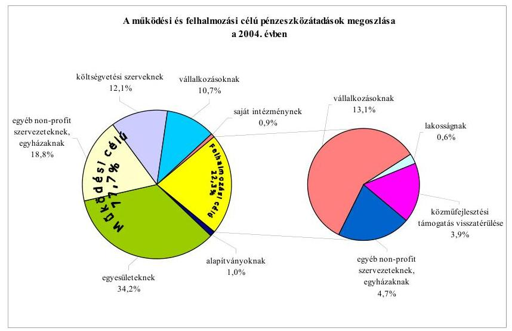
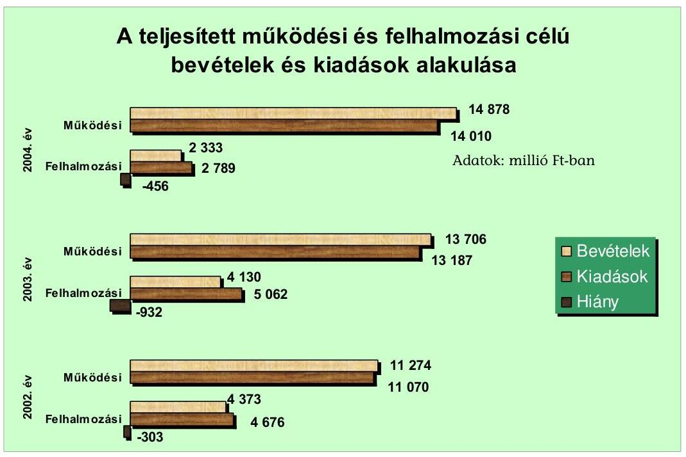
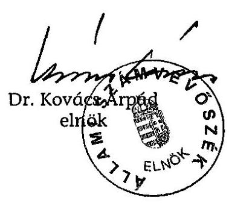
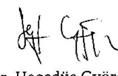
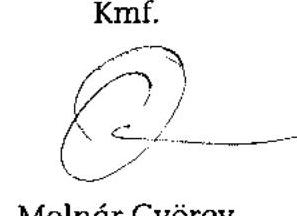
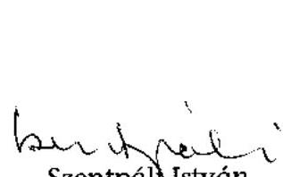
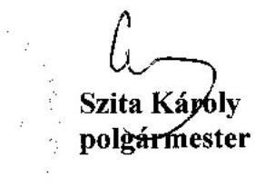
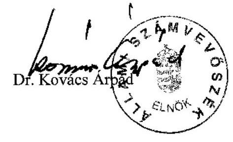

# JELENTÉS 

## Kaposvár Megyei Jogú Város   Önkormányzata gazdálkodásának átfogó ellenőrzéséről

---

3. Önkormányzati és Területi Ellenőrzési Igazgatóság
3.3. Átfogó Ellenőrzések Főcsoport
Iktatószám: V-1001-1/35/16/2005.
Témaszám: 749
Vizsgálat-azonosító szám: V0205
Az ellenőrzést felügyelte:
Dr. Lóránt Zoltán
főigazgató
Az ellenőrzés végrehajtásáért felelős:
Dr. Sepsey Tamás
főigazgató-helyettes
Az ellenőrzést vezette:
Csecserits Imréné
főcsoportfőnök-helyettes
Az ellenőrzést végezték:
Dr. Hegedűs György
főtanácsadó
Tormáné Ivánfi Irén
számvevő tanácsos
Csepreginé Tancsik Erzsébet
számvevő

# A témához kapcsolódó - elmúlt három évben - készített számvevőszéki jelentések: 

címe
sorszáma
Jelentés a helyi és a helyi kisebbségi önkormányzatok 0220 gazdálkodásának ellenőrzéséről
Jelentés a települési önkormányzatok szilárdhulladék-gazdálkodási 0221 feladatai ellátásának ellenőrzéséről
Jelentés a helyi önkormányzatok tartós szociális ellátási 0317 feladatainak ellenőrzéséről az idősek otthonainál
Jelentés a területfejlesztési tanácsok és munkaszervezeteik 0327 rendelkezésére álló támogatások igénylésének és felhasználásának ellenőrzéséről
Jelentés a helyi önkormányzatok bérlakásépítésre és korszerűsítésre 0349 juttatott pénzügyi támogatások ellenőrzéséről
Jelentés a települési önkormányzatok szennyvízközmű fejlesztési és 0416 működtetési feladatai ellátásának vizsgálatáról
Jelentés a középfokú oktatás feltételei alakulásának ellenőrzéséről 0445

---

# TARTALOMJEGYZÉK 

BEVEZETÉS ..... 7
I. ÖSSZEGZŐ MEGÁLLAPÍTÁSOK, KÖVETKEZTETÉSEK, JAVASLATOK ..... 9
II. RÉSZLETES MEGÁLLAPÍTÁSOK ..... 17
1.A költségvetés tervezésének, végrehajtásának, az Önkormányzat vagyongazdálkodásának és a zárszámadás elkészítésének szabályszerűsége ..... 17
1.1.A költségvetési rendelet jóváhagyásának, módosításának, az előirányzatok nyilvántartásának szabályszerűsége ..... 17
1.2.A gazdálkodás szabályozottsága, a bizonylati rend és fegyelem szabályszerűsége ..... 22
1.3.A pénzügyi-számviteli feladatok ellátásának informatikai támogatottsága ..... 30
1.4.Az önkormányzati vagyon nyilvántartása, számbavétele ..... 32
1.5.A vagyonnal való gazdálkodás szabályszerűsége, célszerűsége, nyilvánossága ..... 34
1.6.A céljelleggel nyújtott támogatások szabályszerűsége ..... 41
1.7.A közbeszerzési eljárások szabályszerűsége ..... 46
1.8.A zárszámadási kötelezettség teljesítésének szabályszerűsége ..... 49
1.9.A Polgármesteri hivatal helyi kisebbségi önkormányzatok gazdálkodását segítő tevékenysége ..... 51
2.Az Önkormányzati feladatok és a rendelkezésre álló források összhangja ..... 53
2.1.A feladatok meghatározása és szervezeti keretei ..... 53
2.2.A költségvetés egyensúlyának helyzete ..... 57
2.3.A feladatok finanszírozása ..... 63
3.A belső irányítási, ellenőrzési rendszer működésének értékelése ..... 66
3.1.Az ellenőrzési rendszer kialakítása, múködése ..... 66
3.2.A könyvvizsgálati kötelezettség teljesítése ..... 69
3.3.A korábbi számvevőszéki ellenőrzések javaslatainak hasznosulása ..... 69

---

# MELLÉKLETEK 

1. számú Az Önkormányzat gazdálkodását meghatározó adatok, mutatószámok (1 oldal)
2. számú Az önkormányzati vagyon nagyságának alakulása (1 oldal)
3. számú Az Önkormányzat 2004. évi bevételeinek és kiadásainak alakulása (1 oldal)
4. számú Egyes önkormányzati feladatok finanszírozása (1 oldal)
5. számú Helyszíni ellenőrzési jegyzőkönyv (3 oldal)
6. számú Szita Károly úr, Kaposvár Megyei Jogú Város Önkormányzata polgármesterének észrevétele (2 oldal)
7. számú Szita Károly úr, Kaposvár Megyei Jogú Város Önkormányzata polgármesterének kiegészítő észrevétele (1 oldal)
8. számú Szita Károly úr, Kaposvár Megyei Jogú Város Önkormányzata polgármesterének írt válaszlevél (1 oldal)

---

# RÖVIDÍTÉSEK JEGYZÉKE 

Ötv.
Áht.
$\mathrm{Kbt}_{1}$
$\mathrm{Kbt}_{2}$
Számv. tv.
Htv.

Ktv.

Hatv.
Nek. tv.

Ksztv.
Vhr.

Ber.
Ámr.
ÁSZ
MÁK
KDB
Önkormányzat
Közgyűlés
Polgármesteri hivatal
Gondnokság
polgármester
főjegyző
Pénzügyi bizottság
SzMSz $_{1}$
a helyi önkormányzatokról szóló 1990. évi LXV. törvény az államháztartásról szóló 1992. évi XXXVIII. törvény
a közbeszerzésekről szóló 1995. évi XL. törvény
a közbeszerzésekről szóló 2003. évi CXXIX. törvény
a számvitelről szóló 2000. évi C. törvény
a helyi önkormányzatok és szerveik, a köztársasági megbízottak, valamint egyes centrális alárendeltségű szervek feladat- és hatásköreiről szóló 1991. évi XX. törvény
a köztisztviselők jogállásáról szóló 1992. évi XXIII. törvény
a helyi adókról szóló1990. évi C. törvény
a nemzeti és etnikai kisebbségek jogairól szóló 1993. évi LXXVII. törvény
a közhasznú szervezetekről szóló 1997. évi CLVI. törvény az államháztartás szervezetei beszámolási és könyvvezetési kötelezettségének sajátosságairól szóló 249/2000. (XII. 24.) Korm. rendelet
a költségvetési szervek belső ellenőrzéséről szóló 193/2003. (XI. 26.) Korm. rendelet
az államháztartás múködési rendjéről szóló 217/1998. (XII. 30.) Korm. rendelet

Állami Számvevőszék
Magyar Államkincstár Somogy Megyei Területi Igazgatósága
Közbeszerzések Tanácsa Közbeszerzési Döntőbizottság
Kaposvár Megyei Jogú Város Önkormányzata
Kaposvár Megyei Jogú Város Önkormányzatának Közgyűlése
Kaposvár Megyei Jogú Város Önkormányzatának Polgármesteri Hivatala
Kaposvár Megyei Jogú Város Önkormányzata Polgármesteri Hivatalának Gondnoksága (részben önálló gazdálkodású költségvetési szerv)
Kaposvár Megyei Jogú Város Önkormányzata polgármestere
Kaposvár Megyei Jogú Város Önkormányzata címzetes főjegyzője
Kaposvár Megyei Jogú Város Önkormányzata Pénzügyi Bizottsága
Kaposvár Megyei Jogú Város Önkormányzatának 4/1997. (I. 21.) számú rendelete a Közgyűlés és Szervei Szervezeti és Múködési Szabályzatáról

---

| $\mathrm{SzMSz}_{2}$ | Kaposvár Megyei Jogú Város Önkormányzata Polgármesteri Hivatalának Szervezeti és Múködési Szabályzata |
| :--: | :--: |
| ügyrend | Kaposvár Megyei Jogú Város Önkormányzatának 5/1997. (I. 21.) számú rendelete a Polgármesteri Hivatal ügyrendjéről |
| vagyongazdálkodási rendelet | Kaposvár Megyei Jogú Város Önkormányzatának 5/1993. (II. 18.) számú rendelete az Önkormányzat vagyonáról és a vagyongazdálkodás szabályairól |
| közbeszerzési rendelet | Kaposvár Megyei Jogú Város Önkormányzatának 39/1996. (IX. 19.) számú rendelete a helyi közbeszerzésekről |
| beruházási rendelet | Kaposvár Megyei Jogú Város Önkormányzatának 21/1998. (IX. 18.) számú rendelete az Önkormányzat és intézményei építési beruházásainak ajánlatkérési eljárásáról, elbírálásáról és megvalósításáról |
| a 2005. évi költségvetési rendelet | Kaposvár Megyei Jogú Város Önkormányzatának 2/2005. (III. 4.) számú rendelete az Önkormányzat 2005. évi költségvetéséről |
| a 2004. évi költségvetési rendelet | Kaposvár Megyei Jogú Város Önkormányzatának 3/2004. (II. 27.) számú rendelete az Önkormányzat 2004. évi költségvetéséről |
| a 2003. évi zárszámadási rendelet | Kaposvár Megyei Jogú Város Önkormányzatának 11/2004. (IV. 27.) számú rendelete az Önkormányzat 2003. évi zárszámadásáról és pénzmaradvány elszámolásáról |
| lakás- és helyiséggazdálkodási rendelet | Kaposvár Megyei Jogú Város Önkormányzatának 49/1993. (XII. 15.) számú rendelete a lakások és helyiségek bérletére, valamint az elidegenítésükre vonatkozó szabályokról |
| alapok kezeléséről szóló rendelet | Kaposvár Megyei Jogú Város Önkormányzatának 51/1995. (XII. 29.) számú rendelete az átruházott hatáskörben felhasználható alapok kezeléséről |
| Gazdasági igazgatóság | Kaposvár Megyei Jogú Város Önkormányzata Polgármesteri Hivatalának Gazdasági Igazgatósága |
| Vagyongazdálkodási igazgatóság | Kaposvár Megyei Jogú Város Önkormányzata Polgármesteri Hivatalának Vagyongazdálkodási Igazgatósága |
| Múszaki igazgatóság | Kaposvár Megyei Jogú Város Önkormányzata Polgármesteri Hivatalának Múszaki Igazgatósága |
| Titkársági igazgatóság | Kaposvár Megyei Jogú Város Önkormányzata Polgármesteri Hivatalának Titkársági Igazgatósága |
| Ellenőrzési iroda | Kaposvár Megyei Jogú Város Önkormányzata Polgármesteri Hivatalának Ellenőrzési irodája |
| $\mathrm{SzASz}_{1}$ | Jegyzői utasítás Kaposvár Megyei Jogú Város Önkormányzata Polgármesteri Hivatalának Számítástechnikai és Adatvédelmi szabályzatáról (kiadva: 2001. október 26.) |

---

| SzASz $_{2}$ | Jegyzői utasítás Kaposvár Megyei Jogú Város Önkormányzata Polgármesteri Hivatalának Számítástechnikai és Adatvédelmi szabályzatáról (kiadva: 2004. december 16.) |
| :--: | :--: |
| informatikai stratégia | Kaposvár Megyei Jogú Város Önkormányzata Informatikai Stratégiája |

---

.

---

# JELENTÉS 

## Kaposvár Megyei Jogú Város Önkormányzata gazdálkodási rendszerének átfogó ellenőrzéséről

## BEVEZETÉS

Az Ötv. 92. § (1) bekezdése, az Állami Számvevőszékről szóló 1989. évi XXXVIII. törvény 2. § (3) bekezdése, valamint az Áht. 120/A. § (1) bekezdése szerint az önkormányzatok gazdálkodását az Állami Számvevőszék ellenőrzi. Az ellenőrzés elvégzése az Országgyúlés illetékes bizottságai részére is átadott, országosan egységes ellenőrzési program alapján történt.

Az ellenőrzés célja annak értékelése volt, hogy

- az önkormányzati gazdálkodás törvényességét, ${ }^{1}$ szabályszerűségét biztosították-e a tervezés, a költségvetés végrehajtása, a vagyongazdálkodás és a zárszámadás során;
- az Önkormányzat által ellátott feladatok és az azokhoz rendelkezésre álló források összhangja biztosított volt-e, különös tekintettel az egyes kiemelt feladatokra;
- a gazdálkodás szabályszerűségét biztosító belső kontrollok ${ }^{2}$ lehetővé tették-e a szabálytalanságok, hiányosságok, gazdaságtalan megoldások feltárását, megelőzését.

Az ellenőrzött időszak: a 2004. év, az 1.5., 2.1-2.3 és 3.3. ellenőrzési pontok esetében ezen túlmenően a 2002-2003. évek is.

Kaposvár Somogy megye székhelye, a város lakosságszáma 2004. január 1-jén 68074 fő volt. Az Önkormányzat 28 tagú Közgyűlésének munkáját nyolc állandó bizottság, a polgármester munkáját egy alpolgármester segítette. A 2002. évi önkormányzati választásokat követően a polgármester és a főjegyző személye nem változott.

Az Önkormányzat a Polgármesteri hivatalon kívül 38 önállóan és 17 részben önállóan gazdálkodó költségvetési szervvel rendelkezett, 12 gazdasági társa-

[^0]
[^0]:    ${ }^{1}$ A törvényi előírások betartásának elmulasztásakor a részletes megállapítások fejezetben egységesen a törvénysértés megjelölést alkalmazzuk, mivel az ÁSZ nem tehet különbséget a törvényi előírások között.
    ${ }^{2}$ A gazdálkodás szabályszerűségét biztosító kontroll alatt érjük a kiépített és működő belső irányítási és szabályozási rendszert, valamint a belső ellenőrzési funkciók ellátását.

---

ságban volt tulajdonos 2004. december 31-én. A ténylegesen foglalkoztatott közalkalmazotti létszám 2004. december 31-én 2877 fő volt, a Polgármesteri hivatalban 212 fő köztisztviselő dolgozott.

Az Önkormányzat a 2004. évben 16799 millió Ft költségvetési kiadást teljesített, amelyből 83,4\%-ot működési, 16,6\%-ot felhalmozási célokra fordított.

Az Önkormányzat könyvviteli mérleg szerinti vagyona 2004. december 31-én 55295 millió Ft volt. Az Önkormányzat gazdálkodását jellemző adatokat az 1. számú melléklet tartalmazza.

A településen négy kisebbségi ${ }^{3}$ önkormányzat, valamint négy települési részönkormányzat ${ }^{4}$ működött.

A Polgármesteri hivatal a 2002. évben teljesítette az EU tagállamai szakértői által kidolgozott Általános Értékelési Keretrendszer (CAF) követelményeit. Ezt megelőzően az 1999. évben megszerezte az EN ISO 9001:2000 előírásainak megfelelő minőségbiztosítási tanúsítványt.
${ }^{3}$ Cigány, horvát, lengyel, német kisebbségi önkormányzat.
${ }^{4}$ Az Önkormányzat közigazgatási területén a Kaposfüredi, a Kaposzentjakabi, a Toponári, a Töröcskei részönkormányzat múködött.

---

# I. ÖSSZEGZŐ MEGÁLLAPÍTÁSOK, KÖVETKEZTETÉSEK, JAVASLATOK 

Az Önkormányzat gazdasági programját a Közgyűlés a 2003-2006. évekre elfogadta, melyben meghatározta a megvalósítandó feladatokat és azok forrásait. A 2004. évi költségvetési koncepciót és rendelet-tervezetet a polgármester az Áht-ban előírt határidőben a Közgyűlés elé terjesztette. A költségvetési koncepciót a bizottságok - köztük a Pénzügyi bizottság - megtárgyalták, írásos véleményüket az Ámr-ben előírtaknak megfelelően a polgármester az előterjesztéshez csatolta. A helyi kisebbségi önkormányzatok elnökei az Ámr. előírásainak megfelelően tájékoztatást kaptak a koncepcióról, a helyi kisebbségi önkormányzatok koncepcióról alkotott véleményét a polgármester csatolta az előterjesztéshez. A költségvetési koncepciót a helyben képződő bevételek és az ismert kötelezettségek, valamint a gazdasági program figyelembevételével állították össze.

A 2004. évi költségvetési rendelettervezet összeállításánál a költségvetési koncepciókban meghatározottakat érvényesítették. A rendelettervezet előkészítése, egyeztetése, előterjesztése az Áht-ben és Ámr-ben előírtaknak megfelelően történt. A Közgyűlés a költségvetési rendelet elfogadását megelőzően, illetve azzal egyidejűleg döntött az előirányzatok megalapozását szolgáló rendeletek jóváhagyásáról. Az intézményi előirányzatokat a főjegyző az intézményvezetőkkel egyeztette. A polgármester a költségvetési rendelettervezethez a könyvvizsgálói jelentést és a Pénzügyi bizottság írásos véleményét csatolta. A helyi kisebbségi önkormányzatok költségvetési határozatát a költségvetési rendeletbe változatlan formában beépítették. A címrendet és a költségvetés végrehajtásával összefüggő szabályokat a költségvetési rendeletben meghatározták. Az Önkormányzat vállalkozási tevékenységként a Rákóczi Stadiont üzemeltette, a költségvetési rendeletben az Ámr. előírásai ellenére nem rendelkeztek a vállalkozási tartalék felhasználásának szabályairól. A költségvetésen belül különböző feladatok támogatására alap elnevezésű keretösszegeket alakítottak ki, amelyek elnevezése az Áht-ben alapokra vonatkozóan meghatározott feltételeknek - a Környezetvédelmi alap kivételével - nem felel meg, a kifejezés félreérthető. A Közgyűlés nem határozta meg az Áht. előírása ellenére a költségvetés és a zárszámadás előterjesztésekor bemutatandó mérlegek és kimutatások tartalmi követelményeit, azonban az Áht-ben előírt mérlegeket és kimutatásokat a költségvetési rendelet mellékleteként bemutatták.

Az Önkormányzat a költségvetési rendeletet a 2003. és a 2004. évben négynégy alkalommal módosította. Az utolsó rendeletmódosítások az Ámr-ben előírt határidőben történtek. A helyi kisebbségi önkormányzatok költségvetéseik módosítását megtárgyalták, azonban - az Áht. előírásaival szemben - a módosításokról határozatot nem hoztak. A Polgármesteri hivatal és az intézmények a kiemelt előirányzataikat nem lépték túl. A Közgyűlés által elfogadott előirányzatokban bekövetkezett változásokat a főkönyvi könyvelésben és az analitikus nyilvántartásokban folyamatosan nyilvántartották.

---

A Polgármesteri hivatal szervezeti egységeit, feladatait és múködési rendjét a 2004. évben nem szervezeti és múködési szabályzatban, hanem ügyrendben határozták meg, 2005-ben az SzMSz elkészítésével a hiányosságot megszüntették és az ügyrendben meghatározták a Gazdasági igazgatóság szervezeti felépítését, feladatait, az ott dolgozók feladat-, hatás- és jogkörét.

A Polgármesteri hivatalban a gazdálkodással kapcsolatos feladat- és hatáskörök szabályozása az ügyrend mellékletét képező, a polgármester és a főjegyző által kiadott utasításban történt. A gazdálkodási jogkörökkel való felhatalmazás szabályozása megfelelt az Ámr. előírásainak. A felhatalmazások és megbízások az összeférhetetlenségi követelmények figyelembevételével történtek. A Gondnokság részben önálló költségvetési szervként végezte az Ötv. alapján az Önkormányzat múködésével, valamint az államigazgatási ügyek végrehajtásával kapcsolatos feladatokat.

A főjegyző a Htv. előírásainak megfelelően intézkedett a költségvetési szervek egységes számviteli rendjének kialakításáról. A számviteli politikában a Vhr. előírása ellenére nem határozták meg a számviteli elszámolás és értékelés szempontjából lényeges, illetve nem lényeges információkat, továbbá a jelentős, illetve nem jelentős összeget, a terven felüli értékcsökkenés elszámolásánál figyelembe veendő szempontokat, valamint nem készítették el az önköltségszámítás rendjére vonatkozó belső szabályzatot. Az önköltség számítási szabályzat elkészítését indokolta, hogy a Polgármesteri hivatal vállalkozási tevékenységet folytatott. A leltározási és leltárkészítési szabályzatban rögzítették, hogy a könyvviteli mérleg adatait leltárral kell alátámasztani, ennek érdekében az ingatlanok leltározását mennyiségi felvétellel kell elvégezni, egyeztetéssel történik a részesedések, a rövid lejáratú és hosszú lejáratú követelések és kötelezettségek leltározása. A koncesszióba, üzemeltetésre, kezelésre átadott eszközöknél a Vhr. előírásával ellentétben nem írták elő a mennyiségi felvétellel történő leltározást, viszont leltározási körzetként kijelölték a vagyonkezelő szerveket. Az eszközök és források értékelési szabályzatát az egyedi értékelés számviteli alapelv figyelembevételével készítették el. A szabályzatban rögzítették, hogy a tárgyi eszközöknél és a befektetett pénzügyi eszközöknél nem élnek a piaci értékelés lehetőségével. A pénzkezelési szabályzatban rögzítették a megnyitott bankszámlák körét, rendeltetését, valamint a polgármester és a főjegyző bankszámlák feletti rendelkezési jogosultságát. A Polgármesteri hivatalhoz kapcsolódó készpénzforgalom eljárási rendjét, az értékpapírok és tárgyletétek kezelésének szabályait a Gondnokság pénzkezelési szabályzata tartalmazta. A Polgármesteri hivatal számlarendjét a Számv. tv. előírásai alapján készítették el. A pénzügyi-gazdálkodási szabályzatokban meghatározták az egyeztetési, ellenőrzési feladatokat, azok gyakoriságát, az eltérések viszonyítási alapját, az eltérések megállapításának módját. A pénzügyi, gazdálkodási és számviteli feladatellátás területén a munkaköri leírásokban a munkafolyamatba épített egyeztetési, ellenőrzési feladatokat, az eltérések jelzési kötelezettségét a szabályzatokban előírtakra építve határozták meg. A kisebbségi önkormányzati gazdálkodással összefüggő helyi sajátosságokat a 2004. évi számviteli politikában, számlarendben, a pénzügyi-gazdálkodási szabályzatokban a Vhr., az Ámr. és a kisebbségi önkormányzatok költségvetésének, gazdálkodásának, vagyonjuttatásának egyes kérdéseiről szóló kormányrendelet előírásaival ellentétben nem rögzítették. A vizsgálat ideje alatt a hiányosságokat megszüntették.

---

Az eszközökről és forrásokról a számlarendben előírt tartalmú analitikus nyilvántartásokat vezették, kialakították a főkönyvi könyvelés, az analitikus nyilvántartások, valamint a bizonylatok közötti egyeztetési pontokat. Az egyeztetési feladatokat a Számv. tv-ben és a számlarendben foglaltaknak megfelelően végezték és dokumentálták. Az éves beszámolót főkönyvi kivonattal alátámasztották. A pénzforgalmi tételek 12,3\%-ában a Számv. tv. előírását megsértve nem állították ki a számviteli bizonylatokat, így a számlák közötti átvezetések, a házipénztár feltöltések, a bank- és postaköltségek elszámolása esetében. Ennek következtében a gazdálkodási jogkörök gyakorlása, - az utalványozás, az érvényesítés, az utalványozás ellenjegyzése - ezeknél a gazdasági eseményeknél, továbbá a kincstári intézményfinanszírozásnál az Ámr. előírásai ellenére elmaradt. A pénzforgalmat érintő adatokat késedelem nélkül, az egyéb gazdasági műveletekről készített feladásokat a Számv. tv. előírásának megfelelő időben rögzítették a könyvviteli nyilvántartásokban. A főkönyvi könyvelés a költségvetés szerkezeti rendjének megfelelő volt. A kötelezettségvállalások analitikus nyilvántartását az Ámr. előírásával ellentétesen nem vezették a személyi juttatások, a munkaadókat terhelő járulékok és a dologi előirányzatok tekintetében és nem tüntették fel a kötelezettségvállalás nyilvántartásba vételi sorszámát ezen előirányzatokat érintő gazdasági események bizonylatainál. A kötelezettségvállalások nyilvántartását 2005. január 1-től valamennyi kiemelt előirányzatra vonatkozóan számítógépes rendszerben vezették. A gazdálkodási hatásköröket - az Ámr-ben rögzített összeférhetetlenségi követelmények betartásával - az arra jogosultak, illetve felhatalmazottak gyakorolták. A pénztárellenőr eleget tett a munkafolyamatba épített ellenőrzési kötelezettségének, naponta ellenőrizte a meglévő pénzkészletet, a házipénztári keret betartását. A kiemelt előirányzatokat önkormányzati és intézményi szinten betartották.

A Polgármesteri hivatalban a főkönyvi könyvelés és a beszámoló készítés informatikai támogatottságát biztosították. Az analitikus nyilvántartásokat számítógépen vezették. Az Önkormányzat rendelkezett informatikai stratégiával, számítástechnikai és adatvédelmi szabályzattal, amelyet a 2005. évtől kiegészítettek a katasztrófa elhárítási tervvel. A pénzügyi-számviteli területen dolgozók munkaköri leírásai tartalmazták az informatikai rendszerek használatát, az általuk végzendő feladatokat.

A vagyon nyilvántartásáról a Vhr-ben előírtak szerint gondoskodtak. A 2004. évi leltározást a Számv. tv., a Vhr., valamint a leltározási és leltárkészítési szabályzat szerint végezték. Mennyiségi felvétellel leltározták az ingatlanokat, a koncesszióba, üzemeltetésre, kezelésre átadott eszközöket, egyeztetéssel a részesedéseket, a rövid lejáratú és hosszú lejáratú követeléseket, kötelezettségeket. A leltárak kiértékelése alapján eltérést állapítottak meg. Az eltérés okát tisztázták, az számviteli rendezést nem igényelt. A tulajdoni részesedések értékelését elvégezték. A nem lakáscélú bérlemények bérleti díjából, a közterület használati díjakból és a lakbérekből származó követelések értékelése nem történt meg, ezzel nem feleltek meg a Számv. tv-ben foglalt előírásoknak. Az Önkormányzat a vagyonával való gazdálkodás szabályait a vagyongazdálkodási rendeletében, valamint a lakás- és helyiséggazdálkodási rendeletében határozta meg. A vagyongazdálkodási rendeletben a vagyonnal való döntési hatásköröket megosztották a Közgyűlés, a Vagyongazdálkodási és turisztikai bizottság, a polgármester és az intézmények között. A vagyonhasznosítás nyilvánosságának biztosítása érdekében előírták, hogy az önkormányzati vagyon elidegenítése és

---

hasznosítása pályázati úton történik, de ettől eltérően a szabályozásban lehetőséget biztosítottak versenyeztetés nélküli értékesítésre, hasznosításra. A vagyongazdálkodási rendeletben a versenyeztetés mellőzésének lehetővé tételével megsértették az Áht. előírását. A szabályozás nem segítette a közvagyonnal való gazdálkodás nyilvánosságát. A vagyongazdálkodási rendeletben rögzítették a vagyon tulajdonjoga ingyenes átruházásának, a követelésről való lemondásnak a módját, eseteit.

Az önkormányzati vagyon számviteli nyilvántartás szerinti értéke a 20022004. közötti években 15281 millió Ft-ról 55295 millió Ft-ra nőtt. Az ingatlanok számviteli nyilvántartás szerinti értéke a beszerzéseken, beruházásokon, felújításokon túlmenően a korábban érték nélkül nyilvántartott ingatlanok értékének megállapítása következtében ötszörösével, a tárgyi eszközök értéke a fejlesztések, felújítások következtében 70\%-kal növekedett. A vagyonhasznosítás a gazdasági programmal összhangban, a költségvetési koncepcióban megfogalmazott célkitűzések alapján történt. Az értékesítéseknél, bérbeadásoknál, az értékpapír eladásánál betartották a vagyongazdálkodási rendeletben rögzített értékhatárokhoz kapcsolódó döntéshozatali szabályokat. A szerződésekbe az Önkormányzat érdekeit védő garanciális elemeket beépítették. A vagyonhasznosítási koncepcióval összhangban valósultak meg a vagyonértékesítések. A 2002-2004. években öt esetben döntött a Közgyűlés vállalkozói tőke bevonásával megvalósuló vagyonértékesítésről.

Az Önkormányzat a 2004. évi költségvetéséből 517 szervezet, magánszemély részére összesen 505,8 millió Ft céljellegú támogatást nyújtott, amelyekre vonatkozó döntéseket a helyi szabályozásnak megfelelően, differenciáltan hozták meg. Az alapítványoknak juttatott támogatásokról a Közgyűlés döntött, a költségvetési szervek a társadalmi szervezeteknek adott támogatásoknál rendelkeztek a Közgyűlés engedélyével. A helyi szabályozás hiányosan állapította meg a szerződéskötési kötelezettség eseteit, abból kimaradt a közhasznú szervezet. A Ksztv. vonatkozó előírásának nem feleltek meg, amikor a közhasznú szervezet részére szerződésben nem határozták meg a támogatással való elszámolás feltételeit és módját. A hiányosságot a szabályozás módosításával pótolták. A számadási kötelezettség módját és tartalmát a támogatás elnyeréséről szóló értesítés, megállapodás nem tartalmazta, erről a kötelezettségről utólag külön levélben tájékoztatták a támogatásban részesülteket. A számadásra vonatkozó pótlólagos felhívás nyolc esetben eredménytelen maradt, az Áht. előírását megsértve ezt követően nem kezdeményezték a támogatás visszafizetését.

Az Önkormányzat rendeletet alkotott a közbeszerzési eljárás helyi szabályairól. A lefolytatott közbeszerzési eljárások során az ajánlattételre, az ajánlatok felbontására, értékelésére, elbírálására és az eredményhirdetésre megállapított szabályokat és határidőket betartották. A 2004. évben az Önkormányzat 12 nyílt és egy tárgyalásos közbeszerzési eljárást folytatott le 1059,6 millió Ft értékben, valamint nyolc egyszerűsített eljárást a $\mathrm{Kbt}_{2}$ előírásai alapján, 32,8 millió Ft összegben. A KDB az Önkormányzatot a 2004. évben az oktatási, nevelési és szociális intézmények főző- és melegítőkonyháinak üzemeltetése céljából folytatott közbeszerzési eljárás során két alkalommal, összesen 5 millió Ft-ra bírságolta, a határozat ellen az Önkormányzat keresettel fordult a Fővárosi Bírósághoz.

---

A polgármester a zárszámadási rendelettervezetet - az elfogadott költségvetéssel összehasonlítható módon - a törvényes határidőn belül a Közgyűlés elé terjesztette. A helyi kisebbségi önkormányzatok zárszámadásukat megtárgyalták, elfogadásukról határozatot nem hoztak, a teljesítés adatait az Áht. előírásai ellenére, a kisebbségi önkormányzatok elfogadó határozatai nélkül építették be az Önkormányzat zárszámadási rendeletébe. A zárszámadási rendelethez tájékoztatásul csatolták az Áht-ben előírt mérlegeket és kimutatásokat. A Közgyűlés költségvetési szervenként jóváhagyta a pénzmaradvány összegét. A főjegyző meghatározta az intézmények elemi beszámolója felülvizsgálatának rendjét és tartalmát. Az intézményi beszámolókat az Ámr-nek megfelelően felülvizsgálták, az intézményvezetőket írásban értesítették az éves beszámolójuk és múködésük elbírálásáról, elfogadásáról, valamint a jóváhagyott pénzmaradvány összegéről.

A településen a 2004. évben négy kisebbségi önkormányzat múködött, a Polgármesteri hivatal kisebbségi önkormányzatok munkáját segítő feladatait a Nek. tv. előírásának megfelelően a 2005. március 1-től hatályba lépett SzMSz ${ }_{1}$ ben meghatározták. Az együttműködés feltételeit szabályozó megállapodást az Ámr-ben előírt határidő után kötötte meg a polgármester a kisebbségi önkormányzatokkal. Az együttműködési megállapodásban az Ámr. előírásai ellenére nem rendelkeztek a költségvetési határozatok, a költségvetés módosításáról szóló kisebbségi önkormányzati határozatok Önkormányzat részére történő átadásának határidejéről. A kisebbségi önkormányzatok a költségvetésüket megállapító határozatukat a megállapodásban rögzített időpontot követően hozták meg. A kisebbségi önkormányzatok operatív gazdálkodásának szabályait az együttműködési megállapodások általánosságokban tartalmazták. A kisebbségi önkormányzatok gazdálkodásához kapcsolódó kötelezettségvállalások, utalványozások ellenjegyzésének feladataival az Áht. előírásai ellenére a Gondnokság vezetőjét hatalmazták fel.

Az Önkormányzat kötelező és önként vállalt feladatait különböző koncepciókban rögzítette. A Közgyűlés az önkormányzati feladatok ellátásáról költségvetési intézményeivel, társulásaival, illetőleg gazdasági társaságaival, valamint szolgáltatások vásárlásával gondoskodott. A feladatellátás szervezeti rendszerében intézményhálózat racionalizálást hajtottak végre, amelynek eredményeként az előző évhez viszonyítva a 2003. évben 1,9\%-kal, a 2004. évben 7,6\%-kal csökkent a közalkalmazotti létszám.

Az Önkormányzat a 2002-2004. évi költségvetési rendeleteit forráshiánnyal hagyta jóvá, melyek fedezetéül hitelfelvételt tervezett. A költségvetések tényadatai alapján költségvetési egyensúlyhiány a 2002. és a 2003. évben a felhalmozási bevételeknél és kiadásoknál keletkezett. A 2004. évi költségvetés a tényadatok alapján egyensúlyban volt. A költségvetés egyensúlyát a feladatok átszervezésével létrejött megtakarításokkal teremtették meg. A fejlesztések finanszírozási igényét értékpapír eladásokkal, valamint a saját bevételek tervezetthez viszonyított többletei mellett, hitelfelvétellel biztosították. A fejlesztések, beruházások a saját bevételek, a hitelek, továbbá a pályázati úton elnyert pénzeszközök bevonásával valósultak meg. A 2002-2004. években 6098 millió Ft pályázati forrás felhasználása 10364 millió Ft értékű beruházást, felújítást tett lehetővé.

---

A főjegyző a 2002-2004. évekre vonatkozóan a pénzállomány várható alakulásáról a likviditási tervet az Ámr. előírásának megfelelően elkészítette, a likviditási terv aktualizálása folyamatos volt. Az Önkormányzat az átmeneti likviditási gondok kezelésére folyószámlahitelt vett igénybe. A Közgyűlés a vizsgált időszakban adósságot keletkeztető kötelezettségvállalásról döntött, felhalmozási célú hitelt vett fel, kezességet vállalt és garanciavállalást tett. A költségvetési rendeletek elfogadása előtt az adósságot keletkeztető kötelezettségvállalás Ötv. szerinti felső korlátját évente vizsgálták, azt betartották. Az adósságot keletkeztető kötelezettség vállalások nem veszélyeztették a működőképességet.

Az Önkormányzat a saját bevételek növelése érdekében 1991-ben határozott a helyi adók bevezetéséről. Az adómértékek módosításakor a gazdasági programban megfogalmazott célkitűzésekkel összhangban vizsgálták azok indokoltságát. Az adómértékeket, a kedvezmények és mentességek körét a lakosság teherbíró képességére figyelemmel és a foglalkoztatáspolitikai célkitűzésekhez igazodóan állapították meg. A Hatv-ben biztosított felhatalmazás alapján a telekadó és az iparűzési adó mértékét a törvény maximumában, az építményadót a törvényi felső határ 30\%-ában, a magánszemélyek kommunális adóját a törvényi felső korlát 33\%-ában, a tartózkodási idő után számított idegenforgalmi adót a törvényi maximum $90 \%$-ában határozták meg. A gazdasági programmal összhangban kedvezményeket, mentességeket nyújtottak a foglalkoztatás elősegítése érdekében.

A naturális mutatókkal mérhető nevelési, oktatási és szociális ellátási feladatok fajlagos kiadásai a 2002-2004. években elsősorban a központi bérintézkedések hatására növekedtek. Az ellátottak köre a bölcsődei és a szociális intézményeknél nőtt, ennek hatására a kapacitáskihasználtság is javult. Az Önkormányzat a közoktatásban a tanulók létszámváltozásával összhangban döntött a tanulócsoportok számáról. Az óvodai ellátottak számának csökkenése miatt intézmény átszervezéseket és létszámcsökkentéseket hajtottak végre. Önként vállalt feladatokra az Önkormányzat a 2002-2004. években 3184 millió Ft-ot fordított, amely a teljesített összes kiadáshoz viszonyítva 6,2\%-os részarányt jelentett. Az önként vállalt feladatok a pénzügyi egyensúlyt és a kötelező feladatok ellátását nem veszélyeztették.

Az Önkormányzat a 2002. évben cselekvési programot dolgozott ki a tulajdonában lévő utak, közterületek, közintézmények akadálymentesítése céljából. A 74 közintézmény átalakításának becsült költsége 77,9 millió Ft. Évente a költségvetés céltartalékában 5 millió Ft-ot különítettek el a fogyatékos személyek jogairól és esélyegyenlőségük biztosításáról szóló törvény végrehajtása érdekében. A ténylegesen teljesített kiadás a 2002-2004. év között 6 millió Ft volt. Az Önkormányzat a fogyatékos személyek jogairól és esélyegyenlőségük biztosításáról szóló törvény előírásaival szemben a 2005. január 1-i határidőre a közintézmények akadálymentesítését nem biztosította.

Az Önkormányzat ellenőrzési rendszerét a 2004. évben átszervezte, feladatait és jogállását az ügyrendben rögzítette. Az önkormányzati belső ellenőrzés kialakításakor a szabályozásban az Áht. előírását megsértve a belső ellenőrzés szervezeti függetlenségét nem, a belső ellenőrök funkcionális függetlenségét azonban biztosították. A hiányosságot az ügyrend 2005. évben történt módosításával megszüntették. Az ellenőrzési kézikönyvet az előírt határidőn belül

---

megalkották. Középtávú és éves ellenőrzési tervet a 2004. évben a főjegyző jóváhagyta a Ber. előírásának megfelelően, a stratégiai terv a 2005. évben készült el. Az Ellenőrzési iroda a 2004. évben 100 ellenőrzést végzett, ebből 13 belső ellenőrzés a Polgármesteri hivatalt érintette. Az ellenőrzési tapasztalatokról készült tájékoztatót a Közgyűlés felhatalmazása alapján a Pénzügyi bizottság tekintette át.

Az Önkormányzat a törvényben előírt könyvvizsgálati kötelezettségét a követelményeknek megfelelően teljesítette. A könyvvizsgáló a 2003. és a 2004. évi egyszerűsített tartalmú költségvetési beszámolót hitelesítő záradékkal látta el.

A korábbi számvevőszéki ellenőrzések javaslatainak 92\%-a megvalósult. Az önkormányzati gazdálkodást és közszolgáltatásokat érintő hét ÁSZ vizsgálat megállapításait, javaslatait az Önkormányzat hasznosította a közszolgáltatások, a szilárd hulladékgazdálkodás, a szociális alapellátás, az önkormányzati bérlakás építés és korszerűsítés, valamint a területfejlesztés területén.

A helyszíni ellenőrzés megállapításainak hasznosítása mellett javasoljuk:

# a polgármesternek: 

a jogszabályi előírások maradéktalan betartása érdekében:

1. gondoskodjon az Ámr. 29. § (11) bekezdésében előírtak betartása érdekében arról, hogy a kisebbségi önkormányzatokkal kötött együttműködési megállapodások felülvizsgálata, szükség szerinti módosítása évente megtörténjen;
2. gondoskodjon a középületek akadálymentessé tételéről a fogyatékos személyek jogairól és esélyegyenlőségük biztosításáról szóló 1998. évi XXVI. törvény 29. § (6) bekezdésében előírtak végrehajtása érdekében;
a munka színvonalának javítása érdekében:
3. terjessze a számvevőszéki jelentést a Közgyűlés elé, a feltárt hiányosságok megszüntetése érdekében készíttessen intézkedési tervet;

## a főjegyzönek:

a gazdálkodás szabályszerűségének biztosítása érdekében:

1. kezdeményezze, hogy a költségvetési rendelet végrehajtási részében határozzák meg az Ámr. 69. § (3) bekezdésének előírása alapján a vállalkozási tartalék felhasználásának szabályait;
2. a szabályszerű költségvetési és operatív gazdálkodás érdekében:
a) készítse el a számviteli politika részeként a Vhr. 8. § (4) bekezdés c) pontjának megfelelően az önköltségszámítás rendjére vonatkozó szabályzatot;

---

b) gondoskodjon arról, hogy az Ámr. 136. § (4) bekezdés h) pontja szerint az utalványon a kötelezettségvállalás-nyilvántartásba vételi sorszámát a személyi juttatások, a munkaadókat terhelő járulékok és a dologi előirányzatokat érintő gazdasági eseményeknél is feltüntessék;
c) gondoskodjon arról, hogy a Számv. tv. 55. § (1) bekezdésének megfelelően a beszámoló elkészítése során a nem lakás célú bérleményekből, a közterület használati díjakból és a lakbérekből származó követelések értékelését végezzék el;
3. kezdeményezze a kisebbségi önkormányzatokkal kötött együttmúködési megállapodás módosítását annak érdekében, hogy a kötelezettségvállalások, utalványozások ellenjegyzési feladatainak végzésére jogosultakat az Áht. 74/A. § (2)-(3) bekezdésének megfelelően tartalmazza;
a munka színvonalának javítása érdekében:
4. kezdeményezze a költségvetési rendelettervezet előkészítése során a félreérthető önkormányzati pénzalapok elnevezésének a megváltoztatását.

---

# II. RÉSZLETES MEGÁLLAPÍTÁSOK 

## 1. A KÖLTSÉGVEtÉs TERVEZÉSÉNEK, VÉGREHAJTÁSÁNAK, AZ ÖNKORMÁNYZAT VAGYONGAZDÁLKODÁSÁNAK ÉS A ZÁRSZÁMADÁS ELKÉSZÍTÉSÉNEK SZABÁLYSZERŰSÉGE

### 1.1. A költségvetési rendelet jóváhagyásának, módosításának, az előirányzatok nyilvántartásának szabályszerűsége

Az Önkormányzat az Ötv. 91. § (1) bekezdésében előírt, a helyi önkormányzatokra vonatkozó gazdasági program készítési kötelezettségének eleget tett. A Közgyűlés a 2003-2006. évekre szóló célkitúzéseit az „Európa a jövőnk, Kaposvár az otthonunk" című programban határozta meg.

A program tartalmazta a kötelező közszolgáltatás és az önként vállalt feladatok terén a már megvalósított és a jövőben teljesítendő feladatokat, melyek forrásául Európai Uniós és állami pályázati támogatásokat, saját bevételeket, ingatlanértékesítést és felhalmozási hitelt jelöltek meg.

A 2004. évi költségvetési koncepciót a helyben képződő bevételek és az ismert kötelezettségek számbavételével, az Ámr. 28. § (1) bekezdésében előírtaknak megfelelően, valamint a gazdasági program figyelembevételével állították össze.

A Közgyűlés az SzMSz 5. számú mellékletében rendelkezett arról, hogy a költségvetési koncepció összeállításához valamennyi bizottságnak véleményt kell adni, és azokat a koncepcióhoz csatolni kell. A bizottságok - köztük a Pénzügyi bizottság - a 2003. évi és a 2004. évi költségvetési koncepciót megtárgyalták, írásos véleményüket az Ámr. 28. § (3) bekezdésében előírtaknak megfelelően a polgármester csatolta az előterjesztéshez.

A helyi kisebbségi önkormányzatok elnökeit a 2003. és a 2004. évi költségvetési koncepció helyi kisebbségi önkormányzatra vonatkozó részéről az Ámr. 28. § (6) bekezdésének megfelelően tájékoztatták. A helyi kisebbségi önkormányzatok koncepcióról alkotott véleményét a polgármester az előterjesztéshez csatolta.

A főjegyző által készített a 2004. évre szóló költségvetési koncepció tervezetet a polgármester az Áht. 70. §-ában előírt határidőt ${ }^{5}$ betartva 2003. november 27 -én a Közgyűlés elé terjesztette. A Közgyűlés az Önkormányzat 2004. évi költségvetési koncepciójában az Ámr. 28. § (4) bekezdésében foglaltak figyelembevételével meghatározta a költségvetés-készítés további munkálatait.

[^0]
[^0]:    ${ }^{5}$ Az Áht. 70. § előírása szerint a költségvetési koncepciót november 30-ig, a Közgyűlés tagjai általános választásának évében december 15 -ig kell benyújtani a Közgyűlésnek.

---

A 2004. évi költségvetési rendelettervezetben az Ámr. 26. § (1)-(7) bekezdéseiben előírtak szerint meghatározták a bevételi és a kiadási előirányzatokat, továbbá érvényesítették a költségvetési koncepció irányelveit.

A költségvetési rendelettervezetben szereplő intézményi bevételi és kiadási előirányzatokat az Ámr. 29. § (4) bekezdésében előírtakkal összhangban, a költségvetési szervek vezetőivel a jegyző egyeztette. Az egyeztetések tartalmát, eredményét jegyzőkönyvekben rögzítették.

A Közgyűlés előterjesztés hiányában - az Áht. 118. §-ában előírtakat megsértve - nem határozta meg rendeletben a költségvetés és zárszámadás előterjesztésekor tájékoztatásul bemutatandó mérlegek és kimutatások tartalmi követelményeit. ${ }^{6}$

A polgármester a bizottságok által megtárgyalt és a Pénzügyi bizottság által véleményezett költségvetési rendelettervezetet az Áht. 71. § (1) bekezdésében rögzített február 15-i határidőn belül, 2004. február 5-én terjesztette a Közgyűlés elé.

A könyvvizsgáló a költségvetési rendelettervezetet megvizsgálta és az Ötv. 92/C. § (4) bekezdésének előírását betartva írásban tájékoztatta a Közgyűlést. Az Ámr. 29. § (9) bekezdésének megfelelően a könyvvizsgálói jelentést, a bizottságok - köztük a Pénzügyi bizottság - rendelettervezetről alkotott véleményét a polgármester az előterjesztéshez csatolta.

A polgármester a költségvetési rendelettervezettel együtt és azt megelőzően az Áht. 71. § (2) bekezdésében előírtaknak megfelelően előterjesztette azokat a rendelettervezeteket, ${ }^{7}$ amelyek a javasolt előirányzatokat megalapozták, továbbá bemutatta a többéves elkötelezettségekkel járó kiadási tételek későbbi évekre vonatkozó kihatásait, ezen belül a költségvetési évet követő két év várható előirányzatait, az Áht. 71. § (3) bekezdésének megfelelően.

A címrendet az Áht. 67. § (3) bekezdésével összhangban meghatározták.
Az önállóan és a részben önállón gazdálkodó szervként múködő költségvetési intézmények, valamint a Polgármesteri hivatal költségvetésében szereplő, nem intézményi kiadások külön-külön címet alkotnak.

[^0]
[^0]:    ${ }^{6}$ A vizsgálat idején az Önkormányzat 3/2005. (II. 28.) számú rendeletével elfogadta, az Áht. 118. §-a szerinti mérlegek tartalmi követelményeiről szóló rendeletet.
    ${ }^{7}$ Az előterjesztések alapján az Önkormányzat elfogadta a lakások és helyiségek bérletére, valamint elidegenítésére vonatkozó 61/2003. (XII. 15.) számú; a temetőkről és a temetkezésről szóló 65/2003. (XII. 15.) számú; a fizetőparkolók üzemeltetéséről szóló 68/2003. (XII. 15.) számú; a magánszemélyek kommunális adójáról szóló 70/2003. (XII. 15.) számú; az építményadókról szóló 71/2003. (XII. 15.) számú; a telekadóról szóló 72/2003. (XII. 15.) számú; az idegenforgalmi adóról szóló 73/2003. (XII. 15.) számú; a helyi iparűzési adóról szóló 74/2003. (XII. 15.) számú; a gépjárműadóról szóló 75/2003. (XII. 15.) számú; az önkormányzati fenntartású közoktatási intézményekben igénybe vett szolgáltatásokért fizetendő térítési díjak és tandíjak megállapításáról szóló 8/2004. (II. 27.) számú rendeleteket.

---

Az Áht. 69. § (1) bekezdésének megfelelően meghatározták az Önkormányzat, a költségvetési szervek és a helyi kisebbségi önkormányzatok múködési és felhalmozási bevételeit és kiadásait, a múködési kiadásokon belül a kiemelt előirányzatokat, a költségvetési létszámkeretet. Az Ámr. 29. § (1) bekezdésében foglaltaknak megfelelően elfogadták a felújítási előirányzatokat célonként, a felhalmozási kiadásokat feladatonként, a Polgármesteri hivatal költségvetését feladatonként, a többéves kihatással járó feladatok előirányzatait éves bontásban, a múködési és felhalmozási célú bevételi és kiadási előirányzatokat mérlegszerűen egymástól elkülönítetten, de együttesen egyensúlyban, elkülönítetten a helyi kisebbségi önkormányzatok költségvetéseit, azok határozataiban foglaltaknak megfelelően.

A költségvetésben az Áht. 8/A. § (3)-(7) bekezdéseiben előírtakat betartva költségvetési bevételként, illetve költségvetési kiadásként finanszírozási célú pénzügyi múveleteket nem mutattak ki.

A 2004. évi költségvetési rendeletben meghatározta a Közgyűlés a költségvetés végrehajtásával kapcsolatos szabályokat:

- a jóváhagyott kiadási előirányzatok közötti és a céltartalékok, a felújítási előirányzatokon belül elkülönített tartalékkeretek, a fejlesztési kiadásokon belül a pályázatok előkészítésére, illetve tervezési feladatokra, a buszvárók telepítésére, a földút- és járdaépítési programra elkülönített keretek, a céltartalékon belül az alapok, a polgármesteri keret, az önkormányzati intézményi pályázatok saját erejére elkülönített céltartalékok, a cigánygyermekek tanulmányi ösztöndíjára és a közművelődési programokra elkülönített keretösszegek terhére történő átcsoportosítás jogát a Közgyűlés a polgármesterre ruházta át;
- az évközben engedélyezett központi előirányzatok felosztásáról, a Közgyűlés dönt a polgármester előterjesztésében a költségvetési rendelet egyidejű módosításával;
- az egymillió Ft-ot meghaladó összegű fejlesztési célú támogatások ${ }^{8}$ átadása előtt a támogatás címzettjével megállapodási kötelezettséget írt elő;
- előírta a költségvetési szerveknél a szakmai alapfeladat keretében szellemi tevékenység szolgáltatási szerződéssel, számla ellenében történő igénybevételének szabályait;
- az Áht. 75. §-ának megfelelőn szabályozták a hiány fedezetének módját, rendelkeztek a hitelmúveletekkel kapcsolatos hatáskörökröl.

Az Ámr. 53. § (4) bekezdéseiben előírtak ellenére nem határozták meg az önállóan gazdálkodó költségvetési szervek előirányzat módosítási jogkörét. ${ }^{9}$ Nem

[^0]
[^0]:    ${ }^{8}$ Az Önkormányzat költségvetési rendeletet módosító 73/2004. (XII. 17.) számú rendelettel a fenti rendelkezést megváltoztatta, előírta, hogy minden 100 ezer Ft-ot meghaladó támogatás átadás előtt a támogatottal megállapodást kell kötni.
    ${ }^{9}$ A 2005. évi költségvetési rendeletben meghatározták az önállóan gazdálkodó költségvetési intézmények előirányzat módosítási jogkörét.

---

rendelkeztek - az Ámr. 69. § (3) bekezdésében előírtakkal ellentétesen - a vállalkozási tartalék felhasználásának szabályairól. A Közgyűlés nem élt az Áht. 93. § (4) bekezdése felhatalmazással és rendeletben nem határozta meg az intézményi többletbevételek saját hatáskörben felhasználható körét és mértékét.

A költségvetésen belül különböző feladatok támogatására elkülönített pénzügyi keretösszegeket határoztak meg, melyek ${ }^{10}$ alapként történő elnevezése megtévesztő, ugyanis az Áht. az elkülönített állami pénzalapokra használja röviden az alap kifejezést, amelyre az Áht. meghatározza azok létrehozásának, gazdálkodásának feltételeit. Az Áht. 54.§-ában meghatározott feltételeknek az Önkormányzat által létrehozott alapok - a Környezetvédelmi alap ${ }^{11}$ kivételével - nem felelnek meg, a kifejezés félreérthető. Az államháztartás rendszerében a meghatározott feltételekhez kötött fogalomnak eltérő tartalmú alkalmazása bizonytalanságot, az egyértelműség hiányát okozza.

A közbenső egyeztetés során tett polgármesteri észrevétel szerint: „Az önkormányzat egyes feladatok elkülönített pénzeszközökből történő finanszírozására, önként vállalt feladatként alap elnevezéssel elkülönített kereteket hozott létre. Semmi sem tiltja, hogy a feladat ellátás e formájában alap elnevezés szerepeljen. Nincs ismeretünk arról, hogy bármilyen jogszabály tiltaná az alap kifejezés használatát, erre a számvevői jelentés sem utal. Ugyanakkor több kifejezés használatát, erre a számvevői jelentés sem utal. Ugyanakkor több központi jogszabály nevesíti a települési önkormányzat környezetvédelmi alapokat. Így a környezetterhelési diiról szóló 2000. LXXXIX. törvény 21/B. § (1) bekezdése szerint a talajterhelési dij a települési önkormányzat környezetvédelmi alapjának bevételét képezi. A környezet védelmének általános szabályairól szóló 1995. évi LIII. törvény külön fejezetben szabályozza a települési önkormányzati környezetvédelmi alapok létrehozását."

Az észrevétel nem megalapozott, mert az Áht. a IV. fejezetében részletezi az alapok múködtetésének szabályait. Ennek során az 54. § (1) bekezdése hangsúlyozza, hogy alapot létrehozni csak törvénnyel lehet. Az önkormányzati Környezetvédelmi Alap létrehozását törvény írja elő, s ez az alap az Áht. 54.§-ában foglalt feltételeknek megfelel. A félreérthetőség elkerülése érdekében indokolt, az államháztartás egyik alrendszerét jellemző és múködésének rendszerét kifejező alap elnevezésnek az államháztartás más alrendszerében is az Áht-ban foglaltakat figyelembe véve történő alkalmazása. Az elnevezés módosítására vonatkozó javaslatunkat ezért fenntartjuk.

A 2004. évi költségvetés előterjesztésekor - a szabályozás elmaradásának ellenére - a Közgyűlés részére tájékoztatásul bemutatták az Áht. 118. §-ában elöírt mérlegeket és kimutatásokat. Az előterjesztéshez csatolták a hitelállományt bemutató kimutatást, az Áht. 116. § 6. pontja alapján elkészített öszszevont mérlegeket, az Áht. 116. § 9. pontja alapján elkészített többéves kihatással járó döntéseket, valamint az Áht. 116. § 10. pontja alapján kimutatott közvetett támogatásokat, szöveges indoklással együtt.

[^0]
[^0]:    ${ }^{10}$ Ifjúsági Alap, Oktatási Alap, Kulturális Alap, Sport Alap, Egészségügyi és Szociális Alap, Megye-Város Közös Alap.
    ${ }^{11}$ A Környezetvédelmi alap létrehozására az önkormányzatok felhatalmazást kaptak a környezet védelmének általános szabályairól szóló 1995. évi LIII. törvény 58. § (1) bekezdésében.

---

A 2004. évi költségvetési rendelettervezetben 16 769,1 millió Ft bevételt és 17929,2 millió Ft kiadást irányoztak elö, amit az Önkormányzat 3/2004. (II. 27.) számú rendeletével jóváhagyott. A költségvetésben bemutatott hiány fedezetére hitel felvételt terveztek.

A Közgyűlés a 2003. és a 2004. évet érintően négy-négy alkalommal ${ }^{12}$ módosította a költségvetési rendeletet. A költségvetési rendeletben jóváhagyott elöirányzatok főösszege a módosítások következtében a 2003. évben 575,5 millió Ft-tal ( $2,8 \%$-kal), a 2004. évben 1402 millió Ft-tal, ( $7,8 \%$-kal) nőtt. Az előirányzatok évközi módosítását a központi költségvetési támogatások növekedése, a saját bevételekben bekövetkező változások, az előző évi pénzmaradvány igénybevétele, valamint a kiadási jogcímek közötti átcsoportosítás indokolta. Az Önkormányzat a 2004. év első negyedévében nem kapott olyan központi támogatást, ${ }^{13}$ pótelőirányzatot, amely indokolta volna a költségvetési rendelet módosítását.

A költségvetési előirányzatok módosítására előterjesztett rendelettervezetek a költségvetéssel összehasonlítható módon tartalmazták a módosítási javaslatokat. Az előterjesztések kellően részletesek voltak és megfelelő információt biztosítottak a Közgyűlés számára a módosítások indokairól. A költségvetés módosításáról szóló rendeletben az eredeti és módosított (illetve az aktuális módosítást megelőző módosított) előirányzatokat, a változásokat is szerepeltették. Valamennyi előirányzat-változtatást hitelt érdemlően dokumentáltak.

A rendeletmódosítások megfeleltek az Ámr. 53. § (2) bekezdésében foglalt, valamint a költségvetési rendeletben rögzített elöírásoknak. Az önállóan gazdálkodó költségvetési szervek saját hatáskörben végrehajtott előirányzat változtatásáról a jegyző előkészítésében a polgármester - az Ámr. 53. § (6) bekezdésének megfelelően - 30 napon belül tájékoztatta a Közgyűlést. A 2003. és a 2004. évre vonatkozó utolsó előirányzat-módosítás az Ámr. 53. § (2), (6) bekezdéseiben előírt, a költségvetési beszámoló felügyeleti szervhez történő megküldésére külön jogszabályban ${ }^{14}$ meghatározott február 28-i határidőt betartva történt. ${ }^{15}$

[^0]
[^0]:    ${ }^{12}$ Az Önkormányzat 2003. évi költségvetésének módosításáról szóló 25/2003. (IV. 28.), 26/2003. (VI. 20.), 41/2003. (IX. 26.), 2/2004. (II. 27.) számú rendeletei, a 2004. évi költségvetésének módosításáról szóló 35/2004. (VI. 11.), 47/2004. (IX. 22.), 73/2004. (XII. 17.), 1/2005. (III. 4.) számú rendeletei.
    ${ }^{13}$ Az Önkormányzat eredeti előirányzatként megtervezte a különböző kötött felhasználású normatív támogatásokat, a támogatási szerződésekkel alátámasztott felhalmozási bevételeket, melynek következtében a leutalt támogatások összegeivel nem kellett a költségvetési rendeletet június hóig módosítani.
    ${ }^{14}$ A Vhr. 10. § (1) bekezdése.
    ${ }^{15}$ A Közgyűlés az utolsó előirányzat-módosításokat - december 31-i hatállyal - a 2003. évet érintően 2004. február 19-én megtartott ülésén (a rendelet kihirdetésének időpontja 2004. február 27.), a 2004. évi módosítást 2005. február 24-én fogadta el.

---

A helyi kisebbségi önkormányzatok 2003. és a 2004. évi költségvetési előirányzatait négy-négy alkalommal módosították az Önkormányzat költségvetési rendeletében. Az Önkormányzat a kisebbségi önkormányzatok előirányzatait a kisebbségi önkormányzatok erre felhatalmazó határozatai nélkül változtatta meg, megsértve az Áht. 74. § (3) bekezdésében előírtakat ${ }^{16}$, továbbá az Ámr. 53. § (8) bekezdésével ellentétesen az előző évi pénzmaradvány összegével, a többletbevételekkel az előirányzatokat megemelte, azonban ezeket a kisebbségi önkormányzatok határozattal nem hagyták jóvá.

Az Önkormányzat költségvetési rendeletét módosító előterjesztéseket a kisebbségi önkormányzatok megtárgyalták, azonban a kisebbségi önkormányzatokat érintő változtatásokról határozattal nem döntöttek. A kisebbségi önkormányzatok által hozott határozatokban ${ }^{17}$ a Közgyűlés részére az előterjesztés elfogadását javasolták.

# 1.2. A gazdálkodás szabályozottsága, a bizonylati rend és fegyelem szabályszerúsége 

A Polgármesteri hivatal szervezeti felépítését, múködésének rendszerét és a szervezeti egységek megnevezését nem SzMSz-ben, hanem a Polgármesteri hivatal ügyrendjében rögzítették. Az ügyrend tartalma nem felelt meg az Ámr. 10. § (4) bekezdése a), c), d), e), h) pontjaiban foglaltaknak, mivel nem tartalmazta az alapító okirat keltét, számát, a vállalkozási feladatoknak és a gazdálkodó szervezetben való részvételnek a részletes - alaptevékenységtől elhatárolt - felsorolását, valamint a Polgármesteri hivatal, illetve szervezeti egységei vezetőinek ezzel kapcsolatos feladatait, az alap és kiegészítő feladatok, tevékenységek forrásait, a feladatmutatók megnevezését, körét, a költségvetési szervhez rendelt részben önállóan gazdálkodó költségvetési szerv felsorolását, valamint ezen szervnél a pénzügyi - gazdasági tevékenységet ellátó személyek feladatkörének, munkakörének meghatározását. ${ }^{18}$

A Gazdasági igazgatóság felépítését és feladatait a Polgármesteri hivatal ügyrendjében határozták meg. A Polgármesteri hivatal ügyrendje tartalmazta a Gazdasági igazgatóság szervezeti felépítését, a pénzügyi-gazdasági feladatok ellátásáért felelős személyek feladatait, a vezetők és más dolgozók feladat-, ha-tás- és jogkörét, valamint a hozzárendelt részben önállóan gazdálkodó költségvetési szervek tekintetében ellátandó pénzügyi-gazdasági tevékenységek adatait.

[^0]
[^0]:    ${ }^{16}$ A polgármester által adott, mellékelt tájékoztatás szerint a kisebbségi önkormányzatok költségvetési előirányzatainak módosítása, a 2005. évtől már a kisebbségi önkormányzatok határozatai alapján kerül átvezetésre az önkormányzat költségvetésébe.
    ${ }^{17}$ A Cigány Kisebbségi Önkormányzat az 50/2003. (IX. 11.), a Horvát Kisebbségi Önkormányzat a 32/2004. (IX. 9.), a Lengyel Kisebbségi Önkormányzat a 14/2004. (V. 27.), a Német Kisebbségi Önkormányzat a 47/2003. (XII. 3.) számú határozatával az Önkormányzat költségvetési rendeletének módosításáról szóló előterjesztést a Közgyűlésnek elfogadásra javasolta.
    ${ }^{18}$ A megállapított hiányosságokat az $\mathrm{SzMSz}_{2}$-elkészítésével és 2005. március 1-jével történő hatályba lépésével megszüntették.

---

Az operatív gazdálkodással összefüggő gazdálkodási és ellenőrzési jogköröket a Polgármesteri hivatal ügyrendjének mellékletét képező kötelezettségvállalás, ellenjegyzés, utalványozás és érvényesítés rendjéről szóló együttes szabályzat ${ }^{19}$ tartalmazta.

- A szabályozás szerint a polgármester az előirányzatok feletti kötelezettségvállalási jog gyakorlására az Ámr. 134. § (3) bekezdésében foglaltak alapján felhatalmazást adott - az erre vonatkozó megbízása szerint - az alpolgármester részére.
- A polgármester a kötelezettségvállalási jog, továbbá - az Ámr. 136. § (1) bekezdése alapján - az utalványozási jog gyakorlására a saját feladatkörükbe tartozó előirányzatok tekintetében, összeghatár megjelölése nélkül az igazgatókat, irodavezetőket hatalmazta fel.
- A főjegyző az Ámr. 134. § (3) bekezdése alapján felhatalmazta a kötelezettségvállalás ellenjegyzési jogának gyakorlásával az aljegyzőt. A kötelezettségvállalás és utalványozás ellenjegyzésére általános jelleggel a gazdasági igazgatót, egyes, a saját területet érintő előirányzatok tekintetében a Gazdasági igazgatóság Közgazdasági, valamint Költségvetési irodavezetőit hatalmazta fel. A főjegyző a felhalmozási- és vagyongazdálkodási kiadásokkal összefüggő kötelezettségvállalás és utalványozás ellenjegyzésével a Közgazdasági irodavezetőt, a múködési kiadásokkal összefüggő kötelezettségvállalás és utalványozás ellenjegyzésével a Költségvetési irodavezetőt hatalmazta fel.

A felhatalmazottak a gazdálkodási jogkörök gyakorlásáról a felhatalmazókat munkaértekezlet keretében tájékoztatták.

A Polgármesteri hivatal bankszámlával rendelkező, részben önállóan gazdálkodó, teljes jogkörú költségvetési szerveként múködött a Gondnokság. Az alapító okirat és a Polgármesteri hivatallal kötött együttmúködési megállapodás szerint a Gondnokság feladata: „a Polgármesteri hivatal, a Közgyúlés és bizottságai, a településrészi önkormányzatok, a kisebbségi önkormányzatok müködéséhez szükséges múszaki, gazdasági, technikai és egyéb infrastrukturális szolgáltatás jellegú feltételek biztositása, a pénzgazdálkodási feladatok ellátása, a BM Polgári Védelem Kaposvár Város Körzeti Parancsnoksága gazdálkodásával összefüggő feladatok ellátása, a Szociális és Gyámügyi iroda tevékenységéhez kapcsolódó segélyek, juttatások, támogatások kifizetése, az Önkormányzat teljes készpénzforgalmának, egyéb értékkezelésének bonyolítása."

A Gondnokság a megállapodásban foglaltak alapján ellátta az Önkormányzat múködésével, valamint az államigazgatási ügyek döntésre való előkészítésével és végrehajtásával kapcsolatos feladatokat, a Polgármesteri hivatal teljes készpénz gazdálkodását, a szociális- és gyámügyi tevékenységhez kapcsolódó segélyek, juttatások, támogatások kifizetését.

A Gondnokság részben önállóan gazdálkodó szervezetként a Polgármesteri hivatal múködtetésével kapcsolatos személyi juttatásokat, a járulékokat, a dologi ki-

[^0]
[^0]:    ${ }^{19}$ A polgármester és a főjegyző együttes szabályzatát 2003. november 20-án adták ki.

---

adásokat az „751 153 önkormányzatok igazgatási tevékenysége szakfeladaton" számolta el, azonban a Pénzügyminisztérium által a költségvetések készítéséhez kiadott tájékoztató szerint ezt a szakfeladatot az önkormányzatok esetében csak a polgármesteri hivatal, a körjegyzőség, a közös képviselőtestület hivatala használhatja.

A Gondnokságnál a kötelezettségvállalási és utalványozási hatáskör - a Gondnokság vezetőjén kívül - a megállapodásban foglalt feladatok alapján a polgármestert, továbbá a főjegyzőt illette meg. A polgármester és a főjegyző kötelezettségvállalása és utalványozása esetén a Gondnokság vezetője kapott felhatalmazást az ellenjegyzési jogkör gyakorlására, a gondnokságvezető kötelezettségvállalása és utalványozása esetén a kötelezettségvállalás és utalványozás ellenjegyzésére a gazdasági vezető volt jogosult.

A szakmai teljesítés igazolásának szabályozása a 2004. évben az Ámr. 135. § (3) bekezdésben foglaltak ellenére nem történt meg. A főjegyző a szakmai teljesítés igazolás módját, felelőseinek kijelölését, a kötelezettségvállalás, ellenjegyzés, utalványozás és érvényesítés rendjéről szóló szabályzat 2005. január 1-től hatályos kiegészítésében határozta meg. A főjegyző a szakmai teljesítések igazolásával az ágazati igazgatókat és az igazgatók által - a munkaköri leírások és a személyre szóló kijelölések útján - a feladatkört ellátó szakembereket bízta meg.

Az érvényesítők írásos megbízása megtörtént. Érvényesítést végez valamennyi ügyintéző a munkaköri leírásokban kijelölt szakmai területek előirányzatai tekintetében. Az érvényesítési feladatokat a munkaköri leírásokban is rögzítették. Megbízásuk során betartották az Ámr. 135. § (2) bekezdésének iskolai és szakmai végzettségére vonatkozó előírásait.

A gazdálkodási és az ellenőrzési jogkörök kialakításánál az Ámr. 138. §-ában előírtak szerinti összeférhetetlenségi követelmények betartották.

A főjegyző a Htv. 140. § (1) bekezdése c) pontja alapján kialakította a Polgármesteri hivatal és az intézmények számviteli rendjét. Az intézmények számviteli rendjének kialakításához intézkedést adott ki. Az intézmények számviteli rendjének felülvizsgálata, illetve az abban foglaltak betartása a költségvetési ellenőrzések során megtörtént.

A Polgármesteri hivatal a főjegyző által jóváhagyott, 2004. január 1-től hatályos számviteli politikájában rögzítették, hogy a Polgármesteri hivatal alaptevékenysége mellett vállalkozási tevékenységet is folytat.

Vállalkozási tevékenységként a Rákóczi Stadion beruházási és múködtetési bevételeit és kiadásait számolták el.

A Vhr. 8. § (5) bekezdése előírása ellenére a számviteli politikában nem rögzítették, hogy a számviteli elszámolás és értékelés szempontjából mit tekintenek lényeges és nem lényeges információnak, továbbá jelentős és nem jelentős összegnek. A Vhr. 8. § (5) bekezdés g) pontjával ellentétben nem határozták meg a figyelembe veendő szempontokat a terven felüli értékcsökkenés el-

---

számolása tekintetében. ${ }^{20}$ Szabályozták a kis értékű tárgyi eszközök, vagyoni értékű jogok és szellemi termékek minősítésénél, az értékcsökkenés alap- és vállalkozási tevékenység közötti megosztásánál, az alap- és vállalkozási tevékenységet terhelő előzetesen felszámított általános forgalmi adójának megosztásánál figyelembe vehető szempontokat, továbbá a mérlegkészítés időpontját, és azt az időpontot, ameddig a tárgyévet követően az értékelési feladatokat és a számviteli helyesbítéseket el kell végezni. A Vhr. 8. § (5) bekezdés e) és f) pontjában foglaltak szabályozást nem igényeltek, mivel általános kiadást nem számoltak el, raktárral nem rendelkeztek. Az immateriális javak és a tárgyi eszközök értékcsökkenésének elszámolási szabályait a Vhr. 30. § (2) bekezdésében foglaltaknak megfelelően rögzítették. Rendelkeztek a koncesszióba és az üzemeltetésre, kezelésre átadott viziközmű-, továbbá a lakás- és nem lakáscélú vagyon értékcsökkenés elszámolásának rendjéről. A Vhr. 8. § (13) bekezdése alapján a felügyeleti szerv egyetértésével a számviteli politikában döntöttek arról, hogy annak rendelkezéseit és a kapcsolódó szabályzatokat nem terjesztik ki a Gondnokságra, mivel az önálló számviteli politikát alakít ki, külön szabályzatokat készít.

A Gondnokság a számviteli politikáját, számlarendjét a főjegyző által az intézmények egységes számlarendjének kialakítására vonatkozó utasítása alapján és az alapító okiratában foglalt feladatok figyelembevételével készítette el.

A számviteli politika részeként, a Vhr. 8. § (4) bekezdés a), b) és d) pontjainak megfelelően, elkészítették az eszközök és források leltározási és leltárkészítési, értékelési, valamint a pénzkezelési szabályzatokat, a Vhr. 37. § (5) bekezdés alapján a felesleges vagyontárgyak hasznosításának és selejtezésének szabályzatát. A Polgármesteri hivatalban önköltség számítási szabályzat készítését indokolta, hogy a Polgármesteri hivatal vállalkozási tevékenységet folytatott. A vállalkozási tevékenység keretében folytatott sportrendezvények belépőjegyének egységárát nem költségkalkulációval állapították meg. Az önköltségszámítás rendjére vonatkozó szabályzatot Vhr. 8. § (4) bekezdés c) pontja előírása ellenére nem készítették el. A számviteli politika és kapcsolódó szabályzatok összeállításánál a kisebbségi önkormányzatok gazdálkodására vonatkozó sajátos feladatokat - a Vhr. 8. és 37. § előírásaival ellentétben - nem vették figyelembe.

A leltározási és leltárkészítési szabályzatban meghatározták a leltározási munkálatok esedékességére, bizonylataira, a könyvviteli egyeztetésekre és értékelésekre, a leltárkülönbözetek megállapítására és rendezésének módjára vonatkozó szabályokat. A Vhr. 37. § (3) bekezdése alapján előírták, hogy az ingatlanok leltározását évente, mennyiségi felvétellel kell elvégezni, egyeztetéssel történik a részesedések, a rövid- és hosszú lejáratú követelések és kötelezettségek leltározása. A koncesszióba, üzemeltetésre, kezelésre átadott eszközöknél nem írták elő a mennyiségi felvétellel történő leltározási kötelezettséget, azon-

[^0]
[^0]:    ${ }^{20}$ A polgármester által adott, mellékelt tájékoztatás szerint „A számviteli politikában 2005. június 01-i hatállyal a Vhr. előírásai alapján meghatározásra kerültek a számviteli elszámolás és értékelés szempontjából lényeges és nem lényeges információk, a jelentős és neme jelentős összegek és a terven felüli értékcsökkenés elszámolásánál figyelembe veendő szempontok."

---

ban leltározási körzetként kijelölték a vagyonkezelő szerveket ${ }^{21}$ (Vízművek Kft., Vagyonkezelő Rt.). A leltározási és leltárkészítési szabályzatban a Vhr. 37. § (6) bekezdésének megfelelően rögzítették a könyvviteli mérlegben értékkel nem szereplő, új, vagy használt és használatban lévő 50 ezer Ft alatti tárgyi eszközök, készletek leltározásának szabályait is.

Az eszközök és források értékelésének szabályait a Vhr. 8. § (4) bekezdése b) pontja alapján, a Vhr. 32-36. §-ait figyelembe véve, az egyedi értékelés számviteli alapelvre tekintettel készítették el. Meghatározták az eszközök bekerülési értékébe beszámítandó kifizetések, ráfordítások tartalmát, megnevezését, eszközcsoportonkénti részletezettségben. Részletesen előírták az eszközök és források értékelésének szabályait. Az értékelési szabályzat szerint az immateriális javak, tárgyi eszközök, befektetett pénzügyi eszközök értékelésénél nem élnek a Vhr. 32. § (7) bekezdésében, valamint a Vhr. 32. §/A. (5) bekezdésében biztosított piaci értékelés lehetőségével.

A pénzkezelési szabályzat tartalmazta az Önkormányzat számlavezetőjének megnevezését, az Ámr. 103. § (2), (6) és (7) bekezdése alapján a Polgármesteri hivatal által megnyitott bankszámlák körét, rendeltetését, a számlák nyitására és vezetésére vonatkozó rendelkezési jogosultságot. A szabályozás szerint a bankszámlák nyitására, vezetésére vonatkozó szerződések aláírására a polgármester és a főjegyző együttesen jogosult. A bankszámlák és pénztár kapcsolatrendszerének szabályozása, valamint a Gondnoksággal kötött együttmüködési megállapodás szerint a bankszámlákhoz tartozó készpénzforgalmat a Gondnokság házipénztárán keresztül bonyolították.

A Polgármesteri hivatal bankszámlái javára és terhére teljesített be- és kifizetések a Gondnokságnál átfutó tételként szerepeltek.

A Gondnokság pénzkezelési szabályzatában rögzítették a készpénz és értékpapírok (részvények, kötvények, egyéb értékpapírok), a tárgyletétek kezelésének, nyilvántartásának, őrzésének rendjét, a készpénzforgalomhoz kapcsolódó gazdálkodási és ellenőrzési feladatok tartalmát, gyakoriságát, a feladatot ellátó személyeket. Meghatározták a készpénzfelvétel, az ügyfélterminál használatának rendjét, a készpénz szállítás szabályait, a pénztárzárlat gyakoriságát, a záró pénzkészletet, az elszámolásra kiadott előlegekkel kapcsolatos szabályokat, a használható szigorú számadású nyomtatványokat.

A felesleges vagyontárgyak hasznosításának, selejtezésének szabályzatában előírták a felesleges vagyontárgyak folyamatos feltárásának rendjét, a feleslegessé válás ismérveit, a selejtezéssel kapcsolatos eljárási szabályokat, a döntési jogosítványokat, a selejtezésben közreműködő személyek megbízásának rendjét, a hasznosítás módját és a használható bizonylatokat.

A Polgármesteri hivatal számlarendje tartalmazta a Számv. tv. 161. § (2) bekezdése alapján az alkalmazni kívánt főkönyvi számlák számát, megnevezését,

[^0]
[^0]:    ${ }^{21}$ A közbenső egyeztetés során tett polgármesteri észrevétel szerint a 2005. május 1-től kiegészített leltározási és leltárkészítési szabályzat már tartalmazza a koncesszióba adott eszközök mennyiségi felvétellel történő leltározási kötelezettségét.

---

a főkönyvi számlákat érintő gazdasági eseményeket, értékük növekedésének, csökkenésének jogcímeit és más főkönyvi számlákkal való kapcsolatait. Rögzítették a Vhr. 49. §-ában előírt analitikus nyilvántartások formáját, tartalmát, azok vezetésének módját, az összesítő bizonylatok elkészítésének határidejét. A Vhr. 9. számú melléklet 1/k. pontja alapján előírták, hogy a törzsvagyon részét képező eszközök értékét (ezen belül a forgalomképtelen, illetve a korlátozottan forgalomképes) a főkönyvi számlák további bontásával különítik el. Szabályozták az egyeztetési, zárlati teendők rendszerességét, módszereit. A Számv. tv. 161. § (2) bekezdés c) pontja alapján elkészítették a számlarendben foglaltakat alátámasztó bizonylati rendet. Ebben meghatározták a bizonylati fegyelem általános követelményeit, a bizonylat fogalmát, az alaki és tartalmi kellékeit. A gazdasági események bizonylatait bizonylati albumban nevesítették.

Nem éltek az Ámr. 134. § (4) bekezdésében biztosított lehetőséggel, az előzetes írásbeli kötelezettségvállaláshoz nem kötött, 50 ezer Ft-ot el nem érő kifizetések elszámolási rendjét és nyilvántartási formáját nem rögzítették. A kisebbségi önkormányzatok gazdálkodásával összefüggő sajátos számviteli feladatokat az együttmúködési megállapodások ${ }^{22}$ alapján a Gondokság látta el. A számviteli politikában rögzítettek alapján a Gondokság feladatát képezte a kisebbségi önkormányzatok költségvetési információjának, a negyedéves költségvetési jelentéseinek és évközi mérlegjelentéseinek, valamint az éves beszámolóinak elkészítése. A kisebbségi önkormányzatok gazdálkodásával összefüggő részletes feladatok szabályozásának a Vhr. 8. § és a 37. § előírásai ellenére nem tettek eleget, azzal, hogy nem rögzítették a kisebbségi önkormányzatok analitikus nyilvántartásainak elkülönített vezetésére és az eszközök-források leltározására vonatkozó kötelezettségét.

A pénzügyi gazdálkodás, illetve a számviteli politika különböző területeinek rendjét meghatározó pénzügyi-gazdálkodási szabályzatok készítésénél a kisebbségi önkormányzati gazdálkodással összefüggő helyi sajátosságokat nem vették figyelembe. ${ }^{23}$ A Polgármesteri hivatal szabályzatainak előírásai összhangban álltak egymással és az ügyrenddel.

A személyre szóló munkafolyamatba épített belső ellenőrzési feladatokat a Polgármesteri hivatal ügyrendje mellékleteként - a Ktv. 11. § (6) bekezdésének megfelelően - a munkaköri leírásokban a helyi célszerűségek figyelembevételével, a szabályzatokban előírt egyeztetési, ellenőrzési feladatokra építve, azokkal összhangban határozták meg. A munkaköri leírásokban az egyeztetési, ellenőrzési feladatokat, az eltérések jelzési kötelezettségét rögzítették, az eltérések dokumentálási módját nem.

[^0]
[^0]:    ${ }^{22}$ A Polgármesteri hivatal és a Gondnokság, valamint a Polgármesteri hivatal és a kisebbségi önkormányzatok között létrejött megállapodások.
    ${ }^{23}$ A vizsgálat ideje alatt a Gondokság számlarendjében rögzítették a kisebbségi önkormányzatok analitikus nyilvántartásainak formáját, tartalmát, vezetésének módját, az összesítő feladások határidejét. A leltározási szabályzatot kiegészítették a kisebbségi önkormányzatok eszközei és forrásai leltározási kötelezettségével.

---

A Gondokság pénzkezelési szabályzatában részletesen meghatározták a pénztárellenőr feladatait, rögzítették az eltérések dokumentálásának módját és a jelzési kötelezettséget.

A számviteli analitikus nyilvántartásokat a Vhr. 9. számú mellékletében és a számlarendben előírt tartalommal vezették. A főkönyvi könyvelés és az analitikus nyilvántartások, valamint a bizonylatok adatai közötti egyeztetési pontokat az Áht. 121. § (1) bekezdésében előírt követelményekre tekintettel a számlarendben foglaltak szerint kialakították. Az egyeztetési feladatokat negyedévenként, a zárlati feladatok előtt a Számv. tv. 165. § (4) bekezdésében és a számlarendben foglaltaknak megfelelően végezték el és dokumentálták.

Az éves beszámoló összeállításának keretében elkészített könyvviteli mérleget és a pénzforgalmi kimutatást a Vhr. 17. számú melléklete szerinti fókönyvi kivonattal alátámasztották.

A könyvviteli nyilvántartásokban elszámolt gazdasági eseményekről, a Számv. tv. 165. § (1)-(2) bekezdését megsértve az előírt számviteli bizonylatokat a pénzforgalmi tételek 12,3\%-ánál nem állították ki. A banki pénzforgalomban a számlák közötti átvezetések, a készpénzfelvételek, illetve azok pénztárba történő befizetéseinél, valamint a bank- és postaköltségek elszámolása esetében maradt el az alapbizonylatok és az utalványrendeletek kiállítása. ${ }^{24}$

A Számv. tv. 167. § (1) bekezdését megsértve, a gazdasági eseményeket magukba foglaló bizonylatok $36 \%$-a nem felelt meg az előírt alaki és tartalmi követelményeinek annak következtében, hogy

- a bankszámla forgalomban az Ámr. 136. § (1) bekezdés előírásai ellenére a számlák közötti átvezetéseknél, a készpénzfelvételeknél, illetve azok pénztárba történő befizetéseinél, a bank- és postaköltségeknél az utalványozás, ellenjegyzés és érvényesítés nem történt meg; ${ }^{25}$
- a kiadási bizonylatok 58\%-ánál, valamint a bevételi bizonylatok teljes körénél - az Ámr. 135. § (1) bekezdésében foglaltak ellenére - elmaradt a szakmai teljesítés igazolása;
- a kötelezettségvállalás nyilvántartásba vételi sorszámát az Ámr. 136. § (4) bekezdés h) pontjában előírtak ellenére az utalványon nem tüntették fel a bizonylatok 89,7\%-ánál, a személyi juttatások a munkaadókat terhelő járulékok és a dologi kiadások tekintetében.

[^0]
[^0]:    ${ }^{24}$ A polgármester által adott, mellékelt tájékoztatás szerint a 2005. évtől a jelzett hiányosságot megszüntették.
    ${ }^{25}$ A polgármester által adott, mellékelt tájékoztatás szerint: „A bankszámlák közötti átvezetések, készpénz felvételek, a bankköltségek és a postaköltségek esetében a számviteli bizonylatok kiállításra kerülnek, megtörténik azok érvényesítése, az utalványozás és az utalványozás ellenjegyzése."

---

A pénzforgalmat érintő bizonylatok adatait a könyvviteli nyilvántartásokba - a Számv. tv. 165. § (1) bekezdésében és a Vhr. 51. § a) pontjában előírtak alapján - késedelem nélkül felvezették.

Az egyéb gazdasági múveletek bizonylatainak az adatait, illetve az analitikus nyilvántartásokból készített összesítő bizonylatokat, feladásokat a Vhr. 51. § (1) bekezdés b) pontjának és a számlarendben rögzítetteknek megfelelően a tárgy negyedévet követő hó 15. napjáig a könyvviteli nyilvántartásokban rögzítették. A negyedéves egyeztetések elvégzését és az egyezőség tényét a számviteli csoportvezető kézjegyével igazolta.

A kiadások és bevételek előirányzatait, azok teljesítését a főkönyvi könyvelésben közgazdasági osztályozás szerint költségnemenként, funkcionális osztályozás szerint tevékenységenként, szakfeladatonként, a költségvetés szerkezeti rendjének megfelelően, a Vhr. 9. számú mellékletében előírtak szerint számolták el.

A kötelezettségvállalások analitikus nyilvántartását - a személyi juttatások, a munkaadókat terhelő járulékok és a dologi kiadások kivételével - a felhalmozási kiadásokról, a pénzeszközátadásokról, a támogatásokról és a bevételi előirányzatokról naprakészen, folyamatosan vezették, a kötelezettségvállalás nyilvántartásba vételének sorszámát ezen bizonylatoknál az utalványon feltüntették. ${ }^{26}$ A kötelezettségvállalások nyilvántartásából - az Ámr. 134. § (6) bekezdésével ellentétesen - a kötelezettség-vállalás éves összege nem volt megállapítható.

A 2004. évben a kötelezettségvállalások nyilvántartásából nem biztosították annak feltételeit, hogy a költségvetés végrehajtása során a kötelezettségvállalás és az utalványozás csak a jóváhagyott kiadási előirányzatok mértékéig teljesüljön, az előirányzat nyilvántartások vezetésével biztosították ezt a követelményt.

A kötelezettségvállalások nyilvántartásának vezetését 2005. január 1től valamennyi kiemelt előirányzatra vonatkozóan számítógépes rendszerben biztosították.

A bizonylatokon, a szerződéseken, megrendeléseken, illetve az utalványrendeleten a kötelezettségvállalást, a kötelezettségvállalás ellenjegyzését, az érvényesítést, az utalványozás ellenjegyzését, az utalványozást az arra jogosultak, illetve felhatalmazottak végezték. Az Ámr. 134. § (2) bekezdésében írtakat betartva a kötelezettségvállalásokat írásba foglalták, a szerződéseket, megrendeléseket az arra jogosultak írták alá.

A gazdálkodási, ellenőrzési jogkörök gyakorlása során az Ámr. 138. § (1)-(3) és a 135. § (5) bekezdésében rögzített összeférhetetlenségi követelményeket betartották. Kötelezettségvállalás és utalványozás ellenjegyzése utasításra nem történt.

[^0]
[^0]:    ${ }^{26}$ Kivéve a termékértékesítésből, szolgáltatásnyújtásból befolyó bevételek beszedését, melyet az Ámr. 136. § (6) bekezdésének előírásai alapján nem kell utalványozni.

---

A költségvetés végrehajtásakor a munkafolyamatba épített ellenőrzési feladatok közül a kötelezettségvállalás ellenjegyzöje eleget tett az Ámr. 134. § (7) bekezdésében foglalt előirásoknak. Az érvényesítő a munkafolyamatba épített ellenőrzési kötelezettségét nem teljesítette, mert nem kifogásolta, hogy a szakmai teljesítés igazolása felhatalmazás és szabályozás nélkül történt, illetve azt, hogy a kincstáron belüli intézményfinanszírozások esetében az utalványozás az Ámr. 136. § (1) bekezdés előirása ellenére rendszeresen elmaradt. ${ }^{27}$

Az utalványozás ellenjegyzöje az Ámr. 137. § (3) bekezdésében foglaltak ellenére nem ellenőrizte, hogy a szakmai teljesítés igazolását végzők rendelkez-tek-e felhatalmazással, nem észrevételezte, hogy hiányzik az utalványrendeletekről a kötelezettségvállalás nyilvántartásba vételi sorszáma.

Az önkormányzati intézmények finanszírozása kincstári rendszerben múködött. A Közgyűlés felhatalmazta a számlavezető pénzintézetet, hogy az intézményi kiadások fedezetét, a saját források felhasználását követően, az Önkormányzat költségvetési elszámolási számlájáról a Polgármesteri hivatal által megadott havi finanszírozási terv alapján, az abban megjelölt keretösszeg erejéig átvezesse.

Az előzetes kötelezettségvállalást és ellenjegyzést a havi finanszírozási terv alapján az arra jogosultak elvégezték, az érvényesítés, az utalványozás, az utalványozás ellenjegyzése elmaradt.

A pénztárellenőr eleget tett a munkafolyamatba épített ellenőrzési kötelezettségének, naponta ellenőrizte a bevételi és kiadási pénztárbizonylatokat, a pénztárjelentést, a meglévő pénzkészletet és a házi pénztári keret betartását. A pénzkezelési szabályzatban előírt házipénztári keretet betartották.

A Közgyűlés által meghatározott kiemelt előirányzatokat az Áht. 12/A. § (1) bekezdésének megfelelően önkormányzati és intézményi szinten betartották.

A bevételi előirányzatok közül túlteljesítés (3,7\%) a helyi adóbevételeknél keletkezett. A bevételek között költségvetési kiegészítésként, visszatérülésként kimutatott, valamint a folyó kiadások közt elszámolt túlteljesítés technikai jellegű, az előző évi pénzmaradvány intézmények és az Önkormányzat korrekciójából adódott.

# 1.3. A pénzügyi-számviteli feladatok ellátásának informatikai támogatottsága 

A Polgármesteri hivatalban a fökönyvi könyvelés és a beszámoló készítés informatikai támogatottsága biztosított volt.

A főkönyvi könyvelés számítógépes feldolgozással történt, az analitikus nyilvántartásokat vásárolt programok, illetve saját maguk által szerkesztett táblá-

[^0]
[^0]:    ${ }^{27}$ A 2005. év január 1-től az intézményfinanszírozások esetén megtörtént az érvényesítés, az utalványozás és az utalványozás ellenjegyzése.

---

zatok segítségével számítógépen vezették. A programok által előállított listákból a főkönyvi könyvelés részére nyújtott feladások manuálisan készültek.

A Polgármesteri hivatalban a pénzügyi számviteli feladatokat érintően a 2004. évben három laptop, három munkaállomás, valamint szoftverek beszerzése történt. A munkatársak belső képzés keretében számítástechnikai oktatáson vettek részt.

A Polgármesteri hivatal rendelkezett az informatikával kapcsolatos - hosszú távú - elképzeléseket, terveket tartalmazó informatikai stratégiával, számítástechnikai és adatvédelmi szabályzattal.

Az Önkormányzat informatikai stratégiáját a Közgyűlés a 2002. évben elfogadta. Az informatikai stratégiában bemutatták az Önkormányzat által használt informatikai alkalmazások helyzetét, megállapították, hogy a rendszerek nem nyitottak, nem biztosítható az integráció, hiányoznak az egységes szabványok, szűkösek a források. Meghatározták az Önkormányzat általános célkitűzéseit:

- a Közgyűlés munkájáról rendszeresen tájékoztatják az érdeklődőket;
- az önkormányzati döntés-előkészítés színvonalának javítása érdekében az informatika korszerű lehetőségeit kihasználva, segíteni kell a képviselői munkát;
- a tárolt információk belső és közcélú hasznosításának lehetővé tétele minél szélesebb körben;
- magasan képzett, informatikai lehetőségeket használni tudó köztisztviselői kar kialakításának elősegítése.

Az Önkormányzat rövid távú célja a szoftver-legalizáció, az informatikai rendszer biztonságának megerősítése, intranet rendszer kialakítása; tisztségviselői elektronikus rendszer és gépellátás, mellyel a közgyúlési anyagokat hatékonyabb, elektronikus úton továbbítanák a képviselőknek, bizottsági tagoknak, részönkormányzati, kisebbségi önkormányzati, egyeztető fórumi tagoknak. Az informatikai stratégia rövid távú céljai közül a szoftverlegalizációt megoldották, a Közgyűlés tagjai a 2005. évtől kezdődőn hálózatba kapcsolt gépeken kapták a közgyűlési előterjesztéseket, tájékoztatásokat.

A számítástechnikai és adatvédelmi szabályzat célja a számítástechnikai rendszerek, az ügyviteli folyamatra vonatkozóan alkalmazott eszközök, adatok szükség szerinti védelmének biztosítása. A SzASz ${ }_{1}$ tartalmazta a számítástechnikai eszközök, az adatok védelmére vonatkozó szabályokat. A számítástechnikai eszközök, rendszerek és adatok jelszóval védettek, több dolgozó által elérhető programok belépési jogosultságát egyedi jelszóval korlátozták a több felhasználós rendszereknél és meghatározták a rendszer felelősöket, az adatok mentésének módját. A $\mathrm{SzASz}_{2}$-ben kiegészítették az előző szabályozást, meghatározták a Polgármesteri hivatal számítógépein futtatható programok körét, pontosították a számítógépek bekapcsolását védő jelszavak beállítását, a jelszavakkal szembeni követelményeket, a vírusok kiszűrése, terjedésük megakadályozása érdekében teendő feladatokat, kibővítették a szoftverek vé-

---

delmére vonatkozó szabályozással. Új fejezetként elkészítették az informatikai katasztrófa elhárítási tervet, meghatározták, pontos hely megjelöléssel azokat a gépeket, amelyek bármelyikéről az adatok helyreállíthatók. Az informatikai programok részletes hozzáférési jogosultsági rendszerét rögzítették, a pénzügyi-számviteli területen dolgozók által kezelt programok hozzáférési jogosultsági rendjét kialakították és nyilvántartásáról gondoskodtak.

A 2005. január 1-től hatályos $\mathrm{SzASz}_{2}$ teljes körűen tartalmazta a biztonságos és a feladatellátást segítő üzemeltetés feltételeit.

A Gazdasági igazgatóság 18 számítógépet használt, az ellátottság 100\%-os volt, a pénzügyi- számviteli felhasználói programok múködési, felhasználói leírásával, üzemeltetési dokumentációval, minden alkalmazott program esetében rendelkeztek.

A számítógépes feladatok ellátásához szükséges alapfokú informatikai képzettséggel a pénzügyi-számviteli területen dolgozók 72,2\%-a rendelkezett, ebből 36,4\% ECDL vizsgát tett. Az alkalmazott programok használatához a programok terjesztői tanfolyamot nem szerveztek.

A felhasználók munkaköri leírása tartalmazta az informatikai rendszerek használatának előírását, az ellátandó feladat leírását.

# 1.4. Az önkormányzati vagyon nyilvántartása, számbavétele 

A számviteli nyilvántartásokban a Vhr. 9. számú melléklet 1/k. pontjában foglaltaknak megfelelően a törzsvagyon (ezen belül a forgalomképtelen, illetve a korlátozottan forgalomképes), valamint az egyéb vagyon részét képező eszközök elkülönítésről a főkönyvi számlák további bontásával és részletező, analitikus nyilvántartások vezetésével gondoskodtak. Az ingatlanok adatait az ingatlanvagyon kataszteri nyilvántartásban is rögzítették.

Az ingatlanok, részesedések, értékpapírok, üzemeltetésre, kezelésre átadott eszközök, rövid- és hosszú lejáratú követelések, kötelezettségek, pénzeszközök főkönyvi számláihoz analitikus nyilvántartás kapcsolódott, ezek értékadatai 2004. december 31-én megegyeztek a főkönyvi könyvelés értékadataival.

Az üzemeltetésre, kezelésre átadott eszközök között mutatták ki a saját, többségi tulajdonú társaságok részére átadott lakás- és nem lakás céljára szolgáló helyiségek, a hulladéklerakó, valamint a koncesszióba adott viziközmű eszközeinek értékét. A lakás- és nem lakás céljára szolgáló helyiségek és a viziközmű vagyonrészek analitikus nyilvántartásait az üzemeltetők vezették, az analitikus nyilvántartások főkönyvvel történő negyedéves egyezetését a Polgármesteri hivatal elvégezte. A 2004. évi könyvviteli mérlegben üzemeltetésre, kezelésre átadott eszközként 6667,0 millió Ft értéket mutattak ki. Önkormányzati forrásból a 2002-2004. években 1547 millió Ft értékű viziközmú fejlesztés valósult meg. A vagyonnövekedés összegét a Polgármesteri hivatal könyvviteli mérlegében az üzemeltetésre, kezelésre átadott eszközök között kimutatták.

---

A leltározás a 2004. évben a Számv. tv. 69. § (1) bekezdése és a Vhr. 37. § (3) bekezdés előírása, valamint a leltározási szabályzat szerint történt. Mennyiségi felvétellel leltározták az ingatlanokat, az üzemeltetésre, kezelésre átadott eszközöket. A részesedések, a rövid lejáratú és hosszú lejáratú követelések, valamint a kötelezettségek leltározását egyeztetéssel végezték.

A leltározási szabályzat alapján a főjegyző leltározási utasításban 2004. december 17-én rendelte el az eszközök és források 2004. december 31. fordulónapi leltározását. A leltározási ütemterv alapján a kijelölt leltározási körzetekben megtörtént az eszközök mennyiségi felvétele.

A koncesszióba, üzemeltetésre, kezelésre átadott eszközök mennyiségi leltározását a Polgármesteri hivatal az üzemeltető társaságok bevonásával végezte. Az ingatlanok, a koncesszióba, üzemeltetésre, kezelésre átadott eszközök mennyiségi felvétellel történő, a részesedések, a rövid- és hosszú lejáratú követelések, kötelezettségek egyeztetéssel történő leltározását megfelelően dokumentálták. A leltárak kiértékelése megtörtént, eltérést a Kaposvári Városgazdálkodási Rt. (KVG Rt.) részére üzemeltetésre átadott eszközöknél állapítottak meg.

A mennyiségi leltározás során a KVG. Rt. alleltára szerint hiányzott a 211243 gyártási számú T130 típusú dózer, a gép bruttó értéke 953000 Ft , a 2004. december 31-ig elszámolt értékcsökkenése 830773 Ft , a nettó érték 122227 Ft volt. Egyidejűleg felleltek egy darab ismeretlen értékű CATERPILLAR típusú dózert.

A leltári eltérés okának megállapításra a Műszaki igazgatóság írásbeli intézkedéseket tett. A Polgármesteri hivatal a 2005. év március 16-án tartott helyszíni ellenőrzéskor megállapította, hogy a munkagép üzemképtelen állapotban megtalálható a telephelyen. Az eltérés oka számviteli rendezést nem igényelt.

Az egyes vagyonrészek piaci értéken történő értékelésének és nyilvántartásának lehetőségével - a számviteli politikában rögzítettek alapján - nem éltek.

A követelések, részesedések, pénzeszközök értékelésének szabályait az eszközök és források értékelési szabályzatában rögzítették. A szabályozás szerint a követelések évenkénti minősítése a követelést előíró igazgatóság feladata. A követelések év végi értékelését az adókövetelések esetében elvégezték, a gépjár-műadó- és illetékhátralékot - a Vhr. 34. § (7) bekezdése előírásának megfelelően - 100\%-os összegben mutatták ki. A nem lakás célú bérlemények bérleti díjából, a közterület használati díjakból, a lakbérekből származó követelések értékeléséhez szükséges információval nem rendelkeztek, ezen követeléseket a Számv. tv. 55. § (1) bekezdését megsértve, nem minősítették.

Az Önkormányzat a 2004. évben hét gazdasági társaságban összesen 210 millió Ft részesedéssel rendelkezett, ez a könyvviteli mérleg főösszegének 0,04\%át képviselte. A tulajdoni részesedések esetében vizsgálták az értékvesztés elszámolásának, illetve a korábban elszámolt értékvesztés visszaírásának a szükségességét. Az ehhez szükséges információk rendelkezésre álltak. A Számv. tv. 54. § (2) bekezdésében foglaltak alapján a gazdasági társaságokban a 2003. évi saját tőke és a jegyzett tőke aránya nem indokolta értékvesztés elszámolását. A Számv. tv. 54. § (3) bekezdésére figyelemmel értékvesztés visszaírására nem volt szükség.

---

Értékpapírral az Önkormányzat a 2004. évben nem rendelkezett.

# 1.5. A vagyonnal való gazdálkodás szabályszerűsége, célszerúsége, nyilvánossága 

Az Önkormányzat vagyongazdálkodással kapcsolatos feladatait, a döntési hatásköröket a vagyongazdálkodásáról, ${ }^{28}$ valamint a lakás- és helyiséggazdálkodásáról szóló rendeletekben ${ }^{29}$ határozta meg, amelyek hatálya együttesen a teljes vagyoni körre kiterjedt.

Az Ötv. 79. § (2) bekezdésének megfelelően a vagyongazdálkodási rendelet mellékletében nevesítette a törzsvagyont (ezen belül forgalomképtelen és korlátozottan forgalomképes vagyont), meghatározták az egyéb (forgalomképes) vagyonelemeket. Rendelkeztek a törzsvagyon korlátozottan forgalomképes tárgyairól, továbbá a vagyoni helyzet alakulásáról szóló beszámolás rendjéről. A vagyonnal való rendelkezési, döntési hatáskörök kiterjedtek az értékesítésre, apportálásra, bérbeadásra, az ingyenes (térítésmentes) átadás esetére és módjára, az értékpapírok eladására. A feladat- és hatásköröket értékhatártól függően és a hasznosítás módjára tekintettel célszerűen határozták meg.

## A Közgyűlés kizárólagos hatáskörébe tartozott:

- a korlátozottan forgalomképes törzsvagyon elidegenítése, gazdasági társaságba bevitele;
- a forgalomképességre tekintet nélkül az ingatlanok vagyoni értékű jogokkal (szolgalmi és vezetékjog, használati jog) történő megterhelése, a 8 millió Ft-ot meghaladó kártalanítások esetén;
- a forgalomképes vagyontárgy létesítése, megszerzése, gazdasági társaságba történő bevitele, elidegenítése a beépítetlen ingatlan esetén 10 millió Ft , a beépített ingatlan esetén 20 millió Ft forgalmi érték felett, egyéb módon történő hasznosítása a beépítetlen és a beépített ingatlanokra vonatkozóan 20 millió Ft forgalmi érték felett;
- az Önkormányzat tulajdonában lévő vagyontárgyak üzemeltetésre, kezelésre, koncesszióba adása;
- az 50 millió Ft feletti üzletrész, értékpapír, részvényvagyon hasznosítása, az Önkormányzat többségi tulajdonát képező gazdasági társaságok kivételével;
- az Önkormányzat tulajdonát képező 51\%-ot el nem érő üzletrészekből, részvényvagyonból, vagy egyéb értékpapírokból - vagyonkezelés céljából - portfolio kialakítása.

[^0]
[^0]:    ${ }^{28}$ A rendelet utolsó módosítása 2005. január 1-jével történt.
    ${ }^{29}$ A lakás- és helyiséggazdálkodási rendeletben a lakástulajdonnal kapcsolatos döntési, eljárási szabályokat rögzítették, a rendelet utolsó módosítása 2005. január 1-től hatályos.

---

# A Vagyongazdálkodási és turisztikai bizottság hatáskörébe tartozott: 

- a forgalomképességre tekintet nélkül az ingatlanok vagyoni értékű jogokkal történő megterhelése 5-8 millió Ft közötti kártalanítások esetén;
- a forgalomképes vagyontárgy elidegenítése, beépítetlen ingatlan esetén 5-10 millió Ft , illetve beépített ingatlan esetén 5-20 millió Ft forgalmi érték között;
- a forgalomképes vagyontárgyak egyéb módon történő hasznosítása beépítetlen ingatlan esetén 2-20 millió Ft forgalmi érték között, illetve beépített ingatlan esetén 5-20 millió Ft forgalmi érték között;
- a 10-50 millió Ft közötti üzletrész, értékpapír, részvényvagyon hasznosítása, az önkormányzat többségi tulajdonát képező gazdasági társaságok kivételével.

## A polgármester hatáskörébe tartozott:

- a forgalomképességre tekintet nélkül az ingatlanok vagyoni értékű jogokkal történő megterhelése ötmillió Ft alatti kártalanítás esetén;
- a forgalomképes vagyontárgy elidegenítése, ötmillió Ft alatti forgalmi értékű beépítetlen és beépített ingatlan esetén;
- a forgalomképes vagyontárgyak egyéb módon történő hasznosítása beépítetlen ingatlan esetén kettőmillió Ft forgalmi érték alatt, illetve beépített ingatlan esetén ötmillió Ft forgalmi érték alatt;
- a 10 millió Ft alatti üzletrész, értékpapír, részvényvagyon hasznosítása, az önkormányzat többségi tulajdonát képező gazdasági társaságok kivételével;
- a forgalomképes ingatlan legfeljebb hat havi átmeneti hasznosítása;
- az elővásárlási jog gyakorlása értékhatárra tekintet nélkül.

További felhatalmazást az intézmények, gazdasági társaságok kaptak a korlátozottan forgalomképes vagyontárgyak tulajdonjog átruházásával nem járó, alapító okiratban rögzített tevékenységi körrel összefüggő módon történő hasznosítására (bérbeadásra).

Eljárási szabályként a vagyongazdálkodási rendeletben rögzítették, hogy az önkormányzati vagyon értékesítése és bérbeadása pályázati úton történik. A fő szabálytól eltérően a rendelet 23. § (1) bekezdésében lehetőséget biztosítottak a versenyeztetés nélküli értékesítésre, bérbeadásra. A szabályozással megsértették az Áht. 108. § (1) bekezdésének előírását ${ }^{30}$. A szabályozás nem segítette a köztulajdonnal való gazdálkodás nyilvánosságát, átláthatóságát. ${ }^{31}$

A szabályozás a pályázat nélküli értékesítést a telekhatár kitűzés hiányosságaiból adódó telek-kiegészítéseknél, a magántulajdonban lévő felépítmény alatti földterületet tulajdonosának, a társasházi osztatlan közös tulajdoni részt tulajdonos-

[^0]
[^0]:    ${ }^{30}$ Az Áht. 108. § (1) bekezdése szerint 2005. január 1-től kötelező a versenyeztetés 20 millió Ft feletti érték esetén.
    ${ }^{31}$ A polgármester által adott, mellékelt tájékoztatás szerint: „Az önkormányzat vagyongazdálkodási rendeletének a megállapításokat is figyelembe vevő módosítását Kaposvár Megyei Jogú város Közgyűlése 2005. június 16-i ülésén tárgyalja."

---

társának, illetve a határozatlan idejű bérlőnek történő értékesítéskor tette lehetővé. A 2004. évben nyolc esetben történt telek-kiegészítés, társasházi osztatlan közös tulajdonú értékesítés, ezek összege 1850 Ft és 6250 ezer Ft között volt.

A versenyeztetés elősegítése érdekében a nem lakás céljára szolgáló helyiségek bérbeadása pályázat útján történt. A versenyt növelve - a korábbiaktól eltérően - a határozatlan időtartamú szerződések helyett a 2004. évtől határozott, öt éves időtartamú szerződéseket kötnek.

A vagyongazdálkodási rendeletben az Áht. 108. § (2) bekezdés előírása alapján meghatározták a vagyon tulajdonjoga ingyenes (térítésmentes) átadásának módját, eseteit. A hatáskör gyakorlójaként a Közgyűlést jelölték meg, a térítésmenetes átadással a vállalkozások munkahelyteremtését, illetve a belvárosi parkolóház megépítését kívánták elősegíteni. A követelésekről történő lemondásként a kamattarozások elengedését rögzítették. A vagyongazdálkodási rendelet szerint a kötelezett által elismert, illetve jogerős bírósági határozat alapján járó követelések kamattartozásairól, vagy annak egy részéről rendkívül indokolt esetben, fontosnak ítélt várospolitikai, alapos gazdasági érdek esetén, eseti mérlegelés alapján a 100 ezer Ft feletti a kamattartozások esetén a Közgyűlés, ezen összeg alatt a Pénzügyi bizottság dönt.

Az Önkormányzat az Áht. 15/A. §-ában előírt nem normatív, céljellegú fejlesztési támogatásokat, valamint az Áht. 15/B. § hatálya alá tartozó szerződések közzétételi kötelezettségét Internetes honlapján, illetve hivatalos lapjában teljesítette. Az Áht. 15/B. §-ában előírt - nettó ötmillió Ft - értékhatártól eltérően, a szerződések közzétételi kötelezettségét egymillió Ft-ban határozták meg. Valamennyi szerződést az Internetes honlapon közzétettek. Az Önkormányzat a 2004. évben 19 esetben nyújtott értékhatárt meghaladó céljellegú fejlesztési támogatást, valamint 221 esetben kötött egymillió Ft-ot elérő, vagy azt meghaladó szerződést.

A vagyon értéke a 2002-2004. években 15281,0 millió Ft-ról 55295,1 millió Ft-ra nőtt (A vagyonváltozást a 2. számú melléklet mutatja). A befektetett eszközök értéke 13 505,6 millió Ft-ról 53 454,5 millió Ft-ra változott. A 2002-2004. év között a tárgyi eszközök számviteli nyilvántartás szerinti értéke 38 488,5 millió Ft-tal nőtt. A tárgyi eszközök értékét a beszerzések, beruházások, felújítások 12489 millió Ft-tal, 32,4\%-kal növelték.

A 2002. évben elkészült 220 db önkormányzati bérlakás 1729,4 millió Ft értékben, a 2204 millió Ft értékű 450 férőhelyes középiskolai kollégium; a 2003. évben megvalósult a Rákóczi Stadion 966,7 millió Ft értékű rekonstrukciója, a szennyvízberuházás II. üteme 550,1 millió Ft értékben. A 2004. évben befejeződött a Széchenyi Szakközépiskola tanétterem és tanszálló beruházás 900,1 millió Ft értékben. A 2004. évben folyamatban lévő beruházásként számolták el a Kinizsi Élelmiszeripari Szakközépiskola áthelyezésével kapcsolatos kollégium átalakítás költségei 25 millió Ft állományértékét, a piacbővítés 18 millió Ft összegű kiadásait, a kaposfüredi Általános Iskola multifunkcionális termére elszámolt 8 millió Ft-os kiadását.

A tárgyi eszközök számviteli nyilvántartás szerinti értékének növekedését a beszerzéseken, beruházásokon, felújításokon túlmenően a korábban érték nélkül nyilvántartott ingatlanok értékének megállapítása is okozta.

---

Az Önkormányzat a vagyon kezelésére, hasznosítására, értékesítésére vonatkozó célkitűzéseket a 2002-2006. évekre vagyonhasznosítási koncepcióba foglalta. A vagyonhasznosítási koncepcióra figyelemmel történtek a vagyonértékesítések és bérbeadások. Az Önkormányzatnak a 2002. évben 76 ingatlan értékesítéséből 558,2 millió Ft, a 2003. évben 90 ingatlan értékesítéséből 278,1 millió Ft, a 2004. évben 41 ingatlan értékesítéséből 411,1 millió Ft bevétele keletkezett. A részletre értékesített lakásokból a 2002-2004. években 195 millió Ft, a bérbeadásokból 1071 millió Ft bevétel realizálódott. Az ingatlan értékesítéseknél és a bérbeadásoknál betartották a döntéshozatal szabályait. Az értékesítések, bérbeadások szakmailag megalapozottak voltak. Az értékesítéseknél az értékbecslést szakértőkkel végeztették, javaslataikat a döntéshozatalnál figyelembe vették.

Az Önkormányzat értékesítései, bérbeadásai a vagyongazdálkodási rendelet 23. § (3)-(14) bekezdéseiben rögzített eljárás szerint történtek.

A vagyonhasznosításokkal kapcsolatos pályázati kiírás feltételeit az értékhatárok alapján az arra jogosultsággal rendelkező szerv (Közgyűlés, Vagyongazdálkodási és turisztikai bizottság) határozta meg. A pályázatok közzétételéről és a versenytárgyalás lebonyolításáról a Polgármesteri hivatal gondoskodott. A szabályozás alapján ingatlan bérbeadása esetén a pályázók közül az szerzi meg a helyiség bérleti jogát, aki a legmagasabb összegű bérleti díj fizetésére tesz ajánlatot, elidegenítés esetén az szerzi meg az ingatlan tulajdonjogát, aki a legkedvezőbb vételárat ajánlja. Az eladási minimumárat az értékbecslés alapján határozták meg, a pályázatok értékelését - egy pályázat esetén is - az alpolgármester, a főjegyző, a Közgyűlés bizottságainak képviselőiből és az érintett vagyon fekvése szerinti egyéni képviselőből álló szakértői munkacsoport végezte.

A döntéshozatal szabályait betartva, pályázati úton történt az alábbi ingatlan értékesítése:

A Közgyűlés pályázat útján, értékbecslés, illetve hirdetés után 2004. évben értékesítette a Kaposvár, Fő utca 7. szám alatti társasházban lévő $395,58 \mathrm{~m}^{2}$ alapterületű, nem lakás célú ingatlant. A Közgyűlés funkció nélküli kiírásról döntött, azzal a feltétellel, hogy a vételár értékesítési minimumára a becsült értékkel azonos, 91 millió $\mathrm{Ft}+$ áfa, a vevő 20 millió Ft + áfa vételár kedvezményt kap, amennyiben kávéház funkciót alakít ki. Az értékesítési minimumár az értékbecslés szerinti érték volt. A pályázati felhívásra az előírt határideig, 2004. május 20-ig két pályázó jelentkezett: az egyik pályázó kávé, édesség szaküzletet kívánt a 20 millió Ft-os vételár kedvezménnyel kialakítani. Ez a pályázó a pályázati kiírás három feltételének nem felelt meg: nem volt cégbírósági végzése a cégbejegyzéséről, a köztartozásokról nem csatolt igazolást és nem szerezte meg az épület átalakítására vonatkozó elvi építési engedélyt. A másik pályázó az üzlethelyiséget pénzintézeti funkcióra kívánta hasznosítani. A pályázat érvényességi feltételeként előírt dokumentumokat csatolta. A pályázatok érvényességéről a vagyongazdálkodási rendeletben meghatározottak alapján a szakértői munkacsoport határozott. A munkacsoport javasolta a Közgyűlésnek, hogy az ingatlant a pénzintézeti funkciót tervező részére a kiírásnak megfelelő 91 millió Ft + áfa összegért értékesítse. Továbbá javasolta előszerződés kötését, a vételár $80 \%$-ának egyidejű megfizetésével. A Közgyűlés döntött az ingatlan értékesítésről. A végleges szerződéskötés a társasház alapító okiratának módosítása után, a vételár hátralékának egyidejű megfizetésével megtörtént. A szerződésbe beépítették az Önkormányzat ér-

---

dekeit védő garanciális elemet, mely szerint, ha a vevő a szerződésben meghatározott 8 napon belül nem utalja át az összeget, akkor késedelmi kamatot köteles fizetni, ha késedelme a 15 napot meghaladja, az eladó jogosult a szerződéstől egyoldalú nyilatkozattal elállni. A vevő a teljes vételárat 2004. június 23-án, határidőn belül átutalta.

Az Önkormányzat vagyongazdálkodási koncepciójával összhangban valósultak meg a vállalkozói alapon történő vagyonértékesítések. A vállalkozói alapon történő vagyonértékesítések kapcsán az Önkormányzat vállalkozói tőkét vont be az újonnan kialakításra kerülő városrészek közművesítésének megvalósításához. A konstrukció lényege, hogy a közművesítés költségeit a vállalkozók fizetik, ezek értéke az Önkormányzat tulajdonába kerül, vevői tulajdonba pedig az értékesített lakó-, illetve a kereskedelmi célokra kialakított telkek kerültek. A vételár két részből áll: készpénz komponensből ${ }^{32}$, illetve a közművesítés költségéből kiszámított (kompenzációs) értékből. A 2002-2004. években a Közgyűlés öt esetben döntött a vállalkozói tőke bevonásával megvalósuló vagyonértékesítésről. Az értékesítések minden esetben pályázati úton történtek. A vételár készpénz részéből összesen 180 millió Ft + áfa bevétel keletkezett, a közműberuházások értéke 404,5 millió Ft + áfa volt. A 2003-ban indított két értékesítést tekintettük át:

- A Közgyűlés a 2003. évben a kaposvári, Kisgáti városrész északi oldalán tervezett lakóterület fejlesztéséről szóló előterjesztés tárgyalása során döntött a 2288/3 helyrajzi számú, $19696 \mathrm{~m}^{2}$ területű ingatlan pályázati úton történő megvalósításáról, illetve, az ingatlan telekalakítással történő értékesítéséről. A pályázat feltételeként határozták meg, hogy az ingatlan beépítése az Önkormányzat által jóváhagyott Kisgáti városrész II. ütemének szabályozási terve alapján végezhető. A területen 23, átlagosan $860 \mathrm{~m}^{2}$ nagyságú, családi ház építésére alkalmas ingatlan kialakítását írták elő. Az ingatlan vevőjének ki kellett építenie a rendezési terv és a szakhatósági szabványok figyelembevételével a teljes közmúhálózatot, így az úthálózatot a zárt csapadékvízelvezető rendszerrel, a járdát, a víz- és szennyvízvezetéket, a földgázellátást, az elektromos energiaellátást és a közvilágítást, a hírközlés elemeit, valamint biztosítani kellett a zöldterületek rendezését, parkosítását, az utcai fásítást. A műszaki átadást követően az Önkormányzat tulajdonába kerültek a közművek, a vevő tulajdonába pedig a lakótelkek. A Közgyűlés feltételként előírta, hogy az eladási ár a becsült értékkel azonosan, $800 \mathrm{Ft} / \mathrm{m}^{2}$ értékű készpénzből és a területen építendő, az Önkormányzat tulajdonába kerülő közművek kivitelezési költségeiből számított, áfát is tartalmazó árból (nem készpénz komponensből) áll. A közművesítés árát 20 millió Ft + 5 millió Ft áfa, összesen 25 millió Ft-ban állapították meg. A kompenzáció elszámolása a számlák kölcsönös kibocsátásával történt, úgy, hogy az eladó a műszaki átadást követően megküldte a vevőnek a közművesítés áfáját is tartalmazó számlát ( 25 millió Ft + 6,3 millió Ft áfa, összesen 31,3 millió Ft összegben). A vevő kiállította és megküldte az eladónak a közművesítés értékéről szóló számlát 20 millió Ft + 5 millió Ft áfa, összesen 25 millió Ft összegben. A vevő öt banki napon belül köteles volt utalni a két számla közötti különbség összegét a 6,3 millió Ft áfát az eladónak. A vevő kötelezettsége az Önkormányzat részére átadandó közművek kiépítésén felül a közszolgáltatók, a DÉDÁSZ Rt., a KÖGÁZ Rt., a MATÁV Rt. szabvány előírásai alapján a teljes közművesítés. A pályázónak vállalnia kellett a telek-

[^0]
[^0]:    ${ }^{32}$ A készpénz komponens a szerződésekben rögzített elnevezés, a készpénz komponensként megjelölt összeget átutalással teljesítik.

---

alakítással kapcsolatos költségeket, valamint azt, hogy a beruházás megvalósítása a Polgármesteri hivatal műszaki ellenőrzésével történhet. Az Önkormányzat érdekét védő garanciális elemként rögzítették, hogy az Önkormányzat tulajdonjoga fennmarad az Önkormányzat részére átadandó út, járda, víz, szennyvízelvezető közművek esetében a fejlesztések műszaki átadásáig. A pályázat feltétele volt egymillió Ft bánatpénz befizetése is. Előírták, hogy több érvényes pályázó esetén licittárgyalás alapján választják ki a nyertest, illetve azt, aki a vállalt közműberuházáson felül a legmagasabb összegű készpénz ajánlatot teszi. A pályázatra egy ajánlat érkezett. A pályázat bírálatát a szakértői munkacsoport végezte és megállapította, hogy a pályázat tartalmazta a pályázati kiírásban foglalt feltételeket, a nyilatkozatokat, igazolásokat a cégbejegyzésről, a köztartozásokról és a bánatpénz befizetéséről.

Az előszerződést 2004. március 31-én kötötték. A készpénz komponenst a pályázati kiírás alapján, 23 db építési telek figyelembevételével $800 \mathrm{Ft} / \mathrm{m}^{2}+25 \%$ áfában határozták meg. Az előszerződésben rögzítették, hogy a készpénz vételár megfizetése két ütemben történik: első része az előszerződés megkötésekor az egy millió Ft bánatpénz figyelembevételével, 8 millió Ft +2 millió Ft áfa, összesen 10 millió Ft összegben. A vételár második részét a záradékolt, engedélyezett telekalakítási vázrajz szerint a konkrét területnagyság alapján határozza meg az eladó, melyről számlát állít ki, kiegyenlítése a végleges adásvételi szerződés megkötésekor történik. Rögzítették továbbá, hogy a vételár második részének megállapítására (nem készpénz komponens) a pályázati kiírás szerint a közművesítés nettó összege alapján, a közművek műszaki átadását követően kerül sor. A végleges szerződéskötésre a telekalakítási eljárás elhúzódása következtében 2004. december 22-én került sor. A telekalakítási eljárással megállapított $19630 \mathrm{~m}^{2}$ földterület eladási értékét ( $800 \mathrm{Ft} / \mathrm{m}^{2}+$ áfa) 19630 millió Ft-ban állapították meg, melyből a fennálló tartozást 9,6 millió Ft-ot a szerződés aláírását követően 2004. december 31-én a vevő befizette. A végleges szerződésben a közművek átadásának határidejét a szerződés aláírásától számított három naptári évben határozták meg, a vevő késedelme esetén 10 ezer Ft/telek/nap késedelmi kötbért kötött ki az Önkormányzat. Garanciális elemként a szerződés tartalmazta, hogy az Önkormányzat tulajdonjoga a beruházás műszaki átadásának megtörténtéig fennmarad.

A beruházás műszaki átadása 2005. február 10-én megtörtént. A Polgármesteri hivatal, 2005. március 1-jén intézkedett a földhivatal felé a tulajdonjog vevő részére történő bejegyzéséről. A kompenzációs számlát a Polgármesteri hivatal a végleges adásvételi szerződésnek megfelelően 25 millió $\mathrm{Ft}+6,3$ millió Ft áfáról, összesen 31,3 millió Ft összegről, a vevő a 20 millió Ft +5 millió Ft áfáról 2005. március 3-án állította ki. Az értékesítés 6,3 millió Ft összegű áfáját a vevő 2005. március 3-án átutalta az Önkormányzatnak.

- Ugyanilyen konstrukcióban, pályázattal hirdették 2003. év decemberében a kaposvári Kisgát III. területén 5,5 ha nagyságú terület értékesítését, amelyen az Önkormányzat lakóparkot kívánt létesíteni. A Közgyűlés a pályázat feltételeként a földterület vételárát értékbecslés alapján $500 \mathrm{Ft} / \mathrm{m}^{2}$ készpénzben, valamint az Önkormányzat tulajdonába kerülő közműberuházások (út, és járdaépítés, a csapadékcsatorna, a víz és szennyvízvezeték) - mely öszszeget a pályázó határoz meg a pályázat beadása során - bruttó értékében, továbbá a teljes vételár után fizetendő áfában határozta meg. A pályázat feltételeként előírták az Önkormányzat ingatlan-tulajdonjog fenntartással történő értékesítését. A felhívásra határidőig, a 2004. év január 20-ig két pályázat érkezett. A szakértői munkacsoport megállapította, hogy az egyik pályázat nem felelt meg a kiírási feltételeknek, mivel lakópark helyett lakópark jellegű családi házas hasznosítást vállalt, a másik pályázat valamennyi kiírási felté-

---

telt teljesített, ezért a szakértői bizottság ezt a pályázat nyertesének javasolta. A javaslatot elfogadva az előszerződést a 2004. év május 19-én megkötötték, ebben rögzítették, hogy a beruházás vételára 137,8 millió Ft + 34,5 millió Ft áfa, összesen 172,3 millió Ft, amely a 27,5 millió Ft + áfa készpénz komponensből és a szerződés mellékleteként meghatározott műszaki tartalmú 88,3 millió Ft + áfa, összesen 110,4 millió Ft értékű közműberuházásból áll. A vevő vállalta, hogy a közműberuházás értékét a beruházás befejezésekor az Önkormányzat tulajdonába adja és a teljes vételár után járó áfát, az adófizetési kötelezettség keletkezésekor megfizeti, a műszaki tartalom értékét kompenzálják. Előírták, hogy a vevő a vételár készpénz komponensét az adásvételi előszerződés megkötésekor fizeti, a végleges adásvételi szerződéskötésre akkor kerül sor, ha vevő költségén az Önkormányzat az ingatlant a mezőgazdasági művelésből kivonta, az ingatlanra vonatkozó településszerkezeti és szabályozási tervet, telekalakítást elkészítette, az ingatlan-nyilvántartásban átvezetette. A műszaki beruházás teljesítését 2005. december 31-ben határozták meg, késedelem esetén napi 10 ezer Ft-ban állapították meg a kötbér összegét, továbbá ha a beruházást a vevő a vállalt áron nem tudja megvalósítani, úgy a többletköltségét viselni köteles. A vevő a vételár 34,4 millió Ft összegű készpénz komponensét (áfával) 2004. május 26-án a Polgármesteri hivatalnak átutalta. A 2005. év februárjában a Közgyűlés elfogadta az ingatlanra vonatkozó településszerkezeti és szabályozási tervet.

Az Önkormányzat a pártok részére támogatást nem nyújtott, hét párt részére összesen $221 \mathrm{~m}^{2}$ területet adott bérbe. A Polgármesteri hivatal az éves bérleti díj fizetési kötelezettséget - a vagyongazdálkodási rendelet mellékletében meghatározott - nem lakás céljára szolgáló helyiségek bérleti díja figyelembevételével állapította meg. Az üzemeltetési költségek teljes összegét a pártok részére kiszámlázták.

Az ingatlan adásvételi és a bérleti szerződésekben rögzítették az Önkormányzat érdekeit védő garanciális elemeket, értékesítésnél a földhivatali bejegyzést, a késedelmes fizetés szankcióit, az elállás feltételeit, a bérbeadásoknál a rendeltetésszerű használati kötelezettséget, illetve szerződésszegés esetén - a nem rendeltetésszerú használat, fizetésképtelenség - a jogviszony megszűnésének feltételeit. Biztosítékként a bérleti szerződésekben háromhavi díj megfizetését írták elő és rögzítették, hogy a bérlő a bérlet időtartamára köteles vagyonés felelősségbiztosítást kötni.

Az Önkormányzat értékpapír eladásai szabályszerűen, célszerűen történtek. A 2001. évben a gázközmú vagyonjuttatásából 261,3 millió Ft névértékű Magyar Államkötvényt kapott. A fejlesztésekhez, felújításokhoz szükséges források megteremtése érdekében a Közgyűlés a 2001. évben pályázatot hirdetett az értékpapírok eladására, amelyre három ajánlat érkezett. A Közgyűlés döntésének megfelelően az értékpapírokat a legjobb ajánlatevőnek, a CA-IB Értékpapír Rtnek a felhalmozott kamattokkal 263,3 millió Ft összegért, 100,8\% árfolyamon értékesítették. A vevő a vételárat 2002. január 8-án átutalta. Az Önkormányzat a 2002. évben további 21,7 millió Ft névértékű államkötvényt kapott, melyből az Államadósságkezelő Központ 7,9 millió Ft névértékű kötvényt 104 \% árfolyamon 2003. augusztus 6-án visszavásárolt. A fennmaradó 13,8 millió Ft névértékű kötvényt eladására pályázatot hirdettek. Két pályázó közül a 97,0\%-os árfolyamérték és a 9,4\%-os hozam alapján a kedvezőbb ajánlattevőnek, az OTP Rt-nek értékesítették az államkötvényt. A vevő az eladási árat, a 13,7 millió Ft-ot 2003. november 5-én átutalta. A befektetési szolgáltatók tőzsdén kívüli

---

értékpapír-forgalom jelentései alapján, az OTP Rt-nek történő értékesítés a tőzsdén kívüli értékpapír árfolyamértékének maximumán ( $97,0 \%$ ) történt. Az értékpapír eladással elért hozam meghaladta a számlavezető banknál a napi lekötésből származó kamatbevételek mértékét, illetve megfelelt az értékpapír piaci referenciáknak.

Követelésről való lemondás a 2004. évben egy esetben a helyi szabályozástól eltérően történt:

A Közgyűlés a BÁV Rt. részére a Kaposvár Ady E. utca 4. és 6. szám alatti ingatlanban található $133 \mathrm{~m}^{2}$ területú raktár ingatlan öt havi bérleti dijának (a 2003. év december 1-től a 2004. év április 30-ig), 0,7 millió Ft-nak elengedéséről döntött, feltételként szabva a bérleti díjat terhelő áfa egyidejú befizetését. A követelés elengedésének oka volt, hogy a bérleti szerződésben szereplő $133 \mathrm{~m}^{2}$ raktáringatlant a bérlő nem használta, ennek egy helyiségét, az épülettömb fűtését biztosító kazán helyiségét használta.

Az Önkormányzat az adókövetelésekről való lemondás eseteit az adózás rendjéről szóló 1990. évi XCI. törvény alapján az adóigazgatási és méltányossági eljárásról szóló rendeletében rögzítette. A szabályozás szerint a helyi adókat és a gépjármúadót kérelemre elengedheti, vagy mérsékelheti azok összegét a gyermekét egyedül eltartó, a 70 éven felüli és minimális nyugdíjjal rendelkező, a kettő, vagy több gyermek ellátásáról gondoskodó, a 100\%-os rokkant, a kizárólag munkanélküli segélyre, gyermekgondozási díra, vagy gyermekgondozási segélyre jogosult adókötelezetteknek. Az Önkormányzat az adóigazgatási és méltányossági eljárásról szóló rendelete alapján a helyi adóknál és a gépjármúadónál méltányosságból, szociális és egészségügyi okok miatt a 2002. évben 1,1 millió Ft, a 2003. évben 1,6 millió Ft a 2004. évben 2 millió Ft összegű adókövetelést engedett el. A lemondott követelések aránya a 2004. év január 1-i követelésállomány $0,9 \%$-át tette ki.

A 2002-2004. években térítésmentes eszközátadás nem történt, a Polgármesteri hivatalban selejtezést nem hajtottak végre.

# 1.6. A céljelleggel nyújtott támogatások szabályszerűsége 

A 2004. évi költségvetési rendelet a költségvetési kiadások között - az Áht. 69. § (1) bekezdése és az Ámr. 29. § (1) bekezdése e) pontja szerint - tartalmazott elkülönített előirányzatot a céljellegú (nem szociális ellátásként) támogatásokra.

A támogatásokat az alábbi kiadási jogcímeken és összegekben biztosították:

| Megnevezés | millió Ft |
| :-- | --: |
| Müködési célú pénzeszközátadások összesen: | 393,3 |
| Ebböl |  |
| - alapítványoknak | 5,3 |
| - egyesületeknek | 172,7 |
| - egyéb non-profit szervezeteknek, egyházaknak | 95,2 |
| - átadás központi és önkormányzati költségvetési szerveknek | 61,3 |
| - vállalkozásoknak | 54,1 |
| - saját intézményeknek nyújtott céljellegú támogatás | 4,7 |

---

| Megnevezés | millió Ft |
| :-- | --: |
| Felhalmozási célú pénzeszközátadások összesen: | $\mathbf{1 1 2 , 6}$ |
| Ebböl |  |
| - egyéb non-profit szervezeteknek, egyháznak | 23,6 |
| - vállalkozásoknak | 66,5 |
| - lakosságnak | 3,0 |
| - lakossági közmúfejlesztési támogatás visszatérítése | 19,4 |
| Mindösszesen | $\mathbf{5 0 5 , 8}$ |

A támogatások 77,7\%-át múködési, 22,3\%-át felhalmozási célra fordították a támogatott szervezetek, magánszemélyek, amelyek száma 517 volt a 2004. évben.

A múködési célú támogatásokból legnagyobb számmal az egyesületek részesültek, a 201 egyesület 172,7 millió Ft-ot kapott. Az Önkormányzat a város három nagy sportegyesületét megállapodás alapján támogatta, a NABI Kaposvári Rákóczi FC 70,7 millió Ft, a Kaposvári Röplabda Sport Kft. 30,3 millió Ft, a Kaposvár Kosárlabda Klub Kft. 42,9 millió Ft támogatásban részesült.

Az egyéb non profit szervezetek kategóriában a 188 szervezet összesen 94,6 millió Ft támogatást kapott. Itt a Kapos TV és Rádió Kht., amely 100\%-ban önkormányzati tulajdonú, írásbeli szerződés alapján kapta a legnagyobb összeget, 74 millió Ft-ot.

A felhalmozási célú pénzeszköz átadásokból kiemelkedik a Kaposvári Tömegközlekedési Rt. részére autóbusz vásárlásra biztosított 18 millió Ft-os, valamint az autóbuszok vásárlására korábban felvett fejlesztési célú hitel törlesztéséhez nyújtott 10,8 millió Ft összegű támogatás.

A Közgyűlés a 2004. évi költségvetési rendeletben a támogatások címzettjeiről is döntött, emellett a pénzeszköz átadások és a céltartalékok között részönkormányzati, bizottsági, valamint polgármesteri rendelkezésű alapokat, kereteket határozott meg.

---

A támogatási rendszer múködtetésének szabályai differenciáltan jelentek meg az önkormányzati szabályozásban, a döntési szintek különbözőek, de azok szerves egységet, rendszert alkottak. A Közgyűlés saját hatáskörben eljárva döntött a költségvetési rendelet mellékletében nevesített speciális célú támogatásokról. A Közgyülés átruházott hatáskört adott bizottságainak, hogy a költségvetési rendeletben meghatározott keretekről önállóan döntsenek. A bizottságokhoz benyújtott alapítványi kérelmek esetén a bizottságoknak véleményezési, javaslattételi joguk volt, a kérelmeket döntésre a Közgyűlés elé kellett terjeszteni. Ehhez hasonlóan jártak el a részönkormányzatok, valamint a polgármester a részükre biztosított alapok, keretek fölötti rendelkezési jog gyakorlásakor, ha alapítványi kérelmek érkeztek. Az alapítványi, közalapítványi támogatásról minden esetben a Közgyülés döntött, az Ötv. 10. § (1) bekezdése d) pontjának megfelelően.

A bizottságok és a részönkormányzatok által kezelt támogatási keretek, az átruházott hatáskörben felhasználható alapok múködtetésének szabályait az Önkormányzat alapok kezeléséről szóló rendelete állapította meg és előírta, hogy a támogatás felhasználásának feltételeiről, pénzügyi teljesítéséről, ütemezéséről, a szükséges visszatérítés időpontjáról, időtartamáról és feltételeiről, egy millió Ft értékhatár felett az alap kezelőjének és a támogatást igénylőnek meg kell állapodnia. Ezen általános érvényű önkormányzati szabályozás megsértette a Ksztv. 14. § (2) bekezdésének követelményét, amely előírta, hogy közhasznú szervezet az államháztartás alrendszereitől, összeghatártól függetlenül, csak írásbeli szerződés alapján részesülhet támogatásban. A szerződésben meg kell határozni a támogatással való elszámolás feltételeit és módját ${ }^{33}$.

Az alapok kezeléséről szóló rendelet egymillió forintos általános értékhatárával szemben az Önkormányzat 2004. évi költségvetési rendeletének 18. §-a a fejlesztési célú támogatások esetén írt elő megállapodás kötési kötelezettséget. A 2004. évi költségvetési rendelet 2004. december 17-i módosítása az összeghatárt 100 ezer Ft-ra csökkentette és az összeghatár felett minden támogatásra megállapodás kötését írta elő. A polgármesteri keret felhasználását nem az alapok kezeléséről szóló rendelet, hanem a polgármester által kiadott szabályzat határozta meg, erre a Közgyűlés adott felhatalmazást.

A bizottságok és a részönkormányzatok az alapok kezeléséről szóló rendelet szerint végezték a támogatásokkal kapcsolatos feladataikat. A bizottságok által kezelt 16 alap a 2004. évben 51 millió Ft előirányzattal rendelkezett, melyből 3,9 millió Ft-ot intézményeknek adtak pályázatok útján.

A négy részönkormányzat részére 5,8 millió Ft előirányzatot tartalmazott a költségvetés.

A Toponári SC három jogcímen kapott támogatást a 0,7 millió Ft sportköri múködési támogatáson felül, 0,2 millió Ft-ot a közterület rendbetételéhez, 0,2 millió Ft-ot külterületi (szőlőhegyi) közutak javításához. A sportkör és a részönkor-

[^0]
[^0]:    ${ }^{33}$ Az Önkormányzat alapokról szóló rendeletének 6. § (1) bekezdését módosította az Önkormányzat 22/2005. (IV. 22.) számú rendeletének 1. §. (1) bekezdése, amely a közhasznú szervezetekre is kiterjesztette a megállapodás kötés kötelezettségét.

---

mányzat megállapodtak, hogy a sportolók részt vesznek a közterületek, közutak karbantartásában társadalmi munkában és az ehhez szükséges dologi kiadások biztosítására kapták a támogatást. A támogatás felhasználásáról a Toponári SC számlákkal elszámolt.

A polgármesteri keret összegét a Közgyűlés 6,2 millió Ft-ban állapította meg oly módon, hogy ebből 2,9 millió Ft-ra a Közgyűlés tagjainak javaslattételi jogosultságot biztosított.

Három önkormányzati költségvetési szerv, intézmény nyújtott támogatást államháztartáson kívüli, társadalmi szervezet részére. Az eljárás során az Áht. 94. § (1) bekezdését betartották, az intézmények rendelkeztek a Közgyúlés engedélyével.

Három intézmény, az Eötvös Lóránd Műszaki Középiskola, a Széchenyi István Kereskedelmi és Vendéglátóipari Szakközépiskola, valamint a Bárczi Gusztáv Általános Iskola és Óvoda a 2004. évben összesen 2,3 millió Ft-ot adott át az iskolai diáksport egyesületüknek. A Közgyűlés a tanórán kívüli sport támogatásáról szóló előterjesztést megtárgyalva hozott határozatában rögzítette, hogy az iskola a diáksport egyesülettel kötött együttműködési szerződés értelmében az egyesület számlájára utalhatja a pénzt, amellyel az egyesületnek az iskola felé elszámolási kötelezettsége van. Az előirányzat céljellegú és kizárólag az iskolai diáksport támogatására fordítható.

A speciális célú támogatások felhasználásakor betartották az Áht. 93. § (1) bekezdése és az Áht. 12/A. § (1) bekezdése előírását, a költségvetési rendeletben e célra meghatározott elöirányzatokat nem lépték túl.

A céljellegű támogatások felhasználására vonatkozó számadási kötelezettség előirását a döntési szintekhez igazodva differenciált módon szabályozták. A támogatások kedvező elbírálásáról hozott döntésekről készült megállapodások, tájékoztatók, értesítések minden esetben tartalmazták a céljelleggel juttatott támogatás összegét, célját és a támogatási összegről való elszámolás határidejét. A számadási kötelezettség módját és tartalmát a Gazdasági igazgatóság utólag, november hónapban készített, és valamennyi, támogatásban részesültnek megküldött levélben fogalmazta meg, illetve az Áht. 13/A. § (2) bekezdésére hivatkozva felhívta a figyelmet, hogy a finanszírozó ellenőrizni köteles a felhasználást és a számadást. Az értesítéshez külön elszámoló lapot mellékeltek, amelyen a támogatás felhasználását követően, de legkésőbb 2004. december 31-ig a kapott összeg felhasználásáról, a felhasználás bizonylatait másolatban mellékelve, kellett elszámolást adni a Gazdasági igazgatóság címére.

Közhasznú szervezetek esetében a Ksztv. 14. § (2) bekezdésében foglaltaknak megfelelően csak akkor határozták meg szerződésben a támogatással való elszámolás feltételeit és módját, ha a közhasznú szervezet által pályázott és elnyert támogatási összeg az önkormányzati szabályozásnak megfelelően:

- a 2004. év december 17. előtt a bizottságok által kezelt alapokból pályázott és juttatott támogatás összege meghaladta az egymillió forintot;

---

- a 2004. év december 17. előtt közvetlenül közgyűlési hatáskörbe tartozó és fejlesztési célú pályázat támogatási összege meghaladta az egymillió forintot;
- a 2004. december 17. után valamennyi támogatás, amelynek összege meghaladta a 100 ezer Ft-ot.

A Ksztv. 14. § (2) bekezdésének előírását megsértve nem kötöttek megállapodást a „Szárnyas Szó" Alapítvánnyal sem, amely a 2004. év első félévében a Közgyűlés döntése alapján 740 ezer Ft támogatásban részesült és közhasznú szervezet. A támogatással való elszámolás feltételeit és módját a Gazdasági igazgatóság a „Szárnyas Szó" Alapítvánnyal a 2004. november 24-én írt levélben közölte. Az Alapítványnak nyújtott támogatás felhasználását az ÁSZ a helyszínen ellenőrizte. (A részletes megállapításokat az 5. számú mellékletként csatolt jegyzőkönyv tartalmazza.) Az Alapítvány a 2004. évi támogatásáról a számadását hiányos tartalommal és az előírt határidőn túl bocsátotta a Polgármesteri hivatal rendelkezésére.

A támogatásról szóló elszámolást az Alapítvány megkésve, az előírt 2004. december 31. helyett 2005. január 25-én adta le az Önkormányzatnál, melyet hiánypótlásra (a számlamásolatok hiányos becsatolása miatt) az Alapítványnak visszaadtak. A végleges és az önkormányzati felhívás követelményének megfelelő számadást az Önkormányzat 2005. február 11-én iktatta. A benyújtott, támogatás felhasználását igazoló számlamásolatok az eredetivel megegyeztek. Az Alapítvány a 2004. évre összesen kapott 740 ezer Ft támogatásról elszámolt és a célnak megfelelően használta fel a támogatást.

A 2003. évben támogatásban részesültek közül határidőre, december 31-ig, nem teljesítette számadási kötelezettségét az előírt tartalommal 22 szervezet, illetve személy. Pótlólag ennek 14-en tettek eleget, nyolcan felszólításra sem adtak be elszámolást. Az Önkormányzat ezt követően nem kezdeményezte a támogatások visszafizetését, ezzel megsértette az Áht. 13/A. § (2) bekezdésében előírtakat. A számadást nem teljesítőket a következő évben nem részesítették támogatásban. ${ }^{34}$

A Polgármesteri hivatalban a kapott számadások felülvizsgálatát elvégezték. A beküldött számadások alapján ellenőrizték, hogy a támogatások felhasználása a meghatározott célokra történt-e, a jóváhagyott összeget tar-talmazták-e, csatolták-e az elszámolás jogszerűségét igazoló bizonylatokat, számlákat. A hiányos számadásokat hiánypótlásra visszaküldték. Céltól eltérő jogsértő felhasználást nem tapasztaltak, ezért nem kezdeményezték támogatás folyósítás megvonását, felfüggesztését, illetve visszavonását.

Helyszíni ellenőrzést az Ellenőrzési iroda három szervezetnél végzett, a céljellegű támogatások felhasználásának ellenőrzését a polgármester javaslatára a főjegyző rendelte el. A belső ellenőri jelentés kettő szervezet (Terrárium, Polgárőr Egyesület) számadását hiányosnak minősítette, a becsatolt számlák

[^0]
[^0]:    ${ }^{34}$ A közbenső egyeztetés során tett polgármesteri észrevétel szerint „Időközben megtörtént az érintettek ismételt felszólítása az elszámolási kötelezettség teljesítésére, illetve ennek elmulasztása esetén a kapott támogatási összeg visszafizetésére."

---

összességében nem fedezték a támogatási összeget (ezt utólag pótolták). A belső ellenőri jelentés javaslatot tett a támogatási rendszer szabályozásának pontosítására. A Közgyűlés a 2004. évi költségvetési rendelet 2004. év december 17-i módosításakor a belső ellenőri jelentés javaslatára a megállapodás-kötési kötelezettséget 100 ezer Ft feletti minden támogatási jogcímre kiterjesztette. A támogatási szerződés tartalmára vonatkozó javaslatból hiányzott - a bizottságok, a részönkormányzatok és a polgármester rendelkezésére bocsátott alapok, keretek esetében - a számadási kötelezettség módjának és tartalmának előírása.

Az Önkormányzatnál a támogatásokról nem vezettek egységes analitikus nyilvántartást, a bizottságok, a részönkormányzatok és a polgármester által kezelt alapokról, keretekről résznyilvántartások készültek, az elnyert támogatásokról szóló értesítésekből, tájékoztatókból hiányzott a számadási kötelezettség módjának és tartalmának meghatározása ${ }^{35}$. Ezt a Gazdasági igazgatóság által a támogatásban részesülteknek utólag, a 2004. év utolsó negyedévében megküldött levele tartalmazta.

# 1.7. A közbeszerzési eljárások szabályszerűsége 

Az Önkormányzat élt a Kbt. ${ }_{1}$ 96. § (2) bekezdésében kapott felhatalmazással és közbeszerzési, valamint beruházási rendeletet alkotott a helyi közbeszerzések, illetve közbeszerzési értékhatár alatti egyes beszerzéseinek részletes szabályairól.

A beruházási rendeletben - a Kbt. ${ }_{1}$ 31. §-ának megfelelően - meghatározták a közbeszerzési eljárás kiírásával és elbírálásával kapcsolatos feladatokat, ezen belül az ajánlatkérés feltételeit, az ajánlatok felbontását, elbírálását, kijelölték a közbeszerzési eljárásban közreműködő, minimum háromfős előkészítő munkacsoport tagjait. A közbeszerzési eljárást lezáró személyi döntés meghozatalára a $\mathrm{Kbt}_{1} 31 . \S$ (3) bekezdésében foglaltaknak megfelelve, a polgármester volt jogosult, aki a döntéseket az előkészítő munkacsoport szakmai értékelésére és javaslatára alapozva hozta meg. A közbeszerzési eljárásban résztvevőknek a $\mathrm{Kbt}_{1} 31 . \S$ (2) bekezdése szerinti összeférhetetlenségét nyilatkoztatással vizsgálták.

A 2003. évi közbeszerzési eljárásokról az éves összegzést a Kbt. ${ }_{1}$ 61. § (9) bekezdése alapján megküldték ${ }^{36}$ a Közbeszerzési Tanácsnak. A Kbt ${ }_{1}$ 28. § (1) be-

[^0]
[^0]:    ${ }^{35}$ A polgármester által adott, mellékelt tájékoztatás szerint: „Az önkormányzat által céljelleggel nyújtott támogatások nyilvántartási rendszerét felfektettük. A nyilvántartás alkalmas a számadási kötelezettség előírása és teljesítése, valamint a támogatások rendeltetésszerú felhasználása, ellenőrzése megállapítására. A nyilvántartás a Polgármesteri Hivatal belső informatikai rendszerén elérhető a Hivatal vezetői, s a támogatások adminisztrálásában közreműködő köztisztviselők részére. A jóváhagyott támogatások s az azokkal kapcsolatos események (támogatási szerződés megkötése, elszámolás) a nyilvántartásba folyamatosan felvezetésre kerülnek."
    ${ }^{36}$ Az éves összegzés KÉ 3028/2004. számon a Közbeszerzési Értesítő 45. számában jelent meg.

---

kezdése ${ }^{37}$ szerinti előzetes összesített tájékoztatót a 2004. évi közbeszerzésekről nem készítettek.

Az Önkormányzat a közbeszerzési rendeletét és a beruházási rendeletét összhangban a Kbt. 2 hatálybalépésével - 2004. április 22-én hatályon kívül helyezte és elfogadta az Önkormányzat Beszerzési szabályzatát.

Az Önkormányzatnál a 2004. évben 12 nyílt és egy tárgyalásos közbeszerzési eljárást ${ }^{38}$ folytattak le, melyből két eljárás a $\mathrm{Kbt}_{2}$ szabályai szerint történt. A beszerzések együttes értéke 1059,6 millió Ft-ot tett ki. Valamennyi eljárás befejeződött, az eredmény közzététele megtörtént. A Kbt. 2 elöírásainak megfelelően nyolc egyszerúsített közbeszerzési eljárást folytattak ${ }^{39}$ le, 32,8 millió Ft értékben. A Polgármesteri hivatal a Kbt ${ }_{1}$ 2. § (1) és (3), valamint a 4. § (1) bekezdésben meghatározott minden értékhatárt elérő felhalmozási célú beszerzés esetén lefolytatta a közbeszerzési eljárást. A lefolytatott közbeszerzési eljárásokon kívül a Polgármesteri hivatalnak a 2004. évben olyan beszerzése nem volt, melyre közbeszerzési eljárást kellett volna indítania. A becsült érték kiszámításakor a Kbt. ${ }_{1}$ 5. §-ának előírásai szerint jártak el. A beszerzések egyes kategóriába történő besorolása a Kbt. ${ }_{1}$ 7-9. §-ainak megfelelően történt.

A közbeszerzési eljárások szabályszerűségét a következő közbeszerzési eljárás alapján vizsgáltuk részletesen.

- Az oktatási, nevelési és szociális intézmények főző- és melegítőkonyháinak üzemeltetésével a közétkeztetési tevékenység ellátására a Kbt. ${ }_{1}$ 26. §-ában előírtak szerint a 2003. évben nyílt közbeszerzési eljárás indítottak, melyre négy ajánlat érkezett. Az ajánlatkérő hiánypótlási felhívást küldött kettő ajánlattevőnek. Az egyik ajánlattevő jogorvoslati kérelmet terjesztett elő a KDB-hez. Véleménye szerint az ajánlatkérő olyan hiányok pótlására is lehetőséget adott, amelyek a Kbt. ${ }_{1} 43 . \S$ (4) és (5) bekezdése alapján nem pótolha-

[^0]
[^0]:    ${ }^{37}$ A Kbt. ${ }_{1}$ 28. § (1) bekezdése az előzetes összesített tájékoztató készítését kötelező érvénnyel nem írta elő.
    ${ }^{38}$ A 2004. évben közbeszerzési eljárást folytattak le szabályozási terv és helyi építési szabályzat készítésére; az oktatási, nevelési, szociális intézmények főző-melegítő konyháinak üzemeltetésére; tanétterem, tanszálló eszközbeszerzésére; a Füredi II. laktanya környezetvédelmi kármentesítésére, útfelújításra; szennyvízcsatornázásra; multifunkcionális terem építésére; az Élelmiszeripari Szakiskola áthelyezésének kiviteli tervezésére; Kaposvár hosszú távú közlekedésfejlesztési koncepciójának elkészítésére; valamint négy alkalommal számítástechnikai eszközök beszerzésére.
    ${ }^{39}$ Egyszerúsített közbeszerzési eljárást folytattak le számítástechnikai programok, személygépkocsi, tehergépkocsi, erőgép beszerzésére; hulladékgazdálkodási program megvalósíthatósági tanulmányának elkészítésére; pályázatok elkészítésére; tanétterem cukrászüzemének belső kialakítására; Rákóczi FC hazai mérkőzéseinek rendezvény biztosítására.

---

tók. A KDB a D.49/3/2004. számú határozatával ${ }^{40}$ a szerződéskötést megtiltotta és egymillió Ft bírságot szabott ki az Önkormányzatra. A KDB szerződést megtiltó határozata következtében az előkészítő bizottság a Kbt. 60 . § (1) bekezdés e) pontja alapján az eljárást eredménytelennek nyilvánította. Ezt követően az Önkormányzat 3180/2004. számon közzétett részvételi felhívásban, hirdetmény közzétételével induló tárgyalásos eljárás megindítását kezdeményezte. A tárgyalásos eljárás kiválasztása a Kbt., 26. §-a és 70. § (1) bekezdés a) pontjának megfelelően történt. A közbeszerzési eljárásban résztvevők rendelkeztek a megfelelő szakértelemmel. A közbeszerzési eljárásban résztvevőknek a Kbt., 31. § (2) bekezdése szerinti összeférhetetlenségét vizsgálták.

A pályázati felhívásra hat ajánlat érkezett, a pályázati felhívásban az ajánlattételre meghívni kívánt ajánlattevők keretszámát ötben határozták meg. A közbeszerzési eljárás lebonyolításakor az egyes feladatokat a Kbt ${ }_{1}$-ben előírt határidőben végezték el. A beérkezett ajánlatok felbontása, az érvényesség vizsgálata, elbírálása, a megállapítások ismertetése és a jegyzőkönyv felvétele, az eredmény közzététele a $\mathrm{Kbt}_{1}$ előírásainak megfelelően történt. Az ajánlatok elbírása során betartották a Kbt ${ }_{1}$ 71/A §-ában foglaltakat, s megjelölték az ajánlattételi szakaszban meghívni kívánt ajánlattevők nevét és címét. Az ajánlatkérő döntése ellen az egyik pályázó jogorvoslati kérelemmel fordult a KDB-hez, sérelmezve, hogy őt nem hívta fel az Önkormányzat ajánlattételre. A jogorvoslati kérelem alapján a KDB az eljárást felfüggesztette ${ }^{41}$. A KDB indoklása szerint az ajánlatkérő nem követett el jogsértést azáltal, hogy a felhívásban nem határozta meg az ajánlattételre felhívandók kiválasztásának módját, a Kbt. ${ }_{1}$ nem határozza meg konkrétan a kiválasztás módját, így tételes rendelkezést nem sértett. Ez nem változtat azon a tényen, hogy a kiválasztást azonban úgy kellett volna végeznie, hogy az alapelvi rendelkezések az eljárásban érvényesüljenek. Az ajánlatkérő azáltal, hogy nem az alkalmassági szempontok alapján végzett összehasonlítás objektív eredménye alapján választotta ki az ajánlattételre felhívni nem kívánt jelentkezőt megsértette a Kbt. ${ }_{1} 24$. § (1) bekezdését. Az ajánlatkérő jogsértése már korábbi jogorvoslati eljárásokban is megállapítást nyert. A Döntőbizottság négymillió Ft bírság kiszabását tartott indokoltnak, különös tekintettel arra, hogy ajánlatkérő alapelvi rendelkezéseket sértett. A határozat ellen az Önkormányzat keresettel fordult a Fővárosi Bírósághoz, az eljárás még nem fejeződött be.
A Kbt ${ }_{1}$ 88. § (8) bekezdése alapján az előkészítő munkacsoport új döntést hozott, ismételten megjelölte az ajánlattételi szakaszban meghívni kívánt ajánlattevőket, s az ajánlati felhívás közzétételéről intézkedett. A tárgyalásos eljá-
${ }^{40}$ A KDB megállapította, hogy az ajánlatkérő nem jogszerűen adott lehetőséget a dolgozókkal kötendő kollektív szerződésre vonatkozó nyilatkozat pótlására, ezáltal az ajánlatkérő megsértette a Kbt. ${ }_{1} 43$. § (4) bekezdését. A Kbt. ${ }_{1} 88$. § (1) bekezdés f) pontja alapján jogsértés megállapítása esetén kötelező a bírság kiszabása, amely a (4) bekezdés szerint legalább az éves költségvetési törvényben meghatározott összeg, ami a 2003. évre egymillió Ft.
${ }^{41}$ A D.390/10/2004. számú határozatában a KDB megállapította, hogy a Kbt. ${ }_{1}$ nem határozza meg konkrétan a kiválasztás módját, az ajánlatkérő tételes rendelkezést nem sértett, azonban azáltal, hogy nem az alkalmassági szempontok alapján végzett összehasonlítás objektív eredménye alapján választotta ki az ajánlattételre felhívni nem kívánt jelentkezőt megsértette a Kbt. ${ }_{1} 24$. § (1) bekezdését. Az ajánlatkérő jogsértő eljárása folytán a kérelmező üzleti érdeke súlyosan sérült. Az ajánlatkérő jogsértése már korábbi jogorvoslati eljárásokban (D.49/2004.) is megállapítást nyert, ezért négymillió Ft bírságot szabott ki.

---

rásra négy ajánlattevő nyújtott be ajánlatot, az előkészítő munkacsoport a legkedvezőbb ajánlatot tevő Pensió17 Kft-t javasolta nyertesnek a polgármester felé. A vállalkozási szerződést a nyertes ajánlattevővel 2004. szeptember 27-én megkötötték, a felhívás, az ajánlati dokumentáció, illetve a tárgyalásos eljárás eredményének megfelelően.

- A Kaposvár, Városháza úton tanétterem-tanszálló eszközbeszerzésére nyílt közbeszerzési eljárás meghirdetése történt a Kbt., 26. §-ában előírtak szerint. A közbeszerzési eljárásban résztvevők rendelkeztek a megfelelő szakértelemmel. A közbeszerzési eljárásban résztvevőknek a Kbt., 31. § (2) bekezdése szerinti összeférhetetlenségét vizsgálták. A pályázatra egy ajánlat érkezett. A közbeszerzési eljárás lebonyolításakor az egyes feladatokat a $\mathrm{Kbt}_{1}$-ben előírt határidőben végezték el. A beérkezett ajánlat felbontása, az érvényesség vizsgálata, elbírálása, a megállapítások ismertetése és a jegyzőkönyv felvétele, az eredmény közzététele, a döntéshozatal a Kbt ${ }_{1}$ elöírásainak megfelelően történt. A vállalkozási szerződést az ajánlati felhívás és dokumentáció tartalmának megfelelően megkötötték. A szerződést nem módosították. A szerződésben vállaltak teljesítése határidőben megtörtént.

A vizsgálatba vont eljárások esetében az egyes eljárási fajtákat a $\mathrm{Kbt}_{1}$ 26. §ának megfelelően, kellő indokokkal választották ki. A közbeszerzés eljárásban résztvevők rendelkeztek a megfelelő a Kbt. ${ }_{1}$ 31. § (1) bekezdése szerinti szakértelemmel.

Az ajánlatok felbontásakor érvényesültek a Kbt., 51-54. §-ok előírásai, az ajánlatokat az arra feljogosítottak jelenlétében a határidő lejárta időpontjában bontották fel, ismertették az ajánlatot tevők nevét, székhelyét, vizsgálták az ajánlatok érvényességét, elkészítették a jegyzőkönyvet. Az ajánlatok elbírálása során betartották a Kbt. ${ }_{1}$ 55-60. §-ában foglaltakat az ajánlatok elbírálása határidőben megtörtént, az ajánlattevők által kért felvilágosítást valamennyi ajánlattevő részére írásban eljuttatták, a legkedvezőbb ajánlattevővel kötötték meg a szerződést, vizsgálták az eljárás eredményességét. Az eljárást lezáró határozatot meghozó személy, a polgármester döntését segítő munkacsoportokat a szükséges létszámmal a Kbt. ${ }_{1} 31 . \S$ (3) bekezdésének megfelelően létrehozták, az eljárás eredményének kihirdetése és közzététele során betartották a Kbt. ${ }_{1}$ 61. § előírásait, a szerződéseket az ajánlati felhívás, a tárgyalásos eljárás eredménye és az ajánlat tartalmának megfelelően kötötték meg. A megkötött szerződéseket nem módosították. A tanétterem- és tanszálló eszközbeszerzése határidőben befejeződött, a főző- és melegítő konyhák szerződés szerinti teljesítésének határideje még nem járt le.

# 1.8. A zárszámadási kötelezettség teljesítésének szabályszerűsége 

A bizottságok által véleményezett zárszámadási rendelettervezetet és az egyszerűsített tartalmú beszámolót a polgármester az Áht. 82. §-ában előírt határidőn belül, ${ }^{42}$ 2004. március 26-án a Közgyűlés elé terjesztette. Az Ön-

[^0]
[^0]:    ${ }^{42}$ A zárszámadási rendelettervezet Közgyűlés elő terjesztésének határideje az Áht. 82. §a alapján április 30.

---

kormányzat zárszámadásában a költségvetés teljesítését 18 724,6 millió Ft bevétellel és 18249,4 millió Ft kiadással fogadta el.

A zárszámadási rendelet az Áht. 18. §-ában előírtaknak megfelelően az elfogadott költségvetéssel összehasonlítható módon készült. A zárszámadási rendelet az Ámr. 29. § (1) bekezdésében előírt szerkezetben, az Áht. 69. § (1) bekezdésében foglaltak szerint tartalmazta a múködési és felhalmozási célú bevételeket és kiadásokat, ezen belül költségvetési szervenként a személyi jellegű kiadásokat, a munkaadókat terhelő járulékokat, a dologi jellegű kiadásokat, az ellátottak pénzbeli juttatásait, a tényleges költségvetési létszámkeretet, illetve az Önkormányzat által kijelölt felhalmozások (beruházások, felújítások és az egyéb felhalmozási célú kiadások, támogatások) előirányzatait és teljesítéseit.

A Közgyűlés tájékoztatása céljából a zárszámadás előterjesztésekor bemutatták az Áht. 118. §-a alapján az Önkormányzat összes bevételét és kiadását, finanszírozását és pénzeszközének változását, valamint az Áht. 118. §-ában előírt mérlegeket, az Áht. 116. § 6. pontja szerint az Önkormányzat és a helyi kisebbségi önkormányzatok összevont mérlegeit, az Áht. 116. § 8. pontjában előírt vagyonkimutatást, az Áht. 116. § 9. pontjának megfelelően a többéves kihatással járó döntések számszerúsítését évenkénti bontásban és összesítve, valamint az Áht. 116. § 10. pontja szerint a közvetett támogatásokat, valamint az utóbbi két kimutatás szöveges indoklását. ${ }^{43}$

Az Önkormányzat zárszámadási rendeletében a kisebbségi önkormányzatok tejesítés adatait az Áht. 74. § (3) bekezdését megsértve a kisebbségi önkormányzatok zárszámadást elfogadó határozatai nélkül, a számviteli nyilvántartás adatai alapján építették be. ${ }^{44}$

A Közgyűlés a zárszámadási rendelet 1. §-ában 416,9 millió Ft helyesbített pénzmaradvány elfogadásáról döntött, amely tartalmazta az Önkormányzat és intézményei 564,7 millió Ft összegű módosított pénzmaradványát valamint a vállalkozási tevékenység 147,8 millió Ft összegű veszteségét.

A Polgármesteri hivatal a 2003. évi módosított pénzmaradványát a zárszámadási rendelet 10. számú mellékletében a Vhr. 38-39. §-aiban és az Ámr. 65-67. §-aiban foglaltaknak megfelelően, helyesen mutatták ki. A pénzmaradványt - költségvetési szervenként - a záró pénzkészletből kiindulva vezették le, az aktív és passzív elszámolásokkal, valamint az intézmények 2003. évi alulfinanszírozásával és az intézményi feladat elmaradások miatti elvonásokkal korrigálva.

[^0]
[^0]:    ${ }^{43}$ A kimutatások megjegyzés oszlopában feltüntették, hogy melyik jogszabály, illetve milyen rendelkezés alapján biztosították a támogatást, illetve vállalták a többéves kötelezettséget.
    ${ }^{44}$ A polgármester által adott, mellékelt tájékoztatás szerint a kisebbségi önkormányzatok zárszámadási adatai a 2005. évtől már a kisebbségi önkormányzatok határozatai alapján kerül átvezetésre az önkormányzat zárszámadásába.

---

Az Önkormányzat az Ámr. 66. § (6) bekezdés g) pontjában biztosított jogkörével nem élt, - a központi előírásokon túl - költségvetési, vagy egyéb rendeletben nem szabályozta a felügyelete alá tartozó költségvetési szervek pénzmaradvány elszámolásának rendjét. A Közgyűlés a zárszámadási rendeletben a pénzmaradványt költségvetési szervenként határozta meg az Ámr. 66. § (4) bekezdésének megfelelően. A költségvetési szervek részére, 204,7 millió Ft kiutalatlan támogatással és 33 millió Ft elvonással korrigált 314,7 millió Ft öszszegű pénzmaradvány felhasználását előirányzat módosításként engedélyezte.

A Polgármesteri hivatal vállalkozási tevékenységként a Rákóczi Stadiont üzemeltette, a vállalkozási tevékenység bevételeit és kiadásait külön szakfeladaton számolták el. A vállalkozási tevékenység 2003. évi eredménye megállapításánál a Vhr. 38-39. §-ával ellentétesen a vállalkozási tevékenységet terhelő 4,5 millió Ft összegű értékcsökkenést a pénzforgalmi eredmény elszámolásakor nem vették figyelembe, melynek következtében a vállalkozási tevékenység vesztesége 152,3 millió Ft, a beszámolóban kimutatott 147,8 millió Ft-tal szemben. ${ }^{45}$

Az Ámr. 149. § (3) bekezdésében foglaltaknak megfelelően a főjegyző meghatározta az intézmények elemi beszámolója felülvizsgálatnak rendjét és tartalmát. Az intézmények 2003. évi beszámolóit a felügyeleti szerv hatáskörében eljárva, a Polgármesteri hivatal az Ámr. 149. § (3) bekezdésében foglaltak alapján felülvizsgálta. A felülvizsgálat határidőn belül - tárgyévet követő április 30 -áig - megtörtént, kiterjedt az eredeti és módosított előirányzatok és a teljesítés adatok egyeztetésére. Az Ámr. 149. § (5) bekezdésének megfelelően az intézmények vezetőit írásban értesítették az éves beszámolójuk és múködésük elbírálásáról és jóváhagyásáról, valamint a felülvizsgálat során megállapított módosított pénzmaradvány összegéről.

A Vhr. 10. § (1) és (5) bekezdésében meghatározott határidőben elkészített, és adatszolgáltatásra megküldött költségvetési beszámoló, illetve a zárszámadási rendelet kiemelt előirányzatai, az eredeti és módosított előirányzatok, valamint a teljesítések vonatkozásában megegyeztek, a zárszámadás és az elemi beszámoló számszaki adatainak összhangját biztosították.

# 1.9. A Polgármesteri hivatal helyi kisebbségi önkormányzatok gazdálkodását segítő tevékenysége 

A településen a 2004. évben négy helyi kisebbségi önkormányzat múködött.

A Polgármesteri hivatal szervezeti és múködési szabályzattal nem rendelkezett, a Nek. tv. 28. §-ában előírtakat megsértve sem az Önkormányzat $\mathbf{S z M S z}_{1}$ -

[^0]
[^0]:    ${ }^{45}$ A 2004. évi eredmény megállapításakor a 2004. évi értékcsökkenést elszámolták, a 2003. évi értékcsökkenés miatti korrekciót a 2005. évben végrehajtották.

---

ében sem az ügyrendben nem határozták meg Polgármesteri hivatal helyi kisebbségi önkormányzat munkáját segítő feladatait ${ }^{46}$.

A helyi kisebbségi önkormányzatok nem kezdeményezték a Közgyűlésnél az Ötv. 102/B. § (4) bekezdésében lehetővé tett, a Nek. tv. 27. § (1) bekezdésében rögzített önkormányzati rendeletalkotást a feladataik törvényes végrehajtásához szükséges keretek szabályozására vonatkozóan, a vagyonhasználat, a költségvetés, a zárszámadás, az Önkormányzat által rendelkezésre bocsátott források felhasználása területén.

Az Önkormányzat valamennyi helyi kisebbségi önkormányzattal megkötötte az Áht. 66. § és a 68. § (3) bekezdésében előírt együttmüködési megállapodást. A megállapodás megkötése az Ámr. 29. § (11) bekezdésében előírt határidőt ${ }^{47}$ követően, a 2003. év február hónapban történt. Az együttműködési megállapodás-tervezeteket a Közgyűlés és a helyi kisebbségi önkormányzatok testületei elfogadták. A megállapodások felülvizsgálatát, módosítását - a megállapodások hiányosságai ellenére - azonban előterjesztés hiányában nem végezték el. A helyi kisebbségi önkormányzatok operatív gazdálkodásának feltételeit, a megkötött megállapodás alapján az Önkormányzat biztosította. Az Ámr. 29. § (3) bekezdésének megfelelően a kisebbségi önkormányzatok kérése alapján a költségvetési, előirányzat-módosítási és zárszámadási határozattervezetek előkészítését a főjegyző végezte. Az Áht 68. § (3) és az Ámr. 29. § (10) bekezdésében előírtak alapján a megállapodásban meghatározták a költségvetési és a zárszámadási határozatok meghozatalának határidejét, a költségvetési előirányzatok módosításának rendjét, azonban az Ámr. 29. § (10) bekezdése előírása ellenére nem rögzítették a kisebbségi önkormányzati határozatok - a zárszámadási határozat kivételével - Önkormányzat részére történő továbbításának határidejét. ${ }^{48}$ A helyi kisebbségi önkormányzatok a 2004. évben az együttműködési megállapodásban foglaltaktól eltérően 2004. január 6-a ${ }^{49}$ helyett 2004. február 11-én illetve 12-én hozták meg költségvetési határozataikat. A megállapodásban az Áht. 74/A. § (2)(3) bekezdésében foglaltakat megsértve a Gondnokság vezetöjét hatalmazták fel a kötelezettségvállalások, utalványozások ellenjegyzési feladatainak elvégzésével.

A megállapodások - a zárszámadásra vonatkozó előírások kivételével nem voltak alkalmasak arra, hogy az Önkormányzat és a helyi kisebbségi

[^0]
[^0]:    ${ }^{46}$ A helyszíni vizsgálat idején elkészített $\mathrm{SzMSz}_{2}$-ben rögzítették a Polgármesteri hivatal kisebbségeket segítő feladatait.
    ${ }^{47}$ Az Ámr. 29. § (11.) bekezdése szerint az érintett önkormányzatok a megállapodást január 15-ig kötik meg, és azt minden évben ezen időpontig módosíthatják.
    ${ }^{48}$ A polgármester által adott, mellékelt tájékoztatás szerint: „Az önkormányzatnak a helyi kisebbségi önkormányzatokkal kötött megállapodásai felülvizsgálatát, módosítását a Közgyűlés 2005. II. félévi munkatervében felveszi."
    ${ }^{49}$ A megállapodás alapján a kisebbségi önkormányzat a költségvetését megtárgyalja és elfogadásáról határozatban dönt legkésőbb a költségvetési törvény kihirdetését követő 15. napon belül.

---

önkormányzatok együttmúködése a költségvetési tervezés, az operatív gazdálkodás területén a központi és a helyi előírásoknak megfelelő legyen.

A gazdálkodást lebonyolító Gondnokság belső szabályzatában a kisebbségi önkormányzatok gazdálkodási jogköreinek gyakorlását (a kötelezettségvállalás, az utalványozás, a kötelezettségvállalás és az utalványozás ellenjegyzésére, a szakmai teljesítés igazolására és az érvényesítésre felhatalmazottak hatásköreit), az Ámr. 134. § (11) bekezdés előírása ellenére nem szabályozták, az Ámr. 135. § (2)-(3) bekezdése ellenére nem rendelkeztek a helyi kisebbségi önkormányzatok operatív gazdálkodása tekintetében a szakmai teljesítés igazolásának módjáról, nem jelölték ki a szakmai teljesítés igazolójának személyét, nem adtak megbízást az érvényesítés végzésére. ${ }^{50}$

A Polgármesteri hivatal - a Nek. tv. 28. §-ának rendelkezése alapján biztosította a helyi kisebbségi önkormányzatok testületi múködésének feltételeit, ellátta az ezzel kapcsolatos teendőket, az Ámr. 57. § (6) bekezdésében felsorolt feladatokat (helyiséghasználat, postai, kézbesítési, sokszorosítási feladatok).

A Gondnokság nyilvántartásain belül elkülönítetten vezették a kisebbségi önkormányzatok számviteli nyilvántartásait a kisebbségi önkormányzatok költségvetésének, gazdálkodásának, vagyonjuttatásának egyes kérdéseiről szóló 20/1995. (II. 3.) Korm. rendelet 15. §-a valamint az Ámr. 57. § (5) bekezdésének előírásai alapján. Kisebbségi önkormányzatonként, egységkóddal elkülönítetten vezették a tárgyi eszközök analitikus nyilvántartását. Az Ámr. 134. § (6) bekezdés előírása ellenére a kötelezettségvállalások nyilvántartását nem vezették. ${ }^{51}$ A jóváhagyott előirányzatok alakulását elkülönítetten tartották nyilván az Áht. 103. § (1) bekezdésében előírtaknak megfelelően. A kisebbségi önkormányzatok bevételeit és kiadásait az erre a célra kijelölt, elkülönített szakfeladaton számolták el.

# 2. Az ÖNKORMÁNYZATI FELADATOK És A RENDELKEZÉSRE Álló FORRÁSOK ÖSSZHANGJA 

### 2.1. A feladatok meghatározása és szervezeti keretei

Az Önkormányzat a feladatok ellátására vonatkozó különböző koncepciókban rögzítette kötelező és önként vállalt feladatait.

[^0]
[^0]:    ${ }^{50}$ A Gondnokság kötelezettségvállalás, utalványozás, ellenjegyzés, érvényesítés rendjének szabályzatát a vizsgálat ideje alatt (február hónapban) kiegészítették. Meghatározták a gazdálkodási jogköröket, a Gondnokság vezetője rendelkezett a szakmai teljesítés igazolásának módjáról, kijelölte a szakmai teljesítés igazolását végző személyeket, írásban megbízást adott az érvényesítés végzésére.
    ${ }^{51}$ A Gondnokság a kisebbségi önkormányzatok kötelezettségvállalás nyilvántartásának vezetését a 2005. évtől biztosította.

---

A Közgyűlés az önkormányzati feladatok ellátásáról különböző szakmai programok, koncepciók és szabályozások alapján az általa fenntartott költségvetési intézményeivel, társulásaival, illetőleg gazdasági társaságaival, valamint szolgáltatások vásárlásával gondoskodott.

Az önkormányzati feladatok ellátását a következő szervezeti formákban biztosították a 2002-2003. években.

A szociális alap és szakosított ellátásokat az Önkormányzat három intézmény keretében teljesítette. A Családsegítő Központ a módszertani feladatok ellátásán kívül a családsegítés, hajléktalanok részére nappali melegedő, átmeneti szállás, éjjeli menedékhely és a gyermekjóléti szolgálat működését biztosította, valamint adósságkezelési tanácsadást végzett. A Szociális Gondozási Központ keretén belül múködtek az idősek klubjai, a házi segítségnyújtás és az otthoni ápolási szolgálat, valamint az étkeztetés. A Liget Időskorúak Otthona ápolást - gondozást nyújtó bentlakásos intézmény. Ellátási szerződést nem kötöttek.

A gyermekjóléti alapellátás feladatain belül a gyermekjóléti szolgáltatást a Családsegítő Központ, a bölcsődei ellátást a Bölcsődei Központ biztosította.

Az egészségügyi alap és szakellátás területén a háziorvosi-, a házi gyer-mekorvosi-, a fogorvosi ellátás a vállalkozóvá vált háziorvosokkal való együttmúködés keretében történt, az iskola egészségügyi ellátás, a védőnői szolgálat, az anya-, gyermek- és csecsemővédelem megszervezése az Egészségügyi Központ feladatai közé tartozott.

Az óvodai nevelés alapellátási rendszerét 19 részben önállóan gazdálkodó óvodával és kettő tagóvodával működtették. Az általános iskolai oktatás feladatait 14 általános iskola, valamint a Bárczi Gusztáv Speciális Szakiskola, a Liszt Ferenc Zeneiskola és az Együd Árpád Általános Művelődési Központ és Alapfokú Művészeti Iskola fenntartásával biztosította az Önkormányzat. A középiskolai közoktatást 11 önkormányzati fenntartású, önálló intézmény látta el.

A közművelődési feladatok ellátásának meghatározó önkormányzati intézménye az Együd Árpád Általános Művelődési Központ és Alapfokú Művészeti Iskola. A Somogy Megyei Önkormányzattal közös tulajdonú Megyei és Városi Könyvtár közös fenntartását 1992-től társulás keretében biztosították. Az Önkormányzat tulajdonához tartozó Csiky Gergely Színházat az 1995-ben kötött együttműködési megállapodás alapján támogatta a Somogy Megyei Önkormányzat. (Ennek viszonzásául az Önkormányzat támogatja a Somogy Megyei Önkormányzat tulajdonában, a város területén lévő Kaposi Mór Kórházat.)

A sportfeladatok ellátását az Önkormányzat két önállóan gazdálkodó költségvetési intézménye, a Városi Sportiskola és a Városi Sportcsarnok útján biztosította.

A településüzemeltetés körében a 2002-2004. év között az Önkormányzat a köztemető fenntartás kötelező feladatát kegyeleti közszolgáltatási szerződés alapján a Somogy Megyei Temetkezési Szolgáltató Kft-vel láttatta el. A telepü-

---

lési szilárd hulladék gyűjtését és ártalmatlanítását - közszolgáltatási szerződés alapján - a kaposvári Városgazdálkodási Rt. végezte. A települési folyékony hulladék gyűjtésére és ártalmatlanításra az Önkormányzat öt vállalkozással kötött megállapodást. A kötelező kéményseprő-ipari közszolgáltatás tárgyában az Önkormányzat a Kapos Kéményseprő Kft-vel kötött megállapodást. A városi helyi autóbusz közlekedés fenntartására a Kaposvári Tömegközlekedési Rt-vel kötöttek közszolgáltatási szerződést. A helyi közutak és közterületek fenntartásáról, a közvilágításról az Önkormányzat költségvetési intézménye, a Városgondnokság útján gondoskodott.

Az egyéb szolgáltatások keretében 2002. december 31-i időponttal, a társulási megállapodásban megállapított határidő lejártával megszűnt a Pénzügyi Ellenőrző Társulás, amelyben az Önkormányzat biztosította az ellenőri létszámot a társult 31 település részére az intézményi költségvetési ellenőrzési, valamint a hivatali belső ellenőrzési feladatok ellátásához. A Társulás tagjai hozzájárulást fizettek a Társulás fenntartásához. A Társulást - konszenzus hiányában - nem kívánták tovább múködtetni.

A Kaposvár- és Környéke Kistérségi Területfejlesztési Társulást párhuzamosság miatt 2004. december 31-ével megszüntették, mivel 2004. június 30 -án létrejött a Kaposvári Többcélú Kistérségi Társulás, abból a célból, hogy: „a kistérség lakói az önkormányzati közszolgáltatásokhoz a lehető legszélesebb körben jussanak hozzá, a források célszerú és optimális felhasználásával biztosítsák a magasabb szintü ellátást és szolgáltatást a társult 77 települési önkormányzat részére. Kiemelt feladata a területfejlesztés, pénzügyi végrehajtási feladatok, alapfokú közoktatási feladatok, intézmények közös ellátása és fenntartása, pedagógiai szakszolgálati feladatok közös ellátása, egészségügyi alapellátás, valamint szociális és gyerekjöléti alapellátás együttes szervezése". A Kaposvári Többcélú Kistérségi Társulás társulási megállapodását 2004. december 13-án módosították és a kiemelt feladatok körét a belső ellenőrzési feladatok közös ellátásával egészítették ki, ugyanis 41 önkormányzat a kistérségen belül úgy döntött, hogy belső ellenőrzési feladataikat a többcélú kistérségi társulás keretein belül valósítják meg. A Kaposvári Többcélú Kistérségi Társulás a 2004. évben érdemi munkát nem végzett, munkaszervezetét nem hozták létre.

Az önkormányzati feladatokat ellátók szervezeti rendszerében a 2003. évben a Közgyűlés jelentős szervezeti változásokról döntött, amely érintette az oktatásnevelés, egészségügy, szociális alapellátás intézményrendszerét. Az intézményhálózat múködésének racionalizálásáról szóló előterjesztés alapján a Közgyűlés a meglévő intézményi struktúra átalakításáról döntött, a folyamatosan jelentkező finanszírozási problémák és az évek óta csökkenő gyereklétszám miatt. A jelentős változásokkal, munkahelyek megszűnésével járó átszervezés előtt többször egyeztettek a szakszervezetekkel, intézményekkel, dolgozókkal. A tervezett intézkedésekről az érintett lakosságot fórumokon tájékoztatták. Az intézkedésekkel szembeni elvárás volt, hogy a tervezett változtatások a vezető-oktató munka színvonalát hátrányosan ne befolyásolják, illetve a gyermekek tanulási feltételei ne sérüljenek, a szociális feladatellátás biztosított legyen.

A feladatok változásának függvényében a szervezeti rendszer a következők szerint módosult:

---

- a szociális alap- és szakosított ellátás területén a 2003. évben a Szociális Gondozási Központ, a Családsegítő Központ, valamint a Bölcsődei Központ feladatát érintően végeztek összevonást, átcsoportosítást, amelynek eredményeként 2003. május 31-től a Gondozási Központban hét fő, a Családsegítő Központban kettő fő, a Bölcsődei Központban pedig négy fő létszámcsökkenés történt. A jelzőrendszeres házi segítségnyújtás szakellátást intézményi keretek között, a Családsegítő Központot és a Liget Szociális Otthont érintően, 2004. január 1-jén bevezették.
- Az egészségügyi alap- és szakellátásban az Egészségügyi Központot megszüntették (itt a létszámcsökkenés 5,2 fő volt) alaptevékenységét a 2003. év július 1-től kezdődően az Óvodai Gondnokság vette át, és a továbbiakban Óvodai és Egészségügyi Gondnokság néven szerepel.
- Az óvodai nevelés közoktatási alapellátási rendszerét jelentős mértékben alakították, szervezték át 2003. június 30-i határidővel. Az átszervezéssel hat óvodát megszüntettek, az addigi 19 részben önállóan gazdálkodó óvoda és kettő tagóvoda helyett összevonással 13 részben önállóan gazdálkodó óvoda, valamint hat tagóvoda múködését biztosították.
- A középiskolai közoktatás területét kettő intézmény 2003. évi összevonása érintette. Az Eötvös Lóránd Gimnázium és Műszaki Középiskolát és a Gyergyai Albert Kollégiumot összevonták, az utóbbi egyidejú megszüntetésével.
- A közmúvelődés meghatározó intézményéből az Együd Árpád Általános Művelődési Központból 2004. január 1-jén kivált és részben önálló gazdálkodó jogkört kapott a Művészetek Kincsesháza.
- A sportfeladatok ellátása terén a Közgyűlés 2002. január 1-jével a Városi Sportiskola költségvetési szerv önállóságát megszüntetve az intézményt részben önálló költségvetési szervként a Városi Sportcsarnok intézményhez csatolta.

Az Önkormányzat az intézményekben múködő főző- és melegítő konyhákat (közbeszerzési eljárás során) üzemeltetésre vállalkozásba adta, amely négy intézmény kivételével (három intézményt már korábban vállalkozásba adtak, a Széchenyi István Kereskedelmi Szakiskola esetében a tanműhelyi képzés indokolta az intézményi üzemeltetés megtartását) valamennyi önkormányzati intézményt érintette. A nyertes vállalkozással a szerződést 2004. szeptember hónapban megkötötték, az étkeztetés vállalkozásba adásától elsősorban színvonal növekedést és költség-megtakarítást vártak.

Az intézményhálózat racionalizálásának eredményeként az Önkormányzat a 2003. évben 69,5 fővel, a 2004. évben 227 fővel csökkentette a közalkalmazotti létszámot. A közétkeztetés vállalkozásba adása éves szinten (a Gazdasági igazgatóság a 2005. évi költségvetési előterjesztésben szerepeltetett számításai szerint) 200 millió Ft megtakarítást eredményez már a 2005. évben a működési kiadások terén. Az intézményi struktúrában a változások következtében a 2002. év január 1-i 41 önálló és 22 részben önálló intézmények száma 2004. december 31-én 39 önálló és 17 részben önálló intézményre csökkent.

---

A szervezeti változások végrehajtásáról a Közgyűlés a lejárt határidejű határozatokról szóló jelentések, beszámolók során tájékozódott és értékelte azokat. A Közgyűlés a kialakult helyzetet értékelve a 2004. évben az alábbi, hiányzó és kötelezően ellátandó szociális ellátási formákról (köztük non-profit szervezetekkel való együttműködés) döntött, bevezetésüket a 2005. évtől tervezték:

- a közösségi pszichiátriai ellátást, a szenvedélybetegek közösségi ellátását és a folyamatos utcai szociális munkát.
- Feladat ellátási szerződés keretében biztosították a támogató szolgálat (Mozgáskorlátozottak Somogy megyei Egyesülete), valamint a családok átmeneti otthona (Borostyánvirág Alapítvány Anyaotthon) ellátást.

# 2.2. A költségvetés egyensúlyának helyzete 

Az Önkormányzat költségvetéseit az ellátandó feladatok forrásigénye és a rendelkezésre álló bevételek számbavételével alakította ki. A tervezett feladatok ellátása a vizsgált években több eszközt igényelt, mint a rendelkezésre álló források. Ennek következtében a 2002-2004. évek költségvetését a Közgyűlés forráshiánnyal hagyta jóvá, a hiány fedezetéül felhalmozási célú hitelt és múködési hitelt terveztek. A költségvetések tervezésénél a működtetés elsődlegességét hangsúlyozták.

A költségvetésekben tervezett forráshiány összege a 2002. évben 943 millió Ft, a 2003. évben 1327 millió Ft, a 2004. évben 1160,1 millió Ft volt. A tervezett hiány az éves költségvetések főösszegének 6,4\% volt. A múködési és a felhalmozási költségvetéseket is forráshiánnyal tervezték, a forráshiány fedezetére a 2002. évben 489,0 millió Ft működési és 454,0 millió Ft felhalmozási célú hitelt, a 2003. évben 396,0 millió Ft múködési és 931,0 millió Ft felhalmozási célú hitelt, a 2004. évben 409,2 millió Ft múködési és 750,9 millió Ft felhalmozási célú hitelfelvételt terveztek. A felhalmozási célú hitel igényt növelte tervszinten az is, hogy - a működtetés elsődlegességessége miatt - a működési kiadások fedezetéül vették számításba a helyi adóbevételek teljes összegét, a személyi jövedelemadóból való lakáshoz jutási és lakásfenntartási támogatást is.

A bevételek és kiadások alakulása következtében - a beszámoló adatai alapján - tényleges költségvetési hiány a 2002. és a 2003. években keletkezett. Ezek összege a 2002. évben 99 millió Ft, a 2003. évben 413 millió Ft volt, a költségvetési kiadások 0,6\%-2,3\%-át jelentette és a felhalmozási kiadásoknál keletkezett. A 2004. évi költségvetés összességében egyensúlyban volt, a költségvetési bevételek fedezetet nyújtottak a költségvetési kiadásokra. Hiány a felhalmozási költségvetésben keletkezett, melyet a felhalmozási bevételeket meghaladó mértékű beruházási, fejlesztési kiadások okoztak. A múködési kiadásokat és bevételeket érintő takarékossági intézkedések következtében, a múködési bevételek a múködési kiadásokon túlmenően a felhalmozási kiadásokra is forrást biztosítottak. A tényleges hiányok a tervezetthez viszonyítva évente kedvezőbben alakultak, annak következtében, hogy a beruházások a tervezett időpontnál később kezdődtek a címzett támogatások, céljellegű decentralizált támogatásokkal kapcsolatos döntések elhúzódása miatt, ezért a közbeszerzési eljárások is később történtek, a fejlesztési kiadások áthúzódtak a következő évek-

---

re. A tényleges hiány csökkenéséhez hozzájárultak a saját bevételek tervhez viszonyított többletei (helyi adó) is.

A felhalmozási kiadások és bevételek egyensúlyát a múködésben keletkezett bevételi többletek bevonásán kívül, az értékpapírok eladásából, a saját bevételek többleteiből és felhalmozási célú hitelfelvételből teremtették meg. A fejlesztési feladatok megvalósításához a tervezett felhalmozási célú hitelek 95,8\%-át vették fel. Az Önkormányzat a 2002-2004. években összesen 2047 millió Ft fejlesztési célú hitelfelvételből eredő adósságot keletkeztető kötelezettséget vállalt.

A múködési és felhalmozási célú bevételek és kiadások 2002-2004. év közötti alakulását a következő táblázat részletezi: ${ }^{52}$ :

Adatok: millió Ft-ban

| Megnevezés | 2002. év   tény | 2003. év   tény | 2004. év   tény |
| :-- | :--: | :--: | :--: |
| Múködési bevételek | 11274 | 13706 | 14878 |
| Felhalmozási bevételek | 4373 | 4130 | 2333 |
| Összes költségvetési bevétel | $\mathbf{1 5 6 4 7}$ | $\mathbf{1 7 8 3 6}$ | $\mathbf{1 7 2 1 1}$ |
| Múködési bevétel az összes költségvetési bevétel \%-ában | 72,1 | 76,8 | 86,4 |
| Felhalmozási bevétel az összes   költségvetési bevétel \%-ában | 27,9 | 23,1 | 13,6 |
| Múködési kiadások | 11070 | 13187 | 14010 |
| Felhalmozási kiadások | 4676 | 5062 | 2789 |
| Összes költségvetési kiadás | $\mathbf{1 5 7 4 6}$ | $\mathbf{1 8 2 4 9}$ | $\mathbf{1 6 7 9 9}$ |
| Múködési kiadás az összes költségvetési kiadás \%-ában | 70,3 | 72,3 | 83,4 |
| Felhalmozási kiadás az összes   költségvetési kiadás \%-ban | 29,7 | 27,7 | 16,6 |

A múködési célú bevételek a 2002. évi 11274 millió Ft-ról 2004-re 32\%-kal növekedtek, miközben a felhalmozási bevételek a 2002. évhez viszonyítva 46,6\%-kal csökkentek. A felhalmozási bevételek csökkenésével egyidejúleg a felhalmozási kiadások is mérséklődtek. Ennek mértéke a 2002. évi 4676 millió Ft-hoz viszonyítva 40,6\%-os volt.

A költségvetési kiadásokon belül a 2002-2004. években a működési kiadások 70,3-83,4\% részarányt képviseltek.

[^0]
[^0]:    ${ }^{52}$ A költségvetési bevételek és kiadások nem tartalmazzák a hitelek bevételeit, a hitelek, kölcsönök törlesztését és az egyéb finanszírozási tételeket.

---

Az Önkormányzat a 2004. évi költségvetési bevételeit és kiadásait a 3. számú melléklet alapján az alábbiak jellemzik.

A 2002-2004. évek között a költségvetési bevételek 10\%-kal nőttek, a költségvetési kiadások növekedése 6,7\%-os volt. A saját bevételek a 2002. évben az Önkormányzat bevételeinek 58,2\%-át, a 2003. évben 55,2\%-át, a 2004. évben 56,7\%-át képezték. A költségvetési támogatás aránya a költségvetési bevételekhez viszonyítva a 2002. évben $34,8 \%$-os, a 2003. évben $38,5 \%$-os, a 2004. évben $39,5 \%$-os mértéket mutatott. A költségvetési bevételeken belül, az intézményi múködési bevételek aránya a 2002. évi 11\%-ról a 2004. évre 1,1 százalékponttal csökkent, a helyi adók aránya a 2002. évi $12,3 \%$-ról a 2004. évre 425,7 millió Ft-tal, 1,4 százalékponttal nőtt. A felhalmozási bevételeken belül a felhalmozási célra átvett pénzeszközök összege a 2002. évi 1571 millió Ft-ról a 2004. évben 1023 millió Ft-tal, $65,1 \%$-kal mérséklődött, amely a pályázati pénzeszközök csökkenését mutatja.

Az Önkormányzat múködési kiadásai között a személyi jellegú juttatások és járulékok aránya a 2002. évi 53,4\%-ról a 2004. évre 1,4 százalékponttal, 1902 millió Ft-tal nőtt. A dologi előirányzatok aránya a 2002. évi 22,9\%-ről a 2004. évre 0,3 százalékponttal csökkent.

Az egy lakosra jutó költségvetési bevételek összege a 2002. évben 238326 Ft, a 2004. évben 252828 Ft volt, $6,1 \%$-kal nőtt, az egy lakosra jutó költségvetési kiadások a 2002. évi 230113 Ft-ról, a 2004. évre 246776 Ft-ra, 7,2\%-kal nőttek.

A forráshiány csökkentése érdekében - az évente ismétlődő takarékossági intézkedéseken túl - a Közgyűlés a 2002-2004. években kiadás csökkentő és bevétel növelő döntésről határozott.

---

A kiadásokat csökkentették az intézmények szerkezeti struktúrájának átszervezéséből keletkezett megtakarítások:

- a 2002. évben megtörtént az oktatási intézmények technikai létszámának felülvizsgálata és csökkentése, ennek hatására 37 millió Ft volt az éves megtakarítás összege.
- A 2003. évben végrehajtott intézményi átszervezésekből - az óvodai összevonások, megszűnések, az egészségügyi intézmény integrálása, a szociális ágazat létszám felülvizsgálata - 27 millió Ft éves megtakarítás keletkezett.
- A Polgármesteri hivatal részletes elemzést készített a vállalkozásba adható intézményi kisegítő tevékenységekről. Ennek következtében a Közgyűlés határozatot hozott az intézményi konyhák üzemeltetésének vállalkozásba adásáról. Az előzetes számítások szerint indokolt volt a 2004. november 1-től történő vállalkozásba adás. A szerződés öt évre szól, a pályázat nyertese vállalta, hogy - a bérleti díjon felül - éves ütemezésben, összesen 552 millió Ft értékű beruházást és felújítást hajt végre, ezen belül biztosítja a közüzemi- és energia díjak külön mérését is.

A bevételeket növelő intézkedésként évente felülvizsgálták a helyi adók, a hatósági-, engedélyezési- és bérleti díjak, az intézményi térítési díjak mértékeit és döntöttek a mértékek emelésről.

Az Önkormányzat forrásait átvett pénzeszközökkel, köztük pályázati források igénybevételével növelte. A 2002. évben 2273 millió Ft, a 2003. évben 2707 millió Ft, a 2004. évben 1118 millió Ft pályázati pénzeszközt vettek át. A pályázati pénzeszközök felhasználásával a 2002. évben 3906 millió Ft, a 2003. évben 4395 millió Ft, a 2004. évben 2063 millió Ft felújítás és beruházás valósult meg. A megvalósult legnagyobb beruházások, felújítások költségeinél a pályázati források arányát a következők mutatják:

A pályázati források a 274 millió Ft értékű út, híd, járdafelújítások 15,1\%-ára, az 541 millió Ft értékű lakás és nem lakás célú ingatlanok felújításának 28,3\%-ára nyújtottak fedezetet. Az intézményi beruházások közül a Széchenyi Szakközépiskola tanétterem és tanszálló 900,1 millió Ft építési költségének 97,4\%-át, a Középiskolai kollégium 2204 millió Ft beruházás költségének 72,1\%-át címzett támogatások fedezték. Az önkormányzati bérlakások 1729,4 millió Ft összegű beruházásánál a támogatás aránya 70,4 \%, a Rákóczi Stadion 966,7 millió Ft rekonstrukciójánál $51,7 \%$ volt.

Az Önkormányzat a pályázatok személyi, szakmai feltételeit 2004. december 31-ig olyan módon teljesítette, hogy a Polgármesteri hivatal igazgatóságain belül a dolgozók látták el a feladatokat. A Polgármesteri hivatalon belül hat fővel létrehozott Pályázati igazgatóság 2005. január 1-től végzi a pályázatok előkészítését. A pályázati döntéseknél a középtávú gazdasági program és az éves költségvetésekben megfogalmazott célkitűzések szerint jártak el. A pályázatok benyújtásánál a pályázati felhívásokban, az SzMSz ${ }_{1,2}$, az ügyrend, a gazdálkodással kapcsolatos hatásköri szabályzat alapján jártak el. Az Önkormányzat pályázati tevékenysége elősegítette a gazdasági programban és a költségvetési koncepciókban megfogalmazott célkitűzések megvalósítását.

---

A föjegyzö a 2002-2004. évekre vonatkozóan a pénzállomány várható alakulásáról az Ámr. 139. §-ában előírt likviditási tervet elkészítette, folyamatosan aktualizálásáról a Gazdasági igazgatóságon keresztül gondoskodott. A likviditási tervben figyelemmel voltak a bevételek, ezen belül a helyi adóbevételek beérkezésének idejére.

Az Önkormányzat a számlavezető pénzintézettel kötött folyószámla hitelkeret szerződés szerint 2003. december 5-ig 283,6 millió Ft, ezt követően 409,2 millió Ft összegű folyószámla hitelkerettel rendelkezett, emellett a 2004. évben három alkalommal munkabér hitelt vett fel, 480 millió Ft összegben. A folyószámla hitelkeret mértéke a 2004. évben az előző évhez képest 43,1\%-kal emelkedett, év végén likvid hitel állománnyal nem rendelkeztek. A 2004. évben 145 napon át volt folyószámlahitel, átlagosan 184,5 millió Ft volt a napi likvid hitel összege, a hitelkeretet teljes egészben nem használták ki, egy napon, 2004. július 23án volt a legmagasabb a hitel összege, 405,9 millió Ft. A 2003. évben 95 napon vett igénybe folyószámlahitelt az Önkormányzat, a legmagasabb összeget 2003. december 3-án 283,1 millió Ft-ot. Az átmenetileg szabad pénzeszközök lekötéséből a 2002-2004. években összesen 161,8 millió Ft bevétel keletkezett. ${ }^{53}$ A kamat bevételek a 2002. évhez képest 21,4\%-kal, a 2003. évhez viszonyítva $28 \%$-kal csökkentek.

A 2002-2004. év közötti időszakban a költségvetési rendelet elfogadásakor a Közgyűlés felhalmozási célú hitel felvételéről ${ }^{54}$ döntött. A döntést megelőzően az adósságot keletkeztető kötelezettségvállalás felső határát - az Ötv. 88. § (2)-(4) bekezdéseiben foglalt előírások figyelembevételével - bemutatták. A Pénzügyi bizottság a hitel felvételének indokait és gazdasági megalapozottságát - az Ötv. 92. § (3) bekezdés c) pontjában foglalt előírás alapján - a költségvetési rendelettervezet tárgyalása során vizsgálta. A Közgyűlés a 2002. és a 2004. évben egy-egy alkalommal vállalt az Ötv. 88. § (2) bekezdése szerinti adósságot keletkeztető kötelezettséget, ${ }^{55}$ az Önkormányzat kötvényt nem bocsátott ki, lízingszerződést nem kötött.

A tervezett feladatok megvalósításához az Önkormányzat a 2002. évben 661 millió Ft, a 2003. évben 888 millió Ft, a 2004. évben 498 millió Ft felhalmozási célú hitelt vett fel, múködési hitel felvétele - likvid hitel kivételével - nem történt.

Az adósságot keletkeztető kötelezettségvállalás felső határát - ami az Ötv 88. § (2)-(4) bekezdésében meghatározott tartalommal számított korrigált saját folyó bevétel - évente, a költségvetést tárgyaló Közgyűlésen ismertették, mely-

[^0]
[^0]:    ${ }^{53}$ Az átmenetileg szabad pénzeszközökből a 2002. évben 56,2 millió Ft, a 2003. évben 61,4 millió Ft, a 2004. évben 44 ,2 millió Ft bevétele keletkezett az Önkormányzatnak.
    ${ }^{54}$ A 2002. évben 454 millió Ft, a 2003. évben 931 millió Ft, a 2004. évben 750,9 millió Ft felhalmozási hitel felvételéről döntött az Önkormányzat.
    ${ }^{55}$ A Közgyűlés a Rákóczi Labdarugó Kft. részére 60 millió Ft összegű hitel és járulékai erejéig a 2002.évben kezességet vállalt, a Vagyonkezelő Rt. részére 40,1 millió Ft összegű bankgaranciát tett a 2004. évben.

---

nek összege a 2002. évben 1115, a 2003. évben 1670, a 2004. évben 1655 millió Ft volt. Az Önkormányzatnál az adósságot keletkeztető kötelezettségvállalás felső határát betartották.

Az Önkormányzat 2004. december 31-én fennálló a 2005. évi költségvetési rendeletben kimutatott - a 2005-2022. közötti években lejáró - hitelállománya 2660,6 millió Ft volt. A garanciavállalások, kezességvállalások összege 133,6 millió Ft volt, melyből 93,5 millió Ft összegű kezességvállalás 2005. évi lejáratú, a 40,1 millió Ft bankgarancia a 2009. évig vállalt kötelezettség. Az adósságot keletkeztető kötelezettségvállalások ${ }^{56}$ nem veszélyeztették az Önkormányzat fizetőképességét a kötelezettségvállalás évében és a futamidő további éveiben, évközben a működőképesség likvid hitel igénybevételével biztosított volt.

Az Önkormányzat az 1991. évben döntött a helyi adók bevezetéséről. A gazdasági programban, valamint a költségvetési koncepciókban foglalt feladatokra tekintettel az Önkormányzat a 2003. évben új helyi adó rendeleteket ${ }^{57}$ fogadott el. Az egyes adómértékek megállapításánál elemezték azok indokoltságát. Az adómértékeket, a kedvezmények és mentességek körét a lakosság teherbíró képességére figyelemmel és a foglalkoztatáspolitikai célkitűzésekhez igazodóan állapították meg.

A vagyoni típusú adók közül az építményadót a törvényi maximum 30\%ában, a telekadót a törvényi felső korláttal azonosan, a kommunális jellegü adók közül a magánszemélyek kommunális adóját a törvényi maximum $33 \%$-ában, a tartózkodási idő után számított idegenforgalmi adót a törvényi felső korlát $90 \%$-ában, az iparüzési adót az állandó jelleggel végzett iparűzési tevékenység esetén a törvény maximumában, az ideiglenes jellegű tevékenységek után, a piaci és vásározó kiskereskedelem esetén a törvényi felső korlát $20 \%$-ában, az ideiglenes építőipari tevékenységet folytatóknál a törvényi maximum $50 \%$-ában határozták meg.

A helyi adóbevételek aránya a saját bevételeken belül a 2002. évi 21,1\%ról 2003-ra 20,9\%-ra csökkent, a 2004. évben 24,9\%-ra nőtt, az összes bevételhez viszonyítva a 2001. évben 12,3\% volt, a 2004. évre 1,4 százalékponttal nőtt.

Az Önkormányzat a Hatv-ben meghatározottakon túl is nyújtott mentességeket, kedvezményeket.

- Az építményadó alól mentességet nyújtottak a magánszemélyek tulajdonában lévő azon lakások után, amely után tulajdonosa kommunális adót fizet, a sportegyesületek, sportkörök által, sportolási célokra használt épületek után, az induló, termelési célú beruházást végrehajtó vállalkozásoknál.

[^0]
[^0]:    ${ }^{56}$ Az adósságot keletkeztető kötelezettségvállalás a felvételi korlát 37,8\%-a volt a 2002. évben, a 2003. évben $17 \%$-a, a 2004. évben $28,5 \%$-a.
    ${ }^{57}$ Az Önkormányzat 28/2003.(VI. 20.) számú rendelete a telekadóról; az Önkormányzat 29/2003. (VI. 20.) számú rendelete az iparűzési adóról; az Önkormányzat 30/2003. (VI. 20.) számú rendelete az építményadóról; az Önkormányzat 31/2003. (VI. 20.) számú rendelete a magánszemélyek kommunális adójáról; az Önkormányzat 33/2003. (VI. 20.) számú rendelete az idegenforgalmi adóról.

---

- A telekadónál mentesek a sportcélokat szolgáló sportpályák, edzőpályák, az új vállalkozások két évig.
- A magánszemélyek kommunális adója alól 350 Ft adókedvezmény illeti meg a garázs, a külterületi egyéb építmény tulajdonosát. Adómentes az a vállalkozás céljára használt telek, amely után az adóalany telekadót fizet, valamint a magánszemély tulajdonában álló lakás, ha azt a tulajdonosa vállalkozás céljára használja és építményadót fizet.
- Iparűzési adó kedvezmény illeti meg azokat a vállalkozókat, akik szakmunkástanulókat, pályakezdő, és a 45 év feletti regisztrált munkanélkülit, megváltoztatott munkaképességű személyt foglalkoztatnak, továbbá a foglalkoztatottak állományi létszám növelőket, valamint az infláció kétszeresét meghaladó béremelést végrehajtókat.

A mentességek a helyi adórendeletek szerint - a magánszemélyek kommunális adójának kivételével - 2007. december 31-ig vehetők igénybe.

# 2.3. A feladatok finanszírozása 

A fajlagos kiadások vizsgálata a bölcsődei ellátás, az óvodai nevelés, az általános iskolai oktatás, a középiskolai oktatatás, a nappali szociális intézményi ellátás és a bentlakásos szociális intézményi ellátás tevékenységeknél a 20022004. évi költségvetések adatai felhasználásával történt. A feladatok finanszírozásának alakulását számszerűen a 4. sz. melléklet tartalmazza.

A kiadások alakulását a központi bérintézkedések, a minimálbér és a 2002. szeptember 1-jei közalkalmazotti béremelés befolyásolta. Ennek hatására az oktatási és szociális ágazatban a személyi juttatások és járulékok a 2002. évről a 2003. évre $34,2 \%$-kal nőttek, a 2004. évi személyi juttatások a 2003. évhez viszonyítva nem változtak. A dologi előirányzatok a 2002. évről a 2003. évre a szociális és oktatási ágazatban $9,7 \%$-kal, a 2003. évről a 2004. évre $5,8 \%$-kal emelkedtek. A feladatonkénti fajlagos kiadások alakulását a személyi juttatásokon és járulékain, a dologi kiadásokon kívül a kapacitáskihasználtság alakulása határozta meg. A tanulók létszám változásával összhangban évente döntettek az általános és középiskolai iskolai tanulócsoportok számáról. Ennek következtében az általános iskolai oktatásban a tanulócsoportok száma a 2002. évhez viszonyítva 2004. évre egy csoporttal nőtt, a középiskolánál egy csoporttal csökkent. Az óvodák férőhelyeinek száma az átszervezések következtében 25 -tel csökkent.

A bölcsődei ellátás férőhelyeinek száma 220 volt, a 2002-2004. években nem változott. A férőhelyek kapacitáskihasználtsága a 2002. és a 2003. években $75 \%$-os volt, a 2004. évre az előző évhez viszonyítva $5 \%$-kal nőtt. Az egy ellátottra jutó múködési kiadások a 2002. évhez viszonyítva a 2003. évre $26 \%$-kal emelkedtek, a 2003. évhez viszonyítva a 2004. évre $7 \%$-kal csökkentek. A 2003. évi növekedésben a 2002. évi személyi juttatások és járulékok növekedésének hatása érvényesült, a 2004. évi csökkenés a kapacitáskihasználtság javulását mutatta. A bölcsődei ellátás kiadásait csökkenő arányban - 55,4\%, 52,1\%, $47,7 \%$ - az önkormányzati források fedezték. Az egy ellátottra jutó állami hozzájárulás részaránya a 2002. évi $26,9 \%$-ról a 2004. évre $44,4 \%$-ra növekedett. Az intézményi saját bevételek aránya a 2003. és 2004. években $7,9 \%$ volt, a 2002. évihez viszonyítva 0,2 százalékponttal nőtt.

---

Az óvodai ellátás férőhelyeinek számát a 2002-2004. években az átszervezések következtében a kapacitáskihasználtság mindhárom évben azonos, 93\%volt. Az egy neveltre jutó kiadások a személyi juttatások és a járulékok, valamint a dologi előirányzatok növekedése miatt a 2002. évhez viszonyítva a 2003. évre 28,8\%-kal, a 2004. évre 28,4\%-kal nőttek. A 2002-2004. években az óvodai nevelés kiadásainak finanszírozásában a meghatározó részt az állami hozzájárulások, támogatások képviselték az $53,9 \%, 48,8 \%$ és az $50,6 \%$ részaránnyal. Az önkormányzati támogatás aránya a 2002. évi 43,3\%-ról a 2004. évre 2,7 százalékponttal nőtt.

Az általános iskolai oktatásban a tanulócsoportok száma a 2002. évi 221hez viszonyítva 2003. évre két csoporttal, a 2004. évre egy csoporttal nőtt. Az egy tanulócsoportra jutó tanulók száma a 2002. évi 25 fơről a 2003-2004. évekre 24 főre csökkent. Az egy tanulóra jutó múködési kiadások a személyi juttatások és járulékok, a dologi kiadások emelkedése miatt a 2002. évről a 2004. évre 33,1\%-kal nőttek. Az állami hozzájárulások és támogatások aránya a 2002. évi 74,4\%-ról a 2004-évre 2,8 százalékponttal csökkent. Az önkormányzati támogatás aránya a 2002. évi 19,2\%-ról a 2003. évre 3,9 százalékponttal, a 2003. évről a 2004. évre 0,4 százalékponttal nőtt, az intézményi saját bevételek részaránya egyidejúleg a 2002. évi 6,3\%-ról 2004. évre 1,4 százalékponttal csökkent.

A középiskolák tanulócsoportjainak számát a 2002-2004. években a tanulók számának változásával összhangban módosították. A tanulócsoportok számát a 2002. évi 189 csoportról a 2003. évre hét csoporttal, a 2004. évre egy csoporttal csökkentették. Az egy tanulócsoportra jutó tanulók száma a 2002. és a 2004. években 29 fő volt, a 2003. évben 30 fő. Az egy középfokú oktatottra jutó kiadás $35,9 \%$-kal volt magasabb a 2004. évben, mint a 2002. évben. A múködési kiadások forrásaiból az állami hozzájárulások, támogatások aránya a 2002-2004. években $71,4 \%, 74,5 \%, 74,9 \%$ volt. Az intézményi bevételek a 2002. évi $11,3 \%$-ról a 2004. évre $4 \%$-kal csökkentek, az önkormányzati források azonos időszakban 17,3\%-ról 0,5 százalékponttal nőttek.

A nappali szociális intézményi ellátást az Önkormányzat 300 férőhelyen biztosította a 2002-2004. években, a kapacitáskihasználtság a 2002. évi 99\%hoz viszonyítva a 2003. évre 5\%-kal csökkent, a 2004. évben a 2002. évivel azonos volt. A fajlagos kiadások a személyi juttatások és járulékok, a dologi előirányzatok hatására a 2002. évről a 2003. évre 35,1\%-kal nőttek, a 2003. évről a 2004. évre 1,6\%-kal csökkentek az 5\%-os kapacitáskihasználtság növekedésének hatására. A kiadások finanszírozását a 2002-2004. években a központi költségvetés $67,2 \%, 59,7 \%, 61,2 \%$-ban biztosította. Az intézményi bevételek részaránya a 2002. évi 30,1\%-ról a 2004. évre 2,3 százalékponttal nőtt, az Önkormányzati támogatások aránya azonos időszakban 2,7\%-ról 3,7 százalékponttal növekedett.

A bentlakásos szociális intézményi ellátás kapacitáskihasználtsága az ellátottak számának változására a 2002. évi $82 \%$-ról a 2003. évre $16 \%$-kal, a 2004. évre $4 \%$-kal nőtt. Az egy ellátottra jutó múködési kiadások a 2002. évről a 2003. évre 6,7\%-kal csökkentettek, a 2003. évről a 2004. évre 28,2\%-kal növekedtek a kapacitáskihasználtság, illetve a személyi juttatások és a járulékok, a dologi kiadások változásának hatására. A kiadások forrásában az állami

---

hozzájárulások, támogatások aránya a 2002-2004. években $46 \%$, $55 \%$ és $49,7 \%$ volt. Az intézményi saját bevételek aránya a 2002. évi $27 \%$-ról a 2004. évre $21,9 \%$-ra csökkent, az önkormányzati támogatásoké nőtt (a 2002. évben $27 \%$, a 2004. évben $28,4 \%$ volt).

Az Önkormányzat kötelező feladatai mellett - az éves költségvetési rendeletekben meghatározottak szerint - önként vállalt feladatokat is ellátott. Ilyen feladat volt a Csiky Gergely Színház fenntartása, melynek múködéséhez a Somogy Megyei Önkormányzat is hozzájárult. A feladatra fordított támogatás aránya a 2002-2004. években az önként vállalt feladatok 16,2\%-át tette ki. A Somogy Megyei Önkormányzattal 1995-ben kötött együttmúködési megállapodás alapján a megye hozzájárult a színház fenntartásához, ennek viszonzásául a város támogatta a megyei kórház egészségügyi gép-műszer beszerzéseit.

Az éves megállapodások alapján a 2002-2004. években Somogy Megye Közgyűlése a Csiky Gergely Színház múködtetéséhez évente 11 millió Ft-tal járult hozzá, Kaposvár város a Kaposi Mór Megyei Kórház egészségügyi gép-műszer beszerzéseit azonos összeggel támogatta.

Az Önkormányzat költségvetésében az önként vállalt feladatokra a 2002. évben 901 millió Ft-ot, a 2003. évben 1101 millió Ft-ot, a 2004. évben 1182 millió Ft-ot fordított, az éves növekedési ütem 22,2\%, illetve 7,4\% volt. Az önként vállalt feladatok a költségvetési kiadásokhoz viszonyítva 6,8\%-5,7\%-6\%-os részarányt képviseltek. Az Önkormányzat önként vállalt feladatként biztosította a Kapos TV és Rádió, a 65 éven felüliek, a kismamák, a tanulók utazási támogatását, a lakossági szemétszállítás, a sportegyesületek, a városi fürdő, az iparosított technológiával épült lakóépületek felújításának támogatását. Az önként vállalt feladatok közül a múködési kiadások voltak meghatározóak, ezekre a 2002. évi 839 millió Ft-hoz viszonyítva a 2004. évben 31,9\%-kal többet fordított az Önkormányzat. Az önként vállalt feladatok nem veszélyeztették a kötelező feladatok ellátását.

A fogyatékos személyek jogairól és esélyegyenlőségük biztosításáról szóló 1998. évi XXVI. törvényben foglaltak végrehajtására az Önkormányzat Műszaki igazgatósága a 2002. évben cselekvési programot dolgozott ki az Önkormányzat tulajdonában, vagy kezelésében lévő utak, közterületek, közintézmények (oktatási intézmények, művelődési házak, orvosi rendelők, szociális intézmények) akadálymentessé tételére, valamint a tömegközlekedési eszközpark átalakítására. A program szerint 2206 millió Ft szükséges az akadálymentesítés megvalósításához, melyből 74 közintézmény átalakításának becsült költsége 78 millió Ft, a 659 db feljáró átalakítási költsége 15,3 millió Ft, a tömegközlekedési eszközök akadálymentesítésének becsült költsége 2115 millió Ft. Évenként a költségvetés céltartalékban a fogyatékos személyek jogairól és esélyegyenlőségük biztosításáról szóló 1998. évi XXVI. törvény végrehajtásának kiadása címén ${ }^{58}$ terveztek előirányzatot, amely fedezetül szolgált a különböző pályázati támogatások önrészére. Az intézmények akadálymentesítésére a 2000. és a 2004. évek között 16,7 millió Ft-ot fordítottak, 7,6 millió Ft-ot

[^0]
[^0]:    ${ }^{58}$ A 2002. évi a 2003. évi és a 2004. évi költségvetési rendeletekben öt-öt millió Ft-ot különítettek el a céltartalékban akadálymentesítési feladatokra.

---

a pályázati támogatásból, 9,1 millió Ft önkormányzati és intézményi saját erőből. Az új létesítmények kialakításánál, ${ }^{59}$ az utak, járdák felújításakor figyelemmel voltak az akadálymentesítésre, e feladatok kiadásait elkülönítetten nem mutatták ki, értékét a felújítások teljes kiadása tartalmazta. Az Önkormányzat a fogyatékos személyek jogairól és esélyegyelőségük biztosításáról szóló 1998. évi XXVI. törvény 29. § (6) bekezdését megsértve, 2005. január 1-i határidőre valamennyi közintézménye akadálymentes megközelíthetőségét nem biztosította.

# 3. A BELSŐ IRÁNYÍTÁSI, ELLENŐRZÉSI RENDSZER MŰKÖDÉSÉNEK ÉRTÉKELÉSE 

### 3.1. Az ellenőrzési rendszer kialakítása, múködése

Az Önkormányzat a 2004. évben a belső irányítási, ellenőrzési rendszerét módosította, fokozatosan vezette be, valósította meg a központi szabályozás új elemeit.

Az Önkormányzat belső ellenőrzési struktúrája a 2004. év első félévében még a 2003. október 5-én hatályba lépett Ellenőrzési Szabályzat szerint múködött.

Az Ellenőrzési Szabályzat a Polgármesteri hivatal Titkársági igazgatóságához tartozó négy fő részére meghatározta a belső ellenőrzés rendjét, szabályait, valamint az Önkormányzat intézményeinek ellenőrzését, az ellenőrzések munkaszakaszait és eljárási szabályait, az ellenőrzést végzők jogosultságait és kötelességeit;

A 2004. évi belső ellenőrzési tevékenységet a 2003. évben módosított, hatályos ügyrend alapján végezték. E szerint a Titkársági igazgatóság feladata volt az éves ellenőrzési terv elkészítése, az éves ellenőrzési tervnek megfelelően az intézményeknél átfogó, cél- és téma ellenőrzések végzése, valamint a belső ellenőrzési feladatok ellátása. Az ellenőrzési feladatokat 2004. január 1-től három fő, majd 2004. július 1-től hat fő, köztisztviselői jogviszonyban foglalkoztatott belső ellenőr látta el. Négy belső ellenőr képesítése megfelelt a Ber. 11. § (1) bekezdése követelményének, kettő, előírt képesítéssel nem rendelkező belső ellenőr szakirányú iskolai végzettségének megszerzésére halasztást kapott. A foglalkoztatott belső ellenőrök számának megállapítását kapacitás felmérés előzte meg.

A Közgyűlés a Ber. szerinti ellenőrzési szervezetét 2004. július 1-jével alakította ki, Ellenőrzési irodát hozott létre, amelynek jogi helyzetét az ügyrend 2004. július 1-jével történt módosítása állapította meg. Az Ellenőrzési iroda a Titkársági igazgatóság szervezetén belül jött létre, azonban az Ellenőrzési iroda feladatkörét, hatáskörét nem határozták meg. Az ügyrend 23. §-a a Tit-

[^0]
[^0]:    ${ }^{59}$ A Rákóczi Stadion felújításakor kialakították a mozgáskorlátozottak által használható vizesblokkokat, biztosították a megközelíthetőséget, a lelátókon kerekesszékkel használható helyeket alakítottak ki, az átadás előtt álló légcsarnok megfelel az akadálymentesítés követelményeinek.

---

kársági igazgatóság feladatai között sorolta fel az ellenőrzési tervek elkészítését, az ellenőrzési tervnek megfelelő ellenőrzést, az önkormányzati intézmények belső ellenőrzési feladatainak ellátását megállapodás szerint, valamint a Polgármesteri hivatal belső ellenőrzési feladatainak ellátását. Az Áht. 121/A. § (3) bekezdésének, valamint a Ber. 6. §. (2) bekezdésének előírásait megsértve nem biztosították az Ellenőrzési iroda szervezeti függetlenségét ${ }^{60}$.

Az Áht. 121/A. § (4) bekezdésének és a Ber. 6. § (2) bekezdésének követelménye, a belső ellenőrök funkcionális függetlensége, érvényesült azáltal, hogy a Polgármesteri hivatalban a belső ellenőrök esetében a munkáltatói jogkört gyakorló főjegyző határozta meg a belső ellenőrök munkaköri feladatait, a belső ellenőrök kinevezési okmányaiban és munkaköri leírásaiban.

A 2004. évi ellenőrzési tervet a belső ellenőrök a főjegyző irányításával állították össze, és azt a főjegyző jóváhagyta. A módszerek kiválasztásakor, az ajánlások kidolgozásakor, az ellenőrzések elvégzésekor a belső ellenőrök önállóan jártak el, munkájukat az Ellenőrzési iroda vezetőjének irányításával, a főjegyzőnek alárendelten végezték, az ellenőrzési tevékenységen kívül más tevékenység végrehajtásában nem vettek részt.

Az Önkormányzat a költségvetési szervek belső ellenőrzését a 2004. július 1-től a létrehozott Ellenőrzési iroda útján látta el, valamint a Közgyűlés döntése alapján az önállóan gazdálkodó költségvetési szerv ellátta a részben önállóan gazdálkodó költségvetési szerveknél a belső ellenőrzési feladatokat.

A főjegyző és a 38 önállóan gazdálkodó költségvetési szerv vezetője a Közgyűlés döntése alapján megállapodást kötött a Ber. által előírt belső ellenőrzési feladatok ellátása érdekében.

A belső ellenőrzési kézikönyvet az Ellenőrzési iroda vezetője elkészítette és azt a főjegyzö a Ber. által megszabott határidőn belül jóváhagyta és 2004. július 1-jével hatályba léptette.

Az ellenőrzési kézikönyv a Ber. 5. §. (2) bekezdése követelményeinek megfelelően tartalmazta a belső ellenőrökre vonatkozó szakmai etikai kódexet, a kockázatelemzési módszertant, az egységes iratmintákat.

Az Ellenőrzési iroda vezetője - a Ber. 18-21. §-ai alapján összeállított belső ellenőrzési kézikönyv szabályozásának megfelelően - a középtávú és az éves ellenőrzési tervet elkészítette és azokat a főjegyzö jóváhagyta a belső ellenőrzési kézikönyv hatályba lépésével. A belső ellenőrzési stratégiai terv jóváhagyása a Ber. 19. § előírása ellenére nem történt meg. ${ }^{61}$

[^0]
[^0]:    ${ }^{60}$ Az Ellenőrzési iroda feladatait az ügyrend 2005. április 22-én történt módosítása a Titkársági iroda feladataitól elkülönítve, a szervezeti függetlenséget biztosítva tartalmazta. A Polgármesteri hivatal helyszíni ellenőrzés ideje alatt hatályba helyezett SzMsz 13. pontjában előírták a belső ellenőrzési kötelezettséget, az ellenőrzési iroda jogállását, feladatait.
    ${ }^{61}$ A stratégiai tervet a főjegyző 2005. március 25-én jóváhagyta.

---

Az ellenőrzési program és a megbízólevél a Ber. 23. § (4) bekezdésének, valamint a Ber. 24. § (2) bekezdésének megfelelően készült a 2004. II. félév ellenőrzéseihez. Az elvégzett ellenőrzésekről a Ber. 27. §-ának előírása szerint készítették a jelentéseket és a főjegyzőt, illetőleg az intézményvezetőt tájékoztatták a megállapításokról. Az ellenőrzések végrehajtása és ütemezése megfelelt a Ber. 25. §-a követelményének. Egy esetben tettek észrevételt az ellenőrzöttek, megállapítások esetén mindenkor készítettek intézkedési tervet.

A 2004. évről szóló, a Ber. követelménye szerint összeállított, összefoglaló éves ellenőrzési jelentést az Ellenőrzési iroda vezetője az előírt határidőre, 2005. március 15 -ig elkészítette, a főjegyzőnek átadta. A főjegyző előterjesztésében a beszámolót a Pénzügyi bizottság 2005. április 15-én megtárgyalta és határozattal elfogadta.

Egy esetben a munkahelyi vezető tárt fel - munkafolyamatba épített ellenőrzése során - nyomozati eljárás megindítására okot adó cselekményt, amelyet a főjegyző által elrendelt belső ellenőri vizsgálat megerősített.

Az ellenőrzések nyilvántartása szerint a 2004. évben az Ellenőrzési iroda 100 ellenőrzést végzett. A tervezett 101 ellenőrzésből 88 -at teljesítettek, a terven felüli ellenőrzések száma 12 volt.

Az elvégzett ellenőrzések közül 76 intézményi belső, 13 hivatali belső ellenőrzés, 11 pedig a főjegyző által elrendelt, a Htv. 140. § (1) bekezdés e) pontja szerinti intézményi pénzügyi ellenőrzés volt.

Az intézményi 76 belső ellenőrzést az intézményvezetők által jóváhagyott tervnek megfelelően hajtották végre az Ellenőrzési iroda belső ellenőrei, az ellenőrzés a kötelezettségvállalás, ellenjegyzés, valamint a közpénzek felhasználásának, a köztulajdon használatának nyilvánosságával, átláthatóbbá tételével és ellenőrzésének bővítésével összefüggő egyes törvények módosításáról szóló 2003. évi XXIV. törvényben foglalt jelentéstételi kötelezettség betartására irányult.

A 2004. évi ellenőrzési tervet a Ber. 21. § (2) bekezdése szerint állították öszsze. Az Ügyrend és a belső ellenőrzési kézikönyv 2004. július 1-i hatályba lépése miatt az első félévben ideiglenes terv, a második félévben már a főjegyzö által aláírt és jóváhagyott terv alapján végezték az ellenőrzési tevékenységet.

Az ellenőrzések realizálásaként a főjegyző igazoló jelentést, beszámolót kért a lezárt ellenőrzések ellenőri jelentései alapján, amennyiben az intézkedési tervet nem tartotta megfelelőnek. Utóellenőrzést a 2004. évben kettő intézménynél tartottak. Az ellenőrzésre készített intézkedési terv megvalósítását a következő ellenőrzés során tekintették át, a végrehajtásról beszámolók nem készültek. Az Ellenőrzési irodának az ellenőrzöttekkel való folyamatos kapcsolattartása biztosította, segítette a realizálást.

---

A Közgyűlés a Htv. 138. § (1) bekezdés g) pontjában előírt feladatot ${ }^{62}$ a Pénzügyi bizottságra átruházta. A Pénzügyi bizottság félévente megtárgyalta az éves ellenőrzési terv teljesítését, valamint a lefolytatott intézményi és a Polgármesteri hivatalt érintő belső ellenőrzések tapasztalatairól szóló beszámolót.

A 2003. évi ellenőrzési terv teljesítését a Pénzügyi bizottság 2004. májusában megtárgyalta. Az előterjesztést a főjegyző készítette el. A Pénzügyi bizottság tartózkodás és ellenszavazat nélkül határozatával elfogadta a beszámolót, intézkedésre javaslatot nem tett.

# 3.2. A könyvvizsgálati kötelezettség teljesítése 

Az Önkormányzat az Ötv. 92/A. § (1) bekezdése alapján fennálló könyvvizsgálati kötelezettségének a 2003. és a 2004. évben eleget tett.

A könyvvizsgáló megbízásakor figyelemmel voltak az Ötv. 92/B. §-ban előírt szakmai és összeférhetetlenségi követelményekre. A megbízott könyvvizsgáló a Magyar Könyvvizsgálói Kamara bejegyzett, regisztrált, költségvetési minősítéssel rendelkező tagja. Az Önkormányzat és a könyvvizsgáló 1997. január 7-én kötött és kétszer módosított megbízási szerződése jelenleg is hatályos, könyvvizsgálói többletfeladatok ellátására 2000. augusztus 26-án megállapodást kötöttek.

A könyvvizsgáló nyilatkozott arról, hogy az Ötv. 92/B. § (2) bekezdésébe foglalt összeférhetetlenség, kizáró ok nála nem áll fenn, büntetőjogi eljárás ellene nem folyik.

A könyvvizsgáló írásban véleményezte a 2004. és a 2005. évi költségvetés készítésével kapcsolatos előterjesztést, rendelettervezetet, valamint felülvizsgálta a 2003. és a 2004. évi zárszámadási rendelettervezeteket és az Önkormányzat összevont, egyszerűsített éves költségvetési beszámolóját.

A könyvvizsgáló korlátozás nélküli hitelesítő záradékkal látta el az Önkormányzat 2003. és 2004. évi egyszerűsített költségvetési beszámolóját, intézkedést igénylő javaslatot, ajánlást nem tett, auditálási eltérést nem állapított meg.

### 3.3. A korábbi számvevőszéki ellenőrzések javaslatainak hasznosulása

Az Önkormányzatnál a 2002-2004. év között lezárt ellenőrzést végzők összesen 25 javaslatot fogalmaztak meg, melyből 23 (92\%) megvalósult, egy részben teljesült, egyet nem valósítottak meg.

Az Önkormányzat pénzügyi-gazdasági tevékenységének átfogó vizsgálata során az ellenőrzés javaslatokat fogalmazott meg. A Közgyűlés önálló

[^0]
[^0]:    ${ }^{62}$ Meghatározott időszakonként áttekinti az általa alapított és fenntartott költségvetési szervek ellenőrzésének tapasztalatait.

---

napirendi pontként tárgyalta a számvevőszéki jelentést és a javaslatok végrehajtására intézkedési tervet fogadott el. A vizsgálat javaslatai közül kilenc megvalósult, egy részben teljesült.

Megvalósult javaslatok voltak:

- a gazdálkodási jogkörök felülvizsgálatát elvégezték, a szakmai teljesítés igazolásának jogosultjait a 2005. év január 1-től jelölte ki a főjegyző;
- a korábban érték nélkül nyilvántartott vagyonelemeket az ingatlanvagyonkataszterbe és a számviteli nyilvántartásokba felvezették, ezek egyezőségét biztosították, a törzsvagyon elkülönített nyilvántartása megtörtént;
- a zárszámadási rendeletekhez az Ötv. 78. §.(2) bekezdésének megfelelően a vagyonkimutatást csatolták;
- a Htv. 140. § (1) bekezdés c) pontja alapján a főjegyző kialakította az intézmények egységes számviteli rendjét;
- az Önkormányzat pénzmaradvány elszámolását a Vhr. szerint végezték;
- a Pénzügyi bizottság saját, valamint átruházott hatáskörű feladatainak meghatározását az SzMSz ${ }_{1}$ mellékleteibe rögzítették;
- a Gazdasági igazgatóság intézkedési tervjavaslatát hasznosították a vagyongazdálkodásban;
- a bejáró tanulók állandó lakhelye szerinti önkormányzatokat megkeresték együttműködési megállapodások megkötése végett;
- a köztisztviselők kinevezési okmányait a javaslatnak megfelelően módosították.

Részben realizált javaslat volt:

- a kötelező és az önként vállalt feladatok meghatározása nem történt meg, azonban az Önkormányzat a koncepciókban és költségvetési rendeletekben egyes feladatokat meghatározott.

# A 2001. évben a települési önkormányzatok szilárd hulladékgazdálkodási feladatai ellátásának ellenőrzésére került sor. 

A vizsgálat három javaslatot fogalmazott meg, melyek közül egy nem realizálódott. A többi végrehajtása érdekében a következő intézkedések történtek:

- az illegális szeméttelepek felszámolása érdekében összehangolt intézkedéseket tettek. A Közterület felügyelet és a szabálysértési hatóság a 2001-2004. évek között 817 fővel szemben intézkedett és 5463 ezer Ft összegű pénzbírságot szabott ki;
- az Önkormányzatnak a köztisztaság fenntartásáról, a települési szilárd hulladék kezeléséről, a hulladékok szelektív gyűjtéséről és ártalommentes elhelyezéséről szóló 54/2001. (XII. 6.) számú rendelete a hatályos kormányrendeletnek megfelelően lehetőséget ad a szabálysértőkkel szemben a pénzbírság maximumának kiszabására is.

---

Nem realizálták az Önkormányzatnál az $\mathrm{SzMSz}_{1}$-re vonatkozó észrevételeket ${ }^{63}$.
A 2002. évben az önkormányzatok tartós szociális ellátási feladatainak ellenőrzését végezte az ÁSZ. A vizsgálat során tett három javaslat mindegyike realizálódott:

- a térítési díj megállapításának alapját a helyi szociális rendeletben szabályozták;
- az Önkormányzat szolgáltatástervezési koncepcióját a Közgyűlés elfogadta;
- a szociális ágazat szakmai minimumfeltételei és a szociális igazgatásról és szociális ellátásokról szóló 1993. évi III. tv. és az 1/2000. (I. 7.) SZCSM rendeletben előírt működési minimumfeltételek biztosítása érdekében az Önkormányzat, az önkormányzati intézményi keretek között bevezette a jelzőrendszeres házi segítségnyújtást, a közösségi pszichiátriai ellátást, a szenvedélybetegek közösségi ellátását és a folyamatos utcai szociális munkát; feladat ellátási szerződés keretében 2005. január 1-től biztosították a támogató szolgálat (Mozgáskorlátozottak Somogy megyei Egyesülete), valamint a családok átmeneti otthona (Borostyánvirág Alapítvány Anyaotthon) ellátást.

A 2003. évben a területfejlesztési tanácsok és a munkaszervezeteik rendelkezésére álló támogatások igénylésének és felhasználásának vizsgálata történt az Önkormányzatnál. A vizsgálat három javaslatot tett, azok mindegyikére intézkedéseket kezdeményeztek:

- az éves költségvetési rendeletek előkészítésekor figyelmet fordítottak a várható feladatok finanszírozásának vizsgálatára, az adósságot keletkeztető kötelezettségvállalás felső határának betartására.
- A vizsgálatot követően 2003. április 1-jén javaslattal fordultak a Somogy Megyei Területfejlesztési Tanács elnökéhez, a támogatási szerződések megkötési feltételeinek módosítása érdekében, aki válaszlevelében a szerződéskötés feltételeinek módosítását helyezte kilátásba.
- Az épített környezet alakításáról és védelméről szóló 1997. évi LXXVIII. törvény 7. § (3) bekezdésének betartása érdekében a város településfejlesztési koncepcióját a Közgyűlés jóváhagyta. A Településszerkezeti terv elkészült, amit a Közgyűlés elfogadott. A helyi építési szabályzat és szabályozási terv elkészítésére a közbeszerzési eljárást lefolytatták.

A 2003. évben készített, a települési önkormányzatok szennyvízközmú fejlesztési és múködtetési feladatainak ellátásáról szóló jelentés javaslatot nem tartalmazott.

A 2003. évben az önkormányzatok bérlakásépítésre és korszerűsítésre juttatott pénzügyi támogatásainak vizsgálata öt szabályszerűségi és egy célszerűségi javaslattal fejeződött be, melyek mindegyike realizálódott. A javaslatokra tett intézkedések a következők:

- a lakások és helyiségek bérletére, valamint elidegenítésükre vonatkozó egyes szabályokról szóló 1993. évi LXXVIII. törvény 62/B. § (2) bekezdésében megha-

[^0]
[^0]:    ${ }^{63}$ A Polgármesteri hivatal szervezeti és működési szabályzata ( $\mathrm{SzMSz}_{2}$ ) elkészült, és 2005. március 1-jén hatályba lépett, azt a polgármester az $\mathrm{SzMSz}_{1}$-ben kapott felhatalmazás alapján jóváhagyta.

---

tározott rendelkezést az Önkormányzat a lakástörvény végrehajtásáról szóló rendeletébe beépítette;

- a nyugdíjasház lakóival az ellátási szerződéseket 2004. március 4-én megkötötték;
- a bérlakás program, illetve a panel program keretében megvalósult beruházások, felújítások befejezését követően a támogatást nyújtó részére az előírt határidőben elszámoltak;
- a Magyar Lakásinnovációs Kht. felé beszámolási kötelezettségének az Önkormányzat 2004. szeptember 28-án eleget tett;
- a behajthatatlan lakbérhátralékok törlését a Vagyonkezelő Rt. elvégezte;
- a Műszaki igazgatóságon az iparosított technológiával épült lakóházak felújításának lebonyolítását a vizsgálatot követően koncentrálták, a pályázati referens koordinációs tevékenysége révén a támogatások igénylése folyamatosan megtörtént.

A 2004. évben a középfokú oktatás feltételei alakulásának ellenőrzésére került sor, a jelentés nem tartalmazott javaslatot.

Budapest, 2005. július " $\quad$ " "

Melléklet: $\quad 8 \mathrm{db} \quad 11$ lap

---

Kaposvár Megyei Jogú Város Önkormányzata

# Az Önkormányzat gazdálkodását meghatározó adatok, mutatószámok 

| Megnevezés | 2004. év |
| :--: | :--: |
| A település állandó lakosainak száma (fő) 2004. év január 1-jén | 68074 |
| A Közgyűlés tagjainak a száma (fő) | 28 |
| A Közgyűlés munkáját segítő állandó bizottságok száma (db) | 8 |
| A Polgármesteri hivatalban foglalkoztatott köztisztviselők száma (fő) | 212 |
| Az összes vagyon értéke, a 2004. december 31-i számviteli mérleg szerint (millió Ft) | 55295 |
| Az adósságállomány értéke 2004. december 31-én (millió Ft) | 2931 |
| Az egy lakosra jutó adósságállomány ( Ft ) | 43056 |
| Az összes költségvetési bevétel (millió Ft) | 17211 |
| Ebből: saját bevétel (millió Ft), melyből | 9753 |
| helyi adóbevétel (millió Ft) | 2429 |
| Az egy lakosra jutó összes költségvetési bevétel (Ft) | 252828 |
| Az egy lakosra jutó saját bevétel (Ft) | 143270 |
| Az egy lakosra jutó helyi adóbevétel (Ft) | 35682 |
| Saját bevétel/Összes költségvetési bevétel (\%) | 56,7 |
| Helyi adó bevétel/Összes költségvetési bevétel (\%) | 14,1 |
| Az összes teljesített költségvetési kiadás (millió Ft) | 16799 |
| Ebből: felhalmozási célú kiadás (millió Ft) | 2789 |
| Az összes költségvetési kiadásból a felhalmozási kiadás részaránya (\%) | 16,6 |
| Az egy lakosra jutó költségvetési kiadás (Ft) | 246776 |
| Az egy lakosra jutó felhalmozási kiadás (Ft) | 40779 |
| Az Önkormányzat által fenntartott költségvetési intézmények száma (db) | 55 |
| Ebből: részben önállóan gazdálkodó (db) | 17 |
| Az Önkormányzat által fenntartott költségvetési intézményekben foglalkoztatott közalkalmazottak száma (fő) | 2877 |

---

# Az önkormányzati vagyon nagyságának alakulása

|  Mérlegsor
megnevezése | 2002.év
(ezer Ft) | 2003. év
(ezer Ft) | 2004. év
(ezer Ft) | Változás \%-a |  |   |
| --- | --- | --- | --- | --- | --- | --- |
|   |  |  |  | 2003/2002. | 2004/2003. | 2004/2002.  |
|  Immateriális javak | 22922 | 26061 | 30181 | 113,69 | 115,81 | 131,67  |
|  Tárgyi eszközök | 7711232 | 34324995 | 46199742 | 445,13 | 134,60 | 599,12  |
|  ebből: ingatlanok | 5523040 | 31268288 | 44994218 | 566,14 | 143,90 | 814,66  |
|  beruházások | 1322662 | 2263986 | 186137 | 171,17 | 8,22 | 14,07  |
|  Befektetett pénzügyi eszközök | 598034 | 581356 | 557618 | 97,21 | 95,92 | 93,24  |
|  Üzemeltetésre átadott eszközök | 5173426 | 6553482 | 6666969 | 126,68 | 101,73 | 128,87  |
|  Befektetett eszközök összesen | 13505614 | 41485894 | 53454510 | 307,18 | 128,85 | 395,79  |
|  Forgóeszközök összesen | 1775427 | 1482538 | 1840572 | 83,50 | 124,15 | 103,67  |
|  ebből: követelések | 369105 | 391655 | 740667 | 106,11 | 189,11 | 200,67  |
|  pénzeszközök | 863461 | 626587 | 920317 | 72,57 | 146,88 | 106,58  |
|  Eszközök összesen | 15281041 | 42968432 | 55295082 | 281,19 | 128,69 | 361,85  |
|  Saját tőke összesen | 11977628 | 39226725 | 51295942 | 327,50 | 130,77 | 428,26  |
|  Tartalék összesen | 562777 | 475181 | 449311 | 84,44 | 94,56 | 79,84  |
|  Kötelezettségek összesen | 2740636 | 3266526 | 3549829 | 119,19 | 108,67 | 129,53  |
|  ebből: rövid lejáratú kötelezettségek | 794317 | 670166 | 806297 | 84,37 | 120,31 | 101,51  |
|  hosszú lejáratú kötelezettségek | 1150361 | 2023243 | 2124477 | 175,88 | 105,00 | 184,68  |
|  Források összesen: | 15281041 | 42968432 | 55295082 | 281,19 | 128,69 | 361,85  |

Forrás: az Önkormányzat 2004. évi költségvetési beszámoló "01" számú űrlap adatai

---

# Az Önkormányzat 2004. évi bevételeinek és kiadásainak alakulása 

| Adatok: ezer Ft-ban |  |  |  |
| :--: | :--: | :--: | :--: |
| Mérlegsor megnevezése | Eredeti | Módosított | Teljesítés |
|  | elöirányzat |  |  |
| Bevételek |  |  |  |
| Intézményi müködési bevételek | 1576060 | 1761116 | 1700275 |
| Kamatbevételek | 33428 | 45452 | 53257 |
| Gépjármüadó | 305000 | 315000 | 330999 |
| Helyi adók és kapcsolódó pótlékok, bírságok | 2337100 | 2342600 | 2429409 |
| Illetékek | 250000 | 300000 | 293215 |
| Személyi jövedelemadó | 2552453 | 2553059 | 2553059 |
| Egyéb átengedett adók, adójellegü bevételek | 2600 | 2600 | 606 |
| Önkorm. megillető bírságok és egyéb sajátos bevételek | 512552 | 491075 | 477332 |
| Müködési célra átvett pénzeszközök | 480896 | 592403 | 550986 |
| Költségvetési kiegészitések, visszatérülések |  |  | 190223 |
| Felhalmozási és tőkejellegü bevételek | 762087 | 803370 | 596253 |
| ebböl: |  |  |  |
| Tárgyi eszköz, immateriális javak értékesítése | 521327 | 521116 | 58910 |
| Önkorm. lakások, egyéb helyiségek ért., cseréje | 66200 | 90069 | 334996 |
| Részesedések értékesítése |  | 128 | 128 |
| Felhalmozási célra átvett pénzeszközök | 1557006 | 863074 | 548407 |
| Kölcsönök visszatérülése | 29600 | 24600 | 28508 |
| Kölcsönök igénybevétele |  |  |  |
| Saját bevételek összesen | 10398782 | 10094349 | 9752529 |
| Önkormányzat költségvetési támogatása | 5953923 | 7120985 | 6792816 |
| Előző évi pénzmaradvány igénybevétele | 416379 | 475181 | 665404 |
| Hitelek bevételei | 1160141 | 1640824 | 498131 |
| Értékpapírok bevételei |  |  |  |
| Egyéb finanszírozás bevételei |  |  | 40857 |
| BEVÉTELEK MINDÖSSZESEN | 17929225 | 19331339 | 17749737 |
| Kiadások |  |  |  |
| Személyi juttatások | 6063692 | 6764970 | 6576203 |
| Munkaadókat terhelő járulékok | 2013028 | 2239676 | 2167327 |
| Dologi kiadások | 3520819 | 4056663 | 3789716 |
| Egyéb folyó kiadások | 444308 | 432959 | 574828 |
| Ellátottak pénzbeli juttatása | 12162 | 54590 | 50277 |
| Müködési célú pénzeszköz átadás | 261665 | 435094 | 393324 |
| Társadalom- és szociálpolitikai juttatások | 842013 | 798453 | 680996 |
| Tervezett maradvány, eredmény, tartalék | 1364090 | 164474 |  |
| Felújítás | 602704 | 654467 | 616552 |
| Intézményi beruházási kiadások | 2429684 | 2773420 | 1792469 |
| Részesedések vásárlása | 6750 | 6750 | 6750 |
| Felhalmozási célú pénzeszköz átadások | 93214 | 149168 | 112538 |
| Kölcsönök nyújtása | 49699 | 50435 | 38146 |
| Kölcsönök törlesztése |  |  |  |
| Hitelek törlesztése | 225397 | 750220 | 270220 |
| Értékpapírok kiadásai |  |  |  |
| Egyéb finanszírozás kiadásai |  |  | 273663 |
| KIADÁSOK MINDÖSSZESEN | 17929225 | 19331339 | 16795683 |

Forrás: az Önkormányzat 2004. évi költségvetési beszámoló "80" számú űrlap adatai

---

# Egyes önkormányzati feladatok finanszírozása

|  Megnevezés | 2002. év | 2003. év | 2004. év | A finanszírozási források megoszlásának változása (+/- százalékpont) |  |   |
| --- | --- | --- | --- | --- | --- | --- |
|   |  |  |  | 2003-2002. év |  | 2004-2003. év  |
|  Bölcsődei ellátás:
Kapacitás kihasználtsága (\%) | 75 | 75 | 80 |  |  |   |
|  Egy ellátottra jutó kiadás (Ft/fő) | 731421 | 921994 | 857783 |  |  |   |
|  Egy ellátottra jutó kiadás változása (előző év $=100 \%$ ) | 100,0 | 126,1 | 93,0 |  |  |   |
|  A kiadások forrásának megoszlása (\%) |  |  |  |  |  |   |
|  - állami hozzájárulás, támogatás | 26,9 | 40,0 | 44,4 | 13,1 |  | 4,4  |
|  - önkormányzati támogatás | 55,4 | 52,1 | 47,7 | - | 3,3 | -  |
|  - intézményi saját bevétel | 7,7 | 7,9 | 7,9 | 0,2 |  | -  |
|  Övodai nevelés:
Kapacitás kihasználtsága (\%) | 93 | 93 | 93 |  |  |   |
|  Egy neveltre jutó kiadás (Ft/fő) | 306000 | 394046 | 393077 |  |  |   |
|  Egy neveltre jutó kiadás változása (előző év $=100 \%$ ) | 100,0 | 128,8 | 99,8 |  |  |   |
|  A kiadások forrásának megoszlása (\%) |  |  |  |  |  |   |
|  - állami hozzájárulás, támogatás | 53,9 | 48,8 | 50,6 | - | 5,1 | 1,8  |
|  - önkormányzati támogatás | 43,3 | 46,3 | 46,0 |  | 3,0 | -  |
|  - intézményi saját bevétel | 2,8 | 4,9 | 3,4 |  | 2,1 | -  |
|  Általános Iskolai oktatás:
Egy csoportra jutó tanulók száma (fő) | 25 | 24 | 24 |  |  |   |
|  Egy oktatottra jutó kiadás (Ft/fő) | 240560 | 315100 | 320245 |  |  |   |
|  Egy oktatottra jutó kiadás változása (előző év $=100 \%$ ) | 100,0 | 131,0 | 101,6 |  |  |   |
|  A kiadások forrásának megoszlása (\%) |  |  |  |  |  |   |
|  - állami hozzájárulás, támogatás | 74,5 | 70,7 | 71,6 | - | 3,8 | 0,9  |
|  - önkormányzati támogatás | 19,2 | 23,1 | 23,5 |  | 3,9 | 0,4  |
|  - intézményi saját bevétel | 6,3 | 6,2 | 4,9 | - | 0,1 | -  |
|  Középiskolai oktatás:
Egy csoportra jutó tanulók száma (fő) | 29 | 30 | 29 |  |  |   |
|  Egy oktatottra jutó kiadás (Ft/fő) | 272332 | 357605 | 370151 |  |  |   |
|  Egy oktatottra jutó kiadás változása (előző év $=100 \%$ ) | 100,0 | 131,3 | 103,5 |  |  |   |
|  A kiadások forrásának megoszlása (\%) |  |  |  |  |  |   |
|  - állami hozzájárulás, támogatás | 71,4 | 74,5 | 74,9 |  | 3,1 | 0,4  |
|  - önkormányzati támogatás | 17,3 | 14,7 | 17,8 | - | 2,6 | 3,1  |
|  - intézményi saját bevétel | 11,3 | 10,8 | 7,3 | - | 0,5 | -  |
|  Nappali szociális intézményi ellátás:
Kapacitás kihasználtsága (\%) | 99 | 94 | 99 |  |  |   |
|  Egy ellátottra jutó kiadás (Ft/fő) | 241757 | 326552 | 321334 |  |  |   |
|  Egy ellátottra jutó kiadás változása (előző év $=100 \%$ ) | 100,0 | 135,1 | 98,4 |  |  |   |
|  A kiadások forrásának megoszlása (\%) |  |  |  |  |  |   |
|  - állami hozzájárulás, támogatás | 67,2 | 59,7 | 61,2 | - | 7,5 | 1,5  |
|  - önkormányzati támogatás | 2,7 | 12,4 | 6,4 |  | 9,7 | -  |
|  - intézményi saját bevétel | 30,1 | 27,9 | 32,4 | - | 2,2 | 4,5  |
|  Bentlakásos szociális intézményi ellátás:
Kapacitás kihasználtsága (\%) | 82 | 98 | 86 |  |  |   |
|  Egy ellátottra jutó kiadás (Ft/fő) | 1120311 | 1045737 | 1340447 |  |  |   |
|  Egy ellátottra jutó kiadás változása (előző év $=100 \%$ ) | 100,0 | 93,3 | 128,2 |  |  |   |
|  A kiadások forrásának megoszlása (\%) |  |  |  |  |  |   |
|  - állami hozzájárulás, támogatás | 46,0 | 55,0 | 49,7 |  | 9,0 | -  |
|  - önkormányzati támogatás | 27,0 | 17,2 | 28,4 | - | 9,8 | 11,2  |
|  - intézményi saját bevétel | 27,0 | 27,8 | 21,9 |  | 0,8 | -  |

---

# Helyszíni ellenőrzési jegyzőkönyv 

Készült: Kaposvár Megyei Jogú Város Önkormányzatának Polgármesteri Hivatala (Kaposvár; Kossuth tér 1.) helyiségében 2005. február 23-án.

## Jelen vannak:

| Dr. Hegedüs György számvevő tanácsos | Állami Számvevőszék |
| :--: | :--: |
| Molnár György gazdasági igazgató | Polgármesteri Hivatal |
| Szentpáli István kuratóriumi tag | „Szárnyas Szó" Alapítvány |

Tárgy: A „Szárnyas Szó" Alapítványnak a 2004. évben Kaposvár Megyei Jogú Város Önkormányzata által céljelleggel nyújtott támogatások felhasználásának ellenőrzése az Állami Számvevőszékről szóló 1989. évi XXXVIII. törvény 21. §-ának felhatalmazása alapján.

## MEGÁLLAPÍTÁSOK:

A „Szárnyas Szó" Alapítványt (továbbiakban: Alapítvány) 1996. november 18án azért hozták létre, hogy a Vikár Béla Vegyeskar müködését segítse.

1. Az Alapítvány a 2004. évben az előírt határidőn belül, 2004. március 1-én, kettő db pályázatot nyújtott be az Önkormányzathoz, a Kulturális Alapot kezelő Kulturális Bizottsághoz, támogatás elnyerése céljából. A pályázati adatlapon, azt szabályosan kitöltve 800 ezer Ft, illetve 1500 ezer Ft támogatás megítélését kérték. A Kulturális Bizottság javaslatait megtette és a Közgyülésnek döntésre előkészítette.

A Közgyűlés a 128/2004. (IV. 22.) számú határozatával a francia testvérvárosban történő fellépéshez kért 800 ezer Ft-tal szemben 100 ezer Ft támogatásról döntött, a nemzetközi kapcsolatok ápolása, fellépések, rendezvények tartása, éves müködésük biztosítása végett kért 1500 ezer Ft helyett 600 ezer Ft támogatást biztosított. A Közgyűlés döntéséről a Kulturális Bizottság 2004. április 26-án kelt levelében tájékoztatta az Alapítványt, a levél tartalmazta a támogatás jogcímét, összegét, valamint a támogatási összegről való elszámolás határidejét, amely 2004. december 31. volt.

---

Ezen kívül a Megye -Város Közös Alapból 40 ezer Ft támogatást javasolt a polgármester az Alapítvány részére, a Közgyülés a 194/2004. (VI. 3.) számú határozatával döntött erről, a 40 ezer Ft-ot jóváhagyta.

A támogatott célok megfeleltek az alapok kezeléséről szóló 51/1995. (XII. 29.) számú rendelet 14-15. §-okban meghatározott pályázható és kiemelt kulturális céloknak.
2. Az Alapítvány és az Önkormányzat támogatási szerződést, megállapodást nem kötött. Az alapok kezeléséről szóló 51/1995.(XII. 29.) számú önkormányzati rendelet 6. §-a szerint az 1 millió értékhatár felett köteles az Alap kezelője megállapodást kötni a támogatást igénylővel.

Az Alapítvány közhasznú szervezet, a Somogy Megyei Bíróság Pk. 21 763/1996/4 számú végzése a 618. sorszám alatt bevezetett „Számyas Szó" Alapítványt (Kaposvár; Eger u. 23. sz.) közhasznú szervezetként nyilvántartásba vette.

A Közhasznú szervezetekről szóló 1997. évi CLVI. törvény 14. § (2) bekezdésének előirása szerint a közhasznú szervezet az államháztartás alrendszereitől a normatív támogatás kivételével - csak írásbeli szerződés alapján részesülhet támogatásban. A szerződésben meg kell határozni a támogatással való elszámolás feltételeit és módját. Ezt a törvényi előirást az Önkormányzat és az Alapítvány nem tartotta be, mivel írásbeli szerződést nem kötöttek. Az írásbeli szerződést nem helyettesíti a Közgyűlés döntéséről szóló tájékoztatás, valamint az Önkormányzat Gazdasági igazgatóságának 2004. november 24én kelt, a juttatott támogatási összeg felhasználásáról elszámolás adására felhívó levele, ügyirata, amelynek határideje 2004. december 31. volt.
3. A 740 ezer Ft támogatás felhasználásáról szóló elszámolást az Alapítvány megkésve, 2004. december 31. határidő helyett, 2005. január 25 -én adta le az Önkormányzatnál, melyet hiánypótlásra (számlamásolatok hiányos becsatolása miatt) az Alapítványnak a Gazdasági igazgatóság visszaadta. A végleges és az önkormányzati felhívás követelményének megfelelő számadást az Önkormányzat 2005. február 11-én iktatta. A Gazdasági igazgatósághoz benyújtott számlamásolatok (az Alapítvány valamennyi 2004. évi bizonylatának másolata, 3420 ezer Ft összegben) az eredetivel megegyeztek.
4. Az Alapítvány más költségvetési szervtől, államháztartás alrendszerétől támogatást nem kapott. Az Alapítvány 2004. január 1.-i nyitó pénzkészlete 1915 ezer Ft, ebből 1390 ezer Ft tartós lekötésű értékpapír. A 2004. évi bevételek összege 1768 ezer Ft, a 2004. évi kiadások összege 3420 ezer Ft, az év végi pénzmaradvány 263 ezer Ft.
Az Önkormányzattól kapott támogatással együtt az Alapítvány az alábbi bevételekkel rendelkezett:
ezer Ft-ban
- előző évi pénzmaradvány: 1915
- kórus tagok hozzájárulása: 240

---

- magánszemélyek, vállalkozások támogatása: ..... 424
- fellépések költségtérítése: ..... 116
- bankkamat: ..... 57
- SZJA 1\%: ..... 49
- egyéb bevétel (pl: cd lemez eladás): ..... 142
- önkormányzati támogatás: ..... 740
összesen: ..... 3683

5. Az Alapítvány könyvelését az egyszeres könyvelésen alapuló naplófőkönyv alkalmazásával kezdte meg, amelyet a Somogy Megyei APEH 1996. november 19 -én a 216/1996. számon hitelesített.

A főkönyvi könyvelés bizonylatokkal alátámasztott, az idősoros naplóforgalom adatai a számviteli bizonylatokkal egyezőséget mutattak. A számadáshoz csatolt, mellékelt bizonylatok a támogatási célnak megfelelő felhasználást igazoltak, a támogatást a francia testvérvárosban történt fellépésre, valamint fellépések és rendezvények tartására és múködésük biztosítására fordították.

A bizonylatokkal igazolt kiadási forgalom összege a 3420 ezer Ft a 2004. évben jóval meghaladta az Önkormányzattól kapott támogatások összegét, a 740 ezer Ft-ot.

Az Alapítványnak nyújtott támogatások odaítéléséről szóló önkormányzati határozat és az értesítés nem írta elő az Alapítványnak, hogy a számlákon jelöljék meg, hogy azt önkormányzati támogatásból fizették, ezért utólag nem lehet a 3420 ezer Ft összegű számlamennyiségből a 740 ezer Ft-nak megfelelő számlaösszeget kiválasztani, a megfeleltetést elvégezni.

Az Alapítvány csak az Önkormányzathoz nyújtott be pályázatot, így számláival más szervezetnek nem számolt el. A bizonylatokon erre utaló jelet, megjegyzést nem tapasztaltunk.

Kmf.

Dr. Hegedüs György számvevő tanácsos

Molnár György gazdasági igazgató

Szentpál István kuratóriumi tag

---

# Kaposvár Megyei Jogú Város Polgármestere 

- 7400 Kaposvár, Kossuth tér 1. Telefon: (36) 82/501-501, 501-503 Fax: (36) 82/501-500
E-mail: polgarmester@kaposvar.hu
ATM-2314/2005

Ügyiratszám: 50342-2/2005.

## Állami Számvevőszék

Dr. Kovács Árpád
elnök

## Budapest

Tisztelt Elnök Úr!

A Kaposvár Megyei Jogú Város Önkormányzata gazdálkodási rendszerének átfogó ellenőrzéséről szóló észrevételezés céljából megküldött jelentést megkaptuk.
'A jelentéshez a korábban tett észrevételeken túl további észrevételeket nem kívánunk tenni. Tájékoztatom azonban Elnök urat a jelentésben szereplő megállapításokkal, javaslatokkal kapcsolatban az előző észrevételünk óta megtett alábbi intézkedésekről.
ad 10. oldal 2. bekezdés, 16. oldal 2/a pont, 25. oldal 7. bekezdés
A számviteli politikában 2005. június 01 -i hatállyal a Vhr. előírásai alapján meghatározásra kerültek a számviteli elszámolás és értékelés szempontjából lényeges és nem lényeges információk, a jelentős és nem jelentős összegek és a terven felüli értékcsökkenés elszámolásánál figyelembe veendő szempontok.
ad 11. oldal 1. bekezdés, 16. oldal 2/b. pont, 29. oldal 3. bekezdés
„A pénzforgalmi tételek 12,3 \%-ában a Számviteli törvény előírásait megsértve nem állították ki a számviteli bizonylatokat, így a számlák közti átvezetések házipénztár feltöltések, a bank postaköltség elszámolása esetében." 2005. évtől a jelzett hiányosságot megszüntettük.
ad 11. oldal 3. bekezdés, 15. oldal polgármesternek tett javaslatok 2. pont
Az önkormányzat vagyongazdálkodási rendeletének a megállapításokat is figyelembe vevő módosítását Kaposvár Megyei Jogú Város Közgyűlése 2005. június 16-i ülésén tárgyalja.

---

ad 13. oldal 2. bekezdés, 15. oldal föjegyzönek tett javaslatok 1/b. pont, 16. oldal 3/a pont, 52. oldal 4. bekezdés

A kisebbségi önkormányzatok költségvetési előirányzatainak módosítása, valamint zárszámadási adatai 2005. évtől már a kisebbségi önkormányzatok határozatai alapján kerül átvezetésre az önkormányzat költségvetésébe, illetve zárszámadásába.
Az önkormányzatnak a helyi kisebbségi önkormányzatokkal kötött megállapodásai felülvizsgálatát, módosítását a Közgyülés 2005. II. félévi munkatervébe felveszi.

Fentieken túl kérem, hogy a végleges jelentésben az általunk korábban tett és az Állami Számvevőszék által el nem fogadott észrevételeket feltüntetni szíveskedjenek.

Ezúttal köszönöm, hogy az ellenőrzést végző számvevők korrekt hozzáállásukkal az egész ellenőrzés során tapasztalt segítségükkel kiemelkedő szakmai hozzáértésükkel, javaslataikkal hozzájárultak ahhoz, hogy önkormányzatunk gazdálkodási tevékenységének hiányosságait megismerjük, kijavíthassuk, munkánk színvonalát emeljük.

Kaposvár, 2005. június 08.

Tisztelettel:

---

# Kaposvár Megyei Jogú Város Polgármestere

7400 Kaposvár, Komuth tér 1. Telefon: (36) 82/501-501, 501-503 Fax: (36) 82/501-500
E-mail: polgarmester@kaposvar.hu

Ügyiratszám: 50342-3/2005.

Állami Számvevőszék

Dr. Kovács Árpád
elnök

Budapest

Tisztelt Elnök Úr!

A Kaposvár Megyei Jogú Város Önkormányzata gazdálkodási rendszerének átfogó ellenőrzéséről szóló Állami Számvevőszék jeleltetése az alábbi kiegészítő észrevételeket teszem.

Az összegező megállapítások, következtetések, javaslatok fejezetében tett javaslatok közül a főjegyző részére megfogalmazott egyes pontok a hozott intézkedések révén időközben megvalósultak a következők szerint.

2/b. pont: A bankszámlák közötti átvezetések, készpénz felvételek, a bankköltségek és a postaköltségek esetében a számviteli bizonylatok kiállításra kerülnek, megtörténik azok érvényesítése, az utalványozás és az utalványozás ellenjegyzése.

5. pont: Az önkormányzat által céljelleggel nyújtott támogatások nyilvántartási rendszerét felfektettük. A nyilvántartás alkalmas a számadási kötelezettség előírása és teljesítése, valamint a támogatások rendeltetésezeti felhasználása, ellenőrzése megállapítására. A nyilvántartás a Polgármesteri Hivatal belső informatikai rendszerén elérhető a Hivatal vezetői, s a támogatások adminisztrálásában közreműködő köztisztviselők részére. A jóváhagyott támogatások s az azokkal kapcsolatos események (támogatási szerződés megkötése, elszámolás) a nyilvántartásba folyamatosan felvezetésre kerülnek.

Kérem a végleges Állami Számvevőszék jeleltetése összeállítása során fentiek szíves figyelembe vételét.

Kaposvár, 2005. július 05.

Tisztelettel:

Szita Kápolpolgármestere

2005.07.05. 10:37

C:\Documents and Rethagel\KosvasszaraGad\KosvasszaraGad\AdvisárGylAET vizsgálat észrevétel.doc

Száma felvételek

---

# Állami Számvevőszék 

## Etnök

V-1001-1/35/15/2005.

## Szita Károly úr,   polgármester

Kaposvár Megyei Jogú Város Önkormányzata

## Kaposvár

Kossuth tér 1.
7400

## Tisztelt Polgármester Úr!

Köszönettel vettem Kaposvár Megyei Jogú Város Önkormányzata gazdálkodási rendszerének átfogó ellenőrzéséről készült jelentésre adott észrevételét.

Örömömre szolgált tájékoztatása, miszerint javaslataink közül már több feladatot végrehajtottak, ezeket a jelentésben az adott megállapításhoz kapcsolódó lábjegyzetben feltüntettük.

Az ellenőrzés lefolytatásához nyújtott segitő közremüködését köszönöm.

Budapest, 2005. július "6."

Tisztelettel:
