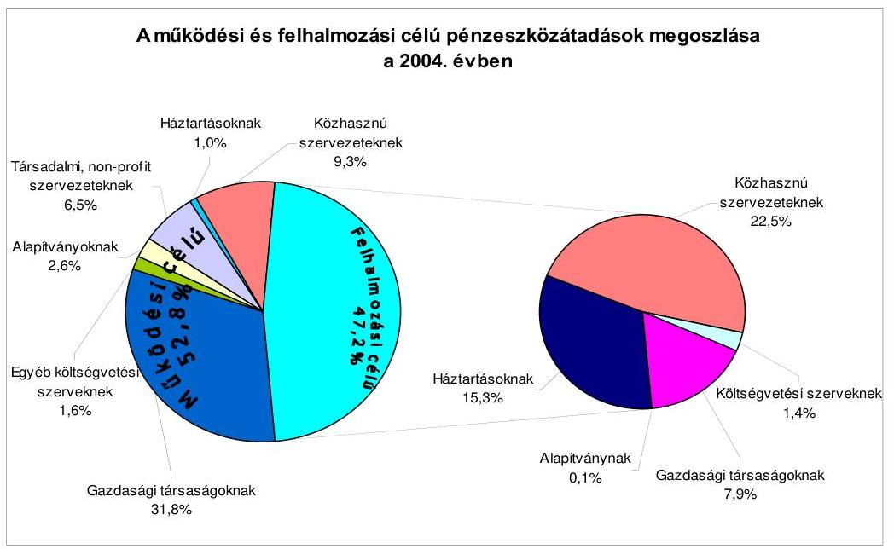
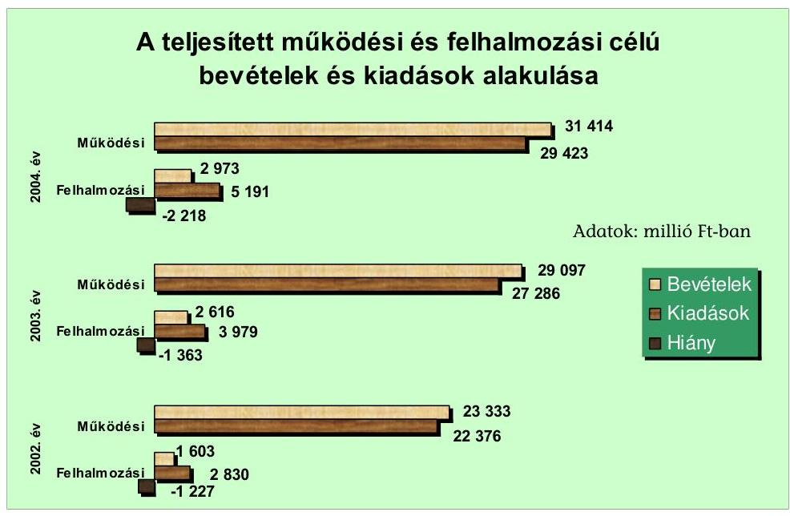
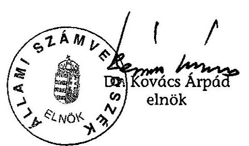
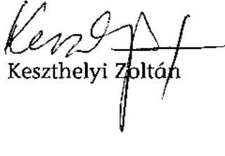
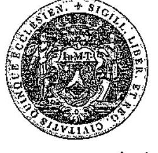
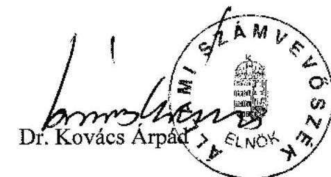

# JELENTÉS 

## Pécs Megyei Jogú Város Önkormányzata gazdálkodási rendszerének átfogó ellenőrzéséről

---

3. Önkormányzati és Területi Ellenőrzési Igazgatóság
3.3. Átfogó Ellenőrzések Főcsoport
Iktatószám: V-1001-1/30/16/2005.
Témaszám: 749
Vizsgálat-azonosító szám: V0203
Az ellenőrzést felügyelte:
Dr. Lóránt Zoltán
főigazgató
Az ellenőrzés végrehajtásáért felelős:
Dr. Sepsey Tamás
főigazgató-helyettes
Az ellenőrzést vezette:
Csecserits Imréné
főcsoportfőnök-helyettes
Az ellenőrzést végezték:
Pappné dr. Szamosi Éva
számvevő tanácsos
Bíró Zsolt
számvevő
Keszthelyi Zoltán
számvevő

# A témához kapcsolódó - elmúlt négy évben - készített számvevőszéki jelentések: 

címe
sorszáma
Jelentés a helyi és a helyi kisebbségi önkormányzatok 0220
gazdálkodásának átfogó ellenőrzéséről
Jelentés a települési önkormányzatok szilárdhulladék-gazdálkodási 0221
feladatai ellátásának ellenőrzéséről
Jelentés a helyi önkormányzatok beruházásaihoz és 0229
rekonstrukcióihoz nyújtott 2001. évi címzett és céltámogatások
igénybevételének és felhasználásának vizsgálatáról
Jelentés a helyi önkormányzatok egyes pénzügyi befektetésekkel 0318
történő gazdálkodásának ellenőrzéséről
Jelentés a mozgáskorlátozottak támogatására előirányzott 0344
pénzeszközök hasznosulásának ellenőrzéséről
Jelentés a települési önkormányzatok szennyvízközmű fejlesztési és 0416
működtetési feladatai ellátásának vizsgálatáról
Jelentés a középfokú oktatás feltételei alakulásának ellenőrzéséről 0445

Jelentéseink az Országgyűlés számítógépes hálózatán és az Interneten a www.asz.hu címen is olvashatók.

---

# TARTALOMJEGYZÉK 

BEVEZETÉS ..... 7
I. ÖSSZEGZŐ MEGÁLLAPÍTÁSOK, KÖVETKEZTETÉSEK, JAVASLATOK ..... 9
II. RÉSZLETES MEGÁLLAPÍTÁSOK ..... 21

1. A költségvetés tervezésének, végrehajtásának, az Önkormányzat vagyongazdálkodásának és a zárszámadás elkészítésének szabályszerűsége ..... 21
1.1. A költségvetési rendelet jóváhagyásának, módosításának, az előirányzatok nyilvántartásának szabályszerűsége ..... 21
1.2. A gazdálkodás szabályozottsága, a bizonylati rend és fegyelem szabályszerűsége ..... 28
1.3. A pénzügyi-számviteli feladatok ellátásának informatikai támogatottsága ..... 41
1.4. Az önkormányzati vagyon nyilvántartása, számbavétele ..... 42
1.5. A vagyonnal való gazdálkodás szabályszerűsége, célszerűsége, nyilvánossága ..... 45
1.6. A céljelleggel nyújtott támogatások szabályszerűsége ..... 62
1.7. A közbeszerzési eljárások szabályszerűsége ..... 67
1.8. A zárszámadási kötelezettség teljesítésének szabályszerűsége ..... 70
1.9. A Polgármesteri hivatal helyi kisebbségi önkormányzatok gazdálkodását segítő tevékenysége ..... 72
2. Az önkormányzati feladatok és a rendelkezésre álló források összhangja ..... 75
2.1. A feladatok meghatározása és szervezeti keretei ..... 75
2.2. A költségvetés egyensúlyának helyzete ..... 80
2.3. A feladatok finanszírozása ..... 86
3. A belső irányítási, ellenőrzési rendszer működésének értékelése ..... 89
3.1. Az ellenőrzési rendszer kialakítása, működése ..... 89
3.2. A könyvvizsgálati kötelezettség teljesítése ..... 92
3.3. A korábbi számvevőszéki ellenőrzések javaslatainak hasznosulása ..... 92

---

# MELLÉKLETEK 

1. számú Az Önkormányzat gazdálkodását meghatározó adatok, mutatószámok (1 oldal)
2. számú Az önkormányzati vagyon nagyságának alakulása (1 oldal)
3. számú Az Önkormányzat 2004. évi bevételeinek és kiadásainak alakulása (1 oldal)
4. számú Egyes önkormányzati feladatok finanszírozása (1 oldal)
5. számú Helyszíni ellenőrzési jegyzőkönyv (4 oldal)
6. számú Dr. Toller László úr, a Pécs Megyei Jogú Város Önkormányzata polgármesterének észrevétele (1 oldal)
7. számú Dr. Toller László úr, a Pécs Megyei Jogú Város Önkormányzata polgármesterének írt válaszlevél (1 oldal)

---

# RÖVIDÍTÉSEK JEGYZÉKE 

Ötv.
Áht.
Kbt. ${ }_{1}$
Kbt. ${ }_{2}$
Hatv.
Számv. tv.
Htv.

Nek. tv.
Ktv.
Ksztv.
Gázközmű vagyon tv. ${ }_{1}$
Gázközmű vagyon tv. ${ }_{2}$

Ptk.
Vhr.

Ámr.
kisebbségi kormányrendelet

Ber.
SzMSz
vagyongazdálkodási rendelet
közbeszerzési rendelet
ügyrend ${ }_{1}$
a helyi önkormányzatokról szóló 1990. évi LXV. törvény az államháztartásról szóló 1992. évi XXXVIII. törvény
a közbeszerzésekről szóló 1995. évi XL. törvény
a közbeszerzésekről szóló 2003. évi CXXIX. törvény
a helyi adókról szóló 1990. évi C. törvény
a számvitelről szóló 2000. évi C. törvény
a helyi önkormányzatok és szerveik, a köztársasági megbízottak, valamint egyes centrális alárendeltségű szervek fela-dat- és hatásköreiről szóló 1991. évi XX. törvény
a nemzeti és etnikai kisebbségek jogairól szóló 1993. évi LXXVII. törvény
a köztisztviselők jogállásáról szól 1992. évi XXIII. törvény
a közhasznú szervezetekről szóló 1997. évi CLVI. törvény
a gázközmű-vagyonnal összefüggő önkormányzati igények rendezésről szóló 2001. évi LVI. törvény
az 1993. augusztus 4-e és 1995. december 31-e között önkormányzati hozzájárulásból létesített gázközmű-vagyonnal kapcsolatos önkormányzati igények rendezéséről szóló 2002. évi LXIII. törvény
a Polgári Törvénykönyvről szóló 1959. évi IV. törvény
az államháztartás szervezetei beszámolási és könyvvezetési kötelezettségének sajátosságairól szóló 249/2000. (XII. 24.) Korm. rendelet
az államháztartás múködési rendjéről szóló 217/1998. (XII. 30.) Korm. rendelet
a kisebbségi önkormányzatok költségvetésének, gazdálkodásának, vagyonjuttatásának egyes kérdéseiről szóló 20/1995. (III. 1.) Korm. rendelet
a költségvetési szervek belső ellenőrzéséről szóló 193/2003. (XI. 26.) Korm. rendelet
Pécs Megyei Jogú Város Önkormányzatnak a Szervezeti és Múködési Szabályzatáról szóló 12/2001. (III. 30.) számú rendelete
Pécs Megyei Jogú Város Önkormányzatának 29/2002. (V. 10.) számú rendelete az Önkormányzat vagyonával kapcsolatos tulajdonosi jogok gyakorlásnak szabályairól
Pécs Megyei Jogú Város Önkormányzata 32/2000. (VI. 28.) számú rendelete a közbeszerzési szabályzatról, valamint a közbeszerzési értékhatár alatti beszerzésekre vonatkozó szabályokról
Pécs Megyei Jogú Város Önkormányzata Közgyűlésének a 324/2000. (VI. 22.) számú határozatával jóváhagyott Polgármesteri hivatal Ügyrendje

---

ügyrend $_{2}$
közbeszerzési szabályzat $_{1}$
közbeszerzési szabály-zat $_{2}$
Közgyúlés
Pénzügyi bizottság
Költségvetési bizottság
Jogi bizottság
Gazdasági bizottság
Egészségügyi bizottság
Ifjúsági bizottság
Önkormányzat
GKÖ
RKÖ
LKÖ
BKÖ
SzKÖ
HKÖ
NKÖ
CKÖ
UKÖ
Polgármesteri hivatal
polgármester
főjegyző
Jogi főosztály
Közgazdasági főosztály
Tisztségviselői kabinet
Népjóléti főosztály
Ellenőrzési osztály

Pécs Megyei Jogú Város Önkormányzatának polgármestere és főjegyzője által 2005. február 14-én aláírt a Polgármesteri hivatal Ügyrendje
Pécs Megyei Jogú Város Önkormányzatának Közbeszerzési szabályzata
Pécs Megyei Jogú Város Önkormányzatának Közbeszerzési szabályzata
Pécs Megyei Jogú Város Önkormányzatának Közgyűlése
Pécs Megyei Jogú Város Önkormányzata Közgyűlésének Pénzügyi Bizottsága
Pécs Megyei Jogú Város Önkormányzata Közgyűlésének Költségvetési Bizottsága
Pécs Megyei Jogú Város Önkormányzata Közgyűlésének Jogi, Igazgatás, Úgyrendi és Közbiztonsági Bizottsága
Pécs Megyei Jogú Város Önkormányzata Közgyűlésének Gazdasági, Tulajdonosi és Vállalkozási Bizottsága
Pécs Megyei Jogú Város Önkormányzata Közgyűlésének Egészségpolitikai és Szociális Bizottsága
Pécs Megyei Jogú Város Önkormányzata Közgyűlésének Ifjúsági és Civil Kapcsolatok Bizottsága
Pécs Megyei Jogú Város Önkormányzata
Pécsi Görög Kisebbségi Önkormányzat
Pécs Városi Ruszin Kisebbségi Önkormányzat
Pécsi Lengyel Kisebbségi Önkormányzat
Pécsi Bolgár Önkormányzat
Pécsi Szerb Önkormányzat
Pécs Megyei Jogú Város Horvát Önkormányzata
Pécsi Német Önkormányzat
Pécs Megyei Jogú Város Cigány Önkormányzata
Pécsi Ukrán Kisebbségi Önkormányzat
Pécs Megyei Jogú Város Önkormányzatának Polgármesteri hivatala
Pécs Megyei Jogú Város Önkormányzatának polgármestere
Pécs Megyei Jogú Város Önkormányzatának címzetes főjegyzője
Pécs Megyei Jogú Város Önkormányzata Polgármesteri hivatalának Jogi és Önkormányzati Főosztálya
Pécs Megyei Jogú Város Önkormányzata Polgármesteri hivatalának Közgazdasági Főosztálya
Pécs Megyei Jogú Város Önkormányzata Polgármesteri hivatalának Tisztségviselői Kabinetje
Pécs Megyei Jogú Város Polgármesteri hivatalának Népjóléti Főosztálya
Pécs Megyei Jogú Város Önkormányzata Polgármesteri hivatalának Ellenőrzési Osztálya

---

| Adóügyi osztály | Pécs Megyei Jogú Város Önkormányzata Polgármesteri hivatala Közgazdasági Főosztályának Adóügyi Osztálya |
| :--: | :--: |
| Informatikai osztály | Pécs Megyei Jogú Város Önkormányzata Polgármesteri hivatala Jogi és Önkormányzati Főosztályának Informatikai Osztálya |
| Városfejlesztési főosztály | Pécs Megyei Jogú Város Önkormányzata Polgármesteri hivatala Városfejlesztési Főosztálya |
| Gyámhivatal   GESZ | Pécs Megyei Jogú Város Önkormányzatának Gyámhivatala Pécs Megyei Jogú Város Önkormányzatának Gazdasági Ellátó Szervezete |
| ÁSZ | Állami Számvevőszék |
| PIK | Pécsi Ingatlankezelő Vállalat |
| Pécsi Vízmú Rt. | Pécsi Vízmúveket Múködtető és Vagyonkezelő Részvénytársaság |
| PVV Rt. | Pécsi Városüzemeltetési és Vagyonkezelő Részvénytársaság |
| BIOKOM Kft. | Biokom Pécsi Környezetgazdálkodási Korlátolt Felelősségú Társaság |

---

.

---

# JELENTÉS 

## Pécs Megyei Jogú Város Önkormányzata gazdálkodási rendszerének átfogó ellenőrzéséről

## BEVEZETÉS

Az Ötv. 92. § (1) bekezdése, az Állami Számvevőszékről szóló 1989. évi XXXVIII. törvény 2. § (3) bekezdése, valamint az Áht. 120/A. § (1) bekezdése szerint az önkormányzatok gazdálkodását az Állami Számvevőszék ellenőrzi. Az ellenőrzés elvégzése az Országgyűlés illetékes bizottságai részére is átadott, országosan egységes ellenőrzési program alapján történt.

## Az ellenőrzés célja annak értékelése volt, hogy:

- az önkormányzati gazdálkodás törvényességét ${ }^{1}$, szabályszerűségét biztosított-ták-e a tervezés, a költségvetés végrehajtása, a vagyongazdálkodás és a zárszámadás során;
- az Önkormányzat által ellátott feladatok és az azokhoz rendelkezésre álló források összhangja biztosított volt-e, különös tekintettel az egyes kiemelt feladatokra;
- a gazdálkodás szabályszerűségét biztosító belső kontrollok ${ }^{2}$ lehetővé tették-e a szabálytalanságok, hiányosságok, gazdaságtalan megoldások feltárását, megelőzését.

Az ellenőrzött időszak: a 2004. év, valamint az 1.5., 2.1.-2.3. és 3.3. ellenőrzési programpontok esetében ezen túlmenően a 2002-2003. évek is.

Pécs Megyei Jogú Város Baranya megye székhelye, lakosainak száma 2004. január 1-jén 156568 fő volt.

[^0]
[^0]:    ${ }^{1}$ A törvényi előírások betartásának elmulasztásakor a részletes megállapítások fejezetben egységesen a törvénysértés megjelölést alkalmazzuk, mivel az ÁSZ nem tehet különbséget a törvényi előírások között.
    ${ }^{2}$ A gazdálkodás szabályszerűségét biztosító kontroll alatt értjük a kiépített és működő belső irányítási és szabályozási rendszert, valamint a belső ellenőrzési funkciók ellátását.

---

A településrészi önkormányzatok száma nyolc ${ }^{3}$. A Közgyűlés tagjainak száma 43 fő. A testület munkáját 13 állandó bizottság segíti. Az Önkormányzat gazdálkodását meghatározó főbb adatokat az 1. számú melléklet tartalmazza.

A 2002. évi választások után a polgármester és a főjegyző személye nem változott. Az Önkormányzat a 2004. évben 34387 millió Ft költségvetési bevételből gazdálkodott, könyvviteli mérlegében kimutatott vagyonának értéke 112535 millió Ft volt. A kiadások $85 \%$-át működési, $15 \%$-át felhalmozási és fejlesztési célra fordították a 2004. évben. Az Önkormányzat feladatai végrehajtása érdekében a 2004. évben 17 önállóan gazdálkodó és 63 részben önállóan gazdálkodó költségvetési intézményt múködtetett, továbbá 17 gazdasági és közhasznú társaságban rendelkezett többségi tulajdonnal, amelyek részt vettek a feladatok ellátásában. A 2004. évben a Polgármesteri hivatalban foglalkoztatott köztisztviselők száma 409 fő volt, az intézményekben összesen 5748 fő közalkalmazott látott el szakmai és gazdálkodási feladatokat. A városban kilenc kisebbségi önkormányzat ${ }^{4}$ működött.
${ }^{3}$ Településrészi önkormányzatok: Pécs-Hird, Pécs-Somogy, Pécs-Vasas, Pécs-Mecsekszabolcs, Pécs-Pécsbányatelep, Pécs-Pécsújhegy, Pécs-Üszög, Pécs-Nagyárpád.
${ }^{4}$ Pécsi Görög Kisebbségi Önkormányzat, Pécs Városi Ruszin Kisebbségi Önkormányzat, Pécsi Lengyel Kisebbségi Önkormányzat, Pécsi Bolgár Önkormányzat, Pécsi Szerb Önkormányzat, Pécs Megyei Jogú Város Horvát Önkormányzata, Pécsi Német Önkormányzat, Pécs Megyei Jogú Város Cigány Önkormányzata, Pécsi Ukrán Kisebbségi Önkormányzat.

---

# I. ÖSSZEGZŐ MEGÁLLAPÍTÁSOK, KÖVETKEZTETÉSEK, JAVASLATOK 

Az Önkormányzat a 2003-2006. évekre rendelkezett a feladatokat hosszabb távon kijelölő gazdasági programmal. A 2004. és 2005. évre vonatkozó költségvetési koncepciókat az Ámr. előírásainak megfelelően a helyben képződő bevételek és az ismert kötelezettségek figyelembe vételével állították össze és azok tartalmazták a költségvetés készítésének további feladatait is. Az Ámr. előírása ellenére a polgármester a Pénzügyi bizottság véleményét a költségvetési koncepcióhoz nem csatolta és az Áht-ban foglaltak ellenére nem a költségvetési rendelettervezet benyújtásakor terjesztette elő a térítési díjak javasolt előirányzatát megalapozó rendeletet.

A 2004. és a 2005. évi költségvetési rendelettervezeteket a polgármester az Áht-ban előírt határidőn belül terjesztette a Közgyűlés elé, de az Ámr. előírása ellenére nem csatolta az előterjesztéshez a Pénzügyi bizottság véleményét. Az Áht-ban előírt mérlegek és kimutatások tartalmi követelményeit rendeletben nem határozták meg, mellyel nem tettek eleget az Áht. előírásának. A 2005. évi költségvetési rendelettervezet felülvizsgálatáról készített könyvvizsgálói jelentés a Közgyűlés ülésén került kiosztásra, amellyel a polgármester az Ámr. követelményét nem vette figyelembe. A költségvetési rendeletek az Áhtban meghatározottakat figyelembe véve tartalmazták a címrendet. Az Áht előírásai ellenére a költségvetési rendeletek nem tartalmazták a speciális célú támogatások összegét, továbbá az Áht. előírásait megsértve a költségvetési bevételek és a költségvetési kiadások között szerepeltettek finanszírozási célú bevételeket, kiadásokat, a hiány összegét nem mutatták be. Az Áht. előírásaival szemben a költségvetés előterjesztésekor nem mutatták be tájékoztatásul a többéves kihatással járó döntések összesítését és szöveges indoklását, valamint ezen belül a hitelek állományát lejárat szerinti bontásban. A költségvetési rendeletekben elkülönített pénzügyi keretösszegek, „Alapok" elnevezése félreérthető, mert ezen keretösszegek nem felelnek meg az Áht-ban előírt követelményeknek. Az Ötv. hatáskör átruházásra vonatkozó előírását megsértve a főjegyző és az alpolgármesterek is rendelkeztek saját hatáskörben felhasználható keretösszeggel. Az Ámr-ben előírtak ellenére a költségvetési rendeletek nem tartalmazták a pénzforgalom nélküli bevételeket, az intézmények felújítási előirányzatát célonként, a felhalmozási kiadásokat feladatonként, valamint az általános és céltartalékon kívül kerettartalékokat is elkülönítettek. Részletesen meghatározták a költségvetés végrehajtási szabályait.

A Közgyűlés a költségvetési rendelet előirányzatait 7293 millió Ft-tal, 23,6\%-kal növelte a 2004. évben. A költségvetési elöirányzatok módosítására előterjesztett rendelettervezetek a költségvetéssel összehasonlítható módon tartalmazták a módosítási javaslatokat. Az előterjesztések részletes és megfelelő információt biztosítottak a Közgyűlés számára a módosítások indokairól. Az Önkormányzat az Ámr-ben előírt követelményeket figyelmen kívül hagyta, mivel a 2004. évben a kapott pótelőirányzatok miatt az első negyedévi rendeletmódosítási kötelezettségének nem tett eleget. Az Ámr. előírásai ellenére a főjegyző nem készítette elő a költségvetési szerveknek a saját hatáskörben végrehajtott

---

előirányzat módosításairól szóló tájékoztatót, ezért erről a polgármester a Közgyűlést harminc napon belül nem tájékoztatta. A főjegyző a helyi kisebbségi önkormányzatokkal kötött megállapodásban foglaltak ellenére nem készítette elő a GKÖ, az SZKÖ, az UKÖ, és az RKÖ 2004. évi költségvetési határozatainak módosítását. Az előirányzat módosítások nyilvántartása az Áht. előírásainak megfelelt.

A Polgármesteri hivatal szervezetére és múködésére vonatkozó szabályzatát ügyrendnek nevezték el. A Polgármesteri hivatal szervezetének felépítését és feladatát az ügyrend ${ }_{1,2}$-ben rögzítették. A helyszíni ellenőrzés ideje alatt 2005. február 14-én jóváhagyták az új ügyrend ${ }_{2}$-t, amely az Ámr-ben a Polgármesteri hivatal szervezeti és múködési szabályzatára vonatkozó követelményei közül a feladatmutatók megnevezését, körét nem tartalmazta. A Polgármesteri hivatal gazdasági szervezete önálló ügyrenddel nem rendelkezett. A gazdasági szervezet szervezeti egysége feladatait, a vezetők és más dolgozók feladat-, hatás- és jogköreit az ügyrend ${ }_{1,2}$ és a dokumentum részét képező feladatjegyzék rögzítette, amelyek az Ámr. előírását figyelmen kívül hagyva nem tartalmazták a felhatalmazott vezetők kötelezettségvállalása, a kötelezettségvállalás ellenjegyzése és az utalványozás, valamint egy kivétellel az utalványozás ellenjegyzése feladatát. Az operatív gazdálkodással kapcsolatos hatásköröket a pénzgazdálkodás rendjéről szóló szabályzat határozta meg. A polgármester és a főjegyzö nem számoltatta be a felhatalmazottakat a jogkörök gyakorlásáról.

A főjegyző a költségvetési szervek egységes számviteli rendjét kialakította. A Vhr-ben foglaltak ellenére a számviteli politikában nem döntöttek arról, hogy annak rendelkezéseit a Polgármesteri hivatalhoz tartozó részben önállóan gazdálkodó GESZ-re kiterjesztik, vagy a GESZ önálló számviteli politikát alakít ki. A Vhr. alapján a 2005. évi költségvetési rendeletben rögzített új leltározási szabályokkal a leltározási és leltárkészítési szabályzatot nem módosították. Meghatározták a pénztárellenőrzéssel kapcsolatos teendőket, de nem rögzítették az ellenőrzésért felelős munkaköröket. A szabályzat a pénztár-ellenőrzési feladatok teljesítésére a pénztárjelentés elkészítése után két munkanapon belüli határidőt állapított meg, a napi pénztárellenőrzéssel szemben.

A Vhr. alapján a számlarendet elkészítették. A Vhr-ben foglaltak ellenére a legalább negyedévenkénti helyett a lakbér, a gyermekgondozási díj, a lakáshasználatba vételi díj, az egyéb PIK követelések analitikus nyilvántartásaiból készített összesítő bizonylatok rögzítését a könyvviteli nyilvántartásban évi egyszeri alkalomban határozták meg és végezték el, a helyi adókkal kapcsolatos követelések, kötelezettségek összesítő bizonylatainak könyvviteli rögzítését pedig a számlarendben előírtaknak megfelelően félévenként végezték el, valamint nem írták elő ezek, továbbá a lakossági távfűtés hátralék, a kamatmentes szociális kölcsön, a lakbér-, a lakásvételár hátralék, valamint a függő, kiegyenlítő kiadások, a függő, kiegyenlítő, átfutó bevételek analitikus nyilvántartásának formáját, tartalmát és azok vezetéseinek módját. A számlarendben a rendszeres egyeztetési, zárlati feladatokat meghatározták, de a feladatok elvégzésének ellenőrzési lehetőségét nem biztosították, mert az egyeztetések dokumentálási módját nem rögzítették. A Vhr. előírásai ellenére a Polgármesteri hivatal számviteli politikája, a leltározási és a leltárkészítési szabályzat - a helyi kisebbségi önkormányzatok bankszámlái és szakfeladata megnevezése kivételével - nem tartalmazta a helyi kisebbségi önkormányzatok gazdálkodásával

---

összefüggő sajátos feladatokat, a számlarend nem szabályozta a kisebbségi önkormányzatok tárgyi eszközeinek analitikus nyilvántartását. A Vhr. és a számlarend követelményeinek nem felelt meg az államkötvények nyilvántartása, mert nem tartalmazta az értékpapír árfolyamát és a kamatára vonatkozó adatokat; továbbá nem felelt meg az üzemeltetésre, kezelésre átadott eszközök nyilvántartása, mert nem ezen eszközcsoporton belül tartották nyilván az üzemeltetésre, kezelésre átadott lakás és nem lakás céljára szolgáló ingatlanokat és a víziközmű vagyont. A Vhr-ben, a számlarendben, és a pénzkezelési szabályzatban előírtak ellenére nem vezettek analitikus nyilvántartást az utólagos elszámolásra kiadott előlegekről. A PIK-től - az 1996. évi végelszámolását követően - behajtásra átvett követeléseinek résznyilvántartásai a Vhr-ben előírtak ellenére sem az átvételkor, sem a 2004. évben nem tartalmazták az átvett 90573 ezer Ft összegű követelés állományból 61186 ezer Ft összegű követelést. A Számv. tv-t megsértették azzal, hogy a gazdasági eseményeket rögzítő bizonylatok $47,6 \%$-a nem felelt meg az előírt alaki és tartalmi követelményeknek. A kijelölés hiányában végzett szakmai teljesítés igazolások miatt a bizonylatok $31,2 \%$-a nem volt megfelelő, nem ellenjegyezték a bizonylatok 6,8\%-ánál a kötelezettségvállalást, az utalványozás elmaradt a bizonylatok 6,0\%-ában és a bizonylatok 3,6\%-ánál az utalványozás ellenjegyzője nem teljesítette a folyamatba épített ellenőrzési feladatát.

A szabályzatok és a munkaköri leírások az ellenőrzési feladatok meghatározásán felül nem rögzítették a pénzügyi-számviteli feladatok teljesítésekor az elvégzendő tevékenységet megelőző folyamat ellenőrzési feladatait, az ellenőrzési pontokat, az ellenőrzéskor elvégzendő műveleteket, az ellenőrzés viszonyítási alapját, az eltérés megállapításának és dokumentálásának módját, az ellenőrzés megállapításai hasznosításával kapcsolatos előírásokat, valamint a pénzkezelési szabályzat és a leltározási és leltárkészítési szabályzat kivételével az eltérés esetén szükséges teendőket, a jelzési kötelezettséget. A munkaköri leírásokban - hat kivételével - nem rögzítették a munkafolyamatba épített ellenőrzési, egyeztetési feladatokat. A szabályzatok és a munkaköri leírások folyamatba épített belső ellenőrzésre, egyeztetésre vonatkozó előírásai egymással nem voltak összhangban.

A 2004. évben önkormányzati szinten a kiemelt előirányzatok közül a múködési bevételek előirányzatát 1,8\%-kal teljesítették túl, a kiemelt kiadási előirányzatokat éves szinten betartották. A Polgármesteri hivatal a 2004. évben a kamatbevételek előirányzatát $94,1 \%$-kal és a sajátos működési bevétel előirányzatát $4,2 \%$-kal teljesítette túl. Az intézmények a 2004. évben a működési célú pénzeszköz átadás előirányzatát 20,4\%-kal lépték túl. A Polgármesteri hivatal és az intézmények a 2004. évi gazdálkodásuk során megsértették az Áht. előírásait, mert nem a jóváhagyott előirányzataikon belül gazdálkodtak. A túllépések okait megvizsgálták, felelősségre vonás nem történt.

A pénzügyi, gazdálkodási és számviteli feladatokat a Polgármesteri hivatalban - hálózati kapcsolatban lévő - számítógépes rendszer segítségével látták el. A felhasználói programokhoz az üzemeltetési dokumentációk rendelkezésre álltak. Az informatikai rendszer biztonságával kapcsolatos szabályokat meghatározták. Az Önkormányzat a 2004-2006. évekre szóló informatikai stratégiai tervvel rendelkezett.

---

Az önkormányzati vagyon nyilvántartását a törzsvagyon (ezen belül a forgalomképtelen és korlátozottan forgalomképes), valamint az egyéb vagyon elkülönítését a főkönyvi könyvelésben biztosították. A 2004. évi leltározás során a Polgármesteri hivatal kezelésében lévő ingatlanok esetében a leltárt a Vhr-ben előírtak ellenére nem mennyiségi felvétellel, hanem a részletező nyilvántartások alapján készített összesítő kimutatással készítették el. A számviteli politika alapján elvégezték az értékpapírok és követelések értékelési feladatait. A követelések esetében a megállapított 346690,6 ezer Ft-os értékvesztés elszámolása indokolt volt. A részesedések esetében az értékvesztés elszámolásának szükségességét nem vizsgálták a Számv. tv. előírásaival szemben, illetve figyelmen kívül hagyták a számviteli politikában foglaltakat.

A vagyongazdálkodással kapcsolatos feladatokat és döntési hatásköröket az Önkormányzat rendeletben szabályozta. A vagyonnal való gazdálkodási jogosultságokat célszerűen szabályozták. A vagyonhasznosítás nyilvánosságának biztosítása érdekében a vagyongazdálkodási rendeletben rögzítették a versenyeztetési eljárás szabályait. Megsértve az Áht-t a szabályozásban lehetővé tették a Közgyűlés számára a versenyeztetési eljárás mellőzését. A Közgyűlés döntése alapján - versenyeztetési eljárás mellőzésével - a 2003. évben egy, a 2004. évben kettő ingatlant értékesítettek a kérelmező társaságok részére, amely közül kettő esetben az értékbecslést a vagyongazdálkodási rendeletben előírtak ellenére nem aktualizálták. Az egyik ingatlan értékesítésnél az Önkormányzat a vevő részére opciós szerződéssel vételi jogot biztosított, de az ingatlanok vételárát a Ptk. előírása ellenére nem határozta meg. A másik ingatlan hasznosítási döntésnél az Önkormányzat gazdasági érdekei szempontjából - a vételi ajánlatokat figyelembe véve - nem a legkedvezőbb ingatlanhasznosítás történt, amelyet nem indokoltak. A nyilvános versenyeztetési eljárás mellőzésével lebonyolított értékesítések nem biztosították a köztulajdonnal való gazdálkodás nyilvánosságát, átláthatóságát. Követelés elengedésekor, vagyontárgy ingyenes átruházásakor, apportáláskor és az értékpapírok értékesítésekor betartották a vagyongazdálkodási, illetve az éves költségvetési rendeletben foglalt szabályokat. Megsértve az Áht-t, az éves költségvetési előirányzatokból a nem normatív, céljellegú, fejlesztési támogatások, és - a nettó ötmillió Ft-ot elérő, vagy azt meghaladó értékű - építési beruházások, szolgáltatás megrendelések, árubeszerzések esetében a szerződések egyes adatait a helyben szokásos módon nem tették közzé.

A 2004. évben céljellegú támogatásban 425 szervezet és 11 magánszemély részesült. A támogatások odaítélésének, nyilvántartásának és a rendeltetésszerű felhasználás ellenőrzésének eljárási rendjét - átfogó jelleggel - nem szabályozták. Nem határozták meg az ellenőrzést végzők feladatait. Az alapítványoknak nyújtott támogatásokról a Közgyűlés határozott. A támogatások esetében előírták a számadási kötelezettséget. A számadások 32,7\%-ánál az Áht. előírását megsértve a cél szerinti felhasználás ellenőrzése nem történt meg. A támogatások 14,2\%-nál a támogatásban részesült szervezetek a számadást az előírt tartalommal és határidőben nem bocsátották a Polgármesteri hivatal rendelkezésére. Ezekben az esetekben a Polgármesteri hivatal az Áht-ban foglaltakat megsértve nem intézkedett a további támogatás felfüggesztéséről, valamint a nyújtott támogatás visszafizettetéséről.

---

A Közgyűlés a közbeszerzési eljárás helyi szabályairól rendeletet alkotott. A Polgármesteri hivatalnál a Kbt . ${ }_{1}$-ben meghatározottak alapján a 2004. évben négy közbeszerzési eljárást indítottak, amelyről az éves összegzést elkészítették. A közbeszerzési eljárások lefolytatása a Kbt. ${ }_{1}$ előírásainak betartásával történt, azonban a Kbt. ${ }_{1}$ előírása ellenére a közbeszerzési eljárást lezáró döntés meghozatalára személy helyett a Gazdasági bizottság kapott jogosultságot.

A polgármester a 2003. évi zárszámadási rendelettervezetet az Áht-ban foglalt határidőn belül terjesztette a Közgyűlés elé. Az Áht-ban előírtak ellenére a zárszámadás és a költségvetési rendelet adatainak összehasonlíthatóságára vonatkozó követelményt a módosított előirányzatoknál nem teljesítették. A zárszámadási rendelettervezet az Áht. előírásaival szemben nem tartalmazta öszszesítve a speciális célú támogatásokat. Az Ámr. előírásait figyelmen kívül hagyva nem került bemutatásra az intézmények felújítási előirányzatának teljesítése célonként és felhalmozási kiadásainak teljesítése feladatonként. Az Áht. előírásai ellenére nem mutatták be a többéves kihatással járó döntések számszerűsítését évenkénti bontásban és összesítve, szöveges indoklással. Az Áhtban előírtaknak megfelelően a zárszámadás előterjesztésekor a vagyonkimutatást tájékoztatásul bemutatták. A 2003. évi költségvetési pénzmaradvány megállapításánál nem az Ámr. szerint jártak el, mivel a Közgyűlés az Önkormányzat 2003. évi pénzmaradványaként a szabad pénzmaradványt fogadta el a módosított pénzmaradvány helyett.

A településen kilenc kisebbségi önkormányzat múködött, amelyekkel a gazdálkodási feladatok végrehajtása érdekében együttműködési megállapodást kötött a polgármester. Az együttmúködési megállapodások tartalmazták a főjegyző felkérését a költségvetési határozat tervezetek előkészítésére. Az Ámr. előírásai ellenére a megállapodások nem tartalmazták a költségvetési határozattervezetek kisebbségi önkormányzatok részére történő átadásának, valamint a zárszámadási határozatok kisebbségi önkormányzatok által a Polgármesteri hivatal részére történő átadásának határidejét. Az érvényesítés elvégzése az Ámr-ben foglaltak ellenére mind a kiadásoknál, mind a bevételeknél elmaradt. Az Önkormányzat nyilvántartásain belül elkülönítetten vezették a kisebbségi önkormányzatok vagyoni és számviteli nyilvántartásait, de az éves zárszámadás keretén belül a kisebbségi önkormányzatok vagyonát a kisebbségi kormányrendelet előírásainak ellenére az Önkormányzat vagyonától elkülönítetten nem mutatták be. A kisebbségi önkormányzatok bevételeit és kiadásait az e célra kijelölt szakfeladaton számolták el. A jóváhagyott költségvetési előirányzatok alakulását elkülönítetten tartották nyilván és a kötelezettségvállalásokról nyilvántartást vezettek. A kisebbségi önkormányzatokkal kötött megállapodások - a zárszámadás területét kivéve - alkalmasak voltak arra, hogy az Önkormányzat és a kisebbségi önkormányzatok együttmúködése a jogszabályi előírásoknak megfelelő legyen.

Az Önkormányzat az Ötv-ben foglaltakkal azonos körben határozta meg kötelező feladatait. Az Ötv. előírásai ellenére elmaradt annak meghatározása, hogy a lakosság igényét figyelembe véve, mely feladatokat milyen mértékben és módon lát el. Az Önkormányzat kötelező és önként vállalt feladatait saját költségvetési szerveivel, általa alapított gazdasági társaságok, közhasznú, nonprofit szervezetek segítségével, valamint vásárolt szolgáltatások révén látta el. A Közgyűlés a 2002-2004. években több alkalommal hozott döntést a feladatel-

---

látás egyes részterületeinek módosítására. A szociális alapellátás területét a lakossági igények alapján, a családsegítő és gyermekjóléti szolgálatot az egységes szakmai munka megvalósításáért, az óvodai nevelés, alapfokú és középfokú oktatás intézményi struktúráját az ellátotti létszám, az épületek életveszélyessé válása, valamint a szakmai indokok alapján módosították. Az átszervezések és az intézmény megszüntetések előkészítése során kikérték az alapfeladatokat igénybevevők véleményét.

Az Önkormányzat költségvetésében a 2002-2004. években a múködési célú kiadásoknál tartós forráshiányt tervezett. A költségvetés teljesítése során azonban a múködési bevételek a 2002-2004. években a múködési kiadásokat fedezték. A felhalmozási bevételek nem biztosítottak fedezetet a felhalmozási kiadásokra, azok 56,6\%-ra, 65,7\%-ra és 57,3\%-ra nyújtottak fedezetet. A hiányzó forrást a múködési bevételek és a finanszírozási bevételek biztosították. Az Önkormányzat fejlesztési célú hitelállománya a 2002-2004. években folyamatosan emelkedett, 2002. december 31-én 871 millió Ft, 2003. december 31én 2423 millió Ft, 2004. december 31-én 4285 millió Ft volt. Az Önkormányzat a fejlesztési célú hitelek felvételénél és a kezességvállalások során betartotta az Ötv-ben foglalt adósságot keletkeztető kötelezettségvállalásokra vonatkozó felső korlátot. Az Önkormányzat a bevételeinek növelése érdekében élt a helyi adó megállapításának lehetőségével, továbbá pályázatok útján külső pénzügyi forrásokat is igénybe vett a feladatai finanszírozásához.

A kötelező feladatok finanszírozásában az állami hozzájárulások, támogatások aránya a 2002. évhez képest a 2004. évre a bölcsődei, általános és középiskolai ellátásoknál emelkedett, az óvodai, a nappali szociális intézményi ellátásoknál és a bentlakásos szociális intézményi ellátásoknál csökkent. E feladatok ellátásánál - a nappali szociális intézményi ellátások kivételével - a finanszírozási forrásokon belül az intézményi saját bevételek aránya csökkent, amely az intézmények önfinanszírozó képességének romlását jelzi. Az Önkormányzat a kötelező feladatai mellett önként vállalt feladatokra az éves költségvetési kiadásának $5,4 \%, 6,5 \%$, és $8,7 \%$-át fordította. Az önként vállalt feladatok közül fontos szerepet kapott a pogányi repülőtér fejlesztésének és múködtetésének támogatása, amely az önként vállalt feladatok összes költségvetési kiadásából a 2002. évben 4,4\%-os, a 2003. évben 38,6\%-os, a 2004. évben pedig $25,8 \%$-os részarányt képviselt. Az önként vállalt feladatok teljesítése nem veszélyeztette a kötelező feladatok ellátását.

A fogyatékos személyek jogairól és esélyegyenlőségéről szóló törvény végrehajtásához szükséges feladatokat felmérték. A felmérés szerint a középületek akadálymentessé tételéhez 329,8 millió Ft szükséges. Az Önkormányzat a fogyatékos személyek jogairól és esélyegyenlőségük biztosításáról szóló törvényben előírtak ellenére a középületek akadálymentessé tételét 2005. január 1-ig nem biztosította.

Az Önkormányzat az Ötv. előírásának megfelelve a belső ellenőrzés szervezeti kereteit kialakította, a főjegyző a költségvetési szervek ellenőrzésével a Htv. követelményét teljesítette. Az Áht. előírását figyelembe véve az ellenőrzés időszakában biztosították az ellenőrzés szervezeti egységeinek szervezeti függetlenségét. A 2005. évi feladatok ismeretében határozták meg az Ellenőrzési osztály létszámát, amely további két fő alkalmazását jelentette. A 2004. és 2005. évi

---

intézményellenőrzési terveket - a Ber. előírásai ellenére - a Közgyűlés hagyta jóvá a főjegyző helyett. Az ellenőrzési kézikönyv az Áht-val összhangban határozta meg a Közgyűlés tájékoztatását az éves ellenőrzési beszámoló vonatkozásában. A Ber. követelményeit figyelmen kívül hagyva a 2004. és a 2005. évi ellenőrzési tervek nem tartalmazták az ellenőrzési tervet megalapozó elemzéseket, az ellenőrzési módszereket és nem ütemezték az ellenőrzéseket, a vizsgálati eljárások, módszerek megválasztásánál pedig kockázat elemzést nem alkalmaztak. A Ber. előírásai ellenére a 2004. évi ellenőri jelentések nem rögzítették az alkalmazott módszereket és eljárásokat. Az ellenőrzési jelentések javaslatai a tartalmi megállapításokon alapultak és alkalmasak voltak arra, hogy realizálásukkal a feltárt hiányosságok megszüntetésre kerüljenek. A 2004. évben egy esetben kezdeményezték büntetőeljárás megindítását. Az Áht. előírása alapján a főjegyző a 2004. évi költségvetési beszámolóhoz elkészítette a belső ellenőrzés működéséről szóló beszámolóját.

Az Önkormányzat az Ötv-nek megfelelve könyvvizsgálói kötelezettségének eleget tett. A könyvvizsgáló az Önkormányzatnak a 2003. és a 2004. évi költségvetési beszámolóját hitelesítő záradékkal látta el, auditálási eltérést nem állapított meg.

A 2002-2004. évben az ÁSZ hét ellenőrzést végzett az Önkormányzatnál. A vizsgálatok javaslatait követően a szükséges intézkedések 80\%-át teljes mértékben, $12,3 \%$-át részben valósították meg. A költségvetési koncepció, a költségvetési és a zárszámadási rendeletek összeállítására, előterjesztésére tett javaslatokat - két részteljesítés kivételével - teljesítették, a belső ellenőrzés ellentmondásos szabályozását feloldották, a helyi kisebbségi önkormányzatokkal kötött megállapodásokat kiegészítették az operatív gazdálkodás részletes fela-dat- és hatásköreivel, az adósságot keletkeztető kötelezettségvállalások nyilvántartását folyamatosan vezették és betartották az Ötv-ben előírt, az adósságot keletkeztető kötelezettségvállalások felső korlátját. A köztisztasággal kapcsolatos feladatok ellátásának értékelését és ellenőrzését elvégezték, erről a lakosságot tájékoztatták, a szelektív hulladékgyűjtést bevezették, valamint az önkormányzat és a szolgáltatók közötti információs ellenőrzési rendszert megvalósították. A címzett támogatással megvalósuló fejlesztési programok teljesítésekor a szerződésekben rögzítettek szerint jártak el. A pénzügyi befektetésekkel történő gazdálkodás keretében az értékpapír értékesítés feltételeit meghatározták, az értékpapírok bekerülési értékét a Vhr. előírása alapján határozták meg. A mozgáskorlátozottak támogatására előirányzott pénzeszközök felhasználása kapcsán a III. számú Területi Szociális Központnál megépült a rámpa. A középfokú oktatás feltételeinek javítása érdekében bővítették a külső szakmai ellenőrzések számát.

---

A helyszíni ellenőrzés megállapításainak hasznosítása mellett javasoljuk:

# a polgármesternek 

a jogszabályi előírások maradéktalan betartása érdekében:

1. a költségvetési gazdálkodás jogszabályszerú kereteinek kialakítása céljából
a) csatolja a költségvetési koncepció tervezethez az Ámr. 28. § (3) bekezdése alapján a Pénzügyi bizottság koncepció tervezetről szóló véleményét, továbbá a költségvetési rendelettervezethez az Ámr. 29. § (9) bekezdése alapján a Pénzügyi bizottság véleményét és a könyvvizsgáló jelentését;
b) terjessze - a főjegyző által elkészített előterjesztés alapján - a Közgyűlés elé az Áht. 118. §-ában előírt mérlegek, kimutatások tartalmának meghatározásáról szóló rendelettervezetet, valamint az Áht. 71. § (2) bekezdése alapján a költségvetési rendelettervezet benyújtásakor a térítési dijbevételi előirányzatot megalapozó rendelettervezeteket;
2. gondoskodjon arról, hogy az utalványozás az Ámr. 136. § (2) bekezdésében előírtak alapján teljesüljön és a kötelezettségvállaló az Ámr. 134. § (2) bekezdésének megfelelve a kötelezettségvállalás ellenjegyzőjének aláírása után vállaljon kötelezettséget;
3. intézkedjen annak érdekében, hogy a Polgármesteri hivatal és az intézmények az Áht. 93. § (1) bekezdése szerinti jóváhagyott előirányzaton belül gazdálkodjanak, valamint az intézmények tartsák be az Áht. 12/A. § (1) bekezdésében foglaltakat, amely szerint tárgyévi fizetési kötelezettség a jóváhagyott előirányzat mértékéig vállalható;
4. biztosítsa, hogy az Áht. 15/A. § (1) bekezdésben előírt nem normatív, céljellegű, fejlesztési támogatások, és az Áht. 15/B. § (1) bekezdésben előírt költségvetési előirányzatokból - a nettó ötmillió Ft-ot elérő, vagy azt meghaladó értékű - építési beruházások, szolgáltatás megrendelések, árubeszerzések esetében a szerződések az Áht. 15/B. § (1) bekezdésben meghatározott adatait a helyben szokásos módon tegyék közzé;
5. kezdeményezze a vagyongazdálkodási rendelet módosítását annak érdekében, hogy az ne tartalmazzon az Áht. 108. § (1) bekezdésében előírtaktól eltérő, a versenyeztetési kötelezettség alól felmentést lehetővé tevő szabályozást;
6. gondoskodjon, hogy a vételi jogra (opció) vonatkozó megállapodásban a Ptk. 375. § (1) bekezdésének megfelelően, a vételi jogra vonatkozó dolog esetében a vételár megjelölésre kerüljön;
7. intézkedjen az Áht. 13/A. § (2) bekezdése alapján, hogy a támogatott szervezetek eleget tegyenek a részükre meghatározott számadási kötelezettségnek, a számadási kötelezettséget nem teljesítők esetében intézkedjen a támogatás összegének visszafizetésére, valamint a további támogatást függessze fel;

---

8. kezdeményezze, hogy a Közgyűlés az Ötv. 8. § (2) bekezdésében foglaltak alapján határozza meg, hogy a lakosság igényei és az Önkormányzat anyagi lehetőségei figyelembevételével mely feladatokat, milyen mértékben és módon lát el;
9. gondoskodjon, a középületek akadály-mentesítésének tervezése és annak végrehajtása során a fogyatékos személyek jogairól és esélyegyenlőségük biztosításáról szóló 1998. évi XXVI. törvény 29. § (6) bekezdésében foglaltak végrehajtásáról;
a munka színvonalának javítása érdekében
10. terjessze a számvevőszéki jelentést a Közgyűlés elé, és a feltárt hiányosságok megszüntetése érdekében készíttessen intézkedési tervet határidők és a felelősök megjelölésével;
11. számoltassa be a felhatalmazottakat a kötelezettségvállalási és utalványozási jogkörök gyakorlásáról;

# a főjegyzőnek 

a gazdálkodás szabályszerűségének biztosítása érdekében

1. a költségvetési és a zárszámadási rendelettervezet előkészítésekor
a) intézkedjen, hogy a költségvetési és zárszámadási rendelettervezet tartalmazza a speciális célú támogatásokat összesítve - ezen belül a céljellegú támogatásokat az Áht. 69. § (1) bekezdésének megfelelően, az intézmények felújítási és felhalmozási kiadásait az Ámr. 29. § (1) bekezdés c) és d) pontja szerint célonként és feladatonként;
b) gondoskodjon arról, hogy a költségvetési rendelettervezet az Ámr. 29. (1) bekezdés a) pontja alapján a pénzforgalom nélküli bevételt is tartalmazza, valamint az Ámr. 29. § (1) bekezdés e) pontjában előírtakat figyelembe véve az általános és céltartalékok között mutassák be a kerettartalékokat;
c) biztosítsa, hogy az Áht. 8. § (1) és 8/A. § (7) bekezdése alapján a költségvetési rendelettervezet költségvetési bevétele és kiadása ne tartalmazzon finanszírozási célú bevételeket és kiadásokat, valamint a költségvetési bevételek, kiadások különbségét jelentő hiány összegét mutassa be;
d) kezdeményezze, hogy a költségvetési rendelettervezet az Ötv. 9. § (3) bekezdésében meghatározottakat figyelembe véve ne tartalmazzon a főjegyző és az alpolgármesterek döntési hatáskörében felhasználható keretösszegeket;
e) gondoskodjon az Áht. 118. §-ában előírtaknak megfelelően arról, hogy a költségvetési rendelettervezet tartalmazza a 116. § 9. pontjának megfelelve a többéves kihatással járó döntések számszerűsítését évenként és összesítve, valamint a 118. § alapján annak szöveges indoklását is;
f) kezdeményezze rendelettervezet előkészítésével az Ámr. § 53. (2) bekezdésében foglalt előírások betartása érdekében, hogy a kapott pótelőirányzatok miatti elői-rányzat-módosítás negyedéven belül megtörténjen, valamint készítse el az Ámr.

---

53. § (6) bekezdésének megfelelve a költségvetési szerveknek a saját hatáskörben végrehajtott előirányzat módosításairól szóló tájékoztatót annak érdekében, hogy erről a Közgyűlés harminc napon belüli tájékoztatása megtörténjen;
g) készítse el a helyi kisebbségi önkormányzatokkal kötött megállapodások alapján a költésvetési előirányzataik módosítására vonatkozó határozattervezeteket, valamint kezdeményezze, hogy a helyi kisebbségi önkormányzatok előirányzatmódosítási kötelezettségeiknek az Ámr. 53. § (7) bekezdésében foglaltaknak megfelelően tegyenek eleget és erről az Önkormányzatot tájékoztassák;
h) biztosítsa, hogy a zárszámadási rendelettervezet a legutolsó költségvetési rendeletmódosítással elfogadott előirányzatot tartalmazza az Áht. 18. §-ában előírtak figyelembe vételével;
i) biztosítsa, hogy a költségvetési pénzmaradvány megállapítására vonatkozó előterjesztés az Ámr. 65. § (2) bekezdése és az Ámr. 66. § (4) bekezdése alapján megállapított összeget tartalmazza;
54. a gazdálkodás és a pénzügyi-számviteli feladatok szabályozása tekintetében
a) kezdeményezze az Ámr. 10. § (4) bekezdés e) pontjában az szervezeti és működési szabályzatra vonatkozó előírásoknak megfelelő tartalommal az ügyrend; kiegészítését a feladatmutatók megnevezésével és körével, valamint az Ámr. 17. § (5) bekezdése alapján az ügyrend; és a feladatjegyzék kiegészítését annak érdekében, hogy az tartalmazza felhatalmazottak szerinti bontásban a kötelezettségvállalás, a kötelezettségvállalás ellenjegyzése, az utalványozás és az utalványozás ellenjegyzése feladatait;
b) rögzítse a Vhr. 8. § (13) bekezdése alapján a számviteli politikában, hogy annak rendelkezéseit a Polgármesteri hivatalhoz tartozó részben önállóan gazdálkodó GESZ-re kiterjesztik, vagy a GESZ önálló számviteli politikát alakít ki;
c) kezdeményezze a leltározási és leltárkészítési szabályzat kiegészítését az önkormányzati rendelet alapján a Vhr. 37. § (7) bekezdésében foglalt lehetőséggel élve, amely szerint a leltározást elegendő kétévenként végrehajtani, amennyiben a tulajdonvédelem megfelelően biztosított és ellenőrzött, valamint az államháztartás szervezete az eszközökről és azok állományában bekövetkezett változásokról folyamatosan részletező nyilvántartást vezet mennyiségben és értékben;
d) biztosítsa, hogy a számlarendben az összesítő kimutatások elkészítésének és a könyvviteli nyilvántartásban való rögzítésének idejét a Vhr. 47. § (1) bekezdésében előírtaknak megfelelve legalább negyedévenként határozzák meg, valamint rögzítsék a Vhr. 49. § (2) bekezdésében foglaltak alapján az analitikus nyilvántartások formáját, tartalmát, azok vezetésének, és az egyeztetések dokumentálásának módját;
55. gondoskodjon arról, hogy a számlarendben a Vhr. 9. számú melléklet 1/h. pontjában, a Vhr. 20. § (1) bekezdésében, valamint Vhr. 9. számú melléklet 2/c. pontjában meghatározott követelményeknek feleljen meg az értékpapírok, az üzemeltetésre, kezelésre átadott eszközök, valamint az egyéb PIK követelések analitikus nyilvántartása;

---

4. biztosítsa, hogy a számlarend előírásai alapján a negyedévenkénti egyeztetési feladatokat az analitikus nyilvántartások és a főkönyvi nyilvántartás között, végezzék el; valamint negyedévenként rögzítsék az összesítő bizonylatok adatait a főkönyvi nyilvántartásban;
5. biztosítsa, hogy a számviteli nyilvántartásokban a Számv. tv. 167. § (1) bekezdésében előírt alaki és tartalmi követelményeknek megfelelő bizonylatokat rögzítsenek és ezzel teljesítsék a Számv. tv. 165. § (2) bekezdésében foglalt, a számvitel bizonylati elvére és rendjére vonatkozó előírásokat;
6. gondoskodjon arról, hogy a kötelezettségvállalás és utalványozás ellenjegyzői az Ámr. 134. § (9) bekezdése, az érvényesítő a 135. § (1) bekezdése, valamint a kijelölt szakmai teljesítést igazoló az Ámr. 135. § (3) bekezdése alapján az ellenőrzési feladatokat teljesítsék;
7. intézkedjen a Vhr. 37. § (1) bekezdésben előírtak alapján az ingatlanok leltározásának végrehajtása érdekében;
8. gondoskodjon arról, hogy a Számv. tv. 54. § (2) bekezdésnek megfelelően a beszámoló elkészítése során egyedileg értékeljék a részesedéseket, és a szükség szerinti értékvesztést számolják el;
9. intézkedjen az Áht. 13/A. § (2) bekezdésének betartása érdekében arról, hogy a céljellegú támogatások felhasználásának és a benyújtott számadásoknak az ellenőrzése megtörténjen;
10. a kisebbségi önkormányzatok gazdálkodásával kapcsolatos feladatellátás elősegítése érdekében:
a) készítse elő az Ámr. 29. § (10) bekezdés előírása alapján a GKÖ, az SZKÖ, az UKÖ és az RKÖ-vel megkötött megállapodások kiegészítését annak érdekében, hogy azokban rögzítsék a költségvetési határozattervezetek kisebbségi önkormányzatok részére történő átadásának, illetve a zárszámadási határozatok kisebbségi önkormányzatok által a Polgármesteri hivatal részére történő átadásának határidejét;
e) kezdeményezze, hogy a számviteli politika, a leltározási és a leltárkészítési szabályzat tartalmazza a Vhr. 8. § (3) bekezdésére és a Vhr. 37. §-ra tekintettel a kisebbségi önkormányzati gazdálkodással összefüggő sajátos feladatokat is,
b) biztosítsa, hogy a zárszámadáshoz csatolt Áht. 116. § 8. pontjában előírt vagyonkimutatás a kisebbségi önkormányzatok vagyonát elkülönítetten tartalmazza a kisebbségi kormányrendelet 15. § (1) bekezdésének előírásainak megfelelően;
11. a belső ellenőrzéssel kapcsolatban
a) hagyja jóvá a Ber. 18. §-ában rögzítetteknek megfelelően az éves ellenőrzési tervet, valamint az éves ellenőrzési tervek tartalmazzák a Ber. 21. § (3) bekezdése a) pontjának megfelelve az ellenőrzési terveket megalapozó elemzéseket, az f) pontja alapján az ellenőrzések módszereit, a g) pontban foglaltak figyelembe vételével az ellenőrzések ütemezését;

---

c) intézkedjen, hogy a Ber. 26. § (1) bekezdése szerint kockázatelemzéssel válasszák ki a vizsgálati eljárásokat és módszereket, valamint biztosítsa a Ber. 27. § (2) bekezdés h) pontja alapján, hogy az ellenőrzési jelentések tartalmazzák az alkalmazott eljárásokat és módszereket;
a munka színvonalának javítása érdekében
12. kezdeményezze a költségvetési rendelettervezet előkészítése során, hogy a tartalmuk alapján bizottsági felhasználású előirányzatok esetében a félreérthető és az Áht-ban foglaltakkal nem összhangban lévő „Alap" elnevezést változtassák meg;
13. számoltassa be a felhatalmazottakat a kötelezettségvállalás ellenjegyzése és az utalványozás ellenjegyzése jogkörök gyakorlásáról;
14. egészítse ki a pénzkezelési szabályzatot a pénztárellenőrzésért felelős munkakörökkel és a pénztár ellenőrzési feladatok teljesítését a munkafolyamatba épített előzetes és utólagos ellenőrzési követelmények szerint határozza meg;
15. biztosítsa, hogy a hatályos szabályzatok és a munkaköri leírások tartalmazzák az ellenőrzési feladatok meghatározásán felül a pénzügyi - számviteli feladatok teljesítésekor az elvégzendő tevékenységet megelőző folyamat ellenőrzésének feladatát, az ellenőrzési pontokat, az ellenőrzéskor elvégzendő műveleteket, az ellenőrzés viszonyítási alapját, az eltérés megállapításának és dokumentálásának módját, eltérés esetén a szükséges teendőket, jelzési kötelezettségeket, és biztosítsa a szabályzatok és a munkaköri leírások folyamatba épített belső ellenőrzésre, egyeztetésre vonatkozó előírásainak összhangját;
16. gondoskodjon a céljelleggel nyújtott támogatások odaítélésének, nyilvántartásának és a rendeltetésszerű felhasználás ellenőrzésének eljárási rendjéről szóló - átfogó jellegű, valamennyi támogatottra és előirányzat típusra vonatkozó - szabályozás elkészítéséről, az ellenőrzést végzők feladatainak meghatározásáról.

---

# II. RÉSZLETES MEGÁLLAPÍTÁSOK 

## 1. A KÖLTSÉGVEtÉs TERVEZÉSÉNEK, VÉGREHAJTÁsÁNAK, AZ ÖNKORMÁNYZAT VAGYONGAZDÁLKODÁSÁNAK ÉS A ZÁRSZÁMADÁS ELKÉSZÍTÉSÉNEK SZABÁLYSZERŰSÉGE

### 1.1. A költségvetési rendelet jóváhagyásának, módosításának, az előirányzatok nyilvántartásának szabályszerűsége

Az Önkormányzat az Ötv. 91. § (1) bekezdése szerinti gazdasági programját a 2003-2006. évekre célprogramban határozta meg ${ }^{5}$. A célprogram tizennégy fő pontban, részletes alábontással tartalmazta az Önkormányzat stratégiai fejlesztési céljait (a légi-, a közúti közlekedés, a helyi tömegközlekedés, a közüzemi fejlesztés, a lakásprogram, az intézmény felújítási program), valamint megfogalmazta a költségvetési egyensúly megtartására, a vagyongazdálkodásra irányuló feladatokat, és kitért a város kapcsolati tőkéjének további erősítésére is.

Az Ámr. 28. § (1) bekezdése alapján a főjegyzó elkészítette a 2004. és a 2005. évre vonatkozó költségvetési koncepciót, amelyben figyelembe vették a célprogram célkitűzéseit, a törvény által előírt következő évi kötelezettségeket, a szerződéssel, a közgyűlési határozattal alátámasztott feladatokat, a szakmai főosztályok, intézmények új célkitűzéseit és forrásigényét. Számba vették a központi költségvetésből származó bevételeket és a saját bevételeket, valamint a feladat ellátásában bekövetkezett szervezeti változásokat is. Az Ámr. 28. § (6) bekezdése alapján a 2004. és a 2005. évi költségvetési koncepciónak a helyi kisebbségi önkormányzatokra vonatkozó részéről a kisebbségi önkormányzatok elnökeit tájékoztatták. A Kisebbségi Társulási Tanács a koncepciókat - 2003. év november 24-én, illetve 2004. év november 22-én - tárgyalta meg. A 2004. évi koncepciót a Kisebbségi Társulási Tanács elfogadta, véleményét állásfoglalásban nem rögzítette. A 2005. évi koncepcióról kialakított véleményét a 18/2004. (II. 22.) állásfoglalásában határozta meg, amelyben felkérte az elnököt, hogy azt a közgyűlésen ismertesse. A Kisebbségi Társulási Tanács állásfoglalását időben nem juttatta el a polgármesterhez, aki az állásfoglalást nem tudta a 2005. évi költségvetési koncepció előterjesztéséhez csatolni.

A költségvetési koncepciókat a polgármester az Áht. 70. §-ában előírt határidőn ${ }^{6}$ belül - 2003. november 27-én, illetve 2004. november 25-én - nyújtotta

[^0]
[^0]:    ${ }^{5}$ A jóváhagyó határozat: 110/2003. (III. 27.) számú határozat.
    ${ }^{6}$ Az Áht. 70. §-a szerint a következő évre vonatkozó költségvetési koncepciót november 30-ig, a helyi önkormányzati képviselő-testület tagjai általános választásának évében legkésőbb december 15-ig kell a Közgyűlésnek benyújtani.

---

be a Közgyűlésnek. Az Ámr. 28. § (3) bekezdésében foglalt előírásokat a polgármester az előterjesztéskor nem tartotta be, mivel a Pénzügyi bizottság koncepcióról alkotott véleményét nem csatolta. A Pénzügyi bizottság és a Költségvetési bizottság elnökei a bizottsági véleményeket a Közgyűlés ülésein szóban ismertették. A Közgyűlés a 2004. évi költségvetési koncepcióról az 546/2003. (XI. 27.) számú, a 2005. éviről az 514/2004. (XI. 25.) számú határozatával döntött és a költségvetés készítés további munkálataihoz, összeállításának megalapozásához további feladatokat határozott meg.

Előírta, hogy meg kell vizsgálni a költségvetési intézmények összevonásának és egyes feladatok gazdasági társaságokkal való megvalósításának lehetőségét. Helyzetelemzés után intézkedni kell az általános iskolák átszervezéséről, hogy a múködésük hatékonyságát biztosítani tudják. Át kell tekinteni a múködési célú pénzeszköz átadások célszerűségét. Felül kell vizsgálni az intézmények létszám struktúráját és folytatni kell az intézmények felújítási programját.

A 2003. és a 2005. évben a költségvetési rendelettervezet összeállítását megelőzően az Ámr. 29. § (4) bekezdése alapján az intézményekkel történt egyeztetések eredményét írásban rögzítették. Az Áht. 118. §-ában előírt mérlegek és kimutatások tartalmi követelményeit, az előírást megsértve rendeletben nem határozták meg.

# A polgármester a 2004. és a 2005. évi költségvetési rendelettervezetet 

az Áht. 71. § (1) bekezdésében előírt határidőn ${ }^{7}$ belül - 2004. február 12-én, illetve 2005. február 10-én - nyújtotta be a Közgyűlés felé, azonban az Ámr. 29. § (9) bekezdésének előírása ellenére a Pénzügyi bizottság írásos véleményét nem csatolta az előterjesztésekhez. A Pénzügyi bizottság és a Költségvetési bizottság elnökei a bizottságoknak a rendelettervezetekről alkotott véleményét a Közgyűlés ülésein szóban ismertették. A polgármester a 2004. évi költségvetési rendelettervezet előterjesztéséhez az Ötv. 92/C § (2) bekezdése alapján elkészített könyvvizsgálói jelentést csatolta. A 2005. évi költségvetési rendelettervezet felülvizsgálatáról készített könyvvizsgálói jelentés a Közgyűlés ülésén került kiosztásra, amellyel a polgármester az Ámr. 29. § (9) bekezdésében foglaltakat figyelmen kívül hagyta.

A közbenső egyeztetés során a polgármester által adott észrevétel szerint: „A jelentés szerint az Ámr. előírása ellenére a polgármester a Pénzügyi Bizottság véleményét a költségvetési koncepcióhoz nem csatolta. (9. oldal, 17. oldal, 25. oldal) Az előterjesztésben minden esetben szerepelt utalás a Pénzügyi Bizottság állásfoglalásának számát illetően, a bizottság elnöke pedig a Közgyűlésen szóban ismertette a bizottság által kialakított véleményt.
A Pénzügyi Bizottság a Közgyűlés előtti napon tárgyalta az előterjesztéseket, így nem volt lehetőség a bizottsági vélemény írásban történő becsatolására, azonban ez önmagában nem teszi törvénysértővé az eljárást."

Az észrevételekben leírtak nem megalapozottak, mert az Ámr. 28. § (3) bekezdésében a „csatolja", és az Ámr. 29. § (9) bekezdésében foglalt a „csatoltan" szövegrészek a Pénzügyi Bizottság véleményének a csatolására is vonatkoznak. A költségvetési koncepció és rendelettervezetről alkotott Pénzügyi bizottsági vélemény

[^0]
[^0]:    ${ }^{7}$ Az Áht. 71. § (1) bekezdése szerint a határidő a tárgyév február 15-e.

---

előterjesztése és tárgyalása közötti időszakot - tekintettel a képviselők felkészülési igényére - az SzMSz-ben a Közgyűlés saját maga határozza meg. A Közgyűlésen a költségvetési koncepciótervezetről és a költségvetési rendelettervezetről történő képviselői döntéshez szükséges a Pénzügyi bizottság ezekről alkotott véleményének ismerete. A Pénzügyi bizottsági véleménynek a rendelettervezeteket napirendként tárgyaló Közgyűlésen történő elmondása nem felel meg az Ámr. 28. § (3), valamint 29. § (9) bekezdésében előírt követelménynek, nem biztosít elegendő felkészülési időt a képviselői vélemény átgondolt kialakításához.

A polgármester a 2004. és 2005. évi költségvetési rendelettervezet beterjesztését megelőzően egy kivételével, előterjesztette azokat a rendelettervezeteket ${ }^{8}$, amelyek a javasolt előirányzatokat megalapozták. A 2005. március 31-i közgyűlésen terjesztette elő a polgármester a személyes gondoskodást nyújtó szociális és gyermekvédelmi ellátásokról, valamint az oktatási nevelési intézményekben biztosított szolgáltatások térítési díjairól szóló rendelettervezetet, amellyel megsértette az Áht. 71. § (2) bekezdésében foglaltakat, mert nem a költségvetési rendelettervezet benyújtásakor terjesztette elő a térítési díjak javasolt előirányzatát megalapozó rendeletet.

A térítési díjak mértékét meghatározó rendelet 2004. április 1-től lépett hatályba. A térítési díjak megemelése miatt a 2004. évi költségvetési rendeletet intézményi múködési bevételek előirányzatát 2004. júniusában 1106 ezer Ft-tal módosították.

A közbenső egyeztetés során a polgármester által adott észrevétel szerint: „A jelentés szerint az Áht.-ban foglaltakat a polgármester megsértette, mert nem a költségvetési rendelet benyújtásakor terjesztette elő a térítési díjak javasolt elöirányzatát megalapozó rendeleteket. A megállapítással nem értünk egyet, mert a 2003-2004-2005. évi költségvetés eredeti elöirányzatainak tervezésénél mind az intézményi bevételek tervezésekor, mind az élelmezési kiadások elöirányzatának kialakításánál a tárgyévet megelőző évben megállapított (tehát a költségvetési rendelet elfogadásának időpontjában hatályos) térítési díakat, illetve azok rezsitartalmát vettük figyelembe. A kialakult gyakorlat szerint a jogszabályi elöirásoknak megfelelően (1993. évi III. tv. 115.§ (1) bek.) - a térítési díjak megállapítása a költségvetési rendelet elfogadását követően történik meg, majd ennek megfelelően az intézmények saját hatáskörü előirányzat-módosítást hajtanak végre."

Az észrevételekben leírtak nem megalapozottak, mert az Áht. 71. § (2) bekezdésében meghatározottak a költségvetési rendelettervezet javasolt előirányzatait megalapozó rendeleteknek a költségvetési rendelettel történő egyidejű és nem utólagos benyújtását írja elő. A bevételi és kiadási előirányzatok önkormányzati rendeletekkel történő megalapozása a költségvetési gazdálkodás tervszerű egyensúlyának kialakítását, valamint a költségvetés készítés időszakában a lehetőségek és korlátok reális felmérését, megismerését biztosítják. Az Önkormányzatnál kialakított gyakorlatnál nem vették figyelembe a szociális igazgatásról és szociális ellátásról szóló 1993. évi III. törvény 115. § (1) bekezdésében biztosított évi két-
${ }^{8}$ Az Önkormányzat 39/2003. (X. 3.) számú rendelete az önkormányzat pénzben és természetben nyújtott szociális ellátásairól és gyermekvédelmi támogatásáról, a 61/2003. (XII. 22.) számú rendelete az iparűzési adóról, a 62/2003. (XII. 22.) számú rendelete az ivóvíz és a csatornamű használatáért fizetendő díjakról, a 38/2004. (XII. 17.) számú rendelete az önkormányzati lakások lakbérének a mértékéről, a 39/2004. (XII. 17.) számú rendelete az építményadóról, a 40/2004. (XII. 17.) számú rendelete az ivóvíz és csatornamű használatáért fizetendő díjakról.

---

szeri térítési díj-megállapítási lehetőséget, amely alapján a költségvetés tervezéséhez, kialakításához kapcsolódóan, valamint amennyiben év közben az Önkormányzat gazdasági helyzete ezt indokolttá teszi még egy alkalommal módosítható a térítési díj.
Az eredeti költségvetési előirányzat megalapozott kialakítása segíti az intézmények éves feladatainak, célkitűzéseinek meghatározását, gazdálkodásának biztonságát is.

A polgármester a költségvetési rendelettervezetekben bemutatta az Áht. 71. § (2) bekezdését figyelembe véve a többéves elkötelezettséggel járó kiadási tételek későbbi évekre vonatkozó kihatásait ${ }^{9}$ és ezen belül az Áht. 71. § (3) bekezdése alapján a költségvetési évet követő két év várható előirányzatait is. A költségvetési rendeletek az Áht. 67. § (3) bekezdése alapján tartalmazták a címrendet, amelyben az önálló és részben önálló költségvetési szervek címeket alkottak. A 2004. és 2005. évi költségvetési rendelet az Áht. 69. § (1) bekezdésében meghatározottak szerint tartalmazta a múködési és felhalmozási célú bevételeket és kiadásokat, ezen belül költségvetési szervenként a személyi jellegű kiadásokat, a munkaadókat terhelő járulékokat, a dologi jellegű kiadásokat, az ellátottak pénzbeni juttatásait, a költségvetési létszámkeretet, valamint a kijelölt felhalmozások előirányzatait. A 2004. és 2005. évi költségvetési rendelettel az Áht. 69. § (1) bekezdésében előírt szerkezeti követelményeket megsértették, mert a rendeletek nem tartalmazták a speciális célú támogatások előirányzatának összegét.

A közbenső egyeztetés során a polgármester által adott észrevétel szerint: „A jelentés szerint a az Áht. előirásait megsértve a költségvetési rendeletek nem tartalmazták a speciális célú támogatások összegét. A rendeleteink valóban nem tartalmaznak ilyen irányú megbontást, melynek oka, hogy az idézett jogszabály nem tartalmazza a speciális célú támogatások fogalmának értelmezését, és a kérdéssel kapcsolatos egyértelmü választ sem tudtunk beszerezni. A szabálytalanság kiküszöbölése érdekében állásfoglalást kérünk az említett támogatási kör pontos tartalmáról."

Az észrevételekben leírtak nem megalapozottak, mert az Áht. 69. § (1) bekezdése és más jogszabályi előírás sem részletezi a speciális célú támogatások fogalomkörébe tartozó kiadásokat, ezért ellenőrzéseink során a különböző máshova nem sorolható támogatásokat tekintjük idetartozónak. Az Önkormányzat az Áht. 69. § (1) bekezdésében meghatározott speciális célú támogatások között tervezheti, illetve veheti számításba a 2004. és a 2005. évi költségvetési rendelete alapján pl. a tisztségviselői keretek összegét, az alapokból nyújtott támogatások összegét, a 10., 14., és a 17. számú mellékletekben tervezett múködési és fejlesztési célú pénzeszköz átadásokat, valamint a bizottsági keretek összegeit.

A költségvetési rendeletek 11. § (5) bekezdése rögzítette - részelőirányzat megjelölése nélkül -, hogy az alapokból is lehet az Áht. 13/A. § (2) bekezdése szerint támogatásokat nyújtani. A költségvetési rendeletekben elkülönített pénzügyi keretösszegek, a Lakásgazdálkodási Alap, az Idegenforgalmi Alap, a Kommunális Alap elnevezése nincs összhangban az Áht-ban foglaltakkal, mert az Áht. 54. §-a az elkülönített állami pénzalapokra röviden az „Alap" kifejezést használja, amelyekre meghatározza azok létrehozásának, gazdálkodásának feltét-

[^0]
[^0]:    ${ }^{9}$ Ezek: Fecskeház építési program, szociális bérlakás építése, intézményrekonstrukció.

---

eleit. E feltételeknek az Önkormányzat által létrehozott és nevesített alapok nem feleltek meg, a kifejezés félreérthető. Az államháztartás rendszerében a meghatározott feltételekhez kötött fogalom eltérő tartalmú alkalmazása bizonytalanságot okoz.

#### Abstract

A közbenső egyeztetés során a polgármester által adott észrevétel szerint: „A vizsgálati jelentés kifogásolja, hogy az Áht. 54.§-ában szabályozott, elkülönített állami pénzalapokhoz hasonlóan a költségvetési rendelet különböző „Alapok"-nak elnevezett elkülönített keretösszegeket hozott létre. Álláspontunk szerint az Áht. csak és kizárólag az elkülönített állami pénzalapokra vonatkozó szabályokat tartalmazza, de nem tiltja, hogy „alap" elnevezéssel más jogszabály - így helyi önkormányzati rendelet - pénzügyi keretösszegeket hozzon létre. Bizonytalanság fel sem merülhet, hiszen ezeket az alapokat a helyi önkormányzati rendelet pontosan elnevezi (Lakásgazdálkodási Alap, Idegenforgalmi Alap, Kommunális Alap), ezért ezek nem keverhetők össze az állami pénzalapokkal."

Az észrevételében foglaltak nem megalapozottak, mivel az alap elnevezés használatát valóban nem tiltja törvény, ezért nem fogalmaztunk meg jogszabálysértést, hanem célszerűségi javaslatot tettünk. Az Áht. az elkülönített állami pénzalapot az államháztartás egyik alrendszerének tekinti és szóhasználatában röviden alapoknak nevezi ezeket. Az Áht. a IV. fejeztében külön kitér az alapok múködtetésének (pl. sajátos bevételi forrásainak) szabályaira. Az Áht. 54. § (1) bekezdése hangsúlyozza, hogy alapot létrehozni csak törvénnyel lehet. Álláspontunk szerint az egyértelműség érdekében szükséges az államháztartás egyik alrendszerét jellemző és kifejező jogi-szakmai terminológiát megtartani. Az Áhtban hivatkozott törvényi előírás alapján az önkormányzatoknál lehetőség van az Áht-ban előírt feltételeknek megfelelő Környezetvédelmi alap létrehozására, azonban további önkormányzati alapok létrehozására vonatkozó törvényi előírás jelenleg nincs. A félreérthetőség elkerülése érdekében indokolt az államháztartás egyik alrendszerét jellemző és múködésének rendszerét kifejező alap elnevezésnek az államháztartás más alrendszerében is az Áht-ban foglaltakat figyelembe véve történő alkalmazása. Az elnevezés módosítására vonatkozó javaslatunkat ezért fenntartjuk.

Az Ámr. 29. § (1) bekezdésében előírt követelmények közül a Htv. 140. § (1) bekezdés a) pontja alapján a jegyző által elkészített költségvetési rendelettervezetek nem tartalmazták a következőket:

- az a) pontban meghatározott - a pénzügyminiszter elemi költségvetés összeállítására vonatkozó tájékoztatójában rögzített - főbb jogcímcsoportok közül a pénzforgalom nélküli bevételeket;
- a c) pontban előírtak ellenére az intézmények felújítási előirányzatát célonként;
- a d) pontban rögzítettek ellenére az intézmények felhalmozási kiadásait feladatonként.

Az Ámr. 29. § (1) bekezdés e) pontjában meghatározottakat figyelmen kívül hagyva a költségvetési rendelettervezetekben az általános és céltartalékon kívül további keretösszegeket is elkülönítettek.

Az Önkormányzat a 2004. évi költségvetést a 3/2004. (II. 20.) számú rendeletével, a 2005. évi költségvetést a 3/2005. (II. 15.) számú rendeletével fogadta el. A 2004. évi költségvetési rendeletben a bevételek és kiadások főösszegét

---

30908633 ezer Ft-tal, azon belül a hitelfelvétel összegét 866460 ezer Ft-tal, a hitel visszafizetés összegét 522795 ezer Ft-tal hagyták jóvá. A 2005. évi költségvetés bevételi és kiadási főösszege 36872696 ezer Ft, azon belül a hitelfelvétel összege 3206076 ezer Ft, a hitel törlesztés összege 526917 ezer Ft volt.

# A költségvetési rendeletek előterjesztésekor mindkét évben: 

- az Áht. 8. § (1) és 8/A. § (7) bekezdésében foglaltakat megsértve a költségvetési bevételek és a költségvetési kiadások között mutattak ki finanszírozási célú pénzügyi műveleteket (a hitelfelvételeket, illetve a hiteltörlesztéseket), valamint a bevételek-kiadások különbözetét jelentő hiány összegét nem mutatták be;
- az Ötv. 9. § (3) bekezdésében meghatározott hatáskör átruházási korlátozást megsértve a főjegyző és a három alpolgármester részére is biztosítottak a tartalékok között saját hatáskörben felhasználható keretösszeget;

A közbenső egyeztetés során a polgármester által adott észrevétel szerint: „A vizsgálat kifogásolta, hogy a hatáskör átruházási szabályokat megsértve a jegyző és a három alpolgármester részére is biztosítottak a tartalékok között saját hatáskörben felhasználható keretösszeget.
Ezzel kapcsolatban megjegyezzük, hogy a gyakorlatban a keretösszeg felhasználására az említett tisztségviselők csak javaslatot tettek, a támogatási szerződéseket a polgármester kötötte és a kötelezettségvállaló is Ő volt, tehát tényleges jogszabálysértés nem történt."

Az észrevétel nem megalapozott, mert a 2004. és a 2005. évi költségvetési rendeletek 10. §-a az Ötv. 9. § (3) bekezdésében foglaltakat megsértve döntési hatáskört biztosított az alpolgármestereknek és a főjegyzőnek. A gazdálkodás végrehajtása során ezen előírástól eltérően a kötelezettségvállalás jogszabályszerű volt, ezért a költségvetési rendelettervezet jogszabályszerú előterjesztésére tettünk javaslatot.

- az Áht. 118. §-a által a 116. § 9. pontjában előírtakat megsértve nem mutatták be a többéves kihatással járó döntések számszerűsítését összesítve és az Áht. 118. §-a alapján szöveges indoklással, valamint a hitelek állományát lejárat szerinti bontásban. ${ }^{10}$

A 2004. és 2005. évi költségvetési rendeletben meghatározták a költségvetés végrehajtásával összefüggő szabályokat:

- az Áht. 73. § (3) bekezdése és 74. § (2) bekezdése alapján a Közgyűlés az általános tartalék teljes egésze felett, a céltartalékon belül pedig meghatározott részelőirányzatok felett való rendelkezés jogát saját döntési hatáskörében megtartotta. Az előirányzatok átcsoportosítási jogát a nyári közgyűlési szünet idejére a Jogi bizottságra, a tárgyév utolsó közgyűlésétől december 31-ig terjedő időszakra a polgármesterre ruházta át.
- Meghatározták a költségvetési szerv előirányzat-módosítási jogkörét az Ámr. 53. § (4) bekezdésére, és az Áht. 93. § (4) bekezdésére figyelemmel. A költség-

[^0]
[^0]:    ${ }^{10}$ A közbenső egyeztetés során a polgármester által adott észrevétel szerint a 2004. évi zárszámadási rendelet már tartalmazza a többéves kihatású döntéseket.

---

vetési szerv a saját hatáskörben végrehajtott előirányzat módosításairól a Közgazdasági főosztályt azonnal írásban értesíti. Rögzítették, hogy a Közgyűlés az intézményi saját hatáskörű előirányzat-módosítások figyelembe vételével dönt a költségvetési rendelet módosításáról. Az Ámr. 53. § (6) bekezdésében foglaltak ellenére a Közgyűlés előterjesztés hiányában nem döntött arról, hogy év közben milyen időközönként módosítja a költségvetést az intézmények saját hatáskörben végrehajtott előirányzat-módosításai miatt.

- Az Áht. 75. §-a alapján a Közgyűlés meghatározta a hitelműveleti hatáskört, amelyet saját döntési hatáskörében megtartott.
- Rögzítették az Áht. 8/A. §-a alapján a költségvetési többlet felhasználásának szabályát. A Közgyűlés az átmenetileg szabad pénzeszközök lekötésének jogát a polgármesterre ruházta át, feltételeket nem határozott meg.
- A vagyonnal kapcsolatos tárgyévi feladatokat a 2004. évi költségvetési koncepciót elfogadó határozat, a 2005. évi vagyonnal kapcsolatos feladatokat pedig felelős és határidő megjelöléssel, a Közgyűlés 2005. évi költségvetési rendelettervezettel együtt elfogadott 40/2005. (II. 10.) számú határozata foglalta magába. Az irányelvek kiemelték, hogy a vagyontárgyak hasznosítása mindenkor a piaci viszonyoknak megfelelő forgalmi értéken történjen, és fokozott hangsúlyt kapjon az önkormányzati vagyon hasznosításának nyilvánossága. A 2005. évi irányelvekben rögzítették azt is, hogy az ingatlanok térítésnélküli bérbeadásának felülvizsgálatára a Gazdasági bizottság tegyen javaslatot. Vagyon ingyenes átadására, követelésről történő lemondásra irányelveket nem határoztak meg.
- A végrehajtással összefüggő rendelkezéseken belül meghatározták az Ámr. 66. § (6) bekezdés g) pontjában előírtak alapján a pénzmaradvány elszámolására vonatkozó előírásokat is.

Az Önkormányzat a 2004. évi költségvetését négy alkalommal módosította ${ }^{11}$. A 2004. évi eredeti költségvetési előirányzathoz képest a módosított előirányzat összesen 23,6\%-kal, 7293191 ezer Ft-tal emelkedett. Az előirányzatok évközi módosítását a főbb bevételi jogcímcsoportok növekedése tette szükségessé.

A költségvetési előirányzatok módosítására előterjesztett rendelettervezetek a költségvetéssel összehasonlítható módon, azonos szerkezetben tartalmazták a módosítási javaslatokat. Az előterjesztések részletes számadatokkal indokolták a módosítások okait és megfelelő információt biztosítottak a Közgyűlés számára a rendeletek módosításához. Az Önkormányzat nem tett eleget a - Kormány által biztosított - pótelőirányzatok miatt indokolt, az Ámr. 53. § (2) bekezdésében előírt negyedévenkénti költségvetési rendeletmódosítási kötelezettségének, mivel az első negyedévi (144 503 ezer Ft) pótelőirányzatokkal negyedéven túl, 2004. június 24-én módosította a 2004. évi költségvetési rendeletét.

[^0]
[^0]:    ${ }^{11}$ Az Önkormányzat a 19/2004. (VI. 28.), a 27/2004. (XI. 5.), a 45/2004. (XII. 23.) számú, valamint a $2 / 2005$. (II. 15.) számú rendeletével.

---

A 2004. évi költségvetés utolsó módosításáról, az Önkormányzat a 2005. év február 10-i ülésen döntött. Az utolsó rendeletmódosítás ideje és hatálya megfelelt az Ámr. 53. § (2) bekezdésében előírtaknak. A főjegyző az Ámr. 53. § (6) bekezdésében foglaltakat figyelmen kívül hagyva nem készítette elő harminc napon belül a költségvetési szerveknek a saját hatáskörben végrehajtott előirányzat változtatásáról szóló tájékoztatót, ezért erről a polgármester a Közgyűlést az Ámr. 53. § (6) bekezdése ellenére 30 napon belül tájékoztatni nem tudta.

A közbenső egyeztetés során a polgármester által adott észrevétel szerint: „A jelentés szerint a főjegyzö készítse el az Ámr. 53.§ (6) bekezdésének megfelelve a költségvetési szerveknek a saját hatáskörben végrehajtott előirányzat módosításairól szóló tájékoztatót annak érdekében, hogy erről a Közgyülés harminc napon belüli tájékoztatása megtörténjen.
A rendelet-módosítások előterjesztései minden esetben kitérnek arra, hogy az aktuális módosítások tartalmazzák az intézmények saját hatáskörü előirányzat módosításainak átvezetését. Ezek tételes analitikáját a Közgazdasági Főosztály intézményi bontásban nyilvántartja."

Az észrevétel nem megalapozott, mivel a Városi Könyvtár vezetője a 2004. május 19-i levelében 728 ezer Ft, a Középiskolai Központi Menza vezetője a 2004. április 20-i levelében 184 ezer Ft saját hatáskörű előirányzat módosításról tájékoztatta a Közgazdasági főosztályt. Az Önkormányzat az intézmények saját hatáskörű előirányzat módosításairól a módosítást követően 30 napon túl, a 2004. június 24-i ülésén tájékozódott, amikor a 2004. évi költségvetési rendeletét módosította. Az Ámr. 53. § (6) bekezdése a polgármester részére azt a kötelezettséget írja elő, hogy a főjegyző előkészítésében 30 napon belül tájékoztatni kell a Közgyűlést az önállóan gazdálkodó költségvetési szerv saját hatáskörben végrehajtott előirányzat változtatásáról.

A Kisebbségi Társulási Tanács a 14/2004. (II. 24.) számú határozatával osztotta fel a 2004. évi költségvetési rendeletben a helyi kisebbségi önkormányzatok részére biztosított önkormányzati támogatás összegét. A támogatás összegével a helyi kisebbségi önkormányzatok közül a GKÖ, az SZKÖ, az UKÖ és az RKÖ nem módosította a 2004. évi költségvetési határozatát. A főjegyző a helyi kisebbségi önkormányzatokkal kötött megállapodásban foglaltak ellenére nem készítette el az előirányzatok módosítására vonatkozó határozattervezeteket. Az Önkormányzat a 2004. évi költségvetésének módosításai során a kisebbségi önkormányzatok határozatai alapján módosította a költségvetési rendeletében a helyi kisebbségi önkormányzatok költségvetését.

# 1.2. A gazdálkodás szabályozottsága, a bizonylati rend és fegyelem szabályszerúsége 

A Polgármesteri hivatal szervezetére és múködésére vonatkozó előírásokat tartalmazó szabályzatot ügyrendnek nevezték el. A Polgármesteri hivatal -

---

mint önállóan gazdálkodó költségvetési szerv - szervezetének felépítését és feladatát az ügyrend ${ }_{1}$-ben rögzítették ${ }^{12}$.

A közbenső egyeztetés során a polgármester által adott észrevétel szerint: „Tévesnek tartjuk azt a megállapítást is, hogy a Közgazdasági Főosztálynak, mint a Polgármesteri Hivatal önálló jogi személyiséggel nem rendelkező belső szervezeti egységének az Ámr. 17.§ (6) bekezdésében foglalt, gazdasági szervezetre vonatkozó ügyrenddel kellene rendelkeznie (30. oldal). Ez alapján a főosztály feladatjegyzéke hiányosságára vonatkozó megállapítások is helytelenek."

Az észrevétel nem megalapozott, mivel az Ámr. 17. § (1) bekezdése kimondja, hogy az önállóan gazdálkodó költségvetési szerv, azaz a Polgármesteri hivatal egyetlen gazdasági szervezettel rendelkezik, valamint rögzíti e szervezet feladatait is. Az Ámr. 17. § (5) bekezdése előírja, hogy „a gazdasági szervezet ügyrendet készít." A Polgármesteri hivatalban a gazdasági szervezet feladatait a Közgazdasági főosztály látta el. Ellenőrzéseink során a hangsúlyt nem arra helyeztük, hogy a gazdasági szervezet ügyrendje önálló, vagy a Polgármesteri hivatal ügyrendjének részét képezi, hanem arra, hogy meghatározták-e a gazdasági szervezet és szervezeti egységei, valamint a pénzügyi, gazdasági feladatok ellátásáért felelős személyek által, továbbá a hozzárendelt részben önállóan gazdálkodó költségvetési szervek tekintetében ellátandó feladatait, a vezetők és más dolgozók feladat-, ha-tás-, és jogkörét. Az ellenjegyzési feladatok, mint a folyamatba épített ellenőrzési feladatok meghatározásának hiányosságaival kapcsolatos megállapítást ezért fenntartjuk.

Az Ámr. 10. § (4) bekezdésében előírtak ellenére a Polgármesteri hivatal szervezeti és működési szabályzattal nem rendelkezett, valamint az ügyrend ${ }_{1}$ sem tartalmazta az Ámr. 10. § (4) bekezdése a), d), e), g), h) pontjaiban foglaltakat figyelmen kívül hagyva az alapító okirat keltét, számát, a feladatok forrásait, a feladatmutatók megnevezését, körét, a költségvetésének végrehajtására szolgáló számlaszámot, a Polgármesteri hivatalhoz rendelt részben önállóan gazdálkodó költségvetési szerv megnevezését, valamint e szervnél a pénzügyi - gazdasági tevékenységet ellátó személyek feladatkörének, munkakörének meghatározását. A helyszíni ellenőrzés ideje alatt a 2005. év február 14-én jóváhagyták az új ügyrend ${ }_{2}$-t, amely az Ámr. 10. §. (4) bekezdése követelményei közül az e) pontban előírt feladatmutatók megnevezését, körének megállapítását nem tartalmazta.

A közbenső egyeztetés során a polgármester által adott észrevétel szerint: „A jelentés szerint az új Úgyrend nem tartalmazza az Ámr. 10.§ (4) bekezdése követelményei közül a feladatmutatók megnevezését és körét. Véleményünk szerint a feladatmutatók megnevezése egy polgármesteri hivatali ügyrendben értelmezhetetlen és számunkra talány, hogy a megállapítás mire vonatkozik, azaz milyen feladatmutatói vannak a Polgármesteri Hivatalnak."

Az észrevételben foglaltak nem megalapozottak, mivel a Polgármesteri hivatal évente, így a 2004. évben is a költségvetési beszámoló 31. űrlapján számolt el a

[^0]
[^0]:    ${ }^{12}$ Az Önkormányzat 12/2001. (III. 30.) számú rendelete a Szervezeti és Múködési Szabályzatról 66. § (2) bekezdése szabályozta, hogy a Polgármesteri hivatal belső szervezeti felépítését, valamint múködési rendjét az ügyrend tartalmazza, melyet a polgármester hagy jóvá.

---

Magyar Köztársaság 2004. évi költségvetéséről és az államháztartás három éves kereteiről szóló 2003. évi CXVI. tv., 3. számú mellékletében foglalt feladat- és feladatmutatók alapján igénybevett állami normatív hozzájárulással. Ennek alapján a Polgármesteri hivatal önkormányzati intézményre nem bontható feladata és feladatmutatója a településigazgatási és kommunális feladatok, a lakott külterülettel kapcsolatos feladatok, a körzeti igazgatási feladatok (alap-hozzájárulás, okmányirodák múködése, gyámfeladatok), az üdülőhelyi feladatok, a pénzbeni és természetbeni szociális és gyermekjóléti ellátások, a lakáshoz jutás feladatai, illetve ezek feladatmutatói. Tekintettel arra, hogy a Polgármesteri hivatal a szervezetére és múködésére vonatkozó szabályzatát ügyrendnek nevezte el, akkor az ügyrendnek kell megfelelnie az Ámr. 10. § (4) bekezdés e) pontjában előirtaknak, amely szerint tartalmaznia kell a feladatmutatók megnevezését és körét.

A Közgazdasági főosztály, mint a Polgármesteri hivatal gazdasági szervezete, önálló ügyrenddel nem rendelkezett. A Közgazdasági főosztály és szervezeti egységei, valamint a pénzügyi - gazdasági feladatok ellátásáért felelős személyek feladatait, a vezetők és más dolgozók feladat-, hatás- és jogkörét az ügyrend ${ }_{1,2} \mathrm{~V}$. fejezet 4 . pontja, valamint a VII. fejezet 7 . pontja alapján készített feladatjegyzék tartalmazta. Ez utóbbi dokumentum a vezetők és a dolgozók feladatait munkakörönkénti részletezettséggel fogalmazta meg. A Közgazdasági főosztály és szervezeti egységei feladat- és hatásköreit rögzítő ügyrend ${ }_{1,2}$ és a feladatjegyzék együttesen sem feleltek meg az Ámr. 17. § (5) bekezdésében foglalt, a gazdasági szervezet ügyrendjével szemben támasztott követelményeknek, mert nem tartalmazták a felhatalmazott vezetők kötelezettségvállalása, az utalványozása és az operatív gazdálkodás folyamatába épített előzetes ellenőrzési teendők közül a kötelezettségvállalás ellenjegyzése, és egy kivétellel ${ }^{13}$ az utalványozás ellenjegyzése feladatát.

Az operatív gazdálkodással kapcsolatos részletes hatásköröket a pénzgazdálkodás rendjéről szóló szabályzat ${ }^{14}$ határozta meg. A Polgármesteri hivatal nem élt az Ámr. 134. § (4) bekezdésében ${ }^{15}$ foglalt lehetőséggel, amely szerint a gazdasági eseményenként 50 ezer Ft-ot el nem érő kifizetések esetén nem szükséges előzetes, írásbeli kötelezettségvállalás. Ennek rendjét és nyilvántartási formáját belső szabályzatban nem rögzítették. A szabályozás értelmében 1000 ezer Ft értékhatár felett a polgármester a kötelezettségvállaló és az utalványozó. Ezen értékhatár alatt a kiemelt és nevesített részelőirányzatok feletti kötelezettségvállalási és utalványozási joggal - két részelőirányzat kivételével - felhatalmazta a szakmai főosztályok vezetőit, a Szociális és lakásgazdálkodási csoport vezetőjét, a főjegyzőt, az aljegyzőt, az Adóügyi osztály vezetőjét és a részönkormányzatok elnökeit.

A főjegyző a kötelezettségvállalás és az utalványozás ellenjegyzésének jogával felhatalmazta a Közgazdasági főosztály vezetőjét és helyettesét, a Közgazdasági főosztály költségvetési csoportvezetőjét, a Közgazdasági főosztály pénzügyi és gazdasági osztályvezetőjét, valamint az Adóügyi osztály csoportvezetőjét.

[^0]
[^0]:    ${ }^{13}$ Tartalmazta a pénzügyi és gazdasági osztályvezető ellenjegyzési feladatát.
    ${ }^{14}$ A szabályzatot a polgármester és a főjegyző hagyta jóvá, hatályos 2003. július 1-től.
    ${ }^{15}$ A 2005. év január 1-től számozása az Ámr. 134. § (3) bekezdésére módosult.

---

A polgármester és a főjegyző nem számoltatta be a felhatalmazottakat a jogkörök gyakorlásáról.

A főjegyzö az Ámr. 135. § (3) bekezdésében előírtak ellenére nem szabályozta a bevételek beszedése előtt a szakmai teljesítés igazolásának módját. A szakmai teljesítés igazolás feladatát két fő munkaköri leírása tartalmazta.

Az érvényesítők írásbeli megbízása során a főjegyző betartotta az Ámr. 135. § (2) bekezdése - az iskolai és szakmai végzettségre vonatkozó - előírásait. A felhatalmazásoknál és az érvényesítők kijelölésénél az Ámr. 135. § (5) bekezdése, valamint a 138. § (1)-(4) bekezdéseiben foglalt összeférhetetlenségi követelményeket betartották.

A főjegyzö a Htv. 140. § (1) bekezdés c) pontja alapján a Polgármesteri hivatal és az intézmények egységes számviteli rendjének kialakítása érdekében a 2001. év január 1-től kötelezővé tette az egységes integrált ügyviteli rendszer alkalmazását, amely a főkönyvi könyvelés mellett pénzügyi-számviteli feladatok ellátását is biztosította.

A számviteli politikában ${ }^{16}$ a Vhr. 8. § (5) bekezdése alapján rögzítették, hogy mit tekintenek a számviteli elszámolás és értékelés szempontjából jelentős összegnek, valamint lényegesnek. Rögzítették, hogy mit tekintenek figyelembe veendő szempontnak a megbízható és valós összkép kialakítását befolyásoló lényeges információk tekintetében, a kis értékű tárgyi eszközök minősítésénél, a terven felüli értékcsökkenés elszámolása tekintetében, míg Vhr. 8. § (5) bekezdés b) pontjában előírtak ellenére a vagyoni értékű jogok és a szellemi termékek minősítéséhez figyelembe veendő szempontokat nem határoztak meg. A Polgármesteri hivatal vállalkozási tevékenységet nem folytatott. Az értékpapírok forgóeszközzé vagy befektetett eszközzé történő besorolását minősítették és meghatározták a számviteli elszámolás szempontjából nem jelentősnek minősített árfolyamváltozást.

A Vhr. 8. § (8) bekezdésének megfelelve meghatározták a mérlegkészítés időpontját, illetve azt az időpontot - február 15. - ameddig a költségvetési évre vonatkozóan helyesbítések végezhetők. A számviteli politika tartalmazta a terven felüli értékcsökkenés, és az értékvesztés, valamint az értékvesztés visszaírásának szabályait. A Vhr. 30. § (12) bekezdése ellenére nem tartalmazta, hogy a terven felüli értékcsökkenés visszaírását a költségvetési év mérlegfordulónapjára vonatkozó értékelés keretében kell végrehajtani.

A közbenső egyeztetés során a polgármester által adott észrevétel szerint: A számvevői „jelentés 32. oldalának a terven felüli értékcsökkenés visszaírásával kapcsolatos megállapításaira: a számviteli politikában nem élünk az értékelés lehetőségével, terven felüli értékcsökkenés csak selejtezéskor használatos. Annak visszaírása nincs."

Az észrevétel nem megalapozott, mert a terven felüli értékcsökkenés elszámolásának kötelezettsége nem csak a használhatatlanná vált eszközök esetében áll fenn, hanem a Vhr. 30. § (11) bekezdés alapján abban az esetben is, amennyiben

[^0]
[^0]:    ${ }^{16}$ A főjegyző 2004. január 1-től léptette hatályba.

---

az önkormányzati törzsvagyon körébe nem tartozó forgalomképes ingatlan könyv szerinti értéke tartósan és jelentősen magasabb, mint ezen ingatlanok piaci értéke.

A számviteli politika normaszövegében nem rögzítették, hogy élnek a Számv. tv. 58. § (5) bekezdése alapján a piaci értéken történő értékeléssel. A Vhr. 8. § (13) bekezdésében foglaltakat figyelmen kívül hagyva a számviteli politikában nem döntöttek arról hogy annak rendelkezéseit a Polgármesteri hivatalhoz tartozó részben önállóan gazdálkodó GESZ-re kiterjesztik, vagy a GESZ önálló számviteli politikát alakít ki. A GESZ sajáthatáskörben leltározási, valamint selejtezési szabályzatot alkotott. A számviteli politika az immateriális javak és a tárgyi eszközök üzembe helyezése dokumentálásának szabályairól rendelkezett.

A közbenső egyeztetés során a polgármester által adott észrevétel szerint: "A számviteli renddel kapcsolatos megállapításokra: A Polgármesteri Hivatal és a GESZ közötti együttmüködési megállapodás szabályozza a GESZ által történő szabályozást."

Az észrevétel nem megalapozott, mert a Polgármesteri hivatal GESZ-szel kötött együttműködési szabályzatának rendelkezései, mely szerint a részben önállóan gazdálkodó intézmény (a GESZ) saját hatáskörben szabályozza leltározási és selejtezési tevékenységét és elkészíti a leltározási-, a selejtezési szabályzatát, nem helyettesítik a Polgármesteri hivatal számviteli politikájában kötelezően szabályozandó előírásokat, illetve azt, hogy a Polgármesteri Hivatal számviteli politikájának rendelkezéseit a jegyző kiterjeszti-e a részben önállóan gazdálkodó intézményre, vagy sem.

A leltározási és leltárkészítési szabályzat ${ }^{17}$ tartalmazta a leltározás módját, az értékelés szabályait, a leltározás és a könyvvitel adatainak egyeztetési módját, a leltározás ellenőrzésének módját, a leltárkülönbözet megállapításának és rendezésének módját. A szabályzat meghatározta az üzemeltetésre, kezelésre átadott eszközök leltározását, amely „az üzemeltető részére megküldött és az üzemeltető részéről elismert tételes kimutatás alapján történik". Ez utóbbi szabályozás nem vette figyelembe a Vhr. 37. § (3) bekezdésében előírtakat, amely szerint ez utóbbi eszközök leltározását mennyiségi felvétellel, és nem egyeztetéssel kell végrehajtani. A Polgármesteri hivatal a 2005. évben élt a Vhr. 37. § (7) bekezdésében ${ }^{18}$ foglalt lehetőségével ${ }^{19}$, amely szerint önkormányzati rendelet szabályozása alapján a leltározást elegendő kétévenként végrehajtani, amennyiben a tulajdonvédelem megfelelően biztosított és ellenőrzött, valamint az államháztartás szervezete az eszközökről és azok állományában bekövetkezett változásokról folyamatosan részletező nyilvántartást vezet mennyiségben és értékben. A Vhr. alapján a 2005. évi költségvetési rendeletben rögzített új lel-

[^0]
[^0]:    ${ }^{17}$ A főjegyző által kiadott legutolsó módosítása 2004. október 1-től hatályos.
    ${ }^{18}$ Hatályos 2005 január 1-től, a 2005. és a 2004. évről készített éves költségvetési beszámolóra is alkalmazni kell.
    ${ }^{19}$ Az Önkormányzat a 2005. évi költségvetéséről szóló 3/2005. (II. 15.) számú rendeletében rendelkezett a Vhr. 37. § (7) bekezdésére tekintettel a leltározás kétévenkénti gyakoriságáról.

---

tározási szabályokkal a leltározási és leltárkészítési szabályzatot nem módosították.

Az eszközök és források értékelési szabályzata tartalmazta az eszközök bekerülési értékébe beszámítandó kiadások tartalmát, megnevezését eszközcsoportonkénti részletezettségben, a terven felüli értékcsökkenés elszámolását, az értékvesztés és visszaírásának eszközcsoportonként részletezett szabályait. A szabályzat rögzítette az eszközök és a források mérlegértéke meghatározásának szempontjait.

A pénzkezelési szabályzat nem tartalmazta az Ámr. 103. § (6) bekezdés j) és 1) pontjai alapján megnyitott talajterhelési díj beszedési számlát, az önkormányzati környezetvédelmi alap pénzeszközeinek elkülönítésére szolgáló számlát, a (7) bekezdés b) és e) pontjai alapján megnyitott programonkénti lebonyolítási számlákat, a letéti számlát és rendeltetésüket, valamint az azok feletti rendelkezésre jogosultak megnevezését.

A közbenső egyeztetés során a polgármester által adott észrevétel szerint: A számvevői „jelentés 33. oldalán szereplő megállapítással kapcsolatban: A talajterhelési díj beszedési számla $\Rightarrow$ még nincs ilyen adónemünk, a számlának nincs forgalma."

Az észrevétel nem megalapozott, mert a talajterhelési díj nem a helyi önkormányzat döntésétől függő adónem, hanem annak fizetési kötelezettségét a környezetterhelési díjról szóló 2003. évi LXXXIX. törvény 11-14. § írja elő. A törvény 19. § (2) bekezdése meghatározza, hogy az Önkormányzat mire fordíthatja a hozzá befolyt talajterhelési díjat. A törvény 18. §-a előírja, a befolyt díj felhasználásának ellenőrizhetővé tétele pedig indokolja, hogy az önkormányzati adóhatóság megjelölje azon elkülönített számlát, amelynek javára e díjat be kell fizetni.

A szabályzat rögzítette a pénztár és a bankszámlák kapcsolatrendszerét, azon bankszámla megnevezését, amelyről készpénz vehető fel, a készpénzfelvétel, a szállítás rendjét, a kifizetésre jogosító Nemzetközi Üzleti Kártya használatát, a házipénztár keretösszegét, a kapcsolódási és elszámolási szabályokat. Tartalmazta, hogy a bankszámláról történő banki utalások benyújtása az ügyfélterminál számítástechnikai rendszerén keresztül történik. Az esetleges szabálytalanságok és visszaélések megelőzése érdekében a kontroll szabályokat - a kulcslemezek használatával, a jelszavak kezelésével, megváltoztatásával kapcsolatos szabályokat - azonban nem rögzítették. Meghatározta az előzetes és utólagos pénztári ellenőrzés módját, feladatait. Nem rögzítette azonban az ellenőrzésért felelős munkaköröket. Tartalmazta a pénztáros helyettesítésének rendjét, a pénztár átadás-, átvétel szabályait. Rögzítette az előlegek, az utólagos elszámolásra átadott összegek nyilvántartásának, elszámolásának rendjét, a GESZre vonatkozó eltérő pénzkezelési szabályokat, és a GESZ házipénztárán kívüli pénzkezelésének szabályait, a kapcsolódási és elszámolási szabályokat.

A szabályzat a pénztár-ellenőrzési feladatok teljesítésére a pénztárjelentés elkészítése után két munkanapon belüli határidőt állapított meg, a napi pénztárellenőrzéssel szemben. Szabályozta a szigorú számadású nyomtatványok, nyilvántartások kezelésével, elszámolásával kapcsolatos teendőket.

A felesleges vagyontárgyak hasznosításának és selejtezésének szabályzata tartalmazta a hasznosítás során követendő eljárási rendet, az ár-

---

megállapítás szabályait, a selejtezés bizonylati rendjét, a kiselejtezett eszközökkel, illetve a vonatkozó nyilvántartásokkal kapcsolatos feladatokat. Szabályozta a feleslegessé vált vagyontárgyak feltárásának módját, idejét és felelőseit. A szabályzat alapján a selejtezés, a feleslegessé válás minősítése és a döntés a Selejtezési bizottság feladata. A feleslegessé vált vagyontárgyak értékesítése előtt bekért árajánlatok elfogadását, az értékesítésről szóló döntést a főjegyző hatáskörébe utalta.

A Vhr. 49. §-a alapján a számlarendet elkészítették. Tartalmazta minden alkalmazott főkönyvi számla, alszámla számát, megnevezését, valamint a Vhr. 48. § (2) bekezdése alapján a számlaosztályok tartalmára vonatkozó előírásokat, a főkönyvi számla értéke növekedésének és csökkenésének jogcímeit, a főkönyvi számlát érintő gazdasági eseményeket, valamint a főkönyvi számlák más főkönyvi számlákkal való kapcsolatát. A számviteli politikában rendelkeztek a Vhr. 9. számú melléklete alapján a könyvviteli számlákhoz kapcsolódó analitikus nyilvántartások vezetéséről és rögzítették az analitikus nyilvántartások adataiból készített összesítő kimutatások, feladások elkészítésének és a könyvviteli nyilvántartásban való rögzítésének időpontját. A Vhr. 47. § (1) bekezdésében foglaltak ellenére a legalább negyedévenként helyett a számlarendben a lakbér-, a gyermekgondozási díj-, a lakáshasználatba vételi díj-, az egyéb PIK követelések analitikus nyilvántartásaiból készített összesítő bizonylatok rögzítését a könyvviteli nyilvántartásban, évi egyszeri alkalomban határozta meg, a helyi adókkal kapcsolatos követelések, kötelezettségek összesítő bizonylatainak rögzítését pedig félévenkénti gyakorisággal írták elő. A szabályozásnál és a végrehajtásnál is figyelmen kívül hagyták a Vhr. 51. § (1) bekezdés b) pontja előírásait is, amely alapján az összesítő bizonylat adatait a gazdasági műveletek, események megtörténte után, legalább a tárgynegyedévet követő hónap 15. napjáig kell a könyvekben rögzíteni.

A közbenső egyeztetés során a polgármester által adott észrevétel szerint: „Nem megfelelő a bizonylatok rögzítésének időpontja az ellenőrzési jelentés szerint. A bizonylatokat a helyi szabályozásnak megfelelően rögzítettük és szerepeltettük könyveinkben".

Az észrevétel nem megalapozott, mert a pénzintézeti értesítő könyvviteli rögzítésének időpontját a Polgármesteri hivatalban nem szabályozták. A lakbér, a gyermekgondozási díj, a lakáshasználatba vételi díj, az egyéb PIK követelések analitikus nyilvántartásából készített összesítő bizonylatok rögzítését a főkönyvben nem a Vhr. 51. § (1) bekezdés b) pontjának megfelelően szabályozták és az összesítő bizonylatok adatainak könyvviteli rögzítési időpontja nem felelt meg a Vhr. hivatkozott követelményének.

A számlarendben nem határozták meg a Vhr. 49. § (2) bekezdésében foglaltak ellenére az analitikus nyilvántartások formáját, tartalmát, azok vezetésének módját a lakossági távfűtés hátralék, a kamatmentes szociális kölcsön, a gyermekgondozási díj-, a lakáshasználatba vételi díj-, a lakbér-, a lakásvételár hátralék-, az egyéb PIK követelések, valamint a függő, kiegyenlítő kiadások, a függő, kiegyenlítő, átfutó bevételek analitikus nyilvántartásánál.

A közbenső egyeztetés során a polgármester által adott észrevétel szerint: A számvevői „jelentés 35. oldalán írt kifogással kapcsolatban: lakbér, gyermekgondozási díj, lakáshasználatba vétel, egyéb PIK követelések, analitikus nyilvántartások jelentős része nem a hivatalban készül, ezért szabályoztuk az évi egyszeri alkalmú rögzítést és egyeztetést.

---

A nyilvántartások formájára vonatkozó meghatározást más társaságokra nem határoztuk meg."

Az észrevételt nem megalapozott, mert a Vhr. 49. § (2) bekezdése alapján az analitikus nyilvántartások formáját, tartalmát, vezetésének módját a költségvetési szerveknek saját hatáskörben kell meghatározniuk, olymódon, hogy azok megfelelő részletezettségben és csoportosításban biztosítsák a költségvetési beszámoló és az évközi pénzügyi információs kötelezettség teljesítéséhez szükséges adatokat. A jegyző által a számlarendben előírtakat a Gyámhivatal és PVV Rt. kiegészíthetik a saját maguk által meghatározott további adatokkal, amelyekhez meghatározhatják a nyilvántartás formáját is.

Az analitikus nyilvántartásoknak a főkönyvi könyveléssel való egyeztetésének módját meghatározták. A számlarendben meghatározásra kerültek a havi és a negyedéves egyeztetési feladatok, a havi, negyedéves, féléves, éves zárlati előírások és módszerek, de a feladatok elvégzésének ellenőrzési lehetőségét nem biztosították, mert az egyeztetések dokumentálási módját ${ }^{20}$ nem rögzítették.

A közbenső egyeztetés során a polgármester által adott észrevétel szerint: „A jelentés által hiányosságként felvetett egyeztetések dokumentálásának módját 2005. január 1-től kell alkalmazni, először tehát a 2005. évről készített éves költségvetési beszámolóban."

Az észrevételekben leírtak nem megalapozottak, mert az analitikus és főkönyvi nyilvántartások adatai egyeztetésének hitelt érdemlő dokumentálását 2005. január 1-je előtt is szabályozni kellett, mivel dokumentálás hiányában a feladat elvégzettnek nem tekinthető. A Vhr. 49. § (3) bekezdése alapján a számlarendnek a Számv. tv-ben foglalt előírások kiegészítéseként tartalmaznia kell mindazokat a 8. § alapján a számviteli politikában nem rendezett szabályozásokat, amelyeket a Vhr. vagy más jogszabály az államháztartás szervezete hatáskörébe utalt. Az Áht. 121. § (3) bekezdés c) pontjának követelménye, hogy megfelelő pontos és naprakész információk álljanak rendelkezésre a költségvetési szerv gazdálkodásával kapcsolatban. Az előírás teljesítését a költségvetési szerv úgy tudja alátámasztani, hogy az analitikus és főkönyvi nyilvántartás egyeztetését dokumentálja annak bizonyítására, hogy az analitikus és főkönyvi nyilvántartásban rögzített adatok pontosak és naprakészek.

A kisebbségi kormányrendelet alapján a kisebbségi önkormányzatok vagyoni és számviteli nyilvántartásait a helyi Önkormányzat nyilvántartásán belül elkülönítetten vezették. A Polgármesteri hivatal pénzkezelési szabályzata tartalmazta a kisebbségi önkormányzatok bankszámláinak megnevezését és a számlarendje rögzítette a helyi kisebbségi önkormányzatok igazgatási tevékenysége elnevezésű szakfeladatot. A Polgármesteri hivatal számviteli politikája a pénzkezelési szabályzat, számlarend kivételével nem tartalmazta a kisebbségi önkormányzati gazdálkodással összefüggő sajátos feladatokat a Vhr. 8. § (3) bekezdésének figyelmen kívül hagyásával, amely előírja, hogy a Számv. tv és a Vhr-ben „foglaltak szerint az államháztartás szervezetének szakmai feladatai és sajátosságai figyelembe vételével ki kell alakítania és írásban szabályoznia számviteli politikáját". A számviteli politikában nem rögzítették, hogy a kisebbségi önkormányzatok önálló pénzkezelési szabályzatot alkotnak és önálló

[^0]
[^0]:    ${ }^{20}$ Előírja 2005. január 1-től a Vhr. 49. § (2) bekezdése.

---

pénztárral rendelkeznek. A leltározási és a leltárkészítési szabályzat nem tartalmazta a Vhr. 37. §-a alapján a kisebbségi önkormányzatokra vonatkozó sajátos leltározási, leltár készítési feladatokat, azaz a kisebbségi önkormányzatokra vonatkozó leltározás időpontjának a rögzítését, annak szabályozását, hogy a kisebbségi önkormányzatok önálló leltározási körzeteket képeznek és leltáraikat elkülönítetten kezelik. A számlarendben a Vhr. 49. § (2) bekezdésében előírtakat nem vették figyelembe, mert a kisebbségi önkormányzatok tárgyi eszközeinek analitikus nyilvántartásával összefüggő sajátos feladatokat a mérleg, a leltározás megalapozása és a tulajdonvédelem biztosítása érdekében nem szabályozták. A kisebbségi önkormányzatok a készpénzforgalom lebonyolítására a számlavezető pénzintézetnél alszámlát nyitottak, és önálló pénztárat vezettek.

A közbenső egyeztetés során a polgármester által adott észrevétel szerint: „A jelentésben szereplő, a Kisebbségi önkormányzatok gazdálkodással összefüggő sajátos feladataira vonatkozó megállapításokra
Az Áht. szerint a kisebbségi önkormányzatok gazdálkodását a Polgármesteri Hivatal hajtja végre, költségvetését a Polgármesteri Hivatal mint költségvetési szerv költségvetése tartalmazza. Az operativ gazdálkodás, a könyvvezetésnek megfelelően egységesen történik. Eltérő számlarendet, számviteli politikát nem lehet használni, természetes, hogy ezek a szabályzatok vonatkoznak a helyi kisebbségi önkormányzatokra. - „Sajátos" feladatokat nem lát el, ezért ennek szabályozása sem indokolt!"

Az észrevételben foglaltak nem megalapozottak, mivel a számviteli politikában a kialakított gyakorlattól eltérve nem rögzítették, hogy a helyi kisebbségi önkormányzatok a sajátos működésükhöz igazodóan önálló pénzkezelési szabályzatot alkotnak és önálló pénztárral rendelkeznek. A kisebbségi önkormányzatok önálló pénztárának és a Polgármesteri hivatalban vezetett számviteli nyilvántartásoknak a kapcsolatát, a kifizetéseket megelőző érvényesítési feladatok elvégzésének módját a Polgármesteri hivatal számlarendjében szükséges szabályozni. A helyi kisebbségi önkormányzatok sajátos gazdálkodásával összefüggően a könyiviteli mérleg, az eszközeik és forrásaik leltározásához és a tulajdonvédelem biztosítása érdekében szabályozni kell a kisebbségi önkormányzatok befektetett tárgyi eszközeinek és kis értékű tárgyi eszközeinek analitikus nyilvántartását a Vhr. 49. § (2) bekezdésében foglaltak figyelembevételével. A sajátos leltározási és leltárkészítési feladat, továbbá a kisebbségi önkormányzatokra vonatkozó leltározás időpontjának a meghatározása, annak szabályozása, hogy a kisebbségi önkormányzatok önálló leltározási körzeteket képeznek és leltáraikat elkülönítetten állítják öszsze.

A szabályzatok és a munkaköri leírások az ellenőrzési feladatok meghatározásán felül, nem rögzítették a pénzügyi-számviteli feladatok teljesítésekor az elvégzendő tevékenységet megelőző folyamat ellenőrzési feladatait, az ellenőrzési pontokat, az ellenőrzéskor elvégzendő műveleteket, az ellenőrzés viszonyítási alapját, az eltérés megállapításának és dokumentálásának módját, az ellenőrzés megállapításai hasznosításával kapcsolatos előírásokat. Eltérés esetén a szükséges teendőket, a jelzési kötelezettséget a pénzkezelési szabályzat és a leltározási és leltárkészítési szabályzat tartalmazta. A munkaköri leírásokban - hat kivételével - nem rögzítették a munkafolyamatba épített ellenőrzési, egyeztetési feladatokat. A szabályzatok és a munkaköri leírások folyamatba épített belső ellenőrzésre, egyeztetésre vonatkozó előírásai egymással nem voltak összhangban, mert a szabályzatokban meghatározott egyeztetési, ellenőrzési kötelezettségeket a munkaköri leírások hat - az érvényesítés fe-

---

ladatát teljesítő két köztisztviselő, a valutapénztár ellenőrzési feladatait ellátó és a kötelezettségvállalás-, az utalványozás ellenjegyzésével felhatalmazott pénzügyi és gazdasági osztályvezető, a pénztárellenőri feladatokat teljesítő munkatárs, a Városfejlesztési főosztályon a szakmai teljesítés-igazolásával megbízott csoportvezető és további egy köztisztviselő munkaköri leírásainak kivételével nem tartalmazták.

A Vhr. 9. számú mellékletében és a számlarendben meghatározott tartalommal és formában vezették az analitikus nyilvántartásokat az immateriális javakról, a tárgyi eszközökről, az egyéb tartós részesedésekről, a víziközmű érdekeltségi hozzájárulásról, a vevőkről, a helyi adó-, pótlék- bírság követelésekről, a pénztári pénzforgalomról, a kötelezettségek között a beruházási és fejlesztési hitelekről, a lízing szerződések alapján fizetett törlesztő részletekről, a szállítókról, a helyi adó-, pótlék-, bírság túlfizetésekről, valamint az átfutó aktív tételekről. A Vhr. 9. számú mellékletében foglaltaknak megfelelően vezették az analitikus nyilvántartásokat a kamatmentes szociális kölcsönről, a lakossági távfűtéshátralék tartozásról, a lakáshasználatba vételi díjról, a függő kiadásokról, valamint a passzív tételekről.

A Vhr. 9. számú melléklet 1/h. pontjában és a számlarendben meghatározott követelményeknek részben felelt meg a MÁK 2007/E sorszámú államkötvények nyilvántartása, mert nem tartalmazta az értékpapír árfolyamát és a kamatára vonatkozó adatokat.

A közbenső egyeztetés során a polgármester által adott észrevétel szerint: „Hiányosságként állapította meg az ellenőrzés az értékpapírok analitikus nyilvántartásával kapcsolatban azt, hogy nem teszünk eleget a Vhr.(9) mell. 1/h. pontjában elöírtaknak.( „értékpapíronként megállapítható az értékpapíronként egyedi értékeléshez szükséges adatok (értékvesztés, értékvesztés visszairása) továbbá értékpapír hozama.") A jelentéssel szemben nyilvántartásunk a törvénynek megfelelő tartalmú."

A Számv. tv. 54. § (5) bekezdésének a) pontja alapján a piaci érték meghatározásakor figyelembe kell venni az értékpapír (felhalmozott) kamattal csökkentett tőzsdei, tőzsdén kívüli árfolyamát, piaci értékét, annak tartós tendenciáját, valamint a b) pontja alapján figyelembe kell venni az értékpapír kibocsátójának piaci megítélését, a piaci megítélés tendenciáját, illetve azt, hogy a kibocsátó a lejáratkor, a beváltáskor, a névértéket (és a felhalmozott kamatot) várhatóan megfizeti-e, illetve milyen arányban fizeti meg. Az értékvesztés akkor tekinthető tartósnak, ha az értékpapír árfolyama egy évet meghaladóan a vásárláskori árfolyam alá alakul. A tartósság alátámasztása érdekében kell rögzíteni, az értékpapírok analitikus nyilvántartásában az értékpapírok árfolyamváltozásait. Az észrevétel nem tér ki arra, hogy ezeket az adatokat a nyilvántartás tartalmazza-e, ezért a megállapítást fenntartjuk.

Részben felelt meg a nyilvántartással szemben támasztott követelményeknek az üzemeltetésre, kezelésre átadott eszközök nyilvántartása, mert a Vhr. 20. § (1) bekezdésében foglaltak ellenére nem az eszközcsoporton belül tartották nyilván a PVV Rt. kezelésében lévő, a lakás és nem lakás céljából üzemeltetett ingatlanokat, a Pécsi Vízmú Rt. által üzemeltetett Pellérdi Szennyvíztelep I/B és I/C víziközművet, a Pécs Szabolcsfalu szennyvízcsatornát, a Pécs-Vasas-Somogy-Hird ivóvízközművet, és a Komló-Víz Kft-től átvett víziközmú vagyont. A Vhr. 9. számú mellékletében, a számlarendben, és a pénzkezelési szabályzatban előírtak ellenére nem vezettek analitikus nyilvántartást az utólagos elszá-

---

molásra kiadott előlegekről, amellyel a Vhr. 9. számú melléklet 3/g. pontjában előírtakat nem teljesítették. A helyszíni ellenőrzés során az ÁSZ ellenőrök kezdeményezésére a 2005. év január 1-től az utólagos elszámolásra kiadott előlegek analitikus nyilvántartása vezetését elvégezték és biztosították.

A közbenső egyeztetés során a polgármester által adott észrevétel szerint: „Hiányosságként merül fel, hogy az előlegekről nem vezettünk analitikát. Ennek oka, hogy önkormányzatunknál egyetlen esetben fordul elő előleg kiadása (sportcélú előleg). A fökönyvi könyvelésben ennek megfelelően egy fökönyvi számon jelenik meg a pénzmozgás."

Az észrevétel nem megalapozott, mert a Vhr. 9. sz. melléklet 3/g. pontja előírja, hogy a függő, átfutó kiegyenlítő kiadások számláihoz kapcsolódóan, így az utólagos elszámolásra kiadott előlegekről is analitikus nyilvántartást kell vezetni. A Polgármesteri hivatalt nem mentesíti az analitikus nyilvántartási kötelezettség alól az, hogy az 2004. évben sport célra vettek fel előlegeket, annak figyelembevételével sem, hogy a főkönyvi könyvelésben egy főkönyvi számon jelenik meg a pénzmozgás. A főkönyvi könyvelés nem alkalmas ara, hogy abban rögzítsék a felvett előleg elszámolásának határidejét és az elszámolás elvégzése érdekében tett intézkedéseket.

A PIK működése során keletkezett és az 1996. évi végelszámolását követően behajtásra átvett követelések résznyilvántartásokból álltak, melyek sem akkor, sem a 2004. évben nem tartalmazták az átvett 90573 ezer Ft összegű követelés állományból 61186 ezer Ft összegű követelést. A nyilvántartás nem felelt meg a Vhr. 9. számú melléklet 2/c. pontjában előírtaknak.

A Polgármesteri hivatal a Közgyűlés 139/1996. (V. 2.) számú határozatával jóváhagyott végelszámolási zárómérlegben szereplő 90572,8 ezer Ft-os követeléshez 239 adóssal szemben, összesen 29386,4 ezer Ft értékű kimutatással rendelkezett. Az átadott iratok hiányos volta miatt a 611864 ezer Ft értékű követelésnél nem volt beazonosítható az adós és a tartozás jogcíme. A jegyzékeken szereplő követelések 40\%-a már az átadás időpontjában a Ptk. 324. § (1) bekezdése értelmében elévült követelés volt, melyet peres úton érvényesíteni nem lehetett.

A PVV Rt. vezette az analitikus nyilvántartások közül a lakásvételár-és a lakbérhátralék követeléseket. A Gyámhivatal tartotta nyilván a gyermekgondozási díjtartozásokat. A pénzintézetek vezették a munkáltatói kölcsön és az önkormányzati visszatérítendő támogatás nyilvántartását.

A főkönyvi és az analitikus nyilvántartások, valamint bizonylatok adatai közötti egyeztetési pontokat kialakították. A számlarendben foglaltakat figyelmen kívül hagyva nem végezték el a negyedévenkénti egyeztetéseket ${ }^{21}$ az önkormányzati visszatérítendő támogatás analitikus nyilvántartása és a főkönyvi nyilvántartás között.

A 2003. és a 2004. évi könyvviteli mérleget és a pénzforgalmi kimutatást az éves beszámoló összeállítását megelőzően a Vhr. 17. számú melléklete szerinti főkönyvi kivonattal alátámasztották.

[^0]
[^0]:    ${ }^{21}$ A 2005. év január 1-től előírja a Vhr. 49. § (2) bekezdése.

---

A könyvviteli nyilvántartásban elszámolt gazdasági műveletekről, eseményekről, a Számv. tv. 165. § (1) bekezdésében előírt bizonylatokat kiállították. A számvitel bizonylati elvére és rendjére vonatkozó, a Számv. tv. 165. § (2) bekezdésében foglalt követelményeket megsértették, mert a számviteli nyilvántartásban a Számv. tv. 167. § (1) bekezdésében előírt alaki és tartalmi követelményeknek nem megfelelő bizonylatokat is rögzítettek. A gazdasági eseményeket rögzítő bizonylatok 47,6\%-a nem felelt meg a Számv. tv. 167. § (1) bekezdése és a helyi szabályozásban előírt alaki és tartalmi követelményeknek.

- A kötelezettségvállalás ellenjegyzője aláírásával nem ellenjegyezte a bizonylatok 6,8\%-ánál a kötelezettségvállalást, amellyel az Ámr. 134. § (3) bekezdésének ${ }^{22}$ a kötelezettségvállalás ellenjegyzésére vonatkozó előírását nem tartotta be.
- Az utalványozás elmaradt a bizonylatok 6,0\%-ában és a bizonylatok 3,6\%ánál az utalványozás ellenjegyzője nem teljesítette a feladatát, amellyel figyelmen kívül hagyták az Ámr. 136. § (2) bekezdésének az utalványozásra és az Ámr. 137. § (2) bekezdésének az utalványozás ellenjegyzésére vonatkozó követelményeit.
- A jogosulatlanul végzett szakmai teljesítés igazolások miatt a bizonylatok 31,2\%-a nem volt megfelelő, amellyel az Ámr. 135. § (3) bekezdésében rögzítetteket nem vették figyelembe.

A költségvetési pénzforgalmat érintő gazdasági események bizonylatainak adatait a pénzmozgással egy időben rögzítették a könyvviteli nyilvántartásban. A bankszámla forgalom körében a pénzintézeti értesítő megérkezése után öt nappal történt a bizonylatok rögzítése a könyvekben, amellyel a Vhr. 51. § (1) bekezdése a) pontjában előírtakat nem teljesítették. A Vhr. 51. § (1) bekezdés b) pontjában foglaltak ellenére nem a negyedévet követő hónap 15 -éig rögzítették az analitikus nyilvántartásokból készített összesítő bizonylatok adatait a főkönyvben az önkormányzati visszatérítendő támogatás, a lakbér-, a gyermekgondozási díj-, a lakáshasználatba vételi díj-, valamint az egyéb PIK követelések a helyi adók, pótlékok bírság követelések és túlfizetések vonatkozásában. A munkáltatói kölcsön, a víziközmű érdekeltségi hozzájárulás, a lakossági távfűtés hátralék, a szociális kölcsön, a vevők, a lakásvételár követelések, valamint a szállítók analitikus nyilvántartásaiból készített összesítő kimutatások rögzítése a főkönyvben a tárgy negyedévet követő hó 15 -ig megtörtént.

Az Ámr. 134. § (6) bekezdésének ${ }^{23}$ megfelelve a 2004. évben a Polgármesteri hivatalban és az intézményekben az integrált ügyviteli programban vezették a kötelezettségvállalások analitikus nyilvántartását. A nyilvántartásból megállapítható volt az évenkénti kötelezettség-vállalás összege. A Polgármesteri hivatalban a nyilvántartás folyamatos vezetésével biztosították an-

[^0]
[^0]:    ${ }^{22}$ A 2005. év január 1-től számozása az Ámr. 134. § (2) bekezdésére módosult.
    ${ }^{23}$ A 2005. év január 1-től számozása az Ámr. 134. § (13) bekezdésére módosult.

---

nak feltételét, hogy a költségvetés végrehajtása során a kötelezettségvállalás és az utalványozás csak a jóváhagyott előirányzatok mértékéig teljesüljön.

A bankszámla és a pénztári pénzmozgások bizonylatain az operatív gazdálkodási jogkör gyakorlására jogosultak, illetve ezzel felhatalmazottak írták alá a pénztári és a bankszámla pénzmozgások bizonylatain és utalványrendeletein a kötelezettségvállalást, a kötelezettségvállalás ellenjegyzését, az érvényesítést, az utalvány ellenjegyzését, az utalványozást. A szakmai telesítést igazolók közül két fő a feladatra kijelölve írta alá a szakmai teljesítés igazolást, míg kilenc fő a szakmai teljesítést jogosulatlanul igazolta. Az utalványokon az Ámr. 136. § (4) bekezdés h) pontjában foglaltaknak megfelelően a kötelezettségvállalás nyilvántartásba vételének sorszámát feltüntették. A gazdálkodási, ellenőrzési jogkörök gyakorlása során betartották az Ámr. 138. § (1)-(3) és a 135. § (5) bekezdéseiben rögzített összeférhetetlenségi követelményeket. A kötelezettségvállalás és az utalványozás ellenjegyzésére utasítás miatt nem került sor.

# A munkafolyamatba épített ellenőrzési feladatok teljesítését az alábbiak jellemezték: 

- a kötelezettségvállalás ellenjegyzői az Ámr. 134. § (7) bekezdésében ${ }^{24}$ előírt ellenőrzési feladataikat a bizonylatok 6,8\%-ánál nem teljesítették, mert nem ellenőrizték, hogy a vállalt kötelezettség teljesítéséhez a költségvetési előirányzat biztosított-e, valamint a kötelezettségvállalás a gazdálkodásra vonatkozó szabályokat nem sértette-e. Ezen esetekben a kötelezettségvállaló sem vette figyelembe az Ámr. 134. § (3) bekezdésében ${ }^{25}$ előírtakat, mert a kötelezettségvállalás ellenjegyzőjének aláírása nélkül vállalt kötelezettséget. Azáltal, hogy a kötelezettségvállalás ellenjegyzőjének aláírása nélkül a bizonylatokat utalványozták és ellenjegyezték, az érvényesítő és az utalványozás ellenjegyzője sem tartotta be az Ámr. 135. § (1) bekezdésében, illetve a 134. § (7) bekezdésében ${ }^{26}$ rögzítetteket. Az érvényesítő nem ellenőrizte a bizonylatok $47,6 \%$-nál az alaki követelmények betartását.
- Az Ámr. 135. § (1) bekezdésének megfelelve a szakmai teljesítést igazoló az ellenőrzési feladatát teljesítette.
- A pénztárellenőr ellenőrizte a bevételi és kiadási bizonylatok adatainak alapbizonylatokkal való egyezőségét, a pénztárzárást, a pénztárzáráskor a pénztárjelentés helyességét, a házipénztárkeret betartását - amelyet betartottak - valamint a pénzkészlet meglétét. A pénztárellenőr ellátta a kézjegyével az ellenőrzött bizonylatokat. A pénztár bizonylatok 19,3\%-nál azonban nem ellenőrizte, hogy a kötelezettségvállalás ellenjegyzése, az utalványozás és ellenjegyzése megtörtént-e, amellyel a pénzkezelési szabályzatban rögzített feladatait nem teljesítette.

[^0]
[^0]:    ${ }^{24}$ A 2005. év január 1-től számozása az Ámr. 134. § (9) bekezdésére módosult.
    ${ }^{25}$ A 2005. év január 1-től számozása az Ámr. 134. § (2) bekezdésére módosult.
    ${ }^{26}$ A 2005. év január 1-től számozása az Ámr. 134. § (9) bekezdésére módosult.

---

A 2004. évben önkormányzati szinten a kiemelt előirányzatok közül a működési bevételek előirányzatát 1,8\%-al teljesítették túl, a kiemelt kiadási előirányzatokat éves szinten betartották. A Polgármesteri hivatal a 2004. év IV. negyedévében és éves szinten a kamatbevételek előirányzatát $94,1 \%$-kal, és a sajátos működési bevétel előirányzatát $4,2 \%$-kal teljesítette túl. A kiemelt kiadási előirányzatokat betartották. A 2004. évi gazdálkodás egészét értékelve az intézmények a működési célra átvett pénzeszközök előirányzatát 11,8\%-kal, a felhalmozási bevételek előirányzatát $2,2 \%$-kal túllépték. A munkaadókat terhelő járulék előirányzatát $0,2 \%$-kal, a működési célú pénzeszköz átadás előirányzatát 20,4\%-kal lépték túl. A Polgármesteri hivatal és az intézmények a 2004. évi gazdálkodásuk során megsértették az Áht. 93. § (1) bekezdésében foglaltakat, mert nem a jóváhagyott előirányzataikon belül gazdálkodtak, valamint az intézmények megsértették az Áht. 12/A. § (1) bekezdéseiben előírtakat, mivel fizetési kötelezettséget a jóváhagyott kiadási előirányzaton felül is vállaltak. A túllépések okait megvizsgálták, felelőségre vonás nem történt.

# 1.3. A pénzügyi-számviteli feladatok ellátásának informatikai támogatottsága 

A Polgármesteri hivatalban a pénzügyi-számviteli feladatok informatikai támogatottságát biztosították. Az analitikus nyilvántartások 38,0\%át az integrált ügyviteli rendszerben, $48,0 \%$-át táblázatkezelő, $14,0 \%$-át egyéb programokkal vezették. Manuálisan vezetett nyilvántartás nem volt. A főkönyvi könyvelés - a 2001. évtől alkalmazott - számítógépes integrált ügyviteli rendszerrel történik, amelyhez a táblázatkezelő, és egyéb programok nem illeszkedtek. Az összevont beszámoló készítéséhez használt program és az integrált ügyviteli rendszer kompatibilitását segédprogram biztosította.

A 2004-2006. évekre szóló informatikai stratégiai tervet a Közgyűlés a 208/2004. (V. 13.) számú határozatával hagyta jóvá. A Polgármesteri hivatal informatikai osztályvezetője a 2004. november 30 -án kiadott belső utasításban ${ }^{27}$ rendelkezett az informatikai biztonsági előírásokról. Az utasításban meghatározta a szervezet „infokommunikációs rendszerének" biztonságával kapcsolatosan a felhasználókra, az üzemeltetőkre vonatkozó szabályokat, a hozzáférési jogosultságokat, a biztonsági előírásokat, felelősségi és hatásköröket. Ebben rögzítették a Polgármesteri hivatal szervertermének klimatizálási-, tűz és áramvédelemi, a keletkezett adatok mentési, archiválási, visszatöltési teendőit. Szabályozták az infrastruktúra fizikai védelmét és az alkalmazott szoftverekkel kapcsolatos védelmi intézkedéseket.

Katasztrófa esetén az informatikai rendszer áttelepítési teendőket a Polgármesteri hivatal Prevenciós terv 3. számú mellékletében határozták meg. A szabályozás hiányossága, hogy nem rendelkeztek a vészhelyzet esetén a rendszergazdák kötelezően elvégzendő katasztrófa elhárítási és az alkalmazások múködképességének helyreállítási teendőiről. A pénzügyi-számviteli informatikai rendszert alkalmazók 85,0\%-a rendelkezett a számítógépes feladatokhoz szük-

[^0]
[^0]:    ${ }^{27}$ A Polgármesteri hivatal Informatikai osztályvezetőjének a hivatal informatikai rendszerének üzemeletetésével kapcsoltas belső utasítása.

---

séges alapfokú informatikai képzettséggel. Az alkalmazott programok használatához a programkészítők biztosították a felkészítést. A pénzügyi-gazdasági területen dolgozók munkaköri leírásának 82,0\%-a nem tartalmazta az informatikai rendszer használatát és a munkakörhöz kapcsolódó informatikai feladatok elvégzését.

A közbenső egyeztetés során a polgármester által adott észrevétel szerint: „A jelentés szerint a pénzügyi-gazdasági területen dolgozók munkaköri leírásának 82\%-a nem tartalmazta az informatikai rendszer használatát és a munkakörhöz kapcsolódó informatikai feladatok elvégzését.
A dolgozók munkaköri leírása minden esetben tartalmazza az általuk ellátandó feladatokat. Véleményünk szerint az informatikai rendszer a feladat ellátásának eszköze (a dolgozók csupán felhasználók), így a munkaköri leírásokban ezt külön nem kell szerepeltetni. Azokban az esetekben, amikor a dolgozók munkakörük szerint informatikai feladatot látnak el, a munkaköri leírásuk tartalmazza az erre vonatkozó utalást."

Az észrevételekben leírtak nem megalapozottak, mivel a napi munkavégzéshez igénybe vett informatikai rendszer használatát indokolt a felhasználók munkaköri leírásában rögzíteni, mert ez alapozza meg a dolgozók képzettségével kapcsolatos munkáltatói elvárások egyértelmű meghatározását, valamint a feladatellátáshoz szükséges felhasználói szintű informatikai szabályozottságot. Továbbá elősegíti a Polgármesteri hivatalban - az adott munkaterületen dolgozók részére - a hardver, a szoftver, az adatvédelmi ismeretekkel való felkészítés szervezését is. Ezért az erre vonatkozó, a gazdálkodás célszerűségének elősegítése érdekében tett javaslatunkat fenntartjuk.

A Polgármesteri hivatalban a pénzügyi-gazdálkodási területen minden ügyintéző és ügykezelő rendelkezett számítógéppel, valamint Internet-hozzáféréssel. A Polgármesteri hivatalban a pénzügyi területen 22 db felhasználói számítógép és 1 db szerver működött hálózati rendszerben.

# 1.4. Az önkormányzati vagyon nyilvántartása, számbavétele 

A Polgármesteri hivatal számviteli nyilvántartási rendszerének kialakításakor betartották a Vhr. 9. számú melléklet 1/k. pontjában foglaltakat. Az Önkormányzati törzsvagyont (ezen belül a forgalomképtelen, illetve a korlátozottan forgalomképes), valamint a nem törzsvagyon részét képező eszközöket a főkönyvi számlák további bontásával és a számlákhoz kapcsolódó részletező analitikus nyilvántartások vezetésével különítették el.

Az ingatlanok analitikus nyilvántartását főkönyvi számlánkénti részletezésben vezették, annak értékadatai a 2004. évi záráskor a főkönyvi számlákkal számszerűen megegyeztek. A részesedések, a hitelviszonyt megtestesítő értékpapírok, a rövid-, és hosszú lejáratú követelések, kötelezettségek, pénzeszközök főkönyvi számláihoz a számlarendben foglaltaknak megfelelő tartalommal kapcsolódott analitikus nyilvántartás és azok értékadatai számszerúen megegyeztek 2004. december 31-én.

Az Önkormányzat összevont 2004. évi mérlegében az üzemeltetésre, kezelésre átadott eszközök értéke 93321 ezer Ft volt. A Polgármesteri hivatal főkönyvi számláin 2004. január 1-jén ilyen jogcímen 28724 ezer Ft nettó értékű eszközt

---

tartottak nyilván. A számviteli nyilvántartás szerint az Önkormányzat - szerződéssel - üzemeltetésre, kezelésre 4 gazdasági szervezetnek adott át eszközöket ${ }^{28}$, amelyek nettó értéke 2004. december 31-re 42580 ezer Ft-ra emelkedett. Az üzemeltetésre átadott vagyon növekedését a Pécs TV Kft-nek a volt Uránia Mozi vetítéstechnikai berendezéseinek, illetve az Istenkúti Közösségért Egyesületnek az Istenkúti Művelődési Ház átadása okozta. A fennmaradó 50741 ezer Ft eszközértéket a Pécs Megyei Jogú Város Önkormányzatának önállóan gazdálkodó költségvetési szerve, a Sportlétesítmények igazgatósága nyilvántartásában szereplő, a PVV Rt. részére üzemeltetésre átadott Stadion u. 2. sz. alatti, 622 hrsz-ú sporttelep (sportpálya) eredményezte.

# Az Önkormányzatnak az üzemeltetésre, kezelésre átadott eszközként nyilvántartott eszközökön kívül is volt olyan vagyona, amelyet nem saját maga üzemeltetett. 

- A Polgármesteri hivatal által vezetett analitikus nyilvántartásban nem az üzemeltetésre átadott eszközök között, hanem a tárgyi eszközökön belül a törzsvagyonba nem tartozó épületek értékében szerepelt - a 100,0\%-ban az Önkormányzati tulajdonú - a PVV Rt. ${ }^{29}$ által üzemeltetett lakás és nem lakás célját szolgáló 937 db épületben lévő 3463 db helyiség 2629960 ezer Ft bruttó eszközértéke, amellyel figyelmen kívül hagyták a Vhr. 20. § (1) bekezdésében foglaltakat. Az üzemeltetésre, kezelésre átadott vagyonnal kapcsolatos jogosítványok, feladatok meghatározása az 1996. évben kötött üzemeltetési szerződésben megtörtént.
- Az Önkormányzat víziközműveit a Pécsi Vízmú Rt. ${ }^{30}$ működtette, amelyek közül a 2004. január 1-ig aktivált Pellérdi Szennyvíztelep I/B ütem 1179109 ezer Ft bruttó értékú, a Pécs Szabolcsfalu szennyvízcsatorna 323238 ezer Ft bruttó értékú, a Pécs Vasas-Somogy-Hird 34857 ezer Ft bruttó értékú ivóvízközmú, a térítésmentesen átvett 375792 ezer Ft bruttó értékú Pellérdi szennyvíztelep I/C ütem és a 1376 ezer Ft bruttó értékú - a Komló-Víz Kft-től átvett szivattyúk megnevezésú - víziközmú vagyont nem az üzemeltetésre átadott eszközként, hanem tárgyi eszközként tartotta nyilván. Ezzel figyelmen kívül hagyták a Vhr. 20. § (1) bekezdésében foglaltakat.

A 2004. évi önkormányzati beruházások között ISPA ${ }^{31}$ támogatással 668870 ezer Ft víziközmú fejlesztés szerepelt, amelyet a könyvviteli mérlegben a beruházások mérlegsoron kimutatták.

[^0]
[^0]:    ${ }^{28}$ Az átadott eszközök a Pécs TV Kft. részére a múködéshez szükséges vetítéstechnikai gépek, berendezések, a három gyógyszerész vállalkozás részére patika bútorok és vénykészítő informatika berendezések voltak.
    ${ }^{29}$ Az Önkormányzat 1996. október 2-án szerződést kötött a PVV Rt-vel az önkormányzati bérlakások és nem lakás célú helyiségek üzemeltetési feladatainak ellátása.
    ${ }^{30}$ Az önkormányzati víziközmúveket múködtető 50,1\%-os önkormányzati tulajdonú gazdasági társasága.
    ${ }^{31}$ ISPA = Pénzügyi Megállapodás, amely létrejött az Európai Bizottság és a Magyar Köztársaság Kormánya között a Csatlakozást Elősegítő Strukturális Politikai Eszköz keretében nyújtandó támogatás tárgyában.

---

A Polgármesteri hivatal 2004. év végi leltározásához a leltározás vezetője - a Közgazdasági főosztály vezetője - összeállította a leltározási ütemtervet, azt a főjegyző jóváhagyta. A leltározást a Polgármesteri hivatal kezelésében lévő ingatlanok esetében a Vhr. 37. § (3) bekezdésében foglaltak ellenére nem menynyiségi felvétellel, hanem a részletező nyilvántartások alapján készített összesítő kimutatással készítették el. A 2005. évi költségvetési rendelet 16. § (25) bekezdésében a kétévenkénti leltározás kezdő évét nem határozták meg. Az ingatlanok leltározását 2003. évben sem végezték el, amellyel figyelmen kívül hagyták a Vhr. 37. § (7) bekezdésben foglaltakat.

A tárgyi eszközökön belül a gépeket, berendezéseket, felszereléseket a GESZ, az üzemeltetésre átadott eszközöket az üzemeltetést végző gazdálkodó szervek mennyiségi felvétellel leltározták, amely megfelelt a Vhr. 37. § (3) bekezdésben foglaltaknak. Az ütemterv tartalmazta a leltározási feladatok felelőseit, a kiértékelés határidejét, a kiértékelésben résztvevőket és a leltárkülönbözetek átvezetésének határidejét a főkönyvekben. A Polgármesteri hivatalban az értéken kimutatott eszközök, (értékpapírok, részesedések, követelések) és a kötelezettségek esetében felszólító levelekkel és egyeztetéssel történt a leltározás.

A leltározás kiértékelésének eredményét záró jegyzőkönyvben rögzítették. A leltározás során sem hiány, sem többlet megállapítására nem került sor a 2004. évben. A leltározás kiértékelése a leltározási szabályzatnak megfelelt.

A követelések, a részesedések és az értékpapírok esetében a 2004. év végi értékeléshez a szükséges információk rendelkezésre álltak. Az értékvesztés elszámolásának szükségességét a követelések és értékpapírok esetében vizsgálták.

A számviteli politika előírása szerint a részesedések esetében az értékvesztés elszámolás szükségességének a minősítése a Tisztségviselői kabinet feladata. Ennek megfelelően a Közgazdasági főosztály a 105-2/2005. számú, 2005. január 20-án kelt levelében kérte a Tisztségviselői kabinetet, hogy az Önkormányzat 2004. évi mérlegében kimutatott részesedéseket a Számv. tv. 54. § (2) bekezdésében foglaltakat alapján értékelje. Az értékelést a Tisztségviselői kabinet elmulasztotta, ezzel megsértette a Számv. tv. 54. § (1) bekezdésében foglaltakat, mert az Önkormányzat mérlegében kimutatott részesedések értékvesztés elszámolásnak szükségességét nem vizsgálta. A PVSK Basketball Kereskedelmi és Szolgáltató Kft. mérlegbeszámolói alapján a 2002. évben - 21477 ezer Ft, a 2003. évben -18 577 ezer Ft volt a vesztesége. Az Önkormányzat tulajdonosi részesedését jelentő 4900 ezer Ft-os befektetésre jutó saját tőke rész értéke a 2002. évben -5201 ezer Ft, a 2003. évben -14 304 ezer Ft volt, amelynek figyelembe vételével indokolta lett volna a 2004. évi értékvesztés elszámolása. A Polgármesteri hivatal a PVSK Basketball Kft-ben lévő részesedés után értékvesztést nem számolt el, ezáltal megsértette a Számv. tv. 54. § (1) bekezdésben előírtak, valamint figyelmen kívül hagyta a számviteli politika jelentős összegre vonatkozó előírását ${ }^{32}$.

[^0]
[^0]:    ${ }^{32}$ A számviteli politikában előírtak szerint a részesedések esetében csak akkor kell értékvesztést elszámolni, ha az értékvesztés összege meghaladja, a bekerülési érték 20,0\%-át, vagy a 100 ezer Ft-ot.

---

A Polgármesteri hivatal követelés állományának a 2004. év végi értékelésekor az alábbi jogcímeken számoltak el értékvesztést, amelyeknél a felszólító levelek és feljelentési eljárások eredménytelenek voltak.

Egy felszámolás alatt lévő vevő esetében a 60 ezer Ft-os tartozást, a Gyámhivatal kimutatása szerint az 1478 ezer Ft-os gyermekgondozási díjtartozást, az Adóügyi osztály zárási összesítője szerint az 176 570,7 ezer Ft-os helyi adótartozást, a PVV Rt. nyilvántartása alapján a 8034,7 ezer Ft-os lakásvételár hátralékot, a 75 577,5 ezer Ft-os lakbértartozást, a PIK-től ${ }^{33}$ átvett 622,8 ezer Ft-os lakáshasználatbavételi díj-követelést, a Népjóléti főosztály kimutatása szerint a 682,6 ezer Ft-os kamatmentes szociális kölcsön tartozást. A PIK 2004. december 31-én fennmaradó 83724,3 ezer Ft-os követelés állományát, amelynél az értékvesztés elszámolását a könyvvizsgáló a 2005. január 21-én kelt levelében indokoltnak tartott, mert ez a „mérlegben a valós kép megőrzését szolgálja".

A megállapított 346 690,6 ezer Ft-os értékvesztés elszámolása indokolt volt. A PIK követelés elengedés mértéke 4407,6 ezer Ft volt, amelynél a 278 adóssal szemben eredménytelen volt a végrehajtás.

A Gázközmű vagyon tv. 2 alapján biztosított vagyonjuttatásból az Önkormányzat a 2004. év végén értékpapírként nyilvántartott 13240 ezer Ft címletértékű államkötvénnyel rendelkezett, amelynél értékvesztés elszámolására nem került sor, mert az nem volt indokolt.

Az elszámolt értékvesztést a számviteli analitikus és főkönyvi nyilvántartásokban a Vhr. 31. §-ának megfelelően rögzítették. A korábbi években elszámolt értékvesztés nem volt.

# 1.5. A vagyonnal való gazdálkodás szabályszerűsége, célszerúsége, nyilvánossága 

Az Önkormányzat a Htv. 138. § (1) bekezdés j) pontja alapján a vagyongazdálkodási rendeletben rögzítette az önkormányzati vagyonnal történő gazdálkodás szabályait. A rendelet hatálya nem terjed ki az Önkormányzat tulajdonában lévő lakások, a nem lakás céljára szolgáló helyiségek, a garázsok bérbeadásra és elidegenítésre, a lakótelkek kedvezményes értékesítésére, valamint a közterület használatára és a közterületi parkolók üzemeltetésére vonatkozó rendeletben szabályozott eljárásokra ${ }^{34}$.

[^0]
[^0]:    ${ }^{33}$ A Baranya Megyei Bíróság mint Cégbíróság az 1996. május 2-án kelt Cg. 02-01000040/35. számú Végzése alapján a Pécsi Ingatlankezelő Vállalatot 7623 Pécs, Kálvin u. 7. a végelszámolást követően a cégjegyzékből törölte 1996. május 29. napjával.
    ${ }^{34}$ Az Önkormányzat tulajdonában lévő lakások bérletéről szóló 8/1994. (III. 30.) számú, az önkormányzati tulajdonú a nem lakás céljára szolgáló helyiségek bérletéről, valamint a garázsok bérletéről és elidegenítéséről szóló 35/1994. (VII. 15.) számú, a közterületek használatáról szóló 13/1997. (IV. 1.) számú, az önkormányzat tulajdonában álló lakótelkek kedvezményes értékesítésről szóló 20/2001. (V. 5.) számú, a történelmi belváros környezetkímélő forgalmi rendjéről, valamint a fizető parkolóhelyek múködtetéséről szóló 81/2001. (XII. 20.) számú rendeletek.

---

A vagyongazdálkodási rendelet és az egyéb vagyongazdálkodásra vonatkozó rendeletek hatálya a teljes vagyoni körre kiterjedt. Az Ötv. 79. § (2) bekezdésének megfelelően meghatározták a forgalomképtelen és a korlátozottan forgalomképes törzsvagyont, illetve a forgalomképes vagyon körébe tartozó vagyontárgyak típusait, amelyeket a rendelet mellékletei tartalmaztak. A forgalomképesség szerinti besorolás megváltoztatására a vagyongazdálkodási rendelet alapján a Közgyűlés jogosult. A vagyongazdálkodási rendelet 10. §-ának megfelelően a vagyongazdálkodási irányelvek keretében az Önkormányzat vagyonának kezelésére, hasznosítására, fejlesztésére és gyarapítására vonatkozó célkitűzéseket az éves költségvetési koncepciókban a Közgyűlés rögzítette.

A vagyongazdálkodási rendeletben meghatározták a vagyon használatának, illetve a vagyon feletti tulajdonosi jogok gyakorlásának szabályait, amelyre a Közgyűlés, a polgármester, valamint a költségvetési intézmények vezetői jogosultak. A vagyonnal való gazdálkodási jogosultságokat célszerűen szabályozták az alábbiak szerint.

- Közgyűlés hatáskörébe tartozik az ötmillió Ft értékhatár felett a forgalomképes ingatlan, ingó és vagyonértékű jog megszerzése, az Önkormányzat tulajdonában lévő ugyanezen vagyonelemek elidegenítése, bérbeadása, egyéb módon történő hasznosítása, megterhelése, gazdasági társaságba történő bevitele, a Költségvetési bizottság javaslata alapján követelésről történő lemondás, az éves egymillió Ft-ot meghaladó bérleti díj esetén a bérleti szerződés megkötése.
- Polgármester hatáskörébe tartozik az ötmillió Ft értékhatárig a forgalomképes ingatlan, ingó és vagyonértékű jog megszerzése, az Önkormányzat tulajdonában lévő ugyanezen vagyonelemek elidegenítése, bérbeadása, egyéb módon történő hasznosítása, megterhelése, gazdasági társaságba történő bevitele, az éves egymillió Ft-ot meg nem haladó bérleti dí esetén a bérleti szerződés megkötése.
- Költségvetési intézmények (Szolgálatok ${ }^{35}$ ) hatásköre a gazdálkodási körükbe tartozó intézmények vagyontárgyainak esetében az egy évet meg nem haladó időtartamú és további előjogokat nem biztosító bérbeadás és a használat átengedése.

A vagyongazdálkodási rendeletben az ingatlan és ingó vagyon, az értékpapírok, a társasági részesedés értékesítésekor, vagy ellenérték fejében történő hasznosításakor a döntést megelőző forgalmi (piaci) érték meghatározásáról rendelkeztek. A piaci értéket az ingatlan és ingó vagyon esetében hat hónapnál nem régebbi értékbecslés, az értékpapírok esetében az egyes értékpapír-típusok piacán az értékesítés-, hasznosítás idején kialakult árfolyam, a társasági részesedésnél három hónapnál nem régebbi üzleti értékelés alapján kell meghatározni. Az Áht. 108. § (1) bekezdés alapján a vagyongazdálkodási rendelet 17. § (1) bekezdésében fö szabályként határozták meg, hogy ingó va-

[^0]
[^0]:    ${ }^{35}$ A Közgyűlés a 173/2000. (VI. 27.) számú határozatával megalapította a Pécs Megyei Jogú Város Önkormányzata Iskolaszolgálatát ( 7621 Pécs, Bercsényi u. 3.) és a 174/2000. (IV. 27.) számú határozatával a Pécs Megyei Jogú Város Önkormányzata Szociális Intézmények Szolgálatot (7621, Pécs, Bercsényi u. 3.), mint önállóan gazdálkodó költségvetési szervet.

---

gyon esetében egymillió, ingatlan esetében ötmillió, portfolió értékesítése, vagy használatba adása esetében egymillió Ft az értékhatár, amely felett az önkormányzati vagyont elidegeníteni, használatba, vagy bérbe adni, illetve más módon történő hasznosítás jogát átengedni kizárólag versenyeztetési eljárás keretében lehet. A rendelet 3. számú mellékletében rögzítették a versenyeztetési eljárások (pályáztatás, árverés) szabályait.

A stratégiai vagyontárgyaknál, továbbá - a Gazdasági bizottság javaslata alapján - a Közgyűlés által elrendelt esetekben „pályáztatási eljárást" kell alkalmazni. „Figyelembe véve a hasznosítással elérni kívánt célt Közgyülés esetenként határozatban állapítja meg" pályáztatási eljárás szabályait. A stratégiai vagyon fogalmást azonban nem határozták meg egyértelmúen. A vagyongazdálkodási rendelet $2 . \S$ értelmező rendelkezése szerint stratégiai vagyon az a forgalomképes vagyon, amely az Önkormányzat számára várospolitikai, vagy hosszabbtávú üzletpolitikai célból nélkülözhetetlen, kiemelkedő jelentőségű és hasznosítása erre tekintettel történhet.

A „nem stratégiai jellegü vagyontárgyaknál", amelyeknek ingatlanforgalmi szakértő által megállapított forgalmi érték az ötmillió Ft-ot, az ingó vagyontárgyak esetében az egymillió Ft-ot eléri, „árverési eljárást" kell lefolytatni. Az árverés szabályait az ingatlan és ingó vagyontárgyak esetében külön határozták meg.

A közbenső egyeztetés során a polgármester által adott észrevétel szerint: „A vizsgálati jelentés szerint (48. oldal) a vagyongazdálkodási rendelet nem határozta meg a stratégiai jellegú vagyontárgyak fogalmát. Ezzel szemben a vagyongazdálkodási rendelet az Értelmező rendelkezések fejezet 2.§ (11) bekezdése a stratégiai vagyon fogalmát pontosan meghatározza.
A vizsgálati jegyzőkönyv 48. oldala észrevételezi, hogy az ún. stratégiai vagyon fogalmának meghatározása és a forgalomképes vagyonelemektől való elkülönítése nem történt meg.
Az Önkormányzat vagyonával kapcsolatos tulajdonosi jogok gyakorlásáról szóló 29/2002/05.10./ sz. Ör. 8. §/2/ bekezdése szerint a forgalomképes vagyontárgyak minősitését az éves vagyongazdálkodási irányelvek keretében kell elvégezni. A vagyonrendelet hatályba lépése után ilyen vagyontárgy minősitésre nem került sor, stratégiai vagyontárgy megjelölésű vagyonelem értékesítésére sem került sor. Tehát elkülönítésre értelemszerüen nem volt szükség, mivel az önkormányzat nem kívánt vagyontárgyat stratégiai vagyontárgynak minősíteni."

Az észrevétel nem megalapozott, mert a hivatkozott vagyongazdálkodási rendelet 2. § (11) bekezdésében a „várospolitikai", a „hosszabb távú üzletpolitikai célból nélkülözhetetlen", a „kiemelkedő jelentőségű" kifejezések nem pontos foga-lom-meghatározások. A vagyongazdálkodási rendeletben a versenyeztetési eljárás módját - pályáztatási eljárás, vagy árverezési eljárás - attól tették függővé, hogy az értékesíteni kívánt vagyont stratégiainak, vagy nem stratégiai jellegűnek minősítik. Az eljárás kiválasztásához ezért ezen kategóriák egyértelmú meghatározása szükséges volt.

---

A vagyongazdálkodási rendelet 17. § (6) ${ }^{36}$ bekezdésében az Áht. 108. § (1) bekezdésében előírtakat megsértve lehetővé tették, hogy - a Gazdasági bizottság javaslata alapján - a Közgyűlés a fő szabálytól eltérve a versenyeztetési eljárás alkalmazásának mellőzését rendelheti el.

A közbenső egyeztetés során a polgármester által adott észrevétel szerint: "A jelentés szerint az Áht. 108.§ (1) bekezdésében elöírtakat megsértve lehetővé tette az Önkormányzat, hogy a Közgyülés a főszabálytól eltérve a versenyeztetési eljárás mellózését rendelje el (48. oldal). A megállapitás teljesen téves. Az Áht. 108.§ (1) bekezdése szerint többek között „ha törvény felhatalmazása alapján kiadott jogszabály" kivételt tesz, a versenytárgyalás mellózhető.
A hivatkozott önkormányzati rendelet ezen Áht. előírásnak megfelel, mert

- jogszabály, ugyanis az Áht. nem szükíti le ezen esetben a jogszabályok körét a „központi" jogszabályokra,
- törvény felhatalmazása alapján alkotott jogszabály, mivel a helyi önkormányzatokról szóló 1990. évi LXV. törvény 80.§ (1) bekezdés második mondata alapján született meg, és ezen felhatalmazás alapján alkotta meg az ország összes önkormányzata az ún. vagyonrendeletet,
- a rendelet ezen szakaszának törvényességét a Baranya Megyei Közigazgatási Hivatal megvizsgálta és bár annak pontositását rendelte el - amelynek az önkormányzat eleget tett - semmilyen észrevételt nem tett arra nézve, hogy az önkormányzati rendelet feltételek mellett a versenytárgyalás mellózését lehetővé teszi. A rendelkezés tehát a törvényesség próbáját kiállta.
Mindezek alapján álláspontunk szerint az önkormányzat egy törvényes önkormányzati rendelkezés alapján jogszerüen mellózte a versenyeztetést."

Az észrevétel nem megalapozott, mivel az Áht. 108. § (1) bekezdésének előírása alapján a helyi önkormányzatnál a helyi önkormányzat rendeletében meghatározott értékhatár feletti vagyont értékesíteni, vagyon feletti vagyonkezelés jogát, a vagyon használatát, illetve a hasznosítás jogát átengedni - ha a törvény, vagy a törvény felhatalmazása alapján kiadott jogszabály kivételt nem tesz - csak nyilvános (indokolt esetben zártkörű) versenytárgyalás útján, a legjobb ajánlatot tevő részére lehet. A hivatkozott Ötv. 80. § (1) bekezdés második mondata nem ad lehetőséget az Önkormányzat számára a versenyeztetési eljárás mellőzésével történő vagyonértékesítésre, mivel abban hatásköri előírásként szerepel, hogy: „A tulajdonost megillető jogok gyakorlásáról a képviselő-testület rendelkezik". Az Országgyülés nem fogadott el olyan törvényt, amely felhatalmazta volna az önkormányzatokat, hogy önkormányzati rendeletben meghatározhassák azokat a kivételeket, amikor nem versenytárgyalás útján, nem a legjobb ajánlatot tevő részére értékesíthetik az önkormányzati vagyont. A nyilvánosság, átláthatóság fokozása érdekében az Országgyúlés 2005. január 1-től módosította az Áht.108. § (1) bekezdésében foglaltakat. A Magyar Köztársaság 2005. évi költségvetéséről szóló 2004. évi CXXXV. törvény 7. § (1) bekezdése szerint a helyi önkormányzat tekintetében az Áht. 108. §-ának (1) bekezdésében szabályozott versenytárgyalás alkalmazása kötelező, amennyiben az érintett vagyontárgy forgalmi értéke a 20,0 millió forintot meghaladja.

A nyilvános versenyeztetési eljárás mellőzésével lebonyolítható értékesítés lehetősége nem biztosította a köztulajdonnal való gazdálkodás nyilvánosságát, átláthatóságát.

[^0]
[^0]:    ${ }^{36}$ Módosította a 20/2004. (VI. 30.) számú rendelet 1. §-a, hatályos 2004. július 1-től.

---

A közbenső egyeztetés során a polgármester által adott észrevétel szerint: „Megjegyezzük azt is, hogy a - a jelentésben foglaltaktól eltérően - nyilvános versenyeztetési eljárás mellózése önmagában sem jelenthetné a köztulajdonnal való gazdálkodás nyilvánossága átláthatóságának mellózését, hiszen a vagyonra vonatkozó döntések úgy bizottsági, mint közgyúlési szinten nyilvános ülésen születtek meg és kellően indokoltak voltak."

Az észrevétellel nem megalapozott, mivel a Közgyűlés és a bizottsági ülés nyilvánossága nem felel meg az Áht. 108. § (1) bekezdésben előírt, nyílt versenyeztetés során biztosítandó nyilvánossági és átláthatósági követelménynek.

A 2004. évi költségvetési előirányzatokból nyújtott nem normatív, céljellegű, fejlesztési támogatásokra kifizetett 1636125 ezer Ft összegű 12 db támogatásra vonatkozó adatokat nem tették közzé, ezzel az Önkormányzat megsértette az Áht. 15/A. § (1) bekezdésben foglaltakat.

Az Önkormányzat pénzeszközei felhasználásával, vagyonával történő gazdálkodással összefüggő - nettó ötmillió Ft-ot elérő, vagy azt meghaladó értékű - öt darab adás-vételi szerződés ${ }^{37}$ esetében, azok Áht. 15/B. § (1) bekezdésben előírt adatainak - az Áht. 15/A. § (1) bekezdésben foglaltak szerint - a helyben szokásos módon ${ }^{38}$ történő közzétételi kötelezettségét teljesítették. A polgármester megsértette az Áht. 15/B. § (1) bekezdését, mert a 2004. évi költségvetési előirányzatokból - a nettó ötmillió Ft-ot elérő, vagy azt meghaladó értékű - hét építési beruházás, három szolgáltatás megrendelés és kettő árubeszerzés esetében a vonatkozó szerződések Áht. 15/B. § (1) bekezdésben meghatározott adatait nem tette közzé. A 89 lakóépület 529512 ezer Ft összegű értéket képviselő energiatakarékos felújítási szerződések adatait a helyi lapban megjelentették.

Az Önkormányzat vagyontárgyainak számviteli nyilvántartás szerinti értéke a 2002-2004. évek között a könyvviteli mérleg szerint 3,5szeresére növekedett a 2. számú melléklet adatai szerint. A 2002. évről a 2004. évre történő 80804284 ezer Ft-os növekedést 97,2\%-ban az addig értéken nem szereplő ingatlanok érték-megállapításai okozták.

A 2003. évben az önkormányzati intézmények részére számítógépes programok, az Internet optikai kábelhely és múködtető rendszer, a 2004. évben gépjármú nyilvántartás, nyomdai szerkesztés, szociális nyilvántartó program beszerzésekkel, valamint Dél-dunántúli Digitális Mintarégió Stratégiai Program aktiválásával az immateriális javak nettó értéke a 2002. évi 36874 ezer Ft-ról a 2004. év végére 48979 ezer Ft-ra növekedett. A beruházások 2002. évihez viszonyított $45,8 \%$-os növekedését az ISPA ivó-, és szennyvízközmű fejlesztés eredményezte. A forgóeszközök értéke a 2002. évről a 2004. év végére 1462907 ezer Ft-tal, (46,5\%-kal) nőtt. Ebből a követelések növekedésének mértéke 110,0\%-os, a pénzeszközöké 51,0\%. A követelés növekedésének indoka, hogy 19-szeresére nőtt a ve-

[^0]
[^0]:    ${ }^{37}$ A jelzett adásvételi szerződések nem tartalmazzák azokat a 2004. évben kötött szerződéseket, melyek tulajdonjog fenntartással kötődtek, és a vételár kifizetése a 2005. évben történik.
    ${ }^{38}$ A vagyonrendelet 2. § (15) bekezdése szerint e rendelet alkalmazásában a helyi szokásos mód: a Polgármesteri hivatal Úgyfélszolgálati iroda hirdetőtábláján 15 napi időtartamra történő kifüggesztés.

---

vők ${ }^{39}$, illetve 85,0\%-al az adótartozások év végi állománya. A kötelezettségeken belül meghatározóak a hosszú lejáratú beruházási hitelek, amelynek állománya 2004. december 31-én 3686599 ezer Ft volt. A 2004. évi törlesztési kötelezettség 454134 ezer Ft volt. A rövid lejáratú kötelezettségek állománya a 2002. évi 1654483 ezer Ft-hoz képest a 2004. év végén 40,3\%-os növekedést mutat, melyet a még vissza nem térített adótúlfizetések okoztak.

A vagyongazdálkodási rendelet 17/A. §-ában előírt „Szerződések nyilvántartása és közzététele" szerint a 2002-2004. években pályázat útján 36 esetben, árverési eljárással 51 esetben, telek-kiegészítésként 39 alkalommal került sor ingatlan értékesítésre, amelyek szerződéses eladási ára összesen 2089409 ezer Ft volt. A versenyeztetés útján lefolytatott pályáztatási eljárások során - a részletesen megvizsgált vagyonértékesítések esetében - betartották a vagyongazdálkodási rendeletben elöírt döntéshozatal szabályait, a hatásköröket.

- A Gazdasági bizottság 69/2003. (III. 10.) számú állásfoglalása alapján a Közgyűlés a 119/2003. (III. 27.) számú határozatában döntött a Búza tér $2700 \mathrm{~m}^{2}$ es építési területének pályázat útján történő értékesítéséről, amelyben a vételárat 202500 ezer Ft-ban ( 75000 ezer $\mathrm{Ft} / \mathrm{m}^{2}$ ) határozták meg. A telek hasznosítási pályázatban rögzítették, hogy a hatályban lévő szabályozási ${ }^{40}$ terv módosítása folyamatban van. A pályázati dokumentációt heten váltották ki, de csak egy pályázat érkezett. A Gazdasági bizottság 280/2003. (XIII. 25.) számú állásfoglalása alapján a Közgyűlés 419/2003. (IX. 25.) számú határozata szerint az Önkormányzat a pályázatot benyújtó vállalkozással kötött adás-vételi előszerződést, amelyben a vételárat 202500 ezer Ft-ban ( 75000 ezer $\mathrm{Ft} / \mathrm{m}^{2}$ ) állapította meg, a PVV Rt. 2003. január 14-én megállapított 54,750 ezer $\mathrm{Ft} / \mathrm{m}^{2}$ tal szemben. Majd ezt követően a Gazdasági bizottság 363/2003. (X. 13.) számú állásfoglalása alapján a Közgyűlés a 453/2003.(X. 16.) számú határozatának megfelelően - a rendezési tervi módosítással összefüggő engedélyezett telekmegosztás után - adás-vételi szerződést megkötötték.
- A Közgyűlés a 64/2004. (III. 4.) számú határozatával úgy döntött, hogy a FEMA áruház melletti közmúvesítetlen építési telkek (Pécs Tildy Zoltán utcában álló 23891/107, 108, 111, 113 hrsz-ú, összesen $23686 \mathrm{~m}^{2}$ nagyságú területet) pályázat útján - 3 éves beépítési kötelezettség mellett - kerüljenek értékesítésre. A pályázatban minimális ajánlati árként - a PVV Rt. 2003. szeptember 26-án elkészített értékbecslése alapján - 11000 ezer $\mathrm{Ft} / \mathrm{m}^{2}+$ áfa összeget határoztak meg. A pályázati felhívásban megadott határidőig (2004. április 30.) egy pályázat érkezett, amely alapján a Közgyűlés a 275/2004. (VI. 3.) számú határozatában a $23686 \mathrm{~m}^{2}$ nagyságú területet 260546 ezer $\mathrm{Ft}+$ áfa (az értékbecsléssel azonos fajlagos 11000 ezer $\mathrm{Ft} / \mathrm{m}^{2}+$ áfa) értéken a Magnum Kft-nek értékesítette.

A részletesen megvizsgált versenyeztetés útján lefolytatott árveréseknél - a gyógyszertár esetében az ingatlanforgalmi értékbecslés kivételével - be-

[^0]
[^0]:    ${ }^{39}$ A vevők között szerepelt: a Biokom Kft. 69695 ezer Ft-os bérleti díja, a Pécsi Vízmú Rt. 57518 ezer Ft-os Pellérdi Szennyvíz-tisztítómú használat bérleti díja, a Farkas László 277700 ezer Ft-os telekvásárlási vételár tartozása, a Magnum Kft. 130273 ezer Ft-os telekvásárlási vételár tartozása, a Dabimmo Kft. 319343 ezer Ft-os telekvásárlási vételár tartozása, a PVV Rt. 25000 ezer Ft-os telekvásárlási vételár tartozása.
    ${ }^{40}$ A Pécs Megyei Jogú Város Önkormányzatának a Pécs belváros szabályozási tervéről szóló $1 / 2001$. (I. 25.) számú rendelete.

---

# tartották a vagyongazdálkodási rendeletben előírt eljárás szabályait, a döntéshozatali hatásköröket. 

- Az Önkormányzat a 2001. évben egyrészt pályázat útján bérbeadással, másrészt értékesítéssel (liciteljárással), a 2002. évben árveréssel (2002. május 15., 2002. június 13.) kívánta hasznosítani a pécsi 40571/8/A/88 hrsz-ú, Pécs, Lánc u. 20., 16/A. szám alatti „gyógyszertár" megjelölésű $575 \mathrm{~m}^{2}$ alapterületű, társasházi közös tulajdonból, mint egészből illető 969/10000 eszmei hányadú ingatlant. A bérbeadási és az értékesítési eljárások sikertelenek voltak, mert az ingatlanhoz tartozó társasház közgyűlése nem járult hozzá a funkcióváltáshoz. Ezt figyelembe véve a Gazdasági bizottság 300/2002. (IX. 16.) számú állásfoglalása alapján a Közgyűlés a 480/2002. (X. 3.) számú határozatában úgy döntött, hogy egy jelentkező esetén az ingatlan 40000 ezer Ft-os induló áron kerüljön értékesítésre. Forgalmi értékbecslés nem készült, az árverési eljárást 2002. október 30 -án lefolytatták. Az Önkormányzat és - az árverési eljáráson egyedüliként érvényesen résztvevő - VÉD-ÖV Kft. a 2002. december 18án az adás-vételi szerződés megkötötték, amelyben a vételárat (az árverési induló áron) 32000 ezer $\mathrm{Ft}+8000$ ezer áfa összegben határozták meg.

A közbenső egyeztetés során a polgármester által adott észrevétel szerint: „A vizsgálati jegyzőkönyv 50-52. oldalán részletezett egyes ingatlanértékesítési eljárásokra tett megállapítások szerint egy esetben a Lánc utcai volt Gyógyszertár ingatlan esetében nem rendelkeztünk értékbecsléssel. Megjegyezni kívánjuk, hogy a gyógyszertárak hasznosításával az akkori Vagyonkezelő Kft. volt megbízva, amely a gyógyszertárak piaci bérbeadásához készített is értékbecslést, az ő nyilvántartásak szerint készült is szakvélemény, de a szervezeti változások, és átalakulás miatt az iratanyagok már nem lelhetők fel, a rendelkezésünkre álló, egyes gyógyszertárak értékeléséről készített kimutatás egyébként az ingatlan forgalmi értékét 46.000.000.-Ft-ban jelölte meg. Az értékesítés időpontjában, hatályban lévő 1993. évi. 55. sz. önkormányzati rendelet/vagyonrendelet/ egyébként nem írta elő értékbecslés kötelező igénybevételét."

Az észrevétel nem megalapozott, mivel a Pécs, Lánc u. 20. szám alatti „gyógyszertár" megnevezésű ingatlan - 2002. október 30-án lefolytatott - árverési eljárásakor az Önkormányzat vagyonával kapcsolatos tulajdonosi jogok gyakorlásának szabályairól szóló Pécs Megyei Jogú Város Önkormányzata 29/2002. (V. 10.) számú rendelete (vagyongazdálkodási rendelete) hatályban volt. Ezen rendelet 9. §-a szerint vagyontárgy értékesítésére irányuló döntést megelőzően a forgalmi (piaci) értéket az ingatlan esetében hat hónapnál nem régebbi ingatlanforgalmi szakértő által készített értékbecsléssel kell meghatározni. Az egyes gyógyszertárak értékesítéséről készített kimutatás nem helyettesíti az értékbecslést. A szervezeti változások és az átalakulás ellenére az iratok mintegy 2,5 éven belüli megőrzése indokolt lett volna és segítette volna az ellenőrzést.

- A Gazdasági bizottság a 345/2004. (IX. 27.) számú állásfoglalásában - a PVV Rt. által 2004. április 5-én aktualizált 34800 ezer Ft + áfa ingatlan-forgalmi értéken - javasolta a pécsi 4364 hrsz-on nyilvántartott, $1215 \mathrm{~m}^{2}$ területü „lakóház, udvar, 4 gazdasági épület" megnevezésű Pécs, Garai u. 20. ingatlan árverési eljárásának lefolytatását. A Közgyűlés a 465/2004. (X. 28.) számú határozatával döntött, hogy a jelzett ingatlan induló ára 35500 ezer Ft + áfa. A 2004. november 30-án lefolytatott árverési eljáráson érvényesen résztvevőnek - az induló áron - értékesítették az ingatlant.

A szerződésekben az Önkormányzat érdekeit védő garanciális elemek - a befizetett foglaló, a bánatpénz, a vételár kiegyenlítéséig tulajdonjog fenntartás, a késedelmes fizetés setén kamatfizetési szankció, a teljes vételár befizetést követően külön földhivatali bejegyzési nyilatkozat - szerepeltek.

---

Megsértve az Áht. 108. § (1) bekezdését - versenyeztetési eljárás nélkül - a nyilvánosság kizárásával értékesítették az alábbi ingatlanokat 3 társaság részére:

- A Pécs, Hungária út. 53. sz. alatti 1/14 hrsz-ú lakóház, udvar és gazdasági épület megjelölésű, $17130 \mathrm{~m}^{2}$ alapterületű épület és $2879 \mathrm{~m}^{2}$ nagyságú földrészletű „magasház" ingatlan 1993. évi értékesítésekor a Pécs Megyei Jogú Város Polgármesteri Hivatal Megyei Illetékirodája által 1993. november 12-én készült forgalmi értékbecslés az épületre, mint felépítményre nulla Ft értéket állapított meg. Az ingatlan - peres eljárás során - 2003. július 1-jén „eredeti állapot visszaállítás"41 címén került vissza az Önkormányzat tulajdonába. Az építési hatóság kötelezte az Önkormányzatot az épület tartószerkezetének megerősítésére, amely munkákat a 2003. évben 320000 ezer Ft értékben elvégeztek. A Közgyűlés az 583/2003. (XII. 18.) számú határozatában az ingatlan versenyeztetés útján pályázattal történő hasznosításáról döntött, amely során az 1993. évi ingatlanforgalmi értékbecslést nem aktualizálták. A Pályázati leírásban a minimális vételárat nem határozták meg. A kiírt 2004. február 27-i határidőig pályázat nem érkezett.
Ezt követően 2004. augusztus 29-én kelt levelében a Tax-Base Kft. 500000 ezer $\mathrm{Ft}+$ áfa vételárat ajánlott. Az ingatlanban $45-60 \mathrm{~m}^{2}$ nagyságú lakásokat, irodákat és süllyesztett parkolót kívánt építeni. A vételárból 450000 ezer Ft + áfa-t a szerződést követő 45 napon belül, a fennmaradó 50000 ezer Ft-ot 5 db lakás önkormányzati tulajdonba adásával kívánta teljesíteni. A Porr Hungária Magasépítési Kft. nevében eljáró HGL Hunguest Lakás Rt. először 2004. szeptember 10-én jelezte a vételi szándékát, az ár megjelölése nélkül. Ezt követően a 2004. október 18-án kelt levelében megismételte vételi szándékát és 400000 ezer Ft-os vételárat ajánlott, az áfa megjelölése nélkül.
A Pécsi Tudomány Egyetem a 2004. szeptember 20-án kelt levelében jelezte, hogy a jelzett ingatlan szerepel az oktatási létesítményfejlesztési elképzelésekben, majd 2004. november 2-án az Egyetem tájékoztatta az Önkormányzatot, hogy az épület megvásárlására nettó 350000 ezer Ft-ot irányoztak elő. Az értékbecslés aktualizálására ekkor sem került sor. A Közgyűlés - a Gazdasági és Költségvetési bizottságok 477/2004. (XII. 16.) együttes állásfoglalása alapján az 594/2004. (XII. 16.) számú határozat 1. pontjában arról döntött, hogy a „magasház" értékesítésére kiírt pályázatot eredménytelennek nyilvánítja. A több érdeklődőre tekintettel indokolt lett volna ismételt versenyeztetési eljárást lefolytatni. A Közgyűlés a 2. pontban úgy határozott, hogy „pályázati eljáráson kívül" 400000 ezer Ft + áfa vételárért a Porr Hungária Magasépítési Kft. részére értékesíti. A Közgyűlés tudomásul vette, hogy „a Vevő 2005. augusztus 30. napjáig tartó hatállyal egyoldalúan, indoklási kötelezettség nélkül elállhat". A döntéssel az Önkormányzat gazdasági érdekei szempontjából - a vételi ajánlatokat figyelembe véve - nem a legkedvezőbb ingatlanhasznosítás történt, amelyet nem indokoltak.
A Közgyűlési határozatnak megfelelően az érdekelt felek 2004. december 20án az adás-vételi szerződést megkötötték, amely szerint a vételárelőleg kiegyenlítése - az Önkormányzat által adott bankgarancia átvételét követően 200000 ezer Ft + áfa kifizetése mellett, a szerződés aláírását követő 8 napon belül, a fennmaradó 200000 ezer Ft pedig 2005. augusztus 30. napjáig kerül kifizetésre. A Porr Kft. az adásvétel tárgyát képező ingatlant kollégium céljára kívánta hasznosítani.
${ }^{41}$ A Pécsi Ítélőtábla Gf. IV. 30. 219/2003/3. számú végzése szerint.

---

A közbenső egyeztetés során a polgármester által adott észrevétel szerint: „A jelentés az ÁHT. 108. /1/ bekezdésének megsértését állapítja meg a „Magasház" ingatlan értékesitési eljárása során.
Ezen megállapítással nem értünk egyet, hiszen a Magasház hasznosítására 2004. évben pályázati felhívást tettünk közzé, a pályáztatási eljárás szabályainak betartásával. Mint ismeretes a pályázati eljárás eredménytelen volt, időközben a város és az egyetem között, a Magasház kollégiumi hasznosítása tárgyában több tárgyalás kezdődött meg, csatlakozva a Kormány által is meghirdetett ún. PPP program keretében létesülő kollégium beruházásokhoz. Ezért is új pályázati kiírására nem került sor.
Időközben több ajánlat is értékezett Önkormányzatunkhoz, érdemben végül is csak a TAX-BASE Kft. ajánlata volt értékelhető, amely cég lakásépitési projektet szeretett volna megvalósítani. Viszont a testület egyértelmüen elhatározott szándéka volt a Magasház kollégiumi célra történő hasznosításának elősegítése.
Az Önkormányzat vagyonával kapcsolatos tulajdonosi jogok gyakorlásáról szóló 29/2002./05.10./ sz. rendelet, nem határoz meg olyan kötelezettséget, hogy ismételt pályázati eljárást folytassunk le. Ezért lehetőség volt arra, hogy az időközben beérkezett ajánlatok közül, a legkedvezőbb ajánlattevő részére értékesíthető legyen az ingatlan. A legkedvezöbb ajánlatnak, várospolitikai és egyetemfejlesztési indokok alapján - testületünk az egyetemi célú hasznosítást, a kollégiumépitési szándékot nevezte meg, melyet a vevő a Porr Hungária Kft. fog reményeink szerint teljesíteni, indulva az Egyetem által kiírandó közbeszerzési eljáráson.
A pályázati eljáráshoz, illetve a konkrét értékesités előtt értékbecslés nem készült. Indokolja ezt a Magasház, mint úgynevezett épületszerkezet, amely különleges, az országban is egyedülálló IMS technológiával épült. Az épitési hatóság határozata szerint az épületszerkezet használatra alkalmatlan, ehhez továbbépitésre lenne szükség, emiatt forgalmi értékét nehezen lehetett volna meghatározni. A szándék is az volt, hogy a piacon kerüljön megmérettetésre az ajánlattevők számára mennyit érhet a potenciális funkció szempontjából az „ingatlan", és álláspontunk szerint a megadott vételár ennek megfelel, még minimális haszna is van az ügyletből önkormányzatunknak, az eddigi ráfordításokon felül.
A nyilvánosság megsértése, mint megállapítás már csak azért sem helytálló, mert az eladás előtti időszakban naponta jelentek meg tudósitások mind a helyi, mind az országos médiában, a Magasház sorsáért aggódó riportok születettek, illetve Magyar Bálint miniszter úr nyilatkozott e témában, mely szerint a kollégium-fejlesztés helyszínének a Magasház legideálisabb megoldás, és a Kormánynak ezt áll szándékában támogatni."

Az észrevételben foglaltak nem módosítják a számvevői jelentésben a versenyeztetés mellőzésére, az értékbecslés aktualizálásának elmaradására, illetve a - vételi ajánlatokat figyelembe véve - a nem legkedvezőbb ingatlanhasznosításra vonatkozó megállapításokat. A vagyongazdálkodási rendelet 9. §-a szerint vagyontárgy értékesítésére irányuló döntést megelőzően a forgalmi (piaci) értéket az ingatlan esetében hat hónapnál nem régebbi ingatlanforgalmi szakértő által készített értékbecsléssel kell meghatározni. A Közgyűlés az 594/2004. (XII. 16.) számú határozatában nem fogalmazta meg a legkedvezőbb ingatlanhasznosítás, illetve a versenyeztetési eljárás mellőzésének indokait.

- Az önkormányzati célkitűzésekhez igazodva az EKZ 3 Kft. a 2000. évben megkezdte a Pécs Városközpont Czinderi és Sopianae tömbök helyén a $34415 \mathrm{~m}^{2}$ nagyságú Árkád üzletközpont fejlesztését. A fejlesztéshez szükségessé vált a hatályban lévő rendezési tervek ${ }^{42}$ módosítása, amelyet az EKZ 3 Kft. a saját

[^0]
[^0]:    ${ }^{42}$ Pécs Megyei Jogú Város Önkormányzatának a Sopianae tömb részletes rendezési terv módosításáról szóló 86/1996. (XII. 19.) számú, és a Czinderi tömb részletes rendezési terv módosításáról szóló 9/1997. (II. 6.) számú rendelete.

---

költségén elvégzett. A fejlesztések érintették az Önkormányzat 18939 hrsz-ú $1113 \mathrm{~m}^{2}$ fürdő, 18951 hrsz-ú $368 \mathrm{~m}^{2}$ árok, 18952 hrsz-ú $2442 \mathrm{~m}^{2}$ és 18962/1 hrsz-ú $3384 \mathrm{~m}^{2}$ közterületek megnevezésú összesen $7307 \mathrm{~m}^{2}$ területú ingatlanokat. A fejlesztés megvalósításának érdekében 2000. november 21-én az Önkormányzat és az EKZ 3 Kft. opciós/városfejlesztési szerződést kötött. A szerződésben a jelzett ingatlanokra az EKZ 3 Kft. részére vételi jogot biztosítottak, de az ingatlanok vételárát nem határozták meg, ezzel megsértették a Ptk. 375. § (1) bekezdésben előírt dolog vételi jogára vonatkozó vételár megjelölési szabályt. A szerződésben a vevő részére biztosított egyoldalú elállás jogának kikötésével, valamint utó-felülvizsgálati jogról való lemondással az Önkormányzat, az érdekeit sértő többletjogosítványokat biztosított - ellenszolgáltatás nélkül - az EKZ 3 Kft. számára.
A terület módosított rendezési tervének 2001. június 29-i jóváhagyását követően az Önkormányzat a vagyonelemeket a törzsvagyonból kivonta, illetve az EKZ 3 Kft. élt a vételi jogával. A Polgármesteri hivatal megrendelésére a PVV Rt. 2002. november 10-én elkészítette a 18939 hrsz-ú fürdő forgalmi értékbecslését, amelyben az értéket 51490 ezer Ft-ban határozta meg. A Városfejlesztési szerződés 2. részében az EKZ 3 Kft. vállalta, hogy az üzletközpont megvalósítása keretében városfejlesztési munkákat is vállal a saját költségén. A területet érintő nyílt csapadékvíz árkot más műszaki megoldással helyettesíti és az Alsómalom utcai közlekedési csomópontot - az elfogadásra kerülő rendezési tervnek megfelelően - kialakítja. A Somogyi-Bacsó B. út Sport utcához tartozó nyomvonalon a közlekedési hatástanulmány alapján szükséges átépítési munkálatok költségeinek 50\%-nak megfelelő, de legfeljebb 90000 ezer Ft öszszegű hozzájárulás megfizetését vállalta. A 18952 és 18962/1 hrsz-ú közterületek azon részterületeit, amelyek az üzletközpont létesítéshez nem szükségesek térítésmentesen visszaadja az Önkormányzatnak. Továbbá az EKZ 3 Kft. tulajdonát képező 18938/2 hrsz-ú ingatlanon zöldterület kialakítását vállalta a szerződéshez csatolt 2. számú mellékletben megjelölt részeken. Az opciós szerződés 1. számú módosításában 2001. december 31-ig, 2. számú módosításában 2002. április 30-ig, 3. számú módosításában 2004. december 31-ig volt jogosult az EKZ 3 Kft. egyoldalú írásbeli nyilatkozat útján indoklás nélkül elállni a szerződéstől. A 3. számú módosításában megállapították a 2002. május 1-től 2004. december 31-ig a 90000 ezer Ft összegű hozzájárulás késedelmes fizetésének a kamatait. A Közgyűlés 83/2003. (III. 6.) számú határozata alapján 2003. április 8-án az opciós szerződés 4. számú módosítására került sor. Ebben az EKZ 3 Kft. a Somogyi-Bacsó B. út átépítési munkálatok költségeinek 50,0\%-nak megfelelő, de legfeljebb 90000 ezer Ft összegű hozzájárulás megfizetése helyett, a saját költségén az Árkád üzletház múködéséhez szükséges infrastrukturális fejlesztések elvégzését vállalta. Ezek a Somogyi Béla úti csapadék és szennyvízcsatorna, a Bacsó Béla úti csapadékcsatorna 108 méter, a Légszeszgyár úti csapadékcsatorna 210 méter, a Somogyi-Bacsó Béla út 0+030 és a $0+338,2 \mathrm{~km}$ szelvények közötti 308,2 méter útkorszerűsítések. A módosításhoz csatolt 1. számú melléklet (Költségvetés) szerint a szerződésben elfogadott munkák műszaki tartalmának az értéke bruttó 114750 ezer Ft volt. Az EKZ 3 Kft. az opciós/városfejlesztési szerződés és módosításaiban vállalt infrastrukturális fejlesztési kötelezettségeit teljesítette. A Közgyűlés az 578/2004. (XII. 16.) számú határozat 1. pontjában döntött arról, „hogy az ECE - Árkád beruházás kapcsán visszamaradt közterületek adás-vétellel, és a szerződésben megjelölt pénzügyi kompenzációs elszámolással 102853 ezer Ft + áfa összegen önkormányzati tulajdonba kerüljenek úgy, hogy az áfa fizetési kötelezettséget az EKZ 3 Kft. vállalja át". A határozatnak megfelelően az EKZ 3 Kft. és az Önkormányzat között 2004. december 22-én Ingatlan adás-vételi szerződés jött létre. A szerződés értelmében az Önkormányzat megvásárolja a 18939/1 hrsz-ú $4415 \mathrm{~m}^{2}$ és a 18939/3 hrsz-ú $5411 \mathrm{~m}^{2}$ közterület, a 18952/1 hrsz-ú $1682 \mathrm{~m}^{2}$ közút megnevezésű, összesen $11508 \mathrm{~m}^{2}$ területű ingatlanokat. A visszavásá-

---

rolt vagyont a törzsvagyonba visszahelyezték. Az adás-vételt képező ingatlanok teljes vételára 102853 ezer $\mathrm{Ft}+$ áfa volt. A szerződés szerint az EKZ 3 Kft. vételár-követelésével szemben beszámításra kerül az opciós/városfejlesztési szerződés megkötése előtt az Önkormányzat tulajdonát képező - a Kft. javára átruházott - 18939 hrsz-ú $1113 \mathrm{~m}^{2}$ fürdő, 18951 hrsz-ú $368 \mathrm{~m}^{2}$ árok, 18952 hrsz-ú $2442 \mathrm{~m}^{2}$ és 18962/1 hrsz-ú $3384 \mathrm{~m}^{2}$ nagyságú közterület megnevezésű összesen $7307 \mathrm{~m}^{2}$ területú ingatlanok. Az ingatlanok értékbecslését az EKZ 3 Kft. végezte el. A hasonló területek összehasonlító értékelése alapján $21250 \mathrm{Ft} / \mathrm{m}^{2}$ áron állapította meg az ingatlanok értékét, amelyet az egyes területek adottságai, jellemzői szerint csökkentett. A projekttel összefüggő telekrendezések után az Önkormányzat plusz $4210 \mathrm{~m}^{2}$ rendezett zöldterületet kapott vissza.

A közbenső egyeztetés során a polgármester által adott észrevétel szerint: „Az Önkormányzat és az EKZ-3 Ingatlanfejlesztő Kft. az Árkád Áruház megépítése előtt, 2000. november 21. napján ún. városfejlesztési /opciós szerződést/ kötött egymással. A vételár meghatározása, konkrét numerikus értéken valóban nem történt meg, de a szerződés utal arra, hogy milyen városfejlesztési munkák elvégzése az ellenértéke a szerződésnek, milyen közterület-fejlesztési feladatokat kell végrehajtani.
A szerződéskötés célja az volt, hogy egy városfejlesztési célból részben rendezetlen és elhasználódott, Pécs közvetlen belvárosában található, a Rákóczi út - Alsómalom utca Nagy Lajos Király utca - Bajcsy-Zsilinszky utca által határolt területegységet bekapcsoljon a városfejlesztési elképzelésbe, és ez által gondoskodjon a terület megfelelő hasznositásáról és az egész belváros szempontjából kedvező hatást váltson ki.
Ezért Önkormányzatunk a pécsi, 18952. hrsz-ú /Czinderi utca egészben, 18951 hrsz-ú csapadékvíz-csatorna, telek, 18962/1. hrsz-ú szabad terület részbeni, illetve 18939. hrsz-ú telekingatlanok tulajdonjogát, mindösszesen 7307 m 2 nagyságú területet, azok törzsvagyonból történő kivonásával egyidejüleg, fent jelzett opciós szerződés keretében átruházta annak fejében, hogy a Befektető a szerződésben részletesen meghatározott városfejlesztési és közterület-fejlesztési feladatokat elvégzett az Önkormányzat javára és saját költségére.
2003. április 8. napján felek fenti szerződésnek a Somogyi u. - Bacsó B. u. közös finanszírozású átépítésére vonatkozó részét kölcsönös elhatározással módosították. A módosítás lényege az volt, hogy felek a szerződés 2. rész. 1.1.§-ának c. pontjában jelölt a közlekedési hatástanulmányban kimunkált - szükséges munkálatok költségei 50\%-ának megfelelő, de legfeljebb 90.000.000.-Ft összegű hozzájárulás és annak kamatai megfizetése helyett a szerződésmódosításban megjelölt infrastrukturális szolgáltatásokat saját költségén, de az Önkormányzat javára elvégzik.
E munkálatokat ténylegesen el is végezték.
A vételi jogot /opciót/ a Befektető EKZ-3 Kft. 2002. évben hívta le, az elszámolás ekkor lett volna aktuális, de a közterület fejlesztési munkák még nem fejeződtek be ezen időszakra. Így ténylegesen elszámolásra csak későbbi időpontban került sor.
A szerződésben a Befektető kötelezettséget vállalt arra is, hogy a megvásárolt ingatlanok azon részterületeit, melyek a szolgáltatás megvalósulásához nem szükségesek, és a szabályozási terv közterületként jelöl meg, az Önkormányzat részére visszaadja. Ezért Önkormányzatunknak a megmaradt, és az időközben befejeződött telekalakítási eljárás szerint kialakult, visszamaradt közterületek, visszavásárlásáról gondoskodni kellett, ezen vizsgált adás-vételi szerződés e célt szolgálta, amelyben a 18939/1., 18939/3., és a 18952. hrsz-ú mindösszesen 11508 m2 nagyságú ingatlanokat az EKZ-3 Kft. adásvételi jogúgylet keretében visszaadta számunkra.
A Szerződő felek kölcsönösen elszámoltak egymással elfogadva, hogy a visszavásárolt ingatlanok értéke megegyezik a városfejlesztési szerződésben eladott ingatlanok értékével, amelyet felek kölcsönösen kialkudott konszenzuson, értéken 102.853.332.-Ft-ban határoznak meg.
Hanguljozzuk azt is, hogy az Önkormányzatunknak visszajuttatott ingatlanok nagysága mintegy 4000 m 2 -rel nagyobb területet jelent, és korábbi közmüvesítetlen, elhasz-

---

nálódott területek helyett újjáépített, parkosított földterületet juttatnak vissza mindezt térítés nélkül adták át számunkra.
Az elszámolás időszaka a megkötött városfejlesztési szerződésnek megfelelően a beruházás üzembe helyezését követő egy év volt, tehát a közterületek ezen időpontra nevezetesen a 2004. év végére készültek el, így volt a számla rendezése időszerü.
A jogügylet tárgyai, árok, út, és fürdő ingatlanok voltak, természetesen az értékesités előtt azokat a törzsvagyonból kivontuk, majd a megmaradó közterületeket ezen jogi eljárás befejeztével a törzs vagyonba visszahelyeztük. A meghatározott értékek az akkori forgalmi értéknek megfelelően reálisnak tekinthetők, figyelemmel arra is, hogy például a fürdő ingatlanon több millió Ft értékű bontási munkát is el kellett végezni.
A visszavásárolt területeket valós rendeltetésük és a szabályozási tervnek megfelelően közterületté kellett minősiteni, és a törzsvagyonba kellett emelni, erről szintén a Közgyülésnek kellett határozni. Időközben az ingatlan-nyilvántartásban az tulajdonjog változás átvezetésre került".

Az észrevételben foglaltak nem cáfolják a számvevői jelentésben a Ptk. 375 § (1) bekezdésben előírt dolog vételi jogának vételár megjelölésére vonatkozó előírás megsértésére, az Önkormányzat érdekeit sértő többletjogosítványok biztosítására, illetve az ingatlanok független ingatlanforgalmi szakértővel történő értékbecslésének elmaradására vonatkozó megállapításokat.

- Az MK Consult Tanácsadó Kft. a pécsi 21169/6 hrsz-ú 1 ha $156 \mathrm{~m}^{2}$ nagyságú vásártér megnevezésű ingatlanra az első ízben a vételi szándékát 2001. év októberében jelezte, majd ezt követően 2002. februárjában megerősítette. Az érintett ingatlanra üzemanyagtöltő állomást és élelmiszer szupermarketet kívánt létesíteni. A Polgármesteri hivatal megrendelésére a PVV Rt. 2002. május 28-án elkészítette a terület forgalmi értékbecslését, amelyet 101560 ezer Ftban ( $10000 \mathrm{Ft} / \mathrm{m}^{2}$ ) állapított meg. A kérelem tárgyában a Gazdasági bizottság a 270/2002. (VIII. 5.) számú határozatában javasolta a Közgyűlésnek, hogy az értékesítésre nyílt pályáztatással kerüljön sor, $15000 \mathrm{Ft} / \mathrm{m}^{2}$-nél magasabb vételár meghatározása mellett. A bizottsági határozatról kapott tájékoztatás alapján az MK Consult Tanácsadó Kft. a 2002. szeptember 26-án kelt levelében 65000 ezer Ft ( $6400 \mathrm{Ft} / \mathrm{m}^{2}$ ) vételi ajánlatot adott, amelyet azzal indokolt, hogy a fejlesztési javaslatához szükséges szabályozási tervet és helyi építési szabályzat műszaki előkészítési munkáit a saját költségén végezte el. A tények ismeretében a Gazdasági bizottság a 322/2002. (XI. 18.) számú határozatában nyílt pályáztatás mellett a legalacsonyabb ajánlati vételárat $10000 \mathrm{Ft} / \mathrm{m}^{2}$-ban javasolta meghatározni. A telekalakításhoz szükséges szabályozási tervmunkarészek alapján az MK Consult Tanácsadó Kft. fejlesztési igénye $8392 \mathrm{~m}^{2}$ területre terjedt ki. A Közgyűlés a 131/2003. (III. 27.) számú határozatában - a Gazdasági bizottság 93/2003. (III. 27.) számú állásfoglalását elfogadva - úgy döntött, hogy az MK Consult Tanácsadó Kft. kérelmező részére a pécsi 21169/6 hrsz-ú 1 ha $156 \mathrm{~m}^{2}$ nagyságú vásártér megnevezésű ingatlant a versenyeztetési eljárás alól kivonja. Indoka a vagyongazdálkodási rendeletben biztosított lehetőség alapján az Önkormányzat különös gazdasági érdekeire való hivatkozás volt. A Közgyűlési határozatban az ingatlan vételárát $10000 \mathrm{Ft} / \mathrm{m}^{2}$-ben határozták meg, továbbá a vevő részére - a telekalakítási eljárás jogerős befejezésétől számított 3 hónapra - vételi jogot biztosítottak 1000 ezer Ft opciós díj megfizetése mellett.
Az eljárás során a MOL Magyar Olaj és Gázipari Részvénytársaság 2003. február 10-én kelt, TW 100500/184/2003. számú levelében a jelzett ingatlanra 105000 ezer Ft-os vételi ajánlatot tett, áfa megjelölése nélkül, amely alapján versenyeztethették volna a jelentkezőket, de a Közgyűlés úgy döntött, hogy nem versenyeztet. A döntéséről a Városfejlesztési főosztály a 2003. március 30án kelt, 8-131/2003-6 számú levében értesítette a MOL-t. Az érdekelt felek 2003. május 8-án a vételi jogot biztosító szerződést megkötötték. A telekrende-

---

zéssel kialakult $8392 \mathrm{~m}^{2}$ ingatlanra a vételárat 83920 ezer Ft-ban (a PVV Rt. által 2003. február 3-án aktualizált $10000 \mathrm{Ft} / \mathrm{m}^{2}$ ) határozták meg. Ezt követően a Közgyűlés 593/2003. (XII. 8.) számú határozata értelmében az érdekelt felek a módosított vételi jogot biztosító szerződést kötöttek, amely alapján a vevőt egyoldalú elállási jog illeti meg 2004. március 31-ig, amennyiben a vételi jog tárgyát képező ingatlan az eladó részéről nem kerül kialakításra és bejegyzésre az ingatlan-nyilvántartásba. A vételár 2003. szeptember 15-i befizetését követően az MK Consult Tanácsadó Kft. élt a vételi jogával. Ennek megfelelően az Önkormányzat 2003. szeptember 19-én értesítette a Pécsi Körzeti Földhivatalt.

A közbenső egyeztetés során a polgármester által adott észrevétel szerint: „Az MK Consult Tanácsadó Kft. részére Önkormányzatunk a Közgyülés 131/2003./ 03.27./ sz. határozatában biztosított felhatalmazás alapján 2003. május 28. napján vételi jogot alapító szerződést kötött a pécsi 21169/6. hrsz-ú 1 ha 156 m 2 nagyságú „,vásártér" megnevezésú ingatlanra. AZ MK Consult vállalta, hogy a telekalakítás után kialakuló ingatlant, amely 8392 m2-ben került meghatározásra 10.000.-Ft/m2 fajlagos összegü vételáron, összesen 83.920.000.-Ft-ért megvásárolja. A közgyűlési döntés jogalapja az akkor hatályban lévő 29/2002./05.10./ sz. Ör. 17. § (6) bekezdésében biztosított felhatalmazás volt, mely szerint a versenyeztetési szabályok mellózhetők, ha azt az Önkormányzat un. különös gazdasági érdeke indokolja.
A Közgyűlés, illetve azt megelőzően a Gazdasági, Tulajdonosi és Vállalkozási Bizottság úgy ítélte meg, hogy e helyzet fennáll, az Önkormányzatnak a költségvetési bevétel érdekében különös gazdasági érdeke füződik ahhoz, hogy az ingatlant egy biztos vevőnek értékesitse, és a vételár mielőbb befizetésre kerüljön. Ezt megelőzően 2003. március hónapban a MOL Rt. is érdeklődött az ingatlan iránt, de később az ügyiratban található feljegyzések szerint az ajánlatot a MOL visszavonta, ezért vételi szándéka nem volt értékelhető.
Az értékesítést megelőzően értékbecslés készült, az első 2002. évben, amely 2003. évben újra aktualizálva lett, az értékbecslésben meghatározott 10.000.-Ft/m2-es vételár alapján történt az értékesítés, attól nem tértünk el.
Mint korábban is utaltunk rá, a hatályban lévő vagyonrendeletünk lehetővé tette a versenyeztetés mellózését, a Baranya Megyei Közigazgatási Hivatal sem tett ellene észrevételt."

Az észrevétel nem megalapozott, mert a MOL Rt-től származó ajánlat visszavonását tartalmazó iratot az ellenőrzés ideje alatt bemutatni nem tudták és az észrevételhez sem csatolták azt. Az ajánlat visszavonásra vonatkozóan nem a MOL Rt-től származó feljegyzés nem helyettesíti az ajánlatot tevő nyilatkozatát, ezért az erre vonatkozó megállapításunkat fenntartjuk.

# A 2002-2004. évek között egy apportálásról döntött a Közgyűlés. 

Baranya megye információs társadalmi helyzetét figyelembe véve a Közgyűlés a 236/2003. (V. 29.) számú határozat 1. pontjában döntött, hogy az Önkormányzat, a Baranya Megyei Önkormányzattal és a MINOR Számítástechnikai Rendszerház Rt-vel közösen megalapítja 28000 ezer Ft törzstőkével az EUNet 2000 Regionális Informatikai Kht-t. A társaságba bevinni kívánt apport értékbecslését a könyvvizsgáló elvégezte. A nyilatkozata alapján a Közgyűlés a határozat 4. pontjában 14700 ezer Ft értékű vagyon apportálásról, a 3. pontban pedig 3300 ezer Ft pénzbeli betétről döntött, amellyel a társaságban az önkormányzat üzletrészének az aránya: $64,3 \%$ volt. Az eljárás megfelelt a vagyongazdálkodási rendeletben foglaltaknak.

A 2002-2004. évek között a vagyongazdálkodási rendelet alapján vezetett „Szerződések nyilvántartása és közzététele" elnevezésű nyilvántartás szerint 41 db

---

új bérbeadási jogügyletet tartalmazott, amelyből az alábbiak ellenőrzésére került sor.

- A Pécsi Tudomány Egyetem 2003. június 5-én bérbeadási kérelmet nyújtott be a Pécs, Vörösmarty u. 4. sz. alatti középiskola megnevezésű a teljes $3789 \mathrm{~m}^{2}$ hasznos alapterületű épületre, amelyből - 1999. július 1-től - $727 \mathrm{~m}^{2}$ alapterületű ingatlanrészt bérelt. Az 1999. május 28 -án készült értékbecslés 32000 ezer Ft forgalmi érték mellett a bérleti díjat 420 ezer Ft/hó + áfa határozta meg, amelyet nem aktualizáltak. A Közgyűlés - a Gazdasági bizottság 247/2003. (VI. 16.) számú állásfoglalását figyelembe véve - a 370/2003. (VI. 19.) számú határozatával arról döntött, hogy az 1999. július 1-jén megkötött szerződést közös megegyezéssel felbontja, és egyben 2003. július 1-től, 5 éves határozott idejű bérleti szerződést köt. A bérleti díjat 14000 ezer Ft/év-ben határozta meg. A Közgyűlés döntése alapján a vagyongazdálkodási rendeletben biztosított lehetőséggel élve az ingatlant versenyeztetési eljárás nélkül, kedvezményesen adták bérbe.
- A Mecsek Tours Kft, illetve annak jogelődje ${ }^{43}$ 1981. év óta bérli a forgalomképtelen pécsi 17914 hrsz-ú Pécs, Széchenyi tér 1. térre néző $193 \mathrm{~m}^{2}$ hasznos alapterületű helyiségcsoportot, amely $48 \mathrm{~m}^{2}$ iroda és szociális helyiségből, $44 \mathrm{~m}^{2}$ galériából és $101 \mathrm{~m}^{2}$ pincehelyiségekből áll. Az ITD Hungary Kht. jelezte, hogy a kaposvári irodáját át kívánja helyezni Pécsre, vagy itt nyitna kirendeltséget. Az Önkormányzat számára fontos volt, hogy a városba történő tőkebevonások elősegítése érdekében a Kht. az épületben kerüljön elhelyezésre, ezért a Gazdasági bizottság 364/2003. (X. 13.) számú állásfoglalása alapján a Közgyűlés a 497/2003. (X. 30.) számú határozatával - 2003. november 1-től határozatlan időtartamra - bérleti szerződés kötéséről döntött irodahasznosítás céljából, az Önkormányzat tulajdonát képező pécsi 17917 hrsz-ú Pécs, Széchenyi tér 1. térre néző $193 \mathrm{~m}^{2}$ hasznos alapterületű helyiségcsoportra. A határozat szerint a bérlőnek e helyiségcsoportra $215655 \mathrm{Ft} /$ hó + áfa bérleti díjat kell fizetni, úgy hogy a kht-nak - egy épületrészben, de elkülönült $44 \mathrm{~m}^{2}$ területen, annak megközelíthetőségére és a szociális helyiségekre - ingyenes használatot is biztosítanak, amely alapján 418157 Ft/hó volt a bérleti díjban juttatott kedvezmény. A Közgyűlés döntése alapján a vagyongazdálkodási rendeletben biztosított lehetőséggel élve a helyiségeket versenyeztetési eljárás nélkül, kedvezményesen adták bérbe.

A közbenső egyeztetés során a polgármester által adott észrevétel szerint: „A jelentés félre értelmezi a bérleti dij kiszámításának módját, valamint a kedvezmény mértékét sem jól írja le.
A Mecsek Tours Kft., mint bérlő az általa ténylegesen használt 47 m 2 -es irodarész használatáért 3.284.-Ft/hó/m2, összesen: 154.348.-Ft/hó + ÁFA piaci bérleti dijat fizetett. Ehhez a dijhoz jött a korábbi bérleti dij alapján megállapított 607.-Ft/hó/m2, öszszesen: 61.307.-Ft/hó + ÁFA dij a 101 m 2 -es pincehelyiség után. Mivel a pincehelyiség ténylegesen nincsen használatba, erre tekintettel a Kft. 206.892.-Ft/hó dij kedvezményt kapott.
A megállapított bérleti dij és a Kft. által fizetendő dij közötti 418.157.-Ft különbségből a maradék 211.263.-Ft nem volt tényleges bérleti dijkedvezmény, mert a bérlemény 44 m 2 -es részét és az egyéb közmüveket /víz, WC, stb...../ nem a Mecsek Tours Kft., hanem az ITD Hungary Kht. használta ingyenesen. Itt tehát nem kedvezmény nyújtásáról van szó, hanem arról, hogy a Mecsek Tours Kft. nem fizetett olyan ingatlanrészért, amelyet nem ő használt.
A dij megállapítás ezen módját azért alkalmaztuk, mert az adott helyiségek használha-

[^0]
[^0]:    ${ }^{43}$ Baranya Megyei Idegenforgalmi Hivatal.

---

tósága - így a díj mértéke is - eltérő, továbbá azok elkülönült használata müszakilag nem megoldható, az azonos bejárat és a müszakilag nem megosztható közmüvek miatt."

Köszönettel vettem a kiegészítő tájékoztatást, amely nem cáfolja a számvevői jelentésben rögzített azon megállapítást, hogy a Közgyűlés döntése alapján a $44 \mathrm{~m}^{2}$-es helyiségrészt ingyenesen, versenyeztetési eljárás nélkül adták bérbe.

- A Pécsi Nivó Autó Kft. kérelme alapján a Közgyűlés a 169/2004. (VI. 22.) számú határozatával a Pécs, Megyeri út. 3685/23 hrsz-ú $2233 \mathrm{~m}^{2}$ közterület megnevezésű forgalomképtelen ingatlanára (nem beépítésre szánt terület) autó és motorkerékpár kereskedés céljából a kérelmező részére - 2004. május 1-től határozatlan időtartamú - a PVV Rt. 2004. március 9-én készített 200 ezer Ft/hó értékbecsléssel azonos bérbeadásról döntött. A közterület használatról szóló rendelet ${ }^{44} 4 . \S$ (1) bekezdése bérbeadási célú közterület használatról nem rendelkezett. A vagyongazdálkodási rendelet ötmillió forint feletti ingatlanvagyon bérbeadása esetén ír elő versenyeztetési eljárás, ezért a versenyeztetésre nem került sor.

Az Önkormányzat érdekeit védő garanciális elemek (a bérlemény múködéséhez szükséges karbantartási munkákat a bérbevevő saját költségén és felelőségére köteles elvégezni, a késedelmes fizetés szankciói, a jogviszony megszüntetésének feltételei) szerepeltek a szerződésekben.

A vizsgált időszakban értékpapír vételére nem került sor. A gazdálkodás pénzigénye miatt az értékpapírok eladása folyamatosan, szabályszerűen történt, amellyel az Önkormányzat fizetőképességét erősítették. Az eladott értékpapírok vételárát a forgalmazók a megbízástól számított 1-7 napon belül átutalták a Polgármesteri hivatal számlájára, amellyel a kockázatcsökkentés érdekében kellő gondossággal jártak el.

- Az Önkormányzat a Gázközmű vagyon tv., alapján 2001. október 1-jén 957400 ezer Ft névértékű, a Gázközmű vagyon tv. ${ }_{2}$ alapján 2003. július 14-én 159010 ezer Ft névértékű államkötvény vagyonjuttatásban részesült. A 801720 ezer Ft névértékű államkötvény értékesítésére öt alkalommal az Államadósság Kezelő Központ által meghirdetett árfolyamon, az elsődleges forgalmazók által lebonyolított visszavásárlási eljárás keretében, kettő alkalommal 301450 ezer Ft névértékű államkötvény esetében a pénzintézetektől kért ajánlat alapján került sor. Az éves költségvetési rendeletekben az Önkormányzat felhalmozási és tőkebevételi előirányzatának, illetve a Közgyűlés által meghatározott minimális árfolyam figyelembe vételével, az értékpapír eladások előtt a Közgazdasági főosztály legalább három bank ajánlatát kérte be, s köztük, valamint a számlavezető pénzintézet ajánlata alapján, polgármesteri döntéssel, a gazdálkodási jogkörök betartásával hajtották végre az értékesítéseket. A nyertes pénzintézet által megajánlott vételi bruttó árfolyamok 99,6 és $101,4 \%$ között voltak, amelyek megfeleltek az adott időszak piaci árfolyamainak. Az értékesítésből befolyt összeg a 2002. évben 979810 ezer Ft, a 2003. évben 51436 ezer Ft, a 2004. évben 101099 ezer Ft, összesen 1132345 ezer Ft volt.
${ }^{44}$ Pécs Megyei Jogú Város Önkormányzata közterületek használatáról szóló 13/1997. (IV. 1.) számú rendelete.

---

- A 2003. évi költségvetési rendeletben a felhalmozási bevételek között előirányzatként szerepelt a 233 db 1000 Ft-os címletértékű kárpótlási jegy eladása. A számlavezető bank értékpapírszámlán elhelyezett kárpótlási jegy értékesítésére polgármesteri hatáskörben, a számlavezető bank megbízása alapján 2003. július 4 -én az értéktőzsdén került sor. Az értékpapírok közül 116 db-ot $0,991 \mathrm{Ft} / \mathrm{db}, 73 \mathrm{db}$-ot $0,990 \mathrm{Ft} / \mathrm{db}$ áron összesen 230830 Ft -ért értékesítettek, amely megfelelt a piaci árfolyamoknak.

A 2002-2004. évek között a Polgármesteri hivatalban felesleges vagyontárgy hasznosítás, selejtezés nem volt. Nem teljesítették a felesleges vagyontárgyak hasznosításának selejtezésének szabályzatában előírt, a feleslegessé vált vagyontárgyak feltárásának feladatát.

A közbenső egyeztetés során a polgármester által adott észrevétel szerint: „A jelentés szerint a Polgármesteri Hivatal nem teljesítette ez irányú feladatát . Feleslegessé vált vagyontárgy a vizsgált időszakban nem volt, tehát feladat elmaradás sem történt."

Az észrevétel nem megalapozott, mivel a felesleges vagyontárgyak hasznosításának és selejtezésnek szabályzatában előírtak ellenére a feleslegessé vált vagyontárgyak feltárási eljárását nem hajtották végre, erre vonatkozó dokumentumot az észrevételhez sem csatoltak, ezért az észrevételben foglaltaktól eltérően nem állapítható meg, hogy volt e feleslegessé vált vagyontárgy.

Az önkormányzati választásokon listát állító pártokkal 2002. március 31-e óta nincs az Önkormányzatnál érvényben lévő szerződés helyiséghasználatra. Ezen időtől fogva a pártok önkormányzati tulajdonú ingatlant nem használnak.

Az Áht. 108. § (2) bekezdésben előírtaknak megfelelően a követelésről történő lemondás eseteit és módját szabályozták. A vagyongazdálkodási rendelet 22. § (2) bekezdése értelmében „A behajthatatlan követelések elengedéséről az éves költségvetési rendeletben foglaltak szerint a Költségvetési bizottság javaslata alapján a Közgyülés, illetve a költségvetési rendeletben átruházott hatáskörben a Költségvetési bizottság dönt". A szociális rendelet ${ }^{45}$ 2. § (2) bekezdés c) pontja értelmében a kamatmentes szociális kölcsön elengedését a Közgyűlés felhatalmazása alapján az Egészségügyi bizottság gyakorolta. A 2002-2004. évek között 12 magánszemélynél összesen 702,7 ezer Ft értékben egy esetben az Egészségügyi, 11 esetben a Költségvetési bizottság döntött követelés elengedéséről. A Közgazdasági főosztály víziközmű-érdekeltségi hozzájárulás behajtására tett intézkedései - a hagyatékkal kapcsolatban a közjegyzők, az örökhagyók, illetve az ingatlan új tulajdonosainak megkeresése - eredménytelenek voltak.

A PIK követelések értékvesztésének elszámolásával kapcsolatosan a Közgyűlés az 589/2004. (XII. 16.) számú határozatával 4407,6 ezer Ft követelés elengedését rendelete el. A jelzett követelés elengedések 2004. január 1-i összes követeléshez viszonyított aránya $0,4 \%$ volt.

Az Áht. 108. § (2) bekezdésében előírtak alapján meghatározták a vagyongazdálkodási rendelet 14. §-ában a tulajdon-, és vagyonkezelői jog in-

[^0]
[^0]:    ${ }^{45}$ Az Önkormányzat pénzbeli és természetben nyújtott szociális ellátásairól és gyermekvédelmi támogatásairól szóló többször módisított 50/1999. (XI. 25.) számú rendelete.

---

gyenes átruházásnak módját, amely szerint erről a Közgyűlés dönt, eseteit (ha a szervezet legalább 20 új munkahelyet létesít, önkormányzati feladat ellátását veszi át, a város érdekeit szolgáló oktatási, kulturális, egészségügyi, szociális és sporttevékenységet folytat, közbiztonsági, védelmi feladatot lát el, illetve városfejlesztési feladatot végez). A kiválasztott ingyenes vagyonátruházások a vagyongazdálkodási rendeletben előírt eseteknek és módnak megfeleltek.

A Közgyűlés a 71/2002 (II. 28.) számú határozatával a minimum feltételek körébe sorolt nettó 254,3 ezer Ft értékű egészségügyi eszközöket a háziorvosi, házi gyermekorvosi alapellátási vállalkozásoknak átadta. A Közgyűlés a 237/2004. (VI. 3.) számú határozatával a Magyarországi Németek Országos Önkormányzat részére a Koch Valéria Óvoda, Általános Iskola és Középiskola intézményi vagyonleltárában felsorolt, 2004. I. negyedév végi nettó 8886 ezer Ft értékű ingó vagyont a tulajdonába adta.

A Költségvetési bizottság 149/2003. (VI. 18.) számú, illetve a Gazdasági és Kulturális bizottságok együttes 254/2003. (VI. 19.) számú állásfoglalását figyelembe véve a Közgyűlés a 344/2003. (VI. 19.) számú határozatával a tájékoztatás bővítése érdekében - a kettő saját tulajdonú média eszköz mellett - egy önkormányzati újság létrehozásáról döntött. A határozat értelmében az Önkormányzat 2003. július 1-jei hatállyal a Déli Extra című hetilapra alapítói és kiadói joggal rendelkező Bar-Zal Lapkiadó Kft-t három részletben, 120000 ezer Ftért megvásárolja. A Bar-Zal Lapkiadó Kft. könyvvizsgálója a 2003. május 20-án kelt levelében a tervezett vételárat nem tartotta túlzottnak.

A közgyűlési döntés előtt - a Bar-Zal Lapkiadó Kft. tulajdonosai és egy harmadik személy - szakmai javaslatot készítettek, amelyben három alternatívát fogalmaztak meg. Az egyik esetben az Önkormányzat önálló önkormányzati lapot alapít, saját kiadóval, a másik esetben az Önkormányzat az eddig igénybe vett átlag egy oldalas terjedelem helyett egy nyolc oldalas önkormányzati mellékletet finanszírozna, a harmadik, mint az Önkormányzat számára legelőnyösebb esetben a Bar-Zal Lapkiadó Kft. megvásárlását javasolták. A szakmai előkészítés során más újság kiadói jogának megszerzését nem vizsgálták.

A Bar-Zal Lapkiadó Kft. 2002. évi mérlege szerint a jegyzett tőkéje 3000 ezer Ft, a saját tőkéje 3515 ezer Ft volt. A vagyongazdálkodási rendeletben társaság részesedésének vásárlásakor üzleti értékelésről nem rendelkeztek. A Bar-Zal Lapkiadó Kft. könyvvizsgálója által nem kifogásolt üzleti értéket az Önkormányzat elfogadta. A Közgyűlési döntésnek megfelelően a Kft. üzletrészének kizárólagos tulajdonosai és az Önkormányzat 2003. július 1-jén a Bar-Zal Lapkiadó Kft-re vonatkozó üzletrész átruházási szerződést megkötötték, amely szerint az üzletrésszel kapcsolatos valamennyi jog és kötelezettség átszáll a vevőre.

---

# 1.6. A céljelleggel nyújtott támogatások szabályszerűsége 

A célhoz kötött - nem szociális célú - önkormányzati támogatásokat a 2004. évben az alábbi kiadási jogcímeken és összegekben biztosították ${ }^{46}$ :

Adatok: ezer Ft-ban

| Megnevezés | 2004. év |
| :--: | :--: |
| Müködési célú pénzeszközátadások összesen: | 1831965 |
| Ebből |  |
| Gazdasági társaságoknak | 1102185 |
| Közhasznú szervezeteknek | 324366 |
| Társadalmi, non-profit civil szervezeteknek, egyházaknak (sport és egyéb egyesületek-, szövetségek, klubok, szövetkezetek, baráti körök) | 227163 |
| Alapítványoknak (közalapítványok) | 89967 |
| Egyéb költségvetési szerveknek ${ }^{47}$ | 55100 |
| Háztartásoknak | 33184 |
| Felhalmozási célú pénzeszközátadások összesen: | 1636125 |
| Ebből |  |
| Háztartásoknak (társasházaknak) | 529512 |
| Közhasznú szervezeteknek | 780306 |
| Költségvetési szerveknek | 49168 |
| Gazdasági társaságoknak | 275139 |
| Alapítványnak | 2000 |
| Összesen: | 3468090 |

A 2004. évi költségvetési rendelet és módosításai a $10 .{ }^{48}, 11 .{ }^{49}$ és $17 .{ }^{50}$ számú mellékletekben tartalmazott előirányzatokat a céljelleggel nyújtott támogatásokra.

A múködési és felhalmozási célú pénzeszközátadások megoszlását a következő ábra mutatja be.

[^0]
[^0]:    ${ }^{46}$ A táblázatban feltüntetett múködési célú pénzeszköz átadás adatai nem tartalmazzák a 3. számú melléklet múködési célú pénzeszköz átadások sorában szereplő önkormányzati szociális feladatellátások, a közmúfejlesztési hozzájárulás, a lakásmobilitási, az otthonteremtési támogatásokat, a PVV Rt-től vásárolt szolgáltatásokat, amelyeknek az összértéke 390740 ezer Ft volt.
    ${ }^{47}$ Nem az Önkormányzat költségvetési szervei részére nyújtottak támogatásokat.
    ${ }^{48}$ Polgármesteri hivatal „Működési célú pénzeszköz átadás" kiadásai.
    ${ }^{49}$ Polgármesteri hivatal „Tartalékai és keretei". Ebben szerepel a 12 db bizottsági, a tisztségviselői keret, az általános és céltartalékok.
    ${ }^{50}$ Pécs Megyei Jogú Város 2004. évi felhalmozási kiadásai.

---

A múködési célú pénzeszköz átadások esetében az Önkormányzat a 2004. évi költségvetési rendeletében, és a módosításokban döntött arról, hogy mely szervezeteket, milyen összegű támogatásban részesít, amelyre összesen 1831965 ezer Ft-ot fizettek ki.

115 alapítványt (közalapítványt), 251 társadalmi-, civil szervezetet, 4 egyházat, 55 vállalkozást, illetve 11 magánszemélyt részesített céljellegú támogatásban. A támogatások célja a szervezetek múködésének, a tömegközlekedés, az oktatási, a kulturális és sportrendezvények szervezésének segítése, tehetséges tanulók, sportolók támogatása, a városi egészségügyi, a közbiztonság javítása, valamint a környezetvédelem támogatása volt.

Felhalmozási célú pénzeszközátadásként közvilágítás korszerűsítésére, repülőtér fejlesztésre, állatkert, forgalomirányító központ korszerúsítésére, társasházak felújítására nyújtotta az Önkormányzat az 1636125 ezer Ft összegű támogatást. Az Önkormányzat a 2004. évi költségvetési rendeletében határozta meg az alapítványoknak, a társadalmi-, civil szervezeteknek, az egyházaknak, a vállalkozásoknak és a háztartásoknak nyújtott müködési és felhalmozási támogatások rendjét.

A kialakult gyakorlat szerint - a tisztségviselői keret terhére történt támogatás esetén - a támogatást kérő szervezet formanyomtatványon írásbeli kérelmet nyújt be a polgármester és/vagy az alpolgármesterek és/vagy a főjegyző felé. A kérelemben foglaltak alapján az érintett tisztségviselő az egyéni és/vagy a közös tisztségviselői keret terhére döntött a támogatás nyújtásáról. Ha a támogatást alapítvány, közalapítvány kapta, akkor a támogatásról a javaslat alapján a Közgyűlés döntött. A támogatási szerződéseket az alpolgármesterek és a főjegyző a saját tisztségviselői keretek terhére történő támogatási döntése esetében is a polgármester írta alá.

A Közgyűlés, a szakmai bizottságok, a polgármester, az alpolgármesterek, a főjegyző a célhoz kötött önkormányzati támogatások felhasználásakor betartották az Áht. 12/A. § (1) és az Áht. 93. § (1) bekezdésének megfelelően az éves

---

költségvetési rendeletben, illetve a módosításokban meghatározott előirányzatokat. Az Ötv. 10. § (1) bekezdés d) pontjában előírtakat betartva az alapítványok, közalapítványok támogatásáról minden esetben a Közgyűlés döntött. A 2004. évben a támogatási rendszer nyilvántartásának és egyeztetésének átfogó jellegú szabályozására - annak indokoltságának ellenére nem került sor. A költségvetési rendelet 11. § (5) bekezdésében rendelkeztek arról, hogy csak olyan külső szervezeteknek lehet támogatást nyújtani, amelyek vállalják - az Önkormányzat által készített megállapodásban rögzített felhasználásról - az elszámolást. A támogatott közhasznú szervezetek esetében betartották a Ksztv. 14. § (2) bekezdésben foglaltakat. Minden támogatás esetében a szerződéseket megkötötték, amelyek tartalmazták a támogatással való elszámolás feltételeit és módját.

Az Áht. 13/A. § (2) bekezdésében előírt számadási kötelezettséget a támogatások esetében előírták. A szakmai főosztályok által készített támogatási szerződésekben - eltérő módon - határozták meg az egyes szervezeteknek és a magánszemélyek részére nyújtható támogatások feltételeit, a számadás módját, határidejét, felhasználásának ellenőrzését, céltól eltérő felhasználás esetén a visszafizetési kötelezettséget.

A támogatási szerződéseknél a számadás keretében a szöveges beszámoló készítését minden esetben előírták. A benyújtandó számadáshoz címzettként a témafelelőst, a szakmai főosztályt, illetve az Ellenőrzési osztályt nevesítették. A társaságoknak adott támogatások kivételével, a támogatás felhasználásáról szóló számadást a támogatott által utalványozott, szabályszerűen hitelesített (lepecsételt és aláírt) igazoló számlák másolatának, és a támogatás cél szerinti felhasználásáról szóló nyilatkozat adásával írták elő, az „önkormányzati támogatások elszámolása" űrlapon, illetve anélkül. A társaságok esetében a támogatások felhasználásáról szóló számadást a támogatások felhasználásának a mérlegbeszámoló kiegészítő mellékletének egyik fejezetében történő részletezett bemutatásával írták elő. A benyújtott számadás ellenőrzési határidejét résztámogatásonként, 30 napon belül, a felhasználás végén 30-90 napban, fél évben, a hiánypótlási határidőt, 10, illetve 20 napban határozták meg.

A többcsatornás támogatási rendszerben a költségvetésben elkülönített összegekhez, a kulturális, oktatási, ifjúsági-, és civil pályázati alapokhoz, a programokhoz, a pályázati, a tisztségviselői keretetekhez, a kisebbségi és településrészi részönkormányzati támogatások analitikus nyilvántartásait az egyes szakmai főosztályok készítették el, amelynek - egységes szabályozás hiányában - az a következménye, hogy a nyilvántartások nem azonos adattartalommal készültek.

Az adattáblák tartalmazták a támogatott szervezetek nevét, a támogatások célját, és a támogatások összegét. A nyilvántartások 20,0\%-a nem tartalmazta a döntésekről szóló határozatokat, 40,0\%-a a szerződések számát, 90,0\%-a a szerződéskötések időpontját, 80,0\%-a az ügyintézők nevét és 60,0\%-a a számadások határidejét, a célszerű felhasználásokról az elfogadott összegeket, illetve a tényleges elszámolások időpontját.

Az egyes szerződésekben - az Áht. 13/A. § (2) bekezdésében előírt - számadási kötelezettséget és annak határidejét meghatározták, azonban a számadási határidőt a 2004. évben nem egységesen írták elő.

---

A támogatási szerződésekben számadási határidőként év közbeni, 2004. december 15-i, 20,-i, 30-i ,31-i, 2005. február 28-i, a társaságok esetében a tárgyévet követő május 31-i határidőt írtak elő, amelyből a Sportbizottság 143/2004. (XII. 13.) számú határozata alapján 31 sportegyesület elszámolási határidejét 2005. június 31-re, az Ifjúsági bizottság 20/2005. (III. 23.) számú határozata alapján a Pécsbányai Ifjúsági Egyesület elszámolási határidejét 2005. május 15-re módosították.

A támogatások 14,2\%-nál a támogatásban részesült szervezetek a számadást az előírt tartalommal és határidőben nem bocsátották a Polgármesteri hivatal rendelkezésére. Ezekben az esetekben a Polgármesteri hivatal az Áht. 13/A. § (2) bekezdésben foglaltakat megsértve nem intézkedett a további támogatás felfüggesztéséről, valamint a nyújtott támogatás visszafizettetéséről. A megállapodásokban előírt számadási kötelezettségek határidőben történő teljesítését szakmai szempontból az egyes szakmai főosztályok, pénzügyi elszámolás szempontjából az Ellenőrzési osztály ellenőrizte. Az Ellenőrzési osztályon a szakmai főosztályoktól kapott támogatási szerződésekről analitikus nyilvántartást vezettek, amelyet azonban nem egyeztettek a szakmai főosztályokon készült nyilvántartásokkal, illetve a főkönyvi adatokkal.

A szakmai főosztályok a számadások 62,4\%-át szakmai szempontból, az Ellenőrzési osztály a 41,0\%-át pénzügyi szempontból 2005. március 23-ig ellenőrizte. A 2004. évi szerződéseknél a számadás határideje egy esetben 2005. május 15-e, 1,2\%-nál 2005. május 31-e, 3,7\%-nál 2005. június 30-a volt. A számadások $32,7 \%$-át, az ellenőrzésre meghatározott határidőn belül szakmai szempontból (a felhasználásra kiterjedően) nem ellenőrizték, ezzel megsértették az Áht. 13. § (2) bekezdésben foglaltakat.

A közbenső egyeztetés során a polgármester által adott észrevétel szerint: A számvevői „jelentés 64. oldal 5. bekezdésének utolsó mondata nem helytálló. („A fennmaradó 32,7\%-ban a számadások tartalmi és formai felülvizsgálata elmaradt, ezzel megsértették az Áht. 13.§ (2) bekezdésében foglaltakat.")
A vizsgálat egy 2005.03.23-i időponthoz viszonyítja a teljesítést, mely igaz lehet, de a szerződések ellenőrzése nem fejeződött be ezen időpontra.
A mintegy 1.000-es nagyságrendú szerződéscsomag esetében jelenleg is folyamatosan történik a pénzügyi elszámoltatás mindaddig, míg az teljes körü értékelését nem adja a nyilvántartott szerződéseknek."

Az észrevétel nem megalapozott, mivel a céljellegú támogatási szerződések szerint a határidőben (évközben, 2004. december 15., 20., 30., 31.,) benyújtott számadások ellenőrzési határidejét résztámogatásonként, 30 napon belül, a felhasználás végén 30-90 napban, fél évben határozták meg. A támogatások 32,7\%-a - 2005. március 23 -ig - azokat a számadásokat tartalmazta, ahol a jelzett ellenőrzési határidők lejártak és ez által nem történt meg a számadások tartalmi és formai felülvizsgálata.

A pénzügyi ellenőrzés kiterjedt a támogatott által benyújtott számlák tartalmának, összegszerűségének ellenőrzésére. A számadást hitelesített számla másolatok benyújtásával teljesítették a támogatott szervezetek, mivel a támogatási megállapodások a támogatások tételes pénzügyi elszámolásaként ezek benyújtását írták elő. Ezzel a megoldással nem volt biztosított, hogy a támogatásban részesült szervezetek más támogatás igénybevételénél ne számolhassa-

---

nak el ugyanazon számlákkal. A 2004. évben nyújtott támogatások 2,0\%-nál az ellenőrzések az eredetei számlák alapján történtek.

A Polgármesteri hivatal a támogatott szervezeteknél a támogatás felhasználására vonatkozóan a helyszíni ellenőrzést a felhalmozási célú támogatásoknál minden esetben, illetve a múködési támogatások 2,1\%-nál végzett.

A különböző fejlesztésekések (beruházások) és a társasházaknak felújítására nyújtott támogatás felhasználását a helyszínen ellenőrizte a műszaki ellenőr, továbbá a benyújtott számlákat szakmailag igazolta.

A támogatási szerződések 41,0\%-nál a szakmai és az Ellenőrzési osztály által 2005. március 23-ig befejezett ellenőrzések alapján - az Áht. 13/A. § (2) bekezdésében foglaltakat figyelembe véve - számadási kötelezettség elmulasztása miatt visszafizetési és beszedési megbízásra vonatkozó intézkedéseket tettek az alábbi esetekben:

- a Fénysugár Alapítvány a részére nyújtott 100 ezer Ft-os támogatásból - az Ellenőrzési osztály 2005. március 3-án kelt vizsgálati jelentése szerint 84,8 ezer Ft-ot használt fel a támogatási célra. A fennmaradó 15,2 ezer Ft-ra 10 napos határidővel - visszafizetési kötelezettséget írt elő az Ellenőrzési osztály és egyben kérte a Közgazdasági főosztályt, hogy a határidő lejárta után a jelzett összeg erejéig beszedési megbízással intézkedjen. Az alapítvány a viszszafizetési kötelezettségét 2005. március 18-án teljesítette;
- a Hirdi Nőegylet a nyújtott 40 ezer Ft-os támogatás esetében csak 37,5 ezer Ft-ot fordított a támogatási célra. A fel nem használható 2,5 ezer Ft visszautalása 2004 december 29-én megtörtént;
- a Volt Állami Gondozottak Egyesülete írásbeli felszólításra sem tett eleget a számadási kötelezettségének, ezért a Jogi főosztály 2005. február 25-én levélben értesítette a Közgazdasági főosztályt, hogy az Egyesülettől a 100 ezer Ft-os támogatási összeg visszafizetésére beszedési megbízással intézkedjen, amelyet a Közgazdasági főosztály 2005. március 10-én az Egyesület felé benyújtott.

A költségvetési rendeletben a közös tisztségviselői keretből a polgármester 1000 ezer Ft, az alpolgármesterek és főjegyző egyéni tisztségviselői keretéből 100-100 ezer Ft támogatást nyújtottak összesen 1500 ezer Ft értékben a Sport Támogatási Közalapítvány részére a „Kosárlabdázó nő" szoboravatás támogatására. A közgyűlési határozatban és a szerződésben elírás történt, mert a nyújtott támogatást nem a szobor avatására, hanem a szobor készítésére kérte és kapta a közalapítvány. Az Állami Számvevőszékről szóló 1989. évi. XXXVIII. törvény 21. § (3) bekezdésében foglalt felhatalmazás alapján helyszíni ellenőrzést végeztünk a Pécs Megyei Jogú Város Polgármesteri hivatal Művelődési Közoktatási és Sport Főosztály Sport csoport hivatalos helyiségében. A 2005. április 19-i helyszíni ellenőrzés ${ }^{51}$ során az alapbizonylatokból (számviteli nyilvántartás, megbízási szerződés, számlák, átutalási bizonylatok, teljesítés igazolás) megállapítottuk, hogy a támogatást 1500 ezer Ft mértékben a szobor készítésére használták fel. Ezen kívül céltól eltérő felhasználás nem volt. A Polgármesteri hivatal 2004. június 30-án átutalta a szerződésben foglaltak szerint az 1500 ezer Ft-ot a támogatott részére. A közalapítvány a szerződésben előírt

[^0]
[^0]:    ${ }^{51}$ A helyszíni ellenőrzésről jegyzőkönyv készült, amely az 5. számú melléklet.

---

2004. július 31-i határidő előtt, 2004. július 29-én elkészített számadásában a felhasználásról egy db 1500 ezer Ft összegű, a szobor készítéséről szóló rész-számla-másolatot nyújtott be. A Polgármesteri hivatal céltól eltérő felhasználást nem állapított meg.

# 1.7. A közbeszerzési eljárások szabályszerűsége 

A helyi közbeszerzések száma és értéke indokolta a rendeleti szabályozást, ezért az Önkormányzat a Kbt. ${ }_{1}$ 96. § (2) bekezdésének felhatalmazása alapján a 2000. évben megalkotta a közbeszerzési rendeletét a közbeszerzés helyi szabályairól. A közbeszerzési rendelet hatálya kiterjedt „az önkormányzat, valamint intézményei által megrendelendő - a közbeszerzés aktuális értékhatárait elérő árubeszerzésekre, építési beruházásokra és szolgáltatásokra". A közbeszerzési rendelet alanyi hatályának az Önkormányzatra történő kiterjesztésével megsértették a Kbt. ${ }_{1}$ 96. § (2) bekezdésében foglaltakat, amely arra hatalmazza fel a helyi önkormányzatokat, hogy az általuk alapított önkormányzati költségvetési szervek vonatkozásában szabályozzák a közbeszerzési eljárás egyes kérdéseit ${ }^{52}$.

A Kbt. ${ }_{1}$ 96. § (2) bekezdés b) pontjának felhatalmazása alapján összhangban a Kbt. ${ }_{1}$ 24. § (4) bekezdésének előírásával az értékhatár alatti árubeszerzések, építési beruházások és szolgáltatások megrendelését a közbeszerzési rendelet X. fejezetében szabályozták.

A rendelkezés előírásai szerint, versenyeztetési eljárással (legalább három ajánlat beszerzésével) kell megkötni az önkormányzati költségvetésből finanszírozott feladatok megvalósítására vonatkozó szerződéseket. Ha a beszerzés becsült értéke a nettó százezer Ft-ot nem haladja meg, akkor az eljárást lezáró döntést - Közgazdasági főosztály ellenjegyzését követően - az illetékes főosztály, illetve a GESZ vezetője, nettó százezer és egymillió Ft közötti beszerzési értéknél a szakmai bizottságok, egymillió Ft-ot meghaladó, de a közbeszerzési értékhatárt el nem érő beszerzési érték esetében a Gazdasági bizottság hozza meg. Az ajánlatkérő köteles az ajánlattevőtől a beszerzés tárgyával kapcsolatos banki információt és szállítási referenciát kérni. Köteles nyilatkoztatni az ajánlattevőt arról, hogy mely kamarának tagja. Az ajánlatkérő köteles az ajánlatokat azonos tartalommal összehasonlítani és az összességében legelőnyösebb, vagy a legalacsonyabb ellenszolgáltatást tartalmazó javaslatot választani.

A közbeszerzési rendelet a közbeszerzési eljárás kiírásával és elbírálásával kapcsolatos tevékenységre és az abban eljáró személyekre vonatkozóan a Kbt. ${ }_{1}$-ben nem szabályozott rendelkezéseket tartalmazott, meghatározva a véleményező bizottság feladatkörét, tanácskozási rendjét, a döntés-előkészítő és végrehajtó feladatok ellátását. A közbeszerzési eljárás előkészítése és lebonyolítása, koordinálása a Polgármesteri hivatalban dolgozó köztisztviselő (témafelelős), az ajánlatok elbírásának előkészítése, szakvélemény készítése a véleményező bizottság feladata volt. A Kbt. ${ }_{1}$ 31. § (1) bekezdésének megfelelően a közbeszerzési eljárásba bevont személyek szakmai felkészültségére vonatkozó követelményeket előírták. Az összeférhetetlenségi szabályokat és a titoktartási kötelezettséget közbeszerzési rendelet 12. §-ában meghatározták.

[^0]
[^0]:    ${ }^{52}$ Ehhez kapcsolódik az Alkotmánybíróság 35/2001. (VII. 11.) számú határozata.

---

A közbeszerzési rendelet 6. §-a szerint az Önkormányzat és a Polgármesteri hivatal közbeszerzési eljárásai során a döntéshozatalra a mindenkori költségvetési törvényben meghatározott értékhatár felett építési beruházás esetén - a Gazdasági bizottság javaslata alapján - a Közgyűlés, szolgáltatás megrendelése és árubeszerzés esetén a Gazdasági bizottság jogosult. Ezzel a szabályozással és az ennek megfelelő gyakorlattal megsértették a Kbt., 31. § (3) bekezdésében foglalt személyes döntésre vonatkozó előírást.

A közbenső egyeztetés során a polgármester által adott észrevétel szerint: „A Pécs Megyei Jogú Város Önkormányzat 2004. május 1-jéig hatályban lévő 32/2000.(06.28.) rendeletének (továbbiakban: Ör.) - a közbeszerzési szabályzatról, valamint a közbeszerzési értékhatár alatti beszerzésekre vonatkozó szabályokról - 6.§-a sérti az 1995. évi XL. tv. (Kbt.) 31.§ (3) bekezdésében foglaltakat. (67. oldal) A (3) bekezdés szerint: „Az ajánlatkérő az ajánlatok elbírálására legalább 3 tagú bizottságot hoz létre, amely szakvélemény készitésével segíti az ajánlatkérő nevében a közbeszerzési eljárást lezáró határozatot meghozó személy döntését."
Az Ör. 6.§-a tartalmazza az ajánlatkérő nevében eljárást lezáró döntés meghozatalára jogosult szervezeteket. (Gazdasági, Tulajdonosi és Vállalkozási Bizottság, Közgyülés)
A jelentés álláspontunk szerint helytelenül értelmezte a Kbt. általa hivatkozott 31.§ának (3) bekezdésében foglaltakat. A helyi önkormányzatokról szóló 1990. évi LXV. tv. 9.§ (1) bekezdése szerint az önkormányzat jogi személy, az önkormányzati feladat- és hatáskörök pedig a képviselő-testületet illetik meg. (A polgármesternek, mint a képviselőtestület vezetőjének képviseleti joga van.)
Az önkormányzatok - mint ajánlatkérők - speciális volta miatt az eljárást lezáró döntést nyilván nem egy személy, hanem a döntésre jogosult testület hozza meg.
Ez nem ellentétes a Kbt. szabályaival. Az önkormányzat rendeletét a Közbeszerzések Tanácsa mellett múködő Közbeszerzési Döntőbizottság több jogorvoslati eljárás során vizsgálta, s valamennyi esetben megállapította, hogy az önkormányzat rendelete mindenben megfelel a Kbt. elöírásainak."

Az észrevételben foglaltak nem megalapozottak, mivel a Kbt. 25 . §-a szerint „A közbeszerzési eljárás e törvényben meghatározott szabályaitól csak annyiban lehet eltérni, amennyiben azt e törvény kifejezetten megengedi." A Kbt., 96. § (2) bekezdésben foglalt felhatalmazás csak a törvényben nem szabályozott körben teszi lehetővé a helyi önkormányzat részére a rendeleti szabályozást. A Kbt., 31. § (3) bekezdése rögzíti, hogy az ajánlatok elbírálására létrehozott legalább háromtagú bizottság szakvélemény készítésével segíti az ajánlatkérő nevében a közbeszerzési eljárást lezáró határozatot meghozó személy döntését. A Kbt., nem tartalmazta a Kbt., 31. § (3) bekezdésben meghatározott szabályoktól való eltérést engedélyező rendelkezést. A közbeszerzésekről szóló 2003. évi CXXIX. törvény már lehetővé teszi a bizottsági döntést is az eljárás lezárása esetében.

A Polgármesteri hivatal és az Önkormányzat intézményei figyelmen kívül hagyták a közbeszerzési rendelet 13. § (1) bekezdésében előírtakat, amely alapján az Önkormányzatnak és intézményeinek minden évben beszerzési tervet kell készíteni.

A Kbt. 2 6. § (2) bekezdésében előírtaknak megfelelően 2004. május 1-je után az adott közbeszerzési eljárás előkésztését megelőzően az egyes eljárásokra a pol-gármester-főjegyző 2004. április 22-én kiadott együttes átmeneti közbeszerzési szabályzat ${ }_{1}$-ban határozta meg a Kbt. 2 6. § (1) bekezdésben előírt felelősöket. Ezzel egyidejűleg a közbeszerzési rendeletet hatályon kívül helyezték. Ezt köve-

---

tően a közbeszerzési szabályzat ${ }_{2}$-ben $^{53}$ - a Kbt. 2.6. § (1) bekezdésben előírtak alapján - meghatározták a közbeszerzési eljárás előkészítésének, lefolytatásának, belső ellenőrzésének felelősségi rendjét, az eljárásba bevont személyek, illetőleg szervezetek felelősségi körét és a közbeszerzési eljárások dokumentálási rendjét.

A Polgármesteri hivatalnál a 2004. évben a Kbt. 1 2. §-ában meghatározott értékhatár felett három nyílt és egy hirdetmény nélküli tárgyalásos közbeszerzési eljárást indítottak összesen 1849 660,7 ezer Ft értékben. A beszerzések három esetben építési beruházásra egy esetben szolgáltatásra (tervezésre) irányultak. A becsült értéket a Kbt. 1 5. §-ának előírása szerint minden esetben meghatározták és lefolytatták Kbt. ${ }_{1}$-ben előírtak szerint a közbeszerzési eljárást. A beszerzések egyes kategóriákba történő besorolása megfelelt a Kbt. ${ }_{1}$ 7-9. §-aiban elöírtaknak. Egy nyílt előminősítéses és egy hirdetmény közzététele nélküli tárgyalásos közbeszerzési eljárás lefolytatását részletesen ellenőriztük.

- A Pécs, 116 db szociális bérlakás, 55 férőhelyes mélygarázs építésének részvételi felhívása a Közbeszerzési Értesítőben a KÉ 2626/2004 számon, 2004. április 9-én jelent meg. Az eljárási fajtát a Kbt. ${ }_{1}$ 26. §-ának megfelelően, kellő indokokkal választották ki. A részvételre jelentkezők száma 8 volt. A véleményező bizottság szakvéleménye és értékelése alapján, a Gazdasági bizottság a 2002/2004. (V. 24.) számú határozatban mind a 8 jelentkezőt alkalmasnak minősítette. Az eredményhirdetésre 2004. május 25 -én került sor. A közbeszerzési eljárásban résztvevők esetében igazoltan vizsgálták a Kbt. ${ }_{1} 31 . \S$ (1) bekezdése alapján az eljárásba bevont személyek szakértelmét, amellyel rendelkeztek és a Kbt. ${ }_{1} 31 . \S$ (2) bekezdése szerinti összeférhetetlenséget. Az eljárás első szakaszának eredményéről szóló tájékoztató a Közbeszerzési Értesítőben a KÉ 5089/2004 számon, 2004. július 11-én jelent meg. Az eljárás második szakaszában az ajánlati felhívásokat - az eredményhirdetéstől számított 5 napon belül - az ajánlatkérő megküldte. A felhívás az összességében legelőnyösebb összegű ellenszolgáltatást határozta meg bírálati szempontként. A tenderdokumentációt megvásárlók (3 társaság) közül 3 vállalkozás adott be ajánlatot. Az ajánlatok felbontása során érvényesült a Kbt. ${ }_{1}$ 51.-54. §-ainak előírása, amelyben megállapították az ajánlatok érvényességét. Az ajánlatok felbontásáról, ismertetéséről az előírt jegyzőkönyveket elkészítették, és azokat időben az ajánlattevőknek megküldték. A véleményező bizottság a pályázat (ajánlati felhívás) kiírásának és Kbt. 1 55. §-60. §-ai előírásnak megfelelően bírálta el és értékelte az ajánlatokat. A szakvéleménye és értékelése alapján a Közgyűlés a 362/2004. (VIII. 26.) számú határozatával döntött. Az ajánlatok elbírálásának befejezésekor a Kbt. ${ }_{1} 5$. számú mellékletben meghatározott minta szerint írásbeli összegzést készítettek az ajánlatokról. Az ebben foglalt adatokat az eljárás eredményének 2004. szeptember 2-i kihirdetése során ismertették, és azt időben megküldték az összes ajánlatevőnek. A szerződést - a felhívás és az ajánlat tartalmának megfelelően - a közbeszerzési eljárás nyertesével kötötték meg 2004. szeptember 13-án 1197 534,2 ezer Ft bruttó átalányáron. A szerződés módosítására nem került sor. Az eljárás eredményéről szóló tájékoztató a Közbeszerzési Értesítőben a KÉ 8025/2004 számon, 2004. szeptember 20-án jelent meg, amely megfelelt a Kbt. ${ }_{1} 6$. számú mellékletben meghatározott minta szerinti hirdetménynek. Az eredményhirdetés és a közzététel a Kbt. ${ }_{1}$ 61. §-ában foglaltak szerint történt.
${ }^{53}$ A Közgyűlés az 532/2004. (XII. 9.) számú határozatával jóváhagyta, hatályos 2005. január 1-től.

---

- A Pécs, 116 db szociális bérlakás, 55 férőhelyes mélygarázs kiviteli tendertervdokumentáció elkészítésére a Kbt., 70. § b) pontja alapján - a kizárólagos szerzői jogok védelme ${ }^{54}$ miatt - hirdetmény közzététele nélküli tárgyalásos eljárás lefolytatására került sor. Az eljárás megkezdése előtt - a 2004. február 2án kelt 8-181/2004-4. számú levelében - a polgármester megküldte a Közbeszerzések Tanácsa Közbeszerzési Döntőbizottság részére az eljárást megalapozó dokumentumokat és az ajánlati felhívást. A tervező felé a Kbt., 71 § (4) bekezdése szerint előírt adattartalommal az ajánlati felhívást közvetlenül megküldték, amelyre az ajánlatát a beadási határidő lejártáig (2004. február 19.) benyújtotta. A tárgyalás 2004. február 23-én kezdődött meg, amelyről jegyzőkönyv készült. A közbeszerzési eljárásban résztvevők esetében igazoltan vizsgálták a Kbt., 31. § (1) bekezdése alapján az eljárásba bevont személyek szakértelmét, amellyel rendelkeztek és a Kbt., 31. § (2) bekezdése szerinti összeférhetetlenséget. Az ajánlat felbontása során érvényesült a Kbt., 51.-54. §-ainak előirása, amelyben megállapították az ajánlat érvényességét. Az ajánlat felbontásáról, ismertetéséről, az előírt jegyzőkönyveket elkészítették, és azt időben az ajánlattevőnek megküldték. A véleményező bizottság a pályázat (ajánlati felhívás) kiírásának és Kbt., 55. § - 60. §-ai előírásának megfelelően bírálta el és értékelte az ajánlatot. A szakvéleménye és értékelése alapján - a közbeszerzési rendelet szolgáltatás beszerzés döntéshozatali előírását betartva - a Gazdasági bizottság az 54/2004. (III. 1.) számú határozatával döntött. Az eredményt a Kbt., 61. §-ában foglaltak szerint 2004. március 2-án kihirdették. A szerződést - a felhívás és az ajánlat tartalmának megfelelően - a tervezővel 2004. március 10-én megkötötték 32400 ezer Ft bruttó tervezési díj ellenében. A szerződés módosítására nem került sor. Az eljárás eredményéről szóló tájékoztató a Közbeszerzési Értesítőben a KÉ 2530/2004 számon, 2004. április 5-én jelent meg, amely megfelelt a Kbt., 6. számú mellékletben meghatározott minta szerinti hirdetménynek.

A 2004. évben a Kbt., 2. §-ában meghatározott értékhatár felett lefolytatott négy közbeszerzésre vonatkozóan az Önkormányzat az összegzést 2005. március 18-án megküldte a Közbeszerzések Tanácsának.

A Közbeszerzések Tanácsa Közbeszerzési Döntőbizottsága a 2004. évben lefolytatott közbeszerzésekre vonatkozóan elmarasztaló döntést nem hozott.

# 1.8. A zárszámadási kötelezettség teljesítésének szabályszerűsége 

A polgármester a 2003. évi zárszámadási rendelettervezetet az Áht. 82. §-ában előírt határidőn ${ }^{55}$ belül - 2004. április 22-én - nyújtotta be a Közgyűlésnek. A rendelettervezet tartalmazta az egyszerűsített tartalmú beszámolót és a könyvvizsgálói záradékot is. A Közgyűlés a zárszámadást a 11/2004. (IV. 30.) számú

[^0]
[^0]:    ${ }^{54}$ A tervezőt a kizárólagos szerzői jogok védelme az általa korábban készített tervpályázat és engedélyezési terv vonatkozásában illette meg.
    ${ }^{55}$ Az Áht. 82. §-a alapján a költségvetési évet követő négy hónapon belül terjeszti a polgármester a Közgyűlés elé a zárszámadási rendelettervezetet, valamint a könyvvizsgálói záradékkal ellátott, az önkormányzat és intézményei adatait összevontan tartalmazó éves pénzforgalmi jelentést, könyvviteli mérleget, pénzmaradványt és eredménykimutatást.

---

rendeletével fogadta el. A 2003. évi zárszámadási rendeletben szereplő eredeti előirányzatok összegei megegyeztek a költségvetési rendelet adataival. A zárszámadásban módosított előirányzatként azonban nem a legutolsó költségvetési rendeletmódosítással elfogadott előirányzatot szerepeltették. Az Áht. 18. §ában előírtakat, azaz a zárszámadás és a költségvetési rendelet összehasonlíthatóságának követelményét a módosított előirányzatoknál nem teljesítették. A zárszámadásban a módosított előirányzatok 2645535 ezer Ft-tal tértek el a legutolsó költségvetési rendeletmódosítással elfogadott előirányzattól. A 2004. évi zárszámadási rendelettervezet már a legutolsó költségvetési rendeletmódosítással elfogadott előirányzatot tartalmazta.

A 2003. évi zárszámadási rendelettervezet az Áht. 69. § (1) bekezdésében előírtakat megsértve nem tartalmazta összesítve a speciális célú támogatásokat. Az Ámr. 29. § (1) bekezdése c) és d) pontjában előírtakat figyelmen kívül hagyva nem került bemutatásra az intézmények felújítási előirányzatának teljesítése célonként és felhalmozási kiadásainak teljesítése feladatonként. Az intézményenkénti felújítási, felhalmozási előirányzatok teljesítése előirányzatonként összesítve bemutatásra került. A 2004. évi zárszámadási rendelettervezetben az Ámr. 29. § (1) bekezdése c) és d) pontjai alapján jártak el.

Az Áht. 118. §-át megsértve, a 2003. évi zárszámadásban nem mutatták be a 116. § 9. pontjában előírt, a többéves kihatással járó döntések számszerúsítését évenkénti bontásban és összesítve, valamint az Áht. 118. §-a alapján szöveges indoklással. A 2004. évi zárszámadási rendelettervezetben az Áht. 116. § 9. pontjában foglaltakat figyelembe vették. Az Áht. 118. §-a alapján a 116. § 8. pontjában előírt vagyonkimutatást - a vagyongazdálkodási rendeletnek megfelelően az eszközök és források előző és tárgyévi állományértéke és változása adataival csatolták. Az Áht. 118. §-a alapján a 116. § 10. pontjában előírt közvetett támogatást tartalmazó kimutatást szöveges indoklással elkészítették. A 2004. évi zárszámadási rendelettervezetben az Áht. 118. §-a alapján a 116. § 9. pontjában előírtakat teljesítették.

A Polgármesteri hivatalnak a 2003. évi helyesbített pénzmaradvány megállapítása a jogszabályi előírásoknak megfelelően, a Polgármesteri hivatal bankszámláinak, pénztárának december 31-i záró egyenlegéből kiindulva, a korrekciós tételek figyelembe vételével történt. Összege megegyezett a főkönyvi könyvelésben a tárgyévi költségvetési tartalék elszámolási számla záróegyenlegével és a beszámoló űrlapjainak adataival. A tárgyévi helyesbített pénzmaradvány módosításra került az intézményfinanszírozási többlettámogatással, valamint az intézmények részére ki nem utalt támogatási összeggel. A költségvetési pénzmaradvány megállapítása előtt nem került számbavételre és beépítésre a Polgármesteri hivatal és a központi költségvetés elszámolásának összege, amely összesen 98671 ezer Ft kiutalatlan támogatási igényt jelentett. Ebből következően a költségvetési pénzmaradvány megállapításánál nem az Ámr. 65. § (2) bekezdésében foglaltak szerint jártak el. A Polgármesteri hivatal 2004. évi költségvetési pénzmaradványának megállapításánál figyelembe vették az Ámr. 65. § (2) bekezdésének előírásait.

A Polgármesteri hivatal, valamint az önkormányzati intézmények pénzmaradványának felülvizsgálatát a Közgazdasági főosztály Költségvetési csoportja végezte el. A felülvizsgálat keretében a 2003. évi költségvetési rendeletben meg-

---

határozott helyi szabályok szerint az intézményenkénti pénzmaradványt módosító korrekciókat is elvégezték.

A 2003. évi zárszámadási előterjesztés tartalmazta az intézmények pénzmaradvány elszámolását, amelyből a Közgyűlés az Ámr. 66. § (6) bekezdés g) pontjában biztosított jogkörében eljárva abból 91778 ezer Ft-ot elvont. A Közgyűlés az Ámr. 66. § (4) bekezdése alapján a költségvetési szervek pénzmaradványát a zárszámadás keretében hagyta jóvá. A zárszámadás kimutatta az Önkormányzat költségvetési pénzmaradványából a kötelezettségvállalással terhelt és a szabad pénzmaradványát is. A Közgyűlés az Önkormányzat pénzmaradványaként a szabad pénzmaradványt ( 397102 ezer Ft) fogadta el a 2003. évi módosított pénzmaradvány (1 122580 ezer Ft) helyett, amellyel az Ámr. 66. § (4) bekezdésében előírtakat nem teljesítették.

A zárszámadás megbízhatóságának biztosítása céljából a Közgazdasági főosztály - a Közgyűlés hatáskörében eljárva - a zárszámadási rendeletről szóló előterjesztés összeállítása előtt, az Ámr. 149. § (3) bekezdésében foglaltak alapján felülvizsgálta az intézmények költségvetési beszámolóit. A költségvetési szerveket a beszámoló elfogadásáról, valamint a zárszámadás keretében jóváhagyott 2003. évi pénzmaradványaikról levélben értesítették, amely során figyelembe vették az Ámr. 149. § (5) bekezdésében előírtakat. A 2003. évi zárszámadás bevételi főösszege, valamint a költségvetési beszámoló költségvetési bevétele 587998 ezer Ft-tal tért el egymástól, mert az önkormányzati költségvetési beszámoló 80 -as űrlapjában a költségvetési kiegészítés, visszatérülés 64 -es sora, valamint az előző évi pénzmaradvány igénybevétel 104-es sora is tartalmazza az összeget.

# 1.9. A Polgármesteri hivatal helyi kisebbségi önkormányzatok gazdálkodását segítő tevékenysége 

Pécsen 1994. óta cigány, horvát, szerb és német, majd 1998-tól bolgár, lengyel, görög, valamint a 2002. évi helyi és helyi kisebbségi önkormányzati választásokat követően ruszin és ukrán kisebbségi önkormányzat múködik. Az SzMSzben $^{56}$, továbbá az ügyrendben ${ }_{1,2}{ }^{57}$ a Nek. tv. 28. §-a előírásainak megfelelően meghatározásra került, hogy milyen módon köteles segíteni az Önkormányzat és a Polgármesteri hivatal a helyi kisebbségi önkormányzatok munkáját. A kisebbségi önkormányzatok a Közgyűlésnél az Ötv. 102/B. § (4) bekezdésében lehetővé tett, a Nek. tv. 27. § (1) bekezdésében rögzített önkormányzati rendeletalkotást nem kezdeményezték a feladataik törvényes végrehajtásához szükséges keretek szabályozására vonatkozóan, a vagyonhasználat, a költségvetés, a zárszámadás, az Önkormányzat által rendelkezésre bocsátott források felhasználása területén.

A gazdálkodási feladatok végrehajtása érdekében - a testület felhatalmazása alapján, annak nevében - a polgármester 2003-ban mind a kilenc kisebbségi

[^0]
[^0]:    ${ }^{56}$ SzMSz. 56. és 56/A. §.
    ${ }^{57}$ Ügyrend V. fejezet 4.) pontjának a.) alpontja.

---

önkormányzattal kötött együttműködési megállapodást az Áht. 66. §, 68. § (3) bekezdésében, valamint az Ámr. 29. § (10) bekezdésben foglalt előírásoknak megfelelően. A megállapodásokat a helyi kisebbségi önkormányzatok testületei és a Közgyűlés is megtárgyalta, elfogadásukról határozattal ${ }^{58}$ döntöttek. Az együttműködési megállapodásokat a 2002. évben alakult két kisebbségi önkormányzat esetében az Ámr. 29. § (11) bekezdésében foglaltakat figyelmen kívül hagyva január 15-i határidőt követően 2003. június 30-án kötötték meg. A 2002. évet megelőzően már működő hét kisebbségi önkormányzattal kötött együttműködési megállapodásokat a szintén január 15-i határidőt követően vizsgálták felül. Az együttműködési megállapodásokat a 2004. évben nem vizsgálták felül, a módosítás lehetőségével nem éltek.

Az együttműködési megállapodások - az Áht. 66. §-ának megfelelően - tartalmazták a Polgármesteri hivatal felkérését a kisebbségi önkormányzati gazdálkodás végrehajtására, valamint a főjegyző feladatát a költségvetési határozattervezetek előkészítésére. Az Ámr. 29. § (10) bekezdésében foglaltak szerint a költségvetési és előirányzat módosítási határozatok kisebbségi önkormányzatok által történő átadásának határidejét tartalmazta, viszont a költségvetési határozattervezetek kisebbségi önkormányzatok részére történő átadásának, valamint a zárszámadási határozatok kisebbségi önkormányzatok által a Polgármesteri hivatal részére történő átadásának határidejét nem.

A közbenső egyeztetés során a polgármester által adott észrevétel szerint: A számvevői „jelentés szerint az Ámr. előirásai ellenére a megállapodások nem tartalmazták a költségvetési határozat-tervezetek kisebbségi önkormányzatok részére történő átadásának, valamint a zárszámadási határozatok kisebbségi önkormányzatok által a Polgármesteri Hivatal részére történő átadásának határidejét.
A Közgyűlési tárgyalást megelőzően - megfelelő időt biztosítva a döntések előkészitésére - az említett feladatok ellátásával kapcsolatos teendőkről, a Polgármesteri Hivatal részére történő megküldés határidejéről, minden esetben külön iktatószámmal ellátott levélben tájékoztattuk a kisebbségi önkormányzatokat.

Az észrevétel nem megalapozott, mivel a jelentésben a megállapítás hangsúlyozottan arra vonatkozott, hogy az együttmúködési megállapodások nem tartalmazzák a költségvetési határozattervezetek kisebbségi önkormányzatok részére történő átadásának, valamit a zárszámadási határozatok kisebbségi önkormányzatok által a Polgármesteri hivatal részére történő átadásának határidejét. Az észrevétel szerinti eseti értesítések nem helyettesítik az Ámr. 29. § (10) bekezdésében foglaltakat, amely előírja, hogy helyi önkormányzatnak és a helyi kisebbségi önkormányzatnak a költségvetési rendelettervezet megalkotására vonatkozó - az Áht. 68. §-ának (3) bekezdése alapján megkötött - megállapodása tartalmazza az egyes önkormányzatokra vonatkozó határidőket is annak érdekében, hogy a helyi önkormányzat számára a jogzabályokban előírt kötelezettségek határidőben teljesíthetőek legyenek.

[^0]
[^0]:    ${ }^{58}$ A megállapodást a Közgyűlés 71/2003. (III. 6.) számú, a GKÖ 1/2003. (II. 3.) számú, a RKÖ 3/2003. (II. 3.) számú, a LKÖ 5/2003. (II. 3.) számú, a BKÖ 4/2003. (II. 3.) számú, a SzKÖ 3/2003. (I. 31) számú, a HKÖ 4/2003. (II. 3.) számú, a NKÖ 3/2003. (II. 29.) számú, a CKÖ 11/2003. (III. 5.) számú, az UKÖ 1/2003. (II. 3.) számú határozatával hagyta jóvá.

---

A megállapodások szerint a költségvetés végrehajtása során kötelezettségvállalásra kizárólag a kisebbségi önkormányzat elnöke, utalványozásra a kisebbségi önkormányzat elnöke vagy az általa felhatalmazott kisebbségi önkormányzati képviselő jogosult. A kötelezettségvállalás és az utalványozás ellenjegyzésére a kisebbségi önkormányzatok megbízása alapján a kisebbségi önkormányzatok képviselői jogosultak. A megállapodások - a zárszámadás területét kivéve - alkalmasak voltak arra, hogy az Önkormányzat és a kisebbségi önkormányzatok együttmúködése a költségvetési tervezés és az operatív gazdálkodás területén a központi és a helyi előirásoknak megfelelő legyen.

A Polgármesteri hivatal belső szabályzatában a helyi kisebbségi önkormányzatok tekintetében az Ámr. 135. § (3) bekezdésében foglaltak ellenére a főjegyző nem rendelkezett a szakmai teljesítés igazolásának módjáról, továbbá nem jelöltek ki szakmai teljesítést igazoló személyt. Az érvényesítés elvégzésére - az Ámr. 135. § (2) bekezdésében előírtak szerint - a Polgármesteri hivatal képzettségi előírásoknak megfelelő dolgozójának írásos megbízást adtak, e feladatát munkaköri leírásában rögzítették, azonban az érvényesítés elvégzése az Ámr. 135. § (1) bekezdésében foglaltak ellenére mind a kiadásoknál, mind a bevételeknél elmaradt. A munkafolyamatba épített utólagos ellenőrzés során az utalvány ellenjegyzője az érvényesítés elmaradását nem jelezte az Ámr. 137. § (3) bekezdésében foglaltak ellenére. A pénztárellenőr sem jelezte a pénztári bizonylatok esetében az érvényesítés elmaradását a pénzkezelési szabályzatban foglaltak ellenére.

A Polgármesteri hivatal - a Nek. tv. 28. §-ának rendelkezése alapján - biztosította a kisebbségi önkormányzatok testületi múködésének feltételeit, ellátta az ezzel kapcsolatos teendőket. Az Ámr. 57. § (6) bekezdésében felsorolt feladatok (helységhasználat, postai, kézbesítési, sokszorosítási feladatok) ellátásáról, annak költségeihez való Önkormányzati hozzájárulásáról a megállapodásban rendelkeztek. Az Önkormányzat nyilvántartásain belül elkülönítetten vezették a kisebbségi önkormányzatok vagyoni és számviteli nyilvántartásait a kisebbségi kormányrendelet 15. §, valamint az Ámr. 57. § (5) bekezdésének előírásai alapján. E jogszabályi előírásokat nem tartották be - az Áht. 116. § 8. pontja szerint - a vagyonkimutatás esetében, mivel az éves zárszámadás keretén belül a kisebbségi önkormányzatok vagyonát az Önkormányzat vagyonától elkülönített formában nem mutatták be. Kisebbségi önkormányzatonként nyilvántartást vezettek a befektetett eszközökhöz tartozó tárgyi eszközökről és a kis értékű tárgyi eszközökről. A kisebbségi önkormányzatok bevételeit és kiadásait az erre a célra kijelölt szakfeladaton számolták el önálló egységkóddal elkülönítették. A jóváhagyott költségvetési előirányzatok alakulását elkülönítetten tartották nyilván az Áht. 103. § (1) bekezdésében előírtaknak megfelelően. Az Ámr. 134. § (6) bekezdésében foglaltaknak megfelelően analitikus nyilvántartást vezettek a kötelezettségvállalásokról, melyben azonban a kötelezettségvállalások nyilvántartásba vétele utólag, a kifizetéseket követően történt meg.

---

# 2. AZ ÖNKORMÁNYZATI FELADATOK ÉS A RENDELKEZÉSRE Álló FORRÁSOK ÖSSZHANGJA 

### 2.1. A feladatok meghatározása és szervezeti keretei

Az Önkormányzat az SzMSz-ben a helyi közszolgáltatási feladatokat, valamint azok ellátásának szervezeti keretét általános jelleggel az Ötv. szabályainak megismétlésével jelölte meg. Az Ötv. 8. § (2) bekezdésében előírtakat megsértve elmaradt annak meghatározása, hogy a lakosság igényei alapján, illetve az Önkormányzat anyagi lehetőségeitől függően, mely feladatokat, milyen mértékben és módon lát el. Az Önkormányzat az Ötv. 8. § (4) bekezdésében foglaltakkal azonos körben határozta meg kötelező feladatait.

A feladatok ellátásában - a 2002. január 1-jei állapot szerint - meghatározó szerepe volt az általa alapított 17 önálló és 61 részben önálló gazdálkodási jogkörrel rendelkező költségvetési szervnek. Az Önkormányzati feladatok ellátásában a költségvetési szerveken kívül jelentős szerep hárult az Önkormányzat gazdasági ${ }^{59}$ társaságaira. A feladat ellátásba bevonásra került több alapítvány és egyesület feladat ellátási szerződés alapján. Ezek a szervezetek jellemzően szociális és közművelődési feladatokat láttak el. Az Önkormányzat a szociális, nevelési és oktatási területen két önállóan gazdálkodó költségvetési szervet múködtetett (Szociális Intézmények Szolgálata, Iskolaszolgálat), amelyek a szociális, nevelési és oktatási feladatokat ellátó részben önállóan gazdálkodó költségvetési szervek pénzügyi- és gazdasági feladatainak ellátását végezte.

Az Önkormányzat a szociális alap és szakosított ellátást, valamint a gyermekjóléti szolgáltatást tíz részben önállóan gazdálkodó intézmény keretei között látta el. A gyermekjóléti és családsegítő szolgáltatás feladatait két részben önállóan gazdálkodó családsegítő és gyermekjóléti szolgálat segítségével biztosította. Az alapellátási feladatok közül a szociális étkeztetést, a házi segítségnyújtást, a támogató szolgálat ellátást, a szakosított szociális ellátások körében az idősek otthoni ellátását, a fogyatékosok napközbeni és otthoni ellátását, a szenvedélybetegek napközbeni ellátását intézményein keresztül biztosította az Önkormányzat. Az Önkormányzat nyolc civil szervezettel ${ }^{60}$ és egy egyházi ${ }^{61}$ szervezettel kötött ellátási szerződést szociális étkeztetés, értelmi fogyatékos gyermekek nappali intézményi feladatok, támogató szolgálat, népkonyha, nappali melegedő, férfi és női átmeneti szállás, hajléktalanok otthona, női és férfi éjjeli menedékhely, gyermekjóléti szolgáltatás, családok átmeneti otthona, középsúlyos értelmi fogyatékos felnőttek nappali intézményi feladatok, mozgás fogyatékos gyermek és fiatalkorúak nappali intézményi feladatok, szenvedélybetegek nappali ellátása, hajléktalanok étkeztetése valamint a közcélú foglal-

[^0]
[^0]:    ${ }^{59}$ PVV Rt, Pécsi Vízmú Rt, PK Rt, BIOKOM Kft.
    ${ }^{60}$ UWITA Kht, „Munka-Pécs Baranyáért" Tranzit Foglalkoztatási Kht, Támasz Alapítvány, „Fogd a Kezem" Alapítvány, INDIT Közalapítvány, Ifjúságért Egyesület, Kerek Világ Egyesület, Máltai Szeretetszolgálat.
    ${ }^{61}$ Katolikus Caritas.

---

koztatási feladatok ellátására. Az Önkormányzat gyermekotthont és gyermekek átmeneti otthonát tart fenn.

A bölcsődei ellátást a Kisgyermekek Szociális Intézmények Igazgatósága elnevezésű részben önállóan gazdálkodó költségvetési intézményével oldották meg. Az egészségügyi alapellátást és szakellátást az Önkormányzat önállóan gazdálkodó költségvetési szerve (Egyesített Egészségügyi Intézmények) közalkalmazott és vállalkozó orvosok bevonásával biztosította. Az Önkormányzat a nevelési és alapfokú oktatási feladatok ellátása érdekében 13 részben önállóan gazdálkodó óvodát és 23 részben önállóan gazdálkodó általános iskolát tartott fenn. A középfokú oktatást négy önálló és tizenhárom részben önállóan gazdálkodó költségvetési szervén keresztül biztosította. A közművelődési feladatok ellátásáról az Önkormányzat hét önállóan és egy részben önállóan gazdálkodó költségvetési szervén keresztül gondoskodott, valamint hét szervezettel ${ }^{62}$ kötött közművelődési megállapodást közművelődési feladatok ellátására.

A sport feladatokat a Sportlétesítmények Igazgatósága önállóan gazdálkodó költségvetési szerve látta el. Ez az intézmény kezelte a sportcsarnokot, sportpályákat, a diák és szabadidőközpontot, a múigégpályát, a szabadidő parkot. A településüzemeltetési, közszolgáltatási feladatokat - a 2002-2004. évben szervezeti változtatások nélkül - az Önkormányzat egyrészt saját intézménye, a Pécs Megyei Jogú Város Hivatásos Önkormányzati Túzoltóság, másrészt kizárólagos, valamint többségi tulajdonban lévő társaságai révén, szolgáltatási szerződések kötésével látta el. Az ivóvízellátást, szennyvízelvezetést és tisztítást az Önkormányzat többségi tulajdonában lévő Pécsi Vízmú Rt. biztosította. Az Önkormányzat ingatlanainak kezelését, a közutak karbantartását, a zöldterületek fenntartását a kizárólagos tulajdonában lévő PVV Rt. látta el. A köztisztasági feladatok ellátását a PVV Rt. és a BIOKOM Kft. - amely szintén az Önkormányzat kizárólagos tulajdonában van - végezte. A kötelezően előírt temetkezési feladatok ellátását a Pécsi Temetkezési Vállalat biztosította. A helyi tömegközlekedési feladatok ellátását az Önkormányzat kizárólagos tulajdonában lévő PK Rt. teljesítette.

Az Önkormányzat a 2002-2004. évek között a szociális alapellátás területén három esetben, a nevelés és alapfokú oktatás területén öt esetben, a középfokú oktatás területén négy esetben, a közművelődés területén hat esetben döntött átszervezésről, megszüntetésről vagy létrehozásról. A Közgyűlés a 338/2003. (VI. 19.) számú határozatával döntött arról, hogy a két részben önállóan gazdálkodó - különböző időpontokban alapított - családsegítő és gyermekjóléti szolgálatot 2003. június 30 -ával összevonja. Az összevonás eredményeként egységes szemlélet és egységes szakmai munka megvalósulását várták. A szociális alapellátás területén a másik változás, hogy a Közgyűlés 486/2003. (X. 30.) számú határozatával a 2003. november 1-től lakossági igények alapján 10 bölcsődei férőhellyel és 2 gondozónői álláshellyel bővítette az ellátást. A szociális szakosított ellátás területén a Közgyűlés 597/2003. (XII. 18.) számú határo-

[^0]
[^0]:    ${ }^{62}$ Pécsi Harmadik Színház Kht, Filharmónia Dél-Dunántúli Koncertszervező és Rendező Kht, Nevelők Háza Egyesület, Vasutas Országos Közművelődési és Szabadidő Egyesület, Patacsi Művelődési Egyesület, Istenkúti Közösségért Egyesület, Bányász Kulturális Szövetség.

---

zatával öttel csökkentette a Tímár utcai Idősek Otthona intézményi férőhelyeinek számát, mivel az intézmény működési engedély megadásához előírták az elkülönítő helyiség kialakítását és ehhez egy szobát fel kellett szabadítani.

A Közgyűlés a 495/2001. (XI. 22.) és a 31/2004. (II. 12.) számú határozataival elrendelte a változó igényekhez rugalmasan alkalmazkodó óvodai kapacitás vizsgálatát. A vizsgálatok eredményeinek ismeretében két esetben döntött óvodai csoportok megszüntetéséről, átszervezéséről, valamint létrehozásáról. A Közgyűlés első alkalommal a 309/2002. (VI. 20.) számú határozatával döntött arról, hogy 2002. augusztus 1-i hatállyal két óvodai csoportot és egy három csoportos tagintézményt megszüntet, továbbá egy hét csoportos óvodát átszervez oly módon, hogy a hét csoport helyett a nevelés hat csoportban történik és egy csoportban, pedig a középsúlyos értelmi fogyatékos óvodás gyermekek nevelése valósul meg, valamint 2003. augusztus 1-től egy óvodai csoportbővítést engedélyezett. A csoportok megszüntetését a beíratott gyermeklétszám csökkenése, a középsúlyos értelmi fogyatékos csoport kialakítását az ilyen jellegű nevelés megoldása, valamint a csoportbővítést a keleti városrész gyermeklétszámának növekedése indokolta. Második alkalommal a 142/2004. (IV. 22.) számú határozatával döntött arról, hogy 2004. augusztus 1-i hatállyal az Illyés Gyula Általános Iskolában 50 férőhelyes óvodai intézményegységet alapít, továbbá hogy 2004. július 31-i hatállyal az Anikó utcai Óvoda Viktória utcai tagintézményét megszünteti.

Az alapfokú oktatás területén a Közgyűlés 49/2004. (III. 4.) számú határozatával döntött arról, hogy a Kertváros Utcai Általános Iskola székhely épületének életveszélyessé válása miatt a tanulók biztonsága érdekében az általános iskolát 2004. június 30-i hatállyal jogutódlással megszünteti. A tanítás a 2003/2004. évi tanévben már a kijelölt jogutód Illyés Gyula Általános Iskolában kezdődött meg. A Közgyűlés az 510/2004. (XI. 18.) számú határozatával az életveszélyessé vált Csokonai Vitéz Mihály Általános Iskola és Szakiskola egyik telephelyének bezárását rendelte el ${ }^{63}$ 2004. november 18-i hatállyal azzal, hogy a megszüntetett iskolaépületben oktatott tanulókat és pedagógusokat átköltözteti az általános iskola másik telephelyére. Az 569/2004. (XII. 16.) számú határozatával a Közgyűlés arról döntött, hogy a Pázmány Péter Utcai Általános Iskola és Óvoda egyik telephelyét megszünteti, mivel 2004. év nyarán a székhely intézménybővítésre és korszerűsítésre került.

A középfokú oktatás területén a Közgyűlés az 573/2003. (XII. 18.) számú és az 574/2003. (XII. 18.) számú határozataival döntött arról, hogy a Pécsi Kereskedelmi, Idegenforgalmi és Vendéglátóipari Szakközépiskola és Szakmunkásképző Iskolát és a Radnóti Miklós Közgazdasági Szakközépiskolát 2004. január 1-től átszervezi és a gazdálkodását tekintve részben önállóan gazdálkodó költségvetési szervekké alakítja és a pénzügyi-, gazdasági feladatok ellátására az Iskolaszolgálatot jelölte ki. A két intézmény átalakítását szakmai indokok motiválták, a centrális gazdálkodás körébe való bevonás, valamint a könyvviteli fegyelem pontosabb betartása. A 2004. évben szintén két döntés született.

[^0]
[^0]:    ${ }^{63}$ A közoktatásról szóló 1993. évi LXXIX. törvény 102. § (10) bekezdésére alapján, mivel az intézmény váratlanul alkalmatlanná vált a rendeltetésszerú használatra.

---

A Közgyűlés 237/2004. (VI. 3.) számú határozatával 2004. július 1. és 2014. június 30-a közötti időszakban a Koch Valéria Óvoda, Általános Iskola és Középiskola fenntartói jogát átadta a Magyarországi Németek Országos Önkormányzatának. A fenntartói jog átadásával egy időben térítés nélkül haszonkölcsönbe adta az intézmény ingatlanait és térítés nélkül tulajdonba adta az intézményi vagyonleltárban szereplő ingó vagyont. Az intézmény átadását az Magyarországi Németek Országos Önkormányzatának elnöke kezdeményezte. A Közgyűlés a 238/2004. (VI. 3.) számú határozatával 2004. július 1-gyel a Teleki Blanka Leánykollégiumot átadta a Miasszonyunk Női Kanonok Rendnek feladat ellátási kötelezettség mellett. Az ingatlan átadásáért az Önkormányzat feladat kiváltási kártalanításban részesült.

A közmúvelődés területen a Közgyűlés 436/2202. (X. 3.) határozatával döntött arról, hogy a Pécsi Szimfonikus Zenekar belső szervezetét átalakítja. A Közgyűlés 448/2003. (X. 16.) számú és 246/2004. (VI. 3.) számú határozatával a lakosok jobb ellátása miatt fiókkönyvtárak létrehozásáról döntött. A Közgyűlés 580/2003. (XII. 18.) számú határozatával a költségvetési finanszírozási ${ }^{64}$ rendszer előnyeinek kihasználása érdekében döntött, hogy a 2004. január 1-től szakmailag önálló, gazdálkodását tekintve részben önállóan gazdálkodó költségvetési szervvé alakítja át a Bóbita Bábszínházat. A Közgyűlés 561/2004. (X. 16.) számú határozatával 2004. december 31-i hatállyal jogutódlással megszüntette a feladatok korszerűbb ellátása végett a részben önállóan gazdálkodó Szivárvány Gyermekházat.

Az Önkormányzat a 2002-2004. évek között négy közhasznú társaságot ${ }^{65}$ alapított. A két kulturális feladatok ellátására létrehozott közhasznú társaság alapításának célja, többek között, hogy a térség turisztikai non-profit, turisztikai marketing feladatainak ellátása, a turisták átfogó tájékoztatása, Pécs város történelmi épített és kulturális örökségének védelme, helyreállítása, megismertetése. Az informatikai közhasznú társaság létrehozásának célja, a Déldunántúli Régió információs és technikai fejlődésének az európai uniós követelményekhez való igazítása, pályázati figyelés, pályázati tanácsadás, az informatikai, telekommunikációs fejlesztések elősegítése, támogatása. A MecsekDráva Vagyonkezelő Kht. létrehozásának célja, az önkormányzatok feladatává tett hulladékgazdálkodási rendszer hatékony, regionális keretek közötti kiépítése, az Európai Unióhoz történő csatlakozással megnyíló támogatási rendszer igénybevétele, valamint az Önkormányzat gesztori szerepvállalásával létrejött Mecsek-Dráva szilárdhulladék-kezelési rendszer megvalósulásával létrejövő vagyon kezelése. Az Önkormányzat által alapított, illetve közreműködésével alapított közalapítványok és alapítványok együttes száma 27. A közalapítványok és alapítványok környezetvédelmi, sport, kulturális, szociális, egészség-

[^0]
[^0]:    ${ }^{64}$ A Magyar Köztársaság 2004. évi költségvetéséről és három éves kereteiről szóló 2003. évi CXVI. törvény 7. számú mellékletében bemutatott bábszínházak múködtetési hozzájárulása.
    ${ }^{65}$ A Pécs/Sopiane Örökség Közhasznú Társaság, az EUNet 2000 Regionális Informatikai Közhasznú Társaság, Mecsek-Dráva Vagyonkezelő Közhasznú Társaság, az Ezerszínű Baranya Turisztikai Információs és Szolgáltató Közhasznú Társaság.

---

ügyi, közoktatási, üdülési- pihenési, nemzetiség kutatási, közlekedési, városfejlesztési, célokat szolgáltak.

Az Önkormányzat a 2002. év előtt az Európai Fejlesztési Iroda elnevezésű önkormányzati társulásban volt tag, melyet a Baranya Megyei Önkormányzattal közösen hozott létre. A 2002-2004. évek között két új társulást hozott létre az Önkormányzat. A Közgyűlés 542/2003. (XI. 27.) számú határozatával döntött arról, hogy a Mecsek-Dráva Regionális Szilárdhulladék Kezelő Rendszer létrehozását célzó önkormányzati társulásba belép. A társulás az Önkormányzat önálló jogi személyiséggel rendelkező, önállóan gazdálkodó költségvetési szerve. A társulásnak 295 Baranya és Somogy megyei önkormányzat a tagja. A társulás célja, a környezetvédelmi és műszaki előírásoknak megfelelő egységes települési szilárdhulladék kezelő rendszer létesítése és múködtetése. A Közgyűlés az 560/2003. (XI. 27.) számú határozatával döntött a Pécs és környéke önkormányzati területfejlesztési társulás létrehozásáról, amelynek Pécs Többcélú Kistérségi Társulássá történő átalakulásáról a 280/2004. (VI. 3.) számú határozatával döntött. A társulásban 39 önkormányzat vesz részt, amelynek feladatai a területfejlesztés, az egészségügyi és szociális ellátás, a gyermek és ifjúságvédelem, az alapfokú oktatás-nevelés, a szolgáltatás-szervezés, a gazdasági- és turizmus fejlesztés, a természet- és környezetvédelem, a kommunikációs szolgálat.

Az Önkormányzat a 2002-2004. évek között kettő gazdasági társaságban szerzett tulajdonrészt. A gazdasági társaságok megvásárlása során az Önkormányzat betartotta az Ötv. 80. § (3) bekezdésében foglaltakat, mely szerint az Önkormányzat olyan vállalkozásokban vehet részt, amelyben felelőssége nem haladja meg vagyoni hozzájárulásának mértékét. Az Önkormányzat a 20022004. években sem tulajdonba, sem fenntartási céllal nem adott át és nem vett át feladatot, intézményt a Baranya Megyei Önkormányzattól. A Pécsi Gyermekotthon és Gyermekek Átmeneti Otthona és a Pécs Megyei Jogú Város Önkormányzata Értelmi Fogyatékosok Egyesített Szociális Intézménye elnevezésű intézményeket az Önkormányzat a Baranya Megyei Önkormányzattal közösen múködtette.

A 2002-2004. években a Közgyűlés a költségvetési koncepciók ${ }^{66}$, és a költségvetési rendeletek előirányzatainak megalapozottságát szolgáló intézkedésekről szóló határozatokban ${ }^{67}$ a feladatellátás egyes területeinek felülvizsgálatát írta elő. A részterületeket érintő meghozott döntések a feladatellátás célszerűbbé, gazdaságosabbá, megalapozottabbá tételére irányultak. A feladatok ellátásának átfogó jellegú értékelésére nem került sor.

[^0]
[^0]:    ${ }^{66}$ A Közgyűlés 495/2001. (XI. 22.) számú, 551/2002. (XII. 12.) számú, 546/2003. (XI. 27.) számú határozatai.
    ${ }^{67}$ A Közgyűlés 24/2002. (I. 29.) számú, 26/2003. (II. 13.) számú, 31/2004. (II. 12.) számú határozatai.

---

# 2.2. A költségvetés egyensúlyának helyzete 

Az Önkormányzat a 2002-2004. években költségvetését tartós forráshiánnyal tervezte ${ }^{68}$. A 2002. évben a hiányzó forrás 1224 millió Ft volt, amelynek $39,5 \%$ a múködési célú kiadásokhoz, $60,5 \%$ a felhalmozási célú kiadásokhoz hiányzó forrást jelentette. A 2003. és a 2004. évben a múködési célú kiadásokhoz nem volt elegendő a tervezett múködési célú bevétel, a múködési hiány 739 millió Ft, illetve 1482 millió Ft volt. A hiányzó forrást felhalmozási célú hitelfelvétellel, értékpapír értékesítésével biztosította a Közgyűlés, illetve a 2003. és a 2004. évben a felhalmozási célú bevételek többletével, ami 210 millió Ft-ot és 1029 millió Ft-ot tett ki. A tervezett költségvetési hiány a költségvetési föösszegek $\mathbf{5 , 6 \% , 1 , 9 \%}$, illetve $\mathbf{1 , 5 \% - \text { -ának felelt meg }}$ a 2002-2004. években. Az Önkormányzatnál a 2002-2004. évi költségvetésekben tervezett múködési célú bevételek részaránya az összes költségvetési bevételhez képest $89,1 \%$, $89,9 \%, 85,6 \%$-ot tett ki, míg a múködési célú kiadások részaránya az összes költségvetési kiadáshoz viszonyítva $86,3 \%, 90,9 \%$, illetve $89,2 \%$ volt.

Az Önkormányzat éves költségvetési rendeletei megalkotásánál a múködtetés elsődlegességét biztosította. Az Önkormányzat a 2004. évi költségvetésében 453 millió Ft forráshiányt tervezett, a hiány fedezetéül költségvetési rendeletében hosszú lejáratú hitelfelvételt, valamint értékpapír értékesítésből származó bevételt jelölt meg forrásként. A tervezett hiány összege a költségvetési kiadási főösszeg 1,5\%-át tette ki. A 2004. évi költségvetés teljesítése során a beszámolóban kimutatott tényleges költségvetési hiány 227 millió Ft, amely a teljesített kiadások 0,6\%-a volt. A hiány arányában és összegében is csökkent. A tervezett költségvetési hiány 49,9\%-os csökkenését a kiadási oldalon a múködési kiadások 8,5\%-os, és a felhalmozási kiadások 57,6\%-os növekedése befolyásolta, amit a költségvetés bevételi oldalán a saját bevételek 7,3\%-os túlteljesítése, a költségvetési támogatások 13,3\% növekedése, valamint előző évi pénzmaradvány módosított előirányzatként történő előírása (1658 millió Ft) ellensúlyozott.

A 2004. évi intézményi múködési bevételek tervezett összegét 33,7\%-kal, 672 millió Ft-tal, a helyi adóbevételt $21,5 \%$-kal, 994 millió Ft-tal az illeték bevételt 13,3\%-kal, 120 millió Ft-tal, valamint a múködési célú pénzeszközök bevételeit 31,45\%-kal, az önkormányzat költségvetési támogatásának bevételét 13,3\%-kal, 1338 millió Ft-tal teljesítették túl. A felhalmozási és tőkejellegú bevételek 55,6\%ra míg a felhalmozási célú pénzeszközök bevételei 89,13\%-ra teljesültek. A felhalmozási bevételek nem érték el a tervezettet - az ingatlanértékesítés elmaradása miatt 57,5\%-ra teljesültek - a felhalmozási kiadások finanszírozására fejlesztési célú hitel is bevonásra került.

A költségvetési egyensúlyt felhalmozási célú hitellel, értékpapír- és ingatlanértékesítésekkel, a saját bevételek túlteljesítésével és külső források bevonásával biztosították. A ténylegesen teljesített múködési és felhalmozási célú bevételek és kiadások alakulását az Önkormányzat 2002-

[^0]
[^0]:    ${ }^{68}$ A 2002., 2003., illetve a 2004. évben költségvetési bevételeinek összege 20337 millió Ft, 26857 millió Ft, illetve 29933 millió Ft, költségvetési kiadásainak összege 21561 millió Ft, 27386 millió Ft, illetve 30386 millió Ft volt.

---

2004. évekre vonatkozó költségvetési beszámolója alapján a következő táblázat szemlélteti:

Adatok: millió Ft-ban

| Megnevezés | 2002. év   tény | 2003. év   tény | 2004. év   tény |
| :-- | :--: | :--: | :--: |
| Múködési bevételek | 23333 | 29097 | 31414 |
| Felhalmozási bevételek | 1603 | 2616 | 2973 |
| Összes költségvetési bevétel | 24936 | 31713 | 34387 |
| Múködési bevétel az összes költs-   ségvetési bevétel \%-ában | 93,6 | 91,8 | 91,4 |
| Felhalmozási bevétel az összes   költségvetési bevétel \%-ában | 6,4 | 8,2 | 8,6 |
| Múködési kiadások | 22376 | 27286 | 29423 |
| Felhalmozási kiadások | 2830 | 3979 | 5191 |
| Összes költségvetési kiadás | 25206 | 31265 | 34614 |
| Múködési kiadás az összes költs-   ségvetési kiadás \%-ában | 88,8 | 87,3 | 85,0 |
| Felhalmozási kiadás az összes   költségvetési kiadás \%-ban | 11,2 | 12,7 | 15,0 |

Az Önkormányzat költségvetési beszámolói szerint a 2003. évben a teljesített költségvetési bevételek fedezték a teljesített költségvetési kiadásokat, ellenben a 2002. évben 270 millió Ft-tal a 2004. évben 227 millió Ft-tal haladták meg a költségvetési kiadások a költségvetési bevételeket. A tényleges hiány a 2002. évben $1,1 \%$-a, 2004. évben $0,6 \%$-a a teljesített éves kiadásoknak. A múködési bevételek összege az előző évhez viszonyítva a 2003. évben $24,7 \%$-kal, illetve a 2004. évben $8 \%$-kal növekedett, az összes költségvetési bevételen belüli részarányuk legmagasabb ( $93,6 \%$ ) a 2002. évben volt. Az összes költségvetési kiadáson belül a múködési kiadások a 2002-2004. években $85,0-88,8 \%$ közötti részarányt képviseltek.

A felhalmozási jellegú bevételek évenkénti összege az előző évhez viszonyítva a 2003. évben 63,2\%-kal, a 2004. évben 13,6\%-kal növekedett, ezen belül a felhalmozási és tőkejellegű bevételek a 2004. évben 52,8\%-os részarányt képviseltek. A felhalmozási kiadások részaránya az összes kiadáson belül a 2002-2004. év között az intézményi beruházási kiadások és a felhalmozási célú pénzeszköz átadások növekedése miatt 3,8 százalékponttal nőtt, a 2004. évben $15 \%$-ot ért el. A múködési bevételek a 2002-2004. években a múködési kiadások fedezetét biztosították. A felhalmozási bevételek a 2002-2004. években nem biztosítottak fedezetet a felhalmozási kiadásokra, azok 56,6\%-ra, 65,7\%-ra és 57,3\%-ra nyújtottak fedezetet, a hiányzó forrást a múködési bevételek és a finanszírozási bevételek (felhalmozási célú hitelek, értékpapír értékesítéssel) biztosították.

---

Az Önkormányzat 2004. évi bevételeit és kiadásait a 3. számú melléklet adatai alapján elemeztük.

A 2002-2004. évek között a költségvetési bevételek 37,9\%-kal emelkedtek. Az egy lakosra jutó összes költségvetési bevétel $219630 \mathrm{Ft} /$ fő volt a 2004. évben, $9,4 \%$-kal magasabb, mint az előző évi, amelyet a bevételek $8,4 \%$-os emelkedése, valamint a lakosságszám 0,8\%-os csökkenése eredményezett. Az intézményi múködési bevételek az összes költségvetési bevételen belüli részaránya a 2002. évi $10,1 \%$-ról a 2004. évre $7,8 \%$-ra csökkent, mivel a költségvetési bevételek növekedésének aránya ( $37,9 \%$ ) meghaladta az intézményi bevételek növekedésének (5,5\%) arányát. Az Önkormányzat bevételeinek a 2002. évben 60,1\%-át, a 2004. évben $61,9 \%$-át képezték az önkormányzati saját bevételek. Az Önkormányzat központi költségvetési támogatásának bevételek közötti részaránya kisebb arányú csökkenést - 34,2\%-ról 33,3\%-ra - mutatott. A saját bevételek között a helyi adók aránya 26,6\%-ról 26,4\%-ra csökkent, az Önkormányzat költségvetési bevételen belül viszont - 16,0\%-ról 16,4\%-ra - nőtt, ami a helyi adók költségvetésen belüli szerepének kismértékű növekedését jelzi.

A felhalmozási és tőkejellegú bevételek, valamint a felhalmozási célra átvett pénzeszközök költségvetési bevételen belüli részaránya a 2002. évi 6,4\%-ról $8,6 \%$-ra nőtt a 2004 . évre.

# A költségvetési bevételek között meghatározó mértéket - 93,6\%; 91,8\% és 91,4\%-ot - képviselt a múködési bevétel. 

Az Önkormányzat összes költségvetési kiadása a 2002. és a 2004. évek között 37,4\%-kal emelkedett. Az egy lakosra jutó költségvetési kiadás $221080 \mathrm{Ft} /$ fő volt a 2004. évben, ami 11,7\%-kal haladta meg a 2003. évit, a költségvetési kiadások 10,7\%-os emelkedése és a lakosságszám 0,8\%-os csökkenése hatására. A múködési kiadások fedezettsége, a múködés elsődlegessége folyamatosan biztosított volt. A múködési kiadások növekedése dinamikus, a 2002. év bázisán 31,6\%, a felhalmozásoké ennél erőteljesebb, $83,4 \%$ volt. A múködési kiadásokon belül a személyi jellegú juttatások és járulékainak aránya a 2002. évi 61,4\%-ról a 2004.

---

évre 61,5\%-ra növekedett. A dologi kiadások aránya 1,3 százalékponttal csökkent, a múködési kiadásokon belüli részarányuk 25,9\%-ról 24,6\%-ra csökkent.

Az önkormányzati feladatellátás tervezése során a költségvetési koncepciókban, valamint a költségvetési rendeletek előirányzatainak megalapozottságát szolgáló intézkedésekről szóló határozatokban meghatároztak takarékossági prioritásokat, a költségvetési hiány csökkentése érdekében. A forráshiány csökkentése céljából az Önkormányzat a kiadásait a kötelező és az önként vállalt feladatok oldaláról nem tekintette át, a szabályozásban és a végrehajtásban ezeket nem különítették el. A költségvetési egyensúly javítása érdekében tett intézkedések hatásait nem számszerúsítették.

Az Önkormányzat saját bevételeit átvett pénzeszközökkel, köztük pályázati forrásokkal egészítette ki. Az átvett pénzeszközök részaránya növekvő tendenciát mutatott a 2002. és a 2004. évek között, az összes költségvetési bevétel $9 \%-a, 9,2 \%-a$ és $9,6 \%-a$ volt. Az Önkormányzat különböző pályázati rendszerek keretében fejlesztési feladatainak megvalósításához a 2002. és 2004. évek között államháztartáson belülről 1744 millió Ft, államháztartáson kívülről 216 millió Ft fejlesztési célú támogatásban részesült. A felhalmozási célok között egy középiskola és egy általános iskola rekonstrukciójához, egy középiskola bővítéséhez, szociális bérlakások építéséhez, szennyvízcsatorna hálózat építéséhez kapott az Önkormányzat támogatást. Az Önkormányzat 2004. évben 216 millió Ft államháztartáson kívüli ISPA támogatásban részesült a szennyvíz és ivóvíz hálózat kiépítésére.

A felhalmozási célra átvett pénzeszközök közül a pályázattal elnyert támogatások a pályázati célhoz kapcsolódó kiadások 53,3\%-át, 64,4\%-át, és 73,7\%-át finanszírozták. Az Önkormányzat a bevételei növelése érdekében a pályázatok személyi, szakmai és szervezeti feltételeit biztosította.

Az Önkormányzat által tervezett feladatok folyamatos ellátása, biztonságos gazdálkodás alátámasztása érdekében a pénzállomány alakulásáról az Ámr. 139. §-ában előírtaknak megfelelően, az éves költségvetésekkel egyidejúleg összeállították a likviditási tervet. A készítésekor rendelkezésre álló információk alapján - reálisan - figyelembe vették a helyi adókból származó bevételek beérkezésének idejét. Az év elején elkészített likviditási terv folyamatos felülvizsgálata megtörtént.

Az éves költségvetések készítésénél, módosításánál figyelemmel voltak az ellátandó feladatok pénzigényére és a várható bevételek közti egyensúlyi követelményekre. Ennek megteremtése, a költségvetés bevételei és kiadásai közötti ütemkülönbségek áthidalására, a fizetési képesség fenntartása érdekében a felhalmozási célú hitelen túl likvid hitelt vett igénybe az Önkormányzat. A hitelszerződések szerint növekvő a 2002. évben 1500 millió Ftos, a 2003. évben 2000 millió Ft-os és a 2004. évben 2500 millió Ft-os hitelkeretet kötött le az Önkormányzat. Az átmeneti fizetési nehézségek megoldására a likvid hitelkereteket a 2002., a 2003. és a 2004. évben időszakosan 165, 187, 171 napon keresztül vették igénybe, de visszafizetésük minden év végére megtörtént, így az előző évek likvid hitelei nem terhelték a következő év gazdálkodását. Az éves átlagos napi hitelállomány a 2002. évben 61,3 millió Ft,

---

a 2003. évben 172,2 millió Ft és a 2004. évben 84,3 millió Ft volt. Az igénybevett likvid hitel maximális kihasználtsága mind a három évben augusztus 24. és szeptember 10. közötti időszakban volt, összege 753,9 millió Ft, 1034,1 millió Ft és 1096,4 millió Ft. A likvid hitel felvétele után fizetett kamat a 2002-ben 26,8 millió Ft-tal, a 2003. évben 23,3 millió Ft-tal és a 2004. évben 26,5 millió Ft-tal terhelte meg az Önkormányzatot.

Az Önkormányzat a szabad pénzeszközeit egy, kettő és három hetes lekötött bankbetétben helyezte el, a lekötött összegek az 50 és 400 millió Ft között változtak. A lekötésekből származó kamat-bevétel a 2002-2004. évek között a 2002. évben volt a legnagyobb 78,7 millió Ft, a 2003. évben 38,5 millió Ft és a 2004. évben 75,5 millió Ft. A kamat-bevétel a 2004. évben 96\%-kal nőtt az előző évihez képest. Az Önkormányzat a 2004. évben az Ötv. 88. § (2) bekezdésében meghatározottak figyelembevételével döntött ${ }^{69}$ az adósságot keletkeztető kötelezettségvállalásról. Az Ötv. 92. § (3) bekezdés c) pontjában foglaltaknak megfelelően a Költségvetési bizottság a Közgazdasági főosztály számítása alapján a költségvetési rendelettervezet megtárgyalásakor vizsgálta a hitel felvételének indokait, szükségességét, gazdasági megalapozottságát.

A 2004. évben a Közgazdasági főosztály által kimutatott hitelfelvételi korlát 2 811,6 millió Ft volt, amelyen belül 2400 millió Ft-os fejlesztési hitelkeret szerződést kötött a Közgyűlés, amelyből 2306,8 millió Ft-ot vett fel 2005. évben kezdődő törlesztési kötelezettséggel. A többéves hitelszerződések szerint a felvett hitelek törlesztése egy év türelmi idő letelte után kezdődött.

Az Önkormányzat fennálló hitelállománya a 2002-2004. években folyamatosan emelkedett, 2002. december 31-én 871 millió Ft, 2003. december 31-én 2423 millió Ft, 2004. december 31-én 4285 millió Ft volt.

Az Önkormányzat a 2004. évben kötvényt nem bocsátott ki, nem kötött lízingszerződést és garanciavállalást sem tett. Az Önkormányzat a 2004. évben három esetben vállalt készfizető kezességet 353,5 millió Ft összegben - a Pécsi Vasutas Sportkör, a Pécs-ISPA Víziközmű Társulat és az Egyenlőség Víziközmű Társulat által felvett hitelek után -, továbbá egy esetben vállalt úgy készfizető kezességet Pécs/Sopiane Örökség Kht. által elnyert 1500 millió Ft támogatás folyósításához, hogy az a 2005. évtől lesz érvényes. A kezességvállalások 20052015. évek között járnak le.

Az Önkormányzat a fejlesztési célú hitelek felvételénél és a kezességvállalások során betartotta az Ötv. 88. § (2)-(4) bekezdésében foglalt adósságot keletkeztető kötelezettségvállalások felső korlátját. Az Önkormányzat fizetési kötelezettségének eleget tett. A 2002-2004. évi adósságot keletkeztető kötelezettségvállalások az Önkormányzat fizetőképességét és működő képességét nem veszélyeztették. A hitelből fakadó hosszú távú fizetési kötelezettség növekvő mértékben terhelte meg a gazdálkodást a 2002. évben 268 millió Ft-ot, a 2003. évben 360 millió Ft-ot, a 2004. évben 781 millió Ft-ot fizetett ki az Önkormányzat a hosszú lejáratú hitelek tőketörlesztésére és kamataira. A vizsgált

[^0]
[^0]:    ${ }^{69}$ A 2004. évi költségvetési rendelet 21.§-ban.

---

időszakban vállalt adósságot keletkeztető kötelezettség-vállalások futamideje a jelenlegi választási ciklust meghaladják, ezzel a következő választási ciklusban múködő Közgyűlés mozgásterét is behatárolják.

A Hatv. 1. §-ában biztosított felhatalmazás alapján az Önkormányzat a célkitűzéseire figyelemmel a 11/1991. (VI. 13.) számú, a 14/1991. (VI. 27.) számú, valamint a 32/1991. (XII. 12.) számú rendeletével vezette be az iparúzési-, az idegenforgalmi-, illetve az építményadót. A Közgyűlés 50/1999. (II. 18.) számú határozatával jóváhagyta az Önkormányzat 1998-2002. évek közötti ciklusprogramját, amelyben a helyi adórendszer felülvizsgálatát fogalmazta meg. A helyi adó rendeletek évente felülvizsgálatra kerültek és 2002. december 13-án új helyi adó rendeleteket ${ }^{70}$ alkotott az Önkormányzat, amelyekkel hatályon kívül helyezték az addig érvényben lévő rendeleteket. Az új adó rendeletek megalkotását a jogszabályi változások és az előző helyi adó rendeletek módosításainak egységes szerkezetbe foglalása, valamint a ciklusprogram végrehajtása indokolta.

A jelenlegi választási ciklusra vonatkozó célprogramban rögzítésre került, hogy a Közgyűlés célja a nagyszámú munkahelyet teremtő, korszerű technológiát meghonosító vállalkozások letelepedésének elősegítése, melyhez az Önkormányzat adópolitikája is igazodik.

A saját bevételek között a helyi adók aránya a 2002. évi 26,6\%-ról a 2004. évre 26,4\%-ra csökkent az önkormányzati összes költségvetési bevételen belüli részaránya - 16,0\%-ról 16,4\%-ra - nőtt, ami a helyi adók költségvetésen belüli szerepének kismértékű növekedését jelentette. Az egyes adónemek közül kiemelkedett az iparúzési adó, amelynek a helyi adók közti részaránya $87 \%, 89,7 \%$, és $92 \%$ volt. Az Önkormányzat a vagyoni típusú adók körébe tartozó építményadó mértékét - számított hasznos alapterület adóalapra - a törvényi átlag 22,2\%-ában határozta meg valamennyi adóalany tekintetében a lakás, családi ház, és a gépkocsitároló adótárgyaknál az adómentes részt meghaladó alapterület után, továbbá a nem vállalkozó magánszemély tulajdonában lévő nem lakás céljára szolgáló építmények esetében. A törvényi átlag 30\%-ában határozta meg a vállalkozó magánszemély és a többi adóalany esetén a nem lakás céljára szolgáló építmény után. A kommunális jellegű adók közé tartozó idegenforgalmi adó esetében az adó mértéke - személyenként és vendégéjszakánként - a törvényi átlag 66,6\%-a. Az állandó jelleggel végzett iparúzési tevékenység esetében helyi iparúzési adó mértéke megegyezett a törvényben meghatározott felső korláttal.

Az Önkormányzat a 67/2002. (XII. 13.) számú rendeletében 2007. december 31-ig iparúzési adó megfizetése alól mentességet biztosított azon sportvállalkozásoknak, amelyeknek az önkormányzat részben vagy egészében tulajdonosa, továbbá a 18/2003. (III. 28.) számú rendeletével módosította a helyi iparúzési adó rendeletét, amellyel határozott idejű adókedvezményeket nyújtott a város illetékességi területén befektetni kívánó, valamint a már mú-

[^0]
[^0]:    ${ }^{70}$ Az Önkormányzat 67/2002. (XII. 13.) számú rendelete az iparúzési adóról, 68/2002. (XII. 13.) számú rendelete az idegenforgalmi adóról, 70/2002. (XII. 13.) számú rendelete az építményadóról.

---

ködő és jelentős fejlesztéseket végző, vagy jelentős számú munkavállalót foglalkoztató vállalkozások számára. Ezen módosítással került be további adómentesség lehetősége is a rendeletbe.

Helyi iparűzési adókedvezményt biztosítanak 2007. december 31-ig, azon termelő tevékenységet folytató vállalkozásoknak, amelyek több mint 1000 főt foglalkoztatnak, vagy az Ipari Park területén beruházást valósítanak meg, vagy a város illetékességi területén 1000 millió Ft-ot meghaladó beruházást hajtanak végre, vagy a nettó árbevételük az első 12 hónap alatt a 2000 millió Ft-ot meghaladja. Egyedi kérelem alapján 2007. december 31-ig a tevékenység megkezdésének napjától számított 1-3 évig adómentességet kaphat - 1000 millió Ft-ot meg nem haladó beruházási költség vagy 2000 millió Ft-ot meg nem haladó nettó árbevétel esetén - azon vállalkozó, aki a város illetékességi területén korszerű, környezetkímélő, munkahelyteremtő, ipari és termelő jellegű vállalkozást, kulturális és idegenforgalmi szolgáltatást és beruházást hoz létre, valamint aki vállalkozást hátrányos helyzetű térség ellátásának javítására alapít. Az egyedi kérelmeket a Gazdasági bizottság bírálja el.

Az Önkormányzat a 70/2002. (XII. 13.) számú építményadóról szóló rendeletében a Hatv-ben meghatározottakon túli adómentességeket biztosított.

Az adóalanyok tulajdonában lévő lakás $80 \mathrm{~m}^{2}$, a családi ház $100 \mathrm{~m}^{2}$ és a gépkocsi tároló $20 \mathrm{~m}^{2}$ hasznos alapterületig adómentes. Abban az esetben, ha a lakás és a családi ház hasznos alapterülete meghaladja a $80 \mathrm{~m}^{2}$-t és a $100 \mathrm{~m}^{2}$-t, a lakásban és a családi házban állandó bejelentett lakcímmel rendelkező családtagok, közeli hozzátartozók után személyenként $25 \mathrm{~m}^{2}$ adómentes.

# 2.3. A feladatok finanszírozása 

Az Önkormányzat által biztosított, naturális mutatókkal mérhető feladatok fajlagos kiadásait és ezek forrásai alakulását a 2002-2004. évek között a bölcsődei ellátás, az óvodai nevelés, az általános és középfokú iskolai oktatás, a nappali valamint a bentlakásos szociális intézményi ellátás vonatkozásában tekintette át az ellenőrzés. A források és kiadások alakulását döntően befolyásolták a központi bérintézkedések a közalkalmazottak bérének és pótlékainak 2002. évi növelése. A 2002. és a 2004. év összehasonlításában a személyi juttatások és a kapcsolódó járulékok 27,6\%-kal emelkedtek a nevelési és az oktatási ágazatban, illetve $44,8 \%$-kal a szociális ágazatban. Az egyes ellátásoknál a fajlagos mutatók alakulását és a feladatok finanszírozásának forrásösszetételét a jelentés 4 . számú melléklete mutatja be.

A bölcsődei ellátást szolgáló férőhelyek száma a 2002. évi 594-ről 2003-ra 604-re nőtt, ami a 2004. évre nem változott. A kapacitáskihasználtság 13\%-kal javult, a 2004. évben $77 \%$ volt. Az egy ellátottra jutó múködési kiadás 13,7\%kal emelkedett a 2004. évre, az összes múködési kiadás $38,2 \%$-os és az ellátottak számának $21,5 \%$-os növekedése hatására. A kiadások növekedését a személyi juttatások és a munkaadókat terhelő járulékok $48,4 \%$-os, valamint a dologi kiadások 13,0\%-os emelkedése befolyásolta. A bölcsődei ellátás kiadásait az önkormányzati források 58,2\%-ban, 58,4\%-ban, 54,4\%-ban fedezték. Az állami hozzájárulás, támogatás összege a 2002. évihez képest a 2004. évben $33,8 \%$-kal növekedett, ami a finanszírozási részarány 5,5 százalékpontos emel-

---

kedését eredményezte. Az intézményi saját bevételek 3,1\%-kal csökkentek, amelynek hatására a kiadások forrásösszetételében részarányuk 1,7 százalékponttal alacsonyabb.

Az óvodai nevelést biztosító férőhelyek száma a 2002-2004. évek között 150nel csökkent az intézményi átszervezések és az intézmény átadás kapcsán. A kapacitáskihasználtság a 2002. évben $97 \%$-os, ami a férőhelyek csökkentése miatt a 2004. évre változatlan maradt. Az egy ellátottra jutó kiadás $34,1 \%$-kal emelkedett, a múködési kiadások 29,6\%-os emelkedése és az ellátotti létszám 3,3\%-os csökkenése miatt. A kiadások növekedését a személyi juttatások és a munkaadókat terhelő járulékok 31,3\%-os, valamint a dologi kiadások 26,1\%os emelkedése befolyásolta. A személyi juttatások és a munkaadói juttatások növekedése a $4,6 \%$-os dolgozói létszám csökkenés mellett valósult meg. Az óvodai nevelés kiadásait - 39,0\%, 45,8\%, 42,4\%-ban - az önkormányzati támogatás finanszírozta a 2002-2004. évek alatt. Az állami hozzájárulás, támogatás $28,1 \%$-os emelkedése ellenére, a forrásképző szerepe a 2002. évi 55,1\%ról a 2004. évre 52,6\%-ra csökkent. Az intézményi saját bevételek összegei 12,8\%-kal emelkedetek a 2002-2004. évek között, ennek ellenére a kiadások fedezetében részarányuk 5,9\%-ról 5,0\%-ra csökkent.

Az általános iskolai oktatásban a tanulócsoportok száma 42-vel csökkent a 2002-2004. évben, az intézmény megszüntetések és az intézmény átadás miatt. Az egy tanulóra jutó kiadás $37,4 \%$-kal növekedett a tanulólétszám csökkenése és a múködési kiadások 27,2\%-os növekedése miatt. A kiadások növekedését a személyi juttatások és a munkaadókat terhelő járulékok 27,2\%-os, valamint a dologi kiadások $27,7 \%$-os emelkedése befolyásolta. A személyi juttatások és a munkaadói juttatások növekedése a 1,3\%-os dolgozói létszám csökkenés mellett valósult meg. Az állami hozzájárulások 43,4\%-kal emelkedtek, ezzel együtt a kiadások finanszírozásában betöltött részarányuk is a 2002. évi 72\%-ról a 2004. évre 75,1\%-ra növekedett. Az önkormányzati támogatás 27,9\%-os emelkedése mellett a finanszírozásban betöltött részaránya 1,6 százalékponttal csökkent. Az intézményi saját bevételek 5,6 százalékponttal csökkentek a 2002. évről a 2004. évre.

A középfokú oktatásban részesülő tanulók száma a 2004. évben 9186 fő volt, ami 3,0\%-kal kevesebb, mint a 2002. évben. A tanulócsoportok száma az ellenőrzött időszakban 12-vel csökkent egy középiskola kisebbségi önkormányzatnak történő átadása miatt. Az egy középfokú oktatottra jutó kiadás a 2004. évben $35,3 \%$-kal volt magasabb, mint a 2002. évben. A kiadások növekedését a személyi juttatások és a munkaadókat terhelő járulékok 31,1\%-os, valamint a dologi kiadások 33,2\%-os emelkedése befolyásolta. A személyi juttatások és a munkaadói juttatások növekedése a $0,5 \%$-os dolgozói létszám csökkenés mellett valósult meg. A középfokú oktatás múködési kiadásainak forrásai között a 2002. évben $78,8 \%$, a 2004.évben $79,2 \%$ volt az állami és központi támogatás, az önkormányzati támogatás részaránya 2,3\%, illetve 7,1\%-ot képviselt. Az intézményi saját bevételek a 2002. évben 18,9\%-kal, a 2004. évben 13,7\%-kal járultak hozzá a középfokú intézmények múködésének finanszírozásához.

A nappali szociális intézményi ellátást a 2002-2003. években 590 a 2004. évben 570 férőhelyen biztosította az Önkormányzat. Az intézmények kihasználtsága folyamatosan, $86 \%$-ról $94 \%$-ra növekedett. A múködtetésre fordított

---

kiadások 35,7\%-kal, az ellátottak száma 5,1\%-kal emelkedett, ennek következtében az egy ellátottra jutó kiadás 29,1\%-kal volt magasabb a 2004. évben. A megnövekedett kiadások finanszírozásában az Önkormányzat szerepvállalása 5,4\%-ról 15,6\%-ra nőtt, az állam hozzájárulása a 2002. évi 74\%-kal szemben a 2004. évben 60,5\%-os részarányt biztosított. Az intézményi saját bevételek aránya a 2002-2004. évek között 20,6\%-ról 24,0\%-ra nőtt a magas kihasználtság és a térítési díjak emelkedése miatt.

A bentlakásos szociális intézményi ellátás a 2002-2003. években 965, a 2004. évben 960 férőhelyének kapacitáskihasználtsága 99\%-ról 98\%-ra csökkent. Az egy ellátottra jutó kiadás a 2002. és a 2004. év között 27,8\%-kal emelkedett. A kiadások forrásában az állami hozzájárulás, támogatás részaránya a 2002. évi 53\%-ról a 2004. évre 48,8\%-ra csökkent, az önkormányzati hozzájárulás $12,5 \%$-ról $17,5 \%$-ra emelkedett, az intézményi saját bevételek aránya $34,6 \%$ helyett $33,7 \%$ volt.

Az Önkormányzat kötelező feladatai mellett önként vállalt feladatokat is ellátott, azonban az Ötv. 8. § (2) bekezdésében foglaltakat megsértve nem határozta meg, hogy a lakosság igényei alapján anyagi lehetőségeitől függően a feladatokat milyen mértékben és módon látja el.

Az önként vállalt feladatok megvalósítására az éves költségvetési kiadások $\mathbf{5 , 4 \% , 6 , 5 \%}$, és $\mathbf{8 , 7 \% - a ́ t}$ fordították, melyek összege a 2002. évi 1354 millió Ft-ról a 2003. évben 2043 millió Ft-ra, majd a 2004. évben 3013 millió Ft-ra változott. A Közgyűlés a pogányi repülőtér fejlesztését fontos önként vállalt feladatának tekintette, mely a 2003-2006. évek közötti célprogramjában is megjelent. Az Önkormányzat két olyan gazdasági társaságban ${ }^{71}$ tulajdonos, melynek feladata a pogányi repülőtér működtetése és fejlesztése. Az Önkormányzat erre a feladatra a 2002. évben 59,4 millió Ft-ot, a 2003. évben 788,9 millió Ft-ot és a 2004. évben 775,7 millió Ft-ot biztosított, amely az önként vállalt feladatok összes költségvetési kiadásából 4,4\%-os, 38,6\%-os, 25,8\%os részarányt képviselt. Az önként vállalt feladatok körében a pogányi repülőtér fejlesztéséhez, a városgazdálkodási, kulturális és sport célú épületek építmények építéséhez, felújításához, vásárlásához, valamint gazdasági társaságokban részesedések vásárlásához kapcsolódó felhalmozási kiadások voltak meghatározóak, amelyekre 2002. évi 684 millió Ft-tal szemben 2004. évben 169\%-kal többet 1841 millió Ft-ot fordított az Önkormányzat. Az önként vállalt kulturális, szociális, egészségügyi, környezetvédelmi és sport feladatokhoz kapcsolódó múködési kiadásokra a 2002. évben az összes kiadás 2,7\%-át, 669 millió Ft-ot fordított az Önkormányzat, ami a 2004. évre 3,4\%-os részarány mellett 1172 millió Ft-ra , 75,2\%-kal emelkedett.

Az önként vállalt feladatok ellátása a 2002-2004. évek közötti időszakban nem veszélyeztette az Önkormányzat kötelező feladatainak teljesítését.

A fogyatékos személyek jogairól és esélyegyenlőségük biztosításáról szóló az 1998. évi XXVI. törvény 29. § (6) bekezdése szerint a törvény kihirdetésekor már

[^0]
[^0]:    ${ }^{71}$ Air-Horizont Pécs-Pogányi Repülőtér Fejlesztéséért Kht, Pécs-Pogányi Repülőteret működtető Kft.

---

meglévő középületek akadálymentessé tételét fokozatosan, de legkésőbb a 2005. január 1-ig el kell végezni. A főjegyző 2004. május 19-én kelt átiratában tájékoztatta a Baranya Megyei Közigazgatási Hivatalt, hogy a 272 önkormányzati középület közül 54 akadálymentes, a fennmaradó 218 középület akadálymentessé tétele 329,8 millió Ft kiadást jelent. A törvényben foglaltak végrehajtása érdekében az Önkormányzat a 2002-2004. közötti években a középületek akadály-mentesítésére 20 millió Ft, 40 millió Ft és 50 millió Ft előirányzatot tervezett, azonban a felhasználást ilyen jogcímen nem mutatták ki, mivel az intézmény felújítások során teljesítették a feladatot és a felújítások összegében az akadálymentesítés nem került elkülönítésre. Az Önkormányzat az 1998. évi XXVI. törvény 29. § (6) bekezdésében foglaltakat megsértette, mivel a törvény kihirdetésekor már meglévő középületek akadálymentessé tételét 2005. január 1-ig nem végezte el.

# 3. A BELSŐ IRÁNYÍTÁSI, ELLENŐRZÉSI RENDSZER MŰKÖDÉSÉNEK ÉRTÉKELÉSE 

### 3.1. Az ellenőrzési rendszer kialakítása, múködése

Az Önkormányzat kialakította - az Ötv. 92. § (2) bekezdésében előírt - feladatkörébe utalt belső ellenőrzési feladatok végrehajtásához szükséges szervezeti kereteket.

A Htv. 140. § (1) bekezdés e) pontjában meghatározott feladatot - az önkormányzat által alapított és fenntartott költségvetési szervek pénzügyi-gazdasági ellenőrzését - a főjegyző a Polgármesteri hivatal két szervezeti egységén keresztül teljesítette. A 2004. évben az intézmények ellenőrzését a Jogi és Önkormányzati főosztály Ellenőrzési osztálya, a Polgármesteri hivatal belső ellenőrzését a Tisztségviselői kabinet szervezeti keretébe tartozó egy fő belső ellenőr látta el. A Tisztségviselői kabinetben további egy fő köztisztviselő törvényességi ellenőrzési feladatokat teljesített.

A 2004. évben a főjegyző megsértette az Áht. 121/A. § (4) bekezdésében előírt követelményt, mert az Ellenőrzési osztály és a Polgármesteri hivatal belső ellenőrzését ellátó egy fő szervezeti függetlenségét nem biztosította. A helyszíni vizsgálat időszakában a Közgyúlés a 44/2005. (II. 10.) számú határozatával döntött egységes belső ellenőrzési szervezet létrehozásáról. Az Áht. 121/A. § (4) bekezdésének megfelelve az Ellenőrzési osztályt a főjegyzöhöz rendelte. Az Ellenőrzési osztály és a belső ellenőr funkcionális függetlensége az éves ellenőrzési tervek összeállításakor, az ellenőrzési módszerek kiválasztásakor, a jelentések elkészítésekor, az ajánlások kidolgozásakor érvényesült a 2004. évben is, és az ellenőrzési feladataikon túlmenően más irányítási, végrehajtási tevékenységet nem teljesítettek. Az Ellenőrzési osztály által kidolgozott, a 2004. és a 2005. évi ellenőrzési terveket a Pénzügyi bizottság egyetértésével a Közgyűlés fogadta el ${ }^{72}$, míg a Polgármesteri hivatal belső ellenőrzésére

[^0]
[^0]:    ${ }^{72}$ A Közgyűlés 59/2004. (III. 4.) számú határozata, valamint a 22/2005. (I. 27.) számú határozata.

---

vonatkozóan a 2004. és a 2005. évi ellenőrzési terveket a főjegyző hagyta jóvá. Azáltal, hogy a Közgyűlés fogadta el a 2004. és a 2005. évi intézményellenőrzési terveket, nem vette figyelembe és a főjegyző sem teljesítette a Ber. 18. §-ában rögzített szabályokat, amely szerint az éves ellenőrzési tervet a költségvetési szerv vezetője hagyja jóvá. A 2000. év július 1-től hatályban lévő ellenőrzési szabályzat V. fejezete rögzítette, hogy a Polgármesteri hivatal belső ellenőrzéséről, valamint az intézmények ellenőrzéséről készített írásos jelentéseket a főjegyzőnek is meg kell küldeni. A helyi szabályozás alapján a 2004. évben a főjegyzőt a jelentések megküldésével tájékoztatták az ellenőrzések tapasztalatairól. A 2005. év február 1-jétől a belső ellenőri kézikönyv 6. számú melléklete szabályozta az ellenőri jelentések elosztási útvonalát, amely továbbra is előírta a főjegyző kötelező tájékoztatását.

A Ber. 4. § (1) bekezdésének megfelelve a főjegyző gondoskodott a belső ellenőrzés szervezetének kialakításáról és a múködtetéshez szükséges források biztosításáról. A Ber. 4. § (2) bekezdésében meghatározott követelményeket, a belső ellenőrzési kötelezettséget, az ellenőrzést végző szervezeti egységek jogállását és feladatait a Polgármesteri hivatal ügyrend,-je tartalmazta. Az új ellenőrzési szervezet jogállásának, feladatainak átvezetése az ügyend $_{2}$-ben a vizsgálat időszakában megtörtént. Az ellenőrzési kézikönyv a Ber. 5. § (1) bekezdése alapján elkészült, hatályos 2005. február 1-től. Tartalma megfelelt a Ber. 5. § (2) bekezdésében foglaltaknak. A belső ellenőrök egy fő kivételével megfeleltek a Ber. 11. § (1) bekezdésében előírt általános és szakmai követelményeknek ${ }^{73}$.

A 2005-2009. évekre szóló stratégiai, és a 2005-2007. évekre szóló középtávú ellenőrzési terveket, valamint a Polgármesteri hivatal belső ellenőrzésére vonatkozó 2004. és 2005. évi munkaterveket a főjegyzö hagyta jóvá. A stratégiai és a középtávú ellenőrzési tervek megfeleltek a Ber. előírásainak, míg a 2004. és 2005. évek ellenőrzési tervei nem tartalmazták a Ber. 21. § (3) bekezdés a) pontjában meghatározottakat, az ellenőrzési tervet megalapozó elemzéseket, különös tekintettel a kockázat elemzésére, az f) pontban foglaltak ellenére nem rögzítették az ellenőrzések módszereit, a g) pontban foglaltakat figyelmen kívül hagyva nem ütemezték az ellenőrzéseket ${ }^{74}$.

Az ellenőrzések szabályszerűsége érdekében minden egyes ellenőrzés lefolytatásához ellenőrzési programot készítettek és a belső ellenőrt megbízó levéllel látták el. Az ellenőrzések végrehajtása során a Ber. 25. § (5) bekezdésében meghatározott követelményeket betartották, az ellenőrzések összehangoltan, egyeztetett időpont szerint történtek. A Ber. 26. § (1) bekezdésének előírásai közül a vizsgálati eljárások és módszerek megválasztásánál kockázatelemzést nem alkalmaztak. Az intézményi ellenőrzések 2004. évi ellenőrzési tervében meghatározott feladatok közül hat intézmény ellenőrzése maradt el, amelynek oka, hogy a Polgármesteri hivatal belső ellenőrzésére foglalkoztatott köztisztviselő jogviszonya 2004. március 31-én megszűnt. Munkatervi feladatait az Ellenőrzé-

[^0]
[^0]:    ${ }^{73}$ Az ellenőrzés időszakában az Ellenőrzési osztály egy köztisztviselője főiskolára járt.
    ${ }^{74}$ Az ellenőrzések ütemezését az ellenőrzöttek változó fogadókészsége és a soron kívüli feladatok miatt nem rögzítették. Külön levélben történt a kijelölt intézmények vezetőivel az ellenőrzési időpontok rögzítése.

---

si osztály vette át és két feladat kivételével teljesítette. A munkatervtől történő eltérést okozta továbbá az is, hogy évközben négy soron kívüli ellenőrzés elrendelésére került sor. A 2004. évben elkészült ellenőrzésekről készített jelentések a Ber. 27. §-ában foglalt követelmények közül a (2) bekezdés h) pontjában meghatározottakat nem tartalmazták, nem rögzítették az alkalmazott módszereket és eljárásokat. Ez utóbbiakat az ellenőrzési program foglalta magába. Az ellenőrzöttek a jelentésekben foglaltakra észrevételeket nem tettek. A 2004. évben a Polgármesteri hivatalt ellenőrző belső ellenőr által készített egy jelentés megállapításai nem indokolták, hogy az ellenőrzött a Ber. 29. § (1) bekezdésében meghatározott intézkedési tervet készítsen. A jelentések javaslatai a tartalmi megállapításokon alapultak és alkalmasak voltak arra, hogy a realizálásukkal a feltárt hiányosságok megszüntetésre kerüljenek.

Az intézményellenőrzési jelentések közül tizenegy jelentés írta elő az intézkedési terv készítését és megküldését, amelyet az ellenőrzöttek maradéktalanul teljesítettek. A 2004. évben ellenőrzöttek közül két szervezet az intézkedési terv végrehajtásáról szóló beszámolóját is megküldte. Az intézmények 2004. évi ellenőrzéseiről, valamint az Ellenőrzési osztály által teljesített belső ellenőrzési feladatokról a Ber. 31. §-a alapján éves ellenőrzési jelentés készült, amely tartalmában megfelelt a Ber. 31. § (3) bekezdésében előírtaknak. A 2004. évi ellenőrzések során egy esetben tártak fel büntetőeljárás megindítására okot adó cselekményt ${ }^{75}$. A vizsgálat lefolytatása után a főjegyző a Pécsi Városi Rendőrkapitányságon vagyon elleni bűncselekmény elkövetésének alapos gyanúja miatt feljelentést tett.

Az intézmények gazdálkodásában feltárt hiányosságok megszüntetéséről az utóellenőrzések során, valamint az intézkedési tervek végrehajtásáról készített beszámolók áttekintése után informálódott az Ellenőrzési osztály. Az intézmények ellenőrzéséről készített jelentéseket minden esetben megkapta a Pénzügyi bizottság, amely az érintett főosztályok részvételével bizottsági ülésen tárgyalta meg az ellenőrzési megállapításokat és javaslatait. A Pénzügyi bizottság állásfoglalásában, amennyiben ez szükséges volt, további intézkedésekre kérte fel a főjegyzőt, valamint felhívta az ellenőrzött szerv vezetőjét, hogy az intézkedési tervben foglaltak végrehajtásáról tájékoztassa a Pénzügyi bizottságot, valamint a főjegyzőt. A Közgyűlés az intézményi ellenőrzések 2003. és 2004. évi tapasztalatait tekintette át és fogadta el ${ }^{76}$, amellyel kapcsolatban további feladatot, követelményt nem határozott meg. Az Áht. 97. § (2) bekezdésében előírtak alapján a főjegyző a 2004. évről szóló beszámolási kötelezettségét teljesítve, a 2004. évi költségvetési beszámolóhoz elkészítette a belső ellenőrzés működéséről szóló beszámolóját.

[^0]
[^0]:    ${ }^{75}$ Az 500. számú Angster József Szakképző Iskolában folytatott, a 2004. évi személyi juttatások kifizetéseinek célvizsgálatáról készült jelentés szerint az intézmény gazdálkodásában fellelt jogszerútlen intézkedések, a fedezet nélküli kifizetések miatt az Önkormányzatot a 2004. évben 37400 ezer Ft vagyoni hátrány érte.
    ${ }^{76}$ A Közgyűlés 59/2004. (III. 4.) számú és 22/2005. (I. 27.) számú határozatai.

---

# 3.2. A könyvvizsgálati kötelezettség teljesítése 

Az Önkormányzat az Ötv. 92/A. § (1) bekezdésében előírt könyvvizsgálati kötelezettségének eleget tett. A feladattal könyvvizsgáló Kft-t bízott meg $^{77}$. A könyvvizsgáló szervezet a Magyar Könyvvizsgáló Kamara által bejegyzett, regisztrált Kft, amely költségvetési minősítéssel rendelkező könyvvizsgálóval végeztette el a feladatot. A könyvvizsgálati feladatot végző nyilatkozott, hogy összeférhetetlenség és kizáró ok esetében nem áll fenn. A könyvvizsgáló az Önkormányzat költségvetési szervei adatait összevontan tartalmazó a 2003. évi egyszerúsített mérleg, az egyszerúsített pénzforgalmi jelentés és az egyszerúsített pénzmaradvány kimutatás, és a zárszámadás felülvizsgálatáról részletes jelentésben számolt be.

A könyvvizsgáló megállapította, hogy a költségvetési beszámolót a Számv. tvben és az általános számviteli elvek figyelembe vételével állították össze, és az Önkormányzat vagyoni, pénzügyi és jövedelmi helyzetéről megbízható és valós képet ad. A könyvvizsgáló az Önkormányzatnak a 2003. és a 2004. évi költségvetési beszámolóját hitelesítő záradékkal látta el, auditálási eltérést nem állapított meg.

### 3.3. A korábbi számvevőszéki ellenőrzések javaslatainak hasznosulása

A 2002-2004. években országos összefoglaló jelentéssel lezárt ÁSZ vizsgálattal hét ellenőrzés során volt érintett az Önkormányzat. Az ÁSZ az Önkormányzat 2000. évi gazdálkodását a 2001. évben ellenőrizte átfogó jelleggel, melynek során 24 szabályszerűségi és 13 célszerűségi javaslatot tettek a vizsgálatot végzők. A javaslatok 78,4\%-a realizálódott, két szabályszerűségi és két célszerűségi javaslat nem teljesült. Részben teljesült a javaslatok közül három szabályszerűségi és egy célszerűségi.

A javaslatok közül megvalósult:

- a 2002. évi választásokat követően az Önkormányzat az Ötv. 91. § (1) bekezdésének megfelelve gazdasági programját elkészítette, és a Közgyűlés határozatával jóváhagyta.
- A 2002. évtől kezdve a Közgazdasági főosztályon vezették az adósságot keletkeztető kötelezettségvállalások nyilvántartását. A fejlesztési célú hitelek felvételénél és a kezességvállalások során betartották az Ötv. 88. § (2)-(4) bekezdésében foglalt adósságot keletkeztető kötelezettségvállalások felső korlátját.
- Az Önkormányzat és a helyi kisebbségi önkormányzatok együttműködését a 2002-2003. években kötött megállapodásokban rögzítették. A helyi kisebbségi önkormányzatok költségvetési és zárszámadási határozatai az ÁSZ vizsgálatot követően megfeleltek az Ámr. 29. § (2) bekezdésében előírtaknak.
- A polgármester a 2004. és 2005. évi költségvetési koncepciókat az Áht. 70. §ban előírt határidőn belül terjesztette elő. A 2004. és 2005. évi költségvetési rendelettervezeteket a polgármester azÁht. 71. § (1) bekezdésében előírt határ-

[^0]
[^0]:    ${ }^{77}$ A szerződés a 2003. év április 16-tól a 2007. év április 15-ig szól.

---

időt betartva terjesztette a Közgyűlés elé. A főjegyző az Ámr. 29. § (4) bekezdése alapján a 2004. és a 2005. évi költségvetési rendelettervezeteket a költségvetési szervek vezetőivel egyeztette, és az egyeztetés eredményét írásban rögzítette.

- Az Önkormányzat a 2003. évi zárszámadási rendeletéhez és a 2004. évi zárszámadási rendelettervezetéhez az Áht. 118. § (1) bekezdését figyelembe véve a 116. § 8. pontja alapján a vagyonkimutatást csatolta. Az Önkormányzat 2003. évi zárszámadási rendelete és a 2004. évi zárszámadási rendelettervezete tartalmazta az Áht. 69. § (1) bekezdésének megfelelve már összesítve is a kiemelt előirányzatok teljesítését. Az Önkormányzat 2003. évi zárszámadási rendelete és a 2004. évi zárszámadási rendelettervezete már rögzítette az Ámr. 29. § (1) bekezdés f) pontja alapján az éves létszámkeretet önállóan és részben önállóan gazdálkodó költségvetési szervenként.
- A belső ellenőrzésre vonatkozó ellentmondásos szabályozást feloldották azzal, hogy az ügyrend,-ben a főjegyző közvetlen irányítása alá tartozik az Ellenőrzési osztály, valamint a 2004. és a 2005. évi ellenőrzési terveket a főjegyző írta alá. Az ellenőrzési kézikönyvben is rögzítették, hogy az éves ellenőrzési munkatervet a főjegyző hagyja jóvá.
- A helyi kisebbségi önkormányzatokkal kötött megállapodásokban határozták meg a kisebbségi önkormányzatok kötelezettségvállalásának és ellenjegyzésének, utalványozásának és ellenjegyzésének jogosultjait, valamint az érvényesítés elvégzésére a Polgármesteri hivatal képzettségi előírásoknak megfelelő köztisztviselőjét bízták meg.
- A 2003. évi és a 2004. évi költségvetési beszámolóban kimutatott ingatlanok bruttó értékadata megegyezett az ingatlan vagyonkataszteri nyilvántartás adatával. A PIK követelések állományának felülvizsgálata során a Közgyűlés 589/2004. (XII. 16.) számú határozata 4408 ezer Ft követelés törlését engedélyezte. A 2004. évi végi követelés állomány értékelésekor pedig 83724 ezer Ft PIK követelés értékvesztését számolták el.
- A Közgazdasági főosztály és a Városfejlesztési főosztály munkatársai leegyeztették a 2002-2004. évek végén a befejezetlen beruházások állományát és a Számv. tv. 26. § (7) bekezdésében, valamint a 47. §-ban előírtakat betartották.
- A 2003. december 31-i fordulónappal végrehajtott leltározás leltár összesítője már nem tartalmazott egyedi érték nélküli állatokat, mert a 2579 ezer Ft értékű állatállomány az Állatkert, Akvárium és Terrárium Kht. részére 2003. januárjában átadásra került.
- A 2004. évben pártok részére közvetett támogatásként helyiséget ingyen nem biztosítottak.
- A 2002-2004. évek intézményi kapacitás kihasználtság vizsgálatai után, a kapacitás kihasználtság javítása érdekében a Közgyűlés alapfokú és középfokú oktatási intézmények és telephelyeik átszervezéséről, megszüntetéséről, valamint indokolt esetben bővítéséről döntött.
- A 2002. évtől a kiskincstári rendszeren keresztül történik már minden intézmény finanszírozása, amelynek rendjét az éves költségvetési rendeletek tartalmazzák.
- A főjegyző a Baranya Megyei Közgyűlés főjegyzőjével a 2002-2004. években évenként tekintette át a Baranya Megyei Illetékhivatal múködtetésére kötött megállapodás követelményeinek teljesülését. A megállapodás alapján a közösen fenntartott Illetékhivatal múködését a bevételek arányában finanszírozzák.

---

- A Közgyűlés a 2002. december 13-i ülésén új iparűzési adórendeletet alkotott, amelyben az ÁSZ javaslatára szűkítette az adómentességben részesülők körét és az adókedvezmények mértékét csökkentette.
- Az intézmények felújítására a 2003. évtől elindították az intézmény felújítási programot, amelynek megvalósítására a 2003. évben 367549 ezer Ft-ot, a 2004. évben pedig 106688 ezer Ft-ot fordítottak. A 2002. évben megalkották az egységes beruházási, felújítási gyakorlat kialakítása céljából a Beruházási szabályzatot.
- A Művelődési, Oktatási és Sportfőosztály a normatív támogatások tervezését az évenkénti költségvetési rendelet tervezésekor, valamint a zárszámadás elfogadása előtt a normatív támogatások elszámolásait az intézményvezetőkkel egyeztette.
- A Pénzügyi bizottság 2002. június 19-én ellenőrizte a Polgármesteri hivatal pénztárában a bizonylati rend, fegyelem betartását. Az ellenőrzésről készített összefoglaló három javaslattal zárult.
- A 2001. évi átfogó jellegű ellenőrzésről készített vizsgálati jelentést a Közgyűlés 2002. március 28-án tárgyalta meg és intézkedési tervet fogadott el az ÁSZ javaslatok megvalósítására.

Részben valósult meg:

- az Önkormányzat 2004. és 2005. évi költségvetési rendelete az Áht. 118. §ában előírt mérlegek közül bemutatta a közvetett támogatásokat tartalmazó kimutatást szöveges indokolással, de a többéves kihatással járó döntések öszszesítése és a szöveges indoklása elmaradt. A 2003. évi zárszámadási rendelet sem tartalmazta az Áht. 118. § (1) bekezdése, illetve a 116. § 9. pontjában foglaltak ellenére a többéves kihatással járó döntések számszerűsítését évenkénti bontásban, összesítve és szöveges indoklással. Az Önkormányzatnak a 2004. és a 2005. évi költségvetési rendeletei tartalmazták az Ámr. 29. § (1) bekezdése c) pontja alapján a Polgármesteri hivatal felújítási előirányzatát célonként, de a jogszabályi előírás ellenére az intézmények felújítási előirányzatát célonként nem rögzítették. A 2004. és a 2005. évi költségvetési rendeletek az Ámr. 29.§ (1) bekezdése d) pontja alapján tartalmazták a Polgármesteri hivatal felhalmozási kiadásainak előirányzatát feladatonként, de a jogszabály előírás ellenére nem rögzítették az intézményi felhalmozási kiadások előirányzatát feladatonként.
- Az ÁSZ ellenőrzés javasolta a Pécsi Vízmú Rt-vel kötött szerződés felülvizsgálatát abból a célból, hogy az Önkormányzat az önkormányzati lakást bérlők három hónapot meghaladó tartozását ne térítse meg az Rt-nek. A 2004. évben már nem fizették ki az Rt. részére a három hónapot meghaladó tartozásokat. A Pécsi Vízmú Rt-vel kötött szerződést a 2005. évi ÁSZ vizsgálat megkezdéséig nem módosították.

Nem valósult meg:

- a tulajdoni részesedést jelentő befektetéseket a Tisztségviselői kabinet évenként nem értékelte. A 2001. évi ÁSZ ellenőrzés kifogásolta, hogy a felszámolás alatt lévő gazdasági társaságban lévő önkormányzati részesedés nem került értékelésre, az önkormányzat nem tájékozódott a felszámolás befejezéséről. A 20022004. években egy esetben került sor gazdasági társaság felszámolására. A Dél-dunántúli-Autópálya Rt. felszámolásáról azonban az Önkormányzat hivatalos úton nem győződött meg. A könyvviteli nyilvántartásokban a Déldunántúli-Autópálya Rt-ben nyilvántartott 100 ezer Ft összegű részesedés értékelését a Tisztségviselői kabinet nem végezte el.

---

- Az okmányirodában 2005. április 1-től az okmánybélyeg megszüntetése után vált lehetővé pénztár múködtetése. A 2005. év II. félévében az okmányirodában a pénztárt kialakítják.
- A munkaköri leírások nem tartalmazták Városfejlesztési főosztály munkatársaival történő, a beruházásokra vonatkozó egyeztetési feladatokat.

A 2001. évben ellenőrizte az ÁSZ a települési önkormányzatok szilárd hulladékgazdálkodási feladatait. A jelentés két törvényességi és hat célszerűségi javaslatot tartalmazott.

Az Önkormányzat a javaslatokat a következők szerint teljesített:

- az 1/1986. (II. 21.) ÉVM-EüM együttes rendelet 5. §-a, valamint a Htv. 21. §-a értelmében a köztisztasággal kapcsolatos feladatok ellátásának értékelését és ellenőrzését elvégezték.
- A környezet védelmének általános szabályairól szóló 1995. évi LIII. törvény 46. § (1) bekezdés e) pontjában foglaltak alapján értékelték és elemezték a környezet állapotát, amelyről a lakosságot tájékoztatták.
- A közterület tisztántartásával és a szilárd hulladék gyűjtésével kapcsolatos önkormányzati feladatokat az ügyrend ${ }_{1,2}$-ben rögzítették.
- A felhagyott kökényi hulladék lerakó telep rekultivációjának terve a csapadékvíz elvezetésére elkészült. A rekultivációs program befejezésére a MecsekDráva Szilárdhulladék gazdálkodási program keretében kerül sor, várhatóan a 2006. év után.
- A szelektív hulladékgyűjtés bevezetésre került, amelynek keretében 150 szelektív hulladékgyűjtő szigetet alakítottak ki.
- A hulladék mennyiségi mérését edénytérfogatra vonatkoztatva bevezették.
- Az Önkormányzat és a szolgáltatók közötti információs ellenőrzési rendszer megvalósult.
- A feltárt hiányosságok megszűntetésére intézkedési tervet készítettek, melyet megküldtek az ÁSZ Baranya Megyei Ellenőrzési Irodájának is.

Az ÁSZ a 2002. évben ellenőrizte a 2001. évi címzett támogatások felhasználását, amelynek során szabályszerűségi javaslatot nem tett, de négy célszerűségi javaslatot megfogalmazott. Az Önkormányzat a javaslatokat elfogadta és megvalósította.

- az ÁSZ javaslat az Önkormányzatot felkérte arra, hogy csak akkor pályázzon központi támogatásra, ha az együttműködési megállapodásban vállalt feltételeket biztosítani tudja, azaz a program megkezdésekor az önkormányzati saját forrás rendelkezésre áll, és nem veszélyezteti a program megvalósítását. A vizsgálatot követően két iskola rekonstrukciója kezdődött el címzett támogatással. Az önerő a rekonstrukciók megkezdéséhez rendelkezésre állt és a programok megvalósítása a támogatási szerződésekben rögzítettek szerint megvalósult.
- A Mecsek oldal II-IV., valamint a V-VIII. ütem ivóvízminőség javítása programok megvalósítása után 78541 ezer Ft, és 85858 ezer Ft címzett támogatási előirányzat maradvány keletkezett. Az ÁSZ ellenőrzés javasolta az Önkormányzatnak, hogy vegye fel a kapcsolatot a Belügyminisztériummal abból a célból, hogy van-e további teendője ahhoz, hogy a címzett támogatási előirányzat maradványt az 1992. évi LXXXIX. tv. a helyi önkormányzatok címzett

---

és céltámogatási rendszeréről 12/A. §-a alapján az ISPA támogatás szerint felhasználhassa. Az előirányzat maradvány felhasználását a 2003. évi LIX. 78 törvény keretében engedélyezték 2006. december 31-ei felhasználási határidővel.

- A Belterületi vízrendezés I. ütem beruházása után a címzett támogatás előirányzatából 853 ezer Ft maradvány keletkezett, amelyből az Önkormányzat öt hónapos késéssel mondott le. A jelentésben javasolta az ÁSZ, hogy az Önkormányzat ne kössön le a jövőben jogosulatlanul központi támogatási előirányzatot. Az ÁSZ ellenőrzés javaslatát figyelembe véve a Pollack Mihály Múszaki Szakközépiskola rekonstrukciójának befejezése után a címzett támogatás előirányzatából a fel nem használt 14360 ezer Ft maradványt a Közgyűlés jóváhagyó határozata után a 2004. év decemberében lemondták.

A 2002. évben vizsgálta az ÁSZ az Önkormányzat egyes pénzügyi befektetésekkel történő gazdálkodását. A jelentés három szabályszerűségi és két célszerűségi javaslattal zárult.

Megvalósult javaslatok:

- a 2003. július 14-én a gázközmű vagyon privatizációja során kapott 159010 ezer Ft címletértékű államkötvények bekerülési értékét már a Vhr. 29. § (2) bekezdése alapján határozták meg.
- Az Áht. 118. §-a alapján a 116. § 8. pontjában előirt vagyonkimutatást az eszközök és források előző és tárgyévi állományértéke, és változása adataival a 2003. évi zárszámadási rendelethez és a 2004. évi zárszámadási rendelettervezethez csatolták.
- A Közgyűlés a 26/2003. (II. 13.) számú határozata, amely a 2003. évi költségvetési rendelet előirányzatainak megalapozottságát szolgáló intézkedésekről szól, már meghatározta a tartós hitelviszonyt megtestesítő értékpapírok értékesítésének feltételeit. A feltételek alapján az államkötvényeket a 100\%-os bruttó árfolyamon kell értékesíteni.

Részben megvalósult javaslatok:

- a számlarendben meghatározták az analitikus nyilvántartási kötelezettséget, de a Vhr. 49. § (2) bekezdésének előírásait figyelmen kívül hagyva az analitikus nyilvántartások formáját, tartalmát, azok vezetésének módját a lakossági távfűtés hátralék, a kamatmentes szociális kölcsön, a gyermekgondozási díj-, a lakáshasználatba vételi díj-, a lakbér-, a lakásvételár hátralék-, az egyéb PIK követelések, valamint a függő, kiegyenlítő kiadások, a függő, kiegyenlítő, átfutó bevételek analitikus nyilvántartásánál nem határozták meg. A számlarend előírta a folyamatosan vezetett analitikus nyilvántartásokból készített összesítő bizonylatok alkalmazását, de a Vhr 47. § (1) bekezdésében foglaltak ellenére a lakbér-, a gyermekgondozási díj-, a lakáshasználatba vételi díj-, az egyéb PIK követelések analitikus nyilvántartásaiból készített összesítő bizonylatok rögzítését a könyvviteli nyilvántartásban a legalább negyedévenként helyett, évi egyszeri alkalomban határozta meg, a helyi adókkal kapcsolatos követelések, kötelezettségek összesítő bizonylatainak rögzítését pedig félévenként írta elő.
${ }^{78}$ 2003. évi LIX. törvény a helyi önkormányzatok és a szociális feladatokat ellátó nem állami fenntartók 2003. évi új címzett támogatásáról, valamint az egyes címzett támogatással folyamatban lévő beruházások eredeti döntéseinek módosításáról.

---

- Az ÁSZ jelentés javasolta a Közgyűlésnek, hogy tekintse át az Önkormányzatnak a gazdasági társaságokban meglévő érdekeltségeit abból a szempontból, hogy ezek fenntartása miért és mennyiben indokolt stratégiai, várospolitikai érdekek miatt. A Közgyűlés a 2004. év decemberében tekintette át az Önkormányzati tulajdonú gazdasági társaságok 2002-2003. évi gazdálkodását. A Közgyűlés az 535/2004. (XII. 9.) számú határozatával elfogadta az előterjesztést, további feladatot nem határozott meg.

A 2003. évben vizsgálta az ÁSZ az Önkormányzatnak a szennyvízközmú fejlesztési és múködtetési feladatainak ellátását, amelyet követően egy szabályszerűségi és egy célszerűségi javaslatot fogalmazott meg, amelyek közül a szabályszerűségi javaslat nem valósult meg. Továbbra is a PVV. Rt. tulajdonában van az 1995. évben a 6364628 ezer Ft értékben átadott közművagyon. Az ÁSZ vizsgálat jelentéséről a Közgyűlés a 2003. november 20-i ülésén tájékozódott.

Az Önkormányzatnál a 2003. évben a mozgáskorlátozottak támogatására előirányzott pénzeszközök hasznosulását is vizsgálta az ÁSZ, amelynek során a jelentés három célszerűségi javaslattal zárult. A javaslatok közül egy javaslat - a szociálpolitika 2000. nyilvántartási programnak a III. számú Területi Szociális Központba történő telepítésével - teljesült. A mozgáskorlátozottak a III. számú Területi Szociális Központba rámpán bemehetnek, míg az I. számú Területi Szociális Központban továbbra sem épült meg a rámpa. Nem teljesült az a javaslat sem, hogy az Önkormányzat az ügyintézés hatékonyságának méréséhez dolgozzon ki mutatókat és értékelje azokat. Az Önkormányzat mutatószámokat nem dolgozott ki.

A 2004. évben vizsgálta az ÁSZ a középfokú oktatás feltételei alakulását, amelynek jelentése egy szabályszerűségi és két célszerűségi javaslatot tartalmazott. Teljesítésük az alábbiak szerint alakult:

- a jelentés javasolta, hogy az Önkormányzat az OKÉV részére megküldött eszköz és felszerelési ütemterv alapján történő beszerzéseit a Kbt. ${ }_{2}$ előírásai alapján végezze el. A 2005. évben kis értékű hardver eszközök beszerzésére kerül sor 20000 ezer Ft-ért, amelynek beszerzése már a Kbt. ${ }_{2}$ előírása alapján történik.
- A jelentés javasolta, hogy az önkormányzat, mint fenntartó növelje a külső szakmai ellenőrzések számát, ami a 2003. évben kettő volt. A 2004. évben négy külső szakmai ellenőrzésre került sor.
- Javasolta a vizsgálatról szóló jelentés, hogy az Önkormányzat az intézményeitől az idegen nyelvtudás felméréseinek eredményeit kérje be, erről számoltassa be az intézményeit. Az Önkormányzat az idegen nyelvtudás felméréseinek eredményeiről a 2004-2005. tanév végén kap végleges információt az intézményeitől, a tanévben részadatok álltak rendelkezésére.

Budapest, 2005. július " 6 "

Melléklet: $\quad 7 \mathrm{db} \quad 10$ lap

---

# Az Önkormányzat gazdálkodását meghatározó adatok, mutatószámok 

| Megnevezés | 2004. év |
| :--: | :--: |
| A település állandó lakosainak száma (fő) 2004. év január 1-jén | 156568 |
| A Közgyűlés tagjainak a száma (fő) | 43 |
| A Közgyűlés munkáját segítő állandó bizottságok száma (db) | 13 |
| A Polgármesteri hivatalban foglalkoztatott köztisztviselők száma (fő) | 409 |
| Az összes vagyon értéke, a 2004. december 31-i számviteli mérleg szerint (millió Ft) | 112535 |
| Az adósságállomány értéke 2004. december 31-én (millió Ft) | 4285 |
| Az egy lakosra jutó adósságállomány ( Ft ) | 27368 |
| Az összes költségvetési bevétel (millió Ft) | 34387 |
| Ebből: saját bevétel (millió Ft), melyből | 21298 |
| helyi adóbevétel (millió Ft) | 5627 |
| Az egy lakosra jutó összes költségvetési bevétel (Ft) | 219630 |
| Az egy lakosra jutó saját bevétel (Ft) | 136030 |
| Az egy lakosra jutó helyi adóbevétel (Ft) | 35939 |
| Saját bevétel/Összes költségvetési bevétel (\%) | 61,9 |
| Helyi adó bevétel/Összes költségvetési bevétel (\%) | 16 |
| Az összes teljesített költségvetési kiadás (millió Ft) | 34614 |
| Ebből: felhalmozási célú kiadás (millió Ft) | 5191 |
| Az összes költségvetési kiadásból a felhalmozási kiadás részaránya (\%) | 15 |
| Az egy lakosra jutó költségvetési kiadás (Ft) | 221080 |
| Az egy lakosra jutó felhalmozási kiadás (Ft) | 33155 |
| Az Önkormányzat által fenntartott költségvetési intézmények száma (db) | 80 |
| Ebből: részben önállóan gazdálkodó (db) | 63 |
| Az Önkormányzat által fenntartott költségvetési intézményekben foglalkoztatott közalkalmazottak száma (fő) | 5748 |

---

# Az önkormányzati vagyon nagyságának alakulása

|  Mérlegsor megnevezése | 2002.év
(ezer Ft) | 2003. év
(ezer Ft) | 2004. év
(ezer Ft) | Változás \%-a |  |   |
| --- | --- | --- | --- | --- | --- | --- |
|   |  |  |  | 2003/2002. | 2004/2003. | 2004/2002.  |
|  Immateriális javak | 36874 | 30943 | 48979 | 83,92 | 158,29 | 132,83  |
|  Tárgyi eszközök | 14601572 | 94040329 | 93561565 | 644,04 | 99,49 | 640,76  |
|  ebből: ingatlanok | 12411257 | 92464074 | 90063324 | 745,00 | 97,40 | 725,66  |
|  beruházások | 1306648 | 504417 | 1904544 | 38,60 | 377,57 | 145,76  |
|  Befektetett pénzügyi eszközök | 13945977 | 14055755 | 14223980 | 100,79 | 101,20 | 101,99  |
|  Üzemeltetésre átadott eszközök | 2045 | 81228 | 93321 | 3972,03 | 114,89 | 4563,37  |
|  Befektetett eszközök összesen | 28586468 | 108208255 | 107927845 | 378,53 | 99,74 | 377,55  |
|  Forgóeszközök összesen | 3144369 | 4404587 | 4607276 | 140,08 | 104,60 | 146,52  |
|  ebből: követelések | 802896 | 1163025 | 1686010 | 144,85 | 144,97 | 209,99  |
|  pénzeszközök | 964242 | 1158988 | 1456356 | 120,20 | 125,66 | 151,04  |
|  Eszközök összesen | 31730837 | 112612842 | 112535121 | 354,90 | 99,93 | 354,66  |
|  Saját tőke összesen | 27246814 | 105881623 | 103693446 | 388,60 | 97,93 | 380,57  |
|  Tartalék összesen | 491577 | 1126037 | 1189082 | 229,07 | 105,60 | 241,89  |
|  Kötelezettségek összesen | 3992446 | 5605182 | 7652593 | 140,39 | 136,53 | 191,68  |
|  ebből: rövid lejáratú kötelezettségek | 1654583 | 1616693 | 2321759 | 97,71 | 143,61 | 140,32  |
|  hosszú lejáratú kötelezettségek | 624116 | 2006523 | 3686599 | 321,50 | 183,73 | 590,69  |
|  Források összesen: | 31730837 | 112612842 | 112535121 | 354,90 | 99,93 | 354,66  |

Forrás: az Önkormányzat 2004. évi költségvetési beszámoló "01" számú űrlap adatai

---

# Az Önkormányzat 2004. évi bevételeinek és kiadásainak alakulása 

|  |  | Adatok: ezer Ft-ban |  |
| :--: | :--: | :--: | :--: |
| Mérlegsor megnevezése | Eredeti | Módosított | Teljesítés |
|  | elöirányzat |  |  |
| Bevételek |  |  |  |
| Intézményi müködési bevételek | 1995644 | 2704513 | 2668001 |
| Kamatbevételek | 25000 | 50003 | 78449 |
| Gépjármüadó | 650000 | 650383 | 701396 |
| Helyi adók és kapcsolódó pótlékok, bírságok | 4633000 | 5100657 | 5627197 |
| Illetékek | 900000 | 900000 | 1019736 |
| Személyi jövedelemadó | 5413163 | 5281329 | 5281329 |
| Egyéb átengedett adók, adójellegü bevételek | 500 | 500 | 1 |
| Önkorm. megillető bírságok és egyéb sajátos bevételek | 478127 | 618283 | 452623 |
| Müködési célra átvett pénzeszközök | 1666387 | 2161044 | 2190576 |
| Költségvetési kiegészitések, visszatérülések | - | - | 532119 |
| Felhalmozási és tőkejellegü bevételek ebböl: | 2824655 | 2921645 | 1569971 |
| Tárgyi eszköz, immateriális javak értékesítése | 2323410 | 2411453 | 872150 |
| Önkorm. lakások, egyéb helyiségek ért., cseréje | 395000 | 403947 | 283248 |
| Részesedések értékesítése | 45000 | 45000 | 40863 |
| Felhalmozási célra átvett pénzeszközök | 1218475 | 1881662 | 1086028 |
| Kölcsönök visszatérülése | 30000 | 93748 | 90270 |
| Kölcsönök igénybevétele | - | - | - |
| Saját bevételek összesen | 19834951 | 22363767 | 21297696 |
| Önkormányzat költségvetési támogatása | 10097322 | 11523740 | 11435092 |
| Előző évi pénzmaradvány igénybevétele | - | 1658156 | 1654361 |
| Hitelek bevételei | 866460 | 2546261 | 2297286 |
| Értékpapírok bevételei | 109900 | 109900 | 101100 |
| Egyéb finanszírozás bevételei | - | - | 339980 |
| BEVÉTELEK MINDÖSSZESEN | 30908633 | 38201824 | 36445555 |
| Kiadások |  |  |  |
| Személyi juttatások | 13107562 | 13933545 | 13667956 |
| Munkaadókat terhelő járulékok | 4285139 | 4459027 | 4423282 |
| Dologi kiadások | 5189045 | 7688988 | 7224415 |
| Egyéb folyó kiadások | 586164 | 1035723 | 927245 |
| Ellátottak pénzbeli juttatása | 44740 | 61717 | 53267 |
| Müködési célú pénzeszköz átadás | 1190566 | 2328358 | 2222705 |
| Társadalom- és szociálpolitikai juttatások | 407300 | 1067279 | 891737 |
| Tervezett maradvány, eredmény, tartalék | 2503656 | 233313 | - |
| Felújítás | 691914 | 942646 | 457901 |
| Intézményi beruházási kiadások | 2048762 | 3752704 | 2650000 |
| Részesedések vásárlása | 65000 | 330600 | 330600 |
| Felhalmozási célú pénzeszköz átadások | 265990 | 1814114 | 1752593 |
| Kölcsönök nyújtása |  | 21258 | 12294 |
| Kölcsönök törlesztése | - | - | - |
| Hitelek törlesztése | 522795 | 532552 | 454134 |
| Értékpapírok kiadásai |  |  |  |
| Egyéb finanszírozás kiadásai |  |  | 619349 |
| KIADÁSOK MINDÖSSZESEN | 30908633 | 38201824 | 34448780 |

Forrás: az Önkormányzat 2004. évi költségvetési beszámoló "80" számú ürlap adatai

---

# **Egyes önkormányzati feladatok finanszírozása**

|  Megnevezés | 2002. év | 2003. év | 2004. év | A finanszírozási források
megoszlásának változása
(+/- százalékpont) | 2003-2002. év | 2004-2003. év  |
| --- | --- | --- | --- | --- | --- | --- |
|  **Bölcsödei ellátás:**
Kapacitás kihasználtsága (%) | 64 | 68 | 77 |  |  |   |
|  Egy ellátottra jutó kiadás (Ft/fő) | 889 495 | 1 062 215 | 1 011 767 |  |  |   |
|  Egy ellátottra jutó kiadás változása
(zöző év = 100%) | 100,00% | 119,4% | 95,3% |  |  |   |
|  **A kiadások forrásának megoszlása (%)** |  |  |  |  |  |   |
|  - állami hozzájárulás, támogatás | 30,7 | 34,0 | 36,1 | 3,4 |  | 2,1  |
|  - önkormányzati támogatás | 58,2 | 58,4 | 54,4 | 0,2 |  | 4,0  |
|  - intézményi saját bevétel | 11,2 | 7,6 | 9,5 | 3,6 |  | 1,9  |
|  **Óvodai nevelés:**
Kapacitás kihasználtsága (%) | 97 | 94 | 97 |  |  |   |
|  Egy nevelte jutó kiadás (Ft/fő) | 311 596 | 422 700 | 417 867 |  |  |   |
|  Egy nevelte jutó kiadás változása
(zöző év = 100%) | 100,00% | 135,7% | 98,9% |  |  |   |
|  **A kiadások forrásának megoszlása (%)** |  |  |  |  |  |   |
|  - állami hozzájárulás, támogatás | 55,1 | 48,2 | 52,6 | 6,9 |  | 4,4  |
|  - önkormányzati támogatás | 39,0 | 45,8 | 42,4 | 6,8 |  | 3,4  |
|  - intézményi saját bevétel | 5,9 | 6,0 | 5,0 | 0,0 |  | 1,0  |
|  **Általános Iskolai oktatás:**
Kapacitás kihasználtsága (%) |  |  |  |  |  |   |
|  Egy oktatottra jutó kiadás (Ft/fő) | 266 259 | 351 068 | 365 818 |  |  |   |
|  Egy oktatottra jutó kiadás változása
(zöző év = 100%) | 100,00% | 131,9% | 104,2% |  |  |   |
|  **A kiadások forrásának megoszlása (%)** |  |  |  |  |  |   |
|  - állami hozzájárulás, támogatás | 72,0 | 70,1 | 75,1 | 1,8 |  | 5,0  |
|  - önkormányzati támogatás | 23,2 | 26,6 | 21,6 | 3,5 |  | 5,1  |
|  - intézményi saját bevétel | 4,9 | 3,3 | 3,3 | 1,6 |  | 0,1  |
|  **Középiskolai oktatás:**
Kapacitás kihasználtsága (%) |  |  |  |  |  |   |
|  Egy oktatottra jutó kiadás (Ft/fő) | 256 194 | 337 507 | 346 720 |  |  |   |
|  Egy oktatottra jutó kiadás változása
(zöző év = 100%) | 100,00% | 131,7% | 102,7% |  |  |   |
|  **A kiadások forrásának megoszlása (%)** |  |  |  |  |  |   |
|  - állami hozzájárulás, támogatás | 78,8 | 74,3 | 79,2 | 4,5 |  | 4,9  |
|  - önkormányzati támogatás | 2,3 | 10,1 | 7,1 | 7,8 |  | 3,0  |
|  - intézményi saját bevétel | 18,9 | 15,6 | 13,7 | 3,4 |  | 1,9  |
|  **Nappali szociális intézményi ellátás:**
Kapacitás kihasználtsága (%) | 86 | 92 | 94 |  |  |   |
|  Egy ellátottra jutó kiadás (Ft/fő) | 310 289 | 349 123 | 400 517 |  |  |   |
|  Egy ellátottra jutó kiadás változása
(zöző év = 100%) | 100,00% | 112,5% | 114,7% |  |  |   |
|  **A kiadások forrásának megoszlása (%)** |  |  |  |  |  |   |
|  - állami hozzájárulás, támogatás | 74,0 | 67,6 | 60,5 | 6,4 |  | 7,2  |
|  - önkormányzati támogatás | 5,4 | 6,6 | 15,6 | 1,2 |  | 8,9  |
|  - intézményi saját bevétel | 20,6 | 25,7 | 24,0 | 5,2 |  | 1,8  |
|  **Bentlakásos szociális intézményi ellátás:**
Kapacitás kihasználtsága (%) | 99 | 98 | 98 |  |  |   |
|  Egy ellátottra jutó kiadás (Ft/fő) | 1 181 799 | 1 385 206 | 1 510 385 |  |  |   |
|  Egy ellátottra jutó kiadás változása
(zöző év = 100%) | 100,00% | 117,2% | 109,0% |  |  |   |
|  **A kiadások forrásának megoszlása (%)** |  |  |  |  |  |   |
|  - állami hozzájárulás, támogatás | 53,0 | 52,4 | 48,8 | 0,6 |  | 3,6  |
|  - önkormányzati támogatás | 12,5 | 15,6 | 17,5 | 3,2 |  | 1,9  |
|  - intézményi saját bevétel | 34,6 | 32,0 | 33,7 | 2,6 |  | 1,8  |

---

# HELYSZÍNI ELLENŐRZÉSI JEGYZŐKÖNYV 

Készült: A Pécs Megyei Jogú Város Polgármesteri Hivatal Múvelődési Közoktatási és Sport Főosztály Sport csoport hivatalos helyiségében (7621 Pécs, Jókai u. 2.) 2004. április 19-én.

Jelen vannak: Dr. Bödő László elnök a Sport Támogatási Közalapítvány részéről

Tarnai Antalné a Sport Támogatási Közalapítvány támogatója, aki társadalmi munkában ügyintéző

Keszthelyi Zoltán számvevő az Állami Számvevőszék Baranya Megyei Ellenőrzési Iroda részéről.

Tárgy: A Sport Támogatási Közalapítvány részére a 2004. évben a Kosárlabdázó nő szoboravatásra nyújtott 1500 ezer Ft összegű önkormányzati támogatás felhasználásának ellenőrzése az államháztartásról szóló 1992. évi XXXVIII. törvény 13/A. §-ban előírtak szerint.

## MEGÁLLAPÍTÁSOK

1. A Sport Támogatási Közalapítványon belül 1999. március 29-én létrejött egy hét főből álló társadalmi kuratórium a Kosárlabdázó nő szobor megvalósítására. A társadalmi kuratórium által kiírt szoborpályázatra 3 pályaművet nyújtottak be. A pályázatot 2001. október 30-án a társadalmi kuratóriumból és öt fő külső szakértőből álló bíráló bizottság elbírálta. A nyertes pályázóval (Rigó István szobrászművész) a közalapítvány 2002. április 3-án megbízási szerződést kötött. Ebben rögzítették, hogy a kosárlabdázó nő ércszobor nyers gipszmintáját a megbízó 2002. június 30 -ig elkészíti 2500 ezer Ft-ért. Továbbá Rigó István nyilatkozott, hogy a szobor teljes bekerülési költsége - a pályázati kiírásban foglaltak szerint - a 8-9000 ezer Ftot nem haladja meg, illetve a szobor 2002. szeptemberében avatható állapotban elkészül. Ezt követően az érdekelt felek a szerződést módosították, amelyben rögzítették, hogy a szobor teljes bekerülési költsége 8000 ezer Ft + áfa, a gipszmintára a 2500 ezer Ft kifizetésre került, illetve a módosított megbízási szerződés aláírását követően 8 napon belül kifizetésre kerül a bronzszobor és talapzat elkészítésre 1500 ezer Ft. A fennmaradó összeg kiegyenlítése - a mű megvalósításával kapcsolatban - a közalapítványhoz érkező hozzájárulások folyamatos átadásával történik. A szobor avatására 2004. április 17-én került sor, a műsort adó színész fellépési díja 12,5 ezer Ft volt. A közalapítvány 2004. április 17-éig a szobor megvalósítására 26 szervezettől 5180 ezer Ft, 11 magánszemélyektől 591,2 ezer Ft, összesen

---

5771,2 ezer Ft támogatást kapott, amelyből az önkormányzati támogatás mértéke 3650 ezer Ft volt. A támogatásokból az alábbi kifizetésekre került sor, amelyet a számviteli nyilvántartásokban elkülönítettek.

- a beadott pályázatok pályadija ( $3 * 112$ ezer Ft): 336,0 ezer Ft
- a nyertes pályamú zsúrizésének díja: 12,5 ezer Ft
- az szoborterv zsúrizésének díja: 18,8 ezer Ft
- postaköltség: 0,7 ezer Ft
- Rigó István megbizási díja (2 db részszámla): 5000,0 ezer Ft
- összes kifizetés: 5368,0 ezer Ft
- felhasználható keret: 403,2 ezer Ft

2. A társadalmi kuratórium elnöke a 2004. május 7 -én kelt levelében kérte, hogy az Önkormányzat támogassa a szobor ki nem fizetett részét legalább 1000 ezer Ft-tal, amely alapján a 2004. évben a Közgyűlés a 279/2004. (VI 03.) számú határozatával - elírás következtében a kosárlabdázó nő szobor avatására - a közös tisztségviselői keretből 1000 ezer Ft-os, a polgármester, az alpolgármesterek és főjegyző egyéni tisztségviselöi keretéből 100-100 ezer Ft-os, összesen 1500 ezer Ft-os támogatás nyújtásáról döntött a közalapítvány számára.
3. A támogatási szerződés megkötésére 2004. május 14-én került sor, amelyben szintén elírás történt, ezért nem a kosárlabdázó nő szobor elkészítése, hanem az avatása szerepelt. A Polgármesteri hivatal az 1500 ezer Ft támogatást 2004. június 30 -án utalta a közalapítvány számlájára. A támogatás összegéről a közalapítvány a szerződésben szereplő 2004. július 31-i határidő előtt, 2004. július 29 -én a szöveges beszámoló, a nyilatkozat, valamint a szobrászművész által a szobor készítésére kiállított egy db 1500 ezer Ft öszszegű részszámla-másolattal a kosárlabdázó nő szobor készítésével elszámolt, amelyet a Jogi főosztály ellenőrzött.
4. A helyszínen az eredetei bizonylatok alapján elvégzett ellenőrzés során megállapítottuk, hogy a támogatást 1500 ezer Ft értékben a meghatározott célnak megfelelően a szobor készítésére használták fel. A közalapítvány számviteli nyilvántartásából megállapítottuk, hogy a támogatás összegét egy tétel alatt bevételként, és a szoborkészítésre a felhasználást egy kiadásként rögzítették. A támogatott elszámolásában külön kimutatták, hogy a szobor teljes befejezéséhez milyen támogatásokat kapott és mire fordították. A szobor megvalósításához felhasznált teljes támogatási összeghez viszonyítva az Önkormányzat 2002-2003. évi támogatása 38,3\%-os, a 2004. évi támogatása $15,7 \%$-os, a 2005 . évi támogatása $7,9 \%$-os összesen $61,9 \%$-os volt.

Bevételek:

- 2004. április 17-ig a támogatási bevétel: 5771,2 ezer Ft
- 2004. évi önkormányzati támogatás: 1500,0 ezer Ft

---

- a közalapítvány lekötött számlájáról: 1000,0 ezer Ft
- 2004. évi PVSK Basketball Kft. támogatás: 500,0 ezer Ft
- 2005. évi önkormányzati támogatás: 750,0 ezer Ft
- bevételek összesen 9521,2 ezer Ft

Kiadások:

- 2004. április 17-ig a ráfordítások: 5368,0 ezer Ft
- szoboravatás fellépési díja: 12,5 ezer Ft
- Rigó István megbízási díja (6 db részszámla) 4050,0 ezer Ft
- a szobor átvétel zsúrizésének díja: 18,7 ezer Ft
- kiadások összesen 9449,2 ezer Ft
- fel nem használt támogatás: 72,0 ezer Ft

5. A kosárlabdázó nő megvalósításához nyújtott támogatásokon kívül a közalapítvány, a csatlakozó adományozók által is részesült támogatásban. Az 1998. december 29-én jóváhagyott Alapító okirat 9.4.) pontja értelmében az adományozó által meghatározott szervezet támogatásáról a kuratórium dönt. Az adományozó által befizetett összegből a közalapítvány 6\%-os kezelési, adminisztrációs díjat von le. A levonás után a csökkentett összeget a bankon keresztül - az adományozó által meghatározott és a kuratórium által elfogadott - szervezet számlájára utalja. A közalapítvány adminisztrációs, szervezési és bonyolítási teendőit Tarnai Antalné a közalapítvánnyal 1998. január 2-án létrejött együttmúködési megállapodás kertében végzi. Az elvégzett munkáért díjazás nem jár, de a munkával kapcsolatban felmerülő jogos igazolt költségeket (utazási, anyag, posta, egyéb) elszámolhatja. A közalapítvány 2004. évi müködésével kapcsolatban a bevételek kiadások az alábbiak szerint alakultak.

Nyitó egyenleg:

- 2004. január 1-jén bankszámla 1 nyitó egyenleg: 1194,2 ezer Ft
- 2004. január 1-jén bankszámla 2 nyitó egyenleg: 2000,0 ezer Ft
- 2004. január 1-jén bankszámlák nyitó egy. össz.: 3194,2 ezer Ft
- Ebből kosárlabdázó nő megvall. elkülönített: 403,2 ezer Ft

Bevételek:

- Arinext Kft. adományozó: 200,0 ezer Ft
- Pécsi Geodézisa adományozó: 220,0 ezer Ft
- Schumann Kft. adományozó: 200,0 ezer Ft
- Kálóczy Zsuzsanna adományozó: 40,0 ezer Ft
- kosárlabdázó nő támogatása: 2000,0 ezer Ft.

[^0]
[^0]:    ${ }^{1}$ A közalapítvány lekötött számlájának 2004. januári 1-i nyitó egyenlege 2000 ezer Ft volt.

---

- kosárlabdázó nő támogatása:
- banki kamatok:
- bevételek összesen:

Kiadások:

- Sztráda '92. Pécsi Teke SE. támogatott:
- Pécsi Atlétikai Club támogatott:
- Pécsi Vörös Meteor támogatott:
- kosárlabdázó nő szoborra:
- Irodaszer, költségtérítések:
- bankköltségek:
- kiadások összesen:

# Záró egyenleg: 

- 2004. december 31-én bankszámla 1 záró egyenleg: 2004. december 31-én bankszámla 2 záró egyenleg: 2004. december 31-én bankszámlák záró egy. össz.: 252,7 ezer Ft
961,8 ezer Ft
1214,5 ezer Ft

A jelenlévők a jegyzőkönyvben rögzített megállapításokat egyeztetették, egyetértésüket aláírásukkal igazolták.

Kmf.

Keszthelyi Zoltán

Dr. Bödő László

---

PÉCS MEGYEI JOGÚ VÁROS POLGÁRMESTERE

Szám:5-153/2005./3

Tárgy: Pécs M. J. Város Önkormányzata gazdálkodási rendszerének átfogó ellenőrzése.

Dr. Kovács Árpád úrnak, az Állami Számvevőszék Elnöke

Budapest

Tisztelt Elnök Úr!

A tárgyban megjelölt ellenőrzésről szóló jelentéssel kapcsolatos véleményünket, illetve észrevételeinket változatlanul fenntartjuk.

*Kérjük, hogy a végleges jelentésben az általunk tett és az ÁSZ által el nem fogadott, észrevételeket továbbra is feltüntetni szíveskedjék. Megjegyezzük, hogy a rendelkezésünkre bocsátott anyagban nem minden észrevétel kerül feltüntetésre.

Pécs, 2005. június 6.

Tisztelettel:

Dr. Toller László

H-7621 PÉCS Széchenyi tér 1. Postacím: H-7602 Pécs Pf. 58.
Telefon: +36 (72) 233-800*, 212-057 Fax: +36 (72) 212-049

---

# Állami Számvevőszék 

## Dr. Toller László úr,   polgármester

Pécs Megyei Jogú Város Önkormányzata

## Pécs

Széchenyi tér 1.
7621

## Tisztelt Polgármester Úr!

Köszönettel vettem Pécs Megyei Jogú Város Önkormányzata gazdálkodási rendszerének átfogó ellenőrzéséről készített számvevőszéki jelentésre adott válaszát.
A levelében foglalt megjegyzését figyelembe véve ismételten áttekintettük korábbi észrevételeit, illetve azt, hogy milyen módon kerültek azok az Ön rendelkezésére bocsátott anyagban feltüntetésre. Ennek során megállapítottuk, hogy

- a jelentésben szerepel 31 észrevétel az arra adott válasszal együtt;
- azokat az észrevételeket nem szerepeltettük a jelentésben, amelyeket elfogadtunk és a számvevőszéki jelentés véglegezése során figyelembe vettünk, illetve az abban foglaltak alapján pontositottuk a megállapítást ( 12 db );
- a számvevői jelentésre adott általános jellegủ észrevételeket, mivel azok nem kapcsolhatók konkrét, részletes megállapításhoz ( 3 db ), nem tüntettük fel a jelentésben, azonban azok tartalmát a véglegezés során figyelembe vettük;
- azon észrevételeket, amelyek nem cáfolják, hanem megerősítik a megállapítást (3 db) - beszerzési terv készités önkormányzati rendeletben elöírt kötelezettségének nem teljesítése, a kötelezettségvállalások módja, a támogatásról történő számadás határideje - nem szerepeltettük a jelentésben az indokoltság hiánya miatt;
- a kapott észrevétel szerint a helyszíni ellenőrzés befejezését követően jóváhagyott 2004. évi zárszámadási rendelet már tartalmazza a többéves kihatású döntéseket. A tájékoztatás alapján ezt a tényt - az eddigi gyakorlatunknak megfelelően - a jelentésben az erre vonatkozó megállapításhoz tett lábjegyzetben feltüntetjük és az ehhez kapcsolódó javaslatot a továbbiakban nem szerepeltetjük.
Kérem, hogy a gazdálkodás szabályszerűségének, valamint a munka színvonalának javítására tervezett intézkedésekről szíveskedjen tájékoztatni.
Budapest, 2005. június "28"
Tisztelettel:
