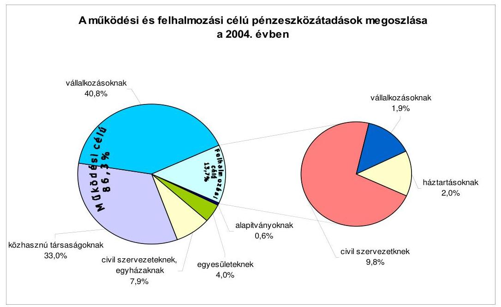
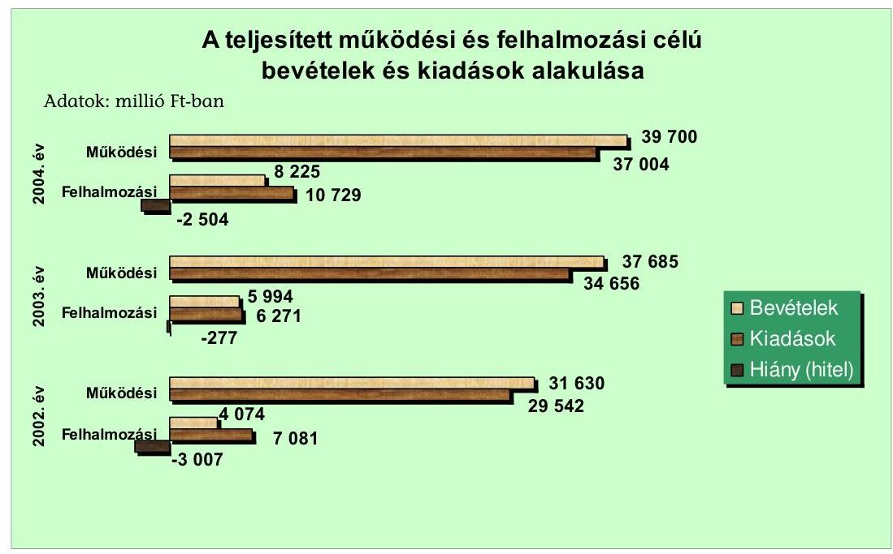
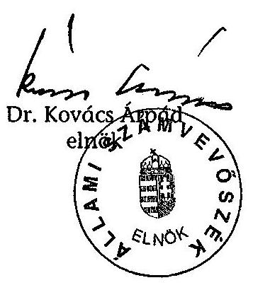
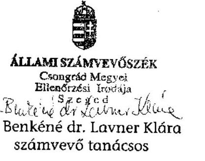
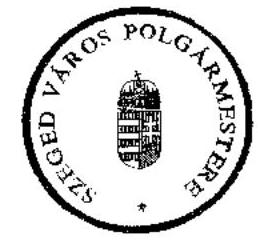
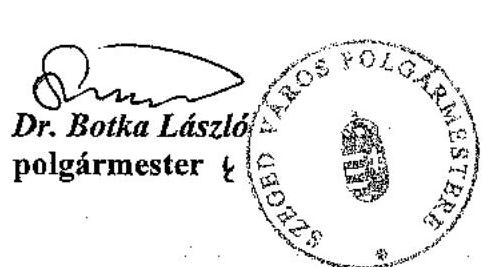
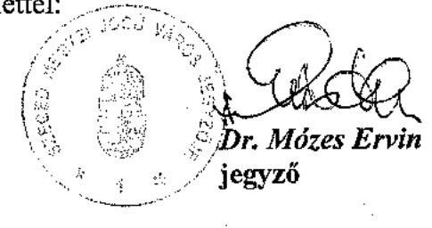
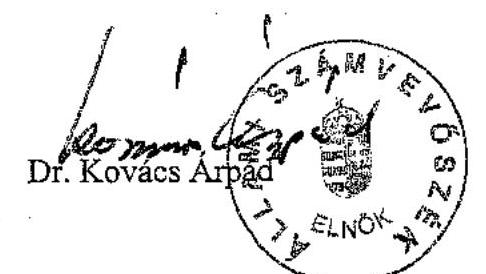

# JELENTÉS 

## Szeged Megyei Jogú Város Önkormányzata gazdálkodási rendszerének átfogó ellenőrzéséről

---

3. Önkormányzati és Területi Ellenőrzési Igazgatóság
3.3. Átfogó Ellenőrzések Főcsoport
Iktatószám: V-1001-1/31/17/2005.
Témaszám: 749
Vizsgálat-azonosító szám: V0211
Az ellenőrzést felügyelte:
Dr. Lóránt Zoltán
főigazgató
Az ellenőrzés végrehajtásáért felelős:
Dr. Sepsey Tamás
főigazgató-helyettes
Az ellenőrzést vezette:
Csecserits Imréné
főcsoportfőnök-helyettes
Az ellenőrzést végezték:
Dr. Klapcsik László
főtanácsadó
Benkéné dr. Lavner Klára
számvevő tanácsos
Csiszárné dr. Kosik Mária
számvevő tanácsos

# A témához kapcsolódó - elmúlt négy évben - készített számvevőszéki jelentések: 

címe
sorszáma
Jelentés a helyi önkormányzatok beruházásaihoz és 0120
rekonstrukcióihoz nyújtott 2000. évi címzett és céltámogatások
igénybevételének és felhasználásának vizsgálatáról
Jelentés a helyi és a helyi kisebbségi önkormányzatok 0220
gazdálkodásának ellenőrzéséről
Jelentés a helyi önkormányzatok beruházásaihoz és 0229
rekonstrukcióihoz nyújtott 2001. évi címzett és céltámogatások
igénybevételének és elszámolásának vizsgálatáról
Jelentés a helyi önkormányzatok egyes pénzügyi befektetésekkel 0318
történő gazdálkodásának ellenőrzéséről

Jelentéseink az Országgyűlés számítógépes hálózatán és az Interneten a www.asz.hu címen is olvashatók.

---

# TARTALOMJEGYZÉK 

BEVEZETÉS ..... 5
I. ÖSSZEGZŐ MEGÁLLAPÍTÁSOK, KÖVETKEZTETÉSEK, JAVASLATOK ..... 7
II. RÉSZLETES MEGÁLLAPÍTÁSOK ..... 15

1. A költségvetés tervezésének, végrehajtásának, az Önkormányzat vagyongazdálkodásának és a zárszámadás elkészítésének szabályszerűsége ..... 15
1.1. A költségvetési rendelet jóváhagyásának, módosításának, az eóirányzatok nyilvántartásának szabályszerűsége ..... 15
1.2. A gazdálkodás szabályozottsága, a bizonylati rend és fegyelem szabályszerűsége ..... 23
1.3. A pénzügyi-számviteli feladatok ellátásának informatikai támogatottsága ..... 31
1.4. Az önkormányzati vagyon nyilvántartása, számbavétele ..... 33
1.5. A vagyonnal való gazdálkodás szabályszerűsége, célszerűsége, nyilvánossága ..... 35
1.6. A céljelleggel nyújtott támogatások szabályszerűsége ..... 46
1.7. A közbeszerzési eljárások szabályszerűsége ..... 51
1.8. A zárszámadási kötelezettség teljesítésének szabályszerűsége ..... 55
1.9. A Polgármesteri hivatal helyi kisebbségi önkormányzatok gazdálkodását segítő tevékenysége ..... 57
2. Az önkormányzati feladatok és a rendelkezésre álló források összhangja ..... 60
2.1. A feladatok meghatározása és szervezeti keretei ..... 60
2.2. A költségvetés egyensúlyának helyzete ..... 64
2.3. A feladatok finanszírozása ..... 69
3. A belső irányítási, ellenőrzési rendszer múködésének értékelése ..... 72
3.1. Az ellenőrzési rendszer kialakítása, múködése ..... 72
3.2. A könyvvizsgálati kötelezettség teljesítése ..... 74
3.3. A korábbi számvevőszéki ellenőrzések javaslatainak hasznosulása ..... 75

---

# MELLÉKLETEK 

1. számú Az önkormányzati vagyon nagyságának alakulása (1 oldal)
2. számú Az Önkormányzat 2004. évi bevételeinek és kiadásainak alakulása (1 oldal)
3. számú Az Önkormányzat gazdálkodását meghatározó adatok, mutatószámok (1 oldal)
4. számú Az egyes önkormányzati feladatok finanszírozása (1 oldal)
5. számú Helyszíni ellenőrzési jegyzőkönyv (2 oldal)
6. számú Dr. Botka László úr, a Szeged Megyei Jogú Város Önkormányzata polgármesterének észrevétele ( 7 oldal)
7. számú Dr. Botka László úr, a Szeged Megyei Jogú Város Önkormányzata polgármesterének kiegészítő észrevétele (1 oldal)
8. számú Dr. Botka László úr, a Szeged Megyei Jogú Város Önkormányzata polgármesterének írt válaszlevél (1 oldal)

---

# RÖVIDÍTÉSEK JEGYZÉKE 

| Ötv. | a helyi önkormányzatokról szóló 1990. évi LXV. törvény |
| :--: | :--: |
| Áht. | az államháztartásról szóló 1992. évi XXXVIII. törvény |
| Kbt. | a közbeszerzésekről szóló 1995. évi XL. törvény |
| Kbt. $_{2}$ | a közbeszerzésekről szóló 2003. évi CXXIX. törvény |
| Számv. tv. | a számvitelről szóló 2000 . évi C. törvény |
| Htv. | a helyi önkormányzatok és szerveik, a köztársasági megbízottak, valamint egyes centrális alárendeltségú szervek feladités hatásköreiről szóló 1991. évi XX. törvény |
| Ktv. | a köztisztviselők jogállásáról szóló 1992. évi XXIII. törvény |
| Nek. | a nemzeti és etnikai kisebbségek jogairól szóló 1993. évi LXXVII. törvény |
| Tpt. | a tőkepiacról szóló 2001. évi CXX. törvény |
| Ámr. | az államháztartás múködési rendjéről szóló 217/1998. (XII. 30.) Korm. rendelet |
| Vhr. | az államháztartás szervezetei beszámolási és könyvvezetési kötelezettségének sajátosságairól szóló 249/2000. (XII. 24.) Korm. rendelet |
| Ber. | a költségvetési szervek belső ellenőrzéséről szóló 193/2003. (XI. 26.) Korm. rendelet |
| ÁSZ | Állami Számvevőszék |
| MÁK | Magyar Államkincstár Csongrád Megyei Területi Igazgatósága |
| SzMSz | a Szeged Megyei Jogú Város Önkormányzatának az Önkormányzat és szervei Szervezeti és Müködési Szabályzatáról szó-   ló 23/1995. (VI. 16.) számú rendelete |
| ügyrend | a Szeged Megyei Jogú Városi Önkormányzata Polgármesteri Hivatalának ügyrendjéről szóló együttes polgármesteri, jegy-   zői utasítás |
| vagyongazdálkodási   rendelet $_{1}$ | a Szeged Megyei Jogú Város Önkormányzatának vagyonáról és a gazdálkodás egyes szabályairól szóló 28/2001.(IX. 6.) számú rendelet |
| vagyongazdálkodási   rendelet $_{2}$ | a Szeged Megyei Jogú Város Önkormányzatának vagyonáról és a gazdálkodás egyes szabályairól szóló 25/2003. (VI. 27.) számú rendelet |
| Önkormányzat | Szeged Megyei Jogú Város Önkormányzata |
| Közgyűlés | Szeged Megyei Jogú Város Önkormányzatának Közgyűlése |
| Polgármesteri hiva-   tal | Szeged Megyei Jogú Város Önkormányzatának Polgármesteri Hivatala |
| polgármester   jegyző | Szeged Megyei Jogú Város Önkormányzatának polgármestere |
| Pénzügyi bizottság | Szeged Megyei Jogú Város Önkormányzatának jegyzője |
| Kulturális bizottság | Szeged Megyei Jogú Város Önkormányzatának Pénzügyi Bizottsága |
|  | Szeged Megyei Jogú Város Önkormányzatának Kulturális, Közművelődési és Idegenforgalmi Bizottsága |

---

IKV Rt.
Jogi bizottság

VTLB

Közbeszerzési Döntőbizottság
Közgazdasági iroda
Fejlesztési iroda
Városüzemeltetési iroda
Belső ellenőrzési osztály
Informatikai osztály

Ingatlankezelő és Vagyongazdálkodási Rt.
Szeged Megyei Jogú Város Önkormányzatának Jogi, Ügyrendi és Közbiztonsági Bizottsága
Szeged Megyei Jogú Város Önkormányzatának Városrendezési Tulajdonosi és Lakásügyi Bizottsága
Szeged Megyei Jogú Város Közgyűlésének Közbeszerzési Döntőbizottsága
Szeged Megyei Jogú Város Önkormányzata Polgármesteri Hivatalának Közgazdasági Irodája
Szeged Megyei Jogú Város Önkormányzata Polgármesteri Hivatalának Fejlesztési Irodája
Szeged Megyei Jogú Város Önkormányzata Polgármesteri Hivatalának Városüzemeltetési Irodája
Szeged Megyei Jogú Város Önkormányzata Polgármesteri Hivatalának Belső Ellenőrzési Osztálya
Szeged Megyei Jogú Város Önkormányzata Polgármesteri Hivatalának Informatikai Osztálya

---

# JELENTÉS 

## Szeged Megyei Jogú Város Önkormányzata gazdálkodási rendszerének átfogó ellenőrzéséről

## BEVEZETÉS

Az Ötv. 92. § (1) bekezdése, az ÁSZ-ról szóló 1989. évi XXXVIII. törvény 2. § (3) bekezdése, valamint az Áht. 120/A. § (1) bekezdése szerint az önkormányzatok gazdálkodását az ÁSZ ellenőrzi. Az ellenőrzés elvégzése az Országgyűlés illetékes bizottságai részére is átadott, országosan egységes ellenőrzési program alapján történt.

## Az ellenőrzés célja annak értékelése volt, hogy:

- az önkormányzati gazdálkodás törvényességét ${ }^{1}$, szabályszerűségét biztosították-e a tervezés, a költségvetés végrehajtása, a vagyongazdálkodás és a zárszámadás során;
- az Önkormányzat által ellátott feladatok és az azokhoz rendelkezésre álló források összhangja biztosított volt-e, különös tekintettel az egyes kiemelt feladatokra;
- a gazdálkodás szabályszerűségét biztosító belső kontrollok ${ }^{2}$ lehetővé tették-e a szabálytalanságok, hiányosságok, gazdaságtalan megoldások feltárását, megelőzését.

Az ellenőrzött időszak: a 2004. év, valamint az 1.5., 2.1.- 2.3., 3.3. ellenőrzési programpontok esetében a 2002-2004. évek is.

Szeged a Dél-alföldi régió gazdasági, tudományos és kulturális központja, Csongrád megye székhelye. A város területén 2004. január 31-én 163525 lakos élt. A 43 képviselőből és a polgármesterből álló Közgyűlés munkáját nyolc állandó bizottság segítette. Az Önkormányzatnak a 2004. évben a Polgármesteri hivatalon kívül 19 önállóan gazdálkodó és 71 részben önállóan gazdálkodó

[^0]
[^0]:    ${ }^{1}$ A törvényi előírások betartásának elmulasztásakor a részletes megállapítások fejezetben egységesen a törvénysértés megjelölést alkalmazzuk, mivel az ÁSZ nem tehet különbséget a törvényi előírások között.
    ${ }^{2}$ A gazdálkodás szabályszerűségét biztosító kontroll alatt értjük a kiépített és működő belső irányítási és szabályozási rendszert, valamint a belső ellenőrzési funkciók ellátását.

---

költségvetési intézménye volt. A Polgármesteri hivatal és az intézmények összesen 47734 millió Ft költségvetési kiadást teljesítettek 2004. évben. Az önkormányzati feladatok ellátásához foglalkoztatott közalkalmazottak létszáma 2004. január 1-jén 7674 fő volt, a Polgármesteri hivatalban 544 fő köztisztviselő dolgozott. A könyvviteli mérlegben kimutatott önkormányzati vagyon értéke 240580 millió Ft volt 2004. december 31-én.

Az Önkormányzat gazdálkodását meghatározó adatokat az 1. számú melléklet tartalmazza.

A 2002. évi önkormányzati képviselő választások után változott a polgármester személye, az SzMSz 2002. november 18-i módosítását követően a Polgármesteri hivatal egyes egységeinek vezetésében is személyi változások következtek be, valamint a 2003. évben új jegyző kinevezésére került sor.

Az Önkormányzatnál a 2002. évi önkormányzati választásokat követően kilenc helyi kisebbségi önkormányzat múködött (cigány, görög, horvát, lengyel, német, örmény, román, szlovák és ukrán).

---

# I. ÖSSZEGZŐ MEGÁLLAPÍTÁSOK, KÖVETKEZTETÉSEK, JAVASLATOK 

Az Önkormányzat rendelkezett a célkitűzéseit hosszabb távon, 2003-2006. évre kijelölő gazdasági programmal. A 2004. évi költségvetési koncepciót az Ámr. előírásainak megfelelően a helyben képződő bevételek és az ismert kötelezettségek figyelembe vételével állították össze. Az Ámr. előírásainak megfelelően a beterjesztett 2004. évi költségvetési koncepcióhoz a polgármester csatolta a Pénzügyi bizottság véleményét. A kisebbségi önkormányzatok elnökeit tájékoztatták a költségvetési koncepció-tervezet rájuk vonatkozó célkitűzéseiről, azonban erről a kisebbségi önkormányzatok írásbeli véleményt nem készítettek. A beterjesztett költségvetési koncepció alapján a Közgyűlés döntött a költségvetés készítés további munkálatairól, melyet a Polgármesteri hivatal a 2004. évi költségvetési rendelettervezet készítésénél figyelembe vett. A 2004. évi költségvetési koncepció elfogadását követően az Áht. előírását betartva a polgármester előterjesztette azokat a rendelettervezeteket is, amelyek a javasolt előirányzatokat megalapozták.

A polgármester a költségvetési rendelettervezetet az Áht-ban előírt határidőben a Közgyűlés elé terjesztette, azonban az Ámr. előírásai ellenére a rendelettervezethez a Pénzügyi bizottság véleményét nem csatolta, hanem azt a Közgyűlésen osztották ki. A 2004. és 2005. évi költségvetési rendeletekben a finanszírozási célú pénzügyi műveleteket költségvetési előirányzatként fogadták el, az Áht. előírását megsértve a tervezett hiány teljes összegét nem mutatták be. A költségvetési rendeletekben a kiadások-bevételek egyensúlyát a részletező táblázatokban biztosították, az egyéni képviselők részére történt keret-meghatározással megsértették az Ötv. hatáskör átruházásra vonatkozó előírását. A vagyonkimutatás kivételével az Áht. előírásaival szemben rendeletben nem határozták meg a költségvetés és a zárszámadás előterjesztésekor tájékoztatásul bemutatandó mérlegek, kimutatások tartalmi követelményeit. E hiányosság ellenére az Áht-ban előírt mérlegeket szöveges indoklással együtt a költségvetési és a zárszámadási rendeletek előterjesztésekor tájékoztatásul bemutatták. A Polgármesteri hivatal költségvetésén belül különböző feladatok támogatását alap elnevezéssel határozták meg, az elnevezés az Áht-ban meghatározott feltételeknek - a Környezetvédelmi alap kivételével - nem felel meg, a kifejezés félreérthető.

A Közgyűlés a 2004. évi költségvetés kiadási és bevételi előirányzatait év közben $15 \%$-kal növelte. A költségvetési előirányzatok módosítására előterjesztett rendelettervezetek a költségvetéssel összehasonlítható módon tartalmazták a módosítási javaslatokat. Az előterjesztések kellően részletesek voltak és megfelelő információt biztosítottak a Közgyűlés számára a módosítások indokairól, valamennyi előirányzat-változtatást hitelt érdemlően dokumentáltak. A kisebbségi önkormányzatokat érintő költségvetési rendelet-módosítások a kisebbségi önkormányzatok határozatai alapján történtek. Az előirányzatok alakulásáról tételes, analitikus nyilvántartást vezettek. A 2004. évi költségvetési rendelet módosításairól az Ámr-ben foglalt előírásokat betartva döntött a Közgyűlés.

---

A Polgármesteri hivatal alapító okiratában foglaltakat, az Ámr. előírása ellenére, szervezeti és múködési szabályzatban nem részletezték. A Polgármesteri hivatal gazdasági szervezetének szervezeti egységeit és a pénzügyi, gazdasági feladatok ellátásáért felelős személyek által ellátandó feladatokat, a vezetők és más dolgozók feladat-, hatás- és jogkörét a Polgármesteri hivatal ügyrendje tartalmazta. Az operatív gazdálkodással kapcsolatos döntési, ellenőrzési feladatköröket polgármesteri és jegyzői együttes szabályzatokban határozták meg. Nem szabályozták a gazdálkodási jogkörök gyakorlására felhatalmazottak beszámoltatásának módját, formáját és a felhatalmazottak beszámoltatása sem történt meg. Az összeférhetetlenségi követelmények érvényesülését a polgármesteri és jegyzői együttes szabályzatokban biztosították, azonban - az Ámr-ben előírtak ellenére - nem szabályozták a saját vagy a közeli hozzátartozó részére történő gazdálkodási jogkör gyakorlás kizárásának eljárási rendjét. Az Ámr-ben rögzítetteket figyelmen kívül hagyva, a jegyző nem határozta meg a szakmai teljesítések igazolásának módját, nem jelölte ki az azt végző személyeket.

A jegyző a Htv. előírásainak megfelelően intézkedett a költségvetési szervek egységes számviteli rendjének kialakításáról. A Polgármesteri hivatal rendelkezett számviteli politikával és az ehhez kapcsolódó szabályzatokkal. A számviteli politikájában meghatározták, hogy a számviteli elszámolás, értékelés szempontjából mit tekintenek lényegesnek, továbbá jelentős illetve, nem jelentős összegnek. A leltározási és leltárkészítési szabályzatban mennyiségi felvétellel végrehajtott leltározást írtak elő évenkénti gyakorisággal a gépekre, a berendezésekre, a felszerelésekre, valamint a jármúvekre, de az ingatlanok esetében a Vhr-ben foglalt előírás ellenére nem mennyiségi felvétellel történő leltározást írtak elő. Az eszközök és források értékelési szabályzata részletes előírásokat tartalmazott az eszközök és források értékelésére. A pénzkezelési szabályzatban nem rögzítették a Polgármesteri hivatalban vezetett bankszámlák körét, rendeltetését és az ezek feletti rendelkezésre jogosultak megnevezését. A házipénztár pénzkezelési rendjét meghatározták. A pénzügyi és számviteli területen dolgozók munkaköri leírásában meghatározták a feladatokat, az egyeztetési kötelezettségeket, a hatásköröket. A számlarendben előírt saját készítésű analitikus nyilvántartások formai, tartalmi követelményeit a Vhr-ben előírtak ellenére nem szabályozták.

A könyvviteli nyilvántartásokban elszámolt gazdasági múveletekről, eseményekről az előírt számviteli bizonylatokat kiállították. A könyvviteli mérleget és a pénzforgalmi kimutatást a Vhr. előírásainak megfelelően főkönyvi kivonattal alátámasztották. Az ágazati irodák a költségvetési gazdálkodással kapcsolatos szabályzatban foglaltakat figyelmen kívül hagyva a kötelezettségvállalásokról nem az előírt tartalmú nyomtatványt vezették, mivel a nyilvántartásokban nem tüntették fel a kötelezettségvállalás besorolását, összegét, esedékességét évekre bontva. A bizonylatokon, illetve az utalványrendeleteken a kötelezettségvállalást, a kötelezettségvállalás ellenjegyzését, az érvényesítést, az utalványozást és az utalvány ellenjegyzését az arra felhatalmazottak, illetve megbízottak végezték el. A kiadási bizonylatok 96,5\%-ánál a szakmai teljesítés igazolását az Ámr-ben előírtak ellenére nem a jegyző által, hanem az irodavezetők által kijelölt köztisztviselők végezték. A kiadási bizonylatok 3,5\%-ánál elmaradt a szakmai teljesítés igazolása. Ezekben az esetekben az érvényesítő és az utalvány ellenjegyzője nem tett eleget az Ámr-ben előírt, a munkafolyamat-

---

ba épített ellenőrzési feladatának. A kötelezettségvállalás nyilvántartásba vételi sorszámát - az Ámr. előírása ellenére - az utalványokon nem tüntették fel. A kifizetések 8,0\%-ánál - az 50 ezer Ft egyedi értéket el nem érő kiadásoknál - az Áht. előírását megsértve, nem történt meg az értékadatokat is tartalmazó írásbeli kötelezettségvállalás. Nem éltek az Ámr-ben biztosított lehetőséggel, nem alakították ki ezen kifizetések esetében az előzetes írásbeli kötelezettségvállalás nélküli kifizetések rendjét és nem rögzítették ennek nyilvántartási formáját belső szabályzatban. A készpénz előlegek nyilvántartása nem felelt meg a pénzkezelési szabályzatban foglaltaknak, mert nem az előírt nyomtatványt alkalmazták és nem tüntették fel az elszámolásra felvett összeg jogcímét, az igénylést engedélyező nevét, az elszámolás határidejét és a visszafizetett összeget. Az előirányzatokkal történő gazdálkodás biztosította az Áht. előírásának érvényesülését, mert a Polgármesteri hivatalban kötelezettségvállalás és kifizetés teljesítése csak a jóváhagyott előirányzatok mértékéig történt. Az Önkormányzat két költségvetési intézménye a 2004. évi jóváhagyott költségvetési kiadásának főösszegét túllépte. A Közgyűlés a 2004. évi zárszámadás elfogadásával egyidejűleg kezdeményezte az előirányzat túllépés okainak kivizsgálását.

A Polgármesteri hivatal pénzügyi-számviteli feladatainak ellátását informatikai eszközök segítették. A főkönyvi könyvelés számítógépes feldolgozással történt. A pénztári nyilvántartást, a szigorú számadású nyomtatványok és az előlegek nyilvántartását manuálisan vezették. A Polgármesteri hivatal nem rendelkezett informatikai védelmi szabályozással, nem készítettek informatikai katasztrófa-elhárítási tervet. A számítástechnikai eszközök alkalmazásához a dolgozók rendelkeztek a megfelelő felhasználói ismeretekkel. Munkaköri leírásuk az informatikai eszközök használatát és az ezzel összefüggő felelősséget tartalmazta.

A számviteli nyilvántartásokban gondoskodtak az önkormányzati vagyon, ezen belül a törzsvagyon elkülönített analitikus nyilvántartásáról. A korábban érték nélkül nyilvántartott ingatlanvagyon értékének megállapítását a 2003. évben végezték el. Ennek során a számviteli nyilvántartásokban az Önkormányzat üzemeltetésre átadott ingatlan vagyonának (elsősorban földterületek, utak, valamint a lakás és nem lakás céljára szolgáló helyiségek) számviteli nyilvántartás szerinti értéke 157 395,6 millió Ft-tal emelkedett. Az Önkormányzat vagyonából üzemeltetésre átadott eszközök állománya a 2004. évi könyvviteli mérleg főösszegének a $80,3 \%$-a volt. Az üzemeltetők részére átadott vagyon nagysága és összetétele az átadás óta megváltozott, ennek ellenére négy társaság esetében a vagyon üzemeltetésére kötött megállapodásokat, szerződéseket nem módosították, nem aktualizálták. A Polgármesteri hivatalban a 2004. évben az ingatlanok esetében a Vhr-ben előírtaktól eltérően mennyiségi felvétellel leltározást nem végeztek, hanem a részletező nyilvántartások alapján készített összesítő kimutatással helyettesítették a leltárt. A követelések és részesedések év végi értékelését elvégezték. A 2002-2003. évben a részesedéseknél értékvesztés elszámolására nem került sor, a 2004. évben a részesedéseknél 75,7 millió Ft, a követeléseknél 220,6 millió Ft értékvesztést számoltak el a vevők, a helyi adók és az adott kölcsönök esetében a felszámoló értesítése alapján. A 2002. év végén 2450 millió Ft, a 2003. év végén 2578 millió Ft, a 2004. év végén 2344 millió Ft volt az Önkormányzat által vásárolt értékpapírok számviteli nyilvántartás szerinti értéke. A portfoliókezelésbe adott értékpapírok év végi értékelését a Polgármesteri hivatalban nem végezték el, ezzel nem tettek eleget a Számv.

---

tv. előírásának. Az Önkormányzat a 2000. évben portfoliókezelési szerződést kötött két pénzintézettel, amelyben az Önkormányzat értékpapírjaira vonatkozó tulajdonosi jogokat is átruházta a portfoliókezelést végző gazdasági társaságokra. Az átadott vagyonelemek felett teljes jogkörrel rendelkeztek a portfoliókezelők, ezzel a döntésével az Önkormányzat megsértette az Ötv-ben foglalt hatásköri előírásokat, valamint az Áht-ben előírt felelős gazdálkodás követelményét. Az Önkormányzat számára a portfolió kezelési szerződés a 2002. és a 2004. évben az adott évi legalacsonyabb betéti kamathoz viszonyítva, mintegy $50 \%$-kal magasabb hozamot biztosított, azonban a 2003. évben az egyik portfolió kezelőnél veszteséget, míg a másiknál az adott évi legalacsonyabb kamat mintegy harmadával magasabb hozamot okozott.

Az Önkormányzat a vagyongazdálkodási hatásköröket rendeletben szabályozta. A vagyongazdálkodási rendelet hatálya a teljes önkormányzati vagyonra kiterjedt, valamint tartalmazta a vagyoni helyzet alakulásáról a Közgyűlés részére történő beszámolás rendjét. A vagyonnal való rendelkezési, döntési hatásköröket célszerűen alakították ki, azonban a vagyon forgalomképesség szerinti besorolásának megváltoztatására vonatkozó eljárási rendről nem rendelkeztek. A vagyongazdálkodási rendeletben főszabályként előírták, hogy ingatlan esetén 20 millió Ft, ingóság esetén 5 millió Ft, részesedések esetén 30 millió Ft felett vagyont értékesíteni, kezelés jogát, használatát, hasznosítási jogát átadni csak nyilvános versenytárgyalás útján, a legjobb ajánlatot tevő részére lehet. A vagyongazdálkodási rendeletben a fő szabálytól eltérő versenyeztetés nélküli elidegenítés eseteit is rögzítették. Ezáltal az Önkormányzat az Áht-ban foglaltakat megsértve lehetőséget biztosított a versenyeztetési eljárás mellőzésére. A szabályozás nem segítette a közvagyonnal való gazdálkodás nyilvánosságát. A vagyongazdálkodással kapcsolatos döntések során a Közgyűlés által meghatározott hatásköri előírásokat betartották, az értékesített ingatlanok értékét forgalmi értékbecslés alapján határozták meg. Az értékesítések során a Szegedi Tudományegyetem részére történt ingatlaneladásnál az Áht. előírását megsértve nem folytattak versenytárgyalást. Az Önkormányzat ingatlanvagyonát érintő szerződésekben szerepeltek az Önkormányzat érdekeit védő garanciális elemek. Az Áht-ban foglalt előírást megsértve a céljellegú fejlesztési támogatásokra, az árubeszerzésekre, építési beruházásra, szolgáltatás megrendelésre, vagyonértékesítésre, vagyonhasznosításra vonatkozó szerződések közzétételére előírt kötelezettséget nem teljesítették a 2004. évben. A helyszíni ellenőrzés során elrendelték a 2004. évben megkötött szerződések közzétételét, valamint a további folyamatos közzétételi kötelezettséget. Az Önkormányzat a pártok részére, a pártok helyiség bérleti díjában jelentős kedvezményeket biztosított, ezzel közvetett támogatást nyújtott részükre, így nem tett eleget az Ötv. előírásainak, valamint nem biztosította az alkotmányos egyenlőséget a bérlők között.

A céljelleggel - nem szociális ellátásként - nyújtott támogatások rendszerét az éves költségvetési rendeletekben szabályozták. Az alapítványi támogatások esetében az egyéni képviselői döntés lehetőségének biztosításával megsértették az Ötv-ben előírtakat. Az alapítványok, közalapítványok támogatásáról 5,3\%-ban az Ötv-ben foglaltakat megsértve egyéni képviselők döntöttek. Az Önkormányzat által céljelleggel nyújtott támogatásokról a Polgármesteri hivatalban nem vezettek olyan nyilvántartást, amelyből a támogatás célja, a számadási kötelezettség előírása és teljesítése, a számadás és a felhasználás ellenőrzésének

---

elvégzése megállapítható. A közhasznú szervezetek részére biztosított múködési célú pénzeszközök átadásáról és az elszámolás módjáról, határidejéről a támogatási szerződésekben állapodtak meg. A számadásra kötelezettek 89,0\%-a az Áht-ban meghatározott számadási kötelezettségét határidőben teljesítette, ezek számszaki ellenőrzését a Polgármesteri hivatal ágazati irodái elvégezték. Az Áht. előírásait megsértve nem biztosították a támogatások felhasználásának ellenőrzését és nem intézkedtek a támogatások visszafizetése érdekében a számadási kötelezettséget nem teljesítők, vagy késve teljesítők esetében.

A Közgyűlés a Kbt., felhatalmazása alapján rendeletben meghatározta az önkormányzati beszerzések eljárási rendjét. Az Önkormányzat a 2004. évben 28 közbeszerzési eljárást bonyolított le. A lefolytatott közbeszerzési eljárásoknál a Kbt., előírásait betartották. A Közbeszerzési Döntőbizottságnál jogorvoslati eljárás egy esetben indult az Önkormányzat által lefolytatott közbeszerzési eljárásokkal szemben, a kérelmet a Döntőbizottság elutasította.

A polgármester az Áht-ban meghatározott határidőn belül terjesztette elő a zárszámadási rendelettervezetet. A zárszámadásról szóló rendelettervezet a költségvetési rendelettel összehasonlítható módon készült. A zárszámadás elfogadásakor tájékoztatásul bemutatták az Áht-ban előírt mérlegeket, kimutatásokat szöveges indoklással. A költségvetési intézmények pénzmaradványának számszaki ellenőrzését elvégezték. Az éves számszaki beszámoló és múködés elbírálásáról, jóváhagyásáról - a Közgyűlés döntése alapján - a Polgármesteri hivatal írásban értesítette az intézmények vezetőit.

Az Önkormányzat költségvetési, zárszámadási rendeleteibe elkülönítetten beépítette a helyi kisebbségi önkormányzatok határozattal elfogadott költségvetését és zárszámadását. A helyi kisebbségi önkormányzatok számviteli nyilvántartásainak elkülönített vezetését, a gazdálkodásukkal kapcsolatos pénzforgalom jogszabályi előírásoknak megfelelő bonyolítását és a múködési feltételeket biztosították. A kisebbségi önkormányzatokkal az együttműködési megállapodást megkötötték, melyben szabályozták együttműködésük rendjét, a költségvetés tervezés, végrehajtás és beszámolás területén. A Nek. törvény előírása ellenére, a Polgármesteri hivatal szervezeti és múködési szabályzatában nem határozták meg, hogy a Polgármesteri hivatal milyen módon köteles a helyi kisebbségi önkormányzatok munkáját segíteni. Az Ámr. előírása ellenére a helyi kisebbségi önkormányzatokkal kötött megállapodásokban nem rögzítették a költségvetési, zárszámadási határozatok benyújtásának határidejét. Az Önkormányzat a helyi kisebbségi önkormányzatok múködéséhez támogatást biztosított. Az Ámr-ben előírt kötelezettségvállalásról szóló, valamint a pénzkezelési szabályzatában előírt készpénz-előleg nyilvántartási kötelezettségének nem tett eleget a Polgármesteri hivatal a kisebbségek gazdálkodásának bonyolítása során.

Az Önkormányzat az Ötv. előírásaival szemben nem határozta meg a kötelező és önként vállalt feladatait, és azt, hogy a lakosság igényeitől és az anyagi lehetőségeitől függően mely feladatokat milyen mértékben és módon lát el. Az Önkormányzat feladatait az általa alapított és fenntartott költségvetési szervekkel, az Önkormányzat gazdasági társaságaival, valamint vállalkozások és non-profit szervezetek útján látta el. A 2002-2004. években négy általános iskolát vont össze, kettőt megszüntetett a tanulólétszám csökkenése miatt, illet-

---

ve az intézményi kapacitás-kihasználás javítása érdekében. Az oktatási, nevelési intézményeket egy önállóan gazdálkodó költségvetési intézményhez kapcsolta. Egy egészségügyi intézményt megszüntetve, feladatait megállapodás keretében nem önkormányzati intézménynek átadta. Az Önkormányzat a 20022004. évi költségvetési rendeleteiben forráshiányt, illetve a hiány fedezetére hitelfelvételt tervezett. A ténylegesen létrejött bevételi többlet és kiadás megtakarítás következtében az Önkormányzatnak ezen időszakban működési forráshiánya nem volt. Az Önkormányzat költségvetésének átlagosan 80\%-át a múködési bevételek és kiadások tették ki. A beruházások, felújítások megvalósítását az Önkormányzat a felhalmozási célú bevételeken túlmenően a múködési bevételekből, valamint hitelfelvétel útján biztosította. Az Önkormányzat a források növelése érdekében sikeres pályázatokat nyújtott be, valamint vagyonhasznosítás, ingatlan értékesítés útján növelte bevételeit. A pályázatokkal kapcsolatos személyi, szakmai és szervezeti feltételeket megteremtették. A Polgármesteri hivatal a 2002-2004. években likviditásának biztosítása érdekében folyamatosan vett igénybe folyószámlahitelt.

Adósságot keletkeztető kötelezettségvállalásnál megvizsgálták és betartották az Ötv-ben a felső korlátra vonatkozó előírását. Az Önkormányzat kötvényt nem bocsátott ki, garanciális kötelezettséget nem vállalt. A 2002-2004. év között lízing szerződést összesen 13,2 millió Ft értékben kötött gépjárművekre, valamint kezességvállalást adott - összesen 2161,8 millió Ft értékben - az önkormányzati tulajdonú gazdasági társaságok hitelfelvételéhez.

Az Önkormányzat iparűzési-, építmény- és idegenforgalmi adó bevételeinek aránya az összes költségvetési bevételen belül a 2002. évi 8,1\%-ról a 2004. évre 10,7\%-ra növekedett. A megállapított adómérték az iparűzési és az idegenforgalmi adónál az alkalmazható mérték maximuma, az építményadónál 44,4\%a volt. A helyi adókról szóló törvényben meghatározottakon túlmenően is megállapítottak kedvezményeket, mentességeket. A naturális mutatókkal mérhető nevelési, oktatási és szociális feladatok fajlagos kiadásai a 2002-2004. közötti években elsősorban a központi bérintézkedések hatására növekedtek. A kapacitás kihasználtság a bölcsődei és a szociális intézményeknél nőtt. A feladatok finanszírozási forrásai között az állami hozzájárulás, támogatás arányának csökkenése mellett az önkormányzati támogatás aránya az óvodai nevelés, iskolai nevelés-oktatás, valamint a szociális intézmények esetében is emelkedett.

Az Önkormányzat a közintézmények akadálymentesítése érdekében a szükséges felméréseket elvégezte, amely szerint a 245 önkormányzati tulajdonú középületből 105 esetében az akadálymentes megközelítési lehetőség biztosított. A további középületek akadálymentes megközelíthetőségének megoldásához a 2002. évi és a 2004. évi költségvetés 41,6 millió Ft előirányzatot tartalmazott, amelyből 21,7 millió Ft a teljesített felhasználás. Az eddigi ráfordításokkal a fogyatékos személyek jogairól és esélyegyenlőségük biztosításáról szóló törvényben előírtak ellenére, a 2005. január 1-i határidőre a feladatok elvégzését nem biztosították.

Az Önkormányzat az Ötv. által a feladatkörébe utalt belső ellenőrzés szervezeti kereteit kialakította. A 2004. évben az Áht. előírásainak megfelelően szervezett Belső ellenőrzési osztályt hoztak létre. A Belső ellenőrzési osztály vezetője

---

elkészítette a belső ellenőrzési kézikönyvet, azonban a Ber. előírása ellenére a 2004. évben stratégiai és középtávú ellenőrzési tervvel nem rendelkeztek, az elvégzett ellenőrzésekről nyilvántartást nem vezettek. A 2004. évben a belső ellenőrök funkcionális függetlensége az Áht-ban foglaltaknak megfelelően érvényesült az ellenőrzési program elkészítése, végrehajtása, és a belső ellenőrök szervezeti alárendeltsége, irányítási és végrehajtási tevékenységtől való egyértelmű elkülönítése tekintetében. Az éves ellenőrzési tervben meghatározott számú intézményi ellenőrzést nem végezték el az ellenőri létszámcsökkenés és az ellenőrzésre kijelölt intézmények átszervezése miatt. A belső ellenőrök az intézményeknél végzett ellenőrzésekről készült jelentéseket a jogszabályi előírásoknak megfelelően realizálták. A hiányosságok felszámolására az intézmények intézkedési tervet készítettek, melynek teljesítését utó- és célvizsgálat során ellenőrizték. A 2004. évben a Polgármesteri hivatal tervezett belső ellenőrzési feladatát nem végezték el, az ellenőrzés következő évre történő áthúzódásáról a Közgyűlést az ellenőrzésekről készített éves beszámoló keretében tájékoztatták.

Az Önkormányzat a 2003. évben, a törvényben előírt könyvvizsgálati kötelezettségének eleget tett. A 2004. évi egyszerűsített beszámolót korlátozás nélküli hitelesítő záradékkal látta el, auditálási eltérést nem állapított meg a könyvvizsgáló.

A korábbi számvevőszéki ellenőrzések során feltárt hiányosságok megszüntetésére intézkedési tervet nem készítettek, ennek ellenére a javaslatok 80\%-ban hasznosultak. A javaslatok alapján kiegészítették a számviteli szabályzatokat, munkaköri leírásokat, számviteli nyilvántartásokat, a vagyongazdálkodási rendeletet, kialakították a Polgármesteri hivatal függetlenített belső ellenőrzési rendszerét.

A helyszíni ellenőrzés megállapításainak hasznosítása mellett javasoljuk:

# a polgármesternek 

a jogszabályi előírások maradéktalan betartása érdekében:

1. kezdeményezze a Közgyűlésnél az értékpapírokkal való rendelkezési jog portfoliókezelési szerződésben történt átruházásának megszüntetését az Ötv. 9. § (3) bekezdésében és az Áht. 104. § (3) bekezdésében foglaltak betartása érdekében;
2. kezdeményezze a Közgyűlésnél: határozzák meg az Ötv. 8. § (2) bekezdésében foglaltak alapján, hogy a lakosság igényeitől és az Önkormányzat anyagi lehetőségeitől függően mely kötelező és önként vállalt feladatokat milyen mértékben és módon lát el az Önkormányzat;
3. gondoskodjon arról, hogy a pártok részére biztosított helyiségek bérleti díja összhangba kerüljön az Önkormányzat tulajdonában lévő nem lakás céljára szolgáló helyiségek bérbeadásáról szóló 15/2000. (III. 31.) számú rendeletében meghatározott díjakkal;
4. gondoskodjon a középületek akadálymentessé tételéről, a fogyatékos személyek jogairól és esélyegyenlőségük biztosításáról szóló 1998. évi XXVI. törvény 29. § (6) bekezdésében előírtak végrehajtása érdekében;

---

a munka színvonalának javítása érdekében:
5. kezdeményezze a számvevőszéki ellenőrzés tapasztalatainak Közgyűlés előtti megtárgyalását és a feltárt hiányosságok megszűntetése érdekében készíttessen intézkedési tervet;
6. kezdeményezze az üzemeltetésre átadott önkormányzati vagyonra vonatkozó szerződések és megállapodások felülvizsgálatát, és a szükséges módosítások elvégezését annak érdekében, hogy az a ténylegesen átadott eszközökre terjedjen ki;

# a jegyzőnek 

a jogszabályi előírások maradéktalan betartása érdekében:

1. az éves költségvetés tervezése során gondoskodjon arról, hogy az Áht. 8. § (1) bekezdésében foglaltaknak megfelelően a költségvetési bevételek és kiadások különbségeként a tervezett hiány a költségvetési rendelettervezetben bemutatásra kerüljön.

---

# II. RÉSZLETES MEGÁLLAPÍTÁSOK 

## 1. A KÖLTSÉGVETÉS TERVEZÉSÉNEK, VÉGREHAJTÁSÁNAK, AZ ÖNKORMÁNYZAT VAGYONGAZDÁLKODÁSÁNAK ÉS A ZÁRSZÁMADÁS ELKÉSZÍTÉSÉNEK SZABÁLYSZERŰSÉGE

### 1.1. A költségvetési rendelet jóváhagyásának, módosításának, az előirányzatok nyilvántartásának szabályszerűsége

Az Önkormányzat 2003-2006. évekre vonatkozó célkitúzéseit a Közgyűlés az 1052/2003. (XII. 19.) számú határozattal Városfejlesztési Program Tervében határozta meg, mely megfelelt az Ötv. 91. § (1) bekezdésében előírt gazdasági programnak. A program tartalmazta a településfejlesztés stratégiai céljait, az ezzel kapcsolatos részletes ágazati feladatokat, kitért az egyes területek költségvetésének összeállításánál figyelembe veendő gazdasági alapelvekre.

A Városfejlesztési Program Terv stratégiai célkitűzései az alábbiak:

- a városban lévő szellemi potenciál megjelenítése a város gazdasági életében, különösen a kutatás-fejlesztés tevékenység terén;
- a város fejlődését gátló rossz elérhetőség javítása, a befektetők Szeged területére való vonzásához szükséges kommunális, infrastrukturális feltételek teljes körű kiépítése, a városi élet- és munkafeltételek javítása;
- a kiegyensúlyozott gazdasági fejlődés megalapozása, a gazdasági szerkezet további diverzifikálása a nem termelő szolgáltatási ágazatok (logisztika, turizmus) és az innovatív termékeket előállító húzóágazatok irányába;
- aktív, nyitott, kezdeményező várospolitika alkalmazása, az egészségügyi és szociális ellátás, az oktatás és a rekrációs intézmények színvonalának emeléséhez szükséges infrastrukturális fejlesztések megvalósítása;
- a város karakterének megőrzése, a városrészek presztízsértékének növelése, középületek- és területek felújítása, speciális lakásprogramok támogatása.

A stratégiai célok elérése érdekében 21 konkrét program megvalósítását tűzték ki célul. Ezeket a célkitűzéseket az éves költségvetési koncepció készítésekor figyelembe vették.
A polgármester a 2004. évi költségvetési koncepciót november 21-én, az Áht. 70 §-ában foglalt határidőn belül ${ }^{3}$ terjesztette a Közgyűlés elé. Az előterjesztést megelőzően az Önkormányzatnál működő bizottságok tájékoztatást kaptak a költségvetési koncepcióról, a Pénzügyi bizottság írásos véleményét a polgármester csatolta az előterjesztéshez. A helyi kisebbségi önkormányzatok elnökeit tájékoztatták a költségvetési koncepció-tervezet rájuk vonatkozó

[^0]
[^0]:    ${ }^{3}$ Az Áht. 70. §-a szerint a tervévet megelőző november 30-ig, a helyi önkormányzati választások évében december 15-ig kell a polgármesternek a koncepciót a Közgyűlés elé terjesztenie.

---

célkitűzéseiről, azonban erről a kisebbségi önkormányzatok nem adtak írásos véleményt. A költségvetési koncepciót az Ámr. 28. § (1) bekezdésében előírtak alapján a helyben képződő bevételek és az ismert kötelezettségek figyelembevételével állították össze. A költségvetési koncepció elfogadását követően tájékoztatták a helyi kisebbségi önkormányzatok elnökeit az Ámr. 28. § (6) bekezdésében foglaltaknak eleget téve a koncepció helyi kisebbségi önkormányzatokra vonatkozó részéről, azonban erről a kisebbségi önkormányzatok írásbeli véleményt nem készítettek. A Közgyülés a 991/2003. (XI. 28.) számú határozatával elfogadta a 2004. évi költségvetési koncepciót, mely tartalmazta a tervezés során betartandó helyi költségvetési politika alábbi főbb célkitűzéseit is:

- a kiegyensúlyozottabb költségvetés elérését és megtartását a 2004. évben és a következő években;
- meg kell kezdeni egy tartósan finanszírozható önkormányzati feladatrendszer kialakítását, javaslatot kell kidolgozni a nem kötelezően ellátott feladatok csökkentésére;
- az önkormányzati finanszírozású költségvetési szervek által ellátandó feladatok és a rendelkezésre álló személyi és tárgyi feltételek optimális összhangjának megteremtése;
- a vis maior esetek kezelésére intervenciós alapot kell képezni;
- a beruházási, fejlesztési célú pénzeszközök felhasználásával a már elkezdett beruházásokat folytatni kell.

A költségvetési koncepcióban az Ámr. 28. § (1) bekezdésében foglaltaknak megfelelően rögzítették a költségvetés készítés további feladatait, mely alapján a Polgármesteri hivatal 2004. évi múködési kiadási előirányzatai a 2003. évi bázis szinten voltak tervezhetők. Meghatározták, hogy a beruházási előirányzatok összeállításánál a kötelezettségvállalással rendelkező pályázati forrásokkal támogatott, a folyamatban lévő, valamint a kiemelt célokban szereplő fejlesztésekre kell fedezetet biztosítani; az önkormányzati finanszírozású költségvetési intézmények bevételeit legalább a 2003. év várható bevételi szintjén kell tervezni; dologi kiadásoknál az energia költségek fedezetére a díjemelés figyelembe vételével céltámogatásként kell előirányzatot képezni; az étkezési nyersanyagnormákat 6\%-kal indokolt emelni; egyéb dologi kiadások esetében a 2003. évi bázis adattal kell tervezni.

A polgármester - az Áht. 76. § (1) bekezdésében adott lehetőség alapján - 2003. december 16-án beterjesztette a 2004. évi átmeneti gazdálkodásról szóló rendelettervezetet, melyet az Önkormányzat 61/2003. (XII. 23.) számú rendeletével elfogadott.

A Közgyűlés 991/2003. (XI. 28.) számú határozatában foglalt szempontok figyelembevételével a Polgármesteri hivatal elkészítette a 2004. évi költségvetési rendelettervezetet. A jegyző a költségvetési rendelettervezetet a költségvetési szervek vezetőivel egyeztette, melyről - az Ámr. 29. § (4) bekezdésének előírásait betartva - feljegyzést készített és ezt a polgármester a költségvetési rendelettervezettel együtt a Közgyűlés bizottságai elé terjesztette.

---

A polgármester a 2004. évi költségvetési rendelettervezetet, az Áht. 71. § (1) bekezdésében előírt határidőt ${ }^{4}$ betartva, február 9-én terjesztette a Közgyűlés elé. A Közgyűlés a költségvetési koncepció elfogadását követően döntött azokban a kérdésekben ${ }^{5}$, amelyek a költségvetési előirányzatokat megalapozták. A polgármester nem tartotta be az Ámr. 29. § (9) pontjának előírását, ugyanis a költségvetési rendelettervezethez nem csatolta a Pénzügyi bizottság véleményét, hanem azt a Közgyűlésen a napirend tárgyalása előtt osztották ki. ${ }^{6}$

Az Ámr. 29. § (9) bekezdésében előírtaknak megfelelően a polgármester a költségvetési rendelettervezethez csatolta a könyvvizsgálói véleményt. Bemutatta a többéves elkötelezettséggel járó kiadási tételek későbbi évekre vonatkozó kihatásait is és ezen belül a 2005. és 2006. évek várható előirányzatait. A költségvetési rendelettervezetbe a helyi kisebbségi önkormányzatok költségvetési határozatát - az Ámr. 32. § előírásainak megfelelően - változatlan formában beépítették.

A 2004. évi költségvetési rendelettervezetben alkalmazott címrend felépítési rendszere nem egységes, nehezen áttekinthető, mivel egy költségvetési szerv több címet is alkotott. Az Önkormányzat költségvetési rendelettervezete az Áht. 69. § (1) és Ámr. 29. § (1) bekezdéseiben foglaltaknak megfelelően tartalmazta:

- az önállóan, illetve a részben önállóan gazdálkodó költségvetési szervek bevételeit forrásonként, a pénzügyminiszter elemi költségvetés összeállítására vonatkozó tájékoztatójában rögzített főbb jogcím-csoportonkénti részletezettségben;
- a működési, fenntartási előirányzatokat önállóan és részben önállóan gazdálkodó költségvetési szervenként, intézményen belül kiemelt előirányzatonként részletezve;

[^0]
[^0]:    ${ }^{4}$ Az Áht. 71. § (1) bekezdése szerint a jegyző által elkészített költségvetési rendelettervezetet a polgármester február 15-ig nyújtja be a képviselő-testületnek. Ha a költségvetési törvény kihirdetésére a költségvetési évben kerül sor a benyújtási határidő a költségvetési törvény kihirdetését követő 45. nap.
    ${ }^{5}$ Az Önkormányzat 62/2003. (XII. 23.) számú rendelete a gépjárműadóról szóló rendelet hatályon kívül helyezéséről; a 63/2003. (XII. 23.) számú rendelete, a helyi iparűzési adóról; a 64/2003. (XII. 23.) számú rendelete az építményadó módosításáról; a 66/2003. (XII. 23.) számú rendelete a helyi közutak nem közlekedési célú igénybevétele esetén fizetendő díjakról; a 67/2003. (XII. 23.) számú rendelete a Polgármesteri hivatalban foglalkoztatott köztisztviselőket megillető juttatásokról.
    ${ }^{6}$ A polgármester és a jegyző által adott, mellékelt tájékoztatás szerint: „Intézkedtem annak érdekében, hogy a Közgyűlés a júniusi ülésén megtárgyalja, és a Szeged Megyei Jogú Város Közgyűlésének az Önkormányzat és Szervei Szervezeti és Müködési Szabályzatáról szóló 23/1995. /VI. 16./ Kgy. rendeletében meghatározásra kerüljön az az eljárási rend, amelynek eredményeként a költségvetési rendelet-tervezethez csatolásra kerülhet az Ámr.29.§./9/ bekezdése alapján a Pénzügyi Bizottság véleménye."

---

- a felújítási előirányzatokat célonként, a felhalmozási kiadásokat feladatonként;
- a Polgármesteri hivatal, mint önállóan gazdálkodó költségvetési szerv múködési és felhalmozási célú bevételi és kiadási előirányzatait elkülönítetten a „központi gazdálkodás" elöirányzataiként mutatták ki, valamint külön tételben az általános és céltartalékot;
- a múködési és a felhalmozási célú bevételi és kiadási előirányzatokat tájékoztatási jelleggel mérlegszerűen egymástól elkülönítetten, de - a finanszírozási múveleteket is figyelembe véve - együttesen egyensúlyban, elkülönítetten a helyi kisebbségi önkormányzatok költségvetését;
- az éves létszámkeretet önállóan, illetve a részben önállóan gazdálkodó költségvetési szervenként és összesen;
- a többéves kihatással járó feladatokat éves bontásban.

Elkészítették az év várható bevételi és kiadási előirányzatainak teljesüléséről az előirányzat-felhasználási ütemtervet, valamint bemutatták a költségvetési rendelettervezetben elkülönítetten az európai uniós támogatással megvalósuló programok, bevételeit, kiadásait.

Az Önkormányzat a 2004. évi költségvetését a 10/2004. (III. 4.) számú rendeletével fogadta el 54076,4 millió Ft bevétellel, továbbá 901,1 millió Ft múködési, és 2075,6 millió Ft fejlesztési hiánnyal, valamint 57053,1 millió Ft kiadási előirányzattal. A 2004. évi költségvetési rendelet 2. §-ában az Áht. 8. § (1) bekezdésében foglaltakat megsértve a költségvetési bevételek és költségvetési kiadások különbözetét jelentő 5896,0 millió Ft hiánnyal szemben 2976,7 millió Ft hiányt fogadott el a Közgyűlés.

Az Önkormányzat külön rendeletben ${ }^{7}$ határozta meg a 2004. évi költségvetés végrehajtásával és módosításával kapcsolatos legfontosabb szabályokat:

- szabályozták a költségvetési előirányzatok évközi megváltoztatásának rendjét. A Polgármesteri hivatal múködési előirányzatok alcímein belüli előirányzat, valamint a különböző feladatok előirányzatainak fő összegén belül az egyes kiemelt előirányzatok átcsoportosítására kapott hatáskört a polgármester.
- A központi és a saját hatáskörben végrehajtott költségvetési előirányzatok módosításának helyi rendjét, gyakoriságát az Ámr. 53. § (2), (6) bekezdéseiben foglaltaknak megfelelően szabályozták, valamint meghatározták az intézményi többletbevételek feletti rendelkezési jogosultságot az Áht. 93. § (4) bekezdése előírásainak figyelembe vételével.
- Rögzítették a pénzmaradvány elszámolására vonatkozó előírásokat az Ámr. 66. § (6) bekezdésében előírtak alapján.

[^0]
[^0]:    ${ }^{7}$ Az Önkormányzat 11/2004. (III. 4.) számú rendelete a 2004. évi költségvetés végrehajtásáról és módosításáról.

---

- Az Áht. 75. §-ában foglalt előírást betartva a hitelmúveleti hatásköröket megállapították, mely szerint rövid lejáratú hitel és a jóváhagyott fejlesztési célú hitelfelvétel elrendelése, a hitelből finanszírozandó cél megnevezése, a hitelt nyújtó pénzintézet kiválasztása, a hitelfelvétel időpontjának, időtartamának, az igénybevevő hitel összegének megállapítása 50 millió Ft értékhatárig a polgármester, 50 millió Ft értékhatár felett a Közgyűlés hatáskörébe tartozott. A rövid lejáratú és a fejlesztési célú hitel esetében a jóváhagyott hitelfelvétel hitelcélonkénti összegének erejéig a hitelszerződés megkötésére, a hitelszerződés egyéb feltételeiben való megállapodásra, a szerződés aláírására a polgármester kapott jogosultságot. Az Önkormányzat likviditásának biztosítására a polgármester összesen 3500 millió Ft folyószámla és rulirozó hitel igénybevételére köthetett szerződést.
- A költségvetési többlettel való gazdálkodás szabályait rögzítették az Áht. 8/A. § előírása alapján. Az átmenetileg szabad pénzeszköz számlavezető pénzintézetnél történő hasznosításáról, pénzeszközeinek hat hónapot meg nem haladó időtartamra szóló lekötéséről a polgármester dönthetett.
- Meghatározták a határozatlan időre szóló lakásbérleti szerződés közös megegyezéssel történő megszüntetés esetére a pénzbeni térítés, a gépjármúelhelyezési kötelezettség mértékét; előírták, hogy a közbeszerzési szabályzatban foglaltakat árubeszerzés és szolgáltatás megrendelése esetén 0,6 millió Ft, építési beruházás esetén 1,2 millió Ft felett kell alkalmazni.
- A költségvetési rendeletben az egyéni képviselők részére történt összesen 100 millió Ft keret-meghatározással az Ötv. 9. § (3) bekezdésében a hatáskör átruházásra vonatkozó előírást ${ }^{8}$ megsértették. ${ }^{9}$ A költségvetési rendelet alapján az egyéni képviselői kereteket a választó körzet „önkormányzati költségvetési szervek" támogatására finanszírozására használhatja fel.

A költségvetésben előirányzott és jóváhagyott választókörzeti alap 75\%-a az adott körzet képviselőjének döntése alapján parképítés, felújítás, útépítés, játszótér építés, felújítás, fenntartás, egyéb közterület-fenntartási, fejlesztési munkák, költségvetési szervek fenntartási kiadásaira használható fel. A fennmaradó 25\% a szabad felhasználású keret, amely a képviselő által meghatározott célok megvalósításának finanszírozására szolgált. A választókörzeti alap terhére az adott területen múködő közösségek, alapítványok, egyéb szervezetek valamint rendezvények - kizárólag közösségi célokat szolgáló feladatok finanszírozása támogathatók. A költségvetési rendelet alapján az egyéni képviselői kereteket a választó körzet „önkormányzati költségvetési szervek" támogatására finanszírozására használhatja fel. A kifizetések címzettje, tartalma alapján a képviselők támogattak
${ }^{8}$ Az Ötv. 9. § (3) bekezdése szerint a Közgyűlés „egyes hatásköreit a polgármesterre, a bizottságaira, a részönkormányzat testületére, a helyi kisebbségi önkormányzat testületére, törvényben meghatározottak szerint társulására ruházhatja. E hatáskör gyakorlásához utasítást adhat, e hatáskört visszavonhatja. Az átruházott hatáskör tovább nem ruházható."
${ }^{9}$ A polgármester és a jegyző által adott, mellékelt tájékoztatás szerint: „Intézkedtem, hogy egy-egy választókerület (egyéni képviselői keret) keretének felosztásáról a Pénzügyi Bizottság döntsön, az ezt megalapozó rendeletet a Közgyűlés a júniusi ülésén tárgyalja."

---

alapítványokat, egyesületeket, egyéb non-profit szervezeteket is az önkormányzati költségvetési szerveken kívül.

- A Polgármesteri hivatal költségvetésén belül, külön költségvetési címeken különböző feladatok támogatását alap elnevezéssel határozták meg. A költségvetésben elkülönített pénzügyi keretösszegek alapként történő elnevezése megtévesztő, ugyanis az Áht. az elkülönített állami pénzalapokra használja röviden az alap kifejezést, amelyekre az Áht. meghatározza azok létrehozásának, gazdálkodásának feltételeit. Az Áht. 54. §-ában meghatározott feltételeknek az Önkormányzat által létrehozott alapok - a Környezetvédelmi alap ${ }^{10}$ kivételével - nem felelnek meg, a kifejezés félreérthető. Az államháztartás rendszerében a meghatározott feltételekhez kötött fogalomnak eltérő tartalmú alkalmazása bizonytalanságot, az egyértelműség hiányát okozza. ${ }^{11}$

A Közgyűlésnek a költségvetés és a zárszámadás előterjesztésekor tájékoztatásként bemutatandó mérlegek tartalmi követelményeit a vagyonkimutatás kivételével - az Áht. 118. §-ának előírásait megsértve - rendeletben nem határozták meg. ${ }^{12}$

A 2004. évi költségvetési rendelettervezet előterjesztésekor Közgyűlés tájékoztatása céljából Áht. 118. §-a alapján bemutatták az Önkormányzat összes bevételét és kiadását, finanszírozását és pénzeszközének változását, továbbá az Áht. 118. §-ában előírt mérlegeket és kimutatásokat, így az Áht. 116. § 6. pontja alapján az Önkormányzat összevont mérlegét, elkülönítetten a helyi kisebbségi önkormányzatok mérlegeit, továbbá az Áht. 116. § 9. pontja alapján a többéves kihatással járó döntések számszerűsítését évenkénti bontásban és összesítve és ezen belül a tárgyévet követő két év várható előirányzatait, illetve az Áht. 116. § 10. pontjában előírt közvetett támogatásokat, (adókedvezményeket) az Áht. 118. §-ában előírt szöveges indoklással együtt.

A 2005. évi költségvetési rendelettervezet készítésénél figyelembe vették a helyszíni vizsgálat alatt tett észrevételeket és a 2005. évre kialakított címrend felépítésének áttekinthetőségét biztosították. A költségvetési rendelettervezetben az Áht. 69. § (1) bekezdésében foglalt előírást betartva, elkülönítetten mutatták ki

[^0]
[^0]:    ${ }^{10}$ Amelynek létrehozására az önkormányzatok felhatalmazást kaptak a környezet védelmének általános szabályairól szóló 1995. évi LIII. törvény 58. § (1) bekezdése alapján.
    ${ }^{11}$ A polgármester és a jegyző által adott, mellékelt tájékoztatás szerint: „Kezdeményeztem, hogy a következő évi költségvetési rendelettervezet előkészítése során a félreérthető önkormányzati alapok elnevezése megváltozzon, ezért a Közgyűlés a júniusi ülésén határozatban utasítja az irodákat, hogy az alapok elnevezésének megváltoztatására vonatkozóan a következő évi költségvetés tervezéséhez adjanak javaslatot."
    ${ }^{12}$ A polgármester és a jegyző által adott, mellékelt tájékoztatás szerint: „Intézkedtem annak érdekében, hogy a Közgyűlés a júniusi ülésén megtárgyalja, és az önkormányzat költségvetési végrehajtási rendelet módosításában meghatározza az Áht. 118.§-a alapján az Áht.116.§. 6., 9., 10. pontja szerinti kimutatások, mérlegek tartalmi követelményeit."

---

a Polgármesteri hivatal, mint önállóan gazdálkodó költségvetési szerv működési és felhalmozási célú bevételi, kiadási előirányzatait feladatonként. Az Áht. 118. §-ában előírt mérlegeket, kimutatásokat a rendelettervezet előterjesztésekor tájékoztatásul bemutatták.

Az Önkormányzat a 2005. évi költségvetést a 14/2005. (III. 3.) számú rendeletével fogadta el 68489 millió Ft bevételi és kiadási előirányzati főösszeggel. A 2005. évi költségvetési rendelet 2. §-ában az Áht. 8. § (1) bekezdésében foglaltakat megsértve a 8407,2 millió Ft összegű hiányt nem mutatták be, hanem a tervezett finanszírozási célú pénzügyi műveleteket - hitel- és kölcsönfelvétel, valamint hitel- és kölcsöntörlesztés összegét, az Áht. 8/A. § (7) bekezdésében foglaltakat megsértve, költségvetési hiányt módosító költségvetési bevételként, illetve költségvetési kiadásként fogadták el.

A közbenső egyeztetés során a polgármester és a jegyző által adott észrevétel szerint: „Az Áht. 8.§./1/ bek. szerint a költségvetési év bevételeinek és költségvetési kiadásainak különbsége a tervezett, illetve tényleges költségvetési többlet vagy hiány. Az Ámr. 29.§./1/ bek. szerint a helyi önkormányzat rendelet-tervezete - a pénzügyminiszter elemi költségvetés összeállítására vonatkozó tájékoztatójában rögzített főbb jogcímcsoportonkénti részletezettségben, az önkormányzat és az önállóan illetve részben önállóan gazdálkodó költségvetési szervek bevételei forrásonként.
A Pénzügyminisztérium tájékoztatója szerint a költségvetéseket azonos bevételi és kiadási összeggel kell megállapítani. A tájékoztató szerint az önkormányzatok költségvetésében a bevételi föösszeget a költségvetési bevételek, valamint a finanszírozási célú bevételek összegeként, a kiadási föösszeget a feladat ellátásához teljesíthető jóváhagyott kiadások, valamint a költségvetési többlet évközi felhasználásával kapcsolatos kiadások összegeként kell meghatározni. Az Ámr. 29.§./1/ bek. a./ pontja értelmében a Pénzügyminisztérium tájékoztatója a főbb jogcímcsoportokat meghatározta.
Az Áht. 8/A.§-ában foglaltak alapján a költségvetési többlet/hiány finanszírozásával, illetve a likviditás biztositásával kapcsolatos pénzügyi múveleteket a finanszírozási célú pénzügyi múveletek között kell kimutatni. Az Államháztartás szervezetei beszámolási és könyvezetetési kötelezettségeinek sajátosságairól szóló 249/2000. /XII.24./ Korm. rendelet előírásai szerint a költségvetési hiány finanszírozásával, illetve likviditás biztositásával kapcsolatos pénzügyi múveleteket finanszírozási célú pénzügyi múveletek között kell kimutatni. Idetartoznak: a forgatási célú értékpapírok értékesítésével (beváltásával) vásárlásával, a rövid lejáratú múködési (likviditási) célú hitelek felvételével és visszafizetésével, valamint a múködési célú rövid lejárató kötvény kibocsátásával és beváltásával kapcsolatos pénzügyi múveletek bevételei és kiadásai. A Pénzügyminisztérium tájékoztatója szerint finanszírozási múvelet bevételei között kell kimutatni a költségvetési hiány finanszírozására, valamint a likviditás biztositására felvett rövid lejáratú múködési célú, illetve likviditási célú hitellel (ideértve a folyószámla hitel, a munkabér megelőlegezési hitel, egyéb meghatározott célú rulírozó hitel igénybevételét is), valamint a múködési célú kötvénykibocsátással kapcsolatos bevételeket, továbbá a költségvetési többlet évközi hasznositása céljából vásárolt forgatási célú értékpapírok (részesedések, kárpótlási jegyek, kincstárjegyek, államkötvények, stb.) eladásakor, illetve beváltásakor elszámolt nem hozam jellegü bevételeket.
Nem értünk egyet azzal a megállapítással, hogy a hiány a beterjesztett költségvetési rendelet-tervezetekben (rendelet-módosításokban) nem került bemutatásra. A 2004. és 2005. évben a költségvetési rendelet-tervezetekben (rendelet-módosításokban)a hiány, valamint a hiány finanszírozása érdekében esetlegesen felvételre kerülő hitel bemutatásra került. Az Áht. 118.§-ában foglaltak alapján tájékoztatásul bemutatásra került az Önkormányzat összes bevétele, kiadása, finanszírozása, az Áht. 29.§. /1/ bek. h./ pontja alapján - amely szerint a müködési és a felhalmozási célú bevételi és kiadási előirányzatok bemutatása tájékoztató jelleggel mérlegszerűen, egymástól elkülönítetten, de - a finanszírozási múveleteket is figyelembe véve - együttesen, egyensúlyban a költségvetési

---

rendelet-tervezet mellékletében (rendelet-módosításban) szerepelt. Az Áht. 75.§-a alapján a költségvetési rendelet meghatározta, hogy a tervezett hiányt fedezi a pénz- és tókepiacon végzett hitelmúvelettel, továbbá meghatározta a hitelmúveletekkel kapcsolatos hatásköröket."

Az észrevétel nem megalapozott, mert az Áht. 8/A. § az észrevételben leírtaktól eltérően nem tartalmazza, hogy a likviditás biztosításával kapcsolatos pénzügyi műveleteket kell a finanszírozási célú pénzügyi műveletek között kimutatni. Az Áht. 8/A. § (3) bekezdés b) pontja szerint finanszírozási célú pénzügyi művelet a hitelek felvétele és törlesztése. A hitelek esetében ez az előirás nem tesz különbséget a rövid- és a hosszú lejáratú hitelek között. Az észrevételben hivatkozott finanszírozási célú pénzügyi műveletekre vonatkozó előirás a pénzforgalmi jelentés elkészitéséhez kiadott útmutatást tartalmazza. Az Áht. 8/A. § (7) bekezdése alapján a hosszú lejáratú, fejlesztési hitelfelvétel tervezett összege, mint költségvetési forráshiányt finanszírozó, nem végleges jellegű bevétel nem módosítja a költségvetési hiányt, nem része a költségvetési bevételnek.

Az Önkormányzat a 2004. évi költségvetési rendeletben jóváhagyott előirányzatokat öt alkalommal, összesen 8557 millió Ft-tal módosította. ${ }^{13}$ A föösszeget érintő módosítások az eredeti előirányzat 15\%-át tették ki. Az előirányzatok évközi módosítását a központi költségvetési támogatások 4,2\%-os növekedése, az intézményi múködési, a felhalmozási és tőkejellegű bevételekben bekövetkező változások, az előző évi pénzmaradvány igénybevétele, valamint a kiadási jogcímek közötti átcsoportosítás igénye tette szükségessé. A bevételi előirányzat módosításának összege a központosított, normatív, kötött felhasználású támogatások (2186 millió Ft), az átvett pénzeszközök (1136 millió Ft), valamint a saját bevételek előirányzata ( 5235 millió Ft ) emelkedésének a következménye volt.

A költségvetési előirányzatok módosítására előterjesztett rendelettervezetek a költségvetéssel összehasonlítható módon tartalmazták a módosítási javaslatokat. Az előterjesztések részletesek voltak és megfelelő információt biztosítottak a Közgyűlés számára a módosítások indokairól. A költségvetés módosításáról szóló rendeletekben az eredeti (illetve az aktuális módosítást megelőző módosított) előirányzatokat, a változásokat és a módosított előirányzatokat is szerepeltették. Valamennyi előirányzat változtatás hitelt érdemlően dokumentált volt.

A költségvetési rendeletmódosítások megfeleltek az Ámr. 53. § (2), (6), (8) bekezdéseiben a központi pótelőirányzatokra, intézményi saját hatáskörű módosításra, valamint a helyi kisebbségi önkormányzatok előirányzatainak módosítására vonatkozó előírásoknak, továbbá a költségvetési rendeletben rögzített előírásoknak, mivel az Önkormányzat negyedévenként, és a költségvetési beszámoló költségvetési szervhez történő megküldésének külön jogszabályban meghatározott határidejéig ${ }^{14}$ december 31-i hatállyal döntött a pótelőirányzatok miatti módosításokról. (A 2004. évben első alkalommal április hóban ka-

[^0]
[^0]:    ${ }^{13}$ Az Önkormányzat a 39/2004.(VI. 30.), a 45/ 2004 (IX. 17.), az 51/2004. (XI. 5.), a 69/2004. (XII. 22) és a 13/2005. (II. 26.) számú rendeleteivel módosította.
    ${ }^{14}$ A költségvetési beszámoló felügyeleti szervhez történő megküldésének külön jogszabályban meghatározott határideje a Vhr. 10. § (1) bekezdése szerint február 28.

---

pott központi költségvetésből pótelőirányzatot az Önkormányzat.) Az Önkormányzat önállóan gazdálkodó költségvetési szerveinek vezetői a költségvetés végrehajtásáról szóló önkormányzati rendelet alapján belső bizonylaton jelezték saját hatáskörú előirányzat változtatási igényeiket, és a polgármester a jegyző előkészítése alapján a Közgyűlést 30 napon belül tájékoztatta.

Az előirányzat változásokról az Áht. 103. § (1)-(2) bekezdésében előírtak alapján analitikus nyilvántartást vezettek, melyben a bevételi és kiadási jogcímek hatáskörönként elkülönültek. A számítógépes nyilvántartás naprakész információt nyújtott az ágazatok egyes bevételi és kiadási előirányzatairól, ennek teljesüléséről. Az előirányzat nyilvántartások áttekinthetőek voltak, azok adatai megegyeztek a 2004. évi beszámolóban szerepeltetett számadatokkal.

Betartották az Áht. 93. § (2) bekezdésben foglaltakat, ugyanis a költségvetési szervek előirányzaton felüli többletbevételüket előirányzat módosítással használták fel. Az előirányzatokkal történő gazdálkodás figyelemmel kísérését a folyamatos, zárt rendszerú analitikus nyilvántartás biztosította.

# 1.2. A gazdálkodás szabályozottsága, a bizonylati rend és fegyelem szabályszerúsége 

A Polgármesteri hivatal, mint önállóan gazdálkodó költségvetési szerv az Önkormányzat és szervei múködésével, a jogszabályban foglalt államigazgatási ügyek döntés-előkészítésével kapcsolatos feladatokat látta el. A Polgármesteri hivatal alapító okiratában foglaltakat az Ámr. 10. § (4) bekezdésében előírtak ellenére nem részletezték a Közgyűlés által jóváhagyott SzMSz-ben. ${ }^{15}$

A Polgármesteri hivatal gazdasági szervezetének felépítését és feladatait az Ámr. 17 § (4) bekezdésben foglaltak ellenére nem a Polgármesteri hivatal SzMSz-ében, hanem a Polgármesteri hivatal ügyrendjében határozták meg. A Polgármesteri hivatal gazdasági szervezete az Ámr. 17. § (5) bekezdésében foglalt előírás ellenére önálló ügyrenddel nem rendelkezett. A Polgármesteri hivatal ügyrendje tartalmazta a Közgazdasági iroda szervezeti egységeit és a pénzügyi, gazdasági feladatok ellátásáért felelős személyek által ellátandó feladatokat, a vezetők és más dolgozók feladat-, hatás- és jogkörét.

A polgármester és a jegyző együttes szabályzatokban ${ }^{16}$ rögzítette a költségvetési gazdálkodással kapcsolatos hatásköröket, ennek keretében:

- a polgármester az Ámr. 134. § (3) bekezdése alapján kötelezettségvállalási jog gyakorlására, az Ámr. 136. § (2) bekezdése alapján utalványozási jog

[^0]
[^0]:    ${ }^{15}$ A polgármester és a jegyző által adott, mellékelt tájékoztatás szerint: „Kezdeményeztem, hogy a Polgármesteri Hivatal szervezeti és múködési szabályzata elkészüljön, és a Közgyűlés elé megtárgyalásra kerüljön legkésőbb 2005. december 31. napjáig, amelyben meghatározásra kerül az is, hogy a Nek.tv.28.§.ában előírtak alapján a Polgármesteri Hivatal milyen módon segíti a helyi kisebbségi önkormányzat munkáját."
    ${ }^{16}$ A polgármester és a jegyző a költségvetési gazdálkodással kapcsolatos hatáskörökről együttes szabályzatot 2003. május 30-án, és 2004. szeptember 7-én adott ki.

---

gyakorlására hatalmazta fel az alpolgármestereket, a jegyzőt és az osztályvezetőket.

- A jegyző az Ámr. 134. § (3) bekezdésében foglaltak alapján a Közgazdasági iroda vezetőjének, a Közgazdasági iroda Pénzügyi, gazdasági osztályvezetőjének adott felhatalmazást a kötelezettségvállalás ellenjegyzési jogának gyakorlására. Az utalvány ellenjegyzésére a jegyző Közgazdasági iroda vezetőjének, a Közgazdasági iroda Pénzügyi, gazdasági osztályvezetőjének, gazdasági csoportvezetőjének, pénzügyi csoportvezetőjének adott felhatalmazást. A jegyző az Ámr. 138. § (1) bekezdésében előírt összeférhetetlenségi követelmény betartása érdekében a Közgazdasági irodavezetőt hatalmazta fel a kötelezettségvállalás ellenjegyzésével arra az esetre, amikor a kötelezettségvállalást a polgármester felhatalmazása alapján a jegyző gyakorolja.
- A jegyző és a polgármester nem szabályozta a gazdálkodási és ellenőrzési jogkörök gyakorlására felhatalmazottak beszámoltatásának módját, formáját és a felhatalmazottak beszámoltatása sem történt meg. ${ }^{17}$
- A szakmai teljesítés igazolásának módjáról és azt végző személyek kijelöléséről a jegyző nem rendelkezett belső szabályzatban, ezáltal nem tett eleget az Ámr. 135. § (3) bekezdésében előírt kötelezettségének. ${ }^{18}$ A kiadások szakmai teljesítés igazolását az ágazati irodákhoz rendelte és az irodavezetők jelölték ki a szakmai teljesítés igazolásra jogosultakat.
- Az érvényesítők megbízásánál a jegyző betartotta az Ámr. 135. § (2) bekezdésében foglalt előírást, mert az érvényesítést végző személyeket írásban bízta meg. Az érvényesítéssel megbízott dolgozók rendelkeztek az Ámr. 135. § (2) bekezdésében előírt iskolai és szakmai végzettséggel. Az érvényesítési feladattal a Közgazdasági iroda vezetője a Pénzügyi, gazdasági és költségvetési csoport középfokú iskolai végzettségű, pénzügyi számviteli szakképesítésű dolgozóit bízta meg a munkaköri leírásokban meghatározott kiadási feladatokra, és bevételi jogcímekre vonatkozóan. A helyi kisebbségi önkormányzatok esetében az érvényesítésével a jegyző a Közgazdasági iroda Pénzügyi, gazdasági és költségvetési csoportjának dolgozóját jelölte ki.
- A gazdálkodási és ellenőrzési jogkörök kialakításánál figyelemmel voltak az Ámr. 135. § (5) bekezdésében és a 138. § (1)-(2) bekezdéseiben foglalt összeférhetetlenségi előírásokra. A jegyző nem szabályozta az Ámr. 138. § (3) be-

[^0]
[^0]:    ${ }^{17}$ A polgármester és a jegyző által adott, mellékelt tájékoztatás szerint: „Szabályozásra került, hogy a gazdálkodási és ellenőrzési jogkörök gyakorlására felhatalmazottak beszámoltatása a vezetői megbeszélések során, valamint az irodavezetői értekezleteken megtörténjen."
    ${ }^{18}$ A polgármester és a jegyző által adott, mellékelt tájékoztatás szerint: „Intézkedtem belső szabályzatban a szakmai teljesítés igazolás módjáról, és megtörtént a kijelölése az azt végző személyeknek."

---

kezdésében foglaltak alapján a saját vagy közeli hozzátartozó részére történő gazdálkodási jogkör-gyakorlás kizárást biztosító eljárási rendet. ${ }^{19}$

A jegyző a Htv. 140. § (1) bekezdés c) pontjában foglalt előírás alapján kialakította a Polgármesteri hivatal, valamint az intézmények számviteli rendjét. A Polgármesteri hivatal számviteli politikájában ${ }^{20}$ a Vhr. 8. § (5) bekezdése alapján meghatározták, hogy az Önkormányzat a számviteli elszámolás, értékelés szempontjából mit tekint lényegesnek, továbbá jelentős összegnek, nem jelentős összegnek. Rögzítették mi tekintendő figyelembe veendő szempontnak a megbízható és valós összkép kialakítását befolyásoló lényeges információk tekintetében. A mérleg valódiságának megállapításánál jelentős összegű hibának minősítették, ha a hiba megállapításának évében az ellenőrzések során megállapított hibák, hibahatások saját tőke és tartalékot növelő, illetve csökkentő értékének együttes összege meghaladja az ellenőrzött költségvetési év mérleg főösszegének 2\%-át, illetve a 100 millió Ft-ot.

A számviteli politika tartalmazta, hogy a Polgármesteri hivatalban nem kívánnak élni az eszközök Vhr. 32. § (7), illetve a Vhr. 32/A. § (5) bekezdéseiben meghatározott piaci értéken történő értékelésének lehetőségével. A mérlegkészítés időpontját, a könyvviteli helyesbítések elvégzésének határidejét meghatározták.

A számviteli politikához kapcsolódó a leltározási és leltárkészítési szabályzattal, a felesleges vagyontárgyak hasznosításának, selejtezésének szabályzatával, az eszközök és források értékelési szabályzatát, valamint a pénzkezelési szabályzattal a 2004. évben rendelkeztek. Önköltség számítási szabályzatot nem kellett készíteni, mivel vállalkozási tevékenységet nem folytattak.

A leltározási és leltárkészítési szabályzatban meghatározták a leltározás módját és az értékelés szabályait, a leltározás és a könyvviteli adatok egyeztetésének helyi eljárási rendjét, a leltározás és az értékelés ellenőrzésének, a leltárkülönbözetek megállapításának és rendezésének módját. Meghatározták a mérlegben értékkel nem szereplő új vagy használatban levő készletek leltározásának idejét, módját. A szabályozás kiterjedt az üzemeltetésre, kezelésre átadott eszközök leltározására vonatkozó eljárásra is. A leltározási és leltárkészítési szabályzatban mennyiségi felvétellel végrehajtott leltározást írtak elő évenkénti gyakorisággal, a gépekre, a berendezésekre, a felszerelésekre, valamint a jár-

[^0]
[^0]:    ${ }^{19}$ A polgármester és a jegyző által adott, mellékelt tájékoztatás szerint: „Intézkedtem belső szabályzatban a saját, vagy közeli hozzátartozó részére történő gazdálkodási jogkör gyakorlás kizárásának eljárási rendjéről az Ámr. 138.§./3/ bek. alapján.."
    ${ }^{20}$ A Polgármesteri hivatal számviteli politikáját a jegyző 2004. január 1-i hatállyal adta ki.

---

művekre, de az ingatlanok esetében Vhr. 37. § (3) bekezdésében foglalt előírással szemben nem a mennyiségi felvétellel történő leltározást írták elő. ${ }^{21}$

A felesleges vagyontárgyak hasznosításának, selejtezésének szabályzata a Polgármesteri hivatal tárgyi eszközeire és készleteire vonatkozóan rögzítette a feleslegessé vált vagyontárgyak feltárásának, a selejtezés kezdeményezésének, a hasznosítás során követendő eljárás rendjét, módját és hatáskörét. Részletes előírásokat tartalmaz a selejtezési eljárás végrehajtására, a selejtezéssel kapcsolatos nyilvántartási feladatokra. A gazdasági társaságok részére üzemeltetésre átadott eszközök esetében előírták, hogy a Városüzemeltetési Iroda részt vesz a selejtezési eljárásban, valamint javaslatot tesz a polgármester részére a selejtezett eszközök hasznosítására.

A 2004. évben hatályos és a 2005. február 23-án elfogadott és a 2004. évi zárlati munkákra hatályos eszközök és források értékelési szabályzata a részletes előírásokat tartalmaz az eszközök és források értékelésére, valamint a terven felüli értékcsökkenés elszámolásának rendjére vonatkozóan. A szabályzatban kitértek az értékvesztés, és az értékvesztés visszaírásának eszköz és forrás csoportonként részletezett rendjére, továbbá meghatározták az értékpapírok vonatkozásában a piaci értéken történő értékelés esetén követendő eljárás elveit, módszereit.

A pénzkezelési szabályzat a bankszámlák kezelésével kapcsolatos előírásokat foglalta magában, de nem tartalmazta az Ámr. 103. § (2), (6) és (7) bekezdése alapján megnyitható bankszámlák körét, rendeltetését, és azok feletti rendelkezésre jogosultak megnevezését. ${ }^{22}$ Meghatározták az ügyfélterminál használatának rendjét szabályozták a bankszámlák és a pénztár kapcsolatrendszerét. A házipénztár pénzkezelési szabályzatában rögzítették a pénztár kezelésével kapcsolatos feladatköröket (pénztáros, pénztáros helyettes, pénztárellenőr) és a pénztáros helyettesítésének rendjét, a pénztár átadásának, átvételének szabályait, a pénztárellenőrzés módját, feladatait, az ellenőrzés gyakoriságát. Meghatározták a készpénz felvételének rendjét, a házipénztári keret öszszegét, a pénz szállításának, őrzésének rendjét. Szabályozták az előlegek nyilvántartásának, elszámolásának rendjét, a házipénztáron kívüli pénzkezelés

[^0]
[^0]:    ${ }^{21}$ A polgármester és a jegyző által adott, mellékelt tájékoztatás szerint: „Szeged Megyei Jogú Város Önkormányzata a többször módosított 249/2000. (XII. 24.) Korm. rend.37. § /7/ bekezdése alapján a 15/2005. /III. 3./ Kgy. rendeletének 4. §/6/ bekezdésében kétévenkénti mennyiségi leltározást ír elő az ingatlanok tekintetében. A közgyűlési rendelet 31. §-a kimondja, - összhangban a 249/2000. /XII. 24./ Korm. rendelet módosításával -, hogy a 4. §/6/ bekezdését a 2004. évről összeállított éves költségvetési beszámoló elkészítésekor is alkalmazni kell. A módosításra tekintettem intézkedtem, hogy a Polgármesteri Hivatal leltározási szabályzata is módosításra kerüljön, a 2004. évben nem leltározott ingatlanok leltározása és a leltár kiértékelése a 2005. évi beszámoló elkészítéséig kerülhet elvégzésre."
    ${ }^{22}$ A polgármester és a jegyző által adott, mellékelt tájékoztatás szerint: „Intézkedtem, és a Pénzkezelési Szabályzat mellékletében szerepel a Polgármesteri Hivatalnál vezetett bankszámlák köre, rendeltetése, és az ezek feletti rendelkezésre jogosultak megnevezése."

---

szabályait a kapcsolódási és elszámolási szabályokat. A szabályzat napi pénztárzárási kötelezettséget ír elő, melyet követően a házipénztárban 150 ezer Ft az engedélyezett napi záró-pénzkészlet, ezen túl kárpótlási jegy, egyéb értékpapír címletértékben (névértékben) számított napi keretösszege 200 ezer Ft lehet.

A számlarendben a számlaosztályok tartalmának és számlakapcsolataiknak a 2004. évi aktualizálása megtörtént. A számlarend a Számv. tv. 161. §, és a Vhr. 49. §-ában foglalt előírásainak figyelembevételével készült. Rögzítették a főkönyvi számlák számjelét, megnevezését, tartalmát, értékváltozásának jogcímeit, alapbizonylatait, az analitikus nyilvántartás vezetésének, főkönyvi könyveléssel való egyeztetésének módját, gyakoriságát, dokumentálási formáját. Meghatározták a zárlati feladatok elvégzésének rendszerességét, módját, az összesítő kimutatások elkészítésének rendjét. A számlarendben meghatározott saját készítésű analitikus nyilvántartások tartalmát, formáját, vezetésének módját a Vhr. 49. § (2) bekezdésében foglaltak ellenére nem szabályozták. ${ }^{23}$

Az operatív gazdálkodás, illetve a számviteli politika különböző területeinek rendjét meghatározó szabályzatokban előírták az előző munkafázis elvégzésének ellenőrzését.

A pénzügyi-számviteli munkafolyamatoknál kijelölték az ellenőrzési pontokat, meghatározták az ellenőrzéskor elvégzendő műveleteket, az ellenőrzés viszonyítási alapját, az eltérések megállapításának, dokumentálásának módját és eltérés esetén szükséges teendőket, jelzési kötelezettséget.

A pénzügyi-számviteli munkafolyamatokban elvégzendő ellenőrzési feladatokat, egyeztetési kötelezettséget - a felelősség előírásával egyidejűleg - a dolgozók munkaköri leírásában rögzítették.

- A költségvetési ügyintézők ellenőrzési feladatai között szerepeltek: a főkönyvi adatok ellenőrzése, havi, negyedéves, éves zárással kapcsolatos feladatok szervezése, végrehajtása; a főkönyvi könyvelés és az analitikus nyilvántartások egyeztetése, dokumentálása; az intézményi beszámolók átvétele, ellenőrzése; az intézményi pénzmaradvány elszámolásának felülvizsgálata; ellenjegyzési, érvényesítési feladatok elvégzése.
- A pénzügyi ügyintézők munkaköri leírása tartalmazta az érvényesítési, ellenjegyzési feladatok ellátását.

A szabályzatok és a munkaköri leírások ellenőrzésre egyeztetésre vonatkozó előírásai egymással összhangban voltak.

A főkönyvi számlákhoz a Vhr. 9. számú mellékletében és a számlarendben meghatározott tartalommal és formában analitikus nyilvántartást vezettek. A főkönyvi és az analitikus nyilvántartások, valamint a bizonylatok adatai közötti egyeztetési pontokat a számlarendben foglaltak szerint alakították ki. A

[^0]
[^0]:    ${ }^{23}$ A polgármester és a jegyző által adott, mellékelt tájékoztatás szerint: „Intézkedtem, hogy a Számlarend mellékleteként a saját készítésű analitikák formája, tartalma és vezetése szabályozásra kerüljön legkésőbb 2005. augusztus 31. napjáig."

---

főkönyvi és az analitikus nyilvántartások egyeztetése a Vhr. 49. § (3) az Áht. 121. § (3) bekezdés c) pontjában előírtak alapján a számlarendben meghatározott időpontokban és módon megtörtént.

Az éves beszámoló összeállítását megelőzően a 2004. évi könyvviteli mérleget és a pénzforgalmi kimutatást a Vhr. 17. számú melléklete szerinti főkönyvi kivonattal alátámasztották.

A könyvviteli nyilvántartásban rögzített gazdasági múveletekről, eseményekről a Számv. tv. 165. § (1) bekezdéseiben foglaltaknak megfelelő bizonylatokat kiállították. A gazdasági múveletekről szóló számviteli bizonylatok adatait Vhr. 51. § (1) bekezdés a) pontjában előírtak alapján a pénzforgalmat érintő adatokat késedelem nélkül rögzítették. A bakszámlák esetében a bizonylatok adatait a Vhr. 51. § (1) bekezdés a) pontjában foglaltak alapján a pénzintézeti értesítés megérkezésekor rögzítették a könyvvitelben. Az ingatlanok adásvételét követően a vagyon értékében bekövetkezett változásokat nem a Vhr. 51. § (1) bekezdés b) pontjában előírt határidőn belül rögzítették, mert a 2003. évi ingatlan értékesítéseket a 2004. évi zárlati munkálatok során vezették ki a számviteli és ingatlanvagyon kataszteri nyilvántartásokból. ${ }^{24}$

A 2004. évi zárlati feladatok keretében végezték el a számviteli elszámolást a Franciahögy belterületi beépítetlen ingatlan, forgalmi értéke 159 millió Ft, Zoltán u. 17 sz. hrsz. 25220, (forgalmi értéke 40 millió Ft), Csongrádi Sgt. 27. sz. Tompai kapu 4. sz. Horváth M. u. telek átalakítások, Kiskundorozsma részingatlan eladás, Lövölde u. 146. sz. beépítetlen terület (forgalmi értéke 19,8 millió Ft) esetében.

Az egyéb gazdasági múveletek bizonylatainak adatait, illetve az analitikus nyilvántartásokból készített összesítő bizonylatok adatait a könyvvitelben a Vhr. 51. § (1) bekezdés b) pontja szerint, a gazdasági események megtörténte után, legkésőbb a tárgy negyedévet követő hónap 15. napjáig rögzítették.

A Polgármesteri hivatalban a bevételeket és a kiadásokat a költségvetés szerkezeti rendjének megfelelően könyvelték. A könyvvezetés a számviteli előírásoknak megfelelően rendezett formában történt.

Az ágazati irodák a kötelezettségvállalásokat nem a költségvetési gazdálkodással kapcsolatos szabályzatban előírt tartalmú és formájú nyilvántartás szerint vezették. Az ágazati irodák által a kötelezettségvállalásokról vezetett nyilvántartásokban nem tüntették fel a helyi szabályozás előírását figyelmen kívül hagyva a kötelezettségvállalás besorolását, a teljes összegét és az

[^0]
[^0]:    ${ }^{24}$ A közbenső egyeztetés során a polgármester és a jegyző által közösen adott észrevétel szerint „Elkészült és kiadásra került 2005. január 15-i hatállyal utasítás formájában az Önkormányzat ingatlanvagyon-kataszter szabályzata, amely rögzíti többek között, hogy az ingatlanok értékesítése, valamint egyéb változások átvezetése az ingatlankataszterben, valamint a számvitelben milyen határidőn belül kerüljön sor."

---

esedékességet évekre bontva. ${ }^{25}$ Az Ámr. 134. § (6) bekezdésében foglaltaknak megfelelően a kötelezettségvállalásokhoz kapcsolódó nyilvántartásból megállapítható volt az éves kötelezettségvállalás összege.

A gazdasági eseményeket magukba foglaló bizonylatok 7,8\%-a nem felelt meg a Számv. tv. 167. § (1) bekezdésében és a Polgármesteri hivatal számlarendjében foglalt alaki, tartalmi követelményeknek. A Polgármesteri hivatalban a banki és a pénztári bizonylatok utalványozására utalványrendeletet alkalmaztak, melyen feltüntették az Ámr. 136. § (4) bekezdés a)-g) pontjában előírt, megnevezéseket, dátumokat és aláírásokat. A kötelezettségvállalás nyilvántartásba vételének sorszámát - az Ámr. 136. § (4) bekezdés h) pontjában előírtak ellenére - nem tüntették fel az utalványrendeleteken. ${ }^{26} \mathrm{~A}$ bizonylatokon, illetve az utalványrendeleteken a kötelezettségvállalást, a kötelezettségvállalás ellenjegyzését, az érvényesítést, az utalványozást és az utalvány ellenjegyzését az arra felhatalmazottak, illetve megbízottak végezték el.

A kiadási bizonylatok 96,5\%-ánál a szakmai teljesítés igazolását az Ámr. 135. § (3) bekezdésében foglaltak ellenére nem a jegyző által kijelölt, hanem az irodavezetők által kijelölt köztisztviselők végezték el. A Polgármesteri hivatalban elmaradt a szakmai teljesítés igazolása a kiadási bizonylatok 3,5\%-ánál, valamint a bevételi bizonylatok ${ }^{27}$ teljes körénél. A szakmai teljesítésigazolás szabályozásának hiánya miatt ezekben az esetekben az Ámr. 135. § (1) bekezdésében foglalt előírás ellenére az érvényesítés során az ellenőrzési feladatokat nem végezték el, valamint az utalványok ellenjegyzői az Ámr. 137. § (3) bekezdésében foglaltak ellenére nem teljesítették a kiadások teljesítésének és a termékértékesítésből, szolgáltatásból befolyó bevételek beszedésének elrendelése előtt a munkafolyamatba épített ellenőrzéssel kapcsolatos feladatokat. ${ }^{28}$

A költségvetési kiadások és bevételek bizonylatait az érvényesítő aláírásával ellátta, a gazdasági események szakfeladati besorolását és a főkönyvi számlák kijelölését elvégezte.

[^0]
[^0]:    ${ }^{25}$ A polgármester és a jegyző által adott, mellékelt tájékoztatás szerint: „Intézkedtem, és utasítottam az ágazati irodák vezetőit, hogy az ágazati irodák a belső szabályzatban előírt formájú nyilvántartást vezessék a kötelezettségvállalásra vonatkozóan, valamint a kisebbségi önkormányzati kötelezettségvállalásra vonatkozóan."
    ${ }^{26}$ A polgármester és a jegyző által adott, mellékelt tájékoztatás szerint: „Intézkedtem, hogy az utalványon tüntessék fel az Ámr.136.§./4/ bekezdés h./ pontjában foglaltaknak megfelelően a kötelezettségvállalás nyilvántartásba vételének sorszámát, erre tekintettel az utalványokon a kötelezettségvállalás nyilvántartásba vételének sorszáma 2005. évtől szerepel."
    ${ }^{27}$ Kivéve a termékértékesítésből, szolgáltatásnyújtásból befolyó bevételek beszedését, melyet az Ámr. 136. § (6) bekezdésének előírása alapján nem kell utalványozni.
    ${ }^{28}$ A polgármester és a jegyző által adott, mellékelt tájékoztatás szerint: „Intézkedtem, és utasítást adtam ki, hogy az érvényesítő és az utalvány ellenjegyzője tegyen eleget az Ámr. 135. § /1/ bekezdésében, illetve az Ámr. 137. § /3/ bekezdésében foglalt, folyamatba építet ellenőrzési feladatának."

---

A Polgármesteri hivatalban a kifizetések 8,0\%-ánál, az 50 ezer Ft alatti kifizetések esetében, az Áht. 98. § (2) bekezdésében foglaltakat megsértve, nem történt meg az értékadatokat is tartalmazó kötelezettségvállalás. Nem éltek az Ámr. 134. § (4) bekezdésében biztosított lehetőséggel, nem alakították ki a gazdasági eseményenként 50 ezer Ft-ot el nem érő kifizetések esetében az előzetes írásbeli kötelezettségvállalás nélküli kifizetések rendjét és nem rögzítették ennek nyilvántartási formáját belső szabályzatban. ${ }^{29}$

A pénztárellenőr a pénztár napi zárlati feladatainak elvégzését ellenőrizte, aláírásával igazolta, az ellenőrzést a pénztári bizonylatokon aláírásával dokumentálta. A házipénztári záró-pénzkészletek a pénzkezelési szabályzatban előírt mértéket nem haladták meg.

A Polgármesteri hivatal által üzemeltetett személygépjármúvek üzemanyag ellátása készpénzelőleg útján történt, az előleg-elszámolás rendje és a felhasználható előleg összege szabályozott volt. Az egyéb célra kifizetett készpénzelőlegek nyilvántartása a pénzkezelési szabályzatban rögzítetteknek nem felelt $\mathrm{meg}^{30}$ :

- nem tüntették fel az elszámolásra felvett összeg jogcímét,
- az igénylést engedélyező nevét,
- az elszámolás határidejét,
- az esetlegesen visszafizetett összeget.

A gazdálkodási jogkörök gyakorlása során betartották az összeférhetetlenségre vonatkozó követelményeket utasításra a 2004. évben ellenjegyzés nem történt.

A készpénzkezeléshez kapcsolódó szigorú számadású bizonylatokról, nyomtatványokról nyilvántartást vezettek, nyomtatvány sorszám, kiadási és felhasználási dátum rögzítésével.

Az előirányzatokkal történő gazdálkodás biztosította az Áht. 12/A. § (1) bekezdése előírásának érvényesülését, mert a kötelezettségvállalás és kifizetés teljesítése csak a jóváhagyott előirányzatok mértékéig történt. Az Önkormányzat költségvetési intézményei közül a 2004. évi költségvetési kiadásának föösszegét a József Attila Iskola és Szakiskola 152 ezer Ft-tal, 0,08\%-kal, az Alsóvárosi Általános Iskola 49 ezer Ft-tal, 0,03\%-kal lépte túl. Önkormányzati szinten 2004. évben a kiadások teljesítése a jóváhagyott előirányzatot nem haladta meg, ugyanis a módosított 65610,3 millió Ft-os kiadási előirányzat-

[^0]
[^0]:    ${ }^{29}$ A polgármester és a jegyző által adott, mellékelt tájékoztatás szerint: „Intézkedtem, és utasítást adtam ki, a kötelezettségvállalás rendjéről szóló szabályzatban kialakításra került a gazdasági eseményenként 50 eFt-ot el nem érő kifizetések esetén az előzetes írásbeli kötelezettségvállalás nélküli kifizetések rendje, és nyilvántartási formája."
    ${ }^{30}$ A polgármester és a jegyző által adott, mellékelt tájékoztatás szerint: „Intézkedtem, és utasítást adtam ki, hogy a Polgármesteri Hivatalban, valamint a helyi kisebbségi önkormányzatok részére kifizetett készpénz előlegek nyilvántartása a pénzkezelési szabályzat előírásai szerint történjen."

---

tal szemben a tényleges kiadás 49 138,2 millió Ft volt (74,9\%). A módosított bevételi előirányzatot az előző évi pénzmaradvány igénybevételénél 171,7\%kal lépték túl.

A Közgyűlés a 2004. évi zárszámadás elfogadásával egyidejúleg a 142/2005. (IV. 9) számú határozatával a polgármester útján utasította a jegyzőt, hogy a kiadási főösszeg túllépésének okait a József Attila Iskola és Szakiskola, valamint az Alsóvárosi Általános Iskola esetében ellenőrzés keretében tárja fel.

# 1.3. A pénzügyi-számviteli feladatok ellátásának informatikai támogatottsága 

A Polgármesteri hivatal több telephelyén valamennyi számítógép a helyi hálózatba kötötten, munkaállomásként működött, a számítógépes hálózata Internet kapcsolattal rendelkezett.

A pénzügyi-nyilvántartási és feldolgozási folyamatok nyilvántartása a 2004. költségvetési évtől a 100\%-os önkormányzati tulajdonú gazdasági társaság által kifejlesztett integrált pénzügyi számviteli rendszer keretében valósulnak meg. A kifejlesztett program lehetővé tette a pénzügyi-számviteli területen korábban fennálló párhuzamos feldolgozási folyamatok kiküszöbölését, a pénzforgalom naprakész számviteli feldolgozását, az alkalmazók számára könnyen elérhető és használható pénzügyi-számviteli lekérdezési igények kielégítését. A fókönyvi könyvelés számítógépes feldolgozással történik, a befektetett eszközök analitikus nyilvántartását, a készletek nyilvántartását a MÁK által kifejlesztett programokkal végzik, melyek illeszkednek a főkönyvi könyvelési programhoz. A folyamatos rendszerfejlesztés eredménye, hogy a 2004. évben a pénzügyi-számviteli nyilvántartások közül csak a pénztár, a szigorú számadású nyomtatványok és az előlegek nyilvántartása történt manuálisan.

A központi és a helyi szinten igényelt beszámolók, tájékoztatók készítésének feltételei számítógépes támogatással biztosítottak voltak. A főkönyvi és az analitikus könyvelés összhangja a havi egyeztetések által biztosított volt, amely az egyes területek felelősei által dokumentált formában történt.

A 2004. év informatikai beruházásait az Informatikai Stratégiai Elképelések határozták meg. A számítógépek számának bővítése nem volt indokolt, mivel minden ügyintéző rendelkezett munkaállomással, viszont 77 db számítógép műszakilag elavult, ebből 23 db a pénzügyi számviteli területen volt. Ezen számítógépek cseréjére a 2004. évben sor került. A munkaállomásokra az operációs rendszeren kívül továbbra is kizárólag nyílt forráskódú alkalmazásokat telepítettek, ezért nem kellett újabb szoftvert vásárolni.

A Polgármesteri hivatal a Közgyűlés által elfogadott írásbeli Informatikai Stratégiai Elképzelésekkel 2004-2008 időszakra vonatkozóan rendelkezik. A stratégia helyzet felmérésében tekintettel voltak a Polgármesteri hivatal hardver ellátottságára, a felhasználói programok összetételére és azok integrálhatóságára. A stratégia készítésekor a Polgármesteri hivatalban már kiépített, minden szervezeti egységet összekapcsoló informatikai hálózattal rendelkeztek. A stratégia fő célkitűzése elektronikus önkormányzat kialakítása, melynek

---

keretében integrált szolgáltatás nyújtását a magán- és a gazdasági szférának, az Önkormányzat és a polgárok kapcsolatának átszervezését, az Önkormányzat múködésének hatékonyságát kívánják elérni.

A Polgármesteri hivatal nem rendelkezik az informatikai rendszer hatékony múködését biztosító, a biztonságos üzemeltetést szolgáló informatikai védelmi szabályozással:

- a jegyző a számítástechnikai eszközökre vonatkozóan nem szabályozta a licencszerződés, a hardver, a szoftver nyilvántartások kötelező tartalmi elemeit, az illegális programhasználatok ellenőrzésére vonatkozó előírásokat, a jelszavak visszavonásának eseteit, eljárását.
- A Polgármesteri hivatal nem készített informatikai katasztrófa-elhárítási tervet, és informatikai védelmi szabályzatot, nem határozták meg váratlan esemény bekövetkezésekor a folyamatos, biztonságos munkavégzés érdekében a teendőket a felelősök megjelölésével. ${ }^{31}$

Az informatikai eszközökről és a számítógépes programokról a Polgármesteri hivatal Informatikai osztályán önálló nyilvántartást alakítottak ki. A munkaállomások számítógépes konfigurációjának, illetve az ezekbe pótlólag beépített részegységeknek és az elvégzett felújításoknak az önálló nyilvántartásban kimutatott mennyiségi adata megegyezett a számviteli nyilvántartási adatokkal 2004. december 31-én.

A Polgármesteri hivatalban kidolgozták az informatikai rendszer program részletezésű hozzáférési jogosultsági rendszerét, dokumentálása megtörtént. Kialakításra kerültek az informatikai rendszer adatbiztonsági eljárásai és az adatbiztonsági eljárás szabályait dokumentálták. A Polgármesteri hivatalban múködő informatikai rendszer rendelkezett üzemeltetési leírással.

A pénzügyi és számviteli területen alkalmazott felhasználói programokról részletes üzemeltetési dokumentációval rendelkeztek. A pénzügyi és számviteli terület ügyviteli folyamatairól részletes leírást nem készítettek, a felhasználói programok teljes körű integrációjára még nem került sor. A Polgármesteri hivatalban gazdálkodási és számviteli feladatok ellátásához használt szoftverek üzemeltetési dokumentációja és felhasználói leírása teljes mértékben rendelkezésre állt.

A Polgármesteri hivatalban előírtaknak megfelelően vezették a hozzáférési jogosultságok igénylésének és kiadásának nyilvántartását és folyamatosan végezték a rendszer helyreállításához szükséges biztonsági mentéseket (az alkalmazott programokról többszörös biztonsági másolatot készítettek).

[^0]
[^0]:    ${ }^{31}$ A polgármester és a jegyző által adott, mellékelt tájékoztatás szerint: „A Polgármesteri Hivatal informatikai rendszerének zavartalan múködése érdekében a katasztrófa elhárítási terv, és informatikai védelmi szabályzat 2005. október/novemberben elkészítésre kerül."

---

A Közgazdasági irodán alkalmazott felhasználói programok - a főkönyvi program, a tárgyi eszköz-nyilvántartó program, a vevő-szállító analitika nyilvántartó program - esetében hozzáférési jogosultsággal rendelkező dolgozók munkaköri leírása tartalmazta az informatikai rendszer használatával kapcsolatos feladatokat. A pénzügyi, számviteli, informatikai rendszer felhasználói rendelkeztek a számítógépes feladat ellátásához szükséges igazolt alapfokú informatikai képzettséggel, melyet számítógép-kezelői alaptanfolyamok elvégzésével szereztek. A 2004. évben bevezetett főkönyvi könyvelést végző számítógépes program kezelőinek oktatását hivatalon belül a programfejlesztő gazdasági társaság szervezésében végezték el.

# 1.4. Az önkormányzati vagyon nyilvántartása, számbavétele 

A Polgármesteri hivatal számviteli nyilvántartási rendszerének kialakításakor betartották a Vhr. 9. számú melléklet 1. k) pontjában foglaltakat. E szerint a főkönyvi számlák további bontásával valamint a részletező, analitikus nyilvántartásokban is elkülönítették a törzsvagyon (ezen belül a forgalomképtelen, illetve a korlátozottan forgalomképes), valamint a nem törzsvagyon részét képező eszközök értékét. Elkülönítetten mutatták ki a forgalomképtelen helyi közutakat, köztereket, parkokat. Az intézmények ingatlan vagyonát és a közműveket korlátozottan forgalomképesként tartották nyilván, és forgalomképesnek minősítették az önkormányzati telkeket, és az IKV Rt. tulajdonában lévő lakásokat, helyiségeket. Az Önkormányzat által üzemeltetésre átadott ingatlanvagyont szintén forgalomképesség szerinti bontásban tartották nyilván.

Az ingatlanok, részesedések, értékpapírok, üzemeltetésre, kezelésre átadott eszközök, hosszú- és rövid lejáratú követelések, kötelezettségek, pénzeszközök főkönyvi számláihoz analitikus nyilvántartás kapcsolódott, a 2004. december 31-i állapot szerint értékadataik számszerűen megegyeztek.

Az Önkormányzat hat gazdálkodó szervezet részére adott át eszközöket üzemeltetésre, kezelésre. Az üzemeltetésre átadott eszközök értéke a Polgármesteri hivatal könyvviteli mérlegében a Vhr. 20. § (1) bekezdésének megfelelően az üzemeltetésre átadott eszközök között szerepelt.

Az Önkormányzat üzemeltetésre átadott vagyonának megoszlása a 2004. évben üzemeltetőként és az üzemeltetett vagyon szerint: a Szegedi Környezetgazdálkodási Kht-nél (út, járda, zöldterület, hidak) 129 926,9 millió Ft; a Szegedi Vízmú Rt-nél (víz, csatorna, átereszek) 9654,5 millió Ft; a Fürdővizek Rt-nél (fürdők, strandok) 1665,3 millió Ft; a IKV Ingatlankezelő Rt-nél (lakás, helyiség, telek) 51094,4 millió Ft; a Sport Beruházó Kft-nél 134,4 millió Ft, a Szegedi Közlekedési Kft-nél 740,9 millió Ft, összesen 193 216,5 millió Ft.

A befejezett beruházások állományba vételének és a korában érték nélkül nyilvántartott ingatlanok nyilvántartásba vételének hatására az üzemeltetésre átadott vagyonban következett be a legnagyobb változás. A 2002. évi 35 820,9 millió Ft összegű záró állományi érték 157 395,6 millió Ft-tal, 193 216,5 millió Ft-ra növekedett. Önkormányzati forrásból 424,7 millió Ft víziközmú fejlesztést valósítottak meg, melyet üzemeltetésre átadtak a Szegedi Vízmú Rt-nek.

---

A vagyonra vonatkozó rendeleteket és szabályzatokat módosították, azonban ezzel párhuzamosan a vagyon üzemeltetésére 1999. és 2002. között a Szegedi Vízmú Rt-vel, a Fürdővízek Rt-vel, a Szegedi Közlekedési Kft-vel és a Sport Beruházó Kft-vel kötött megállapodásokat, szerződéseket nem egészítették ki, és nem aktualizálták.

A Polgármesteri hivatal a 2004. évre vonatkozóan mennyiségi felvétellel, egyeztetéssel, és a részletező nyilvántartások alapján készített összesítő kimutatással teljesítette leltárkészítési kötelezettségét.

A jegyző a 2004. évi leltározási ütemtervet, megbízóleveleket a közremúködők részére a leltározási szabályzatban előírt tartalommal és határidőben kiadta.

- Ingatlanoknál a 2004. évben a leltárt helyettesítették a részletező nyilvántartások alapján készített összesítő kimutatással. Az ingatlanoknál a vizsgált időszakban mennyiségi felvétellel történő leltározást nem végeztek. A részletező nyilvántartások alapján készített összesítő kimutatás alkalmazása ellentétes a Vhr. 37. § (3) bekezdésében foglaltakkal.
- A Polgármesteri hivatal a részesedéseknél, és az értékpapíroknál a leltározást a pénzintézetek letéti igazolásainak, az analitikus nyilvántartással és a főkönyvi könyveléssel történő egyeztetésével végezte, amelyről az egyezőség megállapítását tartalmazó jegyzőkönyv készült.
- Az üzemeltetésre, kezelésre átadott eszközök esetében a leltározást az üzemeltetést végző gazdálkodó szervek végezték, amelyet egyeztettek a Polgármesteri hivatal által a számviteli analitikus nyilvántartás alapján összeállított és megküldött eszközkimutatással.
- A vevői követelések, adósok egyéb követelések, valamint a kötelezettségek év végi leltározását az analitikus nyilvántartások és a főkönyvi kivonatok egyeztetésével hajtották végre.
- A rövid- és hosszú lejáratú hitelfelvétellel kapcsolatos kötelezettségeket a vevőkkel, adósokkal, szállítókkal történt egyeztetés útján végezték el.

A 2004. évi leltár kiértékelése a zárlati munkálatokkal egyidőben 2005. február hóban történt meg. A leltár kiértékelés során 674 ezer Ft összegű hiányt és 48 ezer Ft többletet állapítottak meg. A hiány tisztázására indított büntető eljárás az ÁSZ helyszíni vizsgálatáig nem zárult le. A leltár eltérések számviteli rendezése a 2004. évi mérlegkészítés időpontjáig nem fejeződött be.

A követelések, értékpapírok, részesedések értékeléséhez Polgármesteri hivatal rendelkezett a szükséges információkkal. A részesedések esetében a társaságok beszámolói határidőben rendelkezésére álltak, a könyvviteli mérlegek elemzését, az értékvesztés számítását csatolták a leltározási dokumentumokhoz.

A Polgármesteri hivatal a Vhr. 9. számú melléklete 1. h) és 2. d) pontjai alapján a részesedésekről és az értékpapírokról olyan analitikus nyilvántartást vezetett, amelyből értékpapíronként, valamint részesedés típusonként megállapít-

---

hatóak voltak az egyedi értékeléshez szükséges adatok. A könyvviteli mérleg készítésekor a részesedések és a polgármesteri egyedi döntések alapján vásárolt értékpapírok tekintetében elvégezték a Számv. tv.16. § (1) bekezdésében előírt egyedi értékelést.

- A követeléseknél a 2004. év végén a nyilvántartott érték 1 104,3 millió Ft volt. Ezt megelőző két évben értékvesztést nem számoltak el, a 2004 évben 220,6 millió Ft volt az értékvesztés összege, melyet nyilvántartásukban számviteli előírásoknak megfelelően rögzítettek. A követelések értékvesztését a vevők, a helyi adók és az adott kölcsönök esetében a felszámolói értesítés alapján indokoltan számolták el.
- Az Önkormányzatnak 51 gazdasági társaságban a 2004. év végén 5479,0 millió Ft értékű részesedése volt a számviteli nyilvántartás szerint. A nyilvántartott tulajdoni részesedések értékelését elvégezték. A 2004. évben a saját tőke és a jegyzett tőke arányának változása miatt 75,7 millió Ft értékvesztést számoltak el. Értékvesztéseket a felszámolás alatt lévő öt gazdasági társaság esetében számoltak el, ahol a felszámoló biztos közlése alapján nem volt várható a befektetett pénzügyi eszköz megtérülése. A legnagyobb tételt 61,8 millió Ft a Heavytex Rt-ben lévő részesedésük értékvesztése jelentette.

Az Önkormányzat a 1993. évben szerzett részesedést a privatizáció során a Heavytex Rt-ben. Tevékenységi körébe textilipari munkák (selyemszövés, kötött burkolt kelmegyártás, munkaruházat, konfekcionált árugyártás) és ehhez kapcsolódó kis és nagykereskedelem tartozott. A Heavytex Rt-nek 337,7 millió Ft névértékű alaptőkéje volt melyből az Önkormányzat 61,8 millió Ft névértékű részvény birtokosa volt $18,3 \%$-os tulajdoni aránnyal. A szavazati joga is ilyen mértékű volt, emiatt nem volt jelentős befolyással a Heavytex Rt. döntéseire.

A részesedéseknél a korábbi években elszámolt értékvesztés visszaírására nem volt szükség.

A 2004. évben az értékpapírok névértéken számított záró állománya 2344,1 millió Ft volt. Az értékpapírok összetétele 1179,0 millió Ft névértékű diszkont kincstárjegyből, és 1165,1 millió Ft névértékű államkötvényből állt.

# 1.5. A vagyonnal való gazdálkodás szabályszerűsége, célszerúsége, nyilvánossága 

Az Önkormányzat a Htv. 138. § (1) bekezdés j) pontjában előírt kötelezettségét betartva rendelkezett a vagyongazdálkodási rendelettel, amely a tulajdonában lévő vagyonnal való gazdálkodás és rendelkezés szabályairól szól. A 2002. évben hatályos vagyongazdálkodási rendeletet a 2003. évben hatályon kívül helyezték és helyette új vagyongazdálkodási rendeletet alkottak.

A 2003. évtől hatályos vagyongazdálkodási rendelet a korábbinál részletesebben határozta meg a vagyongazdálkodás, és a vagyonnal való rendelkezés során a tulajdonosi jogok gyakorlói között a hatásköri megosztást, rendelkezett a befektetett pénzügyi eszközökkel való gazdálkodásról, a versenyeztetés és a pályázati eljárás szabályairól.

---

A 2003. évben elfogadott, és jelenleg is hatályban lévő vagyongazdálkodási rendelet hatálya kiterjed a teljes vagyoni körre. A vagyonelemeket felosztották törzsvagyonra és a törzsvagyon körébe nem tartozóra. Meghatározták a törzsvagyon forgalomképtelen és korlátozottan forgalomképes, valamint a törzsvagyon körébe nem tartozó forgalomképes vagyon elemeit. Az önkormányzati vagyon csoportosítása összhangban van az Ötv. 79. § (2) bekezdés b) pontjában foglalt előírásokkal. A lakások és nem lakások céljára szolgáló helyiségek bérbeadásának, s elidegenítésének feltételeit az Önkormányzat a bérbeadási és elidegenítési, ingatlan vagyon hasznosítási rendeletben szabályozta. A vagyongazdálkodási rendelet tartalmazta a vagyoni helyzet alakulásáról a Közgyűlés részére történő beszámolás rendjét, a vagyonkimutatás alapadatait tartalmazó nyilvántartás vezetésének és egyeztetésének rendjét, melyet külön ingatlanvagyon kataszteri szabályzatban foglaltak össze. A szabályzat minden vagyonelemre, kezelőkre, üzemeltetőkre, kiterjedően meghatározta a nyilvántartási feladatokat, végrehajtásáért felelősök körét és a határidőket.

A vagyonnal való rendelkezési jogokat a Közgyűlés, a VTLB, a Pénzügyi bizottság, a polgármester és az intézményvezetők között célszerűen megosztották, a vagyonelemek szerinti értékhatárok figyelembe vételével. A vagyonnal való rendelkezési jog vagyonelemtől függően kiterjedt a bérbe-, vagy használatba adásra, az elidegenítésre, a megterhelésre, és a biztosítékul adásra.

Az eszközök a forgalomképesség szerinti besorolásának megváltoztatási módjáról nem rendelkeztek. ${ }^{32}$

A vagyongazdálkodással kapcsolatos feladat- és hatáskörök kialakítása értékhatártól függően és a hasznosítás módjára is figyelemmel célszerűen az Áht. 108. § (2) bekezdésében foglaltaknak megfelelően alábbiak szerint történt meg:

# A Közgyűlés hatáskörében maradt: 

- a korlátozottan forgalomképes és a forgalomképes vagyon elidegenítésével, megterhelésével, gazdasági társaságba vagy közalapítványba történő bevitelével, koncesszióba, bérbe, haszonbérbe, üzemeltetésbe adásával, a lízingszerződéssel való hasznosításával elővásárlási jog gyakorlásával, hitel felvételével, értékpapírral, pénzeszközökkel való gazdálkodásával kapcsolatos jogok 50 millió Ft felett (a kft-k, kht-k esetében 50 millió Ft, rt-k esetében 100 millió Ft felett a VTLB és a Pénzügyi bizottság előzetes véleményének kikérését követően);
- a követelésről való lemondás - beleértve a csődeljárásról, felszámolásról, végelszámolásról szóló törvény 80 . §-ában foglaltakat is - 10 millió Ft felett.

[^0]
[^0]:    ${ }^{32}$ A polgármester és a jegyző által adott, mellékelt tájékoztatás szerint „A vagyon forgalomképességének megváltoztatására vonatkozó eljárási rend szabályozására a vagyon feletti rendelkezési jog szabályairól szóló 25/1993. /VI. 27./ Kgy. rendelet júniusi Közgyűlésen történő módosításával kerül sor."

---

A polgármester részére az alábbi esetekben biztosított döntési hatáskört a Közgyűlés:

- a korlátozottan forgalomképes és a forgalomképes vagyon elidegenítésével, megterhelésével, gazdasági társaságba vagy közalapítványba történő bevitelével, koncesszióba, bérbe, haszonbérbe, üzemeltetésbe adásával, a lízingszerződéssel való hasznosításával, elővásárlási jog gyakorlásával, hitel felvételével, értékpapírral, pénzeszközökkel való gazdálkodással kapcsolatos jogokat ( 10 millió Ft értékhatárig, 10 és 50 millió Ft között a VTLB és a Pénzügyi bizottság előzetes véleményének kikérését követően);
- követelésről való lemondásra - beleértve a csődeljárásról, felszámolásról, végelszámolásról szóló törvény 80 . §-ában foglaltakat is - 10 millió Ft-ig;
- az államilag garantált, hitelviszonyt megtestesítő értékpapírok megszerzésére, elidegenítésére, megterhelésére 10 millió Ft-ig.

Az önkormányzati bizottságoknak elsősorban véleményezési jogkört biztosított a Közgyűlés a vagyongazdálkodási rendelet szerint. Ez alól kivétel a Pénzügyi bizottság, amely 10 millió Ft összeghatárig dönthet követelésről való lemondásról és engedményezésről, valamint kizárólagos önkormányzati tulajdonú gazdasági és közhasznú társaságok tulajdonában lévő ingatlanok elidegenítése, megterhelése esetében 10-50 millió Ft értékhatárig.

Önkormányzati fenntartású intézmények vezetői részére biztosított hatáskörök:

- az alapító okiratban meghatározott körben a vagyonértékű jogok megterhelésével, egyéb módon történő hasznosításával 5 millió Ft értékhatárig, minden más esetben a VTLB és a Pénzügyi bizottság jóváhagyásával köthetnek jogügyletet;
- az intézmény használatába adott ingóság alaptevékenység sérelme nélkül való értékesítése, 2 millió Ft értékhatárig.

A vagyongazdálkodási rendelet az Áht. 108. § (1) bekezdése alapján fő szabályként előírta, hogy az önkormányzati vagyonnal való rendelkezés vagyonértékesítési, kezelési jogát, használatát, hasznosítási jogát - csak nyilvános versenytárgyalás útján, a legjobb ajánlattevő részére lehet átadni. Meghatározták azt az értékhatárt, amely felett versenyeztetési eljárás útján lehet hasznosítani az önkormányzati vagyont: ingatlan esetén 20 millió Ft, ingóság esetén 5 millió Ft, részesedéseknél 30 millió Ft.

A vagyongazdálkodási rendelet 39. § (1) bekezdés c) pontjában a fő szabálytól eltérő versenyeztetés nélküli elidegenítés eseteit is rögzítették. Az Önkormányzat az Áht. 108. § (1) bekezdésében foglaltakat megsértve lehetőséget biztosított a versenyeztetési eljárás mellőzésére az alábbi esetekben:

- amennyiben az ajánlattevő ajánlatainak elfogadása az ingatlan tulajdoni, használati viszonyainak rendezését szolgálja, vagy az ajánlattevőt a dologgal kapcsolatos egyéb jogosultság illeti meg;

---

- ha a Közgyűlés az Önkormányzat érdekeinek érvényesítése miatt így dönt. ${ }^{33}$

Az Önkormányzat a kivételek tartalmát nem határozta meg, ezekről a Közgyűlés esetenként döntött. A versenyeztetés, licitálás nélküli értékesítés engedélyezése a vagyon használatának, hasznosítási jogának átengedése nem segítette a köztulajdonnal való gazdálkodás nyilvánosságát és átláthatóságát.

A vagyongazdálkodási rendeletben meghatározták, hogy ingatlan értékesítését megelőzően értékbecslést kell készíteni, azonban nem határozták meg az értékbecslésben foglaltak időbeli hatályát.

Az értékpapírok (diszkont kincstárjegyek, államkötvény) kezelőinek kiválasztásához négy pénzintézettől kértek ajánlatot a 2000. évben. Az ajánlatokban foglalt adatok - a közelmúltban elért és várható hozamok, javasolt futamidő, portfolióallokáció, vállalkozói díj - összehasonlítása alapján döntött a Közgyűlés a két portfolió kezelő kiválasztásáról. A kockázatok minimális szintre való csökkentése érdekében 100\%-ban állampapírból felépülő portfolió mellett döntöttek fix díjazási rendszer alkalmazásával, ugyanakkor a hatályos portfolió szerződések lehetővé tették befektetési jegyek vásárlását is a portfoliókezelők részére. A befektetési jegyekbe való befektetés - az állampapírokkal ellentétben - nem tartalmaz tőke- és hozamgaranciát, ezért kockázatot jelent az önkormányzati vagyongazdálkodás során. A vagyonkezelési díjat a portfolió nagyságától függően a piaci érték \%-ában határozták meg.

A 2002. év végén a 2450 millió Ft 2003. év végén a 2578 millió Ft, a 2004 év végén 2344 millió Ft volt az értékpapírok számviteli nyilvántartás szerinti értéke. Az Önkormányzat az értékpapírokat nettó beszerzési értéken tartotta nyilván. Az értékpapírok év végi értékelését a Számv. tv. 54. § (1) bekezdésében foglaltakat megsértve nem végezték el. ${ }^{34}$

A vagyonkezelésbe adott értékpapíroknál a 2002-2004. években az alábbi hozamokat realizálták portfolió kezelőnkénti megbontásban:
${ }^{33}$ A polgármester és a jegyző által adott, mellékelt tájékoztatás szerint: „Az Áht. 108. § /1/ bekezdése szerint önkormányzati vagyont értékesíteni (tehát tulajdonjogot megváltoztatni) csak versenyeztetési eljárás útján lehet. Az ÁSZ nem kifogásolta a jelenleg hatályos rendelet 39 . § b.) és c.) pontját (elírta a pontozást).
Egyetértve az ÁSZ véleményével a rendelet 39. §-át módosítjuk a júniusi Közgyűlésen a 39. §/1/ bekezdése vonatkozik az értékesítés útján történő hasznosításra.
A /2/ bekezdés az egyéb hasznosításról rendelkezik. Az Áht. 108. §/1/ bekezdése csak az állami tulajdonban lévő vagyon feletti vagyonkezelés jogát, a vagyon használatát, hasznosítás jogát köti versenyeztetéshez."
${ }^{34}$ A polgármester és a jegyző által adott, mellékelt tájékoztatás szerint: „Intézkedtem, és utasítást adtam ki, hogy a Számv. tv. 54. §/1/ bekezdésében foglaltaknak megfelelően a portfolió kezelők részére átadott értékpapírok év végi értékelése a Polgármesteri Hivatalban elvégzésre kerüljön."

---

A Raiffeisen Bank Rt. a 2002. évben éves szinten 9,38\%-os bruttó hozamot ért el, amely az RMAX ${ }^{35}: 10 \%$ és a MAX ${ }^{36}: 10 \%$-os referenciaindexek teljesítményétől mindössze $0,62 \%$ ponttal maradt el. A 2003. évben éves szinten 6,48\%-os bruttó hozamot ért el, amely az RMAX: 6,07\% referenciaindex teljesítményét meghaladta 41 bázisponttal. A 2004. évben éves szinten 12,18\%-os bruttó hozamot értek el, amelynek nagysága az RMAX: 12,07\% és a MAX: 13,98\%-os referenciaindexek között teljesült. A 2003. évben a befektetések csak éven belüli állampapírokba, diszkont kincstárjegyekbe történtek, míg 2004-ben az éven túli állampapírok átlagosan $13,0 \%$ arányban és az egy éven belüli állampapírok $87,0 \%$ arányban szerepeltek a portfolióban, ez eredményezte, hogy az elért hozam a RMAX indexhez közelebbi értékben realizálódott.

A K \& H Értékpapír Befektetési Alapkezelő Rt. a 2002. évben éves szinten 9,70\%os bruttó hozamot ért el, amely az RMAX: 10\%-os és a MAX: 10\%-os referenciaindexek teljesítményétől mindössze $0,30 \%$ ponttal maradt el. A 2003. évben éves szinten $-0,11 \%$-os bruttó hozamot értek el, amely az RMAX: 6,07\%-os és a MAX: $-0,31 \%$-os referenciaindexek teljesítménye között alakult. Év közben átlagosan 10,43\% arányban szerepeltek az egy éven belüli, és $89,57 \%$ arányban az éven túli állampapírok a portfolióban. Az utóbbiak portfolión belüli túlsúlya eredményezte a piaci trendnek megfelelő negatív hozamot. A 2004. évben éves szinten 12,81\%-os bruttó hozamot értek el, amelynek nagysága az RMAX: 12,07\%-os és a MAX: 13,98\%-os referenciaindexek között teljesült. Az egy éven belüli állampapírok 20,23\%-os az éven túli értékpapírok pedig 79,77\%-os arányban szerepeltek a portfolióban.

Az állampapír vásárlások az Önkormányzat számára csak abban az esetben biztosítanak kockázatmentes befektetést, ha azokat a lejáratig megtartja, s így megkapja az állam által garantált névértéket és a kamatokat. Az aktív portfo-lió-kezelés keretében történő állampapír befektetések kockázatot jelentenek, mivel az állampapírok (különösen a hosszú lejáratú államkötvények) forgatása során az aktuális piaci árfolyamokon történő vételek és eladások az Önkormányzat számára veszteséget okozhatnak. Ez történt a K \& H Értékpapír Befektetési Alapkezelő Rt. portfolió kezelésénél a 2003. évben is, amikor a portfoliókezelés éves szinten $-0,11 \%$-os veszteséget okozott, ugyanezen évben az adott év legalacsonyabb betéti kamataival számolva is $4,9 \%$-os hozamot lehetett volna elérni. ${ }^{37}$ A Raiffeisen Bank Rt. ugyanebben az évben 6,5\% hozamot biztosított. A portfolió-kezelők által a 2002. évben elért 9,4\%-os és 9,7\%-os hozam, illetve a 2004. évi $12,8 \%$-os és $12,8 \%$-os hozam meghaladta a 2002 . évi $(6,7 \%)$, illetve 2004. évi $(8,7 \%)$ legkisebb átlagos betéti kamatlábat.

Az Önkormányzat a portfolió kezelési szerződések megkötésével megsértette az Ötv. 9. § (3) bekezdésében meghatározott - a testületi hatáskörök átruházására vonatkozó - előírásokat. A portfoliókezelési megbízással

[^0]
[^0]:    ${ }^{35}$ RMAX index: az állampapírpiacon szereplő egy évnél rövidebb lejáratú állampapírok árfolyamának alakulását jelző index
    ${ }^{36}$ MAX index: az állampapírpiacon szereplő egy évnél hosszabb lejáratú államkötvények árfolyamának alakulását jelző index
    ${ }^{37}$ Forrás: MNB statisztika (A háztartások által elhelyezett betétek szerződésben szereplő átlagos kamatlába - az éven belüli lekötéseknél.)

---

ugyanis a Közgyűlés a portfolióban szereplő összegre, illetve értékpapírokra vonatkozó Ötv. 80. § (1) bekezdésében biztosított tulajdonosi jogait (vétel, eladás) is átruházta olyan két portfoliókezelő társaságra, amelyet az Ötv. hivatkozott rendelkezése nem nevesít az önkormányzati jogok gyakorlására felhatalmazhatók között.

A Tpt. 128. § és 14. számú melléklete szerinti tartalommal módosították - 2003. március 31-én a Raiffeisen Bankkal a 2000. szeptember 29-én kötött portfoliókezelési szerződést, a K \& H Értékpapír Befektetési Alapkezelő Rt-vel pedig 2003. október 1-jén módosították a 2000. október 2-án megkötött portfolió-kezelési szerződést. A portfoliókezelők a szerződés alapján jogosultak voltak az Önkormányzat ügyfél- és értékpapírszámlái javára és terhére, meghatározott befektetési eszközök vonatkozásában, meghatározott mértékben (minimummaximum és átlag meghatározása mellett) saját nevükben eljárva értékpapír ügyleteket kötni. A portfoliókezelők által meghatározott befektetési döntések kockázatát azonban teljes egészében az Önkormányzat viselte. A portfoliókezelő részére a szerződés tartalmazta, hogy köteles a befektetési alapkezelőtől elvárható fokozott gondossággal eljárni.

A Közgyűlés nem járt el kellő gondossággal a befektetéseknél, mert a szerződésekben az átadott pénzügyi eszközökkel kapcsolatos döntési hatáskörről lemondott, nem kötötte ki a portfolió kezelői alszámlák feletti együttes rendelkezési jogot. Mindezzel megsértette az Áht. 104. § (3) bekezdésben rögzített felelős gazdálkodás követelményét.

A közbenső egyeztetés során a polgármester és a jegyző által adott észrevétel szerint: "A portfolió kezelőkkel 2000. szeptember óta áll fenn testületi döntés alapján szerződés. A kezelőkkel kötött szerződés módosításra került, a módosított szerződések tartalmazzák a portfolió kezelők kötelezettségeit. A szerződés szerinti portfolió kezelési tevékenység során a szakértő-szolgáltató szervezettől elvárható legnagyobb gondossággal, a megbízó érdekeinek legmesszebbmenő figyelembe vételével köteles eljárni, s minden tőle telhető erőfeszítést megtenni a szerződésben meghatározott alaphozam (referenciahozam) elérésére és annak meghaladására. A portfolió kezelőkkel megkötött szerződés a befektetési stratégiát tartalmazza. A portfolió kezelők az eszközöket meghatározott befektetési formákba fektethetik be, illetve ilyen befektetési formákban tarthatják portfolió kezelési tevékenységük során: állampapírok, bankbetét és bankközi betét, befektetési jegy. A megkötött szerződések tartalmazzák a portfolió kezelők havi tájékoztatási kötelezettségének kötelező tartalmi elemeit és módját, így tartalmaznia kell pénzforgalmi listát, eszközértékelést, főkönyvi feladást, értékpapír leltárt. A havi beszámoló tartalmán túlmenően negyed-, fél és éves beszámolót kell készíteniük, kiegészíteni szöveges elemzéssel, amelyben értékelniük kell a vagyonkezelői döntéseket, a jövőbeni várakozásokat. Az Önkormányzat igénye alapján az írásos beszámoló mellett szóbeli prezentáción is bemutatja az adott időszak piaci eseményeinek összefoglalását, értékeli a vagyonkezelési teljesítményt és szükség esetén javaslatot tesz a következő időszakban kialakítandó befektetési politikára. A portfolió kezelők a szerződés szerinti tájékoztatási kötelezettségüknek eleget tettek, így a képviselő testület - a gazdálkodásról szóló beszámolók kapcsán - rendszeresen figyelemmel kísérte és ellenőrizte a portfolió kezelők tevékenységét. Az egyedi tranzakciós döntések testületi hatáskörben tartása időben is megvalósíthatatlan -, illetve életszerűtlen is lenne. A meghatározott keretek és korlátok álláspontunk szerint biztosítják, hogy a testület kellő ráhatással legyen az egyedi döntésekre."

A portfoliókezelési szerződéssel kapcsolatos észrevétel nem megalapozott, mivel az Ötv. 80. § (1) bekezdés alapján az Önkormányzatot nem korlátozás nélkül, hanem az Ötv-ben meghatározott eltérésekkel illetik meg mindazok a jogok és

---

terhelik mindazok a kötelezettségek, amelyek a tulajdonost megilletik, illetőleg terhelik. Ugyanezen jogszabály rögzíti azt is, hogy a tulajdonost megillető jogok gyakorlásáról a Közgyűlés jogosult rendelkezni. Az Ötv. 9. § (3) bekezdésben a Közgyűlés nem kapott lehetőséget arra, hogy a tulajdonost megillető hatásköreit gazdasági társaságra ruházza. Az értékpapír vételre, eladásra vonatkozó önkormányzati döntések a hatályos jogszabályi előírások betartásával, a fokozott gondosság és a felelős gazdálkodás követelményének betartásával, a pénzpiaci szereplőktől kért ajánlatok mérlegelésével, a döntés kockázatának csökkentésével hozhatók.

A 2002-2004. években a polgármester a vagyongazdálkodási rendelet 26. §-ban foglalt felhatalmazás alapján döntött értékpapír vásárlásról. Az éven belüli értékpapír vásárlásoknál kizárólag állampapírokra (Magyar államkötvény, diszkont kincstárjegy) kötött befektetési megállapodásokat.

Az Önkormányzatnak a 2002-2004. közötti években ingatlan értékesítésből az alábbi összegű bevétele volt:

- beépítetlen telkek: 2002. évben 80,4 millió Ft 2003 évben 74,4 millió Ft, 2004. évben 74,1 Ft millió Ft;
- ingatlanok: 2002. évben 149,6 millió Ft, 2003. évben 532,8 millió Ft és 2004. évben pedig 627,6 millió Ft.

Az adásvételi és csere-szerződések megkötésénél a vagyongazdálkodási rendeletben előírt szabályokat betartották:
2002. év: a Közgyűlés 744/2002. (IX. 26.) számú határozata alapján pénzmozgás nélküli egyenértékű csere ügyletet bonyolítottak le a Zoltán u. 17, a Kossuth u. 17 számú ingatlanok és a dorozsmai sporttelep esetében. A csere értékét 40000 ezer Ft-ban határozta meg az ingatlanforgalmi szakértő 2002. VII. 5-én, a jogügyletet ezen az értéken kötötték meg 2002. szeptember 25-én. A csereszerződés aláírásával egyidejűleg az Önkormányzat tulajdonjogot szerzett a kapott ingatlanra és a cserepartnerek nyilatkoztak az ingatlanok per- és tehermentességéről, valamint rögzítették, hogy nem felelnek az ingatlanhoz kapcsolódó korábbi kötelezettségvállalásokért
A Borostyán utcai 1588 hrsz. ingatlanon a Közgyűlés 115/2002. (II. 15.) számú határozata alapján 10 építési telket alakítottak ki. Az értékbecslést 2002. szeptember 6-i dátummal készítette el az ingatlanforgalmi szakértő, az ingatlan becsült értékeként $10000 \mathrm{Ft} / \mathrm{m}^{2}$ összeget határozott meg. Az ingatlan értékesítéséhez a VTLB a 4032-5/2003. (I. 15.) számú és a Pénzügyi bizottság a 4054130/2003. (IV. 13.) számú határozatában hozzájárult. Az ingatlant pályázati eljárás során kialakult $10500 \mathrm{Ft} / \mathrm{m}^{2}$ átlagáron, nyolc ingatlannál, összesen 83120 ezer Ft-ért 2004. október 9-én értékesítették. Az Önkormányzat a szerződésekben kikötötte, hogy a tulajdonjog változásának bejegyzéséhez csak a vételár teljes összegének kifizetését követően járul hozzá. Rögzítették, hogy az ingatlanokon beépítési kötelezettség áll fenn és annak teljesítéséig elidegenítési tilalom bejegyzését kötötte ki az Önkormányzat olymódon, hogy ha a vevő a szerződésben vállalt kötelezettségét nem teljesíti, akkor elállhat a szerződéstől a vételár 2\%-kal csökkentett mértékű kamatmentes visszafizetése mellett. A vevők a teljes vételárat 2003. október 28-án kifizették.
2003. év: $9572 \mathrm{~m}^{2}$ alapterületű beépítetlen belterületi ingatlant 95720 ezer Ft-ért értékesítéséről döntött a Közgyűlés a 726/2001. (X. 5.). határozatában a 2001. május 30-án készült értékbecslésben szereplő ár figyelembevételével. Az ingatlant többször meghirdették és csak egy jelentkező volt, így az adásvételi szerződést az

---

értékbecslésben megállapított értéken kötötték meg a vevőként jelentkező a LIDL Élelmiszerkereskedelmi Bt-vel 2002. szeptember 19-én. A szerződés hatálybalépésének feltétele az ingatlanon egyszintes élelmiszer áruház építésének engedélyezése volt a Lidl áruházlánc részére. Az építési engedélyezési eljárásban a felek együttműködési kötelezettségét kötötték ki. A vételár megfizetéséig az ingatlan tulajdonjogát az Önkormányzat fenntartotta, emiatt a tulajdonváltozás átvezetését az ingatlan nyilvántartásban külön eljáráshoz kötötték. A teljes vételárat 2003. január 7-én kapta meg az Önkormányzat.

Bal fasor 39-41. sz. $6010 \mathrm{~m}^{2}$ területű ingatlan értékesítését a Közgyűlés a 767/2003. (IX. 26.) számú határozatban hagyta jóvá. Értékbecslést 2003. augusztus 9-én készítettek. Az ingatlant 2003. november 13-án értékesítették 142307 ezer Ft értéken a Szegedi Tudományegyetem részére. A szerződés szerint a vételárat az egyetem 2008. szeptember 30-ig részletekben fizeti meg. Az első két részlet kamatmentes, melyet a vevő 2003. december 30-én és 2004. március 30-án teljesített. A további részletekre az Önkormányzat az inflációval növelt összeg megfizetését kötötte ki. Az ingalant az értékbecslésben megállapított értéken adták el.

2004 év: Hajós u. 22. számú ingatlan értékesítését a vagyongazdálkodási rendelet 17. § (2) bekezdésében foglalt felhatalmazás alapján a polgármester hagyta jóvá a VTLB 4342-435/2004. (VI. 25.) számú és a Pénzügyi bizottság 4054389/2004 (VIII. 13.) számú, az előzetes véleményt tartalmazó határozata alapján. Az ingatlanforgalmi szakértő a 2004. április 6-án készített értékbecslésében 21900 ezer Ft-ra értékelte az ingatlant, melyet pályázati úton licitálással elért 28200 ezer Ft áron értékesítette 2004. szeptember 27-én. A vételár megfizetésének késedelmes teljesítése esetére az Önkormányzat kikötötte az elállás jogát minden intézkedés nélkül, ugyanakkor rögzítették, hogy a vevő késedelme esetén elveszíti a pályázati felhívásra befizetett biztosíték összegét, amely a szerződés szerint foglalónak minősült. A teljes vételár kiegyenlítéséig az Önkormányzat fenntartotta a tulajdonjogát, de a kárveszélyviselés a szerződés megkötésével már átszállt a vevőre. A vételárat a vevő 2004. október 11-én kifizette. Az ingatlant beépítési kötelezettség terhelte és annak biztosítására elidegenítési és terhelési tilalmat jegyeztetett be az Önkormányzat az ingatlan nyilvántartásba.
Skandinávien Trade Kft. részére a Közgyűlés a 4342-273/2004 (II. 12.) számú határozata alapján, előzetes VTLB és Pénzügyi bizottsági javaslattal belterületi ingatlan értékesítettek. A 2004. április 26-án készült értékbecslésben szereplő érték 37200 ezer Ft volt. A pályázati eljárás során, licitálással kialakult vételár 45100 ezer Ft volt, amely összegért értékesítették 2004. június 24-én a vevő részére az ingatlant. A vevő az ingatlant azzal a kötelezettséggel szerezte meg, hogy egy éven belül felújítja, vagy bontás esetén 18 hónapon belül beépíti. E kötelezettség teljesítésének biztosítására elidegenítési tilalmat jegyeztetett be az Önkormányzat az ingatlanra. A beépítési kötelezettség késedelmes teljesítése esetére napi 1000 Ft kötbért kötöttek ki felső határ nélkül, amíg a vevő nem teljesít. A vételár megfizetésére előírt határidő elmulasztása esetére az Önkormányzat a szerződéstől való elállás jogát és vevő terhére az általa megfizetett foglaló elveszítését kötötték ki. A vevő a vételárat 2004. június 25-én megfizette az Önkormányzatnak.

Az értékesítéseknél figyelembe vették a tulajdonosi jogok gyakorlói részére előírt hatásköröket, értékhatárokat. A döntéshez szükséges bizottsági előzetes véleményeket kikérték, s az ingatlanok értékesítéséről a meghatározott értékhatár felett a Közgyűlés határozattal döntött. Az ingatlanok becsült piaci értékét ingatlanforgalmi szakértő állapította meg, s ez volt az induló licit ár a versenyeztetés, illetve a pályázati eljárás során. A csereszerződéseknél az elkészített értékbecslés alapján határozták meg az ingatlanok értékét.

---

A versenyeztetési eljárást a Szegedi Tudományegyetem részére értékesített ingatlannál az Áht. 108. § (1) bekezdésében foglaltakat megsértve mellőzték. Az épületnek az Önkormányzat résztulajdonosa volt, és az ingatlan tulajdoni, használati viszonyainak rendezését szolgálta az adásvételi szerződés megkötése, melyre a vagyongazdálkodási rendelet 39. §-a adott felhatalmazást. Így az épület a Szegedi Tudományegyetem kizárólagos tulajdonába került. Az Önkormányzatnál a lakás és nem lakás céljára szolgáló helyiségek bérbeadásának előkészítése és a döntés a vagyongazdálkodási rendeletben, és az ingatlan hasznosítási szerződésben ${ }^{38}$ előírtaknak megfelelően történt.

Az ingatlan adásvételi és bérleti szerződésekben szerepeltek az Önkormányzat érdekeit védő garanciális elemek, meghatározták az elállás, a földhivatali bejegyzés, részletfizetés feltételeit. Késedelmes fizetés esetén pedig szankcióként kötbér fizetését kötötték ki.

Az Áht. 108. § (2) bekezdésében foglaltak alapján önkormányzati vagyon ingyenes, vagy kedvezményes átengedését, valamint közérdekú kötelezettségvállalást, (gazdasági vagy közhasznú társaság részére vagyoni hozzájárulást,) más önkormányzat vagy szervezet részére történő átadását a vagyongazdálkodási rendelet 15. § (3) bekezdésében szabályozták. A vagyon ingyenes, vagy kedvezményes átengedésére kizárólag a Közgyűlés jogosult abban az esetben, ha a kedvezményezett a vagyon használatával kötelező önkormányzati feladatok teljesítését vállalja, vagy tartós közérdekú célt valósít meg és a vagyonrész a feladat ellátáshoz szükséges.

A Magyar Állam részére térítésmentesen átadták az E5-ös autópálya építéshez a nyugati elkerülő út vízelvezetését biztosító gravitációs csatornarendszer kialakításához a Közgyűlés 551/2004. (VI. 25.) számú határozata alapján $4625 \mathrm{~m}^{2}$ területet, valamint a Közgyűlés 1034/2003. (XI. 28.) számú határozata alapján további 4 ha és $7750 \mathrm{~m}^{2}$ területet. A térítésmentes átadás közérdekú célt szolgált.

A vagyongazdálkodási rendelet 15. § (1) bekezdés b) pontjában adott felhatalmazás alapján a Közgyűlés 488/2002. (V. 31.) számú határozatával a Szeged és Kistérsége szennyvízelvezetési és tisztítási rendszerének kiépítéséhez kapcsolódó 8831,1 millió Ft ISPA támogatás biztosítékaként 9714,3 millió Ft értékben jelzálogot jegyeztettek be az Önkormányzat korlátozottan forgalomképes vagyonának egy részére 2009. december 31-ig. A jelzálog mindaddig fennáll, míg az Európai bizottság a támogatás visszafizetése iránti igénnyel felléphet. A jelzáloggal érintett ingatlanok főként az intézmények kezelésében lévő épületek, (óvodák, általános iskolák, középiskolák, valamint közművagyon, szennyvíztisztító telep és csatorna) voltak. Nem teljesítés illetve szerződésszegés esetén a támogatást nyújtó biztosítékként kötötte ki a jelzálog alapítást, és az Önkormányzat bankszámlájára vonatkozóan azonnali inkasszót, elidegenítési és terhelési tilalmat. A támogatás segítségével megvalósuló beruházás kivitelezése 2004 évben még nem fejeződött be, a tervezett befejezési idő 2006.

[^0]
[^0]:    ${ }^{38}$ A Közgyűlés 334/2004. számú határozata alapján, az Önkormányzat és a 100\%-os tulajdonában lévő IKV Rt. között létrejött szerződés.

---

Az Önkormányzat által nyújtott céljellegü fejlesztési támogatásokra, illetve az Önkormányzat pénzeszközei felhasználásával, vagyonával történő gazdálkodással összefüggő - nettó 5 millió Ft-ot elérő, vagy azt meghaladó - árubeszerzésre, építési beruházására, szolgáltatás megrendelésre, vagyonértékesítésre, vagyonhasznosításra vonatkozó szerződések egyes adataira vonatkozó közzétételi kötelezettségét - az Áht. 15/A. és 15/B. §-aiban foglaltakat megsértve - nem teljesítette a 2004. évben az Önkormányzat. Az ÁSZ helyszíni ellenőrzési ideje alatt, 2005. február 26-án elrendelték a 2004. évi szerződések utólagos megjelenítését az Önkormányzat honlapján, valamint a közzétételi kötelezettséget a 2005. évi költségvetés végrehajtási rendeletében ${ }^{39}$ előírták.

A 2002-2004. évi könyvviteli mérlegek szerint az Önkormányzat vagyona a 2002. évben 62362,6 millió Ft, 2003-ban 232375,2 millió Ft, és a 2004. évben 240579,6 millió Ft volt. A vagyon az előző évhez viszonyítva a 2003. évben $272,6 \%$-kal, a 2004. évben 3,5\%-kal nőtt. (A vagyon alakulásáról a 2. számú melléklet nyújt részletes tájékoztatást.)

A tárgyi eszközök értéke több mint háromszorosára nőtt a 2002-2004. évek között a 2002. évben 11519,3 millió Ft, a 2003. évben 27954,0 millió Ft és a 2004. évben 34164,5 millió Ft volt az év végi állományának értéke.

A tárgyi eszközök állományának bruttó értékét a 2002-2004. években növelték a beruházások és felújítások, és csökkentették az értékesítések.

A beruházások, felújítások 2004. évi záró értéke 6970,9 millió Ft, a növekedés az előző évhez viszonyítva 3712,8 millió Ft, a záró értékből a legjelentősebbek: Vízügyi, Építési Alapból az ISPA támogatással megvalósuló szennyvíztisztító és csatornahálózat beruházás összege 4737,0 millió Ft, a Lakásalapból az Arany János utca 12 szám alatti bérlakásépítés 341,4 millió Ft, Belvárosi II. épülettömb rekonstrukciója 49,5 millió Ft, központi gazdálkodásnál, városi kórház rekonstrukciója 71,4 millió Ft, Szegedi Kamara Színház rekonstrukciója 637,1 millió Ft, ISPA hulladékgazdálkodás 470,3 millió Ft, a Szegedi Regionális repülőtéri beruházás 51,0 millió Ft.

Selejtezés a 2003. évben 434 millió Ft, a 2004. évben 261 millió Ft volt. A selejtezést megelőzően megkérték az egyes eszközök műszaki állapotáról, javításának gazdaságosságáról a külső szakértők szakvéleményét. A selejtezésre elsősorban az üzemeltetőknél került sor az út és villamos hálózat felújítása és rekonstrukciója miatt. A selejtezésről és a selejtezett eszközök megsemmisítéséről szakértői véleménnyel alátámasztott jegyzőkönyvek készültek, melyek alapján a Városüzemeltetési iroda javaslatot tett a polgármesternek az eszközök hasznosítására.

A 2002-2004 években az önkormányzati választásokon jelölteket állító pártok részére bérbe adott ingatlanok esetében az Önkormányzat kedvezményeket biztosított. A Polgármesteri hivatal tíz pártszervezet részére biz-

[^0]
[^0]:    ${ }^{39}$ Az Önkormányzat a 15/2005. (III. 3.) számú rendelete a költségvetésének végrehajtási szabályairól.

---

tosított különböző alapterületű helyiségeket működésükhöz. Az Önkormányzat tulajdonában lévő bérleményekre a szerződéseket a Közgyűlés megbízása alapján az IKV Rt. kötötte meg. A pártszervezetek a képviselőik által használt helyiségekért kedvezőbb bérleti díjat fizettek, mint ami az övezeti besorolás lett volna. A kedvezményes díjak mértékét $40 \mathbf{F t} / \mathbf{m}^{\mathbf{2}}$ összegben állapította meg a Közgyűlés. A pártszervezetekkel a szerződést a 2000. évben kötötték és a 2003. évben felülvizsgálták, de a bérleti díj mértékét nem módosították. Az övezetekre vonatkozó bérleti díjak mértéke $359-2728 \mathrm{Ft} / \mathrm{m}^{2}$ volt.

A pártok által fizetett bérleti díj csak jelképes, mert az önkormányzati rendeletben meghatározott az adott övezetre vonatkozó bérleti díj alsó határa kilencszer, a felső határa pedig hatvannyolcszor magasabb. Az Önkormányzatnak a vagyonával való gazdálkodása - a vagyon hasznosítása során nyújtott kedvezmények és támogatások esetében is - az önkormányzati feladatellátással kapcsolatos célokhoz kell igazodnia. A pártok támogatása nem tartozik a helyi közügyek körébe, a bérleti díjkedvezményen keresztül számukra nyújtott közvetett támogatás az önkormányzati feladatellátással kapcsolatos célokat nem szolgálta. A pártok részére kedvezményesen nyújtott ingatlan használattal megsértették az Ötv. 78. § (1) bekezdésében foglaltakat, mivel az Önkormányzat vagyona az önkormányzati célok megvalósulását hivatott szolgálni. Rendeltetését figyelembe véve nem tartozik a pártok támogatása a helyi közügyek körébe, nem szolgál önkormányzati feladatellátással kapcsolatos célokat. Ezért e szervezetek és más - e kedvezményben nem részesülő helyiségbérlők közötti megkülönböztetésnek elfogadható indoka nincs. Az Alkotmány 70/A. §-ában szereplő a jogegyenlőség általános elvét megfogalmazó alkotmányos követelménybe, illetve az Ötv. 1. § (2) bekezdésében meghatározott helyi közügyekre vonatozó előírásba ütközik az Önkormányzat részéről a pártoknak adott támogatás. Ezt támasztja alá az Alkotmánybíróság határozata ${ }^{40}$, mely szerint e szervezetek és más e kedvezményben nem részesülő helyiségbérlők közötti megkülönböztetésnek alkotmányosan elfogadható indoka nincs.

A közbenső egyeztetés során a polgármester és a jegyző által adott észrevétel szerint: „A hivatkozott rendelet nem tartalmaz meghatározást a bérleti dijra vonatkozóan A bérleti dij mértékét a bérlő és a bérbeadó megállapodása határozza meg (6. § (2) bek.).
A Közgyülés pártjainak - helyes szóhasználattal önkormányzati választási jelölő szervezetnek - helyiséghasználatára vonatkozó közgyűlési határozat szerint a helyiséghasználatot a szervezet képviselőinek biztositotta, azzal a feltétellel, hogy amennyiben a képviselójük nem kerül be a Közgyülésbe, a helyiséget 90 napon belül kötelesek leadni. A helyiségeket a szervezetek ifjúsági szervezeteikkel közösen országgyúlési, önkormányzati képviselője felkészülésére, azt segitő társadalmi szervezet müködéséhez, valamint iroda céljára használhatják.
A helyiséghasználat biztositásával a kedvezményes bérleti dijjal nem a pártot, hanem a képviselöket támogatjuk, ezért nem sértettük meg az Ötv. 78. § (1) bekezdésében foglaltakat, illetve az Alkotmány 70/A. §-ban foglaltakat.
Az önkormányzati rendszer elmúlt 15 évében - és jelenleg is - követett gyakorlat a hatályos rendeleteknek megfelel, s még közvetve sem jelenti pártok esetleges támogatását."
${ }^{40}$ Ehhez kapcsolódik az Alkotmánybíróság 47/2002. (X. 11.) számú határozata.

---

Az észrevétel nem megalapozott, mert a Közgyűlés az 50/2003. (I. 24.) számú határozatában arról döntött, hogy a helyiséghasználatot a határozatban megnevezett pártok részére biztosítja, kedvezményes bérleti díj megállapításával. A határozat tartalmazta azt is, hogy a helyiséghasználat biztosításával a Közgyűlésbe bejutott pártok elhelyezésének megoldásában kívánnak segítséget nyújtani és a helyiségeket a szervezetek ifjúsági szervezeteikkel közösen, országgyűlési, illetve önkormányzati képviselőjük felkészülésére, azt segítő társadalmi szervezet múködéséhez, valamint iroda céljára használhatják. Ezt figyelembe véve megállapításunkat fenntartjuk.

Az Önkormányzatnál a 2002. és 2004. év között betartották az átmenetileg szabad pénzeszközökből vásárolt értékpapírok vételével-eladásával kapcsolatosan a vagyongazdálkodási rendeletben foglalt döntési hatásköröket, a kincstárjegy és részvény vételéről a polgármester, az államkötvények értékesítéséről pedig a Közgyűlés döntött. A 2003. évben 135,0 millió Ft értékű, a 2004. évben 18,3 millió Ft értékű értékpapírt értékesítettek.

Az Önkormányzatnál az évközben elengedett követelés összege a 2002. évben 43,7 millió Ft, a 2003. évben 79,3 millió Ft, a 2004. évben 99,2 millió Ft volt.

A követelések elengedése során a vagyongazdálkodási rendeletben foglaltakat betartották. A helyi adóból származó hátralékok esetében behajthatatlanság és méltányosság címén az adózás rendjéről szóló 2003. évi XCII. törvény 134. §. és 162. §. alapján került sor. A követelések állománya folyamatosan csökkent, míg az elengedett követelések növekedtek. A 2002-2003-2004. években év végi záró állomány értékének 1,6-4,4-9,0\%-nak megfelelő nagyságrendű volt a helyi adó követelésekből elengedett összeg.

# 1.6. A céljelleggel nyújtott támogatások szabályszerűsége 

Az Önkormányzat a 2004. évi költségvetési rendeletében az Áht. 69. § (1) bekezdése előírásainak megfelelően a speciális célú támogatások között - nem szociális ellátásként - a 3013 millió Ft működési célú (ebből az alapok: 415 millió Ft) és 777 millió Ft felhalmozási célú pénzeszköz-átadást tervezett. A 2004. évi tényleges múködési célú támogatás 3439 millió Ft (86,3\%), a felhalmozási célú támogatás 547 millió Ft (13,7\%) volt.

A múködési célú támogatás a 2004. évben 699 millió Ft-tal nőtt, a felhalmozási céljellegú támogatás 159 millió Ft-tal csökkent az eredeti előirányzathoz képest.

A támogatott szervezetek száma a 2004. évben 964, ebből 615 múködési célú, 349 felhalmozási célú pénzeszköz átadás volt. Az Önkormányzat a 2004. évben - az előző évhez viszonyítva - a múködési célú pénzeszköz átadásoknál 174-gyel több, a felhalmozási célú pénzeszköz átadásoknál 74-gyel több szervezetnek nyújtott támogatást.

Az Önkormányzat 2004. évi költségvetési rendeletének módosítása tartalmazta a kiemelt támogatásban részesült, nevesített szervezeteket és meghatározta a bizottságok által felosztható alapok összegét.

A 2004. évi 3439 millió Ft múködési célú támogatásból 3081 millió Ft-ot $(89,6 \%)$ az Önkormányzat költségvetésében nevesített szervezetek kapták, 358

---

millió Ft-ról (10,4\%) az alapokon keresztül a Közgyűlés bizottságai és a polgármester döntöttek.

A múködési és felhalmozási céljellegú támogatások a 2004. évben a következők voltak: ${ }^{41}$

Adatok: millió Ft-ban

| Megnevezés | 2004. év |
| :-- | :--: |
| Müködési célú pénzeszköz-átadás |  |
| - alapítványoknak, közalapítványnak | 24 |
| - egyesületeknek | 160 |
| - civil szervezeteknek, egyházaknak | 314 |
| - közhasznú társaságoknak | 1316 |
| - vállalkozásoknak | 1625 |
| Összesen: | 3439 |
| Felhalmozási célú pénzeszközátadások |  |
| - civil szervezeteknek | 392 |
| - háztartásoknak | 78 |
| - vállalkozásoknak | 77 |
| Összesen: | 547 |
| Mindösszesen: | 3986 |

Az Önkormányzat a közpénzek felhasználásával, a köztulajdon használatának nyilvánosságával, átláthatóbbá tételével és ellenőrzésével kapcsolatos szabályok elkészítésének szempontjait, felelőseit a tárgyévi költségvetési rendelet módosításában rögzítette. Előírta, hogy a bizottságok az alapok felhasználásáról szabályzatokat kötelesek készíteni, melyben meghatározzák a támogatás elosztásának eljárás rendjét, a közzétételi kötelezettségre vonatkozó szabályokat, a támogatásról szóló szerződésben a számadási kötelezettség előírását, a nyilvántartás vezetésének kötelezettségét.

A Polgármesteri hivatalban a 2004. évben a céljellegú támogatásokhoz kapcsolódó olyan egységes nyilvántartási rendet nem alakítottak ki, amelyből az egyes támogatások célja, a számadási kötelezettség előírása, a számadás és a felhasználás ellenőrzésének elvégzése megállapítható. Az ÁSZ ellenőrzés kéré-

[^0]
[^0]:    ${ }^{41}$ Az összegek csak az önkormányzati körön kívülre adott céljellegú támogatásokat tartalmazzák..

---

sére utólag - az ellenőrzés ideje alatt - tételes kigyűjtéssel készült a támogatásokról nyilvántartás. ${ }^{42}$

Az alapítványok, közalapítványok működési célú támogatásai az Ötv. 10. § (1) bekezdés d) pontjában foglaltakat betartva 94,7\%-ban a Közgyűlés határozatán alapultak, 5,3\%-ban az Ötv. 10. § (1) bekezdés d) pontjában foglaltakat megsértve egyéni képviselő hozta meg a döntést. ${ }^{43}$ A támogatott kör 0,6\%-a, összesen 61 alapítvány, közalapítvány részesült támogatásban.

A támogatási keret 4\%-ában az egyesületek, 17,7\%-ában a társadalmi és civil szervezetek részesültek. A részükre átadott pénzeszközök működési célokat szolgáltak. A támogatott szervezetek többek között sportkörök, egészségügyi, kulturális, művészeti, nyugdíjas egyesületek, és a polgárőrség voltak.

Az egyházak az összes támogatási keret 2,3\%-ában részesedtek, oktatási, infrastrukturális, imaház javítási munkák részbeni finanszírozását biztosította. A támogatásokról 100\%-ban a Kulturális bizottság javaslata alapján a polgármester hozta meg a döntést.

[^0]
[^0]:    ${ }^{42}$ A polgármester és a jegyző által adott, mellékelt tájékoztatás szerint: "Intézkedtem, és utasítást adtam ki, hogy az Önkormányzat által céljelleggel nyújtott támogatások nyilvántartása egységes legyen, annak érdekében, hogy az egyes támogatások célja a számadási kötelezettség előírása és annak teljesítése, valamint a számadás és felhasználás ellenőrzésének elvégzése megállapítható legyen. Az egységes nyilvántartási forma kialakításra és a szakirodáknak megküldésre került."
    ${ }^{43}$ A polgármester és a jegyző által adott, mellékelt tájékoztatás szerint: „Intézkedtem, annak érdekében, hogy Közgyűlés döntsön az alapítványok, közalapítványok támogatásáról, erre tekintettel a Közgyűlés a júniusi ülésén megtárgyalja a költségvetés végrehajtási rendeletének módosítását, amely kimondja, hogy alapítványokat csak Közgyűlés támogathat."

---

Vállalkozások a támogatási keretből 42,7\%-ban részesültek. A támogatási összeg 97,2\%-áról a Közgyűlés, 2,6\%-áról a bizottságok és 0,2\%-áról a polgármester hozta meg a döntést. A támogatás összegének 95,5\%-a múködési és $4,5 \%$-a a felhalmozási célok megvalósulását segítette elő.

A vállalkozásoknak átadott pénzeszközök közül kiemelkedő a 100\%-os önkormányzati tulajdonú vállalkozások közül a helyi tömegközlekedés támogatása 625 millió Ft-tal, a Fürdővizek Kft. 170 millió Ft-os, a Szegedi Intézmény Takarító Kft. 405 millió Ft-os, valamint - a nem önkormányzati tulajdonú - a TISZA Volán 172 millió Ft-os múködési célú támogatása.

Magánszemélyeknek adott 78 millió Ft felhalmozási célú támogatás 3,2\%-a volt az összes támogatási keretnek, melynek 96,8\%-áról a Közgyűlés, 4\%-áról a polgármester döntött. Megállapodás alapján nyújtottak támogatást a fiatalok lakás vásárlásához, lakásépítéséhez, valamint társasházak részére távhőellátás korszerűsítéséhez.

Közhasznú szervezetek részére 1316 millió Ft működési támogatást folyósított az Önkormányzat. A közhasznú szervezetek részére a működési célú pénzeszközátadás feltételeit közhasznú szerződésben rögzítették. A támogató a támogatással való elszámolás módját az éves közhasznúsági jelentések Közgyűlés elé terjesztésében határozta meg. A közhasznú társaságok 2004. évi múködési célú támogatásán belül a legjelentősebb, 1151 millió Ft-tal a Szegedi Környezetgazdálkodási Kht. támogatása volt közhasznú feladatainak finanszírozására. A Szegedi Környezetgazdálkodási Kht-val az Önkormányzat ${ }^{44}$ a 2004. évben határozatlan időtartamra közhasznú megállapodást kötött a köztisztasági, köz-terület-fenntartási, városüzemeltetési feladatok ellátására.

Az Önkormányzat által nyújtott támogatások közül a jelentős még a Szegedi Ifjúsági Ház Kht. 78 millió Ft-os (2,3\%), a Csongrád megyei Pedagógiai és Közszolgálati Kht. 44 millió Ft-os (1,3\%) és a Szegedi Mozgókép Kht. 22 millió Ft-os $(0,7 \%)$ múködési támogatása.

A felhalmozási célú támogatások közül a 2004. évben jelentős tételt képviselt: a Szegedi Hőszolgáltató Kft. részére távhőfejlesztési célra átadott 30 millió Ft-os, a Szeged és Térsége Közműfejlesztéseinek Támogatásáért Közalapítvány részére csatornázási célra átadott 336 millió Ft-os, valamint a társasházi tulajdonrészek felújítására a társasházaknak átadott 31 millió Ft-os támogatás.

A jóváhagyott támogatások esetében a támogatásban részesültek részére a támogatási szerződésekben meghatározták a támogatás célját, valamint a számadási kötelezettség módját és határidejét. A számadás teljesítési határidőként a tárgyévet követő év január 31-ét írták elő, módjaként számlamásolatok, szakmai beszámoló, összesítő-kimutatás, közhasznúsági beszámoló benyújtását határozták meg.

A számadási kötelezettséget 89,0\%-ban határidőben teljesítették a támogatásban részesültek. A számadási kötelezettség teljesítéseként a szervezet

[^0]
[^0]:    ${ }^{44}$ A Közgyűlés 48/2004. (I. 30.) számú határozata.

---

éves tevékenységéről szóló beszámolót, a múködéssel, fejlesztéssel összefüggő kiadások számlamásolatait nyújtották be, amit a számadási kötelezettség teljesítéseként rendszeresen elfogadtak a szakirodák. A számadások számszaki felülvizsgálatát a számadások beérkezését követően az ágazatilag illetékes szakirodák elvégezték, ennek során számszaki eltérést nem állapítottak meg.

A támogatások felhasználásának ellenőrzése az Áht. 13/A. § (2) bekezdésében foglaltakat megsértve nem történt meg. ${ }^{45}$

Az Önkormányzat költségvetési szervei a 2004. évben nem támogattak alapítványokat, társadalmi szerveket.

A Közgyűlés által a 2004. évben kiemelt sportegyesületek (Sante Kézilabda Kft., Szeged Beton Vízilabda Egyesület, SZEVIÉP Szegedi Kosárlabda Egylet, Szegedi Vízisport Egyesület), illetve vállalkozások a kapott támogatással elszámoltak és szakmai beszámolót, illetve összesítő jelentést készítettek.

A támogatási keretösszeg felhasználásakor az éves költségvetésben meghatározott előirányzatokat betartották.

A számadási kötelezettség határidőben teljesítésének elmulasztása a támogatott esetek 11,0\%-ában fordult elő, illetve 32 esetben a támogatottak halasztást kértek a számadási kötelezettség teljesítéséhez. A Polgármesteri hivatal a számadást elmulasztóknak felszólítást nem küldött ki. Az Áht. 13/A. § (2) bekezdésében foglaltakat megsértve a támogatás visszafizetése érdekében a számadást nem teljesítők, vagy késve teljesítők felé nem intézkedtek. ${ }^{46}$ A 2004. évben a támogatottaknál a céltól eltérő felhasználást nem állapítottak meg, támogatást nem igényeltek vissza. Az előírt számadási kötelezettséget határidőben nem teljesítők részére további támogatást 2005. I. negyedévben nem adtak.

Az Önkormányzat a Sante Kézilabda Kft. (TISZA Volán Sc-Pick Szeged) részére 45 millió Ft támogatást biztosított ${ }^{47}$ múködési célra és 5 millió Ft eredményes-

[^0]
[^0]:    ${ }^{45}$ A polgármester és a jegyző által adott, mellékelt tájékoztatás szerint: „Intézkedés történt, hogy a nem szociális ellátásként nyújtott céljellegú támogatások esetén az Áht. 13/A. §/2/ bekezdésében foglaltak betartása érdekében a támogatások felhasználásának ellenőrzése megtörténjen, erre tekintettel a költségvetés végrehajtási rendelete módosításra került a Közgyűlés májusi ülésén, annak előírásával, hogy a felhasználások ellenőrzését az ágazatilag illetékes szakirodák lássák el."
    ${ }^{46}$ A polgármester és a jegyző által adott, mellékelt tájékoztatás szerint: „Intézkedtem, hogy a céljellegú támogatás összegének visszafizettetése megtörténjen az Áht. 13/A. § /2/ bek. foglaltak alapján a számadási kötelezettséget nem teljesítők, vagy késve teljesítők esetében. Így a Közgyűlés a 2005. májusi ülésén megtárgyalta és elfogadta az Önkormányzati költségvetés végrehajtási rendeletének módosítását, eszerint amennyiben a támogatott az átadott pénzeszköz célirányos felhasználásáról a megállapodásban megjelölt határidőre nem számolt el, úgy a támogatás teljes összegét az ágazatilag illetékes szakiroda felszólítását követő 15 napon belül köteles visszafizetni, és újabb támogatás 3 évig nem folyósítható."
    ${ }^{47}$ A Közgyűlés 606/2003. (VI. 20.) számú és a 604/2004. (VI. 25.) számú határozatai alapján.

---

ségi jutalmat a Nemzeti Bajnokság első vagy második helyének megszerzése esetén a 2004. évben. A támogatás rendeltetésszerú felhasználását a helyszínen ellenőriztük. ${ }^{48}$ A felhasználás ellenőrzése során megállapításra került, hogy a 2004. évben reklám tevékenységből 204 millió Ft bevétele, az Európai Kézilabda Szövetségtől 3,8 millió Ft, bartell értékesítésből 27 millió Ft (reklámsportfelszerelés), az Önkormányzat támogatásából 50 millió Ft, valamint 4,1 millió Ft egyéb bevétele volt a kft-nek. Az elért II. helyezés alapján az Önkormányzat az 5 millió Ft további támogatást is átutalta. Az önkormányzati támogatás a 2004. évi összes bevétel 17,3\%-át tette ki. A Sante Kézilabda Kft. az önkormányzati támogatást múködési célra használta fel. A számadás részeként az Önkormányzathoz másolatban benyújtott számlák eredeti példányai a cég könyvelését alátámasztó számviteli bizonylatok között rendelkezésre álltak. A számlák eredeti példányain feltüntették azt, hogy az önkormányzati támogatás terhére számolták el.

# 1.7. A közbeszerzési eljárások szabályszerűsége 

Az Önkormányzat a Kbt., 96. § (2) bekezdésében kapott felhatalmazás alapján beszerzési szabályzatban ${ }^{49}$ határozta meg a közbeszerzési eljárások lebonyolítását. A közbeszerzési szabályzat hatálya kiterjedt a Polgármesteri hivatal és az Önkormányzat által alapított költségvetési szervek közbeszerzéseire az értékhatárt elérő ${ }^{50}$ építési beruházások, árubeszerzések, szolgáltatások eseteire.

A közbeszerzési szabályzat III. fejezete meghatározta az ajánlatkérő jogait és kötelességeit, az ajánlatkérő nevében eljáró személyeket:

- az Önkormányzat és a Polgármesteri hivatal közbeszerzései tekintetében a polgármester;
- az önállóan gazdálkodó költségvetési intézmények esetében az intézmények vezetői;
- a részben önállóan gazdálkodó intézmények vonatkozásában az előirányzatai felett teljes jogkörrel rendelkezni jogosult költségvetési szerv vezetője;
- a részben önállóan gazdálkodó költségvetési szerv - mely meghatározott előirányzatai felett saját maga rendelkezni jogosult - vonatkozásában e szerv vezetője.

[^0]
[^0]:    ${ }^{48}$ Az ellenőrzést az ÁSZ-ról szóló 1989. évi XXXVIII. tv. 21. § (3) bekezdésében biztosított jogosultság alapján végeztük. A helyszíni ellenőrzésről jegyzőkönyv készült, amely az 5. számú melléklet.
    ${ }^{49}$ Az Önkormányzat 22/2001. (VI. 20.) számú rendelete a Kbt., hatálya alá eső, valamint a közbeszerzési értékhatárt el nem érő beszerzésekről.
    ${ }^{50}$ A 2004. évben az árubeszerzéseknél 25 millió Ft, az építési beruházásoknál 60 millió Ft, a szolgáltatásoknál 15 millió Ft (kivéve az azonnali beavatkozást igénylő intervenciós alapból finanszírozott beszerzéseket abban az esetben, ha közvetlen életveszély, múködési képtelenség elhárításáról van szó) volt az értékhatár.

---

A közbeszerzési szabályzat - a Kbt., 31. § (1)-(2) bekezdésének megfelelően meghatározta a közbeszerzési eljárás kiírásával és elbírálásával kapcsolatos tevékenységet. Ezen belül az ajánlatkérés feltételeit, pénzügyi fedezet vagy kötelezettségvállalás biztosítását, ajánlatok felbontását, elbírálását, és a közbeszerzési eljárásban közremúködő személyek kiválasztását és összeférhetetlenségét. A közbeszerzési eljárást lezáró határozat meghozatalára - a Közbeszerzési bizottság szakvéleménye alapján - az ajánlatkérő jogát gyakorló személyek kaptak jogosultságot.

Az Önkormányzat a közbeszerzés hatálya alá nem tartozó beruházások, felújítások, árubeszerzések, szolgáltatások lebonyolítását is e szabályzatban rögzítette, amelyeknél az ajánlatkérő nevében eljáró személyként a gazdasági alpolgármester került megjelölésre.

A becsült érték számításakor a Kbt., 5. §-ának előírásai szerint jártak el. Az értékhatár feletti beszerzések esetében a közbeszerezési eljárást lebonyolították.

A Kbt. ${ }_{2}$ hatálybalépésétől az Önkormányzat módosította közbeszerzési rendeletét, amely a korábbi helyi szabályozáshoz képest az intézményekre nem tartalmaz szabályokat, azt az intézmények külön alkották meg. Az Önkormányzat és annak Polgármesteri hivatala új Beszerzési Szabályzata 2004. május 1-től lépett hatályba. Eszerint a közbeszerzési eljárás előkészítését és a lebonyolítását már egy, két főből álló munkacsoport végzi, szükség szerint külső lebonyolító szervezet bevonásával.

A 2004. év május 1-ig kilenc közbeszerzési eljárás került lebonyolításra, ebből öt nyílt-, három nyílt előminősítéses, egy hirdetmény közzétételével induló tárgyalásos közbeszerzési eljárás volt, összesen 1531 millió Ft értékben. A közbeszerzések kiválasztott típusa megfelelt a Kbt., 7-9. §-aiban előírtaknak. Az elkészített éves összegzés szerint a 2004. év május 1-től december 31-ig 19 közbeszerzési eljárást bonyolítottak le, összesen 2300 millió Ft értékben, amelyből kettő európai uniós, öt nemzeti és 12 egyszerű közbeszerzési eljárás volt.

Az ellenőrzés három közbeszerzési eljárás részletes vizsgálatára terjedt ki.

# Szeged város belterületén aszfalt utak nagyfelületú javítása, burkolat megerősitése: 

A Közgyűlés 254/2004. (IV. 8.) számú határozatával a 2004. évi út rekonstrukciós feladatainak végrehajtásához „Útalap ad-hoc Bizottságot", mint bíráló bizottságot állított fel, amely a rendelkezésre álló 110 millió Ft útalap előirányzat szempontjából döntési, koordinálási és ellenőrzési jogosultsággal rendelkezett. A határozat rögzítette, hogy az ad-hoc bizottság lássa el a közbeszerzési eljárásban a bíráló bizottság feladatait. A Bíráló bizottság tagjainak kijelölése, illetve az összeférhetetlenségi nyilatkozatok megtétele megtörtént. Az eljárásba bevont személyek megfelelő szakértelemmel rendelkeztek.

A bíráló bizottság 2004. április 22-én elfogadta a nyílt közbeszerzési eljárás ajánlati felhívásának szövegét, április 29-én jóváhagyta az ajánlatkérési dokumentációt. Az ajánlati felhívásban az ajánlatok elbírálási szempontjaként a legalacsonyabb összegű ellenszolgáltatást határozta meg. A felhívás a 2004. április 30-i Közbeszerzési Értesítőben 3941/2004. számon került közzétételre. Az ajánlatkérési

---

dokumentációt tíz ajánlattevő vette át. Az ajánlati felhívásban foglalt időpontban konzultációra került sor, és az erről készített jegyzőkönyvet, a dokumentációt átvevő valamennyi cég részére öt munkanapon belül megküldték. Az eljárás egyes lépéseinél a Kbt., előírásai szerint járt el az ajánlatkérő. A Kbt., 61. §-ában rögzített határidők betartásra kerültek. Az ajánlatok benyújtására előírt 2004. június 10-i határidőre összesen öt ajánlat érkezett. Az ajánlatok érkezési sorrendben történő bontása során ismertetésre kerültek a Kbt., szerinti kötelező adatok, így az ajánlattevő neve, székhelye, az általa kért ellenszolgáltatás, a vállalt teljesítési határidő. A bontásról felvett jegyzőkönyvet minden ajánlattevő öt munkanapon belül megkapta. Az ajánlatok részletes feldolgozása során először az ajánlatok érvényességét vizsgálták meg. A bíráló bizottság 2004. június 16-án megtartott ülésen javasolta az ajánlattevő nevében eljáró személy, a polgármester felé, hogy egy ajánlatot nyilvánítson érvénytelennek a Kbt., 52 §. (2) bekezdés d) pontja alapján, mivel az nem felelt meg az ajánlatkérési dokumentációban foglalt feltételnek, ugyanis a késedelmi kötbér összegét $20 \%$ helyett csak $15 \%$-ban vállalta fel. Az összességében legkedvezőbb ajánlatot benyújtó pályázó nyerte el a kivitelezést 103,8 millió Ft-ért. Az eljárási eredmény 2004. június 21-én nyilvánosan kihirdetésre került, az erről szóló jegyzőkönyvet és az „összegzés az eljárásról" című tájékoztatót minden ajánlattevő postai úton átvette az eredményhirdetést követő öt munkanapon belül. Az eljárás eredményéről a tájékoztató a Közbeszerzési Értesítő 2004. június 2-i számában jelent meg. A vállalkozási szerződés 2004. június 29-én a Kbt., 62. §-ának megfelelően, az ajánlatkérési dokumentációban kiadott szerződéstervezet szerint lett a megkötve a nyertes pályázó ajánlatában szereplő adatokkal.

A lefolytatott közbeszerzési eljárással szemben jogorvoslati eljárás a Közbeszerzési Döntőbizottságnál nem indult.

# Múfüves labdarúgópálya kivitelezése: 

Az Önkormányzat 2003. szeptemberben pályázatot nyújtott be és megnyerte az állami támogatást a „Bozsik program keretében megvalósuló labdarúgás utánpótlás nevelését szolgáló sportlétesítmények építésének, korszerúsitésének és felújitásának támogatására". A rendelkezésre álló pályázati és saját pénzügyi forrás teljes állománya bruttó 148,7 millió Ft volt, mely összeg szerepel az Önkormányzat 2004. évi költségvetésének végrehajtásáról szóló 10/2004. (III. 4.) rendeletében.

A bíráló bizottság tagjainak kijelölése, illetve az összeférhetetlenségi nyilatkozatok megtétele megtörtént. Az eljárásba bevont személyek megfelelő szakértelemmel rendelkeztek. A bíráló bizottság 2004. április 14-én elfogadta a nyílt közbeszerzési eljárás ajánlati felhívásának szövegét, jóváhagyta az ajánlatkérési dokumentációt. Az ajánlati felhívásban az ajánlatok elbírálási szempontjaként a legalacsonyabb összegű ellenszolgáltatást határozta meg. A felhívás a 2004. április 28-i Közbeszerzési Értesítőben 3564/2004. azonosító számon került közzétételre. 2004. május 17-én a dokumentációt megvásárolók részére helyszíni bejárási lehetőséget, majd azt követően konzultációt biztosítottak. Az erről készített jegyzőkönyvet, a dokumentációt átvevő valamennyi cég részére megküldték. Az ajánlatok benyújtására előírt határidőre összesen öt ajánlat érkezett. Az ajánlatok bontására 2004. június 11-én került sor. Az ajánlatok értékelése során a bíráló bizottság megállapította, hogy két cég ajánlata kiegészítésre szorul. A két érintett társaság megküldte válaszát, de elbírálásukra nem került sor, mivel a bíráló bizottság június 21-én tartott ülésén egyértelmű lett, hogy a legalacsonyabb ajánlatban szereplő ár finanszírozására sem rendelkezik az Önkormányzat elég fedezettel. Ezért a bíráló bizottság javasolta az ajánlatkérő polgármester részére, hogy az eljárást nyilvánítsa eredménytelennek. A döntés meghozatalára június 22-én került sor, kihirdetésére pedig a következő napon. Ennek jegyzőkönyvét és a Kbt.,

---

szerinti összegzést az ajánlattevők megkapták. A közbeszerzési eljárás eredményéről, a Kbt., 6. számú mellékletében részletezett hirdetményt határidőben megküldték a Közbeszerzési Értesítő számára, amely 2004. július 14-én meg is jelent. Az eljárás egyes lépéseinél a Kbt., előírásai szerint járt el az ajánlatkérő. A Kbt., 61. § (7) bekezdésében rögzített határidők betartásra kerültek.

Az eljárásban hozott döntést a Közbeszerzési Döntőbizottságnál az egyik ajánlattevő társaság jogorvoslati kérelemmel támadta meg. Indoka az volt, hogy az elégtelen pénzügyi fedezetre hivatkozás nem takar valós okot, illetve az Önkormányzat esetleg tárgyalásos eljárást fog indítani, melyen társaságuk nem vehet részt. Mind az észrevételükben mind a 2004. július 29-én tartott döntőbizottsági tárgyaláson az Önkormányzat bizonyította, hogy a költségvetési részleges fedezet hiány valós tényeken alapul, melyet a megkötött koordinációs szakértői szerződés, valamint a tervezői számlák benyújtásával is igazolt. A Közbeszerzési Döntőbizottság a D. 473/8/2004. számú határozatában a társaság jogorvoslati kérelmét elutasította, indoklásában elfogadva az Önkormányzat bizonyítékait.

# Szeged, Cserzy Mihály u. 3-5-7. szám alatti 50 lakásos épület kivitelezése 

Nyílt előminősítéses közbeszerzési eljárást bonyolított le az Önkormányzat a beruházás kivitelezőjének kiválasztására, amelynek tervezett költségvetési előirányzata 415,8 millió Ft. A polgármester, mint az ajánlatkérőt képviselő személy, a részvételi felhívás, az ajánlatkérési dokumentáció megfogalmazására, valamint az elbírálás szakmai előkészítésére öttagú bíráló bizottságot hozott létre. A bizottságba bevont személyek megfelelő szakértelemmel rendelkeztek. Az összeférhetetlenségi nyilatkozatok megtétele megtörtént. Az Önkormányzat felhívása a Közbeszerzési Értesítő 2004. április 28-i számában 3413/2004. azonosító számon került közzétételre. A bizottság, a lebonyolító IKV Rt. és a beruházásért felelős Polgármesteri hivatal Városüzemeltetési irodájának szakemberei által előkészített tervezetek figyelembevételével tette meg javaslatát döntésre a polgármester felé. Az eljárás egyes lépéseinél a Kbt., előírásai szerint járt el az ajánlatkérő. A Kbt., 61. §/7/ bekezdésében rögzített határidők betartásra kerültek. A részvételi felhívásra kilenc cég jelentkezett. Az előminősítés során mind a kilencet ajánlattételre alkalmasnak találták. Az ajánlati dokumentációt hét pályázó vásárolta meg. Az ajánlatokat az előre meghatározott feltételek szerint értékelték.

Az értékelési szempontok és súlyszámaik:

- a teljes műszaki tartalomra vonatkozó ajánlati ár (7);
- az ajánlatkérő számára kedvezőbb 30 napot meghaladó számlakiegyenlítési határidő (a 90 napot meghaladó ajánlat többlet pontszámot nem jelent) (1);
- a teljesítési határidőhöz képest korábbi teljesítés, a megvalósíthatóság figyelembevételével ütemtervvel igazolt, műszakilag reális korábbi teljesítés (3 hónapot meghaladó korábbi befejezési határidő többletpontszámot nem jelent) (l);
- a vállalt késedelmi kötbér nagysága (a négymillió Ft-nál nagyobb napi kötbér vállalása többletpontszámot nem jelent) (1);
- az egyes szempontokra adható pontszám 1-10.

Egy pályázó ajánlata érvénytelen volt, mert nem az ajánlatkérési dokumentációban meghatározottak szerint adta meg ajánlatát. Az összességében legelőnyösebb ajánlatot benyújtó cég került kihirdetésre az eljárás nyertesének. Az ajánlatkérési dokumentációban kiadott szerződéstervezet szerint lett a vállalkozási szer-

---

ződés megkötve a nyertes pályázó ajánlatában szereplő adatokkal. A döntés ellen jogorvoslati eljárás nem indult. A szerződés teljesítése jelenleg is folyamatban van, szerződésmódosítást eddig egyik fél sem kezdeményezett, hiányos teljesítésre vonatkozó szankciókkal a felek nem éltek.

A lefolytatott közbeszerzési eljárások megfeleltek a Kbt. ${ }_{1}$ és a közbeszerzési szabályzat előírásainak. A Közbeszerzések Tanácsa Közbeszerzési Döntőbizottsága nem hozott az Önkormányzatot érintő elmarasztaló döntést.

# 1.8. A zárszámadási kötelezettség teljesítésének szabályszerűsége 

A polgármester az Önkormányzat 2004. évi gazdálkodásáról szóló beszámolót, a zárszámadási rendelettervezetet az Áht. 82. §-ában előírt határidőt ${ }^{51}$ betartva 2004. április 1-jén terjesztette a Közgyűlés elé, csatolva a Pénzügyi bizottság és a könyvvizsgáló véleményét. A zárszámadásról szóló rendelettervezet a költségvetési rendelettel összehasonlítható módon készült az Áht. 18. §ában előírtaknak megfelelően.

Az Önkormányzat a 18/2005. (IV. 12.) számú rendeletében döntött a 2004. évi zárszámadásról, amelyben a költségvetés teljesítését 50099,0 millió Ft költségvetési bevétellel ${ }^{52}, 95,0$ millió Ft függő, átfutó, kiegyenlítő bevétellel, és 47057,7 millió Ft költségvetési kiadással, 605,3 millió Ft függő, átfutó, kiegyenlítő kiadással, valamint 1412,0 millió Ft pénzmaradvánnyal fogadta el. A zárszámadási rendelet az Ámr. 36. § (5) bekezdése előírásával összhangban változatlan tartalommal tartalmazta a kisebbségi önkormányzatok 2004. évi gazdálkodásáról szóló zárszámadási határozataiban foglaltakat. Az Önkormányzat egyszerűsített beszámolóját a Közgyűlés a Vhr. 10. § (6) bekezdésének megfelelően a zárszámadási rendelet elfogadása előtt a 143/2005. (IV. 9.) számú határozatával fogadta el.

A 2004. évi zárszámadási rendeletben szereplő eredeti előirányzatok fő és részösszegei megegyeztek a költségvetési rendelet vonatkozó adataival. Módosított előirányzatként a legutolsó költségvetési rendeletmódosítás alkalmával elfogadott módosított előirányzatot szerepeltették.

A zárszámadás adatai szerint a módosított előirányzatokhoz viszonyítva az Önkormányzat bevételeit 78\%-ra, kiadásait 71,7\%-ra teljesítette. Az Önkor-

[^0]
[^0]:    ${ }^{51}$ Az Áht. 82. §-a szerint a jegyző által elkészített zárszámadási rendelettervezetet, valamint a külön törvény szerinti könyvvizsgálói záradékkal ellátott egyszerúsített tartalmú - a helyi önkormányzat és intézményei adatait összevontan tartalmazó - éves pénzforgalmi jelentést, könyvviteli mérleget, pénzmaradvány-kimutatást, és eredménykimutatást a polgármester a költségvetési évet követően négy hónapon belül terjeszti a képviselő-testület elé. A képviselő-testület a zárszámadásról rendeletet alkot.
    ${ }^{52}$ A Közgyűlés által jóváhagyott költségvetési bevétel és kiadás nem tartalmazta a pénzmaradvány elszámolásával kapcsolatos Polgármesteri hivatal és intézmények közötti támogatás elvonás és kiegészítés rendező tételek 1475,2 millió Ft összegét, valamint a függő, átfutó, kiegyenlítő bevételek-kiadások összegét.

---

mányzat a bevételi előirányzatai közül a helyi adóbevétel 5.515 millió Ft-ra teljesült és ez 10,2\%-kal haladta meg a módosított előirányzatot.

A zárszámadási rendelet az Áht. 69. § (1) és az Ámr. 29. § (1) bekezdés előírásainak megfelelően tartalmazta az Önkormányzatra összesen és költségvetési szervenként a működési, fenntartási előirányzatok teljesítését ezen belül a személyi jellegű kiadásokat, munkaadókat terhelő járulékokat, dologi jellegű kiadásokat, ellátottak pénzbeli juttatásait, speciális célú támogatásokat, felújítási előirányzatok teljesítését célonként, felhalmozási kiadásokat feladatonként, Polgármesteri hivatal kiadásainak teljesítését feladatonként, múködési célú bevételeit és kiadásait, a felhalmozási célú bevételeit és kiadásait mérlegszerűen, valamint az éves tényleges létszámkeretet.

A 2004. évi zárszámadási rendelettervezet előterjesztésekor Közgyűlés tájékoztatása céljából Áht 118. § alapján bemutatták az Önkormányzat összes bevételét és kiadását, finanszírozását és pénzeszközének változását, továbbá az Áht. 118. $\S$-ában előírt mérlegeket és kimutatásokat, így az Áht. 116. § 6. pontja alapján az Önkormányzat összevont mérlegét, a helyi kisebbségi önkormányzatok elkülönített mérlegét, Áht. 116. § 8. pontja alapján az Önkormányzat vagyonkimutatását, továbbá az Áht. 116. § 9. pontja alapján a többéves kihatással járó döntések számszerűsítését évenkénti bontásban és összesítve és ezen belül a tárgyévet követő két év várható előirányzatait, illetve az Áht. 116. § 10. pontjában előírt közvetett támogatásokat (iparűzési adó kedvezmények, mentességek összegét) az Áht. 118. §-ában előírt szöveges indoklással együtt.

Az Önkormányzat az intézmények pénzmaradványának megállapításánál az Ámr. 66. § (6) bekezdés g) pontjában biztosított jogkörével élve a költségvetési rendeletében meghatározott szabályok szerint járt el, mely alapján az Önkormányzat költségvetési intézményeit nem illette meg a végleges feladatelmaradás miatti összeg, valamint a meghatározott célra rendelkezésre bocsátott - áthúzódó pénzügyi teljesítés nélküli - összegek.

A Polgármesteri hivatal 2004. évi pénzmaradványának megállapításánál a Vhr. 38-39. §, valamint az Ámr. 65-67. §-a szerint jártak el.

#### Abstract

A tárgyévi bevételek és kiadások különbözeteként képződő tárgyévi helyesbített pénzmaradvány megállapítása a jogszabályi előírásoknak megfelelően a Polgármesteri hivatal bankszámláinak, pénztárainak december 31-i záró egyenlegéből kiindulva, a korrekciós tételek figyelembevételével történt. Az így kiszámított tárgyévi helyesbített pénzmaradvány összege megegyezett a főkönyvi könyvelésben a tárgyévi költségvetési tartalék elszámolása számla záró egyenlegével, a beszámoló Pénzmaradvány-kimutatás űrlapon kimutatott tárgyévi helyesbített pénzmaradvány összegével és a beszámoló Mérleg űrlapon a tárgyévi költségvetési tartalék összegével.

A költségvetési intézmények 2004. évi pénzmaradványának felügyeleti szervi felülvizsgálatát a Közgazdasági iroda elvégezte. Az ellenőrzésről jegyzőkönyvet készítettek, javaslatot tettek - a feladat elmaradásokból, a meghatározott feladatra adott pénzeszközök maradványából adódó - elvonásra, meghatározták a jóváhagyandó pénzmaradvány összegét.

---

A Polgármesteri hivatal, vállalkozási tevékenységet nem folytatott. Szakorvosi Ellátás és Háziorvosi Szolgálat alapító okiratában engedélyezetten vállalkozási tevékenységet folytatott, így a Közgazdasági iroda felülvizsgálta pénzmaradvány és eredmény elszámolását is Az önkormányzati szintű pénzmaradvány elszámolásban az ezzel kapcsolatos korrekciókat elvégezték. A tárgyévi helyesbített pénzmaradvány összegét terhelő visszafizetési kötelezettséget megállapították (a kötött felhasználású és a normatív állami hozzájárulásra vonatkozóan).

A Közgyűlés megbízásából a Polgármesteri hivatal az intézményi beszámolók felülvizsgálatát elvégezte, az Ámr. 149. § (3) bekezdésében előírt határidőben és tartalommal. A Közgyűlés döntése alapján a Polgármesteri hivatal írásban értesítette az intézményvezetőket az éves számszaki beszámoló és múködés elbírálásáról, jóváhagyásáról, ezzel teljesítették az Ámr. 149. § (5) bekezdésében előírtakat. A Közgyűlés a pénzmaradványt az Ámr. 66. § (4) bekezdésében foglaltakat betartva önkormányzati szinten, továbbá költségvetési szervenként a zárszámadással egyidejűleg hagyta jóvá.

A zárszámadási rendeletben jóváhagyott bevételi-kiadási főösszegek az Önkormányzat költségvetési szervei által készített elemi költségvetési beszámolók önkormányzati szintre összesített, nettósított főösszegeivel megegyeztek.

# 1.9. A Polgármesteri hivatal helyi kisebbségi önkormányzatok gazdálkodását segítő tevékenysége 

A városban kilenc helyi kisebbségi önkormányzat működik (cigány, görög, horvát, lengyel, német, örmény, román, szlovák, és ukrán).

Az Önkormányzat és a helyi kisebbségi önkormányzatok között az Áht. 66. § és 68. § (3) bekezdése előírásainak megfelelően az 1999. évben megkötött megállapodások rögzítették az együttmúködés rendjét.

Az SzMSz-ben nem határozták meg, hogy a Polgármesteri hivatal milyen módon köteles a helyi kisebbségi önkormányzatok munkáját segíteni, ezzel megsértették a Nek. tv. 28. §-ában előírtakat.

A helyi kisebbségi önkormányzatok sem 2003-ban, sem 2004. évben nem kezdeményezték az Ötv. 102/B. § (4) bekezdésében lehetővé tett önkormányzati rendeleti szabályozást.

A Polgármesteri hivatal ügyrendjében a Közgazdasági iroda feladataként jelölték meg, hogy a helyi kisebbségi önkormányzatok részére gondoskodjon a költségvetésük végrehajtásával kapcsolatos pénzügyi feladatok, tervezési, beszámolási és adatszolgáltatási kötelezettségeinek ellátásáról.

A 2002. évi választások előtt is működő kisebbségi önkormányzatokkal megkötött megállapodásokat - az Ámr. 29. § (11) bekezdésben biztosított felülvizsgálati lehetőséggel nem éltek - nem módosították, jelenleg is az 1999. évben megkötött megállapodások vannak hatályban (kivéve a Horvát Kisebbségi Önkormányzatot, akivel a megállapodást 2002-ben kötötték).

---

A megállapodásokat a kisebbségi önkormányzatok testületei, és a Közgyűlés is megtárgyalta és jóváhagyta.

Az együttműködési megállapodásokban rögzítették, hogy a kisebbségi önkormányzat gazdálkodásának végrehajtó szerve a Polgármesteri hivatal, valamint szabályozták az együttműködésük körébe tartózó feladatokat, illetve a követendő eljárás rendjét, a kisebbségi önkormányzatok kötelezettségeit. A költségvetési és zárszámadási határozatok benyújtási határidejét az Ámr. 29. § (10) bekezdés ellenére nem jelölték meg. ${ }^{53}$ A benyújtás határidejét levélben közölte a polgármester a helyi kisebbségi önkormányzatokkal. Meghatározták a költségvetési előirányzat módosítások rendjét, és az arról szóló kisebbségi önkormányzati határozatok települési Önkormányzat részére történő haladéktalan átadását írták elő. Az együttműködési megállapodás nem volt alkalmas arra, hogy az Önkormányzat számára az Ámr. 29. § (10) bekezdésében előírt kötelezettségek határidőben teljesíthetők legyenek.

A megállapodások szerint a költségvetés végrehajtása során kötelezettségvállalásra és utalványozásra kizárólag a kisebbségi önkormányzat elnöke vagy az általa felhatalmazott kisebbségi önkormányzati képviselő, az ellenjegyzésre a Közgazdasági iroda vezetője, az érvényesítésre a Közgazdasági iroda pénzügyi előadója jogosult. Ő végzi a kisebbségi önkormányzatok kiadásainak és bevételeinek könyvelését, érvényesítés során vizsgálja a fedezet meglétét, és az előírt alaki követelmények betartását. A Közgazdasági iroda dolgozóinak a munkaköri leírásai - kisebbségi önkormányzatokkal kapcsolatos megbízott érvényesítési operatív gazdálkodási feladatait tartalmazták.

Az együttműködési megállapodásokban kijelölték a szakmai teljesítés igazolására jogosultakat azonban nem határozták meg annak módját az Ámr. 135. §. (3) bekezdésében foglaltak ellenére. A szükséges írásbeli megbízások (felhatalmazások) a megállapodások mellékleteit képezték.

A Polgármesteri hivatal házipénztár kezelési szabályzata szerint a költségvetési számlájukhoz kapcsolódó pénzkezelésre az Önkormányzat szabályzatában meghatározottak vonatkoznak. A pénzkezelési szabályzatnak megfelelően a kisebbségi önkormányzatok pénzforgalmának bonyolítására a számlavezető pénzintézetnél önálló alszámlát nyitottak.

A kisebbségi önkormányzatok készpénz ellátása az Önkormányzat házipénztárából, a kisebbségi önkormányzatok alszámláinak terhére történt.

[^0]
[^0]:    ${ }^{53}$ A polgármester és a jegyző által adott, mellékelt tájékoztatás szerint: „Intézkedtem, hogy a helyi kisebbségi önkormányzatokkal kötött megállapodások felülvizsgálatra, és kiegészítésre kerüljenek az Ámr. 29. §/10/ bekezdésben előírtaknak megfelelően a költségvetési és zárszámadási határozatok benyújtásának határidejével annak érdekében, hogy az Önkormányzat számára a jogszabályokban előírt kötelezettségek határidőben teljesíthetőek legyenek, erre tekintettel kezdeményeztem, hogy a megállapodások felülvizsgálatra és módosításra kerüljenek a Közgyűlés júniusi ülésén."

---

A készpénzelőlegek nyilvántartása és az azokkal történő elszámolás a pénzkezelési szabályzatban rögzítetteknek nem felelt meg mivel nem tüntették fel:

- az összeg jogcímét;
- az igénylést aláíró vezető nevét;
- az elszámolás határidejét;
- az esetlegesen visszafizetett összeget;

A Polgármesteri hivatal biztosította a helyi kisebbségi önkormányzatok testületeinek működéséhez a szükséges helyiségeket és eszközöket. A Közgyűlés a 1245/1996. (XI. 21.) számú határozatban ingyenes használattal ingatlant biztosított a kisebbségi önkormányzatok részére határozatlan időre, melynek közüzemi díjaihoz az Önkormányzat évente hozzájárul.

A kisebbségi önkormányzatok számviteli nyilvántartásait a Polgármesteri hivatal a számviteli nyilvántartásain belül kisebbségi önkormányzatonként szakfeladaton elkülönítetten vezették.

A Közgazdasági iroda az első negyedévről összevontan, azt követően havonta tájékoztatta a kisebbségi önkormányzatokat a költségvetési előirányzatok alakulásáról, azok teljesítéséről és kisebbségi önkormányzatonként analitikus nyilvántartást vezetett a kis értékű tárgyi eszközökről, továbbá a jóváhagyott költségvetési előirányzatok alakulásáról. Az Ámr. 134. § (6) bekezdésében előírtak ellenére a kisebbségek kötelezettségvállalásairól szóló nyilvántartási kötelezettségnek azonban nem tettek eleget.

Az Önkormányzat a Nek. tv. 28. §-a alapján biztosította a helyi kisebbségi önkormányzatok múködésének feltételeit. Az ügyintézési feladatok elszámolásával kapcsolatos adminisztráció, pályázatok benyújtása, egyéb jogi ügyintézés a Közgazdasági iroda kijelölt pénzügyi előadójánál történt.

A kisebbségi önkormányzatok múködési feltételeit az Önkormányzat az Ámr. 57. § (6) bekezdésében foglaltaknak megfelelően biztosította, az állami támogatás összegével azonos összegű önkormányzati támogatást nyújtott részükre.

A kisebbségi önkormányzatok múködési kiadásaikat részben a saját költségvetésükből finanszírozták, míg a részükre biztosított kisebbségi ház fenntartásához az Önkormányzat évente 8-8 millió Ft-tal hozzájárult.

A kisebbségi önkormányzatok gazdálkodásához kapcsolódó számviteli nyilvántartását, valamint vagyonuk nyilvántartását a Polgármesteri hivatalban biztosították. Az elkülönített számviteli nyilvántartást a kijelölt szakfeladaton, azon belül a szervezeti egységkódon történő elszámolással megoldották. Az így kialakított rendszer a bevételeket, kiadásokat tartalmazta. A települési önkormányzati támogatást elkülönítetten kimutatták.

---

# 2. AZ ÖNKORMÁNYZATI FELADATOK ÉS A RENDELKEZÉSRE ÁLLÓ FORRÁSOK ÖSSZHANGJA 

### 2.1. A feladatok meghatározása és szervezeti keretei

Az Önkormányzat az Ötv. 8. § (2) bekezdésében foglaltakat megsértve nem határozta meg, hogy a lakosság igényeitől és anyagi lehetőségeitől függően mely feladatokat milyen mértékben és módon lát el.

#### Abstract

A közbenső egyeztetés során a polgármester és a jegyző által adott észrevétel szerint: „A helyi önkormányzatokról szóló 1990. évi LXV. Törvény 8.§./1/ bekezdése határozza meg, hogy mi a települési önkormányzat feladata. Ennek alapján az /1/ bekezdésben meghatározott feladatok között találunk kötelezően ellátandó, illetőleg önként vállalható feladatokat. A kötelezően ellátandó feladatok részben a /4/ bekezdésben nevesítettek, másrészt pedig a /3/ bekezdés felhatalmazása alapján - más törvényekből következnek. Mivel az egyes önkormányzatok feladat-ellátási kötelezettsége eltérő lehet, így az /1/ bekezdésben meghatározott feladatok csak részben csoportosíthatók tisztán úgy, hogy kötelező, illetőleg fakultatív jellegűek. A törvény általános szabályként fogalmazza meg, hogy minden települési önkormányzat saját maga határozza meg - a /3/ és /4/ bekezdés rendelkezési kivételével -, hogy az /1/ bekezdésben meghatározott feladatok közül melyeket lát el, azokat milyen eszközökkel, milyen mértékben és hogyan oldja meg. Fontos szempont, hogy a döntés a lakosság igényei alapján történjen, továbbá nem lehet független az önkormányzat anyagi lehetőségeitől, mivel saját költségvetésén belül kell maradnia. Az önkormányzat éves költségvetései az Áht. és az Ámr. előirásait figyelembe véve tartalmazza az ellátandó feladat csoportokat (oktatás, városüzemeltetés, kultúra, szociális, stb.), valamint részletesen az egyes feladatokat, és meghatározza a feladatokhoz rendelt kiadások mértékét, erre tekintettel az Ötv-ben elöirtak az Önkormányzat költségvetésében meghatározásra kerülnek. Ennél részletezettebb bontást véleményünk szerint az Ötv. sem követel meg. Az ellátott feladatok mértékének és módjának egyenkénti meghatározása, arányszámokkal stb. kifejezése - mint követelmény - álláspontunk szerint a jelenleg hatályos és vonatkozó jogszabályokból nem vezethető le. Annak elöirása túlzó, ráadásul felesleges is lenne."

Az észrevétel nem megalapozott, mivel az önkormányzatok kötelező feladatait a törvények az önkormányzat típusától, a település nagyságától függően, esetenként a megoldási módban választási lehetőséget biztosítva rögzítik. A feladatok és források értékeléséhez, a jogszabályban előírt feladatellátási kötelezettség teljesítéséhez szükséges, hogy a Közgyűlés az Ötv. 8. § (2) bekezdése alapján maga határozza meg hogy a lakosság igényei alapján, anyagi lehetőségétől függően mely feladatokat, milyen mértékben és módon lát el.

Az Önkormányzat kötelező és önként vállalt feladatait az általa alapított és fenntartott költségvetési szervekkel és az Önkormányzat tulajdonában lévő gazdasági társaságokkal, közhasznú társaságokkal, valamint vállalkozások, non-profit szervezetek útján látta el.

A szociális alap és szakosított ellátást, valamint a gyermekjóléti feladatok ellátását az Önkormányzat önálló költségvetési intézményei útján biztosította.

A szociális alapellátási feladatok keretén belül a családsegítést, a házi segítségnyújtást, az étkeztetést a szakosított szociális feladatokon belül a bentlakásos-, emelt szintű bentlakásos és nappali ellátást nyújtó intézményi el-

---

látásokat, az idősek átmeneti otthonát, az idősek klubját és a nappali melegedőt, az idősek otthonát, a fogyatékosok bentlakásos otthonát, a fogyatékosok nappali intézményét múködteti az Önkormányzat.

A Humán Szolgáltató Központ vegyes funkciójú intézmény, a szociális és az oktatási ágazatban látta el feladatát. Az oktatási feladatok közül a 2003. évben átszervezés során a Nevelési Tanácsadó, a logopédia és az utazó gyógypedagógus tevékenységek más önkormányzati, illetve nem önkormányzati szervekhez kerültek át. Az Humán Szolgáltató Központ átszervezését az indokolta, hogy a Csongrád Megyei Közigazgatási Hivatal ellenőrizte, s a vizsgálat megállapításaival (a minimumfeltételek nem biztosíthatók) egyetértve az idősek átmeneti szállást biztosító 10 férőhelyes otthonát 2002. júniusában az Önkormányzat megszüntette. A feladatot az „Öszidő" Szociális és Egészségügyi Szolgáltató Kht. vállalta, 2004. évben együttmúködési megállapodást kötöttek a 10 férőhelyes átmeneti elhelyezést biztosító időskorúak gondozóháza, valamint a 40 férőhelyes emeltszintű „Szegedi Ôsz Idősotthon" működtetésére. A megszüntetés felújítási és múködési kiadások megtakarítását jelentette.

A gyermekjóléti alapellátásokon belül a gyermekjóléti szolgálatot, a gyermekek átmeneti otthonát és a bölcsődei ellátást biztosítja az Önkormányzat, a feladatellátásban és szervezeti megoldásban 2002-2004. év között változás nem történt.

A Bölcsődék Igazgatósága 800 férőhelyen bölcsődei és 12 férőhelyen bentlakásos bölcsődei ellátást, valamint a bölcsődei ellátáson belül 9 férőhelyen speciális ellátást biztosít. Az intézmény 2003. szeptember 15-től a Szociális és Családügyi Minisztérium kijelölése alapján a Dél-alföldi Régió Bölcsődei Módszertani Intézményeként múködik.

A Gyermekvédelmi Intézmény feladata az otthont nyújtó ellátás 0-6 éves korig, a fiú speciális gyermekotthoni feladatainak ellátása, az otthont nyújtó ellátás 7-18 éves korig, a leány speciális gyermekotthon és az utógondozói feladat ellátása.

Az Árpád Gyermekotthon intézmény tevékenységének 2002. január elsején történt kibővítésekor a Szeged Megyei Jogú Város Gyermekvédelmi Intézmény nevet vette fel. A 2003. év júniusában történt átszervezésével a Speciális Leány Gyermekotthon, Speciális fiú Gyermekotthon és Gyermekvédelmi Intézmény Utógondozó Otthon került kialakításra részben pályázati források bevonásával. Az utógondozói otthon létrehozását indokolta, hogy a családjukból kikerült átmeneti vagy tartós nevelésbe vett gyermekek, és fiatal felnőttek számára otthont biztosítsanak.

Az egészségügyi alap- és szakellátást az Önkormányzat költségvetési intézményben biztosította. Ennek keretén belül háziorvosi ellátást, házi gyermekorvosi ellátást, fogorvosi ellátást, háziorvosi és házi gyermekorvosi ügyeletet, védőnői ellátást, iskola-egészségügyi ellátást biztosította.
A háziorvosi, házi gyermekorvosi, fogorvosi, iskola-egészségügyi, fogorvosi ügyeleti ellátásokat, valamint vállalkozó és közalkalmazott orvosok útján biztosította az Önkormányzat.
Az egészségügyi szakellátási feladaton belül gyermekellátást a Szeged Megyei

---

Jogú Város Önkormányzat Gyermekkórháza, valamint a Szeged Megyei Jogú Város Önkormányzat Ifjúsági Szakorvosi Ellátása intézmények látták el 2004. december 31-ig. A Közgyűlés döntése alapján 2005. január 1-től a gyermek já-ró-, és fekvőbeteg egészségügyi szakellátás a Szegedi Tudományegyetem SzentGyörgyi Albert Orvos és Gyógyszerésztudományi Centrumhoz került át. A feladatot ellátó önkormányzati intézmények, mint önkormányzati költségvetési szervek 2004. december 31. napjával megszüntek. A szervezeti változásokat az önkormányzati költségmegtakarításon felül az egészségügyi ellátási kapacitás hatékonyabb múködése, a betegellátás feltételeinek és minőségének javítása, a komplex egészségügyi szakmai struktúra kialakítása tette szükségessé. A fela-dat-átadásról szóló megállapodásban rögzítették az átadás-átvételhez kapcsolódó pénzügyi intézkedéseket. A megállapodást követően az átadott feladatok kibővültek a hiánypótlásnak számító gyermek rehabilitációs központtal.

A közoktatási feladatok ellátása keretében óvodai, általános iskolai, középfokú iskolai, alapfokú művészeti oktatási feladatokat lát el a Nevelésioktatási Intézmények Gazdasági Szolgálata önállóan gazdálkodó költségvetési szervként.

Az óvodai nevelési feladatokat ellátó költségvetési intézményekben a 2004. évben 4636 gyermek ellátásáról gondoskodtak. A sajátos nevelési igényű óvodás gyermekek közül 48 fő nevelését integráltan, a többi gyermekkel együtt nem oktathatók 11 fő nevelését szegregált formában biztosították.
Az Önkormányzat a 2004. évben óvodai intézményhálózatát átszervezte. Az óvodai körzet közötti egyenlőtlenségek kiszűrése érdekében megalapította a Szeged Megyei Jogú Város Önkormányzata Óvodák Igazgatóságát (OVI). Az Igazgatóság székhelyén az információáramlás korszerűsítése érdekében informatikai központot alakítottak ki, s a számítógéppel nem rendelkező óvodákat számítógéppel szerelték fel. Az átszervezés a Polgármesteri hivatal elvégzett számításai szerint 11 millió Ft személyi juttatás és járulék megtakarítást jelent éves szinten. Az Igazgatóság felállításának egyszeri dologi kiadásai 23 millió Ft költségigénnyel jártak.

Általános iskolai oktatást az Önkormányzat az intézményeiben 490 osztályban 12001 fő iskoláskorú gyermek részére biztosít. Az általános iskolai osztályok közül 80 osztályban biztosítanak sajátos nevelési igényű tanuló részére ellátást integrált formában.

A tanulók számának csökkenése miatt 2003. július 31-i hatállyal, az általános iskolákat érintő átszervezési döntés eredményeként megszüntetésre került a Német Imre Általános Iskola, összevonásra került a Dugonics András Általános Iskola és a Dózsa György Általános Iskola, valamint a Fekete István Általános Iskola és a Gárdonyi Géza Általános Iskola, továbbá a Rókusi II. számú Általános Iskola tagintézményévé történő beolvadása után megszűnt a Napos úti Általános Iskola.

Alapfokú múvészeti oktatást az oktatási intézmények közül négyben biztosította az Önkormányzat.

---

Középfokú iskolai oktatást négy gimnáziumban, 14 szakközépiskolában 10181 tanuló részére biztosít az Önkormányzat. A megyeszékhelyi helyzetéből adódóan körzeti oktatási feladatokat is ellát.

A közmúvelődési feladatellátást az Önkormányzat saját intézményeivel, önkormányzati alapítású kft-vel és önkormányzati tulajdonú kht. útján biztosítja, szerződés alapján. A színházi, közművelődési és múzeumi működtetési feladatait az Önkormányzat saját önállóan gazdálkodó intézményeivel látja el.

A Szegedi Nemzeti Színház és Szabadtéri Játékok költségvetési intézmény átszervezésével, megosztásával 2004. október 29-től a Közgyűlés megalapította a Szegedi Szabadtéri Játékok és Fesztivál Szervező Kht. és az önálló Szegedi Nemzeti Színház költségvetési intézményt. A társaságként való működtetéssel a rugalmasabb alkalmazkodás lehetőségét kívánták biztosítani. Célkitúzés volt a befektetők megjelenésének elősegítése, a piaci alapú humánerőforrás és pénzügyi gazdálkodás lehetőségének kialakítása. A Szegedi Szabadtéri Játékok és Fesztivál Szervező Kht. részére a 2005. évben az előző évhez viszonyítva 250 millió Ft-tal több forrást biztosított az Önkormányzat.

A helyi közszolgálati televíziós műsorszolgáltatás biztosítására a 2003. évben a Közgyűlés megalapította a Városi Televízió Szeged Kht-t.

A sportfeladatok ellátása keretében az Önkormányzat fenntartja és múködteti a tulajdonában álló sportlétesítményeket (sportuszoda, mújégpálya, kisstadion) a Városi Sportigazgatóságon, mint önálló költségvetési intézmény útján. A 2002. évben a Szeged Városi Sportiskola Kht megalapításával az Önkormányzat célja a sportiskolai rendszerú oktatás kialakítása volt

A településüzemeltetési feladatokat az Önkormányzat az általa alapított gazdasági társaságokkal kötött szerződések útján látja el:

- a köztisztasági, parkfenntartási, hulladékgyűjtési, szállítási, temető-fenntartási feladatokat, a szilárd hulladékok hasznosítását, ártalmatlanítását, valamint a bérlakások kezelését és fenntartását 100\%-os tulajdonában lévő gazdasági társaságával;
- a távhőszolgáltatást 51\%-os többségi tulajdonú gazdasági társaságával;
- az ivóvíz-szolgáltatást 51\%-os, a szennyvízelvezetést és tisztítás 75\%-os többségi tulajdonú gazdasági társaságával;

A Közgyűlés a 2002. évben likviditási helyzetének javítása céljából összevonta Szegedi Környezetgazdálkodási Kht-t és a Szegedi Közterületfenntartási Kht-t.

A Szeged és Térsége Területfejlesztési Társulás Szeged város és 13 község részvételével szolgálta a terület-fejlesztési programok kidolgozását a fejlesztési célok összehangolása céljából alapította. A társulási múködés tapasztalatait felhasználva és a törvény változásait követve jött létre 2004. júliusában részben önállóan gazdálkodó költségvetési szervként a Szegedi Kistérség Többcélú Társulás 12 település részvételével. A Szegedi Kistérségi Többcélú Társulás szervezeti keretet biztosít a települési önkormányzatok kapcsolat- és együttmúködési rendszerének, a társult települések összehangolt fejlesztésének, közös fejlesztések megvalósításának, önkormányzati feladatok közös ellátásának.

---

A Társulás feladata, hogy a hazai és európai uniós pályázatokon együtt szerepeljenek a résztvevő önkormányzatok. Összehangolásra került a kistérségen keresztül vezető kerékpárutak építése, a parlagfű elleni védekezés, valamint a szúnyogirtás.

Az intézmény összevonási, megszüntetési intézkedéseket követően a költségvetési intézmények meghatározó szerepe továbbra is megmaradt az önkormányzati feladatellátásban, a közalapítványok köre hárommal csökkent, a társaságok száma kettővel nőtt a közszolgáltatásban. Az alapfeladatokat ellátó oktatási intézmények átszervezése előtt a döntés előkészítés során a szolgáltatást igénybevevők véleményét, észrevételeit kikérték.

Az Önkormányzat és a megyei önkormányzat között feladat átadás-átvétel nem történt.

# 2.2. A költségvetés egyensúlyának helyzete 

Az Önkormányzat 2002-2004. évi költségvetési rendeleteiben forráshiányt, illetve a hiány fedezetére hitelfelvételt tervezett. A 2002. évi tervezett forráshiány 2520 millió Ft a bevételi főösszeg 7,8\%-a, a 2003. évi 5637 millió Ft, mely 9,6\%ot, a 2004. évi 2977 millió Ft pedig 5,5\%-ot tett ki.

A tervezetthez képest a zárszámadási rendeletekben szereplő teljesítési adatok alapján az Önkormányzatnak egyik évben sem volt forráshiánya.

A tervezett múködési célú bevételeket a múködési célú kiadások a 2002-2003. években $7,7 \%, 3,9 \%$-kal haladták meg. A teljesített múködési célú kiadás a 2002-2003-2004. években a tényleges múködési célú bevételek 93,4\%-92,0\%$93,2 \%$-át tette ki, fokozatosan csökkenő tendenciát mutat.

A tervezett költségvetési hiány a 2002-2004. között 2520 millió Ft (7\%), 5637 millió Ft (12,9\%), 2977 millió Ft (6,1\%), melyből a tervezett felhalmozási hiány 738 millió Ft, 2940 millió Ft és 2076 millió Ft volt. A költségvetés egyensúlyát tekintve az Önkormányzat összes tervezett hiányán belül a tervezett felhalmozási hiány aránya növekvő tendenciájú, 2002. évben 29,3\%, 2003. évben $52,2 \%$ és 2004 . évben $69,7 \%$-ot tett ki.

## A kiadások csökkentése érdekében - a költségvetési egyensúly megteremtésére - több takarékossági intézkedést tettek:

- a múködési kiadások egyensúlyának megőrzése érdekében az Önkormányzat előirányzat zárolással élt a Polgármesteri hivatalnál és az intézményeinél;
- intézmény-racionalizálás keretében a közoktatási feladatok ellátásában az addig önállóan gazdálkodó óvodai, általános iskolai, középfokú iskolai, alapfokú múvészeti oktatási intézményeket egy önállóan gazdálkodó költségvetési intézményhez kapcsolta; kettő iskola megszüntetésre, négy összevonásra került; egészségügyi intézmények közül 2005. január 1-től a gyermek járó-, és fekvőbeteg egészségügyi szakellátást a Szegedi Tudományegyetem Szent-Györgyi Albert Orvos és Gyógyszerésztudományi Centrummal kötött megállapodás segítségével biztosítják

---

- az intézményeket a saját bevételek fokozására ösztönzik.

A felhalmozási célú bevételek-kiadások egyensúlya érdekében az Önkormányzat prioritást adott azoknak a fejlesztési elképzeléseknek, amelyek beruházási forrásszükséglete pályázati úton biztosítható. A felhalmozási célra tervezett kiadások teljesítése a vizsgált időszakban, a költségvetésben forráshiány miatt nem maradtak el.

Az Önkormányzat múködési és felhalmozási célú teljesített bevételeinek és kiadásainak a 2002-2004. évi alakulását a következő táblázat ${ }^{54}$ mutatja be:

Adatok: millió Ft-ban

| Megnevezés | 2002. év   tény | 2003. év   tény | 2004. év   tény |
| :-- | :--: | :--: | :--: |
| Múködési bevételek | 31630 | 37685 | 39700 |
| Felhalmozási bevételek | 4074 | 5994 | 8225 |
| Összes költségvetési bevétel | 35704 | 43679 | 47925 |
| Múködési bevétel az összes költségvetési bevétel \%-ában | 88,6 | 86,3 | 82,5 |
| Felhalmozási bevétel az összes   költségvetési bevétel \%-ában | 11,4 | 13,7 | 17,2 |
| Múködési kiadások | 29542 | 34656 | 37004 |
| Felhalmozási kiadások | 7081 | 6271 | 10729 |
| Összes költségvetési kiadás | 36623 | 40927 | 47733 |
| Múködési kiadás az összes költségvetési kiadás \%-ában | 80,7 | 84,7 | 77,5 |
| Felhalmozási kiadás az összes   költségvetési kiadás \%-ában | 19,3 | 15,3 | 22,5 |

Az évenkénti költségvetésekben tervezettől eltérően a teljesítési adatok alapján önkormányzati szinten költségvetési hiány csak a 2002. évben volt, a 2003. és a 2004. évben az elért költségvetési bevételek meghaladták a költségvetési kiadást.

Az Önkormányzat múködési bevételei a 2002-2004. év között 25,5\%-kal emelkedtek, azonban az összes költségvetési bevételen belül részarányuk 6,1, százalékpontos csökkenést mutat. A költségvetési kiadásokon belül a felhalmozási kiadások részaránya évente $19,3 \%, 15,3 \%$, illetve $22,5 \%$, összege $51,5 \%$-kal emelkedett 2002-2004. év között. A múködési kiadások összege a 2002-2004. év között $25,3 \%$-kal nőtt. A felhalmozási kiadások növekedését a felhalmozási célú bevételek növekedésén túlmenően, a múködési célú bevételekből történt átcsoportosítás is elősegítette a hitelfelvételeken túlmenően.

[^0]
[^0]:    ${ }^{54}$ A táblázatban szereplő adatok a hitelfelvételt és a kölcsöntörlesztéseket, a kiegyenlítő, függő, átfutó kiadásokat és bevételeket nem tartalmazzák.

---

A beruházások, felújítások megvalósításához az Önkormányzatnak a 2004. évben a 2002. évihez viszonyítva 101,9\%-kal több felhalmozási bevétel állt rendelkezésére.

A felhalmozási célú feladatok finanszírozásához az Önkormányzat 2002-2004. év között fejlesztési célú hitelfelvétellel élt, a 2002. évben 887,1 millió Ft, a 2003. évben 2387,4 millió Ft, a 2004. évben 260,8 millió Ft fejlesztési célú hitelt vett fel az Önkormányzat. A fejlesztési célú hitelfelvételről a Közgyűlés a Pénzügyi bizottság és a Jogi bizottság előzetes véleménye alapján döntött.

Az Önkormányzat költségvetési szervei a 2002-2004. években az államháztartáson belülről fejlesztési célra 2002. évben 450 millió Ft-ot, a 2003. évben 1194 millió Ft-ot, a 2004. évben 2376 millió Ft-ot vettek át, mely a Városi Sportcsarnok rekonstrukcióját, szociális bérlakásépítést, a Déry Miksa Gépipari Szakközépiskola fűtés korszerűsítését, a Szegedi Tudományegyetem Rákóczi tér rekonstrukcióját a csatornahálózat fejlesztést, a Holt Maros rehabilitációját, a hulladéklerakó és szennyvíztisztító telep építését szolgálta. Az államháztartáson kívülről átvett pénzeszköz a 2002. évben 607 millió Ft, a 2003. évben 1058 millió Ft, a 2004. évben 1874 millió Ft volt, amely a belterületi vízrendezést, a szennyvíz-csatorna hálózat és szennyvíztisztító telep építését szolgálta. A címzett támogatás összege a 2002. évben 141 millió Ft, a 2003. évben 296 millió Ft volt, amelyből belterületi vízrendezés, a Kamara Színház, a Városi Kórház, a Vasvári Pál Szakközépiskola, a Radnóti Miklós Gimnázium rekonstrukciói és egészségügyi gép-műszer beszerzések valósultak meg.

Az Önkormányzat fejlesztéseihez a 2004. évben átvett pénzeszközök támogatásonként eltérő arányú forrást biztosítottak. A saját forrás mértéke címzett támogatások esetében 10\%-os, céltámogatások esetében 50\% volt. Az ISPA támogatás mellett a szennyvíztisztító, szennyvíz-csatorna hálózat megvalósításához átlagosan 14,3\%-os önerőre volt szükség a hulladékkezelő program finanszírozásánál átlagosan 9,1\%-os önkormányzati forrást kellett biztosítani.

---

Az Önkormányzat a gazdasági programjába foglalt fejlesztési célú elképzeléseiben kiemelt szerepet tulajdonított azon beruházási feladatok megvalósításának, amelyekhez lehetőség van pályázati úton pótlólagos forrás biztosítására. E célkitűzések megvalósultak, így 2004-ben a Szent István tér rehabilitációja, a bérlakás vásárlási program, a kémény felújítási program, az ISPA forrásból megvalósuló szennyvíztisztító és csatornahálózat fejlesztés.

Az Önkormányzat a pályázatokkal kapcsolatos személyi, szakmai és szervezeti feltételeket a 2002. évben kialakította. A Fejlesztési irodán egy csoportot alakítottak ki a pályázati kiírások figyelésére és a pályázatok elkészítésére. A pályázati feladatok ellátásával foglalkozók létszáma két fővel bővült a 2004. évig. A köztisztviselők képzése az Önkormányzatnál folyamatosan történik pályázatíró tanfolyamokon, pályázati szemináriumokon való részvétel biztosításával.
A felhalmozási célú pályázatok benyújtására vonatkozó döntéseknél a központi és a helyi jogszabályokban előírt hatásköri előírásokat betartották.

A jegyző az Ámr. 139. §-ának megfelelően készített likviditási tervet a 2004. évre. A likviditási tervekben számoltak azzal, hogy a helyi adó bevételek jóváírása a törvényben előírt határidőkben folyik be. A likviditási tervekben a féléves adóelőleg fizetési kötelezettségek teljesítésével, a május 31-i társasági adó elszámolási kötelezettséghez kapcsolódó, előző évi adó-elszámolási kötelezettségek tejesítésével és a december 20-i adóelőleg feltöltési kötelezettségek teljesítésével, illetve ezek forrásnövelő hatásával számoltak. A likviditási tervet a jegyző évközben folyamatosan aktualizálta.

Az Önkormányzat a számlavezető banknál 2002-2004 évben folyószámla és rulírozó hitelkerettel rendelkezett, a költségvetési elszámolási számlán jelentkező átmeneti forráshiányt a Polgármesteri hivatal a rövid lejáratú hitelekkel finanszírozta. A 2002-2003. években a folyószámla hitelkeret 2500 millió Ft, 2004. évben 1500 millió Ft; a rulírozó hitelkeret az első két évben 1000 millió illetve 3950 millió Ft; összesen a likviditási célú hitelkeret a 2002-2003. évben 3500 millió Ft, illetve a 2004. évben 5450 millió Ft-ot tett ki.

A likvid hitelek állománya növekedett, 2004-ben a 2002. és a 2003. évhez képest 1950 millió Ft-tal nőtt. Az Önkormányzat a hitelek tőke- és kamatfizetési kötelezettségeinek határidőben eleget tett. A likvid hitelfelvétel a következő évek hiányára közvetlen befolyással nem volt, mert azok lejáratkor visszafizetésre kerültek. A 2004. évben az átmeneti forráshiány miatt mindennap vettek igénybe likviditási hitelt, amelynek átlagos nagysága 3078,6 millió Ft/nap volt, a felvett hitel legkisebb és legnagyobb összege 1000-3950 millió Ft volt.

Az átmenetileg szabad pénzeszközök lekötéséből származó kamat bevétel a 2002. évben 394 millió Ft a 2004. évben 334 millió Ft volt, 15,2\%-kal csökkent, mivel a beruházási kiadások növekedése miatt az átmenetileg szabad pénzeszközök nagysága csökkent.

Az Önkormányzat az adósságot keletkeztető kötelezettségvállalásoknál, hitelfelvételnél megvizsgálta és betartotta az Ötv 88. § (2)-(4) bekezdésének a felső határra vonatkozó előírását, az adósságot keletkeztető kötelezettségvállalások közül a hitel visszafizetési kötelezettség az Ötv. 88. § (3) bekezdé-

---

sében előírt számítás szerinti felső határhoz viszonyítva 3,03\% volt. Az Önkormányzat kötvényt nem bocsátott ki a gépjármúvekre. 2002-ben 10,2 millió Ft, 2003-ban 8,9 millió Ft, 2004-ben 4,0 millió Ft összegű líingszerződést kötött. A 2002-2004. években az Önkormányzatnak garanciavállalási kötelezettsége nem volt. A 2002-2004. közötti időszakban az Önkormányzat 2161,8 millió Ft értékú kezességvállalást tett. A kezességvállalás összegéből a Szegedi Csatorna Társulat hiteleire vonatkozóan 1785,4 millió Ft, a Szegedi Hőszolgáltató Kft. hiteléhez 143,4 millió Ft, a Környezetgazdálkodási Kht. hiteléhez 105 millió Ft, a Városkép Kft. hiteléhez 78,1 millió Ft, a Szegedi Fürdők Kft. hiteléhez 50 millió Ft kezességvállalásról döntött a Közgyűlés. A kezességvállalások önkormányzati tulajdonú gazdasági társaságok hitel felvételeire történt megállapodások voltak.

Az Önkormányzat feladatainak megvalósításához vizsgált időszakban a következő hiteleket vette fel:

- a 2003. évi költségvetési évben 600 millió Ft összegű fejlesztési célú hitelt vettek igénybe, valamint 1787,4 millió Ft összegű a Raiffeisen Banknál meglévő fejlesztési hitelállományát a K \& H Értékpapír Befektetési Alapkezelő Rt. jobb kondíciókkal átvállalta;
- a 2004. évben az Önkormányzat a sportlétesítmény beruházás finanszírozására 162,5 millió Ft összegű hitelt vett fel;
- a 2004. évben 800 millió Ft keretösszegű hitelszerződést kötött az Önkormányzat a K \& H Értékpapír Befektetési Alapkezelő Rt-vel, amelyből a 2004. év során 98,3 millió Ft keretösszegű hitelt vett fel. A hitel célja: az önkormányzati bérlakás állomány felújítása, használt lakások vásárlása, új önkormányzati lakások építése.

A Pénzügyi bizottság vizsgálta a hitelek felvételének indokait és gazdasági megalapozottságát.

Az adósságot keletkeztető kötelezettségvállalások nem veszélyeztették az Önkormányzat fizetőképességét. Likviditási problémát a felhalmozási hitelek tőkeés kamatfizetési kötelezettségei, továbbá a garancia, kezességvállalások, lízingszerződések kötelezettségei nem okoztak.

Az Önkormányzatnál a 2002-2004. években három adónem volt hatályban: helyi iparűzési adó, építményadó, idegenforgalmi adó. A helyi adók mértékét ezen időszak alatt nem módosították, új adónem megállapítására nem került sor. A Közgyűlés az építményadót a törvényi ${ }^{55}$ átlag 44,4\%-ában, az idegenforgalmi adót a helyi adókról szóló törvényben előírt összeg maximumában határozta meg. A helyi iparűzési adó mértéke megegyezik a törvényben meghatározott $2 \%$-os felső korláttal, a tételes átalányadózó adóátalánya $10000 \mathrm{Ft} /$ év, az ideiglenes jelleggel végzett tevékenység utáni iparűzési adó esetében a törvény szerinti $5000 \mathrm{Ft} /$ nap adómérték $20 \%$-a.

[^0]
[^0]:    ${ }^{55}$ A helyi adókról szóló 1990 . évi C törvény.

---

Az Önkormányzat 2004. évi helyi adó bevétele a 2002. évhez viszonyítva 15,6\%-kal a 2003. év viszonylatában 9,3\%-kal emelkedett. A saját bevételek között a helyi adók aránya a 2002. évi 19,5\%-ról a 2004. évre 15,9\%ra csökkent, az önkormányzati összes költségvetési bevételen belül részaránya 8,1\%ról $10,7 \%$-ra emelkedett, ami a helyi adók költségvetésen belüli szerepének kismértékű emelkedését jelentette.

Az Önkormányzat a helyi 53/2002. (XII. 13.) számú helyi adó rendeletében az alábbi adómentességeket, adókedvezményeket határozta meg:

- az építményadónál adómentes minden olyan építmény, mely nem vállalkozás célját szolgálja;
- a helyi iparűzési adó alól mentesül a 2 millió Ft alatti vállalkozási szintű adóalap összege.

További adókedvezményeket biztosítottak a következő jogcímeken: a munkahelyteremtő beruházások, a rendkívüli eredmény, az ipari park kedvezmény, kisvállalkozói kedvezmény.

A 2004. évben az Önkormányzat által adókedvezményének útján adott közvetett támogatások számított mértéke 306 millió Ft.

# 2.3. A feladatok finanszírozása 

Az Önkormányzat által biztosított, naturális mutatókkal mérhető feladatok fajlagos kiadásait és ezek forrásainak alakulását a 2002-2004. évek között a bölcsődei ellátásnál, az óvodai nevelésnél, az általános iskolai oktatásnál, a középfokú iskolai oktatásnál, a nappali szociális intézményi ellátásnál és a bentlakásos szociális intézményi ellátásnál vizsgáltuk. A figyelembe vett adatokat a 4. számú melléklet tartalmazza. Ezen feladatok ellátására fordított kiadások összegei a 2002. évi 7952 millió Ft-ról a 2004. évre 11788 millió Ft-ra 48,2\%kal emelkedett. A kiadások és források alakulását a központi bérintézkedések közalkalmazottak bérének a 2002. évi növekedése, minimálbér emelése, - valamint az ezek fedezetére biztosított normatív hozzájárulások emelése, év közbeni pótelőirányzatok és a feladatokat ellátó intézmények kapacitáskihasználtsága határozta meg.

A bölcsődék kapacitáskihasználtsága a 2002. évben 79\%, a 2003. évben 90\%, a 2004. évben $86 \%$ volt, kismértékű emelkedés tapasztalható az ellátottak számának 10,4\%-os növekedése miatt. Az egy ellátottra jutó fajlagos kiadás a 2002. évi 821346 Ft/főről a 2004. évre 974328 Ft/főre, 18,6\%-kal nőtt. A források összetételén belül az állami támogatás részaránya a 2002. évben 31,9\%, a 2003. évben $38,9 \%$, a 2004. évben $37,5 \%$, növekvő tendenciájú. A saját bevételek aránya a 2002. évről a 2004. évre 10,4\%-ról 7,1\%-ra csökkent. Az önkormányzati támogatás aránya a 2002. évi 57,7\%-ról a 2004. évre 55,4\%-ra csökkent.

Az óvodai intézmények férőhely kihasználtsága 4 százalékponttal csökkent. A férőhelyek száma és az óvodai nevelést igénybe vevők száma is csökkent. Az egy ellátottra jutó kiadás a 2002. évi 258640 Ft/főről a 2004. évre 368250 Ft/főre, 42,4\%-kal növekedett. Az állami hozzájárulás aránya a 2002. évben

---

volt a legmagasabb $65,9 \%$, ennek oka a pedagógusok $50 \%$-os béremeléséhez adott támogatás volt. Az önkormányzati támogatás aránya a 2002. évben $29,1 \%$, a 2004. évben $40,6 \%$ volt. Az intézményi saját bevétel aránya a 2002. évi $5 \%$-ról a 2004 . évre $6,7 \%$-ra nőtt.

Az általános iskolai oktatásban a tanulók száma a 2002. évről a 2004. évre 1825 fővel, a tanulócsoportok száma a 2002. évhez viszonyítva a 2003. évben 14 -el, a 2004. évben eggyel csökkent. Az egy oktatottra jutó kiadás a 2002. évi 236855 Ft/főről a 2004. évre 397755 Ft/főre, $45,8 \%$-kal nőtt. A fajlagos kiadások emelkedését a tanulólétszám 13,2\%-os csökkenésén kívül a múködési kiadások két év alatti $45,6 \%$-os emelkedése determinálta. A kiadások forrásai közül az állami hozzájárulás a 2002. évi 158157 Ft/főről a 2004. évre 255076 Ft/főre, $61,3 \%$-kal nőtt, de az összes forráson belüli részaránya a 2002. évi $66,5 \%$-ról a 2004. évre $47,2 \%$-ra csökkent. Az önkormányzati támogatás részaránya a 2002. évi $2,2 \%$-ról a 2004. évre $11,4 \%$-ra nőtt. A saját intézményi bevétel részaránya a 2002. évi $31,3 \%$-ról a 2004. évre $41,4 \%$-ra emelkedett.

A középiskolai oktatásban a tanulók száma és a tanulócsoportok száma növekedett. Az egy oktatottra jutó kiadás a 2002. évi 209850 Ft/főről a 2004. évre 478918 Ft/főre, $118,2 \%$-kal nőtt. Az állami támogatás részaránya a 2002. évben $91,1 \%$, a 2003. évben $86,1 \%$, a 2004. évben $89,8 \%$ volt. A 2002. évi magasabb támogatási részarányt az $50 \%$-os pedagógus béremelés miatti támoga-tás-növekedés eredményezte. Az önkormányzati támogatás aránya a 20022004. években $0,1 \%, 6,9 \%$, és $4,2 \%$ volt, a saját bevételek aránya a 2002 évi $8,8 \%$-ról a 2004. évre $6 \%$-ra csökkent.

A nappali szociális intézményi ellátás kapacitás kihasználtsága a 20022004. év között $21,4 \%$-kal csökkent. Az egy ellátottra jutó kiadás a 2002. évi 238825 Ft/főről a 2004. évre 400239 Ft/főre, $67,6 \%$-kal nőtt, a múködési kiadások $31,2 \%$-os növekedése miatt. A nappali szociális intézményi ellátás finanszírozásában az állami hozzájárulás 2002. évi 66,5\%-ról 2004. évre 47,2\%-ra csökkent. A 2002. évről a 2004. évre az önkormányzati támogatás $2,2 \%$-os részaránya $11,4 \%$-ra, az intézményi saját bevétel aránya $31,3 \%$-ról $41,4 \%$-ra emelkedett.

A bentlakásos szociális intézményi ellátás kapacitás kihasználtsága a 2002-2004. években $97 \%, 98 \%, 103 \%$-os volt. Az egy ellátottra jutó kiadás a 2002. évi 1059415 Ft/főről a 2004. évre 1311707 Ft/főre, $23,8 \%$-kal nőtt. A kiadások forrásaiban az állami hozzájárulás a 2002. évi $64,1 \%$-os részaránya a 2004. évre $52,7 \%$-ra csökkent. Az önkormányzati támogatás 2002. évi $1,7 \%$-os részaránya a 2003. évre $21,7 \%$-ra a 2004. évre $13,9 \%$-ra nőtt. A saját bevételek részaránya a 2002. évi $34,2 \%$-ról a 2003. évre $29,0 \%$-ra a 2004. évre $33,4 \%$-ra csökkent.

A Közgyűlés az oktatási intézményhálózat kapacitás kihasználtságának javítása érdekében átszervezéseket valósított meg. A nappali rendszerú általános iskolai képzésben résztvevő tanulói létszám a 2003. évre az előző évhez képest 1453 fővel történt csökkenése miatt 2003. július 31-i hatállyal négy általános iskolát vont össze és kettőt szüntetett meg.

---

Az éves költségvetési rendeletekben önként vállalt jelentősebb feladatok az elnöki, képviselői és bizottsági hatáskörben felosztásra kerülő alapok, támogatási keretek elöirányzataiban jelentek meg. Az alapokon keresztül történt az alapítványok, közalapítványok, kht-k, egyházak, non-profit szervezetek, vállalkozások támogatása. Az önként vállalt feladatok ellátására fordított kiadások összes költségvetési kiadáson belüli aránya a 2003. évi 4,9\%-ról a 2004. évre $8,1 \%$-ra nőtt. Az önként vállalt feladatok ellátására fordított kiadások nem veszélyeztették a kötelező feladatellátást, a pénzügyi egyensúly alakulását nem befolyásolták.

Az Önkormányzat a közintézmények akadály-mentesítése érdekében a szükséges felméréseket a 2001-2003. években elvégezte ${ }^{56}$ (kapuk, bejárati ajtók átalakítása, rámpa, emelőszerkezetek, lépcsőn-járók, illemhelyek, mosdók bővítése, közlekedési utak szélesítése, küszöbök, irányjelző feliratok).

A Polgármesteri hivatal által 2004. augusztus 26-án készített kimutatás szerint a 245 önkormányzati középületből 105 akadálymentesítése biztosított, a hátralévő 140 épületből 103 esetében akadály-mentesítés múszakilag megoldható, 37 épületnél műszakilag csak jelentős átalakítással, magas ráfordítással biztosítható.

A középületek akadály-mentesítésére a 2002. évben a tervezett 11,6 millió Ftból 10,0 millió Ft-ot fordítottak, a 2003. évi költségvetés nem tartalmazott előirányzatot e célra, a 2004. évben a tervezett 30,0 millió Ft-ból 11,7 millió Ft-ot használt fel az Önkormányzat.

# A fogyatékos személyek jogairól és esélyegyenlőségük biztosításáról 

szóló 1998. évi XXVI. törvény. 29. § (6) bekezdésében foglaltakat megsértve az akadály-mentessé tételre meghatározott 2005. január 1-jei határidőre a közintézmények akadálymentes megközelíthetőségét az Önkormányzat nem biztosította.

A közbenső egyeztetés során a polgármester és a jegyző által adott észrevétel szerint: „2000. évtől az önkormányzat a költségvetésében folyamatosan biztositja akadálymentesítésre fordítható keretet. Ezek felhasználásával több intézményi épület akadálymentesítése megoldásra került. Az önkormányzati intézményi épületek nagy számára való tekintettel a 2005. január 1-i törvény által megadott határidőre a teljes körú akadálymentesités nem készült el (az országban nem egyedülállóan).
A törvény mely a határidőt elöirta módosításra került a 1015/2005. (II. 25.) Korm. határozattal, az újabb határidő 2010. december 31.
Ezen jogszabályi kötelezettségek teljesitésére az eddig alkalmazott szisztémával az önkormányzatnak reális esélye van. Más megközelitésben: figyelemmel az önkormányzat anyagi lehetőségeire, egyéb feladatai ellátásának költségigényére reálisan nem teljesithető valamennyi középület gyors akadálymentesítése. Annak további ütemezett megoldása ugyanakkor több év távlatában megoldja a most még meglévő problémákat."

Az észrevétel nem megalapozott, mert a fogyatékos személyek jogairól és esélyegyenlőségük biztosításáról szóló 1998. évi XXVI.. tv. 29. § (6) bekezdésében előír-

[^0]
[^0]:    ${ }^{56}$ A fogyatékos személyek jogairól és esélyegyenlőségük biztosításáról szóló 1998. évi XXVI. tv. 29. §-a alapján.

---

tak jelenleg hatályosak, a törvénymódosítás még nem történt meg, így a 2010. évi határidő még csak vélelmezhető, ezért az erre vonatkozó megállapításunkat és javaslatunkat továbbra is indokoltnak tartjuk.

# 3. A BELSŐ IRÁNYÍTÁSI, ELLENŐRZÉSI RENDSZER MÜKÖDÉSÉNEK ÉRTÉKELÉSE 

### 3.1. Az ellenőrzési rendszer kialakítása, múködése

Az Önkormányzat kialakította a jogszabály ${ }^{57}$ által feladatkörébe utalt ellenörzések végrehajtásához szükséges szervezeti kereteket. A belső ellenőrzési kötelezettséget és az ellenőrzést végző osztály jogállását, feladatait a szervezeti és működési szabályzatban előírták. A Polgármesteri hivatal a hatályban lévő ügyrendje tartalmazta az ellenőrzési feladatokat és azok megoldásának szervezeti formáját.

A Közgyűlés az intézményi gazdálkodás ellenőrzésének és a Polgármesteri hivatal belső ellenőrzésének közös megszervezéséről döntött a 16/2004. (IX. 15.) számú határozatában. A Polgármesteri hivatalon belül öt fővel Belső ellenőrzési osztályt alakítottak ki, amely közvetlenül a jegyzőnek, mint a költségvetési szerv vezetőjének volt alárendelve, ezzel eleget tettek az Áht. 121/A. § (3) bekezdésében foglaltaknak. A foglalkoztatott belső ellenőrök számának meghatározásakor a Ber. 4. § (6) bekezdésében foglaltak ellenére a Ber. 19. §-ában meghatározott belső ellenőrzésre vonatkozó stratégiai tervben foglaltakat - annak hiánya miatt - nem vették figyelembe.

A belső ellenőrök feladatköri függetlenségének biztosítása 2004. január 1-től az éves ellenőrzési terv kidolgozása, az ellenőrzési program elkészítése és végrehajtása, az ellenőrzési módszerek kiválasztása, a következtetések és az ajánlások kidolgozása, az ellenőrzési jelentés elkészítése, az ellenőrzési tevékenység más tevékenységektől való elkülönítése tekintetében az Áht. 121/A. § (4) bekezdésében foglalt előírásoknak megfelelően történt. Az Ellenőrzési osztály működését, feladatait, kötelezettségeit meghatározó szabályzattal nem rendelkeztek.

Az ellenőrzési osztályvezető a Ber. 5. § (1) bekezdésében foglaltak alapján a jegyző jóváhagyásával elkészítette a Polgármesteri hivatal „Belső Ellenörzési Kézikönyv"-ét, amely 2004. október 14-től hatályos. A Ber. 19. § és 20. §aiban előírt stratégiai és középtávú ellenőrzési tervet nem készítettek ${ }^{58}$. A Polgármesteri hivatali belső ellenőreinek szervezeti besorolását, feladatait

[^0]
[^0]:    ${ }^{57}$ Ötv. 92. § (2) bekezdés előírta: „A saját intézmények ellenőrzését a helyi önkormányzat látja el. A helyi önkormányzat gondoskodik gazdálkodásának belső ellenőrzéséről jogszabályban meghatározott képesítésű ellenőr útján."
    ${ }^{58}$ A közbenső egyeztetés során a polgármester és a jegyző által közösen adott észrevétel szerint „Szeged Megyei Jogú Város Önkormányzata Polgármesteri Hivatal belső ellenőrzésének stratégiai terve (2005-2009.) közötti időszakra, valamint a középtávú ellenőrzési terve elkészült és 2005. március 20. napjával kiadásra került."

---

a Belső Ellenőrzési Kézikönyv, az ügyrend és a belső ellenőr munkaköri leírások tartalmazták. A 2004. évben aktualizált munkaköri leírások a pénzügyigazdasági ellenőrzések mellett a belső ellenőrök részére más feladatokat nem tartalmaztak.

Az ellenőrzést végzők rendelkeztek a Ber. 11. § (1) bekezdésében előírt szakirányú felsőfokú iskolai végzettséggel.

A 2004. és 2005. évi ellenőrzési terveket és az ellenőrzési programokat a Belső Ellenőrzési Kézikönyvben meghatározott szempontok figyelembevételével a jegyző hagyta jóvá.

A 2004. évi ellenőrzési tervben ${ }^{59}$ összesen 34 intézmény, a teljes intézményhálózat 34\%-ának (kilenc egészségügyi-szociális, és egyéb ágazati, 13 alsó fokú oktatási, 12 középfokú oktatási intézmény) ellenőrzését határozták meg. A 2004. évi tervet 2004. október 12-én módosították, az ellenőri létszámcsökkenés és az ellenőrzésre kijelölt az intézményekben történt átszervezés miatt, valamint kiegészítették a Polgármesteri hivatal leltározási tevékenységének célvizsgálatával.

A módosított ellenőrzési tervben csak 16 intézmény (az intézményhálózat 14\%ának) ellenőrzését szerepeltették.

Az ellenőrzések kapacitás hiány miatt nem a tervezett ütemezés szerint valósultak meg. A Polgármesteri hivatalban tervezett ellenőrzés, valamint a módosított tervben szereplő 16 intézmény ellenőrzése közül egy (Kossuth Zsuzsa Szakközépiskola) elvégzése elmaradt.

A 2004. évi ellenőrzési terv alapján az Ámr. 149. § (3) bekezdésében a költségvetési szervek beszámolóinak felülvizsgálatára előírt kötelezettség teljesítésének keretében a vizsgált intézményre kiterjedően elvégezték a normatív állami hozzájárulások feladatmutatói teljesítésének, a normatív kötött támogatások igénybevételének jogosságát alátámasztó, valamint a pénzmaradvány elszámolások intézményi adatainak ellenőrzését.

Az intézmények ellenőrzését a 2004. évben részletes ellenőrzési program és megbízólevél alapján végezték.

A 2004. éves ellenőrzési programokban meghatározták az ellenőrzés tárgyát, célját, az ellenőrzés részletes feladatait, valamint az ellenőrök feladatmegosztását. Az intézmények ellenőrzési programjait az intézmények gazdálkodási jogköre és gazdálkodásának sajátosságai alapján állították össze (önálló, részben önálló, szociális, oktatási, egészségügyi intézmény). A megbízólevelek megfeleltek a Ber. 24. § (1) és (2) bekezdésében leírtaknak.

A jelentések - a cél-, témavizsgálatok esetében feljegyzések vagy jegyzőkönyvek - az ellenőrzési programban, megbízólevélben foglaltakkal összhangban ké-

[^0]
[^0]:    ${ }^{59}$ Jegyző által 5802/2004. iktatószám alatt jóváhagyott. 2004. évi belső ellenőrzési ütemterv.

---

szültek, tartalmaztak javaslatokat, értékelték az előző vizsgálat megállapításai alapján megtett intézkedéseket.

Az intézmények pénzügyi-gazdasági ellenőrzéséről a 2004. évben készített jelentéseket az egyes intézményekre kialakított ellenőrzési programoknak megfelelő összehasonlítható, áttekinthető szerkezetben készítették el a belső ellenőrök.

Az intézmények ellenőrzése kiterjedt szervezeti felépítésükre, belső szabályozottságukra, költségvetési tervezésük megalapozottságára, pénz- és értékkezelésre, az ehhez kapcsolódó nyilvántartások szabályszerűségére, a vagyongazdálkodás rendjére, és a költségvetés végrehajtásának átfogó vizsgálatára.

Az önállóan gazdálkodó intézményeknél ellenőrzést végzők a 2004. évben felelősség felvetésével járó mulasztást, jogszabálysértést egy esetben vetették fel. A jelentésekben foglalt megállapítások megismerését az ellenőrzött szervek vezetői a „megismerési záradék"-kal igazolták észrevétellel nem éltek. A javaslatok alapján az ellenőrzöttek intézkedési tervet készítettek. Az intézmények gazdálkodásában feltárt hiányosságok megszüntetéséről a következő pénzügyi-gazdasági ellenőrzés, vagy utóvizsgálat során győződtek meg. Az elvégzett ellenőrzésekről a Ber. 32. § (1) bekezdésében foglaltak ellenére nyilvántartást nem vezettek. ${ }^{60}$

A jegyző a belső ellenőröket 2004. évben nem vonta be más irányítási és végrehajtási tevékenység ellátásába.

A Közgyűlés a Htv. 138. § (1) bekezdés g) pontjában foglalt feladata és hatásköre alapján évente áttekintette az intézményekben végzett ellenőrzések tapasztalatait. A jegyző tájékoztatást adott a Közgyűlésnek a költségvetési szervek ellenőrzések tapasztalatairól, ${ }^{61}$ ennek keretében tájékoztatta a Közgyűlést a Polgármesteri hivatalban tervezett belső ellenőrzés elmaradásáról, illetve a 2005. évre történő áthúzódásáról. A tájékoztatást a képviselők tudomásul vettek, követelményeket, elvárásokat, feladatokat nem fogalmaztak meg.

# 3.2. A könyvvizsgálati kötelezettség teljesítése 

Az Önkormányzat az Ötv. 92/A. § (1) bekezdésében előírtaknak eleget téve könyvvizsgálót bízott meg folyamatos könyvvizsgálói feladattal az egyszerűsített tartalmú - a helyi önkormányzat és intézményei adatait össze-

[^0]
[^0]:    ${ }^{60}$ A polgármester és a jegyző által adott, mellékelt tájékoztatás szerint: „Az elvégzett ellenőrzésekről a nyilvántartás vezetése a belső ellenőrzési kézikönyv jóváhagyását követően 2004. november 1-től a Ber. 32. §/1/ bekezdésében előírtak alapján történik."
    ${ }^{61}$ A 2004. évi intézményi ellenőrzések tapasztalatairól szóló összefoglaló beszámolót a jegyző a 2004. évi önkormányzati költségvetés végrehajtásával kapcsolatos beszámoló keretében terjeszti a Közgyűlés elé.

---

vontan tartalmazó - éves pénzforgalmi jelentés, könyvviteli mérleg, pénzmaradvány és eredmény kimutatás ${ }^{62}$ felülvizsgálatával.

A könyvvizsgáló kiválasztásánál és megbízásánál betartották az Ötv. 92/B. §-a szerinti szakmai követelményeket és az összeférhetetlenségre vonatkozó előírásokat.

Az egyszerűsített költségvetési beszámoló felülvizsgálatával megbízott könyvvizsgáló megfelelt az Ötv. 92/B. § (1) bekezdésében előírtaknak, szerepelt a Magyar Könyvvizsgálói Kamara által vezetett könyvvizsgálói névjegyzékben, továbbá rendelkezett az előírt költségvetési minősítéssel. Az Önkormányzatnál 2001-től ugyanaz a könyvvizsgáló látja el a könyvvizsgálói feladatokat.

A könyvvizsgálat kiterjedt az egyszerűsített költségvetési beszámoló felülvizsgálatára, valamint a beszámoló záradékkal való ellátására. A könyvvizsgáló az Ötv. 92/C. § (4) bekezdésének megfelelően vizsgálta és írásban véleményezte az Önkormányzat költségvetési koncepcióját, a költségvetési rendelettervezeteket, annak módosítási előterjesztéseit, a zárszámadás rendelettervezetét.

A könyvvizsgáló a Polgármesteri hivatal, és az Önkormányzati intézmények adatait összevontan tartalmazó 2004. évi egyszerúsített költségvetési beszámolóját hitelesítő záradékkal látta el, az auditálás során eltérést nem állapított meg.

A könyvvizsgáló véleményezte az éves költségvetés készítésével kapcsolatos előterjesztést, a költségvetési rendelet megállapításait szóban, egyeztető levelekben vagy feljegyzésben közölte az Önkormányzattal, javaslatait figyelembe vették és hasznosították.

# 3.3. A korábbi számvevőszéki ellenőrzések javaslatainak hasznosulása 

A 2001-től 2004-ig terjedő időszakban az ÁSZ négy alkalommal ellenőrizte az Önkormányzat gazdálkodását.

A 2001. évben az Önkormányzatnál átfogó pénzügyi, gazdasági ellenőrzést végzett. A jelentésben foglalt javaslataikra a intézkedési tervet nem készítettek. A 2002. évben az ÁSZ megkeresésére a polgármester tájékoztatást adott az ellenőrzés során feltárt hiányosságok megszüntetését szolgáló intézkedésekről.

Az ÁSZ jelentésben foglalt tíz javaslatból hat szabályszerűségi teljes egészében, míg kettő csak részben, kettő pedig nem valósult meg.

[^0]
[^0]:    ${ }^{62}$ Továbbiakban: egyszerűsített költségvetési beszámoló.

---

Megvalósult javaslatok voltak:

- Az önkormányzat vagyongazdálkodási rendeletét 2003. évben a számvevői jelentésben rögzített javaslat figyelembevételével - törzsvagyont bemutató mellékletek kiegészítésével -módosították;
- a számviteli rendet az önkormányzat intézményeire kialakították;
- a vagyonállapotot az Ötv. 78. §. (2) bekezdés szerint az éves zárszámadáshoz csatolt leltárban a Közgyűlés részére 2002. évben bemutatták;
- intézkedést tettek a gazdasági társaságoknak juttatott támogatások fokozott ellenőrzése érdekében;
- a Polgármesteri hivatal egyes szervezeti egységeinek teljesítmény mérési módszerét a Ktv. előírásainak figyelembevételével kialakították;
- az intézményekre és a Polgármesteri hivatalra vonatkozóan kialakították a független belső ellenőrzés szervezetét.

Részben teljesült javaslatok voltak:

- az SzMSz és a Polgármesteri hivatal ügyrendjére vonatkozó javaslatunkra az ügyrendet elkészítették, azonban a szervezeti struktúrát érintő módosítások elmaradtak;
- az ingatlanvagyon-kataszteri nyilvántartást felfektették, azonban a számviteli nyilvántartással való összhangját nem biztosították.

Nem készítették el az intézményi és Polgármesteri hivatal belső ellenőrzési szervezetének múködésére vonatkozó szabályzatot.

A vagyonállapotot kimutató éves zárszámadáshoz csatolt leltárak nem teljes körűek, mert a tartós hitelt megtestesítő értékpapírokat nem vették nyilvántartásba (gázközmű vagyon).

Az ÁSZ a 2001. és a 2002. évben vizsgálta az Önkormányzat beruházásaihoz és rekonstrukcióihoz nyújtott címzett támogatás igénybevételét és felhasználását. Mindkét jelentés szabályszerűnek minősítette a támogatások igénybevételét, felhasználását, szabályszerűségi javaslatot nem tartalmazott.

A 2002. évben az Önkormányzat egyes pénzügyi befektetésekkel történő gazdálkodásának ellenőrzéséről készült jelentésben a szabályszerűség biztosítása érdekében kilenc javaslatot fogalmaztunk meg. Az ellenőrzés javaslataira az Önkormányzat az ÁSZ részére intézkedési tervet nem küldött meg.

A javaslatok alapján megvalósult:

- az analitikus nyilvántartások vezetésével kapcsolatos feladatok az érintett munkatársak munkaköri leírásaiban megjelentek;
- az analitikus nyilvántartásokban az egyedi értékeléshez szükséges információkat felvezették. (A tulajdonosi részesedést megtestesítő értékpapírok esetében, az értékvesztés megállapításához szükséges saját tőke és jegyzett tőke alakulását rögzítették);
- a Polgármesteri hivatal számviteli politikájában meghatározta a jelentős öszszeg értékét, a lényegesség és a tartósság elvét;

---

- a tartós hitelviszonyt megtestesítő értékpapírok hitelfedezetként való lekötését megszüntették;
- a pénzügyi befektetések kezelésére igénybevett pénzintézetek kiválasztása során körültekintően jártak el több ajánlatot kértek be, megalapozó számításokat végeztek;
- a gazdasági események könyvelése során a számviteli alapelveket figyelembe vették, a befektetett pénzügyi eszközökhöz kapcsolódó, kamatok, hozamok elszámolása bruttó módón történt;
- a vagyongazdálkodási rendeletet módosították és a teljes vagyoni körre kiterjesztették az értékpapírokkal kapcsolatos rendelkezési jogosultságot, hatásköröket szabályozták;
- az önkormányzati tulajdon védelme érdekében a tagi kölcsön kihelyezéseknél vizsgálták a kölcsönt igénylő fizetőképességét és a visszafizetés érdekében jogi garanciákat kötöttek ki.

Nem határozták meg az analitikus nyilvántartások tartalmi, formai követelményeit.

Budapest, 2005. július " 6 "

Melléklet: $\quad 8 \mathrm{db} \quad 15$ lap

---

# Szeged Megyei Jogú Város Önkormányzata 

## Az Önkormányzat gazdálkodását meghatározó adatok, mutatószámok

| Megnevezés | 2004. év |
| :--: | :--: |
| A település állandó lakosainak száma (fő) 2004. év január 1-jén | 163525 |
| A Közgyűlés tagjainak a száma (fő) | 43 |
| A Közgyűlés munkáját segítő állandó bizottságok száma (db) | 8 |
| A Polgármesteri hivatalban foglalkoztatott köztisztviselők száma (fő) | 544 |
| Az összes vagyon értéke, a 2004. december 31-i számviteli mérleg szerint (millió Ft) | 240580 |
| Az adósságállomány értéke 2004. december 31-én (millió Ft) | 4613 |
| Az egy lakosra jutó adósságállomány ( Ft$)$ | 28210 |
| Az összes költségvetési bevétel (millió Ft) | 47925 |
| Ebből: saját bevétel (millió Ft), melyből | 33816 |
| helyi adóbevétel (millió Ft) | 5515 |
| Az egy lakosra jutó összes költségvetési bevétel (Ft) | 293074 |
| Az egy lakosra jutó saját bevétel (Ft) | 206794 |
| Az egy lakosra jutó helyi adóbevétel (Ft) | 33726 |
| Saját bevétel/Összes költségvetési bevétel (\%) | 70,6 |
| Helyi adó bevétel/Összes költségvetési bevétel (\%) | 11,5 |
| Az összes teljesített költségvetési kiadás (millió Ft) | 47733 |
| Ebből: felhalmozási célú kiadás (millió Ft) | 10729 |
| Az összes költségvetési kiadásból a felhalmozási kiadás részaránya (\%) | 22,5 |
| Az egy lakosra jutó költségvetési kiadás (Ft) | 291900 |
| Az egy lakosra jutó felhalmozási kiadás (Ft) | 65611 |
| Az Önkormányzat által fenntartott költségvetési intézmények száma (db) | 90 |
| Ebből: részben önállóan gazdálkodó (db) | 71 |
| Az Önkormányzat által fenntartott költségvetési intézményekben foglalkoztatott közalkalmazottak száma (fő) | 7674 |

---

# Az önkormányzati vagyon nagyságának alakulása

|  Mérlegsor
megnevezése | 2002.év
(ezer Ft) | 2003. év
(ezer Ft) | 2004. év
(ezer Ft) | Változás \%-a |  |   |
| --- | --- | --- | --- | --- | --- | --- |
|   |  |  |  | 2003/2002. | 2004/2003. | 2004/2002.  |
|  Immateriális javak | 59813 | 55190 | 64521 | 92,27 | 116,91 | 107,87  |
|  Tárgyi eszközök | 11519269 | 27954015 | 34164509 | 242,67 | 122,22 | 296,59  |
|  ebből: ingatlanok | 7767607 | 23117481 | 25083500 | 297,61 | 108,50 | 322,92  |
|  beruházások | 2182529 | 3258076 | 6970925 | 149,28 | 213,96 | 319,40  |
|  Befektetett pénzügyi eszközök | 6372431 | 6128856 | 6607444 | 96,18 | 107,81 | 103,69  |
|  Üzemeltetésre átadott eszközök | 35820872 | 191589645 | 193216510 | 534,85 | 100,85 | 539,40  |
|  Befektetett eszközök összesen | 53772385 | 225727706 | 234052984 | 419,78 | 103,69 | 435,27  |
|  Forgóeszközök összesen | 8590235 | 6647468 | 6526652 | 77,38 | 98,18 | 75,98  |
|  ebből: követelések | 2689675 | 1808350 | 1104337 | 67,23 | 61,07 | 41,06  |
|  pénzeszközök | 847784 | 676309 | 915607 | 79,77 | 135,38 | 108,00  |
|  Eszközök összesen | 62362620 | 232375174 | 240579636 | 372,62 | 103,53 | 385,78  |
|  Saját tőke összesen | 50738614 | 221899766 | 226295256 | 437,34 | 101,98 | 446,00  |
|  Tartalék összesen | 1002578 | 396246 | 1066533 | 39,52 | 269,16 | 106,38  |
|  Kötelezettségek összesen | 10621428 | 10079162 | 13217847 | 94,89 | 131,14 | 124,45  |
|  ebből: rövid lejáratú kötelezettségek | 5211039 | 3765503 | 6557377 | 72,26 | 174,14 | 125,84  |
|  hosszú lejáratú kötelezettségek | 2869184 | 4356892 | 4612644 | 151,85 | 105,87 | 160,77  |
|  Források összesen: | 62362620 | 232375174 | 240579636 | 372,62 | 103,53 | 385,78  |

Forrás: az Önkormányzat 2004. évi költségvetési beszámoló "01" számú űrlap adatai

---

# Az Önkormányzat 2004. évi bevételeinek és kiadásainak alakulása 

|  | Adatok: ezer Ft-ban |  |  |
| :--: | :--: | :--: | :--: |
| Mérlegsor megnevezése | Eredeti | Módosított | Teljesítés |
|  | elöirányzat |  |  |
| Bevételek |  |  |  |
| Intézményi müködési bevételek | 3383146 | 4148259 | 4188987 |
| Kamatbevételek | 174183 | 204598 | 334280 |
| Gépjármüadó | 650000 | 650000 | 870765 |
| Helyi adók és kapcsolódó pótlékok, bírságok | 5458500 | 5458500 | 5515312 |
| Illetékek | 850000 | 850000 | 751174 |
| Személyi jövedelemadó | 5857100 | 5750944 | 5750944 |
| Egyéb átengedett adók, adójellegủ bevételek | 5000 | 5000 | 1189 |
| Önkorm. megillető bírságok és egyéb sajátos bevételek | 522378 | 525864 | 595726 |
| Müködési célra átvett pénzeszközök | 7238992 | 7149150 | 6722430 |
| Költségvetési kiegészitések, visszatérülések | 0 | 0 | 1634463 |
| Felhalmozási és tőkejellegủ bevételek | 2506272 | 2768989 | 2089744 |
| ebböl: |  |  |  |
| Tárgyi eszköz, immateriális javak értékesítése | 981165 | 979760 | 207650 |
| Önkorm. lakások, egyéb helyiségek ért., cseréje | 248000 | 358840 | 369695 |
| Részesedések értékesítése | 65673 | 65673 | 18269 |
| Felhalmozási célra átvett pénzeszközök | 9377230 | 10602929 | 4555896 |
| Kölcsönök visszatérülése | 724355 | 808355 | 804686 |
| Kölcsönök igénybevétele | 178200 | 754868 | 774937 |
| Saját bevételek összesen | 36925356 | 39677456 | 34590533 |
| Önkormányzat költségvetési támogatása | 10152265 | 12338251 | 11734237 |
| Előző évi pénzmaradvány igénybevétele | 0 | 873504 | 2374792 |
| Hitelek bevételei | 4967219 | 7712876 | 2660390 |
| Értékpapírok bevételei | 5008299 | 5008299 | 214289 |
| Egyéb finanszírozás bevételei | 0 | 0 | 95018 |
| BEVÉTELEK MINDÖSSZESEN | 57053139 | 65610386 | 51669259 |
| Kiadások |  |  |  |
| Személyi juttatások | 14867002 | 15191741 | 14694696 |
| Munkaadókat terhelő járulékok | 4907977 | 5083737 | 4899734 |
| Dologi kiadások | 10099051 | 11036878 | 9761898 |
| Egyéb folyó kiadások | 517638 | 666856 | 2106107 |
| Ellátottak pénzbeli juttatása | 133552 | 127711 | 108795 |
| Müködési célú pénzeszköz átadás | 3280767 | 3781763 | 3720499 |
| Társadalom- és szociálpolitikai juttatások | 821463 | 1399508 | 1257604 |
| Tervezett maradvány, eredmény, tartalék | 993418 | 862207 | 3693 |
| Felújítás | 2317351 | 2383623 | 1085811 |
| Intézményi beruházási kiadások | 13213612 | 16559642 | 8189570 |
| Részesedések vásárlása | 742353 | 973550 | 906380 |
| Felhalmozási célú pénzeszköz átadások | 842237 | 920225 | 547424 |
| Kölcsönök nyújtása | 59000 | 516647 | 451221 |
| Kölcsönök törlesztése | 225600 | 574138 | 659400 |
| Hitelek törlesztése | 1398023 | 2898065 | 140023 |
| Értékpapírok kiadásai | 2634095 | 2634095 | 0 |
| Egyéb finanszírozás kiadásai | 0 | 0 | 605339 |
| KIADÁSOK MINDÖSSZESEN | 57053139 | 65610386 | 49138194 |

Forrás: az Önkormányzat 2004. évi költségvetési beszámoló "80" számú űrlap adatai

---

# Egyes önkormányzati feladatok finanszírozása

|  Megnevezés | 2002. év | 2003. év | 2004. év | A finanszírozási források megoszlásának változása (+/- százalékpont) |   |
| --- | --- | --- | --- | --- | --- |
|   |  |  |  | 2003-2002. év | $\begin{gathered} 2004-2003 . \ \text { év } \end{gathered}$  |
|  Bölcsődei ellátás:
Kapacitás kihasználtsága (\%) | 79 | 90 | 86 |  |   |
|  Egy ellátottra jutó kiadás (Ft/fő) | 821346 | 938022 | 974328 |  |   |
|  Egy ellátottra jutó kiadás változása (előző év $=100 \%$ ) |  | 114,2 | 103,9 |  |   |
|  A kiadások forrásának megoszlása (\%) |  |  |  |  |   |
|  - állami hozzájárulás, támogatás | 31,9 | 38,9 | 37,5 | 7,0 | 1,4  |
|  - önkormányzati támogatás | 57,7 | 51,8 | 55,4 | 5,9 | 3,6  |
|  - intézményi saját bevétel | 10,4 | 9,3 | 7,1 | 1,1 | 2,2  |
|  Óvodai nevelés:
Kapacitás kihasználtsága (\%) | 97 | 96 | 93 |  |   |
|  Egy neveltre jutó kiadás (Ft/fő) | 258640 | 362071 | 368250 |  |   |
|  Egy neveltre jutó kiadás változása (előző év $=100 \%$ ) |  | 140,0 | 101,7 |  |   |
|  A kiadások forrásának megoszlása (\%) |  |  |  |  |   |
|  - állami hozzájárulás, támogatás | 65,9 | 54,0 | 52,7 | 11,9 | 1,3  |
|  - önkormányzati támogatás | 29,1 | 41,4 | 40,6 | 12,3 | 0,8  |
|  - intézményi saját bevétel | 5,0 | 4,6 | 6,7 | 0,4 | 2,1  |
|  Általános Iskolai oktatás:
Egy csoportra jutó tanulók száma (fő) | 28 | 26 | 24 |  |   |
|  Egy oktatottra jutó kiadás (Ft/fő) | 236855 | 369517 | 397755 |  |   |
|  Egy oktatottra jutó kiadás változása (előző év $=100 \%$ ) |  | 156,0 | 107,6 |  |   |
|  A kiadások forrásának megoszlása (\%) |  |  |  |  |   |
|  - állami hozzájárulás, támogatás | 66,5 | 67,1 | 47,2 | 0,6 | 19,9  |
|  - önkormányzati támogatás | 2,2 | 11,3 | 11,4 | 9,1 | 0,1  |
|  - intézményi saját bevétel | 31,3 | 21,6 | 41,4 | 9,7 | 19,8  |
|  Középiskolai oktatás:
Egy csoportra jutó tanulók száma (fő) | 31 | 31 | 29 |  |   |
|  Egy oktatottra jutó kiadás (Ft/fő) | 209850 | 285862 | 478918 |  |   |
|  Egy oktatottra jutó kiadás változása (előző év $=100 \%$ ) |  | 136,2 | 167,5 |  |   |
|  A kiadások forrásának megoszlása (\%) |  |  |  |  |   |
|  - állami hozzájárulás, támogatás | 91,1 | 86,1 | 89,8 | 5,0 | 3,7  |
|  - önkormányzati támogatás | 0,1 | 6,9 | 4,2 | 6,8 | 2,7  |
|  - intézményi saját bevétel | 8,8 | 7,0 | 6,0 | 1,8 | 1,0  |
|  Nappali szociális intézményi ellátás:
Kapacitás kihasználtsága (\%) | 154 | 163 | 121 |  |   |
|  Egy ellátottra jutó kiadás (Ft/fő) | 238825 | 262158 | 400239 |  |   |
|  Egy ellátottra jutó kiadás változása (előző év $=100 \%$ ) |  | 109,8 | 152,7 |  |   |
|  A kiadások forrásának megoszlása (\%) |  |  |  |  |   |
|  - állami hozzájárulás, támogatás | 66,5 | 67,1 | 47,2 | 0,6 | 19,9  |
|  - önkormányzati támogatás | 2,2 | 11,3 | 11,4 | 9,1 | 0,1  |
|  - intézményi saját bevétel | 31,3 | 21,6 | 41,4 | 9,7 | 19,8  |
|  Bentlakásos szociális intézményi ellátás:
Kapacitás kihasználtsága (\%) | 97 | 98 | 103 |  |   |
|  Egy ellátottra jutó kiadás (Ft/fő) | 1059415 | 1347081 | 1311707 |  |   |
|  Egy ellátottra jutó kiadás változása (előző év $=100 \%$ ) |  | 127,2 | 97,4 |  |   |
|  A kiadások forrásának megoszlása (\%) |  |  |  |  |   |
|  - állami hozzájárulás, támogatás | 64,1 | 49,3 | 52,7 | 14,8 | 3,4  |
|  - önkormányzati támogatás | 1,7 | 21,7 | 13,9 | 20,0 | 7,8  |
|  - intézményi saját bevétel | 34,2 | 29,0 | 33,4 | 5,2 | 4,4  |

---

# HELYSZÍNI ELLENŐRZÉSI JEGYZŐKÖNYV 

Tárgy: a Sante Kézilabda Kft. (6724. Szeged, Bakay Nándor u. 48. sz.) 2004. évben az 1992. évi XXXVIII. tv. 13/A. § szerint a Szeged Mj. Város Önkormányzata által céljelleggel nyújtott támogatások felhasználásának ellenőrzése az Állami Számvevőszékről szóló 1998. évi XXXVIII. tv. 21. § (3) bekezdésében kapott felhatalmazás alapján

Készült: a Sante Kézilabda Kft. hivatalos helyiségében 2005. március 16-án.

## Jelen vannak:

- Benkéné dr. Lavner Klára az Állami Számvevőszék 3. Önkormányzati és Területi Ellenőrzési Igazgatóság Csongrád Megyei Ellenőrzési Irodájának számvevő tanácsosa;
- dr. Szendrei Gáborné ügyintéző a Szeged Megyei Jogú. Város Önkormányzatának Polgármesteri hivatala Oktatási Kulturális és Sport Irodája képviseletében;
- Kővári Árpád a Sante Kézilabda Kft. ügyvezetője;
- Zsódi Imre gazdasági vezető a Sante Kft. részéről.

Az Önkormányzat a Sante Kézilabda Kft. (Tisza VOLÁN SC-Pick Szeged) részére a Közgyűlés 606/2003. (VI. 20.) számú, és a 604/2004. (VI. 25.) számú határozatai alapján 2004. évben 45 millió Ft támogatást biztosított múködési célra, és 5 millió Ft összegű eredményességi jutalmat a Nemzeti Bajnokság első vagy második helyének megszerzése esetén.

A támogatás rendeltetésszerú felhasználásának helyszíni ellenőrzése során megállapításra került, hogy reklám tevékenységből 204 millió Ft bevétele, az Európai Kézilabda Szövetségtől 3,8 millió Ft, bartell értékesítésből (reklám tevékenységért-sportfelszerelést) 27 millió Ft bevétele származott a Sante Kft-nek az önkormányzati támogatás összege mellett. Egyéb bevételei 4,1 millió Ft-ot tettek ki. Az önkormányzati támogatás a 2004. évi összes bevétel 288,9 millió Ft 17,3\%-a volt. A Kft. 2004. évi összes ráfordítása 277,1 millió Ft, az adózás előtti eredménye 11,8 millió Ft volt.

---

A Sante Kézilabda Kft. az Önkormányzattal megkötött 2004. évi támogatási szerződések alapján a számadási kötelezettségeinek határidőben 2005. január 31-ig, az előírt formában eleget tett.

A Sante Kft. önkormányzati támogatást müködési célra használta fel, többek között terembérletek, szállásköltségek, utazási költségek, gyógyszerek, munkabérek és járulékaik, átigazolási költségek, bírói díjak, jogi képviselet, vagyonvédelem, sportfelszerelés vásárlása fedezetéül szolgált.

Az eredményességi jutalom feltétele, hogy a kézilabda csapat a Nemzeti Bajnokság első osztályában első vagy második helyezést érjen el, ez esetben 5 millió Ft jutalmat kap. A kézilabda csapat II. helyezést ért el a 2004 évi bajnokságon, melyet a Magyar Kézilabda Szövetség igazolt és a jutalmat a Sante Kft. megkapta.

A számadás részeként az Önkormányzathoz másolatban benyújtott számlák eredeti példányai a cégük könyvelését alátámasztó számviteli bizonylatok között maradéktalanul rendelkezésre álltak. A számlák eredeti példányain feltüntették, hogy az önkormányzati támogatás terhére számolták el.

Az Önkormányzat hatáskörileg illetékes bizottsága a benyújtott elszámolásokat elfogadta, helyszíni ellenőrzést nem végzett.

Kmf.

SANTE KEZILABDA KFT.
6724 Szeged-Barky N. u. 48.
Adószam: 1268033 h-2-06
Hankszámlaszám:
12067608-00126954-60100006
Kövári Arpád
ügyvezétő

Dr. Szendrei Gáborné
ügyintéző

Zbódi Imre
gazdasági vezető

---

Szeged Megyei Jogú Város Polgármesterétól és Jegyzöjétól 6745 Szeged, Pf. 473.

Ikt.sz.: 56.070/2005.

Állami Számvevőszék
Elnöke

Dr. Kovács Árpád Elnök Úrnak

Budapest

Tisztelt Elnök Úr!

Szeged Megyei Jogú Város Önkormányzata gazdálkodási rendszerének átfogó ellenőrzésével kapcsolatban megküldött V-1001-1/31/14/2005. iktatószámú levél alapján, a számvevői jelentéstervezetben foglaltakra az 1989. évi XXXVIII. tv. 25.§./1/ bekezdése alapján, a rendelkezésünkre álló 8 munkanapon belül, az alábbi észrevételeket tesszük, egyben tájékoztatjuk az elrendelt, ill. végrehajtott intézkedésekről:

## Polgármesternek

1.a./ Az önkormányzat költségvetésének előterjesztésekor, illetőleg a zárszámadáskor a képviselőtestület részére tájékoztatásul bemutatásra kerültek az 1992. évi XXXVIII. tv. 116.§., és 118.§.-ában meghatározott mérlegek és kimutatások. Intézkedtem annak érdekében, hogy a Közgyűlés a júniusi ülésén megtárgyalja, és az önkormányzat költségvetési végrehajtási rendelet módosításában meghatározza az Áht. 118.§-a alapján az Áht.116.§. 6., 9., 10. pontja szerinti kimutatások, mérlegek tartalmi követelményeit.

1.b/ Intézkedtem annak érdekében, hogy a Közgyűlés a júniusi ülésén megtárgyalja, és a Szeged Megyei Jogú Város Közgyűlésének az Önkormányzat és Szervei Szervezeti és Működési Szabályzatáról szóló 23/1995. /VI.16./ Kgy. rendeletében meghatározásra kerüljön az az eljárási rend, amelynek eredményeként a költségvetési rendelet-tervezethez csatolásra kerülhet az Ámr.29.§./9/ bekezdése alapján a Pénzügyi Bizottság véleménye.

1.c./ Intézkedtem, hogy egy-egy választókerület (egyéni képviselői keret) keretének felosztásáról a Pénzügyi Bizottság döntsön, az ezt megalapozó rendeletet a Közgyűlés a júniusi ülésén tárgyalja.

1.d.-e./ Kezdeményeztem, hogy a Polgármesteri Hivatal szervezeti és működési szabályzata elkészüljön, és a Közgyűlés elé megtárgyalásra kerüljön legkésőbb 2005. december 31. napjáig, amelyben meghatározásra kerül az is, hogy a Nek.tv.28.§.ában

---

előirtak alapján a Polgármesteri Hivatal milyen módon segíti a helyi kisebbségi önkormányzat munkáját.
2./ A korábban írásban tett észrevételünket fenntartjuk: A portfolió kezelőkkel 2000. szeptember óta áll fenn testületi döntés alapján szerződés. A kezelőkkel kötött szerződés módosításra került, a módosított szerződések tartalmazzák a portfolió kezelők kötelezettségeit. A szerződés szerinti portfolió kezelési tevékenység során a szakértőszolgáltató szervezettől elvárható legnagyobb gondossággal, a megbízó érdekeinek legmesszebbmenő figyelembe vételével köteles eljárni, s minden tőle telhető erőfeszítést megtenni a szerződésben meghatározott alaphozam (referencia-hozam) elérésére és annak meghaladására. A portfolió kezelőkkel megkötött szerződés a befektetési stratégiát tartalmazza. A portfolió kezelők az eszközöket meghatározott befektetési formákba fektethetik be, illetve ilyen befektetési formákban tarthatják portfolió kezelési tevékenységük során: állampapírok, bankbetét és bankközi betét, befektetési jegy. A megkötött szerződések tartalmazzák a portfolió kezelők havi tájékoztatási kötelezettségének kötelező tartalmi elemeit és módját, így tartalmaznia kell pénzforgalmi listát, eszközértékelést, főkönyvi feladást, értékpapír leltárt. A havi beszámoló tartalmán túlmenően negyed-, fél és éves beszámolót kell készíteniük, kiegészíteni szöveges elemzéssel, amelyben értékelniük kell a vagyonkezelői döntéseket, a jövőbeni várakozásokat. Az Önkormányzat igénye alapján az írásos beszámoló mellett szóbeli prezentáción is bemutatja az adott időszak piaci eseményeinek összefoglalását, értékeli a vagyonkezelési teljesítményt és szükség esetén javaslatot tesz a következő idôszakban kialakítandó befektetési politikára. A portfolió kezelők a szerződés szerinti tájékoztatási kötelezettségüknek eleget tettek, így a képviselő testület - a gazdálkodásról szóló beszámolók kapcsán - rendszeresen figyelemmel kísérte és ellenőrizte a portfolió kezelők tevékenységét.
Az egyedi tranzakciós döntések testületi hatáskörben tartása idöben is megvalósíthatatlan, illetve életszerütlen is lenne. A meghatározott keretek és korlátok álláspontunk szerint biztosítják, hogy a testület kellő ráhatással legyen az egyedi döntésekre.
3. / Intézkedtem, hogy a céljellegủ támogatás összegének visszafizettetése megtörténjen az Áht.13/A.§./2/ bek. foglaltak alapján a számadási kötelezettséget nem teljesitők, vagy késve teljesitők esetében. Így a Közgyűlés a 2005. májusi ülésén megtárgyalta és elfogadta az Önkormányzati költségvetés végrehajtási rendeletének módosítását, eszerint amennyiben a támogatott az átadott pénzeszköz célirányos felhasználásáról a megállapodásban megjelölt határidőre nem számolt el, úgy a támogatás teljes összegét az ágazatilag illetékes szakiroda felszólítását követő 15 napon belül köteles visszafizetni, és újabb támogatás 3 évig nem folyósítható.
4./ Intézkedtem, annak érdekében, hogy Közgyűlés döntsön az alapítványok, közalapítványok támogatásáról, erre tekintettel a Közgyűlés a júniusi ülésén megtárgyalja a költségvetés végrehajtási rendeletének módosítását, amely kimondja, hogy alapítványokat csak Közgyűlés támogathat.
5./ Intézkedtem, hogy a helyi kisebbségi önkormányzatokkal kötött megállapodások felülvizsgálatra, és kiegészítésre kerüljenek az Ámr.29.§./10/ bekezdésben elöírtaknak megfelelően a költségvetési és zárszámadási határozatok benyújtásának határidejével annak érdekében, hogy az Önkormányzat számára a jogszabályokban elöírt kötelezettségek

---

határidőben teljesíthetőek legyenek, erre tekintettel kezdeményeztem, hogy a megállapodások felülvizsgálatra és módosításra kerüljenek a Közgyülés júniusi ülésén.
6./ A korábban tett észrevételünket fenntartjuk: A helyi önkormányzatokról szóló 1990. évi LXV. Törvény 8.§/1/ bekezdése határozza meg, hogy mi a települési önkormányzat feladata. Ennek alapján az /1/ bekezdésben meghatározott feladatok között találunk kötelezően ellátandó, illetőleg önként vállalható feladatokat. A kötelezően ellátandó feladatok részben a /4/ bekezdésben nevesítettek, másrészt pedig a /3/ bekezdés felhatalmazása alapján - más törvényekből következnek. Mivel az egyes önkormányzatok feladat-ellátási kötelezettsége eltérő lehet, így az /1/ bekezdésben meghatározott feladatok csak részben csoportosíthatók tisztán úgy, hogy kötelező, illetőleg fakultatív jellegüek. A törvény általános szabályként fogalmazza meg, hogy minden települési önkormányzat saját maga határozza meg - a /3/ és /4/ bekezdés rendelkezési kivételével -, hogy az /1/ bekezdésben meghatározott feladatok közül melyeket lát el, azokat milyen eszközökkel, milyen mértékben és hogyan oldja meg. Fontos szempont, hogy a döntés a lakosság igényei alapján történjen, továbbá nem lehet független az önkormányzat anyagi lehetőségeitől, mivel saját költségvetésén belül kell maradnia. Az önkormányzat éves költségvetései az Áht. és az Ámr. előírásait figyelembe véve tartalmazza az ellátandó feladat csoportokat (oktatás, városüzemeltetés, kultúra, szociális, stb.), valamint részletesen az egyes feladatokat, és meghatározza a feladatokhoz rendelt kiadások mértékét, erre tekintettel az Ötv-ben előirtak az Önkormányzat költségvetésében meghatározásra kerülnek.
Ennél részletezettebb bontást véleményünk szerint az Ötv. sem követel meg. Az ellátott feladatok mértékének és módjának egyenkénti meghatározása, arányszámokkal stb. kifejezése - mint követelmény - álláspontunk szerint a jelenleg hatályos és vonatkozó jogszabályokból nem vezethető le. Annak előírása túlzó, ráadásul felesleges is lenne.
7./ Az Áht. 108. §/1/ bekezdése szerint önkormányzati vagyont értékesíteni (tehát tulajdonjogot megváltoztatni) csak versenyeztetési eljárás útján lehet. Az ÁSZ nem kifogásolta a jelenleg hatályos rendelet 39 . § b.) és c.) pontját (elírta a pontozást).
Egyetértve az ÁSZ véleményével a rendelet 39. §-át módosítjuk a júniusi Közgyülésen - a 39. §/1/ bekezdése vonatkozik az értékesítés útján történő hasznosításra.

A /2/ bekezdés az egyéb hasznosításról rendelkezik. Az Áht. 108. §/1/ bekezdése csak az állami tulajdonban lévő vagyon feletti vagyonkezelés jogát, a vagyon használatát, hasznosítás jogát köti versenyeztetéshez.
8./ A korábban írásban tett észrevételünket fenntartjuk: A hivatkozott rendelet nem tartalmaz meghatározást a bérleti díjra vonatkozóan A bérleti díj mértékét a bérlő és a bérbeadó megállapodása határozza meg (6. § (2) bek.)
A Közgyülés pártjainak - helyes szóhasználattal önkormányzati választási jelölő szervezetnek - helyiséghasználatára vonatkozó közgyűlési határozat szerint a helyiséghasználatot a szervezet képviselőinek biztosította, azzal a feltétellel, hogy amennyiben a képviselőjük nem kerül be a Közgyülésbe, a helyiséget 90 napon belül kötelesek leadni. A helyiségeket a szervezetek ifjúsági szervezeteikkel közösen országgyűlési, önkormányzati képviselője felkészülésére, azt segítő társadalmi szervezet működéséhez, valamint iroda céljára használhatják.

---

A helyiséghasználat biztosításával a kedvezményes bérleti dijjal nem a pártot, hanem a képviselöket támogatjuk, ezért nem sértettük meg az Ötv. 78. § (1) bekezdésében foglaltakat, illetve az Alkotmány 70/A. $\S$-ban foglaltakat.
Az önkormányzati rendszer elmúlt 15 évében - és jelenleg is - követett gyakorlat a hatályos rendeleteknek megfelel, s még közvetve sem jelenti pártok esetleges támogatását.
9./ A korábban írásban tett észrevételünket fenntartjuk: 2000. évtől az önkormányzat a költségvetésében folyamatosan biztositja az akadálymentesítésre fordítható keretet. Ezek felhasználásával több intézményi épület akadálymentesítése megoldásra került. Az önkormányzati intézményi épületek nagy számára való tekintettel a 2005. január 1-i törvény által - megadott határidőre a teljes körü akadálymentesítés nem készült el (az országban nem egyedülállóan).
A törvény mely a határidőt előirta módosításra került a 1015/2005. (II. 25.) Korm. határozattal, az újabb határidő 2010. december 31.
Ezen jogszabályi kötelezettségek teljesítésére az eddig alkalmazott szisztémával az önkormányzatnak reális esélye van. Más megközelítésben: figyelemmel az önkormányzat anyagi lehetőségeire, egyéb feladatai ellátásának költségigényére reálisan nem teljesíthető valamennyi középület gyors akadálymentesítése. Annak további ütemezett megoldása ugyanakkor több év távlatában megoldja a most még meglévő problémákat.
10./ A számvevőszéki ellenőrzés tapasztalatainak közgyűlési megtárgyalására, a feltárt hiányosságok megszüntetésére korábban - legutóbb az önkormányzat egyes pénzügyi befektetésekkel történő gazdálkodásának ellenőrzéséről szóló V-17/20/2002. számvevői jelentést a 2002. december 13-i közgyűlésen - is intézkedés történt, a jelenlegi vizsgálat tapasztalatainak közgyűlési megtárgyalását kezdeményezni fogom, a feltárt hiányosságok megszüntetésével kapcsolatosan a jelen levélben foglaltak szerint intézkedtem.
11./ Intézkedtem, hogy a kötelezettségvállalásra és az utalványozásra felhatalmazottak a vezetői megbeszélések során, valamint az irodavezetői értekezleteken beszámoljanak.
12./ Az üzemeltetésre átadott önkormányzati vagyonra vonatkozó szerződések és megállapodások felülvizsgálatára, és a szükséges módosítások elvégzésére várhatóan a közgyűlés szeptemberi ülésén kerül sor.
13./ A vagyon forgalomképességének megváltoztatására vonatkozó eljárási rend szabályozására a vagyon feletti rendelkezési jog szabályairól szóló 25/1993. /VI.27./ Kgy. rendelet júniusi Közgyűlésen történő módosításával kerül sor.

# Jegyzönek: 

1./ A korábbi írásbeli észrevételünket fenntartjuk: Az Áht. 8.§./1/ bek szerint a költségvetési év bevételeinek és költségvetési kiadásainak különbsége a tervezett, illetve tényleges költségvetési többlet vagy hiány. Az Ámr. 29.§./1/ bek. szerint a helyi önkormányzat rendelet-tervezete - a pénzügyminiszter elemi költségvetés összeállítására vonatkozó tájékoztatójában rögzített főbb jogcím-csoportonkénti részletezettségben, az önkormányzat és az önállóan illetve részben önállóan gazdálkodó költségvetési szervek bevételei forrásonként.

---

A Pénzügyminisztérium tájékoztatója szerint a költségvetéseket azonos bevételi és kiadási összeggel kell megállapítani. A tájékoztató szerint az önkormányzatok költségvetésében a bevételi föösszeget a költségvetési bevételek, valamint a finanszirozási célú bevételek összegeként, a kiadási föösszeget a feladat ellátásához teljesíthető jóváhagyott kiadások, valamint a költségvetési többlet évközi felhasználásával kapcsolatos kiadások összegeként kell meghatározni. Az Ámr. 29.§./1/ bek. a./ pontja értelmében a Pénzügyminisztérium tájékoztatója a föbb jogcímcsoportokat meghatározta.
Az Áht. 8/A.§-ában foglaltak alapján a költségvetési többlet/hiány finanszírozásával, illetve a likviditás biztosításával kapcsolatos pénzügyi műveleteket a finanszírozási célú pénzügyi műveletek között kell kimutatni. Az Államháztartás szervezetei beszámolási és könyvvezetetési kötelezettségeinek sajátosságairól szóló 249/2000. /XII.24./ Korm. rendelet előírásai szerint a költségvetési hiány finanszírozásával, illetve likviditás biztosításával kapcsolatos pénzügyi műveleteket finanszírozási célú pénzügyi műveletek között kell kimutatni. Idetartoznak: a forgatási célú értékpapírok értékesítésével (beváltásával) vásárlásával, a rövid lejáratú müködési (likviditási) célú hitelek felvételével és visszafizetésével, valamint a müködési célú rövid lejárató kötvény kibocsátásával és beváltásával kapcsolatos pénzügyi műveletek bevételei és kiadásai. A Pénzügyminisztérium tájékoztatója szerint finanszírozási művelet bevételei között kell kimutatni a költségvetési hiány finanszírozására, valamint a likviditás biztosítására felvett rövid lejáratú müködési célú, illetve likviditási célú hitellel (ideértve a folyószámla hitel, a munkabér megelőlegezési hitel, egyéb meghatározott célú rulírozó hitel igénybevételét is), valamint a müködési célú kötvénykibocsátással kapcsolatos bevételeket, továbbá a költségvetési többlet évközi hasznosítása céljából vásárolt forgatási célú értékpapírok (részesedések, kárpótlási jegyek, kincstárjegyek, államkötvények, stb.) eladásakor, illetve beváltásakor elszámolt nem hozam jellegủ bevételeket.
Nem értünk egyet azzal a megállapítással, hogy a hiány a beterjesztett költségvetési rendelet-tervezetekben (rendelet-módosításokban) nem került bemutatásra. A 2004. és 2005. évben a költségvetési rendelet-tervezetekben (rendelet-módosításokban)a hiány, valamint a hiány finanszírozása érdekében esetlegesen felvételre kerülő hitel bemutatásra került. Az Áht. 118.§-ában foglaltak alapján tájékoztatásul bemutatásra került az Önkormányzat összes bevétele, kiadása, finanszírozása, az Áht. 29.§. /1/ bek. h./ pontja alapján - amely szerint a müködési és a felhalmozási célú bevételi és kiadási előirányzatok bemutatása tájékoztató jelleggel mérlegszerűen, egymástól elkülönítetten, de - a finanszírozási műveleteket is figyelembe véve - együttesen, egyensúlyban a költségvetési rendelet-tervezet mellékletében (rendelet-módosításban) szerepelt. Az Áht. 75.§-a alapján a költségvetési rendelet meghatározta, hogy a tervezett hiányt fedezi a pénz- és tőkepiacon végzett hitelművelettel, továbbá meghatározta a hitelműveletekkel kapcsolatos hatásköröket.
2.a./ Intézkedtem belső szabályzatban a szakmai teljesítés igazolás módjáról, és megtörtént a kijelölése az azt végző személyeknek.
2.b./ Intézkedtem belső szabályzatban a saját, vagy közeli hozzátartozó részére történő gazdálkodási jogkör gyakorlás kizárásának eljárási rendjéről az Ámr.138.§./3/ bek. alapján.
2.c./ Intézkedtem, hogy a Számlarend mellékleteként a saját készítésủ analitikák formája, tartalma és vezetése szabályozásra kerüljön legkésőbb 2005. augusztus 31. napjáig.

---

3.a./ Intézkedtem, és utasítottam az ágazati irodák vezetőit, hogy az ágazati irodák a belső szabályzatban előírt formájú nyilvántartást vezessék a kötelezettségvállalásra vonatkozóan, valamint a kisebbségi önkormányzati kötelezettségvállalásra vonatkozóan.
3.b./ Intézkedtem, és utasítást adtam ki, hogy az érvényesítő és az utalvány ellenjegyzője tegyen eleget az Ámr.135.§/1/ bekezdésében, illetve az Ámr.137.§/3/ bekezdésében foglalt, folyamatba építet ellenőrzési feladatának.
3.c./ Intézkedtem, hogy az utalványon tüntessék fel az Ámr.136.§/4/ bekezdés h./ pontjában foglaltaknak megfelelően a kötelezettségvállalás nyilvántartásba vételének sorszámát, erre tekintettel az utalványokon a kötelezettségvállalás nyilvántartásba vételének sorszáma 2005. évtől szerepel.
3.d./ Intézkedtem, és utasítást adtam ki, hogy a Polgármesteri Hivatalban, valamint a helyi kisebbségi önkormányzatok részére kifizetett készpénz előlegek nyilvántartása a pénzkezelési szabályzat előírásai szerint történjen.
3.e./ Szeged Megyei Jogú Város Önkormányzata a többször módosított 249/2000. (XII.24.) Korm.rend.37.§/7/ bekezdése alapján a 15/2005. /III.3./ Kgy. rendeletének 4.§/6/ bekezdésében kétévenkénti mennyiségi leltározást ír elő az ingatlanok tekintetében. A közgyűlési rendelet 31.§-a kimondja, - összhangban a 249/2000. /XII.24./ Korm. rendelet módosításával -, hogy a 4.§/6/ bekezdését a 2004. évről összeállított éves költségvetési beszámoló elkészítésekor is alkalmazni kell. A módosításra tekintettem intézkedtem, hogy a Polgármesteri Hivatal leltározási szabályzata is módosításra kerüljön, a 2004. évben nem leltározott ingatlanok leltározása és a leltár kiértékelése a 2005. évi beszámoló elkészítéséig kerülhet elvégzésre.
3.f./ Intézkedtem, és utasítást adtam ki, hogy a Számv.tv. 54.§/1/ bekezdésében foglaltaknak megfelelően a portfólió kezelők részére átadott értékpapírok év végi értékelése a Polgármesteri Hivatalban elvégzésre kerüljön.
4./ Az Ötv. 79 . § (1) bekezdése alapján: "Törzsvagyonnak az az önkormányzati tulajdon nyilvánítható, amely közvetlenül kötelező önkormányzati feladat- és hatáskör ellátását vagy ..hatalom gyakorlását szolgálja. Az Ötv. 8. § (4) bekezdése az önkormányzatok kötelező feladatait az alábbiak szerint határozza meg: a települési önkormányzat köteles gondoskodni az egészséges ivóvíz ellátásról, az óvodai nevelésről, az általános iskolai oktatásról és nevelésről, az egészségügyi és szociális alapellátásról, a közvilágításról, a helyi közutak és a köztemető fenntartásáról, köteles biztosítani a nemzeti és az etnikai kisebbségek jogainak érvényesítését. Az Ötv. 79. § (2) bekezdés a) pontja a forgalomképtelen vagyoni kört az alábbiak szerint határozza meg:
"forgalomképtelen a helyi közutak és mütárgyaik, a terek, parkok - a 68/D §-ban foglalt kivétellel - és minden más ingatlan és dolog, amelyet vagy a helyi önkormányzat forgalomképtelennek nyilvánít.
A 25/2003. (VI. 27.) Kgy. rendelete "vagyonrendelet" 4. § (2) bekezdése összhangban az Ötv. rendelkezésével a forgalomképtelen vagyoni kört az alábbiak szerint határozza meg:
"(2) Forgalomképtelen vagyon:
a) a helyi közutak és mütárgyaik,

---

b) terek és parkok,
c) vizek és víziközmúnek nem minősülő közcélú vízi létesítmények,
d) levéltári anyagok, tervtári terv- és anyagok, továbbá
e) mindaz a vagyon, melyet törvény, vagy közgyülési rendelet ennek nyilvánít.
1997. évi LXXXVIII. törvény 2. § 13. pontja szerint

Közterület: közhasználatra szóló minden olyan állami vagy önkormányzati tulajdonban álló földterület, amelyet a rendeltetésének megfelelően bárki használhat, és az ingatlannyilvántartás ekként tart nyilván. Egyéb ingatlanoknak a közhasználat céljára átadott területrészére - az erről szóló külön szerződésben foglaltak keretei között - a közterületre vonatkozó rendelkezéseket kell alkalmazni. Közterület rendeltetése különösen: a közlekedés biztosítása (utak, terek), a pihenő és emlékhelyek kialakítása (parkok, köztéri szobrok, stb.), a közmüvek elhelyezése. Mind az Ötv. mind a vagyonrendelet taxatíve felsorolja azt a vagyoni kört, mely forgalomképtelen vagyonnak minősül - a fenti jogszabályok "közterület" megnevezésủ vagyonról nem rendelkeznek.
Az 1997. évi LXXVIII. törvény 2. § 13. pontjában meghatározott fogalom egyértelműen a közhasználatra szolgáló földterületet nevesíti közterületnek, mely területet bárki használhat. Amennyiben az ingatlan-nyilvántartásban adott ingatlan a "közterület" művelési ág megnevezést kapja, az automatikusan nem jelenti az ingatlan fogalomképtelen voltát. A SZÉSZ a 24419 hrsz-ú ingatlan övezeti besorolását az alábbiak szerint határozza meg: különleges közlekedési, közmúzóna (Kkö-5.1.1.9.6.5.), különleges bányászati zóna (Kb.5.0.0.0.1.4), kereskedelmi szolgáltató gazdasági zóna (Vt5.1.1.9.9.5.). A SZÉSZ övezeti besorolása alapján az ingatlan forgalomképtelen jellegére következtetni nem lehet, jelentése, hogy a terület csak közlekedési célra vehető igénybe, így a terület parkoló, autóbusz pályaudvar, stb. céljára használható. A bányászati zóna beépítése olyan módon korlátozható, hogy a területen csak bányászattal kapcsolatos üzemi építmények helyezhetők el. A SZÉSZ 1. §/2/ bekezdése fogalmazza meg a rendelet célját, így „a város közigazgatási területén területet felhasználni, telket alakítani, továbbá építményt, építményrészt, épületegyüttest építeni, átalakítani, bővíteni, felújítani, helyreállítani, korszerűsíteni és lebontani, elmozdítani, a rendeltetését megváltoztatni (továbbiakban együtt: építési munkát folytatni) és ezekre hatósági engedélyt adni a jelen rendelet előírásai szerint szabad." A SZÉSZ Szeged város területére vonatkozóan a terület-felhasználás módjára ad előírásokat. Építési munkára hatósági engedélyt adni csak abban az esetben lehet, ha a tervezett építési munka a rendelet mellékleteit képező zóna tervek, szabályozási tervlap, valamint a részletes szabályozási tervek szabályozási elemeinek megfelel. A kérdéses telek a valóságban üres, beépítetlen terület, az önkormányzat gondozás céljából adta a Környezetgazdálkodási Kht. kezelésébe.
A Közgyűlés az 557/1999. (VI.04.) Kgy. sz. határozatának 2. pontjában jóváhagyta, hogy az önkormányzat a 24419 hrsz-ú ingatlant határozatlan idöre, térítésmentesen a Világ Utcája Kft rendelkezésére bocsássa parkoló építése céljából. A használati jog jelenleg is hatályos, a tulajdoni lap a használat jogát föltünteti, a használat ideje: 1999. 08. 01-től 99 évig szól. A használatba adás és ennek a jognak az ingatlan-nyilvántartásba való bejegyzése mindenki számára közlést szolgáltat arra, hogy az adott ingatlant csak a tulajdoni lapon megjelölt használó használhatja - így az nem közhasználatra szolgáló terület. Valamennyi fenti tényre alapozva a jegyző javítást kért a kataszterbe, mivel a kataszteri nyilvántartás csupán az ingatlan "közterület" megnevezése alapján sorolta az ingatlant a forgalomképtelen

---

5./ Intézkedés történt, hogy a nem szociális ellátásként nyújtott céljellegủ támogatások esetén az Áht. 13/A.§./2/ bekezdésében foglaltak betartása érdekében a támogatások felhasználásának ellenőrzése megtörténjen, erre tekintettel a költségvetés végrehajtási rendelete módosításra került a Közgyülés májusi ülésén, annak előírásával, hogy a felhasználások ellenőrzését az ágazatilag illetékes szakirodák lássák el.
6./ Az elvégzett ellenőrzésekről a nyilvántartás vezetése a belső ellenőrzési kézikönyv jóváhagyását követően 2004. november 1-től a Ber. 32.§./1/ bekezdésében előirtak alapján történik.
7./ Kezdeményeztem, hogy a következő évi költségvetési rendelettervezet előkészítése során a félreérthető önkormányzati alapok elnevezése megváltozzon, ezért a Közgyülés a júniusi ülésén határozatban utasítja az irodákat, hogy az alapok elnevezésének megváltoztatására vonatkozóan a következő évi költségvetés tervezéséhez adjanak javaslatot.
8./ Szabályozásra került, hogy a gazdálkodási és ellenőrzési jogkörök gyakorlására felhatalmazottak beszámoltatása a vezetői megbeszélések során, valamint az irodavezetői értekezleteken megtörténjen.
9./ Intézkedtem, és a Pénzkezelési Szabályzat mellékletében szerepel a Polgármesteri Hivatalnál vezetett bankszámlák köre, rendeltetése, és az ezek feletti rendelkezésre jogosultak megnevezése.
10./ Intézkedtem, és utasítást adtam ki, a kötelezettségvállalás rendjéről szóló szabályzatban kialakításra került a gazdasági eseményenként 50 eFt-ot el nem érő kifizetések esetén az előzetes írásbeli kötelezettségvállalás nélküli kifizetések rendje, és nyilvántartási formája.
11./ A Polgármesteri Hivatal informatikai rendszerének zavartalan működése érdekében a katasztrófa elhárítási terv, és informatikai védelmi szabályzat 2005. október/novemberben elkészítésre kerül.
12./ Intézkedtem, és utasítást adtam ki, hogy az Önkormányzat által céljelleggel nyújtott támogatások nyilvántartása egységes legyen, annak érdekében, hogy az egyes támogatások célja a számadási kötelezettség előirása és annak teljesítése, valamint a számadás és felhasználás ellenőrzésének elvégzése megállapítható legyen. Az egységes nyilvántartási forma kialakításra és a szakirodáknak megküldésre került.

Kérjük a fentiek szíves tudomásul vételét.
Szeged, 2005. június 9.
Tisztelettel:

Dr. Bołka László polgármester

Dr. Mózes Ervin jegyző

---

# $v-1001-1131 / 18 / 2005$. 

Szeged Megyei Jogú Város Polgármesterétól és Jegyzöjétól 6745 Szeged, Pf. 473.

Ikt.sz.: 56.070-2/2005.
Hiv.sz.: V-1001-1/31/14/2005.

## Állami Számvevőszék   Elnöke

Dr. Kovács Árpád Elnök Úrnak

## Budapest

Tisztelt Elnök Úr!

Szeged Megyei Jogú Város Önkormányzata gazdálkodási rendszerének átfogó ellenőrzésére vonatkozó számvevői jelentéstervezetben foglaltakkal kapcsolatosan az 56.070/2005. iktatószámú levelünkben tájékoztattuk az elrendelt és végrehajtott intézkedésekről. A levelünkben foglalt intézkedésekre tekintettel kériük, hogy szíveskedjék a V-10011/31/14/2005. iktatószámú jelentésböl azoknak az észrevételeknek, és javaslatoknak az elhagyását, amelyekre vonatkozóan levelünkben jeleztük, hogy intézkedést tettünk.

Szeged, 2005. június 14.
Tisztelettel:

---

# Állami Számvevőszék 

## Élnök

V-1001-1/31/16/2005.

## Dr. Botka László úr,   polgármester

Szeged Megyei Jogú Város Önkormányzata

## Szeged

Postafiók 473.
6745

## Tisztelt Polgármester Úr!

Köszönettel vettem Szeged Megyei Jogú Város Önkormányzata gazdálkodási rendszerének átfogó ellenőrzéséről készült jelentésre adott észrevételét.

Örömömre szolgált tájékoztatása, miszerint javaslataink közül már több feladatot végrehajtottak, ezeket a jelentésben az adott megállapításhoz kapcsolódóan lábjegyzetben feltüntettük és a vonatkozó javaslatot, a korábbi észrevétellel és az arra adott válaszunkkal együtt elhagytuk. A Szeged 24419 hrsz-ú ingatlan nyilvántartásával kapcsolatos észrevételt elfogadtuk, ezért a megállapítást a továbbiakban nem szerepeltetjük a jelentésben. Azon észrevételeket, amelyeket nem tudtunk elfogadni, valamint az azokkal kapcsolatos válaszunkat a jelentés tartalmazza.

Köszönöm jelzését arról, hogy javaslataink közül többnek a végrehajtása, megvalósítása folyamatban van.

Budapest, 2005. július "6. "

Tisztelettel:
