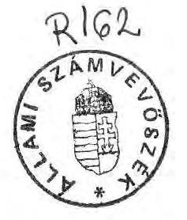
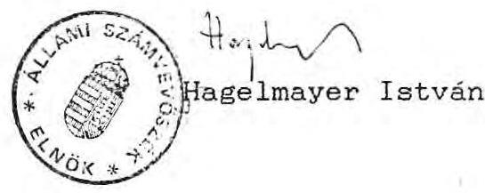

#  

A Társadalombiztosítási Alapból gyógyító-megelőző egészségügyl ellátásra fordított pénzeszközök felhasználása

---

Az ellenőrzést vezette: Bamberger Mária
A jelentés összeállításában résztvett:
Bamberger Mária
dr. Csépán Magdolna
dr. Lezak György
A helyszíni vizsgálatot végezték
az Országos Társadalombiztosítási Föigazgatóságon:
dr. Csépán Magdolna
a Fövárosi Onkormányzat Egészségügyi Főosztályán:
dr. Lezak György
a Fövárosi Onkormányzat Róbert Károly körúti
Kórház-Rendelőintézetében:
dr. Fónyad Erzsébet
a Semmelweis Orvostudományi Egyetemen:
Pozsonyi Lajos

Jász-Nagykun-Szolnok Megyei Onkormányzat Hetényi Géza
Kórház-Rendelőintézetében:
dr. Csapó Anna
dr. Lumniczer Sándor Kórház-Rendelőintézetében:
Lacó Bálintné
Tájékozódást folytattak
a Népjóléti Minisztériumban:
dr. Csépán Magdolna
dr. Lezak György
Pozsonyi Lajos
a Pénzügyminisztériumban:
Bamberger Mária
dr. Csépán Magdolna
dr. Fónyad Erzsébet

Országos egészségügyi intézeteknél:
dr. Lezak György
Pozsonyi Lajos

Az önkormányzati és intézményi tájékoztatókat feldolgozta:
Lacó Bálintné

---

V-71/39/1991.
Témaszám: 59

# T A R T A L O M J E G Y Z E K 

a Társadalombiztosítási Alapból gyógyító-megelőző egészségügyi ellátásra fordított pénzeszközök
felhasználása
címü JELENTES-hez
oldal
BEVEZETES ..... 1.
A VIZSGALAT FOBB
MEGALLAPITASAI ..... 3.
RESZLETES
MEGALLAPITASOK ..... 5 .

1. A gyógyító-megelőző egészségügyi ellátás
finanszírozásában 1990-ben bekövetkezett
változások előzményei. ..... 5 .

---

1.1. Az 1990. év előtti helyzet értékelése ..... 5 .
1.2. A döntése lökészítés folyamata ..... 7 .
1.3. Az előkészítés személyi feltételei ..... 8 .
2. A gyógyító-megelőző ellátásra fordított pénzeszközök tervezése ..... 8 .
2.1. A tervezés folyamata a döntés időpontjáig ..... 8 .
2.2. Az 1989. évi XLVIII. törvény feladatcsere végrehajtásának szabályozásáról ..... 9 .
2.3. Az 1990-ben gyógyító-megelőző ellátásra fordítható előirányzatok fejezetekre történő lebontásának második üteme ..... 10 .
2.4. A tervezés intézményi tapasztalatai ..... 11 .
3. A gyógyító-megelőző egészségügyi ellátás finanszírozása 1990-ben ..... 12 .
3.1. Az OTF felkészülése a feladat ellátására ..... 12 .
3.1.1. Szervezet létrehozása ..... 12 .
3.1.2. A nyilvántartási rendszer kialakítása ..... 13 .
3.1.3. Az elszámolási rendszer kialakítása ..... 14 .

---

3.1.4. A pénzellátás biztosítása ..... 14 .
3.2. A gyógyító-megelőző ellátásra biztosított pénzeszközök törvényi jogcímek szerinti felhasználása. ..... 14 .
3.2.1. Bérpolitikai intézkedések végrehajtása ..... 15 .
3.2.2. A vérellátás finanszírozása. ..... 16 .
3.2.3. A belépő beruházások müködési többletei ..... 17 .
3.2.4. "Szakmai programok támogatására, müszerpályázatokra, informatikai fejlesztésekre" fordított kiadások ..... 17 .
3.2.4.1. Az előirányzat értelmezése ..... 17 .
3.2.4.2. Az előirányzat teljesítésével kapcsolatos adatok bizonytalanságai ..... 18 .
3.2.4.3. Az előirányzat felhasználása. ..... 19 .
3.2.4.4. A pályázaton kívüli gépmüszerbeszerzés támogatások odaítélésének és finanszíro- zásának körülményei ..... 20 .
3.2.4.5. Az OTF által támogatott gépmüszerbeszerzések értékelése ..... 21 .
3.2.5. Arellentételezés ..... 22 .
3.2.6. Egyéb felhasználások ..... 23 .

---

4. Az 1990. évi előirányzatok felhaszná- lásáról készült elszámolások értékelése. ..... 25 .
4.1. A nyilvántartási rendszerböl adódó pontatlanságok ..... 25 .
4.2. A felhasználásról készült elszámo- lások ellenőrzési lehetősége ..... 25 .
4.3. Az elszámolási rendszer hiányos- ságaiból adódó bizonytalanságok ..... 26 .
5. Az egészségügy finanszírozásának 1991. évi változásaí. ..... 26 .
5.1. A jogi feltételek változása. ..... 26 .
5.2. Az 1991. évi tervezőmunka tapasztalatai ..... 27 .
5.2.1. Az 1991.évi III. törvényben elfogadott előirányzat megalapozása. ..... 27 .
5.2.2. A tervezés intézményi tapasztalatai ..... 29.
5.3. A finanszírozás változása. ..... 30 .
6. Az egészségügyi szolgáltatásokra kidolgozott társadalombiztosítási tarifarendsze- rek ..... 31 .
6.1. Egyes kiemelt feladatok "teljesítményfinanszirozása" ..... 32 .

---

6.2. Az OTF részvétele a teljesit-
ményelvũ finanszírozás
kidolgozásában ..... 32.
7. Az OTF ellenôrzési tevékenysége a
gyógyító-megelôzõ célokra átadott
pénzeszközök felhasználásában. ..... 33.
OSSZEFOGLALO
KOVETKEZTETESEK. ..... 34.
JAVASLATOK ..... 37.

---

# ALLAMI SZAMVEVOSZEK 

$\mathrm{V}-71 / 39 / 1991$.
Témaszám: 59

## JELENTEs

a Társadalombiztosítási Alapból gyógyító-megelőző
egészségügyi ellátásra fordított pénzeszközök
felhasználásáról

Az Állami Számvevőszék törvényi kötelezettsége alapján 1991. február-május hónapokban vizsgálatot végzett a Társadalombiztosítási Alap kezelőjénél, az Országos Társadalombiztosítási Föigazgatóságnál (a továbbiakban OTF), egy önkormányzatnál és négy egészségügyi intézménynél a Társadalombiztosítási Alapból a gyógyító-megelőző ellátásra fordított pénzeszközök felhasználása tárgyában.

A vizsgálat célja annak megállapítása volt, hogy az Állami Költségvetés és a Társadalombiztosítási Alap költségvetése közötti feladatcserét követően a Társadalombiztosítási Alap kezelője, az OTF, a gyógyító-megelőző ellátásokra fordítható összeget milyen célra és hogyan használta fel? A felhasználás elősegítette-e az egészségügy helyzetének javítását? A finanszírozás során milyen tapasztalatokat szereztek, ezeket a tapasztalatokat az 1991. évi tervezés során hogyan hasznosították? A feladatosere kapcsán megvalósultak-e azok a célok, amelyek a gyógyító-megelőző ellátás hatékonyságának pénzügyi oldalról való ösztönzését és az ezzel összhangban álló érdekeltségi viszonyok megteremtését állították középpontba?

---

A vizsgált idôszak az elözmények tekintetében az 1989. év, 1990. év és idöarányosan 1991. év volt.

A vizsgálatot több tájékozódó megbeszélés egészítette ki, amelyeket a Népjóléti Minisztérium, a Pénzügyminisztérium, országos egészségügyi intézetek és a Gyógyító Ellátás Információs Központja (a továbbiakban GYOGYINFOK) vezetőivel és munkatársaival folytattunk.

A vizsgálati tapasztalatokat jelentésekben rögzítettük, melyeket a szervezetek vezetőinek észrevételezésre átadtunk. Az OTF egyes megállapításainkat vitatja, észrevételeik többségét azonban a jelentés véglegesítése során sem tudtuk elfogadni.

A tájékozódások során dokumentumokat gyüjtöttünk, illetve nyilatkozatokat kértünk. Mindezeken felül véletlenszerü kiválasztással 25 egészségügyi intézményi vezetöhöz és 25 önkormányzati vezetöhöz levélben fordultunk, hogy a gyó-gyitó-megelőző ellátás társadalombiztosítási finanszirozásának tapasztalatairól - segítve vizsgálatunkat - adjanak információt. Kérésünknek 46 egység tett eleget.

A gyógyító-megelőző egészségügyi ellátás társadalombiztosítási finanszirozásáról az OTF-nél készített helyszíni vizsgálati jelentés tervezetét - az egészségügyi intézményekben szerzett tapasztalatokat összegző értékelö jelentéssel együtt - elözetes vitára bocsájtottuk. E célból országgyűlési képviselők, az OTF, a Pénzügyminisztérium (a továbbiakban PM) és a Népjóléti Minisztérium (továbbiakban NM) szakemberei, valamint az Állami Számvevőszék (továbbiakban ASZ) munkatársainak részvételével 1991. május 16-17-én Velencén munkamegbeszélést tartottunk. Ezzel a kissé formabontó megoldással (hiszen a vitán nem a végleges jelentés, hanem csak annak tervezete szerepelt) az volt a célunk, hogy tapasztalatainkat már menetközben ismertessük a résztvevökkel, vállalva, hogy a vita során egyes következtetéseinket, megállapításainkat erős kritika érheti, esetleg változtatásokat is igényelhetnek.

A vitákban nem hangzott el olyan tény, olyan új információ, amely korábbi megállapításaink érdemi megváltoztatását tette volna szükségessé. Vonatkozik ez azokra az adatokra is, amelyeket az OTF Egészségügyi Finanszirozási Főosztálya május 24 -én - a vizsgálat lezárásának napján az ASZ-hoz eljuttatott.

---

# A VIZSGALAT FOBB MEGALLAPITASAI 

A gyógyító-megelőző egészségügyi ellátás finanszirozása 1990. január 1-ig állami feladat volt, amelyben a költségvetés újraosztó szerepe meghatározó jelentőséggel bírt.

A finanszírozás megváltoztatásának irányába több tényező hatott, mint az egészségügyi szolgáltatások biztosítási rendszerú finanszirozásának megvalósítandó igénye, ezzel összefüggésben a teljesítmények mérésére szolgáló módszerek kialakítására és azok bevezetésére való törekvés, az önkormányzati finanszírozás felé hajló tanácsi normatív finanszírozás stb. (1.1. pont).

Az 1989. január 1-vel létrehozott Társadalombiztosítási Alapot, illetve a megvalósítás intézményi keretét jelentő Országos Társadalombiztosítási Föigazgatóságot minden tekintetben felkészületlenül érte az 1989. évi XLVIII. törvénnyel elrendelt feladatcsere az állami költségvetés és a Társadalombiztosítási Alap között (a családi pótlék, illetve a gyógyító-megelőző egészségügyi ellátás finanszírozására).

Az áttérésre való előkészületek gyors ütemben a megfelelő jogszabályi háttér kialakítása nélkül folytak. Ebben az időszakban az OTF még olyan szervezeti egységgel sem rendelkezett, ami az előkészületi feladatokat szervezetszerüen elláthatta volna (1.2. pont).

A feladatosere végrehajtása óta kialakult az OTF Egészségügyi Finanszírozási Főosztálya, amely egyrészt nem illeszkedik szervesen az OTF szervezetébe, másrészt a fôosztály vezetőinek döntési jogosítványai túlméretezettek, a tevékenység ellenőrizetlen (3.1.1. pont és 36. oldal).

Az áttérés után a finanszírozás tervezésének rendszerében változás nem történt, az intézményi költségvetések elkészítéséhez még módszertani útmutató sem készült, megmaradt tehát a megelőző bázis évre alapozott költségvetési tervezés gyakorlata. (Az OTF egyedül a müködési többletek elbírálásához szükséges "kalkulációs lap"-ot vezette be). (2. pont).

---

A gyógyító-megelőző ellátásokra a társadalombiztosítás járulék bevételeinek 19,2 \%-át fordították 1990-ben, míg ez az arány már $20 \%$ feletti hányadra prognosztizálható 1991ben. Az egészségügyi költségeknek a növekedése tendenciaszerűen meghaladja a járulékbevételeknek az emelkedését.

A helyszíni vizsgálat lezárásáig azonban az OTF nem készítette el a törvényben meghatározott jogcímek szerinti elszámolást, ezért végleges adatokat nem lehetett bemutatni.

A gyógyító-megelőző egészségügyi ellátás működési kiadásának finanszírozásán felül az OTF orvosi müszer és számítógép beszerzéseket is támogatott, holott a hatályos jogszabályok alapján erre nem lett volna lehetősége. Ráadásul az e célra fordított pénz pontos összege sem állapítható meg (kb. 800 millió forint 1990-ben) a nyilvántartások és alapbizonylatok pontatlansága miatt (3.2.4. pont).

Az ily módon gép-műszer beszerzésekre fordított pénzeszközök pályázaton kívüli odaitélése a támogatási kör nagyobb részét tette ki, amelynek során országos szakmai egyeztetés, versenyeztetés a jogszabályi előírások ellenére nem történt, továbbá az OTF a finanszírozás rendjét sem tartotta be, mivel a támogatásokat a költségvetési fejezetek megkerülésével nyújtotta az intézményeknek, miközben jelentős összegeket közvetlenül a szállítóknak fizettek ki. További problémát jelent, hogy a nagyértékü gép-müszer beruházások jelentős müködési költségvonzattal járnak, azok finanszírozására az OTF számításokat nem mutatott be (3.2.4. pont).

Az 1991. évi III. törvény a Társadalombiztosítási Alap költségvetéséről továbbra is a gyógyító-megelőző ellátások müködési költségeinek finanszírozását írja elő. A törvény elvi lehetőséget teremtett arra, hogy a nem állami szervezeteknek is megtéríthetők legyenek az egészségügyi költségei. A törvény azonban nem rendelkezett arról, hogy mely szervezet legyen a döntéshozó (szakmai jóváhagyások, finanszírozási döntések). A finanszírozás tervezési, beszámolási és pénzellátási rendjét az OTF-nek mint a Társadalombiztosítási Alap kezelőjének kell meghatározni, azonban az OTF nem jogalkotó szerv, ezért utasításainak végrehajtása más intézmények, szervek számára nem kötelező (5. pont).

Az OTF költségvetési előirányzat tervezése magába foglal több hagyományos, azonban nem megfelelőnek ítélhető elemet, amelyek az OTF meghatározatlan célú tartalékát jelentik, részben újraelosztó források biztosítékát. A gyógyítómegelőző egészségügyi ellátás 1991. évi előirányzata nem

---

kellően megalapozott abból a szempontból sem, hogy az állami költségvetés és a Társadalombiztosítási Alap költségvetése közötti egyeztetések elmaradása, jóváhagyásuk időpontjának különbözôsége miatt az elöbbiben olyan elöirányzatokat is jóváhagytak, amelyekkel az utóbbi nem számolt (5.2. pont).

Az önkormányzati rendszer kialakulása az OTF-et újabb próba elé állítja, mivel 1990. évi feladatosere idején az OTF 25 költségvetési fejezettel állt közvetlen pénzügyi kapcsolat ban, addig ma már közel 2000 önkormányzattal (5.3. pont).

A teljesítményelvü egészségügyi szolgáltatás és finanszírozás területen számos szervnek, intézménynek lenne feladata, azonban az eddig elvégzett munka még csak a kísérleti stádiumban van, értékelhető eredmény dokumentálva nem található (6. pont).

# RÉSZLETES MEGALLAPITASOK 

1. A gyógyító-megelőző egészségügyi ellátás finanszírozásá-
ban 1990-ben bekövetkezett változások előzményei.

### 1.1. Az 1990. év előtti helyzet értékelése

Az egészségügyi ellátás finanszírozása 1990. I. 1-ig állami feladat volt. A költségvetés a befolyt adókból és a társadalombiztosítási járulékból származó bevétel újraosztásával, (1989. I. 1-től a Társadalombiztosítási Alap önállósága által, az adókból) teremtette meg az egészségügyi ellátás fedezetét. Az állam szerepe meghatározó volt, de a finanszírozásban más jövedelemtulajdonosok is részt vettek.

Az egészségügyi ellátás egyes elemeit (pl. lakossági gyógyszer támogatás, táppénz stb.) már 1990 előtt is a társadalombiztosítás finanszírozta.

---

Az állampolgárok hivatalosan a térítéshez kötött egészségügyi szolgáltatások finanszirozásában vesznek részt, illetve fizetik az egészségügyi ellátással "együttjáró" paraszolvenciát is.

Az egészségügy finanszírozás átalakításának szándéka elöször 1985-ben merült fel. Az Allami Tervbizottság döntött úgy (5043/1985. ATB sz. határozat), hogy meg kell vizsgálni az egészségügy finanszírozásának korszerűsítési lehetőségeit, a teljesítmények mérésének lehetséges módszereit, az egészségügy és a társadalombiztosítás kapcsolatrendszerének tartalmát és formáit, az egészségügyi szolgáltatások biztosítási rendszerben történő finanszírozását.

A végrehajtásra az érintett szervek (OTF, Egészségügyi Minisztérium, Pénzügyminisztérium), többirányú kutató, felmérő, kísérleti munkát indítottak be. Ennek alapján első feladatként - a hosszabb távon kialakítandó, korszerű társadalombiztosítás működési kereteinek megteremtése érdekében - a társadalombiztosításnak a költségvetésről történő leválasztása, a Társadalombiztosítási Alap létrehozása fogalmazódott meg, ami 1989. január 1ével meg is történt.

A reformmunkálatok felgyorsulását az egészségügy feszítő problémái (a lakosság romló egészségi állapota, a korszerütlen intézményhálózat, a minden szinten fellépő forráshiány, ugyanakkor a pénzeszközök esetenként pazarló felhasználása stb.) is siettették. A problémák megoldása érdekében 1988 nyarán a Szociális és Egészségügyi Minisztérium (a továbbiakban SZEM) létrehozta az Egészségügyi -Reformtitkárságot,-célul tüzve a megújulás koncepciójának kidolgozását.

Uj forrásteremtő mechanizmus kialakítását a Nemzetközi Valuta Alap és a Világbank hazánkkal szemben megfogalmazott elvárásai, javaslatai, nevezetesen a költségvetési kiadások, az állami kötelezettségvállalás csökkentése iránti igény is szükségessé tették.

A változtatások 1990. évi bevezetése összefügg azzal is, hogy a tanácsok pénzügyi forrásai az önkormányzati finanszírozást célul tüzve, de átmeneti szabályozásban képződtek. Ennek keretében a tanácsok állami támogatásának elosztása nagyrészt normatív módszerekkel történt, amivel a területeken müködő egészségügyi intézmények finanszírozása nem volt összeegyeztethető.

---

Szakértői körökben az az álláspont alakult ki, hogy a szükségleteknek leginkább az felelne meg, ha az egészségügy kikerülne a költségvetésböl, a finanszirozás társadalombiztosítási körben, járulékfedezeti alapon valósulna meg, ami egyben a valóságos betegbiztosításhoz is közelítene.

# 1.2. A döntéselőkészítés folyamata 

Az állami költségvetés 1990. évi tervezése során külső és belső tényezőktől meghatározottan vetődött fel, hogy 1990-ben az állami szociálpolitikai rendszer részét képező családi pótlék finanszirozását a költségvetés, a gyógyító-megelőző egészségügyi ellátás működési költségeinek finanszírozását pedig a Társadalombiztosítási Alap végezze.

Ebben az időszakban a forráscserét a Társadalombiztosítás ellenezte. Döntően az egészségügyi költségrobbanástól tartott. Védeni próbálta a már önálló Társadalombiztosítási Alap és a nyugdíjasok érdekeit.

Az előkészítés munkáját:

- a forrásszámításokat a Belügyminisztérium, (a továbbiakban BM) a SZEM és a PM;
- a jogi szabályozás előkészítését a SZEM;
- a pénzügyi-számviteli és beszámolási szabályozást a PM
végezte (1. sz. melléklet).

Az áttérésre a környezeti feltételek teljes hiánya mellett, eröltetetten került sor, ami az előkészítő munkát túlzott egyszerűsítésekre kényszerítette. Egyértelmú volt ugyanis, hogy az egészségügyi reform csak az egyéb (költségvetési, társadalombiztosítási, szociálpolitikai és általában a gazdasági-politikai) reformfolyamatokkal szoros összhangban, megfelelő jogszabályi keretek között valósítható meg. Az egészségügy finanszírozásának új rendszerét megalapozó jogszabályi keretek máig sem alakultak ki.

A szakértők 1989-ben megkezdték az "új" egészségfinanszírozási rendszerre való áttérés előkészületeit.

---

Kiemelték az egészségügyi feladatoknak egy részét:

- körzeti alapellátás
- járóbeteg szakellátás
- fekvőbeteg-ellátás
- mentőszolgálatból a betegszállítás
- a gyógyító-megelőző egyéb feladatok
- egészségügyi ellátással összefüggő munkahelyi vendéglátás,
amelyek müködési költségeit a társadalombiztosítási forrásokból kell biztosítani.

Az áttérési számításokat 1988. évi tényadatokra, illetve az 1989. évi elöirányzati számokra - eredeti elöirányzat 44,8 milliárd forint - alapozták. Bizonytalanságot a várható infláció prognosztizálása és a szakfeladatokra elszámolt összegek megbízhatatlansága jelentett. A ténylegesen indokolt költségek valóságos mértéke ma sem ismert.
1.3. Az előkészítés személyi feltételei

Az áttérés előkészítő időszakában az OTF egyáltalán nem rendelkezett olyan szervezeti egységgel, amely az előkészítés, szervezés feladatait elláthatta volna.

A SZEM által létrehozott szakértői bizottság ülésein az OTF képviselöi is részt vettek, ideértve a PM és a SZEM azon munkatársait is, akik ma a feladat végrehajtását az OTF-ben végzik.
2. A gyógyító-megelőző ellátásra fordított pénzeszközök
tervezése
2.1. A tervezés folyamata a döntés idópontjáig

A forrás cseréről szóló döntést egészségügyi szakmai előkészítés nem, csak pénzügyi szakmai előkészítés előzte meg. Ennek részeként a SZEM és a BM fejezetozintú számítási anyagot dolgozott ki. Ebben rögzítették a müködés zavartalanságához szükséges 1990. évi alapelőirányzatokat.

---

Egyestető megbeszéléseket a fejezetekkel 1989 december elején tartottak, melyeket a SzEM szervezett az OTF, a PM, a BM és az Országos Tervhivatal részvételével. A megbeszéléseken a fejezetekkel előzetes megállapodások születtek, hogy azokat az Országgyülés döntése lépteti életbe vagy érvényteleníti.

Az érintettek elöre megkapták a kidolgozott fejezetszintü számítási anyagot, amely az alapelőirányzatok levezetését a költségvetési tervezés rendje szerint tartalmazta, hiszen a fejezetszintü számítások alapját a müködési kiadásként átkerülő költségek számadatai képezték. A fejezetek (tanácsok) viszont a megállapodásokban a pénzellátás korábbi szintjének biztosítására helyezték a hangsúlyt.

Az első egyeztetési fordulóban az 1990. évi fejlesztési előirányzatokat még nem konkretizálták. Függőben maradt egyes szakfeladatok állami, illetve társadalombiztosítási finanszirozási kötelezettségének, az ebből eredő támogatási igényeknek a meghatározása is. Az előkészítésben résztvevő szervek egyetértettek abban, hogy az intézmények pénzellátását előre kell biztosítani.
2.2. Az 1989. évi XLVIII. törvény feladatcsere végrehajtásának szabályozásáról

Az Országgyülés az 1990. évi állami költségvetéssel egyidőben fogadta el a Társadalombiztosítási Alap 1990. évi költségvetéséről szóló 1989. évi XLVIII. törvényt, melynek értelmében a társadalombiztosítási finanszirozási körbe átkerült gyógyító-megelőző ellátások ráfordításait "változatlan finanszírozási rendben" kellett fedezni. Ez azt jelentette, hogy 1990-ben az egészségügyi intézmények müködésének finanszírozása a költségvetési gazdálkodási rend szabályai szerint az állami költségvetésben önálló fejezetet alkotó szerveken keresztül valósul meg - a költségvetési források helyett - a társadalombiztosítás járulékbevételei terhére.

A beruházások, felújítások finanszírozási rendszerét, döntési jogköreit, továbbá az egészségügyi ágazat szakmai irányítását a változás nem érintette.

---

A törvény 66 milliárd forintban rögzítette a gyógyítómegelőző ellátás feladataira fordítható összeget és részleteit a törvény melléklete tartalmazta.

# 2.3. Az 1990-ben gyógyító-megelőző ellátásra fordítható 

## elöirányzatok fejezetekre történő lebontásának második

üteme

A döntést követően az egyeztetés második ütemének előkészítésével folytatódott a tervezés. A fejezetekkel a tárgyalások 1990 januárjában és februárjában az OTF és a SZEM vezetőinek részvételével zajlottak. Ebben a szakaszban megtörtént a decemberben még függöben maradt tételek egyeztetése és a fejlesztési igények (a feladatbővítéshez szükséges müködési kiadások) konkretizálása, áttérési korrekciók elfogadása végső soron az 1990. évi fejezeti szintű előirányzatok rögzítése.

A jegyzőkönyvekben több olyan általános, szakmai kérdés, illetőleg rendezési szándék szerepelt, amely a későbbiekben nem, vagy nem a jegyzőkönyvekben foglaltak szerint valósultak meg. A jegyzőkönyvek szerint például:

- továbbra is állami feladat az építési, gépműszer beruházás, a felújítási munka, rekonstrukciók finanszírozása,
- a SZEM és a PM az egységes pénzalapgazdálkodási jogok gyakorlásáról irányelveket készít,
- a szakmai feladatok teljesítmény szerinti finanszírozását kidolgozzák,
- a SZEM szakmapolitikai koncepciót készít,
- a SZEM és az OTF újból áttekinti az állami és társadalombiztosítási finanszírozási körbe tartozó feladatokat és javaslatot tesznek a rendezésre,
- a SZEM és az OTF összehangolja tevékenységét a reform megvalósításában
- a társadalombiztosítási források függvényében, a SZEM javaslatának megfelelően az OTF nyilvános pályázatot ír ki mégpedig
$=$ az egészségügyi reformcélkitüzések megvalósítását elősegítő célprogramokra,
$=$ a teljesítményfinanszírozás bevezetését megalapozó informatikai fejlesztésekre,

---

= a gyógyító-megelőző ellátást nyújtó vállalkozások szerződéses alapon nyugvó teljesitmény finanszirozására.
1990. január 31-én az előirányzatok helyzetét az OTF Egészségügyi Finanszirozási Osztálya összefoglaló táblázatban rögzítette, melyet értékelő jelentésével együtt átadott az érintett parlamenti bizottságok, az Egészségügyi Kerekasztal tagjai, a SZEM vezetői részére.

# 2.4. A tervezés intézményi tapasztalatai 

A tervezés rendszerében a korábbi évekhez képest változás nem történt, tekintettel arra, hogy a finanszírozás rendje nem változott, az előirányzatok tervezése bázis alapon épült fel. Az intézményekben feladat átvilágításon, vagy elvégzett teljesitményen alapuló költségvetés tervezésére nem került sor.

Az intézmények az 1990. évi költségvetésüket a törvények, valamint azok végrehajtására kiadott rendelkezések és utasítások alapján állították össze. Útmutatásként szolgáltak továbbá a tervezéshez az országos szervek, a megyei és a helyi tanácsok között, a források átrendezéséről készített megállapodások, illetve jegyzőkönyvek, melyek részletesen rögzítették az előirányzatok levezetését, annak tartalmát.

Az intézményi költségvetések készítéséhez módszertani útmutató nem készült. A kiadási előirányzatok költség-előirányzati számokból való kiindulása többfordulós egyeztetéseket eredményezett (pl. Róbert Károly úti Kórház). Azokon a területeken, ahol a gyógyító-megelőző ellátás költségei más szakfeladatok költségeivel összefonódva vagy egyéb szakfeladatok költségei (pl. egyetemek) - bár közvetve, de a betegellátást segitve - jelennek meg, ma sincs egyértelmú feladatelhatárolás.

A fejlesztésekhez kapcsolódó múködési többletek elbírálásához az OTF ún. kalkulációs lap alkalmazását vezette be, ami újdonság volt a korábbi költségvetési gyakorlathoz képest. Ezen az intézménynek a fejlesztéshez kapcsolódó élőmunka-, anyag-energia stb. költségeket kellett közölnie. A költségeket éves szintre kell megadni, de a pénzügyi fedezet átadása a

---

belépés idõpontjától kezdõdik. Ily módon a törtévi és a következõ évi szintrehozott költség egyaránt meghatározható. Az intézményeknek az elöirányzatokat több esetekben csökkentett mértékben folyósitották, melynek indokait az intézetek nem ismerik, a korábbi költségvetési tapasztalatok birtokában azt tudomásul vették.

Bár az esetek többségében az elbírálásnak csak formai feltétele volt a kalkulációs lap kitöltése, - a döntésre már a fejezeti szintü egyeztetés során sor került mégis annak elfogadása esetén történt csak a folyósítás.
3. A gyógyító-megelőzõ egészségügyi ellátás finanszírozása 1990-ben

# 3.1. Az OTF felkészülése a feladat ellátására 

### 3.1.1. Szervezet létrehozása

Az OTF Pénzügyi Főosztályán belül megalakult Egészségügyi Finanszírozási Osztály létszáma 3 fôröl az év végére 8 fôre emelkedett. Az Osztály feladataira 1990 januárban ügyrend készült, amely a hatásköri, külsõ-belsõ kapcsolattartási kérdéseket tartalmazza. E szerint az osztályt vezető, fôosztályvezető helyettesnek és osztályvezető helyettesének joga és kötelezettsége:

- a támogatási kereteknek a célok közötti felosztása;
- a többletigények egyeztetése, elbírálása, engedélyezése;
- a szakminisztériummal közösen kiírásra kerülő támogatási célprogramok kidolgozása; egyeztetése, elbírálása és jóváhagyása.

Ugyanezen két személy vállalhat az egészségügyi költségvetés erejéig kötelezettséget, utalványozhat és ellenjegyezhet. 1990. év végén az Egészségügyi

---

Főosztály új ügyrendjének elkészítése folyamatban van.
Az OTF 1990-ben önmaga szervezetében nem rendelkezett olyan egységgel, amely orvos-szakmai döntésekben részt vehetett volna, akár a döntések előkészítésében, akár a döntések meghozatalában, akár a döntések következményének ellenőrzésében.

# 3.1.2. A nyilvántartási rendszer kialakítása 

Az OTF Egészségügyi Finanszirozási Főosztálya az előirányzatok felhasználásának figyelemmel kísérésére 1990-ben az ECOFARM Kft-vel olyan számítógépes rendszert alakitott ki, amely a kiutalt támogatások havonkénti (és göngyölített), megyénkénti és központi fejezetenkénti nyilvántartására jogcímenként lett volna alkalmas. A nyilvántartás fő jogcímenkénti bontása:

- alapelőirányzat,
- bérpolitikai intézkedések,
- fejlesztések és az
- egyéb kategóriák
nem alkalmazkodik a Társadalombiztosítási Alap költségvetési törvényében foglalt tételsorokhoz (3. sz. melléklet első oszlopa). A fejlesztés és az egyéb jogcím elhatárolása, belső bontása ötletszerű volt.

Az OTF észrevétele szerint az egyes folyósítási jogcímek tételesen szerepelnék a nyilvántartásokban, így azokból bármely igény szerinti összeállítás elkészíthető. E véleménnyel a 4. pontban leírtak miatt az Állami Számvevőszék nem ért egyet.
A nyilvántartási rendszer 1991-re megváltozott. Az alapbizonylatok feldolgozása is számítógéppel történik, így - megfelelő alapbizonylatok kiállítása esetén - remény van arra, hogy az elmúlt évi anomáliák nem ismétlődnek.

### 3.1.3. Az elszámolási rendszer kialakítása

Az előkészítés során az elszámolási rendszer kialakítását a Pénzügyminisztérium végezte. Az

---

egészségügy társadalombiztosítási támogatásának könyvviteli elszámolására a Pénzügyi Közlöny 1990. évi 5. számában közlemény jelent meg. Ennek alapján kell az intézményeknél alkalmazni a 375. társadalombiztosítási támogatás elszámolási számlát. Változott az egészségügyi feladatot ellátó intézmények költségvetési beszámolási rendszere is. A beszámoló kiegészült a "21-54. Társadalombiztosítási támogatás elszámolása" úrlappal.

Az OTF az elszámolási rendszer kialakításával. 1990ben nem foglalkozott. 1991-ben javaslatára törvény biztosítja, hogy az intézmények 1990. évi Társadalombiztosítási Alapból juttatott pénzmaradványa ne legyen elvonható.

# 3.1.4. A pénzellátás biztosítása 

Az egészségügyi intézetek zavartalan pénzellátása érdekében az előkészítésében résztvett szervezetek között megállapodás született, hogy a pénzellátást előre kell biztosítani. Ennek megfelelően az éves alapelőirányzat $1 / 10$ részét 1989. december 20-ig átutalták a Társadalombiztosítási Alap 1989. évi bevételi többletének terhére.

1990. év második felében, majd 1991-ben is az OTF az alapelőirányzatnak megfelelő összegeket előre meghatározott pénzellátási terv szerint biztosította. Ettől egyes esetekben intézményi igény alapján eltért. Az előirányzatok átutalása minden hónap 25 -ig megtörtént.

### 3.2. A gyógyító-megelőző ellátásra biztosított pénzeszközök

törvényi jogcímek szerinti felhasználása

Az OTF az 1990. évi számviteli elszámolása szerint a gyógyító-megelőző ellátásokra 67.763.928 ezer Ft-ot használt fel. Ez az összeg a társadalombiztosítás járulékbevételeinek ( 352,4 milliárd forint) 19,2 \%-a, Az egészségügyi költségeknek a járulékbevételeket meghaladó ütemú növekedését mutatja az, hogy az 1991re előirányzott 88,135 milliárd forint a várható bevételeknek már $20 \%$ feletti hányadát köti le (lásd: 2. sz. melléklet), mintegy $30 \%$-os a növekedés 1990-hez képest, míg 1990-ben közel $40 \%$-os volt a növekedés.

---

A helyszini vizsgálat lezárásáig az OTF nem készítette el a törvényben meghatározott jogcímek szerinti elszámolást. Ezért a jelentésünk 3. sz. mellékletében összefoglaljuk az éves elszámoláshoz kapcsolódó tételes nyilvántartásokból nyerhető adatokat, összehasonlítva a törvényi előirányzat számaival és az Országgyülés illetékes bizottsága részére 1990 januárjában bemutatott számokkal. Megjegyezzük, hogy a helyszini vizsgálat időpontjában csak alapbizonylatokból illetve az OTF Egészségügyi Finanszírozási Főosztálya által rendelkezésre bocsájtott elszámolásokból dolgozhattunk. Ezek adatai sok esetben eltértek a végső számviteli nyilvántartásokkal egyeztetett - adatoktól, az eltérések nagyságrendje összességében nem jelentős, de gátolja a tisztánlátást. A 3. sz. melléklet utolsó oszlopában szereplő adatokat az OTF 1991. május 24 -én és 28 -án átadott, az éves zárszámadáshoz kapcsolódó elszámolásokból gyüjtöttük - az összehasonlíthatóság érdekében. Az alapbizonylatoktól való korábbiakban jelzett eltérések miatt ezen adatokat nem minősítettük.

Megjegyezzük, hogy a Társadalombiztosítási Alap költségvetési törvényében rögzített jogcímenkénti elszámolás valós adattartalmának meghatározását az is akadályozza, hogy e jogcímek és a számviteli nyilvántartások adatai közötti összhang egyéb költségvetési területekhez hasonlóan csak egyedi kigyűjtésekkel biztosítható, megbízhatóságuk ezért kétséges.

A múködési kiadások szerkezete az egészségügyben, hasonlóan költségvetési szféra egyéb területeihez, erősen determinált. Atlagosan 2/3-os az élőmunka költségek aránya. Az 1991 januárjában készített és az ASZ-nak átadott összeállítás közel 1000 tételt tartalmazott. Minden egyes tétel ellenőrzésére idő és ellenőri kapacitás hiányában nem volt mód. Ezért a vizsgálat az alapelőirányzaton felüli kiutalások ellenőrzésére helyezte a hangsúlyt.

# 3.2.1. Bérpolitikai intézkedések végrehajtása 

Az egészségügyi dolgozókat érintő 1990. évi központi bérpolitikai intézkedésekre - második ütem - a törvény eredetileg 4,7 milliárd forintot tervezett fordítani. A SZEM és az OTF által 1990 januárjában aláirt jegyzőkönyvben ezt módosították és az OTF

---

keretéből 221 millió forintot a minisztérium költségvetésébe csoportosítottak át. Erről "az 1990. évi állami költségvetés egyes kérdéseiről" szóló 3167/1990. Mt. határozat 22. pontja intézkedett. Igy az OTF-en keresztül valójában 4,5 milliárd forintot osztottak ki. Az intézkedés végrehajtásához 1990 januárjában a minisztérium tájékoztatót adott közre, összefoglalva a támogatási összeg elosztásának főbb elveit. A minisztérium megadta a tanácsok és a központi fejezetekre lebontott bérfejlesztési keretösszegeket, melynek kiutalása rendben megtörtént.

Az Allami Számvevõszék 1990 decemberében vizsgálta a volt tanácsi területeken a bérpolitikai intézkedésekre szolgáló elöirányzatok elosztását és felhasználását, az 1988-90-es évekre vonatkozóan. A vizsgálat szerint az orvosok átlagbére $73,5 \%$-kal nőtt. Ezzel a mértékkel a más területek kereseti viszonyaihoz képest a lemaradás mérséklődött. Ugyanakkor az orvosok átlag alapbére reprezentativ mintánk szerint 1990-ben 16 és 23 ezer forint között szóródott, ami nyilvánvalóan még mindig alacsony a szakma presztizsét, a munka bonyolultságát és a viselt felelősséget illetően.

A minimálbér megemelésére a módosított törvény 155 millió forintot biztosított. Az ennél lényegesen alacsonyabb teljesítés oka a tervszám pontatlan meghatározása. A keret ugyanakkor lehetőséget biztosított volna arra, hogy a minimálbér ismételt emelését is központi forrásokból biztosítsák. Erre 1990-ben nem került sor (Szolnok megyei Kórház jelzése).

# 3.2.2. A vérellátás finanszírozása 

E feladat végrehajtására a törvény 400 millió forintos fejlesztési elöirányzatot tartalmazott. Ez az összeg a vér- és vérkészítmények felhasználásához adott társadalombiztosítási támogatás fedezetéül szolgált volna. A vérkészítmények díjtételeit a 4/1990.(I.29.) SZEM rendelet túl magasan állapította meg, ezért a 18/1990.(V.10.) SZEM rendelet az előbbi jogszabályt hatályon kívül helyezve új, a korábbinál mérsékeltebb díjakat vezetett be.

---

A társadalombiztosítási támogatás e szerint készítménytöl függően - a teljes térítés 20-80 \%-a közötti.

A vérellátás finanszírozási rendszerét az OTF a kiadott új rendelet alapján sem tartotta megfelelőnek. Ezért e címen intézményi költségeket a rendelkezésre álló kereten túl 1990 decembere óta nem finanszírozott. A vizsgálattal egyidöben kezdeményezte a Népjóléti Minisztériumnál a rendelet módosítását. Az érvényben lévő rendelet alapján a térítés az intézményeket megilleti, a folyósítás leállítása jogszabályellenes volt, de kikényszerítheti a finanszírozási rendszer megváltoztatását. Az OTF a helyszíni vizsgálat észrevételezése alapján 1991 májusában visszamenőlegesen is folyósította a támogatást.

# 3.2.3. A belépő beruházások müködési többletei 

Részletes vizsgálatra a tételek nagy száma és a nyilvántartások megbízhatatlansága miatt nem került sor. Az 3. sz. melléklet e sorának jelentős eltérésére azért sem figyelhettünk fel, mivel a helyszíni vizsgálat időpontjában a vizsgálat külön kérésére elkészített táblázat szerint a törvényi előirányzathoz képest lényeges eltérést nem mutattak ki.
3.2.4. "Szakmai programok támogatására, müszerpályázatokra, informatikai fejlesztésekre" fordított kiadások

### 3.2.4.1. Az előirányzat értelmezése

Vizsgálatunk végéig sem alakult ki egységes álláspont a törvény szövegének értelmezése tárgyában. Az Allami Számvevőszék álláspontja szerint az OTF az érvényes szabályok alapján csak müködési költséget finanszírozhat, beruházási célú fejlesztések és egyszeri támogatások esetében is. Az egészségügyi ellátás Társadalombiztosítási Alapból történő finanszírozásának előirányzatát az 1989. évi XLVIII. törvény 4. paragrafus (1) bekezdése

---

szerint "nagyjavítások, beruházások nélkül" állapították meg.

A fejlesztés fogalom ugyan közgazdasági és a költségvetési gazdálkodásban eltérő értelmezést nyerhet, adhat okot félreértésekre, de jelen esetben a törvény indoklása világossá teszi, hogy "az egészségügyi beruházások költségei, valamint a kormányzati intézkedésekből származó többletkiadások továbbra is a költségvetést terhelik". Amennyiben az OTF szándéka szerint az említett 900 millió forintos összeget beruházási célokra kívánta felhasználni, ehhez a törvényalkotó felhatalmazását kellett volna kérnie.

Az OTF Egészségügyi Finanszírozási Főosztály vezetőjének ezzel szemben az a véleménye, hogy a hivatkozott összeg tényleges felhasználása során a törvény szellemében és jogszerűen járt el, hiszen már 1990 januárjában egyes fejezetekkel a SZEM részéről is aláírt jegyzőkönyvekben beruházási kötelezettségeket vállalt. Az OTF ezirányú tevékenységét a Népjóléti Minisztérium vagy más szerv jogi, pénzügyi oldalról nem kifogásolta, aggályok csak a kellő szakmai kontroll hiánya miatt merültek fel.

# 3.2.4.2. Az előirányzat teljesítésével kapcsolatos adatok 

## bizonytalanságai

A rendelkezésünkre bocsájtott adatok, nyilvántartások, továbbá a vizsgálat külön igényére készített összeállítások szerint az OTF (az Egészségügyi Finanszírozási Főosztályon keresztül) 1990-ben több mint 800 millió forintot fizetett gépek és müszerek beszerzésére, részben a minisztériummal közös pályázatok útján, illetőleg saját döntése szerint. A pontos összeg nem állapítható meg. Erre ugyanis az Egészségügyi Finanszírozási Főosztálytól kapott nyilvántartások, és a bemutatott alapbizonylatok alkalmatlanok. A tisztánlátást akadályozza, hogy a beszerzések fedezetét több esetben müködési költségkiegészítésekkel keverten - egy összegben - bocsájtották az adott intézmény rendelkezésére. E jogcím szerinti elszámolást gátolja, hogy a belépő beruházások előirányzati soron például számítógép beszerzésre biztosított összegeket is elszámoltak.

---

# 3.2.4.3. Az elöirányzat felhasználása 

A támogatások kisebb része kapcsolódott "az egészségügyi ellátás egyes kiemelt feladatainak eredményesebb ellátása érdekében" a SZEM és az OTF által közösen meghirdetett pályázathoz. A pályázat szakmai tartalmát még az 1985-ben kiadott szakmapolitikai irányelvek egyes tételeinek aktualizálása adta.

A pályázati kiírás 12 témakörben (alapellátás, szív- és érbetegellátás ... stb.) egészségügyi intézetek és szolgálatok részére egyszeri támogatás elnyerését tette lehetővé. A pályázatok elbírálását a SZEM által, az Egészségügyi Tudományos Tanács, valamint a szakmai kollégiumok egyes tagjaiból alakított ad hoc bizottságok végezték. Az eredményeket a Népjóléti Közlöny 9. számában hozták nyilvánosságra. A tizenkét témakörben összesen 365 millió forint elosztásáról döntöttek. Ebböl az OTF 105,7 millió forintot adott a pályázatra, oly módon, hogy négy program:

- 3. anaesthesiológiai, intenzív therápia,
- 8. hemodializáló kapacitás bővítése,
- 9. neurotraumatológiai gerinc-centrumok,
- 10. endoscopos mikrosebészeti eljárások,
finanszirozását - egy tételtől eltekintve teljes egészében vállalta.

Az OTF a pályázat lezárásakor ígéretet tett arra - hivatkozva az év eleji jegyzőkönyvekben foglaltakra -, hogy lehetőséget keres további támogatásra. Ennek megvalósítására azonban csak az év végén - az iratokból megállapíthatóan igen rövid idő alatt, november végén, decemberben került sor.

E támogatások egy része kapcsolódott a pályázati rendszerben támogatott szakmai programokhoz, mivel a szükös minisztériumi források miatt a pályázók igényeinek csak kis részét tudták kielégíteni, azok azonban az elbírálás sorrendjétől függetlenek voltak.

---

Az OTF a pályáztatott szakmai programoktól függetlenül jelentős támogatásokat adott a diagnosztikai ellátás fejlesztésére, computertomográfok (CT), ultrahang készülékek (UH) stb. beszerzésére, mintegy 500 millió forint értékben.

A támogatások legnagyobb részét:

- a Semmelweis Orvostudományi Egyetem (253 MFt)
- az Országos Traumatológiai Intézet (100 MFt)
- az Országos Ideg- és Elmegyógyászati Intézet ( 84 MFt )
kapta. (Az összegeket a korábban már pontatlannak itélt nyilvántartásokból összesítettük.)

# 3.2.4.4. A pályázaton kívüli gép-műszerbeszerzés támogatások 

odaítélésének és finanszírozásának körülményei

A gép-műszer beruházásokat különösebb szakmai egyeztetés - az egészségügyi tárcán keresztül az illetékes szakmai kollégiumokkal - nem előzte meg, noha erre az OTF - akár feltételesen is felkészülhetett volna. Az adott intézmény támogatás iránti kérését a felügyeleti szerv egyetértése (a minisztérium egyes vezetőinek támogató sorai), a tanácsi területeken a megyei szakfőorvos javaslata kísérte, amit szakmai indokként az OTF elegendőnek ítélt. Tette mindezt annak ellenére, hogy orvos-szakmai kérdésekben az OTF maga nem hivatott dönteni, valamint hogy a korábbi évek hasonló döntései mechanizmusát önmaga is kifogásolta.

A versenyeztetési kötelezettséget előíró a 36/1988./VIII.16./ PM rendelet előírásait nem alkalmazta.

A versenytárgyalásról szóló 1987. évi 19. tvr. 33. paragrafusában kapott felhatalmazáson alapuló pénzügyminisztéri rendelet szerint, versenytárgyalás útján kell megkötni a szerződést, ha az ellenszolgáltatás teljesítése részben vagy egészben állami költségvetési forrásból történik és ennek összege meghaladja a 10 millió forintot. A Társadalombiztosítási Alap ugyan már nem része az állami költségvetésnek - ugyanakkor egyértelműen közpénz -, taxative nem szabá-

---

lyozott, hogy a versenyeztetési kötelezettség e forrásból megvalósitott beruházásokra is kiterjed-e. Tekintettel azonban arra, hogy a gép-müszer beruházások teljes költségének általában csak egy részét biztosították a Társadalombiztosítási Alapból, másik részét viszont költségvetési juttatás fedezte, ezért a rendelet betartását, vagy annak ellenőrzését az Alap kezelőjének biztosítania kellett volna.

A gép- müszer vásárlások pénzügyi fedezetét az intézetek részére szóló árajánlat és intézeti megrendelés alapján az OTF az esetek jelentős részében a szállító céghez közvetlenül utalta .

A szállítói fizetések esetén nem szabályozott az állóeszközök leltárba vétele. A számlák az OTF birtokában vannak, igy az adott intézményben az eszközök leltárbavételére nem kerülhet sor. A kérdés rendezésére az OTF Egészségügyi Finanszirozási Főosztály munkatársa csak különböző megoldási javaslatokat ismertetett a vizsgálókkal.

Más esetekben a pénzügyi fedezetet a beruházó egészségügyi intézetnek közvetlenül utalta át, eltérve a fejezeteken (felügyeleti szerveken) keresztüli finanszírozástól.

# 3.2.4.5. Az OTF által támogatott gép-müszerbeszerzések 

## általános értékelése

Az Allami Számvevőszék nem vizsgálta, hogy ha a szakma hozzáértő közösségei - országos intézetek, szakmai kollégiumok - nem vettek részt a gépmüszer beruházások elbírálásában, akkor az OTF felelősséggel itélhette-e meg az egészségügyi ellátó hálózat egyes elemeinek, szintjeinek, intézményeinek országos szintü összefüggéseit, döntéseit ennek figyelembevételével hozta-e, vagy egyszerüen saját belátása szerint cselekedett.

---

Kötelességünk viszont felhívni a figyelmet arra, hogy a gyógyító-megelőző egészségügyi ellátás müködési költségeinek fedezetéül - a törvény szerint "beruházások, nagyjavítások nélkül" megállapított keretösszeg terhére beruházási jellegü fejlesztéseket nincs joga finanszírozni.

A beruházások pénzügyi feltételeinek biztosítása deklaráltan továbbra is állami feladat, azok fedezetét a költségvetésböl kell megoldani. Saját hatáskörében hozott döntéseivel az OTF gyakorlatilag állami feladatot vállalt át, oly módon, hogy ehhez nem rendelkezett a progresszív betegellátásnak megfelelő szintezett orvosszakmai háttérrel sem.

Az egységes pénzalapgazdálkodási jogkör 1990-ben legfeljebb csak intézményen belül tette lehetővé a dologi előirányzatok közötti átcsoportosítást, a felhasználás során.
Miután a támogatások rendje nem szabályozott, így nem zárható ki az informális kapcsolatok szerepe sem.

A vizsgálat során nem találtunk írásos véleményt olyan illetékes orvosszakmai fórumtól, amelyre az OTF felelősséggel támaszkodhatott volna. Több illetékes országos intézeti vezető, szakmai kollégiumi vezető nyilatkozata szerint ilyen munkát sem az intézet, sem a kollégium nem végzett.

Az OTF 1990-ben nem tartotta be a finanszírozás rendjét. A támogatásokat a fejezetek megkerülésével nyújtotta az egészségügyi intézményeknek, jelentös összegben beruházási szállítókat is finanszirozva (versenyeztetés nélkül).

A nagyértékü a gép-müszer beruházások telepítése, müködtetése további jelentös költségvonzattal jár. Erre az OTF nem rendelkezik számitásokkal (illetve ilyeneket a vizsgálatnak nem mutatott be), holott ez az érintett egészségügyi intézmények finanszírozására az elkövetkező években tartósan hat. Ugyanis ezek müködtetési kiadásainak fedezése a törvényes megállapodások szerint az OTF feladata.

---

# 3.2.5. Arellentételezés 

Az 1990. évi LXXVI. és LX. törvényben 1.545 millió forinttal - áremelkedések ellentételezése címén emelték meg az OTF egészségügy finanszirozási elöirányzatát. Ezzel szemben az egészségügyi intézményeknek kiutalt összeg az OTF éves elszámolása szerint $2.408,8$ millió forint. Ebből 2.020,1 millió forintot nevesítetten is árkompenzációként fizettek ki. Az alapellátásban az árkompenzációt normatív alapon biztosították, egységenként 50 ezer forint beépülö és 20. ezer forint egyszeri készletbeszerzési fedezetet biztosítva. E jogcímen benzináremelés ellentételezésre 80,8 millió forintot, gazdálkodási garanciaként 114,0 millió forintot biztosítottak. Az év végén minden jelentősebb kórház kapott "válságköltség vetés" címén 1-2 millió forintot. Ezek az összegek sem a fejezeteken keresztül jutottak el az egészségügyi intézményekhez.

Ezen összegen felül az intézményi alapelőirányzatok gyógyszeráremelkedés miatti kompenzációs lehetőségeket is tartalmaztak, melyek az 1990. évi gyógyszeráremelkedések elmaradása következtében az áremelkedések további fedezetéül is szolgáltak.

### 3.2.6. Egyéb felhasználások

Az OTF éves elszámolása szerint cseppfolyós oxigén ellátásra 27,5 millió forintot költöttek.

A helyszíni vizsgálat e tétel ellenőrzésére nem terjedt ki. A helyszíni vizsgálat lezárását követően átadott tételsoros kiírás azt tartalmazza, hogy az összeget Budapesten és Bács-Kiskun megyében cseppfolyós oxigénelőállító rendszerre használták fel. Nem állapítható meg, hogy cseppfolyós oxigén vásárlása, ezt elóállító gépi rendszer vásárlása, avagy az utóbbi müködtetésének finanszirozása történt.

Alapítványok támogatására az éves elszámolás szerint 3,3 millió forintot fordítottak.

---

A helyszíni vizsgálat megállapítása szerint ez az összeg 4,7 millió forint. Az eltérést valószínüleg az okozza, hogy egy alapítvány támogatására a Baranya Megyei Tanácson keresztül került sor.

A Társadalombiztosítási Alap 1990. évi költségvetéséről szóló törvény még nem biztosított arra lehetöséget, hogy az OTF támogatásban részesítsen ún. nem állami egészségügyi tevékenységeket. Ilyen igények azonban egyre gyakrabban merülnek fel. Az elmúlt évben konkrét támogatásokra még csak igen csekély keretek között került sor.

A támogatások odaitélésének feltétele, hogy az alapítványok részben egészségügyi feladatokat végezzenek. Az alapítványok egészségügyi, szociális, oktatási és egyéb humán funkciói azonban annyira átfedik egymást, hogy a tényleges egészségügyi feladatok elkülönítésének megitélése nagyon nehéz. Ezért az alapítványok támogatása iránt növekvō igényekre is figyelemmel nem fogadható el az alapítványok finanszírozásának 1990. évi gyakorlata.

Alkohol ̇̇giai és pszichiátriai feladatokra 43 millió forint többletfelhasználásra volt lehetőség, mivel a Nagyfai Munkaterápiás Intézet megszünésével az intézmény alapelőirányzata felszabadult. Az intézet támogatására szolgáló összeget az alkoholbetegséggel összefüggő különféle programok támogatására forditották. Az elöirányzat átcsoportosításására törvénymódosítás nélkül, két miniszterhelyettes megegyezése alapján és az illetékes szakmai kollégium véleményezésével került sor. (A felhasználás jogcímei valószínüsítik, hogy nem csak müködtetési, hanem beruházási célú felhasználás is történt.)

Az éves elszámolás e feladat teljesítését 44 millió forintban rögzíti. Ez az összeg a helyszíni vizsgálatkor átadott népjóléti minisztériumi leirattól eltér.

Az elszámolásokban a felhasználások között külön jogcímen szerepel az 1990-ben beültethető izületi protézisek vásárlására fordított 59,3 millió forintos összeg.
E tételt a gyógyszer és gyógyászati segédeszköz előirányzatból törvényi módosítással kellett volna átcsoportosítani tekintettel arra, hogy ezek az

---

# 3.2.5. Arellentételezés 

Az 1990. évi LXXVI. és LX. törvényben 1.545 millió forinttal - áremelkedések ellentételezése címén emelték meg az OTF egészségügy finanszirozási elöirányzatát. Ezzel szemben az egészségügyi intézményeknek kiutalt összeg az OTF éves elszámolása szerint $2.408,8$ millió forint. Ebből 2.020,1 millió forintot nevesítetten is árkompenzációként fizettek ki. Az alapellátásban az árkompenzációt normatív alapon biztosították, egységenként 50 ezer forint beépülö és 20. ezer forint egyszeri készletbeszerzési fedezetet biztosítva. E jogcímen benzináremelés ellentételezésre 80,8 millió forintot, gazdálkodási garanciaként 114,0 millió forintot biztosítottak. Az év végén minden jelentősebb kórház kapott "válságköltség"vetés" címén 1-2 millió forintot. Ezek az összegek sem a fejezeteken keresztül jutottak el az egészségügyi intézményekhez.

Ezen összegen felül az intézményi alapelőirányzatok gyógyszeráremelkedés miatti kompenzációs lehetöségeket is tartalmaztak, melyek az 1990. évi gyógyszeráremelkedések elmaradása következtében az áremelkedések további fedezetéül is szolgáltak.

### 3.2.6. Egyéb felhasználások

Az OTF éves elszámolása szerint cseppfolyós oxigén ellátásra 27,5 millió forintot költöttek.

A helyszíni vizsgálat e tétel ellenőrzésére nem terjedt ki. A helyszíni vizsgálat lezárását követően átadott tételsoros kiírás azt tartalmazza, hogy az összeget Budapesten és Bács-Kiskun megyében cseppfolyós oxigénelöállító rendszerre használták fel. Nem állapítható meg, hogy cseppfolyós oxigén vásárlása, ezt elöállító gépi rendszer vásárlása, avagy az utóbbi müködtetésének finanszirozása történt.

Alapítványok támogatására az éves elszámolás szerint 3,3 millió forintot fordítottak.

---

eszközök korábban gyógyászati segédeszköznek minösültek, ezért a társadalombiztosítás gyógyászati segédeszköz kiadásai tartalmazták. Ev közben azonban ezeket átminősítették gyógyászati anyaggal, s így azt már a müködési költségek között kell elszámolni, növelve az egészségügyfinanszirozási kereteket. Törvénymódosítás azonban ez esetben sem történt.
4. Az 1990. évi elöirányzatok felhasználásáról készült
elszámolások értékelése

# 4.1. A nyilvántartási rendszerböl adódó pontatlanságok 

A számítógépes nyilvántartásban egyes folyósítási jogcímek tételesen szerepelnek, ezek megbízhatóságát az Állami Számvevöszék ellenörzése nem tudta dokumentálni. A vizsgálat azt tapasztalta, hogy a számítógépben tárolt tételes folyósítási jogcímek nem alapbizonylatokból nyert adatok, hanem az alapbizonylatok adatainak összeadásából, vagy megbontásából előállított számok.

### 4.2. A felhasználásról készült elszámolások ellenőrzési

lehetősége

Az OTF Egészségügyi Finanszirozási Főosztálya az 1990. évi gyógyító-megelőző ellátásra fordított felhasználások tényszámait - a vizsgálók többszöri kérése ellenére csak a helyszíni vizsgálat lezárásának napján bocsájtotta rendelkezésre, hivatkozva a számítógépes rendszerfejlesztési munkák és a napi folyósítási feladatok miatti leterheltségükre.

A helyszíni vizsgálat idején ezért alapbizonylatokból, egyéb összeállításokból, kimutatásokból próbálták a vizsgálók meghatározni az egyes törvényi jogcímekre fordított felhasználások összegét. A különbözö bizonylatokból, kimutatásokból és nyilvántartásokból nyerhető azonos jogcímre fordított összegek - ha nem is jelentősen - rendszeresen eltértek egymástól. Ezért a helyszíni

---

vizsgálat lezárásakor már jelezték a vizsgálók, hogy az éves elszámolás jogcímek szerinti bontása csak a számítógépes tételes feldolgozás elvégzése után rögzíthető. A nyilvántartási rendszerből adódó pontatlanságok miatt, valamint a helyszíni vizsgálat lezárása miatt sem volt lehetősége az Állami Számvevőszéknek azt ellenőriznie, hogy az éves elszámolásban (3. sz. melléklet 4. oszlopa) szereplő tényszámok belső bontása a valóságos felhasználási jogcímeknek mennyiben felelnek meg.

# 4.3. Az elszámolási rendszer hiányosságaiból adódó 

## bizonytalanságok

Az elszámolási és beszámolási rendszer közötti ellentmondások részleteit a 4. sz. melléklet tartalmazza. A helyszíni vizsgálat idején az OTF vezetője levélben kérte a pénzügyminisztert a rendezés érdekében szükséges intézkedések megtételére. Jelenleg a témában szakértői egyeztetés folyik. Az ellentmondások felszámolásáig, az elszámolások lezárásáig az OTF költségvetési beszámolója azért sem tekinthető véglegesnek, mert az 1990-ben finanszírozott fejezetek társadalombiztosítási ellátási számláit minden kontroll nélkül szüntették meg. Az elszámolási és beszámolási rendszer közötti ellentmondásokból eredő, társadalombiztosítási alappal szembeni követelések még nagyságrendileg sem számszerüsíthetők, azok jogossága vitatható. A fejezeti számlák lezárásával kapcsolatos felülvizsgálat 10 millió forintos eltérést is eredményezhet az OTF tájékoztatása szerint.
5. Az egészségügy finanszírozásának 1991. évi változásai

A Társadalombiztosítási Alap 1991. évi költségvetését az Országgyülés 1990 végéig nem tárgyalta meg. Ugyanakkor elfogadott költségvetés hiányában is folyósítani kellett a társadalombiztosítási és egészségügyi ellátásokat. A szükséges átmeneti intézkedésekről az 1990. évi XCVI. törvény rendelkezett. Az átmeneti intézkedések tették lehetővé, hogy az 1991. évi állami költségvetésről szóló törvényben elfogadott bér- és dologi automatizmusok finanszírozhatók legyenek, megtörténjen az egészségügyi dolgozók központi béremelésének esedékes üteme.

### 5.1. A jogi feltételek változása

A Társadalombiztosítási Alap 1991. évi költségvetéséről szóló 1991. évi III. törvényt az Országgyülés január 16-

---

án fogadta el. A törvény értelmében az Alap továbbra is a gyógyító-megelőző ellátások müködési költségeit finanszírozza. A hagyományos intézményi kör mellett a törvény feltételekkel - lehetőséget biztosít más (nem állami) szervezetek számára egészségügyi költségeik megtérítésére is. Megengedi továbbá - előzetes szakmai jóváhagyás esetén - teljesítményfinanszirozási vagy más kísérleti formában történő müködésre való áttérést is. A törvény nem rendelkezett a szakmai jóváhagyásban és a teljesítményfinanszirozási rendszerben döntést hozó szervezetről. Igy a nem állami szervezetek (a vállalkozásokon, alapítványokon kívül ideértve például a különböző egyházi szolgálatokat is) társadalombiztosítási támogatása nem megoldott.

A törvény szerint a finanszírozás tervezési, beszámolási és pénzellátási rendjét az OTF-nek (mint az Alap kezelőjének) kell meghatározni. Ugyanakkor az OTF nem jogalkotó szerv, rendelkezéseinek végrehajtása az egészségügyi intézetek számára nem kötelező.

# 5.2. Az 1991. évi tervezőmunka tapasztalatai 

### 5.2.1. Az 1991.évi III. törvényben elfogadott előirányzat

megalapozása

Az 1991. évi III. törvény szerint az 1991. évi gyó-gyító-megelőző ellátásra fordítható 88,1 milliárd forintos előirányzat levezetése a következő:
az 1990. évi bázis előirányzat 67700 millió Ft
a szintrehozott báziselőirányzat 71110
az automatizmusok 10965
az 1991. évi alapelőirányzat 82075
a központi bérpolitikai fejlesztés 3760
egyéb fejlesztési többletek 2300
1991. évi teljes keretszám 88135

Az intézményi költségvetési alapelőirányzatok öszszesítése alapján az intézményekkel 1991. évre közölt

---

összeg 76,7 milliárd forint, szemben a törvényben rögzített 82 milliárd forintos alapelőirányzattal.

Az eltérés egyik - méretét tekintve csekély -oka, hogy a törvény a benzin árellentételezés szintrehozásánál 6,5 hónapot vett (helyesen) figyelembe, de az intézményeknek az OTF csak 6 hónapnyit biztosított.

Az eltérés fő oka a költségvetési tervezés "hagyományaiból" következik. Gyakorlat, hogy a költségvetési fejezet alapelőirányzatnak az előző év báziselőirányzatát tekinti. Igy az adott fejezet (vagy magasabb szintü költségvetési szerv) előre meghatározott (és meghatározatlan) célokra "tartalékol". Ez történt az egészségügyi ellátás 1991. évi elöirányzatainak tervezése során is.

Meghatározott, egészségügyi célok "tartaléka" az alapelőirányzatban például:

- a gyógyfürdői támogatás 690 millió forintos előirányzata, amely szerkezeti változásként került az alapelőirányzatba;
- a vérellátás 400 millió forintos előirányzata;
- az 1990-ben be nem lépett beruházások müködési többletei;
- a Népjóléti Minisztérium által (a szívsebészet, a művesekezelések transzplantáció stb. területén) alkalmazott ún. "részleges teljesítményfinanszírozás" kerete;

Ugyanakkor az alapelőirányzatba a tervezési gyakorlat alapján (de megítélésünk szerint vitathatóan) beépültek az előző évben adott "egyszeri" támogatások - igy a gép-müszer beszerzésekre fordított összegek is, melyek mindenképpen az OTF meghatározatlan célú tartalékát, újra elosztható forrását jelentik, ezek számszerüsítésére a vizsgálat lezárásáig nem került sor.

A fejlesztési előirányzatokhoz kapcsolódóan a többletigények egyeztetése során merültek fel problémák. Az Állami Költségvetés és a Társadalombiztosítási Alap költségvetése közötti egyeztetések elmaradásából következöen az Állami Költségvetésben

---

olyan kiadási elöirányzatokat (egészségügyi költségvetési címeken) is jóváhagytak, amellyel a Társadalombiztosítási Alap részletes költségvetése nem számolt. Ezek esetenként olyan társadalombiztosítási támogatási igényt jelentenek, amire az Alap költségvetése nem nyújt fedezetet.

Példa erre a múlt évben végrehajtott fegyveres testületi bérrendezés (mintegy 573 millió forintos) többletkihatása az egészségügy területén (HM és BM egészségügyi intézményeinek 1991. évi müködési kiadásainál). Az OTF szerint e tételek elözetes egyeztetése nem történt meg, így a pénzügyi kihatás az állami költségvetést terheli. A Pénzügyminisztérium ugyanakkor egészségügyi müködési kiadásnak tekinti azt és finanszírozását a Társadalombiztosítási Alap terhére tartja megvalósithatónak. Az állami költségvetésben jóváhagyott címzett beruházások müködési költségigényét sem egyeztették az alap kezelőjével.

Mindezek alapján a Társadalombiztosítási Alap 1991. évi költségvetésének a gyógyító-megelőző egészségügyi ellátás fedezetéül szolgáló elöirányzatának tervezése nem minösíthető kellően megalapozottnak.

# 5.2.2. A tervezés intézményi tapasztalatai 

Az 1991. évi társadalombiztositási támogatás alapja az 1990. évi szintrehozott báziselöirányzat, amelyet a költségvetésben jóváhagyott $10 \%$ dologi és $20 \%$ bérautomatizmussal korrigáltak. Az így levezetett intézményi alapelőirányzatok kialakítása a költségvetési fejezetek (megyék) által közölt intézményi, illetve önkormányzati bontás alapján történt. Ezeket kapták meg az intézmények és önkormányzatok, melyeket aláírásukkal februárban igazoltak az OTF-nél és közölték havi pénzellátási tervüket is.

Az OTF alapellátási egységek leválását, szétválását nem akadályozza, ha abban az érintett önkormányzatok megállapodnak, beleértve a szakfeladatokra jutó társadalombiztosítási támogatást is.
Az 1991. évben megvalósuló fejlesztések müködési többletköltség igényeinek egyeztetése május közepéig

---

még nem kezdödött meg. A költségek vállalásának kritériuma, az OTF-fel való elözetes egyeztetés. A müködési költségek kimunkálásához továbbra is az e célra rendszeresített kalkulációs lapot kell a támogatást kérő intézménynek kitölteni orvos-szakmai koncepcionális háttér szükséglettel. A költségvetési alkumechanizmus a fejlesztések elbírálásában tovább él (ami a költségvetési gazdálkodás kialakult gyakorlata).

# 5.3. A finanszírozás változása 

Az egészségügyi ellátás társadalombiztosítási finanszírozásában a legfontosabb 1991. évi változás az, hogy a fejezeteken keresztül történő hagyományos költségvetési finanszírozást a közvetlen intézményi, illetve önkormányzati finanszírozás váltotta fel. Ez azt is jelenti, hogy amíg az 1990. évi feladatcsere idején az OTF 25 szervvel (fejezettel) állt közvetlen pénzügyi kapcsolatban, ma ez a szám már közel 2000 (!). Az OTF Egészségügyi Finanszírozási Főosztálya apparátusának több mint 200 intézménnyel kellene folyamatosan kapcsolatot tartani. Mindez alapvetően a megyei tanácsok megszünésének, az önkormányzati rendszer kialakulásának a következménye.

A gyógyító-megelőző egészségügyi ellátási intézmények januári pénzellátására még az elmúlt évben érvényes szabályok szerint kellett eljárni, tehát a megyei pénzügyi szakigazgatási szerveken, illetve központi költségvetési fejezeteken keresztül - változatlan rendben. A megyei szakigazgatási szervek megszünése után a fekvőbeteg intézetek, önálló szakorvosi rende1öintézetek pénzellátását közvetlenül az OTF, az önálló alapellátási egységek finanszírozását pedig a megyei társadalombiztosítási igazgatóságok végzik.

A nem állami egészségügyi szervezetek növekedését jelzi, hogy a helyszíni vizsgálat idején (április közepén) már több mint száz különböző vállalkozás, alapítvány kereste meg támogatásért az OTF Egészségügyi Finanszírozási Főosztályát. Pontos adat sajnos nincs, mert ilyen nyilvántartással nem rendelkeznek. Az OTF elvileg minden igényt "befogad", tárgyal az érdeklődőkkel, de a támogatás rendjére, feltételrendszerére még nincs kialakított, dokumentált koncepciója.

Ennek hiányában pedig a téma előbb-utóbb kezelhetetlenné válik.

---

A teljesség igénye nélkül megemlítünk néhány már elörehaladottabb stádiumban lévő vállalkozást:

- Miskolcon a megyei kórházban német vállalkozó epe- és vesekőzúzó centrumot létesít;
- Budapesten Nephrocentrum néven magán műveseállomás létesül;
- az amerikai Metodista Egyház kórház/ak/ üzemeltetésére tett javaslatot;
- francia, amerikai és német ajánlat egy radiológiai és haemodinamikai centrum megvalósítására;
- Budapesten magánorvosi rendelõ müködéséhez társadalombiztosítási támogatás;
- Nyíregyházán a megyei kórházban a ROLITRON cég új müvese állomást hozna létre;
- az Országos Mentőszolgálat által engedélyezett betegszállítási feladatokra már több magánszemély jelentkezett.

6. Az egészségügyi szolgáltatásokra kidolgozott társada-
lombiztosítási tarifarendszerének kidolgozása

A teljesítmény - munka - szerinti finanszírozás megköveteli az egészségügyi szolgáltatások árának és minőségének meghatározását, a tevékenység ellenőrzését. Alapvető szempont, hogy az árak a ténylegesen felmerült költségekre nyújtsanak fedezetet. A valós költségek meghatározása nem egyszerü. A szolgáltatások árának kialakításához`például el kell számolni az amortizációt, amelyet ma az egészségügy költségelszámolásában nem alkalmaznak. Az élőmunka költségek még ma sem tükrözik az egészségügyben a reális arányokat. Az árak (költségek) alakulását folyamatosan figyelemmel kell kísérni és karbantartani.

A szakmai követelményrendszer kialakítása a gyógyító szakmák feladata (nem gazdálkodási kérdés), bár azzal szorosan összefügg.

A betegbiztosítási ágazat kialakításának alapvető feltétele, hogy az egészségügyben nyújtott teljesítmények mérhetőek legyenek. Ezért áttekintettük a teljesítmény mérésének nem zetközi módszereit és hazai kutatási, kísérleti eredményeit, ezek tapasztalatait a 5. sz. melléklet tartalmazza.

---

# 6.1. Egyes kiemelt feladatok "teljesítményfinanszirozása" 

1986 óta egyes kiemelt, nagy költség és jelentős importigényű mütétet (szívsebészet, művese dialízis, hallásjavító mütétek stb.) normatívák alapján finanszíroztak. E körben a gyakorlatot az OTF is folytatta. A normatívák alapját nem a műtétek teljes költsége, csak a szakmai anyagok és fogyóeszközök ára képezi, aminek a betegbiztosításban alkalmazandó teljesítményfinanszirozáshoz legfeljebb elemeiben van köze.

### 6.2. Az OTF részvétele a teljesítményelvũ finanszírozás

## kidolgozásában

Az OTF 1990-ben nem vett részt a minisztériumi ún. teljesítményfinanszirozási kísérletekben.

A GYOGYINFOK 1990-ben megkereste az OTF vezetōit az egészségügy teljesítményelvũ finanszirozási rendszerére vonatkozó elképzelések egyeztetése céljából. Néhány tájékozódó jellegü megbeszéléstől eltekintve érdemi együttmüködés nem jött létre. Ebben közrejátszott a finanszirozás teljesítménymérési módszeréröl alkotott vélemények eltérése (az elszámolások ügyviteltechnikai megoldását, az átalányok meghatározásának, a bevezetés módját illetően).

Az OTF ugyanakkor megkezdte egyes orvos-szakmai területeken a tarifadíjak kidolgoztatását. Tarifajavaslatok készültek a radiológiai diagnosztika, a haemodinamika, a művesekezelés egyes területeire. Az OTF részéről átadott egyes tarifákra vonatkozó dokumentumokról általában a készítő vagy készítők személye nem állapítható meg. Kivételt képez a dialízis egyes részleteire vonatkozólag a Magyar Nephrológiai Társaság levele. Az OTF Egészségügyi Finanszirozási Főosztálya vezetőjének közlése szerint ezeket a tarifajavaslatokat, mint a szakmai kollégiumok által jóváhagyott tarifákat az OTF egy (1990. december 13-ai) miniszternek szóló levél mellékleteként eljuttatta a Népjóléti Minisztériumba.

Az Orvosi Kamara, a Vállalkozók Országos Szövetsége és az OTF között 1991-ben kialakult együttmüködés keretében is megkezdődtek tarifák kidolgozására irányuló munkálatok.

---

Az alapellátás területén - a Népjóléti Minisztérium irányítása mellett - szintén folynak a teljesítmény mérésére és az ehhez illeszkedõ finanszirozás kipróbálására kísérletek. Az OTF 1989 novemberében kötött megállapodást a minisztériummal, többek között az alapellátási kisérletek támogatásáról. Ennek alapján az OTF 1990-ben 21 millió forinttal támogatta Csenger, Ibrány és Nagykálló települések, valamint Dunaújváros kísérleteit, 1991-ben pedig még 5,8 millió forint esedékes. A támogatás forrása azonban nem az egészségügyi finanszirozási keret, hanem a társadalombiztosítás befektetéseinek hozadéka, - amelynek 1990-ben $25 \%$-a "egészségmegőrzési célokra" használható - az odaitélésről pedig az OTF kuratóriuma döntött.

A fôváros VIII. kerületében is folyik alapellátási kísérlet, amelyet 1991-ben a gyógyító-megelőzõ ellátás kiadási elõirányzatából 1 millió forinttal támogatnak.

# 7. Az OTF ellenőrzési tevékenysége a gyógyító-megelőzõ célokra 

átadott pénzeszközök felhasználásában

Az egészségügyi célokra forditott társadalombiztosítási források felhasználásának ellenőrzési rendszerét az OTF a vizsgálat idejéig nem teremtette meg. Ehhez (költségvetési fejezetek és intézmények ellenőrzéséhez) a kellő jogosítványokkal nem is rendelkezik.

Az egészségügy finanszirozásának kérdései az OTF vezetői értekezletein rendszeresen szerepeltek, intézkedéseket is vonva maguk után, például:

- OTF országos fôorvos kinevezésére került sor;
- a finanszirozás decentralizálása - igazgatóságokhoz történő "telepítése", amelynek révén a területi ellenőrzés kialakítható;
- a helyszíni vizsgálat idején az orvos-szakmai ellenőrzés kiépítésére a megyei igazgatóságokon.

Ugyanakkor az Egészségügyi Finanszirozási Főosztály munkájának tételes ellenőrzésre, számszakilag lezárt idôszak hiányában a vizsgálat idején még nem volt mód. Ennek ellenére az OTF által, az 5.317/1990. szám alatt jóváhagyott 1990. II. félévi

---

ellenőrzési terv V/6. pontja a tevékenység ellenőrzését (határidő megjelölése nélkül) célul tüzte ki. Az ellenőrzésre azonban az OTF vezetőjének döntése alapján nem került sor.

A tételes belsö ellenőrzés idópontját 1991. első félévére módosították. Ekkor azonban köztudottá vált, hogy e tevékenységet az Allami Számvevöszék, munkatervi feladataként vizsgálja. A párhuzamos ellenőrzés elkerülése végett ezért azt a belsö ellenőrzési tervből törölték.

A pénzügyi-szabályossági, célszerüségi ellenőrzést az Egészségügyi Finanszirozási Főosztály nem tekinti feladatának. Ez a számlaérték alapján fizetett szolgáltatások biztosítói finanszirozás - esetében elfogadható, az átmeneti időszakban azonban nem.

# OSSZKFOGLALO KOVETKEZTETESKK 

A Társadalombiztosítási Alap és az Allami Költségvetés közötti feladat és forráscsere szükséges és indokolt volt. A csere az állami egészségügyi intézményeket kiemelte költségvetési, önkormányzati finanszírozás rendszeréből, ezért az intézményeket (és ezen keresztül az ellátottakat) nem érintették 1990-ben a más költségvetési körbe tartozó intézmények finanszírozási, feladatellátási gondjai. Ezen túlmenően a forráscsere a gyógyító-megelőző ellátások múködési kiadására nagyobb lehetőséget biztosított (1990. évi tényszám folyó áron az 1989. évi tényszámhoz viszonyítva $140 \%$ ), mint a költségvetés egyéb területein.

Az átmenet évében az Országos Társadalombiztosítási Föigazgatóság a forráscseréből adódó feladatot egy szakmapolitikai, gazdasági- pénzügyi oldalról meglehetősen előkészítetlen, jogilag rendezetlen helyzetben vette át az egészségügyi tárca által korábban ellátott finanszírozási feladatokat. A napi feladatok ellátása során pedig nagy intenzitással, de lényegében véve ellenőrizetlenül és szakmai bizonytalanságban kényszerült tevékenykedni.

Az egészségügyi intézmények és az önálló alapellátási szolgálatot fenntartó önkormányzatok 1991-től ugyan közvetlen pénzügyi kapcsolatba kerültek a társadalombiztosítással, tovább éltek a régi költségvetési finanszírozási

---

rendszer hagyományai, az ellátásbeli különbségek fennmaradtak. A müködési és beruházási feladatok szétválasztására eröltetetten került sor. A müködési és beruházási kiadások számviteli elhatárolása nem megoldott.

Az állami költségvetés és a Társadalombiztosítási Alap közötti feladatcsere alapvetően makroszintű átrendezést jelentett és csak részét képezi az államháztartási reform folyamatának. Része ugyanakkor a társadalombiztosítási rendszer reformjának is. A változtatási szándék megfogalmazását követően (1989.) az irányításban érdekelt funkcionális szervek is átalakultak; a feladat és jogkörök, a felelősség kérdései esetenként követhetetlenné váltak. Hasonló változáson ment keresztül az OTF szervezete és vezetése is.

Bár rövid távon ez a döntés mind a költségvetés, mind az egészségügyi ágazat érdekeit tekintve előnyösnek minősíthető, hosszabb távon azonban a társadalombiztosítás járulék bevételei az egészségügy számára nem jelentenek biztonságos müködési feltételeket. A forráscserében rejlő anyagi tartalékokat az 1990-es évben felhasználták.
A gyógyító-megelőző egészségügyi ellátás müködési költségeinek társadalombiztosítási finanszírozása a betegbiztosítási ág kialakítása útján legfeljebb az első lépésnek tekinthető, tartalmi változás még nem következett be. A finanszírozásban 1991-től bekövetkezett változás - az intézményfinanszírozásra való áttérés - sem előre tervezett folyamat része, hanem az önkormányzati rendszer kialakulásával, a megyei pénzügyi-gazdasági irányítás megszűnésével összefüggő következmény.

A társadalombiztosítás jelenlegi finanszírozási kötelezettsége meghatározott egészségügyi szolgáltatások, költségvetési szakfeladatok müködési költségeire terjed ki. A szakfeladatok költségvetési rendjét a PM és a SZEM határozta meg. A költségvetési egészségügyi szakfeladatrend és a gyógyító-megelőző ellátás szakmai feladatai tartalmilag nem egyező fogalmak. Nem tartozik az OTF hatáskörébe az egészségügyi intézmények gazdálkodási, szervezeti és irányítási rendje, az egészségügy szakmai irányítása, a személyi és tárgyi feltételek (beruházások, felújítások), az oktatás, a kutatás stb.

Az önkormányzatokról szóló törvény csak 1990-ben jelent meg, az államháztartási törvény pedig még nem született meg (általunk ismert tervezete a társadalombiztosítást kidolgozatlan alrendszerként kezeli). A rendezés azért (is) várat magára, mert a magyar társadalom egészét érintő politikai, gazdasági döntések meghozatalára van szükség. A döntés

---

meghozataláig egy felemás, átalakuló, szabályozatlan, mozgó rendszer magában hordozza a folyamatban résztvevők részéről a sajátosan értelmezett önállóságot és ilyen körülmények között nem zárható ki a visszaélések lehetősége sem. Visszaéléseket a vizsgálat nem tárt fel.

Az egészségügy társadalombiztosítási finanszírozásáról 1990-ben és 1991-ben is csak a Társadalombiztosítási Alap adott évi költségvetési törvénye szól, valójában mindeddig nem született végleges döntés a feladat társadalombiztosítási körbe kerüléséről, az ellátó rendszerek társadalombiztosítás, egészségügy, szociálpolitika alkotmányon alapuló törvényi szintű szabályozása nem változott. Az OTF a feladatcsere óta , értelemszerüen, tartósnak tekintette és tekinti az egészségügy finanszírozásával kapcsolatos feladatát. Létrehozták, az Egészségügyi Finanszírozási Osztályt (majd főosztályt), amely 1990ben kizárólagosan (1991-ben a pénzkiutalást már a területi apparátussal megosztva) végzi a gyógyító-megelőző egészségügyi ellátás müködési költségeinek finanszírozását.

A feladat tartalma és mérete egyaránt meghaladja az OTF Egészségügyi Finanszírozási Főosztály adottságait és az ésszerű irányítás fogalmával sem egyezik.

A szervezeti egység hatásköre, döntési jogköre az OTF belsó elhatározása folytán kizárólagos. A főosztály vezetője a Társadalombiztosítási Alap egészségügyi finanszírozás forrásául szolgáló pénzeszközök felhasználása felett korlátlan döntési, kötelezettségvállalási és utalványozási joggal rendelkezik. Itt nem törvényeken alapuló, egyértelműen szabályozott pénzbeni juttatások kifizetéséről van szó (mint a társadalombiztosítás más területein), hanem szolgáltatások költségeinek megtérítéséről! E helyzetnek is tulajdonítható az 1990 folyamán történt nagyértékű gépmúszer beszerzések, amelyek hátterében a legszükségesebb szakmai egyeztetések sem találhatók, az OTF Egészségügyi Finanszírozási Főosztály e nélkül bonyolította és megvan a módja arra, hogy a jövőben is így járjon el.
Nincsenek megbízható nyilvántartások, a hagyományos költségvetési, tervezési és pénzellátási rendszer a "biztosítási igényeknek" nem felel meg. Az ellenőrzési rendszer kialakulatlan. A gép-műszer beszerzéseket nem csak azért kifogásolta a vizsgálat, mert müködési kiadások helyett beruházási célú kifizetésekre került sor, hanem azért is, mert a szállítók közvetlen finanszírozásával a versenyeztetés, vagy annak ellenőrzésének elmulasztásával a közpénzek kezelésében elvárható gondosságot nem tapasztalta.

---

Az egészségügyi vállalkozások, az alapítványok társadalombiztosítási finanszirozása tovább nem halasztható. A személyi, szervezeti és szektorsemleges finanszirozási feltételek nem biztosítottak, a szakmai követelményrendszer, a betegellátásért való felelősség kritériumai nem kellően kidolgozottak. Az alapítványok támogatási gyakorlatát azért sem tartotta a vizsgálat megfelelőnek, mert hasonló célokra a Társadalombiztosítási Alap hozadékának terhére is történnek kifizetések.

# JAVASLATOK 

A Társadalombiztosítási Alapból gyógyító-megelőző ellátásra fordított pénzeszközök felhasználásának vizsgálati megállapításai - végül is - a betegbiztosítási ágazat alapjainak lerakása, feltételeinek megteremtése szempontjából jelentősek. Sajnálatos tény - amit az elmúlt évi vizsgála tunk tapasztalatai is igazolnak -, hogy a reformfolyamatok ban a döntéselőkészítés, a döntés és a végrehajtás folyamata nem kellően összehangolt, egyes elemei idöben elhúzódnak, mások "kapkodva" valósulnak csak meg. A döntéselőkészítéseket nem előzik meg olyan számításokkal alátámasztott szakmai anyagok, amelyek rögzítenék mivel járhat a szakmai célkitűzés elképzelésének megvalósítása, mivel járhat annak meghiusulása. A döntés előkészítésében és végrehajtásában résztvevő szervezetek és személyek között szabályozott, jól múködő folyamatos kapcsolat nem alakult ki. Az informális kapcsolatok szerepe felértékelődik, a "hivatalos" kölcsönös tájékoztatás elmaradása a megvalósulás folyamatát hátráltatja.

Vizsgálataink tapasztalatai alapján a kötelezõ betegbizto sítási ágazat kialakításához jogszabályban szükséges rögzíteni:

- az egészségügy intézményrendszerének, szakmai prioritásainak, hálózatának, a hálózat szintjeinek, intézeteinek, rendszerszemléletü, alapegységekig történő meghatározását, a szakma feladatainak megfelően;
- a betegbiztosítás tárgyát képező feladatokat;
- pontosítani és hierarchizálni kell az állami egészségügyi irányítás, ellenőrzés illetékességét a betegbiztosításban;

---

- fentiek megvalósítását ellenôrzô rendszert;
- kik, mely feltételek alapján biztosítottak, mi illeti meg őket a kötelező biztosításban;
- a kötelező biztosítási díj fizetésére kötelezettek körét, milyen körülmények indokolhatják a biztosítási díjfizetés kötelezettségeinek átvállalását más személyek, jogi személyek, állam stb. által;
- a kötelezõ betegbiztosítás viszonyát a többi biztosításhoz;
- az államnak és szervezeteinek a viszonyát a kötelezõ betegbiztosítás egészéhez, beleértve a szervezõ, irányító, ellenőrzõ feladatait, a finanszírozást befolyásoló tevékenységét.

Az önálló betegbiztosítási rendszer megvalósításáig fel kell készülni arra, hogy az átmeneti helyzetben csak átmeneti szabályozások születhetnek, azok sem teljeskörüen és nem mindenben egyeztetetten. Ezért ebben az időszakban az ellenőrzési tevékenységet (mind a szervezeteken belüli, mind azokon kívüli erökkel) fokozottabban kell biztosítani. Az ellenőrzéseknek a törvények, rendeletek betartását kell számonkérni, ugyanakkor jeleznie kell a rugalmas, sokszínü megoldás kényszerét és lehetöségét, ha szabályozások nincsenek, vagy egymással nincsenek összhangban. Az ellenőrzés éppen a korrekciók szükségességére hívhatja fel a döntést hozók figyelmét. Ez azért is fontos, mert müködési fegyelem nélkül semmilyen rendszer sem tud megvalósulni.

Mindezek miatt az átmenet időszakában legfontosabbnak az Országos Társadalombiztosítási Föigazgatóságon a megbízható, ellenőrzött információs, elszámolási és finanszírozási rendszer kialakítását tartjuk. Annak érdekében, hogy a vizsgálati jelentésben feltárt hiányosságok felszámolásra kerüljenek, az Állami Számvevõszék javasolja:

Az Országgyülés Szociális, Családvédelmi és Egészségügyi Bizottságának

- kezdeményezze, hogy az állami költségvetés és a Társadalombiztosítási Alap költségvetésének elfogadása és zárszámadásuk egy ülésen kerüljön az Országgyülés elé;

---

- foglaljon állást, hogy az egészségügyi beruházásokban kíván-e illetékességet biztosítani a Társadalombiztosítási Alap kezelőjének, amennyiben igen, kezdeményezzen forrás átcsoportosításokkal együtt törvénymódosítást;
- kezdeményezze a Kormánynál, hogy:
= a Társadalombiztosítási Alapról szóló törvény (a biztosítási alapokról szóló törvények) átdolgozásával, illetve új törvények kidolgozásával biztosítsa az alapok tervezési, elszámolási, beszámolási és ellenőrzési rendszere közötti összhangot, azokat az államháztartási törvény alrendszereként értelmezze;
= rendeletileg biztosítsa az alap kezelőjének az általa finanszírozott területek ellenőrzési jogát;
= a Népjóléti Minisztérium alkosson rendeletet az 1991. évi III. törvény 7. paragrafus (1) bekezdés végrehajtása tárgyában - határozza meg a szakmai jóváhagyásban és a teljesítményfinanszírozási rendszer alapjául szolgáló normák megállapításában illetékes szervezeteket és határozza meg, szakmai elvek alapján rendelkezzen, hogy mely egészségügyi, orvosi gép-müszerbeszerzés minősül müködési kiadásnak és melyik beruházásnak;
= a Pénzügyminisztérium az Állami Számvevőszék vizsgálati jelentése tartalmának figyelembe vételével módosítsa az egészségügyi intézményeknek folyósított társadalombiztosítási támogatás elszámolásának szabályait, ezzel is elősegítve a Társadalombiztosítási Alap végleges elszámolását.

Az Országos Társadalombiztosítási Főigazgatóságnak

- biztosítsa a törvények és egyéb rendeletek szabályainak betartását, ellentmondásos szabályozás esetén, mivel jogszabálalkotási jogosítványa nincsen, tegyen javaslatot azok megváltoztatására, ezeket dokumentálja;
- tegyen javaslatot az 1990. év végi esetleges fejezeti maradványok rendezésére;
- biztosítsa, hogy a javaslattevő, a döntő, a végrehajtó és az ellenőrzö személyek szervezetileg elkülönítve dolgozzanak;

---

- biztosítsa, hogy a gyógyító-megelőző ellátásokra fordított pénzeszközökről vezetett nyilvántartás a törvényi jogcímeknek megfelelően naprakész információkat adjon;
- biztosítsa, hogy a fejlesztések szakmai jóváhagyója a Népjóléti Minisztérium által meghatározott szerv vagy személy legyen. Az intézeti igényektől eltérő jóváhagyás esetén, annak okáról tájékoztatást adjon;
- rendezze az 1990-ben közvetlenül szállítóknak kifizetett gépek leltárbevételét.

Budapest, 1991. június

---

# EMLÉKEZTETÔ 

a költségvetési, társadalombiztosítási, egészségügyi és tanácsi reformmunkálatok összehangolásával, ütemezésével, az 1990. évi pénzügyi feltételekkel, számításokkal kapcsolatos szakértôi egyeztetésrōl

A megbeszélés idópontja: 1989. szeptember $\dot{\delta}$.
helye: SZEM
vezetője: Dr. Győrfi István államtitkár
résztvevöi: a PM, BM, OT, SZEM, OTF képviselöi
a melléklet szerint

A megbeszélés tárgya: Az említett reformfolyamatokkal kapcsolatos, alapvető kérdéseket érintő véleményeltérések szakértői szintű összehangolásának megkísérlése az ugyanezen körben tartott indító megbeszélés és vita alapján; továbbá a felső szintű döntések, szabályozások, feladatmegosztások, stb. tisztázása.

A szakértők rendelkezésére álló anyagok:

- Előzetes elgondolások a társadalmi közkiadások 1990. évi tervezési irányelveire
(PM - 1989. júl. 14.)
- Vélemény és javaslat az 1990. évi tervezési irányelvekről szóló pénzügyminisztériumi elgondolásokhoz (SZEM - 1989. júl. 31.)
- Észrevételek a társadalmi közkiadások 1990. évi tervezési irányelveihez
(SZEM 1905. júl. 28.)

---

- Feljegyzés az 1990. évi költségvetés társadalombiztosítást, egészségügyi- és szociális ellátást érintő reformkérdések tárgyában
(PM - 1989. aug. 29.)
- Észrevételek az államháztartási törvénytervezet megküldött téziseire
(SZEM - 1989. júl. 13.)
- Elöterjesztés-tervezet a tanácsi finanszírozás új rendjéről és az 1990. január 1-jétől bevezethető elemeiről
(BM, PM, OT - 1989. aug.)
- Javaslat és ütemterv a társadalombiztosítás további korszerüsítésének koncepciójára
(OTF - 1989. aug. 15.,16.)
- Tézisek az egészségügy társadalombiztosítási finanszírozásának átmeneti megoldására az 1990. év során (OTF - 1989. aug.)

1. Az 1990. évi pénzügýi helyzetre vonatkozó OT, PM, TB makroszintũ pénzügyi számítások, determinációk

Ezek egyértelmũ összehangolása indokolt a különbözõ tervváltozatokban.

Mivel az eltérések a makroszintũ feltételrendszerben nem meghatározó jelentőségüek, a kérdés szakértői szinten 1-2 héten belül rendezhető.

Főbb kiindulási alapok (volumen) a népgazdasági tervkoncepció I. változata alapján:

- Bruttó termelés: 0 \%
- GDP belf. felhasználás: $0-1 \%$
- Lakossági fogyasztás: 1-2 \%
- Közösségi fogyasztás: -1 \%

---

Szociálpolitikai keret: 15-17 \%-os árindex mellett (tanácsi szociálpolitikai keret nélkül)

PM "A" változat 35 Md Ft + 12-13 Md Ft adókedvezemény, "B" változat adókedvezményt is beleértve 35 Md Ft , DT alapváltozat 35 Md Ft + jelenlegi adókonstrukció. Egységes alapokon számítandó ugyanakkor a TB járulékbevótel.
2. Költségvetési intézményi feltételrendszer

A PM és a SZEM számításai az intézményi feltételek tekintetében alapvetően eltérnek. Ebből néháṇy kérdés szakértői szinten pontosítható (pl: az ezévi várható bérkiáramlás és az intézményi bérkiáramlás követő automatizmusigénye; fogyasztói árindex és intézmények közötti árindex viszonya; a 3 éves bérpolitikai javaslatunk és az oktatás feltételrendszerével azonos bérpolitika viszonya; az ezévi bérpolitikai intézkedések különbözö feltételrendszer szerinti szintrehozhatósága), a népgazdasági szinten számítōtt lehetőségek azonban nemhogy a reformcélkitũzések minimális fprrásigényét, de az ágazat mũködőképességének fenntartását sem biztosítják.

Az 1989. szeptember 6-i állapot szerinti
PM "A" változat:

- Lehetôvé teszi az ezévi bér és egyéb intézkedések szintrehozását.
- A támogatásokra vetítve a bérautomatizmus, dologi automatizmus, fejlesztések fedezeteként együttesen 8 \%-os növekményt tartalmaz.

PM "B" változat:

- A szintrehozások közül csak a bérintézkedések szintrehozását veszi figyelembe.

---

- Az így számított támogatásra vetítve tartalmazza az "A" változatban megjelölt 8 \%-os támogatásnövekményt.

Mindkét változat számol az egészségügyben további 2 Md Ft bérpolitikai intézkedéssel, és annak TB járulékával (összesen: $2.860 \mathrm{MFt})$.

Az összes érintett ágazat szektorsemleges müködésének támogatására költségvetési szinten .összesen 500 MFt van biztosítva, melynek ágazati megosztása jelenleg nem ismert.

Ezek a kondíciók folyamatosan változnnak, az 1989. szeptember 11-i állapot szerint az ágazat számára valamivel kedvezőbb feltételeket tartalmaznak. (Ezt a PM minden érdekelt számára megküldte.)

A SZEM számításai:
A SZEM a reformprogramban meghírdetett szempontokkal és feltételekkel számolt. Ezen belül a javasolt előirányzatok:

- teljes szintrehozást tartalmaznak;
- ezévi bérkiáramlásra vetített követő bérautomatizmussal és a népgazdasági tervnek megfelelő bérnövekedéssel számolnak (szakértői szinten egyeztethető) a további "leszakadás" megakadályozása érdekében együttesen $20 \%$;
- a tervezett árindex mértékének megfelelő dologi automatizmust ( $15 \%$ ) vesznek figyelembe, legalább a szinttartás, a múködtetés ellehetetlenülésének elkerülésére;

---

- beépítik a belépô létesítmények, a mutatószánnal mérhetô fejlesztések, valamint a szakmai programok folytatásának fedezetét; a vérellátás helyzetének javításához a fokozatos rendezés elsõ lépcsõjének többletigényét;
- tartalmazzák a reform fokozatos megvalósításához alapvetően szükséges informatikai fejlesztés elsõ lépcsôjének mũködtetési fedezetét, a müszerprogramhoz kapcsolódó.üzemeltetési igényt, továbbá a magángyakorlat (vállalkozások) szektorsemleges finanszírozásához szükséges fedezetet (jogi szabályozás elôkészítve, e nélkül sem az orvostársadalom, sem a lakosság ezt a formát nem fogadja el);
- az elfogadott 3 éves bérpolitikai intézkedési programnak megfelelô (még az oktatással össze nem hangolt) fedezetet tartalmazzák;
- a TB járulékalapú finanszírozási forrásra történô áttérés stabilitási feltételeként -a TB tartalékolási szabályok szerinti kezelésével - veszik figyelembe az áttérés, forgóalap-. igényét és a továbbí bérpolitikai intézkedés fedezetét. Ez teremtene alapot a biztosítási (kockázatkezelés, stb.) típusú mũködés megkezdéséhez.

A kétféle számítás és feltételrendszer valamelyest közelíthetõ, a nagyságrendi eltérés azonban jelentôs.

A szakma és a társadalom elvárásai irreálisan nagyok a biztosítóval szemben. Annak ellenére, hogy hangsúlyozni kell az áttérés mindenkori általános pénzügyi lehetôségek közötti feltételrendszerét, egy szûkös pénzügyi feltételrendszer következményét mind a szakma, mind a társadalom az "elsõ reformlépés"

---

kudarcaként fogja megítélni. Az általános pénzügyi feltételrendszer a jelenlegi finanszírozási konstrukciók fenntartása mellett is az ellátást veszélyeztető színvonalromláshoz vezet az egézségügyben.

# 3. A reformfolyamatok gyorsítása 

Ez alapvető elvárásként fogalmazódik meg a tanácsi szférában is.
Elô kell készíteni a tanácsi pénzügyi szabályozók reformprogram szerinti módosítását, 1990. évi bevezethetőséggel is (SZJA, fejkvóta szerinti támogatások, céltámogảtások).

Ehhez a szabályozó módosításokkal összefüggő számítások felgyorsítása szükséges.
A tanácsi szabályozás módosulása feltételezi az egészségügyi szolgáltatások döntō részének járulékalapra helyezését.

A családi pótlék állampolgári jogúvá tétele és a szociálpolitika tartalmai és finanszírozási reformja ugyanakkor sürgeti a TB átfogó reformját is.

## 4. Jogszabályi háttér

Az említett reformlépések szükségessé teszik minimálisan a tanácstörvény, a TB törvény, a pénzügyi törvény, az egészségügyi törvény módosítását, amelyek sarkalatos törvényeknek minősíthetőh. Kirdés ezzel összefüggésben, hogy a három oldalú politikai egyeztető tárgyalásokon, ill. az Országgyûlésen a vonatkozó törvények részleges módosítását elfogadják-e, ezért a változásokra vonatkozóan egyrészt elôzetes MT jóváhagyást, másrészt az említett fórumoktól elôzetes állásfoglalást kell kérni;s ezek birtokában a szükséges törvény-módosításokat tézis szinten elfogadtatni.

---

Új önkormányzati, TB, egészségügyi, államháztartási törvény megalkotásához a költségvetés jóváhagyásáig már az államigazgatási egyeztetések idõigényét figyelembe véve sincs lehetôség, az idôhiány a társadalmi vita lehetôségét is kizárná. Nem tisztázott továbbá számos olyan alapfeltétel, (tulajdon, önkormányzat, stb.) amelyekre a rövid idôn belüli módosítás igénye nélkül építeni lehetne.

A jogszabályi háttér megteremtésének kérdése önálló mérlegelést igényel, szakértôi szintũ elökészítését azonban - a deregulációs programmal is összhangban - haladéktalanul meg kell kezdeni.
5. Meghatárott egészségügyi ellátások járulékalapra helyezése

A külön meghatározott egészségügyi ellátások járulékalapra helyezésénél egyetértés alakult ki abban, hogy

- az nem jelentheti az állam kivonulását, hanem új típusú garancia vállalását;
- minden magyar állámpolgárra kiterjedõ kötelezõ biztosítási rendszernek minôsül, amelynek pénzügyi fedezetét - a társadalmi szolidaritás alapján - a munkáltatók által fizetett bérjárulék e célra meghatározott része képezi;
- az állampolgárok számára csak azon ellátások térítésesek (a jövôben kiegészítô biztosításhoz kötöttek), amelyek finanszírozását egészben vagy részben - normatív módon meghatározottan - a Társadalombiztosítás pénzügyileg nem képes vagy szakmai megfontolások miatt...nem kíván támogatni...Ez induláskor nem jelent visszalépést a jelenlegi rendszertől, s hosszabb távon is a lakosság terhelhetőségének függvényében alakulhat;

---

(A járulékalapra helyezendõ (helyezhetõ) szakfeladatok körét az 1. sz. melléklet tartalmazza.)

- az állam szerepe továbbra is közvetlenül (állami költségvetési támogatásokon keresztül) érvényesül :
= a beruházási, nagyjavításı (rekonstrukciós)- programokban. A közös érdekeltség érvényesítése érdekében ez központi-tanácsi feladatmegosztásban történhet, TB érdekeltség (egyetértési jog, pénzügyi hozzájárulás) mellett, ahol az elosztás egy átfogó kórházrekonstrukciós programhoz kapcsolódó pályázati rendszer keretében valósul meg (utóbbi egyeztetése folyamatban van);
= a 2.sz. mellékletben felsorolt feladatok finanszírozásában (a szakmai programok finanszírozásában a TB támogatás és az állami támogatás megosztásának rendezô elve lehet a forrásszükséglet "folyamatos, ill. egyszeri jellege; a mentés, illetve a vérellátás feladatainak tételes elhatárolásában további egyeztetés szükséges);
= az egészségmegôrzés hosszú távú társadalmi programjának végrehajtását szolgáló jelentôs költségigényũ feladatok megvalósításában (Egészségvédelmi Alap);
= az említetteken túlmenôen az Egészségbiztosítási Alapra vonatkozóan átfogó állami garancia érvényesül.
- A TB járulékalapra történô helyezése csak a jelenlegi pénzügyi, tervezési feltételekkel történhet. Ezért az átmeneti évben a tervezést az illetékes költségvetési fejezetek (megyei tanácsok, SZEM, külön felsôszintũ döntés esetén a KÖHÉM, K II szervek) kell, hogy koordinálják, az egészségügyi intézmények támogatását meghatározzák. A TB finanszírozási körbe átkerü-

---

lô, 1990. évi pénzügyi feltételekkel meghatározott intézményi támogatások és a nem integrált gyógyító-megelôzõ ellátási feladatok támogatásának volumenét azzal a kötelezettséggel és felelôsségel kell meghatározni, hogy az át nem kerülõ feladatok finanszírozásáról továbbra is a tanácsok, közvetlenül felügyelt intézményrendszerük tekintetében pedig a SZEM, a KÖHÉM, ill. a K II. szervek gondoskodnak. Ezt az illetékes költségvetési fejezetek (megyei tanácsok, stb.) és a TB közötti megállapodásban kell rögzíteni, amelyet - a közvetlenül érintett felsőszintũ vezetőkön kívül - a SZEM, a PM és a BM, legalább miniszterhelyettesi szintũ képviselôi írnak alá;

- a TB támogatásnak a parlamenti prezentáció kiemelt elõirányzatai között kell megjelennie, azzal a kötelezettséggel, hogy az kizárólag egészségügyi célokra fordítható;
- az átmenet évébeñ a TB támogatást az érintett fejezeteknek (megyei tanácsok, stb.) kell igényelnie és idôben történõ továbbításáról gondoskodnia az egészségügyi intézmények felé. 'A TB támogatás igénýléséért és az intézményekhez történõ továbbításáért az érintett fejezetek (megyei tanácsok stb.), az 1 igénylés alapján történõ kiutalásáért pedig a TB felelôs. A támogatás elsõ igénylésére már december hónapban sor kell, hogy kerüljön, mivel január 2-án az intézményeknek már rendelkezniük kell 1 havi pénzeszközzel. Az elökészítés ennek megfelelôen ütemezendô.

Ezt azért szükséges ilyen részletezettséggel rögzíteni, mert a pénzellátás legkisebb zavara a területen politikailag is kritikus következményekkel járhat;

- a makroszintũ pénzügyi számítások az ún. szakfeladatos költségekre épülnek. Ennél a pénzforgalmi elõirányzat magasabb. Ezt, továbbá a tanácsok évközi pénzügyi helyzetének függvé-

---

nyében leadott elöirányzatokat, makroszinten is számításba kell venni. A TB ugyanis a tárgyalásokon egyeztetett és megállapodásban rögzített elöirányzatokat kell, hogy finanszírozza az áttérés évében. Erre adaptálva építhetők ki az új típusú finanszírozás alapjai, terjeszthetők ki a kísérletek a teljes körre - megfelelő informatikai feltételekkel - úgy, hogy

- 1991-tôl a fekvöbetegellátásban,
- 1992-tôl a járóbetegellátásban
már megalapozottan mũködtethetô legyen az új típusú finanszírozási rendszer, s 1993-tól átvezethetők legyenek a szükséges korrekciók.

Megjegyezzük, hogy az egészségügy szakmai-pénzügyi reformcélkitũzéseinek következetes végigvitele a külföldi szakértők szerint is 8-10 évet vesz igénybe;

- az áttérés a tervezési paraméterek szélsőséges változásait nem "bírja el", sem a tanácsi szabályozásban, sem a TB egészségügy kapcsolatrendszerében. Ezért - a megállapított paraméterek alapján - a fejezetszintũ visszatervezési munkákat egységes szempontrendszer szerint, mielőbb be kell_indítani (PM, BM, SZEM);
- ha a jövő évi költségvetés ez év december közepéig nem kerül elfogadásra, a pénzellátást az 1989. évi bázisadatok alapján, a hagyományos szerkezetben és felállásban kell lebonyolítani;
- a járulékalapra-helyezés természetesen nem zárja ki a tanácsok hozzájárulását, még a mũködési költségekben sem. A tanácsi kapcsolatoknak továbbra is meghatározóknak kell lenni, s ezek kifejeződhetnek az említett állami-tanácsi feladatokon kívüli pénzügyi támogatásokban is. Tartós pénzügyi köte-

---

lezettség-vonzat esetén azonban ennek TB által történő átvállalására megállapodást kell kötni, vagy a tanács magára vállalja a tartós finanszírozási kötelezettséget.
6. Felsó szintũ egyeztetést igénylõ kérdések:
a./ az 1990. évi indítás jngi-pénzügyi lehetôsége, politikai elfogadhatósága, elfogadtathatósága;
b./ a reformlépések, parlamenti prezentációk összehangolása;
c./ az induló pénzügyi pozíciók és a reformprogram meghírdethetősége;
d./ a K II. és a KÖHÉM egészségügyi intézményeinek bevonása (esetleges késôbbi belépésük szerkezeti változásként jelenne meg, így rontaná a TB pozícióját);
e./ a beruházási-rekonstrukciós-nagyjavítási források megosztása (ágazati célforrás; SZEM-tanácsok; SZEM-tanácsok-TB).

Budapest, 1989. szeptember 12.

---

2. sz. melléklet a V-71/39/1991. sz. anyaghoz (Milliárd Forint)

| Megnevezés | 1989 | 1990 | 90/89   \% | 1991   (terv) | 1989 | A járulékbevételek \%-ában 1990 | 1991 |
| :--: | :--: | :--: | :--: | :--: | :--: | :--: | :--: |
| I. Gyógyító-megelőző eú. ellátás | 48,400 | 67,764 | 140,0 | 88,135* | 16,6 | 19,2 | 20,2 |
| II. Táppénz | 21,097 | 24,319 | 115,3 | 29,400 | . | . | . |
| III. Gyógyszer, gyógyászati segédeszköz | 19,264 | 27,569 | 143,1 | 35,825 | . | . | . |
| IV. Gyógyászati szolg. | 0,366 | 0,494 | 135,0 | - | . | . | . |
| OSSZESKN: | 82,427 | 120,152 | 145,8 | 153,360 | 28,4 | 34,1 | 35,1 |
| Járulékbevételek: | 290,696 | 352,436 | 121,2 | 436,85 |  |  |  |

[^0]
[^0]:    * Megjegyzés: 1991-ben a gyógyászati szolgáltatások (690 millió forintos) összegét a gyógyító-megelőző egészségügyi ellátás múködési költségei tartalmazzák.

---

A gyógyító- megelőzõ ellátások társadalombiztosítási támogatásának
elszámolása 1990-ben

| Megnevezés | 1990 - $d$ |  | 1990. évi tény |  |
| :--: | :--: | :--: | :--: | :--: |
|  | T8 költségvetési törvény elöirányzata ${ }^{1}$ |  | Parlament Társadalombiztositási Bizottság anyaga 1990. január | IV. 2. | V. 24. |
| 1 | 2 |  |  |  |
| 1. Eredeti elöirányzat 1989. | 44.782,6 |  | 44.785,0 | 44.784,5 |
| 2. 1989. évi bázis | 49.365,2 |  | 49.365,0 | 49.364,0 |
| 3. 1990. évi intézkedések |  |  |  |  |
| - 16 \% bérautomatizmus | 4.369,0 |  | 4.398,0 | - 4.398,0 |
| - gyógyszer, élelmezés, energia ámllentételezés | 1.670,0 |  | 1.719,0 | - 1.719,0 |
| - $10 \%$ forintleértékelés, benzináremelés ellentételezés, kiadás-költség arányváltozás | 1.990,8 |  | 993,0 | 993,0 |
|  |  |  | 1.051,0 | 1.051,0 |
| 4. 1990. évi alapelöirányzat | 57.395,0 |  | 57.526,0 | 57.525,0 |
| 5. 1990. évi alapelöirányzat módosítása |  |  |  |  |
| - bérpolitika | - |  | - | 220,2 |
| - felújítás, szak. program pályázat | - |  | 408,4 | 457,4 |
| 6. 1990. évi módosított alapelöirányzat | 57.395,0 |  | 57.934,4 | 57.526,0 58.202,6 |
| 7. 1990. évi fejlesztések |  |  |  |  |
| - 1990. évi bérpolitikai intézk. | 4.742,0 |  | 4.517,6 | 4.521,9 4.521,8 |
| - 1990. szept. 1- jei minimálbér | 155,0 |  | - | 16,6 18,2 |
| - vérellátás | 400,0 |  | 400,0 | 402,0 395,7 |
| - belépő beruházások, mutató-   számos fejlesztések, egyszerhaszn.   eszközök + iskolai fogászat | 1.500,0 |  | 2.046,5 | 1.449,8 1.248,4 ${ }^{2}$ |
| - szakmai progr. pályázat, mũszerbeszerzés támogatás | 900,0 |  |  | 809,0 834,3 |
| - árellentételezés | 1.365,0 |  |  | 2.463,6 2.020,1 |
| - benzináremelés ellentételezés | 180,0 |  |  | 51,0 80,8 |
| - gazdálkodási garancia |  |  |  | 114,0 |
| - válságkültségek |  |  |  | 193,9 |
| 8. Egyéb felhasználások |  |  |  |  |
| - cseppfolyós oxigén elöáll. rend. |  |  |  | 27,5 |
| - alapítványok támogatása |  |  | 4,7 | 3,3 |
| - alkohológiai pszich. többletfeth, 7 egészségnegüzzés, életmód tám. |  |  | 43,0 4,7 | 44,0 |
| 9. Evknzi tartalék, függo tétel rendezése | 1.063,0 |  | 408,4 |  |
| 10. Kiadás összesen | 67.700,0 |  |  | 67.704,6 |
| 11. Csípőprotézis vásárlás |  |  | 70,0 | 59,3 |
| 12. Kiadás mindüsszesen | 67.700,0 |  | 67.770,0 | 67.763,9 |
| 13. 1990. évi maradvány (módosított elöirányzathoz viszonyítva) |  |  | $-70,0$ | $-63,9$ |

1. Az eredeti elöirányzat az 1989. XLVIII. törvényben, a módosítások az 1990. LXXVI. tv-ben és az 1990. LX. tv-ben. A módosítások a 66.000,0 millió Ft eredeti elöirányzatot 67.700,0 millió Ft-ra növelték.
2. A belépő beruházásokból 578,9 millió Ft egyszeri elöirányzat.

---

A forráscsere előkészitése keretében igényként jelentkezett, hogy a társadalombiztositási támogatás felhasználásáról a számviteli nyilvántartások is szolgáltassanak információkat.

Ennek érdekében - a szükséges részletes szabályok megalkotása nélkül - a tervezéskor különválasztották a 821-829-es feladatok költségeit, és a kiadás - költség; bevétel - bevételi előirás kategóriák miatt szükségszerűen jelentkező eltérések kezelésére létrehoztak egy technikai szakfeladatot.

A beszámolási előirások szerint az egészségügyi költségekböl, és bizonyos költségként el nem számolt kiadási lételekből és a társadalombiztositási bevételekből kimutatott egyenleg - mint elemzési információ - tájékoztató jelleggel - ad számot arról, hogy az intézetek, fejezetek a társadalombiztositás által átadott forrásokat mire használták fel.

Ez az egyenleg azonban a társadalombiztositással szembeni igény, illetve az intézettól történő maradványelvonás megállapítására sem módszertanilag, sem a jelenleg érvényben lévő költségvetési gazdálkodási elóirások miatt nem alkalmas.

---

A módszertani problémák az alábbiak:
a., a pénzforgalmi és az üzemgazdasági adatbázis tartalmi eltérései.
b., az intézeti szintü gazdálkodás és a feladatszintü elszámolás ellentmondása.
A pénzforgalmi elszámolások a január 1. és december 31. között felmerült kiadásokat és bevételeket rögzitik, az üzemgazdasági elszámolások a január 1. és december 31. között elszámolt költségeket (készletfelhasználásokat, igénybevett szolgáltatásokat, a tárgyévben elszámolt bérköltséget és nem a tárgyévben kifizetett béralapot). A bevételi előirás számla a tárgyévben teljesitett szolgáltatások ellenértékét, a bevételi számla az ebből, és az előző évi előirásból a tárgyévben befolyt összegeket mutatja.

A költségelszámolásból származó adatok és a bevétel egyenlege ezeket a tényezőket is tartalmazza, nemcsak azt, hogy a társadalombiztositás által nyújtott támogatás felhasználása teljes mértékben megtörtént, vagy sem.

Az intézetek a döntő nagyságú társadalombiztositási támogatás mellett más forrásokhoz is hozzájutnak egészségügyi feladataik ellátásához, és ezeket az 1990-ben érvényes szabályok szerint szabadon használhatták fel. Ennek teljesen pontos különválasztására nincs lehetőség, emiatt a 375.számla egyenlege jellemzően követel egyenleget mutat.
Fiz például a bérköltség és a bérkiadás közötti eltérés jellegéből szükségszerűen adódik.

---

A 375-ös számla egyenlege a társadalombiztositás által nyújtott támogatásnál - jelentősen - 10-12 \%-kal - nagyobb felhasználást mutat az egészségügyi feladatokon. Az OTF által az áttéréskor megfogalmazott félelem, hogy más feladatokra csoportositják át a társadalombiztosítási forrásokat nem igazolódott. Ugyanakkor viszont nem reális az az intézményi várakozás sem, hogy a 375ös számla egyenlegét az OTF soron és renden kivül kiutalja.

A 90-es társadalombiztositás költségvetésről szóló törvény és a 19/1980. PM rendelet .....módositott változta szerint ugyanis a társadalombiztositási támogatás megállapítására, folyósitására a költségvetési intézményekről szóló szabályokat kell alkalmazni. Ez viszont az elóirányzatok megállapítására, módosítására, és a pénzügyi folyósitásra vonatkozó adatokból indul ki.

A Társadalombiztositási
Alappal szembeni követeléseknek tehát csak akkor van létjogosultsága, ha valaki nem jutott hozzá a számára megállapitott elöirányzathoz. Olyan szabály, miszerint a teljesitett kiadások, vagy költségek szintjén kellene az intézetet megfinanszirozni, nem létezik.
Olyan szabály sincs, hogy a feladatát teljesitő intézettől a takarékos gazdálkodás következtében keletkezett megtakaritást el lehetne vonni.

Fentiekbő̉ kiindulva a Pénzügyi Közlöny 5. számában az egészségügyi feladatokról megfogalmazott elszámolásokat tájékoztató jelleggel lehet és célszerü megcsinálni. Módositani kell tehát az egyenleg anyagi kozekvenciára vonatkozó kitételeket.
Budapest, 1991. június

---

5.sz. melléklet a V-71/39/1991. számú anyaghoz

Az egészségügyben alkalmazott teljesítménymérés nemzetközi módszerei és hazai kutatási, kísérleti eredményei

A teljesítmény mérésének különböző nemzetközi módszerei alakultak ki:

- a statisztikai mutatók (napi betegforgalom, gondozottak száma, táppénzes napok száma stb.) értékelésére alapozott pontrendszerek;
- a tevékenységek száma, fajtája, a betegforgalom alapján végzett elszámolás;
- az ellátott lakosság számán alapuló finanszírozás;
- egységes ambuláns napló adatai alapján végzett elszámolás;
- a szakellátási esetekről kiállított adatlap és annak számítógépes feldolgozása.

A beteg kórházi kezelése, az egészségügy egyik legköltségigényesebb területe, ezért a teljesítményfinanszírozás jelentősége itt különösen meghatározó lehet. A lehetséges teljesítménymutatók:

- hagyományos teljesítménymutatók (teljesített ápolási nap, ápolási esetszám);
- tételes teljesítménylista (betegszámla), az egy-egy esetben végzett tevékenységek pontos felmérése;
- orvosi és pénzügyi szempontból homogén diagnózis csoportok képzése - DRG módszerek (diagnosis related group), melyet az USA-ban 1983 óta alkalmaznak. Itt a kórházaknak járó térítési összeg az egy diagnóziscsoportba tartozó esetek száma, szorozva a csoportért járó átalánydíjjal;
- pontrendszer alkalmazása (Nyugat-Európában alkalmazott megoldások).

A kórházi ápolási esetek bázisadatai kijelölésének, feldolgozásának hazai előzményei is vannak. Az első kísérlet dr. Szentgáli Gyula által 1967-ben kidolgozott "Adatlap" és annak a Szekszárdi Kórházban, majd Tolna megye összes kórházában való alkalmazása és gépi feldolgozása. Az Egészségügyi Minisztérium 1974-ben a "Fejlap" nyomtatványon elrendelte a kórházi ápolási esetek legfontosabbnak itélt adatainak országosan $10 \%$-os arányú gyüjtését, majd 1982-től

---

országos használatát. Az adatok feldolgozása központilag történt.

Az egészségügyi reformmunkálatok keretében a szakminisztérium irányítása mellett 1986-ban kezdtek foglakozni a DRG rendszer bevezetésének kérdésével. A kórházi ápolás statisztikai adatai rendelkezésre álltak ugyan, de költségadatok nem. 1987-88 között 28 megyei és városi kórházban folytak költségvizsgálatok. A munkát a GYOGYINFOK (a Népjóléti Minisztérium háttérintézete) fogta össze. A cél a költségek és teljesítmények mérése, elemzése, összehasonlítása és a magyar DRG jellemzőinek meghatározása volt.

1989-ben a költség- és teljesítménymérési kísérlet eredményei alapján 9 kórház részvételével ún. finanszírozási kísérlet indult. Ehhez Központi Finanszirozási Alap létrehozását tervezték, de nem sikerült megvalósítani. Az intézmények alapfeladata végül is a teljesítmények pénzügyi elszámolását biztosító egészségügyi bázisadatok rendszeres közlése volt, a kórházból elbocsájtott valamennyi betegre. Az ügyviteli feltételek kialakításához a kórházak számítógépet, programokat, bérkeretet kaptak. A teljesítmények és az adaptált árak alapján teljesítményelszámolások készültek. Ettől eltekintve 1989-ben jelentős elörelépés nem történt. 1990-ben tulajdonképpen csak folytatódott a költség és teljesítmény megfigyelés, kibővített intézményi körben.
1991. június