# JELENTÉS

## az ISPA támogatásból megvalósított közlekedésfejlesztési programok ellenőrzéséről

---

2. Államháztartás Központi Szintjét Ellenőrző Igazgatóság
2.1. Teljesítmény Ellenőrzési Főcsoport
Iktatószám: V-07-085/2004-2005.
Témaszám: 711
Vizsgálat-azonosító szám: V0181
Az ellenőrzést felügyelte:
Bihary Zsigmond
főigazgató
Az ellenőrzés végrehajtásáért felelős:
Kemény Emil
főcsoportfőnök
Az ellenőrzést vezette:
Karsainé Dömsödi Éva
számvevő igazgatóhelyettes, osztályvezető
Dr. Zöldréti Attila
mb. osztályvezető
Az ellenőrzést végezték:
Bank Lajos
tanácsadó
Szepes Béla
számvevő
Dr. Zöldréti Attila
számvevő

Fekete Gábor
számvevő tanácsos
Tóthné Kiss Katalin
tanácsadó
Séra István
külső munkatárs

Szabó Balázs
számvevő
Tukacs Éva
számvevő tanácsos
Vörös Katalin
külső munkatárs

# A témához kapcsolódó eddig készített számvevőszéki jelentések:

címe
sorszáma
Jelentés az ISPA támogatásból megvalósított környezetvédelmi 0469 programok ellenőrzéséről
Jelentés a Gazdasági és Közlekedési Minisztérium fejezet 0350 működésének ellenőrzéséről
Jelentés a MÁV Rt. 1999-2000. évi működésének és 0224 gazdálkodásának ellenőrzéséről

---

# TARTALOMJEGYZÉK

BEVEZETÉS ..... 9
I. ÖSSZEGZŐ MEGÁLLAPÍTÁSOK, KÖVETKEZTETÉSEK, JAVASLATOK ..... 12
II. RÉSZLETES MEGÁLLAPÍTÁSOK ..... 19

1. Az ISPA támogatási keret felhasználására és a Kohéziós Alapra való áttérésre kialakított szabályozás és intézményrendszer ..... 19
1.1. Az ISPA program hazai jogszabályi környezetének alakulása ..... 19
1.2. A Kohéziós Alap fogadásának hazai jogszabályi környezete ..... 20
1.3. Az ISPA/Kohéziós Alap intézményrendszerének kiépítése és belső szabályozottsága ..... 21
1.4. A humánerőforrás megfelelősége, hatékonysága ..... 24
2. A közlekedésfejlesztési ISPA program előkészítése ..... 26
2.1. A közlekedési infrastruktúra fejlesztésének stratégiai keretei ..... 26
2.2. A projektek kiválasztása, a rendelkezésre álló keret lekötése ..... 27
2.3. A projektek előkészítése ..... 29
2.4. A Kohéziós Alapból rendelkezésre álló keret kihasználása ..... 34
2.5. Technikai segítségnyújtási projektek ..... 35
3. A közlekedésfejlesztési ISPA programok megvalósítása ..... 38
3.1. Az Útburkolat megerősítési program megvalósítása ..... 38
3.2. A 2000. évi ISPA vasúti projektek megvalósítása ..... 40
3.3. A forrásfelhasználás ütemének alakulása ..... 45
4. Az ISPA által támogatott közlekedésfejlesztési projektek pénzügyi és számviteli rendszerének kialakítása, a projektek finanszírozása és ellenőrzése ..... 46
4.1. Az EU és a hazai pénzeszközök elkülönítése ..... 46
4.2. A pénzügyi és számviteli rendszerek megbízhatósága ..... 47
4.3. A hazai költségvetési és egyéb források alakulása ..... 51
4.4. A kifizetési határidők betartása, fizetési késedelmek ..... 53
4.5. Az ellenőrzési nyomvonal ..... 54
4.6. Az ISPA program ellenőrzési rendszere ..... 56

---

# MELLÉKLETEK

1.a. sz. Gazdasági és közlekedési miniszter észrevétele
1.b. sz. Pénzügyminiszter észrevétele
1.c. sz. Európai ügyekért felelős tárca nélküli miniszter észrevétele
2. sz. Az EU Bizottság által vállalt kötelezettségek ISPA kedvezményezett országok szerinti megoszlása
3.a. sz. Közlekedésfejlesztési ISPA projektek
3.b. sz. Közlekedésfejlesztési ISPA projektek
4. sz. ISPA/Kohéziós Alap támogatású közlekedésfejlesztési kifizetések éves alakulása
5. sz. ISPA/Kohéziós Alap támogatású közlekedésfejlesztési projektek halmozott kifizetései
6. sz. ISPA/Kohéziós Alap támogatású vasúti projektek kifizetések
7. sz. ISPA/Kohéziós Alap támogatású közúti projektek kifizetései
8. sz. A megvalósítási problémák ok-okozati összefüggései
9. sz. A főbb ISPA intézmények, kapcsolatok, dokumentumok
10. sz. A számszerűsített létszámfejlesztési igény éves forrásszükséglete és súlya az ISPA/Kohéziós Alap társfinanszírozású közlekedésfejlesztési célú projektek esetében
11. sz. Tervezési feladatok a vasúti infrastruktúra területén
12. sz. MÁV Rt. EU támogatású vasútrehabilitációs projektek várható kiadásai
13. sz. Az ISPA stratégiában meghatározott projekt-kiválasztási kritériumok és a közlekedési ISPA projektek
14. sz. A Magyarországot átszelő Pán-európai közlekedési folyosók és az ISPA közlekedési projektek
15. sz. EU-ISPA vasúti rehabilitációs projektek megvalósítási ütemterve
16. sz. EU-ISPA vasúti rehabilitációs projektek megvalósítási ütemterve
17. sz. EU-ISPA vasúti rehabilitációs projektek megvalósítási ütemterve
18. sz. MÁV Rt. EU-ISPA projektek műszaki és pénzügyi felülvizsgálat
19. sz. Kimutatás a költségvetési előirányzatok alakulásáról és azok teljesítéséről
20. sz. Közlekedési vonatkozással rendelkező sorok a 2004. évi költségvetésben
21. sz. Az ellenőrzések megoszlása az ellenőrzés típusa szerint
22. sz. Teljesítménymutatók és a hozzátartozó kritériumok a közlekedési ISPA projektek értékeléséhez

## FÜGGELÉKEK

A humánerőforrással szemben támasztott követelmények összehangolása a szakmai követelményekkel

---

# RÖVIDÍTÉSEK JEGYZÉKE

| áfa | Általános Forgalmi Adó |
| :--: | :--: |
| ÁHH | Államháztartási Hivatal |
| ÁKMI Kht. | Állami Közúti Műszaki és Információs Közhasznú Társaság |
| ÁSZ | Állami Számvevőszék |
| BM | Belügyminisztérium |
| DG Regio | Regionális főigazgatóság |
| DIS | Decentralizált Végrehajtási Rendszer |
| EDIS | Kiterjesztett Decentralizációs Végrehajtási Rendszer |
| EK | Európai Közösség |
| EMIR | Egységes Monitoring Informatikai Rendszer |
| EU | Európai Unió |
| EUPI | Európai Uniós Támogatások Projekt Igazgatósága |
| FIDIC | Tanácsadó Mérnökök Szövetsége |
| FKTB | Fejlesztéspolitikai Koordinációs Tárcaközi Bizottság |
| FM | Pénzügyi Megállapodás |
| FMM | Foglalkoztatáspolitikai és Munkaügyi Minisztérium |
| FVM | Földművelésügyi és Vidékfejlesztési Minisztérium |
| GKM | Gazdasági és Közlekedési Minisztérium |
| GKM SKFF | Gazdasági és Közlekedési Minisztérium Segélykoordinációs és Finanszírozási Főosztály |
| IH | Irányító Hatóság |
| IMC | ISPA Monitoring Bizottság |
| ISPA | A csatlakozás előtti strukturális politikák támogatási eszköze |
| ISPA EDIS | ISPA Kiterjesztett Decentralizációs Végrehajtási Rendszer |
| IT | Információ Technológia |
| IVSZ | ISPA Végrehajtó Szervezet |
| KA | Kohéziós Alap |
| KAKSZ | Kohéziós Alap Közreműködő Szervezet |
| KEHI | Kormányzati Ellenőrzési Hivatal |
| KH | Kifizető Hatóság |
| KHVM | Közlekedési, Hírközlési és Vízügyi Minisztérium |
| KIOP | Környezetvédelem és Infrastruktúra Operatív Program |
| KÖVIM | Közlekedési és Vízügyi Minisztérium |
| KSZ | Közreműködő Szervezet |
| KvVM | Környezetvédelmi és Vízügyi Minisztérium |
| LOT | Projekt megvalósítási egység |
| MÁK | Magyar Államkincstár |
| MÁV EU PI | MÁV EU Program Igazgatóság |
| MÁV BSZE | MÁV Beruházási Szolgáltató Egység |
| MÁVTI | MÁV Tervező Intézet |

---

| MeH | Miniszterelnöki Hivatal |
| :-- | :-- |
| MEMOR | Magyar Egységes Monitoring Rendszer |
| MSZSZ | Működési és Szervezeti Szabályzat |
| NA Rt. | Nemzeti Autópálya Rt. |
| NA | Nemzeti Alap (National Fund) |
| NAO | Nemzeti Programengedélyező (National Authorizing |
|  | Officer) |
| NFH | Nemzeti Fejlesztési Hivatal |
| NFT | Nemzeti Fejlesztési Terv (National Development Plan) |
| NFTH | Nemzeti Fejlesztési Terv és EU Támogatások Hivatala |
|  | (NFH elődje) |
| NIC | Nemzeti ISPA Koordinátor (National Ispa Coordinator) |
| NTF | Nemzetközi Támogatások Főosztálya (Környezetvédelmi |
|  | és Vízügyi Minisztérium) |
| PEA | Pályázat Előkészítő Alap |
| PEVO | Pályázat-előkészítő és Végrehajtó Osztály |
| PM | Pénzügyminisztérium |
| PME | Projekt Menedzsment Egység |
| PRAG | Gyakorlati útmutató (Practical Guide) |
| ROP | Regionális Operatív Program |
| SAO | Szektor Programengedélyező (Sector Authorizing Officer) |
| SZMSZ | Szervezeti és Működési Szabályzat |
| TA | Technical Assistence (Technikai segítségnyújtás) |
| TEN | Transz Európai Hálózat (Trans European Network) |
| TINA | Közlekedési infrastruktúra szükséglet felmérése (Transport |
|  | Infrastructure Needs Assesment) |
| TNM | Tárca Nélküli Miniszter |
| UKIG | Útgazdálkodási és Koordinációs Igazgatóság |

---

# ÉRTELMEZŐ SZÓTÁR

| Audit trail | Az ellenőrzési nyomvonal az Európai Unió által az előcsatlakozási eszközök támogatásai felhasználásának rendszervizsgálati eszköze, amely tartalmazza különösen a felelősségi és információs szinteket és kapcsolatokat, továbbá irányítási és ellenőrzési folyamatokat, lehetővé téve azok nyomon követését és ellenőrzését. |
| :--: | :--: |
| Beszállító | A vonatkozó szabályok alapján közbeszerzési eljárás keretében kiválasztott kivitelező, szállító vagy szolgáltató, amely a kedvezményezettel kötött szerződés teljesítéséért tartozik felelősséggel. |
| Decentralizált Végrehajtási Rendszer (DIS) | Az irányítás és a lebonyolítási felelősség egy részét átruházzák a kedvezményezett országra, de a végső felelősség továbbra is az Európai Bizottságot terheli. Az Európai Bizottság budapesti Delegációja előzetes ellenőrzést gyakorol az EK Szerződés rendelkezéseinek megfelelően. |
| Együttműködési Megállapodás | Az irányító hatóság és a kifizető hatóság között létrejött, a programok szakmai és pénzügyi megvalósítására vonatkozó felelősségi és feladatköröket meghatározó dokumentum. |
| Egységes Monitoring Informatikai Rendszer (EMIR) | A nemzeti költségvetési, illetve nemzetközi támogatással megvalósuló programok figyelemmel kísérése céljából létrehozott egységes számítógépes rendszer, amely kizárólagosan jogosult a programok monitoring adatainak gyűjtésére és rendszerezésére. |
| Előcsatlakozási alapok | Az EU által a tagjelölt országok számára biztosított pénzügyi források, amelyek célja a csatlakozásra való felkészülés támogatása. Három ilyen alap létezik, a PHARE, valamint a 2000-ben elindított SAPARD és ISPA. |
| FIDIC Piros Könyv (Red Book, 1999) | A FIDIC meghatározza azokat a szerződéses feltételeket, amelyek szerint egy építési munka vállalkozásba adható, az alkalmazható eljárásokhoz rendelt ajánlásokkal, lebonyolítási előírásokkal. A Piros Könyv akkor alkalmazandó a versenytárgyalás kiírásakor, ha a tervek megfelelő minőségben rendelkezésre állnak, az építési vállalkozóra nem hárul nagy kockázat. |
| Final Report | Partnerkapcsolati segítségnyújtást lezáró jelentés. |
| Finanszírozási Szerződés | Az ISPA esetében a Nemzeti Programengedélyező és a Szektor Programengedélyező között létrejött, a programok szakmai és pénzügyi megvalósítására vonatkozó kétoldalú írásbeli kötelezettségvállalás. |
| Intézményi Stabilitási index | Vizsgált időszak/változások száma |
| Irányító Hatóság | Az Alap tagállamokban végzett műveleteinek általános irányításáért és koordinációjáért felelős hatóság. Az ISPA és a Kohéziós Alap irányító hatósági feladatait a Nemzeti Fejlesztési Hivatal látja el. |

---

ISPA

ISPA Albizottság

ISPA Monitoring Bizottság

Kifizető Hatóság
Kiterjesztett Decentralizált Végrehajtási Rendszer (EDIS)

Kohéziós Alap

Kohéziós Alap keretstratégia

Kohéziós Alap Közreműködő Szervezet

Mérnök

Monitoring

Mutatók/indikátorok

Instrument for Structural Policies for Pre-Accession: a környezetvédelmi és közlekedési infrastruktúra fejlesztését támogató előcsatlakozási alap, a strukturális politikák eszköze a Kohéziós Alap előfutára.
A Fejlesztéspolitikai Koordinációs Tárcaközi Bizottságnak az albizottsága, amely az ISPA támogatással megvalósuló projektek stratégiai, tervezési, fejlesztéspolitikai kérdéseinek felelőse.
A NIC elnökletével működő, az ISPA támogatások EU által előírt monitoring feladatainak ellátásáért felelős testület.
A Kohéziós Alaptól igényelt kifizetendő kiadások igazolásáért felelős hatóságok vagy szerv.
A PHARE és ISPA előcsatlakozási eszközök DIS lebonyolítási rendszerének átalakítása, az Európai Bizottság előzetes (ex ante) ellenőrzési funkciója helyett áttérés az Európai Bizottság utólagos (ex post) ellenőrzésére, a programok, illetve a projektek technikai végrehajtását illetően.
A Kohéziós Alap a környezetvédelmi és infrastrukturális beruházásokhoz nyújtható EU támogatás, amelynek feltételeit és mértékét bilaterális megállapodásban rögzítik.
A Kohéziós Alapból támogatandó projektek kiválasztását megalapozó, a vonatkozó közösségi politikákkal és a nemzeti környezetvédelmi és közlekedési stratégiákkal összhangban álló keretdokumentum.
A közlekedésfejlesztési területen GKM SKKF, amely felelős a közlekedésfejlesztési ISPA projektek teljes életciklusát átfogó menedzseléséért. Az irányító vagy kifizető hatóság felelősségi körében eljáró, vagy a végrehajtó szervezetekkel kapcsolatban, a nevükben feladatokat teljesítő közcélú vagy magánszervek, illetve szolgálatok (KAKSZ, korábban IVSZ)
Az építési beruházási projekteknél a beruházó megbízásából a műszaki megvalósítást és ellenőrzést végző szervezet, illetve személy. Felügyeleti és döntési jogkörrel bír a létesítményi munkákat illetően, véleménye meghatározó a beruházó és a vállalkozó közötti véleménykülönbség esetében. Döntési jogkörrel az ISPA projekteknél a Mérnök nem rendelkezik, az ISPA végrehajtó szervezet a pótmunkák vonatkozásában azt fenntartotta magának.
Folyamatos értékelő, figyelő és jelző rendszer, a pénzügyi, a műszaki megvalósítás, az eredmények és a teljesítmények ütemezésre, formai és tartalmi követelményekre kiterjedő, rendszeres vizsgálata, a programok eredményes, tervszerű és hatékony megvalósítása érdekében.
Azon gazdasági mennyiségek vagy jellemzők, amelyeket a projektek és programok tervezéséhez, nyomon követéséhez és értékeléséhez használnak. Ezeket outputok, eredmények és hatások szerint csoportosítják. Jellemezhetik a

---

Nemzeti Alap
(National Fund)

Nemzeti Programengedélyező (National
Authorizing Officer)
Nemzeti Fejlesztési Terv (National Development Plan)

Nemzeti ISPA Koordinátor (National
 Ispa Coordinator)

Nyílt tenderezés

Pénzügyi Megállapodás

Projekt

Projekt menedzsment
Projektmenedzser

Szektor Programengedélyező (Sector
Authorizing Officer, SAO)
Támogatási Szerződés

Tenderezési eljárás
tevékenységhez rendelt célokat, feltételeket, erőforrásokat (input) és/vagy a megvalósítás végtermékét, az outputot.
A NAO közvetlen felügyeletével működő szervezet, amelynek fő feladata az EU-ból érkező támogatások fogadása, nyilvántartása, és továbbítása a végrehajtó szervezetekhez.
Teljes felelősséggel tartozik az ISPA támogatások pénzügyi irányításáért, és közvetlenül felügyeli a Pénzügyminisztérium keretein belül működő Nemzeti Alapot.
Helyzetelemzést, stratégiát, a tervezett fejlesztési területek prioritásait, azok konkrét céljait és a hozzájuk kapcsolódó pénzügyi források megjelölését tartalmazó dokumentum, melyet a Magyar Köztársaság készít az Európai Unió programozási irányelveinek, célkitűzéseinek megfelelően.
Felelős az ISPA nemzeti koordinációjáért, a monitoringért, valamint az EU-val való kapcsolattartásért a NAO-val, az ISPA Végrehajtó Szervezetekkel (környezetvédelmi és közlekedési) együttműködve.
Olyan tenderezési eljárás, amelyben minden érdekelt vállalkozó, aki megvásárolta az ajánlati felhívást, benyújthat ajánlatot.
Financing Memorandum (FM): Az ISPA előcsatlakozási alap projektenkénti Pénzügyi Megállapodása. Tartalmazza a projekt megvalósítás szervezeti, felelősségi, műszaki tartalmi jellemzőit, ütemezését, pénzügyi megvalósítását, költségvetését, költségviselők közötti megosztást.
Egy beruházási terv véghezvitele olyan komplex tevékenység, amelynek eredménye(i) előre meghatározott műszaki paraméterekkel leírható önmagában működőképes létesítmény(ek), amely(ek) megvalósítása időben és pénzértékben is egyaránt meghatározott.
A létesítmény-megvalósítás folyamatának vezetése, irányítása és szervezése.
A projekt teljesítésének egészéért, de különösen a teljesítményparaméterekért, a költségért és a határidőkért egyszemélyi felelősséget viselő vezető. Az ISPA projekteknél a felelősség megosztott az önkormányzat, IVSZ és a mérnök között.
Közvetlenül felügyeli a Környezetvédelmi és Vízügyi Minisztérium ISPA Végrehajtó Szervezetét (IVSZ), felelős annak működéséért és a projektek teljes adminisztratív, pénzügyi és technikai/műszaki irányításáért.
Kohéziós Alap esetében a közreműködő szervezetnek a kedvezményezettel kötött szerződése, amely a támogatás felhasználásának részletes feltételeit tartalmazza.
A létesítmény-megvalósítási folyamat azon szakasza, amely során a beruházó az alkalmasnak ítélt vállalkozók köréből kiválasztja azt a vállalkozót, amellyel az adott létesítményi munkákra szerződést hoz létre.

---

| Vezetői stabilitási index | Vizsgált időszak/változások száma |
| :-- | :-- |
| Végrehajtó szervezetek | A projektek végrehajtásáért felelős szervezetek. |
| Végső kedvezményezett | A projekt használója és - az IVSZ-szel kötött támogatási |
|  | szerződésben meghatározottaknak megfelelően - a beszállí-|
|  | tókkal való szerződések megkötéséért, a teljesítések ellenőrzéséért és igazolásáért, a projekt költségeinek megfelelő |
|  | nyilvántartásáért felelős. |
| Zárónyilatkozat | A Kormányzati Ellenőrzési Hivatal által készített nyilatkozat, amely összegzi a korábbi években végzett ellenőrzések |
|  | során tett megállapításokat, elbírálja a záró kifizetés iránti |
|  | kérelem megalapozottságát, valamint a kiadásokról |
|  | szóló záró igazolás tárgyát képező ügyletek jogszerűségét |
|  | és szabályszerűségét, az Európai Bizottság és a pénzügyminiszter által kiadott módszertani útmutatások alapján. |

---

# JELENTÉS 

## az ISPA támogatásból megvalósított közlekedésfejlesztési programok ellenőrzéséről

## BEVEZETÉS

A sikeres EU tagságunk egyik feltétele az uniós forrásokra épülő támogatások eredményes felhasználása. Ennek nyomon követése egybeesik az Állami Számvevőszék stratégiai célkitűzéseivel. Az ISPA programot az előcsatlakozási források ${ }^{1}$ terhére hirdették meg a tagjelölt országok részére. A program a felzárkózást segítő, gazdaságfejlesztő hatású, a közösségi követelményekkel összhangban lévő beruházások finanszírozásához nyújtott támogatást a környezetvédelem és a közlekedési infrastruktúra fejlesztése területein. Magyarország számára az ISPA 2000 óta évi 88 millió euró támogatási keretet ${ }^{2}$ jelentett, 50-50%ban megosztva a környezetvédelmi és a közlekedési fejlesztési célok között. A programból az 5 millió euró összköltség feletti projektek voltak támogathatók. Az ISPA program pénzügyi és igazgatási rendszere a lebonyolítás ágazati munkamegosztását is tükröző egységes rendszert alkot. A program nagysága és a projektek ágazati elkülönültsége miatt az ISPA egységes rendszerének ellenőrzését az Állami Számvevőszék az egyes ágazatokra külön végezte el oly módon, hogy mindkét ellenőrzés során az ágazathoz tartozó projektekből kiindulva a teljes rendszert vizsgálta. Jelen ellenőrzés az ISPA program közlekedési infrastruktúra fejlesztésére felhasznált forrásainak hasznosulására irányult. Célja a Csatlakozási Partnerség, az EU közlekedésfejlesztési joganyagában foglalt követelmények teljesítésének elősegítése volt.

Az ISPA támogatásból a 2000-2004 közötti időszakban lekötött keretek a csatlakozástól a Kohéziós Alap részét képezik, így felhasználásukra ettől az időponttól a Kohéziós Alapra vonatkozó előírások vonatkoznak. A két támogatási eszköz egymásra épül, az ISPA szabályozási és intézményrendszere, működtetése a Kohéziós Alap támogatás fogadására való felkészülést szolgálta.

[^0]
[^0]:    ${ }^{1}$ Az Európai Unió költségvetése a 2000-2006-os programozási időszakban évi 1040 millió eurót biztosított az ISPA programra, amelyre tíz tagjelölt ország volt jogosult.
    ${ }^{2}$ A felhasználható pénzügyi források javasolt felosztására vonatkozó elveket az 1267/99/EK rendelet 4. cikkelye, a 10 csatlakozni szándékozó ország részére ténylegesen rendelkezésre bocsátott forrásokat a Bizottság 2000. március 7-i, 229/2000/EC határozata írta elő. Az uniós források országok szerinti megoszlását az 1. sz. melléklet tartalmazza.
    ${ }^{3} 0469$ sorszámú „Jelentés az ISPA támogatásból megvalósított környezetvédelmi programok ellenőrzéséről." 2005. január.

---

A hazai gyorsforgalmi úthálózat fejlesztési programja a mindenkori kormányzati igények és lehetőségek függvényében többször módosult, amely azt eredményezte, hogy az Európai Bizottság által a program indítási feltételeként megkövetelt nemzeti ISPA közlekedésfejlesztési stratégia nem tartalmazott autópálya projektet. Az ISPA program keretében az Európai Bizottság részére beadott és elfogadott projekteket a véglegesített nemzeti ISPA közlekedésfejlesztési stratégia tartalmazza. A támogatott fejlesztések (utak és vasutak) a Transz Európai Hálózat magyarországi elemeit és a helsinki folyosók részét alkotják, így befejezésüket követően hozzájárulnak a magyar közlekedés fejlesztéséhez és az uniós normák eléréséhez.

A vasúti projektek végső kedvezményezettje és lebonyolítója a MÁV Rt. A közösségi támogatásból a Budapest-Cegléd-Szolnok-Lökösháza, a Budapest-Győr-Hegyeshalom és a Zalalövő-Zalaegerszeg-Boba vasútvonalak kiválasztott szakaszainak rehabilitációja valósul meg. Az útburkolat megerősítését szolgáló támogatások végső kedvezményezettje és lebonyolítója az UKIG. A programok alapján a 3-as és 35-ös, valamint a 2-es, 6-os, 42-es, 47-es és 56-os utakat 11,5 tonna tengelyterhelésűre erősítik meg.

A technikai segítségnyújtás címen kapott támogatást Magyarország az ISPA vasúti projektek tendereljárásához, a Szolnok-Lökösháza vasútvonal felújítása projekt előkészítéséhez, a 11,5 tonna teherbírás biztosítását célzó útfelújítási program előkészítéséhez, a vasúti projektek tender előkészítéséhez, valamint a Kohéziós Alapból támogatandó projektek előkészítéséhez használta fel.

Az ellenőrzés célja annak értékelése volt, hogy az ISPA előcsatlakozási alapból finanszírozott közlekedésfejlesztési projektek kiválasztása, előrehaladása hatékonyan és eredményesen szolgálta-e a magyar közlekedésfejlesztési célok megvalósítását, az uniós források hasznosítását, továbbá a megkezdett projektek folytatását a Kohéziós Alap feltételrendszere szerint. Ennek során értékeltük:

- az ISPA intézményi működést, a Kohéziós Alapra való áttérési folyamatot, valamint a szabályozási környezet alkalmasságát a rendelkezésre álló források hatékony, az EU és a hazai követelményeket kielégítő és ellenőrizhető felhasználását, továbbá azt, hogy a zökkenőmentes áttérés érdekében időben végrehajtották-e a szükséges módosításokat, kialakították-e a feltételeket;
- a támogatható projektek előkészítettségét (közlekedési stratégia, kiválasztás, műszaki-gazdasági, tervezési, engedélyezési folyamatok stb.), az ISPA projektek pénzügyi megállapodások szerinti előrehaladását, a megvalósítás hatékonyságát, valamint azt, hogy az együttműködő intézmények tevékenysége hatékonyan szolgálta-e a rendelkezésre álló éves keretek mindenkori teljes lekötését;
- a pénzügyi lebonyolítási, a számviteli és az ellenőrzési rendszer alkalmasságát a pénzügyi folyamatok követésére, a megbízható, minden tranzakcióra kiterjedő rögzítésére, a támogatások lehívására, a társfinanszírozás kezelésére, az adatszolgáltatásra, az ISPA keretek felhasználása.

Az ellenőrzés végrehajtására az Állami Számvevőszékről szóló 1989. évi XXXVIII. törvény 2. § (5) és (6) bekezdése alapján került sor.

---

Az ISPA közlekedésfejlesztési projekteket a teljesítmény-ellenőrzés módszerével vizsgáltuk, az ellenőrzés előkészítése alatt az ellenőrzöttek bevonásával kidolgozott kritériumok alapján. A stratégiai és operatív dokumentációkban rögzített elvárásokat összevetettük a tényleges teljesítésekkel, elért eredményekkel. Az egyes projektektől elvárt hatások teljesülése még nem volt vizsgálható, mivel még nincs lezárt beruházási projekt. Az ellenőrzés az ÁSZ korábbi ellenőrzési tapasztalatain, a bekért, illetve a helyszínen átadott dokumentumokon, a beruházások megvalósításának helyszíni szemléjén, az összegyűjtött információk elemzésén alapult. A teljesítést a 22. sz. mellékletben felsorolt értékelési kritériumok és adatforrások alapján minősítettük. Hasznosítottuk továbbá az Állami Számvevőszék által korábban készített jelentéseket a Gazdasági és Közlekedési Minisztérium fejezet működésének (2003. december) és a MÁV Rt. 1999-2000. évi működésének és gazdálkodásának ellenőrzéséről (2002. június).

Az ellenőrzés a 2000-2004 közötti időszakra irányult, kitekintéssel az 1998-2000. évek előkészítő és a Kohéziós Alapra áttérés folyamataira.

A jelentést 8 napos egyeztetésre megküldtük a gazdasági és közlekedési miniszternek, a pénzügyminiszternek és az európai ügyekért felelős tárca nélküli miniszternek. Válaszleveleik másolatát az 1.a., 1.b. és 1.c. sz. mellékletek tartalmazzák.

---

# I. ÖSSZEGZŐ MEGÁLLAPÍTÁSOK, KÖVETKEZTETÉSEK, JAVASLATOK 

Magyarország az ISPA programban a közlekedési infrastruktúra fejlesztése területén tizenegy (6 db beruházási és 5 db technikai segítségnyújtási) közlekedésfejlesztési (vasút, közút) projektet fogadtatott el az Európai Bizottsággal, amelyek tervezett összértéke az aláírt pénzügyi megállapodásokban foglaltak szerint 634,3 millió euró. A projektek ${ }^{4}$ megvalósításához 2008. év végéig az Európai Unió 322,9 millió euró összegben nyújt támogatást.

Az ISPA előcsatlakozási program közlekedési ágazatában elfogadott projektek - a program lebonyolítási késedelmei ellenére - hozzájárulnak a hazai közlekedési infrastruktúra fejlesztéséhez, és az uniós támogatási források bevonásával segítik a terület EU normáknak való megfelelését. A projektek befejezésével 453 km hosszúságú közút rehabilitációja és fejlesztése, valamint a vasúti modernizáció keretében 663 km hosszúságú sín cseréje, illetve beépítése valósul meg.

A program eredményeként a közlekedési ágazatban is létrejött az uniós források felhasználásához szükséges hazai intézményrendszer, amelyben a munkatársak elsajátították az uniós támogatások eljárási követelményeit. Az ISPA program végrehajtásában szerzett tapasztalatok jól szolgálták a felkészülést a Kohéziós Alap fogadására.

Magyarország lekötötte az ISPA forrásokból a közlekedési ágazatra 2000-től rendelkezésre álló éves támogatási kereteket, de a támogatások tényleges lehívása, illetve felhasználása a projektek végrehajtásának másfél-két éves késedelme miatt csúszott a tervezett ütemtervekhez képest ${ }^{5}$. A 2004. december 31-i állapot szerint a teljesített kifizetések az eredetileg tervezett értékek negyedét ${ }^{6}$ érték el. Az elmaradások eltértek a vasúti és a közúti szektorok között.

Az ISPA program indulását követően a helyszíni ellenőrzés lezárásáig nem következett be a program végrehajtásának várt gyorsulása. Nem csökkent ${ }^{7}$ a pro-

[^0]
[^0]:    ${ }^{4}$ A projektek felsorolását és fő jellemzőit a 2. sz. melléklet tartalmazza.
    ${ }^{5}$ Az Európai Számvevőszék (ECA) jelentése, az EU 2003. évi költségvetés ellenőrzéséről, az ISPA fejezetben megállapítja, hogy „a program egésze szintjén mutatkozó teljesítési elmaradás, a szükségesnél nagyobb uniós költségvetési keret biztosításával, illetve a projektek tervezettnél lassabb megvalósulásával indokolhatók".
    ${ }^{6}$ Az éves kifizetéseket a 3. sz. melléklet, az ágazat és a szektorok tervezett és tényleges teljesítési adatait a 4., 5. és 6. sz. mellékletek tartalmazzák.
    ${ }^{7}$ Például a tervezés és előkészítés problémáinak elhúzódását mutatta, hogy a projektek tervezett és tényleges első kifizetéséinek dátuma közötti intervallum

 nem csökkent. Ez a késedelem a PT/001; PT/002 esetében 17 hónap, a PT/003 esetében 18 hónap, a PT/006 és PT/007 esetében 22, illetve 23 hónap.

---

jektek tervezett és tényleges első kifizetései közötti késedelem időintervalluma, és a projektek 2004. december 31-i állapotra vonatkozó kifizetés-intenzitás mutatói alapján nem felzárkózás, hanem leszakadás mutatkozott, a tervezett folyamatokhoz képest. A támogatások hatékony felhasználását kedvezőtlenül befolyásolta a projektek tervezési és előkészítési eljárásainak és az intézményi együttműködés kialakulásának elhúzódása.

Az EU Bizottság rövid időt adott a felkészülésre az ISPA program meghirdetésekor a tagjelölt országok számára, így Magyarország, a többi ISPA országhoz hasonlóan, a pályázatok kidolgozásával és beadásával párhuzamosan hozta létre a lebonyolítására előírt szabályozási és intézményi rendszert.

Egy évvel a program kihirdetését követően, 2000 júniusában fogadta el az Európai Bizottság az előírásainak megfelelő magyar nemzeti ISPA közlekedésfejlesztési stratégiát. A stratégia - a hazai ágazati fejlesztési koncepciókra támaszkodva - a projektek kiválasztásával és előkészítésével párhuzamosan készült. A pályázatok összeállításánál a vasúti szektor rendelkezett elegendő, kiválasztásra alkalmas projektjavaslattal. A közúti szektorban a gyorsforgalmi úthálózat fejlesztési koncepciójának változása ${ }^{8}$ törölte az autópálya építés finanszírozásában ${ }^{9}$ az EU források igénybevételét, ezért új fejlesztési célokat kellett pályázásra alkalmas szintre előkészíteni. A források lekötésének érdekében a beadott pályázatok mindkét szektor minden beruházási projektje esetében megvalósíthatósági tanulmányokra és nem részletes műszaki dokumentációra épültek. A projektek előkészítését szakértők bevonásával végezték és a beadott pályázatokat az EU Bizottság elfogadta. A támogatott fejlesztések, amelyek a magyarországi közlekedési infrastruktúra uniós normáknak való megfelelését segítik, az előírásoknak megfelelően szerepeltek a nemzeti ISPA stratégiában és egyúttal az európai közlekedési hálózat, valamint a helsinki folyosók részét alkotják. A stratégiai tervezés szintjén jelent előre lépést, hogy az ISPA program tapasztalatai alapján már 2003 áprilisában elkészítették a Kohéziós Alap Közlekedési Keretstratégiát.

Valamennyi projekt végrehajtását kedvezőtlenül befolyásolták a lebonyolítással összefüggő szabályozás uniós és hazai változásai. Időbeli késedelmet okozott a beruházási projektek megvalósításában, pl. a közbeszerzés szabályozásának többszöri módosítása, amely a beszerzési tenderanyagok átdolgozását tette szükségessé ${ }^{10}$. Késleltette a projektek engedélyezési folyamatának befejezését az eltérő uniós és hazai álláspont egyeztetésének időigénye a környezetvédelmi hatástanulmány követelményének értelmezésében.

[^0]
[^0]:    ${ }^{8}$ A gyorsforgalmi úthálózat tizenöt éves fejlesztési programjának megvalósításáról szóló 2117/1999. (V. 26.) Korm. határozatot a 2037/2000. (II. 29.) Korm. határozattal módosították.
    ${ }^{9}$ A koncepcióváltozás hatásait a 0218 és a 0428 sorszámú ÁSZ jelentések részletezik.
    ${ }^{10}$ A tenderanyag ismételt átdolgozása mellett az EU ex ante ellenőrzésének időigénye is további, előre nem tervezett, csúszást eredményezett.

---

Az ISPA program hazai intézményrendszerének összteljesítményét és hatékonyságát gyengítették az intézményfejlesztési koncepciókban és a kormányzati munkamegosztásban bekövetkezett változások. Az intézményrendszer stabilitásának kialakulását hátráltatták a lebonyolításban szereplő intézmények kiválasztásának ${ }^{11}$ elhúzódása, valamint az intézményeken belül tervezett és végrehajtott változások. Az intézmények követelményeknek megfelelő belső szabályozása nem fejeződött be a helyszíni ellenőrzés lezárásáig. Egyes intézmények nem rendelkeztek elfogadott és hatályba helyezett belső szabályozással (pl. a MÁV Rt., NA Rt.), vagy a kialakított gyakorlat nem felelt meg a jogi szabályozás előírásainak (pl. a projektek fizikai teljesítményigazolása). Az ISPA intézményfejlesztés állandósult problémájává vált (GKM, MÁV Rt., PM Kifizető Hatóság) a humán erőforrás kapacitás hiánya, a csatlakozási tárgyalások 21-es fejezetéhez kapcsolódóan vállalt intézményfejlesztés ellenére. Az előzetes vállaláshoz képest 2004. december 31-én 38 fő létszámhiány volt az intézményrendszerben. Jogi szabályozás nem írta elő és így nem is érvényesült a humán erőforrás érdekeltségi rendszerében a teljesítmény- és eredményszemlélet alkalmazása, annak ellenére, hogy az intézményrendszer tevékenységének eredménye jól mérhető, így az, az egyéni és vezetői teljesítmények mérésére alkalmas.

Az EU Bizottság által elfogadott pályázatok végrehajtásának előkészítésében a műszaki tervezés és engedélyezés ütemtervét nem tartották, nem gondoskodtak azonnal a projektjavaslatok teljes körű jogi, műszaki és környezetvédelmi előkészítéséről és a szükséges engedélyek beszerzéséről. A műszaki tervezés költségei a program elszámolható költségei közé tartoztak, de ezt nem kívánták igénybe venni a hazai tervezési megoldások előnybe részesítése és a remélt gyorsabb lebonyolítás érdekében. Ez a megoldás a tervezési költségek hazai finanszírozását igényelte. Az ISPA program tapasztalatainak hasznosítását jelenti, hogy a Kohéziós Alap támogatásai esetében már megfelelően és részletesen szabályozták ${ }^{12}$ a pályázatok tervezési és előkészítési feladatait, az ISPA projektek ezeken a területeken tapasztalt időveszteségeinek megelőzése érdekében. További előrelépést jelent a tervezés költségeinek betervezése a 2005. évi központi költségvetésbe, de annak mértéke nem elégséges a tervezett fejlesztési ütem megvalósításához.

Az ISPA program keretében elnyert technikai segítségnyújtási projektek már a pénzügyi megállapodások aláírásakor késedelemben voltak az indításuk tervezett időpontjához képest. A tapasztalatok feldolgozását követően a Kohéziós Alap projektek előkészítését támogató segítségnyújtási projektek hozzájárultak a végrehajtás ütemezési és pénzügyi tervezésének javításához.

[^0]
[^0]:    ${ }^{11}$ A végső kedvezményezett szervezet kijelölése a PT/006 közúti projekt esetében tizenhárom hónapot vett igénybe.
    ${ }^{12}$ A 14/2004. (VIII. 13.) TNM-GKM-FMM-FVM-PM együttes rendelet 36. §-a szabályozza a Kohéziós Alap pályázati kérelem kötelező tartalmát és ebben a tervek és engedélyek előzetes meglétét írják elő.

---

A beruházási projektek megvalósításában kialakult késedelmek ${ }^{13}$ veszélyeztették a pénzügyi megállapodásokban vállalt végső teljesítési határidőket. A monitoring jelentések adatai szerint a véghatáridők tartására a kivitelezési feladatokból az átlagosan rendelkezésre álló öt évből, a megvalósítási szakasz utolsó két évére ütemezték át a vasúti projektek összes elvégzendő feladatának 70%-át és a közúti projektek esetében elvégzendő feladatok 90%-át. Az átcsoportosítások növelték a megvalósíthatóság kockázatát és a feladatok humán kapacitás igényét.

Nem alakították ki és nem szabályozták a műszaki tartalom változások és várható költséghatásaik egységes kezelési rendjét. Az ellenőrzés alatt a MÁV Rt. és az UKIG adatszolgáltatási módja miatt a műszaki tartalom változások és költséghatásai nem voltak követhetők, ill. átláthatók. Az alkalmazott indikátorok nem voltak alkalmasak a fizikai teljesítmények nyomon követésére, mivel azok struktúrájában nem lehetett bemutatni a gazdasági tevékenység tényleges fizikai tartalmát (pl. a vasút esetében az indikátor nem tükrözte a felhasznált új és használt sínek arányát).

A pályázatok beadása és a pénzügyi megállapodások előkészítése időszakában pontos költségszámítást lehetővé tevő műszaki tervek nem álltak rendelkezésre és ez magában hordozta a költségtervezési pontatlanságok veszélyét. Az információhiány mellett, szakértők közreműködése ellenére, költségtervezési hibák is gyengítették a pénzügyi megállapodásokban aláírt költségvetések és pénzügyi tervek megalapozottságát. ${ }^{14}$ A pénzügyi megállapodásokban meghatározott költségtervek megvalósításának további kockázatát jelentette, hogy a tervezés nem számolt a projektek átütemezésével, másfél-két éves késedelmével és az ezen időszak alatt bekövetkezett építőipari áremelkedésekkel. A projektek csúszásából fakadó költségtöbblet az első három vasúti projekt (Budapest-Lőkösháza, Budapest-Hegyeshalom, Zalalövő-Boba egyes vonalszakaszainak felújítása) esetében a legnagyobb, mivel költségtervezési hibából, már a költségtervben sem vették figyelembe az építőipari árindex várható alakulását ${ }^{15}$.

A központi költségvetésből finanszírozott költségtúllépések rontották a beruházások tervezett gazdaságosságát, csökkentették az egyes projektek uniós támogatási arányát és a hazai költségvetést terhelik, mivel az EU nem ad több támogatást a pénzügyi megállapodásokban aláírt összegeknél. A költségtúllépések forrásigénye a tervezett uniós és az ehhez kapcsolódó hazai források felhasználását követően jelenik meg a költségvetésben.

[^0]
[^0]:    ${ }^{13}$ Az ellenőrzés által feltárt problémák ok-okozati összefüggéseit a 7. sz. melléklet tartalmazza.
    ${ }^{14}$ Például a 3. sz. és 35. sz. főutak út-rehabilitációját támogató PT/006-os projekt esetében 2001. évre tervezték a projekt várható összköltsége 70%-ának kifizetését, annak ellenére, hogy a projekt beszerzési tervében a beszerzések versenyeztetésének indítását későbbre, 2002 márciusára tervezték.
    ${ }^{15}$ A MÁV Rt. 2002. évi költség-felülvizsgálata az átütemezési hatást 4,8 Mrd Ft, a nem tervezett árindexváltozás hatását pedig 27,2 Mrd Ft többletköltségben jelölte meg.

---

Az ISPA program mindkét (környezetvédelmi és közlekedési) ágazatában azonos problémák mutatkoztak a finanszírozási rendszer jellemzőiben (párhuzamosan vezetett nyilvántartások, a kifizetések időigényessége, a késedelmi kamat fizetési kötelezettség rendezetlensége) és a monitoring tevékenység területén.

Az előírt szabályozásnak megfelelően alakították ki és működtették az ISPA monitoring rendszert. Az ISPA Monitoring Bizottság érzékelte a projektek időbeli csúszásait és a bekövetkezett költségtúllépéseket, de határozataival nem tudta a projektek végrehajtását felgyorsítani. A Kohéziós Alap indulását követően a monitoring rendszer és informatikai támogatásának átalakítását megkezdték, de az informatikai fejlesztést a helyszíni ellenőrzés végéig nem fejezték be. Az intézményrendszer tagjai a helyszíni ellenőrzés végéig nem rendelkeztek egy zárt, valamennyi adat- és információs igényt megbízhatóan, gyorsan kielégítő monitoring információs rendszerrel. Az nyilvántartási feladatokat is ellátó Egységes Monitoring Információs Rendszer kifejlesztése és bevezetése elmaradt a tervezett ütemtől. További problémát jelentett, hogy a fejlesztő céggel megkötött szerződés lejárt, így a rendszert a helyszíni ellenőrzés alatt ténylegesen nem is fejlesztették. A rendszer fejlesztését ellátó menedzsment tevékenység hatékonyságának hiányára utalt, hogy - a rendszer kötelező alkalmazását előíró jogszabályi előírás ellenére - a rendszer fejlesztésében adatfeltöltési és igényleadási elmaradás jelentkezett. A rendszer részleges működtetése és a működő modulok hiányosságai a korábbi nyilvántartások párhuzamos vezetését igényelte és ez erőforrástöbbletet kötött le.

Az EU Bizottságtól érkező pénzeszközöket a lebonyolításban és kifizetésben részt vevő szervezetek az előírásoknak megfelelően, a hazaiaktól elkülönítetten kezelték. Az európai uniós számviteli nyilvántartás speciális részleteit 2003 második felétől kormányrendelettel szabályozták. A Kifizető Hatóság az előírásoknak megfelelően elkészítette az ISPA számviteli alapelveken alapuló 2003. évi éves beszámolóját, jogszabályban azonban nem határozták meg ennek adatszolgáltatási és jóváhagyási rendjét. Ennek hiányában a beszámoló elfogadása és rendszerbeli hasznosulása nem megoldott.

A beruházások nyilvántartásának és aktiválásának alkalmazásában - a jogszabályi háttér rendezettsége ellenére - a többféle (európai uniós és államháztartási) nyilvántartási kötelezettség miatt bizonytalanság volt az UKIG és a Kohéziós Alap Közreműködő Szervezet gyakorlatában. Az UKIG 2005. január 31-én kiadta a vagyon-nyilvántartásba vételi és értékelési szabályzatot, de még nem dolgozta ki az államháztartási szervezetekre vonatkozó szabályoknak megfelelő számviteli eljárásrendet, nyilvántartása nem tartalmazta a kedvezményezettként kapott támogatásokat, a szállítói kötelezettségeket, a fejlesztési kiadásokat és más kapcsolódó adatokat.

A Kohéziós Alap Közreműködő Szervezet nyilvántartásait - az adatok eltérése ellenére - nem egyeztette a MÁV Rt. és az UKIG nyilvántartásaival. Az Európai Unióval szembeni elszámolás átláthatóságát rontotta, hogy a MÁK Államháztartási Számviteli egysége által készített negyedéves mérleg-jelentésben az egyéb követelések és egyéb rövid lejáratú kötelezettségek adatsorai a hazaiakkal összevontan tartalmaztak különféle tételeket, míg a többi mérleg soron az uniós adatok kiemelésre kerültek.

---

A közlekedési ágazatban - hasonlóan a környezetvédelmi ágazathoz - nem ${ }^{16}$ rendezett a kifizetésekhez kapcsolódó késedelmi kamat szabályozása, annak ellenére, hogy a teljesített kifizetésekben előfordultak késedelmek ${ }^{17}$. Az EU támogatásokhoz kapcsolódó áfa szabályozásban 2005. évre meghatározták, hogy
 mely szervezet, milyen esetben igényelheti vissza az áfát.

Az előcsatlakozási eszközök ellenőrzési rendjének szabályozását a felhasználással párhuzamosan, többszöri módosítással alakították ki. A jogszabályokban előírt követelményeknek megfelelően hozták létre, illetve működtek a funkcionálisan független belső ellenőrzési egységek. Az intézményrendszer ellenőrzési szervezetei eltérő mértékű késéssel készítették el, illetve hagyták jóvá belső szabályzataikat. A vonatkozó rendelet módosításával 2004 decemberében koordinálták és összehangolták a Kohéziós Alap belső ellenőrzési szintjeit és tevékenységüket.

A helyszíni ellenőrzés megállapításainak hasznosítása mellett javasoljuk:

# az európai ügyekért felelős tárca nélküli miniszternek: 

1. Fejlessze tovább a jelenlegi és a 2007-2013. évekre vonatkozó programozási időszakban a Kohéziós Alapból finanszírozandó projektek tervezésének és előkészítésének szabályozásában a feladatok finanszírozását, minőségbiztosítását, valamint a külső tanácsadók tevékenységének összehangolását és ellenőrzését.
2. Fejlessze tovább az ISPA/Kohéziós Alapból származó támogatások felhasználásának irányítását a program és az ahhoz tartozó projektek végrehajtási ütemtervének tarthatósága érdekében.
3. Gondoskodjon az EMIR továbbfejlesztéséről és teljes körű beüzemeléséről, a projekt végrehajtásért felelős szervezetek adatszolgáltatási kötelezettségének megbízható teljesítése érdekében. Vizsgálja felül az EMIR rendszerben a projektek fizikai teljesítményeinek követésére alkalmazott monitoring indikátorok alkalmasságát a szakmailag érintett intézmények bevonásával.

## a gazdasági és közlekedési miniszternek:

1. Gondoskodjon a beruházási projektek megvalósítása során végrehajtott műszaki tartalomváltozások megfelelőségének ellenőrzéséről a pénzügyi megállapodásokban foglaltak szempontjából.
2. Fejlessze tovább a projektek műszaki tartalomváltozásának rendjére és azok költséghatásaira vonatkozó szabályozást és felügyelje annak gyakorlati alkalmazását.
[^0]
[^0]:    ${ }^{16}$ A késedelmi kamat problémájára az ÁSZ 0469 sorszámú jelentése „az ISPA támogatásból megvalósított környezetvédelmi programok ellenőrzéséről" is rámutatott.
    ${ }^{17}$ A 2004. év végéig 116 esetből 35 esetben fordult elő kifizetési késedelem, amely 30\%os aránynak felelt meg. Ebből 10 esetben volt 40 napon túli késedelem, az esetek 8,6\%át jelentette.

---

3. Intézkedjen a Kohéziós Alap intézményrendszerében a felügyelete alatt működő szervezetek feladataik ellátásához szükséges létszámú és képzettségű humánerőforrás kiépítéséről, erősítse a humánerőforrás érdekeltségi rendszerében a teljesítmény- és eredményszemlélet érvényesítését.
4. Intézkedjen, hogy a Közreműködő Szervezet a végső kedvezményezettekkel nyilvántartásait egyeztesse.

# a pénzügyminiszternek: 

1. Határozza meg az ISPA/Kohéziós Alap európai uniós számviteli éves beszámoló adatszolgáltatási és jóváhagyási rendjét.
2. Intézkedjen, hogy a MÁK Államháztartási Számviteli területe által készítendő negyedéves mérlegjelentésre vonatkozó 217/1998. (XII. 30.) Korm. rendelet 12/a. számú mellékletében - más mérlegtételekhez hasonlóan - az egyéb követelések és az egyéb rövid lejáratú kötelezettségek között a hazai tételektől elkülönítésre kerüljön az Európai Unióval szemben fennálló követelés- és kötelezettségállomány.
3. Intézkedjen a Kohéziós Alap intézményrendszerében a felügyelete alatt működő szervezetek feladataik ellátásához szükséges létszámú és képzettségű humánerőforrás kiépítéséről, erősítse a humánerőforrás érdekeltségi rendszerében a teljesítmény- és eredményszemlélet érvényesítését.

---

# II. RÉSZLETES MEGÁLLAPÍTÁSOK 

## 1. Az ISPA Támogatási keret felhasználására és a Kohéziós Alapra való áttérésre kialakított szabályozás és intézményrendszer

### 1.1. Az ISPA program hazai jogszabályi környezetének alakulása

Az EU az ISPA (Előcsatlakozási Strukturális Politikák Eszköze) felkészülésre rövid időt biztosított. A 2000-től induló programot a Tanács az 1999. június 21-i 1267/1999/EK rendeletével hozta létre. Az ISPA program pénzügyi lebonyolítására a DIS ${ }^{18}$ rendszert határozták meg, megteremtve az EDIS rendszerre való áttérés lehetőségét. A meghirdetését követően Magyarországon is időben megkezdődött az igénybevétel előkészítése és ezen belül a hazai szabályozás kialakítása. Az ISPA hazai szabályozását egyrészt a támogatásra vonatkozó uniós előírások hazai leképezése, másrészt az általános jogharmonizációs folyamat területre vonatkozó - eredményeihez való illeszkedés és annak alkalmazása jelentette.

Az ISPA-ra való felkészülés felelősségi rendjét még a program indítása előtt, a támogatási rendszerünk EU konform átalakításáról szóló 2307/1998. (XII. 30.) Korm. határozattal szabályozták. A 2171/1999. (VII. 8.) Korm. határozattal létrehozták a Fejlesztéspolitikai Koordinációs Tárcaközi Bizottságot (továbbiakban: FKTB) és annak munkabizottságaként az ISPA Albizottságot. Az 1061/2000. (VII. 11.) Korm. határozat kijelölte a Nemzeti ISPA Koordinátort - a PHARE programokat koordináló tárca nélküli miniszter személyében - és előírta az érintett tárcák koordinációs feladatait az ISPA program végrehajtásában. A program uniós előkészítési hiányosságait mutatta, hogy 2000. november 27-én írták alá az ISPA igénybevételére vonatkozó nemzetközi szerződést „Együttműködési Megállapodást a Nemzeti Alapnak az ISPA keretében történő igénybevételéről" elnevezéssel. A nemzetközi szerződést a 89/2002. (IV. 20.) ${ }^{19}$ Korm. rendelettel hirdették ki. A támogatásra elfogadott projektek pénzügyi megállapodásait (Financing Memorandum, FM) a 89/2002.(IV.20.) Korm. rendelet és a 89/2004.(IV.20.) Korm. rendelet mellékleteiként tették közzé ${ }^{20}$.

[^0]
[^0]:    ${ }^{18}$ A DIS rendszerben, a kötelezettségvállaláshoz kapcsolódó uniós ex ante ellenőrzés miatt, az EU brüsszeli és hazánkban működő intézményrendszere meghatározó szerepet játszott.
    ${ }^{19}$ Az ISPA program uniós kihirdetése és a nemzetközi megállapodás aláírása között 17 hónap telt el, majd az aláírt nemzetközi megállapodás kihirdetése újabb 17 hónapot igényelt.
    ${ }^{20}$ A pénzügyi megállapodások és a közzététel teljesítményértékelésével a 0469 sorszámú ÁSZ jelentés, az ISPA támogatásból megvalósított környezetvédelmi programok ellenőrzéséről, részletesen foglalkozik.

---

A nemzetközi szerződésben foglaltaknak megfelelően határozták meg az Európai Uniós előcsatlakozási eszközök támogatásai felhasználásának pénzügyi tervezési, lebonyolítási és ellenőrzési rendjét a 255/2000. (XII. 25.) Korm. rendeletben. E rendeletben tették közzé az előcsatlakozási eszközrendszert lebonyolító hazai intézményrendszert is.

Az uniós és hazai szabályozási környezet összehangolásának problémái és a lebonyolítás szabályozó rendszerének változásai késleltették a projektek lebonyolítását. ISPA projektek végrehajtásához kapcsolódó közbeszerzések szabályozására a 89/2002. (IV. 20.) Korm. rendeletben kihirdetett „Együttműködési Megállapodás" 6. cikk 3. § (iii) pontjában a Gyakorlati Útmutatóban (Practical Guide-ban) foglaltak alkalmazását írták elő. A 2003. május 30-án bekövetkezett módosítás következtében a folyamatban levő ügyeket a változásoknak megfelelően át kellett dolgozni. Az EU-ba történő belépésünkhöz kapcsolódva a közbeszerzés terén, főszabály szerint 2004. május 1-jével, hatályba lépett a jogharmonizációs követelményeket teljesítő 2003. évi CXXIX. törvény a közbeszerzésről. A tapasztalatok alapján a törvényt előbb a 2004. évi XCVII., majd a 2005. évi IX. törvénnyel módosították. Késleltette a projektek engedélyezési folyamatának befejezését az uniós szabályozórendszer hatályának nem egységes megítélése. Eltérő uniós és hazai értelmezés alakult ki például a környezetvédelmi hatástanulmányok szabályozása területén a követelményrendszer és a hatály tekintetében, amelyet a szigorúbb EU-s állásponthoz való igazodás zárt le.

Többször módosult az ISPA támogatások hazai áfa szabályozása is. A módosítások a tervállapotokhoz való tényleges költségkihatások mellett a bruttó finanszírozásnak a támogatási célrendszerhez való illeszkedésének kérdését vetették fel.

# 1.2. A Kohéziós Alap fogadásának hazai jogszabályi környezete 

A KA jogi szabályozásának helyzetét a szabályozási deficit és a túlszabályozás együttesen jellemezte. Deficit elsősorban a szabályozási késedelemből és koordinációs hiányból adódott. Késedelmet mutatott, pl. a közbeszerzési törvény végrehajtási rendeleteinek vagy a Strukturális és Kohéziós Alapok általános eljárásrendjét szabályozó 14/2004. (VIII. 13.) TNM-GKM-FMM-FVM-PM együttes rendelet ${ }^{21}$ megjelenése. Koordinációs hiányosság a KA támogatások ellenőrzésének szabályozásában volt tapasztalható. Túlszabályozás, pl. a költségvetéssel összefüggően a maradványértékek felhasználása (2176/2004. (VII. 19.) Korm. határozat), vagy az EMIR rendszer készültséget meghaladó, jogszabályban előírt kizárólagos használatának terén mutatkozott (124/2003.(VIII. 15.) Korm. rendelet 17. §). További szabályozási deficit a fellépő fizetési késedelmek és az azokhoz kapcsolódó késedelmi kamatok problémájának rendezetlensége.

[^0]
[^0]:    ${ }^{21}$ A Kohéziós Alap felhasználásának az uniós belépéstől számított indulása és az általános eljárási szabályozás kialakítása közötti 4 hónap telt el.

---

# 1.3. Az ISPA/Kohéziós Alap intézményrendszerének kiépítése és belső szabályozottsága 

A teljes ISPA intézményrendszert késve, (9. sz. melléklet) 2002 szeptemberére építették ki a 2287/2002. (IX. 26.) Korm. határozat ${ }^{22}$ kihirdetésével, amelyben kijelölték a külső ellenőrzések, valamint az ISPA projektek zárónyilatkozatának kiadásához szükséges ellenőrzések elvégzéséért felelős intézményt.

A jogszabályi változások mellett a kormányváltással összefüggő intézményi változások is szerepet játszottak abban, hogy a nemzetközi szerződésben meghatározott intézményrendszer változásokon ment keresztül. Az 1. sz. táblázat szemlélteti az intézményi változásokat és a területért felelős vezető tekintetében bekövetkezett személyi változások összefoglalását.

1. sz. táblázat

A közlekedési szektor intézményrendszerben bekövetkezett változások az ISPA program indulását követően

| Megnevezés | NAO | NA | NIC | SAO | IVSZ | MÁV Rt. | UKIG | NA Rt. |
| :-- | --: | --: | --: | --: | --: | --: | --: | --: |
| Intézményi változások   száma | 2 | 2 | 4 | 1 | 2 | 2 | 2 | 2 |
| Intézményi Stabilitási   index | 0,5 | 0,5 | 0,25 | 1 | 0,5 | 0.5 | 0.5 | 0.5 |
| Személyi változások   száma a vezetés tekin-   tetében | 2 | 2 | 5 | 1 | 1 | 1 | 1 | 1 |
| Vezetői stabilitási   index | 0,5 | 0,5 | 0,2 | 1 | 1 | 1 | 1 | 1 |

Az ISPA megszűnésével ${ }^{23}$ és a Kohéziós Alap támogatásaira való áttéréssel megszűnt a NIC és a SAO külön nevesített intézménye. Feladataikat a KA IH és a KAKSZ látja el.

Az intézményi és személyi stabilitási index ${ }^{24}$ a NIC esetében a legalacsonyabb. A változások magas száma a kormányzati munka miniszteri szintű többszöri

[^0]
[^0]:    ${ }^{22}$ Az ISPA intézményrendszer teljes hazai kiépítése 38 hónapig tartott.
    ${ }^{23}$ A NAO és NA intézményi funkciók csak az ISPA szempontjából szűntek meg. Azok a SAPARD program lebonyolításának befejezéséig a SAPARD intézményrendszer elemeiként működnek.
    ${ }^{24}$ A 2004. október 7-én tartott munkaértekezleten, a szabályozási kérdéskörben, a hatékonyságot akadályozó feltárt tényezők tekintetében az ISPA/Kohéziós Alap intézményrendszerének instabilitása és az ellenőrzések koordinációjának problémái emelkedtek ki. A helyszíni ellenőrzés az intézményi belső stabilitási biztonság hiányát támasztja alá, amelyet a belső átszervezéseket tükröző nagy számú SZMSZ, MSZSZ módosítások, illetve koncepcióváltozatok igazolnak (a GKM-n belül az elmúlt évben öt alkalommal kellett a területre vonatkozó intézményfejlesztési koncepciót előterjeszteni). A helyszíni ellenőrzés a létszám, a szakképzés és továbbképzés - munkaértekezleten előzetesen feltárt - problémáit is visszaigazolta.

---

átalakítását tükrözi, a feladatot ellátó politikai államtitkár személye a 2002-es kormányváltást követően ugyanakkor nem változott.

Az ISPA előcsatlakozási alap felhasználásával párhuzamosan zajlott a Kohéziós Alap fogadására való felkészülés. Az 1/2004. (I. 5.) Korm. rendelet véglegesítette a Kohéziós Alap támogatások hazai felhasználásáért felelős intézményrendszert azzal, hogy a Kohéziós Alap közreműködő szervezeteinek kijelölését későbbre halasztották. Ezt a kijelölést a 3/2004. (IV. 21.) TNM-GKM együttes rendeletben tették meg a GKM Segélykoordinációs és Finanszírozási Főosztályát kijelölve a Kohéziós Alap közreműködő szervezet feladatainak ellátására a közlekedésfejlesztési projektek tekintetében. (2. sz. táblázat)
2. sz. táblázat

A Kohéziós Alap intézményrendszere a közlekedési szektorban

| Megnevezés | KA Irányító   Hatóság | KA Közreműködő   Szervezet | KA Kifizető   Hatóság | Lebonyolító Testület |
| :--: | :--: | :--: | :--: | :--: |

 | :--: |
| A feladatokat ellátó   intézmények | TNM   NFH | GKM   Segélykoordinációs és   Finanszírozási Főosztály${ }^{25}$ | PM   NAO Iroda | MÁV Rt.   UKIG   NA Rt.   HungaroControl |

Az ISPA program indulásához viszonyítva javult a belső szabályozottság mértéke és színvonala, ugyanakkor továbbra is találhatók olyan területek a Kohéziós Alap támogatások felhasználásának intézményi belső szabályozásában, amelyeket még fejleszteni kell és az alkalmazott gyakorlatot összhangba kell hozni a vonatkozó jogszabályi, valamint a belső szabályozás előírásaival. Ilyen terület, pl. a KSZ által ellátandó, a projektek megvalósulásának folyamatos nyomon követése, a fizikai megvalósítás felügyelete, a fizikai teljesítések igazolása. A helyszíni ellenőrzés alatt nem minden intézmény rendelkezett aláírt és hatályba helyezett belső szabályozással (pl. MÁV Rt.). Az elfogadás és az alkalmazás elrendelésének hiánya a tevékenység belső szabályozatlanságát, az ellátandó folyamatok és az ahhoz kapcsolódó hatás és felelősség írásos rögzítésének hiányát tükrözte.

A Nemzeti Programengedélyező Iroda, amely funkcióbővüléssel ellátja a Kifizető Hatóság feladatait is, rendelkezett az előírt belső szabályozási eszközökkel. Alkalmazott eljárásaikban érvényesült a négy szem elve, a folyamatba épített és a vezetői ellenőrzés. A feldolgozási folyamathoz kapcsolódó bizonylatokon az előzőek dokumentálása megtalálható.

A NIC feladat- és funkciókör ellátásában a Phare tárca nélküli miniszter Hivatala, azt követően a Nemzeti Fejlesztési Terv és EU-támogatások Hivatala, majd a Nemzeti Fejlesztési Hivatal játszott közre. A gyakori váltás a belső szabályozási folyamatokban - a jelentős erőfeszítések ellenére - kezdetben nehézségeket eredményezett. A Nemzeti Fejlesztési Hivatal 2003 júliusától az elfogadott EDIS eljárásrend szerint tevékenykedett, majd 2004 áprilisában kidolgozásra és bevezetésre került a Kohéziós Alap eljárásrendje. A NIC az ISPA Monitoring Bizottság el-

[^0]
[^0]:    ${ }^{25}$ A 3/2004. (IV. 21.) TNM-GKM együttes rendeletben a Segélykoordinációs és Finanszírozási Főosztályt jelölték ki a KAKSZ-nek.

---

nökeként ellátta az ISPA projektek monitoring tevékenységének felügyeletét. Az Kohéziós Alap indulását követően időben megalakították és működtették a KA Monitoring Bizottságot.

Az IVSZ majd a KA KSZ feladataira kijelölt GKM Segélykoordinációs és Finanszírozási Főosztály belső szabályozásának mérföldköveit az 1/2002 GKM Szabályzat ISPA Végrehajtó Szervezet SZMSZ-e, a 2002-es IVSZ Működési Kézikönyv, az ahhoz igazodó 14/2003 GKM Szabályzat az IVSZ Ügyrendjéről jelentette. Elkészítették és 2004. május 14-től alkalmazzák a KA Működési Kézikönyvet. A gyakorlati tapasztalatok feldolgozása alapján 2004. október 5-én és 2004. november 30-án - szabályozott körülményeknek megfelelő - módosítást hajtottak végre a kézikönyvön.

A KA Működési kézikönyv D. 5 „Helyszíni szemle" fejezete hivatkozik az 1/2004. (I. 5.) Korm. rendelet 28. § (h) pontjára, amelynek értelmében a KSZ feladata a projektek fizikai megvalósulásának felügyelete és a fizikai és pénzügyi teljesítések igazolása. Ennek biztosítására a Működési Kézikönyv a KSZ PEVO szervezeti egységét jelöli ki a helyszíni szemle végrehajtására és szabályozza is az ellátandó teendőket. A helyszíni szemle feladata a D.3.3 fejezetben a projektek műszaki menedzselésének feladatai között is szerepel. A számlák ellenőrzése tekintetében a D.6.4 fejezet 3.3.1 pontja „A kifizetés engedélyezése" fejezet előírja a 15. sz. mellékletként szereplő ellenőrzési lista alkalmazását. Egyéb feltételek megléte mellett ellenőrzik, hogy a számlán szerepel-e a PEVO-hoz tartozó projekt menedzser aláírása a fizikai és pénzügyi teljesítés igazolására.

A Működési Kézikönyv helyszíni szemlére vonatkozó szabályozása és - a helyszíni ellenőrzés során interjú formájában vizsgált - gyakorlata nem támasztotta alá a projektmenedzser teljesítést igazoló pecsétjének és aláírásának megalapozottságát. A Működési Kézikönyv ugyanis nem tartalmazta a helyszíni szemlék teljesítésigazolással összefüggő eljárásait és bizonylatolási módját. Ezek hiányában, a tapasztalt gyakorlat szerint, a projektmenedzser tényleges ellenőrzés nélkül vállalt felelősséget a teljesítésigazolás tekintetében.

A MÁV Rt. ISPA programmal érintett szervezeti egységeinek belső szabályozását részben az SZMSZ-k, majd MSZSZ-k tartalmazták, másrészt funkcionális részterületekre vonatkozóan a MÁV Rt. belső utasításai, mint pl. 119/2001. (MÁV Ért. 48.) Pg. Sz. F. sz. utasítás az ISPA finanszírozású beruházások számviteli elszámolásáról. A MÁV Rt.-nél az ISPA program ellátására DIS eljárásrend szerinti szabályozás nem készült. Az intézményrendszer EDIS eljárásra történő felkészülés keretében 2003. november 28-ára elkészítették a tevékenység ellátás EDIS Kézikönyvét. Az időközben előrehaladt akkreditáció érdemben már nem nyilatkozott a szabályozás-tervezetről. A 2004. május 1-jei belépést követően az oka fogyottá vált EDIS rendszer helyett kidolgozták a MÁV Rt., mint Lebonyolító Testület Kohéziós Alap Működési Kézikönyvet, amelyet 2004. augusztus 4-én szakmai köröztetésre bocsátottak. A KA Működési Kézikönyv lezárása és hatályba helyezése nem történt meg, így a MÁV Rt-nek a Kohéziós Alap támogatásaival összefüggő feladatainak ellátására nincs érvényes, hatályba helyezett szabályzata. A MÁV Rt. a Kohéziós Alap kézikönyvének tervezetét véleményezésre 2004-ben megküldte a KAKSZ-nek.

Az NA Rt. az ISPA program végrehajtásába a IVSZ-szel 2003. december 31-én kötött együttműködési megállapodást követően kapcsolódott be. Az EU támogatásból megvalósuló feladatainak szabályozását értelemszerúen már a Kohéziós Alap támogatási rendszerének megfelelően alakították ki. 2004 októberére véglegesítették az NA Rt. Kohéziós Alap Működési Kézikönyvét. A szabályzat jóváhagyása,

---

a KA KSZ-szel való egyeztetés és véglegesítés a helyszíni ellenőrzés időszakában volt folyamatban.

Az UKIG az IVSZ-szel 2003. április 16-án kötött együttműködési megállapodást. Az intézményrendszer EDIS-re való átállására való felkészülésben, 2003. március 28-ra elkészítette az ISPA EDIS Működési Kézikönyvet. Az EU Bizottság az EDIS akkreditációt lezáró 31/03/2004 Bizottsági határozatában csak az út szektor végrehajtó intézményrendszere tekintetében hozott pozitív minősítést. A sikeres akkreditációra építve 2004. szeptember 20-án hatályba helyezték a KA Működési Kézikönyvet.

A Magyar Államkincstár, mint a költségvetés bankja, vezette a pénzügyi lebonyolításhoz szükséges számlákat és végrehajtotta az átutalásokat. A MÁK az ISPA/Kohéziós Alap alrendszer alkalmazására vonatkozóan Felhasználói Kézikönyvet dolgozott ki. Az ISPA, majd azt követően a Kohéziós Alap lebonyolítás feladatait a Feladatfinanszírozási Főosztály látta el.

# 1.4. A humánerőforrás megfelelősége, hatékonysága 

Az ISPA intézményrendszer működését az állandósult humán erőforráshiány jellemezte a program végrehajtása alatt, ehhez nem rendelt prioritást kötelező érvényű jogszabály, vagy más dokumentum a hazai szabályozásban.

A támogatások megszerzésének egyik fontos feltétele a megfelelő létszámú és képzettségű humánerőforrás biztosítása. A humánerőforrás elégtelenségének megszüntetésére, a projektek indulásától kezdve, sikertelenül hívták fel a figyelmet a SAO és az EU képviselői az ISPA Monitoring Bizottság ülésein, valamint a KEHI és az érintett intézmények. Az EU az ISPA előcsatlakozási alapok fogadásához szükséges létszám 50-100%-os fejlesztését írta elő 2002-ben a csatlakozási tárgyalások 21-es fejezetének lezárása során. Ebben a dokumentumban (továbbiakban: EU dokumentum)${ }^{26}$, a szükséges létszámfejlesztést 2003. évi határidővel írták elő. Ez az EU dokumentum képezte vizsgálatunk kiinduló pontját. Változatlan létszámfejlesztés mellett kötelezte el magát Magyarország 2003 májusában${ }^{27}$. (Az EU dokumentum és a NIC vállalásának főbb kikötéseit a függelék tartalmazza.)

Mindezzel szemben az intézményrendszer súlyos humánerőforrás hiánnyal küzdött a 2004. év végén is.

A GKM SKFF számára az EU dokumentum 33 főt határozott meg a Kohéziós Alappal foglalkozó létszámra. Ez a létszám 2003 második félévéig 25 fő volt, ezt követően 23 főre csökkent. 43%-os (10 fős) létszámfejlesztés volt szükséges. A PM NAO Irodánál (később Kifizető Hatóság) a 2002. augusztus végi tényleges

[^0]
[^0]:    ${ }^{26}$ Additional Information Chapter 21 - Regional Policy and Coordination of Structural Instruments; Brussels, 15 July 2002; CONF-H 25/02.
    ${ }^{27}$ NIC levele Meadows úrnak az EU Bizottsághoz 2003.május 30. Monitoring Report on Chapter 21. Melléklete: Chapter 21: „Regional Policy and Co-ordination of Structural Instruments" 116-117. oldal., ill. 59. és 140. old.

---

33 fős létszám 32 főre csökkent az EU dokumentumban 2003. végéig meghatározott 48 fős létszám helyett. 50%-os (16 fős) létszámfejlesztés volt szükséges.

A legjelentősebb volumenű ISPA/Kohéziós Alap projektet lebonyolító MÁV Rt. EU Program Igazgatóság létszáma a megalakulásától kezdve változatlanul 31 fő volt. 2001-től a SAO, majd az IMC-k, 2004-ben a MÁV Rt. igazgatósága is a projektet lebonyolítók létszámfejlesztésének szükségességét hangsúlyozták, melyet 2004-ben kormányhatározat${ }^{28}$ írt elő. 2004. év végéig az EUPI 12 fős fejlesztésére volt szükség a MÁV Igazgatóság részére készült létszámigény meghatározás szerint${ }^{29}$. Fontos és megalapozott része a javaslatnak, hogy a MÁV EU-feladatok 2004-ről 2005-re várható 4-5-szörös emelkedése csak az Igazgatóságon kívüli, érintett egységek megerősítésével hajtható végre. A helyszínen közreműködő Mérnök, a MÁV BSZE 158 fős létszámából 80 fő foglalkozik Kohéziós Alap által támogatott projektekkel. A megnövekedő feladatok ellátásához a MÁV Rt. számításai szerint további 60 fő válik szükségessé. A MÁV Rt.-nél a 2004. év végéig az EU-feladatokhoz szükséges létszám megerősítésének végrehajtására nem történt intézkedés sem az EU PI sem a BSZE szervezetében${ }^{30}$.

Az UKIG-nál 2003-ban az elégtelen szervezeti felkészülésre hivatkozva az EU közel fél éves időszakra felfüggesztette minden hozzájárulásának megadását. Az előkészítés időszakának humánerőforrás hiánya is szerepet játszott abban, hogy az FM-ben rögzített kivitelezési szerződést olyan késedelemmel kötötték meg, hogy az a 2002/HU/16/P/PT 008. sz. projekt EU-támogatásának elvesztését kockáztatta${ }^{31}$. Az UKIG az ISPA projektekkel foglalkozó létszámát megfelelő szintre emelte 2004 novemberére.

Az NFH Kohéziós Alap IH, illetve jogelődje, valamint az NA Rt. az EU feladatainak megfelelő létszámot alakított ki. A vizsgált intézményeknél minden esetben érvényesül a humánerőforrással szembeni magas képzettség, a nyelvismeret, az EU-s és a szakmai továbbképzések követelménye. (A humánerőforráskövetelmények meghatározását és létszámának, képzettségének tényleges alakulását a függelék világítja meg.) A KA projektek indulását követően a feladatok ellátásához további létszám biztosítása szükséges az UKIG és NA Rt-nél. (A részletes számításokat a függelék tartalmazza.)

Az ellenőrzés, feladata szerint, 2004. év végéig elemezte az ISPA/Kohéziós Alap közlekedésfejlesztéssel összefüggő humánerőforrás ellátását, de az előkészítésben betöltött szerepe miatt megállapításai a függelék részben előretekintő adatokat, következtetéseket is tartalmaz. A humánerőforrás előkészítési fázisban történő biztosítását különösen is hangsúlyossá teszi, hogy a 2007-től várható

[^0]
[^0]:    ${ }^{28}$ 1001/2004.(I.8.) Korm. határozat 2. pontja.
    ${ }^{29}$ A MÁV Központi Humán Partner Szervezet és az EU PI Jelentése 2004. július 12. Ikt.sz. GY.1047-417/04.
    ${ }^{30}$ A MÁV Rt. 2005 március 9-én intézkedési tervet fogadott el a létszámhiány rendezésére.
    ${ }^{31}$ IMC jegyzőkönyv 2004 április.

---

Tanácsi rendelet tervezete szerint az EU a kötelezettség-vállalását automatikusan visszavonja, ha a program szerinti kötelezettségvállalás évét követő második év december 31-ig nem nyújt be elfogadható kifizetési kérelmet a pályázó ország. A jelenleg érvényes szabályok a Pénzügyi Megállapodás aláírását követő kettő éven belül csak az első kiviteli szerződés megkötését írják elő. A humánerőforrás bemutatott szintjén a jelenleg érvényes feltételek teljesítése is nehézségeket eredményezett.

A Bizottság által jóváhagyott és még ki nem fizetett közlekedésfejlesztési projektek értékének mindössze 0,35-0,5%-ára - összesen mintegy évi 300 M Ft-ra - lett
 volna szükség a PM Kifizető Hatóság 16 fős, a GKM SKFF 10 fős és a MÁV EUP 12 fős, vagyis a Kohéziós Alap intézményei összesen 38 fős létszámhiányának megoldására. (10. sz. melléklet) A 2004. évet követő időszak teljesítési követelményeit a 11. sz. és a 12. sz. melléklet mutatja. A MÁV BSZE (Mérnök) 60 fős fokozatos létszámfejlesztési igénye összesen a Kohéziós Alap támogatású vasúti közlekedésfejlesztési projektek értékének további 1,5%-át teszi ki. (Részleteket a 10. sz. melléklet és a függelék tartalmaz.)

Nem érvényesült a hazai szabályozásban az a szemlélet, amely figyelembe vette volna, hogy az EU támogatások elérésével foglalkozó intézményrendszer valamennyi szereplője a végső kedvezményezettekkel bezárólag olyan „vállalkozás" részesei, melynek pénzben és fizikai teljesítményben pontosan körülhatárolt célja, eredménye van. Részben ennek a szemléletnek a hiánya miatt nem jellemző olyan módszertani megoldások alkalmazása, amelyek támogatták volna (pl. a hálótervezés) a projektek határidőre való elkészítését. Az alkalmazott szervezéstechnika nem tette lehetővé, hogy a „vállalkozásban" résztvevők motivációját a teljesítmény és eredménycélok megvalósításához kössék (pl. paraméterezett prémiumcélok, a teljesítésnek és az elért eredményeknek megfelelő mozgó jövedelem).

# 2. A KÖZLEKEDÉSFEJLESZTÉSI ISPA PROGRAM ELŐKÉSZÍTÉSE 

### 2.1. A közlekedési infrastruktúra fejlesztésének stratégiai keretei

A Nemzeti ISPA Stratégia Közlekedési fejezete a projektek előkészítésével egy időben, 2000 júniusában, az EU tanácsi rendelet kihirdetését követően egy évvel készült el. Az ISPA projektek támogatásának elnyeréséhez az előkészítés feladatait az Előcsatlakozási Strukturális Politikák Eszközének létrehozásáról szóló Európai Unió Tanácsa 1999. június 21-i 1267/1999/EK rendeletében (továbbiakban: Tanácsi Rendelet) szabályozta. A fenti rendelet 11 szempontban (továbbiakban: Szempontok) határozta meg a támogatási kérelemben benyújtandó információkat. Az 1996. július 23-i 1692/96/EK európai parlamenti és tanácsi határozat ismertette a közös érdekeltségű projektek azon kritériumait, amelyeket - szükség esetén - az ISPA keretében támogatható projektek kiválasztására kell felhasználni.

A Tanácsi Rendelet 8. és 11. szempontja szerint a projektnek illeszkednie kell az EU, valamint az ország nemzeti fejlesztési stratégiájába. A Magyar Kormány az ISPA program indulásakor nem rendelkezett közlekedéspolitikai fejlesztési stratégiával, de ez nem hátráltatta az előkészítést. A Nemzeti ISPA Stratégia Közlekedési fejezetének kidolgozása során a fejlesztési prioritások kialakítása vagy időben megelőzte a stratégiai tervezést, a stratégiát vezették le az egyedi projektekből (vasúti projektek), vagy a stratégia kialakítása egy időben történt a projektkiválasztással (közúti projektek).

Az ISPA közlekedési stratégia végső formájában a Kormány gazdaságpolitikai döntései által determinált módon, a támogatás lehetséges felhasználási területeinek leszűkítésével jött létre. Ezt a determinációt a stratégia szövegszerűen is tartalmazza (4.2. közútfejlesztés, 8. bekezdés).

Az ISPA közlekedési stratégiában alacsony (átlagosan 30%-os) ISPA támogatási arány szerepelt - a tervezett beruházási érték (1308 millió euró) és a behatárolt ISPA támogatási összeg (380 millió euró) miatt. Az EU által végül elfogadott projektek összes költsége alacsonyabb, támogatási aránya magasabb a stratégiában feltüntetettekhez képest.

A vasúti stratégia elkészítésével a KHVM a MÁV Rt.-t bízta meg az egyes vasúti projektek előkészítésével egy időben úgy, hogy az összeállításhoz nem adott ki irányelveket, amit a MÁV Rt. saját fejlesztési elképzeléseinek megfelelően állított össze, a tervezetet az ISPA Management Committee megfelelőnek tartotta az 1999. novemberi megbeszélésén.

A MÁV Rt. 1998-ban elkészítette közép és hosszú távú fejlesztési koncepcióját. A fejlesztési célok között már szerepeltek az ISPA projektek keretében megvalósítandó vonal-rehabilitációk.

Az EU képviselői a lengyel közlekedési stratégiát adták át mintának a magyar dokumentum elkészítéséhez, a stratégia végleges formája 2000 júniusára készült el. Az EU Bizottság konzulense ekkorra már elvégezte az ISPA javaslatok vizsgálatát, és megvalósíthatónak találta három vasútvonal fejlesztését. A MÁV Rt. már fél évvel az ISPA stratégia elkészülte előtt szerződést kötött a tervező cégekkel az ISPA projektek előkészítésére.

A Magyar Kormány közútfejlesztési elképzeléseit a gyorsforgalmi úthálózat tizenötéves fejlesztési programjának megvalósításáról szóló 2117/1999. (V. 26.) Korm. határozatban foglalta össze. A fejlesztésekhez a kormányhatározat 3.4. pontja szerint a 2000-2001. évek közötti előirányzatokat a költségvetésben a megszerezhető uniós források figyelembevételével kellett meghatározni. A kormányhatározat 2000. február 29-i módosításával a Kormány törölte az EU források igénybevételét.

A fenti kormányzati döntés szerint a 2000-től közútfejlesztésre rendelkezésre álló ISPA támogatásokat az 1999-ben előirányzott autópálya fejlesztések helyett a TINA hálózathoz tartozó főutak burkolat-megerősítési programjára kellett felhasználni.

# 2.2. A projektek kiválasztása, a rendelkezésre álló keret lekötése 

A megvalósuló közlekedési ISPA projektek megfelelnek a Tanácsi Rendeletben és az ISPA közlekedési stratégiában meghatározott projekt-kiválasztási kritériumoknak (13. sz. melléklet). Magyarországot az EU fejlesztési stratégiája szerint 4 Pán-európai közlekedési (közúti és vasúti) folyosó szeli át. (14. sz. melléklet).

A 2000-2004. évekre négy ISPA, és egy Kohéziós Alap vasútfejlesztési, továbbá két közúti ISPA, és egy Kohéziós Alap közútfejlesztési beruházási projektet támogatásáról döntött az EU (3. sz. melléklet).

A 2004. februári - DG Regio által 2000-2003. közötti időszakról kiadott - (mini) ISPA jelentés szerint a magyarországi ISPA projektek ISPA támogatásainak teljes összege 656 M euró, amelyből közlekedésfejlesztésre a technikai segítségnyújtással együtt 322,9 M euró volt felhasználható. Ezek alapján Magyarország az összes kedvezményezett ország rendelkezésére álló ISPA forrás 8,5%-át kötötte le, amely megfelel az EU Bizottság 2000/229/EK (2000. március 7-i) határozatában foglalt, Magyarország számára rendelkezésre álló 7-10%-os sáv középértékének.

A közlekedési szektor megfelelő abszorpciós képességét mutatta, hogy 2001. év végére közel 60%-ban, 2002. év végére 100%-ban lekötötte a rendelkezésre álló közlekedési ISPA keretet, ezért az ISPA projektek támogatási aránya 50%, (kivéve PT/007 projekt 54%) szemben a környezetvédelmi projektek közel 80%-os támogatásával.

A 2117/1999. (V. 26.) Korm. határozatban megfogalmazott döntés következményeként a közúti ISPA projektek előkészítése közel egy év késedelmet szenvedett. Tartalék projekt hiányában 2000 márciusában új célként az útburkolat megerősítési projektek előkészítését kezdte meg a KHVM irányításával az ÁKMI Kht. és az UKIG, valamint vasúti projekt előkészítése került előtérbe.

Az útszakaszok kiválasztásának szempontja volt az EIB I.-II. és világbanki kölcsönből megkezdett útfelújításokból kimaradó szakaszok befejezése, összefüggő hálózat kialakítása, valamint a TINA hálózathoz kapcsolódás. Az EU keretszerződéses partneri köréből meghívásos tender alapján szakértőként bevont COWI a projektdokumentáció költségvetését megalapozatlannak találta, további előkészítési munkákat tartott szükségesnek, a szűk határidő miatt - javaslatuknak megfelelően - az út-rehabilitációs támogatási kérelmet két projektre bontva adta be a magyar fél. (A későbbi PT/006 és a PT/008 projekt.)

A 90-es években, az ISPA program indítása előtt a MÁV Rt. saját, illetve banki források, valamint PHARE támogatás felhasználásával korszerűsítette infrastruktúráját, előkészítette további fejlesztéseit. Több olyan átfogó beruházási igény is megfogalmazódott már a 2000. évi támogatási időszak előtt, ami átdolgozva alkalmas volt ISPA támogatás elnyerésére. 1999 júniusában, az ISPA program indulásaként 23 projektjavaslatot állított össze a MÁV Rt. Az EU Konzulense a javaslatokat értékelve három projektet - a későbbi PT/001, PT/002, PT/003 projekt - tartott támogatásra alkalmasnak. A projektek első Támogatási Kérelmét (Application for Assistance) az EU 1999. november 5-én regisztrálta. A kiválasztott három projekt előkészítéséhez a továbbiakban a MÁV Rt. igénybe vehetett Uniós forrásból származó támogatást, az EU által kiválasztott konzulens szervezetek munkáját a PHARE finanszírozta a HU 9903 projekt keretében.

# 2.3. A projektek előkészítése 

A támogatási kérelmeket az EU jogszabályai által meghatározottak szerint állította össze a Végső Kedvezményezett MÁV Rt., valamint az UKIG és az ÁKMI. A megfelelő munka eredményeképpen elutasított pályázat nem volt sem a vasúti, sem a közúti projektek között.

A Tanácsi Rendelet 7. szempontjának, a hazai források rendelkezésre állásának igazolása folyamatos egyeztetést követelt 2000. évben a MÁV Rt., illetve a Pénzügyminisztérium között. A fejlesztési projektek előkészítésében közel három hónap késedelmet okozott a hazai társfinanszírozás bizonytalansága. ${ }^{32}$

A társfinanszírozás forrását a Magyar Kormány nem tervezte meg a 2000-2002. évekre összeállított költségvetési törvényekben, azokat a Magyar Kormány 4 db kormányhatározat alapján különítette el. ${ }^{33}$

A Támogatási Kérelemben a Tanácsi Rendelet 9. szempontjának megfelelő karbantartási előírásokkal a MÁV Rt. nem rendelkezett a pénzügyi megállapodások aláírásaakor, ezért az egyes projektre vonatkozó különleges feltételei között határozta meg az EU azt, hogy a záró kifizetés teljesítése előtt a végső kedvezményezettnek a Bizottság elé kell terjesztenie egy konkrét és elfogadható karbantartási programot, amely megfelel az uniós előírásoknak. A közúti projektek esetében a karbantartási feladatok tervezését az EU nem kifogásolta.

A projektek előkészítését lassította a Tanácsi Rendeletben megfogalmazott környezetvédelmi hatástanulmány (5. szempont) elkészítésének az EU elvárásoktól eltérő hazai jogszabályi környezete. Mind a vasúti, mind a közúti projektek előlegfizetési korlátjaként határozta meg az egyes pénzügyi megállapodásokban az EU a környezetvédelmi hatóságok megfelelő nyilatkozatainak bemutatását, mivel az előkészítés idején az EU szakértőivel ebben a témakörben folytatott egyeztetések nem vezettek eredményre az FM-ek aláírása előtt.

A környezeti hatástanulmány elkészítését az ISPA projektek előkészítésének első évében a környezet védelmének általános szabályairól szóló 1995. évi LIII. törvény 67. § írta elő a (2) bekezdése szerint. Ez a jogszabály nem tért ki a rekonstrukciók környezetkárosító hatásának előzetes felmérésére. A környezeti hatásvizsgálatról szóló 20/2001. (II. 14.) Korm. rendelet sem felelt meg az EU előírásoknak a Delegáció szerint, mivel az EU előzetesen elvárta a teljes beruházásra

[^0]
[^0]:    ${ }^{32}$ A pénzügyi megállapodásokat a magyar NAO az EU Bizottsági döntést követően 3 hónappal írta alá. Teljesítmény-ellenőrzési kritérium 2. pontja.
    ${ }^{33}$ Az ISPA támogatással megvalósuló vasúti projektek társfinanszírozását célzó hitelfelvételről szóló 1082/2001. (VII. 20.) Korm. határozat, az Európai Unió által az ISPA program keretében 2000-ben elfogadott vasúti beruházási projektek hazai társfinanszírozásának forrásairól szóló 2123/2001. (V. 30.) Korm. határozat, az Európai Unió által az ISPA program keretében 2000-ben elfogadott projektek 2001-2002. évekre vonatkozó finanszírozási szükségleteiről és azok forrásairól szóló 2034/2001. (II. 23.) Korm. határozat, az Európai Unió ISPA programja keretében 2000-ben támogatásra elfogadott projektek hazai társfinanszírozásának a biztosításáról szóló 2017/2001. (I. 26.) Korm. határozat.)

vonatkozó környezetvédelmi hatástanulmány elkészítését, valamint a Környezet- és Természetvédelmi Felügyelőség megfelelő nyilatkozatát. A magyar hatóságok a benyújtott tervek alapján határozták meg a környezetvédelemmel kapcsolatos feladatokat, viszont az ISPA projektek a Támogatási Kérelem benyújtásakor még nem rendelkeztek olyan tervekkel, ami alapján a hatóságok nyilatkozatukat kiadhatnák. Az előkészítés szakaszában többszöri egyeztetést igényelt a hatóságok és a beruházó között a hatósági nyilatkozatok kiadása. Az EU eredeti, angol nyelvű nyilatkozatot kért az illetékes környezetvédelmi hatóságoktól, ezt pedig nem írja elő hazai jogszabály. Lassítja a tervezési, előkészítési munkákat, hogy jogszabályban nem került kihirdetésre az érzékeny területek helyrajzi száma.

Az EU-ban érvényes, az egyes köz- és magánprojektek környezetre gyakorolt hatásainak vizsgálatáról szóló 85/337/EGK irányelv módosításáról 1997. március 3-án közzétett 97/11/Ek Irányelve szerint a rekonstrukció környezeti hatásvizsgálatát a tagállamok szabályozására bízza esetenkénti vizsgálattal, vagy a tagállamok által megállapított küszöbértékek, szempontrendszer alapján.
 Tehát az EU szabályozás a fenti – teljes körű hatósági nyilatkozatok meglétét nem tette kötelezővé, de ez Magyarországra nézve csak a csatlakozás után lett hatályos. A csatlakozás előtt a Delegáció kérését mindenképpen teljesíteni kellett a támogatások elnyeréséhez.

Az EU 2000-től ISPA forrásokból is támogatta a beruházási projektek előkészítését egyrészt Technical Assistance (továbbiakban: TA) projektek keretében, másrészt a beruházási projektek segítségnyújtási alprojektjében (PT/007 projekt).

A folyamatos időzavar következtében a fejlesztési projekteknél sem a Kedvezményezett, sem az IVSZ nem ellenőrizte megfelelően a szakértők által összeállított koncepciót.

A közúti projekt koncepciótervek elkészítője munkájából a rosszabb minőségű rétegek felmérése elmaradt, a koncepciótervben nem szerepeltek egyes közműkiváltások, burkolatszélesítések, nyomvonal-korrekciók (PT/006). Nem vette figyelembe a fajlagos költségek növekedését az euróban kifejezett árak és támogatási összeg forint erősödése miatti növekedését.

Az első három vasúti projekt költségvetését 2002-ben a MÁV Rt. felülvizsgálta, az eredeti 100 Mrd Ft helyett a teljes költség 125 Mrd Ft lett. Ennek oka egyrészt a többéves késedelem miatti átütemezés, másrészt az, hogy az építőipari árindex és árfolyamhatás bizonytalanságait figyelmen kívül hagyták.

A projektek előkészítése során tapasztalt késedelmek és a költségtúllépések okozati összefüggéseit a 8. sz. melléklet tartalmazza.

Vasúti projektek előkészítése alatt a Támogatási Kérelemben 2. szempontként bemutatandó beruházási költségek folyamatosan nőttek.

Az első költségbecslések egy éves (2000. év) forrásigényt figyelembe véve készültek. Ez a számítási mód, az inflációs hatás késői figyelembe vétele és a műszaki tartalom változása együtt okozta a költségnövekedéseket.

A 2000. év közepére az EU által megbízott szakértő konzulens a beruházások költségét – 260 Ft/euró árfolyamot figyelembe véve – a PT/001 projekt esetében

---

127 millió euró, a PT/002 projekt esetében 86,5 millió euró, a PT/003 projekt esetében pedig 168 millió euró felett határozta meg. Az 1999. évi becslések még összeségében 87%-kal alacsonyabb költségeket jeleztek, a PT/001 projekt 18,5 millió euró, a PT/002 projekt 23,9 millió euró, a PT/003 projekt pedig 10,4 millió euró volt a beruházás tervezett költsége.

A projektek gyors előkészítésének, a pontosabb költségbecslésnek egyik fontos akadálya volt a MÁV Rt. tapasztalatai szerint a tanulmányok, pénzügyi, gazdasági, környezetvédelmi értékelések, tervek hiánya, amit a terveztetésre rendelkezésre álló források szűkössége okozott, hiszen pl. 2000. évre a MÁV Rt. ilyen célú forrása 200 M Ft volt, ami a munkáknak csak részleges műszaki előkészítését tette lehetővé. ISPA forrásokat a tervezésre nem vettek igénybe egyik projekt esetében sem, annak ellenére, hogy az eredeti Támogatási Kérelem még tartalmazott tervezési költségeket is. Az időigényes tenderezési folyamat helyett – az ISPA források kizárásával magyar forrásból – a MÁVTI készítette elő a terveket, a pályázatokat. A tervezési költségek központi és MÁV Rt. költségvetésből finanszírozása lehetővé tette, hogy csak a beruházásokra fordítsák az ISPA forrást.

A közbeszerzésekre vonatkozó elvárásokat a Tanácsi Rendelet 6. szempontja határozta meg. Meghosszabbította a megvalósítás idejét, hogy az első három vasúti projekt közbeszerzési ütemezésében a magyar fél a megkötendő szerződések jellegét nem határozta meg az előkészítés szakaszában. A közbeszerzések EU jóváhagyása tehát az előkészítés szakaszából a megvalósítás szakaszába csúszott át. További késedelmet okozott, hogy a közbeszerzések uniós és hazai szabályozása változott, ezért a már elkészült tenderterveket menet közben át kellett dolgozni. Az előkészítés javuló helyzetét mutatja, hogy a 007 projekt esetében az FM részletesebben kidolgozott – EU által jóváhagyott – közbeszerzési terve már az előkészítés szakaszában megjelölte a megkötendő szerződések típusát.

A vasútfejlesztési projektek során a lakossággal és a civil szervezetekkel az egyeztetéseket az előírásoknak megfelelően megtartották.

Az első három projekt Támogatási Kérelmét EU forrásokból finanszírozott külföldi tanácsadó cégek állították össze a hazai előkészítő anyagokat felhasználva. Az előkészítő munka a három projekt esetében párhuzamosan történt, a környezetvédelmi hatósági engedélyezési eljárás jogszabályi problémái, az alkalmazandó indikátorok kiválasztása mindegyik 2000. évi projekt esetében azonos volt.

A Budapest-Cegléd-Szolnok-Lökösháza vasútvonal rehabilitációja a magas költségigény miatt három projektben – 2000/HU/16/P/PT/001 (1. ütem), 2001/HU/16/P/PT/007 (2. ütem első fázis), valamint a 2004-HU-16-C/PT/001 (2. ütem 2. fázis), – valósul meg az EU különféle forrásainak (ISPA, Kohéziós Alap) felhasználásával. A teljes rekonstrukció befejezését a biztosító rendszer kiépítése jelenti majd, egy későbbi időben.

A 2. ütem előkészítéseként 2001 novemberében készítette el a MÁVTI Kft. a Szolnok-Lökösháza vonalszakasz megvalósíthatósági tanulmányát. A költségbecslések és gazdaságossági számítások 1999. évi árszinten készültek, aktualizálásuk az FM aláírásáig nem történt meg.

---

A második ütem beruházási értéke a 2001 júliusi költségbecslés szerint 50 Mrd Ft, 192 millió euró. A 2002 áprilisi becslés szerint már 266 millió euró a projekt költségvetése. A növekedést a későn figyelembe vett infláció, a változó műszaki tartalom okozta. Ezen új költségbecslés alapján az EU kérésének megfelelően a Magyarország részére rendelkezésre álló pénzügyi források korlátja miatt a projektet két fázisra kellett osztani.

A második fázis Kohéziós Alapból valósulhat meg. A PT/007 projekt Pénzügyi Megállapodásának 8. cikk 3. bekezdésében a projekt megvalósításának, az előleg második üteme folyósításának feltételéül szabta, hogy a magyar hatóságoknak a Bizottság elé kell terjeszteniük egy nyilatkozatot, amelyben megerősítik szándékukat a II. fázis megépítésére és megvalósítására.

2003-ban a MÁV Rt. saját forrásából összeállíttatta, illetve felülvizsgáltatta a 2. ütem II. fázis – a Mezőtúr-Békéscsaba és a Budapest-Vecsés vonalszakasz – felújítási munkáit tartalmazó Támogatási Kérelmét. Annak ellenére, hogy két szakértő szervezet is közreműködött az előkészítésben, a magyar fél és az EU közötti egyeztetés több mint 9 hónapig, 2004 szeptemberéig tartott, az EU 2004 decemberében hozta meg a projekt támogatásáról szóló döntését.

A Budapest-Hegyeshalom vasútvonal felújítása – 2000/HU/16/P/PT/002 projekt – csatlakozik a PHARE támogatással épülő új létesítményhez, a Budapesti Intermodális Logisztikai Központhoz.

A Zalalövő-Boba vasútvonal felújításához – 2000/HU/16/P/PT/003 projekt – a MÁV Rt. elkészíttette a korszerűsítési változatok vizsgálatát 1997. évben. A projekt a részben PHARE-támogatással finanszírozott közvetlen magyar-szlovén vasútvonal fejlesztésének befejező szakasza. A Szlovénia és Zalalövő közötti vasútvonal rekonstrukcióját (I. ütem) a központi költségvetésen felül a Kreditanstalt für Wiederaufbau (KfW) kölcsönéből (61 millió euró) és PHARE támogatással (10 millió euró) finanszírozták.

A közúti projektek mindegyike az EU elvárásainak megfelelően a közutak korszerűsítését, teherbírásának növelését támogatja. A Kohéziós Alap támogatásával megvalósuló M0 körgyűrű új, a TEN-T hálózatot összekötő útszakasz.

A projektek összesen 453 km útszakasz megerősítését, illetve 27 km megépítését támogatják. A három projekt összértéke 519 millió euró. Az ISPA projektek befejezési határideje 2006. december 31., a Kohéziós Alap projekté pedig 2008. december 31. Az EU az ISPA programon kívül a KIOP 2.1.1. Út-rehabilitációs programjából is támogatja a 11,5 tonnás tengelyterhelés elérését.

A Csatlakozási Szerződés Magyarországra vonatkozó X. melléklet 6. Közlekedéspolitika fejezete 4. pontja szerint az EU ideiglenes derogációt adott a Közösségen belül közlekedő egyes közúti járművek nemzeti és nemzetközi forgalomban megengedett legnagyobb méreteinek, valamint a nemzetközi forgalomban megengedett legnagyobb össztömegének megállapításáról rendelkező, a Tanács 1996. július 25-i 96/53/EK irányelve alkalmazásában. Fenti előírás (HL L 235. szám, 1996.9.17.) a járművek megengedett legnagyobb tengelyterhelését 11,5 tonnában határozta meg. Hazánkban ez az érték 10 t volt az EU csatlakozás előtt.

---

A 96/53/EK irányelv 3. cikkének (1) bekezdésétől eltérve, 2008. december 31-ig az irányelv I. mellékletében foglalt esetekben Magyarország vállalta, hogy fő tranzitútvonal-hálózatát a Csatlakozási Szerződésben foglaltak szerint korszerűsíti. A korszerűsítés mellett a magyarországi közúthálózatot fokozatosan meg kell nyitni a nemzetközi forgalomban részt vevő és az irányelv határértékeinek megfelelő járművek számára. A Csatlakozási Szerződésben vállalta a Magyar Kormány, hogy útfejlesztési programjában 1805 km út burkolatát megerősíti, 431 km hosszúságban pedig új közutat épít. A támogatott projektek a burkolat megerősítési kötelezettség 25%-ának, az új közút-építési kötelezettség 6%-ának teljesítését teszi csak lehetővé.

A vasúti projektekkel közös TA projekt keretében az EU szakértője, a COWI 2001 márciusában vizsgálta felül a korábban fejlesztésre előkészített 7 útszakasz tanulmányait. A felülvizsgálat eredményeként az előkészítettebb 3-as és 35-ös út a PT/006, a többi út megerősítése pedig a PT/008 projekt alapján valósul meg. A PT/006 projekt Támogatási Kérelmét 2001. május 30-án, a PT/008 projektét pedig 2002. január 3-án nyújtotta be a magyar fél.

A Kohéziós Alap projekt előkészítése szintén a vasúti projekttel egy időben zajlott, a Bizottság 2004 decemberében hagyta jóvá a Támogatási Kérelmet. A projektet a PA/013 projekt keretében szakértő cégek készítették elő. Munkájukhoz az NA Rt. – a KA projekt kedvezményezettjeként – átadta a már korábban elkészült megvalósíthatósági tanulmányokat, környezetvédelmi hatásvizsgálatok eredményeit.

A közúti projektek megvalósításában zavart okozott a Végső Kedvezményezett szervezet menet közbeni megváltoztatása. A PT/006 projekt előkészítési folyamatában Végső Kedvezményezettként az UKIG volt nevesítve, az FM-et ilyen tartalommal írta alá a magyar fél 2002. március 5-én. A GKM 2002 áprilisában az UKIG helyett az ÁKMI-t jelölte ki Végső Kedvezményezettnek. Az EU ellenezte ezt a módosítást. A feladatok delegálása érdekében 2002 májusában Együttműködési Megállapodást írt alá a GKM és az ÁKMI Kht.

Ez az átmeneti helyzet tartott a PT/008 projekt előkészítésének szakaszában, ami azt eredményezte, hogy az EU a projekt FM-ének 8. cikkében az előleg második felének kifizetését – többek között – az UKIG szerepének rendezéséhez kötötte, valamint a tendereztetés mindkét projekt esetében csak 2003 januárja után kezdődhetett meg, ami közel 8 hónapos csúszást eredményezett a projekt lebonyolításában. Közel 13 hónapos egyeztetés végén – a GKM 2003 januárjában a projektek előkészítésének és megvalósításának feladatával újra az UKIGot bízta meg – az Együttműködési Megállapodást 2003 áprilisában írta alá a két fél. Az ÁKMI – ISPA projektek lebonyolításában gyakorlatot szerzett – személyzetének egy része a döntést követően az UKIG szervezetében látta el feladatait. A kifizetést korlátozó feltétel teljesítését az EU 2003 szeptemberi levelében igazolta vissza. A költségtervezés hibáira és a Pénzügyi Megállapodásban foglaltak megalapozatlanságára példa, hogy PT/006-os projekt esetében 2001. évre tervezték a projekt várható összköltsége 70%-ának kifizetését, annak ellenére, hogy a projekt beszerzési tervében a beszerzések versenyeztetésének indítását későbbre, 2002 márciusára tervezték.

---

A környezetvédelmi hatástanulmányokra, engedélyekre vonatkozó, a Pénzügyi Megállapodásban szabott feltételt a magyar fél a PT/006 projekt esetében csak két évvel a Támogatási Kérelem brüsszeli benyújtása után, 2003 áprilisában, a PT/008 projekt esetében a fenti követelményeket 2004 áprilisára teljesítette.

A burkolat-megerősítési projektek építési engedélyezési eljárása keretében az előírásoknak megfelelően egyeztető tárgyalásokat tartottak az érintett hatóságok, helyi önkormányzatok, magánszemélyek és gazdasági szereplők részvételével, és az engedélyezési eljárás alapjául szolgáló tervdokumentációt közszemlére tették ki.

Az EU Bizottság beleegyezésével lakossági fórumokat nem tartottak. A 2001/HU/16/P/PT/008-as projekt által érintett helyi önkormányzatokat körlevélben értesítették.

Az ISPA projektek előkészítése folyamán szerzett tapasztalatok megfelelő alapot képeztek a Kohéziós Alap támogatások megpályázásánál. Mind a vasúti, mind pedig a közúti projekt előkészítési ideje rövidebb volt az ISPA projekteknél tapasztaltaknál, közel egy
 év alatt befogadta az EU a két Támogatási Kérelmet.

A légi-közlekedési projekt célja a magyar légi-irányítási radarrendszer fejlesztése. A célok illeszkednek az EU és távlatokban a magyar közlekedéspolitika céljaihoz. Az EU koncepciójának kidolgozását a 2001. novemberi „Single European Sky" (egységes európai égbolt) Akcióprogram alapozta meg. Az Országgyűlés a 19/2004. (III. 26.) OGY határozatában fogadta el a 2003-2015-ig szóló magyar közlekedéspolitikát, amely a projektben megfogalmazott fejlesztési célokat nem nevesíti kiemelten kezelt fejlesztésként a 2006-ig terjedő szakaszban. Az előre hozott fejlesztés a 2007-2015 között prioritást élvező célt támogat.

A projekt nem tartalmaz építési beruházást, csak eszközbeszerzést, ezért az előkészítés során nem volt szükség építésügyi és környezetvédelmi hatósági engedélyek beszerzésére, lakossági tájékoztatásokra. Az előkészítést az EU a PA/013 projekt keretében támogatta. A támogatási kérelem brüsszeli befogadása: 2004. július 6-án történt. Az EU Bizottság 2005. április 6-án a projektet 50%-os támogatási aránnyal jóváhagyta.

# 2.4. A Kohéziós Alapból rendelkezésre álló keret kihasználása 

A Kohéziós Alap Közlekedési Keretstratégia 2003 áprilisára, a projektek benyújtási határideje előtt egy évvel készült el, ami előrelépést jelent az ISPA Közlekedési Keretstratégiához képest. A KA Keretstratégia a közútfejlesztés területén a gyorsforgalmi hálózat fejlesztését tűzte ki célul. A civil szervezetek ellenállása a gyorsforgalmi úthálózat fejlesztése során kockázati tényező.

Az előkészítő munka bizonytalanságát mutatja, hogy a 2004-HU-16-C/PT/001 jelű Budapest-Lökösháza vasútvonal 2. ütem II. fázisa rehabilitációval kapcsolatos első bizottsági észrevételek szerint a teljes 2. ütem költségeire vonatkozó 2002-es és 2003-as elemzések jelentős költségemelkedéssel számoltak (2002. évre 266 millió euró, a 2003. évre 324 millió euró), és a költség-haszon elemzés adatai, eredményei is eltérőek.

---

A KA projektek előkészítő munkájának javítását szolgálja a strukturális alapok és a Kohéziós Alap felhasználásának általános eljárási szabályairól szóló 14/2004. (VIII. 13.) TNM-GKM-FMM-FVM-PM együttes rendelet, amelynek 36. §-a rendelkezik a Támogatási Kérelem szükséges kellékeiről. A fenti rendelet összhangban van az ÁSZ korábbi jelentésében megfogalmazottakkal ${ }^{34}$.

A források szűkössége nem teremti meg a további projektek gyors lebonyolítását lehetővé tevő előkészítést. A Kohéziós Alap évi közel 500 Mrd Ft keretének kihasználása az előkészítést szolgáló források bővítését igényli. Egy beruházás előkészítésének költsége (a korábbi tapasztalatok szerint) a beruházási érték közel 4-8%-a. Az előkészítés színvonalának javításáért a Magyar Köztársaság 2005. évi költségvetéséről szóló 2004. évi CXXXV. törvény XIX. EU integráció fejezet 9.1. jogcímén Közlekedési projektek előkészítésére 470,0 M Ft került elkülönítésre.

A 2007-2013. évi költségvetési ciklusban indítandó vasúti projektek jobb előkészítése érdekében a KAKSZ megkezdte a előkészítését költségvetési és ISPA (PA/013) forrásokból. A Magyar Köztársaság 2005. évi költségvetéséről szóló 2004. évi CXXXV. törvény XIX. EU integráció fejezet 3.17. jogcímén a 2007 utáni EU támogatásokhoz kapcsolódó tervezés és EU nagyberuházások előkészítésére 7,5 Mrd Ft-ot különítettek el. Csatlakozásunk óta - a Kohéziós Alap projektek esetében - tervezési költségekre felhasználható az EU TEN forrása is, a 2004 decemberi bizottsági döntés értelmében két vasútvonal rekonstrukciójának tervezési költségeit részben a fenti forrás fedezi 2 millió euró, (a költségek 40%-a), illetve 6 millió euró, (a költségek 33%-a) összegben. Mivel a teljes tervezési költségelőirányzat 23,0 millió euró, a tervezési munkákhoz további TEN források megszerzésére pályázatok útján lesz lehetőség.

# 2.5. Technikai segítségnyújtási projektek 

Az ISPA vasúti projektek előkészítését segítő TA projektek megvalósulása előkészítő munka késve indult, azt később sem tudták felgyorsítani. A teljesítés a tervezettől időben elmaradt, aminek következményeként a pénzügyi teljesülés sem az előirányzott ütemezés szerint alakult.

A TA projektekre vonatkozó FM-ekben rögzített beszerzési ütemtervek szerint a 2000. évi projektek végrehajtása 2001. évben befejeződik, a 2001. évi projektek 2002. és 2005. év közötti tevékenységeket ütemeztek. A legkésőbbi a 2003/HU/16/P/PA/013 projekt utolsó részfeladatának befejezése 2005 december az FM szerint.

A helyszíni vizsgálat végéig már lezárt projektek közül a 2000/HU/16/P/PA/002 projekt vonatkozó FM I. melléklete szerint a kezdés időpontja 2001. február 1. a befejezés, a Tenderdokumentáció felülvizsgálata 2001. szeptember 1.

A projekt végrehajtása a végső kedvezményezett MÁV Rt. és a konzultáns közötti szerződés - és annak módosítása - szerint a munkát 2001. március 14. és 2002. április 10. között kellett elvégezni, azaz a kezdeti másfél hónapnyi csúszás a végrehajtás során hét hónapnyi késedelemmé alakult. ${ }^{35}$ Az adott projekt lezárását a Final Report elkészítése és Bizottsághoz történő benyújtása körül kialakult félreértés is hátráltatta.

A jelenleg még végrehajtási szakaszban lévő 2001/HU/16/P/PA/006 projekt FM I. melléklete szerint a feladatok tervezett kezdése 2002 április/május, befejezése 2006 december volt. A szakértő munkáját nyolc hónap késedelemmel kezdhette meg, szerződése jóváhagyása 2003. január 9-én volt. A késedelem keletkezéséhez a tendereljárás egyes fázisaiban szükséges EU jóváhagyások időszükséglete (összeségében 20 hét) is hozzájárult.

Az EU jóváhagyások folyamata nem volt előre meghatározottan időben korlátozva sem a TA, sem a beruházási projektek esetében, ami nehezítette a szerződéskötésig terjedő folyamatok időszükségletének tervezését.

A PA/006 projekt késedelme szükségszerűen hátráltatta a kapcsolódó három beruházási projekt végrehajtását is, a kidolgozandó tenderdokumentumok felülvizsgálatának, illetve a tendereljárás támogatásának csúszása miatt.

A késedelem költségtúllépéshez nem vezetett a kedvező - a megállapodásban előirányzott összegen belüli - szerződéses ár miatt.

A tenderdokumentációk felülvizsgálatában és jóváhagyásában késedelmet okoztak a beszerzési eljárások szabályozásában bekövetkezett változások is. Egyrészt 2003 májusától az új PRAG előírásait kellett az eljárások során érvényesíteni, ezáltal a tenderdokumentációk 1. és 2. kötetei kapcsán korábban létrejött MÁV Rt. és az EU Delegáció közötti megállapodásokat újra kellett értelmezni, másrészt a közbeszerzésekről szóló 2003. évi CXXIX. törvény érvénybe lépésével a TA projekt szakértőinek aktualizálniuk kellett a munkájukra vonatkozó irányelvet.

A projektek végrehajtásában késedelmet okozott a végrehajtásukban közreműködő szervezetek felkészültségében tapasztalható kezdeti ismerethiány, gyakorlatlanság is.

A 2000. évi - a helyszíni vizsgálatok időszakára már befejezett és lezárt - TA projektek esetében is adódtak késedelmek mind a kezdést, mind a feladat végrehajtást illetően. A pénzügyi lezárás a konzultánsok teljesítését követően nem történhetett meg ${ }^{36}$. A Bizottság a megküldött végső jelentéseket és a végső egyenleg igénylési kérvényeket nem fogadta el, mivel azok sem tartalmukat, sem a kiállítójukat tekintve nem feleltek meg az FM, illetve függeléke előírásainak. A hiányosságok korrigálását követően a 2002. szeptember 27-i levélben a Bizottság megerősítette a megküldött dokumentumok megfelelőségét.

[^0]
[^0]:    ${ }^{35}$ A projekt végső kifizetési kérelméhez csatolandó nyilatkozat (2002. június 11.).
    ${ }^{36}$ Ezek a projektek zárultak le elsőként, így nem volt még gyakorlat az FM zárójelentés összeállítására. A megoldás a folyamatos egyeztetés után alakult ki.

---

A Kohéziós Alapból támogatható projektek végrehajtása várhatóan javulni fog, mert a PA/006 projekt 2004. évben befejeződött részfeladata volt a közreműködő szervezetek személyzetének oktatása, felkészítése. A projekt beszerzési ütemezésében 2003. és 2004. évekre előirányzott 4, illetve 13 tender dokumentáció felülvizsgálatát az EU követelményeinek megfelelően végezte a szakértői csoport, a felülvizsgált tenderdokumentációkat az EU jóváhagyta. A jóváhagyott dokumentációk alapján a szerződéskötések megkezdődtek.

A PA/006 projekt egyik feladata a három vasúti beruházási projekt megvalósítása során a Mérnök tevékenységének ellenőrzése, amit az átvizsgált dokumentumok szerint az erre megbízott szakértő szervezet (GTA) hiányosan látott el.

Helyszíni ellenőrzés tapasztalatai szerint az Építési Napló vezetése nem felelt meg teljes körűen a vonatkozó jogszabálynak ${ }^{37}$, ellenőrzésünk nem talált arra utaló feljegyzést, hogy a GTA kifogásolta volna a naplózási gyakorlatot, annak ellenére, hogy szerződése szerint a GTA próbaszerűen ellenőrzi a helyszíni dokumentációkat.

Nem felelt meg a napló megnyitása, a nyilvántartási rész adattartalma (hiányzott a közreműködő alvállalkozók adatainak bejegyzése), valamint pl. hiányoztak a kivitelezési munka szüneteltetésére vonatkozó bejegyzések.

A közúti ISPA projektek technikai előkészítését segítő projektek esetében is késve kezdődött a szakértői munka. A TA alprojektre vonatkozó előirányzatok már a FM aláírásának időpontjában (2003. január 31.) tarthatatlanok voltak, hiszen már korábban - 2002 szeptemberéig - ki kellett volna írni a szakértői munkára vonatkozó tendert, de ez csak 2003. október 15-én - több mint egy éves késéssel - történt meg. A csúszáshoz a tender dokumentáció módosításainak megvitatásához és az EU jóváhagyások beszerzéséhez szükséges idő is hozzájárult.

A Kohéziós Alap támogatásával folytatódó közúti ISPA projektek végső befejezési határidejét a 2003/HU/16/P/PA/013 projekt 2004 júliusában határozta meg.

A beszerzési terv szerint a technikai segítségnyújtás munkálataira megkötendő szerződés meghívásos nemzetközi versenytárgyalásának tenderkiírása várható hónapja - 2002. szeptember volt.

[^0]
[^0]:    ${ }^{37}$ 51/2000. (VIII. 9.) FVM-GM-KöViM együttes rendelet az építőipari kivitelezési, valamint a felelős műszaki vezetői tevékenység gyakorlásának részletes szakmai szabályairól és az építési naplóról.

---

# 3. A KÖZLEKEDÉSFEJLESZTÉSI ISPA PROGRAMOK MEGVALÓSÍTÁSA 

A projektmenedzsment működésének értékelése céljából a vizsgálat 4 projektre (PT/001, PT/002, PT/003 és PT/006) terjedt ki, amelyekre az összes eddigi kifizetés 90%-a jutott.

### 3.1. Az Útburkolat megerősítési program megvalósítása

A 2001/HU/16/P/PT/006 projekt a 3. számú és a 35. számú főutak egyes szakaszainak rehabilitációjára és korszerűsítésére irányult, összesen az FM szerint 133 km hosszon. A tervben 25 híd átépítése, 20 csomópont korszerűsítése és 23 forgalomcsillapító kapuzat elkészítése szerepel. A projekt megvalósításának hatásmutatói szerint nőhet a forgalom sebessége, emelkedik a szolgáltatás színvonala és csökken a szűk keresztmetszetek száma, biztonságossá válik a közlekedés az érintett útszakaszon.

A projekteket menedzselő szervezetek együttműködésében több mint 1 éves késedelmet okozott a fizikai megvalósítás elkezdését biztosító feltételek, a szervezetek kialakításának a késedelme.

Nem rendezte az IVSZ és az UKIG a műszaki változtatások jóváhagyásának módját a Támogatási Szerződésben, az ezzel kapcsolatos felelősségi kérdések az IVSZ és a Kedvezményezett között tisztázatlanok maradtak a helyszíni vizsgálat végéig. A kölcsönös - monitoring jellegű - tájékoztatás nem volt alkalmas arra, hogy a Kedvezményezett saját hatáskörben hozott döntéseinek érdemi felülvizsgálatát, ellenőrzését az IVSZ megvalósítsa. Nem történt meg a „műszaki tartalomváltozás" fogalmának, léptékének pontosítása.

A projekt műszaki előkészítésének hiányosságai miatt veszélyeztetett a projekt kivitelezői szerződés szerinti 2005. december 31-re történő befejezése, a műszaki előkészítés, a tenderdokumentációk elkészítése 1 évet késett.

Tervhibák és hiányosságok elsősorban a közműveknél fordultak elő. Kirívó eset volt az S-0381 szakaszon a 20 kV-os távvezeték kiváltásának elmaradása.

A tervezőknél nem alkalmaztak minőségbiztosítási rendszert. Nem intézkedett a Végső Kedvezményezett és a IVSZ a tendereztetési eljárás megkezdése előtt (azt követően pedig csak a kiviteli szerződés keretében biztosított rá feltételes összegeket) a tervezői méret és mennyiségszámítások, továbbá költségek utólagos felülvizsgálatáról, ellenőrző mérések végzéséről - különös tekintettel a fix egységáras elszámolásra. Változott az útállapot, és a magassági vonalvezetés módosult, erre vonatkozó Változtatási Javaslat még nincs Utasítás formájában kiadva, a helyszíni vizsgálat idején végezte a Mérnök az ellenőrzéseket.

A szakértők szerint a tervezés alapját képező útállapotok megváltoztak, egyrészről a nyomvályúsodás, illetve a fenntartási
 munkák csökkentett szintje miatt. Ehhez hozzájárult a 35. számú úton az autópálya építéshez szállított nagytömegű föld szállítása. Ugyancsak a szakértők szerint a tenderdokumentációban meghatározott burkolat-megerősítési technológiától eltérés kockázatokat jelent az építési költségek jövőbeni alakulásában.

---

A Mérnök által a kiviteli és tendertervek felülvizsgálata során feltárt tervhiányosságok (méret- és mennyiségszámítás adatainak pontos meghatározásának hiánya) a projekt költségirányítás és a költségtervezés bizonytalanságait mutatták.

A kivitelezési ciklusban a költségirányítás szempontjából további kockázatot jelent a megvalósítandó létesítmények leszerződött műszaki mennyiségeinek változása az FM-hez képest. A változtatásokból eredő megtakarítások és költségtöbbletek összességében 2432 ezer euró többletköltséget okoztak.
2004. márciusában módosult a műszaki tartalom. Elhagyásra kerültek egyes szakaszokon a burkolat megerősítési és szélesítési munkák és egy híd átépítése, továbbá mintegy $2,9 \mathrm{~km}$ hosszban csökkent az útépítési munkák mennyisége. A változások költségkihatásait a Mérnök a 10. számú előrehaladási jelentésében határozta meg (2004. december), ez alapján a 3. sz. főúton 686 ezer euró megtakarítás és 1359 ezer euró többletköltség volt prognosztizálható, a kivitelezői kérelmek nélkül. A 35. sz. főúton 871 ezer euró megtakarítást és 2630 ezer többletköltséget becsült a Mérnök a változtatási utasítások alapján, a kivitelezői kérelmek nélkül. ${ }^{38}$

A Mérnök jelentéseivel párhuzamosan végzett szakértői elemzések erősítették meg, hogy az ezután épülő magas töltések konszolidációjának időigénye a 2005. évi befejezést ezen a szakaszon veszélyeztetheti. A kivitelezővel 2005. év elején az UKIG megkezdte az egyeztetéseket a kivitelezés ütemezésével, és a műszaki tartalomváltoztatásokkal kapcsolatban.

A szerződési stratégiák és a közbeszerzés területén, a választott szerződési stratégia és kialakított FIDIC Piros Könyvön alapuló közbeszerzési terv összhangban volt a forgalom fenntartása mellett épülő, vízszintes és magassági vonalvezetési korrekciókat, szélesítési és új szakaszokat tartalmazó alprojektek jellemzőivel.

Az UKIG a vizsgált 3. sz. és 35. sz. főutak burkolat megerősítési programját a PRAG előírásainak megfelelően, nemzetközi nyílt tendereztetési eljárás keretében versenyeztette meg. Az értékelő jelentésben foglaltak szerint a Bizottság adminisztratív és technikai szempontból megfelelőnek értékelte valamennyi pályázót. A nyertes pályázó nyújtotta be a legalacsonyabb összegű ajánlatot. Az EU az értékelő jelentést elfogadta, az eljárással kapcsolatban nem merültek fel panaszok. A kivitelezői szerződést 2003. november 11-én írták alá.

Az elfogadott vállalkozói szerződés hiánya, hogy a tenderkiírás során nem építettek be a szerződésbe olyan megvalósítási szakaszhatárokat, amelyek biztosították volna a késedelmes teljesítés fázisonkénti szankcionálhatóságát.

A monitoring rendszer szerint mindkét út esetében a 2004-re tervezett 50%-os készültséggel szemben a tényleges előrehaladás 10% körül alakult.

[^0]
[^0]:    ${ }^{38}$ Az IVSZ szakértői vélemények szerint ezek a változások várhatóan nem lépik túl az FM-ben meghatározott 10% tartalékkeretet.

---

A projekt fizikai megvalósítási szakaszában a monitoring jelentések a kivitelezői előrehaladási jelentésekre és jóváhagyott ütemtervekkel történő összehasonlításra épültek volna, azonban a kivitelező nem aktualizálta szerződéses kötelezettségeinek megfelelően az ütemterveket, amelynek szankcionálását a szerződéses feltételek nem tették lehetővé.

Nem realizálódtak a különböző Monitoring Bizottsági (IMC) üléseken annak érdekében tett javaslatok, hogy az EU és a magyar költségvetés által meghatározott költségcélokat és időkorlátokat betartva valósuljon meg a projekt. Nem tisztázódott a késedelem kialakulásáért felelősök köre, és ezzel egyidejűleg nem gondoskodtak a hátralévő feladatok egyeztetett átütemezéséről, a késedelmek behozásának módjáról.

A fizikai előrehaladás méréséhez alkalmazott teljesítménymutatókkal kapcsolatos egyeztetések 2004. év végéig elhúzódtak az UKIG, mint Végső Kedvezményezett és a GKM, mint IVSZ között az IVSZ (későbbiekben KAKSZ) sürgetése ellenére - többek között az EMIR rendszerbe integrálás miatt. Nem helyesbítették a Pénzügyi Megállapodásban lévő hibás műszaki adatokat.

Hiányosak, dimenziójukban tévesek (például földmunkánál m³ helyett m) voltak az abban szereplő fizikai mutatók. Nem voltak alkalmasak arra, hogy bázisadatként felhasználhatók legyenek a monitoring rendszerben a fizikai előrehaladás mérésére.

A műszaki tartalom változások követésének átláthatóságát nem tette lehetővé az, hogy a véglegesített indikátorok meghatározásakor ugyanabban a léptékben visszamenőlegesen nem határozták meg a Pénzügyi Megállapodásban jóváhagyott műszaki tartalmat. 2004-ben hiányzott a rendszeres műszaki tartalom változás követése a kialakított indikátorok, valamint a részletesebb főbb szerkezeti mennyiségek szerinti bontásban.

Tévesen határozták meg a 2004. év közepén a kivitelező teljesítményét a 7. IMC jelentésben, mivel a szerződés szerinti időtartamhoz viszonyítva azt időarányosan 27%-ban állapították meg. Az időközben kidolgozott - elsősorban a főbb szerkezeti mennyiségekre épülő indikátorok alapján számítva - 2004 év végén a teljesítést 10%-ra helyesbítette a Kedvezményezett. ${ }^{39}$

# 3.2. A 2000. évi ISPA vasúti projektek megvalósítása 

A PT/001, PT/002 és a PT/003 jelű vasúti projektek keretében a Magyar Államvasutak 3 vonalán a vasúti al- és felépítmények, valamint a távközlő, erősáramú és biztosító berendezések rehabilitációja folyik. A projektek befejezését követően a vonalszakaszoknak továbbra is alkalmasnak kell lennie - a megemelkedett tervezési sebesség és tengelyterhelés mellett - az üzembiztos, menetrendszerű vasúti közlekedés lebonyolítására, az utazási időt csökkentő célok teljesítésére.

[^0]
[^0]:    ${ }^{39}$ A 2004. évi lemaradások felszámolására a KAKSZ intézkedési tervet készít.

---

Nem az FM-ben vállalt ütemezés szerint alakult a projektek műszaki előkészítése és fizikai megvalósítása, és ennek következtében a pénzfelhasználás üteme, amely a 2002. évi költség-felülvizsgálat szerint 4,8 Mrd Ft átütemezésből eredő többletköltség kialakulását eredményezte. (Ld. 18. sz. melléklet, továbbá részletes értékelést a költségirányítási alpontnál.) Ugyanakkor nem elemezték a költség-felülvizsgálatok során az üzembe helyezés 1-2 éves késedelme miatt a projektek elmaradt tervezett hozamait, társadalmi hasznait. Az utólagos EU ellenőrzések szempontjából kockázatot jelent, hogy nem aktualizálták a gazdasági számításokat, ha a figyelembe vett üzembe helyezés 2006-ról, 2007-2008 időszakra módosul.

Az EU ISPA vasúti rehabilitációs projektek aktualizált megvalósítási ütemtervei (15., 16., 17. sz. mellékletek) szerződésenkénti bontásban mutatják a projektek állását a 2002. évi májusi költség felülvizsgálathoz, továbbá a közbeszerzések helyzetét az FM-hez viszonyítva. Az ütemtervek szerint az FM-ben vállalt 2006. évi határidők (PT/001 és PT/002 projekteknél) nem tarthatók, az FM módosítása időszerűvé vált, de a helyszíni vizsgálat végéig nem történt meg. ${ }^{40}$

A projekteket menedzselő szervezetek együttműködése az előírásoknak megfelelő volt. A MÁV EU PI volt a felelős a határidők betartásáért és hatásköre kiterjedt az EU projektek végrehajtásának ellenőrzésére. A műszaki tervezési, előkészítési feladatokat a MÁV EU PI a MÁV Beruházási Szervezési Egységével (továbbiakban: BSZE) együtt látta el. A BSZE-vel kötött Megállapodás keretében a Mérnök, illetve az építési műszaki ellenőr feladatainak ellátásáért a BSZE volt a felelős.

A IVSZ felelőssége megtartása mellett az Európai Uniós előcsatlakozási eszközök támogatásai felhasználásának pénzügyi tervezési, lebonyolítási és ellenőrzési rendjéről szóló 255/2000. (XII. 25.) Korm. rendelet alapján ruházta át a projektek előkészítésével, a beszerzési eljárások lebonyolításával és a teljesítés figyelemmel kísérésével kapcsolatos feladatait az Együttműködési Megállapodásokban és a Támogatási Szerződésekben foglaltaknak megfelelően. A feladatok delegálásakor nem álltak rendelkezésre a határidő és teljesítmény célok eléréséhez szükséges pénzügyi és humán erőforrások a Kedvezményezettnél, amelyet az EU és az IVSZ is kifogásolt. Ugyanakkor a MÁV Rt-nél a fejlesztések üteme nem követte a feladatok bővülését, az EU PI ilyen irányú javaslatai nem teljesültek a Kedvezményezettnél.

Az együttműködési megállapodások, támogatási szerződések szerint a MÁV Rtnek az FM-ben foglaltak alapulvételével kellett eljárnia. Nem rendelkezett a fenti két szerződés az engedélyezési tervek, a tenderdokumentációk elkészítésével kapcsolatos források biztosításának, a teljesítés követésének módjáról. Nem sikerült időben rendezni a vezetés operatív szintjein felmerült (a belső levelezésekben EU PI által is jelzett) erőforráshiányok problémáit a MÁV Rt-n belül, és nem tudták időben megoldani a kapacitás problémákat a MÁVTI-nál, a BSZEnél és az engedélyező hatóságoknál.

[^0]
[^0]:    ${ }^{40}$ Az IVSZ a módosítás kezdeményezésének halasztását az egy alkalomra korlátozott FM módosítási lehetőséggel és az új befejezési határidő bizonytalanságával magyarázta.

---

Az IVSZ és a MÁV Rt. közti együttműködés nem terjedt ki a műszaki tartalom változtatások és azok költségkihatásainak folyamatos egyeztetésére. A Támogatási Szerződésben foglalt előírások ellenére 2002-2004. években a MÁV Rt., mint Kedvezményezett nem teljesítette a műszaki tartalom változások IVSZ általi jóváhagyatásával kapcsolatos kötelezettségeit.

Az FM-ben szereplő speciális jogosultsági feltételek teljesítése érdekében a MÁV Rt. megfelelő szervezési intézkedéseket hozott. A DG Regio 2004. február 16-án kelt levelében megerősítette, hogy a MÁV Rt. átalakítása összhangban van a releváns EU Direktívák előírásaival.

A projektek műszaki előkészítése pontatlan volt. A 2000. évi három projekt egyikében sem volt megfelelő részletezettséggel meghatározva a támogatási összeg keretén belül megvalósítandó feladatok műszaki tartalma, csak megvalósíthatósági tanulmányok szintjén. Az FM hiányosan és hibás műszaki adatokkal került meghirdetetésre. (Például a sínfolyóméterek mennyisége kimutatásánál).

A műszaki előkészítés részeként az engedélyezési tervek, illetve tenderdokumentációk készítése az FM aláírását követően valósult meg, amelyre az FM-ben előirányzott időtartamokat alulbecsülték, a tervezési tevékenység ütemtervei nem voltak tarthatók. Mindhárom projekt esetében a beruházási munkák megkezdésének, folytatásának egy-két éves késedelme alakult ki az FM-hez, és a későbbiekben fél-egyéves késedelme a 2002. júniusában a MÁV Rt. által elkészített költség felülvizsgálatban aktualizált ütemhez képest.

Az előkészítés során további késedelmet okozott az új önkormányzati igények teljesítése (pl. a zalaegerszegi elkerülő nyomvonal megépítése, Győrben új aluljáró építése), illetve a környezetvédelmi feltételek teljesítése.

Nem vizsgálta felül az IVSZ az évenkénti Beruházási Finanszírozási Alapokmányok aláírásakor, hogy a projektek az FM-ben foglaltaknak megfelelően valósulnak-e meg.

A PT/001 projektre elvégzett összehasonlító számításaink, valamint a 2004. évi összesített Létesítményjegyzékben lévő adatok szerint mintegy 50 km sínfolyóméterrel kevesebb volt a 7. IMC jelentésben a mennyiség a projekt pályázati kérelemben foglaltakhoz viszonyítottan (mivel hibás az FM-ben a hivatkozott adat, ezért nem lehetett bázisként felvenni). Az új 60-as rendszerű sínek beépítését vizsgálva sem voltak összhangban a csökkentett sínhosszak a pályázati kérelemben szereplő mennyiségekkel. A vizsgálat során végzett összehasonlítás azt mutatta, hogy a PT/001 számú projektnél az új 60 kg-os sínek esetében az FM-ben szereplő 108 km sínfolyóméterrel szemben csak mintegy 90 km új sín építése valósulna meg a 2005 februári rendelkezésre álló adatok alapján.

A vasúti projektek költségirányítása MÁV Rt-nél nem volt megfelelő. A vizsgált ISPA vasúti projektek költségtúllépése csökkentette a hazai társfinanszírozás tervezhetőségét és az arányos finanszírozás következtében az EU források kimerülését követően hazai költségvetési többletterhet eredményeztek.

A 2002. évi költség-felülvizsgálati dokumentum (ld. 18. sz. melléklet) rávilágított arra, hogy nem a prognosztizált áron, hanem a 2000. évi bázis áron számította ki a MÁV Rt. az építési költségadatokat az FM támogatási kérelmek benyújtása-

---

kor. Nem vették számításba a projektek tendereztetési és megvalósítási ütemtervét, mivel a 2000. évi építőipari egységárakon számolva határozták meg a 2006-ig megvalósuló projektekre az építési költségeket. Ez a körülmény azt eredményezte, hogy a FM árindexprognózisának figyelmen kívül hagyásával történt az építési költségek meghatározása. A MÁV Rt. hivatkozott vizsgálata, mint inflációs hatás, 27,2 Mrd Ft-ra becsülte az árindexváltozás figyelmen kívül hagyásának várható következményeit.

A 2002. évi MÁV Rt.
 költség-felülvizsgálati dokumentum szerint a 2002-ben végrehajtott 14 Mrd Ft értékű műszaki tartalom csökkentés mellett összességében 17 Mrd Ft-tal nőtt a projektek prognosztizált költsége folyó áron az FM-hez képest. Az EU támogatási részarány ilyen körülmények mellett már nem 50%. Az EU 190 millió euró támogatást nyújt a három vizsgált projektre, ugyanakkor a magyar társfinanszírozás előirányzott mértéke 278 millió euróra nőtt. Ezt az összeget a magyar beruházási finanszírozási alapokmányok évenként, továbbá a 4. IMC üléstől kezdődően (2002. október) a monitoring jelentések aktualizált pénzfelhasználási ütemtervei tartalmazták. ${ }^{41}$ Ugyanakkor ez az összeg az EMIR rendszerben nem szerepel. Az átvizsgált IMC monitoring jelentések felhívták annak veszélyére a figyelmet, hogy 2005-től a magyar társfinanszírozás oldaláról felmerülhetnek finanszírozhatósági problémák. A tényleges költségtúllépés az összes vállalkozói szerződés megkötését követően tervezhető meg pontosabban. ${ }^{42}$

A helyszíni vizsgálat során az ÁSZ rendelkezésére bocsátott 2002., 2003. és 2004. évi költség-felülvizsgálati dokumentumok, továbbá az aktuálisan a GKM KAKSZ részére a 2004. évi költség-felülvizsgálatra megküldött anyagok szerint a fenti dokumentumok nem a műszaki tartalomváltozás (csökkentés) összetételét foglalták össze, hanem annak csak költségkihatásaival foglalkoztak.

A Mérnök által kiadott PT/003 projekt Változtatási Utasításainak helyszíni ellenőrzése során tapasztaltak szerint az IVSZ nem vizsgálta felül a Mérnök Változtatási Utasításait a költségek jogosult elszámolhatósága szempontjából. A már befejezett Zalaegerszegi delta-vágány építése esetén nem kezdeményezte a Kedvezményezett az IVSZ jóváhagyását a műszaki változtatásra, valamint a kifizetések jogosságának megítélésére.

Elmaradt egy szintbeli vasúti kereszteződés és annak költségeinek terhére két nem MÁV Rt. tulajdonú útszakaszt építettek ki a vállalkozóval kötött szerződéskötést követően. Az ÁSZ helyszíni vizsgálat során tett bejárás megerősítette, hogy nem a MÁV Rt. tulajdonába kerülő útszakasz épült meg. Ez a körülmény az IVSZ-nek megküldött számlából és mellékleteiből nem volt átlátható. A helyszíni bejárás során az is tapasztalható volt, hogy a műszaki-gazdasági dokumentumok szerint az útbejárókat tételes költségvetésen alapuló elszámolással számolták el és a hatékonyabb, biztonságosabb műszaki megoldás megvalósítás szempontját tartották szem előtt a vasúti átjáró elhagyásakor.
${ }^{41}$ Az 7. IMC ülés jegyzőkönyvében a műszaki tartalomváltozás elfogadására vonatkozó nyilatkozat nem volt található sem az EU sem az IVSZ részéről.
${ }^{42}$ Az IVSZ várakozása szerint a költségtúllépés kevesebb lesz a 2002. évi költségfelülvizsgálat során megállapítottnál.

---

Az átlátható és megbízható költségirányítás kritériumainak az EU PI megfelelő adatbázisok és költségszakértői tevékenység hiányában nem tudott teljes körűen megfelelni.

A vasúti projekteknél összességében a 28 tenderből 18 tendernél (66%) fejeződtek be a közbeszerzési eljárások (14., 15., és 16. mellékletekben kimutatottak szerint). A közbeszerzés egyeztetési folyamatának elemzése szerint mindhárom projektnél az ajánlatkérési dokumentumok EU-nak történő megküldésétől a szerződéskötésig eltelt idő átlagosan 10 hónap volt. Ugyanakkor a szélső értékek a PT/001 projektnél 27 hét és 55 hét között, a PT/002 projektnél 27 és 49 hét között, a PT/003 projektnél 36 és 56 hét között alakultak. Ez azt mutatta, hogy a folyamat időbeni tervezhetősége problémákat jelentett, beleértve a tenderek minőségbiztosításával megbízott külső szakértők tevékenységét, és a jóváhagyási folyamatok időkorlátjának hiányát.

A tenderezési folyamatok átlagos indítási késedelme a PT/001 projektnél az FM-hez viszonyítva 1 év (a szélsőértékek - 29 és 30 hónap), a 2002. évben módosított ütemezéshez képest fél év volt. A PT/002 projektnél az FM-hez képest átlagosan 23 hónap (a szélsőértékek 6 és 30 hónap), a módosított ütemtervhez képest 12 hónap. A PT/003 projektnél a tenderezés átlagosan 24 hónappal (a szélső értékek 8 és 47 hónap) később indult az FM-hez viszonyítva, és 14 hónap késés prognosztizálható átlagosan a 2002-ben módosított ütemtervhez képest. Összességében a tenderezés indításának késedelmei nem voltak behozhatók 2002 után sem, amelyek visszavezethetők többek között az ISPA pályázati kérelmekben szerepeltetett projektek műszaki előkészítettségének kezdeti szintjére, továbbá az FM-ben feltételezett pénzügyi és humán erőforrások hiányára a MÁV Rt.-nél és az IVSZ-nél, valamint a környezetvédelemmel és közbeszerzéssel kapcsolatos feltételrendszer menet közbeni megváltozására.

A kialakított közbeszerzési tervek, az építési szakaszok, összhangban voltak a projekt célokkal, elősegítették a hazai pályázók részvételét. A versenytárgyalások lebonyolítása a PRAG szerint történt, illetve az átmeneti időszakra külön eljárást fogadtak el. Az ajánlatok elfogadására vagy elutasítására vonatkozó határozatot az értékelési jegyzőkönyvekben rögzítették. A versenyeztetés során érvényesültek a gazdaságossági követelmények, a PRAG előírásai szerint az alkalmasnak ítélt pályázatok közül a legalacsonyabb összegű ajánlatot fogadták el nyertesként.

A közbeszerzési eljárások megvalósítási kockázatai a vizsgálat során tapasztaltak szerint - az EU egyeztetések korábban említett korlátozatlan ideje miatt - az eljárások előre nem tervezhető időigényéből eredtek, amelyek a vágányzárak betervezését is akadályozták. A MÁV Rt. a monitoring bizottsági munka keretében erre felhívta a figyelmet és a monitoring jelentésekben sávos ütemtervekben kimutatta a tendereztetési eljárások időigényességét.

A monitoring jelentések 2002-től folyamatosan bemutatták az FM-ben elfogadott pénzügyi ütemezéstől az eltéréseket. A 2002. júniusi aktualizált ütemtervekhez képest ugyan csökkentek az eltérések, de a teljesítés időbeni és pénzügyi kockázatai még mindig magasak. (Id. 15., 16. és 17. sz. mellékletek) Az első három évben (2001-2003. években) beruházások projektmenedzsmentjére jellemző hatékonyságmutatók (költség, idő) kedvezőtlenül alakultak, az eltérések mértéke meghaladta a 30%-ot.

A MÁV Rt. monitoring jelentések kimutatták az eltéréseket, (alprojektek sávos ütemtervei, pénzfelhasználási diagrammok) rendszeres időközönként átütemezték a még hátralévő feladatokat, amelyek egyre szorosabb időkorlát között valósultak meg. Ugyanakkor nem elemezték az eltérések okait. Például nem világítottak rá arra, hogy 250 M Ft tervezési költségnek mikor kellene rendelkezésre állnia ahhoz, hogy időben beindulhasson a Cegléd-Szolnok vasútvonal tervezése, stb. Az elemzés hiányában a felelősségi viszonyok több évre visszanyúló - ezen vizsgálat keretei közötti - feltárása nem valósítható meg. Ugyanakkor a késedelmes pozícióból induló új projektmenedzserek, és új szervezetek erőfeszítései a tartalmi és időbeni eltérések csökkentésében, behozatalában elismerésre méltóak.

Nem értékelhetők elfogadható pontossággal az egyes projektek fizikai megvalósítása során szolgáltatott előrehaladási adatok a monitoring indikátorok szintjén. Az alkalmazott indikátorok elfedték az új és használt sínek beépítésének alakulását, és általában az alkalmazott technológiáktól függő új és használt anyagok beépítésének arányát. A GKM-nél nem megoldott a szerződés költségvetésében szereplő tételes munkamennyiségek összehasonlítása, ellenőrzése az indikátor szinten kimutatott teljesítményekkel, amely a számlák kötelező mellékletét képezi az EMIR rendszerben.

Nem készült olyan egységes tételrend és transzformációs adatbázis, amely az egyes szerződéses tételek besorolását az indikátor szintre átláthatóvá tenné. Az indikátor szintű kimutatások csak az alprojektek befejeztével alkalmasak a műszaki tartalom változások körültekintő követésére, mivel addig csak az összevont tételek pénzügyi összegéből visszaszámolva %-os formában jeleníthetők meg, tekintettel a $\mathrm{m}^{2}$ és $\mathrm{m}^{3}$ dimenziójú tételek összevonásának problematikájára és az egyes tevékenységek időbeni lefolyására.

A Monitoring Osztályon az elektronikus úton eljuttatott teljesítési adatok megbízhatóságát csak formailag vizsgálták, összevetve a nyomtatott és az elektronikus változatot, nem vizsgálták azok hitelességét szúrópróbaszerűen. Nem készültek elemzések a költség- és időeltérésekről a monitoring osztályon, holott azokat a pályázati kérelmekben és a jóváhagyott audit trail szerint a monitoring osztály feladataként jelölték meg.

A Kedvezményezett nem gondoskodott az alprojektek befejezésekor a FM-ben vállalt műszaki teljesítmény paraméterek és mutatók alakulásának kiértékeléséről, azok teljesítésének közbenső igazolásáról például a tervezési sebesség, vagy a környezetvédelmi határértékek tekintetében.

# 3.3. A forrásfelhasználás ütemének alakulása 

A 2000-2004 közötti időszakban a beruházási folyamatokban a tervezett előrehaladási ütemtervhez képest az egyes projektek esetében másfél-két éves késedelem volt tapasztalható. A közlekedési ágazatra vonatkozó kumulált tényleges kifizetések 2004. december 31-i állapot szerint, az eredetileg tervezett kifizetések 24,8%-t érték el. Az elmaradások mértékében eltérés mutatkozott a vasúti és a közúti szektorok között. A vasúti szektor tényleges kifizetésének aránya a tervezetthez képest 2004. december 31-én 30,1%, a közút esetében ez az érték

---

6,4% volt. Az éves kifizetéseket a 4. sz. melléklet, az ágazat és a szektorok tervezett és tényleges teljesítési adatait a 5., 6. és 7. sz. mellékletek tartalmazzák.

Nem csökkent ${ }^{43}$ a projektek előkészítési folyamatában a tervezett és tényleges első kifizetések közötti késedelmet mutató időintervallum. A projektek 2004. december 31-i állapotra vonatkozó tényleges kifizetés-intenzitás mutatói, a PT/001-es projekt kivételével, alacsonyabbak a Pénzügyi Megállapodásban tervezett értékeknél, ami azt jelenti, hogy az ellenőrzött időszakban a projektek teljesítési és az ahhoz tartozó kifizetési folyamataiban nem utolérés, hanem leszakadás mutatkozott, a tervezett folyamatokhoz képest. A lekötött szerződésállományok tendenciájának alakulása mutat várható előre lépést a folyamatokban.

# 4. AZ ISPA ÁLTAL TÁMOGATOTT KÖZLEKEDÉSFEJLESZTÉSI PROJEKTEK PÉNZÜGYI ÉS SZÁMVITELI RENDSZERÉNEK KIALAKÍTÁSA, A PROJEKTEK FINANSZÍROZÁSA ÉS ELLENŐRZÉSE 

### 4.1. Az EU és a hazai pénzeszközök elkülönítése

Az EU Bizottságtól érkező pénzeszközöket az EU elvárásoknak megfelelően a hazaiaktól projektenként elkülönítetten kezelték, amit a Nemzeti Alap létrehozása és működtetése, valamint a GKM SKFF-nál kialakított elszámolási rendszere biztosított. A fejezeti kamatozó euró számlákat a GKM-nél megszüntették és helyette a kifizető hatóságnál ${ }^{44}$ az EU-ból származó pénzeszközök fogadására 2003. évtől projektenként elkülönített ún. „fejezeti, kamatozó euró" bankszámlát nyitottak, majd - ugyancsak projektenként - ún. „lebonyolítási számlára" utalták át az EU Bizottságtól érkező összegeket. A lebonyolítási számla kivonatain a referencia szám, a hozzá tartozó átutalási értesítő, valamint a forrástérkép lehetővé teszi a tranzakciók egyértelmű beazonosítását, amely megfelelt a vonatkozó kormányrendeletek számviteli előírásainak.

A 2003. évet megelőző időszakban a GKM-nél (2002 május előtt a KöViM-nél) ún. „fejezeti, kamatozó euró" bankszámlát nem projektenként, hanem összevontan vezették a projektenként vezetett ún. „lebonyolítási számla" mellett, így az EU bizottságtól, illetve a hazai forrásoktól történő elkülönítés ekkor is megvalósult.

Az Kohéziós Alap költségvetési előirányzata 2004. évben az NFH-hoz került, de a jogszabályok lehetőségeinek megfelelően a források feletti rendelkezési jogot delegálták a közbenső szervezetekhez (akik 2004. év előtt az előirányzatok gazdái voltak).

Az új szabályozás szerint pénzigényléseket csak az ún. „egységes monitoring informatikai rendszeren" (EMIR-en) keresztül lehet feladni, az EMIR rendszer nem

[^0]
[^0]:    ${ }^{43}$ A tervezés és előkészítés problémáit mutatta a projektek tervezett és tényleges első kifizetéséinek dátuma közötti intervallum alakulása. Ez a késedelem a PT 001; PT 002 esetében 17 hónap, a PT 003 esetében 18 hónap, a PT 006 és PT 007 esetében 22, illetve 23 hónap.
    ${ }^{44}$ Pénzügyminisztérium Nemzeti Programengedélyező Iroda (NAO Iroda).

---

engedi meg, hogy a hazai pénzeszközök rendelkezésre állása előtt a számlák EU Bizottságtól származó hányadát lekérjék. Az EMIR rendszer pénzügyi modulja lehetővé teszi az ún. „csoportos igényléseket" is, azonban alkalmazása megnehezíti a pénzügyi tranzakciók beazonosítását,

# 4.2. A pénzügyi és számviteli rendszerek megbízhatósága 

Az európai uniós számviteli nyilvántartás és beszámolási kötelezettség tekintetében az ISPA pénzügyi, számviteli rendszerére vonatkozó általános szabályokat az Európai Bizottsággal kötött Megállapodások rögzítették már 2001-től, de speciális szabályokat is magában foglaló számviteli előírások
 ${ }^{45}$ kialakítására csak 2003 második felétől került sor. Az államháztartás szervezetei beszámolási és könyvvezetési kötelezettségének sajátosságairól szóló 249/2000. (XII. 24.) Korm. rendeletben pedig 2004. január 1-től pontosították, és megerősítették az ISPA/KA és a kapcsolódó hazai forrásokra vonatkozó könyvvezetési és beszámolási kötelezettséget.

A hatóságok (IH, KH), a Közreműködő Szervezetek és a Végső Kedvezményezettek folyamatosan fejlesztették nyilvántartási rendszerüket. 2005. februárjában a KA programokra még nem volt zárt, az európai uniós és a hazai elvárásokból következő, valamennyi adat- és információs igényt megbízhatóan, gyorsan kielégítő nyilvántartási rendszer, erre a feladatra is tervezték az EMIR rendszert.

A közreműködő szervezetek és a kedvezményezettek a pénzügyi, és a monitoring nyilvántartásaikat ugyanazon projektekről a projektgazdák és a pénzügyesek külön-külön vezették, ezáltal az adategyezőség egy adott időpontban csak egyeztetést követően volt biztosított. Az európai uniós számviteli előírások alapján vezetett kettős könyvelést a pénzügyi nyilvántartásoktól elkülönülten, önálló rendszerben végezték 2003-ban.

A KA számviteli nyilvántartásának tartalmára, az adatközlés módjára, és a számítógépes nyilvántartási rendszer létrehozásához szükséges idő hosszáról a Rendelet 16. cikk (2) bekezdése szerinti megállapodás a Bizottság és Magyarország között még nem jött létre. Ugyanakkor a megállapodás hiánya ellenére az Európai Unió DG Régiója ellenőrzései során javaslatot, elvárást fogalmazhat meg egy-egy intézkedés tartalmára és határidejére vonatkozóan, így a fentiekre is. Az Európai Unióban a Kohéziós Alap interaktív adatbázisa - a Strukturális Alapok Közösségi Adatbázis rendszeréhez hasonlóan - várhatóan 2007-től lesz kifejlesztve. Jelenleg a hatóságok elektronikusan szolgáltatják a Bizottság által kért kimutatásokat. További adatszolgáltatások egyeztetésére a Bizottság által kijelölt kapcsolattartó személlyel van lehetőség.

Az IH 2003 közepén döntött az EMIR fejlesztéséről. A rendszer finanszírozási modulja 2004 második felétől üzemszerűen működött. A KH a rendszeren keresztül igényelt pénzt az Európai Bizottságtól és teljesített kifizetéseket, de a felhasználók - az egyedi igények késedelmes meghatározásából fakadó beállítás hiányában - 2005. február végén még nem tudtak lekérdezni adatokat.

[^0]
[^0]:    ${ }^{45}$ A 80/2003. (VI. 7.), a 233/2003. (XII. 16.), majd a 360/2004. (XII. 26.) Korm. rendelet.

---

A helyszíni ellenőrzést követő feladat a korábban megismert, valamint az újabb felhasználói igények szerinti fejlesztés és a modul bevezetése. Ugyancsak feladat a monitoring, az ellenőrzési és a szabálytalansági modulok specifikálása, továbbfejlesztése és a rendszerbe történő integrálása.

Az EMIR korlátozott működése miatt a közreműködő szervezetek, így a GKMSKFF is, csak más nyilvántartás alapján tudta kielégíteni a felmerülő adatszolgáltatási igényt, bár jogszabály (360/2004. (XII. 26.) Korm. rendelet 36. § (4) bekezdés) az EMIR használatát írta elő. Az a tény, hogy az NFH-nak a fejlesztő céggel kötött utolsó szerződése 2004. október 31-én lejárt, és újabb szerződéskötés több hónap múlva (2005 márciusában) várható, a fejlesztés elhúzódásához vezet és mind anyagi, mind emberi többleterőforrást igényel a rendszert használó szervezetektől, az EMIR mellett a korábbi nyilvántartások, kimutatások párhuzamos vezetése miatt.

A GKM SKFF a KA-ra való áttérést követően, közel egy év elteltével, átmenetileg háromféle nyilvántartást vezetett az Európai Unióval való elszámoláshoz. Jogszabályi előírás alapján vezetette a pénzügyi nyilvántartást az EMIR-ben, az adatszolgáltatási igények teljesítéséhez vezetett egy saját kialakítású nyilvántartást Excelben, és egy kettős könyvelést az EMIR-en kívüli rendszerben. Az egyedi igények tisztázásának és az EMIR kifejlesztésének késedelmét mutatja, hogy a közreműködő szervezet adatokat rögzíteni és továbbítani tudott a rendszerben, de az adatszolgáltatásai teljesítését, a napi operatív feladatok ellátását (például a programok adatainak különféle szempontok szerinti összesítését) az EMIR nem támogatta. A GKM-SKFF eredményszemléletű, kettős könyvelését egy külső cég végezte az európai uniós elszámoláshoz 2003-ban és 2004-ben is.

A kettős könyvelés alapján lehetővé vált a számvitelről szóló 2000. évi C. törvény alapelveivel, és ez alapján az Európai Uniónak ezen jogterületre vonatkozó irányelveivel összhangban lévő beszámoló készítése.

A nyilvántartás adatainak felhasználása jelenleg még korlátozott. Az éves és évközi előrehaladási jelentések nem a kettős könyvelésből származó adatok alapján kerültek összeállításra.

Az Excel-ben vezetett nyilvántartás előnye volt a kettős könyveléssel szemben, hogy az a projektek teljes költségére kiterjedt, Ft-ban és euróban is vezették, valamint azonnal elérhető volt az operatív feladatok ellátása során, míg a kihelyezett, külső cég által vezetett kettős könyvelés nem. E problémákat várhatóan megszünteti az EMIR számviteli moduljában kifejlesztésre kerülő, on-line elérhetőségű kettős könyvelés.

A kettős könyvvitel adatainak korlátozott felhasználásához hozzájárult, hogy az ISPA/KA intézményeinek nem számviteles végzettségű munkatársai számára nem volt ismert a számvitel által gyűjtött adatok, lekérdezési lehetőségek köre, tartalma, jellege.

A könyvelés jogi szabályozásából, koncepciójából eredő korlát volt, hogy a nyilvántartás adattartalma a projekt teljes költségéről nem adott képet, nem tartalmazta az ISPA programok EU által el nem ismert költségeit (pl. áfa, telek és földvásárlás). Ez magában hordozta annak szükségességét, hogy a kettős

---

könyvelés mellett szükséges egy kiegészítő, vagy egy teljes információt adó nyilvántartás vezetése.

A projekt teljes költségével való elszámolási kötelezettséget mutatja az Európai Bizottság 1386/2002/EK rendelet IV. melléklete is, amely szerint a projektre vonatkozó adatoknak be kell mutatni a „Projekt teljes költségét" (13. mező), ebbe „beleértve a közfinanszírozás kiszámításának alapjából kizárt nem támogatható költségeket" is.

A kettős könyvelés teljességéhez még el kell végezni a szükséges év végi egyeztetéseket (szállítókkal, forrásgazdákkal, a Végső Kedvezményezettel - MÁV Rt., UKIG). Ezt indokolja, hogy például a szállítókkal szemben 2004. december 31-én fennálló kötelezettségek tekintetében a GKM-SKFF kettős könyvelés adatai eltértek a MÁV Rt. és az UKIG adataitól. Az eltérést rendszerbeli hiba, a szabályozásokban előírt egyeztetések hiánya okozta.

Az UKIG pénzügyi kimutatásában a 72-77. sorszám alatt szereplő számlákban foglalt teljesítés megtörtént, a teljesítést a mérnök és a GKM-SKFF elismerte, de a GKM-SKFF kettős könyvelése nem tartalmazta azokat.

A NAO Iroda - a GKM SKFF-hoz hasonlóan - működési kézikönyvében szabályozta, majd 2003 második felében visszamenőleg 2003. január 1-től kettős könyvviteli rendszerben lekönyvelte az EU támogatásokat és a kapcsolódó hazai forrásokat. A NAO Iroda összeállította az ISPA, számviteli alapelveken alapuló 2003. évi éves beszámolóját a 80/2003. (VI. 7.) Korm. rendelet 57. § (1) bekezdése szerint. Az éves beszámoló első alkalommal 2003. évre 2004 augusztusában készült el. A KA 2004. évi számviteli éves beszámolója a 360/2004. (XII. 26.) Korm. rendelet előírása szerint kell elkészíteni, mivel 2004. évre az EMIR számviteli moduljának használata kötelező.

Hiányosság, hogy a számviteli Éves beszámoló adatszolgáltatási rendjét (beszámoló megküldése kinek és mikorra) nem határozta meg jogszabály. Jelenleg nem megoldott a számviteli Éves beszámoló (felügyeleti szerv, vagy könyvvizsgáló általi) jóváhagyása sem.

Az államháztartási szervezetek nyilvántartási kötelezettsége tekintetében a GKM, majd 2004 májusától az NFH, mint fejezet az Ámr. 46. § (6) bekezdés d) pontja szerint pénzeszközátadással könyvelte az ISPA támogatásokat.

A GKM fejezet és a GKM-SKFF ISPA programok adatainak - jogszabályban előírt - egyeztetését az ellenőrzött időszakban a GKM-SKFF által euróban és Ft-ban is vezetett (Excel) pénzügyi nyilvántartás tette lehetővé. Az EMIR fejlesztés alatt álló számviteli modulja a tételes és értékbeni egyeztetést a modul fejlesztési terve szerint majd lehetővé teszi.

Az UKIG-nak, mint az ISPA/KA programok kedvezményezettjének és államháztartási szervezetnek sajátos feladatát képezte az ISPA/KA-ból érkező támogatások elszámolása. Az európai uniós követelményekből eredően a beruházó együttműködési megállapodás alapján - az UKIG. A pénzügyi lebonyolítást a GKM-SKFF, mint közreműködő szervezet végzi a 360/2004. (XII. 26.) Korm. rendelet 37. § (9) bekezdésével összhangban.

---

A KA beruházások megvalósítása során a számlák pénzügyi rendezésének módja a 233/2003. (XII. 16.) Korm. rendelet 27. § és 35. §-ban és 360/2004. (XII. 26.) Korm. rendeletben foglaltaknak megfelelt.

Hiányosság volt, hogy az UKIG, mint végső kedvezményezett a nevére szóló, befogadott számlákat és a kifizetéseket egy táblázatban kimutatta, de a gazdasági eseményeket nem könyvelte az államháztartási szervezetekre vonatkozó számviteli előírások szerint, így a beruházások nyilvántartásba vétele sem volt biztosított, ez sértette a Sztv. teljesség elvét (Sztv. 15. § (2) bekezdés).

Az UKIG az ISPA/KA projektek sajátosságait is tükröző számviteli eljárásrenddel 2004. végéig nem rendelkezett. Számviteli politikáját és értékelési szabályzatát 2005. január 31-én kiadott kiegészítéssel kiterjesztette a vagyonkezelésében lévő országos közutak nyilvántartására, és értékelésére, de a beruházások megvalósítása során a kötelezettségvállalás, a teljesített kifizetések, és a kedvezményezettként kapott támogatások elszámolását továbbra sem szabályozta. Az UKIG főkönyvi és analitikus nyilvántartásainak kialakítása fontos a GKM-SKFF, és a GKM szakmai főosztályainak adott rendszeres és eseti adatszolgáltatás teljesítéséhez is.

A KA programok végrehajtásának sajátosságából eredően az UKIG-nak, mint végső kedvezményezettnek egyszerre kell elszámolni a pénzügyi lebonyolító (GKMSKFF) által a végső kedvezményezettnek járó átutalt támogatást, és a beruházások megvalósítása érdekében teljesített költségvetési kiadásokat. A fejezet az Ámr. 46. § (6) bekezdés d) pontja szerint az EU-s támogatások előirányzatainak felhasználását pénzeszköz átadással rendezte. Az UKIG-nál a pénzügyi lebonyolító által átutalt támogatás „pénzeszköz átvétel" bevételként kell, hogy megjelenjen. A bevételeket és a kiadásokat - közgazdasági osztályozás szerint - a 499. Pénzforgalom nélküli költségvetési bevételek és kiadások sajátos elszámolása főkönyvi számlával szemben kell elszámolni.

A 109/2003. (XII. 29.) GKM rendelet 5. § (2) bekezdése értelmében 2004. január 1-től „Az UKIG, mint központi vagyonkezelő működteti az országos közúthálózat autópályák, autóutak nélküli - vagyoni nyilvántartását....". Az utak, mint kincstári vagyon nyilvántartására számos jogszabály tartalmazott előírást a vizsgált időszakban, de azok nem teljesültek maradéktalanul. ${ }^{46}$

Az UKIG az utak korábbi vagyon nyilvántartásának hiányosságai (közutakhoz tartozó, számviteli előírásoknak is megfelelő ingatlan leltár, bekerülési érték és értékbeni nyilvántartás hiánya) miatt Intézkedési Tervet készített a vagyon nyilvántartás kialakításához, amely Intézkedési Tervben foglalt feladatokat 2005 február végéig időarányosan teljesítette. Ezzel együtt, a 2004. január 1-i jogszabályi kijelöléshez képest várhatóan két évet vesz igénybe, hogy az UKIG a vonatkozó szabályozási előírásoknak megfelelően elláthassa vagyonkezelői feladatát.

[^0]
[^0]:    ${ }^{46}$ A kincstári vagyon nyilvántartására előírásokat tartalmazott az Áht. 109/A és 109/B §-a, a Sztv., a kincstári vagyon kezeléséről, értékesítéséről és az e vagyonnal kapcsolatos egyéb kötelezettségekről szóló 183/1996. (XII. 11.) Korm. rendelet, az országos közutak kezelésének szabályozásáról szóló 6/1198. (III. 11.) KHVM rendelet, valamint a kincstári vagyonkezelési szerződés is.

---

A MÁV Rt.-nél az ISPA-ból finanszírozott beruházások számviteli elszámolása megfelelően szabályozott volt. A KA-ból finanszírozott beruházások számviteli elszámolásának sajátosságait tartalmazó utasítást 2005 februárjában elfogadták és hatályba léptették. A beruházások pénzügyi és számviteli eseményei a társaság integrált számítógépes Gazdálkodásirányítási Információs Rendszerében kerültek feldolgozásra, ami lehetővé tette, hogy a rendszerben az ISPA programokat beazonosítsák, a folyó számlák, a bank könyvelése mellett a kincstári vagyont nyilvántartásba vegyék.

A főkönyvi és analitikus nyilvántartási rendszerek lényeges rendszerhibáktól mentesek. Az ISPA beruházások aktiválása jellemzően késedelem nélkül követi az elkészült vasúti pályák és tartozékaik műszaki átadás-átvételét.

A Budapest-Cegléd-Szolnok-Lökösháza vasútvonal átépítésének egyik szakasza esetében több mint egy éves
 késedelem volt a használatbavétel és az eszközök aktiválása között, de ez nem volt jellemző.

A MÁV Rt. 2003-ban és 2004-ben az ISPA követelés és kötelezettségállomány alakulásáról a GKM-nek, mint fejezetnek a negyedévente kért adatszolgáltatását teljesítette, a GKM 217/1998. (XII. 30.) Korm. rendeletben foglalt feladatai teljesítéséhez.

A MÁK Államháztartási Számviteli Főosztálya a nemzetgazdasági elszámolások 2003. évi könyvviteli mérlegében az ISPA tekintetében mind a pénzforgalmi adatokat, mind az analitikus helyek (így a PM Nemzeti Programengedélyező Iroda) által feladott követelés és kötelezettségállomány adatokat tartalmazta.

A 217/1998. (XII. 30.) Korm. rendelet 12/a. számú melléklete szerinti negyedéves Mérleg-jelentésben az Európai Unióval kapcsolatos elszámolások kiemelése az egyes sorok tartalmából - jogszabályból eredően - nem volt következetes. Az Egyéb követelések és Egyéb rövidlejáratú kötelezettségek adatsorai összevontan tartalmazták az Európai Unióval szembeni, valamint a hazai tételeket, míg a többi mérleg sorokon az uniós adatok kiemelésre kerültek.

# 4.3. A hazai költségvetési és egyéb források alakulása 

A költségvetési tervezést a 2002. évre a KöViM-ben, 2003-2004. évekre a GKM-ben végezték. Az előirányzatok a 2004. évben kerültek át az NFH-hoz. A 2001-2002. évekre költségvetési támogatást nem terveztek, hanem év közben az ISPA közlekedésfejlesztési projektek finanszírozásáról a 2034/2001. (II.23.) Korm. határozatban rendelkeztek. A kormányhatározat szerint a központi költségvetésből 2,038 Mrd Ft-ot bocsátottak rendelkezésre, a MÁV Rt-t pedig - állami garanciavállalás mellett - 60 millió euró EIB hitelt vett fel. A Magyar Állam a MÁV Rt. által felvett 60 millió euró hitelből 2002. év végén 40 millió eurót - az addig igénybevett hitelösszeget - átvállalta. A költségvetési előirányzatok alakulását és azok teljesítését a 19. sz. melléklet mutatja be.

A 2005. évi költségvetési tervezésért az NFH volt a felelős. A Pénzügyminisztérium által a 2005-2007. évekre vonatkozó tervezési köriratát az NFH által készített ismertetővel megküldték az illetékes GKM SKFF-nek, ahol a közlekedési pro-

---

jektekre lebontva 30 Mrd forint saját erőt terveztek a 2005. évre. Ebből a 2005. évi költségvetési javaslatban a Pénzügyminisztérium 9 Mrd forintot hagyott jóvá, amely a tervezett összeg 30%-a$^{47}$.

A 2004. évi központi költségvetés több sora tartalmaz közlekedési vonatkozású előirányzatot, amelyek vizsgálatában az előző évek tapasztalata és az előirányzatok kimunkálásában részt vevő szakértők várakozásai alapján megkülönböztettünk két kategóriát (20. sz. melléklet):

Döntő mértékben közlekedési felhalmozási célú előirányzatoknak a 80%-ot meghaladóan közlekedésfejlesztési célú előirányzatokat tekintettük. Ezeket a GKM, a BM és a Miniszterelnökség sorai tartalmazzák;

Jelentős mértékben közlekedési felhalmozási célú előirányzatoknak a várhatóan, mintegy 8%-ot meghaladó súllyal, de nem döntően közlekedésfejlesztési célú előirányzatokat tekintettük. Ezeket a KvVM, a GKM, a BM és a Miniszterelnökség sorai tartalmazzák;

A döntően közlekedésfejlesztési célú forrásoknak mindössze 10%-át támogatta az EU a 2004. évi költségvetési előirányzatban. (E mutató) A 20. sz. mellékletben látható, hogy az EU által támogatott előirányzatoknak is mintegy 35%-a a hazai társfinanszírozás. (G mutató) A költségvetés szűkös volta nem volt akadálya a Kohéziós Alap támogatásával tervezett közlekedésfejlesztési célú projektekhez hiányzó humánerőforrás, ill. a projekt-előkészítés finanszírozásának. A költségvetés a 355 638,2 M Ft összegű, döntően közlekedésfejlesztési célú forrásainak 90%-ából jelentős mozgástérrel rendelkezett.
3. sz. táblázat

Közlekedésfejlesztési célú források

|  | 2004. évi költségvetésből | Összeg   M Ft | Mutató   % | Mutató   képzése |
| :-- | :-- | :--: | :--: | :--: |
| A | Döntően közlekedésfejlesztési célú forrás | 355638,2 | 88 | A/C |
| B | Jelentős mértékben közlekedésfejlesztési célú forrás | 46421,0 | 12 | B/C |
| C | Összes közlekedésfejlesztési célú forrás | 402059,2 | 100 | A+B |
| D | C)-ből EU által is támogatott források | 46537,6 | 13 | D/A |
| E | D)-ből (EU által is támogatott forrásokból) döntően   közlekedésfejlesztési célú forrás | 34844,1 | 10 | E/A |
| F | D)-ből jelentős mértékben közlekedésfejlesztési célú   forrás | 11693,5 | 25 | F/C |
| G | E)-ből hazai támogatás összege | 12343,1 | 35 | G/E |

[^0]
[^0]:    $^{47}$ Az uniós támogatás hazai társfinanszírozásának elfogadott összege a Magyar Köztársaság 2005. évi költségvetéséről szóló 2004. évi CXXXV. törvény 46. § (1) 18. alpontja alapján 45%-al automatikusan, afölött a Kormány engedélyével túlléphető.

---

# 4.4. A kifizetési határidők betartása, fizetési késedelmek 

A 2004. év végéig 116 esetből a befogadott számlán megjelölt, illetve a szerződésben foglalt fizetési határidőhöz képest 35-nél fordult elő késedelmes kifizetés, amely 30%-nak felel meg. Ebből 10 esetben volt 40 napon túli a késedelem, amely aránya 116 esethez képest 8,6%.

Nem tekintettük késedelemnek, ha az átutalás a számlán fizetési határidőként megjelölt időpont előtt megtörtént és azt sem, ha az utalás a szerződésben kikötött határidő előtt történt meg. A szerződésekben a fizetési határidőt a FIDIC előírásaihoz igazodva állapították meg, amely 60-63 vagy 56 nap a Mérnök teljesítés igazolásától számítva. A helyszíni vizsgálat során mindkét (a számla szerinti és a Mérnök igazolásától számított) határidőt megvizsgáltuk és a fizetési késedelmeket ezek alapján állapítottuk meg.

Késedelmi pótlék igény 2004. év végéig 3 esetben érkezett, 8,8 M Ft összegben. Különös helyzet alakult ki a PT/002 projekt Budaörs-Biatorbágy vonalszakasz rehabilitációját végző szállítótól végszámlájával kapcsolatban, a szállító ellen ugyanis 2004. október 26-ával az illetékes Cégbíróság felszámolási eljárást indított. A végszámla kifizetését a felszámolási eljárás miatti garanciális kérdések rendezéséig a GKM-SFF visszatartotta.

A 40 napon túli késedelmek közül 5 esetben a késedelem arra vezethető vissza, hogy a Kormány 2176/2004. (VII. 19.) határozatával 2004. június 30-ával megtiltotta a 2003. évi maradvány terhére történő kifizetést, ezért az 50%-os hazai hányadot a 2004. évi előirányzat terhére kezdték el igényelni. Augusztusban a tiltást feloldották, az 50%-os hazai hányadra vonatkozó igényléseket a költségvetésnek visszautalták, a finanszírozást pedig a korábbi gyakorlatnak megfelelően (EU finanszírozás 50%, költségvetés 9% (PT/001 projektnél 18%), MÁV Rt. EIB hitel 41% (PT/001 projektnél 32%)) folytatták.

Problémát és időbeli késedelmeket okozott az a bizonytalanság, amelyet az ISPA projektek EU támogatásból finanszírozott részének áfa kérdése okozott. A törvény szerinti megítélés 2004. évben szabályozatlan volt. $^{48}$ A számlák EU által finanszírozott részének tekintetében a 2003. december 31-ig hatályos általános forgalmi adóról szóló 1992. évi LXXIV. törvény (áfa törvény) 12. § l) bekezdése alapján ez a rész 0%-osnak minősült. 2004. január 1-jével ezt a szakaszt hatályon kívül helyezték és az adókról, járulékokról és egyéb költségvetési befizetésekről szóló törvények módosításáról szóló 2003. évi XCI. törvény 211. § (13) bekezdésével kívánták az ISPA EU által finanszírozott részének levonási joggal járó adómentességét biztosítani. Ezt követően a 2004. év során ezt a szabályt még kétszer megváltoztatták, de a „kiírt pályázatok” szóösszetétel tekintetében nem volt egyértelmű, hogy a törvényalkotó csak a pénzügyi megállapodásokra, vagy a MÁV Rt., UKIG által kiírt pályázatokra is gondolt. A 2005. évtől az áfa törvény újabb módosításának eredményeként $^{49}$ „az ISPA előcsatlakozási eszközből támogatott projektek keretében közvetlenül a kedvezményezett részére

[^0]
[^0]:    $^{48}$ ÁSZ 0469. sorszámú jelentése az ISPA támogatásból megvalósított környezetvédelmi programok ellenőrzéséről (2004 december).
    $^{49}$ Az adókról, járulékokról és egyéb költségvetési befizetésekről szóló törvények módosításáról szóló 2004. évi CI. törvény 304. § (1) bekezdése.

---

történő termékértékesítésnek és szolgáltatásnyújtásnak azon része, amelyet Kohéziós Alapból finanszíroznak” nulla százalékos adómérték alá tartoznak.

A költségvetési szerv által alapított intézmény esetében problémát jelentett az EU tagállamból származó, magyarországi fiókteleppel nem rendelkező cég által nyújtott szolgáltatás áfa törvény szerinti megítélése az alábbi két esetben.

A Gazdasági és Közlekedési Minisztérium nevében eljáró UKIG - mint költségvetési szerv - saját nevében szolgáltatást rendelt meg esetenként külföldi, EU tagállamban működő, de Magyarországon fiókteleppel nem rendelkező vállalkozásoktól. Az UKIG alaptevékenysége az alapító okirata II. pontja szerint „általános közigazgatás”, ezért az APEH Adójogi Főosztálya szakmai véleményét $^{50}$ figyelembe véve az áfa törvény 4/A §-a szerinti közhatalom gyakorlására jogosult szervezet, amely olyan vagyon, vagyoni értékű jog, továbbá tevékenység gyakorlásának átengedését végzi, amelyre külön törvény rendelkezései alapján koncessziós szerződést lehet kötni. $^{51}$ Az áfa törvény 4/A §-a szerint így nem minősül adóalanynak, az útépítési tevékenységeivel kapcsolatban, amely azt jelenti, hogy nincs áfa fizetési kötelezettsége, de ugyanakkor az adóalanyokat megillető áfa levonási jogot sem gyakorolhatja kivéve a 2004. évi IX. törvénynyel módosított 2003. évi XCI. törvény $^{52}$ 211. § átmeneti rendelkezései (19)-(20) bekezdéseiben foglalt eseteket. A szolgáltatások eredményeként létrejövő elkészült utak a Magyar Állam kizárólagos tulajdonába kerülnek a Ptk. 172. § d) pontja értelmében, amelyet ebben az esetben a Kincstári Vagyoni Igazgatóság jelenti.

Előfordult, hogy a szolgáltatást nyújtó EU tagállamban működő magyarországi fiókteleppel nem rendelkező külföldi vállalkozó magyar alvállalkozót bízott meg bizonyos részfeladatok elvégzésével. Ilyenkor a magyar alvállalkozó a megbízó külföldi felé nem tudja érvényesíteni az áfa fizetési kötelezettségét, mert a külföldi az UKIG felé kibocsátott számlában áfát nem tüntet fel (az áfa összegét a külfölditől nem kapja meg), így ez a magyar alvállalkozó kénytelen a fizetendő áfát is megfinanszírozni. Az APEH Adójogi Főosztálya szakmai véleménye szerint a belföldi alvállalkozó ebben az esetben nem mentesíthető az áfa fizetési kötelezettség alól, a külföldi vállalkozónak pedig csak a tenderezési időszakban lehetett volna előírni azt, hogy jelentsen be fióktelepet belföldön.

# 4.5. Az ellenőrzési nyomvonal 

Az európai uniós, és az ennek alapján életbe lépett hazai jogszabályok sem határozták meg egyértelműen, hogy mely szervezeteket kell felölelnie, vagy mely feladatoknak kell szerepelnie az ellenőrzési nyomvonalban. Az EU módszertani segédletei nem határozták meg egységesen az ellenőrzési nyomvonal formai elemeit sem.

[^0]
[^0]:    $^{50}$ Az Alkotmánybíróság 60/1992. (XI. 17.) AB határozata értelmében a szakmai vélemény kötelező erővel nem bír, erre bíróság vagy más hatóság előtt megalapozottan hivatkozni nem lehet.
    $^{51}$ A koncesszióról szóló 1991. évi XVI. törvény 1. § (1) bek. a) pontja.
    $^{52}$ Az adókról, járulékokról és egyéb költségvetési befizetésekről szóló törvények módosításáról szóló 2003. évi XCI. törvény 211. §-a.

---

Az ellenőrzési nyomvonallal szembeni elvárásokat a Bizottság 2064/97/EK rendelet 2. cikk 2. pontjának módszertani segédletként való értelemszerű alkalmazására alapozva fogalmaztuk meg a hazai jogszabályi előírások figyelembevételével kiemelve azt, hogy az ellenőrzési nyomvonal az ellenőrzést támogató szerepe mellett irányítási eszköz is egyben. Ezek az elvárások csak részben teljesültek.

Az ISPA /Kohéziós Alap Irányító Hatóság és a Nemzeti Alap (Kifizető Hatóság) ellenőrzési nyomvonalára vonatkozó megállapítások megegyeznek az ÁSZ ISPA támogatásból megvalósított környezetvédelmi programok ellenőrzéséről 2005. január 14-én kiadott Jelentésében
 foglaltakkal. ${ }^{53}$

A hatályos hazai jogszabályok a végső kedvezményezettekre, illetve LT részére nem írták elő az ellenőrzési nyomvonal készítésének kötelezettségét. Ugyancsak nem írta elő jogszabály 2003. július 7-ig a Nemzeti Alap részére és 2004. január 1-ig a Kohéziós Alap Irányító Hatóság jogelődje részére az ellenőrzési nyomvonal készítésének és karbantartásának kötelezettségét; ezt a hiányosságot a 360/2004.(XII.26.) Korm. rendelet megszüntette.

Nem követhető, hogy az ellenőrzési nyomvonalak egy-egy feladata milyen szabályozáson, jogszabályon alapult, az új verzió kialakulását milyen változások motiválták. Ennek feltüntetése az ellenőrzési nyomvonalban, vagy a hozzá kapcsolódó Működési Kézikönyvben az ellenőrzési nyomvonal karbantartását és a Lebonyolító Testületek munkáját is segítette volna.

A Lebonyolító Testületek az ellenőrzési nyomvonalukat az IVSZ, majd a KSZ ellenőrzési nyomvonalából kiindulva építették fel, így azok vertikálisan kapcsolódnak. Az IVSZ, majd a KSZ ellenőrzési nyomvonal karbantartása kis (2-3 hónapos) késéssel követte a szabályozók módosulásait, ellenőrzési nyomvonala jól kezelhető, hatékonyságjavító funkciója érvényesül.

A MÁV Rt.-nél az ellenőrzési nyomvonala az ISPA EDIS Működési Kézikönyv jóváhagyásakor megfelelő volt, de a karbantartásának késedelmessége és a jóváhagyásának elmaradása miatt nem volt megfelelő, hatékonyságjavító funkciója nem érvényesült, különös tekintettel a 2000/HU/16/P/PT/003 projekt esetében a helyszíni vizsgálat végéig.

Az NA Rt. a Kohéziós Alap Működési Kézikönyvét 2003. december 16-án készítette el. A Működési Kézikönyv részeként folyamatosan karban tartotta az ellenőrzési nyomvonalat. A Közreműködő Szervezetnek (KSZ) benyújtott Működési Kézikönyvet a KSZ 2005. január 13-án hagyta jóvá. Az ellenőrzési nyomvonal áttekinthető, a kapcsolódó dokumentumok rendelkezésre állnak. Az ellenőrzési nyomvonal folyamatos karbantartása és használata által érvényesül annak hatékonyságjavító funkciója. Az ellenőrzési nyomvonal szerinti munka megbízhatóságát növelte volna, ha a tevékenységek végzésekor a KSZ által jóváhagyott Működési Kézikönyv állt volna rendelkezésre.

Az NA Rt. és az UKIG ellenőrzési nyomvonalából („V. szabálytalanságok, visszaélések kezelése" 16. pontja) hiányzik a 360/2004.(XII.26.) Korm. rendeletben

[^0]
[^0]:    ${ }^{53}$ Állami Számvevőszék 0469. számú Jelentés.

---

meghatározottak szerint az az eljárás, ha a kedvezményezettől nem tudják behajtani a szabálytalanságban érintett összeget.

A Kohéziós Alap intézményrendszerében kötelező ellenőrzési nyomvonal folyamatábra rendszerű ábrázolása a hálótervezés irányába továbbfejleszthető. Ebbe az irányba illeszkedik a PM Kifizető Hatóság ellenőrzési nyomvonalában a tevékenységhez rendelt időigény meghatározása.

# 4.6. Az ISPA program ellenőrzési rendszere 

Az ISPA támogatásból megvalósított közlekedésfejlesztési programok ellenőrzési rendszerének kialakítása, működtetésének szabályozása, az EU-s elvárásoknak való megfeleltetése csak 2002-ben az EDIS-re való felkészüléssel kezdődött meg. Az Európai Unió 1267/1999/EK számú tanácsi rendelete 1999. második felétől nyújt elvi iránymutatást az előcsatlakozási alapok irányítási és ellenőrzési rendszerének kialakítására. A 2000-ben az egyes részfeladatokat szabályozta az előcsatlakozási eszközök igénybevételének pénzügyi tervezési, lebonyolítási és ellenőrzési rendjével foglalkozó 255/2000. (XII. 25.) Korm. rendelet, de a teljes folyamatot lefedő szabályozás nem volt.

A közösségi elvárások hazai szabályokba való integrálása folyamatosan zajlott. Előrelépést jelentett a hazai szabályozásban az ellenőrzési funkciók szétválasztása, valamint a belső ellenőrzés funkcionális függetlenségének meghatározása.

Az európai uniós előcsatlakozási eszközök támogatásainak felhasználásának pénzügyi tervezési, lebonyolítási és ellenőrzési rendjéről szóló 80/2003. (VI. 7.) Korm. rendelet hatályba lépésével kimaradtak a szabályozásból azok a végső kedvezményezettek, amelyek nem költségvetési szervként működtek, így rájuk nem vonatkoztak az irányítási és ellenőrzési rendszerek létrehozására, működtetésére vonatkozó előírások. ISPA közlekedési projektek vonatkozásában ezek a szervezetek a MÁV Rt. és az NA Rt.

Az ISPA támogatásból megvalósított programok ellenőrzését a Végrehajtó Szervezet és a Végső Kedvezményezett között létrejött Együttműködési Megállapodásban is szabályozták. Az ISPA/KA ellenőrzési szervezetek belső szabályzataikat az ISPA/KA ellenőrzési tevékenységet szabályozó rendelkezéseket követve szervezetileg különböző időpontokban készítették el, illetve hagyták jóvá.

A belső ellenőrzési vezetők és ellenőrök munkaköri leírásait a jogszabályok változásával nem aktualizálták. Az ISPA/KA intézményi rendszerében működő ellenőrzési szervezetek vezetői és ellenőrei a közösségi elvárásoknak és a hazai előírásoknak megfelelő tartalmú és formájú munkaköri leírásokkal általában rendelkeztek.
2004. év végén két szervezet ellenőreinak és vezetőjének nem volt a munkáltatói jogokat gyakorló vezető aláírásával ellátott munkaköri leírása. A GKM Strukturális Alapok és Kohéziós Alap Belső Ellenőrzési Osztálya (korábban EU Projekt Ellenőrzési Titkárság) munkatársainak munkaköri leírásai a minisztérium szervezeti változásait kettő-öt hónapos késéssel követték. Az UKIG belső ellenőrzési osztályvezetőjének munkaköri leírása 2004. évben elkészült, de érvényes munkaköri leírással a vizsgálat ideje alatt nem rendelkezett, mivel a szervezet vezetője azt aláírásával nem látta el. A HungaroControl-nál a vizsgált időszakban EU támogatások igénybevételét ellenőrző ellenőrt nem alkalmaztak, a munkakör betöltését a bizottsági határozat aláírását követően tervezik. Az NA Rt.-nél egy fő ellenőr állt alkalmazásban, akinek a rendelkezésre bocsátott munkaköri leírás szerint feladata volt a társaság belső ellenőri és a Kohéziós Alap Kézikönyvben megfogalmazott belső ellenőrzési feladatok ellátása. Ez nem felel meg annak az előírásnak, hogy az EU projekt ellenőrzésével foglalkozó ellenőr más tevékenységet nem végezhet. Az Rt. SZMSZ-ében szereplő KA ellenőr felvételét a projekt megvalósításának indításakor tervezik.

Az Európai Unió és a Magyar Állam Együttműködési Megállapodásnak megfelelően első ízben 2002. júniusában a NAO Iroda, majd 2003. és 2004. években a Pénzügyminisztérium küldte meg az ország éves ellenőrzési tervét a Bizottságnak.

A 2003 végéig az ellenőrzési tervek ISPA közlekedési projektek megvalósításra vonatkozó ellenőrzéseket nem tartalmaztak, kivételt képezett a NAO Belső Ellenőrzési Osztály és a GKM Belső Ellenőrzési Főosztály 2002. évi terve. Eddig az időpontig e témában az ellenőrzési terv készítése, egyeztetése és megküldése sem történt meg. 2003. évtől kezdődött a tervek készítése, egyeztetése és továbbítása.

A HungaroControl és az NA Rt. ISPA/KA támogatásból megvalósuló projektek ellenőrzését tartalmazó tervet nem készített, de az NA Rt.-t jogszabály 2004. december 29-ig nem is kötelezte e feladat ellátására. A GKM és az UKIG EU projekt ellenőrzési szervezetei 2003. és 2004. évi éves terveiket a hatályos jogszabályoknak megfelelően továbbították. A MÁV Rt. EUPEO jogszabályi kötelezettség nélkül éves terveit megküldte a GKM EU projekt ellenőrzési szervének.

Az ellenőrzési jelentésekre vonatkozó szabályozás és annak végrehajtása ellentmondásos volt. A 360/2004. (XII. 26.) Korm. rendelet meghagyta az irányító hatóság feladatai között, hogy az irányítási és ellenőrzési rendszerben készült ellenőrzési jelentéseket a kifizető hatóságnak a kézhezvételt követő 5 munkanapon belül juttassa el. Azonban a rendelet a lebonyolító testületekre nézve nem tartalmaz rendelkezést a jelentések megküldésére vonatkozóan.

A vizsgált időszakban a lefolytatott ellenőrzések felét a rendszer ellenőrzések tették ki. (21. sz. melléklet) A rendszer ellenőrzéseken belül is túlnyomórészt (60,0%) az EDIS akkreditációra, illetve a Kohéziós Alap támogatás fogadását célzó irányítási és ellenőrzési rendszerek vizsgálatára irányultak.

Az ellenőrzések nem terjedtek ki a műszaki tervezési folyamatokra (pályázat előkészítése, tenderdokumentáció elkészítése). A projekt megvalósításának műszaki ellenőri feladatait a GKM és a MÁV Rt. 2004-ben egy-egy ellenőrzés keretében már vizsgálta. A KA ellenőrzését végzők szakmai képzettsége a jogszabályi előírásoknak megfelelő (gazdasági, jogi, pénzügyi), de műszaki végzettséggel is rendelkező ellenőr csak a MÁV Rt. EU Projekt Ellenőrzési Osztályának állományában volt található.

A vizsgált négy évben az ISPA közlekedésfejlesztési programok megvalósításában közreműködő szervezetek belső ellenőrzési egységeinek szervezeti függetlensége a magyar jogszabályoknak megfelelt. A belső ellenőrzési egységek közvetlenül a szervezet vezetőjének irányítása alatt működtek és jelentéseiket a szerv vezetőjének juttatták el. A feladatköri funkcionális függetlenség, illetve az

---

irányítási és ellenőrzési funkciók szétválasztása azonban még nem az EU-s elvárásoknak megfelelően alakult.

A 193/2003. (XI. 26.) Kormányrendelet előírásának 2004-től a Nemzeti Autópálya Rt. és a HungaroControl Magyar Légiforgalmi Szolgálat kivételével minden vizsgált szervezet megfelelt. Az NA Rt.-re a hivatkozott jogszabály hatálya 2004. december 29-ig nem terjedt ki.

A Kohéziós Alap támogatásainak fogadásához kapcsolódó ellenőrzési rendszerek, hatáskörök kialakítását, illetve a rendszer működését a 2004. január 1. és 2004. december 28. között hatályban lévő 233/2003. (XII. 16.) Korm. rendelettel időben biztosították. Az ellenőrzési szintek összehangolása és a koordináció javítása érdekében a 2004. december 29-én hatályba léptetett 360/2004. (XII. 26.) Korm. rendelettel, a KA ellenőrzési rendszereinek kialakítását, az egyes szervezetek ellenőrzési feladatait is részben újra szabályozták. A rendeletben foglaltaknak megfelelően a KA intézményi rendszerében az ellenőrzési tevékenységet ellátó szervezeteknek az ellenőrzésre vonatkozó belső szabályzataikat, éves, hároméves és stratégiai terveiket módosítani szükséges. Az NFH a helyszíni vizsgálat ideje alatt Belső Ellenőrzési Kézikönyvének módosítását megkezdte.

Budapest, 2005. július " 17 "

| Melléklet: | 22 db | 53 lap |
| :-- | --: | --: |
| Függelék: | 1 db | 10 lap |

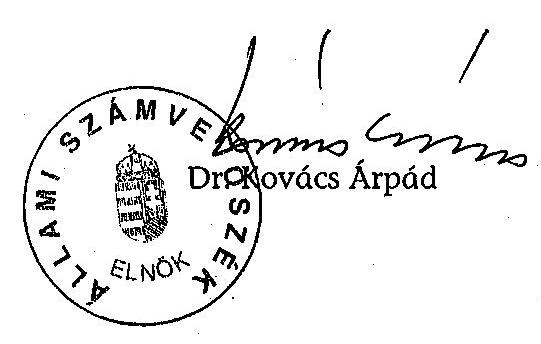

---

MELLÉKLETEK

---

# 1.a. sz. melléklet V-07-085/2004-2005. jelentéshez 

## GAZDASÁGI ÉS KÖZLEKEDÉSI MINISZTÉRIUM

III-6/39/ $6 / 2005$

## dr. Kovács Árpád úr   elnök

Állami Számvevőszék

## Budapest

## Tisztelt Elnök Úr!

Az ISPA támogatásból megvalósított közlekedésfejlesztési programok ellenőrzéséről készített végleges jelentést köszönettel megkaptam.

Tekintettel arra, hogy a jelentéstervezetre adott észrevételeinket a véglegesítés során figyelembe vették, ezért a végleges jelentésre észrevételt nem teszek.

Budapest, 2005. július 4.
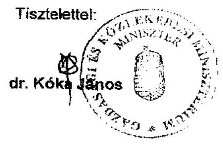

---

H-1051 BUDAPEST V., JOZSEF NÁDOR TÉR 3-4. POSTACIM: 1369 BUDAPEST. POSTAFIOK 481.

TEL:FON: (36-1) 327-2159, (36-1) 327-2141
FAX: (36-1) 316-0738

E-MAIL: janos.veres@pm.gov.hu

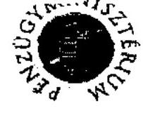

PÉNZÜGYMINISZTER

Iktatószám: 9822/3/2005
Hiv. szám: V-07-085/2004-2005
Ügyintéző: Filep Nándor, 327-2491
Tárgy: Ellenőrzési jelentés véleményezése

Dr. Kovács Árpád
elnök

Állami Számvevőszék

Budapest

Tisztelt Elnök Úr!

Köszönettel megkaptuk a V-07-085/2004-2005. számú számvevői jelentést.

Tájékoztatom, hogy a jelentéssel kapcsolatban további észrevételt nem teszek.

Budapest, 2005. július 4.

Tisztelettel:

Dr. Veres János

---

# Dr. Kovács Árpád úr   elnök 

Állami Számvevőszék

## Tisztelt Elnök Úr!

Hivatkozva V-07-085/2004-2005 számú levelére tájékoztatom, hogy az ISPA támogatásokból megvalósított közlekedésfejlesztési programok ellenőrzéséről készített jelentésével kapcsolatban nem teszek észrevételt.

Tájékoztatom továbbá, hogy az ellenőrzés alapján szükséges intézkedéseket elrendeltem, azok végrehajtásáról a törvényi határidőn belül tájékoztatom.

Budapest, 2005. június 30.
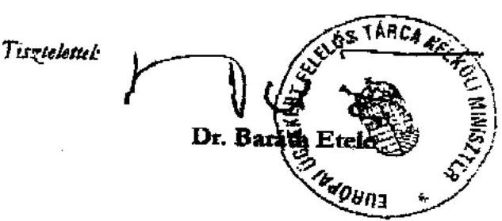

---

# Az EU Bizottság által vállalt kötelezettségek ISPA kedvezményezett országok szerinti megoszlása 

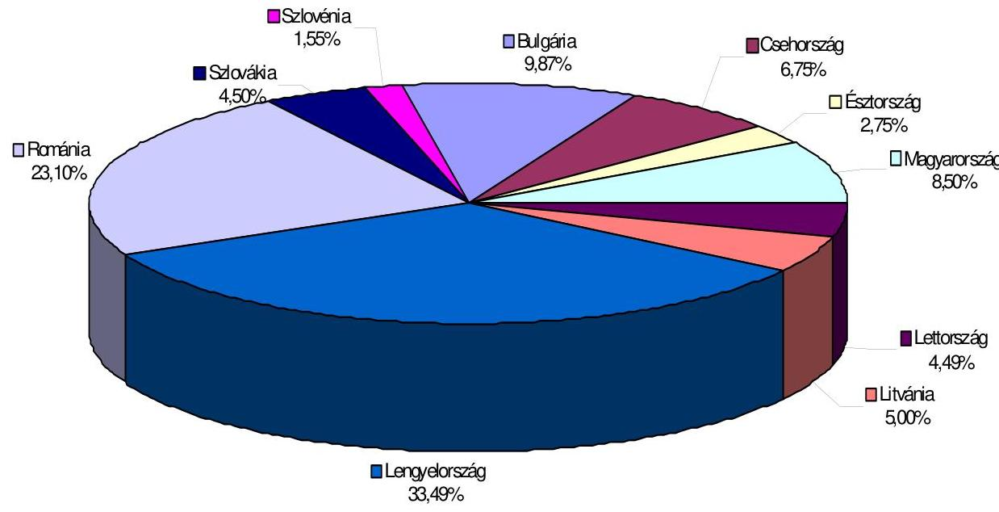

---

# 3.a. sz. melléklet

V-07-085/2004-2005. sz. jelentéshez

## Közlekedésfejlesztési ISPA projektek

|  Projekt | Projekt kódja | FM aláírás időpontja |  | Támogatási szerződés aláírásának időpontja | Együttműködési megállapodás aláírásának időpontja  |
| --- | --- | --- | --- | --- | --- |
|   |  | EU által | NAO által |  |   |
|  ISPA projektek |  |  |  |  |   |
|  Technikai segítségnyújtás a vasúti projektek pályáztatási eljárásához | 2000/HU/16/P/PA/002 | 2000.12.22 | 2001.03.14 | - | KóVIM-MÁV: 2001.09.03; GKM-MÁV(mód.): 2003.09.17  |
|  Technikai segítségnyújtás a "Szolnok-Lökősháza vasútvonal rehabilitációja" projekt megvalósításához | 2000/HU/16/P/PA/003 | 2000.12.21 | 2001.03.14 |  | KóVIM-MÁV: 2001.09.03; GKM-MÁV(mód.): 2003.09.17  |
|  Technikai segítségnyújtás a 11,5 tonnás teherbíró-képesség megvalósítását célzó útburkolat-megerősítési projekthez | 2000/HU/16/P/PA/004 | 2000.12.22 | 2001.02.09 |  | KóVIM-MÁV: 2001.09.03; GKM-MÁV(mód.): 2003.09.17  |
|  Budapest - Cegléd - Szolnok - Lökősháza vasútvonal rehabilitációja 1. ütem | 2000/HU/16/P/PT/001 | 2000.12.21 | 2001.03.14 | 2001.04.15 | KóVIM-MÁV: 2001.09.03; GKM-MÁV(mód.): 2003.09.17  |
|  Budapest - Győr - Hegyeshalom vasútvonal rehabilitációja | 2000/HU/16/P/PT/002 | 2000.12.21 | 2001.03.14 |

 2001.04.15 | KóVIM-MÁV: 2001.09.03; GKM-MÁV(mód.): 2003.09.17  |
|  Zalalövő - Zalaegerszeg - Boba vasútvonal rehabilitációja | 2000/HU/16/P/PT/003 | 2000.12.21 | 2001.03.14 | 2001.04.15 | KóVIM-MÁV: 2001.09.03; GKM-MÁV(mód.): 2003.09.17  |
|  A 3 és 35 számú főútvonalak burkolatának 11,5 t teherbírásra történő megerősítése | 2001/HU/16/P/PT/006 | 2001.12.14 | 2002.03.05 | 2003.07.17 | KóVIM-UKIG: 2001.06.15; GKM-ÁKMI: 2002.05.30; GKM-UKIG (módosítás): 2003.04.16  |
|  Technikai segítségnyújtás vasúti projektek pályáztatási eljárásához és a munkálatok felülvizsgálatára | 2001/HU/16/P/PA/006 | 2001.12.11 | 2002.07.09 |  | KóVIM-MÁV: 2001.09.03; GKM-MÁV(mód.): 2003.09.17  |
|  Budapest - Cegléd - Szolnok - Lőkösháza vasútvonal rehabilitációja 2. ütem I. fázis | 2001/HU/16/P/PT/007 | 2002.11.25 | 2003.01.31 | 2004.04.30 | KóVIM-MÁV: 2001.09.03; GKM-MÁV(mód.): 2003.09.17  |
|  Főútvonalak burkolatának 11,5 t teherbírásra történő megerősítése II. fázis | 2001/HU/16/P/PT/008 | 2002.12.04 | 2003.01.31 | 2003.07.18 | KóVIM-UKIG: 2001.06.15; GKM-ÁKMI: 2002.05.30; GKM-UKIG (módosítás): 2003.04.16  |
|  Magyarország KÖZLEKEDÉSI projektek előkészítésének műszaki segítségnyújtása | 2003/HU/16/P/PA/013 | 2003.08.31 | 2003.10.15 | 2004.04.30/2004.12.14 (mód.) | KóVIM-MÁV: 2001.09.03; GKM-MÁV(mód.): 2003.09.17; KóVIM-UKIG: 2001.06.15; GKM-ÁKMI: 2002.05.30; GKM-UKIG (módosítás): 2003.04.16  |
|  Kohéziós Alap projektek |  |  |  |  |   |
|   |  | EU Bizottsági határozat időpontja |  |  |   |
|  Budapest-Lőkösháza vasútvonal rehabilitáció 2. ütem II. fázis | 2004/HU/C/PT/001 | 2004.12.21 |  | - | -  |
|  M0 Budapest körgyűrű keleti szektor 4-es főút és M3-as autópálya közötti szakasza | 2004/HU/C/PT/002 | 2004.12.17 |  | - | -  |
|  Polgári légközlekedés (radarfejlesztés) | 2004/HU/PT/003 |  |  |  |   |

---

# Közlekedésfejlesztési ISPA projektek 

## Vasúti projektek

2000/HU/16/P/PT/001
Budapest-Cegléd-Szolnok-Lőkösháza vasútvonal átépítése (I. ütem: Vecsés-Szolnok vonalszakasz)
Pénzügyi Megállapodás aláírása: EU 2000. 12. 21.
Magyar Kormány: 2001. 03. 14.
A befejezés tervezett időpontja: 2006. december 31.
euróban

| Összes költség | Nem elszámolható költség | Elszámolható költség |  |  |  | EIB kölcsön |  |
| :--: | :--: | :--: | :--: | :--: | :--: | :--: | :--: |
|  |  | összes |  | ISPA |  | országos hatóságok |  |
| 126850437 | 850437 | 126000000 | 99% | 63000000 | 50% | 63000000 | 50400000 | 40% |

2000/HU/16/P/PT/002
A Budapest-Győr-Hegyeshalom vonalszakasz átépítése (II. ütem)
IV. európai közlekedési folyosó 43 M€ támogatás

Pénzügyi Megállapodás aláírása: EU 2000. 12. 21.
Magyar Kormány: 2001. 03. 14.
A befejezés időpontja: 2006. december 31.
euróban

| Teljes költség | Magánszektor részvétele | Nem elszámolható költség | Összes elszámolható költség | ISPA támogatás | Támogatás aránya % |
| :--: | :--: | :--: | :--: | :--: | :--: |
| 87662000 | - | 1674000 | 85988000 | 42994000 | 50 |

A Pénzügyi Megállapodás aláírásakor az EIB szándéknyilatkozatával rendelkezett a magyar szerződő fél a teljes költség 40%-ának finanszírozására.

2000/HU/16/P/PT/003
Zalalövő-Zalaegerszeg-Boba vasútvonal felújítása
V. európai közlekedési folyosó 84 M euró támogatás

Pénzügyi Megállapodás aláírása: EU 2000. 12. 21.
Magyar Kormány: 2001. 03. 14.
A befejezés módosított időpontja: 2008. június 31.
euróban

---

| Teljes költség | Magánszektor hozzájárulása | Nem elszámolható költség | Összes elszámolható költség | ISPA támogatás | Támogatás aránya % |
| :--: | :--: | :--: | :--: | :--: | :--: |
| 169399301 | - | 2009301 | 167390000 | 83695000 | 50 |

2001/HU/16/P/PT/007
Budapest-Cegléd-Szolnok-Lőkösháza vasútvonal rehabilitációja 2. ütem: a Budapest-Vecsés és a Szolnok-Lőkösháza vonalszakasz I. fázis: a Szolnok-Mezőtúr és a Békéscsaba-Lőkösháza vonalszakasz"
IV. közlekedési folyosó 54 M€ támogatás

Pénzügyi Megállapodás aláírása:
EU 2002. 11. 25.
Magyar Kormány: 2003. 01. 31.
A befejezés időpontja: 2006. december 31.
euróban

| Összköltség | Magánszektor hozzájárulása | Nem elszámolható költségek | Összes elszámolható költség | ISPA támogatás | Támogatási hányad % |
| :--: | :--: | :--: | :--: | :--: | :--: |
| 99460000 | - | - | 99460000 | 53708400 | 54 |

Kohéziós Alapból támogatott projekt:
2004-HU-16-C/PT/001
Budapest-Lőkösháza vasútvonal rehabilitációja 2. ütem II. fázis
A támogatási kérelem brüsszeli befogadása: 2004. 07. 06.
(a felmerült költségeket a befogadástól ismeri el az EU elfogadható költségként.
Bizottsági határozat a projekt támogatásáról: 2004. 12. 21.
A befejezés időpontja: 2008. december 31.
euróban

| Összes elszámolható költség | Kohéziós Alap támogatás | Támogatási hányad % |
| :--: | :--: | :--: |
| 134766400 | 107813120 | 80 |

Az EIB hitel elbírálás alatt volt a helyszíni vizsgálat idején.

# Közúti projektek 

2001/HU/16/P/PT/006 Útrehabilitációs program a 11,5 tonnás teherbíró képesség eléréséhez I. ütem, 3. és 35. sz. főutak az észak-magyarországi és az észak-alföldi régiókban.

Pénzügyi Megállapodás aláírása:
EU 2001. 12. 14.
Magyar Kormány: 2002. 03. 05.
A befejezés időpontja: 2005. december 31.
euróban

---

| Összköltség | Magánszektor hozzájárulása | Nem elszámolható költségek | Összes elszámolható költség | ISPA támogatás | Támogatás-hányad % |
| :--: | :--: | :--: | :--: | :--: | :--: |
| 45641654 | - | 5642574 | 39999080 | 19999540 | 50 |

2001/HU/16/P/PT/008 Útrehabilitációs program 11,5 tonnás tengelyterhelés eléréséhez II. ütem, 2., 6., 42., 47. és 56. sz. főutak Közép-Magyarország, Észak-Magyarország, Nyugat-Dunántúl, Dél-Dunántúl és Észak-Alföld régiókban.

Pénzügyi Megállapodás aláírása: EU 2002. 12. 04.
Magyar Kormány: 2003. 01. 31.
A befejezés időpontja: 2006. december 31.
euróban

| Összköltség | Magánszektor hozzájárulása | Nem elszámolható költségek | Összes elszámolható költség | ISPA támogatás | Támogatási hányad % |
| :--: | :--: | :--: | :--: | :--: | :--: |
| 123421315 | - | 15144393 | 108276922 | 54138461 | 50 |

Kohéziós Alapból támogatott projekt:
2004-HU-16-C/PT/002
M0 Budapest körgyűrű keleti szektor 4-es számú főút és M3 autópálya közötti szakasza

A támogatási kérelem brüsszeli befogadása: 2004. 07. 06.
Bizottsági határozat a projekt támogatásáról: 2004. 12. 17.
A befejezés időpontja: 2008. december 31.
euróban

| Teljes költség | Összes elszámolható költség | Kohéziós Alap támogatás | Támogatási hányad % |
| :--: | :--: | :--: | :--: |
| 350440000 | 334893000 | 284659050 | 85 |

Az EIB hitel elbírálás alatt volt a helyszíni vizsgálat idején.

---

# ISPA /Kohéziós Alap támogatású közlekedésfejlesztési projektek tényleges éves kifizetésének alakulása 

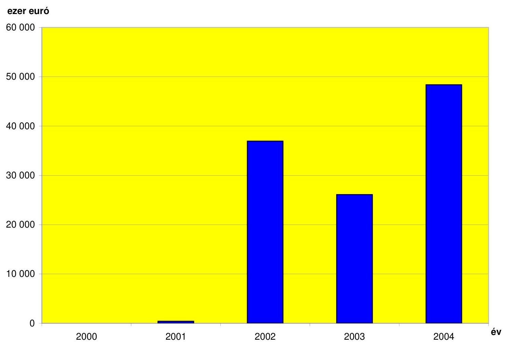

---

# ISPA/Kohéziós Alap támogatású közlekedésfejlesztési projektek halmozott kifizetései 

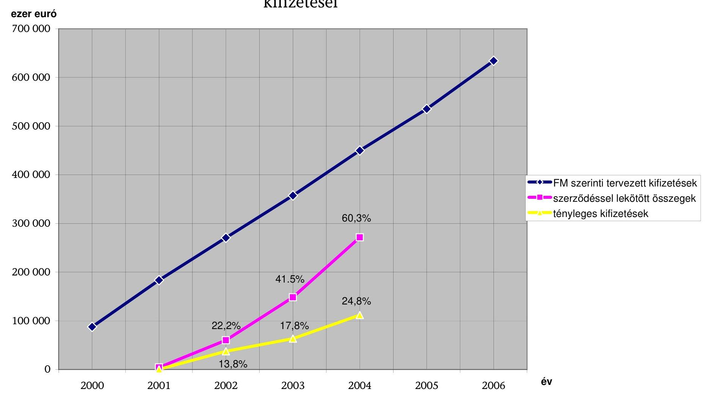

---

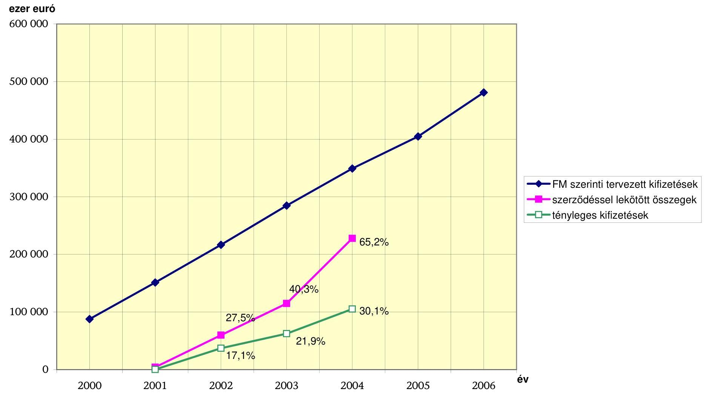

# ISPA/Kohéziós Alap támogatású vasúti projektek kifizetései

|  Ezer euró | 2000 | 2001 | 2002 | 2003 | 2004 | 2005 | 2006  |
| --- | --- | --- | --- | --- | --- | --- | --- |
|  FM szerinti tervezett kifizetések szerződéssel lekötött összegek tényleges kifizetések | 65.2% | 40.3% | 27.5% | 17.1% | 40.3% | 21.9% | 65.2%  |

---

# ISPA/Kohéziós Alap támogatású közúti projektek kifizetései 

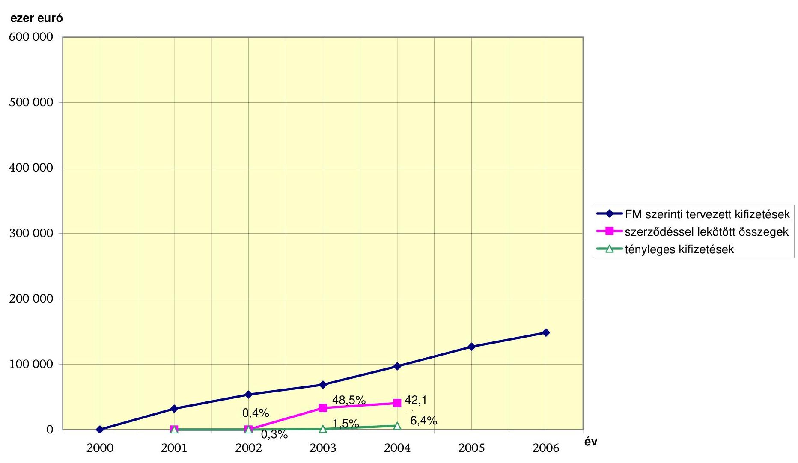

---

# A megvalósítási problémák ok-okozati összefüggései 

## Közútfejlesztési projektek

| Okozott hátrány | Ok | Részletezés | Érintett intézmény: |
| :--: | :--: | :--: | :--: |
| Előkészítés időbeli késedelme | Fejlesztési célok változtatása (PT/006, PT/008) | Kidolgozott autópálya projektek visszavonása, közúti projektekkel való helyettesítése. | Kormány |
|  | Benyújtásra kész tartalék-projektek hiánya (PT/006, PT/008) | Az autópálya projektek visszavonása után nem álltak rendelkezésre a 2000. évi ISPA keret lekötéséhez megfelelően előkészített közlekedési tartalékprojektek (a már benyújtott három vasúti projekten kívül). | KÖVIM, MÁV, UKIG |
|  | Tanácsadók kiválasztásának késedelme (PT/006) | Fél évvel a projektjavaslatok kiválasztása után kötöttek szerződést a pályázati anyag előkészítésére (TA műszaki segítségnyújtási projekt keretében) (6 hónap késedelem). | UKIG |
|  | Tanácsadói munka megfelelő feltételei nem adottak (PT/006, PT/008) | A COWI nem tartotta elegendőnek a rendelkezésre álló információkat a pályázati anyag elbírálásához, a részletes koncepcióterv elkészítése COWI által igényelt határidőre (2001. április 6-ra) valamennyi útra nem volt lehetséges, így minisztériumi döntés született a pályázati anyag két részletben történő benyújtásáról. | Kormány (a fejlesztési célok változtatása vonatkozásában), UKIG |
|  | A környezetvédelmi engedélyezés jogi és/vagy értelmezési különbségei (PT/006) | A KÖFE véleményével ellentétben az EU Bizottság szükségesnek tartotta a környezetvédelmi terv (Environmental Master Plan) elkészítését. | EU Bizottság Környezetvédelmi Főigazgatóság, KVM |
|  | Lassú adminisztráció (PT/006, PT/008) | Bizottsági észrevételekkel kapcsolatos válaszadás egyes esetekben indokolatlanul sok időt vett igénybe. | KÖVIM, NFH |
| Fizikai megvalósítás időbeli késedelme | Szervezeti rendszer kialakulatlansága (PT/006, PT/008) | ÁKMI/UKIG szerepének tisztázatlansága a végső kedvezményezett és a projektek koordinálása szempontjából; felállított lebonyolító szervezet és kijelölt projektmenedzser hiánya, a műszaki változások jóváhagyásának módja nem tisztázott (2002. december 5-e előtt a projektekkel kapcsolatos fő tevékenység nem az UKIG-nál bonyolódott). | KÖVIM |

---

|  | Erőforrás-hiány (PT/006) | A feladatok delegálásakor nem álltak rendelkezésre a határidő és teljesítmény célok eléréséhez szükséges pénzügyi és humán erőforrások a Kedvezményezettnél. | GKM, UKIG/ÁKMI |
| :--: | :--: | :--: | :--: |
|  | Műszaki előkészítés késedelme (PT/006) | Tervhibák, hiányosságok, tervezői minőségbiztosítási rendszer hiánya (1 éves késedelem). | UKIG/ÁKMI |
|  | Ütemterv aktualizálás hiánya (PT/006) | A kivitelező nem aktualizálta szerződéses kötelezettségeinek megfelelően az ütemterveket, amelynek szankcionálását a szerződéses feltételek nem tették lehetővé, nem tisztázták a késedelem kialakulásáért felelősök körét. | UKIG/ÁKMI |
|  | Késedelem szankcionálhatóságának hiánya (PT/006) | Nem építettek be a szerződésbe olyan megvalósítási szakaszhatárokat, amelyek biztosították volna a késedelmes teljesítés fázisonkénti szankcionálhatóságát. | UKIG/ÁKMI |
| Költségtúllépés | Gyors tervezés, időhiány (PT/006) | Időhiány a koncepcióterv készítésekor, késői szerződéskötés a COWI-val. | UKIG, KÖVIM |
|  | Ellenőrzés hiánya (PT/006) | COWI által tervezett költségeket - a folyamatos időzavar következtében - senki nem ellenőrizte. | UKIG, KÖVIM |
|  | Nem megfelelő részletezettségű és megalapozottságú tervezés az FM előtt (PT/006) | A koncepcióterv készítése során rosszabb minőségű rétegek felmérése elmaradt, a koncepciótervben nem szereplő közműkiváltások, burkolatszélesítések, nyomvonal-korrekciók, koronaszélesítések mennyiségi növekedése, fajlagos költségek növekedése, az euróban kifejezett árak és támogatási összeg forint erősödése miatti növekedése. | Koncepciótervek elkészítője, COWI |
|  | Műszaki tartalom változás (PT/006) | A leszerződött műszaki mennyiségek módosulása. | GKM, UKIG |

# Vasútfejlesztési
 projektek 

| Okozott hátrány | Ok | Részletezés | Érintett intézmény: |
| :-- | :-- | :-- | :-- |
| Előkészítés időbeli késedelme | Hazai társfinanszírozás bizonytalanságai (PT/001, PT/002, PT/003) | A hazai társfinanszírozást a 2000-2001-2002. évi költségvetésekben nem tervezték meg (projektenként kb. 3 és fél hónap késedelem a bizottsági és NAO aláírás között eltelt idő) | Kormány |

---

|  | Erőforrás-hiány (PT/001, PT/002, PT/003) | A MÁV Európai Uniós projektekkel foglalkozó szervezete nem megfelelő kapacitással működik | MÁV, GKM |
| :--: | :--: | :--: | :--: |
|  | EU Szabályozás kialakítása (PT/001, PT/002, PT/003) | Az ISPA igénybevétel feltételeiről az EU Bizottság 2000. februárjában döntött | EU Bizottság |
|  | Szervezeti rendszer megerősítése (PT/001, PT/002, PT/003) | 2001. elején a Bizottság sürgette a megvalósító szervezeteken belüli projekt megvalósítási egységek megerősítését | MÁV |
|  | Pályázati dokumentáció késedelmes megküldése (PT/001, PT/002, PT/003) | 2001. elején a Bizottság még sürgette a környezeti hatástanulmányok Brüsszelbe való kiküldését | MÁV |
|  | Konzulens cég késedelme (PT/007) | A cég félreértette a feladatkiírást, nem számolt a környezetvédelmi tanulmány elkészítési kötelezettséggel; és késedelmes volt a dokumentáció magyar fél általi rendelkezésükre bocsátása (6 hónap késedelem) | Dorsch Consult, MÁV |
|  | Megalapozatlan költségtervezés (PT/001, PT/003) | A Budapest-Lökösháza és a Zalalövő-Boba beruházás összköltsége nem egyezett meg az ISPA stratégiában szereplő adatokkal | MÁV |
|  | ISPA keret túllépésének késői érzékelése (PT/007) | A Bizottság csak 2002. áprilisában jelezte, hogy a Budapest-Lökösháza II. ütemét 2 fázisra kell bontani | EU Bizottság, KÖVIM (GKM)(pályázatok összehangolása miatt) |
|  | A minőségellenőrzés hiánya (PT/001, PT/002, PT/003, PT/007) | Az EU részéről a magyar ISPA projektek általános hiányosságaként jelölték meg 2001-ben, hogy a központi szint (minisztérium) értékelő minőségellenőrzése nélkül küldték tovább a pályázatokat a Bizottsághoz | KÖVIM (GKM) |
|  | Új igények felmerülése (PT/001, PT/002) | Új önkormányzati igények (pl. elkerülő nyomvonal megépítése, új városi aluljáró építése), illetve a környezetvédelmi feltételek teljesítése (környezetvédelmi feltételrendszer változása) | Önkor-mányzatok |
| Fizikai megvalósítás időbeli késedelme | A projekteket menedzselő szervezetek együttműködési hiányosságai (PT/001, PT/002, PT/003, PT/007) | Az Együttműködési Megállapodás és a Támogatási Szerződés nem rendelkezett az engedélyezési tervek, a tenderdokumentációk elkészítésével kapcsolatos források biztosításának, a teljesítés követésének módjáról. | GKM-MÁV |

---

|  | Közbeszerzés időigénye (PT/001, PT/002, PT/003, PT/007) | A közbeszerzési eljárások megvalósítási kockázatai a vizsgálat során tapasztaltak szerint az eljárások előre nem tervezhető időigényéből eredtek | MÁV |
| :--: | :--: | :--: | :--: |
| Költségtúllépések | Műszaki tartalom nem megfelelően meghatározott az FM-ben (PT/001, PT/002, PT/003, PT/007) | Nem volt megfelelő részletezettséggel meghatározott a támogatási összeg keretén belül megvalósítandó feladatok műszaki tartalma a megvalósíthatósági tanulmányok tervszintje miatt; | MÁV, GKM |
|  | Nem megfelelő költségbecslés (PT/001, PT/002, PT/003, PT/007) | Nem volt megfelelő az ISPA vasúti projektek költségbecslése és költségirányítása | MÁV |
|  | Értékelemzések és IVSZ általi jóváhagyás hiánya (PT/001, PT/002, PT/003, PT/007) | Nem készültek elemzések a költség- és időeltérésekről a monitoring osztályon; nem gondoskodtak az alprojektek befejezésekor az FM-ben vállalt műszaki teljesítmény paraméterek és mutatók alakulásának kiértékeléséről, azok teljesítésének közbenső igazolásáról | MÁV, GKM |

---

# A főbb ISPA intézmények, kapcsolatok, dokumentumok 

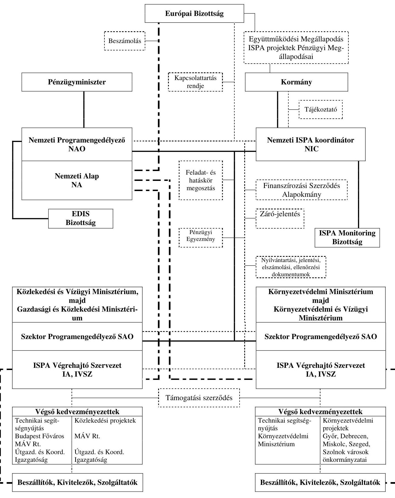

---

# A számszerűsített létszámfejlesztési igény éves forrásszükséglete és súlya az ISPA /Kohéziós Alap társfinanszírozású közlekedésfejlesztési célú projektek esetében

|   | megjegyzés |  |  |  |  |  |  | millió Ft  |
| --- | --- | --- | --- | --- | --- | --- | --- | --- |
|   |  |  | PM Kifizető Hatóság* | GKM SKFF (Kohéziós Alap) | MÁV Rt. EUPI | MÁV Rt. BSZE | MÁV Rt. FFF | Összesen  |
|  Számszerűsített pótlólagos humánerőforrás-igény: |  | fő | 16 fő | 10 fő | 12 fő | 20-40-60fő átlag 40 fő | 3 fő | max. 101 fő  |
|  A humánerőforrás legszükségesebb mértékű fejlesztésének, elhelyezésének becsült éves költsége : |  | 1. | 145,06 | 57,36 | 95,78 | 641,57 | 23,95 | 963,72  |
|  A Bizottság által jóváhagyott közlekedési projektek értéke összesen: |  | 2. | 285682 | 285682 | 153947 | 153947 | 153947 |   |
|  A projektek értékéből 2004.12.31-ig kifizetett összeg: |  | 3. | 27778 | 27778 | 26550 | 26550 | 26550 |   |
|  A projekt értékéből ki nem fizetett összeg: | (2.)-(3.) | 4. | 257904 | 257904 | 127397 | 127397 | 127397 |   |
|  Az éves átlagban lebonyolítani tervezett ISPA /Kohéziós Alap projektérték: | (4.)/(6.) | 5. | 85968 | 85968 | 42466 | 42466 | 42466 |   |
|  A jóváhagyott ISPA /Kohéziós Alap projektek végrehajtásának tervezett befejezése: | 2005;2006 +1 év | 6. | 3 | 3 | 3 | 3 | 3 |   |
|  A humánerőforrás fejlesztésének éves becsült költsége az éves átlagban lebonyolítani tervezett projektérték százalékában: | (1)/(5) | 7. | 0,17% | 0,07% | 0,23% | 1,51% | 0,06% |   |

- A Kifizető Hatóság nem csupán ISPA /Kohéziós Alap közlekedésfejlesztési projektek Kifizető Hatósága. A 0,17%-nak is töredéke a többletigénye költségének a súlya.

Az EU által befogadott közlekedésfejlesztési projektek értéke: Ebből 2004. év végéig kifizetett összeg: A MÁV által kezelt befogadott közlekedésfejlesztés projektek értéke Ebből 2004. év végéig kifizetett összeg: A számításokban használt árfolyam HUF/EUR

|  1142,7 | m€  |
| --- | --- |
|  111,8 | m€  |
|  615,8 | m€  |
|  106,0 | m€  |
|  250 | Ft/€  |

285682 millió Ft 27959 millió Ft 153947 millió Ft 26500 millió Ft

---

11. sz. melléklet

V-07-085/2004-2005. sz. jelentéshez

Tervezési feladatok a vasúti infrastruktúra területén

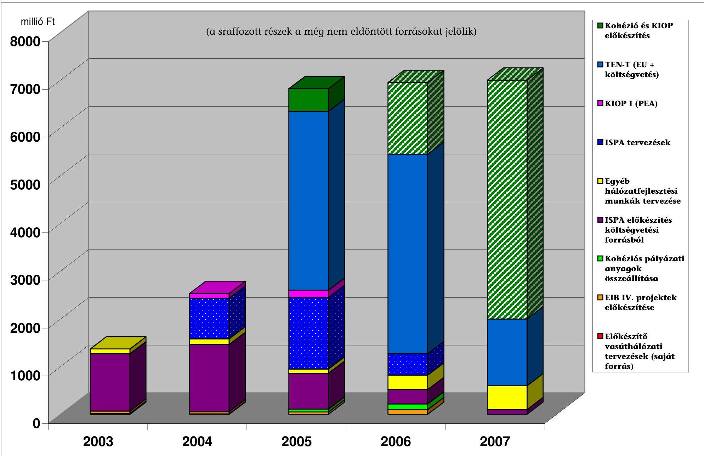

---

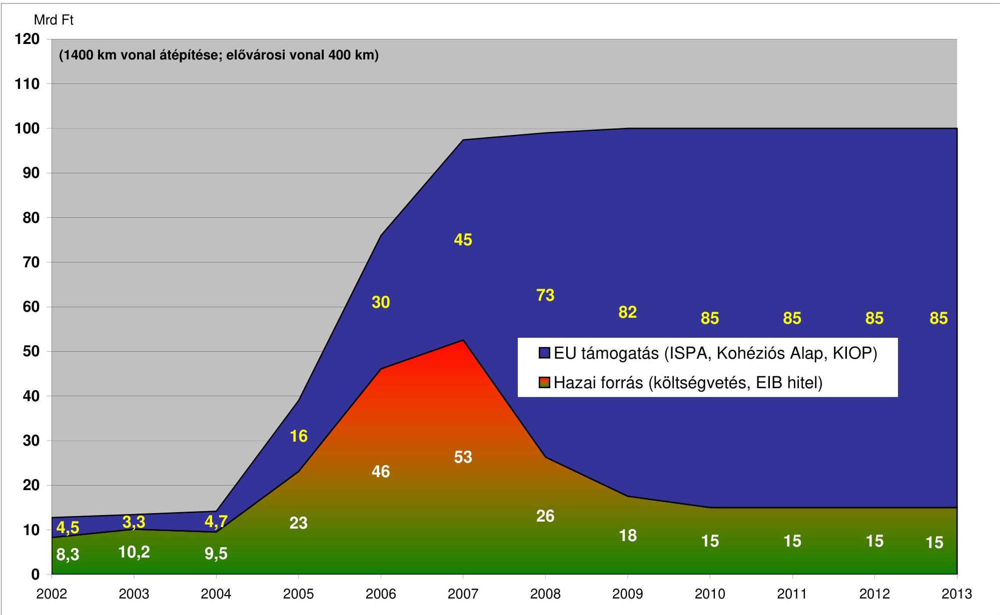

## MÁV Rt. EU támogatású vasútrehabilitációs projektek várható kiadásai

|  Mrd Ft | 2002 | 2003 | 2004 | 2005 | 2006 | 2007 | 2008 | 2009 | 2010 | 2011 | 2012 | 2013  |
| --- | --- | --- | --- | --- | --- | --- | --- | --- | --- | --- | --- | --- |
|  1400 km vonal átépítése; elővárosi vonal 400 km | 73 | 62 | 85 | 85 | 85 | 85 | 85 | 85 | 85 | 85 | 85 | 85  |

---

# Az ISPA stratégiában meghatározott projektkiválasztási kritériumok és a közlekedési ISPA projektek 

| Kritérium | $\begin{aligned} & \text { 2000/HU/16/P/ } \\ & \text { PT/001 } \\ & \text { Budapest - } \\ & \text { Cegléd - Szolnok - } \\ & \text { Lökösháza vas- } \\ & \text { útvonal rehabi- } \\ & \text { litációja } \end{aligned}$ | $\begin{aligned} & \text { 2000/HU/16/P/ } \\ & \text { PT/002 } \\ & \text { Budapest - } \\ & \text { Győr - Hegyes- } \\ & \text { halom vasút- } \\ & \text { vonal rehabilit- } \\ & \text { tációja } \end{aligned}$ | $\begin{aligned} & \text { 2000/HU/16/P/ } \\ & \text { PT/003 } \\ & \text { Zalalövő - Za- } \\ & \text { laegerszeg } \\ & \text { Boba vasútvo- } \\ & \text { nal rehabilitá- } \\ & \text { ciója } \end{aligned}$ | $\begin{aligned} & \text { 2001/HU/16/P/ } \\ & \text { PT/006 } \\ & \text { A } 3 \text { és } 35 \text { szá- } \\ & \text { mú főútvona- } \\ & \text { lak burkolatá- } \\ & \text { nak } 11,5 \text { t te- } \\ & \text { herbírásra tör- } \\ & \text { ténó megerősíté } \end{aligned}$   tése | $\begin{aligned} & \text { 2001/HU/16/P/ } \\ & \text { PT/008 } \\ & \text { Főútvonalak } \\ & \text { burkolatának } \\ & 11,5 \text { t teherbí- } \\ & \text { rásra történő } \\ & \text { megerősítése } \\ & \text { II. fázis } \end{aligned}$ |
| :--: | :--: | :--: | :--: | :--: | :--: | :--: |
| Európai közlekedési hálózatoknak való megfelelés | TEN, Románia | TEN, Ausztria | TEN, Szlovénia | TINA, Szlovákia, Románia | TEN, Románia | TINA, Szerbia (Jugoszlávia); Szlovákia, Románia |
| Gazdasági és társadalmi megtérülés és hasznosság (FM szerint) | Gazdasági költség haszon elemzés   NPV: 40,6 M euró (6%-os diszkontráta)   B/C: 1,6   IRR: 9,1%   Pénzügyi költség haszon elemzés   NPV: -21 M euró   (6%-os diszkontráta)   B/C: 1,02   IRR: 1,4% | Gazdasági költség haszon elemzés   NPV: 18,11M euró (8%-os diszkontráta)   B/C: 1,39   IRR: 11,9 %   Pénzügyi költség haszon elemzés   NPV: M euró ( %-os diszkontráta)   B/C:   IRR: 4,1% | Gazdasági költség haszon elemzés   1. közlekedési előrejelzés szerint:   NPV(társadalmi):-40,6 M euró (6%-os diszkontráta)   B/C: 0,68   IRR(társadalmi): 3%   2. közlekedési előrejelzés szerint:   NPV(társadalmi):-27,8 M euró (6%-os diszkontráta)   B/C: 0,78   IRR(társadalmi): 3%   Pénzügyi költség haszon elemzés   1. közlekedési előrejelzés szerint:   NPV(MÁV): -   3,3 M euró   IRR(MÁV): 5%   2. közlekedési előrejelzés szerint:   NPV(MÁV): 7,5   M euró   IRR(MÁV): 8% | Gazdasági és szociális költség haszon elemzés 3-as út:   NPV: 11,9 M euró (10%-os diszkontráta)   B/C: 1,69   IRR: 8,1 % | Gazdasági költség

 haszon elemzés   NPV: 72,3 M euró (6%-os diszkontráta)   B/C: 1,69   IRR: 8,1% | Gazdasági és szociális költség haszon elemzés 2-es út:   NPV: 1,5 M euró (10%-os diszkontráta)   B/C: 1,15   IRR: 12,4%   6-os út:   NPV: 50,7 M euró (10%-os diszkontráta)   B/C: 2,44   IRR: 27,9%   42-es út:   NPV: 1,4 M euró (10%-os diszkontráta)   B/C: 1,09   IRR: 11,7%   47-es út:   NPV: 2 M euró (10%-os diszkontráta)   B/C: 1,33   IRR: 14,2%   56-os út:   NPV: 1,1 M euró (10%-os diszkontráta)   B/C: 1,04   IRR: 10,7% |
| Forrásszer-   kezet (el-   számolha-   tó ktgek) | ISPA: 50%   EIB hitel: 40%   Központi költségvetés: 10% | ISPA: 50%   EIB hitel: 40%   Központi költségvetés: 10% | ISPA: 50%   EIB hitel: 40%   Központi költségvetés: 10% | ISPA: 50%   EIB hitel: 40%   (FM szerint   tárgyalás alatt)   Központi költségvetés: 10% | ISPA: 54%   EIB hitel, Központi költségvetés (tárgyalás alatt) | ISPA: 50%   EIB hitel: 40%   (FM szerint   tárgyalás   alatt)   Központi költségvetés: 10% |

---

| Szektor | Vasút | Vasút | vasút | közút | vasút | Közút |
| :--: | :--: | :--: | :--: | :--: | :--: | :--: |
| Környezetvédelmi megfelelőség | KÖFE nyilatko-   zata szerint   nem engedély-   köteles nincs   jelentős kör-   nyezeti hatás | KÖFE: nem engedélyköteles, de az EU egy szakaszra előírta az előzetes környezetvédelmi hatástanulmány készítését | Előzetes EIA elkészült, majd az kiegészítésre került, a szükséges szakaszokra környezetvédelmi engedélyeket kiadták | Környezetvédelmi Felügyelőségek nyilatkozatai szerint nem hatásvizsgálat-köteles | A szükséges szakaszokra a környezetvédelmi engedélyeket kiadták | Környezetvédelmi Felügyelőségek nyilatkozatai szerint nem hatásvizsgálat-köteles, az EU bizottság kérésére Környezetvédelmi Terv (Environmental Master Plan) készült |
| Illeszkedés   a Nemzeti és Regionális Fejlesztési Koncepciókba és tervekbe (Országos Területrendezési Tervről szóló 2003. évi XXVI. Tv) | igen | igen | igen |  | igen |  |
| EU által elfogadott közbeszerzési eljárások alkalmazása | igen | igen | igen | igen | igen | igen |
| Projekt költségvetése (ezer euró) | 126850 | 87662 | 169399 | 45642 | 99460 | 123421 |
| Elszámol-ható költség (ezer euró) | 126000 | 85998 | 167390 | 39999 | 99460 | 108277 |
| ISPA forrás (ezer euró) | 63000 | 42994 | 83695 | 19999,5 | 53708 | 54138 |

Összes igénybe vett ISPA forrás közlekedésre, a TA projektektől eltekintve: 317 534,5 e. euró.
Az EU elvárásainak megfelelően - és a közúti projektkidolgozás csúszása következtében - a vasúti szektor fölénye érvényesült, 6 projektből 4; a jóváhagyott 317,5 M euró ISPA támogatásból 243,4 M euró ebben a szektorban kerül felhasználásra.

---

# A Magyarországot átszelő Pán-európai közlekedési folyosók és az ISPA közlekedési projektek 

| Folyosó | Projekt |
| :--: | :--: |
| IV. Folyosó: az osztrák illetve szlovák határtól Budapesten át a román határig | 2000/HU/16/P/PT/001 Budapest - Cegléd - Szolnok Lökösháza vasútvonal rehabilitációja |
|  | 2000/HU/16/P/PT/002 Budapest - Győr - Hegyeshalom vasútvonal rehabilitációja |
|  | 2001/HU/16/P/PT/007 Budapest - Cegléd - Szolnok Lökösháza vasútvonal rehabilitációja 2. ütem I. fázis |
|  | Budapest-Lökösháza vasútvonal 2. ütem II. fázis KA projekt |
| V. Folyosó: a szlovén határtól Budapesten át az ukrán határig, melynek 2 ága van: Horvátország illetve Bosznia Hecegovina felé | 2000/HU/16/P/PT/003 Zalalövő - Zalaegerszeg - Boba vasútvonal rehabilitációja |
| VII. Folyosó: A dunai közlekedési folyosó | - |
| V/C. Folyosó: Budapest és a jugoszláv határ között | 2001/HU/16/P/PT/008 Főútvonalak burkolatának 11,5 t teherbírásra történő megerősítése II. fázisból a 6-os, 56-os főutak |

---

## EU - ISPA VASÚTI REHABILITÁCIÓS PROJEKTEK

### MEGVALÓSÍTÁSI ÜTEMTERVE

|  Tender | Tender | Tendereszs | 2000. | 2001. | 2002. | 2003. | 2004. | 2005. | 2006. | 2007.  |
| --- | --- | --- | --- | --- | --- | --- | --- | --- | --- | --- |
|  száma | megnevezése | késedelme (hűvíz) |  |  |  |  |  |  |  |   |
|   |  |  | 2004. | 2005. | 2006. | 2007. | 2008. | 2009. | 2010. | 2011.  |
|  ISPA 2000/HU/16/P/PT/001 |  |  |  |  |  |  |  |  |  |   |
|  Budapest - Cegléd - Szolnok - Lökősháza vasútvonal rehabilitációs munkál I. ütem (Vecsés - Szolnok vonalszakasz) |  |  |  |  |  |  |  |  |  |   |
|  Pályzépítési munkák |  |  |  |  |  |  |  |  |  |   |
|  BL 111012.1 Vecsés: Ültő állomás átépítése | 10 | 0 |  |  |  |  |  |  |  |   |
|  BL 111500.1 Pilts állomás átépítése | 41 | 6 |  |  |  |  |  |  |  |   |
|  BL 111400.1 Monor állomás átépítése | -29 | 6 |  |  |  |  |  |  |  |   |
|  BL 111117.1 Vecsés (kíz) - Albertírca (bez) vonalszakasz | 28 | -5 |  |  |  |  |  |  |  |   |
|  BL 111821.1 Albertírca (kíz) - Cegléd (kíz) vonalszakasz | 6 | 0 |  |  |  |  |  |  |  |   |
|  BL 112200.1 Cegléd állomás | 33 | 24 |  |  |  |  |  |  |  |   |
|  BL 112322.1 Cegléd (kíz) - Szolnok (kíz) vonalszakasz | -9 | -5 |  |  |  |  |  |  |  |   |
|  Biztosítóberendezési munkák |  |  |  |  |  |  |  |  |  |   |
|  BL 141014.1 Vecsés: Ültő; Monor állomás bűzlőben | 23 | 12 |  |  |  |  |  |  |  |   |
|  BL 141400.2 Monor állomás Malgienes bűzlőben | -20 | 16 |  |  |  |  |  |  |  |   |
|  BL 141117.1 Vecsés - Albertírca bűzlőben átalakítás | 30 | -3 |  |  |  |  |  |  |  |   |
|  BL 141821.1 Albertírca - Cegléd biztosítóberendezés | 8 | 0 |  |  |  |  |  |  |  |   |
|  BL 142200.1 Cegléd állomás biztosítóberendezés | 18 | 15 |  |  |  |  |  |  |  |   |
|  Késés összesen (hűnap): |  |  |  |  |  |  |  |  |  |   |
|  állog: |  |  |  |  |  |  |  |  |  |   |
|  Tender indítás - FM |  |  |  |  |  |  |  |  |  |   |
|  Tervezett tender |  |  |  |  |  |  |  |  |  |   |
|  Folyamatban lévő |  |  |  |  |  |  |  |  |  |   |
|  Tender |  |  |  |  |  |  |  |  |  |   |
|  Tervezett megvalósítás |  |  |  |  |  |  |  |  |  |   |
|  Megvalósítás |  |  |  |  |  |  |  |  |  |   |
|  Lezárt megvalósítás |  |  |  |  |  |  |  |  |  |   |
|  MÁV Rt. EU Program Igazgatóság |  |  |  |  |  |  |  |  |  |   |
|  Monitoring Osztály |  |  |  |  |  |  |  |  |  |   |

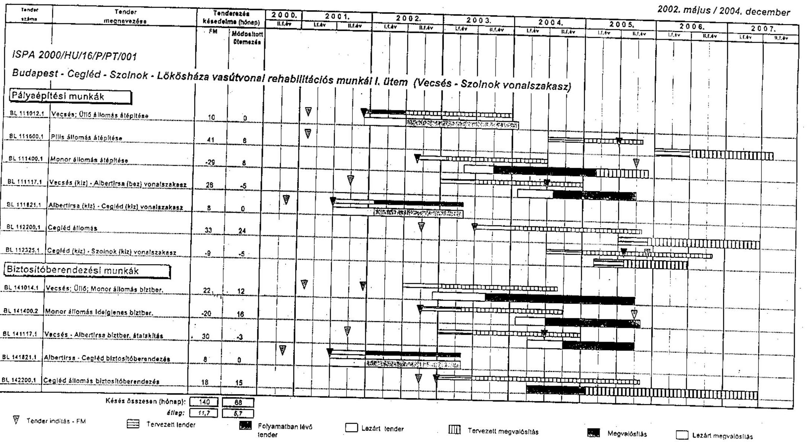

---

## EU - ISPA VASÚTI REHABILITÁCIÓS PROJEKTEK

### MEGVALÓSÍTÁSI ÜTEMTERVE

|  Tender
száma | Tender
meghosszabbítás | Tendereszs
készítési ideje (hónap) | 2000. | 2001. | 2002. | 2003. | 2004. | 2005. | 2006. | 2007.  |
| --- | --- | --- | --- | --- | --- | --- | --- | --- | --- | --- |
|  ISPA 2000/HU/16/P/PT/002 |  |  |  |  |  |  |  |  |  |   |
|  Budapest - Győr - Hegyeshalom vasútvonal rehabilitációs munkái |  |  |  |  |  |  |  |  |  |   |
|  Pályaépítési munkák |  |  |  |  |  |  |  |  |  |  |

 |
|  BH 110607-1 | Budapest (kiz) - Bialorbágy (bez) vonalazakasz | 18 | 6 | 7 |  |  |  |  |  |   |
|  BH 112200-1 | Komárom (kiz) - Ács (kiz) vonalazakasz | 6 | 0 | 7 |  |  |  |  |  |   |
|  BH 117325-1 | Ács (bez) - Győrszentiván (kiz) vonalazakasz | 26 | 15 |  |  |  |  |  |  |   |
|  BH 112900-1 | Győr állomás átépítés | 30 | 17 |  |  |  |  |  |  |   |
|  Biztosítóberendezési munkák |  |  |  |  |  |  |  |  |  |   |
|  BH 143100-1 | Komárom állomás biztosítóberendezés | 28 | 15 |  |  |  |  |  |  |   |
|  BH 142900-1 | Győr állomás biztosítóberendezés | 29 | 22 |  |  |  |  |  |  |   |
|  BH 140834-1 | ETCS Budapest - Kiskunhalas | 21 | 8 |  |  |  |  |  |  |   |
|  Késés összesen (hónap): |  |  |  |  |  |  |  |  |  |   |
|  átlag: |  |  |  |  |  |  |  |  |  |   |
|  Tender indítás - FM |  |  |  |  |  |  |  |  |  |   |
|  Tervezett tender |  |  |  |  |  |  |  |  |  |   |
|  Tender indítás - FM aktualizált beszerzési terv |  |  |  |  |  |  |  |  |  |   |

1. sz. melléklet

V-07-085/2004-2005. jelentéshez

2002. május / 2004. december

2003. május / 2004. december

2004. május / 2005. május / 2006. május / 2007. május / 2008. május / 2009. május / 2010. május / 2011. május / 2012. május / 2013. május / 2014. május / 2015. május / 2016. május / 2017. május / 2018. május / 2019. május / 2020. május / 2021. május / 2022. május / 2023. május / 2024. május / 2025. május / 2026. május / 2027. május / 2028. május / 2029. május / 2030. május / 2031. május / 2032. május / 2033. május / 2034. május / 2035. május / 2036. május / 2037. május / 2038. május / 2039. május / 2040. május / 2041. május / 2042. május / 2043. május / 2044. május / 2045. május / 2046. május / 2047. május / 2048. május / 2049. május / 2050. május / 2051. május / 2052. május / 2053. május / 2054.

---

17. sz. melléklet V-07-085/2004-2005. jelentéshez

EU - ISPA VASÚTI REHABILITÁCIÓS PROJEKTEK

MEGVALÓSÍTÁSI ÜTEMTERVE

2002. május / 2004. december

|  Tender
száma | Tender
megnevezése | Tenderesés
késdelme (hónap) | 2000.
Kč/év | 2001.
Kč/év | 2002.
Kč/év | 2003.
Kč/év | 2004.
Kč/év | 2005.
Kč/év | 2006.
Kč/év | 2007.
Kč/év  |
| --- | --- | --- | --- | --- | --- | --- | --- | --- | --- | --- |
|  ISPA 2000/HU/16/P/PT/003 |  |  |  |  |  |  |  |  |  |   |
|  Zalalövő - Zalaegerszeg - Boba vasútvonal rehabilitációs munkái |  |  |  |  |  |  |  |  |  |   |
|  Pályaépítési munkák |  |  |  |  |  |  |  |  |  |   |
|  RB 110300-1 Zalalövő (klz) - Zalacsáb-Salemvár (klz) alép. | 28 | 17 |  |  |  |  |  |  |  |   |
|  RB 110507.2 Zalalövő (klz) - Bapod (bez) al- és felépítmény | 36 | 20 |  |  |  |  |  |  |  |   |
|  RB 110809.1 Bapod (klz) - Zalaegerszeg-delta (klz) vágány | 47 | 27 |  |  |  |  |  |  |  |   |
|  RB 111000.1 Zalaegerszeg delta-vágány építés | 9 | 0 |  |  |  |  |  |  |  |   |
|  RB 111117.1 Zalaegerszeg (klz) - Ukk (klz) vágány | 32 | 23 |  |  |  |  |  |  |  |   |
|  RB 111822.1 Ukk (bez) - Boba delta (bez) vágány | 35 | 9 |  |  |  |  |  |  |  |   |
|  Erősáramú munkák |  |  |  |  |  |  |  |  |  |   |
|  RB 130000.1 Bajánsenyé Gh. - Boba vasútvonal villamosítás | 9 | -6 |  |  |  |  |  |  |  |   |
|  Biztosítóberendezési munkák |  |  |  |  |  |  |  |  |  |   |
|  RB 140522.1 Zalalövő (klz) - Boba (bez) bizt.ber. + távközlés | 18 | 16 |  |  |  |  |  |  |  |   |
|  RB 140522.2 Zalalövő (klz) - Boba (bez) ETCS | 10 | 19 |  |  |  |  |  |  |  |   |
|  Késés összesen (hónap): | 230 | 123 |  |  |  |  |  |  |  |   |
|  átlag: | 24 | 14 |  |  |  |  |  |  |  |   |
|  Tender indítás - FM |  |  |  |  |  |  |  |  |  |   |
|  Tervezett tender |  |  |  |  |  |  |  |  |  |   |
|  Tervezett megvalósítás |  |  |  |  |  |  |  |  |  |   |
|  Megvalósítás |  |  |  |  |  |  |  |  |  |   |
|  Lezárt tender |  |  |  |  |  |  |  |  |  |   |
|  Tervezett megvalósítás |  |  |  |  |  |  |  |  |  |   |
|  Megvalósítás |  |  |  |  |  |  |  |  |  |   |
|  Lezárt megvalósítás |  |  |  |  |  |  |  |  |  |   |

MÁV RL EU Program Igazgatóság Monitoring Osztály

---

# MÁV RT. EU-ISPA PROJEKTEK 

## Műszaki és pénzügyi felülvizsgálat

## A várható költségek meghatározása

Az ISPA pályázati anyag pénzügyi mellékletei az 1999-2000-ben meghatározott műszaki tartalom 2000. évi egységárakkal kínált költségein alapulnak. A közel 100 Mrd Ft bázis költséggel számított kivitelezési munkák ellenértékeként közel 380 millió EUR forrás áll rendelkezésre. Ez a bázis EUR költség 261,67 EUR/HUF átlagárfolyam alkalmazásával készült.

A beruházás-finanszírozási alapokmányok elkészítésekor - tapasztalva a jelentősen megváltozott árfolyam alakulást - a műszaki tartalom pontosításával, minimális csökkentésével a PM árindexprognózis alapján lett meghatározva a prognosztizált ár. Az alapokmányok aláírására 2002. áprilisában került sor. Az összességében 128 Mrd Ft prognosztizált költséget látva a MÁV Rt. szakemberei elvégezték a műszaki tartalom felülvizsgálatát az esetleges költségcsökkentések érdekében.

A költségváltozásokat bemutató táblázat („A” melléklet) adataiból látható, hogy 10%-kal sikerült a műszaki tartalmat csökkenteni, melynek köszönhetően a költségek 2000. évi áron 99,3 Mrd Ft-ról 89 Mrd Ft-ra módosultak. A csökkentés ellenére a bázisárú költségekhez képest a várható folyóáras költségek 18%-kal magasabbak, s a forintárfolyam erősödése miatt a várható EUR költségek 23%-kal magasabbak az ISPA-pályázatnál rögzítettekhez képest.

A „D” melléklet adataiból látható, hogy a költségváltozás négy tényező együttes hatásaként jön létre.

A költségváltozás összetevői:
inflációs hatás átütemezés hatása
árfolyamváltozás (a PM prognózishoz képest) műszaki tartalom csökkentés.

A költségváltozás várható mértéke:

| Alapköltség | 99,3 Mrd Ft | 379,4 m EUR |
| :--: | :--: | :--: |
| A költségváltozás összetevői: |  |  |
| inflációs hatás | $+27,2 \mathrm{Mrd} \mathrm{Ft}$ | $+86,6 \mathrm{~m} E U R$ |
| átütemezés hatása | $+4,8 \mathrm{Mrd} \mathrm{Ft}$ | $+16,5 \mathrm{~m} E U R$ |
| árfolyamváltozás |  | $+37,4 \mathrm{~m} E U R$ |
| műszaki tartalom csökkentés | $-14,3 \mathrm{Mrd} \mathrm{Ft}$ | $-52,2 \mathrm{~m} E U R$ |
| Költségváltozás összesen: | $+17,6 \mathrm{Mrd} \mathrm{Ft}$ | $+88,3 \mathrm{~m} E U R$ |
| Várható költség prognosztizált áron: | 116,9 Mrd Ft | 467,7 m EUR |

A végleges műszaki tartalom, a tényleges árindex és árfolyam adatok ismeretében a várható költségek módosulhatnak.

---

# KIMUTATÁS   a költségvetési előirányzatok alakulásáról és azok teljesítéséről 

Adatok: millió Ft-ban

| Költségvetés és annak végrehajtása |  | Fejezet |  |  |  |  |  |
| :--: | :--: | :--: | :--: | :--:

 | :--: | :--: | :--: |
|  |  | KöVIM |  | GKM |  | NFH |  |
|  |  | Előirányzat | Teljesítés | Előirányzat | Teljesítés | Előirányzat | Teljesítés |
| 2001. év | Kiadás | 14716,0 |  |  |  |  |  |
|  | Bevétel | 14716,0 |  |  |  |  |  |
|  | Támogatás |  | 2013,5 |  |  |  |  |
| 2002. év | Kiadás | 11362,0 |  |  | 5298,3 |  |  |
|  | Bevétel | 11362,0 |  |  | 4490,3 |  |  |
|  | Támogatás |  |  |  | 2800,0 |  |  |
| 2003. év | Kiadás |  |  | 41651,5 | 4252,4 |  |  |
|  | Bevétel |  |  | 26321,9 | 3409,9 |  |  |
|  | Támogatás |  |  | 15329,6 | 12414,3 |  |  |
| 2004. év | Kiadás |  |  |  |  | 33343,1 |  |
|  | Bevétel |  |  |  |  | 20817,2 |  |
|  | Támogatás |  |  |  |  | 12529,9 |  |
| 2005. év | Kiadás |  |  |  |  | 25407,2 |  |
|  | Bevétel |  |  |  |  | 16407,2 |  |
|  | Támogatás |  |  |  |  | 9000,0 |  |

*tervezet
Forrás: költségvetési és zárszámadási törvények

---

# **Közlekedési vonatkozásokkal rendelkező sorok a 2004. évi költségvetésben**

## *X. MINISZTERELNÖKSÉG*

|  Miniszterelnőkség | Miniszteri | Miniszteri | Miniszteri | Miniszteri | Miniszteri | Miniszteri | Miniszteri | Miniszteri | Miniszteri | Miniszteri | Miniszteri | Miniszteri | Miniszteri | Miniszteri | Miniszteri | Miniszteri | Miniszteri | Miniszteri | Miniszteri | Miniszteri | Miniszteri | Miniszteri | Miniszteri | Miniszteri  |
| --- | --- | --- | --- | --- | --- | --- | --- | --- | --- | --- | --- | --- | --- | --- | --- | --- | --- | --- | --- | --- | --- | --- | --- | --- |
|  8 |  |  |  |  |  |  |  |  |  |  |  |  |  |  |  |  |  |  |  |  |  |  |  |  |   |
|  3 |  |  |  |  |  |  |  |  |  |  |  |  |  |  |  |  |  |  |  |  |  |  |  |  |   |
|   |  |  |  |  |  |  |  |  |  |  |  |  |  |  |  |  |  |  |  |  |  |  |  |  |   |
|  1 |  |  |  |  |  |  |  |  |  |  |  |  |  |  |  |  |  |  |  |  |  |  |  |  |   |
|   |  |  |  |  |  |  |  |  |  |  |  |  |  |  |  |  |  |  |  |  |  |  |  |  |   |
|  2 |  |  |  |  |  |  |  |  |  |  |  |  |  |  |  |  |  |  |  |  |  |  |  |  |   |
|   |  |  |  |  |  |  |  |  |  |  |  |  |  |  |  |  |  |  |  |  |  |  |  |  |   |
|  3 |  |  |  |  |  |  |  |  |  |  |  |  |  |  |  |  |  |  |  |  |  |  |  |  |   |
|   |  |  |  |  |  |  |  |  |  |  |  |  |  |  |  |  |  |  |  |  |  |  |  |  |   |
|  1 |  |  |  |  |  |  |  |  |  |  |  |  |  |  |  |  |  |  |  |  |  |  |  |  |   |
|   |  |  |  |  |  |  |  |  |  |  |  |  |  |  |  |  |  |  |  |  |  |  |  |  |   |
|  2 |  |  |  |  |  |  |  |  |  |  |  |  |  |  |  |  |  |  |  |  |  |  |  |  |   |
|   |  |  |  |  |  |  |  |  |  |  |  |  |  |  |  |  |  |  |  |  |  |  |  |  |   |
|  3 |  |  |  |  |  |  |  |  |  |  |  |  |  |  |  |  |  |  |  |  |  |  |  |  |   |
|   |  |  |  |  |  |  |  |  |  |  |  |  |  |  |  |  |  |  |  |  |  |  |  |  |   |
|  1 |  |  |  |  |  |  |  |  |  |  |  |  |  |  |  |  |  |  |  |  |  |  |  |  |   |
|   |  |  |  |  |  |  |  |  |  |  |  |  |  |  |  |  |  |  |  |  |  |  |  |  |   |
|  2 |  |  |  |  |  |  |  |  |  |  |  |  |  |  |  |  |  |  |  |  |  |  |  |  |   |
|   |  |  |  |  |  |  |  |  |  |  |  |  |  |  |  |  |  |  |  |  |  |  |  |  |   |
|  3 |  |  |  |  |  |  |  |  |  |  |  |  |  |  |  |  |  |  |  |  |  |  |  |  |   |
|   |  |  |  |  |  |  |  |  |  |  |  |  |  |  |  |  |  |  |  |  |  |  |  |  |   |
|  1 |  |  |  |  |  |  |  |  |  |  |  |  |  |  |  |  |  |  |  |  |  |  |  |  |   |
|   |  |  |  |  |  |  |  |  |  |  |  |  |  |  |  |  |  |  |  |  |  |  |  |  |   |

 |  |  |  |  |  |  |  |  |  |  |  |  |  |  |  |  |  |  |  |   |
|  2 |  |  |  |  |  |  |  |  |  |  |  |  |  |  |  |  |  |  |  |  |  |  |  |  |   |
|   |  |  |  |  |  |  |  |  |  |  |  |  |  |  |  |  |  |  |  |  |  |  |  |  |   |
|  3 |  |  |  |  |  |  |  |  |  |  |  |  |  |  |  |  |  |  |  |  |  |  |  |  |   |
|   |  |  |  |  |  |  |  |  |  |  |  |  |  |  |  |  |  |  |  |  |  |  |  |  |   |
|  1 |  |  |  |  |  |  |  |  |  |  |  |  |  |  |  |  |  |  |  |  |  |  |  |  |   |
|   |  |  |  |  |  |  |  |  |  |  |  |  |  |  |  |  |  |  |  |  |  |  |  |  |   |
|  2 |  |  |  |  |  |  |  |  |  |  |  |  |  |  |  |  |  |  |  |  |  |  |  |  |   |
|   |  |  |  |  |  |  |  |  |  |  |  |  |  |  |  |  |  |  |  |  |  |  |  |  |   |
|  3 |  |  |  |  |  |  |  |  |  |  |  |  |  |  |  |  |  |  |  |  |  |  |  |  |   |
|   |  |  |  |  |  |  |  |  |  |  |  |  |  |  |  |  |  |  |  |  |  |  |  |  |   |
|  1 |  |  |  |  |  |  |  |  |  |  |  |  |  |  |  |  |  |  |  |  |  |  |  |  |   |
|   |  |  |  |  |  |  |  |  |  |  |  |  |  |  |  |  |  |  |  |  |  |  |  |  |   |
|  2 |  |  |  |  |  |  |  |  |  |  |  |  |  |  |  |  |  |  |  |  |  |  |  |  |   |
|   |  |  |  |  |  |  |  |  |  |  |  |  |  |  |  |  |  |  |  |  |  |  |  |  |   |
|  3 |  |  |  |  |  |  |  |  |  |  |  |  |  |  |  |  |  |  |  |  |  |  |  |  |   |
|   |  |  |  |  |  |  |  |  |  |  |  |  |  |  |  |  |  |  |  |  |  |  |  |  |   |
|  1 |  |  |  |  |  |  |  |  |  |  |  |  |  |  |  |  |  |  |  |  |  |  |  |  |   |
|   |  |  |  |  |  |  |  |  |  |  |  |  |  |  |  |  |  |  |  |  |  |  |  |  |   |
|  2 |  |  |  |  |  |  |  |  |  |  |  |  |  |  |  |  |  |  |  |  |  |  |  |  |   |
|   |  |  |  |  |  |  |  |  |  |  |  |  |  |  |  |  |  |  |  |  |  |  |  |  |   |
|  3 |  |  |  |  |  |  |  |  |  |  |  |  |  |  |  |  |  |  |  |  |  |  |  |  |   |
|   |  |  |  |  |  |  |  |  |  |  |  |  |  |  |  |  |  |  |  |  |  |  |  |  |   |
|  1 |  |  |  |  |  |  |  |  |  |  |  |  |  |  |  |  |  |  |  |  |  |  |  |  |   |
|   |  |  |  |  |  |  |  |  |  |  |  |  |  |  |  |  |  |  |  |  |  |  |  |  |   |
|  2 |  |  |  |  |  |  |  |  |  |  |  |  |  |  |  |  |  |  |  |  |  |  |  |  |   |
|   |  |  |  |  |  |  |  |  |  |  |  |  |  |  |  |  |  |  |  |  |  |  |  |  |   |
|  3 |  |  |  |  |  |  |  |  |  |  |  |  |  |  |  |  |  |  |  |  |  |  |  |  |   |
|   |  |  |  |  |  |  |  |  |  |  |  |  |  |  |  |  |  |  |  |  |  |  |  |  |   |
|  1 |  |  |  |  |  |  |  |  |  |  |  |  |  |  |  |  |  |  |  |  |  | 

 |  |  |   |
|   |  |  |  |  |  |  |  |  |  |  |  |  |  |  |  |  |  |  |  |  |  |  |  |  |   |
|  2 |  |  |  |  |  |  |  |  |  |  |  |  |  |  |  |  |  |  |  |  |  |  |  |  |   |
|   |  |  |  |  |  |  |  |  |  |  |  |  |  |  |  |  |  |  |  |  |  |  |  |  |   |
|  3 |  |  |  |  |  |  |  |  |  |  |  |  |  |  |  |  |  |  |  |  |  |  |  |  |   |
|   |  |  |  |  |  |  |  |  |  |  |  |  |  |  |  |  |  |  |  |  |  |  |  |  |   |
|  1 |  |  |  |  |  |  |  |  |  |  |  |  |  |  |  |  |  |  |  |  |  |  |  |  |   |
|   |  |  |  |  |  |  |  |  |  |  |  |  |  |  |  |  |  |  |  |  |  |  |  |  |   |
|  2 |  |  |  |  |  |  |  |  |  |  |  |  |  |  |  |  |  |  |  |  |  |  |  |  |   |
|   |  |  |  |  |  |  |  |  |  |  |  |  |  |  |  |  |  |  |  |  |  |  |  |  |   |
|  3 |  |  |  |  |  |  |  |  |  |  |  |  |  |  |  |  |  |  |  |  |  |  |  |  |   |
|   |  |  |  |  |  |  |  |  |  |  |  |  |  |  |  |  |  |  |  |  |  |  |  |  |   |
|  1 |  |  |  |  |  |  |  |  |  |  |  |  |  |  |  |  |  |  |  |  |  |  |  |  |   |
|   |  |  |  |  |  |  |  |  |  |  |  |  |  |  |  |  |  |  |  |  |  |  |  |  |   |
|  2 |  |  |  |  |  |  |  |  |  |  |  |  |  |  |  |  |  |  |  |  |  |  |  |  |   |
|   |  |  |  |  |  |  |  |  |  |  |  |  |  |  |  |  |  |  |  |  |  |  |  |  |   |
|  3 |  |  |  |  |  |  |  |  |  |  |  |  |  |  |  |  |  |  |  |  |  |  |  |  |   |
|   |  |  |  |  |  |  |  |  |  |  |  |  |  |  |  |  |  |  |  |  |  |  |  |  |   |
|  1 |  |  |  |  |  |  |  |  |  |  |  |  |  |  |  |  |  |  |  |  |  |  |  |  |   |
|   |  |  |  |  |  |  |  |  |  |  |  |  |  |  |  |  |  |  |  |  |  |  |  |  |   |
|  2 |  |  |  |  |  |  |  |  |  |  |  |  |  |  |  |  |  |  |  |  |  |  |  |  |   |
|   |  |  |  |  |  |  |  |  |  |  |  |  |  |  |  |  |  |  |  |  |  |  |  |  |   |
|  3 |  |  |  |  |  |  |  |  |  |  |  |  |  |  |  |  |  |  |  |  |  |  |  |  |   |
|   |  |  |  |  |  |  |  |  |  |  |  |  |  |  |  |  |  |  |  |  |  |  |  |  |   |
|  1 |  |  |  |  |  |  |  |  |  |  |  |  |  |  |  |  |  |  |  |  |  |  |  |  |   |
|   |  |  |  |  |  |  |  |  |  |  |  |  |  |  |  |  |  |  |  |  |  |  |  |  |   |
|  2 |  |  |  |  |  |  |  |  |  |  |  |  |  |  |  |  |  |  |  |  |  |  |  |  |   |
|   |  |  |  |  |  |  |  |  |  |  |  |  |  |  |  |  |  |  |  |  |  |  |  |  |   |
|  3 |  |  |  |  |  |  |  |  |  |  |  |  |  |  |  |  |  |  |  |  |  |  |  |  |   |
|   |  |  |  |  |  |  |  |  |  |  |  |  |  |  |  |  |  |  |  |  |  |  |  |  |   |
|  1 |  |  |  |  |  |  |  |  |  |  |  |

 |  |  |  |  |  |  |  |  |  |  |  |  |   |
|   |  |  |  |  |  |  |  |  |  |  |  |  |  |  |  |  |  |  |  |  |  |  |  |  |   |
|  2 |  |  |  |  |  |  |  |  |  |  |  |  |  |  |  |  |  |  |  |  |  |  |  |  |   |
|   |  |  |  |  |  |  |  |  |  |  |  |  |  |  |  |  |  |  |  |  |  |  |  |  |   |
|  3 |  |  |  |  |  |  |  |  |  |  |  |  |  |  |  |  |  |  |  |  |  |  |  |  |   |
|   |  |  |  |  |  |  |  |  |  |  |  |  |  |  |  |  |  |  |  |  |  |  |  |  |   |
|  1 |  |  |  |  |  |  |  |  |  |  |  |  |  |  |  |  |  |  |  |  |  |  |  |  |   |
|   |  |  |  |  |  |  |  |  |  |  |  |  |  |  |  |  |  |  |  |  |  |  |  |  |   |
|  2 |  |  |  |  |  |  |  |  |  |  |  |  |  |  |  |  |  |  |  |  |  |  |  |  |   |
|   |  |  |  |  |  |  |  |  |  |  |  |  |  |  |  |  |  |  |  |  |  |  |  |  |   |
|  3 |  |  |  |  |  |  |  |  |  |  |  |  |  |  |  |  |  |  |  |  |  |  |  |  |   |
|   |  |  |  |  |  |  |  |  |  |  |  |  |  |  |  |  |  |  |  |  |  |  |  |  |   |
|  1 |  |  |  |  |  |  |  |  |  |  |  |  |  |  |  |  |  |  |  |  |  |  |  |  |   |
|   |  |  |  |  |  |  |  |  |  |  |  |  |  |  |  |  |  |  |  |  |  |  |  |  |   |
|  2 |  |  |  |  |  |  |  |  |  |  |  |  |  |  |  |  |  |  |  |  |  |  |  |  |   |
|   |  |  |  |  |  |  |  |  |  |  |  |  |  |  |  |  |  |  |  |  |  |  |  |  |   |
|  3 |  |  |  |  |  |  |  |  |  |  |  |  |  |  |  |  |  |  |  |  |  |  |  |  |   |
|   |  |  |  |  |  |  |  |  |  |  |  |  |  |  |  |  |  |  |  |  |  |  |  |  |   |
|  1 |  |  |  |  |  |  |  |  |  |  |  |  |  |  |  |  |  |  |  |  |  |  |  |  |   |
|   |  |  |  |  |  |  |  |  |  |  |  |  |  |  |  |  |  |  |  |  |  |  |  |  |   |
|  2 |  |  |  |  |  |  |  |  |  |  |  |  |  |  |  |  |  |  |  |  |  |  |  |  |   |
|   |  |  |  |  |  |  |  |  |  |  |  |  |  |  |  |  |  |  |  |  |  |  |  |  |   |
|  3 |  |  |  |  |  |  |  |  |  |  |  |  |  |  |  |  |  |  |  |  |  |  |  |  |   |
|   |  |  |  |  |  |  |  |  |  |  |  |  |  |  |  |  |  |  |  |  |  |  |  |  |   |
|  1 |  |  |  |  |  |  |  |  |  |  |  |  |  |  |  |  |  |  |  |  |  |  |  |  |   |
|   |  |  |  |  |  |  |  |  |  |  |  |  |  |  |  |  |  |  |  |  |  |  |  |  |   |
|  2 |  |  |  |  |  |  |  |  |  |  |  |  |  |  |  |  |  |  |  |  |  |  |  |  |   |
|   |  |  |  |  |  |  |  |  |  |  |  |  |  |  |  |  |  |  |  |  |  |  |  |  |   |
|  3 |  |  |  |  |  |  |  |  |  |  |  |  |  |  |  |  |  |  |  |  |  |  |  |  |   |
|   |  |  |  |  |  |  |  |  |  |  |  |  |  |  |  |  |  |  |  |  |  |  |  |  |   |
|  1 |  |

 |  |  |  |  |  |  |  |  |  |  |  |  |  |  |  |  |  |  |  |  |  |  |   |
|   |  |  |  |  |  |  |  |  |  |  |  |  |  |  |  |  |  |  |  |  |  |  |  |  |   |
|  2 |  |  |  |  |  |  |  |  |  |  |  |  |  |  |  |  |  |  |  |  |  |  |  |  |   |
|   |  |  |  |  |  |  |  |  |  |  |  |  |  |  |  |  |  |  |  |  |  |  |  |  |   |
|  3 |  |  |  |  |  |  |  |  |  |  |  |  |  |  |  |  |  |  |  |  |  |  |  |  |   |
|   |  |  |  |  |  |  |  |  |  |  |  |  |  |  |  |  |  |  |  |  |  |  |  |  |   |
|  1 |  |  |  |  |  |  |  |  |  |  |  |  |  |  |  |  |  |  |  |  |  |  |  |  |   |
|   |  |  |  |  |  |  |  |  |  |  |  |  |  |  |  |  |  |  |  |  |  |  |  |  |   |
|  2 |  |  |  |  |  |  |  |  |  |  |  |  |  |  |  |  |  |  |  |  |  |  |  |  |   |
|   |  |  |  |  |  |  |  |  |  |  |  |  |  |  |  |  |  |  |  |  |  |  |  |  |   |
|  3 |  |  |  |  |  |  |  |  |  |  |  |  |  |  |  |  |  |  |  |  |  |  |  |  |   |
|   |  |  |  |  |  |  |  |  |  |  |  |  |  |  |  |  |  |  |  |  |  |  |  |  |  |   |
|  1 |  |  |  |  |  |  |  |  |  |  |  |  |  |  |  |  |  |  |  |  |  |  |  |  |  |   |
|   |  |  |  |  |  |  |  |  |  |  |  |  |  |  |  |  |  |  |  |  |  |  |  |  |  |   |
|  2 |  |  |  |  |  |  |  |  |  |  |  |  |  |  |  |  |  |  |  |  |  |  |  |  |  |  |   |
|   |  |  |  |  |  |  |  |  |  |  |  |  |  |  |  |  |  |  |  |  |  |  |  |  |  |  |   |
|  3 |  |  |  |  |  |  |  |  |  |  |  |  |  |  |  |  |  |  |  |  |  |  |  |  |  |  |   |
|   |  |  |  |  |  |  |  |  |  |  |  |  |  |  |  |  |  |  |  |  |  |  |  |  |  |  |   |
|  1 |  |  |  |  |  |  |  |  |  |  |  |  |  |  |  |  |  |  |  |  |  |  |  |  |  |  |   |
|   |  |  |  |  |  |  |  |  |  |  |  |  |  |  |  |  |  |  |  |  |  |  |  |  |  |  |   |
|  2 |  |  |  |  |  |  |  |  |  |  |  |  |  |  |  |  |  |  |  |  |  |  |  |  |  |  |  |   |
|   |  |  |  |  |  |  |  |  |  |  |  |  |  |  |  |  |  |  |  |  |  |  |  |  |  |  |  |   |
|  3 |  |  |  |  |  |  |  |  |  |  |  |  |  |  |  |  |  |  |  |  |  |  |  |  |  |  |  |   |
|   |  |  |  |  |  |  |  |  |  |  |  |  |  |  |  |  |  |  |  |  |  |  |  |  |  |  |  |   |
|  1 |  |  |  |  |  |  |  |  |  |  |  |  |  |  |  |  |  |  |  |  |  |  |  |  |  |  |  |  |   |
|   |  |  |  |  |  |  |  |  |  |  |  |  |  |  |  |  |  |  |  |  |  |  |  |  |  |  |  |  |   |
|  2 |  |  |  |  |  |  |  |  |  |  |  |  |  |  |  |  |  |  |  |  |  |  |  |  |  |  |  |  |  |   |
|   |  |  |  |  |  |  |  |  |  |  |  |  |  |  |  |  |  |  |  |  |  |  |  |  |  |  |  |  |  |   |
|  3 |
 |  |  |  |  |  |  |  |  |  |  |  |  |  |  |  |  |  |  |  |  |  |  |  |  |  |  |  |  |  |  |  |  |   |
|   |  |  |  |  |  |  |  |  |  |  |  |  |  |  |  |  |  |  |  |  |  |  |  |  |  |  |  |  |  |  |  |   |
|  1 |  |  |  |  |  |  |  |  |  |  |  |  |  |  |  |  |  |  |  |  |  |  |  |  |  |  |  |  |  |  |  |   |
|   |  |  |  |  |  |  |  |  |  |  |  |  |  |  |  |  |  |  |  |  |  |  |  |  |  |  |  |  |  |  |  |   |
|  2 |  |  |  |  |  |  |  |  |  |  |  |  |  |  |  |  |  |  |  |  |  |  |  |  |  |  |  |  |  |  |  |   |
|   |  |  |  |  |  |  |  |  |  |  |  |  |  |  |  |  |  |  |  |  |  |  |  |  |  |  |  |  |  |  |  |   |
|  3 |  |  |  |  |  |  |  |  |  |  |  |  |  |  |  |  |  |  |  |  |  |  |  |  |  |  |  |  |  |  |  |   |
|   |  |  |  |  |  |  |  |  |  |  |  |  |  |  |  |  |  |  |  |  |  |  |  |  |  |  |  |  |  |  |  |   |
|  1 |  |  |  |  |  |  |  |  |  |  |  |  |  |  |  |  |  |  |  |  |  |  |  |  |  |  |  |  |  |  |  |   |
|  2 |  |  |  |  |  |  |  |  |  |  |  |  |  |  |  |  |  |  |  |  |  |  |  |  |  |  |  |  |  |  |  |   |
|  3 |  |  |  |  |  |  |  |  |  |  |  |  |  |  |  |  |  |  |  |  |  |  |  |  |  |  |  |  |  |  |  |   |
|   |  |  |  |  |  |  |  |  |  |  |  |  |  |  |  |  |  |  |  |  |  |  |  |  |  |  |  |  |  |  |  |   |
|  1 |  |  |  |  |  |  |  |  |  |  |  |  |  |  |  |  |  |  |  |  |  |  |  |  |  |  |  |  |  |  |  |  |   |
|   |  |  |  |  |  |  |  |  |  |  |  |  |  |  |  |  |  |  |  |  |  |  |  |  |  |  |  |  |  |  |  |  |   |
|  2 |  |  |  |  |  |  |  |  |  |  |  |  |  |  |  |  |  |  |  |  |  |  |  |  |  |  |  |  |  |  |  |  |   |
|   |  |  |  |  |  |  |  |  |  |  |  |  |  |  |  |  |  |  |  |  |  |  |  |  |  |  |  |  |  |  |  |  |   |
|  1 |  |  |  |  |  |  |  |  |  |  |  |  |  |  |  |  |  |  |  |  |  |  |  |  |  |  |  |  |  |  |  |  |   |
|  2 |  |  |  |  |  |  |  |  |  |  |  |  |  |  |  |  |  |  |  |  |  |  |  |  |  |  |  |  |  |  |  |  |   |
|  3 |  |  |  |  |  |  |  |  |  |  |  |  |  |  |  |  |  |  |  |  |  |  |  |  |  |  |  |  |  |  |  |  |   |
|  1 |  |  |  |  |  |  |  |  |  |  |  |  |  |  |  |  |  |  |  |  |  |  |  |  |  |  |  |  |  |  |  |  |   |
|  2 |  |  |  |  |  |  |  |  |  |  |  |  |  |  |  |  |  |  |  |  |  |  |  |  |  |  |  |  |  |  |  |  |   |
|  1 |  |  |  |  |  |  |  |  |  |  |  |  |  |  |  |  |  |  |  |  |  |  |  |  |  |  |  |  |  |  |  |  |  |   |

 |   |
|  2 |  |  |  |  |  |  |  |  |  |  |  |  |  |  |  |  |  |  |  |  |  |  |  |  |  |  |  |  |  |  |  |  |  |  |  |  |  |  |  |  |  |   |
|  1 |  |  |  |  |  |  |  |  |  |  |  |  |  |  |  |  |  |  |  |  |  |  |  |  |  |  |  |  |  |  |  |  |  |  |  |  |  |  |  |  |  |  |   |
|  2 |  |  |  |  |  |  |  |  |  |  |  |  |  |  |  |  |  |  |  |  |  |  |  |  |  |  |  |  |  |  |  |  |  |  |  |  |  |  |  |  |  |   |
|  1 |  |  |  |  |  |  |  |  |  |  |  |  |  |  |  |  |  |  |  |  |  |  |  |  |  |  |  |  |  |  |  |  |  |  |  |  |  |  |  |  |  |   |
|  1 |  |  |  |  |  |  |  |  |  |  |  |  |  |  |  |  |  |  |  |  |  |  |  |  |  |  |  |  |  |  |  |  |  |  |  |  |  |  |  |  |  |  |  |  |  |   |
|  2 |  |  |  |  |  |  |  |  |  |  |  |  |  |  |  |  |  |  |  |  |  |  |  |  |  |  |  |  |  |  |  |  |  |  |  |  |  |  |  |  |  |  |  |   |
|  1 |  |  |  |  |  |  |  |  |  |  |  |  |  |  |  |  |  |  |  |  |  |  |  |  |  |  |  |  |  |  |  |  |  |  |  |  |  |  |  |  |  |  |   |
|  1 |  |  |  |  |  |  |  |  |  |  |  |  |  |  |  |  |  |  |  |  |  |  |  |  |  |  |  |  |  |  |  |  |  |  |  |  |  |  |  |  |  |   |
|  1 |  |  |  |  |  |  |  |  |  |  |  |  |  |  |  |  |  |  |  |  |  |  |  |  |  |  |  |  |  |  |  |  |  |  |  |  |  |  |  |  |  |   |
|  1 |  |  |  |  |  |  |  |  |  |  |  |  |  |  |  |  |  |  |  |  |  |  |  |  |  |  |  |  |  |  |  |  |  |  |  |  |  |  |  |  |   |
|  1 |  |  |  |  |  |  |  |  |  |  |  |  |  |  |  |  |  |  |  |  |  |  |  |  |  |  |  |  |  |  |  |  |  |  |  |  |  |  |  |  |  |  |  |  |  | 1  |
|  1 |  |  |  |  |  |  |  |  |  |  |  |  |  |  |  |  |  |  |  |  |  |  |  |  |  |  |  |  |  |  |  |  |  |  |  |  |  |  |  |  |  |  |  |  |  |  | 1  |
|  1 |  |  |  |  |  |  |  |  |  |  |  |  |  |  |  |  |  |  |  |  |  |  |  |  |  |  |  |  |  |  |  |  |  |  |  |  |  |  |  |  |  |  |  | 1  |
|  1 |  |  |  |  |  |  |  |  |  |  |  |  |  |  |  |  |  |  |  |  |  |  |  |  |  |  |  |  |  |  |  |  |  |  |  |  |  |  | 1  |
|  1 |  |  |  |  |  |  |  |  |  |  |  |  |  |  |  |  |  |  |  |  |  |  |  |  |  |  |  |  |  |  |  |  |  |  |  |  |  |  |  |  |  | 1  |
|  1 |  |  |  |  |  |  |  |  |  |  |  |  |  |  |  |  |  |  |  |  |  |  |  |  |  |  |  |  |  |  |  |  |  |  |  |  |  | 1  |
|  1 |  |  |  |  |  |  |  |  |  |  |  |  |  |  |  |  |  |  |  |  |  |  |  |  |  |  |  |  |  |  |  |  |  |  |  |  |  | 1  |
|  1 |  |  |  |  |  |  |  |  |  |  |  |  |  |  |  |  |  |  |  |  |  |  |  |  |  |  |  |  |  |  |  |  |  |  |  |  | 1

 |
|  1 |  |  |  |  |  |  |  |  |  |  |  |  |  |  |  |  |  |  |  |  |  |  |  |  |  |  |  |  |  |  |  |  |  |  |  | 1  |
|  1 |  |  |  |  |  |  |  |  |  |  |  |  |  |  |  |  |  |  |  |  |  |  |  |  |  |  |  |  |  |  |  |  |  | 1  |
|  1 |  |  |  |  |  |  |  |  |  |  |  |  |  |  |  |  |  |  |  |  |  |  |  |  |  |  |  |  |  |  |  |  |  |  |  | 1  |
|  1 |  |  |  |  |  |  |  |  |  |  |  |  |  |  |  |  |  |  |  |  |  |  |  |  |  |  |  |  |  |  |  | 1  |
|  1 |  |  |  |  |  |  |  |  |  |  |  |  |  |  |  |  |  |  |  |  |  |  |  |  |  |  |  |  |  |  |  | 1  |
|  1 |  |  |  |  |  |  |  |  |  |  |  |  |  |  |  |  |  |  |  |  |  |  |  |  |  |  |  |  |  |  | 1  |
|  1 |  |  |  |  |  |  |  |  |  |  |  |  |  |  |  |  |  |  |  |  |  |  |  |  |  |  |  |  |  | 1  |
|  1 |  |  |  |  |  |  |  |  |  |  |  |  |  |  |  |  |  |  |  |  |  |  |  |  |  |  |  |  |  |  |  |  | 1  |
|  1 |  |  |  |  |  |  |  |  |  |  |  |  |  |  |  |  |  |  |  |  |  |  |  |  |  |  |  |  |  |  |  | 1  |
|  1 |  |  |  |  |  |  |  |  |  |  |  |  |  |  |  |  |  |  |  |  |  |  |  |  |  |  |  |  |  |  | 1  |
|  1 |  |  |  |  |  |  |  |  |  |  |  |  |  |  |  |  |  |  |  |  |  |  |  |  |  |  |  |  | 1  |
|  1 |  |  |  |  |  |  |  |  |  |  |  |  |  |  |  |  |  |  |  |  |  |  | 1  |
|  1 |  |  |  |  |  |  |  |  |  |  |  |  |  |  |  |  |  |  |  |  |  |  |  |  |  | 1  |
|  1 |  |  |  |  |  |  |  |  |  |  |  |  |  |  |  |  |  |  |  |  |  |  |  |  |  |  |  |  | 1  |
|  1 |  |  |  |  |  |  |  |  |  |  |  |  |  |  |  |  |  |  |  |  |  | 1  |
|  1 |  |  |  |  |  |  |  |  |  |  |  |  |  |  |  |  |  |  |  |  |  |  |  |  |  |  |  |  | 1  |
|  1 |  |  |  |  |  |  |  |  |  |  |  |  |  |  |  |
| 1 |  |  |  |  |  |  |  |  |  |  |  |  |  |  |  |  |  |  |  |  |  |  |  |  |  |  |  |  |  |  |
|  1 |  |  |  |  |  |  |  |  |  |  |  |  |  |  |  |  |
|  1 |  |  |  |  |  |  |  |  |  |  |  |  |  |  |  |  |  |  |  |  |  |  |
|  1  |
|  1 |  |  |  |  |  |  |  |  |  |  |  |  |  |  |  |  |  |  |  |  |  |  |  |  |  |  |  |  |  |  |  |  |  |  |  |  |  |
| 1 |  |  |  |  |  |  |  |  |  |  |  |  |  |  |
|  1 |  |  |  |  |  |  |  |  |  |  |  |  |  |  |  |  |  |
| 1 |  |  |  |  |  |
|  1 |  |  |  |  |  |  |  |  |  |  |  |  |  |  |  |  |  |  |  |  |  |  |  |  |  |  |
|  1 |  |  |  |  |
| 1 |  |  |  |  |  |  |  |  |  |  |  |  |  |  |  |  |  |  |  |
|  1 |  |  |  |  |  |
|  1 |  |  |  |  |  |  |  |  |  |  |  |  |  |  |  |  |  |  |  |  |  |  |  |  |  |  |
|  1 |  |  |  |  |
| 1 |  |  |  |  |  |  |  |  |  |  |  | 

 |   |  |  |  |  |  |  |  |  | Millió forintban |  |  |   |
|---|---|---|---|---|---|---|---|---|---|---|---|---|
|   |  |  |  |  |  |  | FEJEZET |  | 2004. évi előirányzat* |  |  | Az előirányzatok felhasználásának célja**  |
|  |   |   |   |   |   |   |   |   |   |   |   |   |
|  Cím-szám |  |  |  |  |  |  |  |  |  |  |  |   |
|  Alcím-szám |  |  |  |  |  |  |  |  |  |  |  |   |
|  Jogcímcsoport-szám |  |  |  |  |  |  |  |  |  |  |  |   |
|  Előirányzatcsoport-szám |  |  |  |  |  |  |  |  |  |  |  |   |
|  Kiemeltelőirányzat-szám |  |  |  |  |  |  |  |  |  |  |  |   |
|  Cím-név |  |  |  |  |  |  |  |  |  |  |  |   |
|  Alcím-név |  |  |  |  |  |  |  |  |  |  |  |   |
|  Jogcímcsoport-név |  |  |  |  |  |  |  |  |  |  |  |   |
|  Előirányzatcsoport-név |  |  |  |  |  |  |  |  |  |  |  |   |
|  Előirányzatcsoport-név |  |  |  |  |  |  |  |  |  |  |  |   |
|  Előirányzatcsoport-név |  |  |  |  |  |  |  |  |  |  |  |   |
|  Előirányzatcsoport-név |  |  |  |  |  |  |  |  |  |  |  |   |
|  Előirányzatcsoport-név |  |  |  |  |  |  |  |  |  |  |  |   |
|  |   |   |   |   |   |   |   |   |   |   |   |   |
|  |   |   |   |   |   |   |   |   |   |   |   |   |
|  |   |   |   |   |   |   |   |   |   |   |   |   |
|  |   |   |   |   |   |   |   |   |   |   |   |   |
|  |   |   |   |   |   |   |   |   |   |   |   |   |
|  |   |   |   |   |   |   |   |   |   |   |   |   |
|  |   |   |   |   |   |   |   |   |   |   |   |   |
|  |   |   |   |   |   |   |   |   |   |   |   |   |
|  |   |   |   |   |   |   |   |   |   |   |   |   |
|  |   |   |   |   |   |   |   |   |   |   |   |   |
|  |   |   |   |   |   |   |   |   |   |   |   |   |
|  |   |   |   |   |   |   |   |   |   |   |   |   |
|  |   |   |   |   |   |   |   |   |   |   |   |   |
|  |   |   |   |   |   |   |   |   |   |   |   |   |
|  |   |   |   |   |   |   |   |   |   |   |   |   |
|  |   |   |   |   |   |   |   |   |   |   |   |   |
|  |   |   |   |   |   |   |   |   |   |   |   |   |
|  |   |   |   |   |   |   |   |   |   |   |   |   |
|  |   |   |   |   |   |   |   |   |   |   |   |   |
|  |   |   |   |   |   |   |   |   |   |   |   |   |
|  |   |   |   |   |   |   |   |   |   |   |   |   |
|  |   |   |   |   |   |   |   |   |   |   |   |   |
|  |   |   |   |   |   |   |   |   |   |   |   |   |

  |   |   |   |   |   |   |   |   |
|  |   |   |   |   |   |   |   |   |   |   |   |   |
|  |   |   |   |   |   |   |   |   |   |   |   |   |
|  |   |   |   |   |   |   |   |   |   |   |   |   |
|  |   |   |   |   |   |   |   |   |   |   |   |   |
|  |   |   |   |   |   |   |   |   |   |   |   |   |

---

|   |  |  |  |  |  |  |  |  | Millió forintban |  |  |   |
| --- | --- | --- | --- | --- | --- | --- | --- | --- | --- | --- | --- | --- |
|   |  |  |  |  |  |  | FEJEZET |  | 2004. évi előirányzat* |  |  | Az előirányzatok felhasználásának célja**  |
|   |  |  |  |  |  |  | Kiemelt előirányzat neve |  | Kiadás | Bevétel | Támogatás |   |
|   |  |  |  | 3 |  |  |  | Dologi kiadások |  | 961,0 |  |   |
|   |  |  |  |  |  |  |  |  |  |  |  | Az ISPA támogatásával megvalósuló közúti projektek célja a 7 hazai főútvonal burkolat megerősítése 11,5 tonna tengelyterhelésre az uniós követelményeknek megfelelően. A projekt első üteme a 3. és a 35. sz. főutakon tervezett burkolat megerősítési és felújítási munkák. A második ütem a 2., 6., 42., 47. és 56. sz. utak burkolatának megerősítése. Kohéziós Alap támogatás járul hozzá az M0 Keleti szektoris projekt építéséhez, valamint a polgári légi közlekedéshez kapcsolódó radarfejlesztési projekthez.  |
|   |  | 20 |  |  |  |  | INTERREG Közösségi Kezdeményezések |  |  |  | 585,1 | 4  |
|   |  |  | 1 |  |  |  |  | Működési költségvetés |  |  | 1170,0 |   |
|   |  |  |  | 1 |  |  |  | Személyi juttatások |  | 27,4 |  |   |
|   |  |  |  | 2 |  |  |  | Munkaadókat terhelő járulékok |  | 9,0 |  |   |
|   |  |  |  | 3 |  |  |  | Dologi kiadások |  | 316,9 |  |   |
|   |  |  |  | 5 |  |  |  | Egyéb működési célú támogatások, kiadások |  | 816,7 |  |   |
|   |  |  |  | 2 |  |  |  | Felhalmozási költségvetés |  |  | 585,1 |   |
|   |  |  |  | 3 |  |  |  | Egyéb intézményi felhalmozási kiadások |  | 1170,2 |  |   |
|  |   |   |   |   |   |   |   |   |   |   |   |   |
|  |   |   |   |   |   |   |   |   |   |   |   |   |
|  |   |   |   |   |   |   |   |   |   |   |   |   |
|  |   |   |   |   |   |   |   |   |   |   |   |   |
|  |   |   |   |   |   |   |   |   |   |   |   |   |
|  |   |   |   |   |   |   |   |   |   |   |   |   |
|  |   |   |   |   |   |   |   |   |   |   |   |   |
|  |   |   |   |   |   |   |   |   |   |   |   |   |
|  |   |   |   |   |   |   |   |   |   |   |   |   |
|  |   |   |   |   |   |   |   |   |   |   |   |   |
|  |   |   |   |   |   |   |   |   |   |   |   |   |
|  |   |   |   |   |   |   |   |   |   |   |   |   |
|  |   |   |   |   |   |   |   |   |   |   |   |   |
|  |   |   |   |   |   |   |   |   |   |   |   |   |
|  |   |   |   |   |   |   |   |   |   |   |   |   |
|  |   |   |   |   |   |   |   |   |   |   |   |   |
|  |   |   |   |   |   |   |   |   |   |   |   |   |
|  |   |   |   |   |   |   |   |   |   |   |   |   |
|  |   |   |   |   |   |   |   |   |

 |   |  |  |  |  |  |  |  | Millió forintban |  |  |   |
| --- | --- | --- | --- | --- | --- | --- | --- | --- | --- | --- | --- |
|   |  |  |  |  |  |  | FEJEZET | 2004. évi előirányzat* |  |  | Az előirányzatok felhasználásának célja**  |
|   |  |  |  |  |  |  |  |  |  |  | Az  |
|   |  |  |  |  |  |  |  |  |  |  | Interreg kezdeményezés 3 alapvető, egymástól elsősorban az együttműködés területében különböző formája:
1. Határ menti együttműködés: Interreg IIIA
résztvevő területek: két (egyes esetekben három) ország határ menti megyéi (NUTS III szint)
átfogó célok: határon átnyúló gazdasági és szociális kapcsolatok fejlesztése
beavatkozás fő területei: KKV együttműködés, helyi gazdaságfejlesztési
kapcsolatok, város- és vidékfejlesztés, emberi erőforrás fejlesztés (K+F, kultúra, egészségügy, oktatás), környezetvédelem, megújuló energia, közlekedési, információs és vízügyi együttműködés, jogi és közigazgatási együttműködés (beruházások és kisebb részben tanulmányok)  |
|   |  |  |  |  |  |  |  |  |  |  | 2. Transznacionális együttműködés: Interreg IIIB
résztvevő területek: Európát 13 makrotérségre osztották. Magyarország (teljes területe) a Közép-Európát és a Balkánt magába foglaló térségben vesz részt ilyen együttműködésben (CADSES program)
átfogó célok: országok feletti, transznacionális együttműködés az európai térség területi integrációjának elősegítésére
beavatkozás fő területei: transznacionális fejlesztési stratégiák közös kidolgozása, hatékony és fenntartható európai közlekedési hálózat kialakítása, az információs társadalomhoz való kapcsolódás elősegítése, környezetvédelmi együttműködés, a kulturális és természeti erőforrások védelme, különös tekintettel a vízgazdálkodásra (főleg tanulmányok, koncepciók, tervek, szoftverek, továbbá kisebb infrastrukturális beruházások)  |
|   |  |  |  |  |  |  |  |  |  |  | 3. Interregionális együttműködés: Interreg IIIC
résztvevő területek: az ország egész területéről vehetnek részt szervezetek a programban, partnereik pedig Európa teljes területéről származhatnak átfogó célok: a regionális fejlesztés és kohézió stratégiájának és eszközeinek fejlesztése Európa teljes területét felölelő együttműködésen keresztül  |

---

|   |  |  |  |  |  |  |  |  | Millió forintban |  |  |  |   |
| --- | --- | --- | --- | --- | --- | --- | --- | --- | --- | --- | --- | --- | --- |
|   |  |  |  |  |  |  |  | FEJEZET | 2004. évi előirányzat* |  |  |  | Az előirányzatok felhasználásának célja**  |
|   |  |  |  |  |  |  |  | Kiemelt előirányzat neve | Kiadás | Bevétel | Támogatás |  |   |
|   | 28 |  |  |  |  |  |  | PHARE programok és az átmeneti támogatás programja |  |  |  |  |   |
|   |  | 13 |  |  |  |  |  | Határon átnyúló CBC program (HU 01XX) |  |  |  | 816,5 | 5  |
|   |  |  | 1 |  |  |  |  | Működési költségvetés |  |  |  |  |   |
|   |  |  |  | 5 |  |  |  | Egyéb működési célú támogatások, kiadások | 100,0 |  |  |  |   |
|   |  |  | 2 |  |  |  |  | Felhalmozási költségvetés |  |  |  |  |   |
|   |  |  |  | 3 |  |  |  | Egyéb intézményi felhalmozási kiadások | 716,5 |  |  |  |   |
|   |  | 14 |  |  |  |  |  | Határon átnyúló CBC (HU 02XX) |  |  |  | 313,8 | 6  |
|   |  |  | 1 |  |  |  |  | Működési költségvetés |  |  | 510,0 |  |   |
|   |  |  |  | 3 |  |  |  | Dologi kiadások | 44,1 |  |  |  |   |
|   |  |  |  | 5 |  |  |  | Egyéb működési célú támogatások, kiadások | 600,0 |  |  |  |   |
|   |  |  | 2 |  |  |  |  | Felhalmozási költségvetés |  |  | 1 021,8 |  |   |
|   |  |  |  | 3 |  |  |  | Egyéb intézményi felhalmozási kiadások | 1 201,5 |  |  |  |   |
|   |  | 15 |  |  |  |  |  | Határon átnyúló CBC (HU 03XX) |  |  |  | 291,6 | 7  |
|   |  |  | 1 |  |  |  |  | Működési költségvetés |  |  | 94,2 |  |   |
|   |  |  |  | 3 |  |  |  | Dologi kiadások | 41,6 |  |  |  |   |
|   |  |  |  | 5 |  |  |  | Egyéb működési célú támogatások, kiadások | 174,2 |  |  |  |   |
|   |  |  | 2 |  |  |  |  | Felhalmozási költségvetés |  |  | 300,0 |  |   |
|   |  |  |  | 3 |  |  |  | Egyéb intézményi felhalmozási kiadások | 470,0 |  |  |  |   |
|   |  | 16 |  |  |  |  |  | Gazdasági és szociális kohézió erősítése (HU 0008) |  |  |  | 125,9 | 8  |

Az előirányzatok felhasználásának célja**

2001-es programok: Ebben a programban valósul meg többek között a győri repülőtér második üteme, az osztrák féllel közös natúrpark fejlesztés, Sopronban innovációs központ építése, Makón üzlet- és szolgáltató központ építése, a Körös völgyében árvízvédelmi fejlesztés, a Zala völgyében csatornázás, Búcsún és Balassagyarmaton útépítés. Emellett négy Kis Projekt Alap (KPA) projektjeinek szervezése folyik, melyek a határ két oldalán élők közös elképzeléseinek megvalósítását célozzák. A program teljes befejezése várható 2004. év végéig.

2002-es programok: A határon átnyúló 4 program (magyar-osztrák, magyar-szlovák, magyar-szlovén és magyar-román) tartalmazza a Nyírbátor-Vállaj közötti 4915.sz. közút rekonstrukcióját és a Krka folyó menti közös szennyvízkezelő rendszerek kiépítését. 4 kiemelt pályázati cél van a programokban, a Környezeti infrastruktúra fejlesztését, illetve az oktatás, képzés és a tudomány területén együttműködést és infrastruktúra-fejlesztést célzó két magyar-osztrák pályázati csomag, egy gazdaságfejlesztést szolgáló magyar-román, valamint a természet és a környezet védelmét célzó magyar-szlovák pályázati felhívás. A programokban 4 Kisprojekt Alap (KPA) van.

2003-as programok: A programban 6 kiemelt pályázati cél szerepel, a magyar-osztrák határon egy közlekedési infrastruktúrát és egy turizmusfejlesztést szolgáló, a magyar-román határon egy gazdaságfejlesztést és egy környezetvédelmet szolgáló, a magyar-szlovák határon egy gazdaságfejlesztési, a magyar-szlovén határon pedig egy intézményfejlesztési pályázati csomag. Minden határ mentén megvalósul egy-egy Kisprojekt Alap.

A HU 0008-as program
 keretében a kisvállalkozások humán erőforrás fejlesztését, kis- és közepes nagyságú vállalkozások együttműködését, a turizmus fejlesztését, hulladéklerakók építését, csatorna- és szennyvíztisztító építését, határátkelőhöz vezető út kapacitásbővítését célozta.

---

|   |  |  |  |  |  |  |  |  | Millió forintban |  |  |  |   |
| --- | --- | --- | --- | --- | --- | --- | --- | --- | --- | --- | --- | --- | --- |
|   |  |  |  |  |  |  |  |  |  | 2004. évi előirányzat* |  |  | Az előirányzatok felhasználásának célja**  |
|   |  |  |  |  |  |  |  |  | Kiemelt előirányzat neve | Kiadás | Bevétel | Támogatás |   |
|  |   |   |   |   |   |   |   |   |   |   |   |   |   |
|   |  |  |  |  |  |  |  |  | Felhalmozási költségvetés |  |  |  |  |   |
|   |  |  |  |  |  |  |  |  | Egyéb intézményi felhalmozási kiadások | 125,9 |  |  |  |   |
|   |  |  |  |  |  |  |  |  | Gazdasági és szociális kohézió erősítése (HU 01XX) |  |  | 842,0 | 9 | A 2001-es Gazdasági és szociális kohézió erősítése a vállalkozások innovatív tevékenységének erősítését célzó fejlesztéseket, úthálózat, csatorna, szennyvíztisztító építését, ipari park infrastruktúra-fejlesztését, az elektronikus kereskedelem megvalósítását, turizmusfejlesztést, a dél-alföldi termálgyűrű kialakítását, a Baradla-barlang fejlesztését, és a főúthálózatba becsatlakozó utak építését szolgálja.  |
|   |  |  |  |  |  |  |  |  | Felhalmozási költségvetés |  |  |  |  |   |
|   |  |  |  |  |  |  |  |  | Egyéb intézményi felhalmozási kiadások | 842,0 |  |  |  |   |
|   |  |  |  |  |  |  |  |  | Gazdasági és társadalmi kohézió erősítése (HU 02XX) |  |  | 824,2 | 10 |   |
|   |  |  |  |  |  |  |  |  | Működési költségvetés |  |  | 338,6 |  |   |
|   |  |  |  |  |  |  |  |  | Dologi kiadások |  | 211,5 |  |  |   |
|   |  |  |  |  |  |  |  |  | Egyéb működési célú támogatások, kiadások |  | 462,3 |  |  |   |
|   |  |  |  |  |  |  |  |  | Felhalmozási költségvetés |  |  | 1 132,9 |  |   |
|   |  |  |  |  |  |  |  |  | Egyéb intézményi felhalmozási kiadások | 1 621,9 |  |  |  |   |
|   |  |  |  |  |  |  |  |  | Gazdasági és társadalmi kohézió erősítése (HU 03XX) |  |  |  | 1 278,4 | 11  |
|   |  |  |  |  |  |  |  |  | Működési költségvetés |  |  | 465,4 |  |   |
|   |  |  |  |  |  |  |  |  | Dologi kiadások |  | 210,3 |  |  |   |
|   |  |  |  |  |  |  |  |  | Egyéb működési célú támogatások, kiadások |  | 828,7 |  |  |   |
|   |  |  |  |  |  |  |  |  | Felhalmozási költségvetés |  |  | 1 836,4 |  |   |
|   |  |  |  |  |  |  |  |  | Egyéb intézményi felhalmozási kiadások | 2 541,2 |  |  |  |   |
|   |  |  |  |  |  |  |  |  | Célelőirányzatok |  |  |  |  |   |
|   |  |  |  |  |  |  |  |  | Országos jelentőségű területfejlesztési programok |  |  |  | 4 000,0 | 12  |
|   |  |  |  |  |  |  |  |  | Működési költségvetés |  |  |  |  |   |
|   |  |  |  |  |  |  |  |  | Személyi juttatások |  | 200,0 |  |  |   |

Az előirányzatok felhasználásának célja**

Közlekedésfejlesztési jogcíme

Az előirányzatok felhasználásának célja**

A 2001-es Gazdasági és szociális kohézió erősítése a vállalkozások innovatív tevékenységének erősítését célzó fejlesztéseket, úthálózat, csatorna, szennyvíztisztító építését, ipari park infrastruktúra-fejlesztését, az elektronikus kereskedelem megvalósítását, turizmusfejlesztést, a dél-alföldi termálgyűrű kialakítását, a Baradla-barlang fejlesztését, és a főúthálózatba becsatlakozó utak építését szolgálja.

A 2002-es és a 2003-as gazdasági és társadalmi kohézió erősítése programok pályázati felhívása együtt lett meghirdetve. Célja integrált helyi fejlesztések megvalósítása, amelynek keretében településközpontok rehabilitációja, ipari és katonai objektumok felújítása és új funkciókkal történő feltöltése, ezekhez kapcsolódó útépítések, valamint foglalkoztatás és képzés kapcsolódik integrált, azaz építést, beszerzést, foglalkoztatást és képzést együttesen magában foglaló projektek révén.

---

|   |  |  |  |  |  |  |  |  | Millió forintban |  |  |   |
| --- | --- | --- | --- | --- | --- | --- | --- | --- | --- | --- | --- | --- |
|  |   |   |   |   |   |   |   |   |   |   |   |   |
|  |   |   |   |   |   |   |   |   |   |   |   |   |
|  |   |   |   |   |   |   |   |   |   |   |   |   |
|  |   |   |   |   |   |   |   |   |   |   |   |   |
|  |   |   |   |   |   |   |   |   |   |   |   |   |
|  |   |   |   |   |   |   |   |   |   |   |   |   |
|  |   |   |   |   |   |   |   |   |   |   |   |   |
|  |   |   |   |   |   |   |   |   |   |   |   |   |
|  |   |   |   |   |   |   |   |   |   |   |   |   |
|  |   |   |   |   |   |   |   |   |   |   |   |   |
|  |   |   |   |   |   |   |   |   |   |   |   |   |
|  |   |   |   |   |   |   |   |   |   |   |   |   |
|  |   |   |   |   |   |   |   |   |   |   |   |   |
|  |   |   |   |   |   |   |   |  

 |   |  |  |  |  |  |  |  |  | Millió forintban |  |  |  |   |
| --- | --- | --- | --- | --- | --- | --- | --- | --- | --- | --- | --- | --- | --- |
|   |  |  |  |  |  |  |  | FEJEZET | 2004. évi előirányzat* |  |  |  | Az előirányzatok felhasználásának célja**  |
|   |  |  |  |  |  |  |  | Kiemelt előirányzat neve | Kiadás | Bevétel | Támogatás |  |   |
|   |  |  |  |  | 3 |  |  | Egyéb intézményi felhalmozási kiadások | 12 040,3 |  |  |  | Nem kedvezményezett térségben megvalósuló fejlesztések akkor részesülhetnek támogatásban, ha az pl.:  |
|   |  |  |  |  |  |  |  |  |  |  |  |  | a) a regionális programban elfogadott munkahelyteremtő vagy -megőrző beruházás valamint a kedvezményezett kistérségeket is érintő térségi termelő vagy humán infrastruktúrát fejlesztő beruházás; (termelő infrastrukturális beruházás: a gáz, az elektromos szolgáltatás, az ivóvíz- és a szennyvízhálózat, az utak, a hidak és a vízi létesítmények, a közlekedési, a hírközlési, az informatikai és a hulladékkezelő létesítmények, szakszerű egyedi szennyvíz-elhelyezési kislétesítmények létrehozása, valamint az ezek működését szolgáló technológia és egyéb gépi beszerzés)  |
|   |  |  |  |  | 7 |  |  | Egyéb beruházások és fejlesztési támogatások | 4 000,0 |  |  |  |   |
|  XI. BELÜGYMINISZTÉRIUM |  |  |  |  |  |  |  |  |  |  |  |  |   |
|  19 |  |  |  |  |  | Fejezeti kezelésű előirányzatok |  |  |  |  |  |  |   |
|  23 |  |  |  |  |  | Helyi önkormányzatok támogatásai, hozzájárulásai |  |  |  |  |  |  |   |
|   | 2 |  |  |  |  | Központosított előirányzatok (KTGV.TV. 5. SZ. MELL.) |  |  |  |  |  |  |   |
|   |  | 3 |  |  |  |  | Kompok, révek fenntartásának, felújításának támogatása | 220,0 |  |  | 14 |  | Az előirányzat a meglévő közforgalmú, közútpótló folyami révek, kompok és az azokhoz szükséges parti létesítmények, kiszolgáló utak fenntartására szolgál, ha az említett eszközökön végzendő munkákat - kivételes esetben új eszköz beszerzését - a műszaki előírások vagy a műszaki állapot szükségessé teszik, és az eszközöknek a felújítás utáni tartós használata biztosítva van. Kivételesen méltányolandó kistérségi foglalkoztatáspolitikai szempontok esetén lehetőség van a működtetés támogatására is, amennyiben a településről más tömegközlekedési eszközzel munkába járni nem lehet.  |
|   |  | 4 |  |  |  |  | Határátkelőhelyek fenntartásának támogatása | 100,0 |  |  | 15 |  | Támogatásban részesül - a Határőrség Országos Parancsnoksága által kimutatott 2003. évi (közúti ki- és beléptetési) adatok alapján - minden közúti határátkelőhelyet fenntartó települési önkormányzat.  |

---

|   |  |  |  |  |  |  |  | Millió forintban |  |  |  |   |
| --- | --- | --- | --- | --- | --- | --- | --- | --- | --- | --- | --- | --- |
|   |  |  |  |  |  |  | FEJEZET | 2004. évi előirányzat* |  |  |  | Az előirányzatok felhasználásának célja**  |
|   |  |  |  |  |  |  |  | Kiemelt előirányzat neve | Kiadás | Bevétel | Támogatás |   |
|   |  |  |  |  |  |  | Önkormányzatok EU-s, valamint hazai fejlesztési pályázatai saját forrás |  | 4 400,0 |  |  |   |
|   |  |  |  |  |  |  |  |  | 9 500,0 |  |  |   |
|   |  |  |  |  |  |  | 20 |  |  |  |  |   |
|   |  |  |  |  |  |  |  | Kistérségi fejlesztések és kistérségi társulások ösztönzése |  |  |  |   |
|   |  |  |  |  |  |  |  | Helyi közforgalmú közlekedés normatív támogatása | 10 000,0 |  |  | 16  |
|   |  |  |  |  |  |  |  |  |  |  |  | 16  |
|   | 

 |  |  |  |  |  | 5 |  |  |  |  |   |
|   |  |  |  |  |  |  |  | Normatív, kötött felhasználású támogatások (KTGV TV 8. SZ. MELL.) |  |  |  |  |   |
|   |  |  |  |  |  |  |  | Fővárosi kerületek belterületi útjainak szilárd burkolattal való ellátása | 2 000,0 |  |  | 17  |
|   |  |  |  |  |  |  |  |  |  |  |  | 17  |
|   |  |  |  |  |  |  |  | Az előirányzatból 1194,0 millió forint támogatás a fővárosi kerületek burkolatlan útállományának kerületi hosszúsága arányában jár a 2003. január 1-jei állapotnak megfelelően, amely adatokat a 2003. évre szóló Országos Statisztikai Adatgyűjtési Programról és a 154/1999. (X. 22.) Korm. rendelet módosításáról rendelkező 227/2002. (XI. 7.) Korm. rendelet szerinti 1616/03. számú KSH által készített Jelentés az önkormányzatok tulajdonában lévő ingatlanvagyonról tartalmazza. A támogatás a burkolatlan utak szilárd burkolattal való ellátását, a csapadékvíz elvezetését, valamint a burkolás közvetlen előfeltételéül szolgáló mellékgyűjtő és főgyűjtő csatornaszakaszok megépítését célozza. A támogatás elsődlegesen a csatornázott, de burkolatlan utak szilárd burkolattal való ellátására szolgál. Amennyiben az útépítési engedély az út szilárd burkolattal való kiépítését jelzőlámpák építésével engedélyezi, akkor annak költségei is figyelembe vehetők. |  |  |  |  |  |  |  |  |   |

---

|  |   |   |   |   |   |   |   |   |   |
| --- | --- | --- | --- | --- | --- | --- | --- | --- | --- |
|  Cím-szám | Alcím-szám | Jogcímszám | Előirányzatcsoport-szám | Kiemelt előirányzat-szám | Cím-név | Alcím-név | Jogcímszám | Előirányzatcsoport-név | FEJEZET  |
|  Cím-szám | Alcím-szám | Jogcímszám | Előirányzatcsoport-szám | Kiemelt előirányzat-szám | Cím-név | Alcím-név | Jogcímszám | Kiemelt előirányzat neve | Kiadás  |
|  |   |   |   |   |   |   |   |   |   |
|  |   |   |   |   |   |   |   |   |   |
|  |   |   |   |   |   |   |   |   |   |
|  |   |   |   |   |   |   |   |   |   |
|  |   |   |   |   |   |   |   |   |   |
|  |   |   |   |   |   |   |   |   |   |
|  |   |   |   |   |   |   |   |   |   |
|  |   |   |   |   |   |   |   |   |   |
|  |   |   |   |   |   |   |   |   |   |
|  |   |   |   |   |   |   |   |   |   |
|  |   |   |   |   |   |   |   |   |   |
|  |   |   |   |   |   |   |   |   |   |
|  |   |   |   |   |   |   |   |   |   |
|  |   |   |   |   |   |   |   |   |   |
|  |   |   |   |   |   |   |   |   |   |
|  |   |   |   |   |   |   |   |   |   |
|  |   |   |   |   |   |   |   |   |   |
|  |   |   |   |   |   |   |   |   |   |
|  |   |   |   |   |   |   |   |   |   |
|  |   |   |   |   |   |   |   |   |   |
|  |   |   |   |   |   |   |   |   |   |
|  |   |   |   |   |   |   |   |   |   |
|  |   |   |   |   |   |   |   |   |   |
|  |   |   |   |   |   |   |   |   |   |
|  |   |   |   |   |   |   |   |   |   |
|  |   |   |   |   |   |   |   |   |   |
|  |   |   |   |   |   |   |   |   |   |
|  |   |   |   |   |   |   |   |   |   |
|  |

---

|   |  |  |  |  |  |  | Millió forintban |  |  |   |
| --- | --- | --- | --- | --- | --- | --- | --- | --- | --- | --- |
|  |   |   |   |   |   |   |   |   |   |   |
|  Cím-szám |  |  |  |  |  |  |  |  |  | Az előirányzatok felhasználásának célja**  |
|  Alcím-szám |  |  |  |  |  |  |  |  |  |   |
|   |  |  |  |  |  |  |  | 2004. évi előirányzat* |  |   |
|   |  |  |  |  |  |  |  | Kiadás | Bevétel | Támogatás  |
|  |   |   |   |   |   |   |   |   |   |   |
|  7 |  |  |  |  |  |  |  |  |  | A megyei területfejlesztési tanács a területi kiegyenlítést szolgáló fejlesztési célú támogatási keretek terhére a helyi önkormányzatoknak az alábbi célok megvalósításához pályázati úton támogatást adhat: a) a településeken vagy azok egyes területein - beleértve a kedvezőtlen telepszerű lakókörzeteket is - termelő-infrastruktúra kiépítéséhez; b) a bel- és külterületen meglévő termelő infrastrukturális hálózatok felújításához, fejlesztéséhez, beleértve a mezőgazdasági tevékenységhez szükséges bekötő- és összekötő utak kiépítését, felújítását; c) a felszíni vízelvezető rendszerek kiépítéséhez, felújításához és a holtágak rehabilitációjához; d) az ipari területek előkészítéséhez; e) a címzett támogatásban részesülő humán infrastruktúra fejlesztéséhez; f) a turizmushoz, a környezet- és a természetvédelemhez, valamint
 a szociális foglalkoztatáshoz kapcsolódó önkormányzati fejlesztésekhez; g) önkormányzati tulajdonú és alapfeladataihoz kapcsolódó intézmények beruházásaihoz; h) településrendezési tervek készítéséhez; i) céltámogatásban részesülő beruházások kapcsolódó támogatása.  |
|  8 |  |  |  |  |  |  |  |  |  | 19 CÉDE Az önkormányzatok céljellegű decentralizált támogatásra nyújthatnak be pályázatot a megyei területfejlesztési tanácsokhoz és a Fővárosi Közgyűléshez (a továbbiakban együtt: területfejlesztési tanács), melyek döntenek a támogatás odaítéléséről. A központi költségvetés a fejlesztési célú támogatási források egymást kiegészítő, egymásra épülő támogatási rendszerét tartalmazza, melynek elemei a következők: a) A helyi önkormányzatok nagy költségigényű beruházásaihoz az Országgyűlés címzett támogatást nyújthat. b) Az Országgyűlés által meghatározott célokhoz tartozó önkormányzati beruházásokhoz a helyi önkormányzatok céltámogatásban részesülhetnek.  |
|   |  |  |  |  |  |  |  |  |  | 11/össz.:21  |

---

|   |  |  |  |  |  |  |  | Millió forintban |  |  |  |   |
| --- | --- | --- | --- | --- | --- | --- | --- | --- | --- | --- | --- | --- |
|   |  |  |  |  |  |  |  |  | 2004. évi előirányzat* |  |  | Az előirányzatok felhasználásának célja**  |
|   |  |  |  |  |  |  |  |  | Kiemelt előirányzat neve | Kiadás | Bevétel | Támogatás  |
|  |   |   |   |   |   |   |   |   |   |   |   |   |
|   |  |  |  |  |  |  |  |  |  |  |  | d) Céljellegű decentralizált támogatás. Ez az előzőektől eltérően a helyi önkormányzatok számára nemcsak a kötelező és önként vállalt beruházási, hanem felújítási feladatok megoldásához is nyújtható, minden ágazati, illetve költségkorlátozás nélkül. Eszerint e keretből éppúgy nyújtható támogatás a 200 millió forint beruházási összköltséget meghaladó és címzett támogatásban részesülő beruházáshoz, mint a céltámogatásban vagy a területi kiegyenlítést szolgáló fejlesztési célú támogatásban, illetve az elkülönített állami pénzalapok (pl. Központi Környezetvédelmi Alap, Vízügyi Alap stb.) és egyéb központi támogatásban részesülő fejlesztésekhez. Vannak azonban olyan önkormányzati felhalmozási feladatok, melyekhez csak a céljellegű decentralizált keretből igényelhető támogatás.  |
|   |  |  |  |  |  |  |  |  | Budapest 4-es - Budapest-Kelenföldi pályaudvar-Bosnyák tér közötti - metróvonal első szakasza építésének támogatása | 15 800,0 |  | 20  |
|  |   |   |   |   |   |   |   |   |   |   |   |   |
|   |  |  |  |  |  |  |  |  | Budapest 4-es - Budapest-Kelenföldi pályaudvar-Bosnyák tér közötti - metróvonal első szakasza megépítésének állami támogatásáról szóló 2003. évi LV. törvény alapján a Magyar Állam a központi költségvetésből támogatást nyújt Budapest Főváros Önkormányzata részére a 4-es metró beruházáshoz.  |
|  XV. GAZDASÁGI ÉS KÖZLEKEDÉSI MINISZTÉRIUM |  |  |  |  |  |  |  |  |  |  |  |   |
|  25 |  |  |  |  |  |  |  |  | Fejezeti kezelésű előirányzatok |  |  |  |   |
|   | 1 |  |  |  |  |  |  |  | Beruházás |  |  |  |   |
|   |  | 4 |  |  |  |  |  |  | Kombinált fuvarozás, logisztikai központok, kikötők fejlesztése |  |  |  | 21  |
|   |  |  | 1 |  |  |  |  |  | Kombinált fuvarozás fejlesztése |  |  | 70,0 |   |
|   |  |  |  | 2 |  |  |  |  | Felhalmozási költségvetés |  |  |  |   |
|   |  |  |  |  | 4 |  |  |  | Kormányzati beruházás | 70,0 |  |  |   |
|   |  |  |  | 2 |  |  |  |  | Logisztikai központ fejlesztése |  |  | 105,0 | 22  |
|   |  |  |  | 2 |  |  |  |  | Felhalmozási költségvetés |  |  |  |   |
|   |  |  |  |  | 4 |  |  |  | Kormányzati beruházás | 105,0 |  |  |   |
|  |   |   |   |   |   |   |   |   |   |   |   |   |   |

12 / össz.:21

---

|   |  |  |  |  |  |  |  |  | Millió forintban |  |  |  |  |   |
| --- | --- | --- | --- | --- | --- | --- | --- | --- | --- | --- | --- | --- | --- | --- |
|   |  |  |  |  |  |  |  | FEJEZET |  | 2004. évi előirányzat* |  |  |  | Az előirányzatok felhasználásának célja**  |
|   |  |  |  |  |  |  |  | Kiemelt előirányzat neve |  | Kiadás | Bevétel | Támogatás |  |   |
|   |  |  |  |  | 3 |  |  | Budapesti Intermod. Logisztikai Központ |  |  |  | 662,5 | 23 | A Budapesti Intermod. Logisztikai Központ (BILK) hivatott Budapesten a központi kombinált szállítási és logisztikai feladatok ellátására.  |
|   |  |  |  |  |  |  |  | Felhalmozási költségvetés |  |  |  |  |  | Megvalósításával Budapest-Józsefváros kombiterminálja, továbbá sok kisebb kombiterminál és helyileg elszórt áruforgalmi központ Soroksárra  |
|   |  |  |  |  |  | 4 |  |  | Kormányzati beruházás | 662,5 |  |  |  | központosítható, tehermentesítve ezzel Budapest belvárosának forgalmát. A BILK megvalósítását szolgáló előirányzat különös jelentőségét az 1078/1999.(VII.7.) és az 1135/1999.(XII.26.) Korm. határozatok alapján az EBRDvel megkötött kölcsönszerződés, továbbá a MÁV Rt.-vel megkötött származékos szerződés adja. A közbeszerzési eljárással létrejött kivitelezési szerződések finanszírozása a kölcsönszerződés igénybevételével történik.  |
|   |  |  |  |  | 4 |  |  | Kikötők fejlesztése |  |  |  | 664,3 | 24 |   |
|   |  |  |  |  | 2 |  |  | Felhalmozási költségvetés |  |  |  |  |  |   |
|   |  |  |  |  |  | 4 |  |  | Kormányzati beruházás | 664,3 |  |  |  | Az előirányzat az országos közforgalmú kikötők, a közforgalmú kikötők, a határkikötők fejlesztéséhez, valamint a hajózási információs rendszer kiépítéséhez biztosít forrást. E feladatok között finanszírozásra kerülnek a Bajai Országos Közforgalmú Kikötő fejlesztési, a Győr-Gönyüi OKK előkészítő és kivitelezési munkái és a Csepeli MAHART Szabadkikötő megrongálódott partfalainak helyreállítása, a mohácsi, szegedi, esztergomi határkikötők fejlesztési munkái, egyéb kikötők (szükségkikötők, közforgalmú kikötők) fejlesztésének előkészítése. A beruházások megvalósítását indokolja többek között:  |
|   |  |  |  |  |  |  |  |  |  |  |  |  |  | -a hazai közlekedési rendszer egyéb közlekedéshordozóihoz harmonikusan illeszkedő közlekedési alrendszer kialakítása, -az ország kiegyensúlyozottabb térségi fejlődését elõsegítő, a közforgalmú kikötőket eddig nélkülöző Duna- és Tisza-menti régiókban egy-egy középnagyságú, modern közforgalmú kikötő infrastruktúrájának létrehozása, az országos logisztikai központok hálózatának koncepciójával összehangolva.  |
|   |  |  |  |  | 9 |  |  | Akadálymentes közlekedés fejlesztése |  |  |  | 45,0 | 25 | A fogyatékos személyek jogairól és esélyegyenlőségük biztosításáról szóló 1998. évi XXVI. törvényben elírt feladatok végrehajtásaként a fejezet 2000. év  |

---

Millió forintban

|   |  |  |  |  |  |  |  |  |  |  |  |  |  |  |  |  |  |  |  |  |  |  |  |  |  |  |  |  |  |  |  |  |  |  |  |  |  |  |  |  |  |  | 

 |  |  |  |  |  |  |  |  |  |  |  |  |  |  |  |  |  |  |  |  |  |  |  |  |  |  |  |  |  |  |  |  |  |  |  |  |  |  |  |  |  |  |  |  |  |  |  |  |  |  |  |  |  |  |  |  |  |  |  |  |  |  |  |  |  |  |  |  |  |  |  |  |  |  |  |  |  |  |  |  |  |  |  |  |  |  |  |  |  |  |  |  |  |  |  |  |  |  |  |  |  |  |

---

Millió forintban

|  |   |   |   |   |   |   |   |   |   |   |   |   |   |   |   |   |   |   |   |   |   |   |   |   |   |   |   |   |   |   |   |   |   |   |   |   |   |   |   |   |   |   |   |   |   |   |   |   |   |   |   |   |   |   |   |   |   |   |   |   |   |   |   |   |   |   |   |   |   |   |   |   |   |   |   |   |   |   |   |   |   |   |   |   |   |   |   |   |   |   |   |   |   |   |   |   |   |   |   |   |   |

---

|   |  |  |  |  |  |  |  |  | Millió forintban |  |  |  |   |
| --- | --- | --- | --- | --- | --- | --- | --- | --- | --- | --- | --- | --- | --- |
|   |  |  |  |  |  |  |  | FEJEZET | 2004. évi előirányzat* |  |  |  | Az előirányzatok felhasználásának célja**  |
|   |  |  |  |  |  |  |  | Kiemelt előirányzat neve | Kiadás | Bevétel | Támogatás |  |   |
|   |  |  |  |  |  |  |  | Nemzeti Autópálya Rt. támogatása |  |  |  | 2 050,0 | 33  |
|   |  |  |  |  |  |  |  | Működési költségvetés |  |  |  |  |  |   |
|   |  |  |  |  |  |  |  | Egyéb működési célú támogatások, kiadások | 1 625,0 |  |  |  |  | Az előirányzat a gyorsforgalmi úthálózati fejlesztések - M3, M7 autópályák és a M0 autóút új szektorainak építési feladatai -, valamint a Széchenyi Plusz program (38 projekt) megvalósítását végző Nemzeti Autópálya Rt. tevékenységéhez történő állami működési és felhalmozási célú hozzájárulását biztosítja.  |
|   |  |  |  |  |  |  |  |  | Egyéb intézményi felhalmozási kiadások | 425,0 |  |  |   |
|   |  |  |  |  |  |  |  |  |  |  |  | 2 868,3 | 34  |
|   |  |  |  |  |  |  |  |  | Állami Autópálya Kezelő Rt. támogatása |  |  |  | 2 868,3  |
|   |  |  |  |  |  |  |  |  |  |  |  |  | 1  |
|   |  |  |  |  |  |  |  |  | Működési költségvetés |  |  |  |  |   |
|   |  |  |  |  |  |  |  |  | Egyéb működési célú támogatások, kiadások | 1 968,3 |  |  |  |   |
|   |  |  |  |  |  |  |  |  |  |  |  |  | 2  |
|   |  |  |  |  |  |  |  |  | Felhalmozási költségvetés |  |  |  |  |   |
|   |  |  |  |  |  |  |  |  | Egyéb intézményi felhalmozási kiadások | 900,0 |  |  |  |   |
|   | 38 |  |  |  |  |  |  | Felzárkóztatási Infrastrukturális Fejlesztési Alapprogram |  |  |  |  |  |   |
|   |  |  |  |  |  |  |  |  | Gyorsforgalmi úthálózat program |  |  |  | 186 900,0 | 35  |
|   |  |  |  |  |  |  |  |  |  |  |  |  | 20 000,0 |   |
|   |  |  |  |  |  |  |  |  | Felhalmozási költségvetés |  |  |  |  |   |
|   |  |  |  |  |  |  |  |  | Egyéb intézményi felhalmozási kiadások | 206 900,0 |  |  |  |   |
|   |  |  |  |  |  |  |  |  |  |  |  |  |  | 1  |
|   |  |  |  |  |  |  |  |  | A 4. számú főút Hajdúszoboszlót elkerülő szakasz építése, beruházás |  |  |  | 1 675,0 | 36  |
|   |  |  |  |  |  |  |  |  |  |  |  |  |  | 2  |
|   |  |  |  |  |  |  |  |  | Felhalmozási költségvetés |  |  |  |  |   |

16./össz.:21

---

Millió forintban

|  |   |   |   |   |   |   |   |   |   |   |   |   |   |   |   |   |   |   |   |   |   |   |   |   |   |   |   |   |   |   |   |   |   |   |   |   |   |   |   |   |   |   |   |   |   |   |   |   |   |   |   |   |   |   |   |   |   |   |   |   |   |   |   |   |   |   |   |   |   |   |   |   |   |   |   |   |   |   |   |   |   |   |   |   |   |   |   |   |   |   |   |   |   |   |   |   |   |   |   |   |

---

| 

 |  |  |  |  |  |  |  |  | Millió forintban |  |  |  |   |
| --- | --- | --- | --- | --- | --- | --- | --- | --- | --- | --- | --- | --- |
|   |  |  |  |  |  |  |  |  |  | 2004. évi előirányzat* |  |  | Az előirányzatok felhasználásának célja**  |
|   |  |  |  |  |  |  |  |  |  | Kiemelt előirányzat neve | Kiadás | Bevétel | Támogatás  |
|   |  |  |  |  |  |  |  |  |  |  |  |  | 42  |
|   |  |  |  |  |  |  |  |  |  | M44 gyorsforgalmi út tervezése Szarvas-Tiszakúrt szakaszon |  |  |  |   |
|   |  |  |  |  |  |  |  |  |  |  |  | 100,0 |   |
|   |  |  |  |  |  |  |  |  |  | 2 |  |  |   |
|   |  |  |  |  |  |  |  |  |  |  |  |  | 670,0  |
|   |  |  |  |  |  |  |  |  |  | 3 |  |  |   |
|   |  |  |  |  |  |  |  |  |  |  |  |  | 670,0  |
|   |  |  |  |  |  |  |  |  |  | 2 |  |  |   |
|   |  |  |  |  |  |  |  |  |  |  |  |  | 670,0  |
|   |  |  |  |  |  |  |  |  |  | 3 |  |  |   |
|   |  |  |  |  |  |  |  |  |  |  |  |  | 1  |
|   |  |  |  |  |  |  |  |  |  |  |  |  | 1  |
|   |  |  |  |  |  |  |  |  |  |  |  |  | 1  |
|   |  |  |  |  |  |  |  |  |  |  |  |  | 1  |
|   |  |  |  |  |  |  |  |  |  |  |  |  | 1  |
|   |  |  |  |  |  |  |  |  |  |  |  |  | 1  |
|   |  |  |  |  |  |  |  |  |  |  |  |  | 1  |
|   |  |  |  |  |  |  |  |  |  |  |  |  | 1  |
|   |  |  |  |  |  |  |  |  |  |  |  |  | 1  |
|   |  |  |  |  |  |  |  |  |  |  |  |  | 1  |
|   |  |  |  |  |  |  |  |  |  |  |  |  | 1  |
|   |  |  |  |  |  |  |  |  |  |  |  |  | 1  |
|   |  |  |  |  |  |  |  |  |  |  |  |  | 1  |
|   |  |  |  |  |  |  |  |  |  |  |  |  | 1  |
|   |  |  |  |  |  |  |  |  |  |  |  |  | 1  |
|   |  |  |  |  |  |  |  |  |  |  |  |  | 1  |
|   |  |  |  |  |  |  |  |  |  |  |  |  | 1  |
|   |  |  |  |  |  |  |  |  |  |  |  |  | 1  |
|   |  |  |  |  |  |  |  |  |  |  |  |  | 1  |
|   |  |  |  |  |  |  |  |  |  |  |  |  | 1  |
|   |  |  |  |  |  |  |  |  |  |  |  |  | 1  |
|   |  |  |  |  |  |  |  |  |  |  |  |  | 1  |
|   |  |  |  |  |  |  |  |  |  |  |  |  | 1  |
|   |  |  |  |  |  |  |  |  |  |  |  |  | 1  |
|   |  |  |  |  |  |  |  |  |  |  |  |  | 1  |
|   |  |  |  |  |  |  |  |  |  |  |  |  | 1  |
|   |  |  |  |  |  |  |  |  |  |  |  |  | 1  |
|  

---

|   |  |  |  |  |  |  |  |  | Millió forintban |  |  |   |
| --- | --- | --- | --- | --- | --- | --- | --- | --- | --- | --- | --- | --- |
|  |   |   |   |   |   |   |   |   |   |   |   |   |
|  |   |   |   |   |   |   |   |   |   |   |   |   |
|  |   |   |   |   |   |   |   |   |   |   |   |   |
|  |   |   |   |   |   |   |   |   |   |   |   |   |
|  |   |   |   |   |   |   |   |   |   |   |   |   |

 Millió forintban

|  Cím-szám | Alcím-szám | Jogcímcsoport-szám | Előirányzatcsoport-szám | Cím-név | Alcím-név | Jogcímcsoport-név | Előirányzatcsoport-név | FEJEZET | 2004. évi előirányzat* | Kia | Az előirányzatok felhasználásának célja**  |
| --- | --- | --- | --- | --- | --- | --- | --- | --- | --- | --- | --- |
|  |   |   |   |   |   |   |   |   |   |   |   |
|  |   |   |   |   |   |   |   |   |   |   |   |
|  |   |   |   |   |   |   |   |   |   |   |   |
|  |   |   |   |   |   |   |   |   |   |   |   |
|  |   |   |   |   |   |   |   |   |   |   |   |
|  |   |   |   |   |   |   |   |   |   |   |   |
|  A) Ebből meghatározó mértékben közlekedési felhalmozási célú előirányzatok |  |  |  |  |  | Kiadás | Bevétel | Támogatás |  | (Jelölése a Kiadás oszlop megfelelő sorában: Vastagított, dőlt, piros) |   |
|   |  |  |  |  |  | GKM | 285 730,0 |  |  |  |   |
|   |  |  |  |  |  | BM | 35 064,1 |  |  |  |   |
|   |  |  |  |  |  | Miniszterelnökség | 34 844,1 |  |  |  |   |
|   |  |  |  |  |  | összesen | 355 638,2 |  |  |  |   |
|  B) Jelentős mértékben közlekedési felhalmozási célú előirányzatok |  |  |  |  |  | Kiadás | Bevétel | Támogatás |  | (Jelölése a Kiadás oszlop megfelelő sorában: Vastagított, álló, fekete) |   |
|   |  |  |  |  |  | KvVM | 600,0 |  |  |  |   |
|   |  |  |  |  |  | GKM | 1 431,8 |  |  |  |   |
|   |  |  |  |  |  | BM | 21 373,0 |  |  |  |   |
|   |  |  |  |  |  | Miniszterelnökség | 23 016,2 |  |  |  |   |
|   |  |  |  |  |  | összesen | 46 421,0 |  |  |  |   |
|  C) Közlekedési felhalmozási célokat is szolgáló előirányzatok összesen (A+B) |  |

  |  |  |  | 402 059,2 |  |  |  |  |   |
|  D) C)-ből EU által is támogatott források |  |  |  |  |  | Kiadás | Bevétel | Támogatás |  |  |   |
|   |  |  |  |  |  | Összesen | EU tám. | Hazai tám. |  |  |   |
|   |  |  |  |  |  | X. Miniszterelnökség | 42 137,6 | 27 608,2 | 14 529,4 |  |   |
|   |  |  |  |  |  | XI. BM (önkormányzati önrész) összesen: | 4 400,0 |  |  |  |   |
|   |  |  |  |  |  |  | 46 537,6 | 27 608,2 | 14 529,4 |  |   |
|  E) |  |  |  |  |  | Ebből döntően közlekedési | 34 844,1 | 22 501,0 | 12 343,1 |  |   |
|  F) |  |  |  |  |  | jelentős mértékben közl. | 11 693,5 | 5 107,2 | 2 186,3 |  |   |

- Forrás a 2003. évi CXVI. törvény a Magyar Köztársaság 2004. évi költségvetéséről és az államháztartás három éves kereteiről 1. sz. melléklete

20/összesen:21

---

|  |   |   |   |   |   |   |   |   |   |
| --- | --- | --- | --- | --- | --- | --- | --- | --- | --- |
|  |   |   |   |   |   |   |   |   |   |
|  |   |   |   |   |   |   |   |   |   |
|  |   |   |   |   |   |   |   |   |   |
|  |   |   |   |   |   |   |   |   |   |
|  |   |   |   |   |   |   |   |   |   |
|  |   |   |   |   |   |   |   |   |   |
|  |   |   |   |   |   |   |   |   |   |
|  |   |   |   |   |   |   |   |   |   |
|  |   |   |   |   |   |   |   |   |   |
|  |   |   |   |   |   |   |   |   |   |
|  |   |   |   |   |   |   |   |   |   |
|  |   |   |   |   |   |   |   |   |   |
|  |   |   |   |   |   |   |   |   |   |
|  |   |   |   |   |   |   |   |   |   |
|  |   |   |   |   |   |   |   |   |   |
|  |   |   |   |   |   |   |   |   |   |
|  |   |   |   |   |   |   |   |   |   |
|  |   |   |   |   |   |   |   |   |   |
|  |   |   |   |   |   |   |   |   |   |
|  |   |   |   |   |   |   |   |   |   |
|  |   |   |   |   |   |   |   |   |   |
|  |   |   |   |   |   |   |   |   |   |
|  |   |   |   |   |   |   |   |   |   |
|  |   |   |   |   |   |   |   |   |   |
|  |   |   |   |   |   |   |   |   |   |
|  |   |   |   |   |   |   |   |   |   |
|  |   |   |   |   |   |   |   |   |   |
|  |   |   |   |   |   |   |   |   |   |
|  |   |   |   |   |   |   |   |   |   |
|  |   |   |   |   |   |   |   |   |   |

---

# Az ellenőrzések megoszlása az ellenőrzés típusa szerint 

| Ellenőrzések típusa | Lefolytatott ellenőrzések száma évenkénti bontásban   (db) |  |  |  |  |  |
| :-- | :--: | :--: | :--: | :--: | :--: | :--: |
|  | 2000. | 2001. | 2002. | 2003. | 2004. | Összesen |
| Szabályszerűségi | 0 | 0 | 0 | 4 | 0 | 4 |
| Pénzügyi | 0 | 0 | 1 | 2 | 3 | 6 |
| Rendszer | 0 | 2 | 4 | 10 | 10 | 26 |
| Teljesítmény | 0 | 0 | 2 | 5 | 4 | 11 |
| 15%-os ellenőrzés |  |  |  | 1 | 3 | 4 |
| Megbízhatósági ellenőrzés | 0 | 0 | 0 | 0 | 0 | 0 |
| Informatikai | 0 | 0 | 0 | 0 | 0 | 0 |
| Összesen: | 0 | 2 | 7 | 22 | 20 | 51 |

---

# Teljesítménymutatók és a hozzá tartozó kritériumok a közlekedési ISPA projektek értékeléséhez 

| Vizsgálati kérdés | Kritériumok | Adatforrások |
| :--: | :--: | :--: |
| 1. Az ISPA intézményrendszere |  |  |
| Időben kialakították-e az ISPA program hazai jogszabályi feltételrendszerét és ennek megfelelően időben felállították-e az intézményrendszert? | A. Időigény mutatók:   - Az ISPA program EU kihirdetése és a hazai jogszabályi környezet kialakítása közötti intervallum.   - Az ISPA program EU kihirdetése és a jogszabályoknak megfelelő intézményrendszer felállításának intervalluma.   B. Szabályozás stabilitási mutató:   - Az ISPA-ra vonatkozó hazai jogszabályok módosításainak száma. | - A jogszabályok kihirdetésének időpontjai   - Az új vagy meglevő intézmények Alapító Okiratainak kihirdetése/módosítása az ISPA-nak megfelelő tartalommal   - Az új vagy meglevő intézmények SZMSZ-ének kihirdetése/módosítása az ISPA-nak megfelelő tartalommal   - A hazai jogszabályok változásának száma és időpontja |
| Az intézményrendszer szabályozottsága megfelel-e a jogszabályi előírásoknak? | Szabályozottság mutató:   Meglevő/Előírt szabályzatok aránya | - Alapító rendelet   - Alapító okirat   - SZMSZ   - Munkaköri leírások   - Eljárásrendek, belső szabályzatok (iratkezelés, végrehajtás, pénzügyi tervezés és lebonyolítás, kifizetés, számvitel, szabálytalanságok kezelése, adatvédelem és informatika, eljárásrendek érvényessége és módosítása)   - A belső ellenőrzés szabályzatai   - Audit Trail   - Együttműködési megállapodások |
| Kialakult-e az intézményi stabilitás. | Intézményi változások száma | Jogszabályok   Alapító okirat   SZMSZ |

---

| 2. A közlekedési stratégiák

 és projektkiválasztás ellenőrzése során értékelni kell: |  |   |
| --- | --- | --- |
|  A korábbi ÁSZ ellenőrzések megállapításainak hasznosulásának értékelése mellett, azokat az eljárásokat, melyek a Kohéziós Alapra való áttérést követően is biztosítják az összes lehetséges kedvezményezett számára a pályázati lehetőségekről és feltételekről való megfelelő tájékoztatását | Jogszabályok, hirdetések, közlemények információs források száma, terjedelme, elért lehetséges kedvezményezettek köre, aránya az összes lehetséges kedvezményezetthez. | Magyar Közlöny, sajtó  |
|  A lehetséges kedvezményezettek részéről a társadalmi érdekek egyeztetésének szabályozottságát, és megvalósulását. | A projektjavaslatonként megvalósult lakossági/társadalmi tájékoztató és érdekegyeztető fórumok száma, részvételi arány (érintettekhez képest). | Érdekegyeztető fórumok jegyzőkönyvei  |
|  A projektjavaslatok összes lehetséges kedvezményezettől a kiválasztásért felelős hatósághoz való eljuttatását biztosító eljárásokat, ezek érvényesülését. |  |   |
|  A projektjavaslatok kiválasztási folyamatát a stratégiák és a Magyarország rendelkezésére álló ISPA támogatási keret felhasználása szempontjából. | Elfogadott és elutasított projektjavaslatok és ISPA keret aránya, projektjavaslatok feldolgozása időigénye az egyes munkafázisokban. Az ISPA támogatott közlekedési beruházások környezeti hatáselemzése. Katalizációs - tovagyűrűző - hatás értékelése, (ISPA finanszírozási keretdokumentumban szereplő kritérium). Fenntarthatóság értékelése (ISPA finanszírozási keretdokumentumban szereplő kritérium) Teljes életciklusra kiterjedő hatékonyság értékelése. | Projektregiszter, levelezések  |
|  Az EU Bizottsághoz benyújtott ISPA pályázatok bizottsági elbírálás szempontjából való sikerességét. | Elfogadott és elutasított ISPA pályázatok valamint ISPA keret aránya. | Projektregiszter, levelezések  |
|  A bizottsági elbírálás során elfogadott pályázatok Pénzügyi Megállapodásai aláírásának és kihirdetésének folyamatát. | Az elfogadott projektek Pénzügyi Megállapodásai EU bizottsági és magyar részről való aláírásának időigénye. | Pénzügyi Megállapodások  |
|  A közlekedésre rendelkezésre álló források optimális felhasználásához szükséges koordináció szabályozottságát és gyakorlati megvalósulását. | ISPA támogatás nélkül megvalósult, az ISPA követelményrendszerének megfelelő projektek aránya az ISPA projektekhez képest. | Közlekedési beruházások nyilvántartásai  |

---

# 3.1.Az előrehaladás követése 

A megvalósításban közreműködő szervezetek alkalmaztak-e a tényleges teljesítést nyomon követő adatokkal és információkkal szolgáló monitoring rendszert.
Az ISPA információs rendszer szolgáltatta-e az IVSZ számára a szükséges információkat a szerződéses kötelezettségek teljesítésének követéséhez, a gazdaságosság figyelemmel kíséréséhez és kontrolljához.
A Kedvezményezett és az IVSZ időben megtette-e azokat az intézkedéseket, amelyekre a monitoring rendszer jelzései hívták fel a figyelmet.

A projektekben elkészült létesítmények, és befejezett szolgáltatások aránya az eredeti és módosított határidők szerint.

A projektek állása.
A tervezett és a tényleges átadási határidő viszonya, a túllépések nagysága.

A kivitelezés készültségi fokának követése, az előrehaladás fázisonkénti alakulása az előrejelzésekhez és az aktualizált állapothoz képest.

A késedelmek mértéke, időbeli aránya és térbeli megoszlása a projektek legutolsó, módosított ütemtervéhez képest.

Viszonyítási alap:

- Pénzügyi Megállapodások),
- a Kedvezményezettekkel kötött szerződéses megállapodások,
- monitoring jelentések,
- aktualizált ütemtervek.

## 3.2. A projektek teljes életciklusa / hatások

A beruházás teljes életciklusára kiterjedően körültekintően gondoskodtak-e a Kedvezményezettek és az üzemeltetők a közúti és vasúti személy- és áruforgalom, valamint a környezetvédelem hosszú távú érdekeinek érvényesítéséről.

Végeztek-e hatékonysági számításokat.

Eredménymutatók:

1. utazási és szállítási idők csökkenése
2. közlekedésbiztonság javulása
3. üzemeltetési költségek csökkenése

Hatások/hatásmutatók:

- régiókban vállalkozások versenyképességének növekedése
- munkanélküliség csökkenése
- külföldi befektetők vonzása
- turizmus fejlődése
- környezetterhelés csökkenése (talaj, levegő, természetes vizek)

## 4. Pénzügyi és számviteli rendszer ellenőrzése

A kifizetések során a szerződéses kötelezettségvállalásokhoz kapcsolódó fizetési késedelmeket.

A szabályszerű teljesítés igazolással befogadott számlák tényleges kifizetései, és a vállalkozási szerződésben foglalt kifizetési határidők összehasonlítása

A projekt szerződés szerinti értékének alakulását a Pénzügyi Megállapodásban tervezetthez képest.

A szabályszerű teljesítés igazolással befogadott számlák tényleges kifizetései, és a vállalkozási szerződésben foglalt kifizetési határidők összehasonlítása

A projekt tervezett értéke viszonyítva a szerződés szerinti értékhez.

Számlák, teljesítés igazolások, szerződések és azok módosításai

Tenderdossziék és a szerződések, valamint azok módosításai

---

FÜGGELÉK

---

# A humánerőforrással szemben támasztott követelmények összehangolása a szakmai követelményekkel 

A közlekedésfejlesztési célú Kohéziós Alap keretösszeg maximális igénybevétele a rendelkezésre álló hazai források közel kétszeresének (ISPA), illetve mintegy négyszeresének (Kohéziós Alap) megfelelő pótlólagos források bevonását teszi lehetővé, korlátozott határidőn belül. Ennek egyik fontos feltétele a megfelelő mennyiségű és képzettségű humánerőforrás biztosítása.

Több intézmény krónikus, mintegy 50\%-os létszámfejlesztési szükséglete vélhetően komoly súlyosbító tényező az EU esetleges csökkentő korrekcióinál. Az 1267/1999/EK rendelete szerint, ha a Bizottság a vizsgálatát követően a kedvezményezett ország támogatását korrigálja, a korrekció mértékét egyebek mellett az irányítási és ellenőrzési rendszerek bármely hiányossága mértékének figyelembe vételével határozza meg.

A humánerőforrásnak már az előkészítési fázisban történő biztosítását különösen is hangsúlyossá teszi, hogy a 2007-től várható Tanácsi rendelet tervezete szerint az EU a kötelezettség-vállalását automatikusan visszavonja, ha a program szerinti kötelezettségvállalás évét követő második év december 31-éig nem nyújt be elfogadható kifizetési kérelmet a pályázó ország. A jelenleg érvényes szabályok a Pénzügyi Megállapodás aláírását követő kettő éven belül csak az első kiviteli szerződés megkötését írják elő. A humánerőforrás bemutatott szintjén a jelenleg érvényes feltételnek a teljesítése is nehezen teljesíthető kihívást jelentett.

A rendelkezésre bocsátott dokumentumok alapján magas szinten történtek erőfeszítések az új tagországokkal közösen, illetve önállóan, hogy EU tagországként a számunkra előnytelen, nagy kockázatot jelentő EU szabályozás tervezete országunk számára előnyösen módosuljon.

Az ISPA /Kohéziós Alap intézményrendszerének humánerőforrás ellátása hazai gyakorlatának ilyen irányú minősítése volt az EU részéről, hogy az ISPA előcsatlakozási alapok fogadásához szükséges létszám jelentős fejlesztését kellett meghatározni a csatlakozási tárgyalások 21-es fejezetének lezárása során, rövid határidő kitűzésével. Ez az EU dokumentum képezi a vizsgálat kiinduló pontját. ${ }^{1}$ A 2000-2002. évek között időszakra vonatkozó humánerőforrás ellátottság hiányosságaira az EU Bizottság és a KEHI vizsgálatai is rámutattak, emiatt a 2000-2002. évek humánerőforrás adatait, mint a 2002. év félévéig elért szintet, a következő időszak bázisát veszi figyelembe a jelentés.

[^0]
[^0]:    ${ }^{1}$ Additional information Chapter 21 - Regional Policy and Coordination of Structural Instruments; Brussels, 15 July 2002; CONF-H 25/02.

---

A 2002. július 15-én Brüsszelben jóváhagyott „Kiegészítő adatok" okmány (a továbbiakban: EU dokumentum) rendelkezik Kohéziós Alap vonatkozásában is a szükséges létszámfejlesztés mértékéről és ütemezéséről:

| Szervezet | Létszám 2002.   aug. végén | Végső létszám   2003.márc.31-ig |
| :-- | :--: | :--: |
| Nemzeti Fejlesztési Hivatal létszámából   Kohéziós Alap (t.i. Irányító Hatóság) | 4 | 8 |
| Kohéziós Alap Végrehajtó Szervezet (Közlekedés) | 15 | 33 |
| Kifizető Hatóság (t.i. PM NAO Kohéziós Alap és   Strukturális Alapok céljára együtt) | 33 | $48^{*}$ |

*Határidő: 2003. december 31.

# Az intézményrendszer humánerőforrás ellátottsága 

A GKM SKFF, mint ISPA Végrehajtó Szervezet (IVSZ), majd mint Kohéziós Alap Közreműködő Szervezet (KSZ)

A létszámkövetelmények objektív meghatározásához a hivatkozott EU dokumentum szolgál támpontul, mivel az EU dokumentum létszám meghatározását módosító állásfoglalásra nem derült fény a vizsgálat ideje alatt, jóllehet az alábbi számok ennek indokoltságát alátámasztani látszanak.

Az EU dokumentum a GKM SKFF létszámot kifejezetten a Kohéziós Alap feladatokhoz rendelte. Az EU az SKFF 33 főre történő fejlesztését 2002. év végéig írta elő a magyar fél egyetértésével. A Kohéziós Alap feladatok 2004-től olyan mértékben növekedtek és tovább növekednek rövid idő alatt mintegy háromnégyszeresére, hogy vélhetően ezt a 33 fős létszám a folyamatos képzések elvégzése, a nagyobb gyakorlata ellenére sem lenne képes feladatát a késedelemben és a pénzügyi támogatási keretek kihasználatlanságában megnyilvánuló veszteségek kockázata nélkül ellátni. A reális létszám meghatározása önálló tanulmányt kíván meg.

A GKM 2002. október 17-én feljegyzésében helytelenül határozta meg 32 főben az SKFF létszámát az EU dokumentumra hivatkozva. Nem vette figyelembe, hogy a Kohéziós Alap Közreműködő Szervezet létszámába a 2003. november 19-től hatályos SZMSZ szerint nem tartozik bele a Phare Intézmények és Kohéziós Alap Koordinációs Osztály.

A GKM az SKFF 32 fős létszámát 2003. évben 2 fővel csökkentette a kormányzati létszámcsökkenéssel összefüggő intézkedések kapcsán.

Az EU dokumentum alapján az SKFF Kohéziós Alappal kapcsolatos feladatainak ellátásához szükséges létszáma 33 fő, mely nem tartalmazza sem a SAO, sem az EU Projekt Ellenőrzési Titkárság ill. jogutódja, sem a „Phare Intézmények és Kohéziós Alap Koordinációs Osztálynak" a létszámát, sem a Pénzügyi

---

Lebonyolítási Osztály és a Titkárság további 3 fő dolgozóját, akik nem foglalkoznak a Kohéziós Alap projektjeivel.

Az SKFF ténylegesen Kohéziós Alap projektjeivel foglalkozó köztisztviselői létszáma 2003.04.01-én 25 fő, 2003 második félévétől és 2004-ben 23 fő volt. A Phare területhez sorolt három fő levonásával, valamint a PLO és a Titkárság állományában nem Kohéziós Alappal foglalkozó 3 fő levonásával alakult ki a valós kapacitás. A Kohéziós Alappal foglalkozó létszámból 10 fő hiányzik.

Az EU-s feladatkörre meghatározott szakmai követelményeknek az SKFF köztisztviselői megfelelnek. A követelményeknek megfelelően legalább angol nyelvből minden munkatárs rendelkezik nyelvvizsgával. Általános a 2-3 nyelv ismerete. (1. számú tábla)

A hiányzó létszámot elsősorban a vasúti műszaki és a pénzügyi területeken szükséges pótolni. Indokolt a Közúti és Egyéb Kohéziós Projektek Osztályának a megerősítése is. Időigényes kisegítő munkát is felsőfokú képesítésű munkatársak, vezetők látnak el a jelenlegi leterheltség mellett. A helyszíni vizsgálat ideje alatt egyetlen működő nyomtató látta el a főosztály nyomtatási igényét.

A Vasúti Kohéziós Projektek Osztálya (VKPO) a vezetővel együtt 4 fő. Az EU által elfogadott projektek értékéből 153947 millió forint függ össze a vasútépítéssel, rehabilitációval. Csak a 3 fő vasúti projektfelelős által kezelt alprojektek száma 2004. december 31-én: 58 db (!) A három beosztott között egyetlen mérnök végzettségű dolgozó van. Szakmai gyakorlatát a főosztályon szerezte.

A Pénzügyi és Lebonyolítási Osztály (PLO) létszáma a 2004.11.30-án a Phare pénzügyeivel foglalkozó 3 fő levonásával 4 fő a vezetővel együtt, amely nem elegendő. 2004-től az NFH a hatáskörébe tartozó „ISPA /Kohéziós Alap támogatásból megvalósuló közlekedési projektek" jogcímcsoport vonatkozásában a 233/2003. (XII. 16. ) Korm. rendelet keretében feladatokat delegált a Főosztályra. Ezt a delegált pénzügyi-számviteli feladatot az SKFF szervezete látja el, melynek korábban a GKM más szakmai szervezete volt a felelőse.

Az SKFF a felelősséget nem delegálhatta. A delegálható feladatok köre behatárolt. Nem delegálhatók olyan erőforrás-igényes feladatok, mint a folyamatba épített ellenőrzés, a monitoring, a könyvelés, a minőség-ellenőrzés. Az 1/2004. (I.5.) Korm. rendelet nem zárja ki a felelősség átruházását a feladatok delegálása során. A felelősséget a megállapodás szabályozná, azonban a Kohéziós Alapból finanszírozandó projekteknél a GKM sem a MÁV Rt.-vel, sem az UKIG-gal, sem az NA Rt.-vel, sem a Hungaro-Controllal nem kötött megállapodást. Határozatlanságot jelent a végrehajtás terén, hogy az ISPA együttműködési megállapodások alkalmazandók-e a delegált hatáskörök vonatkozásában. A delegált feladatokat a szervezetek gyakorlati jogfolytonossága miatt végre lehet hajtani, de vita esetén a felelősség kezelésére az ISPA együttműködési megállapodások nem alkalmasak.

Az
 SKFF vezetője a humánerőforrás gondokat 2002-2004 között több előterjesztésben jelezte. A szervezet megerősítésére Brüsszel felé tett ismételt kötelezettségvállalás ellenére az SKFF létszámát a GKM 2 fővel csökkentette 2003. évben.

---

A Nemzeti Fejlesztési Terv és EU támogatások Hivatala Politikai Államtitkára Brüsszel számára bemutatta 2003. május 30-án, hogy az SKFF a terve szerint megerősíti a 33 fős szervezetét előbb 10 fővel, majd 2004. január 1-ig további 6 fővel. A szervezet Strukturális Alapokkal kapcsolatos feladatot kapott, de a létszámfejlesztés nem valósult meg.

A 3. számú A számszerúsített létszámfejlesztési igény éves forrásszükséglete és súlya mellékletből megállapítható, hogy az éves szinten kezelt Kohéziós Alap projektek 86.000 millió forintos értékére vetítve a 10 fő többletköltsége mintegy 0,07 %, becsült összege évi 58 millió forint.

A humánerőforrás kritikus állapotát súlyosbítja, hogy a legjelentősebb projekteket lebonyolító testület a MÁV EU Programigazgatóság is folyamatosan, súlyos kapacitásgondokkal küzd.

Nemzeti Fejlesztési Hivatal (NFH) Kohéziós Alap IH részére az EU dokumentum által meghatározott létszámkövetelmény:

| Szervezet | Létszám   2002. augusztus végén   (fő) | Létszám   2003. március 31-ig   (fő) |
| :-- | :--: | :--: |
| Nemzeti Fejlesztési Hivatal létszámából   - Kohéziós Alap (t.i. Irányító Hatóság) | 4 | 8 |

Az NFH jogelődje 2003. április 1-vel teljesítette a követelményeket. 2004. november 30-án a 8 fő mellett a fejezeti kezelésű előirányzatból 5 fő köztisztviselői státussal bír az IH. A ténylegesen betöltött létszám 11 fő.

A KA IH szervezetében is követelmény volt a felsőfokú végzettség, melynek alkalmazottai eleget is tettek. A Hivatal az ISPA szervezetben 2003-ban még nem mindenki számára írta elő kötelezően idegen nyelv ismeretét. A 2. számú tábla látható, hogy 2004-ben minden dolgozója számára legalább egy EU nyelv ismerete követelmény volt. Minden alkalmazottja legalább az angol nyelvet, átlagosan kettő nyelvet ismer. 2004. november 30-ig a 11 főből 9 fő részt vett EU témájú, vagy szakmai továbbképzésben. A 2003. júliusában jóváhagyott ISPA , illetve a 2004. április hóban jóváhagyott Kohéziós Alap Kézikönyv névre bontott Képzési Tervet tartalmaz.

PM NAO Iroda (Nemzeti Alap), ill. a KA Kifizető Hatóság részére az EU dokumentum által meghatározott létszámkövetelmény:

| Szervezet | Létszám   2002. aug. végén | Végső létszám   2003. márc. 31-ig |
| :-- | :--: | :--: |
| Kifizető Hatóság (a Kohéziós Alap és Struk-   turális Alapok céljára együtt !) | 33 | 48* |

*Határidő: 2003. december 31.

---

A NAO Iroda az ellenőrzés tárgyát képező ISPA és Kohéziós Alap eredetű és ehhez kapcsolódó hazai forrásból származó kifizetéseken túli EU-s társfinanszírozású kifizetéseknek is Kifizető Hatósága.

A NIC által az EU Bizottságnak 2003. május 30-án küldött beszámoló a változatlan létszámfejlesztés határidőit későbbi időpontban határozta meg:

| Szervezet | Létszámszint az EU   dokumentum szerint   2003. március 31-ig | A jelenlegi (2003.   április) alkalmazotti   szint | Végső létszámfejlesztés szintje 2004 június végéig |
| :--: | :--: | :--: | :--: |
| Kifizető Hatóság | 48 | 31 | 48 |

Ezzel szemben 2004 december 31-én a vállalással szemben (48-34=)14 fő létszámhiány mutatkozott a Kifizető Hatóságnál.

Ebből eredően késedelem nem volt. A projektek késedelme miatt volt a tervezettnél kisebb kifizetési igény, amely mérsékelte a létszámhiányt.
2004. október 31-én a NAO által ellenjegyzett humánerőforrás-felmérés szerint 2004. végéig 8 fővel kell megemelni a NAO Iroda létszámát, ha az EMIR rendszer nem megfelelően működik további 3 fő létszám felvétele szükséges 2004. végéig. A könyvelési modul nem működött 2004. év végén. A felmérés nem vette figyelembe, hogy az EMIR rendszer könyvelési moduljának beindulásáig többletlétszám révén sem tudja ellátni ezt a feladatot. A modul 2005. évi indulása miatt és a 2005. évi feladatok 2004. évihez képest várható többszöröződése miatt a tervezettnél több létszámra lesz szükség.

Az EU által szorgalmazott 48 fős Iroda-létszámot a gyakorlat utólag is alátámasztotta. Eszerint a Kifizető Hatóság 2005. január 1-én dolgozó 32 fős létszám 50%-os növelése, 16 fő haladéktalan felvétele volt indokolt, figyelembe véve a felkészítésnek, képzésnek az időszükségletét is.

A 9. számú A számszerüsített létszámfejlesztési igény éves forrásszükséglete és súlya mellékletből megállapítható, hogy az éves szinten kezelt Kohéziós Alap projektek 86.000 millió forintos értékére vetítve a 16 fő többletköltsége mintegy 0,17 %, becsült összege évi 145 millió forint.

A munkaköri követelményeknek a munkatársak megfeleltek. A felsőfokú végzettségűek számára kötelező volt az angol nyelv ismerete, közülük 2 fő nem rendelkezett nyelvvizsgával. A NAO Iroda Működési Kézikönyve tartalmazott képzési tervet a Közbeszerzési Szabályossági Osztály részére a 2003-2005. évekre. Kifizető Hatóság rendelkezett humánerőforrás és képzési stratégiával, valamint a 2004. évi képzési tervvel. 21 fő vett részt EU témájú képzésben.

A MÁV Rt. Fejlesztési és Beruházási Főosztály, majd az EU Programigazgatóság koordinálta 2003. augusztus 1-ig az EU támogatásokkal kapcsolatos feladatokat. Az Igazgatóság létszáma a megalakulást követően 31 főben stabilizálódott 2004. év végéig. A humánerőforrás elégtelenségének megszüntetésére a projektek indulásától sikertelenül hívta fel a figyelmet a SAO, majd az EU képviselői, kormányhatározat, az ISPA Monitoring Bizottság, a MÁV Rt. igazgatósága.

A SAO 2001. október 5-én, majd 2003. november 18-án kelt a MÁV vezérigazgatójának írt levelében a MÁV Rt. projektjeit kezelő humán erőforrás megerősítésének szükségességére hívta fel a figyelmet.

---

Az EU képviselői² 2003. májusában felhívták a figyelmet, hogy a MÁV EU projekteket előkészítő és irányító szervezet munkáját elismerik, szervezetét azonban meg kell erősíteni, mert abszorpciós képességeinek határán áll.

Az 1001/2004.(I.8.) Korm. határozat előírja, hogy az EU-források (ISPA , Kohéziós Alap) megszerzését és folyamatos fogadását a szükséges szervezeti, humánpolitikai intézkedések megtételével, a konkrét projektek időben történő előkészítésével biztosítani kell. Felelőseként a GKM miniszterét nevezi meg.

A Bizottság a 2004. áprilisi ISPA Monitoring Bizottság (IMC) értekezletéről készült emlékeztetőben aláhúzta, hogy a MÁV EU Program Igazgatóságon az alkalmazotti kapacitást szükséges növelni, mivel rendkívüli munkaterhelés keletkezett a megnövekedett Kohéziós és Strukturális Alapok források miatt.

2004. szeptember 29-én a Deloitte&Touche az EU ISPA 2001/HU/16/P/PA010 Technical Assessment keretében készült Alkalmassági Értékelésében elégtelennek minősítette a MÁV PI létszámellátottságát.

2004. áprilisában a MÁV Rt. Vezetői értekezletén elfogadott határozatnak megfelelően a Központi Humán Partner Szervezet és az EU Programigazgatóság konkrét, részletesen indokolt javaslatot tett a MÁV-on belüli szervezet és létszám megerősítésre 2004. július 12-én. De annak forrásigényét nem tisztázta.

A MÁV Rt. vezetése részére készült 2004. július 12-ei - majd decemberben a BSZE esetében mérsékelt - létszámfejlesztési javaslat összefoglalva:

| Szervezeti egység | Létszám   2004. ápr.   (fő) | Összes megerősítés (fő) | I. ütem 2004. évben (fő) | II. ütem 2005-2007. (fő) |
| :--: | :--: | :--: | :--: | :--: |
| EU Program Igazgatóság | 31 | 12 | 7 | 5 |
| Beruházási Szolgáltató Egység (BSZE) | 158*   (eng.létsz:167) | 60 | (engedélyezett létsz. feltölt) | 60 |
| Fejlesztési és Forrásallokációs Főosztály | 18 | 3 | 2 | 1 |
| Mindösszesen: | 207 | 75 | 9 | 66 |

* Ebből ISPA /Kohéziós Alap finanszírozású projekttel 80 fő foglalkozik.

Az EU projekt Igazgatóság saját területére vonatkozóan 2007-ig meghatározott létszámigénye a feladatok 4-5-szörösére történő növekedése miatt vélhetően alulbecsült. (10. és 11. sz. melléklet) A többlet létszámigény az ISPA/ Kohéziós Alappal kapcsolatos feladatokon túli új EIB programokhoz, valamint a KIOP projektekhez szükséges létszámfejlesztést is nevesíti. Fontos és megalapozott része a javaslatnak, hogy a jelentős többletfeladatot csak az Igazgatóságon kívüli érintett egységek fenti megerősítésével tartja reálisnak. A kapcsolódó területek létszámfejlesztése nem az EUPI feladatait mérséklik. A képzettség, a gyakorlat, a technikai és munka körülmények fejlődése nem képes hosszabb távon a fela-

[^0]
[^0]:    ${ }^{2}$ Jelentés az „5. ISPA Monitoring Bizottsági Ülésről 2003. május 6".

---

datok bemutatott növekedését az EUPI 12 fős létszámfejlesztésével ellensúlyozni.

A hiányzó 12 fős létszám azonnali felvételét indokolja - a javaslattal szemben -, hogy az új munkaerő kiképzése, betanítása 3-6 hónapon át jelentős ka-pacitás-korlátozást jelent akár új munkaerő, akár a meglévő munkatársakat terhelő betanítás miatt.

A 9. számú A számszerüsített létszámfejlesztési igény éves forrásszükséglete és súlya mellékletből megállapítható, hogy az átlagos évi vasúti Kohéziós Alap projektek 42.466 millió forintos értékére vetítve az EUPI 12 fős létszámfejlesztésének többletköltsége a járulékos költségekkel együtt mintegy 0,23 %, becsült összege évi 96 millió forint.

A MÁV Beruházási Szolgáltató Egység (BSZE) az EU Program Igazgatósággal projektenként kötött Lebonyolítói Megállapodások alapján tölti be a „mérnök" szerepét. Az EU-s és a hazai elvárásoknak megfelelő színvonalú teljesítménye az EU projektek gördülékeny végrehajtásának kulcsa. Humánerőforrás sem mennyiségben, sem a képzettség szerint szükséges összetételben nem áll rendelkezésre. Gond alkalmas szakembert találni a magas EU-s szakmai követelmények és a jelenlegi bérezési rendszer miatt. A mérnök büntetőjogilag egyénileg is felelős az általa minősített műszaki objektumért. Nem megoldott a megfelelő motivációs rendszer, az erkölcsi és anyagi elismerés. A kapcsolódó tervezői kapacitás feladatainak ugrásszerű növekedését mutatja be a 10. számú Tervezési feladatok a vasúti infrastruktúra területén 2007-ig Diagram melléklet.

A BSZE létszámtöbblet igényét támasztja alá, hogy a fejlesztést követően az EU teljesítménymutató az alábbiak szerint alakul:

| EU teljesítménymutató alakulása a BSZE-nél |  |  |  |
| :--: | :--: | :--: | :--: |
| Referencia érték | 2005. | 2006. | 2007. |
| $330 \mathrm{mFt} / \mathrm{fő}$ | $619 \mathrm{mFt} / \mathrm{fő}$ | $659 \mathrm{mFt} / \mathrm{fő}$ | $604 \mathrm{mFt} / \mathrm{fő}$ |
| A 60 fős fejl. ütemezése | 20 fő | 20 fő | 20 fő |

# A humánerőforrás ellátás elégtelenségének okai a MÁV Rt.-nél 

A vasút-rehabilitációs projektek lebonyolításának feltételei - köztük a humánerőforrás fejlesztése, annak elhelyezése és a munka technikai feltételeinek - biztosítása nemzetgazdasági ügy, nem csak a MÁV Rt. belügye. Másrészt éppen a kormányzati intézkedések hozták nehéz helyzetbe a MÁV Rt.-t.

Az EU-s projekteknél súlyos létszámhiány tapasztalható, míg az 1001/2004.(I.8.) Korm. határozat 2004-2006 között 20%-os létszámcsökkentést határozott meg a MÁV Rt. részére.

A MÁV Rt. a közszolgálati célú tevékenységeinek fedezetére a költségvetés 2002. évi nettó 55,4 milliárd forintos összege 2004-re nettó 45,2 milliárd forintra (bruttó 56,5 milliárd forintra) csökkent. Tevékenységének indokolt fedezetére évről évre

---

további több 10 milliárd forintos - 2004-ben 59,5 Mrd Ft³ - közvetett (állami kezesség), vagy közvetlen költségvetési hozzájárulás szükséges a működőképességének fenntartásához.

A GKM, mint az állam képviselője részéről előre lépést jelentett a GKM és a MÁV 2004. augusztusában kelt megállapodása a „Kohéziós Alap támogatású projektek megvalósításának FIDIC szerinti „Mérnök" feladatairól", mely a Mérnök költségeit átvállalja a MÁV Rt.-től. A MÁV Rt. ennek ellenére nem tett
 intézkedést a „mérnök” hiány oldására.

Az EUPI teljesítőképességét súlyosan hátráltató tényező a szűkös, zsúfolt elhelyezés, az információtechnológia méltatlanul alacsony színvonala, az irattározás megoldatlansága. A többletlétszám elhelyezésére, a 2005. évben már háromszoros feladattal járó a tenderárusítással, a tenderbeadással, a tenderértékeléssel kapcsolatos feladatok kielégítő bonyolításának és irattározásának a feltételei nem megoldottak, megoldatlansága már 2005. év első felében is súlyos kockázatot jelent.

A 4. számú tábla mutatja, hogy az ISPA /Kohéziós Alap intézményrendszerén belül is kimagasló EU-s gyakorlattal és EU-s képzettséggel rendelkeznek az EUPI munkatársai. Általános az idegen nyelv ismerete is.

Az NA Rt. a GKM Kohéziós Alap projektek Lebonyolító Szervezete. Részletes feladatait 2004. április 13-án elfogadott SZMSZ és a GKM-mel, mint Végrehajtó Szervezettel (VSZ) 2003. december 31-én kötött Együttműködési Megállapodás és a Támogatási Szerződés kielégítően határozta meg. A Megállapodásban a 80/2003. VI.7.) Korm. alapján felelőssége megtartása mellett a VSZ a projekt előkészítés, a versenyeztetés, a projekt megvalósítás, a Monitoring, az ellenőrzés terén 17 feladatot delegált az NA Rt.-re.

A Lebonyolító Testület vezetőjének tisztét a Beruházási és Programigazgatóság vezetője töltötte be. Az EU finanszírozási források bevonásával történő beruházások megvalósítása során a Lebonyolító Testület helyettes felelős vezetőjének feladatait az EU koordinációs igazgató látta el.

A Lebonyolító Testület feladatait 30 fő látja el, az EU finanszírozású feladatokon kívüli projekteket is bonyolítanak. Az LT keretében az EU és program koordinációs igazgatóság 8 fős. A kialakított létszám megfelel a feladatoknak.

Az NA Rt. rendelkezik Humánerőforrás Stratégiával és a 2004-2005. évre Képzésfejlesztési Tervvel. A képzések során 2003-ban 19, 2004. évben 16 féle képzésen vettek részt a munkatársak. A képzések mindegyike az EU projektekhez szükséges volt. A helyszíni tapasztalatok szerint a dolgozók elhelyezése, a technikai feltételek kialakítása, az információkezelés rendszere korszerű, az adatszolgáltatás gyors. A szabályozók változásával szinkronban korszerűsítették a Működési kézikönyvet. A Kézikönyvet a KSZ több hónapos átfutási idővel hagyta jóvá, amikor a szabályozók változása miatt a Kézikönyv már nem minden részletében volt aktuális.

[^0]
[^0]:    ${ }^{3}$ 1001/2004.(I.8.) Korm. határozat 4. pontja A MÁV Rt. európai színvonalú vasúttá alakításáról és az EU-csatlakozáshoz szükséges vasúti reform végrehajtásáról.

---

Az UKIG-hoz kerültek vissza 2002. december 1-től az ISPA előcsatlakozási alapból finanszírozott útrehabilitációs feladatok az ÁKMI Kht-től. 2003-ban az elégtelen szervezeti felkészültségre hivatkozva az EU közel fél éves időszakra felfüggesztette minden hozzájárulásának megadását. 2003. év végén az akkreditációs vizsgálat nem tárt fel hiányosságot.

Részletes feladatait a vizsgálat időpontjában a 2004. április 7-én elfogadott SZMSZ és a GKM-mel, mint Végrehajtó Szervezettel (VSZ) 2003. április 16-án kötött Együttműködési Megállapodás és a Támogatási Szerződés határozta meg. A Megállapodásban felelőssége megtartása mellett a VSZ a projekt előkészítés, a versenyeztetés, a projekt megvalósítás, a monitoring, az ellenőrzés terén 19 feladatot delegált az UKIG-ra. Az átruházott hatáskörökben az UKIG Lebonyolító Szervezet, másrészt a hasznosítók képviselőjeként Végső Kedvezményezett. Képviselője az igazgató.

Az ISPA feladatok végrehajtásának humánerőforrás ellátottsága, annak elhelyezése, technikai ellátottsága a 2004-ben folyamatban lévő feladatokhoz megfelelő volt.
2003. március 1-én a főosztály létszáma öt fő volt 2 fő közreműködésével. 2004. november 22-én 7 fő látta el az ISPA projektek Főosztályán a feladatokat. Az EU Projekt Ellenőrzési Osztályon egy fő, a Pénzügyi Kapcsolatok Osztályán kettő fő közreműködött.
2005. évtől további egy fő szakértő alkalmazásával összesen 8 fő alkalmazása indokolt a 3 fő közreműködésével a 2002/HU/16/P/PT/008. számú útrehabilitációs projekt tervezési feladatainak bővülésével, a tendereztetési munkáinak beindulásával.

Az előkészítés időszakában a humánerőforrás hiánya is szerepet játszott abban, hogy a Bizottsággal kötött Pénzügyi megállapodásban rögzített kettő éven belül nem köttetett meg a kivitelezési szerződés 2002/HU/16/P/PT/008. sz. projektre. Az EU támogatás elveszítését az ISPA Monitoring Bizottsági ülésen a Bizottságnak az az álláspontja akadályozta meg 2004 áprilisában, hogy a megkötött tervezői szerződést elfogadta kiviteli szerződésként.

Az UKIG nem rendelkezik képzési tervvel, de EU-s és szakmai továbbképzésen a közalkalmazottak részt vettek. Az ISPA projektekkel foglalkozók rendelkeznek az előírt felsőfokú végzettséggel és legalább egy - angol - nyelvismerettel.

# Összefoglaló a létszámfejlesztés forrásigényéről 

A megállapított szükséges létszámfejlesztés becsült forrásigényét a 9. számú A számszerűsített létszámfejlesztési igény éves forrásszükséglete és súlya melléklet tartalmazza.

A 9. számú A számszerűsített létszámfejlesztési igény éves forrásszükséglete és súlya melléklet értékei szerint a Kifizető Hatóság, a GKM SKFF Kohéziós Alappal foglalkozó köztisztviselői és a MÁV Rt. EUPI összesen 38 fős létszámfejlesztésének anyagi vonzata évente mintegy 300 millió forintot igényel. A 2005-2007. évben átlagosan évi 86 milliárd forint - az EUPI 42 milliárd forint - értékű projektet legalább ezzel a létszámmal megerősítve lehet képes a Kohéziós Alap intéz-

---

ményrendszer kezelni. Az éves projektfeladat értékének ez mindössze 0,35-0,5 %-a.

Mind az előkészítésben, mind megvalósítás során a „mérnök” központi szerepének nem kielégítő megoldása kiemelt kockázati tényező. Előzetes kalkuláció szerint a projekt értékéhez viszonyított 1,5%-2,27 %-os ráfordítást jelent a BSZE hiányzó 60 főjének biztosításához a feltöltés ütemétől függően. A számításokat a „Mérnök” feladatairól szóló 2004 augusztusi GKM-MÁV Megállapodással összhangban kell pontosítani és a GKM Finanszírozási Alapokmányában előírni.

Számításunkban a kimutatott humánerőforrás-fejlesztési igény a 2004. év végén a 2005. évre fennálló szükségletre vonatkozott. A későbbi időszakra nézve ez vélhetően alulbecsült, amit külön tanulmánynak kell pontosítania.

A projektek további csúszása megállításának fontos tényezője a jelzett humánerőforrás-hiány haladéktalan felszámolása. A jóváhagyott és előkészület alatt lévő projektek további csúszásának kockázata, hogy az EU előírások várható $\mathrm{n}+2$ elv szerinti szigorításával a projektek időben összetorlódnak, amit sem a humánerőforrás - különösen a mérnöki - kapacitás nem képes kezelni, sem a hazai társfinanszírozás koncentrálódásával a költségvetés nem képes határidőben finanszírozni.
