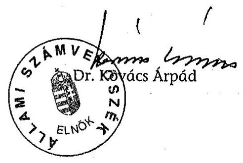
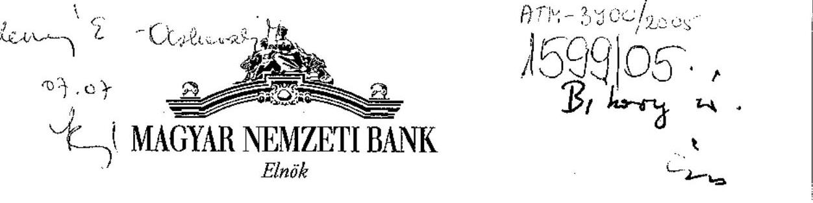
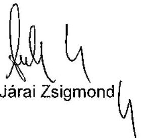
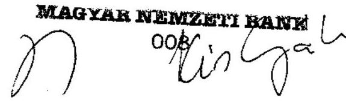
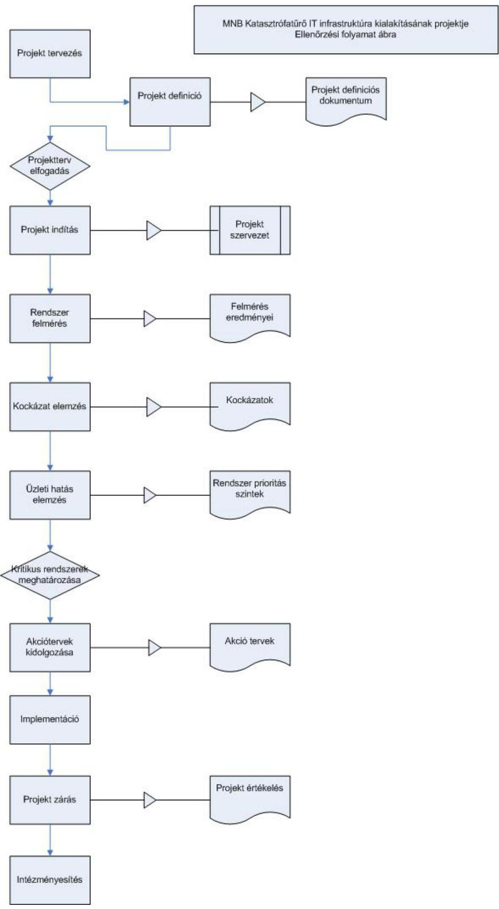

# JELENTÉS 

a Magyar Nemzeti Bank 2004. évi működésének ellenőrzéséről

---

2. Államháztartás Központi Szintjét Ellenőrző Igazgatóság
2.1. Teljesítmény Ellenőrzési Főcsoport
Iktatószám: V-30-25/2004-2005.
Témaszám: 741
Vizsgálat-azonosító szám: V0185
Az ellenőrzést felügyelte:
Bihary Zsigmond
főigazgató
Az ellenőrzés végrehajtásáért felelős:
Kemény Emil
főcsoportfőnök
Az ellenőrzést vezette:
Dr. Ocskovszki Jánosné
osztályvezető főtanácsos
Az ellenőrzést végezték:

| Czúcz Dénes | Gaálné Izsó Éva | Jakab Péter |
| :-- | :-- | :-- |
| számvevő gyakornok | számvevő tanácsos | k. munkatárs |
| Nagy Ákos | Tóthné Nagy Éva | Verő Tünde |
| számvevő | számvevő tanácsos | számvevő |

A témához kapcsolódó eddig készített számvevőszéki jelentések:
A Magyar Nemzeti Bank működésének ellenőrzése 0238
A Magyar Nemzeti Bank belső (banküzemi) működésének 0328 ellenőrzése
A Magyar Nemzeti Banknál alkalmazott teljesítményértékelési 0438 rendszer működésének ellenőrzése
A Magyar Nemzeti Bank 2002. évi működésének ellenőrzése 0340
A Magyar Nemzeti Bank 2003. évi működésének ellenőrzése 0447

---

# TARTALOMJEGYZÉK 

BEVEZETÉS ..... 5
I. ÖSSZEGZŐ MEGÁLLAPÍTÁSOK, KÖVETKEZTETÉSEK, JAVASLATOK ..... 7
II. RÉSZLETES MEGÁLLAPÍTÁSOK ..... 12

1. Az MNB működésének törvényessége és szabályszerűsége ..... 12
1.1. A közgyűlés és az igazgatóság tevékenysége ..... 12
1.2. A felügyelő bizottság tevékenysége ..... 14
1.3. A belső ellenőrzési szervezet szabályozottsága és működése ..... 15
1.4. A szakmai bizottságok tevékenysége ..... 16
1.5. Az intézmény belső szabályozottsága ..... 19
2. Működési költségek ..... 19
3. A beruházások és a közbeszerzések alakulása ..... 25
3.1. 2004. évi tervezés ..... 25
3.2. A beruházási kiadások alakulása ..... 27
3.3. Az MNB katasztrófatűrő IT infrastruktúrájának megvalósítása ..... 28
4. Az MNB kapcsolata a központi költségvetéssel ..... 32
4.1. A 2004. évi eredmény alakulása ..... 32
4.2. A kijelölt kincstári számlák kezelése és a kamatelszámolás ..... 33
5. Az MNB belföldi gazdasági társaságai ..... 34
6. A munkavállalók forint bankszámlájának vezetése ..... 35
6.1. Az EU csatlakozásból származó számlavezetési kötelezettség ..... 36
7. A korábbi ÁSZ jelentésekben megfogalmazott ajánlások végrehajtása ..... 36
MELLÉKLETEK
8. sz. melléklet MNB észrevétel
9. sz. melléklet Tanúsítványok jegyzéke
10. sz. melléklet Folyamatábra
11. sz. melléklet Teljesítmény-ellenőrzési kritériumok
12. sz. melléklet Strukturált kérdések

---

.

---

# RÖVIDÍTÉSEK JEGYZÉKE 

| Áht. | 1992. évi XXXVIII. törvény az államháztartásról |
| :-- | :-- |
| ÁKK Rt. | Államadósság Kezelő Központ Rt. |
| ALCO | Eszköz-forrás bizottság |
| ÁPV Rt. | Állami Privatizációs és Vagyonkezelő Rt. |
| ÁSZ | Állami Számvevőszék |
| ÁSZ tv. | 1989. évi XXXVIII. törvény az Állami Számvevőszékről |
| ATK | azonnali tartalékközpont |
| BCP-DRP | Üzletfolytonossági és Katasztrófaelhárítási Terv |
| BKB | Beruházási és költséggazdálkodási bizottság |
| BSZB | Bankszakmai bizottság |
| CRT | kritikus helyreállítási idő |
| EKB | Európai Központi Bank |
| ELF | Ellenőrzési főosztály |
| EU | Európai Unió |
| FB | felügyelő bizottság |
| GIRO Rt. | GIRO Elszámolásforgalmi Rt. |
| Gt. | 1997. évi CXLIV. törvény a gazdasági társaságokról |
| IAC | KBER Belső ellenőrzési bizottsága |
| KAR | katasztrófatűrő adattároló rendszer |
| KBB | Kiemelt beruházási bizottság |
| KBER | Központi Bankok Európai Rendszere |
| Kbt. | 2003. évi CXXIX. törvény a közbeszerzésekről |
| KELER Rt. | Központi Elszámolóház és Értéktár Rt. |
| Kincstár | Magyar Államkincstár |
| MNB | Magyar Nemzeti Bank |
| MNB tv. | 2001. évi LVIII. törvény a Magyar Nemzeti Bankról |
| MT | monetáris tanács |
| OMB | Monetáris bizottság |
| SZMSZ | Szervezeti és Működési Szabályzat |
| TB | Tulajdonosi bizottság |

---

.

---

# JELENTÉS 

## a Magyar Nemzeti Bank 2004. évi működésének ellenőrzéséről

## BEVEZETÉS

A Magyar Nemzeti Bank (továbbiakban: MNB) elsődleges célja az árstabilitás elérése és fenntartása, ennek érdekében látja el a törvényben meghatározott alapvető feladatait. Feladatai teljesítését szabályszerű és hatékony működéssel kell biztosítania. A Magyar Nemzeti Bankról szóló 2001. évi LVIII. tv. (továbbiakban: MNB tv.) 45. §-a szerint 2004. június 27-től az Állami Számvevőszék (továbbiakban: ÁSZ) MNB feletti ellenőrzési jogköréről, az Állami Számvevőszékről szóló 1989. évi XXXVIII. tv. (továbbiakban: ÁSZ tv.) rendelkezik. Az ÁSZ az MNB működését és gazdálkodását folyamatosan, évenkénti ellenőrzéssel vizsgálja, amelyet kiegészít egy adott terület teljesítmény-ellenőrzésével.

Ezáltal az ÁSZ elősegíti az Országgyűlés tájékoztatását, és támogatja az MNB-vel kapcsolatos ellenőrző munkáját. Az Országgyűlés az MNB tv. módosításakor az ÁSZ javaslatait figyelembe vette.

Az ÁSZ a róla szóló törvény 3. §-a alapján ellenőrzi az MNB gazdálkodását és az MNB-ről szóló törvénnyel összhangban - az alapvető feladatok körébe nem tartozó - tevékenységét.

A hatályos törvény szerint az ÁSZ azt ellenőrzi, hogy az MNB a törvényeknek, más jogszabályoknak, az alapszabálynak és a közgyűlés határozatainak megfelelően működik-e.

Az MNB működésének és gazdálkodásának folyamatos tulajdonosi ellenőrzését a felügyelő bizottság (továbbiakban: FB) végzi. Az éves beszámoló valódiságát - az ÁSZ által javasolt - könyvvizsgáló ellenőrzi.

Az ÁSZ 2002 óta végzett vizsgálatai az MNB belső banküzemi működésére, gazdálkodására, a gazdálkodás racionalizálására, a működési költségek alakulására, a kontrolling feladatokat támogató informatikai és a teljesítményértékelő rendszer működésére terjedtek ki. Az ellenőrzések külön figyelmet fordítottak az MNB tv. változásából adódó feladatok teljesítésére.

A jelenlegi ellenőrzés célja annak értékelése volt, hogy

- az MNB 2004. évi intézményi célkitűzései teljesültek-e; a működés a törvényi előírásoknak, a belső szabályzatoknak megfelelően alakult-e;
- az MNB éves gazdálkodásában a hatékonyság, a takarékosság és a szabályszerűség követelményei érvényesültek-e;

---

- a működési költségek és a beruházási ráfordítások a pénzügyi tervben meghatározottak szerint alakultak-e; a beszerzések és a beruházások lebonyolítása a törvényi előírásoknak és a belső szabályzatoknak megfelelően történt-e;
- az MNB katasztrófatűrő rendszerének kiépítése megfelel-e a teljesítményellenőrzési metodika alapján felállított kritériumrendszernek.

Az ellenőrzés során az ÁSZ értékeli a zárszámadáshoz kapcsolódó elszámolások szabályszerűségét, valamint a korábbi ellenőrzései alkalmával tett javaslatainak hasznosulását.

A vizsgálat nem érinti az MNB éves beszámolója valódiságának ellenőrzését, mivel azt külső könyvvizsgáló auditálja.

Az ÁSZ nem ellenőrzi a monetáris politikát és annak megvalósítását; a hivatalos deviza- és aranytartalék képzését és kezelését; a devizatartalék kezelésével és az árfolyam-politika végrehajtásával kapcsolatban végzett devizaműveleteket; a belföldi elszámolási rendszerek kialakítását és szabályozását, azok biztonságos és hatékony működésének támogatását; az MNB feladatai ellátásához szükséges statisztikai információk gyűjtését és közzétételét; a pénzügyi rendszer stabilitását, valamint prudenciális felügyeletét elősegítő politika kialakítását és hatékony vitelének támogatását; a pénzkibocsátási tevékenységét.

Az ellenőrzést az ÁSZ ellenőrzési kézikönyve és szakmai dokumentumai alapján, mintavételen alapuló ellenőrzéssel és a teljesítmény-ellenőrzési kritériumok, valamint strukturált kérdések figyelembevételével (4., 5. sz. mellékletek) végeztük el. A katasztrófatűrő informatikai rendszer projekt folyamatábráját a 3. sz. melléklet tartalmazza.

A vizsgálat a 2004. évi pénzügyi évre, illetve indokolt esetben az adott gazdasági esemény keletkezésétől számított időszakra irányult, de szükség szerint a pénzügyi-gazdasági folyamatokat a helyszíni ellenőrzés befejezéséig figyelemmel kísérte.

A végleges jelentést megküldtük az MNB elnökének. Válaszlevelét az 1. számú melléklet tartalmazza.

---

# I. ÖSSZEGZŐ MEGÁLLAPÍTÁSOK, KÖVETKEZTETÉSEK, JAVASLATOK 

Az Európai Unióhoz (továbbiakban: EU) történő csatlakozással egyidejűleg az MNB tagja lett a Központi Bankok Európai Rendszerének (továbbiakban: KBER). Mivel a KBER tagok egyben az Európai Központi Bank (továbbiakban: EKB) tulajdonosai is, Magyarország az EKB-ban 1,3884% részesedést szerzett. 2004-ben az MNB a csatlakozásból fakadó feladatainak (pl. szabályozási rendszerének kibővítése, új bankszámlavezetési politika, adatszolgáltatás) eleget tett.

Az Országgyűlés az MNB tv.-t 2004-ben a csatlakozással együtt járó jogharmonizációs követelmények figyelembevételével, három alkalommal módosította. A törvénymódosítások többek között rögzítették a jegyzett tőkét, az MNB elnökének rendeletalkotási jogkörét, növelték a monetáris tanács (továbbiakban: MT) tagjainak számát és módosították az ÁSZ ellenőrzési hatáskörét.

2004 májusában az MNB éves rendes közgyűlése elfogadta a 2003. évről készült éves beszámolót és döntött az eredményről, továbbá jóváhagyta az alapszabály - törvénymódosításokkal összhangban történt - módosítását. A 2005. évi rendes közgyűlést április 18-án tartották, amelyen elfogadták a 2004. évről szóló éves beszámolót, és jóváhagyták az MNB mérleg szerinti eredményét, továbbá az alapszabály - ÁSZ törvénnyel összefüggő - módosítását.

Az MNB vezetése a 2004. évi kiemelt feladatait középtávú intézményi célkitűzéseivel összhangban határozta meg, ennek megfelelően előkészítette és végrehajtotta az EU-s csatlakozásból származó feladatait. Javította és fejlesztette a működés és az üzemeltetés feltételeit, folytatta a Logisztikai Központ beruházás megvalósítását és létrehozta a számítástechnikai tartalékkapacitást.

2004-ben az igazgatóság az MNB tv.-ben, az alapszabályban és az ügyrendjében foglaltaknak megfelelően végezte operatív irányító és döntéshozó tevékenységét. Az igazgatóság a törvényeknek megfelelően, szabályszerűen működött és döntést hozott az MNB tv.-ben rögzített alapfeladataival összefüggő, továbbá mindazon kérdésekben, amelyek jog- és hatáskörébe tartoztak, és az éves banki fő célkitűzések teljesítéséhez kapcsolódtak.

A felügyelő bizottság az MNB működésének és gazdálkodásának ellenőrzését éves munkaterve alapján végezte, amelynek 2004-re jutó részét teljes mértékben végrehajtotta. Ellenőrző tevékenységének középpontjába a Logisztikai Központ nagyberuházás megvalósításának folyamatát és az uniós csatlakozás MNB-t érintő feladatait helyezte. Az FB az MNB 2004. évi rendes közgyűlése részére - a 2003. évi mérlegre és eredménykimutatásra vonatkozó, a gazdasági társaságokról szóló törvényben előírt - jelentését az új törvényi előírásoknak megfelelően készítette el.

---

Az FB az Országgyűlésnek és a pénzügyminiszternek beszámolt a 2003. június és 2004. június közti időszakban végzett tevékenységéről, az MNB gazdálkodásáról szerzett tapasztalatairól és megállapításairól.

Az MNB tv. 2003. évi módosítása rendezte az FB és az igazgatóság ellenőrzési kompetenciáját, ezáltal 2004-ben a hatásköri kérdések már nem nehezítették a testületek együttműködését.

Az MNB Ellenőrzési főosztálya (továbbiakban: ELF) 2004. évi munkatervét teljesítette, összesen 58 vizsgálatot végzett, kapacitásának 75%-át ellenőrzésre fordította. Ez javuló arányt mutat a 2003. évi 62%-hoz képest, 2005-ben ennek az aránynak további emelését tervezik az ÁSZ javaslatának realizálásaként.

Az igazgatóság a Szervezeti és Működési Szabályzatban (továbbiakban: SZMSZ) és az ügyrendjében foglaltak alapján hét szakmai bizottságot működtet. Az SZMSZ szerint a szakmai bizottságok az igazgatóság által hatáskörükbe delegált kérdések megtárgyalását és az azokban való döntés előkészítését végzik, míg a bizottságok ügyrendjének különös része döntési és végrehajtási feladatokat is tartalmaz. Tevékenységük átfogja az MNB teljes szakmai feladatait. A bizottságok elnökei az MNB igazgatóságának tagjai. A bizottságokban, egy személyben a bizottság elnöke dönt a tagok véleményének meghallgatásával. Ez nem azonos az MNB döntéshozó fórumai (MT, igazgatóság) működési elveivel.

Az egyes szakmai bizottságok - köztük a Monetáris bizottság (továbbiakban: OMB) - az ügyrend szerint az MT feladatkörébe tartozó ügydöntő feladatot is elláthatnak. Az OMB - igazgatóság által jóváhagyott - ügyrendje szerint az MT felhatalmazása alapján „bizonyos döntéseket" hozhat mindazon kérdésekben, amelyekre vonatkozóan a döntés jogát az MT magának nem tartotta fenn. Ez a döntési lehetőségre szóló felhatalmazás nem felel meg az MNB tv. előírásainak, mivel az MT a számára meghatározott feladatkörökben előre és általánosan döntési jogkörét nem delegálhatja. Az OMB ügyrendje továbbá nem egyértelműen határozza meg a bizottság tagjainak számát.

Az MNB alapszabálya, az SZMSZ és a testületek ügyrendje - a szakmai bizottságok kivételével - összhangban áll a jogszabályok rendelkezéseivel. A belső szabályozás átfogja a kulcsfontosságú területeket és kiegészül a speciális
 feladatok szabályozásával. 2004-ben a szabályozási tevékenység a szabályzatok naprakészségének biztosítására irányult.

Az MNB 2004. évi pénzügyi tervét a belső utasításoknak megfelelően, dokumentumokkal alátámasztva, határidőre készítette el. A működési költségek tervét az igazgatóság 14872 M Ft főösszeggel jóváhagyta. Működési költségekre a tervezett 91%-át, összességében 13524 M Ft-ot fordítottak. Az elmúlt három év költségcsökkenésével szemben 2004-ben a működési költségek 824 M Ft-tal növekedtek az előző évihez képest, amelyhez a személyi költségek 43%-kal, az IT költségek 24%-kal, az értékcsökkenés 14%-kal járultak hozzá.

A működési költségeken belül a személyi költségek - az előző évek szintjével egyezően - közel kétharmados arányt tettek ki. A felhasználás 8900 M Ft volt és 3,6%-kal maradt el a tervezettől. A költségek alakulását döntően a 7,2%-os

---

alapbérfejlesztés és a tervezettnél alacsonyabb átlaglétszám befolyásolta. Az átlagbérek és az átlagjövedelmek a tervezett mértéknek megfelelően alakultak.

Az MNB a jövedelmen felül annak átlagosan mintegy 16%-át kitevő összegű bérjellegű juttatásban (általános költségtérítés és választható béren kívüli juttatás) részesíti munkavállalóit.

Az MNB 2004. évi záró létszáma 938 fő volt az előző évi 946 fővel szemben. A szervezeti struktúra és a személyi állomány stabil. A megüresedett álláshelyek 36%-át (23 fő) belső pályázókkal töltötték be.

A személyi költségek elszámolását a hatályos jogszabályoknak és belső utasításoknak megfelelően végezték. Az MNB elnökének, alelnökeinek, az MT és az FB tagjainak díjazását az MNB tv. rendelkezéseinek betartásával állapították meg.

A Kormány távmunka elterjesztésével kapcsolatos - a Magyar Információs Társadalom Stratégiájában megfogalmazott - céljával összhangban, az MNB 2004-ben megkezdte a távmunka kiépítését. Ennek belső szabályait - a Munka Törvénykönyve előírásainak megfelelően - kialakította, a távmunkában foglalkoztatott munkavállalóival kötött munkaszerződések a jogszabályoknak és a belső utasításoknak megfelelnek.

Az információtechnológiai költségek 954 M Ft-ot tettek ki, amely 197 M Ft-tal haladja meg az előző évit. A többlet döntően az azonnali tartalékközpont (továbbiakban: ATK) működtetéséből és az adatátviteli díjak növekedéséből adódott. A tervhez képest 27% megtakarítás keletkezett, amelyet a legnagyobb hányadban - az adattárolási rendszer tervezettnél korábbi kialakításából eredően - a szolgáltatások és a telepítési igények csökkenése okozott.

Az üzemeltetési költségek működési költségeken belüli részaránya az előző évivel egyezően 11% volt. Az MNB költségtakarékos gazdálkodást folytatott; üzemeltetési költségei nominál értéken az előző évi szinten alakultak. 2004-ben az üzemeltetési költségek elszámolását szabályszerűen végezték.

A megvalósult beruházások hatására az értékcsökkenés 2004. évi összege 1480 M Ft volt és 112 M Ft-tal haladta meg az előző évit.

Az MNB az éves pénzügyi terv részeként a beruházási kiadásokat 4439 M Ft összegben határozta meg, amelyből a központi tartalék 198 M Ft volt. Az évközben végrehajtott tervmódosítások összesített értékének egyenlege 630 M Ft csökkentés, így a terv a tartalékkal együtt 3809 M Ft-ra változott. A tényleges beruházási kiadás 2967 M Ft volt. A fel nem használt összeg a tartalékot is figyelembe véve 842 M Ft. 2005. évre 241 M Ft fizetési kötelezettség húzódott át, alapvetően (71%) az integrált operatív rendszerek megvalósításának késedelme miatt.

A Logisztikai Központ kiemelt beruházás megvalósítása lassult, az építési engedély későbbi kiadása, valamint a közbeszerzési eljárások időigénye miatt. A késedelem a beruházás befejezésének tervezett határidejét kedvezőtlenül befolyásolja, az eredeti, 2006. júniusi üzembe helyezés várhatóan 2007. októberig tolódik ki.

---

A 2004. év jelentősebb beruházásai a 857 M Ft-ból üzembe helyezett katasztrófatűrő adattároló rendszer (továbbiakban: KAR) és a 49 M Ft-ból megvalósított ATK voltak. A beruházásokat határidőre, a belső szabályzatok betartásával, a tervezett költségelőirányzaton belül valósították meg. Mindkét beruházás célszerű tervek alapján, az elvárásoknak és a tervdokumentációknak megfelelően készült el. A tervezés fázisában részletesen feltárták és minősítették az MNB üzleti folyamatait, az e folyamatokat támogató erőforrásokat, valamint azok kapcsolatait és egymástól való függőségének mértékét. A tervekben meghatározott helyreállítási eljárásokat tesztelték. Valamennyi, rendszerenként elvégzett teszt a kritikus helyreállítási időn (továbbiakban: CRT) belül zárult. Az MNB fizikailag jól védett tartalék központja nem rendelkezik sugárzott és vezetett zavarok, valamint másodlagos villámcsapás elleni védelemmel.

Az MNB az Európai Bizottság képviselőjével megkötött megállapodásnak és az arról szóló kormányrendeletnek eleget téve 2004. május 1-jével „Európai Bizottság - Saját források" forint és euró számlát nyitott. Az esedékes számlakivonat küldési kötelezettségét az Európai Bizottság és a Pénzügyminisztérium felé teljesítette.

Az MNB a Magyar Államkincstárral (továbbiakban: Kincstár) az Állami Privatizációs és Vagyonkezelő Rt.-vel (továbbiakban: ÁPV Rt.) és az Államadósság Kezelő Központ Rt.-vel (továbbiakban: ÁKK Rt.) kötött pénzforgalmi bankszámla szerződésének feltételeit a jogszabályi előírásokkal összhangban határozta meg. 2004-ben a bankszámla egyenlegek után a mindenkori jegybanki alapkamat mértékével számított kamatot térítette és annak elszámolása szabályszerű volt.

Az MNB munkavállalói számára dolgozói számlát vezet. A számlavezetés teljes körűen szabályozott, annak rendelkezéseit betartották. A számlák kamatozása megfelelt a mindenkori jegybanki alapkamatnak.

A közgyűlés által elfogadott beszámoló alapján az MNB 2004. évi mérleg szerinti eredménye 42,8 Mrd Ft veszteség, amelyet a 81,1 Mrd Ft eredménytartalék fedez. Ezért a központi költségvetésnek térítési kötelezettsége nem keletkezett. 2004-ben a forint hivatalos árfolyamának folyamatos erősödése hatására a kiegyenlítési tartalék 179,7 Mrd Ft-tal csökkent és év végére 19,5 Mrd Ft lett. A deviza értékpapírok kiegyenlítési tartalékának negatív egyenlege 1,1 Mrd Ft volt, amelyet a központi költségvetés a jogszabályban előírt határidőre megtérített.

Az MNB banküzemi bevételeinek és ráfordításainak egyenlege 13,5 Mrd Ft veszteség volt és 1,3 Mrd Ft-tal haladta meg az előző évit. A két év eredménye között a legnagyobb eltérést az eszköz- és készletértékesítés soron kimutatott, a nem monetáris célú aranykészlet egyszeri, 2003. évben történt értékesítéséből származó 0,5 Mrd Ft nyereség okozta. 2004-től - az MNB éves beszámoló készítési és könyvvezetési kötelezettségének sajátosságairól szóló kormányrendelet változása miatt - egyéb bevételei között mutatja ki a részesedések után elszámolt osztalékot. Az MNB gazdasági társaságainak gazdálkodása 2004-ben eredményes volt, ezért a 2005-ben várható osztalék 1,7 Mrd Ft.

---

Az MNB a Pénzjegynyomda Rt.-vel kapcsolatos tulajdonosi stratégiáját az euró bevezetésének eltolódása miatt megváltoztatta és úgy döntött, hogy a forint periódus lezárásig a társaságot tulajdonában tartja. A Központi Elszámolóház és Értéktár Rt-ben (továbbiakban: KELER Rt.) meglévő 50%-os tulajdonosi részesedését - az előző évi döntésének megfelelően - elővásárlási jogának érvényesítésével 2004-ben növelte. A tervezett 16,6%-kal szemben 3,3%-os részesedés növelésre nyílt lehetősége.

Az MNB vezetése az ÁSZ korábbiakban közzétett jelentéseiben megfogalmazott ajánlásokat elfogadta, az azokban foglaltakat megvalósította.

A helyszíni ellenőrzés megállapításainak hasznosítása mellett javasoljuk:

# az MNB igazgatóságának 

1. Gondoskodjon arról, hogy a szakmai bizottságok részére az SZMSZ általános előírásaiban és a bizottságok ügyrendjében megfogalmazott feladatok összhangban legyenek.
2. Intézkedjen, hogy a szakmai bizottságok a határozataikat - egyszemélyi döntés helyett - testületi döntéssel hozzák meg.
3. Vizsgálja felül a szakmai bizottságok ügyrendjét és módosítsa abban a bizottságok hatáskörét szabályozó rendelkezéseket. Ne delegáljon olyan hatásköri lehetőséget az egyes bizottságokhoz, amelyek - a törvény alapján - a monetáris tanács jogkörébe tartoznak.
4. Tegye egyértelművé a Monetáris bizottság ügyrendjében a bizottság tagjainak számát.
5. Mérje fel az azonnali tartalék központ sugárzott és vezetett zavarvédelme hiányának kockázatát és indokolt esetben tegye meg a szükséges intézkedéseket.

---

# II. RÉSZLETES MEGÁLLAPÍTÁSOK 

## 1. AZ MNB MŰKÖDÉSÉNEK TÖRVÉNYESSÉGE ÉS SZABÁLYSZERŰSÉGE

### 1.1. A közgyűlés és az igazgatóság tevékenysége

Az MNB éves rendes közgyűlését 2004. május 20-án tartották, amely megtárgyalta és elfogadta a 2003. évi auditált éves beszámolót és az alapszabály módosítását. ${ }^{1}$
2004. évben az MNB tv.-t három alkalommal módosították. A 2004. évi XXXI. törvény az EKB és az Európai Bizottság által javasolt változtatásokat építette be az MNB tv.-be, továbbá - az MNB pénzügyi függetlenségének megerősítése érdekében - rögzítette a jegyzett tőke nagyságát. A 2004. évi XLVI. törvény módosította az ÁSZ tv.-ben az ÁSZ MNB-vel kapcsolatos ellenőrzési jogkörét, a bankjegy- és érmekibocsátásra vonatkozó rész hatályát vesztette. A 2004. évi CXXVI. törvény az MT tagjainak lehetséges számát négy fővel növelte (7-9 főről 9-11 főre).

A 2005. január 6-án megtartott rendkívüli közgyűlés az MNB alapszabályán az MT összetételének bővítését átvezette. 2005. április 18-án az éves rendes közgyűlés elfogadta az MNB 2004. évről készült éves beszámolóját és az alapszabály - ÁSZ tv.-ből fakadó - módosítását.

2004-ben az igazgatóság az alapszabályban és az ügyrendjében foglaltaknak megfelelően féléves munkatervek alapján végezte operatív irányító és döntéshozó tevékenységét, ülésein 72 határozatot hozott. 2004-ben az igazgatóság a törvényi előírásoknak - MNB tv., a gazdasági társaságokról szóló 1997. évi CXLIV. tv. (továbbiakban: Gt.) - megfelelően módosította ügyrendjét, kiegészítette a kizárólagos hatáskörébe tartozó feladatokat.

Az MNB elnökének rendeletalkotási jogkörével kapcsolatosan az igazgatósági ügyrendben a testület kizárólagos hatáskörébe utalták a rendeletalkotás éves ütemtervének jóváhagyását, valamint az MNB elnöke által kiadandó, az MT döntéseivel összhangban álló, MNB elnöki rendeletek szövegének jóváhagyását, a jegybanki alapkamat és a kötelező tartalékráta mértékének kivételével. Az ügyrendben rögzítették, hogy a kiemelt projektek létrehozása, a KBER szakbizottságaiba a tagok kijelölése és a munkaszervezet dolgozói érdekeltségének megállapítása és módosítása, valamint a 30 M Ft feletti egyedi üzleti döntések meghozatala is az igazgatóság kizárólagos feladata.

[^0]
[^0]:    ${ }^{1}$ A közgyűlés 2004. májusáig terjedő időszakban végzett tevékenységéről az ÁSZ MNB 2003. évi működésének ellenőrzéséről készült 0447. számú jelentésében is beszámolt.

---

Az igazgatóság a középtávú célkitűzésekkel összhangban határozta meg a 2004. évi fő prioritású célkitűzéseket. Ezek között jelölték meg a KBER-be történő integrációt, az árfolyammechanizmus rendszerbe való belépés előkészítését és a Gazdasági és Monetáris Uniós csatlakozás monetáris politikai megalapozását. Ide sorolták a működés és az üzemeltetés feltételeinek javítását és fejlesztését, a Logisztikai Központ beruházás folytatását, a számítástechnikai tartalékkapacitás megvalósítását. Az éves célok között szerepelt az MNB lakossági ismertségének és elfogadottságának erősítése, a szervezeti kultúra fejlesztése, a működési és a humán kockázatok kezelése (kockázati tudatosság) és a benchmarking módszerek beillesztése a vezetés és a működés gyakorlatába. A szervezeti egységek feladatait az intézményi célkitűzések lebontásával - azoknak alárendelten - határozták meg.

2004-ben az igazgatóság az MT üléseit követően az ott hozott határozatokhoz kapcsolódó feladatokat áttekintette és kijelölte a végrehajtásért felelős személyeket, illetve szervezeti egységeket és ellenőrizte a megvalósítást. Megtárgyalta az MNB által elfogadandó szabályokról és az új tagállamokkal kötendő szerződésekről készült tájékoztatót, és áttekintette az MNB csatlakozási programtervét, amely az euró rendszerhez történő csatlakozásig terjed. A feladatok között jelölték meg az SZMSZ kiegészítését a KBER tagsággal összefüggő tevékenységekkel.

Az MNB tv.-ben rögzített rendeletalkotási feladatok végrehajtásának első lépéseként az igazgatóság jóváhagyta a 2004 végéig terjedő időszakra, majd a 2005. évre vonatkozó rendeletalkotási ütemterveket. A rendelettervezetek szakmai egyeztetése elhúzódott, ezért a Pénzügyminisztérium képviselője a kormányzati, valamint a pénzügyminisztériumi felelősséget érintő rendelettervezeteknél a szakmai egyeztetés
 mielőbbi végrehajtását szorgalmazta. A jegybanki alapkamat mértékéről szóló MNB rendeleteket kivéve 2005. márciusáig három MNB elnöki rendeletet adtak ki.

2004 végén az igazgatóság döntött a Pénzügyminisztérium, a Pénzügyi Szervezetek Állami Felügyelete és az MNB között kötendő megállapodásról, az EU intézményeibe delegálandó magyar képviselettel kapcsolatban. Az igazgatóság a KBER szakbizottságaiba delegált tagokat kijelölte, áttekintette az uniós intézmények és egyéb szervezetek éves tevékenységét, valamint a kapcsolatok fenntartásával és bővítésével összefüggő feladatokat.

Az igazgatósági ülések napirendjén szerepelt továbbá az MNB tv. módosításának tervezete, az SZMSZ és a részét képező ügyrendek, továbbá a Kollektív Szerződés módosításai. Az igazgatóság megtárgyalta a Logisztikai Központ kiemelt beruházás előrehaladásáról készült tájékoztatókat és határozott két új kiemelt projekt elindításáról. Az ügyrendjében meghatározott hatáskör alapján döntött az MNB befektetéseit érintő témákban, havonta figyelemmel kísérte az eredmény, a működési költségek és a beruházási kiadások időszakos alakulását. Döntött a bankjegy és érmekészlet alakulásáról az euró tényleges bevezetéséig, a pénz és emlékérmék kibocsátásáról, a jegybanki ellenőrzési rendszer működésével kapcsolatos kérdésekről, a szervezeti változtatásokról.

2004-től kezdődően az MNB-ben működő kiemelt projektek tevékenységéről, amelyeket az illetékes szakmai bizottságok felügyeltek, az igazgatóság negyedévente kapott tájékoztatást.

---

2004. évben kiemelt projektek voltak: a Logisztikai Központ, az Adattárház, a Bankmaster kiváltás, az Access alkalmazások, az MNB és a külvilág, az ARIS, az AMP, az EU/KBER bizottságokban történő részvétel és az EKB és MNB szervezeti konvergenciája, valamint a közbeszerzés.

2004-ben az igazgatóság a törvényeknek megfelelően, szabályszerűen működött. Döntést hozott mindazon kérdésekben, amelyek az MNB tv.-ben és az ügyrendjében meghatározottak alapján jog- és hatáskörébe tartoznak. A munkaterv alapján, az üléseken különös figyelmet fordítottak az éves banki fő célkitűzések teljesítésére és az uniós csatlakozással összefüggő feladatokra.

# 1.2. A felügyelő bizottság tevékenysége 

Az FB az MNB tv.-ben, valamint a Gt.-ben foglalt ellenőrzési feladatokat látja el, az MNB, mint részvénytársaság, működésének folyamatos tulajdonosi ellenőrzését végzi. Ügyrendjének módosítását a testület a 2004. januári ülésén fogadta el és a pénzügyminiszter – részvényesi határozattal – jóváhagyta. A hatályos ügyrend összhangban áll az MNB tv. rendelkezéseivel.

Az MNB tv. 52/A. § (2) bekezdése értelmében az MNB belső ellenőrzési szervezete az FB, illetőleg a hatáskörébe nem tartozó feladatok tekintetében az igazgatóság irányítása alá tartozik. Ez a törvényi előírás rendezte az FB és az igazgatóság ellenőrzési kompetenciáját, ezáltal 2004-ben már hatásköri kérdések nem akadályozták a testület működését.

Az MNB tv. 52/A. § (2) bekezdése értelmében: „Amennyiben az igazgatóság az irányítási jogkörének gyakorlása során olyan vizsgálati megállapításról szerez tudomást, amely az FB hatáskörébe tartozik, akkor erről a megállapításról tájékoztatást ad az FB-nek”. Az igazgatóság döntése alapján 2004-ben egy alkalommal került sor az ELF vizsgálati jelentése kivonatának átadására, amely tartalmazott az FB hatáskörébe tartozónak ítélt megállapítást. (MNB kibocsátású külföldi kötvény visszavásárlása és újraeladása során megállapított hiányos dokumentáció.)

Az FB az MNB 2004. évi rendes közgyűlésének szóló – az MNB 2003. évi mérlegére és eredménykimutatására vonatkozó – a Gt. 32. § (3) bekezdésében előírt jelentését, az MNB tv. 52/A. § (3) bekezdésében foglaltakkal összhangban tette meg és az MNB éves gazdálkodásáról mondott véleményt.

Az FB ellenőrző tevékenységét éves munkaterve (júniustól májusig) alapján végezte és 2004. évi feladatait teljes mértékben végrehajtotta. Ellenőrzési tevékenységének középpontjába a Logisztikai Központ nagyberuházás megvalósításának folyamatát és az uniós csatlakozás MNB-t érintő hatásait helyezte.

Ennek kapcsán tárgyalta a belső ellenőrzés feljegyzését a Logisztikai Központ beruházásról, az egyes pályázatokkal kapcsolatos külső szakvéleményt, az MNB-n belüli ügyintézés menetét és időszükségletét a beszerzésekkel és a beruházásokkal összefüggésben. Foglalkozott a KBER tagsággal összefüggő szervezeti kérdésekkel és költségekkel, az informatikai stratégiával, a belső szabályozás helyzetével.

Az ELF havonta beszámolt az FB-nek az éves ellenőrzési terv végrehajtásáról, a vizsgálatok alakulásáról. Az FB megtárgyalta és elfogadta az ELF éves beszámolóját, ellenőrzési tervét, egyes jelentéseit, valamint a főosztályt érintő szervezeti változást.

---

Az FB az MNB tv.-ben és ügyrendjében foglaltaknak megfelelően elkészítette beszámolóját az Országgyűlés és a pénzügyminiszter részére – a 2003. június és 2004. június közötti időszakra vonatkozóan – és tájékoztatást nyújtott az MNB gazdálkodásával kapcsolatos tapasztalatairól és megállapításairól.

# 1.3. A belső ellenőrzési szervezet szabályozottsága és működése 

A függetlenített belső ellenőrzés tevékenysége teljes körűen szabályozott. Az ELF 2004. évi tervét és a tevékenységéről készült éves beszámolót az igazgatóság és az FB jóváhagyta, illetve elfogadta.

Az éves terv kialakítása az ellenőrzésszakmai követelményeknek – kockázati besorolás, előző vizsgálatok tapasztalatai – megfelelően, valamint az igazgatóság és az FB igényeinek figyelembevételével történt. Az ELF 2004. évi munkatervében összesen 31 vizsgálatot (pénzügyi, emissziós, IT), 20 utóvizsgálatot (pénzügyi, IT) és 11 számítástechnikai projektben való közreműködést irányzott elő. A terv alapján az éves erőforrás 56%-át a közvetlen ellenőrzések, 29%-át az egyéb feladatok ellátása tette ki, a tartalék 15% volt, a belső szabályzatnak megfelelően.

Az egyéb tevékenységek között jelölték meg a pályázati eljárásokban való részvételt, az utasítások véleményezését, az EKB munkabizottsági feladatok ellátását, az ellenőrző szervezetekkel történő együttműködést, valamint a továbbképzést és az értekezleteket.

Az ELF éves munkatervét teljesítette, összesen 58 vizsgálatot végzett, amelyből 24 utóvizsgálat volt. Kapacitásának 66%-át a vizsgálatokra, 9%-át pedig az utóellenőrzésekre fordította (egyéb 25%). 2004-ben az ellenőrzési terven felül az FB és az igazgatóság négy vizsgálatot rendelt el, amelyekre a tartalék nyújtott fedezetet.

Az ELF 2005. évi munkatervének kialakításakor a közvetlen vizsgálatokra és utóvizsgálatokra az éves szinten rendelkezésre álló erőforrás közel 72%-át tervezte. A 15%-os tartalékkapacitással együttesen 87%-os arányt képvisel a tervben a közvetlen ellenőrzések munkaráfordítása. Az ÁSZ megállapításának hatására a 2005. évi ellenőrzési tervben már nem szerepel a projektekben és a beszerzésekben való részvétel, így az ELF éves tevékenységében a közvetlen- és az utóellenőrzésekre tervezett erőforrás folyamatosan növekvő arányt mutat. ${ }^{2}$

Az EU csatlakozást követően az ELF tanácskozási joggal vesz részt a KBER Belső ellenőri bizottságának (továbbiakban: IAC) munkájában. A Belső Ellenőrök

[^0]
[^0]:    ${ }^{2}$ Az ÁSZ az MNB 2003. évi működésének ellenőrzéséről 2004. októberében 0447. számon közzétett jelentésében megállapította, hogy: „A főosztály kapacitás-felhasználásának megoszlása kedvezőtlenül alakult az előző évhez képest. Kapacitásának 2003-ban kisebb hányadát fordította az alapfeladatát jelentő ellenőrzésekre. 2002-ben erőforrásainak 71%-át, 2003-ban pedig 62%-át kötötték le a vizsgálatok.”

---

Nemzetközi Szervezete által kiadott standardok, – amelyeket az IAC adoptált és előírt a tagországok számára – teljes körű bevezetése céljából a belső ellenőrzés eljárásrendjét és gyakorlatát 2004-ben felülvizsgálták. A standardok tényleges bevezetése 2005-től történik meg, ennek érdekében az ELF elkészítette a minőségbiztosítási és minőségfejlesztési programot. Az IAC-vel együttműködve 2004-ben két vizsgálatban vettek részt, a felügyelet és a hamis bankjegyek felismerési rendszerének ellenőrzésében.

Az ELF a tevékenységéről negyedévente készített jelentést az Audit bizottság részére, amelyben tájékoztatást adott az elvégzett vizsgálatokról, a kapcsolódó megállapításokról és ajánlásokról. Év végén beszámolt az éves ellenőrzési munkaterv teljesüléséről és előzetesen bemutatta a szakmai bizottságnak az éves ellenőrzési tervre vonatkozó javaslatát.

Az Audit bizottság ügyrendjében rögzített feladatai az MNB-t ellenőrző szervezetek (ELF, könyvvizsgáló, FB, ÁSZ) által tett megállapítások utókövetése, a függetlenített belső ellenőrzés éves tervének előzetes elfogadása és a terv megvalósításának nyomon követése. Az igazgatóság az ügyrendben felelősségi kört nem állapított meg az Audit bizottság részére. A bizottság az ügyrendjében foglalt feladatokat végrehajtotta.

Az Audit bizottság üléseinek állandó napirendjén szerepelt az ELF negyedévi tevékenységéről készült beszámoló. Megtárgyalta a nem realizált intézkedési terveket és a bizottság által előírt feladatokat és teljesülésüket, amelyeket az ún. „follow up” tábla tartalmaz, értékelte az ELF 2003. évi működését, a könyvvizsgáló 2003-ra vonatkozó vezetői levelében szereplő megállapítások és az ÁSZ – az MNB-nél alkalmazott teljesítményértékelési rendszer működésének ellenőrzéséről készített – jelentése javaslatainak hasznosulását. A bizottság gyorsított eljárás során tárgyalta az ELF 2005. évi munkatervét.

# 1.4. A szakmai bizottságok tevékenysége 

Az SZMSZ szerint – az igazgatóság ügyrendjében foglaltak alapján – az MNB igazgatósága „kizárólagos hatáskörrel jogosult bizottságokat létrehozni, azokat működtetni, ügyrendjüket megállapítani, munkaprogramjukat jóváhagyni, működésüket folyamatosan figyelemmel kísérni, és tevékenységükről szükség szerinti gyakorisággal beszámoltatni”.

Az igazgatóság 2004. évben hét bizottságot működtetett, az Eszköz-forrás bizottságot (ALCO), a Bankszakmai bizottságot (BSZB), a Monetáris bizottságot (OMB), a Beruházási és költséggazdálkodási bizottságot (BKB), a Kiemelt beruházási bizottságot (KBB), a Tulajdonosi bizottságot (TB), és az Audit bizottságot.

A szakmai bizottságok tevékenysége kiterjed a jegybanki alapfeladatok teljesítésére és eszközrendszerére, a belső gazdálkodásra, valamint a tulajdonosi részesedéshez kapcsolódó feladatokra. A szakmai bizottságok vezetői az MNB elnöke, illetve alelnökei, tagjai a szakmai felügyeletet ellátó vezetők (alelnök, ügyvezető igazgató, főosztályvezető), az OMB esetében az MT tagjai és a szakterületi vezetők. Az ügyrend szerint a bizottságok elé terjesztett vagy ott elhangzott javaslatokról egy személyben a bizottság elnöke dönt a tagok véleményének meghallgatásával.

---

Az ügyrend az általános részben az SZMSZ-szel összhangban fogalmazza meg a bizottságok feladatait, a különös részben pedig az SZMSZ-től eltérően, döntési hatáskörrel is felruházza az egyes bizottságok elnökeit.

Az üléseken kötelező napirendi pontként kell szerepeltetni a bizottságok által előírt feladatokat és a teljesítésüket tartalmazó, a bizottságok titkára által vezetett és rendszeresen aktualizált „follow up” tábla áttekintését.

A 2004. évi ügyrendben leírtak szerint a bizottságok az MNB szakmai konzultatív testületei, amelyek feladata a „hatáskörükbe tartozó” kérdések megtárgyalása és az azokban való döntés előkészítése. Az igazgatóság 2005. januárjában a szakmai bizottságok ügyrendjét módosította, amely szerint feladatuk „az igazgatóság által hatáskörükbe delegált kérdések megtárgyalása és az azokban való döntés előkészítése”.

Az igazgatóság a bizottságok ügyrendjét a vizsgált időszakban öt alkalommal módosította.

2004-ben a szakmai bizottságok az ügyrendjükben rögzített gyakoriság szerint üléseztek.

Az MNB-ben működő egyes szakmai bizottságok ügyrendjei nincsenek összhangban az SZMSZ – bizottságok feladatkörére vonatkozó – rendelkezéseivel és az MNB tv. előírásaival.

Az MT döntéseinek végrehajtásáért felelős igazgatóság állítja fel a szakmai bizottságokat – köztük az OMB-t – amelyek ügyrendjük szerint az MT feladatkörébe tartozó ügydöntő feladatot is ellátnak, ezáltal egyszerre teljesítenek döntés-előkészítő és döntési feladatokat.

Az ügyrend szerint az OMB feladata: „az MT monetáris politika vitelével kapcsolatos munkájának támogatása, a monetáris helyzet rendszeres áttekintése és ennek alapján … az operatív pénzpolitikai döntések előkészítése továbbá a belföldi devizapiaci és forintpiaci tevékenység összehangolása. … Hatásköre kiterjed mindazon monetáris döntések előkészítésére, amely döntésekre vonatkozóan a döntés jogát az MT magának nem tartotta fenn.” Az ügyrendi megfogalmazás hibás, mivel az MT az MNB tv.-ben meghatározott feladatkörökben előre és általánosan nem mondhat le döntési jogköréről.

Az OMB elnöke az MNB elnöke, tagjai az MT további tagjai és 11 szakmai vezető. Gyakorlatilag az OMB magában foglalja a teljes igazgatóságot és az MT-t. A testületek határozathozatalában van lényeges különbség, ugyanis míg az
 igazgatóság és az MT döntéseit egyszerű szótöbbséggel hozza meg és szavazategyenlőség esetén az elnök szavazata dönt, az OMB-ben - a szabályzat szerint - egy személyben a bizottság elnöke (az MNB elnöke) dönt a tagok véleményének meghallgatásával. A törvényben megfogalmazott testületi döntés ez által egy személyi döntéssé válhat. Adott esetben az MT akarata, illetve döntése csak akkor érvényesülhet, ha az OMB rendelkezésére álló információk, illetve azok értékelése alapján az MT-i döntés látszik indokoltnak és az OMB elnöke utasítást ad az erre vonatkozó előterjesztés kidolgozására és ezt a testület meg is tárgyalja.

---

Az OMB ügyrendje felsorolja, hogy az OMB elnöke milyen témakörökben dönthet, így például a 21. § (3) bekezdésének a) pontja szerint „az MT által elfogadott monetáris rendszer keretein belül bizonyos döntések meghozataláról az MT felhatalmazása alapján." Nem értelmezhető a „bizonyos döntések" kifejezés és nincs dokumentum arról, hogy milyen felhatalmazást ad/adott az MT a bizottságnak.

Az OMB ügyrendje ellentmondást tartalmaz, az egyik résznél a bizottsági tagok közé sorolja az MNB elnökén kívül az MT további tagjait, a másik résznél pedig az információs anyagok átadásával kapcsolatban úgy fogalmaz, hogy azokat át kell adni az OMB tagjainak és az MT azon tagjainak, akik nem tagjai az OMB-nek.

A BKB feladata - a Logisztikai Központ beruházást kivéve - az igazgatóság beruházási és költséggazdálkodási döntéshozatalának támogatása. Az MNB igazgatósága jóváhagyta a BKB 2004. évi munkaprogramját és ezt a bizottság végrehajtotta. A bizottság jegyzőkönyveiben nem szerepeltette a bizottságok ügyrendjében előírt, az egyes napirendi pontoknál elhangzott hozzászólások és észrevételek rövid összefoglalását.

2004-ben a bizottságok közül a BKB 185 határozatot hozott. A bizottság havonta tárgyalta a beruházás monitoringról és a működési költségek alakulásáról szóló havi jelentéseket. Tárgyalta és "jóváhagyta" az MNB éves pénzügyi tervét. Határozott többek között a 30 M Ft alatti új beruházások elindításáról, jóváhagyta azok tartalmát, előirányzatokat módosított és egyéb kapcsolódó döntéseket hozott. Napirendjén szerepeltek a belső gazdálkodás éves tervezésével és a költséggazdálkodással kapcsolatos kérdések.

A KBB feladata a Logisztikai Központtal kapcsolatos munkafeladatok meghatározása és a beruházás irányítása.

A bizottsági üléseken véleményezték a beruházással kapcsolatos igazgatósági előterjesztéseket (emissziós bankjegyfeldolgozó gépek beszerzésére vonatkozó előterjesztés). Döntöttek többek között az értéktári technológia beszállítására vonatkozó tenderek dokumentumainak elfogadásáról, a fővállalkozó közbeszerzési eljárással történő kiválasztásáról.

A TB feladata az MNB befektetéseivel kapcsolatos stratégiai és üzletpolitikai kérdésekben való döntések előkészítése.

A TB megtárgyalta a 100%-os tulajdonú leányvállalatok 2003. évi gazdálkodását, a 2004. évi tervekkel kapcsolatos intézkedéseket, a tervek véglegesítését és véleményezte a 2005. évi terveket. Döntött a Bankjóléti Kft. végelszámolásának meghosszabbításáról és az orfán maradt ingatlan értékesítéséről. Véleményezte a KELER Rt.-vel kapcsolatos tulajdonosi stratégiát, előkészítette a GIRO Elszámolásforgalmi Rt.-ben (továbbiakban: GIRO Rt.) meglévő tulajdonrészek értékesítésének koncepcióját, kialakította az egyes banki befektetések éves rendes közgyűlésén képviselendő MNB álláspontokat.

---

# 1.5. Az intézmény belső szabályozottsága 

2004-ben az MNB alapszabálya, az SZMSZ és a testületek ügyrendje összhangban volt a jogszabályok és az MNB tv. rendelkezéseivel. Ez alól kivételt képez a szakmai bizottságok előző fejezetben értékelt ügyrendje.

A SZMSZ-ben a főosztályok feladatkörét kiegészítették a rendeletalkotási folyamatban való részvétellel, a rendeletek szakmai előkészítésével, valamint az EU csatlakozást követő feladatokkal (kivéve ELF). Az igazgatóság 2004-ben az SZMSZ-t tíz alkalommal módosította, a változtatásokat a Belső szabályozási önálló osztály (2005. január 1-jétől a megnevezése Szervezési és szabályozási önálló osztály lett) koordinálta és terjesztette a testület elé.

Az intézmény rendelkezik a feladatai ellátásához szükséges - jogszabályoknak megfelelő - belső szabályzatokkal. 2004-ben a szabályozási tevékenység az utasítások naprakészségének biztosítására irányult. Az MNB 2004. év végén 179 hatályos belső szabályzattal rendelkezett - közel fele ez évben lépett hatályba - amelynek 20%-a elnöki utasítás volt.

A szabályozási tevékenységre vonatkozó rendelkezéseket, a technológiai eljárásokat, valamint az MNB által kötött együttműködési megállapodások közzétételét elnöki utasítás tartalmazza. A szabályozási munka részletszabályait pedig ügyvezető igazgatói utasítás teljes körűen rögzíti.

Az Alkotmány 2002-ben kiegészült az MNB elnökének - uniós csatlakozástól hatályos - rendeletalkotási jogával, amelyet részletesen az MNB tv. 60. §-a szabályoz.

A rendeletalkotással kapcsolatos feladatokról elnöki utasítás rendelkezik, ez alól kivétel a jegybanki alapkamat és a kötelező tartalékráta megváltoztatása és közzététele, amelyet ügyvezető igazgatói utasítás szabályoz. Az utasítás összhangban áll a jogszabályokkal és az EKB jogszabálytervezetekről folytatott konzultációjáról kiadott határozatával.

2004-től elnöki utasítás rendelkezik az MNB EU-s intézményekkel való kapcsolatrendszerének szabályairól, amelynek alapjait az EKB és az MNB között létrejött megállapodás, a KBER és az EKB alapokmánya és az MNB tv. képezik.

Az EU csatlakozást követően megkötött megállapodások: a krízis helyzetben való együttműködés (EU bankfelügyeletei), fizetési rendszerek kölcsönös információcseréjén alapuló felügyelete (EU hatóságok és bankfelügyeletek), az euró bankjegyek tagállamok közötti szállításáról szóló együttműködés (EKB). Az euró bankjegyek hamisításának megelőzésében és felderítésében való együttműködési megállapodást (EKB) a csatlakozást megelőzően kötötték meg.

## 2. MŰKÖDÉSI KÖLTSÉGEK

Az MNB 2002-2004. éveket átfogó középtávú intézményi célkitűzései között szerepelt a pénzügyi tervezés rendszerének átalakítása, a felhasználói igényekre alapozott nulla bázisú tervezés kialakítása és a tervezés, valamint a tervek megvalósítása folyamatában a négy szem elvének alkalmazása. A tervezési munka folyamatát belső utasításokban rögzítették, amelyek szabályozzák a

---

tervezés megalapozásának, egyeztetésének, dokumentálásának és a tervek visszamérésének feladatait.

Az igazgatóság - a pénzügyi tervezés szabályait rögzítő utasításnak megfelelően - meghatározta az MNB 2004. évi szervezeti célkitűzéseit és a pénzügyi tervezés irányelveit.

Az MNB működési költségeinek pénzügyi terve az utasításnak megfelelő ütemezésben, dokumentumokkal alátámasztva, határidőre készült el. Az igazgatóság 2003. december 23-i ülésén a működési költségek pénzügyi tervét 14873 M Ft főösszeggel jóváhagyta.

# A működési költségek alakulása a tervezés folyamatában 

(M Ft-ban)

| Megnevezés | 2003. november 19. | 2003. december 10. | 2003. december 23. |
| :-- | --: | --: | --: |
| Személyi költségek | 9135,0 | 9266,8 | 9227,4 |
| IT költségek | 1443,0 | 1339,1 | 1304,1 |
| Üzemeltetési költségek | 1570,6 | 1585,3 | 1554,7 |
| Értékcsökkenés | 1605,6 | 1605,6 | 1534,9 |
| Egyéb költségek | 1357,9 | 1302,6 | 1262,8 |
| Átvezetések | $-237,1$ | $-237,1$ | $-231,2$ |
| Költségek összesen | 14875,0 | 14862,3 | 14652,7 |
| Tartalék | 743,8 | 743,1 | 219,8 |
| Költségek főösszege | 15618,8 | 15605,4 | 14872,5 |

Az egyes terv-változatok kialakítását, a módosítások megvitatását több szakaszban, az utasítással összhangban, dokumentáltan hajtották végre.

Az első változatot a BKB 2003. november 19-i ülésén módosításokkal és további intézkedések végrehajtásával hagyta jóvá. Az igazgatóság döntése alapján az ELF ellenőrizte a tervezés szabályszerűségét és az adatok megalapozottságát.

A BKB 2003. december 10-i ülésén - az ELF vizsgálat megállapításait és a Kontrolling főosztály észrevételeit figyelembe véve - megtárgyalta és elfogadta a módosított tervjavaslatot. Az első változathoz képest a költségek összvolumene és szerkezete is csekély mértékben változott. Az ELF javaslatai a megalapozottság pontosítására és költségcsökkentésre (20 M Ft) vonatkoztak.
2003. december 16-án ügyvezető igazgatói értekezlet további költségcsökkentő és módosító javaslatokat fogalmazott meg. Ezek figyelembevételével a költségek főösszege 733 M Ft-tal csökkent. Ebből 523 M Ft a tartalék mértékének (5%ról 1,5%-ra) csökkentéséből ered, a különbözet közel azonos összegben (30-40 M Ft között) érintette az egyes költségcsoportokat. Mindezt az igazgatóság 2003. december 23-án jóváhagyta. (A működési költségek terv és tényadatait az MNB 2004. évi működési költségeinek alakulása címú 1. sz. tanúsítvány tartalmazza.)

---

Személyi költségekre 9227 M Ft-ot terveztek, amelyből 3692 M Ft volt a bérköltség. A személyi költségek tervezett növekedését (7,2% alapbérfejlesztés mellett, 8,7% bérköltség növekedés) befolyásolta a tervezett létszámnövekedés, valamint ahhoz kapcsolódóan a dolgozók összetételében a magasabb besorolású munkavállalók nagyobb aránya.

Az átlagos alapbérfejlesztés mértékét az igazgatóság - figyelembe véve a bankszektorban kialakult és tervezett jövedelemszinteket, az Országos Érdekegyeztető Tanács bérszínvonal emelésére vonatkozó ajánlását és az MNB bérpiaci helyzetéről 2003. évben készült felméréseket - 7,2%-ban határozta meg.

Az MNB 2004. évi létszámterve a szervezeti egységek vezetői által készített létszámszükségleti terveken alapult és az Emberi erőforrások főosztállyal történt egyeztetéseket követően készült el. Az MNB 2004. évre tervezett átlagos állományi létszáma 975 fő, amely 1,7%-kal (16 fő) haladta meg az előző évit. (A létszámadatokat a Bér- és jövedelem alakulása címú 2. sz. tanúsítvány tartalmazza.) A tervezett növekedéséből 6 fő a középtávú intézményi célkitűzések között megfogalmazott többletfeladathoz, 2 fő a Látogató Központ működtetéséhez kapcsolódik és 8 fő gyesről visszatérő munkavállaló.

A személyi költségek 2004. évi tervszámait költségnemenként részletezve, a létszámtervre alapozva nulla bázison határozták meg, a költségeket megfelelő számítással és indoklással alátámasztották.

A tervezett jutalmak összege (1850 M Ft) a 2003. évi tényhez képest 12,3%-kal emelkedett. Ennek oka a dolgozói összetétel tervezett módosítása, valamint az előző év második félévében belépett és magasabb munkakörbe helyezett munkavállalók bonusz kifizetéseinek áthúzódó hatása, továbbá a jubileumi jutalomra jogosultak számának növekedése. A végkielégítések és a felmentések tervezett összege (113 M Ft) 25,6%-kal alacsonyabb, mint a 2003. évi tényleges kifizetés. A járulékok (2185 M Ft) tervezésénél a társadalombiztosításról szóló 1997. évi LXXX. tv. és a rehabilitációs hozzájárulást szabályozó 1991. évi IV. tv. változásainak megfelelően számoltak. A választható béren kívüli (továbbiakban: VBK) juttatások rendszerében a juttatások reálértékének megőrzését tűzték ki, ennek megfelelően a tervben az egy főre jutó éves keretösszeget 6,5%-kal növelték, amely a tervezett létszámnövekedésből és a választási szokások módosulásából adódóan 10,3%-os növekedést jelentett a 2003. évi tényköltségekhez viszonyítva. Az oktatás, továbbképzés tervezett költségeinek (171 M Ft) előző évi felhasználáshoz viszonyított 9,9%-os növekedését a külföldi szakmai és nyelvi képzések, a vezetőképzések, a számítástechnikai oktatások költségei indokolták. Az alapjuttatások és a jóléti költségek tervösszege 815 M Ft, amelynek mintegy fele az előző évi szinten megállapított általános költségtérítés. A VBK juttatások és az általános költségtérítés együttes összege a munkavállalók jövedelmén felül, annak mintegy 16%-át tette ki. A hirdetési költségek, tanácsadói díjak tervezett költsége 33 M Ft, 10,5%-kal alacsonyabb a 2003. évi költségnél és ebből a munkaerő felvétellel kapcsolatos kiadás 8 M Ft volt.

A 2004. évi átlagos állományi létszám 946 fő, ami 29 fővel kevesebb a tervezettnél. A működési költségek és a beruházási kiadások alakulásáról az igazgatóság részére készített havi beszámolók alátámasztják, hogy a tényleges átlaglétszám minden hónapban alacsonyabb volt a tervezettnél. A létszámbővítések csak részben és az ütemezéshez viszonyítva késéssel történtek meg.

---

A személyi költségek 2004. évi felhasználása 8900 M Ft volt, amely - a munkavállalói létszám alakulásával összhangban - 3,6%-kal elmaradt a tervezettől. (A bér és jövedelem alakulását a 2. sz. tanúsítvány mutatja be.)

Az átlagbérek és az átlagjövedelmek a tervezett mértéknek megfelelően alakultak. A
 beosztott dolgozók átlagbére 7,2%-kal, átlagjövedelme 6,6%-kal, a vezetőké 6,6, illetve 3,2%-kal növekedett.

A személyi költségek közül a bér, a jutalom, a járulékok, az alapjuttatások és a jóléti költségek teljesülésében szintén tükröződik a tervezettnél alacsonyabb munkavállalói létszám hatása. A terven felüli munkaviszony megszüntetések miatt a végkielégítések és a felmentési illetmények költségei 130 M Ft-ot tettek ki, és 15,1%-kal haladták meg a tervezettet.

A VBK juttatás adó- és járulékköteles és mentes elemeket tartalmaz. 2004-ben a dolgozók a tervezetthez viszonyítva a járulékmentes szolgáltatásokat preferálták. A VBK juttatás adóval és járulékkal növelt tényleges összege a tervezett 95,3%-a volt, ezen belül a járulékmentes VBK költség növekedett (103,1%), az ezt terhelő elszámolt adó és járulék pedig ennek megfelelően csökkent.

Az oktatás tényleges költségei 165 M Ft-ot tettek ki (a terv 96,5%-át), amelyet a pályáztatások elhúzódása miatt késéssel induló tanfolyamok, a tervezettnél kevesebb külföldi és esetenként olcsóbb képzések indokoltak. A hirdetési költségek és tanácsadói díjak (28 M Ft) 14,5%-kal alacsonyabb felhasználását az okozta, hogy kevesebben vették igénybe az elhelyezkedést támogató program keretében biztosított szolgáltatásokat.

Az MNB szervezeti struktúrája 2004-ben alapvetően nem változott, a szervezet stabil, módosítás csak néhány területet érintett:

- Négy fővel létrehozták a Közbeszerzési önálló osztályt. E miatt 2004. évi statisztikai záró létszámtervét ennyivel megemelte.
- 2004. október 1-jén megkezdődött - a korszerű emisszió kialakítása érdekében - az emissziós terület átszervezése, a feladatok racionalizálása. Ennek keretében 20 fő revizor - távmunkában - a Jegybanki ellenőrzési főosztály szakmai felügyelete és irányítása alatt végzi munkáját. A készpénzforgalmazási feladatokat az újjászervezett Emissziós szolgáltatások főosztálya végzi, a Területi Igazgatóságokról 61 fő átcsoportosításával.
- 2004. október 1-jétől a belső kommunikációs feladatokat az Emberi erőforrások főosztálya vette át és 15 fő átcsoportosított létszámmal létrejött a Munkavállalói kapcsolatok osztálya.
- Egy fő többletfeladattal átkerült a Külső kommunikációs osztályra, amelynek elnevezése, 2004. október 1-jétől, Kommunikációs önálló osztály lett.

A szervezeti egységek létszámigényét 2004-ben nagyobb hányadban oldották meg belső áthelyezésekkel, a meghirdetett pozíciók 36%-át - az előző évben csak 19%-át - töltötték be belső pályázókkal.

Az igazgatóság - a Kormány távmunka elterjesztésével összefüggő, a Magyar Információs Társadalom Stratégiájában megfogalmazott céljával összhangban

---

- 2003 júniusában döntött a távmunka program pilot szakaszának elindításáról és végrehajtásáról. A 2004. januártól 2004. június 30-ig tartó pilot szakasz tapasztalatainak kiértékelése alapján döntöttek a távmunka program folytatásáról és kiterjesztéséről. A távmunka végzés jogszabályi hátterét a Munka Törvénykönyve 2004. május 1-jétől hatályos X/A. fejezete teremtette meg. Az otthoni munkavégzés feltételrendszerét a pilot időszakban a távmunka ideiglenes informatikai szabályait rögzítő ügyvezető igazgatói utasításnak megfelelően alakították ki. A program folytatásáról meghozott döntést követően a távmunka végzés alapelveit elnöki utasítás szabályozza, annak feltételeit pedig - a Munka Törvénykönyvének előírásaival összhangban - ügyvezető igazgatói utasításban rögzítették.

Az MNB 2004. december 31-ig hét munkavállalójával kötött távmunka végzésre munkaszerződést és ezek összhangban állnak a törvényi előírásokkal. A munkaszerződéseket, az otthoni munkavégzés megfelelő helyszínét, a biztonságos munkavégzés feltételeinek meglétét igazoló jegyzőkönyvek birtokában kötötték meg.

2004-ben két fő részére adományoztak címet, a címadományozásra és címhasználatra vonatkozó igazgatói utasítás szabályainak betartásával. A címadományozással a munkavállalók javadalmazása nem változott.

Az Információtechnológia (IT) költségeinek aránya a működési költségeken belül 7%, 954 M Ft. A tervezett költségekből 350 M Ft-ot (26,8%) nem használtak fel. Megtakarítást értek el azzal, hogy az azonnali tartalékközponttal kapcsolatos rendszerek bevezetése nem az év elején egyszerre, hanem évközben folyamatosan történt, így az egész éves üzemeltetés miatt fölmerülő költségek időarányosan csökkentek. Továbbá a katasztrófatűrő adattárolási rendszert rövidebb idő alatt kialakították, ezért a háttértárhoz kapcsolódó áttelepítési, az előirányzott karbantartási és rendelkezésre állási szolgáltatások igénye nem merült fel. Ezen túl kevesebb külső tanácsadói, szakértői szolgáltatásra volt szükség.

Az üzemeltetési költségek összege az éves tervben 1555 M Ft, ezen belül az ingatlanköltségek 980 M Ft-ot tettek ki.

Az ingatlanköltségek között a közüzemi költségek (146 M Ft) tervezésénél az alapterület csökkenésének mértéke (30%) a többi naturális mutató csökkenésének mértékét (11-26%) meghaladja. A tervek szerint a fajlagos naturális mutatók romlottak, mert területegységre vetítve az elektromos áram, a víz, a gáz- és egyéb energia, a fűtési és távfűtési energia felhasználása növekedett. Ezzel szemben a tervváltozat szöveges bemutatása nem tartalmazott ezt megalapozó tényeket vagy körülményeket. A bérleti díj több mint 80 M Ft-os növekedésével számoltak, döntően a számítástechnikai tartalékközpont bérlete miatt.

A működési költségeken belül 10,6%-os arányban felmerült üzemeltetési költségek tényleges összege - 1438 M Ft - a terv 92,5%-a lett. A fel nem használt előirányzat 116 M Ft volt, ebből 36,8% az ingatlanokhoz, 28,7% az emissziós gépekhez és 34,5% az egyéb költségekhez kapcsolódik.

---

Az értékcsökkenés tényleges összege 1480 M Ft volt, amely 55 M Ft-tal maradt el a tervezettől egyes beruházások elmaradása, illetőleg a tervezettnél későbbi üzembe helyezés miatt. Az MNB az immateriális javak és a tárgyi eszközök értékcsökkenésének elszámolásában a számviteli törvény előírásait betartotta. A lényegesség elvére való tekintettel a vagyontárgyaknál a maradványértéket nullában határozta meg. (Az eszközmozgás alakulását a 3. számú tanúsítvány tartalmazza.)

Az egyéb költségekre a 2003. évi tényhez képest 52,6%-kal magasabb összeget, 1263 M Ft-ot terveztek, az adatvásárlás, a kommunikáció, a kiküldetés és az egyéb vegyes költségek várható kiadásainak növekedése miatt.

Az egyéb költségek éves felhasználása 875 M Ft volt, a tervezett összeg 69,3%-a. Aránytalanul nagy (15-55%) a fel nem használt előirányzat, - amelyet az MNB megtakarításként értékel - azoknál a tételeknél, amelyekkel az előző évi tényhez képest a tervszámok növelését indokolták.

A 2004. év tényadatait tekintve a működési költségek összértéke a pénzügyi tervben meghatározott kereteken belül maradt. Tervtúllépés csak néhány részterületen és kettő kivételével jelentéktelen arányban történt. A végkielégítési, felmentési illetményeknél a túllépés 15,1% (17 M Ft), a jogi költségeknél 41,9% (10 M Ft) volt.

A személyi jellegű költségek elszámolásának belső szabályait a hatályos jogszabályoknak megfelelően, a dokumentálás, az egyeztetés, az utalványozás és a folyamatba épített ellenőrzés feladatainak meghatározásával alakították ki.

Az elszámolás szabályosságát a személyi költségek 2004. évben elszámolt tételeiből vett minta ellenőrzése támasztja alá. E szerint a személyi jellegű költségeket bizonylatokkal alátámasztva, megfelelő adattartalommal számolták el. Az elszámolások a belső szabályzatok előírásai szerint történtek. A vezetők fix bonuszának szabálytalan elszámolását a 2004. augusztus 10-től hatályos ügyvezető igazgatói utasítással szüntették meg. ${ }^{3}$

Az MNB elnökének 2004. évi - MNB-től származó - összes keresetét az MNB törvény 53. § (1) előírásainak betartásával állapították meg. Az alelnökök, a monetáris tanács tagjai keresete és a felügyelő bizottság tagjai 2004. évi díjazása is megfelelt az MNB tv. rendelkezésének (53. § (2)-(7) bekezdések). A szabályosan elszámolt havi bérek megfeleltek az éves keresetek időarányos részének.

A személyi jellegű költségek egy havi főkönyvi feladásának ellenőrzése alátámasztja, hogy az állományok egyeztetési folyamata, dokumentumai szabály-

[^0]
[^0]:    ${ }^{3}$ Az ÁSZ a Magyar Nemzeti Banknál alkalmazott teljesítményértékelési rendszer működésének ellenőrzéséről 2004 júliusában közzétett 0438 számú jelentésében megállapította, hogy „a szabályzat szerint a fix bonusz időarányos részét és a fix bonusz előleget június elsején fizetik, azaz a juttatás egyösszegű. A szabályzatban foglaltaktól eltérően a vezetők részére 2002-ben és 2003-ban a fix bonuszt havonta fizették."

---

szerűek és tartalmilag egyezőek voltak. A főkönyvi feladás és az analitikus állomány egyeztetése, ellenőrzése, utalványozása bizonylatokkal alátámasztva a belső utasításoknak megfelelően történt.

A többi működési költség elszámolása is szabályszerű volt, amelyet az állományból vett minta tételes ellenőrzése igazolt.

A minta tételeinél a számlákat a szerződéseknek megfelelő összegben és határidőben teljesítették, amelyeket az utasítások szerint ellenőriztek és utalványoztak, a pénzügyi teljesítés a kifizetés dokumentumai alapján szabályosan történt. A tételeket a számviteli szabályok betartásával számolták el. Az ellenőrzés néhány apróbb hiányosságot tárt fel (pl. egy esetben a kontírozó lapon nem volt aláírás, három esetben a teljesítést igazoló aláírás hiányzott az utalványozó lapról és hét alkalommal volt pár napos késedelmes fizetés).

# 3. A BERUHÁZÁSOK ÉS A KÖZBESZERZÉSEK ALAKULÁSA 

### 3.1. 2004. évi tervezés

A beruházások pénzügyi tervét a hatályos utasításoknak megfelelően, a tervezési irányelvek betartásával határidőre, a fő prioritású banki célkitűzésekkel összhangban készítették el.

A tervváltozatok megvitatása a költséggazdák és a Kontrolling főosztály között több ütemben, dokumentáltan történt. Az egyeztetésekről emlékeztetők készültek.

A tervezési szabályzatot módosították, előírták a tervegyeztetések dokumentálását és a központi tartalék 20%-ról 5%-ra csökkentését. ${ }^{4}$ A szabályzat szerint az év közben engedélyezett új beruházások a jóváhagyott tartalék értékét nem módosíthatják.

Az ELF vizsgálta a beruházási terv összeállításának szabályszerűségét és megalapozottságát, az ellenőrzés tervezési hiányosságot nem tárt fel.

Az igazgatóság 2003 decemberében az éves pénzügyi terv részeként jóváhagyta a beruházások 2004. évi előirányzatát 4439 M Ft főösszeggel, amelyből a központi tartalék 198 M Ft (4,7%), és a 2003-ról áthúzódó beruházások összege pedig 285 M Ft volt.

Az egyéb tárgyi eszközök beszerzésére 236 M Ft-ot állítottak a tervbe. Az igényt irodatechnikai és kommunikációs eszközök beszerzésével, cseréjével, korszerűsítésével indokolták.

[^0]
[^0]:    ${ }^{4}$ Az ÁSZ 2003 augusztusában közzétett az MNB belső (banküzemi) működéséről szóló, 0328. számú jelentésében javasolta a tervezés megalapozottságának javítását és a tervkészítés egyes fázisaiban az egyeztetések, módosítások indokoltságának dokumentálását, a központi tartalék csökkentését.

---

A jóváhagyott beruházási tervet az igazgatóság 2004-ben négyszer módosította. A tervmódosításokról - a szabályzatnak megfelelően - a BKB jóváhagyása után az igazgatóság döntött.

A belső szabály rendelkezései alapján a tervszámokat évközben módosíthatják. A szabályzat szerint az igazgatóság jogosult a jóváhagyott beruházási előirányzatok 30 M Ft feletti túllépését, továbbá az év közben felmerülő, 30 M Ft-ot meghaladó beruházási igényeket jóváhagyni, az alatt a BKB dönt.

Az igazgatóság a tervet első alkalommal 2004 februárjában növelte az előző évről áthúzódó beruházási kiadások tervezetthez viszonyított eltérése (62 M Ft) miatt. Ehhez kapcsolódóan a központi tartalékot 3 M Ft-tal emelték meg. Így a beruházási terv, a tartalékkal együtt, 4505 M Ft-ra emelkedett (4304 M Ft + 201 M Ft), a tartalék 4,7%.

A módosítást olyan okokkal indokolták, amelyeket a tervek véglegesítésekor nem láthattak előre. (pl. az azonnali tartalékközpont beruházás (1 M Ft) nyertes pályázójával a szerződéskötésnél pénzügyi problémák merültek fel, az SAP R/3 számítógépes rendszer (1 M Ft) a tesztek során működő funkciója elromlott, az Adattárház kialakításánál (32 M Ft) a kitűzött feladatok teljesítése több időt igényelt, mint a tervezett stb.)

Az igazgatóság a tervezett beruházási kiadások főösszegét további három alkalommal módosította, így annak összege 4505 M Ft-ról 3809 M Ft-ra csökkent a központi tartalékkal együtt (3608 M Ft
 +201 M Ft ). A jóváhagyott tartalék összegét a változtatások nem érintették.

A tervmódosítás a következő tételeket érintette:

- Az emissziós gép felújítására jóváhagyott 52,3 M Ft-ot 90 M Ft-ra emelték, egy tartalék szenzor beszerzése és az áfa tv. változása miatt.

Az MNB az EU-hoz való csatlakozást megelőzően jegybanki tevékenységéhez vámmentesen és áfa mentesen szerezhetett be külföldről termékeket. 2004. május 1-jétől a termékek behozatalának és vámolásának rendszere változott, az MNB jegybanki tevékenységéhez beszerzett eszközök adómentessége megszűnt, a közösségen belülről történő termékbeszerzések után áfát kell fizetni. Az MNB a tárgyi adómentes tevékenységéhez kapcsolódóan áfát nem igényelhet vissza, így a számviteli előírások figyelembevételével a befizetett áfa növeli az eszköz bekerülési értékét. Az MNB a tervkészítés időszakában nem rendelkezett információval a csatlakozás időpontjától változó áfatörvényről.

- Az igazgatóság a Logisztikai Központ kiemelt beruházásra tervezett 810 M Ft (előkészítés 466 M Ft, kivitelezés, lebonyolítás 344 M Ft) kiadást 270 M Ft-ra csökkentette a közbeszerzési eljárások elhúzódása miatt. Az elhúzódás együtt járt a határidők csúszásával, így a beruházás befejezése 2006 júniusa helyett 2007 októberére várható.
- Az igazgatóság a statisztikai rendszerekkel kapcsolatos új stratégia miatt a beruházási tervből hat számítástechnikai projektet törölt, amely a jóváhagyott tervet 193 M Ft-tal csökkentette.

---

# 3.2. A beruházási kiadások alakulása 

A tényleges beruházási kiadások összege 2967 M Ft volt, a fel nem használt összeg 842 M Ft. A 2005. évre áthúzódó teljesítésre 241 M Ft-ot jelöltek meg. (A 2004. évi beruházási előirányzatok felhasználását, a tényleges kiadások alakulását a 4. sz. tanúsítvány tartalmazza.)

A tényleges értékeknél a módosított tervhez viszonyítva valamennyi beruházási csoportban a teljesítés elmaradt az előirányzattól, ez az információtechnológia esetében 471 M Ft, a pénzfeldolgozásnál 16 M Ft, az ingatlanoknál 60 M Ft, a gépjárműbeszerzésnél 20 M Ft, az emissziós, logisztikai és számítástechnikai központnál 19 M Ft, egyéb tárgyi eszközöknél 55 M Ft.

Az információtechnológia területén belül az infrastruktúra korszerűsítésénél, az integrált operatív rendszerek fejlesztésénél, a jegybanki statisztikai rendszer fejlesztésénél és az ügyviteli folyamatok támogatásánál egyaránt elmaradás jelentkezett az éves tervtől. A számítástechnikai beruházásoknál a 2005-re áthúzódó kifizetések összege 231 M Ft, melynek oka, hogy év végével egyes beruházások nem zárultak le, ezen felül 240 M Ft fel nem használt beruházási forrás keletkezett. A pályázati eljárások során a tervezetthez képest megtakarítást értek el, amelyből a jelentősebbek a katasztrófatűrő adattároló rendszer 53 M Ft, az Access 97 alkalmazások kiváltása 42 M Ft, ezeken túlmenően több kisösszegű megtakarítás együttes értéke fedi le a tervtől való eltérést.

Év közben a BKB 18 új beruházás elindítását engedélyezte 170 M Ft összegben az előirányzatok megtakarításai és a központi tartalék terhére. Az engedélyezés és jóváhagyás a belső szabályzatnak megfelelően történt.

2004-ben a Logisztikai Központ beruházási kiadása 251 M Ft volt, a módosított (270 M Ft) tervvel szemben.

A tervteljesítés alakulását befolyásolta, hogy az MNB megtakarításokat ért el a pályáztatások révén és egyes beruházások befejezése a határidők átütemezése miatt a következő évre tevődött át.
2004. május 1-jétől az MNB is a közbeszerzési törvény (továbbiakban: Kbt.) hatálya alá tartozik, ezért az igazgatóság 2004 márciusában határozott a Közbeszerzési önálló osztály (4 fő) létrehozásáról. Az osztály feladata az éves közbeszerzési tervben foglaltak végrehajtásának felügyelete és szakmai támogatása, a beszerzések és az ezekhez kapcsolódó szerződések előkészítésének rendjéről szóló belső szabályzat létrehozása és karbantartása. A szabályzat összhangban áll a Kbt. előírásaival.

A szabályzat tartalmazza a beszerzésben érintett szervezeti egységek és személyek feladatait, kitér a - beszerzési eljárások lebonyolításáért, a szabályzatban előírt formai és tartalmi követelmények biztosításáért felelős - Beszerzési bizottság elnökének és tagjainak hatáskörére, munkájára, a nyertes ajánlattevővel szerződő szervezeti egységek feladatára. A szabályzat egységes alkalmazását egy útmutató segíti, amely sablonokat és iratmintákat tartalmaz az eljárásokhoz kapcsolódóan.

---

A Logisztikai Központ, mint az MNB kiemelt beruházása, összes beszerzésének lebonyolítása is az osztály feladatkörébe tartozik 2004. május 1-jétől, kivétel a fővállalkozó kiválasztására kiírt közbeszerzési eljárás.

Az osztály 229 beszerzés indítási kérelmet minősített, amelyek egy része beruházás, másik része pedig szolgáltatás és költség jellegű volt. Valamennyi beruházást a szabályzatnak megfelelően a BKB jóváhagyásával indították.

A működési szolgáltatások főosztály hatáskörében 8, a Számítástechnikai főosztály hatáskörében 22 beruházáshoz kapcsolódó közbeszerzés zárult le év végére. A 30 beruházásra 481 M Ft-ot terveztek, amelyeket a közbeszerzési eljárás eredményeképp 293 M Ft-ból (60,8%) valósítottak meg.

Az utasításnak megfelelően az adatlapokon beruházásonként nyomon követték a megvalósítás fontosabb szakaszait, a határidőket, a tervezett és a tényleges pénzügyi felhasználást, a tervtől való eltérést és annak indokait. A BKB jóváhagyását követően a költséggazda a szabályzat szerinti beszerzési adatlapot is minden esetben hiánytalanul kitöltötte.

Az év végéig befejezett beruházásokból 15 beruházás tételes felülvizsgálata azt támasztotta alá, hogy a Kbt. és a belső szabályzatok előírásait - apróbb hiányosságok kivételével (pl. néhány aláíratlan jegyzőkönyv) - betartották.

Általános tapasztalat, hogy a közbeszerzési eljárások miatt a pályáztatások időigénye megnőtt, amelynek következtében a beruházási folyamatok lelassultak. Ezt támasztja alá, hogy 3 építési beruházás befejezési határidejét módosítani kellett.

A közbeszerzések lebonyolításának szabályszerűségét az ELF vizsgálta. A feltárt - a Kbt. előírásait nem sértő - hiányosságok (ellenőrzési listák elkészítése, munkabizottsági tagok részvétele az értékelésben, 30 M Ft feletti döntések dokumentálása, elbírálási határidő hosszabbítása írásban történjék) pótlása megtörtént, és ezt az ELF utóellenőrzése igazolta.

# 3.3. Az MNB katasztrófatűrő IT infrastruktúrájának megvalósítása 

Az MNB informatikai rendszereinek megbízható működése nemzetbiztonsági szempontból is fontos, ezért azokkal szemben fokozott biztonsági követelményeket kell támasztani, illetve ezen igényeket ki kell elégíteni.

Az MNB rendelkezik informatikai biztonsági politikával és informatikai rendszere biztonságos működését biztosító belső utasításokkal. E szabályzatok jelentős része igazodik a biztonságpolitikában meghatározott nemzetközi szabványokhoz, ezen belül az EKB előírásaihoz, ajánlásaihoz.

Az ÁSZ 2003. évi vizsgálata megállapította, hogy 2002-ben az MNB nem rendelkezett „olyan katasztrófatűrő háttér rendszerrel, mely a központi számítógépterem megsemmisülésekor, vagy jelentős sérülése esetén az MNB IT támogatását biztosítaná. Ezt a problémát a már tervezett Logisztikai Központ megvalósítása oldja meg vég-

---

legesen, addig is az MNB tervezi egy átmeneti háttér számítógép kapacitás kiépítését." ${ }^{5}$

Az MNB igazgatósága 2003 áprilisában döntött az azonnali tartalékközpont és ehhez kapcsolódóan egy katasztrófatűrő adattároló rendszer megvalósításáról. A beszerzési eljárás indításakor az MNB még nem tartozott a Kbt. alanyi hatálya alá. Az eszközök beszerzését a 2003. és 2004. évi pénzügyi keretek terhére ütemezték.

A KAR és ATK projektek indulása előtti helyzetet több, biztonsági szempontból fokozott kockázat terhelte. A számítóközpont műszaki-technikai infrastruktúrájának részeként minden rendszerhez egyedi adattároló alrendszer tartozott, amelyeknél terhelés- és kapacitás-megosztás nem volt kialakítható, az egyes adattárak biztonságáról, karbantartásáról és üzemeltetéséről egyedileg kellett gondoskodni. Fokozott kockázatot jelentett továbbá, hogy a központi géptermet súlytó katasztrófa esetében az üzleti folyamatok informatikai támogatása nem volt folytatható, nem volt távoli helyszínen biztosított adattároló és adattároló feldolgozó kapacitás.

A KAR és az ATK rendszer egymásra épülve alkotja az MNB katasztrófatűrő infrastruktúrájának magját és az elkészült Üzletmenetfolytonossági és Katasztrófaelhárítási Terven (Business Continuty Plan, Disaster Recovery Plan BCP, DRP) alapul, amelyben meghatározták az MNB üzleti folyamatait, e folyamatok szempontjából kritikus informatikai rendszereit és ezek kritikus helyreállítási idejét.

Az MNB 2003. évben elkészíttette BCP-DRP-t, annak érdekében, hogy megalapozottan, gazdaságosan, kockázatarányos eljárásokkal és eszközökkel alakítsa ki a katasztrófatűrő IT infrastruktúráját.

A két terv részletes üzleti hatáselemzésen és kockázatelemzésen alapul. A BCP-DRP tervezés e fázisában feltárták és minősítették az MNB üzleti folyamatait, az e folyamatokat támogató erőforrásokat, valamint azok kapcsolatait, és egymástól való függőségét. Ezen információk birtokában megállapították az egyes folyamatok, illetve az ezeket támogató erőforrások kiesésének hatásait és megbecsülték a bekövetkezési valószínűségét, majd meghatározták az egyes folyamatok és az azokat támogató IT rendszerek prioritását, kiesésének kritikusságát.

Az üzleti hatáselemzés eredményeképpen 5 IT rendszer magas, és 18 közepes prioritású besorolást kapott és meghatározták ezek kritikus helyreállítási idejét.

A tervek (BCP-DRP) célszoftver támogatással készültek el, adatai adatbázisba szervezettek, amely nagyban megkönnyítette e tervekben felhalmozott nagy-

[^0]
[^0]:    ${ }^{5}$ A Magyar Nemzeti Bank belső (banküzemi) működésének ellenőrzéséről készült 0328. számú 2003 augusztusában közzétett jelentés.

---

mennyiségű adat karbantarthatóságát, illetve a szükséges akciótervek készítését.

Az MNB szabályzati szinten - elnöki és ügyvezető igazgatói utasítás kiadásával - megteremtette a BCP-DRP intézményesülésének és működtetésének szervezeti feltételeit. A BCP-DRP karbantartása, aktualizálása az egyes szakterületek felelőssége, amelyet az MNB teljes egészében belső erőforrásokkal old meg. A BCP-DRP oktatása, tudatosítása a szakterületi BCP felelős (ált. főosztályvezető) szintig megtörtént. Az MNB szervezeti hierarchiájának alacsonyabb szintjeire a BCP-DRP zökkenőmentes működtetéséhez szükséges információk eljuttatása, a BCP-DRP tudatosítása még hátra van. A rendszeresen aktualizált BCP tervcsomag az MNB informatikai hálózatán minden dolgozó számára rendelkezésre áll.

A BCP-DRP-ben meghatározott helyreállítási eljárások jelentős részét tesztelték, az akciótervek teljes körű tesztelését, az ATK teljes átállási tesztjét 2005 áprilisára tervezték. Az egyes kritikus rendszerek helyreállítási tesztjeit egyenként, dokumentált módon, sikeresen elvégezték. A tesztek igazolják, hogy valamennyi rendszer a megadott kritikus helyreállítási időn (CRT) belül működőképessé válik. Sugárzott és vezetett zavarok, valamint másodlagos villámcsapás elleni védelemmel az MNB - egyébként fizikailag nagyon jól védett - ATK-ja nem rendelkezik.

A katasztrófatűrő infrastruktúra kialakítására irányuló fejlesztéseket projekt keretében valósították meg. A projektek megkezdése előtt specifikálták az adott fejlesztés céljait, e követelmények meghatározásakor az EKB követelményeit is figyelembe vették. A projektindító okiratok tartalmazzák az egyes projektek célkitűzéseit, a projektek várható eredményeit, a megoldandó feladatokat, ezek ütemezését és felelőseit, határidőit, kockázatait és valamennyi erőforrás igényét.

A KAR projekt célja a katasztrófatűrő adattárolás olyan módon történő megvalósítása volt, hogy az adatok két egymástól távoli helyszínen elérhetőek legyenek, az elsődleges adattároló és feldolgozó rendszer kiesése esetén az üzleti folyamatok informatikai támogatása a BCP-ben megfogalmazott időhatárokon belül helyreállítható legyen. Az adatok biztonságos tárolását, hosszú távú megőrzését, visszakereshetőségét mindkét helyszínen biztosítani kellett. A beruházás keretében olyan hiba és katasztrófatűrő, egységes adattároló rendszerpár és kommunikációs infrastruktúra megtervezése, beszerzése és üzembehelyezése volt a cél, amely:

- lehetővé teszi az MNB adatvagyonának biztonságos tárolását;
- az adatok mentési és visszaállítási, archiválási megoldásait egyszerűsíti és gyorsítja;
- a karbantartási és üzemeltetési feladatokat egyszerűsíti.

A KAR projekt egy külső minőségbiztosítóval is támogatott pályáztatási folyamattal kezdődött és 2004 júniusában a duplikált háttértárrendszert átadták. A tenderen 4 pályázó indult. A részletesen specifikált értékelési rendszerben a gazdaságossági szempontok érvényesítése érdekében a nyertes kiválasztásánál

---

a műszaki tartalom és beszerzési ár mellett jelentős szerepet kapott a megajánlott rendszer 5 éves fenntartási költsége is.

A pályázatok értékelési szempontjait a belső utasítás szerint a pályázatok beérkezéséig minden esetben kidolgozták és zárolták.

Az ATK
 projekt megvalósítására 2003. májusában írtak ki pályázatot és 2004. januárjában üzembe helyezték. A speciális igények miatt csak két pályázó adott be ajánlatot. A pályázatok értékelése után az MNB egy Kft. ajánlatát fogadta el.

A háttérközpont (ATK) kialakítására vonatkozó döntéskor az átadás időpontja 2006. júniusa lett volna. Az MNB igazgatósága a fokozott kockázatokra tekintettel úgy ítélte meg, hogy eddig az időpontig nem halasztható a tartalék számítógépterem kialakítása, ezért azonnali, átmeneti megoldásra is szükség van. Költség/hozam elemzést készítettek az önálló, saját tulajdonú eszközökkel megvalósuló beruházásként egy tartalék gépterem kialakítására, illetve ezen infrastruktúra bérleti konstrukcióban való megvalósítására. Az MNB elemzése szerint kb. 5 éves időtávlatban a bérleti konstrukció gazdaságosabb az új beruházásnál és a megvalósítás átfutási ideje a bérleti konstrukció esetén lényegesen rövidebb. Az igazgatóság döntött a tartalékgéptermet befogadó biztonságos épület és infrastruktúra bérlendő helyszínéről, valamint arról, hogy a katasztrófatűrő háttértárrendszert két példányban állítsák fel, amelyből egyik a tartalékközpont.

A projekteket az MNB beruházási és projektkezelési szabályzatai szerint bonyolították le.

Az ATK projekt szerződései összegszerűségében és műszaki tartalmában is megfeleltek a pályázati ajánlatoknak. A gépbérleti szerződés tartalmi elemei esetében – azonos műszaki tartalom mellett – az ajánlatban szereplőnél korszerűbb géptípusokat választottak. A szolgáltatás díja (gépterem, munkahely, gépek) 150 M Ft/év, az adatátviteli vonalak díjai 30-50 M Ft/év költségre tehető. Az ATK beruházás a tervezettnek megfelelően 49 M Ft-ból valósult meg.

A KAR projekt a pályázati kiíráshoz képest műszaki tartalmában és költségeiben módosult. Az eredeti tervekhez képest eltérő megoldás eredményeképpen a költségeket 10%-kal csökkentették és módosították egyes vezérlőkártyák számát is. A KAR üzembe helyezése 2004. évben megtörtént. A beruházás aktivált értéke 857 M Ft, amelyből 435 M Ft 2004-ben merült fel.

Mindkét projekt lezárásakor az igazgatóság írásbeli beszámolót kapott a projektek értékeléséről.

A projektek pénzügyi elszámolása az MNB belső szabályainak betartásával történt. Késedelmes teljesítés, illetve késedelmes számlakiegyenlítés nem volt, így kötbérigény sem a szállító, sem a megrendelő részéről nem merült fel.

---

# 4. AZ MNB KAPCSOLATA A KÖZPONTI KÖLTSÉGVETÉSSEL 

### 4.1. A 2004. évi eredmény alakulása

A 2005. április 18-i éves rendes közgyűlésen elfogadott éves beszámoló adatai alapján az MNB 2004. évi mérleg szerinti eredménye 42,8 Mrd Ft veszteség, amelyet a 81,1 Mrd Ft nagyságú eredménytartalék fedez. (A 2003. évi mérleg szerinti nyereség 78,5 Mrd Ft volt, a közgyűlés döntésének megfelelően az MNB nem fizetett osztalékot.) Ezért a központi költségvetésnek térítési kötelezettsége nem keletkezik. Az MNB 2004. évi saját tőkéje 67,9 Mrd Ft lett.

A forintárfolyam kiegyenlítési tartaléka 2004. év végén 19,5 Mrd Ft, 2003. év végén 199,2 Mrd Ft volt. 2004-ben a hivatalos forint árfolyam folyamatos erősödésének és a nyitott deviza pozíció-állomány változásának hatására a kiegyenlítési tartalék 179,7 Mrd Ft-tal csökkent.

A deviza értékpapírok kiegyenlítési tartaléka 2004. december végén 1,1 Mrd Ft veszteség volt. Ezt az összeget az MNB tv. 17. § (4) bekezdése alapján a tárgyévet követő év (2005) március 31-ig a központi költségvetés közvetlenül a kiegyenlítési tartalék javára készpénzben megtérítette. A térítést a tárgyévi mérlegben fogják elszámolni. 2003. év végén a deviza értékpapírok kiegyenlítési tartaléka 4,2 Mrd Ft volt, nagyságát befolyásolta a számviteli törvény és az MNB könyvvezetését szabályozó kormányrendelet módosítása. E szerint a 2004. évet megelőzően, az MNB külföldön kibocsátott és később visszavásárolt kötvényeit piaci értéken, 2004-től beszerzési értéken kell kimutatni. Ezen kötvények piaci értékkülönbözete 7,1 Mrd Ft volt, amely kikerült a deviza értékpapírok kiegyenlítési tartalékából. Az MNB számításai szerint, ha a jogszabályváltozás nem történt volna meg, akkor a deviza értékpapírok kiegyenlítési tartaléka 1,8 Mrd Ft javulást mutatott volna 2003-hoz képest. A kiegyenlítési tartalékok szabályszerű kimutatását és elszámolását a könyvvizsgáló ellenőrzi.

2004-ben az MNB költségvetési elszámolásainál a központi költségvetés devizahitelei 219,7 Mrd Ft-tal csökkentek a törlesztés, előtörlesztés és az ÁKK Rt.-nek átadott swap ügyletek miatt.

2004-ben a költségvetés 1992 előtti forint hiteleit visszafizette, az év végén a költségvetéssel szembeni forintköveteléseknél csak államkötvények szerepeltek. A központi költségvetés betétei közel háromszoros mértékben növekedtek, amely döntően a deviza forintra váltásából következett be. A jegybanki alapkamat változása miatt az MNB a kincstári egységes számla állományára, az ÁPV Rt. és az ÁKK Rt. betéteire összesen 39,7 Mrd Ft kamatot fizetett, 14,1 Mrd Ft-tal többet, mint az előző évben. A központi költségvetéstől származó kamatbevételek (26,3 Mrd Ft) is emelkedtek, összességében 3,5 Mrd Ft-tal. A költségvetés devizahiteléhez kapcsolódó kamatbevételek (23,8 Mrd Ft) 21,2 Mrd Ft-tal csökkentek 2003-hoz viszonyítva.

Az MNB 2004. augusztusában a Pénzügyminisztérium részére készített 2004-2008. évekre vonatkozó eredményprognózisban 2004-re 46,4 Mrd Ft veszteséget jelzett, amely 42,8 Mrd Ft lett. 2005. évre 22,6 Mrd Ft veszteséget prognosztizált, amelyre az eredménytartalék fedezetet biztosít, így várhatóan a költségvetés-

---

nek térítési kötelezettsége nem keletkezik. A középtávú prognózis kialakított módszertanát az igazgatóság 2002-ben fogadta el.

Az eredmény előrejelzése a kamategyenleg, a realizált devizaárfolyam eredmény, a bankjegy- és érmegyártás költsége, valamint nettó egyéb eredmény pozíciókban készült. Az előrejelzés alapján a folyamatos eredményjavulásban meghatározó tényező a kamategyenleg javulása (21,5; 53,4; 78,9 Mrd Ft), a realizált devizaárfolyam eredmény évenként azonos nulla értéke (nem becsülik), a nettó egyéb eredmény azonos összege és a bankjegy- és érmegyártás költségének alakulása.

Az MNB banküzemi bevételeinek és ráfordításainak 2004. évi záró egyenlege 13,5 Mrd Ft veszteség, amely a várható érték 91,2%-a, és 1,3 Mrd Ft-tal több a 2003. évi 12,2 Mrd Ft veszteségnél. Az MNB 2003-ban a nem monetáris célú aranykészlet egyszeri értékesítéséből 0,5 Mrd Ft nyereséget realizált. (A banküzemi bevételek és ráfordításuk alakulását az 5. sz. tanúsítvány tartalmazza.)

A banküzem 2004. évi 0,2 Mrd Ft bevétele – a várható bevétel 96,6%-a – 0,9 Mrd Ft-tal maradt el az előző évitől. A banküzem 2004. évi 13,5 Mrd Ft-os működési költségei a tervezett 90,9%-át érték el, a működési ráfordításai pedig 0,1 Mrd Ft-ot tettek ki, és 43,7%-kal lépték túl a várható értéket. Az MNB éves beszámoló készítési és könyvvezetési kötelezettségének sajátosságairól szóló kormányrendelet változása miatt 2004-től az egyéb bevételek között kell kimutatni a kapott osztalékot a banküzemi eredmény helyett.

# 4.2. A kijelölt kincstári számlák kezelése és a kamatelszámolás 

Az államháztartásról szóló 1992. évi XXXVIII. törvény (továbbiakban: Áht.) 18/C. § (3) bekezdése alapján a Kincstár a törvényben rögzített feladatai ellátásával kapcsolatos pénzforgalom lebonyolítására az MNB-nél pénzforgalmi számlával rendelkezik és devizaszámlát nyithat.

Az Áht. 18/C. § (4) bekezdése alapján az MNB által a Kincstár részére vezetett számla kincstári egységes számlaként funkcionál, a kincstári kör szervezeteinek és feladatainak ellátása során a pénzforgalom lebonyolítását is szolgálja. Az MNB vezeti a kincstári egységes számlán túl, az ÁPV Rt. és az ÁKK Rt. pénzforgalmi számláját. Az ÁPV Rt. pénzforgalmi számlájának mindenkori egyenlegét folyamatosan be kell számítani a kincstári egységes számla egyenlegébe. Az Áht. 18/D. § (1) bekezdése szerint az MNB a kincstári egységes számla mindenkori egyenlege után az egy hónapos jegybanki passzív múveletre meghirdetett kamatot fizeti. Ennek hiányában a kamat mértéke a jegybanki alapkamat. A kamatokat a központi költségvetés javára kell elszámolni. Az MNB 1999 óta jegybanki alapkamatot fizet.

Az MNB hatályos pénzforgalmi bankszámlaszerződéssel rendelkezik a Kincstárral, az ÁPV Rt.-vel és az ÁKK Rt.-vel. A szerződéses feltételeket a jogszabályi előírásokkal összhangban határozták meg. Az MNB a törvényi rendelkezéseknek megfelelően alakította ki a pénzforgalmi bankszámlavezetésre vonatkozó részletes belső szabályzatait.

---

Az MNB a Kincstár és az ÁPV Rt. bankszámla egyenlege után a mindenkori jegybanki alapkamat mértékével számított kamatot térítette. A kamat elszámolása szabályszerű volt. Az ellenőrzött tételeknél a számítástechnikai rendszerben minden esetben elvégezték az aktuális kamatláb beállításokat.

# 5. AZ MNB BELFÖLDI GAZDASÁGI TÁRSASÁGAI 

Az MNB a TB-n keresztül gyakorolja tulajdonosi jogait befektetései felett. 2004. év végén az MNB-nek könyv szerinti értéken 11159 M Ft részesedése volt hat belföldi társaságban. Ez az előző évhez képest 393 M Ft növekedést jelent a KELER Rt.-ben szerzett többletrészesedés miatt.

Az MNB leányvállalatainak 2004. évi gazdálkodásáról szóló előterjesztés szerint a társaságok eredményesen gazdálkodtak. Adózott eredményük 5030 M Ft, a várható osztalék összege 1748 M Ft. Az MNB befektetései után céltartalékot nem képzett.

## A belföldi befektetések főbb adatai

| Megnevezés | Tulajdoni hányad   (\%)   2003 | Tulajdoni hányad   (\%)   2004 | Mérleg szerinti eredmény 2003 | Mérleg szerinti eredmény 2004 | Kapott osztalék 2004 | Várható osztalék 2005 |
| :--: | :--: | :--: | :--: | :--: | :--: | :--: |
| Pénzjegynyomda Rt. | 100,0 | 100,0 | 0 | 186 | 233 | 288 |
| Magyar Pénzverő Rt. | 100,0 | 100,0 | 0 | 0 | 239 | 125 |
| Bankjóléti Kft.   v. a. | 100,0 | 100,0 | 248 | -8 | 0 | 0 |
| KELER Rt. | 50,0 | 53,3 | 817 | 2245 | 137 | 1200 |
| GIRO Rt. | 14,6 | 14,6 | 0 | 0 | 189 | 135 |
| BÉT Rt. | 6,9 | 6,9 | 0 | 1038 | 24 | 0 |
| Összesen |  |  | 1065 | 3461 | 822 | 1748 |

Az MNB Pénzjegynyomda Rt.-vel kapcsolatos tulajdonosi stratégiáját az euró tervezett bevezetési időpontjának kitolódása (2010) miatt megváltoztatta. A forintbankjegy-gyártás további szükséglete következtében a tervezett értékesítést későbbre halasztották, mivel a forint-periódus lezárásáig a társaságot az MNB tulajdonában célszerű tartani. A gazdálkodás hatékonyságának növelése érdekében a tulajdonosi elvárásoknak megfelelően a társaság átalakította irányítási rendszerét, szervezetfejlesztést hajtott végre és javította az élőmunka hatékonyságát. A társaság 2004. évi előzetes adózott eredménye 313 M Ft, ehhez mintegy 110 M Ft-tal járult hozzá a Diósgyőri Papírgyár Rt-től várható osztalék.

A Magyar Pénzverő Rt. jövedelemtermelő képessége a tervezetthez viszonyítva javult. Realizált árbevétele mintegy 230 M Ft-tal haladta meg a várható

---

értéket, így az adózott eredménye közel kétszeresére növekedett. A társaság legfőbb feladatának (forgalmi pénzérmék előállítása) a tulajdonos megítélése szerint eleget tett. Az előzetes mérlegadatok alapján adózott eredménye 125 M Ft, amelyet teljes egészében osztalék kifizetésre tervez fordítani.

A Bankjóléti Kft. v. a.-ban a TB határozott a végelszámolási eljárás és a társaság könyvvizsgálója megbízatásának egy évvel történő meghosszabbításáról, a végelszámoló feladatairól, az értékesítések figyelembe vételével készülő bevételi-ráfordítási terv elkészítéséről, a dolgozói lakáskölcsönök gyorsított befizetéssel történő rendezéséről, az egyéb adósokkal szembeni eljárás gyorsításáról és az orfúi ingatlanra érkező ajánlatok elfogadásának feltételeiről. A társaság ingatlanvagyonának jelentős részét már a korábbi években, az Orfún lévő apartmanházat 2004-ben (56 M Ft-ért) értékesítették.
 Ezzel összes bevétele 77 M Ft, költsége 51 M Ft, az egyéb ráfordítás (28 M Ft) és az értékcsökkenési leírás (5 M Ft) hatására a társaság vesztesége 7 M Ft lett.

Az MNB már az előző évben döntött a KELER Rt.-ben meglévő tulajdonosi részesedésének növeléséről, elővásárlási jogának érvényesítésével. A részesedés tervezett 16,6%-os növelése helyett 3,3% megvételére nyílt lehetőség. Az előzetes mérlegadatok alapján az rt. eredményes évet zárt, a tárgyévi adózott eredménye több mint kétszerese lett az előző évinek. A várható osztalék, a 2005. márciusi előterjesztés szerint, 271 M Ft.

Az igazgatóság 2003. évi döntése alapján a GIRO Rt. vagyonértékelése 2004-ben megtörtént, a társaság üzleti értékét a névérték több mint háromszorosára becsülték. Az MNB korábbi döntésének megfelelően az értékelés ismeretében tulajdoni hányadának felét értékesítette, 601 M Ft-ért. Előzetes adatok alapján az adózás előtti eredménye 1307 M Ft, a várható osztalék 135 M Ft.

A Budapesti Értéktőzsde Rt. eredményes évet zárt, adózott eredménye az előző évinek mintegy nyolcszorosa lett. Az előzetes információk alapján osztalékfizetést nem tervez.

# 6. A MUNKAVÁLLALÓK FORINT BANKSZÁMLÁJÁNAK VEZETÉSE

Az MNB dolgozóinak forint bankszámla vezetését elnöki utasítás és az annak végrehajtásáról rendelkező (többször módosított) ügyvezető igazgatói utasítás teljes körűen szabályozza.

A szabályzat szerint a munkavállalók forint bankszámlájának ügyviteli feladatait három főosztály látja el. Munkájukat számlavezető rendszer segíti.

Az Emberi erőforrás főosztály 2004-ben a szabályzatoknak megfelelően végezte a dolgozói számlavezetéshez kapcsolódó feladatait (törzsadatok karbantartása, dolgozók nettó illetményének megállapítása és átadása a dolgozói számlákon történő jóváíráshoz).

Az Emissziós főosztály kezeli a dolgozói számlákhoz kapcsolódó bankkártyákat (kiadása, kétévenkénti cseréje, elvesztés esetén letiltása és pótlása) és teljesíti az MNB pénztárainál a készpénzkifizetést.

---

2004-ben bankkártyát 58317 esetben használtak a banki dolgozók és ehhez 1325 M Ft pénzfelvétel kapcsolódott.

A tételes ellenőrzés időpontjaiban bankkártya letiltás és pótlás nem volt. 2004-ben az 56 új belépő dolgozó a szabályzatnak megfelelően vette át a bankkártyáját.

Az ellenőrzött tételekhez kapcsolódóan 19 esetben jelöltek meg kedvezményezettet, a meghatalmazások a szabályzatnak megfelelőek voltak.

2004-ben országosan 6524 db pénztári kifizetést teljesítettek 681,1 M Ft összegben. Ez átlagosan 104 E Ft-os alkalmankénti készpénzfelvételt és havi 544 db tételszámot jelent. A kiválasztott mintából 29 számlánál módosították a 100 E Ft-os készpénzfelvételi limitet és ez az utasításnak megfelelően történt. Az ellenőrzött tételekhez 10 pénztári kifizetés kapcsolódott. A készpénzfelvétel kifizetési pénztárbizonylatok alapján, szabályszerűen történt.

A Számlaműveleti osztály ellenőrizte a dolgozói számlák napi forgalmát és a havonta elszámolt kamatok helyességét. A számlákhoz az aktuális időszaknak megfelelő kamatot rögzítették.

A kiválasztott dolgozói számlák közül 23 számlához kapcsolódott építési vagy lakásvásárlási kölcsön. A kölcsönösszegek levonását a Számlaműveleti osztály a szabályzat szerint teljesítette, a dolgozók által adott megbízások alapján.

# 6.1. Az EU csatlakozásból származó számlavezetési kötelezettség

Az EU saját forrásaival kapcsolatos kötelezettségek teljesítésében résztvevő intézmények feladatkörét és hatáskörét kormányrendelet szabályozza. A Pénzügyminisztérium a kormányrendelet alapján felkérte az MNB-t egy forint és egy euró számla megnyitására és a számlavezetéshez kapcsolódó nemzetközi SWIFT kommunikáció biztosítására, lebonyolítására.

A számlaszerződést az MNB az Európai Bizottsággal határidőre (2004. május 1.) megkötötte és megnyitotta a számlákat: "Európai Bizottság - Saját források" forint számlát (rövidítve: EU saját forrás számla) és euró számlát. A bank a szerződés alapján a számlákra kamatot nem fizet, jutalékot és számlavezetési díjat nem számol fel. Hónap végi zárlati és számlakivonat küldési kötelezettségét az Európai Bizottságnak és a Pénzügyminisztériumnak teljesítette.

## 7. A KORÁBBI ÁSZ JELENTÉSEKBEN MEGFOGALMAZOTT AJÁNLÁSOK VÉGREHAJTÁSA

Az MNB 2003. évi működésének ellenőrzéséről készült, 2004 októberében közzétett (témaszám: 0447) számvevőszéki jelentésben az ÁSZ az MNB igazgatóságának a függetlenített belső ellenőrzési szervezet működésére vonatkozóan tett

---

javaslatokat. $^{6}$ Ennek keretében a belső szabályzatok felülvizsgálatával és módosításával a folyamatba épített és függetlenített belső ellenőrzés feladatainak egyértelmű elkülönítését és befolyástól mentes ellátását fogalmazta meg.

A helyszíni ellenőrzést követően az MNB az SZMSZ általános részében a vezetők felelősségévé tette a munkafolyamatba épített ellenőrzés kialakítását és működtetését. Az MNB 2004. július 1-jei hatállyal módosította a beszerzési eljárások rendjét és a projektek működésével kapcsolatos elnöki és ügyvezető igazgatói utasításokat.

Az Audit bizottság 2004 októberében tárgyalta az ÁSZ javaslatát. Az ülésen az FB tagja megerősítette, hogy mind a bizottságon belül, mind az ELF-el egyetértettek abban, hogy az ELF ne vegyen részt olyan feladatokban, amelyek a későbbiekben az ellenőrzések objektivitását nehezítenék.

Az MNB elnöke 2004 novemberében tájékoztatta az ÁSZ elnökét a vizsgálathoz kapcsolódó, már megtett intézkedéseiről. Az ÁSZ elnöke a javaslatok hasznosítása céljából további szabályozási pontosításokat és a garanciális elemek beépítését kérte.

Az ÁSZ ajánlását követő időszakban az ELF nem vett részt projektek és pályázatok lebonyolítási folyamataiban. A projektek tevékenységében tanácsadói, konzultatív feladatokat látott el a szabályszerűség és az ellenőrzési szempontok vonatkozásában.

2005 márciusától a projektek működését szabályozó utasítás rendelkezéseinek értelmében az ELF munkavállalóját nem lehet a projekt Minőségbiztosítási Csoportjának tagjai közé jelölni. A függetlenített belső ellenőrzés rendjéről szóló - 2005 márciusától hatályos - elnöki utasítás kiegészült egy egyértelmű kizárással arra vonatkozóan, hogy a belső ellenőrzés nem végezhet folyamatba épített ellenőrzést és operatív döntésekben sem vehet részt. A szabályozás rögzítette, hogy az auditorok az ellenőrzési munkatervben foglalt független belső ellenőri vizsgálatokon kívül kizárólag olyan konzultatív, tanácsadói feladatokkal bízhatók meg, amelyek ellenőrzési, kockázatkezelési kérdésekre vonatkoznak, és nem veszélyeztetik függetlenségüket. A szervezeti egység hatásköre tekintetében is megerősítették a tanácsadói tevékenység végzésével kapcsolatos auditori függetlenséget.

[^0]
[^0]:    $^{6}$ „az MNB igazgatóságának:
    Gondoskodjon a belső szabályzatok felülvizsgálatával és módosításával arról, hogy a folyamatba épített és függetlenített belső ellenőrzés feladatai egyértelműen elkülönüljenek.

    Építsenek be olyan garanciális elemeket szabályzataikba, amelyek biztosítják a függetlenített belső ellenőrzés számára feladatai befolyástól mentes ellátást, azzal, hogy ne legyen utasítható olyan operatívnak tekinthető tevékenységekre, amelyek végrehajtását később ellenőrizheti."

---

A hatályos SZMSZ ELF-re vonatkozó feladatai között sem szerepel a szervezeti egység beszerzési eljárásokban történő részvétele. A főosztály javaslataival segíti a kiemelt informatikai és egyéb fejlesztések tervezését, a Pénzügyi audit osztály véleményezi a fejlesztési terveket, azonban a kiemelt informatikai fejlesztések projektkövetése az IT audit osztály feladatai között szerepel. Az SZMSZ változtatásáról átadott tervezet szerint a főosztály feladatai között megszűnik a kiemelt informatikai fejlesztések projektkövetése.

Az MNB elnöke a megtett további intézkedéseiről 2005 márciusában tájékoztatta az ÁSZ elnökét.

A szabályozások tartalmi részei megfelelnek az ÁSZ ajánlásainak. Az SZMSZ módosításával együtt a szabályzatokban foglaltak maradéktalan végrehajtása biztosíthatja a folyamatba épített és a függetlenített belső ellenőrzés feladatainak elhatárolását, az ellenőri függetlenséget és az ellenőrzéseken kívüli operatív tevékenység végzésének minimalizálását.

Az ÁSZ 2004-ben közzétett a Magyar Nemzeti Banknál alkalmazott teljesítményértékelési rendszer működésének ellenőrzéséről készült 0438 számú jelentésében foglalt javaslatokat $^{7}$ az MNB igazgatósága 2004. november 3-i ülésén az Emberi erőforrások főosztály előterjesztése alapján tárgyalta és határozataival az alábbiak szerint hasznosította:

Az előterjesztés a vezetők teljesítménytől függő bonuszának - piaci összehasonlítás eredményeivel alátámasztott - növelését javasolta a vezetők éves bonusz kifizetésének változatlanul hagyása mellett. Az igazgatóság határozatában 2005. január 1-jei hatállyal jóváhagyta a vezetői munkakörökben a teljesítmény bonusz arányának 7-10 százalékpontos - az egyes vezetői csoportokban az alapbérre vetítve 26,4%; 32,4%; 38,5%-ra történő - növelését. Ezzel a módo-

# $^{7}$ „az MNB elnökének:

1. Gondoskodjon a teljesítményértékelési rendszerben fizetett bonusz ösztönző hatásának növeléséről a fix és a teljesítménytől függő bonusz arányának megváltoztatásával és a keret képzés módszerének felülvizsgálatával oly módon, hogy ez ne eredményezze a bonusz kifizetés összegének növekedését.
2. Intézkedjen a bonusz kifizetési szabályzat rendelkezéseinek maradéktalan betartásáról.
3. Mérlegelje, hogy a költségtakarékos gazdálkodás érdekében a költséggazda vezetők célkitűzésében és értékelésében szerepeljen a költségterv betartásának szempontja, mutatója.

## a felügyelő bizottságnak:

Intézkedjen arról, hogy a teljesítményértékelési rendszer működésének vizsgálata beépüljön az intézmény belső ellenőrzési szervezetének munkatervébe."

---

sítással a bonusz 50-50%-ban oszlik meg fix és teljesítménytől függő részre, a korábbi 60-40%-kal szemben.

A teljesítmények szerinti mélyebb differenciálás érdekében az értékelési kategóriák meghatározására 2005-től 5 helyett 7 fokozatú skálát vezetnek be, és a teljesítmények értékelésével lehetővé teszik, hogy az átlag feletti teljesítményeket elismerjék az átlag alatt teljesítőknek ki nem fizetett összegekből megmaradó keret terhére. A változtatásokat 2005. január 1-jétől fogják alkalmazni. A módosításokat a teljesítménymenedzsment rendszerről szóló hatályos utasításokon a helyszíni ellenőrzés lezárásáig nem vezették át, a tervezetek 2005 áprilisára készültek el, egyeztetésük még nem zárult le.

A teljesítményértékelés folyamatának időrendjét megváltoztatták, így az egyéni teljesítményértékeléseket megelőzően a felső vezetés jóváhagyja az egyéni értékelési kategóriákat. Az igazgatóság a szervezeti egységek értékeléséről készült beszámolókat a vezetői teljesítmény bonusz kifizetését megelőzően hagyta jóvá. A teljesítménymenedzsmentről kiadott utasítás szabályozta, hogy az igazgatósági beszámolók tudomásulvétellel zárulnak.

Az ÁSZ jelentés közzétételét követően a vezetők fix bonuszának a hatályos utasítástól eltérő kifizetés ütemezését úgy szüntették meg, hogy a bonusz kifizetéséről szóló utasítást módosították a havi kifizetés gyakorlatához.

A költséggazda vezetők 2005. évi célkitűzés és fejlesztési tervében - egyéni mérlegelés alapján - 10-15%-os súllyal szerepel a hatékony költséggazdálkodás, amelynek hozzárendelt teljesítmény mutatója a tervelőirányzaton belül történő teljesítés.

Az FB elrendelte, hogy a belső ellenőrzés munkatervében szerepeljen a teljesítménymenedzsment rendszer működésének ellenőrzése. A belső ellenőrzés vizsgálatát 2005. január 28-án zárta le. Megállapításai többsége a szabályozás pontosítására és a folyamatba épített ellenőrzés erősítésére irányult.

Budapest, 2005. július 17.

Melléklet:  5 db 8 lap

---

# 1. SZ. MELLÉKLET

---

Dr Kovács Árpád úr, az Állami Számvevőszék elnöke

# Budapest

Tisztelt Elnök Úr!

A Magyar Nemzeti Bank 2004. évi működésének ellenőrzéséről szóló jelentésüket megkaptam.

Ezúton tájékoztatom, hogy a számvevőszéki ellenőrzés megállapításaihoz nem kívánok észrevételt tenni.

A jelentésükben megfogalmazott javaslatokkal kapcsolatos álláspontunkról és az elrendelt intézkedésekről Elnök urat tájékoztatni fogom.

Budapest, 2005. július 5.

Üdvözlettel

---

# 2. SZ. MELLÉKLET

---

# Tanúsítványok jegyzéke

1. sz. tanúsítvány Az MNB 2004. működési költségeinek alakulása
2. sz. tanúsítvány Bér- és jövedelem alakulása
3. sz. tanúsítvány Eszközmozgás alakulása 2004. év
4. sz. tanúsítvány 2004. évi beruházási előirányzatok felhasználása
5. sz. tanúsítvány Banküzemi bevételek és ráfordítások alakulása

---

# Az MNB 2004. év működési költségeinek alakulása

| Megnevezés | Eves adatok |  |  |  | Index |  |
| :--: | :--: | :--: | :--: | :--: | :--: | :--: |
|  | 2003. évi tény | 2004. évi terv | 2004. évi   módosított   terv | 2004. évi tény | 2004/2003   tény | $\begin{gathered} 2004 . \text { tény / } \\ 2004 . \text { mód. } \\ \text { terv } \end{gathered}$ |
| 1. Személyi költségek |  |  |  |  |  |

 |
| 1.1 Bér | 3395762,3 | 3692122,3 | 3692122,3 | 3577537,2 | 105,4\% | 96,9\% |
| 1.2 Jövedelmek | 1646966,5 | 1850269,6 | 1850269,6 | 1738470,9 | 105,6\% | 94,0\% |
| 1.3 Végkielégítések, felmentési pénzek | 151502,4 | 112705,2 | 112705,2 | 129759,3 | 85,6\% | 115,1\% |
| 1.4 Járulékok | 2032060,4 | 2184853,6 | 2184853,6 | 2077408,0 | 102,2\% | 95,1\% |
| 1.5 Oktatás | 155544,5 | 171000,0 | 171000,0 | 164963,8 | 106,1\% | 96,5\% |
| 1.6 Választható béren kívüli juttatások | 333837,6 | 368267,2 | 368267,2 | 379796,1 | 113,8\% | 103,1\% |
| 1.7 Alapjuttatások és jóléti költségek | 794614,3 | 815155,0 | 815155,0 | 803517,1 | 101,1\% | 98,6\% |
| 1.8 Hirdetési költségek, tanácsadói dijak | 36866,2 | 33000,0 | 33000,0 | 28227,7 | 76,6\% | 85,5\% |
| 1. Személyi költségek összesen | 8547154,2 | 9227372,8 | 9227372,8 | 8899680,1 | 104,1\% | 96,4\% |
| 2. IT költségek |  |  |  |  |  |  |
| 2.1 Hardver- és telekommunikációs eszközök | 119293,2 | 259077,5 | 259077,5 | 227013,8 | 150,3\% | 87,8\% |
| 2.2 Szoftverek | 329559,3 | 505311,6 | 505311,6 | 333715,1 | 101,3\% | 66,0\% |
| 2.3 Adatátviteli dijak | 35233,1 | 135278,9 | 135278,9 | 90214,6 | 256,1\% | 66,7\% |
| 2.4 Hírszolgálati dijak | 253350,0 | 269392,0 | 269392,0 | 255275,6 | 100,8\% | 94,8\% |
| 2.5 Tanácsadói dijak | 19806,2 | 135057,2 | 135057,2 | 47945,5 | 242,1\% | 35,5\% |
| 2. IT költségek összesen | 757241,8 | 1304117,2 | 1304117,2 | 954162,6 | 126,6\% | 73,2\% |
| 3. Üzemeltetési költségek |  |  |  |  |  |  |
| 3.1 Ingatlan költségek | 896123,4 | 980487,0 | 980487,0 | 937528,4 | 104,6\% | 95,6\% |
| 3.2 Irodagépek, berendezések | 79965,5 | 93656,1 | 93656,1 | 60223,7 | 75,3\% | 64,3\% |
| 3.3 Egyéb gépek, berendezések | 89472,1 | 80520,1 | 80520,1 | 80714,8 | 90,2\% | 100,2\% |
| 3.4 Járművek | 41977,6 | 46696,3 | 46696,3 | 48231,7 | 114,9\% | 103,3\% |
| 3.5 Telefon, posta | 128612,3 | 141743,0 | 141743,0 | 144731,0 | 112,5\% | 102,1\% |
| 3.6 Pénzszállítás | 38402,1 | 40884,8 | 40884,8 | 35074,7 | 91,3\% | 85,8\% |
| 3.7 Nyomtatványok | 10081,6 | 13953,4 | 13953,4 | 5282,0 | 52,4\% | 37,9\% |
| 3.8 Irodaszerek és egyéb admin. anyagok | 32977,5 | 33569,0 | 33569,0 | 29437,1 | 89,3\% | 87,7\% |
| 3.9 Vegytisztítás | 9590,4 | 10064,3 | 10064,3 | 9723,6 | 101,4\% | 96,6\% |
| 3.10 Tanácsadói dijak | 468,8 | 1300,0 | 1300,0 | 62,5 | 13,3\% | 4,8\% |
| 3.11 Egyéb költségek | 87758,4 | 111845,8 | 111845,8 | 87272,7 | 99,4\% | 78,0\% |
| 3. Üzemeltetési költségek összesen | 1415429,7 | 1554719,8 | 1554719,8 | 1438282,2 | 101,6\% | 92,5\% |
| 4. Értékcsökkenés |  |  |  |  |  |  |
| 4.1 Tárgyi eszközök | 945631,0 | 1013592,0 | 1013592,0 | 956010,9 | 101,1\% | 94,3\% |
| 4.2 Immateriális javak | 422630,3 | 521334,0 | 521334,0 | 523906,4 | 124,0\% | 100,5\% |
| 4. Értékcsökkenés összesen | 1368261,3 | 1534926,0 | 1534926,0 | 1479917,3 | 108,2\% | 96,4\% |
| 5. Egyéb költségek |  |  |  |  |  |  |
| 5.1 Hatósági dijak | 538,4 | 869,0 | 869,0 | 317,0 | 58,9\% | 36,5\% |
| 5.2 Tagsági dijak | 6384,5 | 19264,7 | 19264,7 | 19007,3 | 297,7\% | 98,7\% |
| 5.3 Jogi költségek | 19514,6 | 25000,0 | 25000,0 | 35484,0 | 181,8\% | 141,9\% |
| 5.4 Audit | 38438,8 | 41825,0 | 41825,0 | 40168,8 | 104,5\% | 96,0\% |
| 5.5 Közgazdasági tanácsadás, adatvásárlás | 334136,8 | 328493,0 | 328493,0 | 279193,6 | 83,6\% | 85,0\% |
| 5.6 Kommunikáció | 125195,0 | 243339,7 | 243339,7 | 109110,5 | 87,2\% | 44,8\% |
| 5.7 Újság, szakkönyv | 69867,1 | 72672,0 | 72672,0 | 64167,8 | 91,8\% | 88,3\% |
| 5.8 Reprezentáció | 20590,9 | 67514,3 | 67514,3 | 42902,2 | 208,4\% | 63,5\% |
| 5.9 Kiküldetési költségek | 167486,4 | 342892,0 | 342892,0 | 191394,8 | 114,3\% | 55,8\% |
| 5.10 Külképviseletek | 9036,4 | 33511,2 | 33511,2 | 13097,8 | 144,9\% | 39,1\% |
| 5.11 Egyéb vegyes költségek | 36161,5 | 87377,7 | 87377,7 | 80131,9 | 221,6\% | 91,7\% |
| 5. Egyéb költségek összesen | 827350,4 | 1262758,6 | 1262758,6 | 874975,7 | 105,8\% | 69,3\% |
| 6. Átvezetések összesen | $-215846,2$ | $-231222,3$ | $-231222,3$ | $-123209,0$ | 57,1\% | 53,2\% |
| 7. Költségek összesen | 12699591,2 | 14652672,2 | 14652672,2 | 13523808,9 | 106,6\% | 92,3\% |
| 8. Tartalék |  | 219790,1 | 219790,1 |  |  |  |
| 9. Költségek főösszege | 12699591,2 | 14872462,3 | 14872462,3 | 13523898,9 | 106,5\% | 90,9\% |

---

2. sz. tanúsítvány a V-30-25/2004-2005. sz. jelentéshez

Bér- és jövedelem alakulása

|   |  |  |  |  |  |  |  |  |  |  |  |  |  |  |  |  |  |  |  |  |  |  |  |  |  |  |  |  |  |  |  |  |  |   |
| --- | --- | --- | --- | --- | --- | --- | --- | --- | --- | --- | --- | --- | --- | --- | --- | --- | --- | --- | --- | --- | --- | --- | --- | --- | --- | --- | --- | --- | --- | --- | --- | --- | --- |
|   |  |  |  |  |  |  |  |  |  |  |  |  |  |  |  |  |  |  |  |  |  |  |  |  |  |  |  |  |  |  |  |  |   |
|   |  |  |  |  |  |  |  |  |  |  |  |  |  |  |  |  |  |  |  |  |  |  |  |  |  |  |  |  |  |  |  |  |   |
|   |  |  |  |  |  |  |  |  |  |  |  |  |  |  |  |  |  |  |  |  |  |  |  |  |  |  |  |  |  |  |  |  |   |
|   |  |  |  |  |  |  |  |  |  |  |  |  |  |  |  |  |  |  |  |  |  |  |  |  |  |  |  |  |  |  |  |  |   |
|   |  |  |  |  |  |  |  |  |  |  |  |  |  |  |  |  |  |  |  |  |  |  |  |  |  |  |  |  |  |  |  |  |   |
|   |  |  |  |  |  |  |  |  |  |  |  |  |  |  |  |  |  |  |  |  |  |  |  |  |  |  |  |  |  |  |  |  |   |
|   |  |  |  |  |  |  |  |  |  |  |  |  |  |  |  |  |  |  |  |  |  |  |  |  |  |  |  |  |  |  |  |  |   |
|   |  |  |  |  |  |  |  |  |  |  |  |  |  |  |  |  |  |  |  |  |  |  |  |  |  |  |  |  |  |  |  |  |   |
|   |  |  |  |  |  |  |  |  |  |  |  |  |  |  |  |  |  |  |  |  |  |  |  |  |  |  |  |  |  |  |  |  |   |
|   |  |  |  |  |  |  |  |

  |  |  |  |  |  |  |  |  |  |  |  |  |  |  |  |  |  |  |  |  |  |  |  |  |   |
|   |  |  |  |  |  |  |  |  |  |  |  |  |  |  |  |  |  |  |  |  |  |  |  |  |  |  |  |  |  |  |  |  |   |
|   |  |  |  |  |  |  |  |  |  |  |  |  |  |  |  |  |  |  |  |  |  |  |  |  |  |  |  |  |  |  |  |  |   |
|   |  |  |  |  |  |  |  |  |  |  |  |  |  |  |  |  |  |  |  |  |  |  |  |  |  |  |  |  |  |  |  |  |   |
|   |  |  |  |  |  |  |  |  |  |  |  |  |  |  |  |  |  |  |  |  |  |  |  |  |  |  |  |  |  |  |  |  |   |
|   |  |  |  |  |  |  |  |  |  |  |  |  |  |  |  |  |  |  |  |  |  |  |  |  |  |  |  |  |  |  |  |  |   |
|   |  |  |  |  |  |  |  |  |  |  |  |  |  |  |  |  |  |  |  |  |  |  |  |  |  |  |  |  |  |  |  |  |   |
|   |  |  |  |  |  |  |  |  |  |  |  |  |  |  |  |  |  |  |  |  |  |  |  |  |  |  |  |  |  |  |  |  |   |
|   |  |  |  |  |  |  |  |  |  |  |  |  |  |  |  |  |  |  |  |  |  |  |  |  |  |  |  |  |  |  |  |  |   |
|   |  |  |  |  |  |  |  |  |  |  |  |  |  |  |  |  |  |  |  |  |  |  |  |  |  |  |  |  |  |  |  |  |   |
|   |  |  |  |  |  |  |  |  |  |  |  |  |  |  |  |  |  |  |  |  |  |  |  |  |  |  |  |  |  |  |  |  |   |
|   |  |  |  |  |  |  |  |  |  |  |  |  |  |  |  |  |  |  |  |  |  |  |  |  |  |  |  |  |  |  |  |  |   |
|   |  |  |  |  |  |  |  |  |  |  |  |  |  |  |  |  |  |  |  |  |  |  |  |  |  |  |  |  |  |  |  |  |   |
|   |  |  |  |  |  |  |  |  |  |  |  |  |  |  |  |  |  |  |  |  |  |  |  |  |  |  |  |  |  |  |  |  |   |
|   |  |  |  |  |  |  |  |  |  |  |  |  |  |  |  |  |  |  |  |  |  |  |  |  |  |  |  |  |  |  |  |  |   |
|   |  |  |  |  |  |  |  |  |  |  |  |  |  |  |  |  |  |  |  |  |  |  |  |  |  |  |  |  |  |  |  |  |   |
|   |  |  |  |  |  |  |  |  |  |  |  |  |  |  |  |  |  |  |  |  |  |  |  |  |  |  |  |  |  |  |  |  |   |
|   |  |  |  |  |  |  |  |  |  |  |  |  |  |  |  |  |  |  |  |  |  |  |  |  |  |  |  |  |  |  |  |  |   |
|   |  |  |  |  |  |  |  |  |  |  |  |  |  |  |  |  |  |  |  |  |  |  |  |  |  |  |  |  |  |  |  |  |   |
|   |  |  |  |  |  |  |  |  |  |  |  |  |  |  |  |  |  |  |  |  |  |  |  |  |  |  |  |  |  |  |  |  |   |
|   |  |  |  |  |  |  |  |  |  |  |  |  |  |  |  |  |  |  |  |  |  |  |  |  |  |  |  |  |  |  |  |  |   |
|   |  |  |  |  |  |  |  |  |  |  |  |  |  |  |  |  |  |  |  |  |  |  |  |  |  |  |  |  |  |  |  |  |   |
|   |

---

Eszközmózgás alakulása 2004. 3. sz. tanúsítvány a V-30-25/2004-2005. sz. jelentéshez

|   |  |  |  |  |  |  |  |  |  |  |  |  |  |  |  |  |  |  |  |  |  |  |  |  |  |  |  |  |  |  |  |

  |   |
|---|---|---|---|---|---|---|---|---|---|---|---|---|---|---|---|---|---|---|---|---|---|---|---|---|---|---|---|---|---|---|---|---|---|---|---|
|   |  |  |  |  |  |  |  |  |  |  |  |  |  |  |  |  |  |  |  |  |  |  |  |  |  |  |  |  |  |  |  |  |   |
|   |  |  |  |  |  |  |  |  |  |  |  |  |  |  |  |  |  |  |  |  |  |  |  |  |  |  |  |  |  |  |  |  |   |
|   |  |  |  |  |  |  |  |  |  |  |  |  |  |  |  |  |  |  |  |  |  |  |  |  |  |  |  |  |  |  |  |  |   |
|   |  |  |  |  |  |  |  |  |  |  |  |  |  |  |  |  |  |  |  |  |  |  |  |  |  |  |  |  |  |  |  |  |   |
|   |  |  |  |  |  |  |  |  |  |  |  |  |  |  |  |  |  |  |  |  |  |  |  |  |  |  |  |  |  |  |  |  |   |
|   |  |  |  |  |  |  |  |  |  |  |  |  |  |  |  |  |  |  |  |  |  |  |  |  |  |  |  |  |  |  |  |  |   |
|   |  |  |  |  |  |  |  |  |  |  |  |  |  |  |  |  |  |  |  |  |  |  |  |  |  |  |  |  |  |  |  |  |   |
|   |  |  |  |  |  |  |  |  |  |  |  |  |  |  |  |  |  |  |  |  |  |  |  |  |  |  |  |  |  |  |  |  |   |
|   |  |  |  |  |  |  |  |  |  |  |  |  |  |  |  |  |  |  |  |  |  |  |  |  |  |  |  |  |  |  |  |  |   |
|   |  |  |  |  |  |  |  |  |  |  |  |  |  |  |  |  |  |  |  |  |  |  |  |  |  |  |  |  |  |  |  |  |   |
|   |  |  |  |  |  |  |  |  |  |  |  |  |  |  |  |  |  |  |  |  |  |  |  |  |  |  |  |  |  |  |  |  |   |
|   |  |  |  |  |  |  |  |  |  |  |  |  |  |  |  |  |  |  |  |  |  |  |  |  |  |  |  |  |  |  |  |  |   |
|   |  |  |  |  |  |  |  |  |  |  |  |  |  |  |  |  |  |  |  |  |  |  |  |  |  |  |  |  |  |  |  |  |   |
|   |  |  |  |  |  |  |  |  |  |  |  |  |  |  |  |  |  |  |  |  |  |  |  |  |  |  |  |  |  |  |  |  |   |
|   |  |  |  |  |  |  |  |  |  |  |  |  |  |  |  |  |  |  |  |  |  |  |  |  |  |  |  |  |  |  |  |  |   |
|   |  |  |  |  |  |  |  |  |  |  |  |  |  |  |  |  |  |  |  |  |  |  |  |  |  |  |  |  |  |  |  |  |   |
|   |  |  |  |  |  |  |  |  |  |  |  |  |  |  |  |  |  |  |  |  |  |  |  |  |  |  |  |  |  |  |  |  |   |
|   |  |  |  |  |  |  |  |  |  |  |  |  |  |  |  |  |  |  |  |  |  |  |  |  |  |  |  |  |  |  |  |  |   |
|   |  |  |  |  |  |  |  |  |  |  |  |  |  |  |  |  |  |  |  |  |  |  |  |  |  |  |  |  |  |  |  |  |   |
|   |  |  |  |  |  |  |  |  |  |  |  |  |  |  |  |  |  |  |  |  |  |  |  |  |  |  |  |  |  |  |  |  |   |
|   |  |  |  |  |  |  |  |  |  |  |  |  |  |  |  |  |  |  |  |  |  |  |  |  |  |  |  |  |  |  |  |  |   |
|   |  |  |  |  |  |  |  |  |  |  |  |  |  |  |  |  |  |  |  |  |  |  |  |  |  |  |  |  |  |  |  |  |   |
|   |  |  |  |  |  |  |  |  |  |  |  |  |  |  |  |  |  |  |  |  |  |  |  |  |  |  |  |

 ---

# 2004. évi beruházási előirányzatok felhasználása

|  Beruházás megnevezése | 2004. évi terv | 2004. évi módosított terv | 2004. évi tény | 2004. évre áthúzódó teljesítés | 2004. tény / mód. terv  |
| --- | --- | --- | --- | --- | --- |
|  **Információ technológia** |  |  |  |  |   |
|  1.1. Indiamáton kinevezése | 2 221 420,9 | 2 088 878,3 | 1 627 898,9 | 230 894,7 | 77,5%  |
|  1.1.1. Hordozó | 1 224 356,0 | 1 336 396,0 | 1 031 335,1 | 21 158,6 | 84,0%  |
|  1.1.1.1. Felkapcsoló ciklus eszközök lezápríjázása, csodása és hivatása | 179 873,0 | 179 873,0 | 170 073,1 | 0,0 | 94,0%  |
|  1.1.1.2. Gyorsító lezápríjázása, csodása és hivatása | 167 673,9 | 169 673,0 | 149 367,4 | 0,0 | 88,0%  |
|  1.1.2. Gyalogos | 10 200,0 | 10 200,0 | 20 702,7 | 0,0 | 100,0%  |
|  1.1.2.1. Felkapcsoló ciklus eszközök | 198 901,0 | 198 901,0 | 181 519,0 | 0,0 | 71,2%  |
|  1.1.2.2. Fő felkapcsoló ciklus eszközök lezápríjázása | 146 004,0 | 146 004,0 | 137 246,2 | 0,0 | 94,0%  |
|  1.1.3. Lokális hálózat fejlesztése | 12 697,0 | 12 697,0 | 64 272,4 | 0,0 | 83,1%  |
|  1.1.4. Biztonsági infrastruktúra fejlesztése | 54 300,0 | 54 300,0 | 50 289,0 | 0,0 | 90,0%  |
|  1.1.5. Előtér-kon kapcsolódó infrastruktúrák fejlesztései | 35 250,0 | 35 250,0 | 29 977,4 | 0,0 | 85,0%  |
|  1.1.6. Indiamáton ciklus fejlesztési projekt | 60 000,0 | 60 000,0 | 42 991,0 | 0,0 | 90,0%  |
|  1.1.7. Integrálási fejlesztési projekt | 687 015,0 | 688 072,0 | 541 345,6 | 31 158,6 | 79,0%  |
|  1.1.8. Indiamáton nyomás | 38 208,0 | 39 208,0 | 1 269,8 | 21 000,0 | 5,0%  |
|  1.1.9. Indiamáton nyomás | 60 797,0 | 62 900,0 | 57 815,9 | 10 000,0 | 91,0%  |
|  1.1.10. Ügyfélszolgálati vezetői javaslatok | 280 178,1 | 289 178,1 | 168 142,8 | 133 892,0 | 38,1%  |
|  1.1.11. Árbogatási kiállítási fejlesztése | 209 754,7 | 224 256,6 | 101 806,6 | 26 809,6 | 79,9%  |
|  1.1.12. Árbogatási kiállítási | 209 754,7 | 224 256,6 | 101 806,6 | 26 809,6 | 79,9%  |
|  1.1.13. Érintőképernyő tartás | 37 400,0 | 0,0 | 0,0 | 0,0 | 0,0%  |
|  1.1.14. Árbogatási kiállítási | 27 120,0 | 0,0 | 0,0 | 0,0 | 0,0%  |
|  1.1.15. Árbogatási kiállítási | 113 597,6 | 2 700,5 | 5 700,5 | 0,0 | 100,0%  |
|  1.1.16. Árbogatási kiállítási | 46 509,0 | 26 008,0 | 8 981,4 | 0,0 | 34,4%  |
|  1.1.17. Árbogatási kiállítási | 0,0 | 0,0 | 0,0 | 0,0 | 0,0%  |
|  1.1.18. Érintőképernyő tartás | 217 904,8 | 241 415,4 | 178 152,7 | 7 997,5 | 73,8%  |
|  1.1.19. Érintőképernyő tartás | 217 904,8 | 241 415,4 | 178 152,7 | 7 997,5 | 73,8%  |
|  2. **Pénzfeldolgozás** | 87 398,8 | 125 146,8 | 209 077,7 | 0,0 | 87,4%  |
|  2.1. Pénzfeldolgozás szoftverrel | 87 398,8 | 125 146,8 | 209 077,7 | 0,0 | 87,0%  |
|  2.1.1. Pénzfeldolgozó meggépzés | 52 290,0 | 90 000,0 | 72 933,8 | 0,0 | 81,0%  |
|  2.1.2. Egyéb szoftverrel | 55 146,8 | 35 146,8 | 36 143,9 | 0,0 | 100,0%  |
|  3. **Ingatlanok** | 842 568,9 | 844 445,8 | 784 846,4 | 9 219,0 | 92,9%  |
|  3.1. Kávonék beruházások | 669 820,0 | 569 520,0 | 526 980,8 | 0,0 | 92,5%  |
|  3.1.1. "A" épület 1. csodai nagykollégiumi terjesztő (Költségvetési terjesztő) szimulációja | 48 160,0 | 82 160,0 | 68 089,0 | 0,0 | 11,0%  |
|  3.1.2. "B" épület kollégiumi meggigaladó rendszerének kiváltása | 226 350,0 | 226 350,0 | 223 841,3 | 0,0 | 99,8%  |
|  3.1.3. "A" épület szociális hatásoló fejlesztési cégtervezése és járás felújítása | 250 000,0 | 233 000,0 | 232 881,3 | 0,0 | 91,5%  |
|  3.2. Gépészeti munkálatok | 55 000,0 | 55 000,0 | 53 847,8 | 0,0 | 66,7%  |
|  3.2.1. Izolációs kínáló csoda | 43 500,0 | 43 500,0 | 26 351,8 | 0,0 | 60,6%  |
|  3.2.2. Technológiai kínáló felvítése, csoda | 12 200,0 | 12 200,0 | 7 495,7 | 0,0 | 60,9%  |
|  3.3. Tűz és vagyonvédelmi fejlesztések | 99 050,0 | 99 050,0 | 113 887,7 | 0,0 | 126,5%  |
|  3.3.1. Kétszintes épületek riasztórendszerrel | 47 500,0 | 47 500,0 | 65 239,6 | 0,0 | 131,5%  |
|  3.3.2. Kétszintes épületek tűz elleni védelme | 11 000,0 | 11 000,0 | 2 404,2 | 0,0 | 30,9%  |
|  3.3.3. Kétszintes épületek mechanikus védelme | 11 400,0 | 11 400,0 | 26 023,9 | 0,0 | 228,3%  |
|  3.3.4. Kétszintes épületek mechanikus rendszer | 16 150,0 | 16 150,0 | 13 686,3 | 0,0 | 97,1%  |
|  3.3.5. További igazgatóságok védelme rendszer | 4 000,0 | 4 000,0 | 2 113,8 | 0,0 | 88,3%  |
|  3.4. Egyéb felújítások, átalakítások | 127 200,0 | 129 106,8 | 210 308,4 | 9 275,0 | 86,4%  |
|  3.4.1. Kétszintes épületek | 79 400,0 | 81 286,8 | 68 363,9 | 9 275,0 | 84,0%  |

  3.4.2. További igazgatóságok | 47 800,0 | 47 800,0 | 41 936,5 | 0,0 | 87,7%  |
|  4. **Gépjárműszerviz** | 44 700,0 | 44 700,0 | 24 208,4 | 0,0 | 84,7%  |
|  5. **Épületgépészet, ingatlanok és számítástechnikai eszközök** | 810 000,0 | 270 000,0 | 290 990,1 | 0,0 | 93,0%  |
|  5.1. Befektetésből finanszírozva | 466 000,0 | 270 000,0 | 290 990,1 | 0,0 | 93,0%  |
|  5.1.1. Befektetésből finanszírozott feladatok | 36 000,0 | 11 000,0 | 0,0 | 0,0 | 0,0%  |
|  5.1.2. Tervezett | 250 000,0 | 182 000,0 | 183 248,9 | 0,0 | 100,7%  |
|  5.1.3. Tájékoztatási, terjesztési, képzési feladatok | 180 000,0 | 17 000,0 | 67 741,9 | 0,0 | 86,0%  |
|  5.2. Megvalósítani tervezett | 244 000,0 | 0,0 | 0,0 | 0,0 | 0,0%  |
|  5.2.1. Építés, kivitelezés, lebonyolítás | 244 000,0 | 0,0 | 0,0 | 0,0 | 0,0%  |
|  6. **Egyéb tárgyi eszközök** | 235 557,6 | 235 557,6 | 180 288,1 | 204,0 | 76,5%  |
|  6.1. Egyéb tárgyi eszközök beszerzése, felújítása, javítása | 235 557,6 | 235 557,6 | 180 288,1 | 204,0 | 76,5%  |
|  6.1.1. Igazgatósági és kormányszéki eszközök | 181 945,0 | 181 945,0 | 151 732,5 | 0,0 | 83,4%  |
|  6.1.2. Egyéb tárgyi eszközök | 63 512,6 | 53 612,6 | 28 555,6 | 194,0 | 23,3%  |
|  Jóváhagyott beruházások összesen | 4 241 635,3 | 3 608 529,4 | 2 967 309,6 | 240 513,7 | 82,2%  |
|  Rendelkezésre álló fejlesztési tartalék | 197 848,0 | 200 929,1 |  |  |   |
|  2004. évre jóváhagyott beruházási terv összesen | 4 439 453,3 | 3 609 458,5 | 2 967 309,6 | 240 513,7 | 77,9%  |

MAGYAR NEMZETI BANK

008

---

# 5. sz. tanúsítvány

a V-30-25/2004-2005. sz. jelentéshez

## Banküzemi bevételek és ráfordítások alakulása

(A részesedések osztaléka átsorolásra került a jutaléktól eltérő egyéb eredménybe 2004 éves zárás során).

|  Megnevezés | 2003.év | 2004. év | Index%
2004/2003 | Várható | Várható-2004.
tény eltérés  |
| --- | --- | --- | --- | --- | --- |
|  Exportértékesítés árbevétele | 808 819 | - | 0% | - | -  |
|  Befektetés értékesítésének árfolyamnyeresége | 54 400 | - | 0% | - | -  |
|  Eszköz- és készletértékesítés bevétele | 51 879 | 64 396 | 124% | 72 350 | 7 954  |
|  Közvetített szolgáltatások bevétele | 48 360 | 55 401 | 115% | 51 395 | 4 006  |
|  Kiszámlázott szolgáltatások bevétele | 75 271 | 36 043 | 48% | 39 520 | 3 477  |
|  Egyéb bevételek | 44 729 | 25 694 | 57% | 25 364 | 331  |
|  Rendkívüli bevételek | 1 165 | 1 260 | 108% | 607 | 653  |
|  Banküzem bevételei összesen | 1 084 622 | 182 795 | 17% | 189 236 | 6 441  |
|  Anyagjellegű ráfordítás összesen | 3 263 581 | 3 485 680 | 107% |  |   |
|  Személyi jellegű ráfordítás összesen | 8 417 634 | 8 796 832 | 105% |  |   |
|  Értékcsökkenési leírás | 1 574 131 | 1 642 207 | 104% |  |   |
|  Eszközök aktivált értéke | 146 924 | 92 157 | 63% |  |   |
|  Egyéb tevékenység önköltségének átvezetése | 408 830 | 308 735 | 76% |  |   |
|  Banküzem működési költségei összesen | 12 699 591 | 13 523 827 | 106% | 14 872 462 | 1 348 635  |
|  Befektetés értékesítésének árfolyamvesztesége | - | - | 0% | - | -  |
|  Eszközök és készletek miatti ráfordítás | 468 450 | 114 338 | 24% | 44 005 | 70 333  |
|  Kiszámlázott szolgáltatások ráfordításai | 73 067 | 31 060 | 43% | 57 338 | 26 278  |
|  Eredmények terhelő adók | 1 095 | 1 230 | 112% | 740 | 490  |
|  Térítés nélkül átadott eszközök | - | - | 0% | - | -  |
|  Banküzem működési ráfordításai összesen | 542 612 | 146 628 | 27% | 102 083 | 44 545  |
|  Banküzem működési költségei és ráfordításai mindösszesen | 13 242 203 | 13 670 455 | 103% | 14 974 545 | 1 304 090  |

---

# 3 - 5. SZ. MELLÉKLET

---

# MNB Katasztrófatűrő IT infrastruktúra kialakítása projekt folyamatábrája 

---

# Kritériumok 

## a Magyar Nemzeti Bank katasztrófatűrő IT infrastruktúra rendszere megvalósításának teljesítmény-ellenőrzéséhez

Szabályszerűségi kritériumok:

- Az MNB tv. 52. § (1) bekezdése döntési szintre vonatkozó előírásainak betartása;
- A belső gazdálkodás rendjéről szóló 25/2003-14 elnöki utasítás, a pénzügyi tervezés szabályairól szóló 13/2004-324, az MNB beszerzéseinek és az ezekhez kapcsolódó szerződések előkészítésének rendjéről szóló 43/2004-351, a pénzügyi előirányzatokkal történő évközi gazdálkodás szabályairól szóló 31/2004-342, valamint az MNB-ben létrehozandó valamennyi projekt tekintetében irányadó, általános szervezeti-szervezési, működési, megvalósítási és felelősségi szabályokról szóló 43/2004-352 ügyvezető igazgatói utasítások betartása.

## Gazdaságossági kritériumok:

- A költségtakarékossági szempontok érvényesítése a projekt
- tervezésében és
- a megvalósítás folyamatában.

A kritériumok kialakításának alapjai:

- Az MNB-re vonatkozó jogszabályi előírások;
- Az MNB belső szabályzatai, a projekt megvalósításával kapcsolatos igazgatósági határozatok, a negyedéves, éves beszámolók, a hosszú távú és éves intézményi célkitűzések.

---

# Kérdésfa 

## az MNB katasztrófatűrő IT infrastruktúra rendszere kialakítását szolgáló projekt teljesítmény-ellenőrzéséhez

Fő kérdés: az MNB katasztrófatűrő IT infrastruktúra rendszere célszerű tervek alapján az elvárásoknak megfelelően, a jóváhagyott előirányzatból, a tervdokumentációk szerint és határidőre elkészült-e?

## 1. Szakmailag megalapozott módon került-e megtervezésre a katasztrófatűrő IT infrastruktúra?

1.1. Felmérték-e az MNB üzleti, szervezeti folyamatait?
1.2. Meghatározták-e az üzleti, szervezeti folyamatok kapcsolatait?
1.3. Meghatározták-e az üzleti, szervezeti folyamatokat támogató erőforrásokat?
1.4. Készítettek-e az egyes folyamatok, illetve erőforrások kiesésére vonatkozó kockázatelemzést, valamint üzleti hatáselemzést?
1.5. Az egyes folyamatok, erőforrások esetén meghatározták-e a kritikus helyreállítási időket?
1.6. Meghatározták-e az MNB működése szempontjából kritikus rendszerelemeket?
2. Az MNB katasztrófatűrő IT infrastruktúra rendszere létrehozására indított projektek megvalósítására vonatkozó döntések, a beruházások előkészítése a szabályzatoknak megfelelően történt, érvényesítették-e a költségtakarékosság szempontjait?
2.1. A projektek megkezdése előtt egyértelműen megfogalmazták-e a fejlesztés céljait?
2.2. Megfogalmazták-e a pályázatok tartalmi elemeit, a legfontosabb elvárásokat és az értékelési szempontokat?
2.3. A pályázatokat a belső szabályzatoknak megfelelően értékelték-e?
2.4. A pályázat kiválasztásakor érvényesültek-e a gazdaságosság, a költségtakarékosság szempontjai?
2.5. A döntést az MNB tv.-nek és a belső szabályzatnak megfelelően hozták-e meg?
2.6. A megkötött szerződések megfeleltek-e a pályázati feltételeknek, kiírásnak?

---

2.7. Felmérték-e, hogy a megvalósításhoz mekkora és milyen erőforrások szükségesek?
2.8. Biztosították-e a megvalósításhoz szükséges erőforrásokat?

# 3. Szakmailag megalapozott módon került-e kivitelezésre az MNB BCP-DRP környezete? 

3.1. A létrehozott IT infrastruktúra biztosítja-e az MNB kritikus informatikai rendszerei kritikus helyreállítási időn belüli rekonstruálhatóságát?
3.2. Rendelkezésre állnak-e a szükséges erőforrások és eszközök a BCP-DRP-ben meghatározott akciótervek esetleges végrehajtására?
3.3. Kialakították-e a BCP-DRP működtetésének szervezeti feltételeit?
3.4. Megfelelően tesztelték-e a BCP-DRP-t?
3.5. Oktatják-e a BCP-DRP használatát?
3.6. Megoldott-e a BCP-DRP karbantartása?

## 4. A beruházások a jóváhagyott terveknek megfelelően a tervezett határidőre, az előirányzat betartásával, a kitűzött céloknak megfelelően valósultak-e meg?

4.1. A beruházások megfelelő határidőre és minőségben teljesültek-e?
4.2. Voltak-e ellenőrző pontok beépítve a szerződésekbe annak érdekében, hogy a felhasználó az igényeinek és céljainak megfelelő létesítményt kapja?
4.3. Voltak-e a szerződéseknek elemei annak biztosítására, hogy a fejlesztésben vállalt kötelezettségek a kívánt színvonalon készüljenek el?
4.4. A terveknek megfelelő fejlesztések valósultak-e meg?
4.5. Megfelelő volt-e a projektek vezetésének módszere és működése?
4.6. A tényleges költségek a terveknek megfelelően alakultak-e?
4.7. A projektek eredményeinek teljes körű hasznosulásához szükséges feltételek rendelkezésre állnak-e?
4.8. Készült-e értékelés a beruházások céljainak teljesüléséről és az üzemeltetés tapasztalatairól?
4.9. Karbantartják-e a projekteket és eredményeiket továbbfejlesztik-e?
4.10. Intézményesültek-e a projektek eredményei az MNB IT infrastruktúrájának mindennapi alkalmazásakor?

