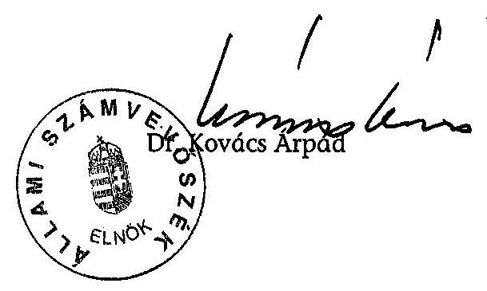
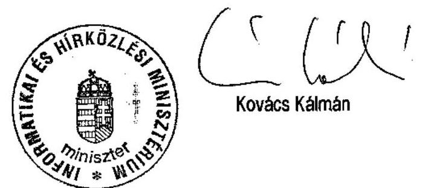
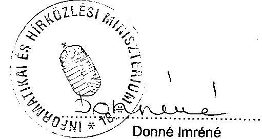
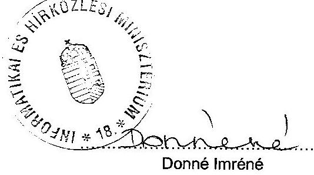
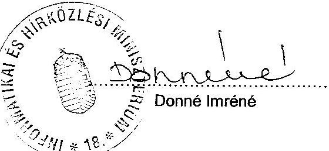
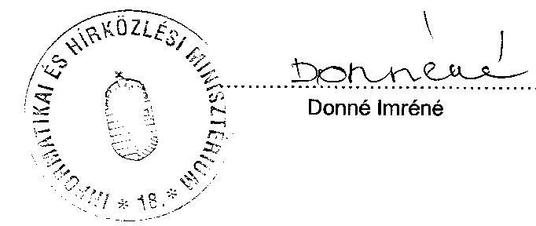
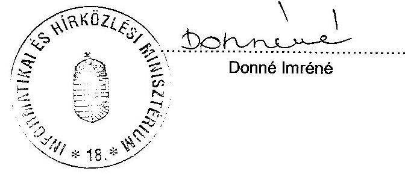
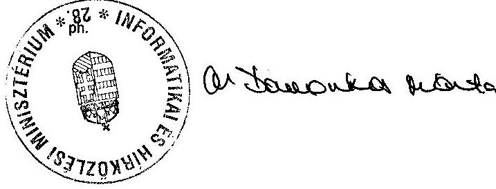

# JELENTÉS 

## az Informatikai és Hírközlési Minisztérium fejezet múködésének ellenôrzéséről

---

# 2. Államháztartás Központi Szintjét Ellenőrző Igazgatóság 

2.3. Átfogó Ellenőrzési Főcsoport
V-17-044/2004-2005.
Témaszám: 723
Vizsgálat-azonosító szám: V-0149

## Az ellenőrzést felügyelte:

Bihary Zsigmond
föigazgató
Az ellenőrzés végrehajtásáért felelős:
Hegedüsné dr. Müllern Veronika
főcsoportfőnök
Az ellenőrzést vezette:
Papp Sándor
számvevő főtanácsos

## Az összefoglaló jelentés készítésében közremüködött:

Csóry Györgyné számvevő tanácsos, főtanácsadó
Dr. Horváth Erika számvevő

## Az ellenőrzést végezték:

| Csóry Györgyné | Beck Miklós | Dr. Horváth Erika |
| :-- | :-- | :-- |
| számvevő tanácsos,   főtanácsadó | számvevő tanácsos | számvevő |
| Oláh Róbert | Patthy Júlia | Sinka Zoltán |
| számvevő | számvevő gyakornok | számvevő |
| Szélpál Ferenc | Vitányi István |  |
| számvevő tanácsos | külsős munkatárs |  |

## A témához kapcsolódó eddig készített számvevőszéki jelentések:

A korábbi évek zárszámadási jelentései és a központi költségvetés tervezéséről készített ÁSZ vélemények

---

# TARTALOMJEGYZÉK 

BEVEZETÉS ..... 7
I. ÖSSZEGZŐ MEGÁLLAPÍTÁSOK, KÖVETKEZTETÉSEK, JAVASLATOK ..... 9
II. RÉSZLETES MEGÁLLAPÍTÁSOK ..... 19

1. A fejezet irányító, felügyeleti tevékenysége ..... 19
1.1. A fejezet megalakítása ..... 19
1.2. A Minisztérium szervezetének kialakítása ..... 20
1.3. A fejezet irányító, jogszabályalkotó tevékenysége ..... 24
1.4. A fejezet szakmai irányítása, stratégiái ..... 25
1.5. A hírközlési hatósági feladatok ellátása ..... 26
1.6. A fejezeti kezelésű előirányzatok kezelése ..... 30
1.7. Az államháztartáson kívüli szervezetekben való érdekeltség ..... 32
1.8. A kontroll rendszer kialakítása és múködése ..... 34
1.9. Informatikai háttér múködése ..... 38
2. A fejezet múködése, gazdálkodása ..... 41
2.1. A fejezeti és az intézményi költségvetés tervezése, végrehajtása ..... 41
2.2. A szakmai feladatok szervezeten kívüli ellátása ..... 45
3. Beruházások ..... 46
3.1. Intézményi beruházások ..... 46
3.2. Postai beruházások ..... 47
4. Informatikai, távközlés-fejlesztési és frekvenciagazdálkodási feladatok előirányzat felhasználása ..... 50
4.1. Központi fejlesztési programok végrehajtása ..... 51
4.1.1. Közháló program ..... 51
4.1.2. Az Egységes Digitális Rádiótávközlési Rendszer (EDR) ..... 54
4.2. Központi Kiemelt Programok végrehajtása ..... 54
4.2.1. Az e-Önkormányzat program ..... 54
4.2.2. e-Ernyő pályázat ..... 55
4.3. Jövő Háza program ..... 55
4.4. A pályázati úton megvalósult támogatások ..... 56
4.4.1. Szélessávú internet penetráció növelése ..... 58
4.4.2. e-Magyarország pontok program pályázatai ..... 60
4.4.3. Esély a felzárkózásra pályázat ..... 62
4.4.4. e-Demokrácia - önkormányzatok a világhálón ..... 64
4.4.5. e-Generáció - informatika a gyermekekért ..... 67
4.4.6. Új távmunkahelyek létrehozása ..... 68
4.4.7. Brunszvik Teréz óvodai számítógépes program ..... 70
4.4.8. Önkormányzati informatikai rendszerek támogatása ..... 73

---

4.5. Miniszteri hatáskörben döntött támogatások ..... 74
5. Egyéb fejezeti kezelésű előirányzatok felhasználása ..... 75
5.1. A vezetékes távbeszélő előfizetők szociális támogatása ..... 75
5.2. Az Egyetemes Elektronikus Hírközlési Támogatási Kassza ..... 76
MELLÉKLETEK

1. számú Az informatikai és hírközlési miniszter levele
2. számú Tanúsítványok 1-4
3. számú Az informatikai stratégiák és céljaik, kapcsolódásuk
4. számú A támogatottak köre és a támogatás révén elnyerhető eszközök
5. számú A korábbi számvevőszéki vizsgálatok alapján tett javaslatok realizálása

# FÜGGELÉKEK 

1. számú Az Egységes Digitális Rádiótávközlési Rendszer előkészítése
2. számú Az IHM létrehozása előtt a MeH Informatikai kormánybiztossága által indított pályázatok

---

# RÖVIDÍTÉSEK JEGYZÉKE 

| Ámr. | Az államháztartás múködési rendjéről szóló 217/1998. (XII. 30.) Kormányrendelet |
| :--: | :--: |
| ÁNTSZ | Állami Népegészségügyi és Tisztifőorvosi Szolgálat |
| BME | Budapesti Múszaki Egyetem |
| ECDL | European Computer Driving Licence |
| EDR | Egységes Digitális Rádiótávközlési Rendszer |
| EEHTK | Egyetemes Elektronikus Hírközlési Támogatási Kassza |
| EF | Ellenőrzési Főosztály |
| Eht. | Az elektronikus hírközlésről szóló 2003. évi C. törvény |
| EKG | Elektronikus Kormányzati Gerinchálózat |
| FAKIR | For Applications Kormányzati Iratkezelési Rendszer |
| Felügyelet | Hírközlési Felügyelet |
| FMM | Foglalkoztatáspolitikai és Munkaügyi Minisztérium |
| FVF | Fogyasztóvédelmi Főfelügyelőség |
| GKM | Gazdasági és Közlekedési Minisztérium |
| GVH | Gazdasági Versenyhivatal |
| GVOP | Gazdasági Verseny Operatív Program |
| HHÁT | Hírközlési Helyettes Államtitkárság |
| Hkt. | A hírközlésről szóló 2001. évi XL. törvény |
| IHM | Informatikai és Hírközlési Minisztérium |
| IKB | Informatikai Kormánybiztosság |
| IPH | Integrált postai hálózat |
| IT Kht. | IT Információs Társadalom Kht. |
| ITB | Informatikai Tárcaközi Bizottság |
| ITKTB | Információs Társadalom Koordinációs Tárcaközi Bizottság |
| ITP HÁT | Információs Társadalom Program Helyettes Államtitkárság |
| ITS HÁT | Információs Társadalom Stratégiai Helyettes Államtitkárság |
| IVSZ | Informatikai Vállalkozások Szövetsége |
| KEHI | Kormányzati Ellenőrzési Hivatal |
| KFGH | Kormányzati Frekvenciagazdálkodási Hivatal |
| KKP | Központi Kiemelt Programok |
| KÖVIM | Közlekedési és Vízügyi Minisztérium |
| Közháló | Informatikai Közháló |
| MÁK | Magyar Államkincstár |
| MEH | Miniszterelnöki Hivatal |
| MeHVM | Miniszterelnöki Hivatalt vezető miniszter |
| MITS | Magyar Információs Társadalom Stratégia |
| MKGI | Miniszterelnökség Közbeszerzési és Gazdasági Igazgatósága |
| MP Rt. | Magyar Posta Rt. |

---

| MÚI | Magyar Űrkutatási Iroda |
| :-- | :-- |
| NFT | Nemzeti Fejlesztési Terv |
| NHH | Nemzeti Hírközlési Hatóság |
| NIIF Program | Nemzeti Információs Infrastruktúra Fejlesztési Program |
| NIIFI | Nemzeti Információs Infrastruktúra Fejlesztési Iroda |
| NITS | Nemzeti Információs Társadalom Stratégia |
| PM | PénzügyMinisztérium |
| SLA | Service Level Agreement |
| SzCsM | Szociális és Családügyi Minisztérium |
| SzMSz | Szervezeti és múködési szabályzat |
| SZT-IS |  |
| Tanács | Nemzeti Hírközlési Hatóság Tanácsa |

---

# ÉRTELMEZŐ SZÓTÁR 

| EMIR | Strukturális és Kohéziós Alapok monitoring rendszere |
| :-- | :-- |
| FAKIR | a pályázatspecifikus adatok rögzítését, a képek, valamint   a rögzített adatok programozott bevitelét támogató rend-   szer |
| OLAP | On-Line Analytical Processing |

---

.

---

# JELENTÉS 

## az Informatikai és Hírközlési Minisztérium fejezet múködésének ellenőrzéséről

## BEVEZETÉS

Az Informatikai és Hírközlési Minisztérium fejezet a Magyar Köztársaság minisztériumainak felsorolásáról szóló 2002. évi XI. törvény alapján 2002-ben jött létre.

A Minisztérium feladatait - az ágazati jogszabályok mellett - az Informatikai és Hírközlési Miniszter feladat- és hatásköréről szóló 141/2002. (VI. 28.) Korm. rendelet határozza meg, amely szerint az IHM - a kormányzati informatikai feladatokat kivéve - a Miniszterelnöki Hivatal Informatikai Kormánybiztosságának jogutódja. A rendelet a miniszter feladat- és hatáskörén belül - többek között - a hatósági és közigazgatási feladatokon túl az információhoz jutás, az információközlés, valamint a kommunikáció, mint az alapvető emberi (rész)jogok gyakorlásának biztosítását, az Internet elérhetőségét, az informatikai, a hírközlési és a kapcsolódó szolgáltatások folyamatos bővülésének ösztönözését, az információs társadalommal kapcsolatos egységes átfogó kormányzati stratégia kidolgozását jelölte meg.

A hírközlés fejlesztésével, ezen belül az információs társadalom megteremtésével kapcsolatos elveket, alapvető feladatokat már 1998-ban kormányhatározat rögzítette, a tudásalapú információs társadalom magvalósítását 2002-ben kormányrendelet jelölte meg a miniszter feladataként, 2003-ban elkészült a Magyar Információs Társadalom Stratégiája. A Minisztérium tevékenysége és támogatási lehetősége az uniós csatlakozást követően kiegészült a Gazdasági Versenyképesség Operatív Program (GVOP) ágazatra vonatkozó feladataival. A Minisztérium az egyetemes szolgáltatóknál felmerülő rendkívüli kiadások mérséklésére - törvényi rendelkezés alapján - Elektronikus Hírközlési Támogatási Kasszát hozott létre, amit - a miniszter irányításával - a Nemzeti Hírközlési Hatóság kezel. A vezetékes távbeszélő előfizetők közül a rászorulók pedig egy szociális elven múködő előirányzatból kaphatnak támogatást.

A Minisztérium felügyelete alá 4 önálló költségvetési szerv, az IHM Igazgatása, a Nemzeti Hírközlési Hatóság (2004-ig Hírközlési Felügyelet), a Magyar Urkutatási Iroda, 2004-től a Nemzeti Információs Infrastruktúra Fejlesztési Iroda, valamint egy részben önálló költségvetési intézményként a Nemzeti Hírközlési és Informatikai Tanács Irodája tartozik.

Az IHM fejezet költségvetésének eredeti előirányzata 2003-ban 42,4 milliárd Ft, 2004-ben 50,3 milliárd Ft volt, 2005-re 40,2 milliárd Ft-ot terveztek, a kiadások kb. 2/3 részét a beruházási és fejezeti célelőirányzatok adták.

---

Az ellenőrzés célja annak értékelése volt, hogy a 2002. évben létrehozott fejezet szervezeti, irányítási és működési rendje, létszáma, költségvetése biztosította-e feladatainak hatékony és eredményes ellátását, valamint a kormányzat információs társadalom kiépítéséhez és az Európai Unióhoz való csatlakozásból adódó követelmények teljesüléséhez rendelt fejezeti kezelésű előirányzatok felhasználása teljes körűen biztosította-e az ágazati célkitűzések végrehajtását.

Az ellenőrzés a 2002-2004 közötti időszakot fogta át, de érintette a fejezet 2005. évi feladatainak ellátását és pénzforgalmi adatait is. Az ellenőrzés átfogó jelleggel irányult a fejezet belső kontrollrendszerére, annak rendszerszemléletű értékelésére, annak megítélésére, hogy a belső kontrollrendszer kiépítése, múködése megfelelő biztosítékot adott-e az ágazati-, ill. fejezet irányítási, valamint a gazdálkodási feladatok szabályszerű, gazdaságos, hatékony és eredményes ellátásához, az erőforrások védelméhez, a megbízható (pénzügyi és más szakmai) információ-szolgáltatási, valamint beszámolási kötelezettségek teljesítéséhez.

Az ellenőrzés keretében (4. pont) teljesítmény-ellenőrzés módszerével értékeltük a közpénzek felhasználásának eredményességét 12 fejlesztési, ill. támogatási program hasznosulásán keresztül.

A fejezetnél jelenlegi ellenőrzésünk már a második, de az ÁSZ 2003. évi vizsgálati programjában szerepelő, az informatikai távközlés-fejlesztési és frekvenciagazdálkodási célokra fordított pénzeszközök hasznosulásának ellenőrzését adatok, ill. dokumentációk hiánya miatt akkor befejezni nem tudtuk, a fejezeti kezelésű előirányzat megbízhatósági ellenőrzését a 2002. évi zárszámadási ellenőrzés keretében végeztük el. Az akkori megállapítások és a jelen vizsgálatnál bekért adatok a 2. számú függelékben találhatók.

A jelentést az Állami Számvevőszékről szóló 1989. évi XXXVIII törvény 25. § (1) bekezdésének megfelelően észrevételezésre megküldtük Kovács Kálmánnak az informatikai és hírközlési miniszternek, aki a jelentésben foglaltakat elfogadta, észrevételt nem tett. Levelét az 1. számú melléklet tartalmazza.

---

# I. ÖSSZEGZŐ MEGÁLLAPÍTÁSOK, KÖVETKEZTETÉSEK, JAVASLATOK 

A 2002. évi országgyűlési választást követően megalakult új kormány 20022006 évekre szóló kormányprogramja az elektronikus Európához csatlakozás érdekében az információs társadalommá alakulás elősegítését, mint kiemelt állami feladatot deklarálta. Az önkormányzatokat és a társadalmat érintő informatikai feladatokat, - kiegészítve a hírközlési, postai szabályozási stb. feladatokkal - egy újonnan kialakított önálló ágazati fejezetbe szervezték. Ezzel megteremtődtek az egységes irányítást igénylő feladatellátás szervezeti és költségvetési keretei, feltételei. Előzetesen azonban nem mérték fel a valóban egységes irányítást igénylő feladatokat és nem mérték fel, hogy milyen szakmai és költségvetési előnyökkel járhat az új fejezet létrehozása. ${ }^{1}$ A nem megfelelő előkészítésre utal az is, hogy az Egységes Digitális Rádiótávközlési Rendszer irányítását 2003-ban a fejezethez, majd 2005-ben az ismét a MeH feladatkörébe került.

Az új fejezet rendelkezik azokkal a költségvetési forrásokkal, amelyek egyes intézmények (óvodák, iskolák), foglalkoztatási csoportok (pl. védőnők) távmunkát végzők számítógéphez jutását és Internet elérését támogatják. A távmunkát végzők támogatását a Minisztérium a Foglalkoztatáspolitikai és Munkaügyi Minisztériummal együttmúködve valósította meg. A feladatok fejezetek közötti megosztását megalapozó anyagok hiányában nem ítélhető meg, hogy a jelenlegi feladatmegosztás, vagy az ágazatilag kapcsolódó fejezethez (OM, FMM) való feladatrendelés lenne a célszerúbb. ${ }^{2}$

A Minisztérium tényleges múködési feltételei teljes körúen - a feladat- és forrásátadásokra vonatkozó megállapodások elhúzódása ${ }^{3}$, a költségvetési források megkésett átcsoportosítása és a létszám körüli bizonytalanság miatt csak 2002 szeptemberére alakultak ki. Több mint három hónapon keresztül a fejezetnek (minisztériumnak) nem volt költségvetése. A Minisztérium az első két évben a közigazgatási államtitkár által jóváhagyott ideiglenes SzMSz és Ügyrend, és azt 2003 február 1-jéig kiegészítő 26 belső szabályzat, majd 2004. november 15-étől a miniszter által jóváhagyott SzMSz és Ügyrend szerint múködött. A vizsgált időszakban a Minisztérium szervezete folyamatosan átalakult, e változások a hatékonyabb múködés irányába mutattak. Ugyanakkor további feladatot jelent a monitoring és ellenőrzési rendszer, valamint a szemé-

[^0]
[^0]:    ${ }^{1}$ Egy, a miniszter által rendelt és 2004-ben elkészült szakértői anyag szerint az EU-ban az informatikai, ill. távközlési feladatokat (egy kivételével) nem önálló minisztériumok látják el.
    ${ }^{2}$ Pl. a területfejlesztés fejezet 2005. évi előirányzatai között szerepel a hátrányos térségekben élő köztisztviselők és pedagógusok internet-hozzáférésének támogatása.
    ${ }^{3}$ A Minisztériumot létrehozó, a Magyar Köztársaság Minisztériumainak felsorolásáról szóló 2002. évi XI. törvény alapító okiratot nem tartalmazott, a források átadásáról az érintett tárcáknak kellett megállapodni.

---

lyi feltételek javítása. A Minisztérium 2002. évi létszámigényét csak részben - a tervezett 280 fővel szemben 200 főben - fogadták el, az engedélyezett létszám a vizsgált időszakban - döntően a 2003. évi kormányhatározat alapján végrehajtott létszámcsökkentés eredményeként - 183 főre mérséklődött.

A Minisztérium szervezete 2004-től - az OM-től átvett- Nemzeti Információs Infrastruktúra Fejlesztési Programot ${ }^{4}$ kezelő Irodával (NIIF) bővült. A Program fedezetét biztosító előirányzat felhasználására - a miniszteri utasítás ellenére az IHM és a NIIF Iroda megállapodást nem kötött.

A Hírközlési Felügyelet szervezeteinek összevonásával 2004 elején jött létre a Nemzeti Hírközlési Hatóság. Az intézmény működése a jogszabályban előírt határidők betartása és az alacsony átlagos ügyintézési idő, valamint a határozatok ellen kezdeményezett fellebbezések tartósan alacsony (2\%) aránya alapján hatékonynak minősíthető.

A Minisztérium jogszabályalkotó tevékenységét féléves jogalkotási programok szerint végzi, a jogharmonizációs célú jogszabály-előkészítési és jog-szabály-alkotási kötelezettségének eleget tett.

A fejezeti kezelésű előirányzatok felhasználását miniszteri rendeletek szabályozták, nem hajtották végre ugyanakkor az informatikai ágazati feladatok kormányhatározatokban előírt szabályozását. Nem történt meg az ágazati fejlesztési feladatok szakmai alapdokumentuma, a Magyar Információs Társadalom Stratégia (MITS) finanszírozásának a költségvetési törvények rendjébe történő illesztése, valamint a MITS programjainak végrehajtását biztosító tervezési, monitoring és értékelési rendszer szabályozása. Ennek következtében a pályázati célok teljesülésének mérési, elemzési és értékelési folyamata, ill. eljárásrendje nem volt kidolgozott, ami hátrányosan befolyásolja a programok végrehajtásának, ill. hasznosulásának nyomon követését.

A tulajdonosi, vagyonkezelési feladatokat 2004. november 15-e előtt nem egy főfelelős (koordináló) szervezeti egység látta el, azokat a Minisztérium szervezeti egységei elkülönülten végezték. A felügyelő bizottságok tevékenységét nem koordinálták megfelelően, hiányzott a társaságok egységes szempontrendszer szerinti beszámoltatása, adatszolgáltatása, nem épült ki a változások nyomon követésére alkalmas adatbázis. A Minisztérium Kollégiuma 2004-ben döntött a tulajdonosi jogok gyakorlásával kapcsolatos feladatok ellátásáról. A hiányosságok felszámolását célozta a 2004. év végi szervezetváltozás is.

Az IHM tulajdonosi felügyelete alá tartozó társaságok közül kizárólag az IT Kht.-t alapította a Minisztérium, a többi társaság kormányhatározatok alapján került a fejezethez. Az IT Kht. teljes egészében a Minisztérium pályázati rendszerének kezelésében vesz részt. E tevékenység államháztartáson kívülre szervezését hatástanulmány nem előzte meg, ennek hiányában indokoltsága, gazdaságossága nem volt megalapozott. A hatályos törvények alapján összeállított

[^0]
[^0]:    ${ }^{4}$ A NIIF országos kutatási, felsőoktatási és közgyűjteményi információs infrastruktúra fejlesztési célprogram, amely központi költségvetési támogatással valósul meg.

---

alapító okiratok a társaságok közvetlen irányítóinak indokolatlanul nagy hatáskört biztosítanak, ami 2004-ben a Millenáris Kht.-nál -a Jövő Háza Program kapcsán, az alapító által kialakított kettős ügyvezetéssel összefüggésben - indokolatlan, irracionális, párhuzamosságokat (létszámbővítés, vezetői státuszok és ezzel a személyi juttatások növekedését) eredményező intézkedéseket tett lehetővé. ${ }^{5}$

A költségvetési tervezés 2003-tól folyamatosan javult. A fejezeti tartalékot elsősorban személyi juttatásokra (állami többletfeladatokhoz kapcsolódó kifizetésekre és jutalmakra) használták fel. A Minisztérium tevékenységét támogató informatikai rendszer szabályozottsága 2005 elején lett teljes körű, de a külső üzemeltetők felelősségének hiányos rögzítettsége miatt a rendszer múködtetése továbbra is kockázatos, és nem megoldott egyes eszközök biztonságos tárolása.

A 2003. év zárszámadásának ellenőrzése során kifogásoltuk, hogy az igazgatás cím intézményi beszámolójában a mintavétellel kiválasztott Postai Beruházások előirányzathoz kapcsolódó tételek esetében a MÁK-nál vezetett számla forgalmát alátámasztó alapbizonylatok nem egyeztek a terhelési tételekkel.

A Minisztérium és intézményei alapfeladatuk ellátásához gyakran vettek igénybe külső szakértőket, elsősorban tanácsadói, pályázatértékelési feladatokra. Az IT Kht. és az IHM között, a pályázatos támogatások kezelésére megkötött szerződésekhez pályázatonkénti költség-jogcímenkénti tervet, illetve kalkulációt csatoltak, azonban a normatív alapon számolható, nagy költségigényű, tömegszerű pályázatok esetében ezeket nem normatív alapon tervezték. ${ }^{6}$ Ennek következtében a szerződéses összegek megalapozottsága nem volt ellenőrizhető. A kalkulációk pályázatonkénti költségmegosztáson alapultak és gyakorlatilag a Kht. éves költségigényének szétosztását jelentették, vagyis elvben a feladatok végrehajtását, valójában az IT. Kht. múködését finanszírozták.

A fejezet ellenőrzési rendszere nem felelt meg a folyamatosan változó és növekvő számú feladat által diktált igényeknek. A felügyeleti ellenőrzési feladatokat ellátó Ellenőrzési Főosztály (EF) funkcionális függetlensége biztosított, működése szabályozott, de a feladatainak ellátásához szükséges létszám kialakítása 2004-ig elhúzódott. Az ellenőrzési munkaterv 2002-ben nem, ezt követően rendszeresen késve készült el. A munkatervben foglalt ellenőrzések közül - létszám korlát és terven felüli feladatok miatt - a vizsgált időszakban csak két

[^0]
[^0]:    ${ }^{5}$ A szervezet 22 fővel bővült, az új ügyvezető - határozott, 2006-ig terjedő időre - három új igazgatót, ill. egy főigazgatót nevezett ki, átlagosan 550 ezer forint/hó jövedelemmel és prémiummal. A kiadásokat növelte, hogy 20 fős szakértői létszámot is foglalkoztattak. Az ügyvezető igazgatókat a miniszter 2004. december elején visszahívta, az ügyvezetéssel a műszaki igazgatót bízta meg.
    ${ }^{6}$ Ezt már az ÁSz a 2003. évi zárszámadás ellenőrzés keretében is hiányolta, azzal, hogy a Minisztérium pályázati rendszerét kezelő IT Kht. költségelszámolásában - költségnormatívák hiányában - nincs szoros korreláció a feladatok és az azokra terhelt költségek között.

---

vizsgálatot hajtottak végre. ${ }^{7}$ Az éves ellenőrzési terv alapján lefolytatott vizsgálatok az igazgatás címre, valamint a fejezeti kezelésű előirányzatokból lebonyolított közbeszerzésekre terjedtek ki, az intézmények múködését célzó, ill. teljesítmény szemléletú ellenőrzést nem végeztek. Az ellenőrzési rendszer fontos elemét jelentő Financial auditot 2004-re egy intézmény esetében terveztek, de végrehajtására nem került sor, a 2005. évi munkatervben két intézmény financial auditja is szerepel. A felügyeleti ellenőrzés megerősítésének szükségességére utal, hogy vizsgálatunk a külső közreműködőkkel és szakértőkkel kötött megbízási szerződések esetében is tett pénzügyi, célszerűségi kifogásokat. Az EF által elvégzett ellenőrzésekről vezetett nyilvántartás tartalmi hiányosságok miatt nem felelt meg a rendeleti előírásoknak.

A több ezer nyertes pályázathoz kapcsolódó ellenőrzési rendszer nem múködik megfelelően. Nem egyértelmű a feladatok és felelősségek meghatározása. A nyertes pályázatok számához képest kis számú ellenőrzés során feltárt szabálytalanságok a folyamatba illesztett ellenőrzés gyengeségeire hívják fel a figyelmet. Egy pályázatnál a soron kívül elrendelt gyorsrevíziót követő szerződésmódosításokkal az anyagi kár keletkezését elkerülték ${ }^{8}$, de a revízió a felelősség tisztázására nem terjedt ki. Ugyanezen támogatásnál a pályázatkezelő által a nyertesek 5\%-ánál (16 pályázó) végzett ellenőrzés a támogatási összeg közel felének ( 76 millió Ft) rendeltetésellenes felhasználását állapította meg. A Minisztérium 8 esetben indított inkasszót, a helyszíni vizsgálat végéig ebből 20 millió Ft folyt be. ${ }^{9}$

A Nemzeti Fejlesztési Terv (NFT) részét képező Gazdasági Versenyképesség Operatív Programon (GVOP) belül a fejezet fejlesztési tevékenységében az információs társadalom és gazdaság fejlesztése - ezen belül az e-gazdaság, az információs iparág, az e-közigazgatás és a szélessávú távközlési hálózat hátrányos helyzetű térségekben való fejlesztése - kapott prioritást. Az IHM által végrehajtott fejlesztések, pályázatok szakmai programokra támaszkodtak. Ezek 2003-ig a MeH Informatikai Kormánybiztossága által készített Nemzeti Információs Társadalom Stratégiára (NITS) épültek, 2003-tól a Magyar Információs Társadalom Stratégia (MITS) főirányaihoz illeszkedtek és ráépültek a 2002-ben indított NITS programokra, ill. folytatták azokat. ${ }^{10}$

[^0]
[^0]:    ${ }^{7}$ Az EF 2003. IV. negyedévig éves ellenőrzési tervben szereplő vizsgálatot nem, csak felső vezetői utasítással elrendelt - soron kívüli vizsgálatokat folytatott le.
    ${ }^{8}$ A Bíráló Bizottság 41 pályázó esetében döntött a támogatási összeg csökkentéséről öszszesen 9,6 millió Ft összegben. A pályázók egy része már mindkét fél által aláírt támogatási szerződéssel rendelkezett, sőt néhány pályázó már az elszámolását is beadta, ezért a szerződésmódosítás kezdeményezése - a pályázók reagálása függvényében kockázatos volt.
    ${ }^{9}$ A Közigazgatási Államtitkár a 6710/1/2004. jelentés megállapításai alapján a teljes támogatotti kör helyszíni ellenőrzéséről döntött. A helyszíni vizsgálat idején az ellenőrzések előkészítése még folyamatban volt.
    ${ }^{10}$ Pl. az önkormányzatok informatikai rendszerének támogatása folytatása volt a 2002-ben meghirdetett e-Önkormányzat pályázatnak.

---

A központi beruházásokon belül a Postai beruházások elöirányzat a Magyar Posta Rt. (MP Rt.) által - döntően az MP Rt. saját forrásából - megvalósuló Integrált Postai Hálózat (IPH) kiépítéséhez járult hozzá, (a vizsgált időszakban előirányzott összeg 1030 millió Ft volt, a 2005. évre szóló költségvetési törvény nem tartalmazott előirányzatot). Az évenkénti aktuális beruházás helyét a MP Rt. jelölte ki, a projekt kezelésénél a Minisztérium irányítása és felügyelete nem, ill. csak az elszámolásoknál érvényesült. A Minisztérium 2003ban az IPH helyek kialakításának támogatását, mint prioritást, nem követelte meg következetesen, sőt épületrekonstrukciós munkák fedezetét is biztosította az előirányzatból. Ennek következtében az MP Rt. 2003-ban a támogatás mindössze 8,65 \%-át (34,6 millió Ft-ot) fordította az eredeti célként megjelölt IPH munkahelyek kiépítésére, valamint informatikai fejlesztésre, a fennmaradó összeget három postahivatal építési rekonstrukciójára használta fel. A 2004. évre szóló miniszteri utasítás már az informatikai körre korlátozta a felhasználást, így a támogatást 2004-ben már teljes egészében az eredeti célra fordították, kivéve azt a 28 millió Ft-ot, amelyet a Pénzügyminisztérium levele alapján az IHM zárolt (felhasználását 2005-re engedélyezte). Az előirányzat felhasználásáról készült szöveges beszámoló csupán a beruházások helyzetére vonatkozó, ill. pénzügyi adatokat mutatta be, és utalt a tervezett IPH-ek számára, de az előirányzat hasznosulásának mutatójáról, vagyis az abban az évben kialakított, ill. a már elkészült összes IPH-ek számáról nem számolt be.

Az ágazati célok megvalósításának forrása az informatikai, távközlésfejlesztési és frekvencia-gazdálkodási célelőirányzat volt. Ennek összege a vizsgált időszakban 112, 8 millárd Ft volt, ezen belül az évenkénti eredeti előirányzat folyamatosan, közel harmadára csökkent, összegét az évközbeni elvonások, ill. zárolások tovább korlátozták. A legnagyobb összeget, 6568,8 millió Ft-ot 2004-ben vonták el, ezen belül a legjelentősebb zárolás, 6377,8 millió Ft az informatikai, hírközlési fejlesztési programoknál, támogatásoknál jelentkezett, ez az előirányzat közel 30\%-át tette ki.

Az előirányzat felhasználása központi fejlesztések keretében ${ }^{11}$ (EDR, Közháló, Kiemelt Központi Programok), ill. pályázati úton ${ }^{12}$ valósult meg az informatikával és a hírközléssel összefüggő intézkedések, új technológiák bevezetésén, szervezetek támogatásán túlmenően. A miniszter a támogatásokon belül egyedi döntési jogkörében a vizsgált időszakban - a fejezeti kezelésű előirányzatok felhasználását szabályozó miniszteri rendelet alapján - mintegy 3,2 milliárd Ft támogatást adott különböző szervezeteknek. A miniszterek egyedi döntési hatáskörébe utalt támogatás lehetőségéről, ill. arányának kötelező szabályozásáról sem az Áht, sem a végrehajtásáról rendelkező kormányrendelet nem rendelkezik. A miniszteri rendeletben foglalt támogatható célok közül nem kellően körülírt a „szervezeti és intézményi háttér megerősítésének"

[^0]
[^0]:    ${ }^{11}$ Ezek közös jellemzője, hogy a fejlesztéseket az IHM irányítja és koordinálja, a végrehajtás a közbeszerzési eljárás keretében kiválasztott kivitelező feladata.
    ${ }^{12}$ A pályázati programok különböző célokat tűztek ki, más-más célcsoportokkal, de általánosan és jellemzően számítástechnikai, ill. Internet elérést támogattak.

---

támogatása. A nyilvántartásban az egyedi döntésűek nem, illetve nehezen (kézi kigyűjtéssel) követhetőek nyomon.

A korábbi TETRA rendszert kiváltó, központi fejlesztésű Egységes Digitális Rádiótávközlési Rendszer (EDR) ${ }^{13}$ kialakításáról 2002-ben döntött a Kormány. Az előkészítési fázis lassan haladt, a végrehajtásban bizonyos fokú döntésképtelenség mutatkozott, lefolytatását jogszabályok (3), kormányhatározatok (6) sora, koncepcióváltás, feladatáthelyezések, a szervezeti háttér, a felelősök gyakori változásai jellemezték. A rendszer kialakítására, ill. múködtetésére irányuló pályázati felhívás - a határidők többszöri módosítását követően 2005 március közepén jelent meg. ${ }^{14}$

A projekt megvalósításának dokumentációját, többszöri módosítást követően a két tárca (IHM-MeH) közötti véleményeltérés miatt - a Kormány csak 2004 közepén fogadta el, a kiírt tárgyalásos közbeszerzési eljárást kifogásolható elemek (tárgyalásos eljárás, szakmai értékelés hiánya) és nem ismert hátterú döntések (a nyertes pályázó visszalépése) kisérték. A késedelmek miatt az eredeti határidőket 2004 közepén,- ezen belül az EDR kialakítására és üzemeltetésére vonatkozó szerződések megkötésének határidejét 2005. március 30 -ára - majd 2005 májusában 2005. október 31-ére módosította. Az ajánlati felhívás 2005 februárjában jelent meg. A belső munkatársak mellett a különböző tanácsadói, szakértői feladatokra bruttó 181,8 millió Ft összegben kötött 14 szerződés (ebből hatot a MeH indított) több mint felét - jogszabályi kereteken belül - versenyeztetés nélkül kötötték meg.

A 2003-2004. évekre szóló, MITS-re támaszkodó Központi Kiemelt Programok (KKP) KKP végrehajtása (pl. e-Ernyő, e-Önkormányzat) - elsődlegesen a megvalósításhoz szükséges költségvetési keret hiányában - késedelmes volt, mert amíg a MITS céljait szolgáló projektek többsége már folyamatban volt, addig a KKP 2004 végén még az előkészítési-tervezési szakaszban tartott. Ennek oka, hogy a források szűkössége miatt a programokra a keretet nem tudták biztosítani, a programfelelősök nem voltak kijelölve, feladat- és hatáskörük nem volt rendezett, valamint nem készült el a projekt megvalósításhoz szükséges hatástanulmány sem, emellett forrás hiányában a szakmai előkészítés, ill. a szakértői háttér megteremtése is késett. ${ }^{15}$

Az ágazati célkitúzések pályázati úton történő megvalósítása keretében a 2002-2004 közötti időszakban a Minisztérium 39 pályázatot hirdetett meg, a

[^0]
[^0]:    ${ }^{13}$ Az EDR a készenléti szervek - Belügyminisztérium (Rendőrség, Határőrség, Tűzoltóság, Katasztrófavédelem), Honvédelmi Minisztérium (Katonai Biztonsági Szolgálatok), Országos Mentőszolgálat, Igazságügyi Minisztérium, Miniszterelnöki Hivatal (Polgári Titkosszolgálatok), Pénzügyminisztérium, Környezetvédelmi és Vízügyi Minisztérium mozgásban lévő munkatársai és járművei részére biztosítana zártcélú telekommunikációs szolgáltatást.
    ${ }^{14}$ A késedelem miatt a helyszíni vizsgálatot követően kiadott 1053/2005. (V. 26.) Korm. határozat módosította a határidőket.
    ${ }^{15}$ A MITS szerint a fenti területek szabályozása egy, az IHM által elkészítendő jogszabályban fog megvalósulni, ilyen jogszabály azonban a helyszíni vizsgálat befejezéséig még nem jelent meg.

---

több mint 32 ezer nyertes közel 23 milliárd Ft támogatást kapott. A pályázatok 2003-ig a NITS, ezt követően a 2003-ban elkészült MITS stratégián alapultak ezekhez előzetes hatástanulmányok készültek. Részletes vizsgálatra 13 informatikai pályázatnál került sor, ezek támogatása meghaladta a 3,5 milliárd Ft-ot, a támogatottak száma pedig a négyezret. A helyszíni ellenőrzés befejezéséig a részletesen vizsgált pályázatok egyike sem zárult le, ezért vizsgálatunk a pályázatokhoz kapcsolódó ellenőrzési és értékelési módszerekre irányult.

A pályázatok esetében azok célkitűzéseit, ill. a pályázati keretösszeget megalapozó hatástanulmányt, előzetes felmérést, az igények megalapozását, 2003 előtt csak egy esetben, az „e-Magyarország pontok" előkészítése során készítettek. Ezt követően a 2003-tól kiírt pályázatok előkészítettsége, mind a célok megalapozása, mind az előkészítés dokumentáltsága szempontjából javult. ${ }^{16}$ A részletesen vizsgált támogatási program közül két esetben a támogatási keretösszeg meghatározásánál előfordult, hogy a várható igényeket rosszul mérték fel, a többletigényt a szélessávú Internet penetráció növelése pályázatnál az igényeket előirányzat emeléssel elégítették ki, az e-Demokrácia pályázatnál az elnyert eszközök kiszállítása késedelmesen történt meg.

Az informatikai eszközök szállítóit központosított közbeszerzés keretében választották ki, a pályázatok nyertesei egy célszerű módszerrel - az eszközbeszállító cégek által - összeállított internet alapú katalógusból rendeltek, az IHM a szállító cégeknek fizetett (pl. e-Demokrácia, Esély a felzárkózásra pályázat, e Generáció). A speciális eszközök vonatkozásában katalóguson kívüli beszerzésre kaptak lehetőséget.

A pályázatok végrehajtásában a hiányos előkészítésből adódóan késedelmek mutatkoztak. Az informatikai eszközök kiszállítása (a pályázati kiírásban tervezett határidőhöz képest), a pályázók becsültnél magasabb számával, valamint a központosított közbeszerzés időigényével összefüggésben késett. A kifizetések elszámolása, ill. folyósítása elhúzódása esetén, a szállítók a kifizetések késése miatt késedelmi kamatot számoltak fel. Egy alprogram indítása időszerűtlen volt, mert az eszköz eredményes használatához alapvetően szükséges közigazgatási szolgáltatás igénybevételének feltétele (a szabályozási környezet, a kártya és kártyaleolvasók) hiányzott.

A programok végrehajtására fordított pénzeszközök hasznosulása nem értékelhető egyértelműen, mert nem, vagy csak egyszerű naturális mutatót határoztak meg (települések, kiépített végpontok, kiosztott eszközök száma). Ezek alapján eredményesnek tekinthető, hogy 2004 végén (a Minisztérium kimutatása alapján) az önkormányzatok csupán 3\%-a nem rendelkezett számítógéppel és 10\%-a internet eléréssel. Ugyancsak pozitívum, hogy a támogatásoknál előnyben részesítették a kisebb ill. a hátrányos települések Internet hálózatba kapcsolását ill. a meglevő szolgáltatás fejlesztését. Az esély a felzárkózásra pályázat keretében 2570 e-Magyarország pontok program keretében 2132 Internet hozzáférési hely fejlesztését támogatták, ezen belül egyedi szerződésekkel egyházak, kamarák és más szervezetek összesen 805 Internet-hozzáférési hely

[^0]
[^0]:    ${ }^{16}$ A kutatási, valamint egyes pályázati témákra fókuszáló megalapozó vizsgálatok anyagainak egy része az IHM internetes oldalán is hozzáférhetőek.

---

kialakítását támogatták, összesen 817,2 millió Ft ráfordítással. Ez a program teljes összegének a felét tette ki. Az önkormányzatok Internet elérését támogató e-Demokrácia pályázat során 2264 önkormányzat kapott támogatást alapinfrastruktúra kiépítésére és Internet elérhetőségre.

Minőségi szempontból kedvező, hogy a program résztvevői kedvező áron, jó minőségben, IP virtuális magánhálózati szolgáltatáshoz jutnak, emellett elősegítik az állampolgárok számára az interneten keresztül elérhető szolgáltatások és információk használatát, és várhatóan növelik az adott terület üzleti potenciálját. Eredménynek tekinthető, hogy az önkormányzatok informatikai fejlesztésén és rendszer-bevezetési tapasztalatainak hasznosításán túlmenően lehetőség nyílt más önkormányzatoknál már sikeresen múködő rendszerek elterjesztésére.

A tényleges hasznosulást a telepített végpontok és az informatikai eszközök használatán (időbeni kihasználtság, elintézett ügyek száma) keresztül lehet lemérni, de az erre vonatkozó indikátorok és ellenőrzési módszerek kidolgozása még a vizsgálat idején nem volt általános, ill. teljes körű. Nem volt átfogó, az információs társadalom fejlődését nyomon követő monitoring, de ennek részeként fogható fel, hogy monitoringként, pl. az „e-Generáció, az Esély a felzárkózásra" pályázatoknál a támogatottnak a teljes megvalósuláskor a lezáráshoz részvételi és teljesítési statisztikával alátámasztott, az elért eredmények ismertetését tartalmazó szakmai beszámolót kellett benyújtania, az „e-Demokrácia" pályázatnál is biztosított volt a monitoring lehetősége. Ugyanakkor ennél a két pályázatnál egy tanulmány a monitoring feltételeinek pályázati rögzítettségét nem tartotta elégségesnek. A Közháló projekt eredményességének méréséhez a hálózat-felügyelet által szolgáltatott, a végponton megvalósított forgalmi adatokon túl egyéb mutatót nem alakítottak ki, ezt csak a program befejezését követő években mérik.

A 300 millió Ft-os kerettel meghirdetett Brunszvik Teréz óvodai számítógépes pályázatnál a nyílt közbeszerzési eljárás keretében megvalósított beszerzést a Minisztérium nem megfelelően kezelte, mert az ajánlati felhívás múszaki leírásában a számítógép házára vonatkozó előírás - a Kbt. előírásainak ellenére - nem volt teljes körű és egyértelmű. A hiányzó szempontok naturális adatokkal, ill. konkrét követelményekkel (korszerűség, szín, anyag, szilárdság, formai kialakítás stb.) jól meghatározhatóak voltak. Az ajánlati felhívásra két pályázat érkezett, bírálat során a hiányzó szempontok alapján érvénytelenítették az alacsonyabb árat tevő ajánlatot. Az elfogadott szállítási ár megalapozottságát nem ellenőrizték, így fennáll annak kockázata, hogy a beszerzést nem az optimális áron bonyolították le. ${ }^{17}$ A bírálók figyelmen kívül hagyták azt, hogy a nyertes által ajánlott eszköz egy paraméter tekintetében nem felelt meg a kiírásban foglalt követelményeknek. Az eljárást a Miniszterelnökség Közbeszerzési és Gazdasági Igazgatósága (MKGI) készítette elő és bonyolította le, a Minisztérium az értékelési jegyzőkönyvet elfogadta, és nem kifogásolta,

[^0]
[^0]:    ${ }^{17}$ A helyszíni vizsgálat idején hűtlen kezelés gyanúja miatt, a beszerzési ár és a hasonló műszaki paraméterekkel rendelkező informatikai eszközök ára közötti aránytalanság feltárását célzó rendőrségi nyomozás volt folyamatban.

---

hogy a leszállított eszközök egyik paramétere nem felelt meg a kiírásban foglaltaknak.

A 2004. évi költségvetési törvényben szereplő „Vezetékes távbeszélő elöfizetők részére az egyetemes elektronikus hírközlési szolgáltatás igénybevételéhez szociális támogatásra" előirányzott 3 milliárd Ft nem kellően hasznosult, a kb. 31 ezer befogadott igényre közel 126 millió Ft-ot utalványoztak. A kisösszegű felhasználás oka, hogy a támogatás részletes szabályit rögzítő IHM rendelet fél év késéssel jelent meg, továbbá, hogy a teljes körű adatbekérésről a várhatóan magas költség miatt lemondtak. Oka lehet - a szolgáltatóktól kapott információk alapján - az is, hogy nem teljes körű a jogosultsági kör jogszabályi meghatározása. Kormánydöntés - két kormányhatározattal - az előirányzatból összesen 1374,8 millió Ft-ot zárolt, ill. vont el.

Az Egyetemes Elektronikus Hírközlési Támogatási Kassza ${ }^{18}$ saját bevételéből gazdálkodik, a befizetési kötelezettség - az Eht-ban meghatározott kivételekkel - az elektronikus hírközlési szolgáltatókat terheli. Az NHH 66 db befizetésre kötelezett szolgáltatónak küldött ki összesen 2371,9 millió Ft összegű határozatot, ez ellen 4 szolgáltató - jogszabálysértésre hivatkozva - 1934,2 millió Ft összegű fellebbezést nyújtott be. ${ }^{19}$

A helyszíni ellenőrzés megállapításainak hasznosítása mellett javasoljuk

# az informatikai és hírközlési miniszternek: 

1. teljes körűen alakítsa ki a Minisztérium jogszabályokban meghatározott feladatainak személyi és szervezeti hátterét és gondoskodjon a fejezet költségvetésén belül a Központi Kiemelt Program végrehajtásához szükséges forrásokról;
2. gondoskodjon a MITS tervezési, monitoring és értékelési rendszer teljes körű szabályozásáról, a támogatások nyomon követésére és hasznosulásának értékelésére szolgáló monitoring rendszer teljes körűvé tételéről;
3. gondoskodjon a Minisztérium informatikai rendszerének biztonságos tárolását és működését szolgáló eszközrendszer teljes körűvé tételéről;
4. vizsgálja felül a tulajdonosi körébe tartozó társaságok vezetőinek döntési hatásköreit;
5. intézkedjen a fejezet ellenőrzési rendszerének megerősítéséről, rendelje el az ellenőrzési nyilvántartások jogszabálynak megfelelő teljes körű vezetését, annak érdekében,
[^0]
[^0]:    ${ }^{18}$ A Kassza bevétele kizárólag az egyetemes szolgáltatás támogatására, az egyetemes szolgáltatás nyújtásából adódó pénzügyi teher mérséklésére, ill. piacelhagyás következtében szükséges átmeneti intézkedések miatt felmerülő rendkívüli kiadásokra és a Kaszsza működését szolgáló költségek fedezetére fordítható, más célra nem használható fel.
    ${ }^{19}$ Az ÁSZ helyszíni vizsgálatát követően fellebbezéseket másodfokon elutasították, ezt követően a szolgáltatók bírósághoz fordultak, ennek eredménye a jelentés készítésnek időpontjában még nem ismert.

---

hogy a fejezet maradéktalanul eleget tegyen a jogszabályokban előírt ellenőrzési kötelezettségeinek
6. dolgoztassa ki a miniszteri egyedi támogatások áttekintését biztosító nyilvántartást;
7. intézkedjen a tömegszerű pályázatok kezelésével kapcsolatos megbízási szerződéses összegek normatív kalkulációs alapjainak kidolgozásáról;
8. tárja fel az Egyetemes Elektronikus Hírközlési Támogatási Kassza múködése kapcsán tapasztalt fellebbezések valós okait, szükség esetén kezdeményezze a kiváltó okok megszüntetését.

---

# II. RÉSZLETES MEGÁLLAPÍTÁSOK 

## 1. A FEJEZET IRÁNYÍTÓ, FELÜGYELETI TEVÉKENYSÉGE

### 1.1. A fejezet megalakítása

A kormányzati struktúra átalakításával összefüggésben új ágazati irányító szervezetként, a Magyar Köztársaság Országgyűlésének 2002. évi XI. törvénye alapján létrejött a XXV. Informatikai és Hírközlési Minisztérium (továbbiakban IHM) költségvetési fejezet.

A fejezet megalakításának célszerűségére utaló előkészítő anyag, a költségveté-si- ill. létszámigényt megalapozó számítás, hatástanulmány nem készült.

A tárca tevékenységét meghatározó ágazati jogszabályok:

- elektronikus hírközlésről szóló 2003. évi C. törvény (továbbiakban: Eht.);
- postáról szóló 2003. évi CI. törvény;
- elektronikus aláírásról szóló 2001. évi XXXV. törvény;
- elektronikus kereskedelmi szolgáltatások, valamint az információs társadalommal összefüggő szolgáltatások egyes kérdéseiről szóló 2001. évi CVIII. törvény.

Az IHM feladat- és hatáskörét a Kormány a tudásalapú információs társadalom fejlődése érdekében a Magyar Köztársaság Minisztériumainak felsorolásáról szóló 2002. évi XI. törvényben, továbbá - a hírközlésről szóló 2001. évi XL. törvény alapján - a 141/2002. (VI.28.) Korm. rendeletben állapította meg.

Eszerint a Minisztérium az információs társadalommal összefüggő egységes és átfogó stratégia alapján gondoskodik az információk megszerzése és közlése, valamint a másokkal való kommunikáció alapvető emberi jogának az állampolgárok általi gyakorolhatóságáról. A tudásalapú információs társadalom megvalósulása érdekében, a kor színvonalának megfelelő tájékoztatással és lehetőségek biztosításával felkészíti a társadalmat, az állampolgárokat és a gazdasági élet szereplőit az új eszközök és módszerek alkalmazására a mindennapi életben, a kommunikációban, a gazdaságban, az oktatásban, az egészségügyben, a közlekedésben, a közszolgáltatásban és a közigazgatásban.

A Minisztérium nemzetközi feladatai keretében ellátja többek között az informatikával és a hírközléssel kapcsolatban az európai integrációból adódó program előkészítő és harmonizációs feladatokat, irányítja az ágazattal összefüggő nemzetközi kapcsolatokat, valamint a nemzetközi szabvány kidolgozását.

A fejezet felügyelete alá négy önálló költségvetési intézmény (az IHM Igazgatás, a Nemzeti Hírközlési Hatóság (2004-ig a Hírközlési Felügyelet), a Magyar Űrkutatási Iroda, a Nemzeti Információs Infrastruktúra Fejlesztési Iroda) és egy

---

részben önálló költségvetési intézmény (Nemzeti Hírközlési és Informatikai Tanács Irodája) tartozik.

Az új fejezet létrehozása előtt azonban nem mérték fel a valóban egységes irányítást igénylő feladatokat és nem mérték fel, hogy milyen szakmai és költségvetési előnyökkel járhat az új fejezet létrehozása. Az EU tagországaiban a hírközlés döntően nem önálló minisztériumok feladata.

Egy, a miniszter által rendelt és 2004-ben elkészült szakértői anyag szerint az EUban az informatikai, ill. távközlési feladatokat (egy kivételével) nem önálló minisztériumok látják el. A MITS fő stratégiai célként az információs technológia kiépítését 10 évben tűzte ki.

Az IHM megalakulásának körülményei, folyamatai magukon viselték a 2002. május 27 -én hatályba lépett, a Magyar Köztársaság Minisztériumainak felsorolásáról szóló 2002. évi XI. törvény hiányosságait.

Hiányzott a törvény mellékletéből a két új Minisztériumot érintően - az Áht. 88. § (4) bekezdése által előírt - alapító okirat.

A költségvetési előirányzatok átcsoportosítására a törvény nem írt elő határidőket. A fejezetek közötti, ill. az új fejezetekhez történő törvényi előirányzat átcsoportosítások végrehajtásáról - a PM által 2002. júliusában kiadott javaslat szerint - az érintett fejezeteknek kellett megállapodni.

Az IHM, mint átvevő a GKM-mel és a MeH-hel kötött megállapodásokat. A megállapodások megkötésének határidejét a törvény nem határozta meg. A megállapodások az átadás-átvétel konkrét időpontját nem jelölték meg, a kijelölt felelősök folyamatos kapcsolattartása „helyettesítette" a határidőket. Az IHM múködését a létrehozás körülményeivel összefüggésben - a megállapodások elhúzódása, a költségvetési források és a létszám körüli bizonytalanság miatt - csak 2002. szeptember hónapban kezdte meg.

A megállapodásokban foglalt előirányzat átcsoportosításokat és a létszám alakulását a jelentés 2.1 pontja tartalmazza.

# 1.2. A Minisztérium szervezetének kialakítása 

Az első két évben a Közigazgatási Államtitkár által jóváhagyott ideiglenes SzMSz és Ügyrend, valamint 2003. február 1-jéig 26 jóváhagyott belső szabályzat, majd 2004. november 15-étől a miniszter által jóváhagyott SzMSz és Ügyrend szerint múködött a Minisztérium. A hatékony múködést akadályozták, az együttmúködés rendjében a hatályon kívül helyezett SzMSz szerinti helyettes államtitkárságok (ITS, ITP) között esetenkénti gyakorlati problémák, valamint az IT Kht. és a Minisztérium közötti együttmúködési gondok. Az ideiglenes SzMSz a hatásköröket nem rögzítette egyértelmúen, ezért az egyes tevékenységeknél átfedések, párhuzamosságok jelentkeztek, elsősorban a szabályozási és az EU-val összefüggő feladatok terén.

Az IHM 2004-es múködésfejlesztési projectjének eddigi eredményeiről szóló beszámoló, ill. „Az IHM belső szabályozásának módszertana." szerint „nincs naprakész

---

SZMSZ, határozzuk meg pontosan a hatásköröket, a feladatszerkezet legyen többszintú stb."

A fenti problémák kezelésére a Minisztérium vezetése 2004. év végén szervezetkorszerúsítést hajtott végre, ez a szolgáltatás- és folyamatorientált szervezet kialakítását célozta. Ennek előkészítéseként a Minisztérium megrendelése alapján 2004-ben elkészült, egy külső cég „Stratégiai szervezetfejlesztés" c. tanulmánya. Az átszervezés eredményeként a Minisztérium szervezete részben egyszerúsödött, a helyettes államtitkárságok száma a korábbi négyről háromra csökkent. Az aktuális SZMSZ vizsgálatunk befejezését követően készült el. (A 2004. november 15-e óta eltelt idő rövidsége miatt az új szervezet múködési tapasztalatai még nem értékelhetőek.)

Az Információs Társadalom Stratégiai (ITS) és az Információs Társadalom Program (ITP) helyettes államtitkárságok összevonásával létrejött a Stratégiai és eSzolgáltatás helyettes államtitkárság, amelynek felépítésében hangsúlyosabb szerepet kaptak az EU-val kapcsolatos programok, ill. a stratégiaalkotás és a programtervezés egy szerves egészet képező egységbe integrálódott.
A korábbi Hírközlési Helyettes Államtitkárság (HHÁT) - Infokommunikációs szabályozási helyettes államtitkárság néven - feladat- és hatásköre bővült kodifikációs jellegű feladatokkal, deregulációval, informatikai szabályozási feladatokkal.

A Gazdasági Helyettes Államtitkárság szolgáltatási egységként működik, a szervezeten belül az operatív tervezésben a költségvetési törvényben meghatározott célelőirányzatok ellenőrzésén, a közgazdasági és pénzügyi beszámolókon túl felügyeli a Minisztérium tulajdonosi érdekeltségébe tartozó szervezeteket, valamint a közbeszerzési folyamatokat.

Az EU Integrációs és Szabályozási Főcsoportfőnökség megszűnt, az alatta működő EU Integrációs Főosztály EU Koordinációs Főosztály néven, a korábbi ITSH felügyelete helyett a közigazgatási államtitkár irányítása alatt múködik tovább.

A 2004. év végi átszervezésnél a feladatok humánerő hátterét nem biztosították megfelelően. Az átszervezéseket követően nem elvárható módon gondoskodtak a személyi feltételek biztosításáról, mert az állásokat csak a meghirdetett módon a Belügyminisztérium hivatalos lapjában (a BM közlönyben) hirdették meg, egyéb - a törvény által is megengedett - széleskörű (napilap, Minisztérium honlapja) hirdetést nem tettek közzé. Ennek következtében a kulcsfontosságú szakmai státuszok - stratégiai, e-közigazgatási és ágazati programok főosztályvezető posztja - a helyszíni vizsgálat végén még betöltetlenek voltak. Az ügyrend szerinti feladatok ellátását főosztályvezető-helyettesi pozícióban lévő vezetők látták el.

A köztisztviselők jogállásáról szóló 1992. évi XXIII. Törvény 10. § (5) bek. szerint „A pályázati felhívást a Belügyminisztérium hivatalos értesitőjében közzé kell tenni, de emellett egyéb közzétételi forma is alkalmazható."

A BM Közlönyben megjelentetett pályáztatás eredménytelensége miatt nem bizonyult elégségesnek. A Minisztérium honlapján tévesen, a „felenleg nincsen betöltetlen állás." hirdetményt jelenítették meg.

---

A fejezet létszáma az előzetes tervekhez képest 2005 elején - a vizsgált időszakban hozott kormányzati döntések következtében - lényegesen lecsökkent. A 2002. évi létszámigényt a 2242/2002. (VIII. 12.) Korm. határozat a tervezett 280 fővel szemben 200 főben fogadta el, 2003-ban a fejezetek egészét érintő kormánydöntés az IHM-nél mintegy $10 \%$ os létszámcsökkentést jelentett.

A 2163/2003. (VII.18.) Korm. határozat alapján a Minisztérium létszáma 213 fő lett. A 13 fő létszámbővítésből 10 fő az EU-integráció, 3 fő az EDR feladatok bővülése kapcsán növekedett.

A 1106/2003. (X. 31.) Korm. határozat az IHM fejezetnél 69 fő, ezen belül az IHM Igazgatásnál 20, a Hírközlési Intézményeknél 49 fő létszámcsökkentést határozott meg. A létszámleépítés az NHH-nál 14 főnél felmentéssel, 35 főnél közös megegyezéssel, az IHM Igazgatás 12 főnél felmentéssel, 1 főnél közös megegyezéssel, 5 főnél nyugdíjazással történt.

Az egyes szervezeti egységek létszámát tekintve aránytalanságok tapasztalhatók, amelyek részben az egy szervezeti egység által ellátott több különálló szakterületi feladatokkal, részben a külső szakértők foglalkoztatásának szervezeti egységenként eltérő gyakorlatával magyarázható. A Minisztérium legnagyobb feladatát jelentő, az informatika fejlesztésével foglalkozó stratégiai és e-szolgáltatások helyettes államtitkárság 2004 végén hat szervezeti egységből állt, létszáma mindössze 29 fő volt, úgy hogy a létszám nem kimutatható hányada - más nem informatikai (pl. EDR) - feladatokat is ellátott. (2. sz. melléklet)

Az egyes apparátusok, főosztályok átlagos létszáma 4-6 fő, de vannak 15-17 fővel működő főosztályok is. (pl. a négy szakterülettel foglalkozó Közigazgatási Főosztály 17 fő, Külkapcsolati Főosztály 15 fő). Ezzel szemben a Közbeszerzési Önálló Osztály, a Múködésfejlesztési Iroda 2-2 fővel múködik. A stratégiai és eszolgáltatások helyettes államtitkárságon levő 6 szervezeti egység átlagosan 4-6 fővel múködik, ebből az EDR iroda 4 fős volt.

A kis létszámú szervezeti egységek feladataikat külső szakértők foglalkoztatásával oldották meg. (részletes megállapítások a jelentés 2.2 pontjában és az 1. sz. függelékben)

A 4 fős (főosztályvezetővel együtt) EU-Koordinációs Főosztályon, a vezetővel együtt 2 fős Múködésfejlesztési Irodán 4-5 fő külső megbízottal látják el a feladatot. A Szabályozási Főosztályon az informatikai jogszabályalkotás áthúzódó feladatainak „ledolgozásába" a Nemzeti Hírközlési Hatóságtól kirendelt egy fő is bekapcsolódik, a Kodifikációs Főosztállyal együtt.

A Minisztérium szerint a működésében jelentős hatékonyságjavítási lehetőséget jelentene a motivációs teljesítménymérési-értékelési rendszer bevezetése. Ezért a Minisztérium lépéseket tett az egyes szervezeti egységek létszámának feladatorientált kialakítása érdekében. A kezdeményezés azonban az elektronikusan érkező dokumentumok nélküli ügyiratforgalomra leszűkített teljesítménymérés miatt - nem vezetett hasznosítható eredményre.

A szervezeti egységek létszámát az éves ügyiratfogalommal összevetve keresték a választ a feladat és a létszám összefüggésére. Hat ügyiratforgalmi adattípust vá-

---

lasztottak ki az érdemi munka mennyiségének jellemzésére, ezek összegét tekintették forgalomnak. Az ügyiratforgalmi adatokat az elektronikus iratkezelő rendszerből készített riport alapján vették figyelembe.

Az IHM miniszter feladat- és hatásköréről szóló 141/2002. (VI. 28.) Korm. rendelet 7. § d) pontja értelmében a miniszter gyakorolja külön jogszabály alapján az állam részesedésével múködő egyes gazdasági társaságok tekintetében a tulajdonosi jogokat, irányítja a felügyelete alá tartozó központi költségvetési szerveket és a központi alárendeltségében múködő területi államigazgatási és egyéb költségvetési szerveket.

A Minisztérium közvetlen tulajdonosi hatáskörébe a Puskás Tivadar Közalapítvány (2003-tól), a 2002-ben az informatikai miniszter által alapított IT Információs Társadalom és Távközlési Szolgáltató Kht., és 2004-től a Millenáris Programiroda Kht. valamint a Kisrókus 2000 Ingatlanhasznosító Kft. tartozik.

A tulajdonosi, vagyonkezelési feladatokat 2004. november 15-e előtt nem egy föfelelős (koordináló) szervezeti egység látta el, hanem a Minisztérium szervezeti egységei szerteágazó feladatrendszerben (pl. előkészítés) végezték. A Minisztérium Kollégiuma a tulajdonosi felügyelete alá tartozó szervezetek 2003. évi múködését - a Közgazdasági és Költségvetési Főosztály előterjesztésében - 2004. júliusában megtárgyalta. A tulajdonosi feladatok ellátásában hiányosságok mutatkoztak, a felügyelő bizottságok tevékenysége, szakmai irányítása nem volt megfelelően koordinált, hiányzott a társaságok egységes szempontrendszer szerinti beszámoltatása, adatszolgáltatása, nem épült ki a változások nyomon követésére alkalmas adatbázis. A Kollégium „szükségesnek tartotta", hogy egy fő köztisztviselő munkaköri leírásában rögzítsék a tulajdonosi jogok gyakorlásával kapcsolatos feladatokat. Határidőként a Közgazdasági és Költségvetési Főosztály szabad státuszának feltöltését szabta meg. A hiányosságok felszámolását célozta (a jelentés 1.2 pontjában részletezett) 2004. év végi szervezetváltozás is.

A tulajdonosi feladatokat 2004-től, a korábbi Közgazdasági és Költségvetési Főosztály kettéválasztását követően megalakított Közgazdasági és Portfóliókezelési Főosztály látta el.

Az előterjesztés szerint a társaságok 2003. évi beszámolóit, ill. a közhasznúsági jelentéseit a tulajdonos alapítói értekezleten jóváhagyta. Az értékelések alapján a közhasznú társaságok múködése összességében megfelelt az alapítói, tulajdonosi elvárásoknak, előző évről áthúzódó problémák csak a Kisrókus Kft.-nél merültek fel. Megállapították ugyanakkor, hogy a társasági múködés kereteit meghatározó teljes körű szabályzatrendszerrel a társaságok nem rendelkeznek.

A társaságok 2004. évi múködését vizsgálatunk idején még nem összegezték. Előzetes információk - az alapítói határozatok, valamint a Közgazdasági és Portfóliókezelési Főosztály, továbbá a Millenáris Kht. vezetőivel, munkatársaival folytatott interjúk - alapján a 2004. évben a Millenáris Kht.-nál mutatkoztak problémák, a Jövő Háza Program kapcsán kinevezett és azóta visszahívott ügyvezető igazgató indokolatlan, célszerűtlen intézkedéseivel összefüggésben.

A hatályos törvények alapján összeállított alapító okiratok a társaságok közvetlen irányítóinak széles hatáskört biztosítottak. Ennek következtében a Millenáris Kht.-nál 2004. július 16-tól - alapítói határozattal - kettős ügyvezetés

---

alakult ki, ez párhuzamosságokat eredményezett a szervezeten belül, elsősorban gazdasági területen. Az új ügyvezető három igazgatót, ill. egy főigazgatót nevezett ki, az elkészített szabályzatok több száz fős szervezetre szabottak, így nem adaptálhatóak a Kht.-re. A közpénzek felhasználásánál, az ezzel kapcsolatos döntéseknél nagyobb tulajdonosi rálátásra, a döntési hatáskörök újragondolására lesz szükség.

A szervezet létszáma pár hónap alatt 45 fơről 63 főre bővült. Az igazgatókat (Jövő Háza Program igazgató, oktatási igazgató, gazdasági főigazgató, kommunikációs igazgató) határozott, 2006-ig terjedő időre, átlagosan 550 ezer forint/hó jövedelemmel és prémiummal alkalmazták. A létszámbővítésen túl 20 fős szakértői létszámot foglalkoztattak.

Az ügyvezető igazgatókat a miniszter 2004. december 1-jei, ill. 3-ai hatállyal viszszahívta, december 4-ei hatállyal a műszaki igazgatót bízta meg az ügyvezetéssel.

A Minisztérium a költségvetési intézmények - Hírközlési Felügyelet, ill. Nemzeti Hírközlési Hatóság, Magyar Űrkutatási Iroda valamint a Nemzeti Információs Infrastruktúra Fejlesztési Iroda - felett elsősorban szakmai felügyeletet gyakorol.

Az intézmények gazdálkodását, a költségvetés tervezésén, illetőleg az éves beszámoló elkészítésén keresztül ellenőrzi az IHM Költségvetési Főosztálya. Az intézmények vezetői az adott költségvetési keretek között a vagyonkezeléssel kapcsolatos intézkedéseket - dologi, múködési kiadások tervezése - önállóan hozzák meg.

A Minisztérium közreműködő szervezetének, az IT Kht. létszámának a kialakításánál is hiányolhatók a teljesítményértékelési szempontok. A Minisztérium és a Kht. között létrejött szerződések részletes értékelése a jelentés 1.7 pontjában.

# 1.3. A fejezet irányító, jogszabályalkotó tevékenysége 

A Minisztérium féléves, jóváhagyott program alapján végzett jogalkotási tevékenységén belül az EU csatlakozással kapcsolatos nagyszámú jogharmonizációs célú jogszabály előkészítési, ill. elkészítési kötelezettségének maradéktalanul eleget tett. Lemaradás csak az informatika szabályozási feladatoknál jelentkezett. A 2004. II. félévi programban szereplő jogszabályalkotási feladatok fele áthúzódott a következő félévre. A Minisztérium tájékoztatása szerint 2005-től az informatikai szabályozásra kerül a fő hangsúly.

Az elmaradt jogszabályok (14) közvetlen jogharmonizációt nem igénylő végrehajtási rendeletek, többségük módosítását elsősorban jogtechnikai okok indokolják (megváltozott háttérjogszabály, hatóság elnevezésének változása stb.).

A Minisztérium ágazati irányító feladatainak fő irányultságára utal, hogy döntően a postai tevékenységhez ill. hírközléshez kapcsolódó kormány- és miniszteri rendeletek voltak túlsúlyban, ezek a frekvenciagazdálkodáshoz, műsorszóráshoz, postai tevékenységhez stb. kapcsolódtak,

---

az informatikával kapcsolatban gyakorlatilag csak a fejezeti kezelésű előirányzat felhasználásáról rendelkező jogszabályok jelentek meg.

A fejezeti kezelésű előirányzatok felhasználásáról a miniszter az informatikai, távközlési-fejlesztési és frekvenciagazdálkodási célelőirányzat felhasználásának és kezelésének szabályairól szóló 11/2001. (IV. 24.) MeHVM rendeletben gondoskodott. Ennek alapjául az informatikai és hírközlési miniszter feladat- és hatásköréről szóló141/2002. (VI. 28.) Korm. rendelet szolgált, amely felhatalmazta a minisztert a célelőirányzat felhasználásával kapcsolatos döntésekre, de részletesebb előírást, így a saját - egyedi - döntési jogkörről külön nem rendelkezett

A miniszteri rendeletben a pályázati támogatási mechanizmus részletesen szabályozott volt. A rendelet - a pályázati formában múködő támogatás mellett egyes célok támogatására a miniszternek egyedi döntési jogkört biztosított. A rendelet módosításaiban az egyedi döntéssel megcélzott kedvezményezettek, ill. a támogatható célok meghatározása bővült. Így pl. rendelet 2003. évi módosításában megjelent a szervezeti és intézményi háttér megerősítésének a célelőirányzat terhére történő támogatása, de ennek körét, ill. célját pontosan nem írta körül.

A támogatásra kezdetben az informatikai-stratégiai célkitűzések megvalósítását szolgáló, országos jelentőségű, kivételes méltánylást érdemlő esetekben kerülhetett sor. Ezt követően a rendelet 2003. IV. 24-én történt módosítása, formailag konkrétabb volt, mert rögzítette - általános formában -, hogy mely feladatokra lehet így támogatást nyújtani.

A Rendelet 15. (§) (4) d) pontja szerint: „támogatás nyújtható az információs társadalom megvalósításához szükséges szakmai és intézményi háttér megerősítéséhez."

A miniszterek egyedi döntési hatáskörébe utalt támogatás lehetőségéről, ill. arányának kötelező szabályozásáról sem az Áht, sem a végrehajtásáról rendelkező kormányrendelet nem rendelkezik.

Az államháztartásról szóló 1992. évi XXXVIII. törvény 49. § o) szerint A fejezet felügyeletét ellátó szerv vezetője...
„a pénzügyminiszterrel egyetértésben - évente február 15-ig, kormányrendeletben foglalt összehangolási szabályokra figyelemmel - szabályozza... felhasználását..."
a 24. § (9) szerint „A fejezeti kezelésű előirányzatok felhasználását, kezelési költségeit, a rendelkezési jogosultságokat és a felhasználás ellenőrzését - ha a költségvetési törvény, illetve kormányrendelet eltérően nem rendelkezik - a fejezet felügyeletét ellátó szerv vezetője a pénzügyminiszterrel egyetértésben szabályozza."

Az államháztartás múködési rendjéről szóló 217/1998. (XII. 30.) Korm. rendelet a feladatfinanszírozás ill. az összehangolás szabályai keretében szabályozza a fejezeti kezelésű előirányzatok felhasználását.

# 1.4. A fejezet szakmai irányítása, stratégiái 

Az IHM ágazati feladataiban a Nemzeti Fejlesztési Terv (NFT) Gazdasági Versenyképesség Operatív Program (GVOP) részét képező, információs

---

társadalom és gazdaság - ezen belül az e-gazdaság, az információs iparág, az e-közigazgatás - fejlesztése kapott prioritást, de szerepel a szélessávú távközlési hálózat hátrányos helyzetű térségekben való fejlesztése is. Ezek a programok a Magyar Információs Társadalom Stratégia (MITS) „Gazdaság", „Közigazgatás", „Szélessáv" föirányaiba épülnek be és közös céljaikkal e területek fejlődését segítik elő.

A GKM Irányító Hatóság és a szakmailag felelős IHM partner Minisztérium a Gazdasági Versenyképességi Operatív Program kapcsán az irányelveket egyeztette és azokban egyetértett.

A 1214./2002. (XII. 28.) Korm. határozat rendelte el a Magyar Információs Társadalom Stratégia (MITS) elkészítését, melynek felelőse az informatikai és hírközlési miniszter, határideje 2003. október 30. volt. A MITS megjelenéséig indított fejlesztések és pályázatok a MeH Imformatikai Kormánybiztossága által készített Nemzeti Információs Társadalom Stratégiára épültek. A 2003-tól indított fejlesztések, ill. pályázatok ráépültek a korábban (2002-ben) indított programokra, ill. folytatták azokat.

A MITS 2003-végére készült el és a Kormány a 1126/2003. (XII. 12.) Korm. határozatában fogadta el. A MITS 20 központi kiemelt programot tartalmazott, ezek és célkitűzéseik illeszkedtek a 2003. évi ágazati programok alapját képező stratégiához, annak mintegy folytatását jelentették. A Minisztérium ugyanakkor nem tett eleget a MITS programjainak végrehajtását biztosító tervezési, monitoring és értékelési rendszer szabályozásának kidolgozására, valamint a MITS-ben foglalt feladatok finanszírozásának költségvetési rendbe illesztéséről rendelkező kormányhatározatokban előírásainak.

A modern, európai Magyarország megteremtését célzó intézkedési tervről szóló 2064/2004. (III.18.) Korm. határozat 5.a) pont előírja 2004. május 31-ei határidővel a MITS programjainak végrehajtását biztosító tervezési, monitoring és értékelési rendszer szabályozásának kidolgozását.

A Magyar Információs Társadalom Stratégiáról és annak végrehajtásáról szóló 1126/2003. (XII.12.) Korm. határozat 5. pontja 2004. április 30. határidővel meghatározta, hogy a pénzügyminiszter valamint az informatikai és hírközlési miniszter dolgozza ki a MITS-ben foglalt feladatok finanszírozásának költségvetési rendbe illeszkedő rendjét.

A MITS az információs technológia vonatkozásában hosszútávra tervezett, a stratégiai célkitüzéseket 10-15 éves időtartamra jelölte ki, de egyes programok 2004-2006 közötti időszakra szóltak. (részletesen a 4.2. és 4.3. pontokban) A Központi Kiemelt Programok megvalósításában más tárcák is részt vettek, a Minisztérium gyakorlatilag a programok végrehajtásához biztosította az eszköz (országos hálózat, Internet végpontok telepítése, számítógép) hátteret.

# 1.5. A hírközlési hatósági feladatok ellátása 

A hírközlésről szóló 2001. évi XL. törvényt (továbbiakban Hkt.) hatályon kívül helyező elektronikus hírközlésről szóló 2003. évi C. törvény (továbbiakban Eht.) átalakította az elektronikus hírközléssel kapcsolatos állami feladatok el-

---

látását megvalósító hazai intézményrendszert. Ennek szereplői a Kormány, a miniszter, a Nemzeti Hírközlési Hatóság, a Gazdasági Versenyhivatal és a Fogyasztóvédelmi Főfelügyelőség.

A törvény szerinti intézményrendszerben új résztvevőként jelent meg a Hírközlési Fogyasztói Jogok Képviselője, az előfizetők elektronikus hírközlésre vonatkozó jogszabályban foglalt jogaival kapcsolatos jogszabálysértések megszüntetése érdekében.

A hírközlés hazai szabályozásának átfogó felülvizsgálatát, valamint hazai intézményrendszerének átalakítását a 2002. évben kihirdetett és 2003. július 25 -én hatályba lépett új uniós szabályozás tette szükségessé.

Az EU Bizottság 2002. évi jelentése szerint a hazánkról készített országjelentésében bár elismerően nyilatkozott a távközlési jogharmonizáció általános mértékéről, de kifogásolta egyes más jogintézmények elmaradt, illetőleg elhibázott bevezetését vagy sikertelen alkalmazását.

A jelentés nem tekintette konformnak a hírközlésről szóló 2001. évi XL. törvény (Hkt.) általi szabályozását, hiányolta a szolgáltató-választás jogintézményét a helyi távbeszélő szolgáltatásban, feladatainak ellátásához a szükségesnél erőtlenebbnek ítélte a hírközlési hatóságot.

A Hírközlési Felügyelet (a továbbiakban: Felügyelet) szervezeteinek öszszevonásával 2004. január 1-jével, megváltozott szervezeti felépítéssel, valamint tágabban meghatározott feladat- és hatáskörrel létrejött az egységes irányítású, független Nemzeti Hírközlési Hatóság (a továbbiakban: NHH). Jogállását, feladatait az elektronikus hírközlésről 2003. évi C. törvény határozza meg, eszerint az NHH a kormány irányítása alá tartozó szervezet, tevékenységét a jogszabályoknak, ill. a kormány döntéseinek megfelelően végzi. A hatósági feladatokon túl hatáskörébe tartozik a hírközléssel, ezen belül, pl. a frekvenciagazdálkodással kapcsolatos jogszabályok előkészítése. Gazdálkodása annyiban független a fejezettől, csak bevételeiből gazdálkodik, költségvetési támogatásban - a vizsgált időszakban - nem részesült.

A törvény 9. § (1) szerint „A Nemzeti Hírközlési Hatóság (a továbbiakban: hatóság) országos hatáskörü, jogi személyiséggel rendelkező közigazgatási szerv. A hatóság irányitását a Kormány, felügyeletét a miniszter látja el."

Az NHH Tanácsának kiemelt feladatai az Eht. alapján: az ágazati piaci verseny elemzése, a verseny torzulásának esetén szankciók alkalmazása.

A korábbi szabályozási struktúrában múködtetett Felügyelet a Hírközlési Főfelügyeletre, a Hírközlési Területi Hivatalra, valamint a Hírközlési Döntőbizottságra tagolódott. Az NHH szervezetén belül létrehozott Nemzeti Hírközlési Hatóság Tanácsa (továbbiakban Tanács) a piacra jelentősen kiható, a piaci múködést alapvetően befolyásoló, a korábbi Hírközlési Döntőbizottság hatáskörét érintő szabályozási faladatokat, a Nemzeti Hírközlési Hatóság Hivatala pedig a klasszikus hatósági feladatokat látta el.

A főigazgató irányítása alatt álló Hivatal szakértői apparátusa a Tanács szakmai támogatásában, az operatív feladatokért felelős szervezeti egység pedig a Tanács részvételét nem igénylő ügyekben vállalt szerepet, illetve múködött közre.

---

A szolgáltatók közötti együttműködéssel kapcsolatos, korábban a Döntőbizottság hatáskörébe utalt viták vagy jogsértések esetén - a jogszabályi környezet módosulásának eredményeként - 2004. január 1-jétől a Nemzeti Hírközlési Hatóság Tanácsa (továbbiakban Tanács) jogosult eljárni.

A jogviták lefolytatására háromtagú tanácsnak vagy - kisebb jelentőségű jogvitás ügyek tekintetében - az Elnök által kijelölt egy tanácstagnak volt jogosultsága. A hivatalból vagy kérelemre indított eljárásban hozott határozatok felülvizsgálata a Fővárosi Bíróság illetékességébe tartozott.

A Hivatal első fokú határozata ellen benyújtott fellebbezéssel kapcsolatos feladatok ellátása az Elnök hatáskörébe tartozott, azonban az Elnök megbízásából - annak nevében - az Alelnök gyakorolta. A fellebbezések megvizsgálása és a másodfokú államigazgatási határozat elkészítése az alelnöki hivatal szervezeti egységeként működő Másodfokú eljárások osztály feladatát képezte.

A másodfokú elbírálásra felterjesztett fellebbezések száma a vizsgált években - a vizsgált éveket megelőző időszakra jellemző tendenciától eltérően, valamint változatlan, ill. 2002. és 2004. években kedvezőtlenebb személyi feltételek mellett is - kis mértékben, de folyamatosan csökkent. Az első fokon, hivatali hatáskörben meghozott összes döntés, határozat számához viszonyított aránya a vizsgált években szintén tartósan alacsony (3,7\%, 1,5\%, $1,5 \%$ ) maradt.

Az NHH határozatainak alakulása

|  | 2002. év | 2003. év | 2004. év |
| :-- | --: | --: | --: |
| Összes döntés, határozat száma | 6963 | 16326 | 15806 |
| Összes fellebbezés száma, ebből | 261 | 250 | 243 |
| Helybenhagyás | 192 | 183 | 181 |
| Megváltoztatás | 22 | 34 | 15 |
| Megsemmisítés | 3 | 6 | 13 |
| Megsemmisítés és új eljárás | 37 | 18 | 33 |
| Eljárás megszüntetése | 5 | 6 | 1 |
| Folyamatban (eljárás felfüggesztése) | 2 | 3 | 0 |

A másodfokú hatósági tevékenység ellátása - a fent említettekre, valamint a jogszabályban előírt határidők betartására és a tartósan alacsony átlagos ügyintézési időre tekintettel - hatékonynak, eredményesnek minősíthető.

A Felügyelet, ill. NHH az intézményi, valamint a Kormány és az Országgyűlés illetékes bizottságai felé törvény által előírt beszámolási kötelezettségének eleget tett.

Az Eht. 10. § c) pontja az elektronikus hírközlési piaci verseny magyarországi alakulásáról szóló beszámoló készítésére vonatkozóan nem határozott meg határidőt. Továbbá tekintettel arra, hogy az NHH az új feladatoknak megfelelően 2004. év I. negyedévében kezdte meg múködését, valamint az Eht-ben szabályozott, a jelentős piaci erővel rendelkező szolgáltatók kijelölésével kapcsolatos piacelemzési eljárás szintén nem fejeződött be tárgyévben, a Minisztérium hozzájá-

---

rult a 2004. évre vonatkozó beszámolási kötelezettség 2005. év I. negyedévében való teljesítéséhez.

A Tanács hírközlés szabályozási szakmai szakértői támogatását biztosító Döntéselőkészítő Ágazat szervezeti egysége, az Eljárásrendi Hivatal gondoskodott a lezárult ügyek dokumentumainak feldolgozásáról és az azokból származó tapasztalatok rendszerezéséről, mely hozzájárult a Hatóság piacismeretének bővüléséhez, ill. segítette az ügyvitelben, döntéshozatalban jellemző tendenciák megállapítását.

Az elektronikus hírközlési piaci verseny tisztaságának előmozdítását és fenntartását a Felügyelet, ill. az NHH által jogszabályban nevesített szervekkel kötött együttmüködési megállapodások segítették.

A Fogyasztóvédelmi Főfelügyelőséggel (továbbiakban FVF) 1998. évben megkötött - 2002. és 2004. évben felülvizsgált - írásos megállapodás értelmében az együttműködés kiterjedt az elektronikus hírközlési szolgáltatások nyújtásához szükséges általános szerződési feltételek FVF általi véleményezésére, a fogyasztók szélesebb körét érintő ügyekben való egyeztetések lefolytatására, biztonságtechnikai követelmények közös ellenőrzésére, valamint középvezetői szintű operatív kapcsolat tartására.

A 2004. évben létrejött új megállapodás aláírását követően a felek között hatásköri értelmezési kérdést vetett fel az egyes elektronikus hírközlési szolgáltatásokat érintő panaszok kivizsgálásának, rendezésének problémaköre, valamint a Hírközlési Fogyasztói Jogok Képviselője jogkörének körülhatárolása. Ezért a 2005. március 31-i határidővel esedékes kötelező éves felülvizsgálat során egyrészt rendezésre szorul a hatáskör-megosztás, ezzel párhuzamosan a hírközlési fogyasztói panaszok kezelésének kérdése, másrészt jelen megállapodás kiegészítése szükséges a kéretlen reklámküldeményekkel kapcsolatos eljárás szabályozásával.

Az NHH és a Gazdasági Versenyhivatal (továbbiakban GVH) között 2004. évben létrejött együttműködési dokumentum megerősítette a korábbi - 2000. évben megkötött - megállapodás gyakorlatát, a másik szerv megkeresésének, a feladatok megosztásának lehetőségét. Külön rendelkezett a jelentős piaci erővel rendelkező szolgáltatók azonosítására irányuló eljárásról, valamint az árprés vizsgálatokról és az árprés ${ }^{20}$ módszertan kidolgozásáról.

A Megállapodás értelmében a Hatóságok a jogalkalmazói munka előmozdítása és a szakmai álláspontok megismerése, megvitatása érdekében egy GVH-NHH Szakmai Fórum létrehozását határozták el, aminek felállítása azonban a vizsgálat befejezésének időpontjáig nem valósult meg.

[^0]
[^0]:    ${ }^{20}$ Az árprés a versenypiaci visszaélések azon esete, amikor az integrált vállalat nagykereskedelmi piacon lévő árait olyan magasan határozza meg, hogy a kiskereskedelmi piacon lévő, hatékony versenytársai nem képesek a vertikálisan integrált vállalat kiskereskedelmi árával versenyképes, normál profitot biztosító árat kialakítani.

---

Az NHH a - jelenleg tesztelés alatt álló és várhatóan 2005. év közepétől alkalmazható - Szankcionálási Stratégiájának kidolgozása során a GVH által már kialakított bírságszámítási módszert tekintette kiindulópontnak.

Az NHH a kiszabott bírság összegét általánosságban az Eht. 33. §-ában rögzített bírságolási szempontokra, a jogsértésnek az elektronikus hírközlési piacra gyakorolt hatására, az érdeksérelem mértékére, a jogsértéssel elért vagyoni előnyre tekintettel állapította meg, melynek konkrét, részletes szabályait tartalmazta a Stratégia.

A verseny tisztaságát felügyelő társszervezetekkel való együttmúködés mellett a Felügyelet, ill. NHH napi szakmai kapcsolatot tartott a Kormányzati Frekvenciagazdálkodási Hivatallal (KFGH), ill. 2004. évben megkezdődött az Országos Rádió és Televízió Testület és az NHH közötti együttmúködési megállapodás előkészítése.

A KFGH-nak a Felügyelettel, 1996-ban kötött együttmúködési megállapodását az NHH-val 2004 márciusában aláírt megállapodása váltotta fel, mely a korábbihoz képest részletesebben, nemzetközi és nemzeti szintű tevékenységekre bontva határozta meg az együttmúködés területeit.

# 1.6. A fejezeti kezelésú előirányzatok kezelése 

A fejezeti kezelésú előirányzatok felett a miniszter, a közigazgatási államtitkár és a helyettes államtitkárok rendelkeztek, a fejezeti hatáskörú elö-irányzat-módosítások engedélyezése a gazdasági helyettes államtitkár hatáskörébe tartozott. A fejezeti kezelésű előirányzatokon belül tervezett előirányzatokat a magasabb vezetői egységek (a miniszteri kabinet, az államtitkárságok, a helyettes államtitkárságok) mint költséggazdák kezelték.

Az egyes fejezeti kezelésű előirányzatok eljárási rendjét és a hatásköröket az évente kiadott IHM utasításokban, az informatikai, távközlés-fejlesztési és frekvenciagazdálkodási célelőirányzat felhasználásának és kezelésének szabályait a többször módosított 11/2001. (IV. 24.) MeHVM rendelet állapította meg.

A költséggazdák előirányzata volt, pl. 2003-ban Miniszteri Kabinet részelőirányzata 1726,5 millió Ft; Hírközlési Helyettes Államtitkárság (a továbbiakban: HHÁT) részelőirányzata 3360,9 millió Ft; Információs Társadalom Programok helyettes Államtitkárság (a továbbiakban: ITP HÁT) részelőirányzata 17 217,4 millió Ft; Információs Társadalom Stratégiai Helyettes Államtitkárság (a továbbiakban: ITS HÁT) részelőirányzata 2778,2 millió Ft;

A fejezeti kezelésú előirányzatok kezelésével összefüggő feladatokat, ill. a gazdálkodást érintő fontosabb szabályzatok elkészültek, aktualizálásukat végrehajtották, ill. az ellenőrzés időszakában folyamatos volt. Az utasítás hatálya alá tartozó fejezeti kezelésű előirányzatok célját, rendeltetését, és részletes eljárási és hatásköri szabályait az utasítás melléklete szabályozta. A fejezet zárszámadását érintő éves ÁSZ vizsgálatok az átcsoportosításokat, azok indokoltságát és azok dokumentáltságát rendben találták.

A számviteli rendszer szabályozottsága megfelelt a 249/2000. (XII. 24.) Korm. rendelet és az azt módosító 295/2001. (XII. 27.) Korm. rendelet előírásainak. A 2004. évben aktualizált Számlatükör, Számlarend, Bizonylati Szabályzat, Kötele-

---

zettségvállalási Szabályzat, Leltározási Szabályzat a Számviteli politika részeként, de külön került kiadásra.

Az „EU információs társadalom projekt támogatásának, pályázati feltételeinek megteremtése a projektek technikai-müszaki előkészítése" fejezeti kezelésű előirányzat felett az Információs Társadalom Programok (ITP) és Információs Társadalom Stratégiai (ITS) Helyettes Államtitkárság, majd - a 2004. évben megváltozott szervezeti rendben - a két helyettes államtitkárság összevonásával létrejött - Stratégia és e-szolgáltatások Helyettes Államtitkárság gyakorolt szakmai felügyeletet. Az előirányzat terhére pályázati úton megvalósított támogatások pályázatokkal kapcsolatos tevékenységet az IHM-mel kötött szerződés alapján az IT Kht. végezte.

Az előirányzat terhére biztosítottak forrást az IT Információs Társadalom Kht. támogatására, a Kht. EU Strukturális Alapok fogadására való előkészítő feladataihoz, valamint az IT Koordinációs Iroda múködtetésével kapcsolatban felmerülő feladatokhoz is.

Az IT Koordinációs Iroda - mint az IT Kht. szervezeti egysége és egyben az Információs Társadalom Koordinációs Tárcaközi Bizottság (ITKTB) koordinációs szerve - létrehozását a 1214/2002. (XII. 28.) Korm. határozat rendelte el az információs társadalom fejlesztésének állami feladatai koordinálására, az ITKTB és az albizottságok munkájának szervezésében való közremúködésre.

A 1218/2002. (XII. 29). Korm. határozat alapján az IHM közremúködő szervezete vesz részt a GVOP végrehajtásában. A KEHI által 2003-ban végzett ellenőrző vizsgálatot követően az IT Kht.-t a GVOP közremúködő szervezeteiről szóló, 15/2004. (II. 16) GKM-IHM-OM-PM-TNM együttes rendelet a GVOP 4. Információs társadalom- és gazdaságfejlesztés prioritás valamennyi intézkedése végrehajtására jelölte ki.

Az EU Strukturális Alapok Programjainak fogadásával és bonyolításával kapcsolatos feladatokat végző Közremúködő Szervezet létrehozásához nyújtott IHM támogatás felhasználásának módját, feltételeit támogatási keretszerződésben rögzítették. Az IT Kht. a konkrét feladatok ellátására felhasznált támogatási összegről az elszámolásokat, teljesítésigazolásokat elkészítette.

A Nemzeti Információs Infrastruktúra Fejlesztési (NIIF) Program 2004. évi célkitűzéseihez, feladataihoz támogatást biztosító előirányzatot az ITS Helyettes Államtitkárság közvetlen irányítása alatt álló e-Közigazgatás és Ágazati Programok Főosztály (korábban: Ágazati Együttmúködési Főosztály) felügyelte. Az országos kutatási, felsőoktatási és közgyűjteményi információs infrastruktúra fejlesztési célprogram végrehajtására létrehozott NIIF Iroda 2004. január 1-jével - mint önálló költségvetési intézmény - az IHM fejezet felügyelete alá került.

A Program pénzügyi forrását 2004. január 1-jéig az Oktatási Minisztérium (továbbiakban OM) fejezetben, azt követően az IHM fejezetben elkülönített cél- és intézményi előirányzatként kellett megtervezni. Az OM és az IHM 2002. július 15én megállapodást kötött a NIIF Programban történő együttműködésről, annak közös irányításáról. Ennek értelmében az OM változatlanul biztosította a Program múködési költségeit, az IHM pedig hozzájárult a fejlesztési források finanszí-

---

rozásához. A NIIF Program múködtetéséről szóló 95/1999. (VI. 23.) Korm. rendelet ennek megfelelő módosításához 2002. év szeptemberében az OM előterjesztést készített a Kormány részére, azonban a tervezett módosítás végrehajtására nem került sor.

Az előirányzat felhasználásához a NIIF Iroda és az IHM között a fejezeti kezelésű előirányzatok felhasználásra vonatkozó miniszteri utasítás ellenére támogatási szerződés vagy megállapodás nem jött létre, a költségvetési előirányzat felhasználását felügyeleti ellenőrzés keretében nem vizsgálták.

Az egyes fejezeti kezelésű költségvetési előirányzatokkal kapcsolatos eljárási rendről és hatáskörökről szóló 1/2004. (II. 16.) IHM utasítás hatálya kiterjedt NIIF program támogatására és 7 . § előírta, hogy „Az elöirányzatok terhére nyújtott, viszsza nem térítendő támogatások felhasználására a kedvezményezettel szerződést kell kötni." A feladat az ITS Helyettes Államtitkárság felelősségi körébe tartozott.

# 1.7. Az államháztartáson kívüli szervezetekben való érdekeltség 

Az IHM fejezet feladatainak ellátásában közreműködő társaságok (IT Információs Társadalom Kht. (IT Kht.), a Millenáris Kht., a Kisrókus 2000 Kft. és a Puskás Tivadar Közalapítvány) közül kizárólag az IT Kht.-t alapította az IHM, a többi társaság kormányhatározatok alapján került a fejezethez.

Az IHM 2002. szeptember 27-én, 150 millió Ft-os törzstőkével alapította az IT Kht.-t. A társaság célja és tevékenysége az IHM pályázatainak lebonyolítása, a kiemelt informatikai projektek irányítása és az információs társadalom elősegítésével kapcsolatos feladatok meghatározása, koordinálása.

A 1012/2004. (II. 28.) Korm. határozattal a Puskás Tivadar Közalapítvány az IHM tulajdonosi felügyeleti körébe került. A 2307/2003. (XII. 9.) Korm. határozat a Kisrókus 2000 Kft. kincstári vagyonba történő átcsoportosításáról, valamint az Európa Terv megvalósítása érdekében a budai Millenáris Park fejlesztéséről rendelkezett.

A Minisztérium a közalapítványok, közhasznú társaságok, gazdasági társaságok múködését - az Ámr. 149. § (6) bekezdésében foglaltaknak eleget téve - értékelte, az Ámr. 19. számú melléklete szerint kitöltött adatszolgáltatási lapokat 2004. augusztusában megküldte a Pénzügyminisztériumnak.

A fejezet az IT Kht., a Millenáris Kht., a Kisrókus 2000 Kft. 2003. évi tevékenységének értékelésében kitért arra, hogy - az IT Kht. kivételével - a társaságok 2003. évi feladatainak meghatározásában és gazdálkodásuk befolyásolásában nem volt szerepe, felügyeletüket csak 2004-ben vette át. A Kht. 2004. évi tevékenységét 2005. június 30 -ig kell értékelni.

Az IT Kht. alapításakor nem készült előzetes hatástanulmány, és a létrehozás gazdaságosságát, múködésének költséghatékonyságát, a feladatok államháztartási kereteken kívülre szervezésének hasznosságát, indokoltságát alátámasztó dokumentum sem állt az ellenőrzés rendelkezésére. Ezek készítését jogszabály nem írta elő, de célszerúségi, gazdaságossági szempontból mindenképpen indokolt egy állami feladathoz

---

szorosan kapcsolódó tevékenység államháztartáson kívülre szervezését megalapozó tanulmány készítése.

Az IHM és az IT Kht. az adott évre 2003. január 10-én, keretszerződést kötött (2003. szeptember 15-én és 2003. december 30-án módosították), melyben rögzítették az IT Kht.. feladatait, célját és az együttmúködés körülményeit. A pályázatkezelésről és az egyéb feladatok végrehajtásáról, ill. a támogatás összegéről külön támogatási szerződésekben rendelkeztek.

A szerződések rögzítették, hogy az IT Kht.. köteles beszámolni az elvégzett munkáról. Eszerint: „A beszámolónak tartalmaznia kell az adott időszakra vonatkozó feladatok megvalósitásának módját, folyamatát, valamint az elvégzett munka szöveges értékelését, a rendelkezésre bocsátott pénzeszközök felhasználását és elszámolását, a feladatok megvalósitásával kapcsolatosan felmerült valamennyi - a szerzödéssel kapcsolatos - igazolt költséget."

Az IT Kht. 2002-ben 129 millió Ft, a 2003-ban 1415 millió Ft, 2004-ben 1659 millió Ft költséget számolt el a megkötött támogatási szerződésekre. A 2003. évben közhasznú célú működésre szinte kizárólag az IHM nyújtott támogatást, 1501,4 millió Ft összegben. A Kht.-nak 2002-ben egyáltalán nem, 2003-ban 3,5 millió Ft egyéb közhasznú bevétele volt. A társaság közhasznú eredménye 2002. évben 46,4 millió Ft, 2003. évben 118 millió Ft, ill. a 2003. évi adózott vállalkozási eredménye 52 ezer Ft volt.

Az ÁSZ 2003. évben a zárszámadás ellenőrzése során kritikus megállapításokat tett az IT Kht. és az IHM között kötött szerződésekben rögzített feladatok költségszámítására. Az ÁSZ megállapítások ellenére a költségelszámolások szabályozásában a helyszíni vizsgálat lezárultáig nem történt változás. A költségelszámolások az IT Kht. és az IHM között létrejött szerződés alapján történtek, ezekhez a költség-jogcímenkénti tervet, ill. kalkulációt csatoltak. A kalkuláció azonban nem a várható feladatok nagyságára, (pályázatok száma, bonyolultsága) a pályázatok feldolgozásához, és további kezeléséhez szükséges időtartam és a szükséges humánerő kapacitás összevetése alapján meghatározott normatívára épült, annak ellenére, hogy voltak számában tömegszerú, de egyszerú kezelést igénylő, normatív költségalapon számítható pályázatok is. Az IT Kht. és az IHM között, a pályázatos támogatások kezelésére megkötött szerződésekhez pályázatonkénti költségjogcímenkénti tervet, illetve kalkulációt csatoltak, azonban a normatív alapon számolható, nagy költségigényű, tömegszerű pályázatok esetében ezeket nem normatív alapon tervezték. ${ }^{21}$ Ennek következtében a szerződéses összegek megalapozottsága nem volt ellenőrizhető. A kalkulációk pályázatonkénti költségmegosztáson alapultak és gyakorlatilag a Kht. éves költségigényének szétosztását jelentették, vagyis elvben a feladatok végrehajtását, valójában az IT. Kht. múködését finanszírozták.

Az ÁSZ jelentés szerint: „Az IT Kht. és az IHM között létrejött szerződésekben olyan normatíva rendszer, amelynek alapján a feladatok valóságos költségigénye megállapít-

[^0]
[^0]:    ${ }^{21}$ Ezt már az ÁSz 2003. évi zárszámadás ellenőrzése is hiányolta, miszerint a Minisztérium pályázati rendszerét kezelő IT Kht. költségelszámolásában - költségnormatívák hiányában - nincs szoros korreláció a feladatok és az azokra terhelt költségek között.

---

ható lenne, nem található. Megvizsgálva a Kht. költségelszámolásait nem találtunk szoros korrelációt a feladatok és az azokra terhelt költségek között. A költségfelosztások inkább az IHM részére készített költségelszámolások formai megalapozását szolgálják. A Minisztérium így formailag a feladatok végrehajtását, valójában azonban az IT. Kht. fenntartásának kiadásait finanszírozza."

Az egyes pályázatokra készített költséglapok a pályázatok kezelőit név szerinti felsorolását és azok személyi juttatását, valamint a dologi kiadások összegeit adják meg jogcímenként.

A fejezet irányító és felügyeleti tevékenységét az alapító okiratban meghatározottakon túl alapítói határozatok kiadásával érvényesítette.

Az IHM 2/2002. számú alapítói határozatában meghatározta az IT Kht. által megvalósítandó fő feladatokat és felhatalmazta az IT Kht.-t a megvalósításhoz szükséges szerződések megkötéséről. Az alapítói határozat szerint a társaság fő feladatai: közreműködő tevékenység az IHM által kiírt pályázatokban, részvétel a Közháló és a Nemzeti Digitális Adattár projektekben, tájékoztató Irodák kialakítása (Call Center, Regionális Irodák, Ügyfélszolgálat), a feladatok megvalósításához szükséges szerződések megkötése, szakértők bevonása, eszközök beszerzése.

Az IHM a Kht. feletti tulajdonosi felügyeletet - az IHM az 1/2003. számú alapítói határozata értelmében - az alapító Minisztérium állandó képviseletére jogosult helyettes államtitkáron, a Kht. Felügyelő Bizottságába delegált Minisztériumi főosztályvezetőkön keresztül, ill. az IHM illetékes szakfőosztályaival való együttműködés keretében gyakorolja.

# 1.8. A kontroll rendszer kialakítása és múködése 

A fejezeti felügyeleti és az intézményi belső kontrollokat a vizsgált időszakban a központi, a társadalombiztosítási és a köztestületi költségvetési szervek kormányzati, felügyeleti, valamint belső költségvetési ellenőrzéséről szóló 15/1999. (II. 5.) Korm. rendelet, ill. a 2003. december 27-től ezt hatályon kívül helyező, a költségvetési szervek belső ellenőrzéséről szóló 193/2003. (XI. 26.) Korm. rendelet (továbbiakban mindkettő: Rendelet), valamint az államháztartás működési rendjéről szóló 217/1998. (XII. 30.) Korm. rendelet (továbbiakban: Ámr.) XIII. fejezete szabályozta.

A felügyeleti jellegű fejezeti és a belső ellenőrzési feladatokat a közigazgatási államtitkár irányítása alá tartozó Ellenőrzési Főosztály (2004. novemberéig Ellenőrzési Önálló Osztály; továbbiakban: EF) látta el.

Az ellenőrzési szervezet közigazgatási államtitkári felügyelet alá rendelése megfelelt a Rendelet 2. § (3) bekezdésében előírtaknak megfelelően biztosította felügyeleti ellenőrzés függetlenségét.

Az EF 2002 májusától a Rendelet 5. §-ában előírtaknak megfelelő szabályozási környezettel jött létre, létszáma a vizsgált időszakban lassan épült ki, rendezése 2004-ig elhúzódott. A felügyeleti hatáskör 2004. évben két szervezet IHM-hez rendelésével bővült.

Az IHM 2002. évi létrejöttekor az EF 1 fő szakmai tanácsadó átvételével alakult meg, majd a belső ellenőri létszám 2003. évben 3 főre, 2004 januárjában 4 főre növekedett.

---

A vizsgált időszakban az államháztartási belső pénzügyi ellenőrzést jelentős változások kísérték, szabályozásának változásából eredően az EF feladata volt a Belső Ellenőrzési Kézikönyv (BEK) elkészítése, amelynek a határidő (2004. május 20tól számított 60 nap) lejárta után tett eleget. A BEK-et 2005. január 12-én jóváhagyták.

A fejezeti ellenőrzési munkaterv 2002-ben egyáltalán nem, a további években pedig a Rendelet 22. § (2)-ben meghatározott határidő után készült el. A munkatervek - a 2004. évi kivételével - tartalmazták az egyes ellenőrzések időbeli ütemezését. A munkatervekben foglalt ellenőrzések végrehajtása a vizsgált időszakban nem történt meg teljes körúen. Az éves ellenőrzési terv alapján lefolytatott vizsgálatok az igazgatás címre, valamint a fejezeti kezelésű előirányzatokból lebonyolított közbeszerzésekre terjedtek ki. Az intézmények múködését, gazdálkodását célzó, ill. teljesítmény szemléletú ellenőrzést nem végeztek. Az intézmények költségvetési beszámolójának megbízhatóságára irányuló Financial auditot 2004-re egy intézmény esetében terveztek, de végrehajtására a fent említett okok miatt nem került sor, a 2005. évi munkatervben már az elmaradt fejezeti ellenőrzési feladatok pótlása mellett két intézmény beszámolójának financial auditja is szerepel. A vizsgálatot az ÁSZ által kidolgozott módszerrel tervezik végrehajtani, a munkát ÁSZ kapcsolattartó segíti.

Az ellenőrzések teljes körű végrehajtásának elmaradását kapacitáshiánnyal, valamint hat külső ellenőrzés ( 4 KEHI és 2 ÁSZ vizsgálat) koordinálásával kapcsolatos többletfeladattal indokolta az EF. A koordinációs tevékenységgel töltött időről összegző kimutatás nincsen, ezért annak az EF többi feladatainak ellátására gyakorolt hatását nem lehet megállapítani.

Az EF 2003. IV. negyedévig éves ellenőrzési tervben szereplő vizsgálatot nem, csak - felsővezetői utasítással elrendelt - soron kívüli vizsgálatokat folytatott le.

Financial auditot 2004-re a MÚI esetében terveztek, de más feladatok miatt és a létszámhiány következtében erre nem került sor. 2005-re a MÜI és az NIIF-nél terveznek ilyen vizsgálatot. A NHH-nál a vizsgálatot az EF létszámkorlátai miatt az intézmény belső ellenőrzése fogja elvégezni.

A munkafolyamatba épített és a vezetői ellenőrzés eszközei kiépültek. A főbb pénzügyi irányítási és ellenőrzési kontrollterületeket (engedélyezési eljárások, feladat- és felelősségi körök, forrásokhoz történő hozzáférés, igazolások) a szabályzatok lefedték.

A fejezeti kezelésű előirányzatok felhasználásának rendjét a miniszter szabályozta, ezekben rendelkezett - többek között - a felhasználások ellenőrzéséről is. Az utasítások az ellenőrzési jogkört - a bevont szervezetek tekintetében fokozatosan szélesítették, azonban csak röviden utaltak a végrehajtó szervezetekre kirótt ellenőrzési feladat módjára és mélységére.

A támogatások felhasználását kezdetben (2002-ben) csak az előirányzat felett szakmai felügyeletet gyakorló, és a végrehajtásért felelős költséggazdák - a szakmai főosztályok - ellenőrizték. A támogatások felhasználásának ellenőrzésével kapcsolatos feladatokat 2003-tól megállapodás alapján a MÁK végezte. Az ellenőrzésbe a Minisztérium Ellenőrzési Önálló Osztálya (2004. 11. 15. után Ellenőrzési Főosztály) csak 2003-tól kezdődően kapcsolódott be. A

---

költséggazda általi ellenőrzés az ellenőrzés pártatlansága szempontjából nem volt célszerú, különösen azért, mert a fejezeti kezelésú előirányzatok felhasználását az EF nem ellenőrizte.

A pályázatkezelés múködését felügyelő szakfőosztályok az ellenőrzést végzők elmarasztaló megállapításai alapján, pl. szerződésszegés, nem szerződésszerú teljesítés, stb. esetében döntöttek a teendőkről, ill. szankciókról.

Az IHM - 2002. december 30- án megbízási szerződést kötött a MÁK-kal az „Informatikai, Távközlés-fejlesztési és Frekvenciagazdálkodási Feladatok" céle1őirányzat pályázatkezelésére, valamint jogi és pénzügyi közremúködésre. Az IT Információs Társadalom Informatikai és Távközlési Szolgáltató Kht. (IT Kht.) belső ellenőrzése, valamint a 2003-ban létrehozott Ellenőrzési Irodája - 2003. 01. 10-én megkötött, azóta többször módosított- támogatási keretszerződés szerint végzett ellenőrzéseket. A Hírközlési Felügyelet két nyertes pályázat ellenőrzésére kapott megbízást.

A pályázatkezelő szervezet - IT Kht. - ellenőrzési tevékenysége kezdetben nem töltötte be hivatását, a támogatások felhasználásának helyszíni ellenőrzését saját belső ellenőrzésére bízta, de ennek kapacitása (2-3 fő) a pályázók nagy száma tekintetében nem felelt meg rendeltetésének. Az IHM és az IT Kht. között kötött, a pályázatok kezelésére vonatkozó keretszerződés nem tartalmazott az ellenőrzés lebonyolítását részletező rendelkezéseket. (Ezt a Kormányzati Ellenőrzési Hivatal is kifogásolta.) Az IT Kht. az ellenőrzés egységességét egy 2004 elején elkészített, a pályázatok ellenőrzésére vonatkozó eljárásrend révén biztosította.

A pályázatok és a támogatások helyszíni ellenőrzése 2004. évtől erősödött meg. Ekkor már a MÁK mellett az IT Kht. Ellenőrzési Irodája is rendszeresen végzett helyszíni ellenőrzéseket, melyekről a szakmai főosztályokat tájékoztatták.

Az IT Kht. Ellenőrzési Irodája 2003 decemberében csak 1 utó- és 1 közbenső ellenőrzést, 2004-ben már összesen 34 helyszíni ellenőrzést végzett. A MÁK szerződés szerint 19 pályázatnál végzett ellenőrzést, melyek elsősorban a támogatások folyósításához kötött feltételek teljesülésére irányultak, valamint helyszíni ellenőrzés keretében vizsgálta a támogatási szerződésekben foglalt kötelezettségek teljesülését.

A szakmai főosztályokat szabályzat nem kötelezte az Ellenőrzési Iroda tájékoztatására, de nyilvántartási és módszertani okokból indokolt a szabálytalan esetek végkimenetelének visszajelzése az Iroda felé.

A támogatások teljesítési dokumentumainak tételes átvizsgálását a pályázati koordinátorok végezték. Egy pályázatnál szabálytalan, vagy céltól eltérő felhasználást tártak fel, a kár megtérülése érdekében a Minisztérium inkasszót nyújtott be, közel 76 millió Ft összegben. Az ÁSZ vizsgálat idejéig mintegy 20 millió Ft-ot sikerült behajtani. A fizetésképtelen pályázókkal szemben kártérítési eljárásokat indítottak.

A szerződésszegőkkel szemben a szerződésszegés súlyosságát, a létrejött, vagy várható kár nagyságát és az egyéb szempontokat mérlegelve, jegyzőkönyvek és jelentések alapján indult eljárás. Ha a támogatott cél $75 \%$-ban megvalósult és várható volt a teljes befejezés, határidő módosítást engedélyeztek, ha nem volt remélhető a befejezés, akkor felbontották a szerződést és letiltották a további tá-

---

mogatás folyósítását, ill. a már kifizetett támogatásból visszafizetést írtak elő. A támogatott cél $75 \%$ alatti teljesítése esetén a támogatás teljes összegét visszakövetelték. Az FMM-1 pályázat nyertesei közül, a szerződést szegők egy résztvevője nem kapta meg a támogatást, nyolc esetben az IHM nyújtott be inkasszót.

Az IHM 12 pályázatra kötött megbízási szerződést a MÁK-kal, ebben előírta, hogy a helyszíni ellenőrzések száma az adott program 10 százalékára terjedjen ki, de ezek az ÁSZ vizsgálat lezárultáig még nem történtek meg. Ezeket az IHM az utólagos ellenőrzéssel, azaz a program teljes pénzügyi zárását követően kívánja végrehajtatni. A megoldás kockázatos, mivel az esetlegesen felmerüló visszakövetelések behajtásának esélye csökken, ezért célszerú a szerződések teljesítését folyamatában ellenőrizni. Ezt jól jelzik a fentebb jelzett tények, miszerint 24 esetből 9 esetben találtak szerződésszegést.

Egy program végrehajtásának kezdetétől, a végső pénzügyi lezárásáig (a legutolsó számla, vagy teljesítés igazolás benyújtásáig) eltelt időszakban a pályázó cég megszűnhet, rossz anyagi helyzetbe kerülhet, ezért a támogatás fejében vállaltak nem teljesítése esetén a behajtás nem vagy csak inkasszóval lehetséges. Amenynyiben a támogatott eszköz lefoglalásáról döntenének, akkor az amortizáció miatt a kár nem térül meg.

Az ellenőrzési tevékenység - a szervezeti és számszerú bővülés ellenére - továbbra is elégtelennek tekinthető, mert a 34 helyszíni ellenőrzés - szemben a több ezer nyertes pályázattal - ezáltal kevés információval szolgál a szabálytalan felhasználásokról. Az IT Kht.-ra 2004-től az EU támogatások ellenőrzése többletfeladatot ró, ezért, az IT Kht. létrehozta a Monitoring és Ellenőrzési Irodát, ennek a feladata lett az EMIR monitoring rendszeren belül az EU támogatások ellenőrzése. Az IT Kht. belső ellenőrzése elsősorban a Kht. belső múködésének vizsgálatára helyezte a hangsúlyt. A feladatbővülés miatt fellépő kapacitáshiány miatt az IHM pályázatok ellenőrzése háttérbe szorulhat.

Az EMIR rendszer a Strukturális- és a Kohéziós Alapok pályázatainak egységes nyilvántartásának, elszámolásának monitoring rendszere, amelyben az IT Kht. közremúködő szervezet. Az alapok függetlenek az IHM-től.

Az Ellenőrzési Főosztály feladatai közé csak a 2005. évi ellenőrzési tervbe kerültek be a támogatásokkal és a pályázatokkal kapcsolatos ellenőrzések. Az ellenőrzések elmaradásánál arra hivatkoztak, hogy az érvényben lévő szabályzatok nem határozták meg a főosztály ez irányú konkrét feladatát, továbbá a létszám korlát miatt nem ellenőrizték a támogatások felhasználását.

Az EF az ellenőrzésre vonatkozó szabályok ellenére 2002. évi beszámolóját az előírt határidő (március 15) után készítette el, az elvégzett ellenőrzésekről nyilvántartást vezetett, de az a tartalmi hiányosságok miatt nem felelt meg a rendeleti előírásoknak, mert nem vették figyelembe a 2003. évi jogszabályváltozást.

A nyilvántartásban 2003-ig a vizsgálatokra vonatkozó alapvető naturális adatok rögzítettek (a vizsgált szerv és az ellenőr nevét, az ellenőrzés megnevezését, és a vizsgálat időpontját kellett feltüntetni. 2003-től ez kiegészült vizsgálat célját ellenőrzés minősítését, hasznosulását lehetővé tevő adatokkal. Ezek a meglevő nyilvántartásban nem szerepelnek.

---

Külső ellenőrzések keretében a fejezet intézményei közül az IHM, a MÜI és a NIIF kormányzati és államháztartási külső pénzügyi ellenőrzésére került sor. Az EF az ellenőrzéseket követően készített intézkedési tervekről összesített nyilvántartást vezetett, melyből azonban nem, csak az egyes intézkedési tervekhez készített beszámolókból látható, mely intézkedések történtek már meg.

Az ÁSZ a MÜI-nál a K+F-re fordított pénzeszközök hasznosulását, a NIIF-nél a 2003. évi költségvetés végrehajtását ellenőrizte, az IHM-et 6 KEHI és 3 ÁSZ vizsgálat érintette.

Az intézményi belső ellenőrzések vonatkozásában megállapítható, hogy az IHM felügyelete alá rendelt 3 költségvetési szerv közül a MÜI-nél 2005. február 1-jéig nem múködött belső ellenőrzés, az NHH-nál teljes munkaidőben, a NIIF-nél részmunkaidőben foglalkoztattak egyaránt 1-1 fő belső ellenőrt. Az utóbbi két intézménynél az ellenőrök függetlensége biztosított volt, a tevékenység szabályozása megfelelt a Rendelet előirásainak, azonban a belső ellenőrzés Rendeletben megfogalmazott feladatai az NHH-nál 2002-ben csak részben valósultak meg.

A Rendelet 8. § és 9. § előírt feladatai közül az NHH 2002-ben nem teljesítette, pl. az elszámolások, intézményi beszámolók megbízhatóságának ellenőrzését, ugyanakkor több marginális jelentőségű témakört (pl. céges nyomtatványok, üzleti ajándék, Internet használat) vizsgált.

A vezetői ellenőrzés eszközeit és a munkafolyamatba épített ellenőrzés rendjét az NHH és az NIIF belső szabályzatokban, megfelelően szabályozta. A belső ellenőrzés 1 fővel bővült, ezzel egyidejűleg a korábban elnökhelyettes alá tartozó minőségbiztosítási feladatok is a belső ellenőrzés feladatkörébe, ezáltal az elnöki hatáskör alá kerültek.

Az EF a fejezet 2003. évi ellenőrzési tevékenységét összefoglaló ellenőrzési jelentésében az ellenőrzési tevékenység fejlesztésére tekintettel az NHH-nál további 1 fő belső ellenőr alkalmazását javasolta.

A belső ellenőrzési munkatervek közel teljes körűen megvalósultak, az ellenőrzési programok, az ellenőrzési jelentések, valamint az éves ellenőrzési tevékenységről szóló jelentések a Rendelet előírásainak megfelelő tartalommal elkészültek.

Az intézmények éves ellenőrzési munkatervei azonban tartalmilag nem feleltek meg a Rendelet 21. §-ában előírtaknak, hiányzott például az ellenőrzési módszer (NHH) vagy az azonosított kockázati tényezők megjelenítése (NIIF). Az NHH határidő után készítette el a munkaterveket.

# 1.9. Informatikai háttér múködése 

A Minisztérium 2002-es megalakulását követően csak a 2004 novemberében hatályba lépett SZMSZ és Ügyrend határozta meg egyértelműen az informatikai szervezeti egység feladatait és hatáskörét, ekkortól volt biztosított az informatikai terület egységes irányítása és függetlensége, ill. az összehangolt rendszerfejlesztés. Ezt megelőzően informatikai fejlesztéseket és eszközbeszerzéseket

---

nem teljes körűen az informatikai szakterület felügyelete mellett bonyolították le.

A feladat a Múködésfejlesztési Iroda feladatkörébe tartozik, függetlenségét a Miniszteri Kabinetfőnök alá történt rendeltsége biztosítja, ez megfelelt a kormányzati informatika fejlesztésének koordinálásával kapcsolatos egyes feladatokról szóló 1054/2004. (VI. 3.) Korm. határozat előírásainak, mely szerint a kormányzati informatika felügyeletével miniszter vagy államtitkár közvetlen alárendeltségébe tartozó személyt kell megbízni.

Az IHM informatikai infrastruktúrája alkalmas a feladatellátás hatékony támogatására, a végrehajtott fejlesztések a szakterületek igényeinek felmérésén alapuló belső Informatikai Stratégiában meghatározott célkitűzések alapján valósultak meg. Az eszközök beszerzését központosított közbeszerzés keretében valósították meg, erre a vizsgált időszakban 524,2 millió Ft-ot fordítottak, ennek több mint fele ( 341 millió Ft) esett a megalakulás első évére.

Az informatikai biztonság ellenőrzésének szabályozatlansága és szervezeti kereteinek hiánya miatt magas kockázatú, és ez ellentétes a költségvetési szervek belső ellenőrzéséről szóló 193/2003. (XI. 26.) Korm. rendelet előírásaival. Kockázatos volt, hogy a biztonság legalapvetőbb dokumentumai, így az informatikai biztonsági politika és informatikai biztonsági szabályzat csak 2005. februárjában jelent meg.

A Korm. rendelet 9. §-a szerint a belső ellenőrzési tevékenység során a gazdálkodás ellenőrzése mellett informatikai rendszerellenőrzéseket is kell végezni. A szervezetben nincs informatikai biztonsági ellenőr.

A Minisztérium által kezelt adatok kockázatarányos védelmi intézkedések többsége megfelelt az ITB ajánlásokban megfogalmazott alap biztonsági szintnek, azonban nem végezték el az adatok biztonsági osztályokba sorolását és védelmi igényeinek meghatározását, ezért nem biztosított az információk teljes körú, kockázatarányos védelme.

Az érzékeny és kritikus eszközök fizikai védelme, pl. őrzés, belépés - megfelelő az illetéktelen hozzáférésekkel szemben, azonban a szerverszoba a fizikai veszélyforrások egy részével szemben (tűz-, vízkár) nem nyújt elvárható szintú biztonságot, emellett a mentések tárolása (fából készült szekrény) nem felelt meg az ITB 12. számú ajánlásainak.

A logikai védelem hiányos volt, mert nem készítették el a hozzáférési jogosultságok kiosztására, módosítására, visszavonására vonatkozó eljárásrendet, és a hozzáférési jogosultságok teljes körú és naprakész nyilvántartását. További kockázat, hogy az alkalmazásgazdák jogosultságkezeléssel kapcsolatos feladatokat is ellátnak, így nincs szétválasztva az üzemeltetésnek, ill. az adatok kezelésének, módosításának felelősségi köre. Szintén magas kockázatú, hogy a Minisztérium nem szabályozta a használatból

---

kivont adathordozók kezelését és letörlését, ami lehetővé teszi a bizalmas adatok illetéktelen kezekbe kerülését. ${ }^{22}$

A hozzáféréseket az alkalmazásgazdák kezelték, így egyes alkalmazások szintjén a jogosultságok módosítása átlátható volt, de a szabályok hiánya miatt a beállított jogosultságok, ill. az engedélyezett jogok megegyezésének folyamatos felügyelete és ellenőrzése nem volt biztosított. A nem használt adatok letörlése illetéktelen kezekbe kerülését akadályozza meg.

Az üzemeltetést külső szolgáltatók végzik, ugyanakkor az informatikai rendszer folyamatos múködtetése szempontjából kockázatos, hogy az általuk ellátott, feladatok és felelősségek nem, vagy nehezen számonkérhetőek, vagy azért mert szerződést nem kötöttek (IT Kht.), vagy azért mert a szerződésben a károkozás, pl. hibás mentés esetére vonatkozó felelősséget nem szabályozták, ill. nem határozták meg kellő pontossággal a szolgáltatók feladatait. Kifogásolható továbbá, hogy a szerződések nem tartalmazzák a belső információk kezelésére vonatkozó követelményeket, ennek következtében az üzemeltetésben résztvevő szolgáltatók hozzáférhetnek - akár üzleti titoknak minősülő - adatokhoz.

A kockázatok megszüntetésére a Múködésfejlesztési Iroda 2005-re vonatkozó tervei között szerepel az üzemeltetés szerződéses rendszerének új alapokra helyezése, és az üzemeltetésben részvevők feladatainak pontos meghatározásával.

Az IHM honlapján történő publikálás ügymenete a gyakorlatban már kialakult, erre vonatkozó szabályzat, eljárásrend azonban még nincs. ${ }^{23}$

A vezetői döntéstámogató pilot rendszert 2003-ban fejlesztették ki, a rendszer kiválasztásánál a Minisztérium nem célszerűen járt el, mert a piac előzetes felmérését nem végezte el, ennek következtében csak egy bizonyos rendszerre kért ajánlatokat, így olyan alkalmazást vezetnének be széles körben, amelyet valós versenyeztetés nélkül választottak ki. A szabadkézi vételi eljárás keretében végrehajtott beszerzés során 3 fejlesztő céget hívott meg, a szerződés összege bruttó 12,2 millió Ft volt.

Az ajánlatokat a Comshare MPC döntéstámogató rendszerre kérte be, holott több, referenciákkal rendelkező szállító és technológia is elérhető. A szerződés szerint a pilot projekt után a rendszert az egész szervezetnél bevezetik, és - sikeres projekt esetén - a Minisztérium javaslatot tesz a közigazgatáson belüli hasonló technológia kialakítására.

A projekt lebonyolítása során hiányosan, ill. nem megfelelően alkalmazták a határidők betartását és a fejlesztés elvárt minőségű végrehajtását biztosító kontroll eszközöket.

22 A helyszíni vizsgálatot követően készült el a hozzáférési jogosultságokat és a használatból kivont adathordozók letörlésére vonatkozó szabályzat ezek értékelésére azonban már nem volt mód.
${ }^{23}$ Az eljárásrend kidolgozása a helyszíni vizsgálat idején folyamatban volt.

---

A projekt teljesítése két hónapot késett, mert a fejlesztés során nem hangolták össze a párhuzamosan fejlesztett gazdálkodási rendszerprojekttel, és módosították a rendszerrel szemben támasztott követelményeket. A kifejlesztett rendszer nem képes a Minisztériumi rendszerekből való online automatikus adatátvételre, annak ellenére hogy ez a feltétel az ajánlati kiírásban és a szerződésben egyaránt szerepelt. Hiányosság, hogy nem készült el a Projekt Alapító Okiratban előírt projekt termék (pl. oktatási jegyzőkönyvek) és hiányos a tesztelés dokumentációja is.

# 2. A FEJEZET MÜKÖDÉSE, GAZDÁLKODÁSA 

### 2.1. A fejezeti és az intézményi költségvetés tervezése, végrehajtása

A Minisztérium múködését megalakulása óta kedvezőtlenül befolyásolja a tervezési bizonytalanság, a stabil, kiszámítható pénzügyi háttér hiánya.

Az IHM közel közel féléves múködést követően csak 2002. decemberére rendelkezett végleges költségvetéssel. Az IHM múködésének megkezdéséhez szükséges forrásokat teljes körűen a Magyar Köztársaság Minisztériumainak felsorolásáról szóló 2002. évi XI. törvény 5. §-ából eredő egyes feladatok végrehajtásáról szóló 2362/2002. (XII. 5.) Korm. határozat rendezte.

Az IHM költségvetési forrásainak biztosításáról először a Magyar Köztársaság Minisztériumainak felsorolásáról szóló 2002. évi XI. törvény 5. §-ából eredő egyes feladatok végrehajtásáról szóló 2290/2002. (IX. 26.) Kormányhatározat rendelkezett, ezt módosította és egyidejúleg az 1 és 2 . pontját hatályon kívül, helyezte a 2362/2002. (XII. 5.) Kormányhatározat.

A fejezet tervezési tevékenysége az IHM 2003. és 2004. évi költségvetéséről szóló ÁSZ vélemény alapján a Minisztérium megalakulását követően folyamatosan javult. A fejezet költségvetését a PM sarokszámok és a PM tervezési körirata alapján tervezték, ugyanakkor a fejezet sajátosságaihoz igazodó és kötelezően érvényesítendő tervezési követelményeket, ill. feltételeket 2004-ig nem határoztak meg. Ezt követően a tervezést már az intézmények részére készített útmutatóval segítették, mely a tervezési körirat mellett felhívta a figyelmet a legfontosabb előírásokra, és tartalmazott az intézmények sajátosságaihoz igazodó elemeket is. A 2005. évi tervezésnél a PM által meghatározott fejezeti - intézményi - támogatási keretszámon belül a fejezet prioritásként kezelte a szakmai feladatok ellátását, ill. az intézmények múködőképességének fenntartását.

Az intézmények kimunkált javaslatait és szöveges indokolásait a fejezet felügyeletét ellátó szerv vezetője felülbírálás, változtatás nélkül csatolta a PM részére megküldött fejezeti tervjavaslathoz. A 2003. évi előirányzatok tartalmi és számszaki levezetésénél a társfejezetektől és a központi költségvetés általános tartaléka terhére - a tárgyalások alapján - várható 2002. évi előirányzat átcsoportosításokkal, valamint azok bázisának megteremtésével (szintre hozásával) terveztek. A 2003-2004. évek előirányzatait (2005-2006. irányszámainak) javaslatát részletes számítási anyaggal nem alapozták meg. Az IHM 2005. évi költségvetése tervezésénél a tartalmi és számszaki levezetések megfeleltek a tervezési köriratnak,

---

összhangban voltak a törvényi előírásokkal és a Kormány által meghatározott prioritásokkal.

A fejezeti költségvetés végrehajtása során a bevételi és a kiadási előirányzatokat - elsősorban a fejezeti kezelésű előirányzatok az előző évi maradványának előirányzatosítása következtében - minden évben jelentős növekedés jellemezte. (Az éves előirányzatokat és teljesülését az 1. számú tanúsítvány tartalmazza.)

A 2003. évi kiadási előirányzat 31,8 milliárd Ft-ra történő módosítását a 2002. évi maradvány ( 26,46 milliárd Ft), és az előző évek felhasználatlan maradványa (5,34 milliárd Ft) indokolta. A PM 2002. évi előirányzat-maradványt csaknem egy évvel megkésve, 2003. december 19-én hagyta jóvá.

Az Informatikai és Hírközlési Minisztérium igazgatás cím 2003. évi intézményi beszámolójának, az egyes tételek könyvelési és bizonylati alátámasztását az ÁSZ Financial Audit szerinti felülvizsgálata szerint a 2003. évi intézményi beszámoló a számviteli törvényben foglaltak és végrehajtására kiadott 249/2000. (XII. 24.) Korm. rendelet előírásainak nem felel meg. Az intézményi beszámoló a költségvetési szerv vagyoni, pénzügyi helyzetét nem megbízható módon mutatja, az abban feltüntetett adatok nem a valós képet tükrözték.

Az év végén vegyes tételként egymással szemben kivezettek 263,9 millió Ft átadott, illetve átvett pénzeszközt, aminek következtében a pénzforgalomban 263,9 millió Ft-tal kevesebb érték mutatkozik mind az átvett, mind az átadott pénzeszközöknél. Ez nettó könyvelés, ellenkezik a bruttó elszámolás, a teljesség és a valódiság elvével. A vagyoni értékú jogok tartalmaznak 49,0 millió Ft bruttó értékú, a fejezeti kezelésű előirányzatok felügyeletét ellátó szervtől átvett tanulmányt. Ezek besorolása helytelen, valójában szellemi termékek. A helytelen besorolás következtében az elszámolt értékcsökkenés 4,2 millió Ft-tal kevesebb a szabályosnál. Az MKGI-től átvett eszközök értékcsökkenését és így mérlegértékét helytelenül állapították meg, az eltérés 441,4 millió Ft.

A fejezeti kezelésú előirányzatok esetében a 2003. évi pénzügyi kimutatások, és az azokból összeállított költségvetési beszámoló a számviteli törvényben foglaltak és végrehajtására kiadott 249/2000. (XII. 24.) Korm. rendelet előírásainak eleget tett, de a feltárt hibák, hiányosságok, szabálytalanságok befolyásolták a fejezeti kezelésú előirányzatokkal való gazdálkodásról kialakított képet. A költségvetési beszámoló összességében - a Postai Beruházások előirányzat kivételével - megbízható, valós képet adott.

A Postai Beruházások fejezeti kezelésű előirányzat esetében a mintában kiválasztott tételeket nem lehetett ellenőrizni, mert a MÁK-nál vezetett számla forgalmát alátámasztó alapbizonylatok nem egyeztek a terhelési tételekkel, a Kincstár más összeget utalt el a kincstári számláról, mint amilyen összegre az átutalási megbízás szólt. Ennek következtében az így csak a banki kivonat alapján könyvelték le a feladatfinanszírozás pénzügyi tranzakcióit anélkül, hogy azok bizonylatokkal való alátámasztása lehetséges volna.

A célelőirányzat eredeti előirányzata a vizsgált időszakban folyamatosan csökkent, az aktuális évben az előirányzatot az előző évi maradvány megemelte, az elvonások ill. zárolások viszont csökkentették (részletes adatok az 1. számú ta-

---

núsítványban). Az előirányzatot érintő legnagyobb elvonás az államháztartás egyensúlyi helyzetének javításához szükséges rövid és hosszabb távú intézkedésekről szóló 2050/2004. (III. 11.) Korm. határozat végrehajtása nyomán jelentkezett, ez 6.568,8 millió Ft-ot tett ki, ezen belül a legjelentősebb összeget az informatikai, hírközlési fejlesztési programok, támogatások zárolása jelentette, ez 6377,8 millió Ft volt. Ez a múködési célú pénzeszköz átadás jogcím közel felét (4836,4 millió Ft-ot), és a felhalmozási célú pénzeszközátadás mintegy 17\%-át (1062,7 millió Ft-ot) érintette.

A fejezet intézményeire megállapított időarányos költségvetési előirányzatfelhasználási keret elegendő volt a feladatok finanszírozásához. Köztartozások miatti előirányzat-felhasználási keret zárolására az ellenőrzött időszak alatt nem került sor. A fejezetnél nem volt bevétel elmaradásból származó likviditási probléma.

A fejezet 2003. évi múködése során a 13. havi illetmények, ill. a ruházati költségtérítések kifizetéséhez kért előrehozást, időarányos visszapótlása az előírásoknak megfelelően megvalósult.

Az IHM és más fejezetek között szakmai feladatokra rendszeresen végrehajtott átcsoportosítások az előírásoknak megfelelően, szabályszerűen történtek, a fejezetek közötti megállapodásokat megfelelően dokumentálták.

Informatikai feladatok ellátására az IHM 2003-ban 955,4 millió Ft-ot, 2004-ben 909,45 millió Ft-ot adott át más fejezeteknek, (MTA, MeH, FM, OM, NKÖM, ESZCSM, IM, ÁSZ, GKM, FMM, KVM, OGYH). 2003-ban 125 millió Ft-ot, 2004-ben 987,6 millió Ft-ot vett át más fejezetektől (MeH, OM, BM, NFH).

Az IHM a fejezeti kezelésú előirányzatok terhére, a szakterületek, intézmények által ellátott ágazati ill. nemzetközi feladatok ellátásának finanszírozására rendszeresen adott át előirányzatokat.

Az 1/2003 IHM utasítás alapján nyolc fejezeti kezelésű előirányzatot, az 1/2004 IHM utasítás szerint 1402,4 M Ft összegű előirányzatot adtak át az Igazgatásnak.

A fejezeti tartalék felhasználását IHM utasítás szabályozta, célként az évközben belépő kormányzati feladatok, ill. eseti támogatások finanszírozását jelölte meg. A 2003-2004. évre rendelkezésre álló 200 millió Ft-os keret 79\%-át (157,6 millió Ft) - a Minisztérium múködési kiadásait kiegészítve - személyi juttatások (állami többletfeladatokhoz kapcsolódó kifizetések és jutalom) fedezetére fordították.

Az IHM fejezetnek 2002-ben nem volt fejezeti tartaléka, a 2003. évi fejezeti tartalék jóváhagyott összege 100 millió Ft volt, a legnagyobb összeget a Köztisztviselők napja alkalmából kifizetett jutalom ( 67,638 millió Ft) valamint - miniszteri jó-váhagyással- különböző szolgáltatások igénybevétele ( 28,842 millió Ft) tette ki.

A 2004. évi 100 millió Ft-os eredeti fejezeti tartalék előirányzatból 40,5 millió Ft jutalom, 1,924 millió Ft a Magyar Űrkutatási Iroda személyi juttatás kiegészítése, 8,015 millió Ft a kiszervezett feladatok 2004. évi végzésének költsége, 47,561 millió Ft az új SzMSz-szel kapcsolatos átszervezés személyi kiadása volt.

A 2316/2002. (X. 17.) Korm. határozat az IHM helyét a volt Közlekedési és Vízügyi Minisztérium Dob utcai irodaházában jelölte ki. A kormányhatározat

---

előírta a vagyonkezelői jog haladéktalan rendezését. A tulajdonos Kincstári Vagyoni Igazgatósággal a vagyonkezelési szerződés megkötésére csak 2003 februárjában került sor, de ez az IHM múködésében, az ingatlan használatában nem okozott fennakadást. Az épületben nyert elhelyezést - bérlőként az IT Kht. is, az ezt célzó felújításokra 2002-ben 6,45 millió Ft-ot, 2003-ban 65,68 millió Ft-ot, 2004-ben 37,5 millió Ft-ot fordítottak.

Az IT Kht. 700 négyzetmétert bérel, 19 millió Ft + ÁFA bérleti díj ellenében (2262 $\mathrm{Ft}+\AA \mathrm{FA} / \mathrm{m}^{2} / \mathrm{h} o ́)$.

Az IHM Igazgatásnál intézményi beruházás keretében informatikai fejlesztést, a központi beruházások kapcsán gépjármúvek és irodatechnikai eszközök beszerzését eszközölték, ill. irodahelységeket alakítottak ki.

Az eszközbeszerzések körében a legjelentősebb kiadások - szükségszerűen, elsősorban az új Minisztérium megalakulásával összefüggésben - a jármú és az informatikai eszközök beszerzését célozták, erre a vizsgált időszakban 944 millió Ft-ot fordítottak.

Az IHM Igazgatás jármú beszerzésre 2002-ben 105,6 M Ft-ot, 2003-ban 67,9 M Ftot, 2004-ben 10,7 M Ft-ot, informatikai eszközökre 2002-ben 153,4 M Ft-ot, 2003ban 446,7 M Ft-ot, 2004-ben 159,8 M Ft-ot fordított.

A gazdálkodást érintő (számvitel politika, értékelési szabályzat, számlarend, pénzkezelési, közbeszerzési, ellenőrzési) szabályzatok megfelelnek a vonatkozó rendeletek előírásainak.

A fejezeti kezelésú előirányzatok felhasználásának - a PM egyetértésével kiadott - szabályzatai (számviteli politika, az ennek kötelező részét képező értékelési, leltározási és leltárkészítési szabályzat) a törvény által előírt tartalommal rendelkeznek (1/2003. (II. 14.) IHM utasítás, 11/2001. (IV. 24.) MeHVM rendelet az informatikai, távközlés-fejlesztési és frekvenciagazdálkodási előirányzat felhasználásáról).

Az ÁSZ korábbi vizsgálatai ${ }^{24}$ a gazdálkodás, valamint a fejezeti kezelésű előirányzatok felhasználásának a szabályozását rendben találták.

Az IHM fejezet 2002, 2003. évi költségvetési beszámolóhoz készített szöveges értékelése a PM zárszámadási köriratban megadott szempontoknak, egységes szerkezeti felépítésben, ezen belül beruházásokra és célelőirányzatokra bontva készült el.

Az IHM Költségvetési Főosztálya minden évben - a PM köriratot mellékelve - körlevélben hívta fel a figyelmet, az elemi beszámolókhoz kapcsolódó feladatok egységes értelmezésére és az intézményi szöveges indoklások tartalmi és szerkezeti felépítésére a fejezeti összesítés megkönnyítése érdekében.

[^0]
[^0]:    ${ }^{24}$ Az IHM fejezeti kezelésű előirányzatai 2002. évi és költségvetési beszámolójának pénzügyi ellenőrzése, és az IHM fejezeti kezelésű előirányzatai 2003. évi pénzügyi szabályszerűségi ellenőrzése

---

A Főosztály - mint felügyeleti szerv - az intézmények költségvetési beszámolójának számszaki és szakmai értékelését elvégezte, felülvizsgálati kötelezettségének eleget tett. A felülvizsgálat során a számszaki beszámolók belső összhangját, egyezőségét ellenőrizték.

# 2.2. A szakmai feladatok szervezeten kívüli ellátása 

Az IHM szakmai feladatainak végrehajtásában a Minisztérium tulajdonosi körébe tartozó társaságok és külső szervezetek is részt vettek. Ezenkívül egyedi megbízási szerződésekkel foglalkoztattak nagyszámban szakértőket. A fő foglalkoztatók - az igazgatás, az IT Kht. és a Nemzeti Hírközlési Hatóság - által kötött megbízási szerződések és szakértői szerződések a szabályoknak megfelelőek és a teljesítésigazolások is rendelkezésre álltak. Az Állami Számvevőszék 2003. évi zárszámadás ellenőrzése során feltárta, hogy az IHM négy olyan személyt foglalkoztatott, akik az IT Kht. alkalmazottai, de kijelentették, hogy „az általuk a Minisztériumban végzett munka nem kapcsolódik az IT Kht. feladataihoz, így a kifizetett bérköltség és járulék a célelőirányzatnál eltérő felhasználásnak minősíthető". A helyzet 2004-ben rendeződött, ekkor az informatikai feladatok ellátására az IHM és az IT Kht. szerződést kötött.

A szerződések az Állami Számvevőszék - költségvetési pénzeszközök felhasználásának ellenőrzéséről szóló 2190/2002. (VI.21.) Korm. hat. 3. pontja szerinti - ellenőrzési jogosultságát, ill. a - közpénzek felhasználásának nyilvánosságáról szóló 2231/2002 (VIII.2) Korm. hat. szerinti - tájékoztatási kötelezettséget is tartalmazzák.

Az Igazgatás 2002-ben (27 fő) 13,9 millió Ft, 2003-ban (38 fő) 73,8 millió Ft, 2004-ben (41 fő) 67,4 millió Ft értékben kötött megbízási szerződéseket. A megbízási szerződések tartalma szerint gazdasági tanácsadásra, titkársági, adminisztrációs feladatokra terjedtek ki.

A 2/2004. (IHK 12.) IHM utasítás „az Informatikai és Hírközlési Minisztériumnál, valamint a közvetlen irányítása alá tartozó költségvetési szerveknél szakmai alapfeladat keretében szellemi tevékenység szolgáltatási szerződéssel, számla ellenében történő igénybevételéről" mellékletben meghatározott feladatok ellátására köthető. Az utasítás széleskörűen, pl. (jogi képviselet és jogi tanácsadás, adatrögzítés, adatfeldolgozás) sorolja fel szellemi tevékenység szolgáltatási szerződéssel, számla ellenében történő igénybe vehető feladatok körét. Az utasítás 2004. július 8 -án lépett hatályba, ezt megelőzően ez a terület nem volt szabályozott.

Az IT Kht. a pályázati mechanizmusban külső szakértőket vett igénybe, alkalmazásukat, a pályázati szakértői szerződések megkötésének a rendjét, és a szerződéskészítést az ügyvezető utasításban szabályozta. A munkadíakat - így a pályázatok értékelésében, bírálatában résztvevő bíráló bizottság elnöke, a bíráló bizottság tagjai, ill. a pályázatot értékelő szakértők esetében - IHM Közigazgatási államtitkára 2003. április 8 -án kelt levelében határozta meg.

Az IT Kht. által kimutatott kifizetések: 2002-ben 28,8 millió Ft 12 db megbízási szerződésre, 2003-ban 327,6 millió Ft 31 db megbízási szerződésre, 2004-ben 275,7 millió Ft. Az IT Kht.-tól bekért tanulmányok: 2002-ben Logg Kft. tanulmány 8,125 millió Ft, UniQuest Kft. tanulmány 11,1 millió Ft, 2003-ban Startis

---

Tanácsadó Kft. 12,25 millió Ft, 2004-ben Image Line Kft. tanulmány 8,125 millió Ft. A négy megvalósíthatósági tanulmányt bemutatták.

Társtárca köztisztviselője esetén a díjazás a következő volt: a bíráló bizottság elnöke 200 EFT/projekt, a bíráló bizottság tagja 140 eFt/projekt, a pályázatot értékelő szakértő 10 EFT /pályázat. Az IHM köztisztviselője és az IT Kht. munkatársa esetén bíráló bizottság elnöke 140 EFT /projekt, a bíráló bizottság tagja 90 EFT /projekt, a pályázatot értékelő szakértő 8 eFt/pályázat. A szakértők a pályázatok szakmai értékelésében, a döntési javaslatok kidolgozásában, a nyertes pályázatok elszámolásainak szakmai és pénzügyi értékelésében vesznek részt.

# 3. BERUHÁZÁSOK 

### 3.1. Intézményi beruházások

Az IHM intézmények beruházásaira szolgáló előirányzatot - miniszteri engedéllyel - az intézmények felhalmozási előirányzataira csoportosították át.

A törvényhozó és végrehajtó szervek évenkénti, teljesített kiadási előirányzatától (2002-ben 236, 2003-ban 263,2 és 2004-ben 234,1 millió Ft) az előirányzat kezelő nyilvántartása szerinti felhasználások eltértek (2002-ben 261 millió, 2003-ban 264,8 millió, majd 2004-ben 234,1 millió Ft).

Az ellenőrzött időszakban különféle számítástechnikai eszközökre és szoftverekre 209 millió Ft-ot, személygépkocsik beszerzésére 184 millió Ft-ot, irodák és tárgyalók kialakítására 115 millió Ft-ot fordítottak.

Az éves beruházási javaslatait az Ellátási Igazgatóság a mindenkori költségvetés korlátai miatt a pénzügyi lehetőségeket mérlegelve készítette el.

A beruházási javaslattervet alapvetően a jogszabályi rendelkezések (pl. a mozgáskorlátozottak akadálymentes közlekedése), és a Minisztérium felső vezetőinek utasításai (pl. irodák + tárgyalók kialakítására) és a szervezeti egységek igényei határozták meg.

A beruházási javaslatterven belül a központi költségvetési szervek központosított közbeszerzéseinek részletes szabályairól szóló, 125/1996. (VII. 24.) Korm. rendelet hatálya alá tartozó beszerzéseknél figyelembe vették a rendelet előirásait, a rendelet hatálya alá tartozó termékeket a tervezhető forrás ismeretében választották ki. Az ellenőrzött időszakban ide tartozott a beruházott termékek többsége (gépjárművek, irodatechnikai berendezések, számítástechnika, stb.), az építőipari beruházások kivételével.

A vázlattervek előkészítésével - legalább 3 árajánlat bekérésével kiválasztott kellő szakmai háttérrel rendelkező szervezeteket bíztak meg. A vázlattervek tartalmazták az elérni kívánt célokat, a megvalósításhoz szükséges beszerzéseket és szolgáltatásokat, a lehetséges ütemezésekkel és költségbecslésekkel.

A központosított közbeszerzési eljárás alá tartozó beszerzéseknél a mozgástér a belső szabályzatokból eredően jóval szűkebb volt (pl. a gépjármű beszerzéseknél a gépkocsi kategóriáját a felhasználási terület határozta meg, a mobiltelefonok típusát és szolgáltatásait belső miniszteri utasítás korlátozta).

---

Mobiltelefon használatára jogosult volt a miniszter, az államtitkárok és helyetteseik, a kabinetfőnök, a főosztályvezetők, a Külkapcsolatok Főosztály protokoll feladatokat ellátó munkatársai, a Védelemszervezési Önálló Osztály munkatársai, a gépkocsivezetők és a közigazgatási államtitkár által esetenként kijelölt személyek. Gazdaságossági és célszerűségi szempontok miatt azonos gyártmányú és szolgáltatóval üzemelő készülékeket szereztek be.

A beruházási előirányzat az államháztartás működési rendjéről szóló 217/1998. (XII. 30.) Korm. rendelet (Ámr.) 46. § (8) bekezdésének rendelkezése szerint a feladatfinanszírozás szabályai alá tartozott. A feladatfinanszírozási okmányokat („Beruházásismertetők" és „Beruházás-finaszírozási Alapokmány"-ok) a tárgyévi költségvetésnek és a hozzáigazított, ill. jóváhagyott beruházási tervnek megfelelően készítették el. Ugyanakkor kifogásolható, hogy a 2002. évi feladatfinanszírozás okmányai nem álltak rendelkezésre az ellenőrzés során, valamint a 2003-2004. évi dokumentumok öszszefoglaló jellegüknél fogva nem feleltek meg az - Ámr. 72. § (2) bekezdése szerinti - előírásnak.

Az Ellátási Igazgatóság nyilatkozata szerint az előirányzatot még a Minisztérium megalakulása előtt nyitották meg, de a feladatátadások során a dokumentumok átadása elmaradt. Az ellenőrzésünk időpontjáig azokat nem is pótolták.

A törvényhozó és végrehajtó szervek beruházásait az Ellátási Igazgatóság mint költséggazda, folyamatosan ellenőrizte, szükség esetén külső szakértőket is igénybevett. Az IHM Ellenőrzési Önálló Osztálya a 2002 - 2004. közötti időszakban nem végzett ellenőrzést a törvényhozó és végrehajtó szervek beruházásai elnevezésű előirányzat kezelésére és felhasználására vonatkozóan.

Beruházásokat csak a hatáskörrel rendelkező, felsőbb vezető(k) aláírásával indítottak. Kifizetéseket csak a teljesítményigazolás és a főosztályvezető (vagy megbízottja) aláírása után engedélyeztek. A folyamatba épített ellenőrzés az utalványozásokon, az ellenjegyzések, ill. a számlák ellenőrzésével valósult meg.

# 3.2. Postai beruházások 

A beruházási előirányzat a Magyar Posta Rt. (MP Rt.) integrált postai hálózat kiépítését célozta, a vizsgált időszakban a postai beruházásokra összesen 1030 millió Ft-ot irányzott elő. Az 2005. évre szóló költségvetési törvény postai beruházásokra előirányzatot nem tervezett. Az MP Rt. az Integrált Posta Hálózat megvalósítását döntően saját forrásból fedezi.

A 2003. évre szóló költségvetés szöveges indoklása szerint a beruházás a posták egységes integrált rendszerben való múködését teremti meg, új számítógéppel támogatott technológiára épülve körülbelül 2000-2200 IPH munkahely kialakításával biztosítana lehetőséget minőségi szolgáltatások és termékek gyors és egyszerű bevezethetőségére. A rendszer informatikai alapokra épül, bekerülési összege több milliárd forint.

A beruházás-finanszírozási alapokmányok előkészítéséhez a Magyar Posta Rt. jelölte ki az adott évben aktuális beruházás helyét. A beruházásoknál a Minisztérium irányítási és felügyeleti tevékenysége nem ill. csak az el-

---

számolásoknál érvényesült, az informatikai célt, mint prioritást 2004ig nem kötötte ki. A fejezeti kezelésű előirányzatok 2003. évi felhasználására vonatkozó miniszteri utasítás a támogatás köréül az IPH hely kialakítását jelölte meg és rögzítette, hogy a rendszer informatikai alapokra a 2003. évre szóló költségvetés előterjesztésének szöveges indoklásán túlmenően, épületrekonstrukciókra való hivatkozással is kiegészítette. A hiányosság következtében az MP Rt. 2003-ban a támogatás 8,65\%-át (34,6 millió Ft-ot) fordította az eredeti célként megjelölt IPH munkahelyek kiépítésére, valamint informatikai fejlesztésre, a fennmaradó összeget három postahivatal rekonstrukciójára használta fel.

A fejezeti kezelésű költségvetési előirányzatokkal kapcsolatos eljárási rendről és hatáskörökről szóló 1/2003. (II. 14.) miniszteri utasítás szerint a Postai beruházások célja: „A 2003. évi 400 millió forint beruházási támogatás rendeltetése az Integrált Posta Hálózat (IPH) megvalósításához állami segítségnyújtás. ....A rendszer informatikai alapokra épül, melynek bekerülési értéke több milliárd forint. Ehhez járul még a szükséges épület-átalakitások kb. 1500-2000 millió forint forrásigénye." Ez utóbbi megjegyzés a költségvetés előterjesztésének szöveges indoklásában nem szerepelt.

A hibát korrigálták, úgy hogy 2004-ben a miniszteri utasítás már az informatikai körre korlátozta a felhasználást - ezért teljes egészében az eredeti célra fordították, kivéve azt a 28 millió Ft-ot, amelyet a Pénzügyminisztérium levele alapján az IHM zárolt (2005. évre átkerült maradványként). Az informatikai célra fordított pénzekből három városban 43 új IPH munkahely eszközeinek beszerzését valósították meg.

Az 1/2004. (II. 16.) IHM utasítás szerint a „2004. évi elöirányzatot az IPH informatikai és technológiai fejlesztésére kell fordítani."

A 2003. évre adott 400 millió Ft támogatásból 365,4 millió Ft-ot három (Békéscsaba, Szentgothárd, Mezőtúr) postahivatal rekonstrukciójára használta fel.

Az IHM a postai beruházások felhasználásával kapcsolatos eljárást először az 1/2003. (II. 14.) IHM utasításban szabályozta. Az előirányzat az államháztartás működési rendjéről szóló 217/1998. (XII. 30.) Korm. rendelet szerint a feladatfinanszírozás körébe tartozott, a beruházás dokumentálása a vonatkozó előírásoknak megfelelt.

A költséggazda az adott évi lekötött keret felhasználását nem kísérte folyamatosan figyelemmel, a postai beruházások felügyeleti ellenőrzése az Ellenőrzési önálló osztály által egyik évben sem történt meg.

A 2004. évi 280 millió Ft állami támogatási forrást a Magyar Posta Rt. a három beruházás-finanszírozási alapokmányban megnevezett beruházás során teljes egészében informatikai eszközök és szolgáltatások megvalósítására tervezte felhasználni. A beruházás finanszírozása megszakadt, mivel a 28 millió Ft-os előirányzatot - a Pénzügyminisztérium levele alapján - az IHM a 2005. évi felhasználást engedélyezve zárolta. A 2004. évi 252 millió Ft támogatásból három beruházás megvalósult, de ezen belül teljes körúen informatikai célok - az IPH kapcsolatok fejlesztése (101,4 millió Ft), a modernizációs program-informatika mobil posta kiterjesztése (101,6 millió forint), és a központosított kézbesítési rendszer - valósultak meg.

---

Az IPH kapcsolatok fejlesztésén belül összegben 6 alprogram, az Integrált Postai Hálózat infrastruktúrára alapozva az MP Rt. meglévő és új pénzügyi szolgáltatásainak korszerű lehetőségének (számlatranzakciós gyorsaság, biztonság) megteremtését célozta.

A Mobil posta kiterjesztésén belül a 600 főnél kisebb lélekszámú állandó postai szolgáltató-hellyel, valamint a szolgáltató-hellyel nem rendelkező települések mobil postai szolgáltatással történő ellátás kiépítését célozta. Az IHM támogatás az IPH-s eszközök - a posták informatikai eszközparkjának bővítését ( 100 db PC, monitor, ADM gyorsolvasó, vonalkód olvasók, nyomtatók), egyes postahelyeken a teljes végpont kialakítását - fedezetét biztosította.

A centralizált kézbesítési rendszer a kézbesítő hálózat korszerűsítését, a kézbesítés, a kiosztási-leszámolási feladatok központosításával korszerúbb, nagyobb teljesítő képességű, menedzselhetőbb, hatékonyabb kézbesítő hálózat kialakítását célozta. A beruházás öt települést érintett (Csorna, Győr, Kapuvár, Mosonmagyaróvár, Sopron) a kézbesítési tevékenység átszervezése történt meg, a hálózatfejlesztési program 363 postát érintett, ezek bekerülési költsége 69,6 millió Ft, ebből 50 millió Ft volt az informatikai eszközökre és szolgáltatásokra fordítható IHM támogatás, és mindössze 16,6 millió Ft volt az MP Rt. saját forrása.

A postai beruházások előirányzat kezelését (a felhasználás irányítását, szervezését, ellenőrzését) mint költséggazda és kötelezettség nyilvántartó a Postaszabályozási önálló osztály látta el. Az IHM szervezeti átalakítása után 2004. november 15 -ét követően az osztály megszűnt, a tevékenységet - a posta szabályozási, jogszabály alkotási és egyéb feladatokkal együtt - a Szabályozási főosztály látta el 1 fővel.

A fejezeti kezelésű költségvetési előirányzatok eljárási rendjéről szóló 1/2003. (II. 14.) és az 1/2004. (II. 16.) miniszteri utasítások szerint a költséggazdának éves beszámolókat, a zárszámadás keretében szöveges értékelést kellett adnia az előirányzat felhasználásáról, a kötelezettségvállalással terhelt maradvány összegéről. A beszámolókat azonban nem készítették el, arra való hivatkozással, hogy az utasítás ezt a fejezeti kezelésű előirányzatok tekintetében tette kötelezővé, és ezt csak a célelőirányzatokra vonatkoztatták. A kifogás nem fogadható el, mert az utasítás hatálya a postai beruházásokra is kiterjedt.

A beruházások tervezett befejezési határidejét az MP Rt. nem tudta tartani, mert a beruházás-finanszírozási alapokmányok aláírása rendszeresen késett, pl. 2004. évben június - augusztus hónapban került rá sor, és csak ezt követően fogadta be a Magyar Államkincstár.

A beruházásokat MP Rt. a saját beruházói szervezetei útján szervezte, irányította, ellenőrizte, a Minisztérium a benyújtott teljesítésigazolások és leigazolt számlák alapján intézkedett a kifizetésről.

Az előirányzat felhasználásának ellenőrzése hiányos volt, a költséggazda az adott évi lekötött keret felhasználását nem kísérte folyamatosan figyelemmel, kérésre erről írott anyagot nem tudtak bemutatni. A felhasználás ellenőrzése a beruházások kapcsán az MP Rt. Beruházási Igazgatóságától kapott számlák teljesítésigazolásában, a formai követelmények ellenőrzésében nyilvánult meg. A beruházások állásáról az MP Rt. ne-

---

gyedévente beszámolókban számolt be. A Minisztérium a felhalmozási célú fejezeti kezelésű előirányzatok, így a postai beruházások felhasználásának utólagos ellenőrzését az ellenőrzési programjában betervezte, de felügyeleti ellenőrzés egyik évben sem történt.

# 4. INFORMATIKAI, TÁVKÖZLÉS-FEJLESZTÉSI ÉS FREKVENCIAGAZDÁLKODÁSI FELADATOK ELŐIRÁNYZAT FELHASZNÁLÁSA 

Az előirányzat az IHM megalakítása előtt a MeH , azt követően az IHM által kezelt fejezeti előirányzatként biztosította az informatikával és a hírközléssel összefüggő intézkedések, új technológiák bevezetésén, szervezetek támogatásán túlmenően, a központi fejlesztések keretében ill. a pályázati úton megvalósított programok forrását. A 2003-tól indított programok a 1126/2003 (XII. 12.) Korm. határozat keretében elfogadott Magyar Információs Társadalom Stratégia (MITS) célkitűzéseihez igazodtak.

A célelőirányzat felhasználása során 48 közbeszerzést bonyolítottak le 59 294,3 millió Ft összértékben, ebből a nyílt eljárás volt számában a legkisebb (3), de összegében - 45082 millió Ft - a legnagyobb (76\%).

A közbeszerzések összegét tekintve a döntő hányadot a Közháló program végrehajtására indított 11 tárgyalásos és 2 nyílt közbeszerzési eljárás tette ki, összesen 56 498, 9 millió Ft összegben, ez a vizsgált időszakban a Célelóirányzatból megvalósított közbeszerzések $94 \%$-át tette ki. A Közháló programhoz kapcsolódó nyílt és tárgyalásos eljárások összegének kb. $80 \%$-át a két nyílt eljárásban használták fel ( 44782 millió Ft ).

A tételesen vizsgált támogatásoknál az előirányzatból megvalósított pályázati programok különböző célokat tűztek ki, más-más célcsoportokkal, jellemzően számítástechnikai, ill. Internet elérést támogattak. (2. sz. melléklet).

A tételesen vizsgált pályázatokra és az elnyert eszközökre vonatkozó fontosabb adatok:

| Programok | Keret (millió Ft) | Pályázók száma |  | eszközök száma | elérhetőség száma | végpontok száma |
| :--: | :--: | :--: | :--: | :--: | :--: | :--: |
|  |  | jelent-   kezők | nyerte-   sek |  |  |  |
| Közháló | 7600,0 | - | - | - | 4130 | - |
| Szélessávú Internet penetráció növelése | 1300,0 | 69 | 7 | még nem zárult le |  |  |
| eMagyarország Pontok I.-II | 1870,0 | 2286 | 1847 |  |  | 2354 |
| Esély a felzárkózásra | 912,0 | 2861 | 753 | 753 |  |  |
| eDemokrácia | 520,0 | 2419 | 2264 | 6599 | 1045 |  |
| eGeneráció | 997,0 | 3130 | 1465 | 1465 | 1460 | - |
| Új távmunkahelyek | 679,0 | 603 | 327 | 1372 |  |  |
| Brunszvik Teréz óvodai program | 300,0 | 906 | 269 | 269 |  |  |
| Önkormányzati informatikai rendszerek bevezetése | 600,0 | 183 | 36 | rendszerfejlesztés |  |  |
| Központi Kiemelt Programok | - | nem valósult meg |  |  |  |  |
| Jövő Háza | 1600,0 | 2005-ben kezdődő program |  |  |  |  |
| Összesen | 16 378,0 | 12457 | 6968 |  |  |  |

---

A pályázatok által megcélzott önkormányzati, társadalmi kör kijelölésénél figyelembe vették annak hátrányos helyzetét, ill. azt, hogy támogatás nélkül az informatikai eszközökhöz ill. szolgáltatások elérése nem, vagy nehezen valósulna meg. Ilyen szempontok voltak, pl. távmunka támogatása, vagy a kisebb népességú települések Internet elérésének támogatása (3. számú melléklet).

# 4.1. Központi fejlesztési programok végrehajtása 

Ezek közös jellemzője, hogy a fejlesztéseket az IHM irányítja és koordinálja, a végrehajtás a közbeszerzési eljárás keretében kiválasztott kivitelező feladata.

### 4.1.1. Közháló program

A 2002-ben indított Informatikai Közháló (Közháló) program célja az állampolgárok és a közcélú intézmények (az Elektronikus Kormányzati Gerinchálózatba (EKG-ba) be nem vont, a kormányzati informatikába nem tartozó helyi közigazgatási szervek, közintézmények, iskolák, közfeladatot ellátó egyéb szervek, civil szervezetek) közötti - az egész ország területére kiterjedően - egységes rendszerbe foglalt elektronikus kommunikáció lehetőségének biztosítása, és ez egyben alkalmas az EKG-val való együttmúködésre. A Közháló, a távközlési infrastruktúrát tekintve, nem egy állami hálózat, hanem a piaci szereplők hálózatait és szolgáltatásait veszi igénybe.

A Kormány a 1188/2002. (XI. 7.) Korm. határozatában döntött a program megvalósításáról. A Közháló olyan nyitott struktúra, amely a Korm. határozatban meghatározott közintézmények és szervezetek által elsősorban a „köz" felé nyújtott és a köz által élvezett informatikai szolgáltatások igényeinek kielégítését szolgálja, de nyitott koncepció lévén képes további felhasználói körök (pl. egészségügy) befogadására. A szolgáltatás a végponti hálózaton válnak elérhetővé, ez teremt kapcsolatot a Közháló rendszere és az egyes intézmények vagy iskolák lokális hálózata között.

A program I. fázisában a 7300 szélessávú Internet végpont infrastruktúrájának 2005. szeptember végéig történő kialakítását - valamint üzemeltetésének megszervezését és felügyeletének 2006. december végéig való ellátását tervezték. A szolgáltatások 5 formában egymásra épülve, az adott igényekhez illeszkedően jelentek meg. Jelenleg két alhálózata ismert: a Sulinet alhálózat és a közösségi alhálózat (Köznet végpontok alhálózata), ezen belül a teleházak, önkormányzatok, közintézmények, közösségi hozzáférési pontok alhálózata.

A feladatok megvalósítására 2003. évre 2800 millió Ft, a 2004. évre 4800 millió, 2005. évre 7460 millió Ft, és a 2006. évre 6888 millió Ft-ot terveztek. Az igényeket a társminisztériumokkal való egyeztetéssel, valamint az Információs Társadalom Tárcaközi Bizottság (ITKTB) Közháló albizottságának tevékenysége mérték fel.

A Közháló célkitűzései a 1188/2002. (XI. 7.) Korm. határozatban és a MITS-ben rögzített célkitűzésekkel összhangban vannak. Az IHM a program előkészítése során a jogszabályokban előírt egyeztetési és engedélyeztetési kötelezettségeinek eleget tett. Az egyeztetésekbe az OM-et, az FVM-et, a HM-et, az NKÖM-et, az ESZCSM-et, a BM-et vonták be.

---

A Közháló kiépítését a Minisztérium 2003. augusztus végén közbeszerzési eljárásokkal indításával kezdte meg, az IT Kht. közreműködő szervezet volt. A kivitelezőket, ill. a szolgáltatókat nyílt, ill. tárgyalásos eljárásban választották ki. Az eljárások lefolytatása ütemes volt, ugyanakkor a 7300 Internet szolgáltatáshozzáférési pontokat kiépítő, ill. a Sulinet alhálóhoz kapcsolódó 5000 Internet hozzáférési pont szolgáltató kiválasztása ill. a szerződés megkötése csak 2004. elején történt meg.

Az első fázis megvalósításának előkészítése egymáshoz kapcsolódó, de önállóan lefolytatott közbeszerzési eljárásokkal történt. Önálló eljárás keretében került kiválasztásra az első fázis megvalósításáért felelős program menedzsment és üzemeltetés felügyelet, valamint a hálózat-felügyelet szolgáltató, akikkel az egyes eljárások nyertes ajánlattevőinek a megvalósítás és az azt követő üzemeltetés során kötelezően együtt kellett múködniük.

Az Elektronikus Kormányzati Gerinchálózatról (EKG) és az Informatikai Közhálóról (Közháló) szóló 1188/2002. (XI. 7.) Korm. határozat 3. pontja szerint a Közháló múködtetésének költségeit az IHM és a felhasználók között meg kell osztani. A Közháló előkészítésének költségeit a vizsgált időszakban az IHM saját forrásai fedezték, azért mert megállapodás ellenére az OM a 2004. évi kötelezettsége - mintegy 1500 millió Ft - helyett csupán 100 millió Ft-ot csoportosított át, ezen kívül az OM Alapkezelő Igazgatósága a Szakképzési Alapból a Nemzeti Információs Infrastruktúra Fejlesztési Iroda (NIIFI) részére 500 millió Ft támogatást adott.

A Sulinet alhálózat finanszírozására az IHM és az OM között 2003. augusztus közepén megállapodást kötött, eszerint a program 2003. évi költségét ( 2800 millió Ft) az IHM fedezi, a 2004. - 2006. évi költségeit a két Minisztérium egymás között osztja meg. Az érintett tárcákkal és intézményekkel egyeztetve 2003 végére elkészült a finanszírozási és költségmegosztási modell. Ez alapján 2004-ben IHM $60 \%$-ot az OM $40 \%$-ot, 2005-2006-ban az IHM $40 \%$-ot az OM $60 \%$-ot fizetésére vállalt kötelezettséget.

A Közháló program megvalósítása 2004. februárban kezdődött, a tervezetthez képest későbbi szerződéskötések aláírása - a tárgyalásos eljárások elhúzódása - következtében.

A végpont kiépítési feladatok 2004. évben alapvetően 3 végpont-csoport megvalósítását - Köznet végpontok bekötését, a régi Sulinet végpontok az új Sulinet rendszerbe való migrálását, és új Sulinet végpontok bekötését - jelentette. Mivel a Közháló program érvényessége fizikailag kiterjed az egész ország területére, viszont a telepítés az egyes régiókban ütemezéssel történt, ezért a munkák elvégzésére a telepítési stratégiának megfelelően ütemezetten, folyamatosan került sor.

A projekt menedzsment feladatokat ellátó cég a megvalósítás stratégiáját, az ütemezett végpont kialakításokat a szerződéses feladatai szerint az IHM szakmai felügyeletet biztosító szervezettel közösen alakította ki. Az első fázisban az alapinfrastruktúra meghatározó része, az ehhez kapcsolódó hálózat-felügyeleti, ügyfélszolgálati és internet szolgáltatások, valamint a Sulinet és más alhálózathoz tartozó végpontok épültek ki.

---

A program végrehajtásában 2004 végére keletkezett elmaradást 2005 januárjában pótolták. A régi Sulinet hálózat 2300 végpontjának migrációja a Közháló Sulinet alhálózatába 2004 áprilisa és októbere között megtörtént, ennek eredményeként december végén a régi Sulinet hálózatot kikapcsolták. A 2004. december végére tervezett 4300 végpont kialakításából 4130 megvalósult, az elmaradást 2005. január közepére teljesítették. A tervekben szereplő 7300 végpont létesítésének határideje 2005. szeptember vége, ebből 5000 a Sulinet, 2300 a Köznet végpont.
2004. május 1-jére a tervezett 2004 e-Magyarország közösségi hozzáférési pont megvalósításának előkészítése a Sulinet-hez körülbelül 70\%-osan teljesült. A 4130 végpontból mintegy 870 végpont a Köznet célkitűzéseit (ITP-3/K 100, ITP3/H 208, ITP-15 141, ITP-16 76, múvelődési ház 104, teleház 94, könyvtár 2, kollégium 133, egyéb 12 végpont), és 3260 végpont a Sulinet-et szolgálta.

A projekt megvalósulásának ellenőrzése, irányíthatósága, a beavatkozás lehetősége biztosított volt. A projekt menedzsment heti jelentésben adatokat szolgáltatott végpontok kiépítettségéről, ez alapján a növekmény ill. a tervezett adatok összevethetők voltak. A nyertes vállalkozók által elvégzett munkára benyújtott elszámolások, a munkák ellenőrzése formanyomtatványok bemutatásán alapult, amelyeket a projekt menedzsment (HP Magyarország Kft.) ellenőrzött, a szakmai ellenőrzést az IHM szakmai szervezete látta el. A szárópróbaszerűen megvizsgált dokumentumok szabálytalanságokat, hiányosságokat nem mutattak.

Az Informatikai Közháló üzemeltetésének, a szolgáltatások nyújtásának a megfelelőségi mérhetőségét a részletesen kidolgozott szolgáltatási minőségi kritériumrendszer (SLA - Service Level Agreement) biztosítja. A folyamatos ellenőrzést a program projekt menedzsment tevékenységgel megbízott cég (HP Magyarország Kft.) irányítja és ellenőrzi.

A projekt eredményességének mérésére az átadott és üzemelő végpontok vonatkozásában a hálózat-felügyelet szolgáltató külső cég a végponton megvalósított forgalomról forgalmi adatokat képes szolgáltatni. Egyéb mutatót, mint pl. az életminőség növekedése a végpontok számának növekedésével hogyan változott, nem alakítottak ki. (A program befejezését követően lehet a fentieket megvizsgálni, mivel a megvalósítás határideje 2005 szeptember.)

A program értékelésének alapjául az előkészítés során meghatározott egyetlen indikátor a végpontok létesítésének száma szolgálhatott. Ennek tekintetében a program sikeresnek tekinthető, a kiépített végpontok száma 2004. december végén elérte a 4130-at, ez a tervezett 96\%-át. A minőségi szempontok alapján a Közháló program társadalmi-gazdasági hatásai ugyanakkor egyértelműen pozitívnak tekinthetőek, mert a program résztvevői kedvező áron, jó minőségben, ellenőrzött IP virtuális magánhálózati szolgáltatást kapnak, emellett elősegíti az állampolgárok számára az interneten keresztül elérhető szolgáltatások és információk használatát, valamint növeli az adott terület üzleti potenciálját. Közvetett eredményként esélyt biztosít a jelentős állami megrendelések által a távközléssel gyengén ellátott területek fejlődésének felgyorsulására.

---

# 4.1.2. Az Egységes Digitális Rádiótávközlési Rendszer (EDR) 

Az EDR a készenléti szervek mozgásban lévő munkatársai és járművei részére biztosít csoport alapú, zártcélú telekommunikációs (beszéd, rövid üzenet és adat) szolgáltatást. Az előkészítési fázis lassan haladt, ennek következtében a rendszer kialakítására, ill. múködtetésére irányuló pályázati felhívás 2005. március közepén jelent meg. A késlekedések következtében - egyfajta kormánykritikaként is felfoghatóan - az EDR koordinálása kormányzati szintre emelkedett azzal, hogy a feladatot 2005-től kormánybiztos látta el, és a hálózatgazdai feladatokat az ágazati miniszter helyett a MeH-t vezető miniszter látja el (részletes megállapítások a jelentés 1. számú függelékében).

### 4.2. Központi Kiemelt Programok végrehajtása

A MITS megvalósítását szolgáló programok között külön kategóriát képviselnek a Központi Kiemelt Programok (KKP) (2003-2004), amelyek céljaiknál fogva tárcák közötti együttmúködést és közös finanszírozást igényelnek.

Az ellenőrzés során a KKP-k előrehaladásáról készült jelentések elemzésével vizsgálati célunk az volt, hogy a Minisztérium eleget tett-e a KKP-k sikeres végrehajtását lehetővé tevő koordinációs, szabályozási és monitoring feladatainak.

### 4.2.1. Az e-Önkormányzat program

A program általános célkitűzése olyan elektronikus önkormányzatok létrehozásának elősegítése, amelyek támogatják az információhoz jutást és a szabad véleménynyilvánítást, megteremtik a nyitott és átlátható közszférát, valamint a helyi kis- és középvállalkozások erősítésével, ill. hatékony település marketinggel a versenyképességet is támogatják. A Programindító lap a program végrehajtásának időzítését 2004-2006-ban határozta meg.

A program célkitűzéseit tartalmazó Programindító lap 4 nagy feladatot fogalmaz meg: Elektronikus ügyintézés, ügyfél-kezelés megvalósítása; Komplex elektronikus közigazgatási rendszerek, alkalmazások implementálása; Informatikai infrastruktúra menedzsment korszerűsítése; Humán erőforrás korszerűsítés.

Az e-Önkormányzat KKP rövid távú célkitűzéseinek végrehajtása késedelmes, mert a program 2004 végén még az előkészítési-tervezési szakaszban tartott, gyakorlati megvalósítása el sem kezdődött, mert a Minisztérium a források szűkössége miatt nem biztosította a program végrehajtásához szükséges keretet. Hiányosság még, hogy a programfelelős hatásköre nincs meghatározva.

A program szervezeti kereteinek megteremtése még nem valósult meg és forrás hiányában a program szakmai előkészítése, a szakértői és tanácsadói háttér megteremtése is akadozik.

---

# 4.2.2. e-Ernyő pályázat 

A program múködtetéséhez, megvalósításához a költségvetési keret nem volt biztosított. Az ITKTB 2004. áprilisi ülésén fogadta el a Központi Kiemelt Program e-Ernyő megvalósítási stratégiájáról szóló beszámolót.

A humán, pénzügyi, szervezeti, technikai erőforrások meghatározása tervezet szintjén rendelkezésre áll, viszont a hivatalos háttér hiánya miatt a továbblépés nem történt meg. A MITS e-Ernyő programja az IHM mellett a társ Minisztériumokat is - ESZCSM, Esélyegyenlőségi Kormányhivatal, FVM, PM, OM, BM - felöleli.

Nem rendezett a programvezetői feladat és hatáskör. A sikeres megvalósítás előfeltételének tekinthető - a program tervezéséhez szükséges - pénzügyi hatástanulmány még nem készült el. Az IHM szerint a jelenlegi pénzügyi tervezés keretei között a program megvalósítása nem biztosított.

### 4.3. Jövő Háza program

A Jövő Háza program először az IHM 2005. évi költségvetésében 2300 millió Ft, kiadási előirányzattal jelent meg. A Jövő Háza célja bemutatni a tudomány, a kultúra, az oktatás, az innováció és az információs társadalom fejlődésének a vívmányait. A Jövő Háza megvalósításának határideje 2005. szeptember 30. A megvalósításban résztvevő operatív szervezetek a Millenáris Kht. és a tulajdonos Kisrókus 2000 Kft.

Az informatikai és hírközlési miniszter a 2084/2004. (IV.15.) Korm. határozat alapján létrehozza a Jövő Háza intézményét, a Millenáris Park már meglévő épületeiben.

A Millenáris Kht. tevékenysége a kiállítással kapcsolatos feladatok ellátása, a kiállítás megszervezése és felépítése. A Kisrókus 2000 Kft. feladata a Jövő Háza projektnek otthont adó - B,C,D,E,G jelű - épületek felújításának megterveztetése és a kivitelezés lebonyolítása. A felújítás kivitelezőjét a Kisrókus Kft. válassza kiversenyeztetési eljárásban.

Az ÁSZ jelentés tervezet egyeztetésének idején az IHM jelezte, hogy „Az „A" épület pályázati kiírás és azt követő, a versenyeztetési szabályzat szerinti értékelés alapján eladásra került május hónapban. Hasonlóan megtörtént a Jövő Háza Programnak otthont adó épületegyüttes felújítási, beruházási munkálatai kivitelezőjének kiválasztása is". Ezek megvalósítását vizsgálatunk már nem tudta ellenőrizni.

A kiadásokból a Millenáris Park épületeinek műszaki felújítására 1000 millió Ft-ot, a Jövő Háza program tartalmi kialakítására 1300 millió Ft-ot terveztek. A kiadások fedezetéül csak 1500 millió Ft-ot biztosított költségvetési támogatás, 800 millió Ft-ot saját bevételből kell fedezni. Ez utóbbit a Millenáris Park ingatlan eladásából tervezik fedezni. Az ingatlan értékesítésére 2005-ben nyílt pályázatot hirdettek meg.

A beruházás saját pénzügyi fedezetét a Budapest II. kerület 13204/5 hrsz-ú - a Kisrókus 2000 Kft. tulajdoni hányadának-, 13204/15 hrsz-ú ingatlanok értékesítéséből tervezik biztosítani. Az értékesítésből tervezett bevétel 800 M Ft. Az épületek felújításának tervezett költsége 1-1,2 Mrd Ft. A bevétel és költség között meg-

---

lévő különbséget további ingatlan eladásból, vagy hitelfelvételből tervezik finanszírozni.

A „D,C" épületek üzembe helyezését 2005. augusztus 7-re, a „B,E" épületek üzembe helyezését november 1-jére, a Jövő Háza átadását 2005. október-november hóra tervezik.

Az ÁSZ jelentés tervezet egyeztetésének idején az IHM jelezte, hogy: „A Kisrókus Kft. a 13204/8. hrsz-ü irodaépületet és a 13204/5 hrsz-ü ingatlan tulajdoni hányadát tervezte értékesíteni, melyből a 8/ számú „A" épület értékesítése már megtörtént. (A még szükséges pénzügyi forrásokat a Kft. MFB hitelről kívánja biztosítani, melyre vonatkozó kormány-előterjesztés elfogadásra került és a hitelfelvételről a 2061/2005. (IV. 22.) Korm. hat. megjelent.)

# 4.4. A pályázati úton megvalósult támogatások 

Az IHM által végrehajtott fejlesztések, pályázatok szakmai programokra támaszkodtak. Ezek 2003-ig a MeH Informatikai Kormánybiztossága által készített Nemzeti Információs Társadalom Stratégiára (NITS) épültek, 2003-tól a Magyar Információs Társadalom Stratégia (MITS) föirányaihoz illeszkedtek és ráépültek a NITS (2002-ben) indított programokra, ill. folytatták azokat.

A pályázatokkal elérhető programok célja az önkormányzatok, közösségek szervezetek és társadalmi csoportok között, - az informatika elérésében és használatában fennálló egyenlőtlenségek felszámolása. Ennek keretében 2002-től 39 pályázatot indítottak, a több mint 32 ezer nyertes közel 22997 millió Ft támogatást kapott. A helyszíni ellenőrzés befejezéséig a felsorolt pályázatok egyike sem zárult le, ezért vizsgálatunk a pályázatok előkészítettségét, a végrehajtás ellenőrzési és értékelési módszereinek kidolgozottságát célozta. (A Minisztérium megalakítása előtt, a MeH Informatikai Kormánybiztossága által indított pályázatok összegzése a jelentés 2. számú függelékében található)

A MITS elfogadásáig (2003 előtt) meghirdetett pályázatok körében, a vizsgált pályázatok közül csak egy esetben az e-Magyarország pontok pályázat előkészítése során végeztek felmérést az igények megalapozására, és készítettek a pályázat célkitűzéseit, ill. a pályázati keretösszeget megalapozó hatástanulmányt. Ennek szükségességére utalnak - közvetett módon - az informatikai, távközlésfejlesztési és frekvenciagazdálkodási célelőirányzat felhasználásának és kezelésének szabályairól 11/2001. (IV. 24.) MeHVM rendelet utalásai.

A miniszteri rendelet 3. § (1) a) szerint: a célelőirányzat felhasználható „a stratégiák, a döntések és az intézkedések megalapozott előkészitése és szakszerü végrehajtása"

A nem teljes körű előkészítettséget támasztják alá a bekért tanúsítványok, eszerint a 28 pályázatból:

- 11 esetben nem végeztek felmérést a pályázati célok megalapozására, a célcsoportok igényeinek meghatározására vonatkozóan;
- 10 esetben nem használtak fel egyéb statisztikát, adatgyűjtést vagy felmérést a támogatással kielégíteni kívánt igények meghatározására;

---

- 16 esetben nem készítettek hatástanulmányt a pályázati célkitűzések és a támogatási keretösszeg megalapozására;
- 16 esetben nem fogalmaztak meg konkrét mérhető mutatószámok formájában támogatási célkitűzéseket;
- 6 esetben nem tervezték meg előzetesen azokat a mérési és értékelési módszereket, amelyekkel nyomon követhető a pályázati célkitűzések teljesülése.

Ezt követően, a 2003 folyamán kiírt pályázatok előkészítettsége javult, de vált jellemzővé. A célok megalapozása, és az előkészítés dokumentáltsága kidolgozottabbá vált, a célcsoportok várható igényeinek meghatározását felméréssel ill. statisztika, adatgyűjtéssel alapozták meg. A Minisztérium a pályázatok előkészítése során egyre nagyobb hangsúlyt fektetett a civil szervezetekkel, érintett tárcákkal és szakmai szervezetekkel való együttműködésre, az előzetes hatástanulmányok készítése, és a forrás szükségletek nagyságának felmérése tekintetében. Kifogásoltuk ugyanakkor, hogy egyes támogatási keretösszegek meghatározásánál a várható igényeket rosszul mérték fel, ennek következménye, pl. az igény előirányzat emeléssel történő kielégítése (szélessávú Internet penetráció növelése), más esetben a pályázaton elnyert eszközök késedelmes kiszállítása (pl. e-Demokrácia) volt.

Az IT Kht. a pályázatok kezelése során nem egységes informatikai rendszert használt, hanem több rendszert, ezek valamennyi pályázati folyamatot lefedték, ezzel biztosítva a szükséges információkat a különböző beszámolókhoz, értékelésekhez, az éves üzleti tervekhez, ill. a közhasznúsági jelentésekhez.

A teljes pályázatkezelést a FAKÍR pályázati iratkezelő rendszer követte nyomon, az X-Tender a normatív módon értékelhető pályázatok Bíráló Bizottsági értékelését segítette, az Axapta-rendszer a pályázatok lebonyolításával kapcsolatos pénzügyi adatokat, ill. a számlákat rögzítette.

A pályázati adatokhoz való jogosulatlan hozzáférések és az adatbázisok manipulálásának megakadályozását, valamint a pályázók személyes adatainak védelme szabályzatokkal biztosított volt.

Az ágazati célú támogatások megvalósulását figyelemmel kísérő egységes monitoring rendszert nem hoztak létre, és erről az előirányzatok felhasználását szabályozó miniszteri rendeletek sem rendelkeztek. Ez azért is kifogásolható, - mert az EU-s társfinanszírozású támogatásoknál ez már kötelezően előírt.

A pályázatokkal kapcsolatos információkat egyedenként, informatikai segítségével tartották nyilván és követték. A döntés előkészítésekhez, elemzésekhez és a tervezéshez szükséges adatokat hagyományos módon (papíron, vagy adathordozón) gyüjtötték ki és dolgozták fel.

Egyes támogatásoknál a felhasználás hasznosulását a szerződésekben megkövetelt gyakorisággal és tartalommal beküldött adatlapok begyűjtésével követték nyomon. A „monitoring"-nak nevezett eljárás során a támogatott cél (eszköz, szolgáltatás) későbbi életét, funkcionalitását követték nyomon, a támogatottal kötött szerződésben rögzített információszolgáltatási és beszámolási kötelezettség előírásával. Az IHM rövid fennállása mi-

---

att csak néhány projektet zárt le, de a lezárás óta eltelt idő rövidsége miatt csak néhány esetben történt mintavétel (részletesen a jelentés további pontjaiban).

A Gesztely Község Önkormányzata eleget téve kötelezettségének, 2005. február 01-jén beszámolt az IHM támogatásával létesült számítógépes Internetező faluközpont egy éves múködéséről, ezen belül a nyitvatartási időről, a látogatók számáról és életkori, valamint képzettségi megoszlásáról, mindezt havi bontásban.

Informatikai eszközök beszerzését támogató projekteknél (gyermekotthonok és védőnői tanácsadó szolgálatok részére) a nyertesektől utólagos szakmai beszámolókat kért a Minisztérium. A szerződésekben kikötötték a beszámolók kötelező tartalmi elemeit. (Pl. eredmények ismertetése, oktatási tematika részletezése, részvételi és teljesítési statisztikák stb.)

# 4.4.1. Szélessávú internet penetráció növelése 

A témában két pályázatot indítottak - a pályázók számát 150-ben maximalizálva - összesen 1000 millió Ft előirányzott kerettel, ezt a Minisztérium később 1300 millió Ft-ra növelte. Mindkét pályázat a feltételek tekintetében azonosságokat mutatott, előnybe kerültek azok a települések, ahol az infrastruktúrafejlesztéseknek üzleti, vagy technológiai korlátai voltak, és ahol a szélessávú szolgáltatás nyújtásához szükséges infrastruktúra az állami támogatás hiányában csak később, vagy egyáltalán nem épült volna ki. Csak a belföldi székhelyű, távközlési szolgáltatási engedéllyel rendelkező vagy bejelentett távközlési szolgáltatók pályázhattak, akiknek rendelkezni kellett a fejlesztési összeg 25\%-ával. Mindkét pályázat célkitűzései a MITS-ben rögzített célkitűzésekkel összhangban voltak.

A HHÁT-2 pályázat célja, hogy a kisebb, kevésbé ellátott és üzletileg kevésbé vonzó településeken, az infrastruktúra kiépítését, a szolgáltatást biztosítsa. A támogatásra az IHM 600 millió Ft-ot biztosított ezt 2003. végén 300 millió Ft-tal megemelte. A HHÁT-3 pályázat célja az olyan üzletileg életképes, innovatív megoldásokat alkalmazó és technológia-intenzív infrastruktúra-fejlesztések meghatározott arányú kutatás-fejlesztési eredmények felhasználásával, a meglévő műszaki megoldások kombinációjával új utak, megoldások, piaci alkalmazások megvalósításával - és szolgáltatási modellek megvalósítása volt. A pályázatra 400 millió Ft támogatási keretösszeg állt rendelkezésre.

A HHÁT-2 a pályázók számát max. 120-ban határozta meg, a támogatást legalább 10, de legfeljebb 300 millió Ft összköltségű fejlesztésekhez lehetett igénybe venni, távközlő berendezések és azok üzembe helyezési költségeire.

A HHÁT-3 max. 30 támogatható pályázót engedett meg, a támogatás mértéke min. 10, de max. 100 millió Ft lehetett. A támogatási források a távközlő berendezések és azok üzembe helyezési költségeit finanszírozta.

A pályázati célok megfogalmazása az IHM által megrendelt „A szélessávú internet-elérés magyarországi terjedését megalapozó közpolitikai intézkedések stratégiai előkészítése, ill. javaslat a 2003. évi pályázatok koncepciójára és lebonyolítására" megnevezésű tanulmányon alapult. A célcsoportok kijelöléséhez, a célok és igények harmonizált meghatározásához a pályázat előkészítése során a Pénzügyminisztériummal (PM), Informatikai Vállalkozások Szövetségével (IVSZ), a Budapesti Műszaki Egyetemmel (BME), és szolgáltatókkal egyeztettek.

---

A két pályázaton összesen 44 pályázat nyert, az előzetesen rendelkezésre álló keretnél többet, összesen 1175,4 millió Ft-ot. Ennek forrását HHÁT-3 2003.2005. közötti támogatási keretének 388,4 millió forintra emelése biztosította. A HHÁT-2 pályázatok bontásánál hibák történtek, de ezeket idöben korrigálták, az eljárásrendet módosították, aktualizálták.

A 41 beérkezett pályázatból 39 volt érvényes, de ebből 35-öt hiánypótlásra kellett felkérni. A pályázatok előminősítését 3 független szakértő végezte el, a 36 nyertes pályázó 905 millió Ft támogatást nyert, de 4 visszalépett, eggyel a Minisztérium bontott szerződést. Így a 31 nyertes összesen 742 millió Ft támogatást nyert.

A HHÁT-3 pályázatra 28 pályázat érkezett, tartalmi hiányosságok miatt 3 pályázót zártak ki, 8 pályázat nyert összesen 388,42 millió Ft-ot, de ebből 1 pályázó visszalépése miatt 50 millió Ft megmaradt.

A pályázatok lebonyolításának előkészítését, a beérkezett pályázatok feldolgozását, az értékelési-bírálati munka lebonyolítását, a kedvezményezettekkel a támogatási szerződések megkötésének előkészítését, kiküldését, nyilvántartását, rendszerezését IT Kht. végezte, de közreműködött az együttműködési megállapodások (alvállalkozókkal, szakértői szerződéseknél) megkötésében, a szerződésekben vállalt feladatok teljesítésének ellenőrzésében is. A pályázat lebonyolítására vonatkozó szerződéshez költségjogcímenkénti kalkulációt csatoltak, de ezt normatív számítással, vagyis egy pályázat kezelésére fordított idő alapján számított költség számítással nem alapozták meg.

A program a HHÁT-2 esetében 32, a HHÁT-3-nál 6 pályázat 2004 végére megvalósult (862,043 millió Ft, ill. 281,155 millió Ft támogatási összeggel). A támogatási szerződésekben az IHM az ellenőrzés, ill. a mérés lehetőségét adatszolgáltatás megkövetelése révén biztosította. A projektek hasznosulására - a vizsgálat időszakában - következtetéseket levonni még nem lehetett, mert a projektek még nem teljes körűen valósultak meg, a már lezárult pályázatok esetében pedig az értékelést lehetővé tevő adatok jellege miatt tapasztalatok még nem álltak rendelkezésre.

Az adatszolgáltatáshoz négy monitoring indikátort (előfizetői szám, lefedettség alakulása, fejlesztésből származó többlet árbevétel és többlet nyereség változása) jelöltek ki. Az adatszolgáltatásra a kedvezményezettnek a projekt befejezését követő első pénzügyi év lezárását követően, majd a második, a harmadik, a negyedik és az ötödik pénzügyi év lezárását követően kell elvégeznie.

A pályázatok célkitűzéseinek hatását csak a projektek lezárását követő évek adatai tapasztalatai - a kedvezményezettek évente biztosított adatszolgáltatásai - alapján lehet megítélni. A HHÁT-2 esetében azt várják, hogy a támogatási keretből megvalósuló infrastruktúrák a kisebb, a nagy szolgáltatók számára pénzügyileg kevésbé vonzó településeken a szélessávú internet hozzáférés biztosított lesz. A HHÁT-3 projekt esetében a teljes támogatási keretet nem használták ki.

---

# 4.4.2. e-Magyarország pontok program pályázatai 

Az e-Magyarország program első pályázata (IHM-ITP-15) 4 csoportban, szervezetenként meghatározott körben és eltérő feltételekkel, - a már üzemelő közösségi internet-hozzáférési helyeket múködtetőket, az új közösségi internethozzáférést szolgáltató pontok kialakítását e-Magyarország Pontként történő múködtetését vállalókat - támogatta. A pályázat céljára 2003. - 2004. évben az IHM által biztosított internet költségei nélkül - 1,6 milliárd Ft állt rendelkezésre.

A pályázaton vállalkozások, szervezetek, intézmények (pl. könyvtárak, közmúvelődési intézmények, teleházak, önkormányzatok, egyházi intézmények kórházak, idősek otthona, alapítványok) vehettek részt. Megfelelő közösségi internethozzáférési helynek az utcáról megközelíthető, a köz számára nyitva álló, nem lakás céljára szolgáló helyiségek, üzletek, intézmények minősültek.

Az IHM-ITP-15 pályázaton belül, az A típusban új, nyilvános közösségi internethozzáférési helyek létrehozására, a B típusban korlátozottan nyilvános közösségi internet-hozzáférési helyek támogatására, a C típusban a már múködő nyilvános közösségi internet-hozzáférés szolgáltatás bővítésére, a D típusban új, nyilvános közösségi internet-hozzáférési helyek létrehozására, önrész vállalásával a meglévők fejlesztésére és múködtetésére lehetett pályázni. Az egyes típusokra meghatározott állami, önkormányzati, egyházi, gazdálkodó stb. szervezetek pályázhattak.

Az e-Magyarország Program IHM-ITP-16 pályázata - a 600 lakosnál kevesebb lélekszámú magyarországi települések önkormányzatai támogatását célozta meg, ahol 2003. évben postahivatal múködött vagy még múködik. Meghatározott infokommunikációs eszközökre, számítógép kezelői tanfolyami képzésre, utófinanszírozásban a telepítési hely korszerűsítésére, informatikai eszközök beszerzésére fordítható fix összeg elnyerésére lehetett pályázni. A pályázatra az IHM által biztosított internet költségei nélkül 300 millió Ft elkülönített összeg állt rendelkezésre. A pályázó kötelezettségeit a támogató a pályázati útmutató szabályozta, ez előírta, hogy a támogatás keretében szerzett internetezésre alkalmas számítógépet legalább 2006. végéig üzemeltetni kell.

Az IHM az IHM-ITP-16 pályázatban is a pályázók által elnyerhető, vissza nem térítendő támogatást biztosított, amelynek keretében eszközöket ( 1 vagy 2 darab internetezésre alkalmas számítógép, szoftverek, nyomtató, kártyaolvasó), képzést, utófinanszírozásként meghatározott felhasználási körben 500 ezer Ft felhasználását lehetett elnyerni.

A program lezárásaként, a támogató felé szakmai beszámolót és a felhasznált pénzeszközökről összesítő költségelszámolást kell a pályázónak benyújtania.

Mindkét pályázat a MITS-ben rögzített célkitűzésekkel összhangban volt, a pályázatok előkészítése során a jogszabályokban előírt egyeztetési és engedélyeztetési kötelezettségeinek eleget tett. Az IHM a pályázati célok megalapozásához a célcsoportok igényeinek meghatározására irányuló felméréseket, ill. statisztikát, adatgyűjtést készíttetett. A pályázati célkitűzéseket és a támogatási keretösszegeket egy, a MITS keretében készített dokumentum alapozta meg.

---

A felméréseket a Koping-Datorg Rt., a támogatni tervezett igények meghatározására statisztikát, adatgyűjtést, felmérést Tárki Monitoring végezte el. A pályázati célkitűzések és a támogatási keretösszegek megalapozását az IHM által MITS Programfüzet sorozatban 2003-ban készült hatástanulmány szolgálta.

A pályázatok lebonyolításának előkészítését, lebonyolítását (a pályázatok gyűjtését, bontását, adatfeldolgozását) és a kapcsolódó tevékenységeket IT Kht. végezte. A befogadott pályázatokat a bizottság bírálta el, a bizottság felállítása, a pályázatok elbírálása a törvényi szabályok szerint történt. A 2897 telepítési helyre összesen 2430 pályázat érkezett be. A bíráló bizottság törekvése az volt, hogy minden érvényes pályázat a támogatási keretbe bekerüljön.

A bizottság múködésére ügyrendet alakítottak ki, összetételébe az érintett társ tárcák felkért képviselőit (PM, BM, NKÖM, ESZCSM, MeH Egyházügyi Hivatal, Magyar Teleház Szövetség, MP Rt., MeH Területfejlesztési Hivatal, FVM Vidékpolitikai Hivatal, és az érintett civil szervezeteket) bevonták.

A támogatott telepítési helyek száma az ITP-15 pályázatban 2010, az ITP-16ban 122, lett, a 2132 telepítési hely 1884,5 millió Ft támogatást kapott. Az ITP-15-ben jelentkezett nagyobb támogatási igény kielégítését miniszteri jóváhagyással az ITP-16 keretéből átcsoportosított összeg biztosította.

Az ITP-15 pályázat három bírálati fordulójában a 2010 telepítési hely 1724,3 millió Ft-ot, az ITP-16 pályázatnál a 122 telepítési hely 160,2 millió Ft támogatást kapott.

A pályázati kiírás pályázattípusonként meghatározta a pályázati célok teljesülésének monitoringját biztosító feltételeket, ez azonban csak szűk körben - a fizikai megvalósítás tekintetében - biztosíthatta a hasznosulás értékelését. A monitoring ugyanis nem terjedt ki a megvalósult internet-hozzáférési pont hasznosulására, vagyis arra, hogy a nyitva tartási idő alatt hány órában, vagyis milyen arányban hasznosult az internet-hozzáférési pont.

A monitoring a megvalósuló internet-hozzáférési hely pályázati útmutatóban előírtaknak való kialakítása, a szerződéses előírásokban rögzítettek betartása, múködtetésének ellenőrzése érdekében szükséges.

A támogatásban megvalósult internet-hozzáférési helyek ellenőrzését az IT Kht. a természetbeni juttatásként biztosított számítástechnikai eszközök szállítóinak megrendelés szerinti teljesítését - kiépítését, múködését - ellenőrizte.

Az e-Magyarország Program - a MITS kiemelt programja - kitüzött célt megfogalmazta (internet-hozzáférési helyek kiépítése), de ezt a célt nem számszerúsítette, ezért - a kiépített hozzáférési helyek ismerete ellenére - a pályázat eredményessége nem ítélhető meg.

A cél az volt, hogy fokozatosan minden településen rendelkezésre álljanak közösségi internet-hozzáférési helyek - az e-Magyarország pontok - ahol az állampolgárok ingyen vagy maximált alacsony áron férhessenek hozzá az infokommunikációs alapeszközökhöz, a számítógéphez és az internethez.

---

Az ITP-15-ben a nyertes pályázók száma 2010 volt, az A típusban 822, a B típusban 203, a C típusban 775, a D típusban 210 pályázat nyert, ITP-16-ban 122 pályázatot támogattak.

A támogatásokon belül egyedi szerződésekkel egyházakat, kamarákat és más szervezeteket is - összesen 805 Internet-hozzáférési hely kialakításának finanszírozásával támogattak, összesen 817,2 millió Ft ráfordítással. Ez a program teljes összegének ( 1,6 milliárd Ft) fele.

A Teleház Szövetség Egyesület számára 300, a Magyar Agrárkamara 200, a Magyar Kereskedelmi és Iparkamara 75, a Magyarországi Református Egyház 160, a Magyar Evangélikus Egyház 36, a BM Bevándorlási Hivatal 7, a HM Művelődési Házak 27 internet-hozzáférési helyének kiépítését támogatta.

# 4.4.3. Esély a felzárkózásra pályázat 

A pályázat (IHM-ITP-3) elsősorban azokon a közösségi helyeken kialakítandó internetes-hozzáféréseket (eszközök, Internet elérés) támogatta, ahol a szolgáltatás még hiányzott. A támogatásra 880 millió Ft állt rendelkezésre. A pályázat két - a 3/K az Internetes közösségi terek, és a 3/H a Hozzáférés az önkormányzatoknál - alprogramból állt. A támogatás alapvető célja az állampolgárok számára a közösségi internetes-hozzáférések elérésének elősegítése volt, de előnyben részesültek a kisebb lélekszámú, ill. hátrányos települések.

Az Internetes közösségi terek (IHM-ITP-3/K) alprogram a közösségi hozzáférési pontok bővítését ösztönözte az internetes közösségi hozzáférést még nem nyújtó könyvtárak, művelődési központok, teleházak üzemeltetésére vállalkozó szervezetek számára. A Hozzáférés az önkormányzatoknál (IHM-ITP-3/H) alprogram valamennyi települési önkormányzat internet-szolgáltatás biztosítását célozta. A célkitűzések a 11/2001. (IV. 24.) MeHVM rendelettel és a NITS célkitűzéseivel összhangban voltak.

Az Internetes közösségi terek alprogram 3-10 számítógép (1,1; 2,2; és 3,3 millió Ft értékben) a Hozzáférés az önkormányzatoknál nevű alprogramban önkormányzatok 1-5 db asztali vagy terminál kivitelű számítógép beszerzését, emellett mindkét pályázat egyéves (lehetőség szerint) szélessávú internet-hozzáférés megszerzését is támogatta. A pályázóknak a támogatott kereten felüli internet használat költségeit és a szolgáltatás még legalább egy évig a saját költségén való fenntartását is vállalnia kellett.

A nyertes önkormányzatoknak biztosítania kellett az állampolgárok részére az internet-hozzáférést, de ezt pl. non-profit szervezeten keresztül is megoldhatta. A pályázók között előnyt élveztek a közösségi tereknél az 5000 lakosnál, az önkormányzati programnál az 1000 lakosnál kevesebb lélekszámú települések pályázói, a hátrányos helyzetű települések, akik a fogyatékossággal élők számára ingyenes hozzáférést biztosítanak, és a kiegészítő szolgáltatást nyújtó pályázók.

A Minisztérium a pályázat előkészítése során a jogszabályban előírt egyeztetési és engedélyeztetési kötelezettségeinek eleget tett, azonban a célcsoportok kijelölésénél (a célok és az igények meghatározásához kapcsolódóan) nem egyeztettek.

A pályázati célkitűzések és a támogatási keretösszegek megalapozására hatástanulmány nem készült. A Minisztérium a támogatási célokat

---

számszerűsítő indikátorként az internet-hozzáféréssel rendelkező önkormányzati, szervezeti pontok számát tekintette, de a támogatással elérni kívánt célokat már nem fogalmazta meg, nem számszerűsítette.

A két programra összesen 2861 pályázat érkezett be, a 2570 érvényes pályázat volt. Az érvényes pályázatok között a 3/H-ra 1590, a 3/K-ra 980 szerepelt. Az 1590 3/H pályázat 2283,550 millió forint összegű, a 980 3/K pályázat 2062,6 millió Ft összegű támogatást igényelt, az összes 2570 érvényes pályázat 4346,15 millió Ft támogatást.

A pályázatok nyerteseinek a támogatásként rendelkezésre bocsátott informatikai eszközöket központosított közbeszerzés keretében biztosította. A nyertes pályázók közvetlenül az eszközbeszállító cégek által összeállított internet alapú katalógusból rendeltek, az IHM a szállító cégeknek fizetett. A megoldás a pályázók a saját szükségleteinek megfelelő informatikai eszközöket rendelhette meg, ugyanakkor korszerú módon biztosította a rendelések nyomon követhetőségét.

A Minisztérium központosított közbeszerzés keretében 14 érvényes keretszerződéssel rendelkező szállítóval ún. „Katalógus" megállapodást kötött. Az internetes katalógusban a gyártók, szállítók rögzítették ajánlataikat, a nyertes pályázók ez alapján adták fel rendeléseiket. A speciális eszközök vonatkozásában (ITP-3/K) katalóguson kívüli beszerzésre kaptak lehetőséget.

A végrehajtási mechanizmusban több ponton a hiányos előkészítés ill. az elszámolásokhoz szükséges kapacitás hibás felmérése miatt késedelmek mutatkoztak. Ezek következtében Az informatikai eszközök kiszállítása (a pályázati kiírásban tervezett határidőhöz képest) általában fél évet késett, ennek oka a becsültnél magasabb számú pályázók, valamint a központosított közbeszerzés időigénye volt. A kifizetések elszámolása ill. folyósítása is az IT Kht.-nél, az IHM-ben és a MÁK-nál egyaránt fennálló - kapacitás hiánya miatt húzódott el. A szállítók az elszámolások kifizetésének késése miatt késedelmi kamat igényeket nyújtottak be.

Az ITP-3 pályázat nyertesei számára a szélessávú internet-hozzáférést a Közháló program részeként kiírt közbeszerzésből biztosították. A Közháló program keretében az internet végpontok kiépítése csak 2004. február végével kezdődött meg, ezért egyes pályázóknál az eszközök kiszállítása és az internet elérési pontok kialakítása késedelmesen valósul(t) meg, ami azt eredményezi, hogy a már kiépített internet elérési ponton a szolgáltatást később lehet biztosítani.

Az informatikai eszközök rendeltetésszerú felhasználás ellenőrzésére az IHM és a MÁK szerződést kötött, ebben a nyertesek 5\%-ának az utóellenőrzését írja elő. A vizsgálat befejezéséig helyszíni ellenőrzés nem történt.

A pályázat eredményessége egyértelmúen nem ítélhető meg, mert a Minisztérium a támogatással elérni kívánt célokat, vagyis a telepítendő internet hozzáféréseket nem számszerúsítette. A támogatás sikerességét az jelzi, hogy az igény a rendelkezésre álló keretet többszörösen meghaladta, ezért csak a pályázók 29\%-a nyert el támogatást. A pályázat hatása összességében a valamennyi elérhetőségi ponthoz viszonyított aránya nem értékelhe-

---

tő, mert önkormányzatok, közösségi terek más pályázatból is nyerhettek a program által kínált eszközöket, ill. Internet hozzáféréshez támogatást, de ehhez adatok nem állnak rendelkezésre.

A 2570 érvényes pályázat 4346,15 millió Ft támogatási összeget igényelt. A magas pályázati jelentkezési szám miatt az összes pályázó $29 \%$-a (753) nyert el 913,1 millió Ft támogatást.

Ezen belül az ITP-3/K (közösségi terek) pályázat nyerteseinek száma 250, a részükre kiosztott összeg 449,3 millió forint, az ITP-3/H (önkormányzatok) pályázat nyerteseinek száma 503, a kiosztott támogatási összeg 463,8 millió forint. A 3177 önkormányzatból (Minisztériumi adat) 1590 jelentkezett (50 \%) ennek mintegy harmada (503) kapott támogatást.

A 3/H pályázat az ugyancsak eszközöket és Internet hozzáférést biztosító eDemokrácia - önkormányzatok a világhálón (IHM-ITP-1) pályázattal párhuzamosan futott.

A pályázat pozitívuma, hogy ezzel a hátrányos helyzetú települések, térségekben is a közösségi helyeken, nyilvános könyvtárakban ill. a települések önkormányzataiban az eszközök és az Internet szolgáltatás elnyerésével az Internet hozzáférés biztosítottá válik.

# 4.4.4. e-Demokrácia - önkormányzatok a világhálón 

A támogatás célja, hogy valamennyi önkormányzat rendelkezzen internet kapcsolattal, és ezzel megtehesse az első lépéseket az elektronikus közigazgatás irányába. A támogatásként biztosított eszközök beszerzésére 520 millió Ft állt rendelkezésre és további 700 millió Ft az internet kapcsolat kiépítésének biztosítására. A 2002. októberében kiírt pályázatban, 3 alprogramot fogalmaztak meg.

Az Alapinfrastruktúra program keretében települési önkormányzatok, ill. körjegyző́égek juthattak adminisztratív feladataik ellátását segitő, legfeljebb 2 darab számítógéphez és 1 darab nyomtatóhoz. A támogatás feltételeként a pályázó önkormányzat nem rendelkezhetett irodai alkalmazásra alkalmas számítógéppel.

Az Elérhetőség program keretében internet eléréssel nem rendelkező települési önkormányzatok, ill. körjegyző́égek pályázhattak az internet-eléréshez szükséges technikai eszközök (kivéve számítógép), ill. internet elérés támogatására.

Az Elektronikus önkormányzat program keretében hiteles információs kapcsolathoz szükséges hitelesítés szolgáltatás és ellenőrzött behívási szolgáltatás igénybevételére lehetett pályázni.

A pályázat célkitűzései összhangban voltak a 11/2001. (IV.24.) MeHVM rendelet 4. § g) pontjával, valamint NITS célkitűzéseivel (Önkormányzat program).

A pályázati célok megfogalmazása a Belügyminisztérium által szolgáltatott adatokon alapult. Az előkészítés során a pályázat előkészítéséért felelős ITP HÁT a jogszabályban előírt egyeztetési és engedélyeztetési kötelezettségeinek

---

eleget tett, egy esetet - a Belügyminisztériumot kivéve - mert tárcaközi egyeztetésekről itt dokumentum nem állt rendelkezésre.

A tárcaközi egyeztetésekről nem készültek hivatalos, mindkét fél által aláírt emlékeztetők, a vizsgálat rendelkezésére egyetlen - 2002. október 17-ei megbeszélésről készült - emlékeztetőt bocsátottak de ezen sem szerepelt a résztvevők aláírása.

Az ITP HÁT szakértők bevonásával meghatározta azt az elemi szintű keretöszszeget, amelyből egy önkormányzat a kiírásban szereplő, alapvető informatikai eszközöket beszerezheti, azonban a rászoruló önkormányzatok számát előzetesen nem mérte fel, és nem készült a pályázati célokat és a keretösszeget megalapozó hatástanulmány sem.

A támogatásként biztosított informatikai eszközöket a Minisztérium központosított közbeszerzés keretében szerezte be, úgy, hogy a nyertes pályázók közvetlenül egy - a Minisztérium által összeállított katalógus alapján - a szállító cégektől rendeltek, a Minisztérium az eszközök ellenértékét (a pályázók engedményezése alapján) a szállító cégeknek folyósította. A katalógus biztosította a pályázók szükségleteihez megfelelő informatikai eszközök megrendelését, valamint leegyszerúsítette a rendelések nyomon követését és elszámolását.

A Minisztérium (a központosított közbeszerzésben) 14 érvényes keretszerződéssel rendelkező szállítóval (projekt irodával) 2003 áprilisában kötött szerződést. A Minisztérium egy a gyártók által rögzített ajánlatokat tartalmazó internet alapú katalógust hozott létre, a nyertes pályázók - a támogatási keretösszeg erejéig - a katalógus felhasználásával adták fel megrendelésüket.

Az elnyert eszközök kiszállítása - a pályázati kiírásban meghatározott határidőkhöz képest - mintegy fél évet meghaladó késéssel valósult meg, ez nem megfelelő előkészítésre utal, abban a tekintetben, hogy a határidő meghatározásánál nem számoltak a központosított közbeszerzés és az előkészítő eljárás bonyolultságával, valamint nem kellően mérték fel az érdeklődők nagy számát.

A katalógus alapú megrendeléshez 2003. áprilisában keretszerződést kötöttek az eszközöket forgalmazó 13 projektirodával, a megrendelések leadása 2003. május végére fejeződött be, ezután csatlakoztatták a pályázókat a központosított közbeszerzési keretszerződésekhez. A csatlakoztatást a Miniszterelnökség Közbeszerzési és Gazdasági Igazgatósága - többszöri egyeztetést követően 2003. augusztusában végezte el. 2003 szeptember 30-ig a kiszállítások 76\%-a valósult meg, év végére pedig a kiszállítások túlnyomó része ( $96 \%$-a).

A legnagyobb csúszás kb. másfél év az 1/C alprogramnál jelentkezett, mert annak kiírásakor az eszközök eredményes használatának feltételei a közigazgatásban elfogadott kártya és a kártyaleolvasók hiányoztak. Ennek oka, hogy hiányzott a bevezetéshez szükséges kártya szabványa, valamint az önkormányzatok által a kártyák segítségével igénybe vehető közigazgatási szolgáltatások sem volta kidolgozottak. Vagyis megállapítható, hogy az alprogram elindítása nem volt időszerú.

A pályázathoz kapcsolódó elszámolási és folyósítási folyamat is több hónapos csúszást szenvedett, mert a több ezer elszámolás ellenőrzésére és feldolgozására a

---

pályázat lebonyolításban résztvevő szervezetek (IT Kht., MÁK) nem rendelkeztek elegendő kapacitással, annak ellenére, hogy további alvállalkozók bevonására is sor került.

A rendeltetésszerű felhasználás ellenőrzését az IHM és MÁK között kötött szerződés alapján a MÁK látta el. A szerződés a nyertesek 5\%-ának utóellenőrzését írta elő, de nem határozott meg határidőt a helyszíni ellenőrzések elvégzésére. Az ÁSZ vizsgálat befejezéséig helyszíni ellenőrzés nem történt.

A program keretében támogatott önkormányzatok száma

|  | Igényelt | Nyert |  |  |
| :-- | --: | --: | --: | --: |
|  |  | Összesen | 1000 fönél   kevesebb   lakosú | ÖNHIKI ${ }^{25}$   önkorm. |
| Alapinfrastruktúra program | 562 | 482 | 393 | 217 |
| Elérhetőség program | 1092 | 1045 | 672 | 418 |
| Elektronikus önkormányzat program | 765 | 737 | 363 | 275 |
| Önkormányzatok összesen | 2419 | 2264 | 1428 | 910 |

A program keretében kiosztott informatikai eszközök száma:

| Eszköz kategória | Eszközök száma (db) ${ }^{26}$ |
| :--: | :--: |
| Számítógép | 879 |
| Monitor | 845 |
| Nyomtató | 481 |
| Szoftver | 2618 |
| Kiegészítő eszköz | 1776 |

A pályázat előkészítése során meghatározott egyetlen indikátor az internetet elérő önkormányzatok száma volt. A pályázat keretében 1046 önkormányzat, vagyis az önkormányzatok 32,9\%-a jutott internet kapcsolathoz. A pályázat célkitűzései között szerepelt továbbá, hogy minél több önkormányzat jusson a feladatellátáshoz szükséges alapvető informatikai eszközökhöz. A fenti célkitűzéseket tekintve a támogatás sikeresnek tekinthető, azonban az eszközök átadásának több hónapos elhúzódása figyelmeztető jel a kellő előkészítésre. A támogatás hasznosulásának az informatikai eszközök kihasználtsága tekinthető, de erre vonatkozóan a Minisztérium nem rendelkezik teljes körú adatokkal. Egy, a Minisztérium által megrendelt tanulmány a monitoring feltételeinek pályázati rögzítettségét nem tartotta elégségesnek. Felmérés eredményei alapján a pályázati kiírásban megfogalmazott célkitűzéseket a számítógép ellátottság tekintetében sikerült megvalósítani, de az önkormányzatok 10\%-a 2004 végén továbbra sem rendelkezett internet eléréssel.

[^0]
[^0]:    ${ }^{25}$ Önhibáján Kívül Hátrányos Helyzetű
    ${ }^{26}$ Az eszközök darabszámának eltérését az magyarázza, hogy az önkormányzatok külön is választhattak informatikai eszközöket (pl. csak számítógépet).

---

Az eredmény azonban más tényezőkkel (pl. Közháló, önkormányzatok saját fejlesztései) is összefügg.

A Minisztérium rendelkezik a behívási szolgáltatást igénybe vevő önkormányzatok internet használatára vonatkozó adatokkal, azonban a szélessávú internet eléréssel rendelkező önkormányzatok (végpont részletezettségű) forgalmi adatai már nem állnak rendelkezésre.

A GKIeNET Internetkutató és Tanácsadó Kft. 2004 októberében telefonos felmérést végzett a magyarországi önkormányzatok körében, összesen 1062 hivatal bevonásával. A felmérés megállapítja, hogy az önkormányzati hivatalok 97\%-a rendelkezik számítógéppel és $90 \%$-a internet eléréssel.

# 4.4.5. e-Generáció - informatika a gyermekekért 

Az ITP4 pályázat célja volt, hogy elősegítse az informatikai kultúra kialakulását a gyermekek környezetében, biztosítva a jövendő nemzedékek számára az esélyegyenlőséget az információs társadalomban elengedhetetlen készségek elsajátításához és a tudásalapú társadalomban való versenyképességhez. A pályázat kiírására 2002. októberében 22-én került sor, a támogatásra 4 alprogamban lehetett pályázni, a pályázati keretösszeg 1 milliárd Ft volt.

- A Gyermekotthonok program keretében számítógépekre és internetszolgáltatás biztosítására pályázhattak gyermekotthonok.
- A Védőnői tanácsadó szolgálatok program keretében önálló védőnői szolgálatok, ill. fenntartóik (önkormányzatok) pályázhattak előadások megtartását lehetővé tevő hardver és szoftver eszközökre, valamint internet hozzáférésre.
- A Védőnő program során asztali vagy hordozható számítógépre, valamint internetszolgáltatás biztosítására pályázhattak védőnői munkakörben foglalkoztatottak.
- A Kismama oktatási anyag program keretében a védőnők képzését végző felsőfokú iskolák, ill., kismamák tájékoztatásával foglalkozó szakmai non-profit szervezetek pályázhattak informatikai eszközökre és pénzbeli támogatásra a kismamák, gyermeküket otthonnevelők, ill. a védőnők számára is használható oktatási anyagok kidolgozására.

A pályázat céljai összhangban voltak a 11/2001. (IV.24.) MeHVM rendelet 4. § b) pontjával és a NITS célkitűzéseivel (Társadalompolitikai program), a 4 altémában megfogalmazott célok egymást kiegészítve jelentek meg.

A Minisztérium a célkitűzések megfogalmazása és a pályázat előkészítése során egyeztetett a témában illetékes Szociális és Családügyi Minisztériummal (SZCSM). Az egyeztetés és a pályázat előkészítése során nem készült hatástanulmány, ill. egyéb - a pályázati keretösszeg és a célkitüzések megalapozására alkalmas - dokumentum.

Nem történt felmérés az igények megalapozására, a pályázatok előkészítése során az SZCSM által szolgáltatott statisztikai adatokat használták fel. Ugyancsak az SZCSM-mel történő egyeztetésen alapult a támogatottak igényeinek és az elemi támogatási formáknak (pl. hardver eszköz, internet hozzáférés) és keretösszegeknek a meghatározása.

---

Az eszközök beszerzése és átadása az ITP-1 pályázattal azonos módon internet alapú katalógus használatával valósult meg, és az eszközök átadását is hasonló mértékú késedelmek kísérték.

A pályázati kiírásba beépítésre kerültek a pályázati célok teljesülésének monitoringját biztosító feltételek (pl. beszámoló). A támogatások rendeltetésszerű felhasználásának ellenőrzése során a Kismama oktatási anyag alprogram esetében a Minisztérium elvégezte az elkészült oktatási anyagok pályázati kiírás szerinti ellenőrzését és egy esetben elállt a támogatási szerződéstől.

A monitoring eszközeként a Gyermekotthonok és a Védőnői tanácsadó szolgálatok és a Védőnő alprogram esetében szakmai beszámoló készítését írták elő, a Kismama oktatási anyag alprogramra vonatkozóan a rendeltetésszerú felhasználást biztosító kontroll feltételeként a támogatás folyósítását az elkészült oktatási anyagok Országos Tisztifőorvosi Hivatal és Védőnői Szakmai Kollégium általi jóváhagyásához kötötte.

A MÁK számára a szerződés alapján 5\%-os utóellenőrzést ír elő, azonban az ellenőrzések elvégzésére nem határozott meg határidőt. A helyszíni vizsgálat befejezéséig helyszíni ellenőrzésre még nem került sor.

Az e-Generáció program pályázatának előkészítése során az ITP HÁT nem fogalmazta meg mérhető mutatószámokkal a támogatással elérni kívánt célokat, ezért a pályázat eredményessége nem ítélhető meg egyértelmúen.

A pályázók és a támogatás összegének adatai

|  | Pályázott | Nyert (pá-   lyázó) | Támogatás   (EFt) | Támogatás/   pályázat (EFt) |
| :--: | :--: | :--: | :--: | :--: |
| Gyermekotthonok | 339 | 289 | 291900 | 1007 |
| Védőnői tanácsadó szolgálatok | 249 | 71 | 142000 | 2000 |
| Védőnők | 2521 | 1100 | 522900 | 475 |
| Kismama oktatási anyag | 21 | 5 | 15000 | 3000 |
| Összesen | 3130 | 1465 | 971800 | 663 |

A Védőnő alprogram keretében 1100 védőnő jutott informatikai eszközökhöz, de a védőnők számítógép-használatáról a Minisztérium nem rendelkezik összesített adatokkal. Az Oktatási anyag alprogram keretében 4 olyan oktatási anyag született, amely az ÁNTSZ Országos Tisztifőorvosi Hivatal és a Védőnői Szakkollégium is megfelelőnek talált, az oktatási anyagok interneten való elérhetősége jelenleg is biztosított.

# 4.4.6. Új távmunkahelyek létrehozása 

A kísérleti program célja új távmunkahelyek létrehozásának elősegítése volt, megvalósítása érdekében a Minisztérium az infokommunikációs infrastruktúra kiépítéséhez nyújtott támogatást. A pályázat célkitűzései összhangban voltak a 11/2001. (IV. 24.) MeHVM rendelet 4. § i) pontjával, és a NITS célkitűzéseivel (Gazdaságpolitikai program). A Minisztérium a pályázatot 2002. októberében 500 millió Ft keretösszeggel hirdette meg, de a nagyszámú

---

érdeklődésre tekintettel ezt pótlólagos forrással 679 millió Ft-ra emelte. Ennek eredményeként az eredeti célkitűzésként meghatározott 1000 új távmunkahely létrehozását 1371-re emelte. A támogatás feltétele volt a létrehozott munkahelyek legalább 2 éves időtartamra történő fenntartása.

A pályázat során előnyben részesültek azok a munkáltatók, akik a fogyatékkal élők, a megváltozott munkaképességűek; romák; 45 éven felüliek; gyermeküket egyedül nevelők, ill. fogyatékkal élő vagy idős személyt ellátók, hátrányos helyzetű térségben élők foglalkoztatását preferálták.

A pályázat előkészítésére és lebonyolítására a Minisztérium 2002 szeptemberében együttműködési megállapodást kötött a Foglalkoztatási és Munkaügyi Minisztériummal (FMM). A pályázat előkészítése és lebonyolítása a két Minisztérium folyamatos együttműködésével valósult meg.

A pályázat lebonyolítását során a feladatok és felelősségek nem egyértelmúen lettek meghatározva, a folyamatba épített kontrollok hiányosak voltak, emiatt a pályázat lebonyolítását végző IT Kht. által megbízott szakértő a pályázó által kért nagyobb összegekre tett javaslatot, amelyet a Bíráló Bizottság ellenőrzés nélkül elfogadott és a támogatási szerződésben a Minisztérium erre vállalt kötelezettséget. Az igényeltnél magasabb támogatási összegeket - hónapokkal az eredményhirdetés után - a szakmai főosztály által elvégzett gyorsrevízió tárta fel, az ezt követő teljes körű ellenőrzés 55 hibásan előkészített szerződést talált. A szerződések eredeti összegre történt módosítását a pályázók tudomásul vették, így anyagi kár nem keletkezett. A feltárt hiba ellenére a Minisztérium belső vizsgálatot nem folytatott és felelősségre vonás sem történt.

A Bíráló Bizottság ezt követően 41 pályázó esetében a támogatási összeg csökkentéséről döntött összesen 9,6 millió Ft összegben. A támogatási szerződések módosítása kritikus volt, mivel a pályázók egy része már mindkét fél által aláírt támogatási szerződéssel rendelkezett, sőt 4 pályázó már az elszámolását is beadta.

Az IT Kht. által kezdeményezett, a pályázat lebonyolítását vizsgáló belső ellenőrzés megállapította, hogy a pályázat kezelésének feladatai nem tisztázottak kellő mértékben, és a Minisztérium olyan feladatokat is felvállalt, amelyeket a támogatási keretszerződés alapján a Kht.-nak kellett volna elvégeznie (pl. pályázati adatlap elkészítése).

Az IT Kht. a felhasználások ellenőrzése keretében 16 pályázó helyszíni ellenőrzését végezte el, amelyből 15 utóellenőrzés volt 1 pedig a kifizetést megelőző zá-ró-ellenőrzés. A vizsgálatok eredményét összegző jelentés megállapítja, hogy a kedvezményezett által nem rendeltetésszerüen felhasznált összeg 76 millió Ft, ez a vizsgálatba vont támogatási összeg $46 \%$-át tette ki. A Minisztérium 8 esetben indított inkasszót, ebből 2005 elejéig 20 millió Ft folyt be.

A Közigazgatási Államtitkár a 6710/1/2004. jelentés megállapításai alapján a teljes támogatotti kör helyszíni ellenőrzéséről döntött. A helyszíni vizsgálat idején az ellenőrzések előkészítése még folyamatban volt.

A pályázattal kitüzött cél megvalósult, mert a Minisztérium 1372 új távmunkahely megteremtésére nyújtott támogatásból, több mint $81 \%$-a a pályázati kiírás szerinti preferált munkavállalói körbe tartozott.

---

A pályázók számára vonatkozó adatok

|  | Tervezett | Pályázott | Nyertes |
| :--: | :--: | :--: | :--: |
| Pályázók száma | - | 603 | 324 |
| Távmunkahelyek száma | 1371 | 3200 | 1372 |

Az adatok alapján a pályázat eredményesnek tekinthető, azonban az IT Kht. által végzett helyszíni ellenőrzések eredménye (nem rendeltetésszerú felhasználás) alapján a támogatás egy részét nem a támogatási céloknak megfelelően használták fel, a benyújtott inkasszó eredményessége pedig bizonytalan.

# 4.4.7. Brunszvik Teréz óvodai számítógépes program 

A program átfogó célkitúzése volt a legifjabb nemzedék hozzászoktatása az infokommunikációs eszközök mindennapi használatához, különös tekintettel azokra a településekre, ahol az infokommunikációs eszközökkel való ellátottság a legkevésbé biztosított. A Minisztérium a program keretében speciális, óvodai használatra fejlesztett számítógépeket osztott ki az óvodák részére. A Minisztérium a pályázatot 2003. június 26-án írta ki, a meghirdetett támogatási keretösszeg 300 millió Ft volt.

A program elindítását egy, az IBM által kezdeményezett adományozás kedvező tapasztalatai váltották ki. Az előkészítéséért és lebonyolításáért felelős ITP HÁT a pályázat szakmai előkészítése során a pályázati célokat az óvodai számítógép használat tapasztalatait összegző tanulmány ${ }^{27}$ készítésével alapozta meg. Meghatározta a célok teljesülését mérő mutatószámokat és a pályázati célkitűzések teljesülését nyomon követhető mérési módszereket. A program az infokommunikációs eszközökkel legkevésbé ellátott településeket célzott meg.

Az IBM egy adományozási program keretében 130 darab speciális, óvodai felhasználásra kifejlesztett számítógépet osztott ki. A tanulmány a speciális IBM számítógépek használatának hatásait vizsgálta és kimutatta a számítógépek óvodai használatának hasznosságát, különösen olyan környezetben, ahol a gyermekek otthon nem férhetnek hozzá a számítógéphez. A támogatásra csak a 7/2003. (I. 14.) Korm. rendeletben részletezett társadalmi-gazdasági és infrastrukturális szempontból elmaradott, ill. az országos átlagot jelentősen meghaladó munkanélküliséggel sújtott települések óvodái pályázhattak.

A pályázat előkészítése során az ITP HÁT az Országos Közoktatási Intézettel nem dokumentált - egyeztetéseket folytatott. A Minisztérium a pályázati célkitűzéseket a 11/2001. (IV.24.) MeHVM rendelet 4. § b) pontjával, valamint a NITS célkitűzéseivel (Társadalompolitikai program) összhangban jelölte ki.

A pályázat előkészítése és lebonyolítása során, a kezelő - az ITP HÁT - a nyílt közbeszerzési eljárás keretében megvalósított beszerzést nem megfelelően kezelte, mert az ajánlati felhívás - a számítógép házára vonatkozó - műszaki leírása nem tartalmazta teljes körűen és egyértelmúen az eszközökkel

[^0]
[^0]:    ${ }^{27}$ A tanulmány címe: A Brunszvik Teréz program hatása a gyermekek fejlődésére és fogadtatása az óvodában.

---

szemben támasztott követelményeket, ezért nem felelt meg a Közbeszerzésekről szóló 1995. évi XL. törvény vonatkozó előírásainak. Az értékelésnél a minőségi szempontok nem kellően érvényesültek, mert az ajánlati ár 50\%-os súllyal szerepelt. Az ajánlati ár alátámasztottságát nem ellenőrizték, emellett a bírálati szempontok alapján az alacsonyabb árat tevő ajánlatot - éppen a hiányos szempontokra rátelepített - utólagosan felállított szempontok alapján, tehát nem megalapozott indokkal érvénytelenítették. Mindezek következtében az elfogadott szállítási ár megalapozottsága nem ellenőrizhető, ezért fennáll annak kockázata, hogy a beszerzést nem az optimális áron bonyolították le. A helyszíni vizsgálat idején hűtlen kezelés gyanúja miatt a beszerzési ár és a hasonló műszaki paraméterekkel rendelkező informatikai eszközök ára közötti aránytalanság feltárását célzó rendőrségi nyomozás volt folyamatban. A bírálók mulasztottak abban is, hogy a nyertes által ajánlott eszköz nem felelt meg a kiírásban foglalt követelményeknek. Az eszközök beszerzését célzó közbeszerzési eljárást a Miniszterelnökség Közbeszerzési és Gazdasági Igazgatósága (MKGI) bonyolította le.

Az ajánlati felhívásra két ajánlat érkezett, amelyek közül az egyiket a Bíráló Bizottság érvénytelenítette. Ennek során a Kbt. rendelkezései tételesen nem sérültek, de a Bíráló Bizottság az ajánlatot nem a pályázati kiírásban megfogalmazott tételes követelmények alapján - ugyanis annak az megfelel - hanem a kiíráshoz csatolt múszaki melléklet szöveges részében jelzőként szereplő szempontok alapján érvénytelenítette, így a döntés során szubjektív szempont érvényesült.

A pályázati felhívásban a számítógép házára vonatkozó műszaki leírás nem felelt meg a Kbt 40. §-ban foglaltaknak, annak ellenére, hogy az erre vonatkozó minősítő szempontok előzetesen is kellő körültekintéssel meghatározhatóak lettek volna. Utólagosan felállított szempontok alapján, a KERMI szakvéleményét felülbírálva érvénytelenítették a pályázatot. Nem határozták meg a korszerű számítógép általuk értelmezett fogalmát, nem írták elő a szerkezet anyagát (ütésálló, üvegszáltöltésű stb.), az összeállítás módját (pattintott, szerelt) a sérülés elleni módot (lekerekített sarkok, élek) a színezés módját (fejtett, anyagában színes műanyag) stb. Az érvénytelenített ajánlat az összes előírt tanúsítvánnyal rendelkezett. Az ajánlathoz csatolt gyermekbútorokra vonatkozó KERMI tanúsítvány nem tartalmazott semmilyen negatív minősítést az eszközökre vonatkozóan.

Az ár alátámasztottságának vizsgálatára különösen azért lett volna szükség, mivel a másik (kizárt) pályázó által beadott ajánlat 57\%-kal alacsonyabb árat tartalmazott, és az ajánlott eszköz az összes megkövetelt tanúsítvánnyal rendelkezett. A Minisztériumnak lehetősége lett volna egy, a -műszaki, esztétikai, használati jellemzők alapján történő - piacelemzés elvégzésére vagy szakértői egyeztetés kezdeményezésére külső szakértők, ill. a számítógépeket gyártó cég bevonásával."

Az ajánlati kiírásban tételes követelményként minimum 256 MB memória kapacitást követeltek meg. A győztes ajánlatban nem szerepelt egyértelműen az ajánlott számítógépek memória kapacitása. A Bíráló Bizottság nem szólította fel hiánypótlásra az ajánlattevőt, és nem nyilatkoztatta arról, hogy milyen memória kapacitással fogja szállítani a számítógépeket.

A közbeszerzési eljárás hibáit fokozta, hogy a leszállított eszközök szakmai paraméterei nem feleltek meg az ajánlati kiírásban megfogalmazott követelményeknek, ennek ellenére - a folyamatba épített ellenőrzés hiányosságának jeleként - a szállító teljesítését elfogadták.

---

A teljesítést az ITP HÁT vezetője igazolta, holott a számítógépek csak 128 MB memóriával rendelkeztek. A pályázati követelményeknek való megfelelés ellenőrzéséről nem készült jegyzőkönyv.

A pályázat teljesülését követő monitoring feladatokat már a pályázat kiírása előtt kijelölték, a pályázati kiírás tartalmazta a pályázati célok teljesülésének utólagos ellenőrzését biztosító feltételeket.

A pályázat feltételként szabta, hogy a pályázónak 3 évig, féléves rendszerességgel kell jelentést készítenie a kiírásban szereplő monitoring adatlap kitöltésével, emellett a pályázónak évente be kell küldenie, a számítógép használatáról információt adó, a számítógépeken futó program által előállított múködési naplót.

A helyszíni vizsgálat befejezéséig a Minisztérium (ill. annak megbízásából az IT Kht.) az átadott eszközök rendeltetésszerű felhasználásához kapcsolódóan helyszíni ellenőrzést nem végzett. A Minisztérium a múködés tapasztalatait kérdőíves felmérés keretében gyűjtötte össze, a felmérés eredményeit összegző tanulmány ${ }^{28}$ a program fogadtatását pozitívnak értékelte, még akkor is, ha az óvónők közel 50\%-a „egyáltalán nem" vagy „nem nagyon érzi magát magabiztosnak" a számítógép használat során.

A tanulmány szerint az óvónők egyöntetűen hasznosnak ítélték az óvodai számítógépek használatát és a megkérdezett szülők mintegy $90 \%$-a is pozitívan viszonyul a óvodai számítógépekhez. A számítógépes kompetenciával nem rendelkező óvónők nagy száma alátámasztja a számítógép használatot támogató eszközök (oktatások, telefonos segítségnyújtás, mentoring hálózat) kiépítésének szükségességét.

A vizsgálat megállapítása szerint a pályázattal elérni kívánt célok csak részben teljesültek, mivel a tervezett 500 géppel szemben csak 269 gép beszerzése valósult meg. Ez is a beszerzés - már említett - pénzügyi előkészítetlenségére és/vagy a magasabb árra utal.

A támogatottakra vonatkozó adatok

|  | Tervezett | Igényelt | Teljesült |  |
| :--: | :--: | :--: | :--: | :--: |
|  |  |  | Összesen | 1000 főnél kevesebb lakosú |
| Támogatott intézmények száma | 500 | 906 | 269 | 103 |
| Kiosztott számítógépek száma | - | - | 269 | 103 |
| Támogatott települések száma | - | - | 259 | 103 |

A pályázók nagy száma és a felmérés eredménye is alátámasztja, hogy az óvodai számítógépekre az óvodák részéről jelentős igény mutatkozik, amelynek csak egy kis részét sikerült kielégíteni (a pályázat keretében a jelentkezők kevesebb, mint 1/3-a jutott támogatáshoz).

[^0]
[^0]:    ${ }^{28}$ A tanulmány címe: A Brunszvik Teréz számítógépes program monitoring kutatása.

---

# 4.4.8. Önkormányzati informatikai rendszerek támogatása 

A pályázat célja, hogy elősegítse az önkormányzatok informatikai rendszerének fejlesztését, ill. a már múködő önkormányzati informatikai rendszerek más önkormányzatok általi bevezetését. A pályázat keretében önkormányzatok és jogi személyiséggel rendelkező önkormányzati társulások pályázhattak támogatásra 3 alkategóriában. A pályázat 2003 novemberében jelent meg a rendelkezésre álló pályázati keretösszeg 600 millió Ft volt.

A 3 alprogram: már meglévő informatikai háttér újabb funkciókkal történő kibővítésére; már meglévő (önkormányzatnál üzemszerúen használt) informatikai megoldás más önkormányzatnál történő alkalmazásba vételére; ill. új alkalmazási megoldás kialakítására.

A már meglévő informatikai megoldás más önkormányzatnál történő alkalmazásba vétele pályázat a pályázó önkormányzatok együttmúködését követelte meg. A támogatásért mindig egy átadó és egy vagy több átvevő önkormányzat pályázott. Az átadó önkormányzat már rendelkezett egy múködő alkalmazással, amelynek a bevezetéséhez segítséget nyújtott az átvevő önkormányzat számára. A támogatásért cserébe az átvevő önkormányzat(ok) által elnyert támogatás $10 \%$-át kapta meg, amelyet infrastruktúra fejlesztésre fordíthatott.

A pályázat célkitúzései összhangban voltak a MITS Közigazgatás Főirányában megfogalmazott célokkal, továbbá a 11/2001. (IV.24.) MeHVM rendelet 4. § g) pontjával. A pályázat, célkitúzéseit tekintve a 2002-ben meghirdetett e-Önkormányzat pályázatot egészítette ki.

Az e-Önkormányzat pályázat az alapvető informatikai infrastruktúra (pl. számítógép, internet elérés) kiépítését támogatta, addig e pályázat az infrastruktúrára épülő önkormányzati rendszerek elterjesztését túzte ki célul.

A pályázati célokat és a pályázati keretösszeget megalapozó felmérések és egyeztetések nem dokumentáltak. A célok megalapozására hatástanulmány nem készült, a pályázat megalapozásához az előkészítéssel párhuzamosan készülő MITS-hez készített felméréseket használták fel. A pályázati célok teljesülését nyomon követő indikátorokat, mérési és értékelési módszereket nem határozták meg előzetesen, a Minisztérium arra hivatkozott, hogy ezt jogszabály nem írja elő , ugyanakkor ezt a célszerűségi szempontok diktálják.

A pályázati kiírás követelményként fogalmazza meg az informatikai rendszer legalább 5 évig történő múködtetését, és az előírt önrész mértéke meghaladja a 25 \%-ot, mindez megfelel a 11/2001. (IV.24.) MeHVM rendelet 4/A. § (8) ${ }^{29}$ bekezdés előírásának.

A rendeltetésszerű felhasználás pénzügyi ellenőrzéseként felülvizsgálták a beküldött elszámolásokat. A korábban lebonyolított pályázatokhoz képest előrelépést jelentett, hogy a Minisztérium és az IT Kht. közötti szerződésben nevesít-

[^0]
[^0]:    ${ }^{29}$ A hivatkozott előírás betartásának ellenőrzésére a vizsgált pályázati körben csak ennél a pályázatnál került sor, tekintve, hogy a rendelet ezen bekezdése 2003. április 24től lépett hatályba és beruházásokra vonatkozik.

---

ve szerepelt a pályázók helyszíni ellenőrzésére vonatkozó feladat. A pályázók helyszíni ellenőrzésére a helyszíni vizsgálat befejezéséig még nem került sor.

A pályázati konstrukció alkalmas volt a rendelkezésre álló erőforrások maximális kihasználására azzal, hogy a társönkormányzatok bevonása lehetőséget biztosított az önkormányzatok együttmüködésére és a rendszerbevezetés során szerzett tapasztalatok újrahasznosítására.

A támogatási célokra és a támogatottakra vonatkozó adatok

|  |  | Jelentke-   zők száma | Nyertesek   száma | Elnyert   támoga-   tás (millió   Ft) | Támoga-   tás / pályázat   (millió Ft) |
| :-- | :-- | --: | --: | --: | --: |
| A. | Meglévő informatikai háttér kibő-   vitése | 127 | 16 | 210,4 | 12,5 |
| B.1. | Már meglévő informatikai megol-   dás alkalmazásba vétele - átadó | 39 | 16 | 33,1 | 2,1 |
| B.2. | Már meglévő informatikai megol-   dás alkalmazásba vétele - átvevő | 73 | 32 | 330,9 | 10,3 |
| B. | Összesen | 112 | 48 | 363,9 | 7,6 |
| C. | Új alkalmazási megoldás kialakí-   tása | 11 | 4 | 27,9 | 7,0 |

A pályázat egyik alapgondolata az volt, hogy olyan önkormányzati rendszerek fejlesztését és elterjesztését segítse elő, amelyek más önkormányzatoknál már sikeresen múködnek, így csökkentve az új rendszerek bevezetésének kockázatát. A magas önrész alkalmas volt az önkormányzati források bevonására.

# 4.5. Miniszteri hatáskörben döntött támogatások 

A miniszter egyedi döntéssel - a pályázati rendszer mellett - a vizsgált időszakban összesen 3208 millió Ft támogatásáról döntött, ennek több mint felét négy cég kapta. Ezen kívül 15 távközlési céggel keretszerződést kötött természetes személyek Internet előfizetői szerződésének megkötésének támogatására.

Az Antenna Hungária Rt. 2003-ban 500 millió Ft-ot, a MATÁV Rt. a földrajzi számhordozhatóság jogszabályi feltételeinek teljesítéséhez 2003-ban 600 millió Ft-ot, az NT Kht. 2003-2004-ben 408, 2 millió Ft-ot, a Közlekedési, hírközlési és vízügyi tartalékgazdálkodási Kht. 2002-2003-ban 394 millió Ft-ot kapott.

A fejezeti kezelésű előirányzatok felhasználásnak szabályozására kormányrendelet hatalmazta fel a minisztert, hiányossága, hogy nem rögzítette az egyedi döntési lehetőséget és nem szabott felső határt, vagy előirányzaton belüli arányt. Ebben ugyanis az a kockázat, hogy a miniszter belátására bízza az ily módon adható támogatás összegét. A miniszteri rendelet a támogatható célokat felsorolja, de ezek között a „szervezeti és intézményi háttér megerősitése" nem körülírt.

A támogatási adatokat a Minisztérium a támogatások nyilvántartásából egyedi (kézi) kigyűjtése alapján lehetett összegezni, mert ezekről külön nyilvántartás nincs, a meglevő a teljes támogatási kört tartalmazó nyilvántartásban pedig nem elkülönítetten kezelt. Mindez annak ellenére, hogy erről, mint támogatási formáról a miniszteri rendelet külön rendelkezik, ezért el-

---

várható lenne, hogy a miniszteri döntéssel adott támogatások külön is nyomon követhetőek legyenek. A meglevő nyilvántartásából való kimutatás nehézkes, mert a rendszer ilyen irányú lekérdezést nem tesz lehetővé, ill. az egyedi döntésű támogatások nincsenek megkülönböztető jellel vagy kóddal ellátva.

Ennek szükségességét az támassza alá, hogy a vizsgálat során bekért adatok hiányosak voltak, a megismételt adatbekérés jelentős adateltérést mutatott.

# 5. EGYÉB FEJEZETI KEZELÉSŰ ELŐIRÁNYZATOK FELHASZNÁLÁSA 

### 5.1. A vezetékes távbeszélő előfizetők szociális támogatása

A 2004. évi költségvetési törvényben szereplő „Vezetékes távbeszélő elöfizetők részére az elektronikus hírközlési szolgáltatás igénybevételéhez szociális támogatás" felhasználásának célja a szociálisan rászorult előfizetők egyetemes elektronikus hírközlési szolgáltatás igénybevételéből eredő előfizetői dí fizetési kötelezettségének átvállalása.

A 19/2004. (VI. 12.) IHM rendelet határozta meg - a szociálisan rászorult előfizetők részére - az egyetemes elektronikus hírközlési szolgáltatás igénybevételéhez nyújtható támogatásra vonatkozó részletszabályokat. A rendelet részletesen kitér a támogatottak körérére és a támogatás mértékére, ill. az ellenőrzést a NHH feladataként határozza meg. Az I/2004 (II.16) IHM utasítás szerint a költséggazda a gazdasági helyettes államtitkár.

A támogatásra azok jogosultak, akik fogyatékossági támogatásban, magasabb összegű családi pótlékban, rendszeres szociális segélyben, időskorúak járadékában, alanyi jogon ápolási díjban részesülnek. Az előfizető részére nyújtott támogatás összege havi bruttó 1000 Ft , amely adómentes juttatásnak minősül.

A támogatás igénybevételéhez a szolgáltató az előfizetőinek - a rendeletben meghatározott időpontban - a kibocsátott számlával együtt köteles megküldeni a rendelet melléklete szerinti nyomtatványt. A meghatározott előfizetők a támogatás iránti kérelmüket a rendelet melléklete szerinti nyomtatványon a részükre egyetemes szolgáltatást nyújtó szolgáltatóhoz nyújthatják be.

A 2003. évi C. törvény az elektronikus hírközlésről 182. §-ában felhatalmazza a minisztert a rendelet megalkotására. A törvény nem határozott meg határidőt a rendelet megalkotására. A szociálisan rászorult előfizetők részére az egyetemes elektronikus hírközlési szolgáltatás igénybevételéhez nyújtható támogatásra vonatkozó szabályokról szóló 19/2004. (VI. 12) IHM rendelet 2004. június 12-én került kihirdetésre.

A szociálisan rászoruló előfizetők részére a 2004. évi költségvetésben 3 milliárd Ft volt előirányozva, amiből két kormányhatározattal - összesen 1374,8 millió Ft-ot zárolt, ill. vont el.

A 2083/2004.(IV.15.) Korm. határozat 774,8 millió Ft-ot zárolt - befizetésre kötelezve az IHM-et - és a 2050/2004 (III.1.) Korm hat. 600 millió Ft-ot elvont.

---

A rendeletben megállapított határidőig 31378 előírt feltételeknek megfelelő igényt fogadtak be. Az eredeti 3 milliárd Ft előirányzathoz képest a támogatás összege és mértéke igen alacsony, 2004-re 162 millió Ft-ot utalványoztak, ez az eredeti előirányzat 5\%-a. Az elvonások és a kifizetések utáni 1622 millió Ft maradvány 2005 évre került át. Az IHM az Eht. alapján jogosulti kört nyilvántartó szervezetektől és a szolgáltatóktól kapott adatok alapján tervezte az előirányzatot. Az alacsony felhasználás az előzetes tervezéshez képest mutatkozó jelentős eltérésének oka, hogy a támogatásról rendelkező jogszabály késett, valamint az, hogy a teljes körű adatbekérésről a minisztérium a várhatóan magas költség miatt lemondott. A - szolgáltatóktól kapott információk szerint - a kedvezményezettek köre nem teljes körű, hiányzik, pl. a rokkantnyugdíjasok, ill. a gyermeküket egyedül nevelők.

A benyújtott igényekből 27820 volt a Matáv előfizetője. A jogosultak részére a szolgáltatók (Emitel, Hungarotel, Invitel, Matáv, Monortel) 2004. október 1-től 2005. január 31-ig terjedő időszakban előfizetőnként havi bruttó 1000 Ft támogatást jóváírnak, és a jóváírás havi végösszegéről utólag számlát nyújtanak be az IHM-nek az előirányzat terhére. Ez négy hónapon át havi 31,378 millió Ft kifizetési kötelezettséget keletkeztet.

# 5.2. Az Egyetemes Elektronikus Hírközlési Támogatási Kassza 

Az Egyetemes Elektronikus Hírközlési Támogatási Kassza (továbbiakban: Kaszsza) az Egyetemes Távközlési Támogatási Alap jogutóda, létrehozását az elektronikus hírközlésről szóló 2003. évi C. törvény tette lehetővé, a befizetési kötelezettek körét, a támogatási jogosultság és a múködés kormányrendeletekben ill. miniszteri rendeletekben szabályozott.

Az elektronikus hírközlésről szóló 2003. évi C. törvény felhatalmazása alapján az Egyetemes Elektronikus Hírközlési Támogatási Kassza múködésére, felügyeletére, felhasználására szóló 134/2004. (IV. 29.) Korm. rendelet hozta létre az Egyetemes Elektronikus Hírközlési Támogatási Kasszát, egyúttal hatályon kívül helyezte az Egyetemes Távközlési Támogatási Alap múködésérő szóló 10/2003. (I. 25.) Korm rendeletet. A 134/2004. (IV. 29.) Korm rendelet az Alapot megszüntette, és jogutódjául létrehozta a Kasszát. A Kassza igazgatójának személyét 2004. október 1-jén a miniszter jóváhagyta. A Kassza és az Alap közötti átadás-átvétel hivatalosan csak 2005. február 2-án történt meg.

Az alap tervezett bevétele 2003-ban 7910 millió Ft, a teljesített bevétele 8140 millió Ft, a támogatás 7170 millió Ft volt. A befizetési kötelezettség és a támogatási igény eredőjeként négy egyetemes szolgáltatónak (Emitel Rt, Hungarotel Rt, Matáv Rt, Invitel Rt.). 3904 M Ft-ot fizettek ki.

A Kassza bevétele kizárólag az egyetemes szolgáltatás támogatására, az egyetemes szolgáltatás nyújtásából adódó pénzügyi teher mérséklésére, ill. piacelhagyás következtében szükséges átmeneti intézkedések miatt felmerülő rendkívüli kiadásokra és a Kassza múködését szolgáló költségek fedezetére fordítható, más célra nem használható fel. A befizetés összege nem haladhatja meg a befizetést teljesítő éves értékesítési nettó árbevételének 0,5 \%-át.

Az NHH 66 db befizetésre kötelezett szolgáltatónak 2004. december 1-jén 2371,9 millió Ft összegű határozatot küldött ki. A befizetésre kötelezettek közül 4 szolgáltató nem fizetett, ennek összege minimális 2,4 millió Ft, ez a Kassza

---

múködését nem veszélyeztette. Jelentős ugyanakkor a 4 szolgáltató által benyújtott fellebbezés összege, ez 1934,2 millió Ft-ot tett ki, a fellebbezéseket jogszabálysértésre hivatkozva adták be - ezt a helyszíni vizsgálatot követően a Nemzeti Hírközlési Hatóság másodfokon elutasította, a szolgáltatók ezt követően bírósághoz fordultak, amely a határozatok végrehajtását felfüggesztette.

A befizetésre kötelezett de, fellebbezést nem kezdeményezett szolgáltatók - a határozatok alapján - a Kassza számlájára 2005. január 6-ig, 437,9 millió Ft-ot fizettek be.

Budapest, 2005. július " 2."

| Melléklet: | 5 db | 10 lap |
| :-- | --: | --: |
| Függelék: | 2 db | 5 lap |

---

# INFORMATIKAI ÉS HÍRKÖZLÉSI MINISZTER 

1077 BUDAPEST, DOB U. 75-81. LEVÉLCIM: 1400 BUDAPEST, PF. 87.

TELEFON: 846-1) 461.3610 WWW.IIM.HU
FAX: (86-1) 4613406

## Kovács Árpád

Elnök Úr
Állami Számvevőszék

## Budapest

## Tisztelt Elnök Úr!

Az Informatikai és Hírközlési Minisztérium fejezet müködésének ellenőrzéséről készített jelentést köszönettel vettem.

Az ellenőrzési jelentés megállapításaira észrevételt nem teszek.
A jelentés alapján elrendelt intézkedéseimröl az elöirt határidöben tájékoztatom.

Budapest, 2005. július : 02

Tisztelettel:

---

# Tanúsítványok jegyzéke 

1. számú tanúsítvány
2. számú tanúsítvány
3. számú tanúsítvány
4. számú tanúsítvány

A kiadások alakulása kiemelt előirányzatonként
A bevételi előirányzatok alakulása
A fejezeti kezelésű előirányzatok alakulása 2002., 2003. és 2004. években

A minisztérium által indított pályázatok

---

# A KIADÁSOK ALAKULÁSA KIEMELT ELŐIRÁNYZATONKÉNT

|  Megnevezés | 2002. év |  | 2003. év |  |  | 2004. év |  |  | 2005.  |
| --- | --- | --- | --- | --- | --- | --- | --- | --- | --- |
|   | Módosított | Teljesítés | Eredeti | Módosított | Teljesítés | Eredeti | Módosított | Teljesítés | Eredeti  |
|  Müködési költségvetés | 11 393,7 | 9 904,0 | 9 641,4 | 14 118,4 | 12 724,6 | 14 191,3 | 19 567,0 | 10 370,8 | 33 218,0  |
|  Személyi juttatások | 3 107,9 | 3 036,0 | 3 124,7 | 3 851,2 | 3 810,8 | 3 565,7 | 3 858,7 | 2 017,3 | 4 232,2  |
|  Munkaadókat terhelő járulékok | 992,3 | 934,0 | 999,7 | 1 240,9 | 1 232,9 | 1 157,0 | 1 232,7 | 646,2 | 1 341,4  |
|  Dologi kiadások | 7 145,9 | 5 817,8 | 5 409,0 | 8 017,3 | 6 807,5 | 9 370,6 | 13 829,8 | 7 513,9 | 24 309,7  |
|  Eltátottak pénzbeli juttatásai |  |  |  |  |  |  |  |  |   |
|  Egyéb műk. Célú támog., kiadások | 147,6 | 116,2 | 108,0 | 1 009,0 | 873,4 | 98,0 | 645,8 | 193,4 | 3 334,7  |
|  Kamatfizetések |  |  |  |  |  |  |  |  |   |
|  Felhalmozási költségvetés | 5 154,0 | 2 602,4 | 4 194,4 | 5 721,2 | 4 574,3 | 4 203,2 | 6 860,5 | 2 335,1 | 7 137,4  |
|  Intézményi beruházási kiadások | 4 827,0 | 2 519,3 | 3 901,4 | 5 356,6 | 4 257,5 | 3 864,1 | 6 390,9 | 2 197,4 | 4 981,6  |
|  Felújítás | 318,0 | 83,1 | 282,0 | 362,8 | 316,8 | 339,1 | 383,2 | 103,5 | 362,5  |
|  Egyéb intézményi felhalmozási kiad. |  |  | 11,0 | 1,8 |  |  | 86,4 | 34,2 | 1 793,3  |
|  Kölcsönök | 9,2 | 9,2 |  | 31,0 | 30,0 | 11,0 | 32,2 | 21,5 | 15,0  |
|  Fejezeti kezelésű előirányzatok | 43 803,9 | 20 183,0 | 28 516,0 | 55 938,7 | 28 497,7 | 31 870,1 | 46 883,6 | 23 975,1 | 21 273,8  |
|  Beruházási előirányzatok | 845,5 | 686,7 | 650,0 | 667,1 | 415,3 | 520,0 | 588,8 | 251,7 | 201,6  |
|  Célelőirányzatok |  |  | 500,0 | 200,0 | 120,2 | 6 791,8 | 4 386,0 | 466,5 | 3 919,4  |
|  Inform-i, távközlés-fejl-i és frekv. gazd. fel. | 42 958,4 | 19 496,3 | 26 826,0 | 55 055,9 | 27 946,6 | 23 468,3 | 41 754,1 | 23 256,9 | 16 972,8  |
|  EU csatlakozás programja |  |  | 440,0 |  |  | 50,0 | 10,1 |  |   |
|  EU tagságból eredő feladatok |  |  |  |  |  | 640,0 | 87,1 |  | 30,0  |
|  Határon túli magyarok informatikai tám. |  |  |  |  |  | 300,0 |  |  |   |
|  Központi kezelésű felújítások |  |  |  | 15,7 | 15,6 |  |  |  |   |
|  Fejezeti tartalék |  |  | 100,0 |  |  | 100,0 | 57,5 |  | 150,0  |
|  KIADASOK*: | 60 351,8 | 32 698,6 | 42 351,8 | 75 809,3 | 45 826,6 | 50 275,6 | 73 343,3 | 36 702,5 | 21 273,8  |

- a fejezeti beszámolóban szereplő fejezeti összesen

Tanúsítom, hogy az adatok a számviteli nyilvántartással megegyeznek.

Budapest, 2005. április 20.

---

### A BEVÉTELI ELŐIRÁNYZATOK ALAKULÁSA

|   |  |  |  |  |  |  |  |  | adatok: millió Ft-ban |  |  |   |
| --- | --- | --- | --- | --- | --- | --- | --- | --- | --- | --- | --- | --- |
|  Megnevezés | 2002. év |  | 2003. év |  |  | 2004. év |  |  | 2005. |  |  |   |
|   | Módosított | Teljesítés | Eredeti | Módosított | Teljesítés | Eredeti | Módosított | Teljesítés | Eredeti | Módosított |  |   |
|   | előirányzat |  | előirányzat |  |  | előirányzat |  |  | előirányzat |  |  |   |
|  1. Intézményi működési bevételek | 12 473,0 | 11 731,7 | 13 294,0 | 13 490,2 | 13 780,5 | 17 286,6 | 17 393,1 | 11 182,4 | 17 107,5 |  |  |   |
|  2. Felhalmozási és tőke jellegű bevételek | 29,0 | 23,5 |  |  |  |  |  |  | 815,0 |  |  |   |
|  3. Felügyeleti szervtől kapott támogatások | 33 182,0 | 33 182,0 | 29 057,8 | 28 302,6 | 28 302,6 | 32 962,5 | 33 312,7 | 4 104,5 | 22 794,4 |  |  |   |
|  - működésre | 21 725,0 | 21 725,3 | 23 347,8 | 27 818,5 | 27 818,5 | 32 372,4 | 26 987,8 | 4 057,5 |  |  |  |   |
|  - felhalmozásra | 11 456,7 | 11 456,7 | 5 710,0 | 484,1 | 484,1 | 590,1 | 6 324,9 | 47,0 |  |  |  |   |
|  4. Átvett pénzeszközök | 1 662,1 | 1 811,1 |  | 2 176,1 | 1 983,6 | 22,0 | 2 134,0 | 6 132,3 |  |  |  |   |
|  - működésre | 1 421,9 | 1 426,0 |  | 1 951,0 | 1 797,9 |  | 735,3 | 735,3 |  |  |  |   |
|  - felhalmozásra | 240,2 | 385,1 |  | 225,1 | 185,7 | 22,0 | 1 398,7 | 5 397,0 |  |  |  |   |
|  5. Kölcsönök visszatérülése | 3,0 | 3,1 |  | 4,0 | 2,8 | 4,5 | 4,5 | 1,5 | 5,1 |  |  |   |
|  6. Pénzforgalom nélküli bevételek | 13 031,5 | 12 538,2 |  | 31 836,4 | 26 662,5 |  | 20 499,6 | 22 578,4 |  |  |  |   |
|  (előirányzat maradványok igénybevét.) |  |  |  | 31 836,4 | 26 662,5 |  | 20 499,6 | 22 578,4 |  |  |  |   |
|  Költségvetési bevételek összesen | 60 380,6 | 52 289,6 | 42 351,8 | 75 809,3 | 70 732,0 | 50 275,6 | 73 343,9 | 43 999,1 | 40 722,0 |  |  |   |
|  Függő, átfutó, kiegyenlítő bevételek |  | 78,1 |  |  | -58,9 |  |  | 399,3 |  |  |  |   |

Megjegyzés: a tanúsítványt alcimenként, cimenként és fejezeti szinten kérjük kitölteni. Tanúsítom, hogy az adatok a számviteli nyilvántartással megegyeznek.

Budapest, 2005. április 20.

---

A FEJEZETI KEZELÉSŰ ELŐIRÁNYZATOK ALAKULÁSA 2002. év adatok millió Ft-ban, egy tizedessel

|  Megnevezés (cím/alcím/előir.csop./kiem.előir.) | Eredeti előirányzat | Módosított előirányzat | Teljesítés  |
| --- | --- | --- | --- |
|  Beruházások | 750,0 | 824,8 | 824,9  |
|  Postai beruházások | 350,0 | 455,0 | 450,6  |
|  Törvényhozó és végrehajtó szervek beruházásai | 400,0 | 374,8 | 236,0  |
|  Célelóirányzatok | 184,7 | - | -  |
|  Kutatási feladatok | 160,0 | - | -  |
|  Informatikai eszközfenntartás | 8,9 | - | -  |
|  Légi riasztási rendszer fenntartási feladatai | 15,8 | - | -  |
|  Védelemszervezési feladatok |  |  |   |
|  Nemzetközi tagdíjakkal összefüggő feladatok |  |  |   |
|  Vezetékes távbeszélő előfizetők részére |  |  |   |
|  Millenáris Kht. müködésének támogatása |  |  |   |
|  NIIF program támogatása |  |  |   |
|  NHIT müködési támogatása |  |  |   |
|  Országgyűlési Könyvtár informatikai fejlesztésének feladatai |  |  |   |
|  Informatikai és hírközlési szakképesítések feladatai |  |  |   |
|  Központi kezelésú felújítások | 108,9 | 15,6 |   |
|  IHM központi épületének felújítása | 108,9 | 15,6 |   |
|  Az Európai Unióhoz való csatlakozás nemzeti programja/köitségei |  |  |   |
|  ACQUIS átvételének nemzeti programja |  |  |   |
|  Tagállamként való müködés programja |  |  |   |
|  EU Információs társadalom projekt |  |  |   |
|  EU tagságból eredő feladatok |  |  |   |
|  Határon túli magyarok informatikai támogatása |  |  |   |

Tanúsítom, hogy az adatok a számviteli nyilvántartással megegyeznek. Budapest, 2005. április 20.

---

Informatikai és Hírközlési Minisztérium 3. számú tanúsítvány fejezet a V-17-004/2004. sz. programhoz

2002. év

|  Megnevezés (cím/alcím/előir.csop./kiem.előir.) | Eredeti előirányzat | Módosított előirányzat | Teljesítés  |
| --- | --- | --- | --- |
|  Informatikai, távközlés-fejlesztési és frekvenciagazd-i feladatok | 39 112,7 | 42 958,4 | 19 496,2  |
|  Informatikai fejlesztések vakok és gyengénlátók számára |  |  |   |
|  Alapítványok támogatása |  |  |   |
|  Informatikai és hírközlési szervezetek támogatása |  |  |   |
|  Védelem- és biztonságfejlesztési hírközlési céltartalék-képzési pr. |  |  |   |
|  Informatikai, hírközlési fejlesztési programok támogatások |  |  |   |
|  Közháló program |  |  |   |
|  e-Magyarország |  |  |   |
|  Jövő Háza program |  |  |   |
|  IT piacösztönzés és hazai kis- és középvállalkozások programja |  |  |   |
|  Fejezeti tartalék |  |  |   |

A tanúsítványt évenként, a 2002-2005. közötti időszakokra kérjük kitölteni.

Tanúsítom, hogy az adatok a fejezet/cím számviteli nyilvántartásában szereplő adatokkal megegyeznek!

Budapest, 2005. április 20.

---

A FEJEZETI KEZELÉSŰ ELŐIRÁNYZATOK ALAKULÁSA 2003. év adatok millió Ft-ban, egy tizedessel

|  Megnevezés (cím/alcím/előir.csop./kiem.előir.) | Eredeti előirányzat | Módosított előirányzat | Teljesítés  |
| --- | --- | --- | --- |
|  Beruházások | 650,0 | 667,1 | 415,3  |
|  Postai beruházások | 400,0 | 403,9 | 276,5  |
|  Törvényhozó és végrehajtó szervek beruházásai | 250,0 | 263,2 | 138,8  |
|  Célelőirányzatok | 500,0 | 215,6 | 218,9  |
|  Kutatási feladatok | 200,0 | 200,0 | 120,1  |
|  Informatikai eszközfenntartás | 20,0 |  |   |
|  Légi riasztási rendszer fenntartási feladatai | 20,0 |  |   |
|  Védelemszervezési feladatok | 35,0 |  |   |
|  Nemzetközi tagdijakkal összefüggő feladatok | 225,0 |  |   |
|  Vezetékes távbeszélő előfizetők részére |  |  |   |
|  Millenáris Kht. müködésének támogatása |  |  |   |
|  NIIF program támogatása |  |  |   |
|  NHIT müködési támogatása |  |  |   |
|  Országgyűlési Könyvtár informatikai fejlesztésének feladatai |  |  |   |
|  Informatikai és hírközlési szakképesítések feladatai |  |  |   |
|  Központi kezelésű felújítások |  | 15,6+0,4 | 15,9  |
|  IHM központi épületének felújítása |  | 15,6+0,4 | 15,9  |
|  Az Európai Unióhoz való csatlakozás nemzeti programja/köitségei | 440,0 |  |   |
|  ACQUIS átvételének nemzeti programja | 60,0 |  |   |
|  Tagállamként való müködés programja | 30,0 |  |   |
|  EU Információs társadalom projekt | 350,0 |  |   |
|  EU tagságból eredő feladatok |  |  |   |
|  Határon túli magyarok informatikai támogatása |  |  |   |
|  Tanúsítom, hogy az adatok a számviteli nyilvántartással megegyeznek. Budapest, 2005. április 20. |  |  |   |

---

Informatikai és Hírközlési Minisztérium 3. számú tanúsítvány fejezet a V-17-004/2004. sz. programhoz

2003. év

|  Megnevezés (cím/alcím/előir.csop./kiem.előir.) | Eredeti előirányzat | Módosított előirányzat | Teljesítés  |
| --- | --- | --- | --- |
|  Informatikai, távközlés-fejlesztési és frekvenciagazd-i feladatok | 26 826,0 | 50 055,5 | 27 946,6  |
|  Informatikai fejlesztések vakok és gyengénlátók számára |  |  |   |
|  Alapítványok támogatása |  |  |   |
|  Informatikai és hírközlési szervezetek támogatása |  |  |   |
|  Védelem- és biztonságfejlesztési hírközlési céltartalék-képzési pr. |  |  |   |
|  Informatikai, hírközlési fejlesztési programok támogatások |  |  |   |
|  Közháló program |  |  |   |
|  e-Magyarország |  |  |   |
|  Jövő Háza program |  |  |   |
|  IT piacösztönzés és hazai kis- és középvállalkozások programja |  |  |   |
|  Fejezeti tartalék | 100,0 |  |   |

A tanúsítványt évenként, a 2002-2005. közötti időszakokra kérjük kitölteni.

Tanúsítom, hogy az adatok a fejezet/cím számviteli nyilvántartásában szereplő adatokkal megegyeznek!

Budapest, 2005. április 20.

---

A FEJEZETI KEZELÉSŰ ELŐIRÁNYZATOK ALAKULÁSA 2004.09.30 adatok millió Ft-ban, egy tizedessel

|  Megnevezés (cím/alcím/elöir.csop./kiem.elöir.) | Eredeti elöirányzat | Módosított elöirányzat | Teljesítés  |
| --- | --- | --- | --- |
|  Beruházások | 520,0 | 588,7 | 251,7  |
|  Postai beruházások | 280,0 | 407,3 | 127,3  |
|  Törvényhozó és végrehajtó szervek beruházásai | 240,0 | 181,4 | 124,4  |
|  Célelöirányzatok | 6791,8 | 4386,0 | 1111,5  |
|  Kutatási feladatok | 220,0 | 299,8 | 118,0  |
|  Informatikai eszközfenntartás |  |  |   |
|  Légi riasztási rendszer fenntartási feladatai | 22,0 | 22,0 | 8,5  |
|  Védelemszervezési feladatok | 33,0 | 3,0 |   |
|  Nemzetközi tagdijakkal összefüggő feladatok | 440,0 | 40,0 |   |
|  Vezetékes távbeszélő elöfizetők részére | 3000,0 | 3000,0 | 285,0  |
|  Millenáris Kht. müködésének támogatása | 842,2 | 842,2 | 700,0  |
|  NIIF program támogatása | 1620,0 | 130,0 |   |
|  NHIT müködési támogatása | 280,0 |  |   |
|  Országgyűlési Könyvtár informatikai fejlesztésének feladatai | 246,0 | 40,0 |   |
|  Informatikai és hírköztési szakképesítések feladatai | 88,6 | 9,0 |   |
|  Központi kezelésű felújítások |  |  |   |
|  IHM központi épületének felújítása |  |  |   |
|  Az Európai Unióhoz való csatlakozás nemzeti programja/köitségei | 69,0 | 97,2 |   |
|  ACQUIS átvételének nemzeti programja | 40,0 | 12,2 |   |
|  Tagállamként való müködés programja | 50,0 | 10,1 |   |
|  EU Információs társadalom projekt | 600,0 | 74,9 |   |
|  EU tagságból eredő feladatok | 3000,0 |  |   |
|  Határon túli magyarok informatikai támogatása | 300,0 |  |   |

Tanúsítom, hogy az adatok a számviteli nyilvántartással megegyeznek. Budapest, 2005. április 20.

---

### 2004.09.30

|  Megnevezés (cím/alcím/előir.csop./klem.előir.) | Eredeti előirányzat | Módosított előirányzat | Teljesítés  |
| --- | --- | --- | --- |
|  Informatikai, távközlés-fejlesztési és frekvenciagazd-i feladatok | 23 468,3 | 49 538,0 | 31 022,0  |
|  Informatikai fejlesztések vakok és gyengénlátók számára | 200,0 | 200,0 | 2,8  |
|  Alapítványok támogatása | 110,0 | 110,0 | 22,0  |
|  Informatikai és hírközlési szervezetek támogatása | 305,0 | 295,0 | 161,5  |
|  Védelem- és biztonságfejlesztési hírközlési céltartalék-képzési pr. | 620,0 | 500,0 | 88,6  |
|  Informatikai, hírközlési fejlesztési programok támogatások | 22 233,3 | 48 433,0 | 30 747,1  |
|  Közháló program |  |  |   |
|  e-Magyarország |  |  |   |
|  Jóvő Háza program |  |  |   |
|  IT piacösztönzés és hazai kis- és középvállalkozások programja |  |  |   |
|  Fejezeti tartalék | 100,0 | 57,5 |   |

A tanúsítványt évenként, a 2002-2005. közötti időszakokra kérjük kitölteni.

Tanúsítom, hogy az adatok a fejezet/cím számviteli nyilvántartásában szereplő adatokkal megegyeznek!

Budapest, 2005. április 20.

---

# A minisztérium által indított pályázatok

## 2002-2004 év

|  Pályázatok |  | Keret (MPI) | Pályázók száma |  | Támogatás (MPI) | Állagos Támogatás/pályázat (e Ft) |  |   |
| --- | --- | --- | --- | --- | --- | --- | --- | --- |
|   |  |  | jelentkezők | nyertések |  |  |  |   |
|  IHM-ITP-1 | eDemokrácia - önkormányzatok a világhálón | 520 | 2 419 | 2 264 | 502 | 221,73 |  | 23607,98  |
|   | - alapinfrastruktúra | 337,4 | 562 | 482 | 337 | 699,17 |  |   |
|   | - Internet elérhetőség (technikai eszközök, illetve internet-ejérés) | 34,8 | 1 092 | 10 456 | 35 | 3,35 |  |   |
|   | - elektronikus önkormányzat | 129,01 | 765 | 737 | 129 | 175,03 |  |   |
|  IHM-ITP-2 | eVilág - digitális tartalom és kultúra (hazal kulturális javak a digitális világban | 1 088 | 500 | 122 | 1072 | 8 786,89 |  |   |
|   | - Digitális kultúra (Leváltárak, múzeumok, egyház gyűjtemények) | 385 | 110 | 33 | 385 | 11 666,67 |  |   |
|   | - Digitális kultúra térnyerése | 435 | 205 | 40 | 435 | 10 875,00 |  |   |
|   | - Határon túl magyar kultúra digitalizálása | 81 | 87 | 16 | 81 | 5 062,50 |  |   |
|   | - Nemzeti és elnikai kisebbségek | 90 | 63 | 17 | 90 | 5 294,12 |  |   |
|   | - Fogyatékos személyek életminőségének javítása | 81 | 35 | 16 | 81 | 5 062,50 |  |   |
|  IHM-ITP-3 | Esély a felzárkózásra (közösségi hozzáférési pontok bővítésének támogatása) (931,1 millió Ft) | 912 | 2 861 | 753 | 912 | 1 211,16 |  |   |
|   | - Önkormányzatok | 463 | 1 639 | 503 | 463 | 920,48 |  |   |
|   | - Internetes közösségi pontok eljeneráció - informatikai a gyermekelért (informatikai háttér fejlesztése a gyermekotthonokban és az önálló védőnői szolgáltatoknál az információs műveltségért) | 449 | 1 222 | 250 | 449 | 1 796,00 |  |   |
|  IHM-ITP-4 | - Gyermekotthonok | 997 | 3 130 | 1 465 | 972 | 663,48 |  |   |
|   | - Védőnői tanácsadó szolgáltatok | 317 | 339 | 289 | 292 | 1 010,38 |  |   |
|   | - Védőnői tanácsadó szolgáltatok | 142 | 249 | 71 | 142 | 2 000,00 |  |   |
|   | - Védőnök | 523 | 2 521 | 1 100 | 523 | 475,45 |  |   |
|   | - Oktatási anyag | 15 | 21 | 5 | 15 | 3 000,00 |  |   |
|  IHM-ITP-5 | Információs műveltség térnyeréséért | 2 495 | 16 884 | 7 867 | 2 440 | 310,16 |  |   |
|   | eTartalom pályázat elektronikus (digitális) tartalom előállításának, felhasználásának és terjesztésének elősegítése | 300 | 154 | 26 | 300 | 11 538,46 |  |   |
|  IHM-ITP-7 | Vállalatirányítási rendszerek ERP | 420 | 48 | 23 | 270 | 11 739,13 |  |   |
|  IHM-ITP-8 | 24. óra Kulturális kincseink digitalizálása | 300 | 98 | 57 | 300 | 5 263,16 |  |   |
|   | MultiCenter oktatási informatikai rendszerek létesítése | 400 | 500 | 52 | 62 | 1 200,00 |  |   |
|  IHM-ITP-9 | Brunszvik Teréz óvodai számítógépes program | 300 | 906 | 269 | 300 | 1 115,24 |  |   |
|   | Digitális oktatási segédanyagok fejlesztése | 590 | 172 | 67 | 300 | 4 477,61 |  |   |
|  IHM-ITP-10 | Kisebbségi önkormányzatok informatikai infrastrukturájának fejlesztése | 350 | 1 084 | 1 005 | 350 | 348,26 |  |   |
|   | A kizárólagosan fogyatékosok oktatását biztosító, vagy fogyatékosok integrált oktatását tervező iskolák számára |  |  |  |  |  |  |   |
|  IHM-ITP-11 | Informatikai eszközök beszerzése | 162 | 127 | 55 | 158 | 2 872,73 |  |   |
|  IHM-ITP-12 | eMagyarország Pontok I. | 1 600 | 2 142 | 1 725 | 1 600 | 927,84 |  |   |
|  IHM-ITP-13 | eMagyarország Pontok II. | 270 | 144 | 122 | 270 | 2 213,11 |  |   |

---

|  |   |   |   |   |   |   |   |
| --- | --- | --- | --- | --- | --- | --- | --- |
|  (HM-ITP-17) | Önkormányzati informatikai rendszerek bevezetésének, elterjesztésének és továbbfejlesztésének támogatása | 600 | 183 | 36 | 592 | 16 444,44 |   |
|   | Helyi közösségek gazdasági versenyképességét és a lakosság életkörülményeit javító önkormányzati informatikai fejlesztések támogatása | 382 | 73 | 23 | 382 | 16 608,70 |   |
|  IHM-ITP-18 | Középiskolai multimédiás
presentációs eszközök | 3 350 | 1 116 | 1 110 | 3 350 | 3 018,02 |   |
|  IHM-ITP-24 | Működés adatszórás | 739 | 506 | 504 | 739 | 1 468,27 |   |
|   | Informatikai eszközök |  |  |  |  |  |   |
|  IHM-ITP-25 | Iátássérültek számára | 132 | 414 | 414 | 132 | 318,84 |   |
|  FMM-1 | Új távmunkahelyek létrehozása | 679 | 603 | 324 | 679 | 2 095,68 |   |
|  M-1 | eMédia: Információs társadalom - Informált polgár | 450 | 227 | 87 | 395 | 4 540,23 |   |
|  M-2 | Információs társadalom, európai televiziók | 200 | 6 | 6 | 200 | 33 333,33 |   |
|  M-3 | Információs társadalo, határon túli magyar televíziós | 300 | 3 | 3 | 300 | 100 000,00 |   |
|  HTEC-1 | Garnerikai piacra jutás támogatás KKV-k részére | 200 | 18 | 10 | 200 | 20 000,00 |   |
|   | A rádió-berendezések és távközlő végberendezések megfelelőségét vizsgáló szervezetek létrehozásának támogatása | 440 | 4 | 2 | 339 | 169 500,00 |   |
|  HHÁT-1 | A szélessávú Internet-penetráció növelése | 900 | 43 | 36 | 787 | 21 861,00 |   |
|   | Innovatív és technológia-intenzív infrastruktúra-fejlesztések és szolgáltatási modellek támogatása | 400 | 28 | 8 | 396 | 15 840,00 |   |
|  IHMÁT-2 |  |  |  |  |  |  |   |
|   | IHM-OM közös K+F pályázata | 870 | 352 | 71 | 845 | 12 000,00 |   |
|  ITEM-2003 | K+F pályázat | 400 | 173 | 25 | 396 | 16 000,00 |   |
|   | * A pályázatnak nincs ilyen elpontja |  |  |  |  |  |   |
|   | Tanúsítom, hogy az adatok a számviteli nyilvántartással megegyeznek. |  |  |  |  |  |   |

Budapest, 2005. június 2.

---

# Az informatikai stratégiák és céljaik, kapcsolódásuk 

## Az Informatikai Kormánybiztosság által indított pályázatok (SZT-IS) 2001

Az IKB által indított (SZT-IS) pályázatok

- az információs társadalommal kapcsolatos kutató hazai kutatások
- felnőtt lakosság képzésének támogatása könyvtárakban
-köz tisztviselők, pedagógusok otthoni számítógép használat
-civil szervezetek támogatása
- kis és középvállalkozások informatikai infrastruktúrájának támogatása
- magyar nyelvű internetes tartalmak fejlesztésének támogatása
- az önkormányzatok internetes használatának támogatása
- Internetes adattartalmak előállításának támogatása
- felnőtt képzésben résztvevő intézmények támogatása
- informatikai módszertanok elterjesztésének támogatása
- az információs társadalom építésével kapcsolatos népszerüsítő, ismeretterjesztő kezdeményezések támogatására
- bírák ügyészek valamint az alkalmazottak otthoni Internet támogatása
- Szakkönyvtárak információ szolgáltatási rendszerének fejlesztése

IHM Nemzeti Információs Stratégia2002-2003

Tartalom
(NDA; eEgészségügy, 24. óra; eGazdaság; eMunka)

Hozzáférés, infrastruktúra
(Közháló; eMagyarország pontok; NIIF; Lakossági Internet; eEgészségügy)

Jogi-, gazdasági- társadalmi környezet (eBizalom; Biztonság; etanulás)

Tudás, ismeret (Digitális generáció; eMagyarország; eMunka)

Kutatás fejlesztés (versenyképesség)

## Esélyegyenlőség

(eMagyarország -Esély)

## GVOP

4. prioritás. , az információs társadalom- és gazdaság fejl.
4.1. vállalatok elektronizációjának támogatása
4.2. információs tartalom iparág fejl.
4.3. az e-közigazgatás fejlesztése
4.4. a szélessávú távköz. Infras. Fejl.

Magyar Információs Társadalom Stratégia
I. Tartalom és szolgáltatások beavatkozási terület

- Gazdasági föirány (e-munka; e-üzlet; e-közlekedés; e-agrárium)
- Vállalatirányítási rendszerek ERP, Új távmunkahelyek létrehozása program,
- Közigazgatás föirány(e-kormányzat, e-önkormányzat)
- Önkormányzati informatikai rendszerek bevezetésének támogatása,
- Kultúra föirány (Nemzeti Digitális Adattár)
- 24. óra kulturális kincseink digitalizálása
- Oktatás föirány (e-oktatás)

Információs műveltség térnyeréséért,
Multicenter oktatási - informatikai rendszerek létesítése,
középiskolai multimédiás prezentációs eszközök

- Egészség föirány (e-egészség)
- Környezetvédelem föirány (e-környezetvédelem)

## II. Infrastruktúra beavatkozási terület

- szélessávú inf. föirány (Közháló; NIIF)
- szélessávú Internet penetráció növelése keret innovatív és technológia intenzív infrastruktúra fejlesztések támogatása keret
- hozzáférés föirány (eMagyarország-Pont)
- Esély a felzárkózásra (közösségi hozzáférési pontok bővítésének támogatása) programok, e Magyarország pontok I. II. programok
- infrastrukturális szolgáltatások föirány (Közcélú, közhasznú információk „infrastruktúrája")

## III. Jogi és társadalmi környezet beavatkozási terület

- jogi- és társadalmi környezet (e-biztonság, e-demokrácia)
- e-demokrácia programok

## IV. Tudás és ismeret beavatkozási terület

- tudás és ismeret (digitális írástudás)
eVilág - digitális tartalom és kultúra programok, e-tartalom pályázat elektronikus (digitális tartalom előállításának, felhasználásának elősegítése, keret 300 M Ft ; digitális oktatási segédanyagok fejlesztése, e-Média: Információs társadalom - informált program, Műholdas adatszórás,

## V. Kutatás-fejlesztés beavatkozási terület

- IT K+F (IT K+F)
- a rádióberendezések és távközlő végberendezések megfelelőségét vizsgáló szervezetek létrehozásának támogatása

## VI. Esélyegyenlőségi beavatkozási terület

- Esélyegyenlőség (e-ernyő)
- eGeneráció -
- Informatika a gyermekekért programok,
- Kisebbségi önk.-tok informatikai infrastr-nak fejlesztése,
- Kizárólagosan fogyatékosok oktatását biztosító, vagy tervező iskolák számára informatikai eszközök beszerzése,
- Brunszvik Teréz óvodai számítógépes program

---

# A támogatottak köre és a támogatás révén elnyerhető eszközök

|   | „esély a felzárkózásra (internetes közösségi terek) | „esély a felzárkózásra (önkormámyzatok hozzáféréses) | e-Magyarország
Pontok I. | e-Magyarország
Pontok II. | Szélessávú internet penetráció | Szélessávú internet penetráció | Közháló program  |
| --- | --- | --- | --- | --- | --- | --- | --- |
|   | IHM-ITP-3/K | IHM-ITP-3/H | IHM-ITP-15 | IHM-ITP-16 | IHM-HHÁT-2 | IHM-HHÁT-3 |   |
|  Támogatási eszközök | 3-10 számítógép (beleértve azok öszszeköttetéseit) és egyéves internet hozzáférés | 2 számítógép és 1 nyomtató,
internet eléréséhez technikai eszközök, internet elérés (40 óra/hó 1 évig),
hitelesítési szolgáltatás | A és B pályázattípusban 3 számítógép, kártya-olvasó, szoftverek, nyomtató, 30 órás képzés, 18 hónapos IHM által természetben biztosított internet kapcsolat vagy 300.000 Ft pénzbeli támogatás
C és D pályázattípusban max. 1 millió Ft pénzbeli támogatás (elektronikus tartalmak, számítástechnikai eszközök beszerzésére) | 1 vagy 2 számítógép, kártyaolvasó, szoftverek, multifunkciós nyomtató, 2 fő 30 órás képzése, 500.000 Ft utófinanszírozás, 18 hónapos térítésmentes internetkapcsolat vagy 300.000 Ft pénzbeli támogatás | pénzbeli támogatás legalább 10, legfeljebb 300 millió Ft összköltségben a fejlesztésekhez a távközlő berendezések biztosításához és üzembe helyezésekhez (a projekt költség 25\%-ával rendelkezni kell) | pénzbeli támogatás legalább 10, legfeljebb 100 millió Ft összköltségben a technológia-intenzív infrastruktúrafejlesztésekhez a távközlő berendezések biztosításához és üzembe helyezésekhez (a projekt költség 25\%-ával rendelkezni kell) | infokommunikációs hálózatokon nyújtott szolgáltatások összessége  |

---

|  | nyilvános könyvtár, önkormányzati fenntartású közmúvelődési intézmény, művelődési központ, non-profit szervezet (pl. tele-házak), előnyt élveznek: az 5000 főnél kevesebb lakosú település, hátrányos helyzetű települések, kiegészítő szolgáltatást biztosítok, fogyatékossággal élők számára akadálymentes közlekedést biztosítok | számítógéppel nem rendelkező önkormányzatok, internet-eléréssel nem rendelkező önkormányzatok, önkormányzatok ellenőrzött behívási szolgáltatásra, előnyt élveznek: az 1000 főnél kevesebb lakosú település, hátrányos helyzetű települések | könyvtárak,   közművelődési intézmények,   önkormányzatok,   egyházi intézmények,   kórházak, szanatóriumok,   idősek otthonai, klubjai,   alapítványok | 600 lakosnál kevesebb lélekszámú magyarországi település települési önkormányzata ahol 2003.évben postahivatal múködött vagy múködik,   előnyt jelent: fix postai felvételi tevékenység megőrzésére a postai szolgáltatóval kötött megállapodás | belföldi székhelyű, távközlési szolgáltatási engedéllyel rendelkező vagy bejelentett távközlési szolgáltatók | belföldi székhelyű, távközlési szolgáltatási engedéllyel rendelkező vagy bejelentett távközlési szolgáltatók | állampolgárok és a kormányzati informatikába nem tartozó helyi közigazgatási szervek, közintézmények, iskolák, közfeladatot ellátó egyéb szervek, civil szervezetek közötti elektronikus kommunikáció lehetőségére |
| :--: | :--: | :--: | :--: | :--: | :--: | :--: |

---

# A korábbi számvevőszéki vizsgálatok alapján tett javaslatok realizálása 

## Jelentés a Magyar Köztársaság 2002. évi költségvetést végrehajtásának ellenőrzéséről

Az informatikai és hírközlési miniszternek javasolta, hogy:

- Intézkedjen a PM fejezet 17/1. Vegyes kiadások költségvetési alcím 17/1/8. K-600 hírrendszer müködtetésére szolgáló előirányzatból megvalósult beruházások, beszerzett eszközök nyilvántartásba vételéről és annak megfelelő fejezet, illetve költségvetési intézmény mérlegében való szerepeltetéséről.

A javaslatot - intézkedés hiányában - a Magyar Köztársaság 2003. évi költségvetése végrehajtásának ellenőrzéséről készített jelentés is felvetette.

Jelen vizsgálatunk keretében a Minisztérium szakterületétől, a K-600 hírrendszer múködtetése során keletkezett befejezetlen beruházások rendezésével kapcsolatban az alábbi tájékoztatást kaptuk:

Az IHM - a 3064/2004. Korm. határozat 6. pontjában foglaltaknak megfelelően - megkezdte az 1996-2006. években, a központi költségvetésből a K-600 fejlesztésére fordított előirányzatok, a megkötött vállalkozási szerződések, a beszerzett, a telepített hírközlő eszközök és berendezések tételes felmérését és okmányolását. Az aktivált eszközöket a HM kijelölt szerve(i) részére adják át vagyonkezelésre. A vagyonkezelés módját, a számviteli rendezést az érintett minisztériumok egyetértésével független könyvvizsgáló bevonásával kívánják kialakítani úgy, hogy az alkalmas legyen a továbbiakban végzett fejlesztések kezelésére is.

A Minisztérium szakterületének álláspontja értelmében a vonatkozó kormányhatározatban előírtak határidőre teljesíthetőek.

## Jelentés a Magyar Köztársaság 2003. évi költségvetése végrehajtásának ellenőrzéséről

A fejezetek, fejezeti jogosultságú költségvetési szervek felügyeletét ellátó szervek vezetőinek javasolta, hogy:

- Gondoskodjanak a belső ellenőrzés rendszerének jogszabályi előírásoknak megfelelő müködéséről, továbbá intézkedjenek valamennyi gazdálkodási terület kontrolljai ellenőrzésének a függetleníttett belső ellenőrzés munkatervébe illesztése és a vizsgálatok megállapításai alapján a realizálások maradéktalan megvalósítása érdekében.

Az IHM Ellenőrzési Főosztályának ellenőrzési munkaterve 2002-ben egyáltalán nem, a további években pedig a Rendelet 22. § (2) bekezdésében meghatározott határidő után készült el. A munkatervek - a 2004. évi kivételével - tartalmazták az egyes ellenőrzések időbeli ütemezését, azonban a munkatervekben fog-

---

lalt ellenőrzéseket a vizsgált időszakban egyszer sem hajtották végre teljes körűen. A belső ellenőrzési tevékenység a Rendelet 8-10. §-ában foglalt előírásoknak csak részben felelt meg. A munkafolyamatba épített és a vezetői ellenőrzés eszközei kiépültek. A pénzügyi irányítási és ellenőrzési feladatok a szabályzatokban megjelentek, a fő kontrollterületeket (engedélyezési eljárások, feladatás felelősségi körök, forrásokhoz történő hozzáférés, igazolások) lefedték.

A részletes megállapításokat a jelentés 1.8. pontja tartalmazza.

---

# Az Egységes Digitális Rádiótávközlési Rendszer (EDR) előkészítése 

Az Egységes Digitális Rádiótávközlési Rendszer (EDR) a készenléti szervek mozgásban lévő munkatársai és járművei részére csoport alapú, zártcélú telekommunikációs szolgáltatást (beszéd, rövid üzenet és adat) biztosít. A rendszerben a különböző szervezetek a közös infrastruktúrán virtuális privát hálózattal rendelkeznek, és a privát hálózatok a szigorú biztonsági védelem mellett szabadon konfigurálhatóak a hálózaton keresztül.

Az érintett szervek a Belügyminisztérium (Rendőrség, Határőrség, Tűzoltóság, Katasztrófavédelem), Honvédelmi minisztérium (Katonai Biztonsági Szolgálatok), Országos Mentőszolgálat, Igazságügyi minisztérium, Miniszterelnöki Hivatal (Polgári Titkosszolgálatok), Pénzügyminisztérium, Környezetvédelmi és Vízügyi minisztérium. Technikai értelemben az EDR szolgáltatás létrehozásához szükséges infrastruktúra telekommunikációs központokból, bázisállomásokból, az ezeket összekötő átvitel-technikai hálózatból, valamint a diszpécsermunkahelyekből és a végberendezésekből áll, amelyeket a hálózat-felügyeleti, monitoring, karbantartási, számlázási és ügyfélszolgálati funkció egészíti ki.

Az EDR megvalósításának feladata többször is gazdát cserélt, az ennek következtében szükségessé vált feladat átadás-átvételek a végrehajtást jelentősen befolyásolták.

Az EDR megvalósításának előkészítése igen lassan haladt, jogszabályok, kormányhatározatok hosszú sora, koncepciók, a szervezeti háttér, felelősök gyakori változása, határidők többszöri módosítása következtében bizonyos fokú döntésképtelenség mutatkozott. Ennek következtében az előkészítésre a 2004 végéig kifizetett 157,2 millió Ft kiadás ellenére a rendszer kialakítására, ill. múködtetésére irányuló pályázati felhívás a helyszíni vizsgálat időszakában még nem jelent meg ${ }^{1}$.

A feladatot 1074/2003. (VII. 24.) Kormányhatározat az Informatikai és Hírközlési Minisztériumot vezető miniszter bízta, ezzel az eddig a MeH-ben lévő EDR projekt a 107/2003. (VII. 18.) Korm. Rendelettel 2003. július 21-étől az IHM hatáskörébe tartozott. A feladatot az IHM szervezetén belül miniszteri biztos felügyelete alatt felállított EDR Főcsoportfőnökség szervezetébe jogutódlással átkerült szakemberek látták el.

A 1014/2005. (II. 25.) Korm. határozat az egységes digitális rádiótávközlő rendszer (EDR) létrehozásáért és múködtetéséért az IHM-ben a témát vezető felelőst kormánybiztossá nevezte ki, feladatául az EDR létrehozásához és múködtetéséhez szükséges döntések és intézkedések előkészítését jelölte meg.

A zártcélú rádiótávközlő hálózatok megvalósítását kezdetben beruházási projektként kezelték, a koncepció 2003-ban változott, az EDR akkori projekt szervezete a társ minisztériumok bevonásával készült javaslata alapján 2003. április

[^0]
[^0]:    ${ }^{1}$ Az előzetes részvételi felhívás az Európai Unió hivatalos lapjában 2005. március 17én, a Közbeszerzési Értesítő 34. számában 2005. március 25 -én jelent meg.

---

elején a Kormány az EDR szolgáltatásvásárlással (kiépítés és működtetés) történő megvalósítása mellett döntött.

Az egységes digitális rádió-távközlő rendszer (EDR) kialakításáról szóló 1074/2001. (VII. 13.) Kormányhatározat feladatul tűzte ki a készenléti TETRArendszer kiépítésére, üzemeltetésére, a folyamatos technológiai követésre, valamint ezek pénzügyi fedezetének biztosítását. A feladat végrehajtójaként a Magyar Posta Rt.-t jelölte meg.

A 1158/2002. (IX. 26.) Kormányhatározat már alapjaiban egy új, a schengeni követelményeket is teljesítő - a korábban tervezett TETRA rendszert kiváltó - zártcélú rendszer kialakítását tűzte ki célul. A felelős a Miniszterelnöki Hivatalt vezető miniszter lett, ő felelt a zártcélú rádiótávközlő hálózatok működtetésének jelenlegi és várható költségeinek, fejlesztési szükségleteinek felülvizsgálatáért.

A MeH Kormányzati Informatikai és Társadalmi Kapcsolatok Hivatala (MeH KITKH) a felhasználó szervezetektől 2002. októberétől a lehetséges szolgáltatásokról információkat kértek be, ezek alapján egy közelítő árazás, civilhasználatbecslés, egyfajta megtérülés-elemzés készült.

A Kormányhatározat végrehajtásáról szóló Projekt jelentés szerint a munkacsoportok segítségével határidőre - 2003. július 1-ére az EDR megvalósítási pályáztatásához szükséges tervezést elvégezték, az EDR megvalósításakor felhasználható állami erőforrásokat felmérték és meghatározták a további működés feltételeit, kijelölték az EDR kialakítását és a működtetést felügyelő szervezet struktúráját, valamint meghatározták az EDR működtetésének szabályait. A dokumentumokat az illetékes MeH és IHM vezetőknek átadták.

Az IHM a pályázati dokumentációt elkészítő tanácsadó kiválasztását célzó tárgyalásos közbeszerzési eljárás részvételi felhívását 2003. augusztus közepén jelentette meg. A tárgyalásos eljárást a 1074/2003. (VII. 24.) Korm. határozatban foglalt szoros határidővel indokolták. A pályázatra 8 pályázó jelentkezett, közülük 5 pályázót ítéltek alkalmasnak, a tárgyalásos szakaszban az öszszességében legelőnyösebb ajánlat alapján döntöttek, a legfajsúlyosabb pontszámot a vállalási ár kapta. A nyertes pályázó ajánlatát - indoklás nélkül - váratlanul visszavonta (az okokat a vizsgálat sem tudta kideríteni) így a következő legjobb pályázóval (az ERBE Energetika Mérnökirodával) 2003. október 15-én megkötötték a szerződést.

A tanácsadó feladata az EDR kiépítését és üzemeltetését biztosító szolgáltató kiválasztásának közbeszerzési eljárás-előkészítése, ezen belül a műszaki dokumentáció elkészítése, a működési modell kidolgozása, a közbeszerzési dokumentáció elkészítése és a tesztrendszer elkészítése volt, A szerződés összege 75 millió Ft, a vállalási határidő 2003. november 30-a volt. (A 1031/2003. (IV. 9.) kormányhatározatban az eredeti határidő 2003. aug. 1. volt.)

Az EDR Tárcaközi Bizottság az EDR munkabizottságok és az ERBE tanácsadó cég közreműködésével a Gazdasági Kabinet az előterjesztést 2003. december 12-én vitatta meg és fogadta el, de a két tárca közötti véleményeltérés miatt, a Kormány elé terjeszthető változatot, többszöri módosítást követően csak 2004. közepén fogadták el.

---

A javított Előterjesztést a Gazdasági Kabinet csak 2004. február 3-án szándékozta megtárgyalni, de a MeH vezető miniszter kérésére a napirendről levették. Az IHM és MeH közötti levélváltásokból megállapítható, hogy az előterjesztés dokumentumával kapcsolatban - a folyamatos egyeztetések ellenére - jelentős véleményeltérések voltak, ennek következtében a korábban egyeztetett dokumentumot többször átdolgozták. A többször módosított anyagot a Gazdasági Kabinet 2004. június 1-i ülésén csak azzal fogadta el, hogy arról Kormány fog dönteni.

A Kormánydöntést követően a 1077/2004. (VII. 22.) Korm. határozat az EDR szolgáltatás-vásárlásra irányuló tevékenységeket módosította, a jövőben elvégzendő tevékenységeket új határidőkkel, módosított feladatokkal, felelősökkel rögzítette, elrendelte a közbeszerzési eljárás lefolytatását 2004. október 1-i kiírási határidővel, valamint EDR Irányító Testület azonnali és bírálóbizottság létrehozását 2004. szeptember 30. határidővel. A határozat 2004. november 15-i határidővel a MeH-et vezető miniszter feladatául tette, hogy a jelenleg használt kormányzati zártcélú hálózatok technikai megoldásait, megvalósításuk hatékonyságát vizsgálja felül és tegyen javaslatot összhangban az EDR készenléti rendszereivel a fentiek ésszerűsítésének felgyorsítására az elkészült Elektronikus Kormányzati Gerinchálózatra (EKG) támaszkodva. A javaslat nem készült el.

A 1077/2004. (VII. 22.) Korm. határozat a 1074/2003. (VII. 24.) Korm. határozattal módosított 1031/2003. (IV. 9.) Korm. határozat több pontjának határidejét 1 évvel későbbre, ezen belül az EDR kialakítására és üzemeltetésére vonatkozó szerződések megkötésének határidejét (a korábbi 2004. április 30. helyett) 2005. március 30-ára módosította. A módosítás ellenére a szerződést nem kötötték meg, mert az eljárást még nem folytatták le, sőt a helyszíni vizsgálat végéig (2005. február 15.) a Részvételi/Ajánlati felhívás a mintegy fél éves késés (2004. okt. 1.) ellenére sem jelent meg. A késedelem okait a vizsgálat feltárni nem tudta.

Az EDR Irányító Testületet az EDR Főcsoportfőnökség létrehozta, ennek feladata az EDR szolgáltatás kiépítésével, használatával és fejlesztésével kapcsolatos kérdések folyamatos irányítása, illetve az EDR közbeszerzési eljárást kiíró bizottság és az EDR közbeszerzési eljárás bírálóbizottság tagjainak kijelölése.

- Az EDR közbeszerzési eljárást kiíró bizottság feladata a pályázati kiírás jóváhagyása, majd az informatikai és hírközlési miniszter elé történő terjesztése.
- Az EDR közbeszerzési eljárás bírálóbizottság feladata pedig, a pályázat eredményének jóváhagyása, majd az informatikai és hírközlési miniszter elé történő terjesztése.
A tanácsadó cégek feladata a munkabizottságok támogatásával a „Részvételi felhívás" és az „Ajánlati felhívás", valamint a dokumentációk közbeszerzési eljárással megjelentethető formában való elkészítése volt. A dokumentumok elkészültek, azokat (módosításokat követően) az EDR közbeszerzési eljárást kiíró bizottság 2004. november végén fogadta el. Az EDR miniszteri biztosa 2004. december 1-én levélben kérte az IHM miniszterét a Közbeszerzési Értesítőben az ajánlati hirdetmény megjelentetésére.

Az előkészítés lassan haladt, az EDR kialakítására és üzemeltetésére a 1031/2003. (IV. 9.) Korm. határozatban előírt határidő ellenére (2003. no-

---

vember 15-e) a szolgáltatóval a szerződéskötés nem történt meg, annak ellenére, hogy az előkészítés dokumentumainak elkészítésére a felelős (MeH., IHM) szervezetek a vizsgált időszakban több külső szervezettel, kötöttek szerződést különböző tanácsadói, szakértői feladatok ellátására. A 20022004 években kötött 14 szerződés összege bruttó 181,8 millió Ft volt. A szerződések és teljesítések dokumentumai esetenként hiányosak (aláírás, pecsét, dátum) voltak. A szerződések több mint felénél (8) a jogszabály adta lehetőségeken belül versenyeztetés nélkül kötöttek szerződést

Az EDR működéséhez szükséges jogszabályi környezet feltérképezésére, a jogi szabályozás kialakításában való közreműködésre, tanácsadásra 2003-ban bekért ajánlatoknál Döntési előkészítési jegyzőkönyvből nem derültek ki a bíráló bizottság döntési szempontja(i), a jegyzőkönyvben a pályázok pályázati paraméterei hibásan lettek rögzítve. A döntés alapja a legkedvezőbb ajánlat volt, az ár és a teljesítési határidők figyelembe vételével.

Az EDR előkészítésének hatékonyságát folyamatos feladat áthelyezések és szervezeti változások korlátozták. A 2002-ben történt Kormányváltást követően az EDR megvalósításának feladatát - a Miniszterelnöki Hivatal statútumát rögzítő 148/2002. (VII. 1.) Korm. rendelet 2002. július 1-vel - a MeH kormányzati informatikai feladatai között jelölte meg. A feladatok kinevezett kormánymegbízott irányításával a MeH KITKH hajtotta végre.

Az EDR-rel kapcsolatos feladatokat a MeH-ben és kisebb részben az IHM-ben látták el. Az IHM-ben a Rádiótávközlési Főosztályon 1 fő foglalkozott, a MeH EDR projekt szervezete 5 főből állt.

A 1074/2003. (VII. 24.) Korm. határozatot követő feladat áthelyezés során az IHM-ben végzett feladatok felerősödtek, 2003. szeptember 1-ével az IHM-ben miniszteri biztos vezetésével új szervezetként kialakították az EDR Főcsoportfőnökséget, létszámát szeptembertől a MeH-ből áthelyezett 3 fővel erősítették meg. A szervezet létszáma az EDR megvalósításához elvégzendő feladatok, tevékenységek nagyságához és bonyolultságához kevés volt, ezért a külső szakértők, tanácsadók foglalkoztatása folyamatos igényként jelentkezett. A miniszter biztosi vezetésű Főcsoportfőnökség a hírközlési helyettes államtitkár, később a közigazgatási államtitkár felügyelete alatt végezte a munkáját.
2004. november 15-i IHM szervezeti változás következtében az EDR Főcsoportfőnökségből - változatlan személyi összetétel mellett - EDR Iroda megnevezésű szervezet lett, viszont a miniszteri biztos munkáját a közigazgatási államtitkár alatt a stratégiai és e-szolgáltatások helyettes államtitkár irányítja, ami a feladat megítélésében és a minisztériumi hierarchiában egyfajta visszalépést mutat.

Az EDR előkészítése során szinte folyamatosan fennálló késlekedések egyfajta kormányzati kritikájaként a miniszteri biztos 2005-től a MeH-be került, mint az EDR-t koordináló kormánybiztos, az EDR hálózatgazdai feladatait az ágazati miniszter helyett kormányrendelet a MeH-t vezető miniszterre bízta.

---

A kormánybiztos kinevezésére az egységes digitális rádiótávközlő rendszer (EDR) létrehozásáért és működtetéséért felelős kormánybiztos kinevezéséről szóló 1014/2005. (II. 25.) Korm. határozat alapján került sor.

Az egységes digitális rádiótávközlő rendszer létrehozásával és működtetésével kapcsolatos feladatokkal megbízott kormánybiztos feladat- és hatásköréről szóló 98/2005. (V. 26.) Korm. Rendelet 8. §-a szerint:
„A Miniszterelnöki Hivatalról szóló 148/2002. (VII. 1.) Korm. rendelet 3. §-ának d) pontja helyébe a következő rendelkezés lép: [A miniszter]... „d) ellátja az Egységes Digitális Rádiótávközlő Rendszer (EDR) hálózatgazdai feladatait;"

# Az EDR feladatainak magvalósítására az éves fejezeti költségvetésben címzetten forrás nem volt biztosítva. A szerződések fedezetét átcsoportosított forrásokból valósították meg. 

A MeH projekt szervezete által 2002-ben megkötött 5 - összesen 28 650,9 ezer forint összegű - szerződésekre 25,5384 millió Ft-ot a múködési, 3,1125 millió Ft a felhalmozási előirányzatból fizettek ki.

A 1031/2003. (IV. 9.) Korm. határozat 3. pontjának megfelelően a MeH, a BM, és az IHM 2003 márciusában megállapodást kötött, eszerint a bruttó 125-125 millió Ft-ot, összesen 375 millió Ft-ot vállalnak az EDR projekt megvalósítási pályáztatásához szükséges feladatok elvégzésére. Az átutalást a MeH csak késve teljesítette, a BM a megállapodást nem tartotta be annyiban, hogy csak alacsonyabb összeget fizetett, ugyanis arra véleményre helyezkedett, hogy csak a kifizetett összeg 1/3-át utalja. A három tárca 2004 végéig az EDR projektre összesen 157,1774 millió forintot fizetett ki.

A pénzügyi fedezetet a MeH a 2003. évi költségvetés Kormányzati informatika támogatása célelóirányzatból, a BM a 2003. évi költségvetés ágazati célfeladatokból, míg az IHM 50 millió Ft-ot az Egyetemes távközlési támogatási alap létrehozása előirányzatból kívánta fedezni. Az IHM jelezte MeH felé, hogy elkülönített 100 millió forintból 50 millió forintot át ad, és további 50 millió forintból az a 1031/2003. (IV. 9.) Korm. határozatban foglalt jogszabályi környezet kialakítására és az EDR rendszerrel párhuzamosan kialakítható, polgári célú digitális, diszpécser típusú rádiórendszer megvalósítása esetén várható, a készenléti EDR-t segítő hatások vizsgálatára fordítja.

Még 2003-ban a MeH-IHM megállapodott, hogy a MeH az EDR terveztetésére biztosított 125 millió forintot a MeH-et terhelő kötelezettségvállalásokkal együtt átadja, de erre csak 2003. végén került sor. A BM a 2004. június 30 -áig kifizetett 92, 526 millió Ft 1/3-át, azaz 30, 842 millió Ft-ot adott át

Az EDR feladatokra 2003-ban a MeH-ben 24,75 millió Ft-ot, az IHM-ben 33,9325 millió forintot, összesen 58,6825 millió Ft-ot fizettek ki. 2004. évben már csak az IHM-ben szerepelt az EDR program, a szerződésekre 69,844 millió Ft-ot utaltak ki.

---

# Az IHM megalakulása előtt a MeH Informatikai Kormánybiztossága által indított pályázatok 

Az információs társadalom megvalósításával összefüggő feladatokat az IHM megalakulásáig a MEH szervezeti keretén belül múködő Informatikai Kormánybiztosság látta el, a pályázati úton ellátott feladatot Informatikai, távköz-lés-fejlesztési és frekvenciagazdálkodási feladatok célelőirányzat finanszírozta. Felhasználását az informatikai, távközlés-fejlesztési és frekvenciagazdálkodási célelőirányzat felhasználásának és kezelésének szabályairól szóló 11/2001. (IV. 24.) MeHVM rendelet szabályozta, támogatáshoz pályázati úton, a Rendelet alapján szabályozott módon lehetett jutni. Az előirányzat volt a forrása a nem szabályozott módon kötött támogatási szerződések, vállalkozási szerződések, ill. a közreműködő szervezet díjának is. A pályázatokat még az Informatikai Kormánybiztosság indította el, ezek az IHM megalakulásakor még folyamatban voltak, teljes végrehajtásuk az IHM-re maradt. ${ }^{1}$

A 2002. évi ÁSZ ellenőrzéshez összeállított dokumentumok egy része hiányos volt. A jelentés megállapítja, hogy „a Beszámoló Általános indoklásának pályázatokra vonatkozó része több helyen is eltér az IHM által kiállított kérdőívektől, az átadott dokumentumok adataitól. Többek között az SZT-IS-2 pályázatra is történt kifizetés, - 625 millió Ft értékben -, amely nem szerepel az indoklásban. Az SZT-IS-3 pályázatban 13382 pedagógus jutott számítógéphez az indoklásban szereplő 15000 helyett."

Az IKB 18 pályázatot hirdetett meg, az áttekintett pályázatok dokumentációja - az alább részletezettek szerint - hiányos volt. Több esetben hiányzott a miniszteri jóváhagyás a pályázaton támogatást elnyertek névsoráról, és ez ellentétes volt a 11/2001. (IV. 24.) MeHVM rendelet 13. §. (5) és (6) bekezdésében foglaltakkal. Esetenként hiányoztak a Bíráló bizottság munkáját dokumentáló iratok, jegyzőkönyvek.

A SZT-IS-2 Az információs társadalom megvalósításában közreműködő közművelődési könyvtárak támogatása pályázat kiírására 2001. szeptemberében került sor. A rendelkezésre álló keretösszeg 800 millió Ft volt. A pályázaton 290 könyvtár nyert számítógépeket, Internet csatlakozást, valamint oktatócsomagot. A bemutatott dokumentumok között csak a Bíráló Bizottság nyertesekre tett javaslata szerepelt, hiányzott a minisztériumi jóváhagyás. A 2005. március 30-án készült kimutatás alapján a felhasználható keret 831,5 millió Ft-ra módosult, melyből 640,1 millió Ft-ot használtak fel a 289 nyertes pályázóra - 72\%-a a 403 jelentkezőnek-, egy pályázó átlagban 2,2 millió Ft támogatásban részesült. A pályázat végrehajtásának határideje 2004. december 31. volt.

[^0]
[^0]:    ${ }^{1}$ A pályázatokat korábban (2003-ban) az ÁSZ levizsgálta, de adatok hiányában, az abban szereplő támogatások felhasználását értékelni nem tudta. Az akkori vizsgálat befejezésére most került sor oly módon, hogy a teljesítésre vonatkozó adatokat bekértük. A jelentésben a pályázatok teljesítését bemutatása azért szükséges, mert csak így kapható teljes kép az informatika fejlesztéséről függetlenül attól, hogy azokat mely szervezet kezdte el, ill. fejezte be.

---

A köztisztviselők otthoni számítógép használat és Internet hozzáférés támogatása és távoktatási csomag biztosítása, valamint pedagógusok részére otthoni számítógép használat (SZT-IS-3) támogatására rendelkezésre álló keretösszeg 5,5 milliárd Ft volt. Ezen belül az SZ-IS-3B-hez pedagógusoknak is Internet hozzáférés támogatása és távoktatási csomag biztosítása - külön 750 millió Ft keretösszeget rendelt az IKB.

A pályázati kiírás szerint 12000 köztisztviselőnek és 15000 pedagógusnak tervezett a kormány számítógépet és a használatához szükséges szoftvert juttatni. A számítógép elnyerésének feltétele volt, hogy a jelentkező szerződésben vállalja három éven belül sikeres ECDL, angol és/vagy német nyelven legalább alapfokú nyelvvizsga, továbbá EU támogatási alapok, a helyi jogalkotás módszertana anyagokból vizsga letételét. Az IKB vállalta, hogy a tanulmányokhoz a későbbiekben átadja az oktatócsomagokat a pályázóknak.

A nyertes pályázók az IKB által közzétett - központosított közbeszerzésen kiválasztott - szállítók számítógépei közül szabadon választhattak köztisztviselők 350.000, pedagógusok 250.000 Ft értékhatárig.

A 2005. március 30-án készült kimutatás alapján a felhasználható keret 2.902,3 millió Ft-ra módosult, melyet teljesen felhasználtak a 27224 nyertes pályázóra (ez a 35000 jelentkező $78 \%$-a), egy pályázó átlagban 110 ezer Ft támogatásban részesült. A pályázat végrehajtásának határideje 2006. december. 31. A pályázat eredeti célkitűzései csorbultak, mert a pályázaton belül meghirdetett öt oktatócsomag közül csak egy - az is megkésve - készült el. A pályázati kiírásban szereplő - nyelvi oktatási anyag elkészíttetéséről az IHM nem intézkedett.

A multimédiás oktatócsomagok kifejlesztésére az IKB 2001. májusában indított tárgyalásos közbeszerzés eljárás nyertesének két számítógépes operációs rendszerre kellett kifejleszteni ECDL, német és angol nyelv, ügyészi, ill. on-line e-learning és off line oktatócsomagot. A nyertes pályázó csak az ECDL oktatóanyag elkészítését vállalta, de az- időközben módosított - határidőre sem készült el a feladattal, a késedelmes teljesítés oka nem volt megállapítható. A kifejlesztett oktatócsomag sokszorosítására ( 34500 db ), és a címzetteknek eljuttatására külön közbeszerzési eljárást kellett indítani. Az EU jogharmonizációval kapcsolatos oktatóanyagok előállítására az IHM és a Magyar Közigazgatási Intézet között a szerződés tervezete elkészült, aláírására a helyszíni vizsgálat befejezéséig nem került sor.

Az információs társadalom megvalósításában közremúködő civil szervezetek támogatása (SZT-IS-4.) keretösszege 1600 millió Ft volt. A pályázati dokumentáció nem tartalmazta a elbírálás körülményeit (Bíráló Bizottság megléte, döntés a nyertes pályázatokról), ezért a döntések jogszerűségét nem lehetett a helyszíni vizsgálat során ellenőrizni. A 2005. március 30-án készült kimutatás alapján, ténylegesen 1612,7 millió Ft-ot (12,7 millió Ft-tal több) használtak fel a 3345 nyertes pályázóra, ez a 8862 jelentkező $38 \%$-a. Egy pályázó átlagban 0,48 millió Ft támogatásban részesült. A pályázat 2004. december 31-én járt le.

A Kis- és középvállalkozások informatikai infrastruktúrájának támogatása (SZT-IS-5.) pályázatot 2001. szeptemberében hirdették meg, a rendelkezésre álló keretösszeg 500 millió Ft volt. Az elbírálás körülményeiről do-

---

kumentum nem volt található, hiányzott a minisztériumi jóváhagyás a nyertesek listájáról. A kérdőív szerint 77 db pályázó nyert el mintegy 551 millió Ft támogatást.

Az IKB a vállalkozásoknak nyújtott állami támogatások előzetes bejelentés kötelezettségéről és annak Európai Megállapodással való összhangjának vizsgálatáról szóló 76/1999. (V. 26.) Korm. rendeletnek megfelelően előzetes véleményt kért a Pénzügyminisztérium Támogatásokat Vizsgáló Bizottságától.

A 2005. március 30-án készült kimutatás alapján a felhasználható keret 524,9 millió Ft-ra módosult, de 1,5 millió Ft-tal többet 526,4 millió Ft-ot használtak fel a 77 nyertes pályázóra (ez 23\%-a a 329 jelentkezőnek), egy pályázó átlagban 6,84 millió Ft támogatásban részesült. A pályázat végrehajtásának határideje 2005. június 31.

Kis- és középvállalkozások üzletmenetét segítő központ létrehozása (SZT-IS-6 „A" és „B" rész). A dokumentumok között nem volt meg a pályázati kiírás, valamint csak a „B" rész pályázók névsora volt meg, az elbírálás körülményei és a döntési mechanizmus, megfelelt a pályázati kiírásnak. A Bíráló Bizottság 25 nyertes pályázót említ, de csak 24-et sorol fel. Az eltérés okát a dokumentumokból nem lehetett feltárni. A 2005. március 30-án készült kimutatás alapján a 600 millió Ft keretet felhasználták a 351 nyertes pályázóra - 94 \%-a a 373 jelentkezőnek -, egy pályázó átlagban 1,71 millió Ft támogatásban részesült. A pályázat végrehajtásának határideje 2005. június. 31.

Bírák, ügyészek számítógép-ellátása, Internet távoktató csomag biztosítása (SZT-IS-16.). A rendelkezésre álló keretösszeg 1,2 milliárd Ft volt. A Bíráló Bizottság munkájában a Legfőbb Ügyészség és az Országos Igazságszolgáltatási Tanács Hivatala tagja is részt vett. A 2005. március 30-án készült kimutatás alapján a felhasználható keret 833,9 millió Ft-ra módosult, ebből 833 millió Ft-ot fizettek ki 2052 nyertes pályázónak (ez a 2817 jelentkező 73\%-a), egy pályázó átlagban 410 ezer Ft támogatást kapott. A pályázat lejárata 2006. december 31.

Önkormányzatok infrastruktúrájának támogatása (SZT-IS-17.) Az átadott dokumentumok között nem volt meg a minisztériumi jóváhagyás a pályázaton nyertesek listájáról. Az átadott dokumentum szerint 2106 db (ez a 2131 jelentkező 99\%-a) önkormányzat jutott 2 milliárd Ft támogatáshoz, 537 millió Ft saját erő felhasználása mellett, egy pályázó átlagban 950 ezer Ft támogatásban részesült. A pályázat lejárata 2004. június 31. volt.

A pályázatok kezelésében közremúködő szervezetként vállalkozási szerződés alapján a Magyar Posta Rt. (35,1 millió Ft), a Regionális Fejlesztési Holding Rt. (240 millió Ft), és az In-Forrás Kht. (220 millió Ft) vett részt. Kiválasztásul közbeszerzési eljárásban történt, mindkét eljárás IKB általi megindítása a közbeszerzésekről szóló - akkor hatályos 1995. évi XL. Törvény - alapján felesleges volt.

Az egyik pályázathoz kapcsolódó nyilvántartási, ellenőrzési és egyéb tevékenységekre kezdeményezett eljárást lefolytatta, majd önmaga eredménytelennek nyilvánította, mert ez a tevékenység szerepel megbízott In-Forrás Kht. Közhasznú szerződésében.

---

A hirdetmény közzététele nélküli tárgyalásos eljárásra meghívták a Magyar Postát, mert ez szervezet rendelkezett egyedül a megfelelő személyi és technikai háttérrel. A közbeszerzést nem kellett volna kiírni, mert a hírközlésről szóló 2001. évi XL. Törvény 105. § (2) bekezdése szerint a törvény által kijelölt egyetemes postai szolgáltató a Magyar Posta Részvénytársaság.

Budapest, 2005. július