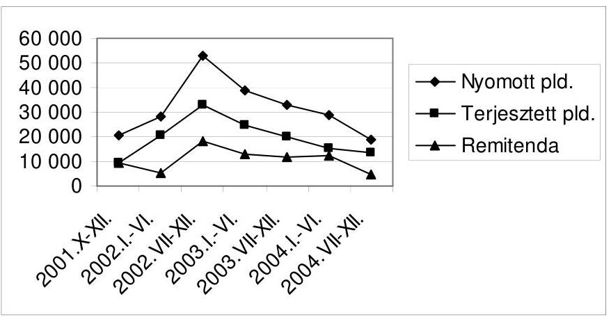
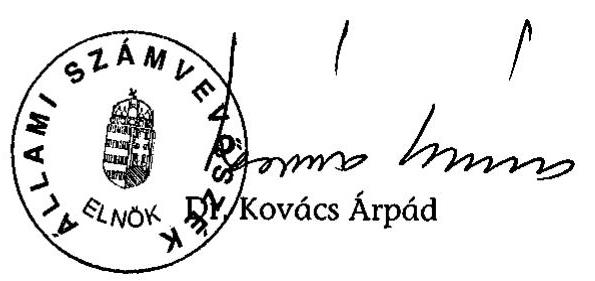
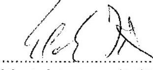
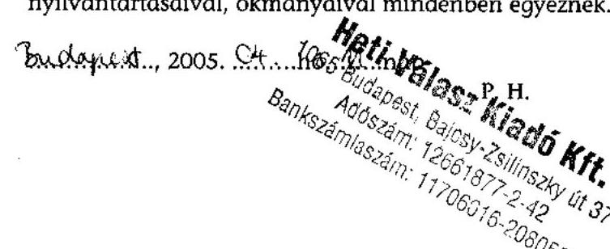
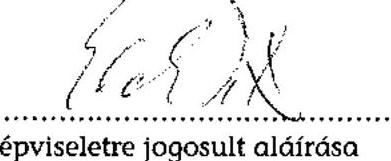
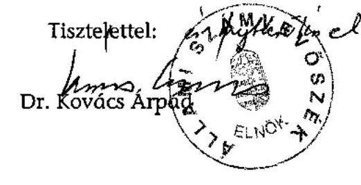

# JELENTÉS 

a Természet- és Társadalombarát Fejlődésért Közalapítvány gazdálkodásának ellenőrzéséről

---

3. Önkormányzati és Területi Ellenőrzési Igazgatóság
3.1. Szabályszerüségi Ellenőrzések Föcsoport
Iktatószám: V-1013-41/2005.
Témaszám: 767
Vizsgálat-azonosító szám: V0252

# Az ellenőrzést felügyelte: 

Dr. Lóránt Zoltán
föigazgató
Az ellenőrzés végrehajtásáért felelős:
Dr. Elek János
föigazgató-helyettes
Az ellenőrzést vezette:
Solymár Ágnes,
mb. osztályvezető, számvevő tanácsos
Az összefoglaló jelentést készítette:
Pásztor Katalin
számvevő tanácsos
Az ellenőrzésben részt vettek:
dr. Méri Sándorné
számvevő
dr. Nagy-Korsa Márta
számvevő tanácsos
Pásztor Katalin
számvevő tanácsos
Sas Imréné
számvevő tanácsadó

Az ÁSZ által a témában eddig készített jelentések: címe
sorszáma
Jelentés a Nemzeti Gyermek és Ifjúsági Alapítvány pénzügyigazdasági ellenőrzéséről (1992)

---

Jelentés a Magyar Vállalkozásfejlesztési Alapítvány részére PHARE ..... 220
forrásból juttatott pénzügyi támogatások felhasználásának vizsgálatáról (1994)
Jelentés a fejezetek és intézményeik által az alapítványoknak ..... 306
juttatott állami pénzek és vagyon felhasználásának, működtetésének ellenőrzéséről (1996)
Jelentés a Magyar Alkotómúvészeti Közalapítvány ..... 347
gazdálkodásának ellenőrzéséről (1997)
Jelentés a Gandhi Közalapítvány pénzügyi-gazdasági ..... 351
ellenőrzéséről (1997)
Jelentés a Magyarországi Cigányokért Közalapítvány pénzügyi- ..... 372
gazdasági ellenőrzéséről (1997)
Jelentés a Magyarországi Nemzeti és Etnikai Kisebbségekért ..... 373
Közalapítvány pénzügyi-gazdasági ellenőrzéséről (1997)
Jelentés a médiatörvény végrehajtásának pénzügyi-gazdasági ..... 396
ellenőrzéséről (1997)
Jelentés a Magyar Rádió Közalapítvány és - kapcsolódó ..... 9806
ellenőrzésként - a Magyar Rádió Részvénytársaság gazdálkodásának ellenőrzéséről
Jelentés a Magyar Televízió Közalapítvány és kapcsolódó ellenőrzés ..... 9812
keretében a Magyar Televízió Rt. múködésének és gazdálkodásának ellenőrzéséről
Jelentés a Nemzetközi Pető András Közalapítvány és - kapcsolódó ..... 9822
ellenőrzésként - a Mozgássérültek Pető András Nevelőképző és Nevelőintézet pénzügyi-gazdasági ellenőrzéséről
Jelentés a Magyar Nemzeti Üdülési Alapítványnak juttatott állami ..... 9906
eszközök felhasználásának és múködtetésének pénzügyi-gazdasági ellenőrzéséről
Jelentés a sportcélú közalapítványok múködésének pénzügyi- ..... 9907
gazdasági ellenőrzéséről
Jelentés a Fogyatékos Gyermekek, Tanulók Felzárkóztatásáért ..... 9915
Országos Közalapítvány múködésének pénzügyi-gazdasági ellenőrzéséről
Jelentés a Nemzeti Gyermek és Ifjúsági Közalapítvány ..... 0002
működésének pénzügyi-gazdasági ellenőrzéséről
Jelentés a Közoktatási Modernizációs Közalapítvány múködésének ..... 0011
ellenőrzéséről
Jelentés a Magyar Nemzeti Üdülési Alapítvány ..... 0101
vagyongazdálkodásának ellenőrzéséről
Jelentés az Országos Foglalkoztatási Közalapítvány ..... 0117

---

gazdálkodásának ellenőrzéséről
Jelentés az Új Kézfogás Közalapítvány gazdálkodásának 0136 ellenőrzéséről
Jelentés a közalapítványoknak és az alapítványoknak az 1998- 0228 2001. évek között juttatott nem normatív központi költségvetési támogatás felhasználásának ellenőrzéséről
Jelentés a Magyar Mozgókép Közalapítvány gazdálkodásának 0304 ellenőrzéséről
Jelentés a Magyar Alkotóművészeti Közalapítvány 0323 gazdálkodásának ellenőrzéséről
Jelentés az EU Kommunikációs Közalapítvány gazdálkodásának 0351 ellenőrzéséről
Jelentés a Magyarországi Zsidó Örökség Közalapítvány 0402 gazdálkodásának ellenőrzéséről
Jelentés a Magyarországi Cigányokért Közalapítvány 0427 gazdálkodásának ellenőrzéséről
Jelentés a Magyarországi Nemzeti és Etnikai Kisebbségekért 0437
Közalapítvány gazdálkodásnak ellenőrzéséről
Jelentés az Illyés Közalapítvány gazdálkodásnak ellenőrzéséről 0466
Jelentés az államháztartáson kívüli állami feladatellátás 0467 rendszerének ellenőrzéséről
Jelentés a Határon Túli Magyar Oktatásért Apáczai Közalapítvány 0510 gazdálkodásának ellenőrzéséről
Jelentés a Nemzeti Kollégiumi Közalapítvány gazdálkodásának 0513 ellenőrzéséről

---

# TARTALOMJEGYZÉK 

BEVEZETÉS ..... 9
I. ÖSSZEGZŐ MEGÁLLAPÍTÁSOK, KÖVETKEZTETÉSEK, JAVASLATOK ..... 13
II. RÉSZLETES MEGÁLLAPÍTÁSOK ..... 21

1. A TTFK működésének jogi, szervezeti feltételei ..... 21
1.1. Létrehozása és közhasznú bejegyzése ..... 21
1.2. Az alapító okirat és az SZMSZ ..... 21
1.3. A képviseleti jog, a bank- és értékpapírszámla feletti rendelkezés ..... 24
1.4. A kuratórium múködése ..... 25
1.5. A felügyelő bizottság múködése ..... 27
2. A gazdálkodás és a könyvvezetés szabályozottsága, szabályossága ..... 27
2.1. A gazdálkodási szabályzatok ..... 27
2.2. Éves költségvetések ..... 30
2.3. A számviteli nyilvántartás rendszere és szabályossága ..... 30
2.4. Az éves beszámolók, és a beszámolási kötelezettség teljesítése ..... 31
3. Bevételek és kapott támogatások ..... 32
3.1. A központi költségvetési támogatás ..... 32
3.2. Pályázati úton kapott támogatások ..... 35
4. Költségek és adott támogatások ..... 35
4.1. A közalapítvány által nyújtott támogatások ..... 37
5. A közalapítvány vagyonának alakulása ..... 39
5.1. A vagyon szerkezete, az eszközök összetétele ..... 39
5.2. A Kincstári Vagyoni Igazgatósággal kötött vagyonkezelési szerződés ..... 39
5.3. A beruházások alakulása ..... 41
5.4. Az immateriális javak és tárgyi eszközök értékesítése ..... 42
6. A Heti Válasz Lap- és Könyvkiadó Szolgáltató Kft. ..... 43
6.1. A kft. létrehozása, a kuratórium tulajdonosi jogainak gyakorlása ..... 43
6.2. A közalapítványtól kapott támogatások ..... 45
6.3. A kft. vagyonának összetétele ..... 46
6.4. A kft. bevételei és költségei ..... 47
6.5. A kft. értékesítése ..... 48
7. A Netrióta Informatikai Kft. ..... 50
7.1. A kft. létrehozása, a kuratórium tulajdonosi jogainak gyakorlása ..... 50

---

7.2. A közalapítványtól kapott támogatások ..... 53
7.3. A kft. vagyonának összetétele ..... 54
7.4. A kft. költségei és ráfordításai ..... 56
8. A Szellemi Környezetvédelemért Alapítvány ..... 56
8.1. Az alapítvány megalapítása ..... 56
8.2. Az induló vagyon felhasználása ..... 57

# MELLÉKLETEK 

1. számú A TTFK eszközei és forrásai
2. számú A TTFK közhasznú eredmény-kimutatása
3. számú A Heti Válasz Lap- és Könyvkiadó Kft. eszközei és forrásai 2001-2002.
4. számú A Heti Válasz Lap- és Könyvkiadó Kft. eszközei és forrásai 2003.
5. számú A Heti Válasz Lap- és Könyvkiadó Kft. eredmény-kimutatása 2001-2002.
6. számú A Heti Válasz Lap- és Könyvkiadó Kft. eredmény-kimutatása 2003.
7. számú A Heti Válasz Lap terjesztési adatai 2001-2004.
8. számú A Netrióta Informatikai Kft. eszközei és forrásai 2001-2004.
9. számú A Netrióta Informatikai Kft. eredmény-kimutatása 2001-2004.
10. számú A TTFK kuratóriumi elnökének észrevétele
11. számú Az ÁSZ elnökének az észrevételre adott válasza

## FÜGGELÉKEK

1. számú A Heti Válasz Lap- és Könyvkiadó Kft. gazdálkodásának és könyvvezetésének szabályozottsága

---

# RÖVIDÍTÉSEK JEGYZÉKE 

| Áht. | Az államháztartásról szóló, többször módosított 1992. évi XXXVIII. törvény |
| :--: | :--: |
| áfa | Általános forgalmi adó |
| Ámr. | az államháztartás múködési rendjéről szóló 217/1998. (XII. 30.) Korm. rendelet |
| ÁSZ törvény | az Állami Számvevőszékről szóló 1989. évi XXXVIII. törvény |
| FB | Felügyelő Bizottság |
| Gt. | A gazdasági társaságokról szóló 1997. évi CXLIV. törvény |
| Heti Válasz Kft. | Heti Válasz Lap- és Könyvkiadó Szolgáltató Korlátolt Felelősségú Társaság |
| Kbt. | A közbeszerzésekről szóló 1995. évi XL. törvény |
| Új Kbt. | A közbeszerzésekről szóló 2003. évi CXXIX. törvény |
| Kh. tv. | A közhasznú szervezetekről szóló 1997. évi CLVI. törvény |
| Kincstár kutatóintézet | Magyar Államkincstár   A közalapítvány szervezeti keretei között múködő környezettudatos nyilvánosságkutató intézet |
| KVI | Kincstári Vagyon Igazgatóság |
| MEH | Miniszterelnöki Hivatal |
| Mt. | A Munka Törvénykönyvéről szóló 1992. évi XXII. törvény |
| Netrióta Kft. | Netrióta Informatikai Korlátolt Felelősségú Társaság |
| NKA | Nemzeti Kulturális Alapprogram |
| Ptk. | a Polgári Törvénykönyvről szóló 1959. évi IV. törvény |
| sajtótörvény | A sajtóról szóló 1986. évi II. törvény |
| SZKA | Szellemi Környezetvédelemért Alapítványt |
| SZMSZ | Szervezeti és Múködési Szabályzat |
| Szt. | A számvitelről szóló 2000. évi C. törvény |
| Tao. tv. | A társasági adóról és az osztalékadóról szóló 1996. év LXXXI. törvény |
| TTFK | Természet- és Társadalombarát Fejlődésért Közalapítvány |
| üvegzseb törvény | a közpénzek felhasználásával, a köztulajdon használatának nyilvánosságával, átláthatóbbá tételével és ellenőrzésének bővítésével összefüggő egyes törvények módosításáról szóló 2003. évi XXIV. törvény |

---

.

---

# ÉRTELMEZŐ SZÓTÁR 

| Közalapítvány | A közalapítvány olyan alapítvány, amelyet az Országgyúlés, a Kormány, valamint a helyi önkormányzat vagy kisebbségi önkormányzat képviselő-testülete közfeladat ellátásának folyamatos biztosítása céljából hoz létre [Ptk. 74/G. § (1) bekezdése]. |
| :--: | :--: |
| Kiemelkedően közhasznú közalapítvány | A kiemelkedően közhasznú közalapítványnak a közhasznú közalapítványokra előírt követelmények teljesítésén túl közhasznú tevékenysége során olyan közfeladatot kell ellátnia, amelyről törvény vagy törvény felhatalmazása alapján más jogszabály rendelkezése szerint, valamely állami szervnek vagy a helyi önkormányzatnak kell gondoskodnia, az alapító okirata szerinti tevékenységének és gazdálkodásának legfontosabb adatait a helyi vagy országos sajtó útján is nyilvánosságra hozza, továbbá a közhasznú tevékenységet maga látja el [Kh. tv. 5. § és a BH2001. 451 számú, egyedi ügyben hozott bírósági végzés]. |
| Közfeladat | Közfeladatnak minősül az az állami vagy helyi önkormányzati, kisebbségi önkormányzati feladat, amelynek ellátásáról - jogszabály alapján - az államnak vagy az önkormányzatnak kell gondoskodnia [Ptk. 74/G. § (2) bekezdése]. |
| Közhasznú tevékenység | A társadalom és az egyén közös érdekeinek kielégítésére irányuló, a közhasznú közalapítvány alapító okiratában szereplő cél szerinti tevékenység [Kht. 26. § c) pontja]. |
| Közhasznú egyszerúsített éves beszámoló | A közhasznú nyilvántartásba vett közalapítványoknál mérlegből, közhasznú eredménykimutatásból és tájékoztató adatokból áll [224/2000. (XII. 19.) Korm. rendelet 6. § (8) bekezdése, illetve 4 . és 6 . számú melléklete]. |
| Közhasznúsági jelentés | Tartalmazza a számviteli beszámolót; a költségvetési támogatás felhasználását; a vagyon felhasználásával kapcsolatos kimutatást; a cél szerinti juttatások kimutatását; a központi költségvetési szervtől, az elkülönített állami pénzalaptól, a helyi önkormányzattól, a kisebbségi települési önkormányzattól, a települési önkormányzatok társulásától és mindezek szerveitől kapott támogatás mértékét; a közhasznú szervezet vezető tisztségviselőinek nyújtott juttatások értékét, illetve összegét; a közhasznú tevékenységről szóló rövid tartalmi beszámolót [Kh. tv. 19. § (3) bekezdése]. |
| Közalapítvány bevételei | A vállalkozási tevékenység bevétele, valamint az alapítványi célú tevékenység bevételei (minden olyan bevétel, amely nem a vállalkozási tevékenységhez kapcsolódó befizetés, ideértve a céltámogatást is) [115/1992. (VII. 23.) Korm. rendelet 3. § (1) bekezdésének a) és b) pontja]. |
| Közalapítvány költségei (kiadásai) | A vállalkozási tevékenység közvetlen költségei, az alapítványi célú tevékenység közvetlen költségei, az alapítvány |

---

Közalapítvány kezelő szervének költségei (kiadásai)

Induló vagyon

Cél szerinti tevékenység

Múködési költségek

Támogatás
Vezető tisztségviselő a közalapítványoknál

Domain

Időszaki kiadvány

Környezettudatos szemlélet

Name service szolgáltatás
Notebook
Online

Remitenda
Szerver
kezelő szervének költségei (kiadásai) és az egyéb közvetett költségek (kiadások) [115/1992. (VII. 23.) Korm. rendelet 3. § (2) bekezdésének a) és b) és c) pontja].

Az alapítvány kezelő szervének üzemeltetési, fenntartási költségei (az alapító okiratok ezeket a költségeket tekintik a kuratórium és a munkaszervezet múködési költségeinek).
A közalapítvány javára a célja megvalósításához az alapító okiratban meghatározott vagyon [Ptk. 74/A. § (1) bekezdése, 74/B. § (1) bekezdése]. A közalapítvány rendelkezésére legalább olyan mértékű vagyont kell bocsátani, amely a múködése megkezdéséhez feltétlenül szükséges [Ptk. 74/B. (4) bekezdése]. A közalapítványi vagyon pontos megjelölése nélkül a közalapítvány nem jöhet létre [BH2001. 303 számú, egyedi ügyben hozott bírósági végzés].
Minden olyan tevékenység, amely az alapító okiratban megjelölt célkitúzés elérését közvetlenül szolgálja [Kh. tv. 26. § b) pontja].

Az üzemeltetési, fenntartási költségek (kiadások) és az egyéb közvetett költségek (kiadások) [115/1992. (VII. 23.) Korm. rendelet 6. §].
Pénzbeli és nem pénzbeli juttatás [Kh. tv. 26. § j) pontja].
A közalapítvány kuratóriumának és felügyelő bizottságának elnöke és tagja, a közalapítvánnyal munkaviszonyban vagy munkavégzésre irányuló egyéb jogviszonyban álló, az alapító okirat szerint egyszemélyi felelős vezető feladatot ellátó személy [Kh. tv. 26. § m)].
Felségterület, a virtuális felségterületek, vagyis az internetes oldalak egyértelmú azonosítását szolgáló megnevezés.
Az a napilap, folyóirat és egyéb lap, valamint ezek melléklete, amely egy naptári évben legalább egyszer megjelenik, azonos címmel és tárgykörrel kerül kiadásra, évfolyamszámmal, sorszámmal, keltezéssel van ellátva, és akár eredeti szerzői alkotásként, akár átvett fordításként az újságírói, az írói vagy a tudományos múfaj körébe tartozó írásmúvet (hírt, tudósítást, cikket, riportot, tanulmányt, verset, elbeszélést stb.), fényképet, grafikát, karikatúrát vagy rejtvényt közöl. (sajtó törvény 20. §)
Az ép és egészséges ember eszményének, a természeti és társadalmi környezetünk iránti felelősségnek a megerősítése.
A hálózaton fellelhető nevek kiszolgálója.
Teleges, síkkijelzős, hordozható kézi számítógép
Interaktív és egyidejű kapcsolattartási mód hálózaton keresztül távoli számítógépekkel
Eladatlan, terjesztőtől visszaküldött újság
Lokális hálózat központi gépe, illetve fájl átvitelt levél

---

|  | elosztást, vagy más hálózati funkciót biztosító központi számítógép nagy távolságú hálózatokon. |
| :--: | :--: |
| Web (www) | World Wide Webb, azaz világméretú hálózat, weboldalak hálózata az interneten. |
| website | Internetkikötő, az adott témájú internetes kiadványok sokasága, amelyek bármelyike elérhető |

---

.

---

# JELENTÉS 

## a Természet-és Társadalombarát Fejlődésért Közalapítvány gazdálkodásának ellenőrzéséről

## BEVEZETÉS

A non-profit szervezetek között 1994. január 1-jétől jelentek meg a közalapítványok, melyek megalakítására és múködésére a Ptk. az alapítványok szabályozásán belül külön feltételeket és követelményeket határozott meg az alapítók körét, az ellátandó közfeladatokat, valamint a múködés és gazdálkodás feltételeit illetően. Közalapítványt csak az Országgyúlés, a Kormány, valamint a helyi önkormányzat vagy kisebbségi önkormányzat képviselő-testülete hozhat létre állami közfeladat ellátásának folyamatos biztosítása céljából, de a közalapítvány létrehozása nem érinti az államnak, illetve az önkormányzatnak a feladat ellátására vonatkozó kötelezettségét. A közalapítványok a nyilvánosság előtt tevékenykednek, ezért alapító okiratukat, gazdálkodásuk legfontosabb adatait nyilvánosságra kell hozni. A közpénzek törvényes, felelős és közhasznú felhasználását elősegítendő a Ptk. és a közhasznú szervezetekről szóló 1997. évi CLVI. törvény részletesen meghatározta a közalapítványok vagyonkezelő szervezete (kuratóriuma) múködésének, képviseletének, a tisztségviselők felelősségének és összeférhetetlenségének szabályait. A közalapítványok vagyonát kezelő szervezet tagjai az alapítók bizalmából látják el feladatukat, de tőlük sem közvetlenül, sem közvetve nem függhetnek, az alapítók nem gyakorolhatnak meghatározó befolyást a közalapítvány vagyonának felhasználására.

A közalapítványok ellenőrzésére az alapítványoknál szigorúbb követelmények vonatkoznak, így az alapítóknak már az alapítással egy időben létre kell hozni a kuratórium ellenőrzésére jogosult ellenőrző szervet (ellenőrző vagy felügyelő bizottságot). Az Országgyúlés és a Kormány által alapított közalapítványoknál az Állami Számvevőszék nemcsak az állami támogatás felhasználását, hanem a gazdálkodás törvényességét és célszerűségét is jogosult ellenőrizni.
2004. évben - az ún. média közalapítványokkal együtt - 50 múködő, illetve 2 bejegyzés alatt álló, az Országgyúlés és a Kormány által alapított közalapítvány volt.

A 2004. évi költségvetési törvény - eredeti előirányzatként - a Kormány által alapított közalapítványoknak közvetlenül névre címzetten 35,5 milliárd Ft eredeti támogatási előirányzatot hagyott jóvá¹, amelyből az államháztartás

[^0]
[^0]:    ${ }^{1}$ Ez az összeg nem tartalmazza az OGY által alapított három ún. média-közalapítvány támogatását.

---

egyensúlyi helyzetének javításához szükséges rövid és hosszabb távú intézkedésekről szóló 2050/2004. (III. 11.) Korm. határozat 2,1 milliárd Ft-ot (5,9\%-ot) zárolt.

A Magyar Köztársaság Kormánya a Természet- és Társadalombarát Fejlődésért Közalapítványt (TTFK) a tudományos kutatás, közművelődési, oktatási és a természeti, szociális, egészségügyi és kulturális javak védelmével, valamint a fogyasztó- és környezetvédelemmel kapcsolatos állami feladatok ellátása céljából alapította, a Fővárosi Bíróság 2000. december 30-án a 16. Pk. 60.808/2000/2. számú végzésével kiemelkedően közhasznú közalapítványként nyilvántartásba vette. A közalapítvány 100 millió Ft induló vagyont, a 20012004. években további 2 milliárd Ft központi költségvetési támogatást kapott.

A 2004. évi költségvetési törvényben a TTFK eredeti támogatási előirányzata 20 millió Ft volt, amely összeget a Kormány teljes egészében a közigazgatási rendszer korszerűsítése feladatra átcsoportosított.

A TTFK létrehozására vonatkozó kormány előterjesztésben megfogalmazott alapítói szándék szerint a Kormány a közalapítványt azzal a céllal hozta létre, hogy a nyilvánosságban megerősítse a környezettudatos értékrendet, vagyis az ép és egészséges ember eszményét, a természeti és társadalmi környezetünk iránti felelősséget. E cél elérése érdekében a közalapítvány feladatául határozta meg a nyilvánosság szerkezetének, értékrendjének, a nyilvánosságot formáló fórumok, intézmények szerepének kutatásáról és elemzéséről való gondoskodást, az ilyen kutatások támogatását, az elemzések és kutatási eredmények közzétételének és a minél szélesebb körű hozzáférhetőségének elősegítését, valamint a környezeti tudatosság erősítése érdekében a társadalom szereplői együttműködésének ösztönzését.

A jelen ellenőrzés megállapításainak többszöri egyeztetését követően is maradt véleményeltérés a TTFK kuratóriuma és az Állami Számvevőszék között a közalapítvány által alapított egy személyes gazdasági társaságok és a Szellemi Környezetvédelemért Alapítvány létrehozására, a kuratórium 100\%-os tulajdonában lévő Heti Válasz kft. értékesítését alátámasztó cégértékelés hiányára, valamint a Kormány felé tett 1. számú javaslatunkra vonatkozóan. ${ }^{2}$

A TTFK-nak juttatott 2001. évi állami támogatás felhasználásának törvényességét és célszerűségét 2002. évben a közalapítványoknak és az alapítványoknak az 1998-2001. évek között juttatott nem normatív központi költségvetési támogatás felhasználásának ellenőrzése keretében a helyszínen ellenőriztük, ${ }^{3}$ amelynek során a bankszámla feletti rendelkezés gyakorlását szabálytalannak minősítettük, mivel nem felelt meg az alapító okirat előírásának a Kincstárnál vezetett számlák feletti rendelkezéshez bejelentettek köre.

[^0]
[^0]:    ${ }^{2}$ A kuratóriumi elnök észrevételét és az ÁSZ elnöke által megküldött válaszlevelet a 10. és 11. számú mellékletként csatoltuk.
    ${ }^{3}$ Lásd: Jelentés a közalapítványoknak és az alapítványoknak az 1998-2001. évek között juttatott nem normatív központi költségvetési támogatás felhasználásának ellenőrzéséről (2002. év, 0228.)

---

A Fővárosi Főügyészség 2003-ban a közalapítványnál törvényességi felügyeleti vizsgálatot folytatott, amelynek célja annak megállapítása volt, hogy a TTFK betartja-e a Kh. tv. múködésre, gazdálkodásra vonatkozó rendelkezéseit. Az ügyészség az észlelt törvénysértések miatt a kuratóriumi elnöknél felszólalással élt.

A TTFK gazdálkodásának soron kívüli ellenőrzését 2005. január 6-án a Kormány nevében a Miniszterelnöki Hivatalt vezető miniszter kérte.

Az Állami Számvevőszék az ÁSZ tv. 2. § (5) és (9) bekezdései alapján ellenőrzi a közalapítványoknál az állami költségvetésből nyújtott támogatás felhasználását, továbbá a Ptk. 74/G. § (8) bekezdése alapján a gazdálkodás törvényességét és célszerűségét.

Jelen ellenőrzés célja volt, hogy törvényességi és célszerűségi szempontból értékelje, hogy a TTFK

- működése és gazdálkodása hogyan segítette elő az alapító okiratban meghatározott célok és feladatok megvalósítását;
- gazdálkodásának és könyvvezetésének szabályozottsága és szabályossága biztosította-e a gazdálkodás törvényességét és célszerűségét;
- a kapott állami támogatást rendeltetésszerűen és célszerűen használta-e fel az alapító okiratban meghatározott céljainak megvalósítása érdekében;
- a vagyonkezelésére és vagyonhasznosítására vonatkozó kuratóriumi döntések a közalapítványi célok teljesítését illetően megalapozottak és célszerűek voltak-e, kuratóriuma törvényesen és célszerűen gyakorolta-e a 100\%-os tulajdonában lévő Heti Válasz Kiadó Kft-vel és a Netrióta Kft-vel kapcsolatos tulajdonosi jogokat;
- által alapított gazdasági társaságok részére történt pénzeszköz átadás szabályos és célszerű volt-e, a társaságoknál azokat célszerűen használták-e fel.

Az Állami Számvevőszékről szóló 1989. évi XXXVIII. törvény 21. § (3) bekezdése alapján, ha egyes vizsgálati megállapítások kiegészítése válik szükségessé, és ehhez más szervnél is ellenőrzést kell végezni, az Állami Számvevőszék ellenőre jogosult az összefüggő tényeket ott vizsgálni. Kapcsolódó ellenőrzés keretében ellenőriztük a TTFK 100\%-os tulajdonában lévő két gazdasági társaság (Heti Válasz Kft. és a Netrióta Kft.) gazdálkodását, valamint a Szellemi Környezetvédelemért Alapítvány részére a közalapítvány által átadott pénzeszközök célszerinti felhasználását.

A közalapítvány gazdálkodásának ellenőrzése 2000. december 30-tól 2004. december 31-ig tartó időszakra terjedt ki. A Heti Válasz Kft. gazdálkodását a 2001 májusi megalapításától a 2004. április 30-i értékesítéséig terjedő időszakra ellenőriztük.

---

# BEVEZETÉS

---

# I. ÖSSZEGZŐ MEGÁLLAPÍTÁSOK, KÖVETKEZTETÉSEK, JAVASLATOK 

A Természet- és Társadalombarát Fejlődésért Közalapítvány (TTFK) megalakulásától 2004. év végéig összesen 2052,5 millió Ft állami támogatást kapott, ezen belül az éves költségvetési törvények alapján 2050 millió Ft-ot, a Nemzeti Kulturális Alapprogramból pályázati úton 2,5 millió Ft-ot. A központi költségvetési támogatáson felül a TTFK-nak bevétele származott a szabad pénzeszközök befektetéséből ( 111,5 millió Ft), az értékesítés nettó árbevételéből - újságértékesítési, hirdetési, továbbszámlázott szolgáltatások bevétele - (103,4 millió Ft) az immateriális javak és tárgyi eszközök értékesítéséből ( 69,1 millió Ft) és egyéb bevételekből ( 18,8 millió Ft). A teljesített költségek és ráfordítások ugyanezen időszak alatt 2044,9 millió Ft-ot tettek ki, amelynek $10 \%$-át a múködési célú kiadások jelentették.

Az alapító a közalapítvány 100 millió Ft-os induló vagyonán belül 10 millió Ft-ot törzsvagyonként jelölt meg, így azt sem a múködés, sem a közalapítványi célok megvalósítása érdekében nem lehetett felhasználni, ezt az előírást a közalapítvány az ellenőrzött időszakban betartotta. A Miniszterelnöki Hivatalt vezető miniszter felhatalmazása alapján a Kincstári Vagyoni Igazgatóság nyilatkozatban hozzájárult egy, a Magyar Állam tulajdonát képező ingatlannak a közalapítvány székhelyeként való bírósági bejegyzéséhez. A KVI és a TTFK az ingatlan használatára a közalapítvány bejegyzését követően másfél évig nem kötöttek szerződést, ezáltal a kincstári vagyon részét képező ingatlan használatának feltételeit, a közalapítványnak az ingatlan használatával kapcsolatos jogait és kötelezettségeit nem dokumentálták. A 2002 májusában megkötött vagyonkezelési szerződés előírásait nem teljesítették maradéktalanul, mivel a TTFK a kincstári vagyont gyarapító fejlesztéseket nem a szerződésnek megfelelő ütemben és mértékben teljesítette (a szerződésben vállalt, ötéves vagyonkezelői díjnak megfelelő fejlesztés összege 150 millió Ft volt, a közalapítvány összesen 71 millió Ft-ot költött az ingatlanra, ennek $96 \%$-át a szerződés megkötése előtt), a KVI a teljesítést nem kérte számon. A KVI a vagyonkezelői jog ingatlan nyilvántartásba való bejegyeztetéséről sem gondoskodott, a TTFK pedig nem jegyeztette be. A helyszíni ellenőrzés 2005 áprilisi befejezésekor a vagyonkezelési szerződés közös megegyezéssel való felbontása folyamatban volt.

Az ellenőrzött időszakban a Kormány a TTFK tekintetében az alapítót megillető jogkör gyakorlójának 2003. április 23-ig a Miniszterelnöki Hivatalt vezető minisztert, azt követően a MEH általános politikai államtitkárát jelölte ki.

A MEH a központi költségvetésböl nyújtott támogatás cél szerinti felhasználásával kapcsolatos előírásokat, az elszámolások benyújtásának módját és határidejét, a felhasználás ellenőrzésének módját 2001-2003. években szerződésben rögzítette. A MEH 2004-ben a TTFK részére a költségvetési törvényben biztosított 20 millió Ft támogatásra a közalapítvánnyal támogatási szerződést nem kötött, a támogatást - a kuratórium elnökének többszöri kérésére - sem utalta át, azt a Kormány - a MEH előterjesztése alapján - kormányhatározattal a közigazgatási rendszer korszerűsítése feladatra az év végén átcsoportosította.

---

Az ellenőrzött időszakban a TTFK részére nyújtott költségvetési támogatás csökkenő tendenciát mutatott (a 2001. évben 1500 millió Ft, 2002-ben 500 millió Ft, 2003-ban 50 millió Ft volt, 2004-ben nem kapott költségvetési támogatást).

A MEH felé benyújtott, a központi költségvetési támogatás felhasználásáról szóló pénzügyi elszámolások alapján 2001-ben a TTFK visszaigényelt áfara ( 64,9 millió Ft) is felhasználta a támogatást, a támogatásból beszerzett immateriális javak és tárgyi eszközök értékesítéséből származó bevétellel (66,4 millió Ft) nem csökkentette a beruházás értékét. A 2002. és 2003. évi elszámolásokban olyan kiadást (ingatlan bérleti- és közüzemi díja) is elszámolt, amelyet részére az egyszemélyes kft-je megtérített. A MEH a támogatási szerződésekben nem írta elő, hogy a támogatás visszaigényelhető áfa-ra nem fordítható, a támogatásból beszerzett eszközök továbbértékesítésének feltételeit nem határozta meg, továbbá nem igényelte a támogatás fel nem használt részének befektetéséből származó kamatbevétellel való elszámolást sem.

A TTFK alapító okirat szerinti céljainak megvalósítása érdekében múködtette a Heti Válasz című hetilapot, a Gondola internetes portált, a Környezettudatos Nyilvánosságkutató Intézetet, valamint támogatást nyújtott a természet- és társadalombarát értékrendnek elkötelezett civil szervezetek és üzleti szféra részére a környezettudatos szemlélet erősítésében való együttműködésének elősegítése érdekében.

A kuratórium a közalapítványi célok megvalósítása érdekében ellátandó feladatait részben saját szervezeti keretein belül, részben az általa létrehozott két egyszemélyes kft-jén, valamint alapítványán keresztül valósította meg. Saját szervezeti keretein belül egyrészt a Környezettudatos Nyilvánosságkutató Intézet (kutatóintézet) múködtetését végezte, amely az ellenőrzött időszak alatt kutatási tanulmányok, esszék megírását, könyv formájában való kiadását támogatta, konferenciákat szervezett. Másrészt a kuratórium egyéb szervezetek és gazdasági társaságok részére nyújtott 105,6 millió Ft összegben támogatást. A kuratórium a támogatásokat pályázatok kiírása nélkül, egyedi kérelmek alapján nyújtotta, és a támogatási lehetőséget nem hozta nyilvánosságra. A támogatások szabályosságának, célszerű felhasználásának és elszámoltatásának tételes ellenőrzése alapján megállapítottuk, hogy a támogatások célja megfelelt az alapító okiratban meghatározott közalapítványi céloknak, a támogatások odaítéléséről a kuratórium döntött, a támogatott szervezetekkel a közalapítvány nevében a kuratórium elnöke megállapodást, vagy támogatási szerződést kötött. A támogatottak 19\%-a (négy szervezet) a támogatási szerződésben meghatározott elszámolási határidőt túllépve számolt el, egy támogatott nem számolt el, a támogatás összegét visszafizette. A támogatottak 14\%-a (három szervezet) nem a szerződés szerint számolt el, ebből ketten elszámolásukat helyesbítették, egy pedig a TTFK által kifogásolt összeget visszafizette.

A TTFK alapító okiratában rögzített cél megvalósítását szolgálta a közéleti, kulturális és a társadalom környezettudatos gondolkodásának elősegítését szolgáló Heti Válasz címú hetilap és könyvkiadás, amely tevékenységet a kuratórium 2001 májusáig a közalapítvány szervezeti keretei között, ezt követően pedig az erre a célra létrehozott egyszemélyes kft-jén keresztül végezte. A kuratórium tulajdonosi jogait hiányosan gyakorolta, ugyanis a kft. szakmai irányítására, az újság kiadására helyezték a hangsúlyt, ugyanakkor a pénzügyi szám-

---

viteli rendszer hiányosságainak megszüntetését nem tudta elérni, így pl. a mindenkori ügyvezetés a gazdálkodási szabályzatokat nem a vonatkozó jogszabályoknak megfelelően készítette el, a kuratórium nem szorgalmazta az ügyvezetésnél a felelős számviteli vezető kinevezését. A kft. az ellenőrzött időszakban 871,8 millió Ft vissza nem térítendő támogatásban részesült, amely teljes egészében a TTFK-tól származott, 92,2\%-ban közvetlen, 7,8\%-ban pedig közvetett úton (a közalapítvány által létrehozott Szellemi Környezetvédelemért Alapítványtól). A kuratórium a kft-nek nyújtott támogatások mértékéről a közalapítvány éves költségvetései keretén belül, az azon felül nyújtott összegekről külön határozattal döntött. A kuratórium a támogatás felhasználására - a 2001. év kivételével - támogatási szerződést kötött, amelyben meghatározta a támogatás célját, az elszámoltatás módját és határidejét. A kft. a közalapítványtól kapott támogatások közalapítványi céloknak megfelelő felhasználásáról - a 2001. év kivételével - elszámolt.

Annak ellenére, hogy a kft. összes bevételén belül a TTFK által nyújtott támogatás $50,3 \%$-ot tett ki, 2003. év végéig mégis 25,6 millió Ft vesztesége keletkezett, így az állami forrásból biztosított 100 millió Ft-os jegyzett tőke a veszteséges gazdálkodás hatására elértéktelenedett. A hetilap példányszáma a 2001. évi induláshoz képest 2002. év végére ugyan 2,5-szeresére (húszezerről ötvenkétezerre) nőtt, de ezt követően folyamatosan csökkent, 2004-ben már csak huszonnégyezer volt. A lap veszteséges forgalmazásához egyrészt hozzájárult, hogy az összes példányszámon belül az értékesített példányszám aránya átlagosan csak $56 \%$, az ingyenes példányszám $8 \%$, a remitenda $36 \%$ volt, másrészt, hogy a bevételeken belül a hirdetésből származó bevétel aránya 46\%-ról 15\%-ra csökkent. A TTFK - mint a kft. tulajdonosa - szűkös anyagi forrásaira való tekintettel, nem tudta támogatni a társaság költségeit, ráfordításait, így az újság fennmaradása érdekében a kuratórium a kft. értékesítése mellett döntött, amellyel azonban az alapító okiratban meghatározott célkitúzés megvalósításának egyik legfontosabb eszközéről volt kénytelen lemondani. A kuratórium a kft. értékesítésekor cégértékelést nem készíttetett.

A kuratórium a közalapítvány által működtetett Heti Válasz című hetilap és a közalapítvány on-line megjelenítésére, valamint internetes portál kialakítására hozta létre a Netrióta Informatikai Kft.-t. A létrehozáskor meghatározott célok megvalósítását a kft. azonban csak részben teljesítette, mivel a TTFK online megjelenítése az ellenőrzött időszakban nem valósult meg. A Heti Válasz lap on-line megjelenítését 2005. január 1-től már nem a Netrióta Kft. végzi. A kuratórium a tulajdonosi jogait a kft. múködése során hiányosan gyakorolta, mivel nem fogadta el az előtársaság zárómérlegét 2001-ben, nem döntött a cégbírósági bejegyzés előtt kötött szerződések jóváhagyásáról, a kft. 2001-2003. évekre vonatkozó költségvetéseinek elfogadásáról, valamint a kft. alapító okirata szerinti ún. „fontos szerződések" megkötésének jóváhagyásáról. Bár a kft. veszteségeinek csökkentése érdekében tőkepótlásról, létszámcsökkentésről és a működési költségek visszaszorításáról a kuratórium intézkedett, mindezen intézkedések ellenére a kft. veszteséges gazdálkodását nem tudta megakadályozni. A kft. az ellenőrzött időszakban az alapítótól 274 millió Ft-ot kapott, amely teljes egészében a központi költségvetésből származott ( 70 millió Ft-ot a kft. létrehozására, 40 millió Ft-ot a veszteségei ellentételezésére, 164 millió Ft-ot múködési támogatásra), a kft. nettó árbevétele mindössze 25,3 millió Ft volt. A TTFK - mint tulajdonos - nem törekedett a kft. árbevétel szerző működtetésére,

---

ezért a közhasznú feladatok egy részének megvalósítását ilyen feltételek mellett nem volt indokolt gazdasági társaságra bízni.

A TTFK részéről nem volt indokolt létrehozni a 101 millió Ft induló vagyonnal megalapított Szellemi Környezetvédelemért Alapítványt, mivel annak mind a célja, mind a cél megvalósításának eszköze egyben a közalapítvány cél és eszközrendszere is volt. Az alapítvány a rendelkezésére álló vagyonból 68 millió Ft-ot a Heti Válasz lap múködtetésének támogatására, további 24 millió Ft-ot pedig saját múködési költségeire, egyéb alapítványi céljaira mindössze 5 millió Ft-ot használt fel.

A közalapítvány múködésének legfontosabb szabályait a Kormány által jóváhagyott alapító okirat tartalmazta. A kuratórium személyi összetétele megfelelt a törvényes előírásoknak, mivel a Kormány - mint alapító - a kuratóriumban sem közvetlenül, sem közvetve a vagyon felhasználására vonatkozóan meghatározó befolyást nem szerzett és nem is gyakorolt. A Kormány az ellenőrzött időszakban az alapító okiratot egy alkalommal módosította, amelyet a Fővárosi Bíróság nyilvántartásba vett, azonban a helyszíni ellenőrzés befejezéséig - a Kormány feladat megjelölése ellenére - a Miniszterelnöki Hivatalt vezető miniszter nem gondoskodott annak a Magyar Közlönyben történő közzétételéről. A Kormány mint alapító a TTFK alapító okiratát a törvényben előírt módon 2003 októberéig nem módosította az évi egy millió Ft-ot meghaladó cél szerinti juttatások pályáztatási kötelezettségének előirása tekintetében, emiatt az alapító okiratnak az egyedi támogatási rendszerre vonatkozó jelenlegi szabályozása törvénysértő. Az ellenőrzött időszakban hatályos alapító okiratok a Heti Válasz lap főszerkesztője feletti egyéb munkáltatói jogok szabályozása tekintetében nem voltak összhangban a vonatkozó törvényi előírásokkal, mivel az a kiadó, vagyis 2001 júniusától a Heti Válasz Kft. vezetőjét illette volna meg, és nem a kuratóriumot. Személyi összeférhetetlenséget eredményezett, hogy a kuratórium 2002. július 1-jétől a kuratórium elnökét nevezte ki a Heti Válasz lap főszerkesztőjévé, ezáltal olyan testület (kuratórium) gyakorolta a főszerkesztő felett a munkáltatói jogokat (beleértve kinevezés, felmentés, fegyelmi és kártérítési igény érvényesítés) amelynek önmaga is tagja volt (a kinevezésről szóló kuratóriumi határozat hozatalában a kuratórium elnöke nem vett részt).

Célszerűtlen volt, hogy a 2002. április 23-tól hatályos alapító okiratból kikerült a tiszteletdíjra vonatkozó szabályozás. Így az alapító okiratban az alapító sem maga számára nem tartotta fenn, sem az alapító nevében eljáró miniszter vagy a kuratórium számára nem ruházta át a tiszteletdíj konkrét megállapításának jogát. Nem zárta ki azt az értelmezési lehetőséget, hogy a kuratórium jogosult lehet - etikai kifogásokat indukálva és összeférhetetlen módon - a saját tagjai és a kuratórium ellenőrzésére kinevezett FB tagjai számára megállapítani a tiszteletdíjat (a tisztségviselők részére kifizetett tiszteletdíj az ellenőrzött időszakban 30 ezer Ft/fő/hó, összesen 4,7 millió Ft volt). A kuratórium az ellenőrzött időszakban hatályos alapító okiratok szabályozása célszerűtlen volt még a tekintetben is, hogy nem írtak elő az FB - mint az alapító által felkért ellenőrző testület - részére beszámolási kötelezettséget az alapító felé.

Az alapító okirat a közalapítvány képviseletével kizárólag a kuratórium elnökét hatalmazta fel, a bankszámla felett a kuratórium elnöke és egy tagja együtt volt jogosult rendelkezni. Az alapító okirattal ellentétesen a közalapít-

---

vány szervezeti keretein belül múködő kutatóintézet ötmillió Ft alatti szerződéseit a képviseleti jog gyakorlására nem jogosult intézet igazgató írta alá. A vagyon feletti rendelkezés gyakorlata a bankszámla tekintetében az ellenőrzött időszakban, az értékpapírszámla tekintetében 2004 júniusáig szintén eltért az alapító okirat előírásától, mivel a kurátorokon kívül a közalapítvány alkalmazottai is rendelkeztek a vagyon felett, csorbítva ezzel a kuratórium vagyonkezelési jogát. ${ }^{4}$

A kuratórium - mint testület - múködése során, az ülések között felmerült kérdések tekintetében, utólagos tájékoztatási és jóváhagyatási kötelezettséggel, átruházta a kuratórium elnökére a döntési jogát, továbbá felhatalmazta a kuratórium elnökét saját hatáskörben az ösztöndíjpályázatok elbírálására, utólagos tájékoztatási kötelezettséggel, valamint a Heti Válasz Kft.-re ruházta a Heti Válasz lappal kapcsolatos alapítói jogokat. ${ }^{5}$ A kuratórium az alapító felhatalmazása nélkül a 2001. évben - közhasznú céljaival összhangban - két egyszemélyes gazdasági társaságot alapított (a kuratórium a közalapítvány vagyonát az alapító okirat keretei között használhatta fel, az alapító pedig gazdasági társaságok létrehozására csak az alapító okirat 2002. május 27 -től hatályos módosításában adott felhatalmazást).

A Ptk. és az alapító okirat előírásával összhangban a közalapítványnál FB múködött. Az FB tagok rendszeresen részt vettek a kuratórium ülésein, a közalapítvány közhasznúsági jelentéseit és éves beszámolóit minden évben megtárgyalták és elfogadták. Az FB a közalapítvány múködéséről és gazdálkodásáról az alapítót egyik évben sem tájékoztatta, részére éves beszámolót nem küldött, mivel azt számára, az ellenőrzött időszakban hatályos alapító okiratok nem írták elő.

A TTFK az ellenőrzött időszakban - a befektetési szabályzat kivételével - rendelkezett a hatályos törvényekben előírt gazdálkodási szabályzatokkal. A közalapítvány a kuratórium által elfogadott befektetési szabályzattal csak 2002 októberétől rendelkezett, annak ellenére, hogy létrehozásától kezdődően folytatott befektetési tevékenységet (tőkebefektetések, értékpapír vásárlás és értékesítés). A kuratórium - mint a közalapítvány legfőbb irányító, általános ügydöntő, ügyintéző, képviselő és kezelő szerve - a gazdálkodás feltételeinek szabályait tartalmazó szabályzatokat határozattal nem hagyta jóvá, a szükséges jogszabályi és egyéb változásoknak megfelelően azokat nem aktualizálta. A vagyonkezelési és befektetési szabályzat banki aláírásra vonatkozó rendelkezései nem feleltek meg a törvényi előírásoknak, mivel a kuratórium elnökén és tagjain kívül, a közalapítvány alkalmazottai részére is rendelkezési jogot biztosított. A számviteli politika nem szabályozta teljes körűen az értékcsökkenés elszámolásának módjait (terv szerinti értékcsökkenési leírás kulcsait, a terven felüli érték-

[^0]
[^0]:    ${ }^{4}$ A bankszámla feletti rendelkezés gyakorlatát az ÁSZ 2002. évi ellenőrzése során is kifogásolta. Lásd jelentés a közalapítványoknak és az alapítványoknak az 1998-2001. évek között juttatott nem normatív központi költségvetési támogatás felhasználásának ellenőrzéséről ( 0228 számú jelentés).
    ${ }^{5}$ A kuratórium a Fővárosi Főügyészség 2003. évi ellenőrzését követően a határozatokat - a Heti Válasz lap alapítói jogok átruházása kivételével - visszavonta.

---

csökkenés elszámolásának választási lehetőségét az egyes eszközcsoportoknál), a továbbutalási céllal kapott támogatások elszámolási szabályait. A számlarend nem biztosította a TTFK közhasznú feladatai költségeinek és ráfordításainak, és a múködési költségeinek egymástól elkülönített nyilvántartását. A kuratórium nem határozta meg a pénzkezelési szabályzatban a házipénztár záró állományát.

A kuratórium az ellenőrzött időszakban éves költségvetés alapján gazdálkodott, amelynek tartalmát, szerkezetét az alapító okirat nem részletezte. Az éves költségvetések 2001-2002. években hiányosak voltak, mivel nem tartalmazták a központi költségvetési támogatások összegét.

Az alapító a múködési költségek mértékét csak a 2001. évre vonatkozóan határozta meg az alapító okiratban, amelyet azonban a közalapítvány 9,8 millió Ft-tal túllépett (az összes kiadás 10\%-a helyett ténylegesen 11,5\% lett a múködési költség). A 2002-2004. évek múködési költségei mértékét a hatályban lévő alapító okirat nem határozta meg.

A TTFK az ellenőrzött időszak minden évére elkészítette az éves beszámolót és a közhasznúsági jelentést. Gazdálkodásának legfontosabb adatait - a 2002. év kivételével - nyilvánosságra hozta, a kuratórium az éves beszámoló és közhasznúsági jelentés megküldésével számolt be az alapítónak a közalapítvány működéséről, az éves beszámolójának közzétételéről a székhelyen történő betekinthetőség biztosításával gondoskodott.

A közalapítvány múködésének ellenőrzése során olyan törvénytelenséget nem állapítottunk meg, amely indokolná megszűntetését. A TTFK múködési feltételeiben és finanszírozásában azonban olyan változások következtek be az ellenőrzött időszak alatt, amelyek leszűkítették a közalapítvány alapító okiratában megfogalmazott céljai megvalósításának lehetőségét. Ezt támasztja alá, hogy a közalapítvány állami támogatásban 2004. évtől nem kapott. Az állami támogatás $60 \%$-ában részesülő lap és könyvkiadási tevékenységet végző egyszemélyes kft. értékesítésével a kuratórium a közalapítványi cél megvalósításának legfontosabb eszközéről volt kénytelen lemondani. A közalapítvány másik - az állami támogatás $13 \%$-ában részesülő - kft-je által végzett tevékenység az internetes portál múködtetésére korlátozódott. Az alapító okirat szerinti további állami feladatokat a kuratórium cél szerinti támogatásaival és kutatóintézete által látta el, a kutatóintézet költségvetése azonban évről évre csökkent, cél szerinti támogatást pedig a kuratórium a 2003. évtől nem nyújtott.

A helyszíni ellenőrzés megállapításainak hasznosítása mellett javasoljuk:

# a Kormánynak 

1. Mérlegelje, hogy szükség van-e a közalapítvány további fenntartására, figyelembe véve egyrészt azt a körülményt, hogy a célszerinti feladatok jelentős részét a közalapítvány már nem végzi, másrészt, hogy az alapító okiratban rögzített közfeladatok más szervezeti és finanszírozási formában elláthatóak-e.

---

2. Módosítsa, illetve egészítse ki az alapító okiratot a következőkkel (amennyiben a közalapítvány működése az 1. pontban megjelölt döntés eredményeként továbbra is indokolt):
a) vezesse át az Áht. 104/A. § (2) bekezdésének 2003. június 9-től hatályos előírását, amely szerint a közalapítvány köteles pályázatot kiírni, ha az általa nyújtott cél szerinti juttatás az évi egymillió forintot meghaladja, kivéve, ha törvény vagy kormányrendelet a közalapítvány közfeladatára tekintettel más eljárási rendet állapít meg;
b) határozza meg a működési kiadások mértékét az éves kiadások arányában;
c) határozza meg a tisztségviselők tiszteletdíj kifizetésének szabályait, ennek keretében hatalmazza fel az alapító képviseletében eljáró MEH általános politikai államtitkárát a kuratóriumi tagok és az FB tagok tiszteletdíjának megállapítására;
d) írjon elő az FB részére az alapító felé évenkénti beszámolási kötelezettséget.

# a Miniszterelnöki Hivatalt vezető miniszternek 

Intézkedjék, hogy a központi költségvetési támogatás felhasználására kötött szerződések rögzítsék a visszaigényelhető áfa-ra, és a támogatásból beszerzett eszközök továbbadására vonatkozó előírásokat.

## a Miniszterelnöki Hivatal általános politikai államtitkárának

Gondoskodjék a közalapítvány hatályos alapító okiratának a Magyar Közlönyben való nyilvánosságra hozásáról.

## a Természet- és Társadalombarát Fejlődésért Közalapítvány kuratóriumának

1. Gondoskodjék - amennyiben a vagyonkezelési szerződés nem kerül felbontására - a közalapítvány székhelyéül szolgáló, a Magyar Állam tulajdonát képező ingatlan vagyonkezelői jogának az ingatlan nyilvántartásba való bejegyeztetéséről.
2. Haladéktalanul vonja vissza az alkalmazottak bankszámla feletti rendelkezési jogosultságát.
3. Vizsgálja felül a Netrióta Informatikai Kft. tovább múködésének célszerűségét, figyelemmel a kft. által ellátott feladatoknak a közalapítványhoz való átcsoportosítási lehetőségére.
4. Gondoskodjék (amennyiben a kft. múködése a 3. pontban megjelölt felülvizsgálat eredményeképpen továbbra is indokolt) a tulajdonában álló Netrióta Kft.-ben tulajdonosi jogai maradéktalan gyakorlásáról, ennek keretében intézkedjék, hogy a kft. ügyvezetője az előtársasági zárómérleget, a cégbírósági bejegyzés előtt kötött szerződéseket, a 2001-2003. évekre vonatkozó költségvetéseket, valamint a kft. alapító okirata szerinti „fontos szerződéseket" terjessze a kuratórium elé jóváhagyás céljából.

---

5. Tájékoztassa a nyilvánosságot - az alapító okirat előírásának megfelelően - sajtó, vagy internet útján a támogatási lehetőségeiről, a kuratórium döntéseiről, biztosítva ezzel, hogy a támogatásai bárki számára hozzáférhetők és megismerhetők legyenek.
6. Módosítsa a belső szabályzatokat a következők figyelembevételével:
a) egészítse ki a számviteli politikát a közalapítvány sajátosságait figyelembe véve az értékcsökkenés elszámolására, valamint a továbbutalási céllal kapott támogatások nyilvántartására vonatkozó szabályaival;
b) határozza meg a pénzkezelési szabályzatban a házipénztár záró állományát, gondoskodjék a pénztár ellenőrzésére vonatkozó előírások betartásáról;
c) törölje a vagyonkezelési és befektetési szabályzatban a közalapítvány alkalmazottainak a vagyon, ezen belül a bankszámla feletti rendelkezési jogát;
d) aktualizálja a szabályzatokat a szükséges jogszabályi változásoknak megfelelően, azt követően a kuratórium határozattal hagyja jóvá azokat;
e) intézkedjék a módosított szabályzatok előírásainak maradéktalan betartatásáról.

---

# II. RÉSZLETES MEGÁLLAPÍTÁSOK 

## 1. A TTFK MÜKÖDÉSÉNEK JOGI, SZERVEZETI FELTÉTELEI

### 1.1. Létrehozása és közhasznú bejegyzése

A Magyar Köztársaság Kormánya a TTFK-t a 2233/2000. (IX. 29.) Korm. határozattal a tudományos kutatás, közművelődési, oktatási és a természeti, szociális, egészségügyi és kulturális javak védelmével, valamint a fogyasztó- és környezetvédelemmel kapcsolatos állami feladatok ellátása céljából alapította.

A Fővárosi Bíróság 2000. december 30-án a 16.Pk.60.808/2000/2. számú végzésével a TTFK-t kiemelkedően közhasznú közalapítványként nyilvántartásba vette. Az alapító a Fővárosi Bíróság által nyilvántartásba vett alapító okiratot a Magyar Közlönyben - a Ptk. 74/G. § (6) bekezdése és az 2233/2000. (IX. 29.) Korm. határozat előírása értelmében - közzétette, így az nyilvánosan hozzáférhető volt.

A Kormány a TTFK tekintetében az alapítót megillető jogkör gyakorlójának a 2233/2000. (IX. 29.) Korm. határozatban 2003. április 23-ig a Miniszterelnöki Hivatalt vezető minisztert, az 1034/2003. (IV. 24.) Korm. határozatban 2003. április 24 -től a MEH általános politikai államtitkárát jelölte ki.

Az alapító okirat a közalapítvány céljai megvalósítása érdekében az alábbi tevékenységek ellátását írta elő:

- A nyilvánosság szerkezetének, értékrendjének, a nyilvánosságot formáló fórumok, intézmények szerepének kutatása és elemzése, különös tekintettel a tágan értett környezettudatos szemléletre. A nyilvánosságra vonatkozó kutatások támogatása. A nyilvánossággal kapcsolatos elemzések, kutatási eredmények közzétételének, ezeknek a közoktatás, a közművelődés számára való minél szélesebb körű hozzáférhetőségének segítése;
- A kormányzat, a természet- és társadalombarát értékrendnek elkötelezett civil szervezetek és üzleti szféra együttműködésének elősegítése a környezettudatos szemlélet erősítéséért a magyar nyilvánosságban. Támogatja kezdeményezéseiket és maga is kezdeményez e célt szolgáló társadalmi akciókat, mozgalmakat, szervezeteket, lap- és könyvkiadást.

A TTFK alapító okirata a Kh. tv. 26. § c) pontjában felsorolt 23 közhasznú tevékenységből 14 ellátását írta elő. Az alapító okirat értelmében a közalapítvány céljai állami feladatok, amelyeket többek között a kuratórium célszerinti támogatásaival és kutatóintézete által, valamint a két egyszemélyes kft-je látott el.

### 1.2. Az alapító okirat és az SZMSZ

Az alapító az alapító okiratot a 2143/2002. (V. 6.) Korm. határozat alapján egy alkalommal módosította, a módosítást a Fővárosi Bíróság 2002. május 27-én

---

nyilvántartásba vette. A módosításról szóló kormányhatározat 3. pontjában foglalt előírással ellentétben a módosított alapító okiratot a MEH-et vezető miniszter nem jelentette meg a Magyar Közlönyben, így az nem vált nyilvánossá.

Az alapító okirat módosítására részben a kuratórium és a felügyelő bizottság tagjainak 2002-ben bekövetkezett személyi változása, részben a kuratórium által 2001-ben alapított két egyszemélyes gazdasági társasága feletti az alapítói jogok gyakorlásával összefüggő kuratóriumi hatáskörök kiegészítése miatt került sor.

A TTFK alapító okiratai megfeleltek a Ptk-ban, valamint a Kh. tv-ben előírt szabályozási követelményeknek.

Az alapító - az üvegzseb törvény 38. § (1) bekezdésével és az Áht. 104/A. § (2) bekezdésével ellentétben - 2003 októberéig nem módosította a TTFK alapító okiratát azzal, hogy köteles pályázatot kiírni, ha az általa nyújtott cél szerinti juttatás az évi egymillió Ft-ot meghaladja, kivéve, ha törvény vagy kormányrendelet a közalapítvány közfeladatára tekintettel más eljárási rendet állapít meg.

Az alapító okirat a nyilvánossággal kapcsolatosan előírta, hogy a kuratórium döntéseiről, múködésének, szolgáltatásai igénybevételének módjáról, valamint éves beszámolójáról a közalapítvány internetes honlapján vagy időszaki kiadványban tájékoztatja a nyilvánosságot.

Fenti követelményeknek a TTFK csak részben tett eleget, mivel nem múködtetett honlapot, így a kuratórium döntéseiről, cél szerinti juttatásairól, múködésének, szolgáltatásai igénybevételének módjáról internet útján nem tájékoztatta a nyilvánosságot. Ezáltal a támogatásai bárki számára nem voltak hozzáférhetők és megismerhetők.

Előrelépés volt e téren, hogy a közalapítvány kutatóintézete a 2005. évtől kezdődően önálló honlapot múködtet, amely bemutatja az intézet 2001-2005. évek közötti szakmai és kutatómunkájának eredményeit, a megjelentetett tanulmányokat és szakmai rendezvényeket.

Az alapító a módosított alapító okiratban kiterjesztette a TTFK felügyelő bizottságának feladatait a közalapítvány egyszemélyes gazdasági társaságainak (Heti Válasz Kiadó Kft., Netrióta Kft.) ellenőrzésére is, amely ellentétes volt a Gt. 19. § (3) és (4) bekezdéseivel. Az egyszemélyes gazdasági társaságoknál a felügyelő bizottság tagjainak kijelölése ugyanis nem a közalapítvány alapítója, hanem a kuratórium - mint az alapítói jogok gyakorlója - hatáskörébe tartozik.

A Gt. 19. § (3) bekezdése alapján a gazdasági társaság alapításakor a vezető tisztségviselőket és a felügyelő bizottság tagjait, valamint a könyvvizsgálót az alapítók (tagok, részvényesek) a társasági szerződésben (alapító okiratban, alapszabályban) jelölik ki. Ezt követően a gazdasági társaság vezető tisztségviselőit, felügyelő bizottságának tagjait és a könyvvizsgálót a gazdasági társaság legfőbb szerve választja meg.

A Gt. 19. § (4) bekezdés szerint az egyszemélyes gazdasági társaság esetében taggyűlés (közgyűlés) nem működik. A gazdasági társaság legfőbb szerve hatáskörébe tartozó kérdésekben az egyedüli tag, illetve részvényes dönt.

---

Az ellenőrzött időszakban a hatályos alapító okiratok a Heti Válasz lap főszerkesztője feletti munkáltatói jogok szabályozása tekintetében nem volt összhangban a sajtó tv. előírásával:

- A 2002. május 27 -ig hatályos alapító okirat szerint a szerkesztőség vezetője felett a kinevezési és felmentési jogot a kuratórium, az egyéb munkáltatói jogokat a kuratórium elnöke gyakorolhatta, holott 2001. júniustól a lap kiadója megváltozott, mivel a kuratórium a lap kiadására létrehozta a Heti Válasz Kft-t, így a sajtó tv. 8. § (3) bekezdése szerint az egyéb munkáltatói jogokat a kiadó vezetője gyakorolja.

A sajtó tv. 8. § (3) bekezdése szerint a kiadó a szerkesztőség vezetője tekintetében - az alkalmazás, a munkaviszony megszüntetés és a fegyelmi felelősség vonás kivételével - gyakorolja a munkáltatói jogokat.

- A 2002. május 27-től hatályos alapító okirat szerint a főszerkesztő kinevezésén és felmentésén kívül - eltérően a sajtó tv. hivatkozott előírásától - az egyéb munkáltatói jogokat is a kuratórium gyakorolhatta.

Személyi összeférhetetlenséget eredményezett, hogy a kuratórium 2002. július 1-jétől a kuratórium elnökét nevezte ki a Heti Válasz lap főszerkesztőjévé, ezáltal olyan testület (kuratórium) gyakorolta a főszerkesztő felett a munkáltatói jogokat, (beleértve kinevezés, felmentés, fegyelmi és kártérítési igény érvényesítés) amelynek önmaga is tagja volt (a kinevezésről szóló kuratóriumi határozat hozatalában a kuratórium elnöke nem vett részt).

Az alapító az alapító okiratban a kuratórium hatáskörébe utalta az SZMSZ jóváhagyását. A kuratórium az SZMSZ-t 2001. március 9-én fogadta el, módosításra egy alkalommal került sor, amelyet 2003. március 20 -án kuratóriumi határozattal hagyott jóvá. A módosított SZMSZ az alapító okirattal összhangban szabályozta a kuratórium kizárólagos hatáskörébe utalt feladatokat.

Az SZMSZ a Ptk. és a Gt. előírásaival, valamint az alapító okirattal összhangban, azt kiegészítve tartalmazta az egyszemélyes társaságok felett a tulajdonosi jogok gyakorlásának szabályait.

Az SZMSZ szerint a Heti Válasz Kiadó Kft. általános irányítását és tulajdonosi ellenőrzését a tulajdonosi jogokat gyakorló kuratórium, az operatív irányítást a kft. ügyvezető igazgatója, az Szt. szerinti beszámoló valódiságát és jogszerúségét könyvvizsgáló ellenőrzi. Az SZMSZ rögzítette, hogy a társaság szerződéseiből keletkező jogok és kötelezettségek nem az alapítót, hanem a társaságot illetik meg, illetve terhelik. Az általa kötött szerződések jogosultja illetve kötelezettje a társaság.

Az SZMSZ lehetővé tette, hogy a kuratórium a vezető tisztségviselők hatáskörét elvonhassa és részükre írásban utasítást adhasson. Ezekben az esetekben a kuratóriumi határozat mentesítette az ügyvezetést az esetleges kártérítési felelősség alól. Ezt a célt szolgálták azok a kuratóriumi határozatok, amelyek az öt millió Ft-ot meghaladó szerződések jóváhagyását a kuratórium előzetes engedélyéhez kötötték.

A gyakorlatban az egyszemélyes gazdasági társaságok ügyvezetőinek hatáskörét a kuratórium a négy év folyamán mindössze két esetben vonta el (28/2001. és a

---

1/2002. számú kuratóriumi határozatok), amikor egyhangú döntéssel elfogadta, hogy a Heti Válasz Kft. kössön közvélemény kutatási szerződést egy bt-vel 2001ben 50 millió Ft, 2002-ben pedig 36 millió Ft összegben. A kuratórium további döntést a kft-k öt millió Ft összeghatárt meghaladó szerződéseik jóváhagyására vonatkozóan nem hozott.

# 1.3. A képviseleti jog, a bank- és értékpapírszámla feletti rendelkezés 

Az alapító okiratban a képviseleti jog szabályozása megfelelt a Ptk. 74/C. § (4) bekezdésében foglalt előírásoknak. A közalapítványt a kuratórium elnöke egy személyben képviselhette.

A képviseleti jog érvényesülése a gyakorlatban eltért az alapító okiratban foglaltaktól. A közalapítvány nevében a támogatási szerződéseket, a vállalkozásik és a tanácsadási-, a megbízási-, valamint a munkaszerződéseket a kuratórium elnöke írhatta alá. Nem az alapító okiratnak megfelelő módon alkalmazták a képviseleti jogot az alábbi esetekben:

- A közalapítvány kutatóintézete által kötött öt millió Ft alatti szerződéseket az intézet igazgatója írta alá a kuratórium elnökétől kapott írásbeli felhatalmazás alapján. E felhatalmazást azonban az alapító okirat nem tartalmazta, így az nem felelt meg a Ptk. 74/C. § (4) bekezdésének.
- Az 1-2313/2001. számú szerződést egy rt-vel, a közalapítvány nevében nem a kuratórium elnöke, hanem a hetilap megszervezésével megbízott ügyvezető írta alá.

A vagyonkezelési és befektetési szabályzat banki aláírásra vonatkozó rendelkezései és a banki aláírás gyakorlata ellentétes volt a Ptk. 74/C. § (4) bekezdésével és az alapító okirattal, mivel a kuratórium elnökén és tagjain kívül a közalapítvány alkalmazottai is jogosultak voltak a TTFK bankszámlája és értékpapírszámlája felett rendelkezni. Bár a Ptk. 74/C. § (4) bekezdése 2002. január 1-től lehetővé tette, hogy az alapító okiratban meghatározott feltételekkel a közalapítvány alkalmazottai is jogosultak legyenek képviselni a közalapítványt. Az alapító azonban ezzel a lehetőséggel nem élt, az alapító okirat szerint a közalapítvány bankszámlája felett továbbra is csak a kuratórium elnöke és egy kuratóriumi tag együttesen rendelkezhetett.

A vagyonkezelési és befektetési szabályzat alapján a közalapítványi kutatóintézet vezetője öt millió Ft, a TTFK ügyvezetője 0,1 millió Ft értékhatárig rendelkezhetett a vagyon felett, a TTFK bankszámlái felett pedig a kuratóriumon kívül a közalapítvány alkalmazottai is rendelkezhettek.

A kuratórium elnöke a kuratóriumi tagokon kívül a banki aláírók körét 2001. július 12-től az ügyvezető igazgató személyével kiegészítette, majd 2003. novemberétől a közalapítvány további egy dolgozóját jelentette be banki aláíróként. A 2001. év végétől 2003. október végéig - hat eset kivételével - a kuratórium elnöke és az ügyvezető igazgató együttesen, 2003. novembertől a kuratórium elnöke és a közalapítvány pénzügyi ügyintézője együttesen írták alá a kifizetéseket a banknál bejelentett módon.

A kuratórium elnöke 2001. június 16 -tól az értékpapírszámla feletti rendelkezésre önmagát, egy kurátort és az ügyvezető igazgatót jelentette be, majd 2001. no-

---

vember 9-étől a közalapítvány két gazdasági ügyintézőjét is bejelentette banki aláíróként, a bejelentett személyek önállóan is jogosultak voltak a TTFK értékpapírszámlája feletti rendelkezésre.

Az ÁSZ 2002. évi ellenőrzése ${ }^{6}$ során kifogásolta azt a gyakorlatot, mely szerint a TTFK vagyona felett a közalapítvány alkalmazottai egy személyben is rendelkezhettek. Az ÁSZ javaslatára a kuratórium a jogszerútlen gyakorlatot nem szüntette meg, és csak 2004. június 17-vel változtatta meg az értékpapírszámla feletti rendelkezési jogosultságot. Ettől kezdve már csak a kuratórium tagjai voltak jogosultak az értékpapír számla felett rendelkezni, de a bankszámla feletti rendelkezést és a vagyonkezelési és befektetési szabályzatot a helyszíni ellenőrzés befejezéséig nem módosította a kuratórium.

# 1.4. A kuratórium múködése 

Az alapító az alapító okiratban a Ptk. 74/G. § (5) bekezdésének megfelelően a kuratórium tagjait és az elnök személyét kijelölte. A kijelölésnél az alapító a Ptk. 74/C. § (3) bekezdésében foglaltak szerint járt el, az öttagú kuratóriumból két fő állt munkaviszonyban az alapítóval, így az alapítvány vagyonának felhasználására meghatározó befolyást az alapító nem gyakorolt.

A kuratóriumi tagok a tisztség elfogadásáról nyilatkoztak, és összeférhetetlenségi nyilatkozatot tettek arról, hogy személyüket érintően összeférhetetlenség esete nem áll fenn a Ptk. 74/C. § (3) bekezdése és a Ptk. 685. § b) pontja alapján.

A kuratórium az ellenőrzött időszak minden évében teljesítette az alapító okiratnak a kuratóriumi ülések minimális gyakoriságára - évente legalább egy alkalom - vonatkozó előírásait. A kuratóriumi ülések mindegyike határozatképes volt.

A kuratórium az ellenőrzött négy évben összesen 33 kuratóriumi ülésen 163 határozatot hozott. (2001-ben 7, 2002-ben 7, 2003-ben 12, 2004-ben 7 alkalommal ülésezett a kuratórium.)

Az alapító okirat a Kh. tv. 7. § (2) bekezdés a) pontja szerint szabályozta az ülések összehívásának rendjét, a napirend közlésének módját, a határozathozatal módjára és a határozatképességre vonatkozó előírásokat.

Az alapító okirat értelmében a kuratórium akkor volt határozatképes, ha az ülésen az elnök és legalább két kurátor jelen volt, a kuratórium határozatait egyszerű szótöbbséggel hozta, szavazategyenlőség esetén az elnök szavazata döntött. Az alapító okirat tartalmazta a kuratóriumi tagok határozathozatali összeférhetetlenségének eseteit (Ptk. 685. § b) pont), amelyet a döntések hozatalánál betartottak.

[^0]
[^0]:    ${ }^{6}$ Jelentés a közalapítványoknak és az alapítványoknak az 1998-2001. évek között juttatott nem normatív központi költségvetési támogatás felhasználásának ellenőrzéséről (0228 számú jelentés 2002. július)

---

A kuratórium üléseiről jegyzőkönyvet készített, amelyek a Kh. tv. 7. § (3) bekezdésének megfelelően tartalmazták a kuratóriumi ülések időpontját, a résztvevők nevét, a határozatképesség magállapítását, a kuratóriumi határozatok rövid tartalmát, a határozatot támogatók számarányát, és a tartózkodó vagy ellenző kurátorok nevét. A kuratóriumi jegyzőkönyveket a kuratórium elnöke és egy felkért kuratóriumi tag hitelesítette.

Az alapító okirat és a Kh. tv. 7. § (3) bekezdése alapján a kuratórium üléseiről jegyzőkönyvet, határozatairól nyilvántartást köteles vezetni, amelyből a kuratórium határozatainak tartalma, időpontja, hatálya és a szavazatok aránya pontosan megállapítható.

A kuratórium az alapító okirat és az SZMSZ közalapítványi vagyon kezelésére és felhasználására vonatkozó előírásaival ellentétes határozatot három esetben hozott, melyekből kettőt a későbbiekben visszavont ${ }^{7}$.

- A kuratórium - összhangban a vagyonkezelési és befektetési szabályzattal, de az alapító okirattól eltérően - 7/2001. számú határozatában felhatalmazta a kuratórium elnökét arra, hogy a kuratóriumi ülések között a felmerült kérdésekben önállóan döntsön, és azt utólag terjessze a kuratórium elé jóváhagyásra. Az alapító okirat szerint „a közalapítvány legföbb irányító, általános ügydöntő, ügyintéző, képviselő és kezelő szerve a kuratórium". A határozatot a kuratórium visszavonta, de a vagyonkezelési és befektetési szabályzatot nem módosította.
- A kuratórium a 23/2001 számú határozatában felhatalmazta a kuratórium elnökét, hogy saját hatáskörben bírálja el az ösztöndíjpályázatokat, és arról évente a tárgyévet követő év május 31-ig tájékoztassa a kuratóriumot.
- A kuratórium a 32/2002. számú kuratóriumi határozattal a Heti Válasz Kftre ruházta át a Heti Válasz lap alapítói jogát. A kuratóriumi elnök tájékoztatása szerint a határozatot a lap eladásával kapcsolatos tervei megvalósítása érdekében hozta.

A kuratórium az alapító felhatalmazása nélkül a 2001. évben - közhasznú céljaival összhangban - két egyszemélyes gazdasági társaságot alapított, a Heti Válasz Kft-t 100 millió Ft és a Netrióta Kft-t 70 millió Ft jegyzett tőkével. A kuratórium a közalapítvány vagyonát az alapító okirat keretei között használhatta fel, az alapító pedig a közalapítvány vagyonából gazdasági társaságok létrehozására a kuratóriumot csak az alapító okirat 2002. május 27-től hatályos módosításában hatalmazta fel.

A közalapítvány munkaszervezete 2001-ben az SZMSZ szerint a közalapítvány ügyvezetésére, a kutatóintézetre és a hetilapra tagolódott. 2001 májusáig a Heti Válasz lap mint önálló szervezeti egység a közalapítvány munkaszervezetén belül önálló költségvetéssel, és megbízott vezetővel, főszerkesztővel múködött, majd annak önálló társasággá alakulásakor a közalapítvány munkaszervezetből kiváltak a Hetilap munkatársai. A munkavállalók szabályos munkaszerződéssel rendelkeztek, a munkaszerződésük tartalmazta munkaköri leírásukat is.

[^0]
[^0]:    ${ }^{7}$ A Fővárosi Főügyészség 2003. évi ellenőrzését követően a kuratórium a 7/2001. és a 23/2001. számú határozatát hatályon kívül helyezte.

---

A közalapítványnál munkaszerződéssel átlagosan foglalkoztatottak létszáma a 2001. évi 14 fơről a 2004. évre 6 főre csökkent a hetilap munkatársainak kiválása miatt. A TTFK cél szerinti tevékenységének ellátása érdekében alkalmazott külső munkavállalókat is megbízási és vállalkozási szerződés alapján. A helyszíni ellenőrzés 2005. áprilisi befejezésekor a közalapítvány munkaszerződéssel két főt foglalkoztatott (ebből egy fő GYED-en volt).

# 1.5. A felügyelő bizottság múködése 

Az alapító a TTFK működése törvényességének és a közalapítvány vagyon kezelésével kapcsolatos tevékenységének ellenőrzésére három tagból álló FB-t nevezett ki, feladatait és múködését az alapító okirat a Ptk-val és a Kh. tv-el összhangban szabályozta.

Az FB tagok megbízatása határozatlan időre szólt. 2002. évben egy tag lemondása folytán egy új tagot delegáltak a felügyelő bizottságba. Az FB tagok elfogadó nyilatkozatot és összeférhetetlenségi nyilatkozatot tettek.

Az FB a Kh. tv. 10. § (2) bekezdése alapján ügyrendjét - a közalapítvány megalakulását követően több mint egy évvel - maga állapította meg. Az üléseiről jegyzökönyvet készített, amelyet az FB elnök hitelesített.

Az FB az ellenőrzött időszakban négy alkalommal ülésezett. A közalapítvány közhasznúsági jelentéseit és éves beszámolóit minden évben megtárgyalta és elfogadta.

Egy esetben rendkívüli kuratóriumi ülést kezdeményezett a Heti Válasz Kft. ügyvezetőjének lemondása, az ügyészségi jelentésből adódó teendők, és a közalapítvány 2002. éves beszámolójának korlátozó záradékkal való ellátása, valamint a lapkiadás jövője témákban.

A hatályban lévő alapító okiratok szabályozása célszerútlen volt a tekintetben, hogy nem írtak elő az FB részére beszámolási kötelezettséget az alapító felé. ${ }^{8} \mathrm{Az}$ FB a közalapítvány múködéséről és gazdálkodásáról az alapítót egyik évben sem tájékoztatta, részére éves beszámolót nem is küldött.

## 2. A GAZDÁLKODÁS ÉS A KÖNYVVEZETÉS SZABÁLYOZOTTSÁGA, SZABÁLYOSSÁGA

### 2.1. A gazdálkodási szabályzatok

A könyvvezetéshez kötelezően szükséges gazdálkodási szabályzatok körét, amelyekkel a közhasznú szervezeteknek, így a TTFK-nak is, rendelkeznie kellett az Szt. és a Kh. tv. rögzítette.

[^0]
[^0]:    ${ }^{8}$ Az ÁSZ által ellenőrzött közalapítványok esetében az alapító okiratok 90\%-ánál az alapító az FB részére a kuratórium múködéséről és gazdálkodásáról beszámolási kötelezettséget írt elő.

---

Az Szt. 14. § (3-5) bekezdései szerint el kellett készíteni a számviteli politikát, a számviteli politikán belül az eszközök és a források leltárkészítési és leltározási-, az eszközök és a források értékelési-, és a pénzkezelési szabályzatokat, valamint a 161. §-a szerint a számlarendet. A Kh. tv. 17. §-a szerint a befektetési tevékenységet folytató közhasznú szervezeteknek befektetési szabályzatot kellett készíteni.

A TTFK az alapítást követően 2001. január 1-jével - a befektetési és a vagyonkezelési a szabályzat kivételével - elkészítette az előírt gazdálkodási szabályzatokat. A szabályzatokat a kuratórium elnöke írta alá, azokat a kuratórium határozattal nem hagyta jóvá. A kuratórium a szabályzatokat a későbbi években nem vizsgáltatta felül, a szükséges jogszabályi és egyéb változásoknak megfelelően azokat nem aktualizáltatta.

A számviteli politika rögzítette, hogy a közalapítvány mit tekint a számviteli elszámolás, az értékelés szempontjából lényegesnek, jelentősnek, de az Szt. előírásainak csak részben felelt meg az alábbiak miatt:

- Az értékcsökkenés elszámolására vonatkozó rész nem felelt meg az Szt. 5253. §-aiban foglaltaknak, mivel nem határozta meg sem a terv szerinti értékcsökkenési leírási kulcsot, sem a terven felüli értékcsökkenés elszámolásának választási lehetőségét az egyes eszközcsoportoknál. A könyvvezetéssel megbízott könyvelő iroda az értékcsökkenés leírási kulcsait megfelelő szabályzat hiányában maga alakította ki. A gyakorlat során mind a közalapítvány, mind pedig az egyszemélyes kft-k olyan gyorsított leírást alkalmaztak, amelyet egyrészt nem támasztott alá számviteli politikájuk, másrészt az eszközök tényleges elhasználódása ezt nem indokolta;

A társasági és osztalékadóról szóló 1996. évi LXXXI. törvény 1. számú mellékletének 5/e.) pontja alapján a számviteli törvény szerint megállapított terv szerinti értékcsökkenési leírás érvényesíthető a legfeljebb kétszázezer Ft bekerülési értékű, valamint a 2. számú melléklet IV. fejezetének a) pontja szerinti 33 százalékos kulcs alá sorolt tárgyi eszközök tekintetében.

A számviteli törvény alapján elszámolt értékcsökkenés adótörvény szerinti elszámolhatóságának feltétele, hogy azt a számviteli politikában az 50\%-os terv szerinti értékcsökkenési leírás választásakor meghatározzák. Ezen eszközök körét, a minősítés szempontjait, azonban sem a közalapítvány sem a kft-k esetében nem határozták meg. A leírási kulcs alkalmazásának feltétele, hogy minden szempontból indokolt, megalapozott legyen, megfeleljen a valódiság elvének.

- Nem tartalmazta a szabályzat az időbeli elhatárolás és a továbbutalási céllal kapott támogatások elszámolási szabályait.

A számviteli politika keretében elkészített eszközök és források értékelésének szabályozása hiányos volt, mivel nem rögzítette a nyilvántartásba vételkori érték változásának (növekedése, csökkenése) lehetséges eseteinek, azok tartalmának meghatározását, továbbá az eszközök és a források állományból történő kivezetése feltételeinek szabályozását.

A számlarend tartalmazta az alkalmazott számlák számjelét, megnevezését és tartalmát, a számlákat érintő gazdasági eseményeket és azoknak más számlákkal való kapcsolatát, valamint a főkönyvi számlák és az analitikus nyilvántartások kapcsolatát. Ugyanakkor nem követte a közalapítvány sajátosságait,

---

nem biztosította az egyes közhasznú feladatok költségeinek és ráfordításainak elkülönített nyilvántartását, így pl: a kutatóintézet és egyéb célszerinti költségek valamint a közalapítvány múködési költségeinek elkülönítését.

A leltározási szabályzat az éves beszámolóban szereplő valamennyi mérlegtételre vonatkozóan tartalmazta a leltározás szabályait, módját, bizonylatait és felelőseit. A szabályzat a tárgyi eszközökre vonatkozóan ötévenkénti mennyiségi felvételt írt elő, így az ellenőrzött időszakban teljes körű mennyiségi felvétellel nem leltároztak.

Egyeztetéssel történt az immateriális javak, a befektetett pénzügyi eszközök, a követelések, az értékpapírok, az aktív időbeli elhatárolás, a saját tőke, a kötelezettségek, a szállítók, az egyéb kötelezettségek, a passzív időbeli elhatárolás és a bankszámlák leltározása.

A közalapítvány december 31-i fordulónappal évente ún. szoba leltárt készített a tárgyi eszközeiről, azonban leltárkiértékelést nem készítettek. A pénzeszközök leltározása a fordulónapi záró pénzkészlet állomány mennyiségi felvételével történt. A tárgyi eszközök használata során a dolgozók részére kiadott eszközökről egyedi kartont vezettek.

A közalapítványnál házipénztár múködött, a pénzkezelés szabályait a pénzkezelési szabályzat tartalmazta, de a vagyonvédelmi szempontból indokolt napi záró pénzkészletet nem maximálta. A szabályzattól eltérően pénztár ellenőr a TTFK-nál nem volt.

A pénzkezelési szabályzat szerint utalványozásra az ügyvezető és az általa felruházott személyek voltak jogosultak, holott az alapító okirat szerint a közalapítvány vagyonának kezelője a kuratórium. Az utalványozók körét a gyakorlatban a kuratórium helyett a kuratórium elnöke jelölte ki.

A pénztári kifizetések és kifizetett szállítói számlák tételes ellenőrzése alapján megállapítottuk, hogy azokat minden esetben a kuratórium elnöke által kijelölt személyek utalványozták.

A bevételi, és kiadási pénztárbizonylatokat, és a havi pénztárjelentéseket a pénztáros állította ki és írta alá, a kifizetés minden esetben teljesítésigazolás és utalványozás alapján történt. A kuratórium elnöke ún. elnöki utasítás keretében az ügyvezető igazgató és a Heti Válasz lap főszerkesztő utalványozási keretét 100.000 Ft-ban állapította meg, melyet az ügyvezető igazgató hat esetben túllépett (200-500 ezer Ft közötti összegekben). A közalapítvány ellenőrzési rendszere erre vonatkozóan hiányosságot nem tárt fel.

A kuratórium a Kh. tv. 17. §-a és az alapító okirat XIII. fejezet 16/k. pontjának előírásától eltérően 2002. október 28 -áig annak ellenére nem készített, illetve nem fogadott el befektetési szabályzatot, hogy a közalapítvány létrehozásától kezdődően folytatott befektetési tevékenységet, úgymint tőkebefektetésekről hozott határozatot, a közalapítvány átmenetileg szabad pénzeszközeit értékpapírokba fektette.

A Kh. tv. 17. § alapján a befektetési tevékenységet folytató közhasznú szervezetnek befektetési szabályzatot kell készítenie, amelyet a legfőbb szerv fogad el.

---

A kuratórium a 2002. októberben elfogadott vagyonkezelési és befektetési szabályzatban nem határozta meg részletesen a közalapítványi vagyon kezelésével kapcsolatos feladatokat és a gazdálkodás feltételeit.

Az alapító okirat XIII. fejezet 4. pontja előírta a kuratórium részére a közalapítványi vagyon kezelésével kapcsolatos feladatok és a közalapítványi célokat szolgáló gazdálkodási feltételek meghatározását az alapító okirat rendelkezésének megfelelően.

# 2.2. Éves költségvetések 

A közalapítvány és kutatóintézete az alapító okirat által előírt éves költségvetését a 2001-2004 között évente elkészítette, a kuratórium azokat minden évben megtárgyalta és elfogadta. Az alapító okiratok az éves költségvetések tartalmára vonatkozó előírásokat nem tartalmaztak, az ellenőrzött időszakban elkészített éves költségvetések szerkezete nem volt egységes, a bevételek tervezése tekintetében pedig hiányos volt.

A 2001. évi költségvetés egyáltalán nem tartalmazott bevételt, holott az OGY az éves költségvetési törvényben 1500 millió Ft, a közalapítvány nevére címzett támogatást hagyott jóvá. A 2002. évben a költségvetés a bevételek között nem tartalmazta az 500 millió Ft központi költségvetési támogatást, valamint az előző évi maradvány összegét sem.

A TTFK az éves költségvetés keretében - a 2001. évi költségvetés kivételével - a kiadások összegét, a cél szerinti tevékenység, a vállalkozási tevékenység és a múködéssel kapcsolatos bontásban tervezte.

A kuratórium a 2002. évtől már elkülönítetten tervezte meg a költségvetésében a Heti Válasz Kft. és a Netrióta Kft. támogatását és a közalapítvány, valamint a kutatóintézet múködési költségeit.

A 2001. évi költségvetésben a két egyszemélyes kft. megalapításához szükséges törzstőke rendelkezésre bocsátása nem szerepelt.

### 2.3. A számviteli nyilvántartás rendszere és szabályossága

A közalapítvány az ellenőrzött időszakra a beszámoló formájaként - a számviteli törvény szerinti egyes egyéb szervezetek beszámoló készítési és könyvvezetési kötelezettségeinek sajátosságairól szóló 224/2000. (XII.19.) Korm. rendelet 6. § (9) bekezdésében szereplő alternatívák közül - a számviteli törvény szerinti éves beszámoló készítését választotta, amellyel egyidejűleg a Kh. tv. 19. §-a szerint közhasznúsági jelentés készítésére is kötelezett volt.

A közalapítvány - a számviteli politikájával összhangban - a számviteli törvény szerinti éves beszámolót elkészítette a közhasznú eredmény kimutatással egyidejűleg. Éves beszámolója mérlegből és eredmény-kimutatásból állt, hiányzott az Szt. 19. § (1) bekezdésében megjelölt kiegészítő melléklet.

A közalapítványnak olyan kettős könyvvitelt kellett vezetnie, amely alkalmas a célszerinti és a vállalkozási tevékenységgel kapcsolatos bevételek, költségek, ráfordítások, kiadások elkülönített kimutatására is. A közalapítvány a

---

2001. évben készítette el számlarendjét, amelyben elkülönítette a közalapítványi és a vállalkozási célú tevékenység bevételeit és költségeit.

Az alapítói, a központi költségvetési, a pályázati úton elnyert és az egyéb támogatást közhasznú bevételként, a vállalkozásból származó bevételeket források szerint mutatták ki.

A közvetlen költségeket a közhasznú illetve a vállalkozói tevékenységhez hozzárendelték, a közvetett költségeket, ráfordításokat pedig a bevételek arányában osztották meg.

A közalapítvány vállalkozási célú tevékenységként mutatta ki a Heti Válasz Kft. létrehozásáig - 2001. június 1-ig - a Heti Válasz című hetilappal kapcsolatos bevételeket és ráfordításokat. Tekintettel arra, hogy a hetilap előállítása és kiadása a cél szerinti tevékenység megvalósulását szolgálta, emiatt az nem minősült vállalkozási tevékenységnek.

A Kh. tv. 26. § l) pontja szerint a vállalkozási tevékenység a jövedelem- és vagyonszerzésre irányuló vagy azt eredményező gazdasági tevékenység, ide nem értve a bevétellel járó cél szerinti tevékenységet.

# 2.4. Az éves beszámolók, és a beszámolási kötelezettség teljesítése 

Az alapító okirat szerint az éves beszámolók és a közhasznúsági jelentések jóváhagyása a kuratórium hatásköre. Az ellenőrzött időszakban a kuratórium e kötelezettségének eleget tett.

A kuratórium a közalapítvány 2001. évi beszámolóját és közhasznúsági jelentését a 23/2002. számú, a 2002. évi beszámolót a közhasznúsági jelentés részeként a 13/2003. számú, a 2003. évi beszámolót a 17/2004. számú, a közhasznúsági jelentést pedig a 18/2004. számú kuratóriumi határozatokkal fogadta el.

A kuratórium az alapítónak való beszámolási kötelezettségét - az ellenőrzött időszak minden évében - az éves beszámoló és közhasznúsági jelentés megküldésével teljesítette.

A közalapítvány beszámolóit bejegyzett könyvvizsgáló auditálta, aki a 2001. és a 2003. évi beszámolókra vonatkozóan hitelesítő záradékot, a 2002. évre korlátozó záradékot adott. Indoklása szerint 2002-ben a TTFK 100 millió Ft-tal alapítványt hozott létre annak ellenére, hogy az alapító okirata nem tartalmazta az alapítvány létrehozásának lehetőségét.

A Fővárosi Főügyészség Magánjogi Osztály T/146/2003/7. számú levele alapján ha az alapító okirat tiltó rendelkezést nem tartalmaz, a Ptk. 74/A § (1) bekezdése alapján - a közalapítvány célkitűzései által behatárolt körben - nem kizárt alapítvány létrehozása. Az alapítvány létrehozásával - bár arra az alapító nem adott felhatalmazást - a TTFK kuratóriuma jogszabálysértést nem követett el.

A közalapítvány a 2001. évi és a 2003. évi gazdálkodásának legfontosabb adatait a Magyar Nemzet című lapban nyilvánosságra hozta. A 2002. évi gazdálkodási adatokat a közalapítvány nem hozta nyilvánosságra.

---

A helyszíni ellenőrzés lezárását követően, a kuratórium elnökének 2005. június 14-i tájékoztatása szerint a 2004. évi beszámoló könyvvizsgáló általi auditálása időben megtörtént, a beszámolót a könyvvizsgáló hitelesítő záradékkal látta el, a beszámolót a kuratórium a 2005. május 27-i ülésén elfogadta.

A közalapítvány az éves beszámolójának közzétételéről a 224/2000. (XII. 19.) Korm. rendelet 20. § (5) bekezdésével összhangban a TTFK székhelyén történő betekinthetőség biztosításával gondoskodott.

# 3. BEVÉTELEK ÉS KAPOTT TÁMOGATÁSOK 

A közalapítvány összes bevétele a 2001-2004-ig terjedő időszakban 2055,8 millió Ft volt. Ezen belül a központi költségvetési támogatás bevételként elszámolt összege 1753,0 millió Ft ( $85,3 \%$ ), az átmenetileg szabad pénzeszközök utáni kamat 111,5 millió Ft (5,4\%), az értékesítés nettó árbevétele 103,4 millió Ft $(5,0 \%)$, az immateriális javak és tárgyi eszközök értékesítése 69,1 millió Ft $(3,4 \%)$, az egyéb bevétel 18,8 millió Ft $(0,9 \%)$ volt.

A központi költségvetéstől névre címzetten az ellenőrzött időszakban kapott 2050 millió Ft támogatásból az induló vagyon 100 millió Ft, a bevételként elszámolt támogatás 1753,0 millió Ft, az időbeli elhatárolás 197,0 millió Ft volt. A kapott támogatás 2004. év végén fel nem használt részét (197 millió Ft-ot) megfelelően a vonatkozó előírásoknak - passzív időbeli elhatárolásként mutatta ki a közalapítvány.

A pénzügyi műveletek bevétele 2001-2004-ig összesen 111,5 millió Ft-ot tett ki, az ellenőrzött időszak minden évében rendelkezett a közalapítvány államilag garantált értékpapírral.

Az értékesítés nettó árbevétele 103,4 millió Ft volt, ezen belül újság értékesítésből 23,1 millió Ft-ot, hirdetésekből 8,7 millió Ft-ot, közvetített szolgáltatásokból - ingatlan bérleti díjának, rezsiköltségének továbbszámlázása - 67,3 millió Ftot, egyéb jogcímen 4,3 millió Ft bevételt realizáltak.

Immateriális javak és tárgyi eszközök értékesítéséből összesen 69,1 millió Ft bevétel származott. Ebből 2001-ben 58,0 millió Ft a Heti Válasz Kft-nek, 8,4 millió Ft a Netrióta Kft-nek eladott számítógépek és szoftverek ellenértéke volt, a 20022004. években összesen 2,7 millió Ft volt az értékesítési bevétel.

Az egyéb bevétel összege 18,8 millió Ft volt, a pályázati úton elnyert támogatás 3,0 millió Ft, az SZJA 1 \%-ából 11,6 millió Ft, egyéb címen 4,2 millió Ft bevétele volt a közalapítványnak.

### 3.1. A központi költségvetési támogatás

Az OGY az éves költségvetési törvényekben a TTFK részére névre címzetten a 2000-2004. évekre összesen 2070 millió Ft költségvetési támogatást hagyott jóvá.

A Magyar Köztáraság 1999. évi költségvetésének végrehajtásáról szóló 2000. évi CXVIII. törvény 25. § (6) bekezdése alapján a 2000. évi költségvetési törvény a

---

Miniszterelnökség fejezet céleIőirányzatai között a Természet- és Társadalombarát Fejlődésért Közalapítvány támogatása jogcím-csoporton 1500 millió Ft támogatási előirányzattal kiegészült, a támogatás átutalására - a bírósági bejegyzés elhúzódása miatt - 2001. évben került sor. A TTFK eredeti támogatási előirányzata a 2002. évben 500 millió Ft, a 2003. évben 50 millió Ft, a 2004. évben 20 millió Ft volt.

A 2000-2004. évekre jóváhagyott 2070 millió Ft támogatásból a közalapítvány az ellenőrzött időszakban ténylegesen 2050 millió Ft-ot kapott meg, ezen belül 2001-ben a 100 millió Ft-ot induló vagyonként, és további támogatásként 1400 millió Ft-ot, 2002-ben 500 millió Ft-ot, 2003-ban 50 millió Ft-ot, 2004-ben nem kapott támogatást.

A MEH a 2004. évre szóló költségvetési törvényben biztosított 20 millió Ft működési támogatásra a közalapítvánnyal támogatási szerződést nem kötött, a támogatás időarányos részét, a kuratórium elnökének többszöri kérésére sem utalta át. A Kormány a TTFK támogatási előirányzatát a 2004. év végén - a MEH előterjesztése alapján - a 2334/2004. (XII. 21.) Korm. határozattal módosított, az államháztartás egyensúlyi helyzetének javításához szükséges rövid és hosszabb távú intézkedésekről szóló 2050/2004. (III. 11.) Korm. határozattal a közigazgatási rendszer korszerűsítése feladatra csoportosította át.

A 2001-2003. évekre a MEH - összhangban a Kh. tv. 14. § (2) bekezdésével szerződésben rögzítette a támogatás felhasználásával kapcsolatos előírásokat.

A Kh. tv. 14. § (2) bekezdése alapján a közhasznú szervezet az államháztartás alrendszereitől - a normatív támogatás kivételével - csak írásbeli szerződés alapján részesülhet támogatásban. A szerződésben meg kell határozni a támogatással való elszámolás feltételeit és módját.

A támogatási szerződések tartalmazták a támogatásnak az alapító okiratban rögzített céloknak megfelelő felhasználási kötelezettséget, a felhasználásról szóló elszámolások benyújtásának határidejét és módját, a támogató kikötötte a rendeltetésszerű felhasználás ellenőrzésének jogosultságát, továbbá a 2003. évre megkötött szerződés tartalmazta a szerződésszegés eseteit és annak szankcióit.

A 2001. évi szerződés-módosítás pontosította az éves 1500 millió Ft támogatást, éspedig a támogatásból - az alapító okirattal összhangban - 100 millió Ft induló vagyont, azon belül 10 millió Ft törzsvagyont jelölt meg, a törzsvagyon sem a múködés, sem a közalapítványi célok megvalósítása során nem volt felhasználható.

A TTFK a 2001-2004. évek között a támogatások felhasználásáról a szerződésekben megjelölt határidőben és módon elszámolt. A tárgyévet követő év március 31-éig tételes pénzügyi elszámolást, valamint a közalapítvány tevékenységéről szakmai beszámolót készített, továbbá az éves közhasznúsági jelentéseit is megküldte a MEH részére.

A 2001. évi költségvetési támogatás egy összegben, előfinanszírozással való folyósítása célszerűtlen, a támogatás mértéke indokolatlan volt.

---

A 2001. évre megkötött támogatási szerződés nem tartalmazott feladatra bontott folyósítási ütemezést, a MEH a támogatást egy összegben, már januárban előfinanszírozással nyújtotta. A MEH a 2002. májusában megkötött támogatási szerződést júniusban módosította, és a támogatást időarányosan, havonta egyenlő részletekben, illetve az első félévi támogatást egy összegben utólag, a 2003. első negyedévi támogatást egy összegben utólag, azt követően havonta időarányosan folyósította.

A MEH felé benyújtott elszámolások alapján a közalapítványnak a 2001-2003. években a költségvetési támogatásból, bár évenként csökkenő mértékű, de jelentős összegű maradványa volt, amelyet államilag garantált értékpapír vásárlás útján hasznosított. A TTFK az átmenetileg szabad pénzeszközei befektetéséből a 2001-2004. évek között összesen 111,5 millió Ft bevételt realizált, a kamatbevétellel való elszámolási kötelezettséget a támogatási szerződések nem írták elő.

A közalapítvány a 2001. évi támogatásból ( 1500 millió Ft) az alapító okirat szerinti célok teljesítéséhez szükséges egyszeri beruházásokhoz és az éves múködéséhez 940,4 millió Ft-ot használt fel, és 559,6 millió Ft maradványt mutatott ki.

A 2002. évben az előző évi maradvány és a tárgyévi támogatás ( 500 millió Ft) együtt 1059,6 millió Ft, az éves felhasználás 750,6 millió Ft, az év végi maradvány 309 millió Ft volt.

A 2003. évben az előző évi maradvány és a tárgyévi támogatás ( 50 millió Ft) együtt 359 millió Ft, az éves felhasználás 310,5 millió Ft, az év végi maradvány 48,5 millió Ft volt.

A MEH felé benyújtott pénzügyi elszámolásokban a támogatás felhasználása során realizált pótlólagos forrásait - visszaigényelt áfa összege, támogatásból beszerzett eszközök értékesítésének bevétele, megtérült kiadások - a kuratórium nem jelezte.

A MEH a 2001. évi támogatási szerződésben nem írta elő, hogy a támogatás öszszege visszaigényelhető áfa-ra nem használható fel, a TTFK pedig az adólevonási jogosultságát nem jelezte a MEH felé. A közalapítvány 2001-ben a központi költségvetési támogatásból beszerzett eszközök és igénybevett szolgáltatások után 64,9 millió Ft előzetesen felszámított áfa-t igényelt vissza.

A MEH a támogatási szerződésben nem határozta meg a támogatásból beszerzett eszközök továbbértékesítésének feltételeit. A közalapítvány 2001-ben beszerzett immateriális javak ás tárgyi eszközök több, mint 70\%-át értékesítette a 100\%-os tulajdonában lévő gazdasági társaságoknak, ezáltal 66,4 millió Ft bevételhez jutott.

A közalapítvány 2002. és 2003. években elszámolta az általa bérelt, és a Netrióta Kft. által használt és megtérített ingatlan bérleti- és közüzemi diját ( 6,0 millió Ft).

A MEH a támogatások rendeltetésszerú felhasználását - a közalapítvány elszámoltatásán kívül - helyszíni ellenőrzés keretében nem ellenőrizte.

---

# 3.2. Pályázati úton kapott támogatások 

A közalapítvány pályázat alapján az ellenőrzött 2001-2004. évek között összesen 3,0 millió Ft támogatáshoz jutott. A 2002. évben 2,5 millió Ft támogatást kapott az NKA-ból.

A támogatást három Kossuth kötet kiadásához - a nyomdaköltségek részleges fedezéséhez - nyerte el, ennek keretében a Kossuth emlékalbum megjelentetéséhez 1,5 millió Ft-ot, a Kossuth irányadása címú monográfiához 0,5 millió Ft-ot, a Hírlapíró Kossuth címú monográfiához 0,5 millió Ft-ot.

Az NKA Alapkezelő Igazgatósága támogatási szerződésben határozta meg a támogatás felhasználásának és a felhasználással való elszámolásnak a módját és feltételeit. A TTFK a kapott támogatással a szerződés előírásának megfelelően elszámolt, megküldte a támogatás felhasználását igazoló pénzügyi elszámolást, és a megjelentetett kiadványokat két-két példányban.

A TTFK a 2004. évben 0,5 millió Ft támogatásban részesült a Szövetség a Polgári Magyarországért Alapítványhoz benyújtott pályázatára, a „Mérlegen a polgári kormányzás négy éve" című konferencia előadásainak könyv alakban történő megjelentetéséhez. A támogatás felhasználására szerződést kötöttek, a TTFK a szerződés előírása szerint elszámolt.

## 4. KÖLTSÉGEK ÉS ADOTT TÁMOGATÁSOK

A közalapítvány 2044,9 millió Ft-ot számolt el könyveiben költségként és ráfordításként a 2001-2004-ig terjedő időszakban.

A közalapítvány költségeit és ráfordításait a 2. számú melléklet tartalmazza.
Az ellenőrzött években a közhasznú tevékenység közvetlen költsége és ráfordítása 1450,4 millió Ft, az összes költség, ráfordítás 70,9 \%-a volt.

- A továbbutalt támogatások voltak a meghatározóak 73,9 \%-os részaránynyal, 1072,4 millió Ft abszolút összeggel.

Ebből 803,8 millió Ft-ot a közalapítvány által 2001. júniusában létrehozott Heti Válasz Kft., 164,0 millió Ft-ot pedig a - szintén 2001-ben alapított - Netrióta Kft. kapott. Egyéb szervezetek részére az alapítói céllal összhangban 104,6 millió Ft támogatást nyújtott.

- A közalapítvány a 2002. évben 100 millió Ft-os induló tőkével létrehozta a Szellemi Környezetvédelemért Alapítványt.
- A cél szerinti költségek összege 143,0 millió Ft volt, ennek keretében a közalapítványi kutatóintézet múködtetésére 72,5 millió Ft-ot, magánszemélyeknek nyújtott kutatási ösztöndíjra 22,5 millió Ft-ot, egyéb cél szerinti tevékenységre 48,0 millió Ft-ot számoltak el.

A kutatóintézet az alapító okiratban megjelölt célok megvalósítása érdekében kiadványokat jelentetett meg, ankétokat, konferenciákat szervezett, ösztöndíjakat ítélt oda.

---

Az egyéb cél szerinti költségek között számolták el az egyszemélyes kft-k részére megbízási- és munkaszerződéssel foglalkoztatottaknak kifizetett 39,7 millió Ft bérköltséget és járulékot (így pl.: a Heti Válasz lap főszerkesztője, a Netrióta Kft. főszerkesztője), valamint a kft-k részére 8,3 millió Ft igénybevett szolgáltatást.

- A cél szerinti tevékenységgel kapcsolatban elszámolt ráfordítás 135,0 millió Ft volt, ebből 95,0 millió Ft volt az elszámolt értékvesztés a Heti Válasz Kft. értékesítése kapcsán. 40,0 millió Ft ráfordítás a Netrióta Kft. veszteségének ellentételezése miatt merült fel.

A közalapítvány a 100 millió Ft könyv szerinti értékű Heti Válasz Kft-ben lévő üzletrészét 5 millió Ft-ért értékesítette a 2004. évben. Emiatt értékvesztést kellett elszámolnia a befektetés könyv szerinti értéke és a piaci értéke közötti különbözet összegének megfelelő értékben.

A közalapítvány múködési költsége 2001-2004-ig 205,3 millió Ft volt. Az alapító az alapító okiratban a működési költségek mértékét csak a 2001. évre vonatkozóan határozta meg az összes kiadás $10 \%$-ában, melyet a közalapítvány túllépett. A 2001. évi múködési költség ténylegesen 75,8 millió Ft, az öszszes kiadás 11,5 \%-a volt. A 2002-2004. évek múködési költségei mértékét a hatályban lévő alapító okirat nem határozta meg.

A múködési költségeken belül 83,6 millió Ft személyi jellegű ráfordítás, 69,5 millió Ft anyagjellegú ráfordítás, 52,2 millió Ft értékcsökkenési leírás volt.

A személyi jellegű ráfordítások között elszámolt, a tisztségviselők részére kifizetett tiszteletdíj 4,7 millió Ft volt. A tiszteletdíj ( 30 ezer Ft/fő/hó) kifizetése a kuratóriumi ülésen való igazolt megjelenés arányában, évente egyszer, egy összegben történt. ${ }^{9}$

A tiszteletdíjat nem vette igénybe 2002-ben és 2003-ban a kuratórium elnöke, és a kuratórium egyik tagja, továbbá 2002-ben a felügyelő bizottság elnöke.

A 2002. április 30-ig hatályos alapító okirat tiszteletdíj kifizetését nem engedélyezte, így 2001-ben -az alapító okirat előírásának megfelelően - a kuratórium és felügyelő bizottság tagjai tiszteletdíjban nem részesültek.

Célszerűtlen volt, hogy a 2002. április 23-tól hatályos alapító okiratból kikerült a tiszteletdíjra vonatkozó szabályozás. Így az alapító okiratban az alapító sem maga számára nem tartotta fenn, sem az alapító nevében eljáró miniszter vagy a kuratórium számára nem ruházta át a tiszteletdíj konkrét megállapítá-

[^0]
[^0]:    ${ }^{9}$ A 2003-2004. években ellenőrzött, Kormány által alapított közalapítványoknál a tiszteletdíjak mértékére vonatkozó szabályozás eltérő volt: nem részesültek tiszteletdíjban a Magyarországi Nemzeti és Etnikai Kisebbségekért Közalapítvány, a Magyarországi Zsidó Örökség Közalapítvány tisztségviselői, a Nemzeti Kollégiumi Közalapítvány tisztségviselői havi 50000 Ft , az Illyés Közalapítvány tisztségviselői ülésenként 25000 Ft , a Határon Túli Magyar Oktatásért Apáczai Közalapítvány tisztségviselői ülésenként 2500050000 Ft közötti, a Magyarországi Cigányokért Közalapítvány tisztségviselői havi 100 000-200 000 Ft közötti tiszteletdíjban részesültek.

---

sának jogát, valamint nem zárta ki azt az értelmezési lehetőséget, hogy a kuratórium jogosult lehet - etikai kifogásokat indukálva és összeférhetetlen módon - a saját tagjai és a kuratórium ellenőrzésére kinevezett FB tagjai számára megállapítani a tiszteletdíjat.

Az anyagjellegű szolgáltatások között 6,1 millió Ft mobiltelefon költséget számolt el a közalapítvány az ellenőrzött időszakban. A kuratórium nem határozta meg azok körét, akik a közalapítvány által vásárolt mobil telefonnal rendelkezhettek, és nem határozott meg a közalapítvány által finanszírozott keretöszszeget sem.

Olyan személyeknek (2 fő) is kifizették a mobiltelefon költségeit, akik már nem voltak a közalapítványnál alkalmazásban, illetve a GYED-en lévő dolgozó (1 fő).

A közalapítvány vállalkozási tevékenységének költsége és ráfordítása 389,2 millió Ft volt, ennek $91 \%$-a 2001-ben merült fel, amikor a TTFK a Heti Válasz lap kiadását - a Kh. tv. 26. § l) pont előírásaival ellentétben - vállalkozási tevékenységként kezelte.

A vállalkozási tevékenység költségein és ráfordításain belül 27,9 \%-ot képviselt a PR tanácsadásra fordított 108,4 millió Ft amely a GJW Politikai és Kommunikációs Tanácsadó Kft-vel kötött szerződéshez kapcsolódott. A közalapítvány meghívásos tárgyalást követően választotta a GJW- t a Heti Válasz lap piaci bevezetése kommunikációs kampányának elvégzésére. A GJW által a szerződésben vállalt kampányhatékonyság értékelését a közalapítvány csak hiányosan tudta az ellenőrzés rendelkezésére bocsátani.

# 4.1. A közalapítvány által nyújtott támogatások 

A kuratórium a közalapítvány alapító okiratában meghatározott célok megvalósítása érdekében a 2001. és 2002. években támogatást nyújtott egyéb szervezetek (alapítvány, egyesület, szövetség, kht.) és gazdasági társaságok (bt., kft., rt.) részére.

Az alapító okirat XI. fejezet 8. pontja azt rögzítette, hogy a közalapítvány írásbeli szerződés alapján, elszámolási kötelezettség előírása mellett támogathat bármely kutatást, szervezetet, intézményt, ha ez összhangban áll célkitűzéseivel.

Az alapító okirat XIII. fejezet 16/c. pontja és az SZMSZ XIII/A. fejezet f) pontja előírta a kuratórium számára a pályázatok feltételeinek meghatározását, kiírását és elbírálását. A kuratórium a támogatásokat pályázatok kiírása nélkül, egyedi kérelmek alapján nyújtotta, és a támogatási lehetőséget nem hozta nyilvánosságra. Az alapító okirat - bár nem zárta ki a pályázat kiírása nélkül nyújtott támogatási formát - a kuratórium hatáskörébe utalta a pályázatok feltételeinek meghatározását, kiírását és elbírálását. Az ellenőrzött időszakban a kuratórium a támogatások elnyeréséhez nem írt ki pályázatot, illetve nem határozott a pályázatok feltételeiről és kiírásáról.

A Kh. tv. 15. § (1) bekezdése alapján a közhasznú szervezet bármely cél szerinti juttatását - a létesítő okiratban meghatározott szabályok szerint - pályázathoz

---

kötheti. A 14. § (3) bekezdése alapján az igénybe vehető támogatási lehetőségeket, azok mértékét és feltételeit a sajtó útján nyilvánosságra kell hozni.

A kuratórium a 2001-2002. években huszonegy szervezet részére ítélt oda összesen 105,6 millió Ft támogatást, ezen belül nyolc szervezetet mindkét évben támogatott (a 2003-2004-ben nem adott támogatást). A támogatott szervezetek között kilenc alapítvány, hét gazdasági társaság és öt egyéb szervezet (egyesület, szövetség) volt. Az átlagos támogatási összeg 3,6 millió Ft volt szervezetenként.

A legmagasabb támogatási összeg mindkét évben 10 millió Ft, a legalacsonyabb 2001-ben 0,25 millió Ft, 2002-ben 0,55 millió Ft volt. Az átlagos támogatás 2001ben 2,8 millió Ft, 2002-ben 4,2 millió Ft volt szervezetenként.

Az egyedi kérelmekre adott támogatások szabályosságának, célszerű felhasználásának és elszámoltatásának tételes ellenőrzése alapján a következőket állapítottuk meg:

- A támogatások célja minden esetben megfelelt az alapító okiratban meghatározott közalapítványi céloknak. A kuratórium támogatta az olyan kiadványok és folyóiratok megjelentetését, amelyek vállalták a környezettudatos szemlélet fontosságának, az ökológiával, a környezetvédelemmel kapcsolatos cikkeknek és rovatoknak a megjelenítését. Hozzájárult környezettudatos szemléletű tanulmányok, kiadványok, filmek elkészítéséhez, könyvek kiadásához, szakmai konferenciák és táborok megrendezéséhez.
- Az egyedi kérelmek elbírálásáról és a támogatások odaítéléséről a kuratórium döntött;
- A támogatott szervezetekkel a közalapítvány nevében a kuratórium elnöke minden esetben megállapodást, vagy támogatási szerződést kötött, amelyben rögzítette a támogatás célját, összegét, a folyósítás ütemét, az elszámolás módját, határidejét, a TTFK ellenőrzési jogosultságát;
- A támogatottak 19\%-a (négy szervezet) a támogatási szerződésben meghatározott elszámolási határidőt túllépve, csak a közalapítvány felszólítására küldte meg az elszámolását. Egy támogatott nem számolt el de - a közalapítvány többszöri felszólítására - az egy millió Ft támogatási összeget visszafizette;
- A támogatottak 40\%-a a pénzügyi elszámolást a kiadási bizonylatok és a kifizetést igazoló dokumentumok másolatával, 35\%-a a képviselő által hitelesített kiadási bizonylatok másolatával, 25\%-a a kiadási bizonylatok másolatával támasztotta alá. (A megállapodás/támogatási szerződés konkrétan nem írta elő az elszámoláshoz csatolandó dokumentumok körét);
- A 2001. évben a pénzügyi elszámolások 25\%-a nem felelt meg a szerződésben rögzített előírásoknak, a közalapítvány felszólítására a támogatottak az elszámolásokat kiegészítették, egy támogatott pedig a kifogásolt támogatás összegét visszafizette;

---

A támogatottak a megállapodással/támogatási szerződéssel összhangban a támogatási cél megvalósításáról szakmai beszámolót készítettek, vagy a támogatott kiadványt küldték meg a közalapítvány részére.

# 5. A KÖZALAPÍTVÁNY VAGYONÁNAK ALAKULÁSA 

### 5.1. A vagyon szerkezete, az eszközök összetétele

A közalapítvány induló vagyonát az alapító 100 millió Ft-ban határozta meg, az induló vagyon összegét a MEH a TTFK bírósági bejegyzéséig a Magyar Államkincstárnál elkülönítette, és a Fővárosi Bíróság bejegyzését követően a közalapítvány részére átutalta. Az alapító a 100 millió Ft induló vagyonon belül 10 millió Ft törzsvagyont jelölt meg, amely sem a múködés, sem a közalapítványi célok megvalósítása során nem volt felhasználható, ezt az előírást a közalapítvány az ellenőrzött időszakban betartotta. Az éves beszámolók az induló tőke összegét az alapító okiratnak megfelelő összegben tartalmazták.

A befektetett eszközök részaránya az összes eszközön belül átlagosan $\mathbf{4 1 , 4 \%}$ volt, ebből a befektetett pénzügyi eszközök 20,6\%-ot, az ingatlanok 19,4\%-ot, a műszaki és egyéb berendezések, gépek, járművek 1,3\%-ot az immateriális javak $0,1 \%$-ot tettek ki:

- A befektetett pénzügyi eszközök értéke a 2001-2004. években 170 millió Ftról 70 millió Ft-ra csökkent, mivel 2004-ben a 100 millió Ft-os jegyzett tőkével alapított Heti Válasz Kft-t értékesítette a kuratórium;
- Az ingatlanok értéke tartalmazta a kincstári vagyon részét képező, a közalapítvány székhelyéül bejegyzett ingatlanon végzett beruházás és fejlesztés nyilvántartási értékét (átlagosan 55 millió Ft), az ingatlan értékét ( 328 millió Ft) azonban csak a 2004. évi beszámoló tartalmazta. A KVI az ingatlan vagyonkezelői jogának ingatlan nyilvántartásba való bejegyeztetéséről nem gondoskodott (részletesen az 5.2. pontban).

Az Szt. 23. § (2) bekezdése alapján a vagyonkezelőnél a mérlegben eszközként kellett kimutatni a kezelésbe vett, a kincstári vagyon részét képező eszközöket.

- A múszaki és egyéb berendezések, gépek, jármúvek eszközcsoport a számítógépek és számítástechnikai eszközök, az irodabútorok és irodai berendezések, a személygépkocsi, és a különféle egyéb berendezések, felszerelések nyilvántartási értékét tartalmazta, amely a 2001-2004. évek között az elszámolt amortizáció és értékesítés következtében 7,5 millió Ft-ról 4,4 millió Ft-ra csökkent.

A forgóeszközök részaránya az ellenőrzött időszakban átlag 57,8\% volt, ebből az értékpapír állomány 55,6\%-ot tett ki. Az értékpapírok év végi állománya a 2001. évben 700 millió Ft, a 2002. évben 443,4 millió Ft, a 2003. évben 242,6 millió Ft, a 2004. évben 179 millió Ft volt.

A TTFK eszközeinek és forrásainak alakulását az 1. számú melléklet tartalmazza.

### 5.2. A Kincstári Vagyoni Igazgatósággal kötött vagyonkezelési

---

# szerződés 

A 2233/2000. (IX. 29.) Korm. határozattal elfogadott alapító okirat a közalapítvány székhelyét a Budapest, VI. Andrássy út 125. szám alatt jelölte meg. Az alapító nevében eljáró, a MEH-et vezető miniszter felhatalmazása alapján a KVI nyilatkozatban hozzájárult a Magyar Állam tulajdonát képező ingatlannak a közalapítvány székhelyeként való bírósági bejegyzéséhez.

A 29655/2. helyrajzi számú ingatlan ( 1226 nm -es telek, 1106 nm -es épület) értéke - a KVI értékbecslése szerint - 328 millió Ft, ezen belül a földingatlan 120 millió Ft, a felépítmény 208 millió Ft.

A KVI és a TTFK az ingatlan használatára a közalapítvány 2000. december 30ai bejegyzésétől 2002. május végéig nem kötöttek szerződést, ezáltal a kincstári vagyon részét képező ingatlan használatának feltételeit, a közalapítványnak az ingatlan használatával kapcsolatos jogait és kötelezettségeit nem dokumentálták. A vagyonkezelési szerződést 2002. május 22 -én írták alá, az aláírástól számított tíz éves határozott időtartamra.

Az alapító nevében eljáró miniszter a 2000. év végén kérte a KVI intézkedését az ingatlan - határozatlan időre szóló - vagyonkezelésbe adására, majd 2001. januárban egyetértett az ingatlan - tíz éves - határozott időre történő vagyonkeze-lésbe-adásával azzal, hogy a TTFK vállalja az ingatlan felújításának és karbantartásának finanszírozását.

A KVI 2001. januárban és márciusban megküldte a TTFK-nak a határozott időre szóló vagyonkezelési szerződés tervezetet véleményezésre és aláírásra. A TTFKnak ellenvetései voltak a vagyonkezelési díj összege, valamint a szerződés tervezetben hivatkozott, és ahhoz nem csatolt melléklet miatt, és a KVI a módosított szerződés tervezetet csak 2002. májusában küldte meg. A TTFK a 2001. év első negyedévben a szükséges - a KVI által elindított - ingatlan fejlesztési és átalakítási munkákat elvégeztette.

A vagyonkezelési szerződés előírásait a felek nem tartották be, illetve azokat nem teljesítették maradéktalanul az alábbiak miatt:

- A TTFK a kincstári vagyont gyarapító fejlesztéseket nem a szerződésnek megfelelő ütemben és mértékben teljesítette, a KVI a teljesítést nem kérte számon. A vagyonkezelési szerződés 5.1. pontja a kincstári vagyont gyarapító tervezett fejlesztéseket $\mathbf{1 5 0}$ millió Ft összegben - amely 5 éves vagyonkezelési díjnak felelt meg - és évenkénti ütemezésben határozta meg. A felek a szerződésben nem rögzítették a szerződés megkötéséig a TTFK által teljesített fejlesztések elszámolását. A közalapítvány a könyveiben a 20012004. években összesen 71 millió Ft ráfordítást számolt el a kincstári ingatlanra, melynek $96,2 \%$-át ( 68,3 millió Ft-ot) a szerződés megkötését megelőzően, és mindössze 3,8\%-át ( 2,7 millió Ft-ot) a szerződéskötést követően, ebből a beruházások között 64,6 millió Ft-ot aktivált.

A közalapítvány a vagyonkezelési szerződés megkötéséig a beruházások között az ingatlan átalakításra, felújításra és kármegelőzésre összesen 59,2 millió Ft-ot, a vízszerelésre 0,9 millió Ft-ot, a világítástechnikára 0,9 millió Ft-ot, egyéb munkákra 0,9 millió Ft-ot, a szerződéskötést követően tetőjavításra 2,7 millió Ft-ot számolt el. Ezen kívül a kertépítés 1,5 millió Ft, a nem aktivált világítástechnikai kiadás 4,9 millió Ft volt.

---

- A KVI nem gondoskodott a vagyonkezelői jog bejegyeztetéséről az ingatlan nyilvántartásba, a TTFK pedig nem jegyeztette be.

Az államháztartásról szóló 1992. évi XXXVIII. törvény 109/G. § (2) bekezdése alapján a KVI a vonatkozó jogszabályok figyelembevételével köteles gondoskodni a kincstári vagyonba tartozó ingatlanok tekintetében a Magyar Államot és a vagyonkezelőt megillető jogok ingatlan nyilvántartásba történő bejegyeztetéséről.

A vagyonkezelési szerződés 7.8. pontja előírta, hogy a vagyonkezelői jog ingat-lan-nyilvántartásba történő bejegyeztetése - a KVI külön nyilatkozata alapján a vagyonkezelő feladata.

- A TTFK a 2002-2004. években nem teljesítette a kincstári vagyonnal összefüggő adatszolgáltatási kötelezettségét, azt a KVI felhívására a 2005. évben pótolta.

A 183/1996. (XII. 11.) Korm. rendelet 19. § (2) bekezdése alapján a vagyonkezelőnek évente egyszer, a tárgyévet követő május 31-éig kellett adatot szolgáltatni az általa kezelt kincstári vagyon tárgyévi változásairól a KVI részére.

A vagyonkezelési szerződés 7.7. pontja előírta, hogy a vagyonkezelő köteles a kincstári vagyon nyilvántartási szabályzatában foglaltaknak megfelelően az adatszolgáltatási és nyilvántartási kötelezettségének eleget tenni, valamint felel az adatok hitelességéért, naprakész állapotáért.

A TTFK a vagyonkezelési szerződés 7.1. pontja alapján jogosult volt a kincstári vagyon hasznosítására, az ellenőrzött időszakban ingatlan használati- és bérleti dí címen 27,6 millió Ft bevételt számolt el.

A Netrióta Kft-vel 2001. májustól decemberig, a Heti Válasz Kft-vel 2001. júliustól 2004. augusztusig terjedő időszakra kötött megállapodás alapján 24,8 millió Ft ingatlan használati díj bevétele volt.

A TTFK 2004. szeptembertől 2006. január 1-jéig terjedő időszakra egy kft-vel kötött szerződést irodabérletre 7,5 millió Ft/év bérleti díj és 3 millió Ft/év üzemeltetési díj ellenében, ebből 2004-ben 2,8 millió Ft bevételt számolt el.

A kuratórium 2005. február 17-én az 5/2005. számú határozatában arra kérte fel a kuratórium elnökét, hogy kezdjen tárgyalásokat a KVI-vel kötött szerződés felbontása ügyében. A KVI 2005. március végén az ellenőrzést arról tájékoztatta, hogy a KVI kezdeményezésére előkészítés alatt áll a vagyonkezelési szerződés közös megegyezéssel történő felbontása, amennyiben a vagyonkezelői díjjal kapcsolatos elszámolások azt lehetővé teszik.

A kuratórium elnökének 2005. június 14-i tájékoztatása szerint a vagyonkezelési szerződés felbontásának várható időpontja 2005. augusztus 31.

# 5.3. A beruházások alakulása 

A közalapítvány a 2001-2004. évek között bruttó értékben 208,2 millió Ft-ot fordított beruházásra, a beszerzései után 20,4 millió Ft előzetesen felszámított áfa-t igényelt és kapott vissza, így a beruházások nettó értéke 187,8 millió Ft-ot tett ki. Az aktivált beruházások értéke 169,4 millió Ft, az ötvenezer Ft egyedi beszerzési érték alatti, a használatbavételkor értékcsökkenési leírásként egy ösz-

---

szegben elszámolt beszerzések értéke 18,4 millió Ft volt. A kuratórium a beruházásokról, beszerzésekről nem hozott határozatot.

Az aktivált beruházások 38,1\%-át (64,6 millió Ft) az ingatlan fejlesztés és beruházás, $44,6 \%$-át ( 75,5 millió Ft ) a számítástechnikai eszközök és szoftverek, 17,3-át (29,3 millió Ft) az egyéb beruházások (telefon-, internet-, számítógép hálózat, foto- és egyéb irodai berendezések, személygépkocsi) értéke tette ki.

A 2001-2002. években a közalapítvány számítástechnikai beruházásra 75,5 millió Ft-ot fordított, 15 millió Ft értékben szoftvert, 60,5 millió Ft értékben pedig számítástechnikai eszközöket vásárolt a Heti Válasz lap szerkesztősége és a közalapítványi irodák felszereléséhez.

A 2001. évben - központosított közbeszerzés keretében - 72,7 millió Ft értékben 54 számítógépből álló szerkesztőségi rendszert, 22 db PC számítógépet, két HP NetServert, egyéb számítástechnikai eszközöket és szoftvert vásároltak, 2002-ben négy számítógépet és szoftvert 2,8 millió Ft értékben.

A beszerzett 80 számítógép között nyolc notebook volt, ebből kettőt a Heti Válasz lap, kettőt a kutatóintézet, egyet-egyet a kuratórium elnöke, a TTFK ügyvezetője és titkárságvezetője, valamint a pénzügyi tanácsadással megbízott alkalmazottja részére vásárolták.

A 2001. évi szoftver és számítástechnikai beruházás értéke (72,7 millió Ft) 11,8\%-kal meghaladta a kuratórium által az éves költségvetésben elfogadott értéket ( 65 millió Ft), holott a költségvetés március 30-ai elfogadásakor a közalapítvány konkrét árajánlattal rendelkezett, a megrendelés, illetve beszerzés folyamatban volt.

A helyszíni ellenőrzés befejezésekor a TTFK tulajdonában 11 számítógép (ebből négy notebook) volt, mivel a Heti Válasz Kft. részére 61 számítógépet (ebből két notebook), a Netrióta Kft. részére 7 számítógépet (ebből egy notebook), a titkárságvezető részére - munkaviszonyának megszűnésekor - egy notebook-ot értékesítettek.

A TTFK a 2001-2004. évek között 18,3 millió Ft értékben vásárolt irodabútort, amelynek $74 \%$-át (egyedileg ötvenezer Ft beszerzési érték alatti berendezéseket) a használatbavételkor értékcsökkenési leírásként egy összegben elszámolta.

# 5.4. Az immateriális javak és tárgyi eszközök értékesítése 

A 2001. év végén a közalapítvány az immateriális javak és tárgyi eszközök 73,5\%-át - a beszerzett szoftverek 90\%-át, a számítástechnika eszközök 88\%át, az egyéb eszközök (irodabútor, fotofelszerelés, fax- és másológép) 55\%-át értékesítette egyszemélyes gazdasági társaságainak. Az értékesítésből 66,4 millió Ft bevételt realizált, ezen belül a Heti Válasz Kft-től 58 millió Ft, a Netrióta Kft-től 8,4 millió Ft összeget.

Az értékesítésről, annak feltételiről az alapító okirattól eltérően a kuratórium nem hozott határozatot, az adásvételi szerződéseket a kuratórium elnöke írta alá.

---

Az alapító okirat XII. fejezet 16/b. pontja alapján a közalapítványi vagyonnak az alapító okirat keretei közötti felhasználásáról a kuratóriumnak kellett volna határoznia.

A közalapítvány az eszközöket az értékesítés időpontjáig elszámolt amortizáció összegével csökkentett könyv szerinti értéken ( 66,4 millió Ft) értékesítette, amely az eredeti bekerülési értéknek ( 84 millió Ft) átlagosan 79\%-a volt. Így az eszközök a bekerülési értékénél 21\%-kal alacsonyabb értéken kerültek a TTFK gazdasági társaságaihoz

- egyrészt azért, mert az immateriális javak után évi 33\%-os, az értékesített tárgyi eszközök 85\%-a után évi 50\%-os értékcsökkenést számoltak el;
- másrészt azért, mert az adásvételi szerződéseket nem a kft-k megalapításakor, hanem 2001. év végén kötötték meg, így - bár az eszközöket a kft-k használták - az értékesítés időpontjáig az értékcsökkenést a közalapítvány számolta el.

A 2001. májusban alapított, és júniusban bejegyzett Heti Válasz Kft-vel a közalapítvány az adásvételi szerződést 2001. szeptember 17-én kötötte meg, az értékesített eszközök bekerülési értéke 72,6 millió Ft, eladási ára 58 millió Ft (79,9\%) volt.

A 2001. márciusban alapított, és júniusban bejegyzett Netrióta Kft-vel a közalapítvány az adásvételi szerződést 2001. november 30-án kötötte meg, az értékesített eszközök bekerülési értéke 11,4 millió Ft, eladási ára 8,4 millió Ft (73,7\%) volt.

A 2003. évben értékesítettek egy-egy notebook-ot a Netrióta Kft-nek, és a TTFK egyik alkalmazottja részére. A kft. esetében az eladási ár ( 0,479 millió Ft) az amortizációval csökkentett nyilvántartási érték volt, amely a bekerülési érték ( 0,665 millió Ft) $72 \%$-át tette ki. A közalapítvány alkalmazottjának - munkaviszonya megszűnésekor - értékesített számítógép eladási ára az eredeti beszerzési ár $11 \%$-át tette ki, ebben az esetben az értékesítés értékbecslés alapján történt.

A 2004. évben a közalapítvány - a márkaszerviz részére - értékesítette a 2001ben beszerzett ( 5,4 millió Ft) személygépkocsit, az eladási ár 2,8 millió Ft volt. Új személygépkocsit vásároltak 3,2 millió Ft értékben, a kuratórium által elfogadott 2004. évi költségvetés tartalmazta a személygépkocsi cseréjét.

# 6. A Heti VÁlasz LAP- És Könyvkiadó Szolgáltató Kft. 

### 6.1. A kft. létrehozása, a kuratórium tulajdonosi jogainak gyakorlása

A kft. létrehozásakor meghatározott tevékenységi kör összhangban volt a TTFK alapító okiratában rögzített közfeladatokkal.

A TTFK alapító okiratában rögzített cél megvalósítását szolgálta a kft. tevékenységi köreinek meghatározása, melyben főtevékenységként közéleti, kulturális és a társadalom környezettudatos gondolkodásának elősegítését szolgáló hetilap kiadása, és könyvek előállítása szerepelt. További tevékenysé-

---

gei a társadalomtudományi, humán kutatás, fejlesztés, piac és közvéleménykutatás, felnőtt és egyéb oktatás, hírügynökségi tevékenység voltak.

A kuratórium a hetilap múködtetését 2001. májusig a közalapítvány szervezeti keretei között végezte, ezután a lap- és könyvkiadási tevékenység végzésére egyszemélyes kft-t hozott létre. Ezzel egyidejúleg azonban az alapító a TTFK alapító okiratát nem módosította, így az egyszemélyes kft. létrehozása miatt szükséges szervezeti, jog- és hatásköri változtatásokat a kft. létrehozásával egy időben az alapító okirat nem tartalmazta.

A 2002. április 23-ig hatályos alapító okirat XII. pontjában a közalapítvány szervezeti egységeként került meghatározásra a Hetilap, a XV. pontja pedig a Hetilap múködtetésének feltételeiről rendelkezett.

A TTFK alapító okirata 2002. április 23-i keltezéssel módosult, amely ettől az időponttól tartalmazta, hogy a közalapítvány kuratóriuma az alapító okiratban meghatározott céljai megvalósítása érdekében jogosult egyszemélyes gazdasági társaságokat létrehozni, és egyszemélyes tulajdonosként múködtetni.

A TTFK kuratóriuma a kft. alapító okiratában meghatározott tulajdonosi jogait csak részben és nem hatékonyan gyakorolta. A kft. szakmai irányítására, az újság kiadására helyezték a hangsúlyt, a pénzügyi, számviteli háttért nem biztosították.

A kft. gazdálkodásának és könyvvezetésének szabályozottságát és szabályosságát Függelékben foglaltuk össze.

A kuratóriumnak a tulajdonosi jogait a kft. alapító okirata rögzítette, a „taggyülés" jogkörét a kuratórium hatáskörébe utalta.

A tulajdonosi hatáskör gyakorlása során a TTFK kuratóriuma:

- megválasztotta, visszahívta a kft. ügyvezetőit (az ellenőrzött időszakban 5 fő), megállapította díjazásukat, gyakorolta felettük a munkáltatói jogokat;
- megválasztotta, visszahívta a lap főszerkesztőit, megállapította díjazásukat, gyakorolta a munkáltatói jogokat;
- kinevezte a kft. könyvvizsgálóját, döntött a díjazás mértékéről;
- a kft. alapító okiratait határidőben módosította, a jogszabályi előírások szerinti módosításokat a Cégbírósághoz benyújtotta (telephelyváltozás, ügyvezető változás, tevékenységi kör módosítás);
- a 2001. évre a számviteli törvény szerint elkészített beszámolót határidőben (2002. május 24.) elfogadta;
- a 2002. évre a számviteli törvény szerinti beszámoló elfogadása az Szt. 153. § (1) bekezdés előírásától eltérően a mérlegfordulónapot követő 150 napot meghaladóan, 2003. szeptember 22-én történt meg, így annak letétbe helyezésére is csak ezután került sor;

---

- a kuratórium a kft. 2004. április 30-i értékesítésének időpontjáig nem intézkedett a kft. 2003. évi beszámolójának elkészíttetéséről, elmulasztotta a 2003. évi beszámoló megtárgyalását és határozattal történő elfogadását;
- a kft. értékesítésének időpontjában a vállalkozás könyveit nem zárta le, az átadás-átvétel időpontjában időszaki beszámolót nem készített, csak részleges leltározást végzett. Az átadás-átvételkori vagyoni érték nem került meghatározásra, annak ellenére, hogy ezen időpontig is történtek pénzeszköz átadások, elszámolások. Az értékesítési szerződés melléklete tartalmazta a 2004. április 9-ei állapot szerinti követelések és kötelezettségek részletes felsorolását;
- nem intézkedett az Szt. 14. § (3-5) bekezdései által előírt gazdálkodási szabályzatok hiányosságainak megszűntetéséről, az éves beszámoló elkészítése határidejének betartatásáról, valamint nem szorgalmazta a kft. ügyvezetésénél felelős számviteli vezető kinevezését (a kft. gazdálkodásának és könyvvezetésének szabályozottságát a Függelék mutatja be);
- ellenőrzési funkcióját részlegesen, a könyvvizsgáló által gyakorolta, aki tájékoztatta a kuratóriumot a fennálló problémákról: a kft. bizonylatait minden évben újra könyvelték, de nem számolták fel a rendszerbeli hiányosságokat, a feltárt hibák és hiányosságok megszüntetését, a jogszabályi előírások szerinti önellenőrzések végrehajtását nem követelték meg. A kuratórium felszólította a kft. ügyvezetőit a hiányosságok rendezésére, a fennálló érdeksérelmek megszüntetésére.

# 6.2. A közalapítványtól kapott támogatások 

A kft. megalapításától az értékesítéséig terjedő időszakban 871,8 millió Ft vissza nem térítendő támogatásban részesült, amelynek 92,2\%-át (803,8 millió Ft-ot) a TTFK-tól közvetlenül és 7,8\%-át (68 millió Ft-ot) a közalapítvány által létrehozott Szellemi Környezetvédelemért Alapítványtól kapott. A kuratórium figyelembe véve az alapításkor átadott 100 millió Ft induló tőke összegét, valamint a 2001. évben, még a közalapítvány szervezeti keretein belül, az újság beindításához felhasznált 245 millió Ft-ot - a teljes költségvetési támogatásból (2050 millió Ft) a Heti Válasz lap kiadására 59,4 \%-ot használt fel.

A kft-nek nyújtott támogatások mértékéről a kuratórium az éves költségvetések elfogadásával annak keretén belül, az azon felül nyújtott összegekről külön határozattal döntött.

A kapott támogatások közalapítványi céloknak megfelelő felhasználása és elszámolása - a 2001. év kivételével - szabályosan megtörtént. A kuratórium a vissza nem térítendő támogatásra támogatási szerződést kötött.

A támogatási szerződésben rögzítették a támogatások felhasználásával kapcsolatos előírásokat, kikötötték az alapító okiratban meghatározott célok szerinti felhasználást, meghatározva az elszámolások határidejét és módját.

A kft. a támogatási összeg felhasználásáról pénzügyi elszámolást, a támogatott cél megvalósításáról szakmai beszámolót készített.

---

A 2001. évben a kuratórium támogatási szerződést nem kötött a kft-vel, az átutalt 191 millió Ft felhasználásáról a kft. elszámolást nem készített.

A TTFK szervezeti keretei között elindított Heti Válasz lap 2001. évi költségvetését 436 millió Ft-ban a 19/2001. határozattal fogadta el a kuratórium. A kft. megalakulása után a keretet nem bontották meg, a TTFK a kft. részére 191 millió Ftot utalt át.

# 6.3. A kft. vagyonának összetétele 

Az eszközökön belül a befektetett eszközök aránya átlagosan 19,8 \% volt. (2001. évben 34,3 \%, 2002. évben 17,5 \%, 2003. évben 5,0 \%, csökkenő tendenciát mutatott).

A kft. eszközeit és forrásait a 3-4. számú mellékletek tartalmazzák.
A csökkenés oka többek között abból adódott, hogy bár a kft. számviteli szabályozásában nem alakította ki az amortizációs politikáját, de az alkalmazott gyakorlat során olyan gyorsított leírást alkalmazott, amelyet egyrészt nem támasztott alá a számviteli politika, másrészt az eszközök tényleges elhasználódása ezt nem indokolta. Az eszközök a kft. értékesítésekor az új tulajdonos birtokába kerültek át, selejtezésre nem került sor.

A kft. a tárgyi eszköz analitikáit a jogszabályi előírásoknak megfelelően vezette, de az azonnali (ötvenezer Ft) értékhatár alatti eszközök elszámolásának módját számviteli politikájában nem szabályozta.

A forgóeszközök átlagosan 79,2 \%-ot képviseltek az eszközértékben, amelyen belül a legnagyobb részarányt (átlagosan 59,7\%-ot) 2001-ben és 2002-ben a pénzeszközök, 2003-ban a követelések (64,3\%-ot) tettek ki. A készletek (könyvek) között befejezetlen termelésként 2002. évben 0,1 millió Ft, késztermékként 24,3 millió Ft, 2003. évben 34,0 millió Ft szerepelt. A felhalmozott és eladhatatlan készletek jelentős pénzügyi forrásokat kötöttek le.

A vevők részaránya az ellenőrzött időszakban folyamatosan növekedett (2001ben $7,1 \%, 2002$-ben $18,2 \%, 2003$-ban $23,4 \%$ ), amely a kft. nem megfelelő behajtási politikáját minősíti. A követelések között jelentős részt képviselt az áfa visszaigénylés (2001-ben 61,0 \%, 2002-ben 36,4 \%, 2003-ban 49,5 \%).

A kft. 2001. május 9-i alapításakor, a kuratórium által meghatározott 100 millió Ft jegyzett tőkével alakult. A törzstőke leszállítására az időszak alatt nem került sor, a kft. értékesítésekor a. jegyzett tőke 100 millió Ft volt.

A saját tőke összege a források állományában átlagosan 61,7 \%-ot képviselt. (2001. évben 49,0 \%, 2002. évben 77,7 \%, 2003. évben 53,2 \%). A saját tőkén belül az állami forrásból biztosított jegyzett tőke a kft. veszteséges gazdálkodásának hatására elértéktelenedett, mivel a lap piacon tartásának célja - a könyvkiadáshoz hasonlóan - nem nyereség realizálás volt, hanem a TTFK alapító okiratában meghatározott egyik cél elérése volt. A 2002. évi eredmény nem a gazdálkodás eredményessége, hanem a TTFK tényleges költségeket meghaladó támogatása miatt keletkezett.

---

# 6.4. A kft. bevételei és költségei 

A kft. a 2001-2003. évek alatt összesen 1548,6 millió Ft bevételt realizált. Ebből 755,0 millió Ft ( $48,8 \%$ ) volt az értékesítés nettó árbevétele és az aktivált saját teljesítmény értéke, egyéb bevétele 790,7 millió Ft ( $51,1 \%$ ), és a pénzügyi műveletek bevétele 2,9 millió Ft ( $0,1 \%$ ) volt. Az egyéb bevételek $98,5 \%$-át a kapott támogatások ( 778,8 millió Ft) tették ki, amely támogatás teljes egészében a TTFK- tól származott. Az időszak alatt tehát a kft. összes bevételén belül a TTFK által nyújtott támogatás $50,3 \%$-ot tett ki.

A kft. eredmény-kimutatásait az 5-6. számú mellékletek mutatják be.
Az értékesítés nettó árbevételén belül a hírlap értékesítés bevétele 69,0 \%, a hirdetési árbevétel $21,2 \%$, a könyv értékesítés bevétele $9,5 \%$, egyéb tevékenységek bevétele $0,3 \%$ volt.

A hirdetési árbevétel az időszak alatt csökkenő tendenciát mutatott. A lap gazdasági egyensúlyának javításához nem járult hozzá a hirdetési tevékenység. Stabil hirdetői bázis hiányában a lap árbevétele nem tudta biztosítani a múködéshez szükséges költségek fedezetét.

A könyvkiadó tevékenység bár egyre nagyobb részt képviselt az árbevételben nem volt gazdaságos, és a felhalmozott, nem értékesített készletek likviditási nehézségeket okoztak.

A 2001-2003. évek között az árbevétel növelése az értékesített példányszám csökkenése mellett, a lap értékesítési árának emelésével volt elérhető.

A Heti Válasz lap országos terjesztésű, közéleti hetilap. Kiemelt témakörei a közélet, politika, környezet, egészséges életmód, kultúra.

A hetilap példányszáma a 2001. évi induláshoz képest 2002. év végére ugyan 2,5-szeresére (húszezerről ötvenkétezerre) nőtt, de ezt követően folyamatosan csökkent, 2004-ben már csak huszonnégyezer volt. A lap veszteséges forgalmazásához hozzájárult, hogy az összes példányszámon belül az értékesített példányszám aránya átlagosan csak $56 \%$, az ingyenes példányszám $8 \%$, a remitenda $36 \%$ volt.

Megjelenési átlagok alakulása 2001-2004.

---

A Heti Válasz lap terjesztési adatait a 7. számú melléklet tartalmazza.
A kft. a 2001-2003. évek alatt összesen 1574,2 millió Ft ráfordítást számolt el, összességében 25,6 millió Ft veszteséget halmozott fel.

A legjelentősebb költségtényezőt az anyagjellegű ráfordítások jelentették, az összes ráfordításon belül átlagosan 78,5 \%-ot tettek ki. Az anyagjellegú ráfordítások között kimutatott nyomdai szolgáltatásokat nem egységen kezelték. A nyomdai költségeket 2001-2002. években tévesen részben bérmunkaként, részben közvetített szolgáltatásként, részben egyéb anyagköltségként, 2003. évtől helyesen igénybevett szolgáltatásként könyvelték.

A személyi jellegű ráfordítások a teljes ráfordítások 15,9 \%-át tették ki, viszonylag állandó értéket mutattak, 2001. évben 16,7 \%, 2002. évben 16,3 \%, 2003. évben $15,5 \%$.

A munkaviszonyban foglalkoztatott dolgozók statisztikai létszámadata 2001. évben 23 fő, 2002. évben 24 fő, 2003. évben 21 fő, 2004. évben 22 fő. Az átlagosan kifizetett havi bruttó munkabér 2001. évben 193380 Ft/fő, 2002. évben 270527 Ft/fő, 2003. évben $262392 \mathrm{Ft} /$ fő.

A megbízási szerződéssel foglalkoztatottak részére kifizetett díjazást, szabálytalanul a közvetített szolgáltatások között szerepeltették, mely jogcíme szerint egyéb igénybe vett szolgáltatás, tartalma szerint bérköltség.

Az értékcsökkenési leírás az összes költségen belül 3,9 \%, nem jelentős költségtényező. Az egyéb ráfordítások összességében 1,7 \%-os részarányt képviseltek. Az egyéb ráfordítások között értékesített tárgyi eszköz értéke, valamint adófizetési kötelezettség került kimutatásra.

Az adózás előtti eredmény a 2001. és a 2003. évben negatív volt. A 2002. évben 75,8 millió Ft adózás előtti eredményt mutattak ki, amely eredményt nem a gazdálkodás tényleges eredményessége, hanem a TTFK által nyújtott 433,8 millió Ft vissza nem térítendő támogatás összege befolyásolt.

# 6.5. A kft. értékesítése 

A TTFK a 100\%-os tulajdonában lévő kft-t 2004. április 30-án értékesítette. A kft. értékesítésével, a kuratórium az alapító okiratban meghatározott célkitúzés megvalósításának egyik legfontosabb eszközéről volt kénytelen lemondani.

A kuratórium elnökének 2005. június 14-i tájékoztatása szerint a kuratórium a 2005. februári ülésén hozott határozata alapján a Heti Válasz funkciójának részbeni betöltésére egy új internetes újság létrehozásáról döntött hetiökopol.hu néven.

A közalapítvány múködéséhez biztosított állami forrásból 59,4 \%-ban részesülő tevékenységet végző kft. értékesítésével az alapító okiratban megfogalmazott közfeladatok megvalósítása érdekében múködtetett Heti Válasz lap kiadását végző kft-nek már nem a közalapítvány a tulajdonosa.

---

A Heti Válasz Kft. önerőből nem tudta finanszírozni tevékenységét, a kft. létrehozásától kezdve a lap kiadását csak folyamatos közalapítványi támogatással tudta megvalósítani. A TTFK - mint alapító - nem tudta támogatásokkal fedezni a társaság további költségeit, ráfordításait, így az újság fennmaradása érdekében csak a kft. értékesítése volt az egyetlen megoldás. Az újság tartalmi, arculati megújulásához nem álltak rendelkezésre a megfelelő források. Az alacsony heti példányszám nem tette lehetővé jól múködő, országos terjesztési hálózat kialakítását.

A kft. értékesítése cégértékelés nélkül történt, az eladási árat a megelőző években készített üzleti értékelések sem gazdaságilag, sem az adott értékesítési környezet ismeretében nem támasztották alá. Az üzleti értékeléseket a kuratórium nem tárgyalta, az értékelések elfogadásáról határozatot nem hozott.

A TTFK, mint a kft. egyszemélyes tulajdonosa, 2002-ben és 2003-ban adott megbízást külső könyvvizsgáló, árszakértő társaságnak, a vállalkozás egészére kiterjedő, vagyonértékelés elkészítésére. A megbízások célja a vagyonértékelés eredményeinek figyelembe vételével annak eldöntése volt, hogy a kft. a jövőben változatlan formában és tartalommal folytassa-e tevékenységét, vagy a tulajdonos végelszámolással szüntesse meg, illetve értékesítse azt.

A kft. veszteséges gazdálkodása miatt nem jövedelemalapú értékelést, hanem mindkét alkalommal nettó eszközérték (költségalapú) értékelést végeztek. 2002. évben a társaság valószínűsíthető üzleti értékét 36-37 millió Ft-ban határozták meg, a 2003. március 31-i értékelés nem tartalmazott eladási árként figyelembe vehető üzleti érték meghatározást. Mindkét értékelés megállapította, hogy a közalapítványi támogatás összegének várható, nagyarányú csökkenése, valamint a hirdetők megrendelésének visszaesése az elkövetkezendő időszakban valószínűleg nem teszi lehetővé a lap kiadását változatlan formában és tartalommal.

A kuratórium a 4/2004. számú 2004. február 12-i határozatában döntött a Heti Válasz lap kiadói jogának eladási ajánlatáról az alábbi feltétekkel:

- a lap kiadói jogának szellemi értéke 30 millió Ft;
- a lap eszközeinek megvásárlásával és a kötelezettségek átvállalásával az alapárat módosító tételek a szerződés mellékletében részletesen jelenjenek meg;
- a lap szerkesztőségi tagjai által alapított Heti Válasz Alapítvány egyetértési jogát kívánták biztosítani a főszerkesztő kinevezésében, és a lap irányvonalát és arculatát jelentősen befolyásoló kérdésekben;
- előírták az új tulajdonos azon kötelezettségét, hogy a lapot legalább további két évig múködteti, annak anyagi és egyéb feltételeit biztosítja;
- meghatározták, hogy ha a többségi tulajdonos a részesedést el akarja adni, a Heti Válasz Alapítványnak elővételi joga van;
- előírták, hogy az új tulajdonos tudomásul veszi azt, hogy a lap működéséhez szükséges források biztosításában a Heti Válasz Alapítvány egyszeri hozzájáruláson túl nem vesz részt.

2004. április 5-én a 8/2004. számú határozatban a kuratórium 2004. április 10i hatállyal elrendelte a kft. végelszámolását, arra az esetre, ha egyértelmű véte-

---

li ajánlat nem érkezik. 2004. április 13-án a 11/2004. számú határozattal a végelszámolás időpontját 2004. április 23-ig felfüggesztette a kuratórium.

Az ajánlatra jelentkező, a kuratórium által potenciális vevőként megjelölt ajánlattételi nyilatkozatot a kuratórium 2004. április 21-én a 14/2004. határozatával fogadta el. A nyilatkozat az üzletrész vételárát 5 millió Ft-ban határozta meg. A kft. átadásakor üzletrész értékelés, a kuratórium által meghatározott kiindulási árként jelölt összegből levonásra kerülő kötelezettségek összege nem került megállapításra. Az eladás gazdasági számításokkal nem volt alátámasztott.

Az ajánlattételben a vevő nyilatkozott arról, hogy a Heti Válasz lap nevét és szellemiségét megtartja, a társaság tevékenységét folytatja és fenntartja. A vevő ajánlatában kijelentette, hogy az üzletrész-adásvételi szerződés megkötését megelőzően, törzstőkéjét új törzsbetétek befizetésével megemeli, oly módon és olyan mértékben, hogy az egyik törzsbetétet a Heti Válasz Alapítvány szerzi meg. A vevő a törzstőke emelést ténylegesen végrehajtotta, a Heti Válasz Alapítvány a vevő társaságában részesedést szerzett.

A kuratórium elnöke felhatalmazást kapott a szerződés megtárgyalására, véglegesítésére és aláírására. A szerződés aláírásának véghatáridejét 2004. április 30 -ában határozták meg. Az üzletrész adás- vételi szerződést az arra felhatalmazott személyek 2004. április 30-án aláírták, a vételárat ezen a napon átutalták.

# 7. A Netrióta Informatikai Kft. 

### 7.1. A kft. létrehozása, a kuratórium tulajdonosi jogainak gyakorlása

A Netrióta Kft-t a TTFK 2001. március 23-val hozta létre 70 millió Ft jegyzett tőkével - fő tevékenységként - időszaki kiadvány kiadására. A kuratórium a kft. létrehozásáról a 2001. március 9-i határozatképes kuratóriumi ülésén az öttagú kuratórium jelen lévő három tagjából két igen és egy tartózkodó szavazattal határozott.

A közalapítvány kuratóriuma a kft. létrehozásáról szóló döntése előtt nem járt el körültekintően, mivel nem mérlegelte a feladat más szervezeti formában való ellátásának lehetőségét, közhasznú céljai megvalósítására üzletszerü gazdasági tevékenységet végző társaságot hozott létre.

A Netrióta Kft-t - a kuratóriumi ülésekről készített jegyzőkönyvek szerint - a közalapítvány által múködtetett Heti Válasz lap és a közalapítvány on-line megjelenítésére és internetes portál kialakítására hozták létre a TTFK alapító okiratában megfogalmazott célokkal összhangban.

Az alapító okirat szerint a közalapítvány célja a természet- és társadalombarát fejlődés értékrendjének erősítése a magyar nyilvánosságban.

---

A célok megvalósítását a Netrióta Kft. csak részben teljesítette, a közalapítvány on-line megjelenítését nem valósította meg, 2005. január 1-től a Heti Válasz lap on-line megjelenítését sem a Netrióta Kft. végzi.

A TTFK.hu weboldalon csak a közalapítvány logója látható, tartalommal való feltöltése nem történt meg, a közalapítvány tevékenységéről információt nem tartalmaz.

A TTFK-nak - mint a Netrióta Kft. 100\%-os tulajdonosának - tulajdonosi jogait a kft. alapító okirata rögzítette, amely szerint a taggyúlés jogkörét a kuratórium gyakorolja. A kuratórium tulajdonosi jogait a kft. múködése során csak részben gyakorolta.

Az alapító hatáskörébe tartozó döntések közül az alábbiakat a közalapítvány kuratóriuma hozta meg:

- döntött a kft. veszteségének ellentételezéséről;

A kuratórium a 15/2003 számú határozatával 40 millió Ft-ot biztosított a társaság veszteségének ellentételezésére.

- döntött 2004-ben a tőkeleszállításról;

A kuratórium a 24/2004 számú 2004. december 7-i határozatával 67 millió Ft-tal ( 70 millió Ft-ról 3 millió Ft-ra) szállította le a törzstőkét az eredménytartalék növelése céljából.

- kinevezte a kft. ügyvezető igazgatóit, könyvvizsgálóját, megállapította az ügyvezető díjazását;

A kuratórium a 11/2001 számú határozatával megválasztotta a kft. ügyvezető igazgatóját és kijelölte a könyvvizsgálót. A 26/2002 számú határozatával az ügyvezető igazgató megbízását visszavonta és új ügyvezetőt bízott meg.

- az ellenőrzött időszak minden évében határozattal fogadta el a kft. éves beszámolóját, de csak a 2003. évi beszámoló elfogadásakor rögzítette a határozat a mérleg főösszegét.

A társaság éves beszámolóját az ellenőrzött időszak alatt minden évében felülvizsgálta a könyvvizsgáló és a 2001. évi beszámoló kivételével azokat hitelesítő záradékkal látta el.

A 2001. évi korlátozó záradékot az indokolta, hogy a Netrióta Kft. ügyvezető igazgatója az Mt. 191. § (1) bekezdéssel ellentétesen és a tulajdonos felszólítása ellenére sem szüntette meg a kft. tevékenységével azonos tevékenységet folytató másik gazdasági társaság ügyvezető igazgatói státuszát. A könyvvizsgáló nem látta bizonyítottnak a kft. eredmény kimutatásában a nettó árbevétel 0 Ft-os öszszegét.

A kuratórium az alapító hatáskörébe tartozó döntések közül az alábbiakban nem hozott határozatot:

- az előtársaság zárómérlegének elfogadásáról 2001-ben;

---

A kuratórium elnöke 2001. augusztus 16-án jegyzőkönyvben, kuratóriumi határozat nélkül fogadta el a kft. előtársasági zárómérlegét. A jegyzőkönyv nem rögzítette a mérleg főösszegét.

- a cégbírósági bejegyzés előtt kötött szerződések jóváhagyásáról;

A társaság alapító okirata VIII./5./f.) pontja az alapító kizárólagos jogkörébe utalta az előtársasági szerződések jóváhagyását. Az előtársaság időszakában az igénybevett szolgáltatások (web-lapok beindítása) értéke 5,1 millió Ft volt.

- a kft. veszteségeinek csökkentése érdekében létszámcsökkentésről és a múködési költségek visszaszorításáról intézkedett, mindezek ellenére a kft. veszteséges gazdálkodását nem tudta megakadályozni;
- a kft. éves költségvetésének elfogadásáról a 2004. év kivételével;
- a kft. alapító okirata szerinti „fontos szerződések" megkötésének jóváhagyásáról;

Az alapító okirat nem határozta meg a fontos szerződések fogalmát. A kuratórium a 3/2002 számú határozatában a költségvetésben meghatározott összeg felhasználásáról 5 millió Ft összeghatárig adott az ügyvezetőnek hatáskört.

A kuratórium munkáltatói jogának gyakorlását nem látta el körültekintően és felelősen. A kft. első ügyvezető igazgatójának alkalmazását és a munkaviszony közös megegyezéssel való felbontását a következők miatt kifogásoltuk:

- a kft. első ügyvezető igazgatóját annak ellenére alkalmazta, hogy tudomása volt arról, hogy a jelölt egy másik, a munkáltatóéval azonos tevékenységet végző társaság - Algoritmic Kft. - ügyvezető igazgatója volt. Bár az alkalmazás feltételéül a másik megbízatásról való lemondást szabta meg, de a lemondásról nem győződött meg a munkaszerződés megkötése előtt;

Az Mt. 191. § (1) bekezdése szerint a vezető további munkaviszonyt, illetve munkavégzésre irányuló egyéb jogviszonyt nem létesíthet.

- az ügyvezető igazgató a munkáltatóéval hasonló tevékenységet végző Algoritmic Kft-ben többségi (75\%-os tulajdoni hányaddal) irányítást biztosító befolyással rendelkezett;

Az Mt. 191.§ (2) bekezdése szerint a vezető nem szerezhet részesedést a munkáltatóéval azonos, vagy ahhoz hasonló tevékenységet is végző más gazdálkodó szervezetben.

- a kuratórium csak a munkaszerződés megkötését követő egy év elteltével indított vizsgálatot az összeférhetetlenség megállapítására, melynek során arról győződött meg, hogy az ügyvezető nem teljesítette az alkalmazásakor, a kuratórium által előírt feltételeket;
- az ügyvezető munkaviszonyának megszüntetésére közös megegyezéssel került sor a társaságot ért kár megállapítása nélkül, annak ellenére, hogy az ügyvezető olyan cégnek is teljesített kifizetést (6,2 millió Ft-ot) webauditért, amely nem volt bejegyezve és erre a tevékenységre más társasággal is szerződéses viszonyban állt, valamint három olyan társaság számláit is kifizette,

---

melyeknek olyan tevékenységi köre nem volt bejegyezve, mint amelyekről a számlát kiállították. A kuratórium a tényekről tudomással bírt a közalapítvány pénzügyi tanácsadójának 2002. április 26-i beszámolójából.

Az Mt. 191. § (3) bekezdése szerint, „ha a vezető az (1)-(3) bekezdésben meghatározott tilalmat megszegi, a munkáltató a) kártérítést követelhet, vagy b) kártérítés helyett követelheti, hogy a vezető a saját részére kötött ügyletet engedje át."

A kuratórium a közalapítvány jogi szakértőjének véleménye alapján a kárigény érvényesíthetőségének elhúzódása és bizonytalansága miatt hozta azt a döntést, hogy az ügyvezető igazgató munkaviszonyát közös megegyezéssel szüntetik meg.

Az ügyvezető váltáskor (2002. június) leltári és pénztár átadás-átvétel történt. A leltár a domain neveket nem tartalmazta és nem is tartalmazhatta, mivel a Netrióta Kft. részére a domain nevek tulajdonjoga nem került bejegyzésre. Így az új ügyvezetőnek nem volt tudomása arról, hogy a Netrióta Kft. az eredetileg általa vásárolt, a kft. fő tevékenységét szolgáló 5 db domain névre tulajdoni bejegyzéssel nem bírt, a tulajdoni bejegyzést az Algoritmic Kft. javára jegyezték be. A domain nevek tulajdoni viszonyának a Netrióta Kft. javára történt rendezése csak 2004. április 22-én valósult meg. A domain nevek tulajdoni és regisztrációs jogát a tulajdoni rendezéssel az Algoritmic Kft. átadás-átvételi megállapodás keretében a Netrióta Kft. részére átadta.

A 2001. április 11-i 2001000160 számú számla alapján 5 db domain bejegyzés (gondola, netriota, molo, hetivalasz, ttfk). egyszeri diját ( 62500 Ft-ot) a Netrióta Kft. kifizette. Ugyancsak a Netrióta Kft. fizette a name service szolgáltatást 3 ezer Ft/db/hónap 2003. februárig.

A Netrióta Kft. tevékenysége folytatása során felmerült költségei indokoltságának ellenőrzése a kuratóriumnak - mint tulajdonosi jogok gyakorlójának - volt a feladata, mivel a kft-nek nem kellett létrehozni és nem is volt felügyelő bizottsága. A kuratórium az éves beszámolók elfogadásán túl is élt ellenőrzési jogával a kft. ügyvezető igazgatójának beszámoltatásán keresztül, bár ezt a kuratóriumi ülésekről készített jegyzőkönyvekben nem dokumentálták, illetve az ügyvezető beszámolóját határozattal csak egy esetben fogadta el a kuratórium.

A kuratórium az 5/2003 számú határozatával fogadta el a Netrióta Kft. 2002. évi múködéséről szóló, az ügyvezető igazgató által készített írásos beszámolót.

A támogatási szerződések a Netrióta Kft. részére a támogatás felhasználásáról rendszeres be- és elszámolási kötelezettséget írtak elő, melynek a kft. ügyvezető igazgatója eleget tett.

# 7.2. A közalapítványtól kapott támogatások 

A közalapítvány a Netrióta kft-t központi költségvetési forrásból tartotta fenn, mint tulajdonos nem tudta elérni a kft. ügyvezetésénél, hogy a bevételszerző tevékenység erősödjön.

A kft. az ellenőrzött időszakban a TTFK-tól összesen 274 millió Ft, a központi költségvetésből származó pénzeszközt kapott: 70 millió Ft-ot a kft. létrehozására, 40 millió Ft-ot a veszteségei ellentételezésére, 164 millió Ft-ot múködési támogatásra, míg a kft. nettó árbevétele mindössze 25,3 millió Ft volt.

---

A TTFK által - a jegyzett tőkén felül - nyújtott évenkénti támogatások a következők szerint alakultak: 2002-ben 112 millió Ft, 2003-ban működési támogatás 32 millió Ft, valamint a veszteségek csökkentésére 40 millió Ft, 2004-ben 20 millió Ft volt.

A kft. 2002-től minden évben benyújtotta költségvetésének tervezetét a közalapítványhoz. A költségvetések nem a társaság üzleti tervét, hanem a támogatási igényt fogalmazták meg.

A kuratórium a 2004. évi költségvetés kidolgozásakor felszólította a kft. ügyvezetőjét a takarékos gazdálkodásra. A kft. által kidolgozott takarékossági intézkedések a következők voltak: irodabérlet felmondása, MTI hírszolgáltatás felmondása, a munkaszerződések megszüntetése, a kft. vagyonához tartozó eszközök, berendezések eladása.

A támogatásokról a kuratórium döntött, és a kft-vel támogatási szerződést kötött. A kuratórium elnöke által aláírt 2002. évi támogatási szerződés sem összegében, sem hivatkozásában nem felelt meg a kuratóriumi határozatoknak, a folyósítás nem a szerződés szerint történt.

A 2002. évre 2002. július 1-én megkötött támogatási szerződés 112 millió Ft támogatást biztosított a társaság részére. A szerződés hivatkozása szerint a 12/2001 és a 30/2002 számú kuratóriumi határozatok alapján készült a szerződés.

A 12/2001 számú határozattal 80 millió Ft-ot különített el a kuratórium a kft. támogatására, melyet a 42/2001 számú határozatával úgy módosított, hogy azt a kft. üzleti terve alapján utalja át. A 32/2002 számú kuratóriumi határozat 50 millió Ft támogatást biztosított a kft-nek.

A 2002. júliusában megkötött támogatási szerződés 9. pontja szerint a közalapítvány a 112 millió Ft támogatást átutalja. Ezzel szemben a támogatás átutalását részletekben fél évvel a szerződés megkötése előtt megkezdte a közalapítvány.

# 7.3. A kft. vagyonának összetétele 

A kft. saját tőkéje 2001-2004 között minden évben alatta maradt a jegyzett tőkéjének, mivel a 2002. év kivételével, veszteséggel működött. A 2002. év 5,5 millió Ft-os pozitív előjelű eredményét nem saját teljesítményével, hanem a TTFK által nyújtott 112 millió Ft múködési támogatással érte el, bár 2002-ben realizálta múködésének legmagasabb árbevételét, 8,9 millió Ft-ot.

A kft. jegyzett tőkéje 2001-2004 között 70 millió Ft volt. A saját tőke összege 2001ben 23,6 millió Ft, 2002-ben 29,1 millió Ft, 2003-ban 58,5 millió Ft, 2004-ben 24,8 millió Ft volt.

A kuratórium a 2004 decemberi döntésével a jegyzett tőke összegét 3 millió Ftra szállította le. A jegyzett tőke leszállítását a cégbíróság a helyszíni ellenőrzés befejezéséig nem jegyezte be.

A kft. elismert kötelezettségeire az ellenőrzött időszak minden évében fedezetet nyújtott saját tőkéje.

A tőkefeszültség mutató 2001-ben volt a legmagasabb 0,62, vagyis a saját forrás $62 \%$-át tette ki a kötelezettségek értéke, 2002-ben 4\%-át, 2003-ban 6\%-át, 2004-

---

ben 13\%-át. A kötelezettségek a 2001. évi 14,6 millió Ft-ról 2004-ra 3,3 millió Ftra csökkentek.

Az előtársaság az elinduláshoz és a bejegyzéssel kapcsolatos költségekhez öszszesen 2,0 millió Ft kamatmentes hitelt vett fel. A kuratórium elnöke 0,6 millió Ft kamatmentes hitelt adott a közalapítvány nevében kuratóriumi határozat nélkül. A társaság ügyvezető igazgatója, mint magánszemély 1,4 millió Ft-ot hitelezett. A hiteleket a kft. visszafizette.

A 2001-2004. években a kft. eszközein belül a befektetett eszközök aránya átlagosan $17,7 \%$ volt (2001-ben 40,9\%, 2002-ben 17,5\%, 2003-ban 7,3\%, 2004ben $5 \%$ ).

A csökkenés oka egyrészt az volt, hogy 2001-ben a múködés megkezdéséhez - a tevékenység jellegéből adódóan - számítógépeket és szoftvereket 16,2 millió Ft értékben szerzett be, 2002-től a fejlesztés üteme lassult, másrészt a kft. a számítógépekre gyorsított leírást alkalmazott, továbbá 2004-ben eszközeinek 90\%-át értékesítette.

A kft. részére a TTFK az induláshoz szükséges eszközöket beszerezte, rendelkezésre bocsátotta, a kft. az eszközöket használta, a TTFK a használatbavételt követő 6-8 hónappal később könyvszerinti nyilvántartási értéken adta el a kftének.

A TTFK-tól 6 db számítógépet és 2 db szervergépet - a gépekhez tartozó programokkal együtt - vásárolt a kft. összesen 8,4 millió Ft + áfa értékben.

A befektetett eszközökön belül az immateriális javak mérleg szerint értéke 2,9 millióról 1,3 millió Ft-ra, a tárgyi eszközöké pedig 12,9 millió Ft-ról 0,1 millió Ft-ra csökkent. Az ellenőrzött időszakban beszerzett immateriális javak bruttó értéke 5 millió Ft, a tárgyi eszközöké pedig 17,1 millió Ft, az elszámolt értékcsökkenés együtt 20,8 millió Ft volt.

A beszerzett számítógéppark túlméretezett volt. A kft. 2002. év végétől 9 db számítógépet és egyéb eszközöket bérbe adott, 2004 júniusában pedig eladott.

A társaság eszközeinek és az irodabútorzatának $90 \%$-át értékesítették összesen 583,2 ezer Ft-ért, az eladást megelőzően hivatalos értékbecslés nem készült, de a használt eszközök eladási árára vonatkozóan tájékoztató adatokat bekértek, mely árakhoz az eladás során igazodtak. Az értékesítés döntően dolgozóknak, dolgozók cégének, illetve dolgozó hozzátartozója cégének részére történt.

Értékesítésre kerültek a gyorsított eljárással már 0 Ft nyilvántartási értéken lévő számítógépek, tartozékok, kiegészítők, de olyan eszközök is, melyeket 2003-ban szereztek be. Az értékesítést az ügyvezető igazgató azzal indokolta, hogy költségcsökkentő intézkedésekre került sor 2004-ben, így az irodabérletet felmondták, hely hiányában az eszközöket értékesíteni kellett.

A társaság vagyonának védelme sem a nyilvántartásai, sem a társaság vezetése által nem volt mindenre kiterjedően biztosított.

A kft. tárgyi eszköz nyilvántartása az eszközöket nem egyedileg, beazonosítható módon tartalmazta. A nyilvántartásba „számítógépes rendszer", „számítógép",

---

„komplett számítógép" illetve „számítógép tartozék" megnevezéssel vezettek fel eszközöket, melyekhez egyébként különböző típusú monitorok, billentyűzetek és egyéb kiegészítő felszerelések is tartoztak.

Az eszközök egy részét a kft. dolgozóinak személyre, az eszközök, szerszámok nyilvántartó könyvében való átvétel igazolásával adták ki, míg más részéről ezt a nyilvántartást sem vezették fel. Az idegen helyen (a dolgozók lakásán) tárolt eszközök egyeztetése, meglétének ellenőrzése nem történt meg, a társaság az ellenőrzött időszakban mennyiségi leltárfelvételt nem végzett.

A leltározás célja a vállalkozás vagyonának számbavétele. Ha a vállalkozás az eszközökről nyilvántartásait folyamatosan vezeti mennyiségben és értékben, a leltárt e nyilvántartásai alapján is összeállíthatja.

A kft. eszközeit és forrásait a 8. számú melléklet mutatja be.

# 7.4. A kft. költségei és ráfordításai 

A kft. 2001-2004 évekre összesen 276,1 millió Ft költséget és ráfordítást számolt el.

A kft. eredmény-kimutatásait a 9. számú melléklet mutatja be.
A legjelentősebb költségtényező az anyagjellegú ráfordítás volt, az összes ráfordításon belül átlagosan 53,3\%.

2001-ben 60,7\%-ot, 2002-ben 51,4\%-ot, 2003-ban 43,1\%-ot, 2004-ben 58,6\%-ot tettek ki az anyagjellegú ráfordítások.

Az anyagjellegú ráfordítások 91,8\%-át az igénybevett szolgáltatások jelentették. Ezen belül a legjelentősebb költségtényező a kft. tevékenységének ellátásához megrendelt szolgáltatások értéke, mint MTI hírszolgáltatás és a honlapok múködtetésével kapcsolatos számítástechnikai szolgáltatás volt.

A személyi jellegú ráfordítás az összes ráfordításon belül 35,8\%-ot tett ki. A kft. által munkaszerződéssel alkalmazottak száma 3-4 fő, 2004 második félévétől 2 fő volt. A 2001-2004 között kifizetett munkabér 39,0 millió Ft volt, ugyanezen időszakban állományon kívüli bérekre 39,5 millió Ft-ot fizettek ki. A 2004. évi takarékossági intézkedések keretében a kft. összes alkalmazottjának és az ügyvezetőnek is megszűnt a munkaviszonya, majd ugyanazon naptól az ügyvezető és egy adminisztrációval foglalkozó dolgozóval új munkaszerződést kötöttek, a megállapított új bér minimálbér volt.

## 8. A Szellemi Környezetvédelemért Alapítvány

### 8.1. Az alapítvány megalapítása

A Szellemi Környezetvédelemért Alapítványt a TTFK és a Liberális Fórum Alapítvány 101 millió Ft induló vagyonnal hozta létre 2002. május 28-án. Az alapítványt a Fővárosi Bíróság a 11.Pk.60500/2002/2 számú határozatával közhasznú szervezetként bejegyezte, a bejegyzés 2002. augusztus 5-én emelkedett jogerőre.

---

A TTFK kuratóriuma döntött az alapítói vagyon nagyságáról, de mint alapító az alapító okirat elfogadásáról nem hozott határozatot.

A TTFK kuratóriuma 2002. május 13-i 20/2002 számú döntésével 100 millió Ft-ot szavazott meg az alapítvány létrehozására.

A TTFK részéről nem volt indokolt létrehozni az alapítványt, mivel annak mind a célja, mind a cél megvalósításának eszköze egyben a közalapítvány cél és eszközrendszere is volt.

A létrehozott alapítvány célja - a fenntartható fejlődés értékrendjének erősítéséről való gondoskodás - megegyezett a TTFK céljával.

A cél megvalósítása során az alapítvány 68 millió Ft-ot a Heti Válasz Kft. múködésének támogatására használt fel.

# 8.2. Az induló vagyon felhasználása 

Az alapítvány a 100 millió Ft induló vagyonon kívül egyéb támogatást a TTFKtól nem kapott. A befektetett szabad pénzeszközeiből származó kamatbevétele 10 millió Ft volt. A kuratórium a vagyon felhasználásáról minden esetben határozatot hozott, a határozatokat a határozatok könyvébe bevezette.

Az alapítvány nyilvántartásai szerint 2002-2004 években 97 millió Ft-ot használt fel, céljai megvalósítására 73 millió Ft-ot, múködési költségeire 24 millió Ft-ot.

Az alapítvány kuratóriuma 2003-ban alapító okiratával összhangban pályázatot írt ki 5 millió Ft keretösszegre egyesületek, szervezetek programjainak támogatására. A támogatottak számára előírta az elszámolási kötelezettséget, támogatottanként 30 ezer Ft támogatást nyújtott. A támogatottak elszámolásait ellenőrzés után elfogadták.

A támogatottak kiadásaikról számlával számoltak el. A támogatást az alapítvány, ellentétesen a 224/2000. (XII. 19.) Korm. rendelet 16. § (5) bekezdésével nem kötelezettségként, hanem saját múködési költségei között mutatta ki.

Az alapítvány kuratóriuma két alkalommal ítélt meg támogatást - összesen 68 millió Ft-ot - a Heti Válasz Kft. részére, annak lapkiadással kapcsolatos költségei fedezetére.
2004. február 20-án 24 millió Ft, március 11-én 44 millió Ft támogatást ítélt meg a kuratórium. A támogatást mindkét esetben támogatási szerződéssel nyújtotta, a szerződésben előírta a kft. számára az elszámolási kötelezettséget. A kft. a támogatás összegével számlamásolatokkal és írásos szakmai beszámolóval számolt el.

Budapest, 2005. július 2.0 .
Melléklet: $\quad 9 \quad 9$ lap
Függelék: $\quad 1 \quad 6$ lap

---

# A TERMÉSZET- ÉS TÁRSADALOMBARÁT KÖZALAPÍTVÁNY ESZKÖZEI ÉS FORRÁSAI

|  A. |  |  |  |  |  |   |
| --- | --- | --- | --- | --- | --- | --- |
|  Megnevezés | Alapítás-
kori | 2001. év | 2002. év | 2003. év | 2004. év
előzetes |   |
|  A. | Befektetett eszközök (I+II+III+IV) |  | 243,9 | 238,5 | 229,0 | 452,3  |
|  I. | Immateriális javak |  | 0,6 | 0,8 | 0,3 | 0,1  |
|  II. | Tárgyi eszközök |  | 73,3 | 67,7 | 58,7 | 382,2  |
|   | 1. Ingatlanok és a kapcsolódó vagyoni értékű jogok |  | 55,6 | 57,9 | 54,1 | 378,2  |
|   | 2. Műszaki és egyéb berendezések, gépek, járművek |  | 17,3 | 9,8 | 4,6 | 4,0  |
|   | 3. Beruházások, beruházásokra adott előlegek |  | 0,2 |  |  |   |
|  III. | Befektetett pénzügyi eszközök |  | 170,0 | 170,0 | 170,0 | 70,0  |
|   | 1. Tartós részesedés kapcsolt vállalkozásban |  | 170,0 | 170,0 | 170,0 | 70,0  |
|   | 2. Tartósan adott kölcsön kapcsolt vállalkozásban |  |  |  |  |   |
|   | 3. Egyéb tartós részesedés |  |  |  |  |   |
|   | 4. Tartós hitelviszonyt megtestesítő értékpapír |  |  |  |  |   |
|  B. | Forgóeszközök (I+II+III+IV) | 100,1 | 727,8 | 461,6 | 249,9 | 188,4  |
|  I. | Készletek |  |  |  |  |   |
|  II. | Követelések | 100,1 | 12,2 | 3,3 | 2,7 | 1,0  |
|   | 1. Követelések áruszállításból és szolgáltatásokból |  | 11,0 | 0,2 | 1,8 | 0,9  |
|   | 2. Követelések kapcsolt vállalkozással szemben |  |  |  |  |   |
|   | 3. Váltókövetelések |  |  |  |  |   |
|   | 4. Egyéb követelések | 100,1 | 1,2 | 3,1 | 0,9 | 0,1  |
|  III. | Ertékpapírok |  | 700,0 | 443,4 | 242,6 | 179,0  |
|   | 1. Részesedés kapcsolt vállalkozásban |  |  |  |  |   |
|   | 2. Saját részvények, saját üzlettészek |  |  |  |  |   |
|   | 3. Forgatási célú hitelviszonyt megtestesítő értékpapírok |  | 700,0 | 443,4 | 242,6 | 179,0  |
|  IV. | Pénzeszközök |  | 15,6 | 14,9 | 4,6 | 8,4  |
|  C. | Aktív időbeli elhatárolások |  | 23,0 | 0,1 |  | 0,2  |
|   | Eszközök összesen (A+B+C) | 100,1 | 994,7 | 700,2 | 478,9 | 640,9  |
|  D. | Saját tőke (I+II+III) | 99,9 | 109,3 | 109,6 | 110,6 | 110,6  |
|  I. | Jegyzett tőke (induló tőke) | 100,0 | 100,0 | 100,0 | 100,0 | 100,0  |
|  II. | Tőkeváltozás | -0,1 | 9,3 | 9,6 | 10,6 | 10,6  |
|   | ebből: tárgyévi eredmény | -0,1 | 9,4 | 0,3 | 1,0 |   |
|  III. | Ertékelési tartalék |  |  |  |  |   |
|  E. | Céltartalékok |  |  |  |  |   |
|  F. | Kötelezettségek (I+II) | 0,1 | 11,5 | 8,9 | 4,1 | 333,1  |
|   | 1. Hátrasorolt kötelezettségek |  |  |  |  |   |
|  II. | Hosszú lejáratú kötelezettségek |  |  |  |  | 328,0  |
|  III. | Rövid lejáratú kötelezettségek |  | 11,5 | 8,9 | 4,1 | 5,1  |
|   | 1. Rövid lejáratú hitelek és kölcsönök | 0,1 |  |  |  |   |
|   | 2. Kötelezettségek áruszállításból és szolgáltatásokból |  | 8,0 | 5,4 | 0,8 | 0,6  |
|   | 3. Köztartozások (adó, járulék, vám, illeték, stb) |  | 3,4 | 3,4 | 3,3 | 2,7  |
|   | 4. Egyéb rövid lejáratú kötelezettségek |  | 0,1 | 0,1 |  | 1,8  |
|  G. | Pusszív időbeli elhatárolások | 0,1 | 873,9 | 581,7 | 364,2 | 197,2  |
|   |  | 100,1 | 994,7 | 700,2 | 478,9 | 640,9  |

Alulírott az Állami Számvevőszékről szóló 1989. évi XXXVIII. törvény 24. § c) pontja alapján aláírásommal kijelentem, hogy a feltüntetett adatok teljesek és a közalapítvány nyilvántartásaival, okmányaival mindenben egyeznek.

Budapest, 2005.11.15hó 11. nap

P.H.

Képviseletre jogosult alásírása

Természet-és Társadalombarát Fejlődésért Közalapítvány 1062 Budapest, Andrássy út 125. Adószám: 18171436-2-42

---

# A TERMÉSZET- ÉS TÁRSADALOMBARÁT KÖZALAPÍTVÁNY KÖZHASZNÚ EREDMÉNYKIMUTATÁSA

Értékodatok: millió Ft-ban, egytizedes pontossággal

|   | Megnevezés | 2001.év | 2002.év | 2003.év | 2004.év
várható | Összesen  |
| --- | --- | --- | --- | --- | --- | --- |
|  A. | Összes közhasznú tevékenység bevétele | 543,4 | 840,8 | 306,8 | 186,0 | 1877,0  |
|  1. | Közhasznú célú múködésre kapott támogatás | 530,0 | 790,2 | 274,7 | 169,7 | 1764,6  |
|   | a.) alapítótól |  |  |  |  |   |
|   | b.) központi költségvetésből | 530,0 | 790,2 | 265,8 | 167,0 | 1753,0  |
|   | c.) más adományozótól |  |  | 8,9 | 2,7 | 11,6  |
|  2. | Pályázati úton elnyert támogatás |  | 2,5 |  | 0,5 | 3,0  |
|  3. | Közhasznú (cél szerinti) tevékenységből származó bevétel |  |  |  | 0,1 | 0,1  |
|  4. | Egyéb bevétel | 13,4 | 48,1 | 32,1 | 15,7 | 109,3  |
|  B. | Vállalkozási tevékenység bevétele | 126,0 | 21,5 | 17,2 | 14,1 | 178,8  |
|  C. | Összes bevétel (A+B) | 669,4 | 862,3 | 324,0 | 200,1 | 2055,8  |
|  D. | Közhasznú (cél szerinti) tevékenység költségei és ráfordításai | 304,3 | 840,6 | 317,7 | 193,1 | 1655,7  |
|  1. | Közhasznú (cél szerinti) tevékenység közvetlen költségei és ráfordításai | 228,5 | 806,8 | 256,4 | 158,7 | 1450,4  |
|  2. | Közhasznú (cél szerinti) tevékenység közvetett (működési)költségei és ráfordításai (kezelőszerv ktg-ei és egyéb közvetett ktg-ek) | 75,8 | 33,8 | 61,3 | 34,4 | 205,3  |
|  E. | Vállalkozási tevékenység költségei és ráfordításai | 355,7 | 21,4 | 5,3 | 6,8 | 389,2  |
|  F. | Összes tevékenység költségei és ráfordításai (D+E) | 660,0 | 862,0 | 323,0 | 199,9 | 2044,9  |
|  G. | Adózás előtti eredmény | 9,4 | 0,3 | 1,0 |  | 10,7  |
|  H. | Adófizetési kötelezettség |  |  |  |  |   |
|  I. | Tárgyévi eredmény (C-F-H) | 9,4 | 0,3 | 1,0 |  | 10,7  |

Alulírott az Állami Számvevőszékről szóló 1989. évi XXXVIII. törvény 24. § c) pontja alapján aláírásommal kijelentem, hogy a feltüntetett adatok teljesek és a közalapítvány nyilvántartásaival mindenben egyeznek. Budapest, 2005. 4. 1. 1. 1. 1. 1. 1. 1. 1. 1. 1. 1. 1. 1. 1. 1. 1. 1. 1. 1. 1. 1. 1. 1. 1. 1. 1. 1. 1. 1. 1. 1. 1. 1. 1. 1. 1. 1. 1. 1. 1. 1. 1. 1. 1. 1. 1. 1. 1. 1. 1. 1. 1. 1. 1. 1. 1. 1. 1. 1. 1. 1. 1. 1. 1. 1. 1. 1.

---

# A HETI VÁLASZ LAP- ÉS KÖNYVKIADÓ KFT ESZKÖZEI ÉS FORRÁSAI 

Értékadatok: millió Ft-ban, egytizedes pontossággal

| Sorsz. | Megnevezés | 2001. Elö társaság | 2001. év | 2002. év |
| :--: | :--: | :--: | :--: | :--: |
| 1. | A. Befektetett eszközök | 0,9 | 45,8 | 29,7 |
| 2. | I. Immateriális javak | 0,9 | 9,7 | 7,0 |
| 3. | Alapitás átszervezés | 0,9 | 0,7 | 0,5 |
| 4. | Szellemi termékek |  | 9,0 | 6,5 |
| 5. | II. Tárgyi eszközök |  | 36,1 | 22,7 |
| 6. | Ingatlanok, vagyoni értékủ jogok |  |  |  |
| 7. | Múszaki berend., gépek, jármüvek |  |  |  |
| 8. | Egyéb berend., gépek, jármüvek |  | 36,1 | 22,7 |
| 9. | III. Befektetett pénzügyi eszközök |  |  |  |
| 10. | Részesedések |  |  |  |
| 11. | Adott kölcsönök |  |  |  |
| 12. | B. Forgóeszközök | 100,0 | 87,3 | 139,5 |
| 13. | I. Készletek |  |  | 24,4 |
| 14. | II. Követelések |  | 24,1 | 49,5 |
| 15. | III. Ertékpapírok |  |  |  |
| 16. | IV. Pénzeszközök | 100,0 | 63,2 | 65,6 |
| 17. | C. Aktív idöbeli elhatárolások |  | 0,5 | 0,6 |
| 18. | ESZKÖZÖK ÖSSZESEN | 100,9 | 133,6 | 169,8 |
| 19. | D. Saját tőke | 100,0 | 65,5 | 131,9 |
| 20. | I. Jegyzett tőke | 100,0 | 100,0 | 100,0 |
| 21. | II. Jegyzett, de még be nem fizetett tőke |  |  |  |
| 22. | III. Tóketartalék |  |  |  |
| 23. | IV. Eredménytartalék |  |  | $-37,4$ |
| 24. | V. Lekötött tartalék |  |  | 0,5 |
| 25. | VI. Ertékelési tartalék |  |  |  |
| 26. | VII. Mérleg szerinti eredmény |  | $-34,5$ | 68,8 |
| 27. | E. Céltartalékok |  |  |  |
| 28. | F. Kötelezettségek | 0,8 | 45,7 | 29,8 |
| 29. | I. Hátrasorolt kötelezettségek |  |  |  |
| 30. | II. Hosszú lejáratú kötelezettségek |  |  |  |
| 31. | III. Rövid lejáratú kötelezettségek | 0,8 | 45,7 | 29,8 |
| 32. | G. Passzív idöbeli elhatárolások | 0,1 | 22,4 | 8,1 |
| 33. | FORRÁSOK ÖSSZESEN | 100,9 | 133,6 | 169,8 |

Alulírott az Állami Számvevőszékról szóló 1989. évi XXXVIII. törvény 24. § (c) pontja alapján aláírásommal igazolom, hogy a feltüntetett adatok teljesek és a közalapítvány nyilvántartásaival, okmányaival mindenben egyeznek.

P. H.

képviseletre jogosult aláírása

[^0]
[^0]:    Természet-és Társadalombarát
    Fejlődésért Közalapitvány
    1062 Budapest
    Andrássy: 2125
    Adószám:18171439-2-42

---

# A HETI VÁLASZ LAP- ÉS KÖNYVKIADÓ KFT ESZKÖZEI ÉS FORRÁSAI 

Értékadatok: millió Ft-ban, egytizedes pontossággal

| Sorsz. | Megnevezés | 2003. év |
| :--: | :--: | :--: |
| 1. | A. Befektetett eszközök | 8,5 |
| 2. | I. Immateriális javak | 2,7 |
| 3. | Alapitás átszervezés | 0,3 |
| 4. | Szellemi termékek | 2,4 |
| 5. | II. Tárgyi eszközök | 5,8 |
| 6. | Ingatlanok, vagyoni értékủ jogok |  |
| 7. | Müszaki berend., gépek, jármüvek |  |
| 8. | Egyéb berend., gépek, jármüvek | 5,8 |
| 9. | III. Befektetett pénzügyi eszközök |  |
| 10. | Részesedések |  |
| 11. | Adott kölcsönök |  |
| 12. | B. Forgóeszközök | 110,3 |
| 13. | I. Készletek | 34,0 |
| 14. | II. Követelések | 70,9 |
| 15. | III. Értékpapírok |  |
| 16. | IV. Pénzeszközök | 5,4 |
| 17. | C. Aktív idöbeli elhatárolások | 3,3 |
| 18. | ESZKÖZÖK ÖSSZESEN | 122,1 |
| 19. | D. Saját tőke | 65,0 |
| 20. | I. Jegyzett tőke | 100,0 |
| 21. | II. Jegyzett, de még be nem fizetett tőke |  |
| 22. | III. Tóketartalék |  |
| 23. | IV. Eredménytartalék | 31,6 |
| 24. | V. Lekötött tartalék | 0,4 |
| 25. | VI. Értékelési tartalék |  |
| 26. | VII. Mérleg szerinti eredmény | $-67,0$ |
| 27. | E. Céltartalékok |  |
| 28. | F. Kötelezettségek | 39,7 |
| 29. | I. Hátrasorolt kötelezettségek |  |
| 30. | II. Hosszú lejáratú kötelezettségek |  |
| 31. | III. Rövid lejáratú kötelezettségek | 39,7 |
| 32. | G. Passzív idöbeli elhatárolások | 17,4 |
| 33. | FORRÁSOK OSSZESEN | 122,1 |

Alulírott az Állami Számvevőszékról szóló 1989. évi XXXVIII. törvény 24. § (c) pontja alapján aláírásommal igazolom, hogy a feltüntetett adatok teljesek és a közalapítvány nyilvántartásaival, okmányaival mindenben egyeznek.

képviseletre jogosult dldírása

---

# A HETI VÁLASZ LAP- ÉS KÖNYVKIADÓ KFT EREDMÉNYKIMUTATÁSA

Értékadatok: millió Ft-ban, egytizedes pontossággal

|  Sor-
szám | Megnevezés | 2001. év | 2002. év  |
| --- | --- | --- | --- |
|  01. | Belföldi értékesítés nettó árbevétele | 60,3 | 307,6  |
|  02. | Export értékesítés nettó árbevétele |  |   |
|  I. | Értékesítés nettó árbevétele (01+02) | 60,3 | 307,6  |
|  03. | Saját előállítású eszközök aktivált értéke |  | 24,4  |
|  04. | Saját termelésú készletek állományváltozása |  | 0,1  |
|  II. | Aktivált saját teljesítmények értéke (03+ 04) |  | 24,5  |
|  III. | Egyéb bevételek | 191,0 | 436,4  |
|  05. | Anyagköltség | 60,6 | 200,4  |
|  06. | Igénybe vett szolgáltatások értéke | 101,5 | 239,7  |
|  07. | Egyéb szolgáltatások értéke | 0,6 | 2,2  |
|  08. | Eladott áruk beszerzési értéke |  |   |
|  09. | Eladott (közvetített) szolgáltatások értéke | 60,2 | 107,2  |
|  IV. | Anyagjellegú ráfordítások (05+06+07+08+09) | 222,9 | 549,5  |
|  10. | Berköltség | 35,6 | 77,9  |
|  11. | Személyi jellegű egyéb kifizetések | 1,1 | 9,2  |
|  12. | Bérjárulékok | 11,3 | 26,1  |
|  V. | Személyi jellegű ráfordítások (10+11+12) | 48,0 | 113,2  |
|  VI. | Értékcsökkenési leírás | 16,1 | 24,7  |
|  VII. | Egyéb ráfordítások | 0,8 | 5,8  |
|   | VII. sorból értékvesztés |  |   |
|  A. | UZEMI (UZLETI) TEVEKENYSEG EREDMENYE (I+II+III- |  |   |
|   | IV-V-VI-VII) | $-36,5$ | 75,3  |
|  13. | Kapott komatok és komatjellegú bevételek | 2,0 | 0,7  |
|  14. | Kapott osztalék és részesedés |  |   |
|  15. | Pénzügyi műveletek egyéb bevételei |  |   |
|  VIII. | Pénzügyi műveletek bevételei (13+14+15) | 2,0 | 0,7  |
|  16. | Fizetett komatok és komatjellegú kifizetések |  |   |
|  17. | Pénzügyi befektetések leírása |  |   |
|  18. | Pénzügyi műveletek egyéb ráfordításai |  |   |
|  IX. | Pénzügyi műveletek ráfordításai (16+17+18) |  |   |
|  B. | PENZÜGYI MÜVELETEK EREDMENYE (VIII-IX) | 2,0 | 0,7  |
|  C. | SZOKÁSOS VALLALKOZÁSI EREDMENY ( $\pm \mathrm{A} \pm \mathrm{B}$ ) | $-34,5$ | 76,0  |
|  X. | Rendkívüli bevételek |  |   |
|  XI. | Rendkívüli ráfordítások |  | 0,2  |
|  D. | RENDKIVÜLI EREDMENY (X-XI) |  | $-0,2$  |
|  E. | ADOZAS ELÖTTI EREDMENY ( $\pm \mathrm{C} \pm \mathrm{D}$ ) | $-34,5$ | 75,8  |
|  XII. | Adófizetési kötelezettség |  | 7,0  |
|  F. | ADOZOTI EREDMENY ( $\pm$ E-XII) | $-34,5$ | 68,8  |
|  19. | Eredménytartalék igénybevétele osztalékra, részesedésre |  |   |
|  20. | Fizetett (jóváhagyott) osztalék és részesedés |  |   |
|  G. | MERLEG SZERINTI EREDMENY ( $\pm \mathrm{F}+19-20$ ) | $-34,5$ | 68,8  |

Alulírott az Állami Számvevőszékről szóló 1989. évi XXXVIII. törvény 24. § (c) pontja alapján aláírásommal kijelentem, hogy a feltüntetett adatok teljesek és a közalapítvány nyilvántartásaival, okmányaival mindenben egyeznek.

Budapest, 2005.04thó . 11. nap P.H. képviseletre jogosult aláírása

---

# A HETI VÁLASZ LAP- ÉS KÖNYVKIADÓ KFT EREDMÉNYKIMUTATÁSA 

Értékadatok: millió Ft-ban, egytizedes pontossággal

| Sor-   szám | Megnevezés | 2003. év |
| :--: | :--: | :--: |
| 01. | Belföldi értékesítés nettó árbevétele | 354,2 |
| 02. | Export értékesités nettó árbevétele |  |
| I. | Értékesités nettó árbevétele (01+02) | 354,2 |
| 03. | Saját elơállitású eszközök aktivált értéke | 8,4 |
| 04. | Saját termelésú készletek állományváltozása |  |
| II. | Aktivált saját teljesítmények értéke (03+ 04) | 8,4 |
| III. | Egyéb bevételek | 163,2 |
| 05. | Anyagköltség | 7,4 |
| 06. | Igénybe vett szolgáltatások értéke | 454,2 |
| 07. | Egyéb szolgáltatások értéke | 1,9 |
| 08. | Eladott áruk beszerzési értéke |  |
| 09. | Eladott (közvetített) szolgáltatások értéke |  |
| IV. | Anyagjellegú ráfordítások (05+06+07+08+09) | 463,5 |
| 10. | Bérköltség | 66,1 |
| 11. | Személyi jellegú egyéb kifizetések | 1,8 |
| 12. | Bérjárulékok | 21,9 |
| V. | Személyi jellegú ráfordítások (10+11+12) | 89,8 |
| VI. | Értékcsökkenési leírás | 20,3 |
| VII. | Egyéb ráfordítások | 19,3 |
|  | VII. sorból értékvesztés |  |
| A. | UZEMI (UZLETI) TEVEKENYSEG EREDMENYE (I+II+III-IV V-VI-VII) | $-67,1$ |
| 13. | Kapott kamatok és kamatjellegú bevételek | 0,2 |
| 14. | Kapott osztalék és részesedés |  |
| 15. | Pénzügyi műveletek egyéb bevételei |  |
| VIII. | Pénzügyi műveletek bevételei (13+14+15) | 0,2 |
| 16. | Fizetett kamatok és kamatjellegú kifizetések |  |
| 17. | Pénzügyi befektetések leírása |  |
| 18. | Pénzügyi műveletek egyéb ráfordításai |  |
| IX. | Pénzügyi műveletek ráfordításai (16+17+18) |  |
| B. | PENZUGYI MUVELETEK EREDMENYE (VIII-IX) | 0,2 |
| C. | SZOKÁSOS VÁLLALKOZÁSI EREDMENY ( $\pm \mathrm{A} \pm \mathrm{B}$ ) | $-66,9$ |
| X. | Rendkívüli bevételek |  |
| XI. | Rendkívüli ráfordítások |  |
| D. | RENDKIVÜLI EREDMENY (X-XI) |  |
| E. | ADOZAS ELÖTTI EREDMENY ( $+\mathrm{C}+\mathrm{D}$ ) | $-66,9$ |
| XII. | Adófizetési kötelezettség |  |
| F. | ADOZOTT EREDMENY ( $\pm$ E-XII) | $-66,9$ |
| 19. | Eredménytartalék igénybevétele osztalékra, részesedésre |  |
| 20. | Fizetett (jódahagyott) osztalék és részesedés |  |
| G. | MERLEG SZERINTI EREDMENY ( $\pm \mathrm{F}+19-20$ ) | $-66,9$ |

Alulírott az Állami Számvevőszékről szóló 1989. évi XXXVIII. törvény 24. § (c) pontja alapján aláírásommal kijelentem, hogy a feltétejtett adatok teljesek és a közalapítvány nyilvántartásaival, okmányaival tátedetlơgáyeznek.
Budapest, 200504.hó . M. nap 2005

---

7. számú melléklet a V-1013/2005. számú jelentéshez

Heti Válasz terjesztési adatai 2001. októberétől 2004. decemberéig

| Ev | Hónap | Megjel.   száma | Nettó nyomott pld.szám | Értékesített pld.szám | Ingyenes pld.szám | Összes terjesztett pld.szám | Remitenda |
| :--: | :--: | :--: | :--: | :--: | :--: | :--: | :--: |
| 2001. | Október | 4 | 80836 | 33750 | 3312 | 37062 | 36474 |
|  | November | 5 | 104245 | 40066 | 7340 | 47406 | 45789 |
|  | December | 3 | 60627 | 24428 | 2484 | 26912 | 28327 |
|  | Összesen | 12 | 245708 | 98244 | 13136 | 111380 | 110590 |
|  | Megjelenési átlagok |  | 20476 | 8187 | 1095 | 9282 | 9216 |
| 2002. | Január | 4 | 95436 | 35093 | 27780 | 62873 | 28412 |
|  | Február | 4 | 94836 | 35614 | 27780 | 63394 | 27159 |
|  | Márius | 5 | 120945 | 45916 | 34710 | 80626 | 29366 |
|  | Április | 4 | 105872 | 47314 | 27768 | 75082 | 15896 |
|  | Május | 5 | 139190 | 81389 | 34695 | 116084 | 13251 |
|  | Június | 4 | 171472 | 103993 | 27760 | 131753 | 28121 |
|  | Összesen | 26 | 727751 | 349319 | 180493 | 529812 | 142205 |
|  | Megjelenési átlagok |  | 27990 | 13435 | 6942 | 20377 | 5469 |
|  | Július | 4 | 225483 | 145142 | 3400 | 148542 | 67946 |
|  | Augusztus | 5 | 294727 | 183000 | 4275 | 187275 | 97462 |
|  | Szeptember | 4 | 223736 | 129258 | 3424 | 132682 | 83727 |
|  | Október | 5 | 265845 | 136498 | 4320 | 140818 | 110423 |
|  | November | 4 | 180336 | 116476 | 3460 | 119936 | 54286 |
|  | December | 3 | 130327 | 86149 | 2706 | 88855 | 37074 |
|  | Összesen | 25 | 1320454 | 796523 | 21585 | 818108 | 450918 |
|  | Megjelenési átlagok |  | 52818 | 31861 | 864 | 32724 | 18037 |
| 2003. | Január | 5 | 210245 | 133910 | 3885 | 137795 | 66119 |
|  | Február | 4 | 163236 | 101583 | 3192 | 104775 | 53701 |
|  | Márius | 4 | 160028 | 96782 | 3204 | 99986 | 53402 |
|  | Április | 4 | 148236 | 93851 | 3224 | 97075 | 46467 |
|  | Május | 5 | 190545 | 109187 | 4035 | 113222 | 70452 |
|  | Június | 4 | 142686 | 90513 | 3244 | 93757 | 44936 |
|  | Összesen | 26 | 1014976 | 625826 | 20784 | 646610 | 335077 |
|  | Megjelenési átlagok |  | 39038 | 24070 | 800 | 24870 | 12888 |
|  | Július | 4 | 140036 | 88804 | 3012 | 91816 | 44336 |
|  | Augusztus | 5 | 175046 | 105948 | 3765 | 109713 | 59633 |
|  | Szeptember | 4 | 134736 | 80971 | 3012 | 83983 | 46022 |
|  | Október | 5 | 159845 | 91604 | 3765 | 95369 | 59118 |
|  | November | 4 | 125436 | 67174 | 3012 | 70186 | 51575 |
|  | December | 4 | 119636 | 67678 | 2972 | 70650 | 45595 |
|  | Összesen | 26 | 854735 | 502179 | 19538 | 521717 | 306279 |
|  | Megjelenési átlagok |  | 32874 | 19315 | 751 | 20066 | 11780 |
| 2004. | Január | 4 | 113408 | 62148 | 1948 | 64096 | 44868 |
|  | Február | 4 | 112464 | 63328 | 1548 | 64876 | 43008 |
|  | Márius | 4 | 132980 | 62303 | 1548 | 63851 | 64479 |
|  | Április | 5 | 159627 | 74875 | 1935 | 76810 | 77102 |
|  | Május | 4 | 117840 | 55504 | 1544 | 57048 | 56483 |
|  | Június | 4 | 81739 | 52770 | 1544 | 54314 | 25121 |
|  | Összesen | 25 | 718058 | 370928 | 10067 | 380995 | 311061 |
|  | Megjelenési átlagok |  | 28722 | 14837 | 403 | 15240 | 12442 |
|  | Július | 5 | 88650 | 63910 | 2055 | 65965 | 20809 |
|  | Augusztus | 4 | 69435 | 50885 | 2057 | 52942 | 15687 |
|  | Szeptember | 5 | 86093 | 63121 | 2375 | 65496 | 19363 |
|  | Október | 4 | 70193 | 49971 | 1820 | 51791 | 15936 |
|  | November | 4 | 72562 | 50786 | 8183 | 58969 | 12672 |
|  | December | 4 | 98125 | 56383 | 4819 | 61202 | 35084 |
|  | Összesen | 26 | 485058 | 335056 | 21309 | 356365 | 119551 |
|  | Megjelenési átlagok |  | 18656 | 12887 | 819 | 13706 | 4598 |

---

# A NETRIÓTA INFORMATIKAI KFT. ESZKÖZEI ÉS FORRÁSAI 

Értékadatok: millió Ft-ban, egytizedes pontossággal

| Sorsz. | Megnevezés | 2001. év | 2002. év | 2003. év | 2004. év |
| :--: | :--: | :--: | :--: | :--: | :--: |
| 1. | A. Befektetett eszközök | 15,8 | 10,6 | 4,7 | 1,4 |
| 2. | I. Immateriális javak | 2,9 | 3,1 | 2,4 | 1,3 |
| 3. | Vagyoni értékủ jogok | 0,7 | 0,6 | 0,5 | 0,4 |
| 4. | Szellemi termékek | 1,4 | 1,9 | 1,5 | 0,7 |
| 5. | Alapítás- átszervezés költség | 0,8 | 0,6 | 0,4 | 0,2 |
| 6. | II. Tárgyi eszközök | 12,9 | 7,5 | 2,3 | 0,1 |
| 7. | Ingatlanok, vagyoni értékủ jogok |  | 1,6 | 1,5 |  |
| 8. | Múszaki berend., gépek, jármüvek | 12,9 | 5,9 | 0,8 | 0,1 |
| 9. | Egyéb berend., gépek, jármüvek |  |  |  |  |
| 10. | III. Befektetett pénzügyi eszközök |  |  |  |  |
| 11. | Részesedések |  |  |  |  |
| 12. | Adott kölcsönök |  |  |  |  |
| 13. | B. Forgóeszközök | 22,8 | 49,8 | 59,9 | 26,7 |
| 14. | I. Készletek |  |  |  |  |
| 15. | II. Követelések | 11,7 | 3,4 | 5,5 | 4,0 |
| 16. | III. Értékpapírok |  |  |  |  |
| 17. | IV. Pénzeszközök | 11,1 | 46,4 | 54,4 | 22,7 |
| 18. | C. Aktív idóbeli elhatárolások |  |  |  |  |
| 19. | ESZKÖZÖK ÖSSZESEN | 38,6 | 60,4 | 64,6 | 28,1 |
| 20. | D. Saját tőke | 23,6 | 29,1 | 58,5 | 24,8 |
| 21. | I. Jegyzett tőke | 70,0 | 70,0 | 70,0 | 70,0 |
| 22. | II. Jegyzett, de még be nem fizetett tőke |  |  |  |  |
| 23. | III. Tóketartalék |  |  |  |  |
| 24. | IV. Eredménytartalék | $-6,2$ | $-46,4$ | $-40,9$ | $-51,5$ |
| 25. | V. Lekötött tartalék |  |  | 40,0 | 40,0 |
| 26. | VI. Értékelési tartalék |  |  |  |  |
| 27. | VII. Mérleg szerinti eredmény | $-40,2$ | 5,5 | $-10,6$ | $-33,7$ |
| 28. | E. Céltartalékok |  |  |  |  |
| 29. | F. Kötelezettségek | 14,6 | 1,1 | 3,7 | 3,3 |
| 30. | I. Hártasorolt kötelezettségek |  |  |  |  |
| 31. | II. Hosszú lejáratú kötelezettségek |  |  |  |  |
| 32. | III. Rövid lejáratú kötelezettségek | 14,6 | 1,1 | 3,7 | 3,3 |
| 33. | G. Passzív idóbeli elhatárolások | 0,4 | 30,2 | 2,4 |  |
| 34. | FORRÁSOK ÖSSZESEN | 38,6 | 60,4 | 64,6 | 28,1 |

Alulírott az Állami Számvevőszékról szóló 1989. évi XXXVIII. törvény 24. § (c) pontja alapján aláírásommal igazolom, hogy a feltüntetett adatok teljesek és a közalapítvány nyílvántartásaival, okmányaival mindenben egyeznek.

Budapest, 2005. április hó. 11....nap
P. H.

képviseletre jogosult aláírása

---

# A NETRIÓTA INFORMATIKAI KFT EREDMÉNYKIMUTATÁSA 

Értékadatok: millió Ft-ban, egytizedes pontossággal

| Sor-   szám | Megnevezés | 2001. év | 2002. év | 2003. év | 2004. év | Összesen |
| :--: | :--: | :--: | :--: | :--: | :--: | :--: |
| 01. | Belföldi értékesítés nettó árbevétele |  | 8,9 | 8,3 | 8,1 | 25,3 |
| 02. | Export értékesítés nettó árbevétele |  |  |  |  |  |
| 1. | Értékesítés nettó árbevétele (01+02) |  | 8,9 | 8,3 | 8,1 | 25,3 |
| 03. | Saját előállítású eszközök aktivált értéke |  |  |  |  |  |
| 04. | Saját termelésú készletek állományváltozása |  |  |  |  |  |
| II. | Aktivált saját teljesítmények értéke (03+ 04) |  |  |  |  |  |
| III. | Egyéb bevételek |  | 85,1 | 60,4 | 20,8 | 166,3 |
| 05. | Anyagköltség | 0,8 | 0,7 | 0,9 | 0,1 | 2,5 |
| 06. | Igénybe vett szolgáltatások értéke | 17,2 | 44,5 | 35,7 | 37,7 | 135,1 |
| 07. | Egyéb szolgáltatások értéke | 0,1 | 0,2 | 0,2 | 0,2 | 0,7 |
| 08. | Eladott áruk beszerzési értéke |  |  |  |  |  |
| 09. | Eladott (közvetített) szolgáltatások értéke | 6,6 | 0,3 | 2,0 |  | 8,9 |
| IV. | Anyagjellegú ráfordítások (05+06+07+08+09) | 24,7 | 45,7 | 38,8 | 38,0 | 147,2 |
| 10. | Bérköltség | 9,5 | 26,8 | 28,9 | 13,3 | 78,5 |
| 11. | Személyi jellegú egyéb kifizetések | 0,5 | 0,5 | 0,3 |  | 1,3 |
| 12. | Bérjárulékok | 3,1 | 6,9 | 6,1 | 2,9 | 19,0 |
| V. | Személyi jellegú ráfordítások (10+11+12) | 13,1 | 34,2 | 35,3 | 16,2 | 98,8 |
| VI. | Értékcsökkenési leírás | 2,9 | 8,7 | 7,3 | 1,9 | 20,8 |
| VII. | Egyéb ráfordítások |  | 0,3 | 0,3 | 8,7 | 9,3 |
| A. | UZEMI (UZLETI) TEVEKENYSEG EREDMENYE (I+II+III-IV-V-VI-VII) | $-40,7$ | 5,1 | $-13,0$ | $-35,9$ | $-84,5$ |
| 13. | Kapott kamatok és kamatjellegú bevételek | 0,5 | 0,4 | 2,4 | 2,2 | 5,5 |
| 14. | Kapott osztalék és részesedés |  |  |  |  |  |
| 15. | Pénzügyi műveletek egyéb bevételei |  |  |  |  |  |
| VIII. | Pénzügyi műveletek bevételei (13+14+15) | 0,5 | 0,4 | 2,4 | 2,2 | 5,5 |
| 16. | Fizetett kamatok és kamatjellegú kifizetések |  |  |  |  |  |
| 17. | Pénzügyi befektetések leírása |  |  |  |  |  |
| 18. | Pénzügyi műveletek egyéb ráfordításai |  |  |  |  |  |
| IX. | Pénzügyi műveletek ráfordításai (16+17+18) |  |  |  |  |  |
| B. | PÉNZÜGYI MÜVELETEK EREDMENYE (VIII-IX) | 0,5 | 0,4 | 2,4 | 2,2 | 5,5 |
| C. | SZOKÁSOS VÁLLALKOZÁSI EREDMÉNY ( $\pm \mathrm{A} \pm \mathrm{B}$ ) | $-40,2$ | 5,5 | $-10,6$ | $-33,7$ | $-79,0$ |
| X. | Rendkívüli bevételek |  |  |  |  |  |
| XI. | Rendkívüli ráfordítások |  |  |  |  |  |
| D. | RENDRIVÜLI EREDMENY (X-XI) |  |  |  |  |  |
| E. | ADOZAS ELOTTI EREDMENY ( $\pm \mathrm{C} \pm \mathrm{D}$ ) | $-40,2$ | 5,5 | $-10,6$ | $-33,7$ | $-79,0$ |
| XII. | Adófizetési kötelezettség |  |  |  |  |  |
| F. | ADOZOTT EREDMENY ( $\pm$ E-XII) | $-40,2$ | 5,5 | $-10,6$ | $-33,7$ | $-79,0$ |
| 19. | Eredménytartalék igénybevétele osztalékra, részesedésre |  |  |  |  |  |
| 20. | Fizetett (jóváhagyott) osztalék és részesedés |  |  |  |  |  |
| G. | MERLEG SZERINTI EREDMENY ( $\pm \mathrm{F}+19-20$ ) | $-40,2$ | 5,5 | $-10,6$ | $-33,7$ | $-79,0$ |

Alulírott az Állami Számvevőszékről szóló 1989. évi XXXVIII. törvény 24. § (c) pontja alapján aláírásommal kijelentem, hogy a feltüntetett adatok teljesek és a közalapítvány nyilvántartásával, okmányaival mindenben egyeznek.

Budapest, 2005. április hó ... nap
P.H.
képviseletre jogosult aláírása

---

# A 767-es témaszámú ÁSZ - vizsgálat július 07-én érkezett jelentéstervezetének megállapításaival kapcsolatban a következő észrevételeim megfontolását kérem. 

13. oldal utolsó bekezdés: Kuratóriumunk többszöri érdeklődése ellenére sem kapott tájékoztatást az alapítótól a megszavazott támogatás sorsáról. A múlt év végi átcsoportosítás tényéről is csupán az ÁSZ -vizsgálat jelentéstervezetéből értesült. Okáról, indokáról mindmáig semmit sem tud. Amint arról sem kapott semmiféle tájékoztatást, hogy a közalapítvány 2005-re miért nem részesült már egyetlen fillér költségvetési támogatásban sem. Ha az ÁSZ sem tud az átcsoportosítás okáról, indokáról, vagyis ha a MEH - előterjesztés sem tartalmazta ennek a büntető akciónak indokát, bármiféle észérvvel, netán vizsgálattal történő alátámasztását, akkor szerintem felettébb indokolt lenne, hogy az ÁSZ ehhez a lépéshez is hozzáfüzzön bizonyos értékelő megjegyzéseket. Vagy legalább egykét jelzőt az „átcsoportosította" szó elé. Például valami olyasfélét: „indokolatlanul", „megalapozatlanul", „önkényesen", „a közalapítvány közhasznú tevékenységének érdemi vizsgálata, értékelése nélkül" stb. vonta el a Kormány az év vége előtt néhány nappal a közalapítványunk 2004. évi teljes támogatási összegét, amelyet az előző év végi költségvetési szavazással ítélt meg nekünk az Országgyűlés.

A kuratóriumunk olykor megérdemelten, máskor szerintem érdemtelenül is bőven kapott a jelentésben efféle értékelő megjegyzéseket. Érvényesítendő a méltányosság elvét, ha kiérdemelte, a Kormányt sem kéne megkímélni ezektől.
15. oldal 2. bekezdés: Az utolsó mondat vagy sok, vagy kevés. Vagy fölösleges, mert nem világos a valódi jelentése, vagy ha mégis szerepeltetik, indokolt lenne kiegészíteni. Valahogy olyanformán: ám a korábbi értékesítési kísérletet megelőzően készíttetett, vagyis a 2003. március 31-i dátumú vagyonértékelés, valamint a cég helyzetének azt követően is folytatódó, dokumentált romlása (az értékesített példányszám és a hirdetési bevétel további jelentős csökkenése), illetve az értékesítés 2004 tavaszi, a kuratóriumi határozatokban is nyomon követhető sürgető körülményeinek - hogy csupán egyet említsek -, a végelszámolás fenyegetésének ismeretében a vevő vételi ajánlatának elfogadása nem kifogásolható, vagy másképp fogalmazva, ésszerű, felelősségteljes lépés volt a kuratórium részéről.
16. oldal 2. bekezdés: Változatlanul ragaszkodom az álláspontunkhoz, hogy ugyanis annak alapján, hogy eddig legalábbis nem bizonyult különösebben indokoltnak a Szellemi Környezetvédelemért Alapítvány létrehozása, vagyis eddigi tevékenységével nem volt képes meggyőzően bizonyítani létrehozásának szükségességét - mert külső források bevonásában eddig legalábbis nem volt eredményesebb a közalapítványnál, illetve a közalapítványi célokat szolgáló eszközök köre sem bővült lényegesen általa, mert a környezettudatos szellemi termékek piacra juttatását segítő alternatív terjesztőhálózat létrehozásába - ami indulásakor szándékában állt -érdemben végül is nem tudott belekezdeni -, nos, mindezek alapján, amik tehát utóbb derültek ki, szerintem nem megalapozott azt állítani, hogy e lépés eleve értelmetlen vagy fölösleges lett volna. Mindezek alapján szerintem legfeljebb azt lehet mondani, hogy „az eddigiek ismeretében nem bizonyult indokoltnak létrehozni".

---

Arról nem is beszélve, hogy e tekintetben éppen most komoly fordulatról számolhatok be. A közalapítványunk helyzetének további romlására (a múlt évi költségvetési támogatásunk utólagos önkényes elvonására, az ez évi támogatás magyarázat nélküli hiányára, a jövő évi bizonytalanságára) tekintettel, valamint az ÁSZ-vizsgálatban a Netrióta Kft-vel, illetve általában a nyereségérdekeltségủ gazdasági társaság szervezeti formájának választásával kapcsolatban megfogalmazott kritikára, a közalapítványunk július 1-hatállyal vagyonértékelés elkészíttetése után - értékesítette a Netrióta Kft-t. Mégpedig a szintén közhasznú Szellemi Környezetvédelemért Alapítványnak, amely a szerződésben többek között vállalta, hogy külső támogatók bevonásával gondoskodik a Gondola.hu hosszú távú fenntartásáról.

Pontatlan az az állítás, hogy az SZKA „egyéb alapítványi céljaira mindössze 5 millió Ft-ot használt fel". Valójában többet, hiszen hibás könyveléstechnikai megfontolásból az általa például konferenciák támogatására fordított összegeket is a saját müködési költségei között számolta el.
17. oldal 2. bekezdés utolsó mondata: Ez a megfogalmazás azt a félrevezető benyomást kelti az olvasóban, mintha a közalapítvány kifejezetten erről szóló alapítói felhatalmazás nélkül nem hozhatott volna létre egyszemélyes gazdasági társaságot. Holott ez nem így van. A Kft-k létrehozására az alapító okirat azon általános érvényű felhatalmazása adott alapot, amely szerint a kuratórium az alapító okirat keretei között - a törzsvagyont leszámítva - a rendelkezésére álló vagyonnal szabadon gazdálkodhat.
18. oldal utolsó bekezdés: Nem helytálló az a megállapítás, hogy a „cél szerinti feladatok jelentős részét a közalapítvány már nem végzi". Így aztán ezzel nem lehet alátámasztani, hogy a további fenntartása szükségtelen volna. Ugyanis a legfontosabb korábbi cél szerinti feladatait ma is végzi. Igaz, mindent a korábbinál kisebbre zsugorodott keretek között és szerényebb eszközökkel. Összességében olyan anyagi erővel, amilyennel azok között a feltételek között végezheti, amelyek a költségvetési támogatásának előbb drasztikus csökkentése, utóbb pedig a megszüntetése nyomán álltak elő. Szerényebb keretek között, de müködik az elemző Intézete, rendez konferenciákat, ma is ad ki könyveket. Ha több lett volna az utóbbi években a költségvetési támogatása valóban többet fordíthatna mindezekre. Még ma is közalapítványi támogatásból müködik az általa létrehozott internetes napilap, a Gondola. Július 1-től már készülnek a próbaszámai a néhány hét múlva nyilvánosság elé lépő internetes hetilapnak, a kifejezetten a tágan értett környezettudatos szemléletet, az ökológiai világképet képviselő hetiökopol.hu-nak.

E hetilap szellemi háttereként, valamint a közalapítvány kapcsolatainak erősítése és nyilvánosságformáló szerepének növelése céljából az internetes hetilap indításával párhuzamosan megkezdi munkáját az Ökopolitikai Mühely nevű vitaklub, amelynek nyilvános rendezvényein az ökológiai gondolkodás aktuális kérdései kerülnek napirendre.

Vagyis a TTFK kétségtelenül rosszabb feltételek között, de változatlanul végzi az alapító okiratban jelzett cél szerinti feladatait.

Még mérlegelendő javaslatként is rosszul hangzik tehát, hogy ma az szolgálhat a TTFK esetleges felszámolásának indokául, hogy az előző években ok és nyíltan vállalt indok nélkül véghezvitt támogatásmegvonás nyomán a közalapítványnak kényszerủen összébb kellett húzódnia. És lehetőségeit átgondolva, élve a jogával, módosított a változatlan céljait szolgáló tevékenysége hangsúlyain. Munkaformái, eszközei közül némelyek kisebb, mások nað̋yobb

---

szerepet kapnak, mint korábban. Vagy akár új eszközöket is választ céljai szolgálatára az alapító okirat adta keretek között.

Ami az utolsó tagmondatot illeti: Az szintén nem lehet kielégítő érv a közalapítvány szükségtelenségének esetleges kimondásához, hogy az alapító okiratban rögzített közfeladatok más szervezeti és finanszírozási formában is elláthatók. Ez annak lehet indoka, hogy e közfeladatok ellátását szolgáló más szervezetek is kapjanak támogatást, vagy hogy ilyen célokat szolgáló más szervezeteket is létrehozhasson az alapító, de egy meglévő és cél szerinti feladatának megfelelően tevékenykedő szervezet szükségtelenségének kimondásához elégtelen.
19. oldal utolsó előtti bekezdés: A Netrióta Kft-vel kapcsolatban javasolt felülvizsgálat már meg is történt. A Gondola hosszú távú jövőjének biztosítása, illetve a közalapítványt terhelő finanszírozási igény legalábbis középtávú csökkentése érdekében értékesítettük a Kft-t. Az említett internetes hetilap, a hetiökopol.hu müködtetése pedig már a közalapítvány intézetének szervezeti keretei között történik.
26. oldal utolsó előtti bekezdés: A szöveg nem mondja ugyan ki, de ismét azt sugallja, hogy a közalapítványnak alapítói felhatalmazás nélkül nem volt joga Kft-ék létrehozására. Ez helytelen, téves sugallat.
36. oldal utolsó bekezdés: Emlékezetem szerint nem a Magyarországi Cigányokért Közalapítvány képviselte a másik szélső értéket, hanem az európai uniós csatlakozás kommunikációs kampányáért felelős EU Kommuniációs Közalapítvány, ahol 200.000300.000 forint közötti összeg volt a havi tiszteletdíj.
49. oldal 2-5. bekezdés: Külön napirendi pontként valóban nem tárgyalta a kuratórium az említett vagyonértékeléseket, de a közalapítvány helyzetéről, illetve a hetilap esetleges értékesítéséről szóló ismétlődő napirendi pontok kapcsán természetesen többször is tárgyalt róluk.
50. oldal 2. bekezdés: Ez a megállapítás nem helytálló. Az eladás gazdasági számításokkal bőségesen alá volt támasztva. Mármint az, hogy muszáj a céget eladnunk. Az pedig, hogy pontosan ötmillióért adhattuk el, egy alkudozási folyamat végeredménye, amelyben több lépcsőben kénytelenek voltunk lejjebb adni az eredeti igényeinket. Ez volt az ára annak, hogy a szakadékból visszaránthattuk a lapot. Az eladási szerződés mellékletét képező összesítések (az április 9-i ügyvezető váltáskor készült átadás-átvétel anyaga, és az aktuális tartozások, követelések, kötelezettségek listája) dokumentációnak tekinthetők. Ezekből világosan megítélhető volt a cég helyzete, értéke. Fehéren feketén kiderült belőlük, hogy a Kft. felszámolásának a költségeit sem fedezte volna az eszközeinek értékesítése. Felszámolás esetén még a TTFK-nak kellett volna pénzt betennie a cég kötelezettségeinek fedezetére (felbontott munka- és szolgáltatói szerződések stb.) ráadásul ez esetben a lap eltünt volna a nyilvánosságból.
50.oldal utolsó előtti két bekezdés: Ez tévedés. Volt mérlegelés. Azzal a lehetőséggel szemben döntöttünk jogi és pénzügyi tanácsadók véleményére alapozva a KFT. mellett, hogy a feladat közvetlenül a közalapítvány szervezeti keretei közötti megvalósítása mennyi napi operatív munkával terhelte volna a kuratóriumot, illetve az elnököt. Például a pénzkezelés, utalások stb. körülményessége folytán. Illetve azt a véleményt megfontolva, hogy a lapkiadási

---

tevékenység, nyilván nem véletlenül kialakult gyakorlat szerint, többnyire gazdasági társasági formában zajlik.
51. oldal 2. bekezdés. A http://kolcsey.ttfk.hu címen viszont bőséges anyagot talál az olvasó a közalapítvány intézeti programjairól és kiadványairól.
57. oldal 7. bekezdés: Amint korábban már említettem, a számok pontatlanul jellemzik a tényleges helyzetet. Az alapítvány ugyanis könyvelési hiba folytán a cél szerinti tevékenységének egy részét is a müködési költségek rovatban számolta el

Üdvözlettel:
Elek István

Budapest, 2005. július 14.

---

# Élek István úr 

kuratóriumi elnök
Természet- és Társadalombarát Fejlődésért Közalapítvány

## Budapest

## Tisztelt Elnök Úr!

A Természet- és Társadalombarát Fejlődésért Közalapítvány gazdálkodásának ellenőrzéséről készült jelentéshez - az Állami Számvevőszékről szóló 1989. évi XXXVIII. törvény III. fejezet 25. § (1) bekezdésének megfelelően - a kuratórium észrevételét köszönettel megkaptam.

Sajnálattal tapasztaltam, hogy a jelentéstervezet korábbi egyeztetése során felvetett észrevételekre - munkatársaim által - írásban adott, tényszerű indokolások nem késztették a kuratóriumot álláspontja felülvizsgálatára, ezek egy részét továbbra is fenntartja. Elnök úr észrevételében megfogalmazottakat ismételten áttekintettük és annak sorrendjében az alábbi tájékoztatást adjuk:

## 13. oldal utolsó bekezdés

A Kormány a 2004. évi költségvetési törvényben a TTFK részére névre címzetten jóváhagyott 20 millió Ft működési támogatási előirányzatot a 2004. év végén a MEH előterjesztése alapján - a 2334/2004. (XII. 21.) Korm. határozattal módosított, az államháztartás egyensúlyi helyzetének javításához szükséges rövid és hosszabb távú intézkedésekről szóló 2050/2004. (III. 11.) Korm. határozattal a közigazgatási rendszer korszerűsítése feladatra csoportosította át.

A Kormány az átcsoportosítást az államháztartásról szóló többször módosított 1992. évi XXXVIII. törvény 38/A. §-ában biztosított jogkörében eljárva végezte. Az államháztartás egyensúlyi helyzetének érdekében megtett intézkedések részeként történő átcsoportosítás megalapozottságának, előkészítettségének ellenőrzésére jelen ellenőrzésünk nem terjedt ki, így a javasolt minősítésekre nem vállalkozhatunk.

## 15. oldal 2. bekezdés

Fenntartjuk azt a megállapításunkat - amelyet Elnök Úr sem cáfolt eddigi észrevételeiben - amely szerint a Heti Válasz Kft. értékesítésekor cégértékelést a kuratórium nem készitetett. Az észrevételében jelzett 2003. március 31 -én kelt vagyonértékelés - mint azt a jelentéstervezet részletes megállapításaiban rögzítettük - nem határozta meg a kft. üzleti értékét, a 2002-ben készíttetett vagyonértékelés pedig nem szolgálhatott alapul a 2004. áprilisi értékesítéshez, többek között a két időszak között a cég gazdálkodásában bekövetkezett jelentős változások miatt. Ezen változásokkal, valamint a kuratórium által megszabott eladási feltételekkel is számoló cégértékelés elkészítését azért tartottuk volna indokoltnak, mert ez alátámaszthatta volna a kuratóriumnak a kft. értékesítéséről hozott határozatát.

---

16. oldal 2. bekezdés és 57 . oldal 7 . bekezdés

A Szellemi Környezetvédelemért Alapítvány létrehozásának indokolatlanságára vonatkozó megállapításunkat az alapítvány cél- és eszközrendszerére, valamint az ellenőrzött időszakban végzett cél szerinti tevékenységére - amely az ellenőrzött időszakban 93\%-ban a Heti Válasz lap kiadásának támogatására korlátozódott - alapozva fogalmaztuk meg. Az ellenőrzött időszakot követő, az alapítvány gazdálkodását jelentősen átalakító események megalapozott értékelésére és hatásainak bemutatására jelentésünkben nem vállalkozhattunk.

Az alapítvány könyvvezetésében - mint azt jelentésünk is tartalmazza - a cél szerinti és múködési költségeik elkülönítése nem valósult meg, így a konferenciák lebonyolításával kapcsolatos, az alapítványt terhelő költségek keveredtek az alapítvány működési költségeivel, mint azt könyvelési hibaként vissza is igazolta.
17. oldal 2. bekezdés, 26. oldal utolsó előtti bekezdés

Mint ahogy azt már Elnök Úr 2005. június 14-én kelt észrevételére adott válaszunkban is leírtuk, a jelentés-tervezetben nem az egyszemélyes kft-k létrehozásának jogszerűségét kifogásoltuk, hanem az alapítói felhatalmazást hiányoltuk.

A közalapítvány alapító okirata a vagyon törzsvagyonon felüli részének felhasználása tekintetében előírja, hogy azok a közalapítványi célok megvalósítását szolgálják, azt a kuratórium az alapító okirat keretei között használhatja fel szabadon. Az alapító okirat által meghatározott keret volt többek között az is, hogy a közalapítvány céljainak megvalósítása és a kuratórium ezt szolgáló döntéseinek végrehajtása érdekében hetilapot múködtet a közalapítvány szervezetén belül. Ez a vagyon felhasználására vonatkozó - alapító okiratban rögzített - keret a kft-k létrehozásával jelentősen megváltozott azzal, hogy a hetilap müködtetésére és megjelenítésére a kuratórium egyszemélyes gazdasági társaságokat hozott létre, így véleményünk szerint ehhez szükséges lett volna az alapító felhatalmazása. A közalapítvány egyszemélyes gazdasági társaságainak 2001. márciusi létrehozásával a kuratórium feladata, jog- és hatásköre is megváltozott, amely változásokat az alapító a TTFK alapító okiratán csak a 2002. évi módosítás alkalmával vezetett át.

# 18. oldal utolsó bekezdés 

A Kormány felé tett 1. számú javaslatunkat tényekkel alátámasztott megállapításra alapoztuk. E szerint a közalapítvány állami támogatásának csökkenése, illetve megszűnése következtében az ellenőrzött időszak végére a cél szerinti feladatai megvalósításának lehetősége a saját és egyszemélyes kft-i szervezeti keretein belül jelentősen leszűkült: a lap és könyvkidással foglalkozó társaságát étékesítette, a másik kft-je által végzett tevékenység az internetes portál müködtetésére korlátozódott, a kutatóintézet költségvetése évről évre csökkent, valamint a kuratórium cél szerinti támogatást a 2003. évtől nem nyújtott. A közalapítvány működésének ellenőrzése során olyan törvénytelenséget nem állapítottunk meg, amely indokolná megszűntetését. Jelentésünkben nem a közalapítvány megszűntetését javasoltuk a Kormánynak, hanem azt, hogy a feladat ellátás módja és az ahhoz kapcsolódó finanszírozás tekintetében megváltozott alapítói

---

szándéknak megfelelően mérlegelje a közalapítvány fenntartásának szükségességét.
19. oldal utolsó előtti bekezdés

Elnök Úr arra vonatkozó tájékoztatását, amely szerint a jelentés-tervezetünkben a közalapítvány kuratóriumának megfogalmazott, a Netrióta Kft-re vonatkozó javaslatunk alapján végzett kuratóriumi felülvizsgálat eredményeképpen a kft-t értékesítették, köszönettel tudomásul vettük.
36. oldal utolsó bekezdés

A tisztségviselők részére kifizetett tiszteletdíjak mértékére vonatkozóan összehasonlításként szerepeltetett - a 2003-2004. években az ÁSZ által ellenőrzött, a Kormány által alapított - közalapítványok között az EU Kommunikációs Közalapítvány azért nem szerepelt, mert azt a Kormány már megszűntette.
49. oldal 2-5. bekezdés

Jelentésünkben nem azt állapítottuk meg, hogy a kuratórium a hetilap helyzetéről, esetleges értékesítéséről az üléseken ne tárgyalt volna, hanem, hogy a kft-ről készített üzleti értékeléseket nem tárgyalta, azok elfogadásáról határozatot nem hozott, ezt Elnök Úr is megerősítette észrevételében.
50. oldal utolsó előtti két bekezdés

A közalapítvány dokumentumai között (kuratóriumi jegyzőkönyvek, előterjesztések) nem volt fellelhető olyan elemzés, amely a gazdasági társaság létrehozását indokolta volna, Elnök Úr a jelentés-tervezet egyeztetésének szakaszában sem juttatott el az ellenőrzés részére erre vonatkozó dokumentumot.
51. oldal 2. bekezdés

A ttfk.hu weboldalt a kolcsey.ttfk.hu weboldal nem helyettesíti, tartalmában annak csak egy részét, a közalapítvány kutatóintézetének adatait és tevékenységét tartalmazza, így az arra vonatkozó megállapításunkat, hogy a közalapítvány on-line megjelenítése nem valósult meg, Elnök Úr észrevétele nem cáfolta.

Tájékoztatom, hogy a nyilvánosságra hozott jelentéshez (bevezetőjében a véleményeltérést figyelemfelhívásként feltüntetve) - az ÁSZ tv. III. fejezet 25. § (1) bekezdésének megfelelően 8 napos határidőn belül - tett észrevétele és jelen levelem másolatát csatolom.

Budapest, 2005. július 20.
Melléklet: 1 pld. jelentés

---

# A Heti Válasz Kft. gazdálkodásának és könyvvezetésének szabályozottsága 

## 1. GAZDÁLKODÁSI SZABÁLYZATOK

Az ellenőrzött időszakban a kft. a számviteli törvény által előírt szabályzatokkal - a 2001. május 9-ei létrehozást követően több mint egy évvel - 2002. év végétől rendelkezett, melyeket a kuratórium - mint a kft. taggyúlési jogkörének gyakorlója - nem fogadott el. A hatályba nem léptetett szabályzatok - a pénzkezelési szabályzat kivételével - az ügyvezető által sem kerültek elfogadásra, aláírásra. A szabályzatok, nem tükrözik a vállalkozás tényleges tevékenységét, sajátosságait.

### 1.1. A Szervezeti és Múködési Szabályzat, munkaszervezeti felépítése

Az SZMSZ 2002. október 14-én készült. A megjelölt célkitúzés nem tükrözte megfelelően az alapítói okiratban meghatározottakat, a kft. létrehozásának indokát, valóságos célját, mely közéleti, kulturális és a társadalom környezettudatos gondolkodás elősegítését szolgáló hetilap kiadása, és az alapító közalapítvány küldetésének megfelelő könyvek megjelentetése.

Az SZMSZ a társaság céljaként azt határozta meg, hogy „Az alapítót a társaság létrehozásában az a cél vezérelte, hogy vagyoni hozzájárulással olyan vállalkozást hozzon létre, amely alkalmas lapkiadói tevékenység, könyvkiadó tevékenység folytatására a tevékenységi körében jelzett esetileg felmerülő tevékenység mellett."

Az SZMSZ további ellentmondásokat tartalmazott, mivel a kft. ellenőrzését a felügyelő bizottság hatáskörébe rendelte, de a kft. szervezetén belül FB megválasztására nem került sor - Gt. 31. §. (3) bekezdése értelmében - nem kötelező FB létrehozása.

A kft. feladatait az ügyvezető irányításával három szervezeti egység kialakításával látta el (igazgatói szervezet, lapkiadó szervezet, könyvkiadó szervezet).

Az alapítástól 2002. október 14-ig - a szabályzat elkészítésének időpontjáig - a feladatok ellátásában résztvevő személyek, munkatársak többnyire szóbeli utasítások alapján és a szakmai hagyományoknak megfelelően végezték tevékenységüket. A szervezeti rend, munkaköri leírások írásba foglalása nem történt meg. Ez a hiányosság a számviteli rendben is éreztette hatását, mert nem tette lehetővé a szervezeti egységeknek megfelelő költség elszámolást.

A kft. munkaszervezetéhez átlagosan 66 fő tartozott. A munkaszervezetben 23 fő munkavállaló (a lapkiadó szervezetnél: 19 fő, az igazgatási szervezetnél: 4 fő) dolgozott. A munkaszervezetbe tartozónak tekintették az egyes tevékenységeket „bérmunkában" végző gazdálkodók személyes megbízottjait, mely átlagosan 30 fő (a lapkiadó szervezetnél: 28 fő, az igazgatási szervezetnél: 2 fő) volt. A munkaszervezetben szerződéses alapon átlagosan 13 fő egyéni vállalkozóként dolgozott (a lapkiadó szervezetnél 8 fő, a könyvkiadó szervezetnél: 5 fő). Az állandó megbízással tevékenykedő társaságokat a munkaszervezeti egység

---

részeként kezelték. A kft 2004. évi értékesítésekor az alkalmazottak száma 27 fő, a megbízási szerződéssel foglalkoztatott létszám 20 fő volt.

Megbízási szerződés keretében egyéni vállalkozókat és társaságokat foglalkoztattak. A megbízási szerződésekben munkaszerződésre utaló elemek is voltak.

# 1.2. Számviteli politika, számlarend 

A kft. számviteli politikájában - ellentétben az Szt. 14 § (4) bekezdésével nem rögzítette azokat a jellemző szabályokat, előírásokat, módszereket, amelylyel meghatározzák, hogy mit tekintenek a számviteli elszámolás, az értékelés szempontjából lényegesnek, jelentősnek. Nem határozták meg, hogy a törvényben biztosított választási, minősítési lehetőségek közül melyeket, milyen feltételek fennállása esetén alkalmaznak, az alkalmazott gyakorlatot milyen okok miatt kell megváltoztatni. Nem határozták meg továbbá az ellenőrzés, az önellenőrzés által feltárt előző évet, éveket érintő jelentősebb összegű hibák minősítését. Nem rögzítették a megbízható és valós képet lényegesen befolyásoló hiba nagyságát. Nem határozták meg az eszközök minősítési szempontjait. Nem alakították ki az amortizációs politikájukat, nem határozták meg az értékvesztés kezelését, nem írták elő a behajthatatlan követeléseik minősítési szempontjait.

Tekintettel arra, hogy tizennégy hónapos késéssel készítették el szabályzataikat, így a számviteli politikát is, ezzel nem tartották be az Szt. 14. § (8) bekezdésében előírtakat. Az elkészítés utáni törvénymódosításokat a szabályzatokon nem vezették át.

A számviteli politikát a megalakulás időpontjából számított 90 napon belül kell elkészíteni.

A számviteli politikában meghatározták a társaság által készített beszámoló formáját: egyszerűsített éves beszámoló készítését választották.

A mérlegkészítés időpontjaként két időpontot határoztak meg, egyrészt mint mérlegkészítési időpont: a tárgyév üzleti évet követő év április 1., másrészt mint a beszámoló elkészítésének napja: a tárgyév üzleti évet követő év április 15.

Ellentétben a számviteli politikában előírtaktól, minden évben éves beszámolót készítettek. Eltértek a választott mérleg sémájától, tagolásától, az eltérést a kiegészítő mellékletben nem indokolták.

Az elkészített számlarendjük nem adott megfelelő alapot a beszámoló elkészítéséhez, nem biztosította a könyvvezetés során a számviteli alapelvek érvényre juttatását, így különösen nem érvényesült a világosság és a következetesség elve. Nem biztosította az ellenőrzéshez szükséges adatokat, nem vették figyelembe a múködési sajátosságokat, nem rendelkeztek a főkönyvi számlákhoz kapcsolódó analitikákról, az analitikus nyilvántartások formájának meghatározásáról és a főkönyvi egyeztetés módjáról. A főkönyvi számlák számlaszámát és megnevezését nem jelölték ki. A számviteli törvény mérlegsorainak paragrafus szerinti meghatározását mérlegsoronként kimutatták, de nem mutatták ki az összefüggéseket, nem írták le a vonatkozó gazdasági esemény lényegét, nem jelölték ki a számlakapcsolatokat és az ellenőrzési pontokat.

---

# 1.3. Értékelési szabályzat 

Az értékelési szabályzat nem tartalmazta teljes körűen az eszközök és források értékelésére vonatkozó döntések gyakorlati végrehajtásának szabályozását, az év végi értékelésnek és a mérlegértékeknek a választott módszereit, módját. Nem teljesült a szabályzattal szembeni követelményrendszer, a teljesség, a következetesség és a világosság elve.

Az elkészített beszámolóik ellenőrzéséhez, értékeléséhez kapcsolódóan az értékelési szabályzatban nem található szabályozás az immateriális javak esetében arra, hogy ki jogosult dönteni az eszközök beszerzéséről, milyen értékhatárokhoz kapcsolódnak a döntési jogkörök. Ki állapítja meg, és milyen bizonylatok alapján, hogy milyen tételek tartoznak a bekerülési értékbe. Nem döntöttek arról, hogy az alapítás-átszervezés értékét aktiválják, amit a gyakorlatban alkalmaztak.

Sem az immateriális javaknál, sem a tárgyi eszközöknél nem alakították ki az amortizációs politikájukat, így nem határozták meg, hogy az értékcsökkenést milyen módszerrel számolják el, mely eszközöknél milyen szempontok alapján határozzák meg a maradványértéket, az értékcsökkenés elszámolásának kezdetét, befejezését. Melyek a vállalkozás szempontjából meghatározó tárgyi eszközök, és ezeknél az eszközöknél melyek azok az évenként elszámolandó értékcsökkenés megállapításánál figyelembe vett körülmények (hasznos élettartam, bekerülési érték, maradványérték), amelyeknek lényeges megváltozása indokolttá teheti a terv szerint évenként elszámolt értékcsökkenés módosítását. Milyen gyakorisággal számolják el az értékcsökkenést. A terven felüli értékcsökkenés megállapításának és elszámolásának mik a feltételei.

Ellentmondás van a számviteli politika és az értékelési szabályzat között a terven felüli értékcsökkenés elszámolására vonatkozó előírások tekintetében.

A számviteli politikában (10/51) „a terven felüli értékcsökkenés elszámolását kiváltó ok részben vagy egészben történő megszüntetése esetén a társaság nem csökkenti vagy szünteti meg (írja vissza) az alkalmazott leírás összegét, a társaság az adott eszközt nem értékeli újra (értékeli vissza)". Az értékelési szabályzatban azonban (14/32) a terven felüli értékcsökkenés és annak visszaírásáról rendelkeztek az immateriális javak és tárgyi eszközök vonatkozásában. Meghatározták, hogy mikor „kell" a visszaírást végrehajtani.

A készletekre vonatkozóan nem tartalmazta a szabályzat, hogy év közben ve-zetnek-e folyamatos mennyiségi és értékbeni nyilvántartást. A készletek elszámolása és nyilvántartása milyen áron történt. Nem határozták meg a befejezetlen termelésre és a késztermék előállításra vonatkozó szabályokat, a készletként kimutatott könyvek év végi értékelését nem szabályozták.

Nem határozták meg, hogy a követelések minősítésére milyen eljárást alkalmaznak, melyek az adósminősítés kritériumai, ki a felelős a követelések pénzügyi rendezésének figyelemmel kísérésére, ki jogosult késedelmi kamat felszámítására. Nem került előírásra, hogy a piaci érték meghatározásához milyen információkat, dokumentumokat használnak, ki a felelős és jogosult a piaci érték meghatározására.

---

Sem a készleteknél, sem a követeléseknél nem szabályozták az értékvesztés elszámolásának módját, rendszerét, nem határozták meg, hogy az értékvesztés szempontjából mit tekintenek jelentősnek és tartósnak, milyen dokumentációval támasszák alá az elszámolt értékvesztést.

# 1.4. Egyéb szabályzatok 

A számviteli politika keretében elkészítették a leltárkészítési és leltározási szabályzatot, amely kiterjedt a mérlegben szereplő valamennyi eszközre, tartalmazta a leltározás szabályait, módját és bizonylatait, a leltárkiértékelést. A szabályzatban előírták, hogy a tárgyi eszközök leltározását mennyiségi felvétellel évenként végzik, ezzel ellentétben a mérleg fordulónapjával egy évben sem végeztek tényleges leltározást.

A pénzkezelési szabályzat a jogszabályi előírásoknak megfelelt, de nem rendelkezett a maximális pénzkészlet nagyságáról. A pénzforgalom jellemzően a bankszámlákon bonyolódott, az átutalások banki terminál alkalmazásával történtek. Az utalások aláírási jogosultsága, termináli kód jogos használata, utólag nem volt ellenőrizhető. A pénztári kifizetések alapbizonylatai az utalványozó által ellenjegyzettek, de a felvett összegek $50 \%$-át az összeg átvevője nem írta alá. A pénztárban vezetett időszaki pénztárjelentés összege a tényleges pénzkészlettől 2001. december 31-én harmincegyezer-négyszázhúsz forinttal, 2002. december 31-én harmincnégyezer-ötszázhuszonnyolc forinttal, 2004. április 30-án harminckilencezer-ötszáznyolcvanöt forinttal eltért.

A szigorú számadású nyomtatványok körét nem határozták meg, de azokról nyilvántartást vezettek. Szigorú számadású nyomtatványként kezelték a bevételi és kiadási pénztárbizonylatokat, az időszaki pénztárjelentést, a készpénzfizetési számlákat, a szabadságengedély nyomtatványt, a szállítóleveleket, az OEP. jövedelemigazolás tömböt, a nyugta tömböket.

A pénztárban vezetett, a számviteli politikában nem meghatározott szigorú számadású nyomtatványok, nyilvántartások vezetése megfelelő volt. Azonban a nyilvántartásokban kimutatott, számlával igazoltan beszerzett nyomtatványok hiányoztak (bevételi pénztárbizonylatok tömbjei, nyugta tömbök, készpénzfizetési számlatömb). A nyilvántartásban olyan nyomtatványok is találhatók, amelyeket a vállalkozás használt, de a beszerzést igazoló számla nem található. (kiadási pénztárbizonylatok, nyugta tömbök, szállítólevél tömbök). Készpénzfizetési számlák stornírozásra kerültek, de az eredeti példányok hiányoztak.

A kft. önköltség-számítási szabályzat nem tartalmazta a kft. tevékenységére vonatkozó önköltség-számítási, költség-elszámolási szabályokat, a szabályzatban nem határozták meg sem a befejezetlen, sem a késztermékek értékelésére vonatkozó szabályokat. Ennek alapján a készletek között kimutatott összegek értékelése nem volt ellenőrizhető. A készletek leltározását elvégezték. A 2002. évi beszámolóhoz csatolt leltárfelvételi ív nem került beárazásra, kiértékelésre, nem volt rajta aláírás. A 2003. évi leltár kiértékelése sem történt meg.

---

# 2. A SZÁMVITELI NYILVÁNTARTÁS ÉS KÖNYVVEZETÉS 

A kft. nem alakított ki jól működő, szabályos számviteli rendszert. Az alkalmazott számviteli rendszerük nem volt megfelelő, nem biztosította a számviteli törvény előírásainak gyakorlati végrehajtását.

A könyvvezetéssel külső könyvelő irodákat bíztak meg (három céget). A kft. ügyvezetése nem nevezett ki a számviteli rendért felelős gazdasági vezetőt, a számviteli terület irányítatlan, szervezetlen és rendszertelen volt. Minden évben átkönyveltették a következő könyvelővel a bizonylatokat, de a szükséges módosításokat nem szabályosan hajtották végre.

A számviteli politikájukban meghatározott beszámoló készítési időpontot (április 15.) az ellenőrzött időszak egyik évben sem tartották be, a közzétételi kötelezettségüknek - a 2001. évet kivéve - nem az Szt. által előírt határidőben tettek eleget.

Az Szt. 153. § (1) bekezdése értelmében a kettős könyvvitelt vezető, cégjegyzékbe bejegyzett vállalkozó köteles a jóváhagyásra jogosult testület által elfogadott kötelező könyvvizsgálat esetén a könyvvizsgálói záradékot vagy a záradék megadásának elutasítását is tartalmazó - éves beszámolót vagy egyszerúsített éves beszámolót, valamint az adózott eredmény felhasználásra vonatkozó határozatot az adott üzleti év mérleg fordulónapjától számított 150 napon belül a cégbíróságnál letétbe helyezni.

A 2001. évben a beszámoló letétbe helyezése után a teljes évet átkönyveltették. Az átkönyvelés után azonban nem hajtották végre a szükséges önellenőrzési helyesbítéseket, az eltéréseket nem mutatták ki. A 2001. évi beszámoló eredeti dokumentációját az átkönyvelt főkönyvi kivonattal, leltárakkal, főkönyvi kartonokkal egészítették ki, így azok nem a letétbe helyezett beszámolót támasztottál alá. Mivel a 2002. évi beszámolóban már az átkönyvelt adatokat szerepeltették, a 2001 évi beszámolót pedig nem módosították, ezért a 2002. évi beszámoló előző évi (nyitó) adatai nem egyeztek a 2001. évi beszámoló tárgyévi (záró) adataival, ezzel megsértették a számviteli törvény 14. § (6) bekezdését, amely alapján az üzleti év nyitó adatainak meg kell egyezniük az előző év záró adataival.

A 2001. évi beszámoló záró adatai és a 2002. évi nyitó adatai közötti eltérések:

- Az eszköz oldalon 2002. évi nyitó adat az egyéb követeléseknél a harminckétezer forinttal magasabb, a pénztár harmincegyezer forinttal alacsonyabb, mint a 2001. évi beszámoló záró adata. Az összesített eltérés egyezer forint, a halmozott eltérés hatvanháromezer forint.
- Forrás oldalon a 2002. évi nyitó adat az eredménytartaléknál egyezer forinttal, a mérleg szerinti eredmény kettőmillió-háromszázhetvenkettőezer forinttal, a kötelezettségek áruszállításból és szolgáltatásból mérlegsor egyszázharmincháromezer forinttal alacsonyabbak, az egyéb rövid lejáratú kötelezettségek egyszázharminchétezer forinttal, a költségek passzív időbeli elhatárolása kettőmillió-háromszázhetvenezer forinttal magasabbak, mint a 2001. évi záró mérlegsor adatok. Az összesített eltérés egyezer forint, a halmozott eltérés ötmillió-tizenkétezer forint.

---

- Az eredménykimutatás esetében a 2002. évi nyitó beszámoló adatok az anyagköltségnél hetvenkétezer forinttal, az igénybevett szolgáltatásoknál kettőmillió-nyolcszázhuszonkilencezer forinttal, az egyéb ráfordításoknál háromezer forinttal magasabbak, az eladott közvetített szolgáltatásnál négyszázkilencvenegyezer forinttal, a személyi jellegű kifizetéseknél negyvenegyezer forinttal alacsonyabbak a 2001. évi záró beszámoló adatoknál, az összesített eltérés kettőmillió-háromszázhetvenkétezer forint. A halmozott differencia hárommillió-négyszázharminchatezer forint.

Eltérés volt 2002. évben is a főkönyvi kivonat és a beszámoló adatai között. Az egyéb rövidlejáratú kötelezettségek 0,4 millió Ft-tal magasabb, a passzív időbeli elhatárolások ugyanezen összeggel alacsonyabb értékben kerültek kimutatásra. Az eltérések a mérleg főösszegét nem változtatták meg, belső tartalmi hibának tekinthetők.

A 2002. évi beszámolóban 0,5 millió Ft lekötött tartalékot mutattak ki, azonban a könyvvezetésben ez a tétel nem szerepelt, könyvelése nem történt meg. Az eredménytartalékból történő lekötés az alapítás-átszervezés aktivált értékéből még le nem írt összeget tartalmazta, amelyet - az Szt. 38 §. (3) bekezdés c) pontja értelmében - 2001. évben kellett volna lekötni. A kiegészítő mellékletben a lekötés jogcímét nem határozták meg, a könyvvezetésben nem szerepeltették, azt csak a beszámolóban mutatták ki.

Eltérés mutatkozott a 2003. évi főkönyvi kivonat és a beszámoló adata között az egyéb követeléseknél (ÁFA), a rövidlejáratú kötelezettségnél (Nemzeti kulturális járulék). Az eltérések a mérleg főösszegét 0,4 millió Ft-tal megváltoztatták. A 2003. évi beszámolót a könyvvizsgáló korlátozó záradékkal látta el.

A kft. éves beszámolóit - a 2003. évi beszámoló kivételével - a kuratórium megtárgyalta és elfogadta. A kft. könyvvizsgálója a 2001. évi beszámolót hitelesítő, a 2002. és 2003. évi beszámolót korlátozó záradékkal látta el.

A 2001. évi beszámolót minősítés nélküli könyvvizsgálói jelentés alapján a kuratórium 2002. május 24 -én fogadta el.

A 2002. évi beszámoló 2003. augusztus 13-i keltezéssel készült, mely korlátozó záradékkal ellátott könyvvizsgálói jelentés alapján 2003. szeptember 22-i kuratóriumi ülésen került elfogadásra. A könyvvizsgáló a szigorú számadású nyilvántartások nem megfelelő vezetése, a bizonylatok hiánya, a fordulónapra megállapított pénztárhiány miatti szabálytalanságok alapján adta ki a korlátozó záradékot.

A 2003. évi beszámolót az új tulajdonos 2004. július 20-ára készíttette el. A könyvvizsgáló minősített könyvvizsgálói jelentésével korlátozó záradékkal látta el a beszámolót, 2004. augusztus 6-án. A korlátozó záradékot a jelentős összegű adóeltérések miatt, a 2003. december 31-i záró főkönyvi kivonat tárgyévet érintő adatai és adóbevallások adatai közötti - áfa, nemzeti kulturális járulék és a személyi jövedelemadó adónemek - eltéréseivel indokolta.