# JELENTÉS 

## az Oktatási Minisztérium fejezet működésének ellenőrzéséről

---

2. Államháztartás Központi Szintjét Ellenőrző Igazgatóság
2.3. Átfogó Ellenőrzési Főcsoport
V-23-160/2004-2005.
Témaszám: 730
Vizsgálat-azonosító szám: V-0148
Az ellenőrzést felügyelte:
Bihary Zsigmond
főigazgató
Az ellenőrzés végrehajtásáért felelős:
Hegedüsné dr. Müllern Veronika
főcsoportfőnök
Az ellenőrzést vezette:
Belovai Sándorné
osztályvezető főtanácsos
Az ellenőrzést végezték:

| Deák Tamásné számvevő tanácsos, tanácsadó | Jankó Géza számvevő | Vértényi Gábor számvevő |
| :--: | :--: | :--: |
| Dede Katalin számvevő | Maklári Ferencné számvevő tanácsos, főtanácsadó | Zagyi Judit számvevő |
| Dobos András Csaba számvevő | Dr. Mihály Sándor számvevő tanácsos, főtanácsadó | Záhonyiné   Horváth Ildikó számvevő |
| Fodor Edit számvevő tanácsos | Samu István számvevő |  |
| Dr. Fónyad Erzsébet számvevő tanácsos | Varga Szabolcs számvevő tanácsos, tanácsadó |  |

# A témához kapcsolódó eddig készített számvevőszéki jelentések: 

címe
sorszáma
Jelentés az Oktatási Minisztérium fejezet működésének 0016 ellenőrzéséről (2000. június)
Jelentés a felsőoktatás normatív finanszírozási rendszere 0433 működésének ellenőrzéséről (2004. július)
Jelentés a központi költségvetésből kutatás-fejlesztési célokra 0440 fordított pénzeszközök hasznosulásának ellenőrzéséről (2004. augusztus)
Jelentés a Magyar Köztársaság 2003. évi költségvetése 0443 végrehajtásának ellenőrzéséről (2004. augusztus)

---

## Eierlikör (1)

Menge: 1 Drink

2 Zentiliter Zitronensaft
2 Zentiliter Zuckersirup
1 Zentiliter Zuckersirup
1 Zentiliter Zuckersirup
etwas Zitronensaft
etwas Zuckersirup
etwas Zuckersirup
etwas Zuckersirup
etwas Zuckersirup
etwas Zuckersirup
etwas Zuckersirup
etwas Zuckersirup
etwas Zuckersirup
etwas Zuckersirup
etwas Zuckersirup
etwas Zuckersirup
etwas Zuckersirup
etwas Zuckersirup
etwas Zuckersirup
etwas Zuckersirup
etwas Zuckersirup
etwas Zuckersirup
etwas Zuckersirup
etwas Zuckersirup
etwas Zuckersirup
etwas Zuckersirup
etwas Zuckersirup
etwas Zuckersirup
etwas Zuckersirup
etwas Zuckersirup
etwas Zuckersirup
etwas Zuckersirup
etwas Zuckersirup
etwas Zuckersirup
etwas Zuckersirup
et

---

# TARTALOMJEGYZÉK 

BEVEZETÉS ..... 5
I. ÖSSZEGZŐ MEGÁLLAPÍTÁSOK, KÖVETKEZTETÉSEK, JAVASLATOK ..... 9
II. RÉSZLETES MEGÁLLAPÍTÁSOK ..... 17

1. A fejezet szakmai irányító tevékenysége ..... 17
1.1. A feladatrendszer, a szervezeti struktúra és a személyi feltételek összhangja ..... 17
1.1.1. A szakmai feladatok, prioritások meghatározása, az ágazati irányítás működése ..... 17
1.1.2. A szervezeti struktúra, a személyi feltételek kialakítása, módosításai, a működés szabályozottsága, értékelése ..... 21
1.1.3. Az új felsőoktatási törvény előkészítése, elfogadása ..... 24
1.1.4. Az átalakított állami felsőoktatási intézmények működése ..... 26
1.2. Az Universitas Program fejlesztési céljai és forrásai ..... 27
1.3. A belső kontrollrendszerek működése ..... 29
1.3.1. A kontrollkockázatok értékelése ..... 29
1.3.2. A minisztérium ellenőrzési tevékenysége ..... 30
1.3.3. Az intézményi belső ellenőrzés ..... 31
1.3.4. A külső ellenőrzések megállapításainak hasznosulása ..... 34
1.3.5. Az informatika fejezeti irányítási rendszere, működése ..... 35
2. A költségvetési gazdálkodás rendszere ..... 37
2.1. A költségvetés tervezési rendszere ..... 37
2.2. A költségvetés végrehajtása ..... 38
2.3. A közhasznú és gazdasági társaságok működése ..... 39
2.3.1. A vállalkozásokba vitt vagyon szabályozottsága, indokoltsága ..... 39
2.3.2. A szerződésekben foglaltak teljesítése, a tulajdonosi, vagyonkezelői döntések értékelése ..... 41
3. Az OM vagyoni helyzete és bérleménygazdálkodási tevékenysége ..... 42
3.1. A fejezet vagyoni helyzete ..... 42
3.2. A vagyongazdálkodás, az ingatlanok bérbeadása és bérbevétele ..... 43
3.3. A bérleménygazdálkodás célszerűsége, eredményessége, gazdaságossága, hatékonysága ..... 45
4. A fejezeti kezelésű előirányzatok felhasználása, ellenőrzése ..... 46
4.1. A fejezeti kezelésű előirányzatok szabályozása, felhasználása és ellenőrzése ..... 46

---

4.2. A közoktatási tankönyvkiadás rendszere, tervezése és támogatása ..... 49
4.2.1. A közoktatási tankönyvkiadás rendszere ..... 49
4.2.2. A közoktatási tankönyvkiadás tervezése és támogatása ..... 50
5. A számvevőszéki vizsgálatok utóellenőrzése ..... 51
MELLÉKLETEK

1. sz. melléklet Észrevételek
2. sz. melléklet Tanúsítványok jegyzéke
3. sz. melléklet Grafikonok jegyzéke

# FÜGGELÉKEK 

Kérdőíves felmérés tapasztalatai az integráció megvalósulásáról

---

# RÖVIDÍTÉSEK JEGYZÉKE 

| ÁIB | Állandó Informatikai Bizottság |
| :--: | :--: |
| ÁKP | Ágazati Kiemelt Program |
| Ámr. | Az államháztartás működési rendjéről szóló 217/1998. (XII. 30.) Korm. rendelet |
| ÁSZ | Állami Számvevőszék |
| BCE | Budapesti Corvinus Egyetem |
| BGF | Budapesti Gazdasági Főiskola |
| BKÁE | Budapesti Közgazdaságtudományi és Államigazgatási Egyetem |
| BM | Belügyminisztérium |
| DE | Debreceni Egyetem |
| E Ft | Ezer forint |
| EFT | Európai Felsőoktatási Térség |
| egr | egységes gazdálkodási rendszer- általában |
| EGR | Egységes Gazdálkodási Rendszer- egyedi szoftver neve |
| EISZ | Elektronikus Információszolgáltatás |
| EISZ | Elektronikus Információszolgáltatás |
| ELTE | Eötvös Loránd Tudományegyetem |
| etr | egységes tanulmányi rendszer - általában |
| ETR | Egységes Tanulmányi Rendszer - egyedi szoftver neve |
| FB | Felügyelő Bizottság |
| FEUVE | Folyamatba épített előzetes és utólagos vezetői ellenőrzés |
| FFP | Felsőoktatási Fejlesztési Program |
| FIR | Felsőoktatási Információs Rendszer |
| FMM | Foglalkoztatási és Munkaügyi Minisztérium |
| Ftv. | A felsőoktatásról szóló 1993. évi LXXX. törvény |
| GF | Gazdálkodási Főosztály |
| IF | Informatikai Főosztály |
| IHM | Informatikai és Hírközlési Minisztérium |
| IKB | Informatikai Kormánybiztosság |
| ISZ | Informatikai Szabályzat |
| ITB | Informatikai Tárcaközi Bizottság |
| KEFIR | Korszerű Egységes Felsőoktatási Információs Rendszer |
| KEIR | Közigazgatási Szervek Egységes Iratkezelési Rendszere |
| KF | Kecskeméti Főiskola |
| KFHÁT | Kutatás-fejlesztési Helyettes Államtitkárság |
| Kht. | Közhasznú társaság |

---

| KIFIR | Középiskolai Felvételi Információs Rendszer |
| :--: | :--: |
| KIKERES | Közigazgatási Információkereső Rendszer |
| KIR | 1. Képzési Információs Rendszer   2. Kormányzati Irat-nyilvántartási Rendszer   3. Közoktatási Információs Rendszer   4. Központosított Illetményszámfejtő Rendszer |
| KKP | Központi Kiemelt Program |
| KLTE | Kossuth Lajos Tudományegyetem |
| KPI | Kutatásfejlesztési, Pályáztatási és Kutatáshasznosítási Iroda |
| KSH | Központi Statisztikai Hivatal |
| LFZE | Liszt Ferenc Zeneművészeti Egyetem |
| MAB | Magyar Akkreditációs Bizottság |
| ME | Miskolci Egyetem |
| MeH | Miniszterelnöki Hivatal |
| MITS | Magyar Információs Társadalom Stratégia |
| MTA | Magyar Tudományos Akadémia |
| MUB | Magyar Unesco Bizottság |
| NAT | Nemzeti alaptanterv |
| NFT | Nemzeti Fejlesztési Terv |
| NKTH | Nemzeti Kutatási és Technológiai Hivatal |
| NSZI | Nemzeti Szakképzési Intézet |
| NYME | Nyugat-Magyarországi Egyetem |
| OFA | Oracle Financial Analyzer |
| OIS | Oktatási Informatikai Stratégia |
| OKÉV | Országos Közoktatási Értékelési és Vizsgaközpont |
| OKJ | Országos Képzési Jegyzék |
| OM | Oktatási Minisztérium |
| OMAI | Oktatási Minisztérium Alapkezelő Igazgatósága |
| OMFB | Országos Műszaki Fejlesztési Bizottság |
| OM GF | Oktatási Minisztérium Gazdálkodási Főosztály |
| OMSZI | Oktatási Minisztérium Szolgáltató Intézménye |
| OSAP | Országos Statisztikai Adatgyűjtő Program |
| OTKA | Országos Tudományos Kutatási Alapprogramok |
| PT MIK Kht. | Pedagógus-Továbbképzési Módszertani és Információs Kht. |
| PTE | Pécsi Tudományegyetem |
| SE | Semmelweis Egyetem |
| SSTF | Sola Scriptura Lelkészképző és Teológiai Főiskola |
| SSTF | Sola Scriptura Lelkészképző és Teológiai Főiskola |
| STD | Sulinet Digitális Tudásbázis |
| SZIE | Szent István Egyetem |
| SZMSZ | Szervezeti és Működési Szabályzat |
| SZTE | Szegedi Tudományegyetem |
| TSF | Tessedik Sámuel Főiskola |

---

# JELENTÉS 

## az Oktatási Minisztérium fejezet működésének ellenőrzéséről

## BEVEZETÉS

Az Állami Számvevőszék (továbbiakban: ÁSZ) a stratégiájában kiemelt célul tűzte ki a nagy elosztórendszerek, ezek között az oktatás ellenőrzését is. Ennek szellemében az ÁSZ megalakulásától kezdve fokozottan figyelemmel kísérte az oktatás három nagy területének - közoktatás, szakképzés és a felsőoktatás - változását, fejlődését. A jelenlegi ellenőrzést megelőzően az Oktatási Minisztérium (továbbiakban: OM) működéséről 2000. évben végeztünk pénzügyigazdasági ellenőrzést, ezt követően az oktatási szakmai feladatok ellátásáról további 10 ÁSZ jelentés készült ${ }^{1}$. Ellenőriztük a belső kontrollrendszerek kialakítását és működését (ezen belül az OM fejezetét is), a 2000-2004 közötti időszakban minden évben a fejezet költségvetése tervezését és végrehajtását, valamint elvégeztük az Igazgatás cím beszámolójának megbízhatósági ellenőrzését is.

Az OM kincstári körbe tartozó, az előirányzatok feletti rendelkezési jogosultság szerint teljes jogkörű szervezet. Az oktatási miniszter feladat- és hatáskörét a többször módosított 162/1998. (IX. 30.) Korm. rendelet szabályozza. A miniszter feladata az oktatási ágazat vezetése és irányítása, továbbá az, hogy elősegítse az alkotmányos jogok és kötelezettségek oktatásban való érvényesülését, az emberi erőforrások fejlesztését. Feladat- és hatásköre kiterjed az iskolai rendszerű oktatás irányítására, beleértve a közoktatást, a felsőoktatást, a szakképzést és a felnőttoktatást is.

[^0]
[^0]:    ${ }^{1}$ Jelentés a Pázmány Péter Katolikus Egyetem, a Károli Gáspár Református Egyetem és a Budapesti Evangélikus Gimnázium (FASOR) ellenőrzéséről (2000); Jelentés a Budapesti Közgazdaságtudományi és Államigazgatási Egyetem működésének ellenőrzéséről (2001); Jelentés az általános iskolai oktatás minőségének javítását szolgáló intézkedések ellenőrzéséről (2002); Jelentés a helyi önkormányzatok 2001.évi normatív állami hozzájárulás igénylésének és elszámolásának ellenőrzéséről (2002); Jelentés a felsőoktatási intézményhálózat integrációjának ellenőrzéséről (2003); Jelentés a szakképzési struktúra szerepe a munkaerőpiaci igények kielégítésében (2003); Jelentés a központi költségvetésből kutatás-fejlesztési célokra fordított pénzeszközök hasznosulásának ellenőrzéséről (2004); Jelentés a felsőoktatás normatív finanszírozási rendszere működésének ellenőrzéséről (2004); Jelentés a középfokú oktatás feltételei alakulásának ellenőrzéséről (2004); Jelentés a felsőoktatás feladatfinanszírozási rendszere működésének ellenőrzéséről (2005).

---

A Magyar Köztársaság 2004. évi költségvetéséről és az államháztartás három éves kereteiről szóló 2003. évi CXVI. törvény az OM fejezet teljes kiadási előirányzatát 448,5 Mrd Ft-ban - ebből az 1-11. cím kiadási előirányzatát 433,7 Mrd Ft-ban, bevételét 162,7 Mrd Ft-ban, a támogatás összegét 271,0 Mrd Ft-ban - határozta meg. A fejezet 2004. évi költségvetési előirányzatai a 2000. évhez viszonyítva közel megduplázódtak, létszáma 55265 főre, 5,7%-kal emelkedett.

A fejezeti kezelésű előirányzatok a 2000-2004. években - a humán normatíva 62,6 Mrd Ft növekménye következtében - több mint kétszeresére nőttek. 2004-ben a fejezeti kezelésű 106,8 Mrd Ft kiadási előirányzat 227%-a volt a 2000. évinek, a támogatási fedezete 47,1 Mrd Ft-ról 105,5 Mrd Ft-ra emelkedett.

A minisztérium igazgatásának engedélyezett létszáma 2000. évben 605 fő volt, amely 2004. év végére 435 főre csökkent.

Az OM kiemelt feladata a felsőoktatási intézményhálózat ágazati irányítása és felügyelete. Jelentős változást jelentett a vizsgált időszakban a magyar felsőoktatási intézményhálózat átalakítása, az intézmények egyesítése ${ }^{2}$, amelyről az 1999. évi LII. törvény (Átv.) rendelkezett. A törvény értelmében az 1999. év a szervezet-átalakítás előkészítésének éve volt, az egyetemek és főiskolák jogosultságait és kötelezettségeit az összevonással a jogutód intézmények vették át. A jogutód felsőoktatási intézmények a 2000. évben átmeneti jellegű törvényi szabályozás szerint működtek, így a 2001. év volt az intézmények átalakulás utáni, első működési éve. Az állami felsőoktatásban az átalakítási törvény értelmében 2000. január 1-jétől a korábbi 55 felsőoktatási intézmény helyett 30 (17 egyetem és 13 főiskola) folytatta működését.

Az ellenőrzés célja annak értékelése volt, hogy:

- a fejezet szervezeti, irányítási és működési rendszere, költségvetési előirányzatai a jogszabályokban meghatározott szakmai feladatokkal összhangban voltak-e; az OM célszerűen látta-e el a felügyeleti és ágazati irányító feladatait;
- a költségvetés végrehajtása során biztosították-e a rendelkezésre álló közpénzek szabályszerű és célszerű felhasználását; a belső kontrollrendszer szabályozottsága és működése megalapozta-e az éves beszámolók megbízhatóságának ellenőrzését; segítette-e az irányítási, felügyeleti tevékenységet a pénzügyi, gazdasági információs rendszer kialakítása, informatikai támogatottsága;
- a belső ellenőrzési funkció érvényesülése, szervezeti és személyi feltételei lehetővé tették-e a szabálytalanságok, hiányosságok feltárását;

 beépült-e a működés folyamatos nyomon követése és értékelése a döntéshozatali folya-

[^0]
[^0]:    ${ }^{2} 0311$ Jelentés a felsőoktatási intézményhálózat integrációjának ellenőrzéséről (2003. március)

---

matokba; hasznosították-e a belső kontrollrendszerek fejlesztésében a korábbi számvevőszéki ellenőrzések ajánlásait.

A fejezeti irányítás és gazdálkodás átfogó ellenőrzése a 2000-2004 közötti időszakra terjedt ki, ezen belül hangsúlyozottan az utóbbi két év feladatellátására irányult. Ehhez felhasználtuk az OM intézményei által kitöltött belső kontroll területek szabályozására és működésére irányuló munkalapok elemzését.

Az átfogó ellenőrzés keretében előkészítettük a fejezet igazgatása 2004. évi költségvetése végrehajtásának pénzügyi-szabályszerűségi (megbízhatósági) ellenőrzését is, amelynek eredményét a 2004. évi költségvetés zárszámadásáról szóló ÁSZ jelentés fogja tartalmazni.

Az OM fejezet működése keretében teljesítmény-ellenőrzés módszerével vizsgáltuk a bérleménygazdálkodási tevékenységet. Az ellenőrzésbe 19 szervezetet vontunk be, amelyek az OM és a felügyelete alá tartozó központi költségvetési szervek voltak - az egyetemek, főiskolák és továbbképző intézeteik nélkül -, valamint az OM 100%-os tulajdonában lévő társaságok. Az ellenőrzés megállapításai az intézmények által az ellenőrzés számára szolgáltatott tanúsítványokon és kérdőíveken, illetve a helyszíni vizsgálat tapasztalatain alapultak. Az ellenőrzött 19 intézmény, szervezet 2000-ben 25, 2004-ben már 48 ingatlant, illetve helyiséget vett bérbe. Amíg 2000-ben az OM és intézményei nem béreltek piaci áron irodákat, addig 2004. évre a piaci alapon bérelt irodák területe 7851 $\mathrm{m}^{2}$ volt.

Utóellenőrzés keretében megvizsgáltuk, hogyan hasznosultak a korábbi számvevőszéki ellenőrzések megállapításai, javaslatai.

Az ellenőrzés végrehajtására az Állami Számvevőszékről szóló 1989. évi XXXVIII. törvény 2. § (3), valamint a 17. § (3) bekezdésében foglaltak adtak jogszabályi alapot.

A jelentést egyeztettük az oktatási miniszterrel, észrevételeit és az arra adott válaszainkat az 1. sz. melléklet tartalmazza.

---

# BEVEZETÉS

---

# I. ÖSSZEGZŐ MEGÁLLAPÍTÁSOK, KÖVETKEZTETÉSEK, JAVASLATOK 

A kilencvenes években hazánk oktatási rendszerében lényeges strukturális és tartalmi változások következtek be. A tudásalapú társadalom megteremtése, az élethosszig tartó tanulás megalapozása érdekében az oktatás színvonala minőségi követelményeinek javítása előtérbe került. Az oktatás mindhárom területén (közoktatás, szakképzés és a felsőoktatás) a hazai és az európai uniós kihívások, követelményeknek való megfelelés nagyobb terhet róttak és megnövekedett feladatokat jelentettek az oktatási tárca számára. Az oktatási miniszter feladat- és hatáskörébe tartozó feladatok köre a vizsgált időszak alatt jelentősen bővült, és számos (összesen tíz) alkalommal módosult. A minisztérium alaptevékenységébe tartozó feladatok változását a három egységes szerkezetben kiadott SZMSZ-ek jól követték.

Az egyes szakterületeken meghatározták a prioritásokat, ezek utaltak az OM törekvéseire, amelyek a legjelentősebb változásokra irányultak. Szakmai és nem szakmai viták is ezeken a területeken erősödtek fel (a közoktatásban a kétszintű érettségi előkészítése, bevezetése; a felsőoktatásban az integráció, beruházások, az EFT-hez való csatlakozás, az új Ftv. előkészítése; a szakképzés területén a szakmunkásképzés, a felsőfokú szakképzés megújítása).

A megnőtt feladatok a tárcánál szükségessé tették és felerősítették a jogszabály előkészítési folyamatot is, amelynek a tárca többségében eleget tett. A jogszabályalkotási folyamatok számos szakmai vitát váltottak ki (pl. a felsőoktatási intézmények átalakítása, az új Ftv. előkészítése, a kétszintű érettségi bevezetése).

A közoktatási szakterületen elindították a közoktatási reformot, felgyorsították az iskolák informatikai eszközellátását, kidolgozták a közoktatás fejlesztés és hasznosítás stratégiai tervét. Kiemelt jelentőséget kapott az érettségi rendszerének átalakítása, idegen nyelvi és az informatikai képzés fejlesztése. A célok elérése érdekében a közoktatási törvény módosítása alapvetően átalakítja a középiskolák és a felsőoktatási intézmények kapcsolatát. Az érettségi követelmények meghatározásával, a felvételi eljárás kiiktatásával az volt a cél, hogy a diákok tudását egységes mérce alapján értékeljék, csökkenjen a tanulói túlterhelés és javuljon az esélyegyenlőség ${ }^{3}$. Bevezették az alapfokú oktatásban a Nemzeti Alaptantervet, módosították a tankönyvpiac rendjéről szóló törvényeket és a kapcsolódó végrehajtási rendeleteket.

A szakképzési szakterületen szakiskolai fejlesztési programot dolgoztak ki, a szakképzésről, a felnőttoktatásról és a szakképzési hozzájárulásról szóló tör-

[^0]
[^0]:    ${ }^{3}$ ÁSZ jelentés a középfokú oktatás feltételei alakulásának ellenőrzéséről (2004. év).

---

vények módosítását elkészítették, amelyet az Országgyűlés elfogadott. Az OM rendeletben módosította az egyes szakmai és vizsgakövetelmények kiadását, a szakmai vizsgáztatás általános szabályait és eljárási rendjét. Folytatódott a tananyag és taneszköz-fejlesztés megvalósítása, az OKJ korszerűsítése.

A szakképzési intézmények tevékenysége szétaprózott, integrálódásukra, hatékonyabb működtetésükre eddig nem történt intézkedés. A szakképzés rendszere nem képes rugalmasan reagálni a munkaerőpiac igényeire. Olyan szakmákban, szakmacsoportokban is folyik képzés, amelyek a munkanélküliek piacán folyamatosan jelen vannak. Ez részben a szakképzési rendszer rugalmatlanságának, az irányítási rendszer szétforgácsoltságának a következménye, de jelentős szerepe van benne a foglalkoztatási szerkezet képlékenységének is ${ }^{4}$. A széttagoltság drágává, előbb-utóbb pedig finanszírozhatatlanná teszi a szakképzést, nem teszi lehetővé a képzési struktúra gyors reagálását a képzési igényekre. E probléma kezelésére javaslat készült a térségi integrált szakképző központok megalakítására, amelyek gazdaságos méretüknél fogva hatékonyabb képzést biztosíthatnak. Eredménytelen volt a szakmák csökkentésére, az OM hatáskörében végzett felmérés és felülvizsgálat, mert annak folyamatába a munkaadók és a vállalkozások képviselőit nem vonták be.

A felsőoktatási szakterületen törvénnyel szabályozták a magyar és a külföldi bizonyítványok, szakképesítések elismertetését. Törvényi szabályozás született az egyetemek integrációjára, létrehozták a határon túli magyar közösségek önálló felsőoktatási és képzési rendszerét. A doktori képzés megerősítéséhez, a doktori iskolák létrejöttéhez, a kiváló oktatók anyagi, erkölcsi elismerését kormányrendeletben szabályozták. Az intézmények megkezdték minőségbiztosítási rendszerük kialakítását. Szabályozták az alapképzési szakok képzési követelményeinek kredit rendszerű átalakítását, a hallgatói hitelrendszert, az államilag elismert nyelvvizsga egységes követelményrendszerét. A felsőfokú szakképzés szabályozásával új képzési lehetőségeket teremtettek.

Az Európai Felsőoktatási Térség (EFT) kialakításáról szóló, a részt vevő 29 ország felsőoktatási politikája összehangolását célzó Bolognai Nyilatkozatot 1999-ben Magyarország is elfogadta. Az EFT feltételeinek teljesítéséhez jóváhagyták a felsőoktatás reformját, a nemzetközi versenyképességet, a megvalósítás feladatait magában foglaló Magyar Universitas Program ${ }^{5}$-ot. A Program céljai között kiemelt feladat az intézmények infrastruktúrájának fejlesztése. A megvalósítást elősegítő tervezett megoldások között szerepel a Felsőoktatási Fejlesztési Program (FFP), a Nemzeti Fejlesztési Terv (NFT) és az intézményfejlesztési beruházásoknál a magántőke bevonása a Public Private Partnership (PPP) konstrukcióval.

[^0]
[^0]:    ${ }^{4}$ ÁSZ jelentés a szakképzési struktúra szerepéről a munkaerőpiaci igények kielégítéséről című ÁSZ jelentés (2003. év).
    ${ }^{5}$ Az Universitas Programot, valamint az új felsőoktatási törvény koncepcióját az 1068/2004. (VII.9) Korm. határozat hagyta jóvá.

---

Az elkészült új felsőoktatási törvényjavaslat ${ }^{6}$ a Magyar Universitas Program megvalósításának része, fontos jogi eszköze, amelynek előkészítését az EFT-hez való csatlakozás feltételeinek figyelembevételével hajtották végre, kidolgozása és előterjesztése a kialakult szakmai egyeztetések és viták következtében a tervezetthez képest elhúzódott. Ezzel párhuzamosan elkezdődött az intézményfejlesztési koncepciók kidolgozása, amelynek finanszírozási forrásai az ország gazdasági lehetőségei és a külső források bevonása alapján változhatnak.

Az 1998. és 2002. évi kormányprogram céljaival a felsőoktatási intézmények átalakítása alapvetően összhangban volt. A Kormány célja 1999. évben a nagy városi egyetemek létrejöttének és megerősödésének támogatása volt egy szélesebb és rugalmasabb képzési kínálat kialakításához. Ez a cél azonban az intézmények földrajzi elhelyezkedéséből, széttagoltságából eredő nehézségek miatt (pl. SZIE, ME, NYME, PTE, BGF) teljes körűen nem érvényesült. ${ }^{7}$

Az integráció hatásait felmérő, a folyamatban részt vett felsőoktatási intézményeknél történt kérdőíves felmérés alapján előrelépés a szervezeti struktúra, az oktatás-képzés, a hallgatói szolgáltatások és az intézményirányítás területén történt. Az emberi erőforrások hasznosítása és a kutatás területén eddig alig történt elmozdulás. A fejlesztési feladatok, a beruházások megvalósulása folyamatos, az üteme azonban elmaradt a tervezett mértéktől.

A minisztériumi feladatok többsége - a jogszabályok előkészítésével, hatálybaléptetésével - megvalósult vagy folyamatban volt, egy része - 2003-2004-ben mintegy 6%-a - többszöri előterjesztés, átdolgozás után sem teljesült. A szakmai feladatok végrehajtásának elmaradását a költségvetési források, a kapacitások hiánya, a döntések nem megfelelő előkészítése idézte elő.

Annak ellenére, hogy az OM szervezeti struktúrájának átvilágítása 2001-ben miniszteri értekezlet napirendjén szerepelt, a minisztériumi szervezet, feladat és létszám összhangjának átfogó felülvizsgálatára nem került sor. A tárca igazgatási létszámának megállapításához nem készültek számítások, elemzések, így a személyi feltételek kialakítása sem kapcsolódott az ellátandó feladat létszámszükségletének megalapozásához. A vezetés ilyen igényt nem támasztott a létszám megállapítására vonatkozóan és a kormányzati döntések is csak részben ösztönöztek erre, a kormányzati struktúra átalakítására még nem született döntés. A háttérintézmények felülvizsgálatát 2003-2004-ben kormányhatározatok írták elő, a végrehajtás azonban csak részlegesen valósult

[^0]
[^0]:    ${ }^{6}$ A törvénytervezetet a Kormány a szakmai és érdekképviseleti szervekkel való egyeztetést követően vitára és elfogadásra 2005. március 31-én az Országgyűlés elé beterjesztette, amelyet május 23-án az OGY elfogadott. A köztársasági elnök május 30-án az Ftv. egyes rendelkezései alkotmányosságának előzetes vizsgálatát kezdeményezte az Alkotmánybíróságnál.
    ${ }^{7}$ ÁSZ jelentés a felsőoktatási intézményhálózat integrációjának ellenőrzéséről (2003. március)

---

meg. Az azóta eltelt időszakban bekövetkezett változások, feladatbővülések még indokoltabbá teszik a szervezeti struktúra felülvizsgálatát.

A minisztérium szervezeti egységeit és feladatait érintő módosítások mértéke eltérő volt. A változások valamennyi irányítási szinten megjelentek, de egyes gyors, ad hoc változások, szervezeti összevonások és intézkedések nem voltak kellően átgondoltak. A legszámottevőbb változások a közigazgatási államtitkári területet érintették, több főosztály, szervezeti egység folyamatos mozgásban volt a felügyeleti területek között és a felügyeleti területen belül. A gyakori változások nem segítették a működés stabilitását, kiegyensúlyozottságát.

A feladatok bővülése mellett a minisztériumi státuszok száma évről-évre csökkent, a háttérintézményeknél és az államháztartáson kívüli szervezeteknél foglalkoztatottak számának növekedése mellett, amely 2004-ben a tárca átlagos létszámának már közel 2,5-szerese volt. A szakfőosztályok tevékenységében növekedtek a funkcionális feladatok (főként jogi, gazdasági jellegűek), a kiszervezésekkel a közoktatási szakmai, informatikai feladatok nagyobb része a háttérintézményekhez, közhasznú társaságokhoz került, amely főként a közoktatási és az informatikai területet érintették. A 2004. évi felmérésünk szerint az OM létszámának 42%-a ágazati, 58%-a funkcionális feladatokkal foglalkozott.

Jelentősen bővült az államháztartáson kívülre, közhasznú társaságokba szervezett feladatok köre. A kiszervezések során nem történt meg a minisztériumi alapfeladatok egyértelmű meghatározása, a hatáskörrel rendelkező alapító képviselők kijelölése. A folyamatot az alapító okiratok rendszeres módosítása jellemezte. A 100%-os részesedésű társaságok működésének, illetve az ellátandó feladatok finanszírozásának mértékére egységes rendező elveket nem állapítottak meg.

A közhasznú társaságok feladatai illeszkedtek az OM működéséhez, de - bár törekvések voltak a megtakarítások számbavételére - a kiszervezést előzetes költséghaszon elemzések nem támasztották alá. Az államháztartáson kívülre szervezett feladatok zöme két kht.-hoz került. Ezt a szervezeti megoldást a feladatok operatív jellege, a hatékony feladatellátáshoz szükséges rugalmasabb, kötöttebb létszámgazdálkodás nélküli, a piaci szemlélethez közelebb álló gazdálkodási forma és az intézményi rendszer szűkítése indokolta. A központi költségvetési szervezetek folyamatos létszámleépítését kormányhatározatok alapján kellett végrehajtani.

A feladatátadások többsége nem párosult a tárca költségvetésének szerkezeti változásával, de a közhasznú társaságok egyéb működési célú támogatása a vizsgált időszakban közel ötszörösére nőtt. A közhasznú szervezetekről szóló törvény
 előírásai szerinti támogatási szerződéseket megkötötték, azonban több esetben késedelmesen, ezért nem tartották be a fejezeti kezelésű előirányzatok gazdálkodási, kötelezettségvállalási és utalványozási szabályzatában meghatározott határidőt, s ez a 2003-2004. években likviditási gondokat is okozott.

Az OM a közhasznú társaságoknak nyújtott támogatások felhasználását nem a belső szabályzatokban előírt szempontoknak megfelelően ellenőrizte. A felügyelő bizottságok (FB) beszámolási, tájékoztatási kötelezettségüknek eleget tettek, minden évben értékelték a társaságok működését.

---

A jogi szabályozás nem határozta meg egyértelműen, sem teljes körűen az állami feladatellátás körét. A nem egyértelmű szabályozás miatt hasonló jellegű tevékenységet költségvetési intézmény és államháztartáson kívüli szervezet is ellátott ${ }^{8}$. Az OM szervezeti egységei, intézményei és az államháztartáson kívüli szervezetei között az SZMSZ-ek, alapító okiratok összehasonlítása során feladatátfedéseket tapasztaltunk. A tevékenységek költségvetésen kívülre szervezését a kormányhatározattól eltérően nem előzte meg költség-haszon elemzés, így a háttérintézmények további fenntartásának megalapozottságát nem lehetett megítélni.

A vizsgált időszakban az ÁSZ minden évben végzett financial audit típusú ellenőrzést. Ennek eredményeként az OM GF beszámolójának megbízhatóságát 2002-ben az ÁSZ korlátozott záradékkal látta el, mert a befektetett eszközök mérlegértéke nem adott megbízható, valós képet a vagyoni helyzetről. A 2003. évben az OMSZI beszámolójának megbízhatóságát az ÁSZ hitelesítő, de figyelemfelhívó megjegyzéssel fogadta el. Elutasító véleményt kapott az OMAI 2002. és a 2003. évi, valamint a KPI 2003. évi beszámolója. Az OMAI igazoló jelentést adott, az intézkedéseket nem teljes körűen hajtotta végre, a KPI igazoló jelentést nem adott a felvetésekre. Az elmarasztaló minősítések a fejezeti kontrollrendszerek kiépítésének és működésének hiányosságaira hívják fel a figyelmet.

A 2000. évben az ÁSZ felmérése alapján az OM felügyelete alá tartozó 57 intézmény több mint fele magas kontrollkockázati minősítést kapott. A 2004. évi felmérés alapján az OM felügyelete alá tartozó, időközben 47-re csökkent intézmény mintegy egyharmad részénél a belső kontrollkockázatok szintje továbbra is magasnak bizonyult.
2003. év végén új alapokra helyezték az államháztartás belső pénzügyi ellenőrzési rendszerét. A belső kontrollrendszer kialakítását - amely a pénzügyi és egyéb területek irányításának és szabályozásának teljes rendszere - fejlesztését, működését fékezte, hogy a folyamatba épített, előzetes és utólagos vezetői ellenőrzés (FEUVE) új elemei - az ellenőrzési nyomvonal, a kockázatkezelés, a szabálytalanságokkal kapcsolatos eljárásrend kialakításának kötelezettsége - belső szabályozásához irányadó útmutató közzététele több, mint egy évet késett. Ez egyben azt is jelentette, hogy a belső ellenőrzés feladatai tekintetében a vonatkozó kormányrendeletben foglaltak végrehajtása korlátozott volt, a FEUVE új elemei szabályozásának, működésének értékelésére a vizsgált időszakban nem került sor.

Az OM-nél a felügyeleti ellenőrzés függetlensége a jogszabálynak megfelelően biztosított. 2003. évig a háromévenkénti átfogó ellenőrzéseket csúszásokkal tudták megvalósítani amiatt, hogy a kontrollrendszerek nem megfelelő kiépítettsége és működése miatt magas volt a terven felüli cél- és témaellenőrzések száma, amely lekötötte az ellenőrzési főosztály kapacitását. A vizsgált időszak-

[^0]
[^0]:    ${ }^{8}$ ÁSZ jelentés az államháztartáson kívüli állami feladatellátás rendszerének ellenőrzéséről (2004. év)

---

ban 25 intézménynél összesen 59 főt érintően történt személyes felelősség felvetése.

A fejezet a költségvetés tervezésével kapcsolatos feladatait a jogszabályi rendelkezések szerint látta el. A részletes háttérszámításokkal és szakmai indoklásokkal összeállított tervjavaslatok támogatási igénye és a kormány által a későbbiekben megadott költségvetési keretszám között minden évben eltérés mutatkozott. A vizsgált években a PM adatbázis-kezelő rendszere nem nyújtott megfelelő támogatást a tervezéshez. Az OM informatikai bázisa megfelelő hátteret biztosított a fejezeti tervezési munka megvalósításához.

Az OM költségvetési bevételi és kiadási eredeti előirányzata a 2000-2004 közötti időszakban dinamikusan emelkedett, 2004-ben 87,7%-kal volt magasabb, mint a 2000. évi bázisadat. Az költségvetési törvényekben jóváhagyott eredeti előirányzatok minden évben módosultak. Az OGY hatáskörében megvalósult előirányzat-módosításra csak 2002-ben, Kormány hatáskörben minden évben sor került, az első három évben pozitív előjellel, nagyrészt növekvő összegben. A 2003-2004. években ellenkező tendencia, vagyis elvonás volt tapasztalható.

A minisztérium vagyongazdálkodási koncepcióját 2003. októberben elfogadták. A fejezet intézményeire is érvényes, egységes vagyongazdálkodási koncepció nem készült. Az ellenőrzésbe vont költségvetési intézmények egyharmada készített vagyongazdálkodási tervet.

Az ingatlanok bérbevételéről szóló döntések megalapozottsága nem volt teljes körű. Az ellenőrzés alá vont intézmények közül az ingatlanok bérbevétele előtt az igényeket négy szervezet mérte fel dokumentáltan, kilenc szervezet egyáltalán nem, három szervezet pedig részben vette figyelembe azt, hogy milyen feltételeknek kell megfelelnie az ingatlannak. Az OM a bérbevett Budapest, I. Somlói út 51. szám alatti ingatlan kollégiumi célokra történő használatba adása során a megállapodásokban nem tartotta be a jogszabályi előírásokat, mert évi 5 M Ft-nál nagyobb összeggel (2001-ben 12,5 M Ft-tal, 2002-ben 15 M Ft-tal, a 2003. és 2004. években összesen 70,5 M Ft-tal) támogatott egy alapítványt.

A bérelt ingatlanok és helyiségek biztosították a tevékenységek elvégzését, az ingatlanok bérbeadása eredményes volt, mert a piaci árnak megfelelő bevételt biztosított. Az ingatlanok bérbeadásából származó díjbevételek és a kiadások egyenlege azonban jelentős mértékben romlott az intézmények által igénybevett piaci alapú bérlemények megjelenésével és növekedésével.

A fejezeti kezelésű előirányzatok által finanszírozott feladatok az ellenőrzött időszakban jelentősen növekedtek. Az előirányzatok a kétszeresét meghaladó mértékűre, a teljesítések több mint háromszorosára emelkedtek.

A fejezeti kezelésű előirányzatokon belül külön vizsgáltuk a közoktatási tankönyvkiadás támogatását és annak rendszerét. Ennek során megállapítottuk, hogy a közoktatási tankönyvek részesedése a teljes könyvforgalmon belül

---

2,5%-kal csökkent ${ }^{9}$. A közoktatási tankönyvtámogatás két csatornán - a végső felhasználó tanulók, valamint a tankönyvkiadók támogatása útján - valósult meg. 2004-ben a teljes közoktatási tankönyvtámogatás 95%-át a normatív alapú támogatások biztosították. A tankönyvkiadás támogatásának súlya a teljes támogatási rendszeren belül fokozatosan csökkent.

A támogatások pályáztatása, elszámoltatása tekintetében több probléma (ármeghatározás, közbeszerzés alóli mentesítése, pályáztatás, kiadói jogok kezelése stb.) merült fel. A feladatmegosztás, a döntési jogkörök tisztázatlansága és a nem megalapozott kiszervezés következtében 2003-ban a feladattal megbízott kht. a forrásokat az - Áht.-val ellentétesen - nem pályázati úton biztosította a kiadók részére. Az elszámoltatás során 55,3 M Ft fel nem használt, kötelezettségvállalással nem terhelt támogatás pénzügyi rendezése elmaradt. Az ellenőrzési tapasztalatok szerint 2004-ben a támogatások elszámoltatásánál és a felhasználásnál pozitív elmozdulás volt tapasztalható.

A kormányhatározatokban előírtak ellenére az ágazatnak 2004. márciusig nem volt elfogadott informatikai stratégiája. A 2004-2006. évekre szóló ágazati Oktatási Informatikai Stratégiát jóváhagyták, de minisztériumi informatikai biztonsági politikával és belső informatikai stratégiával továbbra sem rendelkeztek. Az informatikai terület felügyelete és közvetlen irányításának személyi feltételei a 2000-2003. években gyakran változtak, informatikai biztonsági felelősöket nem neveztek ki. Az informatikai eszközök leltározását ezen időszak alatt szabálytalanul, vagy csak részben végezték el, amelynek személyi konzekvenciái nem voltak. A feltárt leltárhiányt követően a minisztérium intézkedett a számítástechnikai eszközök személyi nyilvántartásba vételéről, de még mindig hiányos a szoftverek és licencek nyilvántartása, amelyek megoldását intézkedési tervben előírták. A vizsgált időszak alatt - a nem kellően átgondolt informatikai döntések alapján - többféle, különböző informatikai rendszert vezettek be, illetve szüntettek meg (Intranet alapú „Minisztérium feladattervezési és nyilvántartási rendszer"; „Elektronikus értekezlet támogató rendszer"; SQL alapú integrált ügyviteli rendszer).

Az utóvizsgálatba vont ÁSZ jelentéseknél a számvevőszéki javaslatok és a tárca intézkedéseiben foglaltak összhangban voltak, illetve a javaslatok meghatározó része hasznosításra vagy részben hasznosításra került. Nem valósult meg a felsőoktatás normatív alapú zárt finanszírozási rendszerének kidolgozása, az ehhez kapcsolódó ösztönző rendszer kialakítása, a finanszírozás összegének ezek alapján történő meghatározása, az OM gazdálkodó szervezete alapító okiratának kiadása stb. A részlegesen megvalósult javaslatok nem eredményezték a felvetett hiányosság teljes körű kiküszöbölését. Megoldatlan maradt a lágymányosi egyetem beruházás befejezése, az informatikai fejlesztés átfogó rendszerként való megvalósítása, a fejlesztés és működés megalapozott teljes szakmai pénzügyi felügyelete. Az ellenőrzések során feltárt hiányosságok megszüntetésére tett javaslatoknak hasznosítása jelentős időbeni elhúzódással va-

[^0]
[^0]:    ${ }^{9}$ Forrás: Magyar Könyvkiadók és Könyvterjesztők Egyesülése adatai

---

lósult meg, és az ellenőrzöttek a későbbiekben nem fordítottak kellő figyelmet a korábban feltárt hibák megismétlődésének elkerülésére (szabályzatok aktualizálása, számítástechnikai fejlesztések hiányosságai, forrásfelhasználás teljesítmény kritériumainak megfogalmazása, alkalmazása).

Ellenőrzésünk során három területen állapítottunk meg szabálytalan kifizetéseket, utalványozást, az OM részére hátrányos szerződések megkötését, amelyek alapján az Állami Számvevőszékről szóló 1989. évi XXXVIII. törvény 23. § és 25. § (2) bekezdése, valamint az ÁSZ belső eljárási rendje alapján 6 fő személyes felelősségét felvetettük.

A helyszíni ellenőrzés megállapításainak hasznosítása mellett javasoljuk:

# az oktatási miniszternek 

1. tegyen intézkedéseket az OM működésének átvilágítására annak érdekében, hogy a tárca részére a megnövekedett és megváltozott feladatok ellátásához működőképesebb, rugalmasabb szervezeti struktúra alakuljon ki, és a feladatok végrehajtásához szükséges személyi feltételeket munkaidőalap számításokkal, elemzésekkel határozzák meg;
2. intézkedjen a vállalkozási, megbízási, és a támogatási szerződésekben a feladatok (különös tekintettel az informatikai, az államháztartáson belüli, valamint az államháztartáson kívüli szervezetek vonatkozásában) pontos meghatározásáról és a támogatások felhasználásának számonkéréséről;
3. dolgoztassa ki a minisztérium informatikai stratégiáját, biztonsági politikáját és nevezze ki az informatikai biztonsági felelősöket; vizsgáltassa felül és aktualizálja az informatikai szabályzatot;
4. vizsgáltassa felül a fejezeti feladatellátásban részt vevő közhasznú társaságok finanszírozását, különös tekintettel a feladatfinanszírozás mértékét alátámasztó költségtervek készítésére, a támogatási szerződések határidőben való megkötésére;
5. intézkedjen a Pedagógus-továbbképzési Módszertani és Információs Kht.-val el nem számolt 55,3 M Ft maradvány rendezésére;
6. korszerűsítse a minisztérium belső kontrollrendszerét és rendszerszemléletű működtetését; irányelvekkel segítse a felügyeletük alá tartozó intézmények belső kontrollrendszerének fejlesztését;
7. folytassa le, illetve kezdeményezze az ellenőrzés által feltárt szabálytalanságokért és hátrányos szerződések megkötéséért felelős személyekkel szemben a fegyelmi eljárásokat;
8. vizsgáltassa ki, hogy az OMAI által a KOPINT DATORG Rt-től megrendelt integrált pályázatkezelő rendszer alkalmatlansága miatt a volt és a jelenlegi főigazgatót terheli-e felelősség.

---

# II. RÉSZLETES MEGÁLLAPÍTÁSOK 

## 1. A fejezet szakmai irányító tevékenysége

### 1.1. A feladatrendszer, a szervezeti struktúra és a személyi feltételek összhangja

### 1.1.1. A szakmai feladatok, prioritások meghatározása, az ágazati irányítás működése

Az OM feladatait az oktatási miniszter feladat- és hatásköréről szóló, többször módosított 162/1998. (IX. 30.) Korm. rendelet szabályozza.

A vizsgált időszak alatt tíz esetben módosított kormányrendeletben a miniszter feladat- és hatásköre 25 új feladattal bővült, 5 feladat megszűnt. A változások összefüggtek a 2002. évi kormányváltással, a tudomány- és technológiapolitika felügyeletének változásával, más tárcáktól átvett-átadott közös feladatokkal, a reformfolyamatok beindításával.

A kormányrendelet alapján 2000-ben az OMFB-t az OM-hez integrálták, majd 2004-ben kiszervezték a Nemzeti Kutatási és Technológiai Hivatal (NKTH) létrehozásával ${ }^{10}$. 2002-től a szakképzés feladatainak ellátásában a foglalkoztatási és munkaügyi miniszter működött közre, illetve a felnőttképzés is felügyeleti irányítása alá került.

Az egyes szakterületeken, szervezeti egységeknél a feladatváltozások különböző súllyal jelentek meg.

A közoktatás területe kibővült az oktatási és a diákinformációs rendszer működtetésével.

A szakképzés területén új feladat volt: az Országos Képzési Jegyzék (OKJ) kiadásának előkészítése; a szakképzésről szóló törvény gondozása; a Nemzeti
 Szakképzési Intézet felügyelete; döntés a Munkaerőpiaci Alap fejlesztési és képzési alaprészének belső felosztásáról, iskolarendszerű oktatást szolgáló felhasználásáról.

A felsőoktatás területén feladatbővülést jelentett: az előzetes hozzájárulás az egyetemi klinikai központok alapításához; a külföldi felsőoktatási intézmények magyarországi működtetésének engedélyezése; az alapképzési szakok székhelyen és székhelyen kívüli indítása; a képzési követelményeknek megfelelő szakirányú továbbképzési szakok, valamint az akkreditált iskolarendszerű felsőfokú szakkép-

[^0]
[^0]:    ${ }^{10}$ Az NKTH a Magyar Köztársaság 2005. évi költségvetésében önálló költségvetési fejezetként szerepel.

---

zések indításának közzététele; a felvett hallgatói létszám szakok, szakcsoportonkénti megosztása; 2004. szeptember 1-jétől a Bolognai Bizottság működtetése.

Tudomány- és technológiapolitikai területen feladatbővüléssel járt: az országos tudomány- és gazdaságpolitika összhangjának megteremtése; a tudásalapú társadalom kiépítésének, a kutatás-fejlesztés és az innováció kormányzati támogatásának összehangolása; javaslatok kidolgozása kutatási, fejlesztési és innovációs koncepciókra; a Központi Műszaki Fejlesztési Alapprogram működtetése, a tudomány képviseletével összefüggő kormányzati feladatok ellátása (OTKA, MTA, NKTH).

A nemzetközi ügyek tekintetében új feladatot jelentett a Nemzeti Fejlesztési Terv (NFT) Humánerőforrás-fejlesztési Operatív Program kidolgozása, az Európai Szociális Alap fogadására történő szakmapolitikai felkészülés.

Bővültek az egyéb hatáskörű ágazati feladatok az egyházak, a határon túli magyarok oktatási tevékenységének vonatkozásában.

Az Oktatási Minisztérium alaptevékenységének megvalósítását szolgáló - az ellenőrzés során kiemelt szakterületek (közoktatás, szakképzés, felsőoktatás) ágazati - szakmai irányításának eszközeit a hatályos SZMSZ-ek tételesen meghatározták. Az irányítási eszközöket az OM vezetése feladatainak ellátása során széles körben alkalmazta. A szakterületek feladataiból kiindulva meghatározóak voltak a különböző szintű előterjesztések a törvények, kormányrendeletek, kormányhatározatok, miniszteri rendeletek kezdeményezésére, módosítására, szakmai fejlesztési koncepciók kidolgozására. A megnőtt feladatok a tárcánál szükségessé tették és felerősítették a jogszabály-előkészítési folyamatot is, amelynek a tárca többségében eleget tett. A fennmaradó feladatok a munkatervhez képest nem, vagy késedelmesen teljesültek. A jogszabályalkotási folyamatok számos szakmai vitát váltottak ki (pl. a felsőoktatási intézmények átalakítása, az új Ftv. előkészítése, a kétszintű érettségi bevezetése), mindemellett a jogalkotási folyamat sajátja, hogy széles körű szakmai egyeztetést követően alakulnak ki kompromisszumos javaslatok, illetve a végleges joganyag.

A közoktatási szakterületen a feladatok teljesítéséhez megteremtették a szükséges jogszabályi kereteket, elfogadták a közoktatásról szóló 1993. évi LXXIX. törvény módosítását, a tankönyvpiac rendjéről szóló 2001. évi XXXVII. törvényt és a kapcsolódó végrehajtási rendeleteket. A közoktatási reformot elindították, amelynek szándéka volt a diákok terhelésének csökkentése, megkezdődött a tananyagok digitalizálása, felgyorsították az iskolák informatikai eszközellátását. Stratégiai tervet dolgoztak ki a közoktatás fejlesztésére. A szakterület részt vett az NFT oktatással kapcsolatos előkészítésében, kidolgozták és bevezették az alapfokú oktatásban a Nemzeti Alaptantervet, előkészítették és bevezették a kétszintű érettségit, a vizsgakövetelmények meghatározását.

Az oktatás minőségének fejlesztése, az egyenlőtlenségek mérséklése, az élethosszig tartó tanulás megalapozása, az infokommunikációs technológiák alkalmazása érdekében a célok között kiemelt jelentőséget kapott az idegen nyelvi és az informatikai képzés fejlesztése. A célok elérése érdekében a közoktatási törvény módosítása alapvetően átalakítja a középiskolák és a felsőoktatási intézmények kapcsolatát. Az érettségi követelmények meghatározásával, a felvételi eljárás kiiktatásával az volt a cél, hogy a diákok tudását egységes mérce

---

alapján értékeljék, csökkenjen a tanulói túlterhelés és javuljon az esélyegyenlőség ${ }^{11}$.

A szakképzési szakterületen szakiskolai fejlesztési programot dolgoztak ki, a szakképzésről szóló 1993. évi LXXVI. törvényt, a szakképzési hozzájárulásról szóló 2001. évi LI. törvényt módosították. Két éves munkával elkészült és hatályba lépett a felnőttképzésről szóló 2001. évi CI. törvény. Az OM rendeletben módosította az egyes szakmai és vizsgakövetelmények kiadását, a szakmai vizsgáztatás általános szabályait és eljárási rendjét, az OKJ-t. Új rendeletben szabályozták az alapképzésnek megfelelő ágakban a szakmai vizsga szervezésére az intézmények jogosultságát. Elkészítették a szakközépiskolai, szakiskolai, a felnőttképzési és felzárkóztató kerettanterveket. A Phare program beindításával növelték a hátrányos helyzetű fiatalok szakképzési lehetőségeit, beindították a tanulási kudarc okait vizsgáló monitoring rendszer működtetését, a pedagógusok drogprevenciós és felzárkóztató továbbképzését. Megkezdődött - az ifjúsági szakképzési világbanki program keretében - a szakképzés európai normákhoz való közelítése, a munkaerő-piaci igények szerinti szakmai képzés, a minőségi követelmények érvényesítése, a tananyag, taneszköz-fejlesztés.

A szakképzés rendszere még ma sem képes rugalmasan reagálni a munkaerőpiac igényeire. Olyan szakmákban, szakmacsoportokban is folyik képzés, amelyek a munkanélküliek piacán folyamatosan jelen vannak. Ez részben a szakképzési rendszer rugalmatlanságának, az irányítási rendszer szétforgácsoltságának a következménye, de jelentős szerepe van benne a foglalkoztatási szerkezet képlékenységének is ${ }^{12}$. A széttagoltság drágává, előbb-utóbb pedig finanszírozhatatlanná teszi a szakképzést, nem teszi lehetővé a képzési struktúra gyors reagálását a képzési igényekre. E probléma kezelésére javaslat készült a térségi integrált szakképző központok megalakítására, amelyek gazdaságos méretüknél fogva hatékonyabb képzést biztosíthatnak.

A szakképzés területén jellemző az iskoláztatási igények megváltozása - csökkent a szakképzésre jelentkező fiatalok száma. A mintegy 800 szakma csökkentésére indított OM felmérés - az intézmények egyoldalú bevonásával és a gazdaság szereplőinek kihagyásával - eredménytelen volt. A nagyszámú, közel 1000 szakképzési intézmény tevékenysége szétaprózott, nem teszi lehetővé a képzési struktúra gyors reagálását a képzési igényekre, eddig nem valósult meg a térségi integrációs szakképzési központok (TISZK-ek) létrehozása.

A felsőoktatási szakterületen törvény szabályozza a magyar és a külföldi bizonyítványok, szakképesítések elismerését, elismertetését (2001. évi C. törvény). Törvényi szabályozás született az egyetemek integrációjára (1999. évi LII. törvény), létrehozták a határon túli magyar közösségek önálló felsőoktatási és képzési rendszerét. A szakkollégiumok hagyományaira építve megkezdődött

[^0]
[^0]:    ${ }^{11}$ ÁSZ jelentés a középfokú oktatás feltételei alakulásának ellenőrzéséről (2004. év).
    ${ }^{12}$ ÁSZ jelentés a szakképzési struktúra szerepéről a munkaerőpiaci igények kielégítésében (2003. év).

---

az országos kollégiumi hálózat kiépítése. Társadalmi Tanácsok felállításával a gazdaság és a felsőoktatás kapcsolatának fejlesztését segítették. A doktori képzés megerősítéséhez, a doktori iskolák létrejöttéhez, a kiváló oktatók anyagi, erkölcsi elismeréséhez kormányrendeletet hoztak. A felsőoktatásról szóló törvény (Ftv.) módosítása alapján az intézmények megkezdték minőségbiztosítási rendszerük kialakítását. A kormányrendelettel szabályozta az alapképzési szakok képzési követelményeinek kreditrendszerű átalakítását, a hallgatói hitelrendszert, az államilag elismert nyelvvizsga egységes követelményrendszerét. Új képzési lehetőséget teremtett a felsőfokú szakképzés szabályozása és bevezetése. Két éves előkészítést követően az új Ftv.-t 2005 májusában az OGY elfogadta, amelyet a köztársasági elnök előzetes normakontroll céljából az Alkotmánybírósághoz továbbított.

A szakterületek tevékenysége 2000-2004 között jelentősen bővült. A jogszabály-alkotási feladatok többsége teljesült, illetve folyamatban van, de egy része többszöri előterjesztés, átdolgozás után sem valósult meg.

Többszöri átütemezéssel a 2003. évi munkatervi feladatok közül 2004. évi miniszteri értekezleten terjesztették elő: a szakmai vizsgáztatás általános szabályairól és eljárási rendjéről szóló 26/2001. (III. 27.) OM rendelet módosítását, a nemzetiségi és etnikai oktatás fejlesztési koncepcióját, az OM informatikai stratégiáját, az akkreditált iskolarendszerű felsőfokú szakképzésről szóló 45/1997. (III. 12.) Korm. rendelet módosítását, és ennek következményeként 2004-ben - az OM Igazgatási Főcsoport kimutatása szerint - 16 feladat (megközelítőleg 6%) teljesítése elmaradt, illetve azokat későbbi időpontra ütemezték.

A szakmai feladatok végrehajtásának elmaradását a költségvetési források hiánya, a döntések nem megalapozott előkészítése, a kapacitások hiánya okozta. A korábbi évekre vonatkozóan az elmaradt feladatokról adatok nem álltak rendelkezésre.

A felsőoktatás területén az érdekelt főosztályok az átszervezésben, az összevonásban érdemben kevésbé vettek részt, az átalakított, összevont főosztályok irányítása nem egységes; a feladatok teljesítésének kontrollja - kapacitás hiányában - nem megfelelően működik.

Az éves költségvetési szöveges beszámolók nem tértek ki a nem teljesült munkatervi feladatokra és az elmaradások okaira. A tárcánál a felügyeleti irányítási modellek működésével, korszerűsítésével nem foglalkoztak. Az új Ftv. kidolgozása kapcsán nem tekintették át az európai felsőoktatási intézmények felügyeleti irányítási rendszerét, gyakorlatát.

Az OM éves munkatervében, a jogszabályokban, a kormányhatározatokban előírtaknak megfelelően a szakterületek tevékenységében több feladatot emeltek ki, amelyekkel az oktatás-képzés megújítására, feltételrendszerének továbbfejlesztésére, a hazai és az Európai Uniós kihívások, követelmények teljesítésére törekedtek.

A szakterületek tevékenységükben a prioritásként meghatározott feladatokra koncentráltak. A prioritások érvényesítésével a szakterületek működéséhez a jogszabályi keretek folyamatosan, többszöri átdolgozással, egyeztetéssel kialakultak. A költségvetési források a lehetőségek függvényében

---

biztosították a feladatok megvalósítását. A szakterületeken megvalósult, illetve megkezdődött a kiemelt feladatok végrehajtása.

A közoktatás területén a kétszintű érettségi, a 8+4, illetve 6+8 képzési rendszer stabilizálása, a feladatellátás minőségbiztosítása, a pedagógus-továbbképzés fejlesztése, a tanulók teljesítményértékelésének, az oktatás követelményrendszerének kidolgozása, előrelépés az egészségnevelés, a drogprevenció, a tehetséggondozó programok fejlesztése területén.

A felsőoktatásban a képzési, oktatási rendszer átalakítása, továbbfejlesztése, az integráció megvalósítása, a csatlakozás előkészítése az Európai Unió felsőoktatási rendszeréhez, az új felsőoktatási törvény megalapozott előkészítése, az Universitas Program, a PPP finanszírozási konstrukció kidolgozása, végrehajtásának megkezdése.

A szakképzés területén a szakiskolai képzés továbbfejlesztése, az OKJ gondozása és kiadása, a Munkaerőpiaci Alap fejlesztési és képzési alaprész iskolarendszerű oktatási felhasználása.

Nemzetközi területen az oktatási kapcsolatok meghatározása, végrehajtása, a szakképesítések kölcsönös elismerésével kapcsolatos megállapodások, az EU integrációból eredő oktatási, tudományos, tudománypolitikai feladatok irányítása.

A tudomány- és technológiapolitika tekintetében a tudománypolitikai koncepció kialakításának koordinálása, a kutatás-fejlesztés, innovációs folyamatok elemzése, döntések előkészítése, fejlesztési programok kidolgozásában való részvétel, a külföldi, a hazai intézmények, gazdálkodó szervek kutatás-fejlesztési és innovációs tevékenységének összehangolása.

A Minisztérium vezető testületeinek működését, hatáskörébe tartozó feladatait a mindenkori SZMSZ tartalmazta. Részletesen meghatározta a miniszteri és államtitkári értekezlet, a felügyeleti területi vezetői értekezlet, a főosztályvezetői értekezlet és a 2004-ben létrehozott EU Koordinációs Bizottság feladatait.

A miniszteri és az államtitkári értekezletek a munkatervi ütemezésnek megfelelően rendszeresek voltak. A miniszteri értekezletekre az államtitkári értekezleteken jóváhagyott előterjesztések kerültek napirendre. Az előterjesztéseket háttéranyagokkal, tanulmányokkal stb. terjesztették elő. Az értekezletekről emlékeztetők készültek.

A felügyeleti terület vezetői értekezletén hetente áttekintették a szakterület soros feladatainak teljesítését és meghatározták a további teendőket. A felügyeleti területek havonta tájékoztatót készítettek a kormányhatározatok, kormányrendeletek végrehajtásáról a Miniszterelnöki Hivatal részére.

A főosztályvezetői értekezletek negyedévente, napirend nélkül, tájékoztató jelleggel kerültek megtartásra. Az EU Koordinációs Bizottság kialakított állásfoglalásaival, javaslataival hozzájárult a döntéshozatali folyamat megalapozásához.

# 1.1.2. A szervezeti struktúra, a személyi feltételek kialakítása, módosításai, a működés szabályozottsága, értékelése 

Az OM tevékenységét az ellenőrzött időszakban folyamatosan végig kísérték a feladat- és szervezeti változások, amelyeket az SZMSZ módosításaiban rögzítet-

---

tek. A módosítások összefüggtek a 2002. évi kormányváltással, a kormányprogramok oktatáspolitikai feladataival, az oktatási szakterületek átalakításával és továbbfejlesztésével. Leggyakoribb és legszámottevőbb változások a közigazgatási államtitkár irányítása, felügyelete alá tartozó területet érintették.

A szakterületek felügyeleti rendje 2004 végére egységesen 3-3 főosztály (Titkárság és 2 szakmai főosztály) működtetésével kialakult. Az OM szervezeti egységei - bár a KFHÁT 5 főosztályával kikerült az OM szervezetéből és fejezeti jogkörű költségvetési szervezetté alakult - lényegesen nem csökkentek, a funkcionális egységek száma alig változott.

A változások, módosítások együtt jártak a szervezeti egységek létrehozásával, megszüntetésével, átalakításával, felügyeleti átrendezésével, amit indokolt a feladatok bővülése, illetve csökkenése, de ad hoc döntésekkel is összefüggtek. A  lapvető hiányosság, hogy a szervezeti intézkedéseket megelőzően nem történt meg a szervezeti struktúra átvilágítása, átfogó felülvizsgálata. A
 szervezeti változások, a feladatok átrendezése nem bizonyult kellően megalapozottnak, mert több főosztály, szervezeti egység gyakran folyamatos mozgásban volt a felügyeleti területek között és a felügyeleti területen belül. A gyakori változások nem segítették a működés stabilitását, kiegyensúlyozottságát, a szakmai feladatok színvonalának ellátását, végrehajtását.

Az Informatikai Főosztályt és a Jogi Főosztályt a vizsgált időszakban megszüntették, a feladatokat átcsoportosították, majd újból önállóan létrehozták a két főosztályt. A Tanterv- és Tankönyv Főosztályt létrehozását követően rövid idő után megszüntették, a feladatokat a Közoktatási-fejlesztési és Értékelési Főosztályhoz csoportosították át.

A tárcánál 2001-ben a miniszteri értekezlet napirendjére tűzte a szervezeti struktúra felmérését, átvilágítását, amely nem valósult meg. Az OM-nél 2003-2004-ben a minisztériumi háttérintézményeket kormányhatározatok alapján kellett felülvizsgálni. 13 intézményt átalakítottak (összevonták, megszüntették, kiszervezték), de továbbra sem történt intézkedés 9 intézmény vonatkozásában.

A vizsgált időszakban nem valósult meg a MAB-nak a Professzorok Házába, az UNESCO Bizottság Titkárságának OM Igazgatási szervezetébe integrálása, a Bursa Hungarica Közalapítvány megszüntetése, a közalapítványok (Esélyt a Tanulásra,- Fogyatékos Gyermekek,- Tanulók Felzárkóztatásáért Közalapítvány) összevonása, az Artistaképző Intézet OMSZI Kht. alá rendelése, a gazdasági társaságok üzletrészének értékesítése, a Multinova Kht. megszüntetése, az Educatio Kht. és a Diákbónusz Kht. összevonása. A helyszíni ellenőrzést követően lépések történtek a közalapítványok összevonására, az Artistaképző Intézet Kht. alá helyezésére, a Diákbónusz Kht. és az Educatio Kht. összevonására. A Multinova Kht. megszüntetését a folyamatban lévő műemléképület rekonstrukciója késlelteti.

Az OM feladatainak teljes körű áttekintésére és azok részbeni háttérintézményekhez való kiszervezésére nem került sor. Nehezítette a végrehajtást, hogy az

---

állami feladatellátás körének jogi szabályozása alapján hasonló jellegű tevékenységet költségvetési intézmény és államháztartáson kívüli szervezet is ellátott ${ }^{13}$.

Az egyes szakmai tevékenységek háttérintézményekhez való szervezését nem előzte meg költség-haszon elemzés, a feladatok megfelelő áttekintése, így a kiszervezések indokoltságának érdemi értékelésére nem volt mód. A minisztérium feladatellátásában résztvevő társaságok (kht.-k, kft.-k) finanszírozása részben működési célú támogatás, részben feladatfinanszírozás keretében történt a fejezeti kezelésű előirányzatokból egyedi döntések alapján.

A humánpolitikai irányelveket a miniszteri értekezletek hagyták jóvá. Az engedélyezett létszámhoz képest a tényleges létszám az évközi döntések hatására kisebb-nagyobb mértékben módosult (4/a-e tanúsítvány).

A 2000. évi engedélyezett létszám 605 fő volt az OMFB Hivatal 157 fős munkajogi létszámának beintegrálásával, a tényleges átlaglétszám 581 fő volt. 2003-ban a kormánydöntések többször módosították az előirányzat szerinti 553 fős létszámkeretet, a 2057/2003. (III. 27.) Korm. határozat 560 főre, a 2163/2003. (VII. 18.) Korm. határozat 570 főre növelte, az 1106/2003. (X. 31.) Korm. határozat 523 főre csökkentette, míg a tényleges átlaglétszám 535 fő volt. 2004-ben - a NKTH létrehozása következtében - az engedélyezett 435 fős létszámkerettel szemben a tényleges átlagos állományi létszám 421 fő volt. A 2004. évi adatok alapján a háttérintézményeknél és államháztartáson kívüli szervezeteknél foglalkoztatottak száma 1065 fő, a tárca átlagos létszámának közel 2,5-szerese volt.

A minisztérium létszámának megállapításához a vizsgált időszakban nem végeztek számításokat. A személyi feltételek kialakítása nem kapcsolódott a szervezeti egységek által ellátandó feladatok létszámigényéhez. A vezetés ilyen elvárást nem támasztott a döntés-előkészítéssel szemben, és a kormányzati döntések sem ösztönöztek erre. Felülvizsgálat, elemzés hiányában az ellenőrzés szerint nem állapítható meg, hogy a létszám összességében hogyan alakult a feladatokhoz viszonyítva, a strukturális megoszlás feladatarányos-e, a terhelések egyenletesek-e, illetve milyen mértékűek az eltérések a szervezeti egységeknél.

# A 2000-2004-es időszakban a funkcionális egységek és státuszok 

száma és aránya meghaladta az ágazati, politikai egységek és státuszok számát és arányát. A feladatok növekedése mellett a státuszok évről évre csökkentek. A szakfőosztályok tevékenységében növekedtek a funkcionális feladatok (főként jogi, gazdasági jellegűek), továbbá a kiszervezésekkel a szakmai feladatok nagyobb része a háttérintézményekhez, társaságokhoz került, amely főként a közoktatási és az informatikai területet érintették.

A 2004. évi adatok alapján az OM 435 fős létszámának 42%-a (183 fő) ágazati, 58%-a (252 fő) funkcionális feladatokat látott el. A szakterületi államtitkárságok munkatársainak többsége ágazati feladatokkal foglalkozott (a közoktatási terüle-

[^0]
[^0]:    ${ }^{13}$ ÁSZ jelentés az államháztartáson kívüli állami feladatellátás rendszerének ellenőrzéséről (2004)

---

ten 79%, a szakképzési területen 72%, a felsőoktatási területen 65%), a létszám 25-35%-a funkcionális feladatokat látott el.

A vezetők és a beosztottak aránya az 5 éves időszakban csökkenő tendenciát mutatott (2000-ben 19,6%, 2004-ben 18,6%). Az összes foglalkoztatottat tekintve a munkaerőmozgásban a be- és kilépések aránya jelentős, a belső átcsoportosított létszám mozgása csökkenő mértékű volt. Az eltelt időszakban több kormány- és miniszteri biztost neveztek ki. A helyettes államtitkárok cseréjével főosztályvezetői szinten is változások történtek. A létszámmozgások nagyobb számát és arányát az I. besorolási osztályba tartozók be- és kilépései tették ki (5-6. számú tanúsítványok).

A be- és kilépések aránya a záró létszámnak csökkenő hányadát (2000-ben 35,7%-át, 2004-ben 23,4%-át) tette ki. A helyettes államtitkárok és ennek minősülő vezetők körében 2000-ben 7 fő közül 4 fő, 2002-ben pedig 6 fő változott.

Az OM szervezeti egységeinek a helyszíni ellenőrzéskor aktuális ügyrendjét 2003-ban a közigazgatási államtitkár jóváhagyásával az SZMSZ V. fejezete alapján állították össze. 14 szervezeti egység ügyrendje közül 13 tartalmazta a feladatok munkakörökre való bontását, konkrét meghatározását.

A munkaköri leírások feladataira a tömör, rövid meghatározás és a túl részletes megfogalmazás egyaránt jellemző volt. A különböző szakterületről kiválasztott 52 tételesen megvizsgált munkaköri leírásnak kétharmada nem felelt meg az OM belső szabályozásának.

A személyekre vonatkozó teljesítményértékelés egységes végrehajtásához a közigazgatási államtitkár 2004. január 1-jével belső szabályzatot és útmutatót adott ki. Az éves feladatokat - egységes adatlapokon - az általános és speciális feladatok, ágazati, szervezeti célok mellett a tárgyévi feladatok és szakmai követelmények teljesítése alapján kellett értékelni. A tételesen ellenőrzött munkaköri leírások egyharmadánál készült érvényes teljesítményértékelés. A teljesítményértékelő lapokat a szervezeti egységek 25%-a küldte meg a Személyi és Közszolgálati Főosztálynak.

# 1.1.3. Az új felsőoktatási törvény előkészítése, elfogadása 

Az Európai Felsőoktatási Térség (EFT) kialakításáról, a résztvevő országok felsőoktatási politikájának összehangolásáról szóló Bolognai Nyilatkozat 1999. június 19-én került kiadásra. A Nyilatkozatot 29 ország - közöttük a Magyar Köztársaság képviselője - írta alá. A Nyilatkozat szerint: cél az Európai Felsőoktatási Térség kialakítása, ennek érdekében össze kell hangolni a résztvevő országok felsőoktatási politikáját.

A Nyilatkozatban megfogalmazott az egyesítést lehetővé tevő, alábbi legfontosabb célok: az európai felsőoktatásban az összehasonlítható végzettségek rendszere; kétciklusú képzés; egységes kreditrendszer; hallgatói mobilitás támogatása; az európai együttműködés ösztönzése a minőségbiztosítás területén; a felsőoktatásban az európai dimenziók támogatása.

A 2001. évi prágai oktatási miniszteri találkozót követően kiegészítésre került az EFT célrendszere az alábbiakkal: az életen át tartó tanulás; az intézmények és a

---

hallgatók bekapcsolása az EFT kialakításába; a Térség versenyképességének növelése feladataival.

Az elkészült és elfogadott új felsőoktatási törvény ${ }^{14}$ a Magyar Universitas Program megvalósításának része, fontos jogi eszköze és megfogalmazza: a képzési szerkezet átalakítását az EFT-hez való csatlakozás feltételeinek megteremtését; az ágazati és intézményi irányítás reformját; az oktatókkal, alkalmazottakkal és hallgatókkal összefüggő kérdéseket; az intézmények jogállását, belső irányítását; a minőségpolitikát és minőségfejlesztést; új finanszírozási rendszer bevezetését.

A törvény kapcsolódik az Európai Közösség kialakított joganyagához. A felsőoktatás szervezeti felépítésével, tartalmával kapcsolatos kérdések az egyes tagállamok hatáskörébe tartoznak, ezekben a témakörökben nincs jogharmonizációs kötelezettség. Az új törvényi szabályozás fontosabb elemei a következők:

Az egyetemi és főiskolai szintet felváltó többciklusú képzés három szakaszához rendeli a felsőfokú végzettség szintjeit (alap-, mester-, doktori képzés), a felsőfokú végzettséget nem adó felsőfokú szakképzés és szakirányú továbbképzés rendjét. Az oklevelek kölcsönös elismerése, a kreditpontok átvitelének biztosítása lehetővé teszi a hallgatók számára a mobilitást.

Független akkreditációs testület vizsgálja az alapítás és működés feltételeinek teljesülését. Meghatározásra került az intézményi autonómia az intézmény belső szervezetének felépítésében, az irányítási szerkezet és szabályozás kialakításában, az intézmény működésében, a gazdálkodás, a képzés és kutatás területén.

Megteremti a jogi feltételeket az új irányítási rendszer kialakításához (Irányító Testület, a rektor, a szenátus jogosultságaival és együttműködésével).

Intézményi hatáskörben szabályozza a foglalkoztatottak alkalmazási feltételeit, a munkakörökhöz tartozó feladatokat, a munkaköri címek használatát.

Az intézményi gazdálkodás több területén (pénzmaradványok megtartása; előirányzatok átcsoportosíthatósága; fejlesztési célra fordítható ingatlanok értékesítése; jogosultság vállalkozás, gazdasági társaság, alapítvány létrehozására; korlátokhoz kötött hitelfelvétel biztosítása stb.) több jogosítványt biztosít a költségvetési szervezetek működésére vonatkozó előírásokhoz képest.

Rendelkezik a magyar felsőoktatási intézmények térségbeli működtetéséről, a magyar hallgatók külföldi, a külföldi hallgatók magyarországi képzési lehetőségeiről.

Az új felsőoktatási törvény előkészítését az EFT-hez való csatlakozás feltételeinek figyelembe vételével hajtották végre, elkezdődött a intézményfejlesztési

[^0]
[^0]:    ${ }^{14}$ A törvénytervezetet a Kormány a szakmai és érdekképviseleti szervekkel való egyeztetést követően 2005. március 31-én az Országgyűlés elé beterjesztette, amelyet május 23-án az OGY elfogadott. A köztársasági elnök május 30-án az Ftv. egyes rendelkezései alkotmányosságának előzetes vizsgálatát kezdeményezte az Alkotmánybíróságnál.

---

koncepciók kidolgozása. A fejlesztések finanszírozási forrásai az ország gazdasági lehetőségei és a külső források bevonásától függően változnak.

# 1.1.4. Az átalakított állami felsőoktatási intézmények működése 

Az 1998. és 2002. évi kormányprogramokban foglaltakkal az integrációs átalakulás alapvetően összhangban volt, a feladatok, a beruházások megvalósulása folyamatos, üteme nem kielégítő, és a teljesítése elhúzódik.

Az 1998-2002. évekre vonatkozó kormányprogram célja volt a nagy egyetemi városokban a városi egyetemek létrejöttének és megerősödésének támogatása egy szélesebb és rugalmasabb képzési kínálat kialakításához. A teljes körű integrációt az intézmények földrajzi elhelyezkedéséből, széttagoltságából következő adottságok nem tették lehetővé (pl. SZIE, ME, NYME, PTE, BGF). ${ }^{15}$

A kormányprogram célul tűzte ki a több karú és gazdag kínálatú intézmények kialakítását, amely az új karok létrehozásával, szakok indításával megvalósult. Időközben ugyanakkor egyes karok kiváltak és más integrált intézményhez csatlakoztak, illetve önállóvá váltak (pl. Élelmiszertudományi és Kertészettudományi Kar, Károly Róbert Főiskola).

Az integrációs folyamat végrehajtása kiterjed a felsőoktatás más területeire, illetve továbbfejlesztésére a 2002-2006. éveket átfogó kormányprogramban, amely célul tűzte ki a felsőoktatási intézmények regionális tudásközpontokká válását. A célok között szerepelt a felsőoktatási intézmények közötti átjárás biztosítása, a kilépés illetve a későbbi folytatás a kreditrendszer bevezetésével. A többciklusú képzésre történő áttérés 2005-től indul és fokozatosan kerül bevezetésre.

A Kormány szándékának megfelelően a számszerűleg kevesebb, de szélesebb alapozású alapszakok, s ezzel párhuzamosan nagyobb számú, sokféle specializációt nyújtó továbbképzési szakok jönnek létre. Az intézményi struktúrák ennek megfelelően módosulnak.

Az integrációs folyamatban érintett - az OM felügyelete alá tartozó - 16 felsőoktatási intézményben 2002-2004. évek között végbement változásokat az ellenőrzés kérdőív formájában mérte fel (Függelék).

A felmérés alapján a változások összességében előrelépést mutattak, különösen a szervezeti struktúrára és az oktatás-képzésre egyaránt kiható intézkedésekkel kapcsolatban (fejlesztési feladatokat ellátó szellemi centrumok, intézetek létrehozása, tanszékek összevonása), a hallgatói szolgáltatások (könyvtár és médiatár, hallgatói nyilvántartási rendszer, hallgatói tanácsadás) és az intézményirányítás (hivatalok összevonása) vonatkozásában.

[^0]
[^0]:    ${ }^{15}$ 0311 Jelentés a felsőoktatási intézményhálózat integrációjának ellenőrzéséről (2003. március)

---
 Az emberi erőforrások hasznosítása és a kutatás terén kevésbé voltak elmozdulások.

# 1.2. Az Universitas Program fejlesztési céljai és forrásai 

A Magyar Universitas Program ${ }^{16}$ a felsőoktatás reformját, nemzetközi versenyképességét, a megvalósítás feladatait határozta meg, amelyet az Európai Felsőoktatási Térség feltételeinek teljesítéséhez dolgoztak ki.

A Program céljai között - a képzés rendszerének, a hallgatók támogatásának, az esélyegyenlőség megteremtésének, az oktatói teljesítmény differenciált bérezési elismerésének, a jobb oktatói-kutatói munkafeltételek megteremtésének és a gazdasággal való kapcsolatok erősítésének elérése mellett - kiemelt feladat az intézmények infrastruktúrájának fejlesztése.

A megvalósítást elősegítő tervezett fejlesztési megoldások:

- a Felsőoktatási Fejlesztési Program (FFP), amelynek tervezett összege 2002-2004 között 35 Mrd Ft, 2004-2006 között 10 Mrd Ft;
- a felsőoktatási intézmények infrastrukturális fejlesztése az Nemzeti Fejlesztési Tervből (NFT) pályázatokkal, tervezett összege 2004-2006 között 13 Mrd Ft;
- az intézményfejlesztési beruházások megvalósítása PPP konstrukcióval, tervezett összege 2005-2008 között 165 Mrd Ft.

Az FFP tervezett 35 Mrd Ft-os összegével szemben a támogatási előirányzat 2002-2004 között 27,2 Mrd Ft-ot, a tényleges felhasználás 27,8 Mrd Ft-ot tett ki. A felhasználás összesen (amely a támogatás mellett az előző évi maradványból, az intézményi maradványból és az intézményi bevételekből tevődik össze) 33,0 Mrd Ft volt. Az FFP 2002-2004 közötti szakaszra eső része 95%-os mértékben teljesült.

Az FFP-t a 2004-2006 közötti időszakra, hagyományos fejlesztési konstrukcióban 10 Mrd Ft-os költséggel szemben - amely a Liszt Ferenc Zeneművészeti Egyetem rekonstrukcióját, továbbá új épülettel történő bővítését jelenti - a tervezettől eltérő időben, két ütemben (2005-2009 között) - részben PPP konstrukcióban - 12,6 Mrd Ft prognosztizált bekerülési költséggel tervezte az OM.

Az első ütemben, 2005-2007 között PPP konstrukcióban, magántőke bevonásával létesített új épület hosszú távú bérletével (a Zeneakadémia épületéből a funkciók áttelepítésével) tervezik a működés biztosítását. A második ütemben, 2007-2009 között központi költségvetési előirányzatból kerülne sor a Zeneakadémia épületének rekonstrukciójára.

A felsőoktatási intézmények infrastrukturális feltételeinek javítására a 2004-2006 közötti időszakra a tervezettnél kisebb összeget, 12,2 Mrd Ft-ot (az EU Regionális Fejlesztési Alapból 9,1 Mrd Ft-ot, hazai társfinanszírozásból 3,1 Mrd Ft-ot) irányoztak elő.

A 2004. márciusában 2,6 Mrd Ft támogatási összegre 46 pályázat érkezett, 2,1 Mrd Ft támogatással 12 pályázatot fogadtak el. A helyszíni ellenőrzés befejezéséig a nyertes pályázókkal szerződéskötésre nem került sor, a megítélt összegből átutalás nem történt.

Az állami szolgáltatások ellátását a magántőke bevonásával - a kedvező nyugat-európai tapasztalatok alapján - az állami és a magánszektor közötti fejlesztési, illetve szolgáltatási együttműködés (PPP) újszerű formáinak alkalmazásáról szóló 2098/2003. (V. 29.) Korm. határozat indította el. ${ }^{17}$ A 2091/2003. (V. 15.) Korm. határozat döntést hozott a kormányprogram alapján létesítendő 10000 diákotthoni férőhely vállalkozási alapon történő megvalósításáról is. A felsőoktatási intézmények infrastruktúra fejlesztési programjának feladatairól szóló 2207/2004. (VII. 27.) Korm. határozat lehetővé tette a PPP konstrukciónak a felsőoktatásban történő általános alkalmazását.

A kötelezettségvállalás megosztását az OM és az intézmények között megállapodás megkötésével biztosítják. A fejezet az intézményi kötelezettségvállalás 50%-át az éves beruházási kerete 33%-áig átvállalhatja.

A magántőke bevonásával a diákotthonok bővítését 10000 férőhellyel, 30 Mrd Ft bekerülési költséggel, 2006-ig történő befejezéssel tervezi az OM.

A projekt 18 intézményt érint, az új diákotthonok 150 ezer $\mathrm{m}^{2}$-en, 28,7 Mrd Ft tervezett bekerülési költséggel épülnek. A közbeszerzési eljárás tárgyalási szakaszának lezárására, a nyertes vállalkozás megnevezésére eddig 4 intézmény esetében került sor.

A kollégiumok korszerűsítésére a tervezett 25 intézménynél 19 Mrd Ft bekerülési költséggel szemben 17 intézménynél (46 kollégiumnál), 17105 férőhellyel, 27,7 Mrd Ft becsült bekerülési költséggel, 2006-ig történő befejezéssel kerülhet sor.

A beruházás megkezdődött a Debreceni Egyetemen, az 1100 fős kollégiumot 2005 szeptemberében adják át. A Miskolci Egyetemen a kollégium átadására várhatóan 2006-ban kerül sor. A többi intézménynél, ahol az oktatási épületekkel együtt megvalósuló rekonstrukciót terveznek a megállapodás előkészítése folyamatban van.

[^0]
[^0]:    ${ }^{17}$ Az ÁSZ Fejlesztési és Módszertani Intézete által a felsőoktatás átalakulásáról és a finanszírozás korszerűsítéséről készített tanulmány kiemelte a PPP projektek fontos szerepét a felsőoktatás infrastrukturális hátterének bővítésében, korszerűsítésében, utalt azonban e forma alkalmazásának szigorú feltételeire is. Felhívta a figyelmet arra, hogy az államnak a jövőben is alapvető szerepet kell játszania a felsőfokú képzés finanszírozásában.

---

Az oktatási infrastruktúra bővítését 14 intézménynél, 87 Mrd Ft tervezett költséggel, 3 szakaszban, a 2006-2008 közötti időszakban tervezik megvalósítani.

A fejlesztés első szakaszában (a 2004. március 24-én aláírt intézmény és OM megállapodás aláírását követően) a közbeszerzési eljárás tárgyalási szakaszban van 4 intézménynél (BCE, LFZE, BMF, SE). A fejlesztés második szakaszának előkészítése befejeződött, a 6 intézmény (BMGE, NYME, KF, SSTF, SZFE, TSF) 2004. szeptember 9-én kötött megállapodást az OM-mel. A harmadik szakaszban megkezdődött 4 intézménynél a beruházás előkészítése.

Az oktatási épületek rekonstrukcióját 6 intézménynél 29 Mrd Ft bekerülési költséggel tervezik elvégezni.

A 2004. március 24-én megkötött megállapodás alapján 2 intézménynél (ELTE, DF) a rekonstrukciós fejlesztések közbeszerzési tárgyalási szakaszban vannak, további 4 intézmény esetében (NYME, KRF, PTE, ME) a megállapodást megkötötték.

# 1.3. A belső kontrollrendszerek működése 

A belső kontroll a vezetés, irányítás eszköze, amely biztosítékot ad a vezetés által meghatározott célok eléréséhez ${ }^{18}$.

A belső kontrollrendszer megfelelő működése elősegíti, hogy a szervezet a különböző szintű szabályozásoknak megfelelően működjék; a szabályos, gazdaságos és hatékony műveletek végrehajtásával elérje a várt eredményeket; a források védelemben részesüljenek a csalások, veszteségek, visszaélések és a helytelen kezelés ellen; a szervezet feladatainak, szolgáltatásainak minősége megfelelően biztosított legyen; megbízható és valós képet mutassanak a pénzügyi és vezetői jelentések.

### 1.3.1. A kontrollkockázatok értékelése

A 2000. évi ÁSZ által végzett, 7 kontrollterületet érintő kockázatfelmérés szerint 57 intézményből 32 (56,1%) magas kockázatúnak minősült, a 2004. szeptemberi felmérés alapján a 47-re csökkent intézmények közül 15 intézmény (31,9%) továbbra is a magas kockázatú kategóriába tartozott.

Az OM GF belső kontrollrendszere egyaránt közepes kockázatú volt 2000-2004-ben. Az informatikai terület magas kockázata közepesre javult annak köszönhetően, hogy 2003-ban rendelkezett először jóváhagyott szabályzattal. Hiányosság továbbra is az előírt biztonsági és adatvédelmi követelmények betartásának elmaradása. Ugyanilyen okok idézték elő a magas kockázatot az OMAI-nál.
2004. évben a belső kontrollrendszer mind a 7 területe magas kockázatú volt a Kaposvári Egyetemnél és a Balassi Bálint Intézetnél.

[^0]
[^0]:    ${ }^{18}$ Útmutatás a Belső Kontroll Standardokhoz, INTOSAI, 1992.

---

Kiemelkedően jó a belső kontrollkockázata 2004. évben a Kecskeméti Főiskolának, mind a 7 terület alacsony minősítésű volt. Jó minősítésű a Szegedi Tudományegyetem, ahol a 7 terület közül a belső ellenőrzés és az informatika közepes, a többi terület alacsony minősítésű.

A Liszt Ferenc Zeneművészeti Egyetemen az informatikai kontrollok működése, valamint az informatika szabályozottsága magas kockázatú volt a vizsgált években.

Az OKÉV kontrollrendszerének kockázata a vizsgált időszak alatt közepes minősítésű volt, elsősorban az informatikai környezet és az informatikai rendszer magas, illetve közepes kockázata miatt.

A Miskolci Egyetem (ME) tevékenysége, szabályozottsága 2000-2002-ben közepes kontroll kockázatú volt, 2003-2004. évben alacsony szintre változott. Az informatikai környezet szabályozottsága a vizsgált években magas kockázatú volt. Az informatikai rendszerek működésének 2000-2002 közötti magas kockázata 2003-tól közepes besorolásúvá javult.

# 1.3.2. A minisztérium ellenőrzési tevékenysége 

2003. év végén új alapokra helyezték az államháztartás belső pénzügyi ellenőrzési rendszerét. A belső kontrollrendszer - amely a pénzügyi és egyéb területek irányításának, szabályozásának teljes rendszere - fejlesztését, működését fékezte, hogy a folyamatba épített, előzetes és utólagos vezetői ellenőrzés (FEUVE) új elemei - az ellenőrzési nyomvonal, a kockázatkezelés, a szabálytalanságokkal kapcsolatos eljárási rend kialakításának kötelezettsége - belső szabályozásához irányadó útmutató közzététele több mint egy évet késett. Ez egyben azt is jelentette, hogy a belső ellenőrzés feladatai tekintetében a 193/2003. (XI. 26.) Korm. rendelet 8. § a) pontjában foglaltak végrehajtása korlátozott volt, a FEUVE új elemei szabályozásának, működésének értékelésére a vizsgált időszakban nem került sor.

A költségvetési szervek belső ellenőrzéséről szóló 193/2003. (XI. 26.) Korm. rendelet értelmében a megbízhatósági vizsgálatok évenkénti és teljes körű végrehajtását fokozatosan, 2010-re kell biztosítani, amelynek feltétele a minisztérium és intézményeinek belső kontrollrendszereinek megbízható kiépítése és működtetése. A feladat végrehajtásához az OM további 22 fő létszámbővítést tartott szükségesnek a megbízhatósági ellenőrzések végzése érdekében, amelyet a minisztérium vezető testületei elfogadtak, de a Pénzügyminisztériumi egyeztetéseknél az irányszám növekményét törölték.

Az OM-nél a fejezeti belső ellenőrzés függetlensége a jogszabálynak megfelelően biztosított. Az Ellenőrzési Főosztály létszáma 2000-2003-ban (az ügyviteli létszámmal együtt) a vizsgált időszakban 20-22 fő között változott, 2004. évben 21 főre csökkent. Az ellenőrzési feladatokat a miniszteri értekezleten jóváhagyott munkaterv alapján végezték. Az éves munkaterven felül a miniszter és a közigazgatási államtitkár nagy számú (2002-ben 36 tervezett és 28 terven felüli, 2003-ban 42 tervezett és 19 terven felüli) soron kívüli ellenőrzést rendeltek el, amelyek rámutatnak a belső kontrollrendszer hiányosságaira.

A Főosztály 2000-2003. években a háromévenkénti átfogó ellenőrzéseket a megnövekedett számú cél- és témavizsgálatok miatt a tárgyévben nem hajtotta

---

végre, amelyet hátráltatott a szakmai főosztályok nem kielégítő együttműködése is. Emiatt az átfogó ellenőrzések végrehajtása háttérbe szorult. A Főosztály a vizsgált években 25 intézménynél 59 főt érintően kezdeményezett felelősségre vonást, amely szintén a belső kontrollrendszerek hiányosságaira hívja fel a figyelmet.

A cél- és témavizsgálatok mindenkor az aktuálisan nagy kockázatot jelentő területekre irányultak, azonban a kontrollelemek nem megfelelő működése miatt, az intézkedési tervek és felelősségre vonási javaslatok ellenére ugyanazon hibák és hiányosságok gyakran ismétlődtek.

# 1.3.3. Az intézményi belső ellenőrzés 

A vizsgált intézmények belső ellenőrzési tevékenységüket döntően a 2003. XI. 27-től hatályon kívül helyezett, az ellenőrzött időszakban a központi, társadalombiztosítási és a köztestületi költségvetési szervek kormányzati, felügyeleti, valamint belső költségvetési ellenőrzéséről szóló 15/1999. (II.5.) Korm. rendelet alapján végezték. A 2004. január 1-től hatályos, a belső ellenőrzés működéséről szóló 193/2003. (XI. 26.) Korm. rendelet előírásai a belső ellenőrzés működésében a PM útmutató - az előbbiekben jelzett - késői megjelenése miatt részben érvényesültek.

A minisztérium és helyszínen vizsgált intézményeinél a belső ellenőrzés helyi szabályozottsága és gyakorlata az ellenőrzés időszakában nem volt egységes.

Az OM GF-nél és a MUB-nál önálló függetlenített belső ellenőrzés nem működött, a tevékenységet az OM Ellenőrzési Főosztály Költségvetési Támogatások Ellenőrzési Osztálya látta el átlag 6 fővel a vizsgált időszakban.

A LFZE-n függetlenített belső ellenőrt 2002-ben nem foglalkoztattak, ellenőrzéseket nem végeztek. 2003-tól teljes munkaidős függetlenített belső ellenőrt alkalmaznak. A 193/2003. (XI. 26.) Korm. rendelet előírásait több vonatkozásban nem teljesítették, mert nem készítettek belső ellenőrzési kézikönyvet, nem végeztek kockázatelemzést, nem alakították ki az ellenőrzési nyomvonalat.

Az OKÉV-nél a belső ellenőrzés közvetlenül a főigazgató irányítása alá tartozik; belső ellenőrzési
 szabályzattal rendelkeznek, amelyet a költségvetési szervek belső ellenőrzéséről szóló 193/2003. (XI. 26.) Korm. rendelet szerint módosítottak. A függetlenített belső ellenőrzés éves munkaterv, vizsgálati program alapján végezte ellenőrzéseit. 2003-ban 14, 2004-ben 10 célvizsgálatot végeztek. Az ellenőrzések alapján felhívták a figyelmet a vagyonvédelmi feladatokra, gazdasági szervezet ügyrendjének, a regionális igazgatóságok pénzügyi referensei munkaköri leírásának pontosítására és szabályozására.

A ME-nél a belső ellenőrzési csoport 1999. június 3.-tól a Rektori Hivatal szervezetébe tartozott a főtitkár felügyelete mellett, 2002. november 12.-től a rektor közvetlen irányítása és felügyelete alá került. A tervezettnek megfelelő számú ellenőrzést végrehajtották. Négy év viszonylatában 56 átfogó, 28 cél és 16 témavizsgálatot végeztek. Az ellenőrzések által feltárt hiányosságokra az ellenőrzöttek intézkedési tervet készítettek.

Az Oktatási Minisztérium Alapkezelő Igazgatóságát (OMAI) 2001-ben hozták létre. Az alapító okirat szerinti feladatát a szakképzési hozzájárulásról és a képzés fejlesztésének támogatásáról szóló 2003. évi LXXXVI. törvény (Szht) 15. §-a és a végrehajtására kiadott 13/2004. (VI. 27.) OM rendelet 21. §-ában foglaltak határozták meg. A szakképzési hozzájárulás nyilvántartását, beszedését, ellenőrzését, a pénzügyi garanciák érvényesítését, a Munkaerőpiaci Alap (MPA) alaprész kezelését az OM Alapkezelő végzi.

A költségvetési szervek belső ellenőrzéséről szóló 193/2003. (XI. 26.) Korm. rendelet hatálya kiterjed az elkülönített állami pénzalapokra és azok kezelőire, így az OMAI-ra is. A 13/2004. (VI. 27.) OM rendelet 21. § (3) bekezdése alapján a szakképzési hozzájárulással kapcsolatos - az Szht.-ben és az (1) bekezdésben meghatározott feladatokat - az OM Alapkezelő Igazgatóságon belül, a szervezeti és működési szabályzatban részletesen szabályozott hatás- és feladatkörrel rendelkező, az átláthatóságot, az utalványozási, és ellenőrzési felelősség érvényesítését biztosító szervezeti egységnek kell végeznie. A 2004. évben érvényben lévő SZMSZ szerint az OMAI Ellenőrzési Iroda látta el mind az intézményi, mind az MPA hazai támogatások rendeltetésszerű felhasználásának támogatottaknál történő helyszíni ellenőrzését.
2004. szeptember 1-től új főigazgató kapott megbízást az OMAI vezetésére, aki egy hónappal később, 2004. október 7-én a 2004. évi ellenőrzési tervet 2004. október 1-jével - a miniszter tájékoztatása és jóváhagyása nélkül - visszavonta. A főigazgató az Ellenőrzési Iroda vezetőjét a folyamatban lévő átszervezésekben való közreműködésre, így az ellenőrzési feladatok szétválasztásának előkészítésére, a IV. negyedévre vonatkozó új, valamint a 2005. évi ellenőrzési tervek készítésére kérte fel. Ennek az Iroda vezetője jogszabály-alkalmazási véleménykülönbség miatt - tekintettel az Ellenőrzési Iroda feladatainak szétválasztására és megosztására - nem tett eleget. A 193/2003. (XI. 26.) Korm. rendeletben előírt, a 2005-re vonatkozó éves munkaterv sem az előírt 2004. november 15-i határidőre, sem a helyszíni ellenőrzés befejezéséig nem került jóváhagyásra.

Az OMAI főigazgatója és irodavezetője között fennálló nézeteltérés és a nem kellő együttműködés a bizalom megrendüléséhez vezetett.

A főigazgató az MPA képzési alaprész támogatásai felhasználásának ellenőrzését az Ellenőrzési Iroda hatásköréből kivonta és a 13/2004. (VI. 27.) OM rendelet 21. § (3) bekezdése szerint az OMAI Ügyfélkommunikációs és Elszámoltatási Osztály hatáskörébe szervezte át. Az átszervezést tartalmazó új SZMSZ-t azonban csak 2005. IV. 5-én hagyták jóvá. Az OMAI Ügyfélkommunikációs és Elszámoltatási Osztály hatáskörébe tartozó támogatások vizsgálatára a 2005. évi ellenőrzési tervben külső ellenőri kapacitás igénybevételét hagyta jóvá a miniszter. Az ellenőrzésünk megállapítása szerint ez a döntés ellentétes a 217/1998. (XII. 30.) Korm. rendelet 17. §-ában foglaltakkal, mivel a vonatkozó előírások a folyamatba épített, előzetes és utólagos vezetői ellenőrzés ellátására külső szolgáltatás igénybevételére nem adnak lehetőséget.

Az új SZMSZ szerint az MPA képzési alaprészének belső ellenőrzési feladatait az OMAI főigazgató irányítása alatt működő Belső Ellenőrzési Csoport látja el, amely megfelel a belső ellenőrzésről szóló kormányrendelet előírásainak.

Az átszervezés előtti belső ellenőri 7 fős létszámból 2 fő az Ügyfélkommunikációs és Elszámoltatási Osztályra (folyamatba épített ellenőri munkakörbe), 2 fő a Belső Ellenőrzési Csoporthoz és 2 fő - más munkaadóhoz - áthelyezésre került. A helyszíni ellenőrzés időszakában ténylegesen 2 fő töltött be belső ellenőri munkakört. Ezt a létszámot az intézmény átszervezett belső ellenőrzési feladatai teljesítéséhez sem tartjuk elegendőnek.
2004. szeptembertől az OMAI főigazgatója az intézményhez tartozó Ellenőrzési Iroda vezetője közötti nézetkülönbségek akadályozták az ellenőrzési tevékenység megfelelő színvonalú ellátását. Az OMAI Ellenőrzési Iroda vezetőjétől származó bejelentést az OM Ellenőrzési Főosztálya 2005. január 21-i jelentésében foglaltak szerint kivizsgálta és megállapította, hogy a folyamatos kommunikációs problémák mindkét fél részéről teljes bizalomvesztéshez vezettek. Az oktatási miniszter március 9-i hatállyal bizalomvesztés miatt visszavonta az OMAI Ellenőrzési Iroda vezetőjének megbízását, ugyanakkor a közalkalmazotti kinevezés módosításával, besorolásának változatlanul hagyása mellett kockázatelemző munkakörbe helyezte. Az új munkakört a volt irodavezető nem fogadta el.

A vezetői, a munkafolyamatba épített és a belső ellenőrzés az OMAI-nál nem működött megfelelően, amely hozzájárult ahhoz, hogy az elmúlt évek pénzügyi szabályszerűségi ÁSZ ellenőrzései alapján két alkalommal az éves költségvetési beszámoló elutasító minősítést kapott.

A vezetői és a munkafolyamatba épített ellenőrzés az intézményeknél nem működött megfelelően.

Az OKÉV-nál a vezetői ellenőrzés gyakorlását a kötelezettségvállalás szabályozása tartalmazza. A munkaköri leírásokban csak részben jelennek meg a munkafolyamatba épített ellenőrzés elemei.

Az OMAI-nál és a KPI-nél a munkafolyamatba épített ellenőrzés aláírási jogok és kötelezettségek formálisan és hiányosan valósultak meg; a pénzügyi ellenjegyző, érvényesítő, esetenként utalványozó és teljesítést igazoló aláírása hiányzott; a Kincstárral való egyeztetések elmaradtak; az értékcsökkenést szabálytalanul számolták el. Az OMAI Ellenőrzési Iroda 2002-ben 22 ellenőrzést végzett, a gazdasági területre vonatkozó megállapítások, illetve javaslatok hasznosítása nem az elvárható hatékonysággal realizálódtak a belső ellenőrzés 2002. évről készült értékelő jelentése szerint.

Az LFZE-n vezetői és a munkafolyamatba épített ellenőrzés intézményi szinten a Gazdálkodási Osztályt kivéve nem működött. A vezetői ellenőrzésekben nem hasznosultak a jelentések megállapításai (pl. az egyetemi infrastruktúrát igénybe vevő külső szervezetekkel a szerződések továbbra sem rendezettek). A vizsgálatok alapján intézkedési terv nem készült.

Az OM belső ellenőrzése az ellenőrzött időszakban 34 esetben vizsgálta a fejezeti kezelésű előirányzatok célszerű és szabályos felhasználását, amelynek során számos hiányosságot (pl. pénzügyi ütemterv, maradványok visszafizetésének hiánya, helyszíni ellenőrzések hiánya stb.) állapított meg.

A belső ellenőrzés által a hiányosságok megszüntetésére tett javaslatok nem hasznosultak kellően, mert a feltárt hibák, hiányosságok ismételten felmerültek.

---

# 1.3.4. A külső ellenőrzések megállapításainak hasznosulása 

A vizsgált időszakban az ÁSZ minden évben végzett megbízhatósági ellenőrzést, amelynek eredményeként a 2001. és a 2003. évben az OM GF beszámolóit megbízhatónak minősített, 2002-ben az elfogadó vélemény azzal a korlátozással került megállapításra, hogy a befektetett eszközök mérlegértéke nem ad megbízható valós képet a vagyoni helyzetről.

A 2003. évben az OMSZI beszámolóját figyelemfelhívó záradékkal fogadta el az ÁSZ. Előírták a tárgyi eszközök, immateriális javak üzembe helyezése dokumentálásának szabályozását, és az ezzel összhangban lévő helyes gyakorlat kialakítását, az érvényesítés, utalványozás és ellenjegyzés 217/1998. (XII. 30.) Korm. rendeletben előírtak szerinti újraszabályozását és következetes végrehajtását. A javaslatokra intézkedési terv készült, amelynek utóellenőrzése a 2004. évi zárszámadással egyidejűleg történik.

Az OMAI beszámolójának 2002. és 2003. évi megbízhatósági ellenőrzése elutasító véleménnyel zárult.
2002. évben a költségvetési beszámoló mérlege és pénzforgalmi kimutatása - tekintettel a lényegességre - nem felelt meg a törvény előírásainak a nem előírásszerű értékcsökkenés elszámolása, a dologi költségként elszámolt szoftver fejlesztése, valamint a kötelezettségek nem teljes körű kimutatása miatt.

2003-ban több ismétlődő hiányosság, és az intézményi átszervezés nem megfelelő lebonyolítása okozta az elutasítást. Például az intézmény átszervezésénél az eszközök átadás-átvétele nem előírásszerűen történt (nem minden eszköz a könyvekben kimutatottal azonos helyen található, ill. nettó módon is történt átvétel); a szoftverek leltározása nem valós leltárfelvételen alapult; a befektetett eszközök értékcsökkenését tévesen számították ki; a közbeszerzés alapján kötött szerződésnél az eredeti feladattól eltérő fejlesztésre történt kifizetés.

A KPI 2003. évi beszámolójának megbízhatósági ellenőrzése is elutasító véleménnyel zárult, amelyet a kötelezettségvállalással terhelt és szabad előirányzat maradvány meghatározása, a kötelezettségvállalás analitikus nyilvántartásának hiányosságai okoztak.

Az ellenőrzött időszakban az intézményi beszámolók megbízhatóságának ÁSZ ellenőrzése során minden esetben rögzítésre kerültek a szabályozási hiányosságok, amelyek kijavítása részben megtörtént, de a folyamatosan változó jogszabályi környezet követése az intézményeknél nem valósult meg.

Az OM Ellenőrzési Főosztály által 2004. évben elvégzett négy megbízhatósági vizsgálata az ÁSZ módszertanát követte. A minták leválogatása, annak elemzése alapján a beszámoló 95%-os megbízhatóságára elfogadó véleményt adott.

A KEHI 2003-ban ellenőrizte az OMAI-nál a Munkaerőpiaci Alap fejlesztési és képzési alaprész 2002. I. félévi finanszírozásának szabályszerűségét. A hiányosságok megszüntetésére 2003. novemberben intézkedési terv készült. A 2004-ben a 2003. évi fejezeti előirányzat maradványok ellenőrzése alapján tett javaslatok érdekében az OM 2003. júniusban törvényjavaslatot készített és elfogadásával 2004. január 1-jétől a szakképzési hozzájárulásról és a képzés fejlesztésének támogatásáról szóló 2003. évi LXXXVI. törvény hatályba lépett.

Az ÁSZ által 2002-ben a „Szakképzési struktúra szerepe a munkaerő-piaci igények kielégítésében" címen végzett vizsgálatot a 2001-2002. évekre vonatkozóan. Az ellenőrzés javasolta az OKÉV-ről szóló 105/1999. (VII. 6.) Korm. rendelet 9/A. §-ban foglaltak teljesítése érdekében, hogy az OKÉV kezdeményezze a feladatellátás országos koncepciója kidolgozását a szükséges intézményi háttér kialakítására, a pályakezdő fiatalok számára dolgozzanak ki munkavállalásukat elősegítő programokat. A 105/1999. (VII. 6.) Korm. rendelet módosításra került, a 99/2004. (IV. 27.) Korm. rendelettel a feladat kidolgozása az FMM-hez került.

### 1.3.5. Az informatika fejezeti irányítási rendszere, működése

A kormányhatározatokban előírtak ellenére az oktatási ágazatnak 2004. márciusáig nem volt elfogadott informatikai stratégiája.

Az OM SZMSZ-ében nem határozták meg az informatikai biztonság feladatkörét, felelőseit és a végrehajtás ellenőrzését. Az Informatikai Főosztály (IF) ügyrendje 2003. szeptemberében készült el, amelyben csak az IF munkatársainak feladatait határozták meg, a külsős munkatársak foglalkoztatását a szerződésekben 2004-től rendezték. Az ügyrendet és a munkaköri leírásokat nem aktualizálták a szervezeti változásoknak megfelelően. Az OM-nek a vizsgált időszakban csak 2003. november 25.-től van hatályos Informatikai Szabályzata (ISZ).

Az informatikai biztonsági szabályzatok továbbra is hiányoznak. Nem készítették el az Informatikai Biztonsági Politikát, a helyi hálózat Folyamatos Tevékenység Fenntartási Tervét és Katasztrófa-elhárítási Tervét, az egyedi alkalmazások üzemeltetési és felhasználói szabályait, a szerverek mentési rendjét. Ez a működésben növelte a kockázatot.

További kockázatnövelő tényező volt, hogy az ellenőrzött időszakban az informatikai területet háromszor szervezték át, 2000-2003 júniusa között hét vezetőváltás volt és a területet kormány- illetve miniszteri biztos irányította. A változásokat az informatikai koncepció hiánya, a vezetők nem megfelelő kiválasztása és az ad hoc döntések okozták, amelyek együttesen a kontroll kockázatok növekedésével jártak.

Az ellenőrzött időszak alatt magas volt a terület fluktuációja, a 2005. I. negyedévében alkalmazott köztisztviselők egy-másfél éves helyi tapasztalattal rendelkeztek. Az operatív feladatok jelentős részét megbízási és vállalkozási szerződéssel látták el. A foglalkoztatás gazdaságosságáról kalkuláció nem készült, a feladatellátás miatt szükség volt külsős munkatársak alkalmazására.

A munkaállomások száma 2004-ben (775 db) jelentősen meghaladta a hivatal munkatársainak létszámát (435 fő), ezen felül minden
 negyedik munkatársra egy laptop is jutott. A köztisztviselői létszámot meghaladó (340 db) munkaállomáson megbízási és vállalkozási szerződéssel külsős munkatársakat foglalkoztattak.

---

Az irodatechnikai eszközparkot és kihasználtságát 2004. áprilisában mérték fel. A költségelemzést és az ennek alapján készített javaslatot a helyszíni ellenőrzés lezárásáig még nem fogadták el. Az OM a szoftverek használatához nem rendelkezett a szükséges számú licenccel, amelyet 2003 novemberében vásárlással pótoltak. Ezzel a szoftverek használata jogtisztává vált.

# Az informatikai eszközök leltározását az ellenőrzés időszakában szabálytalanul, vagy csak részben végezték el. A számítástechnikai eszközök 2003. évközi leltára bruttó 12,1 M Ft értékű hiányt tárt fel a szabálytalan leltározás miatt. Ezek kis értékű és 0-ra leírt tárgyi eszközök voltak.

A hiányért személyi felelősséget, fegyelmi vagy kártérítési eljárást nem kezdeményeztek, mert az eszközöket nem személyi leltárban tartották nyilván, a belső informatikai osztály szabálytalan eljárása miatt. Jelenleg a felelősségre vonhatók OM-mel kötött köztisztviselői jogviszonya már megszűnt.

A számítástechnikai eszközök hatékonyabb védelmére 2003 júliusában Cselekvési Tervet készítettek, amely azonban számos vonatkozásban hiányos.

A szoftverek és licencek számviteli nyilvántartásánál az üzembe helyezés időpontját, és a leltártételek megnevezéseit nem rögzítették. Az egyedi szoftverekben bekövetkezett változásra szoftvernaplókat nem vezetnek, a szoftverek és licencek informatikai leltárában nem szerepelnek a leltári számok, amely miatt nem biztosítható a számviteli és az informatikai nyilvántartás egyezősége, a leltárnyilvántartás hiányos.

Az IF nem rendelkezik a minisztériumi és fejezeti informatikai rendszerek által kezelt adatok leírásával, és azokért felelős adatgazdák nevét tartalmazó nyilvántartással, többek között ezért nem tudja ellátni az SZMSZ-ben előírt feladatát, a tárca alá tartozó adatbázis-, azonosítási-, valamint információs rendszerek működtetésének felügyeletét és fejlesztéseik koordinálását.

A vizsgált időszak alatt a nem kellően átgondolt informatikai fejlesztési döntések alapján többféle, különböző informatikai rendszert vezettek be, illetve szüntettek meg. Ezek külső fejlesztésekkel, illetve kész rendszerek vásárlásával valósultak meg, amelyek nem feleltek meg az elvárásoknak, emellett kiadásnövekedéssel is jártak.

Az intranet alapú „Minisztériumi feladattervezési és nyilvántartási rendszer" 2000 szeptemberétől ${ }^{19}$ 2002. I. félévéig használták, a megvalósítási költség 0,7 M Ft volt, az „Elektronikus Értekezlet Támogató Rendszer"-t 2002 áprilisától 2003 júniusáig használták, megvalósítása 6,4 M Ft-ba került.

Az OM Igazgatásának és a Magyar UNESCO Bizottság Titkárságának gazdálkodását 2003. január 1-jétől a relációs adatbázisú, 21,5 M Ft-ba került SQL alapú Integrált Ügyviteli Rendszerrel végzik. Az analitikus nyilvántartások közül egyedül az illetmények számfejtése nem kapcsolódik elektronikusan hozzá.

[^0]
[^0]:    ${ }^{19} 15 / 2000$ sz. közigazgatási államtitkári körlevél

---

Az OM és a MeH IKB 2002. május 15-én támogatási megállapodást írt alá 200 M Ft összegben, a felsőoktatás egységes tanügy-igazgatási rendszer fejlesztésére. Az összeget 2003. decemberben közös megegyezéssel 75 M Ft-tal csökkentették, de a feladatot nem módosították. A szakmai beszámoló elfogadásával a rendszer fejlesztését az OM teljesítettnek tekintette, azonban az ÁSZ ellenőrzés szerint csak részben valósult meg, mivel a gazdasági és egyéb rendszerekre épülő Vezetői Információs Rendszer (VIR) bevezetésére nem került sor az intézményekben.

A 2003 december és 2004 február között kiépített és bevezetett vezetői információs rendszer (BI portál), amelynek megvalósítási költsége 40,4 M Ft-ot tett ki, a tervhez képest kevesebb adattal dolgozik, szakmai gazdája nincs, naprakész adatokkal nem töltötték fel, a regisztrált felhasználók (felső és középvezetők) a rendszert nem használják.

Az ellenőrzés megállapítása szerint, az OMAI-nál a korábbi és jelenlegi főigazgató nem tett eleget a 2003. szeptember 23-tól hatályos SZMSZ 13.§ (6) bekezdése k. pontjában foglaltaknak, amely szerint: „A főigazgató felelős a szervezet informatikai rendszerének fejlesztéséért és működéséért." A rendszer működőképessé tétele, alkalmazása érdekében egyik időszakban sem történtek meg a szükséges intézkedések, amelyért felelősség terheli őket. Az Állami Számvevőszékről szóló 1989. évi XXXVIII. törvény 23.§ és 25.§ (2) bekezdése, valamint az ÁSZ belső eljárási rendje alapján a személyes felelősséget felvetettük.

Az OM az integrált pályázatkezelő rendszer, mint az OMAI részére kialakítandó pályázatkezelő program megvalósítására, 2001-ben közbeszerzési eljárást folytatott le. A nyertes Rt.-vel a szerződéskötés az OMAI által 2002. március 28-án történt 53 M Ft ellenértékért. A szakmai teljesítés igazolása, az üzembe helyezés az OMAI részéről, 2003. július 10-én történt meg. A 2004. október 13-i vezetői értekezlet jegyzőkönyve alapján a rendszer „a pályázatkezelés és a pénzügyi munkák kezelésére" alkalmas. A rendszer a 2004. november-2005. január közötti időszakban lebonyolított ismételt tesztek eredményeként alkalmatlannak bizonyult. A rendszerrel kapcsolatban ezt megelőzően 2003. júliusi átvételkor lebonyolított teszteket követően az üzemszerű használatba vétel nem történt meg.

# 2. A KÖLTSÉGVETÉSI GAZDÁLKODÁS RENDSZERE

### 2.1. A költségvetés tervezési rendszere

Az OM-nél a költségvetés tervezését a vizsgált években az Áht., az Ámr. és a Pénzügyminisztérium által kiadott Tervezési köriratban foglaltak alapján végezték. A költségvetési tervezés előkészítéséhez részletes háttérszámításokat és szakmai indoklásokkal alátámasztott javaslatokat állítottak össze.

A PM a Tervezési köriratban a gördülő tervezés kimunkálására 2003-ban nem közölt támogatási előirányzatot. Az OM-ben a 2004. évre szóló költségvetési javaslattal egyidejűleg elkészítették a 2005-2006. évi irányszámokat is, azonban a támogatási előirányzatok ismerete nélkül a prioritások nem érvényesülhettek. A PM által megadott költségvetési keretszám és a fejezet igénye között minden évben eltérés mutatkozott. A vizsgált években a PM adatbázis-kezelő rendszere nem nyújtott megfelelő támogatást a tervezéshez. Az OM informati-

---

kai bázisa megfelelő hátteret biztosított a fejezeti tervezési munka megvalósításához.

2003-ban az OM minimális támogatási igénye 67,1 Mrd Ft-tal volt magasabb a PM javaslatánál. 2004-ben a fejezet igénye 23,1 Mrd Ft-tal volt több a PM keretszámnál. A különbözet csökkenésével a tervezés közelített a támogatási keretszámhoz.

A kormány által benyújtott költségvetési javaslatokat az OGY a vizsgált években minimális módosítással jóváhagyta, ez alól kivétel a 2004. év, amikor az OM költségvetési támogatása 21,5 Mrd Ft-tal csökkent, döntően az NKTH-nak az OM-ből történt kiválása miatt.

A vizsgált években a tárca prioritásként szerepeltette a felsőoktatás támogatását (pl. a felsőoktatási intézmények átalakításához kapcsolódó fejlesztések, az egyetemi tanári minimumbér bevezetése, a K+F feladatok támogatásának növelése), amelynek hatására az intézményi támogatás 92-95%-a jutott a felsőoktatási, 5-8%-a az egyéb intézményeknek. Az egyetemek, főiskolák költségvetési éves támogatása folyamatosan növekedett, 2000-2004. között 88,8 Mrd Ft-ról 154,6 Mrd Ft-ra nőtt, ugyanakkor a K+F előirányzat folyamatosan, jelentősen csökkent.

A beruházási előirányzat legnagyobb részét - 2002-ben 9,4 Mrd Ft, 2003-ban 9,1 Mrd Ft - a felsőoktatási fejlesztési programra fordított támogatás képezte, amely 2004-re a fejlesztési források beszűkülése miatt 8,3 Mrd Ft-ra csökkent.

# 2.2. A költségvetés végrehajtása

Az OM bevételi és kiadási eredeti előirányzata 2000-ről 2004-re dinamikusan emelkedett, 2004-ben 87,7%-kal volt magasabb a 2000. évinél (229,8 Mrd Ft-ról 431,4 Mrd Ft-ra emelkedett (1. számú tanúsítvány).

A vizsgált időszakban OGY hatáskörű módosítás csak 2002-ben történt.
A 2000. és 2001. évi költségvetést módosító 2002. évi XXIII. tv. 16. § (1) bekezdése értelmében az OM fejezet kiadási és támogatási előirányzata 950,0 M Ft-tal növekedett. Ebből a felsőoktatási intézmények hallgatóinak pénzbeli juttatásaira 850,0 M Ft-ot, az egyéb működési célú támogatások növelésére 100,0 M Ft-ot biztosítottak.

A Kormány hatáskörében minden évben sor került előirányzat-módosításokra. Az első három évben növekvő összegben, 2003-ban 4,4 Mrd Ft, 2004-ben 5,9 Mrd Ft elvonással.

A felügyeleti szerv előirányzat-módosításai folyamatosan emelkedtek, 2002-2003-ban az összes módosítás közel 60%-át tették ki. 2004-ben a felügyeleti szervi módosítás az előző évinek 60%-ára esett vissza, tekintettel arra, hogy az előirányzat-módosítások előző évi fejezeti hatáskör helyett intézményi hatáskörbe kerültek a 280/2003.(XII. 29.) Korm. rendelet 16. § (1) bek. alapján.

Az intézményi hatáskörű előirányzat-módosítások összege 2000-2004 között változó volt. A 2002-2003. évi közel azonos, 2003-ról 2004-re több mint 50%-

---

kal megemelkedett. Ennek oka jogszabályváltozás volt, aminek alapján az intézmények átcsoportosítási jogosultsága megemelkedett, kivéve a személyi juttatás kiemelt előirányzatát.

Az előirányzat-módosítások hatására 2003-ban és 2004-ben közel azonosan 17%, illetve 16%-kal növekedett a módosított előirányzat a költségvetési törvényben jóváhagyott eredeti előirányzathoz képest. Az előirányzatok módosítása a kiadások teljesítését mindkét évben közel 15%-kal növelte, a bevételi teljesítést pedig 13%-kal változtatta meg pozitív irányban.

A fejezet az egyéb működési célú kiadások kiemelt előirányzatánál, 2003-ban 32,6 Mrd Ft-tal, 2004-ben 9,4 Mrd Ft-tal túllépte a módosított előirányzatot. A bevételeknél 2001-ben haladta meg a teljesítés összege a módosított előirányzatot (2/a-b, 3/a-b. tanúsítványok).

Az OM éves szöveges beszámolóinak táblázataiban a tárgyévi teljesítési adatok nem egyeznek azoknak a következő évben bázisként szerepeltetett adataival, melyre a Költségvetési Főosztály nem tudott magyarázatot adni.

A 2002. évi kiadás 369,1 Mrd Ft a tárgyévről készített beszámolóban, ugyanez 2003. bázisként 415,2 Mrd Ft (eltérés 46,1 Mrd Ft).

# 2.3. A közhasznú és gazdasági társaságok működése

### 2.3.1. A vállalkozásokba vitt vagyon szabályozottsága, indokoltsága

A vizsgált időszakban jelentősen bővült az államháztartáson kívülre, közhasznú társaságokba szervezett feladatok köre. Ennek hatására az ellenőrzött időszakban 14 közhasznú társaságban és gazdasági társaságban volt érdekeltsége az OM-nek, ebből 4 társaságban 100%-os mértékben. A tárca részesedése 2000. december 31-én a saját alapítású gazdasági és közhasznú társaságaiban 130,0 M Ft, 2003. december 31-án már 577,7 M Ft volt.

Az OM szakmai feladatainak ellátásában háttérintézményként 5 közhasznú társaság és 2 beruházások szervezésével, lebonyolításával foglalkozó korlátolt felelősségű gazdasági társaság vett részt.

A vizsgált időszakot megelőzően (1998-ban) alapították a suliNova Közoktatásfejlesztési és Pedagógus-továbbképzési Közhasznú Társaságot (suliNova Kht.). A vizsgált időszakban az OM alapítással szerzett 24%-os részesedést az Európai Szociális Alap Nemzeti Programirányító Iroda Társadalmi Szolgáltató Kht.-ban (ESZA Kht.), valamint 100%-os részesedést az Educatio Társadalmi Szolgáltató Kht.-ban (Educatio Kht.), továbbá vásárlással 75%-os részesedéshez jutott a DiákBónusz Szolgáltató, Fejlesztő és Tanácsadó Kht.-ban, 49%-os részesedéshez a Zánkai Gyermek és Ifjúsági Centrum Kht.-ban (Zánka Kht.).

Az SZMSZ a tulajdonosi joggyakorlásra vonatkozó szabályozást nem tartalmazta, ezt a hiányosságot csak a 2005. március 1-jén jóváhagyott szabályzat szüntette meg. A tevékenységek kiszervezését követően nem történt meg a minisztérium és a Kht.-k közötti feladatmegosztás újraszabályozása, a hatáskörrel rendelkező alapítói képviselők kijelölése. A feladatváltozásokat az alapító okiratok rendszeres módosítása jellemzett. Az államháztartáson kívülre

---

szervezett tevékenységek többsége az Educatio Kht.-hoz és a suliNova Kht.-hoz került.

A feladatok közhasznú társaságokhoz való kiszervezését előzetes költség-haszon elemzések nem támasztották alá, bár törekvések voltak a megtakarítások számbavételére. A szervezeti megoldást a feladatok operatív jellege, a hatékony feladat-ellátáshoz szükséges rugalmasabb, kötött létszámgazdálkodás nélküli, a piaci szemlélethez közelebb álló gazdálkodási forma indokolta.

Az OM belső ellenőrzésének 2002. évi vizsgálata szerint a feladat-átadások többsége nem párosult a tárca költségvetésének szerkezeti változásával. A kiszervezések indokoltságának érdemi megítélését akadályozta, hogy az éves beszámolók nem tartalmaztak a kiszervezett feladatokról elkülönített tájékoztatást, így az azokhoz kapcsolódó kiadásokat sem lehetett megállapítani.

A közhasznú társaságok tevékenységéhez szükséges forrásokat az alapító/vagyonkezelő által biztosított működési támogatás és feladatfinanszírozás, a társaságok által végrehajtott
 OM projektek működési költségrésze, saját bevételek és a BM-től kapott normatív támogatások biztosították.

Vállalkozási tevékenységet is ellátott a suliNova Kht., az Educatio Kht. és a Zánka Kht., ez utóbbi, mint iskolafenntartó, normatív támogatásban is részesült. A 100%-os részesedésű társaságok működésének, illetve az ellátandó feladatok finanszírozásának mértékére egységes rendező elveket nem állapítottak meg, az egyes feladatok támogatástartalma a feladat jellegétől függött. A résztulajdonú közhasznú társaságok működési célú támogatása az érintett tárcák közötti egyeztetés eredményeként alakult ki.

A fejezeti kezelésű előirányzatból a közhasznú társaságok egyéb működési célú támogatása a 2000. évi 1,6 Mrd Ft-ról 2004. évre 7,7 Mrd Ft-ra növekedett, a 2000-2004. években összesen 25,8 Mrd Ft-ot tett ki.

A közhasznú szervezetekről szóló 1997. évi CLVI. törvény 14. § (2) bekezdés előírása szerinti támogatási szerződéseket megkötötték, jellemzően késedelmesen, ami az Educatio Kht. és a suliNova Kht. esetében is likviditási gondot okozott.

Az OM 2004-ben az Educatio Kht.-val kötött közhasznú szerződésben foglalt finanszírozási móddal ellentétesen kötött vállalkozási szerződést 600 M Ft vállalkozási díj ellenében. A megvalósítandó feladat az OM-mel kötött közhasznú szerződés alapján egyben a Kht. közhasznú alapfeladata, amelynek ellátására a közhasznú szerződés szerint az OM-nek egyedi támogatást kell nyújtania.

Az OM a diákigazolvány megújítását szolgáló szakmai koncepció elfogadása, és az annak végrehajtását elrendelő szerződéskötés előtt azonban nem vizsgálta a már 2002-2004. években diákigazolvány kezelésére és fejlesztésére fordított 539 M Ft felhasználásának eredményességét és hatékonyságát.

---

A Kft.-eket a beruházások szervezésére és lebonyolítására hozták létre. A munkákat azonban alvállalkozókkal végeztették, amelynek egyik következménye a lebonyolítói díjak szükségtelen emelkedése, a másik a felelősségi viszonyok nehezebb átláthatósága volt. Álláspontunk szerint célszerűbb lett volna közvetlenül szakcégeket megbízni a beruházás-szervezési, lebonyolítási tevékenységekkel. Döntés született a Kft-k megszüntetéséről illetve beolvasztásáról, de a két évet meghaladó időszakot követően a helyszíni ellenőrzés befejezéséig erre nem került sor.

Az OM vagyonkezelésében lévő közhasznú társaságok és gazdasági társaságok tevékenységének szervezetenkénti értékelését a tulajdonosi képviseletért felelősök bevonásával az Ámr. 149. § (6) bekezdésének megfelelően összeállították, és határidőre megküldték a PM részére.

A 2001. évi értékelések kapcsán több vállalkozás - Educatio Kht., suliNova Kht., Multinova Kft. - tevékenységének részletes átvilágítását határozták el, a vitatható kötelezettségvállalások miatt.

A Multinova Kft. megszüntetésének módjára vonatkozó végleges döntés meghozatala 2002. június óta húzódik.

A '96. Kft. és az Educatio Press Kft. végelszámolása 2004. decemberében megkezdődött és a helyszíni ellenőrzés időtartama alatt azonban még nem fejeződött be.

A 2002. évi tevékenységek értékelése után döntöttek a tárca feladatellátásában részt nem vevő Bakonyi Erőmű Rt., Corvinus Rt., K+F Infrastruktúra Kft., valamint az Innotech Kft. tulajdonrészének értékesítéséről.

# 2.3.2. A szerződésekben foglaltak teljesítése, a tulajdonosi, vagyonkezelői döntések értékelése 

A vizsgált szervezetek célját és annak megvalósítását szolgáló, önállóan ellátott feladatokat a közhasznú szervezetekről szóló 1997. évi CLVI. törvény 4., és 5. § és 7. §-a (2) előírásai szerinti alapító okiratok rögzítették.

A közhasznúsági szerződések nem tartalmazták teljes körűen az ellátott feladatokat. A felügyeleti irányítás nem megfelelő működése miatt a közhasznú társaságok működése, gazdálkodása, szabályozása részben felelt meg a jogszabályok előírásainak.

Az Educatio Kht. adatkezelési, adatfeldolgozási tevékenysége során nem rendelkezett sem adatvédelmi, sem informatikai biztonsági szabályzatokkal, illetve a szükséges engedélyekkel ${ }^{20}$.

A suliNova Kht. közhasznú jelentésének elfogadásáról az alapító írásbeli határozatot nem hozott.

[^0]
[^0]:    ${ }^{20}$ A helyszíni ellenőrzés ideje alatt a hiányzó szabályzatok pótlása megkezdődött.

---

A támogatott feladatok végrehajtása többségében projekttervek alapján történt, azonban a támogatási szerződésekhez nem mellékelték a terveket, valamint a csatolt költségvetéseket háttérszámításokkal nem alapozták meg.

Az OM szakfőosztályai a közhasznú társaságoknak nyújtott támogatások esetében csak alaki ellenőrzést végeztek, mélyebb szakmai vizsgálatra nem került sor. A Fejezeti Kezelésű Előirányzatok Utalványozási és Gazdálkodási Szabályzatának előírásai szerinti ellenőrzéseket nem végeztek.

A támogatások célszerű, költség-hatékony és szabályszerű felhasználása a vizsgált esetekben nem valósult meg, amelyet megállapításainkkal összhangban az OM Ellenőrzési Főosztályának vizsgálati tapasztalatai is alátámasztottak.

A felügyelő bizottságok beszámolási, tájékoztatási kötelezettségüknek eleget tettek, minden évben értékelték a társaságok működését. Az FB ellenőrzések vizsgálták a támogatási szerződéseket is, amelyek eredményeként többnyire szabályossági és célszerűségi javaslatokat tettek. Az FB javaslataival segítette a suliNova Kht. és az Educatio Kht. likviditási gondjai megoldását, azonban a javasolt intézkedések végrehajtása a Kht.-k részéről elmaradt.

# 3. Az OM VAGYONI HELYZETE ÉS BÉRLÉMENYGAZDÁLKODÁSI TEVÉKENYSÉGE 

### 3.1. A fejezet vagyoni helyzete

Fejezeti szinten az immateriális javak és tárgyi eszközök állománya a 2000. január 1. - 2004. december 31. közötti időszakban jelentős mértékben, összesen 181,7 Mrd Ft-ról 387,0 Mrd Ft-ra, 113%-al növekedett (8/a-b. tanúsítványok).

Az eszközállomány belső összetételében az ingatlanok aránya 58%-ról 62%-ra nőtt, a gépek, berendezések esetében 39%-ról 35%-ra csökkent, a többi összetevőnél nem történt jelentős változás. Az eszközállomány elhasználódásának mértéke a 2000. évi 41%-ról 2004-ben 35%-ra javult. A 0-ra leírt eszközök bruttó értéke a vizsgált időszakban 64%-kal növekedett, arányában 18%-ról 16,5%-ra csökkent.

A fejezet immateriális javainak és tárgyi eszközeinek átlagos használhatósági mutatója (nettó érték/bruttó érték) a 2000. évi 59%-ról 2004-re 65%-ra javult. Az ingatlanok használhatósági mutatója 81%-ról 85%-ra, a gépek, berendezések és felszerelések mutatója 28%-ról 32%-ra nőtt, a járműveknél 37%-ról 30%-ra csökkent. Nagyobb mértékű javulás az immateriális javaknál - informatikai, szoftver beszerzések eredményeként - következett be, 17%-ról 29%-ra.

Az egyetemek, főiskolák immateriális javainak és tárgyi eszközeinek állománya a fejezeti összesből meghatározó arányt képviselt, a 2000. évi nyitó érték 93%-át, 169,1 Mrd Ft-ot, a 2003. évi záró érték 95,6%-át 334,3 Mrd Ft-ot

---

tett ki. A változások eredményeképpen az immateriális javak és tárgyi eszközök átlagos használhatósági mutatója a meghatározó elemeknél (ingatlanok, gépek, berendezések és az összes elem átlagos használhatósági mutatója) a fejezeti szinttel egyező mértékben javult, a növekedés mértéke az immateriális javaknál a fejezeti szintnél alacsonyabb volt.

Összességében az értéknövekedés az intézmények eszközeinek állapotát kismértékben javította, a javulást elsősorban az egyetemi ingatlan beruházások (ELTE, DE, SZE) vizsgált időszakban végrehajtott növekedése idézte elő.

# 3.2. A vagyongazdálkodás, az ingatlanok bérbeadása és bérbevétele 

A vizsgált 15 központi költségvetési szervezetből öt készített évenként vagyongazdálkodási tervet, öt egy-egy évben, öt viszont egyik évben sem, amely nem felelt meg az Ámr. 63/A. § (2) bekezdésének.

Az OM vagyongazdálkodási koncepcióját a 2003. október 14-ei miniszteri értekezlet fogadta el, azzal, hogy a minisztérium vagyonába csak a feladatok ellátáshoz szükséges vagyontárgyak tartozzanak. A koncepciónak megfelelően 2003. november 30-án 7 darab ingatlan kezelői joga került át a tárca háttérintézményeihez.

A központi költségvetési szervezetek a vagyon- és ezen belül a bérleménygazdálkodás szakmai, tárgyi és számszaki végrehajtását nem teljes körűen értékelték éves beszámolójukban. Az OM vagyongazdálkodásának nem volt egységes stratégiája és felelős irányítója, a Gazdálkodási Főosztálya is csak részfeladatokban volt illetékes.

A bérbevételről szóló döntések megalapozottsága nem volt teljes körű, fejezeti szinten nem értékelték az alternatív megoldásokat. A fejezet intézményeire is érvényes, egységes vagyongazdálkodási koncepció nem készült. Nem vizsgálták a piaci alapú bérbevétel mellett a tartós állami tulajdonú ingatlan kezelői jogának megszerzését.

A bérbevétel előtt a felhasználói és/vagy infrastrukturális igényeket négy intézmény mérte fel. Amíg 2000-ben az OM és a vizsgálatba bevont intézményei nem béreltek piaci áron irodákat, addig 2004-re a piaci alapon bérelt iroda terület 7851 m²-re nőtt. A növekedés oka az intézmények számának és a foglalkoztatott létszámnak a növekedése, illetve, az, hogy hat intézmény tulajdonában, kezelésében nincs saját ingatlan, bérleményben végzik tevékenységüket.

Az OMSZI és az OM GF feladata részben párhuzamosságot mutat, mivel fejezeti szinten két költségvetési szervezet is foglalkozik a minisztériumi ingatlanok, helyiségek hasznosításával.

A tárca Szalay utcai épületének éttermére az OMSZI, a büfére az OM Gazdálkodási Főosztálya kötötte meg a bérleti szerződéseket. A Gazdálkodási Főosztály az OMSZI-val kötött üzemeltetési szerződéssel hasznosította a kezelésében lévő irodaházakat, vendégházakat.

---

A vizsgált intézmények az ingatlanok, illetve helyiségek bérlésére vonatkozó jogszabályok közül a közbeszerzési előírásoknak eleget tettek, három esetben az Áht. és az Sztv. előírásait nem tartották be.

Az OM a Teréz körút 23. szám alatti irodahelyiség bérbeadásából származó bérleti díj bevételét és kiadását nem szerepeltette a beszámolójában, így az intézmény nem tett eleget az Sztv. teljesség alapelvéről szóló 15. § (2) bekezdésének. Az albérlővel nem kötött szerződést, így az albérlet jogilag rendezetlen volt. A Minisztérium időközben visszaadta a bérleményt és nem ismeri el a bérbe adó önkormányzat bérleti díj követelését. Az albérlő részére történt közvetlen számlázás miatt az OM a beszámolójában sem a követelést, sem a kötelezettséget nem mutatta ki. A Minisztérium a 2002. évi beszámolójában 10,2 M Ft értékvesztést számolt el bérleti díjkövetelésekre, amiből 7,1 M Ft visszavezetésre került és 2004-ben megtérült.

Az OM a bérbevett Budapest, I. Somlói út 51. szám alatti ingatlan kollégiumi célokra történő használatba adása során nem tartotta be az Áht. 94. § (3) bekezdését, mivel évi 5 M Ft-nál nagyobb összeggel (2001-ben 12,5 M Ft-tal, 2002-ben 15 M Ft-tal) támogatta a Tihanyi Alapítványt. ${ }^{21}$

Az OM bruttó 2,5 M Ft/hó összegért határozott időre vette bérbe az ÁPV Rt. 100%-os tulajdonában álló Váltó-4 Libra Rt.-től az ingatlan „kis épületét" - 2001. augusztus 1-jétől 11 hónapon keresztül -, amit anyagi ellenszolgáltatás nélkül adott a Tihanyi Alapítvány használatába. A „nagy épületet" 2001. december 3-tól az OM felügyelete alá tartozó 2002. január 1-jén megalakult Balassi Bálint Intézet (BBI), illetve annak jogelődje használta. Az Intézet az OM által kifizetett 52,5 M Ft bérleti díjat megtérítette ${ }^{22}$. Az Alapítvánnyal határozatlan időre kötött megállapodásban az OM kinyilvánította, hogy hosszú távon támogatni kívánja a Tihanyi Alapítványt, amely létrehozta a Matthias Corvinus Collegiumot, és lehetővé teszi ennek elhelyezését az ingatlanban. A megállapodás szerint: „A Collegium a magyar felsőoktatási intézményekben hallgatói jogviszonnyal rendelkező, kimagasló képességű és szorgalmú hallgatók diákotthoni elhelyezését biztosítja annak érdekében, hogy a közszolgálati szféra és mindenekelőtt az államigazgatás minél magasabban és sokoldalúbban képzett felsőfokú végzettségű fiatal szakembereket képezzen, illetve ezek képzéséhez a szakkollégiumi szellemi és anyagi feltételek biztosításával hozzájáruljon. "

Az OM nem tájékoztatta a Tihanyi Alapítványt a Somlói út 51. szám alatti ingatlanra kötött megállapodás 2002. július 1-jével történt megszüntetéséről, ezzel nem tett eleget a Ptk. 312. § (1) bekezdésének, amely szerint a teljesítés lehetetlenné válásáról tudomást szerző fél haladéktalanul köteles erről a másik felet értesíteni. Az értesítés elmulasztásából eredő kárért a mulasztó felelős.

Az OM közigazgatási államtitkára 2003. december 3-án kötött megállapodást a Budapest, I. kerület Somlói út 51. szám alatti ingatlan tulajdonosával. A megállapodásban, a Minisztérium elismerte, hogy az akkor még az OM felügyelete alá

[^0]
[^0]:    ${ }^{21}$ Az OM Ellenőrzési Főosztálya a BBI átfogó költségvetési ellenőrzéséhez készített
 kiegészítő jelentésében (2004. április) a következő megállapítást tette: „A vizsgálat megjegyzi, hogy az alapítvány bérleti dijának az OM által történt átvállalása burkolt támogatást jelent."
    ${ }^{22}$ ÁSZ jelentés a Nemzeti Kollégium Közalapítvány gazdálkodásának ellenőrzéséről (2005).

---

tartozó BBI a nevezett ingatlant 2003. február 3. - december 31. között jogcím nélkül használta. Erre az időszakra az OM 2003. december 5-én 148,5 M Ft használati díjat fizetett ki a tulajdonosnak a fejezeti tartalékból. A valóságban a BBI csak a hasznos alapterület 60,8%-át, a fennmaradó 39,2%-ot a Tihanyi Alapítvány használta (58,2 M Ft). Az OM, a BBI és a tulajdonos között 2004. április 1-én fizetési megállapodás jött létre a 2003. évi és a 2004. év I. negyedévi üzemeltetési költségeinek, 31,2 M Ft megtérítéséről. A megállapodásban az OM vállalta, hogy a teljes összegnek megfelelő többlettámogatást nyújt a BBI-nek, amely összeget a tulajdonosnak megfizetett ismét a teljes ingatlanra vonatkozóan (az Alapítványra eső rész 12,3 M Ft). A Somlói úti ingatlan 2004. október 15-én a Balassi Bálint Intézet kezelésébe került és 2005. január 1-jétől az Intézet Nemzeti Kulturális Örökség Minisztériuma felügyelete alatt működik tovább.

Az OM eljárása továbbra sem felelt meg az Áht. 94. § (3) bekezdésének, mivel 5 M Ft-ot meghaladó mértékben (70,5 M Ft) teljesítette a tulajdonosnak a Tihanyi Alapítvány helyett a használati díjat és üzemeltetési költséget.

A szerződéseket az OM közigazgatási államtitkárai írták alá. A helyszíni ellenőrzés során az iktatási és irattározási rendszer hiányosságai nem tették lehetővé a megállapodások előkészítésében, és a kifizetésekben közreműködő személyek kilétének és felelősségének megítélését. Az OM gazdasági helyettes államtitkára 2004. március 24-én, majd 2004. május 20-án 74,1 M Ft használati díj megtérítését kérte az Alapítványtól. Az OM Jogi és Kodifikációs Főosztályának vezetője pedig - az ingatlan tényleges használatának mértékét figyelembe véve - 70,5 M Ft [(148 500+31 278)x39,2%] megtérítését kérte 2004. augusztus 25-én. Az Alapítvány továbbra is érvényesnek tekintette az OM-mel kötött megállapodást, ezért a követelést nem ismerte el. Az OM álláspontja szerint viszont az Alapítvánnyal kötött megállapodás az OM és az Rt. közötti bérleti megállapodás megszüntetésével ellehetetlenült. Az Állami Számvevőszékről szóló 1989. évi XXXVIII. törvény 23. § és a 25. § (2) bekezdése, valamint az ÁSZ belső eljárási rendje alapján a szerződések aláiróinak és a támogatás utalványozójának személyes felelősségét állapítottuk meg, és a szükséges intézkedéseket kezdeményeztük. A minisztérium hivatalban lévő közigazgatási államtitkára szerint a kifogásolt intézkedések megtétele elkerülhetetlen volt, azokat kényszerhelyzet idézte elő.

# 3.3. A bérleménygazdálkodás célszerúsége, eredményessége, gazdaságossága, hatékonysága 

A bérelt ingatlanok és helyiségek biztosították a tevékenységek elvégzését, az ingatlanok bérbeadása eredményes volt, mert a piaci árnak megfelelő bevételt biztosított. Az ingatlanok bérbeadásából származó díjbevételek és a kiadások egyenlege azonban negatív irányban változott az intézmények által igénybevett piaci alapú bérlemények megjelenésével és növekedésével (7. számú tanúsítvány).

Az OM és egyéb intézményi ingatlan bérleti díj bevételei 2000-2003 között 763,9 M Ft-ot, kiadásai 1000,8 M Ft-ot tettek ki. A bevételek 91,8%-kal, a kiadások 270,1%-kal nőttek. A bérleti díj bevételek és kiadások egyenlege -32,7 M Ft-ról -65,8 M Ft-ra változott.

---

Az ellenőrzött intézmények az ingatlanokat, illetve helyiségeket költségvetési és non-profit szervezetektől és társaságoktól bérelték. A bérleti díj bevételek és kiadások az OM felügyelete alá tartozó központi költségvetési szervezetek egymástól való bérlése tekintetében az üzemeltetési és a közüzemi költségeket foglalta magába. Az önkormányzati költségvetési szervezetektől bérelt irodáknál a bérleti díj a piaci árnál alacsonyabb volt, a társaságok tekintetében az önköltségi és a piaci ár között mozogtak. Az OM a tulajdonában álló társaságoknak, valamint a Szalay utca 10-14. szám alatti étterem üzemeltetőjének önköltségi áron, egyéb társaságoknak a piaci ár közelében adta bérbe ingatlanjait.

Az OM és egyéb intézményei tartós bérleti díj bevételeinek 35,1%-át, kiadásainak 56,1%-át az egymással való bérleti tevékenység jelentette. Az intézmények közösen nem béreltek ingatlanokat. Az OM felügyelete alá tartozó központi költségvetési szervezetek egymástól való bérlései fejezeti szinten kiegyenlítődtek.

A 2005. évi költségvetésről szóló 2004. évi CXXXV. törvény 9. § (1) és (3) bekezdése szerint a helyiségek tartós és eseti bérbeadásából származó bevételek utáni befizetési kötelezettség 2005. február 15-ig 5%-a, ezt követően 15%-ra emelkedett és a bevételek költségekkel csökkentett összegének 50%-a - a központi költségvetési szervezetek egymástól való bérlése esetén tartalmilag előirányzat elvonásnak tekinthető. Önköltségi áron történő bérbeadásnál a 15%-os befizetési kötelezettség teljesítése miatt 17,6%-kal kell emelnie a bérleti díjat ahhoz, hogy a tevékenység nullszaldós legyen.

A bérlemények ellátási mutatója megfelelő volt. Az irodák esetében általában 15-55 m³/fő között alakult a vizsgált években.

# 4. A FEJEZETI KEZELÉSŰ ELŐIRÁNYZATOK FELHASZNÁLÁSA, ELLENŐRZÉSE 

### 4.1. A fejezeti kezelésű előirányzatok szabályozása, felhasználása és ellenőrzése

A minisztérium az évente elkészített fejezeti kezelésű előirányzatok gazdálkodási, kötelezettségvállalási és utalványozási szabályzatában (Gazdálkodási Szabályzat) az előirányzatokkal kapcsolatos eljárási rendet az Áht. és a kapcsolódó más törvényi rendelkezésekben előírtak figyelembevételével alakította ki. A pályázatok alapján felosztott fejezeti kezelésű előirányzatok száma az ellenőrzött időszak végén növekedett, de még így is kevesebb volt az egyedi döntéseknél. A beruházási és informatikai előirányzatok esetében egyedi döntés érvényesült.

Az ellenőrzött időszakban nem tettek eleget a Gazdálkodási Szabályzat előírásának megfelelően a pályázatok I. negyedév végéig történő kiírási kötelezettségének, mert az OM-OMAI közötti szerződéskötés elhúzódott.

Nemzetközi területen a pályázatok többsége a tanévhez igazodik, így az első negyedévben nem ismertek egyes – határon túli – képzések keretszámai.

---

A szakmai területek az elszámolást követő utófinanszírozásra törekedtek a támogatások folyósításánál. A pályázati eljárások elhúzódása miatt az elszámolási határidőt a tárgyévet követő évben jelölték meg.

A fejezeti kezelésű előirányzatok pénzügyi forrásai az ellenőrzött időszakban jelentősen, a 2000. évi 47,1 Mrd Ft-ról 2004. évre 106,8 Mrd Ft-ra (226,8%) növekedtek. Ugyanezen előirányzatok teljesítése a 2000. évi 35,0 Mrd Ft-ról 2004. évre 114,0 Mrd Ft-ra emelkedett (325,7%).

Az előirányzatok a beruházási tevékenységet, az Európai Unióhoz való csatlakozás oktatási nemzeti programjait, a felsőoktatási új ösztöndíj lehetőségeket, a kutatási tevékenységet, valamint az oktatási célú humán szolgáltatások normatív állami támogatását érintették.

A humán szolgáltatások jogcímen 2003-ban 58,7 Mrd Ft, az egyházi közoktatási intézmények kiegészítő támogatására 13,6 Mrd Ft kifizetést teljesített az OM. Ugyanezen feladatokra a 2004. évi kifizetés 65,8 Mrd Ft, illetve 13,3 Mrd Ft volt.

Az eredeti előirányzatok minden évben számos jogcímen módosultak. Az átcsoportosításokat szabályszerűen hajtották végre, az előírt engedélyeket megkérték, a fejezeti tartalék átcsoportosítása miniszteri engedéllyel történt.

A fejezeti kezelésű előirányzatokból folyósított támogatásokról nyilvántartást vezettek, annak tartalma az egyes évek alatt folyamatosan bővült. 2005. január 1-jétől új, egységes nyilvántartási rendszert vezetett be az OM a fejezeti kezelésű előirányzatok évközi és év végi beszámolóhoz szükséges adatainak biztosítása érdekében, amely megfelelően működik.

A támogatásokról készített beszámolókat szakmai és pénzügyi vonatkozásban az OM ellenőrizte.

Hiányosság volt a bizonylatok érvénytelenítésének elmulasztása, a feladatok általános megfogalmazása, elszámolás és beszámoló hiánya a felhasználásról. A visszautalással kapcsolatosan tett intézkedések nem minden esetben jártak eredménnyel. (Pl. Budapesti Középiskolás Találkozó Egyesületnél 600,0 E Ft, Tizennyolc körül Alapítvány esetében 49,8 E Ft)

A számadási kötelezettség elmulasztása miatt a teljesítésig az OM általában felfüggesztette a támogatást ugyanolyan feladatra, de más jogcímen, más feladatra újabb szerződést kötött a támogatottal.

A Határon túli magyarok oktatási és kulturális támogatása jogcím terhére 2001. évben kötött 17 szerződéssel, összesen 33,5 M Ft-tal (elszámolási határidő 2001-2002) az ellenőrzés befejezésének időpontjáig sem számoltak el. Ennek ellenére ugyanezen szervezeteknek 2003-2004. években is nyújtottak támogatást.

Az OM a gazdasági társaságok részére a szerződés aláírását követően ellentétben az Ámr. 109. §-ának (10) bekezdésében foglaltakkal - amely minden esetben a teljesítésarányos kifizetést teszi kötelezővé - teljesítés nélkül nyújtott támogatást (Rubikon Ház Bt. 5,0 M Ft, OKKER Oktatási Kiadó és Kereskedelmi Kft. 1,5 M Ft, Corvina Kiadó Kft. 0,8 M Ft, OTKER-NODUS Kiadó Kft. 3,8 M Ft).

---

A fejezeti kezelésű előirányzat felhasználásánál külön ellenőriztük az MTV „Fogadóóra" című műsorához és a Roprod Rózsa Kft „Magyar Elsők" című produkciójához nyújtott támogatások felhasználását.

Az OM az MTV „Fogadóóra" című műsorát 2000-től kezdve folyamatosan támogatta, amelyet a 2002-2004. éves időszakra vonatkozóan ellenőriztünk. 2002. évben a GO Filmgyártó és Forgalmazó Kft. szeptember 16-áig a Fogadóóra című műsort a támogatási szerződésben rögzített 40 adás helyett az MTV műsorváltozása miatt csak 28 alkalommal mutatta be. Az elszámolásnál a Kft. pénzügyi beszámolójában maradványértékként 7,1 M Ft-ot igazolt, amely nincs arányban az elmaradt 12 produkció 13,7 M Ft-os támogatásával. A GO Kft-nek 6,6 M Ft-tal többet utalt az OM, mint azt a ténylegesen elkészült produkciók arányában megillette volna.

Az OM a benyújtott beszámolót nem vizsgálta felül és nem intézkedett a többletkifizetés visszautalásáról, amely alapján az Állami Számvevőszékről szóló 1989. évi XXXVIII. törvény 23. § és a 25. § (2) bekezdésére valamint az ÁSZ belső eljárási rendjére a személyes felelősséget felvetettük.
2003. évben egyedi döntés alapján az OM a Roprod Rózsa Kft. a „Magyar Elsők" című közérdekű műsor produkcióját 50,0 M Ft összegben támogatta.

Támogatási szerződés jött létre az MTV Rt. és a Roprod Rózsa Kft., valamint az OM között, amelynek tárgya a 150 részből álló „A Magyar Elsők” című, egyenként 15 perces film, amelyből 2003. évben 32 epizód készült el. 2003. évben az OM adásonként 1,5 M Ft-ot + egyszeri költségre 2,0 M Ft-ot, összesen 50 M Ft támogatást adott 2003. június 1-jétől 2003. december 31-ig.

Véleményeltérés maradt az ÁSZ és az OM között a „Magyar Elsők" című produkció szerződésével kapcsolatban. A rendelkezésünkre álló dokumentumok alapján úgy ítéljük meg, hogy az OM és a Roprod Rózsa Kft között a „Magyar Elsők" című produkcióra megkötött szerződés feltételei az OM számára hátrányosak, mert a szerződés III/4 pontja szerint az OM hozzájárulásának összege „a Roprod Rózsa Kft. gyártási költséghez történő hozzájárulását, és ezáltal tulajdoni hányadát növeli" a produkcióban. A szerződésben nincs utalás arra, hogy a támogatás milyen előnyökkel jár az OM számára, sőt a műsor megtekintői arról sem szerezhettek tudomást, hogy annak elkészítését az OM támogatta.

Az Rtv. 2. § 44. pontja szerint a támogatónak elemi érdeke az „hogy a műsorszolgáltató a támogató vagy a támogató által meghatározott más személy nevét, védjegyét vagy egyéb megkülönböztető jelzését, a róla alkotott képet, tevékenységet, illetőleg termékeit népszerűsítse".

Az OM álláspontja szerint „a támogatás pedig nem annak érdekében került folyósításra, hogy „a műsorszolgáltató a támogató nevét.... népszerűsítse". További véleménye, „hogy amennyiben egy költségvetési szerv - mint támogató - meg is jelenik (nem szükségszerűen) a műsorszám előtt, vagy
 után -, az csak egy tájékoztatás az adófizetők részére." A minisztérium megítélése szerint az OM és a Rop-rod Rózsa Kft. között létrejött szerződés „ugyanis egyértelműen

---

támogatási szerződés, amelynek lényegéből fakadóan a támogató nem vár, illetőleg nem kap semmilyen ellenszolgáltatást."

A szerződés szerint a Kft. rövid türelmi idő után szabadon rendelkezhet a sorozat előállításához beszerzett eszközökkel. A szerződés megkötésénél nem vették figyelembe a gazdálkodási lehetőségek és kötelezettségek összhangját. Az Állami Számvevőszékről szóló 1989. évi XXXVIII. törvény 23. § és 25. § (2) bekezdése, valamint az ÁSZ belső eljárási rendje alapján egy személy személyi felelősségét felvetettük.

# 4.2. A közoktatási tankönyvkiadás rendszere, tervezése és támogatása 

### 4.2.1. A közoktatási tankönyvkiadás rendszere

A könyvforgalom növekedése a vizsgált időszakban 47,2\% volt (2000-ben 38 642 M Ft , 2003-ban 56 872 M Ft ), amelyen belül a közoktatási tankönyvek forgalma (2000-ben 10 773 M Ft, 2003-ban 14 496 M Ft ) kisebb mértékben 33,6\%-kal növekedett. Piaci részesedése a teljes könyvforgalmon belül 2,5\%-kal csökkent ${ }^{23}$.

A közoktatási tankönyvtámogatás rendszere két csatornás: a végső felhasználók, valamint a tankönyvkiadók támogatása révén.

A végső felhasználók - a tanulók - az oktatási intézményen keresztül jutottak támogatáshoz. Az önkormányzati fenntartású oktatási intézmények a tanulók könyvvásárlására fordítható normatív támogatást kaptak. Mértékét az évenkénti költségvetési törvényben a BM fejezet költségvetési előirányzatai között hagyták jóvá. 2004-ben a normatív alapú támogatások biztosították a teljes közoktatási tankönyvtámogatás 95\%-át.

A normatíva összege 2000-2004 között 2390-2400 Ft/fő összegben került meghatározásra. 2004. évtől a támogatás differenciálódott, ezáltal a gyógypedagógiai, illetve a nemzetiségi képzésben résztvevő tanulók számára gyakorlatilag ingyenessé vált a tankönyv. Bevezetésre került a szociális rászorultság elve a támogatás - tanulók közötti - felosztásában.

A nem önkormányzati fenntartású intézmények támogatását az OM fejezetében a fejezeti kezelésű előirányzatok között tervezték meg és a támogatás igénylésére az OM-mel kötött megállapodás keretében került sor.

A tankönyvtámogatás másik csatornája a tankönyvkiadás - mint tevékenység - támogatása. Ehhez a gyógypedagógiai, nemzetiségi tankönyvek fejlesztésének és előállításának árkiegészítő támogatása, a tankönyvjegyzék kiadása, a tankönyvpiac működéséhez kapcsolódó egyéb költségek támogatása tartozott. A közoktatási tankönyvkiadás közvetlen kiadókon keresztül megvalósuló (fejlesztési és árkiegészítő) támogatásának súlya a vizsgált időszakban egyre csökkent és 2004-ben 5\% volt.

A támogatások pályáztatása, elszámoltatása tekintetében több probléma (ármeghatározás, közbeszerzési eljárás alóli mentesítés, pályáztatás, kiadói jogok kezelése stb.) merült fel. Ezt a tárca is érzékelte és 2004 decemberében miniszteri értekezlet tárgyalta a gyógypedagógiai tankönyvek előállításának és forgalmazásának lehetőségeit, de döntés nem született. A legtöbb régebbi EU-s ${ }^{24}$ országban a közoktatási tankönyvellátás finanszírozásában jelentős mértékben részt vesz az állam. Ennek mértéke többnyire 70-90\% között van.

A kispéldányszámú tankönyvek fejlesztésének és előállításának árkiegészítő támogatása jelentős oktatás- és szociálpolitikai célok megvalósítását biztosította.

# 4.2.2. A közoktatási tankönyvkiadás tervezése és támogatása 

A közoktatási tankönyvek kiadásához szükséges közvetlen támogatások megtervezése és felhasználása az OM fejezeti kezelésű előirányzatain belül a Közoktatási feladatfinanszírozás alcím, Közoktatási tankönyvtámogatás jogcímcsoport keretében valósult meg.

A vizsgált időszakban a támogatási előirányzat összesen 2078,4 M Ft volt, ebből a legnagyobb összegű előirányzatot három részfeladatra biztosították. A nemzetiségi tankönyvek támogatása 580 M Ft , a gyógypedagógiai tankönyvek támogatása 660 M Ft , a tankönyv és taneszköz fejlesztési intervenciós alap támogatása 446 M Ft volt. Erre a három részfeladatra biztosították a rendelkezésre álló előirányzatok 81,1\%-át.

Az egyes évek költségvetési törvényeiben meghatározott támogatás 2000-ben 437 M Ft, 2004-ben 241,4 M Ft volt. A teljesítés 2000-ben 430,9 M Ft 2004-ben 33,9 M Ft volt. A teljesítések alacsony szintjének oka a szerződéskötések időbeni elhúzódása volt.

A rendelkezésre álló források mértéke csökkenő tendenciát mutatott, a megvalósuló részfeladatok száma a vizsgált időszakban 10-ről 2-re mérséklődött és folyamatosan változott a feladatok megszűnése vagy összevonása miatt. A tervezésre a gyakori és jelentős év közbeni változtatások, a részfeladatok

[^0]
[^0]:    ${ }^{24}$ Finnországban és Norvégiában tankönyvjóváhagyás intézménye működik, és ajánlott tankönyv jegyzék, de a tankönyvellátás teljes egészében szabadpiaci rendszerben történik. Dániában az oktatási tárca kedvező véleménye esetén kerülhetnek fel a javasolt tankönyvek jegyzékre, a közoktatási tankönyveket pedig az állam vásárolja meg és bocsátja a tanulók rendelkezésére. Írországban egy szabályozottabb szabadpiaci ellátás működik, a kormány felügyeli a tankönyveket, szerződéses megállapodás keretében működik együtt a kiadókkal.

---

közötti átcsoportosítások és a magas fokú kockázat volt a jellemző. A 2003 évre vonatkozó gazdálkodási szabályzatban rögzített részfeladatokra történő felosztás módosításának szabályszerű engedélyezésére - előterjesztés hiányában - nem került sor, amellyel megsértették a gazdálkodási szabályzat előírásait.

# A szabályozás a pályázati úton megvalósuló forrásfelosztást helyezte 

előtérbe. A gyakorlatban a támogatások jóváhagyására az egyedi döntés volt a jellemző annak ellenére, hogy a rendelkezésre álló források 93,0\%-át pályáztatással kellett volna szétosztani a gazdálkodási szabályzatban foglaltak szerint.

#### Abstract

A késői szerződéskötések, az éves előirányzatok éven belüli felhasználásának csökkenése az éves maradványok keletkezésével, határidő és szerződésmódosításokkal jártak együtt, amelyek miatt a tényleges felhasználás egyre nagyobb mértékben elmaradt az előirányzathoz képest. A maradvány és előirányzat aránya 2002-ben 50,4\%, 2003-ban 77,0\%, 2004-ben 85,9\%-ra növekedett. A 2004-2005. tanévre előirányzott gyógypedagógiai tankönyv fejlesztési szerződések megkötésére ( $70,0 \mathrm{M} \mathrm{Ft}$ ), a vizsgálat időpontjában még nem került sor. A határidő csúszások oka: a késedelmes döntéshozatal, a szervezeti átalakítások, a feladatmegosztás és a döntési jogkörök tisztázatlansága.

A közoktatási tankönyvkiadás forrásainak kezelését a gazdálkodási szabályzat 2003-2004-ben a tárca feladataként határozta meg, ennek ellenére kiszervezték PTMIK Kht.-hoz.

A tárca a 22615/2003. július 22. számú támogatási szerződéssel 565,0 M Ft-ot adott át a PTMIK Kht.-nak, az egyes részfeladatok között jelentős összegű átcsoportosításokat hajtottak végre. Az előirányzat módosításokat nem engedélyeztették és nem vezették át a nyilvántartásokban. A PTMIK Kht. nem tartotta be az Áht. 104/A. § (2) bekezdését, amely az 1,0 M Ft feletti támogatások esetében kötelező pályáztatást ír elő. A PTMIK Kht. a szerződés szerinti határidőre nem számolt el.

Az elszámolás elfogadását követően 55,3 M Ft kötelezettségvállalással nem terhelt maradvány keletkezett, amelyet az OM nem fizettetett vissza, ami ellentétes az Áht. 13/A. § (2) bekezdésével, valamint az Ámr. 66. § (7) bekezdésével, amely szerint a pénzmaradványt a központi költségvetésbe be kell fizetni.

## 5. A SZÁMVEVŐSZÉKI VIZSGÁLATOK UTÓELLENŐRZÉSE

2000 - 2004 között az ÁSZ 30 vizsgálat eredményeként összességében 136 javaslatot fogalmazott meg. 2000-ben az OM fejezet pénzügyi-gazdasági és a belső kontrollrendszer működésének ellenőrzését, 2000 - 2004 között évente a költségvetés tervezését és zárszámadását, 2001-től az Igazgatás alcím, 2002-től ezen felül az OMAI, OMSZI, KPI alcímek és a fejezeti kezelésű előirányzatok beszámolóit minősítette. A központi költségvetésből rendelkezésre bocsátott források felhasználását teljesítmény-ellenőrzések és célvizsgálatok keretében ellenőrizte. A javaslatok hasznosulását évente a minisztérium erre vonatkozó éves beszámolói, az évenként ismétlődő vizsgálatok esetében a következő évi ellenőrzés keretében, egyéb vizsgálatoknál esetenként a témához kapcsolódóan értékelte.

---

Az utóellenőrzésbe vont korábbi 4 ÁSZ jelentés ${ }^{25}$ a feltárt hiányosságok kiküszöbölésére 28 javaslatot fogalmazott meg. A tárca három vizsgálat esetében készített intézkedési terveket, ezek 18 pontban fogalmazták meg a szükséges intézkedéseket, amelyek összhangban voltak a megfogalmazott javaslatokkal. Egy vizsgálat esetében (2003 évi költségvetés végrehajtásának ellenőrzése) intézkedési terv nem készült, de intézkedtek a javaslatok hasznosítására.

A korábbi átfogó ellenőrzés során megfogalmazott javaslatokról megállapítható, hogy azok 70\%-a csak részlegesen valósult meg, és olyan jelentős javaslatok teljesítése, mint az informatikai fejlesztés vagy a lágymányosi egyetem beruházás befejezése - részben forráshiány miatt - elhúzódott, illetve elmaradt. A további javaslatok jelentős időbeni elhúzódással részlegesen valósultak meg, végrehajtásuk több esetben csak formális volt, illetve az elkövetkező időszakban nem fordítottak az ellenőrzöttek kellő figyelmet a korábban feltárt hibák megismétlődésének elkerülésére (egyházi fenntartású felsőoktatási intézmények finanszírozási szerződéseinek első negyedévben történő megkötése). A pályázati úton jóváhagyott támogatások szakmai pénzügyi ellenőrzése folyamatban van.

A felsőoktatás normatív finanszírozási rendszere működésének teljesítményellenőrzése során tett javaslatok közül - történtek lépések - az új felsőoktatási törvény parlamenti benyújtásának és elfogadásának elhúzódása illetve a vonatkozó Korm. rendeletek 80/2004 (IV. 19.), 8/2005 (I. 19.) módosításai miatt egy sem valósult meg, de a tárca az új felsőoktatási törvény finanszírozásra vonatkozó részeinek kimunkálása során részben figyelembe vette.

A K+F finanszírozásának teljesítményellenőrzése során megfogalmazott javaslatok a jogszabályalkotás során figyelembevételre kerültek. A jogszabályalkotás elhúzódása miatt (kutatás-fejlesztésről szóló 2004. évi CXXXIV. törvény, új felsőoktatási törvény) a javaslatok megvalósításának jelentős része, 5-ből 3 végrehajtása még hátra van (a felsőoktatási intézmények állami kutatási támogatásának teljesítmény arányos finanszírozása, a K+F tevékenység egységes mérési és értékelési rendszerének kialakítása, a költségvetés tervezése során a projektek egymás kölcsönös kiegészítése).
A tárca 2003. évben a zárszámadás pénzügyi-szabályszerűségi ellenőrzése során elutasító (OMAI, KPI) vagy elfogadó véleménnyel és figyelemfelhívó megjegyzéssel minősített beszámolókhoz (OMSZI, OM fejezeti kezelésű előirányzatok) kapcsolódóan felhívta az érintetteket a felvetett hiányosságok kiküszöbölésére, beszámoltatta őket a megtett intézkedésekről.

[^0]
[^0]:    ${ }^{25}$ Jelentés az Oktatási Minisztérium fejezet működésének ellenőrzéséről (0016), a Felsőoktatás normatív finanszírozási rendszere működésének ellenőrzéséről (0433), a Központi költségvetésből kutatás-fejlesztési célokra fordított pénzeszközök hasznosulásának ellenőrzéséről (0440), és a Magyar Köztársaság 2003. évi költségvetése végrehajtásának ellenőrzéséről (0443)

---

A 2003. évi zárszámadás vizsgálatához az ÁSZ a tárca részére 11 javaslatot fogalmazott meg, ebből 6 megvalósult (55\%), 2 - a pedagógus szakvizsgához és a kapcsolódó támogatásokra vonatkozó javaslat megvalósulása - nem teljesült (18\%). 3 (27\%) a javaslat megvalósítása - a működés, gazdálkodás és beszámolás szabályozásának egységesítése, illetve a belső ellenőrzés rendszerének jogszabályi előírásoknak megfelelő működtetése - folyamatban van.
Az utóvizsgálatba vont ÁSZ jelentéseknél a számvevőszéki javaslatok és a tárca intézkedéseiben foglaltak összhangban voltak, illetve a javaslatok meghatározó része hasznosításra vagy részben hasznosításra került. A négy vizsgálat esetében megfogalmazott 28 javaslatból 11 megvalósult (39\%), 9 részlegesen teljesült (33\%). A programfinanszírozásra és a felsőoktatás normatív finanszírozásához kapcsolódó nyilvántartási kötelezettség vezetésére vonatkozó 2 javaslat (7\%) az időközben bekövetkezett jogszabályváltozások miatt aktualitásukat vesztették. 6 javaslat (21\%) nem valósult meg (a felsőoktatás normatív alapú zárt finanszírozási rendszerének kidolgozása, az ehhez kapcsolódó ösztönző rendszer kialakítása, a finanszírozás összegének ezek alapján történő meghatározása, az OM gazdálkodó szervezete alapító okiratának kiadása stb.) A részlegesen megvalósult javaslatok nem eredményezték a felvetett hiányosság teljes körű kiküszöbölését. Megoldatlan maradt a lágymányosi egyetem beruházás befejezése, az informatikai fejlesztés átfogó rendszerként való megvalósítása, a fejlesztés és működés megalapozott teljes szakmai pénzügyi felügyelete. Visszatérő problémaként jelentkezett, hogy az ellenőrzések során feltárt hiányosságok megszüntetésére tett javaslatoknak hasznosítása jelentős időbeni elhúzódással valósult meg, az ellenőrzöttek a későbbiekben nem fordítottak kellő figyelmet a korábban feltárt hibák megismétlődésének elkerülésére (szabályzatok aktualizálása, számítástechnikai fejlesztések hiányosságai, forrásfelhasználás teljesítmény kritériumainak
 megfogalmazása, alkalmazása).

Budapest, 2005. augusztus 26.

| Melléklet: | 3 db | 8 lap |
| :-- | :-- | :-- |
| Függelék: | 1 db | 1 lap |

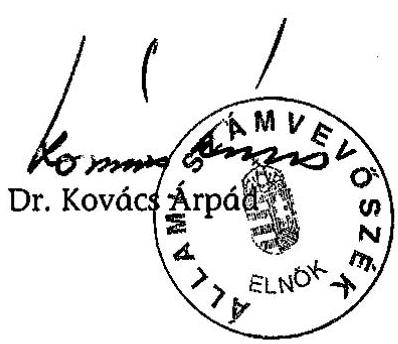

---

1. sz. melléklet

a V-23-160/2004-2005. sz. jelentéshez

# ÉSZREVÉTELEK

---

.

---

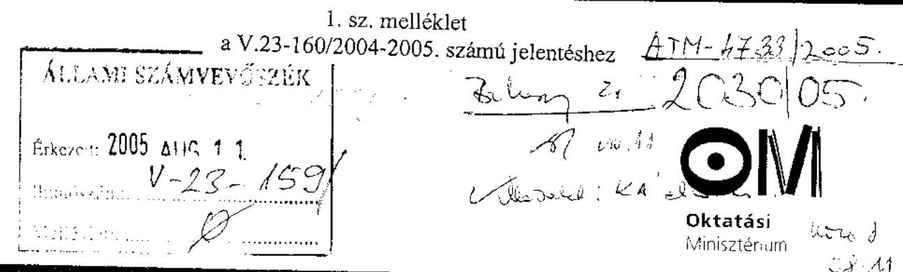

Dr. Kovács Árpád úr
elnök
Állami Számvevőszék
Budapest

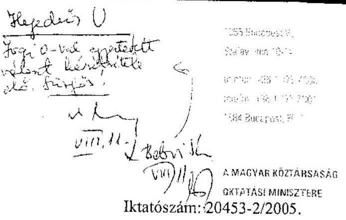

Tárgy: Az Oktatási Minisztérium fejezet működésének ellenőrzéséről készített ÁSZ jelentés

# Tisztelt Elnök Úr! 

A fenti tárgykörű jelentést 2005. augusztus 2-án (V-23-157/2004-2005. számon) megkaptuk, azt a minisztérium illetékes szakértőivel áttekintettük. A jelentéssel kapcsolatosan - figyelembe véve a már megtörtént szakértői egyeztetéseket és levelezéseket is - az alábbi észrevételeket tesszük:

1. Általánosságban észrevételezzük és kifogásoljuk, hogy az állami vezetők felelősségét is érintő egyes kérdéskörök - különös tekintettel a Somlói út 51. számú ingatlan bérbevételével és használatával kapcsolatosan leírtakra - megfelelő feltárása során - miután a teljes folyamatokat nem tekintették kellő részletezettséggel át - nem jártak el a számvevők kellő alapossággal és körültekintéssel. Így joggal merülhetett fel az érintett vezetőkben, hogy fontosabb volt a hiba fellelése, mint megfelelő mélységű feltárása. Ez utóbbiak miatt álláspontunk szerint sérültek „A számvevőszéki ellenőrzés szakmai szabályai"-t előíró kézikönyv 73. oldal 17.1.2-ben leírtak, amely szerint „A felelősség csak akkor vethető fel, illetve állapítható meg, ha a hiba és a szándékos, vagy gondatlan emberi magatartás közötti ok-okozati összefüggés az ellenőrzés során összegyűjtött bizonyítékokkal alátámasztható". A Somlói u. 51. szám alatti ingatlan helyzetének minősítése és az abból levont következtetések és különösen a felvetett felelősségek alapján, joggal érezzük azt, hogy az Alapítvány elmaradt értesítésének kihangsúlyozása mellett, igen háttérbe szorultak

---

azok a további tények - amelyek egyébként az átadott dokumentumokban folyamatosan megjelentek - , hogy hogyan, miért és kik indították el az egész tranzakciót 1999-2000-ben, milyen jogszerűtlen megállapodások alapozták meg a kialakult helyzetet, valamint a szabálytalan és rossz konstrukció következtében csődközeli helyzetbe került egy állami intézmény, amelynek vezetését az oktatási miniszter - az általa elrendelt vizsgálat megállapításai alapján - felmentette és a helyzet stabilizálására miniszteri biztosi kirendelés is történt. Nem jelenik meg a jelentésben az sem, hogy az Oktatási Minisztérium a helyzet megoldását kormányzati szinten folyamatosan kezdeményezte és pénzügyminisztériumi döntés lassította az ingatlan kezelői jogának időben történő rendezését. Az előbbiek következményeként - az intézmény folyamatos működtetése érdekében - tett OM pénzügyi intézkedés - az előzmények figyelmen kívül hagyásával - kap egyedül negatív interpretációt és ez kerül egyedül minősítésre. Végezetül az elmondottakkal összefüggésben megjegyezzük, hogy a rendelkezésre álló állami pénzeszközök felhasználása során károkozás és/vagy magán célú felhasználás nem történt. (Ez utóbbival összefüggésben észrevételezzük, hogy az ÁSZ még a vizsgálat lezárása előtt „egyéb külső kezdeményezéseket" is tett.)
2. Szintén általánosságban észrevételezzük és kifogásoljuk azt is, hogy a vagyongazdálkodási témakörben eljáró számvevő jelentését, az abban foglalt megállapításokat - különösen az állami vezetők felelőssége vonatkozásában - az érintettekkel szóban nem egyeztette és velük érdemi egyeztetés nem történt. Álláspontunk szerint ilyen bonyolultságú kérdéskörben szakmailag sem nélkülözhető az ok-okozati összefüggéseket megismerő szóbeli egyeztetés. (Ezt nem helyettesítheti a dokumentumok értékelése és elemzése, valamint a jelzett számvevő az OM egyeztető megbeszélésen sem vett részt.)
3. Észrevételezzük és kifogásoljuk, hogy eltérően „A számvevőszéki ellenőrzés szakmai szabályai"-ban [552. oldal 28. § (7) bekezdésében] leírtaktól, nem csatolták hiánytalanul a fent jelzett témakörben az ellenőrzött szervezeti egység vezetőjének és vezető munkatársainak észrevételeit és arra adott vizsgálatvezetői válaszokat. Az Elnök úr által megküldött jelentéshez pusztán az egyik kérdéskör legutolsó levelezését csatolták, de a másik felelősség-felvetéshez kapcsolódó levelezéseket nem.
4. Az általános észrevételeken túl az alábbi konkrét észrevételeket és kifogásokat vetjük még fel:
a) Nem azonosítható, hogy melyik számvevői jelentés kivonata a V-23-60/2004-2005. sz. jelentésük, amelyhez csatoltan kerültek átadásra a felelősségi záradékok, mivel a kivonatban szereplő megállapítások az érintett számvevői jelentésben nem szerepelnek.

---

b) Módosítani javasoljuk az Elnök úr által megküldött jelentés 16. oldalán az oktatási miniszter felé megfogalmazott 7. számú javaslatát, amely a felelős személyekkel kapcsolatos fegyelmi eljárások megindítását írja elő több okból is. Egyrészt a felelőssé tett volt közigazgatási államtitkár, valamint az OMAI volt főigazgatójának fegyelmi felelősségét munkaviszony hiányában megvizsgálni nem tudjuk. Másrészt továbbra sem látjuk alapos indokát és pótlólagos dokumentumait annak, mitől súlyosbodott az ÁSZ 2005. április 19-ei (V-23-60/2004-2005.) OM felé megfogalmazott javaslata, amely még az „indokolt esetben a személyes felelősség tisztázását", valamint a „kit, milyen mértékű felelősség terhel a Tihany Alapítványnak jogszabályellenesen bérleti díj megfizetése formájában nyújtott támogatások miatt" vizsgálati javaslatokat fogalmazta meg az oktatási miniszter felé. (Egyébként az ÁSZ ezen megállapítása pontatlan, mivel a jelzett összeg visszatérítéséről intézkedtünk.)
A fentiek alapján javasoljuk, hogy az ÁSZ eredetileg is javasolt azon előírása jelenjen meg, hogy az oktatási miniszter vizsgáltassa ki az ÁSZ által feltárt szabálytalanságok személyi felelősségeit és munkáltatói jogkörében kezdeményezze a szükséges intézkedéseket.
c) Konkrét észrevételként fogalmazzuk meg azt is, hogy igen nehezen áttekinthetőek a június havi felirattal megküldött jelentés-tervezetek, mivel az azonos fejléccel és hónappal ellátott két jelentés bizonyos pontokon eltér. Az egyik 46. oldal harmadik bekezdésében a személyes felelősségek tisztázását folyamatban lévőnek jelzi a jelentés-tervezet, a másiknál pedig már azt jelzi - 46. oldal első bekezdésében -, hogy ,...az ÁSZ belső eljárási rendje alapján a szerződések aláíróinak és a támogatás utalványozójának személyes felelősségét felvetettük".
A fentiek alapján két ugyanazon dátummal ellátott jelentés eltérően fogalmaz.(!)
A fentiekkel összefüggésben észrevételezzük azt is, hogy az Elnök úr által megküldött jelentés ugyanezen kérdéskörben - a 45. oldal harmadik bekezdésében - további kiegészítésekkel már az alábbiakat jelzi: „...az ÁSZ belső eljárási rendje alapján a szerződések aláíróinak és a támogatás utalványozójának személyes felelősségét állapítottuk meg, és a szükséges intézkedéseket kezdeményeztük." Nem érthető számunkra, hogy az előzőekben jelzett júniusi verziókhoz képest - ahol a felelősség tisztázása folyamatban volt, valamint felvetésre került - hogyan került az ÁSZ olyan helyzetbe egy hónapon belül, hogy már meg is állapította a személyes felelősségeket, sőt további szükséges intézkedéseket is kezdeményezett.(!)

---

d) Eljárási szempontból (tulajdonképpen módszertanilag is) kifogásoljuk és észrevételezzük, hogy az eddigiekben egyeztetett valamennyi tervezethez képest az Elnök úr által most megküldött jelentés 31, 32, 33. oldalain olyan új - az OMAI ellenőrzési helyzetét tárgyaló rész megállapítások kerültek beépítésre, amelyek még az ÁSZ V-33-002-062/2004-2005. számú, nem publikus számvevői jelentésének 34, 35. oldaláról kerültek átvételre és a V-33-093/2005. számú ÁSZ főigazgatói-helyettesi levél alapján még szakértői egyeztetés alatt állnak. A fentiek alapján nem érthető számunkra, hogy egy szakértői egyeztetés alatt lévő másik vizsgálat része hogyan kerülhetett beépítésre egy ÁSZ elnöke által megküldött végleges jelentésbe. Ezért azok kivételét és az eredeti állapot helyreállítását kérjük. (Természetesen a szakértői egyeztetést követően a másik jelentésben ezek életszerűen megjelennek.)
e) Az OM és a Roprod Kft. között létrejött megállapodások - álláspontunk szerint - nem visszterhes megállapodások, így az 1996. évi I. tv. hatálya nem terjed ki rá, ellentétben az Önök által leírtakkal. Az e témakörben mutatkozó nézetkülönbségünk miatt a kommunikációs megállapodásokat (az abban előírt feladatok végrehajtását) eltérően értékeljük.

# Tisztelt Elnök Úr! 

Kérem, hogy a tárcánk működésének ellenőrzéséről készített átfogó jelentésük véglegesítésénél észrevételeinket és javaslatainkat figyelembe venni, valamint a jelzett eljárási problémákat áttekinteni szíveskedjen.

Budapest, 2005. augusztus 10.

Tisztelettel:
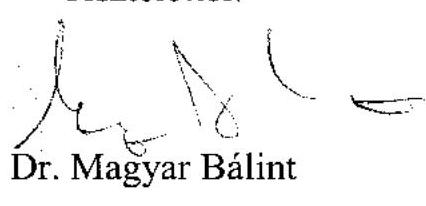

---

# Állami Számvevőszék 

## Dr. Magyar Bálint úr

miniszter
Oktatási Minisztérium
Budapest

## Tisztelt Miniszter Úr!

Köszönettel megkaptam az Oktatási Minisztérium fejezet működésének ellenőrzéséről készített ÁSZ jelentésre adott észrevételeit tartalmazó levelét és azzal kapcsolatban a következőkről tájékoztatom:

Mindenekelőtt szeretném előre bocsátani, hogy az OM-nél az átfogó ellenőrzést a számvevőszéki ellenőrzés szakmai szabályai, és az egyéb jogszabályok (Áht, Ámr, Ász tv.) betartásával folytattuk le. A jelentés megállapításait előzetesen széles körben, több lépcsőben egyeztettük az OM illetékes vezetőivel és észrevételeiket elfogadható mértékben figyelembe vettük.

Legnagyobb sajnálatomra - miközben Miniszter úrnak a Somlói út 51. szám alatti ingatlan helyzetének minősítésével kapcsolatos álláspontját természetesen tiszteletben tartom - nem tudok elvonatkoztatni attól a körülménytől, hogy az Állami Számvevőszék nem mérlegelheti a törvényi előírásokat, ha azoktól eltérő gyakorlatot tapasztal, ezt kötelessége jelezni. Miután a jelentésben leírtak tényszerű helyzetet tükröznek, amit Miniszter úr sem kérdőjelez meg levelében - legfeljebb a levont következtetések térhetnek el. Ugyanakkor a javasolt fegyelmi eljárások lefolytatása Miniszter úr hatásköre, felelőssége és lehetősége van mindazoknak a körülményeknek a mérlegelésére, amelyek közrejátszottak az ellenőrzés által kifogásolt helyzet kialakulásában.

Az ellenőrzésnél nem hagytuk figyelmen kívül az előzményeket; folyamatában tekintettük át a Somlói úti ingatlan helyzetét és jutottunk arra a következtetésre, hogy szabálytalanul jártak el a Tihanyi Alapítvány támogatásánál. A jogszerűtlen megállapodások jóváhagyása miatt vetettük fel a volt közigazgatási államtitkár személyes felelősségét is.

A vagyongazdálkodási, bérleménygazdálkodási témakörben készült, felelősségi záradékkal ellátott számvevői jelentést (jelentés kivonatot) az ellenőrzés vezetője személyesen adta át az érintett vezetőknek. (Ennek dokumentumai a Közigazgatási Államtitkárságon, a Közoktatási Helyettes Államtitkárságon, a Gazdasági Helyettes Államtitkárságon, a Költségvetési Főosztályon, a Gazdálkodási Főosztályon fellelhetők.) Egyik esetben sem merült fel további megbeszélés iránti igény.

Kialakult gyakorlatunk szerint a miniszteri 8 napos észrevételezésre megküldött jelentéshez a közigazgatási (vagy illetékes helyettes) államtitkár levelét és az arra adott válaszunkat mellékeljük. (Megjegyzem, hogy „a Számvevőszéki Ellenőrzési Szakmai Szabályai"-ból idézett 28. §.(7) bekezdés a szabályzat mellékletében tájékoztató jelleggel bemutatott - a belső ellenőrzésre vonatkozó - kormányrendeletből származik).

---

A felelősségi megállapítások kezelésére éppen az érintett személyi körre való tekintettel választottuk a Miniszter úr levele 4/a pontjában kifogásolt megoldást. Így igyekeztünk elkerülni, hogy az ÁSZ törvényben előírt írásbeli magyarázatok megismerése előtt publikussá váljanak a minisztériumon belül az ellenőrzési megállapítások.

A 7. számú javaslati pont megfogalmazása a tények megismerésének, az ok-okozati összefüggések feltárásának függvényében változott, illetve nyerte el végleges formáját. A személyi felelősséget az ellenőrzés megállapította. Ebből következően - amint már erre utaltam - a fegyelmi eljárások lefolytatása a Miniszter úr hatásköre, felelőssége. Munkaviszony hiányában természetesen nem lehet fegyelmi eljárást indítani. Mérlegelés tárgyát képezheti azonban, hogy a költségvetésnek okozott kárt polgári peres eljárás keretében próbálják meg érvényesíteni.

A Miniszter úrnak megküldött jelentés egy technológiai folyamat végterméke, amit miután az Állami Számvevőszék Minőségbiztosítási Önálló Osztálya tanúsította annak megfelelését az ÁSZ Szakmai Szabályzataiban foglaltaknak - aláírtam és ettől fogva a korábbi jelentés-tervezetek az ÁSZ belső dokumentációját képezik.

A minisztérium belső ellenőrzési rendszerének értékelését ezen átfogó ellenőrzés és a 2004. évi zárszámadás ellenőrzés keretében is súlyponti kérdésként kezeltük. Természetesen egy ellenőrzést folytattunk le és ennek az eredményei kerültek be az OM fejezetről szóló jelentésbe és a zárszámadás ellenőrzéséről szóló jelentés-tervezetbe. Miniszter urat tévesen tájékoztatták, miszerint a jelentésbe beépített szövegrészt nem egyeztettük. Azt ugyanis 2005. június 13-án e-mailen megküldtük az OMAI főigazgatójának és személyesen is egyeztettük a megállapításokat. Megjegyzem, hogy Államtitkár úr sem tett észrevételt
 a belső ellenőrzéssel kapcsolatban leírtakhoz.

Az OM és a Roprod Kft. között létrejött kommunikációs megállapodásokat azért kifogásoljuk, mert azok úgy teszik lehetővé költségvetési pénzek kiáramlását, hogy a minisztériumnak mindebből nem származik anyagi-erkölcsi előnye. Az sem minősíthető célszerű megoldásnak, hogy a költségvetési támogatással létrejött produktum további értékesítésére vonatkozóan semmiféle megszorító kitétel nem szerepel a megkötött támogatási szerződésekben.

Kérem Miniszter urat, hogy a levelemben foglaltakat mérlegelni, illetve elfogadni szíveskedjék.

Végezetül tájékoztatom Miniszter urat, hogy az ellenőrzésről készült jelentést - kialakult gyakorlatunk szerint - az Ön észrevételeivel és az azokra adott válaszommal együtt küldöm meg az Országgyűlés elnökének, az illetékes bizottságok elnökeinek és a Miniszterelnöknek.

Budapest, 2005-08- " 45 "
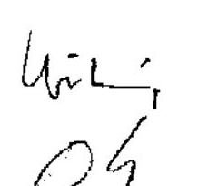

Tisztelettel:
Reöm fonsy
Dr. Kovács Árpád

---

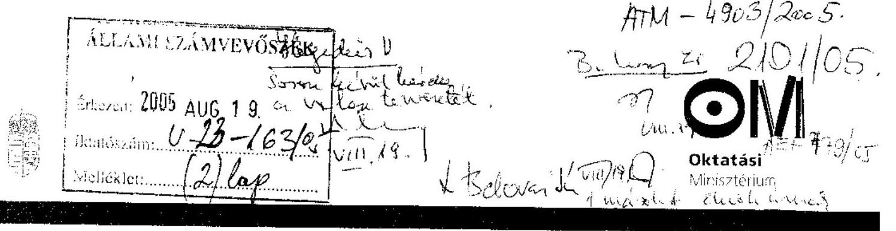

Dr. Kovács Árpád úr
elnök
Állami Számvevőszék

Budapest

Tárgy: Az Oktatási Minisztérium fejezet működésének ellenőrzéséről megküldött ÁSZ jelentés mérlegelési jogkörben történő ismételt véleményezése

Tisztelt Elnök Úr!

A V-23-161/2004-2005. számon megküldött válaszlevelét áttekintve, az Elnök úr által jelzett mérlegelési jogkörömben az alábbi észrevételeket továbbra is fenntartjuk az OM részéről:

Az általánosságban jelzett azon ÁSZ elnöki megjegyzés, amely arra hivatkozik, hogy az OM-nél lefolytatott átfogó ellenőrzés kapcsán a számvevőszéki ellenőrzés szakmai szabályai maradéktalanul betartásra kerültek, továbbra sem fogadható el teljeskörűen az alábbiak miatt:

- A Somlói út 51. számú ingatlan (valamint az abban működő intézmény és alapítvány) helyzetének nem csupán annak minősítésében van nézetkülönbség tárcánkkal, hanem a témakört vizsgáló számvevő jelentése ismeretében (ide értjük a kivonatot is) a kérdéskör teljeskörű feltárását hiányoljuk, valamint az ok-okozati összefüggések kibontását.

- A fentiekkel összefüggésben továbbra is hibásnak érezzük azt a gyakorlatot, amely szerint kivonatként kerül egyeztetésre a vizsgálati megállapítások egy része úgy, hogy nem azonosítható melyik számvevői jelentés része és/vagy kivonata. Ezzel összefüggésben nem tudjuk elfogadni azt az ÁSZ álláspontot, amely úgymond a felelőssé tett személyek „érdekében" történteknek minősíti ezt az eljárást, hiszen így a teljes folyamat leírása maradt el, mivel a kivonat csak elsősorban a megjelölt felelősök személyére koncentrál és ahhoz összegzi az információkat.

---

- A felelőssé tett állami vezetők valóban az osztályvezető asszonytól (aki egyben az elrendelt vizsgálat vezetője) kapták meg a felelősségvállaló nyilatkozatot, de szóbeli és tartalmi egyeztetést az eljáró számvevőtől vártak volna el egy ilyen súlyú és bonyolultságú ügykör kapcsán. Ugyan az átadott dokumentumokban többször is jeleztük, de elfogadtatni nem tudtuk, hogy a Somlói út 51. számú ingatlan tulajdonosa nevében eljáró Váltó Rt. fennálló követelését - szerződéses jogviszony hiányában - csak az Oktatási Minisztérium felé nyújthatta be és számára közömbös volt, hogy az ingatlanon belül milyen egyéb használó is funkcionál. Vagyis az OM követelését csak ezt követően érvényesíthette a Tihany Alapítvánnyal szemben, amit meg is tett.
- Kifogásoljuk, hogy az ÁSZ elnöke által megküldött jelentés mellékletét képező észrevételek között csak az egyik felelősségi kör kapcsán történő levelezéseket csatolták be és az ettől jelentősen bonyolultabb Somlói úti ingatlan és intézmény vonatkozásában történő levelezéseket - amelyek egy része megválaszolatlan is maradt - nem csatolták. Valóban a számvevőszéki ellenőrzés szakmai szabályainak mellékletéből azt a részt idéztük indoklásként, amely a belső ellenőrzésre vonatkozóan ír elő ilyen szabályokat, de az ÁSZ ellenőrök számára is ugyanezen kézikönyv 70. oldal, IV. fejezetében a jelentés készítés standardjainál 13.5. pont alatt előírja „ha az ellenőrzött szervezet észrevételeit továbbra is fenntartja, azokat a jelentésben az ÁSZ vonatkozó álláspontjának feltüntetésével szerepeltetni kell."
- Az összefoglaló jelentés 7. számú javaslati pontjához tett pontosító észrevételeinket Elnök úr nem fogadta el. Az állami vezetők felelőssége vonatkozásában a különböző kidolgozottságú összefoglaló jelentésekkel magyarázták a felelősségek különböző módú felvetését (tisztázása, felvetése, majd megállapítása) és azt állítják, hogy vizsgálatuk a felelősséget megállapította. Ez a megfogalmazás álláspontunk szerint pontatlan, mivel az ÁSZ a felelősségvállaló nyilatkozatokra adott válaszokat nem fogadta el és a személyi felelősségek felvetését tarthatta csak fenn, a tényleges személyi felelősségek megállapítása az ÁSZ által egyébként javasolt fegyelmi eljárások kapcsán derülhet ki és alapozható meg jogszerűen.
A fentiek alapján az előző levelünkben jelzett 7. számú javaslati pont módosítását továbbra is fenn kell tartanunk.
- Vélhetően Elnök urat tévesen tájékoztatták, hiszen nem csak formailag kifogásoljuk továbbra is azt, hogy egy OM által felügyelt intézmény, valamint egy más célú ÁSZ vizsgálat kapcsán tett megállapításokat előzetes OM egyeztetés nélkül beépítenek egy már többször egyeztetett anyagba, hanem azt is, hogy az egyeztetések elmaradása miatt olyan megállapítás is bekerült, amely konkrét miniszteri intézkedést kifogásol és minősíti azt

---

kormányrendelettel ellentétesnek. Ez utóbbi állítás kapcsán egyértelműen tisztáztuk azt, hogy az eljáró ÁSZ ellenőr pontatlanul és tévesen fogalmazott akkor, amikor a miniszter által jóváhagyott 2005. éves OMAI ellenőrzési tervnél a miniszteri döntést a 217/1998. (XII.30.) Kormányrendelet 17. §-ában foglaltakkal ellentétesnek állította be. A jogszabály idézése és az abban előírtak ugyan pontosak, de az OMAI-nál ezzel kapcsolatosan a helyzet bonyolultabb, hiszen a FEUVE keretében csak azokat az összegeket ellenőrzi az OMAI belső apparátussal, melyek a költségvetésben pótelőirányzatként vagy átvett pénzeszközökként megjelennek.

Megállapítható, hogy például 2005. évben (2004. évben is hasonlóan történt) a Munkaerőpiaci Alap képzési és fejlesztési alaprészének OM felelősségi körébe tartozó összegeknek mintegy 10%-a jelent csak meg az OMAI költségvetésében. Ez utóbbiaknál előírható (többnyire így is valósul meg) a FEUVE keretében történő ellenőrzés, de a túlnyomó többségnél - adott esetben 90%-nál - a képződő pénzeszközök vagy decentralizáltan - eleve alapítványokhoz történő utalással -, vagy a nyertes pályázókhoz történő közvetlen utalással hasznosulnak a pénzek, így ezek jogszerűen külső szakértők közreműködésével is vizsgálhatók.

A fentieket összegezve: pontatlan volt az ÁSZ észrevétele, amely az OM-mel történő egyeztetés esetén elkerülhető lett volna.

Az előzőekkel összefüggésben szeretném Elnök úrnak megemlíteni, hogy az intézkedésemet kifogásoló jelentés-rész pótlólagos beszerkesztése kapcsán válaszlevele indoklása azért nem elfogadható számomra, hiszen nem érthető miként lehet megfelelő - és elégséges - egyeztetésnek minősíteni az OMAI főigazgatóval e-mailen és személyesen történő egyeztetést, miközben az egyik megállapítás az én eljárásomat is minősíti.

- Továbbra is értetlenül állunk az Állami Számvevőszék azon megállapítása előtt, amely szerint az Oktatási Minisztérium (továbbiakban: OM) és Roprod Kft. között létrejött támogatási szerződésből az OM-nek „nem származik anyagi-erkölcsi előnye".

A támogatási szerződések mibenlétéről, a (atipikus) szerződések között elfoglalt helyéről, már korábbi leveleinkben kifejtettük álláspontunkat, ezért annak részletezésétől most eltekintenénk. Ennek ellenére felhívnánk a figyelmüket néhány, a támogatási szerződésekben rejlő - korábban talán nem kellő mértékben részletezett - sajátosságokra: a támogatási szerződés nem visszterhes (azaz ingyenes) jogügylet, amely esetében a támogató (aki nyilvánvalóan nem gazdagodik az ügyletből) meghatározott cél

---

megvalósítása érdekében meghatározott összeget folyósít a kedvezményezettnek (aki nyilvánvalóan gazdagodik ezzel az összeggel). A kedvezményezett kötelezettsége abban áll, hogy a támogató által folyósított összeget arra célra használja fel, amelyre azt a támogatótól kapta.

Az, hogy a szerződés az OM számára kifejezett anyagi előnnyel nem jár, az a támogatási szerződés mivoltából következik. Megítélésünk szerint azonban sajnálatos mulasztást követett el az ÁSZ akkor, amikor az ellenőrzés során nem kérte be a Roprod Kft. és az MTV Rt. között létrejött szerződést, vagy ha be is kérte, könnyelműen átsiklott annak 3. b) pontján, amely szerint „az MTV Rt. és a Roprod Kft. térítésmentesen felajánlja az OM és a NKÖM részére a jelen szerződés tárgyát képező filmsorozatot, annak forgatókönyveinek az interneten történő elhelyezését, valamint az OM Sulinet című programjában történő felhasználását."

Az ÁSZ azon megállapítása, miszerint „a műsor megtekintői arról sem szerezhettek tudomást, hogy annak elkészítését az OM támogatta" azzal az egyszerű ténnyel kívánjuk cáfolni, miszerint minden adás végén - a vége főcímében - megtalálható volt a „Köszönjük az Oktatási Minisztérium segítségét!" felirat.

A támogatásból származó erkölcsi előnyről annyit szeretnénk megemlíteni, hogy a 2005. év hivatalos adatai szerint az adások átlagos nézettsége 402659 fő volt, az elért közönség adásonkénti átlaga 795705 fő, amelyhez hozzá számíthatjuk az ismétlések nézőszámát, amely alapján állíthatjuk, hogy a műsor nézettsége elérhette az 500000 főt. (Csak megjegyzésképpen: a Mindentudás Egyetemének 250000 fős a nézettségi mutatója.)

Végezetül engedje meg, hogy csatoljunk néhány, a Magyar Elsőkkel kapcsolatos kritikát, amelyek a Magyar Nemzet, a Népszabadság, valamint a Népszava elnevezésű napilapokban jelentek meg.

Budapest, 2005. augusztus ,, ," „.
Melléklet

Tisztelettel:
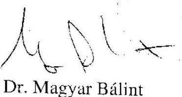

Dr. Magyar Bálint

---

# MAGYAR ELSŐK 

## Három kritika részlet:

## NÉPSZABADSÁG (Varsányi Gyula)

„Kevés az olyan jó ötlet a mostani hazai televiziózásban, mint az MTV-n látható Magyar Elsők sorozaté. Azért jó, mert eredeti tévés (képi) gondolkodásra vall, és értékelvű látnivalót kínál. Jóllehet, roppant egyszerű is: a műsor bemutatja azokat az emlékeket, amelyek a kultúra, a tudomány, a gazdaság vagy a köznapi élet megújításában véghezvitt első hazai kezdeményezésekről szólnak. Mivel a kezdet általában mindig és mindenben érdekes, sokszor érdekesebb a folytatásnál, a téma voltaképpen kimeríthetetlen. Ha van értelme a közszolgálati televiziózás fogalmának, akkor azt ilyen és ehhez hasonló ötletekben kellene keresni."

## MAGYAR NEMZET (Lócsei Gabriella)

...Ami pedig alakjuk mögött feltűnik, maga a hétköznapi történelem. A nemzeti múlt egytől egyig fontos mozaiklapjai. A jelent látja árnyaltabban az, aki szemügyre veszi őket. Közben pedig, mintha egy kalandfilmet nézne, remekül szórakozik az ember. Ármány és szerelem, jószerencse s balszerencse, balgaság és hősiesség váltakozik e históriákban, akár a mindennapjainkban. A szappanoperákban A valóságshow-kban. Kicsit tán érdekesebben, színesebben is, mint e mostanában oly nagy erővel a nézőre zúdított televiziós műrajokban. ... Használva másoknak, az utánunk jövőknek, emlékeztetve a múltunkra, amelyre büszkék lehetünk, amelyből okulhatunk. Vagy: amin nagyokat kacaghatunk. A Magyar Elsők című sorozat a nemzeti sajátosságoknak szenteli mindenegyes adását - a történelmi eseményeken kívül kultúránkkal, tudományunkkal, iparunkkal, kereskedelmi életünkkel, közlekedési viszonyainkkal, idegenforgalmunkkal, vendéglátási szokásainkkal is foglalkozik...
A Magyar Elsőket eddig csak a Magyar Televízió vetítette, úgy hírlik, hamarosan vevő lesz rá a Duna Televízió is. Ha csöpp esze van a Spektrum Televíziónak, az is adásába illeszti. A magam részéről én a tizenkét vagy huszonnégy legjobb részt felvenném az oktatási segédanyagok sorába. A Magyar Elsőktől csak okosabb lesz a gyermek (a felnőtt is, persze), míg sok más televiziós sorozattól legfeljebb butulunk, bunkósodunk."

## NÉPSZAVA (Bársony Éva)

.. A Magyar Elsők igényes kultúrtörténeti sorozat. Amitől megint csak nem kell megijedni, arról van szó ugyanis, hogy a sorozat összeházasította az

---

ismeretterjesztést a szórakoztatóformával, érdekes történelmi tényeket közöl népszerű eszközökkel. Nem új a műfaj, de hazai téren feledésbe merült, hogy így is lehet szórakoztatni. Az ötlet nagyon jó. Mondhatni kimeríthetetlen. Ami ma körülvesz minket az életünkben, annak mind megvolt a kezdete, megvoltak az úttörő személyiségei, az első lépései, kudarcai, győzelmei, nevesíthető vagy névtelen hősei. És mindezeknek megvan a maguk története, s ha e történetek részleteit értő kezek bányásszák elő
 a múlt időkből, s ügyes kezek adják tovább, akkor valódi értékek kerülnek elő az ismeretlenségből, a nagyközönség szeme elé."

---

# Dr. Magyar Bálint úr 

miniszter
Oktatási Minisztérium

## Budapest

## Tisztelt Miniszter Úr!

Az OM fejezet működésének ellenőrzéséről készített ÁSZ jelentés észrevételező levelére adott válaszommal kapcsolatos ismételt észrevételét köszönöm és a következőkről tájékoztatom.

Sajnálattal veszem tudomásul, hogy a Somlói úti ingatlannal, illetve a Tihanyi Alapítvány támogatásával kapcsolatban ismételten ellenőrzésünk eljárási módját kifogásolja Miniszter úr, miközben kétségtelen tény, hogy törvénysértés történt a tárca korábbi és jelenlegi vezető munkatársai részéről.

Előző levelemben is jeleztem, hogy az ÁSZ-nak nincs mérlegelési lehetősége, ha egy szabálytalansággal szembesül. Ugyanakkor a munkáltatónak a felelősség mértékének és következményeinek meghatározásánál lehetősége van a körülmények mérlegelésére. Az ellenőrzés vezetője helyesen járt el, amikor - az ellenőrzés megállapításainak teljes körű ismeretében - a hatáskörébe vonta az érintett volt és jelenlegi felsővezetők személyes tájékoztatását, a felelősségi záradékkal ellátott jelentés-kivonat megismertetését.

A számvevői jelentések és a számvevőszéki jelentés-tervezetek egyeztetése az ÁSZ szakmai szabályzatának előírásaihoz igazodóan történt. A személyi felelősség megállapításával kapcsolatos kötelező egyeztetések a felelősségi záradékkal ellátott számvevői jelentés-kivonatokra adott írásbeli magyarázatokkal, illetve azok megválaszolásával lezárultak. A számvevőszéki jelentés-tervezet ezen egyeztetések eredményeit tartalmazta. Ennek megfelelően a Miniszter úrnak megküldött - az általam már aláírt jelentésben is szerepelnek mindazok a megállapítások, amelyeken a személyi felelősségek alapulnak, továbbá feltüntettük a tárca eltérő álláspontját is (lásd 45. és 48. oldal).

A hatályos jogszabályok szerint egy minisztérium olyan közigazgatási egység, amelynek minden működési, gazdálkodási kérdésében (jogszabályokban, illetve a tárca SZMSZ-ében meghatározott esetleges kivételekkel) a közigazgatási államtitkár jogosult a tárca nevében nyilatkozni. Ezért követjük azt a gyakorlatot, hogy a jelentéstervezeteket - az elnöki jóváhagyásra való benyújtás előtt - az ellenőrzést felügyelő főigazgató egyezteti a tárca közigazgatási államtitkárával. Így történt ez a jelenlegi ellenőrzésnél is. Ebből következően a Miniszter úrnak nyolc napos észrevételezésre megküldött jelentéshez csak a közigazgatási államtitkár levelét és az arra adott válaszunkat mellékeltük. A nyilvánosságra hozandó végleges jelentésünk pedig már csak a

---

mi levélváltásunkat fogja tartalmazni. (Megjegyzem, hogy az államtitkári észrevétel alapján fogadtuk el a tárca médiatörvény értelmezését és nem kifogásoljuk szabályszerűségi szempontból a televiziós produkciók támogatását. Ez kiderül az Államtitkár úrnak címzett - a jelentés mellékletét képező - levelünkből.)

A folyamatba épített előzetes és utólagos vezetői ellenőrzéssel (FEUVE) kapcsolatos megállapításainkat az OMAI főigazgatójával egyeztettük, ennek során módosítást megalapozó vélemény nem merült fel, és erről a főigazgató írásban kapott tájékoztatást. Miniszter úr észrevétele alapján külön megnézettem a jelentésben foglaltakat és azok helytállóságát illetően nem merültek fel kétségek. (Megemlítem, hogy megállapításunkat munkatársaink rövid úton egyeztették a Pénzügyminisztériummal.)

Az OM és a Roprod Kft. között létrejött támogatási szerződéssel kapcsolatban változatlanul az a véleményünk, hogy a produkciókban nincs konkrét utalás arra, hogy a megvalósítást az OM pénzügyileg támogatta, ugyanis ezt nem helyettesíti a „köszönjük az OM segítségét" felirat a filmek végén. Ugyanakkor örömmel nyugtázom azt a fejleményt, hogy időközben „az MTV Rt. és a Roprod Kft. térítésmentesen felajánlja az OM és a NKÖM részére a jelen szerződés tárgyát képező filmsorozatot, annak forgatókönyveinek és interneten történő elhelyezését, valamint az OM Sulinet című programjában történő felhasználását". Megítélésem szerint azonban mindezeket a támogatási szerződésben kellett volna az OM-nek kikötnie, miután a produkciót 74%-ában a költségvetés finanszírozta.

Időközben (2005. augusztus 22.) megkaptam Miniszter úr kiegészítő levelét, mellyel megküldte az OMAI főigazgatójának a tájékoztatóját és annak csatolt mellékleteit, amiben az ellenőrzésünkkel kapcsolatos véleményét, álláspontját fejtette ki. Sajnálom, hogy az OMAI főigazgató 2005. augusztus 15-i keltezésű, Miniszter úrnak címzett levelében megfogalmazott - a számvevő eljárására vonatkozó - kifogásait sem a 2005. június végéig lezáruló egyeztetési folyamat keretében, sem az államtitkári egyeztetés alkalmával nem jelezte. Természetesen a felmerült kifogásokat megvizsgáljuk és szakmai álláspontunkról Miniszter urat tájékoztatni fogom.

Végezetül ellenőrzésünk segítő szándékáról szeretném biztosítani Miniszter urat. Bizom benne, hogy a jelentéssel kapcsolatos levélváltásaink is hozzájárulnak ahhoz, hogy az ellenőrzési megállapításaink és azok alapján tett javaslataink a felelősségteljes munkájában megfelelően hasznosuljanak.

Budapest, 2005. augusztus 24.

Tisztelettel:
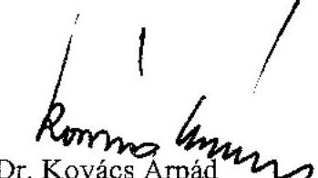

---

# 2. sz. melléklet 

a V-23-160/2004-2005. számú jelentéshez

## TANÚSÍTVÁNYOK

| 1. sz. tanúsítvány | A kiadási és bevételi előírányzatok módosítása |
| :--: | :--: |
| 2/a. sz. " | A bevételek alakulása kiemelt előirányzatonként (2000-2002. év) |
| 2/b. sz. " | A bevételek alakulása kiemelt előirányzatonként (2003-2004. év) |
| 3/a. sz. " | A kiadások alakulása kiemelt előirányzatonként (2000-2002. év) |
| 3/b. sz. " | A kiadások alakulása kiemelt előirányzatonként (2003-2004. év) |
| 4/a. sz. " | Az OM szervezeti egységei, létszáma, 2000-ben, éves átlagban |
| 4/b. sz. " | Az OM szervezeti egységei, létszáma, 2001-ben, éves átlagban |
| 4/c. sz. " | Az OM szervezeti egységei, létszáma, 2002-ben, éves átlagban |
| 4/d. sz. " | Az OM szervezeti egységei, létszáma, 2003-ben, éves átlagban |
| 4/e. sz. " | Az OM szervezeti egységei, létszáma és megoszlása 2004-ben, éves átlagban |
| 5. sz. " | A költségvetési engedélyezett és a tényleges átlaglétszám alakulása (2000-2004. év) |
| 6. sz. " | A munkaerő mozgás, nyitó és záró létszámadatok alakulása (2000-2004. év) |
| 7. sz. " | Az OM és egyéb intézményei ingatlan bérleti díj bevételei és kiadásai (2000-2003. év) |
| 8/a. sz. " | A tárgyi eszközök és az immateriális javak alakulása (2000-2001. év) |
| 8/b. sz. " | A tárgyi eszközök és az immateriális javak alakulása (2002-2003. év) |
| 8/c. sz. | A tárgyi eszközök és az immateriális javak alakulása (2004. év) |

---

Oktatási Minisztérium fejezet

A KIADÁSI ÉS A BEVÉTELI ELŐÍRÁNYZATOK MÓDOSÍTÁSA

|  Megnevezés | 2000. év | 2001. év | 2002. év | 2003. év | 2004. év  |
| --- | --- | --- | --- | --- | --- |
|  Eredeti kiadási előirányzat | 229 815 700 | 284 160 000 | 303 899 100 | 415 547 600 | 431 420 600  |
|  Előirányzatváltozás összesen | 96 131 988 | 89 397 329 | 114 737 867 | 70 639 566 | 68 951 370  |
|  ebből hatáskörök szerint: |  |  |  |  |   |
|  OGY |  |  | 950 000 |  |   |
|  Kormány | 11 744 441 | 9 507 715 | 18 523 539 | -4 361 192 | -5 898 690  |
|  Felügyeleti szervi | 37 181 939 | 56 681 570 | 64 150 620 | 42 305 824 | 24 982 334  |
|  Intézményi | 47 205 608 | 23 208 044 | 31 113 708 | 32 694 934 | 49 867 726  |
|  Módosított kiadási előirányzat | 325 947 688 | 373 557 329 | 418 636 967 | 486 187 166 | 500 371 970  |
|  Teljesítés | 277 315 289 | 319 975 031 | 369 695 961 | 482 073 415 | 473 229 028  |
|  Eredeti bevételi előirányzat | 229 815 700 | 284 160 000 | 303 899 100 | 415 547 600 | 431 420 600  |
|  Bevételi előirányzat módosítás összesen | 96 131 988 | 89 397 329 | 114 737 867 | 70 639 566 | 68 951 370  |
|  ebből hatáskörök szerint: |  |  |  |  |   |
|  OGY |  |  | 950 000 |  |   |
|  Kormány | 11 744 441 | 9 507 715 | 18 523 539 | -4 361 192 | -5 898 690  |
|  Felügyeleti szervi | 37 181 939 | 56 681 570 | 64 150 620 | 42 305 824 | 24 982 334  |
|  Intézményi | 47 205 608 | 23 208 044 | 31 113 708 | 32 694 934 | 49 867 726  |
|  Módosított bevételi előirányzat | 325 947 688 | 373 557 329 | 418 636 967 | 486 187 166 | 500 371 970  |
|  Teljesítés | 315 659 362 | 365 215 572 | 411 733 441 | 526 510 143 | 513 429 320  |

Tanúsítom, hogy az adatok a fejezet költségvetési beszámolójában szereplő adatokkal megegyeznek! Budapest, 2004. február 23. P.H.

---

# A BEVÉTELEK ALAKULÁSA KIEMELT ELŐIRÁNYZATONKÉNT

|  Megnevezés | 2000. év |  |  | 2001. év |  |  | 2002. év |  |   |
| --- | --- | --- | --- | --- | --- | --- | --- | --- | --- |
|   | Eredeti | Módosított | Teljesítés | Eredeti | Módosított | Teljesítés | Eredeti | Módosított | Teljesítés  |
|   | előirányzat |  |  | előirányzat |  |  | előirányzat |  |   |
|  Működési bevételek | 34 455 092 | 42 221 038 | 41 279 525 | 45 389 810 | 49 424 156 | 45 245 195 | 47 280 421 | 50 645 071 | 48 122 103  |
|  Kamatbevételek | 200 | 58 285 | 44 559 |  | 5 128 | 20 405 | 1 000 | 1 578 | 12 743  |
|  Működési célú pénzeszközátvétel | 38 536 582 | 42 412 674 | 43 560 492 | 45 531 961 | 48 217 569 | 47 120 830 | 48 437 946 | 53 817 635 | 54 995 163  |
|  Egyéb működési célú pénzeszközátvétel, bevétel | 9 546 326 | 28 019 115 | 25 906 532 | 16 331 829 | 28 649 297 | 29 953 932 | 17 722 533 | 30 194 336 | 27 654 843  |
|  Felhalmozási jellegű pénzeszközátvétel | 1 502 210 | 2 671 513 | 2 602 433 | 1 866 760 | 4 139 213 | 7 418 717 | 1 285 915 | 6 041 035 | 8 386 226  |

  |
|  Egyéb felhalmozási célú pénzeszközátvétel | 3 616 490 | 21 028 609 | 17 934 677 | 7 069 640 | 20 289 257 | 16 898 983 | 4 485 885 | 21 814 548 | 21 069 987  |
|  Kölcsönök visszatérülése | 3 000 | 1 642 815 | 2 189 831 |  | 124 288 | 113 981 |  | 125 901 | 138 003  |
|  Kölcsönök igénybevétele |  |  | 28 082 |  |  | 2 167 |  |  | 544 700  |
|  Ösztalékok, koncessziós díjak |  | 282 | 5 464 |  | 400 | 46 533 |  | 24 213 | 29 944  |
|  Pénzügyi befektetések bevételeiből részesedések |  | 5 011 | 6 791 |  |  | 33 968 |  | 43 122 | 50 123  |
|  Sajátos bevételek |  |  |  |  |  |  |  |  |   |
|  Törvény szerinti bevételek | 87 659 900 | 138 059 342 | 133 558 386 | 116 190 000 | 150 849 308 | 146 854 711 | 119 213 700 | 162 707 439 | 161 003 835  |

Tanúsítom, hogy az adatok a fejezet költségvetési beszámolójában szereplő adatokkal megegyeznek!

Budapest, 2004.

P.H.

---

# A BEVÉTELEK ALAKULÁSA KIEMELT ELŐIRÁNYZATONKÉNT

|  Megnevezés | 2003. év |  |  | 2004. év |  |   |
| --- | --- | --- | --- | --- | --- | --- |
|   | Eredeti | Mód. | Telj. | Eredeti | Mód. | Telj.  |
|   | előirányzat |  |  | előirányzat |  | várható  |
|  Működési bevételek | 48 566 664 | 53 629 505 | 53 663 055 | 56 817 478 | 61 941 049 | 59 724 670  |
|  Kamatbevételek | 6 533 | 6 665 | 14 070 | 6 833 | 9 925 | 11 825  |
|  Működési célú pénzeszközátvétel | 61 553 260 | 67 731 850 | 72 298 282 | 70 102 139 | 77 255 596 | 81 854 461  |
|  Egyéb működési célú pénzeszközátvétel, bevétel | 22 318 843 | 28 927 699 | 25 429 663 | 24 879 450 | 30 035 322 | 24 638 272  |
|  Felhalmozási jellegű pénzeszközátvétel | 2 271 477 | 3 725 116 | 4 932 614 | 2 939 221 | 3 887 857 | 8 687 469  |
|  Egyéb felhalmozási célú pénzeszközátvétel | 7 959 358 | 11 846 734 | 9 538 914 | 7 846 179 | 10 768 619 | 8 031 995  |
|  Kölcsönök visszatérülése | 11 300 | 106 217 | 123 999 | 36 300 | 133 829 | 143 921  |
|  Kölcsönök igénybevétele |  |  | 283 |  | 15 000 | 15 000  |
|  Ösztalékok, koncessziós díjak | 165 | 79 468 | 82 990 |  | 80 | 4 218  |
|  Pénzügyi befektetések bevételeiből részesedések |  | 131 800 | 134 148 |  | 2 016 | 7 980  |
|  Sajátos bevételek |  |  |  |  |  |   |
|  Törvény szerinti bevételek | 142 687 600 | 166 185 054 | 166 218 018 | 162 627 600 | 184 049 293 | 183 119 811  |

Tanúsítom, hogy az adatok a fejezet költségvetési beszámolójában szereplő adatokkal megegyeznek!

Budapest, 2004. 13. 29.

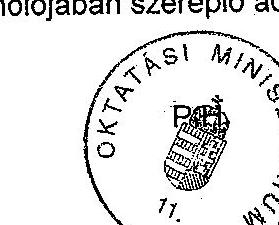

---

A KIADÁSOK ALAKULÁSA KIEMELT ELŐIRÁNYZATONKÉNT

|  Megnevezés | 2000. év |  |  | 2001. év |  |  | 2002. év |  |   |
| --- | --- | --- | --- | --- | --- | --- | --- | --- | --- |
|   | Eredeti előirányzat | Mód. | Telj. | Eredeti előirányzat | Mód. | Telj. | Eredeti előirányzat | Mód. | Telj.  |
|  Személyi juttatások | 68663000 | 78096759 | 72574168 | 87543100 | 94697357 | 85886452 | 93963400 | 113120216 | 104486636  |
|  Tb. járulék, e.ügyi és táppénz hozzájárulás | 24334511 | 27163271 | 24697093 | 28100798 | 30715831 | 27743913 | 28752894 | 34204564 | 31533894  |
|  Munkaadókat terhelő járulékok | 1727389 | 1880044 | 1751885 | 2229202 | 2284960 | 2100649 | 2397406 | 2738731 | 2599701  |
|  Dologi kiadások | 74101502 | 90968032 | 76388544 | 83178070 | 102092860 | 90564448 | 86459359 | 108958307 | 97880623  |
|  Egyéb folyó kiadások | 1092998 | 3386956 | 3115714 | 2223330 | 5275528 | 4966295 | 2325941 | 5638740 | 5695203  |
|  Ellátottak pénzbeli juttatásai | 14563500 | 15786701 | 14465742 | 15451400 | 16690687 | 15579251 | 15883500 | 18434026 | 16973605  |
|  Egyéb műk. célú támogatások, kiadások | 19278900 | 41949119 | 35666294 | 34374000 | 44996704 | 33005389 | 41554700 | 47308886 | 38812444  |
|  Kamatkiadások |  | 9002 | 7347 |  | 640 | 84083 |  | 36617 | 38912  |
|  Felhalmozási kiadások | 26053900 | 64136820 | 45363003 | 29257100 | 74134758 | 58016331 | 30758900 | 86140938 | 69308222  |
|  Kölcsönök nyújtása és törlesztése |  | 2558444 | 2958966 | 1803000 | 2665004 | 1825960 | 1803000 | 2045942 | 1926474  |
|  Részesedések vásárlása |  | 12540 | 12540 |  | 3000 | 26270 |  | 10000 | 11377  |
|  Költségvetési kiadások összesen | 229815700 | 325947688 | 277001296 | 284160000 | 373557329 | 319799041 | 303899100 | 418636967 | 369267091  |

Tanúsítom, hogy az adatok a fejezet költségvetési beszámolójában szereplő adatokkal megegyeznek!

Budapest, 2004.

P.H.

---

# A KIADÁSOK ALAKULÁSA KIEMELT ELŐIRÁNYZATONKÉNT

|  |   |   |   |   |   |   |
| --- | --- | --- | --- | --- | --- | --- |
|  Megnevezés | 2003. év |  |  | 2004. év |  |   |
|   | Eredeti előirányzat | Mód. | Telj. | Eredeti előirányzat | Mód. | Telj.  |
|  Személyi juttatások | 142342000 | 146278236 | 135606981 | 145250600 | 148060934 | 137264076  |
|  Tb. járulék, e.ügyi és táppénz hozzájárulás | 42684115 | 43722541 | 39933036 | 46973500 | 48277736 | 44012351  |
|  Munkaadókat terhelő járulékok | 3152385 | 3821447 | 3524355 |  |  |   |
|  Dologi kiadások | 93458572 | 115159328 | 105792675 | 93643260 | 119950665 | 109400440  |
|  Egyéb folyó kiadások | 2144228 | 5461482 | 5454132 | 1458040 | 2879363 | 2701184  |
|  Ellátottak pénzbeli juttatásai | 21396200 | 22833792 | 21385159 | 23993000 | 24531993 | 23187741  |
|  Egyéb műk. célú támogatások, kiadások | 69002000 | 80265320 | 112941816 | 86981900 | 102812380 | 112210274  |
|  Kamatkiadások |  | 19732 | 123607 |  | 66756 | 135504  |
|  Felhalmozási kiadások | 40471100 | 67440903 | 56651560 | 33084000 | 53624389 | 43723439  |
|  Kölcsönök nyújtása és törlesztése | 897000 | 1174385 | 1020742 | 36300 | 167754 | 201573  |
|  Részesedések vásárlása |  | 10000 | 10000 |  |  | 2500  |
|  Költségvetési kiadások összesen | 415547600 | 486187166 | 482444063 | 431420600 | 500371970 | 472839082  |

Tanúsítom, hogy az adatok a fejezet költségvetési beszámolójában szereplő adatokkal megegyeznek! Budapest, 2004. P.H.

---

## 4/2. sz. bausárvár

a V-23-160/2004-2005. számú jelentéshez

Az OM szervezeti egységei, létszáma, 2000-ben, éves átlagban

|  Szervezeti egységek megnevezése (SZMSZ alapján) | Vezetők száma | Munkatársak száma (fő) | Összesen:  |
| --- | --- | --- | --- |
|   | középvezetői szintig (fő) | Összesen: ebből: közszolgálati jogviszonnyal nem rendelkezők | ÁLLAMI: SZÁMVEVŐSZÉK  |
|  Miniszter | 1 |  | Elkozott: 1  |
|  Minisztéri Tilikárság | 2 | 5 | 5  |
|  Minisztéri Kabinet | 6 | 13 | 13  |
|  Okt. Jogok Min.Biz.Hiv. | 2 | 6 | 6  |
|  Beruházási Kormánybizt. | 1 |  | 1  |
|  Beruh. Kormányb. Tők. | 1 | 1 | 1  |
|  Beruházási Főosztály | 2 | 7 | 7  |
|  Politikai Allamtitkár | 1 | 0 | 1  |
|  Pol. Allamtitk. Tilikárság | 1 | 3 | 4  |
|  Egyházi Kapcs. Tilikárság | 1 | 2 | 3  |
|  Tudó és Techn.pol. Tők. | 1 | 4 | 5  |
|  Összesen: | 19 | 39 | 58  |
|  Közigazg. Allamtitkár | 1 |  | 1  |
|  Allamtitkári Tilikárság | 1 | 8 | 9  |
|  Allamtitkári Hivatal | 6 | 23 | 29  |
|  Jogf és Igazg. Főosztály | 2 | 18 | 20  |
|  Szem. és Közsz. Főo. | 3 | 14 | 17  |
|  Elemzési és Ellenőrző Főo. | 3 | 17 | 20  |
|  Ágazati Informatikai Főo. | 0 | 0 | 0  |
|  Összesen: | 16 | 80 | 96  |
|  Nemz. Kapcs. Hely. Allamtitk. | 1 | 

 | 1  |
|  Titkárság | 1 | 6 | 7  |
|  Határ- és Külügyi Magyarok Titk. | 2 | 5 | 7  |
|  Nemz. Programfejlesztési Főo. | 2 | 5 | 7  |
|  EU Ügyek és Kétcélú Kapcs. Főo. | 3 | 14 | 17  |
|  Magyar Értékesítési és Inf. Közp. | 2 | 10 | 12  |
|  Egyéb (eu integráció) | 0 | 2 | 2  |
|  Összesen: | 11 | 42 | 53  |
|  Gazd. Hely. Allamtitk. | 1 |  | 1  |
|  Titkárság | 1 | 4 | 6  |
|  Költségvetési Főosztály | 3 | 20 | 23  |
|  Közgazdasági Főosztály | 3 | 14 | 17  |
|  Gazdálkodási Főosztály | 4 | 38 | 42  |
|  Egyéb (eu integráció) | 0 | 1 | 1  |
|  Összesen: | 12 | 77 | 89  |
|  Közokt. Hely. Allamtitk. | 1 |  | 1  |
|  Titkárság | 1 | 6 | 7  |
|  Tanterv és Tankönyvi Főo. | 2 | 5 | 7  |
|  Közokt. és Közelítő Kapcs. Főo. | 3 | 15 | 18  |
|  Tanügyigazgatási Főo. | 4 | 16 | 20  |
|  Közokt.-fejlesztési és Érték. Főo. | 3 | 10 | 13  |
|  Egyéb (eu integráció) | 0 | 1 | 1  |
|  Összesen: | 14 | 53 | 67  |
|  Szakképz. Hely. Allamtitk. | 1 |  | 1  |
|  Titkárság | 1 | 5 | 6  |
|  Szakoktatási Főosztály | 4 | 22 | 28  |
|  Felnőttképzési Főosztály | 3 | 13 | 16  |
|  Szakképz. Támogató Főo. | 3 | 13 | 16  |
|  Egyéb (eu integráció+SZKA.fin.) | 0 | 6 | 6  |
|  Összesen: | 12 | 59 | 71  |
|  Felsőokt. Hely. Allamtitk. | 1 |  | 1  |
|  Titkárság | 1 | 10 | 11  |
|  Felsőoktatási Főosztály | 4 | 14 | 18  |
|  Tudom. Ügyek Főo. | 2 | 11 | 13  |
|  Felsőokt. Elemzési Főo. | 1 | 7 | 8  |
|  Felsőokt. Fejl. Progr. Titkárság | 1 | 1 | 2  |
|  Egyéb (eu integráció) | 0 | 2 | 2  |
|  Összesen: | 10 | 45 | 55  |
|  Kutatás-fejlesztés Hely. Allamtitk. | 1 | 0 | 1  |
|  Titkárság | 5 | 20 | 25  |
|  Kutatás-fejlesztés Nemzetközi Főo. | 4 | 22 | 26  |
|  Kiemelt Technológiai Főo. | 5 | 13 | 18  |
|  Kutatás-fejlesztés Stratégiai Főo. | 4 | 8 | 12  |
|  KMDFA Terv. és Koord. Főo. | 2 | 3 | 5  |
|  Kut.-fejlesztés Pály. és Költségv. Főo. | 4 | 25 | 29  |
|  Összesen: | 25 | 91 | 116  |
|  MINDÖSSZESEN: | 119 | 488 | 805  |

Dátum: 2006. 11. 8. 2006. SZMSZ, munkakör leírások, vezetői döntések

Tanúsítom, hogy az adatok az Oktatási Minisztérium nyilvántartásában szereplő adatokkal megegyeznek!

---

## Az OM szervezeti egységei, létszáma, 2001-ben, éves átlagban

|  Szervezeti egységek megnevezése (SZMSZ alapján) | Vezetők száma | Munkatársak száma (fő) | Összesen:  |
| --- | --- | --- | --- |
|   | középvezetői szintig (fő) | Összesen | Ebből: közszolgálati jogviszonnyal nem rendelkezők  |
|  Miniszter | 1 |  | 1  |
|  Miniszteri Titkárság | 2 | 3 | 6  |
|  Miniszteri Kabinet | 8 | 13 | 19  |
|  Okt. Jogok Min. Biz. Hiv. | 2 | 6 | 8  |
|  Beruházási Kormánybizt. | 1 |  | 1  |
|  Beruh. Kormányb. Titk. | 1 | 1 | 2  |
|  Beruházási Főosztály | 2 | 7 | 9  |
|  Politikai Allamtitkár | 1 | 0 | 1  |
|  Pol. Allamtitkár, Titkárság | 1 | 2 | 3  |
|  Egyházi Kapcs. Titkárság | 1 | 3 | 4  |
|  Tud. - és Techn. pol. Titk. | 1 | 4 | 5  |
|  Összesen: | 19 | 39 | 58  |
|  Közig. Allamtitkár | 1 |  | 1  |
|  Allamtitkár, Titkárság | 1 | 6 | 7  |
|  Allamtitkár Hivatal | 5 | 29 | 34  |
|  Jogi és Kodifikációs Főosztály | 2 | 11 | 13  |
|  Személyzeti és Közsz. Főo. | 3 | 14 | 17  |
|  Ellenőrzési Főosztály | 3 | 17 | 20  |
|  Gazdálkodási Főosztály | 4 | 42 | 48  |
|  Informatikai Főosztály | 2 | 13 | 15  |
|  Egyéb (eu integráció) |  | 2 | 2  |
|  Összesen: | 21 | 134 | 155  |
|  Nemz. Kapcs. Hely. Allamtitk. | 1 |  | 1  |
|  Titkárság | 1 | 7 | 8  |
|  Határon Túli Magyarok Titk. | 1 | 6 | 7  |
|  Nemz. Programfejlesztési Főo. | 2 | 5 | 7  |
|  EU Ügyek és Kétoldalú Kapcs. Főo. | 3 | 15 | 18  |
|  Magyar Elővév. és Inf. Közp. | 2 | 12 | 14  |
|  Egyéb (eu integr. + ösztönzés) | 0 | 4 | 4  |
|  Összesen: | 10 | 49 | 59  |
|  Gazd. Hely. Allamtitk. | 1 |  | 1  |
|  Titkárság | 1 | 5 | 6  |
|  Költségvetési Főosztály | 3 | 19 | 22  |
|  Közgazdasági Főosztály | 3 | 14 | 17  |
|  Egyéb (eu integráció) | 0 | 1 | 1  |
|  Összesen: | 8 | 39 | 47  |
|  Közokt. Hely. Allamtitk. | 1 |  | 1  |
|  Titkárság | 2 | 8 | 8  |
|  Közokt. és Kisebbségi Kapcs. Főo. | 3 | 15 | 18  |
|  Tanügyigazgatási Főo. | 4 | 15 | 19  |
|  Közokt. fejlesztési és Érték. Főo. | 4 | 15 | 19  |
|  Egyéb (eu integráció) | 0 | 1 | 1  |
|  Összesen: | 14 | 52 | 66  |
|  Szakképz. Hely. Allamtitk. | 1 |  | 1  |
|  Titkárság | 1 | 5 | 6  |
|  Szakoktatási Főosztály | 4 | 20 | 24  |
|  Felnőttképzési Főosztály | 3 | 13 | 16  |
|  Szakképz. Támogató Főo. | 3 | 14 | 17  |
|  Egyéb (eu integr. + SZKA. f. ) | 0 | 5 | 6  |
|  Összesen: | 12 | 57 | 69  |
|  Felsőokt. Hely. Allamtitk. | 1 |  | 1  |
|  Titkárság | 1 | 8 | 9  |
|  Felsőoktatási Főosztály | 4 | 12 | 15  |
|  Tudom. Ügyek Főo. | 2 | 9 | 11  |
|  Felsőokt. Elemzési és Fejl. Főo. | 2 | 9 | 11  |
|  Felsőokt. Fejl. Progr. Titkárság | 1 | 2 | 3  |
|  Egyéb (eu integr. + SZKA. f. ) | 0 | 1 | 1  |
|  Összesen: | 11 | 41 | 52  |
|  Kutatás-fejlesztés Hely. Allamtitk. | 1 |  | 1  |
|  Titkárság | 3 | 12 | 15  |
|  Kutatás-fejlesztés Nemzetközi Főo. | 4 | 22 | 26  |
|  Kiemelt Technológiai Főo. | 5 | 14 | 19  |
|  Kutatás-fejlesztés Stratégiai Főo. | 4 | 8 | 12  |
|  KMI/FA Terv. és Koord. Főo. | 2 | 3 | 5  |
|  Kut.-fejlesztés Pály. és Költségv. Főo. | 4 | 25 | 29  |
|  Összesen: | 23 | 84 | 107  |
|  Minisztérium összesen: | 118 | 495 | 913  |

Dátum: 2004. 01. 17.

---

# Az OM szervezeti egységei, létszáma, 2002-ben, éves átlagban

|  Szervezeti egységek megnevezése (SZMSZ alapján) | Vezetők száma | Munkatársak száma (fő) | Összesen:  |
| --- | --- | --- | --- |
|   | középvezetői szintig (fő) | Összesen | ebből: közszolgálati jogviszonnyal nem rendelkezők  |
|  Miniszter | 1 |  | 1  |
|  Miniszteri Titkárság | 1 | 8 | 7  |
|  Miniszteri Kabinet | 5 | 20 | 25  |
|  Okt. Jogok Min.Biz.Hiv. | 2 | 6 | 8  |
|  Beruházási Kormánybizt. | 1 |  | 1  |
|  Beruh. Kormányb. Titk. | 1 | 5 | 6  |
|  Beruházási Főosztály | 2 | 6 | 8  |
|  Politikai Allamtitkár | 1 | 0 | 1  |
|  Pol. Allamtitk. Titkárság | 1 | 4 | 5  |

  Egyházi Kapcs. Titkárság | 0 | 0 | 0  |
|  Tud.- és Techn.pol. Titk. | 0 | 0 | 0  |
|  10000000000000000000000000000000000000000000000000000000000000000000000000000000000000000000000000000000000000000000000000000000000000000000000000000000000000000000000000000000000000000000000000000000

---

# Az OM szervezeti egységei, létszáma, 2003-ban, éves átlagban

|  Szervezeti egységek megnevezése (SZMSZ alapján) | Vezetők száma | Munkatársak száma (fő) | Összesen:  |
| --- | --- | --- | --- |
|   | középvezetői szintig (fő) | Összesen | ebből: közszolgálati jogviszonnyal nem rendelkezők  |
|  Miniszter | 1 |  | 1  |
|  Minisztéri Titkárság | 0 | 0 | 0  |
|  Minisztéri Kabinet | 6 | 27 | 33  |
|  Okt. Jogok Min.Biz.Hiv. | 2 | 6 | 8  |
|  Politikai Államtitkár | 1 | 0 | 1  |
|  Pol. Államtitk. Titkárság | 0 | 0 | 0  |
|  Egyházi Kapcs. Titkárság | 0 | 0 | 0  |
|  Tudományos és Techn.pol. Titk. | 0 | 0 | 0  |
|  Köztezeg: Államtitkár | 10 | 33 | 43  |
|  Köztezeg: Államtitkár | 1 |  | 1  |
|  Államtitkári Titkárság | 0 | 0 | 0  |
|  Államt.Hiv./gazgatási Főcsop. | 4 | 46 | 50  |
|  Jogi és Kodifikációs Főo. | 3 | 17 | 20  |
|  Szem. és Közzs. Főo. | 3 | 16 | 19  |
|  Ellenőrzési Főosztály | 3 | 18 | 21  |
|  Nemz. és Ethikai Okt. Főo. | 2 | 8 | 10  |
|  Összesen: Államtitkár | 16 | 105 | 121  |
|  Nemz.- Hely. Államtitk. | 1 |  | 1  |
|  Titkárság | 1 | 9 | 10  |
|  Határon Túl-Magyarok Titk. | 2 | 5 | 7  |
|  Nemzetközi Kébird. Kapcs. Főo. | 2 | 11 | 13  |
|  Nemzetközi Egyetm. és Fejl. F. | 5 | 13 | 18  |
|  Magyar-Ekviy. és Inf. Közp. | 2 | 11 | 13  |
|  Összesen: Államtitkár | 13 | 49 | 62  |
|  Gazd. Hely. Államtitk. | 1 | 1 | 1  |
|  Titkárság | 1 | 4 | 5  |
|  Kötségvetési Főosztály | 3 | 19 | 22  |
|  Közgazdasági Főosztály | 3 | 18 | 21  |
|  Gazdálkoztási Főosztály | 4 | 35 | 39  |
|  Összesen: Államtitkár | 12 | 76 | 88  |
|  Közokt. Hely. Államtitk. | 1 |  | 1  |
|  Titkárság | 1 | 8 | 9  |
|  Közokt. és Kisebbs. Kapcs. Főo. | 0 | 0 | 0  |
|  Tanúgyigazgatási Főo. | 3 | 19 | 22  |
|  Közokt.-fejlesztési Főo. | 4 | 20 | 24  |
|  Összesen: Államtitkár | 9 | 47 | 56  |
|  Szakképz. Hely. Államtitk. | 1 |  | 1  |
|  Titkárság | 1 | 4 | 5  |
|  Szakokt. és Szakképz. Főo. | 3 | 9 | 12  |
|  Feinőttképzési Főoszt. | 0 | 0 | 0  |
|  Szakképz.Fejl. és Elemz. Főo. | 3 | 10 | 13  |
|  Szakokt. Fejl. Főosztály | 8 | 23 | 31  |
|  Felsőokt. Hely. Államtitk. | 1 |  | 1  |
|  Titkárság | 1 | 7 | 8  |
|  Felsőoktatási Főosztály | 4 | 14 | 18  |
|  Felső. Tud. Ü. és Pály. Főo. | 2 | 10 | 12  |
|  Felsőokt. Fejl. és Értékel. Főo. | 2 | 10 | 12  |
|  Összesen: Államtitkár | 10 | 41 | 51  |
|  Kutatás-fejl. Hely. Államtitk. | 1 | 0 | 1  |
|  Titkárság | 1 | 8 | 7  |
|  Kutatás-fejl. Nemzetk. Főo. | 8 | 17 | 22  |
|  Kiemelt. Technológ. Főo. | 5 | 15 | 20  |
|  Kutatás-fejl. Stratég. Főo. | 3 | 10 | 13  |
|  Kutatás-fejl. Terv. és Pály Főo. | 2 | 8 | 8  |
|  Kutatás-fejl. Pály. és Kötav.F. |  |  |   |
|  Kutatás-fejl. Főosztály | 17 | 54 | 71  |
|  Beruh. Min.Bizt. és Titkárság | 2 | 3 | 6  |
|  Beruházási Főosztály | 2 | 6 | 8  |
|  Inform. Min.Bizt. és Titkárság | 2 | 2 | 4  |
|  Informatikai Főosztály | 2 | 8 | 10  |
|  Hátr. helyz. Roma Integr.Hiv. | 2 | 2 | 4  |
|  Kutatásfejl. Főosztály | 10 | 21 | 31  |
|  MINDÖSSZESEN: | 105 | 449 | 554  |

Dátum: 2003. - 01. 10. 10. 10. 10. 10. 10. 10. 10. 10. 10. 10. 10. 10. 10. 10. 10. 10. 10. 10. 10. 10. 10. 10. 10. 10. 10. 10. 10. 10. 10. 10. 10. 10. 10. 10. 10. 10. 10. 10. 10. 10. 10. 10. 10. 10. 10. 10. 10. 10. 10.

---

# Az OM szervezeti egységei, létszáma és megoszlása 2004-ben, éves átlagban

|  Szervezeti egységek megnevezése (SZMSZ alapján) | Vezetők száma | Munkatársak száma (fő) | Összesen: | Létszám megoszlása (fő)  |
| --- | --- | --- | --- | --- |
|   | középvezetői szintig (fő) |  |  | szakterületi*  |
|   |  |  |  | feladatok ellátása alapján  |
|  Miniszter | 1 |  | 1 | 1  |
|  Minisztéri Kabinet | 5 | 25 | 31 | 15  |
|  Politikai Államtitkár | 1 | 0 | 1 | 1  |
|  Pol. Államtitk. Titkárság | 0 | 0 | 0 |   |
|  Összesen: | 7 | 26 | 33 | 17  |
|  Közigazg. Államtitkár | 1 |  | 1 | 1  |
|  Allamt.Hiv. Igazgatási Főcsop. | 3 | 38 | 41 | 12  |
|  Jogi és Kodifikációs Főo. | 3 | 15 | 18 | 2  |
|  Szem. és Közsz. Főo. | 2 | 13 | 15 |   |
|  Ellenőrzési Főosztály | 3 | 19 | 22 |   |
|  Nemz. és Etnikai Okt. Főo. | 2 | 7 | 9 | 7  |
|  Informatikai Főosztály | 3 | 9 | 12 | 2  |
|  EU Koord. és Tervezési Főo. | 3 | 10 | 13 | 2  |
|  Összesen: | 20 | 111 | 131 | 26  |
|  Nemz. Hely. Államtitk. | 1 |  | 1 | 1  |
|  Titkárság | 2 | 6 | 8 |   |
|  Határon.Túl. Magyarok.Titk. | 2 | 5 | 7 | 6  |
|  Nemzetközi Kapcs. Főoszt. | 3 | 15 | 18 | 13  |
|  Magyar Érviv. és Inf. Közp. | 2 | 10 | 12 | 10  |
|  Összesen: | 10 | 36 | 46 | 30  |
|  Gazd. Hely. Államtitk. | 1 |  | 1 | 1  |
|  Titkárság | 1 | 5 | 6 | 4  |
|  Költségvetési Főosztály | 3 | 17 | 20 | 2  |
|  Közgazdasági Főosztály | 3 | 17 | 20 | 2  |
|  Gazdálkodási Főosztály | 4 | 27 | 31 |   |
|  Összesen: | 12 | 66 | 78 | 9  |
|  Közokt. Hely. Államtitk. | 1 |  | 1 | 1  |
|  Titkárság | 2 | 9 | 11 | 7  |
|  Tanúgvigazgatási Főo. | 3 | 15 | 18 | 15  |
|  Közokt.-fejlesztési Főo. | 3 | 15 | 18 | 15  |
|  Összesen: | 9 | 39 | 48 | 38  |
|  Szakképz. Hely. Államtitk. | 1 |  | 1 | 1  |
|  Titkárság | 1 | 3 | 4 |   |
|  Szakokt. és Szakképz. Főo. | 3 | 10 | 13 | 11  |
|  Szakképz.Fejl. és Elemz. Főo. | 3 | 8 | 11 | 9  |
|  Összesen: | 8 | 21 | 29 | 21  |
|  Felsőokt. Hely. Államtitk. | 1 |  | 1 | 1  |
|  Titkárság | 1 | 6 | 8 |   |
|  Felsőoktatási Főosztály | 3 | 14 | 17 | 11  |
|  Felső. Fejl. és Tud. U. Főo. | 4 | 16 | 20 | 18  |
|  Összesen: | 9 | 36 | 46 | 30  |
|  Okt. Jogok Min.Biz.Hiv. | 2 | 6 | 8 | 7  |
|  Beruh. Min.Bizt. és Titkárság | 1 | 4 | 5 | 1  |
|  Beruházási Főosztály | 2 | 6 | 7 |   |
|  Hátr. helyz. Roma Integr.Hiv. | 1 | 3 | 4 | 4  |
|  Összesen: | 6 | 19 | 24 | 12  |
|  **MINDÖSSZESEN** | 81 | 354 | 435 | 183  |

Dátum: 2005. 8. 8.

*Szakterületi: az oktatás, képzés szakmai feladatai.

**Funkcionális: szolgáltató tevékenységek (gazdasági, igazgatási, jogi, informatikai, beruházási, nemzetközi, humánpolitikai, ellenőrzési).

Tanúsítom, hogy az adatok az Oktatási Minisztérium nyilvántartásában szereplő adatokkal megegyeznek!

---

# A KÖLTSÉGVETÉSI ENGEDÉLYEZETT
 ÉS A TÉNYLEGES ÁTLAGLÉTSZÁM ALAKULÁSA

(köztisztviselések)

|  Állománycsoport | 2000. év |  | 2001. év |  | 2002. év |  | 2003. év |  | 2004. év |   |
| --- | --- | --- | --- | --- | --- | --- | --- | --- | --- | --- |
|  megnevezése | Ktgv-i eng. | Tényi. átl. | Ktgv-i eng. | Tényi. átl. | Ktgv-i eng. | Tényi. átl. | Ktgv-i eng. | Tényi. átl. | Ktgv-i eng. | Tényi. átl.  |
|  Miniszter és államtitkárok | 3 | 3 | 3 | 3 | 3 | 3 | 3 | 3 | 3 | 3  |
|  Helyettes államtitkárok és ennek minősülő vezetők | 7 | 7 | 7 | 7 | 7 | 6 | 6 | 4 | 5 | 3  |
|  Főosztályvezető | 41 | 38 | 41 | 33 | 38 | 26 | 34 | 22 | 27 | 16  |
|  Főosztályvezető h. | 40 | 36 | 41 | 36 | 42 | 33 | 37 | 35 | 32 | 24  |
|  Osztályvezető | 23 | 22 | 21 | 18 | 22 | 23 | 27 | 21 | 18 | 18  |
|  Geykezelő-osztályvezető | 5 | 5 | 5 | 1 | 1 | 1 | 1 | 1 | 1 | 1  |
|  I. bes. oszt. össz. | 274 | 243 | 277 | 263 | 287 | 272 | 271 | 263 | 223 | 216  |
|  II. bes. oszt. össz. | 172 | 172 | 178 | 168 | 166 | 159 | 155 | 147 | 111 | 113  |
|  III. és IV. bes. oszt. köztisztviselők, valamint Mt. hatálya alá tartozó foglalkoztatottak X | 40 | 51 | 40 | 20 | 19 | 18 | 19 | 19 | 15 | 12  |
|  Teljes munkaidőben foglalkoztatottak | 605 | 577 | 613 | 549 | 585 | 541 | 553 | 515 | 435 | 405  |
|  Részmunkaidőben foglalkoztatottak |  | 4 |  | 1 |  | 2 |  | 6 |  | 3  |
|  Nyugdíjások (részmunkaidőben fogl.) |  |  |  |  |  |  |  |  |  |   |
|  Köztisztviselők összesen | 605 | 581 | 613 | 550 | 585 | 543 | 553 | 521 | 435 | 418  |
|  Külsős foglalkoztatottak |  |  |  |  |  |  |  |  |  |   |
|  Állitk. bes. főtisztviselők |  |  |  |  |  | 1 |  |  |  |   |
|  H. állitk. bes. főtisztviselők |  |  |  |  |  | 3 |  | 2 |  | 2  |
|  Főosztv. bes. főtisztviselők |  |  |  |  |  | 7 |  | 6 |  | 5  |
|  Főtisztviselők |  |  |  |  |  | 4 |  | 6 |  | 6  |
|  Intézményi összesen | 605 | 581 | 613 | 550 | 585 | 558 | 553 | 535 | 435 | 421  |

A külsős foglalkoztatottak létszámadatait a költségvetési beszámoló összeállítására vonatkozó

X: 2001. július 1-2003. június 30. között az ebbe a kategóriába tartozó köztisztviselőket kiszervezés miatt az Mt. hatálya alá tartozó munkaszerződéssel foglalkoztatottak tovább.

Tanúsítom, hogy az adatok a fejezet költségvetési beszámolójában szereplő adatokkal megegyeznek!

Budapest, 2005. június 23.

---

# A MUNKAERŐ MOZGÁS, NYITÓ ÉS ZÁRÓ LÉTSZÁMADATOK ALAKULÁSA

## a V-23- 2004-2005. számú jelentéshez

### adatok, igen

|  Állomány
csoportok | 2000. év |  |  | 2001. |  |  | 2002. év |  |  | 2003. |  |  | 2004. |  |   |
| --- | --- | --- | --- | --- | --- | --- | --- | --- | --- | --- | --- | --- | --- | --- | --- |
|   | nyitó
lét
szám | belépés
se
szám | kilépés
se
szám | záró
lét
szám | nyitó
lét
szám | belépés
se
szám | kilépés
se
szám | záró
lét
szám | nyitó
lét
szám | belépés
se
szám | kilépés
se
szám | záró
lét
szám | nyitó
lét
szám | belépés
se
szám | kilépés
se
szám  |
|  Miniszter és államtitkárok |  |  |  |  |  |  |  |  |  |  |  |  |  |  |   |
|  Helyettes államtitkárok |  | 4 | 3 |  |  |  |  |  |  |  |  |  |  |  |   |
|  Minisztériumi vezetők |  | 7 | 12 |  |  | 9 | 15 |  |  |  |  |  |  |  |   |
|  I. bés. oszt. össz |  | 63 | 51 |  |  | 93 | 53 |  |  |  |  |  |  |  |   |
|  II. bés. oszt. össz |  | 18 | 25 |  |  | 16 | 36 |  |  |  |  |  |  |  |   |
|  III. és IV. bés. oszt. köztisztviselők, valamint Mt. hatálya alá tartozó foglalkoztatottak |  |  |  |  |  |  |  |  |  |  |  |  |  |  |   |
|  Teljes munkaidőben foglalkoztatottak |  | 93 | 123 |  |  | 120 | 110 |  |  |  |  |  |  |  |   |
|  Részmunkaidőben foglalkoztatottak |  |  |  |  |  |  |  |  |  |  |  |  |  |  |   |
|  Nyugdíjasok (részm. időben fogl.) |  |  |  |  |  |  |  |  |  |  |  |  |  |  |   |
|  Állíták. bés. főtisztviselők |  |  |  |  |  |  |  |  |  |  |  |  |  |  |   |
|  H. állíták. bés. főtisztviselők |  |  |  |  |  |  |  |  |  |  |  |  |  |  |   |
|  Főosztv. bés. főtisztviselők |  |  |  |  |  |  |  |  |  |  |  |  |  |  |   |
|  Főtisztviselők |  |  |  |  |  |  |  |  |  |  |  |  |  |  |   |
 |  |  |  |  |  |  |  |  |   |
|  Főszakértők, belső, fölisztviselők |  |  |  |  |  |  |  |  |  |  |  |  |  |  |   |
|  Főszakértők, belső, fölisztviselők |  |  |  |  |  |  |  |  |  |  |  |  |  |  |   |
|  Főszakértők, belső, fölisztviselők |  |  |  |  |  |  |  |  |  |  |  |  |  |  |   |
|  Főszakértők, belső, fölisztviselők |  |  |  |  |  |  |  |  |  |  |  |  |  |  |   |
|  Főszakértők, belső, fölisztviselők |  |  |  |  |  |  |  |  |  |  |  |  |  |  |   |
|  Főszakértők, belső, fölisztviselők |  |  |  |  |  |  |  |  |  |  |  |  |  |  |   |
|  Főszakértők, belső, fölisztviselők |  |  |  |  |  |  |  |  |  |  |  |  |  |  |   |
|  Főszakértők, belső, fölisztviselők |  |  |  |  |  |  |  |  |  |  |  |  |  |  |   |
|  Főszakértők, belső, fölisztviselők |  |  |  |  |  |  |  |  |  |  |  |  |  |  |   |
|  Főszakértők, belső, fölisztviselők |  |  |  |  |  |  |  |  |  |  |  |  |  |  |   |
|  Főszakértők, belső, fölisztviselők |  |  |  |  |  |  |  |  |  |  |  |  |  |  |   |
|  Főszakértők, belső, fölisztviselők |  |  |  |  |  |  |  |  |  |  |  |  |  |  |   |
|  Főszakértők, belső, fölisztviselők |  |  |  |  |  |  |  |  |  |  |  |  |  |  |   |
|  Főszakértők, belső, fölisztviselők |  |  |  |  |  |  |  |  |  |  |  |  |  |  |   |
|  Főszakértők, belső, fölisztviselők |  |  |  |  |  |  |  |  |  |  |  |  |  |  |   |
|  Főszakértők, belső, fölisztviselők |  |  |  |  |  |  |  |  |  |  |  |  |  |  |   |
|  Főszakértők, belső, fölisztviselők |  |  |  |  |  |  |  |  |  |  |  |  |  |  |   |
|  Főszakértők, belső, fölisztviselők |  |  |  |  |  |  |  |  |  |  |  |  |  |  |   |

---

# Az OM és egyéb intézményei ingatlan bérleti díj bevételei és kiadásai

|  Ssz. | Intézmények | Bevétel |  |  |  |  | Kiadás |  |  |  |   |
| --- | --- | --- | --- | --- | --- | --- | --- | --- | --- | --- | --- |
|   |  | 2000 | 2001 | 2002 | 2003 | Összesen | 2000 | 2001 | 2002 | 2003 | Összesen  |
|  1 | Állami Artistaképző Központ | 1455 | 1892 | 1065 | 997 | 5409 | 445 |  0 | 170 | 1506 | 2121  |
|  3 | EDUCATIO Társadalmi és Szolgáltató Kht.* | 0 | 0 | 0 | 0 | 0 | 48 | 44522 | 78095 | 101724 | 224389  |
|  4 | Idegennyelvi Továbbképző Központ | 5280 | 5280 | 6930 | 5433 | 22923 | 13953 | 8845 | 9232 | 10697 | 42727  |
|  5 | Kodály Zoltán Zenepedagógiai Intézet | 600 | 770 | 1220 | 1900 | 4490 | 264 | 2163 | 354 | 2720 | 5501  |
|  6 | Magyar Akkreditációs Bizottság Titkársága | 0 | 0 | 0 | 0 | 0 | 0 | 98 | 38 | 8541 | 8677  |
|  7 | Magyar Unesco Bizottság Titkársága | 0 | 0 | 0 | 0 | 0 | 954 | 1162 | 75 | 127 | 2318  |
|  8 | Márton Áron Szakkollégium | 6991 | 3150 | 3173 | 5066 | 18380 | 1028 | 508 | 592 | 3514 | 5642  |
|  9 | Multinova Befektetési - Vállalkozási Kft. | 0 | 0 | 10000 | 25740 | 35740 | 0 | 0 | 0 | 0 | 0  |
|  10 | Nemzeti Szakképzési Intézet | 4266 | 4775 | 5242 | 5020 | 19303 | 2748 | 4075 | 7125 | 21641 | 35589  |
|  11 | Nyelvvizsgáztatási Akkreditációs Központ | 0 | 0 | 0 | 0 | 0 | 0 | 0 | 0 | 2887 | 2887  |
|  12 | OM Alapkezelő Igazgatósága | 0 | 0 | 0 | 0 | 0 | 0 | 10195 | 35841 | 31339 | 77375  |
|  13 | OM Igazgatása (GP) | 23040 | 41572 | 65745 | 50295 | 180652 | 22165 | 25923 | 63790 | 126631 | 238509  |
|  14 | OM Szolgáltató Intézménye | 76925 | 86190 | 100078 | 101995 | 365188 | 1669 | 4860 | 3415 | 0 | 9944  |
|  15 | Országos Közoktatási Értékelési és Vizsgaközpont | 0 | 5921 | 1893 | 0 | 7814 | 14619 | 28015 | 32226 | 29116 | 103976  |
|  16 | Országos Közoktatási Intézet | 2725 | 184 | 4500 | 3899 | 11308 | 29993 | 28896 | 22440 | 24816 | 106145  |
|  17 | Országos Pedagógiai Könyvtár és Múzeum | 2179 | 1307 | 360 | 17 | 3863 | 9493 | 15543 | 18444 | 18069 | 61549  |
|  18 | Professzorok Háza | 7062 | 6330 | 6801 | 43017 | 63210 | 469 | 1741 | 1300 | 1855 | 5365  |
|  19 | Sulinova Kht. | 2619 | 4265 | 6784 | 11972 | 25640 | 14094 | 7607 | 11541 | 25833 | 59075  |
|  20 | 96' Beruházásszervező és Fővállalkozó Kft. | 0 | 0 | 0 | 0 | 0 | 0 | 1370 | 4399 | 3263 | 9032  |
|   | Összesen | 133142 | 161636 | 213791 | 255351 | 763920 | 111942 | 185523 | 289077 | 414279 | 1000821  |

*Az EDUCATIO kiállítás bérleti szerződése 2002-2003-ban együtt tartalmazta a technikai felszerelés és a bérleti díj összegét.

---

# A TÁRGYI ESZKÖZÖK ÉS AZ IMMATERIÁLIS JAVAK ALAKULÁSA

|  Megnevezés | Bruttó érték nyitó | Összes növekedés | Összes csökkenés | Bruttó érték záró | Érték-csökk. záró | Nettó érték | Teljesen (0-ra) leírt állóeszk.  |
| --- | --- | --- | --- | --- | --- | --- | --- |
|  2000. év |  |  |  |  |  |  |   |
|  Immateriális javak | 3 314 495 | 3 279 944 | 2 695 458 | 3 898 981 | 3 240 857 | 658 124 | 2 044 573  |
|  Ingatlanok | 101 863 876 | 105 629 070 | 81 464 282 | 126 028 664 | 23 679 242 | 102 349 422 | 1 337 749  |
|  Gépek, berendezések, felsz. | 74 708 330 | 72 614 694 | 62 049 129 | 85 273 895 | 61 544 405 | 23 729 490 | 34 777 973  |
|  Járművek | 1 776 849 | 1 987 814 | 1 551 360 | 2 213 303 | 1 395 643 | 817 660 | 846 011  |
|  Üzemeltetésre, kezelésre átvett, átadott | 78 229 | 1 672 440 | 867 933 | 882 736 | 120 347 | 762 389 | 27 162  |
|  Összesen | 181 741 779 | 185 183 962 | 148 628 162 | 218 297 579 | 89 980 494 | 128 317 085 | 39 033 468  |
|

  2001. év |  |  |  |  |  |  |   |
|  Immateriális javak | 3 891 065 | 2 018 549 | 629 906 | 5 279 708 | 3 809 396 | 1 470 312 | 2 395 073  |
|  Ingatlanok | 125 914 258 | 42 250 415 | 16 709 581 | 151 455 092 | 25 639 550 | 125 815 542 | 679 306  |
|  Gépek, berendezések, felsz. | 85 156 350 | 31 384 216 | 18 431 626 | 98 108 940 | 69 745 943 | 28 362 997 | 41 903 280  |
|  Járművek | 2 205 921 | 666 479 | 542 840 | 2 329 560 | 1 519 692 | 809 868 | 723 096  |
|  Üzemeltetésre, kezelésre átvett, átadott | 882 736 | 371 030 | 4 787 | 1 248 979 | 261 098 | 987 881 | 990  |
|  Összesen | 218 050 330 | 76 690 689 | 36 318 740 | 258 422 279 | 100 975 679 | 157 446 600 | 45 701 745  |

Tanúsítom, hogy az adatok a fejezet számviteli nyilvántartásában szereplő adatokkal megegyeznek!

Budapest, 2004. ..................................................................................................................................................................................................................................................................................................................................................................................................................................................................................................................................................................................................................................................................................................................................................................................................................................................................................................................................................................................................................................................................................................................................................................................................................................................................................................................................................................................................................................................................................................................................................................................................................................................................................................................................................................................................................................................................................................................................................................................................................................................................................................................................................................................................................................................................................................................................................................................................................................................................................................................................................................................................................................................................................................................................................................................................................................................................................................................................................................................................................................................................................................................................................................................................................................................................................................................................................

---

# A TÁRGYI ESZKÖZÖK ÉS AZ IMMATERIÁLIS JAVAK ALAKULÁSA

|  Megnevezés | Bruttó érték nyitó | Összes növekedés | Összes csökkenés | Bruttó érték záró | Érték-csökk. záró | Nettó érték | Teljesen (0-ra) leírt állóeszk.  |
| --- | --- | --- | --- | --- | --- | --- | --- |
|  2002. év |  |  |  |  |  |  |   |
|  Immateriális javak | 4 902 889 | 1 249 556 | 414 479 | 5 737 966 | 4 059 636 | 1 678 330 | 2 669 508  |
|  Ingatlanok | 149 094 623 | 54 833 871 | 20 607 304 | 183 321 190 | 27 207 584 | 156 113 606 | 701 162  |
|  Gépek, berendezések, felsz. | 95 058 344 | 24 701 131 | 13 402 295 | 106 357 180 | 73 811 185 | 32 545 995 | 46 402 462  |
|  Járművek | 2 217 133 | 847 350 | 601 688 | 2 462 795 | 1 628 312 | 834 483 | 706 551  |
|  Üzemeltetésre, kezelésre átvett, átadott | 1 248 979 | 917 609 | 278 525 | 1 888 063 | 463 416 | 1 424 647 | 39 866  |
|  Összesen | 252 521 968 | 82 549 517 | 35 304 291 | 299 767 194 | 107 170 133 | 192 597 061 | 50 519 549  |
|  2003. év |  |  |  |  |  |  |   |
|  Immateriális javak | 5 737 966 | 1 878 502 | 907 866 | 6 708 602 | 4 463 334 | 2 245 268 | 3 022 862  |
|  Ingatlanok | 183 321 190 | 43 918 618 | 13 880 713 | 213 359 095 | 31 611 218 | 181 747 877 | 990 130  |
|  Gépek, berendezések, felsz. | 106 357 180 | 32 284 086 | 13 319 277 | 125 321 989 | 83 542 547 | 41 779 442 | 50 558 325  |
|  Járművek | 2 462 795 | 754 194 | 436 391 | 2 780 598 | 1 862 950 | 917 648 | 910 957  |
|  Üzemeltetésre, kezelésre átvett, átadott | 1 888 063 | 152 905 | 650 480 | 1 390 488 | 461 035 | 929 453 | 89 791  |
|  Összesen | 299 767 194 | 78 988 305 | 29 194 727 | 349 560 772 | 121 941 084 | 227 619 688 | 55 572 065  |

Tanúsítom, hogy az adatok a fejezet számviteli nyilvántartásában szereplő adatokkal megegyeznek!

Budapest, 2004. ..................................................................................................................................................................................................................................................................................................................................................................................................................................................................................................................................................................................................................................................................................................................................................................................................................................................................................................................................................................................................................................................................................................................................................................................................................................................................................................................................................................................................................................................................................................................................................................................................................................................................................................................................................................................................................................................................................................................................................................................................................................................................................................................................................................................................................................................................................................................................................................................................................................................................................................................................................................................................................................................................................................................................................................................................................................................................................................................................................................................................................................................................................................................................................................................................................................................................................................................................................

---

# A TÁRGYI ESZKÖZÖK ÉS AZ IMMATERIÁLIS JAVAK ALAKULÁSA

|  Megnevezés | Bruttó érték nyitó | Összes növekedés | Összes csökkenés | Bruttó érték záró | Érték-csökk. záró | Nettó érték | Teljesen (0-ra) leírt állóeszk.  |
| --- | --- | --- | --- | --- | --- | --- | --- |
|  2004. év |  |  |  |  |  |  |   |
|  Immateriális javak | 6 490 309 | 1 478 666 | 635 319 | 7 333 656 | 5 212 475 | 2 121 181 | 3 196 272  |
|  Ingatlanok | 213 359 095 | 32 719 831 | 6 100 154 | 239 978 772 | 35 422 378 | 204 556 394 | 973 371  |
|  Gépek, berendezések, felsz. | 121 984 619 | 31 757 225 | 18 686 990 | 135 054 854 | 92 515 943 | 42 538 911 | 58 526 040  |
|  Járművek | 2 751 557 | 507 693 | 393 045 | 2 866 205 | 2 010 971 | 855 234 | 1 116 442  |
|  Üzemeltetésre, kezelésre átvett, átadott | 1 390 488 | 589 396 | 157 515 | 1 822 369 | 712 241 | 1 110 128 | 197 804  |
|  Összesen | 345 976 068 | 67 052 811 | 25 973 023 | 387 055 856 | 135 874 008 | 251 181 848 | 64 009 929  |

Tanúsítom, hogy az adatok a fejezet számviteli nyilvántartásában szereplő adatokkal megegyeznek!

Budapest, 2004.

P.H.

---

# 3. sz. melléklet 

a V-23-160/2004-2005. számú jelentéshez

## GRAFIKONOK

| 1. sz. grafikon | Az OM fejezet kiadásainak, bevételeinek és saját bevételeinek teljesítése   Az OM Igazgatás létszámának változása |
| :--: | :--: |
| 2. sz. grafikon | Az OM fejezet tárgyi eszközeinek és immateriális javainak változása Az OM fejezet kiadásainak alakulása kiemelt előirányzatonként 2000. év |
| 3. sz. grafikon | Az OM fejezet kiadásainak alakulása kiemelt előirányzatonként 2001. év   Az OM fejezet kiadásainak alakulása kiemelt előirányzatonként 2002. év |
| 4. sz. grafikon | Az OM fejezet kiadásainak alakulása kiemelt előirányzatonként 2003. év   Az OM fejezet kiadásainak alakulása kiemelt előirányzatonként 2004. év |
| 5. sz. grafikon | A vizsgált intézmények ingatlan bérleti bevételei és kiadásai |

---

# Az OM fejezet kiadásainak, bevételeinek, és saját bevételeinek teljesítése 

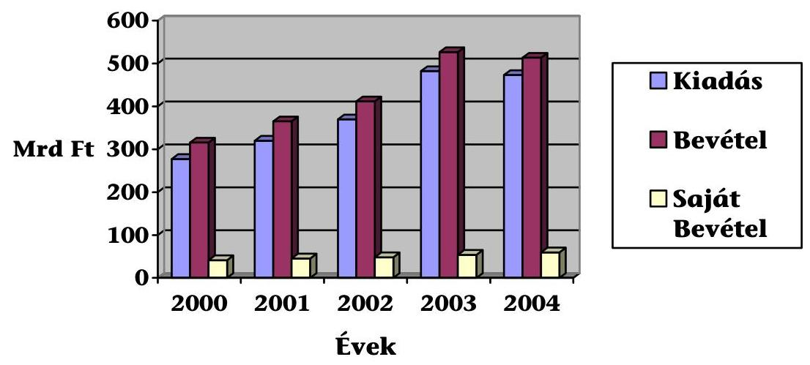

## Az OM Igazgatás létszámának változása

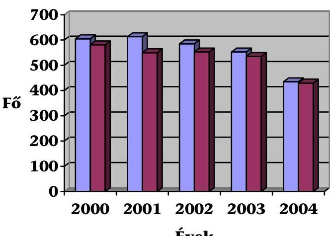

| Engedélyezett |
| :-- |
| létszám |
| Tényleges átlagos |
| létszám |

---

# Az OM fejezet tárgyi eszközeinek és immateriális javainak változása 

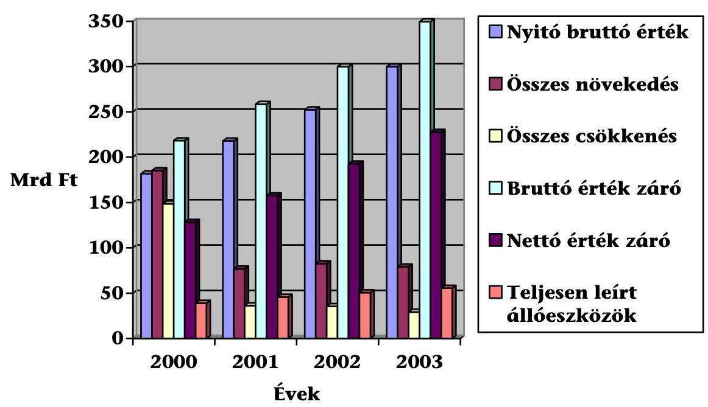

## Az OM fejezet kiadásainak alakulása kiemelt előirányzatonként 2000. év (M Ft)

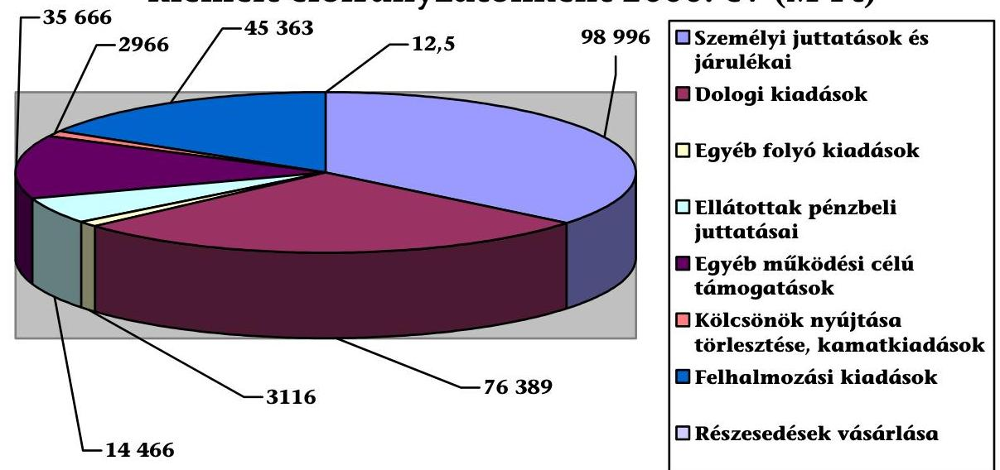

---

# Az OM fejezet kiadásainak alakulása kiemelt előirányzatonként 2001. év (M Ft) 

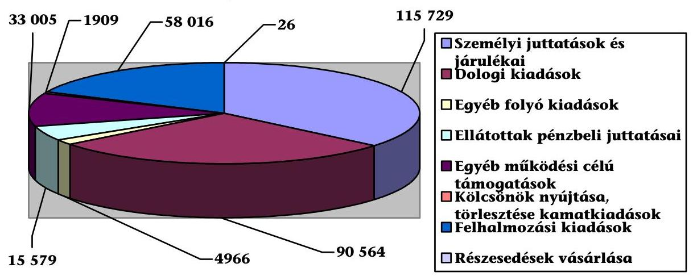

## OM fejezet kiadásainak alakulása kiemelt előirányzatonként 2002. év (M Ft)

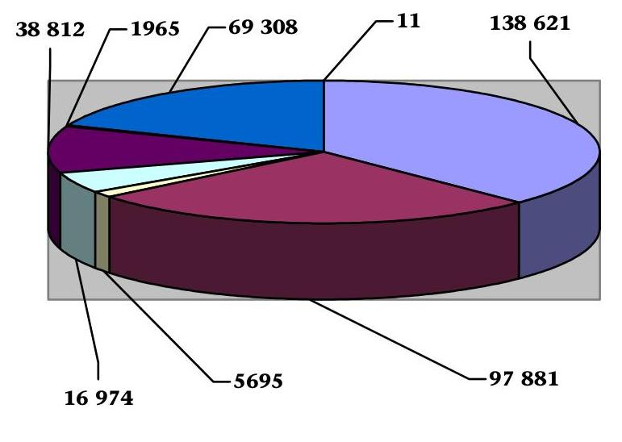
$\square$ Személyi juttatások és járulékai
$\square$ Dologi kiadások
$\square$ Egyéb folyókiadások
$\square$ Ellátottak pénzbeli juttatásai
$\square$ Egyéb működési célú támogatások
$\square$ Kölcsönök nyújtása, törlesztése, kamatkiadások
$\square$ Felhalmozási kiadások

---

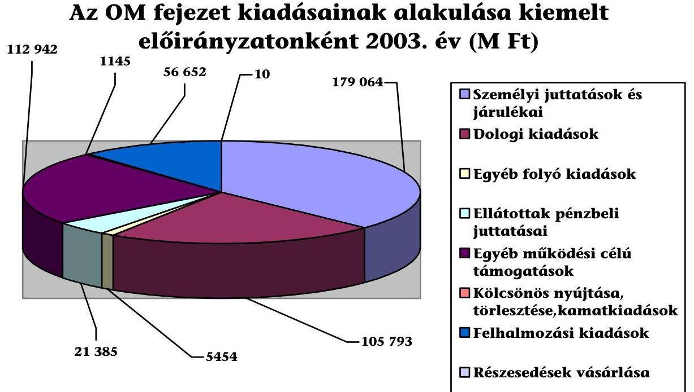

# Az OM fejezet kiadásainak alakulása kiemelt előirányzatonként 2004. év (M Ft) 

$\square$ Személyi juttatások és járulékai
$\square$ Dologi kiadások
$\square$ Egyéb folyó kiadások
$\square$ Ellátottak pénzbeli juttatásai
$\square$ Egyéb működési célú támogatások
$\square$ Kölcsönök nyújtása, törlesztése, kamatkiadások
$\square$ Felhalmozási kiadások
$\square$ Részesedések vásárlása

## Az OM fejezet kiadásainak alakulása kiemelt előirányzatonként 2004. év (M Ft)

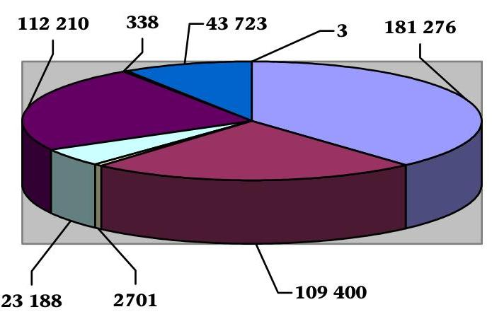
$\square$ Személyi juttatások és járulékai
$\square$ Dologi kiadások
$\square$ Egyéb folyó kiadások
$\square$ Ellátottak pénzbeli juttatásai
$\square$ Egyéb működési célú támogatások
$\square$ Kölcsönök nyújtása, törlesztése, kamatkiadások
$\square$ Felhalmozási kiadások
$\square$ Részesedések vásárlása

---

# A vizsgált intézmények ingatlan bérleti bevételei és kiadásai 

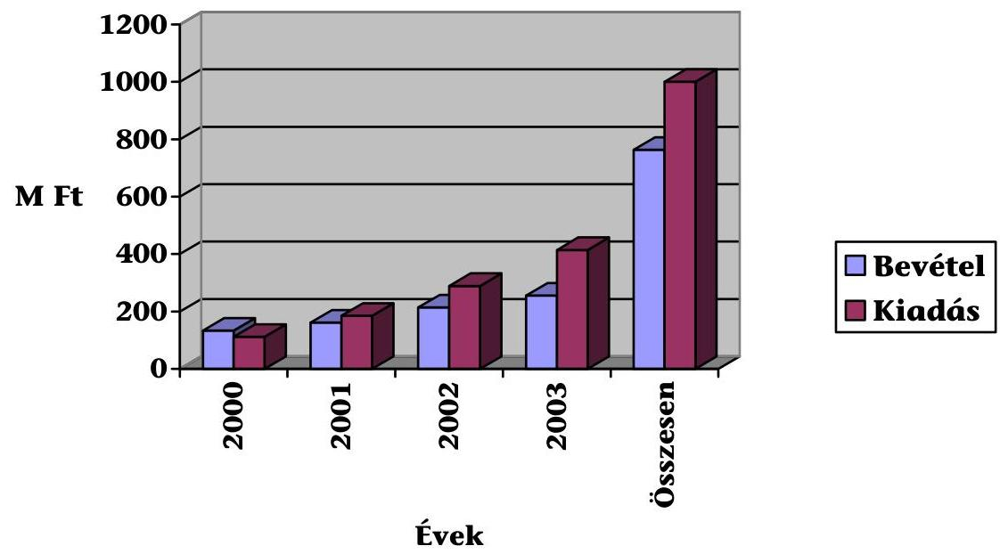

---

a V-23-160/2004-2005. számú jelentéshez

# FÜGGELÉK

---

# Függelék 

V-23-160/2004-2005. számú jelentéshez

## Kérdőíves felmérés tapasztalatai az integráció megvalósulásáról

A kitöltött kérdőívek tanúsága szerint a felsőoktatási intézményeknél lezajlott különböző szervezeti változások:

Agrár- és egészségtudományi centrumot hat egyetem alakított ki.
Új kart tíz intézmény hozott létre. Az intézmények felénél több kar által kezdeményezett közös szak alapítására is sor került.

A pozitív megítélésű intézkedések részét képezi, hogy hét intézmény az azonos tudományterületen, szakon oktató tanszékeket összevonta. Az alapozó tárgyak közös hallgatását egy intézmény (SZIE) szervezte meg. Karok közötti párhuzamos tanszékeket mindössze három intézménynél (ELTE, KE, NYME) szüntettek meg.

Integrált gyakorló helyet négy intézmény hozott létre. Új, intézményi szintű intézet a vizsgált egyetemek, főiskolák felénél jött létre.

Profilváltás - a bejegyzések szerint - az intézmények közel felét érintette, amelyet csak két intézmény nevesített konkrétan (Nyelvi Intézet létrehozása, Nyelvvizsga Központ BGF szinten, illetve a választható szakok struktúrájának átalakulása. Ez főként a pedagógus végzettséget adó szakok arányszámának csökkenését jelentette a Nyíregyházi Főiskolán).

Egyéb, kari szintű változást (pl. megszűnés) négy egyetem jelzett (SZIE, ELTE, SOTE, VE). A NYME esetében hasonló változás csupán névváltoztatás következménye volt.

A képzési szerkezettel összefüggő változások (új alapképzések, új továbbképzések indítására) az intézmények nagy részénél (12, illetve 13 intézménynél) történtek, amelyek közül kilencnél mindkét változás előfordult.

A racionálisabb kapacitáskihasználás az informatika-számítástechnika vonatkozásában csaknem teljes körűen, az idegen nyelvek és a testnevelés terén a felmért intézmények felénél érvényesült. Ugyanezen intézményi körben több szakot érintő, közösen oktatott további tantárgyak: matematika, statisztika, közgazdaságtan, vállalati gazdaságtan, kémia, fizika, pedagógia, társadalom-

---

tudomány, jogi alapismeretek, bűnmegelőzési ismeretek, EU jog egyes területei. (A felsorolt tárgyak más-más egyetemnél, főiskolánál fordultak elő, de esetenként több tantárgy vonatkozik egy-egy intézményre.)

A hallgatói laboratóriumok működtetésének módja rendkívül változó. A lehetőségek valamennyi formáját (intézményi, kari, tanszéki és ezek különböző együttműködései) kb. azonos arányban alkalmazták.

A kutatási pályázatok eredményessége érdekében a régióban történő együttműködés is - két főiskola kivételével - érvényesült a megkérdezettek körében.

Az oktatás minőségének elősegítése érdekében - egy főiskola kivételével - tizenkét intézmény létrehozta a modern technika eszközeivel felszerelt közös könyv- és médiatárat, három intézménynél pedig folyamatban van.

A hallgatók érdekeit szolgálta a közös jegyzet- és könyvkiadói szervezetek kialakítása, amely nem volt teljes körű. Az intézményi kör felénél megvalósult, három intézménynél folyamatban van.

Az OM kiegészítő támogatásainak igénybevételével - két kivétellel (Corvinus,KE), ahol még nem fejezték be - bevezették az egységes, korszerű hallgatói nyilvántartási rendszert (kreditrendszer).

A hallgatói tanácsadás szervezete - néhány intézmény kivételével, ahol folyamatban van vagy részben történt meg (KE, BGF, ELTE) - alapvetően kiépült. A karrier vonatkozásában történt meg a legtöbb (12) intézménynél. Ugyanebben a körben az intézmények kétharmada a mentálhigiénés, illetve egyharmada az életvitel tekintetében is megszervezte.

Az oktatói létszám az integráció következtében - az intézmények többségének véleménye szerint - nem változott. Három felsőoktatási intézmény csökkenést, egy javulást jelzett.

Az integrációs hatások a hallgató/oktató arány alakulását többségében (11 intézménynél) kedvezően befolyásolta. Három intézménynél ez az átalakulás nem hozott változást (BGF, Corvinus, SOTE), egy intézménynél (SZIE) ez az arány romlott, míg egy intézmény (Tessedik Sámuel Főiskola) nem válaszolt a kérdésre.

Az egy hallgatóra jutó költségvetési kiadásra változóan hatott az integrációs folyamat. Hat-hat intézménynél nem változott, illetve nőtt, négy intézménynél csökkent ez az összeg.

Budapest, 2005. augusztus hó
