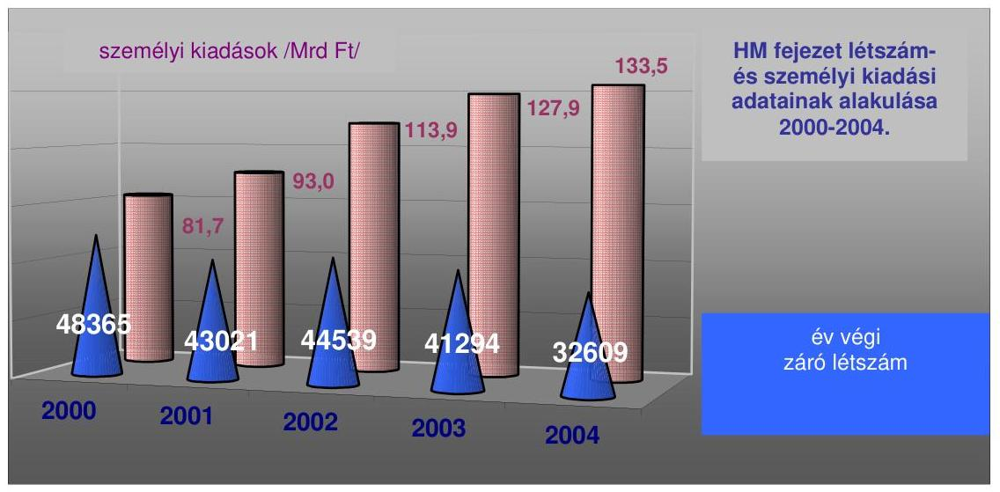
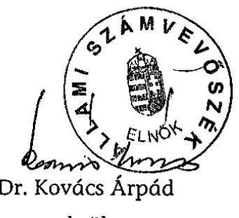
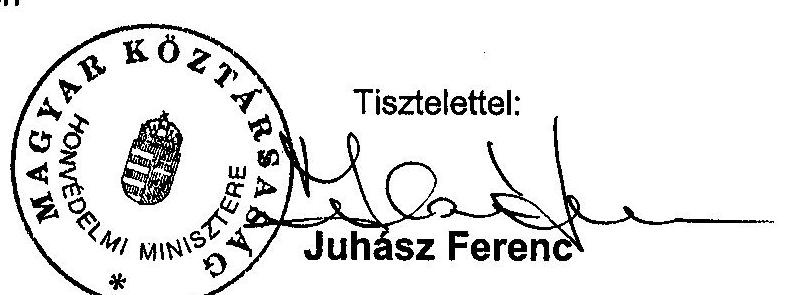
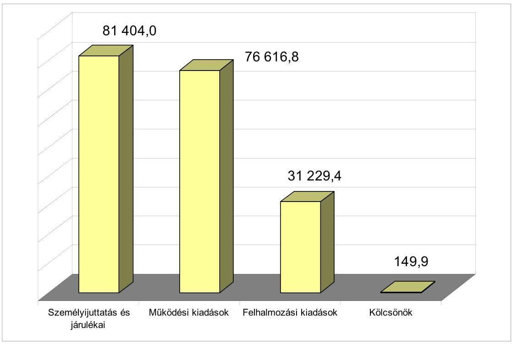
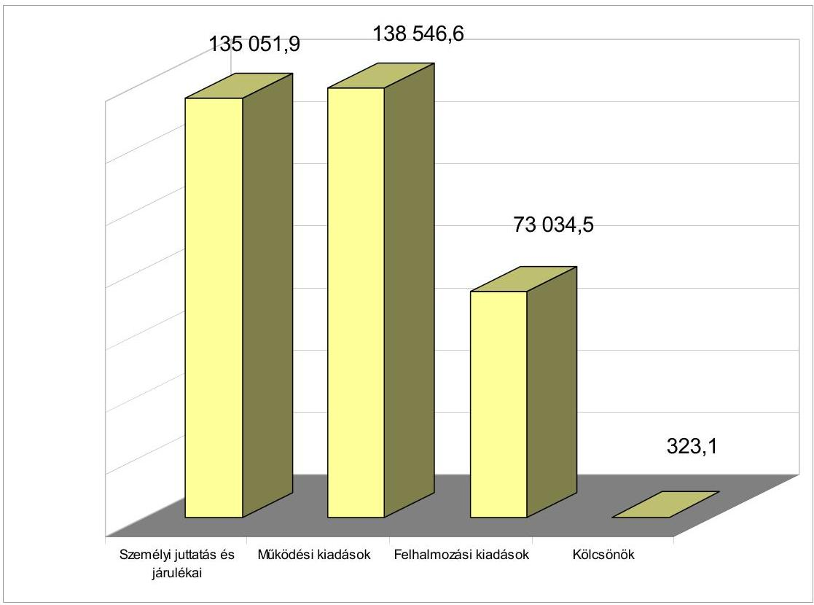
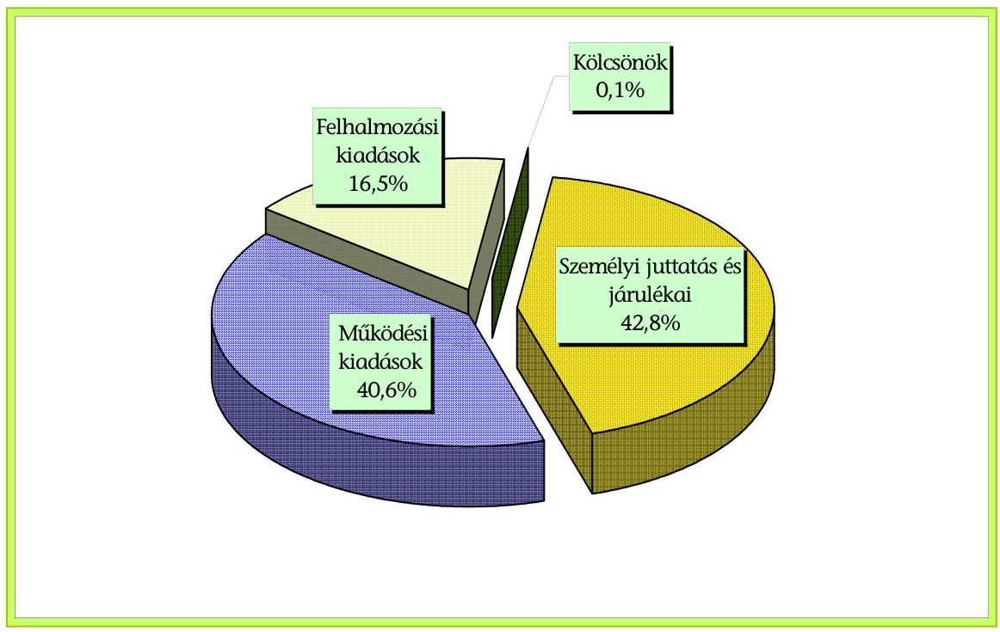
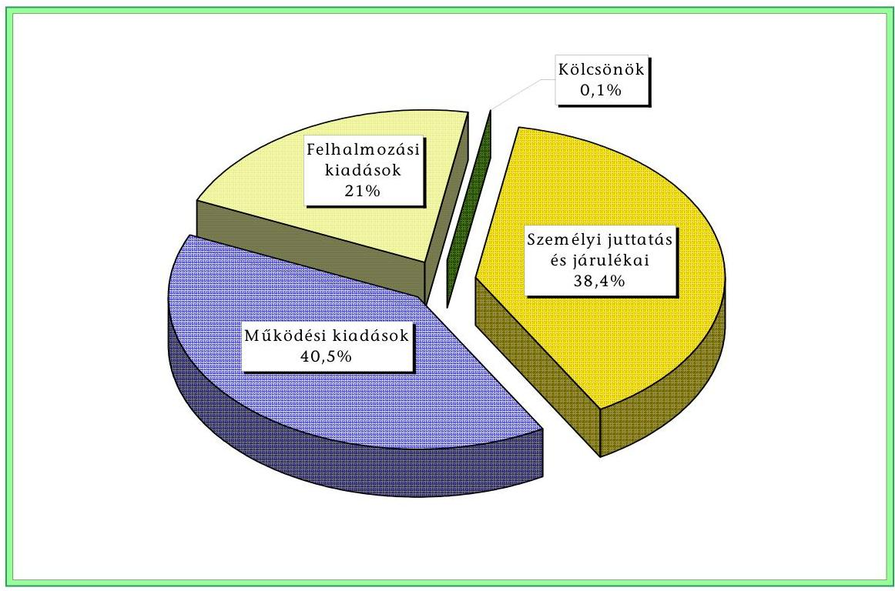

# JELENTÉS 

a Honvédelmi Minisztérium fejezet múködésének ellenőrzéséről

---

# 2. Államháztartás Központi Szintjét Ellenőrző Igazgatóság   2. 3. Átfogó Ellenőrzési Főcsoport 

Iktatószám: V-27-58/2004-2005.
Témaszám: 738
Vizsgálat-azonosító szám: V0147

## Az ellenőrzést felügyelte:

## Bihary Zsigmond

főigazgató

## Az ellenőrzés végrehajtásáért felelős:

## Hegedúsné dr. Müllern Veronika

főcsoportfőnök

## Az ellenőrzést vezette:

## Hudik Zoltán

főcsoporfőnök-helyettes

## Az ellenőrzést végezték:

Tóth Bálint számvevő tanácsos, főtanácsadó Balkay Attila számvevő tanácsos Patai Tamás számvevő tanácsos

Trenovszki István
számvevő tanácsos, főtanácsadó

## Domonkosné Kurilla Edit

számvevő tanácsos

## Vásárhelyi Zoltán

számvevő tanácsos

## A témához kapcsolódó eddig készített számvevőszéki jelentések:

## címe

Jelentés a Magyar Honvédségnél a repülőcsapatok múködésének pénzügyi-gazdasági ellenőrzéséről
Jelentés a Honvédelmi Minisztérium fejezet múködésének ellenőrzéséről
Jelentés a NATO Biztonsági Beruházási Programja (NSIP) keretében Magyarországon megvalósuló fejlesztések ellenőrzéséről
A katonai védelmi beruházások ellenőrzéséről
Jelentés a Magyar Honvédség szárazföldi csapatai múködtetését szolgáló pénzeszközök hasznosulásának ellenőrzéséről
Jelentés a Magyar Honvédség közbeszerzési rendszerének ellenőrzéséről
Jelentés a központi költségvetés zárszámadásának ellenőrzéséről (évente)
sorszáma
[9821]
[0017]
[0217]
[0333]
[0424]
[0451]
[0024] [0126]
[0329]

Jelentéseink az Országgyűlés számítógépes hálózatán és az Interneten a www.asz.hu címen is olvashatók.

---

# TARTALOMJEGYZÉK 

BEVEZETÉS ..... 5
I. ÖSSZEGZŐ MEGÁLLAPÍTÁSOK, KÖVETKEZTETÉSEK, JAVASLATOK ..... 9
II. RÉSZLETES MEGÁLLAPÍTÁSOK ..... 20

1. A fejezeti irányítás, felügyelet és a múködés kontroll környezete ..... 20
1.1. A szabályozási környezet és a fejezeti irányítás változásai ..... 20
1.2. A haderő-átalakítás folyamatának kockázati elemei ..... 23
1.3. A honvédségi létszám változása ..... 28
2. A költségvetési gazdálkodási rendszer kontroll környezete ..... 31
2.1. A költségvetés tervezési rendszer múködése, ágazati sajátosság ..... 31
2.2. A költségvetési végrehajtási rendszer múködése, a fejezeti kezelésű előirányzatok felhasználása ..... 36
2.3. A pénzügyi-számviteli folyamatok kontrollja, a számviteli rend szabályozottsága és a vagyonvédelem érvényesülése ..... 45
2.4. A pénzügyi-gazdasági információs rendszerek informatikai támogatása ..... 51
2.5. Költségvetési körön kívülre szervezett feladatok, gazda-sági tevékenységek ..... 63
2.6. A belső (felügyeleti, belső költségvetési) ellenőrzési rendszer ..... 67

## MELLÉKLETEK

1. sz. melléklet Honvédelmi miniszter észrevétele
2 sz. melléklet A kiadások alakulása kiemelt előirányzatonként 2000 - 2004. években
2. sz. melléklet Diagram a Honvédelmi Minisztérium fejezet költségvetés főbb kiadási csoportjainak értékéről 2000-ben és 2004-ben
3. sz. melléklet Diagram a Honvédelmi Minisztérium fejezet költségvetés főbb kiadási csoportjainak arányáról 2000-ben és 2004-ben
4. sz. melléklet A Honvédelmi Minisztérium fejezet költségvetési és a tényleges átlaglétszám alakulása 2000 - 2004. években
5. sz. melléklet A Honvédelmi Minisztérium fejezet személyi juttatásainak alakulása 2000 - 2004. években

---

.

---

# RÖVIDÍTÉSEK JEGYZÉKE 

| Áht. | az államháztartásról szóló 1992. évi XXXVIII. törvény |
| :--: | :--: |
| ASF | NATO Európai Főparancsnokság Csapatkövetelmény előírásai |
| ÁSZ | Állami Számvevőszék |
| BTR | páncélozott szállító harcjármú |
| CAX | számítógéppel támogatott parancsnoki és törzsvezetési gyakorlat |
| DCI | Washingtoni Védelmi Képességi Kezdeményezés (Defence Capability Initiative) |
| DPQ | Védelmi Tervezési Kérdőív (Defence Planning Questionnaire) |
| EU | Európai Unió |
| FG | haderő fejlesztési célok (Force Goals) |
| FP | haderőfejlesztési javaslatok (Force Proposal) |
| GDP | bruttó hazai termék (Gross Domestic Product) |
| HK | Honvédelmi Közlöny |
| HM | Honvédelmi Minisztérium |
| HM BBBH | HM Beszerzési és Biztonsági Beruházási Hivatal |
| HM GTH | HM Gazdasági Tervező Hivatal |
| HM HBFF | HM Haditechnikai Beszerzési és Fejlesztési Főigazgató |
| HM HFBF | HM Haditechnikai Fejlesztési és Beszerzési Főosztály |
| HM HVK | Honvédelmi Minisztérium Honvéd Vezérkar |
| HM HVK HÍRICSF | HM HVK Híradó és Informatikai Csoportfőnökség |
| HM HVK HTCSF | HM HVK Haderőtervezési Csoportfőnökség |
| HM HVKF | Honvédelmi Minisztérium Honvéd vezérkari főnök |
| HM IHAB | HM Informatikai és Hírközlési Alkalmazási Bizottság |
| HM IHF | HM Informatikai és Hírközlési Főosztály |
| HM KÁT | Honvédelmi Minisztérium közigazgatási államtitkár |
| HM KPSZH | HM Központi Pénzügyi és Számviteli Hivatal |
| HM KVEH | Honvédelmi Minisztérium Költségvetési Ellenőrzési Hivatal |
| HM KVF | HM Közgazdasági és Vagyonfelügyeleti Főosztály |
| HM LHFFF | HM Logisztikai és Haditechnikai Fejlesztési Felügyeleti Főosztály |
| HM SzMSz | HM Szervezeti és Múködési Szabályzat |
| HM TH | HM Technológiai Hivatal |
| HM TKF | HM Tervezési és Koordinációs Főosztály |
| HM TPSZI | HM Területi Pénzügyi és Számviteli Igazgatóság |
| HM VGHÁT | HM védelemgazdasági helyettes államtitkár |
| HVK | Honvéd Vezérkar |
| HVKF | Honvéd vezérkari főnök |
| Hvt. | a honvédelemről szóló 1993. évi CX. törvény |
| IT | Informatikai Technológia |
| Kbt. | a közbeszerzésekről szóló 1995. évi XL törvény |
| KFOR | Koszovói Erő (Kosovo Force) |

---

| KGIR | HM Költségvetési Gazdálkodási Információs Rendszer |
| :--: | :--: |
| LGIR | HM Logisztikai Gazdálkodási Információs Rendszer |
| MeH | Miniszterelnöki Hivatal |
| MH | Magyar Honvédség |
| MH HTEK | MH Haditechnikai Ellátó Központ |
| MH HTPEK | MH Hadtáp Ellátó Központ |
| MH LEP | Magyar Honvédség Légierő Parancsnokság |
| MH ÖLD | MH Összhaderőnemi Logisztikai Doktrína |
| MH ÖLTP | MH Összhaderőnemi Logisztikai és Támogató Parancsnokság |
| MH PCGTSZF-ség | MH Páncélos és Gépjármú Technikai Szolgálatfőnökség |
| MH RMSZF | MH Repülőmúszaki Szolgálatfőnökség |
| MHPK | Magyar Honvédség Parancsnoka |
| NATO | Észak-atlanti Szerződés Szervezete (Nord Atlantic Treaty   Orgonization) |
| NATO Task List | NATO Feladatjegyzék |
| NBK, Kabinet | Kormány Nemzetbiztonsági Kabinetje |
| NSIP | NATO Security Investment Programme (NATO Biztonsági Be-   ruházási Program) |
| OGY | Országgyúlés |
| OGY HB | Országgyúlés Honvédelmi Bizottsága |
| OPEVAL | alegység értékelő módszer (Operational Evaluation) |
| PM | Pénzügyminisztérium |
| STANAG | Szabványosítási egyezmény (Standardization Agreement) |
| SzMSz | Szervezeti és Múködési Szabályzat |
| TACEVAL | alegység felmérő és értékelő program (Tactical Evaluation) |
| TPSZI | Területi Pénzügyi és Számviteli Igazgatóság |
| TVTR | Tárca Védelmi Tervező Rendszer |
| ÚjHvt. | honvédelemről és a Magyar Honvédségről szóló 2004. évi CV.   törvény |
| VFIB | Védelmi Felülvizsgálatot Irányító Bizottság |
| VTR | Védelmi Tervező Rendszer |

---

# JELENTÉS 

## a Honvédelmi minisztérium fejezet múködésének ellenőrzéséről

## BEVEZETÉS

A rendszerváltoztatás óta a honvédelem intézményrendszere alapvető változtatásokon megy keresztül. A többpárti konszenzussal kialakított, a honvédelemről szóló 1993. évi CX. törvény (Hvt.) össztársadalmi ügyként kezelve meghatározta többek között a honvédelem célját, a fegyveres erők irányítását, vezetését, a fegyveres erők feladatait, a honvédelmi feladatok ellátásának rendjét, különös tekintettel a hadkötelezettség teljesítésére vonatkozó rendelkezéseket.

A Hvt. hatálybalépése óta számos alkalommal módosításra került. Ezek közül kiemelendők a szolgálati törvények elfogadásával, a NATO-csatlakozással, a 12-ről 9, majd 6 hónapos sorkatonai szolgálatra történő átállással, a Magyar Honvédség vezetési és irányítási rendszerének korszerűsítésével (a Honvéd Vezérkar integrálása a Honvédelmi Minisztériumba) kapcsolatos módosítások. 2002-ben a Kormány programjában célul tűzte ki a hadkötelezettség béke idején történő megszüntetését és az ehhez kapcsolódó honvédelmi intézményrendszer átalakítását. Az önkéntes haderő megteremtéséhez és a haderő működéséhez szükséges törvényi szintű szabályozás a Hvt. további módosításával - a nagy számú változtatási igényre tekintettel - azonban nem volt megoldható.

A honvédelemről és a Magyar Honvédségről szóló új törvény megalkotásával a korábbi szabályozás - az ellenőrzött időszakban hatályos Hvt. - az idő próbáját kiálló rendelkezéseinek megőrzése mellett az önkéntes haderőre történő áttéréshez, valamint a haderőreform követelményeihez történő igazodást célozták meg. A 2005-től hatályba lépett új törvény többek között rögzítette a honvédelem alapjait, a honvédelmi képesség biztosítékaira, a honvédelmi kötelezettségekre, a honvédelemben közremúködő szervekre, a honvédelem irányítására vonatkozó szabályokat, rendelkezett a honvédség jogállásáról, feladatairól, szervezetéről, személyi állományáról, haditechnikai felszereléséről, infrastruktúrájáról, irányításáról, vezetéséről, készenléti és szolgálati rendszeréről, az őr-zés-védelemről, a rendkívüli intézkedésekről stb.

Az Országgyűlés - az áttekintett időszakban - több alkalommal élt a honvédelem irányításában hatáskörébe adott lehetőségekkel. A Magyar Honvédség hosszú távú átalakításának irányairól szóló 61/2000. (VI. 21.) OGY határozat előírta a Magyar Honvédség felső szintű irányítási és vezetési rendszerének átalakítását. Újabb határozatában, 2004-ben a Magyar Honvédség hosszú távú átalakításának fő irányairól, valamint a NATO szervezetébe integrálható fegyveres erő létrehozásáról döntött (14/2004. (III. 24.) OGY határozat). A feladatok végrehajtásához az Országgyűlés a létszámra is megállapított normát, rögzítet-

---

te az átalakítás időszakában elérhető rendszeresített létszám felső határát (legutóbb a 15/2004. (III. 24.) OGY határozat).

A nemzeti és szövetségi feladatok ellátására hivatott haderő kialakításának folyamata - a Magyar Honvédség hosszú távú fejlesztésének irányairól rendelkező, 2004-ben hozott OGY határozat alapján - 2013 végén zárulna. A feladatok eredeti ütemezése szerint 2006 végére tervezték az új szervezeti rendre, a meghatározott létszámra és diszlokációra való teljes áttérést. 2010. év végéig tervezték a szervezetek belső szerkezetének további korszerűsítését, új típusú harcászati repülőgépek rendszerbe állítását és a Szövetség részére felajánlott erők új szállító, valamint a szükséges anyagi eszközökkel történő ellátását. A 2004-ben kidolgozott tervek szerint a szárazföldi csapatok, a légierő és a logisztikai támogató csapatok kijelölt alegységei 2010-re érnék el a számukra előírt készenléti és hadrafoghatósági szintet.

A HM és a felügyelete alá tartozó szervezetekre vonatkozóan az általánostól eltérő gazdálkodási szabályokat - az államháztartásról szóló 1992. évi XXXVIII. törvény felhatalmazása alapján - a Kormány előbb 1997. évben határozta meg, amelyet többek között az 1999. évi NATO tagságot követően pontosított. Az államháztartási gazdálkodás területét érintő változásokat figyelembe véve 2004-ben a Kormány újraszabályozta a fejezet államháztartás múködési rendjétől eltérő gazdálkodási szabályait (226/2004. (VII. 27.) Korm. rendelet).

A fejezet kiadási előirányzata a 2000. évi 189,6 Mrd Ft-ról - a NATO tagsággal is összefüggésben - 2004. évre mintegy 83\%-kal, 346,9 Mrd Ft-ra emelkedett. Az éves költségvetési törvények a HM fejezetnek bevételi kötelezettséget, az Országos Egészségbiztosítási Pénztártól származó támogatás (pl. 2004-ben 4,9 Mrd Ft) kivételével, nem írtak elő. A fejezet a feladatai ellátásához csökkenő létszámot vett figyelembe (2004-ben 37521 fő). Ugyanakkor a tárca 2005. évi költségvetési kiadását 288,1 Mrd Ft-ra (17\%-kal) csökkentették, továbbá ez év márciusától hatálytalanították a haderő működtetés 2005. és 2006. évi GDParányos költségvetési támogatásáról szóló kormányzati rendelkezést.

Az Állami Számvevőszék 2000. évben végzett átfogó pénzügyi-gazdasági ellenőrzést a Honvédelmi Minisztérium (HM) fejezetnél. Ezt követően 2002-ben a NATO Biztonsági Beruházási Programja (NSIP) keretében Magyarországon megvalósuló fejlesztéseket, 2003-ban a katonai védelmi beruházások rendszerét, 2004-ben a Magyar Honvédség Szárazföldi csapatai működtetését szolgáló pénzeszközök hasznosulását, valamint a Magyar Honvédség (MH) közbeszerzési rendszerének múködését teljesítmény-ellenőrzés keretei között ellenőrizte. Emellett az Állami Számvevőszék a fejezet költségvetésének a tervezését, valamint a zárszámadását évente ellenőrizte. A közelmúltban végzett számvevőszéki ellenőrzések és a most lezárt átfogó ellenőrzés tapasztalatai egyaránt felszínre hozták a 10 évre tervezett átalakítás megvalósíthatóságának - alapvetően a finanszírozhatóságával összefüggő - kockázatait.

A jelenlegi ellenőrzés célja annak értékelése volt, hogy a Honvédelmi Minisztérium fejezet

---

- irányítási, múködtetési rendje és szervezeti kialakítása összhangban volt-e a jogszabályokban, az állami irányítás egyéb szabályzóiban meghatározott feladatokkal és a szövetségi feladatvállalásokkal;
- költségvetési gazdálkodása (a költségvetés tervezési, végrehajtási és beszámolási gyakorlata, forráselosztási, döntési rendszere) megfelelő biztosítékot jelentett-e a honvédelmi tárca állami (nemzeti) feladatainak, nemzetközi kötelezettségeinek teljesítéséhez, a gazdálkodási feladatok előírásszerű, eredményes ellátásához, az erőforrások és a vagyon védelméhez;
- pénzügyi-gazdasági információs rendszereinek kialakítása, működtetése, informatikai támogatottsága hatékonyan, megbízhatóan segítette-e a vezetői irányítási, felügyeleti tevékenységeket, a teljesítések, illetve az erőforrásfelhasználás figyelemmel kísérését, a szervezetek közötti kommunikációt;
- belső ellenőrzési funkciójának érvényesülése, szervezeti és személyi feltételei lehetővé tették-e a szabálytalanságok, hiányosságok, gazdaságtalan megoldások feltárását, a működés folyamatos nyomon követése (monitoring) és értékelése beépült-e a vezetői, valamint a felügyeleti tevékenységekbe, döntéshozatali folyamatokba, teljesítmény-értékelésekbe; a belső kontrollrendszerének fejlesztésében hasznosította-e a korábbi számvevőszéki ellenőrzések megállapításait, ajánlásait.

Az ellenőrzés a HM fejezet belső kontroll (szabályozási, irányítási, ellenőrzési, információs-informatikai, számviteli) rendszerére irányult, annak rendszerszemléletű értékelése céljából, hogy az előző átfogó számvevőszéki ellenőrzést követő időszakban a belső kontrollrendszerek kiépítése, működése megfelelő biztosítékot adott-e a gazdálkodási feladatok megfelelő, szabályszerű, gazdaságos, hatékony és eredményes ellátásához, az erőforrások védelméhez, a megbízható információszolgáltatási, valamint beszámolási kötelezettségek teljesítéséhez.

Teljesítmény-ellenőrzési szempontok szerint értékeltük az MH átalakítása folyamatában a tartósan finanszírozható haderő kialakítása érdekében hozott intézkedések (alapvetően a 2002-ben elrendelt, az MH védelmi képességeire irányuló felülvizsgálat) eredményességét. Ehhez ellenőrzési kritériumként használtuk fel a korábbi megállapításaink, ajánlásaink figyelembevételével a tárcaintézkedésekben rögzített célok elérését, amely eredményességét a tevékenység szándékolt és tényleges hatásának viszonya alapján minősítettük.

Az ellenőrzés a HM, valamint a Magyar Honvédség irányító és gazdálkodó szervezeteit, az együttműködés területeit érintette, továbbá a fejezeti szintű tervezésében, gazdálkodásában, az intézmények felügyeletében és ellenőrzésében érintett szervezetekre terjedt ki. Az átfogó ellenőrzés a fejezeti irányítás és gazdálkodás 2001-2004 közötti időszakát érintette, ezen belül hangsúlyozottan az utóbbi két év feladatellátására irányult, de kiterjedt a helyszíni ellenőrzés befejezéséig terjedő időszak folyamataira is.

Az átfogó ellenőrzés keretében előkészítettük a HM fejezet 2004. évi költségvetése végrehajtásának pénzügyi-szabályszerúségi (megbízhatósági) ellenőrzését. A külön program alapján végrehajtott megbízhatósági ellenőrzés megállapításait

---

a Magyar Köztársaság 2004. évi költségvetése végrehajtásának ellenőrzéséről szóló jelentés fogja tartalmazni.

Az ellenőrzés végrehajtására az Állami Számvevőszékről szóló 1989. évi XXXVIII. törvény 2. § (3) és (5), valamint a 17 § (5) bekezdésben foglaltak adtak alapot.

A végleges jelentést az Állami Számvevőszékről szóló 1989. évi XXXVIII. törvény III. fejezet 25. § (1) bekezdésének megfelelően észrevételezésre megküldtük Juhász Ferenc miniszter úrnak, aki a jelentésben foglaltakkal kapcsolatban észrevételt nem tett. Javaslatainkat elfogadta és jelezte, hogy ezekkel összhangban már számos intézkedést hozott, a megfogalmazott javaslatok egy része már megvalósult, vagy a megvalósítása megkezdődött. A vonatkozó levelet a Jelentés 1. számú melléklete tartalmazza.

---

# I. ÖSSZEGZŐ MEGÁLLAPÍTÁSOK, KÖVETKEZTETÉSEK, JAVASLATOK 

A Honvédelmi Minisztérium fejezet múködésének alapvető szabályozási hátterét az Alkotmány, valamint a honvédelemről és a Magyar Honvédségről szóló törvény adja. Az Alkotmányban meghatározott keretek között a Magyar Honvédség irányítására az Országgyúlés, a köztársasági elnök, a Honvédelmi Tanács, a Kormány és a honvédelmi miniszter jogosult. A törvényi szabályozás kifejezésre juttatta, hogy a Magyar Köztársaság nemzeti és szövetségi védelmi képességének fenntartásában saját erejére (a nemzetgazdaság erőforrásaira, a Magyar Honvédség felkészültségére, valamint az állampolgároknak a haza védelme iránti hazafias elkötelezettségére és áldozatkészségére), továbbá a szövetséges államok és fegyveres erőik együttmúködésére és segítségnyújtására, valamint az Európai Unió tagállamai és azok fegyveres erői együttmúködésére épít.

A honvédelemmel kapcsolatos - 2005-től hatályos - új törvényi szabályozás is megtartotta az Országgyúlés irányítási hatáskörét, lényegesnek tartva, hogy a nemzetgazdaság lehetőségeire épülő és az ország védelmi képességét hosszú távon meghatározó, nagy jelentőségű kérdésekről a legfelsőbb államhatalmi szerv döntsön. Megmaradt a Kormánynak a honvédelemmel, illetőleg a honvédség múködésének irányításával kapcsolatos hatásköre is, abból az indíttatásból, hogy a Kormányt - mint a végrehajtó hatalom kizárólagos letéteményesét - terheli politikai felelősség a honvédség hadrafoghatóságáért, tevékenységéért.

A Kormány az Alkotmány vonatkozó rendelkezése szerint közvetlenül, illetőleg a honvédelmi miniszter útján irányítja a honvédséget. A honvédelem ágazati igazgatásában, illetőleg a Magyar Honvédség irányításában betöltött szerepe indokolta, hogy a honvédelmi miniszter részletes feladat- és hatáskörét - a miniszterek hatáskörére vonatkozó szabályozási gyakorlattól eltérően - törvény állapította meg. A honvédség irányítása és vezetése a miniszter kezében összpontosul, a Honvédelmi Minisztérium hivatali szervezetének vezetője (a közigazgatási államtitkár) gyakorolja a honvédség nem katonai múködésére irányuló szakirányítási hatásköröket, míg a Honvéd Vezérkar főnöke látja el a honvédség katonai vezetését, mint annak első számú szolgálati elöljárója.

A Magyar Honvédség felső szintű irányítási és vezetési rendszerének átalakítására, ebben a Honvéd Vezérkarnak a Honvédelmi Minisztériumba történő integrálására vonatkozó igényt - már 2000. évben - OGY határozat is megfogalmazta. Az új irányítási és vezetési rendjének jogi hátterét 2001-ben teremtették meg az Alkotmány, a Hvt. és más, kapcsolódó jogszabályok módosításával, valamint a Magyar Honvédség felső szintű vezetésének rendjét meghatározó kormányhatározat kiadásával. A HM-HVK integráció formailag határidőre megtörtént, de az integrált minisztériumtól elvárt hatékonyabb múködés, kisebb apparátus és egyszerűbb struktúra 2004 végéig nem valósult meg teljesen.

A 2001-2004 között az átalakítások elsősorban a haderőnemekre irányultak, ezzel párhuzamosan nem történt meg a vezetési és irányítási struktúra átalaki-

---

tása. Az integrált minisztérium szervezeti átalakítására és munkájának öszszehangoltabbá, hatékonyabbá tételére tett kezdeményezések (pl. feladatköri felülvizsgálat) nem érték el az integráció kapcsán kitűzött célokat. A minisztérium lényegében változatlan struktúrával és létszámarányokkal múködött, mint a közel kétszer nagyobb létszámú honvédség idején.

A vezetési és irányítási rendszer problémái mellett a 2005-től érvénybe lépő költségvetési elvonás tovább növelte a minisztérium érdemi strukturális átalakításának igényét és a központi apparátus jelentős létszámcsökkentését. A Honvédelmi Minisztérium és átalakított háttérintézményei 2005 áprilisától - a helyszíni ellenőrzés lezárása után - kezdték meg az új szervezeti rend szerinti múködésüket.

Általánosságban - a már jóváhagyott múködési dokumentumok alapján megállapítható volt, hogy a funkcionális területek összevonásával a minisztérium felépítése egyszerúsödött, a hivatali apparátus létszáma több mint negyedével kisebb lett. Jellemzően a magas katonai rendfokozattal (ezredes, alezredes) betöltendő vezetői és egyéb beosztásokat csökkentették. A hatályba léptetett szervezeti és múködési szabályzat összhangban van az új Hvt., valamint az újraszabályozott felsőszintű vezetésről és irányításról szóló kormányhatározat rendelkezéseivel.

Az általános kép mellett a hatékony múködés megítéléséhez lényeges, hogy minden feladatot és funkciót hozzárendeltek-e valamely szervezeti egységhez, a leszűkített kapacitás el tudja-e látni a tárca részére előírt feladatokat, illetve hol vannak még lehetőségek további racionalizálási lépések megtételére (pl. felső vezetők mellett alkalmazott szakértők esetén). Ehhez az értékeléshez támpontot ad az átstrukturált minisztérium múködésének ez év végére előirányzott felülvizsgálata. A gyakorlati tapasztalatok és az ellenőrzés következtetései együttesen formálhatják a továbbiakban szükséges korrekciókat, intézkedéseket.

A honvédség alkalmazásának, átalakításának koncepciója a NATO tagországgá válást követően, a 2000-2004 években sem volt stabil. 1999-től, a Szövetség védelmi tervezési rendszerében az elvárások részletesebb megismerése, a költségvetési korlátok, valamint a szövetségi struktúra és feladatrendszer átalakulása miatt többször kellett felajánlott alakulatainkat csökkenteni, vagy a felajánlások összetételét módosítani. Annak ellenére, hogy időközben csökkent a felajánlások mértéke, a megelőző vállalások nem teljesítése torlódást okozott. A változó elvárások és elképzelések miatt több részletes, hosszú távú terv is készült a haderő átalakítására, fejlesztésére, de ezek egyike sem bizonyult időtállónak. A megalapozottság és a finanszírozhatóság kockázatait a haderő-átalakítási koncepciók tervezésében, illetve megvalósításában nem sikerült minimalizálni.

Az ország nemzeti és NATO kötelezettségei, valamint a NATO katonai integráció teljesítésére alkalmas képességek kialakítása csak 2002-től kezdődően került előtérbe, amikor kezdetét vette a Katonai Integrációs Program kidolgozása és a védelmi felülvizsgálat. A felülvizsgálat eredményeként meghatározott ambíció szint elérése érdekében kidolgozott - a Magyar Honvédség 2004-2013 közötti

---

fejlesztésére és új szervezeti struktúrája kialakítására vonatkozó - 10 éves terv ${ }^{1}$ finanszírozhatóságának alapját még a 2002. novemberi prágai csúcstalálkozón tett önkéntes magyar felajánlás képezte, miszerint 2006-ra a védelmi kiadások elérik a GDP 2,01\%-át (ez a honvédség vonatkozásában 1,81\%-os támogatást jelentett volna).

A 10 éves tervkészítés megalapozásában kockázatot jelentett, hogy a szövetségi követelmények jelentős részének azonosítása, feldolgozása, alkalmazásba vétele, valamint a nemzeti doktrínák, szabványok kidolgozása elhúzódott. Ez egyrészt akadályozta az alakulatok haderő-fejlesztési törzskönyveinek megfelelő tartalommal történő kitöltését, másrészt nem tette lehetővé a tervezésnél figyelembe vehető képességi követelmények költségeinek teljes körű kimutatását. A perspektivikus állománytáblák tartós és teljes körű kialakítása sem történt meg, hátráltatva az alakulat-fejlesztési projektek stabil, hosszú távon finanszírozható kimunkálását, bizonytalanságot okozva a tervidőszak beszerzési, fejlesztési programjainak megvalósításában.

A NATO 2004. évi Védelmi Tervezési Kérdőívére adott nemzeti válasz illeszkedett a 10 éves terv feladataihoz, azonban annak jóváhagyásakor már egyértelmű volt a Kormány - tervidőszak egészét érintő - költségvetési forráscsökkentési szándéka. A fejezet költségvetési forrásának nagymértékű (közel 30\%) csökkentése, majd a védelmi kiadások GDP arányos támogatásának megszüntetése alapjaiban megváltoztatta a haderő-átalakítás feltételrendszerét, következményeként a Szövetségnek átadott nemzeti válaszok már 2005 februárjában korrekcióra szorultak, a kitűzött célok 2013. év végi teljesítése - az ambíció szint megvalósíthatósága, a tervezett haderőkép kialakítása - elvesztette a realitását.

Mindezek következtében a tárca egyes fejlesztések és feladatok módosítására, átütemezésére, tervidőszakon túlra halasztására, vagy törlésére kényszerült. A 2005-2014 közötti időszakra gördített újabb 10 éves terv különösen az első három évének költségvetési kiegyensúlyozatlansága tekintetében hordoz kockázatot, mivel a szerződésekkel már lekötött programok kivételével szinte már nem, vagy csak az alapszintű működés követelményeinek veszélyeztetésével lehetséges finanszírozni a fejlesztési feladatokat. (A terv kiegyensúlyozását a 20062015 közötti 10 éves terv 2005. évi kialakításakor tervezi a tárca megvalósítani.) A haderő-átalakítás folyamata - azon túl, hogy meghatározatlan időre kitolja mind a nemzeti, mind a szövetségi követelmények teljesíthetőségét - magában hordozza az utólag célszerűtlennek minősíthető átmeneti megoldások kockázatát.

A haderő-átalakítás folyamatában szinte állandó jelleggel napirenden volt a honvédség létszámcsökkentése. A hosszú távra szóló, időtállóan megalapozott koncepció hiányában a létszámcsökkentések nem jártak az erre vonat-

[^0]
[^0]:    ${ }^{1}$ A 10 éves terv rendeltetése, „hogy megfelelő alapot biztosítson az önkéntes haderő létrehozásához és speciális képességek megteremtéséhez; határozza meg a 10 éves tervezési időszak végére elérendő katonai képességeket; mutassa be a honvédség új szervezeti felépitését, feladatait, létrehozásának folyamatát és ütemezését; szolgáljon alapul a NATO haderő-fejlesztési célkitűzéseihez kapcsolódó nemzeti álláspont és a Védelmi Tervezési Kérdő́ve adandó válaszok kialakításához".

---

kozó OGY határozatokban igényként megfogalmazott strukturális átalakulással. Az önkéntes haderőre való áttérés keretében a sorozott állomány megszüntetését határidő előtt teljesítette a tárca, azonban a hivatásos, szerződéses állomány belső arányai a tervezetnél lassúbb javulást mutattak. A Magyar Honvédség sok éve tartó, folyamatos átalakítása a szervezetben nagyfokú bizonytalanságot okoz, és a folyamatok lezáratlansága ezt erősíti. A különböző szervezeti elképzelések és változó diszlokációk nem kedveznek a hosszú távú, kiszámítható pályaképek kialakulásának és ez mind az egyén, mind a honvédség szempontjából az átalakítás negatív velejárója.

Különösen a haderő-átalakítás kezdeti szakaszában a fejezet költségvetésében a múködési és fejlesztési forráslehetőségek javítási szándéka generálta a létszámleépítéseket. Ennek megalapozatlanságát szemlélteti, hogy 2000-2004 között a létszámcsökkentések ellenére a személyi jellegú kiadások és járulékai folyamatosan nőttek. A HM fejezet létszáma mintegy $30 \%$-kal lett kevesebb, a hivatásos állományra vonatkozó kedvezőbb törvényi szabályozás életbe lépése, az évente biztosított reálbérfejlesztés és a külföldi szerepvállalás illetménytöbblete miatt a személyi juttatásra és járulékaira (személyi kiadásra) tervezett előirányzatok több mint 63\%-kal növekedtek. Az adott időszakban bekövetkezett kiadási előirányzat növekedésre is tekintettel a személyi kiadások aránya viszont lényegesen nem változott, a $38,4-42,8 \%$ közötti sávban maradt.

A költségvetési, pénzügyi, számviteli szervezetek - a közel tíz éve történt átszervezést követően - önállóan, a katonai szervezetektől elkülönülten (a HM és az MH különböző vezetési szintjeihez rendelve) múködnek. A választott megoldással alapvetően hosszú távon költségtakarékos struktúrát alakítottak ki, ami a költségvetési gazdálkodással kapcsolatos feladatok követelményszintű vitelére alkalmas. A HM Pénzügyi és Számviteli Szolgálat központi és területi szervezetei koordináló és irányító szerepet töltenek be a költségvetés tervezésében, a költségvetési beszámolók készítésében, a vagyonnyilvántartás megszervezésében és vezetésében, továbbá a fejezet és a Magyar Államkincstár kapcsolatában.

Kevésbé tekinthető rendezettnek a logisztikai (termelői, fogyasztói) tevékenységet végző szervezetek feladatmegosztása, múködése, a felügyelet és az irá-

---

nyítás területén tapasztalt párhuzamosságok, illetve a felügyeleti hatáskörök tisztázásának elhúzódása miatt. A logisztikai ellátás irányításának kiforratlanságát jelezte, hogy a 2005. januári kormányhatározat még változatlanul hagyta a logisztikai parancsnokság (MH ÖLTP) a HM Honvéd Vezérkar főnök közvetlen alárendeltségében működő felsőszintű vezetöszervnek történt korábbi minősítését, alig két hónappal később újabb kormányhatározat - az új Hvt.nek megfelelően - a középszintű vezetői szervek közé sorolta. (A tárcaszintű szabályozás megújítása a helyszíni ellenőrzés lezárásáig nem készült el, a minisztérium új SzMSz-e nem kezelte a logisztikai területet kellő részletességgel.)

A hosszú távú tervezés magas kockázatához hozzájárult még, hogy a tárca szintű erőforrás- és költségtervezéshez a Tárca Védelmi Tervező Rendszerének (TVTR, korábban Védelmi Tervező Rendszer) kialakítása, fejlesztése változó intenzitással folyt, alkalmazása 2004-ben kísérleti jelleggel kezdődött meg. A TVTR a haderő tervezésére, a tárca költségvetési terveinek megalapozására, illetve a tárca költségvetésének jogszabályi előírások szerinti (hadműveleti tervezés követelményeihez illeszkedő) bemutatására ezt megelőzően nem volt alkalmas. A tervezés alapvetően a pénzügyi tervezés által diktált keretszámokon keresztül csatolt vissza az erőforrás- és költségtervezés gyakorlatába. A folyamatos forráselvonás és visszatervezés nem tette lehetővé a kialakított rendszer tényleges tesztelését, a gördített 10 éves terv elkészítését. Az erőforrások feladatalapú tervezéséhez - a végrehajtó katonai szerveknél és a középirányító szinteken - sem szakállomány, sem megfelelő szoftverkörnyezet nem állt rendelkezésre.

Az éves költségvetési tervezés szabályozott és koordinált folyamatában alapvetően a tervezésben érintett honvédelmi szervezetek részletes adataihoz igazítva támasztották alá a fejezet múködéséhez, fejlesztéséhez szükséges kiadásokat. Az évente növelt költségvetési előirányzatokkal együtt sem tudták megszüntetni a nemzeti, nemzetközi feladatok és a költségvetési források közötti összhang hiányát. Az új vagy rendkívüli feladatok, a NATO felé tett vállalások teljesítése érdekében, illetve a költségvetési elvonások miatt a fejezet és intézményei nagyszámú évközi előirányzat-módosítást hajtottak végre. A többletfeladatok indokolta előirányzat-módosítások fejezeti szintű intézkedéssel realizálódtak (pl. a nemzetközi kötelezettségekkel, a múködési költségvetés dologi előirányzat fedezetének biztosításával összefüggésben végrehajtott átcsoportosítások). Előfordult késedelmes előirányzat-módosítás is (a feladat végrehajtása előbb következett be), ahol nem teljesülhettek a költségvetési gazdálkodás előírásai (ez alól a feladat végrehajtásának sürgőssége nem adhat felmentést).

A szabályozások a fejezeti kezelésú előirányzatok tervezésében és felhasználásában érintett szervezetek közötti megfelelő koordináció megvalósulását alapvetően biztosították. A fejezeti kezelésű előirányzatok (beruházások és ágazati célelőirányzatok) - a fejezet költségvetésében közel azonos részaránnyal - 2004. évre több mint kétszeresére emelkedtek. Tervezésük az előző időszakok gyakorlatához hasonlóan nem a feladatrendszerből adódó forrásigények alapján, hanem a rendelkezésre álló keretek lebontásával történt.

A fejezet kiemelt beruházási célkitűzéseit (lakásépítés, lakástámogatás, katonai védelmi beruházások, MH Központi Honvédkórház rekonstrukciója) az éppen aktuális átalakítási koncepciókhoz igyekeztek igazítani, ugyanakkor már a ko-

---

rábbi számvevőszéki ellenőrzéseknél is megállapítást nyert, hogy a haderőátalakítás módosuló irányai nem adhattak reális támpontot időtálló célkitűzések kijelöléséhez (pl. a védelmi képességek infrastrukturális hátterét biztosító katonai védelmi beruházások esetében ${ }^{2}$ ).

A fejezeti kezelésű előirányzatok tervezésénél és felhasználásánál a költségvetési lehetőségek függvényében érvényesültek a szakmai prioritások. Évek óta kiemelt prioritása volt a haderő-átalakítással összefüggésben a hivatásos és a szerződéses állomány szolgálati-, munka- és életkörülményei javítását szolgáló feladatnak, így a lakhatástámogatás és a lakásépítési előirányzatoknak. A különböző szervezeti elképzelések (változó diszlokációk) nem kedveztek a lakhatási feltételek javításának, mivel a katonai szervezetek, a személyi állomány helyőrségváltásaival növekedett a tárca lakhatási ellátási kötelezettsége. Az utóbbi két évben - a kormányzati elvonások, zárolások miatt végrehajtott elői-rányzat-átcsoportosítások következtében - a lakástámogatás prioritása nem érvényesülhetett a tervezett mértékben.

Az MH Központi Honvéd Kórház (KHK) 1985-ben kezdődött és 1993-ban - kormányhatározat alapján - leállított rekonstrukciós beruházására több mint 9 Mrd Ft-ot fordítottak. A beruházás leállítása óta négy kormányhatározat született - az előterjesztők (HM) aktuális érdekei és lehetőségei függvényében - az objektum és funkcióinak privatizálásáról és/vagy más célú hasznosításáról, vagy éppen a beruházás befejezéséről, a honvédség egészségügyi intézményrendszerének átalakításáról, a NATO követelményeinek is megfelelő VIP kórházzá fejlesztéséről stb., közel 20 Mrd Ft költségvetési forrás felhasználását előirányozva. A fejezet éves költségvetéseiben a végrehajtás fedezete nem állt rendelkezésre. Ugyanakkor 1994-2004. évek között a fejezeti kezelésű előirányzatokból további mintegy 3 Mrd Ft-ot fordítottak a leállított beruházás állagmegóvására, őrzésvédelmére és egyes részmunkák befejezésére, ami azonban nem eredményezett használatba vehető kapacitást. A befejezetlen beruházás gazdaságtalanságára és kockázataira a számvevőszéki ellenőrzések ${ }^{3}$ folyamatosan felhívták a figyelmet, amit ez az ellenőrzés is csak megerősíteni tudott.

A tárca „Ágazati célelőirányzatai" keretében minden évben ismétlődő feladat volt - az előírásoknak megfelelően - az állami feladatot ellátó közhasznú társaságok társadalmi szervek támogatása, a különböző - elsősorban a NATO tagsággal kapcsolatos, külön jogszabályon, nemzetközi szerződésen alapuló nemzetközi szervezetek működéséhez való hozzájárulás, nemzetközi tagdíjak finanszírozása, valamint hozzájárulás a hivatásos katonák speciális nyugdíjrendszerének és a sorállomány társadalombiztosításának kiadásaihoz.

A költségvetési fejezet számviteli rendjét, beszámolását alapvetően a hatályos jogszabályok figyelembevételével alakították ki. A fejezet sajátos gaz-

[^0]
[^0]:    ${ }^{2}$ Lásd: Jelentés a katonai védelmi beruházások ellenőrzéséről 2003. [0333]
    ${ }^{3}$ Lásd: 1990, 1992-1993. évi jelentések , valamint jelentés a Honvédelmi Minisztérium fejezet 1994-95. évi költségvetésében és gazdálkodásában a haderőfejlesztési célok érvényesülésének pénzügyi-gazdasági ellenőrzéséről 1996. [313], Jelentés a Honvédelmi Minisztérium fejezet múködésének ellenőrzéséről 2000. [0017]

---

dálkodását érintően maradtak azonban nem kellő részletességgel szabályozott területek, melyeket részben a tárca belső (felügyeleti) ellenőrzései, részben a külső ellenőrzések jeleztek (pl. a beruházásra és felújításra adott előlegek elszámolása). A logisztika, pénzügyi és számviteli, illetve gazdálkodó szervezetek által lényegében elkülönítetten vezetett analitikus nyilvántartások és pénzforgalmi adatok egyeztetésének eseti elmulasztása is hozzájárult a tárca vagyonfelmérő leltározása során kimutatott eltérések (hiányok, többletek) kialakulásához. Ezek a tapasztalatok - az általánosságban javuló számviteli és a bizonylati fegyelem mellett - a számviteli terület szabályozásának további pontosítására, az együttmúködő szervezetek közötti munkafolyamatok hatékonyabb múködtetésére és ellenőrzésére kell, hogy irányítsák a tárca figyelmet.

A pénzügyi-gazdasági információs rendszerek informatikai támogatásában az informatikai technológia (IT) szakterület tárca szintű, átfogó szakmai felügyelete nem volt megoldott az ellenőrzött időszakban. Az IT feladatokat ellátó szervezeti egységeket többször érintette szervezeti vagy hatásköri átalakítás, ami a feladatellátást megnehezítette, hátráltatta. A felsőszintű vezetői (HM KÁT-HM HVKF) koordináción és egyeztetésen alapuló párhuzamos irányítási és felügyeleti rend nem kényszeríttette ki az IT feladatellátás tárca szintű összehangolását, illetve számonkérését. A koordinációs nehézségek miatt az informatikai feladatok ellátásában érintett szervezetek vitás szakmai kérdéseinek döntési felelőssége a minisztérium felső vezetésére hárult.

Az informatikai menedzsment tevékenységet teljes körűen átfogó költségelemzéssel, prognózissal támogatott tárca szintű informatikai stratégiával a fejezet nem rendelkezett. A közigazgatási területre, valamint az MH-ra vonatkozó IT részstratégia tervezetek tárca szintű összehangolása, valamint a tartalmi hiányosságok értékelése és feloldása, a szakmai, költségvetési prioritások kialakítása nem történt meg. A fejlesztésekkel kapcsolatos felső vezetői döntések, a költségvetési forrás jóváhagyása nem az egyes fejlesztések megkezdését megelőzően kialakított prioritások alapján, hanem a végrehajtási feladatokat közvetlenül megelőzve, a forrás egyedi biztosításával összefüggésben születtek. Az irányítási rendszer nem tudta minden esetben kikényszeríteni a vezetői döntés meghozatalához szükséges megalapozott szakmai álláspont kialakítását, ami a szerződéskötéseknél és a fejlesztések megvalósításánál esetenként döntési bizonytalanságot okozott (Logisztikai Gazdálkodási Információs Rendszer fejlesztése, Költségvetési Gazdálkodási Információs Rendszer üzemeltetése).

Az IT szakmai feladatok tervezésében, végrehajtásában a beszerzések eljárási rendje, az informatikai fejlesztések irányítására kialakított szervezeti hatáskörök, valamint a tárca szervezeteinek információ hiányos döntés-előkészítési tevékenysége nem biztosította a felügyelet teljes körű és számon kérhető érvényesülését. Az informatikai biztonság és az adatvédelem tárca szintű szabályozási háttere hiányos, elmaradt az információbiztonság követelményeinek teljes körű meghatározása - a rejtjelbiztonság kivételével -, a szabályozások nem nyújtottak megfelelő támogatást a részletes kidolgozó munkához.

A fejezet Költségvetési Gazdálkodás Információs Rendszerének (KGIR) kiépített múködő alrendszerei és elemei hálózatos számítástechnikai bázisú múködésükkel és adataikkal megfelelő támogatást nyújtottak a költségvetési gazdálkodáshoz. A KGIR rendszer üzemeltetésével, üzemeltetés-támogatásával összefüg-

---

gő szerződések, a szoftver és hardver környezet kialakított kontrolljai biztosították a folyamatos és biztonságos üzemvitel és rendelkezésre állás egyes biztonsági követelményeit (pl. naplózás, hozzáférési rendszer kialakítása, eszközök javítása, karbantartása, pótlása, mentés). A hiányzó környezeti kontrollok (mentések tárolása, tűz-, vízvédelem), valamint a szabályozási hiányosságok (mentési eljárásrend, katasztrófa és rendkívüli helyzetek kezelését biztosító tervek, eljárásrendek) a rendszer üzemeltetésében fel nem mért és kezeletlen biztonsági kockázatot jelentenek, ami nem engedhető meg az adatvagyon egyediségére és eszközrendszer (szoftver, hardver) értékére tekintettel.

A Logisztikai Gazdálkodási Információs Rendszer (LGIR) fejlesztés előkészítésének hiányosságai és az alkalmazói-szoftver kiválasztás körüli döntésképtelenség a fejlesztés elhúzódását, 2003. évi felfüggesztését eredményezte. Az LGIR fejlesztésében és alkalmazásba vételében - többek között az MH ellátási koncepciójának változása miatt - nem történt előrelépés. (A fejlesztési folyamat 2004ben elrendelt ${ }^{4}$ témavizsgálata még nem fejeződött be.)

A HM alapítású részvénytársaságok (HM Rt.-k) létrehozásának célkitűzése a haditechnikai eszközök javítási, felújítási kapacitásának fenntartása volt. A HM Rt.-k 2000-2004. évi nettó árbevételének átlagosan 70\%-a származott a honvédelmi tárca részére végzett (hadiipari) tevékenységből. A részvénytársaságok 2000-2004 között évente 22-35 Mrd Ft értékű terméket és szolgáltatást teljesítettek. Az MH költségvetés által korlátozott javítási igénye nem fedi le a HM Rt.-k kapacitását. A társaságok eszközeinek korlátozott konvertálhatósága, a kapacitás fenntartási kötelezettség korlátozottan tette lehetővé a termékszerkezet átalakítását és nehezítette a HM megrendeléseken felüli szabad kapacitások lekötését. A HM a részesedésében lévő társaságok múködtetésének, irányításának és ellenőrzésének tárca szintű szabályozásáról gondoskodott. (Ez a központi költségvetési körben mindössze két költségvetési fejezetnél valósult meg ${ }^{5}$.)

A tárca az állami feladatként jelentkező, nem közvetlen katonai tevékenységeit (alapvetően kulturális, média- és művelődési szolgáltatások, az üdültetési és rekreációs tevékenységek) az államháztartáson kívülre, közhasznú társaságokba (Kht.) szervezte. A kiszervezést megelőzően nem készült olyan felmérés, ami a szolgáltatások egyéb külső gazdálkodóktól való megvásárlásának költségkihatását elemezte és összehasonlította volna a Kht.-k múködtetésének tervezett költségeivel. A kiszervezés alapvető célja volt, hogy kimutathatóvá váljon a tevékenységek költségigénye, amit a tárcánál sajátos formában kezeltek.

A Kht.-k feladatait hosszú távú és éves támogatási megállapodások alapján fejezeti kezelésű előirányzatokból finanszírozták, évi 4-7 Mrd Ft nagyságrendben. A költségvetésből adott támogatások felhasználási hatékonyságára irányuló értékeléséket azonban nem végeztek. Ehhez szükséges lett volna a Kht.-k haszná-

[^0]
[^0]:    ${ }^{4}$ A Magyar Honvédség Szárazföldi csapatai múködtetését szolgáló pénzeszközök hasznosulásának ellenőrzéséről 2004. [0424] szóló jelentés megállapításai alapján a miniszter elrendelte az LGIR fejlesztés kivizsgálását.
    ${ }^{5}$ Lásd: Jelentés az államháztartáson kívüli állami feladatellátás rendszerének ellenőrzéséről 2005. [0467]

---

latába adott ingó és ingatlan vagyon használatba adási dijának elszámolására is, amiről viszont sem a Kht., sem a felügyeleti szerv nem gondoskodott. Így a Kht.-k az éves támogatások nagyságrendjétől függően végezték tevékenységüket, a múködés gazdaságosságának érdemi kontrollja nélkül. A Kht.-k használatába adott, a tárca vagyonkezelésében maradt ingó és ingatlan elemek hasznosítására kötött szerződések lejárta után (2003. december 31.) a felek azok meghosszabbításáról vagy új szerződés kötéséről nem rendelkeztek.

A HM fejezetnél a belső ellenőrzési rendszer szabályait a mindenkori jogszabályi követelményekhez igazodóan alakították ki. A tárca 2005. áprilistól kialakított új ellenőrzési szervezete (a korábban elkülönülten múködő ellenőrzési szervezeti egységek egy szervezetbe való összevonásával) a fejezet felügyeletét ellátó szerv belső ellenőrzési feladatainak ellátásához kedvezőbb feltételeket teremtett. A felügyeleti költségvetési ellenőrzési szervezet feladatoktól elmaradó létszáma és az ellenőrzési feladatok mellé rendelt más irányú tevékenységek szükségessé tették, hogy éljenek a jogszabályok adta lehetőséggel, 2004-ig a felügyeleti költségvetési ellenőrzésbe a középirányító szervek bevonásával, illetve ezt követően egyes ellenőrzési hatáskörök átruházásával.

A költségvetési szervek éves beszámolóinak megbízhatósági ellenőrzéseit a tárca folyamatosan bővítette azzal a céllal, hogy azok 2010-ig az intézmények teljes körére kiterjednek. (Az intézmények financial audit típusú ellenőrzése alá vonásának - korábbi számvevőszéki javaslatot figyelembe véve - átütemezéséről is gondoskodtak, hogy pl. a beszerzések szabályszerűségéről mielőbb teljes körű adatok álljanak rendelkezésre.) Ugyanakkor a 2005-től csökkentett ellenőri kapacitás előre láthatóan már 2007-ben veszélyeztetheti a tervezett számú intézmény ilyen típusú ellenőrzését.

A fejezet költségvetési szerveinél - azok nagy számára és a létszámcsökkentésekre tekintettel - a belső ellenőrzési egységek létrehozása nehézségekbe ütköző, elhúzódó folyamat. (2004 év végéig 98 szerv 57\%-ánál teremtették meg a funkcionálisan független belső ellenőrzés feltételeit.) Különösen a vagyonnyilvántartás, a beruházási, felújítási előleg-elszámolás, a kincstári adateltérések terén tapasztalt hiányosságok jelezték a költségvetési szervek hatékony belső ellenőrzési tevékenységének szükségességét úgy a vagyongazdálkodás, mint a számviteli folyamatok figyelemmel kisérése terén.

A szövetségi ellenőrzési módszerek elsajátítása - bár az irányadó belső szabályozások kiadása elhúzódott - ütemezetten haladt. A felajánlott szárazföldi és légierő alakulatoknál ún. gyakorló és rendes ellenőrzéseket végeztek. Az ellenőrzések által jelzett, a nemzeti felelősség körébe tartozó hiányosságok (felszereléssel, haditechnikai eszközökkel való részleges ellátottság) felszámolására azonban nem volt elegendő a költségvetési forrás és a folyamatos átalakítás során felszabaduló eszközök átcsoportosítása, a hiányosságok felszámolását csak 2006. évtől kezdődően prognosztizálta a tárca.

A helyszíni ellenőrzés megállapításainak hasznosítása mellett javasoljuk:

---

# a Kormánynak 

## Gondoskodjon

1. a honvédség felkészítéséről, állapotáról és fejlesztéséről szóló, éves országgyűlési beszámolójában a hosszú távon finanszírozható haderő kialakításának eredmény szempontú értékeléséről;
2. az éves költségvetési törvény megtárgyalásánál a védelmi költségvetés érdemi megvitatásához szükséges - az ország szövetségi kötelezettségeinek és nemzeti feladatainak teljesíthetőségével kapcsolatos - elemzések, következtetések, alternatívák rendelkezésre állásáról.

## a honvédelmi miniszternek

1. gondoskodjon a honvédség képesség-fejlesztésének tervezésénél a megalapozás kockázatait jelentő hiányosságok felszámolásáról (NATO szabványok, és a NATO katonai integráció teljesítéséhez szükséges követelményrendszer teljes körű feldolgozásáról, a hiányzó doktrínák elkészítéséről és a haderő-fejlesztési törzskönyvek pontosításáról, mindezek alkalmazásáról és a tárca védelmi tervező rendszer érdemi müködtetéséről);
2. terjessze a Kormány elé - az Országgyűlés érdemi döntéséhez szükséges tájékoztatás céljából - a honvédség átalakításának, fejlesztésének finanszírozásával összefüggő kockázatokat (a forrásoldal kiszámíthatóságának elvesztéséből eredő bizonytalanságok hosszabb távú tervezhetőség stabilitására gyakorolt hatását, a forráscsökkentések, megvonások következményeit a szövetségi és nemzeti feladatvállalások módosítására, halasztására), bemutatva egyidejűleg az elfogadható mértékű kockázattal bíró alternatív megoldásokat;
3. intézkedjen a logisztikai ellátás (beszerzések) tárca szintű szabályozásának teljes körűvé tételéről, további ésszerűsítéséről (párhuzamosságok, ellentmondásos helyzetek felszámolásáról, eljárási módok választásához egyértelmű útmutatást adó feltételek meghatározásáról stb.), a haderő-átalakítás menetében a szabályozások időben történő aktualizálásáról;
4. követelje meg az informatikai infrastruktúra biztonságos múködése, fejlesztése érdekében a felhasználói és üzemeltetői tevékenységet egyaránt átfogó szabályozási háttér (a szükséges részletes eljárásrendek, a különböző feladat-, felelősségi és hatáskörök) kialakítását;
5. gondoskodjon a számviteli feladatok szabályozásának kiegészítéséről (beszerzési, beruházási előlegek nyilvántartása, elszámolása terén), a nyilvántartások kezelésénél tapasztalt hiányosságok (vagyonnyilvántartás, leltár-, kincstári adatoktól való eltérés) megszüntetéséről;
6. vizsgáltassa felül a HM alapítású részvénytársaságok kapacitás fenntartási kötelezettségét - a honvédség fejlesztési irányának figyelembevételével - a szolgáltatások iránti tárcaigény és a kapacitás kihasználtság szempontjából;

---

7. gondoskodjon a HM közhasznú társaságai múködésével kapcsolatos vagyonkezelési jogviszony rendezéséről, a számviteli hiányosságok megszüntetéséről, továbbá a múködés valós költségadatainak ismeretében és a piaci viszonyok áttekintésével nem közvetlenül katonai tevékenységek államháztartási körön kívüli ellátásának célszerűségi felülvizsgálatáról;
8. gondoskodjon a HM fejezetnél az államháztartási belső ellenőrzés személyi és tárgyi feltételeinek biztosításáról (különös figyelemmel a megbízhatósági ellenőrzésekre, és a költségvetési szervek belső ellenőrzési feladataira), a jogszabályi előírások maradéktalan végrehajtása érdekében.

---

# II. RÉSZLETES MEGÁLLAPÍTÁSOK 

## 1. A fejezeti irányítás, felügyelet és a múködés Kontroll KÖRNYEZETE

### 1.1. A szabályozási környezet és a fejezeti irányítás változásai

A honvédelem és a Magyar Honvédség feladatának és irányításának jogi szabályozása 2001-2005 közötti időszakban jelentős változáson ment keresztül. Mind az Alkotmány, mind a honvédelmi törvény módosult, kifejezve a Magyar Köztársaság külpolitikai, biztonságpolitikai helyzetének és katonai feladatainak változását.

A honvédelmi törvény az Alkotmány előírásaival összhangban részletesen szabályozta a honvédelmi ágazat állami irányítását és az ahhoz tartozó hatásköröket. Hatályba lépése óta számos alkalommal módosították, majd az önkéntes haderő megteremtéséhez és az új haderő működéséhez szükséges törvényi szintű szabályozás miatt 2004. végén újrakodifikálták. Ezzel törvényi szinten is újrafogalmazták a Magyar Honvédség feladatait azoknak a szempontoknak megfelelően, amelyek a honvédség hosszú távú fejlesztési programjában már korábban megjelentek.

A honvédelem és a Magyar Honvédség állami irányítását az Országgyúlés, a köztársasági elnök, a Kormány és a honvédelmi miniszter végzi. Az Országgyúlés a 94/1998. (XII. 29.) határozatában - a külső biztonsági helyzetben a NATO-tagságra, valamint az Európai Unióhoz történő csatlakozási folyamat addigi eredményeire tekintettel - újrafogalmazta a biztonság- és védelempolitikai alapelveket, az ország biztonságát két alapvető pillérre: nemzeti önerejére, valamint az euro-atlanti integrációra és a nemzetközi együttműködésre építve.

A törvényi szabályozás szerint az Országgyűlés állapítja meg a honvédség hosszú távú fejlesztésének irányait, részletes bontású létszámát, valamint fejlesztésének főbb haditechnikai eszközeit, és ehhez az éves költségvetési törvényben biztosítja a szükséges forrásokat. A vizsgált időszakban a 61/2000. (VI. 21.) OGY határozat, a 14/2004. (III. 24.) OGY határozat, valamint a 15/2004. (III. 24.) OGY határozat rendelkezett a Magyar Honvédség hosszú távú fejlesztésének irányairól és részletes bontású létszámáról. Az OGY határozatok nyújtottak alapot a honvédség 10 éves fejlesztési terveinek elkészítéséhez.

A honvédség működésének irányítása - azokban az esetekben, ha az nem tartozik az Országgyűlés vagy a köztársasági elnök hatáskörébe - a Kormány feladata és felelőssége. A Kormány az irányítás keretében többek között meghatározza a honvédség felső szintű irányításának és vezetésének rendjét, a honvédség területi elhelyezésének, felszerelésének, felkészítésének alapvető követelményeit, valamit az éves költségvetési tervben megtervezi a honvédség fenntartásának és fejlesztésének költségeit.

A 2000-2004 közötti időszakban a Kormány több ízben határozott a Magyar Honvédség hosszú távú fejlesztéséről.

---

A 2120/2000. (V. 31.) Korm. határozat a Magyar Honvédség átalakításának és új szervezeti struktúrájának 2000-2010. közötti időszakra vonatkozó tervéről rendelkezett.

A 2236/2003. (X. 1.) Korm. határozat a Magyar Honvédség 2004-2013 közötti időszakra vonatkozó átalakításának és új szervezeti struktúrájának kialakításáról döntött.

A Magyar Honvédség 2004-2013. közötti időszakra vonatkozó fejlesztésének és új szervezeti struktúrája kialakításának 10 éves tervéről és az abban foglaltak végrehajtásának megkezdéséről rendelkezett a 2113/2004. (V. 7.) Korm. határozat.

A Magyar Honvédség 2005-2014 közötti időszakra vonatkozó 10 éves fejlesztési tervéről, valamint a NATO Védelmi Tervezési Kérdő́vre kialakított nemzeti válaszok korrekciójáról rendelkezett a 2329/2004. (XII. 21.) Korm. határozat.

A határozatok alapján készített hosszú távú átalakítási tervek nem bizonyultak időtállónak, azok a változó koncepciók és finanszírozási feltételek miatt módosításra szorultak. A Kormány által 2004-ben elfogadott 10 éves (2004-2013) fejlesztési terv a 2236/2003. (X. 1.) Korm. határozat által deklarált GDP \%-ban kifejezett költségvetési támogatásra épült, azonban az OGY a 2005. évi költségvetési törvényben nem biztosította a terv végrehajtásához szükséges forrásokat. A forráshiány nem csak a 2005. évet érinti, hanem a tervidőszak végéig fennmarad, ezáltal a Kormány által elfogadott és megkezdett haderő-átalakítási program végrehajthatósága finanszírozási szempontból már 2004-ben, a jóváhagyás évében megkérdőjeleződött.

A honvédelmi miniszter a Kormánynak az ország honvédelmi feladatai végrehajtásáért, valamint a honvédség irányításáért felelős szakminisztere. Felelős a honvédelemmel kapcsolatos kormányzati döntések előkészítéséért és a központi közigazgatási feladatok ellátásáért, továbbá a honvédség rendeltetésszerű, szakszerű és jogszerű működését meghatározó döntések meghozataláért.

A vizsgált időszakban a honvédség irányításában bekövetkezett legjelentősebb változás a Honvédelmi Minisztérium és a Honvéd Vezérkar integráció végrehajtása volt, amely tartalmilag a szervezetileg különálló Honvédelmi Minisztérium és a Magyar Honvédség vezetésének egyesítése révén a honvédség miniszteri vezetés alá rendelését és irányítását jelentette. Az integráció végrehajtását a 2183/1999. (VII. 23.) Korm. határozat rendelte el, a 2322/1999. (XII. 7.) Korm. határozat pedig előírta azokat a szempontokat, amelyeket az MH új struktúrájának kialakításánál érvényesíteni kellett.

Az integráció végrehajtását - mivel politikailag az MH irányításának megváltoztatását jelentette - hatpárti politikai egyeztetések előzték meg és az ennek során kialakított alapelvek megfogalmazódtak jogszabályi szinten is. A Magyar Honvédség parancsnoka beosztás és funkció megszűnt, az MH-t a honvédelmi miniszter a vezérkari főnökön keresztül irányítja. Az MH-t a - honvédelmi miniszternek közvetlenül alárendelt - HM Honvéd Vezérkar főnöke, a haderőnemi csapatokat békében a haderőnemi parancsnokságok parancsnokai vezetik.

A minisztérium szervezetébe integrálódott - a vezérkari főnök által vezetett - HM Honvéd Vezérkar a honvédelmi miniszter katonai tervező-szervező, döntéselőkészítő törzse, a hivatali szervezetet a közigazgatási államtitkár vezeti.

---

A HM-HVK szervezeti integrációját formailag határidőre végrehajtották, az egységes minisztérium szervezeti és működési szabályzata a jogszabályoknak megfelelő tartalommal, határidőre elkészült, de ezzel párhuzamosan a közigazgatási és katonai szakterületek funkcionális integrációja nem valósult meg. A múködés során a közigazgatási és katonai terület elkülönülése szervezeti és létszám oldalról is nyomon követhető volt, ezen kívül a napi együttműködésben zavarok mutatkoztak.

A működést lehetővé tevő szabályozási feladatok végrehajtásához képest az egységes minisztériumi szervezet átalakításának hatékonysági és célszerűségi követelményei háttérbe szorultak és nem teljesültek azok az elvárások, amelyeket az integráció kitűzött (párhuzamos szervezetek megszüntetése, egyszerúbb struktúra, kevesebb vezető). Az integráció során a korábbi minisztérium (a közigazgatási államtitkár által vezetett hivatal) gyakorlatilag változatlan struktúrával került az új szervezetbe. Az integrált minisztérium 2001-2005. között lényegében azonos vezetési és irányítási struktúrával és létszámmal múködött, miközben a honvédség létszáma közel a felére csökkent. 2001-től az integrált minisztérium közel 1000 fős lét-számmal múködött, majd a 2003. évi leépítést követően létszáma 2004. végéig mintegy 100 fővel csökkent, de szervezeti felépítésében nem hajtottak végre jelentős átalakításokat.

Az integráció során a közigazgatási és a katonai terület vezetője közötti hatáskörmegosztást jogilag rendezték, de nem történt meg teljes körűen a végrehajtói szintek közötti feladatmegosztás. A katonai és a közigazgatási terület illetékességébe egyaránt tartozó feladatokat ellátó szervezeteket nem vonták össze, helyette együttműködési kötelezettséget írtak elő a belső szabályok e területek számára.

Szabályozási oldalról az integrált múködés lehetősége biztosított volt, de a katonai és a közigazgatási terület együttműködése továbbra is nehézkes maradt. A funkcionális integrációt a 2002-ben elrendelt (74/2002. (HK 25.) HM utasítás) feladatköri felülvizsgálat sem teremtette meg teljes körűen. A felülvizsgálatot követően a párhuzamosságoknak csak egy részét szüntették meg, egyes területeken (jog, informatika) megindokolták a párhuzamos feladatellátást. A felülvizsgálat nem eredményezett jelentős szervezet-átalakítást, létszámcsökkenést.

A felső vezetés előtt ismertek voltak a működés problémái. Több kezdeményezés volt az integrált minisztérium szervezeti átalakítása és munkájának összehangoltabbá és hatékonyabbá tételére, de ezek - a tárca 2004. év végén készített saját értékelése szerint - nem érték el a célul kitűzött eredményt. A közigazgatási és a katonai terület együttműködésének hiányosságára a brit-magyar katonai tanácsadó is felhívta a figyelmet.

2004-ben a strukturális átalakítások több okból is elkerülhetetlenné váltak. Egyrészt az év folyamán ismertté vált a 2005-től érvénybe lépő költségvetési elvonás és az, hogy ennek következtében a központi apparátusban jelentős létszámot kell leépíteni. Másrészt a brit-magyar katonai együttműködés keretében előírt szervezet-átalakítási feladatok végrehajtása, valamint - a külföldi szakértők által is sürgetett, de a minisztérium vezetői által is megfogalmazott - funkcionális integráció megvalósítása szintén változtatásokat tettek szükségessé.

---

A strukturális átalakítást sürgette az is, hogy a 2329/2004. (XII. 21.) Korm. határozat a központi apparátus jelentős létszám leépítését határozta meg. A minisztérium múködésének a munkaköri leírás szintjéig lemenő elemzésével a tárca gyakorlatilag egy újabb feladatköri felülvizsgálatot végzett el. Az átalakítás során a feladatokra figyelemmel már nem érvényesült a katonai és közigazgatási területeknél - a korábban kialakított - létszám egyensúlyra való törekvés. A létszámarányok megváltoztak, a korábbi közel 50-50\% helyett a 2/3-1/3 arányt alakítottak ki a közigazgatási és katonai szervek között.

A 2005. évi átalakítás jogi háttérét egyértelműbbé tette - az új Hvt. előírásaira tekintettel - a Magyar Honvédség irányításának és felsőszintű vezetésének rendjéről szóló 2008/2005. (I. 25.) Korm. határozat, amely a közigazgatási államtitkár és a vezérkari főnök jog- és hatásköreit pontosította. A létszámcsökkentési kötelezettségre tekintettel funkcionális szempontokat figyelembe véve alakították át a minisztériumi szervezetet. A kialakított új, egyszerűbb felépítésű szervezetben a közigazgatási és a katonai terület kompetenciájába egyaránt tartozó feladatokat egy-egy szervezethez rendelték és a hasonló profilú szervezeti egységek összevonásával a meglévő párhuzamosságok kiküszöbölésére törekedtek. Az államtitkárokhoz szakterületeik alapján rendelték hozzá a szakmai feladatokat ellátó főosztályokat, megszüntetve ez által a korábbi szervezeti ellentmondásokat.

A jóváhagyott új munkaköri jegyzék adatai szerint 201 státusszal lett kisebb a minisztériumi apparátus. A főosztályvezetői és az osztályvezetői státuszok száma közel $40 \%$-kal, a köztisztviselői létszám $17 \%$-kal, a katonai beosztás $25 \%$-kal csökkent. Az új szervezeti rendben múködő minisztérium (és átalakított háttérintézményei) 2005. április 1-től kezdte meg múködését, annak tapasztalatait december 15-ig tervezték felülvizsgálni.

A 2005. elején végzett szervezeti átvilágítás a főosztályok, illetve csoportfőnökségek és a háttérintézmények szakmai tevékenységét vizsgálta. Nem volt tárgya az elemzésnek a minisztérium vezetői mellett múködő titkárságok tevékenységének elemzése és az ott foglalkoztatott szakértők integrálása a főosztályi szervezetekbe (a vezérkari irodát már az átszervezés első lépcsőjében átalakították). A minisztérium felépítésének egyszerűsítése várhatóan a koordinációs feladatok csökkenését vonja majd maga után, így a jövőben (pl. a múködési tapasztalatok értékelése során) lehetőség nyílhat a szakértői kapacitás részbeni átcsoportosítására minisztériumi szintű feladatok ellátása céljából.

Az államtitkárok, illetve államtitkár besorolású vezetők titkárságain összesen mintegy 100 fő dolgozik. A létszámcsökkentés után a titkársági, koordinációs és szakértői és szakreferensi feladatokat ellátók aránya még magasabb lett, a 650 fős létszámon belül 15\%-ra (a Vezérkari Irodával együtt 20\%) növekedett.

# 1.2. A haderő-átalakítás folyamatának kockázati elemei 

A honvédség alkalmazásának, átalakításának koncepciója a 2000-2004. időszakban többször változott, ezekkel összhangban több, részletes hosszú távú terv is készült.

A 2000-ben elindított stratégiai felülvizsgálat eredményeként elkészült a Magyar Honvédség 2000-2010 időszakra vonatkozó korszerűsítési terve, amely meghatározta a kialakítandó haderő felépítését és részletes fejlesztési feladatait.

---

A 2002. évi kormányváltást követően a honvédelmi tárca vezetése elrendelte az MH védelmi képességeinek felülvizsgálatát (65/2002. (HK 22.) HM utasítás). A felülvizsgálat keretében döntés született a nem finanszírozható, az új típusú kihívások és kockázatok kezeléséhez nem szükséges képességek megszüntetéséről, a professzionális önkéntes haderőre 2005-ig történő áttérésről és előtérbe került azon képességek fejlesztése és kialakítása, amelyek hiányként jelentkeznek a szövetségi haderőben. Ennek eredményeként a Kormány 2004. májusában elfogadta a Magyar Honvédség új, 2004-2013. közötti időszakra vonatkozó fejlesztésének és új szervezeti struktúrája kialakításának 10 éves tervét (2113/2004. (V. 7.) Korm. határozat), amelyet 2004. május 1-től kezdődően kellett végrehajtani. A Kormány előírta, hogy a haderő a jogszabályokban előírt és a nemzetközi szinten vállalt követelményeknek a tervciklus végére teljes mértékben feleljen meg.

Az ellenőrzött időszakban nem sikerült kizárni, illetve kezelni a tervezési és finanszírozási kockázatokat a haderő-átalakítási koncepciók végrehajtásának tervezésében és megvalósításában. Az MH alakulatainak NATO integrációja lassan halad, a többszöri határidő és feladatszabás ellenére sem sikerült megoldani a szövetségi követelmények teljes körű azonosítását, feldolgozását, bevezetését. Ezen szakmai hiányosságok megszüntetése nélkül a tárca nem képes a közép-, illetve hosszú távú haderő-átalakítási tervek teljesítési kockázatait minimalizálni.

A NATO-hoz történt csatlakozással a Magyar Köztársaság felvállalta a szövetség közös védelméhez és a NATO katonai képességeihez való hozzájárulást. A Magyar Köztársaság által 1998-2002. között elfogadott NATO haderő-fejlesztési célok végrehajtása a kezdeti túlvállalásból következően a nem vagy csak részbeni teljesítéssel jellemezhetők. Az elvárások részletes megismerését követően vált nyilvánvalóvá, hogy vállalások túlzottak és a költségvetésből nem vagy csak nagy nehézség árán teljesíthetőek, így a Kormány, illetve a tárca 2002-ben a felajánlások területén visszalépésre kényszerült.

A NATO-hoz történő csatlakozási tárgyalásokon - jórészt a követelmények és annak következményeinek részletes ismeretének hiányában - Magyarország gyakorlatilag a teljes katonai erejét felajánlotta a Szövetségnek.

A tervezés szakmai kockázatainak kizárása érdekében 2002-ben elindított Katonai Integrációs program, egyéb eredményei mellett nem tudta a kitűzött céljait megvalósítani, így a haderő képességének, állapotának és az azonosított követelmények közötti különbséget feltárni, a hiányok költségigényét meghatározni és megszüntetését ütemezni.

Az MH szövetségi katonai integrációjának feltételét jelentő NATO egységesítési egyezmények (STANAG), a NATO Szövetséges Európai Főparancsnoksága által meghatározott követelmények (AFS) feldolgozása, adaptálása, valamint a honvédség doktrína-rendszerének kidolgozása késik. Az eddig elért eredmények ellenére a szövetségi képességeink tervezési kockázata - az összes követelmény ismerete nélkül - eredendően magas. A NATO részére felajánlott képességek időbeni és megfelelő teljesítése több területen elmaradt. Egyes tervezett feladatok (képességek kialakítása, eszközbeszerzések) - a felajánlott képességek részletes, valamint a kialakításukhoz szükséges kiadások pontos ismeretének hiánya miatt - halasztódtak.

---

A STANAG-ek feldolgozása, bevezetése terén - az eddig elért eredmények ellenére - jelentős az elmaradás, ami nagymértékben befolyásolja az integráció megvalósítását. Az AFS-ekben megfogalmazott, a konkrét alakulatokra vonatkozó követelmények lebontása még nem történt meg teljes körűen. Ennek következtében nem történt meg az erőforrások e célra történő teljes körű tervezése. Az MH elfogadott doktrína-rendszerében szereplő 35 doktrínából csak 10 készült el és több, a magyar alakulatok jelenlegi alkalmazásában is fontos doktrína kidolgozása el sem kezdődött (pl. összhaderőnemi hadműveleti, válságkezelő és béketámogató műveletek, több nemzetiségű műveletek).

Az alakulatokra vonatkozó NATO követelményeken alapuló haderöfejlesztési törzskönyvek elkészítése és azok alkalmazása a haderő és a költségvetés tervezésében - a 2002. óta kiadott több tárcaintézkedés és módosított határidő ellenére - csak korlátozott eredményt ért el.

A törzskönyvek rendeltetése, hogy alapadatokat szolgáltassanak a képesség alapú haderő megteremtéséhez és a fejlesztések lehetséges irányaihoz, a szükséges beruházások, beszerzések ütemezéséhez, azáltal, hogy bemutatják az alakulatok képességeinek kialakításához szükséges eszköz igényt, amelynek beárazásával lehetővé válik a valós pénzügyi tervezés, a feladatok prioritásának, ütemezésének megalapozott kialakítása. A haderő-fejlesztési törzskönyvek kidolgozásának eredményeként a NATO követelmények tükrében - különös tekintettel a hadműveleti és harcászati felmérések (CREVAL/OPEVAL/TACEVAL) szempontjaira megismerhető az alakulatok valós helyzete.

A kitűzött határidők ellenére a katonai szervezetek által elkészített törzskönyvek tartalmi hiányosságai miatt a tárca több ízben nem tudta az elvárt pontossággal elvégezni az egyes feladatok beárazását, a forrás szükséglet meghatározását. A törzskönyvek kiinduló adatbázisként kerültek csak figyelembevételre a perspektív szervezeti struktúrák, a technikai eszközök, anyagok tervezésénél, mivel tartalmukat illetően további pontosítást, kiegészítést igényeltek.

A törzskönyvek kidolgozását nem sikerült oly mértékben felgyorsítani, hogy azok egyértelmű segítséget nyújtsanak az éves, valamint a 10 éves terv költségvetési forrásigényének megalapozásához. A 2004. és az azt követő évek éves és 10 éves tervezési folyamatát a törzskönyvek tartalmi hiányosságaik miatt nem támogatták megfelelő mértékben. A törzskönyvek 2004 decemberében ismételten elrendelt felülvizsgálatának és pontosításának eredményei csak a 20062015. időszakra vonatkozó 10 éves terv kidolgozásában nyújthatnak segítséget. A 2005-14. időszakra vonatkozó terv kidolgozásával egyidejűleg végrehajtott tárca szintű strukturális átalakítás lehetetlenné tette a korábbi ÁSZ ${ }^{6}$ ellenőrzés alapján készített intézkedési tervben foglalt feladatok és határidők betartását.

A 2005-2014. időszakra vonatkozó fejlesztési terv elkészítéséhez és a 2005. évi költségvetési szükséglet meghatározásához alkalmazni kívánt tervezési módszer a képességcélok alapján - képesség modulra bontva - összeállított ún. képességmátrix alkalmazása nem nyújtott alternatívát a meglévő tervezési kockázatok kezelésére. A módszert végül a költségvetési háttér lényegi módosulása - csökkenése - miatt nem alkalmazták a haderő- és költségvetés tervezésében.

[^0]
[^0]:    ${ }^{6}$ Lásd: Jelentés a Magyar Honvédség Szárazföldi csapatai működtetését szolgáló pénzeszközök hasznosulásának ellenőrzéséről 2004. [0424]

---

A hosszú távú tervezési rendszer magas kockázati tényezője, hogy még nem teljes körűen működik a tárca szintű erőforrás- és költségtervezés. A tervezés alapvetően a pénzügyi tervezés által diktált keretszámokon keresztül csatolódik vissza az erőforrás- és költségtervezés gyakorlatába. A végrehajtó katonai szerveknél és a középirányító szinteken sem szakállomány, sem megfelelő szoftverkörnyezet nem áll rendelkezésre a feladatalapú erőforrás-tervezéshez.

A honvédség feladatai és az ezekhez hozzárendelt éves költségvetés (források) összhangja az ellenőrzött időszakban nem valósult meg. Az ország biztonsági stabilitásából kiindulva a haderő-átalakítás végrehajtását elsősorban a nemzetgazdaság teherbíró képessége befolyásolta, így a források az aktuális költségvetési helyzethez és nem az elfogadott haderő struktúra, illetve a felvállalt szövetségi és nemzetközi katonai feladatok forrásigényéhez igazodtak. Annak ellenére, hogy a tervezhető előirányzat 2000-2004. között dinamikusan növekedett, nem biztosította a fejezet által levezetett valamennyi tervezett (szövetségi, nemzetközi, nemzeti) feladat finanszírozását.

A tárca költségvetésének hosszú távra prognosztizált GDP aránya a 2000-2004. időszakban olyan elvi alapot adott, amely a képességek kialakítására rendelkezésre álló források felhasználását tervezhetővé, ütemezhetővé tette. Ennek ellenére a tervek nem bizonyultak időtállónak, mert a tervezés szakmai kockázatai mellett nem volt teljes körűen biztosítva az egyes tervek végrehajtásához szükséges költségvetési feltételrendszer.

A 2000-ben megkezdett haderő-átalakítás végrehajtásához a Kormány a GDP \%-ában rögzítette a tárca éves költségvetési előirányzatát (2183/1999. (VII. 23.) Korm. határozat). Az MH 2000-2006. időszakra jóváhagyott korszerűsítési tervének végrehajtása a szövetségi követelmények - a végrehajtással egyidejű azonosításával, pontosításával feltárt tervezési hibák miatt, valamint a 2002. évi illetményemeléssel összefüggő fejlesztési forrás (logisztikai keret) átcsoportosítása miatt nem vált lehetővé.

Az MH 2004. májusában elfogadott új, 2004-2013. közötti időszakra vonatkozó 10 éves terv bemutatott egyes kockázatokat és vélelmezett hatásaikat, amelyek a kitűzött célok elérését veszélyeztetik, továbbá vázolta a kockázatok elkerülésének, kezelésének lehetséges módozatait. Az első és legnagyobb kockázati tényezőnek a feladatok időzítését, illetve időbeli csoportosítását tekintették. Hoszszútávon kockázatként szerepelt továbbá a humán feltételrendszer, valamint a felszabaduló ingatlanokból befolyó bevételek visszaforgathatósága is, amely kiegészítő forrásként szerepelt a tervben. Pénzügyi kockázatot jelentett a tervidőszak elején a forrás túlterheltsége és a teljes gazdálkodási rendszert átfogó kontrolling rendszer (beleértve a folyamatos kockázati menedzsmentet) hiánya. A gyakorlatban a terv legnagyobb kockázatát a finanszírozási háttér felborulása okozta.

A terv finanszírozhatóságának alapját a 2002. novemberi prágai csúcstalálkozón tett önkéntes magyar felajánlás képezte, miszerint védelmi kiadásainkat 2006-ra több lépésben a GDP 2,01\%-ára emeljük föl, ami a honvédség vonatkozásában 1,81\%-os támogatást jelent (2236/2003. (X. 1.) Korm. határozat).

A NATO 2004. évi Védelmi Tervezési Kérdőívére adott nemzeti válasz még illeszkedett a 10 éves terv feladataihoz, azonban annak Kormány általi jóváha-

---

gyásakor már egyértelmű volt a tervidőszak egészét érintő forráscsökkentés, ami a 2005. évi költségvetés tervezésének folyamatában realizálódott. A Kormány nagymértékben (közel 30\%) csökkentette az új 10 éves (2005-2014.) tervidőszak tervezett védelmi kiadását. A fejezet költségvetési forrásának csökkenése alapjaiban megváltoztatta a haderő-átalakítás feltételrendszerét. A Szövetségnek átadott nemzeti válaszok 2005. februárban korrekcióra szorultak (felajánlások átütemezése, csökkentése), mivel - a fiskális politika prioritás változása miatt - a vállalt feladatok tervidőszakon belüli teljesítése lehetetlenné vált.

A 10 éves halmozott forrás a teljes tervidőszakban több mint 1000 Mrd Ft-tal alatta marad a 2003-ban előírt GDP aránnyal számítható összegnek. A védelmi kiadások csökkenésével a 2004-ben kitűzött ambíció szint megvalósíthatósága, a Magyar Honvédség hosszú távú fejlesztésének irányairól szóló OGY határozat figyelembe vételével tervezett haderőkép (létszám, összetétel, technikai felszereltség, infrastruktúra stb.) kialakítása, valamint az állomány élet- és munkakörülményeinek a NATO-haderők átlagszínvonalához való közelítése, illetve a védelmi felülvizsgálatban kitűzött célok 2013. év végi teljesítése elvesztette realitását. A tárca erőfeszítései ellenére a költségvetési keret csak a védelmi felülvizsgálat haderőképétől eltérő méretű és technikai felszereltségű honvédség kialakítását teszi lehetővé az új tervidőszak végére (2014.). A haderő-struktúra képességeinek kialakítása és a haderő elvárt színvonalú működtetési feltételeinek megteremtése lelassult, a tárca egyes fejlesztések és feladatok módosítására, átütemezésére, tervidőszakon túlra halasztására vagy törlésére kényszerült.

A honvédelmi miniszter 2005. januárjában az Állami Számvevőszéknek küldött, a fejezetet érintő ÁSZ ellenőrzéseinek hasznosulásáról szóló tájékoztatója szerint: „A védelmi tervezés során a gördített 10 éves haderő-fejlesztési terv kidolgozása időszakában a hosszú távú feladatokat alapvetően befolyásoló tényező, hogy a tárca költségvetési forrásai a tervidőszak teljes intervallumában jelentős mértékben elmaradnak a 2236/2003. (X. 1.) Korm. határozat szerinti tervszámoktól. Ennek következtében a fő célkitűzések változatlanul hagyása mellett a védelmi felülvizsgálat során megfogalmazott ambíció szint az eredetileg meghatározott 2013. évnél később teljesíthető, a szövetségesi vállalások terén visszalépésre kényszerülünk. A haderő-struktúra elvárt képességeinek kialakítása és a haderő elvárt színvonalú működtetése feltételeinek megteremtése lelassul és egyes feladatok módosításra, illetve törlésre kerülnek".

A költségvetési forrásmegvonás nemcsak a NATO felé tett vállalások módosítását tette szükségessé, hanem befolyásolta a megkezdett haderő-fejlesztési program végrehajtását is. A tárca által a fejlesztések átütemezésén, tervidőszakon túlra halasztásán vagy törlésén túlmenően - a felvállalt katonai képességek fejlesztéséhez szükséges erőforrások biztosítása, elsődlegesen a központi apparátus méretének és költségeinek csökkentése érdekében - a Kormány az 10 éves időszakra tervezett létszám további lényegi csökkentését határozta meg 2005-től. Hatására a - 2004-2013. időszakra vonatkozó - 10 éves alaptervben felvázolt haderő létszáma mintegy háromnegyedére csökken.

A 2005. áprilisában jóváhagyott „az MH képességei 2005-14. időszakra vonatkozó fejlesztésének és új szervezeti struktúra kialakításának 10 éves terve" nem került kiegyensúlyozásra a 2006-2008. évek tekintetében, a forráshiány az évek sorrendjében a 19,8, 13,5 és 0,86 Mrd Ft. Az időszak forráscsökkentése megter-

---

heli a tervezett feladatok végrehajthatóságát, olyannyira, hogy a tervidőszak első három évében a már szerződésben lekötött programok kivételével szinte már nem, vagy csak az alapszintű múködés követelményeinek veszélyeztetésével lehetséges finanszírozni a fejlesztési feladatokat.

A kezelhető kockázatok mellett a 10 éves terv biztosítja, hogy a NATO-nak felajánlott erők a vállalt új határidőkre elérjék alkalmazási készenlétüket, azonban, ha a 2006-2008. közötti időszak kiegyensúlyozása érinti a fejlesztési területet, akkor a szövetségi felajánlások teljesítése, a már megkezdett védelmi képességek és védelmi programok befejezése, szerződéses kötelezettségeinek (Gripen bérlet, fegyverzet, NSIP, Gépjármú Program, Híradó Program) teljesítése veszélybe kerül. (A terv kiegyensúlyozását a 2006-2015. közötti 10 éves terv kialakításakor 2005. folyamán tervezi a tárca.) A távlati fejlesztési célok csak a tervezésnél figyelembe vett költségvetési forrás biztosításával, így annak 2010. körül tervezett nagyobb arányú növekedése mellett teljesíthetők. Mindezek együttesen magas kockázatot eredményeznek a 2005-2014. időszak 10 éves tervének végrehajtásában.

# 1.3. A honvédségi létszám változása 

A rendszerváltás óta a hadsereg létszáma 130 ezer föről napjainkig 100 ezer fővel csökkent, azonban a hosszú távra kialakítandó haderő időtálló koncepciójának hiányában a létszámcsökkentés nem járt strukturális átalakulással. A katona állomány belső (a tiszt, tiszthelyettes, valamint a legénység) arányai a haderő átalakítások során a kitűzött tárca szándék ellenére lassabban javultak. A sorkatonai állomány kiáramlásával és a hallgatói létszám csökkenésével bár a tisztek száma csökkent és a tiszthelyetteseké nőtt - az állomány arányok még nem felelnek meg az OGY határozatban előírtaknak, alapvetően a tisztek és a polgári állomány magas száma miatt. A belső arányokban a miniszter hatáskörbe engedélyezett 10\%-t meghaladó (13,2\%) eltérés alkalmazásával (a hallgató és a polgári létszám magasabb arányú meghatározása) 2009. végére várható az OGY határozatban meghatározott arány elérése.

A 2329/2004 (XII. 21.) Korm. határozat alapján 2008. december 31-ig elérendő 27 ezer fős létszámon belül az MH részletes bontású létszámáról szóló 15/2004. (III. 24.) OGY határozatban meghatározott létszám alapján számított arányokat figyelembe véve a létszámok a következő lennének: tisztek 5170, a tiszthelyettesek 7106, legénységi állomány 8315, hallgatók 440, közalkalmazottak és köztisztviselők 4678 fő.
2005. január 1-én meglévő létszámon belül még nem tükröződnek az OGY által meghatározott létszámarányok. 7687 tiszt, 9977 tiszthelyettes, 8452 fős legénységi állomány, 728 hallgató és 7396 közalkalmazott illetve köztisztviselő alkotta a tárca létszámát, amelynél pl. a tiszt és polgári alkalmazottaknál mintegy 3100 fővel több, a szerződéses állománynál közel 3000 fővel volt kevesebb.

A fokozatos állomány arányok kialakítás hatására a 2009-re tervezett létszám - a tárca hatáskörébe tartozó 10\% eltérést meghaladó belső átcsoportosítással - közelíti az OGY határozat alapján számítható arányokat. A mintegy 13,2\%-kos eltérés a hivatásos létszám tekintetében alacsonyabb (tiszti létszámnál 0,1 , a tiszthelyetteseknél 3,5 , a szerződéseseknél $3,1 \%$-kal) a hallgatóknál és a polgári alkalmazottak (köztisztviselő, közalkalmazott) tekintetében 0,7 és $5,8 \%$-kal magasabb az OGY határozatból számítható aránytól.

---

A több éve tartó létszámleépítések egyik indoka a haderő finanszírozhatatlansága miatt a költségek csökkentése volt, de a honvédség finanszírozási problémáit a létszámleépítés nem oldotta meg. A fejezet 2000-2004. időszakban az éves költségvetés készítésekor fokozatosan csökkenő létszámot vett figyelembe a személyi juttatás előirányzatának meghatározásához. A költségvetési létszám több mint $34,3 \%$-kal (19 548 fő) csökkent, amely jelentős mértékben a sorozott állományt érintette. Ugyanezen időszakban a személyi juttatás előirányzata - összefüggésben a NATO tagság kapcsán a külföldi feladatok növekedése, az új szolgálati törvényből adódó illetmény-rendszer bevezetés, az engedélyezett fejlesztés hatására - mintegy 64\%-kal, 39,3 Mrd Ft-tal (a kifizetett összeg több mint $66 \%$-kal) emelkedett.

A 2000. évben személyi juttatásra, 57069 főre 61,2 Mrd Ft-ot, 2004-ben pedig 37 521 fő létszámra 104,4 Mrd Ft-ot tartalmazott a költségvetés. A létszámcsökkentés kiadáscsökkentő hatása abban jelentkezett, hogy a költségvetés készítésénél az alacsonyabb létszám személyi juttatási előirányzat növekménye részbeni fedezetét a „megtakarítás" adta.

A 2000-2004. közötti időszakban az ütemezett létszámcsökkentés hatására a rendszeresített létszám mellett a meglévő létszám is csökkenő tendenciát mutat, a feltöltöttség átlagosan $85 \%$ körül alakult.
2005. január 1-én a tárca feltöltöttsége $91 \%$ volt. A feltöltöttség a katonai szervezeteknél alacsonyabb, a szárazföldi szervezetek $81 \%$, a repülő és légvédelmi szervezetek $89 \%$-os feltöltöttséggel múködtek. A HM és a HM által irányított (felügyelt) szervezetek feltöltöttsége átlagosan $95 \%$, ezen belül a minisztérium $93 \%$, a háttérintézményei $96 \%$, a HM által irányított (felügyelt) szervezetek $98 \%$ volt.

A 2004-2013 közötti időszakra szóló 10 éves terv alapján a szárazföldi és a légierő csapatainál a kialakítandó új struktúrának megfelelően csökkentették a létszámot. A terv időarányos végrehajtása következtében a szárazföldi csapatok meglévő létszáma 2005. január 1-én 9824 volt (a rendszeresített létszám 12928 fő), a repülő és légvédelmi katonai szervezeteké 6717 (rendszeresített létszám 7524).

Az önkéntes haderő jogi alapját 2004. végén a szükséges jogszabályok módosítása teremtette meg. Az Alkotmány módosítása (2004. évi CIV. törvény) megszüntette a nagykorú magyar férfi állampolgárokat békeidőszakban terhelő hadkötelezettséget (alkalmazására a megelőző védelmi helyzet vagy a rendkívüli állapot kihirdetése esetén kerül sor). Az alkotmánymódosítás és a Hvt. is meghatározta, hogy a Magyar Honvédség alapvető kötelessége a haza katonai védelme és a nemzetközi szerződésből eredő kollektív védelmi feladatok ellátása. (Ez utóbbi feladatokat korábban országgyűlési és kormányhatározatok fogalmazták meg.) Az önkéntes haderőre való áttérést a 2002-es kormányprogram a haderő-átalakítás 2005. első félévéig tűzte ki célul, amelyet a tárca 2004. második félévében teljesített, novemberben leszerelt az utolsó sorozott katona.

Alig egy évvel a 15/2004. (III. 24.) OGY határozatban rögzített, valamint a Kormány által tudomásul vett 10 éves tervben szereplő létszámtól lényegesen kisebb létszámú haderő (ideértve a minisztérium és a háttérintézményeit) - 27 ezer fő - kialakítását „kényszerítette" ki rövid és hosszabb távon a Kormány által 2004. évben meghatározott forráscsökkentés. A 2004-2013. évekre vonatkozó 10 éves tervhez képest a 2005-2014. időszak terve szerint a tárca létszáma 10

---

ezer fővel ( 37 ezer helyett 27 ezer) kevesebb, mintegy háromnegyede (73\%) a 2013-ra felvázolt haderőnek.

2000-ben az OGY a tárca létszámának felső határát 42,9 ezer főben szabta meg (62/2000. (VI. 21.) OGY határozat), amelyet 2004-ben 40 ezerre csökkentett (15/2004. III. 24. OGY határozat). A fejezet a hosszú távú tervekben az OGY által engedélyezett létszámkeretnél - a feladatokkal összefüggésben - fokozatosan csökkenő alacsonyabb létszámmal számolt. A Kormány által tudomásul vett 20042013 időszakra vonatkozó tervidőszak végére a rendszeresített létszámát 37 ezer főben állapította meg a tárca, amelynek feltöltését átlagosan 93\%-ban írta elő. Ehhez illeszkedve a tárca csökkenő költségvetési létszámot tervezett (2005-re 32 811, 2006-ra 32 135, 2007-re 31706 stb.).

A 2329/2004. (XII. 21.) Korm. határozat a 10 éves tervben szereplő létszámnál alacsonyabb létszámra való beállást írt elő és arra rövidebb időszakot határozott meg, annak érdekében, hogy a fejezet költségei csökkenjenek. A határozat - előbb március 1-től, majd módosítását követően 2005. április 1-jével kezdődően - írta elő, hogy a fejezet létszáma 2006. december 31-ig mintegy 29 ezer, 2008. december 31-ig mintegy 27 ezer före csökkenjen (A létszámcsökkentést a 6/2005. (HK 4.) HM utasítás április 1-ei határidővel rendelte el.) A létszámváltozásból adódóan a 10 éves tervben a költségvetési létszám 2013-ra a korábbi 35113 fơről 27 ezer före csökkent.

A 2005. elején hozott intézkedések hatására az 1999. december 31-én 61 ezer fős létszámkeret 2006 végéig 29 ezer, (2008. végére 27 ezer före mérséklődik, 6 év alatt kevesebb, mint a felére (48\%) csökken a fejezet rendszeresített létszáma. A csökkentés legnagyobb számban és arányban a szárazföldi csapatokat (-37 \%) és a légierőt (-25 \%) érinti. A kialakított új keretszámok szerint a 2004-ben végrehajtott létszámcsökkentésen túl a haderőnemek (szárazföldi, légierő) csapatainak rendszeresített létszáma további 5000 fővel csökken. Így a két haderőnem létszáma a haderő-átalakítás három éve (2004-2006) alatt 10544 fővel csökken és 15 600 fő körülire áll be várhatóan a korábbi, a védelmi felülvizsgálat alapján 2013-ra tervezett több, mintegy 23500 helyett.

A fejezet 2005. januári rendszeresített létszáma mintegy 4 ezer fővel haladja meg a meglévő létszámot. A 2006. végére elérendő 29 ezer fős létszámhoz kialakított rendszeresített szervezeti létszámokat a haderőnemek tekintetében a 2004. év végén meglévő létszám körül határozták meg, a csökkentés túlnyomó része a feltöltetlen státuszok megszüntetéséből adódik. A csökkentés a nagyobb feltöltöttségű központi tagozatot, a minisztériumot és a háttérintézményeit érinti (a HM és közvetlen szervezeteinél az 5877 fős létszám 4500 főre csökken).

A 2005-ben végrehajtandó létszámleépítéseknél az állományi arányokra, valamint a költségvetési megtakarításra tekintettel a legnagyobb mértékű csökkenést a magasabb beosztású tisztek körében hajtják végre. Az átalakítások (a 20042006 közötti időszak I-III. ütemének) végrehajtása során több, mint 2000 fő válik ki az MH-ból. Ennek közel fele ( 980 fő) nyugállományba vonul, $40 \%$-a tartalék állományba, 154 fő rendelkezési állományba kerül a tervek szerint.

A létszám leépítéseket megelőzően részletes elemzések és számítások a rövid és hosszabb távon elérhető megtakarításról nem készültek (általánosan használt adat, egy évre ezer fő illetményének megtakarítása mintegy 4 Mrd Ft ). A számítások alapvetően a felmentésekhez kapcsolódó kiadási többletek felmérése, a szükséges források megteremtése érdekében készültek.

---

A honvédelemről és a Magyar Honvédségről szóló 2004. évi CV. törvény (ÚjHvt.) a honvédség feladatai között határozta meg a szövetségi és nemzetközi szerződésből eredő egyéb katonai kötelezettségek - különösen a kollektív védelmi, békefenntartó és humanitárius feladatok - teljesítését. A honvédség a vonatkozó országgyúlési döntések alapján vesz részt a NATO, illetve EU vezetésű nemzetközi válságkezelési és béketámogató múveletekben, továbbá az EBESZ, ENSZ és más nemzetközi szerveztek égisze alatt végzett békefenntartó tevékenységben (2004-ben folyamatosan mintegy 1000-1100 katonával teljesített szolgálatot a nemzetközi szervezetek válságkezelési és békemúveleteiben).

Az OGY hozzájárulásával pl. 1995. óta vesz részt a délszláv válság rendezésében a honvédség. A NATO vezetésú balkáni múveletekben Bosznia-Hercegovinában (SFOR) és Koszovóban (KFOR), valamint Macedóniában, Skopjében lát(ott) el katonai feladatokat az MH. Az ENSZ által kezdeményezett, később NATO vezette afganisztáni misszióban 2003-tól 50 fővel, majd 2004-től kibővített létszámmal, összesen 176 fővel (ebből 125 fős könnyű gyalog század) vesz részt a múveletekben. OGY felhatalmazással 2003-tól 2004. végéig 300 fő szállító és humanitárius feladatokat végzett az iraki válság rendezésében a honvédség.

Külföldön részvevő létszám az iraki kontingens megbízásának lejártával 2005. februárjában 775 főre csökkent (NATO missziókban összesen 513 fő, ENSZ keretében 96 fő tartózkodik külföldön az EU vezette műveletben 115 fő vesz részt, EBESZ küldetést 5-en teljesítenek stb.).

A Kormány döntése alapján a nemzetközi expedíciós múveletekben való tartós részvételhez biztosított létszám 2010 végéig mintegy 1000 fő. További igényként merült fel az EU részéről egy, 50-60 ezer fős gyorsreagálású katonai erő létrehozásához történő hozzájárulás. A Magyar Köztársaság Olaszországgal és Szlovéniával közösen vállalta egy zászlóalj harccsoport felállítását, maximum 250 fővel, béketeremtő, békefenntartó és humanitárius célú célokra.

A 2004. végén tett tagországi felajánlások alapján létrehoznak 13, egyenként 1000-1500 fős zászlóalj harccsoportot, amely 10 napon belül a világ bármely pontján bevethető. Az alakulatok felállítását 2007-re tervezik. (Az EU harccsoportba tett magyar felajánlást a meglévő vagy addigra kiépítésre tervezett katonai képességekből tervezik teljesíteni.)

# 2. A KÖLTSÉGVETÉSI GAZDÁLKODÁSI RENDSZER KONTROLL KÖRNYEZETE 

### 2.1. A költségvetés tervezési rendszer múködése, ágazati sajátosság

A tervezésben elsődlegességet a személyi állomány juttatásaival és azok járulékaival összefüggő előirányzatok meghatározása kapott. A 2000-től végrehajtott intézkedések hatására a létszám jelentősen lecsökkent, ugyanakkor ez a személyi juttatások költségvetési arányában döntő áttörést nem eredményezett. A költségvetés belső struktúrájának továbbra is meghatározó részét képezi a személyi juttatás és járulékai előirányzat (az évek sorrendjében 42,9; 40,3; 34,6; 41,1 és $38,9 \%$ ). A múködtetést biztosító dologi kiadások mérséklődése nem járt együtt, a szervezeti egységek, az objektum és ingatlan állomány, valamint a

---

hadi- és egyéb technikai eszközök csökkentésével. A tervezett előirányzat - ellenőrzött időszakban - 77\%-kal (62,8 Mrd Ft-ról 111,6 Mrd Ft-ra) növekedett.

A külső szabályzórendszerhez illeszkedve az éves költségvetés tervezéséhez folyamatosan biztosított volt a tervezési belső szabályozók aktualizálása, amely a változó szervezeti struktúrában biztosította a költségvetés tervezését, a központosított gazdálkodáshoz az adatszolgáltatást. A tervezés folyamatában a különböző vezetési szintek részére rendelkezésére álló információk megfelelő keretet adtak a felügyeleti tevékenység gyakorlásához, a meghatározott feladatokhoz szükséges források hozzárendelésének ellenőrzéséhez.

A kialakításra tervezett haderő jövőbeni képességei rögzítésének és a kiadások hozzárendelésének fő fórumát 2002-től a védelmi felülvizsgálat jelentette, amely az ismert nemzetközi és hazai követelményekhez illeszkedő, közép és a hosszútávon elérendő katonai képességet határozott meg. A költségvetési előirányzatokba beépült a NATO által alkalmazott tervezési időszakra vállalt, az aktualizált had-erő-fejlesztési feladatok, továbbá a nemzetközi kötelezettségek teljesítéséhez szükséges előirányzat tervezése, feladatokhoz való hozzárendelése.

A honvédelmi tárca tervezhető költségvetési előirányzata és a GDP-hez viszonyított aránya - 2005-ig - fokozatosan növekedett, közelített a NATO tagságra való felkészülés időszakában, majd a 2002-ben vállalt arányhoz. A 2005. évi költségvetés tervezés időszakában hozott kormánydöntés korábbi vállalástól eltérve alacsonyabb szinten határozta meg a tervezhető összeget. Ez a döntés nem teszi lehetővé a NATO felé - legutóbb 2002-ben - vállalt, illetve kormányhatározatban rögzített (2005-ben törölt) 1,81\%-os GDP arány elérését 2006-ra.

A Kormány 1997 szeptemberében a NATO felé vállalta, hogy az ország védelmi kiadásainak a GDP-hez viszonyított arányát az 1997. évi 1,44\%-ról 2001-re 1,81\%-ra növeli. A 2183/1999. (VII. 23.) Korm. határozat a tárca költségvetési támogatásnak GDP arányát 2000-re 1,51\%, 2001-2004. közötti időszakra 1,61\%ban határozta meg.

A Prágában tartott NATO csúcsértekezleten (2002. november) a tagországok, köztük hazánk a NATO Reagáló Erőkhöz való hozzájárulás, a képességi elkötelezettségek, valamint a védelmi kiadások GDP részesedés növelése területén tett felajánlást. A Kormány az akkori szándék szerint 2003-2006 évek között a védelmi költségvetés GDP-ből való részesedését 1,81-ről 2,01\%-ra tervezte emelni (ebből a honvédelmi tárca részaránya 1,81\%). Ehhez igazodott az MH 2004-2013 közötti időszakra vonatkozó átalakításának és új szervezeti struktúrájának kialakításáról szóló 2236/2003. (X. 1.) Korm. határozat, amely a haderő múködtetésére 2004ben a GDP 1,71\%-át, 2005-ben az 1,76\%-át, 2006-tól pedig az 1,81\%-kát tervezte fordítani. Ugyanakkor a tárca 2005. évi költségvetési kiadási főösszege 288,1 Mrd Ft-ban lett megállapítva, amely a tervezett GDP mintegy 1,28\%-a. A támogatás aránya nem éri el az 1997. évi 1,44\%-os szintet.

A fejezet költségvetési támogatási arányának kormányzati szintű deklarálása ellenére a költségvetési előirányzatok évközi módosulásának, általában csökkenése, a forráselvonás hatással volt a hosszú távú tervekre, így azok nem képezhettek megbízható alapot az éves költségvetési tervek készítéséhez. Ezt a feladatalapú tervezés elindítása sem tudta ellensúlyozni, amelynek kialakítása és hasznosítása megkezdődött, de alkalmazását hátráltatta, hogy a tárca erőforrás igénye általában meghaladta a tervezhető költségvetési előirányzatot.

---

A GDP arányos költségvetési támogatás elmaradása, az összeg csökkentése bizonytalanná tette a - kormányzat és az OGY által is tudomásul vett - 2004-2013. időszakra vonatkozó 10 éves terv és a NATO vállalások alapján az időarányos feladatok éves tervezését. Ezért a feladatok visszatervezése vagy a következő (évre) időszakra való halasztása (haditechnikai eszközök felújítása, korszerűsítése stb.) vált szükségessé. Az eltérés kezelése a 2005-2014. időszakra vonatkozó terv, ezen belül az első évi terv összeállítása és kiegyensúlyozása a haderőtervezés keretei között nem fejeződött be, áthúzódott 2005-re.

A költségvetés tervezési rendje szerint elkészített 2005. évi fejezeti költségvetés a Pénzügyminisztérium által megadott keretszámra épült. Ebből is adódott, hogy az nem tartalmazta a jóváhagyott - 2004-2013 időszakra vonatkozó - 10 éves tervből levezethető, a tervezett képességek eléréséhez ütemezett nemzeti, a NATO felajánlásokat figyelembevevő valamennyi feladat forrás szükségletét. A Védelmi Felülvizsgálatot Irányító Bizottság által elfogadott tervek és feladatok alapján összeállított költségvetési igények magasabb összeget tartalmaztak. A költségvetési terv nem tartalmazta pl. a laktanya rekonstrukciós program 1,4 Mrd a KHK rekonstrukció 2,5 Mrd, 2005. évi repülőnap 170 M Ft kiadásait.

A haderő tervezésére, a tárca költségvetési terveinek megalapozására, illetve a tárca költségvetésének jogszabályban meghatározott formában (hadműveleti tervezés követelményei szerint) történő bemutatására a fejlesztés különböző megvalósítási fázisában lévő Védelmi Tervező Rendszer (VTR) nem tudott eleget tenni. A tervező rendszer kialakítását hátráltató körülményekre, a tervező rendszer alkalmazásának, a költségvetési forrás igény feladatok alapján történő meghatározásának, illetve alátámasztásának szükségességére korábbi ${ }^{7}$ számvevőszéki ellenőrzések már felhívták a figyelmet.

A szabályozás és a határidőzött feladatmeghatározás ellenére a rendszerfejlesztés akadozott, a bevezetése és alkalmazása rendre halasztódott. A tervező rendszer teljes körű funkcionálását a tárca az 1998. évi költségvetés készítése idejére irányozta elő, de a fejlesztés eredményei még 2003-ban sem voltak hasznosíthatóak.

A változó intenzitással folyó VTR kialakítása, fejlesztése, 2003. februártól változott kedvező irányban, Tárca Védelmi Tervező Rendszer (TVTR) megnevezéssel megújulva folytatódott. A rendszerfejlesztés eredményei alapján 2004-ben döntött a tárca a tervező rendszer kísérleti bevezetéséről. A körülmények azonban nem kedveztek a kísérletnek, az alrendszerek múködését a többszöri forráscsökkentés próbára tette. A folyamatos forrás elvonás és visszatervezés nem tették lehetővé a kialakított rendszer tényleges tesztelését, a gördülő 10 éves terv elkészítését, amelynek elfogadott változata a jelentős, többszöri költségvetési megszorítások miatt csak 2005. április közepére készült el.

A TVTR kísérleti múködését elrendelő 51/2004. (HK 12.) HM utasítás alapján a -2004-2013 időszakra vonatkozó - 10 éves alapterv ún. gördítésével alakították volna ki a 2005-2014. évi tízéves tervet. A HM KÁT és a HM HVKF a 25/2004. (HK 10.) együttes intézkedését - a tárca 2005-2014 közötti időszak terveinek kidolgozásával kapcsolatos védelmi tervezési feladatok meghatározására - még úgy ad-

[^0]
[^0]:    ${ }^{7}$ Lásd: az 1996-2004. években készített - a honvédelmi tárcát érintő - számvevőszéki jelentések [313], [0017], [0333], [0424], [0451] megállapításai, javaslatai

---

ták ki, hogy a 2236/2003. (X. 1.) Korm határozatban rögzített GDP arányos források a tervidőszakra rendelkezésre állnak.

A 2004. évben hozott kormányzati döntés jelentős mértékben befolyásolta a következő évi, valamint a hosszú távú terv költségvetési feltételét. A korábbitól alacsonyabb támogatást meghatározó döntés megszüntette a hosszú távra való feladatorientált tervezés stabilitását adó hátteret azáltal, hogy 2005-re - több lépcsőben - lényegesen alacsonyabb ( $1,76 \%$ helyett mindössze 1,28\% GDP arányú) összeget állapított meg. Ez szükségessé tette a 2004-2013. évi tervben 2005. évre meghatározott feladatok visszatervezését, csökkentését. Ugyanakkor a magasabb GDP arányt meghatározó 2236/2003. (X. 1.) Korm. határozat előírását csak 2005. márciusban törölte a 2037/2005. (III. 10.) Korm. határozat, amely új támogatási arányt nem állapított meg.

A 2004-2013. évi jóváhagyott terv erőforrás irányszámainak csökkentése első ízben a 71/2004. (HK 18.) HM KÁT - HVK HVKF együttes intézkedésben jelent meg tervezési alapként. A július 12-én aláírt intézkedés olyan rövid időszakot - mintegy 10 nap - hagyott a tervező szervek számára, amely a feladatok komplex áttekintésére (NATO felajánlások felülvizsgálata, a tiszti állomány 2500 fős csökkentési tervének véglegesítése, a HM és a HM szervek radikális csökkentési tervének kidolgozása, a módosított NATO vállalásokkal összehangolt haderőstruktúra kialakítása stb.) nem volt elegendő. A feladatok végrehajtása alapvetően csak a költségcsökkentésre irányulóan volt lehetséges.

A 2005. évi költségvetési irányszámra vonatkozó pénzügyminiszteri ügyiratban meghatározott 304,8 Mrd Ft keretszámnak megfelelő erőforrás és költségterv elkészült az előírt elvek szerint. Az újabb megszorítást - mely szerint 2005-re 288,1 Mrd Ft kiadás volt tervezhető -, a HM honvéd vezérkari főnök távollétében a védelemgazdasági helyettes államtitkár feladatszabása alapján a HM KPSZH vezette át a miniszter döntését az előző változaton. Így az éves költségvetési tervjavaslat időben elkészült, de a rendelkezésre álló idő rövidsége miatt megsértették a TVTR azon elvét, hogy a tervezés feladat-centrikus legyen, és az alrendszerek egymással együttmúködve, a védelmi feladatokból levezetve készítsék el a tízéves erőforrás, majd abból a költségtervet, ez utóbbi első éve automatikusan adná az első évre vonatkozó költségvetést.

A kormányzat HM fejezetet érintő 2004. szeptemberi 22 Mrd Ft összegű forrás csökkentése miatt miniszteri döntést követően, a HM KPSZH hajtotta végre a költségvetési tervjavaslat módosítását. A korrekcióra mindössze öt nap állt a fejezet rendelkezésérre, amely nem tette lehetővé, hogy a TVTR eljárásrend keretében teljes egészében feladatcentrikusan kerüljön a visszatervezés végrehajtásra.

Az elrendelt feladatok alapján készített javaslatok hatását a terveken július 2226. között kellett volna átvezetni, hogy a HM Védelmi Tervező Bizottság (VTB) már a módosított tervjavaslatot tárgyalhassa. Ezen feladatszabás kudarcát a 2004. augusztusban aláírt - 7001/2004. (HK 25.) HM irányelv ismerte el azzal, hogy rögzítette „a 2005. évi költségvetési javaslat technikai összeállítása megtörtént". A HM irányelv a rendelkezésre álló (csökkentett) erőforrásra tekintettel rendelte el a 2004-2013 időszakra jóváhagyott 10 éves tervben meghatározott ambíciószint újragondolását. Védelempolitikai irányelvként meghatározta, hogy a Szövetség felé tett felajánlásokat lehetőség szerint tartani kell. Ugyanakkor a dokumentum az „időközi ambíciószintek" fejezetben már konkrétan

---

meghatározta az elérendő képességeket, melyek visszalépést jelentenek a Kormány által elfogadott tervben megfogalmazottakhoz képest.

A HM irányelvet gyakorlatilag egy újabb védelmi felülvizsgálat elrendelésének is lehet tekinteni, úgy, hogy arra sem elegendő időt, sem a szükséges feltételeket nem biztosította. Az irányelv a „haderő-tervezési, kiképzés-felkészittési irányelvek" fejezetben az ambíciószintek újragondolásával rendelte el, hogy felül kell vizsgálni a „Magyar Honvédség teljes feladatrendszerét, kötelezettségeit, struktúráját".

Ezen túl más, ésszerű, de hosszabb időt igénylő feladatokat is szabott úgy, hogy a terv véglegesítésére másfél hónapot írt elő (a kormányhatározat tervezetét november 25 -ig kellett elkészíteni). A feladatok között szerepelt pl. a katonai okta-tás-képzés teljes struktúrájának áttekintése úgy, hogy a kapacitást a tárca szükségletei szerint kell alakítani, a HM és a HVK teljes körű funkcionális integrációjának befejezése 30\%-os létszámcsökkentéssel, a Budapesten és közvetlen vonzáskörzetében diszlokáló szervezetek elhelyezésének ésszerűsítése, a laktanya rekonstrukciós program felülvizsgálata és a katonai vezetés-irányítás egységesítése.

Az irányelv 2005. évre 288,1 Mrd Ft tervezését engedélyezte, illetve a terv további időszakára ennek reálértéken számított összegét. A 2004. október 22 -én aláírt 7002/2004. (HK 26.) HM irányelv ezt úgy módosította, hogy 2006-ra 300 Mrd Ftot (és az OEP-től származó bevétel), 2007-re a GDP 1,3\%-át, 2008-ra 1,35\%-át, 2009-2014. évekre a GDP 1,41\%-át engedélyezte tervezni.

A legjelentősebb csökkentések a haditechnikai fejlesztési területen jelentkeztek. Az Erőforrás és Költségtervező Alrendszer keretében a HM GTH jelentős munkát végzett a 2005. évi és a 10 éves terv kiegyensúlyozása érdekében. Mivel a folyamatokat nem elegendő csak ebben az alrendszerben kezelni az itt elért részeredményekkel (kiegyensúlyozás, párhuzamos tervezés kiszűrése) nem lehetett a VTR működését eredményessé tenni, a tervezett célokat elérni. Nem vezetett az elvárt eredményre az sem, hogy az együttmúködő tervező szervek a terv kiegyensúlyozása során önkéntes felajánlást (keretcsökkentést) tettek.

A költségvetési keret lényegi csökkentése következtében előállt helyzetre figyelemmel - a katonai tervező szervezet - a HM HVK Haderőtervezési Csoportfőnökség a haderőtervezés aktuális kérdéseiről készített jelentésében (2004. október 7.) több olyan lényegi kérdést fogalmazott meg a haderő fejlesztés folytatásához kapcsolódóan, amely gyakorlatilag a haderő átalakításra vonatkozó korábbi döntések átgondolását, új döntések meghozatalát igényelte. Pl. ilyen kérdésként fogalmazódott meg többek között, hogy a tárcánál kialakított döntéshozó szervezet, a Védelmi Felülvizsgálatot Irányító Bizottság döntései maradnak-e, új felülvizsgálat kezdődik-e, a struktúra arányai felülvizsgálatra kerülnek-e, a haderőnemek fejlesztési arányai maradnak-e. A HM HVKF jelentésre rávezetett döntése szerint nem kezdődik új felülvizsgálat, a haderőnemek fejlesztési arányai is változatlanok maradnak, csak a struktúra létszámarányai kerülnek felülvizsgálatra.

A rövid és hosszú távú tervezésben az életciklusra történő tervezést meghatározó miniszteri utasítás alkalmazása a tervezés első körében általánossá vált a haditechnikai fejlesztési programok vonatkozásában, de azok pontosítására a későbbiekben már nem került sor. A tervezéshez egyes normák, normatívák (kiképzési terület) kidolgozása megindult, de a forráscsökkenés miatti visszatervezési kényszer nem segítette elő azok kialakítását. A feladatok erőforrás igényének tervezését így aktualizált normák esetileg segítették. Ugyanakkor a NATO irányelvek alapján kidolgozott, vagy bevezetett normák alkalmazásának

---

korlátja éppen a költségvetési forrás szükséglettől való elmaradását hozta a felszínre. A feladatokból levezetett, a követelmények alapján számított eszközök forrásigénye meghaladta a költségvetési keretösszeget, így a normatívák az erőforrás valós tervezéséhez nem voltak teljes körűen alkalmazhatók.

A katonai szervezetek atom-biológiai-vegyivédelmi felszerelésekkel, eszközökkel történő ellátásához, a szükséglet megállapításának, a számvetés alapját a vonatkozó NATO szabványok (STANAG) átvételével 2003-ban kialakított ellátási normák képezték. A katona egyéni védőfelszereléséből 2004-ben 10000 készlet beszerzése jelentős előrelépés a norma szerinti ellátás kialakítására, ugyanakkor a mennyiség a honvédség NATO követelmények (AFS) szerinti szükségleteit (2,2 javadalmazás) nem biztosítja. A források ismeretében a tervezésnél a NATO részére felajánlott szervezetek ellátása volt a meghatározó, a többi szervezet norma szerinti ellátása fokozatosan, hosszabb idő alatt valósítható meg.

A 2005. év eleji szervezeti változások érintették a védelmi tervezésben kiemelt szerepet betöltő szervezeteket is. A szervezeti összevonás és a létszámcsökkentés a védelmi tervezési feladatok végrehajtásában is új feltételeket határoz meg. Egy szervezetben összevont feladatok (erőforrás tervező, koordináló, rendszerfejlesztő stb.) rugalmasabbá, illetve hatékonyabbá tehetik a védelmi tervezési feladatok, folyamatok kialakítását a tervezés koordinálását és a különböző időtávra vonatkozó erőforrás és költség tervek készítését. Ugyanakkor az éves és a hosszú távú védelmi tervezés folyamatában a létszám kockázati elemmé válhat, figyelemmel a létszámcsökkentéssel összefüggésben lényegesen (25-30\%) mérséklődő kapacitásra, a tervezés során feldolgozandó adatok mennyiségére.

A TVTR múködésének kísérleti szakaszában nem fordítottak kellő gondot a feladatkörök, a tervezési és a gazdálkodási felelősség egyértelmú elhatárolására, illetve a tervezési feladatok végrehajtásának ellenőrzésére. A tárca nem alakított ki olyan ellenőrzési rendszert (szervezetet), illetve a meglévő ellenőrzési rendszerét nem bővítette olyan irányban, amely feltárhatta volna a TVTR kísérleti múködésének tapasztalatait, továbbá információkat gyűjtött volna a terv végrehajtásáról, az éves költségvetés évközi módosításának indokoltságáról, azok összefüggéséről a tervezési rendszerrel, annak esetleges hibájával, a fel-adat- és hatáskörök szabályozottságával.

A TVTR Stratégiai Tervező Alrendszerben részt vevő HM Védelempolitikai Főosztály a kísérleti múködéséről 2004. október 28.-án (639/17/2004.) készített értékelést. Megállapította, hogy az alrendszerben kidolgozott dokumentumok nem képezték teljes mértékben a további munka alapját. Az MH ambíciószintje, mely a 2003. júliusban készített kormány-előterjesztésben foglaltakhoz képest a 2004. májusra elkészített, a Kormány által elfogadott 10 éves tervben eltérő tartalommal jelent meg. A dokumentum szerint ez úgy fordulhatott elő, hogy a felterjesztett tervben az alrendszerek úgy módosítottak egyes (védelempolitikai) célkitűzéseket, hogy arra sem a miniszter, sem a Stratégiai Tervező Alrendszer figyelmét nem hívták fel.

Az alrendszerek 2004. év második felében értékelték a tervezési folyamatot, melyben megkérdőjelezték a tervek 10 évre történő részletes kidolgozásának realitását, szükségességét, mivel a tervező rendszer múködésének eredményei nem igazolták a tervező állomány erre fordított többletmunkáját.

# 2.2. A költségvetési végrehajtási rendszer múködése, a fejezeti

---

# kezelésú előirányzatok felhasználása 

A központi és intézményi gazdálkodást meghatározó miniszteri utasítás naprakész szabályozásának elmaradása a fejezet operatív költségvetési gazdálkodásában alapvetően nem okozott fennakadást, a további részletes pénzügyigazdasági belső szabályzók és az eseti intézkedésekkel együtt alapvetően eligazítást adtak a fejezet és a gazdálkodó szervezetek tevékenységének, a döntési és a felelősségi viszonyainak elhatárolásához.

A gazdálkodás rendjét, az eljárást a több tekintetben elavult, egyébként megfelelően részletes, a fejezet központi és intézményi gazdálkodásának rendjéről szóló (9/1998. (HK 4.) HM utasítás állapítja meg, amely aktualizálása a szervezeti és a feladatok módosulásakor elmaradt. Olyan szervezetek részére is meghatároz feladatot és ad hatáskört, amelyeket a szervezeti módosítás kapcsán megszüntettek, illetve átalakítottak (MH Logisztikai Főigazgatóság, MH Elhelyezési Központ, MH Gazdasági Ellenőrzési Hivatal, MH Térképészeti Hivatal stb.).

Az Áht. felhatalmazása alapján a honvédelmi tárca gazdálkodásának sajátosságait szabályzó a 90/1997. (V. 30.) Korm. rendeletet felváltó, a honvédelmi szervek múködésének az államháztartás múködési rendjétől eltérő szabályairól szóló 226/2004. (VII. 27.) Korm. rendelet végrehajtására vonatkozó részletes tárcaszintű új szabályozás kiadása, illetve a 9/1998. (HK 4.) HM utasítás módosítása húzódik (átdolgozására, illetve módosítására irányuló munkálatokat a tárca 2004. év decemberében megkezdte, amely a jelentés írásakor folyamatban volt).

A fejezet - az államháztartási szervek általános gyakorlatától eltérően , jogszabály alapján kialakított - központosított és intézményi költségvetési gazdálkodás folyamatában a döntési hatáskörök szabályozottan illeszkednek a hierarchikusan tagolt szervezeti felépítéshez. A hierarchikus felépítésből adódóan a költségvetés felosztási, a beszerzés engedélyezési eljárás folyamata az egymásra épülő vezetői szintekhez (miniszter, államtitkár, helyettes államtitkár, hivatalvezető, főosztályvezető stb.) kapcsolódó előterjesztési rendből adódóan az adott vezetői szint a kontroll rendszer részévé vált. Ez a döntés előkészítés folyamatában alapvetően biztosította az előzetes, illetve a döntések végrehajtásának utólagos kontrollját.

A költségvetési gazdálkodási döntés széles körben miniszteri hatáskörbe tartozik, pl. az MH szervezetei rendeltetésszerú múködéséhez szükséges ingatlan vásárlás, a lakástámogatási előirányzat-maradvány felhasználás, a kiadási előirányzatok a költségvetési címeken belül költségvetési alcímek közötti átcsoportosítás, továbbá a múködési és felhalmozási költségvetési előirányzat-csoportok közötti elői-rányzat-átcsoportosítás stb. engedélyezése. A további vezetői szinteken a központi gazdálkodáshoz szükséges jogosítványok gyakorlását a hatásköröket a belső rendelkezések biztosítják, az áttekintett esetben (előirányzat jóváhagyás, - csökkentés, - módosítás stb.) szabályozás szerint múködött.

Részben a feladatok és a költségvetési előirányzatok közötti összhang hiányára visszavezethetően, részben új vagy rendkívüli feladatok miatt nagy számú évközi előirányzat módosítást hajtott végre a fejezet, valamint az intézményei. Az előirányzat módosítás kezdeményezése, végrehajtása a jóváhagyásra jogosult vezetői engedélyek alapján folyamatosan valósult meg. Ugyanakkor előfordult késedelmes, szakmailag nem indokolt időpontban végrehajtott előirányzat módosítás, amelynél a feladat végrehajtása előbb következett be, illetve a szer-

---

vezet részére az előirányzat felhasználási engedély kiadása elmaradt. Így viszont nem teljesülhettek a költségvetési gazdálkodás (kötelezettségvállalásra, ellenjegyzésre vonatkozó) előírásai.

A 2000. évi Coop Key gyakorlat esetében a kiadások teljesítése már szeptemberben lezajlott, az előirányzat (költségvetés) jóváhagyása csak október 9-én történt meg. A békepartnerségi (Pfp) konferencia november 23-24. között volt, a költségvetést december 21-én hagyták jóvá.

2001-ben az MH Légierő Parancsnokság részére nemzetközi gyakorlat logisztikai kiadásainak jóváhagyása, az előirányzat biztosítása 55,1 M Ft összegben a feladat végrehajtását követően, 2002. év elején történt meg.

A logisztikai gazdálkodás költségvetési feltételeiben, a beruházás, beszerzés, felújítás, javítás, karbantartásra fordítható költségvetési előirányzat összege nominálértékének növekedéséből adódó pozitív irányú elmozdulás alapvetően abban jelent meg, hogy mérséklődött a szakterület általános forráshiányának nagysága, az azonnali, kényszerű döntések meghozatalának szükségessége. A forrás növekedése és az elvonások mellett ebben meghatározó volt az is, hogy csökkent a honvédség által használt eszközök mennyisége, lassult a készletek felélése, illetve a készletnél a hiány nem növekedett.

Az előirányzatok fokozatos emelkedése ellenére a szakmai területeken forráshiányra visszavezethető okok miatt maradt el az eszközök felújítása, haditechnikai fejlesztés, illetve a korszerűsítés, amelyet a tervidőszakot meghaladó teljesítéssel ütemeztek. 2003. évben MH ÖLTP logisztikai költségvetés tervezett előirányzata 92 Mrd Ft volt, amely 21,1 Mrd Ft-tal való csökkentést követően 71,9 Mrd Ft-ra módosult. A csökkentett összeg a tervszerű javításra, üzemeltetésre, fenntartásra szűkösnek bizonyult, figyelembe véve az eszközök mennyiségét, korát és nagyfokú igénybevételét.

A haderő-áralakítás kapcsán a logisztikai költségvetést előre nem tervezett kiadások terhelték, pl. 2001-ben az átalakuló katonai szervezetek diszlokációval összefüggő őrzés-védelmi (206,3 M Ft), fegyver megsemmisítés ( $418,8 \mathrm{MFt}$ ), az iraki zászlóalj logisztikai biztosítása ( 2900 M Ft ).

A technikai avulás, műszaki színvonal tendencia szerinti romlása kedvezőtlenül befolyásolja az eszközök alkalmazhatóságát, hadrafoghatóságát. Ennek megállítását célul tűzte ki a stratégiai felülvizsgálat koncepciójáról szóló 2322/1999. (XII. 7.) Korm. határozat, amely alapján a tárca a tíz évre kidolgozott, átfogó fejlesztési programban elsősorban a technika hadrafoghatóságának javítását határozta el. Egyes haditechnikai eszközöknél javult az állapot, de az előírt hadrafoghatósági szintet több esetben továbbra sem érte el.

Forrás hiányában a rendszerben lévő haditechnikai eszközöknél ipari javítás, a felújítás halasztódott, esetleg maradt el, ebből adódóan - 2002. évre - az eszközök mintegy 20\%-a alkalmatlanná vált feladataik végrehatására. A repülőgépek üzemképességét, hadrafoghatóságát a követelményként megfogalmazott 80\%-os állapot szinten tartását, a költségvetés nem tette lehetővé. Az alkalmazásból való kivonás, a mennyiségi csökkentések hatására javulás következett be. Ennek ellenére 2002-2003. évben a repülőgépeknél, pl. 11 típusból mindössze 3-nál volt magasabb az üzemképesség $40 \%$-nál, amely a géptípus alkalmazását korlátozta. Az üzemidő hosszabbítás és javítás hatására lényegi áttörés 2004-ben sem következett be, 8 típusból 3-nál az üzemképesség alacsonyabb 40\%-nál.

---

A hosszú és a középtávú fejlesztési tervekben (2000-2006, 2004-2013, 20052014) a költségigényes haditechnikai fejlesztések jelentették - az átalakítási folyamat évtizede folyó időszakában - forrás hiányában a haderő-korszerűsítés szűk keresztmetszetét. A technikai korszerűsítés az adott tervidőszak végére tolódott. A gazdálkodásban bizonytalanságot okozott, illetve rontotta a beszerzés, a felújítás elvégzésének feltételét, hogy múködés fenntartás érdekében, továbbá az adott évre nem tervezett feladatokra előirányzatot vontak el a felújítási és javítási előirányzatokból. Ezzel összefüggésben egyes technikai eszközökből a használat növekedésével, az eszközökre vonatkozó üzemidők lejárta és az amortizációból fakadó hiány megjelenésével is számolt a tárca (közeli ható-távolságú-, páncéltörő rakéta stb.)

A kormányzati döntés elhúzódása is hatással volt arra, hogy a 2001-ben a MIG29 típusú repülőgépek tervezett javítása, az alkatrész beszerzés nem kezdődött meg időben. Mintegy 14,5 Mrd Ft nem tervezett feladat (üres laktanyák fenntartása, őrzésvédelmi-, nemzetközi feladatok stb.) finanszírozására csoportosítottak át. Ez a tervezett feladatok halasztását, csökkentett végrehajtását eredményezte, illetve közel 3,7 Mrd Ft következő évre történő ütemezése vált szükségessé.

A hadrafoghatóság és a működőképesség biztosítása során az egymást követő tervekben születtek kellően át nem gondolt, elkerülhető kiadást eredményező intézkedések is (pl. önjáró lövegek javítása, majd rövid idővel később kivonása, illetve az alkalmazásból kivont tüzérségi eszközök - aknavető, löveg - átmeneti jelleggel - kiképzési célú alkalmazására tekintettel - ismételt alkalmazásba vétel), ami a követelményrendszer menet közbeni módosulásával, illetve tisztázatlanságával is összefüggésbe hozható.

A 2006-ig szóló 6 éves terv számolt egyes repülő-, tüzérségi és gépjármú eszközök ( 122 mm-es önjáró tarack, gyalogsági szállító harcjármú stb.) alkalmazásával, de a 2004-től induló új 10 éves terv már nem. Hasonló változás történt a MIG-29 típusú repülőgép esetén. A meglévő teljes mennyiséggel a tervcikluson túl nyúló alkalmazásával számolt a fejezet, de a 2004-től induló 10 éves terv már, figyelemmel az időközben a légierő fejlesztésére vonatkozó OGY döntésre a géptípus alkalmazását csökkentett mennyiségben és rövidebb ideig vette számításba.

A 2004-től induló 10 éves terv alapján a könnyűlövész szervezeteknél helyőrségenként 8-8 db 82 mm -s aknavető került vissza a rendszerben, bár 2000. évet megelőzően döntés született alkalmazásának mellőzéséről, hasonló döntés született a kivonásra tervezett vontatott lövegeknél is, amelyek maradtak rendszerben az új eszközök beszerzéséig, kiképzési célú alkalmazás érdekében.

A 2000-2010. időszakra szóló tervet felváltó új 10 éves (2004-2013.) tervben szerepeltetett feladatok végrehajtását már az indulás évében (2004.) befolyásolta a forrás elvonás. Ennek elsődleges vesztese a haditechnikai terület lett. A képességek tervezett kialakítási ütemének fenntartása miatt egyes eszközök beszerzése a tervidőszakon túlnyúlik (járművek beszerzése, korszerűsítése stb.), illetve a katonai képesség kialakításához tervezett egyes feladatot (helikopter korszerűsítés) töröltek a forráshiány miatt.

A BTR-ek korszerűsítését 2005. évi indítással, hat évre ütemezve tartalmazza a 10 éves terv, mintegy 9 Mrd Ft összegben, de a tárca forrás hiányában felfüggesztette a BTR-80 harcjármú páncéltörő rakéta hordozó harcjárműre történő átalakítását. A 2004-2013. időszakra vonatkozó 10 éves tervben - 2005-2007 között - a harci

---

helikopterek korszerűsítése szerepelt 12 Mrd Ft értékbe, amelyet a tovább gördített terv már nem tartalmaz, illetve az eszköz alkalmazását csökkentett darabszámba vette számításba a fejezet.

A kötelezettségvállaláson túl, elvi segítség maradt a gépjármúvek egyes típusainak beszerzéséhez adott kormányzati felhatalmazás, mivel a beszerzéshez külön pénzügyi forrást nem rendelt. A 2341/2003. (XII. 23.) Korm. határozatban a Kormány - az akkor hatályos Áht. 46/A. § alapján - felhatalmazta a honvédelmi minisztert, illetve annak megbízottját, hogy az MH hosszú távú fejlesztési programja keretében 2005. évre 9,6 Mrd Ft, 2006. évre 12,8 Mrd Ft fizetési kötelezettséget vállaljon. Alig egy évvel később - forráscsökkentésből adódóan - a 2037/2005. (III. 10.) Korm határozat a kötelezettség vállalás összegét mintegy 57\%-kal csökkentve (évenként 4,8-4,8 Mrd Ft) határozta meg. Ez kevesebb jármű beszerzését teszi lehetővé, halasztva a felajánlott szervezetek ellátását.

A hosszú távú fejlesztési és az éves költségvetési tervek kiemelten kezelik az ál-lomány élet- és munkakörülményei javítását. A tervek a laktanya rekonstrukciós program, a lakhatás támogatás területén fogalmaztak meg prioritást. A költségvetési előirányzat tervezésében, az előirányzat felhasználásában a koordináció, az együttmúködés az érintett szervezetek között megfelelően múködött. A laktanya rekonstrukcióra tervezett kiadás prioritást élvezett, de az évközi elvonások az eredeti tervek szerinti ütemezést nem tették lehetővé, lassították azok végrehajtását, illetve az idő közben született döntések módosították a bevont objektumok körét.

Az 1999-2000. évi a költségvetés tervezés időszakában nagyon fontos objektumok között vették számításba többek között a Nyíregyházán, Tapolcán és Szentkirályszabadján lévő laktanyákat, amelyek használatával a későbbi tárca döntés (pl. 2004. évi) már nem számolt, megszüntetésüket határozta meg.

Az önkéntes haderő kialakításával összefüggésben növekedett a szerződéses állomány, ehhez illeszkedve a legénységi épületek felújítására fordított összeg dinamikusan emelkedett. A szerződéses legénységi állomány elhelyezését célszerűen laktanyai elhelyezés keretében tervezték, ennek megfelelően kapott elsőbbséget az erre a célra szolgáló épületek felújítása. A befejezett, az aktivált beruházások fokozatosan javították, elsősorban a legénységi állomány elhelyezési feltételeit (Szolnok, Pápa stb.) valamint az állomány munkakörülményeit.

Pl. egy objektum területén kapott helyet a helikopterezred, a felderítő-zászlóalj és a könnyű vegyes zászlóalj. A 422 fő elhelyezésére szolgáló legénységi épület felújítására 750 M Ft-ot fordítottak (a szerződéses katonák elhelyezésére háromágyas szobákat alakítottak ki). A Szolnokon elhelyezkedő MH 25/88. Zászlóalj felújított parancsnoki épület mintegy 300 M Ft-os beruházással 104 fő számára 62 egy- és kétszemélyes iroda, három tanterem és egyéb kiszolgálóhelyiségek kialakításával biztosítottak korszerú elhelyezést és szolgálati körülményeket.

A lakással való gazdálkodás (igényléstől a lakáskiutalásig) részletesen szabályozott. Az éves költségvetésben a lakásvásárlásra, az építésre biztosított növekvő előirányzat a stabil szervezeti elhelyezkedés hiányában, a változó diszlokációból, jogszabály alapján értékesített lakás kiáramlásból adódóan, a kiemelt figyelem ellenére sem tudta biztosítani a lakásellátottság javítását. A huzamosabb ideje folyó haderő átalakítás - szervezeti és létszámmozgások kapcsán - a lakáshiányt, a teljesítendő lakásigényeket részben újratermeli.

---

A lakásellátottsági mutató az átalakítás, a lakásra jogosult állomány mozgásának hatására a 2001. évi 67,1\%-ról 2002. végére 63,1\%-ra csökkent. Ennél nagyobb mértékű a csökkenés Budapesten, ahol a 63,2\%-os ellátottsági szint 56\%ra csökkent. A haderő átalakítással összefüggésben az áthelyezett állomány elhelyezésének megoldása - lakás és férőhely hiányában - további költségvetési forrást igényelt. Az elhelyezéshez 2002-ben 790 férőhely, 2003-ban 735 férőhely bérbevételét igényelte, amely 291,3 és $247,3 \mathrm{M}$ Ft kiadást tett szükségessé.

A lakások és helyiségek bérletére, valamint az elidegenítésükre vonatkozó egyes szabályokról szóló 1993. évi LXXVIII. törvény hatályba lépését követően, jogszabályi keretek között általánossá vált a tárca rendelkezése alatt lévő lakások értékesítése. Az értékesítési folyamat eredményeként - az idő közben vásárolt, épített lakások mellett is - a tárca rendelkezésére álló lakások száma jelentős mértékben lecsökkent. 2002-ig - 16 ütemben - 23727 lakást jelölt ki a HM elidegenítésre, amelyből 2001-ig 21658 lakás értékesítése realizálódott (63/2001. (HK 18.) közlemény). Az értékesítést (2001-ben 418, 2002-ben 284, 2003-ban 560) szabályozott keretek között hajtotta végre a tárca, amely hatására a lakások száma 2000. évi 8507 db -ról 2004-re 7704 db -ra csökkent.

A múködésre hosszabb távon figyelembe vett helyőrségek, laktanyák körének változtatásáról, a létszámcsökkentésről hozott tárca döntés néhány esetben azzal is járt, hogy az érintett helyőrségekbe - korábbi tervek alapján - megkezdett lakásépítés előkészítési és kivitelezési munkák váltak feleslegessé (Szombathely 20,9 M Ft és 59,5 M Ft, Budapest 33 M Ft ), illetve a később hozott döntés a lakásvásárlást tette okafogyottá (Nagyoroszi, a jogszabályok a lakás hasznosítására a tárca számára lehetőséget adnak).

A NATO taggá válást követő évtől bevételi kötelezettség teljesítése a tárcát nem terheli. Az éves költségvetésben bevételként mindössze az egészségügyi intézmények múködéséhez az OEP általi térítés jelenik meg. Az éves költségvetésben nem tervezett, de a fejezetnél maradó ingatlanértékesítési bevétel felhasználásának 2005-től történő törvényi engedélyezése nem képes pótolni a tárca feladatainak GDP arányos finanszírozását. A honvédelmi célra feleslegessé nyilvánított ingatlanok értékesítéséből származó bevételek tárca céljaira történő felhasználása ellen hat, kockázati elemet képez, hogy a HM az ÁPV Rt.-vel 1999-ben kötött, - zártkörű értékesítés keretében - átadott ingatlanértékesítés fejében megelőlegezett vételárból - mintegy 2 Mrd Ft értékű ingatlannal - tartozik, a szerződés lezárása a jelentés készítéséig nem történt meg.

A fejezet számára a honvédelmi célra feleslegessé nyilvánított ingatlanok értékesítését 2005-től jogszabály lehetővé tette. Az értékesítésből származó - ráfordításokkal csökkentett - bevétel felhasználási célját alapvetően a 2004. évi CXXXV. törvény 10. § (1) bekezdés h) alpont határozta meg (laktanya rekonstrukciós program, lakásépítés, ingatlan felújítás stb.). Ugyanakkor a fejezetet még terheli az ÁPV Rt. által - törvény alapján - megelőlegezett 12,86 Mrd Ft ellenében olyan ingatlanok átadása, amellyel az 1999-ben kötött szerződés teljesíthetővé, lezárhatóvá válik. Az ÁPV Rt. átadott ingatlanok értékesítésének, az elszámolása határidejét a törvény nem határozta meg. Az elszámolást a fejezet nem sürgette, az ellenértéket korábban megkapta és kiadásai finanszírozására felhasználta.

A fejezet költségvetésében a 2000-2004. években a kiadási főösszegén belül a fejezeti kezelésű előirányzatok - a feladatfinanszírozás körébe vont beruházások és az ágazati célelőirányzatok - részaránya évente közel azonos (1012\%) volt a 2004. évi eredeti előirányzat (16,9\%) kivételével. Az előirányzat

---

2000. évi 20,3 Mrd Ft-ról - összefüggésben a fejezet költségvetésében előirányzott feladatok végrehajtásával - évről-évre növekedve 2004. évre 58,7 Mrd Ft-ra (több mint kétszeresére) emelkedett.

A fejezeti kezelésű eredeti előirányzat 2001-ben 22,3 Mrd Ft, 2002-ben 23,2 Mrd Ft, 2003-ban 38,0 Mrd Ft, 2004-ben 58,7 Mrd Ft volt, amelyek nagy része (70\%-a) a vizsgálattal érintett évek során azonos célokat szolgált, mintegy $30 \%$ az adott évben ágazati célelőirányzatok közé sorolt induló feladat volt.

A fejezetnél a vonatkozó jogszabályi előírásokat követve a fejezeti kezelésű előirányzatok között, az elvégzett felülvizsgálat után - a központi beruházásokon kívül - csak olyan előirányzat maradt, amelyeknek végső felhasználása államháztartáson kívül történik (közalapítványok, közhasznú társaságok finanszírozása stb.), illetve kedvezményezettje a tervezéskor még nem volt ismert, egyezően a 2064/2000. (III. 29.) Korm. határozat előírásaival.

A fejezeti kezelésű előirányzatok felhasználási rendjét az Áht. 49. §-ban előírt február 15-ei határidőt követően kiadott miniszteri rendelet szabályozta (amit a tárca szerint a jogszabály-alkotási folyamat időigényessége okozott). A szabályozás kiadásának késedelme, az egyes területekre vonatkozó előírások (kezelési költség meghatározásának, az éven túli kötelezettségvállalás szabályainak, külső szervezet utalványozási jogosultsága stb.) elmaradása az előirányzat felhasználásban a feladatok végrehajtásában fennakadást nem okozott.

Az Ámr. 74. § (2) bekezdése alapján a pénzügyminiszter - egyedi elbírálás alapján - a fejezeti kezelésű központi beruházás előirányzatok (MH Központi Honvédkórház, Lakásépítés, Katonai védelmi-, Központi beruházások) elszámolási rendjét érintő utalványozási jog államháztartáson kívüli szervezet részére történő átadása tilalma alól mentességet adott. Ugyanakkor a miniszteri rendelet nem tért ki arra, hogy a tárca államháztartáson kívüli szervezet részére - a központi beruházási előirányzatokra - szerződésben utalványozási jogosultságot biztosított. A külső szervezet által nyújtott pénzügyi-számviteli szolgáltatás (a HM KPSZH-nak történő főkönyvi feladásáig) a fejezeti kezelésű előirányzatok felhasználásában, nyilvántartásában és a beszámolásban hiányosságot nem okozott, megfelelt az általános számviteli és költségvetési szabályok előírásainak.

Az ágazati célelőirányzatok alcímen tervezte és számolta a fejezet a NATO, illetve az EU tagságból adódó - kiemelt feladatok - végrehajtásához szükséges előirányzatokat, amelyek tervezésénél figyelembe vette a nemzetközi szerződés, a támogatási szerződés vagy megállapodás előírásait. Ugyancsak itt szerepel a hivatásos katonák kedvezményes nyugellátásának és a sorállomány társadalombiztosítási ellátásának kiadásaihoz való hozzájárulás. A szolgálati nyugellátás, a szolgálati rokkantsági nyugdíj többletköltségeinek fedezetét normatív előírás hiányában az előirányzatokat évente a PM-mel folytatott egyeztetés keretében alakították ki (2000-2004 között a tárca ezen jogcímeken 63,2 Mrd Ftot, pl. 2003-ban 13,9, 2004-ben 14,02 Mrd Ft kiadást teljesített).

A 2004. évi költségvetésről és az államháztartás hároméves kereteiről szóló 2003. évi CXVI. törvényben és a fejezet költségvetésében önálló alcímen jelent meg a védelmi felülvizsgálat célkitűzéseinek megvalósítására (önkéntes haderőre történő átállás elhelyezési jellegű költségeire, Gripen repülőgéphez kapcsolódó fegyverzetbeszerzés, őrzésvédelmi feladatokra, a laktanya rekonstrukciós programra stb.) tervezett 20 Mrd Ft előirányzat, amellyel gyakorlatilag önál-

---

ló szakmai fejezeti előirányzatot alakítottak ki. A 20 Mrd Ft felhasználása elmaradt, mivel az államháztartás egyensúlyi helyzetének javításához szükséges rövid és hosszabbtávú intézkedésekről szóló 2050/2004. (III. 11.) Korm. határozathoz kapcsolódó jegyzőkönyvi határozatban a Kormány arról döntött, hogy nem kívánja felhasználásra átcsoportosítani a „védelmi felülvizsgálat célkitúzéseinek megvalósitása„ jogcímen biztosított 20 Mrd Ft előirányzatot. Ez megterhelte a tárca költségvetését, tekintettel arra, hogy a védelmi célkitúzések megvalósítására a tárca a tervezett feladataik végrehajtásához részben már kötelezettséget vállalt. Ezzel összefüggésben egyes feladatok folytatása (laktanya rekonstrukciós program, lakásépítés stb.) tárgyéven túlra húzódott át.

A 2000-2004. évek gazdálkodásában minimális biztonságot a miniszteri és vezérkari főnöki tartalék hivatott biztosítani, amely nem a fejezeti kezelésű előirányzatok között jelent meg a költségvetésben. A fejezet részére jóváhagyott költségvetést teljeskörűen nem osztották fel a költségvetési szervek, a központi gazdálkodók részére, az előirányzatok csökkentett meghatározásával (zárolásával) képzett tartalékot a tárca. A tartalék az előre nem látható, nem tervezhető rendkívüli kiadások fedezetére szolgált, amelynek mértéke a kiadási főösszeg 0,3-0,5\%-a között változott. Utólag megállapítható, hogy a miniszteri, a vezérkari főnöki tartalékok több mint fele összegéből előre tervezhető kiadásokat fedeztek. Az előre nem tervezhető, váratlan feladatokra az éves költségvetésben fejezeti kezelésű előirányzat biztosítása lett volna a jogszerű megoldás, amelyre az államháztartás működési rendjéről szóló 217/1998. (XII. 30.) Korm. rendelet (3. § (5) bekezdés) is lehetőséget biztosít.

A tartalék összeg felett mintegy 60\%-ban közvetlenül, valamint a további 40\%-a felett közvetetten (VKF tartalék), a vezérkari főnök döntése, illetve javaslata alapján a honvédelmi miniszter rendelkezett. 2000-ben a miniszter 730, a HVK 300 M Ft tartalékkal rendelkezett, amelyet a költségvetési szervek dologi kiadásaiból vontak el. A kiadásokat részben előre tervezhető kiadásokra hagyták jóvá (KGIR fejlesztés, páncélszekrény beszerzés, járművek téli időjárási felkészítése stb.).
2003. évben az elemi költségvetés jóváhagyásakor az intézményi dologi kiadási előirányzatok $10 \%$-át - nem tervezett feladatokra - zárolta a miniszter, amelyet a védelmi felülvizsgálat döntéseit követően használhattak fel a szervezetek. Ebből is adódott, hogy a felhasználás az év végére halasztódott, decemberben az előirányzat közel $30 \%$-át számolták el a kiadások között.

A feladatfinanszírozás keretében megvalósuló beruházások (MH Központi Honvédkórház rekonstrukciója, lakásépítés, lakástámogatás, katonai védelmi beruházások) alapvetően a fejezet kiemelt beruházási célkitűzéseinek megvalósulását szolgálta. Az előirányzatot terhelő kormányzati elvonások, zárolások, a végrehajtott előirányzat-átcsoportosítások, miatt a prioritás ellenére az utolsó két évben a felhasználás csökkent a tervezetthez képest.

A lakhatás támogatási előirányzat 2000. évi 0,9 Mrd Ft-ról 2004-re 2,5 Mrd Ft-ra közel háromszorosára - emelkedett, erre a célra öt év alatt (2000-2004 között) 7,4 Mrd Ft-ot terveztek. Az elvonás és átcsoportosítás eredményeként a felhasználás alacsonyabb szinten realizálódott (2003-ban a tervezett 2 Mrd Ft előirányzatból 1,1 Mrd Ft, 2004-ben a 2,5 Mrd Ft előirányzatból 1,05 Mrd Ft kiadás teljesült).

A lakásépítés (vásárlás) beruházási előirányzat 2000-ről 2004. évre mintegy háromszorosára 1,67 Mrd Ft-ról 4,2 Mrd Ft-ra, a 2003. évhez képest 13,5\%-os növe-

---

kedett. A 2004. évi feladatok megvalósításánál a tárca figyelembe vette, hogy a beruházások nagy része már - a lakásprogramban szereplő feladatokkal megegyezően - szerződéssel lekötött. A folyamatban lévő beruházásokat a védelmi felülvizsgálat aktuális döntéseivel összhangban valósították/valósítják meg.

A több mint húsz éve indított MH Központi Honvédkórház (MH KHK) rekonstrukciós beruházással kapcsolatban a számvevőszéki ellenőrzések -1990től - visszatérően sürgették a döntésre alkalmas alternatívák kidolgozását a rekonstrukciós beruházás gazdaságos folytatása érdekében. Ellenőrzéseink felhívták a figyelmet a beruházás lassú ütemének gazdaságtalanságára, a finanszírozás korlátaira, a kormányzati figyelem szükségességére ${ }^{8}$, tekintettel arra, hogy 1996. évtől a költségvetési előirányzat már csak őrzésvédelemre és korlátozott állagmegóvásra nyújtott fedezetet.

Az 1985-ben kezdődött és 1993-ban leállított KHK rekonstrukciójára, beruházásra addig mintegy 9 Mrd Ft-ot fordítottak. A további, 1994-2004. évek között újabb, mintegy 3 Mrd Ft kiadást alapvetően a leállított beruházás állagmegóvására és őrzésére fordították. A teljesítés a tervezettől esetenként $(2001,2002)$ - előirányzat csökkentés miatt - eltért. 2001-2004. években 1,62 Mrd szerepelt a tervekben, a felhasználás $80 \%$-ban, 1,3 Mrd Ft-ban realizálódott.

A KHK beruházás befejezése a tárca döntéshozatalában nem kapott olyan prioritást, amely biztosította volna rövid-, középtávon a befejezést, illetve a használatbavételt. Eredménytelenül zárult, így nem jelentett végleges megoldást a honvédelmi feladatok stratégiai felülvizsgálatára vonatkozó kormányhatározat döntése, amely a kórház rekonstrukció befejezésének leállítását és az épület más irányú hasznosításának vizsgálatát írta elő (2322/1999. (XII. 7.) Korm. határozat). A tárca elképzeléseit a KHK új épületének hivatali (irodai) célú hasznosításával kapcsolatban nem realizálták.

Újabb kormányhatározat módosította a korábbi elképzelést és előírta, hogy a KHK feladatrendszerének és szervezetének módosításával a fekvőbeteg-ellátó kapacitás elsősorban a honvédségi igényjogosultak ellátását biztosítsa és feladatrendszere feleljen meg a NATO követelményeknek, továbbá biztosítsa a VIP ellátást, valamint a civil ellátó szakmai profil és kapacitás múködési feltételeit (2065/2002. (III. 21.) Korm. határozat).
2002. év közepétől a honvédelmi tárca új vezetése az egészségügyi szolgálat feladatait - ezen belül a KHK rekonstrukciós beruházást - vonatkozó kormányzati döntés alapján az igények, a szakmai és szövetségi követelmények tükrében vizsgálta felül. A fejezet javaslatát (tárca keretei közötti múködés, a polgári irányba való nyitás stb.) elfogadva a Kormány 2003-ban a KHK beruházás befejezéséről döntött, részletesen meghatározva a beruházás egyes ütemeinek határidejét. Ennek teljesítése, valamint a forrás biztosítása a tárca felelőssége lett, a 2058/2003. (III. 27.) Korm. határozat rögzítette, hogy a beruházás befejezésével kapcsolatos költségeket a fejezet költségvetéséből kell biztosítani.

Az MH egészségügyi rendszerének átalakításával kapcsolatos koncepció kidolgozásáról szóló 66/2002. (HK 23.) HM utasítás alapján készített dokumentumok

[^0]
[^0]:    ${ }^{8}$ Lásd: 1990. évi, 1992-1993. évi, 1996. évi [313] és 2000. évi [0017] jelentések

---

szerint az MH-nak olyan egészségügyi szolgálattal és intézményrendszerrel kell rendelkeznie, amely a megelőzéstől az alapellátáson keresztül, a végleges rehabilitációig minőségben megfelelő, békében és háborúban megközelítőleg azonos szintű ellátást képes biztosítani és megfelel a NATO követelményeknek.

A beruházás építészeti és költségterveit bemutató, a kormány-előterjesztést megalapozó előtanulmány a beruházás megvalósítására - az 560 ágyas Kórház és Sürgősségi Betegellátó Központ, és az Egészségvédelmi Intézet kialakításra - 17,9 Mrd Ft (2005-re 8,6 Mrd Ft, 2006-ra 8,15 Mrd Ft stb.) költségvetési forrást vett figyelembe (ez szerepelt a 2004-2013. évekre vonatkozó 10 éves tervben is).

A rekonstrukció befejezéséről rendelkező kormányzati döntés megvalósítása alig kezdődött meg, amikor a Kormány a fejezet költségvetésének - rövid és hosszútávra kiható - jelentős csökkentéséről határozott. A Kormány újabb határozatában a feladatok változtatása nélkül későbbi határidőket határozott meg azok végrehajtására. 2005-től a költségvetés jelentős csökkentéséből adódóan a határidő módosításával az egyéb, ugyancsak sürgető fejezeti feladatok végrehajtása mellett (NATO felajánlások teljesítése, haderőfejlesztés stb.) - a módosított határidő ellenére a rekonstrukció befejezésének kockázata továbbra sem csökken. Az előirányzat megvonás, illetve a forráshiány előrevetíti, hogy a kórház rekonstrukció megvalósulása ismételten további késedelmet szenvedhet. A több évre húzódó jelentős összeget felemésztő beruházás befejezetlen és használhatatlan állapotban marad a kitűzött cél megvalósulása nélkül azt a gazdaságtalan és eredménytelen állapotot konzerválva, mely a rekonstrukciós beruházás leállítása óta eltelt több mint tíz év óta kialakult.

A honvédelmet érintő egyes kormányhatározatok módosításáról szóló 2037/2005. (III. 10.) Korm. határozat többek között a KHK rekonstrukciós beruházás befejezési határidejét (2006. május 31-ről 2007. április 30-ra.), a KHK gyógyító tevékenységének - az egészségügyi ellátási feladatok teljesítésébe való fokozatos bekapcsolódással - 2005. október 31-i kezdését 2006. május 31-re módosította. Az összeg csökkenésével összefüggésben a rekonstrukcióra 2005-2007. évekre szerepel erőforrás a gördített, 2005-2014. időszakra vonatkozó tízéves tervben.

# 2.3. A pénzügyi-számviteli folyamatok kontrollja, a számviteli rend szabályozottsága és a vagyonvédelem érvényesülése 

A gazdálkodás alapelveként határozták meg az erőforrásokkal való gazdálkodás központi, illetve intézményi szintű végrehajtását, az erőforrás gazdálkodás egyes intézményi (rész-) folyamatait központosított ellátás keretében valósították meg. A költségvetési gazdálkodási sajátosságokat alapvetően a fejezet központi és intézményi gazdálkodásának rendjéről szóló 9/1998. (HK 4.) HM utasítás szabályozza.

A központosított ellátás formájában valósulnak meg többek között egyes pénzügyi és számviteli feladatok a pénzügyi ellátásra utalt honvédelmi szerveknél. A HM központi gazdálkodási és központosított ellátási, valamint intézményi költségvetési gazdálkodási körében a pénzügyi és számviteli végrehajtó szakmai tevékenységét a HM Pénzügyi és Számviteli Szolgálat (HM PSZSZ) szervezetei látják el. A fejezeti szintű költségvetési gazdálkodás rendszerében feladat- és hatáskörében a HM Központi Pénzügyi és Számviteli Hivatal (HM KPSZH) látja el többek között a számviteli szabályzók kidolgozását, a honvédelmi szervek számviteli tevékenységének irányítását és felügyeletét.

---

A számvitel szabályozásában évek óta hiányzó - a 1995. és a 2000. ÁSZ ellenőrzés során kifogásolt - dokumentumot, a számviteli rendet fejezeti és intézményi szinten meghatározó szabályozást pótolták a HM fejezet egységes számviteli politikájának 2001. évi kiadásával (2001-ig a számlarend tartalmazta a számviteli politika elemeit). Ezt követően a jogszabályi, illetve a belső változásokhoz igazodva évente aktualizálták. Ugyanakkor a számviteli politika kialakítása és kiadása tekintetében a „félreérthető" szabályozás megszüntetése nem történt meg A számviteli politika kiadását megelőzően - 1998-ban - hatályba léptetett a HM fejezet központi és intézményi gazdálkodásának rendjéről szóló 9/1998. (HK 4.) HM utasítás továbbra is fejezeti és intézményi szintű szabályzóként határozza meg a számviteli politikát, jóllehet fejezet szinten csak egy számviteli politikát állított össze, a kiadásáért, módosításáért felelős szervezet. Továbbá a Magyar Honvédség logisztikai gazdálkodásának szabályozásáról szóló 99/1999. (HK 16.) MH parancsnoki, vezérkari főnöki intézkedésben egységes számviteli szabályzás érdekében meghatározott, az MH anyagnemfelelős szervezetei által kidolgozandó pl. számviteli politika szakági követelményei a jelentés készítéséig nem kerültek kiadásra.

A fejezet központi és intézményi gazdálkodásának rendjéről szóló miniszteri utasítás rögzítette a számviteli rendet meghatározó fejezeti és intézményi szintű szabályozók körét, amelyhez a számviteli politika, a számlarend, a leltározási és leltárkészítési szabályzat, az önköltség-számítási keret szabályzat, a pénzkezelési szabályzat, a selejtezési szabályzat, a bizonylati rend szabályzatokat sorolta (9/1998. (HK 4.) HM utasítás 76. § (5)-(6) bekezdés).

Nem történt meg az anyagnemfelelős szervek (a HVK is) a számviteli politika, a számlarend, a leltározás és leltárkészítés, az önköltség-számítás, a selejtezés, a bizonylatolás szakági követelményeinek kialakítása és kiadása (99/1999. (HK 16.) MH parancsnoki, vezérkari főnöki intézkedés 48 pont). Emellett a szakanyagnemfelelősök hatáskörébe utalt eszközök számviteli besorolása, amelyet legutóbb, 2001-től a fejezet számviteli politikája határozott meg a HM Ingatlankezelési Hivatal jogelődje (MH Elhelyezési Központ) kivételével a többi központi gazdálkodó szervezetnél (technikai ágazathoz tartozó szervezetek stb.) nem állapítható meg.

A számviteli politika és a kapcsolódó szabályzatok alapvetően összhangban vannak a jogszabályi előírásokkal, azonban - a fejezet sajátos gazdálkodását érintően - a gazdálkodó szervezetek számára nem adnak minden területen elegendő, teljeskörű iránymutatást a számviteli tevékenység maradéktalan, szabályszerű végrehajtásához.

A számlarend tartalmazza a gazdasági események számlaösszefüggéseit, a főkönyvi számlák tartalmi meghatározását, és a számlatükröt, de pl. a számviteli politikában és annak aktualizálásában nem határozták meg, hogy a számviteli elszámolás és az értékelés szempontjából a tárca mit tekint lényeges és nem lényeges szempontnak a megbízható és valós összkép kialakítását befolyásoló lényeges információk tekintetében. A számviteli politikában csak a behajthatatlan követelésekre vonatkozóan írták elő 2002-től, hogy a követeléseknél az értékvesztés elszámolása nem minősül követelés elengedésnek, illetve törlésnek (249/2000. (XII. 24) Korm. rendelet 8 § (5) bekezdés, 31. §). A számviteli szabályozás nem tér ki megfelelő részletezettséggel a fejezeti kezelésű előirányzatok, valamint a fejezeti saját bevételi struktúra sajátosságaira.

A HM felügyeleti ellenőrzése - a 2003. évi intézményi költségvetési beszámolók megbízhatósági vizsgálatához a számviteli rendszer értékelését alátámasztó kér-

---

dőívekre adott válaszok alapján - megállapította, hogy a számviteli szabályozás keretében kiadott szabályzatok mely területeket érintően nem kellően szabályozottak, ezért kiegészítésre szorulnak (Nytsz. 2603/23/2003.).

A számviteli, illetve a kapcsolódó (pl. a beszerzések eljárási rendjéről szóló) belső szabályozás nem megfelelően határozta meg - a központi gazdálkodási sajátosságok figyelembevételével - a beruházásra és felújításra adott előlegek elszámolási rendjét. A Magyar Honvédség közbeszerzési rendszere múködésének ellenőrzésről szóló - 2004-ben zárult - szávevőszéki ${ }^{9}$ ellenőrzés a HM-MH beszerzési eljárásaiban többek között pénzügyi-számviteli szabályozási hiányosságokat állapított meg a beruházási előlegek elszámolásával kapcsolatban, ezek rendezése a helyszíni ellenőrzés lezárásáig nem valósult meg.

Belső előírás nem szabályozta teljes körűen a beszerzési szerződések költségfedezetére előre biztosított előlegek bekérésének és elszámolásának szabályait, eljárási rendjét, a szerződések teljesítésigazolásának-, pénzügyi-számviteli jogosultsági körét és szabályait. Ennek hiányában a bekért előlegről a HM BBBH az érintett anyagnemfelelős szolgálatfőnökség felé számolt el, az előleget biztosító költségviselő felé elszámolás nem történt. Az előlegekről - a számviteli elvektől eltérően esetenként összevontan, egy elszámolásban több szerződés teljesítését mutatta ki. Így az elszámolás nehezen volt követhető és ellenőrizhető a költségviselő számára, mivel olyan hivatkozási számokat használtak dátum nélkül, amelyek csak az anyagnemfelelős nyilvántartásával és a számviteli kontírozás közbeiktatásával volt értelmezhető (pl. A HM BBBH 95/103/2003. és 95/100/2003. Nytsz. „MIG szerződéssel" kapcsolatban az MH HTEK részére adott elszámolásai).

Egyértelmű fejezeti és intézményi szabályozás hiányában a beruházási előlegek összevont kezeléséből adódóan az év végén mutatkozó maradvány-összegeket a HM BBBH már nem tudta feladatra, beruházásra egyedileg kimutatni. A keletkezett, a következő évre áthúzódó előleg-visszatérülés összegét a 2004. évi fejezeti szabályozás alapján az intézmények központi költségvetést megillető bevételek között mutatták ki és számolták el. Ugyanakkor ezt az összeget a HM költségviselő szervezetei korábban már egyszer - mint beruházási előlegeket - végleges kiadásként számolták el, nem csökkentették az eszközök beszerzési értékét, ennek következtében nem érvényesülhettek - az egyedi értékelés, bruttó elszámolás, a valódiság és a világosság - számviteli alapelvek, nem tették lehetővé az eszközök valós értékének meghatározását. Emellett a befejezett beruházás fel nem használt előlegének a központi költségvetés központosított bevételei közé sorolásával $846,3 \mathrm{M}$ Ft forrásról mondott volna le a fejezet, amely beruházásra (felújításra vagy beszerzés) lett volna fordítható.

A beruházási előlegmaradványok bevételként való elszámolására 2004-ben intézkedett a fejezet, amikor az intézményi bevételekkel kapcsolatos feladatokat újra szabályozta (46/2004. (HK 11.) HM utasítás). Az intézményekhez visszautalt előleg összegeket a „HM BBBH részére beruházásra, felújitásra adott elölegekből a tárgyévet követő évben visszautalt bevételek" megnevezéssel mutatták ki. A tisztázatlan beruházási előlegmaradványból fejezeti szinten 846,3 M Ft bevételt mutattak ki, melyből 2004-ben 159,8 M Ft-ot központosított bevételként fizetett be a fejezet az államháztartás részére.

[^0]
[^0]:    ${ }^{9}$ Lásd: Jelentés a Magyar Honvédség közbeszerzési rendszere múködésének ellenőrzéséről 2004. [0451]

---

Az ellenőrzés jelzésére belső vizsgálatot indítottak, ennek eredményeként megkezdték a számviteli probléma kezelését. A 2005-ben végrehajtott fejezeti belső vizsgálat alapján a fennmaradó - december hónapra átfutó bevételként kimutatott - 686,5 M Ft eredetileg tévesen „,befejezett beruházás elölegmaradványaként" központi bevételnek minősített összegnél korrekciót hajtottak végre. Ennek kapcsán a fejezet $311,8 \mathrm{M}$ Ft-ot banki árfolyam nyereségnek minősített és befizette a Fejezeti Befizetési Számlára. A további 374,7 M Ft-ról megállapította, hogy az a folyamatban lévő MIG-29-es repülőgépek üzemidő meghosszabbítás beruházás 2005. évre áthúzódó előlegmaradványa.

A pénzügyi és gazdálkodó szervezet elkülönüléséhez igazodóan a pénzügyi és számviteli folyamatokba ellenőrzési pontokat építettek be, amelyek elsődlegesen a költségvetési kiadás, a bevétel előírás szerinti kezelésére (számviteli feldolgozás, könyvelés, számlakiegyenlítés, pénzforgalom folyamataira) irányultak. Ugyanakkor a vagyonelemek számviteli kezelésénél a kontroll eseti hiánya, a pénzügyi-számviteli és a logisztikai szervezetek együttmúködésének egyeztetési hiányossága a vagyonnyilvántartás megbízhatósága ellen hatott, amit 2002-ben a fejezeti vagyonfelmérő leltár markánsan megjelenített.

A leltározás végrehajtásának felügyeletére, irányítására létrehozott leltározási főbizottság az összegző jelentésében - nem véglegezett adatként - rögzítette, hogy a fejezet 2002. március 31.-ei mérleg adatához viszonyítva a leltár az eszközök tekintetében 424 M Ft hiányt és 478,1 M Ft többletet, az ingatlanok tekintetében közel azonos értékű leltár hiányt ( $3,11 \mathrm{Mrd}$ ) és többletet ( $3,17 \mathrm{Mrd}$ Ft) mutatott ki.

Az eltérés alapvető okát a leltározás egyértelműen nem tudta megállapítani. A leltározási főbizottság jelentése szerint „az ingatlanok vonatkozásában a leltárhiánytöbblet az ingatlant használó katonai szervezetek és a központi ingatlan nyilvántartás közötti eltérést jelenti". Ezzel összefüggésbe jelezte, hogy „több honvédelmi szervezetnél a kiértékelést követően derült ki a nyilvántartások pontatlansága, a mozgásbizonylatok feldolgozásának elmaradása, az anyagok, eszközök fizikai mozgásának a nyilvántartásokban történő rendezésének elmaradása" (legtöbb nyilvántartási elmaradást a lakások, garázsok vonatkozásában tapasztalták).

Az ingatlanok esetében a szakmai, analitikus és a főkönyvi nyilvántartás közötti érték eltérésben 2002-ig meghatározó szerepe volt az üzemeltetésre átadott ingatlanvagyon eltérő számviteli besorolásának, valamint a szakmai nyilvántartás és a mérleget alátámasztó számviteli analitikus nyilvántartás központosított, illetve a gazdálkodó szervezeteknél (csapatoknál) történő vezetése. Az egyezőség, illetve a lakások egyedi érték nyilvántartásának szükségességére, a 2000-ben lezárt ÁSZ ellenőrzés ${ }^{10}$ már felhívta a figyelmet. Az eltérések megszüntetése a fejezeti vagyonfelmérő leltározás lezárásának évében (2002.) nem fejeződött be, rendezése - mivel hosszadalmas eljárást igényelt - a helyszíni ellenőrzés lezárásáig elhúzódott. Ebből adódóan az éves beszámoló adatai még 2003-ban sem a tényleges ingatlanvagyont, hanem az analitikus és a szakmai nyilvántartásban szereplő ingatlanok értékét tartalmazták.

[^0]
[^0]:    ${ }^{10}$ Lásd: Jelentés a Honvédelmi Minisztérium fejezet múködésének ellenőrzéséről 2000. [0017]

---

A HM Ingatlankezelési Hivatal (HM IKH) az eltéréseket vizsgálva rögzítette, hogy azok „alapvető oka a számviteli nyilvántartások decentralizáltsága, a végpontokon az ugyancsak a decentralizáltságból levezethető nyilvántartási hanyagságok, pontatlanságok, átvezetési csúszások. Az eltérések rendezésére jó alapot szolgáltatott a 2002. évi vagyonleltár, és a nyilvántartási problémák megszüntetésére született HM KÁT 1731/1/2001 HM KMEH nyt. számú intézkedési terve, amely az ingatlanok központi vagyonba vonását is elrendelte, amelynek végrehajtásával (előkészítéssel, végrehajtással, egyeztetésekkel, ingatlan nyilvántartás rendezéssel, több mint egy évet vett igénybe) a decentralizáltságból eredő problémák oka-fogyottá váltak." (Az ingatlanok központi vagyonba vonásával egyidejűleg kiadott az analitikus nyilvántartási nyilvántartás rendjéről szóló HM IKH főigazgatójának és a HM KPSZH főigazgatójának 62/2004. (HK 16.) együttes intézkedése megfelelő keretet jelentett a hiányosságok megszüntetéséhez.)

A lakások lakóépületenkénti, illetve lakásonkénti nyilvántartás vezetésének kötelezettsége, vagy választhatósága a számviteli politikából, a számlarendből nem egyértelműen vezethető le. A lakások száma a szakmai nyilvántartásból megállapítható, ugyanakkor a központi ingatlan-nyilvántartásban a lakóház esetén a számviteli nyilvántartásban a tárca kezelésében lévő lakóépületekben lévő lakások számát, értékét elkülönítve nem tartják nyilván. A lakóépület értéke egyben tartalmazza az épületben lévő lakások értékét. A kialakított nyilvántartásból adódóan, a fejezet nem rendelkezik olyan szakmai, számviteli nyilvántartással, amelyek összevetésével a lakások száma és értéke megállapítható. (Rendezésére a számviteli politika 2005. évi aktualizálásakor intézkedett a tárca.)

A HM Budapesti Erdőgazdaság Rt-be apportként bevitt Budapest III. kerület Hévízi út 4. szám alatti ingatlan és a földterület értéke hibásan két jogcímen szerepelt a tárca 1995 és 2003 évek közötti beszámolójában, a mérlegben. (Az Rt. a tárca 2002. évi vagyonfelmérő leltározás során jelezte, hogy alapításakor - 1995. április 19-én - az ingatlant a fejezet apportálta.) A tárgyi eszköz (ingatlan) nyilvántartásban és mint azt a HM KPSZH 2005. évi átirata rögzítette az apportált ingatlant az éves beszámolókban a részesedések között is szerepeltette. (A számviteli eltérést a 2004. évről készített beszámolóban rendezte a fejezet.)

A tárca nyilvántartása a vagyoni értékű jog értékének meghatározását nem tette lehetővé, arra vonatkozó adattal a tárca nem rendelkezett. Az ingatlan analitikus nyilvántartás, illetve a leltározási szabályok alkalmazásának mellőzése és a kontrollok hiánya is hozzájárult, hogy egyes önkormányzati tulajdonú lakásoknál a bérlőkijelölési jog értékének leltározásakor, 2002-ben az adatokat az illetékes önkormányzattól pótlólag kellett a fejezetnek (HM Infrastrukturális Főosztálynak) beszerezni.

A vagyonfelmérő leltározás irányítását végző főbizottság a nyilvántartási hiányosság okait abban határozta meg, hogy a tárca belső rendelkezéseiben előírt tárgyi eszközök egyedi nyilvántartó lapjai a nyilvántartást vezető szervezetnél nem voltak előtalálhatók, illetve a központilag kiadott eszköznyilvántartó programot - bár alkalmazására tárcaszintű rendelkezés volt hatályban - a honvédelmi szervezetek nem teljes körűen használták.

A nyilvántartó lapok hiányából adódóan az eszközök mérlegben megjelenő nettó értéke (bruttó érték és az értékcsökkenés különbözete) nem volt egyeztethető a nyilvántartásokkal. A fejezeti vagyonban szereplő egyes tárgyi eszközök értékadatait tartalmazó egyedi nyilvántartó lapok hiányában a leltározás során egyedi módszer alkalmazásával kellett megállapítani. Az érték hiányát a "Leltárív

---

kitöltési útmutató"-ban megadott - közelítő számítási módszer alapján - számították, amely alapját képezte az egyedi nyilvántartó lapok pótlásának is.

A Kincstárral kapcsolatos feladatok egységes értelmezésével a HM KPSZH segítette a szervek pénzügyi tevékenységét. A Kincstár és a költségvetési szervek eltérő időben végrehajtott évzárásából, a tárca erősen tagolt szervezeti rendszeréből és az előző évi előirányzat-maradvány eltérő kezeléséből adódóan eltérés volt a az előirányzatoknál és azok teljesítésénél (az előző évi előirányzatmaradványok a keletkezési helyüktől eltérő költségvetési címen, alcímen, illetve honvédelmi szervnél kerültek esetenként jóváhagyásra, ott számolták el teljesített bevételként és kiadásként, ahol az előirányzat-maradványt ténylegesen felhasználták). Az előirányzat-maradvány általános szabályoktól eltérő kezelése a 226/2004. Korm. rendelet 12. § (4) bekezdése alapján szabályozottá vált. Eltérést okozott továbbá a pénzforgalom nélküli tételek, az évközi előirányzatmódosítások, a téves megfelelő kincstári tranzakciós kód (KTK) kincstári rendezésének elmaradása, amelyek részben a Kincstár korábbi zárásából adódtak.

Pl. a HM IKH 2003. évi központi gazdálkodással kapcsolatban az intézményi felhalmozási kiadásoknál 53,1 M Ft, a kölcsönnyújtásnál 93,9 M Ft-tal kevesebb összeget mutatott ki, mint ami a kincstári adatok között szerepel. Ugyancsak eltérés volt a dologi- és az egyéb kiadások előirányzat tekintetében, amely a nem megfelelő KTK alkalmazásából adódott, a rendezés elmaradása a kincstári zárás és a beszámolás (február) eltérő időpontjából adódott.

A 2002. évi beszámolóban az egyéb felhalmozási célú pénzeszköz átvétel államháztartáson kívülre kiadási jogcímen a Kincstár 9,9 M Ft, a függő átfutó kiegyenlítő kiadás bevételnél 15,1 M Ft teljesítést mutatott ki. Ugyanezen jogcímeken a HM IKH beszámolójában 20,9 M Ft kiadás és 11, M Ft bevétel szerepel (az eltérés okaként a téves KTK-t határozta meg a HM IKH, amely rendezését a Kincstár korábbi zárásából adódóan már nem tudta végrehajtani).

A honvédelmi szervek használatában lévő és számukra feleslegessé vált tárgyi eszközök és készletek kincstári vagyoni körből való kivonást követő hasznosításának egységes eljárási gyakorlata 2004. közepéig nem alakult ki. Az egymást követő, különböző hatáskörben hozott döntések (törvény, kormányrendelet stb.) folyamatosan módosították a feleslegessé vált eszközök és anyagok hasznosítására, értékesítésére vonatkozó szabályozási hátteret. A tárca igazodva a jogszabályi változáshoz a végrehajtási eljárási rendjét, a szervezetek feladatit részletesen meghatározta (55/2000. (HK 19.) HM utasítás, 101/2004. (HK 28.) HM utasítás, 162/2001. (HK 5.) MHPK intézkedés).

2000-től a HM vagyonkezelésében lévő feleslegessé vált ingó- és ingatlan vagyonelemeket a kincstári vagyoni körből kivonva a 2183/1999. (VII. 23.) Korm. határozat, majd a 2001. és 2002. évi költségvetéséről szóló 2000. évi CXXXIII. törvény alapján az ÁPV Rt. részére adta át a tárca. A 304/2001. (XII. 27.) Korm. rendelet szabályozta az ÁPV Rt részére átadott haditechnikai eszközök és készletek vagyonkezelésére és belföldi értékesítésére vonatkozó eljárás rendjét. A kor-mány-rendelet a HM részére meghatározta többek között a hatástalanítás, megsemmisítés és a nem katonai célokra történő átalakítás feladatait. Ennek részletes fel-adatait (pl. haditechnikai eszközök és készletek átalakításának, hatástalanításának és megsemmisítésének szabályai stb.) a 37/2002. (V. 24.) HM-BM együttes rendelet szabályozta.

---

A 2004. évi költségvetésről és az államháztartás 3 éves kereteiről szóló 2003. évi CXVI. törvény alapján megszünt a HM fejezetnek a kivont vagyon ÁPV Rt.-nek történő átadási kötelezettsége. A törvény lehetővé tette a kivont vagyon önkormányzatoknak és karitatív szervezeteknek történő átadását, illetve hozzájárult a nem értékesíthető ingó vagyon saját hatáskörű megsemmisítéséhez.

A honvédelmi szervek múködésének az államháztartás múködési rendjétől eltérő szabályairól szóló 226/2004. (VII. 27.) Korm. rendelet szétválasztotta az alapfeladat ellátásához rendelkezésre bocsátott kincstári vagyon és az ide nem sorolt vagyonkezelés szabályait. A feleslegessé vált ingatlanok, haditechnikai eszközök és anyagok értékesítését (a védett természeti területek és a műemlékingatlanok kivételével) a miniszter engedélyével a fejezet illetékes szervezetei vagy az általuk megbízott szervezetek végezhetik. A rendelet lehetőséget adott a tárcának arra is, hogy a vagyonelemek használatának vagy hasznosításának jogát ellenérték fejében a honvédelmi szervek feladatai teljesítésének elősegítése, támogatása, biztosítása, illetve a honvédelmi szervek állománya kulturális, sport, jóléti, szociális helyzetének javítása céljából átengedjék gazdálkodó szervezeteknek.

A vagyonvédelem felügyeletének erősítését eredményezte, hogy a honvédelmi célra használhatatlan, felesleges vagyonelemekkel (inkurrencia) kapcsolatos többletfeladatok végzésére a HM Közgazdasági és Vagyonfelügyeleti Főosztály szervezetén belül új osztályt hozott létre. A felügyeletet, az inkurrencia kezelését 2004-től számítástechnikai bázison működő nyilvántartó rendszer segíti. Emellett a tárca az inkurrencia kezelésére vonatkozó (külső és belső) szabályozás előkészítésére és végrehajtásának felügyeletére a gazdálkodó szervektől független miniszteri biztost nevezett ki, a feladat- és hatáskörét részletesen a 17/2005. (HK 3.) HM utasítás szabályozta.

# 2.4. A pénzügyi-gazdasági információs rendszerek informatikai támogatása 

A fejezeti Költségvetési Gazdálkodás Információs Rendszer (KGIR) kiépített múködő alrendszerei és elemei országos, on-line hálózatos számítástechnikai bázison múködnek. Adatbázisaival támogatják a gazdálkodó szervezetek gazdálkodását és biztosítják az adott időszakra vonatkozó költségvetési adatok feldolgozását, az aktuális állapot megismerését, a költségvetés tervezéshez való felhasználását. Az alrendszerek, modulok alkalmazásba vételével folyamatosan növekedett a rendszer által kezelt adatbázisból nyerhető, a vezetői tevékenységet és a gazdálkodást, a tervezést segítő információk, az adatállomány hozzáférhetősége és hasznosítása.

A KGIR további, tervezett alrendszerei elkészítése és bevezetése, valamint a rendszert átfogóan érintő verzióváltás - több, tárcaszintű rendelkezés kiadása ellenére - halasztódik. Az információs rendszer alrendszereinek adatbázisára épülő védelmi erőforrás és költségvetés tervező és vezetői információs alrendszer a logisztikai gazdálkodási alrendszer hiányában nem készíthető el teljes körűen. Bár a logisztikai gazdálkodás információ alrendszert nem alakították ki a gazdálkodás viteléhez, a tervezéshez szükséges, vagyonelemekkel kapcsolatos információk a számviteli-, a vagyonnyilvántartási kötelezettség teljesítéséhez használt programok által előállított adatbázisok adatai alapján összeállíthatók. A tárca szervezetei használatában lévő anyagok, eszközök, vagyonelemek nyilvántartását a KGIR-hez közvetlenül nem csatlakozó, általában egyedi szá-

---

mítógépeken múködő - intézményi és szakági könyvelést biztosító - ún. Eszköz rendszer alkalmazása támogatja. Az Eszköz rendszer a HM saját fejlesztése, fejlesztési és üzemeltetési költségei a KGIR forrásfelhasználásához viszonyítva nem jelentősek (mintegy 20 M Ft ), így a vizsgálat - annak alacsony költségkockázata miatt - azt nem érintette.

A Logisztikai Gazdálkodás Információs Rendszer (tárgyieszköz-gazdálkodási, készletgazdálkodási, megrendelés modulok) megvalósítása elhúzódott. Mintegy 5 évvel a kialakításra vonatkozó döntést követően a rendszer létrehozását 2003. év végén átmenetileg leállították.

Az informatikai technológiai (IT) szakterület tárcaszintű, átfogó szakmai felügyelete nem volt megoldott az ellenőrzött időszakban. A felsőszintű vezetői (HM KÁT-HM HVKF) koordináción és egyeztetésen alapuló párhuzamos irányítási és felügyeleti rend nem kényszeríttette ki az egyes szakterületek feladatellátásának tárca szintű összehangolását, teljes körű számonkérését.

Az informatikai szakfeladatok irányítását, felügyeletét az ellenőrzött időszakban a 2003. június 30 -ai szervezeti átalakításig három felső szintű szakmai szervezeti egység látta el. A feladatrendszerben nem valósult meg a minisztérium és a honvédség integrációja, a közigazgatási terület és az MH IT feladatainak irányító, felügyeleti szervezeteit párhuzamosan, egymástól elkülönülten alakították ki. Az IT irányítási és felügyeleti rend 2003. június 30 -ával a párhuzamosságok megszüntetése érdekében átalakításra került. Az átalakítás előkészítése és a végrehajtásra rendelkezésre álló rövid határidő nem biztosította a feladatok számon kérhető, ellenőrizhető átadás-átvételét. A szervezeti feladatok átadása mellett az egyes feladatok személyre szóló átadás-átvétele nem történt meg, így az utólagos belső és külső ellenőrzésekben a reális értékeléshez szükséges ellenőrzési nyomvonalat nem biztosították minden esetben.

A 48/2003. (HK 14.) HM KÁT-HVKF együttes intézkedés 2003. június 26 -án rendelte el a HM IHF feladatainak átadás-átvételét, de azt nem megfelelő részletezettséggel kezelte. A jogutód szervezetek az ellenőrzés részére a szervezeti átalakítással összefüggésben nem tudták bemutatni a megszüntetett szervezeti egységektől átvett feladatok készenlétét igazoló munkaanyagokat, dokumentumokat.

Az informatikai tevékenység irányításában, felügyeletében érintett szervezeti egységek 2003. júniusi átalakításával összefüggésben a számítástechnikai eszközök átadás-átvételét a helyszíni ellenőrzés befejezéséig nyilvántartási problémák miatt nem sikerült teljes körűen rendezni. A számítástechnikai eszközöket számbavették, de azok azonosítását nem tudták elvégezni, mivel a korábbi nyilvántartás az azonosíthatóságot nem biztosította.

A HM IHF költségvetési előirányzatának terhére beszerzett eszközök egy részének (melyek kezelése a Támogató ezred 1. Üzemeltető osztály hatáskörébe tartozik) nyilvántartása szabálytalanul történt, mivel az eszközöket az anyagkezelő nem egyedileg azonosíthatóan vette nyilvántartásba.

A szervezeti átalakítás megszüntette az informatika szakmai irányításának felső szintjén a párhuzamos múködést. A tárcaszintű irányítási és felügyeletei feladatok integrált ellátására egy a HM HVKF alárendeltségébe tartozó szervezetet, a HM HVK Híradó és Informatikai Csoportfőnökséget (HM HVK HÍRICSF) je-

---

lölték ki. A kialakított irányítási rend a hatásköri hiányosságok mellett nem biztosította az informatikai fejlesztések tárca szintű integrált koordinációját, így az nem eredményezett hatékonyságnövekedést a feladatellátásban. A HM HVK HÍRICSF a tárca teljes szervezetét átfogó koordinációs tevékenysége továbbra is csak a HM KÁT és a HM HVKF közös irányító tevékenységében érvényesült, tekintettel a feladatok végrehajtásában érintett nem HM HVK alárendelt szervezetekre. Az informatikai feladatok ellátásában érintett szervezetek vitás szakmai kérdéseinek döntési felelőssége a tárca felső vezetésére hárult.

A Magyar Honvédség irányításának és felsőszintű vezetésének rendjéről szóló 2204/2001. (VIII. 8.) Korm. határozat értelmében a HM KÁT a HM HVK kivételével vezette a minisztérium hivatali szervezetét, irányította a hatáskörébe utalt HM hivatalokat és háttérintézményeket. A határozatot módosító 2009/2004. (I. 22.) Korm. határozat fenntartotta az informatikai szakterület tárca szintű, átfogó irányításában, felügyeletében a koordinációs nehézségeket.

Az irányítási felügyeleti feladatokban érintett HM HVK HÍRICSF vezetése, valamint az informatikai fejlesztések szakmai felügyelete továbbra is elkülönült és a felső szintű vezetők együttes irányítási tevékenységébe tartozott. A HM KÁT továbbra is a HM HVK szervek (így a HM HVK HÍRICSF) kivételével vezette a minisztérium hivatali szervezetét. Ugyanakkor szakmai felettesként - a katonai tevékenységgel kapcsolatos szakirányítási feladatok kivételével - szakirányítás minden területén, az MH egészére kiterjedően gyakorolt szakirányítást. A KÁT alárendeltségébe tartozó VGHÁT látta el többek között az informatikai fejlesztési tevékenység szakirányítását és szakmai felügyeletét.

A HM KÁT által 2002. április 5-én a HM információtechnológiai stratégia koncepciójának kialakításával és végrehajtásával összefüggő fejlesztési feladatok koordinálása érdekében létrehozott HM Informatikai és Hírközlési Alkalmazási Bizottság (HM IHAB) az informatikai szakterület irányítási és felügyeleti feladatainak tekintetében nem segíthette elő a tárca szintű koordinációt és egyeztetést. Az ellenőrzött időszakban a HM IHAB négy ülése nem volt elegendő a bizottság deklarált feladatainak ellátásához. Az ülések napirendjére kerülő informatikai fejlesztéseket érintően érdemi egyeztetés történt, de lényeges témákban az előterjesztések érdemben megalapozott, egyértelmű szakmai álláspont hiányában nem támogatták a vezetői döntés meghozatalát. A HM IHAB a felső vezetés információ ellátását ugyan szolgálta, de emellett az eltérő szakmai vélemények ütköztetésének és hatásköri viták színterévé vált. Emiatt például nem született vezetői döntés a Védelmi Tervezést Támogató Informatikai Rendszer fejlesztésével összefüggésben.

A fejezet informatikai tevékenységének irányítása és felügyelete a 2005. április 1-től hatályos szervezeti struktúrában jelentősen átalakult. A szervezeti átalakítással összefüggő létszámcsökkentések végrehajtását megelőzően nem történt meg a feladatok és személyek szintjén az ellenőrzési nyomvonalat biztosító, utólagosan számon kérhető átadás-átvétel biztosítása, ami a feladatok ellátásában nehézségeket okozhat. A szervezeti átalakítás hatása a helyszíni ellenőrzés befejezésekor nem volt értékelhető, mivel a feladat- és felelősségi körök teljes körű és megfelelő részletezettségű kialakítására ezt követően került sor.

Annak ellenére, hogy a felelős szervezeteknek többször kellett kidolgozni informatikai fejlesztési terveket, stratégiai dokumentumokat, a HM az ellenőrzött időszakban nem rendelkezett az informatikai menedzsment tevékenységének irányítása.

---

kenységet teljes körűen átfogó költségelemzéssel, prognózissal támogatott tárca szintű stratégiai dokumentummal.

Az Informatikai Stratégia kidolgozásával, annak koordinálásával összefüggő hatás- és feladatkörök többször változtak, ami a kidolgozó munka eredményességét nagymértékben megnehezítette, hátráltatta. A tárca Informatikai Stratégiájának kialakításával összefüggő feladatköröket nem az államigazgatási informatika koordinációjának továbbfejlesztéséről, valamint a kormányzati informatika fejlesztésének koordinálásával kapcsolatos egyes feladatokról szóló kormányhatározatokban (1066/1999. (VI. 11.), 1054/2004. (VI. 3.) Korm. határozat) foglalt szervezeti intézkedéseknek megfelelően alakították ki, a feladatok előírások szerinti ellátását csak a 2005. április 1-től hatályos HM SzMSz rendelte a KÁT közvetlen irányítása alá.

Az elkészült közigazgatási területre, illetve az MH-ra vonatkozó stratégiatervezetek a szakmai igényekkel és a költségvetési lehetőségekkel egyaránt öszszehangolt, megalapozott informatikai fejlesztési, üzemeltetési feladatok helyett az egyes területek fejlesztési elképzeléseit, igényeit mutatták be. A tervezetek jóváhagyására nem minden esetben került sor, az ellenőrzött időszakban jóváhagyott stratégiai anyagok nem feleltek meg a vonatkozó módszertanok és ITB ajánlások tartalmi követelményeinek. A stratégia kidolgozásával összefüggő feladatokban érintett szervezetek hatásköre átfogta ugyan a tárca teljes (közigazgatási blokk - MH) vertikumát, de az anyagok, tervezetek fejezeti szintű összehangolása, valamint a tartalmi hiányosságok értékelése, a szakmai-, költségvetési prioritások kialakítása, összehangolása elmaradt. Az informatikai fejlesztésekkel kapcsolatos felső vezetői döntések, a források jóváhagyása nem az egyes fejlesztések megkezdését megelőzően, előzetesen kialakított prioritások alapján, hanem a végrehajtási feladatokat közvetlenül megelőzve a költségvetési források egyedi biztosításával összefüggésben születtek meg. Átfogó fejlesztési koncepció hiányában nem értékelték, hogy az adott fejlesztés illeszkedik-e a fejezet egész szervezetének cél és feladatrendszerébe.

Az informatikai felügyeleti irányítási rendszer párhuzamosságainak 2003. évi megszüntetését követően kialakított hatásköri rend lehetővé tette a HM HVK HÍRICSF számára az átfogó, megalapozott informatikai fejlesztési koncepció kialakítását és végrehajtásának biztosítását. A fejezet egészét átfogó Informatikai Stratégia kidolgozását 2004. január 19-én a 8/2004. (HK 6.) HM KÁT és HM HVKF együttes intézkedés írta elő, megfelelően meghatározva a stratégiával szemben támasztott tartalmi elvárásokat. Azonban az intézkedés figyelmen kívül hagyta a feladat összetettségét, az érintett szervezetek szakirányítási koordinációjában tapasztalható addigi problémákat és egyeztetési nehézségeket, így irreális határidőt (2004. 03. 31.) határozott meg annak végrehajtására.

Az érintetteknek olyan stratégiát kellett készíteni, amely alkalmas az MH strukturális és technikai fejlesztésének követésére, továbbá az első három évre részletes útmutatást ad. A stratégiának meg kell határoznia azt az állapotot, amelyet az informatikai fejlesztések eredményeképpen a tárca informatikai rendszerének 2013-ban el kell érnie, továbbá a kitűzött céloknak megfelelően meg kell határoznia a tárcánál folyó informatikai fejlesztés elveit, módszerét és követelményeit, az informatikai rendszerek telepítésének, alkalmazásának, üzemeltetésének, felügyeletének és anyagi-technikai biztosításának alapelveit 2004-2013. között.

---

A kidolgozó munka eredményeként 2004. végén belső egyeztetésre került az Informatikai Stratégia tervezete, amely azonban a tárca informatikai támogatásának csak egy részét fedte le. Az elkészült tervezet tartalmában nem felelt meg az intézkedésben foglalt tárcaszintű céloknak, követelményeknek, továbbá súlyponti elemein érzékelhető a korábbi időszakra jellemző kétpólusú informatikai fejlesztési megközelítés. A helyszíni ellenőrzés befejezéséig az Informatikai Stratégia tervezetének további kidolgozásával, jóváhagyásával kapcsolatban a szervezeti átalakítás miatt - további előrelépés nem történt.

A tervezet a korábban készült fejlesztési anyagok színvonalát meghaladva tartalmazza az MH-ra vonatkozó katonai célú informatikai fejlesztéseit, értékelésük tartalmi elemeit, irányelveit, a megvalósítás feladat és ütemtervét, nagybani költségbecslését (2005-2014 között 22,5 Mrd Ft). Ugyanakkor figyelmen kívül hagyja a gazdálkodó- (köztük MH alárendeltek), valamint a közigazgatási szervezetek tevékenységét támogató már alkalmazott, vagy fejlesztés alatt álló, illetve jövőben tervezett informatikai rendszerei üzemeltetésének, fejlesztésének, a tárca átfogó IT eszközellátásának bemutatását, annak ellenére, hogy az érintett szervezeteket a kidolgozó munkába bevonták.

Az ellenőrzött időszak szervezetirányítási gyakorlatában az információgazdálkodás teljes területét átfogó adatvédelmi és biztonsági szabályzók kialakítása mindvégig háttérbe szorult. A belső szabályozási környezetben nem alakították ki az adatvédelem és az informatikai biztonság teljes körű követelményrendszerét. Az elektronikus információbiztonság területén a jogszabályok, illetve a tárca szabályozásai az ellenőrzött időszakban nem nyújtottak teljes körű és számon kérhető iránymutatást a fejezet részletes kidolgozó munkájához.

A szabályozási környezet hiányossága, az adatátviteli információvédelmi eszközök, a védett helyi hálózatok és a biztonságos körletek hiánya nem teszi lehetővé a minősített adatok számítógépek közötti továbbítását. Ez korlátozza a tárca számítógéppel támogatott rendszereinek együttmúködését és integrációját, továbbá gátolja a tárca szintű országos rendszerek kiépítését, üzemeltetését.

Az informatikai biztonság összetevői közül a rejtjelezés, a dokumentum-, a fizi-kai- és a személyi védelem kultúrája már korábban is integrált és alapvető részét képezte a minisztérium, valamint a honvédség szakmai feladatainak. Ezeken a területeken a feladatellátást, a követelmények kialakítását egyrészt támogatta a jogszabályi háttér, másrészt a területek irányítási, szabályozási környezetében, a feladatellátás tárgyi, személyi feltételeinek egyedi kialakítása során a biztonsági érdek érvényesült.

Az informatikai biztonság követelményeinek kidolgozásában, kialakításának felügyeletében érintett szervezeti egységek feladat- és hatásköri rendszere nem volt stabil és több szervezet között megoszlott, ami nem támogatta a hatékony tárcaszintű szakirányítási tevékenységet.

A HM IHF feladata volt „a közigazgatási blokk" hatáskörébe tartozó szervezetek informatikai feladatainak szabályozása, a HM IDVF-nek kellett érvényre juttatni az informatikai biztonság követelményeit, továbbá meghatároznia a számítástechnikai adatok védelmének rendjét. Mindezek mellett az MH katonai szervezeteinél múködő informatikai rendszerek alkalmazási és üzemeltetési rendszabályainak meghatározása egy vezérkari szervezet (HM HVK Vezetési Csoportfőnökség, majd 2003. júniusi megszűnését követően a HM HVK HÍRICSF) feladata volt.

---

2004. februárig teljes egészében a HM IDVF feladatkörébe tartozott a fizikai-, személyi-, dokumentum-, elektronikus információ védelem követelményeinek kialakítása, melyek közül az elektronikus információvédelem területét a HM HVK HÍRICSF vette át.

Az informatikai, hírközlési feladatok irányításában, felügyeletében érintett vezérkari szervezet (HM HVK Vezetési Csoportfőnökség, majd a HM HVK HÍRICSF) feladatkörébe tartozott a rejtjelbiztonsággal összefüggő feladatok ellátása. A rejtjelbiztonság területén a követelmények kialakítása, a feladatok ellátása az ellenőrzött időszakban mindvégig teljes egészében a vezérkar alárendeltségbe tartozott, mivel jellemzően a katonai szervezetek feladatellátását támogatta.

Az elektronikus információvédelem területén a tárca nem rendelkezett teljes körű és megfelelő szabályzással. Az elektronikus információvédelemről szóló HM utasításban az elektronikus információvédelemi tevékenységek közül csak a rejtjelbiztonság területe kapott megfelelő hangsúlyt. Az utasításban bevezetett felelősségi körök teljes körű és számon kérhető ellátásához szükséges részletes szabályozási háttér és követelményrendszer kialakítása, valamint a szervezeti átalakításoknak megfelelő módosítása is elmaradt. (A helyszíni ellenőrzés alatt új utasítás kidolgozása kezdődött meg.)

Az elektronikus információvédelem követelményeinek, összetevőinek meghatározását, a tárca szintű keretszabályok kialakítását hátráltatta, hogy az érintett szervezeti egységeknek az irányítás, felügyelet ellátása, valamint beszerzési eljárások előkészítése mellett részletes követelményrendszer hiányában az információbiztonság összetevőinek követelményeit egyedileg kellett kialakítani.

Minősített végpont igénylése során minden esetben külön kellett felmérni és kialakítani az elektronikai-, informatikai-, fizikai védelem igényeit. A tárcánál az elektronikus információ biztonság követelményeinek meghatározását és kialakítását 5 fő végezte a HM IDVF, majd a HM HVK HÍRICSF alárendeltségében. A napi feladatok ellátása mellett a személyi feltételek nem biztosították az elektronikus információvédelem átfogó keretszabályozásának kidolgozását.

A HM Költségvetési Gazdálkodási Információs Rendszerének (KGIR) fejlesztése 1997-ben vette kezdetét. Az elképzelések szerint a KGIR a HM fejezet egészére kiterjedő infrastruktúrával rendelkező információs rendszer, melynek célja a pénzügyi tevékenységek koncentrálása, a párhuzamosságok megszüntetése, a folyamatok egyszerűbbé, áttekinthetőbbé tétele, az ellenőrzés és adatszolgáltatás megkönnyítése. A tenderkiírás elkészítése során már 1997-ben felmerült, hogy a pénzügyi tevékenységek informatikai támogatása mellett egyéb integrált funkciókat is meg kell valósítani. A KGIR az eredeti elképzelések szerint az Integrált humánpolitikai, a Pénzügyi-számviteli, a Logisztikai gazdálkodási, a Védelmi erőforrás és költségvetés tervező, valamint a Vezetői információs alrendszereket foglalná magába.

A rendszer alapvető követelményei nem változtak, a tender teljesítésének féltételei (határidő, költség) a megvalósítás során alakultak, módosultak. Az 1997es tenderkiírásban megfogalmazott feladatok közül határidőre (1998 végéig) csupán a pénzügyi és számviteli alrendszer készült el. A rendszer fejlesztése ezt követően lelassult. Az 1997-2001. időszakban megkötött szerződések eredményeként megtörtént a Pénzügyi-számviteli alrendszer teljes, az Integrált humánpolitikai alrendszer részleges kifejlesztése, a fejlesztéshez, üzemeltetéshez

---

szükséges nagyértékű szoftver és hardver környezet kialakítása, üzemben tartásának biztosítása. Mindezekkel összefüggésben a KGIR fejlesztésére, üzemeltetésére 1997-2001. között mintegy 5,5 Mrd Ft-ot használt fel a tárca. 2001-2004 között az üzemeltetési feladatok mellett a Humánpolitikai alrendszer egyes moduljainak teljes, valamint a Vezetői információs alrendszerhez kapcsolódó adattárház részleges megvalósítására is sor került.

A 44/2002. (HK 17.) HM utasítás a KGIR fejlesztése, üzemeltetése érdekében projektszervezet létrehozásáról rendelkezett. Az utasításban meghatározták a projekt végrehajtásának irányításához, felügyeletéhez szükséges feladat és felelősségi köröket. A KGIR üzemeltetésébe bevont szervezetek személyi feltételei nem biztosították az üzemeltethetőség, az adatvédelem és üzembiztonság feltételeinek teljes körű teljesítését, emiatt annak ellátásába a fejlesztés előrehaladtával a tárca egyre nagyobb mértékben vett igénybe külső szolgáltatást. A 2001-2004. időszakban az üzemeltetés-támogatási tevékenységeket, valamint a licenc fizetési kötelezettségeket két - több éves vállalkozói - keretszerződés fedte le, melyek értéke a KGIR-el összefüggő időszaki szerződéses fizetési kötelezettségeknek több mint $90 \%$-át jelentette (a HM KPSZH kimutatásai szerint évente mintegy 1,5 Mrd Ft értékben). Ezeken kívül a 2002-2003. időszakban mintegy 150 M Ft értékben történt egyéb szerződéses kifizetés a humánpolitikai alrendszer toborzó és érdekvédelmi moduljával, valamint egyéb programok fejlesztésével és licenc díjakkal összefüggésben.

A KGIR fejlesztésével, üzemeltetésével, adatbiztonságával kapcsolatban az ellenőrzött időszakban kötött több éves vállalkozási keretszerződéseket többször módosították. A szerződések tárgya, ütemezése az ellenőrzött időszakban többször (szinte évente) változott, bővült, a feladatok, költségek változása, illetve a teljesítés átütemezése miatt. A rendszer összetettsége és a pénzügyi-, gazdálkodási jogszabályi környezet folyamatos változása a KGIR részletes szakmai és technikai követelményeit a fejlesztő munkával párhuzamosan folyamatosan pontosították a felhasználói igények és a rendszer adottságok optimális közelítése érdekében. (A keretszerződéseket, azok módosításait, valamint az ellenőrzött időszak vállalkozó teljesítéseit terjedelmük, összetettségük és technikai specialitásuk miatt a számvevőszéki ellenőrzés nem vizsgálta.)

A KGIR rendszerhez kapcsolódó eszközök (munkaállomások, nyomtatók, aktív eszközök, hálózat kiépítés) igények kielégítése az MH ESZF-en keresztül eseti beszerzéssel történik. Az MH ESZF részére ellátási kötelezettsége mellett nincs biztosítva kontroll az év közben keletkező KGIR eszköz igények teljesítésének felülvizsgálatára. A költségvetési megvonásból, illetve feladatváltozásból adódó fejlesztés, beszerzés elmaradásokkal kapcsolatban a tervezés, valamint a tárgyévi végrehajtás során a fejezet nem rögzített eljárás rendet, az ezzel kapcsolatos döntés a HM HVK HÍRICSF és az MH ESZF közös tevékenysége. A feladatelmaradások visszacsatolása a védelmi tervező rendszerben csak utólagosan, nem szabályozott keretek között történt meg. (A 89/2004. (HK 25.) HM. utasítás (beszerzési rend) csak az új, vagy a 10 éves tervtől eltérő feladatokra vonatkozóan határoz meg eljárást.) A tárca beszerzési rendszerének ellátási felelősséggel öszszefüggő problémáit az MH közbeszerzési rendszerének vizsgálatakor a hadi-

---

technikai eszközök beszerzésével kapcsolatban már jelezte ${ }^{11}$ az ÁSZ, a javaslatok érvényre juttatása a jelentés készítéséig nem történt meg a fejezetnél.

Az utasításban az éves beszerzési tervek összeállításának, a tárgyévben felmerült beszerzési tervtől eltérő beszerzések engedélyezési eljárásrendjében fontos szerepet kaptak a HM tárca 10 éves Alapterv dokumentációjának részét képező hosszú távú feladat-, erőforrás és költségtervek. A fejezet 2004-2013. időszakra vonatkozó feladatainak 10 éves költségtervében - a KGIR múködtetésének, karbantartásának éves költségei alapján - 14,95 Mrd Ft-ot terveztek, ezen felül a 10 éves haditechnikai fejlesztési költségtervben a KGIR fejlesztésére 10 évre öszszesen 6,08 Mrd Ft-ot irányoztak elő, amelyet részletes tervek nem alapoztak meg. A 2005-2014. időszakra vonatkozó tervek elkészítése a helyszíni ellenőrzéssel párhuzamosan folyt, annak véglegesítése a helyszíni ellenőrzés befejezéséig nem történt meg.

A KGIR fejlesztésében, üzemeltetésében az informatikai beszerzések felügyeletére meghatározott kontroll (a beszerzések kialakított eljárási rendje), az informatikai fejlesztések irányítására kialakított szervezeti hatáskörök (SzMSz, projektbizottság), valamint az érintett szervezetek információ ellátottsága teljes körűen és számon kérhetően nem biztosította a szakmai felügyelet érvényesülését. A KGIR fejlesztésének és üzemeltetésének több mint hét éve alatt a fejlesztés indításában, illetve a későbbi feladatok ellátásában érintett szervezetek nagy része a haderő-átalakítás során vagy megszűntek, vagy oly mértékben átalakultak, hogy már csak a múködtetésben közvetlenül érintettek rendelkeznek (pl. HM PSZNYI) olyan információkkal melyek biztosítják a reális helyzetértékelést, a szakmai igények követelmények meghatározását. Az ellenőrzött időszak KGIR rendszerrel kapcsolatos szerződéskötéseiben a felügyelet és a kontroll - többek között a szükséges szakmai szakértelem hiánya miatt - nem érvényesült.

A pénzügyi, gazdasági szakterület informatikai támogatásának üzemeltetésébe a fejlesztés megkezdésétől bevont állomány a tárcánál egyedi tudásbázissal, szakismerettel, a fejlesztések eredményeként létrehozott nagy adat- és eszközvagyon üzemeltetése pedig az ellenőrzött időszakban prioritással rendelkezett. Csak az üzemeltető állomány szakértelme nyújtott biztosítékot, hogy a szerződések és azok módosításainak kialakítása, valamint teljesítése során a szervezeti és költségvetési célok érvényesüljenek. A rendszer további üzemeltetéséhez a jelenlegi személyi-, tárgyi-, szakmai követelmények figyelembevételével szükséges a múködés feltételeinek biztosítására külső szolgáltatás igénybevétele.

Annak ellenére, hogy az informatikai szakfelügyeletet 2003. júniustól a HM HVK HÍRICSF látta el, a szervezet a KGIR projektszervezetének megalakulásától tagja volt, de a rendszer részletes dokumentációinak és szerződéseinek bekérését csak 2004. szeptemberében kezdeményezte egy közbeszerzési eljárás kapcsán.

A pénzügyi gazdasági tevékenységet támogató informatikai rendszerek fejlesztése prioritással rendelkezett, az igényelt és tervezett pénzügyi források általában biztosítva voltak. A KGIR támogatási keretszerződéssel összefüggésben a 2002-2004. időszakban évente 1,2 Mrd Ft-ot fizetett ki a tárca, a szerződés 2004.

[^0]
[^0]:    ${ }^{11}$ Lásd: Jelentés a Magyar Honvédség közbeszerzési rendszere múködésének ellenőrzéséről 2004. [0451]

---

december 31-i hatállyal lejárt. 2004. folyamán a támogatási keretszerződés meghosszabbításának ellenértékével kapcsolatban a tárca szervezetei között véleménykülönbség alakult ki. A HM KPSZH 2004. augusztusában e tárgyban közbeszerzési engedélyezési kérelmet terjesztett elő a 2005-2007. időszakra, évente 1,2 Mrd Ft értékben. Az engedélyezési eljárásban az érintett szervezetek érdemi, megalapozott vélemények hiányában nem tudtak megállapodni a szerződés tárgyának ellenértékéről.

Az engedélyezési eljárás döntéseiben, valamint a KGIR fejlesztésének, üzemeltetésének irányítási rendszerében érintett vezetők és a döntéseket előkészítő szervezeti egységek az engedélyezési eljárás során az átadott dokumentumok alapján nem megfelelő körültekintéssel és megalapozottsággal jártak el. Az engedélyezési eljárásban az informatikai fejlesztések, beszerzések és szakfeladatok irányításba, felügyeletébe érintett szervezeti egységek tevékenysége irányítási és felügyeleti anomáliát, a tárca felső vezetésében pedig döntési bizonytalanságot okozott. A miniszter a kérelmet a HM HVKF javaslata alapján nem hagyta jóvá és az egymástól eltérő, nem teljes körűen megalapozott javaslatok miatt a kérdés további vezetői megfontolását kérte.

Az eljárás felső vezetői döntéseit nem minden esetben támasztották alá a gondos, megalapozott döntés meghozatalához szükséges információkkal, koncepciókkal. A helyszíni ellenőrzés részére az ellenőrzött szervezetek nem tudták átadni az eljárás vezetői döntéseit, véleményeit alátámasztó munkaanyagokat, szakmai értékeléseket.

A helyszíni ellenőrzés számára az ellenőrzött szervezetek nem tudták bizonyítékkal alátámasztani a szerződés éves ellenértékeként felmerült egyes összegek megalapozottságát. A HM KPSZH a 2001-2004. közötti éves ellenértéken alapuló költségbecslését az engedélyezési eljárás során majdnem 1/6-ával, közel 200 M Ft-tal csökkentette, a szolgáltatások változatlanul hagyása mellett. A HM HVK részéről felmerült költségbecslések (4-500 M Ft) megalapozottságát dokumentumokkal nem tudták alátámasztani.

A HM HVKF a „közbeszerzést csak 1 évre, 2005-re kiirva és legfeljebb bruttó 800 M Ft értékben" támogatta. A HM BBBH a 2005-2007. időszakra évi 1020 M Ft értékben kapott engedélyt a közbeszerzési eljárás lefolytatására. Az új szerződés megkötéséhez szükséges közbeszerzési eljárás lefolytatás megkezdődött, melynek eredményes befejezése 2005. második félévében várható.

A szerződés meghosszabbítása kapcsán a várható ellenértékként a korábbi szerződést vették alapul, de a szolgáltatások változatlansága mellett a jóváhagyott beszerzési engedélyezési kérelemben éves szinten 180 M Ft-tal alacsonyabb összeget jelöltek meg. A csökkenés indokoltsága nem került kimutatásra, így az ár kockázatot jelent a teljes szolgáltatási kör biztosíthatóságában. Mindezek mellett irányítási problémát vet fel, hogy az eljárást kezdeményező szervezet olyan költséget tudott elfogadtatni a döntéshozókkal, amelyet a tárca szintű informatikai szakfelügyeleti feladatokra kijelölt szervezet nem támogatott.

A közbeszerzési eljárás lefolytatása a szolgáltatások jelenlegi összetételében (az üzemeltetés támogatási feladatok ilyen széles körének ellátására) lényegében formális. A feladatokat a korábbi három évben (és azt megelőzően) végző konzorcium olyan részletes KGIR ismeretekkel rendelkezik, amelyek behozhatatlan

---

előnyt jelentenek a piac többi szereplőivel szemben. Mindezek mellett a konzorcium egyik vállalkozója a szerződés tárgyának egy részét képező licenc díjaknak és egyes támogatási, fejlesztési szolgáltatásoknak kizárólagos forgalmazásának jogosultja. Az üzemeltetés támogatási feladatok átfogó, összevont körének kialakításával a közbeszerzési eljárás során a verseny nem érvényesülhet. A tárca az engedélyezési eljárást megelőzően és az alatt sem vizsgálta meg annak lehetőségét, hogy a korábbi három éves szerződésben összevont szolgáltatások szétbontásával egyes nem monopol szolgáltatások (pl. munkaállomások, nyomtatók, hálózat és aktív eszközök javítása, karbantartása) esetén érvénye-sülhetne-e a verseny, valamint a saját erőforrások szélesebb körének bevonásának költségcsökkentő hatása.

A szerződéshosszabbítás engedélyezési eljárásának elhúzódása miatt 2004. december 13-án a HM VGHÁT áthidaló megoldásként „a jelenlegi szerződés maximum öt hónapra történő meghosszabbítására és időarányos finanszírozására" kért miniszteri engedélyt az üzemeltetés biztonsága érdekében. Ezt követően 2005. január 6-án jóváhagyták a "HM KGIR-re vonatkozó támogatási szolgáltatás igénybevételére megkötött keretszerződés meghosszabbítása 2005. május 31-ig" tárgyú közbeszerzési engedélyezési kérelmet. 2005. januárban mintegy 500 M Ft értékben a szerződést 2005. május 31-ig meghosszabbították. (Így a tervezett három éves keretszerződés teljesítésének várható kezdőnapja 2005. június 1.)

Az informatikai támogatás-, üzemeltetés-biztonság szabályozottságával öszszefüggő felső szintű irányítás, felügyelet hiányosságai nem egyeztethetők össze a tárca pénzügyi, gazdasági informatikai rendszereiben kezelt adatvagyon egyediségével, összetettségével, valamint az eszközrendszer (szoftver, hardver) értékével.

Figyelemmel a KGIR rendszer összetettségére és szakmai specialitásaira az informatikai szakterület mindenkori irányító és felügyeleti szervezetei csak számon kérhető szakmai szabályzatok, iránymutatások, részletes fejlesztési tervek elkészít(tet)ésével és kialakít(tat)ásával és azok megvalósításának, végrehajtásának folyamatos felügyeletével tudták volna csak a szolgáltatási szerződés tartalmában a tárca érdekeit teljes körűen érvényre juttatni. Ennek megvalósítására azonban a tárca érintett szervezetei nem fordítottak megfelelő figyelmet. A pénzügyi, gazdasági informatikai rendszerek fejlesztő, üzemeltető állománynak fennálló ellátási, üzemeltetési felelőssége, kötelezettsége a napi feladatok ellátása mellett nem eredményezte az informatikai biztonsági követelmények teljes körű kialakítását. A kialakított összetevők (mentés, környezeti kontrollok, stb.) nem a szolgáltatások, tevékenységek és erőforrások teljes körű, megalapozott felmérésén és kockázatelemzésén alapult, hanem csak az üzemeltető szervezet szakmai igényein.

A KGIR üzemeltetésében az informatikai biztonság követelményeinek kialakítása és ellátása nem teljes körűen és csak részben szabályozott környezetben valósult meg. A KGIR rendszer üzemeltetésével, üzemeltetés-támogatásával öszszefüggő szerződések, a szoftver és hardver környezet kialakított kontrolljai biztosították a folyamatos üzemvitelt és a rendelkezésre állás egyes biztonsági követelményeit (pl. naplózás, hozzáférési rendszer kialakítása, eszközök javítása, karbantartása, pótlása). A hiányzó környezetei kontrollok és szabályozások a rendszer üzemeltetésében fel nem mért és kezelt biztonsági kockázatot okoznak.

---

A vállalkozási szerződéssel le nem fedett, a tárca feladatkörébe tartozó feladatok ellátásával kapcsolatban - annak érdekében, hogy minimálisra csökkentse az előre nem látható üzemzavarok kockázatát, valamint, hogy a szervezet kulcsfontosságú folyamatait vissza tudják állítani egy esetleges üzemzavar után - a KGIR üzemeltetői állománya nem rendelkezik megfelelő eljárásrendekkel.

Nem teljes körűen szabályozottak a folyamatos tevékenység fenntartásának biztosítékai. Nem történt meg a biztonsági mentések, a múködtetés, a karbantartás, a helyreállítás, valamint a környezeti kontrollok alkalmazási, végrehajtási eljárásrendjének, szabályozásának teljes körű kialakítása. Az informatikai feladatok folyamatos és biztonságos ellátásában magas kockázatot jelent a katasztrófa és rendkívüli helyzetek kezelését, a folyamatos üzemfenntartást biztosító tervek, valamint az ezekkel kapcsolatos feladatokat tartalmazó, számon kérhető eljárásrendek hiánya.

A KGIR központi rendszer- és adatállományainak mentése megoldott, de nem szabályozott, ezáltal az esetleges mulasztások nem számon kérhetőek. Az informatikai központban a központi adatállomány- és rendszer mentések tárolása magas kockázatot hordoz, mivel tárolásuk nem tűzbiztos, valamint a mentési adathordozók fizikai elhelyezése, tárolása az éles adatállományoktól nem elkülönülten történik. A környezeti kontrollok nem garantálják minden esetben a KGIR adatvagyonának sértetlen megőrzését.

A feladatorientált finanszírozás, a valóságos költségeket kimutató, üzemgazdasági szemléletű elszámolások biztosítása érdekében kezdődött meg a KGIR alrendszereként megvalósításra tervezett logisztikai gazdálkodási információs rendszer (LGIR) fejlesztése. A fejlesztés célja a logisztikai folyamatok integrált, egységes elveken múködő, megfelelő informatikai háttérrel támogatott információs rendszer biztosítása.

A logisztikai gazdálkodásban érintett szervezetek - hatáskörüknek megfelelő - logisztikai és költségvetési gazdálkodási feladataik ellátásához (pl. tervezés, szervezés, irányítás, ellenőrzés) területenként külön, lokális adatbázisokat hoztak létre és múködtetnek. A helyi és egyedi programrendszereket (ACCES, Excel stb.) múködtetve vezetett nyilvántartások, kimutatások, elemzések, értékelések alapozzák meg a logisztikai szakterület gazdálkodási döntéseinek, intézkedéseinek meghozatalát.

Az LGIR teljes körű alkalmazásba vételét több lépcsőben ütemezték, figyelembe véve a rendelkezésre álló személyi és tárgyi feltételeket. A rendszerfejlesztéshez 2002-ben miniszteri utasítás rendelkezett projektszervezet létrehozásáról.

Az LGIR fejlesztésével és bevezetésével kapcsolatos célkitűzéseket és ütemezést közel három év alatt a tárca nem tudta megvalósítani. Az LGIR-rel összefüggésben beszerzett eszközök elosztásával a logisztikai szakterület számítástechnikai ellátottságának színvonala javult, de ez önmagában nem szolgálta a fejlesztés eredeti célkitűzésében megfogalmazottak teljesülését.

Az LGIR fejlesztés hároméves (2001-2003.) programjának elindítását 2001. decemberében hagyták jóvá. Az előterjesztés közel 5 Mrd Ft értékben tartalmazott eszközbeszerzést és szolgáltatásvásárlást. Az LGIR fejlesztésével összefüggésben a tárca 2001. december és 2002. áprilisa között az előterjesztésben szereplő keret-

---

összegnek megfelelő összértékben szerződéseket kötött és nagy értékű hardver és szoftver beszerzéseket hajtott végre. Az LGIR rendszerfejlesztési feladataira egy számítástechnikai rt.-vel 2002. áprilisban kötött szerződést a tárca, az ebben kitűzött feladatokat 2002. év szeptemberéig folyamatosan végezték, aminek megfelelően a tárca kifizetéseket teljesített.

Az alkalmazói szoftver kiválasztásához a projektbizottság nem gondoskodott a vezetői döntés előkészítéséhez az egyes változatok pontos és teljes körű költségkihatásainak felméréséről, értékeléséről és nem készített javaslatot. A döntés elmaradása miatt a Projekt terv végrehajtásában (Központi Vagyon Leltár valamint az Adattárház fejlesztés kivételével) 2002. szeptembere óta nem történt előrelépés, a fejlesztés leállt, a kitűzött határidőkhöz viszonyítva lényeges késedelem áll fenn. Az LGIR alkalmazói szoftverének kiválasztása a rendszerterv elkészülését követően nem történt meg, döntésképtelenség következtében. A döntés hiánya megnövelte a fejlesztés megvalósításának kockázatát.

Az LGIR fejlesztésénél a beszerzések ütemezése nem szolgálta az eredmény centrikus költségfelhasználást. A tárca által a fejlesztés kezdeti szakaszában végrehajtott, a rendszerfejlesztéshez kapcsolódó nagy értékű hardver és szoftver beszerzések forrásfelhasználása nem volt összeegyeztethető a fejlesztés magas kockázatával. Az LGIR rendszertervének elkészítése, valamint az alkalmazói szoftvert kiválasztó döntés megszületése előtt nem volt indokolt és megalapozott a beszerzések végrehajtása.
2002. év végén a miniszter külső szakértők bevonásával a KGIR fejlesztés végrehajtását érintő vizsgálatot kezdeményezett. Az elkészült vizsgálati jelentés foglalkozott az LGIR készenlétével, megvalósítási problémáival, ezekhez kapcsolódóan a fejlesztés felfüggesztésére és újragondolására tett javaslatot. Az eredeti Projektterv megváltoztatására, a feladatok meghatározására - a helyszíni ellenőrzés befejezéséig - intézkedés nem történt. A fejezet költségvetés gazdálkodási információs rendszeréről és az információs rendszer továbbfejlesztéséről szóló utasítás 2003. december 12-i módosítása törölte a logisztikai gazdálkodási alrendszert a KGIR egységes információs rendszer részét képező alrendszerek közül. A módosított utasítás már nem tartalmazta a logisztikai gazdálkodási alrendszer felépítését, illetve a miniszter - további intézkedésig - a HM HVKF feladatkörébe utalta az LGIR fejlesztésének előkészítésével összefüggő feladatokat tartalmazó rendelkezések végrehajtásának felfüggesztését.

Korábbi ÁSZ ellenőrzés ${ }^{12}$ figyelembevételével a miniszter 2004. március 11-én elrendelte az MH Logisztikai Gazdálkodási Információs Rendszer fejlesztési folyamatának vizsgálatát, amely a helyszíni ellenőrzés befejezéséig nem zárult le. A tárca 2004-2013. időszakra vonatkozó feladatainak 10 éves költségterve az LGIR fejlesztésére 2005. évtől kezdődően összesen 5,44 Mrd Ft-ot tartalmaz, amelyre vonatkozó részletes, a feladatokat és a hozzájuk tartozó költségeket tartalmazó tervvel a tervezésben érintett szervezetek nem rendelkeztek.

[^0]
[^0]:    ${ }^{12}$ Lásd: Jelentés a Magyar Honvédség Szárazföldi csapatai múködtetését szolgáló pénzeszközök hasznosulásának ellenőrzéséről 2004. [0424]

---

Az MH ÖLTP 2003-tól saját költségvetésének terhére nem folytatta az LGIR fejlesztését, mivel új logisztikai ellátási koncepció, a Központi Logisztikai Bázis (KLB) kialakításának kidolgozó munkáját kezdték meg, amely a logisztikai irányítási, ellátási és raktározási struktúrát megváltoztatja. A KLB kialakítása az MH ÖLTP-nél már 2004-ben napirenden volt, így az LGIR fejlesztésének (2004. évi) halasztása indokoltnak tekinthető, figyelemmel arra is, hogy a szervezeti, irányítási, ellátási koncepciók változatlansága nélkül nem biztosítható, hogy a nagyértékű informatikai fejlesztések, beszerzések a szervezet közép, és hosszú távú céljainak elérését támogassák.

# 2.5. Költségvetési körön kívülre szervezett feladatok, gazdasági tevékenységek 

A haditechnikai eszközök gyártásával, fejlesztésével, javításával kapcsolatos szolgáltatást nyújtó, valamint az erdőgazdálkodást végző részvénytársaságok tevékenységükkel ${ }^{13} 12$ éve eredményesen járulnak hozzá a fejezet feladatainak végrehajtásához. A HM részvénytársaságokat - tekintettel honvédelmi feladataikra - az állam tulajdonában lévő vállalkozói vagyon értékesítéséről szóló 1995. évi XXXIX. (privatizációs) törvény tartósan állami tulajdonban maradónak minősítette.

A haditechnikai-, ipari gazdasági társaságoknál a tartós állami részesedés legalacsonyabb mértékeként a privatizációs törvény 50\%+1 szavazatot enged meg, a HM Elektronikai, Logisztikai és Vagyonkezelő Rt., valamint az erdőgazdaságok esetében az állami tulajdon részarányát 100\%-ban határozta meg.

A fejezet tulajdonosi köréhez tartozó társaságok között sajátos helyet foglal el a Dunai Repülőgépgyár Rt. (DR Rt.) mindössze 10 E Ft névértékű - jogszabály alapján - elsőbbséget biztosító ún. aranyrészvénye. Ugyanakkor a szavazatelsőbbségi részvény alkalmazása nem harmonizál az uniós szabályokkal.

A vagyonkezelői szerződések, valamint a számviteli nyilvántartások - egy társaság kivételével - megfelelően tartalmazzák a fejezet tulajdonosi köréhez tartozó gazdasági társaságokat, a bekövetkezett változásokat.

A HM 1. sz. TPSzI részesedések között tartja nyilván a Petromobil Kereskedelmi, Értékesítő és Szolgáltató Kft.-ben megjelenő tárca vagyont, amelyet az MN Üzemanyagszolgálat Főnökség alapított 1 M Ft-os részesedéssel, ugyanakkor a tulajdonosi felügyeletet ellátó szervezetnél a vagyonkezelési szerződések között nem szerepelt. A vállalkozás 1993. óta végelszámolás alatt állt, a Cégbíróság a helyszíni ellenőrzést követően - 2005. IV. 5-ei hatállyal - törölte a cégjegyzékből. (A végelszámolást követően a fejezet részére mintegy 303,2 E Ft térül vissza, 696,8 E Ft behajthatatlan követelés.)

[^0]
[^0]:    ${ }^{13}$ A HM felügyelete alatt működő gazdasági társaságok alaprendeltetése a honvédség kiképzési, harckészültségi, hadműveleti feladatainak, anyagi-technikai biztosításának segítése. A haditechnikai-, ipari szolgáltatást (javítást, felújítást, ehhez kapcsolódó gyártást) négy gazdasági társaság végez. Három erdőgazdaság a kezelésükben lévő erdőterületek (törzsterület és alakulati terület) szakszerű hasznosítását végzi úgy, hogy a területen lévő honvédségi objektumok zavartalan múködését biztosítják, alkalmazkodva a kiképzési, harckészültségi feladatokhoz.

---

Az ipari szolgáltató rt.-k gazdálkodását az ellenőrzött időszak nagy részében (2002-2004) - a HM javításra, felújításra fordítható költségvetésének szűkösségéből, a megrendelések csökkenéséből adódóan - kapacitás-lekötési gondok terhelték. A bevétel pótlását nehezítette a társaságok eszközeinek korlátozott konvertálhatósága és a kapacitás fenntartási kötelezettsége. A polgári megrendelések (átlagosan 30\%) növekedésével a társaságok évenként minimális nyereséget realizáltak. Az eredmény meghatározott részével összefüggésben előírt befizetési kötelezettség teljesítése nem segíti a honvédség technikai eszközeinek korszerűsödéséből adódó feladatokra való felkészülést, az új típusú kapacitás létrehozását. A szűkös pénzügyi forrás csak minimális fejlesztést tett lehetővé, így a műszaki-technológiai színvonal egyre inkább elmarad a kívánatostól.

A társaságokat alapításkor minimális mértékben látták el forgóeszközzel és az „M" kapacitások fenntartási költségét is maguk viselik, az alultőkésítettség leginkább a dinamikusan bővülő HM Elektronikai, Logisztikai és Vagyonkezelő Rt.-t (HM Ei Rt.) érintette. A HM Ei Rt. az alapításkori haditechnikai elektronikai eszközgyártó és export-rendszer támogató tevékenységét logisztikai szolgáltatással és vagyonkezelői (jellemzően épület fenntartás-üzemeltetés) feladatokkal bővítette. A fejezeti rendelések részaránya 2004-ben évben elérte a $85 \%$-ot, az Rt. árbevétele 17 Mrd Ft-ról közel 30 Mrd Ft-ra nőtt. Az Rt. stratégiai dokumentumaiban megfogalmazott több lábon állás veszélyben forog, amely azért is fontos, mivel a részvénytársaság foglalkoztatja a HM rt.-k munkavállalóinak felét. (A foglalkoztatott létszám az ellenőrzött időszakban 3000-ről 2700 főre csökkent.)

Az rt.-k nyereségesen múködtek (kivéve a 2001-2002. években a HM Kaszó és HM VERGA erdőgazdasági rt.-ket, amelyek az aszály és a fapiac összeomlása miatt veszteségesek voltak). A HM Rt-k nettó árbevétele 27 Mrd Ft-ról 40 Mrd Ft-ra növekedett, illetve a társaságok hatékonysági mutatói (egy főre jutó árbevétel, egy főre jutó adózás előtti eredmény, 100 Ft vagyonra jutó árbevétel) javulnak, de ez nem volt elegendő, hogy a fejlesztéshez megfelelő tőkét akkumuláljanak. A 2050/2004. (III. 11.) Korm. határozat alapján a központi költségvetés javára a 2003. évi adózott eredmény $10 \%$-t kitevő, mintegy 41 M Ft osztalékot befizették.

Az erdők vagyonkezeléséhez szükséges szerződés megkötésével a fejezet, mint tulajdonos - a vizsgált időszakot megelőzően - rendezte a társaságok feladatait. Az erdőterületeket évente felülvizsgálták, a tárca által a KVI-nek átadásra kerülő (a fejezet feladatai ellátásához nem szükséges ingatlanok körüli) területek erdészeti szakkezelése továbbra is a HM erdőgazdasági rt.-k kezelésében marad. Az rt.-k az erdővagyonnal kapcsolatos erdőgazdálkodói feladataikat a gazdálkodásuk terhére, üzleti kockázatukra végzik, ahhoz a fejezettől támogatást nem igényelhetnek. (Az 1998. évi 500 M Ft-os reorganizációt kivéve a három erdőgazdaság költségvetési támogatásban nem részesült.)

Az Áht. 109/F. § c) pontja szerint az állami tulajdonú erdők (nagykiterjedésű, védett övezetben elhelyezkedő katonai objektumokat körülvevő mezőgazdasági és erdősült területek) vagyonkezelője csak 100\%-ban állami tulajdonú gazdasági társaság lehet.

A vonatkozó (61/2000. (VI. 21.) OGY határozat és kormányhatározatokra (pl. 2183/1999. (VII. 23.) Korm. határozat) figyelemmel a nem közvetlenül katonai tevékenységet ellátó kulturális-, média- és művelődési szolgáltatást nyújtó, az üdültetési és rekreációs tevékenységet végző intézmények, valamint az egyes termelő, szolgáltató és javító szervezetek, szervezeti egységeket a fejezet a had-

---

rendből kivette, ezek bázisán közhasznú társaságokat (Kht.) hozott létre. A szolgáltatások költségvetési körből való kivitelével kapcsolatban a létszám és költségvetési kiadás megtakarítási célokat csak általánosságban fogalmazták meg. Olyan hatástanulmány, amelyben a Kht.-k alapítását megelőzően összehasonlította volna a feladat államháztartáson kívülre szervezésének költségkihatásait, az egyéb megoldási lehetőségek költségeit, illetve az elérhető megtakarítást, a tárca nem készített. A Kht.-k alapításakor alapvető követelményként fogalmazódott meg, hogy korábban a költségvetési szervként működő katonai szervezeteknél szolgáló hivatásos és közalkalmazotti állományú foglalkoztatottak döntő többsége (2000 fő) részére a társaságok biztosítsák a munkalehetőséget, amely az évek során 2004-re mintegy 1200 főre csökkent.

A társaságok megalakítását részletes HM utasításokban szabályozták, amelyek biztosították a feladat ellátás folyamatosságát (pl. a 16/2000. (HK 9.) HM utasítás a kulturális feladatokat ellátó, a 49/2000. (HK 17.) HM utasítás a térképészeti feladatokat ellátó, az 50/2000. (HK 17.) HM utasítás az üdültetési és egészségmegőrzési feladatokat ellátó Kht. létrehozásáról rendelkezett).

A Kht.-k éves üzleti terveik elkészítésénél alapvetően négy bevételi forrásra építhettek, az éves finanszírozási tervek alapján költségvetési támogatás (a tárca költségvetéséből normatív alapon meghatározott finanszírozás), az igényjogosultak által befizetett kedvezményes térítési díjak, a közhasznú tevékenység elősegítése érdekében végzett vállalkozási tevékenységből származó árbevételek, illetve adományokból származó bevétel.

A honvédelmi feladatok végrehajtásához szükséges egészségügyi intézetek közhasznú társasággá szervezését a 2322/1999. (XII. 7.) Korm. határozat 9. pontja írta elő 2000. április 30-i határidővel. A tárca az előírt határidőt elmulasztotta, az átalakítást nem hajtotta végre. Az egészségügyi intézetek továbbra is költségvetési szervként múködnek a tárca keretei között. Az átalakítást elrendelő határozat 2004. évi hatályon kívül helyezése során (1067/2004. (VII. 8.) Korm. határozat) az elmaradt feladatokra vonatkozóan nem hoztak rendelkezést.

A Kht.-k alapításakor a használatba adott eszközök nem körültekintő és a vonatkozó szabályzókban előírtak figyelembe vételét nélkülöző átadás-átvétele nem tette lehetővé az ingó vagyoni elemek társaságnál történő korrekt megjelenítését. A nyilvántartási hiányosságra visszavezethetően elmaradt a 2003. december 31-én lejárt használatba adási szerződés meghosszabbítása (a társaságok a náluk lévő, mintegy 830 M Ft értékű tárca vagyont szerződés nélkül használják).

A Kht-k alapításkor (2000. év) nem kapták tulajdonba a működéshez szükséges valamennyi tárgyi eszközt, készletet, illetve ingatlant, amellyel mint költségvetési szervek korábban múködtek. Az apporton túl ( $739,8 \mathrm{M} F$ t jegyzett tőke 335 M Ft pénz és 404,8 M Ft nem pénzbeli hozzájárulásként tárgyi eszköz és készlet) a múködéshez mintegy 9000 M Ft értékben a tárca az ingó vagyont (tárgyi eszközöket és készletet), illetve az ingatlanokat határozott időre szóló (2003. december 31.) a Miniszterelnöki Hivatal egyetértésével kötött - szerződéssel adta használatba.

A HM KVF a szerződések érvényességének lejárta előtt, 2003. márciusában kezdeményezte - a szakmai, valamint a pénzügyi és számviteli szervezetek felé - a Kht.-k használatában lévő ingó kincstári vagyoni elemek nyilvántartásának ellenőrzését (424/12/2003. HM KVF). A leadásra tervezett eszközök listáját az érín-

---

tett HM szervezetek egyeztetették. Az MH ÖLTP - 2003-ban - elrendelte a használatba adott eszközök leltározásának végrehajtását. A HM KPSZH az érintett szervezeteket és alárendeltjeit tájékoztatta, illetve - 2004-ben - intézkedett a visszavételezés számviteli elszámolására. Ugyanakkor a használatra vonatkozó szerződés megkötése - a felesleges anyagok, eszközök leadásának elhúzódása miatt - a HM Gazdasági Kabinet 2003. decemberi határozata ellenére nem történt meg.

A Kht.-kal kötött - 2003. év végéig érvényes - használati szerződésben rögzített, a használati jog gyakorlásának ellenértékének (használatba adott eszközökre elszámolt értékcsökkenési leírás) elszámolásáról, illetve annak az adott eszközök felújítására, javítására való felhasználásáról - a fejezeti szintű együttmúködés és a szabályozottság hiányából adódóan - a felügyeletet ellátó, a szerződést kötő HM KVF-nek nincs információja. Arról a tárca a felügyeleti tevékenység keretében sem kért tájékoztatást, ebből adódóan a használatba adási szerződés vonatkozó pontjainak teljesítése nem állapítható meg.

A társaságok támogatása a tárcával megkötött hároméves közhasznúsági keret megállapodásokban rögzítetten történik. A Kht.-k támogatására kialakított rendszer alapvetően biztosítja a finanszírozás és a felhasználás átláthatóságát, de nem szolgálta a tervezhető és kiszámítható gazdálkodást a gyakori évközi változtatás. A múködtetés érdekében használatra átadott eszközök Kht.-k számviteli rendszerén kívüli elszámolásából adódóan (ingatlanok, tárgyi eszközök értékcsökkenésének elszámolása, használatba átadott, felhasznált készletek felhasználását követő számlázásának elmaradása stb.) nem teszi lehetővé a tárca által igénybe vett szolgáltatások tényleges költségeinek meghatározását.

A több éves múködés nem támasztja alá, az alapításkori optimista tárca feltételezést, hogy „jelentős előrelépésként értékelhető az is, hogy - mivel az adott szolgáltatások költségei egy helyen jelennek meg - a tárca fennállása óta talán először kap képet arról, hogy ezen - jelenleg a társaságok által nyújtott - szolgáltatások valójában menynyibe kerülnek, ez pedig megteremti a racionalizálás tényleges lehetőségét".

A közhasznú társaságok feletti tulajdonosi és szakmai felügyelet gyakorlását 2001. májustól - részletes miniszteri utasítás szabályozza. Az évenkénti követelménytámasztás hozzájárult a fejezeti elvárások, az állam által jogszabályban (pl. Hvt.) meghatározott feladatok teljesítéséhez. A Kht.-k közhasznú feladataikat az alapító által meghatározottaknak megfelelően hajtották végre, valamint a jogszabályi és szerződéses kötelezettségeiknek eleget tettek.

A HM részvételével alapított közhasznú társaságok múködése feletti tulajdonosi és szakmai felügyeleti gyakorlás és szakmai követelménytámasztás rendjéről szóló 33/2001. (HK 10.) HM utasítás eleget tesz az Ámr.-t módosító, 2004. január 1jétől hatályos 280/2003. (XII. 29.) Korm. rendelet előírásainak (közalapítvány alapításának, abban való részesedés szervezésének szabályai stb.) Ugyanakkor a fejezetnél és minisztérium szervezeteinél időközben végrehajtott szervezeti változások, a Kht.-k összevonása indokolják az utasítás aktualizálását (az új utasítást helyszíni ellenőrzést követően megküldték tárcán belüli egyeztetésre).

Nem szolgálta a társaságok eredményes gazdálkodását a használatba adott ingatlanok üzemeltetőjének HM általi kijelölése, amely ugyan szabályos, de nem a Kht.-k gazdasági érdekének figyelembevételével meghozott döntés. A megkötött szolgáltatási szerződésekről a HM KVF 2002. évi szakmai ellenőrzése megállapította, hogy azok előnytelenek a társaságokra nézve.

---

A Kht.-k használatába adott ingatlanok, objektumok üzemeltetésére meghirdetett pályázat előkészítése során a fejezet nemzetbiztonsági és titokvédelmi szempontokra figyelemmel kérte a közbeszerzési törvény (1995. évi XL. Kbt.) alóli mentességet. Az OGY HB részére készített indoklás szerint az ingatlanok, objektumok üzemeltetésére egyetlen vállalkozást tartottak alkalmasnak, amelyet a bizottság elfogadva a Kbt. alkalmazását kizáró döntést hozott (OGY HB 16/19982002. (2001. V. 23.) határozat).

A Kht.-k használatba adott HM ingatlanok, a katonai objektumok üzemeltetésétfenntartását a HM El Rt. - közbeszerzési eljárás keretében - 1999-ben nyerte meg. (A Kht.-k létrehozásakor ugyanakkor szempontként fogalmazódott meg a katonai tevékenység megszüntetése, így ez nem indokolta csak egy vállalkozás bevonását az üzemeltetési feladatok végzésére.) Az előnytelenség miatt a HM ReCreativ Kht. és a HM Ei Rt. 2004. január 1-jétől a szolgáltatást közös megegyezéssel beszüntetni kívánta, amihez a HM VGHÁT az üzemeltetés minimum szinten történő ellátása érdekében nem járult hozzá.

# 2.6. A belső (felügyeleti, belső költségvetési) ellenőrzési rendszer 

A HM fejezet többszintű irányítási, vezetési rendszeréből, a költségvetési gazdálkodás valamint a szakmai feladatok sajátos összetettségéből adódóan a tárca ellenőrzési rendszere horizontálisan és vertikálisan is tagolt. A horizontális tagoltság a törvényességi ellenőrzés, a honvédelmi szervek alaprendeltetésével összefüggő ellenőrzés és a költségvetési (gazdasági-pénzügyi) ellenőrzés. Az ellenőrzés vertikális tagozódása a fejezeti felügyeleti-, az elöljárói felügyeleti- és a belső ellenőrzés. A fejezet ellenőrzési rendszere átfogja a tárca teljes tevékenységét, kiterjed annak minden szervezetére.

Az ellenőrzött időszak elején az ellenőrzési tevékenységet fejezeti szintű különböző önálló miniszteri utasítások határozták meg, amelyek korszerűsítése a haderő-átalakítás, majd a stratégiai felülvizsgálat menetében 2001-ig nem történt meg. Ezt követően a jogszabályok (Hjt. Ámr. módosítás stb.), az ÁSZ ellenőrzés javaslatai ${ }^{14}$, valamint a fejezet sajátosságai figyelembevételével fokozatosan történt a tárca ellenőrzési rendjének szabályozása, majd azt követően a jogszabályi változásokra figyelemmel aktualizálása. A szabályozások a kapcsolódó további ellenőrzési szabályozásokkal megfelelő keretet biztosítanak többek között a költségvetési gazdálkodási feladatok ellenőrzéséhez.

A fejezet ellenőrzési szervezeteinek fejezeti felügyeleti költségvetési ellenőrzésbe való bevonásáról a 11/2001. (V. 23.) HM rendelet, a HM fejezet költségvetési ellenőrzésének rendjéről a 61/2001. (HK 16.) HM utasítás rendelkezett. A 38/2002. (HK 14.) HM - utasítás részletesen szabályozta a honvédelmi tárca komplex ellenőrzési rendjét (az ellenőrzés területei, rendszere, típusai, tervezése, gyakorisága, a tapasztalatok hasznosítása stb.). Az Áht., a 193/2003. (XI. 26.) Korm. rendelet előírásaival összhangban, a bekövetkezett lényegi szervezeti változások kapcsán 2004. évben a 23/2004. (IX. 3.) HM rendelet határozta meg a fejezet felügyeletét ellátó szerv egyes belső ellenőrzési jogosítványainak átruházását. Az állam-

[^0]
[^0]:    ${ }^{14}$ Lásd: Jelentés a Honvédelmi Minisztérium fejezet múködésének ellenőrzéséről 2000. [0017]

---

háztartási belső ellenőrzési feladatok végrehajtását részletesen szabályozza a 91/2004. (HK 26.) HM utasítás, illetve az utasítással kiadott a fejezetre érvényes, államháztartási belső ellenőrzési kézikönyv.

A fejezet ellenőrző szervezetei az ellenőrzések tervezését szabályozott keretek között, megfelelő koordináció mellett végezték. A fejezet - miniszter által jóváhagyott - ellenőrzési tervének összeállításánál figyelmet fordítottak az alárendelt szervezetek, a középirányító szervek, a felügyeleti ellenőrző szervezet éves ellenőrzési tervére, amelyek egyeztetésével kiküszöbölték az egyidejű, párhuzamos ellenőrzéseket. Ugyanakkor a haderő átalakítás, a védelmi felülvizsgálat létszám és szervezet csökkentő, de új igényeket is meghatározó döntései a tervezett ellenőrzési feladatok módosítását igényelték. Ezáltal esetenként a tervezett ellenőrzés a következő év(ek)re tolódott, esetleg elmaradt, helyette terven felül felmerült ellenőrzési feladatok végrehajtása került előtérbe.

Az ütemterv szerinti, valamint a soron kívül végzett felügyeleti ellenőrzések (téma-, cél-, és utóellenőrzések) segítették a vezetői döntéseket, illetve az átfogó felügyeleti ellenőrzéseket. A feltárt hibák, hiányosságok kiküszöbölésére az ellenőrzött szervezetek intézkedési tervet készítettek, amelyek megvalósításáról az ellenőrzést elrendelő vezető rendszeresen, a fejezet vezetése az éves ellenőrzési beszámoló keretében kapott tájékoztatást.

A folyamatosan módosuló szervezeti, illetve gazdálkodási környezet változása kockázati tényezővé vált. A költségvetési gazdálkodást érintően végrehajtott tárca ellenőrzések visszatérően a múködést, a költségvetési gazdálkodást kedvezőtlenül befolyásoló tényezőket állapítottak meg, amelyek egyrészt a szervezetek belső ellenőrzése terén lévő hiányosságból, másrészt döntően a felügyeleti tevékenység (alapító okirat, SzMSz aktualizálás) eseti elmaradásából adódtak.

A tervszerű gazdálkodást kedvezőtlenül befolyásolták az esetenkénti késedelmes előirányzat módosítások, az évközi feladatváltozások, az előirányzat és fedezet nélkül soron kívül, terven felül elrendelt feladatok. Ugyanakkor a szervezetek, főként a terven felüli feladatoknál esetenként nem tartották be a szabadkézi vétel, illetve a közbeszerzési eljárás egyes szabályait.

A tárcához tartozó költségvetési szervek (2000. évben 150, 2004. évben 103) közül a Speciális Gazdálkodó Szervezetek, a HM Pénzügyi és Számviteli Szolgálat kivételével a fejezet költségvetési szervezetei (egyes katonai szervezetek, hivatalok, háttérintézmények) belső ellenőrt nem foglalkoztattak, bár azt a belső szabályok (61/2001. (HK 16.) és 91/2004. (HK 26.) HM utasítás) egyértelmúen meghatározták. Ennek feltételeit a fejezet, illetve az érintett szervezetek nem teljes körúen teremtették meg.

Az ellenőrzött időszakban a felügyeleti funkciót is betöltő szervezeteknél (HM HVK Vezetési Csoportfőnökség, HM Vezérkari Iroda, MH SZFP stb.) voltak ellenőri beosztások rendszeresítve. 2004. év végén a HM felügyelete alá tartozó 98 honvédelmi szerv (külképviseletek és a „HM igazgatás" költségvetési alcím nélkül) 56 rendelkezett független államháztartási belső ellenőrrel. Az átruházott hatáskörrel összefüggésben 2004-ben az MH SZFP, az MH LEP és az MH ÖLTP belső ellenőrzési egységet alakított ki.

---

Az elöljárói felügyeleti ellenőrzést ${ }^{15}$ - 2000-2004. években - a középirányító szervek (HM HVK Gazdasági Ellenőrzési Osztály (HM HVK GEO), a HM KPSZH Pénzügyi és Szakellenőrzési és Ellenjegyző Osztály, az MH ÖLTP Ellenőrzési Osztály, az MH SZFP, az MH LEP, az MH BHP) végeztek, amelyből az utóbbi három önálló ellenőri beosztásokkal nem rendelkezett. Ebből adódóan mind az elöljárói felügyeleti-, mind a belső ellenőrzési feladatokat bizottsági ellenőrzéssel végezték el. (A HM HVK-nak a minisztérium szervezetébe való integrálásával 2002. évben mint elöljárói felügyeleti ellenőrzési szervezet megszűnt a HM HVK GEO, a költségvetési ellenőrzési feladat egészében, a létszám meghatározó részre a HM Költségvetési és Munkabiztonsági Ellenőrzési Hivatalhoz került.)

A honvédelmi miniszter a felügyeleti és ellenőrzési jogköréből adódó feladatok tervezése, szervezése, részben végzése, a tárcaszintű ellenőrzési feladatok kidolgozása, és azok végrehajtásának koordinálására - 2003. január 15-ével - újabb önálló ellenőrzési szervezetet ( 15 fővel) hozott létre (2/2003. (HK 2.) HM utasítás). A HM Ellenőrzési Főosztály a HM KÁT alárendeltségében, a miniszter közvetlen irányítása mellett, vezetői igények szerinti téma és célvizsgálatokat végzett, valamint szervezte, koordinálta, vezette a fejezeti komplex ellenőrzéseket (2003-2004. években 5 komplex ellenőrzés volt).

A komplex ellenőrzések célja a szabályszerűség ellenőrzésén túl, az adott szervezet felkészültségének, tevékenysége színvonalának, rendeltetésre való alkalmasságának felmérése. Az ellenőrzés során a nem főállású ellenőrök részvétele folytán kockázati elem, hogy az ellenőrző bizottság az ellenőrzött szervezet, terület felügyeletét ellátó munkatársakból és más területek hozzáértő szakembereiből áll. A komplex ellenőrzésekbe a középirányító szervek ellenőreit is bevonták, így megállapításaik kettőzve jelentek meg (pl. a HM Technológiai Hivatal komplex ellenőrzésekor a fejezeti átfogó ellenőrzést a HM KVEH végezte - a HM KPSZH bevonásából adódóan - a pénzügyi és számviteli referatúra ellenőrzése egyben átfogó pénzügyi-számviteli szakellenőrzés is volt).

A fejezeti felügyeleti költségvetési ellenőrzést végző HM Költségvetési Ellenőrzési Hivatal (HM KVEH) szervezeti és feladat rendszerét is érintették az átalakítások. A HM KVEH feladatában és létszámában - szervezeti és feladat öszszevonást követően - 2001-2003. évek között bővült a munkabiztonsági (munkavédelmi, tűzvédelmi stb.) ellenőrzési tevékenységgel (HM Költségvetési és Munkabiztonsági Ellenőrzési Hivatal). Nem kellően körültekintő döntéselőkészítésre utal, hogy alig két évvel később (2003. évtől) a munkabiztonsági ellenőrzési és az építéshatósági tevékenység ellenőrzésének feladataira újra önálló szervezet alakítottak ki.

A fejezeti ellenőrzési szervezet éves ellenőrzési terve a jogszabályi (15/1999. (II. 5. Korm rendelet) gyakoriságok figyelembevételével ütemezte a honvédelmi szervezetek fejezeti felügyeleti költségvetési ellenőrzését. A tervezett költségvetési ellenőrzések elvégezhetősége érdekében a függetlenített fejezeti ellenőrök alacsony létszáma szükségessé tette a középirányító szervek bevonását az ellenőrzésbe, illetve jogszabály változást követően, 2004-ben az átruházott hatáskör-

[^0]
[^0]:    ${ }^{15}$ Elöljárói felügyeleti ellenőrzést az elöljáró vezető, parancsnok a szolgálati-, a szakmai elöljáró vezető a szakterületi szolgálati kötelmeiből adódó kötelezettsége alapján rendelhet el az alárendelt, illetve szakirányítási körébe tartozó szakterületet érintően.

---

ben történő ellenőrzés kereteinek kialakítását. A fejezeti felügyeleti költségvetési ellenőrzések végrehajtásában a bevonás 15-20\%-os kapacitás bővülését jelentette. A HM KVEH az ellenőrzött években évente átlagosan 120, 2004. évben 167 helyszíni ellenőrzést végzett, de a tervezett ellenőrzések mintegy 20-25\%-a nem valósult meg, részben létszámhiány, részben terven felül elrendelt vizsgálatok miatt. A függetlenített, majd az államháztartási belső ellenőri munkakörben foglalkoztatottak száma (teljes munkaidős, részfoglalkozású, megbízásos jogviszonyú) folyamatosan alatta maradt a tárca előírás szerinti, az állománytáblában rendszeresített, illetve a tervezett létszámnak.

A fejezet összesített ellenőri létszáma 2000-2003. években évente 100 fő körül alakult, 2004. évben 108 fő volt ( 85 fő teljes munkaidős, 20 fő részfoglalkozású, 3 fő megbízási szerződéssel). A fejezet 2004-es keltezésű államháztartási belső ellenőri létszámtervei (teljes munkaidős, részfoglalkozású, megbízásos) 2005. évre 153 főt, 2006. évre 161 főt tartalmazott, ami a kormányzati elvárásoknak és az előírásoknak megfelel, de a létszámleépítés, valamint a fejezet várható szűkös éves költségvetései miatt továbbra sem illeszkedik a jogszabályból levezethető feladatokhoz, attól elmarad. Ugyanakkor az éves jelentések HM KVEH általi feldolgozása alapján a rendszeresített 117 beosztással szemben a 2004 december 31.-ei zárólétszám 107 fő volt.

A fejezeti- és szakellenőrzésben foglalkoztatott állomány (HM KVEH, HM PSZSZ, MH ÖLTP) éves munkaidő alapjának mintegy $46 \%$-át egyéb címen felmerülő kötelezettségek és távollétek miatt nem ellenőrzésre használták fel (továbbképzés, vezénylés, fizikai állóképesség fenntartása, szabadság, betegség, stb.). A vezénylés, szolgálat, a fizikai állóképesség fenntartása, a fegyveres szervezetek sajátossága, ami az egyéb ún. normális munkaidő kiesésen túl merül fel.

A HM KVEH a fejezeti felügyeleti költségvetési ellenőrzések keretében 2001. évben - 1998-2000. évekre kiterjedő - valamennyi fejezeti kezelésű előirányzatot érintő átfogó fejezeti felügyeleti, azt követően az éves ellenőrzési tervei alapján kiemelt jelentőségű ágazati célelőirányzat ellenőrzést hajtott végre.

A HM KVEH 2004-ben pl. vizsgálta a 2002-2003. évi „Közhasznú társaságok által ellátott állami feladatok finanszírozása fejezeti kezelésű előirányzattal való gazdálkodást". Az ellenőrzés lényeges szabálytalanságot nem tárt fel, ugyanakkor a felügyelet teljességének hiányát jelezte. A hiányosságok megszüntetésére intézkedési terv készült, de ennek hasznosulása és az ellenőrzés alapján tett intézkedések hatása nem volt megállapítható, mivel a feladatok végrehajtásának határideje még nem zárult le.

A 2001-ben befejezett felügyeleti ellenőrzés jelentésének lezárása 2002. januárban véglegeződött, így az ellenőrzés megállapításainak hasznosulása, az ellenőrzés alapján megtett intézkedések kedvező hatása csak a következő évre hatóan volt érzékelhető. Az ellenőrzési megállapítások alapvetően a jogi szabályozottság nem teljes körűségére, egyes eljárásbeli hiányosságokra, valamint a szervezeti irányítási struktúra és a létszámhiány problémakörére vonatkoztak.

A HM BBBH-nál a „Hozzájárulás a NATO Biztonsági Beruházási Programjához" fejezeti kezelésű előirányzattal való gazdálkodás ellenőrzése során hiányosságként jelentkezett az SzMSz aktualizálásának elmaradása, amelyet késedelemmel dolgoztak át (jóváhagyására 2002. szeptemberében került sor). 2002-ben elhúzódott a fejezeti szintű intézkedést igénylő szabályozások kidolgozása, pl. a nemzeti tendereztetésre vonatkozó jogszabály kidolgozása, a kormányrendelet kiadása, a

---

védelmi felülvizsgálatot követő együttműködési megállapodások kidolgozása, megkötése, egyéb szervezeti és hatásköri kérdések rendezése.

A 2004. évi HM KVEH ellenőrzés - a miniszter által 2005. márciusban jóváhagyott jelentés - ismételten megállapította, hogy a HM utasítástól eltérően az együttműködési megállapodások megkötésére, illetve érvényesítésére - feladat- és szervezeti változások miatt - nem került sor, vagy nem a vizsgált szervezet hatáskörébe tartozó döntési, szabályozási, szervezeti hiányosságok maradtak megoldatlanok.

A HM KVEH a HM fejezet intézményei költségvetési beszámolóinak fejezeti felügyeleti pénzügyi szabályszerúségi ellenőrzéseket (financial audit) - figyelemmel arra, hogy 2010-re a fejezet összes költségvetési intézményének (kivéve a minisztérium igazgatás) financial auditját egyidejűleg kell elvégezni folyamatosan növekvő számban tervezte, annak megfelelően hajtotta végre.
2002. évben 1, 2003. évben 4, 2004. évben 11, 2005. évben 17, 2006. évben 24, 2007. évben 32, 2008. évben 48, 2009. évben 62, 2010. évben 78 intézményi audit végrehajtása szerepel a tervekben. A hivatal az ellenőrzött szervek költségvetési beszámolóiról elfogadó minősítést adott (néhány esetben figyelemfelhívó megjegyzést tett, de azok a beszámolók megbízhatóságát nem érintették).

A financial audit végrehajtásának feltételrendszerében az ellenőri létszám, és a költségvetési szervek száma alapján a végrehajtás kockázata 2006 és azt követő időszakban növekszik. A kockázatot a fejezeti ellenőrző szervezet azáltal igyekezett csökkenteni, hogy korábban az időszak végére, 2008-2010. évekre tervezett azon költségvetési intézményeknek a megbízhatósági ellenőrzését, amelyeknél a készlet és eszköz beszerzések, nyilvántartások többsége történik (ellátó központok, MH Támogató Ezred) felülvizsgálta és egy ellátó központ, illetve jelentősebb költségvetéssel gazdálkodó költségvetési szerv megbízhatósági ellenőrzését 2005. évre ütemezte. A végrehajthatóság problémáját - az ellenőri kapacitás növelés hiányában - a tervezett szervezet csökkentések sem oldják meg.

A HM KVEH ellenőri létszáma a 2000. évi 19 fơről 2004. évre 29 főre emelkedett, majd 2005. április 1-től 24 főre mérséklődött, ezen belül az auditot végző terület 13 főről 8 főre csökkent. A financial auditok elvégzésére - tekintettel a PM részére történő jelentés május 31-i határidejére - az előkészületet is figyelembe véve ellenőrönként maximum 180 munkanap áll rendelkezésre, a figyelembe vehető létszám alapján már 2006. évben sem valószínủ a tervezett számú intézményi financial audit elvégzése (a HM KVEH szerint ez 2007. évtől következik be).

A haderő-átalakítás, illetve az MH 2005-2014. évekre vonatkozó fejlesztési terve alapján a tárca tovább koncentrálta az ellenőrzést végző szervezeteket. Miniszteri utasítás rendelte el az elkülönülten működő minisztériumi ellenőrző szervezetek (HM Ellenőrzési Főosztály, HM Költségvetési Ellenőrzési Hivatal, a HM Munkabiztonsági és Építésügyi Hatósági Hivatal) összevonását, ezek bázisán 2005. április 1-jével a HM Központi Ellenőrzési és Hatósági Hivatal létrehozását (6/2005. HM (HK 4.) utasítás). Ezzel egy szervezetbe került az államháztartási belső ellenőrzés és a katonaszakmai ellenőrzés, ami hatékonyabbá teheti az ellenőrzések végrehajtását.

Az új hivatal jóváhagyott létszáma 65 fő (a megszűnő szervezetek létszáma 83 fő, fejezeti szinten 18 fő a létszámcsökkentés). A jóváhagyott munkaköri jegyzék szerint a felügyeleti államháztartási belső ellenőrzéssel foglalkozó részleg 24 fő el-

---

lenőrt foglalkoztat, akiknek a belső munkákkal (tervezés, anyagok véleményezése, összefoglalók készítése) is foglalkozniuk kell, amely csökkenti a ténylegesen ellenőrzésre fordítható kapacitást.

A felügyeleti és a belső ellenőrzések hozzájárultak a fejezet területén előfordult szabálytalanságok, hibák - esetenként a gazdaságtalan helyzetek, pl. helikopterek több telephelyen való elhelyezése - feltárásához. A felügyeleti ellenőrzések általánosítható tapasztalatai új utasítások, szabályozók kibocsátásával vagy a meglévők aktualizálásával hasznosultak (a KGIR részét képező házipénztár program, SzMSz-ek pontosítása, bérfelhasználói kézikönyv aktualizálása stb.).

A NATO a tagországok által felajánlott - az alárendeltségébe tartozó - katonai szervezeteknek meghatározza, hogy milyen képességekkel (alkalmazhatóság, bevethetőség, stb.) kell rendelkezniük. A szárazföldi valamint a légierő felajánlott szervezetei részére meghatározott követelmények teljesítését képesség alapú értékelési módszer (OPEVAL/TACEVAL) segítségével ellenőrzi, minősíti. Az értékelési módszer hazai alkalmazása szabályozott, a NATO minősítésű vizsgával rendelkező állomány megfelelő hátteret biztosít az ellenőrzés végrehajtásához.

A szárazföldi erők kötelékéből felajánlott szervezetek OPEVAL (2005. január 1jétől új elnevezéssel CREVAL) ellenőrzése nemzeti hatáskörbe tartozik, magyar ellenőrök végzik NATO szemlélők jelenlétében. A légierő kötelékéből felajánlott erők TACEVAL ellenőrzése a NATO hatáskörébe tartozik, a NATO által kiküldött szemlélők végzik. Az OPEVAL/TACEVAL ellenőrzés végzéséhez 2004. évben az MH-nál a szárazföldi erők tekintetében 8 fő, a légierő tekintetében 37 fő rendelkezett az előírt NATO minősítő vizsgával.

A 2002-2004. években a NATO-nak felajánlott katonai szervezeteknél a felkészülés keretében még nem hivatalos, hanem teszt ellenőrzések történtek, esetenként NATO szemlélők nem hivatalos jelenlétében. A felajánlott egyik szárazföldi egységénél 2003. évben a NATO által is nyilvántartott, hivatalos OPEVAL ellenőrzés „megfelelő"-nek minősítette a szervezetet (a légierőnél a tervek szerint 2005. III. negyedévében kerül sor hivatalos TACEVAL ellenőrzésre).

Adminisztratív jellegű hiányosság volt az, hogy pl. nem mindenki rendelkezett szolgálati útlevéllel, a szükséges védőoltásokkal, a haderő-átszervezést követően az okmányrendszer nem lett aktualizálva, az állománytábla eltért a NATO igényektől, nincs megtervezve a tartalékállomány, a hazulról történő utánpótlás.

Az ellenőrzések feltártak az ellenőrzött egység hatáskörét meghaladó, nemzeti felelősségi körbe tartozó hiányosságokat (nem megfelelő állománytábla, eszköz és anyag ellátatlanság). Ezek rendezése a haderő átszervezés, valamint a rendelkezésre álló költségvetési források igényektől való elmaradása miatt rendre a 2006-2008. évek időszakára tolódik. Ugyanakkor a felajánlott szervezetek eszköz és anyagi hiányosságának megszüntetését sürgeti, hogy a NATO részére felajánlott erők nem csak előre bejelentett, de évente egyszer váratlan ellenőrzéssel is minősítésre kerülnek. A képességhez szükséges eszközöknél az eddig alkalmazott, más szervezettől történő eseti átcsoportosítása, „kölcsönadása" már nem járható út, mivel az a minősítésre kedvezőtlen hatást gyakorolhat.

A képességet befolyásoló anyagi természetű hiányosság volt, pl. az ellenőrzött szervezet nem rendelkezett minősített információk készítésére és továbbítására alkalmas, zavarvédett, titkosított számítógépes hálózattal, a szállítóeszközök javí-

---

tókészleteivel, kézi rádiókészülékekkel, egyéni ABV védőfelszereléssel, a ruházati ellátottság nem teljeskörű. A repülő-hajózó állomány a NATO dokumentumokban meghatározott repülési időnek csak 20-30\%-át (180 óra helyett 30-50 óra) teljesítheti, mivel a szükséges forrás (előirányzat, természetbeni ellátás stb.) nem állt a szervezet rendelkezésére.

A HM fejezetnél végzett korábbi ${ }^{16}$ ellenőrzésünk megállapította, hogy a tárca eleget tett a monitoringra vonatkozó jogszabályi előírásoknak és PHARE támogatás és program hiányában is végezte a nemzetközi segélyek monitoring tevékenységét. A fejezet a 124/2003. (VIII. 15.) Korm. rendelet megjelenése után EU támogatás hiányában - a monitoring bizottság tevékenységét, a nemzetközi segélyekkel foglalkozó minisztériumi főosztályok feladatává tette, amelyek a HM KÁT részére számolnak be monitoring tevékenységükről.

A nemzetközi segélyek monitoring rendjéről szóló 1009/1998. (I. 30.) Korm. határozat alapján - ami EU-s PHARE támogatásokkal összefüggésben készült - HM fejezet monitoring bizottságot hozott létre az USA segélyek, a békepartnerségi és nyelvoktatási célú segélyek elosztása, felhasználása figyelésére. A tevékenység a fejezet felügyeleti ellenőrzési rendszerétől függetlenül múködött, de a bizottság titkári feladatait a HM KVEH látta el.

A védelmi felülvizsgálat 2003. évi lezárása után a kontrolling kereteit teremtette meg a tárca azzal, hogy Kontrolling Munkacsoportot (6 fő érdemi és 2 fő technikai munkatárs) alakított meg, amely előbb a HM VG HÁT, majd 2004. év végétől a HM Kabinetfőnök alárendeltségében, szakmai függetlenséggel végzi munkáját. A kontrolling tevékenység a szükséges adatbázisok létrehozása után, várhatóan egy-másfél év alatt teljesedhet ki, így a fejezet főbb folyamatai (tervezés, beszerzés, a kiemelt programok elemzése, a veszteségpontok meghatározása stb.) nem csak szabályszerűség tekintetében tarthatók állandó megfigyelés alatt, ami segítheti a finanszírozható honvédség kialakítását.

Budapest, 2005. augusztus " $5{ }^{\prime \prime}$

Dr. Kovács Arpád
elnök

Melléklet: $\quad 6 \mathrm{db} \quad 4$ lap

[^0]
[^0]:    ${ }^{16}$ Lásd: Jelentés a Honvédelmi Minisztérium fejezet múködésének ellenőrzéséről 2000. [0017]

---

MELLÉKLETEK
A V-27-58/2004-2005. SZ. JELENTÉSHEZ

---

.

---

## Eierlikör (1)

Menge: 1 Drink

2 Zentiliter Zitronensaft
2 Zentiliter Zuckersirup
1 Zentiliter Zuckersirup
etwas Zuckersirup
etwas Zuckersirup
etwas Zuckersirup
etwas Zuckersirup
etwas Zuckersirup
etwas Zuckersirup
etwas Zuckersirup
etwas Zuckersirup
etwas Zuckersirup
etwas Zuckersirup
etwas Zuckersirup
etwas Zuckersirup
etwas Zuckersirup
etwas Zuckersirup
etwas Zuckersirup
etwas Zuckersirup
etwas Zuckersirup
etwas Zuckersirup
etwas Zuckersirup
etwas Zuckersirup
etwas Zuckersirup
etwas Zuckersirup
etwas Zuckersirup
etwas Zuckersirup
etwas Zuckersirup
etwas Zuckersirup
etwas Zuckersirup
etwas Zuckersirup
etwas Zuckersirup
etwas Zuckersirup
etwas Zuckersirup
etwas Zuck

---

#    1.sz. Melléket   a V-27/58/2004-2005. sz. jelentéshez 

MAGYAR KÖZTÁRSASÁG
HONVÉDELMI MINISZTERE
Nyt. szám: $350 / 6 / 2005$
Hiv. szám: V-27-56/2004-2005.

## Kovács Árpád úr

az Állami Számvevőszék elnöke

## Budapest

## Tisztelt Elnök Úr!

A Honvédelmi Minisztérium fejezet müködésének ellenőrzéséről összeállított jelentéssel alapvetően egyetértek.

Tájékoztatom Elnök urat, hogy az ellenőrzés alapján megfogalmazott javaslatok egy része már megvalósult, vagy megvalósítása megkezdődött. Így:

Megkezdődött és jelenleg folyamatban van a logisztikai terület irányitási, vezetési rendjének vizsgálata és ennek alapján egy új logisztikai feladat- és szervezeti struktúra kialakítása. Az informatikai feladatok tárcaszintű tervezésére, a fejlesztések összehangolására (a tárca informatikai stratégiájának kidolgozására) külön szervezet került létrehozásra, továbbá nyilvános pályázat került kiírásra a honvédelmi tárca informatikai átvilágítására.

A számviteli feladatok szabályozása kiegészítésének sorába tartozóan elkészült az új beszerzési utasítás, melyben az ellenőrzés tapasztalatait, a javaslatokat figyelembe vettük. A HM közhasznú társaságok átvilágítása megtörtént, a tapasztalatok feldolgozása és ennek alapján a szükséges intézkedések kidolgozása megkezdődött.

Az államháztartási belső ellenőrzések személyi és tárgyi feltételeinek megteremtését szolgálta a 2005. április 1-jével létrehozott önálló ellenőrzési szervezet. A végrehajtást biztosító szabályozók és intézkedési tervek elkészültek.

Budapest, 2005. július 29-én

H-1885 BUDAPEST, PF.: 25. $\cdot$ TEL.: (36-1) 474-1104 $\cdot$ FAX: (36-1) 474-1285

---

2. sz. Melléket a V-27/58/2004-2005. sz. jelentéshez

Horvádokra Móriaztárkam fejezet

A KIADÁSOK ÁLÁKULÁSA KIEMELÝ ELŐRŰNYZATOKKÉNT

|  Megnevezés | 2000. év | 2001. év | 2002. év | 2003. év | 2004. év  |
| --- | --- | --- | --- | --- | --- |
|   | Eredett | Mód. | Tejjesítés | Eredett | Mód.  |
|   | előirányzat |  |  | előirányzat |   |
|  Személyi juttatások | 61 238 220 | 62 350 113 | 51 674 425 | 12 246 450 | 72 960 571  |
|  Min. esedéket terhető járulékok | 20 160 960 | 20 179 601 | 20 192 786 | 25 841 585 | 25 763 744  |
|  Dologi kiadások | 62 707 988 | 60 641 425 | 67 022 133 | 73 202 169 | 85 281 279  |
|  Egyéb, működése célú támogatások, kiadások főiról kiadások, ebből | 709 188 | 4 140 954 | 6 234 588 | 7 805 608 | 9 788 722  |
|  Működési célú pénzeszköz kiadás | 249 098 | 3 566 090 | 5 704 764 | 6 218 000 | 9 157 355  |
|  Felhalmozási célú pénzeszköz kiadás | 0 | 16 820 | 130 352 | 200 000 | 55 765  |
|  Itrétszményi beruházási kiadások | 17 137 188 | 13 752 203 | 10 772 192 | 28 842 000 | 25 365 568  |
|  Feltájnálni | 6 919 288 | 5 725 289 | 5 784 109 | 7 912 800 | 11 046 264  |
|  Külcsónak | 139 960 | 262 035 | 766 962 | 0 | 354 490  |
|  Fajszeti kezelésű előirányzat, ebből | 20 288 830 | 31 273 192 | 29 605 580 | 22 252 108 | 25 598 843  |
|  Beraházás, ebből | 4 400 000 | 4 800 000 | 4 800 000 | 2 500 000 | 8 550 000  |
|  Központlag kezdi letáráinogatás elől | 2 570 000 | 2 076 000 | 2 076 000 | 3 258 000 | 4 800 000  |
|  Iztatási védelmi beruházás | 1 630 000 | 1 030 000 | 1 030 000 | 2 500 000 | 3 500 000  |
|  Átjazati célelőirányzat | 15 898 800 | 20 475 192 | 24 966 680 | 14 752 100 | 17 446 843  |
|  Füzgál. átfutó, kiegyesítői kiadások |  |  | 1 289 081 |  |   |

|  2002. év | 2003. év | 2004. év  |
| --- | --- | --- |
|  Eredett | Mód. | Tejjesítés  |
|  előirányzat |  |   |
|  51 674 425 | 52 249 450 | 72 960 571  |
|  51 674 425 | 52 249 450 | 72 960 571  |
|  51 674 425 | 52 249 450 | 72 960 571  |
|  51 674 425 | 52 249 450 | 72 960 571  |
|  51 674 425 | 52 249 450 | 72 960 571  |
|  51 674 425 | 52 249 450 | 72 960 571  |
|  51 674 425 | 52 249 450 | 72 960 571  |
|  51 674 425 | 52 249 450 | 72 960 571  |
|  51 674 425 | 52 249 450 | 72 960 571  |
|  51 674 425 | 52 249 450 | 72 960 571  |
|  51 674 425 | 52 249 450 | 72 960 571  |
|  51 674 425 | 52 249 450 | 72 960 571  |
|  51 674 425 | 52 249 450 | 72 960 571  |
|  51 674 425 | 52 249 450 | 72 960 571  |
|  51 674 425 | 52 249 450 | 72 960 571  |
|  51 674 425 | 52 249 450 | 72 960 571  |
|  51 674 425 | 52 249 450 | 72 960 571  |
|  51 674 425 | 52 249 450 | 72 960 571  |
|  51 674 425 | 52 249 450 | 72 960 571  |
|  51 674 425 | 52 249 450 | 72 960 571  |
|  51 674 425 | 52 249 450 | 72 960 571  |
|  51 674 425 | 52 249 450 | 72 960 571  |
|  51 674 425 | 52 249 450 | 72 960 571  |
|  51 674 425 | 52 249 450 | 72 960 571  |
|  51 674 425 | 52 249 450 | 72 960 571  |
|  51 674 425 | 52 249 450 | 72 960 571  |
|  51 674 425 | 52 249 450 | 72 960 571  |
|  51 674 425 | 52 249 450 | 72 960 571  |
|  51 674 425 | 52 249 450 | 72 960 571  |
|  51 674 425 | 52 249 450 | 72 960 571  |
|  51 674 425 | 52 249 450 | 72 960 571  |

---

# A Honvédelmi Minisztérium fejezet föbb kiadási csoportjainak értéke 2000-ben és 2004-ben (M Ft) 

2000. év

2004. év

---

# A Honvédelmi Minisztérium fejezet   főbb kiadási csoportjainak aránya 2000-ben és 2004-ben 

2000. év

2004. év

---

5. sz. Melléket a V-27/58/2004-2005. sz. jelentéshez

Honvédelmi Minisztérium fejezet

A KÖLTSÉGVETÉSI ÉS A TÉNYLEGES ÁTLAGLÉTSZÁM ALAKULÁSA

|   |  |  |  |  |  |  |  |  |  |  |  | adatok: főben  |
| --- | --- | --- | --- | --- | --- | --- | --- | --- | --- | --- | --- | --- |
|   | 2000. év |  | 2001. év |  | 2002. év |  | 2003. év |  | 2004. fétév |  | 2004. év |   |
|  Állománycsoport megnevezése | Ktgv-i
létsz. | Tényl.
átl. létsz. | Ktgv-i
létsz. | Tényl.
átl. létsz. | Ktgv-i
létsz. | Tényl.
átl. létsz. | Ktgv-i
létsz. | Tényl.
átl. létsz. | Ktgv-i
létsz. | Tényl.
átl. létsz. | Ktgv-i
létsz. | Tényl.
átl. létsz.  |
|  Hivatásos és szerződéses tiszt | 9 800 | 10 461 | 10 051 | 8 797 | 9 758 | 8 267 | 8 567 | 8 371 | 8 125 | 8 133 | 8 125 | 7 966  |
|  Hivatásos és szerződéses tiszth. | 9 350 | 8 727 | 9 430 | 8 656 | 9 564 | 8 300 | 8 573 | 8 647 | 8 826 | 8 899 | 8 826 | 8 728  |
|  Szerződéses legénységi állomány | 7 000 | 3 799 | 6 348 | 2 918 | 6 850 | 4 909 | 8 818 | 7 051 | 9 790 | 7 936 | 9 790 | 8 013  |
|  Sorállomány | 17 138 | 16 737 | 12 022 | 12 803 | 11 300 | 10 605 | 7 150 | 8 151 | 2 905 | 6 035 | 2 905 | 3 931  |
|  Tanintézeti hallgatói állomány | 1 785 | 1 843 | 1 845 | 1 252 | 1 845 | 1 309 | 1 825 | 1 154 | 840 | 927 | 840 | 869  |
|  Katonai állomány összesen | 45 073 | 41 667 | 39 696 | 34 426 | 39 317 | 33 386 | 34 933 | 33 374 | 30 486 | 31 930 | 30 486 | 29 507  |
|  Köztisztviselők | 201 | 205 | 230 | 270 | 230 | 276 | 291 | 260 | 251 | 252 | 251 | 252  |
|  ebből nyugdíjas |  |  |  |  |  |  |  |  |  |  |  |   |
|  Köztalkalmazottak | 11 795 | 10 522 | 7 242 | 8 829 | 5 541 | 8 314 | 8 317 | 7 892 | 6 784 | 7 542 | 6 784 | 7 495  |
|  ebből nyugdíjas |  |  |  |  |  |  |  |  |  |  |  |   |
|  Polgári állomány összesen | 11 996 | 10 727 | 7 472 | 9 099 | 5 771 | 8 589 | 8 608 | 8 152 | 7 035 | 7 794 | 7 035 | 7 747  |
|  Foglalkoztatottak összesen | 57 069 | 52 294 | 47 168 | 43 525 | 45 088 | 41 975 | 43 541 | 41 526 | 37 521 | 39 724 | 37 521 | 37 254  |

Nyilatkozat: a tanúsítványban szereplő adatok a beszámoló ellenőrzött adataival egyezőek, valódiságukat igazolom.

Budapest, Ecsár, 2.1. 2011. 2.1. P.H. aláírás

---

# A SZEMÉLYI JUTTATÁSOK ALAKULÁSA

|  Megnevezés | 2000. év |  |  | 2001. év |  |  | 2002. év |  |   |
| --- | --- | --- | --- | --- | --- | --- | --- | --- | --- |
|   | Eredeti $\square$ | Mód. $\square$ | Telj. | Eredeti $\square$ | Mód. $\square$ | Telj. | Eredeti $\square$ | Mód. $\square$ | Telj.  |
|   | előirányzat |  |  | előirányzat |  |  | előirányzat |  |   |
|  1. Rendszeres személyi juttatások | 42385400 | 41745929 | 40909337 | 49076277 | 42213792 | 40017639 | 52283300 | 65392057 | 65281446  |
|  ebből: - alapilletmény | 36685491 | 35905127 | 35227647 | 41237617 | 35670133 | 33682329 | 43825387 | 52690414 | 52175470  |
|  - illetmény kiegészítés | 1343550 | 1395681 | 1372856 | 2227787 | 1879839 | 1833512 | 2149652 | 5802825 | 6183492  |
|  - pótlékok | 4356359 | 4445121 | 4308834 | 5445796 | 4530002 | 4357754 | 6130391 | 6745903 | 6746484  |
|  * - 13. havi illetmény | - | - | 2941239 | - | - | 2941484 | - | - | 7486274  |
|  2. Nem rendszeres személyi juttatásd | 16599100 | 17878235 | 18021103 | 18073863 | 25552911 | 24870271 | 15713600 | 19099367 | 20039941  |
|  ebből: - jutalom | 608955 | 2127802 | 2310370 | 693158 | 7128189 | 7155905 | 726251 | 1410432 | 1498464  |
|  ** - túlóra, helyettesítés | 895708 | 893107 | 847580 | 1333017 | 1992519 | 1915274 | 1350917 | 2368030 | 2330960  |
|  - végkielégítés | 252725 | 666868 | 542323 | 2720902 | 1110263 | 1001884 | 0 | 447915 | 584296  |
|  - jubileumi jutalom | 624017 | 908414 | 1048019 | 896553 | 1389782 | 1384138 | 931290 | 985988 | 1116169  |
|  - napidíj | 569290 | 802067 | 682680 | 548127 | 752373 | 706437 | 601757 | 664354 | 929820  |
|  - ruházati költségtérítés | 600522 | 577109 | 606604 | 331800 | 939599 | 897744 | 317487 | 631263 | 664566  |
|  - étkezési hozzájárulás | 608108 | 518679 | 505839 | 525252 | 556889 | 545050 | 504085 | 507158 | 525935  |
|  - részmunkaidős fogl. jutt. | 209049 | 130364 | 81200 | 58681 | 52778 | 68818 | 63666 | 40389 | 44014  |
|  - áll-ba tart. nem rendsz. j | 715774 | 1016079 | 912890 | 754824 | 852499 | 614499 | 741682 | 609803 | 575178  |
|  3. Külső személyi juttatások | 2258600 | 2705954 | 2543995 | 5099260 | 5199868 | 5501544 | 1999900 | 3176462 | 3195648  |
|  ebből: - nyugdíjas fogl. juttatásai | - | 27818 | 126604 | - | - | - | - | - | -  |
|  - állományba nem tart. | 380241 | 609325 | 568465 | 3514099 | 3589332 | 3741896 | 395510 | 1456693 | 1511160  |
|  4. Személyi juttatások összesen | 61243100 | 62330118 | 61474435 | 72249400 | 72966671 | 70389454 | 69996800 | 87667886 | 88517035  |

- Az alapilletmény, illetménykiegészítés és pótlékok tartalmazzák a 13. havi illetmény összegét is, ebből a 13. havi illetmény teljesítés adatai adhatók meg. ** 2001-től a sor a túlóra, helyettesítés összegén kívül a készenléti, ügyeleti díjak összegét is tartalmazza. Nyilatkozat: a tanúsítványban-szerépió adatok a beszámoló ellenőrzött adataival egyezőek, valódiságukat igazolom.

---

# A SZEMÉLYI JUTTATÁSOK ALAKULÁSA

|  A SZEMÉLYI JUTTATÁSOK ALAKULÁSA |  |  |  |  |  |  |  |  |   |
| --- | --- | --- | --- | --- | --- | --- | --- | --- | --- |
|  adatok: E Ft-ban |  |  |  |  |  |  |  |  |   |
|  Megnevezés | 2003. év |  |  | 2004. I. félév |  |  | 2004. év |  |   |
|   | Eredeti $\square$ | Mód. $\square$ | Telj. | Eredeti $\square$ | Mód. $\square$ | Telj. | Eredeti $\square$ | Mód. $\square$ | Telj.  |
|   | előirányzat |  |  | előirányzat |  |  | előirányzat |  |   |
|  1. Rendszeres személyi juttatások | 77122500 | 71546040 | 70345849 | 78965600 | 77178380 | 35010144 | 78965600 | 73276675 | 69267762  |
|  ebből: - alapilletmény | 62333124 | 58284361 | 56897318 | 63852190 | 63819294 | 27770403 | 63852190 | 58901945 | 54629778  |
|  - illetmény kiegészítés | 6502870 | 6382038 | 6523635 | 6790404 | 5978055 | 3232430 | 6790404 | 6441416 | 6450900  |
|  - pótlékok | 7923320 | 6670657 | 6694675 | 7987202 | 7246217 | 3877425 | 7987202 | 7747328 | 7935610  |
|  * - 13. havi illetmény | - | - | 5043987 | - | - | 848844 | - | - | 1180559  |
|  2. Nem rendszeres személyi juttatásd | 20216300 | 25119342 | 25245858 | 23430100 | 27023743 | 13629552 | 23430100 | 28685128 | 28936611  |
|  ebből: - jutalom | 1947221 | 1875310 | 2096301 | 1332459 | 1218318 | 581142 | 1332459 | 1513768 | 1599816  |
|  ** - túlóra, helyettesítés | 1979444 | 3509545 | 3453340 | 2088387 | 3628163 | 1665048 | 2088387 | 3502982 | 3461932  |
|  - végkielégítés | 0 | 1086487 | 1181963 | 1504113 | 853328 | 617785 | 1504113 | 1342741 | 1552839  |
|  - jubileumi jutalom | 682592 | 1356181 | 1253943 | 1130958 | 1972269 | 585269 | 1130958 | 1476883 | 1496716  |
|  - napidíj | 1528904 | 940461 | 963490 | 1609068 | 1287348 | 352600 | 1609068 | 979521 | 887984  |
|  - ruházati költségtérítés | 530592 | 705856 | 687346 | 569129 | 628945 | 1009360 | 569129 | 1233660 | 1264934  |
|  - étkezési hozzájárulás | 549579 | 689883 | 758288 | 778560 | 1393304 | 597882 | 778560 | 1157253 | 1212261  |
|  - részmunkaidós fogl. jutt. | 115788 | 45003 | 45993 | 66727 | 32111 | 18593 | 66727 | 43397 | 36305  |
|  - áll-ba tart. nem rendsz. | 700280 | 555288 | 551197 | 629232 | 621454 | 253763 | 629232 | 597889 | 607344  |
|  3. Külső személyi juttatások | 1992600 | 3435501 | 3376021 | 1969700 | 1471162 | 1284192 | 1969700 | 3707693 | 3955130  |
|  ebből: - nyugdíjas fogl. juttatásai | - | - | - | - | - | - | - | - | -  |
|  - állományba nem tart. | 495846 | 1924320 | 1899977 | 1107886 | 526712 | 736757 | 1107886 | 2832672 | 3125914  |
|  4. Személyi juttatások összesen | 99331400 | 100100883 | 98967728 | 104365400 | 105673285 | 49923888 | 104365400 | 105669496 | 102159503  |

- Az alapilletmény, illetménykiegészítés és pótlékok tartalmazzák a 13. havi illetmény összegét is, ebből a 13. havi illetmény teljesítés adatai adhatók meg. ** 2001-től a sor a túlóra, helyettesítés összegén kívül a készenléti, ügyeleti díjak összegét is tartalmazza. Nyilatkozat: a tanúsítványban szereplő adatok a beszámoló ellenőrzött adataival egyezőek, valódiságukat igazolom. *Megjegyzés: a végleges adatokat 2005. január 31-ig kérjük megküldeni.