# JELENTÉS 

a helyi önkormányzati fürdők - kiemelten a gyógyfürdők - helyzete, fejlesztésének lehetőségei, hatása az idegenforgalomra és a turizmusra

---

3. Önkormányzati és Területi Ellenőrzési Igazgatóság
3.2. Szabályszerüségi és Teljesítmény Ellenőrzési Főcsoport

Iktatószám: V-1019-128/2004-2005.
Témaszám: 733
Vizsgálat-azonosító szám: V0158

# Az ellenőrzést felügyelte: 

Dr. Lóránt Zoltán
föigazgató
Az ellenőrzés végrehajtásáért felelős:
Németh Péterné
főcsoportfőnök
Az ellenőrzést vezette:
Farkas László
osztályvezető
A számvevői jelentések feldolgozásában és a jelentés összeállításában
közremüködtek:
Dr. Mezei Imréné
főtanácsadó
Tímár József
főtanácsadó
Benczik Lászlóné
számvevő tanácsos
Az ellenőrzést végezték:
Benczik Lászlóné
számvevő tanácsos
Hütter Erzsébet
számvevő
Keszthelyi Zoltán
számvevő
Dr. Mezei Imréné
főtanácsadó
Dr. Szikszai Bertalan
számvevő tanácsos
Tóthné Salamon Ildikó
számvevő tanácsos

Hegyes Mária
számvevő
Kersmájer Ágota
számvevő tanácsos
Maróti Sándor
számvevő tanácsos
Preller Zsuzsanna
számvevő tanácsos
Tímár József
főtanácsadó

A témához kapcsolódó eddig készített számvevőszéki jelentések:
A témához kapcsolódóan korábban számvevőszéki jelentés nem készült.

---

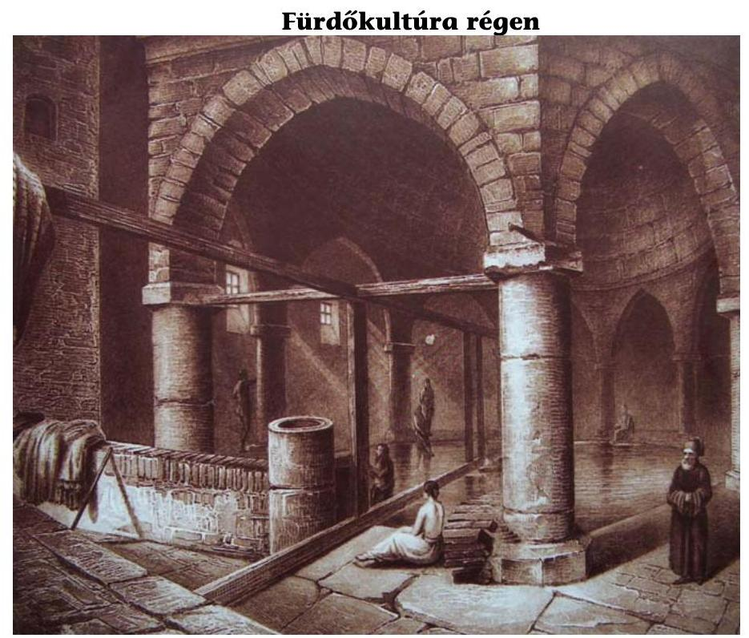
... és ma
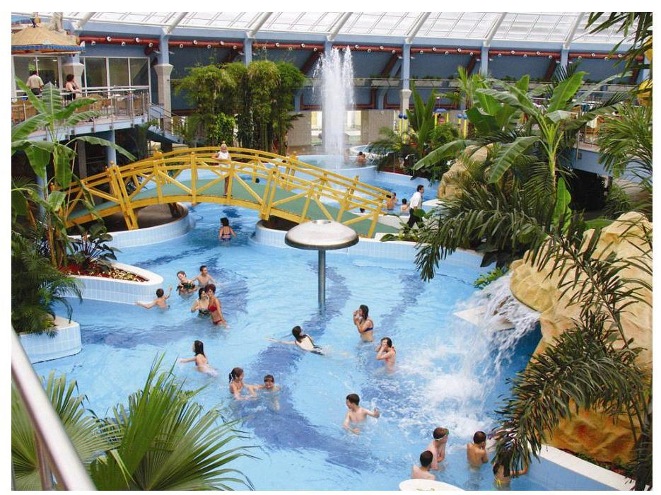
„Míg az elmúlt időkben nagy tisztelettel bántak a vízzel, ma hajlamosak vagyunk arra, hogy jelentéktelennek tekintsük, és csak azt vegyük észre, hogy pénzbe kerül, vagy pénzt hoz. Ahhoz azonban, hogy a víz továbbra is gyógyítson és tápláljon bennünket, neki is egészségesnek kell lennie!"

Karin Schutt

Jelentéseink az Országgyűlés számítógépes hálózatán és az Interneten a www.asz.hu címen is olvashatók.

---

# TARTALOMJEGYZÉK 

BEVEZETÉS ..... 5
I. ÖSSZEGZŐ MEGÁLLAPÍTÁSOK, KÖVETKEZTETÉSEK, JAVASLATOK ..... 7
II. RÉSZLETES MEGÁLLAPÍTÁSOK ..... 15
1.Turisztikai jellemzők, természeti adottságok ..... 15
2.A fürdőszolgáltatás céljára rendelt önkormányzati vagyonnal való gazdálkodás helyzete ..... 17
2.1.A fürdővagyonhoz jutás körülményei ..... 17
2.2.A fürdőszolgáltatás szervezeti kereteinek kialakítása ..... 19
2.3.A fürdőszolgáltatás, gyógy-idegenforgalom, gyógy-turizmus fejlesztésének önkormányzati programja ..... 23
3.A fürdőágazati fejlesztéseket szolgáló pályázati rendszer működésének jellemzői ..... 25
3.1.A központi támogatás rendszerének kialakítása ..... 25
3.1.1.A pályázatkezelési és ellenőrzési rendszer jellemzői ..... 30
3.2.Az ellenőrzött szervezeteknél a pályázatok lebonyolításával, odaítélésével és felhasználásával kapcsolatos megállapítások ..... 31
3.2.1.A támogatott szervezetek és feladatok ..... 31
3.2.2.A fejlesztések megvalósításában közreműködő szervezetek kiválasztásának jellemzői ..... 34
3.2.3.A támogatások igénybevételének, felhasználásának szabályszerűsége, ellenőrzése ..... 36
3.2.4.A fejlesztések megvalósításának tervszerűsége ..... 37
4.A fürdőszolgáltatás jellemzői ..... 39
4.1.A fürdőszolgáltatást ellátó szervezetek jellemzői ..... 39
4.2.A gyógyfürdő ellátások és a rehabilitációs tevékenység ..... 43
4.2.1.A gyógyszolgáltatások ártámogatásának kialakítása ..... 46
4.3.A fürdőágazat eredményessége ..... 48
4.4.A fürdőlétesítmények vízforgató berendezésekkel való ellátásának helyzete ..... 51

---

# MELLÉKLETEK 

1. számú A vizsgált önkormányzatok fürdőszolgáltatási célú vagyonának alakulása 2000. és 2003. évben
2. számú A vizsgált önkormányzatok fürdőszolgáltatási célú vagyonának összetétele 2000. és 2003. évben
3. számú A turisztikai célelőirányzatból biztosított támogatási keretek és az odaítélt támogatások alakulása
4. számú A turisztikai célelőirányzatból a gyógyfürdő fejlesztések kerete terhére benyújtott, megítélt és az elutasított támogatások alakulása
5. számú Kimutatás a pályázatkezelőknél vizsgált támogatásokról
6. számú Kimutatás a vizsgált szervezetek részére megítélt támogatásokról
7. számú A társadalombiztosítás által támogatott gyógyfürdőszolgáltatás alakulása szolgáltatásonként
8. számú A társadalombiztosítás által támogatott gyógyfürdőellátások esetszámainak alakulása a vizsgált szervezetekben
9. számú Kimutatás a 2005. május 1-ig átalakítandó töltő-, ürítő rendszerú medencékről (2004. november 26-i állapot szerint)
10. számú Kimutatás a vízforgatásos rendszerú üzemelésre átállított medencék korszerűsítési költségeiről (2002. évi áron)

## FÜGGELÉKEK

1. számú A helyszíni ellenőrzésbe bevont önkormányzatok és fürdőket üzemeltető szervezetek jegyzéke
2. számú Florena Gazdasági Tanácsadó és Kereskedelmi Kft. hatásvizsgálatának összegzése
3. számú A társadalombiztosítás által támogatott hét leggyakoribb gyógykezelés

---

# RÖVIDÍTÉSEK JEGYZÉKE 

| Áht. | az államháztartásról szóló 1992. évi XXXVIII. törvény |
| :--: | :--: |
| Ámr. | az államháztartás múködési rendjéről szóló 217/1998. (XII. 30.) Korm. rendelet |
| ÁNTSZ | Állami Népegészségügyi és Tisztiorvosi Szolgálat |
| EGK | Európai Gazdasági Közösség |
| EGT | Európai Gazdasági Térség |
| ESzCsM | Egészségügyi, Szociális és Családügyi Minisztérium |
| EU | Európai Unió |
| GKM | Gazdasági és Közlekedési Minisztérium |
| GM | Gazdasági Minisztérium |
| Gt. | a gazdasági társaságokról szóló 1997. évi CXLIV. törvény |
| Kbt. $_{1}$ | a közbeszerzésekről szóló 1995. évi XL. törvény |
| Kbt. $_{2}$ | a közbeszerzésekről szóló 2003. évi CXXIX. törvény |
| KEHI | Kormányzati Ellenőrzési Hivatal |
| kft. | korlátolt felelősségű társaság |
| kht. | közhasznú társaság |
| KSH | Központi Statisztikai Hivatal |
| MÁK | Magyar Államkincstár |
| MEH | Miniszterelnöki Hivatal |
| MFB Rt. | Magyar Fejlesztési Bank Rt. |
| MVF. Kht. | Magyar Vállalkozásfejlesztési Közhasznú Társaság |
| NFT | Nemzeti Fejlesztési Terv (Európai Terv) |
| OEP | Országos Egészségbiztosítási Pénztár |
| OTH | Országos Tisztiorvosi Hivatal |
| Ötv. | a helyi önkormányzatokról szóló 1990. évi LXV. törvény |
| PPP | Public Private Partnership |
| ROP | Regionális Operatív Program |
| rt. | részvénytársaság |
| SzMSz | Szervezeti és Múködési Szabályzat |
| Sztv. | a számvitelről szóló 2000. évi C. törvény |
| TB | társadalombiztosítás |
| TC | Turisztikai Célelőirányzat |
| VÁB | Vagyonátadó Bizottság |
| WTO | Turisztikai Világszervezet |

---

.

---

# JELENTÉS 

## a helyi önkormányzati fürdők - kiemelten a gyógyfürdők - helyzete, fejlesztésének lehetőségei, hatása az idegenforgalomra és a turizmusra

## BEVEZETÉS

A WTO adatai szerint a világ turizmusa növekvő tendenciát mutat. Bár Európa őrzi e területen elfoglalt vezető helyét, de a világ más régióinak felzárkózása következtében szerepe csökken. A turizmus ezért olyan célterületek (desztinációk) irányába fordul, amely a versenyképes adottságok jelenleginél hatékonyabb kihasználását célozza meg.

Magyarországot, mint turisztikai célterületet az elmúlt évtizedben a világ 15 legnépszerúbb országa között tartották számon, Európában a 8. leglátogatottabb utazási célpont volt. Mindez összefügg azzal, hogy hazánk gyógy- és termálvizekben rendkívül gazdag, melyekre eddig is jelentős idegenforgalom épült.

Magyarország nemzetközi összehasonlításban is a kedvező geotermikus adottságú országok közé tartozik. Hazánk területén az úgynevezett geotermikus gradiens - ami a természetes hőmérséklet emelkedés mélységi irányú mértékét jelzi - százméterenként $5^{\circ} \mathrm{C}$, amely a világátlag mintegy másfélszerese. A földkéreg ugyanis $24-26 \mathrm{~km}$, azaz mintegy 10 km -rel vékonyabb, mint a környező területeken. A természetes hőmérséklet emelkedést jelző tényező a Dél-Dunántúlon és az Alföldön nagyobb, mint az országos átlag, ez magyarázza az e területeken gyakoribb hévíz előfordulást.

A hazai hévízkészletek komoly természeti és gazdasági értéket képviselnek, az azokkal való környezettudatos gazdálkodás fontos nemzeti érdek.

Magyarországon a természetes gyógytényezők gazdagsága miatt az egészségturizmus adottságai kiemelkedően jók. Az egészségturizmus fejlesztése azon túl, hogy fontos kitörési pontként kezelt gazdasági tényező, az egészségügyi szakma véleménye szerint hozzájárul a magyar lakosság népegészségügyi problémáinak (szív- és érrendszeri, mozgásszervi betegségek) megelőzéséhez és hatékony kezeléséhez. Az egyéni életminőség javítása, az egészséges társadalom megteremtése fontos nemzeti és gazdasági érdek.

A tapasztalatok Európa-szerte azt igazolják, hogy az egészségturizmusban olyan komplex többcélú fürdő létesítmények és azok többgenerációs szolgáltatásai irányába mozdult el a kereslet, ahol a hagyományos gyógyászati

---

kezelésre épülő gyógy- és termálturizmus mellett az egészség megőrzését szolgáló kikapcsolódási, felüdülési élményeket nyújtó fitness, wellness-turizmus került előtérbe.

Az ellenőrzésünk indokát az adta, hogy a fürdőfejlesztések alapjául szolgáló vagyonelemek - víznyerő kutak, fürdőlétesítmények - az önkormányzati rendszer kialakításakor a települési önkormányzatok tulajdonába kerültek, annak hasznosításáról, fejlesztéséről autonóm módon, eltérő koncepcionális megalapozással gondoskodtak.

Az ellenőrzés célja annak megállapítása volt, hogy

- a Széchenyi Terv keretében kidolgozott egészségturizmus tízéves fejlesztési programja, stratégiai céljai megalapozottak voltak-e;
- a pályázati rendszer kialakításánál, a támogatási előirányzatok odaítélésénél érvényesült-e a törvényesség;
- a támogatások felhasználásánál hogyan ítélhető meg annak szabályszerűsége, célszerűsége, eredményessége;
- a fürdők országos szintű szakmai irányítása és ellenőrzése, működésük jellemzőinek információs rendszere mennyiben rendezett.

Az ellenőrzést 2000-2004. III. negyedév közötti időszakra vonatkozóan a Magyar Turisztikai Hivatalnál, az Országos Tisztifőorvosi Hivatalnál, az Országos Egészségbiztosítási Pénztárnál, valamint 26 települési önkormányzatnál és 27 fürdőszolgáltatást ellátó szervezetnél végeztük.

Az ellenőrzés során a teljesítményellenőrzés módszerét alkalmaztuk, hasznosítottuk a fókuszcsoport megbeszélésének tapasztalatait. Vizsgáltuk a fejlesztések szakmai programjában megfogalmazott célok teljesülésének eredményességét, hatását, a Széchenyi Tervre alapozott egészségturizmus tízéves fejlesztési programjának időarányos teljesülését.

---

# I. ÖSSZEGZŐ MEGÁLLAPÍTÁSOK, KÖVETKEZTETÉSEK, JAVASLATOK 

A Széchenyi Terv több tízmilliárdos támogatási programjainak keretében az utóbbi években hazánkban a meglévő fürdők vonzerejének, versenyképességének javítása mellett több mint húsz új, többgenerációs, élményelemekkel kiegészült turisztikai kereslet kielégítését szolgáló létesítmény épült.

Az egészségturizmus, a balneológiai létesítmények infrastruktúrája koordinált fejlesztéseket kíván. Magyarországon problémát jelent azonban, hogy jelenleg nincs külön turizmusról szóló törvény, hiányzik a turizmus jelentőségét megfogalmazó, alapdefiníciókat lefektető, múködésének struktúráját, rendszerét megállapító szabályozás. A turizmus fejlődése érdekében még 1997-ben született ugyan országgyúlési határozat - a turizmusról szóló törvény és fejlesztési koncepció elkészítésének határidejét 1997. szeptember 31-i időpontban jelölte meg -, azonban az átfogó szabályozásra azóta sem került sor. Emiatt az NFT készítésének időpontjában a nemzeti turizmusfejlesztési stratégia még nem állt rendelkezésre.

Az egészségturisztikai ágazat infrastrukturális lemaradásának pótlásához, a turisztikai ágazat fejlesztéséhez, valamint versenyképességünk fokozásához a kihívásoknak megfelelni tudó programokra és forrásokra van szükség.

Így ebben a tervezési ciklusban hazánk egyik legjelentősebb turisztikai tényezője, a gyógy- és termálfürdőzés feltételeinek fejlesztése közvetlenül nem, csak annak kapcsolódó infrastruktúráján keresztül részesülhet uniós támogatásban. A gyógy- és termálfürdők fejlesztésének lehetőségeit így a vizsgált időszakban csak a hazai források segítették.

A gyógyfürdők fejlesztésének felgyorsítása még 2000. évben, a GM által a Széchenyi Terv részeként kidolgozott „Az Egészségturizmus Tízéves Fejlesztési Programja" keretében indult ${ }^{1}$.

A Széchenyi Terv egészségturizmus fejlesztési programjának stratégiai célja az volt, hogy Magyarország - az egyedülálló gyógy- és termálvízkincsére ${ }^{2}$ alapozva - az évtized végére vezető helyet foglaljon el Európa egészségturisztikai piacán. Az egészségturizmus fejlesztésére a tízéves program keretében évente mintegy 10-15 milliárd Ft-ot kívántak fordítani azzal a szándékkal, hogy társfinanszírozás keretében vállalkozók és az önkormányzatok ehhez ennek többszörösével fognak hozzájárulni.

[^0]
[^0]:    ${ }^{1}$ Az egészségügyi miniszter és a gazdasági miniszter által készített előterjesztést az egészségturizmus tízéves fejlesztési programjának megteremtéséről szóló 2226/2001. (IX. 1.) Korm. határozat hagyta jóvá.
    ${ }^{2}$ A világranglistán e vonatkozásban csak Japán, Izland, Olaszország és Franciaország előzi meg hazánkat.

---

Az egészségturizmus fejlesztési programjai, stratégiai céljai szakmailag azonban nem voltak kellően megalapozottak. Nem történt meg a kitűzött célok elérését szolgáló fejlesztési prioritások kijelölése, nem voltak tisztázottak a turizmus és az egészségmegőrzés összefüggései, összehangolt fejlesztésének koncepcionális kérdései.

Előkészítése során nem készült olyan országos, helyszíni vizsgálatokra épülő, teljes körű tájékozódó felmérés, amely a meglévő vízkészletek, gyógytényezők gyógy- és termálfürdők műszaki állapotára, térségi szerepére, fejleszthetőségének jellegére és a pénzügyi források szükséges mértékének meghatározására és összehangolására irányult volna.

Nem dolgozták ki az ehhez szükséges adatszolgáltatás rendjét. Nem tartják nyilván, hogy - a 147 minősített gyógyvíz, 39 gyógyfürdő, 13 gyógyhely, 47 gyógyszálló, 40 wellness szálloda, 5 gyógybarlang, 4 gyógyiszap ${ }^{3}$ - milyen tulajdonosi és üzemeltetési viszonyok között, milyen kapacitási jellemzőkkel múködik. Ily módon ma Magyarországon nincs olyan adatbázis, amely a fürdők tulajdonosi viszonyairól, üzemeltetési és szolgáltatási körülményeiről, gazdálkodási viszonyaikról, valamint az idegenforgalom alakulásában betöltött szerepéről összegzett képet adna. Nem vizsgálták, hogy a belépő fejlesztések kapcsán milyen szükséges többlet költségvetési forrásigények merülnek fel a társadalombiztosítás által finanszírozott gyógykezelések számának növekedésével.

A hazai gyógy-, termál- és strandfürdők döntő hányada közvetlenül, vagy az általuk alapított gazdasági társaságokban lévő részesedéseiken keresztül, de önkormányzati tulajdonban van. Mindössze az elmúlt 2-3 év fejlesztéseinek eredményeként jöttek létre olyan fürdő, strand és szabadidő komplexumok, amelyek tulajdonosi szempontból már függetlenek az adott közigazgatási terület önkormányzatától.

Az önkormányzatok a rendszerváltást követő években, az Ötv. és a vagyonátadásról rendelkező törvény ${ }^{4}$ szabályai alapján jutottak hozzá strand- és fürdővagyonukhoz. A vagyonhoz jutás folyamata elhúzódott, miközben a fürdőágazat egységes szakmai irányítása lényegében megszűnt, a turizmus és a gyógytényezők állami irányítása pedig szervezetileg is elkülönült. A feladotés hatáskörök keretjellegű szabályozásából következően jelenleg sem tisztázott, hogy a fürdőszolgáltatás mennyiben közfeladat, ennek eldöntését, a szerepvállalás területeit a jogalkotó az önkormányzati szféra döntésére bízta.

Az önkormányzatok folyamatosan keresték a fürdővagyon múködtetésének és üzemeltetésének legcélszerűbb szervezeti megoldásait. A szervezeti kereteket érintő döntések kellően kiérlelt koncepció hiányában visszatükrözték az ellátott feladat és a vagyonhasznosítás körüli bizonytalanságokat.

[^0]
[^0]:    ${ }^{3}$ Adatok: Nemzeti Turizmus Fejlesztési Stratégia 2005-2013.
    ${ }^{4}$ Egyes állami tulajdonban lévő vagyontárgyak önkormányzatok tulajdonába adásáról szóló 1991. évi XXXIII. törvény.

---

Az ellenőrzött önkormányzatok közel háromnegyede (73\%-a) különböző megoldásokban ugyan, de a gazdasági társasági keretek közötti működtetést tartotta célszerűnek, 15\%-a pedig a szerződéses kapcsolatokra alapozott megoldást választotta. Az önkormányzatok a jogszabályi előirásokat betartották, csak olyan típusú gazdasági társaságban vesznek részt, amelyben felelősségük nem haladja meg a vagyoni hozzájárulásuk mértékét.

A vállalkozói szféra, függetlenül az önkormányzatok által választott üzemeltetés szervezeti módjától, egyre szélesebb körben szerzett tulajdont a fürdőágazati fejlesztésekben. A fürdőlétesítmények fejlesztéseinek eredményeként 2000-2003. évek között az e célra rendelt vagyon összértéke két és félszeresére növekedett, a tulajdonosok és szolgáltatók a 2003. évi mérlegadatok szerint 52,4 milliárd Ft értékű vagyont tartottak nyilván. Az üzemeltető gazdasági társaságok birtokolták a teljes fürdőszolgáltatási célú vagyon 59,9\%-át.

Az önkormányzatok nem fordítottak figyelmet arra, hogy az állami források bevonásával létrejövő vagyoni elemek tulajdoni viszonyait, az önkormányzati érdekekre figyelemmel rendezzék. Erre pedig épp a fürdőágazatot érintő nagyívű, egyre inkább a privát szféra bevonására alapozó fejlesztési elképzelések kapcsán szükség van. Megfelelő pénzügyi konstrukciók esetén a nemzeti versenyképességünk egyik tényezőjeként erre kínál megoldást a PPP ${ }^{5}$.

A fürdőfejlesztési pályázatok előkészítésének időszakában kidolgozott önkormányzati programok mindegyike kitörési pontként jelölte meg a fürdővagyon és termálvízkincs hasznosítását, a termálturisztikai tényezők gazdaságélénkítő hatását.

Több önkormányzati program felismerte a wellness és az egészségturizmus térhódítását, a rekreálódási szokások változását, a minőségi szolgáltatások és a többgenerációs turisztikai célterületek irányába való elmozdulás szükségességét. A fürdőfejlesztések komplex turisztikai tényezőkkel, a település társadalmigazdasági viszonyokkal való összehangolása, a településmarketing azokon a településeken kapott kiemelt hangsúlyt, ahol a gyógy- és termálturizmusnak már eddig is érzékelhető eredményei voltak.

A programozás középpontjába az adott település komplex turisztikai termékként való megjelenítését állították, ennek megfelelően alakították ki a településmarketing mottóját. Így szerepel a fejlesztési program mottójában például „A történelmi barokk fürdőváros: Eger", „A természet gyógyító erőinek forrása: Cserkeszőlő", „A lakható és vendégváró Hajdúszoboszló", „MiskolcTapolca a Vizek Völgye".

A fejlesztési pályázatok előkészítése során azonban elvárás hiányában nem kapott megfelelő hangsúlyt sem a létrejövő kapacitások, sem pedig a különböző üzletági tevékenységek eredményességi szempontú összehangolása.

[^0]
[^0]:    ${ }^{5}$ PPP: Public Private Partnership, a köz- és magánszféra partnerségére alapuló együttműködési társulás

---

A Széchenyi Terv programja keretében kidolgozott támogatási rendszer 2001-ben indult. Forrását az adott évek költségvetéseinek GM fejezetének Turisztikai Célelóirányzata biztosította. A vizsgált időszakban a TC 89,6 milliárd Ft volt, amelyből a gyógyfürdők és szálláskapacitások fejlesztésére 32,8 milliárd Ft támogatást nyújtottak.

A program keretében négy ${ }^{6}$ témakörben tettek közzé pályázati felhívásokat, amelyekre 236 pályázótól a rendelkezésre álló keret dupláját elérve 74,6 milliárd Ft támogatási igény érkezett.

A gyógyfürdőfejlesztéseket érintően 74 db pályázatot 28,3 milliárd Ft öszszegben támogattak ${ }^{7}$. Az utóbbiból - tekintettel arra, hogy 39 támogatott program még nem fejeződött be - 2004. év végéig 19,9 milliárd Ft került felhasználásra.

A helyszíni vizsgálattal érintett önkormányzatoknál és üzemeltető szervezeteiknél 34 támogatott projekt áttekintésére került sor, ahol a 14,9 milliárd Ft támogatás 43,5 milliárd Ft összértékű fejlesztés megvalósítását segítette. A támogatás 28 esetben gyógy- és termálfürdő fejlesztésekhez kapcsolódott, illetve négy településen összesen 2010 szállodai férőhely kialakítására adott lehetőséget.

A fejlesztések megvalósításában közremúködő szervezeteket 18 esetben - a programok 53\%-ában - közbeszerzési eljárással, nyílt eljárás keretében választották ki. Ha a biztosított támogatás nem érte el a projekt összértékének 50\%-át és a mindenkori költségvetési törvényben előírt beszerzési értékhatárt, 20022004. évek között a vállalkozásba adás a Kbt. szabályainak érvényesítése nélkül is törvényes keretek közt történt.

A pályázati rendszer múködtetésének személyi és tárgyi feltételeit, az ellenőrzés rendszerét kormányzati szinten kialakították, s az előírásoknak megfelelően múködtették. Hatékonyságát azonban kedvezőtlenül befolyásolta, hogy a turizmus állami irányítása - ennek részeként a pályázatkezelés szervezeti rendje - az elmúlt hat év alatt négyszer változott. A pályázatkezelés tapasztalatai a fürdőfejlesztési támogatásoknál is az előkészítési szakasz hiányosságaira, az elhúzódó szerződéskötési gyakorlatra, az ütemes felhaszná-

[^0]
[^0]:    ${ }^{6}$ - Termálfürdők fejlesztése, illetve kialakítása, valamint a hozzájuk kapcsolódó infrastruktúra fejlesztésének támogatása (továbbiakban: SzT-TU-1).

    - Az egészségturisztikai központokhoz kapcsolódó szálláskapacitás fejlesztésének támogatása (továbbiakban: SzT-TU-2).
    - Kistérségi jelentőségű termálvizű strandfürdők fejlesztésének támogatása (továbbiakban: SzT-TU-21).
    - Egészségturisztikai központok, valamint a hozzájuk kapcsolódó infrastruktúra fejlesztésének támogatása (továbbiakban: SzT-TU-23).
    - A 2003. évtől a Széchenyi Terv (SzT) megnevezése Széchenyi Terv Program (SzTP) megnevezésre változott.
    ${ }^{7}$ SZT-TU-1 és a 2002. évi SZT-TU-21 programokban odaítélt támogatás.

---

lás hiányára, a lekötött támogatási maradványok magas arányára irányították rá a figyelmet.

A fürdőlétesítményekben négy év alatt megvalósított fejlesztések jellemzően a meglévő kapacitások rekonstrukciójára és az új létesítmények kialakítására, a fürdőmedencék számának növelésére, korszerűsítésére, átalakítására irányultak, amely a fürdők befogadóképességének 30,4\%-os növekedését eredményezte.

A fürdőszolgáltatás színvonalában, kulturáltságában számottevő előrelépés történt. Az üzemeltető társaságok fő célja a meglévő vendégkör megtartása, továbbá a magasabb igényű vendégkör kiszolgálása volt, melyet 2000-2003. évek viszonylatában a vendégforgalom $26 \%$-os növekedése is visszaigazolt, 2004. évre ez a tendencia megállt, a rossz nyári időjárás kedvezőtlenül hatott a strandfürdők vendégforgalmának alakulására.

A fejlesztések eredményeként új fürdőszolgáltatási elemek jelentek meg a fürdők kínálatában. A gyógyászati részlegek felújításával, bővítésével egyidejűleg látványos, többgenerációs élmény-létesítmények jöttek létre. Az egészségi állapot megőrzésére, a betegségek megelőzésére irányuló fitness, wellness szolgáltatások révén bővült az igénybe vehető szolgáltatások köre.

A gyógyvízzel rendelkező fürdők szolgáltatásai között fontos szerepet töltött be a gyógyítás és a rehabilitáció. Az üzemeltetői kör 55\%-a balneológiai szolgáltatások mellett egészségügyi - reumatológiai és fizikoterápiás járóbeteg szakellátást is nyújtott.

A szolgáltatást nyújtó szervezeteket három kategóriába (országos, körzeti, helyi) sorolták be, azonos szolgáltatások ellenében azonos részarányú, de eltérő összegű társadalombiztosítási támogatásban részesültek. Az egyes kategóriákba sorolt szolgáltatók esetében normatívan képzett, azonos szolgáltatási díjalapot (árat) határoztak meg, amelynek $85 \%$-át térítette meg az OEP, függetlenül attól, hogy az ellátást biztosító fürdőszolgáltatónak ténylegesen milyen költségei merültek fel a gyógyfürdő szolgáltatással kapcsolatban. A képzett ár $15 \%$-át 2000 . július 1-jétől a szolgáltatás igénybevevőjére háríthatták.

Ez utóbbi azzal járt, hogy a gyógyfürdő ellátások ingyenessége szolgáltatónként differenciáltan ugyan, de megszűnt. Egyes, különösen a helyi kategóriába sorolt szolgáltatók ugyanis tartva a fizetőképes kereslet visszaesésétől - bár azt 2003. október 1-jétől már az egészségbiztosítóval kötött szerződésben is vállalták - ,eltekintettek a $15 \%$-os önrész igénylésétől, míg a fővárosi fürdőkben öszszességében még a $15 \%$-os mértéket meghaladó hozzájárulás megfizetését is érvényesíteni tudták.

A gyógyfürdőellátásokat biztosító szolgáltatók és az OEP közötti megállapodások egyik neuralgikus pontja a támogatás alapjául elfogadott ár és a szolgáltatás tényleges önköltsége, valamint értékesítési ára közötti eltérés. Az egyes szolgáltatások tényleges (teljes, illetve szűkített) önköltségének megállapítására nincs a fürdőágazati szakma és az OEP által egyaránt elfogadott kalkulációs és költségszámítási séma. Még a nagyobb fürdőkben sem történt kísérlet arra,

---

hogy az egyes szolgáltatások ténylegesen felmerülő költségeit meghatározzák, az ártárgyalásokat tényleges közgazdasági alapokra helyezzék.

A társadalombiztosítási finanszírozás körén kívül eső gyógyfürdői szolgáltatások árképzése nem a tényleges ráfordításokat, sokkal inkább az adott szolgáltatás helyi piacképességét tükrözte. Kellően egyértelmű költség- és árkategóriák hiánya nehezítette a szolgáltatók eredményességének összehasonlítását, a jövőbeni fejlesztési irányok kijelölését és megalapozását.

A fürdők - ezen belül a gyógyfürdők - önmagukban ugyanis nem piacképesek. A fürdőágazati szolgáltatás önmagában - különösen akkor, ha arányainál fogva a termál- és gyógyszolgáltatás kevéssé képes enyhíteni a szezonalitás kedvezőtlen hatásait - nem jövedelmező, magasak az üzemeltetés, fenntartás állandó költségei, a bevételszerző időszak rövid. A termál- és gyógyturizmusban a szezonalitás ugyan kevéssé érzékelhető, a fürdő kapacitások kihasználása egyenletesebb, a tartózkodási idő hosszabb, ugyanakkor szállodai és vendéglátóipari infrastruktúra nélkül a fürdőszolgáltatás csaknem mindenütt veszteséges, illetve legfeljebb nullszaldós.

Az infrastruktúra fejlesztése viszont költségigényes, nem nélkülözheti a fürdőkörnyezet konkurens hatásainak elemzését.

A tevékenységek hozama, eredménye azonban csak részben jelenik meg a szolgáltató szervezetek mérleg- és eredmény-kimutatásában. A társadalmi hozam az idegenforgalomban, az egészségügyi ellátásban az életminőség és rekreálódási szokások változásában, a település gazdasági-társadalmi viszonyainak változásában válik érzékelhetővé.

E közvetett, de annál lényegesebb hozamokról - így a foglalkoztatottság növekedése, idegenforgalmi bevételek, infrastruktúra bővülése, az állami egészségügy viszonylagos megtakarításai - azonban nincs olyan teljesítménymérésre, összehasonlításra alkalmas mutatórendszer, adatbázis, amely a tényleges hatékonyság megítélését és a megalapozott fejlesztési irányok kijelölését lehetővé tenné. Az eltérő tulajdonosi célkitűzések, az eltérő gazdasági szervezeti formák, az ellátott feladatok sokfélesége, az eltérő, szervezetfüggő gazdálkodási és számviteli szabályok, a kormányzati szintű koordináció hiánya ahhoz vezetett, hogy ma nincs olyan általánosan elfogadott és múködő statisztikai információs rendszer, ami a összehasonlítás lehetőségét megteremtené.

A fürdők létesítésének, múködtetésének, közegészségügyi feltételeinek szabályozása rendezett. A vízminőségi követelményeket előtérbe helyező üzemeltetési előírások keretében még 1996-ban előírták, hogy a fürdők töltő-ürítő rendszerben működő medencéit 2005. május 31-ig víz-visszaforgatásos rendszerủvé kell átalakítani.

A fürdőlétesítmények - kormányrendeletben ${ }^{8}$ is előírt - vízforgató berendezésekkel való ellátásának helyzete azonban országos szinten kedvezőtlen

[^0]
[^0]:    ${ }^{8}$ 121/1996. (VII. 24.) Korm. rendelet a közfürdők létesítéséről és múködtetéséről.

---

képet mutatott. A vízforgató berendezések létesítését 9 év alatt kellett volna megoldani, melyhez medencénként központi forrásból 5 millió Ft állt rendelkezésre. Ezzel szemben egy medence átlagos átalakítási költségigénye 45 millió Ft volt. Az OTH 2004. novemberi felmérése szerint az átállításra váró töltő-ürítő medencék száma 335 db volt. Az üzemeltetők ekkor a bezárással való fenyegetettség ellenére is azt jelezték, hogy az országban összesen 235 db medence vízforgatóval való ellátására nincs lehetőségük.

E körülményre is figyelemmel, a Kormány a vízforgatók létesítésének határidejét ismét, ezúttal 2006. december 31-ig elhalasztotta. A vízforgató berendezések létesítésének támogatási rendszere átalakult, a korábbi 5 millió Ft tételes támogatás helyett a decentralizált területfejlesztési programok előirányzatai tartalmaznak erre szolgáló fedezetet a feltételeknek megfelelő pályázók számára.

A helyszíni vizsgálattal érintett fürdőkben a helyzet kedvezőbb, az üzemeltetők $90 \%$-a gondoskodott a medencék vízforgató berendezéssel való ellátásáról, valamint megkezdték a forgatás alóli mentesítéssel rendelkező medencék előírt hidraulikai (állandó vízáramlást biztosító) átalakítását is.

Az ellenőrzéseink során a tulajdonosi szemlélet erősítésére a vagyongazdálkodási és számviteli előírások betartására, a beruházások előkészítésének javítására, a megvalósítás ütemességére, a támogatási szerződésben foglalt kötelezettségek maradéktalan betartására hívtuk fel az ellenőrzött önkormányzatok és üzemeltetők figyelmét.

A helyszíni ellenőrzés megállapításainak hasznosítása mellett javasoljuk:

# a regionális fejlesztésért és felzárkóztatásért felelős tárca nélküli miniszternek: 

1. kezdeményezze a turizmus hazai jelentőségét, koordinált fejlesztésének lehetőségét megalapozó átfogó szabályozás kidolgozását;
2. vizsgálja felül az egészségturizmus tízéves fejlesztési programját, ennek keretében jelöljék ki a turisztikai desztinációk részét képező fürdőszolgáltatás környezeti tényezőkkel összehangolt szakmai fejlesztési irányait;
3. vizsgálja felül, és az állami források tehermentesítésének szándékával, a köz- és magánszféra együttműködési formáinak keresésével és a pénzügyminiszterrel egyetértésben alakítsa át az egészségturizmus fejlesztésének finanszírozási rendszerét;
4. kezdeményezze a fürdőágazati létesítmények üzemeltetési és gazdálkodási adatbázisának kialakítását és működtetését;
5. kísérje figyelemmel a töltő-ürítő rendszerú medencék vízforgató berendezéssel való ellátásának és forráskoordinációjának helyzetét és kezdeményezze a szükséges központi források biztosítását;

---

# az egészségügyi- és a pénzügyminiszternek: 

tekintse át az Egészségbiztosítási Alap által támogatott gyógyszolgáltatások finanszírozásának rendszerét, gondoskodjék annak közgazdasági alapokra helyezéséről.

---

# II. RÉSZLETES MEGÁLLAPÍTÁSOK 

## 1. TURISZTIKAI JELLEMZŐK, TERMÉSZETI ADOTTSÁGOK

Az EU-hoz való csatlakozásunkkal Magyarország a világ legnagyobb - bár arányaiban csökkenő jelentőségű - turisztikai piacának részévé vált. Az EU polgárainak kétharmada az unióban tölti el szabadságát, a világturizmusból származó bevételek mintegy 50\%-a az EU piacán képződik, a magyar turisták fele is e tagországokba utazik leginkább. A magyarországi kereskedelmi szálláshelyeken eltöltött vendégéjszakák közel 70\%-át ugyancsak az unióból érkező vendégek teszik ki.

Egységes európai szintű turizmuspolitika hiányában az idegenforgalmi ágazat szabályozása tagországonként eltérő. A turizmus nemzetgazdasági súlyából, kormányok fejlesztési stratégiai elképzeléseiből, illetve az egyes tagországok fejlettségi szintjéből és hagyományaiból adódóan a tagállamok különböző elképzelésekkel rendelkeznek az idegenforgalom szabályozásával kapcsolatban.

Az unió egyes tagországai azokban a kérdésekben, amelyekre nincs uniós norma saját nemzeti szabályozást alakítottak ki. A turizmust, a vendéglátást érintő fogyasztóvédelmi tartalmú uniós irányelveknek az egyes nemzeti szabályozásokba történő beépítése maradéktalanul még egyetlen uniós tagállamban sem valósult meg, illetőleg eltérő ütemben halad.

Infrastrukturális lemaradásunk pótlásához, elmaradott régióink fejlesztéséhez és a turisztikai ágazat fejlesztéséhez, valamint versenyképességük fokozásához forrásokra van szükségük. A 2004-2006. közötti évek fejlesztéseire kiterjedő NFT szerint az uniós források e célokra a strukturális- és a kohéziós alapok keretében állnak rendelkezésre.

Az NFT készítésének időpontjában azonban a turizmusfejlesztési stratégia még nem állt rendelkezésre, így ez a prioritásokra vonatkozó koncepcionális döntés hiányában az NFT turisztikai intézkedéseinek tervezését megnehezítette.

Jelenleg gondot jelent az is, hogy a turizmus és a területfejlesztés intézményrendszere közötti együttműködés jelenleg csak részlegesen biztosított, s különösen az önkormányzatok esetében volt megfigyelhető, hogy az aktuális pályázati feltételekhez igazodva - átfogó hosszabb távú fejlesztési terveket, megvalósíthatósági tanulmányokat, helyzetelemzéseket mellőzve - valósítottak meg fejlesztéseket.

A koordinált fejlesztésre azonban épp a gyógytényezőkkel való eredményes, környezeti hatásokkal számoló gazdálkodás érdekében elengedhetetlenül szük-

---

ség van. Hazánk ugyanis nemzetközi összehasonlításban is jelentős ásvány- ${ }^{9}$ és termálvíz ${ }^{10}$ készlettel rendelkezik.

Jelenleg több mint ezer a $30^{\circ} \mathrm{C}$ feletti meleg, jelentős részben gyógyvizet ${ }^{11}$ adó kutak száma. Gyógyvizeink az ország szinte minden régiójában megtalálhatók, a mintegy 250 fürdőt tápláló kút közel fele 150 településen múködik, ezek háromnegyede az Alföldön található. Budapest területén fakadó természetes és fúrt ásványvízkútakból naponta 30 ezer $\mathrm{m}^{3}$ termálvíz tör a felszínre.

Az ÁNTSZ által minősített adatok szerint Magyarországon 114 kút vize elismert ásványvíznek, míg 147 kút minősített gyógyvíznek számít.

Az országban jelenleg 39 minősített, három kategóriába ${ }^{12}$ sorolt - országos, körzeti, helyi jelentőségű - gyógyfürdő működik. Ezek közel fele gyógyászati jelentősége szempontjából országos, $40 \%$-a körzeti, $12 \%$-a helyi minősítésű gyógyfürdő.

A Széchenyi Terv tízéves programja keretében 160 gyógy- és termálvízre épülő egészségturisztikai központ kialakítását tervezték úgy, hogy ebből 40 nagy, nemzetközi, 70 kisebb, országos, 50 pedig helyi jelentőségű, regionális vonzáskörzetű legyen.

A program megvalósításával meg kívánták kétszerezni a látogatók számát és az egy vendégre jutó bevételt, ezáltal megnégyszerezni hazánk gyógyturizmusból származó bevételeit ${ }^{13}$. A látogatók számának és a bevételek növelésének lehetőségét abban látták, hogy a fürdők szolgáltatásainak a területi koncentrációja mellett az ellátás szakosodjon a különböző keresleti csoportok igénye szerint, megcélozva

- a fiatalabb korosztályok és a kisgyermekes családok fitness, welness, élményfürdőzés igényeit;
- a középkorú és idősebb korosztályok rekreációs és prevenciós, valamint hagyományos gyógyturizmushoz kapcsolódó igényeit.

[^0]
[^0]:    ${ }^{9}$ Ásványvíz: minden olyan természetben előforduló víz, amelynek 1 literje 1000 milligrammnál több oldott ásványi anyagot tartalmaz.
    ${ }^{10}$ Termálvíznek nevezzük azokat az ásványvizeket, amelyek természetes állapotban melegebbek $30^{\circ} \mathrm{C}$-nál.
    ${ }^{11}$ Gyógyvíz: az az ásványvíz, amelynek orvosi kísérletekkel igazolt gyógyhatása van, és az erről szóló hatósági tanúsítással rendelkezik.
    ${ }^{12}$ Az egyes csoportokba sorolt fürdőket annak figyelembevételével kategorizálták, hogy milyen üzemeltetésben, milyen gyógyfürdőellátást és szolgáltatást kell biztosítani.
    ${ }^{13}$ Azzal számoltak, hogy az idegenfogalmi bevétel 4,5 milliárd USD-ról 8,0 milliárdra, egy turista napra eső költés 45 USD-ról 85 USD-re, eltöltött vendégéjszaka 10,5 millióról 38,0 millióra növekszik.

---

A fejlesztés legfontosabb területeit a koncentráció elvére építve a szabályozó rendszer kialakítása mellett az egészségturisztikai központok helyszínén az alap-infrastruktúra és a turisztikai infrastruktúra kiépítésében, az intézményi háttér kialakításában, a humánerőforrás fejlesztésében, az egészségturisztikai marketing erősítésében látták.

A nagyívű elképzeléseket azonban helyzetelemzésekkel, hatásvizsgálatokkal nem alapozták meg, elérése érdekében prioritásokat, fejlesztési célterületeket nem jelöltek meg.

# 2. A FÜRDŐSZOLGÁltATÁs CÉLJÁra RENDELT ÖNKORMÁNYZATI VAGYONNAL VALÓ GAZDÁLKODÁS HELYZETE 

### 2.1. A fürdővagyonhoz jutás körülményei

Az önkormányzatok a rendszerváltást követő években jutottak hozzá strand és fürdővagyonukhoz.

Az Ötv. 107. § (1)-(2) bekezdése szerint a törvény erejénél fogva az állam tulajdonából az önkormányzatok tulajdonába került a tanácsok által alapított és a tanácsok felügyelete alatt álló közüzemi célra alapított állami gazdálkodó szervezetek, a költségvetési üzemek vagyona, az e szervezetekből átalakuló gazdasági társaságokban az államot megillető vagyonrész, illetve a tanács és szervei, intézményei kezelésében lévő ingatlan vagyon.

A fővárosban a Király és a Rudas Gyógyfürdő műemlék jellege miatt az önkormányzati vagyonátadás során állami tulajdonban maradtak, kezelőjük a Kincstári Vagyonkezelő Igazgatóság és üzemeltetője a Budapest Gyógyfürdői és Hévizei Rt.

A több helyi önkormányzat szükségletét kielégítő közös közüzemi és kommunális vállalatok vagyona az érintett önkormányzatok megegyezésére alapozva, a megyékben létrehozott Vagyonátadó Bizottságok döntése alapján került az egyes önkormányzatok tulajdonába. A tanácsrendszerben a fürdőlétesítmények jellemzően megyei hatókörű, vagy ettől szűkebb körben ugyan, de több önkormányzatot érintő víziközművek keretein belül múködtek. A fürdővagyon elkülönült helyi önkormányzati tulajdonba adása - a jogorvoslat lehetőségét is biztosító vagyonátadó bizottsági eljárások lezárása - az érintett önkormányzatok közmegegyezése hiányában évekig elhúzódott.

Zalakaros Önkormányzata 1992 áprilisáig tartó vagyonátadási eljárás során 65\%-os résztulajdont, míg a Zala Megyei Önkormányzat 35\%-os tulajdont szerzett a Zalakaros Gránit Gyógyfürdőben. A harkányi gyógyfürdő tulajdonviszonyai csak 1996 végére rendeződtek, ekkor került felerészben a város, felerészben pedig a Baranya Megyei Önkormányzat tulajdonába.

Mezőkövesd Önkormányzata 1993. január 1-jétől tulajdonosa a 11,5 ha területen fekvő Zsóry Gyógy és Strandfürdőnek, Komlón viszont csak 1994. év végére zárult le a síkondai strandfürdő vagyonátadási folyamata. Cserkeszőlő község pedig az 1993. év végére lezajló vagyonátadást követően csak 2002-ben, a társtulajdonos kivásárlásával tudta megszüntetni az addig fennálló közös tulajdon intézményét.

---

A sárvári fürdő 1992-ben a minisztériumi vállalatként múködő Tatabányai Vízmú Vállalattól került önkormányzati tulajdonba. Hévíz Önkormányzatának pedig - tekintettel arra, hogy a Hévízi-tó és medre az állam kizárólagos tulajdonát képezi ${ }^{14}$, 2001-ig nem is volt strand, fürdő, illetve gyógy-idegenforgalomhoz kapcsolódó vagyona. Tiszaújváros eredendően nem részesült fürdővagyonból a helyi fürdők és strandok a Tiszai Vegyi Kombinát illetve az AES Tiszai Hőerőmú tulajdonában maradtak. Az önkormányzat jelenlegi fürdővagyona az 1998-ban kezdődő 2002-ben befejeződött beruházás eredményeként jött létre.

A vagyonátadások lezárását követően az önkormányzatok eltérő módon ugyan, de az Ötv. 78-79. paragrafusában foglaltakat betartva gondoskodtak a tulajdonukba került vagyontárgyak forgalomképesség szerinti besorolásáról.

A vizsgált önkormányzatok 92\%-a a fürdőszolgáltatás céljára rendelt vagyonát a tulajdonba vételt követően teljes körűen vagy egyes elemeiben a törzsvagyon korlátozottan forgalomképes elemei közé sorolta. A fürdőszolgáltatás szervezeti kereteire vonatkozó döntések kialakításakor azonban a forgalomképesség szerinti besorolásokat újólag áttekintették. Amennyiben szükségessé vált, az egyes vagyontárgyakat egyedi mérlegelést követően, a választott múködtetési forma követelményeinek megfelelve - gazdasági társasági forma esetén az apportálásra előírt feltételeket teljesítve - minősítették.

Törzsvagyonnak - az Ötv. 79. § (1) bekezdésének szabályozása szerint - az az önkormányzati tulajdon nyilvánitható, amely közvetlenül kötelező önkormányzati feladat- és hatáskör ellátását vagy közhatalom gyakorlását szolgálja. Ez utóbbiból az következik, hogy mindazok az önkormányzatok, amelyek a fürdőszolgáltatási célú vagyontárgyaikat korlátozottan forgalomképes vagyoni körbe sorolták, közvetett módon a fürdőszolgáltatást kötelező önkormányzati feladatnak tekintik, holott az az Ötv. 8. § (4) bekezdésében nevesített önkormányzati feladatok köréből nem vezethető le.

Nehezítette a kérdésben való tisztánlátást, hogy az Ötv. 8. § (1)-(2) bekezdésében foglaltak nem határozzák meg egyértelműen azt az önkormányzati kötelezettséget, amely a kötelező és az önként vállalt feladatok helyi számbavételére vonatkozik.

A vizsgált körben mindössze 3 önkormányzat (Kehidakustány község, Sárvár város, Zalakaros város) sorolta eleve a forgalomképes vagyoni körbe a teljes rendelkezésére bocsátott fürdővagyont.

Az ellenőrzött önkormányzatok közül mindössze Zalakaros város SzMSz-ében szerepel önként vállalt feladatként a gyógyfürdő, gyógy-idegenforgalom és gyógyturizmus fejlesztése. Az önkormányzat esetében a feladatvállalás jellegével azonosan a fürdővagyont forgalomképesnek tekintették, erre alapozva hoztak döntéseket a fürdőszolgáltatás céljára rendelt vagyon tekintetében.

A fürdőszolgáltatás céljára szolgáló vagyon az ellenőrzött időszakban 2000-2003. között két és félszeresére növekedett, a 2003. évi mérlegadatok

[^0]
[^0]:    ${ }^{14}$ Egyes állami tulajdonban lévő vagyontárgyak önkormányzatok tulajdonába adásáról szóló 1991. évi XXXIII. törvény, valamint a vízgazdálkodásról szóló 1995. évi LVII. törvény 6. § (1) bekezdés b) pontja alapján.

---

szerint a tulajdonosok és szolgáltatók e címen 52,4 milliárd Ft összértékű vagyont tartottak nyilván.

A vizsgált időszakban végrehajtott fejlesztések eredményeként megháromszorozódott az üzemeltető gazdasági társaságok tulajdonába került fürdőlétesítmények összértéke, ezzel birtokolják a teljes fürdőszolgáltatási célú vagyon 59,9\%-át. Számottevően - csaknem tízszeresére - növekedett az önkormányzatok tulajdonában lévő fürdővagyon is, azonban ez csak 13,7\%-os tulajdoni részarányt jelent. A fürdővagyon nagyságának és összetételének alakulását az 1., 2. számú melléklet tartalmazza.

# 2.2. A fürdőszolgáltatás szervezeti kereteinek kialakítása 

Az önkormányzatok a vizsgált időszakban folyamatosan keresték a fürdővagyon üzemeltetésének legcélszerűbb szervezeti megoldásait.

A 26 ellenőrzött önkormányzat közül a kizárólagos költségvetési intézményi formát mindössze két helyen - Nagyatád városban, Cserkeszőlő községben - tartották legcélszerűbb szervezeti megoldásnak, 19 önkormányzatnál gazdasági társaságot - rt-t, kft-t, kht-t - alapítottak, míg az üzemeltetési szerződés keretében való működtetést öt önkormányzatnál (Szolnok megyei jogú város, Egerszalók, Kehidakustány, Borgáta községek, Miskolc megyei jogú város) választották.

Miskolc megyei jogú városban költségvetési szervként és vállalkozó által szerződéssel üzemeltetett fürdő egyaránt található. A város esetében sajátos helyzetet teremt, hogy a Miskolc-tapolcai Barlangfürdőt egyszemélyes önkormányzati tulajdonú gazdasági társaság - saját társasági tulajdonaként - működteti, az önkormányzat a Barlangfürdő vonatkozásában fürdőszolgáltatási célú vagyonnal nem, csak társasági üzletrésszel rendelkezik.

Cserkeszőlő község a közel 50 éve múködő, 1997-től látványos fejlődést tanúsító gyógy- és strandfürdőjét költségvetési intézményi keretek közt múködteti. Az önkormányzat nem rendelkezett arról, hogy a fürdőszolgáltatást önként vállalt vagy kötelező feladatnak tekinti. Az intézmény alapító okirata szerint részben önálló gazdálkodási jogkörű költségvetési szerv, operatív gazdálkodási feladatait a polgármesteri hivatal látja el. A fürdőszolgáltatást alaptevékenységnek tekintik, csak az ingatlan-bérbeadási, szállodai férőhely értékesítési tevékenységüket sorolták vállalkozási körbe. Az intézmény 2000-2004. között költségvetési támogatásban nem részesült, múködési, fejlesztési célú bevétele 2003-ban 316,4 millió Ft volt, e címen elszámolt pénzforgalmi szemléletű kiadásai 180,7 millió Ft-ot tettek ki. Az intézmény alapító okirata, amely az ellátott tevékenységek változását nem tartalmazza, az önkormányzat a fürdő és strandszolgáltatás megszervezéséről hozott döntései során nem vette figyelembe az Áht. 87. § (1), az Ámr. 8. § (1), (2) bekezdésében az Ámr. 64. § (4) bekezdésében, valamint az Ötv. 8. § (1) bekezdésében foglaltakat.

Nagyatád város termál és gyógyfürdője 1987-től a Városi Kórház és Rendelőintézet részeként, annak egy szakfeladataként múködik, nem önálló költségvetési szerv, és nem önálló jogi személy. A gyógyfürdő használati jogát 1996-tól a város önkormányzatának városgondnoksága gyakorolja. A gyógyfürdő és strandszolgáltatás az SzMSz szerint nem kötelező feladat, az e célra rendelt vagyon - a besorolás 2001. évi módosítását követően - forgalomképes ingatlanvagyon.

---

Az ellenőrzés a két utóbbi önkormányzat esetében a kialakított költségvetési szervezeti keret célszerűtlenségét állapította meg.

A megalakított gazdasági társaságok közül 11 Kft-ként jött létre, közülük 9 esetben 100\%-os, 1 esetben többségi részesedésű önkormányzati tulajdonlás mellett.

Komló városban - a társtulajdonosok sorozatos törzstőke emelését követően - az alapításkori többségi részesedés az évek folyamán 53,85\%-ről 3,29\%-ra csökkent.

A létrehozott 8 Rt-ből 4 zártkörű alapítású egyszemélyes rt., háromban a tulajdonos önkormányzat többségi részesedést, egyben pedig - Bük község - kisebbségi részesedést birtokol.

A létrehozott gazdasági társaságok 58\%-ában - 12 önkormányzatnál - a fürdőszolgáltatás céljára rendelkezésre álló vagyont apportként bocsátották a társaság rendelkezésére. Három önkormányzat - Szigetvár, Komló, Mezőkövesd városok- azonban a vagyon tulajdonjogát nem, csak a használat, üzemeltetés jogát adta át a létrehozott gazdasági társaságnak. Eger, Orosháza, Hajdúszoboszló városok gazdasági társasága pedig részben társasági tulajdonként - bevitt apportként - részben üzemeltetésre átvett eszközként kezeli az önkormányzat fürdővagyonát.

Az üzemeltetők jogállása - szervezeti formája - a vizsgált időszakban kettő kivételével nem változott.

Orosházán 2001 májusáig részben önálló gazdálkodási jogkörű intézményként működött a fürdő, majd ez időtől 97\%-os önkormányzati tulajdonú rt. vette át a fürdőüzemeltetés feladatait. Hévízen az Aquamarin Szálloda Kft. korábban a Hunguest Hotels szállodalánchoz tartozott, 2001 augusztus óta az önkormányzat gyakorolja a tulajdonosi jogokat.

A gazdasági társaságok létrehozása, alapítása során az önkormányzatok az Ötv. 80. § (3) bekezdésében foglalt előírást betartották, fürdővagyonukkal csak olyan gazdasági társaságban vesznek részt, amelyben felelősségük nem haladja meg a vagyoni hozzájárulás mértékét.

A törzsvagyon korlátozottan forgalomképesnek besorolt vagyontárgyairól azok gazdasági társaságba való apportálásáról - az Ötv. 79. § (2) bekezdés b) foglaltaknak megfelelve helyi önkormányzati rendeleteikben meghatározott előírásokat betartva - de esetenként a számviteli előírásokat megsértve - döntöttek.

A társaságalapítás kezdeti időszakában fordult elő, hogy az apportálás nem a könyvvizsgáló által megállapított értéken történt, így sérültek az Áht. 108. § (3) bekezdésében előírtak (Komló, Eger, Zalakaros városok). Gyulán az önkormányzat a társasága részére biztosított törzstőkét nem részesedésként, hanem felhalmozási célú pénzeszközátadásként kezelte.

Hiányosságként fordult elő az is, hogy az önkormányzatok a VÁB eljárással tulajdonukba került vagyonelemekről analitikus nyilvántartást nem vezettek, az üzemeltetésre való átadásról tételes átadás-átvételt nem készítettek (Szigetvár város), az üzemeltetésre átadott eszközöket nem leltározták, annak kötelezettségét

---

az üzemeltetési megállapodásokban nem rögzítették (Orosháza város). Előfordult, hogy az önkormányzat a társaságban való részesedésének értékelése vagy a piaci értékre való átértékelése során sértette meg az Sztv. 59. §. (2) bekezdésében foglalt előírást, Igal község például az értékhelyesbítés megállapítását és elszámolásának szabályszerűségét nem ellenőriztette könyvvizsgálóval. Zalakaros Város Önkormányzata a teljesített apport értékét a jegyzett tőke cégbírósági bejegyzését figyelmen kívül hagyva, a pénzügyi teljesítéshez igazodóan számolta el részesedés növekedésként. ${ }^{15}$ Budapest Gyógyfürdői és Hévizei Rt. tőketartalékában a helyszíni ellenőrzés időszakában is négy olyan nem apportálható fürdőingatlan - Gellért Gyógyfürdő, Margitsziget Palatinus Strand, Paskal Strand, Széchenyi Fürdő és Ivócsarnok - szerepel, amelynek tulajdonviszonya nem rendezett.

A vizsgált önkormányzatok körében öt önkormányzat választotta az üzemeltetés külső, önkormányzati szervezettől független vállalkozással kötött eltérő tapasztalatokat felszínre hozó szerződéses üzemeltetési formát.

Szolnok Város Önkormányzata 1996-ban koncessziós pályázati eljárás keretében teljes víziközmú vagyonát - ennek múködési szempontból le nem választott részeként a fürdőszolgáltatási célú vagyont is - 35 évre adta üzemeltetésbe a pályázat nyertesének. A koncessziós pályázat nyertese magánszemély lett, aki a feladat ellátására egyszemélyes tulajdonú, zártkörű részvénytársaságot alapított. Az önkormányzat a koncessziós szerződésben a közmúvagyon tulajdonjogát nem, csak használatának, üzemeltetésének és fejlesztésének jogát engedte át a koncessziós társaságnak. A koncesszióba adott vagyon használatáért díjfizetési kötelezettséget állapítottak meg, a gazdasági év adózás előtti nyereségének százalékában. A koncessziós díj a víziközmű vagyont érintő fejlesztésekhez kapcsolódó pályázatok önkormányzati saját forrásához biztosít fedezetet. A fürdőszolgáltatást érintő fejlesztési pályázatok saját forrásának biztosítására azonban a meghatározott koncessziós díj már nem biztosított fedezetet, így azt a vállalkozás saját vagyona terhére folyósította. A támogatással létrejövő vagyon teljes egészében koncessziós gazdasági társaság saját társasági vagyonaként került aktiválásra. Ily módon olyan közös tulajdonú fürdőlétesítmények jöttek létre, amelyben az önkormányzati tulajdonrész mindössze 8,9\%-ot képvisel.

Kehidakustány Község Önkormányzatának képviselőtestülete a fürdő fejlesztésére vonatkozó koncepcióval nem rendelkezett, így annak üzemeltetésére, hasznosítására vonatkozó döntéseit egyedi döntésekkel vezérelte. Ennek keretében 2001-ben 50 éves időtartamra vonatkozóan haszonbérleti, üzemeltetési, földhasználati szerződést kötött egy tőkeerős, termálfürdő fejlesztésére vonatkozó pályázatok benyújtására alkalmasnak tartott, az önkormányzattal már korábban is gazdasági kapcsolatban álló vállalkozással. A haszonbérleti szerződés alapján az önkormányzat 2051. december 31-ig haszonbérbe adta a tulajdonát képező termálfürdőt valamennyi épületével, létesítményével együtt. A haszonbérleti díjat 2001. évre 6000 ezer $\mathrm{Ft}+$ áfa összegben határozták meg azzal, hogy az évente automa-

[^0]
[^0]:    ${ }^{15}$ Az Sztv. 35. § (3) bekezdésének előírása értelmében az Rt-nél a jegyzett tőkeváltozást a cégjegyzékbe való bejegyzés alapján, a bejegyzés időpontjával kell könyvelni, a nyilvántartásokban rögzíteni. Az önkormányzatnak az apport teljesítésekor a gazdasági esemény valós tartalma szerint részesedése nem, csak arra szóló követelése keletkezett, a tulajdoni részesedést csak a cégbírósági bejegyzés megtörténtét követően lehetett volna elszámolni.

---

tikusan növekszik a KSH által közzétett infláció mértékével ${ }^{16}$. A haszonbérbe vevő vállalta, hogy kizárólag a saját költségén fejleszti és karbantartja a fürdő komplexum területén elhelyezkedő valamennyi létesítményt, olymódon, hogy ha beruházások a régi, úgynevezett nyári fürdő területén valósulnak meg, akkor az az önkormányzat, amennyiben az új fürdő területén, akkor a haszonbérbevevő tulajdonába kerülnek. A földhasználati szerződés szintén 2051. december 31-ig köttetett, az érintett földterület a vállalkozó által megvalósítandó (megvalósított) termálfürdő fejlesztés I-III. ütemének területe. A szerződés szerint a vállalkozás 1 $\mathrm{Ft} / \mathrm{m}^{2} /$ év névleges földhasználati díjat fizet az önkormányzat részére.

Az üzemeltetésbe adás körülményeiből látható, hogy az önkormányzat az országos hírűvé vált termálfürdő további fejlesztését az önkormányzati érdekeltségi körön kívüli vállalkozás számára tette lehetővé, így a jelentős állami támogatással megvalósuló beruházás nem az önkormányzat, hanem annak érdekkörén kívülálló vállalkozás vagyongyarapodását szolgálta. Ugyanakkor az önkormányzat a vállalkozással kialakított gazdasági kapcsolatban aránytalan - magánérdekeket szolgáló - terhet vállalt azzal, hogy a tulajdonát képező fürdőingatlanok keretbiztosítéki jelzálogjog bejegyzésével a vállalkozó által fürdőfejlesztéshez felvett hitelek és járulékai, valamint az állami támogatáshoz kapcsolódó bankgarancia biztosítékául szolgáltak. ${ }^{17}$

Mezőkövesd Város Önkormányzatának fürdővagyonát - Zsóry Gyógy- és strandfürdő - határozatlan időre szóló üzemeltetési szerződés keretében a Mezőkövesdi Városgazdálkodási Rt. üzemelteti, amely 75\%-ban önkormányzati tulajdonú gazdasági társaság. Az üzemeltetés 1994-től eltelt időszaka alatt - élve az üzemeltetési szerződésben biztosított lehetőséggel - az üzemeltető társaság is tulajdonrészt szerzett a fürdőüzletágban. A vegyes tulajdoni helyzet, az önkormányzati vagyonra bejegyzett zálogjog, elidegenítési és terhelési tilalom korlátozza az önkormányzat mozgásterét.

Az egészségturizmus és balneológiai szolgáltatások versenyképes, koordinált fejlesztésének igénye lehetőséget és tapasztalatot biztosít az ágazat szakmai irányítása számára a privát- és a közszféra együttműködési megoldásainak önkormányzati érdekekkel összeegyeztethető fejlesztésére.

A magán- és a közszféra együttműködésének egyik formája a PPP.
A PPP a közfeladatok ellátásnak az a módja, amikor az állam (az önkormányzat) a szükséges létesítmények, intézmények létrehozásába, fenntartásába és üzemeltetésébe versenyeztetés útján bevonja a magánszektort. A PPP keretében a vállalkozó szolgáltatást nyújt az állam (önkormányzat) részére, átvállalja annak közszolgáltatási feladatait, a szolgáltatásokért az állam (önkormányzat) és/vagy a szolgáltatások igénybevevője szolgáltatási díjat fizet.

A konstrukció keretében a megrendelő határozza meg, hogy milyen szolgáltatást, milyen minőségben, mennyi ideig - jellemzően 20-30 év - kívánja igénybe venni,

[^0]
[^0]:    ${ }^{16}$ A haszonbérleti díj 2002-ben 6600 ezer Ft, 2003-ban 7194 ezer Ft, 2004-ben 7532 ezer Ft volt.
    ${ }^{17}$ Az önkormányzat tulajdonában lévő négy ingatlanra - több ütemben, bankváltozásokat követően - összesen 1460 millió Ft erejéig keretbiztosítéki jelzálogot jegyzett be a hitelintézet.

---

a magánszektor a szolgáltatást végzi, a megrendelő pedig gondoskodik a szerződés folyamatos figyelemmel kíséréséről.

A PPP-nek - aszerint, hogy az egyes feladatokból mennyit vállal magára a magánszféra - többféle megoldása létezik, az egyszerűbb, magánfinanszírozási kezdeményezésű szerződéses konstrukcióktól kezdve a hosszabb távra szóló konceszsziós szerződéseken át a tervezés, beszerzés, létrehozás, üzemeltetés finanszírozás szakaszait is magában foglaló kiteljesedett kapcsolati formákig.

Ebben a közelítésben az ellenőrzés során tapasztalt együttműködési formák a fürdőágazat PPP kezdeményezéseinek tekinthetők.

# 2.3. A fürdőszolgáltatás, gyógy-idegenforgalom, gyógyturizmus fejlesztésének önkormányzati programja 

Az ellenőrzött önkormányzatok rendelkeztek strand- és fürdővagyonuk fejlesztésére, üzemeltetésére vonatkozó programmal vagy fejlesztési tervvel, ezek kidolgozottsága megalapozottsága és település gazdasági programjához való viszonya azonban egyedileg differenciált.

A települések 68\%-a - miként azt az önkormányzatok gazdálkodásának átfogó jellegű ellenőrzési tapasztalatai jelzik ${ }^{18}$ - nem rendelkezik a település fenntartási, fejlesztési kérdéseit rangsorba állító gazdasági programmal, nem határozza meg kötelezö és önként vállalt feladatai körét, az ehhez rendelt vagyoni kör forgalomképesség szerinti besorolását.

Ily módon a fürdővagyonnal kapcsolatos önkormányzati álláspontok nem egységesek.

A fürdőszolgáltatás céljára rendelt vagyonhoz kapcsolódó fejlesztési elképzelések az önkormányzatoknál a központi források megszerzésének előkészítéséhez kapcsolódtak, miután a programok meglétét a pályázatok benyújtásának feltételéül szabták.

Az előkészítés időszakában kidolgozott önkormányzati programok mindegyike kitörési pontnak tekintette a fürdőágazat fejlesztését. A célok középpontjába a komplex turisztikai termékként való megjelenést állították.

Így szerepel például a fejlesztési program mottójában:
„A történelmi barokk fürdőváros: Eger", „A természet gyógyító erőinek forrása: Cserkeszőlő", „Miskolc-Tapolca a Vizek Völgye", „A lakható és vendégváró Hajdúszoboszló".

A településmarketing Szolnok városban komplex turisztikai termék középpontjába a fürdőfejlesztésen túl a rendezvényturizmust és az ahhoz kapcsolódó minőségi szálláshely fejlesztést, a vízi és ökoturizmus infrastruktúrájának bővítését tekinti, Gyula városában pedig önálló desztináció menedzsment tevékenykedik

[^0]
[^0]:    ${ }^{18}$ Forrás: Az Állami Számvevőszék Jelentése a helyi és a helyi kisebbségi önkormányzatok gazdálkodásának átfogó ellenőrzéséről (Tsz: 0436. 2004. július).

---

többek között azon, hogy város közlekedési árnyékhelyzetéből fakadó hátrányokat mérsékelje.

A fővárosban még 1999-ben elkészült a „Budapest Fürdőváros" fejlesztési program, de a közgyűlés által jóváhagyásra nem került. A főváros a vizsgált időszakban fürdőfejlesztéseket érintő programmal ugyan nem rendelkezett, azonban a vizsgált négy év alatt célokhoz rendelten, vízforgatókra és hidraulikai átalakításokra összesen 4 milliárd forintot biztosított a fürdőágazat fejlesztésének támogatására. A főváros közgyűlése csak 2005 szeptemberében tárgyalja a Budapest fürdővárosi arculatának kialakítására, a kínálat infrastruktúrájára vonatkozó turisztikai programját. Budapesten a fürdő, a turizmus és az idegenforgalom fejlesztésében történő előrelépést elsősorban a hatékony marketing tevékenység hiánya nehezíti.

A fürdőfejlesztések komplex turisztikai tényezőkkel, a település társadalmigazdasági viszonyaival összehangolt programozása azokon a településeken kapott érdemi és kiemelt hangsúlyt, ahol a fürdő- és gyógy-turizmusnak már érzékelhető eredményei vannak. Így Zalakaros, Hajdúszoboszló, Debrecen, Gyula, Kehidakustány, Hévíz, Harkány, Sárvár települések nem csak az adott fürdőfejlesztés gazdasági, megtérülési mutatóinak kívántak megfelelni. Komplex idegenforgalmi és turisztikai fejlesztési programok készültek, amelyekben az önkormányzat vállalkozásösztönzésre és a fejlesztések térségi koordinációjára vonatkozó szándékok is szerepeltek, bár ezek eredményességének mérésére már nem irányult kellő figyelem. A vállalkozásösztönzés közvetlen önkormányzati eszközét a helyi adórendszerben biztosított kedvezmények (Hévíz, Tiszaújváros), illetve a vállalkozások által megvalósított, a fürdő fejlesztési projektek esetében megkívánt garanciák (Szolnok, Harkány, Kehidakustány) esetenkénti vállalása jelentette.

A fürdőágazati fejlesztések előkészítése során egyes önkormányzatok között a létrejövő kapacitások koordinációjára, a különböző üzletági tevékenységek összehangolását a vizsgálat nem tapasztalta. Az önkormányzatok a fürdőfejlesztési pályázatok feltételeinek önmagukban igyekeztek megfelelni, a konkurens hatásokat elhanyagolhatónak tekintették. A létrejövő kapacitások területi összehangolása a pályázati rendszer bírálati szakaszában is csak korlátozottan érvényesült.

Hévíz Város Önkormányzata 2002-ben vásárlással szerzett fürdővagyonának élményfürdő és gyógyászati célú fejlesztését határozta el. A rendelkezésére álló fürdővagyon, az Aquamarin Szálloda Kft. négy fedett és egy nyitott medencével, valamint ezek vízellátására saját hévízkúttal és termálvíz kitermelési kontingenssel rendelkezett. A városi komplex fürdőközpont ${ }^{19}$ létesítésére 2002-ben benyújtott pályázatban az élményfürdő, a versenymedence és a preventív egészségügyi programok teljes vertikumának kiépítésével a városban a hagyományos gyógyturizmus mellett a wellness és sportturizmus által igényelt szolgáltatásokat terveztek, nettó 1598,6 millió Ft bekerülési költséggel, 50\%-os támogatás mellett.

[^0]
[^0]:    ${ }^{19}$ A létesítmény tervei egy nemzetközi versenyek megtartására is alkalmas versenymedencét, egy tanmedencét, valamint élményfürdőt foglaltak magukban. Utóbbi belső és külső ülőmedencét, gyermekmedencét, szoláriumokat, masszázsokat, gőzfürdőket, szaunákat, merülő medencét, árasztó és hagyományos zuhanyokat, valamint kiegészítő funkciójú helyiségeket tartalmazott.

---

A GM a pályázati programot nem részesítette támogatásban. Az önkormányzat kérésére 2003-ban az MEH Turisztikai Államtitkársága azzal indokolta a döntést, hogy az egészségturizmus fejlesztésére kiírt pályázatoknál elkerülendő, hogy a hazai fürdők egymás versenytársaivá váljanak, Hévízen a gyógyhelyi jelleg erősítése a cél, s a nemzetközi vonzerejű Hévízi-tó fejlesztése kezelendő prioritásként.

Az önkormányzat ezt követően a szállodakomplexum kisebb léptékű, önerős fejlesztéseit határozta el. Ugyanakkor - mintegy tízéves folyamat eredményes lezárását követően - az önkormányzat alapítóként részt vállalt a Hévízi Gyógy-tó hasznosítását biztosító Gyógykórház múködtetésének átalakításában ${ }^{20}$.

# 3. A FÜRDŐÁGAZATI FEJLESZTÉSEKET SZOLGÁLÓ PÁLYÁZATI RENDSZER MŰKÖDÉSÉNEK JELLEMZŐI 

### 3.1. A központi támogatás rendszerének kialakítása

A Széchenyi Terv programja alapján kidolgozott központi fejlesztési támogatási rendszer 2001. évben indult, forrását évente a költségvetési törvény biztosította.

Vizsgált időszakban a támogatási rendszer múködtetése tekintetében több jogszabály írta elő a pályázatkezelés részletes szabályait, a döntés-előkészítéssel, a bizottsági ülések megszervezésével, az eljárás rendjével, a pénzügyi-számviteli, a monitoring és ellenőrzési, az információszolgáltatással kapcsolatos feladatokat ${ }^{21}$.

A Széchenyi Terv Turizmusfejlesztési Programja keretében az egészségturizmus fejlesztését érintően négy témakörben tettek közzé pályázati felhívásokat ${ }^{22}$ évenkénti kisebb módosítások mellett.

A vizsgált időszakban a TC-ből biztosított éves támogatási kereteket és az odaítélt támogatások összegét a 3. számú melléklet tartalmazza.
${ }^{20}$ A Hévízi Gyógyfürdő Kht. 2004. október 1-jén 500 millió Ft jegyzett tőkével alakult meg, tulajdonosa $74 \%$-ban az ESzCsM, 26\%-ban Hévíz Város Önkormányzata. A kórház által kezelt közfeladat ellátását szolgáló vagyon egy része ingyenes vagyonjuttatásként került a Kht. tulajdonába, az állami tulajdonban maradó vagyonrészre pedig vagyonkezelési szerződést kötöttek a Kht-val.
${ }^{21}$ A TC felhasználásának és kezelésének részletes szabályairól az 1/2001. (I. 5.) GM rendelet, valamint a 14/2002. (XI. 16.) MeHVM rendelet intézkedett. Kiegészítette ezeket a GM vállalkozási célelőirányzataival való gazdálkodás rendjéről szóló 8/2001. (III. 29.) GM utasítás és a Széchenyi Terv keretében kiírt pályázatok pályázatkezelési szabályzatáról és eljárási rendjéről szóló 18/2001. (IX. 10.) GM utasítás, majd az egységes szerkezetben kiadott 17/2003. sz. Szabályzat.
${ }^{22}$ A GM az egészségturizmus fejlesztését érintő négy témakörben évente külön-külön adta ki az ún. „Pályázati Dosszié" felhívásokat. E felhívásokban tették közzé a támogatás célját, a pályázók körét, a támogatható célokat, a pályázati feltételeket, az igényelhető támogatások mértékét, arányait, a pályázatok benyújtásának módját, az elbírálás részletes szempontrendszerét, a döntés mechanizmusát, valamint a kitöltendő táblázatokat és dokumentumokat.

---

Vizsgálatunk szempontjából meghatározó volt a legnagyobb mértékben támogatott SzT-TU-1 pályázatok köre, amelyre támogatásért a termálfürdő, gyógyfürdő, gyógy-barlang, természetes $\mathrm{CO}_{2}$-terápiás hely tulajdonjogával rendelkező vagy azt üzemeltető helyi önkormányzatok és belföldi székhelyű gazdasági társaságok egyaránt nyújthattak be pályázatot. A támogatás formája visszafizetési kötelezettség nélküli támogatás volt, számításának alapját a projekt áfa nélküli költségében határozták meg, kivéve, ha az áfa visszaigénylés jogával a pályázó nem élhetett.

A gyógyfürdő fejlesztések támogatására, pályázati rendszerének kezelésére és ellenőrzésére kialakított intézményi (személyi, tárgyi) feltételrendszer a vizsgált időszakban többször változott. A turizmus állami irányítását 1988-tól 1990-ig a Kereskedelmi Minisztérium, 1990-1998. között az Ipari és Kereskedelmi Minisztérium, 1998 júliusától 2002 májusáig a GM, 2002-2003. május között MEH Turisztikai Államtitkársága, 2003. júniusától 2004. év végéig a GKM, 2005. januárjától pedig a Regionális fejlesztésért és felzárkóztatásért felelős tárca nélküli miniszter felügyelete alá tartozó kormányhivatal, a Magyar Turisztikai Hivatal látja el.

2001-2002. években a GM az MVF Kht-val kötött közhasznú szerződésben foglaltak alapján látta el a TC-ből kihelyezett támogatások - ideértve a gyógyfürdő fejlesztések - pályázatainak kezelését. A Közhasznú Szerződésben rögzítették az MVF Kht. pályázat kezeléssel összefüggő tervezési, nyilvántartási, pénzügyi lebonyolítási, számviteli, beszámolási és információszolgáltatási feladatait. Az MVF Kht. előzetes ellenőrzés keretében helyszínen ellenőrizte a pályázatok előkészítettségét, megalapozottságát. A vizsgálat eredményéről jelentést készített. A helyszíni ellenőrzésről szóló jelentését, jegyzőkönyvét a Bíráló Bizottság előkészítő anyagához csatolták.

2002-2003. években átmenetileg a MEH Turisztikai Államtitkárságával kötött szerződés alapján látta el a MVF Kht. a pályázatkezeléssel kapcsolatos feladatokat.
2003. évben az előzőekben rögzített pályázat kezelési feladatokat a TU-1 pályázatok esetében a Miniszterelnöki Hivatallal határozatlan időre kötött megbízási szerződés alapján az MFB Rt. látta el. A 2004. évben gyakorlatilag újabb TU-1 jelű pályázat kiírására nem került sor. A 2001-2002. évekről áthúzódó folyamatban lévő pályázatkezelési feladatokat azonban továbbra is az MVF Kht. látja el.

A pályázat keretében igényelhető támogatás mértékét 2001-2002-ben a telekhatáron belüli fejlesztés összköltségének legfeljebb 50\%-ában, immateriális javakra vonatkozó költség 25\%-ában, (összesen maximum 1 milliárd Ft-ban) a telekhatáron kívüli infrastrukturális beruházás összköltségének legfeljebb 33\%ában, (maximum 200 millió Ft-ban) határozták meg.
2003. évben a támogatás aránya differenciáltabbá vált, az odaítélt támogatás: Nyugat-dunántúli tervezési- statisztikai régióban 45\%, Pest-megyében $40 \%$, Budapesten $35 \%$, a celldömölki, letenyei, őriszentpéteri, téti, vasvári és a zalaszentgróti kistérségekben 50\% maximum 1 milliárd Ft) lehetett. A beruházáshoz közvetlenül kapcsolódó, telekhatáron kívüli infrastrukturális fejlesztésekre az összköltség 30\%-áig, legfeljebb 100 millió Ft értékben további támogatást igényelhettek.

---

A támogatásban részesített pályázónak vállalnia kellett a pályázatban megadott hasznosítási terv szerint, a támogatásban részesült tárgyi eszközök öt, az ingatlanok tíz éven át tartó turisztikai célú hasznosítását.

A támogatások felhasználása ellenőrzési rendszerének kialakítására az SzT turisztikai céljai és a programjai elősegítése és megvalósítása érdekében a GKM a MÁK-kal is megbízási szerződést ${ }^{23}$ kötött.

A termálfürdők fejlesztésére, illetve kialakítására, valamint a hozzájuk kapcsolódó fejlesztések (szálláskapacitás, kistérségi termálvizű strandok, egészségturisztikai központok támogatása) megvalósítására a vizsgált időszakban 273 db pályázatot nyújtottak be 74775 millió Ft támogatási igénnyel (4. számú melléklet). A támogatási igény a gyógyfürdő fejlesztésekre biztosított támogatási keretet ( 37313 millió Ft) átlagosan 100\%-kal haladta meg. A benyújtott pályázatok elbírálására a gazdasági miniszter szakmai bírálóbizottságot hozott létre.

A bírálóbizottság tevékenysége

- a projekt szakmai indokoltságára, megalapozottságára, kidolgozottságára,
- a projekt költségvetésének megalapozottságára,
- a pályázó pénzügyi, műszaki, szakmai felkészültségére,
- a projekt eredményére, hatása a foglalkoztatottság növelésében, a szezon, a tartózkodási idő meghosszabbításával a bevételek növelésének alakulására
terjedt ki.
A szakmai bíráló bizottság az egyes fejlesztések megítélésével kapcsolatos véleményét, illetve állásfoglalását emlékeztetőben rögzítette. A támogatási összeget csökkentő, illetve támogatást elutasító javaslataikat indoklással látták el.

A benyújtott pályázatokból tartalmi és formai hiányosság miatt 82 db pályázatot utasítottak el 19256 millió Ft összegben. Az elutasítás indokai a pályázati feltételek figyelembevételével a következők voltak:

- a pályázatot pénzügyileg nem tartották megalapozottnak, mivel a saját erő teljes összegét a pályázók utólag sem tudták igazolni;
- a beruházás hosszútávon veszteségesnek mutatkozott;
- a pályázó a beruházás megvalósítását a pályázat beadását megelőzően megkezdte;
- a fürdők tekintetében egyes térségekben túlkínálat mutatkozott (pl. Dél-alföldi régió);
${ }^{23}$ A Kincstár a minisztérium megbízásából szintén részt vett a TC terhére meghirdetett pályázatokkal kapcsolatos döntés előkészítésében, melynek keretében a minisztérium által meghatározott körben átadott pályázatok előkészítettségét, megalapozottságát a helyszínen ellenőrizte. Közremúködött az elnyert támogatások pénzügyi lebonyolításában. Ellátta a folyamatba épített és az utóellenőrzési feladatokat.

---

- a pályázó a hiánypótlási felhívásban kért kötelező mellékleteket utólag sem csatolta a pályázatához;
- a pályázat a turisztikai és a szakmai szempontoknak nem felelt meg;
- a projekt üzleti és marketingterve nem volt megalapozott.

Forráshiány miatt 44 db pályázatot utasítottak el 18841 millió Ft összegben. A bizottság 10 db projekt esetében összesen 760 millió Ft összegben csökkentett támogatás jóváhagyását javasolta, mivel túltervezett költségvetést, nem indokolt részfejlesztést állapított meg.

A szakmai bíráló bizottság előterjesztett javaslatát a miniszter legtöbb esetben a bizottság javaslatában foglaltak szerint hagyta jóvá.

A miniszter öt esetben döntött ${ }^{24}$ a javaslatban foglalt csökkentett összegű támogatástól eltérően úgy, hogy a pályázatban szereplő támogatási kérelmek szerinti magasabb összeget hagyta jóvá.

A támogatási szerződéskötésre feljogosított pályázatkezelő szervezet (MVF Kht., MFB Rt.) a támogatás odaítéléséről a pályázókat 15 munkanapon belül írásban kellett hogy értesítse. Az értesítésben a támogatási szerződés megkötésének konkrét határidejét azonban nem határozták meg, a szabályzat előírása szerint erre megfelelő határidőt kellett megállapítani.

A benyújtott és támogatott pályázatok közül az MVF Kht-nál és az MFB Rt-nél 14 db pályázat (5. számú melléklet) tételes vizsgálata alapján megállapítható, hogy az előírt támogatási arányokat betartották. A hiánypótlásra felszólított pályázók az előírt dokumentumokat a meghatározott időre pótolták. A pályázatban megjelölt határidők azonban nem a tényleges kezdési és befejezési határidőket tartalmazták, mivel támogatási szerződések megkötése gyakran (6-19 hónapig is) elhúzódott.

A pályázati előírások szerint a beruházást a támogatási szerződés megkötésétől számított két éven belül meg kellett valósítani, ami a gyakorlatban irreális feltételnek bizonyult, ezért gyakorivá vált a határidők további módosítása. E határidő módosítások a projektek forráskoordinációjával, műszaki tartalmának változásával, azok vállalkozásba adásának körülményeivel, a közbeszerzési eljárások elhúzódásával összefüggőek voltak. Szerződés-módosítás vált szükségessé akkor is, ha a kivitelezés során terv-módosítás, költségnövekedés következett be, valamint időjárási viszonyok is befolyásolták a kivitelezési munkálatokat.

A támogató a döntés előkészítése során igyekezett minden lehetséges körülményt figyelembe venni, ennek ellenére azonban több esetben igazolható volt a projektek előkészítettségének hiánya.

Különösen jelentős késedelemmel kezdődött meg Celldömölk Város Önkormányzatának termálfürdő fejlesztési programja. Az Önkormányzat a támogató 2002. március 19-ei döntése alapján az 1120 millió Ft összköltségű fejlesztéshez 560 millió Ft, majd 2003. augusztus 25 -én további 100 millió Ft támogatásban részesült. A támogatási szerződésben megjelölt 2003. december havi befejezési

[^0]
[^0]:    ${ }^{24}$ Marcali Város Önkormányzata, Szentgotthárd Termálfürdő Kft., Bük Termál Hotel Sport Kft., Dunasétány Kft. és Trigránit Kft. (Budapest).

---

határidőt többszöri módosítás mellett 2005. június 30 -ában határozták meg. Az önkormányzat először a beruházás másik ingatlanon történő megvalósítása, a második esetben pedig a beruházás műszaki tartalma miatt kérte a befejezési határidő módosítását. Előzőekkel összefüggésben a GKM, a MÁK az MFB és az MVF Kht. képviselői 2004. november 29-én helyszíni vizsgálatot tartottak. Megállapították, hogy a projekt aktuális műszaki készültsége 30\%-os, a pénzügyi készültsége $29,7 \%$. Előírásuk alapján a kedvezményezett indoklással alátámasztott módosítási kérelmet nyújtott be a pályázatot kezelő felé, amelyben pontosította a beruházás műszaki tartalmát és az ütemezés szerinti létesítmény jegyzéket.

Borgáta Község Önkormányzata a helyi fürdőfejlesztési elképzelések megvalósítása érdekében különböző támogatási keretekre összesen 13 pályázatot nyújtott be, melynek eredményeként 244,9 millió Ft központi támogatást nyert el. Ez utóbbiból 100 millió Ft a termál centrum kialakításához, 50 millió Ft rekreációs egészségturisztikai fejlesztéshez, 5 millió Ft pedig vízforgató berendezés létesítéséhez kapcsolódott. A fejlesztés engedélyezési eljárása környezetvédelmi okokból elhúzódott, a 2002-ben megítélt 100 millió Ft-os támogatásról az önkormányzat lemondott. Az 50 millió Ft támogatásra csak 2004 októberében kötöttek támogatási szerződést. A kivitelezés munkálatai azonban a helyszíni ellenőrzés lezárásáig (2005. január) nem kezdődtek el. A vízforgató létesítésére kapott 5 millió Ft-os támogatási szerződés megkötése meghiúsult, mivel az önkormányzat a szerződéskötési feltételeket teljesíteni nem tudta.

Előzőek alapján mindkét gyógyfürdőfejlesztés esetében megállapítható, hogy az önkormányzatok fürdő fejlesztése sem műszaki, sem pénzügyi szempontból nem volt megfelelően előkészített.

Az odaítélt támogatások csökkentésére kilenc esetben került sor, amelynek alapján az odaítélt 3907 millió Ft támogatási összeget 229 millió Ft-tal csökkentették.

A csökkentés legalacsonyabb mértéke 134 ezer Ft, míg a legmagasabb értéke 180 millió Ft volt. A támogatások csökkentésének indoka az volt, hogy az elszámolás során fennmaradó összegről a pályázók lemondtak, (Kecskemét, Túrkeve) a beruházás összköltségének csökkenése miatt csökkent a támogatás részaránya, (Hajdúszoboszló, Mezőkövesd) időközben bekövetkezett szervezeti és műszaki változások miatt nőtt a visszaigényelhető áfa összege (Cegléd, Gyomaendrőd, Tótkomlós, Esztergom és Tapolca).

A megkötött támogatási szerződések felbontására öt esetben került sor 2322 millió Ft összegben.

Ebből a legjelentősebb a Szentgotthárdi Termálpark kialakítására megítélt 825 millió Ft volt. A szerződés felbontásának oka az volt, hogy a szerződéskötéshez szükséges okmányokat a támogatott a kitűzött póthatáridőre sem küldte meg a támogatónak, valamint a pályázó ellen időközben büntetőeljárás indult.

A támogató kezdeményezésére további három támogatási szerződést bontottak fel következők miatt:

- Egy esetben a támogatott 87,5 millió Ft előleggel az előírt határidőn belül nem tudott elszámolni, illetve a gazdasági társaság ellen felszámolási eljárás indult, amelynek során a támogató a jelzett összegre hitelezői igényét a felszámoló biztosnak bejelentette (Mosonmagyaróvár H-Build 2000 Rt.).

---

- További két esetben a szerződésben rögzített időbeli ütemezés első határidejétől számított három hónapon belül a beruházás teljesítése nem kezdődött meg (Mosonmagyaróvár: GISLAND Kft., illetve ISLAND Kft.).

A pályázó kezdeményezésére egy szerződést bontottak fel, mivel a szerződésben foglalt határidőig a fürdő rekonstrukcióját a pályázó nem tudta elvégezni (Miskolci Erzsébet Fürdő).

A támogató által megítélt támogatás során hat esetben maradt el a támogatási szerződés megkötése, amelynek következtében 3615 millió Ft támogatási keret szabadult fel.

Két pályázónál a támogatási szerződés megkötésének határideje lejárt, ezért a pályázók visszaléptek a szerződéskötéstől (Budapest: Duna Sétány Kft., Trigránit Kft.). A támogató két esetben, (GISLAND Kft. és a Szentgotthárd Termálfürdő Kft.) azért nem kötötte meg a támogatási szerződést, mivel a pályázók a szerződéskötéshez szükséges okmányokat a kitűzött póthatáridőre sem teljesítették. Két esetben a pályázók további módosítási kérelmeit a támogató nem hagyta jóvá, ezért a támogatási döntések érvényüket vesztették (Gotthárd Termál Kft. Rác Nosztalgia Kft.). Ugyanakkor mindkét esetében támogatási szerződés megkötésére újból módot adtak, amely 2005. március 31-ig meg is történt.

Gyógyfürdő-fejlesztési programokat 74 esetben támogattak, 28340 millió Ft összegben (SzT-TU-1. és a 2002. évi SzT-TU-21). Ebből az összegből 2004. év végéig 19948 millió Ft kifizetés teljesült. Tekintettel arra, hogy a támogatott 74 pályázatból 39 projekt 2004. december 31-ig még nem fejeződött be a tényleges teljesítmények változása és annak eredménye csak egy-két éves tényleges forgalomváltozás tükrében értékelhető.

A gyógyfürdőfejlesztésekkel elérhető - a pályázatok adataiból összesített prognosztizált teljesítménynövekedés nem mutat egyértelműen kedvező képet. A tervezett éves 24631149 fős befogadóképesség növekedés mellett csak 6054174 fő éves vendégforgalom növekedést terveztek, ami azt jelzi, hogy a gyógyfürdők eddigi 40,1\%-os kihasználtsága 34,0\%-ra csökken. Szakmai vélemények szerint a kihasználtság számszerú csökkenése a szolgáltatási körülmények minőségi változásával függ össze.

A GKM Turisztikai Hivatala - az ÁSZ vizsgálat előkészítésének szakaszában 2004 májusában tett javaslatára is alapozva - hatásvizsgálatot készítetett „Az egészségturisztikai vonzerők, és a kapcsolódó szálláshely fejlesztési pályázatok pénzügyi és szakmai szempontú hatásvizsgálata" címmel. A témában tett kutatás öszszefoglaló 2004. december hónapban készült el, amelynek összegzett megállapításait az 2. számú függelék tartalmazza.

# 3.1.1. A pályázatkezelési és ellenőrzési rendszer jellemzői 

A vizsgált időszakban a GM, a GKM illetve a MEH a pályázatkezelési feladatokat az MVF Kht-val és az MFB Rt-vel kötött szerződéseken keresztül biztosította.

Az MVF Kht. 2003. június hónapban monitoring vizsgálati jelentést készített a Nyugat-magyarországi régióban üzemelő, fejlesztés alatt lévő 2000-2002. években pályázat révén jelentős összegű, állami támogatásban részesülő termálfürdők és a kapcsolódó szálláskapacitásának helyzetéről. A vizsgálat kilenc gyógy-

---

fürdőre terjedt ki ${ }^{25}$, amelyből három fürdő esetében már problémák mutatkoztak a beruházások határidőre történő megvalósítását illetően. Így került sor a későbbiekben a Mosonmagyaróvári H-Build 2000 Kft., 2003. november 28-i támogatási szerződésének felbontására, a Gisland Kft-vel kötendő támogatási szerződés meghiúsulására és rámutatott a Celldömölki Vulkánfürdő beruházás jelenleg is folyamatban lévő rendezetlenségére.

A vizsgált időszakban a gyógyfürdő fejlesztések támogatásának elszámolásával kapcsolatos ellenőrzési feladatokat a GKM (MEH) a MÁK-kal kötött megbízási szerződés alapján biztosította. A MÁK részt vett a támogatások pénzügyi lebonyolításában, a folyamatba épített és az utóellenőrzési feladatok ellátásában. A MÁK az ellenőrzési tapasztalatairól félévente számolt be a GKM-nek. Eszerint a vizsgált időszakon belül 2002. II. félévében és 2003. I. félévében három ${ }^{26}$ pályázóhoz kapcsolódóan állapított meg hiányosságot a támogatási szerződések feltételeinek teljesülése kapcsán.

# 3.2. Az ellenőrzött szervezeteknél a pályázatok lebonyolításával, odaítélésével és felhasználásával kapcsolatos megállapítások 

### 3.2.1. A támogatott szervezetek és feladatok

A helyszíni vizsgálat során 34 támogatott projekt ellenőrzésére került sor (6. számú melléklet). A vizsgált szervezetek közül 6 pályázatot önkormányzat, 28 pályázatot pedig gazdasági társaság (jellemzően önkormányzati) és egy önkormányzati intézmény nyújtott be.

A gyógyfürdő fejlesztések megvalósításához különböző mélységű programmal, illetve megvalósíthatósági tervvel 30 pályázó rendelkezett, négy pályázó megvalósíthatósági terve csak hiánypótlást követően felelt meg a pályázatban előírt feltételeknek.

A megvalósíthatósági tervek kidolgozása helyzetértékelésen alapult. Vizsgálták a gyógy-szolgáltatások színvonalának javítására irányuló megoldások mellett az egyéb turisztikai kapcsolódási lehetőségeket (kulturális, sport, lovaglás, golf, stb.). Elemezték a műszaki megoldások lehetőségeit, azok pénzügyi vonzatait és a prognosztizált vendégforgalom növekedésén keresztül a várható megtérülési időt. A megvalósítást esetlegesen akadályozó tényezők, kockázatok számbavételére nem irányult kellő figyelem.

A támogatás elnyerésére benyújtott pályázatok közül további hiányosság mutatkozott, két pályázónál a műszaki-szakmai, míg nyolc pályázónál a pénzügyigazdasági előkészítettség volt hiányos, további négy pályázónál pedig tartalmi és formai hiányosságok voltak.

[^0]
[^0]:    ${ }^{25}$ Büki Gyógyfürdő Rt, Győri Fürdőközpont, Zalaegerszegi Aquapart, Sávári Gyógyfürdő Kft., Hungária Golf Kft., H-Build 2000 Kft., Máriakálnok Gisland Kft., Kehidakustány Termálfürdő, Celldömölk Vulkánfürdő.
    ${ }^{26}$ Büki Gyógyfürdő Rt., Hungária Golf Kft., Sárvári Gyógyfürdő.

---

- Hiányzott a fejlesztés alapjául szolgáló ingatlan tulajdonosának hozzájárulása és az ingatlant bemutató fényképek.
- Nem csatolták a vízforgató berendezés alóli felmentés, illetve a vízügyi létesítési engedélyt az ÁNTSZ, a Vízügyi Igazgatóság szakhatósági véleményét.
- A pályázathoz csatolt saját források igazolásának egyik dokumentuma nem volt hiteles.
- A fejlesztés részletes programjainak, várható turisztikai eredményének bemutatása hiányos volt.
- Nem csatolták a Regionális Idegenforgalmi Bizottság fejlesztéssel kapcsolatos véleményét.
- Kiegészítésre szorult a beruházás költségkimutatásának részletezése.
- Pótolni kellett a pályázati díj, idegenforgalmi adó befizetéséről szóló igazolásokat.
- Az elvi építési engedély meghosszabbítása vált szükségessé.
- Hiányzott a hitelintézet által a saját forrás meglétének igazolása és a bank által elbírált hiteligény.

A felhívástól számított 15 napon belül a jelzett tartalmi és formai hiányosságokat a pályázók pótolták.

# A vizsgált 34 db támogatott szervezet 14886 millió Ft támogatásban 

részesült, amely 43522 millió Ft összköltségű beruházáshoz kapcsolódott. A támogató a benyújtott támogatási igénnyel szemben hat esetben 1268 millió Ft összeggel csökkentett mértékű támogatást engedélyezett.

A támogató Szigetvár, Gyula, Egerszalók, Zalakaros 2 db fejlesztés, Harkány Gyógyfürdő Kórház pályázatainál a támogatás összegét csökkentett mértékben hagyta jóvá, nyilatkozatot kért arra vonatkozóan, hogy fenntartja-e a fejlesztési igényét. A pályázóknak meg kellett vizsgálni a pénzügyi lehetőségeit, vagy a műszaki tartalom csökkentésének lehetőségét.

Legnagyobb mértékű támogatás csökkentés Zalakaros fejlesztését érintette. A termálfürdőre kért támogatást 375 millió Ft-tal, az élményfürdőre kért támogatást pedig 240 millió Ft-tal csökkentve hagyták jóvá. Az élményfürdő és termálvizes strand fejlesztésére benyújtott további 625 millió Ft-ról szóló támogatási igényét elutasították, ugyanakkor a termálvizes strand fejlesztésére más támogatási forrásból (SZT-2002-TU-Balaton-5) 120 millió Ft támogatást ítéltek meg.

A támogatások csökkentése esetén a támogató szűkebb műszaki tartalmú megoldást várt el a pályázóktól. A pályázók a támogatás csökkentés ellenére a beruházások összköltségét lényegesen nem módosították, a hiányzó részt más forrás bevonásával pótolták (saját forrás, hitel).

A támogatásokat 30 esetben gyógy- és termálfürdő fejlesztésekre és rekonstrukciókra ítélték meg. Zalakaroson, Hajdúszoboszlón, Bükön és Hévízen gyógyszálló szállodai szoba bővítés kapott támogatást. Egerszalókon új gyógyfürdő építése van folyamatban. A legkisebb összegű fejlesztést Igal községben támogatták, amely 9 millió Ft-os vízforgató berendezés létesítéséhez 5 millió Ft támogatásban részesült.

---

# A legjelentősebb támogatott fejlesztések a következők voltak: 

adatok: millió Ft-ban

| Megnevezés | Projekt   száma | Beruházás   összköltsége | Támogatás   összege |
| :-- | :--: | :--: | :--: |
| Hajdúszoboszló | 2 db | 4394 | 1302 |
| Debrecen | 1 db | 2097 | 999 |
| Egerszalók | 1 db | 2845 | 800 |
| Sárvár | 1 db | 4053 | 2053 |
| Bük | 4 db | 10053 | 2615 |
| Zalakaros | 3 db | 4159 | 1035 |
| Összesen | $\mathbf{1 2} \mathbf{~ d b}$ | $\mathbf{2 7 6 0 1}$ | $\mathbf{8 8 0 4}$ |

A fenti hat település 12 db projektjének beruházási összköltsége a vizsgált öszszes fejlesztésnek 63,4\%-a, a támogatásoknak pedig 59,1\%-a. A fejlesztések a frekventált gyógyfürdő helyekre koncentráltan valósultak meg.

Az odaítélt támogatások, a saját források és a hitel állománya közel azonos mértékben jelent meg a beruházások összköltségében. Az odaítélt támogatás aránya a beruházások összköltségének 34,2\%-a, a saját forrás aránya 31,1\%, míg az igénybe vett hitel aránya $34,7 \%$-os volt.

A támogatási szerződések megkötésére a támogatás odaítélését követően 24 esetben 3-6 hónap, 8 esetben 7-11 hónap, míg további 2 fejlesztésnél pedig 18 hónap elteltével került sor.

A csökkentett mértékú támogatás odaítélése esetén a múszaki tartalom, illetve a pénzügyi lehetőségek vizsgálata okozott késedelmet a szerződéskötésben.

Előfordult, hogy nem állt rendelkezésre időben a konkrét hitelajánlat és nem történt meg a fejlesztéshez szükséges hitelszerződés, illetve a támogatás biztosítékként szolgáló bankgarancia szerződés megkötése. A benyújtott bankgarancia lejárati ideje nem felelt meg a pályázati feltételeknek, mivel az a vállalt kötelezettségekről történő elszámolás határidejét megelőzően járt volna le.

Szentgotthárdon a Gotthárd-Thermál Kft. pályázatánál a 2003. évben megítélt támogatásra vonatkozó szerződést csak 2005. március 31-én kötötték meg, mivel a közel kétmilliárdos beruházáshoz ( 1920 millió Ft) az igény szerinti 300 millió Ft-os támogatás mellett a forrásösszetétel rendezetlen volt. A Sikonda Kft. a tulajdonában lévő termálfürdő fejlesztésére a támogatási döntésről szóló értesítést 2001. szeptember 28-án kapta meg, a támogatási szerződést csak 2003. március 19-én kötötték meg, az elhúzódás a hitelengedélyezési eljárás körülményeivel függött össze, az eredeti tervek szerint finanszírozó bankkonzorcium ugyanis nem jött létre.

---

# 3.2.2. A fejlesztések megvalósításában közremúködő szervezetek kiválasztásának jellemzői 

A Kbt., 2001. december 31-ig hatályos rendelkezései szerint a támogatások segítségével megvalósított beszerzéseknél közbeszerzési eljárást kellett alkalmazniuk a támogatott szervezeteknek, amennyiben a támogatás összege meghaladta a közbeszerzés értékének az ötven százalékát vagy a közbeszerzések éves költségvetési törvényekben közzétett értékhatárát. A Kbt.,. 2002. január 1-jétől hatályos rendelkezései szerint a Kbt.,. 1. § d) pontjában meghatározott támogatott szervezeteknek a támogatásból megvalósított beszerzéseik tekintetében ${ }^{27}$ abban az esetben kellett alkalmazniuk a Kbt.,. előírásait, ha a támogatás öszszege meghaladta a beszerzés értékének az ötven százalékát és a közbeszerzések éves költségvetési törvényekben közzétett értékhatárát.

A támogatások felhasználásával kapcsolatos közbeszerzési kötelezettség lényegében az Kbt. 2 2004. évi hatálybalépését követően sem változott.

A Kbt. 2 241. § előírásai szerint a támogatásból megvalósítandó közbeszerzés tekintetében akkor kellett folytatni a közbeszerzési eljárást, ha a beszerzést költségvetési forrásból, illetve az EU-ból származó forrásból többségi részben közvetlenül támogatták. Mindemellett a 2004. évi szabályok szerint nem volt teljesen egyértelmú az önkormányzatok által alapított gazdasági társaságok közbeszerzési törvény hatálya alá tartozása sem.

Eszerint tehát 2002. január 1-jétől a 27 gazdasági társaságnak mint támogatott szervezetnek csak akkor volt a beszerzések tekintetében közbeszerzési eljárás lefolytatási kötelezettsége, ha a támogatás összege meghaladta a beszerzés értékének $50 \%$-át és a közbeszerzések éves költségvetési törvényben közzétett értékhatárát.

A fejlesztés megvalósításában közreműködő szervezeteket hat kivételével 20022004. években választották ki. A vizsgált fejlesztések megvalósítására a kivitelező szervezet kiválasztása 18 esetben a beruházás értékétől függően nyílt előminősítéses, illetve nyílt közbeszerzési eljárás keretében történt. Sikonda Kft. által üzemeltetett termálfürdő-gyógyszálló 2001. évi támogatott fejlesztésének kivitelezésére nem folytatta le a közbeszerzési eljárást, de már a jogvesztő határidő eltelte miatt szankció nem volt kezdeményezhető.

A közbeszerzési eljárások lefolytatása - két kivétellel - a Kbt. előírásainak figyelembevételével történt.

A Hotel Aqua Sol Kft. közbeszerzési eljárásánál a rendelkezésre álló dokumentumokból nem volt megállapítható, hogy az eljárásban és a döntés előkészítésben résztvevő személyek megfeleltek-e a Kbt., előírásainak (Kbt., 31. § (3), (6) bekezdés). A Horváth-Ép Kft. (Kehidakustány) a hirdetmény közzétételekor nem rendelkezett teljes mértékben a szerződés teljesítését biztosító anyagi fedezettel, mivel a támogatás összege még nem került jóváhagyásra (Kbt., 32. § (2) bekezdés).

[^0]
[^0]:    ${ }^{27}$ A Kbt. 10. § d) pontja értelmében.

---

A tervező, a lebonyolító, a műszaki ellenőr kiválasztásánál a beruházók többféle megoldást választottak. A tervezői feladatok vállalkozásba adásánál több ajánlattevővel (jellemzően három) folytattak tárgyalást, amelyek során a legkedvezőbb ajánlattevővel kötöttek szerződést.

A Budapest Gyógyfürdői és Hévizei Rt. a tervező kiválasztásánál nem tartotta be a Kbt. előírását, megsértve a részekre bontás tilalmát.

Komplex bonyolítói feladatra kötöttek szerződést Orosházán és Hajdúszoboszlón, amely magában foglalta a közbeszerzési eljárás lefolytatásának kötelezettségét, a műszaki-szakmai tevékenységet és a műszaki ellenőrzési feladatokat. Előfordult az is, hogy a műszaki ellenőrzési feladatokat a hitelt nyújtó bank kívánta ellátni (Sárvár, Bük, Zalakaros).

A közreműködő szervezetek kiválasztásánál a szakmai szempontokat érvényesítették. A nyertes pályázó kiválasztása minden esetben az ajánlatok elbírálási szempontjaként meghatározott, az összességében legelőnyösebb ajánlat alapján történt. A vállalkozói szerződéseket - két kivétellel - a Kbt. által előírt határidőn belül a nyertes ajánlatában szereplő összegben kötötték meg.

A Hotel Aqua Sol Kft-nél a szerződés szerinti összeg 600 millió Ft-tal magasabb volt, mint az ajánlatban szereplő összeg és a számlázási ütemterv is eltért attól, megsértve ezzel a Kbt., 62. §-ának (1) bekezdését.

Szigetvár Város Önkormányzata a vállalkozási szerződést a 2004. szeptember 6-i döntését követően a vizsgálat lezárásáig (december 20.) sem kötötte meg, mivel a beruházáshoz szükséges pénzügyi források még nem álltak rendelkezésre, megsértve ezzel a Kbt. 2 99. § (1) bekezdésében foglaltakat.

A megkötött vállalkozói szerződéseket több esetben módosították, amelyek a beruházások befejezési határidejét is érintették.

Budapesten a műemlék jellegű Rudas Gyógyfürdő fejlesztésénél a régészeti munkák elhúzódása miatt a módosított vállalkozási szerződés szerint a beruházás befejezése egy évet késik.

A műszaki megvalósítás áttervezése és a pénzügyi átütemezések miatt a befejezési határidőket (egy hónap és egy év közötti időtartamban) növelték (Mezőkövesd 3 db módosítással egy év, Orosháza félév, Gyula három hónap, Eger két hónap, Sikonda öt módosítással, Szolnoki Vízmú Rt. három módosítással, Hajdúszoboszló két módosítással, Zalakaros Gránit Gyógyfürdő Rt-nél egy módosítással egyegy hónap).

A műszaki tartalom növelése miatt Debrecenben a fürdőfejlesztésnél 455 millió Ft összeggel nőtt a beruházás összköltsége, amely három hónapos befejezési határidőcsúszást is eredményezett. A Bük termálfürdőnél ugyanazon okból 66 millió Ft-tal nőtt a beruházás összköltsége.

Hévízen a Hotel Carbona Rt-nél a szerződést négy alkalommal módosították ${ }^{28}$, amelyek egyrészt a vállalási ár, másrészt a teljesítési határidő megváltoztatására

[^0]
[^0]:    ${ }^{28}$ A szerződés módosítások időpontja 2001. november 20., 2002. március 19., május 2., június 3. volt.

---

irányultak. Az eredeti szerződésben rögzített 391733 ezer Ft nettó vállalási árat a pótmunkákkal egészítették ki és az első szerződésmódosításnál 435081 ezer Ft-ra, a másodiknál 483306 ezer Ft-ra, a negyedik alkalommal 510287 ezer Ft-ra növelték. A harmadik szerződésmódosításnál a pótmunkák elszámolási módjában egyeztek meg. A módosítások során a 2002. február 15-i befejezési határidő 2002. április 15-re, majd május 10-re, június 30-ra, végül július 30-ra változott.

# 3.2.3. A támogatások igénybevételének, felhasználásának szabályszerűsége, ellenőrzése 

A vizsgált projektek támogatása révén 2010 db gyógyszállodai férőhely valósult meg. A gyógyfürdő fejlesztések során 167 db medence számának növelésével gyógy-, termál-, úszó-, gyermek- és élménymedencéket valósítottak meg. A hagyományos gyógyászati terápiás helységeken (diagnosztika, fizikoterápia, hidroterápia, stb.) túlmenően welness szolgáltatást nyújtó medencéket, helyiségeket alakítottak ki.

A beruházók a támogatásokat a támogatási szerződésben foglalt feladatok megvalósítására fordították.
2004. év végén 11 fejlesztés még folyamatban volt, amelyből két támogatott fejlesztésnél (Szentgotthárdi Gotthárd Termál Kft., Borgáta Község Önkormányzata) a beruházást 2004. év végéig a nem megfelelő műszaki, szakmai, pénzügyi előkészítettség miatt nem tudták elkezdeni. Harkányban 773 millió Ft támogatással 1860 millió Ft értékben egy elkülönített medence kialakítása mellett öt db új gyógy- és strandmedencét építettek, valamint fürdőgyógyászati egészségügyi gépműszer beszerzésekre került sor. Egerszalókon a Szalók Holding Kft. egy új nagy kapacitású gyógyfürdőt alakít ki, amelynek befejezési határideje 2005. november 30. Borgáta Község Önkormányzata a kapott 155 millió Ft támogatásból időközben 100 millió Ft-ról a 2004. november 11-én kelt nyilatkozatában már lemondott. A miskolci Erzsébet Fürdő Rt. a tervmódosítások a hatósági engedélyek elhúzódása miatt a beruházás megvalósítását véghatáridejének teljesítését bizonytalannak látta, ezért a megítélt 322 millió Ft támogatásról 2004. április 15-én lemondott.

A pályázatkezelő MVF Kht. és a fejlesztések finanszírozását bonyolító MÁK mindegyik fejlesztés megvalósulásának folyamatát ellenőrizte. Ellenőrzéseik során előzetes, közbenső és utóellenőrzésre terjedt ki. Ennek során a támogatási szerződésben előírt, illetve vállalt feladatok végrehajtásában, a beruházások átadás-átvételi eljárásában, aktiválásában súlyosabb szabálytalanságot nem állapítottak meg, csak kisebb adminisztrációs, elszámolás-technikai hibákat észleltek. Közbenső ellenőrzéseik során az időarányos teljesítés elmaradása esetén a támogatási szerződés módosítását kezdeményezték.

A MÁK közbenső ellenőrzése kapcsán mondott le a Harkányi Gyógyfürdő Kórház az arányosan igénybe vehető támogatás figyelembevételével 3403 ezer Ft-ról. A MÁK közbenső ellenőrzése során viszont helytelenül állapította meg, hogy a Sikonda Kft. által megvalósuló beruházás nem tartozott a Kbt. hatálya alá, amelyet vizsgáltunk kifogásolt.

Az MVF Kht. a Büki Hungária Golf Kft-nál a két alkalommal felvett 100100 millió Ft előleg elszámolásával kapcsolatosan állapította meg, hogy az előleggel határidőre nem számolt el, ezért azt inkasszóval visszavonta.

---

Az általunk vizsgált körben a KEHI is végzett ${ }^{29}$ ellenőrzést, amely a támogatások odaítélésének és igénybevételének szabályszerűségére terjedt ki. Megállapításaik az általunk is vizsgált fejlesztések tekintetében azonosak voltak.

A KEHI a Bük Hungária Golf Kft-nél 2002. november 20-án történt ellenőrzése során megállapította, hogy az előleggel való elszámolás határideje lejárt, elszámolása nem történt meg. A Bük Termál Hotel Sport Kft-nél tett vizsgálata kapcsán (2002. november 13-án) megállapították, hogy a beruházást szerződés szerint (2002. június hó) nem kezdték el, valamint a szükséges hatósági engedélyek hiányában állami támogatás nem lett volna megítélhető [217/1998. (XII. 31.) Korm. rendelet 81. § (3) bekezdés]. A támogatási szerződés aláírására és ezzel kötelezettségvállalásra végleges építési engedély hiányában került sor. A támogató az utólag megszerzett építési engedély alapján a támogatás összegét fenntartotta, a beruházás a tervezett költségben valósult meg.

# 3.2.4. A fejlesztések megvalósításának tervszerűsége 

A fejlesztések műszaki-pénzügyi megvalósításának tervszerüsége - a következő esetek kivételével - megfelelő volt.

A beruházások műszaki megvalósítását az alábbiak késleltették:
A Budapest Gyógyfürdői és Hévizei Rt-nél a Széchenyi Gyógyfürdőnél mutatkozó egy hónapos késedelem mellett a Rudas Gyógyfürdő beruházási munkálatai a régészeti feltárási munkák elhúzódása miatt mintegy éves késéssel 2005. év elején kezdték meg. Zalakaroson a Karosinveszt Rt. szálloda fejlesztésének befejezését egy évvel késleltette a tervezettel szembeni későbbi kezdése, mivel múszakiszakmai szempontból nem volt kellően előkészítve, amely az időközbeni terület csere és az építési engedélyezési eljárás elhúzódása miatt következett be.

Harkány Gyógyfürdő Kórház beruházásának tervezett befejezési határideje 2003. január 30. volt, ezzel szemben 14 hónapos csúszással 2004. március 23-án fejeződött be. Ennek oka egyrészt a saját forrás biztosításának elhúzódása volt, másrészt a beruházás időszükségletét alultervezték. A Sikonda Kft-nél a beruházás nem megfelelő műszaki-pénzügyi előkészítettség kétéves késedelemmel - 2004 augusztusára - valósult meg.

Mezőkövesd Város Önkormányzata három alkalommal kért befejezési határidő módosítást, a termálkút létesítése kapcsán utólagosan a vas- és gáztalanító berendezéseket kellett létesíteni, amelyet a beruházás költsége eredetileg nem tartalmazott. A tervezett befejezési határidőt 2003. május hónapra irányozták elő, azonban a fejlesztés üzembe helyezése még 2004. december 31-ig sem történt meg.

A nem kellő előkészítettség miatt az Eger Termál Kft. beruházásának egy részénél (téli öltöző) öt hónapos, Cserkeszőlő Község Önkormányzatánál az élménymedence és az öltöző mintegy két hónapos, Kehidakustány beruházása pedig 10 hónapos késedelemmel valósult meg.

[^0]
[^0]:    ${ }^{29}$ A KEHI vizsgálata 15 általunk is ellenőrzött pályázatot érintett.

---

Szentgotthárdon a Gotthárd Termál Kft. 1920 millió Ft összköltségű látványfürdő fejlesztéséhez 300 millió Ft költségvetési támogatást ítéltek meg 2003. évben, azonban 2004. december 31-ig még a támogatási szerződést sem kötötték meg.

A tényleges költségek 11 projekt esetében haladták meg a tervezettet, amelyek 5-198 millió Ft között szóródtak. A beruházások várható tényleges költségei a tervezett költségeket az elvégzett összegzés szerint 760 millió Ft-tal $(1,8 \%-k a l)$ haladták meg.

A befejezett beruházások esetében az átadás-átvételi eljárás, az üzembe helyezés és aktiválás a műszaki, hatósági és a számviteli előírásokat betartva történt.

A támogatási szerződések értelmében az épületeket 10 évig, az egyéb eszközöket öt évig a támogatott célnak megfelelően kell használni, bérbeadással való hasznosítás esetén pedig a támogató hozzájárulását kell biztosítani. A cél szerinti hasznosításra biztosíték nyújtás szükséges, ami jellemzően az elkészült ingatlanra szóló jelzálog bejegyzéssel történik. E tekintetben négy pályázónál hiányosságot állapított meg az ellenőrzés.

Kehidakustányban a Gyógy- és Élményfürdő komplexum II-III. ütemének előírt cél szerinti (turisztikai célú) hasznosítása biztosított, a létesítményt rendeltetésszerűen üzemeltetik, de azt a támogatott Horváth-Ép Kft. helyett a Kehida-Thermál Kft. végezte. A Horváth-Ép Kft. a létesítmény bérbeadásához nem rendelkezett a támogatási szerződés 5. pontjában előírt, a támogatási döntést hozó személy előzetes jóváhagyásával. Az MVF Kht. a helyszíni ellenőrzését követően közel egy évvel szólította fel a Horváth Ép Kft-t a támogatói engedély megadásához szükséges iratok benyújtására. A támogatói engedély a helyszíni ellenőrzés lezárásakor még nem állt rendelkezésre. A vizsgálat befejezését követően a támogató a létesítmény bérbeadásához hozzájárult (2005. március 23.).

A Sárvári Gyógyfürdő Kft. részére hitelező bank keret jellegű jelzálogjogot jegyeztetett be, amit első ranghelyen jegyez a földhivatal, ezért a GM-et így második helyen jegyeznék. Ez viszont csak akkor elfogadható, ha a felértékeltetett ingatlanon a már bejegyzett teher, illetve a támogatás együttes értéke az ingatlan értékének $50 \%$-a alatt maradna.

A Szolnoki VCsM Rt. szempontjából idegen tulajdonon megvalósított beruházás közös tulajdon létrejöttéhez vezetett. E körülménnyel is összefügg, hogy a Széchenyi Tervből nyújtott támogatás biztosítását szolgáló GM javára bejegyzendő jelzálog alapítása a felajánlott fedezeti biztosíték tárgya és nagyságrendje, valamint a tulajdonosi egyeztetések következtében elhúzódott. A jelzálogszerződés földhivatalhoz való benyújtása csak 2005. január 25-én történt meg. A támogatási szerződésben foglaltak szerint a jelzálogjog alapításának bankgarancia rendelkezésre állásának megszűnésével (2003. augusztus 31.) meg kellett volna történnie.

A Hotel Carbona Gyógyszálloda Rt-nél a vizsgálat lezárásáig nem történt meg a támogatással létrejött két beruházás tízéves turisztikai célú hasznosítása időszakára az ingatlant terhelő jelzálogjog bejegyzése. A támogatást - megvalósítás időszakára - biztosító bankgaranciák még a projekt lezárása előtt lejártak, mivel a befejezési határidőt a támogató hozzájárulásával módosították. A bankgarancia meghosszabbításáról nem intézkedtek. A pályázatkezelő MVF Kht. a támogatottnál kezdeményezte a bankgarancia meghosszabbításának vagy a jelzálogbejegy-

---

zés rendezésének szükségességét, a Hotel Carbona Rt. azonban a vizsgálat lezárásáig biztosítékadási kötelezettségét nem teljesítette.

# 4. A FÜRDŐSZOLGÁltATÁs JELLEMZŐI 

### 4.1. A fürdőszolgáltatást ellátó szervezetek jellemzői

A vizsgált szolgáltatói körbe tartozó 35 fürdő közül 20 (57\%) országos, öt (14\%) körzeti, négy (11\%) helyi besorolású volt, míg hat termálfürdő (Kehidakustány, Szigetvár, Sikonda, Szolnok, Szentgotthárd, Eger) a gyógyfürdők jegyzékében nem szerepelt.

A fővárosban a fürdőszolgáltatás ellátását végző szervezet helyzete sajátos. A társaság 2004. év végén 11 állandó és öt idényfürdőt üzemeltetett. Gyógyfürdői minősítéssel kilenc ${ }^{30}$ fürdő rendelkezik. A gyógyfürdők - a Rácz, a Király és a Dandár utcai Gyógyfürdők kivételével -, amelyekben nincsen úszómedence, nyáron strandfürdőként is üzemelnek.

A fürdők besorolása - három kivételével - nem változott a vizsgált években, azonban 2000-2004. években megvalósított fejlesztések eredményeként a szolgáltatás színvonalában, körülményeiben számottevő előrelépés következett be.

Orosházán, Miskolcon, Mezőkövesden a fürdőket helyi kategóriából országos jelentőségű fürdők közé sorolták, ami azt is jelentette, hogy az üzemeltetők a gyógyfürdő ellátásokhoz a legmagasabb OEP támogatási összeget érvényesíthették bevételeik között.

A fürdők forgalmi adatairól, kapacitási és kihasználási jellemzőiről nincs országos szintü adatszolgáltatás, az $\mathrm{OSAP}^{31}$ mindössze a budapesti fürdőkről gyűjt néhány rendszeres, kereskedelmi szálláshelyekhez kapcsolható információt. A helyszíni vizsgálat során az ellenőrzésbe vont üzemeltetőktől tájékoztató adatokat kértünk a vizsgálat tárgyát képező teljesítményi jellemzőkről, amelyek az alábbiakban összegezhetők:

[^0]
[^0]:    ${ }^{30}$ Gellért, Széchenyi, Lukács, Rudas, Király, Kispesti, Pesterzsébeti, Dandár utcai, Rácz Gyógyfürdők.
    ${ }^{31}$ Országos Statisztikai Adatgyűjtési Program.

---

A vizsgált fürdők teljesítményadatai:

| Megnevezés | 2000. év |  | 2004. év |  | Változás |
| :--: | :--: | :--: | :--: | :--: | :--: |
|  |  | Megoszl.   $\%-\mathrm{a}$ |  | Megoszl.   $\%-\mathrm{a}$ | $\begin{gathered} 2004 / 2000 \\ \% \end{gathered}$ |
| Medencék száma (db) összesen | 238 | 100,0 | 405 | 100,0 | 170,0 |
| - ebből: - gyógyvizes | 150 | 63,0 | 156 | 38,5 | 104,0 |
| - vízforgatásos | 73 | 30,7 | 176 | 43,5 | 241,1 |
| - látvány | 15 | 6,3 | 73 | 18,0 | 486,7 |
| Napi befogadóképesség (fő) | 103490 | 100,0 | 134920 | 100,0 | 130,4 |
| - ezen belül: - téli | 22542 | 21,8 | 39307 | 29,1 | 174,4 |
| - nyári | 101033 | 78,2 | 134571 | 70,9 | 133,2 |

A vizsgált üzemeltetők közül 30 fürdőben (86\%) volt lehetőség a kapacitási és látogatottsági mutatók változásának bemutatására. A kért adatok három üzemeltetőnél a vizsgált öt évre vonatkozóan nem álltak rendelkezésre (Bük Radisson SAS, Gotthárd Therm Kft., Hévíz Hotel Aquamarin Kft.), két helyen pedig az adatok eltérő tartalmuk miatt nem voltak értékelhetőek (Szigetvíz Kft., Nagyatádi Kórház, Termál és Gyógyfürdő).

A fürdő létesítményekben a vizsgált időszak kezdetén 238 db fürdőmedence üzemelt, amelynek $63 \%$-a töltő-ürítő rendszerú gyógyvizes, $73 \mathrm{db}(30,7 \%)$ vízforgatásos rendszerben üzemelő és $15 \mathrm{db}(6,3 \%)$ látványfürdő volt.

A 2001-2004. években megvalósított, illetve folyamatos fejlesztések és korszerűsítések eredményeként a létesítményekben a meglévő medencék mellé további 167 db medencét alakítottak ki, melyből a vízforgató berendezéssel ellátottak száma közel 2,5-szerese ( 176 db ), a látvány-, illetve élménymedencéké közel ötszöröse ( 73 db ) lett.

A legnagyobb volumenű medenceszám fejlesztésre Debrecenben, Orosházán, Kehidakustányban, Hajdúszoboszlón és Bükön került sor. A legtöbb medence - a vizsgált időszak végére - Hajdúszoboszlón, Debrecenben, Bükön, Zalakaroson üzemelt.

Bükön a fürdő folyamatos fejlesztésének részét képezte a medencék számának és ezzel befogadóképességüknek is a növelése. A 2000. évben 15 db medencével rendelkeztek, amelynek száma 22 -re emelkedett a vizsgált időszak végére.

Debrecenben 2000. évben a medencék száma a strand, a termálfürdő és az uszoda egységekben 18 db volt, ami napi 11266 vendég fogadását tette lehetővé. A fejlesztések eredményeként a medencék száma $77 \%$-al nőtt, 32 db lett.

Hajdúszoboszlón a vizsgált időszak kezdetén 18 medence állt rendelkezésre, ami a nyári időszakban napi 14000 vendég fogadását tette lehetővé. 2003. óta Ma-

---

gyarország legnagyobb fürdő komplexumában 30 hektár területen 25 medence, napi 27000 vendég számára kínálja a gyógyulás és a kikapcsolódás lehetőségét.

Kehidakustányban 2000. évben a termálfürdő hat nyári medencéből és az azokat kiszolgáló létesítményekből állt és idényjelleggel üzemelt. A 2001-2004. években megvalósított termál és élményfürdő beruházás eredményeként 10 db medencét létesítettek, amelyek a 2003. évtől egész évben üzemelnek. A napi és éves befogadóképesség jelentősen növekedett, a fürdőlátogatók száma 2003. évre több mint háromszorosára emelkedett.

Orosháza Gyopárosi Gyógyfürdőben az ellenőrzött időszakban 14 db medence építésére került sor a megvalósult fejlesztések eredményeként, és 2004. évre 20 db fürdőmedencével rendelkezett. A napi befogadóképessége több mint kétszeresére nőtt.

Sárváron a végrehajtott fejlesztések során egy új fürdő került kialakításra, a régi létesítményeket bezárták. A régi fürdőben a négy medence állt a vendégek rendelkezésére. A 2002. decemberében avatott fürdőben a medencék száma kétszeresére bővült.

A fejlesztések (Gyula, Cserkeszőlő, Eger, Zalakaros fürdőkben) nem kizárólag a medenceszám növelésére, hanem a meglévők átalakítására, korszerűsítésére, a látvány és a szórakoztató elemek beépítésére, míg Budapest esetében a műemléki és műemlék jellegű fürdők (Széchenyi, Rudas, Gellért, Lukács) rekonstrukciójára irányultak.

A medencék számának növekedése maga után vonta a fürdők téli és nyári üzemelés időszakára számított befogadóképességének emelkedését is. A fürdők számított napi befogadóképessége a vizsgált időszak végére elérte a 135 ezer főt, amely a 2000. év végi állapothoz képest 30,4\%-os kapacitásbővülést jelentett. Ezen belül a kapacitás a nyári üzemelés időszakára 33,2\%-kal, a téli idényre $74,4 \%$-kal növekedett.

Az előzőekre tekintettel a vendégforgalom a 2000-2003. évek viszonylatában 12,7 millió főről $26 \%$-kal 16,1 millió főre nőtt, 2004. év első kilenc hónapjában a kedvezőtlen időjárási körülmények ellenére is a 2003. évi látogatói szám $68 \%$-a volt.

A helyszíni ellenőrzések tapasztalatai szerint a fürdők a fürdőlátogatottsági adatok értelmezésében nem egységesek. A Magyar Fürdőszövetség ${ }^{32}$ érzékelte ezt a problémát, amelyet a megbízható összehasonlításra alkalmas, szakma által elfogadott mutatók hiánya okoz. A szövetség marketingbizottsága a 2003. évben javaslatot dolgozott ki a fürdők forgalmi adatainak egységesítésére.

A Fürdőszövetség fürdőt üzemeltető tagjai önkéntes alapon vállalták, hogy ezen időtől a látogatottsági adataikat egységesen értelmezik, és azt havi rendszerességgel megküldik a Fürdőszövetségnek. A gyakorlatban az adatszolgáltatás akadozik. A vendégforgalom megállapítása során az üzemeltetők 53\%-a nem alkalmazta a fürdőlátogatottság mérésére kialakított szakmai ajánlásokat. A java-

[^0]
[^0]:    ${ }^{32}$ A fürdők országos, önkéntes alapon szerveződő érdekvédelmi szövetsége.

---

solt adatszolgáltatás tartalmi problémája volt, hogy a társadalombiztosítás által támogatott kezeléseket összevontan, nem támogatási jogcímenként tartalmazta, másrészt kizárólag látogatottsági és árbevétel adatokra alapozott anélkül, hogy a fenntartás szolgáltatás költségeit legalább éves szinten értelmezte volna.

Zalakaroson, Sárváron, Budapesten két gyógyfürdőben, Kehidakustányban és Debrecenben azonban 2004-2005-ben új számítógépes beléptető rendszert vezettek be, törekedve arra, hogy a forgalmi adatok összegzése minél közelebb álljon a tényleges fürdőterhelés kimutatásához.

A szolgáltatások minőségében a legnagyobb változást az Európában már ismert és népszerủ új fürdőegység, élményfürdő kialakítása, illetve a meglévő strandfürdők élményfürdő elemekkel történő kiegészítése jelentette. A fedett létesítmények évszaktól és időjárástól függetlenül az év minden napján üzemeltethetőek, a legmodernebb technológiával, különféle élményelemekkel (csúszdák, sodrófolyosók, pezsgőmedencék) készültek. A gyógyászat fokozatosan bővült, egészséges életmódra törekvő és magasabb fizetőképességű külföldi és hazai látogatók igényeit kielégítő fitness, welness szolgáltatásokkal (Debrecen, Hajdúszoboszló, Kehidakustány, Lenti, Orosháza, Sárvár, Budapest gyógyfürdőkben).

A fürdőkben a felhasznált gyógy-, termál- és hidegvíz nyerésének körülményei az üzemeltetők 74,1\%-ánál (20), a használatba vonás műszaki megoldásai 48,1\%-ánál (13) nem változott, négy szolgáltató esetében (Bük, Debrecen, Hajdúszoboszló, Mezőkövesd) az új termál kutak létesítésével, 13-nál technológiai fejlesztésekkel, vízforgató berendezések építésével, a közmú rekonstrukciókat követően módosult a 2000-2004. években. A felhasznált víz minősége - az ellenőrzés rendelkezésére bocsátott víz analízis szerint - 22 (81,8\%) üzemeltetőnél nem változott, míg négy fürdőben (Eger, Hévíz, Kehidakustány, Lenti) a víz kedvezőtlen összetétele miatt további vízkezelési eljárások alkalmazására volt szükség.

A fürdőlétesítmények jellemzően termálvíz lelőhelyekre épültek, azokhoz kapcsolódnak. A vízbázisok, források, termálvizet biztosító kutak 12 településen az üzemeltetők saját tulajdonában vannak. Az ivó és a medencék hideg víz ellátása a fürdők $90 \%$-ánál saját vízbázisról, $10 \%$-ánál közműves ivóvízhálózatról történt.

A fürdők szennyvízkibocsátása kétirányú, egyrészt a kommunális szennyvizek közüzemi csatornahálózatba kerültek elvezetésre, a fürdőmedencék túlfolyó és leürítő vize a csapadékvíz elvezetésre kiépített csatornahálózatba, onnan patakokba, tavakba vagy nyílt árkokba került.

A csatornaszolgáltatást 17 üzemeltető szervezet a helyi önkormányzat tulajdonában lévő szolgáltatóktól vásárolta, míg öt településen (Tiszaújváros, Nagyatádi Kórház, Termál és Gyógyfürdő, Miskolc, Cserkeszőlő, Bük) a szolgáltatók tulajdonában van.

A szolgáltatást nyújtó szervezetek alaptevékenysége a fürdőszolgáltatás. Ehhez kapcsolódnak olyan kiegészítő tevékenységek - szállodai szolgáltatás, vendéglátás, kereskedelem, ásványvíz palackozás és értékesítés és egyéb tevékenységek - amelyet a vizsgált időszakban a szolgáltatók több mint

---

kétharmada nem végzett. A kiegészítő tevékenységek hiánya befolyásolta a társaságok gazdálkodási eredményét.

Azon fürdőszolgáltatást végző üzemeltetőknél, ahol a feltételek erre lehetőséget adtak és felismerték azt, hogy a fürdőszolgáltatás nyereségességét a kapcsolódó kiegészítő tevékenységek egyidejú folytatásával lehet megteremteni, ott kilenc üzemeltető ( $33,3 \%$ ) kereskedelmi, hét ( $25,9 \%$ ) vendéglátási, további 12 ( $44,4 \%$ ) pedig egyéb tevékenységet folytatott. Ezek közül a jelentősebbek: szálláshely értékesítés, termálvíz értékesítés, ingatlan bérbeadás, hőenergia értékesítés, gyógyi-szap-termelés és értékesítés. A kiegészítő tevékenységek keretében hőenergia értékesítést Gyulán, termálvíz értékesítést Igalon, Debrecenben, Zalakaroson, Bükön folytattak. A Budapest Gyógyfürdő Rt. kezelésében lévő kolopi gyógyiszap kitermelő hely más fürdőszolgáltatók részére is értékesít.

A fürdők területén található kereskedelmi és vendéglátó egységeket Budapesten kilenc és hét vidéki fürdőben (Mezőkövesden, Zalakaroson, Lentiben, Sárváron, Nagyatádon, Bükön, Hajdúszoboszlón) bérbeadással hasznosították. Ásványvíz termelést és forgalmazást egy üzemeltető (Hajdúszoboszló) végzett.

Szálláshely értékesítést 2004. évben 16 fürdőlétesítményben végeztek, 40\%-kal többet mint 2000-ben. A vizsgált időszakban a szálláshely értékesítés vendégéjszakánként számba vett adatai $80 \%$-os növekedést mutattak, így elért árbevétel megháromszorozódott. A vendégösszetétel változása azt jelezte, hogy abszolút számban növekedett a külföldiek érdeklődése a fürdők iránt, ugyanakkor arányaiban a belföldi turizmus dinamikusabban fejlődött. A 2000. évben az elért árbevétel közel fele, a 2004. évben több mint $70 \%$-a származott belföldi keresletből.

Bükön gyógy-kemping múködik, 2004. évben kihasználtsága meghaladta a 90\%ot. Debrecenben a szálláshely értékesítő tevékenység két szálloda üzemeltetését jelenti, ezek közül az egyik négycsillagos gyógyszálló. Tiszaújvárosban és Debrecenben a társaság árbevételének alakulásában meghatározó szerepet játszott a szálláshely értékesítés, amely a fürdőszolgáltatások bevételének 40\%-át, illetve $42 \%$-át tette ki.

A tevékenység áttekintése alapján megállapítottuk, hogy a gyógy- és üdülőszállók létesítése, üzemeltetése, fenntartása, a fürdőlétesítményekben a vendégek kényelmét biztosító kiegészítő szolgáltatások szorosan kapcsolódnak a fürdők üzemeltetéséhez, azzal együtt van létjogosultságuk. A fürdőszolgáltatás árbevételén belül azonban részarányuk 5-30\% között szóródott.

# 4.2. A gyógyfürdő ellátások és a rehabilitációs tevékenység 

A gyógyfürdők szolgáltatásai között első helyen van a gyógyítás és rehabilitáció, amelynek fő finanszírozója az OEP.

A termál- és gyógyfürdőkben társadalombiztosítási szolgáltatási szerződés alapján 15 üzemeltető (55,6\%) végzett egészségügyi szakellátást.

A fürdőlétesítményekben, illetve két kórház rendelőintézetében jellemzően a járóbeteg ellátás keretében reumatológiai és fizikoterápiás szakrendelés

---

múködött, valamint balneo ${ }^{33}$-, hidro ${ }^{34}$-, mechano ${ }^{35}$-, elektroterápiás ${ }^{36}$ gyógy szolgáltatásokat végeztek (3. sz. függelék).

Tiszaújvárosban a fürdő tulajdonosa a Városi Rendelőintézet részére bérbe adta a járóbeteg szakellátás elvégzését és a fürdőgyógyászati ellátást. Lentiben a fürdő üzemeltetője az egészségügyi szakellátást 2001. évig végezte. A tevékenység elkülönítésére önálló gazdasági társaságot hozott létre, amely az üzemeltetővel megkötött szerződés alapján a fürdőgyógyászati tevékenységet is ellátja.

Orosházán a fürdő önálló gyógyászati részleggel rendelkezik. A Fiziko- és Balneoterápiás Központ korszerú gyógyászati berendezésekkel felszerelt. Bükön a gyógyfürdőben új szinttel bővült a Fizikoterápiás Intézet, ahol a korábbinál több kezelőhely, és korszerű terápiás berendezés biztosítja a gyógyító munka hátterét.

A gyógyvízzel rendelkező fürdők függetlenül attól, hogy gyógyfürdői minősítéssel ${ }^{37}$ rendelkeznek-e vagy sem az OEP-pel kötött megállapodás alapján fürdögyógyászati ellátást biztosítanak.

A gyógyfürdői ellátások egészségügyi rehabilitációban betöltött jelentőségükre való tekintettel egyes ellátási formák esetében OEP támogatással is igénybe vehetők. Az ellenőrzöttek közül 13-an (48,1\%) végeztek ilyen formában szolgáltatást. Az igénybevétel feltételeit eljárási, nyilvántartási rendjét népjóléti miniszteri rendelet ${ }^{38}$ szabályozta. Az OEP általa támogatott gyógyfürdőellátások köréről, az ellátás nyújtására jogosult szolgáltatókról évente közleményt tett közzé.

Azokban az esetekben, amikor a termál- és gyógyfürdőkben nem OEP szerződés alapján vagy nem orvosi rendelvényre történtek a balneológiai (termál- vagy gyógyvizes) kezelések, a szolgáltatás piaci alapra helyeződött.

A 2000. és a 2004. évek közötti időszakban a gyógyfürdő ellátásokat OEP szerződéssel ellátó szolgáltatók besorolása, száma, az elvégzett kezelések köre és száma egyaránt változott. A 2000. évben 11 (40,7\%) szol-

[^0]
[^0]:    ${ }^{33}$ Medencefürdő, gyógyvizes kádfürdő, szénsavas kezelések, iszappakolás.
    ${ }^{34}$ Súlyfürdő, víz alatti sugármasszázs.
    ${ }^{35}$ Egyéni gyógytorna, csoportos gyógytorna, víz alatti gyógytorna, masszázs.
    ${ }^{36}$ Galvánkezelés, rövidhullám, ultrahang, interferencia.
    ${ }^{37}$ A gyógyvízről, a gyógyvízzé minősítésről a természetes gyógytényezőkről szóló 74/1999. (XII. 25.) EüM rendelet szabályozza.
    ${ }^{38}$ Az orvosi rehabilitációs ellátás keretében történő gyógyfürdőellátások rendeléséről, a társadalombiztosítás által támogatott gyógyfürdőellátások kiszolgálásának szakmai követelményeiről, valamint az ellátásokhoz nyújtott társadalombiztosítási támogatás elszámolásának rendjéről szóló többször módosított 17/1997. (VI. 30.) NM rendelet, amely a tízféle kezelési fajtát tartalmazta, amelyet 2004. december 1-jétől hatályos 5/2004. (XI. 19.) EüM rendelet hatályon kívül helyezte.

---

gáltató, a 2004. évben 13 (48,1\%) lett jogosult szerződés alapján a gyógyfürdő ellátás biztosítására.

Ugyanezen időszakban 12 (44,4\%) szolgáltatónál a fürdőgyógyászati kezelésfajták köre is bővült, ezek közül csak négyen (Gyula, Orosháza, Mezőkövesd, Cserkeszölő) végeztek előzetes gazdaságossági számításokat különböző típusú szolgáltatások fejlesztése kapcsán.

Négy szolgáltató esetében egy kezelésfajtával a Harkányi Gyógyfürdő Kórházban és Gyulán a 09 kódszámú komplex gyógyfürdőellátással, Mezőkövesden 05 kódszámú szénsavas kádfürdő, Szigetváron a 10 kódszámú csoportos gyógy-úszással bővült a fürdőgyógyászati ellátás. Ugyancsak három szolgáltatónál két kezelésfajtával Miskolcon 01 kódszámú termál gyógymedence, 03 kódszámú iszappakolás, Nagyatádi Kórház Termál és Gyógyfürdőben 05 kódszámú szénsavas kádfürdő, 09 kódszámú komplex gyógyfürdőellátással, Zalakaroson 08 kódszámú víz alatti csoportos gyógytorna, 09 kódszámú komplex gyógyfürdőellátással bővült a szolgáltatás. A szolgáltatók közül kettőnél, háromféle gyógy-ellátás bevezetésére került sor, Orosházán 04 kódszámú súlyfürdő, 05 kódszámú szénsavas kádfürdő, 09 kódszámú komplex gyógyfürdőellátás, Sárváron 03 kódszámú iszappakolás, 04 kódszámú súlyfürdő, 08 kódszámú víz alatti csoportos gyógytorna. A Hévízen a szállodát üzemeltető társaságnál 2001. évben megkötött OEP szerződés hat gyógykezelés-fajta ellátására vonatkozott, 2004. évben a gyógykezelések körét tovább bővítették.

A vizsgált időszakban Zalakaroson, Sárváron és Gyulán a gyógyászati részleg fejlesztéséhez kapcsolódóan a kezelőhelyek számát és kapacitását is bővítették.

Egyéb balneológiai ellátást 18 (66,7\%) szolgáltató végzett. A frissítő szolgáltatások csak az utóbbi években jelentek meg, a szolgáltatási paletta színesítése a fiatalabb korosztály igényeinek kielégítésére. Ebbe a körbe az élményfürdő, szauna, aromaterápia, szolárium sorolható.

A gyógyfürdő ellátások országos statisztikai számbavétele szerint a gyógyfürdőszolgáltatás jogcímenkénti támogatását a 7. számú melléklet tartalmazza. A 2004. évi adatok azt mutatják, hogy a gyógymedence kezelésszám 3\% ponttal csökkent, míg az orvosi gyógymasszázs iránti igény 5\% ponttal nőtt.

A vizsgálatba vont üzemeltetők körében a TB által támogatott gyógyfürdőellátások esetszámának alakulását a 8. számú melléklet szemlélteti.

A vizsgált szervezetek összesített adataiból megállapítható, hogy 2000-2003. évek viszonylatában dinamikusabb volt a kezelések esetszámának növekedése (45,3\%) az országos (38,1\%) számbavételhez képest. A 2004. évben a szeptember végi adatok szerint a támogatott gyógykezelések száma a betegek által fizetendő díj bevezetése miatt visszaesett. A négy év alatt a tízféle TB által támogatott összes kezelésből a termál gyógymedence igénybevételének részaránya 2003. évre $48,1 \%$-ról $43,4 \%$-ra csökkent, az orvosi gyógymasszázs esetszáma pedig $28,7 \%$-ról $33,4 \%$-ra nőtt.

---

# 4.2.1. A gyógyszolgáltatások ártámogatásának kialakítása 

A fürdők gazdasági helyzetének alakulásában fontos szerep jutott a TB támogatásoknak. A támogatások nagyságrendjét ártárgyalások keretében határozták meg.

Az első ártárgyalás 1999 őszén történt, amelynek eredményeként a támogatási árak 2000. július 1-jén ${ }^{39}$ léptek hatályba, bevezetve egyúttal az országos, a körzeti és a helyi jelentőségű gyógyfürdők fogalmát.

E három kategóriában három különböző árat fogadtak el minden kezelési fajtára. A legmagasabb társadalombiztosítási támogatás alapjául elfogadott ár az országos jelentőségű fürdőknél, a legalacsonyabb ár a helyi jelentőségű fürdőknél, míg köztes árat a körzeti jelentőségű fürdőknél állapítottak meg. Valamennyi támogatott kezelés fajta 100\%-os támogatással rendelkezett.
2000. július 1-jétől 01-09 kódjelű kezelésfajtáknál 100\%-ról 85\%-ra mérséklődött a támogatási részarány. A csoportos gyógyúszás 18 éves kor alatt továbbra is $100 \%$-os támogatást élvezett, de ennél a kezelés fajtánál elmaradt az áremelési automatizmus. A Korm. rendelet ezáltal lehetőséget adott arra, hogy az addig térítésmentes ellátásoknál a szolgáltatást igénybevevőtől térítési díjat kérjenek a gyógyfürdők.

A 2003. évi ártámogatási szolgáltatás módosítására irányuló ártárgyalásra az OEP felhívása alapján került sor. A költségvetési lehetőségek és a volumen növekedés alapján olyan ármegállapodásra törekedtek, amely figyelembe veszi a halmozott inflációt és azt, hogy a gyógyfürdő szolgáltatások igénybe vételénél kizárólag a $15 \%$-nak megfelelő térítési díjat kelljen fizetnie a betegnek, egyéb jogcímen további térítést csak akkor alkalmazzanak, ha ehhez többletszolgáltatás is kapcsolódik. Az ártárgyalási felhívásban szereplő, a gyógyfürdők gazdálkodására vonatkozó dokumentációk értékelhetetlennek bizonyultak, így az ártárgyalást nem tudták közgazdasági alapokra helyezni. Az egyes szolgáltatásfajták valós ráfordításainak kimunkálását, az önköltségszámítás mellőzését, az ellenőrzés is értékelést akadályozó tényezőnek tekintette.

Gyógyfürdő szolgáltatások ártámogatására az OEP-pel 130 gyógyfürdő áll szerződéses kapcsolatban. 2003. május 19-én az első 01-től 09-ig kezelésfajták ártárgyalásán 47 gyógyfürdő vett részt, 46 gyógyfürdővel írtak alá jegyzőkönyvet és két gyógyfürdő írásban jelezte, hogy elfogadja az ártárgyalás végeredményét. 2003. május 21-én a 10-es kezelés fajta (csoportos gyógyúszás) ártárgyalására került sor, melynek alapján 30 szolgáltatóval írtak alá jegyzőkönyvet. Az így kialakított ár az 56/2003. (IX. 19.) ESzCsM rendeletben jelent meg, amely 2003. október 1-jétől hatályos.

Budapest Gyógyfürdői és Hévizei Rt-vel a gyógyfürdőnként lefolytatott áregyezetés alapján látható, az egyes gyógyfürdők által ellátott kezelési fajtákra készültek bizonyos egyeztetett ármegállapítások, amelyeket jegyzőkönyvbe rögzítettek. A jegyzőkönyv tanúsága szerint az egyes kezelési fajták árai az Rt. által indítvá-

[^0]
[^0]:    ${ }^{39}$ 113/2000. (VI. 29.) Korm. rendelet a társadalombiztosítási támogatással rendelhető gyógyfürdő ellátások támogatásáról.

---

nyozott magasabb és az OEP által javasolt árak között alakult ki, közelítve az OEP által indítványozott árakhoz. Az ártárgyalásokon alkalmazott alkumechanizmus általános gyakorlat volt.

A helyszíni vizsgálatok alapján megállapítható, hogy a 2003. évben hatálybalépő gyógyfürdőellátások támogatásának mértéke Hajdúszoboszló és Gyula fürdők szolgáltató szervezetei kivételével nem fedezte a tényleges költségek $85 \%$-át.

A gyógyfürdőket üzemeltető tulajdonos önkormányzatok, szolgáltatók az OEP által támogatott szolgáltatások költségeiről olyan teljes körű kalkulációval nem rendelkeznek, amely alátámasztaná a tényleges költségek alakulását. Így nem mutatható ki, hogy az OEP által finanszírozott gyógyfürdő ellátások támogatása mennyiben fedezi azok költségét ${ }^{40}$.

A Budapest Gyógyfürdői és Hévizei Rt. közelítési módszerrel dolgozta ki az egyes kezelések önköltségét, amely azt mutatta, hogy a támogatás mértéke nem fedezi a ráfordításokat a jogszabály szerinti mértékben, de az is megállapítható, hogy az egyes kezelési fajták többféle költségelemeinek egyértelmú elhatárolása igen nehézkes, nem megoldott.

Az európai uniós tagságunkat megelőzően a külföldiek gyógyfürdő szolgáltatás igénybe vétele esetén jellemzően számla ellenében fizették meg a szolgáltatást, amelyet az illető ország előírásának megfelelően térített meg a hazai biztosítója.

Az európai uniós csatlakozásunkat követően, abban az esetben, ha az OEP által finanszírozott ellátásról van szó 2004. május 1-jétől a hatályos EGK ${ }^{41}$ rendeletet kell alkalmazni.

Az EGT állampolgárai által az ún. E 112-es és kivételes esetében az E 111-es nyomtatvány alapján igénybe vett ellátás az egyenlő elbánás elve alapján ezen személyek számára a magyar ellátottakkal azonos módon, az OEP-pel kötött finanszírozási szerződés szerinti támogatással nyújtható.

Az európai uniós tagságunk igényli az egészségügyi szolgáltatók országhatárokon átnyúló együttműködési lehetőségének vizsgálatát, a meglévő szabad hazai egészségügyi ellátási kapacitások hasznosítását az EGT állampolgárai számára a gyógy- idegenforgalom területén is.

Ennek előmozdítására az OEP Nemzetközi és Európai Integrációs Főosztálya készített egy összeállítást a szükséges teendőkről, amely magában foglalja az egészségügyi szolgáltatók országhatáron átnyúló együttműködésének lehetőségeit, és az EGT állampolgárai által igénybevehető gyógyfürdőellátások alternatíváit, amely még végleges tartalmát nem nyerte el.

[^0]
[^0]:    ${ }^{40}$ Miskolc, Orosháza, Bük, Debrecen, Zalakaros, Harkány, Igal, Nagyatád, Budapest.
    ${ }^{41}$ 1408/1971. számú EGK rendelet.

---

# 4.3. A fürdőágazat eredményessége 

A fürdőszolgáltatást végző szervezetek gazdálkodási körülményei rendkívül eltérőek. Az üzemeltető szervezetek gazdasági tevékenységének összemérését, az eredmények értékelését

- az eltérő tulajdonosi célkitűzések,
- az eltérő gazdasági szervezeti formák,
- az ellátott feladatok sokfélesége,
- a gazdálkodási és számviteli szabályok eltérősége,
- a szervezeti szintű összehasonlítást biztosító statisztikai információs rendszer hiánya
miatt a feladatot ellátó szervezetek múködésére vonatkozó alapdokumentációk áttekintésével, a számviteli nyilvántartások alapján sem lehetett teljes körúen biztosítani.

Négy szolgáltató társaság (Hajdúszoboszló, Hévíz, Szigetvár, Szentgotthárd) esetében a 2000. és a 2003. év gazdálkodás adatai nem, illetve hiányosan álltak rendelkezésre.

A Nagyatádi Kórház Termál Gyógyfürdő intézményénél, a Cserkeszölő Községi Önkormányzat Fürdő és Víziközműnél, Borgáta Forrás Bt-nél a költségvetési szervek számviteli elszámolásának megfelelően a fürdőszolgáltatás valós eredményessége nem, mindössze a pénzforgalmi bevételek és kiadások összevetése állapítható meg.

A Harkányi Gyógyfürdő Kórház - profilja miatt - a jelenleg múködő számviteli rendszer a tevékenység eredményességének megítélését nem teszi lehetővé. A számviteli nyilvántartásokban a gyógyfürdőellátások költségei nincsenek elkülönítve, a felmerülő kiadások pedig a fekvőbeteg ellátást terhelik.

Budapest Gyógyfürdői és Hévizei Rt. és a Tiszaújváros Tiszaszolg 2004 Kft-re vonatkozóan a fürdőüzletági mutatók számításához szükséges adatok nem álltak a számviteli elszámolásokban rendelkezésre.

Kehida Termál Kft-nél a fürdő 2000-2003. évi gazdálkodási adatainak összehasonlítása az eltérő üzemeltetési és gazdálkodási körülmények miatt nem mutat valóságos képet.

A szolgáltatók közül mindössze 16-nál (59,3\%) volt lehetőség a fürdőágazati tevékenység eredményességének és az azt befolyásoló, arra ható tényezők értékelésére. A vizsgált egységek közül tíz szolgáltató szervezet mérleg és eredmény kimutatásában a tevékenység jövedelmezôsége - a fürdőágazati bevételek és költségek összevetése alapján - összességében pozitív képet mutatott, ami azt jelentette, hogy eredményességük a megfigyelt időszakban nyereséges volt, vagy korábbi veszteséget követően azzá vált.

A tevékenység árbevétele a fejlesztések megvalósításával, új szolgáltatások belépésével - Sikonda Kft. kivételével - nőtt. Az árbevétel százalékos növekedése négy

---

gazdálkodó szervezetnél 10-40\% közötti, míg 41-93\% között volt 12 gazdálkodó szervezet gazdálkodása esetében.

A Sárvári Gyógyfürdő Kft. gazdálkodásában megfigyelhető, hogy a folyamatosan végrehajtott fejlesztések hatására a látogatók száma emelkedett, a tevékenység árbevétele meg többszöröződött, viszont néhány költségnemnél olyan lényeges növekedés következett be, amely miatt a jövedelmező múködés egyelőre nem biztosított.

A fürdők vendégforgalmából származó árbevétel összetételében a vizsgált években - kisebb arányváltozások következtek be, a készpénzes fürdőbelépésekből származó árbevétel aránya 2000. évről 2003. évre 58,2\%-ról 63,6\%-ra nőtt. A TB által támogatott kezelésekből származó árbevétel súlya kismértékben csökkent, a 2000. évben az összes fürdőszolgáltatás árbevételének 33,1\%át, a 2003. évben pedig 29,3\%-át tették ki, míg 2004. I-IX. hónapjaiban 26\%-os részarányt képviselt.

Adatok: ezer Ft-ban!

| Vendég- | 2000. év |  | 2003. év |  | 2004. I-IX. hó |  |
| :--: | :--: | :--: | :--: | :--: | :--: | :--: |
| forgalom | árbevétel | megoszl.   $\%$ | árbevétel | megoszl   $\%$ | árbevétel | megoszl.   $\%$ |
| Készpénzes fürdőbelépők | 3314963 | 58,2 | 6513290 | 63,6 | 5831972 | 66,2 |
| OEP által elismert igénybevett gyógykezelések | 1886626 | 33,1 | 3005617 | 29,3 | 2290812 | 26,0 |
| Egyéb gyógykezelések | 438007 | 7,8 | 626564 | 6,1 | 525485 | 6,0 |
| Wellness szolgáltatások | 53607 | 0,9 | 102241 | 1,0 | 159039 | 1,8 |
| Összesen: | 5693203 | 100,0 | 10247712 | 100,0 | 8807308 | 100,0 |

A fürdőszolgáltatás árbevételén belül - néhány kivételtől eltekintve - nem játszott jelentős szerepet a kapcsolódó kiegészítő (kereskedelmi, vendéglátási, szálláshely-értékesítési) tevékenység. Az eredmény javulását a fürdőtevékenység iránti kereslet növekedése okozta. Az árbevétel növekedési ütemétől azonban hat szolgáltatónál (Debrecen, Sárvár, Orosháza, Zalakaros, Budapest, Szolnok) a tevékenység kimutatott eredménye elmaradt, vagy a különböző időpontokban elkészült fejlesztések hatását követően jelent meg.

Az ellenőrzött körben a fürdőszolgáltatás költségei az árbevétel növekedését meghaladóan nőttek, emiatt az ellenőrzés részére kimunkált hatékonysági mutatók is csökkenő tendenciát mutattak.

A szolgáltatások előállításának költségeit a helyi sajátosságok határozták meg, így azok nehezen összehasonlíthatók. Országos szinten sincs egységesen szabályozott útmutató, amely a szolgáltatások költségeinek meghatározásához alapot adna. A költségszerkezet alakulása azt mutatta, hogy a jelentős fejlesztések következtében a tárgyi eszközök értéke jelentősen megnövekedett, ami az

---

amortizáció, mint költségtényező növekedését vonta maga után (Igal, Orosháza, Sárvár, Debrecen, Eger).

A fejlesztések (Debrecen, Harkány, Miskolc, Cserkeszölő, Igal, Nagyatád, Zalakaros fürdőkben) nagy összegű hitel igénybevételével valósultak meg, melyek magas kamatterhei is megjelentek az üzemeltető szervezetek eredményében. A szolgáltatások minőségi színvonalának növekedésével együtt járt egyes költségnem tételek nagyarányú növekedése is. A költségek növekedésén belül a legnagyobb emelkedés az anyagköltségekben figyelhető meg, melyet elsősorban az energia árak befolyásoltak. Budapesten az üzemi, fenntartási kiadások négy év viszonylatában erőteljesen - 65\%-kal - megemelkedtek, a közüzemi kiadások folyamatos növekedése és az egyes karbantartási szolgáltatások díjtétel változása miatt.

A fürdőszolgáltatásra jellemző, hogy a látogatottságtól függetlenül magasak 80\% körüliek - az üzemeltetés, fenntartás állandó költségei. A gazdálkodás veszteségeinek, a fürdőágazati sajátosságok kedvezőtlen hatásainak ellensúlyozására a szolgáltatók számos kiadást csökkentő és bevételt növelő intézkedéseket tettek.

Orosházán létszámcsökkentést, villamoshálózat korszerűsítését, az élményfürdő nyitvatartási idejének csökkentését határozták el. Zalakaroson hosszabbítottak a nyitvatartási renden, a jobb munkaerő kihasználás érdekében gondoskodtak a dolgozók szezon és szezonon kívüli időszak közötti átcsoportosítására. A szezonális hatásokat az árrendszer differenciálásával ellensúlyozták. Hajdúszoboszlón vizsgálták a szolgáltatások gazdaságosságát, a veszteséges ágazatokban a költségek csökkentésére törekedtek, illetve a nyereséges üzletágak felfuttatásával kompenzálták a veszteséget. Gyulán energia racionalizáló beruházást hajtottak végre. A városi víz felhasználásának csökkentésére közmű-rekonstrukciót végeztek, növelve a saját víz felhasználását. A fűtés rekonstrukció eredményeként a gázfelhasználás felét saját termálvízből nyert hőenergiával váltották ki.

A fürdőszolgáltatás tekintetében kialakított árpolitika, árképzés rendszere az üzemeltetők 63,0\%-a gazdálkodásában bizonyult eredményesnek. Az eredményességet igazolta, a 2000. évi vendégforgalom 2003. évre történő 26,0\%-os, az árbevétel 80,0\%-os és a fürdőkihasználtság 30,4\%-os növekedése.

Az üzemeltetők a fürdőszolgáltatás, illetve gyógykezelések díjtételei kialakításánál alapvetően az előző évi díjakból, illetve a látogatottsági adatokból indultak ki, figyelemmel voltak a fizetőképes kereslet alakítására, a környező fürdők vonzerejének és jegy árainak hatására. Azokban a fürdő létesítményekben, ahol a helyi adottságok erre lehetőséget biztosítottak, a fürdőszolgáltatásaihoz igazodóan különböző szintű árkategóriákat alakítottak ki.

A 2000-2004. évek között évente egy, illetve két alkalommal kategóriánként differenciált áremelést hajtottak végre. Ezekben az esetekben sem a szolgáltatások díjtételei, sem a díjak emelése nem volt tételes költségkalkulációval alátámasztva.

Az elvégzett elemzések szerint a fürdők - ezen belül a gyógyfürdők - önmagukban nem piacképesek. A termál- és gyógyturizmusban a szezonalitás ugyan kevéssé érzékelhető, a fürdő kapacitások kihasználása egyenletesebb, a tartózkodási idő hosszabb, ugyanakkor a szállodai és vendéglátó-ipari

---

infrastruktúra nélkül a fürdőágazati szolgáltatás veszteséges, illetve legfeljebb nullszaldós.

# 4.4. A fürdőlétesítmények vízforgató berendezésekkel való ellátásának helyzete 

A közfürdők létesítéséről és múködtetéséről szóló 121/1996. (VII. 24.) Korm. rendelet előírásai szerint új fürdőmedence csak vízforgató berendezéssel létesíthető, töltő-ürítő rendszerú medence felújításakor gondoskodni kell a vízforgató berendezés létesítéséről. Ez alól az OTH kérelemre felmentést adhat az Országos Környezetvédelmi, Természetvédelmi és Vízügyi Főigazgatóság szakvéleményének figyelembevételével, ha

- az elismert gyógyvízzel üzemelő gyógymedence vízének gyógyászati szempontból értékes, biológiailag aktív alkotórészeit a vízforgatás károsítaná,
- a gyógymedence töltésére használt víz olyan összetételű, hogy a vízforgatásra megfelelő technológia nem áll rendelkezésre,
- a vízösszetétel alapján vélelmezhető a gyógyvízzé minősítésének feltételei,
- a gyógymedence vízforgatással történő üzemeltetése során a szakorvos megállapítja, hogy a vízforgatás az elismert gyógyvíz hatását csökkentette vagy megszüntette.

A kormányrendelet a töltő-ürítő rendszerú medencék vízforgató berendezéssel való ellátásának végső határidejét 2005. május 1-jéig írta elő.

A gyógyvízzel üzemelő medencéket azonban általában nem lehet vízforgató berendezéssel üzemeltetni a gyógyvíz minőségének károsodása miatt, ezért ezeknél a töltő- ürítő rendszerú technológia továbbra is alkalmazható. Az ilyen medencék vízminősége azonban csak akkor megfelelő, ha annak hidraulikai kialakítása szabványos, továbbá a medencékben a vízcsere, a vízáramlás folyamatosan biztosított.

Az OTH 2004. november 26-i állapot szerint felmérte a 2005. május 1-jéig átalakítandó töltő-ürítő rendszerú medencék helyzetét. Annak ellenére, hogy az átállítási kötelezettség teljesítésére a határidők többszöri módosítását követően kilenc év állt rendelkezésre, a bekért adatok alapján vízforgatásra átállítandó töltő- ürítő medencék számát még mindig 335 db-ban határozták meg. A felmérés szerint az üzemeltetők csak 100 db medencéről jelezték, hogy 2005. május 1-jéig vízforgató berendezéssel ellátják (8. számú melléklet).

A medencék előírt vízforgató berendezéssel történő ellátásának legfőbb akadálya az üzemeltetők finanszírozási problémáira vezethetők vissza. Az OTH felmérése szerint (9. számú melléklet) a 2002-ig előtt megvalósított medence átalakításoknál az egy medencére jutó korszerűsítési átlagköltség 45 millió Ft volt, amely a medence jellegétől függően jellemzően 15 millió Ft és 60 millió Ft közötti forrásigényt jelentett. Ehhez azonban legfeljebb csak 5 millió Ft támogatás volt igénybe vehető a központi forrásból, amely az előírt működési feltételek kialakításához elégtelennek bizonyult.

---

A hivatkozott kormányrendelet idöközben az egészségügyi miniszter előterjesztése alapján módosult ${ }^{42}$.

Ennek értelmében az üzemeltető a rendelet hatálybalépésekor meglévő közfürdők vízforgatás nélkül üzemelő medencéjének vízforgató berendezéssel történő ellátására vonatkozó, technológiát is tartalmazó tanulmánytervet elkészítette és az ÁNTSZ városi intézetének megküldte, illetve ha ezt a kötelezettségét 2005. július 31-ig teljesíti, a közfürdő vízforgató berendezés nélküli medencéjét - a kéthavonkénti gyakorisággal előírt bakteriológiai vizsgálatot legalább kéthetente elvégzi - 2006. december 31-ig üzemeltetheti.

A vízforgató berendezések létesítésének 5 millió Ft-tal történő támogathatóságának előirányzata 2005. január 1-jével megszűnt, ugyanakkor a területfejlesztés támogatásával kapcsolatos kormányrendelet ${ }^{43}$ lehetővé tette, hogy a helyi önkormányzatok a közfürdők korszerűsítésének támogatására 30\%-os saját forrás megléte mellett pályázhatnak.

Megjegyzendő azonban, hogy 2005-2006. évekre összességében mintegy 20 milliárd Ft összegű területfejlesztési célú támogatás fog rendelkezésre állni, amelynek mintegy $50 \%$-át kellene a 225 medence vízforgató berendezésének létesítéséhez felhasználni. Ugyanakkor e támogatási formára csak a területfejlesztés kedvezményezett térségeiben és a társadalmi-gazdasági és infrastrukturális szempontból elmaradott, illetve az országos átlagot jelentősen meghaladó munkanélküliséggel sújtott települések pályázhatnak. Ebből következően az érintett önkormányzatok egy része várhatóan az előírt új határidőre sem tudnak eleget tenni e kötelezettségüknek.

Az ellenőrzött körben a vízforgatókkal való ellátás helyzete kedvezőbb képet mutat az országosnál. A vizsgált időszak végéig az üzemeltetők közel $90 \%$-a gondoskodott a medencék vízforgató berendezéssel való ellátásáról, vagy az OTH általi mentesítési engedélyek megszerzéséről.

Az üzemeltetők a vízforgató berendezések létesítésének műszaki előkészítését eltérő színvonalon valósították meg. Az ellenőrzés megállapításai szerint az üzemeltetők 55,5\%-a (15) felmérték a beruházás előtt - főként a kiviteli tervekhez készült költségvetésben - annak költségigényét. Közülük mindössze fele (7) készített számításokat arra vonatkozóan, hogy a berendezések múködtetése milyen költséggel jár (Debrecen, Eger, Budapest, Hajdúszoboszló, Komló, Nagyatád, Mezőkövesd).

Budapest Gyógyfürdő és Hévizei Rt. 1998-tól kezdve fokozatosan hajtotta végre a medencék víz visszaforgatásos rendszerre történő átalakítását. Az ehhez szükséges beruházási költségigényeket felmérték. A fejlesztés hat évig tartott, 36 medencét érintett, és mintegy 5 milliárd Ft-ba került.

[^0]
[^0]:    ${ }^{42}$ A közfürdők létesítéséről és múködéséről szóló 121/1996. (VIII. 24.) Korm. rendeletet módosító 77/2005. (IV. 28.) Korm. rendelet.
    ${ }^{43}$ A decentralizált helyi önkormányzati fejlesztési támogatási programok előirányzatai, valamint a vis maior tartalék felhasználásának részletes szabályairól szóló 27/2005. (II. 14.) Korm. rendelet.

---

A vizsgálattal érintett fürdőkben jelenleg található 354 fürdőmedence közül 156 db medence gyógyvizes töltő-ürítő rendszerben üzemel. Ezen gyógyvizes medencék esetében - azok magas oldott ásványi anyag tartalma miatt - az előírt technológia váltás műszakilag nem kivitelezhető. Ezért a vizsgálat időpontjáig 20 üzemeltető az OTH-nál, illetve a Gyógyhelyi és Gyógyfürdőügyi Főigazgatóságnál kérelmezték a vízforgató berendezés telepítésének kötelezettsége alóli mentesítést.

A kért felmentést egy üzemeltető kivételével az OTH megadta, és a Korm. rendelet 3. § (2) bekezdésben felsorolt tényezők közül azzal indokolta, hogy a gyógymedencék vize a hagyományos (klórozásos) fürdővíz kezelési technológiával nem forgatható vissza, továbbá a vízforgatás a gyógyvíz biológiailag aktív részeit károsítja, és gyógyhatását csökkenti.

Budapesten az üzemeltető társaság 49 db gyógyászati célt szolgáló medence esetében kért és kapott mentesítést a vízforgatás alól. A medencék hidraulikai átalakítását megkezdték, a feladatra a Fővárosi Önkormányzat 2004-ben induló hétéves fejlesztési tervében hét db gyógyfürdőben 1,8 milliárd Ft felhasználását irányozta elő.

A vizsgált körből egy gyógyfürdőben (Sárváron) a vízforgató berendezés telepítésének kötelezettsége alóli felmentést azért nem kértek, mert a helyi gyógyvíz öszszetétele lehetővé tette a gyógymedencék vízforgató berendezésekkel történő ellátását, így ott valamennyi medencét ezzel ellátták.

A közfürdők létesítésének és üzemeltetésének közegészségügyi feltételeiről népjóléti miniszteri rendelet ${ }^{44}$ intézkedik. Az ÁNTSZ megyei, városi és kerületi intézetei a megyékben és a fővárosban működő közfürdök közegészségügyi ellenőrzési kötelezettségének a vizsgált időszak alatt dokumentált módon eleget tettek.

A fürdők üzemeltetői a népjóléti miniszteri rendelet előírásaiból adódó kötelezettséget kellő rendszerességgel teljesítették, a fürdővíz minőségét kémiai és bakteriológiai vizsgálatokkal ellenőriztették.

A bakteriológiai vizsgálatokat jellemzően vízforgatós medencés fürdő esetében havonta, töltő- ürítő medencés fürdő esetében kéthavonta kell lefolytatni, de üzemzavar, előző vizsgálat negatív megállapítása, illetve szennyezés gyanúja esetén ettől eltérően szükség szerint, illetve azonnali vizsgálatokat kell végezni. A kémiai vizsgálatokat a vizsgálat jellegétől függően naponta, hetenként, kéthetenként, illetve kéthavonta kell elvégezni vagy elvégeztetni.

Az ÁNTSZ ellenőrzéseiről készült jegyzőkönyvekben, jellemzően a nem megfelelő medencevíz minőségére, a tisztasági festések és mázolások hiányára, a karbantartási és takarítási munkák szükségességére hívták fel a figyelmet, egyben kötelezték az üzemeltetőket a hiányosságok megszüntetésére.

A rendszeresen lefolytatott ellenőrzésnek is köszönhetően a vizsgált körben a fürdő szolgáltatás felfüggesztésére, víz minőségi okokra visszavezethetően két

[^0]
[^0]:    ${ }^{44}$ A közfürdők létesítésének és üzemeltetésének közegészségügyi feltételeiről szóló 37/1996. (X. 18.) NM rendelet.

---

fürdőben, (Mezőkövesd és a Nagyatádi Kórház Termál és Gyógyfürdő) míg technológiai okok miatt öt létesítményben került sor.

Budapesten csőtörés miatt a Gellért Gyógyfürdőt 18 napig, a kórházi részleget 40 napig bezárták. A Rudas és a Rácz Gyógyfürdők rekonstrukciós munkáinak elvégzése miatt a fürdőszolgáltatást 2003. május, illetve 2002. július hónaptól szüneteltették.

Gyulán - egy esetben az ÁNTSZ klórbelégzés gyanúja miatt a hullámmedence üzemeltetését felfüggesztette. A kivitelezési hiba kijavítását követően a medence üzemeltetéséhez hozzájárult.

Mezőkövesden az új termálkút létesítése során a megengedettnél magasabb vastartalmat észleltek, emiatt a fürdő teljes gyógyvíz igénye nem biztosítható.

Budapest, 2005. augusztus „ $\boldsymbol{\mathcal { B }}$ "

| Melléklet: | 10 db | 11 lap |
| :-- | --: | --: |
| Függelék: | 3 db | 6 lap |

---

# MELLÉKLETEK

---

# KIMUTATÁS

## A vizsgált önkormányzatok fürdőszolgáltatási célú vagyonának alakulásáról 2000. és 2003. évben

|  S.sz. | Megnevezés | 2000. év | 2003. év | 2003/2000.
$\%$  |
| --- | --- | --- | --- | --- |
|  1.) | Önkormányzati tulajdonban és üzemeltetésben lévő immateriális javak és tárgyi eszközök | 930,3 | 1443,5 | 155,2  |
|   |  | $(4,4 \%)$ | $(2,8 \%)$ |   |
|  2.) | Önkormányzati tulajdonban lévő, üzemeltetésbe, koncessziós használatra átadott eszközök | 754,2 | 7201,5 | 954,9  |
|   |  | $(3,6 \%)$ | $13,7 \%$ |   |
|  3.) | Önkormányzatok fürdőszolgáltatást ellátó gazdasági társaságokban lévő részesedései | 8768,2 | 12361,4 | 141,0  |
|   |  | $(41,7 \%)$ | $(23,6 \%)$ |   |
|  4.) | Az üzemeltető gazdasági társaságok vállalkozói vagyona | 10595,3 | 31442,0 | 296,8  |
|   |  | $(50,3 \%)$ | $(59,9 \%)$ |   |
|  Fürdőszolgáltatás célú vagyon összesen: |  | 21048,0 | 52448,4 | 249,2  |
|   |  | $(100,0 \%)$ | $(100,0 \%)$ |   |

---

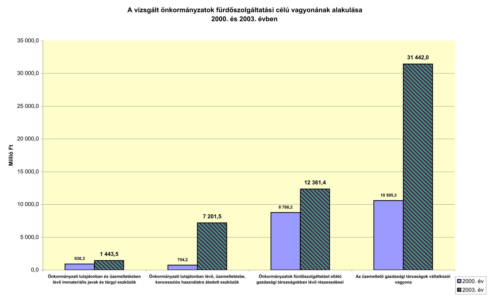

# A vizsgált önkormányzatok fürdőszolgáltatási célú vagyonának alakulása 2000. és 2003. évben

|  Ár | 2000. év | 2003. év  |
| --- | --- | --- |
|  Önkormányzati tulajdonban és üzemeltetésben lévő immateriális javak és tárgyi eszközök | 7 201.5 | 12 361.4  |
|  Önkormányzati tulajdonban lévő, üzemeltetésbe, koncessziós használatra átadott eszközök | 7 201.5 | 12 361.4  |
|  Önkormányzati tulajdonban lévő részesedései | 12 361.4 | 10 595.3  |

---

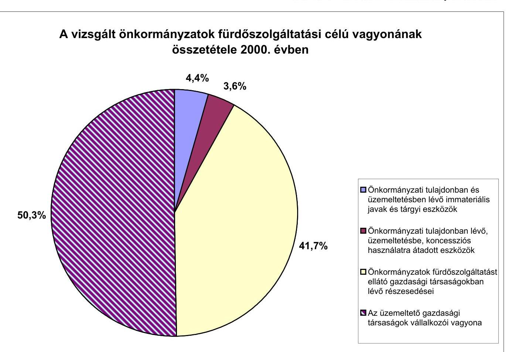

# A vizsgált önkormányzatok fürdőszolgáltatási célú vagyonának összetétele 2003. évben 

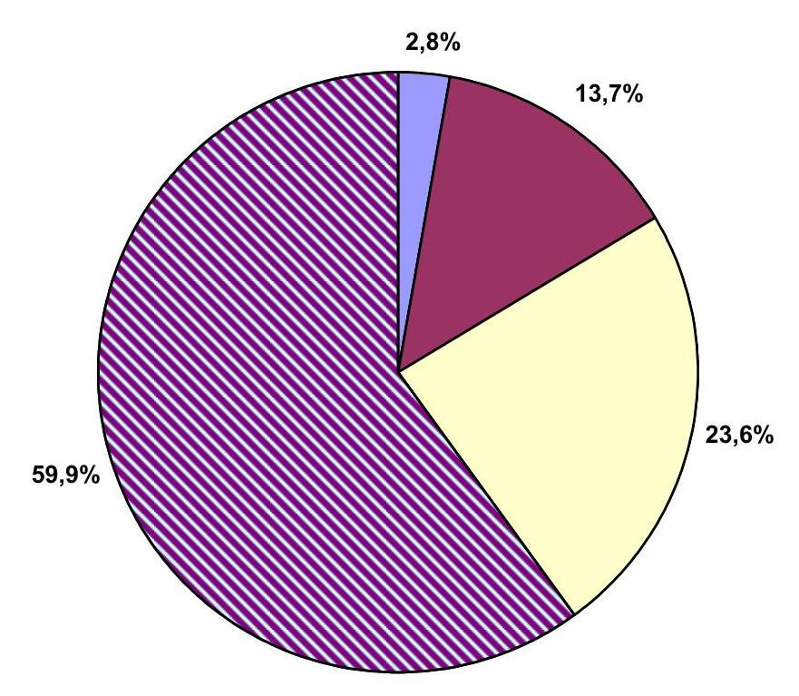
$\square$ Önkormányzati tulajdonban és üzemeltetésben lévő immateriális javak és tárgyi eszközök

- Önkormányzati tulajdonban lévő, üzemeltetésbe, koncessziós használatra átadott eszközök
$\square$ Önkormányzatok fürdőszolgáltatást ellátó gazdasági társaságokban lévő részesedései
$\square$ Az üzemeltető gazdasági társaságok vállalkozói vagyona

---

# A turisztikai célelőirányzatból biztosított támogatási keretek és az odaítélt támogatások alakulása

Adatok: millió Ft-ban

|  Év | Turisztikai célelőirányzat |  |  |  |  |  |   |
| --- | --- | --- | --- | --- | --- | --- | --- |
|   | Éves
kerete | Gyógyfürdök
fejlesztésére
tervezett
elkülönített
keret | Odaítélt támogatás |  |  |  |   |
|   |  |  | SzT-TU-1 | SzT-TU-2 | SzT-TU-21 | SzT-TU-23 | Összesen  |
|  2000. | 3773,7 | - | - | - | - | - | -  |
|  2001. | 24878,5 | 19754 | 20523 | 1130 | - | - | 21653  |
|  2002. | 28053,5 | 10846 | 1453 | 2664 | 384 | 274 | 4775  |
|  2003. | 19000,0 | 6313 | 5980 | 208 | 51 | 104 | 6343  |
|  2004. | 13873,0 | 400 | - | 48 | - | - | 48  |
|  Összesen | 89578,7 | 37313 | 27956 | 4050 | 435 | 378 | 32819  |

---

# A turisztikai célelőirányzatból a gyógyfürdő fejlesztések kerete terhére benyújtott, megítélt és az elutasított támogatások alakulása

|  Megnevezés | 2001. |  | 2002. |  | 2003. |  | 2004. |  | Összesen |   |
| --- | --- | --- | --- | --- | --- | --- | --- | --- | --- | --- |
|   | db | millió Ft | db | millió Ft | db | millió Ft | db | millió Ft | db | millió Ft  |
|  Benyújtott támogatási igény |  |  |  |  |  |  |  |  |  |   |
|   | 63 | 30114 | 90 | 26135 | 90 | 18339 | 30 | 187 | 273 | 74775  |
|  ebből: |  |  |  |  |  |  |  |  | - | -  |
|  - SzT-TU-1 | 57 | 28971 | 39 | 19229 | 60 | 18031 |  |  | 156 | 66231  |
|  - SzT-TU-2 | 6 | 1143 | 11 | 4297 | 18 | 252 | 5 | 63 | 40 | 5755  |
|  - SzT-TU-21 |  |  | 24 | 1935 | 12 | 56 | 25 | 124 | 61 | 2115  |
|  - SzT-TU-23 |  |  | 16 | 674 |  |  |  |  | 16 | 674  |
|  Odaitélt támogatás | 47 | 21653 | 21 | 4775 | 45 | 6239 | 25 | 152 | 138 | 32819  |
|  ebből: |  |  |  |  |  |  |  |  | - | -  |
|  - SzT-TU-1 | 42 | 20523 | 3 | 1453 | 23 | 5980 |  |  | 68 | 27956  |
|  - SzT-TU-2 | 5 | 1130 | 5 | 2664 | 11 | 208 | 4 | 48 | 25 | 4050  |
|  - SzT-TU-21 |  |  | 6 | 384 | 11 | 51 | 21 | 104 | 38 | 539  |
|  - SzT-TU-23 |  |  | 7 | 274 |  |  |  |  | 7 | 274  |
|  Elutasított támogatás | 16 | 7836 | 60 | 20959 | 45 | 9268 | 5 | 34 | 126 | 38097  |
|  ebből. |  |  |  |  |  |  |  |  | - | -  |
|  - SzT-TU-1 | 15 | 7823 | 36 | 17775 | 37 | 9148 |  |  | 88 | 34746  |
|  - SzT-TU-2 | 1 | 13 | 6 | 1633 | 7 | 115 |  |  | 14 | 1761  |
|  - SzT-TU-21 |  |  | 18 | 1551 | 1 | 5 | 4 | 20 | 23 | 1576  |
|  - SzT-TU-23 |  |  |  |  |  |  | 1 | 14 | 1 | 14  |
|  - Forráshiány miatt |  |  | 34 | 15771 | 10 | 3070 |  | - | 44 | 18841  |
|  - Tartalmi és formai hiány miatt | 16 | 7836 | 8 | 3687 | 53 | 7708 | 5 | 34 | 82 | 19265  |

---

# KIMUTATÁS

## a pályázatkezelőknél vizsgált támogatásokról

|  |   |   |   |   |   |
| --- | --- | --- | --- | --- | --- |
|  Sorszám | Támogatott szervezetek | Beruházás
összköltsége | Támogatás
összege | Támogatás
\%-a | Pályázat kezelő  |
|  1 | Esztergom Önkormányzati Györgyfürdő | 2877 | 720 | 25,0 | MVF Kht.  |
|  2 | Szeged Fürdővizek Szeged Kft. | 1495 | 748 | 50,0 | MVF Kht.  |
|  3 | Tapolca Termál Hotel Sport Kft. | 1549 | 774 | 50,0 | MVF Kht.  |
|  4 | Zalaegerszeg Termálfürdő bővítés | 1418 | 608 | 42,9 | MVF Kht.  |
|  5 | Békéscsaba Árpádfürdő rekonstrukció | 1000 | 474 | 47,4 | MVF Kht.  |
|  6 | Visegrád Termál Hotel Rt. | 2299 | 1010 | 43,9 | MVF Kht.  |
|  7 | Pápai Termálvizhasznosító Rt. | 1600 | 783 | 48,9 | MVF Kht.  |
|  8 | Cegléd Önkormányzati Termálfürdő | 1474 | 724 | 49,1 | MVF Kht.  |
|  9 | Gárdony Önkormányzati Termálfürdő | 1677 | 560 | 33,4 | MVF Kht.  |
|  10 | Celldömölk Önkormányzati Termálfürdő | 1120 | 560 | 50,0 | MVF Kht.  |
|   | Celldömölk Önkormányzati Termálfürdő | 200 | 100 | 50,0 | MFB Rt.  |
|  11 | Nyiregyháza Önkormányzati Termálfürdő | 1650 | 800 | 48,5 | MFB Rt.  |
|  12 | Budapest Gyógyfürdői és Hévizei Rt. (Dagály) | 154 | 50 | 32,5 | MFB Rt.  |
|  13 | Vásárosnemény VITKA Város Üzemeltetési Kht. | 634 | 250 | 39,4 | MFB Rt.  |
|  14 | Füzesgyarmat Önkormányzati Termálfürdő | 133 | 40 | 30,1 | MFB Rt.  |
|   | Összesen: | 19280 | 8201 | 42,5 |   |

---

# Kimutatás a vizsgált szervezetek részére megítélt támogatásokról 

|  |   |   |   |   |
| --- | --- | --- | --- | --- |
|  Pályázó megnevezése |  | Beruházás összköltsége | Megítélt támogatás | Támogatás az összköltség \%-ában  |
|  Budapest |  |  |  |   |
|  Budapest Gyógyfürdöi és Hévizei Rt. |  |  |  |   |
|  1 | Széchenyi Fürdő | 733 | 250 | 34,11  |
|  2 | Rudas Fürdő | 390 | 195 | 50,00  |
|  Baranya megye |  |  |  |   |
|  3 | Harkány Gyógyfürdő Rt. | 1808 | 750 | 41,48  |
|  4 | Sikonda Kft. (Komló) | 1130 | 513 | 45,40  |
|  5 | Szigetvár Város Önkormányzata | 795 | 200 | 25,16  |
|  6 | Harkányi Gyógyfürdő Kórház | 52 | 23 | 44,23  |
|  Békés megye |  |  |  |   |
|  7 | Orosháza Gyopárosi Gyógyfürdő Rt. | 1500 | 715 | 47,67  |
|  8 | Gyula Várfürdő Kft. (I-II. ütem) | 1724 | 700 | 40,60  |
|  Borsod-Abaúj-Zemplén megye |  |  |  |   |
|  9 | Miskolci Vízmüvek Rt. | 472 | 110 | 23,31  |
|  10 | Mezőkövesd Város Önkormányzata | 462 | 223 | 48,27  |
|  11 | Erzsébet Fürdő Rt. (Miskolc) (lemondás 322 millió Ft-ról) | 644 | 322 | 50,00  |
|  Hajdú-Bihar megye |  |  |  |   |
|  12 | Hajdúszoboszlói Gyógyfürdő Rt. | 2381 | 1000 | 42,00  |
|  13 | Debreceni Gyógyfürdő Kft. | 2097 | 999 | 47,64  |
|  14 | Hotel Aqua Sol Kft. (Hajdúszoboszló) | 2013 | 302 | 15,00  |
|  Heves megye |  |  |  |   |
|  15 | Szalók Holding Kft. (Egerszalók) | 2845 | 800 | 28,12  |
|  16 | Egerthermál Kft. (Eger) | 629 | 298 | 47,38  |
|  Jász-Nagykun-Szolnok megye |  |  |  |   |
|  17 | Cserkeszőlő Község Önkormányzata | 196 | 100 | 51,02  |
|  18 | Szolnoki Víz- és Csatornamü Koncesszió Rt. | 522 | 258 | 49,43  |
|  Somogy megye |  |  |  |   |
|  19 | Igal Község Önkormányzata | 9 | 5 | 55,56  |
|  20 | Nagyatád Város Önkormányzata (RFT-böl támogatott 33 millió Ft-tal) | 50 | - | 0,00  |
|  Vas megye |  |  |  |   |
|  21 | Sárvári Gyógyfürdő Kft. | 4053 | 2053 | 50,65  |
|  22 | Gotthárd Thermál Kft. (Szentgotthárd) | 1920 | 300 | 15,63  |
|  23 | Hungária Golf Kft. (Bük Gyógyközpont) | 3240 | 330 | 10,19  |
|  24 | Hungária Golf Kft. (Bük Thermálszálló) | 1770 | 685 | 38,70  |
|  25 | Büki Gyógyfürdő Rt. | 2033 | 1000 | 49,19  |
|  26 | Bük Thermál Hotel Sport | 3010 | 600 | 19,93  |
|  27 | Borgáta Község Önkormányzata (lemondás 100 millió Ft-ról) | 265 | 155 | 58,49  |
|  Zala megye |  |  |  |   |
|  28 | Lentí Gyógyfürdő Kft. | 170 | 75 | 44,12  |
|  29 | Horváth Építő Kft. (Kehidakustány) | 1386 | 640 | 46,18  |
|  30 | Hotel Carbona Gyógyszálló Rt. (Hévíz) | 386 | 160 | 41,45  |
|  31 | Hotel Carbona (szálloda bővítés) | 678 | 90 | 13,27  |
|  32 | Gránit Gyógyfürdő Rt. (Zalakaros Termálfürdő) | 424 | 175 | 41,27  |
|  33 | Gránit Gyógyfürdő Rt. (Zalakaros Élményfürdő) | 1173 | 300 | 25,58  |
|  34 | Karos Inveszt Rt. (Zalakaros) | 2562 | 560 | 21,86  |
|   | Összesen | 43522 | 14886 | 34,20  |

---

# A társadalombiztosítás által támogatott gyógyfürdőszolgáltatás alakulása szolgáltatásonként (OEP országos adatai)

|  Szolgáltatás | 2000. |  | 2004. |  | Kezelések számának
változása 2004/2000.
$\%$  |
| --- | --- | --- | --- | --- | --- |
|   | Kezelések száma
db | Megoszlás
$\%$ | Kezelések száma
db | Megoszlás
$\%$ |   |
|  01 Termál gyógymedence | 2995538 | 43,36 | 3608384 | 40,29 | 120,46  |
|  02 Termál kádfürdő | 23611 | 0,34 | 14919 | 0,17 | 63,19  |
|  03 Iszappakolás, iszapfürdő | 230905 | 3,34 | 319249 | 3,56 | 138,26  |
|  04 Súlyfürdő | 147108 | 2,13 | 177465 | 1,98 | 120,64  |
|  05 Szénsavas fürdő | 103702 | 1,50 | 80821 | 0,90 | 77,94  |
|  06 Orvosi gyógymasszázs | 1834518 | 26,55 | 2823297 | 31,53 | 153,90  |
|  07 Viz alatti sugármasszázs | 622817 | 9,01 | 735596 | 8,21 | 118,11  |
|  08 Viz alatti csoportos gyógytorna | 446716 | 6,47 | 575064 | 6,42 | 128,73  |
|  09 Komplex szolgáltatás | 186234 | 2,70 | 187378 | 2,09 | 100,61  |
|  10 Csoportos gyógyúszás | 318159 | 4,60 | 433303 | 4,84 | 136,19  |
|  Összesen: | 6909308 | 100,00 | 8955476 | 100,00 | 129,61  |

|  Szolgáltatás | 2000. |  | 2004. |  |   |
| --- | --- | --- | --- | --- | --- |
|   | TB támogatás
Ft | Megoszlás
$\%$ | TB támogatás
Ft | Megoszlás
$\%$ | TB támogatás
változása 2004/2000.
$\%$  |
|  01 Termál gyógymedence | 944524406 | 31,63 | 1382308356 | 29,60 | 146,35  |
|  02 Termál kádfürdő | 8723069 | 0,29 | 6572176 | 0,14 | 75,34  |
|  03 Iszappakolás, iszapfürdő | 151456198 | 5,07 | 251446190 | 5,38 | 166,02  |
|  04 Súlyfürdő | 60123210 | 2,01 | 85892124 | 1,84 | 142,86  |
|  05 Szénsavas fürdő | 59329011 | 1,99 | 55660520 | 1,19 | 93,82  |
|  06 Orvosi gyógymasszázs | 918651695 | 30,76 | 1684742529 | 36,07 | 183,39  |
|  07 Viz alatti sugármasszázs | 326596402 | 10,94 | 471502900 | 10,10 | 144,37  |
|  08 Viz alatti csoportos gyógytorna | 150038195 | 5,02 | 237476926 | 5,08 | 158,28  |
|  09 Komplex szolgáltatás | 266900899 | 8,94 | 314469696 | 6,73 | 117,82  |
|  10 Csoportos gyógyúszás | 99990381 | 3,35 | 180091292 | 3,86 | 180,11  |
|  Összesen: | 2986333466 | 100,00 | 4670162709 | 100,00 | 156,38  |

---

# A társadalombiztosítás által támogatott gyógyfürdőellátások esetszámainak alakulása a vizsgált szervezetekben 

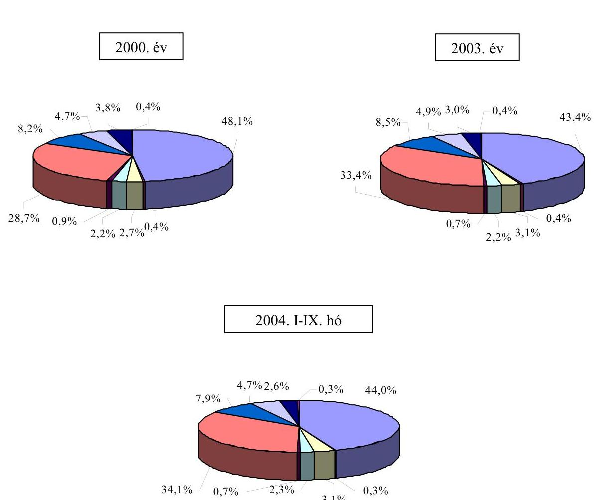

| $\square$ Termál gyógy medence, hévízi gyógy fürdő | $\square$ Termál kádfürdő |
| :-- | :-- |
| $\square$ Iszappakolás, iszap fürdő | $\square$ Súly fürdő |
| $\square$ Szénsavaskád fürdő | $\square$ Orvosi gyógy masszázs |
| $\square$ Víz alatti vízsugármasszázs | $\square$ Víz alatti csoportos gyógy torna |
| $\square$ Komplex gyógy kezelés | $\square$ Csoportos gyógyúszás 18 év alatt |

---

# KIMUTATÁS

a 2005. május 1-ig átalakítandó töltő-, ürítő rendszerü medencékről (2004. november 26-i állapot szerint)

|  Megyék felsorolása | Vízforgatásra átállítandó T-Ü medencék száma | Jóváhagyott átalakítási tervvel rendelkező medencék száma | a medencék 2005. május 1-ig történő átalakításának helyzete |  |   |
| --- | --- | --- | --- | --- | --- |
|   |  |  | átalakítja | nem alakítja át forráshiány miatt | nem nyilatkozott  |
|  Főváros | 32 | 25 | 8 |  | 22  |
|  Baranya megye | 10 | 8 | 5 | 5 |   |
|  Bács-Kiskun megye | 20 | 12 | 12 | 4 | 4  |
|  Békés megye | 10 | 8 | 2 | 6 | 2  |
|  Borsod-Abaúj-Zemplén megye | 13 | 13 | 13 |  |   |
|  Csongrád megye | 36 | 36 | 1 | 35 |   |
|  Fejér megye | 2 | 2 | 1 | 1 |   |
|  Győr-Moson-Sopron megye | 13 | 13 | 4 | 3 | 6  |
|  Hajdú-Bihar megye | 39 | 27 | 14 | 8 | 17  |
|  Heves megye | 15 | 11 | 1 | 11 | 3  |
|  Jász-Nagykun-Szolnok megye | 20 | 10 |  | 8 | 12  |
|  Komárom-Esztergom megye | 12 | 12 |  |  | 12  |
|  Nógrád megye | 4 | 3 |  | 3 | 1  |
|  Pest megye | 26 | 11 | 9 | 11 | 6  |
|  Somogy megye | 28 | 24 | 8 | 15 | 5  |
|  Szabolcs-Szatmár-Bereg megye | 22 | 22 |  |  | 22  |
|  Tolna megye | 13 | 13 | 8 |  | 5  |
|  Vas megye | 7 | 7 | 3 |  | 4  |
|  Veszprém megye | 9 | 9 | 9 |  |   |
|  Zala megye | 4 | 4 | 2 |  | 4  |
|  Összesen: | 335 | 270 | 100 | 110 | 125  |

---

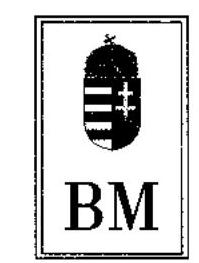

BELÜGYMINISZTER
$1-a-1 / 21 / 2005$.

Dr. Kovács Árpád úrnak, elnök

# Állami Számvevőszék 

Budapest

## Tisztelt Elnök Úr!

A helyi önkormányzati fürdők - kiemelten a gyógyfürdők - helyzete, fejlesztésének lehetőségei, hatása az idegenforgalomra és a turizmusra címü témavizsgálat megállapításáról szóló Jelentés-tervezetet köszönettel vettem. Különösen örültem annak, hogy az Állami Számvevőszék munkatársai szokásos alapossággal vizsgálták a hazánk idegenforgalmára kiemelt jelentőséggel bíró gyógyfürdők fejlesztésének, müködésének, illetőleg gazdálkodásának feltételeit. A vizsgálat eredményeként született javaslataik elöremutatóak, és véleményem szerint hasznosan fogják segiteni az egészségturizmus fejlesztési programjának szakmai fejlesztési irányait, a köz- és magánszféra együttmüködési formáinak bővitését, a finanszirozási rendszer átgondolását.

Budapest, 2005. július „ 20 „
Üdvözlettel:
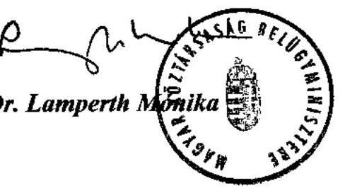

---

# EGÉSZSÉGÜGYI MINISZTÉRIUM   MINISZTER 

Iktatószám: 14686- 3 /2005-0003EGP
Hiv.szám: V-1019-122/2004-2005.
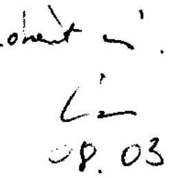

## D. Kovács Árpád úrnak elnök

Állami Számvevöszék

Budapest4.
Pf. 54.
1364

## Tisztelt Elnök Úr !

A helyi önkormányzati fürdök - kiemelten a gyógyfürdök - helyzete, fejlesztésének lehetőségci, hatása az idegenforgalomra és a turizmusra címü Állami Számvevőszék által készített jelentést, köszönettel megkaptam.

Tájékoztatom Elnök urat, hogy a jelentésben foglaltakkal egyetértek.

Budapest, 2005. július „ 21. „

## Tisztelettel:

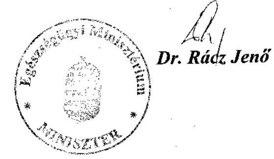

---

H-1051 BUDAPEST V., IOZSEF NÁDOR TÉR 2-4. POSTACIM: 1369 BUDAPEST, POSTAFIOK 481.

TELEFON: (36-1) 327-2159, (36-1) 327-2141
E-MAIL: janos.veres@pm.gov.hu
FAX: (36-1) 318-0738

PÉNZÜGYMINISZTER

Dr. Kovács Árpád úr
elnök

Állami Számvevőszék

## Budapest

## Tisztelt Elnök Úr!

A helyi önkormányzati fürdők - kiemelten a gyógyfürdők - helyzete, fejlesztésének lehetőségei, hatása az idegenforgalomra és a turizmusra ciniü témavizsgálat megállapításairól szóló jelentést köszönettel vettem. A jelentés-tervezet korábbi egyeztetése során tett észrevételeink többsége átvezetésre került. Így a tervezetben foglaltakkal alapvetủen egyetértek az alábbi pontositó megjegyzés mellett.

Az Egészségbiztosítási Alap által támogatott gyógyszolgáltatások finanszírozási rendjének áttekintése valós feladat, de kérem az egészségügyi és a pénzügyminiszternek tett javaslatból a ,,gondoskodjék annak közgazdasági alapoura helyezéséröl" szövegrész elhagyását.

A gyógyászati szolgáltatások iránti fizetőkcpes külföldi kereslet alapján a támogatás nélkül értékesített szolgáltatások árai relative magasak. A társadalombiztosítási támogatással történő értékesítés azért kiemelt jelentőségủ a füró́k számára, mert nagy volumenű, stabil bevételt jelent, csökkentve az állandó költségek fajlaj̧os szintjét. A 2003. évi ártárgyaláshoz benyújtott adatok is alátámasztották, hogy a támogatott és nem támogatott relációban érvényesített áraknak az utóbbi szintjén történő egységesítése a támogatás megduplázását okozná.

Kérem Elnök urat, hogy a tervezettel kapcsolatban véleményemet figyelembe venni szíveskedjék.

Budapest, 2005. július 14.
Üdvözlettel:
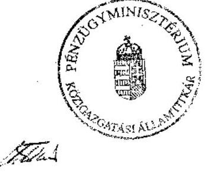

Dr. Veres János

---

# Dr. Veres János úr, pénzügyminiszter 

Pénzügyminisztérium

## Budapest

## Tisztelt Miniszter Úr!

Köszönettel megkaptam a helyi önkormányzati fürdők - kiemelten a gyógyfürdők - helyzete, fejlesztésének lehetőségei, hatása az idegenforgalomra és a turizmusra címủ vizsgálatunkról készült jelentésünkre adott észrevételét, amelyben Ön az egészségügyi és a pénzügyminiszternek tett javaslatunk korrigálását kérte.

Az egészségbiztosítás által támogatott gyógyszolgáltatások finanszírozási rendszerének jelenlegi problémái nehezítik a szolgáltatások szükségletekkel összehangolt fejlesztési irányainak kijelölését, a szolgáltatást végző szervezetek eredményességi szempontú összehasonlítását. Ezért tekintettük fontosnak, hogy az ártárgyalások közgazdasági alapokra való helyezése feltétele az ezt akadályozó tényezők felszámolásának, valamint a rendelkezésre álló költségvetési források hatékony felhasználásának.

Budapest, 2005. július „ 4 „

Tisztelettel
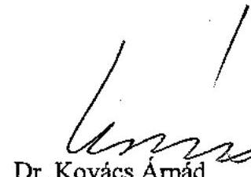

---

V-1019-128/2004-2005, számú jelentéshez
15. számú melléklet

REGIONÁLIS FEJLESZTÉSÉRT ÉS FELZÁRKÓZTATÁSÉRT
FELELŐS
TÁRCA NÉLKÜLI MINISZTER

Iktatószám: HU-UNI /2005.
Hivsz.: V-1019-122/2004-2005.

Dr. Kovács Árpád úr
elnök

Állami Számvevőszék

Budapest

Tisztelt Elnök Úr!
Kedves Árpád!

Az Állami Számvevőszék által készített, „A helyi önkormányzati fürdők –
kiemelten a gyógyfürdők – helyzete, fejlesztésének lehetőségei, hatása az
idegenforgalomra és a turizmusra” című jelentéshez észrevételt nem teszek.

Budapest, 2005. augusztus „5.„

Üdvözlettel:

Dr. Kolber István

Levalazási cím: 1357 Budapest, Pf.2. irodsház: 1015 Budapest, Hatryú u. 14.
Tel: 441-7108, Fax: 441-7102

---

# A helyszíni ellenőrzésbe bevont önkormányzatok és fürdőket üzemeltető szervezetek jegyzéke 

| Megye | Önkormányzat | Üzemeltető |
| :--: | :--: | :--: |
| Baranya megye | Baranya Megyei Önkormányzat |  |
|  | Harkány Városi Önkormányzat | Harkányi Gyógyfürdő Rt. |
|  | Komló Városi Önkormányzat | Sikonda Kft. |
|  | Szigetvár Városi Önkormányzat | Szigetvíz Kft. |
| Békés megye | Gyula Városi Önkormányzat | Gyula Várfürdő Kft. |
|  | Orosháza Városi Önkormányzat | Orosháza Gyopárosi Gyógyfürdő Rt. |
| Borsod-AbaújZemplén megye | Tiszaújváros Városi Önkormányzat | Tiszaszolg 2004. Kft. |
|  | Miskolc Megyei Jogú Város Önkormányzata | Miskolci Vízmúvek Rt. |
|  | Mezőkövesd Városi Önkormányzat | Mezőkövesdi Városgazdálkodási Rt. |
| Hajdú-Bihar megye | Debrecen Megyei Jogú Város Önkormányzata | Debreceni Gyógyfürdő Kft. |
|  | Hajdúszoboszló Városi Önkormányzat | Hajdúszoboszló Gyógyfürdő Rt.   Hotel Aqua Sol Kft. |
| Heves megye | Eger Megyei Jogú Város Önkormányzata | Egertermál Kft. |
|  | Egerszalók Községi Önkormányzat | Szalók Holding Kft. |
| Jász-NagykunSzolnok megye | Jász-Nagykun-Szolnok Megyei Jogú Város Önkormányzata | Szolnoki Víz- és Csatornamú Koncessziós Rt. |
|  | Cserkeszőlő Községi Önkormányzat | Községi Önkormányzati Fürdő és Vízi Közmú |

---

| Somogy   megye | Nagyatád Városi Önkormányzat | Nagyatádi Kórház Termál és Gyógyfürdő Intézmény |
| :--: | :--: | :--: |
|  | Igal Nagyközségi Önkormányzat | Igal Fürdő Kft. |
| Vas megye | Szentgotthárd Városi Önkormányzat | Gotthárd Termál Kft. |
|  | Sárvár Városi Önkormányzat | Sárvári Gyógyfürdő Kft. |
|  | Bük Községi Önkormányzat | Büki Gyógyfürdő Rt.   Bük Radisson Sas Kft. |
|  | Borgáta Községi Önkormányzat | Borgáta Forrás Bt. |
| Zala megye | Hévíz Városi Önkormányzat | Aquamarin Szálloda Kft. |
|  | Zalakaros Városi Önkormányzat | Gránit Gyógyfürdő Rt. |
|  | Lenti Városi Önkormányzat | Lenti Gyógyfürdő Kft. |
|  | Kehidakustány Községi Önkormányzat | Kehida Termál Gyógyfürdő Üzemeltető és Szolgáltató Kft. |
| Budapest | Budapest Főváros Főpolgármesteri Hivatala | Budapest Gyógyfürdői és Hévizei Rt. (9 fürdő) |

---

# Florena Gazdasági Tanácsadó és Kereskedelmi Kft. hatásvizsgálatának összegzése 

A kutatási összefoglaló szerint a beruházási programokat műszaki szempontból teljes körűen végrehajtották, a tervezett és a tényleges bekerülési összeg kismértékben és csak annyiban tért el egymástól, ami a megvalósult múszaki tartalom változása indokolt.

A megvalósított 35 projekt pályázatban vállalt összköltsége 30726 millió Ft volt, amely 32205 millió Ft összegben teljesült. A pályázat szerinti 14630 millió Ft támogatás pedig 14029 millió Ft összegben realizálódott.

A fejlesztések megvalósításához a 11465 millió Ft saját forrás biztosítása mellett 6389 millió Ft hitelt és 320 millió Ft egyéb forrást vettek igénybe.

A gyógyfürdőfejlesztések esetében a pályázat szerinti projekt-összköltsége és a ténylegesen megvalósult beruházások bekerülési értéke közötti eltérés $+4,6 \%$ volt. A tervezett és a megvalósult beruházások pénzügyi teljesítése közötti eltérések okait a következők mutatják.

A gyógyfürdőket vizsgálva a tervezett és a tényleges projektérték-adatok a következőképpen csoportosíthatók:

- hét gyógyfürdő esetében (20\%) a tervezett érték megegyezett a tényleges bekerülési értékkel;
- két gyógyfürdő kevesebb támogatást kapott, mint igényelt, ezért a projekt összértéke is lecsökkent;
- 26 gyógyfürdő beruházás (74\%) összköltsége meghaladta a tervezettet.

A tervezettet meghaladó összköltség növekedés okai:

- műszaki tartalom változása, ez általában a projekt színvonalának emelkedését jelentette;
- 1-2 év időbeli eltolódás volt tapasztalható a tervezési és kivitelezési fázis között, az általában nem túl gyakorlott beruházók nem minden esetben tudták az anyagok árváltozását prognosztizálni, időközben megdrágult a közbeszerzési eljárás lefolytatása;
- a tervezett és a tényleges összköltségek közötti eltérések számos esetben viszszavezethetők a megvalósulási időtényezőre: többször is előfordult, hogy a tervezési, megvalósulási időszakban valamely szereplő anyagi helyzete megváltozott, ez lehetett akár a beruházó is, s ekkor hitelt kellett felvenni, más forrást kellett bevonni, s ez „borította" a költségvetést is;
- tervezési hibák miatt néhány esetben módosítani kellett a projektet.

Azoknál a fejlesztéseknél, ahol a múszaki tartalom változása pótlólagos medence (medencék) építést jelentette, ott általában élmény, illetve élmény-

---

elemekkel rendelkező medencéket hoztak létre. A kutatás tapasztalatai jelezték, hogy számos helyen a megvalósítás során ismerték fel, hogy a gyógyturizmus mellett nyitni kell a belföldi gyermekes családok felé is.

Az egészségturisztikai vonzerők fürdőszakmai szempontú hatásvizsgálata a következőket mutatta.

A vizsgálatba bevont gyógyfürdőfejlesztésre pályázók összesen 1006 új munkahely megteremtésére vállaltak kötelezettséget, s végeredményben a beruházások eredményeként összesen 1182 új munkahelyet teremtettek, amelynek a közvetett munkahelyteremtő hatása mintegy 2350 munkahelyet jelent. (Fizetővendéglátás, étkeztetés stb.)

A kutatás adatai szerint a szezon átlagos hossza a fejlesztések előtti 221 napról a beruházások eredményeképpen 316 napra nőtt, ami 95 napos, azaz 43\%-os növekedésnek felel meg. Ebből következően a kutatás alá vont fejlesztések egyik legfontosabb céljukat elérték, a szezon hosszát számottevően megnövelték.

# Medencék számának alakulása a fejlesztés után 

| Megnevezés | Medenceszám |  | Változás   db |
| :-- | :--: | :--: | :--: |
|  | Fejlesztés előtt   (db) | Fejlesztés után   (db) |  |
| 16 medencés vagy több fürdő | 108 | 133 | 25 |
| 5-15 medencés fürdők | 76 | 172 | 96 |
| 3-4 medencés fürdő | 8 | 18 | 10 |

A legnagyobb volumenú medenceszám fejlesztésre a zöldmezős beruházásokon kívül Kehidán, Büki Gyógyfürdőben, Zalaszentgróton, Harkányban, Szentesen, Zalakaroson, Hajdúszoboszlón, Tótkomlóson és Túrkevén került sor. A 2003. december 31-i állapot szerint a legtöbb medence Hajdúszoboszlón, Debrecenben, Büki gyógyfürdőben és Zalakaroson üzemel. Hat helyen (Debrecen, Gyula, Cserkeszőlő, Eger, Jászapáti és a Római Strandfürdő) a beruházás nem a medenceszám növelésére, hanem átépítésre, rekonstrukcióra, téliesítésre irányult.

A fejlesztések eredményeként a medencék vízfelszíne mintegy 31 ezer $\mathrm{m}^{2}$-rel, azaz összességében mintegy $47 \%$-kal nőtt. Ezen belül a nyári medencék vízfelszíne közel $50 \%$-kal, míg a téli medencéké $41 \%$-kal bővült.

Az egy medencére jutó átlagos vízfelület mind a nyári, mind a téli medencék esetében csökkent, mivel olyan, viszonylag kisebb vízfelületű medence jött létre, amely élményelemeket tartalmazott.

A medencék víztérfogata összességében mintegy $40 \%$-kal nőtt, de hasonlóan a vízfelszínhez a fejlesztések eredményeként az átlagos medencetérfogat is csökkent. A fejlesztések eredményeként azonban összességében éves vízfelhasználás mintegy $5 \%$-kal csökkent.

---

A kutatás adatai szerint a fejlesztések hatása a gyógyfürdők éves befogadóképessége 50,5\%-kal nőtt. A fejlesztések eredményeként a 2003. évben 2477891 fő többletlátogatót regisztráltak.

A GKM Turisztikai Hivatal által készített hatásvizsgálat foglalkozott a gyógyfürdők marketing tevékenységével, amelynek során elemezték, hogy milyen marketing kommunikációs tervvel rendelkeznek, milyen turisztikai szervezetekkel, intézményekkel tartanak kapcsolatot.

A kutatási összefoglaló rávilágít arra, hogy a gyógyfürdők marketingtevékenysége, a menedzsmentek többsége nem vagy csak részben értette meg a turizmusban rejlő lehetőségeket. A kisebb fürdők a komoly fejlesztések ellenére sem tudtak szakítani az évtizedes beidegződésekkel, marketingjük, mindenekelőtt a helyi látogatók számának növelését célozzák. A közepes és nagyobb fürdők már több olyan eseményt is szerveztek, amelyek esetében 30-40 km-es körben, megfelelő reklám mellett regionális érdeklődést keltettek. A gyógyfürdők látogatottsági adatai azt támasztják alá, hogy a gyógyfürdők nem rendelkeznek külföldi vendégeket eredményesen megcélzó marketinggel.

---

# A társadalombiztosítás által támogatott hét leggyakoribb gyógykezelés 

Termálfürdő
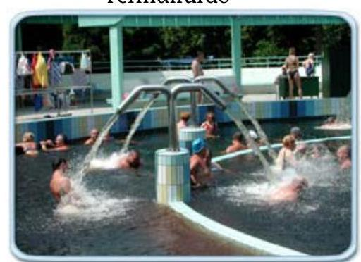

Szénsavfürdő
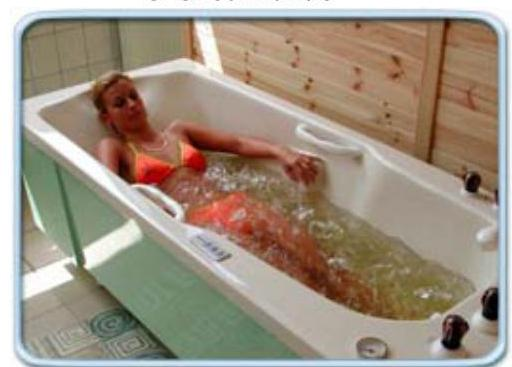

Vízalatti gyógytorna
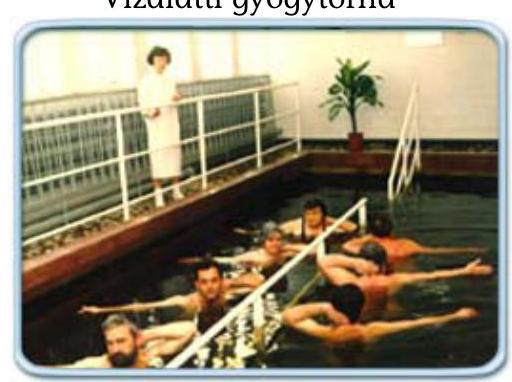

Vízalatti vízsugármasszázs
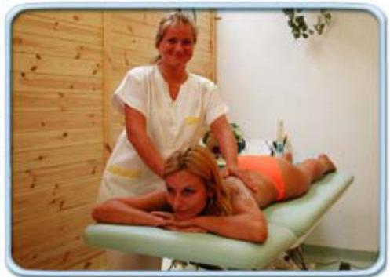

Víz alatti vízsugármasszázs
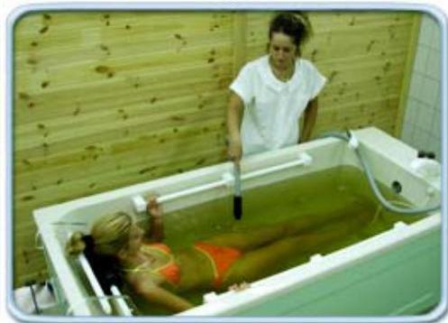

Súlyfürdő
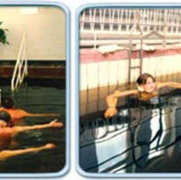

Iszapkezelés
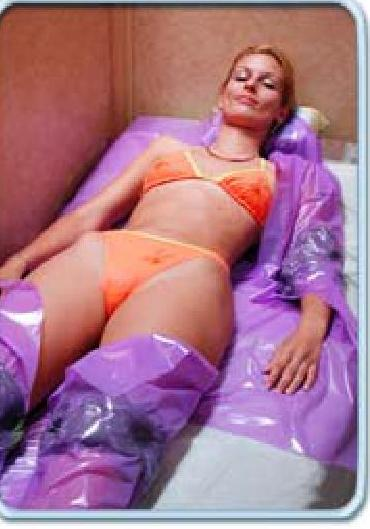