# JELENTÉS 

a családpolitikai célok teljesülését
szolgáló egyes pénzösszegek
hasznosulásának ellenőrzéséről

---

# 2. Államháztartás Központi Szintjét Ellenőrző Igazgatóság 

2.1 Teljesítmény Ellenőrzési Főcsoport

Iktatószám: V-35-127/2004-2005.
Témaszám: 746
Vizsgálat-azonosító szám: V0153

## Az ellenőrzést felügyelte:

Bihary Zsigmond
föigazgató
Az ellenőrzés végrehajtásáért felelős:
Kemény Emil
főcsoportfőnök
Az ellenőrzést vezette:
Dr. Beregi Anna
osztályvezető főtanácsos
Az ellenőrzést végezték:

| Farkas Ildikó | Federics Adrienn | Kriston-Vizi János |
| :-- | :-- | :-- |
| számvevő | számvevő | számvevő tanácsos |
| Dr. Székely Edit | Zachár Péterné |  |
| számvevő | számvevő tanácsos |  |

Jelentéseink az Országgyűlés számítógépes hálózatán és az Interneten a www.asz.hu címen is olvashatók.

---

# TARTALOMJEGYZÉK 

BEVEZETÉS ..... 7
I. ÖSSZEGZŐ MEGÁLLAPÍTÁSOK, KÖVETKEZTETÉSEK, JAVASLATOK ..... 10
II. RÉSZLETES MEGÁLLAPÍTÁSOK ..... 15

1. A családpolitikai célok megvalósításának feltételrendszere ..... 15
1.1. Szervezeti feltételek ..... 15
1.2. A pályázati célok összhangja a Minisztérium családpolitikai koncepciójával és a Kormányprogrammal ..... 17
2. A fejezeti kezelésű családpolitikai támogatások felhasználása ..... 19
2.1. A pályázatokkal és az egyedi döntésekkel kapcsolatos előirányzatok, felhasználásuk és ellenőrzésük ..... 21
2.1.1. A 2000. év ..... 21
2.1.2. A 2001-2002. év ..... 21
2.1.3. A 2003-2004. év ..... 24
2.2. A pályáztatás bonyolítása és elbírálása ..... 25
2.3. A pályázatok ellenőrzése, értékelése ..... 28
3. A helyszínen vizsgált programok megvalósítása és értékelése ..... 30
3.1. A nehéz élethelyzetben lévő családok segítése céljára meghirdetett pályázatok ..... 32
3.2. Csoportvezető, animátor képzésre kiírt pályázatok ..... 35
3.3. Írott és elektronikus kiadványok megjelentetésére meghirdetett pályázatok ..... 37

## MELLÉKLETEK

1. sz. melléklet: Észrevétel
2. sz. melléklet: Törvényekben nevesített családpolitikai eszközrendszer
3. sz. melléklet: Családsegítés a szociális igazgatásról és szociális ellátásokról szóló 1993. évi III. törvény alapján
4. sz. melléklet: Vizsgálati kritériumok
5. sz. melléklet: Kérdőívvel megkeresett szervezetek
6/a. - 6/b. sz. ICsSzEM nyilatkozatai a dokumentumokról melléklet:
7/a. - 7/c. sz. ICsSzEM és Foglalkoztatáspolitikai és Munkaügyi Minisztérium levele-

---

melléklet: zése feladat átadás-átvételről
8. sz. melléklet: Családpolitikai pályázatok tematikájának időrendi áttekintése 20002004. év
9. sz. melléklet: Táblázatok jegyzéke
10. sz. melléklet: A nehéz élethelyzetben lévő családok segítésének pályázati célcsoportjai és azok elérése a beszámolók alapján

---

# RÖVIDÍTÉSEK JEGYZÉKE 

| áfa | általános forgalmi adó |
| :-- | :-- |
| gyed | gyermekgondozási díj |
| gyes | gyermekgondozási segély |
| gyet | gyermeknevelési támogatás |
| NCsSzI | Nemzeti Család- és Szociálpolitikai Intézet |
| Minisztérium | Ifjúsági, Családügyi, Szociális és Esélyegyenlőségi Minisz- |
|  | térium és jogelődei |
| Tervezet | Nemzeti Családpolitikai Koncepció |
| SzMSz | Szervezeti és Múködési Szabályzat |

---

# ÉRTELMEZŐ SZÓTÁR 

Animátor

Családgondozás

Családsegítés

Családsegítő szolgálat

Családsegítő szolgáltatás

Családterápia

Észlelő jelzőrendszer

Az a személy vagy házaspár, aki a család csoportok, klubok, alkalmi rendezvények, segítségnyújtó programok vezetését, szervezését végzi, és elsősorban a házasságra és a családi életre vonatkozó személyes tapasztalata átadásával segíti a családokat és a házasságra készülőket.

A szociális munka módszere. Többszöri kapcsolattartás keretében végzett komplex szakmai tevékenység. A kapcsolattartás gyakoriságára és időtartamára a klienssel a probléma rendezésére kötött szerződésben foglaltak az irányadóak.

A családsegítő szolgáltatásban nyújtott általános és speciális segítő szolgáltatás olyan személyes szociális szolgáltatás, amely a szociális munka eszközeinek és módszereinek felhasználásával hozzájárul az egyének, a családok, valamint a különböző közösségi csoportok jólétéhez és fejlődéséhez, továbbá a szociális környezetükhöz való alkalmazkodáshoz.

A szociális munka egyik módszere. A családban megjelenő problémákat egységben szemlélve nyújt segítséget.

A családok komplex segítését célzó intézményrendszer, ahol különböző segítő foglalkozású emberek team munkában dolgoznak.

A családsegítő szolgáltatás általános és speciális segítő szolgáltatás keretében a települési önkormányzat segítséget nyújt a múködési területén élő szociális, és mentálhigiénés problémái vagy krízishelyzete miatt segítséget igénylő személynek, családnak az ilyen helyzethez vezető okok megelőzéséhez, a krízishelyzet megszüntetése, valamint az életvezetési képesség megőrzése céljából. A települési önkormányzat köteles legalább általános segítő szolgáltatást biztosítani az egyének és családok számára.

Szociális munkás vagy más végzettségű családterapeuta olyan beavatkozása, mely a családot egységes egészként szemléli. E megközelítés az egyének alkotta teljes rendszerre összpontosít, és a személyközi kommunikációs kapcsolatokban megkísérli a szerepek tisztázását, az adaptív viselkedések megerősítését.

A családsegítő szolgáltatást nyújtó által létrehozott és múködtetett rendszer, amely folyamatosan figyelemmel kíséri a településen élők szociális és mentálhigiénés hely-

---

Közösségi és szociális csoportmunka

Kirízis

Mediáció

Megelőzés

Speciális segítő szolgáltatás
zetét, felismeri, feltárja, szükség esetén jelzi a családsegítő szolgálat felé a veszélyeztető okokat, együttmúködik a probléma megoldásában. Tagjai: egészségügyi szolgáltatók, oktatási intézmények, gyermekjóléti szolgálat, gondozási központ, valamint társadalmi szervezetek, egyházak, magánszemélyek.

Közösségi csoportmunka: A szociális munka módszere. Adott település vagy lakóhely problémáinak felismerése és megoldása a feladata. Típusai: Közösség-építő/közösség-fejlesztő, Közösség-tervező Közösségszervező szociális munka.

Szociális csoportmunka: a szociális munkás közvetítés egyik irányultsága és módszere, amelyben hasonló érdekű vagy közös problémákkal küzdő egyének kis létszámú csoportja rendszeresen összegyúlik, és olyan tevékenységet végez, amely segít közös céljaik elérésében.

Lelki válság. Fenyegetettség, váratlan veszteség hatására bekövetkező, a személyiséget súlyosan veszélyeztető lelki állapot, mely során a korábban eredményesen alkalmazott probléma megoldási képességek csődöt mondanak. A személyiség beszúkül, -az adott veszteségre - eszköztelenné válik.

Vitázó felek közötti közvetítés annak érdekében, hogy a felek felismerjék különbözőségeiket, kompromisszumot kössenek és kölcsönösen kielégítő megoldásokat találjanak.

Szociális munkások és mások által tett lépések, melyek minimalizálják, illetve kiküszöbölik azokat a társadalmi, pszichológiai és egyéb feltételeket, melyekről tudják, hogy fizikai és érzelmi betegségeket, illetve néha társadalmi, gazdasági problémákat okoznak, vagy hozzájárulnak ezek felléptéhez. Ebbe tartozik azon társadalmi feltételrendszer létrehozása is, amely lehetővé teszi egyének, családok és közösségek számára a változtatás lehetőségét. Formái az elsődleges-, másodlagos-, illetve harmadlagos prevenció.

Családokat segítő speciális szolgáltatások különösen a családok kapcsolat-építését szolgáló közösségépítő, családterápiás, konfliktuskezelő mediációs programok és szolgáltatások, valamint a nehéz helyzetben élő családokat segítő szolgáltatások. Speciális szolgáltatásként kell biztosítani az ifjúsági tanácsadás és az információs szolgáltatásokat biztosító programokat is. A speciális szolgáltatások megszervezése során különös figyelemmel kell lenni a roma népesség speciális helyzetéből adódó problémák kezelésére.

---

Személyes szociális szolgáltatások

Szociális munka

Azok a szociális szolgáltatások, melyeknek alapvető célja az emberek, illetve az emberek és környezetük közötti kapcsolatok erősítése és a szociális kiteljesedés lehetőségének biztosítása. A személyes szociális szolgáltatások körébe tartozik a tanácsadás és irányítása, a kölcsönös segítséget nyújtó és önsegítő csoportok kifejlesztése, a családtervezés valamint az időseknek és a gyermekeknek nyújtott szolgáltatások. Bizonyos szempontból a személyes szociális szolgáltatásoktól megkülönböztetendőek az olyan szociális szolgáltatások, mint pl. a csak segélyező programok, a csak lakást, munkát, gyógyulást stb. biztosító szolgáltatások.

A szociális munka az a professzionális tevékenység, mely segíti az egyéneket, csoportokat és közösségeket, azok társadalmi múködési kapacitásának javításában, vagy helyreállításában, és e cél eléréséhez kedvező társadalmi feltételeket teremt.

---

# JELENTÉS   a családpolitikai célok teljesülését szolgáló egyes pénzösszegek hasznosulásának ellenőrzéséről 

## BEVEZETÉS

Az állam családvédelmi, családtámogatási feladatai az Alkotmányon, az Európai Szociális Kartán és más törvényeken alapulnak. A családpolitika intézményrendszerét és a támogatásokat szabályozó, rendszert meghatározó jogszabályok: a szociális igazgatásról és a szociális ellátásokról szóló 1993. évi III. törvény, a gyermekek védelméről és a gyámügyi igazgatásról szóló 1997. évi XXXI. törvény, a családok támogatásáról szóló 1998. évi LXXXIV. törvény, valamint a mindenkori állami költségvetési törvények. Támogatást, illetve kedvezményt tartalmaz a személyi jövedelemadóról szóló 1995. évi CXVII. törvény, továbbá a Munka Törvénykönyvéről szóló 1992. évi XXII. törvény, a kötelező egészségbiztosítás ellátásairól szóló 1997. évi LXXXIII. törvény. A felsorolt, rendszert meghatározó törvények nevesített családpolitikai eszközrendszerét a 2. és 3. sz. melléklet mutatja be.

Az ágazati alaptörvények megalkotása után a mindenkori családpolitikát meghatározó kormányprogramok rendszerszerű változást nem terveztek, de a támogatások nagyságrendjében és céljában változtatták a preferenciákat. Az 1998-2002. évi Kormányprogram a népességfogyás megállítását, a családi élet biztonságának újrateremtését, a legrászorultabbak mellett az önmagukért tenni akarók támogatását tűzte ki célul. Mindezek megvalósításában számított a helyi közösségek megelőző, támogató szerepére és szerződéses alapon ösztönözni, finanszírozni kívánta a civil szervezeteket és egyházakat állami feladatok átvételére. A 2002-2006. évi Kormányprogram minden gyermeket nevelőnek enyhíteni kívánta az anyagi terheit. A családok életfeltételeinek javítására számos intézkedést sorolt fel a pénzbeli családtámogatások növelésével. A civil szervezetek, kezdeményezések preferálása helyett - célzottan - az egyénekhez kívánta eljuttatni a támogatásokat. A 2004-2006. évi Kormányprogramban kiemelten szerepel a gyermekvédelem, a gyermekbántalmazás megelőzése és az esélyegyenlőség.

A legszélesebb kört érintő támogatásokra (családi pótlék, gyed, gyes, gyet, anyasági támogatás, terhességi-gyermekágyi segély, családi adókedvezmény, rendszeres gyermekvédelmi támogatás) $439,5 \mathrm{Mrd}$ Ft ${ }^{1}$-ot folyósítottak 2004-ben.

[^0]
[^0]:    ${ }^{1}$ Várható tényszám.

---

Az Ifjúsági, Családügyi, Szociális és Esélyegyenlőségi Minisztérium és jogelődei (a továbbiakban együtt: Minisztérium) többéves gyakorlata szerint fejezeti kezelésű előirányzataiból támogatja a család-, gyermekvédelmi intézmények, szolgáltatások, a családsegítés korszerűítését, fejlesztését. 2000-2004 között a költségvetés a családsegítő és gyermekvédelmi programok támogatására 5,4 Mrd Ft előirányzatot biztosított.

A Minisztérium szakmapolitikai elképzeléseinek közvetlen megvalósulását a fejezeti kezelésű előirányzatokból pályázattal vagy egyedileg odaítélhető keretösszegek szolgálták, amelyek felhasználásának értékelése volt jelen vizsgálat tárgya. Az e célra tervezett összeg 2000-ben $267 \mathrm{MFt}^{2}$, 2001-ben 1000 M Ft , 2002-ben 1400 M Ft, 2003-ban $30 \mathrm{MFt}^{3}$, 2004-ben $58 \mathrm{MFt}^{4}$ volt. Az ellenőrzést indokolta továbbá, hogy ezek a pénzösszegek a családtámogatás általános rendszerétől elkülönülő célokat szolgáltak.

2001-2002-ben fejezeti kezelésű előirányzatként megemelt keretösszeg jelent meg, a kormányprogram végrehajtására vonatkozó közvetlen utalással. A tárca „továbbfejlesztési modellként" preventív szemléletű tevékenységek újszerű kezdeményezéseit és a civil szféra erőteljes bevonását támogatta.

A preventív tevékenységek kívánt hatásainak értékelése csak hosszabb időtávon lehetséges, ezért ellenőrzésünk a programok eredményességét és a pénzfelhasználás hatékonyságát a szerződéses cél szerinti megvalósulásban és pénzfelhasználásban jelölte meg.

Helyszíni ellenőrzésre a 2000-2004-ben a családpolitikai programokon belül meghirdetett pályázatok közül a nehéz élethelyzetben lévő családok segítése alprogramot, a csoportvezető, animátor képzést, valamint a családdal foglalkozó írott és elektronikus kiadványok készítését választottuk ki. A pályázatnyertes szervezetek helyszíni vizsgálatra kiválasztásának szempontja volt, hogy

- a nehéz élethelyzetben lévő családokat segítő szolgáltatások támogatása a vizsgált öt évből négyben eltérő megnevezéssel, de hasonló tartalommal szerepelt a Minisztérium pályázati kiírásaiban;
- a kategóriák között a 2001-2002. években szereplő csoportvezető, animátor képzés és írott, elektronikus kiadványok támogatása tárgyi eredményeket produkált, továbbá közülük egy pályázat átlagos támogatásának összege az összes kategóriában nyertes pályázatok között a legmagasabb volt.

A helyszíni ellenőrzésre kijelölt szervezetek száma az ellenőrzés folyamán 2-vel, a pályázati programok száma pedig 64-ről 71-re egészült ki.

Az ellenőrzés célja annak értékelése volt, hogy

[^0]
[^0]:    ${ }^{2}$ A gyermekvédelmi és a családsegítő programokra összevont, tovább nem bontott előirányzat.
    ${ }^{3}$ A fejezeti kezelésű előirányzatok 2003. évi felhasználási tervében szereplő előirányzat.
    ${ }^{4}$ A gyermekjóléti alapellátások fejlesztésével együttes, tovább nem bontott előirányzat a fejezeti kezelésű előirányzatok 2004. évi felhasználási tervében.

---

- a fejezeti kezelésű családpolitikai előirányzatok céljai összhangban voltak-e a szakmapolitikai célokkal, az előirányzatok eredményes felhasználásához a szaktárcánál rendelkezésre álltak-e a megfelelő szervezeti, szabályozási és ellenőrzési feltételek;
- a vonatkozó pályázati rendszer, a pályáztatás lebonyolítása, monitorozása és ellenőrzése, valamint a pályázaton kívüli előirányzat-felhasználás a gyakorlatban biztosította-e a kitűzött célok elérését;
- a nehéz élethelyzetben lévő családokat segítő szolgáltatások, a családdal foglalkozó írott kiadványok megjelentetése és a csoportvezető, animátor képzés pályázati programokban résztvevők sikeresen valósították-e meg a számukra előírt, illetve az általuk kitűzött célokat.

Az ellenőrzést teljesítmény-ellenőrzési módszerrel hajtottuk végre. Az ellenőrzés szempontjainak megalapozását képező kritériumokat és azok értékelését a 4. sz. melléklet tartalmazza.

Az ellenőrzéshez az Állami Számvevőszékről szóló 1989. évi XXXVIII. törvény 2. §-ának (3) és (5) bekezdése ad jogszabályi alapot.

Az ellenőrzés alapvetően a 2000-2004. évi időszakra, kiemelten a 2001-2002. év új tartalmú pályázataira irányult, de az egyeztetési folyamat lezárásáig (2005. július) figyelemmel kísértük a változásokat.

A helyszíni ellenőrzés a Minisztériumra, a Nemzeti Család- és Szociálpolitikai Intézetre (a továbbiakban: NCsSzI), továbbá a következő támogatást nyert szervezetekre terjedt ki: Alfa Szövetség, Családi Szolgálatok Ligája Alapítvány, Down Alapítvány (jogutóda: Csupaszívek Társasága), Házas Hétvége Katolikus Alapítvány, Kék Világ Alapítvány, Közös Jövőnk a Család Egyesület, Magyar Családsegítő és Gyermekjóléti Szolgálatok Országos Egyesülete, Magyar Cserkészszövetség, Magyar Ökumenikus Szeretetszolgálat, Magyar Videotréning Egyesület, Nap Klub Alapítvány, Napraforgó Családsegítő és Gyermekjóléti Szolgálat, Nemzetközi Pető András Közalapítvány, Országos Lelkipásztori Intézet, Sapientia Szerzetesi Hittudományi Főiskola, S.O.S. Krízis Alapítvány, Szentimrevárosi Egyesület, Terézvárosi Családsegítő Szolgálat, Van Kiút Alapítvány, Videobank Alapítvány.

Kérdőívet dolgoztunk ki a helyszíni vizsgálatba nem vont pályázat-nyertesek véleményének megismerésére, amelyet 69 szervezetnek küldtünk meg, akik közül 49 szervezet válaszolt (5. sz. melléklet).

A jelentés-tervezetet az ifjúsági, családügyi, szociális és esélyegyenlőségi miniszter asszonynak egyeztetésre megküldtük, aki egyetértéséről és a javaslatok megvalósítására intézkedési terv elkészítéséről tájékoztatott. Az észrevételt az 1. számú melléklet tartalmazza.

---

# I. ÖSSZEGZŐ MEGÁLLAPÍTÁSOK, KÖVETKEZTETÉSEK, JAVASLATOK 

#### Abstract

Az ellenőrzött időszak három kormányprogramjában megfogalmazott családpolitikai célokat szolgáló vizsgált források felhasználásában a támogatások maradványösszegei a teljesítettekhez viszonyítva évente 85,0\%, $35,2 \%, 19,8 \%, 4,1 \%, 1,2 \%$ arányúak voltak. A pályázati programok $95 \%$-a a meghirdetett céloknak megfelelően valósult meg, ebből $34 \%$ a pályázati időszak után a programot nem folytatta.

A pályázattal vagy egyedi elbírálás alapján juttatott, a mindenkori kormányprogramhoz illeszkedő támogatásokból a tervezett programok valósultak meg, de hatással volt az eredményesség megítélhetőségére, hogy a pályázatok szakmai megalapozásának, az egyes alprogramok tartalmi meghatározásának döntés-előkészítő dokumentumai nem voltak fellelhetők. Az egyes témák kijelöléséhez nem kapcsolódott olyan előkészítettség, ami egyértelműen követhetővé tette volna az elérni kívánt cél megvalósításának kritériumait, továbbá lehetőséget nyújtott volna annak tisztázására, hogy a pályázatok a meghirdetett feladatot és/vagy a pályázó szervezetet támogatták. A megítélt támogatások érdemi szakmai értékelése, az elnyert támogatások eredményességének, hatékonyságának folyamatos figyelemmel kísérése, tapasztalatainak gyakorlati hasznosítása elmaradt. Az igényeltnél kisebb vagy (ritkán) nagyobb támogatási összegből a Minisztérium - a támogatási szerződésben rögzítetten - az eredeti program végrehajtását követelte meg, a megvalósíthatóság értékelése nélkül.

A célok érdekében megvalósult pályázati programok tehát részben voltak eredményesek.

Az 1998-2002. évi Kormányprogram és a 2001-ben elkészült, a Kormány által tárgyalt, de nem elfogadott Nemzeti Családpolitikai Koncepció (a továbbiakban: Tervezet) a családi élet biztonságának újrateremtését, a gyermekvállalás feltételeinek javítását, a népesség fogyásának megállítását, valamint az állami feladatok átvállalásában az egyházi és civil szervezetek ösztönzését határozta el. A pályázati célok 2000-ben a gyermekvédelmi törvény, illetve a szociális törvény család- és gyermekvédelmi feladatai megvalósításának támogatása voltak, ezen belül preferálták a család- és gyermekvédelmi közfeladatok ellátását vállaló nem állami szektort. 2001-ben célul tűzték ki - a Tervezetben foglaltak alapján - a családi életre felkészítő, családi közösséget építő, valamint segítő programok és egyéb, a családi életet erősítő szolgáltatások létrehozását és múködtetésének támogatását, illetve külföldi programok adaptációját, továbbá a már múködő programok hatékonyabb múködtetésének támogatását. 2002ben a pályázatok célja az előző évivel egyezően került meghatározásra, kivételt képeztek a nem folytatódó alprogramok: a generációk együttműködése, továbbá az ifjúsági csoportok és klubok támogatása.

A 2002-2006. évi Kormányprogram a biztonságot adó család- és gyermekpolitikát hirdette meg, amelyben a családtámogatási rendszer nem tesz különbséget érdemek és családtípusok, támogatási formák és támogatási csatornák kö-

---

zött. A 2004-2006. évi Kormányprogram igazságos gyermektámogatást ígért, ezen belül a Biztos Kezdet program kiterjesztését, amelynek célja az egészségügyi, gyermekjóléti, oktatási szolgáltatások eljuttatása a legrosszabb helyzetben lévő családoknak, továbbá fellépést a családon belüli erőszak ellen. A családpolitikai célok támogatásának nevesített előirányzata már nem szerepelt a költségvetési törvényekben, így 2003-ban a gyermekvédelmi törvényben előírt feladatok szerepeltek, 2004-ben a családsegítő és gyermekjóléti prevenciós programokban a családon belüli erőszak, a gyermekbántalmazás megelőzése, a Biztos Kezdet a gyermek szegénység megelőzésére, esélyegyenlőség megteremtésére, speciális gyermekjóléti támogatás, gyermekbántalmazással kapcsolatos kiadványok megjelentetése elnevezésű alprogramok jelentek meg.

A kormányprogramok családpolitikai céljaiban megmutatkozó átrendeződések eredményeként a civil kezdeményezések támogatásának köre és mértéke négyévente változott. Támogattak olyan kezdeményezést, amelynek folyamatos múködtetése nem biztosított (játszótér program), amihez a tervezett támogatási összeg jelképes nagyságrendű (Biztos Kezdet), aminek nincs prevenciós jellege (farsangi mulatság, „gyászcsoport" létrehozása). A pályázati célokban a kormányprogramokhoz kötődő hangsúlyeltolódás azt eredményezte, hogy a támogatott szervezetek és programok hosszabb távon nem számolhattak pályázati lehetőséggel.

A helyszíni vizsgálat keretében három alprogram (nehéz élethelyzetben lévő családokat segítő szolgáltatások, csoportvezető, animátor képzés, a családdal foglalkozó írott, elektronikus kiadványok) 71 nyertes pályázatát ellenőriztük. Eredményesnek a cél szerint megvalósult programokat értékeltük.

A pályázati programok 61\%-a megvalósult, az e csoportba tartozó szervezetek a pályázatot megelőzően, valamint azt követően is folytatták tevékenységüket. A költségvetési pénz rendszeresen folytatott tevékenység támogatásaként hasznosult. $34 \%$ megvalósult ugyan, de a projekt a továbbiakban nem folytatódott. 5\% egyáltalán nem valósult meg, mert a pályázók az igényeket nem jól mérték fel, teljesíthetetlen beszerzésre alapozták a megvalósítást, illetve a programhoz nem elegendő, a pályázottnál alacsonyabb támogatás miatt maradtak el. A lebonyolító hibájából pályázat-ellehetetlenülés nem következett be.

Az igényeltnél kisebb támogatási összeg esetén 2003-ig a Minisztérium nem kívánta meg a pályázati költségvetés módosítását a finanszírozási szerződésben rögzítetten, ugyanakkor elvárta, hogy a támogatás fejében a pályázat teljes szakmai programját megvalósítsák. Nem pontosították, hogy az eredetileg benyújtott költségvetésekből mely tételeket, sorokat fedeznek a támogatási összegek, így a pályázók a program megvalósításában széles körű pénzügyi felhasználási/elszámolási lehetőségek kaptak.

2000-ben a családsegítő, illetve gyermekvédelmi intézetek részére szakmai, módszertani tanácsadást és a programok pénzügyi lebonyolítását külső cég ${ }^{5}$ látta el, amely a program-finanszírozás eljárási rendjéről a támogatottak részé-

[^0]
[^0]:    ${ }^{5}$ Stroke Pozitív Kft.

---

re kézikönyvet készített, mellékletként tartalmazva az elszámoláshoz szükséges dokumentációt.

2001-től a pályázatok szakmai és pénzügyi ellenőrzése elkülönült, ami nem segítette a kiadások érdemi megítélését.

A vizsgált időszak egészében a pályázók szakmai beszámolóinak feldolgozása formálisan megtörtént, de szakmai értékelése, a tapasztalatok hasznosítása elmaradt. A 2001. évben az egységes szakmai ellenőrzésre, a pályázati programok lebonyolításának követésére és tapasztalatok szerzésére országos területi referensi rendszert épített ki az NCsSzI, amely 9 hónapig működött. A megtekintett referensi jelentések „élménybeszámoló" jellegűek. A referensek szerződésszegése - például a programok folyamatos látogatásának elmaradása - a díjazásuk arányos csökkentésén túl következményekkel nem járt. A 2001/2002. évi családpolitikai pályázati programokról az NCsSzI Kutatási Igazgatósága zárótanulmányt ${ }^{6}$ készített, amelyben hangsúlyozták, hogy a támogatott pályázatok hatékonyságának elbírálása pontosan és specifikusan megjelölhető értékrendszer hiányában nem lehetséges. A zárótanulmány minisztériumi hasznosításáról információ nem állt rendelkezésre.

A pénzügyi ellenőrzést 2001-2003 között külső cég ${ }^{7}$ végezte. A pályázatok pénzügyi ellenőrzése mellett a számlák befogadásán keresztül szakmai típusú ellenőrzési feladatokat is ellátott. A szabályossági, pénzügyi hiányosságokról folyamatos tájékoztatást adott a finanszírozónak.

A Minisztérium 2004-ben újabb külső cégnek ${ }^{8}$ adott megbízást a 2001-2002. évi családpolitikai programok keretéből kötött 400 olyan támogatási szerződés felülvizsgálatára, ahol fel nem használt keretek voltak. A szerződés dátum nélküli és nem nevesíti az érintett támogatási szerződéseket sem. A pénzügyi vizsgálatot eredetileg végző cég megbízható pénzügyi elszámoltatásának, ellenőrzésének valamennyi információját átadta a Minisztériumnak és az NCsSzI-nek, ezért az újabb ellenőrzés szükségtelen volt.

Az egyedi elbírálással 2000-2002 között odaítélt támogatások céljáról, megalapozásáról, értékeléséről, felhasználásáról elégtelen információ állt rendelkezésre. A pályázattal felhasznált támogatási összegektől eltérően az egyedi, miniszteri keret pénzügyi ellenőrzése hiányos, a keretösszegek egy részének felhasználása nem követhető. 2003-2004-ben a családpolitika területét érintő egyedi támogatás nem volt.

Három év alatt összesen 1043 M Ft egyedi, ebből 600 M Ft miniszteri keretet határoztak meg. Az egyedi, miniszteri keretből - többek között -támogatták a Magyar Máltai Szeretetszolgálat játszótér programjának megvalósítását

[^0]
[^0]:    ${ }^{6}$ Zárótanulmány a 2001/2. évi Családpolitikai Pályázati Programok Hatásvizsgálatáról, Török Péter kut. ig.hely.
    ${ }^{7}$ MONETA Könyvvizsgáló és Adótanácsadó Kft. (a továbbiakban: Moneta Kft.)
    ${ }^{8}$ Derina Számviteli Szolgáltató Bt.

---

330 M Ft-tal, 100 M Ft-tal média-keretet hoztak létre, 100 M Ft-ot az NCsSzI kapott.

A Magyar Máltai Szeretetszolgálat támogatási szerződéseihez kapcsolódó költségvetés elnagyolt volt, nem tartalmazott a megvalósítási szakaszokra részletes kimunkálást. A média-keretből a 2001. évre bemutatott szerződések és az azokra teljesített kifizetések nem vethetők egybe a Minisztérium előzetes elvárásaival.

Az NCsSzI-nek juttatott 100 M Ft felhasználására hat támogatási szerződést kötöttek, amelyekben a Minisztérium elvárásait pontosan nem rögzítette. A Minisztérium belső ellenőrzése - és jelen vizsgálat megállapítása - szerint a támogatás felhasználása pazarló, túlzott mértékű volt.

Az egyedi keret felhasználásából 597,5 M Ft-ról van információ, amely összegből 267,5 M Ft felhasználását ellenőrizte részben a Minisztérium belső ellenőrzése, részben a Moneta Kft., részben jelen vizsgálat. 445,5 M Ft felhasználásáról semmilyen információ nem állt rendelkezésre.

A 2000. évi fejezeti kezelésű előirányzat részletes felhasználási tervét nem mutatták be, a következő évek tervei pedig változó részletezettségűek. 2000-ben bonyolítási keretet sem határoztak meg. A maradványok összegéről sem programonként, sem keretenként a vizsgált időszak egészére nem volt információ.

A feltárt szabályszerűségi és szervezeti hiányosságok következnek abból is, hogy 1998-2004 között a családpolitikával is foglalkozó szakminisztérium felépítése, szerkezete négyszer változott. A kormányprogramok a gyakori változtatást nem alapozták meg. Az átszervezések a szervezeti struktúra kialakításában, a belső szabályok megalkotásában, a munka folyamatosságában és a feladatok átadás-átvételében egyaránt fennakadásokat okoztak.

Az ellenőrzés számára dokumentumokat csak részlegesen tudtak bemutatni, a 2000. évi nyertes pályázatok anyagai nem voltak fellelhetők, az átadott dokumentumok több mint fele dátum és aláírás nélküli. A dokumentumok hiánya az államigazgatási munka folyamatosságának biztonságát, valamint az átláthatóság és az elszámoltathatóság biztosítását is veszélyezteti.

A családpolitikai pályázatokkal 2001-2002 között három szervezet a Gyermekés Ifjúságvédelmi Főosztály, az Intézmény Fenntartási és Fejlesztési Főosztály, valamint az NCsSzI foglalkozott. A feladatok pontos megosztása a Szervezeti és Múködési Szabályzatban (a továbbiakban: SzMSz) nem volt dokumentált.

A pályáztatás rendszerében tapasztalt hiányosságok nem befolyásolták az ellenőrzés fő kérdéseként szereplő eredményességre vonatkozó megállapításokat.

A Bíráló Bizottság tagjai között olyan szervezetek munkavállalói, illetve vezetői voltak, akik az adott kategóriában pályázatot nyújtottak be és nyertek. A helyszínen vizsgált szervezetek közül egy esetben az NCsSzI közalkalmazottja egyben a pályázat-nyertes szervezet vezetője volt, aki az egyik évben szakértőként, a másik évben szakértőként és bíráló bizottsági tagként vett részt saját pályázatai elbírálásában. A Bíráló Bizottság 2001. évi névsorában szerepel az NCsSzI családpolitikai igazgatója, annak helyettese, valamint az intézet munkatársai,

---

mint számlaképes egyéni vállalkozók. Tevékenységükért díjazásban részesültek, amelynek engedélyezője a közigazgatási államtitkár volt. A pályázatok elbírálásának feltárt gyakorlata nem biztosította a bírálatok elfogulatlanságát.

A Bíráló Bizottság a döntéseinek indoklásait a kormányrendelet rendelkezéseivel ellentétben írásban nem rögzítette ${ }^{9}$ akkor sem, ha az előzetes szakértői véleményeket felülbírálta. A Bíráló Bizottság döntései ezért nem voltak átláthatók és követhetők.

A 2001. évi média-kerettel kapcsolatosan a közbeszerzés szabályainak betartását igazoló dokumentumokat nem tudtak bemutatni. 2002-ben a Moneta Kft.vel azonos feladatra, ugyanazon a napon két szerződést kötöttek, megkerülve a közbeszerzési eljárás szabályait.

A helyszíni ellenőrzés megállapításainak hasznosítása mellett javasoljuk:

# az ifjúsági, családügyi, szociális és esélyegyenlőségi miniszternek 

1. Gondoskodjon a családpolitikai pályázatok és egyedi döntések szakmai megalapozottságáról, az elérni kívánt cél megvalósítása kritériumainak meghatározásáról és azok teljes körű dokumentálásáról.
2. Szabályozza a pályázatok lebonyolításának, elbírálásának rendszerében az abban résztvevők összeférhetetlenségi szabályait, a szakmai és pénzügyi ellenőrzést, valamint a támogatások felhasználásának analitikus nyilvántartását.
3. Biztosítsa a közbeszerzés szabályainak maradéktalan betartását.
4. Biztosítsa az államigazgatási munka folyamatosságát és követhetőségét, valamint gondoskodjon a munkakör átadás-átvétel dokumentálásáról.

[^0]
[^0]:    ${ }^{9}$ 217/1998. (XII. 30.) Korm. rendelet 85. § (4) bekezdés szerint a döntés előkészítést írásban dokumentálni kell. 85. § (6) bekezdés szerint a pályázatok elbírálásáról a döntéshozónak emlékeztetőt kell készítenie, amelynek tartalmaznia kell az értékelés legfontosabb szempontjait. Az emlékeztetőt a pályázók megtekinthetik.

---

# II. RÉSZLETES MEGÁLLAPÍTÁSOK 

## 1. A CSALÁDPOLITIKAI CÉLOK MEGVALÓSÍTÁSÁNAK FELTÉTELRENDSZERE

A mindenkori családpolitikáért felelős miniszter feladatai között szerepel a kormányzati koncepciókból eredő cselekvési programok meghatározása, a családtámogatás rendszerének kidolgozása, a család- és gyermekvédelmi rendszer kialakítása és múködtetése, az ezekkel kapcsolatos jogszabályalkotás, együttmúködés a nem állami szférába tartozó családvédelmi intézményekkel, a civil szervezetek múködésének ösztönzése.

### 1.1. Szervezeti feltételek

Az 1998-2004 közötti időszakban a családpolitika feladatait ellátó minisztérium és annak szervezete, feladatainak megjelölése hét év alatt négy alkalommal módosult.

Az 1998-2002. kormányzati ciklusban önálló Szociális és Családügyi Minisztérium múködött, a Népjóléti és a Munkaügyi Minisztérium részbeni jogutódaként. A 2002. évi kormányváltás létrehozta az Egészségügyi, Szociális és Családügyi Minisztériumot, amelyből a 2004. évi kormányváltozást követően a szociális és családügyi feladatok leválasztásával, a Gyermek, Ifjúsági és Sportminisztérium egyes, valamint az esélyegyenlőségi tárca nélküli miniszter feladatainak átvételével és a Fogyasztóvédelmi Hivatal felügyeletének ellátásával jött létre az Ifjúsági, Családügyi, Szociális és Esélyegyenlőségi Minisztérium. A Minisztérium gyakori átszervezését a vizsgált időszak Kormányprogramjai nem alapozták meg, és nem ad eligazítást a minisztériumok felsorolását rögzítő törvények ${ }^{10}$ indokolása sem.

Tapasztalati tény, hogy egy szervezet átalakítását követően a szervezeti struktúra kialakítása, a belső szabályozások megalkotása, a munkafolyamatok „üzemszerű" múködésének beindulása 4-6 hónapot vesz igénybe. A feladatok, illetve az azokhoz tartozó irattári anyagok, előkészítő dokumentumok átadásátvétele pedig a közigazgatási munka folyamatosságát biztosítja. Az átszervezéseket átláthatatlanság és - szóbeli tájékoztatás szerint - kapkodás jellemezte. A feladatok átadás-átvétele rendszertelenül történt, az irattári anyagok egy része nem volt fellelhető. A vizsgálat számára a Minisztérium által biztosított „dokumentumok" több mint fele aláírás és/vagy dátum nélküli volt. Az átadott anyagok teljességéről a minisztériumi nyilatkozatot a 6. sz. melléklet mutatja be.

[^0]
[^0]:    ${ }^{10}$ A Magyar Köztársaság minisztériumainak felsorolásáról szóló 1994. évi LVI., az 1998. évi XXXVI. és a 2002. évi XI. törvény.

---

Az átszervezések érintették a családpolitikai feladatok végrehajtásáért felelős fóosztályi szervezetet is. A családpolitikai pályázatokkal gyermekvédelmi intézményfejlesztés címén addig foglalkozó Gyermek- és Ifjúságvédelmi Főosztály mellett 2001 januárjától kezdte meg múködését az Intézmény Fenntartási és Fejlesztési Főosztály (a továbbiakban: Fejlesztési Főosztály).

Létrehozását - a miniszteri értekezlet számára készített 2000. december 13-án benyújtott előterjesztés szerint - az a szándék vezette, hogy a Minisztérium szervezetén belül legyen olyan önálló szervezeti egység, amely alkalmas a pályázatok egységes elveken alapuló kezelésére.

A bővítés nyomán két szervezeti egység rendelkezett a családpolitikai programok fejezeti előirányzataival. A Fejlesztési Főosztály feladat- és hatásköréről az SzMSz 2001. júliusi módosítása rendelkezett. Múködése szabályozásának igazolására főosztályi ügyrend nem állt a vizsgálat rendelkezésére.

Az SzMSz meghatározása szerint a Fejlesztési Főosztály fő feladatai: a pályáztatással kapcsolatos döntés-előkészítési, nyilvántartási, feldolgozási feladatok, a bíráló bizottságok tagjainak, elnökeinek kijelölése, a pályázatok megvalósításának bonyolítása, monitorozása, értékelése.

2000 januárjában megalakult a Minisztérium költségvetési háttérintézménye az NCsSzI, amely családpolitikai igazgatóságot hozott létre 2000 decemberében. 2001-ben pedig - külön finanszírozási megállapodással - átvette a Fejlesztési Főosztály feladatainak egy részét. A Fejlesztési Főosztály és az NCsSzI a családpolitikai pályázatok lebonyolításában, tartalmi meghatározásában múködött együtt, de a tételes feladat-megosztás nem dokumentált. Az NCsSzI főigazgatója által adott szóbeli tájékoztatás szerint az együttmúködésre a Fejlesztési Főosztály szóbeli utasításainak végrehajtása volt jellemző.

Az Alapító Okirat szerint az NCsSzI-nek a családpolitikai pályázatok bonyolításában évente aktív szerepet kell játszania. Az adatok alátámasztják, hogy a 2001-2002. években kiugróan nagy számú pályázattal kellett foglalkozni, mind a Minisztériumnál, mind az NCsSzI-nél. (Az elfogadott családpolitikai pályázatok számát és az odaítélt támogatások alakulását a 9. sz. melléklet 3-7. sz. táblázatai részletezik.)

Az NCsSzI technikailag és humán erőforrást tekintve nem volt felkészülve a nagy számú pályázat fogadására. A lebonyolítási, bírálati, szerződéskötési munkák az év végére tolódtak. Szinte utolérték egymást a 2001. és 2002. évi pályázatokkal kapcsolatos munkálatok, és ekkor folyt a 2001. évi utófinanszírozásra épülő szerződések előfinanszírozottá alakításának és újbóli kibocsátásának többletmunkája is.

NCsSzI-nél az egyes pályázatok iratait más-más helyen, más-más szerveknél tárolják. Elkülönülve irattározzák a pályamunkákat, azok bírálati lapjait, a támogatási szerződéseket, beszámolókat, értékeléseket, a pénzügyi elszámolások, felülvizsgálatok ellenőrzési lapjait.

A 2002. évi kormányváltás után a Fejlesztési Főosztály múködése nyárig követhető, a 2002 októberétől hatályos SzMSz már nem említi. Múködésének felfüggesztéséről, indokolásáról vezetői döntést nem mutattak be, megszűntetésének

---

pontos időpontja nem ismert. A Fejlesztési Főosztály tevékenységének ideje alatt keletkezett iratanyagok pontos jegyzékekbe foglalása elmaradt, megszủnésekor a munkakörök átadása-átvétele nem történt meg.

A munkakör átadás-átvétel mindenkori minisztériumi szabályozása ellenére a feladatok átadását nem rögzítették jegyzőkönyvekben. A Foglalkoztatáspolitikai és Munkaügyi Minisztériumba távozó főosztályvezető csak részlegesen adta át a jogutód főosztálynak a dokumentumokat, amelyek a családpolitikával összefüggő iratanyagot nem tartalmaztak. A két minisztérium közigazgatási államtitkárának 2002. október-novemberi levélváltása lehetőséget adott volna a pályázati ügyek és azok dokumentumai hivatalos átadás-átvételére, azonban ez elmaradt (7. sz. melléklet).

A 2003-2004. évekre a családok támogatásához kapcsolódó pályázatok száma jelentősen visszaesett, ami az NCsSzI-nél csökkentette a feladatokat, a korábbi pályázat-gondozás azonban 2004-ig igényelte közreműködésüket.

A családpolitikai témájú támogatások más fejezettel való koordinációjáról a Minisztérium információt - sem írásban, sem szóban - nem nyújtott.

# 1.2. A pályázati célok összhangja a Minisztérium családpolitikai koncepciójával és a Kormányprogrammal 

A vizsgált időszakban a pályázati célok megfeleltek a mindenkori Kormányprogramban foglaltaknak.

Az 1998-2002 közötti Kormányprogram kiemelt hangsúlyt helyezett a családok jólétének növelésére, amit átfogó családpolitikai koncepcióval kívánt megalapozni. Célja a családi élet biztonságának újrateremtése, a gyermekvállalás feltételeinek javítása, a népesség fogyásának megállítása volt. Támogatási rendszerével a leginkább rászorultak mellett az önmagukért tenni akarókat tekintette célcsoportnak, és fontos szerepet szánt a helyi közösségeknek. A Kormány továbbá az egyházi és civil szervezetek ösztönzését határozta el, hogy több állami feladatot vállaljanak át szerződéses alapon, amihez biztosítja számukra a feladat ellátásához szükséges forrásokat is.

Az ellenőrzés során végzett kérdőíves felmérés szerint a vizsgált időszak önkormányzati pályázatnyerteseinek 80\%-a (34 válaszadóból 27) együttműködött civil vagy egyházi szervezettel családsegítő feladatai ellátásában, 62\%-uk (34-ből 21) pedig pályázatokat is nyújtott be közösen.

A pályázati célok 2000-ben a gyermekvédelmi törvény, illetve a szociális törvény család- és gyermekvédelmi feladatai megvalósításának támogatása volt. A Kormányprogram célkitűzésével összhangban ezen belül támogatták a csa-lád- és gyermekvédelmi közfeladatok ellátását vállaló nem állami szektort.

A pályázati programcsoporton belül különült el „A családpolitikai feladatok megvalósitását célzó programok, családsegitő és gyermekvédelmi prevenciós programok és szolgálatok fejlesztése" program, aminek keretében a „Családokat segitő új típusú szolgáltatásokra" kiírt pályázatoknál elsősorban azokat részesítették előnyben, akik már múködő intézményként pályáztak, és a megelőzést a családi konfliktusok kezelését, a generációk együttmúködését szolgálta a tevékenységük, a helyi civil, illetve egyházi szervezetek bevonásával.

---

2000 januárjára a Minisztérium elkészítette - a Kormányprogram elvárásaihoz igazodóan - a Tervezetet. A Kormány a Tervezetet megtárgyalta, de formális elfogadásáról nem döntött, az Országgyűlés sem tárgyalta és nyilvánosságot sem kapott. A Minisztériumban a Tervezet zsinórmértékül szolgált és célrendszeréhez a 2001-2002. évi költségvetés a korábbi éveknél nagyságrendileg nagyobb forrást biztosított a fejezeti kezelésú előirányzatok között.

1. sz. tábla

| Fejezeti kezelésú előirányzat jogcímcsoport név | 2000. évi   előirány-   zat (M Ft) | 2001. évi   előirány-   zat (M Ft) | 2002. évi   előirány-   zat (M Ft) | 2003. évi   előirány-   zat (M Ft) | 2004. évi   előirány-   zat (M Ft) |
| :-- | :--: | :--: | :--: | :--: | :--: |
| Családsegitő és gyer-   mekvédelmi preven-   ciós programok és   szolgáltatások fejlesz-   tése* | 267,0 | - | - | - | - |
| Családpolitikai progra | - | 1000,0 | 1406,2 | - | - |
| Gyermekvédelmi tör-   vényben elöirt felada-   tok* | - | - | - | 1000,0 | - |
| Gyermekjóléti alapel-   látások, gyermekvé-   delmi szakellátások* | - | - | - | - | 600,0 |

Megjegyzés: a '-gal jelölt előirányzatok csak részben voltak családpolitikai program célúak

A Tervezet III. fejezetében meghatározottakra alapozva hirdették meg a pályázatokat.

A Tervezet szerint - a vizsgált témák tárgyában - támogatandó:

- a tudatos családalapítást segítő szolgáltatások, amelyek preventív módon és nem az iskolai keretek között történő családi életre való nevelést tartják szükségesnek, hanem a házasságra készülő fiatalok számára rendszerszerűen kialakított felnőtt képzéssel segítik a családi életre való felkészülést;
- a család gondozási feladatainak elősegítése, mivel a különleges szakértelmet nem kívánó ápolási feladatok ellátására a jól múködő család a legalkalmasabb;
- a családok lelki és testi egészségének megőrzését segítő szolgáltatások biztosítása, mint például konfliktuskezelési tanácsadás, kapcsolatépítő tréningek, szabad idő értelmes eltöltésének segítése;
- a kríziskezelés, ideértve a családon belüli erőszakot is, melynek intézményrendszere a családsegítő szolgálatok révén már korábban kiépült, de minőségi fejlesztése szükséges.

---

2001-ben a családi életre felkészítő, családi közösséget építő, valamint segítő programok és egyéb, a családi életet erősítő szolgáltatások létrehozását és müködtetésének támogatását, illetve külföldi programok adaptációját, továbbá a már működő programok, hatékonyabb működtetésének támogatását tűzték ki. 2002-ben a pályázatok célja az előző évivel egyezően került meghatározásra, kivételt képeztek a nem folytatódó alprogramok: a generációk együttműködése, továbbá az ifjúsági csoportok és klubok támogatása.

A 2002-2006. évi Kormányprogram a biztonságot adó család- és gyermekpolitikát hirdette meg, amelyben a családtámogatási rendszer nem tesz különbséget érdemek és családtípusok, támogatási formák és támogatási csatornák között. A 2004-2006. évi Kormányprogram igazságosabb gyermektámogatást ígért, ezen belül a Biztos Kezdet program kiterjesztését, amelynek célja az egészségügyi, gyermekjóléti, oktatási szolgáltatások eljuttatása a legrosszabb helyzetben lévő családoknak, továbbá fellépést a családon belüli erőszak ellen.

A Kormányprogramokból következő hangsúly-eltolódás a családpolitikai célú pályázatokban és a pályázati előirányzatokban is megmutatkozik. A családpolitikai célok támogatásának nevesített előirányzata nem szerepelt a költségvetési törvényben, 2003-ban a gyermekvédelmi törvényben előírt feladatok, 2004ben a gyermekjóléti alapellátások, gyermekvédelmi szakellátások sorokon folytatódott néhány program. 2004-ben új célrendszert vázolt fel a Minisztérium. A családsegítő és gyermekjóléti prevenciós programokban a családon belüli erőszak, a gyermek bántalmazás megelőzése, a Biztos Kezdet a gyermek szegénység megelőzésére, esélyegyenlőség megteremtésére, speciális gyermekjóléti támogatás, gyermekbántalmazással kapcsolatos kiadványok megjelentetése elnevezésű alprogramok jelentek meg. (A családpolitikai pályázatok tematikájának időrendi áttekintését a 8. sz. melléklet mutatja be.)

A pályázatok szakmai megalapozásának, az egyes alprogramok tartalmi meghatározásának döntés-előkészítő dokumentumai nem váltak ismertté az ellenőrzés számára. A családpolitikai pályázatok szakmai, tartalmi meghatározásához, az egyes témák kijelöléséhez nem kapcsolódott olyan előkészítettség, ami egyértelmúen követhetővé tenné az elérni kívánt cél megvalósításának kritériumait, továbbá lehetőséget nyújtana annak tisztázására, hogy a pályázatok a meghirdetett feladatot és/vagy a pályázó szervezetet támogatják.

# 2. A FEJEZETI KEZELÉSŰ CSALÁDPOLITIKAI TÁMOGATÁSOK FELHASZNÁLÁSA 

A vizsgált időszak fejezeti kezelésű felhasznált családpolitikai támogatásait az alábbi ábra mutatja be.

---

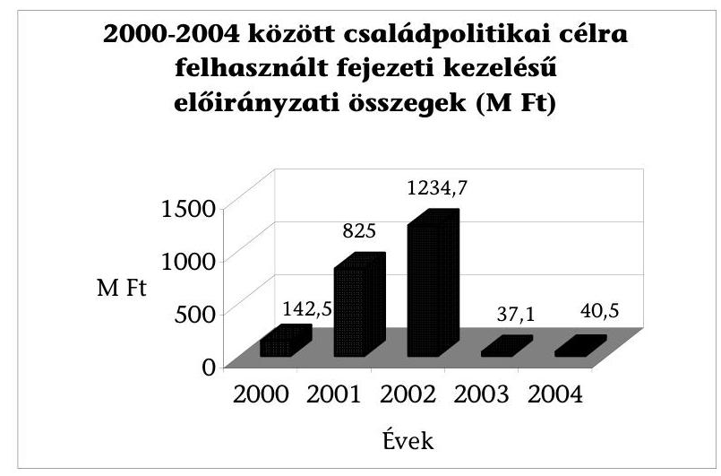

A támogatások szakmai, pénzügyi megalapozásáról, az egyes konkrét (al)programok céljáról, célcsoportjáról, a kifizetendő összegek nagyságrendjéről döntés-előkészítő anyagot a vizsgálat számára bemutatni nem tudtak. A megítélt támogatások szakmai értékelése, tapasztalatainak hasznosítása is elmaradt.

Az NCsSzI zárótanulmánya a 2001/2002. évi családpolitikai pályázati programok hatásvizsgálatáról megállapítja, hogy:

- „... egy egységes, minden pályázat, vagy akár csak a támogatott pályázatok hatékonyságának elbírálására, pontosan és specifikusan megjelölhető értékrendszer hiányában lehetetlen volt vállalkozni";
- „A legföbb eredmény azonban az, hogy a civil szféra megerősitést kapott abban, hogy az általa végzett családsegitésre, szakmai munkára szükség van."11

A Minisztérium a pályázatokkal kapcsolatos bonyolítási, adminisztratív feladatok ellátására a vizsgált időszakban - általános gyakorlatként - külső cégeket bízott meg. A bonyolítási díjakat a fejezeti kezelésű előirányzat terhére biztosították.

Az államháztartás működési rendjéről szóló 217/1998. (XII. 30.) Korm. rendelet 109. §-a rendelkezik arról, hogy a fejezeti kezelésű előirányzatból külső szerv számára kifizetés csak részletes felhasználási terv alapján történhet. A 2000. évi részletes felhasználási tervet az ellenőrzés számára nem tudták bemutatni. A vizsgált időszakban az elkészült felhasználási tervek változó részletezettségűek voltak.

A maradványok összegéről sem programonként, sem keretenként a vizsgált időszak egészére nincs információ.

[^0]
[^0]:    ${ }^{11}$ Zárótanulmány a 2001/2 évi Családpolitikai pályázati Programok Hatásvizsgálatáról, Török Péter kut.ig.hely.; 3-4. oldal

---

# 2.1. A pályázatokkal és az egyedi döntésekkel kapcsolatos előirányzatok, felhasználásuk és ellenőrzésük 

### 2.1.1. A 2000. év

A 136 db benyújtott pályázatból 81 db-ot 33 M Ft-tal támogattak (9. sz. melléklet 3. sz. táblázata). Az elnyerhető legmagasabb összeg 2,5 M Ft volt. Az önrészt 25\%-ban és 35\%-ban határozták meg attól függően, hogy a település lakosságszáma 2000 fő feletti vagy alatti volt. A 2,5 M Ft-os támogatási határt egyetlen pályázó sem érte el. A pályázati anyagok szúrópróbaszerű ellenőrzésére a helyszíni vizsgálat során nem volt mód, mivel a nyertes pályázatok anyagait nem tudták a vizsgálat rendelkezésére bocsátani.

Részletes felhasználási tervet nem mutattak be, bonyolítási keretet sem határoztak meg. A fejezeti kezelésű előirányzat terhére - a támogatásban részesülő projektek pénzügyi, szakmai, módszertani feladatainak koordinálására - hét szerződést kötöttek 1,3 M Ft értékben. A megbízottak egyben a gyermekvédelem pályázatainak koordinálását is ellátták az ország különböző régióiban, valamint szakmai és módszertani tanácsadást is nyújtottak a pályázóknak.

Az egyedi támogatással odaítélhető előirányzat 187 M Ft volt, amelyből 120 M Ft-ról volt egyértelmű információ. Az összeget a Magyar Máltai Szeretetszolgálat játszótér programjának megvalósítására fordították, a Minisztérium által indított, „a családok kapcsolaterősítését szolgáló preventív családpolitikai projekt" részeként. A támogatási szerződéshez kapcsolódó költségvetés elnagyolt volt, a megvalósítási szakaszokra részletes leírást nem tartalmazott. A Kincstár bonyolította le - a program-finanszírozás szabályai szerint - a felhalmozási kiadásokra engedélyezett pénzátutalásokat. Az előirányzati maradványok alakulásáról nem áll rendelkezésre információ.

### 2.1.2. A 2001-2002. év

A családpolitikai programokban a tárca továbbfejlesztési „modellként" 2001-2002-ben preventív szemléletű tevékenységek újszerű kezdeményezéseit és a civil szféra erőteljes bevonását támogatta, pályáztatással vagy egyedi elbírálással.

2001-ben a Fejlesztési Főosztály rendelkezett az 1000 M Ft-os családpolitikai keretből 850 M Ft-tal, melyből 600 M Ft volt a pályázati úton odaítélhető támogatás. A pályázók kötelező önrésze legalább a program költség 15\%-ának megfelelő összeg volt. Az előirányzat további 150 M Ft-os részéből a Gyermekvédelmi Főosztály diszpozíciós jogkörében 40 M Ft-ot pályáztatással, 110 M Ftot egyedi engedéllyel használtak fel a máltai játszótér program támogatására.

A 600 M Ft-os pályázati keretből négy program-csoportot ${ }^{12}$, illetve ezek további alprogramjait hirdették meg.

[^0]
[^0]:    ${ }^{12}$ A program-csoportok: házasságra felkészítő programok; családi közösségépítő programok; családokat segítő egyéb programok és szolgáltatások; csoportvezető, animátor-képzési programok.

---

Minden megpályáztatott célhoz meghatározott részvételi létszámot kértek a pályázótól és az elnyerhető támogatás összegét maximálták.

A paraméterek kialakításának megalapozását bemutató dokumentáció nem volt fellelhető.

1759 szervezet 2123 db pályázatából 1681 db nyertes pályázatot, 594,9 M Ft-tal támogattak (9. sz. melléklet 4. sz. táblázata ${ }^{13}$ ). A Kormányprogramban preferált szervezetek támogatása megvalósult. A nyertes szervezetek közül 1342 volt a nem állami szervezet és 269 a nem állami szervezetekkel együttmúködő önkormányzat. (9. sz. melléklet 8. sz. táblázata) A projekteket programfinanszírozottként indították, majd jogszabályváltozás miatt ${ }^{14}$ azokat előfinanszírozottá dolgozták át. Mindez jelentős többletmunkával járt a lebonyolításban résztvevők számára.

Az egyedi döntés alapján felhasználható előirányzatból 250 M Ft volt a Fejlesztési Főosztály rendelkezési jogkörében. Az összeg felosztási arányairól - a Fejlesztési Főosztály vezetőjének és az NCsSzl családpolitikai igazgatójának javaslata alapján - a miniszter döntött. Kapcsolódó pénzügyi analitikát a felhasználásokról a Fejlesztési Főosztály nem vezetett. A javaslat szerint a keretből 100 M Ft-ot média-célokra, 30 M Ft-ot modellkísérleti programra, 100 M Ft-ot az NCsSzl keretei között végrehajtandó programok finanszírozására, 20 M Ft-ot bonyolításra kívántak fordítani.

A 100 M Ft-os média keret felhasználása nem szolgálta a családpolitikai célok megvalósulását.

A média keret meghatározásához sem annak tartalmi, sem költségmeghatározásait nem készítették el. A bemutatott 25 db szerződés és az azokra teljesített kifizetések nem vethetőek egybe a Minisztérium előzetes elvárásaival. A keret összege felett a rendelkezési jogot a kabinetfőnök gyakorolta. A felhasználást az ellenőrzés számára csak részlegesen igazolták. A szerződések óriásplakáttervezésről, -gyártásról, -kihelyezésről, PR-tevékenységről, sajtó-reggelik szervezéséről, filmkészítés támogatásáról és a tárcánál dolgozók gyermekeinek tartott mikulás ünnepségről szólnak. A szerződésekhez nem kapcsolódtak költségvetések. A kifizetéseket egysoros számlákra is teljesítették. A közbeszerzés szabályainak betartását igazoló dokumentációt az ellenőrzésnek nem mutattak be.

A részletes felhasználási terv a családpolitikai programok bonyolítási keretét 20 M Ft-ban határozta meg. A pénzügyi, ellenőrzési és tanácsadói szolgáltatási feladatokra a Moneta Kft-vel 11 M Ft értékű szerződést kötöttek. A közbeszerzés szabályait nem alkalmazták, holott a szerződés összege a 9 M Ft-os törvényi ${ }^{15}$ értékhatárt meghaladta. A fennmaradó 9 M Ft felhasználására átadott

[^0]
[^0]:    ${ }^{13}$ Az adatszolgáltatás nem teljes körűen dolgozta fel az 1681 db nyertes pályázatot. Ez indokolja a számszaki eltérést.
    ${ }^{14}$ Az államháztartás múködési rendjéről szóló 217/1998. (XII. 30.) Korm. rendelet módosításáról szóló 219/2001. (XI. 20.) Korm. rendelet.
    ${ }^{15}$ 2000. évi CXXXIII. törvény a Magyar Köztársaság 2001. és 2002. évi költségvetéséről, 59. § (1) bekezdés c) pont.

---

anyagok nem áttekinthetőek, keverednek a gyermekvédelmi és családpolitikai célok megvalósulásának monitorozási feladatai.

A 30 M Ft-os modellkísérleti programból 7,5 M Ft-ot személygépkocsi vásárlásra, 22,5 M Ft-ot konferenciára, kutatásra stb. fordítottak. A felhasználás pénzügyi ellenőrzését a Moneta Kft. elvégezte (9. sz. melléklet 11-12. sz. táblázat).

A 2001. évi zárszámadási adatok szerint a pályázati keret maradványa 104,3 M Ft, a teljes programé 290,2 M Ft volt. Analitika hiányában nem látható át, hogy volt-e maradvány a pályáztatásból kivont keretek esetében.

2002-ben a pályázatok célja az előző évihez volt hasonló, azonban a generációk együttműködése és az ifjúsági csoportok és klubok elnevezésű alprogramok nem folytatódtak.

A költségvetésben 1400 Mrd Ft-ot hagytak jóvá családpolitikai célú támogatásokra. Az eredeti előirányzat kiegészült a maradvánnyal, illetve csökkent 215 M Ft-tal fejezeten belüli átcsoportosítás miatt ${ }^{16}$.

Az 1400 Mrd Ft-os keretből a pályáztatásra szánt keretösszeg a Fejlesztési Főosztály rendelkezési jogkörében 856,2 M Ft, az egyedi elbírálású támogatási keret pedig 350,0 M Ft volt. A Gyermekvédelmi Főosztály diszpozíciós jogkörébe 54,0 M Ft pályázati és 146,0 M Ft egyedi keret került, amelyből 100,0 M Ft támogatást ismét a Magyar Máltai Szeretetszolgálat játszótér-programja kapott.

2002-ben összesen 1262 szervezet 1498 db pályázatot nyújtott be, amelyből 1279-et fogadtak el. Az odaítélt támogatási összeg részükre 855,8 M Ft volt. A részleteket a 8. sz. melléklet 5. sz. táblázata, a nyertes pályázatok szervezetenkénti megoszlását pedig a 8. sz. táblázata tartalmazza, amely utóbbi adatai nem teljes körűek. 2002-ben tehát nem állapítható meg, hogy a támogatandó szervezetek vonatkozásában a Kormány elvárása teljesült-e.

A döntés-előkészítés dokumentumait erre az évre sem mutatták be.
Egyedi döntéssel - a Fejlesztési Főosztály rendelkezési jogkörében - 350 M Ft felhasználására volt lehetőség. A keret felosztásáról a döntés a megelőző évhez hasonlóan történt. A javaslat értelmében miniszteri keretre 180 M Ft-ot terveztek, ebből 150 M Ft média programokra, 30 M Ft modell kísérleti programra szolgált. A média keret felhasználásáról dokumentumot nem mutattak be. Az egyedi keretből 2002-ben mindössze 37 M Ft-ról van részleges információ, a pénzügyi ellenőrzést végző Moneta Kft.-től.

Dokumentum hiányában tényszerűen nem igazolható csak valószínűsíthető, hogy az egyedi keretből történt az a 215 M Ft összegű zárolás, amit a 2001. évi

[^0]
[^0]:    ${ }^{16}$ A Magyar Köztársaság 2001. évi költségvetésének végrehajtásáról szóló 2002. évi XL. törvény 32. § (5) bekezdés.

---

zárszámadási törvény ${ }^{17}$ alapján hajtottak végre. A módosítás végrehajtásának dokumentumait a helyszíni ellenőrzés alkalmával nem mutatták be.

A tárca zárszámadásról készített beszámoló szöveges indokolása említi, hogy „az előirányzaton belül 150 M Ft került elkülönitésre családpolitikai kommunikációs célokra. A keret terhére napi és hetilapokban megjelenő újságcikkek, televízió- és rádiómúsorok, játék-, illetve dokumentumfilmek készitésének, rendezvények és internetes megjelenés támogatására került sor", azonban a média keretből történt kötelezettségvállalás, a támogatottak pénzügyi elszámoltatásának dokumentumait nem tudták bemutatni.

A fejezeti kezelésű előirányzatok részletes felhasználási tervében meghatározott 40 M Ft-os bonyolítási keret felhasználásáról pontos adatok nem álltak rendelkezésre, keveredik a gyermekvédelem monitorozásával, amelyre 10,9 M Ft-ot adtak át az NCsSzI-nek. A gyermekvédelmi és családpolitikai programok könyvvizsgálói, pénzügyi ellenőrzési feladatainak ellátására ugyanazon a napon két szerződést, egy 3 M Ft-os, illetve 8,25 M Ft-os összegűt kötöttek a Moneta Kft.-vel, elkerülve a 9 M Ft szerződéses értékhatár felett előírt közbeszerzési eljárás lefolytatását.

A maradvány 239,7 M Ft-os összegéből a lekötés nélküli 3,8 M Ft-ot elvonták.

# 2.1.3. A 2003-2004. év 

A családpolitikát érintő programok 2003-ban és 2004-ben a Gyermek- és Ifjúságvédelmi Főosztály rendelkezési jogkörébe kerültek vissza. A programoknak a korábbi évekhez viszonyítva számottevően csökkent a volumene és a pénzügyi támogatása, elsősorban az új Kormány programjában megfogalmazott hangsúly-áthelyezés miatt. A családok támogatásához kapcsolódó pályázatok száma visszaesett, az ezekkel összefüggő egyedi elbírálású keretfelhasználás nem volt.

2003-ban mindössze 30 M Ft-ot különítettek el a családi funkciók megőrzését célzó, családi krízis helyzet megelőzését, új típusú szolgáltatások fejlesztését célzó programokra. A beérkezett 191 pályázatból 120-at támogattak, összesen 36,7 M Ft-tal (lásd a 9. sz. melléklet 6. sz. táblázatát).

2004-ben családsegítő és gyermekjóléti prevenciós programok jogcímkeretéből 40,5 M Ft-ot fordítottak családpolitikai programok pályázati támogatására. Ebben a támogatási program-kategóriában a családon belüli erőszak, illetve a gyermekbántalmazás megelőzése tárgykörök is szerepeltek. 199 benyújtott pályázatból 82 nyert támogatást a fenti összegből (lásd a 9. sz. melléklet 7. sz. táblázatát).

A maradványok összegéről sem programonként, sem keretenként nincs információ. A keretekre vonatkozó analitika tételes vezetését nem követelik meg, annak ellenére, hogy a Gyermek- és Ifjúságvédelmi Főosztály ügyrendje utal rá.

[^0]
[^0]:    ${ }^{17}$ A Magyar Köztársaság 2001. és 2002. évi költségvetésének 2001. évi végrehajtásáról szóló 2002. évi XL. törvény.

---

2003-2004-ben a részletes felhasználási tervben az alapellátáshoz illesztették a családpolitikával kapcsolatos programokat. Az előirányzatokat itt jelenítették meg. Ezekben az években az NCsSzI feladatai változatlanok voltak, továbbra is a pályázatokkal kapcsolatos adminisztratív feladatokat látta el, illetve külön támogatás ellenében végezte a pályázatok értékelését és módszertani feladatok ellátását.

# 2.2. A pályáztatás bonyolítása és elbírálása 

A Minisztérium a vizsgált években hivatalos értesítőjében közzétette a pályázati felhívásokat. A kiírások részletesen tartalmazták a pályázati célokat, feltételeket, a tartalmi és a formai követelményeket.

A pályázatokat 2000-ben a Család- és Gyermekvédelmi Főosztály gondozta. A pályázati programok szakmai és pénzügyi lebonyolításában régiónként megbízott szervezetekkel, ún. regionális menedzser szervezetekkel (például egyes regionális Forrásközpont Kht.-k, egyesületek, családsegítő szolgálatok stb.) működött együtt.

2001-től a pályázatok lebonyolítása és előkészítése az NCsSzI és a nevesített minisztériumi főosztályok feladata volt. Az NCsSzI Alapító Okirata szerint módszertani feladatai között szerepel, hogy közreműködik a szakmai pályázatok szempontrendszerének kidolgozásában, értékelésében, végzi a pályázatok nyilvántartását, a nyertes pályázati programok követését, értékelését.

2001 júniusában az egyedi keret terhére 100 M Ft értékben hat támogatási szerződést kötött a Minisztérium közigazgatási államtitkára az NCsSzI-vel.

A szerződések feladat-meghatározása konkrétumokat nem fogalmazott meg. A szerződések tárgya: országos területi referensi rendszer kiépítése és múködtetése; modellkísérletek szakmai ellenőrzése, kutatások végzése, modellkísérletek értékelése, elemzése; az általános animátor képzés oktató programjának kidolgozása, kísérleti képzések indítása; külföldi családerősítő programok megismerése, adaptálása; családbarát médiaprogramok, írásos médiaprogramok készítése, terjesztése; a családi életre nevelő program kidolgozása.

A Minisztérium Ellenőrzési Főosztálya 2002 augusztusában vizsgálta a 100 M Ft felhasználását. Az ellenőrzés megállapítása szerint a rendelkezésre álló pénzeszköz hasznos felhasználása nem volt igazolható.

A belső ellenőrzés a felhasználást pazarlónak, túlzott mértékűnek ítélte. Jelen ellenőrzés megállapításai hasonlóak. Az analitikus nyilvántartások áttekintése alapján számos kérdés merült fel, a digitális eszközök vásárlását, szállásdíjakat, naptárkészítést, a családpolitikai igazgató gépkocsi használatát, a belső számlák kiállítását illetően.

A 2001-ben benyújtott pályázatok nagy száma miatt azok feldolgozása, elbírálása elhúzódott. A bonyolítási, bírálati, szerződéskötési munkák az év végére tolódtak. Az év végi munkaterhelést fokozta a következő pályáztatás előkészítése. A 2002. évi feladatok előrehozásával a pályázók hamarabb juthattak az elnyert támogatáshoz. A következő években a pályázatok száma jelentősen lecsökkent.

---

A pályázatokhoz csatolni kellett az esetleges támogatási szerződéshez szükséges okmányokat (bírósági nyilvántartás igazolása, aláírási címpéldány, áfanyilatkozatok stb.), amelyek összegyűjtése a nem támogatott szervezetekre szükségtelen ügyintézési terhet jelentett. A problémát részben orvosolja a vizsgálat idején született miniszteri rendelet ${ }^{18}$ úgy, hogy csak a támogatási szerződés megkötéséhez teszi kötelezővé az okmányok egyes, nevesített fajtáinak csatolását. A rendelet azonban továbbra is lehetőséget biztosít a pályázati felhívásban okiratok, igazolások benyújtásának előírására.

A pályázónak a megvalósításhoz önrészt kellett igazolnia, amelynek minimális mértéke az igényelt pályázati támogatás $15 \%$-a volt. Önrésznek tekintették a program végrehajtásához rendelkezésre álló készpénzt, tárgyi eszközt, ingatlant, helyiséget, valamint a programban résztvevő szakemberek térítés nélkül végzett tevékenységének ellenértékét (középfokú szakember esetén legfeljebb $1500 \mathrm{Ft} /$ óra, felsőfokú végzettségűeknél legfeljebb $2000 \mathrm{Ft} /$ óra). Az önerő ilyen meghatározása megkönnyítette a civil szervezetek részvételét a pályázatban. A pályázottnál alacsonyabb összegű támogatás arányosan csökkentett önrész teljesítését a Moneta Kft. kérte számon a pénzügyi ellenőrzéskor.

A beérkezett pályázatok értékelésére a miniszter szakértőket, ún. bírálókat kért fel. A benyújtott pályázatok mindegyikéhez 2 szakértői értékelés tartozott, amelyeket a Minisztérium által előre meghatározott szempontrendszer szerint pontoztak 0 -tól 5 -ig. A pályázatok értékelő lapjain az összesített pontszám nem szerepelt. Az előre meghatározott értékelési szempontrendszer segítséget nyújtott az értékelési lap pályázatban meghatározott szempontok szerinti kitöltéséhez, valamint prioritásokat jelölt meg (pl. pénzügyi feltételeknél „csak jól kidolgozott reális, megvalósítható és nem túl költséges programok kerüljenek támogatásra" vagy „elutasítását javasolhatja, ha a pályázati kiírásban megfogalmazott céloktól lényeges eltérés tapasztalható").

A Bíráló Bizottság - amely az egyes kategóriák pontozó szakértőinek köréből meghívott személyekből és a projekt igazgatóság munkatársaiból állt - tagjai között olyan szervezetek munkavállalói, illetve vezetői voltak, akik az adott kategóriában pályázatot nyújtottak be. A gyakorlat nem biztosította a bírálatok elfogulatlanságát.

A Kék Világ Alapítvány két pályázata nyert a csoportvezető, animátor képzés kategóriában. Az Alapítvány képviselője ebben a kategóriában a Bíráló Bizottság tagja volt.

A Sapientia Szerzetesi Hittudományi Főiskola csoportvezető, animátor képzés kategóriában négy pályázat megvalósítására nyert támogatást. A Főiskola igazgatója ebben a kategóriában a Bíráló Bizottság tagja volt.

A nehéz élethelyzetben lévő családokat segítő szolgáltatások kategóriában a Down Egyesület vezetője a 2001. évben bírálóként, a 2002. évben a Bíráló Bi-

[^0]
[^0]:    ${ }^{18}$ Az ifjúsági, családügyi, szociális és esélyegyenlőségi miniszter 2/2005. (III. 4.) ICSSZEM rendelete az ifjúsági, családügyi, szociális és esélyegyenlőségi miniszter felügyelete alá tartozó fejezeti kezelésű előirányzatok felhasználásáról.

---

zottság tagjaként részt vett a pályázatok elbírálásában, pályázatai ebben a kategóriában nyertek is. Az egyesület vezetője, aki az NCsSzI közalkalmazottja, bíráló bizottsági tagként és szakértőként számlát nyújtott be az elvégzett tevékenységről.

A Bíráló Bizottság 2001. évi névsorában szerepelt az NCsSzI családpolitikai igazgatója, annak helyettese, valamint az NCsSzI munkatársai, mint számlaképes egyéni vállalkozók. Tevékenységükért díjazásban részesültek, melynek engedélyezője a közigazgatási államtitkár volt.

# A Bíráló Bizottság döntéseit, illetve azok indoklását a kormányrendelet rendelkezéseivel ellentétben írásban, elbírálást tartalmazó emlékeztetőkben nem rögzítette ${ }^{19}$. Az egyes pályázatok megnyert összegéből látható volt, hogy a szakértői véleményektől lényegesen eltérő döntések is születtek, azaz a Bíráló Bizottság tagjai a szakértői véleményeket felülbírálták. A szakértői véleményeket felülbíráló bizottsági döntések így nem átláthatók és nem értelmezhetők. 

A Magyar Cserkészszövetség egyik pályázatát az egyik szakértő elutasításra javasolta azért, mert nem találta összhangban a kiírt célokkal, a másik szakértő ugyanezzel az indokkal a pályázott összeg kevesebb, mint felét, 200 E Ft-ot javasolt. A Bíráló Bizottság döntése: 400 E Ft.

A Bíráló Bizottság rendszeresen kevesebb támogatást ítélt meg az igényeltnél. Az alacsonyabb összegeket részben a véleményező szakértők javasolták, indoklás nélkül. A kisebb támogatási összeg esetén 2003-ig a Minisztérium nem kívánta meg a pályázati költségvetés módosítását, ugyanakkor elvárta - 20002003 között a támogatási szerződésben rögzítve -, hogy a támogatás fejében a pályázat teljes szakmai programját megvalósítsák, amelyet azonban az ellenőrzések során nem kértek számon.

A támogatási szerződések az eredeti pályázatokra hivatkoztak, de a kisebb támogatási összegek mellett nem pontosították, hogy a benyújtott részletes költségvetésekből mely tételeket, sorokat fedeznek a támogatási összegek. A pontos meghatározás hiánya, különösen a csökkentett tartalmú programok esetében, a pályázók számára széles pénzügyi felhasználási/elszámolási lehetőséget biztosított.

A pályázók részére az NCsSzI 2002-ben és 2003-ban is adott egyedi engedélyeket a szerződésektől való eltérésekre. Az engedélyek főként a projektek pénzügyi végelszámolásaival voltak kapcsolatosak. Jellemzően elszámolási hiánypótlásokra, illetve kiadásnemi eltérésekre vonatkoztak: bér helyett dologi, vagy dologi helyett bér, illetve felhalmozási célú támogatás-felhasználások. Az engedélyek az egyes pályázók kérésére, vagy a Moneta Kft. javaslatára, döntéskérésére születtek.

[^0]
[^0]:    ${ }^{19}$ 217/1998. (XII. 30.) Korm. rendelet 85. § (4) bekezdés szerint a döntés előkészítést írásban dokumentálni kell. 85. § (6) bekezdés szerint a pályázatok elbírálásáról a döntéshozónak emlékeztetőt kell készítenie, amelynek tartalmaznia kell az értékelés legfontosabb szempontjait. Az emlékeztetőt a pályázók megtekinthetik.

---

Az NCsSzI több pályázót is felvilágosított arról, hogy nem személyi jellegűnek, hanem dologinak minősül a kiadás, ha valamely személy a szolgáltatásáról vállalkozói számlát állít ki. Az NCsSzI az elszámolás ilyen értelmú eltérésengedélyezésére írásos dokumentumot nem mutatott be.

A Magyar Családsegítő és Gyermekjóléti Szolgálatok Országos Egyesülete pályázatainak egyik megvalósítója a múködésre nyert 700 E Ft és a felhalmozásra nyert 300 E Ft arányát időközben 875, illetve 125 E Ft-ra módosította, amelyhez az NCsSzI hozzájárulását megkapta.

A Minisztérium a pályázatok nyerteseivel ún. blanketta szerződéseket kötött, ami egyedi feltételek érvényesítésére nem adott lehetőséget. A szerződések 2000-ben, 2003-ban, 2004-ben tartalmazták a pályázati kiírásban követelményként megfogalmazott azon elvárást, hogy a pályázónak kötelezettséget kell vállalnia arra, hogy a támogatott programot 1,3 vagy 4 évig folytatja. 2001-ben és 2002-ben ilyen elvárást nem fogalmaztak meg.

# 2.3. A pályázatok ellenőrzése, értékelése 

A nyertes pályázatok szakmai, pénzügyi ellenőrzése külön vált egymástól, nehezítve a felmerült kiadások érdemi megítélését.

A szakmai értékelés - a 2001. évet kivéve - jellemzően önbevalló módon történt. A pályázati nyertes a támogatási szerződés részeként vállalta, hogy a megvalósulásra kijelölt határidőt követő 30 napon belül pénzügyi és szakmai beszámolót ad. Az elszámoló lapok kitérnek a megvalósított program leírására, szolgáltatások, tevékenységek ismertetésére, a célcsoport elérésre, a szerződésben vállalt eredeti célokhoz képest történt módosításokra, visszautalt pénzeszközökre. A bonyolító a pályázó szervezetek szakmai beszámolóit a 2001-2002es évekre formálisan feldolgozta, táblázatba rendezte, de tanulságait nem vonta le.

A szervezetek által vállalt programok tényleges hasznosulását helyszíni vizsgálatokkal a finanszírozó nem követte, a lebonyolító szervezetek a fenti időszakban többnyire a gyermekvédelmi feladatok teljesülését monitorozták. A beküldött beszámolókat tovább nem hasznosították, pusztán hozzácsatolták a küldő szervezet anyagához.

2000-ben a családsegítő, illetve gyermekvédelmi intézetek részére szakmai, módszertani tanácsadási feladatokat és a programok pénzügyi bonyolítását a Stroke Pozitív Kft. látta el, két szerződéssel. A Kft. a program-finanszírozás eljárási rendjéről a támogatottak részére kézikönyvet készített, az eljárási rend melléklete tartalmazza az elszámoláshoz szükséges dokumentációt. A kiadások teljesítés igazoló lapjainak utalványozását, a Kincstár felé továbbításának jogosultságát a Minisztérium átengedte a szervezet ügyvezetőjének, ami ellentétes volt az államháztartás múködési rendjéről szóló 217/1998. (XII. 30.) Korm. rendelet 136. §-a (1) bekezdésének rendelkezéseivel.

A 2001-es pályázati projektek megvalósulásának szakmai ellenőrzésére az NCsSzI megbízásából fokozatosan országos területi referensi rendszer épült ki, amely csaknem 100\%-os országos lefedettséget biztosított. A kiválasztott 11 referens 2001 novemberétől 2002 júliusáig tevékenykedett.

---

A területi referensek a pályázatokat kezelő NCsSzI által megbízott külső munkatársak voltak, akik közvetlen kapcsolatot tartottak az egyes régiók pályázatban résztvevő szervezeteivel. Feladatuk elsősorban a támogatást nyert pályázati programok lebonyolításának követése és tapasztalatok gyűjtése volt.

Az NCsSzI egységes feladatleírást adott a pályázat követéshez és szempontrendszert dolgozott ki a programok egységes szakmai ellenőrzésére. A bemutatott pályázatkövetési összefoglalók nem tartalmazták a programok érdemi értékelését, nem összegezték a hasznosulást, nem szűrtek le konkrét, a jövőre nézve hasznosítható tapasztalatokat, nem teljesültek a program követés előre meghatározott szempontjai.

A referensek közül néhányan szerződés szerinti kötelezettségüknek nem tettek eleget, például a szerződött 7 hónap helyett csak 1 hónapig látogatták a programokat és ez számukra - díjazásuk arányos csökkentésén túl - nem járt következménnyel, bár a feladatellátás nem teljesült. A referensek díjazása $150 \mathrm{E} \mathrm{Ft} /$ hó volt.

2002-ben és 2003-ban a pályázatok megvalósításának külső szakmai ellenőrzésével nem bíztak meg szervezetet és ezt a feladatot az NCsSzI-ben sem végezték el.

Az NCsSzI Kutatási Igazgatósága zárótanulmányt készített a 2001. évi családpolitikai pályázati programokról. Ebben hangsúlyozták, hogy a támogatott pályázatok hatékonyságának elbírálása, pontosan és specifikusan megjelölhető értékrendszer hiányában nem lehetséges. A Kutatási Igazgatóság mintegy száz programot látogatott meg és ez alapján, valamint hatásvizsgálati módszerek alkalmazásával készített vezetői összegzést, amelyben olyan megállapításokat közölt, amelyeket későbbi pályázati kiírásoknál és elbírálásoknál ajánl figyelembe venni. A tanulmány megállapítása szerint a pályázati lehetőség azoknak a szervezeteknek jelentett nagyobb segítséget, ahol a programok készen álltak, szakmai múltra tekinthettek vissza, és az elnyert összeggel a célcsoportok elérése, valamint a programszervezés könnyebben valósult meg.

Vizsgálták, hogy a nyertes pályázatok a Nemzeti Családpolitikai Koncepció mely részeivel, a témakörök mely elemeivel foglalkoztak leginkább, melyekkel legkevésbé. Értékelték a nyári táborozásokat egy általuk összeállított kérdőív segítségével, továbbá közel 100 szervezet által megvalósított programokat látogattak meg.

A zárótanulmány minisztériumi hasznosításáról információ nem állt rendelkezésre.

A 2001-2003 közötti pályázatok pénzügyi ellenőrzését a Moneta Kft. végezte. A pályázatok pénzügyi ellenőrzése mellett a számlák befogadásán keresztül ellátott szakmai jellegű ellenőrzési feladatokat is, amelyet nehezített a pályázati költségvetések módosításának hiánya.

A Moneta Kft. szakmailag korrekt elszámoltatást végzett. A szabályossági, pénzügyi hiányosságokról folyamatos tájékoztatást adott a finanszírozónak, aki ezek nyomán érdemben nem intézkedett a szervezetek felé. A helyszíni vizsgálat idején még 2001 óta rendezetlen tételek is voltak. A Moneta Kft. 2005.

---

január 31-i állapotnak megfelelően 16 db - 2002. évi el nem számolt - pályázati támogatás anyagát adta át a Minisztériumnak további intézkedésre, amelyről a helyszíni ellenőrzés befejezéséig információ nem állt rendelkezésre.

A Minisztérium Gyermek- és Ifjúságvédelmi Főosztályának vezetője 2004-ben megbízást adott a Derina Számviteli Szolgáltató Bt.-nek ${ }^{20}$ a 2001-2002. évi családpolitikai programok keretből kötött azon támogatási szerződések felülvizsgálatára, amelyeknél a kedvezményezettek nem számoltak el a szerződésben foglaltak szerint. Az újbóli pénzügyi ellenőrzést 400 pályázó esetében kívánták elvégezni. A megbízási szerződés dátum nélküli és nem nevesíti a 400 pályázót sem. A szerződött érték 3 M Ft volt, amit a teljesítés igazolása után kifizettek. A Moneta Kft. folyamatosan felhívta a figyelmet a rendezetlen elszámolásokra, sokrétű, korrekt információt adott át mind az NCsSzI-nek, mind a Minisztériumnak, ezért a felülvizsgálatra újabb szerződés megkötése szükségtelen volt.

# 3. A helyszínen vizsgált programok megValósítÁsa És ÉrtÉKELÉSE 

A vizsgálat a programok eredményességét és a pénzfelhasználás hatékonyságát a cél szerinti megvalósulás és pénzfelhasználás alapján minősítette. A pályázott tevékenységek cél szerinti hatása csak hosszabb időtávban, szakmai kritériumok ismeretében lehetséges.

Helyszíni ellenőrzésre 2000-2004-ben a családpolitikai (fejezeti) programokon belül meghirdetett pályázatok nyertesei közül

- a nehéz élethelyzetben lévő családok segítése alprogramot (9 szervezet 34 pályázata),
- a csoportvezető, animátor képzést (6 szervezet 18 pályázata),
- a családdal foglalkozó írott és elektronikus kiadványok készítését (6 szervezet 12 pályázata)

## választottuk ki.

A Videobank Alapítvány és a Közös Jövőnk a Család Egyesület 12-12 pályázatát -videofilm-sorozatok - az egységes tartalomra tekintettel szervezetenként 1-1 pályázatnak tekintettük.

Az ellenőrzöttek kiválasztásának szempontjai a következők voltak:

- a nehéz élethelyzetben lévő családokat segítő szolgáltatások támogatása a vizsgált öt évből négyben eltérő megnevezéssel, de hasonló tartalommal szerepelt a Minisztérium pályázati kiírásaiban;
- a csoportvezető, animátor képzés, továbbá írott és elektronikus kiadványok támogatása a Kormányprogramhoz közvetlenül csatlakozó két évig szereplő

[^0]
[^0]:    ${ }^{20}$ 2004. március 11-től Kft.

---

programok között áttekinthető nagyságrendű pályázatként, főként tárgyiasult eredményt produkáló - így követhető - programként szerepeltek;

- a 2001. évben a csoportvezető, animátor képzési programok, továbbá írott és elektronikus kiadványok megjelentetésére odaítélt pályázati összegek esetében az egy programra jutó támogatás összege a legmagasabb volt ( 9 . sz. melléklet 13-14. sz. táblázat).

A helyszíni ellenőrzésre kijelölt szervezetek, pályázati programok száma az ellenőrzés folyamán kiegészült, mert az előkészítéskor nem ismert adatok merültek fel. A vizsgált pályázatok száma 64-ről 71-re módosult.

A nehéz élethelyzetben lévő családokat segítő szolgáltatások helyszíni ellenőrzése kiegészült a Van Kiút Alapítvány, valamint a Családi Szolgálatok Ligája Alapítvány 1-1 pályázatával.

A csoportvezető, animátor képzés kategória helyszíni ellenőrzése kiegészült az Alfa Szövetség további 1 db pályázatával.

A családdal foglalkozó írott és elektronikus kiadványok kategóriában a Szent Magyar Királyi Családról Nevezett Családakadémia helyett a Down Alapítvány 2 db pályázata, továbbá a Házas Hétvége 3 db pályázata került kiválasztásra.

A helyszíni ellenőrzésre kijelölt 71 nyertes pályázati cél 61\%-a teljesült, és a szervezetek a programokat azóta is múködtetik.

A Sapientia Szerzetesi Hittudományi Főiskola az állami támogatás segítségével indított akkreditált, pontgyűjtő képzést, amelyet azóta is múködtet. A főiskola 2001 novemberében hozta létre Családpedagógiai Intézetét, annak érdekében, hogy a Főiskola sajátos eszközeivel hozzájárulhasson a boldogabb családi életre neveléshez és a családok életének segítéséhez. Megnyert pályázatai segítségével beindította a pedagógusoknak és védőnőknek szóló családi életre nevelés képzését, amelyet azóta sikerült pontszerző képzéssé akkreditáltatni. A képzések 2002től akkreditált 30 órás pedagógus, 2003-tól ugyancsak akkreditált 40 órás védőnői tanfolyamok. 2004 szeptemberétől mindkét képzésük 40 órás.

Az e csoportba tartozó szervezetek a pályázatot megelőzően, valamint azt követően is folytatták tevékenységüket. Az állami támogatások tehát hasznosultak, de ez nem gyakorolt hatást a korábbi szolgáltatási struktúrára, illetve a nyújtott szolgáltatások összes volumenére.

A Magyar Cserkészszövetség 1992 óta képez cserkészvezetőket. A képzések elméleti oktatása hétvégenként, míg a gyakorlati rész megvalósítása nyaranta táborozás formájában került megvalósításra.

A pályázati programok 34\%-a szintén megvalósult, a projektet azonban további támogatás hiányában később már nem folytatták.

A Magyar Családsegítő és Gyermekjóléti Szolgálatok Országos Egyesülete mind a négy nyertes pályázatával egyszeri képzést bonyolított le. Pályázati lehetőség hiányában tevékenységét nem folytatta, a képzettek munkáját utólag nem követte.

A pályázatnyertes programok 4-5\%-a - különböző okok miatt - egyáltalán nem valósult meg. A pályázatnyerteseknél a helyszíni vizsgálat kereté-

---

ben tapasztalt projekt-meghiúsulást pályázói szervezési hiányosságok, illetve a projekt megalapozottságának a hiánya okozta.

A Napraforgó Családsegítő és Gyermekjóléti Szolgálat két programja az igényfelmérés hiánya miatt hiúsult meg. 2002-ben a pályáztató úgy ítélt meg támogatást a „gyászcsoport" indítására, hogy 2001-ben a hasonló céllal odaítélt támogatást a szervezet részben visszautalta, mert érdeklődés hiányában a cél csak részben valósult meg.

A Terézvárosi Családsegítő Szolgálat táborozáshoz szükséges sátrak beszerzésére pályázott, azonban az erre megnyert 500 E Ft-ot nem használta fel, mert nem kapott olyan méretű és strapabírású sátrat, amely a folyamatosan, nagy mértékű igénybevételnek megfelel.

Az igényeltnél kisebb támogatási összegek miatt előfordult, hogy egy-egy pályázó csökkentett tartalmú programot valósított meg, amit a szakmai beszámolóban nem közölt.

Az S.O.S. Krizis Alapítvány a 2001-ben igényelt 972 E Ft-ból 250 E Ft támogatást nyert, amelyet a hétlakásos családok átmeneti otthonában elhelyezett lakók mentális regenerálódását segítő krizisintervenciós célú beszélgetések, konzultációk rendszeres megtartásához kért. Ugyanebben a kérdéskörben családi játszócsoportokat is múködtetni kívánt. Az igényeltnél jóval kisebb támogatás indokolhatja, hogy 2001-ben a program a családi játszócsoportok nélkül valósult meg.

A helyszínen vizsgált pályázatok közül 4 kivételével mindegyik megvalósult. A részben vagy egészben megvalósult 67 közül 2, azaz a helyszínen vizsgáltak 3-$\%$-a nem érte el a pályázó által megjelölt célcsoportot.

# 3.1. A nehéz élethelyzetben lévő családok segítése céljára meghirdetett pályázatok 

A nehéz élethelyzetben lévő családokat segítő szolgáltatások fejlesztésének középpontjában a problémakezelés, a krizisprevenció állt. Pályázni lehetett segítségnyújtó programokra, segítségnyújtó szolgáltatások létrehozására és múködtetésére. 2000-2003 között a pályázatok eltérő megnevezéssel, de hasonló tartalommal kerültek kiírásra, míg 2004-ben - a tárca eltérő célrendszeréből adódóan - már a családsegítő és gyermekjóléti prevenciós programokra helyezték a hangsúlyt.

A pályázati felhívásra beérkezett és nyert pályázatok összesítését - a tanúsítványok adatai alapján - a 2. sz. tábla mutatja.
2. sz. tábla

| Évek | Pályázati kategó-   ria | Pályá-   zó szer-   vezetek   száma | Beérke-   zett   pályá-   zatok   száma | Nyertes   pályá-   zatok   száma | Odaítélt   támoga-   tás (E Ft) | Egy nyer-   tes pályá-   zatra eső   átlagos   támoga-   tás (E Ft) |
| :--: | :--: | :--: | :--: | :--: | :--: | :--: |

---

| 2000 | A/2/ b) krízishely-   zetben lévő, de még   nem súlyosan sérült   családok segítése | * | 61 | 37 | 14768 | 400 |
| :-- | :-- | :-- | :-- | :-- | :-- | :-- |
| 2001 | C)1: Nehéz élethely-   zetben lévő családo-   kat segítő szolgálta-   tások | 430 | 442 | 340 | 78063 | 230 |
| 2002 | F): A családok tára-   dalmi felelősségvá-   lalását, önsegítő   funkciójának erősít-   tését, a nehéz élet-   helyzetben lévő csa-   ládokat segítő szol-   gáltatások, képzések | 284 | 323 | 282 | 148870 | 528 |
| 2003 | 03. Gy/"A"/b) Nehéz   szociális helyzetben   vagy speciális élet-   helyzetben lévő csa-   ládokat segítő közös-   ségi programok,   családokat segítő új   típusú szolgáltatások   fejlesztése | * | 126 | 77 | 26489 | 344 |

* nincs adat

Kiemelt célcsoportként a 2001-2002. évi pályázati kiírásokban a várandós anyák, a három vagy több gyermeket nevelő családok, gyermeküket egyedül nevelő szülők, a beteg gyermeket nevelő családok, továbbá az idős családtagokat gondozó családokat segítő programok és szolgáltatásokat határoztak meg az ezt megelőző, illetve követő években elsősorban a személyes konfliktuskezelést szolgáló módszerekkel, továbbá közösségépítő programokkal, családi funkciók megőrzéséhez nyújtható segítséggel párhuzamosan.

A támogatás összegét 2000-ben 2,5 M Ft-ban, a 2001-2002. években 1, illetve 1,5 M Ft-ban, 2003-ban 1,2 M Ft-ban maximálták. Az összeghatárokat a pályázó szervezetek többsége az elnyert támogatással nem érte el.

A pályázati kiírásban rögzítették a program fenntartásának minimális időtartamát, 2000-ben 1 M Ft támogatásig 1 év, felette 3 év; a 2001-2002. években pedig minimum 1 év volt.

A helyszíni vizsgálat során 11 pályázó 36 pályázatát ellenőriztük 2000-2003 között.

Az elnyert és pályázott támogatások aránya - a helyszíni ellenőrzésre kijelölt pályázati programok esetében - 2000-ben 27,5\%, 2001-ben 32\%, 2002-ben $50 \%$, 2003-ban $67 \%$ volt.

---

Egy kivételével minden vizsgált pályázatra kevesebb támogatást ítéltek meg, mint az igényelt összeg ( $15-80 \%$ között). A csökkentett összegeket részben a véleményező szakértők javasolták a bírálati lapokon. Egymásnak ellentmondó szakértői vélemények esetén a bíráló bizottságok döntöttek a megítélhető támogatásról. A szakértők általában nem indokolták összegjavaslatukat, és a bíráló bizottságok sem készítettek előterjesztést, indoklást az egyes döntéseikről, ezért a döntések nem átláthatók.

A támogatási szerződések előírták az eredeti szakmai programok teljes megvalósítását, de annak számonkérése nem történt meg. Az ellenőrzés nem tapasztalta, hogy pénzügyileg elszámolt, de csökkent szakmai tartalom kifogás tárgyát képezte volna.

A kiíró nem követelt meg a részletes költségvetésekre formai és tartalmi szabályokat, normatívákat, egyéb közösen alkalmazandó elemeket. A benyújtott költségvetések egyes pályázóknál nem csak az adott projekt megvalósításának a költségeit tartalmazták, hanem a szervezet tevékenységének egészét, és annak egy részére nyújtottak be pályázatot, az önrész mértéke így lényegesen meghaladta a pályázott összeget.

A költségvetések összeállításának változatos gyakorlatát jellemzi, hogy a Nap Klub Alapítvány esetében a pályázati adatlap tartalmazta a szervezet egész tevékenységét, a fenntartásához szükséges összes forrást, és annak pontosan nem azonosítható részére pályázott, esetében a Bíráló Bizottság döntötte el, hogy a tevékenység mely részét fogja támogatni. Az Alfa Szövetség 2001-es pályázatához nem mellékelt részletezett költségvetést, ebben az esetben is a bíráló döntött a támogatás tartalmáról.

A szervezetek pályázataiban megjelölt célcsoportokat, illetve azok beszámoló szerinti elérését mutatja a 10. sz. melléklet. A pályázati kiírás szerint a támogatás eljuthatott közvetlenül a nehéz helyzetű családokhoz segítő programokon keresztül, és közvetetten a családoknak szolgáltatást nyújtó szociális munkások, pedagógusok képzésén át.

A Családi Szolgálatok Ligája Alapítvány esetében a támogatott családterápiás rendelés közvetlenül érte el a nehéz élethelyzetben lévő családokat. A Magyar Videotréning Egyesület támogatott tevékenysége a videotréning technika népszerűsítése volt. Pályázataikkal pedagógusokat, egészségügyi alkalmazottakat, nevelőintézeti nevelőket igyekeztek ismeretterjesztő előadásaikkal elérni annak érdekében, hogy közülük néhányan akkreditált, 2 éves képzést követően videotrénerekké váljanak, és nehéz élethelyzetű családokon tudjanak segíteni. A pályázat csak áttételesen érte el a nehéz helyzetű családokat, inkább a videotréner képzés, és videotréning technika népszerúsítését tűzte ki célul.

A helyszíni vizsgálat során ellenőrzött pályázók által végzett szolgáltatások nagyságrendje jelzi, hogy a „nehéz élethelyzetben lévô család" sokféle problémát fed le, amelyek megoldására sokféle szolgáltatási forma jött létre civil és önkormányzati szervezetek segítségével. A Minisztérium pályázati kiírásának tematikai változása - 2004-ben már csak a családon belüli erőszak témaköre jelenik meg a kiírásokban - a kialakult szolgáltatások fennmaradását veszélyezteti, és a folyamatos szakmai koncepció hiányára utal.

---

A pályázók által készített szakmai beszámolók tették lehetővé, hogy a pályázatokról 3-4 évvel később is képet alkothasson a számvevőszéki vizsgálat. A prog-ram-megvalósulás megítélését akadályozza az a tény, hogy a vizsgált támogatásokat olyan szolgáltatásokra is fordították, amelyeket egyidejúleg lehetett volna vizsgálni, és amelyekről nem készültek jegyzőkönyvek (közösségi szalonnasütés, farsangi mulatság).

# 3.2. Csoportvezető, animátor képzésre kiírt pályázatok 

A pályázati kiírás szerint csoportvezető, animátor képzés (a továbbiakban: animátor képzés) kategóriában pályázni lehetett „a civil és egyházi szervezetek erősítése érdekében a szervezetek leendő csoportvezetőinek és animátorainak belső képzésére".

Az animátor képzési programoknak tartalmazniuk kellett a kiírás szerinti követelményekben meghatározott tematikus területeket: a családdal kapcsolatos alapvető pszichológiai, szociológiai és pedagógiai ismeretek oktatását, a csoport animálás módszereit, a családokat érintő ellátási és szolgáltatási rendszer, valamint szervezési, vezetési és kommunikációs módszerek ismertetését. A programnak legalább 60 óra elméleti és 40 óra gyakorlati képzést kellett nyújtania.

Az egy projektre elnyerhető legmagasabb fajlagos támogatási összeg 2001-ben 25 E Ft/fő volt, 2002-ben egy programra a legmagasabb támogatási összeget 2 M Ft-ban jelölték meg. A pályázatban kiírt legalább 10 fő esetén ez a fajlagos összeg 200 E Ft/fő volt.

A Magyar Családsegítő és Gyermekjóléti Szolgálatok Országos Egyesülete az animátor képzés témában négy pályázatot nyújtott be, amellyel négy helyi családsegítő köré csoportosult civil szervezetek laikus segítőinek képzését szerették volna megvalósítani. A programok lefuttatásában önkéntes munka nem volt, egyszeri képzéseket valósítottak meg, amelyeknek folytatására nem került sor. A végzettek munkáját nem követték, egy pályázatukat pedig nem a pályázatban megjelölt helyszínen valósították meg.

A pályázati felhívásra beérkezett és nyert pályázatok összesítését - a tanúsítványok adatai alapján - a 3. sz. tábla tartalmazza.
3. sz. tábla

| Év | Pályázati kategória | Pályázó   szerveze-   tek száma | Beérke-   zett pá-   lyázatok   száma | Nyertes   pályá-   zatok   száma | Odaitélt   támoga-   tás (E Ft) | Egy nyertes pályázatra eső átlagos támogatás (E Ft) |
| :--: | :--: | :--: | :--: | :--: | :--: | :--: |

---

| 2001 | D) 1 Csoportvezető,   animátor képzési   programok megva-   lósitása | 36 | 40 | 35 | 32075 | 916,4 |
| :-- | :-- | :-- | :-- | :-- | :-- | :-- |
| 2002 | L) Csoportvezető,   animátor képzési   program | 44 | 58 | 56 | 50985 | 910,4 |

Az animátor képzés kategóriában 2001-ben 35 pályázatra megítélt és felosztott támogatás $32,08 \mathrm{M}$ Ft volt. Az egy pályázatra jutó átlagos támogatás 916,4 E Ft volt. A 2002. évben 51 M Ft a megítélt támogatás, amit 56 sikeres pályázat között osztották szét. Az egy pályázatra jutó átlagos támogatás 910,4 E Ft volt. A helyszíni ellenőrzés keretében a két évben 19 pályázat megvalósulását kísértük figyelemmel, ez a kategóriában megnyert pályázatok 21\%-át jelenti, és a pályázati összeg 33\%-át fedi le.

A célcsoportot a pályázati kiírás alapján a szervezetek leendő csoportvezetői és animátorai alkották, akik a család csoportok, klubok, alkalmi rendezvények, segítségnyújtó programok vezetését, szervezését, animálását végzik. A pályázó szervezetek profiljától függően sokféle képzés valósult meg.

Az animátor képzés keretében végzettek tevékenységi területe sokszínú, így önkéntes házaspárok, plébániai családcsoport vezetők, pedagógusok, védőnők, cserkészvezetők, civil szervezetek laikus segítői, telefonos segélyhívó hálózat tagjai vettek részt a képzésben.

A helyszíni ellenőrzésbe vont szervezeteknél az egy animátorra jutó állami támogatás mértéke eltérő, 13 és 80 E Ft között változott. ${ }^{21}$ A legdrágább képzést a Magyar Családsegítők Országos Egyesülete valósította meg.

[^0]
[^0]:    ${ }^{21}$ Megjegyezzük, hogy a felsőoktatásról szóló 1993. évi LXXX. törvény 9/A. §-ának (2) bekezdése szerint 2001-ben az egy före megállapított hallgatói normatíva 70000 Ft/év, 2002-ben 78400 Ft/év.

---

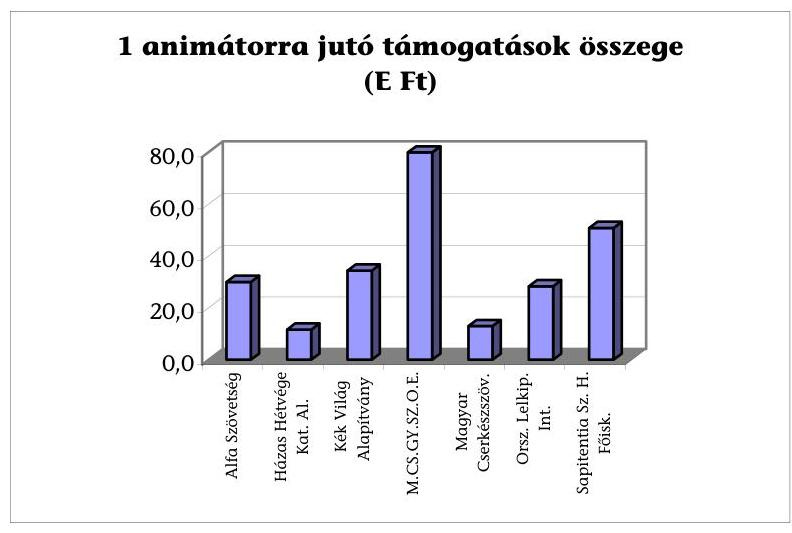

Az állami támogatás hasznosulása szempontjából előnyös volt, ha a szervezet már korábban is folytatott ilyen irányú tevékenységet. A helyszíni interjúra kijelölt 7 szervezet közül 5 volt olyan, aki a pályázatot megelőzően, valamint azt követően is képzett animátorokat. A hasznosulás jó példája volt az a szervezet, amely az állami támogatás segítségével indított akkreditált, pontgyűjtő képzést, amelyet azóta is múködtet. Alacsony hatékonyságú volt az a nyertes pályázat, amely egyszeri képzést bonyolított le.

Az NCsSzI részére az egyedi keret terhére 2001-ben biztosított 100 M Ft-ból 13 M Ft az általános animátor képzés oktató programjának kidolgozására és kísérleti képzések indítására szolgált. A feladat szakmafejlesztési célt jelölt meg, mivel ilyen jellegű szakemberképzés addig nem történt.

Az oktatóprogram kidolgozására a MADORE Bt. kapott megbízást 1,625 M Ft értékben. A szerződésben meghatározott feladat teljesült, de az elkészült oktató programot nem hasznosították. A MADORE Bt.-vel további 3,375 M Ft-os szerződés jött létre kísérleti oktatói csomag előállítására, sokszorosítására, valamint oktatók felkészítésére. A szerződésre kifizetés nem történt, a megvalósulás elmaradt, a szerződés meghiúsulásáról nem készült dokumentum. Az anyagi ráfordítás nem hasznosult, mert a kísérleti képzés nem valósult meg.

# 3.3. Írott és elektronikus kiadványok megjelentetésére meghirdetett pályázatok 

A családdal foglalkozó írott és elektronikus kiadványok kategória pályázati kiírásának célja a családok megerősítését szolgáló, a családi életre felkészítő írott és elektronikus kiadványok elkészítésének, megjelentetésének egyéb feladatok ellátásának segítése (pl. szolgáltatásokkal kapcsolatos kiadványok, ismeretterjesztő kiadványok, programfüzetek, periodikák, különféle műfajú audiovizuális program készítése, folyóiratok kiadása, terjesztése, internetes honlapok létrehozása) volt.

A pályázatoknak tartalmazniuk kellett a kiadvány bemutatását, tervezett példányszámot, terjesztés módját, és megjelenés ütemezését. Kész kiadványnál két

---

mintapéldányt kellett csatolni, új kiadványnál a nyomdakész állapot előnyt jelentett. Nem nyomdakész kiadványnál csatolni kellett a külső belső megjelenítést és tartalmat bemutató tervezetet, audiovizuális anyagnál forgatókönyvet vagy szinopszist, tematikát. Internetes honlap esetén a honlap tartalmát, megjelenési formáját, a honlap elkészítésének célját kellett a pályázatban benyújtani. A pályázatok elbírálásánál a terjesztői szándéknyilatkozat előnyt jelentett.

Az elnyerhető legmagasabb összeg 2001-ben 3 M Ft volt, 2002-ben írott kiadványra az igényelhető összeg 2 M Ft , elektronikus kiadványra 4 M Ft volt.

Az írott-elektronikus kiadványok kategóriában 2001-ben és 2002-ben 236-236 pályázatot nyújtottak be. A nyertes pályázatok száma 144, illetve 198 volt.

A vizsgált két évben az írott kiadványok kategóriájában összesen 160,9 M Ft-ot osztottak szét, a vizsgálat ennek 4,6\%-át érintette. Az elektronikus kiadványok kategóriában 245,6 M Ft-ból 29\% (71,3 M Ft) volt a megvizsgált támogatás.

A vizsgált 16 pályázatnál 1 esetben fordult elő, hogy a Bíráló Bizottság a szakértői javaslatoknál magasabb összeget ítélt meg. Két esetben a pályázatot az egyik szakértő elutasításra javasolta, a Bíráló Bizottság ezt figyelmen kívül hagyva hozott döntést (9. sz. melléklet 15. sz. táblázat). A Bíráló Bizottság döntéseit írásban nem indokolta, a pályázatok elbírálása nem volt átlátható. Nem követhető, hogy a szakértőknek javasolt bírálati szempontrendszer mennyire érvényesült a Bíráló Bizottsági döntésekben.

Nem vizsgálták, hogy az igényeltnél alacsonyabb összegű támogatással az eredeti feladatot teljes egészében meg tudják-e valósítani, ami a számon kérhetőséget rontotta, és megkérdőjelezte a pénz ésszerű elköltését is.

Az Alfa Szövetség 3 M Ft-os pályázatot adott be egy oktatófilm elkészítésére. A film „Mélyből kiáltok" címmel $2 \times 26$ perces videofilm elkészítését tűzte ki célul, amely a drogfüggésből kivezető utat mutatja meg, ebben a család szerepét, értékét, feladatát. A Bíráló Bizottság 1 M Ft-ot ítélt meg. Ebből a filmet leforgatták, de befejezni nem tudták. A vágatlan anyagot VHS kazettán leadták az NCsSzI-nél, mint az 1 M Ft felhasználásának bizonyítékát. A szerződés nem kötötte ki, hogy a pályázónak befejezett munkát kell készítenie és leadnia.

A pályázati felhívásra beérkezett és nyert pályázatok összesítését - a tanúsítványok adatai alapján - a 4 sz. tábla mutatja be.

---

| Év | Pályázati kategória | Pályázó szer-   vezetk   száma | Beérke-   zett   pályá-   zatok   száma | Nyertes   pályá-   zatok   száma | Odaítélt   támoga-   tás (E Ft) | Egy nyer-   tes pályá-   zatra eső   átlagos   támoga-   tás (E Ft) |
| :-- | :-- | :--: | :--: | :--: | :--: | :--: |
| 2001 | C)3 A családdal fog-   lalkozó írott és elek-   ronikus kiadványok   megjelentetése | 157 | 236 | 144 | 154948 | 1076,0 |
| 2002 | H) A családdal fog-   lalkozó írott kiad-   ványok megjelente-   tése | 96 | 108 | 97 | 75256 | 775,8 |
|  | K) A családdal fog-   lalkozó elektronikus   kiadványok megjel   lentetése | 71 | 128 | 101 | 176287 | 1745,4 |

A pályázati kiírás szerint a pályázóknak költségvetést kellett készíteniük a program teljes költségét múködési és felhalmozási költségekre bontva. Internetes honlap üzemeltetésnél nem volt feltétel a hosszabb távú üzemeltetés, így a bírálatnál nem vizsgálták, hogy az adott támogatás felhasználása után a honlapot a szervezet tudja-e üzemeltetni.

Az alábbi diagram bemutat néhány - a helyszínen, továbbá kérdőíves formában megkérdezett - írott és elektronikus kiadványok elkészítésére, megjelentetésére, illetve azokkal kapcsolatos előállítási, szervezési és múködtetési feladatok ellátására pályázó szervezetet és a megítélt támogatást.
3. sz. ábra
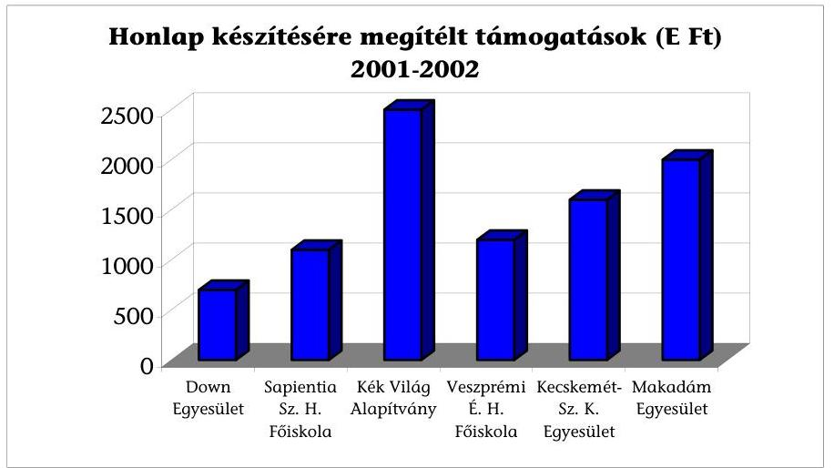

---

A pályázó szervezetek eltérő összegeket pályáztak és kaptak meg (700 E-től 2,5 M Ft-ig). A pályázati kiírásban nem határozták meg azokat a múszaki feltételeket, hardware-software eszközöket, amelyet támogatni kívántak, így rendkívül eltérő műszaki tartalmú igények jelentkeztek és nyertek támogatást. A támogatási összegek, valamint a felhalmozásra és múködésre fordított összegek aránya rendkívül eltérő volt.

Az írott és elektronikus kiadványok kategóriában eredményesnek tekinthetö a támogatás felhasználása, ha a vállalt feladat megvalósult, és eljutott a célcsoporthoz, azaz a filmet bemutatták, újságot, folyóiratot, jegyzetet szétosztották stb. A 9. sz. melléklet 16. sz. táblázata tartalmazza az írott, valamint audiovizuális anyagok hasznosulását.

A Kék Világ Alapítvány honlap üzemeltetésére pályázott, amelyet sikeresen megvalósított és azóta társadalmi munkában üzemeltet.

A Sapientia Szerzetesi Hittudományi Főiskola pályázatból valósította meg Családpedagógiai Intézetének honlapját, amelyet azóta a képzés éves költségvetési támogatásából tart fenn. Másik pályázatából két videofilm készült el, amelyeket a főiskola a családi életre nevelő képzésein oktatási segédletként hasznosít. Három írott kiadványra megnyert pályázatából - amelyből kettőt sikerült megvalósítani - egy belső használatra szánt főiskolai jegyzet valósult meg „Csináld magad" címmel, továbbá egy nemzetközi hírú könyv magyar fordítása a Vigília Kiadó gondozásában, Elisabeth Kübler-Ross „Élet leckék" címmel.

A családdal foglalkozó írott és elektronikus kiadványok kategórián belül az Alfa Szövetség 2 pályázatot nyújtott be. Az egyik pályázat az „Anya-Ország" című, több éve rendszeresen megjelenő folyóiratuk 4 számának kiadásához járult hozzá. A másik pályázat egy $2 \times 26$ perces videofilm, illetve egy $6 \times 10$ perces kisjátékfilm elkészítését vállalta. A videofilm nyers változata elkészült, befejezni forrás hiányában nem tudták (az eredetileg igényelt 3 M Ft helyett csak 1 M Ft -ot kaptak). A kisjátékfilmnek szánt anyag elkészült, több regionális televízió is bemutatta.

A Közös Jövőnk a Család Alapítvány „Szemünk fénye" címmel 12 részes sorozatot készített, a 24 M Ft megnyert pályázati támogatásból ( 2 M Ft/film). A sorozatot az MTV sugározta. Az Alapítvány jogdíjra nem tart igényt, így más televíziókkal is tárgyalnak a filmek bemutatásról.

A pályázati cél megvalósulásának hasznosulását eredménytelennek ítéltük, ha a film nem készült el vagy elkészült, de nem mutatták be, illetve a honlap nem nyílt meg, a kiadvány nem készült el vagy nem került nyilvánosságra.

A Videobank Alapítvány 12 db pályázatot nyújtott be és filmenként 3 M Ft (azaz összesen 36 M Ft -ot) pályázati összeget nyert meg. Az Alapítvány által nyert 36 M Ft támogatás elszámolása többször akadályokba ütközött. Az Alapítvány a 12 részből álló filmet elkészítette, de a vizsgálat befejezéséig bemutatásra nem került. A számlákat befogadó és ellenőrző Moneta Kft., valamint a Videobank Alapítvány között a költségek elszámolásakor számos nézeteltérés alakult ki. A 3. részlet elszámolásakor az elszámolást végző Moneta Kft. 980 E Ft elszámolást nem fogadott el, így a 4. részlet, 9 M Ft átutalására nem került sor. A Videobank Alapítvány arra hivatkozva, hogy a film befejezéséhez bankkölcsönt vett fel, fizetési meghagyást bocsátott ki a Minisztériummal szemben. A Minisztériummal történt egyeztetések után a támogatás fennmaradó része végül átutalásra került.

---

A pályázat lezárása és elfogadása 2004 októberében történt meg, ezután a Videobank Alapítvány a Minisztériummal szemben kamatköveteléssel lépett fel, amelyet bírósági úton kíván behajtani. A helyszíni vizsgálat befejezéséig az ügyben döntés nem történt.

A Down Egyesület kiadványsorozat és internetes honlap készítésére pályázott. Kiadványsorozata a fogyatékosságról nem készült el. A kiadványsorozatra megnyert 1,3 M Ft-os támogatási összeget az egyesület 2005 márciusában az ICSSZEM részére visszautalta. Az internetes honlap múködik. Ezzel kapcsolatos számláit 2005 márciusában postázta a Moneta Kft. részére. ${ }^{22}$

A Házas Hétvége Katolikus Alapítvány az „és boldogan éltek amíg ..." című könyv kiadására határidő módosítást kértek és kaptak, ennek ellenére nem sikerült a kiadást megvalósítani. A megnyert pályázati összeget kamatokkal együtt 800 E Ft +88 E Ft kamat - visszafizették a Minisztériumnak.

Budapest, 2005. augusztus B.
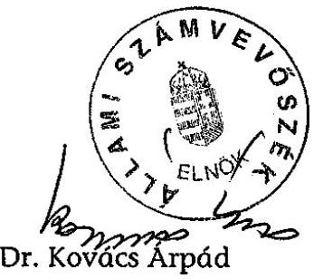

Melléklet: $\quad 10 \mathrm{db} \quad 21$ lap

[^0]
[^0]:    ${ }^{22}$ A Moneta Kft. szóbeli tájékoztatása alapján a Down Egyesület az ebben a témában nyert 2,2 M Ftot többek között számítógépes alkatrészekre, nyomdafestékre, kulcsmásolásra, postai költségekre, felöltőkártyára, repülőjegyre stb. költötte. A Moneta Kft. felkéri a Down Egyesületet, hogy átcsoportosítás céljából egyeztessen a Minisztériummal, ui. enélkül számláit nem tudja befogadni.

---

# MELLÉKLETEK

---

# IfJúsági, CsaládúGYI, Szociális és Esélyegyenlőségi Miniszter 

Ikt. szám: 12759-5/2005-0017GYF. Hiv. szám:V-35-125/2004-2005
Ugyintécó: Csepeli Marianna
Kérjük, hogy válasz esetén szíveskedjen
levelünk számára hivatkozni.

Dr. Kovács Árpád úr részére
Elnök

## Állami Számvevőszék

Budapest
Pf: 54 .
1364

Tisztelt Elnök Úr !

A V-35-125/2004-2005 számú levelére válaszolva tisztelettel tájékoztatom az alábbiakról. A családpolitikai célok teljesülését szolgáló egyes pénzösszegek hasznosulásának ellenőrzéséről készített jelentés megállapításaira észrevételt nem teszek.

Az ellenőrzés alapján elrendelt intézkedésekről Az Állami Számvevőszékről szóló 1989. évi XXXVIII. törvényben biztosított 30 napon belül tájékoztatom Elnök Urat. A jelentésben megfogalmazott javaslatok teljesítéséhez szükséges intézkedési terv elkészítéséhez a minisztérium több szervezeti egységének a közös munkája szükséges.

További munkájához sok sikert kívánok.

Budapest, 2005. augusztus „ $\mathrm{S}_{2}$ :"
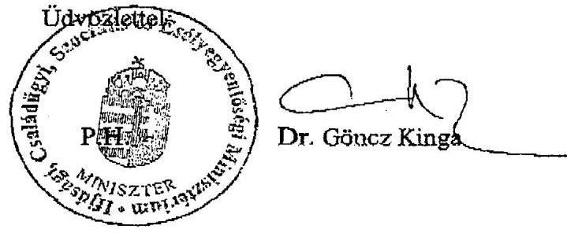

---

# Törvényekben nevesített családpolitikai eszközrendszer* 

a családok támogatásáról szóló 1998. évi LXXXIV. törvény, a gyermekek védelméről és a gyámügyi igazgatásról szóló 1997. XXXI. törvény, valamint a szociális igazgatásról és szociális ellátásokról szóló 1993. évi III. törvény alapján
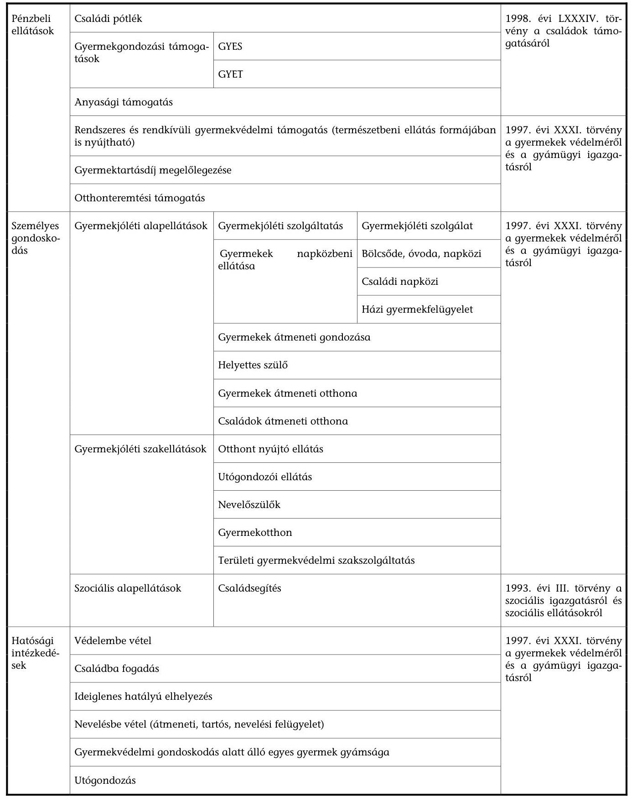

[^0]
[^0]:    *Megjegyzés: a családpolitikai eszközrendszerben csak a felsorolt törvényekben szabályozott ellátásokat tüntetjük fel, így például a társadalombiztosítás ellátásait (GYED stb.) sem szerepeltetjük.

---

# Családsegítés

## a szociális igazgatásról és szociális ellátásokról szóló 1993. évi III. törvény alapján

A családsegítő szolgáltatás általános és speciális segítő szolgáltatása keretében a települési önkormányzat segítséget nyújt a működése területén élő szociális és mentálhigiénés problémái vagy krízishelyzete miatt segítséget igénylő személynek, családnak az ilyen helyzethez vezető okok megelőzése, a krízishelyzet megszüntetése, valamint az életvezetési képesség megőrzése céljából.

|  Családsegítő szolgáltatás | Általános segítő szolgáltatás | Megelőző tevékenységek | Figyelemmel kíséri a lakosság szociális és mentálhigiénés helyzetét, feltárja a nagyszámban előforduló, az egyén és család életében jelentkező probléma okait és jelzi azokat az illetékes hatóság vagy szolgáltatást nyújtó szerv felé.  |
| --- | --- | --- | --- |
|   |  |  | Veszélyeztetettséget és krízishelyzetet észlelő és jelző rendszert működtet, ennek keretében elősegíti különösen az egészségügyi szolgáltatók oktatási intézmények, gyermekjóléti szolgálat, gondozási központ, valamint a társadalmi szervezetek, egyházak és magánszemélyek részvételét a megelőzésben.  |
|   |  | Az egyének és a családok életvezetési képességének megőrzése, valamint az egyén és a család életében jelentkező probléma megszüntetése érdekében | Tájékoztatást ad a szociális, a családtámogatási és a társadalombiztosítási ellátások formáiról, az ellátáshoz való hozzájutás módjáról.  |
|   |  |  | Szociális, életvezetési és mentálhigiénés tanácsadást nyújt.  |
|   |  |  | Segítséget nyújt az egyénnek a szociális, gyermekjóléti, gyermekvédelmi ügyek vitelében.  |
|   |  |  | Meghallgatja az egyén, család panaszát és lehetőség szerint intézkedik annak orvoslása érdekében.  |
|   |  |  | Családgondozással elősegíti a családban jelentkező krízis, működési zavarok, illetve konfliktusok megoldását.  |
|   |  |  | Ellátja a 37/C. §-ban megjelölt együttműködési kötelezettségből fakadó feladatokat.  |
|   |  |  | 37/C. § Szünetel a rendszeres szociális segély folyósítása, ha az aktív korú nem foglalkoztatott személy a települési önkormányzat által szervezett foglalkoztatásban vesz részt, ide nem értve az alkalmi munkavállalói könyvvel történő foglalkoztatást.  |
|   |  | Egyéb | Elősegíti és ösztönzi a humán jellegű civil kezdeményezéseket.  |
|   |  |  | Kezdeményezi a települési önkormányzatnál, az önkormányzat kötelező feladatának nem minősülő ellátás, szolgáltatás helyben történő megszervezését, új szociális ellátások bevezetését, egyes szociálisan rászorult csoportok személyek törvényben meghatározott vagy más speciális ellátását.  |
|   | Speciális családsegítő szolgáltatás (azok a települési önkormányzatok, amelyek a családsegítő szolgáltatást önálló intézmény működtetésével biztosítják) |  | A családokon belüli kapcsolat erősítését szolgáló, közösségépítő, családterápiás, konfliktuskezelő mediációs programok és szolgáltatások, valamint a nehéz élethelyzetben élő családokat segítő szolgáltatások.  |
|   |  |  | Ifjúsági tanácsadás, információs szolgáltatások biztosító programok.  |
|   |  |  | Roma népesség speciális helyzetéből adódó problémák kezelése.  |

---

# Vizsgálati kritériumok

| Kritéri-
um-
csoport | Forrás | Követelmény | Megfelelőségi szint | Értékelés |
| :--: | :--: | :--: | :--: | :--: |
| Célkritériumok | Európai Szociális Karta 1999. évi C. törvény | A családot - mint a társadalom alapvető egységét - teljes körű fejlődésének biztosításához megilleti a megfelelő szociális, jogi és gazdasági védelemhez való jog. | A fejezeti kezelésű családpolitikai célú előirányzatok felhasználása a törvényi szabályozásnak és a kormányprogramnak megfelelő célok érdekében történt. | teljesült |
|  |  | Az anyáknak és a gyerekeknek - tekintet nélkül családjogi helyzetükre és családi kapcsolatokra - joguk van a megfelelő szociális és gazdasági védelemre. |  | nem vizsgált (gyermekvédelmi célok) |
|  |  | Az egyének és az önkéntes vagy egyéb szervezetek részvételének állami ösztönzése az állami szociális szolgáltatások létrehozásában és fenntartásában. |  | teljesült |
|  | 1991. évi LXIV. törvény a gyermekek jogairól, New Yorkban 1989. november 20.-án kelt egyezmény kihirdetéséről | A gyermeket szüleitől akarata ellenére ne válasszák el, kivéve ha ez a gyermek mindenek felett álló érdekében szükséges. |  | nem vizsgált (gyermekvédelmi célok) |
|  | 1997. évi XXXI. Törvény a gyermekek védelméről - törvény indoklása | Hosszú távon fenntartható, családi típusú nevelésre orientált rendszer kialakítása, továbbá a preventív és a családba való visszahelyező megoldások előtérbe helyezése. |  | részben teljesült   (hosszú távú hatás még nem mérhető, a további fenntarthatóság nem általános) |

---

|  1993. évi III. törvény a szociális igazgatásról és a szociális ellátásokról törvény indoklása | Rászorultsági alapon nyújtható támogatások rendszerének kiépítése.  |
| --- | --- |
|   | Önkormányzatok lehetőségeinek és felelősségének bővítése a települési szociálpolitika megvalósításában.  |
|   | Az egyház és vállalkozók szociális ellátórendszerekbe való kapcsolódása lehetőségeinek szélesítése.  |
|  Kormányprogram 1998-2002- ból származtatott kritériumok | Célcsoport: a leginkább rászorultak mellett az önmagukért tenni akaró, helyzetükön önerejüket is használva változtatni akaró polgárok.  |
|  2001-2002-ben vizsgálandó | Nem kizárólag a legrászorultabb, támogatásokra segélyekre szoruló legszegényebbek iránti állami felelősség vállalás  |
|   | A családpolitika célja (szociálpolitikai és egészségügyi eszközök) elősegíteni:  |
|   | gyermekek egészséges fejlődését, nevelését,  |
|   | ….betegek otthoni ápolását  |
|   | ….feszültségek oldását  |
|   | ….testi, lelki szociális biztonságot  |
|   | A helyi kisközösségek szerepének fontossága (támogató, jelző megelőző funkció)  |
|   | Egyházi és civil szervezetek állami feladat átvállalása szerződéses alapon, és a feladatellásához szükséges források biztosítása.  |

|  teljesült | |
| --- | --- |
|  teljesült | |
|  részben teljesült (vállalkozókat nem preferálták) | |
|  teljesült | |
|  teljesült | |
|  teljesült | |
|  teljesült | |
|  nem teljesült | |
|  teljesült | |
|  teljesült | |
|  teljesült | |
|  nem teljesült | |
|  teljesült | |
|  teljesült | |
|  tétesült | |
|  tétesült | |

---

|   |  | Önkormányzatok problémákat látó és feltáró, megelőző szerepe. Korábbi sikeres helyi megoldások támogatása. |  | részben teljesült (nem mind kiemelt cél)  |
| --- | --- | --- | --- | --- |
|   |  | Kiszámítható feladatarányos állami finanszírozás. |  | részben teljesült (civil, egyházi szektorra nem jellemző)  |
|  Megvaló- | Minisztérium fejezeti kezelésű előirányzatának részletes felhasználási terve | Az előirányzat felhasználási célja: | Felhasználási terv céljai szerinti pénz- |   |
|  sulási |  |  | felhasználás |   |
|  kritériumok |  |  |  |   |
|   |  | ...családi életre felkészítő, családi közösséget építő programok, és szolgáltatások létrehozása |  | teljesült  |
|   |  | ...külföldi programok adaptációja |  | teljesült  |
|   |  | ...már működő programok hatékonyabbá tétele |  | teljesült  |
|   |  | ...széles körű felhasználhatóság biztosítása |  | teljesült  |
|   |  | ...szülő-gyermek kapcsolattartási ügyelet létrehozása |  | teljesült  |
|   |  | ...egyházi vagy civil szervezetek által létrehozandó gyermekjóléti központok kialakítása |  | nem vizsgált (gyermekvédelmi célok)  |
|   |  | ...várandós anyák elhelyezése, várandós és gyermekágyas anyák támogatása |  | nem vizsgált (gyermekvédelmi célok)  |
|   |  | ...nevelőszülői házak létesítésének támogatása |  | nem vizsgált (gyermekvédelmi célok)  |
|   |  | ...játszóterek építése |  | teljesült  |
|   |  | ...integratív játéktárak működtetése |  | teljesült  |
|   |  | ...a pályázó rendelkezzen legalább a programköltség 15%-ának megfelelő önrésszel | teljesülés | teljesült  |

---

|   | NCSSZI alapító okirata | A lebonyolításhoz szükséges erőforrások rendelkezésre állása az NCSSZI-nél. | teljesülés | részben teljesült (2001-től nincs többlet előirányzati összeg)  |
| --- | --- | --- | --- | --- |
|   |  | A minisztérium és a háttérintézménye között a koordináció megfelelősége: írásbeli feladatmegosztás, pénzügyi elszámoltatás, szakmai beszámoltatás, visszacsatolás, határidők kitűzése és betartatása, kapcsolattartás folyamatossága. | teljesülés | részben teljesült (szóbeli feladatmegosztás is 2001-2002-ben )  |
|   |  | Az NCSSZI feladatellátásának és az alapító okiratában meghatározott tevékenységek összhangja: pályázat szempontrendszer kidolgozása, értékelésben való közreműködés, pályázatok nyilvántartása. | összhang | teljesült  |
|   |  | NCSSZI pénzügyi és szakmai ellenőrzési feladatellátása a pályázatok vonatkozásában: nyertes pályázati programok követése, és értékelése. | teljesülés | részben teljesült (pályázatok követése csak részlegesen)  |
|  Eredményességi kritériumok | Nehéz élethelyzetben lévő családokat segítő szolgáltatások pályázatai | Programok kitűzött célok szerinti megvalósulása. | teljesülés | részben teljesült (meghiúsult, csökkentett programok)  |
|   | Családdal foglalkozó írott kiadványok megjelentetése pályázatok | Pályázatok megvalósulása, tartalmi illeszkedésük a célkitűzésekhez, célcsoport elérése. | teljesülés | részben teljesült (részleges hasznosulás)  |
|   | Csoportvezető, animátor képzési programok - pályázatok | A programok megvalósulása, a képzés hasznossága a pályázók szempontjából. | teljesülés | részben teljesült (részleges hasznosulás képzéseket követően, meghiúsult programok)  |

---

# Kérdőívvel megkeresett szervezetek 

Széchenyiváros Közösségépítő Egyesület, Kecskemét
Down Egyesület, Budapest
Veszprémi Érseki Hittudományi Főiskola, Veszprém
Csodák Palotája Kht, Budapest
Ébredés Alapítvány, Pécel
Magyar Rádió Alapítvány, Budapest
Makadám Művelődési Egyesület, Szeged
Piarista Rendház és Noviciátus, Vác
Veszprémi Főegyházmegye Családpasztorációs Munkacsoportja, Veszprém
Magyar Máltai Szeretetszolgálat Alapítvány, Budapest
Magyar Vöröskereszt Baranya Megyei Szervezete, Pécs
Nagykörösi Református Egyházközség, Nagykörös
Magyar Máltai Szeretetszolgálat Gondviselés Háza, Páty
Magyar Máltai Szeretetszolgálat Egyesület, Budapest
Keresztény Ifjúságért a Jövőért Alapítvány, Nyíregyháza
Csillagfény Alapítvány, Miskolc
Hit és Élet Alapítvány, Budapest
Munkás és Családpasztorációs Központ, Szeged
Magyar Katolikus Püspöki Kar Ifjúsági Bizottsága, Budapest
Dél-Magyarországi Keresztény Munkásifjú Alapítvány, Szeged
A Szent Magyar Királyi Családról Nevezett Családakadémia
Napraforgó Családsegítő és Gyermekjóléti Szolgálat, Budapest
Terézvárosi Gyermekjóléti Szolgálat, Budapest
Hétszínvirág '98 Gyermekjóléti Szolgálat, Nyíregyháza
Családsegítő, Gondozási és Szociális Szolgáltató Központ, Sarkad
Tarnaméria Nyugdíjas Klub, Tarnaméra
Győr Családsegítő Szolgálat, Győr
Kajdacsi Gyermekekért és Ifjúságért Alapítvány, Kajdacs
Mosonmagyaróvár ESZI Családsegítő Központ, Mosonmagyaróvár
Sopron Megyei Jogú Város Családsegítő Intézet, Sopron
Monor Városi Családsegítő és Gyermekjóléti Szolgálat, Monor
Kazincbarcika Szociális Szolg. Közp. Családsegítő és Gyermekjóléti Szolg., Kazincbarcika
Kecskemét Szociális Szolgáltató Központ, Kecskemét
Kisbér Szociális Szolgáltató Központ és Pedagógiai Szakszolgálat, Kisbér
Kunsziget Község Önkormányzata, Kunsziget
Miskolci Családsegítő Központ, Miskolc
Mórahalom Város Önkormányzata, Mórahalom
Onga Gondozási és Szociális Szolgáltató Központ, Onga
Városi Önkormányzat Egyesített Szociális Intézménye, Orosháza
Általános Iskola és Óvoda - Kikelet Óvoda, Pocsaj
Egyesített Szociális Intézmény, Rákóczifalva
Ásotthalom Község Önkormányzata Gondozási Központ, Ásotthalom
Bársonyos Szociális Gondozási Központ, Bársonyos
Békés Családsegítő és Gyermekjóléti Szolgálata, Békés
Városi Szociális Szolgáltató Központ Családsegítő Szolgálat, Berettyóújfalu

---

Cegléd Város Humán Szolgáltató Központ, Cegléd
Csurgó Kistérségi Családsegítő és Gyermekjóléti Szolgálat, Csurgó
Esély Családsegítő és Gyermekjóléti Szolgálat, Erdőkertes
Fót Nagyközség Egyesített Szociális Eü-i Pedagógiai Szolg. Családsegítő Szolg., Fót
Hajdúböszörmény Családsegítő és Gondozási Központ, Hajdúböszörmény
Szivárvány Szociális és Egészségügyi Szolgálat, Hatvan
Szeged Megyei Jogú Város Önkormányzata Humán Szolgáltató Központ, Szeged
Szekszárd MJV Önkormányzat Családsegítő Központ, Szekszárd
Gyermekjóléti Szolgálat, Sződliget
Sokoróaljai Családsegítő és Gyermekjóléti Szolgáltatási Társulás Intézménye, Tét
Tolna Város Önkormányzatának Családsegítő Központja, Tolna
Üllés Község Képviselőtestülete Polgármesteri Hivatala, Üllés
Algyő Nagyközség Önkormányzat Gyermekjóléti és Családsegítő Szolgálat, Algyő
Támasz Szociális Központ, Kaba
Regionális Családsegítő és Megyei Gyermekjóléti Módszertani Központ, Debrecen
Budapest Kőbányai Önkormányzat, Egyesített Bölcsődék, Budapest
Nemeskei Gyermekjóléti Szolgálat Társulás, Nemeske
Családsegítő és Gyermekjóléti Szolgálat, Békéscsaba
Nagyközségi Gyermekjóléti Szolgálat, Pomáz
Városi Képvislő-testület Családsegítő Szolgálata, Újfehértó
Óbuda-Békésmegyer Önkormányzata „KIÚT" Családsegítő és Gyermekjóléti Szolg., Bp
Terézvárosi Családsegítő Szolgálat, Budapest
Pesterzsébeti Család- és Gyermekvédelmi Központ, Budapest
Józsefvárosi Családsegítő Szolgálat, Budapest

---

# Ifjúsági, Családügyi, Szociális és Esélyegyenlőségi Minisztérium GYERMEK- ÉS IfJÚSÁGVÉDELMI FÖOSZTÁLY 

Ikt. szám:
/2005-0014GYF

## Teljességi nyilatkozat

Nyilatkozom, hogy az Állami Számvevőszék V-35-10/2004-2005. számú családpolitikai célok teljesülését szolgáló egyes pénzösszegek hasznosulásának ellenőrzéséhez valamennyi, rendelkezésére álló iratanyagot a Gyermek és Ifjúságvédelmi főosztály (továbbiakban: GYIF) átadta.
A vizsgált időszakban a családpolitikai keretről a jogelőd jogelődjének -a Szociális és Családügyi Minisztériumnak az- Intézmény Fenntartási és Fejlesztési Főosztálya (továbbiakban: IFF) rendelkezett. A felső vezetés döntése alapján a nevezett főosztályt megszüntették, a keret további kezelésével főosztályunkat bízták meg. Az átadásról készült jegyzőkönyvet (IFF - GYIF között) átadtuk az Állami Számvevőszék képviselőjének, azonban sem az akkori átadáskor, sem az azt követő időszakban a keret felhasználásáról készült előzetes dokumentumokat nem bocsátották rendelkezésünkre (IFF).
A vizsgálat kezdetekor a közigazgatási államtitkár asszony felé ezt jeleztük, kértük ezzel kapcsolatos intézkedését.

Nyilatkozom továbbá, hogy az ellenőrzést végző részére minden átadott vizsgálati anyagot Szabó Sándorné helyettes államtitkár asszonynak bemutatva, jegyzékkel adtunk át.

Budapest 2005. március 02.
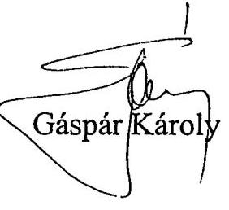

---

# Ifjúsági, Családügyi, Szociális és Esélyegyenlőségi Minisztérium GYERMEK- ÉS IFJÚSÁGVÉDELMI FÖOSZTÁLY 

Ikt. szám:
/2005-0014GYF
2005. február 22-én átadott hiányzó dokumentumok bekérésére az alábbiak szerint nyilatkozom:

- Az IFF és osztályainak ügyrendje, megszűnésének körülményei

Az SZMSZ-t amely ezt tartalmazza átadtuk. A dokumentumoknak rendelkezésünkre álló részét átadtuk.

- A 2001. évi 100 millió Ft-os média keretről kötött 25 db szerződés másolatát átadtuk. Ugyanezen kerettel kapcsolatos további dokumentumok az Egészségügyi Minisztérium sajtóirodáján találhatóak, amelyeket az ICSSZEM közigazgatási államtitkára kérésére az ÁSZ munkatársának az Egészségügyi Minisztérium közigazgatási államtitkár rendelkezését követően betekintésre átad.(2631-3/2005 sz. levél másolatát mellékelem)
- 2001-2002. évben a pályázók szakmai beszámoltatását az NCSSZI végezte, az ezzel kapcsolatos anyagokból tájékoztatásuk szerint összefoglaló jelentést adtak át.
- A Magyar Máltai Szeretetszolgálat 2001-2002. évi pénzügyi beszámoltatása folyamatban van. A 2000. évi támogatást programfinanszírozás keretében kapták, az ellenőrzéssel megbízott STROKE Pozitív Kft az eredeti számlák ellenőrzését követően nyújtotta be a MÁK-hoz kiegyenlítésre.
- Munkakör átadás átvétel szabályozásával kapcsolatban főosztályunk nem rendelkezik szabályzattal.
- A 2000. évi nyertes pályázatok anyagát az irattár nem tudta rendelkezésünkre bocsátani.
- A pályázatokat bíráló bizottság névsorát, összesítöjét átadtuk.

---

- A KEHI vizsgálati anyaga a jogelőd minisztérium pénzügyi főosztályán található, közigazgatási államtitkárnak írt levelünk alapján a pénzügy főosztály vezetője a vizsgálatot végző részére betekintésre átadja.
- A MONETA jelzése alapján a beszámolási kötelezettségüket nem teljesítőket intézkedésre a jogi főosztályra átadjuk, amennyiben a részükre küldött felszólítást követően sem számolnak el.
- Az ANNUITAS Kft-vel az IFF főosztály kötött szerződést a gyermekvédelmi intézmények fejlesztése keretből kötött pályázatok ellenőrzésére. Ezzel kapcsolatos anyagot az IFF főosztály részünkre át nem adott.
- A családpolitikai egyedi programok ellenőrzésével kapcsolatos anyagot az IFF főosztály részünkre nem adott át.

Budapest, 2005. március 02.
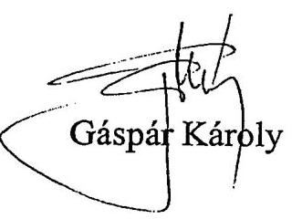

---

# Átadás-átvételi jegyzőkönyv 

Az Intézményfenntartási és Fejlesztési Főosztály 2002. július 31-i hatállyal az alábbi dokumentumokat adja át a Gyermek- és Ifjúságvédelmi Főosztálynak:

1) A 2001. és 2002. évi gyermekvédelmi nyílt pályázatok teljes dokumentációja A pályázatok számát, a felhasznált pénzkeretet az 1.,2. és 3. melléklet tartalmazza
2) A 2001. évi gyermekvédelmi és családpolitikai miniszteri tartalékkeret terhére kötött szerződések dokumentációja. A listát a 4. melléklet tartalmazza.
3) A 2002. évi 180.000.000.-Ft-os családpolitikai miniszteri tartalékkeret terhére kötött szerződések dokumentációja. A listát az 5.melléklet tartalmazza.

Az új vezetés által meg nem erősített kötelezettségvállalásokat ( 2 db ) leszámítva a rendelkezésre álló szabad keret: $42.500 .000 .-\mathrm{Ft}$
4) A 2002. évi 45.000.000.-Ft-os gyermekvédelmi miniszteri tartalékkeret terhére kötött szerződések dokumentációja. A listát a 6. melléklet tartalmazza.

Az új vezetés által meg nem erősített kötelezettségvállalást - 15.000.000.-Ft - leszámítva a rendelkezésre álló szabad keret: $10.880 .000 .-\mathrm{Ft}$
5) Ugyancsak átadásra kerülnek a pályázati program lebonyolítása során keletkezett segédanyagok. Szerződésminták, a pénzügyi bonyolításhoz készült útmutató, táblázatok, bírálóbizottsági összeállítás stb.
6) A családpolitikai nyílt pályázatot 2001-ben és 2002-ben is a Haraszti István vezette Családpolitikai Igazgatóság bonyolította le az NCSSZI-ben. Ezek pályázati dokumentációja ott érhető el. Táblázatok lemezen átadásra kerülnek.
NCSSZI-ben illetékes: Haraszti István, Bíró Boglárka, Tófejy Éva 465-5000, 465-5017
7) Ugyancsak átadásra kerül az NCSSZI-vel a 2001. évi 100.000.000.-Ft-os családpolitikai egyedi keret terhére kötött 6 db szerződés dokumentációja, valamint a 2002. évi 141.000.000.-Ft-os családpolitikai egyedi keret terhére kötendő 8 db megállapodás tervezete. Ez utóbbi jóváhagyásra a felső vezetés előtt van.

---

8) A 2001. évben a Családpolitikai pályázatok terhére kötött szerződések pénzügyi beszámolásainak ellenőrzését a Moneta Kft., a Gyermekvédelmi pályázatok terhére kötött szerződések pénzügyi beszámolásainak ellenőrzését az Annuitás Kft. végzi.
A 2002. évben a Családpolitikai és a Gyermekvédelmi pályázatok terhére kötött szerződések pénzügyi beszámolásainak ellenőrzését a Moneta Kft. végzi.
(123916-1/2002-3027. sz. szerződések aláírásra felküldve,
123911-1/2002-3027. sz. szerződések intézkedésre várnak.)
9) A 2002. évi Gyermekvédelmi intézmények, prevenciós programok és szolgálatok fejlesztése, illetve a Családpolitikai programok Miniszter úr által engedélyezett támogatásokról szóló eredeti táblák.

Budapest, 2002.08.01.

Intézményfenntartási és Fejlesztési Főosztály Gyermek- és Ifjúságvédelmi Főosztály

Átadó
Átvevő
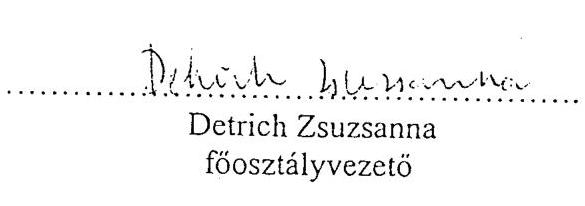

| $\begin{aligned} & \text { Detrich Zsuzsanna } \\ & \text { főosztályvezető } \end{aligned}$ | 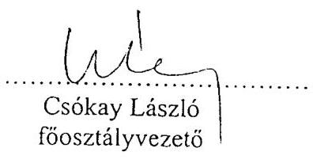 |
| :--: | :--: |

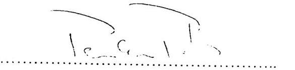

|  |  |
| :--: | :--: |

---

# EGÉSZSÉGÜGYI, SZOCIÁLIS ÉS CSALÁDÜGYI MINISZTÉRIUM   KÖZIGAZGATÁSI ÁLLAMTITKÁR 

Dr. Pulay Gyula közigazgatási államtitkár úr Foglalkoztatáspolitikai és Munkaügyi Minisztérium

## Tisztelt Közigazgatási Államtitkár Úr!

Mint az Ön elốtt is ismeretes, a korábbi Szociális és Családügyi Minisztériumban múködô, de azóta megszûnt Intézményfenntartási- és Fejlesztési Fôosztály vezetôje Detrich Zsuzsanna a Foglalkoztatási és Munkaügyi Minisztérium állományába került át.

Azonban a megszûnt fôosztály és a szakfôosztályok között csak dokumentum átadás történt. Nem történt meg a hivatalos feladat átadás-átvétel, aminek hiányában az egyes fôosztályok a megkapott feladatokat - ezek pályázati ügyek és dokumentumok - nem tudják maradéktalanul teljesíteni.
A helyzet mihamarabbi tisztázása érdekében kérem Államtitkár Úr hozzájárulását, hogy Detrich Zsuzsanna, az egyes fôosztályokkal egyeztetett idôpontokban részt vegyen a hivatalos feladat átvételi eljárásban.

Budapest, 2002. október 29.

Üdvözlettel:

## 0000

Bemutatva: 1
Szabó Sándorné

---

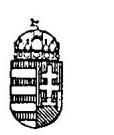

# FOGLALKOZTATÁSPOLITIKAI ÉS MUNKAÜGYI MINISZTÉRIUM KÖZIGAZGATÁSI ÁLLAMTITKÁR 

H-1054 Budapest V., Altunmány utca 3.
1243 Budapest, Penczíkik. 580
telefon: $(36-1) 472-8200$
Fax: $(36-1) 472-8201$

I/PGY/1615/2002.
Hivatkozási szám: KÁT/2242/JF/02.

Dr. Jakab Ferencné asszonynak
közigazgatási államtitkár
Egészségügyi, Szociális és Családügyi Minisztérium

## Budapest

## Tisztelt Államtitkár Asszony!

Hozzájárulok ahhoz, hogy Detrich Zsuzsanna részt vegyen az Egészségügyi, Szociális és Családügyi Minisztérium egyes főosztályai és az Egészségügyi, Szociális és Családügyi Minisztérium Intézményfenntartási- és Fejlesztési Főosztálya közötti hivatalos feladat átvételi eljárásban.

Kérem, hogy az időpontokat Detrich Zsuzsannával közvetlenül egyeztessék.
Budapest, 2002. november 14.
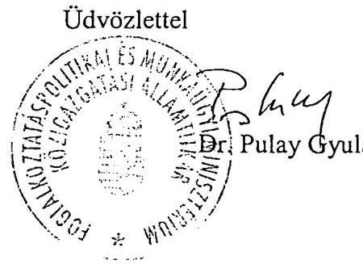

---

### 8. sz. melléklet a V-35-127/2004-2005. sz. jelentéshez

## **Családpolitikai pályázatok tematikájának időrendi áttekintése 2000-2004. év**

|  2000. év
SZCSM pályázati felhívás (részlet): A/2 Családokat segítő, új típusú szolgáltatások | 2001. év
Pályázati felhívás a Magyar Köztársaság Kormányprogramjában megfogalmazott családpolitikai célok megvalósítására | 2002. év
Pályázati felhívás a Magyar Köztársaság Kormányprogramjában megfogalmazott családpolitikai célok megvalósítására | 2003. év
ESZCSM pályázati felhívás (részlet) SZ03.GY/2A2/b) Családokat támogató, családi funkciók megőrzését segítő, családsegítő szolgálatok szolgáltatásainak fejlesztése | 2004. év
ESZCSM pályázati felhívás (részlet) a gyermekjóléti alapellátások, prevenciós programok, valamint a gyermekvédelmi szakellátások fejlesztésére – 04GY/L/A Családsegítő és gyermekjóléti prevenciós programok  |
| --- | --- | --- | --- | --- |
|  Az ép családok kohézióját növelő, a családi funkciók megőrzését segítő új típusú eljárások és szolgáltatások kialakítása és működtetése | A)1 Házasságra felkészítő tanfolyamok | D program: Házasságra felkészítő programok | - | -  |
|   | B)1 Család csoportok, közösségek | E program: Családi közösségépítő program | A családok kapcsolatra és a családi konfliktusok kezelését szolgáló önálló programok | -  |
|   | B)3 Képzések házaspárok és családok részére |  |  |   |
|   | C)2 A családi kohéziót erősítő szolgáltatások, alkalmi rendezvények | G program: A családi kohéziót erősítő szolgáltatások, alkalmi rendezvények |  |   |
|  - | C)3 A családdal foglalkozó írott és elektronikus kiadványok megjelentetése | H program: A családdal foglalkozó írott kiadványok megjelentetése | - | -  |
|   |  | K program: A családdal foglalkozó elektronikus kiadványok megjelentetése |  |   |
|  A krízishelyzetben lévő, még nem súlyosan sérült családok segítése | C)1 Nehéz élethelyzetben lévő családokat segítő szolgáltatások | F program: A családok társadalmi felelősségrállalását (szolidaritását), önsegítő funkcióinak (szubszidiartlásának) erősítését, a nehéz élethelyzetben lévő családokat segítő szolgáltatások, képzések | Nehéz szociális helyzetben vagy speciális élethelyzetben lévő családokat segítő közösségi programok, családokat segítő új típusú szolgáltatások fejlesztése | -  |
|  A generációk közötti együttműködést és kölcsönös segítést szolgáló programok elindítása | B)2 Generációk együttműködése | - | - | -  |
|  A helyi közösségek megerősítését, önszerveződését szolgáló programok támogatása | A)2 Ifjúsági csoportok és klubok | - | - | -  |
|   | D)1 Csoportvezető, animátor képzési programok megvalósítása | L program: Csoportvezető, animátor képzési programok | - | -  |
|   | - | - | - | 04GY/LA/1. "Biztos kezdet" (Sure Start) helyi programok működtetésére meghívásos pályázat
04GY/LA/2. Speciális gyermekjóléti szolgáltatás és alternatív napközbeni ellátás
04GY/LA/3. Családon belüli erőszak, illetve gyermekbántalmazás megelőzése
04GY/L/A/4. Gyermekbántalmazással kapcsolatos kiadványok megjelentetése  |

*Megjegyzés: a helyszíni vizsgálattal is érintett pályázati kategóriák szürke háttérrel jelölve*

---

# TÁBLÁZATOK JEGYZÉKE 

1. sz. táblázat
2. sz. táblázat
3. sz. táblázat
4. sz. táblázat
5. sz. táblázat
6. sz. táblázat
7. sz. táblázat
8. sz. táblázat
9. sz. táblázat
10. sz. táblázat
11. sz. táblázat
12. sz. táblázat
13. sz. táblázat
14. sz. táblázat
15. sz. táblázat
16. sz. táblázat

Családpolitikai célú fejezeti kezelésű előirányzatok alakulása 2000-2002

Családpolitikai célú fejezeti kezelésű előirányzatok alakulása 2003-2004

Családpolitikai pályázatok adatai 2000 (SZCSM pályázat)
Családpolitikai pályázatok adatai 2001
Családpolitikai pályázatok adatai 2002
Családpolitikai pályázatok adatai 2003 (ESZCSM pályázati felhívás)

Családpolitikai pályázatok adatai 2004 (ESZCSM pályázati felhívás)

A pályázó szervezetek típusa
Családdal foglalkozó írott kiadványok összefoglaló adatai
Csoportvezető, animátor képzési program összefoglaló adatai
2001. évi családpolitikai programok keretében személygépkocsi vásárlásra nyújtott utófinanszírozású támogatás utalás előtti pénzügyi ellenőrzése
2001. évi családpolitikai programok keretében egyedi döntés alapján folyósított támogatások elszámolásának ellenőrzése

A 2001. évi családpolitikai célok megvalósítására kiírt pályázat alapján támogatásban részesülők

A 2002. évi családpolitikai célok megvalósítására kiírt pályázat alapján támogatásban részesülők

Az írott-elektronikus pályázatok bírálói értékelése
Az írott és az audio-vizuális kiadványok hasznosulása

---

# Családpolitikai célú fejezeti kezelésű előirányzatok alakulása 2000-2002

|  S.sz. | Megnevezés | 2000 |  |  | 2001 |  |  | 2002 |  |   |
| --- | --- | --- | --- | --- | --- | --- | --- | --- | --- | --- |
|   |  | Családsegítő és gyermekvédelmi prevenciós programok és szolgáltatások fejlesztése |  |  | Családpolitikai programok |  |  | Családpolitikai programok |  |   |
|   |  | Kiadási előirányzat | Pályázat alapján felhasználható | Egyedi elbírálás alapján | Kiadási előirányzat | Pályázat alapján felhasználható | Egyedi elbírálás alapján | Kiadási előirányzat | Pályázat alapján felhasználható | Egyedi elbírálás alapján  |
|  1. | Eredeti előirányzat (E Ft) | 267000 | ** | ** | 1000000 | $640000^{*}$ | $360000^{*}$ | 1406200 | $910200^{*}$ | $496000^{*}$  |
|  2. | Módosított előirányzat (E Ft) | 263551 | $76525^{*}$ | $187026^{*}$ | 1115288 | ** | ** | 1477160 | ** | **  |
|  3. | Tényleges teljesítés (E Ft) | 142466 | $6745^{*}$ | $135721^{*}$ | 824997 | ** | ** | 1234703 | ** | **  |
|  4. | Maradvány (E Ft) | 121086 | $69780^{*}$ | $51305^{*}$ | 290290 | ** | ** | 243651 | ** | **  |
|  5. | Maradvány a teljesítéshez képest (\%) | $85,00 \%$ | ** | ** | $35,20 \%$ | ** | ** | $19,80 \%$ | ** | **  |

Forrás: Ifjúsági, Családügyi, Szociális és Esélyegyenlőségi Minisztérium és a Nemzeti Család- és Szociálpolitikai Intézet

- A csillaggal jelölt adatokat csak tájékoztatásul adta meg az ICsSzEM Ifjúságpolitikai és Gyermekvélemi Főosztálya. ** Nincs adat

---

# Családpolitikai célú fejezeti kezelésű előirányzatok alakulása 2003-2004

|  Sorszám | Megnevezés | 2003 |  |  | 2004 |  |   |
| --- | --- | --- | --- | --- | --- | --- | --- |
|   |  | Gyermekvédelmi törvényben előírt feladatok |  |  | Gyermekjóléti alapellátások, gyermekvédelmi szakellátások |  |   |
|   |  | Kiadási előirányzat | Pályázat alapján felhasználható | Egyedi elbírálás alapján | Kiadási előirányzat | Pályázat alapján felhasználható | Egyedi elbírálás alapján  |
|  1. | Eredeti előirányzat (E Ft) | 900000 | ** | ** | 600000 | ** | **  |
|  2. | Módosított előirányzat (E Ft) | 843828 | 821 858* | 21 970* | 243627 | 156 100* | 87 527*  |
|  3. | Tényleges teljesítés (E Ft) | 812111 | 806 788* | 5 323* | 239217 | 156 100* | 83 117*  |
|  4. | Maradvány (E Ft) | 34717 | 15 070* | 16 647* | 4410 | - | 4 410*  |
|  5. | Maradvány a teljesítéshez képest (%) | 4,10% | ** | ** | 1,20% | ** | **  |

*Forrás: Ifjúsági, Családügyi, Szociális és Esélyegyenlőségi Minisztérium és a Nemzeti Család- és Szociálpolitikai Intézet*

Nem tartalmaz az előirányzat átadásokat, valamint az előző évi maradványokat.

- A csillaggal jelölt adatokat csak tájékoztatásul adta meg az ICsSzEM Ifjúságpolitikai és Gyermekvélemi Főosztálya.

* Nincs adat

---

# Családpolitikai pályázatok adatai 2000

(SZCSM pályázat)

|  Megnevezés | Pályázó szervezetek száma (db) | Beérkezett pályázatok (db) | Érvényes pályázatok (db) | Nyertes pályázatok (db) | Odaitélt támogatás összege (E Ft) | Helyszínen ellenőrzött (db) | Maradvány (E Ft)  |
| --- | --- | --- | --- | --- | --- | --- | --- |
|  A/2) Családokat segítő, új típusú szolgáltatások (összesen) | ** | 136 | ** | 81 | 33000 | ** | **  |
|  - Az ép családok kohézióját növelő, a családi funkciók megőrzését segítő | ** | 34 | ** | 23 | 10232 | ** | **  |
|  - A krízishelyzetben lévő még nem súlyosan sérült családok segítése | ** | 61 | ** | 37 | 14768 | ** | **  |
|  - A generációk közötti együttműködést és kölcsönös segítést szolgálóprogramok elindítása | ** | 25 | ** | 12 | 4750 | ** | **  |
|  - A helyi közösségek megerősítését, önszerveződését szolgáló programok támogatása | ** | 16 | ** | 9 | 3250 | ** | **  |

Forrás: Ifjúsági, Családügyi, Szociális és Esélyegyenlőségi Minisztérium és a Nemzeti Család- és Szociálpolitikai Intézet

[^0] [^0]: ** Nincs adat

---

# Családpolitikai pályázatok adatai 2001

(Pályázati felhívás a MK Kormányprogramjában megfogalmazott családpolitikai célok megvalósítására)

|  S.sz. | Megnevezés | Pályázó szervezetek száma (db) | Beérkezett pályázatok (db) | Érvényes pályázatok (db) | Nyertes pályázatok (db) | Odaitélt támogatás összege (E Ft) | Helyszínen ellenőrzött (db) | Maradvány (E Ft)  |
| --- | --- | --- | --- | --- | --- | --- | --- | --- |
|  1. | A)1 Házasságra felkészítő tanfolyamok | 51 | 51 | ** | 47 | 13923 | 22 | **  |
|  2. | B)1 Családi csoportok, közösségek | 377 | 415 | ** | 385 | 98523 | 167 | **  |
|  3. | C)2 A családi kohéziót erősítő szolgáltatások, alkalmi rendezvények | 281 | 484 | ** | 326 | 108674 | 135 | **  |
|  4. | C)3 A családdal foglalkozó írott és elektronikius kiadványok megjelentetése | 157 | 236 | ** | 144 | 154948 | - | **  |
|  5. | B)3 Képzések házaspárok és családok részére | 70 | 76 | ** | 63 | 27506 | 34 | **  |
|  6. | C)1 Nehéz élethelyzetben lévő családokat segítő szolgáltatások | 430 | 442 | ** | 340 | 78063 | 205 | **  |
|  7. | B)2 Generációk együttműködése | 153 | 151 | ** | 131 | 35067 | 50 | **  |
|  8. | A)2 Ifjúsági csoportok és klubok | 204 | 228 | ** | 210 | 46121 | 81 | **  |
|  9. | D)1 Csoportvezető, animátor képzési programok megvalósítása | 36 | 40 | ** | 35 | 32075 | 8 | **  |
|  10. | Osszesen | 1759 | 2123 | ** | 1681 | 594900 | 702 | **  |

Forrás: Ifjúsági, Családügyi, Szociális és Esélyegyenlőségi Minisztérium és a Nemzeti Család- és Szociálpolitikai Intézet

[^0] [^0]: ** Nincs adat

---

# Családpolitikai pályázatok adatai 2002

(Pályázati felhívás a MK Kormányprogramjában megfogalmazott családpolitikai célok megvalósítására)

|  S.sz. | Megnevezés | Pályázó szervezetek száma (db) | Beérkezett pályázatok (db) | Érvényes pályázatok (db) | Nyertes pályázatok (db) | Odaitélt támogatás összege (E Ft) | Helyszínen ellenőrzött (db) | Maradvány (E Ft)  |
| --- | --- | --- | --- | --- | --- | --- | --- | --- |
|  1. | D)Házasságra felkészítő tanfolyamok | 143 | 156 | ** | 126 | 62859 | ** | **  |
|  2. | E) Családi közösségépítő program | 243 | 280 | ** | 214 | 98698 | ** | **  |
|  3. | G) A családi kohéziót erősítő szolgáltatások, alkalmi rendezvények | 381 | 445 | ** | 403 | 242845 | ** | **  |
|  4. | H) A családdal foglalkozó írott kiadványok megjelentetése | 96 | 108 | ** | 97 | 75256 | ** | **  |
|  5. | K) A családdal foglalkozó elektronikus kiadványok megjelentetése | 71 | 128 | ** | 101 | 176287 | ** | **  |
|  6. | F) A családok társadalmi felelősségvállalását (szolidaritását), önsegítő funkcióinak (szubszidiaritásának) erősítését, a nehéz élethelyzetben lévő családokat segítő szolgáltatások, képzések | 284 | 323 | ** | 282 | 148870 | ** | **  |
|  7. | L) Csoportvezető, animátor képzési program | 44 | 58 | ** | 56 | 50985 | ** | **  |
|  8. | Osszesen | 1262 | 1498 | ** | 1279 | 855800 | ** | **  |

Forrás: Ifjúsági, Családügyi, Szociális és Esélyegyenlőségi Minisztérium és a Nemzeti Család- és Szociálpolitikai Intézet

[^0] [^0]: ** Nincs adat

---

# Családpolitikai pályázatok adatai 2003

(ESZCSM pályázati felhívás)

|  Megnevezés | Beérkezett
pályázatok
(db) | Nyertes
pályázatok
(db) | Odaitélt
támogatás
összege (E Ft) | Helyszínen
ellenőrzött
(db) | Maradvány
(E Ft)  |
| --- | --- | --- | --- | --- | --- |
|  SZ03.GY/"A"/b) Családokat
támogató, családi funkciók
megőrzését segítő, családsegítő
szolgálatok szolgáltatásainak
fejlesztése (összesen) | 191 | 120 | 36672 | ** | **  |
|  - A családok kapcsolaterősítését és
a családi konfliktusok kezelését
szolgáló önálló programok | 65 | 43 | 10183 | ** | **  |
|  - Nehéz szociális helyzetben vagy
speciális élethelyzetben lévő
családokat segítő közösségi
programok, családokat segítő új
típusú szolgáltatások fejlesztése | 126 | 77 | 26489 | ** | **  |

Forrás: Ifjúsági, Családügyi, Szociális és Esélyegyenlőségi Minisztérium és a Nemzeti Család- és Szociálpolitikai Intézet

[^0] [^0]: ** Nincs adat

---

# Családpolitikai pályázatok adatai 2004

(ESZCSM pályázati felhívás)

|  Megnevezés |  | Beérkezett pályázatok (db) | Nyertes pályázatok (db) | Odaitélt támogatás összege (E Ft) | Helyszinen ellenőrzött (db) | Maradvány (E Ft)  |
| --- | --- | --- | --- | --- | --- | --- |
|  04GY/L/A Családsegítő és gyermekjóléti prevenciós programok (összesen) |  | 199 | 82 | 40500 | ** | **  |
|  ebből |  |  |  |  |  |   |
|   | 04GY/L.A/1. "Biztos kezdet" a gyermekszegénység köv. megelőzésére, esélyegyenlőség megteremtése | 5 | 5 | 13500 | ** | **  |
|   | 04GY/L.A/2. Speciális gyermekjóléti szolgáltatás és alternatív napközbeni ellátás | 130 | 45 | 12000 | ** | **  |
|   | 04GY/L.A/3. Családon belüli erőszak, illetve gyermekbántalmazás megelőzése | 49 | 23 | 10470 | ** | **  |
|   | 04GY/L.A/4.
Gyermekbántalmazással kapcsolatos kiadványok megjelentetése | 15 | 9 | 4530 | ** | **  |

Forrás: Ifjúsági, Családügyi, Szociális és Esélyegyenlőségi Minisztérium és a Nemzeti Család- és Szociálpolitikai Intézet

[^0] [^0]: ** Nincs adat

---

# A pályázó szervezetek típusa

|  S.sz. | Megnevezés | 2000 |  | 2001 |  | 2002 |  | 2003 |  | 2004 |   |
| --- | --- | --- | --- | --- | --- | --- | --- | --- | --- | --- | --- |
|   |  | Beérkezett | Nyert | Beérkezett | Nyert | Beérkezett | Nyert | Beérkezett | Nyert | Beérkezett | Nyert  |
|  1. | Nem állami szervezetek |  |  |  |  |  |  |  |  |  |   |
|  2. | egyesület | 6 | 1 | ** | 448 | ** | 74 | 17 | 14 | 21 | 9  |
|  3. | alapítvány | 19 | 10 | ** | 459 | ** | 79 | 32 | 11 | 21 | 11  |
|  4. | közhasznú társaság | 3 | 3 | ** | 30 | ** | 9 | 1 | - | 5 | 1  |
|  5. | non-profit szervezet | - | - | ** | - | ** | - | - | - | - | -  |
|  6. | egyházi szervezet | 3 | 3 | ** | 405 | ** | 148 | 5 | 3 | 1 |   |
|  7. | Nem állami szervezetekkel együttmúködő önkormányzatok |  |  |  |  |  |  |  |  |  |   |
|  8. | ök-i intézmények | 81 | 52 | ** | 269 | ** | 93 | 100 | 69 | 86 | 36  |
|  9. | családsegítő szolgálatok | 19 | 12 | ** | - | ** | - | 35 | 16 | 58 | 23  |
|  10. | ök-i társulások | - | - | ** | - | ** | - | - | - | - | -  |
|  11. | közalapítványok | - | - | ** | - | ** | - | - | - | 7 | 6  |
|  12. | Összesen | 131 | 81 | ** | 1611 | ** | 403 | 190 | 113 | 199 | 86  |

Forrás: Ifjúsági, Családügyi, Szociális és Esélyegyenlőségi Minisztérium és a Nemzeti Család- és Szociálpolitikai Intézet

[^0] [^0]: ** Nincs adat

---

# Családdal foglalkozó írott kiadványok összefoglaló adatai 

| Sorszám | Megnevezés | 2001 | 2002 |
| :--: | :--: | :--: | :--: |
| 1. | Pályázó szervezetek száma (db) | 157 | 145 |
| 2. | ebből |  |  |
| 3. | nyertes | 107 | 130 |
| 4. | Pályázatok száma (db) | 236 | 236 |
| 5. | ebből |  |  |
| 6. | érvényes |  |  |
| 7. | nyertes | 144 | 198 |
| 8. | Elnyert támogatás összege (E Ft) | 154948 | 251543 |
| 9. | ebből |  |  |
| 10. | bér | 32010 | 223621 |
| 12. | felhalmozás | - | 27922 |
| 13. | maradvány | - |  |
| 14. | Írott kiadványok példányszáma (db) | 500 | 2000 |
| 15. | ebből |  |  |
| 16. | kész kiadvány (db) | 160 | 140 |
| 17. | ebből |  |  |
| 19. | új kiadvány (db) | * | * |
| 20. | Elektronikus adathordozóra rögzített anyagok (db) | $76^{* *}$ | $133^{*}$ |
| 21. | A pályázati összegből létrehozott honlapok száma (db) | 7 | 29 |
| 22. | ebből |  |  |
| 23. | jelenleg is múködő (db) | 6 | 24 |

* könyvek 95\%-a, a folyóiratok kb. 70\%-a új, vagy új rovattal bővült
** rádiós sorozatok 1-nek véve

---

# Csoportvezető, animátor képzési program összefoglaló adatai 

| Sorszám | Megnevezés | 2001 | 2002 |
| :--: | :--: | :--: | :--: |
| 1. | Pályázó szervezetek száma (db) | 36 | 44 |
| 2. | ebből |  |  |
| 3. | nyertes | 30 | 42 |
| 4. | Pályázatok száma (db) | 40 | 57 |
| 5. | ebből |  |  |
| 6. | érvényes |  |  |
| 7. | nyertes | 35 | 56 |
| 8. | Elnyert támogatás összege (E Ft) | 31025 | 50985 |
| 9. | ebből |  |  |
| 10. | bér | 7331 | 39333 |
| 11. | dologi | 23693 |  |
| 13. | maradvány |  |  |
| 14. | A kiképzett vezetők, animátorok létszáma a   különböző programokon belül (fő): | kb. 700 | kb. 1000 |
| 15. | "A" program | * | * |
| 16. | "B " program |  |  |
| 17. | "C" program |  |  |

---

Szociális és Családügyi Minisztérium

# **Családpolitikai program**

**2001. évi Családpolitikai programok keretében személygépkocsi vásárlásra nyújtott utófinanszírozású támogatás utalás előtti pénzügyi ellenőrzése**

1. sz. melléklet

|  Feladatazonosító szám: | 2 600  |
| --- | --- |
|  Szerződések száma: | 54686-1/2001-3027  |

|  Sor-
szám | Pályázó neve | Címe | Támogatási
összeg
Ft | Támogatás
tárgya | Elszám.
hat.ideje | Beküldése | Hiánypótlás
beérkezés | Utalás
átadás
időpontja  |
| --- | --- | --- | --- | --- | --- | --- | --- | --- |
|  1 | Miskolc Családsegítő Szolgálat | Miskolc | 1 500 000 | Szgk vásárlás | 2002.07 | 2001.12.06 | 2001.12.12 | 2001.12.13  |
|  2 | SzMJV Önkormányzat Humán Szolgáltató Központ Tabán
Családsegítő Közösségi Ház és Regionális Módszertani
Családsegítő Szolgálat | Szeged | 1 500 000 | Szgk vásárlás | 2002.07 | 2002.02.05 | 2002.02.18 | 2002.02.21  |
|  3 | DMJV Regionális Családsegítő és Megyei Gyermekjóléti
Módszertani Központ | Debrecen | 1 500 000 | Szgk vásárlás | 2002.07 | 2001.11.15 |  | 2001.11.29  |
|  4 | Regionális Családsegítő és Megyei Gyermekjóléti
Módszertani Családsegítő Központ | Kaposvár | 1 500 000 | Szgk vásárlás | 2002.07 | 2001.10.15 | 2001.11.08 | 2001.11.15  |
|  5 | Győr MJV Önkormányzat Humán Családsegítő Szolgálat
Regionális Családsegítő és Megyei Gyermekjóléti
Módszertani Családsegítő Központ | Győr | 1 500 000 | Szgk vásárlás | 2002.07 | 2001.11.19 | 2001.11.29 | 2001.12.03  |
|  6 | Összesen: |  | 7 500 000 |  |  |  |  |   |

A Moneta Kft. "Egyedi szgk. 1. melléklet.xls" nevű elektronikus adatállománya.

---

Szociális és Családügyi Minisztérium

# Családpolitikai program

2001. évi Családpolitikai programok keretében egyedi döntés alapján folyósított támogatások elszámolásának ellenőrzése

|  Sor-
szám | Szerződés
szám | Pályázó neve | Támogatási
összeg
Ft | Támogatás
tárgya | Elszámolás
hat.ideje | Hlánypótlás
beérkezés | Elfogadás  |
| --- | --- | --- | --- | --- | --- | --- | --- |
|  1 | 58574 | Magyar Családteráplás Egyesület | 2 000 000 | Konferencia | 2001.07.31. | 2002.06.17 | 2002.10.14  |
|  2 | 62424 | "Otthon segítünk" Alapítvány | 6 500 000 | Hálózat építés | 2002.06.30. | 2002.06.25 | 2002.08.01  |
|  3 | 62657 | Mobilitas - Nemzeti Ifjúságkutató Intézet | 7 000 000 | Kutatás | 2002.06.30. | 2002.06.26 | 2002.08.01  |
|  4 | 85228 | Komárom-Észtergom Megyei Közig. Hivatal | 200 000 | Konferencia | 2001.12.31. | 2002.01.31 |   |
|  5 | 93964 | ARKADAS Pszichológiai, Művészeti Bt. | 6 000 000 | Könyv megjelentetés | 2002.09.30. | 2002.09.30 |   |
|  6 | 130041 | Nagycsaládosok Országos Egyesülete | 800 000 | Kongresszus | 2002.03.31. | 2002.05.21 |   |
|   |  | Összesen: | 22 500 000 |  |  |  |   |

- A minisztérium a méltányossági kérelmét elfogadta

A Moneta Kft. "Egyedi támogatások 2. melleklet.xls" nevű elektronikus adatállománya.

---

# A 2001. évi családpolitikai célok megvalósítására kiírt pályázat alapján támogatásban részesülők 

| Kategória | Adott   kategóriában   odaítélt összeg   (E Ft) | Támogatott   programok   száma   (db) | Egy   programra   eső támogatás   összege   (E Ft) |
| :-- | :--: | :--: | :--: |
| A/1 Házasságra felkészítő tanfo-   lyamok | 13923 | 47 | 296,2 |
| A/2 Ifjúsági csoportok és klubok | 46121 | 210 | 219,6 |
| B/1 Család csoportok, közösségek | 98523 | 385 | 255,9 |
| B/2 Generációk együttműködése | 35067 | 131 | 267,7 |
| B/3 Képzések házaspárok és csalá-   dok részére | 27506 | 63 | 436,6 |
| C/1 Nehéz élethelyzetben lévő csalá-   dokat segítő szolgáltatások | 78063 | 340 | 229,6 |
| C/2 A családi kohéziót erősítő szol-   gáltatások, alkalmi rendezvé-   nyek | 108674 | 326 | 333,3 |
| C/3 A családdal foglalkozó írott és   elektronikus kiadványok megje-   lentetése | 154948 | 144 | 1076,0 |
| D/1 Csoportvezető, animátor képzési   programok megvalósítása | 32075 | 35 | 916,4 |
| Összesen | 594900 | 1681 | 353,9 |

---

# A 2002. évi családpolitikai célok megvalósítására kiírt pályázat alapján támogatásban részesülők 

| Kategória | Adott   kategóriában   odaítélt ösz-   szeg (E Ft) | Támogatott   programok   száma   (db) | Egy   programra   eső támogatás   összege   (E Ft) |
| :-- | :--: | :--: | :--: |
| D) Házasságra felkészítő tanfolyamok | 62859 | 126 | 498,8 |
| E) Családi közösségépítő program | 98698 | 214 | 461,2 |
| F) A családok társadalmi felelősség-   vállalását (szolidaritását), önsegítő   funkcióinak (szubszidiaritásának)   erősítését, a nehéz élethelyzetben   lévő családokat segítő szolgáltatá-   sok, képzések | 148870 | 282 | 527,9 |
| G) A családi kohéziót erősítő szolgál-   tatások, alkalmi rendezvények | 242845 | 403 | 602,6 |
| H) A családdal foglalkozó írott kiad-   ványok megjelentetése | 75256 | 97 | 775,8 |
| K) A családdal foglalkozó elektronikus   kiadványok megjelentetése | 176287 | 101 | 1745,4 |
| L) Csoportvezető, animátor képzési   programok megvalósítása | 50985 | 56 | 910,4 |
| Összesen | 855800 | 1279 | 669,1 |

---

# Az írott-elektronikus pályázatok bírálói értékelése 

| Sorszám | A szervezet neve (pályázat azonosítója) | Igényelt támogatás (E Ft) | Bírálati javaslat |  | Elnyert   támogatás   (E Ft) |
| :--: | :--: | :--: | :--: | :--: | :--: |
|  |  |  | 1. | 2. |  |
| 1. | Kék Világ Alapítvány (K/0087) | 3324 | 3324 | 1500 | 2500 |
| 2. | Down Alapítvány (jogutódja:   Csupaszívek Társasága) (H/0034) | 1780 | 2000 | 2000 | 1300 |
| 3. | Down Alapítvány (jogutódja:   Csupaszívek Társasága) (K/0060) | 3560 | 1000 | 1500 | 2200 |
| 4. | Alfa Szövetség (C3a-094)) | 1000 | 1000 | elutasította | 900 |
| 5. | Alfa Szövetség (C3b-407) | 3000 | nincs összeg | nincs összeg | 1000 |
| 6. | Alfa Szövetség (H/0042) | 2000 | 2000 | 2000 | 2000 |
| 7. | Alfa Szövetség (K/0052) | 4000 | 3000 | 2000 | 2000 |
| 8. | $\begin{aligned} & \text { Sapitentia Szerzetesi Hittudományi } \\ & \text { Főiskola (C3a-022) } \end{aligned}$ | 2150 | nincs összeg | 750 | 1700 |
| 9. | $\begin{aligned} & \text { Sapitentia Szerzetesi Hittudományi } \\ & \text { Főiskola (H/0049) } \end{aligned}$ | 2000 | 1000 | 2000 | 1500 |
| 10. | $\begin{aligned} & \text { Sapitentia Szerzetesi Hittudományi } \\ & \text { Főiskola (K/0026) } \end{aligned}$ | 3999 | 3000 | elutasította | 2500 |
| 11. | $\begin{aligned} & \text { Sapitentia Szerzetesi Hittudományi } \\ & \text { Főiskola (K/0027)* } \end{aligned}$ | 2454 | 2454 | 1200 | 1100 |
| 12. | Videobank Alapítvány (K/0094-K/0105) | 53484 | 45468 | 24000 | 36000 |
| 13. | $\begin{aligned} & \text { Közös Jövőnk a Család Egyesület } \\ & \text { (K/0108-K/0133) } \end{aligned}$ | 78664 | 21000 | 39000 | 24000 |
| 14. | Házas Hétvége Katolikus Alapítvány (C3a-057) | 384 | nincs összeg | hiányzik a bírálati lap | 384 |
| 15. | Házas Hétvége Katolikus Alapítvány (C3a-100) | 1100 | 500 | nincs összeg | 800 |
| 16. | Házas Hétvége Katolikus Alapítvány (H/0050) | 300 | 300 | 300 | 300 |

*     - ennél a pályázatnál 3 db bírálati lap volt, melyből az egyik bíráló elutasította a kért támogatást

---

# Az írott és az audio-vizuális kiadványok hasznosulása 

| Szervezet neve | Megítélt támogatás (E Ft) | Kiadvány típusa | Kiadvány címe | Hasznosulás |
| :--: | :--: | :--: | :--: | :--: |
| Down Egyesület | 1300 | könyv, tájékoztató   füzet | Kiadványsorozat a fogyatékosságokról és a velejárókról | A kiadványok nem kerültek kiadásra, az egyesület a pénzzel nem számolt el. |
| Alfa Szövetség | 900 | élet és   családvédelmi   folyóirat | Anya-Ország | A kiadványt határidőre elkészítették a célcsoporthoz eljuttatták. |
| Alfa Szövetség | 2000 | élet és   családvédelmi   folyóirat | Anya-Ország | A kiadványt határidőre elkészítették a célcsoporthoz eljuttatták. |
| Sapientia Szerzetesi   Hittudományi   Főiskola | 1700 | családpedagógiai munkafüzet | Csináld magad! | A kiadvány elkészült, a család órák keretében oktatási segédletként alkalmazzák. |
| Sapientia Szerzetesi   Hittudományi   Főiskola | 1500 | könyv | E. Kübler-Ross: Élet leckék | A kiadványt elkészítették, azt eredményesen használják életre nevelő tanfolymaikon. |
| Házas Hétvége   Katolikus Alapítvány | 384 | újság | Házas Hétvége   Katolikus Lelkiségi   Mozgalom Újságja | A tartalmas újság a kitűzött céloknak megfelelt, a mozgalom szellemiségét tükrözi. A kiadott 1200 példányt tagjaik számára a találkozók alkalmával és postai úton eljuttatták. |
| Házas Hétvége   Katolikus Alapítvány | 300 | újság | Házas Hétvége   Katolikus Lelkiségi   Mozgalom Újságja | A tartalmas újság a kitűzött céloknak megfelelt, a mozgalom szellemiségét tükrözi. A kiadott 1200 példányt tagjaik számára a találkozók alkalmával és postai úton eljuttatták. |
| Házas Hétvége   Katolikus Alapítvány | 800 | könyv | "és boldogan éltek, amíg ..." | A kiadvány nem készült el, a megnyert pályázati összeget kamatokkal együtt visszautalták a Minisztériumnak. |

---

| Szervezet neve | Megítélt támogatás (E Ft) | Kiadvány típusa | Kiadvány címe | Hasznosulás |
| :--: | :--: | :--: | :--: | :--: |
| Alfa Szövetség | 1000 | videofilm | Mélyből kiáltok | A megnyert támogatásból, amely a pályázott összeg harmada a filmet leforgatták, azonban az utómunkálatokra pénz hiányában nem került sor, így a film bemutatása elmaradt. |
| Alfa Szövetség | 2000 | kisjátékfilm | Túlélőkészlet a nemi önmegtartóztatás, mint életmentő eszköz | A film elkészítéséhez külföldi anyagokat is felhasználtak. A filmet több televízió sugározta, továbbá sokszorosították, hogy iskolák számára oktatás céljából elküldjék. |
| Sapientia Szerzetesi   Hittudományi   Főiskola | 2500 | videofilm | Ki ápolja?   Ki hibázott? | A megnyert összegből két filmet készítettek el, 10x8, ill. $2 \times 15$ percben. A filmeket a családórák tanfolyamaikon, továbbá iskolákban hasznosítják. |
| Videobank   Alapítvány | 36000 | video-sorozat | Nemzedékek egymásközt | A filmeket elkészítették, levetítésre azonban még nem került sor. |
| Közös Jövőnk a   Család Egyesület | 24000 | video-sorozat | Szemünk fénye | A színvonalas filmeket több televízió sugározta. |

---

# A nehéz élethelyzetben lévő családok segítésének pályázati célcsoportjai és azok elérése a beszámolók alapján

|  év: | pályázó szervezet: | pályázat címe: | célcsoportja: | célcsoport elérés:  |
| --- | --- | --- | --- | --- |
|  2000 | Van Kiút Alapítvány | Hajléktalan, krízishelyzetben élő budapesti családok egységének megőrzése | budapesti hajléktalan családok | 2 család elhelyezése, gondozása  |
|   | Családi Szolgálatok Ligája | Családterápiás rendelés krízisben lévő családok számára | házassági krízisben lévő, továbbá krónikus magatartási zavarokkal együtt élők családjai | 302 ügyfél, 77 családból  |
|  2001 | Alfa Szövetség | Másállapotukat terhességként megélő (válságterhes) anyák és családok gyermekmegtartó dilemmája | válság- és titkolt terhességet hordó anyák | 2580 esetben telefonos tanácsadás  |
|   | SOS Krízis Alapítvány | Speciális technikák bevezetése - fókuszolás, otthoni videotréning | alapítványnál dolgozó szociális munkások | Fókuszoláson részt vett 7 fő  |
|   |  | Vánkos - bántalmazott nők csoportja | a családok átmeneti otthonában élő bántalmazott nők | Nem tartalmaz számszerü adatot a beszámoló eseti ellátás 3-4 résztvevővel  |
|   |  | Szociális központú és mentálhigiénés központú szakemberek speciális célcsoport köré szervezése | az alapítványnál dolgozó szociális munkások | Szupervízió igénybevétele havi egyszer 3 órában  |
|   |  | Komplex szolgáltatást kiegészítő csoportok, klubok foglalkozások | a családok átmeneti otthonában élő családok | 14 bentlakó család krízis intervenciós konzultációja  |
|   |  | Komplex telefonos tanácsadó szolgálat | krízishelyzetben lévő telefonálók | 750 db telefonos hívás (671 lakásügyi kérdés), 83 személyes szociális, mentálhigiénés, jogi család, lakás-, munkaügyi tanácsadás  |
|   | Magyar Ökumenikus Szeretetszolgálat | Tradicionálisan roma családi kultúra integrálása a kor kihívásaihoz illesztve - Szolnok Családsegitő és Gyermekjóléti Szolgálata | a családsegitő szolgálat ellátási területén élő roma házaspárok | 1. tíz ülés: 10 fő
2. tíz ülés: 6 fő  |
|   | Nemzetközi Pető András Kózalapítvány | Utógondozás a sérült családok kezelése | az intézmény utógondozó szolgálatának páciensei, és azok családjai | A szakmai beszámoló nem tartalmazza  |
|   |  | Utógondozás - a családi kapacitás növelése modellkísérlet | az intézmény utógondozó szolgálatának páciensei, és azok családjai | Szakmai beszámoló nem volt a vizsgálat során elérhető.  |

---

|  év | pályázó szervezet: | pályázat címe: | célcsoportja: | célcsoport elérés:  |
| --- | --- | --- | --- | --- |
|  2001 | Magyar Videotréning
Egyesület | Segítő kamera a megelőző családvédelemben | videotréning iránt érdeklődő szakemberek | 20 fő gyermekvédelmi szakember  |
|   |  | Segítő kamera a sérült emberekért és családtagjaikért | gyógypedagógusok, védőnők, szociológusok | 25 fő  |
|   |  | Segítő kamera az iskolában - a családokért | pedagógusok, akik speciális igényű tanulókkal dolgoznak | Szakmai beszámoló beszerzése folyamatban.  |
|   |  | Segítő kamera a kórházakban | kórházi koraszülött osztályok dolgozói | 1 neonatológus, 1 szakápoló, 2 szociális munkás, közvetve 20 szülő  |
|   | Napraforgó Családsegítő és Gyermekjóléti Szolgálat | Gyászolóknak indított önsegítő klub, és különböző más veszteséggel küzdőknek létrehozott klub | a családsegítő szolgálat veszteséggel küzdő kliensei (XVI. kerületi lakosok), | 7 alkalommal csoportfoglalkozás veszteséggel küzdőknek: 3 állandó tag  |
|   |  | Adósság megelőző és kezelő tanácsadás és tréning, valamint háztartásvezetési klub működtetése nehéz élethelyzetben lévő családok számára | a családsegítő szolgálat kliensei, közüzemi tartozást felhalmozók, érdeklődők | Adósságkezelési tanácsadás: hetente 3-5 fő, háztartásvezetési klub: kéthetente 8-10 fő  |
|   |  | „Útitárs" - családi csoport működtetése szenvedélybetegek hozzátartozói számára | a családsegítő szolgálat kliensei, szenvedélybeteg hozzátartozóval együtt élők | 5 család ill. közvetlenül érintett hozzátartozó egyéni konzultáció keretében  |
|  2002 | Alfa Szövetség | Válságterhes anyák országos krízisszolgálatának működtetése | válságterhes anyák | 1628 esetet kezeltek a telefonos „Alfa-hangok".  |
|   | SOS Krízis Alapítvány | Ifjúsági csoportok, klubok foglalkozások átmeneti elhelyezésben lévő fiataloknak | az alapítvány által üzemeltetett családok átmeneti otthonának lakói | 10 hónapon át heti egy alkalommal 4-6 gyereknek tartott csoportfoglalkozás.  |
|   |  | Komplex tanácsadó szolgálat működtetése, fejlesztése | krízishelyzetben lévő telefonálók | Számszerű adatot a beszámoló nem tartalmaz.  |
|   |  | „Vánkos csoport" - a bántalmazás és egyéb családi krízis komplex feldolgozása érdekében | az alapítvány által üzemeltetett családok átmenti otthonának bántalmazott női lakói | Nem tartalmaz számszerű adatot a beszámoló eseti ellátás 3-4 résztvevővel.  |
|   |  | Komplex szolgáltatást kiegészítő csoportok, klubok, foglalkozások | az alapítvány által üzemeltetett családok átmeneti otthonának lakói | Családi szabadidős és játékprogramok (piknikes kirándulás, szalonnasütés, karácsony) nincs létszám adat  |
|   |  | A szociális és mentálhigiénés központú szakmák speciális célcsoport köré szervezett programjai | az alapítvány munkatársai | Saját eset ismertetések team üléseken heti 3 óra, 40 óra szupervízió igénybevétele  |

---

|  év: | pályázó szervezet: | pályázat címe: | célcsoportja: | célcsoport elérés:  |
| --- | --- | --- | --- | --- |
|  2002 | Magyar Ökumenikus Szeretetszolgálat | Nehéz élethelyzetben lévő kismamák tréningjeSzolnok Családsegítő és Gyermekjóléti Szolgálat | a családsegítő szolgálat ellátási területén élő kismamák | 10 kismama vett részt a tréningen.  |
|   |  | Hétszínvirág, avagy fejlesztő játékprogramok szociálisan hátrányos helyzetű gyerekek részéreOrosháza Családok Átmeneti Otthona | a családok átmeneti otthonában élő gyerekek és szüleik | 18 felnőtt és 41 gyerek vett részt a programokon (közös játék, mesemondó verseny, közös ünnepek, életvitel tanácsadás).  |
|   |  | Fejlesztő program szociálisan hátrányos helyzetű gyerekek és fiatalok részére Olaszliszkán | Olaszliszkán és környékén élő szociálisan hátrányos helyzetű gyerekek | Játszóház hetente kétszer 25-30 gyerek részvételével, tinédzser csoport kéthetente 20-25 fő részvételével, játszóház 120 fővel, közös ünnepek 50 fővel  |
|   |  | Szociálisan hátrányos helyzetű családok összetartó erejének növelése - Miskolc, Családok Átmenti otthona | a családok átmeneti otthonában lakó családok | Heti rendszerességgel családi délután 4-5 család részvételével, öt órai tea 10-02 fő részvételével  |
|   | Magyar Videotréning
Egyesület
Budapesti
Programiroda | Az iskolában a családokért | pedagógusok, gyermekotthonok, fiatalkorúak börtönében dolgozó nevelők | 250 fő pedagógus, iskolapszichológus tájékoztató előadás  |
|   |  | Segítő kamera a kórházakban | gyermekkórházak koraszülött osztályának munkatársai, koraszülött, újszülött gyerekek szülei | 6 egészségügyi dolgozó tanulta a módszert, tájékoztató előadássorozat 6 helyszínen.  |
|   | Napraforgó Családsegítő Szolgálat | Veszteségek miatt krízishelyzetben lévők támasznyújtó önsegítő csoportja, újrakezdők klubja | a családsegítő szolgálat ellátási területén (XVI. kerület) élő veszteségek miatt krízishelyzetben lévők | Nem valósult meg a program.  |
|   |  | Adósság megelőző- és kezelő tanácsadás, tréning, valamint háztartásvezetési klub múköd tetése | a családsegítő szolgálat ellátási területén élő, közüzemi adósságot felhalmozók és érdeklődők | Adósságkezelési tanácsadás: hetente 3-5 fő, háztartásvezetési klub: kéthetente 8-10 fő  |
|  2003 | Nap Klub Alapítvány | Nőkkel a családért | a VIII. kerületben élő GYES-en GYED-en lévő nők | 15 fő varrótanfolyam, 12 fő szülői hatékonyság trénig  |
|   | Szentimrevárosi Egyesület | „Otthon segítünk" szolgálat fejlesztése | XI. kerületi rászoruló kisgyermekes családok | 36 család, ezen belül 69 gyermek ( 898 önkéntes órában)  |
|   |  | Zsibongó klub | sokgyermekes családok | Havi rendezvényeken 20-40 család, nagyrendezvényeken 80-100 család (több kevesebb rendszerességgel 400 fő)  |

---

|  év | pályázó szervezet: | pályázat címe: | célcsoportja: | célcsoport elérés:  |
| --- | --- | --- | --- | --- |
|  2003 | Terézvárosi Családsegítő
Szolgálat | Családi táborok, tábor szenvedély betegeknek | a Terézvárosban élő, hátrányos helyzetű, 1-8
gyereket nevelő családok és a szolgálat „kártya
klub"-jának tagjai | 60 fő hátrányos helyzetű családokból, 20 fő szen-
vedélybeteg  |

Budapest, 2005. augusztus