# JELENTÉS 

az önkormányzatok által államháztartáson kívülre átadott pénzeszközök felhasználásával megvalósuló víziközmú beruházások finanszírozási rendszerének célszerűségéről

---

3. Önkormányzati és Területi Ellenőrzési Igazgatóság
3.2. Szabályszerüségi és Teljesítményellenőrzési FöcsoportIktatószám: V-1004-205/2005.Témaszám: 754
Az ellenőrzést felügyelte:
dr. Lóránt Zoltán
föigazgató
Az ellenőrzés végrehajtásáért felelős:
Németh Péterné
főcsoportfőnök
Az ellenőrzést vezette:
Szikszainé Király Mária
számvevő-tanácsos, tanácsadó
A számvevői jelentések feldolgozásában és a jelentés összeállításában
közremüködött:
dr. Marosi Gyöngyi
számvevő-tanácsos
Az ellenőrzést végezték:
dr. Boda Sándor
számvevő-tanácsos
Eigner György Zoltán
számvevő
Koczor László
számvevő
Málor Lászlóné
számvevő-tanácsos
dr. Marosi Gyöngyi
számvevő-tanácsos
Nagy Sándorné
számvevő-tanácsos
Szikszainé Király Mária dr. Szücs Zoltán
számvevő-tanácsos
Zeke József
számvevő-tanácsos

# A témához kapcsolódó eddig készített számvevőszéki jelentések: 

címe
sorszáma
Jelentés a helyi önkormányzatok beruházásaihoz és 0022
rekonstrukcióihoz nyújtott 1999. évi címzett és céltámogatások
felhasználásának vizsgálatáról
Jelentés a helyi önkormányzatok beruházásaihoz és 9922
rekonstrukcióhoz nyújtott 1998. évi címzett és céltámogatások
vizsgálatáról
Jelentés a helyi önkormányzatok beruházásaihoz és 9823
rekonstrukcióihoz nyújtott 1997. évi címzett és céltámogatások
vizsgálatáról
Jelentés a helyi önkormányzatok beruházásaihoz és 0120

---

rekonstrukcióihoz nyújtott 2000. évi címzett és céltámogatások igénybevételének és felhasználásának vizsgálatáról
Jelentés a Magyar Köztársaság 2001. évi költségvetése ..... 0232
végrehajtásának ellenőrzéséről
Jelentés az Állami Számvevőszék 2002. évi tevékenységéről ..... 0306
Jelentés a helyi önkormányzatok beruházásaihoz és ..... 0332
rekonstrukcióihoz nyújtott 2002. évi címzett és céltámogatások
Jelentés a települési önkormányzatok szennyvízközmű fejlesztési és ..... 0416
működtetési feladatai ellátásának vizsgálatáról
Jelentés a Magyar Köztársaság 2002. évi költségvetése ..... 0329
végrehajtásának ellenőrzéséről

---

# TARTALOMJEGYZÉK 

BEVEZETÉS ..... 5
I. ÖSSZEGZŐ MEGÁLLAPÍTÁSOK, KÖVETKEZTETÉSEK, JAVASLATOK ..... 8
II. RÉSZLETES MEGÁLLAPÍTÁSOK ..... 26

1. Az államháztartáson kívülre átadott pénzeszközök alakulása ..... 26
1.1. Az önkormányzati kiadások változása ..... 26
1.2. Az államháztartáson kívülre juttatott pénzeszközök átadásának szabályszerűsége ..... 27
1.3. A non-profit szervezeteknek biztosított felhalmozási célú pénzeszközök ..... 30
2. Az átadott pénzeszközök forrását képező bevételek ..... 32
3. A víziközmű beruházások támogatási formái és azok változása ..... 34
3.1. A pénzeszközátadásokat befolyásoló önkormányzati víziközmú- beruházások finanszírozási formái ..... 37
3.2. Magánszemélyeket megillető támogatási formák ..... 41
3.2.1. A közmúfejlesztési támogatás ..... 41
3.2.2. A lakás-előtakarékosság támogatása ..... 46
3.3. Társulat útján megvalósuló közmúlétesítményekhez kapcsolódó víziközmú kamattámogatások ..... 50
3.4. A három támogatási forma együttes hatása ..... 53
4. A közmúberuházások állami támogatására rendelkezésre álló források ..... 54
4.1. Az állami támogatásokat biztosító központi előirányzatok felhasználása ..... 54
4.2. A jogszabályváltozások hatása az állami támogatások alakulására ..... 57
5. A víziközmű társulatok szerepe az önkormányzati beruházások rendszerében ..... 60
6. A pénzintézetek szerepe a beruházási rendszer szervezésében ..... 63
7. A magánszemélyek támogatásával megvalósított önkormányzati beruházások hatékonyságának és célszerűségének értékelése ..... 67
7.1. A közbeszerzési eljárások lefolytatása ..... 68
7.2. A beruházás-finanszírozási módszer hatása a víziközmú beruházások fajlagos kiadásainak alakulására ..... 71
8. Az alapítványi támogatással megvalósuló önkormányzati beruházások elterjedésének következményei és hatásai ..... 73

---

# MELLÉKLETEK 

1. számú Az önkormányzatok kiadásai - kiemelten a pénzeszköz átadások - országos szinten
2. számú A vizsgált önkormányzatok kiadásai, kiemelten a pénzeszköz átadások
3. számú Az önkormányzatok bevételei országos szinten
4. számú A vizsgált önkormányzatok bevételei
5. számú Az ÖKOTÁM 2000 beruházás-finanszírozási rendszer folyamatábrája
6. számú A közpénzek jogszerú, átlátható beruházás-finanszírozási folyamatábrája
7. számú A vizsgált beruházások finanszírozásához - közvetetten - igénybevett, illetve igénybe vehető állami támogatások összege
8. számú A "Lakástámogatások" fejezeti előirányzat jogcímenkénti alakulása
9. számú 2004. évi jogtalanul igényelt közmúfejlesztési támogatás

10/A. és 10/B Egy érdekeltségi egységre jutó szennyvíz-beruházási kiadás (költség) grafikon, és adatok
11. számú Észrevétel Pénzügyminisztériumtól
12. számú Válasz Pénzügyminisztériumnak
13. számú Észrevétel Belügyminisztériumtól
14. számú Válasz Belügyminisztériumnak
15. számú Észrevétel Miniszterelnök Hivataltól
16. számú Válasz Miniszterelnök Hivatalnak
17. számú Észrevétel Pénzügyi Szervezetek Állami Felügyeletétől
18. számú Válasz Pénzügyi Szervezetek Állami Felügyeletének
19. számú Észrevétel GEOTORR Részvénytársaságtól
20. számú Válasz GEOTORR Részvénytársaságnak
21. számú Észrevétel Magyar Államkincstártól
22. számú Észrevétel Környezetvédelmi és Vízügyi Minisztériumtól

## FÜGGELÉKEK

1. számú Az ellenőrzött önkormányzatok jegyzéke
2. számú Ellenőrzött beruházások listája

3/A. és 3/B 2002. május 22. előtti és utáni egy-egy beruházás forrásösszetétele diag-
számú ramon (alapítvány által készített)
4/A. és 4/B 2002. május 22. előtti és utáni egy-egy beruházás állami támogatásának
számú alakulása grafikonon (alapítvány által készített)
5. számú Az ÖKOTÁM Beruházási rendszerhez csatlakozott települések (a rendszer hasznosítója által készített)

---

# RÖVIDÍTÉSEK JEGYZÉKE 

Ötv.
Áht.
Ász tv.
ún. „Üvegzseb" törvény

Kbt.
Számv. tv.
Szja. tv.
Ámr.
Vhr.

Szoc. tv.
Cct. tv.
160/1995. (XII. 26.)
Korm. rendelet
12/2001. (I. 31.) Korm. rendelet
215/1996 (XII. 23.)
Korm. rendelet
Ptk.
Ltp. tv.
LTP
ltp.
ltp. szerződés
Vg. tv.
ÁSZ
MÁK
PSZÁF
áfa
KAC
ÖNHIKI
Nemzeti Szennyvíz
Megvalósítási Program
ÖKOTÁM Alapítvány
ÖKOTÁM 2000 rendszer
a helyi önkormányzatokról szóló 1990. évi LXV. törvény az államháztartásról szóló 1992. évi XXXVIII. törvény
az Állami Számvevőszékről szóló 1989. évi XXXVIII. törvény
a közpénzek felhasználásával, a köztulajdon használatának nyilvánosságával, átláthatóbbá tételével és ellenőrzésének bővítésével összefüggő egyes törvények módosításáról szóló 2003. évi XXIV. számú törvény
a közbeszerzésekről szóló 1995. évi XL. törvény
a számvitelről szóló 2000. évi C. törvény
a személyi jövedelemadóról szóló 1995. évi CXVII. törvény az államháztartás múködési rendjéről szóló 217/1998. (XII. 30.) Korm. rendelet
az államháztartás szervezetei beszámolási és könyvvezetési kötelezettségének sajátosságairól szóló 249/2000. (XII. 24.) Korm. rendelet
a szociális igazgatásról és szociális ellátásokról szóló 1993. évi III. törvény
a helyi önkormányzatok címzett és céltámogatási rendszeréről szóló 1992. évi LXXXIX. törvény
vízgazdálkodási társulatokról szóló 160/1995. (XII. 26.) Korm. rendelet
a lakáscélú állami támogatásokról szóló 12/2001. (I. 31) Kormányrendelet
a lakás-előtakarékosság állami támogatásáról szóló 215/1996 (XII. 23.) Kormányrendelet
a Polgári Törvénykönyvről szóló 1959. évi IV. törvény
a lakás-takarékpénztárakról szóló 1996. évi CXIII. törvény Lakás-takarékpénztár Rt.
lakás-takarékpénztári
lakás-előtakarékossági szerződés
a vízgazdálkodásról szóló 1995. évi LVII. törvény
Állami Számvevőszék
Magyar Államkincstár
Pénzügyi Szervezetek Állami Felügyelete
általános forgalmi adó
Környezetvédelmi Alap célelőirányzat
Önhibájukon kívül hátrányos helyzetbe került helyi önkormányzatok támogatása
Nemzeti Települési Szennyvíz-elvezetési és -tisztítási Megvalósítási Program
ÖKOTÁM Csatornázást és Szennyvíztisztítást Elősegítő és Támogató Kiemelten Közhasznú Alapítvány
szennyvízcsatorna beruházás bonyolítási rendszer

---

.

---

# JELENTÉS 

## az önkormányzatok által államháztartáson kívülre átadott pénzeszközök felhasználásával megvalósuló víziközmú beruházások finanszírozási rendszerének célszerúségéről

## BEVEZETÉS

Az önkormányzati feladatok ellátásába az önkormányzatok államháztartáson belüli, illetve kívüli szereplőket vonhatnak be. A munkamegosztás elsődleges szempontjának kell tekinteni, hogy minden feladat ellátása olyan szervezeti formában történjen, amelyben az a leghatékonyabban megvalósítható. Az államháztartáson kívüli szervezetek közül az önkormányzati feladatellátásban a non-profit szervezetek, a gazdasági társaságok, egyházi intézmények, magánszemélyek és civil szerveződések is szerepet vállalhatnak. A közfeladat színvonalas ellátása érdekében ezeknek a szervezeteknek az önkormányzatok múködési és felhalmozási célú pénzeszközöket adhatnak át. A felelős és hatékony közpénzfelhasználás követelménye szükségessé teszi, hogy a pénzeszközátadás során az önkormányzatok megfogalmazzák: a közpénzfelhasználás milyen cél megvalósítására, milyen határidővel és milyen garanciákkal történjen. Az ilyen jellegú támogatásokat a helyi önkormányzatok költségvetési beszámolójában az átadott pénzeszközök kiadásai között kell szerepeltetni. Az elmúlt években a beszámolórendszer úgy változott, hogy egyre részletesebben megbontva kell bemutatni ezeket a kiadásokat.

Az ÁSZ korábbi ellenőrzései rámutattak arra, hogy a közhasznú alapítványoknak, illetve alapítványoknak adott támogatások esetében az önkormányzatok több mint fele nem írt elő számadási kötelezettséget és nem ellenőrizte a támogatás rendeltetésszerú felhasználását annak ellenére, hogy már 2001. januártól hatályos az ellenőrzési kötelezettséget előíró törvényi rendelkezés ${ }^{1}$. A korábbi ellenőrzési tapasztalatok és az ÁSZ-hoz érkezett közérdekú bejelentések szerint a lakosság, az önkormányzatok és alapítványok közötti ellenőrizetlen pénzmozgásokon keresztül önkormányzati beruházásokat hajtottak végre, és erre alapozva magánszemélyeket megillető állami támogatásokat forgattak vissza önkormányzati beruházások finanszírozásába. A beruházások megkezdését megelőzően a magánszemélyek - akik a támogatások jogosultjai voltak - megbízást adtak az önkormányzat képviselőjének, hogy az őket megillető támogatásokat (magánszemélyek közmúfejlesztési támogatása, állami támogatás a lakáselőtakarékoskodó részére), valamint megtakarításaikat az önkormányzatoknak, víziközmű társulatoknak vagy alapítványoknak engedményezzék.

[^0]
[^0]:    ${ }^{1} 0436$ Jelentés a helyi és helyi kisebbségi önkormányzatok gazdálkodásának átfogó ellenőrzéséről.

---

A beruházásokat megvalósító önkormányzatok közvetlenül vagy alapítványok útján a víziközmű társulatokba fizetendő érdekeltségi hozzájárulások megfizetéséhez támogatást nyújtottak a magánszemélyeknek, amely után azok közmúfejlesztési támogatást igényeltek. Az alapítványi támogatással megnövelt pénzeszköz egy részét lakossági lakás-takarékpénztári betétben is elhelyezték további költségvetési támogatás - lakás-előtakarékoskodók állami támogatása - megszerzése céljából². Az önkormányzat úgy szerzett forrásokat, hogy a fővállalkozótól beruházási költséget növelő bevételt realizált. ${ }^{3}$ Mindezeket figyelembe véve az államháztartáson kívülre nyújtott pénzeszköz átadások vizsgálatát a víziközmú beruházásokhoz kapcsolódó non-profit szervezeteknek és magánszemélyeknek (háztartásoknak) történő felhalmozási célú pénzeszköz átadások területére szűkítettük.

# Az ellenőrzés célja annak értékelése volt, hogy 

- a helyi önkormányzatok által államháztartáson kívülre átadott pénzeszközök esetében biztosított-e a közpénzek átlátható felhasználása és a támogatások odaítélésének szabályszerűsége, a céljelleggel adott önkormányzati támogatások összhangban voltak-e az önkormányzati feladatellátással;
- biztosított volt-e a felhasználás célszerűsége, eredményessége a végső felhasználóknál, a beruházóknál a rendeltetésszerű felhasználás megvalósulte, a létrehozott vagyon tulajdonjoga, illetve múködtetése a közszféra keretein belül maradt-e a feladat megvalósítását követően;
- a helyi jelentőségű közcélú közmúlétesítmények létrehozásához adott állami támogatások kialakított rendszere az államháztartási szempontoknak megfelelően szolgálta-e a beruházások gazdaságos és hatékony megvalósítását.

Az Állami Számvevőszék 2005. évi ellenőrzési terve szerint végeztük el az önkormányzatok államháztartáson kívülre juttatott pénzeszközeinek vizsgálatát. Az ellenőrzésbe vont egységek kiválasztásakor arra törekedtünk, hogy a mintába olyan önkormányzatok kerüljenek, ahol az ilyen jellegű kiadások nagysága számottevő, aránya az összkiadáson belül az országos átlagot meghaladja. További mintavételi szempontként azt is figyelembe vettük, hogy olyan önkormányzatoknál végezzünk vizsgálatot, ahol tudomásunk szerint az ÖKOTÁM 2000 rendszer alapján alakították ki a szennyvízberuházás finanszírozási rendszerét. E rendszert ${ }^{4} 62$ önkormányzat alkalmazza. Mintavételünket lakossági közérdekú bejelentések és képviselői megkeresések is befolyásolták.

[^0]
[^0]:    ${ }^{2} 0329$ Jelentés a Magyar Köztársaság 2002. évi költségvetési végrehajtásának ellenőrzéséről
    ${ }^{3}$ 9823, 9922., 0022, és 0120 Jelentések a helyi önkormányzatok beruházásaihoz és rekonstrukcióihoz nyújtott 1997.; 1998.; 1999.; 2000. évi címzett és céltámogatások igénybevételének és felhasználásának vizsgálatairól.
    ${ }^{4}$ A támogatást biztosító ÖKOTÁM Alapítványtól kapott információink szerint.

---

A helyszíni vizsgálatot 9 megyében 21 önkormányzatnál és 10 víziközmű társulatnál (1. sz. függelék) végeztük el, továbbá a helyszíni ellenőrzés idejének meghosszabbításával a vizsgálattal érintett önkormányzati beruházásokban társult tagként részt vevő további 11 önkormányzatnál kiegészítő ellenőrzést végeztünk a közműfejlesztési támogatás igénylésének jogszerűsége tárgyában. Az ÖKOTÁM 2000 rendszerben megvalósuló befejezett és folyamatban lévő beruházással érintett önkormányzatok $42 \%$-át tette ki a vizsgálattal érintett önkormányzati kör. Az un. „Üvegzseb" törvény felhatalmazásával élve ellenőrzésünk érintette a beruházási konstrukcióban közreműködő nem önkormányzati szervezeteket is. Kiemelten közhasznú, a beruházásokhoz támogatást nyújtó ÖKOTÁM Alapítványt, a fővállalkozót, a szellemi termék alkotóit, akik az alapítványtevők és a fővállalkozó társaság tulajdonosai is egyben. A helyi jelentőségű közcélú víziközmű létesítmények létrehozása során az ÖKOTÁM 2000. rendszer kizárólagos hasznosítására egy gazdasági társaság rendelkezett jogosultsággal.

A beruházás-finanszírozásban résztvevő pénzintézetek eljárásának jogszerűségét érintően - a 2005. május 11-én folytatott egyeztető megbeszélésünket követően - a PSZÁF célvizsgálatot végzett az érintett pénzintézeteknél és lakástaka-rék-pénztáraknál. A célvizsgálat egyes megállapításait jelentésünk elkészítésekor hasznosítottuk.

Ellenőrzésünk a 2002-2004. évekre terjedt ki, de a helyszíni tapasztalatok alapján az ellenőrzés befejezéséig terjedő időszak eseményeit is vizsgáltuk. A vizsgálatba vont kiemelt beruházások esetében a dokumentumok bekérése, elemzése és ellenőrzése a beruházás elhatározásáról szóló döntések megszületésének időpontjáig nyúlt vissza.

---

# I. ÖSSZEGZŐ MEGÁLLAPÍTÁSOK, KÖVETKEZTETÉSEK, JAVASLATOK 

A vizsgált 2002-2004. években országosan az önkormányzati költségvetési kiadásoknak évente 6-7\%-át képezték a pénzeszközátadások (mintegy 160-180 milliárd Ft), melyeknek közel háromnegyed részét az államháztartáson kívülre juttatott támogatások jelentették. A felhalmozási célra államháztartáson kívülre átadott pénzeszközök összetétele a vizsgált időszakban jelentősen változott. Kétszeresére növekedett a non-profit szervezeteknek, 23,7\%-kal növekedett a háztartásoknak adott támogatások aránya, ugyanakkor közel 25\%-kal csökkent a vállalkozásoknak átadott pénzeszközök aránya. A kiadások finanszírozásához szükséges bevételek között az átvett pénzeszközök esetében csökkenés volt tapasztalható, azonban dinamikusan növekedett - a vizsgált időszakban megduplázódott - az önkormányzati vagyon bérbeadásából származó bevétel. Az ellenőrzött önkormányzatok (az összes önkormányzat alig $1 \%$-a) vagyon bérbeadásból származó bevételei a 2004. évi országos szintű bevételeknek $15,9 \%$-át tették ki.

Az államháztartáson kívülre átadott pénzeszközök nagyságrendjének alakulását alapvetően az önkormányzati közmúberuházások megvalósításához kapcsolódó bevételek és kiadások befolyásolták, s ezen belül is meghatározóan egy sajátos pénzügyi megoldást alkalmazó alapítványi konstrukció.

- Az államháztartáson kívüli non-profit szervezeteknek történő pénzeszközátadások az önkormányzati beruházások megvalósításához kapcsolódó alapítványi támogatások voltak. Az alapítványi támogatások felhasználásakor az önkormányzatok képviselő-testületei nem konkrét összegű támogatást hagytak jóvá, hanem a beruházási konstrukcióhoz „szükséges mértékű" támogatás megítéléséről döntöttek. Ennek az lett a következménye, hogy az önkormányzati költségvetések 28\%-ában egyáltalán nem terveztek ilyen célra eredeti előirányzatot. A felajánlott támogatások fedezete a beruházáshoz kapcsolódóan kiszámlázott önkormányzati bevétel volt. A támogatások jóváhagyását követően, figyelmen kívül hagyva az Áht.-ban rögzítetteket, számadási kötelezettséget nem írtak elő. A kötelezettségvállalás nyilvántartásokban a vállalt támogatások nem szerepeltek.
- Indokolatlanul magas mértékben meghatározott vagyonhasznosításból származó bevételeket kaptak az önkormányzatok a víziközmű beruházást megvalósító fővállalkozótól ingatlanuk, közterületük használatáért, bérbeadásáért, valamint szervezési díj címén. A kapott bevétel pénzforgalmilag nem jelent meg az önkormányzatok költségvetési elszámolási számláján, mivel annak összegéről már korábban közcélú adomány címén a beruházással érintett magánszemélyeket támogató alapítvány javára lemondtak, és azt a fővállalkozó engedményezés alapján közvetlenül az alapítványnak utalta. Az önkormányzatok által különböző jogcímeken (közterület-foglalási díj, közút nem közlekedési célú igénybevételének díja, épület bérleti díj, deponálási díj, beruházás szervezői díj) kiszámlázott - a beruházáshoz közvet-

---

lenül kapcsolódó - bevétel a beruházás kivitelezési költségének 32-66\%-át is elérte.

- Az önkormányzatoknál realizálódó bevétel ${ }^{5}$ nem állt arányban a fővállalkozó által igénybevett szolgáltatással. Ugyanakkor a beruházási összköltség is indokolatlanul növekedett a bevételek fővállalkozói költségként való megjelenése miatt. Ennek következményeként megemelkedett a lakossági érdekeltségi hozzájárulások összege, melynek hatására megnőtt a víziközmú társulatot és a magánszemélyeket megillető állami támogatások (víziközmű kamattámogatás és közműfejlesztési támogatás) igénybevételének alapja is. Ezeknek az állami támogatásoknak a nagyságát ugyanis a beruházási összköltség alakulása befolyásolja.

A vizsgálattal érintett időszakban dinamikusan növekedett a központosított előirányzatként biztosított közmüfejlesztési támogatások igénybevétele. A vizsgált önkormányzatoknál a háztartásoknak átadott pénzeszközök nagy arányú változását is a közmúfejlesztési támogatások növekedése okozta. A magánszemélyek nevében a szennyvízközmú beruházásokhoz igényelt támogatások közel 100\%-át az önkormányzatok jegyzői a jogszabályi rendelkezésekkel ellentétben nem a magánszemélyeknek fizették ki, hanem azt - a magánszemélyekkel kötött szerződések alapján - a víziközmű társulati hitel fedezetét biztosító alapítványi zárolt számlára utalták.

A vizsgált önkormányzatok 81\%-a a különféle közműberuházások megvalósítása érdekében azonos beruházás-finanszírozási módszer! (ÖKOTÁM 2000 rendszer) alkalmazott. Az ÖKOTÁM Alapítvány bevételeinek 80-85\%-a részben a magánszemélyek közmúfejlesztési támogatásának, részben a fővállalkozó által fizetett önkormányzati bevételeknek az adományozásából származott. Az ÖKOTÁM Alapítvány a víziközmú beruházásban érintett magánszemélyek önkormányzati bevételi hányaddal indokolatlan mértékben megemelt - érdekeltségi hozzájárulásának megfizetéséhez adott támogatást, de csak azzal a feltétellel, hogy lakás-előtakarékossági szerződést kötnek. A magánszemélyek az ÖKOTÁM Alapítvány által vállalt támogatásokkal növelt havi megtakarítási összegre kötöttek ltp. szerződést, így az alapítványtól kapott támogatással a magánszemélyeket megillető lakás-előtakarékossági támogatás alapja is megemelkedett. A támogatás mértékét oly módon biztosította az ÖKOTÁM Alapítvány egy-egy magánszemély esetében, hogy évente a beruházás cashflowja (pénzügyi finanszírozási terv) által szükséges, de lehetőség szerint a maximálisan járó állami támogatás igénybe vehető legyen. A magánszemélyek az ltp. megtakarításokat, az ahhoz kapcsolódó kamatokat és a lakáselőtakarékoskodók állami támogatását a víziközmű társulatra engedményezték. A jogszabályi környezet - Ltp. tv. és a lakás-előtakarékosság állami támogatásáról szóló kormányrendelet - a közcélú közműberuházásokhoz kapcsolódó ltp. szerződések állami támogatásának felhasználását egyértelműen csak 2002. júniusától tette igazolhatóvá. Az ezt megelőző években a magánszemélynek számla benyújtásával kellett igazolnia a lakáscélú felhasználást (a 8

[^0]
[^0]:    ${ }^{5}$ Közterületük használat, bérbeadás, szervezési díj, és a közterület használati díjként kimutatott a közút nem közlekedés céljára történő igénybe vételéért fizetett díj.

---

évet meghaladó megtakarítások kivételével), amelyre azonban közcélú - önkormányzati, víziközmű társulati - beruházás esetében nem volt lehetősége.

A magánszemélyek a beruházás finanszírozási rendszerben az ltp. szerződés szerinti havi megtakarítási összeget nem fizették be az ltp. egyéni számlájukra. Csak a víziközmű társulat bankszámlájára teljesítettek befizetést, amit érdekeltségi hozzájárulás teljesítéseként tüntettek fel, annak érdekében, hogy igénybe vehessék a közműfejlesztési támogatást. A víziközmű társulatok mintegy befektetési forma használták a magánszemélyek ltp. szerződéseit. A víziközmű társulatokhoz érkező bevételekből teljesítették a magánszemélyek által vállalt betét elhelyezési kötelezettséget, annak érdekében, hogy az ahhoz kapcsolódó állami támogatást is igénybe vegyék.

Az ÖKOTÁM 2000 rendszerben az önkormányzatok és a magánszemélyek egymásra épülő szerződéskötések láncolatával meghatározott jogcímen történő átutalásokra, engedményezésekre és felajánlásokra vállaltak kötelezettséget. A finanszírozási rendszer működésében szerepet vállaló szervezetek (önkormányzatok, víziközmű társulatok, ÖKOTÁM Alapítvány, hitelt nyújtó pénzintézetek, lakás-takarékpénztárak, fővállalkozó) együttmüködési megállapodásokban rögzítették a felek konstrukcióval kapcsolatos részfeladatait és kötelezettségeit. Ebből adódóan minden érintett szervezet ismerte (ismernie kellett) a rendszer múködésének lényeges elemeit. Helyszíni tapasztalataink szerint a banki hitelszerződésekben esetenként még a kiszámlázandó önkormányzati bevétel elvárt nagyságrendjét is szerepeltették.

Az ÖKOTÁM 2000 rendszer alkalmazásának feltételeit minden esetben az önkormányzatok és az ÖKOTÁM Alapítvány közötti keretszerződés tartalmazta. Az ÖKOTÁM Alapítványi támogatást biztosító keretszerződések jóváhagyásáról a képviselő-testületek hoztak döntést. A szerződésben azonban olyan kötelezettségeket vállaltak, melynek későbbi következményei az önkormányzatra nézve hátrányosak voltak és a szerződéstől való későbbi elállás lehetőségét korlátozták. A képviselő-testületi döntések meghozatala során a jegyzők az Ötv.ben rögzített törvényességi észrevételezési kötelezettségüknek nem tettek eleget, nem kifogásolták az aláírt keretszerződésben vállaltakat.

A magánszemélyeket érintő alapítványi támogatás odaítélése és folyósítása érdekében a következők teljesítésének kötelezettségét rögzítették:

- az önkormányzatoknak vállalniuk kellett, hogy a közbeszerzési eljárások alkalmával az ÖKOTÁM 2000 rendszer feltételei érvényesülnek, és a pályázatok során biztosítani kellett, hogy „ne sérüljenek az ÖKOTÁM 2000 beruházási rendszerrel kapcsolatos szerzői jogok." Ennek következtében a fővállalkozó kiválasztására hirdetmény közzététele nélküli tárgyalásos közbeszerzési eljárást folytattak le;
- az önkormányzatok vállalták, hogy a fővállalkozó kiválasztása az ÖKOTÁM 2000 rendszernek megfelelően történik;
- víziközmű társulatot kellett alakítani, amely jogosult az érdekeltségi hozzájárulások megelőlegezésére állami kamattámogatott hitel felvételére a a lakáscélú állami támogatásokról szóló kormányrendelet alapján. Az önkormányzatok arra is kötelezettséget vállaltak a keretszerződésben, hogy a

---

tőlük független jogi személyként működő víziközmű társulat akkora nagyságú hitelt vesz fel, ami szükséges a fővállalkozói szerződés teljesítéséhez. Ennek összegét azonban a döntés meghozatalakor még nem ismerték;

- az alapítványi támogatás az érdekeltségi hozzájárulás részletekben történő megfizetését vállaló azon magánszemélyek után volt folyósítható, akik a víziközmű társulathoz csatlakozással egyidejűleg lakás-elótakarékossági szerződést is kötöttek ugyanezen beruházás megvalósítása érdekében;
- a magánszemély társulati tagoknak meghatalmazást kellett adniuk az ÖKOTÁM Alapítványnak, hogy az őket megillető alapítványi támogatásokat a víziközmű társulatnak fizesse ki;
- a magánszemélyeknek vállalniuk kellett azt is, hogy közcélú adományként felajánlják az ÖKOTÁM Alapítvány javára a befizetett érdekeltségi hozzájárulás (közműfejlesztési hozzájárulás) után őket állami támogatásként megillető $15 \%$-os közműfejlesztési támogatást.

Az önkormányzatok más - a beruházáshoz kapcsolódó - szerződések alapján jogosultak és kötelesek voltak bevételt kiszámlázni a fővállalkozó felé beruházás szervezői, bérleti, közterület foglalási, illetve közút igénybevételi díjként. Az önkormányzatok az így keletkezett bevételüket az ÖKOTÁM Alapítványnak engedményezték közcélú adományként, amely részbeni forrása volt az alapítvány által a magánszemélyeknek nyújtott támogatásoknak. A pénzösszeg az önkormányzat költségvetési számláján a vizsgált esetekben (egy önkormányzat kivételével) meg sem jelent, mivel a fővállalkozó azt közvetlenül - a tulajdonosai által alapított - ÖKOTÁM Alapítványnak utalta át. ${ }^{6}$

A sokrétű és széttagolt szabályozás nehezíti a beruházás finanszírozási konstrukció jogilag egyértelmű és egységes értékelését. A témakört érintő jogszabályok többségében kormányrendeletek, melyekhez indoklás nem kapcsolódik, ezért nehezen állapítható meg a jogalkotói szándék, ami megkönnyíthetné az értelmezést.

A vizíközmú társulati hitelekre vonatkozó szabályokat két kormányrendelet rögzíti. A kormányrendeletek előírásai között az összhang nem biztosított, mivel a hitel felvételének célja és a hitel igénybe vehetőségének alapja nincs szinkronban. A vízgazdálkodási társulatokról szóló kormányrendelet szerint a beruházás érdekében felvett hitel célja a lakossági hozzájárulások megelőlegezése. A megelőlegezésre azért van szükség, mert érdekeltségi hozzájárulás fizetési kötelezettségét a magánszemély részletfizetéssel is teljesítheti. Ugyanakkor a lakáscélú állami támogatásokról szóló kormányrendelet víziközmű társulati hitelek felvételét szabályozó előírása a beruházási összköltséghez köti a felvehető hitel nagyságát, melyet nem a magánszemélyek által részletekben fizetendő érdekeltségi hozzájárulások alapján határoz meg. A beruházási összköltségben annak a magán- és jogi személynek is benne van az érdekeltségi hozzájárulá-

[^0]
[^0]:    ${ }^{6}$ A rendszer múködését a jelentés 5. számú melléklete szerinti folyamatábra mutatja be. Az állami pénzeszközök átlátható és jogszerű felhasználását kedvezőtlenül érintő rendszerelemekkel korrigált folyamatokat pedig a 6. sz. melléklet ábrázolja.

---

sa, aki egy összegben teljesíti azt, így megelőlegezésére nincs is szükség. Ugyan a két kormányrendelet együttesen kettős korlátot tartalmaz (a magánszemélyek érdekeltségi hozzájárulásának megelőlegezésére, valamint maximum a beruházási összköltség 65\%-áig nyújtható), a hitelt nyújtó pénzintézetek azonban - egy kivételtől eltekintve - mégsem kértek tájékoztatást arról, hogy a beruházási összköltségből mekkora hányadot képvisel a jogi személyek és a magánszemélyek egyösszegű befizetéseinek összege.

Azzal, hogy a hiteltörlesztés megkezdéséig a lakáscélú állami támogatásokról szóló kormányrendelet 54 hónapos türelmi időt biztosított, lehetővé tette, hogy az érdekeltektől havonta folyamatosan érkező bevételeket a víziközmű társulatok betétként elhelyezzék annak ellenére, hogy lehetőségük lenne a hitel tőkekötelezettségének csökkentésére. Ez a rendelkezés tette lehetővé, hogy a víziközmú társulatok betéti kamatot realizáljanak, miközben a hitelkamatok 70\%-át az állami költségvetés viseli. A befejezett szennyvízközmű beruházásokhoz kapcsolódóan megállapítható volt, hogy a víziközmű társulatokat terhelő hitelkamat nagyságrendje mindössze 11,9\%-kal haladta meg a társulatok által realizált betéti kamatokat, így a társulatnál keletkező betéti kamat majdnem teljes egészében fedezte a víziközmú társulatot terhelő hitelkamatot. Az előírás változatlan formában való fenntartása az államháztartási kiadások hatékony és célszerű felhasználásával ellentétes, ugyanakkor alkalmas lehet (az ltp. megtakarításokhoz kötődő 30\%-os állami támogatás miatt) a közműberuházásokba történő lakossági forrásbevonás ösztönzésére.

A lakáscélú állami támogatásokról szóló kormányrendelet víziközmú társulati hitelek felvételét szabályozó előírásai a következők tekintetében pontatlanok és hiányosak. A kormányrendeleten belül nem tisztázott, hogy a víziközmú társulati hitel felvételekor mit kell a beruházás összköltségének tekinteni. A beruházási összköltség nagysága ugyanakkor a maximálisan igénybe vehető hitel összegét befolyásolja. A számviteli törvény és a címzett és céltámogatásokról szóló törvény beruházási összköltséggel kapcsolatos fogalmai sem megfelelőek ebben a konstrukcióban. A Számv. tv. szerinti bekerülési érték a beruházás folyamatában állandóan változik, ezért a beruházás megkezdésekor annak nagyságrendje csak várható összegben határozható meg. A víziközmű beruházásokhoz e rendszerben többnyire nem kötődnek céltámogatások, emiatt a Cct. tv. rendelkezései nem terjednek ki a beruházásokra. A jogszabályi rendelkezések hiányossága miatt a hitelszerződésekben a beruházási összköltséget a pénzintézetek nem egységesen értelmezték, mivel a Számv. tv. szerinti bekerülési érték az üzembe helyezés időpontjától függően eltérhet a beruházási összköltségtől. Ugyancsak eltérő gyakorlatot folytattak a bankok a jogszabályok hiányosságai miatt a kamattámogatás igénylésének és feltételeinek meghatározásában.

A hitelt nyújtó pénzintézetek, valamint lakás-takarékpénztárak központi szerepet töltenek be a beruházás-szervezési rendszer finanszírozási oldalának zárt működtetésében. A bankok közötti szoros együttműködés elsődleges célja az, hogy a kihelyezett hitelek biztonságosan megtérüljenek. A hitelnyújtó pénzintézet kezeli az összes érintett szervezet zárolt óvadéki számláját. Ez teszi lehetővé, hogy a víziközmú társulati hitelből az önkormányzatok által kiszámlázott bevételekkel azonos összeg - ami a víziközmű beruházást

---

végző vállalkozók költségeinek fedezetéhez nem szükséges - nem is kerül ki a bank rendelkezési köréből, ugyanis a számlák fölött ${ }^{7}$ kizárólagosan a bank rendelkezik. Három önkormányzatnál is tapasztaltuk, hogy összes számlájukra azonnali beszedési jogot engedélyeztek - Ámr-ben meghatározott tiltás ellenére - a hitelt nyújtó pénzintézetnek, mellyel veszélyeztetik a közfeladatok biztonságos ellátásának jövőbeni lehetőségét. Egyes banki szerződésekből egyértelműen megállapítható volt, hogy a pénzintézetek kockázati tényezőnek tekintették az állami támogatások jogos igénybevehetőségét. A hitelszerződésekben ugyanis rögzítésre került, ha bármilyen ellenőrzési szervezet az állami támogatások jogosulatlanságát állapítja meg, akkor a pénzintézetek jogosulttá válnak a szerződés azonnali felmondására.

Az ellenőrzésbe vont szennyvízberuházást megvalósító önkormányzatok $83,3 \%-a^{8}$ valósította meg szennyvízcsatorna beruházását az ÖKOTÁM 2000 rendszerrel. A jelentéshez csatolt 7. számú mellékletből ${ }^{9}$ megállapítható, hogy az ÖKOTÁM 2000 rendszerú beruházások szerződéssel alátámasztott várható összköltsége több mint 17,9 milliárd Ft, amely 6,8 millárd Ft (38,2\%) kiszámlázott önkormányzati bevételt tartalmaz. A kiszámlázott önkormányzati bevételek nélkül ${ }^{10}$ a beruházások 11,1 milliárd Ft felhasználásával megvalósíthatók lettek volna. A beruházások megvalósításához számításaink szerint (becsült érték) 5-10 év alatt összességében 13,2 millárd Ft támogatást ad az állam ${ }^{11}$, miközben a beruházás megvalósításába önkormányzati forrás nem kerül bele és a lakossági forrásbevonás is minimális, mintegy 2,5-5\%-os.

Az állami támogatások alakulására hatást gyakorol az is, hogy az önkormányzatok széles körét érinti az ÖKOTÁM 2000 rendszer. A rendszer hasznosítójától kapott információnk szerint 2005. július 8-ig 29 településen befejeződtek, és 33 településen folyamatban vannak a beruházások. (A kapott és 5. számú függelékként csatolt kimutatás részletezi az érintett településeket.) További 91 település igényelt támogatást az ÖKOTÁM Alapítványtól, amelyeknél a beruházások szervezése különböző fázisokban van. Az ÖKOTÁM Alapítványon kívül - jóval szerényebb mértékben - hasonló konstrukciót alkalmazva más alapítványok is bekapcsolódtak önkormányzati közműberuházások finanszírozásába.

[^0]
[^0]:    ${ }^{7}$ A hitelszerződések és mellékleteik értelmében.
    ${ }^{8}$ A kiegészítő vizsgálatba vont 11 önkormányzattal együtt 89,7\%.
    ${ }^{9}$ A számvevői jelentésekhez csatolt mellékletek, valamint az ÖKOTÁM 2000 rendszer hasznosítója által szolgáltatott adatok felhasználásával készült.
    ${ }^{10}$ Számításaink során eltekintettünk attól az elenyésző hányadtól, ami a jogszerűen felmerülő bevételekből képződhetett.
    ${ }^{11}$ A szervezetünknek átadott írásos anyagukban a rendszer működtetői 13191522 ezer Ft várható állami támogatás vonzatot mutattak ki a beruházásokhoz készített aktuális cash flow alapján. Ez némileg magasabb az ÁSZ egyedi jelentéseiben szereplő összesített adatnál.

---

A közműberuházások lakossági és önkormányzati terheinek csökkentése érdekében az önkormányzatok - külső szervezetek ösztönzésére - minden támogatási lehetőséget megragadtak, amelyek közül számos szabálytalan volt.

A helyszíni ellenőrzés során 2004. évre vonatkozóan 21 önkormányzat esetében 620116 ezer Ft közműfejlesztési támogatás jogtalan igénybevételét állapítottuk meg. A jogtalanul igénybevett támogatások önkormányzatonkénti részletes listáját a jelentés 9 . számú melléklete tartalmazza. A támogatás jogtalanságának alapvető oka az volt, hogy a magánszemélyek által a víziközmű társulat számlájára befizetett összeg nem érdekeltségi hozzájárulás célját szolgálta, hanem a víziközmű társulat számláján bonyolították az ltp. szerződés betétgyűjtését, és időszakonként átutalást teljesítettek az LTP-be a magánszemélyek egyéni megtakarítási számláira. Emiatt a közműfejlesztési hozzájárulás befizetéseként igazolt összeg ltp. megtakarításnak minősült, ezért nem lehetett a közműfejlesztési támogatás igénylésének az alapja.

A mellékletben felsorolt támogatások közül a 2002. május 22. előtti közműfejlesztési hozzájárulásokhoz kapcsolódó támogatások - ebből a 2004-ben igényelt összesen 92124 ezer Ft - az ltp. szerződések lejáratát követően jogossá válnak, vagyis ezeknél az önkormányzatoknál a jogossá válás előtti időpontban történt a támogatás igénybevétele. Azok a magánszemélyek, akik ltp. szerződés szerinti megtakarítási formával kívánták teljesíteni az érdekeltségi hozzájárulásukat, csak akkor lesznek jogosultak a közműfejlesztési támogatásra, amikor az LTP által kiutalt megtakarítás a víziközmű társulat számlájára érdekeltségi hozzájárulásként átutalásra kerül az érdekeltségi hozzájárulás megelőlegezésére felvett hitel fedezeteként.

A 2002. májusi kormányrendelet módosítást követően szerveződött beruházások, illetve megállapított érdekeltségi hozzájárulások (közműfejlesztési hozzájárulások) esetében többszörös jogsértés történt, ami megalapozza a támogatás jogtalan igénybevételét. A 2002. május 22-től hatályba lépő jogszabálymódosítás következtében nem jár a közműfejlesztési támogatás a közműfejlesztési hozzájárulásnak ${ }^{12}$ az alapítványi támogatásból származó része után. Ugyanakkor a magánszemély által befizetett összegre sem lehet jogszerűen közműfejlesztési támogatást igénybe venni akkor, ha a támogatásra vonatkozó igényt engedményezték. A magánszemélyek a jogszabályi előírásokkal ellentétesen a jegyző helyett az önkormányzatot bízták meg a közműfejlesztési támogatás igénylésével, továbbá egyidejűleg „adományozták" a támogatást. Az igénylés érdekében az önkormányzattal megbízási szerződést kötöttek, ami tartalmát tekintve az igény engedményezésének minősül. A jogtalanul igénybe vett támogatások összege az ellenőrzött önkormányzatoknál - a 9. számú mellékletben részletezetteknek megfelelően - a 2004. évben 527992 ezer Ft volt.

[^0]
[^0]:    ${ }^{12}$ A magánszemélyek közműfejlesztési támogatásáról szóló 73/1999. (V. 21.) Korm. rendelet szerint a közműfejlesztési hozzájárulás az az összeg, amelyet a várható kivitelezési érték alapján számítottak ki.

---

A Magyar Államot a megalapozatlanul - az igénybe vett szolgáltatással arányban nem álló kiszámlázott önkormányzati bevételekkel - megnövelt beruházási összköltség miatt kár éri, ugyanis a magánszemélyeket megillető állami támogatások a beruházási összköltség alapján kerülnek meghatározásra. A magasabb beruházási összköltséghez kapcsolódóan magasabb állami kamattámogatást, a magasabb közmúfejlesztési hozzájárulás miatt magasabb közmúfejlesztési támogatást fizet a Magyar Állam. Az alapítványi támogatással megnövelt lakás-takarékpénztári befizetések rendszerbe kerülése miatt a képződő megtakarításokra szintén magasabb ltp. támogatást kell biztosítani.

Az általunk vizsgált az ÖKOTÁM 2000 rendszerben 2002. után indított négy (Noszvaj, Múcsony, Szentegát, Martonvásár-Gyúró) beruházásnál a magánszemélyeket az ÖKOTÁM Alapítvány ${ }^{13}$ - az önkormányzattal kötött polgárjogi szerződések alapján - a beruházás megvalósításának éveiben 5,2 milliárd Ft-tal támogatta, melyre több évet érintően jogtalan a 15\%-os 779 millió Ft közmúfejlesztési támogatás igénybe vétele.

Az ellenőrzött - ÖKOTÁM 2000 rendszerú és egyéb módon megvalósult szennyvízberuházásokhoz kapcsolódóan az igénybe vett szolgáltatással arányban nem álló kiszámlázott önkormányzati bevétel ${ }^{14} 7,3$ milliárd Ft volt, melynek kifizetése érdekében (a kivitelezési díj indokolatlan megnövekedése miatt) 4,2 milliárd Ft állami kamattámogatású hitelt vettek fel. A kiszámlázott önkormányzati bevételek miatti költségnövekedés hatására nőtt a víziközmű társulati hitel felvehető összege, és ebből következően az állami kamattámogatás alapjának nagysága is. A rendszer múködése során az önkormányzatok által kiszámlázott bevételeket az alapítványon keresztül a magánszemélyhez támogatásként juttatják el, és igénybe veszik arra a 15\%-os közmúfejlesztési támogatást. Ennek várható összege 1,1 milliárd Ft. Ugyanerre az összegre, mivel ezt ltp. betétbe helyezték (helyezik), a magánszemélyeket megillető 30\%-os ltp. támogatást is igénybe veszik, melynek kalkulált nagysága 2,2 milliárd Ft. A bevétel összegével arányos hitelrész állami kamattámogatásának becsült öszszege 5 évre mintegy 1,5-1,8 milliárd Ft közötti. ${ }^{15}$ A vizsgált önkormányzatok által a beruházáshoz kapcsolódóan kiszámlázott bevételek aránytalanul magas összegének rendszerbe kerülése miatt 5 év alatt e bevételek 65,2-69,2\%-ának megfelelő 4,8-5 ,1 milliárd Ft közötti állami támogatás indokolatlan igénybe vétele várható.

A Magyar Állam hosszú távú kötelezettségeit igen kedvezőtlenül érinti, hogy ezeknél a beruházásoknál az állami támogatásokat halmozottan veszik igénybe. Az alkalmazott módszerrel elnyújtják a támogatások igény-

[^0]
[^0]:    ${ }^{13}$ Az alapítványtól kapott tájékoztatás szerint.
    ${ }^{14}$ Közterületük használat, bérbeadás, szervezési díj, és a közterület használati díjként kimutatott a közút nem közlekedés céljára történő igénybe vételéért fizetett díj. Számításaink során eltekintettünk attól az elenyésző hányadtól, ami a jogszerűen felmerülő bevételekből képződhetett.
    ${ }^{15}$ A hitelek futamideje minimum 5 év, de inkább annál több. Az első 5 évre 70\%-os kamattámogatást fizet az állam. A banki kamatot 10-12\% közöttire kalkuláltuk.

---

vételének idejét, ugyanakkor a beruházásokat lényegesen drágábban - a pénz időértékét is meghaladóan - valósítják meg, mint amit a kivitelezés műszaki tartalma ténylegesen indokolna. Mindemellett pedig a lebonyolításban részt vevő gazdálkodó szervek (pénzintézetek, fővállalkozók, alapítványok, lakástakarékpénztárak és egyéb külső szervezetek, „szakértő" cégek) olyan hasznot realizálnak, melynek közel $95 \%$-át az állam finanszírozza.

A közműberuházás céljából történő lakástakarékossági támogatásokra, valamint a víziközmű társulatok hitel kamatának támogatására előirányzott állami támogatások fedezetét az egyéb lakáscélú támogatások fejezeti előirányzat tartalmazza, amely 2004. december 31-éig a Pénzügyminisztérium fejezet költségvetésében szerepelt, 2005-től kezdődően pedig a Területfejlesztés fejezet rendelkezésébe került. Az előirányzat módosítás nélkül teljesíthető „felülröl nyitott" előirányzat. Terv feletti teljesítése egyértelműen költségvetési deficitet növelő tényező. Az államadósság szinten tarthatósága, illetve csökkentésének előtérbe helyezése elengedhetetlenné teszi, hogy az előirányzat felhasználását engedélyező fejezeti költségvetési szervek mind a kötelezettségvállalások alakulásáról, mind az előirányzat felhasználására ható folyamatokról, a várható tendenciákat befolyásoló tényezőkről pontos információval rendelkezzenek. Az előirányzat-kezelő a víziközmű társulatok kedvezményes kamatozású hitelállományának alakulásáról és a lakás-előtakarékossági szerződésekről rendelkezik információval. A lakás-előtakarékossági támogatáson belül a magán és közcélú közműberuházások elkülönített nyilvántartása nem megoldott.

Az önkormányzatokat érintő közmű- és infrastruktúra ellátottság javítását segítő állami támogatások kimutatásában hiányosságokat tapasztaltunk, mivel az önkormányzati beruházások forrásaként nem mutatnak ki minden támogatást, ami akár közvetetten is részt vesz a létesítmények megvalósításának állami finanszírozásában (víziközmű kamattámogatás, magánszemélyek közcélú beruházáshoz kapcsolódó lakás-előtakarékosság állami támogatása). A víziközmű társulati hitelek állami kamattámogatásának 2004. évi összege az önkormányzati beruházásokra rendelkezésre álló állami forrásokhoz viszonyítottan magas. Nagyságát érzékelteti, hogy a 2004. évi költségvetési törvényben az önkormányzatok számára előirányozott címzett és céltámogatásoknak mintegy $8 \%$-a, a céljellegú decentralizált támogatásoknak pedig $83 \%$-a volt a víziközmű kamattámogatás címen felhasznált állami támogatás. Az önkormányzati fejlesztési támogatások rendszere ugyanakkor szinte áttekinthetetlen.

Az Áht.-ban foglaltak szerint 2003. január 1-jétől a fejlesztési támogatásban részesülő önkormányzat, ha a beruházás megvalósítása során a kivitelezést végző szervezettel kötött szerződés alapján bevételhez jut, e bevétel összegére jutó arányos egyéb állami támogatást is vissza kell fizetnie a központi költségvetésbe. A vizsgált önkormányzatok a beruházás megvalósításához a víziközmű társulaton, illetve a pénzintézeten keresztül álláspontunk szerint fejlesztési célú állami támogatáshoz jutottak, azonban az Áht. egzakt módon nem rögzíti a fejlesztési célú támogatások fogalmát. 2003. évtől az önkormányzati beruházások kapcsán a kivitelezőtől keletkező bevétel saját erőnek minősül, ami jelen esetben csökkenthetné a víziközmű társulatok által felvehető állami kamattámogatott hitel összegét. A jogszabályhely alkalmazhatóságát a rendszer megalkotói és az önkormányzatok arra hivatkozva vitatják, hogy a víziközmű tár-

---

sulati hitelek kamattámogatása nem minősül önkormányzati fejlesztési célú állami támogatásnak.

A fajlagos beruházási költségeket a 10. számú mellékletben két szempont szerint mutattuk be és elemeztük, egyrészt a céltámogatott, másrészt az aránytalanul magas összegben megállapított bevételekkel növelt ${ }^{16}$ és azzal csökkentett beruházási összköltség szerint vizsgáltuk az egy érdekeltségi egységre jutó költséget. Megállapítottuk, hogy az alapítványi konstrukcióban megvalósított szennyvízberuházások fajlagos költsége - a vizsgált beruházások estében mintegy másfélszerese annak, amennyiért a vízjogi létesítési engedélyekben meghatározott létesítményeket a kivitelezést végző vállalkozások ténylegesen megvalósították.

A céltámogatással megvalósuló szennyvízberuházások 2004. évi ellenőrzési tapasztalatai szerint az egy érdekeltségi egységre eső költség 554 ezer Ft és 1299 ezer Ft között szóródott. Az ÖKOTÁM 2000 rendszerrel megvalósított beruházások bevételekkel csökkentett fajlagos beruházási költsége - egy beruházás kivételével - ennél alacsonyabb, 385 ezer Ft és 617 ezer Ft között szóródik. Ugyanezen ÖKOTÁM 2000 rendszerú beruházásoknál azonban a bevételekkel növelt egy érdekeltségi egységre jutó (fajlagos) költség már 721 ezer Ft és 2340 ezer Ft között alakult. A fajlagos költségek összehasonlítását szemlélteti a jelentés 10/B. számú melléklete.

A szakminisztérium által a céltámogatott beruházásokhoz megadott - 2005-ig érvényes - fajlagos költségek rendszere lehetővé tette, hogy a kivitelezők éveken át extraprofitot realizáljanak, ugyanakkor nem töltötte be azt a szerepet, hogy az állami támogatások szempontjából elfogadott beruházási költség maximalizálásával azok indokolatlan felhasználását megakadályozza. A beruházási összköltséghez kötött állami támogatások rendszere nem hatékony, múködtetésükkel az állami pénzeszközök gazdaságos felhasználása nem biztosított.

A beruházási összköltség magasan tartására ösztönzően hat, hogy a beruházáshoz kapcsolódóan igénybe vehető valamennyi állami támogatás igénybevételének a beruházási összköltség az alapja, ennek százalékos mértékében kerül meghatározásra, nem normatív módon az érdekeltségi egységek száma, a bevont lakossági források vagy az önkormányzati pénzeszközök finanszírozási arányszáma alapján.

A víziközmú társulatok, mint államháztartáson kívüli szervezetek a Vg. tv. szerint a vízilétesítmények létrehozására és fejlesztési feladatok megvalósítása érdekében hozhatók létre. A gyakorlatban azonban a fejlesztési feladatokat nem a társulatok, hanem az önkormányzatok valósítják meg társberuházói megállapodás alapján. A víziközmú beruházást bonyolító önkormányzatok mindegyikénél társberuházói megállapodást kötött az önkormányzat és a víziközmű társulat. A beruházást az önkormányzat bonyolította a víziközmű társulat helyett, ugyanakkor a finanszírozáshoz szükséges hitelt csak a víziközmű tár-

[^0]
[^0]:    ${ }^{16}$ Közterületük használat, bérbeadás, szervezési díj, és a közterület használati díjként kimutatott a közút nem közlekedés céljára történő igénybe vételéért fizetett díj.

---

sulat jogosult igénybe venni. A víziközmú társulatok szerepe ezzel a társulat megszervezésére, az állami kamattámogatott társulati hitel felvételére, az érdekeltségi hozzájárulások beszedésére, illetve az önkormányzat nevére szóló beruházási számlák kifizetéséhez szükséges pénzeszközök átadására terjed ki. Abban az esetben, ha a kedvezményes kamatozású hitel felvételére az önkormányzat lenne jogosult, akkor is lehetőség van azt víziközmú társulat létrehozásához kötni. A feladatok és a beruházás finanszírozásának megosztottsága az átláthatóságot, illetve ellenőrizhetőséget, valamint a felelősség egyértelmú megállapítását nehezíti. A beruházások forrásösszetétele sem áttekinthető egy szervezetnél, nem ellenőrizhető az államháztartás keretén belül. Nem indokolt fenntartani emiatt azt a jogszabályi előírást, ami csak a víziközmú társulatoknak teszi lehetővé az állami kamattámogatott hitel felvételét.

A jogszabályi rendelkezések értelmében az alapításkor megjelölt cél megvalósítását követően a társulatot meg kell szüntetni, az elszámolást követően a társulat jogutódjává az önkormányzat válik. Átveszi a társulat kötelezettségeit, valamint követeléseit, illetve meglévő vagyonát. A gyakorlatban a beruházás során létrejövő tárgyiasult vagyon nem a víziközmű társulat vagyonát képezi, mivel a beruházási számlák az önkormányzat nevére szólnak, így annak vagyonában kerül kimutatásra, mint saját tőkével finanszírozott beruházás. Ugyanakkor viszont a hozzá kapcsolódó állami kamattámogatott hitel a víziközmű társulatnál (államháztartáson kívüli gazdálkodó szervezetnél) szerepel kötelezettségként, amelynek forrásaként a magánszemélyek, illetve a jogi személyek felé fennálló követelést mutatják ki. Az önkormányzati korlátozottan forgalomképes törzsvagyoni körbe tartozó eszköz megvalósításának forrásai, valamint az ahhoz tartozó követelések és kötelezettségek nem az államháztartás mérlegrendszerében szerepelnek, ezért az önkormányzati mérlegekből kimutatott önkormányzati adósságszolgálat nagyságrendje sem a valós helyzetet mutatja. Az önkormányzati törzsvagyoni körbe tartozó eszköznél ezek államháztartáson kívüli nyilvántartása nem fogadható el.

Az utóbbi években a víziközmú társulatokat mindaddig nem szüntetik meg, amíg a felvett hitelt vissza nem fizetik, azért, hogy az önkormányzatok a beruházás miatt ne kerüljenek adós pozícióba. Így az önkormányzati mérleg valótlan adatai nemcsak a beruházás ideje alatt, hanem a hitel teljes futamidejéhez igazodva hosszabb távon fennállnak. Ugyanakkor a pénzügyi folyamatok átláthatatlanságát okozza, ha egy beruházáshoz több, nem egy esetben (a víziközmú társulatok számához igazodóan) különböző bankok által finanszírozott állami kamattámogatott hitel kapcsolódik, vagy egy társulat több cél érdekében több hitelt vesz fel, ugyanakkor viszont az elkülönített elszámolásról nem gondoskodik. A víziközmű társulatoknál a feladatokhoz kapcsolódó források elkülönített nyilvántartása, valamint azok államháztartási ellenőrzése nem biztosított, ami nehezíti a közpénzek felhasználásának átláthatóságát.

A víziközmű társulatok szerepe az alapítványi beruházási modellben jelentősen megváltozott. Befektetési tevékenységet is végeznek a lakás-takarékpénztárakkal szoros együttműködésben, mivel a magánszemély érdekeltek által vállalt ltp. szerződési kötelezettségeket teljesítik. A víziközmű társulatok által megállapított érdekeltségi hozzájárulások fizetendő összege az érdekeltségi egységek esetében nem azonos. Akik ltp. szerződéssel fizetik meg az érdekeltségi hozzájárulást, azoknak nagyobb érdekeltségi hozzájárulás megfizetését állapították

---

meg, mint az ltp. szerződést nem kötő magánszemélyeknek és a jogi személyeknek. Ugyanakkor a lakás-takarékpénztári szerződés megkötését vállalóknak ténylegesen saját pénzeszközeikből kevesebbet kellett fizetniük. Az érdekeltségi hozzájárulásként fizetendő összegek különbözősége miatti problémákat az ÁSZ-hoz érkezett közérdekű bejelentések is felvetették.

A helyszíni vizsgálat során az önkormányzatok adatszolgáltatása hiányos és pontatlan volt, mert a polgármesteri hivatalok alkalmazottai nem látták át a beruházás finanszírozás rendszerét. A finanszírozás részleteit tartalmazó információk egy részét az ÖKOTÁM 2000 rendszer hasznosítója nem tárta fel az érintett önkormányzatok előtt. A folyamatokat irányításuk alatt tartották mind a számlázásra, mind a könyvviteli elszámolásokra, a banki tranzakciókra - köztük a lakástakarék-pénztári befizetésekre - vonatkozóan, és mindezeket összehangolták, figyelemmel az állami támogatások maximális igénybevételi lehetőségére.

Az önkormányzatok elfogadva azt, hogy az ÖKOTÁM 2000 rendszer szerzői jogi védelem alatt áll és egy gazdasági szervezet rendelkezik kizárólagosan az ÖKOTÁM 2000 rendszer hasznosítási jogával, hirdetmény közzététele nélküli tárgyalásos közbeszerzési eljárást folytattak le nyílt közbeszerzési eljárás helyett. Az önkormányzatok annak ellenére nem vizsgálták a szerzői jogvédelem meglétét, hogy a rendszer nyilvántartásba vételéről kiállított Tanúsítvány azt nem igazolta. Az önkormányzatok észrevételeikben a választott eljárás alkalmazásának indokaként analógiaként a Legfelsőbb Bíróságnak egy konkrét 1999. évi ügyben meghozott ítéletére hivatkoztak. Az önkormányzatok szerződésben vállalták, hogy meghatározott kivitelezővel kötnek szerződést, így korlátozták a piac szereplői közötti versenyt. A verseny kiküszöbölése kedvezőtlenül érintette a kivitelezési költségeket, nem érvényesülhetett az ármérséklő hatás, valamint a költséghatékony kivitelezési megoldások keresése. A támogatások jogosulatlan igénybevételére ösztönző beruházás-finanszírozási módszerek elterjedése veszélyezteti az infrastrukturális beruházásokat érintő EU-s támogatások jogszerű igénybevételének lehetőségét is.

Az ÖKOTÁM 2000 rendszer a hasznosítója által koordinált és napra pontosan meghatározott kiadási és bevételi összegekre (kivitelezési költség, önkormányzattól vásárolt szolgáltatás ellenértéke, alapítványtól származó támogatás, stb.), a rendelkezésre álló pénzösszeg beruházási célra való felhasználására és ennek érdekében szigorú pénzügyi fegyelemre épült. A rendszer bármelyik elemének zavara pénzügyi-finanszírozási problémákat keletkeztethet, mert kiesik a hitel illetve az ltp. befizetések részbeni fedezete. A megállapított jogosulatlan támogatások elvonása azoknál az önkormányzatoknál, ahol a beruházás még folyamatban van, a beruházások leállítását, a hitelszerződések felmondását, az önkormányzati kezesség miatt jelentkező kötelezettségek megjelenését, s akár az önkormányzati csőd bekövetkezését is maga után vonhatja, és polgári perek sorozata indulhat meg. A lakosság széles köre nagyösszegű érdekeltségi hozzájárulás megfizetését vállalta ltp. szerződés megtakarításával, akiknek az alapítványi támogatás megszűnése esetén maguknak kell megfizetniük a vállalt érdekeltségi hozzájárulást.

Az ellenőrzött önkormányzatoknál három beruházás van folyamatban, a többi beruházást (szennyvíz, gázhálózat-építés, útépítés) befejezték. Az önkormány-

---

zatok a befejezett beruházásokat aktiválták és üzembe helyezték. A beruházásfinanszírozás alkalmazott módszere miatt a szennyvízberuházást befejező önkormányzatoknál az önkormányzattól vásárolt szolgáltatással növelt értéken kerültek át az eszközök az önkormányzatok vagyonába. Az önkormányzatok a szennyvízhálózatok és -tisztítók üzemeltetésével államháztartáson kívüli gazdálkodó szervezeteket (rt., kft.) bíztak meg. Az önkormányzatok államháztartáson kívülre átadott pénzeszközei elősegítették a vagyontárgy létrejöttét, de a szennyvízberuházások esetében oly módon, hogy a vagyon értéke a műszaki érték szerinti tényleges vagyonértéket lényegesen meghaladja, ami hátrányosan érinti a múködtetés gazdaságosságát is.

A kialakult helyzetnek részben az is az oka, hogy beruházási rendszernek csak egy-egy eleme került eddig az állami ellenőrző szervek látókörébe. Az állami pénzeszközök felhasználásának egyes elemeit külön-külön kiragadva, a konstrukció egészét nem vizsgálva pedig a szabályszerűséggel kapcsolatban rendszerszerű értékelés sem történt eddig. A támogatásban érintett szervezeteket ugyanis más-más ellenőrzési szervezet vizsgálta, illetve vizsgálja. Az illetékes adóhivatal (APEH) ellenőrzi az állami kamattámogatások - köztük a víziközmű hitel kamattámogatások - jogszerű felhasználását, a Cégbíróság gyakorolja a víziközmű társulatok törvényességi felügyeletét, a magánszemélyek lakás-előtakarékosságához kapcsolódó állami támogatásának cél szerinti felhasználását az LTP-k jogosultak ellenőrizni ${ }^{17}$. Sem az Ltp. tv., sem pedig az állami támogatás felhasználása ellenőrzésének rendjét szabályozó kormányrendelet nem határozza meg kifejezetten azt, hogy kinek a feladata az LTP-nek az állami támogatásokkal kapcsolatos tevékenysége szabályszerűségének ellenőrzése. ${ }^{18}$

A kormányzati szervek közül a Belügyminisztérium, a Pénzügyminisztérium, a Közlekedési és Vízügyi Minisztérium, a Miniszterelnöki Hivatal 2002 januárjától folyamatosan szembesült a működő rendszerrel kapcsolatos dilemmákkal szakmai állásfoglalás kérések kapcsán. Ezek a megkeresések azonban nem teljes körűen, kiragadottan tartalmazták a rendszer egyes vitatható, problémás kérdéseit. A 2002. és 2004. évi jogszabály módosítások ${ }^{19}$ sem zárták ki annak további működését, elmaradt a beruházási modell államháztartási rendszer- és hatásvizsgálata is. A jogszabály módosítását követően az ÖKOTÁM 2000 rendszer változtatása még nagyobb állami támogatás igénybevételéhez vezetett.

[^0]
[^0]:    ${ }^{17}$ Az LTP az ellenőrzés elmulasztása esetén készfizető kezesként felel a nem lakáscélra felhasznált összegyűjtött betétre jóváírt állami támogatás és az állami támogatás után a felvételéig jóváírt kamat összegével.
    ${ }^{18}$ Az Ltp. tv. szerint a PSZÁF-nál a lakás-takarékpénztárak felügyeletét ellátó ellenőr feladatköre nem terjed ki az állami támogatások LTP-k által végzett igénylésének, folyósításának, elszámolásának és a felhasználás teljes körű ellenőrzésére, hanem csak a kiutalási folyamat felülvizsgálatát utalja feladatkörébe.
    ${ }^{19}$ A magánszemélyek közműfejlesztési támogatásáról, illetve a lakás-előtakarékosság állami támogatásáról szóló kormányrendeletek.

---

Az önkormányzati beruházásokhoz kapcsolódó bevételekkel, a magas beruházási összköltségekkel és fajlagos költségekkel kapcsolatos problémákat az ÁSZ a korábbi évek ellenőrzései során is érzékelte és jelezte. A rendszer korábbi formában való működtethetőségét a közműfejlesztési támogatások szabályozásának 2004. szeptemberi változtatása tette lehetetlenné, mivel lényegesen szűkült a támogatásban részesíthető magánszemélyek köre. A beruházások finanszírozásából kieső állami forrás csak újabb más szervezettől érkező (későbbi üzemeltetőktől származó) támogatás bevonással pótolható. A 2004. október 8. előtt indított beruházások várhatóan további 5-6 évig hatással lesznek a központosított előirányzatból igénybe vehető közműfejlesztési támogatások nagyságának alakulására.

A helyi fejlesztések megvalósulását egyre több EU, illetve hazai támogatás segíti. Az önkormányzatok beruházási igénye meghaladja a rendelkezésre álló forrásaikat, ezért a lakossági közszolgáltatások esetében további forrásbevonások szükségessége merül fel. A közmű- és infrastrukturális ellátottság javításában segíthet a közszféra és a magánszféra közötti együttműködés erősítése, ami az Európai Unió tagállamaiban széles körben alkalmazott megoldás. Egyik lehetséges módja a public private partnership (PPP). E konstrukcióban a magánbefektető (pl. a víziközmű üzemeltetésében részt vevő vállalkozás) az önkormányzat megrendelésére részben saját, részben banktőkével végzi a fejlesztést. Így a befektető érdekelt a költséghatékony kivitelezésben és a gazdaságos üzemeltetésben. A befektetés a díjakból térül meg. Az állam, illetve az önkormányzat a lehető legritkábban vállal közvetlen anyagi terhet. A jövőben várhatóan az önkormányzati beruházások finanszírozási módszereinek is ez irányba kell elmozdulniuk.

A vizsgálatunkkal érintett finanszírozási konstrukció ezzel ellentétben az állami források lehető legnagyobb összegű felvételére törekszik. A beruházási kiadások megtérülését a befektető nem a későbbi üzemeltetési bevételekből, hanem az állami és csekély nagyságrendben lakossági források igénybevételéből kívánja biztosítani. Ez a beruházási módszer nem a magántőke bevonására épül. Az önkormányzatok és a lakosság megtévesztésével megvalósuló, a jogszabályi hiányosságok, a pontatlan és szerteágazó szabályozás, valamint az önkormányzatok forráshiánya miatt kialakuló - az állami támogatások halmozott, jogtalan igénybevételére irányuló nem kívánatos gyakorlat, melynek megakadályozása az állami szervek közös feladata.

A közműberuházások magánszemélyeket megillető állami támogatási formáinak bevezetése arra irányult, hogy a lakossági források bevonását ösztönözzék a közműberuházásokba azáltal, hogy a vállalt lakossági terheket állami támogatással csökkentik. Az ÖKOTÁM 2000 rendszer minimálisra csökkenti a lakossági forrásbevonást, az önkormányzat a beruházás megvalósításához saját forrásaival nem járul hozzá, sőt saját érdekeltségi egységei után sem fizeti meg az őt terhelő közműfejlesztési hozzájárulást. A beruházási források ebben a finanszírozási formában a minimális lakossági hozzájáruláson túl szinte kizárólag állami pénzeszközökből származnak. Emiatt az állami költségvetés szempontjából a rendszer nem lehet az önkormányzati beruházások megvalósításának hatékony módszere. A kidolgozott, a hitelintézetek és lakás-takarékpénztárak által is támogatott beruházás-finanszírozási konstrukció a kapcsolódó állami

---

támogatások maximális mértékű igénybe vételét célozta meg, amelynek a központi költségvetést terhelő anyagi következményei nem számszerűsítettek. A központi kormányzat számára nem állnak egységesen rendelkezésre a hosszú távú kötelezettségvállalások prognosztizálásához szükséges részletes adatok.

Az alkalmazott beruházás finanszírozási konstrukció elterjedése is alátámasztja a korábbi ellenőrzési tapasztalatainkat, miszerint az önkormányzatok saját forrással nem rendelkeznek a nagyobb léptékú fejlesztési feladatok megvalósításához, és ez anomáliákat okoz a beruházási források megszerzésében. A kistelepülések szakember ellátottságának problémái pedig arra ösztöntik az önkormányzatokat, hogy beruházásaik szervezését, lebonyolítását külső szervezetekre bízzák. Sem az önkormányzati vezetők, sem a köztisztviselők és ennek következtében a képviselő-testületek tagjai sem látták át az egész beruházás egyes szervezeteket érintő lényeges elemeit. Ennek hatására a közműberuházások nagy részének folyamatos kontrollja kikerült a közszféra ellenőrzése alól. A fejlesztési feladat hatékonyságának, gazdaságosságának kérdése a beruházás megvalósítójának - az alkalmazott rendszerben az önkormányzatnak - nem érdeke, mivel nem kell saját erő́ biztosítania a beruházáshoz. A saját erő hiánya mellett fokozta az önkormányzatok beruházási törekvéseit, hogy a környezetvédelmi előírások miatt megjelenő díjak közvetlenül vagy közvetve növelték a lakosság szennyvíz elhelyezéssel kapcsolatos költségeit. A Nemzeti Szennyvíz Megvalósítási Program 2002. évi elfogadását követően egyértelművé vált, hogy a kisebb, szerényebb erővel rendelkező önkormányzatoknak nincs reális esélyük az elkövetkezendő 10-15 évben a helyi szennyvízberuházáshoz fejlesztési célú állami támogatások elnyerésére.

A közműberuházások bemutatott finanszírozási modellje rövid távon - az állam kivételével - valamennyi résztvevője (az önkormányzatok, a magánszemélyek, a pénzintézetek, lakás-takarékpénztárak, az alapítványok, és nem utolsó sorban a fővállalkozók) számára előnyös, mivel a beruházási forrásokat szinte teljes mértékben állami pénzeszközökből fedezik. Ugyanakkor hosszabb távon a közteherviselés szempontjából hátrányos az indokolatlanul megjelenő önkormányzati bevételek ${ }^{20}$ miatti magasabb állami kiadás, ami magasabb adóterhek viselését vagy az államadósság növekedését okozhatja. A szolgáltatási díjban megjelenő magasabb költségelemek pedig kedvezőtlenül érintik a lakosság hosszú távon jelentkező kiadásait is.

A helyszíni vizsgálatok megállapításai alapján a halmozottan elkövetett jogsértések és szabálytalanságok miatt a helyi önkormányzatoknál 9 polgármester, 8 jegyző (körjegyző) felelősségét vetettük fel. A felelősség felvetésére az állami támogatások jogszabályokkal ellentétes igénybevétele, képviselő-testületi döntés nélküli szerződés-aláírás, kizárólagos képviselő-testületi hatáskörbe tartozó ügyben polgármesteri döntéshozatal, kiadási előirányzat nélküli kötelezettségvállalás, ellenjegyzési kötelezettség, a törvényességi észrevételezési kötelezettség elmulasztása miatt került sor.

[^0]
[^0]:    ${ }^{20}$ A szolgáltatással arányban nem álló bevételek (közterületük használat, bérbeadás, szervezési díj, és a közterület használati díjként kimutatott a közút nem közlekedés céljára történő igénybe vételéért fizetett díj)

---

A helyszíni ellenőrzés megállapításainak hasznosítása mellett az állami források jogszerű és hatékony felhasználása érdekében javasoljuk:

# a Kormánynak 

1. Kezdeményezze, hogy az érintett tárcák egymással együttműködve, egységes elvek alapján - a jelentésünkben felvetett alternatív javaslatok összehangolásával - a szükséges jogszabály módosításokra tegyenek olyan javaslatokat, amelyek megszüntetik és kizárják a feltárt kedvezőtlen folyamatokat.
2. Vizsgálja felül és módosítsa a lakáscélú állami támogatásokról szóló 12/2001. (I. 31.) Korm. rendeletet, melynek keretében határozza meg:
a) a víziközmű kamattámogatásos hitelek alapjának meghatározásához a beruházási összköltség fogalmát;
b) a víziközmű hitelek kamattámogatása igénylésének és folyósításának konkrét feltételeit;
c) a beruházás kapcsán keletkező bevételekkel arányos állami kamattámogatott hitelrész piaci kamatozásúvá minősítésének szabályait;
d) a társulat számlájára befizetett érdekeltségi hozzájárulások kötelező felhasználását a felvett hitel tőketörlesztési kötelezettségének csökkentésére;
e) a törlesztés kezdetét - az Itp. megtakarítások esetét kivéve - 54 hónapos türelmi idő helyett a beruházás próbaüzemének megkezdésével egyidejűleg.
3. Mérlegelje, hogy az önkormányzati beruházások lakossági önrészének megelőlegezését szolgáló állami kamattámogatott hitelek igénybevételénél a hitel felvételére a beruházást megvalósító önkormányzatok legyenek jogosultak az államháztartáson kívüli gazdálkodó szervezetek (víziközmű társulatok) helyett.
4. Gondoskodjon a magánszemélyek lakás-előtakarékossági megtakarításait ösztönző állami támogatásról szóló 215/1996. (XII. 31.) Korm. rendelet felülvizsgálatáról, hogy abban kerüljön egyértelműen elkülönítésre a magáncélú, illetve a közcélú közműberuházások megtakarításait ösztönző állami támogatások rendszere.
5. Kezdeményezze az Ltp. tv. módosítását, hogy egyértelműen megállapítható legyen mely szervezet feladata az LTP-knek a lakás-előtakarékosság állami támogatásának igénylésével, folyósításával, elszámolásával és a felhasználás ellenőrzésével kapcsolatos tevékenységének az ellenőrzése.
6. Alakítsa ki a víziközmű társulati hitelek igénybevétele jogszerűségének, a víziközmű társulatok gazdálkodásának rendszeres, hatékony ellenőrzési rendszerét.
7. Kezdeményezze, hogy a víziközmű társulatok által felvett hitelhez biztosított állami kamattámogatást - mivel segítségével az önkormányzati törzsvagyon körébe tartozó vagyontárgyat hoznak létre - az Áht. önkormányzati fejlesztési célú állami támogatásnak minősítse, és ehhez kapcsolódóan írjon elő a beruházás befejezését követően elszámolási kötelezettséget. A jogszabály pontosítását követően a folyamatban lévő

---

beruházásoknál is, a hatálybalépést követően kiszámlázott bevételek esetében szerezzen érvényt a bevétellel arányos állami kamattámogatott hitelrész piaci kamatozásúvá minősítésének annak érdekében, hogy a bevétellel arányosan állami támogatás ne illesse meg az adóst.
8. Kezdeményezze, hogy a PSZÁF feladatkörébe épüljön be, vagy az adóhivatal ellenőrzésében kapjon nagyobb hangsúlyt az állami költségvetés érdekeinek védelme körében a bankok által közvetlenül lehívható víziközmű beruházáshoz kapcsolódó állami kamattámogatás igénybevételére irányuló banki tevékenység vizsgálata.

# a pénzügyminiszternek 

1. Kezdeményezze, hogy az önkormányzati adósságszolgálat valós kimutatásának megteremtése érdekében előírásra kerüljön a létrehozott közműberuházások elszámolási kötelezettsége azok üzembe helyezését követően, függetlenül a víziközmű társulat további működésétől annak érdekében, hogy az megjelenjen az államháztartási mérlegben az önkormányzati adósságszolgálat részeként.
2. Kezdeményezze a számviteli szabályozás pontosítását annak érdekében, hogy az önkormányzati vagyontárgyként kimutatott eszközök megvalósítását biztosító víziközmű társulati hitel, illetve az ahhoz kapcsolódó követelések a próbaüzem befejezését követően az önkormányzat könyveibe akkor is bekerüljenek, ha más közfeladat megvalósítása érdekében a társulat tovább működik, így annak megszüntetésére nem kerül sor.
3. Gyorsítsa fel az önkormányzatok finanszírozási rendszerének, ezen belül a fejlesztési támogatások rendszerének az átalakítását. Ennek keretében tegye érdekeltté az önkormányzatokat a beruházások hatékonyabb megvalósításában, összköltségének csökkentésében.
4. Kezdeményezze a 2004. évi a zárszámadási jelentésben külön is részletezett 620116 ezer Ft jogtalanul igénybe vett közműfejlesztési támogatások visszavonását, tegyen intézkedést a későbbi jogosulatlan igénybevétel megakadályozására.
5. Vizsgálja felül - a MÁK közreműködésével - az alapítványi konstrukcióban megvalósuló nem ellenőrzött valamennyi önkormányzati beruházáshoz kapcsolódóan az igényelt közműfejlesztési támogatás jogszerűségét. A 2004. évben jogtalanul igényelt közműfejlesztési támogatások összegének ismeretében az Országgyűlésnek a 2004. évi zárszámadás keretében tegyen javaslatot annak rendezésére.

## a belügyminiszternek

Tegyen lépéseket a szabályozás módosítása kapcsán az önkormányzati beruházások árnövekedését okozó, indokolatlanul megjelenő bevételek megszüntetése érdekében. Kezdeményezze a gazdasági és közlekedési miniszterrel együttműködve a helyi közutak nem közlekedési célú igénybevételéért fizetendő hatósági díjak mértékének - egységes alapján történő - szabályozását.

---

# a regionális fejlesztésért és felzárkóztatásért felelős tárca nélküli miniszternek 

1. Kezdeményezze a Kormánynál a jogszabályok módosítását annak érdekében, hogy a lakáscélú állami támogatásokról szóló kormányrendelet víziközmű kamattámogatásra vonatkozó szabályai összhangba kerüljenek a vízgazdálkodási társulatokról szóló kormányrendeletben meghatározott céllal, miszerint állami kamattámogatott hitelt csak az érdekeltségi hozzájárulások megelőlegezésére lehet felvenni.
2. Kezdeményezzen jogszabály módosítást annak érdekében, hogy az önkormányzati beruházások megvalósítását segítő állami támogatások meghatározásának alapja ne a beruházási összköltség legyen, hanem normatív módon, a megvalósításra kerülő közvagyon vagy a település népességi, illetve infrastrukturális mutatóihoz kapcsolódóan határozzák meg a fejlesztési támogatások mértékét.

## a környezetvédelmi és vízügyi miniszternek

1. Vizsgálja felül, hogy indokolt-e a víziközmű társulatok feladatkörének jelen formában való fenntartása akkor is, ha a víziközmű hitelek állami kamattámogatására jogosult szervezetek az önkormányzatok lesznek.
2. Kezdeményezze a vízgazdálkodási társulatokról szóló kormányrendelet módosítását annak érdekében, hogy a víziközmű társulatok az érdekeltségi hozzájárulásokat minden érdekelt esetében azonos nagyságban határozzák meg, valamint hogy annak összege ne térhessen el a pénzügyileg ténylegesen rendezett összegtől.

---

# II. RÉSZLETES MEGÁLLAPÍTÁSOK 

## 1. Az ÁllamHÁZTARTÁSON KÍVÜLRE ÁTADOTT PÉNZESZKÖZÖK ALAKULÁSA

### 1.1. Az önkormányzati kiadások változása

Az önkormányzatok gazdálkodásában jelentős szerepet töltenek be az átadott pénzeszközök. A 2002. és 2004. évek között a pénzeszközátadások országosan 6-7\%-át tették ki évente a költségvetési kiadásoknak, amelynek 72-74\%-a volt az államháztartáson kívülre juttatott támogatás (1. számú melléklet). Az ellenőrzésbe vont önkormányzatok adatai a célzott kiválasztás miatt az országos arányoktól jelentősen eltérnek. A vizsgált körben az átadott pénzeszközök aránya a költségvetési kiadáshoz viszonyítva a 2002. évi 5,5\%-ról 2004. évre $21,5 \%$-ra növekedett, ezen belül az államháztartáson kívülre adott támogatások 92-96\%-ot tettek ki (2. számú melléklet). A felhalmozási célú pénzeszközátadásokon belül mind az államháztartáson belüli, mind pedig az államháztartáson kívüli pénzeszközátadások növekedtek, az előbbi az önkormányzatok társulásaival létrejött (létre jövő) beruházások miatt, az utóbbi pedig a beruházáshoz kapcsolódó alapítványi támogatások és a magánszemélyeket megillető közmúfejlesztési támogatások kifizetése miatt.

A jelentés 1. és 3. számú mellékletének adatai tükrözik az alapítványi támogatással megvalósuló szennyvízberuházások során alkalmazott finanszírozási módszer változásának hatásait az önkormányzatok kiadási adatainak alakulásában. Az önkormányzatok 2002. májusát követően (jogszabályváltozások hatására) az alapítványoknak támogatást adtak, amely alapítványok támogatták a beruházás megvalósításában részt vevő magánszemélyeket. A 2002. májusa előtt indított beruházásokhoz a magánszemélyeket az önkormányzatok szociális juttatás formájában részesítették támogatásban.

A kiadások finanszírozásához az önkormányzatok saját bevételeiként hozzájárulnak az átvett pénzeszközök is. A bevételek országos és a vizsgált önkormányzatokra vonatkozó adatait 2002-2004. években a 3. és 4. számú melléklet mutatja. Az átvett pénzeszközök aránya országos szinten a 2002. évi 19,8\%-ról 18,5\%-ra csökkent a költségvetési bevételekhez viszonyítva. Az ellenőrzött önkormányzatok átvett pénzeszközeinek aránya a 2002. évi $38 \%$-ról $31,4 \%$-ra csökkent a 2004. évben. A bevételi adatok közül szembetűnő volt a változás az önkormányzati vagyon bérbeadásából származó bevételnél, amely országos szinten a 2002. évről a 2004. évre megkétszereződött. A növekedésre hatással volt a vizsgált 21 önkormányzat összesített bevétele, amely az országos adathoz viszonyítva a 2002. évi $0,7 \%$-os részarányról a 2004. évben 15,9\%-os részarányra nőtt. Az államháztartáson kívülről történő pénzeszközátvétel országos szinten 6,9\%-kal növekedett a 2002. évről a 2004. évre. Ugyanezen bevételi forrás a vizsgált körben 39,6\%-kal csökkent. Az önkormányzati bevételi források arányainak változására ugyancsak a szennyvízberuházásoknál alkalmazott finanszírozási rendszer módosítása gyakorolt hatást.

---

A szennyvízberuházást végző önkormányzatok a beruházás kivitelezőjétől az önkormányzati közterületek „bérbeadásából" származó bevételből teremtettek forrást, ez eredményezte az önkormányzati vagyon bérbeadásából származó bevétel növekedését. A keletkező forrást azonnal közcélú adományként felajánlották, ezért a kiadások között megjelent a non-profit szervezeteknek történő pénzeszközátadás. Az államháztartáson kívüli pénzeszközátvételek csökkenését szintén a beruházás-finanszírozási rendszer változása eredményezte, mivel a beruházáshoz a magánszemélyeknek adott szociális támogatás forrása 2002. májusát megelőzően alapítványi támogatás volt. Azt követően indult beruházások esetén - a 2002. évi májusi közműfejlesztési támogatásra vonatkozó jogszabályváltozás ${ }^{21}$ hatásaként - az alapítvány közvetlenül támogatta a magánszemélyeket.

A vizsgált önkormányzatok 52,4\%-a annak ellenére adta át a beruházáshoz kapcsolódóan keletkezett bevételét alapítványnak, hogy az ellenőrzött időszakban ÖNHIKI, illetve Müködésképtelen önkormányzatok egyéb támogatásában részesült. Ezek a forráshiányos települések költségvetésükből a szokásos gazdálkodási körülmények között nem tudtak volna ilyen nagyságrendű közcélú támogatást adni non-profit szervezeteknek.

# 1.2. Az államháztartáson kívülre juttatott pénzeszközök átadásának szabályszerűsége 

Az elmúlt négy évben megfigyelhető volt, hogy az átadott pénzeszközök aránya az önkormányzati kiadásokon belül megnőtt. Ennek okai több tényezőre vezethetők vissza:

- az önkormányzatok így biztosítják az önkormányzati többségi tulajdonú társaságaiknak az általuk ellátott önkormányzati feladatok megvalósításához szükséges kiadások fedezetét;
- a kötelező önkormányzati feladatokat ellátó, közhasznú társaság formájában múködő non-profit szervezeteknek kifizetett támogatások is így kerülnek átadásra;
- a helyi jelentőségű közcélú közmúlétesítményekre a központi költségvetés a magánszemélyek részére közműfejlesztési támogatást biztosít, amit felhalmozási célú pénzeszközátadásként fizetnek ki a lakosságnak;
- a közüzemi szolgáltatásokat biztosító gazdálkodó szervezetek közműfejlesztésre irányuló beruházásaikhoz az önkormányzatoktól a felhalmozási célú forrásokat gyakran így kapják meg.

Az „Üvegzseb törvény" megalkotását követően, 2004. január 1-től a Számv. tv. 161/A. §-a előírta, hogy közpénzek felhasználásának és a köztulajdon használatának nyilvánossága és ellenőrizhetősége érdekében a gazdálkodó könyvvezetési rendszerét köteles oly módon továbbrészletezni, hogy az többek között a beszámoló kiegészítő melléklete adatainak közvetlen alátámasztására is al-

[^0]
[^0]:    ${ }^{21}$ 2002. májusát követően nem jár állami támogatásként visszatérítés a közműfejlesztési hozzájárulás azon része után, amelyet a magánszemély önkormányzati támogatásból fizetett meg.

---

kalmas legyen. A Vhr. 9. számú melléklete a 3. számlaosztály magyarázat e) pontja szerint a szükséges továbbrészletezési kötelezettséget a működési és felhalmozási célú végleges pénzeszközátadás számlacsoport számláinak további alábontásával kell biztosítani. A Vhr. 23. számú mellékletében meghatározott részletezésben kell elkészíteni a beszámoló kiegészítő mellékletét képező, a kötelezettségvállalások állományának alakulásáról szóló űrlapot. A kötelezettségvállalásokról szóló mellékletben külön-külön soron kell bemutatni az államháztartáson kívüli felhalmozási, illetve múködési célú végleges pénzeszközátadások tárgyévi és következő években esedékes kötelezettségeit. Ezek az előírások megkövetelik az önkormányzatoktól, hogy a rövid, illetve hosszú távra vállalt pénzeszközátadásra vonatkozó kötelezettségeik számszerűsített módon a szerződésekből, megállapodásokból egyértelműen meghatározhatók legyenek.

A vizsgált önkormányzatok az előírásoknak megfelelően alakították ki és vezették a főkönyvi könyvelésüket, de analitikus nyilvántartást az átadott pénzeszközökről nem vezettek. Az önkormányzatok a kötelezettségvállalások nyilvántartását sem vezették megfelelően, azokban az államháztartáson kívülre adott támogatásokat nem mutatták ki.

Az ÖKOTÁM Alapítvány finanszírozásával beruházó önkormányzatok polgármesteri hivatalának alkalmazottai nem rendelkeztek információval arról, hogy a beruházás időtartama alatt milyen ütemezésben keletkeznek azok a források (szolgáltatási díjbevételek), melyek az átadásra kerülő pénzeszközök nyújtását lehetővé teszik. A beruházások pénzügyi ütemezését tartalmazó dokumentumok ugyanis három önkormányzat kivételével (Csongrád, Noszvaj, Múcsony) a polgármesteri hivatalokban nem voltak fellelhetők annak ellenére, hogy azok a víziközmű társulati hitelszerződések mellékleteként voltak megjelölve.

A vizsgált önkormányzatok 28,6\%-a nem határozta meg költségvetésében a beruházás megvalósítása érdekében a non-profit szervezetnek átadásra kerülő pénzeszközök nagyságát. Az előirányzatok módosításánál is rendre figyelmen kívül hagyták az Ámr. 53. § (6) ${ }^{22}$ bekezdésében foglaltakat.

A speciális célú támogatásokról hozott döntések során be kell tartani az Áht. 12/A. § (1) bekezdésének megfelelően az éves költségvetésben meghatározott előirányzatokat, továbbá alapítványok támogatásakor az Ötv. 10. § (1) bekezdésének d) pontját. Az Ötv. rendelkezése alapján az alapítványok támogatásáról szóló döntés meghozatala a képviselő-testület kizárólagos hatáskörébe tartozik. Mivel a beruházási konstrukciót alkalmazó önkormányzatoknál a beruházás előrehaladási ütemével válik ismertté az alapítványi támogatás éven belüli nagysága, ezért az alapítványi támogatás konkrét összegét csak folyamatosan tudták meghatározni. Emiatt volt jellemző az, hogy a kifizetések teljesítésekor az önkormányzatok jóváhagyott előirányzattal nem rendel-

[^0]
[^0]:    ${ }^{22}$ A .... helyi önkormányzati önállóan gazdálkodó költségvetési szerv saját hatáskörében végrehajtott előirányzat-változtatásáról a jegyző előkészítésében a polgármester a képviselő-testületet 30 napon belül tájékoztatja. A képviselő-testület döntése szerint időközönként, de legkésőbb a költségvetési szerv számára a költségvetési beszámoló felügyeleti szervhez történő megküldésének külön jogszabályban meghatározott határidejéig, december 31-i hatállyal módosítja emiatt a költségvetési rendeletét.

---

keztek. Az Áht. azt is előírja, hogy a támogatottnak a támogatás felhasználásáról el kell számolnia, valamint ha a finanszírozott vagy támogatott az előírt határidőben számadási kötelezettségének nem tesz eleget, akkor részére a további támogatást, finanszírozást fel kell függeszteni. A támogatás jogsértő, vagy nem rendeltetésszerű felhasználása esetén az igénybevevőt visszafizetési kötelezettség terheli a hatályos jogszabályi rendelkezések alapján.

Múcsonyban 2003-ban az ÖKOTÁM Alapítvány támogatása pénzforgalom nélküli engedményezéssel történt. Az adott évben engedményezésre került a fővállalkozó felé kiszámlázott beruházási szervezési díj, valamint a beruházás megkezdésétől december 31-éig felmerült közterület használati díj, iroda és depónia bérleti díjak áfa nélküli összege. Az ÖNHIKI támogatásban részesülő, a beruházás megkezdését megelőző évben mindössze 425647 ezer Ft költségvetési kiadási főösszeggel gazdálkodó önkormányzattól az ÖKOTÁM Alapítvány 2003-ban öszszesen 349082 ezer Ft támogatást kapott. Az Önkormányzat nem tartotta be teljes körűen az Áht. 69. § (1) bekezdésének előírását, mivel - a költségvetésekről szóló rendeleteiben és annak módosításaiban - nem nevesítette a speciális célú támogatások között az ÖKOTÁM Alapítványnak juttatott adományát, csak felhalmozásra átadott pénzeszközként szerepeltette azokat.

Az önkormányzatoknál nemcsak non-profit szervezet számára történtek a felhalmozási célú pénzeszköz átadások, hanem a közmúfejlesztési támogatások igénylésével a háztartások - magánszemélyek - támogatása is felhalmozási célú pénzeszköz átadásként jelent meg.

A szennyvíz-beruházáshoz kapcsolódóan a magánszemélyek az alapítványra engedményezték a közmúfejlesztési támogatást, amelyet az önkormányzatok - a lakosságnak történő kifizetés helyett - az alapítvány számlájára utaltak. Az utalás 2002. májusát követő beruházások esetében a magánszemély érdekeltek megbízási szerződésnek nevezett kétoldalú megállapodása alapján történt, amelyben az államtól igényelt közmúfejlesztési támogatást az alapítványnak ajánlották fel.

Az ún. „Üvegzseb" törvény és az Áht. 15/A. §²előírása alapján a közérdekú adatok kötelező közzétételére vonatkozó helyi szabályozást az önkormányzatok nem készítettek. Az önkormányzatok a nyilvánosságra hozatali törvényi kötelezettségüknek a „helyben szokásos módon", a költségvetési rendeletek kihirdetésével tettek eleget, illetve az önkormányzatok mintegy 20\%-a jelentette meg honlapján költségvetési és zárszámadási rendeleteit. Az alapítványnak adott támogatást a rendeletekben, vagy egyéb módon nem mutatták be, ez akadályozta a közpénzek átláthatóságának biztosítását. Egy önkormányzat - Taksony - maradéktalanul eleget tett a nyilvánosságra hozatali kötelezettségének, honlapján valamennyi képviselő-testületi döntés olvasható.

[^0]
[^0]:    ${ }^{23}$ Az Áht. 15/A. § (1) bekezdés előírása, amely 2003. június. 9-től hatályos és a 2004. január 1. napját követően odaítélt támogatások, illetve megkötött szerződések esetében kell alkalmazni: „... nem normatív, céljellegú fejlesztési támogatások kedvezményezettjeinek nevére, a támogatás céljára, összegére.....vonatkozó adatokat a támogatást odaítélő szervezet ...hivatalos lapjában vagy honlapján közzé kell tenni, legkésőbb a döntés meghozatalát követő hatvanadik napig. ....Helyi önkormányzat esetében ...a közzétételre ....a helyen szokásos módon kerül sor."

---

# 1.3. A non-profit szervezeteknek biztosított felhalmozási célú pénzeszközök 

Az ellenőrzéssel érintett önkormányzatok közül 18 (a kapcsolódóan vizsgált önkormányzatokkal együtt 29) szennyvízberuházást, egy-egy önkormányzat gázépítési, illetve útépítési beruházást végzett.

A non-profit szervezeteknek nyújtott felhalmozási célú önkormányzati támogatások közvetlenül az alapítványoknak adott támogatások útján a lakosság támogatását szolgálták a szennyvízberuházás megvalósítása érdekében. Az alapítványi támogatások közvetetten azonban a magánszemélyeket megillető állami támogatások növelését és az önkormányzati beruházás finanszírozásába történő közvetett bevonását célozta és eredményezte.

Az ellenőrzött önkormányzatoknál három beruházás van folyamatban, a többi beruházást (szennyvíz, gázépítés, útépítés) befejezték. Az önkormányzatok a befejezett beruházásokat aktiválták, és üzembe helyezték. A beruházásfinanszírozás alkalmazott módszere miatt a szennyvízberuházást befejező önkormányzatoknál az önkormányzat által kiszámlázott, az igénybe vett szolgáltatással arányban nem álló, aránytalanul magas bevételekkel növelt értéken kerültek be az eszközök az önkormányzatok vagyonába. Az önkormányzatok a szennyvízhálózatok és -tisztítók üzemeltetésével államháztartáson kívüli gazdálkodó szervezeteket (Rt., Kft.) bíztak meg. Az önkormányzatok államháztartáson kívülre átadott pénzeszközei elősegítették a vagyontárgy létrejöttét. A szennyvízberuházások esetében ugyanakkor magasabb a vagyon számviteli értéke a műszakilag szükséges és egyéb beruházás kapcsán felmerülő indokolt költségeknél. Ez kedvezőtlenül hat a későbbiekben a működtetés gazdaságosságára és a szolgáltatási díjak meghatározására is.

Találkoztunk olyan céltámogatott beruházással is, melynek megvalósításához a vízjogi létesítési engedélyt kiadták annak ellenére, hogy nem volt meg az állami beruházásban megépítendő gerincvezeték, amelyre a település rácsatlakozhatott volna.

A folyamatban lévő ábrahámhegyi szennyvízcsatorna hálózat a 2005. évi befejezését követően sem helyezhető üzembe, mivel a kormányzati beruházásban tervezett három települést érintő gerincvezeték beruházása a helyszíni ellenőrzés időpontjáig nem kezdődött el. Az önkormányzat a települési szennyvízcsatorna hálózat megépítéséhez a vízjogi engedély alapján céltámogatás és egyéb decentralizált támogatások segítségével kezdett hozzá, és várhatóan 2005. évben fejeződik be az I. ütem.

Az ÖKOTÁM 2000 rendszer szerzői a helyszíni ellenőrzés során két beruházás ${ }^{24}$ adatainak elemzése érdekében rendelkezésünkre bocsátották az általuk készített, a beruházások forrásösszetételét bemutató táblákat, valamint az állami támogatások várható nagyságát ábrázoló idődiagramot. A rendszerszervezők

[^0]
[^0]:    ${ }^{24}$ A csongrádi beruházás a 2002. május 22. előtti jogszabályi feltételekkel, a szentegáti pedig a szigorításokat követő időszakban bonyolódott.

---

által készített ábrák a jelentés 3/A ,3/B és 4/A, 4/B számú függelékében találhatók.

A beruházások forrásösszetételét bemutató ábrák jól szemléltetik, hogy a beruházások finanszírozásában az alapítványi támogatáson kívül a magánszemélyek, az állam, és a betétkamat révén a bankok vesznek részt, üzemeltetői tőkebevonás egyik esetben sem volt. A magánszemélyek tényleges befizetései a beruházások finanszírozásában minimális hányadot képviseltek, és azok aránya 2002. májusát követően csökkent. A betéti kamatok aránya is 2002. májusát követően csökkent, csökkentve ezzel a víziközmű társulatot terhelő kamat visszafizetésének forrását. A két beruházást szemléltető ábrákat összehasonlítva megállapítható, hogy a jogszabályi változások hatására a források között megnőtt az alapítványtól származó bevételek aránya 2002. májusát követően, amely hatással volt az állami támogatásokból származó források alakulására is. A 2002. május előtti beruházás esetében az állami támogatások 10 évre elosztottan jelentek meg, amelyen belül a víziközmű-hitel kamattámogatás összege volt a meghatározó. A 2002. májusát követően - az önkormányzati bevételek arányának növekedése miatt - nőtt mind a közműfejlesztési támogatás, mind pedig az LTP állami támogatás, ezzel szemben a víziközmű hitel kamatának állami támogatása összegében is és az állami támogatásokon belüli arányában is csökkent. Az állami támogatások igénybevételének ideje a korábbi 10 évről 6 évre csökkent. Az állami támogatások alakulását szemléltető grafikonon jól látszik az, hogy a magánszemélyek közműfejlesztési támogatásait részletekben ugyan, de egy-két év alatt veszik igénybe, a többi állami támogatás több évre elosztottan jelenik meg.

Szükséges ugyanakkor rámutatni arra, hogy a beruházások forrásösszetételét bemutató ábrákban alapítványi támogatásként feltüntetett források egyrészt a magánszemélyeket megillető közműfejlesztési támogatások alapítványra engedményezéséből, másrészt pedig a fővállalkozónak az igénybe vett szolgáltatással arányban nem álló kiszámlázott önkormányzati bevételek közcélú adományként történő felajánlásából is keletkeztek. Az ÖKOTÁM Alapítványt az önkormányzatokon, a magánszemélyeken felül a kivitelező cégek, valamint az LTP-k és az LTP-k nyilvántartott üzletkötői is támogatták. A fővállalkozó az önkormányzatnak megfizetett bevételt a kivitelezői számlában érvényesítette, aminek forrása 2002. előtt teljes összegében, azt követően pedig $65 \%$-ban állami kamattámogatott hitel volt.

A rendszer szervezői által írásban rendelkezésünkre bocsátott adatok, valamint az ÖKOTÁM Alapítvány 2004. évi közhasznúsági jelentése szerint az alapítvány 2001-2005 márciusa között önkormányzatoktól 12557999 ezer Ft-ot kapott. Ugyanebben az időszakban vállalkozásoktól 2283334 ezer Ft támogatásban részesült, amelyből 1458761 ezer Ft az alapítványtevők tulajdonát képező vállalkozástól származott. Az ÖKOTÁM Alapítvány által szolgáltatott anyagokból megállapítható volt, hogy 2000-ben a Lakáskassza LTP 8812 ezer Ft-tal, 2002-ben a Fundamenta LTP 17459 ezer Ft-tal támogatta az ÖKOTÁM Alapítványt. A magánszemélyek hasonló időszakban történt befizetéséről nincs adatunk, de ismert az ÖKOTÁM Alapítvány 2004. évi közhasznúsági jelentéséből, hogy 35 település önkormányzatától kapott a lakosság által felajánlott adományként 1019930 ezer Ft-ot, melynek forrása végső soron a közműfejlesztési támogatások 2004 évi előirányzata volt. Az ÖKOTÁM Alapítvány számlá-

---

jára érkezett tehát a 2004. évben az országosan felhasznált közmúfejlesztési támogatás $29,5 \%-\mathbf{a}$.

# 2. AZ ÁTADOTT PÉNZESZKÖZÖK FORRÁSÁT KÉPEZŐ BEVÉTELEK 

A vizsgált önkormányzatoknál az alapítványoknak átadott pénzeszközök forrása a beruházás megvalósítása során a fővállalkozótól származó bevétel volt.

A szennyvízberuházást megvalósító önkormányzatoknak abból származott bevételük, hogy a közigazgatási területükön - saját megrendelésük alapján végzett szennyvízberuházás kivitelezését vállaló fővállalkozónak különböző jogcímeken (közterület használati díj, és az ezen belül kimutatott közút nem közlekedési célú igénybevételéért, iroda bérletért, kitermelt föld deponálásáért, beruházás szervezési feladatok ellátásáért fizetett díj) szolgáltatási díjat számláztak. A beszedett díjak jogalapját és díjtételeit önkormányzati rendeletek megalkotásával határozták meg. Rögzítették, hogy milyen mértékű díjat kell fizetni közterület igénybevétele esetén, szabályozták a kitermelt föld deponálására szolgáló földterület bérleti díját, melynek számlázási mennyiségét a tárolt föld $\mathrm{m}^{3}$-ében határozták meg.

A 2002. május 22 -ét megelőzően indított beruházások közül Magyaregregy-Köblény-Szászvár-Vékény-Kárász-Szalatnak községek társulásával megvalósított fejlesztés során a beruházási összköltség 32,1\%-a volt az önkormányzati szolgáltatásokért kiszámlázott bevétel. Kisdorog önkormányzatánál az önkormányzati bevétel nagyságrendje a beruházási összköltséghez viszonyítottan 42,5\%-ot jelentett. A jogszabályi feltételek megváltozását követően indított programoknál Noszvaj-Szomolya esetében 65,9\%, Múcsony önkormányzatánál pedig $60 \%$ volt a kiszámlázott önkormányzati bevétel aránya a beruházási összköltséghez viszonyítva.

Az önkormányzatok a szennyvízberuházással összefüggésben keletkezett aránytalanul magas bevételüket, ami a beruházás kivitelezési költségének 32-66\%-át is elérte, teljes összegében a beruházás megvalósítását segítő alapítványnak ajánlották fel közcélú adományként. A pénzeszközök azonban pénzügyileg az önkormányzatok számláján nem realizálódtak, mivel az összeget a fővállalkozó közvetlenül az alapítványnak utalta. Az önkormányzat pénzforgalom nélküli elszámolási számla közbeiktatásával rögzítette a gazdasági eseményeket. A valós pénzmozgások a fővállalkozó és az ÖKOTÁM Alapítvány között zajlottak, mivel a fővállalkozótól érkező bevétel teljes öszszegét az önkormányzatok az alapítványra engedményezték a felajánlott közcélú adomány forrásaként.

Az önkormányzatoknál végzett helyszíni ellenőrzés során megállapítottuk, hogy az ellenőrzés lefolytatását segítő, a beruházás forrásösszetételéről, valamint a hozzá kapcsolódó állami támogatások becsléséről szóló tanúsítványokat a polgármesteri hivatal alkalmazottai nem tudták kitölteni, ezért ahhoz a fővállalkozó segítségét kérték.

---

Az önkormányzatoknak a kivitelezőtől származó bevételét ${ }^{25}$ (amelyet az ÖKOTÁM Alapítványra engedményeztek, illetve adományoztak) döntöen a beruházáshoz kapcsolódóan a közút nem közlekedési célú igénybevételéért kiszámlázott díj tette ki. Annak összegét, valóságtartalmát, valamint a közút nem közlekedési célú igénybevételének eljárási rendjét kifogásoltuk az ellenőrzések során.

Az önkormányzat közterületén belül a közutak esetén az önkormányzatoknak törvényi kötelezettsége a közút területének nem közlekedési célú igénybevételéért igénybevételi díjat megállapítani a közlekedésről szóló 1988. évi I. törvény 37. § (1) bekezdése értelmében, az úttesten kívül végzett közmúépítési vagy fenntartási munka kivételével. A jogszabály azonban nem tiltja meg az önkormányzatok számára azt, hogy akkor is díjat számlázzanak a közutak nem közlekedési célú igénybevétele miatt, ha saját megrendelésére végeznek a közterületen munkálatokat. ${ }^{26}$

Az 1988. évi I. törvény 36. § (1) bekezdése azt is előírja, hogy a közút területének nem közlekedési célú igénybevételéhez ${ }^{27}$ a közút kezelőjének a hozzájárulása szükséges. A közút kezelője a helyi közutak tekintetében ${ }^{28}$ a jegyző. A közút kezelőjénél a közutak igazgatásáról szóló 19/1994. (V. 31.) KHVM rendelet 6. § (1) bekezdése alapján kérelmet kell előterjeszteni a közút nem közlekedési célú igénybevételéhez. A benyújtandó kérelem formáját a KHVM rendelet 3. számú melléklete rögzíti. A 19/1994. (V. 31.) KHVM rendelet 6. § (5) bekezdése azt is kimondja, hogy a közút igénybevételéért fizetendő dí előre esedékes, annak mértékét az igénybevétel tervezett időtartama alapján (de legalább 1 napra) kell megállapítani, valamint a díj megfizetéséig a közutat nem lehet igénybe venni a munkavégzéshez.

Az ellenőrzött önkormányzatoknál a közutak nem közlekedési célú igénybevételéhez a fővállalkozó kérelmet nem nyújtott be. Az önkormányzati kezelésű utak esetében a jegyző, más esetben a közútkezelő hatóság illetékese nem adott konkrét hozzájárulást ${ }^{29}$. A közút nem közlekedési célú igénybevételéért a díjat nem előre, hanem folyamatosan - és utólagosan - állapították meg. Az önkormányzatok által kibocsátott számlák kiállításának mennyiségi adatait a vizsgált önkormányzatok dokumentumokkal egyértelműen alátámasztani nem tudták. A számlát teljesítésigazolások alapján állították ki. A teljesítésigazolás alapját képező mennyiségi adatokat a fővállalkozó műszaki ellenőre

[^0]
[^0]:    ${ }^{25}$ Közterületük használat, bérbeadás, szervezési díj, és a közterület használati díjként kimutatott a közút nem közlekedés céljára történő igénybe vételéért fizetett díj
    ${ }^{26}$ A jogszabály az országos közutak esetében ugyanakkor rögzíti ennek tilalmát.
    ${ }^{27}$ A közút felbontásához, annak területén, az alatt vagy felett építmény vagy más létesítmény elhelyezéséhez.
    ${ }^{28}$ A helyi önkormányzatok és szerveik, a köztársasági megbízottak, valamint egyes centrális alárendeltségű szervek feladat- és hatásköreiről szóló 1991. évi XX. törvény 92. § (10) bekezdése értelmében.
    ${ }^{29}$ A közutak igazgatásáról szóló 19/1994. (V. 31.) KHVM rendelet 7/A. § (2) bekezdése.

---

szolgáltatta, azokat azonban az építési napló bejegyzéseivel alátámasztani nem tudták. A teljesítésigazolást a fővállalkozó műszaki ellenőre és a polgármester együttesen írták alá. A helyszíni ellenőrzések során rendelkezésünkre bocsátott bizonylatokból nem volt bizonyított a beszedett összeg nagyságának jogszerűsége, a tényleges teljesítések valóságtartalma kifogásolható volt.

Noszvaj területén megvalósuló beruházás esetén - a helyszíni ellenőrzésének idejéig - kiállított összesen tíz darab számlához tartozó teljesítés-igazolás alapján összesen 50236 fm út közterületként történő igénybevétele került elszámolásra, szemben a módosított H-1771-32/1998. és H-1771-38/1999. számú vízjogi létesítési engedélyben meghatározottak szerint az Önkormányzat területén megépítendő, összesen 23664 fm szennyvíz-vezeték hosszával. Tehát, több mint kétszeres mennyiséget igazoltak le a teljesítés-igazolásokban.

Múcsonyban a szennyvízcsatorna beruházás 2003. augusztus 15-étől 2004. október 18 -áig tartott, a 420 napból közterület használatért 225 napra fizettek. Az igénybevételi díj megállapításánál 12 m széles és $22441,7 \mathrm{~m}$ hosszú belterületi önkormányzati utat vettek figyelembe. A szennyvízelvezetés műszaki átadásátvételi és üzembe helyezési eljárása tárgyában készült jegyzőkönyv szerint a megépített nyomóvezeték és gerinchálózat összeadott hosszúsága 14229 m , ebből 11195 m önkormányzati tulajdonú útszakaszon épült szennyvízcsatorna. A kiállított számlák alapján közterület-használat szempontjából igénybevett útszakasz hossza kétszerese annak az önkormányzati tulajdonú útszakasz hosszának, amelyen megépült a szennyvíz-elvezetés.

Kisdorogon a teljesítésigazolások alapján az önkormányzat összesen 18892 m hosszúságú belterületi útra állapított meg úthasználati díjat. A 2003. november 13-i keltezésű csatornahálózat műszaki átadás-átvételi dokumentációja szerint összesen $8431,6 \mathrm{~m}$ gerinc és nyomóvezeték létesült. Az igénybevett útszakasz hossza itt is több mint a kétszerese volt a megépült a csatornahálózat hosszának.

Az önkormányzatok és a rendszer szervezői vitatják, hogy a közutak nem közlekedési célú igénybevétele eljárási rendjénél a helyi utak tekintetében a miniszteri rendelet szerint kellene eljárniuk. Állításuk szerint az utak tekintetében, mivel azok közterületek az önkormányzat jogosult azok igénybevételének eljárási rendjét szabályozni és a díjakat megállapítani. A helyi önkormányzatok azonban nem kaptak törvényi felhatalmazást arra, hogy a közút nem közlekedési célú igénybevételének eljárási rendjét szabályozzák, azt miniszteri rendelet rögzíti.

# 3. A VÍZIKÖZMŰ BERUHÁZÁSOK TÁMOGATÁSI FORMÁI ÉS AZOK VÁLTOZÁSA 

A települési önkormányzatok szennyvízközmű fejlesztéseikhez többféle forrásból kaphatnak állami támogatásokat, a fejlesztések támogatásának rendszere széttagolt. Az előirányzatok teljes körű összehangolása nem biztosított. A címzett és céltámogatások mellett a fővárosi és a megyei jogú városok szennyvíztisztítási programjának támogatásai, a fejezeti kezelésű célelőirányzatok (VICE, KAC, KÖVICE), az egyéb decentralizált állami támogatások (TERKI, TFC, CÉDE), egyéb területfejlesztési támogatások, valamint a lakossági önerőt megfinanszírozó - a víziközmű társulatok tagjai által fizetendő érdekelt-

---

ségi hozzájárulások megelőlegezésére felvett - hitelek állami támogatása tartozik a beruházásokat ösztönző fejlesztési célú állami támogatások rendszerébe. Ezek a források az Európai Unióhoz való csatlakozást követően EU-s forrásokkal is kiegészültek.

Az EU követelmények teljesítése érdekében készült el a Nemzeti Szennyvíz Megvalósítási Program, amely alapján az elkövetkezendő évtizedben mai áron kalkulálva mintegy 1300 milliárd forintnyi beruházást kell megvalósítani.

Az ellenőrzött önkormányzatok közül 22 szerepel a Nemzeti Szennyvíz Megvalósítási Programban, amelyek közül 9 önkormányzat közvetlen fejlesztési célú állami támogatásokkal már megvalósította a beruházást, és két önkormányzat kapott - a beruházás folyamatában - uniós forrásból származó támogatást. A többi 11 önkormányzat az ütemezési határidő lejártát megelőzően, és/vagy közös beruházás helyett önállóan valósította meg (kezdte meg) a beruházást, ezért nem részesült támogatásban.

A szennyvízberuházások állami támogatásának nagyobb része (kb. 60\%) Cct. tv. alapján kerül az önkormányzatokhoz. Ennek megfelelően az önkormányzatok szennyvízközmű beruházásaikhoz 40-60\% céltámogatást kaphatnak, míg címzett támogatás az egy milliárd forint feletti összköltségű szennyvízelvezetési és -tisztítási beruházások megvalósítására adható.

Az önkormányzatok által megvalósított közcélú víziközmú-beruházások megvalósításához a következő ábrában feltüntetett - önkormányzatokat, magánszemélyeket és víziközmű társulatokat érintő - állami támogatások kapcsolódnak:

Víziközmú beruházások fejlesztési célú állami támogatásának rendszere
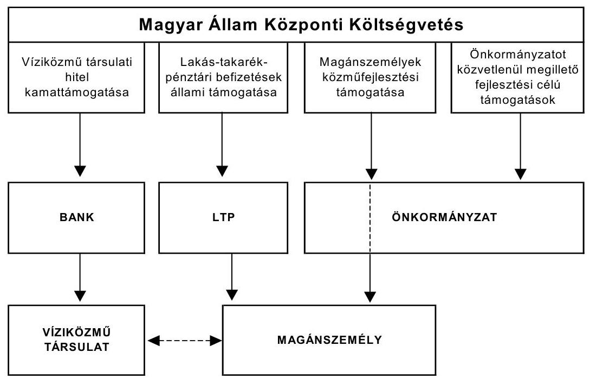

---

Az állam nemcsak az önkormányzatokat támogatja ezen beruházások kapcsán, hanem annak érdekében, hogy lakossági forrásokat is bevonjon a közcélú, nagy költségigényű beruházások finanszírozásába a magánszemélyeket személyhez kötődő állami támogatások rendszerének kialakításával segíti.

A magánszemélyeket érintő támogatás a víziközmű társulati hitelek állami kamattámogatása is, mert azt a magánszemélyeknek a hitel és kamatai fedezetét biztosító érdekeltségi hozzájárulásban nem kell megfizetniük.

Ugyancsak a magánszemélyek támogatását szolgálja a közműfejlesztési hozzájárulás után járó $15 \%$-os közműfejlesztési támogatás, valamint a lakáselőtakarékoskodók állami támogatása.

A magánszemélyeket érintő közműfejlesztési támogatást az önkormányzaton keresztül igényelheti a magánszemély a MÁK-tól, és az önkormányzat jegyzőjének kell az állami támogatást az érintett magánszemélyhez eljuttatnia. A lakástakarékpénztárakban elhelyezett lakáscélú megtakarítások után járó állami támogatást a magánszemély számláján az LTP írja jóvá, amely annak igényléséről is gondoskodik a magánszemély kérelme alapján.

A lakástakarékossági támogatás a közműberuházásra történő előtakarékosság esetén is igénybe vehető, amelyen belül a víziközmű társulat útján megvalósuló közcélú közmúberuházáshoz az állami támogatás felhasználása csak 2002. június 29 -ét követően vált igazolhatóvá.

A 2002. május 14-én kihirdetett és 2002. május 22. napjával hatályba lépett jogszabály módosításokkal ${ }^{30}$ (109/2002. (V. 14.), 110/2002. (V. 14.), 111/2002. (V. 14.) Korm. rendeletek) a jogalkotó szigorította a támogatások igénybevételének szabályait:
A) Meghatározta a Kormány, hogy amennyiben a közműfejlesztési hozzájárulás meghatározott részének megfizetését a kötelezettől harmadik személy polgári jogi szerződés alapján átvállalta, úgy a társulat által felvett hitel ezen része visszafizetésének kötelezettsége a harmadik személyt terhelheti (160/1995. (XII. 26.) Korm. rendelet 22. § (1) bekezdés). Ezzel lehetővé vált, hogy a víziközmű társulati hitel egy részére az önkormányzatok helyett az alapítványok, esetleg más szervezetek vállaljanak kezességet. Az adósságszolgálati korlátba ütköző önkormányzati kezességvállalás megszüntetése ezzel a rendelkezéssel lehetővé vált.
B) A közműfejlesztési támogatás igényelhetőségének szabályait szigorította a Kormány, amikor kimondta, hogy nem jár visszatérítés a magánszemély azon közműfejlesztési hozzájárulása után, amelyet önkormányzati támo-

[^0]
[^0]:    ${ }^{30}$ 109/2002. (V. 14.) Korm. rendelet a vízgazdálkodási társulatokról szóló 160/1995. (XII. 26.) Korm. rendelet módosításáról; 110/2002. (V. 14.) Korm. rendelet a magánszemélyek közműfejlesztési támogatásáról szóló 73/1999. (V. 21.) Korm. rendelet módosításáról; 111/2002. (V. 14.) Korm. rendelet a lakáscélú állami támogatásokról szóló 12/2001. (I. 31.) Korm. rendelet módosításáról.

---

gatásból, továbbá az önkormányzat harmadik személlyel kötött polgári jogi szerződése alapján átvett pénzeszközből fizetett meg. Meghatározta továbbá, hogy a közmúfejlesztési támogatás jogosultja által a közmúfejlesztési támogatásra vonatkozó igény nem engedményezhető (73/1999. (V. 21.) Korm. rendelet 1. § (2) bekezdés és 3. § (4) bekezdés).
c) A víziközmű társulati hitelek kamattámogatásának szabályait is módosították. A korábbi 10 évig terjedő $70 \%$-os kamattámogatást az első 5 évben $70 \%$, a második öt évben 35\%-ra változtatta a Kormány, és maximálta a felvett hitel összegét a beruházási összköltség 65\%-ában (12/2001. (I. 31.) Korm. rendelet 16. § (6) bekezdés). Ezt megelőzően akár a beruházási költség 100\%-át is finanszírozhatták kamattámogatott hitelből. A 251/2004. (VIII. 30.) Korm. rendelet ${ }^{31}$ a hitel törlesztési kötelezettségének türelmi idejét szabályozta, amikor 2004. szeptember 29-től előírta, hogy a hitel törlesztését ötvennégy hónapon belül meg kell kezdeni.

# 3.1. A pénzeszközátadásokat befolyásoló önkormányzati víziközmú-beruházások finanszírozási formái 

Az önkormányzatok a közműberuházásaikat különböző források bevonásával kívánják létrehozni, amelyek megvalósításához kapcsolódóan pénzeszközöket adtak és vettek át.

A víziközmű beruházások azzal tértek el más önkormányzati közműberuházásoktól, hogy a lakosság és a jogi személyek - jogilag önállóan szabályozott víziközmű társulatot hoztak létre. A víziközmú társulatok az önkormányzattal társulva valósították meg a beruházást az önkormányzattal kötött társberuházói szerződés alapján. A víziközmű társulatok által felvett - állami kamattámogatott - hitellel, mint lakossági forrás megelőlegezésével az önkormányzatot illető közvetlen állami támogatásból származó forrásokat egészítették ki. Más fejlesztési célú állami támogatásokra a víziközmű társulatok nem pályázhattak. Az önkormányzat nevére szóló kivitelezési számlák kifizetése érdekében a víziközmű társulatok a forrásokat az önkormányzatoknak pénzeszköz átadással biztosították.

Ellenőrzési tapasztalataink szerint az a gyakorlat alakult ki, hogy a tényleges beruházók nem a víziközmű társulatok - bár a létrehozásuk célja a jogszabály szerint a fejlesztési cél megvalósítása -, hanem az önkormányzatok voltak, amelyet az indokolt, hogy az áfát a víziközmű társulatok nem tudták visszaigényelni.

Amennyiben az önkormányzati beruházáshoz közvetlen fejlesztési célú állami támogatások nem kapcsolódnak, akkor a magánszemélyek társulata maximum a beruházási összköltség 65\%-áig (2002. május 22-ig 100\%-áig) jogosult kamattámogatott hitel felvételére, ami nem haladhatja meg a lakossági érdekeltségi hozzájárulások megelőlegezéséhez szükséges összeget. A többit más for-

[^0]
[^0]:    ${ }^{31}$ 251/2004. (VIII. 30.) Korm. rendelet a lakáscélú állami támogatásokról szóló 12/2001. (I. 31.) Korm. rendelet módosításáról 6. § (2) bekezdése módosította a 12/2001. (I. 31.) Korm. rendelet 16. § (6) bekezdését.

---

rásból kell biztosítani. A lakosok az őket terhelő - hitellel megelőlegezett - érdekeltségi hozzájárulást részletekben, több év alatt fizetik meg a víziközmú társulatnak, illetve annak megszűnte után az önkormányzatnak a hitel fedezeteként. A víziközmú társulattal megvalósuló beruházások alapvető folyamatai a az előírás és az általános gyakorlat szerint a következők:

- önszerveződéssel jogi és magánszemélyekből megalakul a víziközmű társulat;
- az önkormányzat és a víziközmű társulat társberuházási szerződést kötnek a helyi jelentőségú közcélú vízi létesítmény megvalósítása érdekében;
- a víziközmú társulat hitelt vesz fel a magánszemélyek érdekeltségi hozzájárulásának megelőlegezésére;
- a kivitelezői számlák kifizetése érdekében a víziközmú társulat a felvett hitelt pénzeszközátadással az önkormányzat rendelkezésére bocsátja;
- a magánszemélyek a részletekben megfizetett közműfejlesztési hozzájárulások befizetett összegének $15 \%$-át folyamatosan, az önkormányzaton keresztül megkapják a MÁK-tól;
- a beruházás befejezését követően a víziközmű társulat megszűnik és átadja követeléseit és kötelezettségeit az önkormányzatnak.

# Lakossági szerveződéssel létrejövő víziközmú társulati beruházás hagyományos beruházási modellje 

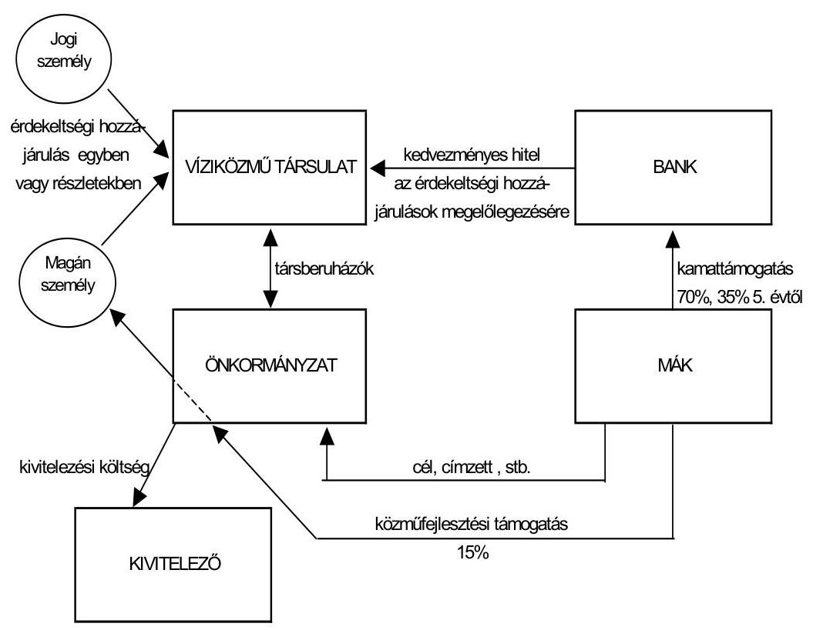

---

A folyamatábra is mutatja, hogy a beruházás során a MÁK három fajta állami támogatást két szervezeten (bank, önkormányzat) keresztül juttat el az önkormányzatokhoz és a lakossághoz. A magánszemélyek terheinek csökkentését az állam a víziközmű kamattámogatással ${ }^{32}$ és a magánszemélyek közmúfejlesztési támogatásával ${ }^{33}$ segíti.

A vizsgálat során tapasztaltak szerint a víziközmú beruházások megvalósításának az utóbbi időben új módja terjedt el. A finanszírozási modell jellemzője, hogy a résztvevők száma két új szervezettel - alapítvány és LTP - kibővül, és belép a rendszerbe három új finanszírozási elem. A beruházás lebonyolításában és finanszírozásában részt vevő szervezetek és magánszemélyek egyidejúleg kötnek meg több szerződést, amelyben egymásra építetten, de külön-külön határozzák meg részletesen a szerződési feltételeket és az átutalások (pénzmozgások) rendjét. A pénzmozgások az alapítvány, a kivitelező, a magánszemélyek és az önkormányzat között eltérnek a valós gazdasági eseményektől. A következő ábrán a valós pénzmozgástól eltérő eseményeket szaggatott vonalakkal jelöltük. Az ÖKOTÁM 2000 rendszer szervezői a készpénzkíméléssel indokolják a magánszemélyek és az önkormányzatok bevételei engedményezésének és azok elszámolásának kialakított rendjét.

A következő ábrán az átláthatóság érdekében csak az alapítványok bekapcsolódása miatti folyamatváltozások bemutatása történik, nem tartalmazza az ltp-hez kapcsolódó állami támogatás folyamatát, azt a jelentés 6. sz. melléklete mutatja be.

[^0]
[^0]:    ${ }^{32}$ Amit a bankon keresztül nyújt a víziközmú társulatnak úgy, hogy a felmerülő hitelkamat egy részét a társulat helyett megfizeti, így csökkentve a magánszemély érdekeltségi hozzájárulás fizetési kötelezettségét.
    ${ }^{33}$ Az önkormányzatok jegyzőjén keresztül fizeti a magánszemélyeknek.

---

# Önkormányzati bevétellel növelt beruházási modell alapítványi közremúködéssel 

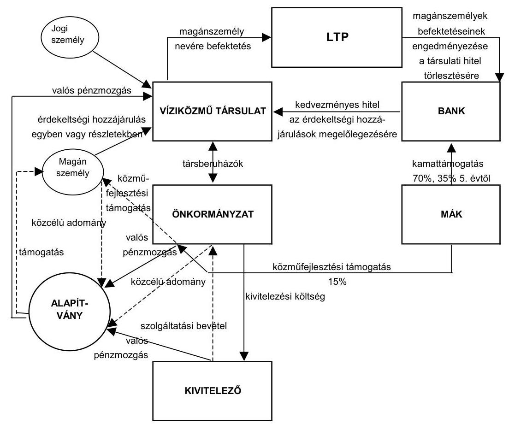

A kivitelező szolgáltatást vásárolt az önkormányzattól, amelynek ellenértéke az alapítványhoz került. Az alapítvány támogatást adott a magánszemélynek, de a pénzt valójában a víziközmú társulatnak utalta. A magánszemélyeknek az érdekeltségi hozzájárulásuk megfizetésére megkötött és - kérelmükre - állami támogatás igénybevételére jogosító ltp. szerződéseikre a víziközmú társulat teljesített befizetést.

Az önkormányzat számára fizetett szolgáltatási díjat a kivitelező természetszerúen a kivitelezési dijban érvényesítette, az önkormányzat pedig a bevételét alapítványnak adta támogatásként, és az alapítványon keresztül a lakossághoz adómentesen eljuttatta. A lakosság az őt megillető állami támogatásokat névlegesen igénybe vette, majd azt közcélú adományként visszajuttatta az alapítványnak, vagy a kivitelezési költség kifizetését biztosító hitel fedezetét szolgáló törlesztésként - ltp. megtakarítási kötelezettség közbeiktatásával - befizette a víziközmú társulatnak.

Külső beruházás-szervezők segítségével azok a szervezetek (bankok, LTP-k, önkormányzatok), amelyek a magánszemélyekhez kötődő állami támogatás igénylésében közreműködtek egy olyan zárt rendszerú önkormányzati beruházás finanszírozási módszert alkalmaztak, melyben a magánszemélyeket megillető állami támogatásokat maximálisan kihasználva azt igénybe vették (veszik) úgy, hogy a pénz fizikailag nem jutott el a ma-

---

gánszemélyekhez, hanem azt az önkormányzati beruházás megvalósításába visszaforgatták. A lakossági forrásbevonást minimálisra csökkentve a lakosság csak csekély (2,5-5\%) összeggel járult hozzá a beruházások finanszírozásához, ugyanakkor viszont a Magyar Állam 5-10 év alatt a beruházást teljes összegében megfinanszírozta (finanszírozza) úgy, hogy az önkormányzatoknak sem kellett saját pénzeszközeikből a beruházáshoz felhasználni. Ezzel a módszerrel az önkormányzatok saját erő biztosítása nélkül valósították (valósítják) meg helyi jelentőségű közcélú vízilétesítmények létrehozását.

A beruházás finanszírozási rendszer átláthatóságát nehezítette, hogy a valós pénzmozgások eltértek a szerződésekben rögzített és a számvitelben elszámolandó eseményektől, mivel különféle szerződésekből adódóan engedményezési és megbízási szerződések láncolata múködött a folyamatban. A rendszerben lévő felek közötti szerződéses események többsége pénzforgalom nélkül zajlott, a könyvviteli adatok pénzforgalom nélküli elszámolásként kerültek rögzítésre.

# 3.2. Magánszemélyeket megillető támogatási formák 

### 3.2.1. A közmúfejlesztési támogatás

Az új közművek létrehozásával kapcsolatos beruházások esetén a központi költségvetés a magánszemélyeket közműfejlesztési támogatásokkal is segíti.

A közműfejlesztési támogatás országos és a vizsgált körre vonatkozó alakulását mutatja a következő ábra:
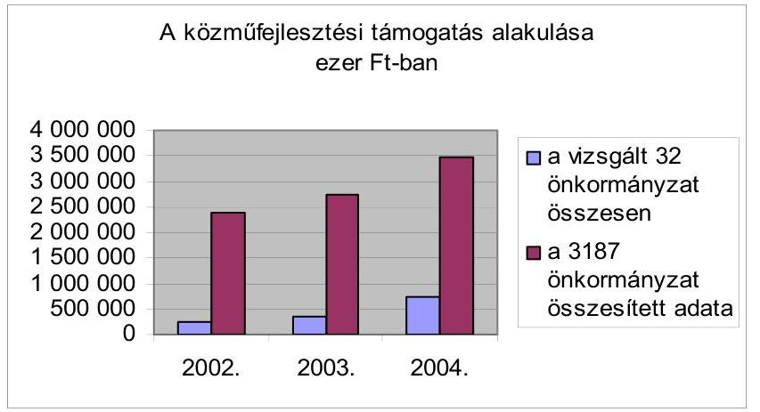

A vizsgált önkormányzatok (az összes önkormányzat 1\%-a) közműfejlesztési támogatásának összesített adatai az országos támogatáshoz viszonyítva 10-21\%-os részesedést képviselnek, 2002. évben 10,2\%-át, 2003. évben 13,2\%-át, 2004. évben 20,9\%-át tették ki az országosan igényelt támogatásnak.

Az önkormányzati közműberuházások alapítványi finanszírozási konstrukciói esetében az önkormányzatok jegyzői a magánszemélyek nevében az önkormányzatoktól, illetve más szervezetektől átvett pénzeszközökre is igényelték a közmúfejlesztési támogatást és a közműfejlesztési támogatások nem jutottak el ténylegesen a lakossághoz. A magánszemélyeknek

---

azért nem fizették ki az őket megillető támogatásokat, mivel a beruházás szervezése során az érintett magánszemélyek 2002. május 22. előtt közhasznú alapítványokra engedményezték azokat, azt követően pedig megbízási szerződést kötöttek a magánszemélyek az önkormányzattal arra, hogy helyettük igényelje meg a támogatást, majd azt közcélú adományként utalja át a nevükben a közhasznú alapítványnak.

Az alapítvány felé irányuló lakossági felajánlások fedezete az őket megillető közmúfejlesztési támogatás volt. Az átutalást az Önkormányzatok közvetlenül az alapítványnak arra hivatkozva teljesítettek, hogy az önkormányzat és a magánszemélyek megbízási szerződést kötöttek, ami azonban tartalmát tekintve engedményezésnek minősült.

A magánszemélyek közmúfejlesztési támogatásáról szóló 73/1999. (V. 21.) Korm. rendelet 2002. május 22-i módosítása egyértelműen arra irányult, hogy megakadályozza a magánszemélyeket megillető közmúfejlesztési támogatást olyan befizetés után, amelyeket nem a magánszemély fizetett meg saját pénzeszközeiből, továbbá mindazon közmúfejlesztési támogatás igénylését, amelyet a magánszemély engedményezni kíván. Megakadályozva ezzel azt, hogy harmadik személy kapja meg a magánszemélyt megillető állami támogatást. Emiatt 2002. május 22-e után indított beruházások esetén a magánszemélyeket megillető $15 \%$ közmúfejlesztési támogatás engedményezése jogszerűen nem tehető meg. ${ }^{34}$. A 2002. május 22. után megállapított közmúfejlesztési hozzájárulás azon része után igényelt közmúfejlesztési támogatást, amelyet magánszemély harmadik személytől kapott, illetve engedményezte, azt jogtalanul tette.

A magánszemélyek közmúfejlesztési támogatásáról szóló 73/1999. (V. 21.) Korm. rendelet módosításáról szóló 110/2002. (V. 14.) Korm. rendelet 1. § (2) bekezdése rögzítette, hogy a harmadik személytől kapott pénzeszközre állami támogatást ne fizessenek. Kimondja a rendelet: (2) bekezdése „Nem jár visszatérítés a közmúfejlesztési hozzájárulás azon része után, melyet a magánszemély önkormányzati támogatásból, továbbá az önkormányzat harmadik személlyel kötött polgári jogi szerződése alapján átvett pénzeszközből fizetett meg." A 73/1999. (V. 21.) Korm. rendelet módosítását követően a 3. §ának (4) bekezdése előírja, hogy „a közmúfejlesztési támogatás jogosultja által a közmúfejlesztési támogatásra vonatkozó igény nem engedményezhető."

Az önkormányzati önrész nélküli beruházási rendszer alkalmazói annak érdekében, hogy a korábbi években kidolgozott finanszírozási módszer 2002. május 22. után is működőképes maradjon, a korábbi engedményezés helyett a magánszemély és az önkormányzat közötti kétoldalú szerződésen változtattak. A jogszabály módosítását követően a rendszer szervezői úgy ítélték meg, hogy a támogatás továbbra is engedményezhető, csak annak igénylése nem. Ezért 2002. májusától megbízási szerződésekkel valósították meg a tiltott engedményezést. A 73/1999. (V. 21.) Korm. rendelet 3. § (4) bekezdésében szabályozott engedményezési tilalommal össze nem férő célra irányult a megbízás.

[^0]
[^0]:    ${ }^{34}$ A 110/2002. (V. 14.) Korm. rendelet 3. §-a írta elő.

---

A helyszíni ellenőrzés során a polgármesteri hivatalok nem tudták az ellenőrzés rendelkezésére bocsátani az önkormányzatok polgármesterei által aláírt megbízási szerződéseket. A szerződések hiányában a jegyző nem tehette volna meg, hogy közvetlenül az alapítványnak, esetleg más szervezetnek utalja a lakosokat megillető közműfejlesztési támogatást.

Martonvásár önkormányzatnál a polgármesteri hivatal nem tudott a közmúfejlesztési támogatás jogosultjaival kötött szerződést az ellenőrzés rendelkezésére bocsátani annak igazolása érdekében, hogy jogszerűen igényelhette és utalhatta át a magánszemélyeket illető állami támogatást az alapítvány számlájára teljes összegében. A megbízási szerződések a víziközmú társulatnál voltak fellelhetők.

Amennyiben a 73/1999. (V. 21.) Korm. rendelet 3. § (4) bekezdésében rögzített jogszabályi korláttal ellentétes tartalmú megállapodást kötnek, az - figyelemmel a Ptk. 200. §-ának (2) bekezdésében foglaltakra ${ }^{35}$ - véleményünk szerint semmis. Tekintettel arra, hogy egy szerződés jellegének meghatározása szempontjából nem a szerződés elnevezése, hanem a szerződés egészének tartalma az irányadó, megítélésünk szerint a megbízási szerződések elemeként a közmúfejlesztési támogatás jogosultjai a támogatásra vonatkozó igényeiket engedményezték, így a megbízási szerződések erre vonatkozó része érvénytelen. A szerződések érvénytelenségének kimondására azonban csak független magyar bíróság jogosult. A 2004. október 8-tól a 73/1999. (V. 21.) Korm. rendelet helyébe lépő új kormányrendelet tovább szigorította a támogatás igénybevételének feltételeit.

A 73/1999. (V. 21.) és 262/2004. (IX. 23.) Korm. rendeletek szerint is a 15\% közmúfejlesztési támogatást a magánszemély igényelheti és jogosultja is a magánszemély. A támogatás kifizetésére a MÁK a kötelezett a jegyző útján. A 73/1999. (V. 21.) Korm. rendelet 4. § (4) bekezdése szerint a jegyzőnek a támogatás szétosztásáról kell gondoskodnia, a 262/2004. (IX. 23.) Korm. rendelet 6. § (5) bekezdése szerint is a jegyzőnek a közműfejlesztési támogatás érdekeltekhez való eljuttatásáról kell gondoskodnia, azaz megbízotti jogviszonyban van a jegyző, mind a magánszeméllyel, mind a MÁK-kal. Az önkormányzatot képviselő polgármester az önkormányzat határozata alapján azért sem köthet jogszerűen megállapodást - megbízási szerződést - a támogatás más szervezeteknek történő kifizetésére a magánszeméllyel, mert a kifizetésre vonatkozóan a jegyzőnek kormányrendeletben előírt feladata a közmúfejlesztési támogatás szétosztása, illetve az érdekeltekhez való eljuttatása.

Az önkormányzatok jegyzői az alapítványnak egy összegben átutaltatták a MÁKtól érkező összegnek azt a részét, ami a szennyvízberuházásban érdekelt ltp. szerződést kötött magánszemélyek befizetéséhez kapcsolódott. Az ÖKOTÁM Alapítványtól kapott információ szerint volt önkormányzat, aki nem adta át a magánszemélyek megbízásai ellenére az igényelt közmúfejlesztési támogatás összegét. Berkenye Önkormányzatánál a hitelt nyújtó bank szólította fel arra az önkormányzatot, hogy igényelje meg és utalja át a magánszemélyeket illető közmúfejlesztési támogatást.

[^0]
[^0]:    ${ }^{35}$ Semmis az a szerződés, amely jogszabályba ütközik, vagy amelyet jogszabály megkerülésével kötöttek, kivéve, ha ahhoz a jogszabály más jogkövetkezményt fúz. Semmis a szerződés akkor is, ha nyilvánvalóan a jóerkölcsbe ütközik.

---

A jegyző az önkormányzat, a víziközmű társulat, szolgáltató igazolásán ${ }^{36}$ befizetésként szereplő közmúfejlesztési hozzájárulás összege után igényelhette meg a közmúfejlesztési támogatást. A szennyvízberuházást végző önkormányzatok 33,3\%-ánál a jegyző́ nem a víziközmú társulat által kiadott igazolás alapján igényelte meg a közmúfejlesztési támogatást, hanem a beruházást finanszírozó bankok által, a megtakarítási számla egyenlegéről, mint közmúfejlesztési hozzájárulás megfizetéséről adott egyösszegú (nem magánszemélyekre bontott) igazolást tekintette az igénybevétel alapjának és ez alapján igényelte a magánszemélyeket megillető támogatást. A pénzintézetek által igazolt megtakarítási zárolt számlák egyenlegében szerepeltek a magánszemélyek tényleges befizetései is, melyek az igazolt összegnek mindössze 5-10\%-át jelentették. (Magyaregregy, Závod, Kisdorog, Tiszanána)

A víziközmú társulatok a közmúfejlesztési hozzájárulás megfizetésének tekintették az ÖKOTÁM Alapítvány által a magánszemélyek nevében egy összegben érkező befizetést is, melynek magánszemélyenkénti részletezését úgy készítették el, hogy a beérkezett összeget elosztották a víziközmű társulat ltp. szerződést kötő tagjainak számával. A készített listákban úgy tüntették fel, mintha minden magánszemély ugyanolyan összegű alapítványi támogatásban részesült volna függetlenül attól, hogy az adott időszakban saját befizetésként - általában havi 1000-1200 Ft-ban - vállalt fizetési kötelezettségét milyen nagyságrendben teljesítette.

Az alapítványi támogatáson felül az elhelyezett betét kamatát is a magánszemély megfizetett közmúfejlesztési hozzájárulásának tekintették arra való hivatkozással, hogy a hozam az alapítványi zárolt számlán keletkezett, így azt az ÖKOTÁM Alapítvány az alapító okiratában foglalt céljai támogatására jogosan fordíthatta. Ennek megfelelően az alapítványi zárolt számla hozama után is igénybe vették a magánszemélyeket megillető közmúfejlesztési támogatást.

Az önkormányzatok jegyzőinek felelősségét állapította meg az ellenőrzés, mivel nem a magánszemélyek részére fizették ki közvetlenül a magánszemélyt megillető közmúfejlesztési támogatást. A jegyzők felelősségének felvetését a 73/1999. (V. 21.) Korm. rendelet 2. § (1) bekezdésében, a 4. § (4) bekezdésében, és 2002. május 22 -étől a 3. § (4) bekezdésében előírtak, illetve 2004. október 8 -át követő közmúfejlesztési hozzájárulások esetében a 262/2004. (IX. 23.) 2. § a) pontja és 6. § (5) bekezdésében előírtak megsértése alapozta meg.

A felelősség felvetésére adott jegyzői magyarázatok több érvet hoztak fel arra vonatkozóan, hogy jogsértő tevékenységüket milyen tényezők motiválták. A jegyzői indokok röviden az alábbiakban foglalhatók össze:

- az alkalmazott finanszírozási módszer jogszerú, mivel a magánszemély nem az állami támogatás igénylését engedményezte, hanem az általa igényelt állami támogatást adományozta;
- a finanszírozási módszert számos más önkormányzat is alkalmazta;

[^0]
[^0]:    ${ }^{36}$ 73/1999. (V. 21.) Korm. rendelet 3. § (3) bekezdése.

---

- a képviselő-testület döntésének megfelelően csak végrehajtották a feladatot.

A számvevői jelentésekre adott - önkormányzati vezetőktől és víziközmű társulati elnököktől származó - magyarázatok, illetőleg észrevételek szerint a magánszemélyek nem engedményezték a közmúfejlesztési támogatással kapcsolatos igényeiket, hanem az önkormányzatot képviselő polgármestert megbízási szerződés keretében a közműfejlesztési támogatás igénylésével és a támogatás összegének alapítványi adományozásával bízták meg. Vitatják a víziközmű társulatok, hogy jogszerútlenül jártak volna el a 2002. májusi jogszabályváltozást követően akkor, amikor kiadták a közműfejlesztési támogatás (a közműfejlesztési hozzájárulás $15 \%$-a) igényléséhez az igazolásokat azon befizetésekről, amelyeket a magánszemélyek harmadik személytől (ÖKOTÁM Alapítványtól) kaptak.

Az általunk vizsgált az ÖKOTÁM 2000 rendszerben 2002. után indított négy (Noszvaj, Múcsony, Szentegát, Martonvásár-Gyúró) beruházásnál a magánszemélyeket az ÖKOTÁM Alapítvány ${ }^{37}$ - az önkormányzattal kötött polgárjogi szerződés alapján - a beruházás megvalósításának éveiben 5193886 ezer Fttal támogatta (támogatja), melyre jogtalan lesz a 15\%-os (779 083 ezer Ft) közműfejlesztési támogatás igénybe vétele.

A helyszíni ellenőrzés során 2004. évre vonatkozóan 21 önkormányzat esetében 620116 ezer Ft közmúfejlesztési támogatás jogtalan igénybevételét állapítottuk meg. A jogtalanul igénybevett támogatások önkormányzatonkénti részletes listáját a jelentés 9 . számú melléklete tartalmazza. A támogatás jogtalanságának alapvetően oka az volt, hogy a magánszemélyek által a víziközmú társulat számlájára befizetett összeg nem érdekeltségi hozzájárulás céljára szolgált, hanem a víziközmú társulat számláján bonyolították az ltp. szerződés betétgyűjtését, és időszakonként átutalást teljesítették az LTP-be a magánszemélyek egyéni megtakarítási számláira. Emiatt a magánszemély nevére szóló LTP befizetés és nem a közműfejlesztési hozzájárulás megfizetése volt az igénylés alapja.

A mellékletben felsorolt támogatások közül a 2002. május 22. előtti közműfejlesztési hozzájárulásokhoz kapcsolódó támogatások - ebből a 2004-ben igényelt összesen 92124 ezer Ft - az ltp. szerződések lejáratát követően jogossá válnak. Azok a magánszemélyek, akik ltp. szerződés szerinti megtakarítási formával kívánták teljesíteni az érdekeltségi hozzájárulásukat, csak akkor lesznek jogosultak a közműfejlesztési támogatásra, amikor az LTP által kiutalt megtakarítás a víziközmű társulat számlájára érdekeltségi hozzájárulásként átutalásra kerül az érdekeltségi hozzájárulást megelőlegező hitel fedezeteként.

A 2002. májusi kormányrendelet módosítást követően szerveződött beruházások, illetve megállapított érdekeltségi hozzájárulások (közműfejlesztési hozzájárulások) esetében többszörös jogsértés történt, ami megalapozza a támogatás jogtalan igénybevételét. Nem jár a közmúfejlesztési támogatás a közmúfejlesz-

[^0]
[^0]:    ${ }^{37}$ Az alapítványtól kapott tájékoztatás szerint.

---

tési hozzájárulásnak ${ }^{38}$ az alapítványi támogatásból származó része után. Ugyanakkor a magánszemély által befizetett összegre sem lehet jogszerűen közműfejlesztési támogatást igénybe venni akkor, ha a támogatásra vonatkozó igényt engedményezték. A magánszemélyek a jogszabályi előírásokkal ellentétesen a jegyző helyett az önkormányzatot bízták meg a közműfejlesztési támogatás igénylésével, továbbá egyidejűleg „adományozták" a támogatást. Az igénylés érdekében az önkormányzattal megbízási szerződést kötöttek, ami tartalmát tekintve az igény engedményezésének minősül. A jogtalanul igénybe vett támogatások összege az ellenőrzött önkormányzatoknál - a 9. számú mellékletben részletezetteknek megfelelően - a 2004. évben 527992 ezer Ft volt.

A helyszíni vizsgálatok megállapításai alapján a halmozottan elkövetett jogsértések és szabálytalanságok miatt a helyi önkormányzatoknál 9 polgármester, 8 jegyző (körjegyző) felelősségét vetettük fel. A felelősség felvetésére az állami támogatások jogszabályokkal ellentétes igénybe vétele, képviselő-testületi döntés nélküli szerződés-aláírás, kizárólagos képviselő-testületi hatáskörbe tartozó ügyben polgármesteri döntéshozatal, kiadási előirányzat nélküli kötelezettségvállalás, ellenjegyzési kötelezettség, a törvényességi észrevételezési kötelezettség elmulasztása miatt került sor.

# 3.2.2. A lakás-előtakarékosság támogatása 

A közműberuházások megvalósítása érdekében az érintett lakosok ltp. szerződést is köthetnek, melyhez az állam a megtakarítás 30\%-ának megfelelő támogatást biztosít. ${ }^{39}$

Az ellenőrzés során szerzett tapasztalatok azt mutatták, hogy a víziközmú társulatok a magánszemélyek nevében teljesítettek befizetést az LTP-k felé a magánszemélyek által megkötött szerződés szerint, a magánszemélyek nevére megnyitott LTP számlákra. A befizetések forrását a magánszemélyek folyamatosan fizetett tényleges befizetései, az egyösszegben megérkező - a magánszemélyeknek adott - alapítványi támogatás, illetve a lekötött betét után járó kamat jelentették.

A beruházás szervezőitől kapott információink alapján - amit helyszíni ellenőrzési tapasztalataink is megerősítenek - a víziközmű társulat megtakarítási zárolt számlájáról a 2002. májusa után indított beruházások esetében általában az ltp. szerződések 11. hónapjában a magánszemélyek egyéni számlájára átutaltak akkora összeget, hogy a magánszemélyt megillető maximális éves ( 72000 Ft ) állami támogatás az LTP-ben elhelyezett összegre igénybe vehető legyen. Azt, hogy mekkora összeg kerüljön átadásra az LTP felé a beruházás-szervező által foglalkoztatott pénzügyi szakértő határozta meg. Az ltp. szerződést kötő magánszemélyek nem teljes körének egyéni számláját töltötték fel, hanem csak annyit,

[^0]
[^0]:    ${ }^{38}$ A 73/1999. (V. 21.) Korm. rendelet szerint a közműfejlesztési hozzájárulás az az öszszeg, amelyet a várható kivitelezési érték alapján számítottak ki.
    ${ }^{39}$ Állami támogatás a magánszemély számláján elhelyezett betét után jár, ami az évente megtakarított összeg 30\%-a. A maximális támogatás mértéke 2003-tól a korábbi 36000 Ft-ról évente 72000 Ft-ra változott.

---

amennyit a víziközmú társulati hitel aktuális cash flowja indokolt. (Noszvaj, Múcsony)

A víziközmú társulatok a magánszemély által befizetett pénz felett azért rendelkezhettek szabadon, kamatoztathatták, mert az Ltp. tv. szerint a megtakarítási idő kezdetéhez képest az LTP egyéni számlán egy év alatt összegyújtött összeg után akkor is jár az állami támogatás a magánszemély számára, ha nem szerződésszerú - havonta rendszeresen, egyenlő összegekben történő - a teljesítés. A magánszemélyt megillető állami támogatást a LTP-k részére az állam évente adja át a magánszemélyek által megtakarított összeghez viszonyítva. ${ }^{40}$

Az ltp. szerződés lényegi eleme az Ltp. tv. 7. § (1) bekezdése szerint az, hogy a szerződés betét- és hitelszerződés is egyben, amelyben a lakás-előtakarékoskodó arra kötelezi magát, hogy egyösszegben, vagy a megtakarítási idő alatt előre meghatározott rendszerességgel, egyenlő részletekben történő befizetésekkel meghatározott összeget betétként leköt, illetve elhelyez, a lakás-takarékpénztár pedig arra vállal kötelezettséget, hogy a szerződésben meghatározott lakáscélú kölcsönt nyújtja. Az ltp. szerződésben meghatározott betéti és hitelkamat, illetve a kezelési költség mértéke rögzített, módosítani a szerződés időtartama alatt nem lehet az Ltp. tv. 7. § (3) bekezdésének rendelkezése alapján. Az Ltp. tv. 7. § (4) bekezdése szerint a lakás-takarékpénztárnál elhelyezett betétből a lakáselőtakarékoskodó részösszeget nem vehet ki, de a szerződést jogszabály szerint felmondhatja. Az alkalmazott beruházási rendszerben többek között erről a jogukról is lemondanak a magánszemélyek.

A ltp. szerződés kötésének és a befizetés teljesítésének a joga a magánszemélyt illeti, csak helyette és nevében lehet befizetni az ltp. szerződés alapján megnyíló egyéni számlájára. A víziközmú társulat tulajdonosként, saját nevében nem fizethet be támogatást. Az ltp. szerződés nem ruházható át, mivel ahhoz olyan személyhez fúződő követelések kötődnek, amelyek a ltp. szerződést aláíró magánszemélyeknek járnak ${ }^{41}$. Az ltp. szerződés átruházásának megakadályozását célozza az Ltp. tv. 9. § (5) bekezdésében foglalt előírás, mely szerint a lakás-előtakarékoskodó személye csak akkor változtatható, ha az új lakás-előtakarékoskodó az eredeti lakáselőtakarékoskodó közeli hozzátartozója. A Ltp. tv. nem tiltja a magánszemélynek az ltp. szerződésből származó követelésének az engedményezését, de a szerződés alapján a személyéhez kötődő jog az állami támogatásra vonatkozó jog, ezért az ltp. szerződés - a hozzá kapcsolódó összes rendelkezési joggal együtt nem engedményezhető.

Az ÖKOTÁM 2000 rendszer szerzői szerint a víziközmú társulat minden tekintetben szabadon rendelkezhet az ltp. szerződés felett. A jogszabály azonban

[^0]
[^0]:    ${ }^{40}$ A támogatás igénylésének jogalapja a magánszemélynek az ltp. szerződés megkötéssel egyidőben aláírt kérelme az állami támogatás igényléséről.
    ${ }^{41}$ A magánszemély kérelme az állami támogatás évenkénti jóváírása követelhető a törvény erejénél fogva, a támogatás a jogszabályi feltételek teljesülésekor jár a magánszemélynek a 215/1996. (XII. 23.) Korm. rendelet 1. § (1) bekezdése alapján.

---

egyértelműen a magánszemély számára teszi lehetővé a lakás-előtakarékossági szerződés kötését, számára adja a támogatást, és csak a szerződés teljesülése után a kiutalást követően fogadja el felhasználásként a víziközmű társulat (vagy az önkormányzat) igazolását. Emiatt a magánszemély csak a követelést engedményezheti jogszerűen a víziközmű társulatra.

Az ÁSZ a 2002. évi zárszámadásról készített jelentésében 2003. júniusában nyilvánosságra is hozta azon megállapítását, hogy az ltp. szerződések keretében befizetett összeg mindaddig betétnek minősül, amíg a szerződéses összeg az LTP által egészben vagy részben kiutalásra nem kerül. Az állami támogatással növelt betétösszeg lakáscélú felhasználását is az igénybe vett összeg felvételét követően kell igazolni. A közmúfejlesztési támogatás igénylésére a magánszemély csak az ltp. szerződés lejáratát követően lesz jogosult. Akkor, amikor a rendelkezési joga megnyílik a megtakarítás, a hozzá kapcsolódó állami támogatás felett, ami megegyezik a víziközmű társulati hitel magánszemélyt terhelő tőkekötelezettségének kiegyenlítési időpontjával.

Az ÖKOTÁM 2000 rendszer szervezői és az azt alkalmazó önkormányzatok vitatják a fentieket, a jogszabályokat oly módon értelmezve, hogy a magánszemélyek az általuk kötött lakás-előtakarékossági szerződéseket engedményezték a víziközmű társulatokra, ezáltal a szerződés mintegy tulajdonát képezi a víziközmű társulatnak. Az Ltp. tv. 9. § (5) bekezdése szerint csak meghatározott esetekben lehet a szerződést átruházni, az adott ügyben a törvényi feltételek nem állnak fenn.

Az Ltp. tv. már az 1996. évi elfogadásakor tartalmazta, hogy lakáscélú felhasználásnak minősül a magánszemélyek által megvalósított közművek építése és szerelése ${ }^{42}$. A Ltp. tv. 2003. január 1-től bővítette és pontosította a közművekre történő lakáscélú felhasználást, megkülönböztetve és lehetővé téve a magáncélú közműberuházás mellett az önkormányzati és közműfejlesztési társulat által megvalósított közműberuházás keretében történő kialakításra és felújításra történő felhasználást. Az Ltp. tv. felhatalmazása alapján 1996. évben a 215/1996. (XII. 23.) Korm. rendelet határozta meg a lakáscélú felhasználás igazolásának módját és dokumentumait ${ }^{43}$, amely szerint csak a magánszemély által végzett közműberuházások voltak igazolhatóak lakáscélú felhasználásként. A 215/1996. (XII. 23.) Korm. rendelet módosításával a lakáscélú felhasználást igazoló dokumentumok esetében 2002. június 29 -étől tette lehetővé a Kormány a közcélú közműberuházásra történő felhasználás igazolását. Az önkormányzati közműberuházások esetében 2002. június 29 -ét megelőzően nem volt jogszabályi lehetőség az ltp. megtakarítások után az állami támogatás igénybevételének igazolására. A nyolc évet meghaladó megtakarítási formák

[^0]
[^0]:    ${ }^{42}$ Az Ltp. tv. 8. § (1) bekezdés a) pont 3. alpont szerint lakáscélú felhasználásnak minősül a lakás-előtakarékoskodó „tulajdonában lévő lakáshoz, családi házhoz szükséges, illetve a már beépített terület lakhatóságát javító, a következőkben felsorolt közművek, kommunális létesítmények kialakítása: járda, telefon-, áram-, gáz-, vízvezeték, szennyvízcsatorna építése és szerelése."
    ${ }^{43}$ 215/1996. (XII. 23.) Korm. rendelet 7. § (2) bekezdés c) pontja 2002. június 29-ig: ... közművek, kommunális létesítmények kialakítása esetén 30 napnál nem régebbi tulajdoni lap és a felhasználást igazoló számlák;

---

esetén ugyanakkor nem volt szükséges az állami támogatás felhasználásához kapcsolódóan a lakáscél igazolása. Közcélú beruházás megvalósítására is kötöttek ltp. szerződést a magánszemélyek már 2002. júniusát megelőzően.

A 2002. júniusáig csak a magánszemély által beadott számla alapján lehetett az elhelyezett betét után járó állami támogatáshoz hozzájutni, így 8 év alatti megtakarítások esetén arra nem is volt lehetőség, hogy a magánszemélyek társulata által megvalósított beruházások forrásává váljon a lakás-takarékpénztári megtakarítás, mivel sem a víziközmű társulat, sem pedig az önkormányzat nem állíthatott ki számlát a magánszemély befizetéséről. A magánszemély nevére szóló számla bemutatási kötelezettségének elkerülése érdekében 2002. május 22 -ét megelőzően 8 évet meghaladó lejáratra kötöttek ltp. szerződéseket. (Poroszló, Sarud, Újlőrincfalva, Tiszanána, Csongrád, Felgyő, Kisdorog, Závod). A 2002. május 22-ét követően a víziközmű társulati hitelek második öt évben történő támogatásának mértéke a korábbi 70\%-ról felére csökkent, ennek hatására - a kamatkiadások jelentős emelkedésének elkerülése érdekében - 65-72 hónap közötti ltp.szerződést kötöttek a magánszemélyekkel a jogszabálymódosítás után.

A 215/1996. (XII. 23.) Korm. rendelet olyan irányú módosítására, ami lehetővé tette a társulati beruházások esetén a számla benyújtása nélküli igénybevehetőséget csak a beruházási konstrukció megvalósítását vállaló önkormányzati megállapodások, banki hitelek és lakossági ltp. szerződések megkötése után került sor. A 2002. június 29-től hatályos kormányrendelet módosítás ${ }^{44}$ azt is lehetővé tette, hogy a már korábban megkötött ltp. szerződések megtakarításai, kamatai és a megtakarításhoz kapcsolódó állami támogatása a lejáratot követően jogszerűen átutalhatók legyenek a víziközmű társulati hitelt nyújtó pénzintézeteknek a magánszemélyek engedményezési nyilatkozata alapján.

A magánszemélyek által engedményezett ltp. szerződésben vállalt befizetési kötelezettséget nem minden magánszemélyre fizette meg a víziközmú társulat. A rendszerben csak annyi magánszemély nevében teljesítettek átutalást, ami ahhoz volt szükséges, hogy az aktuális cash flow szerinti hitelfedezet biztosított legyen. Emiatt egyes magánszemélyek nevében a vállalt érdekeltségi hozzájárulást ténylegesen nem fizették meg, ezért - a jogszabályi előírások betartása esetén - annak behajtása érdekében a társulat elnökének, illetve az önkormányzat jegyzőjének intézkedni kellene.

A magánszemélyek az ÖKOTÁM 2000 rendszerben azt vállalták, hogy az érdekeltségi hozzájárulás fizetését az LTP-nél képződő megtakarításukból rendezik. Egyes magánszemélyek ltp. szerződésből eredő befizetési kötelezettségének elmaradása végső soron azt eredményezi, hogy a víziközmű társulat által elfogadott

[^0]
[^0]:    ${ }^{44}$ A 215/1996. (XII. 23.) Korm. rendelet 7. § (3) bekezdés szerint „Ha a közművek, kommunális létesítmények kialakítása az Ltv. 8. § (1) bekezdésének 3. pontjában felsorolt célok megvalósítására létrehozott közmű társulat útján valósul meg, és a társulat vagy a beruházás megvalósulását követően a területileg illetékes önkormányzat igazolást ad a lakás-előtakarékoskodó részére az érdekeltségi hozzájárulás mértékéről és annak megfizetéséről, a lakás-takarékpénztár a (2) bekezdés c) pontjában meghatározott számlák benyújtásától eltekinthet. A lakás-takarékpénztár eltekinthet a (2) bekezdés c) pontjában meghatározott hiteles tulajdoni lap másolat benyújtásától, amennyiben a közmű társulat igazolja, hogy a lakás-előtakarékoskodó, illetve a kedvezményezett a társulat érdekeltségi területén lakástulajdonnal rendelkezik.

---

érdekeltségi hozzájárulás összegét az érintett magánszemélyek - víziközmű társulat hibájából adódóan - nem fogják megfizetni.

Ellenőrzési tapasztalataink szerint a víziközmű társulatok által megállapított érdekeltségi hozzájárulások fizetendő összege az érdekeltségi egységek esetében nem azonos. Akik ltp. szerződést is kötöttek, azoknak nagyobb érdekeltségi hozzájárulás megfizetését állapították meg, mint az ltp. szerződést nem kötő magán- és a jogi személyeknek. Ugyanakkor a lakás-takarékpénztári szerződés megkötését vállalóknak ténylegesen saját pénzeszközeikből kevesebbet kellett fizetniük. A megállapított érdekeltségi hozzájárulások különbözősége miatti problémákat az ÁSZ-hoz érkezett közérdekű bejelentések is felvetették. Emiatt ismereteink szerint két társulat (Martonvásár-Gyúró, RáckeresztúrTordas) ellen pert indítottak azok a lakosok, akik nem vállalták az ltp. szerződés megkötését.

Magyaregregyen az érdekeltségi hozzájárulás összege 1200 ezer Ft volt. A jogi személyeknek 240 ezer Ft-ot, az egyösszegű befizetést vállaló magánszemélyeknek 100 ezer Ft-ot, ltp. szerződést kötő magánszemélynek részletekben, összesen 120 ezer Ft-ot kellett megfizetniük. Sarudon 460 ezer Ft érdekeltségi hozzájárulásból a jogi személy ugyanennyit, az ltp. szerződést nem kötő egyösszegű befizetést vállaló magánszemély 209 ezer Ft-ot, ltp. szerződéssel rendelkező magánszemély részletekben 60 ezer Ft-ot fizetett meg. Szentegáton a 2900 ezer Ft érdekeltségi hozzájárulásból a jogi személyeknek 250 ezer Ft-ot, az ltp. szerződést kötő magánszemélynek 92 ezer Ft-ot, az egyösszegű befizetést vállaló ltp. szerződést nem kötő magánszemélynek 250 ezer Ft-ot kellett ténylegesen megfizetniük. Noszvajon 1963 ezer Ft érdekeltégi hozzájárulás fizetési kötelezettséget állapítottak meg, melynek összege megegyezett az ltp. szerződés várható megtakarítási összegével. A jogi személynek 360 ezer Ft-ot, az ltp. szerződéskötést nem vállaló magánszemélynek 600 ezer Ft-ot, az ltp szerződést kötő személynek pedig 77 ezer Ft-ot kell ténylegesen fizetnie.

# 3.3. Társulat útján megvalósuló közmúlétesítményekhez kapcsolódó víziközmú kamattámogatások 

Az állami kamattámogatott hitel megfizetését biztosító érdekeltségi hozzájárulások - függetlenül attól, hogy a lakosok saját befizetéséből, vagy az alapítványi pénzeszközből származtak - csak a hitel futamidejének végén válnak tőketörlesztéssé. A víziközmű társulat ugyanis a beszedett pénzt mindaddig kamatoztatta, amíg azt időközönként nem továbbította a magánszemélyek lakossági számláira a lakás-takarékpénztár felé annak érdekében, hogy az így elhelyezett éven belüli betét után a magánszemélyek nevében az állami támogatást igénybe vehesse. Az alapítvány ugyancsak kamatoztatta az állami kamattámogatott hitelből finanszírozott beruházási költségből közvetett úton hozzákerült önkormányzati adományokat (amelyek összegükben megegyeznek az önkormányzatok által kiszámlázott közterület-foglalási és egyéb díjakkal). Így mind a víziközmű társulat, mind az alapítvány a fizetendő hitelkamattal közel azonos nagyságú betéti kamatot realizál, miközben a beruházás valós finanszírozási szükségletét meghaladó mértékben felvett hitel teljes összege után fizetni kell a kamatot. A felvett hitel kamatának 70\%-át (a hiteltőke után mintegy 8,5\%) a központi költségvetés viseli és a hitelkamat

---

30\%-a (a hiteltőke után mintegy 3,5\%) terheli a víziközmú társulatot. ${ }^{45}$ A társulat megszűnését követően pedig a kedvezményes hitel kötelezettjévé az önkormányzat válik.

A beruházás megvalósítása érdekében felvett hitel tőke részének fedezete a la-kás-takarékpénztárakban elhelyezett magánszemélyi betétekből ${ }^{46}$, annak hozamából, valamint a betételhelyezéshez kapcsolódó $30 \%$-os állami támogatásból származik. Az ÖKOTÁM Alapítvány bevételeinek jelentős része pedig a beruházás során realizált önkormányzati bevétel összegével megegyező önkormányzati közcélú adományból, valamint a lakosságot illető közmúfejlesztési támogatás összegével megegyező magánszemélyektől kapott adományokból származik. A betételhelyezésre azért volt lehetősége a víziközmú társulatnak, mert a hiteltörlesztési kötelezettséget a 12/2001. (I. 31.) Korm. rendelet 16. § (6) bekezdése szerint csak 54 hónapon belül kell megkezdeni. Mivel a víziközmú társulati bevételek folyamatosan keletkeznek, ezért azok befektetése a türelmi idő miatt lehetővé válik.

A pénzintézetek által igénybevett állami kamattámogatás is önkormányzati fejlesztési célokat szolgál. Ennek megfelelően az állami kamattámogatású hitelekre is vonatkoztatható az Áht. 101. § (10) bekezdésében rögzített szabály ${ }^{47}$, miszerint a megképződő önkormányzati bevétellel arányos állami támogatást a központi költségvetésbe vissza kell fizetni. A fejlesztési célú állami támogatások fogalma azonban az államháztartási gazdálkodás szabályai között nem került meghatározásra, ezért indokolt lenne erre vonatkozóan az Áht. módosítása. Az állami kamattámogatást a fejlesztési célú hitelhez kapcsolódóan a pénzintézetek veszik igénybe, így azt nem a víziközmú társulatnak kell megfizetnie.

A víziközmú társulati hitel visszafizetésének határidejét úgy állapítják meg, hogy az igazodjon az ltp. szerződések lejáratának időpontjához, mivel a magánszemélyek rendelkezési joga csak a szerződésben kötelezően előírt takarékossági idő elteltét követően nyílik meg a megtakarítások, valamint a hozzá kapcsolódó állami támogatások fölött. A víziközmú hitel tőke részét a társulatra engedményezett megtakarításból fogják egy összegben törleszteni.
${ }^{45}$ 2002. május 22 -éig a hitel 10 éves futamidejére járt a $70 \%$-os állami kamattámogatás, és a hitel törlesztés megkezdése sem volt határidőhöz kötve. A jogszabály változtatások eredményeként napjainkban csak az első öt évben jár 70\%-os, azt követően 35\%os a kamattámogatás, valamint a hiteltörlesztést 54 hónap után meg kell kezdeni.
${ }^{46}$ Melynek 90-95\%-át alapítványi támogatásból és a megképződő kamatokból rendezik.
${ }^{47}$ 2001. január 1-jétől a cél- és címzett támogatással megvalósuló beruházásoknál a konstrukció jogszerű alkalmazása lehetetlenné vált, mivel ekkortól az önkormányzatoknak a Cct. tv. 10. § (7) értelmében a kivitelezőtől megképződő, a bevétellel arányos állami támogatást vissza kellet fizetnie a központi költségvetésbe. Ezt a szabályt 2003. január 1-jétől az Áht. 101. § (10) bekezdésébe átemelték, így ezzel hatályát az összes önkormányzati fejlesztési célú állami támogatással megvalósuló beruházásra kiterjesztették.

---

A 2002. májusi változások előtt a kamattámogatott víziközmű társulati hitelek minden esetben 10 éves időtartamra kerültek felvételre a hiányzó források erejéig, így a kamattámogatások az állami költségvetést hosszú időre elhúzódva, ugyanakkora tőkekötelezettségre terhelik, mivel nincs törlesztési kötelezettség csak a futamidő végén. A magasabb kamatok és kamattámogatások miatt az egységnyi társulati hitelre jutó kamattámogatás összességében a 2002. május 22. előtt felvett hitelek esetében magasabb volt, mint az azt követő időszakban. A jogszabályváltozást követően ugyanis csökkent a hitelek futamideje és kamattámogatásának alapja és mértéke is. A kieső állami bevételeket a rendszerben úgy pótolták, hogy felemelték az önkormányzati bevételek egyébként is aránytalanul magas összegét ${ }^{48}$, ami az egyéb állami támogatások növekedési arányát okozta. A 2003. évtől az ltp. támogatás is duplájára emelkedett, ami ugyancsak kedvezően hatott a beruházásokba visszaforgatott források alakulására. Mindezt a jelentés 10/B. számú melléklete is alátámasztja.

Azok a víziközmű társulatok, ahol az önkormányzatok az ÖKOTÁM 2000 rendszer megvalósítására kötöttek keretszerződést a helyszíni ellenőrzés során a bank felé benyújtott hitelkérelmet nem tudtak az ellenőrzés rendelkezésére bocsátani, mivel azt a fővállalkozó készítette el. Emiatt a vizsgálat során azt nem tudtuk ellenőrizni, hogy a hitelkérelemben a beruházás forrásöszszetételét miként mutatták be víziközmú társulatok. Azt sem lehetett megállapítani, hogy a jogi-, valamint a magánszemélyek egyösszegű befizetéseit a be-ruházási összköltségből levonásba helyezték-e, mivel annak fedezetére jogszerűen nem lehet hitelt igénybe venni. Fontos ugyanakkor megjegyezni azt, hogy az önkormányzat és intézményei miatti érdekeltségi hozzájárulást a víziközmű társulatnak a vizsgált önkormányzatok nem fizették meg.

A nem ÖKOTÁM 2000 rendszerrel megvalósított ábrahámhegyi szennyvíz beruházás hitele esetében nemcsak a hitelkérelemből, de a hitelszerződésből is megállapítható volt, hogy a beruházás forrásösszetétele miként alakult, elkülönítve a jogi személyek és a lakosság érdekeltségi hozzájárulásokból származó forrásrészt. A finanszírozó pénzintézet (OTP Rt.) csak arra a forrásrészre adott hitelt, ami a magánszemélyek érdekeltségi hozzájárulásának megelőlegezését szolgálta.

Az állami támogatás igénybevételének szabályszerűségével kapcsolatban arról nem rendelkezünk információval, hogy a banki gyakorlat során figyelembe ve-szik-e azt a jogszabályi előírást ${ }^{49}$, ami azt rögzíti, hogy csak a lakossági érdekeltségi hozzájárulás megelőlegezését szolgáló hitelrészre jár az állami kamattámogatás. Az állami támogatás igénybevételéhez a Pénzügyminisztérium, majd a területfejlesztési fejezet által bekért banki adatszolgáltatásban nem kell

[^0]
[^0]:    ${ }^{48}$ Ezzel együtt a beruházási összköltséget, ami hatással volt a felvehető hitel nagyságára, valamint megnövelte az állami támogatások igénybevételének alapját.
    ${ }^{49}$ A 12/2001. (I. 31.) Korm.rendelet 16. § (6) bekezdés szerint a lakossági érdekeltségi hozzájárulásból fedezett munkákhoz felvett hitel kamata a támogatott, nem a teljes beruházási hitel kamata. A 160/ 1995. (XII. 26.) Korm. rendelet 13. § (5) bekezdése szerint is a víziközmű társulat a lakossági hozzájárulás megelőlegezésére - a teljesítés szakaszos visszafizetésére figyelemmel - külön jogszabály szerint kedvezményes kamatfeltételek mellett hitelt vehet fel.

---

feltüntetni olyan adatot, amelyből egyértelműen megállapítható lenne a tervezett beruházás forrásán belül mekkora összeget képvisel a lakosság - részletekben történő - befizetése, mivel csak annak megelőlegezésére lehet jogszerűen hitelt felvenni a 160/1995. (XII. 26.) Korm. rendelet 13. § (5) bekezdése alapján.

Ezt észrevételében vitatja a fővállalkozó ügyvezetője - aki egyben a beruházás finanszírozási rendszer szerzője -, mivel szerinte a 12/2001 (I. 31.) Korm. rendelet „egyértelműen minden magánszemély érdekeltségi hozzájárulásának megelőlegezését biztosítja, függetlenül attól, hogy azt a lakos képes egyösszegben megfizetni, vagy sem." Az észrevétel nem fogadható el a hatályos jogszabályi előírások értelmében, hiszen amit megfizetnek azt nem kell megelőlegezni.

# 3.4. A három támogatási forma együttes hatása 

A víziközmű társulatok útján történő beruházások megvalósításához kapcsolódó állami támogatások értékelése során fontos figyelembe venni az időtényezőt. A kamattámogatott hitel a lakossági érdekeltségi hozzájárulás megelőlegezését hivatott biztosítani, ezzel lehetővé teszi a szükséges lakossági forrás rendelkezésre állását megelőzően a beruházás megvalósítását. Ugyanakkor a magánszemélyek a ltp. szerződésük szerinti - állami támogatással és kamatokkal növelt - megtakarításukat 2002. június 29-től felhasználhatják a víziközmű társulat által megállapított az érdekeltségi hozzájárulás fizetési kötelezettségük teljesítésére is.

Az Ltp. tv-t azért alkotta az Országgyűlés, hogy ösztönözze a lakáscélok saját erőből történő megvalósítását segítő előtakarékosságot. Ebben az esetben a magánszemély éveken át előre takarékoskodik egy későbbiekben megvalósuló beruházás érdekében. A lakás-takarékpénztári megtakarítások esetén a magánszemélynek a megtakarítási idő lejárata előtt is lehetősége van hitel felvételére meghatározott feltételek mellett, ehhez a hitelhez azonban állami kamattámogatás nem kapcsolódik, hiszen a megtakarításokat támogatta a Magyar Állam.

A közműberuházások támogatásának másik lehetősége az, amikor a magánszemélyek által létrehozott társulat útján helyi jelentőségű közcélú közmúlétesítményt valósítanak meg. Az érdekeltségi hozzájárulás megelőlegezése érdekében hitelt vesznek fel, és a hitel kamatának egy részét a központi költségvetés megtéríti a hitelintézetnek. Ebben az esetben a hitel felvételekor a beruházás megvalósul, hiszen a jogszabályi előírások értelmében a hitelt a készültségi fokkal arányosan lehet igénybe venni.

A közműberuházásokhoz kapcsolódó kétfajta állami támogatás (lakástakarékpénztári befizetések utáni állami támogatás, víziközmű társulati hitelek állami kamattámogatása) azonos időben történő igénybe vétele ellentmondásos, mivel a beruházás megvalósítása a két támogatási forma esetén időben eltér egymástól. Ennek ellenére a 215/1996. (XII. 23.) Korm. rendelet 2002. június 21-i módosításakor a 7. § (3) bekezdésében elismerték az együttes támogatást, amikor eltekintettek attól, hogy - a társulati közműberuházások érdekeltségi hozzájárulásának megfizetéséhez kapcsolódó ltp. szerződések esetében - a betét és a hozzá kapcsolódó állami támogatás felvételét követően a magánszemélynek kötelezően számlát kelljen bemutatnia.

---

A víziközmű társulathoz befizetett pénzösszegek ltp. betétként funkcionáltak, így egyidejűleg két célt nem szolgálhattak, ezért érdekeltségi hozzájárulás megfizetésnek is nem tekinthetők. Emiatt a víziközmú társulatok kamatozó óvadéki zárolt számláján képződött bevételek (magánszemélyek, alapítvány befizetései és a képződött kamat) utáni $\mathbf{1 5 \%}$ közmúfejlesztési támogatás igénylését teljes egészében, idő előtti igénylése miatt jogszerútlennek minősítettük. A számlán a megtakarításokat a lakosok ltp. szerződéseinek fedezeteként, valamint a társulatot terhelő kamat megfizethetősége érdekében gyűjtötte a társulat.

# 4. A KÖZMŰBERUHÁZÁSOK ÁLlami TÁMOGATÁSÁRA RENDELKEZÉSRE ÁLLÓ FORRÁSOK 

### 4.1. Az állami támogatásokat biztosító központi előirányzatok felhasználása

Önkormányzati beruházások megvalósításához kapcsolódóan az éves költségvetési törvényekben a Belügyminisztérium fejezetében az önkormányzatok részére nevesített közvetlen fejlesztési célú támogatásokon, valamint a magánszemélyeknek adható közműfejlesztési támogatáson felül a Pénzügyminisztérium fejezetének 16. Lakástámogatás cím 2. alcíme „Egyéb lakástámogatások" előirányzat tartalmaz további támogatási előirányzatokat. Az alcím tartalmát részletesen, jogcím mélységében az éves költségvetési törvények nem határozták meg. Az ellenőrzés a fejezeti előirányzatok közül a Belügyminisztérium fejezetében lévő közműfejlesztési támogatást érintette és a Pénzügyminisztérium fejezetében lévő „Egyéb lakástámogatások" előirányzat alakulását vizsgálta.

Az önkormányzatok - a magánszemélyek számára - a Belügyminisztériumtól a központosított előirányzatok között szereplő közműfejlesztési támogatásból 2002. évben 2403296 ezer Ft, 2003. évben 2740591 ezer Ft és 2004. évben 3461111 ezer Ft támogatást kaptak ${ }^{50}$. A támogatás 2002. évről 2004. évre közel másfélszeresére ( $44 \%$-kal) növekedett.

Az Egyéb lakástámogatások tartalmát 2001-2004-ig részletezve a jelentés 8. számú melléklete mutatja be. A 2001. évi 60420,9 millió Ft kiadás 2004. évre több mint háromszorosára (203 993,0 millió Ft-ra) növekedett. Az egyéb lakástámogatásokra jóváhagyott összegekre a költségvetési törvényi rendelkezések alapján előirányzat-módosítási kötelezettség nélkül lehetett (és lehet 2005. évben is) kiadást teljesíteni. A tervezett összegtől való eltérés 2001. és 2003. évek között dinamikus mértékben növekedett. A tervezett előirányzatot ${ }^{51}$ 2001. évben 3\%-kal, 2002. évben 21,7\%-kal, 2003. évben 68,2\%-kal, 2004. év-

[^0]
[^0]:    ${ }^{50}$ Forrás: az Államháztartási hivatal által évenként készített „Összevont szektoros önkormányzati összesen" beszámoló adata
    ${ }^{51}$ 2001. évben 58652,0 millió Ft, 2002. évben 59 447,6 millió Ft, 2003. évben 81 571,2 millió Ft, 2004. évben 127 700,0 millió Ft.

---

ben 59,7\% haladta meg a teljesítés. Az Egyéb lakástámogatási alcímen kifizetett összegekből kétféle támogatást vizsgáltunk.

A lakás-takarékpénztári megtakarítás támogatáson belül közműberuházás céljából történő megtakarítás esetében is jogosult támogatásra a magánszemély. A közmű társulat útján megvalósuló önkormányzati beruházás esetében - 2002. június 29 -ét követően - akkor jogosult az állami támogatásra, ha az igazolást benyújtja. A lakás-takarékpénztári megtakarítás kiadási aránya az egyéb lakástámogatási kifizetéseken belül évente folyamatosan csökkent a 2001. évi 10,7\%-ról 2004. évre 4\%-ra, a három év alatt (2001-2003. között) öszszegében 5656,2 millió Ft és 6477,4 millió Ft (14,5\%-kal) között változott, a 2004. évben ugrásszerűen, az előző évi teljesítéshez képest 41,1\%-kal növekedett. A lakás-takarékpénztári megtakarítás összegén belül nem ismert a magánszemélyek megtakarításainak célja (pl. magán-közműberuházás, illetve közmű társulat útján, vagy más módon megvalósuló önkormányzati közmű beruházás), és a megtakarítási cél szerinti állami támogatás összege. ${ }^{52}$

A víziközmű társulatok útján megvalósuló beruházásokhoz a lakossági érdekeltségi hozzájárulás megelőlegezésére felvehető kedvezményes kamatozású hitel. A víziközmú kamattámogatást a hitelt folyósító pénzintézetek kapják meg. A kamattámogatás mértékét 2003. év közepétől különítették el a jogcímenkénti analitikus nyilvántartásban, ezért éves szintű teljesítési adat a 2004. évben jelent meg önálló jogcímként. A 2004. évben 5229,9 millió Ft-ot fizettek ki víziközmű hitel kamattámogatásként, amely az Egyéb lakástámogatási előirányzat $4,1 \%$-a volt. (Kifizetés 13 bank részére volt, amelyből három bank számára fizették az összes felhasználás $85,5 \%$-át.) Az összeg nagyságát érzékelteti, hogy a 2004. évi költségvetési törvényben az önkormányzatok számára előirányozott címzett és céltámogatásoknak mintegy 8\%-a, a céljellegú decentralizált támogatásoknak pedig 83\%-a víziközmű kamattámogatás címen felhasznált állami támogatás. Az összeg változását - erőteljes növekedését - közvetetten mutatja a 8. sz. melléklet, mivel a 2004. évet megelőzően 2001. és 2002. évben az Egyéb kamattámogatás sor adata, 2003. évben a Kamattámogatás önkormányzatoknak sor adata tartalmazta a víziközmű kamattámogatás összegét is. (Az Egyéb kamattámogatások 2002. évtől 2003. évre több mint 3000 millió Ft-tal csökkentek, a Kamattámogatás önkormányzatoknak pedig a 2002. évi 1751,3 millió Ft-ról a 2003. évben 4115,8 millió Ft-ra változott. A víziközmú kamattámogatás növekedését jelzi a szerződéskötések száma és a folyósított kedvezményes kamatozású hitelek nagysága is. A víziközmű társulatok által felvett kedvezményes kamatozású hitelek összesített éves állományának alakulásáról 2003. évtől állnak rendelkezésre adatok a hitelt nyújtó pénzintézetek által adott negyedévenkénti információszolgáltatás feldolgozásával. A 2003. évben 153 db , a 2004. évben 252 db szerződést kötöttek a bankok, a szerződések összege 9265,02 millió Ft, illetve 36048,6 millió Ft. A 2004. évben az előző évhez képest több mint háromszorosára nőtt a folyósított hitelek összege is, amely 25920,4 millió Ft volt. A 2004.

[^0]
[^0]:    ${ }^{52}$ A PSZÁF adatai szerint a közműberuházás érdekében kötött ltp. szerződések 2005. március 31-i állománya 341271 ezer Ft, melynek 37,8\%-a az ÖKOTÁM rendszerrel megvalósított önkormányzati beruházásokhoz kapcsolódik.

---

év végi állapot szerint összesen a víziközmű társulatok 1175 db szerződést kötöttek, 89 917,5 millió Ft a kedvezményes kamatozású hitel állománya, amely $98,2 \%$-ának kamatozása változó, legfeljebb egy évig állandó.

A lakástámogatások előirányzata a 2005. évtől a Pénzügyminisztérium fejezetéből átkerült a Területfejlesztési fejezetbe és a feladatot a regionális fejlesztésért és felzárkóztatásért felelős tárca nélküli miniszter irányítása mellett az Országos Lakás és Építésügyi Hivatal látja el. A feladatok végzéséhez szükséges szerződéseket és adatokat a 2004. november 10-én kötött átadás-átvételi megállapodásban rögzítették. Átadásra kerültek a bankokkal kötött szerződések, a lakáscélú támogatásokat és támogatott kölcsönöket folyósító hitelintézetek negyedéves adatszolgáltatásai a 2003. év I-IV. negyedéveiről, a 2004. I-III. negyedéveiről, az adatszolgáltatások feldolgozását tartalmazó adatbázisok, valamint a Pénzügyminisztérium fejezet lakáscélú kiadásainak adata 1998. évtől 2004. novemberéig. A zavartalan és folyamatos feladatellátást biztosítandó a Pénzügyminisztérium két munkatársát is delegálták a Országos Lakás és Építésügyi Hivatalba.

A pénzintézetek felé teljesítendő kifizetési kötelezettséget a szerződésekben szabályozták. A pénzintézetek rendre havonta igényelték az állami támogatásokat, amelyhez három pénzintézet (Postabank és Takarékpénztár Bank Rt., Magyar Takarékszövetkezeti Bank Rt., Országos Takarékpénztár és Kereskedelmi Bank Rt.) havonta szerződés szerint előleget vehetett fel.

Mindhárom évben a december havi járandóságok egy részének kiutalása áthúzódott a következő évre. Az áthúzódó összegek nagysága évente növekedett ${ }^{53}$, a 2004. évben a havonkénti finanszírozási kötelezettségekből október hónaptól kezdődve húzódtak át kifizetések a következő hónapra.

A pénzintézetek által készített támogatási igényekhez formanyomtatványt alakított ki a Pénzügyminisztérium, amely a szerződések mellékletét képezi, a la-kás-előtakarékosság támogatása kivételével. A formanyomtatványt 2003. évben módosították, részletesebben kérve benne a különböző támogatásokat. Hasonló tartalommal alakították ki a pénzintézetek negyedéves információ szolgáltatásához az ugyancsak formalizált nyomtatványt. Az igénylések alapján kiállított utalványok összegét tartották a Pénzügyminisztériumban nyilván, és a negyedéves információkat 2003. második félévétől összegezték országos szintre. A lakás-takarékpénztári megtakarítások állami támogatásának utalványozása, ennek érdekében a támogatás igénylésének és nyilvántartási rendszerének kialakítása a MÁK feladatkörébe tartozik. A Pénzügyminisztérium a teljesített kifizetésekről havonta összesített információt kapott a MÁK-tól. Mindkét esetben (pénzügyminisztériumi és a kincstári igénylések és utalványok) a pénzintézetek elektronikus úton szolgáltatták az adatokat. A MÁK a számítógépes adatfeldolgozásba különböző ellenőrzési pontokat épített be azon jogszabályi előírások betartása érdekében, amelyek a számítógépes programba beépíthető-

[^0]
[^0]:    ${ }^{53}$ 2002. évben 3013,2 millió Ft, 2003. évben 11076,5 millió Ft, 2004. évben 14716,9 millió Ft.

---

ek, kiszűrve ezzel a támogatás magánszemély nevében történő többszörös igénybevételét, és az esetleges hibákat.

Az állami pénzeszközök felhasználásának ellenőrzését több szervezet végzi. Az illetékes adóhatóság (APEH) ellenőrzi 2003. júniustól a közműhitelhez kapcsolódó állami kamattámogatások jogszerú felhasználását ${ }^{54}$. A magánszemélyek lakás-előtakarékosságához kapcsolódó állami támogatás cél szerinti felhasználását az LTP-k jogosultak ellenőrizni, amely szervezet nem lakáscélú felhasználás esetén jogosult a Magyar Állam nevében eljárva a követelést bírósági úton érvényesíteni. ${ }^{55} \mathrm{Az}$ LTP az ellenőrzés elmulasztása esetén készfizető kezesként felel a nem lakáscélra felhasznált összegyűjtött betétre jóváírt állami támogatás és az állami támogatás után a felvételéig jóváírt kamat összegével. Sem az Ltp. tv., sem pedig az állami támogatás felhasználása ellenőrzésének rendjét szabályozó 215/1996. (XII. 23.) Korm. rendelet nem határozza meg kifejezetten azt, hogy kinek a feladata az LTP-knek az állami támogatásokkal kapcsolatos tevékenysége szabályszerűségének ellenőrzése. Az Ltp. tv. szerint a PSZÁF-nál a lakás-takarékpénztárak felügyeletét ellátó ellenőr feladatköre nem terjed ki az állami támogatások LTP-k által végzett igénylésének, folyósításának, elszámolásának és a felhasználás teljes körű ellenőrzésére, hanem csak a kiutalási folyamat felülvizsgálatát utalja feladatkörébe.

# 4.2. A jogszabályváltozások hatása az állami támogatások alakulására 

Az ÖKOTÁM 2000 rendszer értékelésekor két különböző időszakot kell elkülöníteni.

A 2002. májusi jogszabályváltozások előtt az önkormányzatok az ÖKOTÁM Alapítványtól kaptak támogatást vagy saját tulajdonuk (közterületük, azon belül közút) hasznosításából befolyt bevételeikből lakosaiknak támogatást adtak saját szociális rendeletükben foglaltak alapján. Az önkormányzatokat a Szoc. tv. csak arra jogosította fel, hogy a törvényben meghatározott ellátási formákon kívül saját költségvetési keretük erejéig más ellátási formákat adjanak, de csak a Szoc. tv. keretei között a szociális rászorultságtól függően. Az önkormányzati rendeletekben a szociális rászorultság fogalmát nem a törvény előírásainak betartásával határozták meg, eltekintettek a jövedelmi viszonyok vizsgálatától. Minden települési lakosnak, aki ltp. szerződéssel csatlakozott a település csatornázása érdekében a víziközmű társulathoz, lehetővé tették a szociális támogatást, azzal az indokkal, hogy igen nagy anyagi terheket vállaltak. Az Szja. tv. a szociális rászorultsági alapon adott lakossági támogatásokat nem tekinti adóköteles jövedelemnek. Az önkormányzatok adómentesen támogatták a lakosságot, annak érdekében, hogy a víziközmű társulat számláján keresztül lebonyolított ltp. szerződésben vállalt betétgyűjtéssel az érdekeltségi hozzájárulási fizetési kötelezettségüket majd teljesíteni tudják.

[^0]
[^0]:    ${ }^{54}$ A 12/2001. (I. 31.) Korm. rendelet 18. § (3) bekezdése alapján.
    ${ }^{55}$ Az Ltp. tv. 24. § (5) bekezdése.

---

A szociális támogatások megállapításakor az önkormányzatok jegyzői nem tartották be az elbírálásra, illetve felülvizsgálatra vonatkozó Szoc. tv-ben, illetve önkormányzati rendeletben meghatározott eljárásjogi szabályokat. (Csongrád, Felgyő, Nógrád, Berkenye, Diósjenő, Kisdorog, Závod, Sarud)

A magánszemélyek közműfejlesztési támogatásáról szóló kormányrendelet 2002. május 22-i változása után az önkormányzatok a beruházás idején keletkező bevételeikből, azzal azonos összegben közcélú adományt adtak az alapítványnak. A változtatás azért következett be, mivel a módosított 73/1999. (V. 21.) Korm rendelet ekkortól kizárta, hogy az önkormányzattól érkező támogatás összegére is igénybe vehető legyen közműfejlesztési támogatás. Ekkortól az alapítvány nyújtotta a támogatást a lakosoknak az önkormányzatok helyett, azonban a pénzösszeget valójában egyösszegben a víziközmú társulathoz utalták. Az ÖKOTÁM 2000 rendszer alkalmazói a jogszabályváltozást úgy értelmezték, hogy csak akkor nem jár a támogatás, ha a pénzöszszeget a magánszemély az önkormányzattól kapja.

Az ellenőrzésbe vont szennyvízberuházást megvalósító önkormányzatok ${ }^{56}$ 83,3\%-a valósította meg szennyvízcsatorna beruházását az ÖKOTÁM 2000 rendszerrel. A helyszíni ellenőrzés során ezen önkormányzatok által kitöltött tanúsítványok adatait összegezve - a jelentéshez csatolt 7. számú mellékletből - megállapítható, hogy a beruházások szerződéssel alátámasztott várható összköltsége 17935368 ezer Ft áfa nélküli összegben került kimutatásra, melyhez 6847905 ezer Ft ( $\mathbf{3 8 , 2 \%}$ ) az igénybe vett szolgáltatással arányban nem álló kiszámlázott önkormányzati bevétel kapcsolódik. Az önkormányzati bevételt a fővállalkozó a kivitelezési költségben érvényesíti, tehát a kiszámlázott önkormányzati bevételek nélkül a beruházások megvalósíthatók lettek volna 11087463 ezer Ft felhasználásával. A beruházások megvalósításához számításaink szerint (becsült érték) 5-10 év alatt összességében 13161500 ezer Ft támogatást ad az állam ${ }^{57}$ miközben a beruházás megvalósításába önkormányzati saját forrás nem vonnak be és a lakossági forrásbevonás is minimális (2,5-5\%). Az adatok településenkénti részletezését a jelentés 7. számú melléklete tartalmazza. Ha a számítás során a pénz időértékét is figyelembe vesszük, akkor a támogatások jelenértéke mintegy 10500000 ezer Ft körüli, ami közel 95\%-os jelenértékű állami finanszírozást jelent. A kalkuláció során nem számoltunk a beruházási konstrukció során visszaigényelhető áfa összegével, amit az állami költségvetésnek ugyancsak meg kellett finanszíroznia.

Az önkormányzati önrész nélküli beruházás megvalósításához 2002. május 22ét követően a beruházási összköltség 35\%-át csak piaci kamatozású hitelként tudták igénybe venni az érintett önkormányzatok. Ez megnövelte azt a betétben elhelyezendő tőkeigényt, aminek hozama alkalmas arra, hogy a

[^0]
[^0]:    ${ }^{56}$ A kiegészítő vizsgálatba vont 11 önkormányzattal együtt 89,7\%.
    ${ }^{57}$ A szervezetünknek átadott írásos anyagukban a rendszer működtetői 13191522 ezer Ft várható állami támogatás vonzatot mutattak ki a beruházásokhoz készített aktuális cash flow alapján. Ez kissé magasabb az ÁSZ egyedi jelentéseiben szereplő összesített adatnál.

---

víziközmú társulatot terhelő nagyobb összegű kamatot ellensúlyozni tudja. Emiatt nagyobb összegű önkormányzati bevételt kellett a rendszerbe, egyúttal a kivitelezési költségbe építeni ahhoz, hogy az önkormányzat „tehermentesítése" biztosított legyen. A bevétel arányának eltolódását tükrözi a 10/B. számú melléklet. A 2002. május 22-ei jogszabályváltozások hatására némileg csökkent az állami támogatások együttes aránya a bevétellel csökkentett beruházási összköltséghez viszonyítva. Ennek az az oka, hogy lerövidült a felvett hitelek futamideje, mivel csak az első öt évben támogatja az állam 70\%kal a kamatot. Ennek hatására csökkent a betétben elhelyezett összeg kamata, amit a közmúfejlesztési hozzájárulások alapjaként igazoltak le, így némileg csökkent a közmúfejlesztési támogatás aránya is. A két időszakban megvalósult beruházások adatai jól szemléltetik a jogszabályi változások hatását.
ezer Ft-ban

| Kiadás-Bevétel | 2002. május 22. elötti beruházás |  |  | 2002. május 22. utáni beruházás |  |  |
| :--: | :--: | :--: | :--: | :--: | :--: | :--: |
|  | Nógrád, Diösjenő, Berkenye | Köblény, Szúszvár (+4 önk.) | Kisdorog | Noszvaj (Szomolya) | Szentegát | Múcsony |
| Beruházási összköltség | 2008802 | 1201000 | 442477 | 2776915 | 341666 | 887225 |
| Önkormányzati bevétel | 361005 | 385092 | 187908 | 1829100 | 165245 | 531924 |
| Bevétellel csökkentett költség | 1647797 | 815908 | 245569 | 947815 | 176421 | 355301 |
| Bevétel százaléka az összköltséghez | 17,97 | 32,06 | 42,47 | 65,87 | 48,36 | 59,95 |
| Várható állami támogatás ÁSZ* szerint | 1139302 | 1338230 | 469433 | 1617322 | 199588 | 535680 |
| Várható állami támogatás ÖKOTÁM*2000 renszer | 1575550 | 1027690 | 371252 | 1438892 | 168687 | 486598 |
| Várható állami támogatás százaléka az összköltséghez |  |  |  |  |  |  |
| -ÁSZ | 56,72 | 111,43 | 106,09 | 58,24 | 58,42 | 60,38 |
| - ÖKOTÁM 2000 rendszer | 78,43 | 85,57 | 83,90 | 51,82 | 49,37 | 54,84 |
| Várható állami támogatás százaléka a bevétellel csökkentett összköltséghez |  |  |  |  |  |  |
| - ÁSZ | 69,14 | 164,02 | 184,40 | 170,64 | 113,13 | 150,77 |
| - ÖKOTÁM 2000 rendszer | 95,62 | 125,96 | 145,84 | 151,81 | 95,62 | 136,95 |

* közmúfejlesztési támogatás, lakástakarék pénztári támogatás, víziközmú hitel kamattámogatása

A beruházások megvalósításához kapcsolódó várható állami támogatások ÁSZ által és az ÖKOTÁM 2000 rendszer szervezői által kimutatott összegei eltérnek egymástól. Ennek az az oka, hogy a várható kamatokat becslésünkben a szerződéskori kamatfeltételekkel kalkuláltuk és nem vettük figyelembe a várható kamatváltozásokat. A ltp. támogatásokat az összes szerződöttre kalkuláltuk és nem számoltunk azzal, hogy az ÖKOTÁM 2000 rendszer „tartalékkeretet" múködtet, ami azt jelenti, hogy csak a cash flow kimutatásban szereplő aktuális kiadások finanszírozásához szükséges számú magánszemélynek járó ltp. betétet fizetnek be, így csak arra kérnek állami támogatást is.

A Magyar Államot a - az igénybe vett szolgáltatással arányban nem álló kiszámlázott önkormányzati bevételekkel - megalapozatlanul megnövelt beru-

---

házási összköltség miatt kár érte/éri, ugyanis a magánszemélyeket megillető állami támogatások a beruházási összköltség alapján kerültek meghatározásra. Magasabb beruházási összköltséghez kapcsolódóan magasabb állami kamattámogatást, magasabb közműfejlesztési hozzájárulás miatt magasabb közműfejlesztési támogatást fizet a Magyar Állam. Az alapítványi támogatással megnövelt lakás-takarékpénztári befizetések rendszerbe kerülése miatt a képződő megtakarításokra szintén magasabb ltp. támogatást kell biztosítani.

# 5. A VIZIKÖZMÚ TÁRSULATOK SZEREPE AZ ÖNKORMÁNYZATI BERUHÁZÁSOK RENDSZERÉBEN 

A Vg. tv. 35. §-a (1) bekezdésének a) pontja szerint a víziközmű társulat a település belterületi, illetve lakott területi részének közműves vízellátását, szennyvízelvezetését, szennyvíztisztítását, káros vizek elvezetését szolgáló vízilétesítményeket hoz létre, illetve fejleszt. A törvény szerint a víziközmú társulatok vízilétesítmények létrehozása és fejlesztése céljából alakíthatók. Helyszíni ellenőrzési tapasztalataink azonban azt támasztják alá, hogy a fejlesztési feladatokat nem a társulatok, hanem társberuházói megállapodások alapján az önkormányzatok látták el. A víziközmű társulatok szerepe ezzel a társulat megszervezésére, a társulati hitel felvételére, az érdekeltségi hozzájárulások beszedésére, illetve az önkormányzat nevére szóló beruházási számlák kifizetéséhez szükséges pénzeszközök átadására terjedt ki.

A víziközmú társulatok szerepe az alapítványi beruházási modellben jelentősen megváltozik, mivel „befektetési" tevékenységet is végeznek, valamint a lakás-takarékpénztárakkal szoros együttműködésben a magánszemély érdekeltek által megkötött szerződési kötelezettségeket teljesítik.

A következő táblázat mutatja be a vizsgálattal érintett ÖKOTÁM 2000 rendszerben megvalósított, befejezett beruházásokhoz kapcsolódó víziközmű társulatok bevételeinek és kiadásainak alakulását (Sarud, Csongrád, Felgyő, Nógrád, Diósjenő, Berkenye, Kisdorog, Závod, Múcsony önkormányzatok befejezett beruházásainál 2004. december 31-i állapot szerint):

---

| Bevételek | Beruházás   időtartama   alatt | Kiadások | Beruházás   időtartama   alatt |
| :-- | --: | :-- | --: |
| Lakossági érdekeltségi hozzájárulás magán-   személyektől érkező része | 292534 | Múködési kiadások | 54046 |
| Lakosságnak nyújtott önkormányzati tám-   gatás (2002. május 22. előtti módszer) | 916970 | Hiteltörlesztés | 393750 |
| Lakosságnak nyújtott alapítványi támogatás | 2356189 | Kamatkiadások | 1084276 |
| Jogi személyek érdekeltségi hozzájárulása | 52727 | Egyéb banki kiadások | 22676 |
| Kamatbevételek, vagy árfolyamnyereség | 969061 | Lakás-takarék pénztárnak   utalás | 832953 |
| Hitel (állami kamattámogatott és piaci   kamatozású) | 7495019 | Önkormányzatnak pénz-   eszköz -átadás | 7065281 |
| Egyéb bevételek | 224890 | Egyéb kiadások | 51722 |
| Összesen | 12307390 |  | 9504703 |
| A társulati számlák egyenlege |  |  | 2802687 |

Az adatokból látható, hogy a víziközmű társulati bevételekből mindössze 2,4\%ot jelentettek a lakossági befizetések. A források között szerepel a lakosságnak nyújtott önkormányzati támogatás, ami a 2002. május 22. előtt alkalmazott módszerre volt jellemző. Azt később az alapítvány közvetlen finanszírozása váltotta fel. A két támogatás együttes összege a bevételek 26,6\%-át jelentette. Látható az is, hogy a beruházások befejezését követően a társulati számlákon összesen 2802687 ezer Ft kamatoztatható egyenleg volt. Ennek összegét folyamatosan fogják az ltp. szerződések lejáratáig átutalni a magánszemélyek egyéni számláira. A jelentkező kamatkiadásoktól és egyéb banki költségek összegétől 14,2\%kal marad csak el a realizált kamatbevétel nagysága. A hiteltörlesztés mindössze 393750 ezer Ft volt, ami a felvett hitelnek 5,3\%-a. Az önkormányzatok a piaci kamatozású hiteleiket ugyanis igyekeznek folyamatosan törleszteni. Ennek összege jelentkezik hiteltörlesztésként. Az önkormányzatok által kifizetendő számlák fedezetére 7065281 ezer Ft-ot adtak át a víziközmű társulatok, melynél 6,1\%-kal magasabb hitelt vettek fel, holott a múködési kiadások mindössze 54046 ezer Ft-ot jelentettek.

A Vg. tv. 37. § (1) bekezdésének b) pontja szerint a társulatnak megalakulásakor alapszabályában meg kell határoznia a feladatát, a Vg. tv. 44. § (1) bekezdésének c) pontja szerint pedig megszűnik a társulat, ha az alapszabályában meghatározott közcélú fejlesztési feladatát megvalósította.

A 160/1995. (XII. 26.) korm. rendelet 17. §-ának (1) bekezdése szerint ha a víziközmű társulat az alapszabályban meghatározott közcélú feladatait végrehajtotta, és a létrehozott közművet - szolgáltatásra alkalmas állapotban - a külön törvény szerinti tulajdonos önkormányzat részére átadta, a rendeletben meghatározott elszámolási eljárást kell lefolytatnia.

---

Ahol több település hozott létre egy társulatot sokrétű feladat az elszámolás, mivel az önkormányzatok közösen egy hitelt vesznek fel, amelyet az elszámolást (megszűnést) követően a bankoknak a települési önkormányzatok között kell megosztani. A hitel fedezetét képező érdekeltségi hozzájárulások megosztását is ehhez kellene igazítani, amelyhez azonban az elszámoláskor még a le nem járt ltp. szerződések további szükséges befizetései teremtik meg a forrást. Ezért fordult elő, hogy Magyaregregy önkormányzatánál a hitel állományát megosztották ugyan az érintett hat településre, de az alkalmazott finanszírozási rendszerben az érdekeltségi hozzájárulás egyik „forrását" jelentő közműfejlesztési hozzájárulások megfizetéséről szóló igazolásokat a gesztor önkormányzat adta ki jegyzőnek, aki az alapján igényelte a magánszemélyek részére a közmúfejlesztési támogatást.

Az általunk vizsgált víziközmű társulatok alapszabályait úgy készítették el, hogy nem csak az adott fejlesztési feladat megvalósítását jelölték meg a feladatok között, hanem „egyéb feladatok ellátását" is előírták. Erre való hivatkozással az utóbbi években az a tendencia alakul ki, hogy a társulatokat akkor sem szüntetik meg, ha a konkrét beruházási feladat befejeződött. Így a társulati elszámolást sem készítik el, illetve a hitel önkormányzatra történő cedálása is elmarad. Ennek hatására az önkormányzatok adósságszolgálatába nem kerül bele a víziközmú társulatok felvett hiteleinek állománya.

Arra is volt példa, hogy annak ellenére nem szüntették a meg a víziközmű társulatot a feladat elvégzését követően, hogy az alapszabályában más feladat megvalósítása nem szerepelt. (DINOBER Csatornaberuházó Víziközmú Társulat)

Az ÖKOTÁM 2000 rendszer megalkotói a beruházások szervezése során arra törekedtek, hogy a beruházások befejezését követően - a jogszabályi előírások ellenére ${ }^{58}$ - a víziközmű társulatokat ne szüntessék meg.

A beruházási konstrukció szervezői a víziközmű társulatok megszüntetésének elmaradását azzal indokolták: „Annak a jogszabályi ellentmondásnak, hogy az önkormányzatok kezességi és hitelfelvételi paramétereit nem azonos mértékben szabályozzák, azzal vesszük elejét, hogy a társulatokat úgy alakítjuk, hogy a közfeladataikat csak a teljes hitel visszafizetése után tudják befejezni, vagyis csak ekkor szűnjenek meg. Ebben az esetben az önkormányzatok soha nem kerülnek adós pozícióba, ami a biztonságukat és kockázati szintjüket nagymértékben javítja."

A beruházás befejezését követően a társulatok működtetése azt eredményezi, hogy az önkormányzati tulajdonba került közművek az önkormányzatok mérlegében, mint saját tőkéből megvalósított tárgyi eszközök jelennek meg. A fedezetüket szolgáló hitelek pedig tárgyiasult vagyonnal nem rendelkező egyéb gazdálkodó szervek (víziközmű társulatok) mérlegeiben szerepelnek, mint kötelezettségek. Ennek makrogazdasági szempontból azért van jelentősége, mert így az önkormányzati alrendszerből érkező adósságszolgálatra vonatkozó információk nem valósak, hiszen a közműberuházásokhoz kapcsolódó nagy összegű, hosszú lejáratú hitelek az önkormányzatok mérlegében nem jelennek meg.

[^0]
[^0]:    ${ }^{58}$ 1995. évi LVII. törvény 44. § (1) bekezdés c) pontja szerint „A társulat megszűnik....., ha a víziközmű társulat az alapszabályában meghatározott közcélú feladatát megvalósította."

---

Akkor is lehetőség van a víziközmú társulat létrehozásához kötni a kamattámogatott hitel felvételét, ha a támogatás jogosultja az önkormányzat. A vázolt problémákat mérlegelve a Kormánynak döntenie kellene arról, hogy indokolt-e az állami kamattámogatott hitelek felvételének lehetőségét a víziközmú társulatoknál tartani annak ellenére, hogy valójában az önkormányzatok valósítják meg a beruházásokat. Amennyiben az állami kamattámogatott hitelt az önkormányzatok vehetnék fel, akkor azok alakulásáról megfelelő információt nyújtana az önkormányzati beszámoló. A beruházások forrásösszetételének elemzése egy szervezetnél, az államháztartás keretén belül ellenőrizhetővé és átláthatóvá válna. Az alkalmazott társberuházói konstrukció az ellátandó feladatok részletes szabályozásának hiánya miatt - az önkormányzat és a víziközmú társulat között - az átláthatóságot, illetve ellenőrizhetőséget, valamint a felelősség egyértelmú megállapítását nehezítette. A víziközmú társulatok törvényességi felügyeletét a hatályos jogszabályi rendelkezések értelmében ${ }^{59}$ a cégbíróság gyakorolja, azonban a gazdálkodás rendszeres ellenőrzése nem megoldott. A víziközmú társulatoknak juttatott állami kamattámogatott hiteleknek egy-egy beruházást érintő nagyságrendje indokolttá teszi, hogy a kihelyezett hitelek esetében folyamatos állami kontroll valósuljon meg, ami jelenleg nem biztosított.

# 6. A PÉNZINTÉZETEK SZEREPE A BERUHÁZÁSI RENDSZER SZERVEZÉSÉBEN 

A beruházások érdekében megkötött banki hitelszerződések, valamint azok mellékletei részletes tájékoztatást adnak a pénzintézeteknek - beleértve az LTP-ket is - a rendszer múködtetésében betöltött szerepéről. A víziközmú hitelt kihelyező pénzintézet, valamint az LTP között szoros együttmúködés valósul meg a hitelbiztosítékul szolgáló betét kezelése tekintetében. A beruházási konstrukcióban érintett szervezetek (önkormányzat, társulás, víziközmú társulat, bank, LTP, alapítvány, fővállalkozó) együttmúködési megállapodást kötöttek, melyben rögzítették a feleket terhelő kötelezettségeket.

Az együttműködési megállapodásokból megállapítható volt, hogy a beruházás szervezési konstrukció alapvető múködési elemeit minden érintett szervezet ismerte, hiszen azok a megállapodásban is rögzítésre kerültek. Jellemző volt, hogy a hitelt nyújtó banknál az önkormányzatok, a víziközmú társulatok, az ÖKOTÁM Alapítvány, a fővállalkozó is zárolt óvadéki számlát nyitott, melyeken a hitel és járulékai megfizetésének fedezetét képező bevételeket (biztosítékokat) gyújtötték az érintett szervezetek. Ezek felett a zárolt számlák felett nem rendelkezhettek szabadon a számlatulajdonosok. Az óvadéki számlákról kifizetés kizárólag a pénzintézetek felé történhetett, vagyis hitelkamat, hiteltőke, valamint ltp. megtakarítás fedezetéül szolgálhatott. Az alapítványi zárolt számlán keletkező bevételek (az önkormányzattól, és a beruházásban érintett lakosságtól származó adományokból) és azok kamatai az ltp. befizetés előtt átutalásra kerültek a víziközmú társulati zárolt számlára annak érdekében, hogy a közmú-

[^0]
[^0]:    ${ }^{59}$ 160/1995. (XII. 26.) Korm. rendelet 17. § (6) bekezdés a) pont.

---

fejlesztési hozzájárulás lakossági befizetése igazolható legyen. Az LTP felé innen történt a befizetés meghatározott időszakonként. ${ }^{60}$

Mindezeket figyelembe véve a beruházás szervezési rendszer pénzügyi oldalát a pénzintézetek tették zárttá.

Az ellenőrzésünk megállapította, hogy egy pénzintézet a hitel biztosítékaként az önkormányzat összes számlájára azonnali beszedési megbízási jogot keletkeztetett. Az önkormányzat (Csongrád, Felgyő, Szentegát) annak ellenére írta alá az erre való felhatalmazást, hogy jogszabályi tiltás ${ }^{61}$ létezett a költségvetési számla állami hozzájárulások elkülönítését szolgáló alszámlájának a hiteltörlesztésre történő felhasználására. Az érintett bank írásbeli észrevétele szerint az inkasszálási jog csak a költségvetési elszámolási számlára vonatkozik, melyet azonban a hitelszerződések nem támasztanak alá.

Azok az önkormányzatok, amelyeknél a víziközmú társulat nem az önkormányzat számlavezető pénzintézetétől vette fel a hitelt, megsértették az Ámr. 103. § (2) bekezdésében ${ }^{62}$ foglaltakat, mivel a költségvetés végrehajtásához kapcsolódó önkormányzati feladat ellátása érdekében más banknál bankszámlát nyitottak. A beruházás arra való tekintettel, hogy annak megvalósítására az önkormányzat társberuházói megállapodást kötött a költségvetési feladatok végrehajtását jelenti. Emiatt az önkormányzat más banknál nem nyithatott volna saját számlavezető pénzintézetén kívül bankszámlát. Az önkormányzatok a jogszabályi rendelkezések félreértelmezésével, a 103. § (7) bekezdésére való hivatkozással vitatják az általunk megállapított jogszabálysér-
${ }^{60}$ Részletek egy hitelszerződésből: A Felek megállapodnak, hogy az óvadékul lekötött betét a Hitelszerződés időtartama alatt ... kizárólag a Bank engedélyével és kizárólag annak érdekében szabadítható fel, hogy az Adós lakossági tagjai (a továbbiakban: Tagok) részére fizetendő támogatások teljesítésre kerülhessenek. Tekintettel arra, hogy ezen támogatások kizárólag az Adós Alapszabálya által meghatározott érdekeltségi hozzájárulások lakosság általi megfizetése érdekében a lakás-takarékpénztárakról szóló 1996. évi CXIII. törvény alapján az xy LTP.-hez (cím) történő befizetésre használhatók fel. Az óvadék felszabadítása akként történhet, hogy az ÖKOTÁM Alapítvány a Bankkal egyeztetett időpontokban ...támogatásként átvezetteti az xy LTP-nek átutalandó összeget (Tagonként kb. 19.000,- Ft/hó összeget) az Adós óvadéki betétszámlájára, amelyről az Adós azt haladéktalanul tovább utalja az egyes Tagok xy LTP-nél vezetett számlái javára. Az óvadék terhére kizárólag ezen megbízások alapján teljesíthető kifizetés. A Felek megállapodnak abban, hogy az óvadékul lekötött betét és az azzal kapcsolatban jóváírt kamat a hitelszerződés időtartama alatt....a Hitelszerződés alapján a Bank javára esedékessé váló tőke és kamatok kifizetése céljából is felszabadítható és kifizetésre kerülhet a Bank javára.
${ }^{61}$ Ámr. 103. § (11) bekezdés.
${ }^{62}$ Ámr. 103. § (2) bekezdése szerint a helyi, helyi kisebbségi önkormányzat költségvetési elszámolási és a (6)-(7) bekezdésben foglalt számlákat, alszámlákat - a meghatározott kivételekkel - egy hitelintézetnél nyithat, és csak egy költségvetési elszámolási számlával rendelkezhet. Költségvetési gazdálkodásával és a pénzellátással kapcsolatos minden pénzforgalmát e számlán - ideértve az elszámolási számla alcímú számláit is - köteles lebonyolítani.

---

tést. ${ }^{63}$ A bankok észrevétele szerint ez csak technikai számlának minősül, mivel azon csak az adott hitelügylettel kapcsolatos forgalom bonyolódhat. Ezt az álláspontot azért nem tudjuk elfogadni, mivel erről a számláról fizetik ki a fővállalkozó felé fennálló kivitelezési díjat, illetve ide érkezik a csatornatársulattól átvett pénzeszköz, amelyek költségvetési kiadásoknak és bevételeknek minősülnek.

Martonvásár, Ráckeresztúr, Szentegát esetében a bankkal megkötött hitelszerződésből egyértelműen megállapítható volt, hogy milyen nagyságú önkormányzati bevétel kiszámlázása kapcsolódik a beruházási konstrukcióhoz.

Szentegát esetében a hitelszerződésben rögzítették, hogy mekkora összegű közte-rület-használati díj megfizetését vállalja a vállalkozó. Martonvásár és Ráckeresztúr önkormányzatok esetében pedig azt rögzítették a hitelszerződésben, hogy az ÖKOTÁM Alapítvány az óvadéki betét összegét - amely az önkormányzat által közút nem közlekedési célú igénybevételért kiszámlázott díjbevétel adományozásából származik - a fővállakozói számlák kifizetésével egyidejűleg helyezi el az alapítványi óvadéki számlán ${ }^{64}$.

Az ÖKOTÁM Alapítvány számára a támogatás összege a fővállakozói számla banki kiegyenlítésekor rendelkezésre állt, mivel az önkormányzati bevételt nem kellett pénzforgalomban is megfizetnie, hanem az önkormányzat engedményezése alapján a fővállakozó annak összegét közvetlenül az ÖKOTÁM Alapítvány számlájára utalta. Így lehetővé vált, hogy az ÖKOTÁM Alapítvány a fővállalkozói számlák ütemezéséhez igazodva vállalja az óvadék részletekben történő letételét. Az ÖKOTÁM Alapítvány forrásai tehát az óvadék megfizetésére végső soron a víziközmű társulat hitelének felvételével teremtődtek meg. A bank teljesen biztos lehetett az óvadék megfizetésében, hiszen annak összegét a fővállalkozó nála vezetett számlájáról áthelyezte az ÖKOTÁM Alapítvány nála vezetett számlájára.

A hitelnek az a része, ami az önkormányzati bevétel összegével megegyezik a bank által vezetett számlák terhelésével, illetve jóváírásával kizárólag a bankon belül mozgott, mivel minden érintett szervezet zárolt óvadéki számlát vezettetett a pénzintézetnél, mely számlák felett kizárólagosan a bank rendelkezhetett. Ez az összeg képezte a leköthető betétek alapját is. Ugyancsak leköthető pénzeszközként jelentkezett a magánszemélyeket illető, de az alapítványi zárolt számlára érkező közműfejlesztési támogatás.

[^0]
[^0]:    ${ }^{63}$ Ámr. 103. § (7) bekezdése szerint a helyi önkormányzat a (2) és (6) bekezdésben felsorolt számlákon kívül a nem közvetlenül a költségvetés végrehajtásához kapcsolódó feladatok pénzforgalmának kimutatására .....b) az önkormányzat által ellátott, nem kötelező feladatok közé tartozó és túlnyomórészt nem önkormányzati forrásból megvalósuló beruházások, fejlesztések megvalósítására lebonyolítási számlát.
    ${ }^{64}$ A hitelszerződés szerint: „Az ÖKOTÁM Alapítvány kötelezettséget vállal arra, hogy ......az alapítványi támogatást részletekben folyósítja, továbbá......a fővállakozó.....által történő számlázás ütemében óvadékot helyez el oly módon, hogy...a kibocsátott ...számla bankhoz történő benyújtásával egyidejűleg a számla értékével arányos (a beruházás teljes összegének és az ÖKOTÁM Alapítvány által nyújtott összesen....Ft támogatás aránya) összeget .....elkülönít az....óvadéki számlára."

---

A hitelt nyújtó pénzintézetek megfelelő szabályozás hiányában a beruházási összköltséget - ami a 12/2001. (I. 31.) Korm. rendelet 16. § (6) bekezdés szerint a felvehető hitel igénybevételének alapja - a Számv. tv. bekerülési érték fogalmával azonosították. A bekerülési értéknek a felmerülő hitelkamatnak csak az része minősül, ami az eszköz üzembe helyezéséig felmerül. A számviteli bekerülési érték emiatt nem lehet azonos a beruházási összköltséggel, mivel a felvett hitel teljes kamatát akkor is meg kell fizetni, ha az a számviteli szabályok szerint nem képezheti részét a bekerülési értéknek. A magánszemély érdekelteknek az őket terhelő érdekeltségi hozzájárulásban minden felmerülő költséget meg kell fizetni, ami a beruházással összefüggésben jelentkezik. A számviteli bekerülési érték fogalom a beruházás kezdetekor egzaktul nem határozható meg, mivel nagysága többek között attól is függ, hogy a hitel végső lejárati idejét megelőzően üzembe helyezik-e a beruházást. A jogszabály megköveteli a beruházási összköltség meghatározását, de annak fogalmát nem rögzíti. Emiatt a bankok különböző gyakorlatot követtek abban, hogy mit fogadnak el beruházási összköltségnek, mivel annak nagyságát csak a beruházás aktiválásakor lehet pontosan meghatározni.

Noszvaj-Szomolya szennyvízcsatorna beruházás esetén a finanszírozó pénzintézet a beruházás tervezett összköltségének fogalmát, illetve annak elemeit a hitelszerződésben meghatározta. A kivitelezéssel összefüggő költségeket a fajlagos költségnormákat maximum 5\%-kal meghaladó értékben fogadta el, valamint figyelembe vette a bekerülési értékként aktiválható kamatoknak, díjaknak, költségeknek a beruházás tervezett időpontjáig felmerülő várható nagyságát, ezen felül a víziközmű társulat múködési költségeit. Martonvásár esetében a bank a számviteli bekerülési érték konkrét összegének hiánya miatt a kamattámogatott hitel nagyságát körülbelüli összegben határozta meg. A magyaregregyi társulásos beruházást finanszírozó pénzintézet pedig csak a beruházási számlák nettó értékét fogadta el beruházási összköltségnek.

Olyan hitelszerződéssel is találkoztunk, amelyben a víziközmú társulat a hitelt nyújtó banknak tovább engedményezte a magánszemélyek által kötött, a társulatra engedményezett ltp. szerződések megtakarításából képződő bevételeket, illetve a szerződések feletti rendelkezési jogot. Mivel az ltp. szerződés megkötésekor a magánszemélyt lemondatják az ltp. szerződéshez kapcsolódó kölcsön felvételi, szerződés megszüntetési jogáról, ezért a korlátozott rendelkezési jog elvileg kizárja annak lehetőségét, hogy a társulat vagy a hitelt nyújtó pénzintézet éljen a magánszemélyeket megillető kölcsön felvételének jogával, miközben ugyanazon beruházás megvalósításának érdekében víziközmű társulati hitel is felvételre kerül. A jogszabályi rendelkezések ugyanakkor nem tartalmaznak olyan garanciális elemeket, melyek a párhuzamos hitelfelvételt megakadályoznák.

A vizsgált beruházások megvalósításában érdekelt szervezetek (víziközmű társulatok, önkormányzat, ÖKOTÁM Alapítvány, fővállalkozó) óvadéki számláira a hitelt nyújtó pénzintézet betéti kamatot fizetett, ami a cash flow szerint ugyancsak a hitelkötelezettségek fedezetéül szolgál. Helyszíni tapasztalataink azt mutatták, hogy a realizált betéti kamatok nagyságrendje megközelítette a víziközmű társulatok által fizetendő hitelkamatot.

A hitelszerződésekben az önkormányzatok éves maximális adósságszolgálatuk mértékéig készfizető kezességet vállaltak. Több hitelszerződésből

---

(Martonvásár, Szentegát, Ráckeresztúr) az is megállapítható volt, hogy a későbbiek során az üzemeltetőtől keletkező bevételüket is felajánlották a hitel biztosítékaként. Ugyanakkor azt is vállalták, hogy ha bármilyen ellenőrzési szervezet az állami támogatások jogosulatlanságát állapítja meg, akkor az ÖKOTÁM Alapítványnak, illetve az önkormányzatnak a finanszírozási rendszerből kieső bevételeket pótolnia kell. A bankok ugyanakkor jogosulttá válnak a szerződés felmondására. Mindezek a szerződéses rendelkezések azt mutatják, hogy a pénzintézetek kockázati tényezőnek tekintették az állami támogatások jogos igénybe vehetőségét. Az önkormányzatok a hitel teljes futamideje alatt (5-10 év) hitelfedezetként összes saját bevételüket is felajánlották.

A PSZÁF a célvizsgálatát követően megállapította, hogy a víziközmű társulati hitelek esetében a hitelbírálat és ügyfélminősítés - az általános banki szabályoknak megfelelően - az önkormányzat hitelképességének vizsgálatán alapult. Ez is megerősíti azt, hogy a központi költségvetés a víziközmű társulati hitel állami kamattámogatásával a közcélú víziközmű beruházásokhoz önkormányzati fejlesztési célú állami támogatást biztosít a bankokon keresztül.

Ellenőrzési tapasztalataink szerint a bankok a beruházások finanszírozása érdekében EU-s pénzeszközöket is igénybe vettek. A PSZÁF célvizsgálata is azt igazolta, hogy a víziközmű társulati hiteleket kihelyező bankok pénzeszközei egy bank esetében EU-s forrásokból is származtak. Más pénzintézetek azt jelezték a PSZÁF-nak, hogy EIB forrást vesznek igénybe a kihelyezett hitelekre.

Martonvásár-Gyúró víziközmű társulat elnökét a hitelt nyújtó bank csak a hitelszerződés aláírását követően tájékoztatta arról, hogy EIB forrásból biztosította a társulat számára a hitelt. Utólagosan ennek kapcsán olyan nyilatkozatot írattak alá a társulat elnökével, melyben arról is nyilatkoznia kellett, hogy az uniós szabályokat a közbeszerzés során betartották.

# 7. A MAGÁNSZEMÉLYEK TÁMOGATÁSÁVAL MEGVALÓsÍTOTT ÖNKORMÁNYZATI BERUHÁZÁSOK HATÉKONYSÁGÁNAK ÉS CÉLSZERŰSÉGÉNEK ÉRTÉKELÉSE 

A szennyvíz-beruházási finanszírozási rendszer alkalmazása során az önkormányzatok egy részénél a polgármesterek általános képviselő-testületi felhatalmazást kaptak arra, hogy a beruházási konstrukciót - a képviselőtestületi tagok által egyébként pontosan és konkrétan nem ismert folyamatait, szerződéseket - végrehajtsák, más részénél pedig mindent felügyelt a képviselőtestület. Mivel a konstrukció szervezői szerzői jogi védelmükre hivatkozva a lebonyolítási folyamat konkrét részleteit nem tárták az önkormányzatok elé, a képviselő-testületek a döntés meghozatalakor nem tudták felmérni, hogy milyen kockázatokkal kell számolniuk a megvalósítás során. Az elsődleges önkormányzati cél az volt, hogy a lakosság lehető legkisebb anyagi megterhelése mellett a magánszemélyeket, illetőleg a víziközmű társulatokat megillető - a lehető legmagasabb - állami támogatásokat vegyenek igénybe olyan önkormányzati beruházások megvalósításához, melyhez a Magyar Állam közvetlen fejlesztési célú állami támogatással nem járult hozzá. A Nemzeti Szennyvíz

---

Programban a Kormány a feladat megoldását későbbi időszakra - 2010-2015. december 31-ig - ütemezte, illetve megvalósítását egyedüli települési beruházásként nem támogatja az alacsony környezeti terhelés miatt. (Sarud, Múcsony, Martonvásár, Noszvaj, Szentegát, stb.)

Az önkormányzatok vezetői szakértő cégeket bíztak meg külön díjazás fejében egy-egy beruházáshoz kapcsolódó feladat ellátásával (közbeszerzési eljárás lefolytatása, pénzügyi tanácsadási tevékenység, lebonyolítási szerződés, műszaki ellenőrzés, stb.). Ezzel kívánták csökkenteni az általuk átláthatatlan folyamatok esetleges kedvezőtlen alakulása miatti felelősségüket.

A kivitelezést végző fővállalkozó a vizsgált körben több önkormányzatnak adott kölcsönt annak érdekében, hogy a visszaigényelhető áfa állami kiutalásának elhúzódása miatti likviditási problémát a kivitelezői számlák kifizetésekor kezelni tudják. Ennek technikája az volt, hogy nem kellett kifizetnie a gesztor önkormányzatnak a fővállalkozói számla áfájának és az önkormányzati bevétel áfájának a különbözetét. Annak nagyságával egyező öszszegű kölcsönszerződést írtak alá az érintett önkormányzatok a kivitelezővel. A visszafizetés esedékességének időpontját az adóhatósági áfa kiutalás időpontjához kötötték. A fővállalkozó kamatot az önkormányzatok egy részétől nem kért. (Noszvaj, Múcsony)

Kamatot is kért az önkormányzatoktól a rendszeres jelleggel biztosított kölcsön után a fővállalkozó a Szentegát, Ráckeresztúr, Tordas, Martonvásár, Gyuró települések által megvalósított szennyvízberuházásoknál. A ráckeresztúri beruházás munkaterületének átadása 2003. december 19-én történt meg. Akkor már kihirdetésre kerültek az áfa törvény módosítására vonatkozó 2004. évi rendelkezések. A módosítások értelmében a beruházás áfa visszaigénylésének lehetősége 2004. január 1-jétől megszűnt. Emiatt volt szükséges a munkaterület 2003. decemberi átadására. Az APEH azonban vitatja az áfa visszaigényelhetőségének lehetőségét, ezért a visszaigényelt és befizetendő áfa különbözetének kiutalása a helyszíni ellenőrzés időpontjáig nem történt meg. Ez a beruházás finanszírozásában ezidáig azért nem okozott fennakadást, mert 2004. márciustól kezdödően a fôvállalkozó folyamatosan kölcsönszerződést kötött 12,5\%-os kamat felszámításával, 90 napos visszafizetési határidővel. 2004. december 31-én a négy önkormányzat áfa áthidalására felvett kölcsönének egyenlege 291643 ezer Ft volt, melynek kötelezettsége az önkormányzatok között érdekeltségi egységeik arányában oszlott meg. Martonvásár és Ráckeresztúr települések képviselőtestületei ezekről a havi rendszerességgel felvett kölcsönökről egyedi döntést nem hoztak. A polgármesterek annak ellenére döntöttek a kölcsön felvételekről, hogy éves adósságszolgálatuk teljes összege erejéig korábban már készfizető kezességet vállaltak az önkormányzati beruházás érdekében felvett víziközmű társulati hitelük miatt.

# 7.1. A közbeszerzési eljárások lefolytatása 

A vizsgált beruházások mindegyike egy kivétellel - martinsalakos épületek lakossági kárenyhítése - építési beruházás volt. A szennyvízberuházást végző önkormányzatok mindegyike lefolytatta a közbeszerzési eljárást. Azoknál a szennyvízberuházásoknál, amelyeknél az ÖKOTÁM 2000 rendszer feltételei érvényesültek hirdetmény közzététele nélküli tárgyalásos közbeszerzési eljárást, a többi szennyvízberuházás esetében nyílt eljárást folytattak le. A gázépítési beruházás során a Kbt. 5. § (1) bekezdésében foglalt részekre bontási tilalmát

---

megsértve nem közbeszerzési eljárással választotta ki az önkormányzat a kivitelezőt. Az útépítést végző önkormányzatnak nem kellett közbeszerzési eljárást folytatnia, a kivitelezőt pályázat keretében választották.

Az ÖKOTÁM 2000 rendszer keretében bonyolított beruházások esetében az önkormányzatoknak az ÖKOTÁM Alapítvánnyal kötött keretszerződésben vállalniuk kellett, hogy a közbeszerzési eljárások alkalmával az ÖKOTÁM 2000 rendszer feltételei érvényesülnek, valamint, hogy meghatározott kivitelezővel kötnek szerződést, és biztosítaniuk kellett a pályázatok során, hogy ne sérüljenek az ÖKOTÁM 2000 rendszerrel kapcsolatos szerzői jogok. Ennek következtében a fővállalkozó kiválasztásához az ajánlati felhívást úgy írták ki, hogy annak csak a rendszer kizárólagos hasznosítója tudott megfelelni, illetve akiknek a rendszer hasznosítója a kizárólagos hasznosítási jogát átengedte. A beruházás fővállalkozójának kiválasztását a Kbt. 70. § (1) bekezdés b) ${ }^{65}$ pontjában foglaltakra hivatkozva végezték el a hirdetmény közzététele nélküli tárgyalásos közbeszerzési eljárás keretében. A nyílt eljárás mellőzésével az önkormányzatok megsértették a Kbt. 24. § (1) bekezdésében foglalt, a verseny tisztaságára és nyilvánosságára vonatkozó előírását.

A közbeszerzési eljárások lebonyolítására minden beruházásnál külső céget - a rendszer szerint bonyolított 10 beruházásból 6-nál ugyanazt a Kft-t - bíztak meg. A közbeszerzési eljárások megindításakor a Közbeszerzések Tanácsa Közbeszerzési Döntőbizottság Elnökéhez benyújtották a Kbt. 71/B. § (2) bekezdésében ${ }^{66}$ meghatározott iratokat. A közbeszerzési eljárás választott módját illetően arra hivatkoztak, hogy az ÖKOTÁM 2000 (beruházás bonyolítási) rendszer szerzői jogvédelem alá eső konstrukció, amelynek hasznosítási jogával kizárólagosan egy meghatározott Kft. rendelkezik és ezt a Legfelsőbb Bíróság is megerősítette döntésével. Az önkormányzatok annak ellenére nem vizsgálták a szerzői jogvédelem meglétét, hogy a rendszer nyilvántartásba vételéről kiállított Tanúsítvány azt nem igazolta.

A „Szennyvízcsatorna beruházás bonyolítási rendszer" elnevezésű tanulmány nyilvántartásba vételéről az Artisjus Magyar Szerzői Jogvédő Iroda Egyesület 1999. április 19-én keltezéssel Tanúsítványt adott ki. A kiadott Tanúsítványra a kiállító rávezette, hogy „Jelen tanúsítvány a szerzőség bizonyításának, valamint a múpéldány azonosíthatóságának elősegítését szolgálja, szerzői jogot nem keletkeztet.".

A Közbeszerzési Döntőbizottság által hozott határozatban foglaltak szerint az „eljárásához becsatolt rendszerleírás szerint a „A ..... Kft. által becsatolt rendszerleírás szerinti tanulmány lényege, hogy az általuk alkotott beruházási rendszer vízközmúvek létrehozására alkalmas oly módon, hogy a beruházáshoz hiányzó források a társulati érdekeltség keretében kerülnek biztosításra - pénzintézeti kölcsön formájában - és a la-

[^0]
[^0]:    ${ }^{65}$ A szerződést műszaki-technikai sajátosságok, művészeti szempontok vagy kizárólagos jogok védelme miatt kizárólag egy meghatározott személy képes teljesíteni.
    ${ }^{66}$ Meg kell küldeni a Bizottság elnöke részére - telefaxon is - az ajánlati felhívást, továbbá a meghívni kívánt szervezetek (személyek) nevéről, székhelyéről, valamint a tárgyalásos eljárás alkalmazását megalapozó körülményekről szóló tájékoztatást.

---

kosság által vállalt igen magas terhek csökkentéséhez egy kiemelkedően közhasznú alapítvány nyújt támogatást. ${ }^{.67}$.

Az ÖKOTÁM 2000 rendszerhez hasonló finanszírozási módszerek már 1999-ben és előtte - a tanulmány nyilvántartásba vétele előtt - is működtek (Emőd, Mezőzombor), ezért a kizárólagosságot a szerzői jogi védelem nem alapozhatta meg, mivel a szerzői jogi védelem a közkinccsé válás miatt már nem állhatott fenn. ${ }^{68}$ A beruházási forrás megteremtésének szempontjából nemcsak a kizárólagos hasznosítási joggal rendelkező cég, hanem mások által is ismert a rendszer.

Ellenőrzési tapasztalatunk szerint a beruházás finanszírozási rendszer múködése az ÖKOTÁM 2000 rendszer a hasznosítója által koordinált és napra pontosan meghatározott kiadási és bevételi összegekre (kivitelezési költség, önkormányzattól vásárolt szolgáltatás ellenértéke, ÖKOTÁM Alapítványtól származó támogatás, stb.), a rendelkezésre álló pénzösszeg beruházási célra való felhasználására és ennek érdekében szigorú pénzügyi fegyelemre épült. A rendszer bármelyik elemének zavara azonban pénzügyi-finanszírozási problémákat keletkeztethet, mert kiesik a hitelfedezet részbeni biztosítéka, és az ltp. befizetések részbeni fedezete. A megállapított jogosulatlan támogatások elvonása azoknál az önkormányzatoknál, ahol a beruházás még folyamatban van, a beruházások leállítását, a hitelszerződések felmondását, az önkormányzati kezesség miatt jelentkező kötelezettségek megjelenését, s akár az önkormányzati csőd bekövetkezését is maga után vonhatja.

Az önkormányzatok az észrevételekben is a kizárólagos jog fennállására a hirdetmény közzététele nélküli közbeszerzési eljárás alkalmazásának indokaként hivatkoztak a Legfelsőbb Bíróság ítéletére.

A Közbeszerzési Döntőbizottság 1999. évben Sarud önkormányzatát bírságolta meg, amely ellen az önkormányzat (az érintett önkormányzatokkal együtt) bírósághoz fordult. A Legfelsőbb Bíróság jogerős ítéletében az alábbiak szerint szabályosnak minősítette a közbeszerzési eljárást:

A Legfelsőbb Bíróság Kf.III.37.417/2000/5. számon 2000. szeptember 12-én kelt ítéletében a hirdetmény közzététele nélküli tárgyalásos közbeszerzési eljárást többek között - a kizárólagos jogok védelme miatt is megalapozottnak tekintette. Az ítélet indoklásának vonatkozó része a Kbt. 70.§ (1) bekezdés b) pontjában lévő szerződés fogalmat értelmezve arra épült, hogy a szerződésnek döntő eleme annak díja, illetőleg az ellenszolgáltatás biztosítása. Az értelmezés mellett „a szerződésben az ellenszolgáltatás teljesitése során kizárólagos jogokkal rendelkező fél közremüködése esetén juthattak olyan helyzetbe, hogy megvalósithassák a közösen elhatározott beruházást". Az ítélet szerint azt a kérdést, hogy a kizárólagos jog valójában megillette-e a fővállalkozót a Legfelsőbb Bíróság nem vizsgálta.
${ }^{67}$ Idézet a Közbeszerzési Döntőbizottság D.308/6/2004. iktató számú döntéséből.
${ }^{68}$ A Ptk. 86. § (4) bekezdése alapján a személyeket védelem illeti meg a vagyoni értékű gazdasági, műszaki és szervezési ismereteik és tapasztalataik tekintetében. A PTK hatálybelépéséről és végrehajtásáról szóló 1960. évi 11. tvr. (Ptké.) 4. § (1) bekezdése alapján a személyeket a vagyoni értékű gazdasági, műszaki és szervezési ismereteik és tapasztalataik tekintetében a megkezdett vagy tervbe vett hasznosítás közkinccsé válásáig illeti meg a védelem.

---

Ezt a kérdést az ítélet bizonyítást nem igénylő tényként kezelte. A hazai jogrendszer nem ismeri a precedens-jog intézményét. Minden ügy egyedi, vagyis egy eset kapcsán nem lehet általánosítani.

A Közbeszerzési Döntőbizottság a 2001. évben Szászvár, Köblény (Magyaregregy önkormányzat gesztor) esetében is kezdeményezett jogorvoslati eljárást, amelyet azonban megszüntetett. A 2004. évben a szentegáti önkormányzat által lefolytatott tárgyalásos eljárást jogszerútlennek minősítette a Közbeszerzési Döntőbizottság ${ }^{69}$. Határozata szerint nem fogadta el a kizárólagos jogra történő hivatkozást. A határozat indoklásában kitért arra (többek között), hogy el kell választani az ajánlattevőt az ajánlatkérőtől. Az ajánlatkérő feladata a pénzügyi forrás biztosítása és „nincs lehetőség a két eltérő oldal és két eltérő jogviszony összemosására". A Döntőbizottság álláspontja szerint „tartalmában a hivatkozott kizárólagos jog egy pénzügyi konstrukció, amely mögött ténylegesen átadják az építési beruházás megvalósításának lehetőségét, ezzel kizárják a Kbt. alapelvi rendelkezéseinek érvényesülését", egyrészt „a Kbt. alapelveit sérti a feltételekhez kötött pénzügyi forrásjuttatás", másrészt „a csatornázási munka nem alapoz meg kizárólagos jogot". A határozat elleni bírósági eljárás folyamatban van.

# 7.2. A beruházás-finanszírozási módszer hatása a víziközmú beruházások fajlagos kiadásainak alakulására 

Az ÁSZ a szennyvízközmű beruházásokhoz kapcsolódó céltámogatások vizsgálata keretében több alkalommal foglalkozott a támogatások értékelésével, azok jogszerű felhasználását évenkénti rendszerességgel a zárszámadási vizsgálat keretén belül értékelte. 2004 májusában a szennyvízközmú ellátás helyzetének értékeléséről is készült jelentés. ${ }^{70}$ Az ellenőrzésnek emiatt nem volt tárgya ezeknek a támogatási formáknak az értékelése. A 2004. évi zárszámadás vizsgálatához kapcsolódóan ellenőrzésünkkel párhuzamosan folyt az ÁSZ-nál a céltámogatással megvalósított önkormányzati beruházások ellenőrzése is. Ezen vizsgálat helyszínen szerzett tapasztalatainak, dokumentumainak felhasználásával néhány önkormányzati beruházás esetében - az összehasonlítás biztosítása érdekében - kiszámítottuk az egy érdekeltségi egységre (házi bekötésre) jutó fajlagos költséget annak bemutatása érdekében, hogy mennyibe kerül a beruházás a hagyományos állami támogatási modellben, valamint az alapítványok, illetve lakás-takarékpénztárak bevonásával múködő - az önkormányzati önrész biztosítása nélküli - rendszerben.

A helyszíni ellenőrzés során készített tanúsítványok adatai alapján megállapítottuk a vizsgált beruházások egy érdekeltségi egységre jutó beruházási költségadatait. A vizsgált beruházások 77\%-a befejezett beruházásnak minősült, azoknál a számvitelben kimutatott értéket tekintettük a beruházási összköltségnek. A többi önkormányzatnál a várható beruházási összköltség adatát az önkormányzatok szolgáltatták. Az egységnyi beruházási költség megállapítá-

[^0]
[^0]:    ${ }^{69}$ 2004. június 21-én kelt D.308/6/2004. iktató számú döntésében.
    ${ }^{70} 0416$ számú ÁSZ jelentés a települési önkormányzatok szennyvízközmű fejlesztési és működtetési feladatai ellátásának vizsgálatáról.

---

sakor az önkormányzatok által az igénybe vett szolgáltatással arányban nem álló kiszámlázott bevétellel csökkentett érték mutatja meg azt, hogy valójában mekkora a vízjogi engedélyben meghatározott létesítmények kivitelezésének pénzügyi szükséglete.

A fajlagos költségek megállapításához felhasznált adatokat a jelentés 10/A, az abból készített diagramot a 10/B számú melléklete tartalmazza.

A csatolt mellékletek azt mutatják, hogy az ÖKOTÁM 2000 rendszerben megvalósított szennyvízberuházások esetében a bevétellel növelt fajlagos beruházási költségek 1999. és 2004. között 721 ezer Ft (Sarud) és 2340 ezer Ft (Szentegát) között szóródtak, ezen között a 2002. májusát követően indított beruházásoknál a bevétellel növelt fajlagos beruházási költségek 961 ezer Ft (Múcsony) és 2340 ezer Ft között alakultak. A bevétellel csökkentett fajlagos beruházási költségek nagysága 385 ezer Ft (Múcsony) és 1208 ezer Ft (Szentegát) között volt az 1999. és 2004. közötti időszakban. A 2002. évet megelőzően indított beruházások bevétellel csökkentett fajlagos költségei ( 666 ezer Ft és 948 ezer Ft között szóródtak) magasabbak voltak, mint az azt követő időszak beruházásai. A jogszabályi szigorítások után indított fejlesztéseknél - a szentegáti beruházás kivételével - 385 ezer Ft (Múcsony) és 615 ezer Ft (Noszvaj) között alakultak ezek az értékek.

Nem az ÖKOTÁM 2000 rendszer felhasználásával, de hasonló alapítványi módszerrel valósították meg a szennyvízberuházást Emődön és Mezőzomboron az 1998-2001 években. Ezeknél a beruházásoknál az egy érdekeltségi egységre jutó bevétellel növelt fajlagos költség 714 ezer Ft (Emőd) és 568 ezer Ft (Mezőzombor) volt, melyek bevétel nélküli része 592 ezer Ft és 494 ezer Ft-ot jelentett.

A vizsgálattal érintett ábrahámhegyi szennyvízberuházás hagyományos módszerrel valósult meg (közvetlen fejlesztési célú állami támogatásokat is kaptak a megvalósításhoz), de a lakossági önrész befizetésére a lakosok egy része ltp. szerződést kötött. A lakosok az ltp. befizetéseket nem a víziközmű társulat felé, hanem az LTP felé teljesítik, csak megtakarításukat engedményezték a társulatra. Ennél az önkormányzatnál az egy érdekeltségi egységre jutó beruházási költség 554 ezer Ft volt, a beruházáshoz önkormányzati bevétel nem kapcsolódott.

A 2004. évi céltámogatással megvalósuló szennyvízberuházások helyszíni ellenőrzése során rendelkezésünkre bocsátott dokumentumok alapján megállapítottuk, hogy 2004-ben Ajkán 641 ezer Ft, Babosdöbrétén 792 ezer Ft, Gyenesdiáson 869 ezer Ft, Kővágószőlősön 1096 ezer Ft, Villány és térségében 1299 ezer Ft volt az egy érdekeltségi egységre jutó beruházási kiadás.

Ezek az adatok azt támasztják alá, hogy az ÖKOTÁM 2000 rendszer és hozzá hasonló rendszerekben a tényleges (bevételi hányaddal csökkentett) fajlagos költség 2004. évben alacsonyabb volt, mint a céltámogatással megvalósuló beruházások esetében. A kivitelezői haszonkulcs eltérésének mértékét azért nem lehet értékelni, mert az egyes beruházásokhoz kapcsolódó műszaki tartalom eltérő volt, ezért a fajlagos mutatók összehasonlítása csak a mű-

---

szaki tartalom részletes felülvizsgálata alapján nyújtana megfelelő információt.

#### Abstract

Az ÁSZ a céltámogatással megvalósított szennyvízközmű beruházásokat vizsgálva már a 1997. évi céltámogatás vizsgálatakor megállapította, hogy a beruházások megvalósítása során az önkormányzatok különböző bevételekhez jutnak a kivitelezőtől (úthasználati, ingatlan bérbeadási, eszközhasználati díjak formájában). Ezek a bevételek beépülve a beruházási költségbe azok megemelkedését eredményezik. Az ÁSZ az 1998., az 1999. évi, és a 2000. évi céltámogatások ellenőrzése során is megállapította, hogy a kiadott fajlagos költségnormatívák is magasak. A jogalkotók a cél- és címzett támogatásos beruházások esetében 2001. évben a beruházási költség megelőlegezéséhez igénybe vehető kedvezményes kamatozású hitel összegét korlátozták a beruházási költség 65\%ában, ezen felül tiltó szabály került a Cct. tv-be a bevételekkel arányos állami támogatás kiáramlásának megakadályozására. A beruházásokhoz megadott maximális fajlagos költségeket azonban többszöri jelzésünk ellenére nem csökkentették.

A beruházások fajlagos költségei között kiemelkedően magas Szentegát esetében az egységnyi kiadás, ennek oka az, hogy a beruházást önállóan valósította meg és a település lakossága mindössze 428 fő. (A Nemzeti Szennyvíz Megvalósítási Programban szerepel az önkormányzat a 2000 lakosegyenérték terhelés alatti települések között, 436 lakosegyenérték terheléssel.)

# 8. AZ ALAPÍTVÁNYI TÁMOGATÁSSAL MEGVALÓSULÓ ÖNKORMÁNYZATI BERUHÁZÁSOK ELTERJEDÉSÉNEK KÖVETKEZMÉNYEI ÉS HATÁSAI 

Információink szerint egyes önkormányzatoknál jelen konstrukció mintájára, de a közmúfejlesztési támogatást, mint beruházási forrást ${ }^{71}$ figyelmen kívül hagyó finanszírozási módszer van elterjedőben. Ennek során az önkormányzat azért támogat egy alapítványt ${ }^{72}$, hogy az önkormányzati támogatást az önkormányzati beruházásban érintett a magánszemélyekhez adómentesen jutassa el. Az alapítványtól kapott támogatást a magánszemély nevében ltp. szerződésben betétként helyezik el, amire a magánszemély állami támogatást kap. Az ltp. szerződések alapján keletkező megtakarítások a beruházáshoz felvett önkormányzati hitel törlesztésének fedezetévé válnak, mivel a magánszemélyek azt már a szerződés megkötésekor engedményezik az önkormányzatra. Így az önkormányzat azt éri el, hogy a magánszemélyeknek önkormányzati közpénzből adómentesen juttatott támogatást 30\%kal megnövelten kapja vissza. Ezzel az adórendszert megkerülve, a magánszemélyek nevét felhasználva önkormányzati közpénzre magánszemélyt megillető állami támogatást kap végső soron az önkormányzat. Mindezt az te-

[^0]
[^0]:    ${ }^{71}$ A magánszemélyek közmúfejlesztési támogatásról szóló 262/2004. (IX. 23.) Korm. rendelet a 2004. október 8-a után kivetett közmúfejlesztési hozzájárulások esetében szociális rászorultsághoz köti a támogatás kifizethetőségét, valamint maximalizálja a közmúfejlesztési hozzájárulás nagyságát, ami a támogatás meghatározásának alapja.
    ${ }^{72}$ Ügyelve arra, hogy a „de minimis" támogatásokra vonatkozó értékhatár alatt maradjon az évenkénti támogatás nagysága.

---

szi lehetővé, hogy a lakás-takarékpénztárakban elhelyezett pénzeszközök után járó állami támogatáshoz a magánszemély akkor is hozzá tud jutni, ha azt közcélú közműberuházás érdekében használja fel.

A beruházási rendszer modelljét a következő ábra szemlélteti:
A közmúberuházások finanszírozásának újabb rendszere
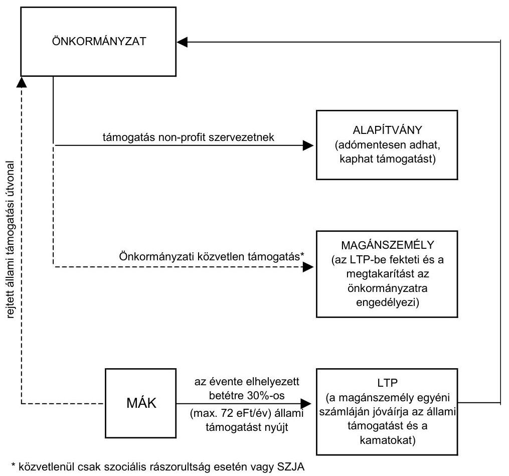

Az önkormányzati közműberuházások finanszírozásában terjedőben lévő beruházási konstrukció az állam által - a Nemzeti Szennyvíz Megvalósítási Programban - kihirdetett, a szennyvízelvezetés ütemezésében meghatározott prioritási szempontokkal ellentétes irányú, amit szándékai ellenére az állam támogat, csak nem közvetlenül önkormányzatoknak juttatott, hanem magánszemélyeket illető támogatásokkal.

Az ellenőrzés során vált nyilvánvalóvá, hogy az alkalmazott ÖKOTÁM 2000 rendszer, és más hasonló rendszer alkalmazása során közmúfejlesztési támogatás jogtalan igénybevétele történt. A kijelölt önkormányzatok a vizsgálattal érintett beruházásokat társberuházásban valósították, illetve valósítják meg, ezért helyszíni vizsgálatunk során egyértelművé vált, hogy a társult, de ellenőrzésre ki nem jelölt önkormányzatok ugyanúgy jogosulatlanul igénylik a támogatást, mint az ellenőrzésre kijelölt egységek. Kiegészítő vizsgálatot az „üvegzseb törvény" megalkotását indokoló elvárások figyelembe vételé-

---

vel Magyaregregy, Vékény, Kárász, Szalatnak, Ráckeresztúr, Tordas, Gyúró, Tiszanána, Poroszló, Újlőrincfalva, Tevel önkormányzatoknál végeztünk az egységes ellenőrzési elvek, illetve követelmények érvényesülése érdekében.

A 2004. évre vonatkozóan 21 önkormányzat - az ellenőrzött és vizsgálatba bevont önkormányzatok kétharmada - által jogtalanul igénybevett, nagy összegű (összesen 620 millió Ft) közmúfejlesztési támogatás elvonására tettünk javaslatot. A megállapított jogtalan támogatások elvonása azoknál az önkormányzatoknál, ahol még a beruházás folyamatban van, a beruházások leállítását, a hitelszerződések felmondását, az önkormányzati kezesség miatt jelentkező kötelezettségek megjelenését, s ezáltal akár az önkormányzati csőd bekövetkezését is maga után vonhatja. Az elvonás további állami kiadásokat jelenthet, mivel elkezdett beruházások maradhatnak befejezetlenül. Vizsgálatunk nem érintette az összes önkormányzatot, akik hasonló módon folytatnak beruházásokat.

Ha az önkormányzatok a magánszemélyek nevében nem igénylik meg a közmúfejlesztési támogatásokat, illetve azokat nem utalják tovább a felvett víziközmű társulati hitelek fedezetét gyűjtő óvadéki számlára, akkor a pénzintézetek jogosultak lesznek felmondani a hiteleket, illetve megszüntethetik a további hitelfolyósítást. Szentegát községi önkormányzat polgármestere és közjegyzője 2005. május 24-i levelében jelezte, hogy mivel a közmúfejlesztési támogatás igénybe vételét jogosulatlannak minősítettük, ezért azt - az államnak történő visszafizethetőség érdekében - nem utalta tovább. Az ÖKOTÁM Alapítvány azonban felszólította a megbízási szerződések alapján őt megillető adomány átutalására. Az önkormányzat levelében arról is tájékoztatott, hogy amennyiben elesnek a támogatástól, akkor ennek kiváltására érvénybe lép az önkormányzati kezesség, ami az önkormányzat gazdálkodásának ellehetetlenülését vonja maga után.

Az ágazati irányító szervek közül a Közlekedési és Vízügyi Minisztérium 2002. januárjában értesült először az önkormányzati szennyvízközművek esetén al-kalmazott beruházás-finanszírozási módszerről. Az ÖKOTÁM Alapítvány a rendszer lényegét levélben ismertette a minisztériummal. Felajánlotta, hogy az állami költségvetésben szereplő KAC forrásokat, valamint a céltámogatási forrásokat az ÖKOTÁM Alapítvány saját pénzeszközeiből megemeli. Ennek feltételéül a támogatások szabályozásának átalakítását jelölte meg. A rendszer bemutatásakor felsorolta azokat az állami forrásokat, melyek a beruházás finanszírozási módszerben szerepet kapnak. Nem említette meg azonban, hogy a beruházási összköltség alakulását önkormányzati bevétel is befolyásolja. Az ÖKOTÁM Alapítvány adományozói között elsősorban a szennyvízberuházások megvalósításában érdekelt gazdálkodó szervezeteket, másodsorban a magánszemélyeket jelölte meg. Az önkormányzatoktól érkező közcélú adomány, mint alapítványi forrás a minisztériumoknak megküldött rendszerleírásban nem szerepelt.

A Belügyminisztériumnak 2002. elején informálisan jutott tudomására a rendszer múködése. Önkormányzati vezetők keresték meg a minisztériumot, mivel az önkormányzati készfizető kezességvállalás nagysága miatt nem látták biztonságosnak a rendszer múködését. A belügyminiszter 2002. februárjában a közigazgatási hivatalok vezetőin keresztül értesítette az önkormányzatokat arról, hogy több szempontból aggályosnak tartja a finanszírozási módszert, de konkrétan nem jelölte meg a jogszabályokkal ellentétes pontokat, ugyanis pon-

---

tos információkkal a rendszer múködéséről nem rendelkezett. A Belügyminisztérium 2002. márciusában levélben értesítette a Közlekedési és Vízügyi Minisztériumot arról, hogy a rendszer tömeges elterjedése jelentős terheket róhat az állami költségvetésre, illetve megkérdőjelezi a Kormánynak a szennyvíztisztítási program során hozott döntéseit. A kezdetekben a fővállalkozóval szorosan együttműködő pénzintézet 2002. áprilisában a személyes tájékoztatást követően írásban is részletesen bemutatta az ÖKOTÁM Alapítvánnyal közösen múködtetett beruházási konstrukciót a Belügyminisztériumnak. Az alapítványi forrásokat ebben a levélben elsődlegesen vállalkozói forrásként jelölték meg. Nem említették azonban a beruházási összköltség növekedésére hatást gyakorló önkormányzati bevételek kérdéskörét. A banki levél alapján így is nyilvánvalóvá vált, hogy a magánszemélyek harmadik személytől kapott támogatásai is alapjaivá válnak a magánszemélyeket érintő állami támogatások igénybe vételének. Emiatt 2002. májusában szigorító jogszabályi rendelkezések születtek annak érdekében, hogy az állami támogatások ugrásszerű növekedését megakadályozzák. A kormányzati szándék azonban nem volt egyértelmú, mivel a szigorítások mellett visszamenőleges hatálylyal lehetővé tették, hogy közcélú közműberuházásokhoz is felhasználható legyen a lakás-előtakarékossági betét, valamint az ahhoz kapcsolódó állami támogatás. A megváltozott jogszabályi környezetben a konstrukciót - a beruházás szervezői és az érintett bankok - némileg megváltoztatva a magánszemélyek támogatási formáit (korábban az önkormányzat szociális segélyt adott a település lakosainak, azt követően pedig az alapítvány adta a magánszemélyeknek a támogatást) tovább múködtették.

Az önkormányzatok jegyzői a konstrukció törvényességével kapcsolatosan több alkalommal szóban és írásban is állásfoglalásokat kértek a központi költségvetési szervektől, elsősorban a Pénzügyminisztériumtól, illetve a Belügyminisztériumtól. Az önkormányzati kérdések kapcsán a központi szervek folyamatosan kifejtették a jogszabályok értelmezésével összefüggő azon véleményüket, mely egybeesik a jelentésünkben kifejtettekkel.

A Miniszterelnöki Hivatal Közpénzügyi Államtitkársága 2002-ben vizsgálatot folytatott a témában és az alkalmazott beruházási konstrukciót több szempontból kifogásolhatónak találta. Az állami pénzeszközök gazdaságtalan felhasználása miatt adóhivatali ellenőrzést kezdeményezett az érintett szervezeteknél. A Közpénzügyi Államtitkárság felkérésére 2002. szeptemberében a PSZÁF is átfogó ellenőrzést tartott az OTP Lakás-takarékpénztár Rt-nél, melynek keretében az ÖKOTÁM finanszírozással megvalósuló beruházásokhoz kapcsolódó ltp. szerződések helyzetét vizsgálták. A vizsgálat azt állapította meg, hogy a projektekhez kapcsolódó ltp. szerződések a hatályos jogszabályoknak, valamint a társaság szabályzatainak megfelelnek. Az adóhivatal halmozott állami támogatások igénybe vételét tapasztalta, ezért 2004. nyarán megkereste szervezetünket további vizsgálatok folytatása érdekében. Az ÁSZ 2003-ban hasonló beruházási konstrukciót megvalósító önkormányzatok és pénzintézetek vezetői ellen bűntető feljelentést tett. A Borsod-Abaúj-Zemplén Megyei Ügyészség kétszeri panaszunk ellenére a nyomozást abban az ügyben megszüntette.

A központi szervek csak azoknak az önkormányzatoknak jelezték a beruházási konstrukció ellenzését, amelyek állásfoglalás kéréssel megkeresték őket. A jogszabályok szigorításával törekedtek a terjedőben lévő módszer

---

visszaszorítására, melyek nem vezettek kellő eredményre. A beruházás szervezője a jogkövetés érdekében a rendszer egyes elemeit a jogszabályváltozásokhoz igazította, jogszerűnek feltüntetve azokat. A rendszerszerű elemzés ugyanakkor azt mutatta ki, hogy az alkalmazott beruházási konstrukció jelen formájában nem egyezik meg a központi kormányzat által meghirdetett célokkal. A módszer alkalmazása elősegítette, hogy az önkormányzatok minimális lakossági erő bevonásával, az állami pénzeszközök hosszú távra elnyújtott, szabálytalan és vitatott igénybevételével, önkormányzati saját forrás bevonása nélkül, az állami pénzeszközök felhasználásának hatékonysági szempontjait nélkülözve, a piaci versenyt kizárva valósítsák meg településükön a közműberuházásokat.

Budapest, 2005. augusztus " 22 "
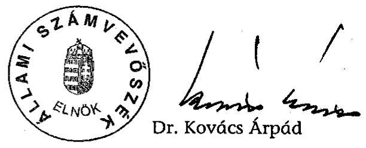

Melléklet: $\quad 22 \mathrm{db} \quad 77$ lap
Függelék: $\quad 5 \mathrm{db} \quad 7$ lap

---

Az önkormányzatok kiadásai - kiemelten a pénzeszköz átadások - országos szinten

|  Kiadások megnevezése | 2002. évi |  |  | 2003. évi |  |  | 2004. évi |  |  | Telj. kiadás vált. \%-a |  |   |
| --- | --- | --- | --- | --- | --- | --- | --- | --- | --- | --- | --- | --- |
|   | eredeti ei. | mód. ei. | teljesítés | eredeti ei. | mód. ei | teljesítés | eredeti ei. | mód. ei | teljesítés | 2003/2002 | 2004/2003 | 2004/2002  |
|  Költségvetési kiadások összesen | 2122966 | 2642445 | 2431924 | 2571577 | 2913553 | 2702025 | 2828473 | 3175132 | 2849563 | 111,1 | 105,5 | 117,2  |
|  Pénzeszköz átadások összesen | 126043 | 210043 | 170028 | 150282 | 200253 | 162190 | 166000 | 234338 | 180457 | 95,4 | 111,3 | 106,1  |
|  Müködési célú pénzeszközátadás | 80786 | 101396 | 97659 | 77355 | 97372 | 91592 | 82673 | 118515 | 112244 | 93,8 | 122,5 | 114,9  |
|  ebből: |  |  |  |  |  |  |  |  |  |  |  |   |
|  - államháztartáson belülre | 20705 | 21680 | 19631 | 23138 | 25427 | 22330 | 22283 | 31530 | 27485 | 113,7 | 123,1 | 140,0  |
|  - államháztartáson kívülre | 60081 | 79716 | 78028 | 54217 | 71945 | 69262 | 60390 | 86985 | 84759 | 88,8 | 122,4 | 108,6  |
|  ebből: |  |  |  |  |  |  |  |  |  |  |  |   |
|  - non-profit szervezeteknek | 26613 | 36663 | 34744 | 30177 | 38247 | 35047 | 33406 | 42656 | 40320 | 100,9 | 115,0 | 116,0  |
|  - háztartásoknak | 1356 | 2085 | 1821 | 2023 | 1716 | 1820 | 1312 | 1642 | 1509 | 99,9 | 82,9 | 82,9  |
|  - vállalkozásoknak | 32101 | 40901 | 41399 | 21996 | 31926 | 32335 | 25659 | 42638 | 42871 | 78,1 | 132,6 | 103,6  |
|  ebből: önk. többségi tul. váll-nak. | 25128 | 30561 | 30975 | 15387 | 21189 | 21063 | 18186 | 29784 | 29883 | 68,0 | 141,9 | 96,5  |
|  - külföldieknek | 11 | 67 | 64 | 21 | 56 | 60 | 13 | 49 | 59 | 93,8 | 98,3 | 92,2  |
|  Felhalmozási célú pénzeszköz-átadás | 45257 | 108647 | 72369 | 72927 | 102881 | 70598 | 83327 | 115823 | 68213 | 97,6 | 96,6 | 94,3  |
|  ebből: |  |  |  |  |  |  |  |  |  |  |  |   |
|  - államháztartáson belülre | 13577 | 36834 | 19740 | 25367 | 32520 | 16771 | 26937 | 33759 | 13665 | 85,0 | 81,5 | 69,2  |
|  - államháztartáson kívülre | 31680 | 71813 | 52629 | 47560 | 70361 | 53827 | 56390 | 82064 | 54548 | 102,3 | 101,3 | 103,6  |
|  ebből: |  |  |  |  |  |  |  |  |  |  |  |   |
|  - non-profit szervezeteknek | 6274 | 7676 | 7087 | 5381 | 6545 | 6135 | 5851 | 16029 | 15640 | 86,6 | 254,9 | 220,7  |
|  - háztartásoknak | 4386 | 12266 | 8227 | 5887 | 11789 | 8539 | 6661 | 12049 | 10174 | 103,8 | 119,1 | 123,7  |
|  - vállalkozásoknak | 21005 | 51839 | 37286 | 36254 | 51980 | 39112 | 43850 | 53933 | 28691 | 104,9 | 73,4 | 76,9  |
|  ebből: önk. többségi tul. váll-nak | 15481 | 42398 | 29140 | 32164 | 44719 | 32764 | 3351 | 45093 | 21779 | 112,4 | 66,5 | 74,7  |
|  - külföldieknek | 15 | 32 | 29 | 38 | 47 | 41 | 28 | 53 | 43 | 141,4 | 104,9 | 148,3  |

---

# A vizsgált önkormányzatok kiadásai, kiemelten a pénzeszköz átadások

|  Kiadások megnevezése | 2002. évi |  |  | 2003. évi |  |  | 2004. évi |  |  | Telj. kiadás | vált. | $\%$-a  |
| --- | --- | --- | --- | --- | --- | --- | --- | --- | --- | --- | --- | --- |
|   | eredeti ei. | mód. ei. | teljesítés | eredeti ei. | mód. ei | teljesítés | eredeti ei. | mód. ei | teljesítés | 2003/2002 | 2004/2003 | 2004/2002  |
|  Költségvetési kiadások összesen | 7040564 | 18387199 | 16925308 | 9079724 | 17102608 | 16318206 | 14458857 | 20272045 | 21488297 | 96,4 | 131,7 | 127,0  |
|  Pénzeszköz átadások összesen | 189273 | 989567 | 928401 | 288647 | 1356671 | 1430528 | 1276058 | 3265844 | 4608791 | 154,1 | 322,2 | 496,4  |
|  Müködési célú pénzeszközátadás | 164545 | 489945 | 487824 | 237010 | 277975 | 272204 | 274125 | 303313 | 276483 | 55,8 | 101,6 | 56,7  |
|  ebből: |  |  |  |  |  |  |  |  |  |  |  |   |
|  - államháztartáson belülre | 51431 | 63304 | 69167 | 70465 | 98964 | 97451 | 75736 | 98177 | 96920 | 140,9 | 99,5 | 140,1  |
|  - államháztartáson kívülre | 113114 | 426413 | 417184 | 166545 | 179011 | 174753 | 198389 | 204786 | 179563 | 41,9 | 102,8 | 43,0  |
|  ebből: |  |  |  |  |  |  |  |  |  |  |  |   |
|  - non-profit szervezeteknek | 99413 | 320013 | 329053 | 156153 | 111033 | 108848 | 186948 | 147314 | 123093 | 33,1 | 113,1 | 37,4  |
|  - háztartásoknak | 4380 | 77029 | 60033 | 4372 | 35376 | 36796 | 3277 | 19635 | 17171 | 61,3 | 46,7 | 28,6  |
|  - vállalkozásoknak | 9321 | 29371 | 28098 | 6020 | 32602 | 29109 | 8164 | 37837 | 39299 | 103,6 | 135,0 | 139,9  |
|  ebből: önk. többségi tul. váll-nak. | 5709 | 10403 | 11908 | 490 | 4810 | 4322 | 3300 | 7200 | 6264 | 36,3 | 144,9 | 52,6  |
|  - külföldieknek | 0 | 0 | 0 | 0 | 0 | 0 | 0 | 0 | 0 |  |  |   |
|  Felhalmozási célú pénzeszköz-átadás | 24728 | 499622 | 440577 | 51637 | 1078696 | 1158324 | 1001933 | 2962531 | 4332308 | 262,9 | 374,0 | 983,3  |
|  ebből: | 0 | 0 | 0 | 0 | 0 | 0 | 0 | 0 | 0 |  |  |   |
|  - államháztartáson belülre | 40 | 1985 | 1735 | 1970 | 2270 | 892 | 35785 | 37325 | 78941 | 51,4 | 8849,9 | 4549,9  |
|  - államháztartáson kívülre | 24688 | 497637 | 438842 | 49667 | 1076426 | 1157432 | 966148 | 2925206 | 4253367 | 263,7 | 367,5 | 969,2  |
|  ebből: |  |  |  |  |  |  |  |  |  |  |  |   |
|  - non-profit szervezeteknek | 18743 | 26611 | 26661 | 25475 | 531028 | 644263 | 681986 | 2100729 | 3370594 | 2416,5 | 523,2 | 12642,4  |
|  - háztartásoknak | 3400 | 176200 | 123126 | 2100 | 310241 | 300954 | 22280 | 543301 | 610656 | 244,4 | 202,9 | 496,0  |
|  - vállalkozásoknak | 2545 | 294826 | 289055 | 22092 | 235157 | 212215 | 261882 | 281176 | 272117 | 73,4 | 128,2 | 94,1  |
|  ebből: önk. többségi tul. váll-nak | 0 | 284072 | 282277 | 0 | 27720 | 27303 | 5140 | 257195 | 256767 | 9,7 | 940,4 | 91,0  |
|  - külföldieknek | 0 | 0 | 0 | 0 | 0 | 0 | 0 | 0 | 0 |  |  |   |

---

# Az önkormányzatok bevételei országos szinten

|  Bevételek megnevezése | 2002. évi |  |  | 2003. évi |  |  | 2004. évi |  |  | 2003/2002 | 2004/2003 | 2004/2002  |
| --- | --- | --- | --- | --- | --- | --- | --- | --- | --- | --- | --- | --- |
|   | eredeti ei. | mód. el. | teljesítés | eredeti ei. | mód. el. | teljesítés | eredeti ei. | mód. el. | teljesítés |  |  |   |
|  Költségvetési bevételek összesen | 1973058 | 2642445 | 2580269 | 2436942 | 2784191 | 2948507 | 2640347 | 21360677 | 3110645 | 114,3 | 105,5 | 120,6  |
|  Intézményi bevételek (kamatbevételek nélkül) | 178886 | 226192 | 228854 | 188493 | 225245 | 228149 | 215964 | 256841 | 250065 | 99,7 | 109,6 | 109,3  |
|  Kamatbevételek | 17575 | 23345 | 24214 | 10756 | 13979 | 16603 | 10689 | 16537 | 24050 | 68,6 | 144,9 | 99,3  |
|  Önkormányzatok sajátos müködési bevételei | 679572 | 697377 | 713071 | 813957 | 827400 | 842691 | 926189 | 945556 | 964931 | 118,2 | 114,5 | 135,3  |
|  ebből: egyéb sajátos folyó bevétele | 20936 | 22459 | 22231 | 22238 | 23456 | 23630 | 26917 | 28187 | 26709 | 106,3 | 113,0 | 120,1  |
|  Felhalmozási és tőkejellegú bevételek | 159619 | 146031 | 105929 | 152949 | 140047 | 111375 | 138801 | 151329 | 113530 | 105,1 | 101,9 | 107,2  |
|  ebből: egyéb önk. vagyon bérbeadásából bevétel | 3642 | 6731 | 6278 | 4921 | 6094 | 6389 | 6678 | 13680 | 14292 | 101,8 | 223,7 | 227,6  |
|  üzemelt... koncesszióból származó bevételek | 5004 | 5598 | 5392 | 3588 | 4102 | 3096 | 3829 | 4657 | 4062 | 57,4 | 131,2 | 75,3  |
|  Önkormányzatok költségvetési támogatása | 446566 | 647661 | 620643 | 649154 | 777078 | 748948 | 664392 | 800521 | 768672 | 120,7 | 102,6 | 123,9  |
|  Fejlesztési célú hitelfelvétel egyéb belföldi forrásból | 2335 | 2951 | 4843 | 2189 | 3231 | 2896 | 2118 | 3512 | 2984 | 59,8 | 103,1 | 61,6  |
|  Rövid lejáratú hitelfelvétel egyéb belföldi forrásból | 5318 | 6281 | 8649 | 6614 | 5509 | 6841 | 6692 | 5683 | 6696 | 79,1 | 97,9 | 77,4  |
|  Pénzeszköz átvétel államháztartáson belülről | 386316 | 476671 | 443704 | 488963 | 539213 | 508954 | 542592 | 567188 | 505983 | 114,7 | 99,4 | 114,0  |
|  ebből: |  |  |  |  |  |  |  |  |  |  |  |   |
|  - müködési célú pénzeszköz-átvétel | 302588 | 360583 | 361247 | 392802 | 432185 | 428736 | 406081 | 435954 | 432717 | 118,7 | 100,9 | 119,8  |
|  - felhalmozási célú pénzeszköz-átvétel | 83728 | 116088 | 82457 | 96161 | 107028 | 80218 | 136511 | 131234 | 73266 | 97,3 | 91,3 | 88,9  |
|  Pénzeszköz átvétel államháztartáson kívülről | 47700 | 73083 | 66127 | 52553 | 74037 | 63939 | 65117 | 87739 | 70708 | 96,7 | 110,6 | 106,9  |
|  ebből: |  |  |  |  |  |  |  |  |  |  |  |   |
|  - müködési célú pénzeszköz-átvétel | 5904 | 13545 | 15596 | 12909 | 19754 | 20018 | 9023 | 14650 | 14517 | 128,4 | 72,5 | 93,1  |
|  - felhalmozási célú pénzeszköz-átvétel | 41796 | 59538 | 50531 | 39644 | 54283 | 43921 | 56094 | 73089 | 56191 | 86,9 | 127,9 | 111,2  |
|  Pénzeszköz átvétel összesen | 434016 | 549754 | 509831 | 541516 | 613250 | 572893 | 607709 | 654927 | 576691 | 112,4 | 100,7 | 113,1  |

---

# A vizsgált önkormányzatok bevételei

|  Bevételek megnevezése | 2002. évi |  |  | 2003. évi |  |  | 2004. évi |  |  |  | Telj. bevétel vált. \%-a |  |   |
| --- | --- | --- | --- | --- | --- | --- | --- | --- | --- | --- | --- | --- | --- |
|   | eredeti ei. | mód. ei. | teljesítés | eredeti ei. | mód. ei | teljesítés | eredeti ei. | mód. ei | teljesítés | 2003/2002 | 2004/2003 | 2004/2002 |   |
|  Költségvetési bevételek összesen | 6504207 | 17930068 | 16755730 | 8528696 | 17138566 | 16802029 | 13563328 | 18979610 | 21755937 | 100,3 | 129,5 | 129,8 |   |
|  Intézményi bevételek (kamatbevételek nélkül) | 501794 | 1856905 | 2258494 | 662507 | 1869173 | 1826871 | 1145310 | 2327583 | 2459197 | 80,9 | 134,6 | 108,9 |   |
|  Kamatbevételek | 26854 | 58377 | 62808 | 33941 | 61013 | 60466 | 24494 | 44801 | 58456 | 96,3 | 96,7 | 93,1 |   |
|  Önkormányzatok sajátos müködési bevételei | 2532535 | 2587974 | 2597056 | 3154048 | 3556395 | 3507718 | 3632622 | 3802254 | 3834520 | 135,1 | 109,3 | 147,6 |   |
|  ebből: egyéb sajátos folyó bevétele | 112437 | 135428 | 125439 | 129819 | 138736 | 134966 | 153054 | 184445 | 185501 |  |  | 147,9 |   |
|  Felhalmozási és tőkejellegú bevételek | 252899 | 1849166 | 1701500 | 292368 | 929972 | 903205 | 1268976 | 3417891 | 3736620 |  |  | 219,6 |   |
|  ebből: egyéb önk. vagyon bérbeadásából bevétele | 51867 | 52678 | 45516 | 17261 | 107244 | 206309 | 713853 | 2797722 | 2270577 |  |  | 4988,5 |   |
|  üzemelt., koncesszióból származó bevételek | 3800 | 218622 | 219752 | 5055 | 30430 | 31780 | 3560 | 3560 | 2849 |  |  | 1,3 |   |
|  Önkormányzatok költségvetési támogatása | 1981508 | 3750335 | 3307634 | 2901922 | 4595086 | 4472466 | 2822310 | 4115239 | 4129724 | 135,2 | 92,3 | 124,9 |   |
|  Fejlesztési célú hitelfelvétel egyéb belföldi forrásból | 0 | 0 | 110914 | 0 | 128083 | 135083 | 0 | 128280 | 143822 |  |  | 129,7 |   |
|  Rövid lejáratú hitelfelvétel egyéb belföldi forrásból | 77474 | 49637 | 86145 | 125865 | 162879 | 288183 | 134595 | 192169 | 118512 |  |  | 137,6 |   |
|  Pénzeszköz átvétel államháztartáson belülről | 534947 | 793985 | 708544 | 578088 | 1306945 | 1232861 | 1713276 | 3271993 | 3413674 | 174,0 | 276,9 | 481,8 |   |
|  ebből: |  |  |  |  |  |  |  |  |  |  |  |  |   |
|  - müködési célú pénzeszköz-átvétel | 434775 | 526050 | 520136 | 419987 | 587522 | 572617 | 428179 | 579825 | 611380 | 110,1 | 106,8 | 117,5 |   |
|  - felhalmozási célú pénzeszköz-átvétel | 100172 | 267935 | 188408 | 158101 | 719423 | 660244 | 1285097 | 2692168 | 2802294 | 350,4 | 424,4 | 1487,4 |   |
|  Pénzeszköz átvétel államháztartáson kívülről | 288047 | 6275762 | 5665896 | 559318 | 4235861 | 3904537 | 2207905 | 2019103 | 3424337 | 68,9 | 87,7 | 60,4 |   |
|  ebből: |  |  |  |  |  |  |  |  |  |  |  |  |   |
|  - müködési célú pénzeszköz-átvétel | 41043 | 670772 | 1145463 | 7155 | 167465 | 144367 | 1253 | 17703 | 47855 |  |  | 4,2 |   |
|  - felhalmozási célú pénzeszköz-átvétel | 247004 | 5604990 | 4520433 | 552163 | 4068396 | 3760170 | 2206652 | 2001400 | 3376482 | 83,2 | 89,8 | 74,7 |   |
|  Pénzeszköz átvétel összesen | 822994 | 7069747 | 6374440 | 1137406 | 5542806 | 5137398 | 3921181 | 5291096 | 6838011 | 80,6 | 133,1 | 107,3 |   |

---

5. számú melléklet a V-1004/2005. számú jelentéshez

## **Az ÖKOTÁM 2000 beruházás-finanszírozási rendszer folyamatábrája**

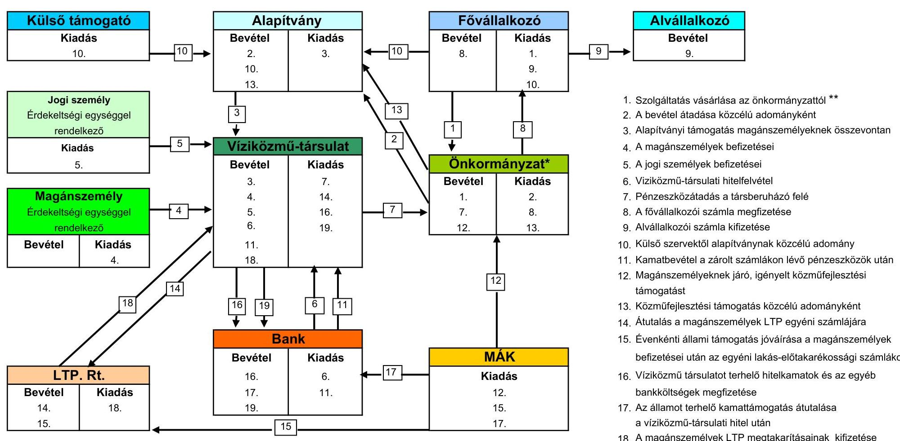

**A beruházási és a fajlagos költséget növeli**

*Az önkormányzat bevételei és kiadásai összegében a 1=2; 7=8; 12=13*

---

6. számú melléklet
a V-1004/2005. számú jelentéshez

A közpénzek jogszerű, átlátható beruházás-finanszírozási folyamatábrája

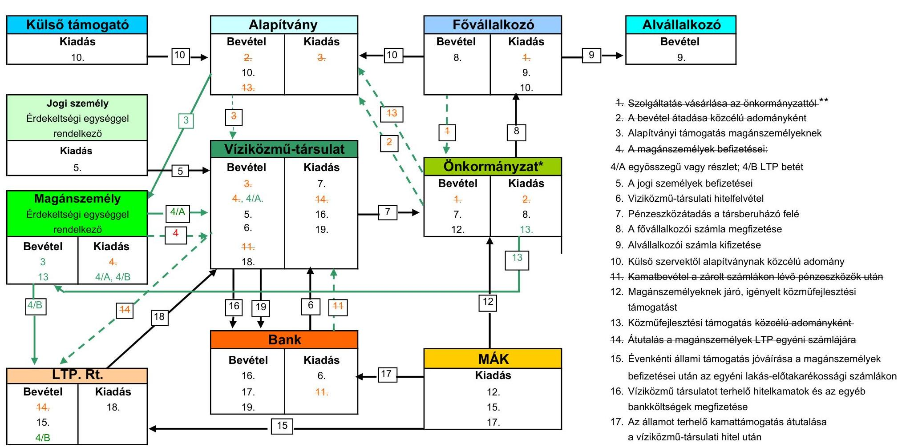

jelmagyarázat:
fekete nyíl: ÖKOTÁM 2000 rendszerben is alkalmazott átlátható folyamat
zöld nyíl, zöld szám: átlátható folyamat
zöld szaggatott nyíl, piros áthúzott szám: jogszabályi előírásokat kiterjeszően értelmező, átláthatóságot akadályozó folyamat alapítványi rendszerben
** A beruházási és a fajlagos költséget növeli

Alvállalkozó
Bevétel
9.

1. Szolgáltatás vásárlása az önkormányzattól.**
2. A bevétel átadása közcélú adományként
3. Alapítványi támogatás magánszemélyeknek
4. A magánszemélyek befizetései:
   4/A egyösszegű vagy részlet; 4/B LTP betét
5. A jogi személyek befizetései
6. Víziközmű-társulati hitelfelvétel
7. Pénzeszközátadás a társberuházó felé
8. A fővállalkozói számla megfizetése
9. Alvállalkozói számla kifizetése
10. Külső szervektől alapítványnak közcélú adomány
11. Kamatbevétel a zárolt számlákon lévő pénzeszközök után
12. Magánszemélyeknek járó, igényelt közműfejlesztési támogatást
13. Közműfejlesztési támogatás közcélú adományként
14. Átutalás a magánszemélyek LTP egyéni számlájára
15. Évenkénti állami támogatás jóváírása a magánszemélyek befizetései után az egyéni lakás-előtakarékossági számlákon
16. Víziközmű társulatot terhelő hitelkamatok és az egyéb bankköltségek megfizetése
17. Az államot terhelő kamattámogatás átutalása a víziközmű-társulati hitel után
18. A magánszemélyek LTP megtakarításainak kifizetése
19. A víziközmű-társulati hitel visszafizetése
*Az önkormányzat bevételei és kiadásai összegében a -1=2; 7=8; 12=13

---

A vizsgált beruházások finanszírozásához - közvetetten - igénybevett, illetve igénybe vehető állami támogatások összege

|  Kiadás (költség), bevétel | Sarud | Csongrád, Felgyő | Köblény, Szászvár (+4 önk.) | Nógrád, Diósjenő, Bekenye | Kisdorog | Závod (szennyviztiszt.+Tevel önk.) | Noszvaj, Szomolya | Múcsony | Szentegát | Martonvásár, Gyúró | Ráckeresztúr, Tordas  |
| --- | --- | --- | --- | --- | --- | --- | --- | --- | --- | --- | --- |
|   | 1 | 2 | 3 | 4 | 5 | 6 | 7 | 8 | 9 | 10 | 11  |
|  1. Beruházási összköltség, nettó | 745706 | 4478345 | 1201000 | 2008802 | 442477 | 206606 | 2776915 | 887225 | 341666 | 2540000 | 2306626  |
|  2. Önkormányzat által a beruházáshoz kapcsolódóan beszedett bevétel, nettó | 20583 | 210060 | 385092 | 361005 | 187908 | 95988 | 1829100 | 531924 | 165245 | 1590496 | 1470504  |
|  3. 1.-2. Egyenlege: nettó | 725123 | 4268285 | 815908 | 1647797 | 254569 | 110618 | 947815 | 355301 | 176421 | 949504 | 836122  |
|  4. Magánszemélyek közműfejlesztési támogatása | 59500 | 257007 | 127832 | 224740 | 33955 | 17123 | 348489 | 103000 | 54413 | 294095 | 244020  |
|  a) - eddig igénybevett | 39419 | 203607 | 116812 | 180998 | 29549 | 14871 | 307636 | 77537 |  | 130652 | 123356  |
|  b) - igénybevételre tervezett | 20081 | 53400 | 11020 | 43742 | 4406 | 2252 | 40853 | 25463 | 54413 | 163443 | 120664  |
|  5. Lakás-takarékpénztári befizetések állami támogatása* | 78400 | 423080 | 22856 | 391228 | 78336 | 40032 | 546327 | 188014 | 57730 | 719550 | 647400  |
|  6. Víziközmű-társulati hitel állami kamattámogatása** | 47527 | 1376635 | 1187542 | 523334 | 357142 | 179884 | 722506 | 244666 | 87445 | 707329 | 671417  |
|  7. Felhalmozási célú közvetlen állami támogatások | 374552 | 1667994 |  |  |  |  |  |  |  |  |   |
|  ebből: céltámogatás | 241781 | 1347561 |  |  |  |  |  |  |  |  |   |
|  címzett támogatás |  |  |  |  |  |  |  |  |  |  |   |
|  KAC | 110488 | 312500 |  |  |  |  |  |  |  |  |   |
|  VICE | 12142 |  |  |  |  |  |  |  |  |  |   |
|  CÉDE |  |  |  |  |  |  |  |  |  |  |   |
|  TERKI | 10141 | 7933 |  |  |  |  |  |  |  |  |   |
|  8. Egyéb állami támogatások |  |  |  |  | 45750 | 10650 |  |  |  |  |   |
|  9. Összes várható állami támogatás (4+......+8) | 559979 | 3724716 | 1338230 | 1139302 | 515183 | 247689 | 1617322 | 535680 | 199588 | 1720974 | 1562837  |

- megkötött szerződések alapján, igénybe vehető a várható összes befizetés $30 \%$-a ** az eredeti hitelszerződésben (módosítás nélküli) rögzített kezdeti kamatfelvételekkel kalkulálva

|  ÖKOTÁM 2000 rendszer szerint várható állami támogatás | 669087 | 4580124 | 1027690 | 1575550 | 371252 | 186984 | 1438892 | 486598 | 168687 | 2686658 |
| --- | --- | --- | --- | --- | --- | --- | --- | --- | --- | --- |
|  |   |   |   |   |   |   |   |   |   |   |

---

A vizsgált beruházások finanszírozásához - közvetetten - igénybevett, illetve igénybe vehető állami támogatások összege

|  Kiadás (költség), bevétel | Összesen ÖKOTÁM által támogatott | ÖKOTÁM rendszer kezelője szerinti adat | Emőd | Mezőzombor | Ábrahámhegy | szennyvíz beruházások összesen | Gázberu-
házás
Tardona | Otépítések
Taksony | Mindösszesen  |
| --- | --- | --- | --- | --- | --- | --- | --- | --- | --- |
|   | 12=1-11 | 13. | 14. | 15. | 16. | 17 = 13-16 | 18. | 19. | 17-19.  |
|  1. Beruházási összköltség, nettó | 17935368 |  | 2430878 | 335205 | 582873 | 21284324 | 75016 | 88994 | 21448334  |
|  2. Önkormányzat által a beruházáshoz kapcsolódóan beszedett bevétel, nettó | 6847905 |  | 415527 | 43997 |  | 7307429 | 4000 |  | 7311429  |
|  3. 1.-2. Egyenlege: nettó | 11087463 |  | 2015351 | 291208 | 582873 | 13976895 | 71016 | 88994 | 14136905  |
|  4. Magánszemélyek közműfejlesztési támogatása | 1764174 | 1666034 | 75900 | 4248 | 27788 | 1872110 | 8403 | 8649 | 1889162  |
|  a) - eddig igénybevett | 1224437 |  | 75890 | 4248 | 3624 | 1308199 |  |  | 1308199  |
|  b) - igénybevételre tervezett | 539737 |  | 10 |  | 24164 | 563911 | 8403 | 8649 | 580963  |
|  5. Lakás-takarékpénztári befizetések állami támogatása* | 3192953 | 3143448 | 146994 | 24469 | 35446 | 3399862 | 18619 | 10645 | 3429126  |
|  6. Víziközmű-társulati hitel állami kamattámogatása** | 6105427 | 6376462 | 255847 | 83668 | 29782 | 6474724 |  |  | 6474724  |
|  7. Felhalmozási célú közvetlen állami támogatások | 2042546 | 2005578 | 1608054 | 184473 | 421476 | 4256549 |  |  | 4256549  |
|  ebből: céltámogatás | 1589342 |  | 946602 | 131030 | 337180 | 3004154 |  |  | 3004154  |
|  címzett támogatás |  |  |  |  |  |  |  |  |   |
|  KAC | 422988 |  | 460092 | 30000 |  | 913080 |  |  | 913080  |
|  VICE | 12142 |  | 59607 | 21250 | 84296 | 177295 |  |  | 177295  |
|  CÉDE |  |  | 102000 |  |  | 102000 |  |  | 102000  |
|  TERKI | 18074 |  | 39753 | 2193 |  | 60020 |  |  | 60020  |
|  8. Egyéb állami támogatások | 56400 |  | 190133 |  | 60000 | 306533 |  |  | 306533  |
|  9. Összes várható állami támogatás (4+......+8) | 13161500 | 13191522 | 2276928 | 296858 | 574492 | 16309778 | 27022 | 19294 | 16356094  |

- megkötött szerződések alapján, igénybe vehető a várható összes befizetés $30 \%$-a ** az eredeti hitelszerződésben (módosítás nélküli) rögzített kezdeti kamatfelvételekkel kalkulálva

ÖKOTÁM 2000 rendszer szerint várható állami támogatás 13191522

---

# A -Lakástámogatások" fejezeti előirányzat jogcímenkénti alakulása

|  Lakásépítési támogatás jogcímei | 2001. | 2002. | 2003. | 2004. | Változás \%-a |  |   |
| --- | --- | --- | --- | --- | --- | --- | --- |
|   |  |  |  |  | 2002/2001 | 2003/2002 | 2004/2003  |
|  Lakásépítési kedvezmény | 21273901838 | 19187468452 | 30086801014 | 33604697664 | 90,2 | 156,8 | 111,7  |
|  Adó-visszatérítési támogatás | 6213445922 | 6472332100 | 9045397830 | 9698762472 | 104,2 | 139,8 | 107,2  |
|  Mozgáskorlátozottak támogatása | 2318242104 | 3096090388 | 2823967005 | 2411325452 | 133,6 | 91,2 | 85,4  |
|  Megelőlegezett kedvezmény | $-232217203$ | $-276381990$ | $-156773471$ | $-125819254$ | 119,0 | 56,7 | 80,3  |
|  Megelőlegezett kedvezmény |  |  | 168987882 | 1136966296 |  |  | 672,8  |
|  Folyósítási és kamatköltségek | 1080586118 | 1342386638 | 10023912564 | 5040096675 | 124,2 | 746,7 | 50,3  |
|  Garancia érvényesítés | 60239648 | 24908658 | 7201895 | $-10304492$ | 41,3 | 28,9 | $-143,1$  |
|  Energia-megtakarítás támogatása | 59760163 | 49804160 | 34118140 | 40203689 | 83,3 | 68,5 | 117,8  |
|  Fix kamatok kiegészítése | 232710961 | 7603446 | 42013368 | 277921494 | 3,3 | 552,6 | 661,5  |
|  Betétesek áruvásárlási kölcsöne | 118243969 | 70490095 | 38896216 | 22964030 | 59,6 | 55,2 | 59,0  |
|  Lakástakarék támogatása | 6477408645 | 5656195515 | 5854847693 | 8261856268 | 87,3 | 103,5 | 141,1  |
|  Kiegészítő kamattámogatás | 6359065797 | 14990190773 | 23469853457 | 37294091324 | 235,7 | 156,6 | 158,9  |
|  Forgóeszköz hitelek támogatása | 2890556202 | 1760953190 | 586437164 | 398387861 | 60,9 | 33,3 | 67,9  |
|  Törlesztési támogatás | 5096758708 | 4132525953 | 1120774608 | 727276104 | 81,1 | 27,1 | 64,9  |
|  Kamattámogatás önkormányzatoknak | 181465789 | 1751290912 | 4948378386 | 1117230971 | 965,1 | 282,6 | 22,6  |
|  Jelzáloglevelek kamattámogatása | 759567501 | 11391844474 | 56254117706 | 97259504105 | 1499,8 | 493,8 | 172,9  |
|  Víziközmű kamattámogatása |  |  |  | 5229917238 |  |  |   |
|  Egyéb kamattámogatás | 9192100000 | 3943040519 | 889432000 | 617543579 | 42,9 | 22,6 | 69,4  |
|  függő | 0 | $-178000$ | 225600 | 0 |  | $-126,7$ | 0,0  |
|  Elszámolt lakástámogatás összesen |  |  |  |  |  |  |   |
|  előleg és elszámolás különbözete | $-1660891733$ | $-1266123150$ | $-8063336196$ | 990434478 | 76,2 | 636,9 | $-12,3$  |
|  Költségvetésben elszámolt lakástámogatás | 60420944429 | 72334442133 | 137175252861 | 203993055954 | 119,7 | 189,6 | 148,7  |

---

# A 2004. évi jogtalanul igénybe vett közmüfejlesztési támogatások 

|  |  |  | ezer Ft-ban |  |
| :--: | :--: | :--: | :--: | :--: |
| Megye | Önkormányzat | jogtalan   támogatás | 2002. május 22. |  |
|  |  |  | előtti | utáni |
| Baranya | Magyaregregy | 14051 | 14051 |  |
| Borsod-Abaúj-Zemplén megye: | Szomolya | 87366 |  | 87366 |
|  | Múcsony | 77537 |  | 77537 |
|  | Mezőzombor | 1529 | 1529 |  |
| Csongrád megye: | Csongrád | 7444 | 7444 |  |
|  | Felgyő | 628 | 628 |  |
| Fejér: | Martonvásár | 94364 |  | 94364 |
|  | Ráckeresztúr | 77381 |  | 77381 |
|  | Tordas | 45862 |  | 45862 |
|  | Gyúró | 36140 |  | 36140 |
| Heves megye: | Noszvaj | 109342 |  | 109342 |
|  | Sarud | 3795 | 3795 |  |
|  | Tiszanána | 5381 | 5381 |  |
|  | Újlőrincfalva | 1052 | 1052 |  |
|  | Poroszló | 7022 | 7022 |  |
| Nógrád megye: | Diósjenő | 11028 | 11028 |  |
|  | Nógrád | 7711 | 7711 |  |
|  | Berkenye | 3191 | 3191 |  |
| Tolna megye: | Kisdorog | 11210 | 11210 |  |
|  | Závod | 3912 | 3912 |  |
|  | Tevel | 14170 | 14170 |  |
| összesen: |  | 620116 | 92124 | 527992 |

---

Egy érdekeltségi egységre jutó szennyvíz beruházási kiadás (költség)

| ezer Ft-ban |  |  |
| :-- | --: | :--: |
| Önkormányzat | fajlagos beruházási   kiadás | bevétellel   csökkentett fajlagos   beruházási kiadás |
| Emőd | 714 | 592 |
| Mezőzombor | 568 | 494 |
| Sarud | 721 | 701 |
| Csongrád, Felgyő | 995 | 948 |
| Köblény, Szászvár (+4 önk.) | 1279 | 869 |
| Nógrád, Diósjenő, Berkenye | 812 | 666 |
| Kisdorog | 1521 | 875 |
| Závod | 1508 | 807 |
| Noszvaj (Szomolya) | 1802 | 615 |
| Mucsony | 961 | 385 |
| Szentegát | 2340 | 1208 |
| Martonvásár, Gyúró | 1135 | 424 |
| Ráckeresztúr, Tordas | 1144 | 415 |
| Ábrahámhegy |  | 554 |
| Céltámogatás vizsgálatával érintett   önkormányzatok: |  |  |
| Ajka |  | 641 |
| Babosdöbréte |  | 742 |
| Gyenesdiás |  | 869 |
| Kővágószőlős |  | 1096 |
| Villány és környéke |  | 1299 |

---

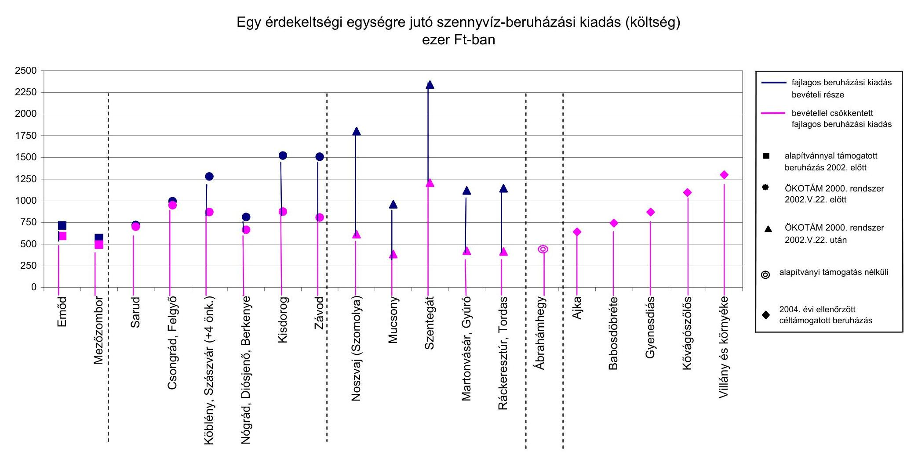

# Egy érdekeltségi egységre jutó szennyvíz-beruházási kiadás (költség) ezer Ft-ban

|  Ft-ban | 2000. | 2001. | 2002. | 2003. | 2004. | 2005. | 2006. | 2007. | 2008. | 2009. | 2010. | 2011. | 2012. | 2013. | 2014. | 2015. | 2016. | 2017. | 2018. | 2019. | 2020. | 2021. | 2022. | 2023. | 2024.  |
| --- | --- | --- | --- | --- | --- | --- | --- | --- | --- | --- | --- | --- | --- | --- | --- | --- | --- | --- | --- | --- | --- | --- | --- | --- | --- |
|  Győző |  |  |  |  |  |  |  |  |  |  |  |  |  |  |  |  |  |  |  |  |  |  |  |  |   |
|  Személy |  |  |  |  |  |  |  |  |  |  |  |  |  |  |  |  |  |  |  |  |  |  |  |  |   |
|  Győző |  |  |  |  |  |  |  |  |  |  |  |  |  |  |  |  |  |  |  |  |  |  |  |  |   |
|  Személy |  |  |  |  |  |  |  |  |  |  |  |  |  |  |  |  |  |  |  |  |  |  |  |  |   |
|  Győző |  |  |  |  |  |  |  |  |  |  |  |  |  |  |  |  |  |  |  |  |  |  |  |  |   |
|  Személy |  |  |  |  |  |  |  |  |  |  |  |  |  |  |  |  |  |  |  |  |  |  |  |  |   |
|  Győző |  |  |  |  |  |  |  |  |  |  |  |  |  |  |  |  |  |  |  |  |  |  |  |  |   |
|  Személy |  |  |  |  |  |  |  |  |  |  |  |  |  |  |  |  |  |  |  |  |  |  |  |  |   |
|  Győző |  |  |  |  |  |  |  |  |  |  |  |  |  |  |  |  |  |  |  |  |  |  |  |  |   |
|  Személy |  |  |  |  |  |  |  |  |  |  |  |  |  |  |  |  |  |  |  |  |  |  |  |  |   |
|  Győző |  |  |  |  |  |  |  |  |  |  |  |  |  |  |  |  |  |  |  |  |  |  |  |  |   |
|  Személy |  |  |  |  |  |  |  |  |  |  |  |  |  |  |  |  |  |  |  |  |  |  |  |  |   |
|  Győző |  |  |  |  |  |  |  |  |  |  |  |  |  |  |  |  |  |  |  |  |  |  |  |  |   |
|  Személy |  |  |  |  |  |  |  |  |  |  |  |  |  |  |  |  |  |  |  |  |  |  |  |  |   |
|  Győző |  |  |  |  |  |  |  |  |  |  |  |  |  |  |  |  |  |  |  |  |  |  |  |  |   |
|  Személy |  |  |  |  |  |  |  |  |  |  |  |  |  |  |  |  |  |  |  |  |  |  |  |  |   |
|  Győző |  |  |  |  |  |  |  |  |  |  |  |  |  |  |  |  |  |  |  |  |  |  |  |  |   |
|  Személy |  |  |  |  |  |  |  |  |  |  |  |  |  |  |  |  |  |  |  |  |  |  |  |  |   |
|  Győző |  |  |  |  |  |  |  |  |  |  |  |  |  |  |  |  |  |  |  |  |  |  |  |  |   |
|  Személy |  |  |  |  |  |  |  |  |  |  |  |  |  |  |  |  |  |  |  |  |  |  |  |  |   |
|  Győző |  |  |  |  |  |  |  |  |  |  |  |  |  |  |  |  |  |  |  |  |  |  |  |  |   |
|  Személy |  |  |  |  |  |  |  |  |  |  |  |  |  |  |  |  |  |  |  |  |  |  |  |  |   |
|  Győző |  |  |  |  |  |  |  |  |  |  |  |  |  |  |  |  |  |  |  |  |  |  |  |  |   |
|  Személy |  |  |  |  |  |  |  |  |  |  |  |  |  |  |  |  |  |  |  |  |  |  |  |  |   |
|  Győző |  |  |  |  |  |  |  |  |  |  |  |  |  |  |  |  |  |  |  |  |  |  |  |  |   |
|  Személy |  |  |  |  |  |  |  |  |  |  |  |  |  |  |  |  |  |  |  |  |  |  |  |  |   |
|  Győző |  |  |  |  |  |  |  |  |  |  |  |  |  |  |  |  |  |  |  |  |  |  |  |  |   |
|  Személy |  |  |  |  |  |  |  |  |  |  |  |  |  |  |  |  |  |  |  |  |  |  |  |  |   |
|  Győző |  |  |  |  |  |  |  |  |  |  |  |  |  |  |  |  |  |  |  |  |  |  |  |  |   |
|  Személy |  |  |  |  |  |  |  |  |  |  |  |  |  |  |  |  |  |  |  |  |  |  |  |  |   |
|  Győző |  |  |  |  |  |  |  |  |  |  |  |  |  |  |  |  |  |  |  |  |  |  |  |  |   |
|  Személy |  |  |  |  |  |  |  |  |  |  |  |  |  |  |  |  |  |  |  |  |  |  |  |  |   |
|  Győző |  |  |  |  |  |  |  |  |  |  |  |  |  |  |  |  |  |  |  |  |  |  |  |  |   |
|  Személy |  |  |  |  |  |  |  |  |  |  |  |  |  |  |  |  |  |  |  |  |  |  |  |  |   |
|  Győző |  |  |  |  |  |  |  |  |  |  |  |  |  |  |  |  |  |  |  |  |  |  |  |  |   |
|  Személy |  |  |  |  |  |  |  |  |  |  |  |  |  |  |  |  |  |  |  |  |  |  |  |  |   |
|  Győző |  |  |  |  |  |  |  |  |  |  |  |  |  |  |  |  |  |  |  |  |  |  |  |  |   |
|  Személy |  |  |  |  |  |  |  |  |  |  |  |  |  |  |  |  |  |  |  |  |  |  |  |  |   |
|  Győző |  |  |  |  |  |  |  |  |  |  |  |  |  |  |  |  |  |  |  |  |  |  |  |  |   |
|  Személy |  |  |  |  |  |  |  |  |  |  |  |  |  |  |  |  |  |  |  |  |  |  |  |  |   |
|  Győző |  |  |  |  |  |  |  |  |  |  |  |  |  |  |  |  |  |  |  |  |  |  |  |  |   |
|  Személy |  |  |  |  |  |  |  |  |  |  |  |  |  |  |  |  |  |  |  |  |  |  |  |  |   |
|  Győző |  |  |  |  |  |  |  |  |  |  |  |  |  |  |  |  |  |  |  |  |  |  |  |  |   |
|  Személy |  |  |  |  |  |  |  |  |  |  |  |  |  |  |  |  |  |  |  |  |  |  |  |  |   |
|  Győző |  |  |  |  |  |  |  |  |  |  |  |  |  |  |  |  |  |  |  |  |  |  |  |  |   |
|  Személy |  |  |  |  |  |  |  |  |  |  |  |  |  |  |  |  |  |  |  |  |  |  |  |  |   |
|  Győző |  |  |  |  |  |  |  |  |  |  |  |  |  |  |  |  |  |  |  |  |  |  |  |  |   |
|  Személy |  |  |  |  |  |  |  |  |  |  |  |  |  |  |  |  |  |  |  |  |  |  |  |  |   |
|  Győző |  |  |  |  |  |  |  |  |  |  |  |  |  |  |  |  |  |  |  |  |  |  |  |  |   |
|  Személy |  |  |  |  |  |  |  |  |  |  |  |  |  |  |  |  |  |  |  |  |  |  |  |  |   |
|  Győző |  |  |  |  |  |  |  |  |  |  |  |  |  |  |  |  |  |  |  |  |  |  |  |  |   |
|  Személy |  |  |  |  |  |  |  |  |  |  |  |  |  |  |  |  |  |  |  |  |  |  |  |  |   |
|  Győző |  |  |  |  |  |  |  |  |  |  |  |  |  |  |  |  |  |  |  |  |  |  |  |  |   |
|  Személy |  |  |  |  |  |  |  |  |  |  |  |  |  |  |  |  |  |  |  |  |  |  |  |  |   |
|  Győző |  |  |  |  |  |  |  |  |  |  |  |  |  |  |  |  |  |  |  |  |  |  |  |  |   |
|  Személy |  |  |  |  |  |  |  |  |  |  |  |  |  |  |  |  |  |  |  |  |  |  |  |  |   |
|  Győző |  |  |  |  |  |  |  |  |  |  |  |  |  |  |  |  |  |  |  |  |  |  |  |  |   |
|  Személy |  |  |  |  |  |  |  |  |  |  |  |  |  |  |  |  |  |  |  |  |  |  |  |  |   |
|  Győző |  |  |  |  |  |  |  |  |  |  |  |  |  |  |  |  |  |  |  |  |  |  |  |  |   |
|  Személy |  |  |  |  |  |  |  |  |  |  |  |  |  |  |  |  |  |  |  |  |  |  |  |  |   |
|  Győző |  |  |  |  |  |  |  |  |  |  |  |  |  |  |  |  |  |  |  |  |  |  |  |  |   |
|  Személy |  |  |  |  |  |  |  |  |  |  |  |  |  |  |  |  |  |  |  |  |  |  |  |  |   |
|  Győző |  |  |  |  |  |  |  |  |  |  |  |  |  |  |  |  |  |  |  |  |  |  |  |  |   |
|  Személy |  |  |  |  |  |  |  |  |  |  |  |  |  |  |  |  |  |  |  |  |  |  |  |  |   |
|  Győző |  |  |  |  |  |  |  |  |  |  |  |  |  |  |  |  |  |  |  |  |  |  |  |  |   |
|  Személy |  |  |  |  |  |  |  |  |  |  |  |  |  |  |  |  |  |  |  |  |  |  |  |  |   |
|  Győző |  |  |  |  |  |  |  |  |  |  |  |  |  |  |  |  |  |  |  |  |  |  |  |  |   |
|  Személy |  |  |  |  |  |  |  |  |  |  |  |  |  |  |  |  |  |  |  |  |  |  |  |  |   |
|  Győző |  |  |  |  |  |  |  |  |  |  |  |  |  |  |  |  |  |  |  |  |  |  |  |  |   |
|  Személy |  |  |  |  |  |  |  |  |  |  |  |  |  |  |  |  |  |  |  |  |  |  |  |  |  |   |
|  Győző |  |  |  |  |  |  |  |  |  |  |  |  |  |  |  |  |  |  |  |  |  |  |  |  |  |   |
|  Személy |  |  |  |  |  |  |  |  |  |  |  |  |  |  |  |  |  |  |  |  |  |  |  |  |  |   |
|  Győző |  |  |  |  |  |  |  |  |  |  |  |  |  |  |  |  |  |  |  |  |  |  |  |  |  |   |
|  Személy |  |  |  |  |  |  |  |  |  |  |  |  |  |  |  |  |  |  |  |  |  |  |  |  |  |   |
|  Győző |  |  |  |  |  |  |  |  |  |  |  |  |  |  |  |  |  |  |  |  |  |  |  |  |  |   |
|  Személy |  |  |  |  |  |  |  |  |  |  |  |  |  |  |  |  |  |  |  |  |  |  |  |  |  |   |
|  Győző |  |  |  |  |  |  |  |  |  |  |  |  |  |  |  |  |  |  |  |  |  |  |  |  |  |   |
|  Személy |  |  |  |  |  |  |  |  |  |  |  |  |  |  |  |  |  |  |  |  |  |  |  |  |  |   |
|  Győző |  |  |  |  |  |  |  |  |  |  |  |  |  |  |  |  |  |  |  |  |  |  |  |  |  |   |
|  Személy |  |  |  |  |  |  |  |  |  |  |  |  |  |  |  |  |  |  |  |  |  |  |  |  |  |   |
|  Győző |  |  |  |  |  |  |  |  |  |  |  |  |  |  |  |  |  |  |  |  |  |  |  |  |  |   |
|  Személy |  |  |  |  |  |  |  |  |  |  |  |  |  |  |  |  |  |  |  |  |  |  |  |  |  |   |
|  Győző |  |  |  |  |  |  |  |  |  |  |  |  |  |  |  |  |  |  |  |  |  |  |  |  |  |   |
|  Személy |  |  |  |  |  |  |  |  |  |  |  |  |  |  |  |  |  |  |  |  |  |  |  |  |  |   |
|  Győző |  |  |  |  |  |  |  |  |  |  |  |  |  |  |  |  |  |  |  |  |  |  |  |  |  |   |
|  Személy |  |  |  |  |  |  |  |  |  |  |  |  |  |  |  |  |  |  |  |  |  |  |  |  |  |   |
|  Győző |  |  |  |  |  |  |  |  |  |  |  |  |  |  |  |  |  |  |  |  |  |  |  |  |  |   |
|  Személy |  |  |  |  |  |  |  |  |  |  |  |  |  |  |  |  |  |  |  |  |  |  |  |  |  |   |
|  Győző |  |  |  |  |  |  |  |  |  |  |  |  |  |  |  |  |  |  |  |  |  |  |  |  |  |   |
|  Személy |  |  |  |  |  |  |  |  |  |  |  |  |  |  |  |  |  |  |  |  |  |  |  |  |  |   |
|  Győző |  |  |  |  |  |  |  |  |  |  |  |  |  |  |  |  |  |  |  |  |  |  |  |  |  |   |
|  Személy |  |  |  |  |  |  |  |  |  |  |  |  |  |  |  |  |  |  |  |  |  |  |  |  |  |   |
|  Győző |  |  |  |  |  |  |  |  |  |  |  |  |  |  |  |  |  |  |  |  |  |  |  |  |  |   |
|  Személy |  |  |  |  |  |  |  |  |  |  |  |  |  |  |  |  |  |  |  |  |  |  |  |  |  |   |
|  Győző |  |  |  |  |  |  |  |  |  |  |  |  |  |  |  |  |  |  |  |  |  |  |  |  |  |   |
|  Személy |  |  |  |  |  |  |  |  |  |  |  |  |  |  |  |  |  |  |  |  |  |  |  |  |  |   |
|  Győző |  |  |  |  |  |  |  |  |  |  |  |  |  |  |  |  |  |  |  |  |  |  |  |  |  |   |
|  Személy |  |  |  |  |  |  |  |  |  |  |  |  |  |  |  |  |  |  |  |  |  |  |  |  |  |   |
|  Győző |  |  |  |  |  |  |  |  |  |  |  |  |  |  |  |  |  |  |  |  |  |  |  |  |  |   |
|  Személy |  |  |  |  |  |  |  |  |  |  |  |  |  |  |  |  |  |  |  |  |  |  |  |  |  |   |
|  Győző |  |  |  |  |  |  |  |  |  |  |  |  |  |  |  |  |  |  |  |  |  |  |  |  |  |   |
|  Személy |  |  |  |  |  |  |  |  |  |  |  |  |  |  |  |  |  |  |  |  |  |  |  |  |  |   |
|  Győző |  |  |  |  |  |  |  |  |  |  |  |  |  |  |  |  |  |  |  |  |  |  |  |  |  |   |
|  Személy |  |  |  |  |  |  |  |  |  |  |  |  |  |  |  |  |  |  |  |  |  |  |  |  |  |   |
|  Győző |  |  |  |  |  |  |  |  |  |  |  |  |  |  |  |  |  |  |  |  |  |  |  |  |  |   |
|  Személy |  |  |  |  |  |  |  |  |  |  |  |  |  |  |  |  |  |  |  |  |  |  |  |  |  |   |
|  Győző |  |  |  |  |  |  |  |  |  |  |  |  |  |  |  |  |  |  |  |  |  |  |  |  |  |   |
|  Személy |  |  |  |  |  |  |  |  |  |  |  |  |  |  |  |  |  |  |  |  |  |  |  |  |  |   |
|  Győző |  |  |  |  |  |  |  |  |  |  |  |  |  |  |  |  |  |  |  |  |  |  |  |  |  |  |   |
|  Személy |  |  |  |  |  |  |  |  |  |  |  |  |  |  |  |  |  |  |  |  |  |  |  |  |  |  |   |
|  Győző |  |  |  |  |  |  |  |  |  |  |  |  |  |  |  |  |  |  |  |  |  |  |  |  |  |  |   |
|  Személy |  |  |  |  |  |  |  |  |  |  |  |  |  |  |  |  |  |  |  |  |  |  |  |  |  |  |   |
|  Győző |  |  |  |  |  |  |  |  |  |  |  |  |  |  |  |  |  |  |  |  |  |  |  |  |  |  |   |
|  Személy |  |  |  |  |  |  |  |  |  |  |  |  |  |  |  |  |  |  |  |  |  |  |  |  |  |  |   |
|  Győző |  |  |  |  |  |  |  |  |  |  |  |  |  |  |  |  |  |  |  |  |  |  |  |  |  |  |   |
|  Személy |  |  |  |  |  |  |  |  |  |  |  |  |  |  |  |  |  |  |  |  |  |  |  |  |  |  |  |   |
|  Győző |  |  |  |  |  |  |  |  |  |  |  |  |  |  |  |  |  |  |  |  |  |  |  |  |  |  |  |   |
|  Személy |  |  |  |  |  |  |  |  |  |  |  |  |  |  |  |  |  |  |  |  |  |  |  |  |  |  |  |  |   |
|  Győző |  |  |  |  |  |  |  |  |  |  |  |  |  |  |  |  |  |  |  |  |  |  |  |  |  |  |  |  |   |
|  Személy |  |  |  |  |  |  |  |  |  |  |  |  |  |  |  |  |  |  |  |  |  |  |  |  |  |  |  |  |  |   |
|  Győző |  |  |  |  |  |  |  |  |  |  |  |  |  |  |  |  |  |  |  |  |  |  |  |  |  |  |  |  |  |   |
|  Személy |  |  |  |  |  |  |  |  |  |  |  |  |  |  |  |  |  |  |  |  |  |  |  |  |  |  |  |  |  |   |
|  Győző |  |  |  |  |  |  |  |  |  |  |  |  |  |  |  |  |  |  |  |  |  |  |  |  |  |  |  |  |  |  |   |
|  Személy |  |  |  |  |  |  |  |  |  |  |  |  |  |  |  |  |  |  |  |  |  |  |  |  |  |  |  |  |  |  |   |
|  Győző |  |  |  |  |  |  |  |  |  |  |  |  |  |  |  |  |  |  |  |  |  |  |  |  |  |  |  |  |  |  |  |   |
|  Személy |  |  |  |  |  |  |  |  |  |  |  |  |  |  |  |  |  |  |  |  |  |  |  |  |  |  |  |  |  |  |  |   |
|  Győző |  |  |  |  |  |  |  |  |  |  |  |  |  |  |  |  |  |  |  |  |  |  |  |  |  |  |  |  |  |  |  |  |  |  |   |
|  Személy |  |  |  |  |  |  |  |  |  |  |  |  |  |  |  |  |  |  |  |  |  |  |  |  |  |  |  |  |  |  |  |  |  |  |  |   |
|  Győző |  |  |  |  |  |  |  |  |  |  |  |  |  |  |  |  |  |  |  |  |  |  |  |  |  |  |  |  |  |  |  |  |  |  |  |  |  |   |
|  Személy |  |  |  |  |  |  |  |  |  |  |  |  |  |  |  |  |  |  |  |  |  |  |  |  |  |  |  |  |  |  |  |  |  |  |  |  |  |   |
|  Győző |  |  |  |  |  |  |  |  |  |  |  |  |  |  |  |  |  |  |  |  |  |  |  |  |  |  |  |  |  |  |  |  |  |  |  |  |  |  |  |   |
|  Személy |  |  |  |  |  |  |  |  |  |  |  |  |  |  |  |  |  |  |  |  |  |  |  |  |  |  |  |  |  |  |  |  |  |  |  |  |  |  |  |  |   |
|  Személy |  |  |  |  |  |  |  |  |  |  |  |  |  |  |  |  |  |  |  |  |  |  |  |  |  |  |  |  |  |  |  |  |  |  |  |  |  |  |  |  |  |  |   |
|  Személy |  |  |  |  |  |  |  |  |  |  |  |  |  |  |  |  |  |  |  |  |  |  |  |  |  |  |  |  |  |  |  |  |  |  |  |  |  |  |  |  |  |  |   |
|  Személy |  |  |  |  |  |  |  |  |  |  |  |  |  |  |  |  |  |  |  |  |  |  |  |  |  |  |  |  |  |  |  |  |  |  |  |  |  |  |  |  |  |  |   |
|  Személy |  |  |  |  |  |  |  |  |  |  |  |  |  |  |  |  |  |  |  |  |  |  |  |  |  |  |  |  |  |  |  |  |  |  |  |  |  |  |  |  |  |  |  |  |  |   |
|  Személy |  |  |  |  |  |  |  |  |  |  |  |  |  |  |  |  |  |  |  |  |  |  |  |  |  |  |  |  |  |  |  |  |  |  |  |  |  |  |  |  |  |  |  |  |  |   |
|  Személy |  |  |  |  |  |  |  |  |  |  |  |  |  |  |  |  |  |  |  |  |  |  |  |  |  |  |  |  |  |  |  |  |  |  |  |  |  |  |  |  |  |  |  |  |  |  |  |   |
|  Személy |  |  |  |  |  |  |  |  |  |  |  |  |  |  |  |  |  |  |  |  |  |  |  |  |  |  |  |  |  |  |  |  |  |  |  |  |  |  |  |  |  |  |  |  |  |  |  |  |  |  |   |
|  Személy |  |  |  |  |  |  |  |  |  |  |  |  |  |  |  |  |  |  |  |  |  |  |  |  |  |  |  |  |  |  |  |  |  |  |  |  |  |  |  |  |  |  |  |  |  |  |  |  |  |  |  |  |  |  |  |   |
|  Személy |  |  |  |  |  |  |  |  |  |  |  |  |  |  |  |  |  |  |  |  |  |  |  |  |  |  |  |  |  |  |  |  |  |  |  |  |  |  |  |  |  |  |  |  |  |  |  |  |  |  |  |  |  |  |  |  |  |  |  |  |  |  |  |  |  |  |  |  |  |  |  |  |  |  |  |  |  |  |  |  |  |  |  |  |  |  |  |  |  |  |  |  |  |  |  |  |  |  |  |  | 

---

11. számú melléklet a V-1004/2005. számú jelentéshez
H-1051 BUDAPEST V., JOZSET RADOK TEKZ 4. FOSTRUHU. 1.69 BUDAPEST, POSTAFIOK 481.

TELEFON: (36-1) 327-2159, (36-1) 327-2141
FAX: (36-1) 318-0738

PENZUGYMINISZTER

Dr. Kovács Árpád úr részére elnök

Állami Számvevőszék

Budapest

E-MAIL: janos.veres@pm.gov.hu

Ikt.sz.: 13.980/7/2005.
Ügyintéző: Kecskés Ádám
Tárgy: Jelentés-tervezet az önkormányzatok által államháztartáson kívülre nyújtott támogatások, átadott pénzeszközök felhasználása célszerűségének ellenőrzéséről

Tisztelt Elnök Úr!

Köszönettel megkaptam a tárgyban érkezett, átdolgozott jelentés-tervezetet, és az anyag előző változatához írott véleményünk.e született válaszlevelet.

Tudomásom szerint a két szervezet munkatársai szorosan együttműködtek az ellenőrzés és különösen a realizálás során. Így egy sor kérdést korábban tisztázni lehetett.

A következőket tartom szükségesnek (egyes esetekben a Pénzügyminisztérium részéről újra) jelezni.

A Kormánynak megfogalmazott javaslatok

Egyetértek az 1. ponttal, mely a tárcák együti müködésével javasolja a szükséges jogszabálymódosítások elvégzését.

A 2. pont javaslatai közül tamogutun azt a PM szakértői által javasolt megoldást, mely szerint a lakáscélú állami támogutásckrol szóló 12/2001. (I.31.) kormányrendelet - regionális fejlesztésért és felzárkózlatásert felelős tárca nélküli miniszter koordinálása mellett történő módosításával változzon a felvehető kamattámogatott hitel meghatározásának módja, de maradjon meg az eredeti jogalkotói szándék. Azaz a jelenlegi beruházási költség 65%-a helyett a támogatott hitel csak a magánszemélyek halasztott közműfejlesztési hozzájárulásának kiváltását szolgálja. A hitel futamideje alatt keletkezett bevételek (pl. vállalkozói díjbefizetések, egyösszegü lakossági befizetések) pedig kötelezően a tőke törlesztésére legyenek fürtü: Vihai az önkormányzat beruházótól származó bevétele a lakossági közműfejlesztési azajárulások. Hiegészítésével a felvett támogatott hitel felduzzasztását szolgálja, "y u:mi a bevéteire jutó arányos állami támogatás megszüntetését, hanem annak teljes összege kamattamogatose hiteltörlesztésre való felhasználását látom szükségesnek.

A bevétel „azonnali" törlcsztesse furutásának elöirásával - megítélésem szerint - immár nem indokolt módosítani azon rendelkezzst, amely a tamogatott hitel törlesztésének megkezdését - a lakástakarékpénztár tagokra tekintettel - a folyósítását követő 54 hónapon belül írja elő.

---

A beruházások forrásösszetételének átláthatósága érdekében magam is indokoltnak tartom a 3. pont szerinti javaslatot, hogy a kamattámogatott hitelfelvevõ - a viziközmủ társulat helyett - maga az önkormányzat legyen.

A 4. pont javasolja, hogy a lakás-takarékpénztárakról szóló 215/1996. (XII. 31.) Korm. rendeletben kerüljön elkülönitésre a magáncélú, illetve a közcélú közmủberuházások megtakarításait ösztönzõ állami támogatások rendszere. A hivatkozott rendelet csak egyfajta támogatást, a lakástakarékpénztárnál elhelyezett betétek támogatását szabályozza. Nem egyértelmü, hogy mi lenne a célja a magáncélú és a közcélú közmủberuházások megtakarításai elkülönített nyilvántartásának. Ha a javaslat mögött az húzódik meg, hogy a közösségi célú beruházásokra szünjön meg az LTP támogatásra való jogosultság, ezzel nem tudok azonosulni.

Az 5. pont javasolja a lakás-takarékpénztári törvény módosítását, hogy egyértelműen megállapítható legyen, mely szervezet feladata a lakás-takarékpénztárak támogatás igénylésével, folyósításával, elszámolásával és a felhasználás ellenôrzésével kapcsolatos tevékenységének ellenôrzése Ennek nem látom szükségességét. A támogatás igénylésének módját a hatályos szabályok keretei alapján a Kincstár határozza meg. A támogatások folyósitásával, elszámolásával kapcsolatos elöirások ellenőrzése az adózás rendjéről szóló törvény alapján pedig az állami adóhatóság feladata.

Konkrétabb megfogalmazást igényel a 6. pont szerinti - a viziközmủ társulatok ellenőrzésére irányuló - javaslat Jelzem, hogy a 3. ponthoz írtak tükrében ez aktualitását veszítheti.

A 7. pontban javasoltakhoz megjegyzem, hogy a 2. javaslatnak megfelelően történő támogatott hitel alapjának meghatározása és a bevételek miatti kötelező törlesztés fölöslegessé tenné a kamattámogatás „fejlesztési célú állami támogatássá" történő minősitését.
Azt viszont alkotmányos szempontból elfogadhatatlannak tartom, hogy az új szabályt a folyamatban lévő́ beruházásokra is javasolják alkalmazni. Így kivitelezhetetlen a bevételarányos kamattámogatás visszakövetelése is.

A 8. javaslat szerinti, az állami kamattámogatás igénybevételére irányuló banki tevékenység vizsgálatának fokozott ellenőrzésére irányuló kezdeményezést szükségtelennek tartom. A támogatásokkal kapcsolatos ellenőrzéseket az állami adóhatóságnak célszerủ továbbra is végeznie a hatályos szabályoknak megfelelően A PSZÁF elsődleges szerepe a bankszektor biztonságos müködésének ellenörzese, amelytől teljesen független az egyes támogatások célja és szerepe. A támogatások folyósításánál a hitelintézetek közvetitő szerepet játszanak, a támogatások kedvezményezettei a hitelintézetek ügyfelei. A támogatás jogszerủ felhasználását nem csak a hitelintézeteknél, hanem az igénybe vevő magánszemélyeknél is ellenőrizni kell, amire a Felügyeletnek nincs hatásköre.

A pénzügyminiszternek tett javaslatok
Az 1. ponttal kapcsolatban egyetértek azzal, hogy a megvalósitott viziközmủ beruházás és az ahhoz kapcsolódó követelések, illetve kötelezettségek egy helyen, a tulajdonos önkormányzat könyveiben jelenjenek meg a beruházás átadása után.

---

Ezen elv érvényesülését valóban akadályozza, hogy a vízgazdálkodásról szóló 1995. évi LVII törvényben, és a víggazdálkodási társulatokról szóló 160/1995. (XII.26.) kormányrendeletben tételesen nem került rögzítésre az az eset, ha a víziközmű-társulat az alapszabályában egynél több közcélú feladatot határoz meg. Az első cél megvalósítása után a társulat nem szünik meg - hiszen még nem végzett összes közfeladatával -, így a megépített közmủhöz kapcsolódó hitelek és a hitelek fedezetét biztositó érdekeltségi hozzájárulás követelések sem kerülnek az önkormányzatnak átadásra. Kérem, hogy e javaslatot a vizügyekért felelős környezetvédelmi és vizügyi miniszternek fogalmazzak meg.

A jelentésnek megfelelően az OKOTÁM konstrukcióban megvalósuló beruházások esetében a társulatok csak egyetlen közfeladatot határoznak meg, egy „egyéb" feladat mellett. Ha a társulat a közcélú feladatát végrehajtotta - az 1995. évi LVII. törvény 44. § (1) bekezdés c) pontja szerint - meg kell szünnie

A víziközmü-társulati közfeladatok felsorolását a törvény 35. §-a tartalmazza, ezek: közmüves vizellátás, szennyvizedvezetés és -tisztitás, káros vizek elvezetését szolgáló vizilétesitmények létrehozása illetve fejlesztése. „Egyéb" feladat tehát nem tartozik a közcélúak közé.
Így a jelenleg is hatályos jogszabályoknak kell érvényt szerezni. Erre is szükségesnek tartom a szaktárca figyelmét ráirányítani.

A 2. javaslathoz megjegyzem, hogy az előző pontban említett szabályozási rést a számviteli előirások nem tudják rendezni, mert az a valódiság számviteli elvét sértené. Hiszen ha a víziközmü-társulat nem szünik meg, követelései és kötelezettségei nem kerülnek átadásra az elszámolás során, akkor azok duplikálódva jelenhetnének meg egy másik nemzetgazdasági szereplő, az önkormányzat számviteli nyilvántartásaiban is. Kérem ezért ezt elhagyni.

A 3. javaslat jelenlegi formájában sem tartalmaz elég támpontot az elvárt konkrét intézkedésekhez, ezért kérem törlését. Megjegyzem, hogy a támogatott hitel alapjának fentiek szerinti meghatározása már önmagában is képes a beruházási költségek csökkentésére. A lakossági források bevonására pedig elégséges eszköznek tartom a jelenlegi LTP és közmüfejlesztési támogatást.

A 4. javaslat a jogtalanul igénybevett közmüfejlesztési támogatások - a 2004. évi zárszámadási törvény keretén belül történő - visszavonására irányul.
A jogszabálysértés szankcionálását magam is fontosnak tartom a gyakorlat elterjedésének visszaszorítása érdekében, azonban ezen - az önkormányzatok és a lakosság megtévesztésén alapuló - esetekben megfontolásra javasolom a visszafizetési kötelezettség előirását.

A PM részéről újra kell jelezni, hogy a folyamatban lévő beruházásoknál a támogatás visszakövetelése

- a beruházás félbemaradását,
- a hitel felmondása miatt az önkormányzat fizetésképtelenségét (aminek megszüntetése szintén állami forrásbevonást indukál),
- az akár 2 millió forintra felduzzasztott közmüfejlesztési hozzájárulás befizetését vállaló lakosság fizetésképtelenségét, ennek adók módjára történő esetleges behajtása pedig ingatlanuk elvesztését
eredményezheti.

---

Az 5. javaslatban az ÁSZ az ÖKOTÁM konstrukcióban megvalósuló - eddig nem ellenőrzött - önkormányzati beruházásokhoz miatt igényelt közmüfejlesztési támogatások jogszerűségét kérik felülvizsgáltatni.
A Kincstár az adott évi támogatás szabályszerűségét az azt következő év december 31-éig vizsgálhatja felül az államháztartásról szóló törvény alapján. Erre az évre már meghatározásra került az ellenörzések iránya, ütemezése, az egyes támogatásokhoz kapcsolódó ellenőrzési módszertan pedig elnöki utasításban kiadásra került. Mindezek és a nagy számú (több száz), nem csak ÖKOTÁM konstrukcióban megvalósuló beruházásokhoz kapcsolódó közmüfejlesztési támogatás számomra azt jelentik, hogy a javaslat 2005-ben már nem végrehajtható.

A regionális fejlesztésért és felzárkóztatásért felelős tárca nélküli miniszternek tett javaslatok
A 2. javaslatra jelzem, hogy a címzett- és céltámogatási rendszerből is elhagyásra került a fajlagos beruházási költség (támogatás) meghatározás, ezért előírását indokolatlannak ítélem. A beruházások eltérő jellemzői miatt ugyanis számos esetben azok szintén pazarlásra ösztönöznek. Erre való utalást maga a jelentés is tartalmaz.

Megjegyzem, hogy a regionális fejlesztésért és felzárkóztatásért felelős tárca nélküli miniszternek tett javaslatok, melyek a kamattámogatott társulati hitel alapjának beruházási összköltségiöl való függetlenítésére vonatkoznak, ellentétesek a Kormánynak tett 2. javaslatial, amely a hitel jelenlegi alapjául szolgáló beruházási összköltség fogalmának pontositását szorgalmazza.

A környezetvédelmi és vizügyi miniszternek tett javaslatok
A 2. pont az érdekeltségi hozzájárulások minden megfizető esetében azonos nagyságát és a teljesítendő összegnek ezzel való megegyezőségét kívánja jogszabály-módosítással rendezni.
Véleményem szerint a vízgazdálkodási társulatokról szóló 160/1995. (XII.26.) kormányrendeletnek megfelelően az érdekeltségi hozzájárulás összege már jelenleg sem lehet az egyes megfizetők esetében - egy érdekeltségi egységre vetítve - különböző. A rendelet 13. § (2) bekezdése kimondja, hogy az alapszabályban meghatározott érdekeltségi egységre eső hozzájárulás és az egységek szorzata adja az adott tag hozzájárulásának mértékét. Az érdekeltségi egységek között pedig különbséget tenni nyilvánvalóan nem lehet.
A társulat tagjának kötelezettsege ezen hozzájárulás meghatározott határidőre való megfizetése, így a tényleges teljesítendő összeg csak egyes esetekben (pl. lakástakarékpénztári konstrukció bevonása esetén) térhet el a megállapítottól. Ezek alapján kérem a javaslati pont törlését.

Előzetesen jelzem, hogy a jelentés 46. oldalán ismertetett eljárás megakadályozása érdekében a Pénzügyminisztérium javaslatot tesz az 1996. évi CXIII. törvény módosítására. Az anyag 3.2.2. pontja szerint a lakás-takarékpénztári szerződéseknél számos esetben a megtakarítási év utolsó hónapjaiban fizették be a megtakarítást a számlára és néhány hónappal később igénybe vették a teljes évre vonatkozó támogatást. Ez a magatartás ellentétes a törvény céljával, amely egy teljes év megtakarítását kívánja az állami támogatással honorálni. Az Ltp. 7. § (1) bekezdése ugyanis rendszeres és egyenlő részletekben történő megtakarítást ír elő és a megtakarítási évet a 2. § (1) bekezdésének 8. pontja szerint a betételhelyezés hónapjának első

---

napjától kell számítani. Ezért megfontoljuk a szabályozás olyatén módosítását, hogy amennyiben a lakás-elötakarékoskodó a szerződésben vállalt rendszerességủ és összegű betétbefizetéseivel meghatározott ideig késedelembe esik, akkor arra a megtakarítási évre nem jogosult állami támogatásra.

Kérem Elnök urat, hogy a tervezettel kapcsolatban véleményemet figyelembe venni szíveskedjék.

Budapest, 2005. július 29.
Üdvözlettel:
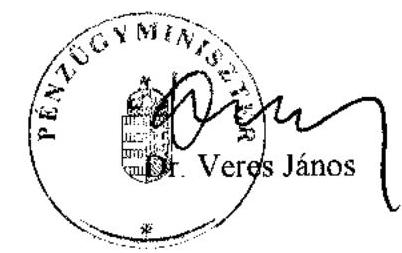

---

# Dr. Veres János úr, 

miniszter

Pénzügyminisztérium

## Budapest

## Tisztelt Miniszter Úr!

Köszönettel vettem az önkormányzatok által államháztartáson kívülre átadott pénzeszközök felhasználásával megvalósuló víziközmú beruházások finanszírozási rendszerének célszerűségéről készített jelentésünkre adott részletes észrevételét és munkatársai segítőkész hozzáállását. Egyes felvetésekkel, illetve észrevételekkel kapcsolatban álláspontunk a következőkben összegezhető.
A jelentésben rögzített javaslatainkat nem áll szándékomban módosítani, mivel azok mindegyikének az a célja, hogy megakadályozza a feltárt kedvezőtlen folyamatokat. A Kormány részére megfogalmazott első javaslatunk lehetővé teszi, hogy - a tárcák összehangolt tevékenységének eredményeként - bekövetkező jogszabály módosítások miatt egyes (alternatív) javaslataink végrehajtása szükségtelenné váljon, ha az ahhoz kapcsolódó problémakör felszámolása más módszerrel megoldható. Természetesnek tartom, hogy a felvetett alternatív javaslatok figyelembe vételével Önök határozzák meg a legcélravezetőbb megoldásokat annak érdekében, hogy az államháztartási kiadások alakulására kedvezőtlenül ható folyamatokat megszűntessék és kialakítsák a közpénzelköltés átlátható rendszerét.

Megerősítem, hogy az indokolatlan, a nyújtott szolgáltatással arányban nem álló önkormányzati bevételek kiszámlázásának korlátozásakor nem tartom elegendő intézkedésnek, hogy azt teljes összegében a kamattámogatott hitel törlesztésére kelljen fordítani. A megvalósított műszaki teljesítéssel arányos beruházási érték megteremtését ez az intézkedés nem biztosítja, csak az államot terhelő kamatkiadás csökkentésének irányába hat, valamint a víziközmű társulati betétként való elhelyezés megakadályozását szolgálja. Az indokolatlanul magas beruházási összköltség a későbbi üzemeltetési költségek és szolgáltatási díjak alakulására is kedvezőtlenül hat, mely hosszú távon indokolatlanul növeli a lakossági terheket. Mindezek feltétlenül szükségessé teszik azoknak a jogsza-

---

bályoknak a megalkotását, amelyek mederbe terelik az önkormányzatok által kiszámlázható díjak eljárási és díjszabási rendjét.

A magánszemélyek lakás-elôtakarékosságához adott állami támogatások esetében a magáncélú és közcélú közmúberuházások megtakarításainak elkülönített nyilvántartását azért is fontosnak tartom, mivel közcélú felhasználás esetén a kiáramló állami támogatás a közvagyont, magáncélú megtakarítás támogatása esetén pedig a magánvagyont növeli. A közcélú beruházásokba történő lakossági forrásbevonás is láthatóvá válik elkülönített nyilvántartás vezetésével, nem is szólva az intézkedés azon várható hozamáról, ami lehetővé tenné az átláthatóságát, ellenőrizhetőségét annak, hogy mely önkormányzatok területén élnek az önkormányzati beruházások lakossági forrásbevonás lakás-takarékpénztári támogatásának módjával. Javaslatunk mögött nem húzódik meg az ilyen irányú támogatás megszüntetésére való törekvés, mivel valamilyen módon ösztönözni kell a lakossági forrásbevonást. Nem tartjuk azonban szerencsésnek, hogy ezzel nem minden magánszemély tud élni, hiszen egy személy csak egy szerződésre kaphat állami támogatást függetlenül attól, hogy az állami vagy közösségi célokat szolgál. Amennyiben Önök a lakás-elôtakarékossághoz kapcsolódó állami támogatással kívánják továbbra is a közmúberuházások lakossági forrásbevonását ösztönözni, akkor azt elfogadom, bár nem tekintem a legjobb megoldásnak, mivel a felhasználás ellenőrzése államháztartáson kívül (a lakástakarékpénztáraknál és a magánszemélyeknél) lesz folyamatosan megoldandó feladat.

Az ellenőrzési rendszer megerősítésére vonatkozó javaslatainkat az észrevételükben foglaltak ellenére továbbra is indokoltnak tartom. Az ellenőrzések hiánya, illetve hézagossága is lehetővé tette az önkormányzati beruházásfinanszírozás jelentésben vázolt rendszerének tömeges elterjedését. Véleményem szerint - mellyel a belügyminiszter is egyet ért - a PSZÁF ma az a szervezet, aki a bankszektor múködéséről a legrészletesebb információkkal rendelkezik, ezért a lakás-takarékpénztárak, illetve a bankok által igényelt állami támogatások jogosságának vizsgálata leginkább az ő feladatkörébe tartozhatna, melyhez természetszerűleg hatáskörét bővíteni kell. Az állami kiadások felhasználásával müködtetett szervezet tevékenységében indokolt, hogy szerepet kapjon a pénzügyi szervezetek előírásszerű, biztonságos működésének ellenőrzésén kívül az általuk igényelt államháztartási pénzeszközök igénybevétele és felhasználása jogszerüségének vizsgálata is.

A víziközmú társulatok rendszeres ellenőrzésének megoldatlansága okozza a közfeladat megvalósítását követően is fennmaradó, további jogszabályokkal ellentétes müködés fenntartását a felvett hitel visszafizetésének időpontjáig. Ezért tartom elengedhetetlen feladatnak, hogy megoldódjon a társulatok ellenőrzése. A számviteli szabályozás előírhatja azt, hogy az önkormányzat törzsvagyonában szerepeltetett víziközmű vagyonhoz kapcsolódó hiteleket és követeléseket az önkormányzatoknak az üzembe helyezést követően át kell venni, a víziközmű társulatoknak pedig át kell adni. Az egyéb gazdálkodó szervezetekre vonatkozó számviteli kormányrendelet egyidejú módosításával elkerülhető a dupla nemzetgazdasági nyilvántartás. A víziközmű társulat elszámolási kötele-

---

zettségének elmaradása ugyanis nem gátolhatja azt, hogy az önkormányzatok kimutatott adósságszolgálata valós legyen, illetve, hogy sérüljön a valódiság számviteli alapelv.

Nem tartom alkotmányellenesnek azt a javaslatunkat, hogy 2006. január 1-étől kezdődően a víziközmű társulati hitelekkel megvalósuló önkormányzati beruházásokhoz kapcsolódóan a jogszabály hatálybalépésétől kezdődően teljesített és számlázott, az önkormányzatoknál keletkező, a nyújtott szolgáltatással arányban nem álló, indokolatlanul magas bevételekkel arányos állami támogatást vissza kelljen fizetni a központi költségvetésnek. Ez nem jelent visszamenőleges hatályt. Az államnak pedig jogában áll a támogatási feltételeket módosítani. Amit a jogalkotók egyébként az elmúlt években folyamatosan gyakoroltak is. Az évenkénti jogszabály változások még az adózási szabályok meghatározásában is jellemzőek voltak, és mégsem tekintette azt senki sem alkotmányellenesnek, csak legfeljebb a kiszámítható gazdálkodás szempontjából kedvezőtlen tendenciának. Az államháztartási törvény rendelkezésének pontositása azért is szükséges, mert ellenkező esetben csak kiterjesztő értelmezéssel vezethető le az, ami egyébként valós tény, hogy a víziközmú társulat által felvett hitelhez a pénzintézeten keresztül adott állami kamattámogatás önkormányzati fejlesztési célú támogatásnak minősül, mivel segítségével önkormányzati törzsvagyon létrehozása valósul meg.

Véleményem szerint az önkormányzatok a beruházási összköltség csökkentésében csak úgy tehetők érdekeltté, ha a fejlesztési forrásokhoz normatív módon, szabad felhasználással vagy egycsatornás pályázati rendszerben, teljesítménymutatók alapján, felhasználási és utólagos elszámolási kötöttséggel juthatnak hozzá. A konkrét megoldásokra nem kívánunk javaslatot tenni, mivel az nem tartozhat az Állami Számvevőszék kompetenciájába.

A jogtalanul igénybevett közműfejlesztési támogatások elvonásának kockázatát jelentésünk is részletesen bemutatja. Tisztában vagyunk azzal, hogy az önkormányzatok nem rendelkeznek már az igénybevett állami forrásokkal, ezért a nagy összegű elvonások az érintett önkormányzatok fizetésképtelenségét okozhatják, melynek további - az állami kiadásokat ugyancsak érintő - hatásai lehetnek. Mindezek miatt a zárszámadási törvény keretében külön mutatjuk be azokra az önkormányzatokra vonatkozó jogtalan támogatás igénybevételeket az Országgyűlésnek, amelyeket e vizsgálatunkkal érintettünk. Ez lehetőséget teremt arra, hogy a döntéshozók mérlegeljék az elvonás kedvezőtlen hatásait és foglalkozzanak a felelősség szükségszerűen felvetődő kérdésével. Nem értek egyet ugyanakkor azzal, hogy a beruházások forrásainak egy részét biztosító közmúfejlesztési támogatások jogszabályellenesen kerüljenek a jövőben is kiutalásra a MÁK által. A problémakör kezelésére megoldást kell találni.

Sajnálattal vettem tudomásul, hogy a Magyar Államkincstár az előző évben kifizetett támogatásokat ez év decemberéig nem tudja felülvizsgálni abból a szempontból, hogy azt az önkormányzatok jegyzői valóban kifizették-e a magánszemélyeknek, vagy azt más szervezetnek utalták.

---

A társulások az érdekeltségi hozzájárulásokat sajnálatos módon differenciáltan is meghatározhatják a hatályos kormányrendelet értelmében. A taggyúlésnek a hozzájárulás mérséklésére is lehetősége van. Emiatt fordulhatott elő az is, hogy az önkormányzatoknak a társulatok nem állapítottak meg érdekeltségi hozzájárulás fizetési kötelezettséget. A környezetvédelmi és vízügyi miniszternek tett javaslatunkat ezért indokoltnak látom változatlan formában fenntartani.

Kérem Pénzügyminiszter Urat, hogy intézkedései megtétele során a levelemben foglaltakat szíveskedjen érvényre juttatni.

Budapest, 2005. augusztus " 16 "

Tisztelettel
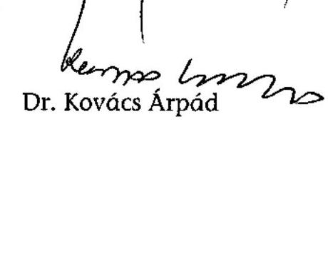

---

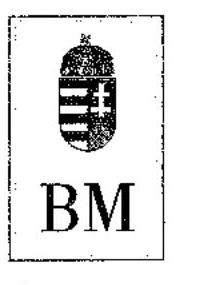

BELÜGYMINISZTER

Dr. Kovács Árpád úrnak
elnök
Állami Számvevőszék

Budapest

# Tisztelt Elnök Úr! 

Az önkormányzatok által államháztartáson kívülre átadott pénzeszközök felhasználásával megvalósuló víziközmű beruházások finanszírozási rendszerének célszerüségéről készült Jelentést köszönettel vettem, az abban foglaltakról az alábbi véleményt alakítottam ki.

A vizsgálat számos olyan tényt tárt fel a Jelentésben vizsgált konstrukcióban megvalósult beruházásoknál, amelyekre az egyes minisztériumok önmagukban nem voltak képesek. A vizsgálat eredménye alapján tett javaslatok lehetőséget biztosíthatnak a közpénzekből juttatott támogatásokkal történő visszaélési lehetőségek elkerülésére.

A vizsgálat által bemutatott egy érdekeltségi egységre jutó szennyvízberuházás fajlagos kiadások 568 ezer forinttól 2340 ezer forintig terjedően felvetik annak a kérdését is, hogy ezek a közművek gazdaságosan üzemeltethetők-e. Ugyanakkor az elmúlt időben bebizonyosodott, hogy mégsem célszerű a víziközmủ beruházások fajlagos költségeinek meghatározása, mert ennek eredményeként ott is drágult a beruházás, ahol egyébként olcsóbban is megvalósulhatott volna.

## A Kormánynak tett javaslatok kapcsán a következökre hívom fel a figyelmet:

Egyetértek azzal, hogy az érintett tárcák egymással együttműködve, egységes elvek alapján, a Jelentésben felvetett alternatívák összehangolásával tegyenek javaslatok a feltárt kedvezőtlen folyamatok megszüntetéséhez szükséges jogszabály módosításokra.

A 3. pontban mérlegelésre ajánlott javaslat - mely szerint az önkormányzati beruházások lakossági önrészének megelőlegezését szolgáló állami kamattámogatott hitelek igénybevételénél a hitel felvételére a beruházó önkormányzatok legyenek jogosultak a víziközmű társulatok helyett - látszólag jó megoldás. Azonban ha figyelembe vesszük a helyi önkormányzatokról szóló 1990. évi LXV. törvénynek az önkormányzatok hitelfelvételi korlátjára vonatkozó szabályait (88. §), akkor a javaslat az önkormányzatok szempontjából hátrányosnak tekinthető, mert szükíti más fejlesztések megvalósításához szükséges hitelfelvételi lehetőségeiket.

---

Az előbbiekre tekintettel az az álláspontom, hogy a 6. pont szerint a víziközmủ társulati hitelek igénybevétele jogszerüségének, a víziközmủ társulatok gazdálkodásának rendszeres, hatékony ellenőrzési rendszerét szükséges megteremteni.

A 7. pontban a javaslat többek között azt kezdeményezi, hogy a folyamatban lévő beruházásoknál is átalakításra kerüljön a hitelezés, az állami kamattámogatott hitelrészt piaci alapúvá minősítsék, így a bevétellel arányosan állami támogatás ne illesse meg az adóst. Véleményem szerint e javaslat törvényességi szempontból kifogásolható, törlését indokolt lenne megfontolni. Ez a megoldás a szerződéses jogviszonyba való indokolatlan, túlzott mértékủ jogalkotói beavatkozás lenne.

Egyetértek azzal a 8. pontban foglalt javaslattal, hogy a PSZÁF feladatkörébe beépüljön a víziközmủ beruházásokhoz kapcsolódó állami kamattámogatás igénybevételére vonatkozó banki tevékenység vizsgálata is. Ezzel teljes körű vizsgálat válna lehetővé a Jelentésben vizsgált konstrukcióval kapcsolatban.

# A pénzügyminiszternek tett javaslatokhoz kapcsolódó észrevétel: 

Egyetértek az 1. és 2. pontokban foglaltakkal a tekintetben, hogy a közmüberuházások üzembe helyezését követően a víziközmű társulatok elszámoljanak, a létrejött közmüvagyon a hozzá kapcsolódó kötelezettségekkel és követelésekkel az önkormányzatok könyveibe bekerüljön. Nem tartjuk azonban elfogadhatónak, hogy a társulatok egyéb okokból tovább müködjenek, mivel a jogszabályi előírás szerint, ha a víziközmü-társulat az alapszabályban meghatározott közcélú feladatait végrehajtotta, akkor az elszámolási eljárást le kell folytatnia és meg kell szünnie. Véleményünk szerint a víziközmü-társulat megszünésére vonatkozó szabályoknak kellene érvényt szerezni.

## A belügyminiszternek tett javaslatok átgondolásához:

Célszerű lenne, ha a Jelentésben a közterület nem közlekedési célú igénybevételére fizetendő hatósági díjak mértékére vonatkozó szabályozási feladat - illetékességből - közvetlenül a gazdasági és közlekedési miniszternek lenne címezve, és azt nem a belügymisztériumnak kellene kezdeményezni. Az önkormányzati beruházások árnövekedését okozó, indokolatlanul megjelenő bevételek megszüntetésének szabályozására vonatkozó javaslat elhagyását javasolom. Az előterjesztésből ugyanis az tünik ki, hogy irodabérleti dij miatt született a javaslat. Miután köztudott, hogy az irodák és más nem lakás céljára szolgáló helyiségek bérleti díja szabad árformában tartozik, ezért az ilyen jellegű önkormányzati bevételekre ráhatásunk nem lehet.

A környezetvédelmi és vízügyi miniszternek tett javaslatok pontositását az előbbiekben foglalt javaslatok kapcsán tett észrevételek figyelembevételével kellene elvégezni.

Budapest, 2005. július „ 19 ."
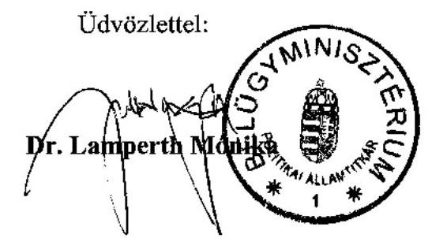

---

# Dr. Lamperth Mónika úrhölgy, 

miniszter

Belügyminisztérium

## Budapest

## Tisztelt Miniszter Úrhölgy!

Köszönettel vettem az önkormányzatok által államháztartáson kívülre átadott pénzeszközök felhasználásával megvalósuló víziközmú beruházások finanszírozási rendszerének célszerűségéről készített jelentésünkre tett észrevételét.

Az önkormányzatoknak a rendelkezésükre álló törvényes eszközökkel kell megteremteni az önkormányzati beruházások forrásait. Ismert, hogy az önkormányzatok fejlesztésre fordítható forrásai szükösek és közülük számos pályázati úton, a beruházáshoz kapcsolható elismert költségek százalékos arányában kerül meghatározásra, nem pedig normatív alapon, akár infrastrukturális ellátottsági, vagy egyéb teljesítménymutatók alapján. Emiatt szorgalmazzuk az önkormányzati fejlesztési célú támogatások elosztási módszerének mielőbbi megváltoztatását, amit különösen időszerűvé és sürgetővé tesz, hogy az iparűzési adó uniós irányelvekkel ellentétes megállapítása miatt, annak kiesése teljességgel lehetetlenné tenné az önkormányzati fejlesztések megvalósítását segítő helyi források megteremtését.

Nemcsak látszólagosan, hanem ténylegesen jó megoldásnak tartom - mellyel a pénzügyminisztérium is egyetért -, hogy a víziközmű beruházáshoz kapcsolódó hitelt az önkormányzatok vehessék fel. Ezzel a beruházáshoz kapcsolódó bevételek is megjelennek az önkormányzatoknál, ami emeli a korrigált saját folyó bevétel nagyságát, így a felvehető hitel összegét is. Az önkormányzatok gazdálkodásának biztonságát kedvezően érintené, ha mindenki számára láthatóvá válnának a hosszú távú elkötelezettségek, és az nem egy víziközmú társulatnál készfizető kezesség vállalásaként - jelenne meg. Emiatt nem látom további indokát annak, hogy önkormányzat által megvalósított beruházáshoz az önkor-

---

mányzati körön kívüli szervezet vehessen fel hitelt. Javaslatunk végrehajtásával egyidejúleg felvetődhet ugyanakkor, hogy módosítani, pontosítani kell az önkormányzati adósságszolgálati korlátra vonatkozó törvényi rendelkezést, amit egyébiránt már többször felvetettünk más vizsgálati jelentéseinkben.

Nem tartom alkotmányellenesnek azt a javaslatunkat, hogy 2006. január 1-étől kezdődően a víziközmű társulati hitelekkel megvalósuló önkormányzati beruházásokhoz kapcsolódóan keletkező, a nyújtott szolgáltatással arányban nem álló, indokolatlanul magas bevételekkel arányos állami támogatást vissza kelljen fizetni a központi költségvetésnek. Ez nem jelent visszamenőleges hatályt, ugyanakkor pedig az államnak jogában áll a támogatási feltételeket módosítani. Amit a jogalkotók egyébként az elmúlt években folyamatosan gyakoroltak is. Az államháztartási törvény rendelkezésének ilyen irányú pontosítása azért is szükséges, mert ellenkező esetben csak kiterjesztő értelmezéssel tudjuk igazolni azt az egyébiránt valós tényt, hogy a víziközmú társulat által felvett hitelhez a pénzintézeten keresztül adott állami kamattámogatás önkormányzati fejlesztési célú támogatásnak minősül, mivel segítségével önkormányzati törzsvagyon létrehozása valósul meg.

Örülök, hogy ön is egyetért az ellenőrzési rendszer kiterjesztésére, egyes ellenőrző szervek feladatainak módosítására, az ellenőrzések gyakoribbá tételére vonatkozó javaslatainkkal, mivel meggyőződésem, hogy jól múködő állami irányítási és ellenőrzési rendszer mellett nem alakulhatott volna ki és terjedhetett volna el az önkormányzati beruházások finanszírozásának a jelentésünkben részletesen bemutatott, épp e hiányosságokra építő, az állam szempontjából kedvezőtlen módszere.

Mindemellett elengedhetetlennek tartom annak megoldását, hogy az önkormányzatoknál a közutak nem közlekedési célú igénybevétele esetén alkalmazható díjtételek, valamint a teljesítésigazolás rendje - hasonlóan a helyi adó törvényhez - keretjelleggel szabályozásra kerüljön. Az önkormányzatoknál a közterület foglalási díjakkal kapcsolatos rendeletek, illetve eljárásrend is eltérő, az alkalmazott díjak is önkormányzatonként változóak. Az Önök irányába megfogalmazott javaslatunk nem az irodabérleti díjakra vonatkozott, hanem a közte-rület-foglalási eljárások és díjak mederbe terelésére, az önkormányzatok törvényi keretek közötti mozgásterének megteremtésére. A közút nem közlekedési célú igénybevételéért fizetendő díj egy hatósági eljárás során megállapított fizetési kötelezettség, nem pedig az önkormányzati tulajdon bérbeadása alapján, a szerződő felek szabad akarata szerint kialakítható ár, melyet egyes beruházásoknál kiszabnak, más esetben pedig nem alkalmaznak az önkormányzatok. Hasonlóan indokolt szabályozni a közterület foglalást is. Emiatt szükségszerű állami kereteket teremteni ezeknél az eljárásoknál és díjaknál.

A jelentésünkben vázolt problémakör megoldásában kiemelkedő szerepe van annak, hogy az önkormányzatoknak ne legyen lehetősége valós teljesítések nélküli, kirívóan magas bevételek kiszámlázására. Emiatt indokoltnak tartom, hogy a jelentésben Önök számára megfogalmazott javaslat megvalósítása érde-

---

kében kezdeményezzenek intézkedéseket. Fontos közreműködniük az intézkedések megtétele során a gazdasági és közlekedési miniszterrel is, mivel esetükben csak a meglévő szabályozás kiegészítéséről, pontosításáról van szó.

Kérem szíveskedjen intézkedései megtétele során a levelemben foglaltakat érvényre juttatni.

Budapest, 2005. augusztus „ 15 "

Tisztelettel
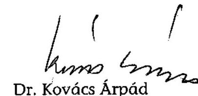

Dr. Kovács Árpád

---

# 15. számú melléklet 

a V-1004/2005. számú jelentéshez

MINISZTERELNÖKI HIVATAL
KormánymEgBizott Politikai Államtitkár
dr. Kovács Árpád
Elnök úrnak
Állami Számvevőszék

Budapest

Érk. szám: 50122
1. Nénneth Pue' fes'!
OE. 10 .

## Tisztelt Elnök úr!

Az önkormányzatok által államháztartáson kívülre átadott pénzeszközök felhasználásával megvalósuló víziközmű beruházások finanszírozási rendszerének célszerűségéről szóló jelentés tervezetét megvizsgáltattam.

A jelentés fontos, aktuális kérdéssel foglalkozik, a megállapításokkal, szemléletével egyetértek.

A javaslatok kapcsán azonban egyrészt gyors szignalizációt, illetve átfogóbb megközelítést, komplexebb áttekintést tartanék szükségesnek.

1. Jelenleg folyik a lakástakarékpénztárakkal kapcsolatos szabályozás kisebb korrekciójának közigazgatási egyeztetése. Elengedhetetlennek tartom, hogy már ez a módosítás tartalmazza a vizsgálatból következő rendszerszerű módosításokat, amelyek a hasonló visszaélések lehetőségét hatékonyan korlátozzák.
2. Rendszerében tartanám szükségesnek áttekinteni a közművek létesítésének támogatását, és ezzel szinkronban a közművek tulajdonjogának problematikáját. Csak a teljes rendszert átfogó, egységes szemléletű rendszerben van esély a támogatások hatékonyságának célzottságának javítására. Ezzel összhangban kell tisztázni a támogatások elosztásának decentralizálására és összehangolására vonatkozó elgondolásokat is. Azt gondolom, indokolt lenne a javaslat ilyen szemléletű átfogalmazása.

Az államháztartási szabályok szerint nem vitatható a támogatások visszafizettetésének indokoltsága, tehát az erre vonatkozó javaslatot elfogadom. Szükségesnek tartom azonban a következmények bemutatását, az önkormányzatok, illetve víziközmű társulatok szabálytalan gazdálkodása miatt ellehetetlenülő beruházás, illetve az elvesző lakossági befektetések felvázolását. Egyértelmű ugyanis, hogy az érintett településeknek nincs olyan gazdálkodási tartalékuk, amelyből ezt a

---

visszatérítést fedezni tudnák. A beruházás ennek megfelelően hosszabb ideig befejezetlen marad, aminek a negatív hatása nem csak a közhangulatban mutatkozik meg.

Budapest, 2005. augusztus 4.

Tisztelettel:
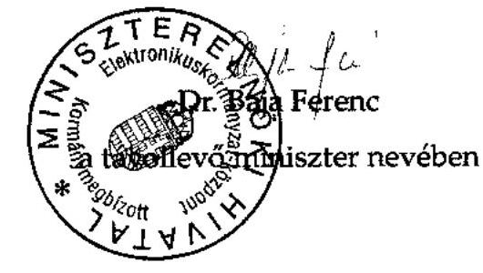

---

# Kiss Péter úr, 

miniszter
Miniszterelnöki Hivatal

## Budapest

## Tisztelt Miniszter Úr!

Az Ön megbízásából Baja Ferenc politikai államtitkár úr által az önkormányzatok által államháztartáson kívülre átadott pénzeszközök felhasználásával megvalósuló víziközmú beruházások finanszírozási rendszerének célszerűségéről készített jelentésünk kapcsán megfogalmazott gondolatait köszönettel vettem. Örömömre szolgál, hogy a jelentés szemléletével, megállapításaival egyetértenek.

Úgy ítélem meg, hogy az Önök által javasolt átfogóbb megközelítésre tényfeltáró vizsgálatunk megállapításai kellő alapot szolgáltathatnak. A folyamat minden résztvevőjének tevékenységét érintő, részletes elemzéseink segítségére lehetnek a Kormánynak az összehangolt, rendszerszemléletű változtatások megtételében. A jelentésben vázolt problémakör az önkormányzati közmú beruházások finanszírozási rendszerének gyengeségei, összehangolatlansága mellett az önkormányzati fejlesztési célú forráshiány miatt kialakuló anomáliákra, a gazdasági szereplők által alkalmazott - jogellenes - tevékenységekre, valamint a finanszírozási módszer széleskörű elterjedése miatti kockázati tényezőkre is rámutat.

A rendszerszemlélet, az összehangolt kormányzati tevékenység, az állami ellenőrzés zárt, együttműködő rendszerének hiánya tette lehetővé az épp e hiányosságokra építően kialakított beruházásszervezési és finanszírozási módszernek - a jogszabályi feltételek változásához igazodó -a költségvetési kiadások alakulására egyre kedvezőtlenebbül ható továbbélését. Emiatt ezúton is köszönöm, hogy azonnali intézkedések megtételét látja végrehajthatónak a lakástakarékpénztári szabályozás tekintetében, amit megerősít a Pénzügyminisztérium jelzése is, amely a lakás-takarékpénztári megtakarítások állami támogatása esetében hasznosításra érdemesnek tartja a jelentésünkben megfogalmazottakat.

---

A közcélú közművek létesítésére vonatkozó támogatási és tulajdonjogi kérdések tisztázása valóban időszerű feladat. Túlmutat a jelentés témáján is.

A konkrét megoldásokra - különösen e téma kapcsán - nem kívánunk javaslatot tenni, mivel az nem tartozhat az Állami Számvevőszék kompetenciájába. A szakmai anyagok véleményezésére vonatkozó konkrét megkereséseik esetén azonban szívesen állunk rendelkezésükre, hogy helyszíni ellenőrzési tapasztalataink alapján értékeljük az átalakítási folyamatok gyakorlati meglapozottságát.

A jogtalanul igénybevett közmúfejlesztési támogatások elvonásának kockázatát jelentésünk is részletesen bemutatja. Tisztában vagyunk azzal, hogy az önkormányzatok nem rendelkeznek már az igénybevett állami forrásokkal, a nagy összegű elvonások az érintett önkormányzatok fizetésképtelenségét okozhatják, melynek további, az állami kiadásokat ugyancsak érintő hatásai lehetnek. Mindezek miatt a zárszámadási törvény keretében külön mutatjuk be azokra az önkormányzatokra vonatkozó jogtalan támogatás igénybevételeket az Országgyűlésnek, amelyeket e vizsgálatunkkal érintettünk. Ez lehetőséget teremt arra, hogy a döntéshozók mérlegeljék az elvonás kedvezőtlen hatásait, ugyanakkor viszont foglalkozzanak a felelősség szükségszerűen felvetődő kérdésével.

Kérem a Miniszter Urat, hogy a kormányzati szervek intézkedéseinek aktív koordinálásával valósítsa meg azokat az intézkedéseket, melyek lehetővé teszik az átlátható, hatékony és célszerű - a szükségleteknek és az EU-s követelményeknek megfelelő - közpénzelköltés megvalósítását az önkormányzati közműberuházások tekintetében.

Budapest, 2005. augusztus „ 96 "

Tisztelettel

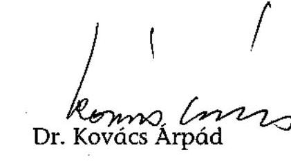

---

17. számú meiléklet a V-1004/2005. számú jelentéshez

# PÉNZÜGYI SZERVEZETEK ÁLLAMI FELÜGYELETE A FELÜGYELETI TANÁCS ELNÖKE 

## kobent   1,   8,03

Ikt.sz: 22633/ 6/2005
Hiv.sz.: V-1004-160/2005.

Dr. Kovács Árpád úr részére
elnök

## Állami Számvevőszék

## Budapest

## Tisztelt Elnök úr!

Mellékelten megküldőm a „Az önkormányzatok által államháztartáson kivülre átadott pénzeszközök felhasználásával hasznosuló víziközmü beruházások finanszírozási rendszerének célszerüségérő̋" c. jelentés-tervezethez készült felügyeleti észrevételeket.

## Melléklet

Budapest, 2005. augusztus „ $\varnothing$ „.
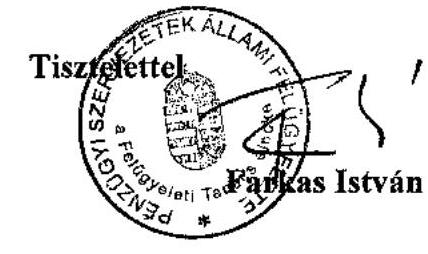

---

# Észrevételek 

„az önkormányzatok által államháztartáson kivülre átadott pénzeszközök felhasználásával megvalósuló víziközmü beruházások finanszirozási rendszerének célszerüségéröl" készült ÁSZ jelentés-tervezethez

Fenti tárgyban írt jelentéshez észrevételeink, javaslataink az alábbiak:

Jelen előterjesztésen az általunk adott észrevételek döntő hányada átvezetésre került, azonban a korábban „Általánosságban" címszó alatt megtett észrevételeinket továbbra is fenntartjuk, mivel ezek a még jelenleg is müködő rendszerhez kapcsolódnak, így:

- A jelentésből -véleményünk szerint- hiányzik az időhorizont, illetve az időbeliség csak az 5. sz. mellékletben jelenik meg. Az időhorizontnak azért van jelentősége, mert meglátásunk szerint a bankok az állam által hosszabb időszak alatt és több jogcímen folyósitandó támogatásokat is „megelőlegezik". Megjegyzendő, hogy a kialakult finanszírozási rendszernek is köszönhetően a beruházások megvalósultak, s e megvalósulások időben megelőzik a lakás-takarékpénztári kiutalásokat!
- A jelentés is több ponton rámutat az önkormányzatok törvény/jogszabálysértő tevékenységére. E megállapításokkal kapcsolatban nem kívánunk állást foglalni.
- Kétségtelen tény, hogy a víziközmű-társulatok támogatási rendszerét szabályzó 12/2001 (I. 31.) Korm. rendelet sok címen és eltérő módon támogatja e rendszert, és ehhez a rendszerhez kapcsolódhatnak a lakás-takarékpénztárak is, az 1996. évi CXIII. törvény előirrásai szerint. Célszerübb és átláthatóbb lenne egyszerübb, jobban nyomon követhető és ellenőrizhető víziközmủ támogatási rendszert működtetni.
- A jelentés megállapítja, hogy a hitelt nyújtó pénzintézetek, valamint lakástakarékpénztárak központi szerepet töltenek be beruházás szervezési rendszer finanszírozási oldalának zárt működtetésében. Ez igaz. Azonban a finanszírozó intézeteknek az önkormányzatok állami támogatás igénylésével kapcsolatosan ellenőrző szerepe nincsen, csupán a pénzügyi technikai lebonyolítást végzi, ezért a Kormány számára készült javaslatok 8. pontjában (24. oldal) a PSZÁF részére meghatározott feladat sem valósítható meg. A PSZÁF hatásköre az önkormányzatokra és az ÖKOTÁM alapítványra, illetve a közöttük fennálló kapcsolatra nem terjed ki, így az önkormányzatok állami támogatás-felhasználásának vizsgálatára sem, ezért nem értünk egyet a feladat meghatározással.
- A jelentés 23. oldalának 5. pontjában a Kormány felé olyan javaslattal élnek, hogy a jövőben meg kell egyértelműen határozni, hogy mely szervezet ellenőrzési kötelezettsége az ltp-k által a szerződő partnerek részére igényelt és folyósított állami támogatások jogszerűségének vizsgálata.

---

Itt kettős feladatról van szó: egyrészt az állami támogatás igényléséről, melyet a kialakult gyakorlat szerint a MÁK ellenőriz, másrészt a folyósításról. Az állami támogatás folyósításának feltétele, hogy a szerződés szerinti megtakarítások teljesüljenek, a megtakarítás kiutalható legyen, vagyis elérje a matematikai modell által is előírt minimális értékszámot. Az Ltp. tv. egyértelmủen meghatározza, hogy az állami támogatás csak lakáscél esetében jár (kivéve a hosszú, 8 éven túli módozatot), a 215/1996 (XII. 23.) Korm. rendelet szerint a lakáscél ellenőrzésének kötelezettségét a jogalkotók a lakástakarékpénztárra terhelték, melynél e feladat ellenőrzését a hivatkozott Korm. rendelet 7. § (8) bekezdése az APEH hatáskörébe utalta.

Megjegyezzük, hogy azon víziközmủ társulati tagok, akik már korábbi (pl: saját jogon) ltp partnerek nem rendelkezhetnek második ltp szerződéssel. Ha a rendszerbe ilyen személy kerül, akkor a MÁK ellenőrzése ezt visszadobja, csak egy címen lehet ltp-s állami támogatást igényelni.

---

# Farkas István úr, 

elnök
Pénzügyi Szervezetek Állami Felügyelete

## Budapest

## Tisztelt Elnök Úr!

Az önkormányzatok által államháztartáson kívülre átadott pénzeszközök felhasználásával megvalósuló víziközmű beruházások finanszírozási rendszerének célszerűségéről készített jelentésünkre adott észrevételét köszönettel vettem. Az Ön által „általánosságban" vitatott kérdéskörök egyes részeivel nem érthetek egyet, javaslataink fenntartását indokolva kiemelem azokat az érveket, melyeket már előző levelünkben is jeleztünk.

A pénzintézetek szerepének értékelésekor nem lehet ugyanis figyelmen kívül hagyni, hogy olyan önkormányzati beruházásokhoz nyújtottak állami kamattámogatású hitelt, melyeknek beruházási összköltségébe beépítésre került indokolatlanul magas költséghányad, nevezetesen az önkormányzatok által kiszámlázott - a teljesítménnyel arányban nem álló - bevétel, melynek összege nem is került ki a bankokból, hanem azt kamatozó betétként elhelyezték más szervezetek javára, miközben a központi költségvetést terhelő kamatfizetés alapját a futamidő végéig magas szinten tartották. Mindemellett az önkormányzatokat arra ösztönözték, hogy az államháztartási törvény előírásaival ellentétesen a számlavezető pénzintézeten kívül a hitelt nyújtó pénzintézetnél is számlát nyissanak.

Nem véletlen a bankok arra való törekvése sem, hogy a víziközmú társulati hitelt helyezzék ki inkább a lakás-takarékpénztári megtakarításokhoz kapcsolódó hitelek helyett. Ezeknél a kihelyezett hiteleknél ugyanis a bankok sokkal alacsonyabb profitot tudnának realizálni (mivel az érvényesíthető kamat a szerződésben alacsony szinten meghatározott), mint az állami kamattámogatással múködő hitelek esetében. Az államháztartási kiadások visszaszorítása nem oldható meg akkor, ha olyan finanszírozási konstrukciókat találnak ki a gazdasági szereplők, melyhez az államon kívül szinte senki sem járul hozzá. A helyi jelentőségű közcélú vízi létesítmények létrehozásában a lakosságnak és az önkormányzatoknak is anyagi terheket kell vállalniuk. Az önkormányzati finanszírozás kialakított rendszere az önkormányzati saját bevételekkel is számol a közfeladatok ellátásában. A bankok szerepkörének értékelésekor sokkal inkább az államháztartási szervektől realizálható minél magasabb profit elérése, ezzel a bank eredményes, biztonságos múködésének megteremtése - mint a technikai lebonyolítás - tekintendő elsődlegesnek. A pénzintézeteknek komoly érdeke fűződött

---

ahhoz, hogy minél nagyobb legyen a kiszámlázott önkormányzati bevétel, mivel ennek az összegnek a zárolt óvadéki számlán betétként való elhelyezése 3-4\%-os kamat marge-hoz juttatta a bankokat.

A 12/2001. (I. 31.) Korm. rendelet alapján a magánszemélyeknek, társasházaknak, önkormányzatoknak és víziközmű társulatoknak adott állami kamat és egyéb támogatások közvetlenül nem jutnak el a támogatások jogosultjaihoz, mivel azt a pénzintézetek igényelhetik a nevükben szintetizált „önbevallás" alapján. Az alkalmazott módszer feltétlenül indokolja, hogy az állami támogatások jogos igénybevételének rendszeres ellenőrzése bankszektoron belül is megvalósuljon. Erre az Önök szervezeténél alkalmasabb állami szervet nem tudok megnevezni, mivel rendelkezésre áll az ellenőrzéshez mind az adatbázis, mind a szakmai tapasztalat, amely szükséges a bankszektoron keresztül biztosított állami támogatások pénzintézeti szempontok szerinti ellenőrzéséhez. A szabályok és mechanizmusok megismerése minden más állami ellenőrző szervezetnek komoly kihívást, idő- és költségigényt jelentene, ami ellentétes a gyors és hatékony közfeladat ellátás követelményével. Javaslatunk megfogalmazásakor nem gondoltunk arra, hogy a PSZÁF-nek kellene ezzel egyidejűleg az önkormányzatokat, állampolgárokat, illetőleg a támogatások más közvetett érintettjeit is ellenőrizni. Mindezek alapján fenntartom a Kormány felé tett azon javaslatot, amiben az PSZÁF szerepének kibővítését kérjük a pénzintézeteknél megjelenő állami kamattámogatások ellenőrzésében.

A lakás-takarékpénztári tevékenység ellenőrzésének „kialakult gyakorlat" szerint javasolt megoldását nem tartom jónak. A felelősségi kérdések egyértelművé tétele teszi szükségessé, hogy konkrétabban kerüljön meghatározásra, hogy pontosan mi a MÁK, mi az APEH, illetve a PSZÁF feladata, valamint, hogy ellenőrzési kötelezettségét milyen módon és rendszerességgel kell az ellenőrzésre kötelezett szerveknek gyakorolnia. Továbbá mely szervezet által és milyen módon történjen az LTP-nek az állami támogatások felhasználásához kapcsolódó ellenőrzési kötelezettsége teljesítésének a vizsgálata. Emiatt indokoltnak látom a kormánynak megfogalmazott javaslat fenntartását. A legideálisabb ugyanakkor az lenne, ha az ellenőrzésben érintett szervezetek együttműködnének feladatellátásuk során és kedvezőtlen tapasztalataikról egymást tájékoztatnák, szükség esetén együttes ellenőrzést végeznének, ami ráirányithatná a figyelmet a rendszerhibák mielőbbi felderítésére és kijavítására.

Kérem Elnök úr szíves megértő támogatását, hogy a jelentésben és a levelemben foglaltak hasznosítására sor kerüljön.

Budapest, 2005. augusztus „ 16"

Tisztelettel
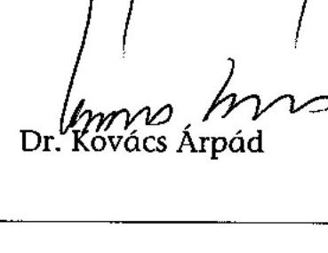

---

# G600RR 

## ÉSZREVÉTELEK

Az önkormányzatok által államháztartáson kívülre átadott pénzeszközök felhasználásával megvalósuló víziközmű beruházások finanszírozási rendszerének célszerűségéről című jelentéshez

---

# Tisztelt Elnök Úr! 

A Geotorr Rt. képviseletében a 2005. júliusi keltezésű, V-1004-159/2005. iktatószámú (754. témaszámú) Jelentésre (Tárgy: az önkormányzatok által államháztartáson kivülre átadott pénzeszközök felhasználásával megvalósuló víziközmü beruházások finanszírozási rendszerének célszerüségérői) az 1989. XXXVIII: tv. 25 § (1) bekezdése alapján az alábbi
észrevételeket
tesszük:

## BEVEZETÉS

Meglepetéssel tapasztaltuk, hogy jelentősen megváltozott - számunkra érthetetlen módon - a vizsgálat tárgya, ugyanis eddig az Állami Számvevôszék az önkormányzatok által államháztartáson kivülre nyújtott támogatások, átadott pénzeszközök felhasználása célszerüségét ellenôrizte és most a Jelentés tárgya az önkormányzatok államháztartáson kivülre átadott pénzeszközök felhasználásával megvalósuló víziközmü beruházások finanszírozási rendszere célszerüségének vizsgálata.

Az 1989. XXXVIII: tv. 1. és 2. §-i szerint:
„(2) Az Állami Számvevôszék az állam legfôbb pénzügyi ellenôrzô szerve. Az Állami Számvevôszék törvényben meghatározott feladatkörében - az e törvényben meghatározott kivételekkel - általános hatáskörrel végzi az államháztartás ellenôrzését.
2. § (1) Az Állami Számvevôszék ellenőrzi az államháztartás gazdálkodását, ennek keretében a központi költségvetési javaslat (pótköltségvetési javaslat) megalapozottságát, a bevételi elöirányzatok teljesíthetôségét, az állami kötelezettségvállalással járó beruházási elöirányzatok felhasználásának törvényességét és célszerüségét, a költségvetés hitelfelvételeit, azok felhasználását és törlesztését. Az Állami Számvevôszék ellenőrzi a központi költségvetés végrehajtásáról készített zárszámadást.
(2) Az Állami Számvevôszék elnöke ellenjegyzi a költségvetés hitelfelvételeire vonatkozó szerzödéseket. Az ellenjegyzés azt tanúsítja, hogy a hitelfelvétel megfelel a törvényi elöírásoknak.
(3) Az Állami Számvevôszék ellenőrzi a központi költségvetés szerkezeti rendjébe tartozó fejezetek müködését, a társadalombiztosítás pénzügyi alapjainak és az elkülönített állami pénzalapoknak a felhasználását, valamint a helyi önkormányzatok és a kisebbségi önkormányzatok gazdálkodását.
(4) Az Állami Számvevôszék ellenőrzi az Adó- és Pénzügyi Ellenôrzô Hivatal és a helyi önkormányzatok adóztatási tevékenységét, valamint a Vám- és Pénzügyörség és az illetékhivatalok tevékenységét.
(5) Az Állami Számvevôszék ellenőrzi az állami költségvetésböl gazdálkodó szerveket (intézményeket), valamint az állami költségvetésböl nyújtott támogatás vagy az állam által meghatározott célra ingyenesen juttatott vagyon felhasználását a helyi önkormányzatoknál, az

---

országos és helyi kisebbségi önkormányzatoknál, a közalapítványoknál (ideértve a közalapitvány által alapitott gazdasági társaságot is), a köztestületeknél, a közhasznú szervezeteknél, a gazdálkodó szervezeteknél, a társadalmi szervezeteknél, az alapitványoknál és az egyéb kedvezményezett szervezeteknél.
(6) Az Állami Számvevőszék ellenőrzi az államháztartás alrendszereinek körébe tartozó vagyon kezelését, a vagyonnal való gazdálkodást, az állami tulajdonban (résztulajdonban) lévő gazdálkodó szervezetek vagyonérték-megörzö és vagyongyarapitó tevékenységét, az államháztartás körébe tartozó vagyon elidegenitésére, illetve megterhelésére vonatkozó szabályok betartását.
(8) Az Állami Számvevőszék az ellenőrzése során figyelemmel kíséri az államháztartás számviteli rendjének betartását, az államháztartás belső pénzügyi ellenőrzési rendszerének müködését, véleményezi a továbbfejlesztésükre vonatkozó javaslatokat, illetőleg ilyen javaslatot tesz.
(9) Az Állami Számvevőszék - a 2. § (5)-(6) bekezdése szerinti ellenőrzési feladataival összefüggésben - vizsgálhatja az államháztartás alrendszereiből finanszírozott beszercéseket és az államháztartás alrendszereinek vagyonát érintő szerződéseket a megrendelőnél (vagyonkezelőnél), a megrendelő (vagyonkezelő) nevében vagy képviseletében eljáró természetes személynél és jogi személynél, valamint azoknál a szerződő feleknél, akik, illetve amelyek a szerződés teljesitéséért felelősek, továbbá a szerződés teljesitésében közremüködő valamennyi gazdálkodó szervezetnél."

A fentiek alapján nem érthető, a T. Számvevőszék mely jogszabályhely alapján és miért vizsgálja egy nem csupán állami pénzeszközök felhasználásával müködtetett beruházási finanszírozási rendszer célszerüségét, miután hatásköre álláspontunk szerint a beruházási rendszerben felhasznált állami források felhasználása szabályszerűsége, hatékonysága és célszerüsége vizsgálatára terjedhet ki. Természetesen mi örülünk, ha egy reális értékelés születne az ÖKOTÁM rendszer működéséről, hiszen mi magunk kértük az elmúlt évben, hogy vizsgálják meg tevékenységünket, azonban ezt akkor elutasították.

A részletes összefoglalás külön szól a rendszer hatékonyságának vizsgálatáról. Álláspontunk szerint azonban a jelentés nem a rendszer hatékonyságát vizsgálja, gazdaságosságát elemzi, költségvetési bevételekre és kiadásokra gyakorolt hatását, valamint a szennyvízelvezetési programban elfoglalt szerepét értékeli, hanem kizárólag az ÖKOTÁM rendszer alkalmazása során felmerülő egyes jogszabályi helyek erősen ellentmondásos értelmezhetőségét emeli ki, illetve ezen kérdéses pontok jogi értelmezésével foglalkozik.

Az elemzés sehol nem tér ki arra, hogy

- a rendszer keretében megvalósuló pénzeszközátadások által létrejövő beruházások, milyen nemzetgazdasági folyamatokat ösztönöznek, illetve gátolnak;
- a beruházás keretében átadott pénzeszközök kizárólag egy cél, a csatorna beruházás megvalósulásának érdekében történtek.

A célszerűség vizsgálatának keretében nem kerül kimutatásra a beruházás nemzetgazdasági multiplikátor hatása, milyen összhatást fejtenek ki a gazdasági növekedésre, miközben környezetvédelmi állami közfeladatot valósítanak meg. Álláspontunk szerint a jelentés összességében

- nem a Számvevőszék törvényben meghatározott hatásköre keretében lefolytatott vizsgálat eredményét tárja elénk, hanem túlterjeszkedik a hatáskörön, és így
- nem alkalmas az államháztartáson kívülre juttatott támogatások felhasználása célszerűségének vizsgálatára.

---

Az államháztartáson kívülre juttatott pénzeszközök felhasználása célszerűségének meghatározásához a GEOTORR Rt. számára rendelkezésre álló eszközök korlátozottak, mivel ennek vizsgálatára természetesen nem rendelkezik olyan tág eszközrendszerrel, mint az Állami Számvevőszék. A rendelkezésünkre álló több éves tapasztalat alapján azonban több összefüggés megvilágítására is sor került, mind az ÁSZ munkatársaival létrejött személyes találkozók során, mind az ezt követően beadott észrevételekben. Ezek alkalmával többször észrevételeztük, hogy a vizsgálat első felében (személyes találkozásunk előtt) felállított vizsgálati módszer több ellentmondást is hordoz magában. Vélelmezzük, hogy ez elsősorban annak a következménye, hogy az előkészítő anyagban alapvetően azoknak a köröknek a véleménye jelenik meg, akik már korábban is minden áron meg akarták akadályozni tevékenységünket és ennek érdekében még attól sem riadtak vissza, hogy valótlanságokat állítsanak rólunk. Ezen tevékenységek végterméke volt pl. Belügyminisztériumban Móré László Önkormányzati Főosztályvezető által közzétett körlevél, valamint a Pénzügyminisztériumban végzett azon tevékenység amelynek folyományaként, még a kormányváltás előtt 2002. májusában kormányrendelet módosítást készítettek elő, amelyről már akkor írásban jeleztem az illetékesek felé, hogy számos ponton valótlanságokat tartalmaz, tehát a kormányzat szándékos félrevezetésének minősül. A jelzésem ellenére elfogadott kormányrendelet módosítások ennek megfelelően nem is érhették el a kormányzat által elérni kívánt hatást.

A Számvevőszéki vizsgálat elfogultságát egyértelműen bizonyítja, hogy a vizsgálat megkezdése előtt már az Állami számvevőszék az internetes lapján ítéletet mondott tevékenységünkről, azt törvénytelenségekkel vádolva. Az elfogultság azóta is folyamatosan tapasztalható ugyanis a vizsgálat befejeződésének elhúzódásával és vizsgálat részeredményeinek kiszivárogatásával jelentős károkat okoztak. Ezen állításunkat bizonyítja 1. számú melléklet amelynek felső részén olvasható az alábbi szöveg: „2005 07/26 11:16 ÁSZ ÁKSZEI FÓIGAZGATÓ" amelyet több önkormányzat részére megküldtek a fentiekben idézett faxszámról, ezzel azt eredményezve, hogy az önkormányzatok a folyamatban lévő ász vizsgálatra hivatkozással nem akarják a szerződésben vállalt kötelezettségeiket teljesíteni.

Ez a tevékenység jelentős károkat okoz mind az önkormányzatoknak, mind a települések polgárainak, mind társaságunknak, hiszen a közbeszerzési eljárásokban meghatározottak jgon kívüli eszközök hatására nem tudnak érvényesülni.

Az Ász illetékeseivel történt első megbeszélésünk alkalmával javaslatot tettünk a vizsgálati módszerek pontosítására, biztosítva ezzel a vizsgálat eredményeinek összehasonlíthatóságát és értelmezhetőségét. Ennek során említettük, hogy a beruházások létrejötte kihatással van több költségvetési bevételi, valamint kiadási tételre, melyek vizsgálata nélkül a rendszer működésének és a pénzeszközök átadásának célszerűsége nem pontosítható és összevethető.

Sajnálattal vettük tudomásul, hogy az általunk kezdeményezett, módszertani és elemzési szempontok nem kerültek figyelembe-vételre. Emiatt az ellenőrzés jelentés 6. oldalán meghatározott céljai realizálásához a rendelkezésünkre álló adatok alapján kénytelenek vagyunk magunk ezen elemzéseket elvégezni, és azokat észrevételeink részeként az ellenőrzés anyagává tenni.

---

# KÖZGAZDASÁGI FEJEZET 

## 1./   Az ÖKOTÁM rendszerben megvalósuló beruházások összehasonlítása cél,- illetőleg címzett támogatással megvalósuló beruházásokkal

A már korábban a jelen vizsgálatot megelőzően készített előtanulmány keretein belül, is több célszerűségi szempontokat érintő kérdés vizsgálatra került, mely a rendszer egyes elemeinek módosításához is vezetett. A módosítások azonban nem érték el céljaikat, a hibás diagnózist, hibás terápia követte, erre bizonyíték a 2002-es jogszabályi környezet változtatás, mely nem érte el várt hatását. Ennek tudatában is javasoltuk, hogy a vizsgálat terjedjen ki a beruházás során felmerülő költségvetési kiadások, illetve bevételek vizsgálatára (adó bevételek a beruházás során, üzemeltetésből származó költségvetési bevételek), valamint a szennyvíz beruházások területén alkalmazott egyéb beruházási módszerek költségvetést érintő célszerűségi vizsgálatára is. Szükségszerűnek tartottuk az összemérhetőség biztosítása érdekében, hogy az egyéb alkalmazott beruházási módszerek során az egy érdekeltségi egységre jutó jelen értéken meghatározott költségvetési támogatás értékét határozzuk meg, közgazdaságilag ugyanis csak a jelenértéken történő pontos összehasonlítás alapján lehet a rendszer hatékonyságára döntő jelentőségű kijelentéseket tenni. Ezzel kapcsolatosan az általunk kezelt projektek esetében ezt megtettük és el is juttattuk az ÁSZ részére. Az alkalmazott módszerről, illetve a szolgáltatott adatokról semmilyen észrevételt nem kaptunk. A rendelkezésünkre álló szerény költségvetés és eszközrendszer kereti között azonban szeretnénk megmutatni egy konkrét, mellékletekkel alátámasztott levezetését, forrás szerkezeti összehasonlítását az ÖKOTÁM rendszernek és egy céltámogatott beruházásnak.

Az Önök által kiadott 0416. számú jelentés bemutatja több településen a cél és címzett támogatás segítségével megvalósított beruházásokat. A jelentésből is egyértelműen kitűnik, hogy a cél, valamint a címzett támogatott víziközmü beruházások kapcsán számos egyéb közvetlen támogatási forma igénybevételére halmozottan kerül sor. A jelentés a vizsgált beruházások kapcsán önkormányzati saját forrásként 1996-2003 közötti időszakra a teljes beruházás $29,38 \%$-át, azaz 26458446000 forintot ad meg. Ennek a tényadatnak az értelmezésénél érdemes néhány gondolatot felvetni: a jelentés ezen a ponton nem vizsgálja, hogy az úgynevezett önkormányzati saját forrásként feltüntetett összeg hitelböl származik-e vagy sem. (Ez azért rendkívül fontos, mert aki a két jelentést elolvassa, rájöhet, hogy a téma bár azonos, a fogalmak értelmezése mégis hamar átalakul. Az említett jelentés önkormányzati saját forrásként kezeli a víziközmủ társulati hitelt, figyelmen kívül hagyva, hogy a lakosság igénybe vesz-e lakás-előtakarékossági támogatást, illetve a közmủ fejlesztési hozzájárulást igényli-e. Amennyiben a víziközmű társulati hitel egy előző jelentésben saját önkormányzati forrás, jelen mű keretei között miért alakul át a fogalom?)

Az önkormányzati saját forrásként feltüntetett összeg ugyanis az esetek jelentős részében szintén kamattámogatott víziközmű társulati hitel, lakás-előtakarékossági tőketörlesztéssel kombinálva, valamint a hitel visszafizetésének forrása az esetek döntő többségében a közmủ fejlesztési hozzájárulás is. Az állami támogatások igénybevételének sorozatát tehát a vizsgálat nem teljességében vizsgálja. A jelentés egyébként többször hevesen kritizálja a támogatás igénylési lehetőségek összetettségét, átláthatatlanságát, és talán ezért is nem sikerült a tejes támogatási láncolatot vizsgálnia. Ez számunkra azért bír jelentőséggel, mivel a jelentésben többször megfogalmazásra kerül az ÖKOTÁM finanszírozási rendszer átláthatatlansága, holott a rendszer legtöbb elemét a jelenlegi beruházások során szinte mindenhol alkalmazzák, további források igénybevétele mellett.

---

Az ÖKOTÁM rendszer egyébként a folyamatok kézbentartásával, szabályozottságával törekszik az átláthatóság biztosítására. A rendszer bonyolultságát a jogszabályi keretek ellentmondásai adják. A lakás-takarékpénztárak elérhető adatai alapján látható, hogy a Geotorr Kft. által közvetített közmủ szerződések részaránya volumenét tekintve nagy, de darabszámát tekintve elenyésző a lakás-takarékpénztárak közmủ kötéseinek portfoliójában, és ha ez így van nem lehet ez másképp a banki hitel portfolió tekintetében sem. Az egész rendszer legfontosabb eleme - ezt a jelentésben Önök is megfogalmazzák - egy korábban és jelenleg is alkalmazott finanszírozási módnak az egyedi módszerek alapján történő összehangolása, optimalizálása, a pénzügyi folyamatok szigorú, a szerződéses rendszernek megfelelő ellenőrzése mellett.

Ezután természetesen érdemes feltenni azt a kérdést, hogy vajon mindez hogyan hat ki a beruházási összköltségre, a kivitelezési költségekre, valamint az állami költségvetésre. Érdemes megvizsgálni, hogy a banki hitelből, az adott költségvetési évet csak csekély mértékben terhelő forrásból érdemes-e a beruházást megvalósítani, vagy állami forrásból? A választ egy konkrét projekt adatai alapján adjuk meg. Az elemzés tárgyának egy céltámogatásban részesült projektet választottunk annak tényleges, megvalósult adatait közölve, mely rendelkezik egy sor egyéb az állami költségvetésből közvetlenül, valamint a megyei önkormányzatoktól nyerhető közvetlen forrással is. Az 1. számú táblázat tartalmazza az elnyert pályázati pénzek megnevezését és összegét, melyet gyűjtő néven közvetlen állami támogatásnak neveztünk el.

Az összehasonlításban szerepeltettük, hogy az ÖKOTÁM rendszer keretei között hogyan, milyen forrásokból lehet ugyanezt a beruházást megvalósítani. A beruházási költség megállapításakor figyelembe vettük, hogy az ÖKOTÁM rendszer keretein belül hasonló érdekeltségi egységszám mellett megvalósult ( 800 érdekeltségi egységgel rendelkező) beruházás során milyen beruházási forrásigénnyel kellet kalkulálnunk, ezért a kiindulási beruházási költséget megemeltük a rendszer keretein belül már alkalmazott mértékhez. A költségek természetesen a megemelt összeg esetében sem haladták meg az érintett minisztérium által megadott fajlagos költségnormatívákat.

A vizsgált projekt esetében a közvetlen támogatásokon felüli hiányzó forrást az Önkormányzat víziközmű társulati hitel formájában biztosította. A felvett hitel tökerészének a visszafizetésére a fedezetet lakás-előtakarékossági szerződések biztosítják kiutalásakor egy összegben. A közmủ fejlesztési hozzájárulás visszaigénylése folyamatosan történik.

A táblázatban meghatároztuk, hogy azonos kamatkondíciók feltételezésével, milyen kamattámogatást kell az államnak fizetni a futamidő alatt, illetve mennyi lakáselötakarékossági állami támogatás kerül lehívásra. A közmüfejlesztési hozzájárulás, az LTP állami támogatás, valamint a kamattámogatás összesítésével, a pénz időértékét figyelmen kívül hagyva, meghatároztuk a közvetlen állami forrás mértékét. A közvetett és a közvetlen állami források összesítésével könnyen meghatározható a projektre kifizetendő összes nominális állami forrás. Ezután, hogy az összehasonlíthatóságot biztosítsuk, meghatároztuk az egy érdekeltségi egységre eső állami forrás összegét is.

---

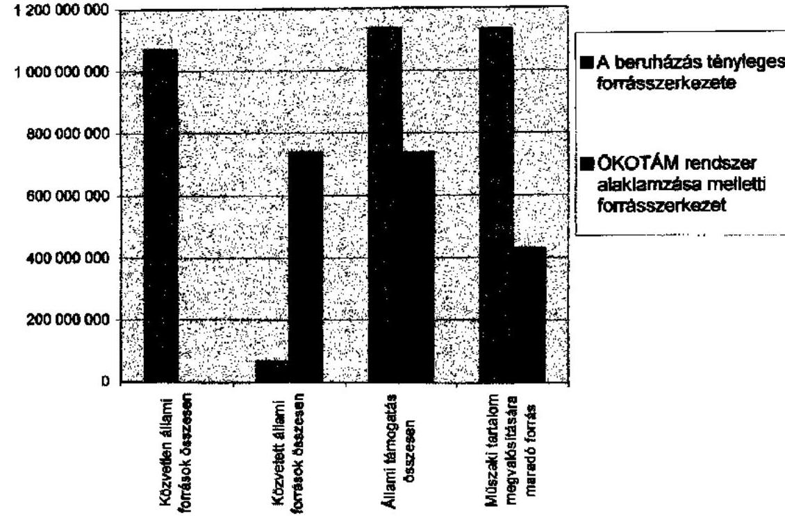

# 1.sz. táblázat

|   | A beruházás állami támogatásos forrásszerkezés | OKOTÁM rendszer alkalmazása melletti forrásszerkezet  |
| --- | --- | --- |
|  Fővállalkozói díj | 1 132 571 654 | 1 500 000 000  |
|  Ebből kifizetőlet használat | 0 | 1 056 240 000  |
|  Társulati egyéb kiadások | 58 099 000 | 50 000 000  |
|  Beruházási forrásigény | 1 190 670 854 | 1 550 000 000  |
|  Közvetlen állami források |  |   |
|  Céltámogatás | 598 800 000 | 0  |
|  DECKAC | 139 819 000 | 0  |
|  KAC | 129 000 000 | 0  |
|  TRFC | 100 000 000 | 0  |
|  VICE | 49 500 000 | 0  |
|  CEDE | 40 000 000 | 0  |
|  TERKI | 8 000 000 | 0  |
|  EZIG | 5 000 000 | 0  |
|  Összesen | 1 070 619 000 | 0  |
|  Közvetett állami források |  |   |
|  Vízlkozmű társulati hitel | 120 151 000 | 1 550 000 000  |
|  Kemeltámogatás | 31 726 000 | 290 747 000  |
|  Lakás-előtekerékossági állám | 30 000 000 | 282 960 000  |
|  Lakossági befizetés egységeinként | 30 600 | 30 600  |
|  Lakossági befizetés egységeinként alapítványt támogatással | 0 | 1 296 000  |
|  Lakossági befizetés összesen | 24 939 000 | 1 081 179 000  |
|  Közmű fejlesztési hozzájárulás | 3 740 850 | 162 178 850  |
|  Összesen | 65 466 850 | 735 883 850  |
|  Összesen | 1 135 985 850 | 735 883 850  |
|  Érdekelték száma | 815 | 815  |
|  Egy érdekeltségi egységre eső állami támogatás | 1 393 848 | 902 925  |
|  Műszaki tartalom megvalósítására maradó forrás | 1 389 659 | 544 491  |

---

A példa alapján is látható, hogy még valóban magasabb beruházási összköltség mellett, de jóval kevesebb állami támogatás igénybevételével valósul meg a beruházás az ÖKOTÁM rendszer keretein belül. Tehát nem igaz az a kijelentés, miszerint a rendszer müködése az állam részére több költségvetési éven keresztül többlet terheket okoz, éppen ellenkezőleg, a nominális értéken is kisebb teher elnyújtva, több költségvetési évet terhelve jelenik, meg, úgy, hogy a beruházást a banktőke finanszírozza. A beruházással kapcsolatos állami bevételek (adók, járulékok) már beruházás kezdetén realizálódnak az államnál, a beruházás nem kerül az államháztartási mérlegen kívülre, tehát a beruházás megjelenik vagyontárgyként az önkormányzatoknál, míg a beruházáshoz kapcsolódó kiadások csak később keletkeznek. A beruházások és az állami vagyon növekedésének jótékony hatása van mind az államháztartási mérleg egyensúlyának megteremtése, mind a nemzetgazdasági jövedelem növekedése szempontjából. Határozottan cáfoljuk tehát azt a kijelentésüket, hogy a megnövelt beruházási költség miatt az államot bármilyen kár éri. ÁSZ állítása: Az államot kár éri a megemelt, de a fajlagos költségnormatívákat meg nem haladó beruházási összköltség kapcsán. Kiszámolták, hogy mennyi állami támogatást kell kifizetni egy érdekeltségi egység létrehozatalához az OKOTÁM rendszer keretein belül? Amennyiben kiszámolták akkor megállapíthatták, hogy lényegesen kevesebb kell, mint a céltámogatásos rendszerben.

Az alábbi állításaik szintén nem értelmezhetőek:

- Állami támogatás indokolatlan igénybevétele várható! Mihez képest? Mi az indokolt mérték?
- A Magyar Állam hosszú távú kötelezettségeit igen kedvezőtlenül érinti, hogy ezeknél a beruházásoknál az állami támogatásokat halmozottan veszik igénybe! $A$ céltámogatott beruházásoknál a fenti példa alapján kilenc egyéb halmozott támogatás igénybevétele történik!!!
- A beruházásokat lényegesen drágábban valósítják meg, mint amit a kivitelezés műszaki tartalma indokolna! Mit indokolna a kivitelezés müszaki tartalma? Nem erről szólnak az állam által diktált normatívák? Mi az, hogy lényegesen? Mihez képest?
- A lebonyolításban résztvevő gazdálkodó szervezetek olyan hasznot realizálnak, melynek közel $95 \%$-át az állam finanszírozza! A gazdálkodó szervezetek által az állam részére végzett beruházások mindegyikére igaz, hogy a vállalási dij profitot is tartalmaz, melyet az állam fizet meg, mint megrendelö!

A 21. oldalon folytatódik a megalapozatlan kijelentések sorozata:

- A beruházási kiadások megtérülését a befektető nem a későbbi üzemeltetési bevételekből, hanem az állami és csekély nagyságrendben lakossági források igénybevételéből kívánja biztosítani. Ez a mondat egyszerüen értelmezhetetlen, pedig a vastagon szedettsége fontosságra utal! Ki a befektető? Mi az állami és csekély mértékben lakossági forrás?
- Az önkormányzat és a lakosság megtévesztésével megvalósuló, a jogszabályi hiányosságok, a pontatlan és szerteágazó szabályozás, valamint az önkormányzatok forráshiánya miatt kialakuló - az állami támogatások halmozott, jogtalan igénybevételére irányuló - nem kívánatos gyakorlat. Ki téveszti meg az önkormányzatot és a lakosságot? Miért? Mivel? Mitől jogtalan? Ki minősíthet polgárjogi szerződést?

Ezen kijelentések megalapozatlanok, a vizsgált és ismertetett tényadatokból nem levezethető szubjektív jelzőket használó elemek. Az ÁSZ nem vizsgálta, hogy a víziközmü finanszirozási rendszerek Európa más országaiban, hogyan alakulnak. A beruházásokra szükség van, ezt a mű is említi, de nem tesz semmiúven javaslatot új finanszirozási lehetőségek bevezetésére.

---

A fent említett hatások vizsgálatára a jelentésben egyáltalán nem kerül sor. A jelentés kizárólag a beruházások összköltségének az összehasonlításával foglalkozik, nem vizsgálva azt a kérdést, hogy ez a Magyar Államnak milyen kiadásokat jelent, pedig alapvetően ez lett volna a feladata. A beruházási összköltség is fontos tényező, amennyiben az elkészült mű üzemeltetési költségeinek vizsgálatát végezzük, de nem lehet kizárólagos meghatározó tényező a gazdaságosság és a hatékonyság szempontjából az állam részére. Egy piaci beruházás megvalósításánál fontos szempont, hogy a beruházással elérhető szolgáltatási bevételek fedezzék a müködtetési és az amortizációs költségeket. Ez esetben azonban a szolgáltatási árképző mechanizmusokat nem elsősorban a piaci tényezők alakítják. A szolgáltatási díjak kialakításánál az önkormányzatoknak ármeghatározó szerepük van, továbbá torzítja a helyzetet az is, hogy az üzemeltetési költségek fedezetére az állam is támogatást nyújt. Miért lenne érdeke egy önkormányzatnak a lakossági szolgáltatási díjak alacsonyan tartása, amikor az állam bizonyos díj felett a terheket átvállalja? Ennek eredménye, hogy az üzemeltetési költségek rendkívül széles sávban nem a kereslet- kínálati viszonyok mentén mozognak. Az összehasonlíthatóságot tovább nehezíti, hogy a nagyvárosokban az üzemgazdaságossági pont jóval alacsonyabb szolgáltatási ár mellett megvalósul, mint a kisebb lakosú településeken. A kisebb települések magasabb díjait azonban az állam kompenzálja. Ezen a piacon tehát nehezen érvényesülhet a piaci kereslet és kínálat által kialakítható ármechanizmus.

Itt szeretnénk kiemelni, hogy az ÖKOTÁM rendszer keretében megvalósult beruházások műszaki tartalom tekintetében nem tértek el a más beruházási rendszer esetében alkalmazott megoldásoktól, ezért ezen rendszerek üzemeltetésére is ugyanolyan költségek mellett van lehetőség, mint bármely más települések esetén. Az ármeghatározó szerep az önkormányzatok kezében van, nyilván az önkormányzatok a lakossági szerepvállalást a lakosság tehervállaló képessége alapján határozzák meg. A víziközmű társulati hitel felvétele őt évre kizárja, hogy a beruházásban érintett önkormányzatok üzemeltetési támogatásban részesüljenek, így tehát az ÖKOTÁM rendszer keretein belül a piaci ármechanizmusok szerepe a valóságban jóval jelentősebb, de nem gondoljuk, hogy ez bármilyen hátrányt jelent a díjképzés terén. Az üzemeltetési díjak költségevetési támogatás nélküli emelkedése egyébként az üzemeltetési díjak Áfa tartalmát és a költségvetés bevételét is növeli.

A jelentés több helyen foglalkozik a beruházásban résztvevők jövedelmi helyzetével. A fenti táblázat utolsó sora mutatja, hogy az ÖKOTÁM rendszerhez képest, az alternatív beruházási megoldásoknál, milyen vállalkozói nyereségtartalom érthető el. Ennek vonatkozásában több vizsgálatra is sor került már az APEH részéről, mely többször megvizsgálta, hogy a GEOTORR Rt. mérlege, adóbevallása szabályszerűségét, és nem kaptunk ezzel kapcsolatosan semmilyen elmarasztaló határozatot. A mérlegadatok világosan mutatják, hogy a GEOTORR Rt. szerény eredménnyel működő vállalkozás, mely éppen azért tud működni, mert a kivitelezési munkák során is olyan összehangoltságra törekszik, mint a pénzügyi folyamatok kontrolljánál. A csatorna beruházások nyereségtartalma az állami támogatások összetettsége és átláthatatlansága kapcsán gyakran igen magas, de ez nem mondható el az ÖKOTÁM rendszerről, hiszen a rendszer múködését éppen az biztosítja, hogy az árbevétel jelentős része nem marad a kivitelezónél. Ezt a jelentés 10/b számú melléklete is egyértelműen tükrözi. Az ott kiszámított egy érdekeltségi egységre jutó közterület foglalási díjak nélküli beruházási költség egy kivételével 500000 HUF körül szóródik, mint az látható a fenti példában is.

A fent leírt összevetést azért tartjuk fontosnak, mivel az általunk szerzett tapasztalatok alapján (több, mint tíz éve jelen vagyunk jelen ezen a piacon) a közvetlen állami támogatásokat

---

elnyert önkormányzatok esetében a beruházás állami támogatása a legtöbb esetben eléri a $90 \%$-ot. A fennmaradó $10 \%$ forrást szintén víziközmű társulati hitel felvétel, a tőke LTP-n történő visszagyüjtése, a közmủ fejlesztési hozzájárulás igénylése, valamit legtöbb esetben alapítványi támogatás igénybevétele biztosítja.

A jelentésben a 11/b számú melléklet meghatározza a beruházás egy érdekeltségi egységre jutó költségét. Az ÖKOTÁM rendszer keretében az ábrán a legmagasabb beruházási költséggel a szentegáti projekt valósult meg ( 2,2 mio HUF). Ez esetben az egy érdekeltségi egységre jutó állami költségvetési forrás jelenértéken kevesebb, mint $50 \%$ azaz 900000 ,- HUF. Az általunk szerzett tapasztalatok, formális és informális adatok alapján azonban megállapítható, hogy a közvetlen állami támogatásokat elnyert önkormányzatok esetében a beruházással kapcsolatosan felmerülö egy egységnyi államháztartáson kívülre juttatott pénzeszköz felhasználásának hatékonysága egyértelmúen alacsonyabb, mint az ÖKOTÁM rendszer keretében felhasznált pénzeszköznek. A cél- és címzett támogatási rendszerek hatékonyságára vonatkozóan korábban az ÁSZ is végzett különbözö vizsgálatokat, melynek eredményeiről több korábbi elmarasztaló ÁSZ jelentés fellelhető.

Jelenlegi ismereteink szerint a közvetlen állami forrással megvalósuló beruházások képezik az egyetlen müködő alternatíváját a rendszernck. Ezt a kijelentésünket arra alapozzuk, hogy a kiírt közbeszerzéseket, mint a szennyvíz elvezető rendszerek kivitelezésével foglalkozó vállalat, folyamatosan figyelemmel kísérjük. Az általunk kifejlesztett módszer tehát jelenleg az egyetlen alternatív megoldását adja a közvetlen állami támogatással megvalósított beruházásoknak.

A lakosság szerepvállalását tekintve, nem értjük, hogy az Önök által tett megállapítás szerint a 2-5\% közötti lakossági forrás, miért jelentéktelen. Az Önök által korábban 0416-os sorszámon készített jelentés a lakossági pénzeszközök alakulását is elemzi. A jelentés, mely elsősorban nagyvárosokra koncentrál 1996 és 2003 között a lakosság szerepvállalásának folyamatos csökkenését mutatja ki, és 2003. évre 4,32\%-os átlagos értéket ad. Figyelembe véve a nagyvárosi lakosság és a vidék jövedelemi helyzetének különbözöségét az ÖKOTÁM rendszer nem tér el az Önök által korábban is már megállapított általános lakossági szerepvállalás mértékétől.

A lakás-elötakarékosság szerepével kapcsolatosan is figyelmen kívül hagy a jelentés egy fontos kérdéskört. A lakás-takarékpénztárak portfoliójában a közmủ célra kötött szerződések száma igen jelentős. A lakosság a lakás-elötakarékossági szerződést számos lakáscélra veheti igénybe. A közmủ beruházás céljára kötött szerződések száma egyrészt tükrözi a beruházás iránti lakossági igényt, másrészt egy kiszorítási hatást is érvényesít. Aki közmủ célra igénybe veszi a lakás-előtakarékossági támogatást, az más célra nem veheti igénybe, aki viszont nem veszi igénybe, az nem biztos, hogy más célra nem fogja igényelni. Ez a hatás tehát azt jelenti, hogy a lakosság számára a közmủ beruházások finanszírozása fontosabb, mint egyéb lakáscéljaik megvalósítása és amennyiben erre a célra nem lenne fordítható akkor sem biztos, hogy költségvetési tehercsökkenés következne be.

Nem tudunk egyetérteni az önkormányzati forrás hiányára tett megjegyzéssel. A rendszer ugyanis minden esetben bevon önkormányzati forrásokat, de ha ezeket a forrásokat azonos módon értelmezzük, mint ahogyan azt Önök a már említet korábbi jelentésükben is tette, akkor ez az arány hozzávetőlegesen $100 \%$, hiszen a jelentés a víziközmủ hitel teljes összegét önkormányzati saját forrásként kezeli. Megint felmerül az általunk már említett összemérhetőség kérdése, ugyanaz a fogalom hogyan értelmezhető több módon. Az idézett jelentésben szereplő definíciót figyelmen kívül hagyva, azonban a jelen vizsgálat címe is

---

értelmetlen, ha az önkormányzat ezen beruházások kapcsán nem ad fejlesztési célú pénzeszközt. Akkor mit vizsgál most az ÁSZ?

Állitásunk szerint tehát az általunk alkalmazott beruházási rendszer a jelenleg alkalmazott egyéb beruházási módszerek mellett, a legkisebb költségvetési forrás igénybevételével valósul meg. Az ÖKOTÁM rendszer keretein belül létrejött beruházások minden esetben állami tulajdonban maradtak, a költségvetés támogatásával, magyar állami vagyont hoznak létre. A beruházásban résztvevő vállalkozások jelentős mennyiségủ munkahelyet teremtenek, és tartanak fenn, miközben az EU csatlakozási szerződésben is vállalt környezetvédelmi program megvalósításában vesznek részt. Ennek a beruházási rendszernek az ellehetetlenítése tehát semmiképpen sem lehet a Magyar Állam érdeke, az a kérdés azonban mindenképpen időszerű, hogy a különféle módon megjelenő támogatási formák egysége megvalósuljon, illetve a jogszabályi környezet is ezen akaratot tükrözze. Az EU csatlakozáskor felvállalt környezetvédelmi program megvalósításához azonban szükség van, egyéb hatékonyabb finanszírozási rendszer kidolgozására. Ennek keretében természetesen megfogalmazhatóak olyan észrevételek, melyek a környezetvédelmi beruházások illetve ezen belül szennyvíz-elvezetési problémák megvalósításához alkalmazott, vagy alkalmazható támogatási rendszerek összehangoltságának a hiányát érintik, illetve az ebből eredő jogszabályi értelmezéseket pontosítják.

A Számvevőszéki vizsgálat már fentiekben rögzített közzététele az önkormányzatok és a pénzintézetek felé csak arra volt jó, hogy elrettentse a közösségeket az ilyenfajta beruházásoktól, jelentősen lejáratva mind bennünket, mind a rendszerben becsületesen dolgozó több ezer embert. Ez a szándék a mai napig követhető, hiszen még nem is volt lehetőségünk a törvényben biztosított jogunk alapján észrevételeinket megtenni, de már természetesen ezek nélkül - az Ász egyes alkalmazottai terítik a megalapozatlan jelentés azon részleteit, amelyek a további elrettentési hadjáratba beleillenek.

El szeretnénk kerülni, hogy a jelenlegi formájában megszerkesztett jelentés hasonló sorsra juttassa a mindenkori kormányzatot. Ahelyett, hogy előrevinné a csatornázás igencsak hőn áhított és elvárt gyors teljesítését, csupán ellehetetlenítené a jelenlegi csatornázást biztosító egyetlen alternatív megoldást, nem gondoskodva annak helyettesítéséről. Mi partnerek vagyunk minden ésszerű és célszerű módosításra, hiszen a mindenkor változó jogszabályokhoz is haladéktalanul hozzáigazítottuk eddig is a rendszerünket. Felajánljuk az immár több tíz éves tapasztalatunkat, amit ezen a területen szereztünk. Ennek érdekében megismételjük a korábbiakban már többször tett felajánlásainkat, amiket részben az elmúlt években, részben a vizsgálat során tettünk.

Az EU támogatások igénybevételéhez felajánlott segítséggel kapcsolatosan a félreértések elkerülése érdekében megismételjük, hogy a következő években évi 120 milliárd forintnyi beruházáshoz ajánlottunk - nem támogatást, hanem - beruházási célú pénzeszközátadást, szerződés alapján, azzal a megkötéssel, hogy ezt kizárólag a szerződésben szereplő beruházásokhoz lehet felhasználni, azonban abba nem kívánunk beleszólni, hogy a keretet mely víziközmú beruházásokhoz veszik igénybe. A források banki hitelezésből származnak, amelyeknek a visszafizetéséről a rendszerünk gondoskodik, az nem a költségvetést terhelné. Természetesen ez nem azt jelenti, hogy a későbbiek során ehhez nem kapcsolódik részben állami támogatás, azonban ez csak az átadott pénzeszközök mintegy összességében $40 \%$-át jelenti, és azt is csak időben 5-10 évre elosztottan.

---

# JOGI FEJEZET 

## 1./   „Összegző megállapítások, következtetések, javaslatok" címü fejezettel kapcsolatos észrevételeink

A jelentésben szereplő megállapítások jogszabályokból levezetett következtetéseiben, a jogszabályok értelmezésében álláspontunk szerint több alapvető tévedés, hiba, félreértelmezés található. A jelentés alaptörekvése megítélésünk szerint a már igénybe vett közmüfejlesztési támogatásoknak, illetve a jövőbeni támogatásoknak az elvonása.
1./ A közmüfejlesztési támogatás igénybevételi jogosultságának megkérdőjelezése a jelentés tervezet 14. oldal második bekezdésében azon a félreértelmezésen alapul, hogy az Állami Számvevőszék álláspontja szerint, a magánszemélyek által a víziközmű társulat számlájára befizetett összegek „nem az érdekeltségi hozzájárulás megfizetésének célját szolgálták", hanem lakástakarékpénztári (továbbiakban: ltp.) betét gyüjtését. Ezen állítás téves, hiszen egyrészt a társulat alapszabályát megvizsgálva meggyőződhetünk arról, hogy a magánszemély érdekelt a társulatba egyetlen jogcímen, érdekeltségi hozzájárulás megfizetése jogcímen eszközölhet befizetést, sőt köteles azt megfizetni. Ebből következően bármely a magánszemély részéről a társulatba történő befizetés kizárólag érdekeltségi hozzájárulás megfizetése lehet, illetőleg lehetett. Másrészröl pedig a magánszemély szempontjából irreleváns, hogy a társulat számlájára az általa érdekeltségi hozzájárulás jogcímén ténylegesen megfizetett érdekeltségi hozzájárulással hogyan gazdálkodott, ha az a beruházási cél megvalósítását szolgálta.

A magánszemélyek közmüfejlesztési támogatásról szóló 73/1999. (V. 21.) Korm. rendelet (továbbiakban: Rendelet) a támogatás igénylését egyértelműen a hozzájárulás tényleges megfizetéséhez ${ }^{1}$, és nem pedig annak felhasználásához köti. A Rendelet 1. § (1) bekezdése szerint „Ha magánszemély a közmühálózat fejlesztéséhez pénzbeli befizetéssel hozzájárul (a továbbiakban: közmüfejlesztési hozzájárulás), a központi költségvetés az e célra befizetett összeg 15\%-át visszatéríti (a továbbiakban: közmüfejlesztési támogatás).
(6) Közmüfejlesztési hozzájárulás: az a befizetési kötelezettségként megállapított pénzösszeg, amelynek nagyságát a beruházás kezdeményezője a várható kivitelezési érték alapján, a közmü által kiszolgálandó ingatlanokért számította ki."

Ténylegesen megfizetettnek azon összegeket tekinthetjük, amelyek ilyen jogcímen a Társulat számlájára ténylegesen beérkeztek. Ennek megfelelően a víziközmű társulat a számlavezető bankjától igazolást kért, hogy a támogatásigényléssel érintett időszakban, a magánszemélyektől érdekeltségi hozzájárulás megfizetése jogcímén milyen összegek érkeztek be a társulat számlájára. Ezen összegek tartalmazzák a lakosoknak mind a saját egyéb forrásukból, mind a támogatásból befizetett érdekeltségi hozzájárulásukat is. Ezen összegnek meg kell egyezniük a társulat könyvelésében szereplő adatokkal, amelyek egyenként személyenkénti lebontásban tartalmazzák a megfizetett érdekeltségi hozzájárulások számszerủ

[^0]
[^0]:    1 A magánszemélyek közmüfejlesztési támogatásról szóló 73/1999. (V. 21.) Korm. rendelet 3. § (1) bekezdése „A magánszemély a közmüfejlesztési támogatást a közmüfejlesztési hozzájárulás ténylegesen megfizetett összege alapján igényelheti. A közmüfejlesztési hozzájárulás részletekben történő megfizetése esetén a közmüfejlesztési támogatás ezzel arányosan igényelhető."

---

értékeit. Ellenőrizve a két oldalról beérkezett számokat, egyezőség esetén a közölt összeg nem tartalmaz számítási hibát, vagyis az igénylés jogszerüen történik.

Valótlan megállapítása ugyanezen bekezdésnck, hogy azért nem lehet a lakos befizetése közmüfejlesztési hozzájárulás, mert ezen összegek „ltp. megtakarításnak minősülnek", amely kijelentés minden jogalapot nélkülöz, hiszen a betét elhelyezés semmilyen módon nem zárja ki az érdekeltségi hozzájárulás megfizetésének a tényét. Ennek bizonyítéka, hogy valamennyi érdekeltségi hozzájárulás megfizetéseként beérkező összeget a társulat betétként helyezi el, de nemcsak LTP takarékbetét elhelyezés történik ezen összegekböl, hanem egyéb kamatozó betét elhelyezés is. Ez a tény álláspontom szerint a fentiekben kifejtett indokok ismeretében irreleváns az érdekeltségi hozzájárulás megfizetése szempontjából.

# A fentiekre tekintettel egyetlen forint jogtalanul igénybevett állami támogatás nem történt. 

2./ A 14. oldal harmadik bekezdésében valótlan állítás, hogy az ltp. szerződések lejártát követöen jogosultak csak a 2002. május 22. előtti közmüfejlesztési támogatáshoz kapcsolódóan a közmüfejlesztési támogatások megigénylésére.

Az ÖKOTÁM rendszerben a szerződések hálózatából egyértelműen bemutatásra került, hogy az ltp. szerződést kötők a szerződésükön összegyűlő megtakarításokat, (betételhelyezést) a keletkező kamatokat és állami támogatásokat a víziközmủ társulat javára kérik továbbutalni. Ebből következően bármely időpillanatban az elhelyezett betétek, a megszolgált kamatok az igényjogosultság realizálását követően a társulat tulajdonát képezik.

A lakáselötakarékossági számlákra történő befizetés önmagában még nem alapozza meg az érdekeltségi hozzájárulás megfizetését. Az ezeken a számlákon megjelenő pénzeszközökből a számlatulajdonosok a szerződéskötés időpillanatában a társulat javára engedményezik a hitel visszafizetéséhez szükséges összeget. Ezen okból a számlákon gyűlő összegek közül mindaz a rész, amely felett a szerződő fél rendelkezik a társulat tulajdonaként jelenik meg. A lakástakarékba befizetett tőke felett minden időpillanatban rendelkezik a befizető, ugyanígy a megszolgált kamatok felett is. Természetesen az állami kamattámogatásokat (30\%) csak akkor tudja a szerződő felhasználni, rendelkezni vele, ha a megtakarítási idő elteltével a lakásokélt igazolja.

A lakosság nem fizet a lakástakarékpénztárba egyetlen fillért sem, hanem minden befizetését a víziközmű társulat részére, mint érdekeltségi hozzájárulást teljesíti. Semmiféle jogszabályi tiltás nincs arra nézve, hogy az ltp - szerződések betét elhelyezését ne teljesíthetné a víziközmủ társulat, azzal, hogy a befizetett érdekeltségi hozzájárulás egy részét banki betétből a lakástakarékpénztári betétbe helyezi át (tulajdonosváltás nem történik). A leírtakból csupán annyi következik, hogy ltp. szerződésekhez kapcsolódó állami támogatások után valóban csak a kiutalást követöen lehet jogosan közmüfejlesztési támogatást igényelni.

Emiatt rendszerünkben minden betételhelyezés érdekeltségi hozzájárulás megfizetését is jelenti, vagyis nem történt idö elötti támogatásigénylés sem.
3./ Ugyanezen oldal utolsó bekezdése kifejezetten jogszabályilag alá nem támasztott állításokat tartalmaz.

---

Az Ász jelentés álláspontja szerint 2002. május 22 -tól közmüfejlesztési támogatás az alapítványi támogatásból származó rész után nem jár, amely megállapítás jogszabályilag alá nem támasztott. A Rendelet alapján ${ }^{2}$ megállapítható, hogy a jogszabály nem így rendelkezik, hanem az önkormányzatnak harmadik személlyel kötött polgári jogi szerződése alapján átvett pénzeszközeit vonja ki az igénylés lehetősége alól. Többször részletesen kifejtettük és szerződésekkel, iratokkal igazoltuk, hogy rendszerünkben a lakosság támogatást közvetlenül az alapítványtól, kuratóriumi döntés alapján, az alapítvány és a lakos közötti támogatási szerződés alapján kap. Egyértelműen megállapítható, hogy a támogatás - az alapítvány kuratóriumi döntése, felhatalmazása alapján kötött - a magánszemély, mint támogatott és az alapítvány, mint támogató közötti támogatási szerződés alapján történt. A támogatási keretszerződés megfogalmazására és az önkormányzat részéről történő aláírására csupán azért került sor - külön hangsúlyozva, hogy ez időben megelőzte a lakossággal kötendő támogatási szerződéseket, és azokat nem helyettesítette -, hogy az önkormányzat a beruházás megszervezése során egyértelmú információkkal rendelkezzen azon lakosai fizetési készségéről, képességéről, akik mögött beruházás megszervezése esetén, mint készfizető kezes kell, hogy álljon. Az a tény, hogy a lakos és az alapítvány által kötött Támogatási szerződést tudomásul vétel végett a víziközmű társulat és az önkormányzat is aláirta, nem jelenti azt, hogy ők is szerződő felek lennének, tekintettel arra, hogy a támogatási jogviszony a lakos és az alapítvány között jött létre.

Külön felhívom a szíves figyelmüket arra, hogy a jogszabályban idézett „átvett pénzeszköz" fogalma egyébként sem vonatkozik esetünkre, hiszen a támogatásokat az alapítvány - a támogatás célhoz kötöttsége, valamint a pénzkímélő gazdálkodás és egyéb jogszabályi kötöttségek miatt - közvetlenül, a lakosok érdekeltségi hozzájárulás megfizetésének részeként a víziközmű társulat számlájára történő teljesítéssel valósította meg.

# Ebből következöen nem áll fenn kizáró ok a közmüfejlesztési támogatás igénylésével kapcsolatban 2002. május 22 -ét követően sem. 

4./ Ugyanezen bekezdésben kifogásolják még, hogy azért sem vehető igénybe a támogatás, mert a jogszabály a támogatási igényre vonatkozó engedményezési tilalmat rendel.

A Korm. rendelet 3. § (4) bekezdése értelmében „A közmüfejlesztési támogatás jogosultfa által a közmüfejlesztési támogatásra vonatkozó igény nem engedményezhető." Megítélésünk szerint azonban azon jogi álláspont, mely szerint ezen jogszabállyal ellentétes azon megbízási szerződés, amelyet a lakosok kötnek az Önkormányzattal, teljességgel megalapozatlan. Az idézett jogszabályhely az igény engedményezését tiltja és jelen esetben a lakos, mint megbízó az önkormányzattal, mint megbízottal kötött szerződésben azzal bízza meg az önkormányzatot, hogy igényelje vissza a megbízó, azaz a lakos számára a közmüfejlesztési támogatást, tehát az önkormányzat ezen összeggel nem jogosult rendelkezni, így engedményezésről jelen esetben nem beszélhetünk. Mindezeken túl pedig a lakos megbízza az önkormányzatot azzal, hogy ezen visszaigényelt összeget utalja át egy alapítvány számlájára közcélú adományként. Tehát jelen esetben az önkormányzat a lakos számára igényli vissza a közmüfejlesztési támogatást, amelyet a lakos, mint saját pénzeszközét közcélú adományozásra használja fel.

[^0]
[^0]:    2 1. § (2) Nem jár visszatérítés a közmüfejlesztési hozzájárulás azon része után, melyet a magánszemély önkormányzati támogatásból, továbbá az önkormányzat harmadik személlyel kötött polgári jogi szerződése alapján átvett pénzeszközből fizetett meg.

---

A követeléssel - ami jelen esetben a 15\%-os állami támogatás - nem rendelkezik sem a jegyző, sem pedig az önkormányzat. Ha engedményezésről beszélnénk, akkor az egy hárompótusú jogviszony lenne. Követve ezt a feltételezést, akkor a Lakos lenne az Engedményezô, az Alapítvány lenne az Engedményes, és a MÁK lenne a Kötelezett, hiszen az önkormányzat a követelés felett soha nem rendelkezik - mivel azt sem nem ő adja, sem pedig nem ő kapja a MÁK-tól - és csak követelést lehet engedményezni. Tehát amikor ezen összeg beérkezik az önkormányzat számlájára, akkor az már a lakos pénze, azon pénz felett kizárólag a lakos rendelkezhet. Az önkormányzat egy engedményezés esetében nem lehet a kötelezett, mert nem vele szemben áll fenn a követelés.
Más szemszögböl megvilágítva ezt a kérdéskört: A jogszabály egyértelműen az igény engedményezését tiltja, ami természetes is. Ilyen jogcímen csupán magánszemélyek kaphatnak támogatást, akik a támogatási feltételeknck eleget tesznek. Abban az esetben azonban, ha az egyébként törvényben szabályozott módon megtörténik a támogatás visszaigénylése az államháztartás megfelelő̉ alrendszerétől, akkor a visszaigényelt összeg már a lakos jogos tulajdona, amely felett szabadon rendelkezik, tehát bármilyen célra felajánlhatja. A két eljárás különbözöségére a legegyszerübb magyarázat, hogy amennyiben a lakos a befizetést követően, de a visszaigénylést megelőzően meghal, akkor a közmüfejlesztési jogosultság a megbízás szerződés ellenére az alapítványt nem illeti meg. Ebből következően az alapítvány nem kap közmüfejlesztési támogatást, tehát egyáltalán nem kap állami támogatást. A végkövetkeztetés: teljesen jogszerűen rendelkeztek a magánszemélyek a saját vagyonukat képező pénzeszközökkel, amelyek a részükre járó közmüfejlesztési támogatásból származnak.

Feltételezve, de azzal egyet nem értve, még ha igaz is lenne, amit az ÁSZ jelentés megfogalmaz, miszerint a megbízási szerződés valójában engedményezés, akkor viszont az engedményezési szerződés érvényes, mert nem az igény engedményezése történt meg. Az Alapítvány soha nem válik jogosulttá a magánszemély helyett a támogatás igényelni. Engedményezéssel tehát a Ptk. szerint (328. § (1) bekezdés) a jogosult követelését ruházhatja át. Az engedményezésnck tehát a törvény szerint nem maga a jog, az igény, hanem az abból keletkező követelés a tárgya. Vizsgáljuk meg mit jelent az igény szó! Tekintettel arra, hogy a rendelet értelmezô rendelkezést nem tartalmaz e tekintetben, akkor fơszabály szerint a magyar nyelv szabályai szerint kell értelmeznünk ezt a szót, ahogy a hétköznapi ember érti! Az világos a jogszabályból, hogy ez a támogatás nem jár úgymond „alanyi jogon", hanem a magánszemélynek igazolniuk kell az érdekeltségi egység tényleges megfizetését, és a támogatást igényelnie ${ }^{3}$ kell a jegyző útján. A magánszemély az engedményezéssel nem az állami támogatás iránti igényt adja át, hanem a javára jogosan megigényelt és jóváírt állami támogatás iránti követelésének a kifizetési irányát határozza meg. Egyébként az Állami Számvevőszéknek pedig nincs felhatalmazása arra, hogy a jogszabályokat és a jogalkotó szándékát értelmezze.

A bemutatott szerződésekből egyértelműen látható, hogy semmiféle igény engedményezéséről szó sincs, még akkor sem, ha a számvevőszék túlterjeszkedve törvényi felhatalmazásán a felek között létrejött megbízási szerződést engedményezésnek szeretné beállítani. Észrevételeinkben jeleztük, hogy az engedményezésnck jogi feltételei sem teljesültek (nincs az engedményezésnek pld. ellenértéke), e mellett a jogszabály az igény engedményezését tiltja, nem korlátozza azonban az érvényesített igény kapcsán keletkezett

[^0]
[^0]:    3 Rendelet 3. § (3) bekezdése „A közmüfejlesztési támogatásra vonatkozó igényt a közmüfejlesztési hozzájárulás befizetésétől számított egy éven belül annak a telepolécnek a jegyzőjéhez kell bejelenteni, amelynek területén a közmüvet létesitatték. Az igénybejelentéshez csatolni kell a közmüfejlesztési hozzájárulás befizetésétől szóló - a beruházás szervezési módjától és a befizetés címzettjétől függően - a helyi önkormányzattól, a szolgáltatótól vagy a társulattól, társulástól származó igazolást."

---

lakossági bevételek feletti rendelkezési jogot. Azzal tehát a lakosság, hogy a törvény által biztosított közműfejlesztési támogatásokat közcélra ajánlotta fel, semmiféle szabálytalanságot nem követett el. Megjegyezni kívánjuk, hogy függetlenül a leírtaktól, amennyiben a lakos egy engedményezési szerződést kötött volna, akkor az a jogszabályi tiltás miatt a Ptk. szerint ipso iure semmis lenne. De a semmisségnek az „in integrum restitutio" a jogkövetkezménye, azaz olyan helyzetet kell teremteni a felek között, mintha a szerződést meg sem kötötték volna, és ez nem azt jelenti, hogy a MÁK-nak kell visszautalni az egyébként jogosan járó közmúfejlesztési hozzájárulást, hanem az Alapítványnak kellene a lakosoknak visszautalni ezt a pénzt.

Tehát összefoglalva megállapíthatjuk, hogy a 2002. május 22. utáni esetekben is teljes mértékben jogszerú volt a $15 \%$-os közmúfejlesztési támogatás igénylése, igy nem volt jogtalanul igénybe vett támogatás.
5./ 15. oldal első bekezdésében a beadott észrevételeinkben többször rögzítettük, hogy minden jogalapot nélkülöz a Számvevőszék azon kijelentése, hogy az igénybe vett szolgáltatással arányban nem álló kiszámlázott önkormányzati bevétel megalapozatlanul megnöveli a beruházási összköltséget, és ezáltal a Magyar Államot kár éri. Többször kifejtettük, hogy a beruházás összköltségének meghatározásakor rendszerünkben is a BM fajlagos, normatív árakból indulunk ki, azokat önkéntes módon, jogszabályi kényszer nélkül betartjuk.

A jelentés részletes megállapításai között a 34. oldalon a közterület használat vonatkozásában is teljesen megalapozatlan következtetéseket von le a Számvevőszék. A teljesítési igazoláson feltüntetett igénybe vett közterület mennyisége és vízjogi létesítési engedélyben meghatározott szennyvíz-vezeték hossza között nem lehet összefüggést találni, mivel az igénybevett közterületet nem pusztán az épített csatornavonal hosszával azonos mértékben veszik igénybe. A fővállalkozó a területet az építés kezdetétől használja és az előkészületi munkálatok során nem épít vezetéket és az utómunkálatok során is használja a közterületeket. De ezzel kapcsolatban majd a későbbiekben fejtjük ki bővebben az álláspontunkat.

# Összefoglalóan a valótlan állítás tehát, hogy a Magyar Államot kár éri, mivel a beruházási összköltség megalapozottan lett megállapítva. 

6./ Ugyanezen oldal második bekezdésében az az állítás, hogy az ÖKOTÁM rendszerben 2002. után indított négy beruházásnál az alapítvány az önkormányzattal kötött polgári jogi szerződések alapján 5,2 milliárd forinttal támogatta a lakosságot, ebben a megfogalmazásban valótlan és a tények félreértelmezése. Korábbiakban kifejtett és igazoltak szerint az alapítvány soha nem támogatta a magánszemélyeket 2002. május 22. után az önkormányzatoknak harmadik személlyel kötött polgári jogi szerződése alapján, hanem csak és kizárólag minden egyes lakossal külön-külön megkötött támogatási szerződés alapján.

## Ennek következtében egyetlen fillér jogtalan közmúfejlesztési támogatás igénybevétele nem történt, illetőleg nem fog történni.

7./ A 15. oldal harmadik bekezdésében két megalapozatlan és valótlan kijelentést is tartalmaz, hiszen soha nem realizálódott igénybevett szolgáltatással arányban nem álló kiszámlázott önkormányzati bevétel.

---

Az önkormányzatok közterületek használatbavételéről rendeletet alkottak, melyben meghatározták a használatbavételi díjat is, ami az önkormányzat bevételét képezi. Az önkormányzati tulajdonosi jogok gyakorlásával kapcsolatban az alkotmánybíróság 1992. óta számtalan határozatot hozott és megállapította, hogy az önkormányzat tulajdonában lévő helyi kőzutak nem közlekedési igénybevétele estén a díj megállapítására vonatkozó jogosultság szabályozása a helyi önkormányzat hatáskörébe tartozik. Sem a kormánynak, sem a minisztériumnak nincs lehetősége a nem állami tulajdonban lévő közutak (közterületek) esetében a díj megállapításáról, annak mértékéről stb. rendelkezni, azaz ezen rendelkezések a települési önkormányzatok tulajdonában lévő közutakra- és azok tartozékaira - nem vonatkoznak. Az önkormányzati rendeletek jogszerüsége szempontjából sem az állampolgárok, sem a megyei közigazgatási hivatal vezetője törvényességi szempontból észrevételt nem tett, és senki nem fordult az alkotmánybírósághoz. Ebből következik, hogy a helyi önkormányzati rendeletek, mint jogszabályok mindenki számára kötelezőek, hatályosak, így ezek tartalmát a Számvevőszék nem jogosult minősíteni.

Az önkormányzati szolgáltatások ellenértékét az önkormányzat rendelete alapján szerződéses megállapodásba foglalva írták alá a felek. Ennek aránytalanságát a számvevőszék nem jogosult feltételezni. Az ebből levont következtetés, hogy emiatt indokolatlan állami támogatás igénybevétele várható, szintén megalapozatlan, hiszen egyrészt az alaptétel valótlansága miatt a következtetés sem lehet valós, másrészt az állami támogatás igénybevétele lehet jogos vagy jogszerütlen, azonban nem lehet indokolatlan. Ha jogszerü, akkor indokolt. Az állami támogatások igénybevételének indokoltságát a támogatásról szóló jogszabályok határozzák meg.

# Ezek alapján megállapítható semmiféle indokolatlan állami támogatás igénybevétele nem történt és nem is várható. 

8./ A 15. oldal utolsó bekezdése kifejezetten félrevezető és megalapozatlan, hogy a hosszú távú kötelezettségvállalások kedvezőtlenül érintenék a Magyar Államot, hiszen a kötelezettségek együttes mértéke, ami jelenértékre számítva a mértékadó, lényegesen kisebb a más típusú beruházásokkal összchasonlítva. Az állami támogatások halmozott igénybevétele nem az ÖKOTÁM rendszer, hanem az ide vonatkozó jogszabályok előírásának a következménye, egyébként a költségvetés számára teljesen irreleváns, hogy egy vagy több jogcímen történik-e a beruházáshoz kapcsolódó támogatások igénybe vétele. Ez a kritika sokkal jobban illeti a hagyományos állami beruházások forrásrendszerét. Ezt mutatja be az általunk a korábbiakban bemutatott 1.sz. táblázatban közölt beruházás, ahol az állami rendszerből közvetlen támogatásként nyolc jogcímen érkezett forrás.

Kifejezetten félrevezető állítás, hogy rendszerünkben a beruházásokat a pénz idő értékét is meghaladóan lényegesen drágábban valósítják meg, mint amit a kivitelezés műszaki tartalma ténylegesen indokolna. Megvizsgálva ezt a kijelentést beláthatjuk, hogy egyetlen beruházást sem olyan költségen valósítanak meg, amelyet kizárólag a műszaki tartalom indokolna, hiszen ebben az esetben adót sem fizetnének, hiszen a műszaki tartalom az adófizetési kötelezettséget sem foglalná magában ebben az esetben. Tehát a beruházás költségeinek a műszaki tartalmon túl a jogszabályok által előírt, hozzá kapcsolódó valamennyi költséget tartalmaznia kell.

A kijelentés azért sem helytálló, mivel a számvevőszék törvényi feladatával és a vizsgálat közzétett célkitüzésével ellentétben nem az állami forrásokat, hanem a beruházás összköitségét elemzi. Lényegében az állam szempontjából a magas beruházás érték

---

kifejezetten előnyös (GDP növelő tényező), ha ahhoz nem tartozik magasabb állami forrás igénybevétel vagy állami támogatás. Esetünkben pedig a jelentésben többször is elismert tény, hogy az állami források felhasználása a beruházás összklítségéhez képest nem éri el az $50 \%$-ot.
9./ Ugyanezen bekezdés utolsó mondata különösen félrevezető, hiszen az állami finanszírozásából egyetlen fillér hasznot nem realizál sem a fővállalkozó, sem az alapítványok, sem egyéb külső szervezeteik, szakértő cégek. A fővállalkozó az egy-két százalékos hasznát a banki kölcsönből realizálja, az alapítvány semmiféle hasznot nem realizál, ráadásul állami forrásból egyetlen fillérre sem tesz szert. A fővállalkozóhoz hasonlóan az egyéb külső szakértő szervezetek pusztán munkájuk ellenértékét kapják meg, és csupán néhány százalék hasznot realizálnak. A $95 \%$ - amit a jelentés ezen mondata tartalmaz ilyen irányú valótlansága mellett, azért is félrevezető, mivel ha ez a résztvevők által realizált haszon $95 \%$-át jelentenék, akkor ez két százalékos haszontartalom esetén $1,9 \%$-os állami finanszírozást jelentene, ami szintén valótlan.
8./és 9./ pont Összefoglalva: A valóságban tehát figyelembe véve a BM fajlagos normákat mindkét - tehát ÖKOTÁM rendszerben és ezen kívül megvalósuló beruházásokat - beruházási forma esetében a fővállalkozói ár azonos az Ökotám rendszerben, a nem ezzel a beruházási formával megvalósuló beruházásokban a fővállalkozói szerződésben alkalmazott árral, hiszen mindkét esetben a BM fajlagos normák alapján határozzák meg a beruházási költségeket, a különbség azonban abban van, hogy a címzett, céltámogatásos rendszerben ezen összeg $90-95 \%$-át fizeti a költségvetés, az ÖKOTÁM rendszerben 1/3-át, $50 \%$-át időben elnyújtva, hiszen a beruházás esetünkben banki tőkéből valósul meg, és az állam csak a hitel visszafizetése során más jogcímeken nyújtott támogatásaival vesz részt. Igen fontos leszögezni, hogy a rendszerben részt vevő vállalkozók a nyereségük terhére teljesítenek befizetéseket, vagyis ténylegesen közel önköltségi áron, 1-2\% nyereség felszámítása mellett dolgoznak. (1. számú táblázatunk)
10./ 16. oldal második bekezdés megállapítása, hogy a felülről nyitott előirányzat költségvetési deficitet növelő tényező, csupán abban az esetben igaz, ha a költségvetés összeállításakor hozzá nem értően, rossz számot terveztek. Egy rosszul meghatározott költségvetési előirányzatot nem azzal kell korrigálni, hogy a tényeket is elrontjuk, hanem azzal, hogy clőirányzatot megfelelő szakértelemmel megállapítva a valós tényekhez igazítjuk. A bekezdés utolsó kijelentése szintén téves megállapítás, hiszen a ltp. támogatáson belül magán és közcélú beruházások elkülönített nyilvántartása megoldott.

Harmadik bekezdés utolsó előtti mondata megítélésünk szerint megalapozatlan és értelmetlen, hiszen sem a címzett és céltámogatások, sem pedig a céljellegủ decentralizált támogatások egyetlen forintja sem lehet víziközmủ kamattámogatás.
11./ Teljesen megalapozatlan kijelentés, hogy a víziközmű társulat kamattámogatását a jelentés összemossa a címzett és céltámogatásokkal (fejlesztési célú állami támogatásokkal), hiszen egyértelműen megállapítható, hogy nem fejlesztési célú támogatás a kamattámogatás a jelenleg hatályos jogszabályi környezet alapján.

Az a megállapítás pedig, hogy az ÁSZ véleménye szerint a beruházással kapcsolatosan keletkező bevétel a felvehető állami kamattámogatott hitel nagyságának meghatározásakor a

---

beruházás összköltségéből levonandó, nem megalapozott. Az idézett jogszabály az alábbiakat tartalmazza:
„Áht. 101. § (10) Amennyiben a fejlesztési támogatásban részesülö helyi önkormányzat és központi költségvetési szerv a beruházás megvalósitása során a kivitelezést végzô szervezettel kötött szerzödés alapján - közterület-használati dij, földterület-, épület-, trodatechnikai berendezés-, felvonulási terület bérlet, adás-vétel stb. jogcímen, vagy alvállalkozói munkavégzés során - bevételhez jut, úgy az e bevétel összegére jutó arányos egyéb állami támogatást is vissza kell fizetnie a központi költségvetésbe."

A hivatkozott jogszabály kifejezetten fejlesztési támogatásokról rendelkezik és maga a jelentés is elismeri, hogy a jogszabály nem füz értelmezô rendelkezést a fogalom mellé. Vizsgáljuk meg, hogy a társulat által felvett hitel milyen célt szolgál? A hitel a társulat magánszemély érdekeltjeinek érdekeltségi hozzájárulás megelőlegezésére felvett hitel. Lehetc a kamattámogatást - amit a víziközmű társulat magánszemély érdekeltjeinek érdekeltségi hozzájárulás megfizetéséhez kap a víziközmủ társulat - az önkormányzat fejlesztési célú támogatásának nevezni?

Egyértelműen megállapítható, hogy a kamattámogatás kétséget kizáróan nem nevezhető az önkormányzatok részére adott fejlesztési támogatásnak, hiszen

- egyrészt nem is az önkormányzat kapja, nem az önkormányzat a címzettje (ahogyan azt az ellenőrzést végzô adóhatóság igen találóan megállapította);
- a közmúberuházáshoz felvett hitel kamatait a lakáscélú támogatásokról szóló 12/2001. (I. 31.) Korm. Rendelet 16. § (6) bekezdésének elöírása alapján a hitelt felvevố víziközmủ társulat helyett az állami költségvetés a hitelintézetnek részben megtéríti;
- a kamattámogatott hitel a magánszemélyek érdekeltségi hozzájárulásának megelőlegezéséhez felvett hitelhez jár, a vonatkozó jogszabály szerint függetlenül attól, hogy a beruházás ki végzi;
- közvetett bizonyítékként említem, hogy amennyiben ilyen támogatás lenne, akkor erre is vonatkozna a 15/A. § rendelkezésci, ami pedig esetünkben egyértelmüen nem igaz. Ez csak akkor értelmezhető fogalmilag is, ha a támogatást hozzárendelik egy adott beruházás megvalósításához, mint pl. a címzett és céltámogatások, az egyéb minisztériumok céljellegủ támogatásai, a területfejlesztési alapoktól kapott támogatások, stb. Ezek mindig közzétételre kerülnek a jogszabályi elöírásoknak megfelelően. Ebben az esetben rögzítésre kerül, hogy ki adja kinek, milyen beruházáshoz. A kamattámogatás esetén ezek a feltételek egyáltalán nem állnak fenn, tehát esetünkre nem érthető a fejlesztési támogatásban részesülő önkormányzatokra vonatkozó előírás.

Jogszabályi hivatkozást nem tesz az Állami Számvevőszék a megállapításához, nem feladata az Állami Számvevőszéknek jogszabályok értelmezése, hanem jogszabályok alkalmazásának ellenőrzése. Ebből következöen a beruházás összköltségéből nem kell levonni az önkormányzati bevételek összegét, tehát nem csökkenti a felvehető kamattámogatott hitelek összegét.

A 17. oldal első bekezdésében ismételten visszatérő félreértelmezés az a megállapítás, hogy az alapítványi konstrukcióban megvalósitott szennyvíz beruházások fajlagos költsége mintegy másfélszeresc annak, mint ami a vízjogi létesítési engedélyekben meghatározott létesítményeket a kivitelezést végzô vállalkozások ténylegesen megvalósitották. Egyrészt a mondat abszurditására mutat, hogy a fajlagos költségeket próbálja a vállalkozások költségeivel összehasonlítani. A fajlagos költségek tartalmazzák a kivitelezést végzö vállalkozók költségeit, azonban ezen felül a törvényi elöírásoknak megfelelő egyéb (adó,

---

járulékok, társulati költségek, banki költségek, tervezési költségek, bonyolítási költségek stb.) költségeket is. A valóságban természetesen nem igaz, hogy a vállalkozók költségeihez viszonyítva $50 \%$-os az egyéb költségek aránya. E mellett a vállalkozónak nemcsak vízjogi létesítési engedélyben meghatározott létesítmény kivitelezése a feladata, illetőleg a költsége, hanem a kivitelezéshez kapcsolódó minden egyéb költségek megfizetése is (adók, járulékok, bérleti díjak, szolgáltatások igénybevétele). Összefoglalva nemcsak műszaki, hanem szerződés teljesítési kötelezettsége van a vállalkozónak (szerződés szerint a műszaki tartalmon kívül, állami közutak igénybe vételéért fizetendő díjak, régészeti feltárás díja stb.)

A következő bekezdésben lévő fejtegetés, miszerint a céltámogatott beruházások jellemző fajlagos költségei alacsonyabbak az ÖKOTÁM rendszerben megvalósuló beruházási költséghez képest igaz, de ezen megállapítás, hogy nem mond semmit sem a vizsgálat megfogalmazott célja, sem pedig az állami források felhasználása szempontjából. Az a kijelentés pedig, hogy az ÖKOTÁM beruházásoknál az érdekeltségi egység magasabb mértékủ, mint a céltámogatással megvalósuló beruházások esetében - félrevezető. A helyes kérdésfeltevés az, hogy az állami költségvetés egy érdekeltségi egységhez nyújtott támogatása mértéke mennyi a címzett céltámogatási rendszerben, illetve az ÖKOTÁM rendszerben, valamint mennyi a lakosság terhe.

12./ Téves kijelentés a 18. oldal utolsó bekezdésében, hogy az ÖKOTÁM rendszerben a víziközmű társulat által megállapított érdekeltségi hozzájárulások összege az érdekeltségi egységek esetében nem azonos. A Társulatok alapszabályából egyértelműen kiderül, hogy az érdekeltségi egység megállapítása mindenkire nézve azonos. Az Állami Számvevőszék figyelmét felhívom arra, hogy nem arról van szó, miszerint az „érdekeltségi hozzájárulás" összege van differenciálva a természetes személyek csoportjai között, hiszen Társulatok Alapszabályai egyértelműen leszögezik, hogy annak összege érdekeltségi egységenként hány forint. A víggazdálkodási társulatokról szóló 160/1995. (XII.26.) Korm. rendelet úgy szól, hogy
„7. § (3) A közgyülés, illetőleg a küldöttgyülés (a továbbiakban együtt: taggyülés) hatáskörébe tartozik:
c) a differenciált érdekeltségi hozzájárulás elveinek kialakítása és a tagok fizetési kötelezettségének megállapítása;
41. § (2) A hozzájárulás adók módjára behajtható köztartozás. A hozzájárulás mértékét a taggyülés állapítja meg. A taggyülés az alapszabályban meghatározott feltételek szerint a hozzájárulás mértékét mérsékelheti, illetve megfizetését meghatározott idöre felfüggesztheti. A hozzájárulást - ha az alapszabály kivételt nem tesz - a tagok pénzben kötelesek teljesíteni."

A 26/2001. (VI.29.) AB határozat is kimondta, hogy „az Alkotmány 70/E. § (1) bekezdésének sérelmét állító indítványok tekintetében megállapította: kedvezményt tartalmaz a Vgt. 41. § (2) bekezdése, amely szerint: „...A taggyülés az alapszabályban meghatározott feltételek szerint a hozzájárulás mértékét mérsékelheti, illetve megfizetését meghatározott idöre felfüggesztheti..." Kedvezményeket határozott meg a Korm. r. 13. § (5) bekezdése is azzal, hogy lehetővé teszi a víziközmü-társulatnak azt, hogy az a lakossági hozzájárulás megelölegezésére - a teljesités szakaszos visszafizetésére figyelemmel - külön jogszabály szerint kedvezményes kamotfeltételek mellett hitelt vehet fel.

Nem állitható tehát az sem, hogy a jogalkotó mindenféle szociális szempontra tekintet nélkül „elnyomorította" volna a fizetésre kötelezettehet. Az indítványosók által állított szociális elemnek mindenesetre nincs alkotmányossági aggályokat felvető relevanciája, ezért

---

az Alkotmánybiróság az Alkotmány 70/E. § (1) bekezdésének sérelmét állitó inditványokat is elutasitotta."

A jogszabály alapján világosan látható, hogy a fentiekben vázoltak a törvénynek megfelelően kerültek meghatározásra.
Az a tény, hogy mindenki számára egységesen lett megállapítva az érdekeltségi hozzájárulás, de az, hogy ezen összeget ki miből fizeti meg (saját zsebéből, támogatásból vagy egyéb forrásból) a saját döntésén múlik, hiszen a támogatás mindenki számára biztosított. Az pedig, hogy a társulat küldöttgyülése a részére biztosított jogszabályi rendelkezések alapján egyesek részére fizetési könnyítést teszi lehetővé az ÖKOTÁM-rendszertől független.
13./ A 19. oldal második bekezdése valótlan állitást tartalmaz, miszerint az ÖKOTÁM rendszer hasznosítója az információk egy részét nem tárta fel az önkormányzatok előtt. Bizonyítható, hogy csupán a szerződéses állomány önmagában is a kapcsolódó jogszabályok ismeretével, az információk teljes körét biztosítja. Természetesen arra nem vállalkozhat a rendszer, hogy a polgármesteri hivatalok alkalmazottjait olyan fajta továbbképzésben, oktatásban részesíti, amely alapján beruházási ismereteik teljes körűek lennének. Állítjuk, hogy soha nem volt megválaszolatlan kérdés, számtalan falugyülésen tájékoztattuk a lakosságot és szinte napi kapcsolatban vagyunk a folyamatban lévő beruházásoknál az önkormányzat munkatársaival. A helyszínen tartózkodó építésvezető, projekt manager is közremüködik a kapcsolattartásban.
14./ A harmadik bekezdésben (19. oldal) leírtak szintén valótlanok. Egyrészt az ÖKOTÁM 2000 rendszer szerzői jogvédelme létező dolog, ez lehetőséget biztosít hirdetmény közzététele nélküli tárgyalásos eljárás lefolytatására, ez azonban soha nem volt előírás, annak érdekében, hogy a beruházás mihamarabb kezdhetó legyen.

A szerzői jogról szóló 1999. évi CXXVI. Tv. 1 § (1) és (2) bekezdések szerint „Ez a törvény védi az irodalmi, tudományos és müvészeti alkotásokat. Szerzői jogi védelem alá tartozik függetlenül attól, hogy e törvény megnevezive - az irodalom, a tudomány és a müvészet minden alkotása."

Egyetlen kritérium, hogy a szerzői múnek egyéni-eredeti jellegünek, más alkotásoktól megkülönböztethetőnek, a szerzőhöz fúződő individuális kapcsolatot tükrözönek kell lennie.
"A fenti fogalmi elemek összefoglalása alapján a szerzői mü fogalmát úgy határozhatjuk meg, mint az irodalom, a müvészet vagy a tudomány területén kifejtett alkotó szellemi tevékenység egyéni-eredeti jelleget viselö, megformált gondolatot kifejező, mások számára felfogható és rendszerint rögzitett formában megjelenő eredményét." (Lontal E.: Magyar polgári jog. Bp.: Eötvös kiadó, 1998. p. 35 )

Az Szjt. a kizárólagos jogokat csak az alkotó munka eredményeként létrejött szellemi alkotásra biztosítja. Az alkotó munka olyan sajátos szellemi tevékenység, amely a gondolatot formálja, átalakítja.

A szerzői műnek egyéni, eredeti jelleggel kell rendelkeznie, ugyanakkor a szerzői jogi védelemnek nem feltétele, hogy az alkotás valamilyen eszmei (tudományos, művészi) értéket képviseljen. A szerzői mű az alkotó személyiségének bizonyos sajátosságait tükrözi, a mü létrehozójának önálló, egyéni szellemi terméke. Az egyediség, credetiség megnyilvánulhat

---

a mủ külső formájában, vagy a szerkesztésben, anyagelrendezésben, gondolati koncepcióban, tehát a mű belső formájában, tartalmában is. A gondolatot, ötletet nem védi a szerzői jog, csak a formába öntött (pl. Artisjushoz benyújtott és tanúsítvánnyal igazolt alkotás) gondolat részesülhet szerzői jogi oltalomban.

A fentieken túl a Ptk. általános jelleggel szabályozza a szellemi alkotásokhoz fűződő jogokat és rögzíti, hogy „Ptk. 86. § (1) A szellemi alkotás a törvény védelme alatt áll.
(3) A törvény védi azokat a szellemi alkotásokat is, amelyekről a külön jogszabályok nem rendelkeznek, de amelyek társadalmilag széles körben felhasználhatók és még közkinccsé nem váltak.
(4) A személyeket védelem illeti meg a vagyoni értékü gazdasági, müszaki és szervezési ismereteik és tapasztalataik tekintetében is. A védelmi idö kezdetét és tartamát jogszabály határozza meg."
A hatályos jogi szabályozás lényege a szellemi alkotások általános védelmének megállapításán alapul, ugyanakkor a törvény nem definiálja a szellemi alkotás fogalmát és taxative nem is sorolja fel összes fajtáját, így az alkotások körét nem zárja le. Tehát nemcsak a műszaki, hanem a gazdasági jeilegủ ismeretek, tapasztalatok összességét is védelemben részesíti a törvény.

# Összefoglalva: 

A fentiek alapján egyértelműen megállapítható, hogy az ÖKOTÁM 2000 beruházási rendszer a szerzői jogról szóló 1999. évi CXXVI. Tv. 1 § (1) bekezdés szerinti tudományos alkotás, jelentős vagyoni értékkel bíró gondolatfüzér, amely lényegében közgazdasági, jogi, pénzügyi és matematikai összefüggések olyan permutációja, amely a támogatás felhasználásának optimalizálását éri el.

Tekintettel arra, hogy a szerzői műveket létrejöttüktöl kezdve, minden nyilvántartásba vétel nélkül is védi az 1969. évi III. tv. (Szerzői jogi törvény), a fenti nyilvántartásba vétel célja az, hogy hitelesen tanúsítsa azt a tényt, hogy egy adott mủ - ÖKOTÁM 2000 beruházási rendszer - a bemutatás időpontjában létezett, és elősegítse szerző és a mű azonosíthatóságának, létezésének bizonyítását.

Az ÖKOTÁM Alapítvány által bemutatott a Magyar Köztársaság Legfelsőbb Bíróságának, mint másodfokú bíróságnak Kf.II.37.417/2000/5. számú jogerős ítélete megállapította, hogy az ÖKOTÁM 2000 rendszer segítségével megvalósult Kbt. 70. § b) pontjára alapított tárgyalásos közbeszerzési eljárás jogszerú, az nem sérti a Kbt. szabályait.

A Legfelsőbb Bíróság abban a jogkérdésben foglalt állást, hogy törvényesen alkalmazták-e az érintett önkormányzatok a Kbt. 70. §-ában meghatározott tárgyalásos eljárást, továbbá, hogy annak lebonyolítása során megsértették-e a Kbt. 26. §-ának (1) és (6) bekezdését. A Legfelsőbb Bíróság megállapította, hogy az önkormányzatok a Kbt. 70. § b) és h) pontja alapján a tárgyalásos közbeszerzési eljárás alkalmazására jogosultak voltak, a tárgyalásos eljárás sajátságos jellegéből adódó eljárási szabályokat betartották, az eljárások során a közpénzek ésszerű felhasználásával a közérdek szempontjából rendkívül jelentős beruházás megvalósítását segítették elő.

Természetesen nemcsak ilyen közbeszerzési eljárások keretében került a fővállalkozó kiválasztásra. De egyebekben megjegyzem, hogy ezen kijelentésnek milyen relevanciája van a finanszírozási rendszer célszerűségéhez, a Jelentés címében meghatározott vizsgálathoz?! Sértelmesen valótlan az a kijelentés, hogy az önkormányzatok szerződésben vállalták, hogy meghatározott kivitelezővel kötnek szerződést, így korlátozták a piac szereplői közötti

---

versenyt. A valóság, hogy az önkormányzatok azt vállalták, hogy a közbeszerzés kapcsán olyan feltételeket támasztanak kivitelezővel szemben, amely alapján a számukra legkedvezőbb feltételek alakulnak ki, vagyis nem korlátozták a piac szereplői közötti versenyt, hanem előmozdították. Természetesen, hogy mindenkit, aki alkalmatlan azt kizárták, de ez a közbeszerzési eljárás lényege. A bekezdés utolsó két mondata teljességgel megalapozatlan, hiszen rendszerünk alapvető eleme az árverseny, a költséghatékony kivitelezési megoldások keresése. Miután nincsen támogatás jogosulatlan igénybevétele, így természetesen nem is ösztönöz erre beruházási módszerünk, tehát valótlan, sőt úgy tűnik szándékosan valótlan állítás, hogy ez veszélyeztetné az eu-s támogatások igénybevételének lehetőségét, hiszen ezzel ellentétben a rendszer alapvetően elősegíti azt, megfelelő szerződések esetén a támogatások igénybevételéhez szükséges forrásokat is biztosítja.
15./ A 19. oldal utolsó előtti bekezdésével kapcsolatban megjegyzzük, hogy álláspontunk szerint jogosulatlan támogatások elvonásról kifejtettek nem helytállóak, mert nem történt jogosulatlan igénylés a fentiekben már kifejtett jogi indokokra tekintettel.
16./ 20. oldal első bekezdésében a valótlan állítás, hogy az üzemeltetéskor a szennyvízberuházások magas vagyoni értéke hátrányosan érinti a müködtetés gazdaságosságát. A valóságban egyrészt az Áfa törvény módosítása, illetve a rendszergazdák javaslatára az önkormányzatok az üzemeltetést nem adják át államháztartáson kívüli gazdálkodó szervezeteknek, hanem saját maguk, szakfeladaton, intézményi keretek között végzik. Pontosan ezen ok miatt adatokkal számokkal bizonyíthatóan, rendszerünkben megvalósult beruházások üzemeltetési költsége 2002 után Magyar Állam részére nem jelentenek kiadást, csak bevételt. Hiszen a kamattámogatott hitel felvétele miatt az üzemeltetés állami támogatása kizárt ${ }^{4}$.

# A fentiek alapján megállapítható, hogy az államnak semmibe nem kerül az üzemeltetés, csak bevételeket hoz, de a lakosságnak sem kerül több, mintha ugyanazt a beruházást céltámogatással valósitották volna meg. 

16.1. A 20. oldal 2-3 bekezdéséhez észrevételként fúzzük, hogy a kialakult helyzetnek az oka az, hogy a rendszergazda számtalan ilyen irányú felajánlása, kérése ellenére nem történt meg az OKOTÁM rendszer rendszerszerű értékelése az állami szervek részéről. A kormányzati szervek közül a Belügyminisztériumnak és a Pénzügyminisztériumnak is felajánlottak a rendszerünk átvilágítását, akik azonban ettől elzárkóztak. Természetesen a szerteágazó jogszabályok és a rendszerrel történő kommunikációtól való elzárkózás, a törvényhozásban résztvevők nem megfelelő ismeretei miatt hibás, hamis tényeken alapuló jogszabály módosításokat eredményeztek. A bemutatott levelezéseink alapján a jogszabályok meghozatala előtt jeleztük mind a Belügyminisztériumnak és a Pénzügyminisztériumnak, mind a Közlekedési és Vízügyi Minisztériumnak, hogy a kormányrendeletek módosítására vonatkozó előterjesztésben szereplő megállapítások teljességgel megalapozatlanok. A megküldött leveleink eltüntek a minisztérium útvesztőiben.

[^0]
[^0]:    4 A lakáscélú állami támogatásokról szóló 12/2001. (I.31.) Korm. rendelet 16. § (6) bekezdése szerint „Új települési szennyvízközmü-rendszer megvalósítása esetén a kamatkedvezmény igénybevételének feltétele az önkormányzat arról tett nyilatkozata, hogy a beruházás üzembe helyezésétől számított öt éven belül csatornadij-támogatásra nem tart igényt. E hitel törlesezését az utolsó folyósítást követő ötvennégy hónapon belül meg kell kezdeni."

---

17./ A 21. oldal harmadik bekezdése teljeséggel megalapozatlan, visszautasítjuk. Korábbiakban bemutatott módon a rendszer nem az állami források legnagyobb összegủ felvételére törekszik, csupán a jogszabályokban biztosított mértéket veszi igénybe. Emellett a lakosság részéről a képességeiknek megfelelően maximális igénybevételt ösztönöz, természetesen a jelenlegi fizető képességet nem hagyhatjuk figyelmen kívül, különös tekintettel arra, hogy a csatornázás során állami feladatot valósítanak meg. Ennek megfelelően a beruházási módszer igenis a magántőke bevonását igényli. Súlyos és minden alapot nélkülöző kijelentés, hogy az önkormányzatok és a lakosság megtévesztésével vádolnak, ezt visszautasítjuk. Ismételten valótlanul hangoztatja az állami támogatások jogtalan igénybevételét. Amennyiben a vizsgálat az ÖKOTÁM rendszert tekinti nem kívánatos gyakorlatnak, akkor azt állítja, hogy nem kívánatos a magyar állam számára, ha a csatornák kisebb állami forrás felhasználásával épülnek és ennek megakadályozása, tehát a magasabb állami költségek vállalása állami szervek közös feladata. Megítélésünk szerint ennek megakadályozása kizárólag azoknak az érdeke, akik az állami beruházásoknál keletkező többlet állami forrás felhasználásából anyagi előnyökre tesznek szert.
18./ A 21. oldal utolsó bekezdésében az ÖKOTÁM 2000 rendszer bizonyíthatóan az államilag támogatott beruházásokkal szemben (címzett és céltámogatással megvalósuló) nem csökkenti, hanem növeli a lakossági forrásbevonást, valamint sokszorosára emeli az önkormányzat saját bevétel bevonását. A lakosság részéről (különösen figyelembe véve a fizetési fegyelmet), a saját forrású befizetések értéke nem kisebb az azonos időben, azonos települések között állami támogatással megvalósuló beruházásokhoz képest (a lakossági fizetés mértékét az ÖKOTÁM rendszerben legtöbbször akkor határozták meg, amikor még címzett, céltámogatás igénylése mellett, illetőleg azt figyelembe véve történik az lakossági fizetés mértékének a megállapítása, azért, hogy az állami támogatást figyelembe véve az önerő biztosítva legyen.) Emellett feltétlen figyelmet érdemel, hogy a lakos a részére ltp. jogon fizetett állami támogatásokat is, mint saját erőt befizeti, ami azt jelenti, hogy nem más célra, hanem erre fordítja. Ez mindenképpen lakossági tőkebevonást jelent. Ugyanez mondható el a közmüfejlesztési támogatásokról is. Összességében tehát a lakosság igen nagy terheket vállal és teljesít. Az önkormányzatokról pontosan ezen jelentés állapította meg, hogy indokolatlanul sok forrást biztosít a beruházásokhoz tehát érthetetlen a kijelentés, ami ezzel ellentétes dolgot állít. Valótlan állításokból levont következtetése, miszerint az állami költségvetés szempontjából a rendszer nem lehet az önkormányzati beruházások megvalósításának hatékony módszere, teljességgel megalapozatlan. Egyértelműen bizonyított ennek ellenkezője, hiszen tényszerüen kevesebb állami forrást igényel az ÖKOTÁM 2000 rendszer az államtól azonos beruházás esetére.
19./ A 22. oldal teteje. Valótlan állítás az is, hogy a központi költségvetést terhelő anyagi következmények nem számszerüsítettek. Felajánlásainkból, jelzéseinkből, illetve beruházásaink saját nyilvántartásaiból az állami tehervállalás idöbeni lefolyása teljes mértékben definiált, és a központi kormányzat számára rendelkezésre áll, ha erre igény lenne. Jelenleg azonban felajánlásaink ellenére senki nem igényli.
20./ A 22. oldal második bekezdés középső rész. Valótlan állítás, hogy a fejlesztési feladat hatékonyságának kérdése az önkormányzatnak nem érdeke, mivel nem kell saját erőt biztosítani a beruházáshoz. Egyrészt igen is kell biztosítsa a rendelkezésre álló teljes saját forrását, másrészt, abszolút érdekelt a gazdaságos megvalósításban, hiszen pazarló kivitelezés esetén kevesebb dolog valósulhat meg a településen, mert a gazdaságtalan kivitelezésból adódóan azonos összegben kevesebb műszaki létesítmény valósítható meg.

---

21./ Az egyik legfontosabb megállapítása a jelentésnek, hogy a finanszírozási modellünk valamennyi résztvevője számára előnyős, ezen résztvevők között azonban a magyar állam sem kivétel, sőt a beruházási modell legnagyobb haszonélvezője a magyar állam. Valótlan azonban, és teljességgel megalapozatlan az önkormányzati bevételek indokolatlanságának hangoztatása, ebből adóterhek növekedésének, illetve államadósság növekedésének prognosztizálása. Ez nemcsak valóságtartalmában, hanem szakmailag is valótlan. Valótlan, hogy a szolgáltatási díjak kedvezőtlenségét prognoztizálni beruházásunkkal kapcsolatban, hiszen ezt sem a tényszerü adatok, jelenlegi üzemeltetési adatok, sem egyéb szakmai vélemények nem támasztják alá. Nem is beszélve arról, hogy az Állami Számvevőszéknek nem feladata a lakossági fizetések vizsgálata, különös tekintettel arra, hogy az esetlegesen magas szolgáltatási díjak az állam számára kedvezőek, hiszen ebből magasabb adóbevételre tesz szert. Önmagának is ellentmond, hogy a rendszer hátrányára említi a lakos kis anyagi tehervállalását, majd aggódik, hogy a lakosnak nem kerül-e sokba az üzemeltetés.

# Az Állami Számvevőszék által a Jelentés 23-25. oldalain tett JAVASLATOK vonatkozásában az alábbi észrevételeink vannak: 

A Kormánynak tett javaslatok közül:

- az 1-est értelmezhetetlennek tartjuk, hiszen a jelentés nem tárt fel kedvezőtlen folyamatokat.
- a 7-es pont a jogalkotásról szóló 1987. évi XI. törvény 12. § (2) és (3) bekezdéseiben ${ }^{5}$ foglaltakkal, hiszen egy folyamatba lévő beruházást nem lehet ellehetetleníteni azáltal, hogy olyan a finanszírozást döntően befolyásoló jogszabály módosítást hoz, amellyel az önkormányzatok a beruházás megkezdésekor, a hitel felvételekor még nem számolhattak.

A Pénzügyminiszternek tett javaslatok közük:

- 4-es pontja. Álláspontunk szerint a korábbiakban kifejtett jogi indokokra tekintettel nem történt jogosulatlanul igénybevett támogatás, ezért megalapozatlan a javaslat.

A Környezetvédelmi és Vizügyi Miniszternek tett javaslatok közül:

- a 2-es pontban tett javaslat teljes mértékben indokolatlan, mivel az érdekeltségi hozzájárulások a jelenleg hatályos törvények szerint lettek meghatározva ${ }^{6}$.

[^0]
[^0]:    ${ }^{5}$ „12. § (2) A jogszabály a kihirdetését megelőző idöre nem állapíthat meg kötelezettséget, és nem nyilvánithat valamely magasztást jogellenemé.
    (3) A jogszabály hatálybalépésének idöpontját úgy kell meghatározni, hogy kellő idő maradjon a jogszabály alkalmazására való felkészülése." ${ }^{\prime}$
    ${ }^{6}$ 26/2001. (VI.29.) AB határozat, A vízgazdálkodási társulatokról szóló 160/1995. (XII.26.) Korm. rendelet

---

# 11./   „Részletes megállapítások" - címü fejezettel kapcsolatos észrevételeink 

## 1. AZ ÁLLAMHÁZTARTÁSON KÍVƯLRE ÁTADOTT PÉNZESZKÖZÖK ALAKULÁSA

### 1.1. Az önkormányzati kiadások változása

Ezen alfejezetben foglaltakkal kapcsolatban észrevételünk nincs.

### 1.2. Az államháztartáson kívülre juttatott pénzeszközök átadásának szabályszerűsége

1./ A 28. oldal. 3. bekezdés (kisbetűs rész). Az önkormányzatok pontos információval rendelkeztek arról, hogy a beruházás időtartama alatt milyen ütemezésben keletkeznek azok a források, amelyek az adományok nyújtásához szükségesek, hiszen ezt a fővállalkozási szerződések számlázási ütemezése tartalmazta a fővállalkozó kapcsolódó kötelezettségvállalása alapján.
2./ A 29. old. 4. bekezdése (apró betűs rész). Nem engedményezték 2002. után az alapítványra a közműfejlesztési támogatást a magánszemélyek, hanem azt részükre történő kiutalását követően megérkezését követően ezzel azonos mennyiségủ pénzösszeget adományoztak.
3./ A 29. old. utolsó bekezdés. Nem valós, hogy akadályozta az önkormányzat a közpénzek átláthatóságát, hiszen egyrészt az önkormányzatok saját bevételeikből adták az adományokat, másrészt egy olyan alapítványnak, amely már szerződésekben biztosította, és alapító okiratában igazolta, hogy kizárólagosan arra a célra használja az adományokat, amelyre azokat adták.

### 1.3. A non-profit szervezeteknek biztosított felhalmozási célú pénzeszközök

1./ A 30. oldal 4. bekezdése. Valótlan megállapítás, hogy az önkormányzat az igénybevett szolgáltatással arányban nem álló, indokolatlanul magas számlákat nyújtott be. Az önkormányzati rendelet alapján megkötött szerződések - melyeknek jogosultságát nem kifogásolhatják egyetlen jogszabályi hivatkozással sem - alapján a szolgáltatással arányosan és indokoltan történt számlázás. Ez érvényes a 32. oldalon az utolsó előtti bekezdés megállapítására is. Illetve a jelentésben szereplő számtalanszor megismételt kijelentésre is.
2./ A 31. oldal 2. bekezdése. Nem valós megállapítás, hogy üzemeltetői tőkebevonás nem volt, hiszen a jelentés későbbi részében megállapításra kerül, hogy a vízközmủ társulati hitel visszafizetéséhez az üzemeltetési haszon egy hányadát az önkormányzat felhasználja. (konkrétan $100 \mathrm{Ft} / \mathrm{m} 3$ díjat a szolgáltatott szennyvízmennyiségre)

## 2. AZ ÁTADOTT PÉNZESZKÖZÖK FORRÁSÁT KÉPEZŐ BEVÉTELEK

1./ A 34. oldal apró betűs rész. Az egész leírás félrevezető és a revízió helytelen következtetése. A valóság, hogy az egyes hónapokban a teljesítésigazolások természetesen több alkalommal is tartalmaznak azonos utcákat, hiszen az igénybevétel egy utcában nem csupán egyetlen hónapra korlátozódik. Ennek megfelelően az egyes teljesítésigazolások

---

utcahosszai nem összeadhatók, hiszen ebből csak ilyen értelmetlen és valótlan eredményt lehet kapni.
2./ Ezen kettes pont utolsó bekezdése. A 28./2003. (VI.2.) AB határozat megállapította, hogy a miniszteri szabályozás hatályának az önkormányzatok tulajdonában lévő helyi közutakra való kiterjesztése alkotmányellenes, sérti a települési önkormányzatoknak az Alkotmány 44/A. § (1) bekezdés b.) pontjában biztosított tulajdonjogát, ezért e rendelkezéseket az alkotmánybíróság megsemmisítette. Ezen okból a jelenleg és a beruházás alatt érvényes jogszabály, a 19/1994. (V.31.) KHVM rendelet melléklete nem tartalmaz érvényes díjakat az önkormányzati tulajdonú útra, csupán az országos közutakra.

A már hivatkozott 28/2003. (VI.2) AB határozat megsemmisítette a közúti közlekedésről szóló 1988. évi I. törvény végrehajtásáról rendelkező 30/1988. (IV. 21.) MT rendelet 27. § (1) bekezdését, és a közutak igazgatásáról szóló 19/1994. (V. 31.) KHVM rendelet 6. § (4) bekezdését, továbbá 4. számú mellékletét, mivel hatályának a helyi közutakra történő kiterjesztése alkotmányellenes. A Vhr. 27. § (1) bekezdése pedig az alábbiakat rögzítette „A közút nem közlekedési célú igénybevételéhez a kezelöi hozzájárulás eljárási szabályait a gazdasági és közlekedési miniszter (a továbbiakban: miniszter) állapítja meg." Tehát ezzel nem azt mondtuk, hogy a közút nem közlekedési célú igénybevételének eljárási rendjét az önkormányzatok szabadon állapíthatják meg, hanem azt, hogy a díjak meghatározása tekintetében teljes autonómiát élveznek az önkormányzatok a saját tulajdonú közterületek vonatkozásában és a kezelői hozzájárulás eljárási szabályait az önkormányzatok saját hatáskörben állapítják meg.

# 3. A VIZIKÖZMŰ BERUHÁZÁSOK TÁMOGATÁSI FORMÁI ÉS AZOK VÁLTOZÁSA 

### 3.1. A pénzeszközátadásokat befolyásoló önkormányzati víziközmü-beruházások finanszírozási formái

a./ A 39. oldal utolsó bekezdése. A pénzmozgások nem témek el a valós gazdasági eseményektől, csupán a tényleges útvonalak végpontjait kötik össze jogszerü fizetési megbízásokkal, engedményezésekkel. Ez a felesleges pénzutalási költségek megtakarítása révén a beruházás költségeinek csökkentését jelentik. A 40. oldali ábra hiányos, nem jelzi, hogy a MÁK az LTP felé ad $30 \%$-os tőketámogatást.
b./ A 41. oldal 1. bekezdése. A Magyar Állam a beruházást egyáltalán nem finanszírozza, hiszen az a banki forrásokból történik. Az államot csupán a hitelek visszafizetésével kapcsolatosan - három jogcímen: kamattámogatás, LTP támogatás és közmüfejlesztési támogatás - összességében a beruházás összköltségének mintegy egyharmadáig terheli kötelezettség, amit 5-10 év alatt fizet meg ütemezetten.

Ugyanezen bekezdésben az a kijelentés, hogy az önkormányzatoknak nem kellett saját pénzeszközeikböl semmit felhasználni ellentétes a jelentés számtalan egyéb helyen tett megállapításával, miszerint indokolatlanul nagy mértékủ az önkormányzatok államháztartáson kívülre adott pénzeszközeinek nagysága, ami a beruházáshoz történik. Az ÖKOTÁM beruházás forrásösszetételéből világosan látszanak a viszonyok. Nem lehet egymással össze nem függó dolgokat összehasonlítani.
c./ A 41. oldal 2. bekezdése. Valótlan állítás, hiszen pontosan a rendszer átláthatóságát biztosítja, az egyéb helyeken kiemelt szigorú fegyelmen és pontos szerződéseken alapuló rendszer. Természetesen az átláthatósághoz a rendszert meg kell ismerni, amihez széleskörü

---

ismeretek és képzettség szúkséges. Az átlag ember számára a relativitáselmélet teljesen átláthatatlan, az atomfizikusoknak azonban magától értetơdő.

# 3.2. A magánszemélyeket megillető támogatási formák 

### 3.2.1 A közmúfejlesztési támogatás

1./ A 41. oldal utolsó bekezdése. Valótlan állítás, hiszen többször is bemutattuk, hogy a jegyző́k kizárólag a magánszemély érdekeltek által ténylegesen megfizetett érdekeltségi hozzájárulása után igényeltek közmúfejlesztési támogatást. Egyebekben előadjuk, hogy a jegyző́knek nincs felhatalmazásuk arra, hogy az igénylések jogszerüségét felülvizsgálják, hiszen az a MÁK feladata. Ezt igazolja, hogy pl. a martonvásári beruházás négy településén a MÁK kétszer is megvizsgálta a visszaigénylés törvényességét és ezt rendben találva utalta ki a támogatást. Ezzel kapcsolatosan a Belügyminisztérium (Dely Erika) részére is eljuttattuk írásban a tájékoztatást, amire semmiféle kifogásoló levél nem jött, a támogatást viszont azonnal kiutalták.
2./ A 42. oldal apró betüs rész. Valótlan állítás, hogy a megbízási szerződés tartalmát tekintve engedményezésnek minősül, melyet korábbi és jelen észrevételeinkben is kifejtettünk. Álláspontom szerint ennek megítélésére egy független magyar bíróság jogosult, nem pedig az Állami Számvevőszék.
3./ A következő bekezdésben kiterjesztően és jogszabály ellenesen írja az Állami Számvevőszék, hogy a „közműfejlesztési hozzájárulás engedményezése jogszerűen nem tehető meg". Egyrészről a jogszabály az igény engedményezését tiltja, másrészről pedig esetünkben szó sincs engedményezésről. Megismételjük, hogy téves a kijelentés, nem történt a támogatási igény engedményezése, és az alapítványtól a magánszemély által közvetlenül kapott támogatásokat nem zárja ki a rendelet a körből. A demokratikus jogrendszer alaptétele, hogy a megszorításokat tartalmazó jogszabályokat kiterjesztő módon nem lehet értelmezni.
4./ Az Ász által hivatkozott 73/1999. (V.21.) Korn. rendelet 1. § (2) bekezdésében foglaltak miszerint „1. § (2) Nem jár visszatérités a közmüfejlesztési hozzájárulás azon része után, melyet a magánszemély önkormányzati támogatásból, továbbá az önkormányzat harmadik személlyel kötött polgári jogi szerzödése alapján átvett pénzeszközböl fizetett meg esetünkben nem valósultak meg, amelynek egyszerủ bizonyítéka, hogy az önkormányzat által aláirt támogatási keretszerződés nem alapja a lakók támogatásának, vagyis a támogatás nem önkormányzat harmadik személlyel kötött polgárjogi szerződése alapján átvett pénzeszközből történik. A támogatási keretszerződés önkormányzat által történő aláírására csupán azért került sor - külön hangsúlyozva, hogy ez időben megelőzte a lakossággal kötendő támogatási szerződéseket, és azokat nem helyettesítette -, hogy az önkormányzat a beruházás megszervezése során egyértelmű információkkal rendelkezzen azon lakosai fizetési képességéről, akik mögött beruházás megszervezése esetén, mint készfizető kezesként kell helytállnia. Az a tény, hogy a lakos és az alapítvány által kötött Támogatási szerződést tudomásul vétel végett a víziközmủ társulat és az önkormányzat is aláirta, nem jelenti azt, hogy ők is szerződő felek lennének, tekintettel arra, hogy a támogatási jogviszony a lakos és az alapítvány között jött létre.

Külön felhívom a szíves figyelmüket arra, hogy a jogszabályban idézett „átvett pénzeszköz" fogalma egyébként sem vonatkozik esetünkre, hiszen a támogatásokat az alapítvány - a támogatás célhoz kötöttsége, valamint a pénzkímélő gazdálkodás és egyéb jogszabályi

---

kötöttségek miatt - közvetlenül, a lakók érdekeltségi hozzájárulás megfizetésének részeként a víziközmủ társulat számlájára történő teljesítéssel valósította meg.

5./ A 42. oldal utolsó bekezdése. Nem engedményezés a megbízási szerződés, hiszen nem a támogatási igényt, hanem a megkapott forintösszeget ajánlják közcélra.

6./ A 43. old. 3. bekezdése. Valóban helytálló, hogy csak a bíróság jogosult szerződések érvénytelenségét kimondani.

7./ A 44. oldal 2. bekezdése. A banki igazolások arról szóltak, hogy az adott időszakban a víziközmű társulat számlájára - magánszemély érdekeltek érdekeltségi hozzájárulása jogcímén, hiszen más jogcímen nem is lehetett fizetni - mennyi befizetés történ összesen. Ez kétséget kizáróan összességében bemutatta a közmúfejlesztési támogatás igénylésének alapját együttesen. Ennek személyenkénti bontása a társulati nyilvántartások alapján az összeggel kapcsolatosan változtatást nem eredményezhetett. Emiatt bizonyosan megfelelő összegeket igényeltek. A megérkezett támogatásokból az önkormányzattal megbízási szerződést nem kötők megkapták a saját befizetéseik után járó részt, a többit pedig az alapítványnak utalták. Ez a jogszerú és helyes eljárás.

8./ A 45 oldal 3. bekezdése. Nem az önkormányzattal kötött polgári jogi szerződés alapján, hanem az alapítvány és a lakos között létrejött Támogatási szerződés alapján kap támogatást a magánszemély, amely azonban nem ütközik jogszabályba. Téves a megállapítás, hogy nem érdekeltségi hozzájárulás jogcímen történt a befizetés. Ezt bizonyítja az alapszabály és minden egyéb okirat. Ezt a későbbi felhasználás (betételhelyezés) nem befolyásolja, a jogszabály a megfizetéshez és nem a felhasználáshoz köti a támogatást.

9./ A 46. 1. bekezdésében foglaltak teljesen figyelmen kívül hagyja a jogszabályokat - az az állítás, hogy alapítványi támogatásból fizetett rész után nem jár közmúfejlesztési támogatás. Engedményezés nem történt, de ha történt volna, akkor az csupán annyit jelentene, hogy a törvényi tiltással ellentétes része a megállapodásnak semmis. Ettől azonban a támogatási jogosultságot nem vesztené el a lakos.

# 3.2.1 A lakás-előtakarékosság támogatása 

1./ A 47. oldal utolsó és a 48. oldal lap tetején lévő bekezdés. A lakos engedményezte a szerződésen elhelyezett megtakarításokat, kamatokat és állami támogatásokat (pontosabban fizetési utasítást adott) és azon egyes jogait, amelyek engedményezhetők. Pl. a szerződés modell változtatását (idő, megtakarítási összeg). Ez nem tiltott. Nem engedményezte azonban azokat a személyéhez kötött jogokat, amelyek alapján az állami támogatás a magánszemélyt illetik. A betételhelyezés teljesen irreleváns a hozzájárulás megfizetésével kapcsolatosan. Ez egyszerűen megérhető, ha követjük, hogy a lakosság érdekeltségi hozzájárulásának megfizetéséből származott összegek, ennek megtörténte után a társulat vagyonává váltak. Ebből a vagyonból - a forintok pántlikázása nélkül - teljesíti a társulat a kötelezettségeit. Egyrészt kamatokat fizet, másrészt a szabad pénzeszközeit befekteti. Ennek formája a biztonságos befektetés általunk is előírt formája miatt államilag garantált betétben történhet csak. Ilyen pl. a LTP betét is. Az LTP. szerepének PSZÁF vizsgálatáról kiadott közigazgatási eljárást lezáró határozat egyértelműen megállapítja, hogy maradéktalanul megfelel az eljárásunk mind a vonatkozó jogszabályoknak, mind a belső szabályzatoknak. (J-1-191/2005. sz. határozat)

---

2./ A 49. oldal alja. Félreértelmezés, pontosan ez mutatja, hogy az érdekeltségi hozzájárulás megfizetése nem az LTP szerzödések útján történik, hiszen azok is megfizetik a saját befizetéscik - amelyek az alapítványi támogatást is tartalmazzák - révén az érdekeltségi hozzájárulást, akiknek az LTP szerződéseiket nem tölti a társulat a többivel azonos mértékben. Ennek indoka és oka egyértelmüen a törvények betartása érdekében történik, hiszen ha több megtakarítást - betétet - helyezne el a társulat az LTP számlákon, mint amennyi a társulati hitel visszafizetéséhez kell, akkor jogosulatlanul venne igénybe állami LTP támogatást. Pl. ennek matematikája is része az ÖKOTÁM 2000 szellemi termékünknek, hogyan kell a lakástakarék pénztári szerződéseket úgy tölteni, hogy ne keletkezzen jogosulatlan igénybevétel LTP támogatási oldalon, és mégis minden érdekelt az érdekeltségi hozzájárulását a jogszabályoknak megfelelően megfizesse.
3./ A 50. oldal 3. bekezdése. Az érdekeltségi hozzájárulások fizetésénck feltételei mindenki részére azonosak (alapszabály). Az, hogy ki milyen forrásból fizeti meg, használ-e hozzá alapítványi támogatást, az saját döntése. Ez nem jelent semmiféle diszkriminációt. A társulat saját joga, hogy egyedileg engedje egyes tagjainak fizetési könnyítést, ez nem a rendszer, hanem a törvény adta lehetőség, mi nem írjuk elő. A ténylegesen megfizetett szót helytelenül használja a jelentés, hiszen a támogatási összegek is a lakosok ténylegesen megfizetett érdekeltségi hozzájárulását jelentik.

# 3.3. Társulat útján megvalósuló közmülétesítményekhez kapcsolódó víziközmü kamattámogatások 

1./ Az 51. lap teteje. Megalapozatlan kijelentés, hogy a beruházás valós finanszírozási szükségletét meghaladó mértékben felvett hitelról beszél. Ilyen természetesen nincsen a rendszerben, hiszen a felvett hitel a jogszabályi előírások szerint csak a teljesítések arányában kerül folyósításra. A valós szïkséglet mértékét a jogszabályok határozzák meg, azt a számvevőnek nem hatásköre átminősíteni.
2./ Az 51. oldal utolsó bekezdés. Egyrészt megállapítja, hogy módosítani kellene az Áht. ide vonatkozó rendelkezéseit, mivel a jogszabály nem határozza meg a fejlesztési célú állami támogatás fogalmát, másrészröl azt állítja a Jelentés, hogy a kamattámogatás is önkormányzati fejlesztési támogatás, pedig maga ismeri el, hogy nem lehet tudni, hogy mi tartozik ezen körbe. A valóság: sem célja szerint, sem pedig a „címzettje" szerint nem tartozik a víziközmü társulatok magánszemély érdekeltjeinck érdekeltségi hozzájárulása megelőlegezésére folyósitott hitelek kamattámogatása az önkormányzatok fejlesztési célú támogatásai közé.
3./ Az 52. oldal 3. bekezdése. A beruházási összköltségből nem kell levonásba helyezni semmilyen érdekelt egyösszegü befizetését sem, hiszen ennek semmi köze a beruházási összköltség fogalmához.

A helyi önkormányzatok címzett és céltámogatási rendszeréről szóló 1992. évi LXXXIX. törvény valóban meghatározza a beruházás összköltségének a fogalmát, de esetünkben kétségtelen, hogy ez nem bír relevanciával, mivel a beruházás forrásai között nem szerepel sem címzett, sem pedig céltámogatás. Egyebekben pedig kétségtelen tény, hogy ilyen fogalom, hogy „beruházás összköltsége" egyéb jogszabályban definíció nem található.

Álláspontunk szerint a számvitelről szóló 2000. évi C. törvény (továbbiakban: Számviteli törvény) az, amely iránymutató a beruházás költségeinek a meghatározása tekintetében:

---

A beruházás forrásai azok a pénzeszközök és egyéb materiális javak, amelyek a beruházás összes költségének kifizetéséhez szükségesek. Ennek megtestesülése a beruházás, mint tárgyi eszköz.

A beruházás fogalmát a források megítélése szempontjából a Számviteli törvény határozza meg. Ennek 3. § (4) bekezdés 7. pontja definiálja a beruházást: „3. § (4) E törvény alkalmazásában 7. beruházás: a tárgyi eszköz beszerzése, létesitése, saját vállalkozásban történő elöállitása, a beszerzett tárgyi eszköz üzembe helyezése, rendeltetésszerü használatbavétele érdekében az üzembe helyezésig, a rendeltetésszerü használatbavételig végzett tevékenység (szállitás, vámkezelés, közvetités, alapozás, üzembe helyezés, továbbá mindaz a tevékenység, amely a tárgyi eszköz beszerzéséhez hozzákapcsolható, ideértve a tervezést, az elökészittést, a lebonyolítást, a hiteligénybevételt, a biztositást is); beruházás a meglévő tárgyi eszköz bővitését, rendeltetésének megváltoztatását, átalakítását, élettartamának, teljesitőképességének közvetlen növelését eredményező tevékenység is, az elöbblekben felsorolt, e tevékenységhez hozzákapcsolható egyéb tevékenységekkel együtt;" A fentiekből világosan látható, hogy a beruházáshoz tartozik minden olyan dolog, - a beszerzés, létesítés, előállítás, üzembe helyezés - a használatbavételig, amelyik ehhez szükséges és itt külön megemlíti a törvény a hiteligénybevételt.

A Számviteli törvény 47. § (4) bekezdése definiálja a bekerülési, beszerzési értéket és felsorolja, hogy ezek között mit kell elszámolni. „(4) Az (1) bekezdés szerinti bekerülési (beszerzési) érték részét képezt: a) az eszköz beszerzéséhez, elöállításához közvetlenül kapcsolódóan igénybe vett hitel, kölcsön
ad) felvétele után az eszköz üzembe helyezéséig, raktárba történő beszállitásáig terjedő idöszakra elszámolt (idöszakot terhelö) kamat";". A felsorolás ebbe a körbe sorolja többek között az üzembe helyezésig terjedő időszakra elszámolt kamatokat.

Tehát elmondható, hogy a Számviteli törvény alapján a beruházás összköltségébe beletartozik a fővállalkozási számlák összege, a tervezői díjak, a szervezési díj, az aktiválásig felmerült kamat, a műszaki ellenőr díja, az egyéb banköltségek is. Az elmondottakból következik, hogy az önkormányzati bevételek egyáltalán nem befolyásolják a társulati hitel igénybevételekor a beruházás összköltségének fogalmát, amennyiben az önkormányzat nem részesül a beruházáshoz címzett fejlesztési célú állami támogatásban.

# 3.4. A három támogatási forma együttes hatása 

1./ Az 54. oldal 2. bekezdése. A jogszerűtlen minősítés megalapozatlan, semmiféle jogszabályi korlát ezt nem támasztja alá.

## 4. A KÖZMÚBERUHÁZÁSOK ÁLLAMI TÁMOGATÁSÁRA RENDELKEZÉSRE ÁLLÓ FORRÁSOK

### 4.1. Az állami támogatásokat biztosító központi elöirányzatok felhasználása

1./ AZ 55. oldal lap teteje. Az egyéb lakáscélú támogatások változásainak felsorolt tényeiből az ÖKOTÁM szerepére nem lehet valósan következtetni, hiszen a többi tényező változása nem került közlésre.

2./ Az 57. oldal 2 bekezdése. Ennek ellenére a PSZÁF folyamatosan vizsgálta, ellenőrizte az OKOTÁM rendszerrel kapcsolatos tevékenységet a Lakás-takarékpénztáraknak és annak jogszerüségét megállapította.

---

# 4.2. A jogszabályváltozások hatása az állami támogatások alakulására 

1./ Az 58. oldal utolsó bekezdése. Ismételten visszautasítjuk a szolgáltatással arányban nem álló önkormányzati bevételre vonatkozó állítást. A számokkal kapcsolatban azonban az alábbi összefüggésre hívjuk fel a figyelmet: A 17.935 .368 ezer forint beruházás az ÖKOTÁM rendszerben az államnak a jelentés szerint 10.500 .000 ezer forintba került jelenértéken ( $58,54 \%$ ). A valóságban a mellékelt 2.sz. táblázatunk szerint az ÖKOTÁM rendszerủ beruházások közül vizsgáltak összes beruházási értéke 22.979.897.ezer forint volt, amihez jelen értéken a Magyar Állam 11.550.767 ezer forint támogatást biztosít a hitelek visszafizetése kapcsán ami $50,26 \%$. Ha azonban a jelentésben szereplő adatokkal dolgozunk, ez címzett és céltámogatásokkal valósult volna meg, akkor az átlagos támogatások mértéke figyelembevételével ( $85-90 \%$ ) mintegy 16.000 .000 ezer forintba került volna, ami azt jelenti, hogy az állam számára tevékenységünkkel 5.500 .000 ezer forintot takarítottunk meg. Emiatt valótlan állítás a 60 . oldal 2 bekezdésében tett kijelentés, miszerint az államot kár éri, hiszen az államnak megtakarítása van, a kár legfeljebb azokat éri, akik a megtakarított 5,5 milliárd forintból a céltámogatásos esetben részesültek volna.

## 5. A VIZIKÖZMÚ TÁRSULATOK SZEREPE AZ ÖNKORMÁNYZATI BERUHÁZÁSOK RENDSZERÉBEN

A 62. old 4. bekezdés. Valótlan állítás, hogy arra törekedtünk, hogy a társulatok a jogszabályi előírások ellenére ne szünjenek meg. A cél az, hogy a jogszabályi előírások adta lehetőség figyelembe vételével ne szünjenek meg a társulatok, illetve az önkormányzatok ne kerüljenek adós pozícióba. Ez mindenkinek az érdeke, még az államnak is, hiszen ezzel a jogszabályi probléma került kiküszöbölésre. Ha megszünik a társulat és az önkormányzat jogutód, akkor a törvényben meghatározott hitelkorlátokat sértené meg az önkormányzat. A további részekben megfogalmazott információáramlási hiányosságra pedig azt tudjuk mondani, hogy az állami szervezet hiányos megszervezése nem a mi érdekkörünkben merül fel. Mi felajánlottuk az állami szervek számára, hogy a rendszerünkkel kapcsolatban keletkezett dokumentumokat, állami költségvetésre gyakorolt hatásait elemzo tanulmányokat folyamatosan rendelkezésre bocsátjuk kérés esetén, és számítógépes nyilvántartással megbízható adatokat és tervezhetőséget adunk a költségvetés számára.

## 6. A PÉNZINTÉZETEK SZEREPE A BERUHÁZÁSI RENDSZER SZERVEZÉSÉBEN

1./ A 66. oldal 1 bekezdése. Egyetértünk azzal, hogy a beruházás összköltsége lényegében és valóságosan tartalmazza a társulat által megfizetendő valamennyi kamatot, azonban fölös óvatosságból a bankok egy ennél kisebb értéket, a számviteli bekerülési értéket vették figyelembe, amelyik viszont a kamatokat már csak az aktiválás időpontjáig veszi figyelembe. Ezzel azonban csak a jogosan igénybe vehető állami támogatásokat csökkentettük. A számvevő jelentés ezen pontja alapján kezdeményezni fogjuk a bankok felé, hogy a teljes megfizetendő kamatösszeget vegyék figyelembe a beruházás összköltségének meghatározásakor.

2./ A számviteli bekerülési érték fogalma egzaktul, pontosan meghatározható a beruházás megkezdésekor. Jeleztük, hogy ez is része az ÖKOTÁM 2000 beruházási rendszemek. Ez is bizonyítja, hogy a jelentés megállapításaival szemben a szellemi termékünk nem kerül nyilvánosságra olyan mértékben, hogy az akadályozná a szellemi termékünkhöz füződő kizárólagos jogainkat.

---

A következỏ apró betűs rész is bizonyítja, hogy a banki hitelezéskor a kivitelezéssel összefüggő költségeknél a BM költségnormák szerinti ellenőrzés történik. Ebből bizonyítható, hogy a céltámogatásos és az ÖKOTÁM rendszerben a vállalkozási összegek meghatározásakor azonos költségtételeket alkalmazunk, tehát a szerződéses összegeket mindkét esetben azonosnak tekinthetjük.
3./ A 67. oldal 1 bekezdése. Itt jelentkezik a korábbi kijelentés cáfolata, miszerint az üzemeltetői tőke igenis megjelenik a beruházásban. Az a tény, hogy a beruházást nem adják el üzemeltetőnek, csak pozitívum, hiszen így megmarad az önkormányzatoknak a saját üzemeltetés következtében a tényleges ármegállapítási jog, és az önkormányzatok megtehetik, hogy nem érvényesítenek nyereséget a szolgáltatásban, ami a lakosoknak előnyös.

Ugyanezen bekezdésben második vastag betűs rész. A pénzintézetek, mint ahogyan az a jelentésre adott banki észrevételekből is kitűnik, nem az állami támogatások jogos igénybevételét tekintették kockázati tényezőnek, hiszen a hitelezést megelőzően részletes jogi és könyvvizsgálati szakvéleménnyel győződtek meg a megfelelőségről. A jogi és belső szabályzataik betartása érdekében történt a szerződések ilyen megfogalmazása. Az a tény pedig ismételten téves, miszerint a hitel fedezeteként a hitel teljes futamidejére hitelfedezetként a teljes saját bevételüket felajánlották, hiszen a kezességük kizárólag a lakosság támogatáson kivüli befizetéscire vonatkozik, tehát csak olyan részre, amit adók módjára be tud hajtani nem fizetés esetén. Ebből következően egyetlen fillér olyan terhelést sem ad ez a vállalás az önkormányzatnak, amelyik bármilyen más bevételét veszélyeztetné.
4./ A 67. oldal 2. bekezdése a PSZÁF vizsgálat nem állapította meg azt, hogy a hitelbírálat az önkormányzatok hitelképességének vizsgálatán alapul. Egyértelmű, hogy a hitelvizsgálat projektfinanszirozás jellegủ és az önkormányzatokat csak a kezességi mértékük és a kezességi korlát összevetése érdekében vizsgálják (törvényi előírás) Az a kijelentés pedig, amit ebből a hamis állításból levon a jelentés - miszerint a kamattámogatás a víziközmű társulat számára (a magánszemély érdekeltek érdekeltségi hozzájárulásának a megelőlegezésére) önkormányzati fejlesztési célú támogatás lenne, teljességgel megalapozatlan. Ennek egyszerű bizonyítéka az is, hogy a törvény ezen támogatási formát még csak nem is köti az önkormányzat beruházásban való részvételéhez sem (úgy rendelkezik, hogy a bank kapja függetlenül attól hogy ki a beruházó).

# 7. A MAGÁNSZEMELYEK TÁMOGATÁSÁVAL MEGVALÓSÍTOTT ÖNKORMÁNYZATI BERUHÁZÁSOK HATÁKONYSÁGÁNAK ÉS CÉLSZERŰSÉGÉNEK ÉRTÉKELÉSE 

1./ A 67. oldal utolsó bekezdése. Valótlan állítás, a beruházás szervezői minden részletet az önkormányzatok elé tártak, hiszen pontosan ezen okból minden szerződést, iratot alá is frattattak velük. A testületek csak akkor nem tudták felmérni a kockázatokat, ha munkatársai, szakértői nem rendelkeztek megfelelő szakértelemmel és gyakorlattal a beruházás bonyolításával kapcsolatosan. Mi a kockázatokat elsősorban abban látjuk, hogy a jogszabályokat olyan módon és gyakorisággal módosítják, ráadásul egymásnak sokszor ellentmondó módon, hogy azt egy átlagos önkormányzat nem képes követni. A jogszabályok folyamatos változtatásával olyan joghizonytalanságot okoznak, ami megengedhetetlen. Fontosnak tartiuk azonban a bekezdés azon megállapítását, ami szerint a mi beruházásainkhoz a Magyar Állam közvetlen fejlesztési célú állami támogatással nem járult hozzá, hiszen ebből is következik, hogy a kamattámogatás nem lehet fejlesztési célú támogatás.

---

2./ A 68. oldal lap teteje. Valótlan állítás, hogy a felsorolt településeket a Nemzeti Szennyvíz Program nem támogatja, hiszen a csatolt anyagból pl. világosan látszik, hogy Sarud kapott ct-t és KAC-ot is.
3./ A 68. oldal 3. bekezdése. Teljességgel megalapozatlan kijelentés, hogy az önkormányzatnak nem kellett kifizetni a fővállalkozó számlájának áfáját. A fővállalkozó addig a mértékig nyújt kölcsönt, ameddig az szükség az önkormányzatok likviditásának biztosításához. Ez az összeg azonban egyetlen alkalommal sem volt azonos a fővállalkozási számla áfájának mértékével.
4./ A 68. oldal 4 bekezdése. Nem fedi a valóságot azon kijelentés, hogy az áfa törvény módosításai miatt 2004. január 1-től megszünt a beruházás áfájának visszaigénylési lehetősége. Ennek ellenkezőjére rendelkezésünkre áll egy jogerős bírósági döntés. Az áfakölcsön és az adósságszolgálati összegek viszonyának összevetése tévedésen alapul, az éven belüli müködési hitelek nem tartoznak ezen korlátozás alá.

# 7.1. A közbeszerzési eljárások lefolytatása 

1./ A 69. oldal 1. bekezdése. Az önkormányzatok nem sértették meg a Közbeszerzési törvény egyetlen rendelkezését sem, sőt azt maradéktalanul betartották. Ha nem így lett volna, akkor a Közbeszerzési Döntöbizottság nem engedte volna a szerződések megkötését és a beruházások megvalósítását.
2./ A 69. old alja és 70. oldal. Ha ez egy mások által is ismert rendszer, akkor miért nem tudja más is csinálni? Az hogy részeket ismernek belőle, vagy hogy részlegesen alkalmazzák, az nem jelenti a közkinccsé válást. A jogszerüséget azzal is bizonyítja, hogy a Közbeszerzési Döntöbizottság körülbelül 25 esetben nem támadta meg a beadott értesítés alapján az eljárást, tehát törvényesnek is minősítette. Ennek alapján más szervnek utólagosan nincsen joga ezt kérdésessé tenni.

### 7.2. A beruházás finanszírozási módszer hatása a víziközmú beruházások fajlagos kiadásainak alakulására.

A 72 oldal második bekezdése. A csatolt mellékletek alapján nem a szélsőértékek, hanem az átlagos jellemzők a költségvetés számára fontosak, hiszen a zászlóként többször is lobogtatott szentegáti 2.340 ezer forintos fajlagos (egy ingatlanra jutó) költségen százegynéhány háznak adott csatornát (az egész lakosszám 428? Míg az ÖKOTÁM rendszer összességében százezer főt jelentősen meghaladó polgár szolgáltatását biztosította. Ennek megfelelően a fajlagos értékek átlagai: a 2002. előtti beruházások esetén az egy egységre jutó állami támogatás az összes ÖKOTÁM rendszerủ beruházásra vonatkoztatva 583.594,-Ft, (55,67\%), a 2002. utáni esetben $631.633,-\mathrm{Ft}(45,08 \%)$, összességében a 22.979 .897 ezer forintnyi beruházáshoz az állam összesen 11.550.767 ezer forint támogatást nyújt, ami $50,26 \%$. Ezt összehasonlítva a példaként bemutatott céltámogatott beruházások hasonló értékeivel, a számok magukért beszélnek Az ÖKOTÁM 2000 rendszerben megvalósult beruházások az államnak lényegesen olcsóbbak.

---

# 8. AZ ALAPÍTVÁNYI TÁMOGATÁSSAL MEGVALÓSULÓ ÖNKORMÁNYZATI BERUHÁZÁSOK ELTERJEDÉSÉNEK KÖVETKEZMÉNYEI ÉS HATÁSAI 

1./ A 73. oldal lap alja. Teljesen megalapozatlan következtetés és kijelentés a vastag betüs rész. Az „Adórendszert megkerülve, magánszemélyek nevét felhasználva önkormányzati közpénzre magánszemélyt megillető támogatást kap az önkormányzat" feltételezés minden jogalapot nélkülöz.
2./ A 74. oldal. ábra alatt. Az ábrában teljesen megalapozatlan a „rejtett állami támogatási útvonal" kifejezés. Az is alaptalan, miszerint a beruházási konstrukció a Nemzeti Szennyvíz Megvalósítási Program prioritási szempontjaival ellentétes irányú. A beruházási rendszerünk nem tesz különbséget a települések között. A támogatást csak azoknak a településeknek a lakosai kaphatnak, ahol vízjogi létesítési engedélyt adott a magyar állam vízügyi hatósága, aki minden bizonnyal az engedélyek kiadásánál betartotta az állam érdekeit.
3./ A 74. utolsó bekezdése. Megalapozatlan és hamis kijelentés a rendszerünkben jogtalan közmüfejlesztési támogatás igénybevételéről nyilatkozni. A jelentés egyébként korábban többször is elismerte, hogy azok a szerződések, amelyek a beruházás rendszerének müködését biztosítják érvényesen létrejött szerződések, azokat a független magyar bíróságon kívül más szerv nem érvénytelenítheti, így azt természetesen az Állami Számvevőszék sem. Ha pedig a szerződéseink érvényesek, akkor nem vonható le olyan következtetés, ami a támogatások jogtalan igénybevételére mutat. Emiatt a 9. sz. melléklet teljes egészében valótlan adatokat tartalmaz.
4./ A 75. oldal 3. bekezdés. Ismételten megalapozatlan és valótlan állításokat tartalmaz. Egyrészt a beruházási összköltség alakulását az önkormányzati bevétel egyáltalán nem befolyásolja, másrészt az ismertető megküldésekor még egyetlen fillér önkormányzattól érkező közcélú adomány nem volt a rendszerben, hiszen pontosan az alapítvány adott támogatást az önkormányzatoknak. Az önkormányzatok a rendelkezésükre álló saját forrásokat, pl. a bevételeikből származó összegeket a lakosoknak közvetlenül adhatták át. Az a tény, hogy a minisztériumban egyes tisztségviselők már abban az idöben sem voltak hajlandók szóba állni velünk és a tudatlanságuk miatt nem sikerült úgy módosítani a jogszabályokat, (a kormányzat szándékos félrevezetése ellenére) hogy az a csatornázási lehetőséget elzárja a lakosság elől, szerencsére nem nekünk róható fel.
5./ Ami a Raiffeisen Bank személyes tájékoztatását illeti, igen furcsának tartjuk, hiszen a szellemi termékünk írásbeli megismerése megtörtént részükröl, így természetesen nem volt joguk ezt senkivel ismertetni. Az pedig, hogy ennek ellenére milyen tájékoztatást adtak, nem hitelt érdemlő, hiszen a jogszerütlen tájékoztatás nem is lehet hiteles. Az a tény pedig, hogy az ő javasiatukra módosították a közmüfejlesztési támogatás igénylési jogosultságát a 2002. májusi kormányrendeletben csupán azt igazolja, hogy ők nem ismerték a teljes rendszerünket és ennek következtében nem tudtak elég hatékonyan kárt okozni azon Önkormányzatoknak, akik ebben a rendszerben voltak csak képesek megvalósítani szennyvízberuházásukat. Tájékoztatásul közöljük, hogy a bank azóta hasonló konstrukcióban kíván finanszírozni beruházásokat az Ecoeline Kft és TESZI Alapítvány segítségével.
6./ A 76. oldal további leírásai is világosan mutatják, hogy minden érintett állami szervnek pontos ismeretei voltak a nagyszámú megkeresések következtében, hiszen mi széles körben igyekeztünk bemutatni tevékenységünket és annak eredményeit. Az ennek kapcsán tett értelmezéseket minden alkalommal tényszerűen cáfoltuk. A rendszerünket ért igen nagy számú vizsgálat közül egyetlen egy sem marasztalt el egyetlen résztvevőt sem, nem állapított meg jogszabálysértést. Mi türelemmel viseltettünk az ellenérdekelt felek által

---

gerjesztett feljelentési hadjárat alatt is annak ellenére, hogy ezek hivatásszerủ és képzett feljelentők voltak, és még attól sem riadtak vissza, hogy hamisitsák mások nevében a feljelentést, illetve névtelen levélként küldjék be azokat.

Az a kijelentés, hogy a rendszerünk egyes elemeit a jogszabályváltozásokhoz igazítottuk, az azt jelenti, hogy a rendszer jogszerü, nem pedig azt, hogy mi ennek tüntetjük fel. De mire alapozza a jelentés azt a végkonklúziót, hogy a konstrukció jelen formájában nem egyezik meg a kormányzat által meghirdetett célokkal? MELYEK A KORMÁNYZAT ÁLTAL MEGHIRDETETT CÉLOK? Mi úgy tudjuk, hogy nem az, hogy a céltámogatási rendszerben lényegesen drágábban valósuljanak meg a beruházások. Mindenkinek érdeke az, hogy OLCSÓBBAN ÉS HATÉKONYAN, IDŐBEN ELÖREHOZVA VALÓSULNAK MEG AZOK A BERUHÁZÁSOK, AMELYEKRE AZ ÁLLAM KÖTELEZETTSÉGET VÁLLALT Az ÚNIÓS CSATLAKOZÁSKOR, DE AZ ÁLLAMILAG 90\%-BAN FINANSZÍROZOTT FORMÁBAN NEM TUD ELEGENDŐ FORRÁST BIZTOSÍTANI! Valóban zavarhatja ez a helyzet azokat, akik így elesnek a céltámogatott beruházási forma extraprofitjából származó bevételekből? Természetesen ez a rendszer nem zavarja azokat, akik esatorna beruházási lehetőséghez, mint települési önkormányzati lakosok megfelelő mértékủ állami forrás híján évek vagy évtizedek múlva juthatnak arra tekintettel, hogy kis településeken nem kellőképpen gazdaságos a vezetékrendszer megépítése és müködtetése. Ez a rendszer megadja az esélyt a kistelepülések lakosságának, hogy az európai unióhoz lakókörnyezetük minőségében is az állami hivatalok által elképzelt időbeli ütemezésnél korábban kerüljenek.

# Tisztelt Elnök Úr! 

Köszönjük a lehetőséget, hogy a T. Számvevőszék vizsgálati jelentéséhez észrevételeinket érdemben megtehetjük, segítve ezzel ezen kényes vizsgálati téma vonatkozásában a tények és az igazság felderítését. Kérjük Önt, hogy müködjön közre abban, hogy

- a Számvevőszéki törvény 19. §-ban meghatározott valóságartalommal kerüljön a jelentés az Országgyűlés illetékes bizottsága, illetve esetleg más fórumok elé,
- a vizsgálat lezárásáig ne érjék pressziók az érintett önkormányzatokat, illetve pénzintézményeket a vizsgálat „általunk még nem észrevételezett részeredményeinek" részünkre történő eljuttatásával,
- a vizsgálat lezárásáig a vizsgálat részeredményci, megállapítási, a mi észrevételeinkkel együttesen kerülhessenek fel a Számvevőszék internetes honlapjára.

Az együttműködését köszönve, további munkájához sok sikert kívánva,
Budapest, 2005. augusztus 5.
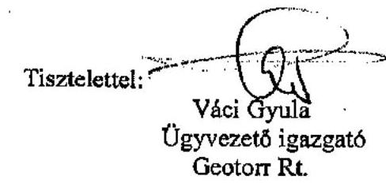

---

# Váci Gyula úr, 

elnök

## GEOTORR Rt.

## Budapest

## Tisztelt Elnök Ưr!

Az önkormányzatok által államháztartáson kívülre átadott pénzeszközök felhasználásával megvalósuló víziközmú beruházások finanszírozási rendszerének célszerűségéről készített jelentésünkre adott részletes észrevételét köszönöm.

Sajnálattal vettem tudomásul, hogy észrevétele nem mentes a személyeskedéstől, vitatja az ÁSZ kompetenciáját, eljárási rendjét és objektivitását, általam nem elfogadható módon minősíti az Állami Számvevőszék munkatársainak szakmai hozzáértését és alkalmazott ellenőrzési módszereit. Nem értek egyet azon kijelentésével sem, melyben azt kívánja igazolni, hogy az ÁSZ igyekezett kiterjesztően értelmezni a jogszabályi rendelkezéseket.

Jelentésünk elkészítését - az ÁSZ eljárási rendjének megfelelően - széles körű külső és belső egyeztetés, minőségbiztosítás előzte meg, melynek során figyelembe vettük a szakmailag és törvényességi szempontból megalapozott észrevételeket. Önnek is több alkalommal volt lehetősége véleménye kifejtésére, melyek többségét azonban nem tudtuk elfogadni, mivel annak jogszabályi megalapozottsága általunk vitatott, szakmai véleményünkkel ellentétes. Újabb észrevétel; ében jórészt a korábbiakat ismételte meg és mivel az objektivitás érdekében a vitatott kérdéseket a jelentésben bemutatjuk, ezért azokra nem kívánok kitérni.

A jelentésben megfogalmazott véleményeinket mind törvényességi, mind hatékonysági és célszerűségi szempontból megalapozottnak tartom, bár vitathatatlan, hogy véleményünk sok tekintetben nem egyezik a beruházási rendszer fenntartásában érdekeltek véleményével.

Észrevételeiben nehezményezi, hogy nem foglalkozik jelentésünk a szennyvízcsatornázás hazai fejlesztésében tett - vitathatatlan - érdemeikkel. Ellenőrzésünknek azonban nem ez volt a megfogalmazott célja, hanem hogy a finanszí-

---

rozási módszer részleteinek megismerése révén annak hatékonyságát az állami szempontok figyelembe vételével értékelje. A Nemzeti Szennyvízprogramban meghatározott prioritásokkal ellentétes támogatási rendszer múködtetésében vállalt aktív szerepkörét nem értékelhetem pozitívan még akkor sem, ha annak eredményeként a szennyvízberuházások megvalósultak. Kifogásolható, hogy az állami pénzeszközök elköltésére, az állami támogatással finanszírozott beruházások prioritási sorrendjének megtartására az állami szerveknek semmilyen ráhatása nem volt, azt az Önök által elérhető üzleti célok befolyásolták. Mindemellett a beruházási összköltség meghatározásakor Önök a lehető legnagyobb összegben vették figyelembe a szakminisztérium által meghatározott fajlagos költségeket. Tapasztalataink szerint a céltámogatásos beruházások beruházási összköltségét mintegy $50 \%$-kal haladták meg. Ezért a rendszerük a kialakított ár alapján nem lehet hatékonyabb a céltámogatással megvalósított beruházásokénál, amit ellenőrzésünk számszakilag is igazolt. Vizsgálatunk során az is bizonyítást nyert, hogy a műszaki tartalom megvalósításához szükséges beruházási költségeket nominál értéken $18,7 \%$-kal haladják meg az 5-10 év alatt igénybevett állami források. Ekkora támogatottsági arány a céltámogatott beruházásoknál nem jellemző.

Észrevételének 1. számú táblázatában összehasonlít egy különféle (nyolcféle) közvetlen fejlesztési célú állami támogatással megvalósított céltámogatásos beruházást az Ön által alkalmazott rendszerrel. Az összehasonlítást állításai igazolásaként nem tudom elfogadni, mivel a számszaki adatok valóságtartamát ellenőrzési tapasztalataink nem támasztják alá. A bemutatott ÖKOTÁM rendszerú - feltételezett fejlesztés - beruházási összköltsége, valamint az annak alapján megjelenő állami támogatások feltüntetett adatai nem felelnek meg az általunk ellenőrzött beruházások során megismert arányoknak. Mindezek ismeretében nem valós az a kijelentés, hogy az Ön által megvalósított beruházások esetében az egy érdekeltségi egységre jutó állami támogatás alacsonyabb, mint a céltámogatással megvalósuló beruházásoknál.

A táblázat szerinti levezetés ugyanakkor azt igazolja, hogy mindkét esetben extraprofit van beépítve a beruházási összköltségbe, hiszen a műszaki tartalom Ön szerint 550 millió Ft-ból is megvalósítható volt. Ennek ellenére a szennyvízcsatorna a céltámogatásos beruházásban 1191 millió Ft-ba, az Önök esetében pedig 1550 millió Ft-ba kerülne. Mindemellett feleslegesnek tartom a céltámogatásos beruházásokkal való összehasonlítást, mivel jelentésünkben azt is rögzítettük, hogy ezeknél a beruházásoknál is extraprofitot realizálnak a kivitelezők. Pozitívumként lehet említeni az Önök által megvalósított beruházások esetében, hogy a 2002. évi jogszabályi szigorítások óta saját haszonkulcsukat csökkentették, annak egy részét a lakossági tehervállalás csökkentésére fordították annak érdekében, hogy a konstrukció alkalmazásához az önkormányzatok és a lakosság támogatását megnyerjék.

Észrevételében a beruházási összköltség csökkentésében az önkormányzatok ellenérdekeltségét taglalja, mikor rögzíti, hogy nem lehet az önkormányzatoknak érdeke a vízdíj alacsonyan tartása állami árkompenzációs támogatási rendszer múködtetése mellett, ezért nem érdekeltek az önkormányzatok beruházási össz-

---

költség alacsonyan tartásában. Az önkormányzatok vízdíjakra vonatkozó ármegállapítását jogszabályi előírások korlátozzák, amelyek pontosan behatárolják, hogy a díj megállapítása során milyen költségelemeket lehet, illetve kell figyelembe venni. Az is ismeretes azonban, hogy a lakosság teherviselő képességét meghaladó ár esetén a jogszabályban tiltott öt évet követően az állam a jelenleg hatályos szabályozás szerint kompenzáció típusú állami támogatást biztosít a szolgáltatóknak, ezért az államot a magas üzemeltetési költség miatt fogja további támogatási kényszer terhelni

Az ÖKOTÁM rendszerủ beruházások 41,4\%-át képezték az ellenőrzéssel érintett, az Önök közreműködésével befejezett vagy folyamatban lévő beruházások. Emiatt úgy ítélem meg, hogy ismereteink a beruházások lebonyolításának módszeréről kellően megalapozottak. A széleskörű minta megfelelő alapot szolgáltatott arra, hogy a szerződések, gazdasági folyamatok értékelése révén általánosítható következtetéseket vonjuk le a rendszer müködéséről. Úgy gondolom nem véletlen, hogy ez nem egyezik meg az Önök véleményével. Az ellentmondás kialakulásának okát egyébiránt abban látom, hogy Ön az önkormányzatok helyi érdekeit igyekszik folyamatosan az állami érdekekkel szembe helyezni figyelmen kívül hagyva azt, hogy az önkormányzatok is az államháztartás alrendszerét képezik. Megfeledkezik arról is, hogy az állami érdekek megfogalmazását a nemzeti-gazdasági és nem csak a helyi közösségi érdekek motiválják.

Megítélésem szerint az Ön által hivatkozott átláthatóság a beruházások esetében csak a pénzintézet és a rendszergazda számára biztosított, ezért fenntartom azon véleményünket, hogy a közpénzelköltés folyamata az Ön által alkalmazott módszerben nem átlátható.

Az államháztartási törvény (Áht.) az önkormányzatok számára egyértelműen előírja, hogy kötelezettséget csak azt követően vállalhatnak, ha a vállalt kötelezettségek forrása rendelkezésre áll és annak összegével - ha bevételi kiesésük egyébként nincs - a kötelezettségvállalást megelőzően megemelik bevételi és kiadási előirányzataikat. Az Önök által alkalmazott módszer lehetetlenné teszi az Áht.-ben rögzített szabályok betartását, hiszen a bevétel és kiadás ugyanazon a napon jelentkezik úgy, hogy az önkormányzat költségvetési számláján - az Önök indokai alapján a készpénzkímélés miatt - az összeg meg sem jelenik. A rendszer múködtetése során emiatt folyamatosan sérültek az Áht.-ben rögzített előírások, amelyek az önkormányzatokra nézve kötelezőek.

Az Önök beruházási módszerével megvalósított beruházások az állami kiadások előre nem számszerúsíthető növekedését okozták, valamint hosszú távú - előre nem tervezhető - kötelezettségeket keletkeztettek az államháztartás számára. Az Önök által megvalósított beruházásokat - néhány kivételtől eltekintve - szinte teljes egészében állami kamattámogatott és kisebb hányadában piaci kamatozású hitelből finanszírozták. Az önkormányzatoknak a hitel futamidejének teljes időtartamára, maximális terhelhetőségükre, aktuális éves adósságszolgálatuk teljes összegére kellett készfizető kezességet vállalniuk, ami esetleges finanszírozási nehézségek - a jogtalanul igénybevett állami támogatások megvonása esetén a többi közfeladat ellátását is veszélyeztetheti.

---

Tisztában vagyok azzal, hogy az állami források kivonása a rendszerből milyen súlyos következményekkel járhat az érintett önkormányzatok müködőképességét, illetve a beruházások befejezését illetően. Az önkormányzatok és a beruházások ellehetetlenülésének megakadályozása érdekében jelentésünkben felhívtuk a parlamenti képviselők és a kormányzati szervek figyelmét az elvonás kockázataira. A jogtalanul igénybevett támogatások elvonásától az ÁSZ nem tekinthet el, ezért a problémakör megoldása csak az Országgyúlés egyedi döntésében orvosolható.

Az EU támogatások igénybevételéhez felajánlott segítségét csak akkor tartanám megalapozottnak, ha megjelölné, hogy az ÖKOTÁM alapítvány milyen és mekkora összegű állami források bevonásával, évenkénti bontásban várhatóan mekkora összegű támogatást kíván biztosítani a központi költségvetés számára annak érdekében, hogy közműberuházások előrehaladásának ütemét felgyorsíthassuk.

Kérem, hogy az észrevételére adott válaszomat szíveskedjék tudomásul venni.

Budapest, 2005. augusztus „ 15 "

Tisztelettel
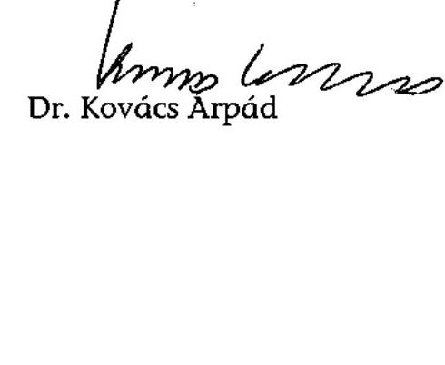

---

# MAGYAR ÁLLAMKINCSTÁR 

## ELNÖK

MÁK/MA-6-71/1/2005.

Tárgy: Az önkormányzatok által államháztartáson kívülre nyújtott - kiemelten felhalmozási célú támogatások, átadott pénzeszközök felhasználása célszerűségének ellenőrzéséről
Hiv.szám: V-1004-160/2005.

## Dr. Kovács Árpád úrnak elnök

## Állami Számvevőszék

Budapest

## Kedves Elnök Úr!

Az önkormányzatok által államháztartáson kívülre átadott pénzeszközök felhasználásával megvalósuló víziközmű beruházások finanszírozási rendszere célszerűségi ellenőrzéséről szóló jelentés tervezetben foglaltakkal kapcsolatban - a Magyar Államkincstár illetékességi területét illetően - észrevételt nem teszünk.

Budapest, 2005. július 28.
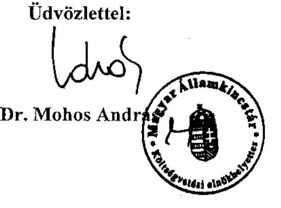

---

# Dr Kovács Árpád elnök úrnak 

## Állami Számvevőszék

Budapest

Tisztelt Elnök Úrl
Tájékoztatom, hogy az önkormányzatok által államháztartáson kívülre átadott pénzeszközök felhasználásával megvalósuló víziközmű beruházások finanszírozási rendszerének célszerűségéről témakörben az Állami Számvevőszék által végzett vizsgálatról készült jelentéshez észrevételt nem teszek.

Budapest, 2005. augusztus „ 3. "
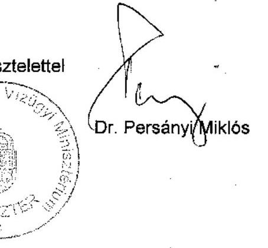

---

# Ellenőrzött önkormányzatok 

| Megye | Önkormányzat | $\begin{aligned} & \text { lakos } \\ & 2004 . \\ & 01.01 . \end{aligned}$ |
| :--: | :--: | :--: |
| Baranya megye: | Köblény | 307 |
|  | Szentegát | 428 |
|  | Szászvár | 2710 |
| Borsod-Abaúj-Zemplén megye: | Emőd | 5614 |
|  | Farkaslyuk | 2072 |
|  | Mezőzombor | 2617 |
|  | Múcsony | 3467 |
|  | Szomolya | 1749 |
|  | Tardona | 1160 |
| Csongrád megye: | Csongrád | 18748 |
|  | Felgyő | 1435 |
| Fejér megye: | Martonvásár | 5218 |
| Heves megye: | Noszvaj | 1701 |
|  | Sarud | 1354 |
| Nógrád megye: | Berkenye | 620 |
|  | Diósjenő | 2941 |
|  | Nógrád | 1521 |
| Pest megye: | Taksony | 5976 |
| Tolna megye: | Kisdorog | 884 |
|  | Závod | 347 |
| Veszprém megye: | Ábrahámhegy | 557 |
| Kiegészítő vizsgálatok: |  |  |
| Baranya | Kárász | 388 |
|  | Magyaregregy | 850 |
|  | Szalatnak | 428 |
|  | Vékény | 159 |
| Fejér: | Gyúró | 1206 |
|  | Ráckeresztúr | 3261 |
|  | Tordas | 1741 |
| Heves: | Poroszló | 3160 |
|  | Tiszanána | 2648 |
|  | Újlőrincfalva | 286 |
| Tolna | Tevel | 1614 |

---

# Ellenőrzött beruházások

|  ber.
sorsz. | Megye | Település név* | Kapcsolódó beruházás témája és az érintett önkormányzatok | Megvalósítás
ideje  |
| --- | --- | --- | --- | --- |
|  1 | Baranya
megye: | Köblény | szennyvízcsatorna hálózat építés, szennyvíztisztító bővítés Magyaregregy-Vékény-Kárász-Szalatnak-Szászvár (ÖKOTÁM
2000 rendszer) | 2002-2003.  |
|  1 |  | Szászvár | szennyvízcsatorna hálózat építés, szennyvíztisztító bővítés Magyaregregy-Vékény-Kárász-Szalatnak-Köblény (ÖKOTÁM
2000 rendszer) | 2002-2003.  |
|  2 |  | Szentegát | szennyvízcsatorna hálózat és szennyvíztisztító (ÖKOTÁM 2000 rendszer) | 2004-2005.  |
|  3 | Borsod-
Abaúj-
Zemplén
megye: | Emőd | szennyvíztisztító és szennyvizzhálózat gesztora + három településsel | 1999-2001.  |
|  4 |  | Farkaslyuk | ózdi martinsalak felhasználásával készült lakóépületek tulajdonosainak kárenyhítése átadott pénzeszköz | 2001-2004.  |
|  5 |  | Szomolya | szennyvízcsatorna hálózat és szennyvíztisztító telep, Noszvaj Heves megyében(ÖKOTÁM 2000 rendszer) | 2003-2005.  |
|  6 |  | Mezőzombor | szennyvizzhálózat | 1998-2000.  |
|  7 |  | Múcsony | szennyvízcsatorna hálózat és szennyvíztisztító telep (ÖKOTÁM 2000 rendszer) | 2003-2004.  |
|  8 |  | Tardona | gázberuházás | 2003.  |
|  9 | Csongrád
megye: | Csongrád | szennyvíztisztító telep és szennyvízcsatorna hálózat I., majd szennyvízcsatorna hálózat II., III. ütemek, Felgyő (ÖKOTÁM 2000
rendszer) | 2002-2003.  |
|  9 |  | Felgyő | szennyvíztisztító telep és szennyvízcsatorna hálózat I., majd szennyvízcsatorna hálózat II., III. ütemek, Csongrád (ÖKOTÁM
2000 rendszer) | 2002-2003.  |
|  10 | Fejér
megye: | Martonvásár | szennyvízcsatorna hálózat és szennyvíztisztító telep, Ráckeresztúr-Gyúró-Tordas (ÖKOTÁM 2000 rendszer) | 2003-2005.  |
|  11 | Heves
megye: | Sarud | szennyvízcsatorna és szennyvíztisztító telep, Poroszló, Tiszanána, Újlőrincfalva szennyvízberuházás (ÖKOTÁM 2000
rendszer, Poroszló kivételével) | 1999-2001.  |
|  5 |  | Noszvaj | szennyvízcsatorna hálózat és szennyvíztisztító telep, Szomolya Borsod-Abaúj-Zemplén megyében (ÖKOTÁM 2000 rendszer) | 2003-2005.  |
|  12 | Nógrád
megye: | Berkenye | szennyvízcsatorna hálózat és szennyvíztisztító telep, DiósjenőNógrád (ÖKOTÁM 2000 rendszer) | 2002-2003.  |
|  12 |  | Diósjenő | szennyvízcsatorna hálózat és szennyvíztisztító telep, Nógrád-Berkenye (ÖKOTÁM 2000 rendszer) | 2002-2003.  |
|  12 |  | Nógrád | szennyvízcsatorna hálózat és szennyvíztisztító telep, Diósjenő-Berkenye (ÖKOTÁM 2000 rendszer) | 2002-2003.  |
|  13 | Pest
megye: | Taksony | útépítések | 2002-2004  |
|  14 | Tolna
megye: | Kisdorog | szennyvízcsatorna hálózat és szennyvíztisztító telep (ÖKOTÁM 2000 rendszer) | 2002-2003.  |
|  15 |  | Závod | szennyvízcsatorna hálózat és szennyvíztisztító telep (ÖKOTÁM 2000 rendszer) | 2002-2003.  |
|  16 | Veszprém
megye: | Ábrahámhegy | szennyvízcsatorna hálózat | 2003-2004.  |

[^0] [^0]: * Vastag betűvel kiemelésre kerültek a beruházások ismert gesztorai.

---

2002. május 22. előtti megkezdett szennyvízközmű beruházás

## A Csongrád-Felgyő projekt forrásösszetétele

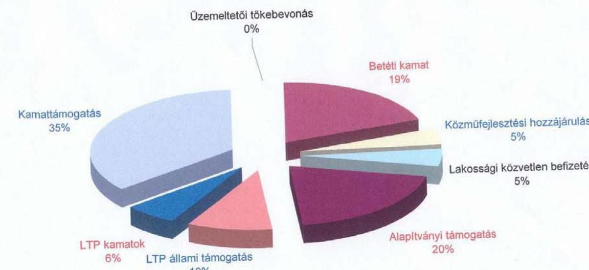

---

2002. május 22. után megkezdett szennyvízközmű beruházás

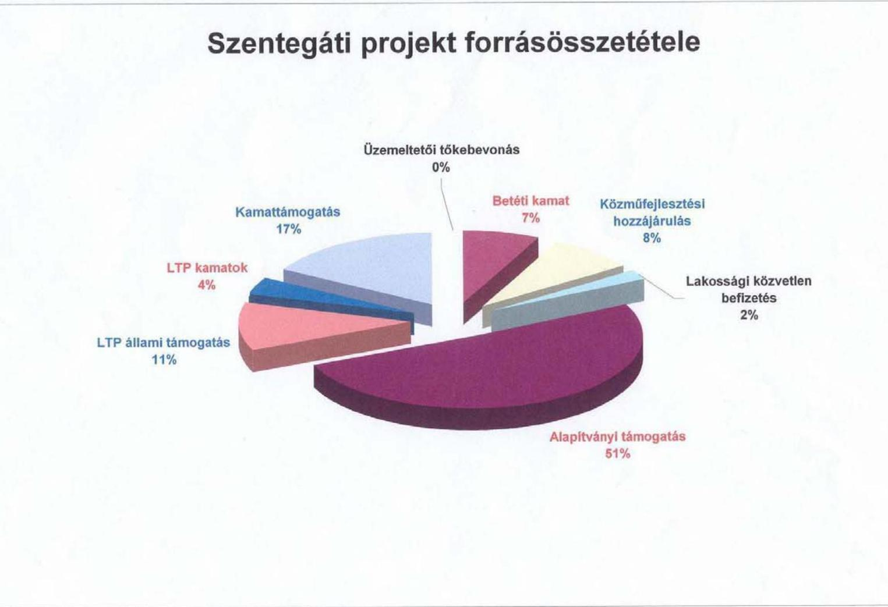

---

Csongrád-Felgyő 2002. május előtti szennyvízberuházás

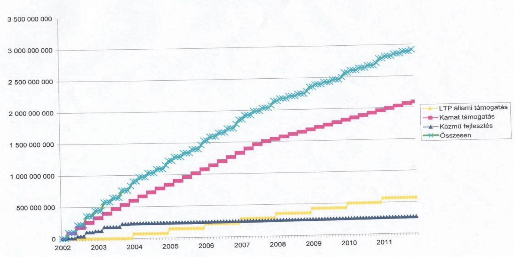

---

Szentegát 2002. május utáni szennyvízberuházás

Az állami támogatások alakulása a 2002 évi kormányrendeletmódosítások után

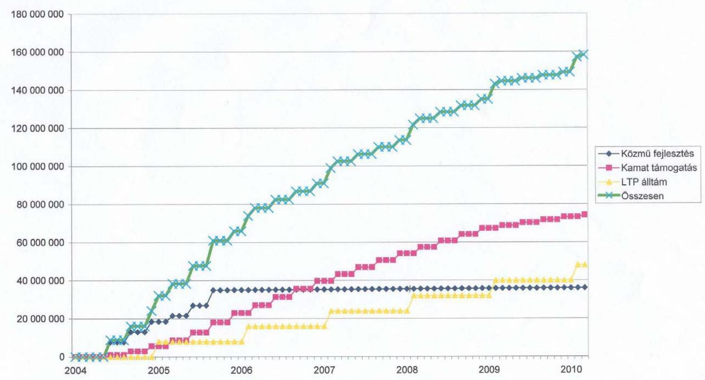

---

5. számú függelék a V-1004/2005. számú jelentéshez

|  |   |   |   |   |   |   |   |   |   |   |   |   |   |   |   |   |   |   |   |   |   |   |   |   |   |   |   |   |   |   |   |   |   |   |   |   |   |   |   |   |   |   |   |   |   |   |   |   |   |   |   |   |   |   |   |   |   |   |   |   |   |   |   |   |   |   |   |   |   |   |   |   |   |   |   |   |   |   |   |   |   |   |   |   |   |   |   |   |   |   |   |   |   |   |   |   |   |   |   |  