# JELENTÉS 

az Országos Rádió és Televízió Testület és a Műsorszolgáltatási Alap működésének ellenőrzéséről

---

2. Államháztartás Központi Szintjét Ellenőrző Igazgatóság
2.3. Átfogó Ellenőrzési Főcsoport

Iktatószám: V-02-33/2005.
Témaszám: 748
Vizsgálat-azonosító szám: V0219

# Az ellenőrzést felügyelte: 

Bihary Zsigmond
főigazgató
Az ellenőrzés végrehajtásáért felelős:
Hegedűsné dr. Müllern Veronika
főcsoportfőnök
Az ellenőrzést vezette:
Dr. Podonyi László
igazgatóhelyettes
A számvevői jelentések feldolgozásában és a jelentés összeállításában
közreműködött:
Rideg Margit
számvevő tanácsos, főtanácsadó
Az ellenőrzést végezték:
György Mária
számvevő
dr. Németh Klára
számvevő tanácsos

Rideg Margit
számvevő tanácsos, főtanácsadó

A témához kapcsolódó eddig készített számvevőszéki jelentések:
címe
sorszáma
Jelentés a médiatörvény végrehajtásának pénzügyi-gazdasági 396 ellenőrzéséről

---

# TARTALOMJEGYZÉK 

BEVEZETÉS ..... 5
I. ÖSSZEGZŐ MEGÁLLAPÍTÁSOK, KÖVETKEZTETÉSEK, JAVASLATOK ..... 8
II. RÉSZLETES MEGÁLLAPÍTÁSOK ..... 16

1. Az ORTT és a Műsorszolgáltatási Alap szervezeti-működési rendje ..... 16
1.1. Az ORTT szabályozási környezetének változása, a Testület működése ..... 16
1.2. A Műsorszolgáltatási Alap jogállása, finanszírozásának sajátosságai ..... 18
2. Az ORTT gazdálkodása ..... 20
2.1. Az ORTT éves költségvetési előirányzatainak megalapozottsága, átcsoportosítása ..... 20
2.2. Az ORTT kiadásainak szabályszerűsége és célszerűsége ..... 23
2.2.1. A működési kiadások alakulása, a gazdálkodás szabályozottsága ..... 23
2.2.2. Létszámgazdálkodás ..... 24
2.2.3. Tárgyi eszközökkel, készletekkel való gazdálkodás ..... 27
3. Az ORTT alapkezelése ..... 28
3.1. A Műsorszolgáltatási Alap bevételi előirányzatai ..... 28
3.2. A Műsorszolgáltatási Alap Igazgatósága működési költségvetése ..... 29
3.2.1. A működési kiadásokkal való gazdálkodás szabályozottsága ..... 29
3.2.2. A Stratégiai Kutatások és Elemzések Programja működésének szabályozottsága ..... 31
3.2.3. A működési kiadások alakulása ..... 32
3.3. A Műsorszolgáltatási Alap és az ORTT Irodájának kapcsolata ..... 38
3.4. A műsorszolgáltatás támogatása ..... 39
3.4.1. Az Alap bevételeinek elszámolása ..... 39
3.4.2. A bevételek jogcímenkénti felhasználása ..... 40
3.4.3. A támogatási rendszer működésének tervszerűsége ..... 43
3.4.4. A pályázati és a nem pályázati (egyedi) úton történő támogatás szabályozottsága ..... 44
3.4.5. A támogatások kifizetésének, elszámolásának szabályossága, felhasználásának ellenőrzése ..... 46
4. Az ÁSZ 1997. évi javaslatainak hasznosulása ..... 48

---

# MELLÉKLETEK 

1. sz. melléklet Jelentéstervezetre tett észrevételek
2. sz. melléklet Az Országos Rádió és Televízió Testület, valamint a Műsorszolgáltatási Alap jogi szabályozási környezetének és működési feltételeinek változása 1996-2005 közötti időszakban
3. sz. melléklet Az ORTT és a Műsorszolgáltatási Alap költségvetései közötti 2003. évi előirányzat-átcsoportosítás
4. sz. melléklet A pályáztatási terv témakörében született ORTT-határozatok
5. sz. melléklet Az ORTT munkáját segítő szakértői testületek
6. sz. melléklet Egyedi támogatásokkal, támogatások visszakövetelésével kapcsolatos adatok, esetleírások
7. sz. melléklet A Műsorszolgáltatási Alapból nyújtott támogatások
8. sz. melléklet Táblázatok
9. sz. melléklet Tanúsítványok

---

# RÖVIDÍTÉSEK JEGYZÉKE 

| Alap | Műsorszolgáltatási Alap |
| :-- | :-- |
| APEH | Adó- és Pénzügyi Ellenőrzési Hivatal |
| Áe. | 1957. évi IV. törvény az államigazgatási eljárás általános |
|  | szabályairól |
| Áht. | 1992. évi XXXVIII. törvény az államháztartásról |
| áfa | általános forgalmi adó |
| ÁSZ | Állami Számvevőszék |
| BH | Bírósági Határozat |
| Ktv. | 1992. évi XXIII. törvény a köztisztviselők jogállásáról |
| médiatörvény | 1996. évi I. törvény a rádiózásról és a televíziózásról |
| OGY | Országgyűlés |
| ORTT, Testület | Országos Rádió és Televízió Testület |
| Ptk. | 1959. évi. IV. törvény a Polgári Törvénykönyvről |
| SKEP | Stratégiai Kutatások és Elemzések Programja |
| SZMSZ | Szervezeti és Működési Szabályzat |
| Ügyrend | Az ORTT Ügyrendje |
| üvegzsebtörvény | 2003. évi XXIV. törvény a közpénzek felhasználásával, a |
|  | köztulajdon használatának nyilvánosságával, átlátha- |
|  | tételével és ellenőrzésének bővítésével összefüggő |
|  | egyes törvények módosításáról |

---

.

---

# JELENTÉS 

## az Országos Rádió és Televízió Testület és a Műsorszolgáltatási Alap működésének ellenőrzéséről

## BEVEZETÉS

Az Országgyűlés az Alkotmány 61. §-ával összhangban megalkotta a rádiózásról és a televíziózásról szóló 1996. évi I. törvényt (médiatörvény) „...a szabad és független rádiózás és televíziózás, a véleménynyilvánítás szabadsága, a tájékoztatás függetlensége, kiegyensúlyozottsága és tárgyilagossága, a tájékozódás szabadsága, valamint az egyetemes és a nemzeti kultúra támogatása, a vélemények és a kultúra sokszínűségének érvényre juttatása érdekében, továbbá a tájékoztatási monopóliumok kialakulásának megakadályozására...".

E törvényi cél megvalósulása érdekében a médiatörvénnyel létrehozta az Országos Rádió és Televízió Testületet (ORTT, Testület), amely az Országgyűlés felügyelete alatt álló önálló jogi személy. Feladatait a médiatörvény 41. §-ának (1) bekezdése sorolja fel. Az ORTT kezelője - a médiatörvénnyel létrehozott és önálló jogi személyként működő elkülönített pénzalapnak - a Műsorszolgáltatási Alapnak (Alap), amely a médiatörvény 77. §-ának (1) bekezdésében felsorolt feladatokat látja el. „A Műsorszolgáltatási Alap (a továbbiakban: Alap) olyan elkülönített pénzalap, amelynek feladata a közszolgálati műsorszolgáltatás, a közmű-sor-szolgáltatók, a nem nyereségérdekelt műsorszolgáltatók, a közszolgálati műsorok és műsorszámok támogatása, a kultúra megőrzése és továbbfejlesztése, a műsorok sokszínűségének biztosítása, valamint az e törvényben meghatározott egyéb feladatok támogatása." Mindkét szervezet működését a médiatörvény szabályozza.

A két szervezet költségvetése nem része a központi költségvetésnek. A médiatörvény szerint az ORTT önálló törvényben jóváhagyott éves költségvetés szerint az Alap forrásai terhére, a médiatörvényben meghatározott keretek között, a költségvetési szervek gazdálkodására vonatkozó jogszabályok értelemszerű alkalmazásával - gazdálkodik. A médiatörvény módosításával 1999. január 1jétől az Alap költségvetését is az Országgyűlés hagyja jóvá, az ORTT önálló éves költségvetési törvényének mellékleteként.

Az ORTT költségvetési törvényében az ORTT 2005. évi működésére jóváhagyott kiadási és bevételi előirányzat 1031 M Ft , az Alap kiadási és bevételi előirányzata pedig 32148 M Ft. Az Alap bevételeinek 80,2\%-a a Kormány által átvállalt üzemben tartási díj, amelynek $94 \%$-át az Alap köteles továbbutalni a három közszolgálati médiumnak a tulajdonos közalapítványokon keresztül, a három média-közalapítványnak, illetve az ORTT-nek működési költségeikre.

Az Állami Számvevőszék (ÁSZ) 1997-ben a médiatörvény végrehajtásának ellenőrzése keretében vizsgálta az ORTT és a Műsorszolgáltatási Alap működését,

---

gazdálkodását ${ }^{1}$. Ugyancsak 1997-ben készült a Duna Televízió működésének és gazdálkodásának ellenőrzéséről szóló ÁSZ-jelentés ${ }^{2}$, amely az alapítástól kezdve az 1996. évvel záródó időszakot érintette. Mindkét jelentés tartalmazott ORTT-nek címzett javaslatokat.

A jelenlegi ellenőrzés végrehajtására a rádiózásról és a televíziózásról szóló 1996. évi I. törvény 32. §-ának (1) bekezdése, valamint az Állami Számvevőszékről szóló 1989. évi XXXVIII. törvény 2. §-ának (5) bekezdése alapján került sor.

Az ellenőrzés célja annak értékelése volt, hogy

- az ORTT és az Alap a vonatkozó jogszabályoknak megfelelően szabályozott rendben végezték-e feladataikat, szervezeti és működési rendjük és a rendelkezésükre álló pénzügyi források biztosították-e feladataik ellátását;
- gazdálkodásukban érvényesültek-e a célszerűségi, az eredményességi és a törvényességi szempontok, a gazdasági események elszámolása és nyilvántartása szabályszerű és áttekinthető volt-e;
- a műsorszolgáltatás támogatásának gyakorlata megfelelt-e a médiatörvény előírásainak és a belső szabályzatoknak;
- az ORTT hasznosította-e az ÁSZ jelentéseinek javaslatait.

Az ellenőrzés az 1997-2004. évi működés, gazdálkodás adataira terjedt ki, és a helyszíni ellenőrzés befejezéséig terjedő időszak információit is felhasználta megállapításainak, javaslatainak alátámasztására. Részletesen a 2003-2004. évi gazdálkodást ellenőriztük.

Az ellenőrzés szervezeti szintű, átfogó jellegű vizsgálat volt, amely az ORTT és az Alap működésének, gazdálkodásának meghatározott területeire terjedt ki, nem volt feladata a két szervezet teljes körű átvilágítása. Az ORTT költségvetéseinek megalapozottsága keretében teljesítmény-ellenőrzés módszerével megvizsgáltuk a Testület és az Alap költségvetése közötti 2003. évi előirányzatátcsoportosítás eredményességét. A helyszíni ellenőrzés módszere a dokumentumok vizsgálata és elemzése volt, az Alap támogatási gyakorlatának értékelése a kifizetett támogatásokból támogatási jogcímenként vett reprezentatív minta ellenőrzésén alapul.

Az ellenőrzés alapdokumentumai az ORTT éves költségvetési törvényei és azok végrehajtásáról szóló törvények, a szervezetek éves beszámolói (az ORTT éves tevékenységéről az Országgyűlésnek készített beszámolók, a számviteli, a zárszámadási beszámolók), az ORTT elemi költségvetései, illetve a felsoroltakat

[^0]
[^0]:    ${ }^{1}$ Jelentés a médiatörvény végrehajtásának pénzügyi-gazdasági ellenőrzéséről (száma: 396)
    ${ }^{2}$ Jelentés a Duna Televízió működésének és gazdálkodásának ellenőrzéséről (száma: 357)

---

alátámasztó bizonylatok, a testületi ülések jegyzőkönyvei, határozatai, a belső szabályzatok, elemzések, a külső- és belső ellenőrzés jelentései.

A Testület jelenlegi elnöke 2004. március 29-étől tölti be pozícióját, közvetlenül ezt megelőzően 1999. március 31-étől az ORTT Irodájának főigazgatója volt. Az ORTT Irodájának jelenlegi főigazgatóját 2004. május 1-jétől, az Alap - a Testület által munkaköréből 2005. június 24-től felmentett - igazgatóját pedig 2004. június 11-étől nevezték ki.

A jelentéstervezetet egyeztettük a Miniszterelnöki Kabinetiroda helyettes államtitkárával, az ORTT főigazgatójával és a Műsorszolgáltatási Alap igazgatójával. Észrevételeiket az 1. sz. melléklet tartalmazza. A jelentést észrevételezésre megküldtük az ORTT elnökének, aki az ORTT ülésezési szünete miatt észrevételezési lehetőségével határidőn belül nem élt.

---

# I. ÖSSZEGZŐ MEGÁLLAPÍTÁSOK, KÖVETKEZTETÉSEK, JAVASLATOK 

Az ORTT és az Alap a médiatörvényben meghatározott feladataikat ellentmondásos jogszabályi környezetben végezték. A feladataik ellátásához rendelkezésükre álló, szűkösnek ítélt pénzügyi források miatt a médiatörvényt több területen megsértették. Szervezeti és működési rendjük szabályozottsága a közpénzek felelős kezelése szempontjából nem megfelelő. A Testület a műsorszolgáltatás támogatását szabályzatba foglalt normák helyett egyedi határozatokkal irányította, ami rontotta a pályázatok elfogulatlan elbírálásának átláthatóságát.

A médiaszektort érintő jogi szabályozást egyes területeken a kezdetektől máig fennálló ellentmondás terheli. A kétharmados arányú szavazattal megújítható médiatörvényt a meghozatala óta eltelt időszakban - az uniós csatlakozás által szükségessé vált 2002. évi ún. jogharmonizációs törvény kivételével - feles szavazatarányt követelő törvényekkel módosították. A médiaalanyok számának és összetételének megváltozása, valamint a kiszámíthatatlanul felgyorsult technológiai fejlődés a médiatörvény gyors avulását eredményezte. A technológiai fejlődést a tevékenységközpontú szakmai törvények folyamatos korszerűsítésével ellensúlyozták.

A Testület a médiatörvényben megállapított sajátosságokkal létrehozott testület. Jogállása, felépítése eltér mind az üzleti élet társasági formái, mind a központi költségvetési szervek, a közalapítványok vagy más közhasznú szervezetek jogállásától, felépítésétől. Tagjai egymás közt egyenlők és függetlenek, döntéseiket ügyrendben meghatározott eljárási rend szerint, határozati formában hozzák meg. A médiatörvény szerint az ORTT önálló törvényben jóváhagyott éves költségvetés szerint - az Alap forrásai terhére, a médiatörvényben meghatározott keretek között, a költségvetési szervek gazdálkodására vonatkozó jogszabályok értelemszerű alkalmazásával - gazdálkodik. Az ORTT gazdálkodásában a költségvetési szervek gazdálkodásához való értelemszerű igazodást az ORTT hivatali munkaszervezete - az Iroda - valósítja meg. Az Iroda előkészíti a Testület működéséhez kapcsolódó szakmai, ágazati feladatok végrehajtását, részt vesz a végrehajtásban. Az ORTT Irodája - a médiatörvény és más jogszabályok, az Ügyrend, a Szervezeti és Működési Szabályzat által meghatározott feladat- és hatáskörrel - szabályozottan működött.

A Testület szerteágazó feladatkörébe tartozik a Műsorszolgáltatási Alap kezelése is. A médiatörvényben kapott felhatalmazás révén a Testület nemcsak a médiaszektor tartalmi függetlenségének őre, hanem a műsorszolgáltatás tartalmi, technikai fejlesztésének jelentős szereplője is azáltal, hogy az Alap kezelőjeként éves szinten milliárdos nagyságrendű támogatási célú közpénzzel gazdálkodik. A médiatörvény előírásainak nem egyértelmű, nem következetes megfogalmazása lehetőséget teremtett arra, hogy az ORTT az Alapot olyan szervezeti rendben működtesse, amely a sajátjától teljes mértékben eltér. Emiatt az Alap működése során a közpénzekkel való felelős gazdálkodás nem érvényesül teljes egészében. Az Alap a médiatörvény szerint olyan elkülönített

---

pénzalap, amely nem része a központi költségvetésnek, jogi személy, a műsorszolgáltatás támogatása rajta keresztül valósul meg. A törvény nem írja elő, hogy az Alapot milyen szervezeti formában kell működtetni. A kezelő ORTT - a pénzügyminiszterrel egyetértésben - a Műsorszolgáltatási Alap Kezelési Szabályzatában úgy döntött, hogy saját különálló hivatali munkaszervezettel (Igazgatósággal), nem költségvetési szervként működteti az Alapot. Az Alap hivatali szervezetének működtetésére - bár közfeladatot lát el, közpénzeket kezel, forrásainak nagyobb része a központi költségvetésből származik az Országgyűlés fejezeten keresztül - a költségvetési gazdálkodásra vonatkozó szabályok alkalmazását nem írta elő a Testület, de nem alakította ki az alapkezelés egységes, összehangolt, áttekinthető szabályozását sem. A Testület az Alap gazdálkodását egyedi határozatokkal irányítja, ami nem biztosítja minden tekintetben a szabályozott működést. A kezelési szabályzatot nem hozta nyilvánosságra. A szabályozás hiányossága, hogy az Alap kezelési szabályzatát - amely a bevételek felhasználásának szabályait rögzíti - nem egészítették ki a közpénzek felhasználásával szembeni szigorúbb elvárásoknak megfelelő kötelezettségvállalási és utalványozási renddel kapcsolatos előírásokkal, és nem rendelkezik a szabályzat a teljesítések igazolásának módjáról sem.

A Testület működése két hivatali szervezet - Iroda és Igazgatóság - igénybevételével jár, ami nehezen áttekinthetővé, költségigényessé tette az Alap kezelését.

A médiatörvény szerint az ORTT működési költségeinek fedezete az ún. üzemben tartási díj 1\%-a (illetve 2002 közepétől az üzemben tartási díj pótlása a központi költségvetésből), amely az üzemben tartási díj maximum 4\%-áig terjedő összegre az Alap egyéb bevételei terhére kiegészíthető. Az Alap működési költségeinek fedezetét a médiatörvény nem szabályozza. Az Alap a költségvetési javaslatát a Testület előzetes döntéseit is figyelembe véve állítja össze, és azt a Testület terjeszti az Országgyűlés illetékes bizottsága elé.

Az üzemben tartási díj elsődlegesen az Alap számlájára folyik be, de 94\%-át az Alap a médiatörvény előírásának megfelelően továbbutalja médiaközalapítványoknak (illetve rajtuk keresztül a közszolgálati médiumoknak), az ORTT-nek működési költségeik fedezetére. 2000-ben az Alap üzemben tartási díjból származó bevétele 19,1 Mrd Ft (az összes bevétel 78,6\%-a), 2004-ben 21,5 Mrd Ft (az összes bevétel 76,4\%-a) volt. 2001-től 2004 végéig - négy év alatt az Alap üzemben tartási díj címén szerzett bevétele 112,5\%-ra nőtt. Ugyanezen időszak alatt a fogyasztói árindex $128,6 \%$ volt.

2001 óta a Testület működésének finanszírozásához az ORTT költségvetéséről szóló törvények - az illetékes parlamenti bizottságok jóváhagyásával - a várható üzemben tartási díj 4\%-ának megfelelő fix összegű támogatás biztosításával, valamint az ORTT-nek megengedett - az Alap és az ORTT kiadási előirányzatai közötti - átcsoportosítással figyelmen kívül hagyják a kétharmados médiatörvény előírásait. Az Országgyűlés az átcsoportosítási felhatalmazással lehetőséget biztosított a Testületnek, hogy az eredeti működési költségvetési előirányzatainál nagyobb költségvetéssel gazdálkodjon. Gyakorlatban az átcsoportosítások elérték céljukat, eredményesek voltak, mert az ORTT médiatörvény szerinti finanszírozásának elégtelenségét áthidalták, de nem valóságos feladat-

---

átcsoportosításra épültek, ezért értelemszerűen nem felelnek meg az államháztartás működési rendjét szabályozó kormányrendelet vonatkozó előírásainak.

Az ORTT költségvetéséről szóló törvényekben nem definiálták, hogy mely átcsoportosítások fogadhatók el. A Testület a működési költségvetések közötti átcsoportosításon kívül 2001., 2002. és 2004. évre vonatkozóan összesen 2348 M Ft-ot csoportosított át a médiatörvény által kötött felhasználású, támogatásra szolgáló keretekből rendkívüli bevételként az Alap kötetlen felhasználású, ún. szabad kerete (bevétele) javára. Ezzel lehetővé vált, hogy a Műsorszolgáltatási Alap bevételeit ne a médiatörvény rendelkezéseinek megfelelő arányban költse az egyes támogatási célokra.

Az Alap bevételeinek másik jelentős részét a műsorszolgáltatási díjak teszik ki, amelyek a magánszférából, jórészt társasági formában működő műsorszolgáltatóktól, érkeznek. Idetartoznak a frekvenciapályázati és egyéb pályázati díjak, valamint a szerződésszegésekből és szerződésen kívüli károkozásokból származó, a végrehajtástól függő kötbér, bírság, kártérítés nem tervezhető összegei is, amelyek felhasználását és visszaforgatását a médiatörvény szabályozza. A műsorszolgáltatási díjból származó bevétel összege 2000-ben 5 Mrd Ft (az összes bevétel 20,6\%-a), 2004-ben 5,3 Mrd Ft (az összes bevétel 18,9\%-a) volt.

A magánszférából befolyt pénzt támogatások formájában az Alap visszaforgatja a magánszférába. Az európai uniós közösségi szabályoknak megfelelően az Alap pénzügyi függetlensége - és közvetetten a közműsor-szolgáltatók függetlensége - az Alap vegyes rendszerű (duális) bevételi forrásai által biztosított. Ebben a vegyes finanszírozási rendszerben nagyobb részt a médiavállalkozások befizetéseiből fedezi működésének költségeit az Alap, illetve az ORTT. A gazdálkodás gyakorlati problémája, hogy a befizetések visszaforgatása bázisszámok alapján történik, viszont a nem megfelelő fizetési fegyelem miatt a magánszférából érkező bevételek egyes elemei nem tervezhetők biztonsággal, mivel csak akkor kerülnek a rendszerbe, ha jogerős végrehajtható határozat alapján ténylegesen be is fizetik.

A két szervezet együttes működési kiadásai a 2000. évi 1243,8 M Ft-ról 2004 végére - négy év alatt - 1989,3 M Ft-ra, 59,9\%-kal emelkedtek. Mindkét szervezet jogi személy, de működésük, gazdálkodásuk alapvetően és nem indokolhatóan különbözik egymástól. Az ORTT Irodája a médiatörvény előírásának megfelelően a költségvetési szervezetekre vonatkozó szabályok szerint működik. Az Alapra - más kezelési és jogszabályi előírások következményeként - nem vonatkoznak a költségvetési szervezetek gazdálkodási kötöttségei, bár 2000. évvel kezdődően az Alap költségvetését is az Országgyűlés hagyja jóvá az ORTT költségvetéséről szóló önálló törvény mellékleteként. Az Iroda az államháztartás szervezeteire vonatkozó szabályok szerint vezeti számviteli nyilvántartását, az előirányzatokat és azok teljesítését a költségvetési szabályoknak megfelelően könyveli. Az Alapot viszont a számviteli törvényben egyéb szervezeti kategóriába sorolták be (tehát nem minősül sem vállalkozónak, sem az államháztartás szervezetének), és teljesítésszemléletű kettős könyvelés vezetésére kötelezett. Az előirányzatokat és teljesítésüket nem kell könyvelnie, ezért az előirányzatokból származó megtakarítás, az előirányzatok közötti átcsoportosítás a számviteli rendszerében nem értelmezhető.

---

Az ORTT Irodája működési kiadásainak összege 2003-ban 972,2 M Ft, 2004-ben 1124,3 M Ft volt. A működési kiadások finanszírozása érdekében a Testület 2003-ban 166 M Ft-ot, 2004-ben 245 M Ft-ot csoportosított át a Műsorszolgáltatási Alap költségvetéséből saját költségvetésébe.

Az Iroda alkalmazottai köztisztviselők, létszámuk a feladatok bővülésével arányosan alakult, nem haladta meg a Testület által jóváhagyott keretet. Külső szakértőket elsősorban a Panaszbizottság működtetésével, a műsorfigyeléssel, műsorelemzéssel és -kódolással kapcsolatos feladatok elvégzéséhez vettek igénybe.

A működési kiadásokból a személyi juttatások és járulékaik részaránya 2003. évben $75,1 \%$, 2004. évben $68,9 \%$ volt. A személyi juttatások költségvetési előirányzatának kialakításánál a törvényben rögzített feladat ellátásához szükséges létszám megtartását, valamint a Ktv. előírásainak maradéktalan végrehajtásához szükséges forrás biztosítását vették figyelembe. Nem rendszeres személyi juttatások a munkavégzéshez kapcsolódtak, és azokat a Ktv. kötelező előírásai alapján számolták el. A költségtérítéseknél az Iroda a tulajdonában álló személygépkocsik magáncélú használatát az Iroda igazgatói részére is biztosította, függetlenül attól, hogy arról érvényes Testületi határozattal nem rendelkeztek. A használat feltételeit egységesen nem szabályozták. A szakértői, tanácsadói és egyéb megbízási díjak kifizetésére a szerződés szerinti teljesítésnek megfelelően, szabályszerűen került sor.

Az Alap Igazgatósága a költségvetésben meghatározott kiadási előirányzatok keretei között önállóan gazdálkodik. Kifogásolható azonban, hogy az Igazgatóság az ellenőrzött időszakban nem a saját működéséhez szükséges szakértői megbízásokból eredő - az ORTT Irodáját terhelő - költségeket is elszámolt a személyi juttatások és a dologi kiadások között. Az Alap működési költségei 2003-ban 643 M Ft-ot, 2004-ben 865 M Ft-ot tettek ki, ebből 84 M Ft, illetve 200 M Ft volt a Stratégiai Kutatások és Elemzések Programjára (SKEP) elszámolt költség. A SKEP-et az ORTT 2002 novemberében az Alap szervezetén belül hozta létre, a programban az ORTT általános működésével kapcsolatos kutatási célokat határoztak meg. A SKEP működése a rendelkezésére bocsátott közpénzek szabályszerű felhasználását nem biztosította.

Az Alap Igazgatósága 2004. évi működési költségeinek 46,4\%-át személyi juttatások és azok járulékai tették ki. E költségek nagyságát befolyásolta, hogy az Igazgatóság alkalmazottai a Munka Törvénykönyve hatálya alá tartozó munkaviszonyban állnak, amelyre a Ktv. kötöttségei nem vonatkoznak. A személyi jellegű működési kiadások esetében az ésszerű és takarékossági szempontok kevésbé érvényesültek. Az Igazgatóság vezetői besorolású munkavállalóinak létszáma 2003-2004-ben elérte a teljes létszám (51-56 fő) egynegyedét. A munkavállalókat megillető juttatásokat igazgatói utasítás írta elő, viszont a személygépkocsik magáncélú használatának feltételeit egységesen nem szabályozták. A személygépkocsik használatával kapcsolatos valamennyi költséget korlátozás nélkül az Alap fizette ki. A médiatörvény szerint csak az ORTT elnökét és tagjait illetik meg kiemelt juttatások.

Az ORTT Irodája rendszeres személyi juttatásainak és az Alap Igazgatósága által kifizetett bérjövedelmek összehasonlítása alapján megállapítható, hogy az

---

egy főre jutó éves átlagbér az Alapnál 2003. évben 24,1\%-kal, 2004. évben 25,89\%-kal magasabb volt az ORTT Irodája köztisztviselőinek átlagos rendszeres személyi juttatásainál. A munka jellege nem indokol eltérést a két hivatali szervezet munkavállalónak átlagbére és rendszeres személyi juttatása között.

Az Alapnál a szakértői megbízások költségeire 2004. évben 145,0\%-kal fordítottak többet az előző évinél. A megbízási díjak összege 2003. és 2004. évben együttesen 338,8 M Ft volt, amelynek 60,0\%-a - 203,2 M Ft - a SKEP rendelkezése alapján tanulmányírás és egyéb szolgáltatás címén került kifizetésre. A szakértői szerződésekkel kapcsolatos kötelezettségvállalásra az Alap SZMSZ-ével és a médiatörvénnyel is ellentétesen került sor. A szerződések teljesítésének igazolására szintén szabálytalanul került sor, mivel azt az Alappal munkaviszonyban nem álló, a teljesítések igazolására felhatalmazással nem rendelkező személy - a SKEP irányítója - végezte el. Olyan gazdasági társasággal is kötöttek megbízási és tanulmányfelhasználási szerződést, amely a szerződés teljesítéséhez szükséges tevékenységi körrel nem rendelkezett, ezért az a teljesítéshez közreműködők bevonását igényelte. Ugyancsak kifogásolhatók a testületi tagonként évi 10 M Ft-ban megállapított keret terhére egyes gazdasági társaságokkal tanulmányírásra kötött szerződések. A szerződés tárgyát nem határozták meg pontosan, a felkért gazdasági társaságok tevékenységi köre nem nyújtott kellő garanciát a szakmailag megfelelő teljesítésre. A gazdasági társaságok a tanulmányírásba „fővállalkozás" keretében további közreműködőt vontak be, de a közreműködők a szerződést nem írták alá, az elkészült tanulmány a szerző nevét, a felhasznált forrásmunkát nem tartalmazta.

A Műsorszolgáltatási Alap a bevételei elszámolásában, a támogatási keretek képzésében és felhasználásában olyan - a könyvvizsgáló által évről évre kifogásolt - megoldásokat alkalmaz, amelyek nehezítik az alapkezelés átláthatóságát, ellenőrzését. Az Alap Igazgatósága a támogatási keretek képzéséről és felhasználásáról nem önállóan dönt, valamennyi ellenőrzött esetben rendelkezett a Testület vonatkozó határozatával.

A visszakövetelt és a visszatérítendő támogatások - ha azokat visszakapta az Alap - a kezelési szabályzat szerint nem kerülnek vissza abba a támogatási keretbe, amelyből odaítélték a kedvezményezettnek, hanem az Alap szabad rendelkezésű bevételeit gyarapítják, amelyből pályáztatás nélkül is adható támogatás, és amelyből az Alap, illetve részben az ORTT működési költségeit is fedezik. 2004. december végéig összesen 440 M Ft-ot számolt el ily módon az Alap. A visszatérített támogatások sorsáról a médiatörvény nem rendelkezik. Az alkalmazott megoldás korlátozza a médiatörvény céljának teljesülését.

A szabálytalanul elszámolt bevételek közé tartozik a támogatási célú keretek átcsoportosítása az Alap bevételébe. 2004 végéig a Testület összesen 2348 M Ft-ot átcsoportosításáról határozott a médiatörvény által kötött felhasználású, támogatásra szolgáló bevételek terhére és a kötetlen felhasználású, ún. szabad keret (bevétel) javára.

Az Alap bevételeinek felhasználását a médiatörvény részletesen szabályozza. A szabályozás hibája, hogy a többféle vetítési alap alkalmazásával kiszámított támogatási összegek együttesen meghaladják az Alap bevételeit. Az alapke-

---

zelés számonkérése szempontjából további problémát jelent, hogy a támogatási jogcímek tartalma sem egyértelmű a médiatörvényben.

A médiatörvény támogatási kötelmeit részben kezdettől fogva, részben 2001 óta nem tartja be az ORTT. Az előírt négyféle támogatási keret helyett csak hármat képeztek, és a keretképzés szabályait sem minden esetben tartották be. Ilyen okokból 2004 végéig összesen 3646 M Ft kerethiány keletkezett. A keretátcsoportosítások miatt a támogatási keretek felhasználása sem felel meg a médiatörvény előírásainak. Az Alap Felügyelő Bizottsága kezdettől fogva szükségesnek tartotta az átcsoportosított keretek visszapótlását, a törvénynek megfelelő keretállapotok visszaállítását, de erre még nem került sor. A felhasználás átláthatóságát korlátozza, hogy az ORTT költségvetésének végrehajtásáról szóló törvényben nincs kimutatás a Műsorszolgáltatási Alapra vonatkozóan az egyes kötött felhasználású támogatási keretek, a szabad rendelkezésű eredménytartalék, valamint a terhükre fennálló kötelezettségek alakulásáról.

A támogatási szerződések nyilvántartásának rendjét írásos utasítás nem szabályozza. A meglévő számítógépes adatbázis pályázati eljárásonként külön-külön tartja nyilván a szerződéseket, azok főbb adatait, az adatok módosításait és az ügyintézés főbb mozzanatait. Ellenőrzési szempontból hiányzik a teljesség garanciája, amit egy szigorú számadású szerződés-nyilvántartási rendszer biztosít. Az egyes támogatási keretek képzésének, felhasználásának nyilvántartása a számviteli politikában, illetve a kezelési szabályzatban foglaltaknak megfelel, a keretek terhére vállalt kötelezettségek, kifizetések, fennálló kötelezettségek, a visszakövetelt támogatások és visszafizetések analitikus számviteli nyilvántartása átlátható. A támogatásokkal kapcsolatos dokumentumok rendezettsége kifogásolható: a szerződések és mellékleteik nem követik szoros rendben egymást; a sorszám nélküli szerződés-mellékleteket nehéz azonosítani a szerződésbeli hivatkozásokkal.

A támogatási rendszer működésének hatékonysága a Műsorszolgáltatási Alapnál nem mérhető, mert nincs mihez viszonyítani a tényleges működését. A Testületnek nincs támogatási stratégiája, és a 2000. és a 2005. évet kivéve nem voltak Testület által jóváhagyott éves pályáztatási tervek sem az Alapnál. A fenti két évet kivéve a Testület rendszertelen döntésekkel kezelte az Alap támogatási célú pénzeszközeit. Az Alap kezelési szabályzatában, a testületi határozatok között nem található támogatási, pályáztatási tervvel kapcsolatos rendelkezés, amely előírná, hogy a Testület az éves támogatási, pályáztatási terveket mikor, milyen formában, milyen tartalommal, milyen pénzügyi alapon kéri döntéshez előkészíteni. A támogatásban érdekeltek tájékoztatása a lehetőségekről - a fentiekből következően - ugyancsak kifogásolható.

A támogatás teljes folyamatának szabályai nincsenek egységes szabályzatba foglalva. A részfolyamatok közül csak az ellenőrzésnek és iratkezelésnek van elfogadott szabályzata az Alapnál. Az Alap egyetlen átfogó szabályzata a támogatási rendszerről a Műsorszolgáltatási Alap Kezelési Szabályzata, amely 1998 őszére készült el, de a médiatörvényben előírt közzétételi kötelezettség ellenére a Testület a Művelődési Közlönyben nem jelentette meg. A kezelési szabályzat azonban nem ad választ arra, hogy maga a Testület milyen szabályok szerint végzi támogatási tevékenységét. Többnyire eseti döntéseket hozott, ami megsokszorozta a Testület munkáját. A támogatások egy részére a médiatör-

---

vény nyilvános pályáztatási kötelezettséget ír elő. A kezelési szabályzat szerint a nyilvános pályázatokra a Testület által elfogadott külön pályázati szabályzatban meghatározott módon kerülhet sor. A külön pályázati szabályzata a helyszíni ellenőrzés idején még nem volt az Alapnak.

Az ORTT-nél, illetve az Alapnál hiányzik a kamatpolitikai szabályozás is. A támogatási szerződések, illetve külön szabályzat nem jeleníti meg az ügyleti és a késedelmi kamat alkalmazásának módját, az esetleges kamatos kamat kikötésének rendjét. A támogatási szerződésekben foglalt feladatok késedelmes teljesítése esetén a késedelem szankcionálása nem felel meg a Ptk.-ban megállapított kamat kikötési és érvényesítési szabályoknak.

Az Alapnál a támogatások összegének kifizetése, elszámolása szabályosan testületi határozat alapján, a Testület döntésének megfelelően - történt. Az egyes kifizetett támogatások visszakövetelésének ügyei között viszont voltak olyanok is, amelyeknél a pályáztatási folyamatban a Testület nem tartotta be saját határozatait.

A támogatások rendeltetésszerű felhasználásának ellenőrzése az Alap Igazgatóságának feladata. A pályázati felhívások és a konkrét támogatási szerződések az ellenőrzés valamennyi várható esetére, módjára felhívták a támogatásban részesülő figyelmét, az odaítélt támogatások elszámolásának ellenőrzéséhez viszont csak 2005 januárjától van külön szabályzata az Alapnak. A támogatás felhasználását a kötelezően benyújtott elszámolási dokumentumok alapján ellenőrizték, helyszíni ellenőrzésre 2001. október és 2004 vége között mindössze két esetben került sor.

A belső ellenőrzés szerepe és súlya az ORTT és Irodája működésében nem jelentős, amelynek megváltoztatása alapvető érdek és jogszabályban előírt kötelezettség is. Az Iroda 1996-tól folyamatosan foglalkoztat belső ellenőrt. Az új belső ellenőrzési szabályzata, amely megfelel a hatályos jogszabályi követelményeknek, az Állami Számvevőszék helyszíni ellenőrzését követően készült el. Az Alap csak 2004 októbere óta foglalkoztat belső ellenőrt. A belső ellenőrzésre irányadó szabályok elkészültek a költségvetési szervekre alkalmazandó kormányrendelet alapján.

Az ORTT álláspontja szerint a Testület nem tartozik az ún. üvegzsebtörvény hatálya alá, ezért nem is határozták meg azokat a működésbeli veszélyforrásokat sem, amelyek esetében a hivatkozott törvény rendelkezéseinek eleget kell tenni. Az ORTT közpénzből, a költségvetési szervek gazdálkodására vonatkozó jogszabályok értelemszerű alkalmazásával gazdálkodik, ezért az Áht.-nek az üvegszebtörvényből következő előírásai értelemszerűen rá is vonatkoznak.

Az ORTT az ÁSZ korábbi javaslataira is figyelemmel éves költségvetési javaslatait formailag megfelelően készíti el, tartalmilag azonban a költségvetési javaslatok a finanszírozási források szűkössége miatt alkalmazott - az ORTT és az Alap költségvetése közötti - előirányzat-átcsoportosítások miatt nem reálisak. Az ORTT és az Alap feladatainak és költségeinek szétválasztása részben megvalósult, de továbbra is maradtak átfedések pl. a szakértői megbízások területén.

---

A helyszíni ellenőrzés megállapításainak hasznosítása mellett javasoljuk

# az Országgyűlésnek: 

Kötelezze az ORTT-t, hogy a költségvetésének végrehajtásáról szóló törvény előterjesztésében a Műsorszolgáltatási Alapra vonatkozóan számoljon el az egyes kötött felhasználású támogatási keretek, valamint a szabad rendelkezésű eredménytartalék alakulásáról, a médiatörvény rendelkezései betartásának átláthatósága érdekében.

## a Kormány számára:

Készítse elő a médiatörvény átfogó módosítását, figyelemmel az ORTT és a Műsorszolgáltatási Alap működésének finanszírozási gyakorlatára, az Alap bevételeinek felosztásánál a vetítési alapok megfelelő meghatározására, a támogatási jogcímek egyértelmű megfogalmazására, a technológiai fejlődés belátható alakulásának költségvonzatára.

## az ORTT-nek:

1. Gondoskodjék a 2003. évi XXIV. törvény rendelkezéseinek érvényesüléséről, a belső ellenőrzés szervezeti működési rendjének korszerűsítéséről, valamint a hivatali gépjárművek magáncélú használatának aktualizált és egységes szerkezetbe foglalt szabályozásáról.
2. Vizsgálja felül a Műsorszolgáltatási Alap szervezeti rendjét a párhuzamos tevékenységek kiszűrése érdekében, figyelemmel az Alap médiatörvényben előírt feladataira.
3. Alakítsa ki a támogatás teljes folyamatának rendjét.
4. Alkosson szabályzatot a követendő kamatpolitikáról.

---

# II. RÉSZLETES MEGÁLLAPÍTÁSOK 

## 1. Az ORTT és a Műsorszolgáltatási Alap szervezeti működési rendje

### 1.1. Az ORTT szabályozási környezetének változása, a Testület működése

A médiatörvény létrehozását követően 1996-ban a Testület közreműködésével megindult a jelenlegi médiarendszer kialakítása, de abban az évben még nem dőlt el a finanszírozás jellege és rendszere. 1998-ban elkészült a Műsorszolgáltatási Alap Kezelési Szabályzata, az Alap megkezdte teljes körű működését. Ezt követően az ORTT is megkezdhette azt a finanszírozási tevékenységet, amelyet a médiatörvény 77-84. §-ai írnak elő.

A jogi szabályozás kezdetektől meghatározó ellentmondásai változatlan érvényességgel ma is fennállnak. Az ORTT, valamint a Műsorszolgáltatási Alap jogi szabályozási környezetének és működési feltételeinek változását a 1996-2005 közötti időszakban részletesen a 2. sz. melléklet ismerteti

A médiaalanyok számának és összetételének megváltozása, valamint a kiszámíthatatlanul felgyorsult technológiai fejlődés a médiatörvény gyors avulását eredményezte. Ellensúlyozni a technológiai fejlődés kényszerítő ereje miatt nem az alanyi és eljárásjogi, hanem a tevékenységközpontú szakmai törvények folyamatos korszerűsítésével lehetett.

A médiatörvény kétharmados arányú szavazattal újítható meg, de a meghozatala óta eltelt időszakban feles szavazatarányt követelő törvényekkel módosította az Országgyűlés, kivéve az uniós csatlakozás által szükségessé vált 2002. évi XX. - ún. jogharmonizációs - törvényt. A szomszédos jogterületek a szerzői jog, elektronikus hírközlés, valamint a költségvetés érdekei által meghatározott finanszírozás nem követel kétharmados szavazási arányt.

Az ORTT a médiatörvényben megállapított sajátosságokkal létrehozott testület, felelős az Alkotmányban meghatározott elvek érvényesüléséért, amelyek a szólásszabadság védelme és előmozdítása, a műsorszolgáltatók piacra lépésének elősegítése, a tájékoztatási monopóliumok lebontása és újak létrejöttének megakadályozása, a műsorszolgáltatók függetlenségének védelme, a sajtószabadság alkotmányos elveinek érvényesülésének figyelemmel kísérése. A felsorolt alkotmányos elvek érvényesülésének biztosítása közfeladat, amelyet a Testületbe négy évre megválasztott tagok útján az Országgyűlés felügyel. A Testület és tagjai csak a törvénynek vannak alárendelve, tevékenységük körében nem utasíthatók és megválasztásukat követően nem hívhatók vissza. A Testület a médiatörvényben meghatározott feladat- és hatáskörét testületi ülése, elnöke, tagja, Irodája, a Panaszbizottság és a Műsorszolgáltatási Alap útján gyakorolja. A Testület tagjai helyettesíthetők, de csak egymásnak adhatnak erre felhatalma-

---

zást. A Testület az ügyrendjét maga határozza meg, de közzé kell tennie a Magyar Közlönyben, legújabban az ORTT internetes honlapján.

A testület jogállása, felépítése eltér az üzleti élet társasági formáitól (amelyek személy- és vagyonegyesülések), a költségvetési szervek állami feladataik ellátásához igazodó alá-fölérendeltségi viszonyainak megfelelő államigazgatási rendszerű szervezeti rendjétől, a közalapítványoktól vagy más közhasznú szervezetektől. A testület olyan tagokból áll, akik egymással egyenlők és függetlenek, döntéseiket ügyrendben meghatározott eljárási rend szerint, határozati formában hozzák meg.

A Testület az Országgyűlés felügyelete alatt álló önálló jogi személy, költségvetési szervekre vonatkozó jogszabályok értelemszerű és nem közvetlen alkalmazásával gazdálkodik, költségvetését az Országgyűlés önálló törvényben - a médiatörvényben meghatározott források terhére és az abban meghatározott keretek között - hagyja jóvá. Az értelemszerű igazodás a költségvetési szervek gazdálkodásához az ORTT hivatali munkaszervezete - az Iroda - által valósul meg, amely előkészíti a Testület működéséhez kapcsolódó szakmai, ágazati feladatok végrehajtását.

Az Iroda főigazgató útján - az Ügyrend szerinti tanácskozási joggal - képviselteti magát a Testület ülésein, feladatait SZMSZ szabályozza. Az SZMSZ első hatályos változatát 7 db ORTT határozat előzte meg, és ezt követően minden évben módosult. A számvevőszéki ellenőrzés idején hatályos változata 2002-ben lépett életbe. Módosításait elsősorban a szervezeti változások indokolták, miután a szervezeti egységek munkaterve és tevékenysége a Testület munkatervéhez kell, hogy igazodjék, a Testület összetételének időszakonként visszatérő változása pedig meghatározó a szervezeti működésére.

Az Iroda belső szervezete igazgatóságokra osztott feladatokra épül. Kezdetben a Testület nem járult hozzá fő- és alosztályok létrehozásához, de a médiatörvény hatálya alá tartozó szervezetek számának folyamatos növekedése, az alaptevékenység szélesedése igényelte az ezzel együtt járó szervezeti átalakulást, bővülést.

Az ORTT közpénzből, a költségvetési szervek gazdálkodására vonatkozó jogszabályok értelemszerű alkalmazásával gazdálkodik, ezért az Áht.-nek az üvegzsebtörvényből következő 15/B §-a értelemszerűen rá is vonatkozik. Az ORTT jogi álláspontja szerint a Testület nem tartozik a 2003. évi XXIV. törvény (üvegzsebtörvény) hatálya alá, mivel az államháztartásról szóló 1992. évi XXXVIII. törvény (Áht.) és a 217/1998. (XII. 30.) Korm. rendelet rendelkezései alapján nem kormányzati szervként nem része az államháztartás alrendszereinek. Nem zárkóznak el, azonban a Magyar Tudományos Akadémia által követett gyakorlattól, hogy internetes honlapjukon "Üvegzsebprogram" elnevezés alatt megadják egy illetékes személy nevét és elérhetőségét, aki szükség esetén felvilágosítást ad a vásárolt termékekről, szolgáltatásokról és ingatlanokról.

Az Iroda monitoring-rendszerének műszaki fejlesztésére az utóbbi 3-4 évben jelentős hatást gyakorolt az alaptevékenység szintjén jelentkező kiugró műszaki fejlődés. A médiatörvény az analóg, a vezetékes rendszerekre épülő műszaki fejlettség szintjén és ehhez nehézkesen igazodó eljárásjogi rendszerben megalapo-

---

zott gondolkodásra épült fel, az alkotmányos elvek érvényesülésére és a nempiaci működéshez szokott médiaalanyok erőviszonyainak befolyására alapozott elgondolásokra korlátozódott. A törvény nem számol azzal a körülménnyel, hogy az alkotmányos elvek érvényesülésének mérése folyamatosan fejlődő műszaki eszközökhöz van kötve, és hogy ez mibe kerül. Az Iroda el van látva korszerű számítástechnikai eszközökkel, de optimális fejlesztéséről törvényre alapozott hatástanulmány nem készült. Mára olyan helyzet alakult ki, hogy az ORTT bírósági ügyszakba került határozatai esetében az első fokon eljáró bíróságok - BH határozat által is támogatottan - csak VHS kazettán fogadnak el alperesi (ORTT) bizonyítást, mert csak ezek fogadására alkalmas készülékeik vannak.

A belső ellenőrzés szerepe és súlya nem meghatározó az ORTT és Irodája működésében, melynek megváltoztatása alapvető érdek és jogszabályban előírt kötelezettség.

Az SZMSZ értelmében az Iroda egy belső ellenőrt foglalkoztat, aki a főigazgató közvetlen irányítása alatt áll, és tevékenysége kiterjed az Iroda valamennyi szervezeti egységére. Az 5/1996. számú főigazgatói utasítással kiadott költségvetési belső ellenőrzési szabályzata alapján végzi munkáját, amely tartalmazza a belső ellenőrzési munkafázisok felosztását, az egységekre lebontott kötelezettségeket, határidőket, a jelentés, beszámolás rendjét, de kiadása óta nem korszerűsítették. A belső ellenőr által szolgáltatott ellenőrzési munkatervek, beszámolók és vizsgálati anyagok rendkívül szűkszavúak, az ellenőrzöttek kézírásos elfogadó nyilatkozatai szerepelnek az iratok egy részén.

A költségvetési szervek belső ellenőrzéséről szóló 193/2003. (XI. 26.) Korm. rendelet értelmében a Pénzügyminisztérium nemzetközi belső ellenőrzési standardok alapján belső ellenőrzési kézikönyvet tett közzé, melynek alapulvételével minden költségvetési szervnek el kell készítenie saját szabályzatát. Az ORTT-nél a szabályzatot nem készíttették el, előkészítése a számvevőszéki ellenőrzés idején is tartott. Az előkészítés során a belső ellenőr szervezett oktatásban nem részesült. (A helyszíni ellenőrzés lezártát követően a kormányrendeletben rögzített követelmények értelemszerű alkalmazásával elkészített új belső ellenőrzési szabályzatot az Iroda megküldte a számvevőszéknek.)

# 1.2. A Műsorszolgáltatási Alap jogállása, finanszírozásának sajátosságai 

Az Alap létrehozásának célja a médiatörvény indoklása szerint: a Testület függetlenségének garanciáit a törvény úgy teremti meg, hogy „a Testület az Országgyűlés szerve, működésének költségeit nem a központi költségvetés, hanem a Javaslattal (törvény) létrehozandó Műsorszolgáltatási Alap fedezi".

A Műsorszolgáltatási Alap elkülönített pénzalap, jogi személy, de az Áht. 4. §-a értelmében nem elkülönített állami pénzalap.

Az Alap kezelője a Testület, és bár nem része az állami költségvetésnek, számláját a Magyar Államkincstár vezeti, máshol nem rendelkezhet pénzforgalmi számlával, kivéve a lakásépítés munkáltatói támogatási számlát és a külön szabályozott devizaszámlát.

---

Az Alap a Ptk. 685. § c) pontja alapján nem gazdálkodó szerv, mert az ott felsorolt szervezetek formakényszere és nyilvántartási rendje szerint nem sorolható be a gazdálkodók közé.

Az Áht. 88. § (5) bekezdés szerinti nyilvántartási rend alá sem tartozik, amelynek értelmében költségvetési szerv csak a törzskönyvi nyilvántartásba való bejegyzéssel jön létre.

Az Alapot kezelő ORTT-re az médiatörvény 32. §-a költségvetési szervek gazdálkodását írja elő, költségvetését az Országgyűlés állapítja meg.

Az Alap bevételei: a műsorszolgáltatási díj, a pályázati díj, a műsorszolgáltatási szerződésszegési kötbér és kártérítés, a bírság, az üzemben tartási díj, valamint e címen az állam által fizetett átalány, illetve a kiegészítés formájában folyósítandó költségvetési hozzájárulás, továbbá az önkéntes befizetések. Ebben a rendszerben a magánszférából befolyt pénzeket támogatások formájában visszaforgatják a magánszférába, elősegítendő a média függetlenségét a mindenkori politikai hatalomtól. Egyes elemei nem tervezhetők, csak akkor kerülnek a rendszerbe, ha jogerős végrehajtható határozat alapján ténylegesen be is fizetik.

Az Alapra kiterjed az európai uniós transzparencia irányelvet végrehajtó 105/2003. (VII. 18.) Korm. rendelet hatálya, amely szerint olyan államháztartási szervnek tekinthető, amely költségvetési forrásból támogatást nyújthat olyan vállalkozásnak, amelyre az államháztartási szervek közvetlenül vagy közvetve befolyást gyakorolnak, ezért a tagállamok közötti kereskedelemben kötve van az EU állami támogatási szabályaihoz. A közösségi szabályozás megengedi a nyereségérdekelt és nem nyereségérdekelt műsorszolgáltatók (az Amszterdami Szerződéshez fűzött 32. számú jegyzőkönyv szóhasználata szerint magán- és közvállalkozások) szinguláris (csak állami támogatásos) és duális (állami támogatásból és nyereségérdekelt tevékenységből származó) finanszírozási rendjét, ha a szabad versenyhez fűzött érdekek nem torzulnak. Az Alap e kötelezettségeiről az ORTT útján beszámol az Uniónak.

Az Alap pénzügyi függetlensége - és közvetetten a közműsor-szolgáltatók függetlensége - a vegyes rendszerű (duális) bevételi forrásai által az ismertetett közösségi szabályoknak megfelelően biztosított. Bevételeinek egy része a magánszférából, jórészt társasági formában működő műsorszolgáltatóktól érkezik. Idetartoznak a műsorszolgáltatási díjak, a frekvenciapályázati és egyéb pályázati díjak, valamint a nem tervezhető szerződésszegésekből és szerződésen kívüli károkozásokból származó - a végrehajtástól függő - kötbér, bírság, kártérítés összegei, amelyek felhasználását és visszaforgatását a médiatörvény 78. és 131. §-a szabályozza. Másik jelentős bevételi forrása az üzemben tartási díj, amely eredetileg a fogyasztókat terhelte, de 2002 júliusától a központi költségvetés a pótlását átvállalta. Felhasználását a médiatörvény 84. §-a szabályozza. A vegyes finanszírozási rendszer azt jelenti, hogy az ORTT és az Alap nagyobb részt a médiavállalkozások befizetéseiből gazdálkodik, a kiegészítést a költségvetés adja. A gazdálkodás gyakorlati problémája, hogy a befizetések visszaforgatásának tervezése bázisszámok alapján történik, és mert a fizetési fegyelem nem megfelelő, a felhasználás nem tervezhető biztonsággal.

---

Az ORTT-nél és az Alapnál hiányzik az új piaci rendszerű kamatszámítást magában foglaló kamatpolitikai szabályozás. Az ORTT 390/2005. (II. 24.) számú határozata, továbbá az Alap ellenőrzési szabályzata nem tartalmaz megfelelő rendelkezést a Ptk.-ban megállapított kamatkikötés szabályaival összhangban. A támogatási szerződésekben, illetve külön szabályzatban nem jeleníti meg az ügyleti és a késedelmi kamat alkalmazásának módját, a kamatos kamat esetleges kikötésének rendjét. A támogatási szerződés késedelmes teljesítése esetén késedelmi napokhoz igazítottan a megítélt támogatás 1-3\%-ában szankcionálja a késedelmet, amely nem felel meg az uniós csatlakozás előtt és azt követően életbe lépett - Ptk.-ban megállapított - kamatkikötési és érvényesítési szabályoknak. Az Alap valamennyi szerződéses és szerződésen kívüli kapcsolatában érvényesíteni köteles a kamatokat elsődlegesen azon az elven, hogy piacgazdaságban a kamat a más pénzének használatáért fizetendő díj. Az ORTT és az Alap pedig döntően a „más" pénzével gazdálkodó és gazdálkodásra kötelezett szervezet, ezért köteles a működési specifikumokhoz igazodó kamatpolitikát és gyakorlatot folytatni.

Az Alap csak 2004 októbere óta foglalkoztat belső ellenőrt, aki az Alap igazgatójának közvetlen irányítása alatt áll. A belső ellenőrzésre irányadó szabályok elkészültek a költségvetési szervekre alkalmazandó idézett kormányrendelet alapján. Alkalmazásának és tevékenységének rövid ideje alatt a megfelelő munkarendet és kapcsolatokat kiépítette.

# 2. Az ORTT GAZDÁLKODÁSA 

### 2.1. Az ORTT éves költségvetési előirányzatainak megalapozottsága, átcsoportosítása

Az ORTT működési költségeinek fedezete az ún. üzemben tartási díj 1\%-a, amely az üzemben tartási díj maximum 4\%-áig terjedő összegre az Alap egyéb bevételei terhére kiegészíthető. 2000-től kezdődően az önálló költségvetési törvények már az üzemben tartási díj 4\%-át állították be az ORTT bevételi előirányzataként, meghagyva azt az 1998-ban bevezetett jogcímelnevezést is, hogy „A várható üzemben tartási díj figyelembevételével számított fix összegű támogatás (Rtv. 84. § (2)-(3) bek. alapján)". Ez az elnevezés magába rejtette azt a lehetőséget, hogy amennyiben a ténylegesen befolyt üzemben tartási díj 4\%-a kevesebb lesz az eredeti előirányzatnál, az ORTT akkor is hozzájusson az eredeti bevételi előirányzat összegéhez.

2000-ben 751 M Ft, 2004-ben 861 M Ft bevételi előirányzata volt a költségvetési törvény szerint a Testületnek. A növekedés 4 év alatt 14,6\%, az infláció mértéke erre az időszakra 28,6\% volt. Az ORTT bevételeit és kiadásait részletesen az 1. és 2. számú tanúsítvány tartalmazza.

Először az Országos Rádió és Televízió Testület 2001. évi költségvetéséről szóló 2000. évi CXXXIV. tv., majd ezt követően az ORTT valamennyi költségvetési törvénye tartalmazza a következő felhatalmazást: „Az ORTT jogosult az ezen törvényben jóváhagyott költségvetések kiadási előirányzatai közötti átcsoportosításra." Az említett költségvetések a következők: az ORTT költségvetése, az ORTT költ-

---

ségvetésén kívüli, de az ORTT által kezelt költségvetés és a Műsorszolgáltatási Alap költségvetése.

2001 óta a Testület működésének finanszírozása úgy történik, hogy a kétharmados médiatörvény előírásait az önálló költségvetési törvények figyelmen kívül hagyják a fix összegű támogatással és az ORTT-nek megengedett - az önálló költségvetési törvényben szereplő költségvetések kiadási előirányzatai közötti - átcsoportosítási lehetőséggel.

Az Országgyűlés az átcsoportosítási felhatalmazással lehetőséget biztosított a Testületnek, hogy saját eredeti - a médiatörvény előírásainak figyelembevételével kialakított - költségvetési előirányzatainál nagyobb költségvetéssel gazdálkodjon. Nem definiálta viszont, hogy mely átcsoportosításokat tartja elfogadhatónak. Az értelmezést homályban hagyva - a valóságos feladatfolyamatokkal indokolt kiadás- és bevétel-átcsoportosítás mellett - lehetőséget teremtett arra is, hogy a Testület a Műsorszolgáltatási Alap bevételeit ne a médiatörvény rendelkezéseinek megfelelően jóváhagyott összegben, arányban használja fel az egyes támogatási célokra.

Az ORTT 2003. és 2004. évi önálló költségvetési törvénye a Magyar Köztársaság költségvetésében „Üzemben tartási díj pótlása" címén biztosított összegből levezetve határozta meg az ORTT működéséhez a bevételi előirányzatot (a Műsorszolgáltatási Alapba utalt központi költségvetési támogatás 4\%-a), és ennek megfelelt a kiadási előirányzatok főösszege is. A médiatörvény előírásának megfelelően kialakított költségvetések a Testület szerint nem biztosították a feladatok zavartalan ellátásához szükséges pénzügyi forrást, ezért további működési támogatásra volt szüksége.

Az EU követelményeihez igazodóan a médiatörvény 1996 óta újabb feladatokkal bővítette az ORTT kötelezettségeit, de a Testület feladatai e nélkül is növekedtek. Az egyes feladatkörökben nőtt az ügyek száma (egyre több műsorszolgáltató, egyre több pályázó, egyre rosszabb fizetési fegyelem stb.). A Testület 1998 óta folyamatosan próbálkozik a rá vonatkozó médiatörvénybeli költségkeret felemeltetésével, de ezt nem sikerült elérnie. A finanszírozás átalakítására vonatkozó javaslatát 2004 őszén benyújtotta az Országgyűlés illetékes bizottságainak.

Az ORTT a 2003. évi működéséhez 166 M Ft-ot csoportosított át, a 2004. évi működéséhez 245 M Ft rendkívüli támogatást vett át Műsorszolgáltatási Alap költségvetéséből saját költségvetésébe.

A 2003. évi átcsoportosítás nem valóságos feladatátcsoportosításra épült, ezért nem felel meg az államháztartás működési rendét szabályozó 217/1998. (XII. 30.) Korm. rendelet előírásainak. Az átcsoportosítást nem előzte meg felmérés, elemzés arról, hogy a monitoring-szolgálat, a panaszbizottság, a döntéselőkészítés területén melyek azok a feladatok, amelyek indokolják az átcsoportosítást, hogy a feladatok áthelyezése milyen intézkedéseket igényel. Az ORTT az átcsoportosításhoz nem fogalmazott meg célokat, feladatokat, határidőket. Az ORTT olyan költségelemeket állíttatott be átmenetileg az Alap költségvetésébe, amelyeknek feladatoldala átmenetileg sem volt, nem lehetett az Alapnál. Az átcsoportosítás csak tervezés-technikai művelet volt, amelyet nem valóságos feladatátcsoportosítás vezérelt, hanem - az illetékes országgyűlési bizottságok tudtával és egyetértésével - a médiatörvény előírását és a központi költségvetési

---

támogatás korlátját, az ORTT médiatörvény szerinti finanszírozásának elégtelenségét volt hivatott áthidalni. Ebből a szempontból elérte célját, eredményes volt. A forrásokkal való gazdálkodásnak ilyen tervezési, pénzügyi megoldása elfedi a valóságos gazdálkodási folyamatot, megnehezíti a gazdálkodás átláthatóságát, a gazdálkodás ellenőrzését, értékelését. A 2003. évi 166 M Ft átcsoportosításának indokoltságát a 3. számú melléklet részletesen ismerteti.

A 2004. évi költségvetési törvényben nem szerepel a „Rendkívüli finanszírozás az ORTT részére" indoklása. Az előkészítő dokumentumok szerint a rendkívüli támogatás rendkívüli kiadásokat finanszírozott. Ezek a következők: a testületi tagok és titkárságainak felmentési, végkielégítési és szabadidő-megváltási költségei, Panaszbizottság és a Műsorfigyelő és elemző Igazgatóság megbízási költségei, testületi szakértői költségek, a Műsorfigyelő és elemző Igazgatóság szakértői költségei, egyéb szakértői költségek (könyvvizsgálói díj, egészségügyi szolgáltatás díja), egyéb szakértői és ügyvédi költségek, az Alaptól átvett számlázási feladatok személyi és tárgyi feltételeinek biztosítása, fenntartása. A felsoroltak közül egyedül a testületi tagok felmentésével együtt járó költségek tekinthetők rendkívülinek, a többiek a Testület működésének szokásos költségei.

Az Alap kezelési szabályzatának, szervezeti és működési rendjének változásaiból megállapítható, hogy az ORTT a saját feladatainak egy részét (pl. közreműködés a műsorszolgáltatási jogosultságokkal kapcsolatos feladatok ellátásában, a műsorszórás- és elosztás fejlesztésével összefüggő programok megvalósításában), illetve saját feladatainak ellátását segítő szervezeti egységeket (pl. Szakértői Tanács, Stratégiai Kutatások és Elemzések Programirodája) az Alap Igazgatóságánál helyezett el, kímélve ezzel saját költségvetését. Az Alap Igazgatóságának működési költségeit ugyanis a médiatörvény bevételi oldalról nem korlátozza, kialakítása az ORTT jóváhagyásával történik.

A Testület a kiadási előirányzatoknak a költségvetések közötti átcsoportosításán kívül másfajta átcsoportosításokról is döntött. A 860/2002. (V. 30.) számú határozatával a 2001. évre vonatkozóan 603 M Ft-ot, az 1302/2002. (IX. 3.) számú határozatával 2002. évre vonatkozóan 820 M Ft-ot, az 1495/2003. (IX. 3.) számú határozatával 2004. évre vonatkozóan 925 M Ft-ot - összesen 2348 M Ft-ot - csoportosított át a médiatörvény által kötött felhasználású, támogatásra szolgáló keretekből rendkívüli bevételként a kötetlen felhasználású, ún. szabad keret (bevétel) javára. A 860/2002-es határozattal egyúttal a közszolgálati műsorok támogatására szolgáló keretet is feltöltötte 528 M Ft-tal, más törvényes keretekből elvonva a pénzt. Ezek az átcsoportosítások a Műsorszolgáltatási Alap éves zárszámadási költségvetési mérlegeiből nem tűnnek ki, mivel ezek a mérlegek pénzforgalmi szemléletűek, és ezért az adott évben csak azt mutatják, hogy a tervezetthez képest mennyi volt a ténylegesen befolyt bevétel, a tervezetthez képest mennyi volt a ténylegesen kifizetett támogatás, illetve más kiadás. A keretátcsoportosítások pénzmozgás nélküli könyvelési műveletek. Az átcsoportosítás biztosítja annak lehetőségét, hogy szükség esetén a következő évben is többet lehessen költeni, mint amennyi szabad bevétellel rendelkezik az Alap. A támogatási keretek átcsoportosításával összefüggő adatokat az 1. sz. táblázat tartalmazza.

Az Alap könyvvizsgálója folyamatosan kifogásolta a keretátcsoportosításokat, mert az Alap vagyoni, pénzügyi és jövedelmi helyzetét szabálytalan módon ja-

---

vították, nélkülük az Alap saját tőkéje 2004. december 31-én 2348 M Ft-tal kevesebb lenne.

A 2001. évre vonatkozó költségvetési törvény végrehajtási törvényének indoklása kitér arra, hogy a szabad keret javára tervezett bevételek elmaradása miatt, valamint a műsorszámok támogatására címzett keret folyó évi negatív egyenlege miatt a hiányt másik két támogatási keretből átcsoportosítással pótolják. Arról viszont nem szól, hogy az átcsoportosítás ideiglenesnek vagy véglegesnek tekintendő-e. A 2002-re vonatkozó költségvetési törvény végrehajtási törvényének indoklásában nincs szó a szabad keret hiányáról, a szabad keret javára végrehajtott átcsoportosításról. A 2004. évre vonatkozóan már a költségvetési törvény indoklása bemutatja a szabad rendelkezésű bevételek várható hiányát és az ezzel kapcsolatban végrehajtani tervezett keretátcsoportosítást is. Az indoklás arra is utal, hogy a törvényi felosztási rendtől eltérő átcsoportosítás ideiglenesnek tekintendő.

# 2.2. Az ORTT kiadásainak szabályszerűsége és célszerűsége 

### 2.2.1. A működési kiadások alakulása, a gazdálkodás szabályozottsága

Az ORTT működésével összefüggő kiadások két hivatali szervnél - az Irodánál és a Műsorszolgáltatási Alap Igazgatóságánál - merültek fel. A működési költségek az Irodánál a feladat növekedésével párhuzamosan, elsősorban a személyi és dologi kiadások között elszámolt szakértői díjak, a felhalmozási ráfordítások, az Alapnál elsősorban a Stratégiai Kutatások és Elemzések Programjának (SKEP) létrehozásával emelkedtek meg. Az összevont működési kiadások összetételét és alakulását a következő táblázat szemlélteti:
(M Ft)

| Megnevezés | 2003 |  |  | 2004 |  |  | Összesen   2004/2003   $(\%)$ |
| :--: | :--: | :--: | :--: | :--: | :--: | :--: | :--: |
|  | ORTT   Irodája | Alap   Igazgatósága | Összesen | ORTT   Irodája | Alap   Igazgatósága | Összesen |  |
| Személyi juttatások | 552,3 | 233,0 | 785,3 | 582,6 | 305,0 | 887,6 | 113,0 |
| Járulékok | 178,2 | 79,0 | 257,2 | 191,8 | 96,0 | 287,8 | 111,9 |
| Dologi kiadások | 231,3 | 287,0 | 518,3 | 246,3 | 311,0 | 557,3 | 107,5 |
| Felhalmozási kiadások | 10,4 | 44,0 | 54,4 | 103,6 | 153,0 | 256,6 | 471,7 |
| Összesen | 972,2 | 643,0 | 1615,2 | 1124,3 | 865,0 | 1989,3 | 123,2 |

A működési kiadások 2003. évről 2004. évre 23,2\%-kal emelkedtek. A kiadások összetételében a személyi juttatások arányának a csökkenése, a dologi és a felhalmozási kiadások növekedése következett be. A felhalmozás kiadások növekedése $371,7 \%$ volt. A dologi kiadások $7,5 \%$-kal, a rendszeres és nem rendszeres személyi juttatások pedig $13,0 \%$-kal emelkedtek meg.

---

A Testület 2003. és 2004. években az Iroda működésének finanszírozása érdekében indokoltan összesen 411 M Ft összegben hajtott végre az Alap és az Iroda költségvetési előirányzatai között átcsoportosítást az Alap tervezett bevételeinek elmaradása miatt.

Az ORTT működtetésére fordítható 4\%-os keret nem fedezte az Iroda 2003. és 2004. évi költségvetésében tervezett, a médiatörvényben kötelezően előírt feladatokkal - többek között a monitoring szolgálat működtetésével, panaszelbírálással, döntés-előkészítéssel és az archiváló rendszer fejlesztésével - kapcsolatos kiadásokat.

Az ORTT hivatali szerveként létrehozott Iroda - a médiatörvény, más jogszabályok, az Ügyrend és az SZMSZ által meghatározott feladat- és hatáskörrel szabályozottan működött. Az előirányzatok feletti jogosultság szempontjából teljes jogkörrel rendelkező, önállóan gazdálkodó költségvetési szerv. Munkaszervezetét a Testület elnöke által kinevezett irodavezető - főigazgató - vezeti. Az Iroda vezetőjének jogállása a helyettes államtitkáréval azonos. A főigazgató személyében 2004. május 1-jével történt változás.

Az Iroda a munkaerő-gazdálkodással kapcsolatos feladatokat saját hivatali apparátusán belül oldja meg. Könyvvezetésének és a költségvetési beszámoló készítésének szabályait a 249/2000. (XII. 24.) Korm. rendelet határozza meg.

A működési kiadások tartalmazták a Műsorszolgáltatási Alaptól többek között a monitoring-szolgálat és Panaszbizottság működéséhez, valamint a döntéselőkészítési feladatokra átcsoportosított 166 M, illetve a 245 M Ft -ot is.

A működési kiadások meghatározó részét jelentő személyi juttatások és járulékaik részaránya 2003. évben 75,1\%, 2004. évben 68,9\% volt. A dologi kiadások aránya kisebb mértékben csökkent, 2003. évben 23,8\%-ot, 2004. évben 21,9\%-ot képviselt. A felhalmozási kiadások aránya 1,1\%-ról 9,2\%-ra nőtt meg.

A dologi kiadások az intézmény folyamatos működése érdekében felmerült ügyviteli, készletbeszerzési, az épületek és eszközök üzemeltetésével és karbantartásával, javításával kapcsolatos költségeket, valamint a szakmai tevékenységhez igénybe vett szolgáltatások ráfordításait tartalmazzák. A felhalmozási kiadások között a szoftverek és számítógépek, valamint járművek beszerzésére fordított ráfordítások a meghatározók.

A dologi kiadások azonos szinten alakultak. A legjelentősebb ráfordítást a bérleti díjak, a szakértői megbízási díjak, a vissza nem igényelhető és itt elszámolt áfa összege, valamint a személygépkocsik hivatali és magáncélú használatának költségei jelentették.

# 2.2.2. Létszámgazdálkodás 

Az Iroda alkalmazottai köztisztviselők, akikre a köztisztviselők jogállásáról szóló 1992. évi XXIII. törvény (Ktv.) a médiatörvényben foglalt eltérésekkel vonatkozik.

A munkaszervezetben foglalkoztatottak létszáma a feladatok bővülésével arányosan alakult, nem haladta meg a Testület által jóváhagyott keretet. A Iroda

---

létszámtervében mutatták ki az ORTT elnökének és tagjainak, valamint az elnök és testületi tagok titkárságának létszámát is.

A tervezés alapjául szolgáló létszám 2003. évben 128 fő, 2004. évben pedig 129 fő, az átlagos állományi létszám 2003-ban 101, 2004. évben 117 fő volt. Az eltérést a tartósan távollévők (gyes, gyed) okozzák. Betöltetlen álláshely a 2003. és 2004. évben nem volt.

Az SZMSZ szerint a Testület elnökének és tagjainak munkáját az Elnöki Titkárság és a tagok titkársága segíti. Az Elnöki Titkárságon összesen 7, a tagok titkárságán pedig 12, összesen 19 fő köztisztviselői besorolású alkalmazottat foglalkoztattak 2004. évben.

Az Iroda alkalmazottainak mintegy 65\%-a felsőfokú, 25\%-a középfokú végzettségű köztisztviselő, 10\%-a munkatörvénykönyv alapján foglalkoztatott munkavállaló.

A személyi juttatások előirányzatának kialakításánál a törvényben rögzített feladat ellátásához szükséges létszám megtartását, valamint Ktv. előírásainak maradéktalan végrehajtásához szükséges forrás biztosítását vették figyelembe. Az alkalmazottak alapilletményét a Ktv. 2. sz. melléklete szerint meghatározott fizetési fokozatokhoz tartozó szorzószám alapján alakították ki.

Az ORTT Irodája személyi juttatásainak alakulását az alábbi táblázat szemlélteti:
(M Ft)

| Megnevezés | 2003 | 2004 | 2004/2003   $(\%)$ |
| :-- | --: | --: | --: |
| Rendszeres személyi   juttatások | 369,3 | 373,4 | 101,1 |
| Nem rendszeres   személyi juttatások | 140,3 | 163,6 | 116,6 |
| Külső személyi jutta-   tások | 42,7 | 45,6 | 106,8 |
| Összesen | 552,3 | 582,6 | 105,5 |

Az Iroda személyi juttatásainak átlagos növekedése 2004 évben 5,5\% volt. Az Irodánál 2003. évben 26 főt érintett a Ktv. azon előírása, amely a felsőfokú végzettséggel rendelkező köztisztviselők alapilletményének alsó határát 100 E Ft-ban határozta meg.

Az ORTT elnökét és a tagokat az Iroda alkalmazottaitól eltérő személyi juttatások illetik meg. Az elnök a miniszterrel, a tagok pedig a közigazgatási államtitkárral azonos személyi juttatásban és az e tisztségeket betöltő személyt megillető járandóságban részesültek. A Testület és a munkájukat segítő titkárságok részére kifizetett rendszeres személyi juttatások együttes összege az Iroda rendszeres személyi juttatásainak közel negyedét - 2003-ban 25,4\%-át, 2004-ben $23,2 \%$-át - tették ki.

A Testület elnöke és a tagok személyi alapilletmény, illetménykiegészítés, vezetői és nyelvpótlék, 13 havi juttatás és jutalom címén együttesen 2003-ban 50,9 M Ft,

---

2004-ben pedig 54,7 M Ft juttatásban részesültek. A Testület elnökének és a tagok titkárságán foglalkoztatott 19 köztisztviselő részére kifizetett rendszeres személyi juttatások együttes összege 2003. évben 62,6 M Ft, 2004-ben 51,2 M Ft volt.

A nem rendszeres személyi juttatások között a köztisztviselőket megillető ruházati költségtérítést, üdülési, közlekedési és étkezési hozzájárulás összegét, a szabadidő-megváltás összegét számolták el. A juttatások a munkavégzéshez kapcsolódtak, kifizetésükre a Ktv. előírásainak megfelelő jogcímen és mértékben került sor, és azokat a Ktv. kötelező előírásai alapján számolták el. 2004-ben a 13. havi bérnek megfelelő összeget a rendszeres személyi juttatások helyett a nem rendszeres juttatások között, jutalomként biztosították. A nem rendszeres személyi juttatásokra fordított 2004. évi 162,7 M Ft a szabadidő megváltásra fordított magasabb összeg, valamint a 13. havi juttatás miatt $15,9 \%$-kal magasabb volt az előző évinél.

A külső személyi juttatások között a kötelezően működtetett Panaszbizottság, a műsorfigyelési szolgálat által igénybevett szakértők, valamint a Testület döntése alapján, tagonként és évente 4 M Ft szakértői tagi keret költségeit számolták el. A külső személyi juttatásokra a személyi juttatások közel $8 \%$-át fordították. Az itt elszámolt megbízási díj összegét - 2003. évi 42,7 M Ft és a 2004. évi 45,6 M Ft - az Alap költségvetéséből csoportosították át.

Az Iroda személyi juttatásainak alakulását felhasználási jogcímenként a 2. sz. táblázat mutatja be.

Az Iroda a médiatörvény 32. §-ának (11) bekezdésében foglalt felhatalmazás alapján - miszerint „megbízás alapján külső szakértőket is alkalmazhat" szakértőket vett igénybe, elsősorban a Panaszbizottság működtetésével, a műsorfigyeléssel, -elemzéssel és -kódolással kapcsolatos feladatok elvégzéséhez. A Testület tagjai - döntéseik megalapozottságának érdekében - a működési költségvetés terhére évi $4 \mathrm{M} \mathrm{Ft} /$ fő keretösszeg erejéig vettek igénybe további szakértőket. A szakértői, tanácsadói és egyéb megbízási kiadásokat az Iroda a személyi juttatások és a dologi kiadások között számolta el. A szakértői díjak kifizetésére a szerződés szerinti teljesítésnek megfelelően, szabályszerűen került sor. Az Iroda által kifizetett szakértői, tanácsadói és egyéb megbízási díjak alakulását a 3. sz. táblázat szemlélteti.

A Panaszbizottság működését, a panaszok kivizsgálásával és elbírálásával kapcsolatos feladatait a Testület által elfogadott Ügyrend rögzíti. A Panaszbizottság tagjainak 2004. évi létszáma 25 fő volt.

A nemzeti hírügynökségről szóló 1996. évi CXXVII. törvény 25. és 26. § előírásai alapján a nemzeti hírügynökségekkel kapcsolatos panasz okainak elbírálását segítő munka érdekében a Műsorfigyelő és Elemző Szolgálat foglalkoztatott műsorfigyeléshez, elemzéshez szakértőket.

A Testület tagjai által jóváhagyott szakértői keret terhére a megbízási szerződést az Iroda főigazgatója kötötte meg, a szakértő személyére, a megbízás tárgyára és összegére a Testület tagja tett javaslatot. A munka elvégzését a testületi tag igazolta.

A 2003. évi szakértői költségek 59,1\%-át a külső személyi juttatások, 32,7\%-át a dologi kiadások terhére, 2004 évi kiadások 53,7\%-át a személyi juttatások,

---

37,0\%-át pedig a dologi kiadások terhére számolták el. A dologi kiadásokat növelte a kifizetett, de vissza nem igényelhető áfa összege is (2003-ban 8,2\%, 2004-ben $9,3 \%)$.

A költségtérítések keretében az Iroda a tulajdonában álló 10 személygépkocsi használatával kapcsolatos üzemeltetési költségeket is átvállalta a vizsgálat időszakban.

A médiatörvény 39. §-ának (1) és 32. §-ának (10) bekezdése szerint a Testület elnöke a minisztert, tagja a közigazgatási államtitkárt megillető díjazásban, valamint járandóságban részesül, a főigazgató jogállása a helyettes államtitkáréval azonos, ezért részükre a személygépkocsi hivatali és magáncélú használatának biztosítására - az üzemeltetés költségeinek átvállalása mellett - a 131/1997. (VI. 24.) Korm. rendelet 21-22. §-ai alapján jogszerűen került sor. A magáncélú használat után a személyi jövedelemadót az Iroda fizette meg az adóhatóság részére.

A személygépkocsik magáncélú használatát a fentieken túl az Iroda igazgatói részére is biztosították. Részükre a személygépkocsik magáncélú használatának biztosítása és az ezzel kapcsolatos üzemeltetési költségek átvállalása nem volt teljes körűen szabályozott: A jogosultság megállapításához, a magáncélú használat engedélyezéséhez, továbbá a költségek átvállalásához a Testület határozatával nem rendelkeztek. Ezen túlmenően a használat és a költségek átvállalásának feltételeit és mértékét sem belső szabályzatban, sem egyéb módon nem rögzítették.

A személygépkocsik hivatali és magáncélú használatával összefüggő dologi kiadások összege 2003. évben 23,3 M Ft, 2004-ben 20,7 M Ft volt, amely a dologi kiadások $10,4 \%$-át, illetve $9,8 \%$-át tette ki. A kiadások között az üzemanyag, a karbantartás, a biztosítás, valamint a munkavállalót terhelő, átvállalt SZJA került elszámolásra. Mivel útnyilvántartás vezetését nem követelték meg, a magáncélú használat költségeinek meghatározásához nem áll rendelkezésre pontos adat.

# 2.2.3. Tárgyi eszközökkel, készletekkel való gazdálkodás

Az Iroda a tárgyi eszközök beszerzésénél a célszerűség és a munkavégzés hatékonyságának szempontjait vette figyelembe, különösen a számítástechnikai, valamint az archiváló rendszer beszerzésével kapcsolatban. Az elöregedett személygépkocsipark megújítását gazdaságossági szempontok, az üzemanyag- és szervizköltségek megtakarítása indokolta.

A tárgyi eszközök bruttó értéke 2003. évben 447,1 M Ft, 2004. évben 489,8 M Ft volt. Az eszközök között meghatározó értéket a számítástechnikai eszközök, a szoftverek és a járművek képviseltek.

A gépek, berendezések és felszerelések bruttó értéke a 2003. évi 320,6 M Ft-ról, 345,9 M Ft-ra nőtt meg, elsősorban az archiváló rendszer fejlesztése következtében. Az archiváló rendszeren belül a korábbi VHS videó magnón alapuló rögzítő rendszert korszerű digitális audiovizuális rögzítő rendszerrel (DAR) váltották fel, amely egy időben 12 televízió és 12 rádiócsatorna online rögzítésére képes.

---

A járművek bruttó értéke 73,8 M Ft-ról, új beszerzés miatt 82,1 M Ft-ra növekedett meg. A 11 személyautóból és 1 db 2001-ben vásárolt Nissan Vanette Cargo kisteherautóból álló gépkocsipark részleges csere hatására megfiatalodott. A 2004-ben az 5 db Ford Mondeo és 1 db Audi A6 típusú személygépkocsi beszerzésére központosított közbeszerzés keretében került sor.

# 3. Az ORTT alapkezelése

### 3.1. A Műsorszolgáltatási Alap bevételi előirányzatai

Az Alap bevételi forrásait a médiatörvény 77. §-ának (3) bekezdése sorolja fel. A bevételek megtervezése az ORTT Irodájának és a Műsorszolgáltatási Alap Igazgatóságának közös munkája, amely különösebb megalapozó számításokat nem igényel.

Az Alap legfőbb bevétele az üzemben tartási díj, illetve 2002 közepétől az üzemben tartási díj pótlása a központi költségvetésből. 2000-ben az ebből származó bevétele 19134 M Ft volt (az összes bevételének 78,6\%-a), 2004-ben 21520 M Ft (az összbevétel 76,4\%-a). 2000-től 2004 végéig - négy év alatt - az Alap üzemben tartási díj címén szerzett bevétele 112,5\%-ra nőtt, ugyanezen időszak alatt a fogyasztói árindex $128,6 \%$ volt. 2005-ben az üzemben tartási díj pótlására a költségvetési törvény 25 094,8 M Ft-ot irányzott elő, ami 16,6\%-kal magasabb az előző évinél, és 31,2\%-kal magasabb a 2000. évinél.

A Kormány az 1110/2002. (VI. 20.) számú határozatával rendelkezett az üzemben tartási díj átvállalásának szándékáról. Azóta a Magyar Köztársaság éves költségvetési törvénye minden évben felhatalmazza a Kormányt, hogy az üzemben tartási díj esedékes összegének megfizetését átvállalja. Az összeg megállapításának alapja évről évre a 2001-ben ténylegesen beszedett, beszedési költséggel csökkentett üzemben tartási díj, továbbá a díjfizetés alól mentesítettek után 2002-ben térített díjátalány teljes összege volt. Ezt korrigálták inflációs rátákkal.

A Magyar Köztársaság 2005. évi költségvetéséről szóló 2004. évi CXXXV. törvénynek az üzemben tartási díjról szóló rendelkezése az inflációs ráta tekintetében változott. A 126. §-a rögzíti, hogy az üzemben tartási díjnak a médiatörvény 79. §-ának (2) bekezdése szerint megállapított összege a 2005. évre havi 948 forint. Az átvállalás összegének alapja pedig a 2002. évi elvi díjbevétel (azaz a 2001. évben ténylegesen beszedett díjbevétel $7 \%$-kal megnövelt és $9,55 \%$ beszedési költséggel csökkentett összege, valamint a mentesítettek után 2002-ben térített díjátalány együttesen), amit növelni kell 948 Ft díjösszegnek a 2002. évi üzemben tartási díj (havi 740 Ft ) nagyságához viszonyított növekedése arányában.

Az üzemben tartási díj, illetve pótlásának várható nagyságát „figyeléssel" tervezik meg. Az ORTT ugyan a költségvetési szervekre vonatkozó előírások értelemszerű alkalmazásával gazdálkodik, a költségvetési előirányzatainak, elemi költségvetésének megtervezéséhez szükséges tervezési irányelvekhez, pénzügyminiszteri körlevélhez csak informális úton jut hozzá.

A másik jelentős bevételi forrás az országos és nem országos műsorszolgáltatók műsorszolgáltatási díjaiból származó bevétel. 2000-ben ez 5010 M Ft (az összes bevétel 20,6\%-a), 2004-ben 5336 M Ft (az összes bevétel 18,9\%-a) volt. A díjbevétel nagysága az érvényes szerződések tartalmától és a műsorszolgáltatók díj-

---

fizetési hajlandóságától függ. A műsorszolgáltatási díjakból származó várható bevételt az ORTT Irodája tervezi meg, mivel a vonatkozó szerződéseket ott kötik meg és tartják nyilván.

Az Alap bevételi előirányzatai között megjelenő „Egyéb bevételek" a visszatérített támogatásokat, illetve az Alap szabad pénzeszközeinek befektetéséből származó hozamokat tartalmazzák. Ezek várható összegét az Alap Igazgatósága állapítja meg.

A Műsorszolgáltatási Alap részletes bevételi adatait a 7. sz. tanúsítvány tartalmazza.

# 3.2. A Műsorszolgáltatási Alap Igazgatósága működési költségvetése

### 3.2.1. A működési kiadásokkal való gazdálkodás szabályozottsága

Az Alap költségvetési törvényben meghatározott forrásai felhasználásának szabályait - a pénzügyminiszter egyetértését követően - a Testület által 2002. április 8-án jóváhagyott, jelenleg is hatályos Műsorszolgáltatási Alap Kezelési Szabályzata (kezelési szabályzat) tartalmazza.

A szabályzatot nem egészítették ki a kötelezettségvállalások és utalványozások rendjével kapcsolatos előírásokkal. A kezelési szabályzat szerint a működés körében utalványozásra a Testület elnökének felhatalmazása alapján az Alap igazgatója a Testület elnökének vagy a Testület által ezzel megbízott tagjának ellenjegyzésével jogosult.

Az Alap működési kiadásait költségvetésből finanszírozták, de a hatályos kezelési szabályzatban a kötelezettségvállalásokat kielégítő módon nem szabályozták, a nagy összegű szakértői megbízások esetében sem került sor a szerződések ellenjegyzésére. Ugyancsak nem rendelkeztek a szabályzatban a teljesítés igazolásának módjáról sem.

Az érvényes kezelési szabályzatban foglaltakkal ellentétesen került sor 2003. és 2004. években több - a Stratégiai Kutatások és Elemzések Programját érintő, az Alap Igazgatósága tevékenységén kívül eső - nagy értékű megbízási szerződéssel kapcsolatos kifizetések utalványozására, mivel azt a Testület elnöke, illetve az ezzel megbízott tagja nem ellenjegyezte.

A kezelési szabályzat folyamatban lévő módosításához a pénzügyminiszter még nem adta az egyetértését. A módosításhoz készült egy tervezet a kötelezettségvállalások és utalványozás rendjéről is, de az továbbra sem felel meg a közpénzek felhasználására vonatkozó előírásoknak.

A működési előirányzatok felhasználásának szabályszerűsége szempontjából meghatározó, hogy a médiatörvény az Alapot jogi személyként létesítette, amely közpénzeket kezel, non-profit szervezetnek minősül. Az Alap a könyvvezetését és az éves számviteli beszámolójának készítését a számviteli törvény szerinti egyes egyéb szervezetek beszámolókészítési és könyvvezetési kötelezettségének sajátosságairól szóló 224/2000. (XII. 19.) Korm. rendelet előírásai alapján végzi.

---

A műsorszolgáltatási díjak szolgáltatók felé történő számlázására és nyilvántartására az ORTT Irodája jogosult, ide folyik be elsődlegesen a műsorszolgáltatási díj is. Az ORTT Irodája a jogalany az APEH-hel szembeni jogviszonyokban is. A kiszámlázott műsorszolgáltatási díj utáni áfa-fizetési kötelezettséget az Iroda fizeti be az adóhatóság részére, a műsorszolgáltatási díjat pedig nettó módon utalja át az Alap részére.

A Kormány által 2002 júliusától átvállalt üzemben tartási díjat - a Magyar Köztársaság éves költségvetésében, az Országgyűlés fejezetén belül meghatározott összegben - a Magyar Államkincstár folyósítja a Műsorszolgáltatási Alap részére.

2003-2004-ben az Alap forrásainak háromnegyed részét közvetlenül a költségvetésből származó üzemben tartási díj alkotta, ugyanakkor az Alap nem része a központi költségvetésnek. Éves költségvetési keretét - kiadási és bevételi előirányzatait - az ORTT költségvetését megállapító törvény mellékleteként hagyja jóvá az Országgyűlés. Az Alapnál elemi költségvetést nem készítenek, mivel az Alap nem költségvetési szerv. Az előirányzatok teljesítési adatait főkönyvi könyveléssel nem támasztják alá.
 alá, mert főkönyvi nyilvántartásukat a számviteli törvénynek megfelelően az egyéb szervezetekre vonatkozó teljesítésszemléletű kettős könyvvitel szabályai szerint vezetik. Ennek felel meg beszámolókészítésük is. Ezért a működési előirányzatokból fel nem használt maradványt eredménytartalékként számolják el. Az Alap bevételi és kiadási előirányzatának teljesítését az ORTT zárszámadási törvényének mellékleteként hagyja jóvá az Országgyűlés.

Az Alapot a Testület kezeli. Ennek keretében állapítja meg az Alap éves működési költségvetését, fogadja el az éves beszámolót, állapítja meg a szervezeti és működési szabályzatot, a gazdálkodásra vonatkozó általános szabályokat, valamint a számviteli politika alapelveit. Az ORTT az Alap kezelésében a költségvetési gazdálkodásra vonatkozó előírásokat nem alkalmazza, ugyanakkor nem alakította ki annak egységes, összehangolt, áttekinthető szabályozását sem. A gazdálkodást a Testület ad hoc módon egyedi határozatokkal irányítja, ami nem biztosítja minden tekintetben a szabályozott működést. Az Alap működési előirányzatokkal való gazdálkodásának és elszámolásának szabályozottsága nem kielégítő. A kezelési szabályzat nem ad választ az előirányzatok teljesítése, az előirányzatokból származó megtakarítások, valamint pénzmaradványok elszámolásának módjára. A költségvetési előirányzatokkal való gazdálkodás, a közpénzek kezelése a médiatörvény vonatkozó előírásának megfelelően - az ORTT Irodájához hasonlóan - a költségvetési szervek gazdálkodására vonatkozó szabályok értelemszerű alkalmazását indokolja az Alapnál is.

Az Igazgatóság a költségvetésben meghatározott ráfordítások keretei között - a kialakult gyakorlat és az SZMSZ szerint - önállóan gazdálkodik. Az Igazgatóság az ellenőrzött időszakban a személyi juttatások és a dologi kiadások között számolt el - elsősorban a szakértői megbízásokból eredő - a médiatörvény szerint az Iroda hatáskörébe tartozó működési költségeket. A működési költségeket ahhoz a munkaszervezethez kell telepíteni, ahová a feladat elvégzése a törvény szerint tartozik. Az Alap Igazgatósága csak a műsorszolgáltatás támogatásával kapcsolatban felmerült kiadásokat számolhatja el önálló költségvetésében és beszámolójában.

---

A működési kiadásokkal kapcsolatban kötelezettségvállalásra az SZMSZ szerint az Igazgatóság vezetője jogosult. A vizsgált időszakban előfordult, hogy megbízási szerződéseket nem az SZMSZ szerint feljogosított igazgató, hanem egyéb vezető beosztású munkatársak írták alá. A szakértői szerződésekkel kapcsolatos kötelezettségvállalás gyakorlata szabálytalan. Az Alap vezető munkatársa a Testület felhatalmazása mellett sem jogosult szakértői szerződés megkötésére, ezáltal kötelezettségvállalásra a médiatörvény 77. §-án kívül álló feladatokat illetően. Az Alap önálló kötelezettségvállalása ugyanis csak a pályázatok lebonyolításával kapcsolatos kiadásokra és az azzal összefüggő pénzforrások kezelésére vonatkozik.

Az Alapnál a jelentős összegre szóló szakértői megbízások esetében nem alkalmazták a megbízottak kiválasztásánál a közbeszerzési eljárásra vonatkozó szabályokat. Indoklásuk szerint mivel az Alap nem költségvetési szerv, nem tartozott a közbeszerzésekről szóló 1995. évi XL. törvény hatálya alá. Az Alapnál a megbízások kifizetése közpénzből történt, de a törvény erre vonatkozó hatályának megfogalmazása nem volt egyértelmű. A közbeszerzésekről szóló 2003. évi CXXIX. törvény egyértelművé tette, hogy hatálya az Alapra is kiterjed, ezért hatálybalépését követően közbeszerzési szakértőt foglalkoztatnak, hogy meg tudjanak felelni a követelményeknek.

Az Igazgatóságot vezető igazgatót a Testület nevezi ki és gyakorolja felette a munkáltatói jogokat. Az Igazgatóság alkalmazottai a Munka Törvénykönyve hatálya alá tartozó munkaviszonyban állnak, felettük a munkáltatói jogokat az igazgató gyakorolja. Az igazgató ezen hatáskörét az SZMSZ nem tisztázza egyértelműen. Bár az SZMSZ módosítására vonatkozó javaslat áttekinthetőbb módon rögzíti az igazgató munkáltatói jogait, de ugyanakkor a médiatörvény nem szabályozza egyértelműen az Igazgatóság munkaszervezetének létrehozását és az igazgató munkáltatói joggyakorlását.

# 3.2.2. A Stratégiai Kutatások és Elemzések Programja működésének szabályozottsága 

Az ORTT az 1750/2002. (XII. 12.) számú határozatával döntött a stratégiai program végrehajtásáról és a Stratégiai Kutatások és Elemzések Programjának elindításáról. A SKEP keretei és vezetési körülményei a rendelkezésre bocsátott közpénzek szabályszerű és hatékony felhasználását maradéktalanul nem biztosították.

A SKEP szakmai irányítását és a rendelkezésre bocsátott keretek felhasználását az Alappal munkaviszonyban nem álló volt igazgatója az általa alapított Info Tele Média betéti társasággal kötött szerződés alapján végezte. A Testület elfogadta, hogy a programirányító az általa megjelölt gazdasági társaságon keresztül kösse meg a stratégiai program irányítására a megbízási szerződést havi 860 E Ft bruttó megbízási díj ellenében. A megbízási díjon felül a megbízott részére hivatali és magáncélú személyi használatra személygépkocsit, hordozható személyi számítógépet és mobiltelefont biztosítottak, ezek üzemeltetési költségeit teljes egészében átvállalták.

A Testület a 713/2005.(IV. 21.) számú határozatában a kutatások szervezeti kereteit megváltoztatva a Műsorszolgáltatási Alap jogi személy keretében megalapí-

---

totta az Alkalmazott Kommunikációtudományi Intézetet. Az Intézet igazgatói feladatainak ellátásával a korábbi SKEP irányítóját munkaviszony keretében bízta meg.

Az 1750/2002. (XII. 12.) határozatban 2003 I. félévére 102,6 M Ft keretet bocsátottak a SKEP rendelkezésére. A rendelkezésre bocsátott pénzügyi keret felett a rendelkezési jogosultság kizárólag a programirányítót illette meg, aki - mivel nem állt munkaviszonyban az Alappal - ezért munkajogi felelősséggel sem tartozott. Az irányításra kötött megbízási szerződés a betéti társaságot nem kötelezte eredményfelelősségre. A SKEP szakértői keretét terhelő szerződések megkötésénél a takarékossági, célszerűségi szempontok kevésbé érvényesültek.

A SKEP működési szabályait az 1206/2003. (VII. 16.) számú határozata mellékletében rögzítette a Testület. E szerint a programirányító által igazolt teljesítési számlák kifizetését, annak fedezetét az Alap Igazgatósága biztosítja. A melléklet 4. pontja alapján a program javára kötelezettséget az Alap Igazgatósága vállalhat. A 11. pont szerint a programirányító a programkerettel az ORTT által elfogadott tematika előirányzatainak megfelelően köteles gazdálkodni, amelyből szabadon megtakaríthat, a megtakarításokat az előirányzat 12\%-ának mértékéig szabadon átcsoportosíthatja bármely más tematikai előirányzat javára. A főkönyvi nyilvántartásból nem állapítható meg a keretekre, azon belül pedig az egyes szerződésekre elszámolt összeg. A 13. pont alapján a program végrehajtásáról, a pénzügyi keretei felhasználásáról szóló beszámolót az Országgyűlésnek beküldendő beszámolóhoz illeszthető formában kell elkészítenie a program irányítójának. Az ORTT Országgyűlési beszámolója nem mutatta be a SKEP eredményeit. A 2003-2004. évben a programra fordított közel 160 M Ft hasznosulásáról, a program eredményességéről és célszerűségéről értékelés nem készült.

# 3.2.3. A működési kiadások alakulása 

(M Ft)

| Megnevezés | 2003 |  |  | 2004 |  |  |
| :-- | --: | --: | --: | --: | --: | :--: |
|  | Alap | SKEP | Összesen | Alap | SKEP | Összesen |
| Személyi | 215,9 | 17,0 | 232,9 | 243,5 | 61,6 | 305,1 |
| Járulék | 76,5 | 2,8 | 79,3 | 81,3 | 14,1 | 95,4 |
| Dologi | 222,4 | 64,6 | 287,0 | 212,4 | 98,3 | 310,7 |
| Felhalmozás | 37,7 | 6,7 | 44,4 | 127,6 | 25,9 | 153,5 |
| Összesen | 552,5 | 91,1 | 643,6 | 664,8 | 199,8 | 864,7 |

Az Alapon belül a SKEP létrehozása és külön telephelyen történő működtetése a 2003. és 2004. évi kiemelt működési előirányzatok jelentős emelkedésével, a tárgyi eszközök beszerzése miatt a felhalmozási kiadások növekedésével járt együtt.

---

A személyi juttatások nagyságát befolyásolta az Igazgatóság vezető besorolású munkavállalóinak létszáma is, amely a teljes létszám egynegyedét érte el 2003. és 2004. évben.

Az Alap Igazgatóságának 2003. évi létszámterve 51 fő volt. Ebből 15 fő - a létszám $26 \%$ - vezető besorolású munkavállaló volt. A SKEP 5 fővel 56 főre növelte meg a 2004. évi létszámot, ebből 14 fő - a munkavállalók egynegyede - volt vezető besorolású.

A személyi juttatások kiadásainak jelentős részét a külső szakértők részére kifizetett megbízási díjak határozták meg.

A személyi juttatások összege 2004. évre 305,1 M Ft volt, az előző évihez képest 31,8\%-kal növekedett. A személyi juttatások 20,2\%-a 2004. évben a SKEP-nél merült fel. A SKEP-irodán dolgozó alkalmazottak részére munkabérként 2003. évre 8,7 M Ft-ot, 2004-ben 5 fő részére 21,4 M Ft-ot fizettek ki.

Az Alap alkalmazottai személyi alapbérben részesültek, amelyet 13. és 14. havi juttatás, jutalom, illetve az egyéni teljesítmény elismerésének a függvényében céljutalom egészített ki.

A fentieken túl a felsőfokú végzettségűek és főelőadók teljesítményét 2004. évben ún. bónuszrendszer bevezetésével ismerték el, amelyen keresztül negyedévente a személyi alapbér 50\%-ig vették figyelembe a kimagasló teljesítményt.

A SZMSZ alapján az Alap munkaszervezetét államtitkár-helyettesi rangú személyi juttatásokat élvező igazgató vezeti, míg az öt referatúrát igazgatóhelyettesi besorolásban lévő vezetők irányítják.

Az Alap munkavállalóit - igazgatói utasításban rögzítettek szerint - egyéb juttatások is megillették, amelyek körében változás következett be. A természetbeni juttatást a korábbi önálló jogcímű juttatások helyett évi cafeteriás rendszerben biztosították. (Ebben a rendszerben a munkavállaló maga határozza meg, hogy milyen lehetőségek közül választ: pl. öltözködési hozzájárulás, üdülési csekk, iskolakezdési támogatás stb.) A juttatás keretösszege munkavállalónként évente 66 E Ft volt, amelyet a kifizetőt terhelő járulékok és adók tovább növeltek.

Az egyéb juttatások között a helyi közlekedés igénybevételét utazási kedvezménnyel támogatják. Az Alap megtéríti minden teljes munkaidőben vagy legalább napi 4 órás részmunkaidőben foglalkoztatott munkavállalója Budapest közigazgatási területére szóló 1 db bérletszelvényének költségeit. A napi munkába járáshoz a közigazgatási határon kívül utazási kedvezményt biztosítanak, ennek keretében a bérletjegy $86 \%$-át, elővárosi vasút vagy távolsági autóbusz esetében pedig $80 \%$-át térítik. A Budapesten állandó lakóhellyel nem rendelkező munkavállalók részére a hazautazáshoz hetente egy alkalommal megtérítik a haza és visszautazás költségeit.

A dolgozók részére az étkezési hozzájárulást a személyi jövedelemadóról szóló törvény alapján az adómentes juttatás legmagasabb adómentes értékének megfelelő összegben étkezési utalvány formájában biztosították.

---

A 13. havi bérjuttatás az évközben történt munkaviszony létesítés esetén is időarányosan megillette a munkavállalókat.

Az Alap a munkavállalói után az egészségpénztári tagdíj megfizetését is átvállalta, és azt munkáltatói hozzájárulással egészítette ki. Az átvállalt összeget az éves költségvetés függvényében határozták meg, a változásról tájékoztatták a munkavállalót. Az Alap tagdíjat arra a hónapra is fizetett, amelyben a munkavállaló csak 1 napot töltött munkavégzéssel.

Az Alapnál a személygépkocsik számának megkétszereződésével párhuzamosan jelentősen emelkedtek a gépjárművek magáncélú és hivatali használatával kapcsolatos üzemeltetési költségek és járulékok. A költségek részben a személyi, részben a dologi kiadások között jelentek meg. A személygépkocsi magáncélú használatának feltételeit nem szabályozták, a használatot a munkaszerződésben sem rögzítették. A személygépkocsit használó vezető beosztású munkatársak útnyilvántartást nem vezettek, az autóhasználattal kapcsolatos költségeket korlátozás nélkül kifizették részükre. A gépkocsi személyi célú használatával kapcsolatos minden költséget - beleérve a személyi jövedelemadó típusú adókat is - az Alap fizette ki a munkavállalók helyett. A személygépkocsi magáncélú használatával kapcsolatos költségek és a személyi jövedelemadó típusú adók átvállalására a közpénzek terhére szabályozatlanul került sor.

Az Alapnál 2000. évben 5 db, 2001-ben 6 db, 2002 és 2003-ban 7db, 2004. évben 8 személygépkocsit üzemeltetettek. A 2004. évi 8 gépkocsiból egy szolgálati gépkocsi volt, 5 az igazgatóhelyettesek, 2 pedig a SKEP két vezetőjének hivatali és személyi használatát szolgálta.

Az egy főre jutó személyi juttatások nagysága - például a 14 havi bér
 és különböző céljutalmak biztosítása következtében - nagymértékben eltér az ORTT Irodája által biztosított személyi juttatásoktól.

Az ORTT Irodája rendszeres személyi juttatásainak és az Alap Igazgatósága által kifizetett bérjövedelmek összehasonlítása alapján megállapítható, hogy az egy főre jutó éves átlagbér az Alapnál 2003. évben 24,1\%-kal, 2004. évben 25,8\%-kal magasabb volt az ORTT Irodája köztisztviselőinek átlagos rendszeres személyi juttatásainál. Az eltérés oka, hogy míg az Iroda a Ktv. előírásai szerint kialakított besorolási rend alapján állapította meg munkavállalóinak alapilletményét, addig az Alapnál ez a kötöttség nem érvényesült, mivel alkalmazottainak munkaviszonyára a Munka Törvénykönyve előírásai vonatkoztak. A munka jellege nem indokolta a két szervezet munkavállalói között a személyi juttatások jelentős eltérését.

A rendszeres személyi juttatások és az átlagbérek alakulását a két munkaszervezetnél a következő táblázat szemlélteti:

---

| Év | Bér   (M Ft) | Létszám   (fő) |  |  | Átlagbér   (M Ft /fő/év) |  |
| :--: | :--: | :--: | :--: | :--: | :--: | :--: |
|  | ORTT | Alap | ORTT | Alap | ORTT | Alap |
| 2003 | 369,4 | 182,1 | 128 | 50,9 | 2,9 | 3,6 |
| 2004 | 373,7 | 219,7 | 122 | 56,0 | 3,1 | 3,9 |

A felhalmozási kiadások között a tárgyi eszközök beszerzésére 2000-2004-ben összesen 305,1 M Ft-ot, ezen belül személygépkocsi vásárlásra 12,2 M Ft-ot fordítottak. A 2004. évi leltárban 8 személyautó szerepelt. A 2000. évi 13 db járműből 3 db-ot értékesítettek, 1 db-ot leselejtezték. A 4,7 M Ft értékben 2002. 07. 16-án beszerzett HJB 575 forgalmi rendszámú Volkswagen típusú járművet 2002. 12. 17-én ellopták. Az autó az Alappal megbízásos jogviszonyban álló személy használatában állt. Mivel a forgalmi engedélyt a használó a gépkocsiban tartotta, a biztosító a Casco alapján kártérítést nem fizetett, ezért a 4,7 M Ft lopáskár összegét a közpénzek terhére veszteségként írták le.

Az Alap Leltározási Szabályzata nem rögzítette a dolgozói felelősség vizsgálatát az Alap tulajdonában lévő eszközökben bekövetkezett hiányért. Az Alapnál nem vizsgálták a dolgozó felelősségét, kártérítési eljárást nem indítottak.

A dologi kiadásokra fordított összeg 2004. évben 310,7 M Ft volt, melynek 31,6\%-a a SKEP-nél merült fel. A legjelentősebb ráfordítások a személygép-kocsi-üzemeltetéssel, az iroda- és garázsbérlettel és a szakértői megbízásokkal kapcsolatban merültek fel.

A személygépjárművek üzemeltetésével és fenntartásával kapcsolatos költségekre 2000-2004 között összesen 68,2 M Ft-ot számoltak el. A 2003. évi 15 M Ft üzemeltetési költségből 2,5 M Ft-ot, a 2004. évi 20,8 M Ft üzemeltetési költségből 4,7 M Ft-ot a SKEP két vezetője részére fizettek ki.

Az Alap dologi kiadásainak jelentős részét az ingatlan és a garázsok bérleti díjára kifizetett összegek tették ki. A Fontana Irodaházban lévő irodák bérleti díja címén 2000-2004 között összesen 367,4 M Ft-ot fizettek ki az Immo Müller Kft. részére, míg a garázsok bérlésére fordított összeg 12,8 M Ft volt. Az éves bérleti díj a 2000. évi 45,5 M Ft-tal szemben 2003. és 2004. évekre megkétszereződött (2003-ban 83,5 M Ft-ot, 2004. évben 89,2 M Ft-ot tett ki). A bérleti díj címén kifizetett összeg emelkedésének oka részben a kétszeresére nőtt létszám miatt a bérelt terület növekedése, részben a bérleti díjak növekedése volt.

A szakértői megbízások költségeire 2004. évben 145,0\%-kal fordítottak többet az előző évinél. A megbízási díjak összege 2003. és 2004. évben együttesen 338,8 M Ft volt, amelynek 60,0\%-át - 203,2 M Ft-ot - a SKEP rendelkezése alapján tanulmányírás és egyéb szolgáltatás címén fizettek ki. A szakértői szerződésekkel kapcsolatos kötelezettségvállalásra az Alap SZMSZ-ével és a médiatörvénnyel is ellentétesen került sor. A szerződések egy részét az Alap megbízott igazgatója és gazdasági igazgatóhelyettese együttesen írták alá úgy, hogy arra közvetlen felhatalmazásuk sem a Testülettől, sem pedig belső szabályzat által nem volt. Mivel a megkötött szerződések nem a pályáztatást, hanem az ORTT

---

feladatkörébe tartozó területeket érintették, az ilyen szerződéseket a megbízott igazgató csak Testületi felhatalmazás alapján írhatta volna alá. A szerződések teljesítésének igazolására szintén szabálytalanul került sor, mivel azt az Alappal munkaviszonyban nem álló, a teljesítések igazolására felhatalmazással nem rendelkező személy - a SKEP irányítója - végezte el.

A SKEP keretét terhelő szakértői szerződések kifizetése szabálytalan volt, mivel a teljesítések igazolását olyan külső személy (egy betéti társaság tagjaként) végezte el, akinek arra a kezelési szabályzat alapján jogosítványa nem volt. Az Alap feladata a támogatások lebonyolításával kapcsolatos, költségvetése is az ezzel összefüggő költségek fedezetére szolgál. Az ORTT feladatkörét érintő egyéb szakértői munkák fedezetére szükséges előirányzatokat (beleértve SKEP részére biztosított szakértői keret előirányzatának fedezetét is) az Iroda költségvetésében kell megtervezni, a szerződéseket ott kell megkötni, teljesítésüket is ott kell igazolni. Egyrészt azért, mert a programban az ORTT általános működésével kapcsolatos kutatási célokat határoztak meg, másrészt azért, mert a költségvetési rend szerint gazdálkodó Irodán keresztül a pénzforrások szabályszerű felhasználása biztosítottabb és átláthatóbb.

A működési kiadások terhére 2003. és 2004. évben különböző jogcímeken kifizetett szakértői költségeket az alábbiakban mutatjuk be:
(M Ft)

| Megnevezés | 2003 | 2004 | 2004/2003   $(\%)$ |
| :-- | --: | --: | --: |
| Bíráló Bizottságok | 65,7 | 71,4 | 108,7 |
| Műsorellenőrzés és műszaki szakértés | 8,7 | 9,8 | 112,6 |
| Média- és jogi kollégium | 17,4 | 3,8 | 21,8 |
| 4 M Ft-os tagi keretek |  | 15,4 | - |
| Szakértői Tanács |  | 1,8 | - |
| Egyéb | 10,5 | 16,6 | 158,1 |
| SKEP által kötött megbízások | 55,9 | 101,8 | 182,1 |
| 10 M Ft tagi tanulmányírásra rendelkezésre álló keret |  | 20,0 | - |
| Mindösszesen | 158,2 | 240,6 | 152,1 |

A pályázatok bírálatának költségei 2003-ban 65,7 M Ft-tal, 2004-ben 71,4 M Ft-tal növelték a működési kiadásokat.

A műsorellenőrzési és műszaki szakértés költségei címén szakértők díjazására - a Gazdasági referatúrán és az Igazgatási referatúrán időszakos jelleg-

---

gel, közbeszerzési tanácsadással és speciális ellenőrzési feladatokkal összefüggésben - 2003. évben 8,7 M Ft, 2004. évben 9,8 M Ft összegben került sor.

A Média- és Jogi kollégium 2004-ben megszűnt. A 2003. évi kifizetés összege 17,4 M Ft, a 2004. évi 3,8 M Ft volt.

A Testület tagonként évi 4 M Ft szakértői keretet határozott meg szakértők díjazására. A 2004. évi 15,4 M Ft megbízási díj egy részét a személyi, másik részét pedig a dologi költségek között számolták el.

A Szakértői Tanács működtetésére 2004. évben 1,8 M Ft-ot fordítottak.
A pályázati tevékenység szakmai megalapozottságának erősítése érdekében a Testület 2004 novemberében döntött az 5 fős Szakértői Tanács felállításáról. A Szakértői Tanács működési költsége szakértői díjakból, számítógép-, telefon- és irodaszer-beszerzéssel kapcsolatos dologi kiadásokból áll. A tagok megbízási jogviszony keretében havi 300000 forint ellenében végezték a munkájukat, a megbízási díjon felül költségtérítésre nem jogosultak. Ügyrendje szerint viszont a Szakértői Tanács további szakértők igénybevételére jogosult.

A szakértői költségek legnagyobb része a SKEP keretén belül a kutatási program megvalósítása céljából megkötött szerződések díjfizetésével kapcsolatban merült fel. A SKEP és a tanulmány-felhasználási keret terhére - szakértői tanulmány írására - egyes esetekben olyan gazdasági társaságokkal kötötték meg a szerződést, amelyek a teljesítéshez szükséges tevékenységi körrel nem rendelkeztek, ezért a teljesítés közreműködők bevonását igényelte. A társaságok a teljesítést üzletviteli tanácsadás címen számlázták le, amely szintén azt jelzi, hogy a társaság feladatkörében nem szerepelt a teljesítéshez megfelelő tevékenység.

A program szakértői keretét és jogcímeit a Testület hagyta jóvá, de a szakértő kiválasztásáról, a szerződés tárgyáról, összegéről és az egyéb feltételekről a program irányítója döntött. A szerződéseket az Alap igazgatója, vagy igazgatóhelyettese írta alá, a teljesítést, a kifizethetőséget szintén az Alappal munkaviszonyban nem álló programirányító igazolta.

A teljesítés igazolására oly módon került sor, hogy a betéti társaság beltagja, egyben a program irányítója kézjegyével ellátott szerződés kifizethetőségét az Alap kötelezettségvállaló munkatársai - nyilatkozatuk szerint - utólag írták alá, majd rendelkeztek a kifizetésről. A program teljesítésére rálátásuk nem volt, mivel a program állásáról a program irányítója a Testület részére külön jelentésben adott számot. A Testület részére készített beszámolókból ugyanakkor nem állapítható meg, hogy a szakértői munkát a médiairányítás, szolgáltatás mely területén hasznosították, vagy kívánták hasznosítani

Tanulmánykészítés finanszírozására a Testület tagonként és évente 10 M Ft keretet határozott meg, melyből 2004. évben 20 M Ft-ot használtak fel. A keret terhére egyes gazdasági társaságokkal kötött szerződések azonban több okból is kifogásolhatók: A szerződés tárgyát nem minden esetben határozták meg pontosan. A felkért gazdasági társaságok tevékenységi köre nem nyújtott szakmai garanciát a teljesítésre. A gazdasági társaságok a tanulmányírásba „fővállalkozás" keretében további közreműködőt vontak be. Az elkészült tanulmány a szerző nevét, a felhasznált forrásmunkát nem tartalmazta.

---

A keret terhére például a főtevékenységeként közétkeztetést folytató Famous TEAM Bt.-vel 2002. december 5-én 10 M Ft összegre kötöttek szerződést. A szerződést a megbízott betéti társaság beltagja, az Alap részéről a korábbi igazgató és a gazdasági igazgatóhelyettes írták alá. A megbízás tárgyaként szakértőként való közreműködést „a médiarendszer fejlődésének alakulásáról és a szabályozás kérdéseiről, szóló tanulmány elkészítésében, valamint előadóként részvétel egy 2003. évben megrendezendő tudományos konferencián" jelölték meg. A szerződés 3.3. pontjában a teljesítésbe bevont két szakértő nevét tüntették fel, akik azonban a megbízási szerződést közreműködőként nem írták alá. A szerződésben kikötötték, hogy a tanulmány a megbízó szellemi tulajdonát képezi. A betéti társaság a tanulmány megírását üzletviteli tanácsadásként - a 741423 szolgáltatási jegyzékszámra való hivatkozással - számlázta le. A teljesítést a Testület tagja igazolta. A kifizetésre két részletben került sor. A betéti társaság beltagja - üzletvezető - 2003. október 1-jei levélben teljesítésként „a médiaszabályozás Magyarországon és az Európai Unióban" tárgyú könyv kéziratának nyomtatott formában és elektronikus adathordozón történő megküldése alapján kérte a megbízási díj kifizetését. A kézirat címe és a szerződés tárgya eltér, de ezen túlmenően a kézirat/tanulmány nem tartalmazza a szerző(k) nevét. Ezért nem állapítható meg, hogy a szerződés 3.3 pontja alapján ki teljesített, és ahhoz milyen forrásmunkát használt fel.

# 3.3. A Műsorszolgáltatási Alap és az ORTT Irodájának kapcsolata 

A Testület működése gyakorlatilag két hivatali szervezet igénybevételével jár, ami nem tette áttekinthetővé, költségtakarékossá és hatékonyabbá az Alap kezelését. A párhuzamosan egymás mellett működő két szervezet munkájában bizonyos átfedések jelentkeznek például a műsorszolgáltatási díjak elszámolásával kapcsolatban. A két munkaszervezet működtetése az ügyviteli költségek (személyi, dologi és felhalmozási kiadások) párhuzamos növekedésével jár együtt. Az ügyvitel kiszolgálására szolgáló tárgyi eszközök optimális kihasználása az
 elkülönült két munkaszervezet mellett nem biztosítható.

Mindkét szervezet jogi személy, de működésük, gazdálkodásuk alapvetően különbözik egymástól. Az ORTT Irodája a költségvetési szervezetekre vonatkozó szabályok szerint működik, teljes gazdálkodási jogosítvánnyal. Az Alapot az ORTT kezeli. Az Alap gazdálkodására a médiatörvény nem ad részletes előírást. A jelenlegi számviteli és kezelési szabályok szerint az Alapra - bár közfeladatot lát el, közpénzeket kezel, forrásainak nagyobb része a központi költségvetésből származik az Országgyűlés fejezetén keresztül - nem vonatkoznak az Áht. előírásai, a költségvetési szervezetekre vonatkozó szabályok és gazdálkodási kötöttségek nem érvényesülnek esetében. Az ORTT - a kezelési szabályzatban, a szervezeti és működési szabályzatban rögzítettek mellett - az Alap gazdálkodását lényegében véve eseti határozatokkal irányította.

Az Alap és az ORTT Irodájának számvitelére vonatkozó szabályok is eltérnek egymástól. Az Iroda az államháztartás szervezeteire vonatkozó szabályok szerint vezeti számviteli nyilvántartását. Az Alap viszont a számvitelről szóló 2000. évi C. törvény 3. §-ának 4/h) pontja szerint egyéb szervezeti besorolást kapott, amely egyben azt jelenti, hogy nem minősül sem vállalkozónak, sem az államháztartás szervezetének, könyvvezetését és az éves számviteli beszámolójának készítését a számviteli törvény szerinti egyes egyéb szervezetek

---

beszámolókészítési és könyvvezetési kötelezettségének sajátosságairól szóló 224/2000. (XII. 19.) Korm. rendelet előírásai alapján végzi.

Az Alap költségvetését az Országgyűlés hagyja jóvá az ORTT költségvetéséről szóló önálló törvény mellékleteként, de költségvetésének és zárszámadásának rendszere nem felel meg a költségvetési gazdálkodás és a közpénzekkel való elszámolás követelményeinek, mert a rá vonatkozó beszámolókészítési kötelezettség nem illeszkedik az államháztartás beszámolórendszeréhez. Mivel az Alap elemi költségvetést és szabályos zárszámadást nem készít, a kiemelt előirányzatok teljesítése után fennmaradó megtakarításoknak az Alap „költségvetésében való szerepeltetése, kimutatása" és elszámolása sem a működési kiadások, sem a pályázati kiadások vonatkozásában nem fogadható el. Az előirányzatokat és azok teljesítését a költségvetési szabályoktól eltérően nem könyvelik, mert teljesítésszemléletű kettős könyvelést vezetnek. Az Alapnál az előirányzatokból származó megtakarítás nem értelmezhető.

Az Alap a kiemelt működési előirányzatai teljesítéséről és felhasználásáról a költségvetési beszámolás szabályainak megfelelően összeállított zárszámadás helyett teljesítésszemléletű éves beszámolóban számol be. Ezért az éves kiemelt működési előirányzatokból származó maradvány, illetve a pénzmaradvány szabályszerű kimutatására nem került sor.

# 3.4. A műsorszolgáltatás támogatása 

### 3.4.1. Az Alap bevételeinek elszámolása

Az Alap bevételeinek elszámolásában, a támogatási keretek képzésében és felhasználásában vannak olyan megoldások, amelyeket a könyvvizsgáló évről évre kifogásolt, és amelyek nehezítik az alapkezelés átláthatóságát, ellenőrzések megvalósítását.

A 2003-2004-ben hatályos számlarendek nem felelnek meg a számvitelről szóló 2000. évi C. törvény 162. § (2) b) pontjában foglaltaknak. Az utóbbi szerint a számlarendnek tartalmaznia kell a számla tartalmát, ha az a számla megnevezéséből egyértelműen nem következik, továbbá a számla értéke növekedésének, csökkenésének jogcímeit, a számlát érintő gazdasági eseményeket, azok más számlákkal való kapcsolatát. A 2003-2004-ben hatályos számlarendekből szinte teljes egészében hiányzik a számlaösszefüggések bemutatása. A számlarend nem tartalmazza a visszatérítendő támogatások követelésként történő előírását, illetve visszatérülésük elszámolását. Az Alap 2003. és 2004. évi éves számviteli beszámolójában a visszatérített támogatások a számlarenddel ellentétben nem az értékesítés árbevételében vannak bemutatva, hanem az egyéb bevételek között.

A visszakövetelt és a visszatérítendő támogatások - ha azokat valóban visszakapja az Alap - a kezelési szabályzat 2. §-ának h) pontja szerint az egyéb bevételek közé tartoznak. A visszafizetett támogatások tehát nem kerülnek vissza abba a támogatási keretbe, ahonnan odaítélték a kedvezményezettnek, hanem az Alap szabad rendelkezésű bevételeit gyarapítják, amelyből pályáztatás nélkül is adható támogatás, és amelyből a Műsorszolgáltatási Alap, illetve részben

---

az ORTT működési költségeit is fedezik. A könyvvizsgálói jelentés szerint 2004. december 31-éig összesen 440 M Ft-ot számolt el ily módon az Alap.

A médiatörvény 78. § (1)-(2) bekezdése említi, hogy visszatérítendő támogatások is adhatók a Műsorszolgáltatási Alapból, de a törvény 77. §-ának (3) bekezdése a visszatérített támogatásokat nem sorolja fel az Alap bevételi forrásai között, mint ahogy nem sorolja fel az Alap 1998 szeptemberében kiadott eredeti kezelési szabályzata sem.

A könyvvizsgáló szerint az alapszerűen működő támogatási keretek lényegének - és a médiatörvény előírásainak - az felelne meg, ha minden visszafizetett pénz abba a keretbe kerülne vissza, ahonnan származik.

Az ORTT, illetve az Alap viszont úgy véli, hogy a visszatérítendő támogatások már teljesítették céljukat (egyszer már megpályáztatták azokat, felhasználták a kívánt célra, ezzel a törvényi kötelezettségnek eleget tettek), tehát jogos azokat a szabad rendelkezésű bevételek közé sorolni. A pénzügyminiszter a kezelési szabályzattal egyetértett.

A visszatérített támogatások sorsáról a médiatörvény nem rendelkezik. Az alkalmazott megoldás azonban korlátozza a médiatörvény céljának teljesülését. A törvény - és az eredeti kezelési szabályzat - feltehetően azért nem sorolta a szabad bevételi források közé a visszafizetett pénzeket, mert azzal lehetőséget teremtett volna a bevételek céltól eltérő végső felhasználására. A médiatörvény indoklása szerint a támogatási rendszer kifejezett célja az, hogy a műsorszolgáltatáshoz kapcsolódó befizetések ne kerüljenek ki a műsorszolgáltatási rendszerből, hanem járuljanak hozzá a közszolgálati műsorszámok minél szélesebb választékának létrehozásához. A műsorszámok támogatását pályázatok útján kell biztosítani a médiatörvény 78. §-ának (4) bekezdése szerint, a visszatérített támogatással is gyarapodó szabad keretet viszont nem pályázatok útján, és nem csak műsorszámok létrehozására költik el.

A rendkívüli bevételként elszámolt szabálytalan keretátcsoportosításokat a 2.1. pontban ismertettük részletesen.

# 3.4.2. A bevételek jogcímenkénti felhasználása 

A médiatörvény támogatási kötelmeit részben kezdettől fogva, részben 2001 óta nem tartja be az ORTT. Az Alap Igazgatósága a támogatási keretek képzéséről és felhasználásáról nem önállóan dönt, valamennyi ellenőrzött esetben a helyszíni ellenőrzés alkalmával bemutatták a Testület vonatkozó határozatait.

A médiatörvény egyes paragrafusai - a 78. § (1), a 78. § (2), a 84. § (2), a 131. § (3) bekezdések - egyértelműen meghatározzák, hogy a bevételek ugyanezen a törvényhelyen meghatározott körének mekkora hányadát kell kizárólag az ugyanezen a helyen meghatározott célra fordítani. A törvény értelemszerű célja e tekintetben az, hogy amennyiben az adott évben ezen összeg elköltésére nincs mód, úgy a maradékot a következő évre át kell vinni, és az hozzáadódik a következő évben képzendő összeghez. Ilyenformán négyféle támogatási keretnek kellene képződni a Műsorszolgáltatási Alapnál, a törvény által meghatározott arányokat és bevételeket figyelembe véve. A gyakorlatban viszont csak

---

hármat képeznek. A keretképzés szabályait sem minden esetben tartják be, és a felhasználás során is sérülnek a törvényi előírások. A 78. § (1) bekezdés előírásának megfelelő támogatási forrást nem alapszerűen kezeli az Alap, a 78. § (2) bekezdés szerinti támogatási célra a törvény előírásánál kevesebb forrást képez, a 2.1. pont alatt ismertetett átcsoportosítások pedig a már megképzett kereteket csökkentik az adott támogatási céltól eltérően.

A médiatörvény megszületése óta a műsorszolgáltatás területén sokat változtak a műszaki feltételek, a tartalmi igények, a jogszabályi környezet, ezért kérdéses, hogy bevételek 1996-ban előírt szigorú arányok szerinti felosztása a különféle támogatásokra ma megfelelő-e. A médiatörvény azonban nem hatalmazta fel az ORTT-t, hogy a támogatási keretek képzését, illetve felhasználásuk jogcímeit megváltoztassa. Ezzel ellentétesen azonban az önálló költségvetési törvények az előzőekben tárgyalt módon - átcsoportosításra hatalmazták fel a Testületet.

Az Alap könyvvizsgálói már a 2000. évről szóló véleményükben - és azóta minden évben - korlátozó tényezőnek tekintik a támogatási kereteknek a médiatörvény előírásaitól eltérő képzését és felhasználását. Azzal, hogy az Alap a médiatörvény 78. § (1) bekezdés szerinti jogcímekre nem képez támogatási keretet, a 78. § (2) bekezdés szerintire pedig kevesebbet képez, valamint a támogatási kereteket szükség szerint átcsoportosítja a szabad felhasználású bevételek közé, indokolatlanul növeli az Alap saját vagyonát.

A 78. § (1) bekezdés kimondja, hogy „Az Alap bevételeinek évi legalább fél-fél, legfeljebb egy-egy százalékát a nem nyereségérdekelt műsorszolgáltatók, valamint a közműsor-szolgáltatók visszatérítendő vagy vissza nem térítendő támogatására kell fordítani...." Ezzel szemben a Testület 416/1999. (IX. 5.) számú ORTT határozatának 1. pontja úgy rendelkezik, hogy „a nem nyereségérdekelt és közműsorszolgáltatók számára minden évben a folyó évi bevételek Rtv.-ben meghatározott részét pályáztatja meg, az e két körbe tartozó műsorszolgáltatók hiánya vagy alacsony száma miatt képződő év végi maradványok nem halmozódnak." A könyvvizsgáló a 2004. évről készített jelentésében megállapította, hogy az alapítástól 2004. december 31-ig 936 M Ft kerethiány - másfelől szabad keret, vagyonnövekedés keletkezett e rendelkezés miatt az Alapnál.

A 78. § (2) bekezdés kimondja, hogy „A műsorszolgáltatók által az Alapba fizetett műsorszolgáltatási díj összegének legalább 50\%-át a műsorszolgáltatók magyarországi gyártású, közszolgálati műsorszámai készítésének visszatérítendő vagy vissza nem térítendő támogatására kell fordítani,..." A kezelési szabályzat 6. § (2) bekezdése viszont úgy rendelkezik, hogy „Az országos műsorszolgáltatási jogosultságok után fizetendő műsorszolgáltatási díjak az Rtv. 131. § (2)-(3) bekezdései szerint kerülnek felhasználásra, e bevételekre az Rtv. 78. §-ában foglalt általános szabályok nem alkalmazandók." (A médiatörvény 131. § (2)-(3) bekezdései csak a TV 2, az RTL Klub és a Danubius néven jelölt jogosultságok után fizetendő műsorszolgáltatási díj rendeltetéséről szólnak.) A könyvvizsgáló kifogásolta, hogy a Sláger Rádió által - az országos műsorszolgáltatási jogosultsága után - fizetett műsorszolgáltatási díjat az Alap nem vette bele a fenti 50\% számítási alapjába, hanem teljes egészében szabad rendelkezésű bevételként kezelte. A 2004. évről készített könyvvizsgálói jelentés szerint 2004. december 31-éig 2710 M Ft kerethiány - másfelől szabad keret, vagyonnövekedés - keletkezett e rendelkezés miatt az Alapnál.

---

Mindkét esetben egyértelmű az eltérés a törvény rendelkezéseitől, de a második esetben indokolt volt a törvényi rendelkezés értelmezése, amit a kezelési szabályzat meg is tett. A kezelési szabályzat azonban értelemszerűen csak a médiatörvény által szigorúan „megpántlikázott" - a 131. § (2)-(3) bekezdése szerinti - országos műsorszolgáltatási díjakat vonja ki a kötelező keretképzés alapjából.

Sajnálatos azonban, hogy ha az ORTT (illetve az Alap) a médiatörvénynek az Alap bevételei felhasználására vonatkozó minden rendelkezését betartaná, akkor többet kellene elköltenie, mint amennyi bevétele van. A többféle vetítési alap alkalmazásával kiszámított támogatási összegek együttesen ugyanis meghaladják az Alap bevételeit.

Az alapkezelés számonkérése szempontjából problémát okoz az is, hogy a támogatási jogcímek tartalma nincs egyértelműen meghatározva a médiatörvényben. Példaként említhető, hogy a médiatörvény 78. § (2) és a 84. § (2) bekezdése alapján egyaránt adott támogatást játékfilmek gyártásához az ORTT, holott közszolgálati műsorszámok támogatásáról csak a 78. § (2) bekezdés szól. A 84. § (2) bekezdés „a közszolgálati műsorok támogatására kiírandó pályázatok céljaira szolgál". Ez utóbbi ORTT általi értelmezése is változott abból a szempontból, hogy mely műsorszolgáltatók pályázhatnak erre a támogatásra. A 41/1999. (II. 4.) számú ORTT határozat szerint az alanyi körbe még csak a közszolgálati műsorszolgáltatók tartoztak bele, az 507/1999. (X. 21.) számú határozat szerint viszont már a közműsor-szolgáltatók
 is. A legutóbbi - 661/2001. (V. 10.) számú - ORTT határozat úgy értelmezi, hogy minden műsorszolgáltatói típusnak kell a médiatörvény értelmében közszolgálati műsort szolgáltatni, így e forrás terhére kiírt pályázatok alanyi körébe minden műsorszolgáltatói típus beletartozik. Ezekre az értelmezésbeli változásokra a könyvvizsgáló felhívja a figyelmet jelentésében, de nem tekinti korlátozó tényezőnek, mert az Alap saját vagyonát nem érintik. Szerinte a közszolgálati médiumok nyertes pályázatait a 84. § (2) bekezdés, a többi műsorszolgáltatóét pedig a 78. § (2) bekezdés szerinti forrásból kell finanszírozni, mert a médiatörvény más paragrafusaiból ez következik.

Az eddigi gyakorlat szerint hosszabb távon a Műsorszolgáltatási Alap bevételeit nem a médiatörvény szerinti keretekben fordítják az ott megjelölt célokra. Az egyes célokra fordított tényleges támogatás összege csak az Alap számviteli adataiból olvasható ki, a költségvetési törvények pénzforgalmi mérlegeiből nem. Az ORTT 2004. és a 2005. évi költségvetési törvényeinek indoklása már ismerteti a keretátcsoportosításokat is. A médiatörvény rendelkezései betartásának átláthatóságát korlátozza, hogy az ORTT költségvetésének végrehajtásáról szóló törvényben nincs kimutatás az egyes kötött felhasználású támogatási keretek, valamint a szabad rendelkezésű eredménytartalék alakulásáról: az egyes támogatási keretek nyitó állományáról, képzéséről, képzésen felüli növekedéséről, csökkenéséről jogcímenként, záró állományáról, a záró állománya terhére fennálló kötelezettségek összegéről, illetve a szabad rendelkezésű eredménytartalék nyitó állományáról, növekedéséről és csökkenéséről, záró állományáról és a záró állománya terhére fennálló kötelezettségek összegéről.

Az Alap Felügyelő Bizottsága kezdettől fogva egyetértett a könyvvizsgálói korlátozásokkal, és szükségesnek tartotta az átmeneti pénzhiány miatt átcsoportosí-

---

tott keretek visszapótlását, a törvénynek megfelelő keretállapotok visszaállítását. Ezt az álláspontját az ORTT-nek többször is jelezte.

A Műsorszolgáltatási Alap Szervezeti és Működési Szabályzata szerint a Jogi és ellenőrzési referatúra feladatkörébe tartozik támogatási szerződések nyilvántartása. Ennek rendjét külön írásos utasítás nem szabályozza. A meglévő számítógépes adatbázis pályázati eljárásonként külön-külön tartalmazza a szerződéseket, azok főbb adatait, az adatok módosításait és az ügyintézés főbb mozzanatait. Az adatokat testületi határozatok alapján az ügyintézésben kötelezettek megosztva viszik fel, kire mi tartozik a szervezeti és működési szabályzat szerint. Ellenőrzési szempontból hiányzik a teljességnek az a garanciája, amit egy szigorú számadású szerződés-nyilvántartási rendszer biztosítana.

Az egyes támogatási keretek képzésének, felhasználásának nyilvántartása, a keretek terhére vállalt kötelezettségek, kifizetések, fennálló kötelezettségek, a visszakövetelt támogatások és visszafizetések analitikus számviteli nyilvántartása a számviteli politikában, illetve a kezelési szabályzatban foglaltaknak megfelel. A könyvvizsgáló ellenőrzi, hogy a támogatási keretek képzésének alapját jól állapították-e meg, az egyes keretek terhére történő kifizetések jogszerűek voltak-e, a nyilvántartott kötelezettségek valóságosak-e stb.

A támogatásokkal kapcsolatos dokumentumok kezelésének szabályait a Műsorszolgáltatási Alap Iratkezelési Szabályzata írja elő, az irattározás e szerint történik. Az egyes támogatottak dossziéiban a dokumentumok rendezettsége kifogásolható: Nincs következetes időrendi sorrend a dokumentumok között. A korábbi években a szerződések mellékletei még nem voltak besorszámozva, ezért nehéz beazonosítani a szerződésbeli hivatkozásokat. A szerződés és mellékletei nem követik szoros rendben egymást, a mellékletek keverednek az egyéb dokumentumokkal.

# 3.4.3. A támogatási rendszer működésének tervszerűsége 

A támogatási rendszer működésének hatékonysága az Alapnál nem mérhető, nem értékelhető. Mindenekelőtt azért, mert nincs mihez viszonyítani tényleges működését. A Testületnek nincs támogatási stratégiája, és a 2000. és a 2005. évet kivéve az Alapnál nem voltak Testület által jóváhagyott éves pályáztatási tervek. A pályázati kiírások tervezettsége alapján megállapítható, hogy a fenti két évet kivéve a Testület rendszertelen döntésekkel kezelte az Alap támogatási célú pénzeszközeit.

Például: Az 1999 júliusában elfogadott 1999. II. félévi programtervben két olyan pályázat is szerepel, amelynek a kiírási határideje megelőzi a határozathozatal időpontját. A 2000. júniusban elfogadott - 2000. évre érvényes - pályázati naptárban a tervezett 13 pályázat közül 4 kiírása június előtti. A 2001. évi előzetes programtervet már 2000 májusában elfogadta a Testület. A vázlatos előzetes programterv még nem alkalmas az adott évi munka irányítására, viszont a 2001. évi végleges programtervről nem született testületi határozat. A 2002-2003. évre vonatkozó pályáztatási tervről szóló 2002. szeptemberi határozatnak nincs összefoglaló naptármelléklete, magából a határozatból pedig nem derül ki, hogy a benne szereplő 14 pályázati felhívást mikor fogja kibocsátani a Testület. Egy 2004. júniusi határozatában az ott felsorolt 5 pályázati cél megvalósítását célzó pályázati felhívás elkészítésére kéri fel az Alapot. Ezek közül egy sem szerepel a

---

2004-2005. évre javasolt pályázati eljárások, illetve lehetséges támogatási célok között, amelyről 2004. májusban határozott a Testület.

A támogatásban érdekeltek tájékoztatása a lehetőségekről - a fentiekből következően - ugyancsak kifogásolható. 2000-ben részben - mert az év közepén fogadták el a tervet - fontosnak tartotta a Testület, hogy az érintettek minél szélesebb körben ismerjék meg az adott évben megpályázható támogatásokat, 2005-ben ez a kívánalom kimaradt az éves támogatási tervet elfogadó határozatból. Ennek ellenére ez utóbbi esetben a tájékoztatás nem sokkal a határozat megszületése után felkerült a Műsorszolgáltatási Alap internetes honlapjának PÁLYÁZATI NAPTÁR c. oldalára. A tájékoztatásból azonban éppen a naptárszerű elemek maradtak ki, tehát az, hogy mikor várhatók az egyes pályázati kiírások.

Az ORTT ügyrendjének 1. § (3) bekezdésében az áll, hogy az ORTT a feladat- és hatáskörét többek között a Műsorszolgáltatási Alap útján gyakorolja. A hogyanról az ügyrend alig mond valamit. Az Alap kezelésének részletes szabályai - melyeket a médiatörvény felhatalmazása alapján a Testület állapít meg a pénzügyminiszterrel egyetértésben - között sem található támogatási, pályáztatási tervvel kapcsolatos rendelkezés. Nincs olyan testületi határozat sem, amely előírná, hogy a Testület az éves támogatási, pályáztatási terveket mikor, milyen formában, milyen tartalommal, milyen pénzügyi alapon kéri döntéshez előkészíteni. A pályáztatási terv témakörében született határozatokat részletesen a 4. sz. melléklet ismerteti.

# 3.4.4. A pályázati és a nem pályázati (egyedi) úton történő támogatás szabályozottsága 

A támogatás folyamatának (támogatási stratégia, éves támogatási terv készítése, támogatási pályázatok kiírása, igények befogadása, pályázatok értékelése, nyertesek adatainak nyilvánosságra hozatala, szerződéskötés a kedvezményezettekkel, nyilvántartás, ellenőrzés, szankcionálás, esetleges peres eljárások, támogatási folyamat lezárása, irattározás, archiválás) szabályai nincsenek szabályzatba foglalva. A részfolyamatok közül csak az ellenőrzésnek és iratkezelésnek van elfogadott szabályzata az Alapnál.

A vizsgált időszakban az Alapnál csak egy olyan átfogó szabályzat volt, amely a támogatási rendszerről több információt nyújtott, mint maga a médiatörvény: a Műsorszolgáltatási Alap Kezelési Szabályzata. A szabályzat 1998 őszére készült el, de a médiatörvény 77. §-ának (7) bekezdésében előírt közzétételi kötelezettség ellenére a Testület a Művelődési Közlönyben nem jelentette meg, értelemszerűen a módosításai sem jelentek meg a közlönyben. A kezelési szabályzat azonban nem ad választ arra, hogy maga a Testület milyen szabályok szerint kezeli a pénzügyi alapot. A Testület szabályzatba foglalt normák helyett egyedi határozatokkal irányította a támogatás gyakorlati teendőit, akár pályázati, akár nem pályázati úton történő (egyedi) támogatásról volt szó. Ez a Testület munkáját sokszorozza.

Jelenleg több ezer határozat közül lehet kigyűjteni azokat, amelyek valamilyen módon kapcsolódnak a támogatási, a pályázati eljáráshoz, és esetleg választ adnak olyan kérdésekre, mint például: A törvényben felsorolt támogatási célokat az

---

ORTT milyen stratégia keretében kívánja megvalósítani? Az éves pályáztatási tervet milyen határidővel kell összeállítani? Hogyan kell meghatározni az adott célra fordítható támogatás keretösszegét? Milyen esetben léphető át a pályázati felhívásban kihirdetett keretösszeg? A nyertesek kihirdetése után hozható-e újabb támogatásról döntés? Azt nyilvánosságra kell-e hozni? Mikor adható visszatérítendő, illetve vissza nem térítendő támogatás? Mikor módosítható a visszatérítendő támogatás vissza nem térítendővé? Milyen esetben lehet valamilyen támogatandó célt előre, illetve utólag finanszírozni? Milyen egyedi kérelmeket fogad be a Testület, illetve milyeneket nem? Milyen esetben kell a pályázati felhívásban vagy a támogatási szerződésben előírni, hogy a támogatás felhasználásáról könyvvizsgálói nyilatkozathoz ragaszkodik az Alap? Mi minősül lényeges, nem lényeges, ill. súlyos szerződésszegésnek? Stb.

Nem biztosított az egy-egy témához kigyűjtött határozat-csomag teljes körűsége.
Az Alap - médiatörvény alapján és kizárólag a Testület döntései szerint - ötféle jogcímen nyújt támogatást.

- Többségében a médiatörvény 77. § (1) bekezdésére hivatkozva számolják el a kultúra megőrzése és továbbfejlesztése, valamint a médiatörvényben meghatározott egyéb feladatok támogatása címén egyedi kérelmekre juttatott támogatásokat. E támogatások forrása az Alap minden olyan bevétele, amelynek felhasználását a médiatörvény előírásokkal nem korlátozza, az ún. szabad keret, szabad tartalék.
- A 78. § (1) bekezdés alapján az Alap bevételeinek évi legalább fél-fél, legfeljebb egy-egy százalékát a nem nyereségérdekelt műsorszolgáltatók, valamint a közműsor-szolgáltatók visszatérítendő vagy vissza nem térítendő támogatására kell fordítani folyamatos tevékenységük meghatározott idejére.
- A 78. § (2) bekezdés alapján a műsorszolgáltatók által az Alapba fizetett műsorszolgáltatási díj összegének legalább 50\%-át a műsorszolgáltatók magyarországi gyártású, közszolgálati műsorszámai készítésének visszatérítendő vagy vissza nem térítendő támogatására kell fordítani.
- A 84. § (2) bekezdése alapján a beszedési költségek levonása után valamennyi jogcímen az Alapba befolyt üzemben tartási díj 6\%-a a közszolgálati műsorok támogatására kiírandó pályázatok céljaira szolgál.
- A 131. § (3) bekezdése szerint a harmadik földi terjesztésű országos televíziós műsorszolgáltatási jogosultságért fizetendő díj kizárólag a műsorszórás, valamint a műsorszolgáltatások elosztására szolgáló kábelhálózatok fejlesztésére fordítható.

A felsorolt támogatásokra - az első és az utolsó kivételével - a médiatörvény 78. § (4) bekezdése nyilvános pályáztatási kötelezettséget ír elő. A kezelési szabályzat pedig már 1998 őszén is tartalmazta, hogy a nyilvános pályázatokra a Testület által elfogadott külön pályázati szabályzatban meghatározott módon kerülhet sor. A külön pályázati szabályzat a helyszíni ellenőrzés idején még nem volt kész. 2004 végére elkészült egy tervezet, de azzal a Testület érdemben még nem foglalkozott.

A Testület az 1707/2004. (XI. 24.) számú ORTT határozatával 2004. december elsejei hatállyal létrehozta a Testület mellett működő Szakértői Tanácsot,

---

amelytől az ORTT által folytatott pályáztatási, támogatási tevékenység szakmai megalapozottságának, hitelességének megerősítését várja. A feladat elvégzésének határidejéről nem szól a határozat, a tagok megbízatása 2005. december 31-éig szól.

A korábbi években működő - az ORTT, illetve a Műsorszolgáltatási Alap tevékenységét segítő célzattal létrehozott - szakértői testületek által elvégzett munkát, illetve az új Szakértői Tanács első négy hónapban elvégzett munkáját tekintve azonban nem biztosított a gyors változás a támogatási rendszer szabályozásában, a támogatási gyakorlatban.
1999. októbertől 2004. márciusig az Alap és a Testület munkáját ún. szakértői kollégiumok segítették. Egy médiatudományi és egy jogi szakértői kollégium működött az Alap költségvetése terhére, kollégiumonként 5-6 fővel, tagonként havi bruttó 200 E Ft megbízási díjért. Ezen idő alatt a jogi kollégium 4 ügyben, a médiatudományi kollégium egy ügyben kapott a Testülettől felkérést állásfoglalás elkészítésére. Az utóbbiról írásos dokumentum sem készült. A jogi kollégium négy állásfoglalása közül egy volt kapcsolatos az Alap támogatási tevékenységével. A Szakértői Tanács elfogadott 2005. évi munkaterve öt március végéig elvégzendő feladatot tartalmaz. A helyszíni ellenőrzés végéig - 2005. április elejéig - csak a negyedik feladat elvégzésének volt írásos dokumentuma. A dokumentum gyakorlatilag a Szakértői Tanács egyik tagja által 2004 májusában - a SKEP keretében - írt szakértői tanulmány kb. kétoldalnyi kivonata. Sajnálatos, hogy a kritikus szemléletű szakértői tanulmányban foglaltakat nem közvetlenül az ORTT vagy az Alap hasznosította, hanem elsőként egy újabb tanács profitált belőle. A szakértői testületekről részletesebben az 5. sz. melléklet szól.

# 3.4.5. A támogatások kifizetésének, elszámolásának szabályossága, felhasználásának ellenőrzése 

Az Alap számviteli nyilvántartásai szerint az 1997-től 2004. december 31-éig odaítélt (eredeti határozat szerint) és kifizetett támogatások, valamint a 2004. december 31-én még fennálló kötelezettségek, illetve rendelkezésre álló pályázati keretek a médiatörvény szerinti jogcímenként a következők voltak:
(M Ft)

| A támogatás jogcíme | Odaítélt tá-   mogatás | Kifizetett   támogatás | Fennálló köte-   lezettség | Rendelkezésre álló   támogatási keret |
| :--: | :--: | :--: | :--: | :--: |
| 77. § (1) | 1248 | 1167 | 104 | 0 |
| 78. § (1) | 1015 | 991 | 8 | 0 |
| 78. § (2) | 1076 | 1650 | 99 | 60 |
| 84. § (2) | 10687 | 8373 | 703 | 881 |
| 131. § (3) | 7767 | 4623 | 2108 | 2250 |
| ÖSSZESEN | 21793 | 16804 | 3022 | 3191 |

---

Az Alapnál az ellenőrzés során átnézett esetek között nem fordult elő olyan, amelynél a támogatás összegének kifizetése, elszámolása testületi határozat nélkül történt vagy nem felelt meg a Testület döntésének. Ilyen értelemben a támogatások kifizetése szabályos volt.

Az Alap a kezelési szabályzata szerint negyedévente beszámol a Testületnek tevékenységéről. A negyedéves beszámoló sokoldalúan - 1997-től az adott negyedév végéig összesítve is - bemutatja a pályázati, illetve az egyedi támogatások adatait. Az Alap 2004. évi IV. negyedévi tevékenységéről szóló beszámolónak két melléklete van, az egyik az egyedi támogatások folyósítását ismerteti, a másik azokat a visszaköveteléseket, amelyek 2004-ben még nem zárultak le.

Az egyedi támogatásokról szóló melléklet szerint az ORTT 1998 elejétől 2004 végéig összesen 1845 M Ft összegben ítélt oda egyedi kérelemre támogatást. Ebben a kimutatásban azonban nem szerepel a Stratégiai Kutatások és Elemzések Programjának az 1205/2003. (VII. 16.) számú ORTT határozattal - utólag, támogatási szerződés nélkül - odaítélt $24,8 \mathrm{M}$ Ft, amellyel az ORTT a SKEP „digitális televíziózás" főirányának ráfordításait egyenlítette ki, és amely ugyancsak egyedi támogatásnak tekinthető. Az összeget az Alap a médiatörvény 131. §-ának (3) bekezdése szerinti támogatási keret terhére számolta el, az Alap rendkívüli bevételének javára.

A nyilvános pályázatok eredményét - a nyerteseket is megnevezve - a Műsorszolgáltatási Alap internetes honlapján hozzák nyilvánosságra. Az egyedi kérelemre odaítélt támogatások az ORTT éves beszámolójában kerülnek nyilvánosságra. A 2000-2004-ben odaítélt egyedi támogatások között - az előbb említett SKEP-támogatáson kívül - összesen 7 olyan esetet találtunk, amely nem szerepelt az ORTT éves beszámolóiban. Felsorolásukat a 6. számú melléklet tartalmazza.

Az egyes kifizetett támogatások visszaköveteléséről szóló melléklet szerint az Alap 2004 végén összesen 456 M Ft kifizetett támogatást követelt vissza. A 47 ügyből 44 esetben műsorszám készítéséhez nyújtottak támogatást. A visszakövetelés megnevezett jogcíme változatos: szerződésszegés, beszámolási kötelezettséget nem teljesítése, támogatás másra, céltól eltérő felhasználása, a műsorszám nem valósult meg, az elszámolás nem volt szerződésszerű, hibás elszámolás, hiányos elszámolás stb. Műsorszám 9 esetben nem valósult meg, emiatt összesen 214 M Ft-ot követel vissza az ORTT. Ezek közül a két legnagyobb összegű visszakövetelés: a Megafilm Kft.-nek a Mr. Fanatic c. film elkészítéséhez 2001-ben kifizetett 60 M Ft-os támogatás és részben annak kamatai, illetve a Film Foundation Alapítványnak a Why c. film elkészítéséhez 2002-ben kifizetett 86 M Ft támogatás.

A két produkcióra két különböző pályázati eljárásban ítélt oda támogatást a Testület. A dokumentáció alapján megállapítható, hogy a pályáztatási folyamatban a Testület nem tartotta be saját határozatait. Ennek ugyan nem egyenes következménye, hogy a támogatott cél nem valósult meg, de köze van hozzá. Rendszerezett támogatási, pályáztatási kódex hiányában az egyes pályázati kiírások tartalmazzák azokat az előírásokat is, amelyeket a pályáztató köteles

---

betartani, ha a pályázati pénzekkel való felelős gazdálkodást kívánja megvalósítani.

Az ügyek öt csoportjának főbb adatait, valamint a két produkció támogatásának leírását a 6. sz. melléklet, a helyszíni ellenőrzés során véletlen mintavétellel kiválasztott konkrét támogatásokkal kapcsolatos észrevételeinket pedig a 7. számú melléklet tartalmazza.

A támogatások rendeltetésszerű felhasználásának ellenőrzése az Alap feladata. A szervezeti és működési szabályzatban a Jogi és ellenőrzési referatúrán belül az Ellenőrzési csoport hat feladata közül az egyik volt „a támogatási szerződések teljesítésének számviteli, pénzügyi és szakmai ellenőrzése". 2005 előtt mindössze ennyi volt szabályzatba foglalva. A pályázati felhívások és a konkrét támogatási szerződések azonban az ellenőrzés valamennyi várható esetére, módjára felhívták a támogatásban részesülő figyelmét. Ellenőrzési szabályzat 2005. január 14-ével lépett hatályba.

2001 októberében is és 2004 végén is 4 pénzügyi, 2 műszaki és 1 tartalmi ellenőre volt az Alapnak. A tartalmi ellenőrzéshez (pl. filmtámogatás esetén kerül erre sor) 3 külsős ellenőrt is alkalmaznak, ha egyszerre sok beszámoló érkezik be. Egy pályázati kiíráshoz tartozó valamennyi támogatási szerződésnek ugyanaz a személy a felelős ellenőre.

Az ellenőrzések a szerződés-nyilvántartó adatbázisból készített havi, illetve heti ütemtervek alapján zajlanak. Minden támogatás felhasználását ellenőrzik a kötelezően benyújtott elszámolási dokumentumok alapján. Amennyiben az Alap a benyújtott elszámolásokról a támogatási szerződésben meghatározott ellenőrzési határidőn belül nem nyilatkozik, úgy az elszámolást elfogadottnak tekintheti a támogatott. 2005. április közepén 23 pályázati eljárás volt folyamatban, és 530-540 élő szerződés volt ellenőrzési szakaszban. Helyszíni ellenőrzésre 2001. október és 2004 vége között két esetben került sor.

# 4. Az ÁSZ 1997. ÉVI JAVASLATAINAK HASZNOSULÁSA 

Az ÁSZ az 1997. évi jelentésében a médiatörvény végrehajtásának pénzügyigazdasági ellenőrzéséről javasolta az ORTT elnökének, hogy „Intézkedjen, hogy az intézmény 1998. évi költségvetése reális megalapozó számításokkal alátámasztva, a költségvetési szervekre előírt formában és tartalommal kerüljön benyújtásra az Országgyűlés költségvetési ügyekben hatáskörrel rendelkező bizottságának."

Mára a költségvetési szervekre előírt formai és tartalmi követelmények betartása az éves költségvetés elkészítésekor nem jelent problémát az ORTT-nek. A 2001. évvel kezdődően azonban a költségvetési javaslatok realitását nem a reális megalapozó számítások hiánya, hanem a finanszírozási források szűkössége miatt alkalmazott megoldások kérdőjelezik meg. Az éves költségvetési javaslatát az ORTT a saját igényei és a PM tervezési körlevelei alapján állítja össze, értelemszerűen figyelembe véve a rá vonatkozó normákat. Az országgyűlési bizottságokkal való egyeztetés végére azonban költségvetési javaslat realitása gyakorlatilag megszűnik. Az eredeti bevételi előirányzat 2000-ben 99,3\%-ban, 2004-ben 76,6\%-ban fedezte a Testület tényleges kiadásait. 5 év (2000-2004) átlagában ez az arány $88,8 \%$ volt. Gyakorlattá vált az Országgyűlés illetékes

---

bizottságainak tudtával a Műsorszolgáltatási Alap költségvetésébe beállítani, majd az ORTT költségvetésébe átcsoportosítani a kiadások egy részét és a hozzájuk tartozó forrásokat.

Ugyancsak a médiatörvény végrehajtásának pénzügyi-gazdasági ellenőrzéséről szóló 1997. évi jelentésében javasolta az ÁSZ az ORTT elnökének, hogy „A Műsorszolgáltatási Alap kezelésének részletes szabályait haladéktalanul határozza meg, intézkedjen az Alap és az ORTT kiadásainak szétválasztására, illetve pótlólagos rendezésére."

A számvevők azt kifogásolták, hogy ,....nem történt meg annak szabályzása, hogy a kiadások mely része terheli az ORTT, mely része az Alap költségvetését....Mind az ORTT, mind pedig a Műsorszolgáltatási Alap költségvetésének korrekt megtervezéséhez sürgősen szükséges a feladatok pontos szétválasztása, e nélkül év végén egyik költségvetési beszámoló sem fog valósághű adatokat mutatni." 1997 elején azonban még nem volt az Alapnak kezelési szabályzata, és az sem volt eldöntve, hogy milyen gazdálkodási szabályok vonatkozzanak az Alapra.

A Műsorszolgáltatási Alap Kezelési Szabályzata 1998 szeptemberében lépett hatályba. Az Alap és az ORTT kiadásainak szétválasztása azonban továbbra is probléma, amelynek gyökerei az ORTT finanszírozásának médiatörvénybeli szabályozásából erednek. Az ORTT működésével kapcsolatos kiadások egy részének tudatos áthelyezése az Alap költségvetésébe egyben azt is jelenti, hogy a Testület feladatai formálisan az Alap feladatai között jelennek meg. E téren legszembetűnőbb a szakértők, szakértői testületek feladatainak, valamint a stratégiai kutatások programjának célja és a kiadásaik forrásának meghatározása közötti ellentmondás. Mindkét esetben a végzett munka a Testület tevékenységét szolgálja, de a kiadásokat az Alap Igazgatóságának költségvetésében számolják el.

Az Állami Számvevőszék a Duna Televízió működésének és gazdálkodásának ellenőrzéséről - amely az alapítástól kezdve az 1996. évvel záródó időszakot érintette - közzétett jelentésében a társaság valós nehézségei és indokolt pénzügyi igényei kapcsán javasolta az Országos Rádió és Televízió Testületnek, hogy „Az MTV Közalapítvány, az MR Közalapítvány és HTV Közalapítvány bevonásával alakítsa ki a közszolgálati médiák finanszírozását, pénzügyi pályázataik elbírálását megalapozó minőségi és mennyiségi mérőszámok rendszerét." Ezek ismeretében megalapozott üzleti terv készülhetne a közszolgálati médiumoknál, és ezek alapján a médiumok elszámoltathatók lennének.

Az ORTT ezzel a feladattal nem foglalkozott. A Testületnél nincs nyoma annak, hogy kaptak volna felkérést erre a feladatra.
Budapest, 2005. augusztus 22.

Melléklet: $\quad 9 \mathrm{db} \quad 20$ lap
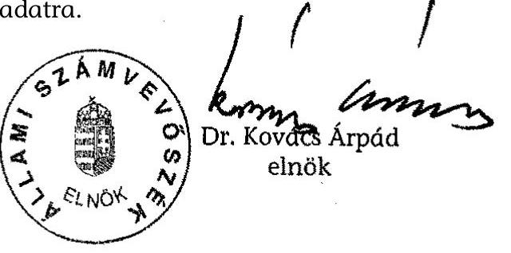

---

# Mellékletek jegyzéke 

a V-02-33/2005. sz. jelentéshez

| 1. sz. melléklet | Jelentéstervezetre tett észrevételek |
| :--: | :--: |
| 2. sz. melléklet | Az Országos Rádió és Televízió Testület, valamint a Műsor-   szolgáltatási Alap jogi szabályozási környezetének és mű-   ködési feltételeinek változása 1996-2005 közötti időszak-   ban |
| 3. sz. melléklet | Az ORTT és a Műsorszolgáltatási Alap költségvetései közötti   2003. évi előirányzat-átcsoportosítás |
| 4. sz. melléklet | A pályáztatási terv témakörében született ORTT határozatok |
| 5. sz. melléklet | Az ORTT munkáját segítő szakértői testületek |
| 6. sz. melléklet | Egyedi támogatásokkal, támogatások visszakövetelésével kapcsolatos adatok, esetleírások |
| 7. sz. melléklet | A Műsorszolgáltatási Alapból nyújtott támogatások |
| 8. sz. melléklet | Táblázatok |
| 9. sz. melléklet | Tanúsítványok |

---

1. sz. melléklet

a V-02-33/2005. sz. jelentéshez

# A jelentéstervezetre tett észrevételek

---

a V-02-33/2005. sz. jelentéshez

# MINISZTERELNÖKI KABINETIRODA   GAZDASÁG- ÉS TÁRSADALOMPOLITIKAI TITKÁRSÁG Helyettes Államtitkár 

Ikt. Szám: 1-2/2667/3/2005
Ügyintéző: Hargitai Gábor
Tárgy: ÁSZ jelentése

Bihary Zsigmond úr
főigazgató
Állami Számvevőszék
Budapest
Tisztelt Főigazgató Úr!
Az Állami Számvevőszék jelentését az Országos Rádió és Televízió Testület és a Műsorszolgáltatási Alap működésének ellenőrzéséről megkaptam, köszönöm.

A tervezetben a Kormány számára megfogalmazott javaslatokkal kapcsolatosan tájékoztatom Önt arról, hogy Miniszterelnök úr utasítást adott az új médiatörvény szövegének kimunkálására. A törvénytervezetnek - mely a jelenleg hatályos törvényt váltaná fel - akkor is el kell készülnie, ha a jelen mandátum alatt nem tűnik reálisnak a képviselők kétharmada támogatásának megszerzése.

Jelentésüket szakmailag magasra értékelem, köszönöm.
Budapest, 2005. június 29.
Tisztelettel:
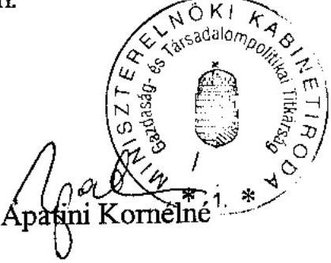

---

# 1088 BUDAPEST, REVICZKY UTCA 5.   TELEFON: 4298706 FAX: 4298763 

ÁLLAMI SZÁMVEVŐSZÉK
ATM-3717/2001
Érkezett: 2005. JÚN. 29.
Iktatószám: V-02-26/01
Melléklet:

Állami Számvevőszék
Bihary Zsigmond úr
főigazgató részére

Budapest,
Apáczai Csere János utca
 10.

## Tisztelt Főigazgató Úr!

F-714-2005.
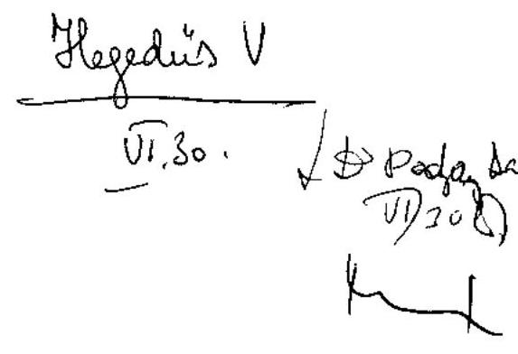

Az Országos Rádió és Televízió Testület és a Műsorszolgáltatási Alap működésének ellenőrzéséről készített, 2005. június 22 -én megküldött jelentéstervezetet áttanulmányoztuk.
A jelentésben foglalt megállapítások kapcsán az Állami Számvevőszék munkatársaival folytatott személyes konzultációra is figyelemmel, észrevételt nem teszünk.

Budapest, 2005. június 29.
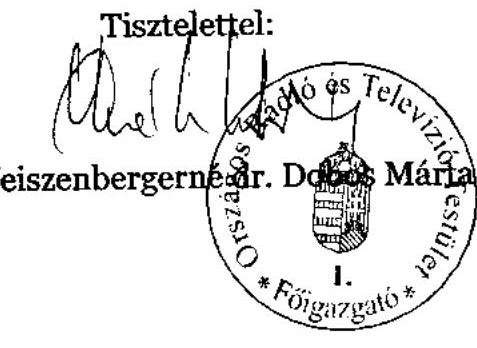

---

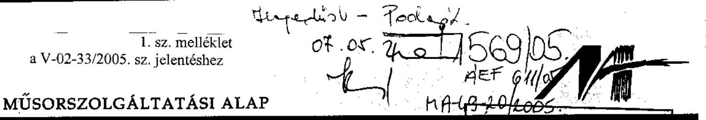

Bihary Zsigmond
Főigazgató
Állami Számvevőszék
1052 Budapest, V.
Apáczai Csere János u. 10

Tárgy: Egyetértési nyilatkozat az Állami Számvevőszék ellenőrzési
jelentéséhez.

# Tisztelt Bihary Úr!

A 2005. június 22-én megküldött ellenőrzési jelentésüket áttanulmányoztuk és munkatársaival, a Műsorszolgáltatási Alap részéről korábban eljuttatott észrevételekben foglaltakat egyeztettük.

A 2005. június 30-án e-mailban megküldött jelentésüket a munkatársaival folytatott egyeztetések figyelembe vételével módosították, ezért azzal a Műsorszolgáltatási Alap részéről egyetértek, további észrevételt nem teszek.

Budapest, 2005. június 30.
Tisztelettel:
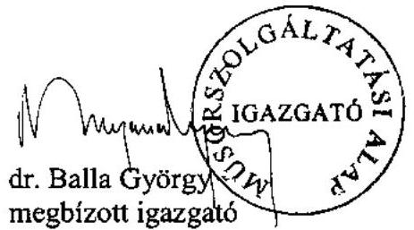

---

# Az Országos Rádió és Televízió Testület, valamint a Műsorszolgáltatási Alap jogi szabályozási környezetének és működési feltételeinek változása 1996-2005 közötti időszakban

Az ORTT (Testület) 1996-ban kidolgozta az Általános Pályázati Feltételeket az országos, körzeti és helyi műsorszolgáltatási jogosultságok elnyeréséhez. A Műsorszolgáltatási Alap (továbbiakban: Alap) ekkor még nem jött létre. A Testület közreműködésével megindult a jelenlegi médiarendszer kialakítása. Még nem dőlt el a finanszírozás jellege és rendszere, a közszolgálati műsorszolgáltatók eladósodottságának megállítása nem kezdődött meg.

1997-ben az ORTT megkötötte a műsorszolgáltatási szerződést az országos kereskedelmi rádiózásra kiírt pályázat nyerteseivel, és megkezdte a helyi és körzeti frekvenciák pályáztatását. Az országos kereskedelmi televíziók működésének megkezdésével kialakul a kereskedelmi és közszolgálati műsorszolgáltatás duális rendszere. Az Alap is létrejött, de az Alap Kezelési Szabályzatát a PM még nem fogadta el. Az ORTT felállította monitoring-rendszerét, ezzel megkezdte felügyeleti és ellenőrző tevékenységét. Az üzemben tartási díjat az állampolgárok nem fizetik rendszeresen, ezért a közszolgálati műsorszolgáltatókat állami támogatásban részesítik.

1998-ban a közszolgálati műsorszolgáltatók elveszítették vezető szerepüket, nézettségük egyharmadára csökkent. Míg 1997-ben a reklám és szponzorációs bevételeik az összbevételük 60\%-át tették ki, 1998-ra ez az érték 35\%-ra csökkent. Ezzel jelentősen megnőtt a közszolgálati média pénzügyi függősége a mindenkori költségvetéstől. Az Alap ettől az évtől kezdte meg teljes körű működését. Elkészült a kezelési szabályzata, és megkapta adószámát. Az ORTT ezt követőleg megkezdhette azt a finanszírozási tevékenységet, amelyet a médiatörvény 77-84. §-ai írnak elő. Az médiatörvényt módosító 1998. évi XC. törvény értelmében az Alap költségvetését az ORTT által benyújtott költségvetés mellékleteként az Országgyűlés hagyja jóvá.

Az ORTT ebben az évben részletes törvénymódosítási javaslatot tett le az Országgyűlés asztalára, melynek eredménye politikai akarat hiányában nem mutatkozott.

A törvénymódosítási javaslat az alábbi lényeges területeket érintette:

- digitális műsorszórási technológiák bevezetése és a velük kapcsolatos fogalmak, eljárási rendszerek meghatározása, szabályozása,
- a Panaszbizottság eljárási rendjének reformja,

---

- ideiglenes műsorszolgáltatás költséges és bonyolult engedélyezési rendjének átalakítása,
- helyi és körzeti műsorszolgáltatói monopóliumok kialakulásának megakadályozására szolgáló rendelkezések kiterjesztése,
- szankciórendszer módosítása,
- közalapítványokkal kapcsolatos rendelkezések módosítása,
- nyilvántartásba vételi eljárás módosítása.

1999-ben lépett hatályba a szerzői jogról szóló 1999. évi LXXVI. törvény, amelynek 110. § b) pontja értelmében hatályát vesztette a médiatörvénynek több bekezdése, ezáltal megszűnt az ellentmondás a médiatörvény 117. §. (2) bekezdés második mondata és a szerzői jogi szabályozás között: a műsorelosztó szervezet nem mentesül a közszolgálati műsorok elosztása után fizetendő szerzői jogdíj fizetése alól, hanem az új rendelkezés szerint ezt az Alap fizeti helyette oly módon, hogy az ORTT-nek minden évben meg kell egyeznie a szerzői jogvédő szervezetekkel a fizetendő díj összegéről. Az Alap által fizetendő jogdíjak forrása az ún. "szabad keret", amely különböző jogcímeken befolyt bevételekből áll. A szerzői jogról szóló törvény módosította a távközlésről szóló 1992. évi LXXII. törvényt is, amellyel korlátozta a távközlési szervezetek részvételét a műsorelosztásban, és a médiatörvényben foglalt korlátozó rendelkezések megtartásának igazolásához kötötte a műsorelosztó távközlési engedélyek kiadását.

Ebben az évben egy könyvvizsgáló céggel átvilágíttatták az Alap tevékenységét, melynek alapján többször módosították a kezelési szabályzatot, az Alapnál Felügyelő Bizottságot állítottak fel, szakértői kollégiumokat hoztak létre, valamint elfogadták az Alap programtervét.

Az ORTT folyamatos tárgyalásainak eredménye volt 2000-ben a 2000. évi CXIII. törvény 64. §-nak rendelkezése, amely módosította az áfa-törvény 16. §át a következők szerint: „Ha a koncessziós jog (ide értve a műsorszolgáltatási jogot is) átengedésekor az ellenérték nem ismert, illetve nem teljes összege ismert, a teljesítés időpontja az egyes részkifizetések esedékességének napja. A törvénymódosítás rendelkezett arról is, hogy a törvény kihirdetése előtt átengedett koncessziós jog ellenértékének a kihirdetés után esedékes részleteire is kiterjed a törvény hatálya, ha még nem fizették meg." Az áfa-törvény módosítása megnyugtató módon rendezte az ORTT és a műsorszolgáltatók kötelezettségét, mivel ettől kezdve a mindenkor esedékes díj arányában kell megfizetniük az áfát.

A Hírközlési Felügyelet az ORTT felkérésére ebben az évben elkészítette három digitális televízió multiplex adóhálózatának frekvenciaterveit, melynek alapján a testület 600/2000. (VII. 12.) számú határozatában közzétette a digitális műsorszórás és műsorterjesztés magyarországi bevezetését és elterjesztését célzó hatásköri feladatait, amely szintén tartalmazta a médiatörvényt módosító javaslatait.

2001 folyamán lépett hatályba a hírközlésről szóló 2001. évi XL. törvény, amely a médiatörvénnyel érintkezik a frekvenciagazdálkodás, a műsorszétosztás a digitális átállás feltételei tekintetében és tisztáz egyes hatósági feladat- és

---

hatásköröket. A Parlament módosította a gazdasági reklámtevékenységről szóló 1997. évi LVIII. törvényt, mely többletkövetelményeket támasztott a műsorszolgáltatókkal szemben. Az ebben az évben módosított köztisztviselők jogállásáról szóló 1992. évi XXIII. törvény rendelkezéseit az ORTT SZMSZ-ben és belső szabályzatain átvezette, illetőleg megvalósította.

2002-ben az Országgyűlés megszavazta a 2002. évi XX. törvényt, a médiatörvény jogharmonizációs célú módosítását az uniós csatlakozás jegyében.

A törvény lényeges módosított rendelkezései a következők:

- A médiatörvény hatáskörébe vonta a műsorszétosztást, bejelentés és nyilvántartás kötelezettségével, a vezetékes és műholdas műsorszolgáltatásra, továbbá kiterjesztette a műsorszétosztásra is az államigazgatási eljárás szabályairól szóló 1957. évi IV. törvény (Áe.) hatályát.
- Meghatározta a vezetékes műsorelosztók nyilvántartásba vételének megtagadására, illetőleg a nyilvántartásból való törlésére irányuló rendelkezéseket.
- A törvénymódosítás kiterjedt a reklám, a támogatás, a kiskorúak védelme, a bírság és az európai, illetve eredetileg magyar nyelven gyártott művek fogalmának és kvótájának meghatározására, illetőleg újraszabályozására.

A Kormány 1110/2002. (VI. 20.) számú határozatában bejelentette az üzemben tartási díj átvállalásának szándékát. Az Országgyűlés a Magyar Köztársaság 2001. és 2002. évi költségvetéséről szóló 2000. évi CXXXIII. törvényt módosító 2002. évi XXIII. törvénnyel felhatalmazta a Kormányt, hogy a médiatörvény 79. §-ának (1) bekezdése szerinti üzemben tartási díj 2002. július-december hónapokra esedékes összegének megfizetését átvállalja. Az összeg megállapításának alapja a 2001. évben ténylegesen beszedett üzemben tartási díjbevétel 107\%-ának 50\%-a, csökkentve 9,55\% (áfával növelt) beszedési költséggel. Az ORTT az alkotmányossági aggályait az Országgyűlés Alkotmány- és Igazságügyi Bizottsága elé terjesztette, de az nem fogadta el.

Az Országgyűlés 2003 novemberében fogadta el a határokat átlépő televíziózásról szóló európai egyezményt módosító, Strasbourgban 1998. szeptember 9én kelt jegyzőkönyv kihirdetéséről szóló 2003. évi CIII. törvényt. A jegyzőkönyv 35. cikk (3) bekezdése a Magyar Köztársaság vonatkozásában 2002. március 1jén lépett hatályba, mely biztosította egyebek mellett a magyar joghatóság kiterjesztését a határon túli televíziózásban.

Az elektronikus hírközlésről szóló 2003. évi C. törvényt az Országgyűlés 2003. november 24 -én fogadta el. A törvény kötelezettségeket határoz meg a digitális televíziózásban szerepet játszó multiplex szolgáltatóra, amely szerint köteles az általa használt adási csatornában továbbítani minden oda kijelölt műsorszolgáltatást. Módosította a médiatörvényt is, amely szerint a műsorszétosztás az e célra rendszeresített nyilvántartásba történő bejelentéssel egyidejűleg kezdhető meg. A következő bekezdésben pedig előírta a bejelentést a tevékenység megkezdése előtt, mely ellentmondásra az ORTT felhívta a figyelmet. A törvény megváltoztatta a vezetékes műsorelosztó vállalkozások vételkörzetére vonatkozó korlátozást is, a korábbi határ kétszeresére, az ország lakosságának egy-

---

harmadára növelve a vételkörzet felső határát. Hatályon kívül helyezte a médiatörvény 126. § (1) bekezdését, amely tiltotta a műsorelosztó vállalkozásban befolyásoló részesedéssel rendelkezőnek más műsorelosztó vállalkozásban való befolyásszerzését.
2004. évben lépett hatályba a mozgóképről szóló 2004. évi II. törvény (filmtörvény) és a végrehajtására kiadott 24/2004. (XII. 8.) NKÖM rendelet. A filmtörvény létrehozta a Mozgókép Koordinációs Tanácsot, amelynek feladatai között szerepel a pályáztatási rendszer és a mozgókép szakmai támogatások fejlesztése. A tanácsnak az ORTT is résztvevője. Ugyancsak ebben az évben fogadta el az Országgyűlés a Nemzeti Audiovizuális Archívumról (NAVA) szóló 2004. évi CXXXVII. törvényt, amely orvosolta a médiatörvény egyik hiányosságát, az archiválást. A NAVA gyűjti, őrzi, nyilvántartja a rádiós és televíziós műsorszámokat a nyilvánosság és a jövő nemzedéke számára. Feladatait az Audiovizuális Örökség Tanácsadó Testület szerzői jogi területen szakértő tagjai - köztük az ORTT egy képviselője is - látják el.

---

# Az ORTT és a Műsorszolgáltatási Alap költségvetései közötti 2003. évi előirányzatátcsoportosítás

## 1. Az ORTT ÁTCSOPORTOSÍTÁSI JOGOSULTSÁGA

Az Országos Rádió és Televízió Testület 1998. évi költségvetéséről szóló 1998. évi LXXXIII. törvény 3. §-ának (2) bekezdése, az 1999. évi költségvetéséről szóló 1998. évi XCII. törvény 4. §-ának (3) bekezdése kimondja, hogy „Az Országos Rádió és Televízió Testület a költségvetési kiadási előirányzatok közötti átcsoportosításra jogosult." Ezekben az években a költségvetési törvény még csak a Testület költségvetését tartalmazta, az Alapét nem. Az Országos Rádió és Televízió Testület 2000. évi költségvetéséről szóló 1999. évi XCVIII. törvényben már az Alapnak is van költségvetése, de a törvény 3. §-a - értelemszerűen - továbbra is csak a saját költségvetésének kiemelt kiadási előirányzatai közötti átcsoportosításra jogosította fel a Testületet.

Első alkalommal az Országos Rádió és Televízió Testület 2001. évi költségvetéséről szóló 2000. évi CXXXIV. tv., majd ezt követően az ORTT valamennyi költségvetési törvényének 5. §-a tartalmazza a következő felhatalmazást: „Az ORTT jogosult az ezen törvényben jóváhagyott költségvetések kiadási előirányzatai közötti átcsoportosításra." Ennek szükségességéről, tartalmáról a költségvetési törvények indoklásai nem szólnak. Az említett költségvetések a következők: az ORTT költségvetése, az ORTT költségvetésén kívüli, de az ORTT által kezelt költségvetés, a Műsorszolgáltatási Alap költségvetése.

A kiadási előirányzatok különböző költségvetések közötti átcsoportosítása maga után vonja a bevételek közötti átcsoportosítás szükségességét is. Az ORTT átcsoportosítási jogosultsága emiatt értelemszerűen különbözik a költségvetési szervek átcsoportosítási jogosultságától. Az utóbbiak esetében a kiadási előirányzatok közötti átcsoportosítás következtében a kiadási főösszeg nem változhat, és ezért a bevételi főösszeg sem változik.

## 2. A 2003. ÉVI ÁTCSOPORTOSÍTÁS INDOKOLTSÁGA

Az ORTT a 2003. évi működéséhez 166 M Ft-ot csoportosított át az Alap költségvetéséből saját költségvetésébe. Ez az összeg az Alap költségvetésében szerepelt eredeti kiadási előirányzatként, „Monitoring-szolgálat, panaszbizottság, döntés-előkészítés" jogcímen. Az ORTT-nél az átcsoportosítást nem előzte meg felmérés, elemzés arról, hogy a monitoring-szolgálat, a panaszbizottság, a döntéselőkészítés területén melyek azok a feladatok, amelyek indokolják az átcsoportosítást. Ennek oka, hogy az átcsoportosítás csak tervezés-technikai művelet

---

volt, amelyet nem valóságos feladatátcsoportosítás, hanem a médiatörvény előírásából és a központi költségvetési támogatás korlátjából következő finanszírozási probléma megoldása vezérelt.

Az ORTT - bízva abban, hogy a működéséhez szükségesnek tartott, 1206,8 M Ft-ra tervezett forrás rendelkezésére fog állni - 2002 júliusában még a saját költségvetéséből fedezte volna a saját feladatkörébe tartozó „Monitoringszolgálat, panaszbizottság, döntés-előkészítés" kiadásait. A tervezés peremfeltételeinek pontosítása során azonban kiderült, hogy az ORTT-nek - a médiatörvény előírásait betartva - az Alap tervezett bevételeiből nem jut elegendő forrás. Az ORTT működési költségeinek médiatörvény szerinti fedezete az ún. üzemben tartási díj $1 \%$-a, amely az Alap egyéb bevételeinek terhére - az üzemben tartási díj maximum 4\%-áig terjedő összegre - kiegészíthető. A Kormány 2002. évi átvállalása következtében az üzemben tartási díj pótlására a központi költségvetésben 2003-ra 20 788,8 M Ft volt előirányozva, amelynek 4\%-a 831,6 M Ft. Ekkor került sor arra a tervezési lépésre, hogy - a fenti feladatokat az ORTT keretein belül hagyva - a feladatok elvégzésének kiadásait az Alap költségvetési kimutatásába helyezték. Az Alappal kapcsolatosan ugyanis a médiatörvény csak az egyes támogatási célokra fordítandó összeg és forrása tekintetében tartalmaz kötelező előírásokat, az Alap működési költségeit fedezeti oldalról nem korlátozza.

Az Országgyűlés Költségvetési és pénzügyi bizottsága előtt egyértelműen szerepelt ez a probléma. A bizottság 2002. november 29-én tartott ülésén az első napirendi pontként szerepelt „Az Országos Rádió és Televízió Testület 2003. évi költségvetéséről szóló törvényjavaslathoz benyújtandó bizottsági önálló indítvány megvitatása az albizottság előterjesztése alapján". A jegyzőkönyv tanúsága szerint az ORTT akkori főigazgatója rámutatott, hogy bár a testület és az iroda költségvetése 831 M forintról szól, „...az Alap költségvetésében látható módon a kiadások 11. címe alatt 166 M forint megnyitásra került olyan kiadások fedezetére, amelyek ez ideig az ORTT kiadásából és költségvetési fedezetéből rendeződtek". Az akkori ellenzék képviselője szerint nem engedhető meg, hogy az ORTT funkciói, amelyek közül a legfontosabb éppen a monitoringrendszer működtetése, az Alap pénzéből legyenek megoldva, hogy az Alap foglalkoztassa azokat az embereket, akik ezt a munkát elvégzik. „...az Alap és az ORTT mint testület működése közötti különbségtétel nem esetleges és végiggondolatlan dolgok következményeképpen alakult ki, hanem nagyon világos munkamegosztásból következik, ezért minden olyan típusú dolog és lépés, amely a két intézmény összemosását és közös működését eredményezi, mindenképpen nagyon komoly visszalépés, és kevésbé átlátható és kezelhető, tiszta helyzetet jelent."

Az átcsoportosítást megelőzően olyan felmérésre, elemzésre nem került sor, hogy a feladatok áthelyezése milyen intézkedéseket igényel, hiszen nem az indokolta az átcsoportosítást.

# 3. AZ ÁTCSOPORTOSÍTOTT ÖSSZEG TARTALMA 

A költségvetési tervjavaslatot alátámasztó részletes számítások szerint a 166 M Ft tartalma a következő:

---

| Megnevezés | Összeg   (M Ft) |
| :--: | :--: |
| Külső személyi juttatások (megbízási szerződések) |  |
| 1. Műsorfigyelés és elemzés | 26,7 |
| 2. Panaszbizottság | 26,1 |
| 3. Egyéb megbízások (előre nem látható feladatok teljesítésére) | 5,0 |
| 4. Összesen | 57,8 |
| 5. Fentiek járulékai | 18,4 |
| Nem anyagi jellegű szolgáltatások (számlás megbízások) |  |
| 6. Műsorfigyelésre és elemzésre leadott terv (1,5 M Ft-tal több mint a 2002. évi előirányzat) | 43,5 |
| 7. A testületi tagok szakértői díjának megemelt kerete ( $400 \mathrm{E} \mathrm{Ft} /$ hó/fő) | 24,0 |
| 8. A Stratégiai Igazgatóság által leadott előzetes tervben szereplő szakértői díj | 4,8 |
| 9. Egyéb, központi döntés alapján felhasználható keret | 5,0 |
| 10. Összesen | 77,3 |
| 11. Fentiekhez áfa | 12,1 |
| Mindösszesen $(4+5+10+11)$ | 165,6 |

Megjegyzések a táblázat tartalmához:

- A Műsorfigyelésre és elemzésre két soron tervezett összegek együtt 70,2 M Ft-ot tesznek ki. Az együttes összeg megegyezik az ORTT Műsorfigyelő és elemző Igazgatóságának 2003. évre vonatkozó nettó (járulék és áfa nélküli) költségigényével.
- A Panaszbizottság 2003. évi működésének költségigénye a Jogi Igazgatóság kalkulációja szerint a $26,1 \mathrm{M} \mathrm{Ft}$ helyett $27,4 \mathrm{M} \mathrm{Ft}$ lett volna, úgy, hogy a panaszbizottsági tagok havi alapdíja és ügyenkénti eljárási díja a 2001. január 1-je óta nem változott.
- A Stratégiai Igazgatóság tervezett külföldi kiküldetési ( 10 M Ft ) és fordítási, tolmácsolási kiadásokat is ( $1,5 \mathrm{M} \mathrm{Ft}$ ), ezek a kiadások benne maradtak az ORTT költségvetésében.

# 4. AZ ÁTCSOPORTOSÍTOTT ÖSSZEG FELHASZNÁLÁSA 

Az ORTT az átcsoportosításhoz értelemszerűen nem fogalmazott meg célokat, feladatokat, határidőket, nem fogalmazta meg, hogy milyen változásokat vár a 166 M Ft forrás felhasználásától. A tárgyban egyetlen határozatot hozott, az

---

1790/2002. (XII. 19.) számú ORTT határozatot a Műsorszolgáltatási Alap 2003. évi költségvetésének átcsoportosításáról.

E szerint: „Az Országos Rádió és Televízió Testület úgy dönt, hogy a Műsorszolgáltatási Alap költségvetési kiadási előirányzatai között monitoring szolgálat, panaszbizottság, döntés-előkészítés címen szereplő összeget az Országos Rádió és Televízió Testület költségvetésének növelése érdekében a kiegészítő támogatások (ORTT) közé átcsoportosítja és felkéri a Műsorszolgáltatási Alapot az összeg 12 egyenlő részletben történő átutalására."

A három terület tényleges kiadásai a számviteli nyilvántartás adatai szerint nem érték el a 166 M Ft -ot, összesen 127 M Ft -ot tettek ki. Az összeg többi részét beruházásra tartalékolták. Az ORTT 2003. évi költségvetésének végrehajtásáról szóló 2004. évi LXXXVIII. törvényben szerepel ez a megtakarítás, és a jóváhagyás is, hogy 2004-ben ez az összeg a digitális adatrögzítési rendszer (DAR) beszerzésére fordítható.

Az Alap könyvvizsgálójának a 2003. évről készült könyvvizsgálói jelentésében szereplő 7 korlátozó tényező közül az egyik azt kifogásolta, hogy a törvény szerint az Alap kiadási előirányzatai között monitoring-szolgálat, panaszbizottság és döntés-előkészítés céljára szereplő összeget nem az Alap költötte el, hanem átutalta az ORTT-nek.

# 5. AZ ÁTCSOPORTOSÍTÁS EREDMÉNYESSÉGE 

A rendelkezésre álló pénzösszeg felhasználása nem eredményezett különösebb változásokat az ORTT-nél. Az átcsoportosítás célja ugyanis nem változások előidézése, hanem egy pénzügyi megoldás volt, amely - az illetékes országgyűlési bizottságok tudtával és egyetértésével - az ORTT médiatörvény szerinti finanszírozásának elégtelenségét volt hivatott áthidalni. Ebből a szempontból az átcsoportosítás elérte célját, eredményes volt.

## 6. KÖVETKEZTETÉSEK

A közel tíz éves médiatörvény előírásai újragondolást igényelnek a feladatokat, támogatási célokat, a finanszírozási problémákat tekintve egyaránt. A forrásokkal való gazdálkodás során alkalmazott tervezési, pénzügyi megoldás elfedi a valóságos gazdálkodási folyamatot, megnehezíti a gazdálkodás átláthatóságát, ellenőrzését, értékelését. Az ORTT olyan költségelemeket állíttatott be átmenetileg az Alap költségvetésébe, amelyeknek feladatoldala átmenetileg sem volt, nem lehetett az Alapnál.

---

# A pályáztatási terv témakörében született ORTT-határozatok 

- 334/1999. (VII. 22.) számú ORTT határozat a Műsorszolgáltatási Alap 1999. II. félévi programtervéről. A Testület elfogadta a programtervet, amelyet a határozathoz mellékletként csatoltak. A programtervben két olyan pályázat is szerepel, amelynek a kiírási határideje megelőzi a határozathozatal időpontját.
- 374/2000. (V. 2.) számú ORTT határozat a Műsorszolgáltatási Alap 2000. évi pályáztatási programtervéről és 2001. évi pályáztatási programtervének alapelveiről. A Testület a 2000. évi programtervvel kapcsolatban változtatásokról döntött, a mellékletként csatolt 2001. évi előzetes programtervet elfogadta. Az előzetes programterv lényegében egy vázlatnak felel meg, amely még nem alkalmas az adott évi munka irányítására.
- 484/2000. (VI. 8.) számú ORTT határozat a Műsorszolgáltatási Alap 2000. évre érvényes pályázati terve tárgyában. A Testület elfogadta a mellékletként csatolt 2000. évre érvényes pályázati naptárt. Egyben felhívta a Műsorszolgáltatási Alap igazgatóját, hogy a szükséges eszközök felhasználásával gondoskodjon az érintettek lehető legszélesebb körének tájékoztatásáról, különös tekintettel a két országos napilapban és a Kulturális Közlönyben való megjelenésre, valamint a Műsorszolgáltatási Alap honlapján történő elhelyezésre. A pályázati naptárban a tervezett 13 pályázat közül 4 kiírása június előtti.
- 928/2001. (V. 30.) számú ORTT határozat pályázati felhívás filmalkotások támogatására, sorozatok és folyóirat, könyvkiadás támogatására. A 2000. V. 2-án elfogadott 2001. évi előzetes programtervben nem szerepel folyóirat és könyvkiadás támogatása, a 2001. évi végleges programtervről nincs testületi határozat.
- 1352/2002. (IX. 18.) számú ORTT határozat a Műsorszolgáltatási Alap 2002-2003. évre vonatkozó pályáztatási tervéről. A határozatnak nincs összefoglaló naptármelléklete, magából a határozatból pedig nem derül ki, hogy a benne szereplő 14 pályázati felhívást mikorra tervezte kibocsátani a Testület.
- 1353/2002. (IX. 18.) számú ORTT határozat a Műsorszolgáltatási Alap 2002-2003. évre vonatkozó pályáztatási tervéről. Kizárólag egy konkrét pályázati felhívásról szól, amit a médiatörvény 131. §-ának (3) bekezdése terhére kábeltelevízió-hálózatok fejlesztésére terveztek kiírni.

---

- 1043/2003. (VII. 2.) számú ORTT határozat. Címe nincs. Tartalma: a Műsorszolgáltatási Alap igazgatója készítsen előterjesztést a Testület által közzétenni kívánt 4 pályázati felhívásról, illetve a pályázati eljárások meghirdetésének lehetőségéről.
- 1140/2003. (VII. 9.) számú ORTT határozat az Országos Rádió és Televízió Testület és a Magyar Mozgókép Közalapítvány jövőbeni közös pályázati eljárásának rendjéről. Csak 2003-ban volt közös pályáztatás.
- 699/2004. (V. 20.) számú ORTT határozat a Műsorszolgáltatási Alap 2004-2005. évre javasolt pályázati eljárásairól, illetve lehetséges támogatási céljairól. A 8 pontos határozatban vannak olyan támogatási célok, ahol már biztos a támogatási keret nagysága, de más konkrétum nem, vannak olyanok, ahol csak a támogatás éve biztos, vagy olyanok, ahol csak a pályázati felhívás közzétételének időpontja van meghatározva, és olyanok is, ahol csak a témakör biztos. Minden másra a Testület az Alaptól kér javaslatot.
- 828/2004. (VI. 17.) számú ORTT határozat. Címe nincs. Tartalma: a Testület felkéri a Műsorszolgáltatási Alapot, hogy készítse el a határozatban felsorolt 5 pályázati cél megvalósítását célzó pályázati felhívásokat. Ezek közül egy sem szerepel az előző - 699/2004. (V. 20.) számú - ORTT határozatban.
- 1093/2004. (VIII. 31.) számú ORTT határozat a Műsorszolgáltatási Alap 2004-2005. évi támogatási tervéről. A határozat szövege szerint a Testület a 2005-ben az 1996. évi I. törvény szerint meghirdetendő - 131. § (3) bekezdés és 78. § (1) bekezdés szerinti - pályázati eljárások kereteit és ütemezését fogadta el, de az ütemezés szerint ezeket egy kivétellel már 2004. IV. negyedévben meghirdették.
- 1792/2004. (XII. 2.) számú ORTT határozat a Műsorszolgáltatási Alap 2005. évi támogatási tervéről. A Testület 16 pontban döntött témákról és keretekről. Pályázati kiírási időpontokról nincs szó a határozatban.
- 1824/2004. (XII. 9.) számú ORTT határozat a Műsorszolgáltatási Alap 2005. évi támogatási tervéről. A Testület az egy héttel korábban elfogadott keretösszeget ( 2,5 Mrd Ft, amelyből 500 M Ft tartalék) 4 Mrd Ft-ra megemelte, és döntött arról, hogy 2005-re a határozat mellékletét képező pályázati felhívásokat hirdeti meg. Felhívta a Műsorszolgáltatási Alap igazgatóját, hogy a pályázati felhívás szövegtervezetét a határozat melléklete szerinti időrendben terjessze a Testület elé. A melléklet összefoglaló pályázati naptárt is tartalmaz.

---

# Az ORTT munkáját segítő szakértői testületek 

A Szakértői Tanács létrehozása előtt az Alap és a Testület munkáját ún. szakértői kollégiumok segítették. A kollégiumok működését az Alap szervezeti és működési szabályzata említi, de kezelési szabályzata nem. A szervezeti és működési szabályzat azonban arról nem szól, hogy milyen szakterületeken
 kell szakértői kollégiumokat működtetni, és hány fővel. Gyakorlatilag egy médiatudományi és egy jogi szakértői kollégium működött 1999. október 1. és 2004. február 29. között a Műsorszolgáltatási Alap költségvetése terhére, kollégiumonként 56 fővel. Mindkét kollégium tagjai havi bruttó 200 E Ft megbízási díjban részesültek. Ezen idő alatt a jogi kollégium 4 ügyben, a médiatudományi kollégium egy ügyben kapott a Testülettől felkérést állásfoglalás elkészítésére. Az utóbbiról írásos dokumentum sem készült. A jogi kollégium négy állásfoglalása közül egy volt kapcsolatos az Alap támogatási tevékenységével: a jogi kollégium 2000-ben közreműködött a visszatérítendő támogatásokra vonatkozó szerződés előkészítésében.

A négy tagból és az elnökből álló Szakértői Tanács költségvetése ugyancsak a Műsorszolgáltatási Alapot terheli. A tanács tagjai megbízási jogviszony keretében végzik tevékenységüket, havi díjazásuk 300 E Ft/fő. Megbízatásuk 2005. december 31-éig szól. A tanács ügyrendjét, 2005. évi munkatervét és 2005. évi költségvetését a Testület 2005. február 3-án fogadta el. A Szakértői Tanács ügyrendje szerint a tanács is igénybe vehet szakértőket a munkájához.

A Szakértői Tanács elfogadott 2005. évi munkaterve március végéig a következő feladatokat tartalmazza:

- A Műsorszolgáltatási Alap pályázati és ellenőrzési szabályzatának véleményezése. Határidő: 2005. február 15.
- Állásfoglalás a Testület mellett működő Bíráló Bizottságok Ügyrendjéről. Határidő: 2005. február 15.
- Az ORTT 2005. évi támogatási tervének véleményezése. Határidő: 2005. február 28.
- Állásfoglalás az ORTT pályázati tevékenységének elvi kereteiről. Határidő: 2005. március 15.
- Az ORTT pályázati-felhívás tervezeteinek véleményezése. Határidő: folyamatos.

A helyszíni ellenőrzés idején - 2005. április elején - a fenti feladatok elvégzéséről csak a negyediknek volt írásos dokumentációja, a többinek még nem. A ne-

---

gyedik feladat dokumentuma gyakorlatilag a jelenleg működő szakértői tanács egyik tagja által 2004 májusában írt szakértői tanulmány kb. kétoldalnyi kivonata. A szakértői tanulmányt a szerző a SKEP keretében 2004. május 10-én kötött szerződés alapján készítette 600 E Ft szerzői jogdíj ellenében. A kritikus szemléletű szakértői tanulmányban foglaltakat tehát nem az ORTT vagy a Műsorszolgáltatási Alap hasznosította közvetlenül, hanem első lépésként a Szakértői Tanács profitált belőle.

---

# Egyedi támogatásokkal, támogatások visszakövetelésével kapcsolatos adatok, esetleírások 

Az Alap 2004. évi IV. negyedévi tevékenységéről szóló beszámoló mellékletében az egyedi kérelemre odaítélt támogatások között hét olyan esetet találtunk, amely nem szerepelt a 2000-2004. években az ORTT éves beszámolóiban nyilvánosságra hozott egyedi támogatások között.

Három esetben a 77. § (1) bekezdése alapján nyújtott támogatásról volt szó:

- Magyar Szociológiai Társaság - Az információs társadalom, tudományos konferencia, 2003. XI. 19-20. - 1,6 M Ft;
- F.J.P. Művészeti és Szolgáltató Bt. (Fiala János) - Mi történt azóta? c. tanulmány -2 M Ft;
- Népfőiskola Alapítvány, Lakitelek - Kistérségi és Kisközösségi Televíziók III. Filmszemléje - 11,5 M Ft.

Négy esetben pedig a 131. § (3) bekezdés alapján nyújtott támogatásról volt:

- Gáz - Markt Kft. - Kétpó, Szászberek - 30 M Ft,
- Telekom Kft. - kábeltelevízió-hálózat fejlesztése - Szeged-Alsóváros szolgáltatási terület $-9,1 \mathrm{M} \mathrm{Ft}$,
- Antenna Hungária Rt. - a DVB-T sugárzás budapesti és kabhegyi üzemszerű beindítása - 220 M Ft,
- Lát-Sat Kft. - felülvizsgálati kérelem - Nagykorpád, Somogyudvarhely, Bolhó, Bolhás, Mike - 61,8 M Ft.

A fenti beszámoló mellékletben bemutatott - kifizetett támogatások visszaköveteléséről szóló - ügyek öt csoportját és azok főbb adatait a következő táblázat foglalja össze.

---

| Megnevezés | Ügyek   száma | Visszaköve-   telt összeg   (M Ft) | Visszafize-   tett összeg   (M Ft) | Fennma-   radó tőke-   követelés   (M Ft) |
| :-- | --: | --: | --: | --: |
| Fizetési meghagyásos szakaszban   lévő visszaköveteléses ügyek | 10 | 113,0 | 0,0 | 103,6 |
| Peres szakaszban lévő visszakövetel-   léses ügyek | 16 | 166,3 | 0,2 | 166,3 |
| Végrehajtási/felszámolási szakasz-   ban lévő ügyek | 14 | 55,9 | 7,3 | 53,4 |
| Visszakövetelések, amelyek esetében   a Testület fizetési haladékot engedé-   lyezett | 2 | 60,0 | 0 | 60,0 |
| Visszakövetelések, amelyek esetében   a Testület részletfizetést engedélye-   zett | 5 | 86,3 | 13,8 | 72,5 |
| ÖSSZESEN | 47 | 481,5 | 21,3 | 455,8 |

A 47 ügyből 44 esetben műsorszám készítéséhez nyújtottak támogatást. A visszakövetelés megnevezett jogcíme változatos: szerződésszegés, beszámolási kötelezettséget nem teljesítése, támogatás másra, céltól eltérő felhasználása, a műsorszám nem valósult meg, az elszámolás nem volt szerződésszerű, hibás elszámolás, hiányos elszámolás stb. Műsorszám 9 esetben nem valósult meg, emiatt összesen 214 M Ft-ot követel vissza az ORTT. Ezek közül a két legnagyobb összegű visszakövetelés: a Megafilm Kft.-nek a Mr. Fanatic c. film elkészítéséhez 2001-ben kifizetett 60 M Ft-os támogatás és részben annak kamatai, illetve a Film Foundation Alapítványnak a Why c. film elkészítéséhez 2002-ben kifizetett 86 M Ft támogatás.

Az ORTT 294/1999. (VII. 1.) számú határozatával döntött televíziós közszolgálati műsorszám-támogatási pályázatok kiírásáról. Ez volt az ún. 8 filmes pályázat, mert nyolcféle kategóriában írtak ki pályázati felhívást. Az egyik kategória volt a magyarországi televíziós műsorszolgáltatók és produceri irodák számára kiírt pályázat magyarországi gyártású játékfilm, valamint egész estés animációs film készítésének támogatására.

A pályázati kiírás vissza nem térítendő támogatásról szólt, a támogatási keretet 200 M Ft-ban állapította meg. Egy filmalkotás elkészítéséhez maximum 25 M Ft - de játékfilm esetében az összköltségnek legfeljebb 20\%-a, egész estés animációs film esetében 50\%-a - támogatást ígért a felhívás. Közölte azt is, hogy a pályázatokat eseti bíráló bizottság értékeli, és ajánlását a Testület elé terjeszti. Az ajánlás alapján a Testület 15 napon belül dönt a pályázatok támogatásáról. A Testület döntése után 8 munkanapon belül az Alap közleményt jelentet meg a pályázat lezárásáról, a támogatás nagyságáról stb.

---

A pályázati kiírásra 76 db pályázat érkezett. Az eseti bíráló bizottság 17 filmre összesen 320 M Ft támogatást javasolt.

A Testület 1999. november 29-én határozott a támogatásokról. Az eseti bíráló bizottság ajánlását csak részben fogadta el. Kedvezményezetté nyilvánított még 15 pályázót, az ajánlott támogatás összegét helyenként megnövelte, illetve visszatérítendő támogatással kiegészítette. Az eredetileg tervezett 200 M Ft-os támogatás helyett végül is 680 M Ft-ot osztott el a Testület. 1999. december 8-án abban is határozott, hogy az összes többi pályázót forráshiány miatt nem részesíti támogatásban. A lezáró határozat ellenére 2000. január 27-én további két támogatásról, 2000. február 2-án további egy támogatásról döntött, összesen 75 M Ft értékben.

Visszatérítendő támogatásról nem volt szó a pályázati kiírásban, tehát a pályázók nem tudhattak róla, hogy ilyen kérhető. Pályázatukban azok sem kérték, akik végül ilyet kaptak.

A Megafilm Kft. az alábbi 3 filmmel pályázott, és mindhárom filmje már az eseti bíráló bizottság ajánlása alapján is a kedvezményezettek között volt. A pályázataival kapcsolatos főbb adatokat a következő táblázat foglalja össze.
(M Ft)

| A műsorszám címe | Összköltsége | ORTT-től kért   támogatás | Javasolt tá-   mogatás | Ténylegesen   kapott összeg |
| :-- | :--: | :--: | :--: | :--: |
| A ludak megfagynak   (Vakvagányok) | 109 | 50 | 25 | $25+25^{*}$ |
| Ezt a nagy szerelmet   tőled kaptam én (Ham-   vadó cigarettavég) | 156 | 45 | 10 | $10+35^{*}$ |
| Mr. Fanatic | 1300 | 60 | 20 | $20+40^{*}$ |

* visszatérítendő támogatás
A Megafilm Kft.-nek nyújtott támogatások mindhárom esetben eltértek a pályázati kiírástól, mert 25 M Ft-nál több támogatást kaptak. Az első két film esetében eltértek a pályázati felhívásban megszabott azon korláttól is, hogy az összköltségnek legfeljebb 20\%-a lehet a támogatás. A két első film elkészült, és a visszatérítendő támogatásból az első film után 4,5 M Ft-ot, a második után 1 M Ft-ot visszafizetett a kft. 2002 októberében kérte a még fennálló két tartozásának - 54,5 M Ft-nak -vissza nem térítendő támogatássá minősítését. A Testület 1739/2002. (XII. 11.) számú határozatával a tartozás visszafizetésétől méltányosságból eltekintett. A harmadik filmet a támogatási szerződések szerint 2000. október 31-ig kellett volna elkészíteni, és 2001. április 30-ig televíziós műsorban bemutatni. A film elkészítéséhez többször kért és kapott határidőmódosítást a kft. A 1739/2002. (XII. 11.) számú határozat a műsorszám befejezésének határidejét 2003. március 31-ben határozta meg. 2003. március 20-án a producer újabb határidő-módosítást kért, 2004. december 31-re. Ezt a kérelmet a Testület már nem fogadta el, 2003. május 6-án határozott a támogatási szerződéstől való elállásról és a támogatások visszaköveteléséről. 2005. február 28-án közjegyzői okiratba foglalták a még fennálló $55,4 \mathrm{M}$ Ft tartozást részle-

---

tekben történő visszafizetésének módját. 15,4 M Ft-ot 31 hónap alatt, 40 M Ft-ot 80 hónap alatt vállalta visszafizetni a Megafilm Kft.

Az ORTT 1324/2001. (X. 3.) számú határozatával a 45 percnél hosszabb, televíziós közszolgálati filmalkotás készítésének vissza nem térítendő támogatását határozta el. A pályázat kiírásban a támogatási keret 750 M Ft volt.

A pályázatokat közjegyző jelenlétében 2001. december 10-én bontották fel. Ez alkalommal az eseti bíráló bizottság elnöke a beérkezett 14 pályázatból 4-nek a befogadását sem javasolta, mert hiányosak voltak. A négy között volt a Film Foundation Alapítvány pályázata is, azzal az egyéb megjegyzéssel, hogy a pályázati dokumentáció teljesen kaotikus, áttekinthetetlen, így a pályázati kiírás 9./j) pontjának semmilyen vonatkozásban nem felel meg. A Testület valamennyi pályázatot befogadta.

Az eseti bíráló bizottság határidőre elvégezte tartalmi értékelő feladatát, amelynek eredményeként 9 pályázatot javasolt támogatásra, összesen 715 M Ft összeggel, 5 pályázati kérelmet pedig - köztük a Film Foundation Alapítványét is 2 igen és 5 nem szavazattal - nem javasolt. A Film Foundation Alapítvány pályázatát az eseti bíráló bizottság az ajánlásában sem szakmailag, sem tartalmilag, sem formailag nem tartotta érdemesnek az ORTT támogatására.

A Testület a 183/2002. (I. 30.) számú határozatával elfogadta az eseti bíráló bizottság javaslatát, és a pályázati eljárást lezárta. Ezen a testületi ülésen 3 igen szavazattal 3 tartózkodással nem fogadták el egyik testületi tag azon javaslatát, hogy emeljék meg a pályázati keretet úgy, hogy abba beleférjen a Film Foundation Alapítvány kérelme is. Másnap az Alap honlapján megjelent a közlemény a pályázati eljárás eredményéről.

A pályázati felhívás 11./j) pontja szerint „Az ORTT döntésének felülvizsgálatát kérni nem lehet." A Testület következő ülésén - 2002. február 6-án - sürgősséggel napirendre vette Film Foundation Alapítvány pályázatának ügyét. Az előző ülésen javaslatot tett testületi tag módosító indítvánnyal változatlanul fenntartotta azt a javaslatát, hogy a Testület növelje meg ennél a pályázatnál a keretösszeget, és minősítse nyertessé a Why című pályaművet. Ezen az ülésen a javaslattal szemben egyetlen egy észrevétel hangzott el, éspedig az, hogy
 A Testületnek van egy általános érvényű határozata, hogy több határozatot nem nyit fel. Az ülést levezető elnök válasza erre az volt, hogy a kivétel erősíti a szabályt. 4 igen szavazattal, 1 ellene, 1 tartózkodás mellett elfogadták a határozati javaslatot. A Testület 257/2002. (II. 6.) számú határozatával 95 M Ft támogatással kedvezményezetté nyilvánította a Film Foundation Alapítványt.

A következő testületi ülésen - 2002. február 11-én - az egyik testületi tag tájékoztatta a Testületet arról a vesztegetési kísérletről, amely őt érte a kedvezményezett részéről a fenti döntést megelőző napon. A Testület nem volt felkészülve az ilyen esetek kezelésére. A támogatási szerződést csak 2002 novemberében - a vesztegetési kísérlet ügyében folytatott nyomozás lezárását követően - kötötték meg azzal, hogy a kedvezményezett 2002. december 31-éig elkészíti a filmet. A 95 M Ft támogatási összegnek a pályázati felhívás szerinti $80 \%$-át - 76 M Ft-ot - is 2002 novemberében utalták át az Alapítványnak előfinanszírozás címén. (A fennmaradó 19 M Ft utófinanszírozásként - a mű elkészülte után, a pénz-

---

ügyi beszámoló elfogadását követően - illette volna meg a támogatottat.) Ezt követően a támogatott követelésére a Testület az 542/2003. (IV. 24.) számú határozatával újabb 5 M Ft támogatást ítélt meg az Alapítványnak, továbbá hozzájárult a film befejezési határidejének 2003. december 31-ére történő módosításához, és egyben 10 M Ft átutalásáról is döntött. A határozat szövege szerint a Testület „...a kérelemtől eltérően csak 5000000 Ft póttámogatással növeli meg az utófinanszírozás összegét, melyből 10000000 Ft 8 munkanapon belüli átutalását rendeli el." Ez a határozat gyakorlatilag nem növelte, hanem csökkentette az utófinanszírozás összegét 5 M Ft-tal. A 100 M Ft összes támogatásból így 86 M Ft - 86\% - került a kedvezményezetthez előfinanszírozásként. 2003-ban a kedvezményezett Alapítvány folyamatosan támadta követelésekkel és be is perelte az ORTT-t. Az ORTT 2004. január 14-én úgy döntött, hogy a támogatási szerződéstől eláll, és viszontkeresettel kamatostul visszaköveteli az átutalt 86 M Ft-ot, mert 2003. december 31-ére a mű nem készült el. A peres eljárás még nem zárult le, de első fokon pert nyert az ORTT és az Alap az Alapítvánnyal szemben.

---

# A Műsorszolgáltatási Alapból nyújtott támogatások 

Az ügyiratok kiválasztása a támogatási összeg alapján rétegzett adatbázisból véletlen mintavétellel történt. Az előkészített ügyiratok közül a rendelkezésre álló idő alatt - a jelentésben már ismertetett két filmtámogatáson kívül - az alábbiakat tekintettük át részletesen.

## 1. A MÉdiatÖRVÉny 77. § (1) bekezdése szerint Nyújtott TÁMOGATÁSOK

### 1.1. MA-3121/2004. iktatószámon nyilvántartott egyedi támogatási kérelem

A Zikkarut Színpadi Ügynökség Kft. kérelmet nyújtott be 2004. október 8-án az ingyenes „Illés Koncert, 2005" c. produkcióra, amelynek helye és ideje Csíkszereda, 2005. július 3.

A Testület 2004. december 2-án döntött a kért 37 M Ft támogatás odaítéléséről.
A támogatási szerződést - amely címe szerint „B-típusú" egyedi előfinanszírozási szerződés - 2004. december 17-én aláírták. A különféle finanszírozási szerződésekről az Alapnál nincs katalógus. A szóbeli tájékoztatás szerint „B-típusú" támogatási szerződést akkor kötnek, ha valaki előre kéri a teljes összeget az ORTT-től, mert nincs se saját pénze, se más támogatója.

A szerződés szerint az odaítélt összeget a következő részletekben kapta, illetve kapja a támogatott: 2004. IV. negyedévben 18,5 M Ft-ot, 2005. március 31-éig 9,25 M Ft-ot, 2005. június 15-éig $9,25 \mathrm{M}$ Ft-ot. A költségvetésben az igényelt összeg közel fele honorárium, ami feltehetően a produkció megvalósulása után esedékes.

### 1.2. MA-2230/2004. iktatószámon nyilvántartott egyedi támogatási kérelem

Az Országos Széchenyi Könyvtár 2004 májusában kérelmet nyújtott be a 2001. január 1. óta folyó, „Öt országos televízió-műsor adásfolyamának rögzítése, kutathatóvá tétele, fő műsoridőben megjelenő hírműsorainak digitalizálása és feldolgozása" c. program 2005. évi támogatásáért.

A támogatási szerződést 2004. október 8-án írták alá 33 M Ft támogatásról. A szerződésen nincs megjelölve a szerződés típusa. A támogatási szerződés 3.1. pontja szerint a támogató a támogatást a 2.11. pont szerint igényelt ütemezés-

---

sel fizeti ki a kedvezményezettnek. A 2.11. pontban a következő áll: „A Kedvezményezett a jelen szerződés aláírását megelőzően írásos nyilatkozatban rögzítette, hogy jelen szerződés aláírását követő naptári negyedévekre a Támogatás mely összegű minimális részleteinek előzetes folyósítása szükséges elengedhetetlenül a Támogatott Beszerzések lebonyolításához; a jelen szerződés aláírásával tudomásul veszi, hogy ennek szükségességét az általa benyújtott Beszámolóban igazolnia kell."

A kedvezményezett a hivatkozott nyilatkozatában azt rögzítette, hogy a 33 M Ft-ot 2004. IV. negyedévben, a szerződés aláírásának keltét követő 10. munkanapon kéri. Annak ellenére, hogy a „Pénzügyi nyilatkozat az egyedi támogatási kérelemhez" c. nyomtatvány - amely a szerződés melléklete, de nincs rajta feltüntetve, hogy hányadik - 6. pontja így szól: „Kijelentem, hogy az alábbi egyes támogatott időszakra vonatkozóan az ORTT által megítélt támogatás 80\%-ának (előfinanszírozás) a következő minimális részletek szerinti folyósítása szükséges elengedhetetlenül a támogatási cél megvalósításához:..." A támogatott időszak negyedéves bontást tartalmaz. Az átutalási ügyirat már 100\%-os egyedi előfinanszírozásról szól. 2004. október közepén az Alap át is utalta az Országos Széchenyi Könyvtárnak a támogatást.

A dokumentumok között nincs magyarázat arra, hogy az egy évig tartó munkához miért volt elengedhetetlenül szükséges a teljes költséget előre megfinanszírozni. A kérelemhez mellékelt és elfogadott költségvetés hiányos, nagyvonalú. Ahhoz képest például, hogy egy műsorszórás korszerűsítéséhez szükséges pályázaton 385 E Ft tényleges támogatás elnyeréséhez milyen mennyiségű műszaki és pénzügyi dokumentációt kell a pályázónak benyújtania. A 33 M Ft-ból 6,4 M Ft magnók, VHS-kazetták, DVD-lemezek beszerzési költsége, 26,6 M Ft pedig a feldolgozás költsége. Nincs részletezve, hogy a feldolgozás címén egy összegben beállított 26,6 M Ft miből áll. A 2004. évi egész éves munkára szóló támogatást - 33,21 M Ft-ot - 2003. november 24-én utalták át, és a kedvezményezett 2004. március 24-ig teljes egészében elköltötte, továbbutalta, és a könyvvizsgálót is kifizette belőle. Könyvvizsgálót e támogatás elszámolásánál is köteles alkalmazni a kedvezményezett, de a költségvetés erről sem szól.

### 1.3. MA-1288/2003. iktatószámon nyilvántartott egyedi támogatási kérelem 

A Fórum Film Alapítvány a 2003. május 19-21-én megrendezendő „Fórum Filmnapok 2003" támogatásáért 2003. április 15-én nyújtott be kérelmét az ORTT-hez.

A rendezvény költségeiből a Nemzeti Kulturális Alapprogram (NKA) 400 E Ft kifizetését vállalta a 2002. december 3-án kelt támogatási szerződésben, egy 2002. szeptember 26-i költségvetés alapján. Az NKA a szerződésben kikötötte, hogy a támogatásból esztéta, újságíró tiszteletdíja és ezek tb-járuléka nem fizethető.

Az ORTT-től a rendezvény teljes költségéből még hiányzó 589,6 E Ft-ot kérték támogatásként, amely összeget az ORTT egy 2003. május 15-én benyújtott költségvetés alapján 2003. június 4-én utófinanszírozás formájában jóvá is hagyott. A szerződést - amely címe szerint „A" típusú egyedi utófinanszírozási

---

támogatási szerződés - 2003. július 4-én írták alá, az összeget pedig 2003. július 9-én átutalta az Alap. A szóbeli tájékoztatás szerint akkor kell „A" típusú egyedi utófinanszírozási támogatási szerződést kötni, ha a támogatást a támogatási cél megvalósulása után kérik.

A támogatási szerződés 2.3. pontja szerint „A Támogatott a jelen szerződés aláírásával egyidejűleg átadja a Támogatónak a Támogatási Cél megvalósítása során felmerült költségek tételes, a Kérelem részeként benyújtott költségvetésnek megfelelő szerkezetben összegzett lajstromát (4. melléklet)" A szerződéskötéshez 2003. június 20-án benyújtott lajstrom pontosan megegyezik a májusi kérelemhez benyújtott „A program költségvetése" c. dokumentummal.

A szerződés megkötése, a támogatás átutalása előtt nem kérték a kifizetett számlák bemutatását a tényleges költségek igazolására. A szerződésben sincs szó ellenőrzésről.

## 2. A MÉDIATÖRVÉNY 78. § (1) BEKEZDÉSE SZERINT NYÚJTOTT TÁMOGATÁSOK 

### 2.1. MA-5912/16/NP1/2000. iktatószámon nyilvántartott pályázati kérelem

A Civil Rádiózásért Alapítvány 2000 augusztusában pályázatot nyújtott be támogatásra nem nyereségérdekelt műsorszolgáltatói tevékenységének fejlesztéséhez. Az eseti bíráló bizottság ajánlása alapján az ORTT 6 M Ft vissza nem térítendő támogatásban részesítette az alapítványt, az erről szóló szerződést 2001. február 7-én írták alá. A 6 M Ft 90\%-át előfinanszírozásként 2001. február 7-én átutalta számára a Műsorszolgáltatási Alap.

A fejlesztés készre jelentési határideje 2001. április 30. volt, de a kedvezményezett csak felszólításra nyújtotta be beszámolóját, 2001. június 14-én. A beszámoló nemcsak hiányos volt, hanem - összevetve a pályázati kiírással, a pályázati dokumentációval és a támogatási szerződéssel - a műszaki szakértő megállapította, hogy a pályázó non-profit pályázatra rádiós műsorszóró rendszer fejlesztésére szóló műszaki anyagot adott be. A beruházást az elfogadott pályázatának megfelelően valósította meg, a készre jelentést viszont a vele kötött nonprofit támogatási szerződésnek megfelelően készítette el. (A kétféle pályázati lehetőség között a műszaki tartalmán kívül finanszírozási különbség is van: a non-profit kiírásnál nagyobb az igényelhető összeg és a saját forrás meglétéhez elegendő a teljes költségvetés $25 \%$-a, viszont a rádiós műsorszórós pályázat esetében $50 \%$-os önerő szükséges.) A pályázatot az eseti bíráló bizottság annak idején kedvezően véleményezte. Ezután az Alapnál több menetben követték egymást a hiánypótlásra felszólító levelek és azokra a hiánypótlás, végül 2001. november 5-én az odaítélt támogatás fennmaradó $10 \%$-át is átutalták a kedvezményezettnek.

A dokumentumok között nem szerepel sem az előterjesztés, amelyben a Testületet tájékoztatták az esetről, sem a Testület határozata, amelyben úgy döntött, hogy nem szankcionálja a készre jelentési határidő be nem tartását, illetve a támogatási cél megvalósulásaként elfogadja a beszámolót. Csak hivatkoznak

---

rá a Civil Rádiózásért Alapítvány elnökének írt értesítő levélben és az átutalásról rendelkező ügyiratban.

## 3. A MÉDIATÖRVÉNY 78. § (2) BEKEZDÉSE SZERINT NYÚJTOTT TÁMOGATÁSOK 

### 3.1. MA-2778/32/A/99. iktatószámon nyilvántartott pályázati kérelem

A Magyar RTL Televízió Rt. a 294/1999. (VII. 1.) számú ORTT határozattal kiírt pályázaton a „Játszd újra, Hippolyt!" c. film elkészítéséhez nyert 8 M Ft vissza nem térítendő és 17 M Ft kamatmentes visszatérítendő támogatást.

Az iktatószámra hivatkozás az ügyiratokon nem következetes. Az iratok rendezetlenek, nincs kronológiai sorrend közöttük. Nincs az iratok között az az igazolás sem, hogy a pályázatot mikor adták be. Hiányzik az Alap 2001. január 22-én kelt - az elszámoláshoz hiánypótlásra felszólító - levelére a válasz.

A dokumentáció terjedelmes. Rengeteg levelezés félreértések, egyeztetések miatt, amely tartalmát tekintve a filmnek ítélt 17 M Ft visszatérítendő támogatásról szóló szerződéssel volt kapcsolatos. Mindez arra utal, hogy a pályázat kiírásakor még nem tervezett visszatérítendő támogatás ötletszerű bevezetése (az egyik testületi tag a testületi ülés napján terjesztette elő erre vonatkozó módosító indítványát, amit Testület egy az egyben elfogadott) miatt az Alap nem volt felkészülve ennek az újszerű feladatnak lebonyolítására.

A pályázati felhívás szerint a kedvezményezetté nyilvánításról szóló értesítés kézhezvételétől számított 90 napon belül a támogatási szerződést meg kell kötni. A kedvezményezetté nyilvánító 604/1999. (XI. 29.) számú ORTT határozatban az állt, hogy a visszatérítendő támogatás feltétele, hogy a filmet a 31. Magyar Filmszemlén bemutassák,
 és a támogatást a film forgalmazásának elkezdése után hat hónapon belül a Műsorszolgáltatási Alapnak visszafizessék.

A kétféle támogatásra a kétféle szerződést 2000. augusztus 8-án írták alá. A szerződések szerint a filmet 2000. december 31-éig a szerződés szerinti televíziós műsorban be kell mutatni, és a folyósított támogatást a film forgalmazása megkezdésének napját követő 365. napig kell visszatéríteni.

A Testület 816/2001. (VI. 06.) számú határozata a kedvezményezett kezdeményezésére szerződésmódosítást fogadott el. E szerint a műsorszám bemutatási határideje 2001. december 31-ére változott. A szerződésmódosítás aláírását követő 8 munkanapon belül utalták át a 17 M Ft visszatérítendő támogatás. A visszafizetési határidőt 2002. március 1-jében határozták meg. A kedvezményezett 2001. februári levele szerint a film magyarországi forgalmazása már 2001 februárjában jószerével be is fejeződött.

---

# 4. A MÉDIATÖRVÉNY 84. § (2) BEKEZDÉSE SZERINT NYÚJTOTT TÁMOGATÁSOK 

### 4.1. MA-7251/146/SZ/2000. iktatószámon nyilvántartott pályázati kérelem

A Duna Televízió Rt. az „IVÓ (Egy gyermekfalu lázlapja)" c. műsorszám elkészítésére és bemutatására 2,69 M Ft támogatást nyert el.

A terjedelmes - 13 oldalas - szerződés fogalmazása bonyolult, áttekinthetetlen, szinte minden pontjában van hivatkozás egy másik pontjára vagy egy mellékletére. 24 db melléklete van.

Példaként hozható fel a beszámoló elkészítése határidejének meghatározása a szerződésben.
„4.1. A Támogatott köteles a Támogatási Cél megvalósításáról a Beszámolót elkészíteni és azt az Előfinanszirozás átutalására a 2.29. a) pontban meghatározott határidő valamint a Műsorszám elkészítésének 3.1. pont szerinti befejezésére a Kötelező Adatok között rögzített határidő mindegyikének leteltét követő 60. napig a Támogatónak eljuttatni."

A hivatkozott 2.29. a) pontban 2001. augusztus 15. van.
A hivatkozott 3.1. pontban ez áll: „A Támogatott köteles a Műsorszámot a Pályázati Felhívásban rögzített feltételeknek és a Kötelező Adatoknak megfelelően elkészíteni."

Az Alap nem irattároz Pályázati Felhívást az egyedi szerződések mellé.
A dokumentumok között található „Beszámolólap"-ot a kedvezményezett 2002. március 5-én töltötte ki. Az Alap munkatársa ennek átvételekor ellenjegyzésként kijelentette, hogy a műsorszám befejezésének előírt határideje 2001. december 15., a beszámoló benyújtásának határideje 2002. február 13., a beszámoló beérkezésének dátuma 2002. április 5., április 25.

## 5. A MÉDIATÖRVÉNY 131 § (3) BEKEZDÉSE SZERINT NYÚJTOTT TÁMOGATÁSOK

### 5.1. MA-2706/18/M/1999. iktatószámon nyilvántartott pályázati kérelem

A Varage Kft. az 1999. július 19-én a magyarországi földfelszíni terjesztésű rádiós műsorszolgáltatók műsorszórása korszerűsítésének támogatására kiírt pályázaton nyert el 986 E Ft támogatást, amelyet előfinanszírozásként kaphatott meg.

A szerződést 2000. február 16-án aláírták, de nem küldtek belőle példányt a támogatottnak. Erre csak 2000. július 5-én került sor. De addig a műszaki refe-

---

rens igazolta május 17-én, hogy nincs akadálya a szerződésben megítélt összeg átutalásának. Az átutalás 2000. június 2-án megtörtént. 2000. július 20-án felszólították a kedvezményezetett, hogy a beszámolási és elszámolási határideje lejárt. 5 munkanapon belül számoljon be és el, mert különben szerződésszegést követ el. A kedvezményezett július 27-ére elküldte jelentését, de még szeptember 10-én kelt levelében is magyarázkodott amiatt, hogy késett. A késés sajnálatos oka, hogy a támogatási szerződést csak a kötelező határidők lejárta után kapta meg. 2003. október 7-ei keltezésű feljegyzés szerint: "A fenti beruházás ellenőrzése lezárult. A kedvezményezett a beruházást megvalósította, az ellenőrzés szerződésszegést nem állapított meg. A beruházás aktája irattározható."

A támogatási szerződés 3.5. pontja szerint „A Támogatott kötelezettséget vállal, hogy a Berendezést a beszerzését követő két éven belül a Támogató előzetes hozzájárulása nélkül nem idegeníti el." Az elidegenítési tilalom határideje kb. 2002. június végén lejárt.

# 5.2. MA-3279/2004. (RMUSZ) iktatószámon nyilvántartott pályázati kérelem 

Az Istenkúti Közösségért Egyesület a magyarországi földfelszíni terjesztésű helyi és körzeti rádiós műsorszolgáltatók műsorszórásának korszerűsítésére meghirdetett pályázati eljárásban nyújtott be pályázatot. FM rádióállomás építéséhez kért 977 E Ft támogatást.

A pályázatot értékelő bizottság a részletes költségvetésből a pályázati felhívás 1. pontja alapján a támogatás alapjául csak 851,7 E Ft-ot költséget vett figyelembe (a költségvetés szerint a tényleges összköltség 1,31 M Ft), amiből 250 ezer Ft a könyvvizsgáló és a műszaki ellenőr munkadíja. A távközlési szakember munkadíját, a szerelési költségeket, az üzembe állítás költségeit stb. például nem vette figyelembe a $74,57 \%$-os támogatás alapjául. A könyvvizsgáló és a műszaki ellenőr - akik munkájukkal gyakorlatilag az Alap által végzendő ellenőrzést segítik - kötelező alkalmazását az ORTT, illetve az Alap előírja. A pályázati kiírás szerint a támogatás alapjául elfogadható összeg - jelen esetben 851,7 M Ft - 74,57\%-a lehet a támogatási összeg. A bizottság által ajánlott támogatás 635 E Ft volt.

A szerződést 2005. januárjában kötötték meg a 635 E Ft vissza nem térítendő támogatásról (amelyből 250 ezer Ft-ot a könyvvizsgáló és a műszaki ellenőr díjára lehet elszámolni), amelyet teljes egészében utófinanszírozás formájában fog megkapni a kedvezményezett. A beruházás befejezésének határideje 2005 vége.

### 5.3. MA-1922-4/2003. iktatószámon nyilvántartott egyedi kérelem

Az Antenna Hungária Rt. a 2003. október 14-én benyújtott egyedi kérelme alapján az ORTT 2003. december 17-én úgy határozott, hogy 220 M Ft vissza nem térítendő támogatást nyújt a társaságnak egy multiplex elindításához budapesti és kabhegyi telephelyről, MHP multimédiás eszközök és 300-400 db set-top-boksz beszerzése nélkül.

---

A szerződést 2004. április 2-án kötötték meg, amelyben a beruházás megvalósításának határnapja 2004. szeptember 30., a beszámolóé pedig a megvalósítás határnapját követő 60. nap volt. A kedvezményezett már 2004. október 1-jén benyújtotta beszámolóját.

A beszámoló műszaki (tartalmi) ellenőrzésekor derült ki, hogy a szerződés 1.1. pontja támogatási célként nem azt jelölte meg, amit a Testület határozata annak nyilvánított, hanem a kérelmező eredeti kérelmét. Ezért a szakértőnek - az általa írt feljegyzés szerint - nem volt egyértelmű, hogy a teljesülést mihez is kell viszonyítania.

Az ORTT fenti - 2296/2003. (XII. 17.) számú - határozata arról is szól, hogy az Alap a megkötendő szerződés szövegében rögzítse: „a támogatott műszaki beruházás ellenőrzésével és a beszámoló műszaki (tartalmi) szempontú megfelelőségének vizsgálatával a Stratégiai Kutatások és Elemzések Program (SKEP) szakértőjét kéri fel" (támogatási szerződés 2.13. pontja).

A dokumentációban nem volt jele annak, hogy a SKEP szakértője a beruházást ellenőrizte volna, a beszámolót is - az Alap Jogi és ellenőrzési referatúrájának nyomatékos kérése ellenére - határidőn túl véleményezte. A határidőn túli véleményezéssel olyan helyzetet teremtett, amelyben a kedvezményezettnek - a szerződés szerint - joga lett volna az Alap részéről elfogadottnak tekinteni a beszámolóját, jelentős pénzügyi veszteséget okozva ezzel az Alapnak. Az Alap ugyanis a beszámoló elfogadásával elismeri, hogy az odaítélt, átutalt támogatás jár a kedvezményezettnek. Utána már nem vagy nehezen követelhetett volna vissza 2,6 M Ft-ot az előfinanszírozásként átutalt 176 M Ft-ból, sőt köteles lett volna átutalni az utófinanszírozásra szánt 44 M Ft-ot is. A kedvezményezett nem élt ezzel a jogával.

Az Alap viszont a 2,6 M Ft-on túl visszakövetelhetett volna - de nem tette - további 15 M Ft-ot is, amit a kedvezményezett az igazolásul benyújtott számlák egy-egy tételeként munkadíjként (szerelés, kábelezés, üzembe helyezés, oktatás címén) kifizetett, és a támogatás terhére elszámolt beszámolójában. Erre ugyanis a szerződés nem hatalmazta fel.

---

# Táblázatok jegyzéke 

1. sz. táblázat A támogatási keretek átcsoportosításával összefüggő adatok
2. sz. táblázat Az ORTT Irodája személyi juttatásainak alakulása felhasználási jogcímenként
3. sz. táblázat Az ORTT Irodája által kifizetett szakértői, tanácsadói és egyéb megbízási díjak

---

# A támogatási keretek átcsoportosításával összefüggő adatok 

| (M Ft) |  |  |  |  |
| :--: | :--: | :--: | :--: | :--: |
| Megnevezés | 2001 | 2002 | 2003 | 2004 |
| Tervezett szabad keret (eredeti előirányzat) | 2176 | 2206 | 3163 | 1922 |
| Tervezett kiadás a szabad keret terhére | 2176 | 2206 | 3163 | 2846 |
| Különbség | 0 | 0 | 0 | $-924$ |
| Tényleges szabad keret | 1475 | 2046 | 2307 | ... |
| Tényleges kiadás a szabad keret terhére | 2075 | 2127 | 2240 | ... |
| Különbség | $-600$ | $-81$ | $+67$ | $-{ }^{3} 300$ |
| Átcsoportosítás támogatási keretekből a szabad keret javára | 603 | 820 | 0 | 925 |
| Az Alap eredménytartaléka | 893 | 866 | 2362 | 2173 |

* Az összeg 459 M Ft - következő évekre szóló - céltartalékot is tartalmaz. A tényleges bevételek azonban a céltartalékképzést nem tették lehetővé.
** A Felügyelő Bizottság 2005. március 29-ei ülésén hozott határozat szerint.

1. sz. táblázat

## Az ORTT Irodája személyi juttatásainak alakulása felhasználási jogcímenként

| Megnevezés | 2003 |  | 2004 |  | 2004/2003 |
| :-- | :--: | :--: | :--: | :--: | :--: |
|  | M Ft | $\%$ | M Ft | $\%$ | $\%$ |
| A Testület elnöke + tagok és a Testü-   lethez tartozó titkárság járulékot is   tartalmazó személyi kiadásai | 150,2 | 27,2 | 190,1 | 32,7 | 126,6 |
| Az Iroda hivatali apparátus juttatásai | 359,4 | 65,1 | 346,3 | 59,5 | 96,4 |
| Külső személyi juttatások | 42,7 | 7,7 | 45,6 | 7,8 | 106,8 |
| Összesen: | 552,3 | 100,0 | 582,0 | 100,0 | 105,4 |

---

# Az ORTT Irodája által kifizetett szakértői, tanácsadói és egyéb megbízási díjak 

(M Ft)

| Megnevezés | Személyi juttatások |  | Dologi kiadások |  | Összesen |  |
| :-- | :--: | :--: | :--: | :--: | :--: | :--: |
|  | 2003 | 2004 | 2003 | 2004 | 2003 | 2004 |
| Műsorfigyelés | 26,5 | 24,7 | 34,9 | 40,2 | 61,4 | 64,9 |
| Panaszbizottság | 29,0 | 25,9 | 3,5 | 3,4 | 32,5 | 29,3 |
| Összesen | 55,5 | 50,6 | 38,4 | 43,6 | 93,9 | 94,2 |
| Testületi tagi szakértői   keret | 1,7 | 0,5 | 12,1 | 12,2 | 13,8 | 12,7 |
| Mindösszesen | 57,2 | 51,1 | 50,5 | 55,8 | 107,7 | 106,9 |

---

# Tanúsítványok jegyzéke 

| 1. sz. tanúsítvány | Az ORTT bevételeinek alakulása |
| :--: | :--: |
| 2. sz. tanúsítvány | Az ORTT kiadásainak alakulása |
| 3. sz. tanúsítvány | Az ORTT személyi juttatásainak alakulása |
| 4. sz. tanúsítvány | Az ORTT dologi kiadásainak és egyéb folyó kiadásainak alakulása |
| 5. sz. tanúsítvány | Az ORTT létszámának alakulása |
| 6. sz. tanúsítvány | Az ORTT tárgyi eszközei és immateriális javai állományának változása |
| 7. sz. tanúsítvány | A Műsorszolgáltatási Alap bevételeinek alakulása |
| 8. sz. tanúsítvány | A Műsorszolgáltatási Alap kiadásainak alakulása |
| 9. sz. tanúsítvány | A Műsorszolgáltatási Alap eredménykimutatásai |
| 10. sz. tanúsítvány | A Műsorszolgáltatási Alap mérlegei |
| 11. sz. tanúsítvány | A médiatörvény alapján a Műsorszolgáltatási Alapból nyújtott támogatások |
| 12. sz. tanúsítvány | A médiatörvény szerinti támogatások forrásának alakulása |

---

Országos Rádió és Televízió Testület Budapest

Az ORTT bevételeinek alakulása

(millió forint)

|  Megnevezés | 2000 | 2001 | 2002 | 2003 | 2004  |
| --- | --- | --- | --- | --- | --- |
|   | 1 | 2 | 3 | 1 | 2  |
|  Törvény szerinti bevételek | 751,259 | 751,259 | 751,259 | 881,179 | 881,179  |
|  Ülleti év pénzmindeány |  | 26,672 | 26,672 |  | 38,792  |
|  Működés és felhasználás bevételek | 5,000 | 17,703 | 17,703 | 7,100 | 9,874  |
|  Műsorszórás Alapító követi nézetelek |  |  |  |  | 33,637  |
|  Képernyőn előírásodás |  |  |  |  | 0,636  |
|  Iskolai difozás visszajárálása |  |  |  |  | 0,636  |
|  Egyéb |  |  |  |  |   |
|  Bevételek összesen | 756,259 | 795,634 | 795,634 | 888,579 | 964,118  |

1. sz. tanúsítvány a V-02-./2005. sz. jelentéshez

Az ORTT bevételeinek alakulása (millió forint)

|  Megnevezés | 2000 | 2001 | 2002 | 2003 | 2004  |
| --- | --- | --- | --- | --- | --- |
|   | 1 | 2 | 3 | 1 | 2  |
|  Törvény szerinti bevételek | 751,259 | 751,259 | 751,259 | 881,179 | 881,179  |
|  Ülleti év pénzmindeány |  | 26,672 | 26,672 |  | 38,792  |
|  Működés és felhasználás bevételek | 5,000 | 17,703 | 17,703 | 7,100 | 9,874  |
|  Műsorszórás Alapító követi nézetelek |  |  |  |  | 33,637  |
|  Képernyőn előírásodás |  |  |  |  | 0,636  |
|  Iskolai difozás visszajárálása |  |  |  |  | 0,636  |
|  Egyéb |  |  |  |  |   |
|  Bevételek összesen | 756,259 | 795,634 | 795,634 | 888,579 | 964,118  |

1. sz. tanúsítvány a V-02-./2005. sz. jelentéshez

Az ORTT bevételeinek alakulása (millió forint)

|  Megnevezés | 2000 | 2001 | 2002 | 2003 | 2004  |
| --- | --- | --- | --- | --- | --- |
|   | 1 | 2 | 3 | 1 | 2  |
|  Törvény szerinti bevételek | 751,259 | 751,259 | 751,259 | 881,179 | 881,179  |
|  Ülleti év pénzmindeány |  | 26,672 | 26,672 |  | 38,792  |
|  Működés és felhasználás bevételek | 5,000 | 17,703 | 17,703 | 7,100 | 9,874  |
|  Műsorszórás Alapító követi nézetelek |  |  |  |  | 33,637  |
|  Képernyőn előírásodás |  |  |  |  | 0,636  |
|  Képernyőn előírásodás |  |  |  |  | 0,636  |
|  Iskolai difozás visszajárálása |  |  |  |  | 0,636  |
|  Egyéb |  |  |  |  |   |
|  Bevételek összesen | 756,259 | 795,634 | 795,634 | 888,579 | 964,118  |

1. sz. tanúsítvány a V-02-./2005. sz. jelentéshez

Az ORTT bevételeinek alakulása (millió forint)

|  Megnevezés | 2000 | 2001 | 2002 | 2003 | 2004  |
| --- | --- | --- | --- | --- | --- |
|   | 1 | 2 | 3 | 1 | 2  |
|  Törvény szerinti bevételek | 751,259 | 751,259 | 751,259 | 881,179 | 881,179  |
|  Ülleti év pénzmindeány |  | 26,672 | 26,672 |  | 38,792  |
|  Működés és felhasználás bevételek | 5,000 | 17,703 | 17,703 | 7,100 | 9,874  |
|  Műsorszórás Alapító követi nézetelek |  |  |  |  | 33,637  |
|  Képernyőn előírásodás |  |  |  |  | 0,636  |
|  Iskolai difozás visszajárálása |  |  |  |  | 0,636  |
|  Egyéb |  |  |  |  |   |
|  Bevételek összesen | 756,259 | 795,634 | 795,634 | 888,579 | 964,118  |

1. sz. tanúsítvány a V-02-./2005. sz. jelentéshez

Az ORTT bevételeinek alakulása (millió forint)

|  Megnevezés | 2000 | 2001 | 2002 | 2003 | 2004  |
| --- | --- | --- | --- | --- | --- |
|   | 1 | 2 | 3 | 1 | 2  |
|  Törvény szerinti bevételek | 751,259 | 751,259 | 751,259 | 881,179 | 881,179  |
|  Ülleti év pénzmindeány |  | 26,672 | 26,672 |  | 38,792  |
|  Működés és felhasználás bevételek | 5,000 | 17,703 | 17,703 | 7,100 | 9,874  |
|  Műsorszórás Alapító követi nézetelek |  |  |  |  | 33,637  |
|  Képernyőn előírásodás |  |  |  |  | 0,636  |
|  Iskolai difozás visszajárálása |  |  |  |  | 0,636  |
|  Egyéb |  |  |  |  |   |
|  Bevételek összesen | 756,259 | 795,634 | 795,634 | 888,579 | 964,118  |

1. sz. tanúsítvány a V-02-./2005. sz. jelentéshez

Az ORTT bevételeinek alakulása (millió forint)

|  Megnevezés | 2000 | 2001 | 2002 | 2003 | 2004  |
| --- | --- | --- | --- | --- | --- |
|   | 1 | 2 | 3 | 1 | 2  |
|  Törvény szerinti bevételek | 751,259 | 751,259 | 751,259 | 881,179 | 881,179  |
|  Ülleti év pénzmindeány |  |  |  |  | 33,637  |
|  Működés és felhasználás bevételek | 5,000 | 17,703 | 17,703 | 7,100 | 9,874  |
|  Műsorszórás Alapító követi nézetelek |  |  |  |  | 33,637  |
|  Képernyőn előírásodás |  |  |  |  | 0,636  |
|  Iskolai difozás visszajárálása |  |  |  |  | 0,636  |
|  Egyéb |  |  |  |  |   |
|  Bevételek összesen | 756,259 | 795,634 | 795,634 | 888,579 | 964,118  |

1. sz. tanúsítvány a V-02-./2005. sz. jelentéshez

Az ORTT bevételeinek alakulása (millió forint)

|  Megnevezés | 2000 | 2001 | 2002 | 2003 | 2004  |
| --- | --- | --- | --- | --- | --- |
|   | 1 | 2 | 3 | 1 | 2  |
|  Törvény szerinti bevételek | 751,259 | 751,259 | 751,259 | 881,179 | 881,179  |
|  Ülleti év pénzmindeány |  |  |  |  | 33,637  |
|  Működés és felhasználás bevételek | 5,000 | 17,703 | 17,703 | 7,100 | 9,874  |
|  Műsorszórás Alapító követi nézetelek |  |  |  |  | 33,637  |
|  Képernyőn előírásodás |  |  |  |  | 0,636  |
|  Iskolai difozás visszajárálása |  |  |  |  | 0,636  |
|  Egyéb |  |  |  |  |   |
|  Bevételek összesen | 756,259 | 795,634 | 795,634 | 888,579 | 964,118  |

1. sz. tanúsítvány a V-02-./2005. sz. jelentéshez

Az ORTT bevételeinek alakulása (millió forint)

|  Megnevezés | 2000 | 2001 | 2002 | 2003 | 2004  |
| --- | --- | --- | --- | --- | --- |
|   | 1 | 2 | 3 | 1 | 2  |
|  Törvény szerinti bevételek | 751,259 | 751,259 | 751,259 | 881,179 | 881,179  |
|  Ülleti év pénzmindeány |  |  |  |  | 33,637  |
|  Működés és felhasználás bevételek | 5,000 | 17,703 | 17,703 | 7,100 | 9,874  |
|  Műsorszórás Alapító követi nézetelek |  |  |  |  | 33,637  |
|  Képernyőn előírásodás |  |  |  |  | 0,636  |
|  Iskolai difozás visszajárálása |  |  |  |  | 0,636  |
|  Egyéb |  |  |  |  |   |
|  Bevételek összesen | 756,259 | 795,634 | 795,634 | 888,579 | 964,118  |

1. sz. tanúsítvány a V-02-./2005. sz. jelentéshez

Az ORTT bevételeinek alakulása (millió forint)

|  Megnevezés | 2000 | 2001 | 2002 | 2003 | 2004  |
| --- | --- | --- | --- | --- | --- |
|   | 1 | 2 | 3 | 1 | 2  |
|  Törvény szerinti bevételek | 751,259 | 795,634 | 795,634 | 888,579 | 964,118  |

1. sz. tanúsítvány a V-02-./2005. sz. jelentéshez

Az ORTT bevételeinek alakulása (millió forint)

|  Megnevezés | 2000 | 2001 | 2002 | 2003 | 2004  |
| --- | --- | --- | --- | --- | --- |
|   | 1 | 2 | 3 | 1 | 2  |
|  Törvény szerinti bevételek | 751,259 | 795,634 | 795,634 | 888,579 | 964,118 | | --- | --- | --- | --- | --- | --- |
|   | 1 | 2 | 3 | 1 | 2  |
|  Törvény szerinti bevételek | 751,259 | 795,634 | 795,634 | 888,579 | 964,118  |

1. sz. tanúsítvány a V-02-./2005. sz. jelentéshez

Az ORTT bevételeinek alakulása (millió forint)

|  Megnevezés | 2000 | 2001 | 2002 | 2003 | 2004  |
| --- | --- | --- | --- | --- | --- |
|   | 1 | 2 | 3 | 1 | 2  |
|  Törvény szerinti bevételek | 751,259 | 795,634 | 795,634 | 888,579 | 964,118  |

1. sz. tanúsítvány a V-02-./2005. sz. jelentéshez

Az ORTT bevételeinek alakulása (millió forint)

|  Megnevezés | 2000 | 2001 | 2002 | 2003 | 2004  |
| --- | --- | --- | --- | --- | --- |
|   | 1 | 2 | 3 | 1 | 2  |
|  Törvény szerinti bevételek | 751,259 | 795,634 | 795,634 | 888,579 | 964,118  |

1. sz. tanúsítvány a V-02-./2005. sz. jelentéshez

Az ORTT bevételeinek alakulása (millió forint)

|  Megnevezés | 2000 | 2001 | 2002 | 2003 | 2004  |
| --- | --- | --- | --- | --- | --- |
|   | 1 | 2 | 3 | 1 | 2  |
|  Törvény szerinti bevételek | 751,259 | 795,634 | 795,634 | 888,579 | 964,118  |

1. sz. tanúsítvány a V-02-./2005. sz. jelentéshez

Az ORTT bevételeinek alakulása (millió forint)

|  Megnevezés | 2000 | 2001 | 2002 | 2003 | 2004  |
| --- | --- | --- | --- | --- | --- |
|   | 1 | 2 | 3 | 1 | 2  |
|  Törvény szerinti bevételek | 751,259 | 795,634 | 795,634 | 888,579 | 964,118  |

1. sz. tanúsítvány a V-02-./2005. sz. jelentéshez

Az ORTT bevételeinek alakulása (millió forint)

|  Megnevezés | 2000 | 2001 | 2002 | 2003 | 2004  |
| --- | --- | --- | --- | --- | --- |
|   | 1 | 2 | 3 | 1 | 2  |
|  Törvény szerinti bevételek | 751,259 | 795,634 | 795,634 | 888,579 | 964,118  |

1. sz. tanúsítvány a V-02-./2005. sz. jelentéshez

Az ORTT bevételeinek alakulása (millió forint)

|  Megnevezés | 2000 | 2001 | 2002 | 2003 | 2004  |
| --- | --- | --- | --- | --- | --- |
|   | 1 | 2 | 3 | 1 | 2  |
|  Törvény szerinti bevételek | 751,259 | 795,634 | 795,634 | 888,579 | 964,118  |

1. sz. tanúsítvány a V-02-./2005. sz. jelentéshez

Az ORTT bevételeinek alakulása (millió forint)

|  Megnevezés | 2000 | 2001 | 2002 | 2003 | 2004  |
| --- | --- | --- | --- | --- | --- |
|   | 1 | 2 | 3 | 1 | 2  |
|  Törvény szerinti bevételek | 751,259 | 795,634 | 795,634 | 888,579 | 964,118  |

1. sz. tanúsítvány a V-02-./2005. sz. jelentéshez

Az ORTT bevételeinek alakulása (millió forint)

|  Megnevezés | 2000 | 2001 | 2002 | 2003 | 2004  |
| --- | --- | --- | --- | --- | --- |
|   | 1 | 2 | 3 | 1 | 2  |
|  Törvény szerinti bevételek | 751,259 | 795,634 | 795,634 | 888,579 | 964,118  |

1. sz. tanúsítvány a V-02-./2005. sz. jelentéshez

Az ORTT bevételeinek alakulása (millió forint)

|  Megnevezés | 2000 | 2001 | 2002 | 2003 | 2004  |
| --- | --- | --- | --- | --- | --- |
|   | 1 | 2 | 3 | 1 | 2  |
|  Törvény szerinti bevételek | 751,259 | 795,634 | 795,634 | 888,579 | 964,118  |

1. sz. tanúsítvány a V-02-./2005. sz. jelentéshez

Az ORTT bevételeinek alakulása (millió forint)

|  Megnevezés | 2000 | 2001 | 2002 | 2003 | 2004  |
| --- | --- | --- | --- | --- | --- |
|   | 1 | 2 | 3 | 1 | 2  |
|  Törvény szerinti bevételek | 751,259 | 795,634 | 795,634 | 888,579 | 964,118  |

1. sz. tanúsítvány a V-02-./2005. sz. jelentéshez

Az ORTT bevételeinek alakulása (millió forint)

|  Megnevezés | 2000 | 2001 | 2002 | 2003 | 2004  |
| --- | --- | --- | --- | --- | --- |
|   | 1 | 2 | 3 | 1 | 2  |
|  Törvény szerinti bevételek | 751,259 | 795,634 | 795,634 | 888,579 | 964,118  |

1. sz. tanúsítvány a V-02-./2005. sz. jelentéshez

Az ORTT bevételeinek alakulása (millió forint)

|  Megnevezés | 2000 | 2001 | 2002 | 2003 | 2004  |
| --- | --- | --- | --- | --- | --- |
|   | 1 | 2 | 3 | 1 | 2  |
|  Törvény szerinti bevételek | 751,259 | 795,634 | 795,634 | 888,579 | 964,118  |

1. sz. tanúsítvány a V-02-./2005. sz. jelentéshez

Az ORTT bevételeinek alakulása (millió forint)

|  Megnevezés | 2000 | 2001 | 2002 | 2003 | 2004  |
| --- | --- | --- | --- | --- | --- |
|   | 1 | 2 | 3 | 1 | 2  |
|  Törvény szerinti bevételek | 751,259 | 795,634 | 795,634 | 888,579 | 964,118  |

1. sz. tanúsítvány a V-02-./2005. sz. jelentéshez

Az ORTT bevételeinek alakulása (millió forint)

|  Megnevezés | 2000 | 2001 | 2002 | 2003 | 2004  |
| --- | --- | --- | --- | --- | --- |
|   | 1 | 2 | 3 | 1 | 2  |
|  Törvény szerinti bevételek | 751,259 | 795,634 | 795,634 | 888,579 | 964,118  |

1. sz. tanúsítvány a V-02-./2005. sz. jelentéshez

Az ORTT bevételeinek alakulása (millió forint)

|  Megnevezés | 2000 | 2001 | 2002 | 2003 | 2004 | 2005  |
| --- | --- | --- | --- | --- | --- |
|   | 1 | 2 | 3 | 1 | 2 | 2  |
|  Törvény szerinti bevételek | 751,259 | 795,634 | 795,634 | 888,579 | 964,118  |

1. sz. tanúsítvány a V-02-./2005. sz. jelentéshez

Az ORTT bevételeinek alakulása (millió forint)

|  Megnevezés | 2000 | 2001 | 2002 | 2003 | 2004 | 2005  |
| --- | --- | --- | --- | --- | --- |
|   | 1 | 2 | 3 | 1 | 2 | 2  |
|  Törvény szerinti bevételek | 751,259 | 795,634 | 795,634 | 888,579 | 964,118  |

1. sz. tanúsítvány a V-02-./2005. sz. jelentéshez

Az ORTT bevételeinek alakulása (millió forint)

|  Megnevezés | 2000 | 2001 | 2002 | 2003 | 2004 | 2005  |
| --- | --- | --- | --- | --- | --- |
|   | 1 | 2 | 3 | 1 | 2 | 2  |
|  Törvény szerinti bevételek | 751,259 | 795,634 | 795,634 | 888,579 | 964,118  |

1. sz. tanúsítvány a V-02-./2005. sz. jelentéshez

Az ORTT bevételeinek alakulása (millió forint)

|  Megnevezés | 2000 | 2001 | 2002 | 2003 | 2004 | 2005  |
| --- | --- | --- | --- | --- | --- |
|   | 1 | 2 | 3 | 1 | 2 | 2  |
|  Törvény szerinti bevételek | 751,259 | 795,634 | 795,634 | 888,579 | 964,118  |

1. sz. tanúsítvány a V-02-./2005. sz. jelentéshez

Az ORTT bevételeinek alakulása (millió forint)

|  Megnevezés | 2000 | 2001 | 2002 | 2003 | 2004 | 2005  |
| --- | --- | --- | --- | --- | --- |
|   | 1 | 2 | 3 | 1 | 2 | 2  |
|  Törvény szerinti bevételek | 751,259 | 795,634 | 795,634 | 888,579 | 964,118  |

1. sz. tanúsítvány a V-02-./2005. sz. jelentéshez

Az ORTT bevételeinek alakulása (millió forint)

|  Megnevezés | 2000 | 2001 | 2002 | 2003 | 2004 | 2005  |
| --- | --- | --- | --- | --- | --- |
|   | 1 | 2 | 3 | 1 | 2  |
|  Törvény szerinti bevételek | 751,259 | 795,634 | 795,634 | 888,579 | 964,118  |

1. sz. tanúsítvány a V-02-./2005. sz. jelentéshez

Az ORTT bevételeinek alakulása (millió forint)

|  Megnevezés | 2000 | 2001 | 2002 | 2003 | 2004 | 2005  |
| --- | --- | --- | --- | --- | --- |
|   | 1 | 2 | 3 | 1 | 2  |
|  Törvény szerinti bevételek | 751,259 | 795,634 | 795,634 | 888,579 | 964,118  |

1. sz. tanúsítvány a V-02-./2005. sz. jelentéshez

Az ORTT bevételeinek alakulása (millió forint)

|  Megnevezés | 2000 | 2001 | 2002 | 2003 | 2004 | 2005
 |
| --- | --- | --- | --- | --- | --- |
|   | 1 | 2 | 3 | 1 | 2 |
| Törvény szerinti bevételek | 751,259 | 795,634 | 795,634 | 888,579 | 964,118 |

1. sz. tanúsítvány a V-02-./2005. sz. értékes

Az ORTT bevételek alakulása (millió forint)

| Megnevezés | 2000 | 2001 | 2002 | 2003 | 2004 | 2005 |
| --- | --- | --- | --- | --- | --- | --- |
|   | 1 | 2 | 3 | 1 | 2 |
| Törvény szerinti bevételek | 751,259 | 795,634 | 795,634 | 888,579 | 964,118 |

1. sz. tanúsítvány a V-02-./2005. sz. értékes

Az ORTT bevételek alakulása (millió forint)

| Megnevezés | 2000 | 2001 | 2002 | 2003 | 2004 | 2005 |
| --- | --- | --- | --- | --- | --- | --- |
|   | 1 | 2 | 3 | 1 | 2 |
| Törvény szerinti bevételek | 751,259 | 795,634 | 795,634 | 888,579 |

1. sz. tanúsítvány a V-02-./2005. sz. értékes

Az ORTT bevételek alakulása (millió forint)

| Megnevezés | 2000 | 2001 | 2002 | 2003 | 2004 | 2005 |
| --- | --- | --- | --- | --- | --- | --- |
|   | 1 | 2 | 3 | 1 | 2 |
| Törvény szerinti bevételek | 751,259 | 795,634 | 795,634 | 888,579 |

1. sz. tanúsítvány a V-02-./2005. sz. értékes

Az ORTT bevételek alakulása (millió forint)

| Megnevezés | 2000 | 2001 | 2002 | 2003 | 2004 | 2005 |
| --- | --- | --- | --- | --- | --- | --- |
|   | 1 | 2 | 3 | 1 | 2 |
| Törvény szerinti bevételek | 751,259 | 795,634 | 795,634 | 888,579 |

1. sz. tanúsítvány a V-02-./2005. sz. értékes

Az ORTT bevételek alakulása (millió forint)

| Megnevezés | 2000 | 2001 | 2002 | 2003 | 2004 | 2005 |
| --- | --- | --- | --- | --- | --- | --- |
|   | 1 | 2 | 3 | 1 | 2 |
| Törvény szerinti bevételek | 751,259 | 795,634 | 795,634 | 888,579 |

1. sz. tanúsítvány a V-02-./2005. sz. értékes

Az ORTT bevételek alakulása (millió forint)

| Megnevezés | 2000 | 2001 | 2002 | 2003 | 2004 | 2005 |
| --- | --- | --- | --- | --- | --- | --- |
|   | 1 | 2 | 3 | 1 | 2 |
| Törvény szerinti bevételek | 751,259 | 795,634 | 795,634 | 888,579 |

1. sz. tanúsítvány a V-02-./2005. sz. értékes

Az ORTT bevételek alakulása (millió forint)

| Megnevezés | 2000 | 2001 | 2002 | 2003 | 2004 | 2005 |
| --- | --- | --- | --- | --- | --- | --- |
|   | 1 | 2 | 3 | 1 | 2 |
| Törvény szerinti bevételek | 751,259 | 795,634 | 795,634 | 888,579 |

1. sz. tanúsítvány a V-02-./2005. sz. értékes

Az ORTT bevételek alakulása (millió forint)

| Megnevezés | 2000 | 2001 | 2002 | 2003 | 2004 | 2005 |
| --- | --- | --- | --- | --- | --- | --- |
|   | 1 | 2 | 3 | 1 | 2 |
| Törvény szerinti bevételek | 751,259 | 795,634 | 795,634 | 888,579 |

1. sz. tanúsítvány a V-02-./2005. sz. értékes

Az ORTT bevételek alakulása (millió forint)

| Megnevezés | 2000 | 2001 | 2002 | 2003 | 2004 | 2005 |
| --- | --- | --- | --- | --- | --- | --- |
|   | 1 | 2 | 3 | 1 | 2 |
| Törvény szerinti bevételek | 751,259 | 795,634 | 795,634 | 888,579 |

1. sz. tanúsítvány a V-02-./2005. sz. értékes

Az ORTT bevételek alakulása (millió forint)

| Megnevezés | 2000 | 2001 | 2002 | 2003 | 2004 | 2003 | 2004 |
| | 1 | 2 | 3 | 1 | 2 |
| Törvény szerinti bevételek alakulása (millió forint)

| Megnevezés | 2000 | 2001 | 2002 | 2003 | 2004 | 2005 |
| | 1 | 2 | 3 | 1 | 2 |
| Törvény szerinti bevételek alakulása (millió forint)

| 0 | | | | | | |

| | 1 | 2 | 3 | 1 | 2 |
| Törvény szerinti bevételek alakulása (millió forint)

| 0 | | | | | | |

| | 1 | 2 | 3 | 1 | 2 |
| Törvény szerinti bevételek alakulása (millió forint)

| 0 | | | | | | |

| | 1 | 2 | 3 | 1 | 2 |
| Törvény szerinti bevételek alakulása (millió forint)

| 0 | | | | | | |

| | 1 | 2 | 3 | 1 | 2 |
| Törvény szerinti bevételek alakulása (millió forint)

| 0 | | | | | | |

| | 1 | 2 | 3 | 1 | 2 |
| Törvény szerinti bevételek alakulása (millió forint)

| 0 | | | | | | | |

| | 1 | 2 | 3 | 1 | 2 |
| Törvény szerinti bevételek alakulása (millió forint)

| 0 | | | | | | | |

| | 1 | 2 | 3 | 1 | 2 |
| Törvény szerinti bevételek alakulása (millió forint)

| 0 | | | | | | | |

| | 1 | 2 | 3 | 1 | 2 |
| Törvény szerinti bevételek alakulása (millió forint)

| 0 | | | | | | | | | |

| | 1 | 2 | 3 | 1 | 2 | 3 | 1 | 2 |
| Törvény szerinti bevételek alakulása (millió forint)

| 0 | | | | | | | | | | | |

| | 1 | 2 | 3 | 1 | 2 | 3 | 1 | 2 | 3 | 1 | 2 | 3 | 1 | 2 | 3 | 1 | 2 | 3 | 1 | 2 | 3 | 1 | 2 | 3 | 1 | 2 | 3 | 1 | 2 | 3 | 1 | 2 | 3 | 1 | 2 | 3 | 1 | 2 | 3 | 1 | 2 | 3 | 1 | 2 | 3 | 1 | 2 | 3 | 1 | 2 | 3 | 1 | 2 | 3 | 1 | 2 | 3 | 1 | 2 | 3 | 1 | 2 | 3 | 1 | 2 | 3 | 1 | 2 | 3 | 1 | 2 | 3 | 1 | 2 | 3 | 1 | 2 | 3 | 1 | 2 | 3 | 1 | 2 | 3 | 1 | 2 | 3 | 1 | 2 | 3 | 1 | 2 | 3 | 1 | 2 | 3 | 1 | 2 | 3 | 1 | 2 | 3 | 1 | 2 | 3 | 1 | 2 | 3 | 1 | 2 | 3 | 1 | 2 | 3 | 1 | 2 | 3 | 1 | 2 | 3 | 1 | 2 | 3 | 1 | 2 | 3 | 1 | 2 | 3 | 1 | 2 | 3 | 1 | 2 | 3 | 1 | 2 | 3 | 1 | 2 | 3 | 1 | 2 | 3 | 1 | 2 | 3 | 1 | 2 | 3 | 1 | 2 | 3 | 1 | 2 | 3 | 1 | 2 | 3 | 1 | 2 | 3 | 1 | 2 | 3 | 1 | 2 | 3 | 1 | 2 | 3 | 1 | 2 | 3 | 1 | 2 | 3 | 1 | 2 | 3 | 1 | 2 | 3 | 1 | 2 | 3 | 1 | 2 | 3 | 1 | 2 | 3 | 1 | 2 | 3 | 1 | 2 | 3 | 1 | 2 | 3 | 1 | 2 | 3 | 1 | 2 | 3 | 1 | 2 | 3 | 1 | 2 | 3 | 1 | 2 | 3 | 1 | 2 | 3 | 1 | 2 | 3 | 1 | 2 | 3 | 1 | 2 | 3 | 1 | 2 | 3 | 1 | 2 | 3 | 1 | 2 | 3 | 1 | 2 | 3 | 1 | 2 | 3 | 1 | 2 | 3 | 1 | 2 | 3 | 1 | 2 | 3 | 1 | 2 | 3 | 1 | 2 | 3 | 1 | 2 | 3 | 1 | 2 | 3 | 1 | 2 | 3 | 1 | 2 | 3 | 1 | 2 | 3 | 1 | 2 | 3 | 1 | 2 | 3 | 1 | 2 | 3 | 1 | 2 | 3 | 1 | 2 | 3 | 1 | 2 | 3 | 1 | 2 | 3 | 1 | 2 | 3 | 1 | 2 | 3 | 1 | 2 | 3 | 1 | 2 | 3 | 1 | 2 | 3 | 1 | 2 | 3 | 1 | 2 | 3 | 1 | 2 | 3 | 1 | 2 | 3 | 1 | 2 | 3 | 1 | 2 | 3 | 1 | 2 | 3 | 1 | 2 | 3 | 1 | 2 | 3 | 1 | 2 | 3 | 1 | 2 | 3 | 1 | 2 | 3 | 1 | 2 | 3 | 1 | 2 | 3 | 1 | 2 | 3 | 1 | 2 | 3 | 1 | 2 | 3 | 1 | 2 | 3 | 1 | 2 | 3 | 1 | 2 | 3 | 1 | 2 | 3 | 1 | 2 | 3 | 1 | 2 | 3 | 1 | 2 | 3 | 1 | 2 | 3 | 1 | 2 | 3 | 1 | 2 | 3 | 1 | 2 | 3 | 1 | 2 | 3 | 1 | 2 | 3 | 1 | 2 | 3 | 1 | 2 | 3 | 1 | 2 | 3 | 1 | 2 | 3 | 1 | 2 | 3 | 1 | 2 | 3 | 1 | 2 | 3 | 1 | 2 | 3 | 1 | 2 | 3 | 1 | 2 | 3 | 1 | 2 | 3 | 1 | 2 | 3 | 1 | 2 | 3 | 1 | 2 | 3 | 1 | 2 | 3 | 1 | 2 | 3 | 1 | 2 | 3 | 1 | 2 | 3 | 1 | 2 | 3 | 1 | 2 | 3 | 1 | 2 | 3 | 1 | 2 | 3 | 1 | 2 | 3 | 1 | 2 | 3 | 1 | 2 | 3 | 1 | 2 | 3 | 1 | 2 | 3 | 1 | 2 | 3 | 1 | 2 | 3 | 1 | 2 | 3 | 1 | 2 | 3 | 1 | 2 | 3 | 1 | 2 | 3 | 1 | 2 | 3 | 1 | 2 | 3 | 1 | 2 | 3 | 1 | 2 | 3 | 1 | 2 | 3 | 1 | 2 | 3 | 1 | 2 | 3 | 1 | 2 | 3 | 1 | 2 | 3 | 1 | 2 | 3 | 1 | 2 | 3 | 1 | 2 | 3 | 1 | 2 | 3 | 1 | 2 | 3 | 1 | 2 | 3 | 1 | 2 | 3 | 1 | 2 | 3 | 1 | 2 | 3 | 1 | 2 | 3 | 1 | 2 | 3 | 1 | 2 | 3 | 1 | 2 | 3 | 1 | 2 | 3 | 1 | 2 | 3 | 1 | 2 | 3 | 1 | 2 | 3 | 1 | 2 | 3 | 1 | 2 | 3 | 1 | 2 | 3 |
 1 | 2 | 3 | 1 | 2 | 3 | 1 | 2 | 3 | 1 | 2 | 3 | 1 | 2 | 3 | 1 | 2 | 3 | 1 | 2 | 3 | 1 | 2 | 3 | 1 | 2 | 3 | 1 | 2 | 3 | 1 | 2 | 3 | 1 | 2 | 3 | 1 | 2 | 3 | 1 | 2 | 3 | 1 | 2 | 3 | 1 | 2 | 3 | 1 | 2 | 3 | 1 | 2 | 3 | 1 | 2 | 3 | 1 | 2 | 3 | 1 | 2 | 3 | 1 | 2 | 3 | 1 | 2 | 3 | 1 | 2 | 3 | 1 | 2 | 3 | 1 | 2 | 3 | 1 | 2 | 3 | 1 | 2 | 3 | 1 | 2 | 3 | 1 | 2 | 3 | 1 | 2 | 3 | 1 | 2 | 3 | 1 | 2 | 3 | 1 | 2 | 3 | 1 | 2 | 3 | 1 | 2 | 3 | 1 | 2 | 3 | 1 | 2 | 3 | 1 | 2 | 3 | 1 | 2 | 3 | 1 | 2 | 3 | 1 | 2 | 3 | 1 | 2 | 3 | 1 | 2 | 3 | 1 | 2 | 3 | 1 | 2 | 3 | 1 | 2 | 3 | 1 | 2 | 3 | 1 | 2 | 3 | 1 | 2 | 3 | 1 | 2 | 3 | 1 | 2 | 3 | 1 | 2 | 3 | 1 | 2 | 3 | 1 | 2 | 3 | 1 | 2 | 3 | 1 | 2 | 3 | 1 | 2 | 3 | 1 | 2 | 3 | 1 | 2 | 3 | 1 | 2 | 3 | 1 | 2 | 3 | 1 | 2 | 3 | 1 | 2 | 3 | 1 | 2 | 3 | 1 | 2 | 3 | 1 | 2 | 3 | 1 | 2 | 3 | 1 | 2 | 3 | 1 | 2 | 3 | 1 | 2 | 3 | 1 | 2 | 3 | 1 | 2 | 3 | 1 | 2 | 3 | 1 | 2 | 3 | 1 | 2 | 3 | 1 | 2 | 3 | 1 | 2 | 3 | 1 | 2 | 3 | 1 | 2 | 3 | 1 | 2 | 3 | 1 | 2 | 3 | 1 | 2 | 3 | 1 | 2 | 3 | 1 | 2 | 3 | 1 | 2 | 3 | 1 | 2 | 3 | 1 | 2 | 3 | 1 | 2 | 3 | 1 | 2 | 3 | 1 | 2 | 3 | 1 | 2 | 3 | 1 | 2 | 3 | 1 | 2 | 3 | 1 | 2 | 3 | 1 | 2 | 3 | 1 | 2 | 3 | 1 | 2 | 3 | 1 | 2 | 3 | 1 | 2 | 3 | 1 | 2 | 3 | 1 | 2 | 3 | 1 | 2 | 3 | 1 | 2 | 3 | 1 | 2 | 3 | 1 | 2 | 3 | 1 | 2 | 3 | 1 | 2 | 3 | 1 | 2 | 3 | 1 | 2 | 3 | 1 | 2 | 3 | 1 | 2 | 3 | 1 | 2 | 3 | 1 | 2 | 3 | 1 | 2 | 3 | 1 | 2 | 3 | 

---

Országos Rádió és Televízió Testület Budapest 2. sz. tanúsítvány a V-02-./2005. sz. jelentéshez

Az ORTT kiadásainak alakulása

(millió forint)

|  Megnevezés | 2000 | 2001 | 2002 | 2003 | 2004  |
| --- | --- | --- | --- | --- | --- |
|   | 1 | 2 | 3 | 1 | 2  |
|  Személyi juttatások | 376,721 | 379,950 | 379,589 | 414,553 | 461,662  |
|  Munkasdókat terhelő járulékok | 133,921 | 143,173 | 130,52 | 159,269 | 158,080  |
|  Dologi kiadások | 199,917 | 189,895 | 181,848 | 262,207 | 243,418  |
|  Felhalmoztati kiadások | 45,800 | 82,618 | 64,885 | 72,250 | 100,958  |
|  Kiadás összesen | 756,359 | 795,634 | 756,842 | 888,279 | 964,118  |

Tanúsítom, hogy az adatok a nyilvántartásban szereplőkkel megegyeznek.

Budapest, 2005. május 31.

P.H.

P. H.

---

# Az ORTT személyi juttatásainak alakulása

|  Megnevezés | 2000 | 2001 | 2002 | 2003 | 2004  |
| --- | --- | --- | --- | --- | --- |
|   | 1 | 2 | 3 | 1 | 2  |
|  Rendzsens személyi juttatások | 247 420 | 236 544 | 236 523 | 295 117 | 304 162  |
|  Ebből: alapülemény | 138 097 | 153 450 | 153 326 | 184 598 | 168 450  |
|  13. kesi ütemény |  | 16 440 | 16 440 |  | 29 336  |
|  Nem rendszeres személyi juttatások | 76 792 | 100 244 | 100 204 | 82 936 | 117 600  |
|  Ebből: jutalom (perrvetés) | 35 358 | 67 690 | 67 690 | 33 333 | 77 900  |
|  Adjutalom |  |  |  |  |   |
|  szabaduló-megvidős |  |  |  |  | 4 567  |
|  személyhez kapcsolódó történeti | 13 728 | 14 170 | 14 152 | 22 642 | 23 990  |
|  belső megbízási díjak |  | 2 246 | 2 246 |  |   |
|  Külső személyi juttatások | 32 500 | 43 162 | 43 162 | 36 505 | 39 990  |
|  Személyi juttatások ésszeves | 376 721 | 379 950 | 379 509 | 414 553 | 461 662  |

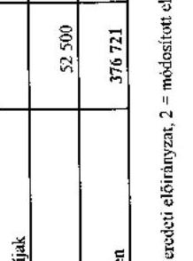

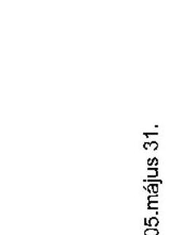

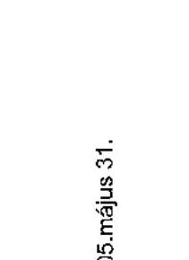

Oszkanok megnevezése: 1 = ezelőző előtérőnyezi, 2 = módosított előtérőnyezi, 3 = teljesítés

Tartóbbom, hogy az adatok a nyilvántartásban szereplőkkel megegyeznek.

Budapest, 2005. május 31.

---

# Az ORTT dologi kiadásainak és egyéb folyó kiadásainak alakulása

|  Megnevezés | 2000 | 2001 | 2002 | 2003 | 2004  |
| --- | --- | --- | --- | --- | --- |
|   | 1 | 2 | 3 | 1 | 2  |
|  Készlethegencés | 30 880 | 24 704 | 24 488 | 33 690 | 32 090  |
|  Kommunikációs szolgáltatások | 20 000 | 21 150 | 21 065 | 25 640 | 23 090  |
|  Szolgáltatási kiadások | 90 722 | 83 430 | 79 731 | 132 243 | 120 461  |
|  Ezen belül: egyéb nem anyagi szolgáltatás | 48 180 | 42 000 | 39 390 | 76 400 | 70 000  |
|  Vásárolt közszolgáltatások |  |  |  |  |   |
|  Általános fregolmi adó | 32 078 | 25 085 | 23 324 | 37 884 | 35 207  |
|  Kiküldés, reprezentáció, reklámkiadások | 19 100 | 17 775 | 17 260 | 21 350 | 21 350  |
|  Egyéb dologi kiadások | 200 |  |  |  |   |
|  Dologi kiadások összesen | 192 990 | 172 144 | 165 868 | 250 807 | 232 018  |
|  Különféle költségvetési befizetések |  |  |  |  |   |
|  Adók, díjak, befizetések | 6 827 | 17 740 | 15 900 | 11 400 | 11 400  |
|  Kamatikiadások |  |  |  |  |   |
|  Egyéb folyó kiadások | 6 827 | 18 950 | 15 900 | 11 400 | 11 400  |
|  Dologi kiadások és egyéb folyó kiadások | 199 617 | 180 893 | 181 048 | 262 207 | 242 418  |

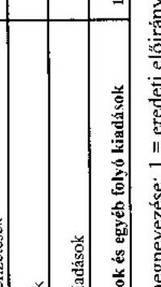

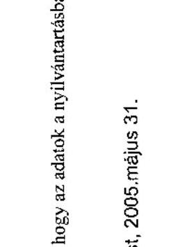

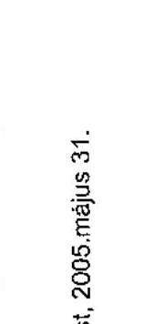

---

Országos Rádió és Televízió Testület Budapest 5. sz. tanúsítvány a V-02-./2005. sz.jelentéshez

Az ORTT létszámának alakulása

|  Megnevezés | 1997 | 1998 | 1999 | 2000 | 2001 | 2002 | 2003 | 2004  |
| --- | --- | --- | --- | --- | --- | --- | --- | --- |
|  Miniszter | 1 | 1 | 1 | 1 | 1 | 1 | 1 | 1  |
|  Állandékár | 6 | 6 | 6 | 6 | 6 | 6 | 4 | 4  |
|  Helyettes állomásfőnök módolási vezető | 0 | 1 | 1 | 1 | 1 | 1 | 1 | 1  |
|  Főosztályvezető | 6 | 4 | 4 | 4 | 5 | 5 | 4 | 4  |
|  Főosztályvezető-helyettes | 8 | 5 | 6 | 3 | 3 | 2 | 2 | 1  |
|  Osztályvezető | 22 | 27 | 17 | 11 | 18 | 15 | 15 | 19  |
|  I. besorolási osztály | 17 | 32 | 26 | 39 | 53 | 61 | 56 | 45  |
|  II. besorolási osztály | 32 | 33 | 32 | 20 | 35 | 37 | 25 | 28  |
|  III. besorolási osztály | 5 | 1 | 0 | 0 | 0 | 0 | 11 | 1  |
|  Kérelemrészlet beszerzésre 31-én | 90 | 103 | 86 | 78 | 115 | 121 | 114 | 99  |
|  Kérelmezett létszám | 113 | 126 | 106 | 104 | 128 | 128 | 128 | 129  |
|  Intézményüzemeltetéshez | 23 | 20 | 19 | 19 | 25 | 23 | 26 | 29  |
|  Szakmai tevékenységhez | 90 | 106 | 87 | 85 | 103 | 105 | 102 | 100  |
|  Átlagos statisztikai állományi létszám | 93 | 98 | 85 | 95 | 111 | 101 | 101 | 117  |
|  Intézményüzemeltetéshez | 23 | 19 | 19 | 18 | 23 | 22 | 24 | 29  |
|  Szakmai tevékenységhez | 70 | 79 | 66 | 77 | 88 | 79 | 77 | 88  |
|  Tartósan üres álláshelyek száma | 0 |  | 0 | 0 | 0 | 0 | 0 | 0  |

Tanúsítom, hogy az adatok a nyilvántartásban szereplőkkel megegyeznek.

Budapest, 2005. május 31.

P.H.

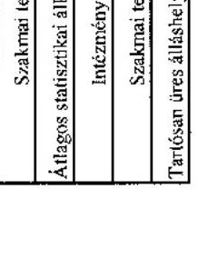

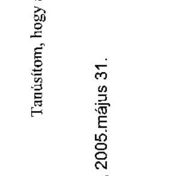

---

6. sz. tanúsítvány a V-02-./2005.sz. jelentéshez

|  Év | Eszközcsoport | Nyitó bruttó érték | Összes növekedés | Összes csökkenés | Záró bruttó érték | Értékcsökkenési leírás | Nettó érték | Nettó érték a záró bruttó érték %-ában  |
| --- | --- | --- | --- | --- | --- | --- | --- | --- |
|  2000 | Immateriális javak | 37 086 | 131 | 0 | 37 217 | 33 106 | 4 111 | 11,0%  |
|   | Ingatlanok | 349 554 | 0 | 0 | 349 554 | 36 005 | 313 549 | 89,7%  |
|   | Gép, berendezés | 246 995 | 11 197 | 0 | 258 192 | 216 129 | 42 062 | 16,3%  |
|   | Jármű | 29 166 | 51 36 | 19 501 | 71 025 | 27 563 | 43 442 | 61,2%  |
|   | Összesen | 672 801 | 62 688 | 19 501 | 715 988 | 312 823 | 401 165 | 56,3%  |
|  2001 | Immateriális javak | 37 217 | 9 239 | 0 | 46 456 | 35 94 | 10 516 | 22,6%  |
|   | Ingatlanok | 349 554 | 1 136 | 350 69 | 0 | 0 | 0 | 0,0%  |
|   | Gép, berendezés | 258 732 | 77 42 | 15 41 | 320 292 | 248 283 | 71 919 | 22,5%  |
|   | Jármű | 71 925 | 8 476 | 4 646 | 74 855 | 37 587 | 37 268 | 49,8%  |
|   | Összesen | 715 988 | 96 271 | 370 746 | 441 513 | 321 81 | 119 703 | 27,1%  |
|  2002 | Immateriális javak | 46 436 | 6 523 | 3 871 | 49 108 | 42 541 | 6 567 | 13,4%  |
|   | Ingatlanok | 0 | 0 | 0 | 0 | 0 | 0 | 0,0%  |
|   | Gép, berendezés | 320 202 | 25 801 | 109 418 | 236 585 | 183 562 | 53 023 | 22,4%  |
|   | Jármű | 74 855 | 22 769 | 21 861 | 73 763 | 35 87 | 37 895 | 51,4%  |
|   | Összesen | 441 513 | 55 095 | 137 15 | 359 456 | 261 973 | 97 483 | 27,1%  |
|  2003 | Immateriális javak | 49 108 | 3 648 | 0 | 52 756 | 47 107 | 5 649 | 10,7%  |
|   | Ingatlanok | 0 | 0 | 0 | 0 | 0 | 0 | 0,0%  |
|   | Gép, berendezés | 333 094 | 5 995 | 20 478 | 320 611 | 294 647 | 25 964 | 8,1%  |
|   | Jármű | 73 763 | 0 | 0 | 73 763 | 49 845 | 23 918 | 32,4%  |
|   | Összesen | 457 965 | 9 643 | 20 478 | 447 130 | 391 599 | 55 531 | 12,4%  |
|  2004 | Immateriális javak | 52 756 | 9 353 | 230 | 61 879 | 52 143 | 9 736 | 15,7%  |
|   | Ingatlanok | 0 | 0 | 0 | 0 | 0 | 0 | 0,0%  |
|   | Gép, berendezés | 320 611 | 44 382 | 19 138 | 345 855 | 292 709 | 53 146 | 15,4%  |
|   | Jármű | 73 763 | 48 178 | 39 873 | 82 068 | 28 828 | 61 240 | 64,9%  |
|   | Összesen | 447 130 | 101 913 | 59 241 | 489 802 | 373 682 | 116 122 | 23,7%  |

Tanúsítom, hogy az adatok a nyilvántartásban szereplőkkel megegyeznek.

Budapest, 2005. május 31.

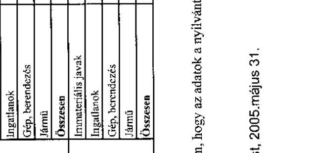

---

|  A Műsorszolgáltatási Alap |   |
| --- | --- |
|  Budapest |   |

|  2000 | 2001 | 2002 | 2003 | 2004  |
| --- | --- | --- | --- | --- |
|  1 | 2 | 3 | 1 | 2  |
|  20 282 | 19 134 | 22 029 | 20 025 | 23 793  |
|  13 682 | 14 789 | 17 069 | 15 301 | 18 472  |
|  4 600 | 4 345 | 4 960 | 4 734 | 5 320  |
|  6 460 | 6 010 | 6 437 | 6 430 | 6 817  |
|  1 439 | 1 141 | 1 232 | 1 253 | 1 306  |
|  1 307 | 1 036 | 1 119 | 1 138 | 1 186  |
|  1 233 | 991 | 1 065 | 1 065 | 1 147  |
|  1 212 | 974 | 1 047 | 1 138 | 1 060  |
|  1 269 | 868 | 974 | 1 174 | 1 000  |
|  73 | 49 | 62 | 114 | 66  |
|  0 | 12 | 0 | 40 | 0  |
|  0 | 0 | 0 | 0 | 0  |
|  Egyéb bevételek | 250 | 188 | 580 | 732  |
|  Maradványfelhasználás |  |  |  |   |
|  Bevételek összesen | 27 063 | 24 253 | 28 108 | 23 243  |

|  2001 | 2002 | 2003 | 2004  |
| --- | --- | --- | --- |
|  1 | 2 | 3 | 1  |
|  20 025 | 23 793 | 20 025 | 20 025  |
|  13 682 | 14 789 | 17 069 | 15 301  |
|  4 600 | 4 345 | 4 960 | 4 734  |
|  6 460 | 6 010 | 6 437 | 6 430  |
|  1 439 | 1 141 | 1 232 | 1 253  |
|  1 307 | 1 036 | 1 119 | 1 138  |
|  1 233 | 991 | 1 065 | 1 065  |
|  1 212 | 974 | 1 047 | 1 138  |
|  1 269 | 868 | 974 | 1 174  |
|  73 | 49 | 62 | 114  |
|  0 | 12 | 0 | 40  |
|  0 | 0 | 0 | 0  |
|  Egyéb bevételek | 250 | 188 | 580 | 732  |
|  Maradványfelhasználás |  |  |  |   |
|  Bevételek összesen | 27 063 | 24 253 | 28 108 | 23 243  |

|  2002 | 2003 | 2004  |
| --- | --- | --- |
|  1 | 2 | 3  |
|  20 025 | 23 793 | 20 025  |
|  13 682 | 14 789 | 17 069  |
|  4 600 | 4 345 | 4 960  |
|  6 460 | 6
 010 | 6 437 |
| 1 439 | 1 141 | 1 232 |
| 1 307 | 1 036 | 1 119 |
| 1 233 | 991 | 1 065 |
| 1 212 | 974 | 1 047 |
| 1 269 | 868 | 974 |
| 73 | 49 | 62 |
| 0 | 12 | 0 |
| 0 | 0 | 0 |
| Egyéb bevételek | 250 | 188 |
| Maradványfelhasználás | | |
| Bevételek összesen | 27 063 | 24 253 |

| 2001 | 2002 | 2003 | 2004 |
| --- | --- | --- | --- |
| 1 | 2 | 3 | 1 |
| 20 025 | 23 793 | 20 025 | 20 025 |
| 13 682 | 14 789 | 17 069 | 15 301 |
| 4 600 | 4 345 | 4 960 | 4 734 |
| 6 460 | 6 010 | 6 437 | 6 430 |
| 1 439 | 1 141 | 1 232 | 1 253 |
| 1 307 | 1 036 | 1 119 | 1 138 |
| 1 212 | 974 | 1 047 | 1 138 |
| 1 269 | 868 | 974 | 1 174 |
| 73 | 49 | 62 | 114 |
| 0 | 12 | 0 | 40 |
| 0 | 0 | 0 | 0 |
| Egyéb bevételek | 250 | 188 | 580 | 732 |
| Maradványfelhasználás | | | | |
| Bevételek összesen | 27 063 | 24 253 | 28 108 | 23 243 |

| 2001 | 2002 | 2003 | 2004 |
| --- | --- | --- | --- |
| 1 | 2 | 3 | 1 |
| 20 025 | 23 793 | 20 025 | 20 025 |
| 13 682 | 14 789 | 17 069 | 15 301 |
| 4 600 | 4 345 | 4 960 | 4 734 |
| 6 460 | 6 010 | 6 437 | 6 430 |
| 1 439 | 1 141 | 1 232 | 1 253 |
| 1 307 | 1 036 | 1 119 | 1 138 |
| 1 212 | 974 | 1 047 | 1 138 |
| 1 269 | 868 | 974 | 1 174 |
| 73 | 49 | 62 | 114 |
| 0 | 12 | 0 | 40 |
| 0 | 0 | 0 | 0 |
| 0 | 0 | 0 | 0 |
| 0 | 0 | 0 | 0 |
| 0 | 0 | 0 | 0 |
| 0 | 0 | 0 | 0 |
| 0 | 0 | 0 | 0 |
| 0 | 0 | 0 | 0 |
| 0 | 0 | 0 | 0 |
| 0 | 0 | 0 | 0 |
| 0 | 0 | 0 | 0 |
| 0 | 0 | 0 | 0 |
| 0 | 0 | 0 | 0 |
| 0 | 0 | 0 | 0 |
| 0 | 0 | 0 | 0 |
| 0 | 0 | 0 | 0 |
| 0 | 0 | 0 | 0 |
| 0 | 0 | 0 | 0 |
| 0 | 0 | 0 | 0 |
| 0 | 0 | 0 | 0 |
| 0 | 0 | 0 | 0 |
| 0 | 0 | 0 | 0 |
| 0 | 0 | 0 | 0 |
| 0 | 0 | 0 | 0 |
| 0 | 0 | 0 | 0 |
| 0 | 0 | 0 | 0 |
| 0 | 0 | 0 | 0 |
| 0 | 0 | 0 | 0 |
| 0 | 0 | 0 | 0 |
| 0 | 0 | 0 | 0 |
| 0 | 0 | 0 | 0 |

---

Műszerszükségleti Alap Budapest

A Műszerszükségleti Alap kiadásainak alakulása

| | | | | | | | | | | | | | | | | | | | | | | | | | | | | | | | | | | | | | | | | | | | | | | | | | | | | | | | | | | | | | | | | | | | | | | | | | | | | | | | | | | | | | | | | | | | | | | | | | | | | | |

---

Műszerszolgáltatási Alap Budapest

A Műszerszolgáltatási Alap eredménykimutatásai (milliárd forintban)

| Megnevezés | 2000. év | Átcsordulás a 2000. évi C. törvény szerint | 2001. év | Előző év | 2002. év | 2003. év | 2004. év |
| --- | --- | --- | --- | --- | --- | --- | --- |
| Értékesítés nettó árbevétele | 23 547,970 | 23 547,970 | 25 123,272 | 0,000 | 25 400,978 | 25 947,939 | 5 367,121 |
| Aktivált saját teljesítmények értéke | 0,000 | 0,000 | 0,000 | 0,000 | 0,495 | 0,339 | 0,061 |
| Egyéb bevételek | 528,597 | 528,597 | 309,302 | 0,000 | 1 022,105 | 570,399 | 21 939,828 |
| Előző évi visszavásztó értékvesztés | 0,000 | 512,250 | 89,162 | 0,000 | 856,902 | 306,314 | 105,181 |
| 1. BEVÉTELEK ÖSSZESEN | 24 076,567 | 24 076,567 | 25 433,574 | 0,000 | 26 423,578 | 26 518,607 | 27 327,010 |
| Anyagköltség | 20,948 | 20,948 | 26,895 | 0,000 | 29,751 | 23,129 | 36,515 |
| Igénybe vett szolgáltatások értéke | 1 426,771 | 22 509,465 | 24 026,491 | 0,000 | 24 178,601 | 24 992,310 | 4 602,574 |
| Egyéb szolgáltatások értéke | | 1,581 | 1,817 | 0,000 | 2,365 | 3,359 | 4,314 |
| Eladott áruk beszerzési értéke | 0,000 | 0,000 | 0,000 | 0,000 | 0,000 | 0,000 | 0,000 |
| Alvállalesen teljesítmények | 0,000 | | | | | | |
| Eladott (közvetített szolgáltatások) értéke | | 0,000 | 0,000 | 0,000 | 0,000 | 0,000 | 0,000 |
| Anyagjellegű ráfordítások összesen | 1 447,719 | 22 531,994 | 24 055,203 | 0,000 | 24 210,717 | 24 958,798 | 4 643,200 |
| Bérköltség | 107,165 | 107,165 | 143,197 | 0,000 | 180,059 | 192,560 | 236,536 |
| Személyi jellegű egyéb kifizetések | 83,700 | 86,987 | 66,090 | 0,000 | 75,034 | 104,362 | 100,760 |
| Bérjárulékok | 62,265 | 65,706 | 69,523 | 0,000 | 78,703 | 86,118 | 95,516 |
| Személyi jellegű ráfordítások összesen | 253,130 | 259,938 | 278,610 | 0,000 | 233,796 | 383,040 | 432,812 |
| Értékcsökkenési leírás | 28,989 | 28,989 | 27,350 | 0,000 | 31,455 | 30,028 | 42,806 |
| Egyéb költség | 21 087,716 | | | | | | |
| Egyéb ráfordítások | 1 575,326 | 1 572,048 | 2 251,593 | 0,000 | 1 540,223 | 1 680,013 | 23 559,774 |
| Előző értékvesztés | | 420,416 | 958,525 | 0,000 | 307,574 | 174,082 | 47,387 |
| 2. RÁFORDÍTÁSOK ÖSSZESEN | 24 392,879 | 24 392,889 | 26 612,996 | 0,000 | 26 116,193 | 27 081,879 | 28 675,592 |
| 3. ÜZEM(ÜZLETI) TEVÉKENYSÉG EREDMÉNYE (1-2) | -316,312 | -316,322 | -1 180,382 | 0,000 | 307,285 | -563,212 | -1 351,582 |
| Pénzügyi műveletek bevételei | 155,732 | 155,752 | 548,066 | 0,000 | 371,920 | 348,942 | 379,533 |
| Pénzügyi műveletek ráfordításai | 0,000 | 0,000 | 0,001 | 0,000 | 0,000 | 0,015 | 2,206 |
| 4. PÉNZÜGYI MŰVELETEK EREDMÉNYE | 155,752 | 155,752 | 548,065 | 0,000 | 371,920 | 348,927 | 377,327 |
| Rendkívüli bevételek | 0,023 | 0,023 | 0,000 | 605,018 | 821,587 | | 24,989 | 925,217 |
| Reműködik befordítások | 0,019 | 0,000 | 0,000 | 0,000 | 4,758 | 0,000 | 0,000 |
| 5. RENDSZERKÍVÜLI EREDMÉNY | 0,013 | 0,023 | 0,000 | 605,018 | 816,829 | 24,989 | 925,217 |
| 6. MÉRLEG SZERINTI EREDMÉNYE(+++3) | -160,547 | -160,547 | -632,317 | 605,018 | 1 496,134 | -189,296 | -49,038 |

Tartóeltem, hogy az adatok a nyilvántartásban szereplőkkel megegyeznek.

Budapest, 2005. május 31.

FH

---

Műszerkészlet-tartási alap
Budapest

A Műszerkészlet-tartási Alap mérlegei

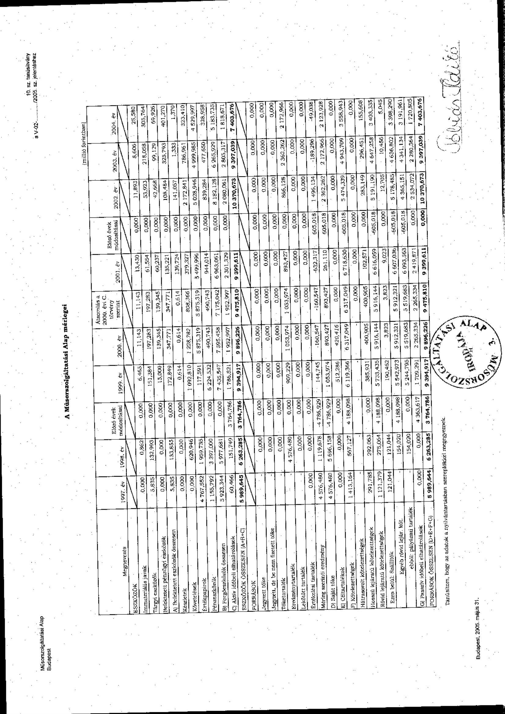

| | | | | | | | | | | | | | |
| --- | --- | --- | --- | --- | --- | --- | --- | --- | --- | --- | --- | --- | --- |
| Megnevezés | 1992. év | 1998. év | Ebből évre módosításai | 1999. év | 2000. év | Kezelési a 2000. év: C. tömény testület | 2001. év | Ebből évre módosításai | 2002. év | 2003. év | 2004. év | | |
| ESZKÖZÖK | | | | | | | | | | | | | |
| Immateriális javak | 0,000 | 0,003 | 0,000 | 6,462 | 11,142 | 11,142 | 15,420 | 0,000 | 11,892 | 6,600 | 25,580 | | |
| Tárgyi eszközök | 0,030 | 132,995 | 0,000 | 151,084 | 197,283 | 197,283 | 61,594 | 0,000 | 33,923 | 219,058 | 303,764 | | |
| Befektetett pénzügyi eszközök | 0,000 | 0,000 | 0,000 | 15,000 | 139,345 | 139,345 | 60,237 | 0,000 | 43,668 | 99,120 | 69,826 | | |
| A: Befektetett eszközök összesen | 5,835 | 143,655 | 0,000 | 172,846 | 347,771 | 347,771 | 135,221 | 0,000 | 108,484 | 522,793 | 801,070 | | |
| Megnevez. | 0,000 | 0,000 | 0,000 | 0,614 | 0,614 | 0,614 | 139,724 | 0,000 | 141,002 | 1,353 | 1,370 | | |
| Elhelyeznek | 0,000 | 630,946 | 0,000 | 1 092,810 | 1 028,767 | 808,366 | 279,027 | 0,000 | 2 172,841 | 786,061 | 323,410 | | |
| Értékpapírok | 4 767,583 | 1 959,730 | 0,000 | 117,091 | 2 875,319 | 2 875,319 | 5 490,806 | 0,000 | 5 028,946 | 4 999,980 | 4 539,997 | | |
| Hivatalábikok | 1 150,793 | 3 397,000 | 0,000 | 6 234,532 | 460,743 | 460,743 | 944,014 | 0,000 | 839,284 | 477,650 | 338,958 | | |
| B: Forgóeszközök összesen | 3 923,344 | 3 977,681 | 0,000 | 7 430,547 | 7 095,458 | 7 175,042 | 6 963,061 | 0,000 | 8 162,128 | 6 265,939 | 5 183,733 | | |
| C: Alsó időbok elhalámlábak | 60,466 | 191,789 | 3 794,786 | 1 786,531 | 1 952,997 | 1 952,997 | 2 301,329 | 0,000 | 2 080,061 | 2 865,317 | 1 818,671 | | |
| ESZKÖZÖK (A+B+C) | 5 969,643 | 6 263,283 | 3 764,786 | 9 294,917 | 9 896,226 | 9 475,810 | 9 295,611 | | 10 370,673 | 9 397,039 | 7 403,670 | | |
| FORRÁSOK | | | | | | | | | | | | | |
| Jegyzett tőke | | 0,000 | 0,000 | 0,000 | 0,000 | 0,000 | 0,000 | 0,000 | 0,000 | 0,000 | 0,000 | 0,000 | |
| Jegyzett de be nem fomott ülés | | 0,000 | 0,000 | 0,000 | 0,000 | 0,000 | 0,000 | 0,000 | 0,000 | 0,000 | 0,000 | 0,000 | |
| Tőketartalék | | 0,000 | 0,000 | 0,000 | 0,000 | 0,000 | 0,000 | 0,000 | 0,000 | 0,000 | 0,000 | 0,000 | |
| Kivőzégyrűzözők | | 4 576,480 | 0,000 | 905,229 | 1 053,974 | 1 053,974 | 893,427 | 0,000 | 866,138 | 2 362,262 | 2 172,966 | | |
| Lezihűtt tartalék | | 0,000 | 0,000 | 0,000 | 0,000 | 0,000 | 0,000 | 0,000 | 0,000 | 0,000 | 0,000 | 0,000 | |
| Értékelési tartalék | 0,000 | 0,000 | 0,000 | 0,000 | 0,000 | 0,000 | 0,000 | 0,000 | 0,000 | 0,000 | 0,000 | 0,000 | |
| Mérleg szeréző eredmény | 4 576,480 | 1 119,678 | 4 796,529 | 144,747 | 160,547 | -160,547 | -632,317 | 607,018 | 1 496,134 | -169,286 | -49,998 | | |
| D: Saját tőke | 4 576,480 | 5 696,158 | 4 796,929 | 1 053,974 | 893,427 | 893,427 | 261,110 | 608,018 | 2 362,262 | 2 172,966 | 2 133,928 | | |
| E: Céltartalékok | 0,000 | 0,000 | 0,000 | 312,296 | 420,416 | 0,000 | 0,000 | 0,000 | 0,000 | 0,000 | 0,000 | 0,000 | |
| F: Szállítóesztalajok | 1 413,359 | 867,127 | 4 188,098 | 6 119,366 | 6 317,049 | 6 317,049 | 6 718,630 | 460,318 | 5 474,329 | 4 943,709 | 3 956,943 | | |
| Tőzreszenél színóesztalajok | | | | | | 0,000 | 0,000 | 0,000 | 0,000 | 0,000 | 0,000 | 0,000 | |
| Érveszt lejáratú színóesztalajok | 991,788 | 292,063 | 0,000 | 585,631 | 400,905 | 400,905 | 102,571 | 0,000 | 263,149 | 256,451 | 150,608 | | |
| Részí lejáratú színóesztalajok | 1 121,379 | 375,064 | 4 188,098 | 5 723,435 | 5 916,144 | 5 916,144 | 6 616,589 | 460,318 | 5 191,186 | 4 647,378 | 3 403,335 | | |
| Esze lejtő: fizjáltóik | 121,044 | 131,044 | 0,000 | 190,462 | 3,833 | 3,833 | 6,023 | 0,000 | 12,765 | 10,480 | 4,045 | | |
| Egyné zöndi lejtő: höl. | | 104,020 | 4 188,098 | 5 543,973 | 5 912,321 | 5 912,321 | 6 607,006 | -605,018 | 5 178,483 | 4 638,802 | 3 398,290 | | |
| elöldi: pályázatú tartalék | | 154,030 | 0,000 | 3 244,790 | 3 319,683 | 3 319,683 | 6 093,263 | -605,018 | 4 565,181 | 4 241,134 | 2 191,961 | | |
| Sz. Peszelt vélkeú elhalámlábak | 0,000 | 0,000 | 4 363,617 | 1 729,391 | 2 263,334 | 2 263,334 | 2 419,871 | 0,000 | 2 534,072 | 2 390,364 | 1 729,805 | | |
| FORRÁSOK (A+B+C) | 5 989,644 | 6 263,283 | 3 764,786 | 9 294,917 | 9 896,226 | 9 475,810 | 9 295,611 | 0,000 | 10 370,673 | 9 397,039 | 7 403,670 | | |

Tankotom, hogy az adatok a nyilvántartásban semmibőlési megjegyzések.

Budapest, 2005. május 31.

---

# A médiatárvány alapján a Műszerzolgáltatási Alapból nyújtott támogatások

| Támogatási jogcímek | 1997 | 1998 | 1999 | 2000 | 2001 | 2002 | 2003 | 2004 | 1997-2004 összesen |
| --- | --- | --- | --- | --- | --- | --- | --- | --- | --- |
| Műszererítés és elosztás fejlesztése | 131.8 (3) | | | | | | | | |
| Benyújtott pályázatok száma | | | | | | | | | |
| Nyertes pályázatok száma | | | | | | | | | |
| Odajtélt összeg (eredeti hat. szerint) | 606 178 | | 1 369 020 | 936 314 | 1 165 932 | 1 004 917 | 1 965 505 | 729 050 | 7 766 896 |
| Kifizetett összeg | 0 | | 13 908 | 333 864 | 385 275 | 1 118 266 | 1 247 738 | 1 523 717 | 4 622 866 |
| Pennálló kötelezettség | 606 178 | 606 178 | 1 886 490 | 1 296 754 | 2 780 973 | 2 649 981 | 2 757 029 | 2 108 186 | |
| Közessígálati műsorok támogatása | 84.8 (2) | | | | | | | | |
| Benyújtott pályázatok száma | | | | | | | | | |
| Nyertes pályázatok száma | | | | | | | | | |
| Odajtélt összeg (eredeti hat. szerint) |  |  |  |  |  |  |  |  |   |
|  Kifizetett összeg | 0 |  | 1 398 003 | 1 361 107 | 1 639 142 | 2 256 450 | 1 484 108 | 1 433 702 | 8 372 577  |
|  Pennálló kötelezettség | 0 |  | 1 321 482 | 659 890 | 2 734 945 | 1 048 124 | 1 071 824 | 703 283 |   |
|  Közösségálati műsor számok támogatása | 78.8 (2) |  |  |  |  |  |  |  |   |
|  Benyújtott pályázatok száma |  |  |  |  |  |  |  |  |   |
|  Nyertes pályázatok száma |  |  |  |  |  |  |  |  |   |
|  Odajtélt összeg (eredeti hat. szerint) | 0 |  |  | 323 848 | 0 | 1 000 | 483 493 | 268 000 | 1 076 347  |
|  Kifizetett összeg | 0 |  | 1 188 300 | 698 100 | 85 632 | 17 817 | 317 679 | 342 910 | 1 650 438  |
|  Pennálló kötelezettség | 0 |  | 675 750 | 123 079 | 25 068 | 6 839 | 120 158 | 58 620 |   |
|  Nem nyereségéről és közműszámségéről | 78.8 (1) |  |  |  |  |  |  |  |   |
|  Benyújtott pályázatok száma |  |  |  |  |  |  |  |  |   |
|  Nyertes pályázatok száma |  |  |  |  |  |  |  |  |   |
|  Odajtélt összeg (eredeti hat. szerint) | 0 |  | 13 135 | 78 413 | 101 598 | 43 056 | 164 349 | 277 583 | 337 348  |
|  Kifizetett összeg | 0 |  | 13 135 | 15 260 | 57 712 | 106 549 | 184 854 | 284 648 | 328 984  |
|  Pennálló kötelezettség | 0 |  | 0 | 0 | 104 755 | 36 642 | 143 390 | 167 440 | 7 935  |
|  Egyéb regnedi támogatások | 77.8 (1) |  |  |  |  |  |  |  |   |
|  Benyújtott kérelmek száma |  |  |  |  |  |  |  |  |   |
|  Nyertes kérelmek száma |  |  |  |  |  |  |  |  |   |
|  Odajtélt összeg (eredeti hat. szerint) | 0 |  | 14 | 10 | 8 | 3 | 3 | 2 | 14  |
|  Kifizetett összeg | 0 |  | 1 198 154 | 1 115 730 | 1 45 896 | 1 73 143 | 29 800 | 228 458 | 357 050  |
|  Kifizetett összeg | 0 |  | 1 196 156 | 56 978 | 74 450 | 248 382 | 44 266 | 196 825 | 350 352  |
|  Pennálló kötelezettség | 0 |  | 1 878 | 77 730 | 159 140 | 191 921 | 6 275 | 43 381 | 101 434  |
|  Benyújtott pályázatok, kérelmek száma összesen |  |  |  |  |  |  |  |  |   |
|  Nyertes pályázatok, kérelmek száma összesen |  |  |  |  |  |  |  |  |   |
|  Odajtélt összeg összesen (eredeti határozat szerint) | 606 178 | 866 286 | 2 947 348 | 3 206 090 | 2 933 649 | 2 812 418 | 4 610 321 | 2 811 195 | 21 792 437  |
|  Kifizetett összeg összesen | 0 | 209 291 | 472 380 | 2 525 239 | 2 465 081 | 3 621 658 | 3 530 996 | 3 979 735 | 16 804 378  |
|  Pennálló kötelezettség összesen | 606 178 | 1 263 173 | 3 961 452 | 2 384 207 | 5 770 149 | 3 852 619 | 4 150 871 | 3 922 458 |   |

Tudásítom, hogy az adatok a nyilvántartásban szereplőképpen.

Budapest, 2005. május 31.

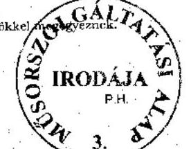

---

Missoszoigátatási Alap Budapest

A médiatörvény szerinti támogatások forrásának alakulása (pinnégyűleg wallcsát)

|  Támogatási jogcímek | 1997 | 1998 | 1999 | 2000 | 2001 | 2002 | 2003 | 2004 | 1997-2004 összesen  |
| --- | --- | --- | --- | --- | --- | --- | --- | --- | --- |
|  Mikro- és elosztás infrastruktúrája | 131. § (3) |  |  |  |  |  |  |  |   |
|  Tartalékképzés alapja - a telj. befolyt összeg |  |  |  |  |  |  |  |  |   |
|  Ténylegesen képzett pályázati tartalék | 2 409 000 | 0 | 0 | 1 036 411 | 1 137 963 | 1 221 703 | 1 277 180 | 1 349 979 | 8 622 243  |
|  Nyertes pályázatokra kifizetett összeg |  |  |  |  |  |  |  |  |   |
|  Dec. 21-én rendelkezésre álló tartalék | 2 409 000 | 2 409 000 | 2 395 092 | 3 097 539 | 3 239 653 | 3 239 653 | 3 239 653 | 3 194 063 | 4 622 880  |
|  Készségálati műszerek támogatása | 84. § (2) |  |  |  |  |  |  |  |   |
|  Tartalékképzés alapja - telj. befolyt összeg |  |  |  |  |  |  |  |  |   |
|  Ténylegesen képzett pályázati tartalék | 837 931 | 944 689 | 1 091 876 | 1 063 283 | 1 642 142 | 1 096 138 | 1 224 951 | 913 386 | 8 818 907  |
|  Nyertes pályázatokra kifizetett összeg |  |  |  |  |  |  |  |  |   |
|  Dec. 21-én rendelkezésre álló tartalék | 837 931 | 1 782 140 | 2 679 313 | 2 378 780 | 2 381 190 | 1 220 867 | 961 704 | 441 329 | 8 372 577  |
|  Készségálati műszerek |  |  |  |  |  |  |  |  |   |
|  Tartalékképzés alapja - telj. befolyt összeg |  |  |  |  |  |  |  |  |   |
|  Ténylegesen képzett pályázati tartalék | 837 931 | 944 689 | 1 091 876 | 1 063 283 | 1 642 142 | 1 096 138 | 1 224 951 | 913 386 | 8 818 907  |
|  Nyertes pályázatokra kifizetett összeg |  |  |  |  |  |  |  |  |   |
|  Dec. 21-én rendelkezésre álló tartalék | 837 931 | 1 782 140 | 2 679 313 | 2 378 780 | 2 381 190 | 1 220 867 | 961 704 | 441 329 | 8 372 577  |
|  Készségálati műszerek |  |  |  |  |  |  |  |  |   |
|  Tartalékképzés alapja - telj. befolyt összeg |  |  |  |  |  |  |  |  |   |
|  Ténylegesen képzett pályázati tartalék | 837 931 | 944 689 | 1 091 876 | 1 063 283 | 1 642 142 | 1 096 138 | 1 224 951 | 913 386 | 8 818 907  |
|  Nyertes pályázatokra kifizetett összeg |  |  |  |  |  |  |  |  |   |
|  Dec. 21-én rendelkezésre álló tartalék | 837 931 | 1 782 140 | 2 679 313 | 2 378 780 | 2 381 190 | 1 220 867 | 961 704 | 441 329 | 8 372 577  |
|  Nem nyereséged, bólványolja támogatása | 78. § (1) |  |  |  |  |  |  |  |   |
|  Tartalékképzés alapja - telj. befolyt összeg |  |  |  |  |  |  |  |  |   |
|  Ténylegesen képzett pályázati tartalék | 76 381 | 87 349 | 100 143 | 100 187 | 110 435 | 110 650 | 230 030 | 253 207 | 1 036 491  |
|  Nyertes pályázatokra kifizetett összeg |  |  |  |  |  |  |  |  |   |
 Dec. 21-én rendelkezésre álló tartalék |  |  |  |  |  |  |  |  |   |
|  Nem nyereségelvű, bolyongója támogatása |  |  |  |  |  |  |  |  |   |
|  Tartalékképzés alapja - tej. befolyt összeg |  |  |  |  |  |  |  |  |   |
|  Ténylegesen képzett pályázati tartalék | 76 381 | 87 349 | 100 143 | 100 187 | 110 435 | 110 650 | 230 030 | 253 207 | 1 036 491  |
|  Nyertes pályázatokra kifizetett összeg |  |  |  |  |  |  |  |  |   |
|  Dec. 21-én rendelkezésre álló tartalék |  |  |  |  |  |  |  |  |   |
|  Nem nyereségelvű, bolyongója támogatása |  |  |  |  |  |  |  |  |   |
|  Tartalékképzés alapja - tej. befolyt összeg |  |  |  |  |  |  |  |  |   |
|  Ténylegesen képzett pályázati tartalék | 76 381 | 87 349 | 100 143 | 100 187 | 110 435 | 110 650 | 230 030 | 253 207 | 1 036 491  |
|  Nyertes pályázatokra kifizetett összeg |  |  |  |  |  |  |  |  |   |
|  Dec. 21-én rendelkezésre élő tartalék |  |  |  |  |  |  |  |  |   |
|  Ténylegesen képzett pályázati tartalék összesen |  |  |  |  |  |  |  |  |   |
|  Nyertes pályázatokra kifizetett összeg |  |  |  |  |  |  |  |  |   |
|  Dec. 21-én rendelkezésre élő tartalék |  |  |  |  |  |  |  |  |   |
|  Ténylegesen képzett pályázati tartalék összesen |  |  |  |  |  |  |  |  |   |
|  Nyertes pályázatokra kifiz. összeg összesen |  |  |  |  |  |  |  |  |   |
|  Dec. 21-én rendelkező, élő tartalék összesen |  |  |  |  |  |  |  |  |   |
|  Egyéb jogerőd támogatások | 77.§ (1) |  |  |  |  |  |  |  |   |

Tanúsítom, hogy az adatok a nyilvántartásban szereplőkkel megegyeznek.

Budapest, 2005. május 31.

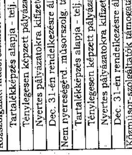
