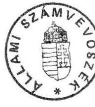
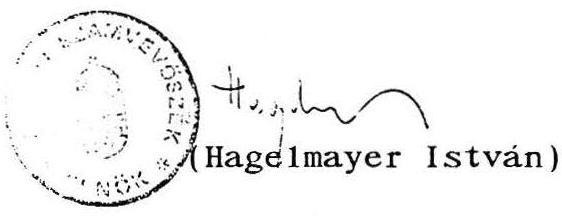

# 2887. szám 

## 21lami szántutóósek

## JELENTÉS

az Állami Vagyonügynökség müködéséról szóló beszámolóhoz

---

V-65-57/1991.
Témaszám: 53.

# J E L E N T É S 

az Állami Vagyonügynökség müködéséröl szóló beszámolóhoz

## I.

## B EVEZETÉS

Az Állami Vagyonügynökségről és a hozzá tartozó vagyon kezeléséről és hasznosításáról szóló 1990. évi VII. törvény elöirja, hogy "A Vagyonügynökség tevékenységét az Állami Számvevőszék ellenőrzi." E felhatalmazás alapján az Állami Számvevőszék 1991. február 28-tól március 29-ig helyszíni vizsgálatot folytatott az ÁVÜ különbözö szervezeti egységeinél. Ezen túlmenően a jelentéshez felhasználta a konkrét vállalati átalakulások és értékesítések vizsgálataiból nyert azon tapasztalatait is (Ozdi Kohászati Üzemek, Idegenforgalmi Propaganda Vállalat, Borsodi Iparcikk Kereskedelmi Vállalat, Ganz-Danubius Vállalat, Compack Vállalat, Medicor, Gerbeaud-ház), ame1yekböl az ÁVÜ tevékenységére vonatkozóan megállapításokat tehetett.

Az Állami Számvevőszék vizsgálati jelentését megküldte az Országgyülés illetékes bizottságainak, a Kormány illetékeseinek.

A vizsgálati jelentésben foglaltakat fenntartva az Állami Vagyonügynökség tevékenységéről szóló beszámolóhoz az Állami Számvevőszék elnöke - az 1990. évi VII. tv. 19. § (3) bekezdésében elöírtak szerint - terjeszti be jelentését az Országgyülés elé.

---

A jelentés a törvényi szabályozások és az ideiglenes Vagyonpolitikai Irányelvekben jóváhagyott követelmények alapján értékeli az Állami Vagyonügynökség müködéséröl szóló beszámolót, amit az ellenőrzött tényadatok felhasżnálásával támaszt alá.

# II. 

## Általános észrevételek az Állami Vagyonügynökség müködéséröl szóló beszámolóhoz

1. Az Állami Vagyonügynökség müködéséröl szóló beszámoló széleskörűen, fő vonalaiban mutatja be a szervezet már elvégzett munkáját, a folyamatban lévő törekvéseit és a Kormány jövőbeni feladatait. Az ÁVÜ tevékenységének tényleges, számszerüsithető alakulását, a konkrét vállalati tranzakciók helyzetét, a müködés jogi, gyakorlati és szervezeti problémáit döntően a mellékletek tartalmazzák.

A müködés bemutatásában a teljeskörüségre való törekvés a jellemző. Ebből az következik, hogy a tevékenység tényszerủ szakaszai és az éppen csak beinditott programok és szándékok egymástól elkülönithetetlenül egybe folynak. A beszámoló tartalmilag nem határolta el a ténylegesen elvégzett munkákat, a lezárt folyamatokat és ügyleteket az éppen csak megkezdettektöl.

Az Állami Számvevőszék - vizsgálati tapasztalata alapján - a Vagyonügynökségről szóló beszámolót önigazolónak tartja, amely a tényleges, eddig végzett munkáról az értékelendő szándékokra és várható eredményekre helyezi a súlypontot. Nem tartja elég önkritikusnak és problémafeltárónak.

---

2. A beszámoló 1990. márciustól - 1991. májusig öleli fel a Vagyonügynökség tevékenységét, ezen belül pedig eltérő idöponti adatokat közöl a múltra vonatkozóan, továbbá várható idöpontokat is szerepeltet.

Az Országgyülés az előző évi költségvetés végrehajtásáról szóló törvényjavaslat előterjesztésével egyidejüleg tárgyalja az ÁVÜ beszámolóját, ebből következően 1990. december 31-ével kellett volna lezárni az időhorizontot. Amennyiben a szervezet 1 éves müködéséről kívánt a Kormány képet adni, annak záróidőpontja 1991. február 28-a lehetett volna.

A május végéig történő bemutatás azért sem értelmezhető, mert a Vagyonügynökségről szóló törvény 1. § (4) pontja értelmében negyedévenként be kell számolnia az Országgyülés illetékes bizottságai előtt. A májusi időpont pedig nem negyedévi zárószakasz.

A beszámoló időintervalluma nem felel meg a költségvetési szervek beszámolói kötelezettségének, így az abban bemutatott adatok hitelességét az Állami Számvevőszék csak részben - az 1990. december 31-i, illetve 1991. márciusi állapotnak megfelelően - tudta ellenőrizni.

Az Állami Számvevőszék az időszakonkénti ellenőrzés lehetőségének biztosítása érdekében fontosnak tartja, hogy a Vagyonügynökség a jövőben minimális mértéküre korlátozza a halmozott adatok és információk közlését. A beszámolási időszak beérkezett új űgyszámai, lezárt, illetve még folyamatban lévő ügyletei képezzék a beszámoló tartalmi részét. Ezáltal a szervezet feladatainak tényleges növekedése egyértelmüen nyomonkövethetővé, a beszámoló pedig tömörebbé, értékelhetőbbé válik.

---

Az Állami Számvevőszék vizsgálati jelentése részletesen foglalkozik az ÁvÜ belsö nyilvántartási, iktatási rendszerének fogyatékosságaival, hiányosságaival. Emiatt a beszámolóban közölt ügyletszámok, értékadatok göngyölített kontrolljának nem volt meg a lehetősége.

Mindez nem zárja ki annak szükségességét, hogy az ÁvÜ nyilvántartási, statisztikai és információs rendszerét ki kell fejleszteni és müködtetni kell.
3. A Vagyonügynökség tevékenységéröl szóló beszámoló tartalmára vonatkozóan az 1990. évi VII. tv. 19. §-a konkrét elöírásokat fogalmaz meg.

Ezek a következők:

- a Kormány évente beszámol az Országgyülésnek a Vagyonügynökség tevékenységéről;
- a hozzá tartozó állami vagyon alakulásáról, hasznosításának eredményéről;
- a Vagyonpolitikai Irányelvek végrehajtásáról;
- bevételeiről és kiadásairól;
- az ÁvÜ-höz tartozó állami vagyon alakulásáról vagyonkimutatást kell készíteni és a beszámolóval egyidejüleg előterjeszteni.

A beszámolóban ezzel szemben a vagyonügynökségi privatizációs bevételek és kiadások alakulását, a hozzá tartozó vagyon nagyságrendjét és hasznosításának eredményét nem elemzik, az ideiglenes vagyonpolitikai irányelvek teljesítésének értékelésére nem szántak külön fejezetet.

---

4. Az Állami Számvevőszék vizsgálata is megerősítette az ÁVƯ tevékenységének azon értékelését, amely a spontán privatizációs folyamatokba való bekapcsolódása eredményességét állapítja meg. Az ÁVƯ müködése a vagyon értékesülésébe jelentős javulást hozott. Az egyedileg megvizsgált tranzakciók dokumentációja e területen az ÁVƯ rugalmasságát és állásfoglalásának megalapozottságát támasztotta alá.

# III. 

## Részletes észrevételek az Állami Vagyonügynökség müködéséröl szóló beszámolóhoz

Az Állami Számvevőszék részletes észrevételeiben azokra a legfontosabb témakörökre tér ki, ame lyekben nincs egyetértés, vagy megítélésbeli különbség áll fenn a két szervezet között, illetve amit a vagyonügynökségi beszámoló sajátos szemlélete miatt szükségesnek tart az Országgyülés előtt magyarázatával kiegészíteni.

Az Állami Számvevőszék a beszámoló több fejezetrészéhez nem tett észrevételt. Ennek az az oka, hogy e témakörök az ÁVƯ-nél a vizsgálat időszakában még nem voltak kidolgozott állapotban, vagy az Igazgatótanács nem hozott döntést, vagy értékelhető eredmények, dokumentumok a témával kapcsolatosan nem voltak fellelhetők. (A részletes észrevétel a vagyonügynökségi beszámoló szerkezeti felépítéséhez igazodik.)

A vállalatok átalakulása gazdasági társasággá

A számvevők 1991. március 1-ig 92 vállalati átalakulási kezdeményezést követtek nyomon az ÁVƯ - egyébként a bizonylat és adatrögzítési fegyelem szempontjából kifogásolt - iktatási, témanyilvántartási rendszere alapján.

---

A vizsgálat hatására az ÁvÜ a be1sõ témanyilvántartását rendezte és aktualizálta. A korrekciók elsősorban az elbírálás alatt lévő témák állományát érintették. További eltérés tapasztalható az elbírált és lezárt témáknál. Oka, hogy lezárt átalakulásnak az Állami Számvevőszék nem az ÁvÜ megfelelő döntéshozó fórumának hozzájárulását tekintette, hanem a társaság cégbejegyzésének megtörténtét, illetőleg az alakuló közgyűlés időpontját. A vállalatok társasággá történő átalakulása továbbá még nem feltétlenül jelenti azok privatizálását is.
1990. december 31-ig az ÁvÜ közreműködésével átalakult vállalat összesen 9 volt, ennyinél történt meg - az ÁvÜ döntést követően az év végéig - a társaság cégbírósági bejegyzése is. Itt az alaptőkén belűl a külföldiek részaránya 8 \%-ot ért el.

Az ÁvÜ egy-egy átalakulási tranzakció jóváhagyásánál rákényszerül iparpolitikai típusu döntések meghozatalára is. Ehhez azonban kormányzati szinten jóváhagyott privatizációs stratégia nem állt rendelkezésére, ebből következően hosszas egyez tetés folyt az illetékes szaktárcákkal a döntések meghozatala elött.

# Vagyonvéde1ml ügyek 

Vállalati átalakulások esetében - ha ebben közremüködik alapítóként a Vagyonügynökség írja alá a jogutód új társaság dokumentumait. E körben a területi cégbíróságokkal megfelelő az együttmüködése.

Alapvetően eltérő a helyzet a vagyonvédelmi ügyek esetében. Az ÁvÜ-nek nincs arról információja, hogy a hatáskörébe tartozó vállalati vagyonátruházási, társaságalapítási kezdeményezések mindegyike keresztül ment-e engedélyezési eljárásán. Ennek felmérésével az ÁvÜ - törvényi kötelezettség hiányában - nem foglalkozik.

---

A jelenlegi pénzügyi beszámoló rendszer (vállalati mérlegbeszámolók) és az ÁvÜ-nél nyilvántartott átalakulások, társaságalapítások információs rendszere nem találkozik egymással. A nyilvántartás zavarait jelzi, hogy az Állami Számvevőszék a vállalkozások 1990. évi mérlegbeszámolóinak számítógépes feldolgozásakor 46 olyan - föleg kereskedelmi és mezőgazdasági társaságalapítást"talált" 12 Mrd Ft saját vagyonértékke1, ame1yek az ÁvÜ nyilvántartásaiban nem szerepelnek, illetve nem azonosíthatóak. (A társaságok listáját az ÁvÜ részére megküldtük.)

Az Állami Számvevőszék szükségesnek tartja a pénzügyi beszámolórendszerbe beépíteni az állami vagyonnal kapcsolatos adatszolgáltatási kötelezettségeket, mert jelenleg a privatizációs folyamatok pontos, megbízható nyomonkövetése nem biztosított.

Sürgető szükség van továbbá az államigazgatási, számviteli, statisztikai információs rendszerek olyan irányú kidolgozására és összehangolására is, amelyekkel az állami vagyon nagysága, alakulása, formaváltása kimutathatóvá és ellenőrizhetővé válik.

Ellentétben a Kormány által beterjesztett beszámoló 27. oldala 1. bekezdésében foglaltakkal, az Állami Számvevőszék úgy ítéli meg, hogy az új számviteli törvény hatályba lépése sem oldja meg az állami vagyonnal kapcsolatos információk hiányát. Azért, mert a források között a jegyzett tőke (alapítói vagyon) kategória alkalmazása és további bontásának elmaradása nem teszi lehetővé az állami tulajdoni hányad kimutatását.

# A privatizációs programok 

Az Állami Vagyonügynökségről szóló beszámoló szerint az Ügynökség kimunkálta az állam (privatizációs programok) és a be-

---

fektetők által kezdeményezett privatizáció módszereit és megkezdődött ezeknek a privatizációs utaknak az alkalmazása is. Tehát a Vagyonügynökség az állami vállalatok átalakításának és privatizálásának aktív irányítójaként lépett fel.

Az aktív programok szervezésével és beindításával lényegében többletfeladatot vállalt magára, ilyen típusú kezdeményezéseket a törvény kötelezően nem ír elő számára.

A ma hatályos jogszabályok szerint az ÁvÜ feladata a spontán privatizáció ellenőrzésére és befolyásolására, a vagyonkezelési és hasznosítási mechanizmusok müködtetésére, az előprivatizációra, az állami vagyon védelmére koncentrálódnak. Az eddigi tapasztalatok alapján nem mondható el, hogy az aktív programok a privatizáció gyorsítását eredményezték volna.

# Első Privatizációs Program (EPP) 

Az Első Privatizációs Programot 1990. szeptemberében hírdette meg az ÁvÜ. A kiválasztott 20 vállalatnál szempont volt, hogy vonzó, jó hírü, nyereséges vállalatok legyenek, ame1yek önként csatlakoztak a programhoz, hiszen többségüknél már beindultak az átalakulási, társaságalapítási előkészületek. 9 hónap elteltével ott tart a program, hogy várhatóan a közeljövöben a nyertes tanácsadó cégek javaslatot tesznek a privatizáció konkrét lebonyolítására.

Több vállalat pénzügyi helyzete időközben kifejezetten kedvezőtlenné vált, vagy éppen veszteséges lett. A tanácsadók munkája válságmenedzseléssel, napi finanszirozási problémák megoldásával is kibővült. Igen sok szervezet kapcsolódott be a 20 vállalat privatizációs munkálataiba. A közremüködők nagy száma a privatizációs költségeket növeli.

---

Az EPP beindításáról, a bevont vállalatokról, a program időzítéséről, a célkitűzések teljesüléséről, a "várható bevétel" nagyságának alakulásáról, majd a program lezárását követően lehet mérleget készíteni.

# A Második Privatizációs Program (MPP) 

Az Második Privatizációs Programba bevont első 12 vállalat privatizálásáról az Állami Számvevőszéki vizsgálat lezárásáig (1991. március 29.) a program meghirdetésén túl más érdemi intézkedés nem történt.

## Elöprivatizáció

Az Állami Számvevőszék - a nem egyértelmű törvényi szabályozás miatt - nem tekinti sikeresen végrehajthatónak a kiskereskedelmi, a vendéglátóipari egységek privatizációját. Elismeri, hogy az előprívatizáció üteme 1991. évben felgyorsult, de az $50 \%$ körüli értékesítési arány jelzi a belsö vásárlóerő elégtelenségét, a hitelkonstrukciók bővítésének igényét, a bérleti díjak kiszámítható kockázatú szabályozásának szükségességét, az üzletek profilkötöttségének feloldhatóságát.

Az üzletek egynegyedénél még így is számolni kell azzal, hogy értékesítésükre nem kerülhet sor a törvény által elöírt két éven belül, mivel ezen üzletek üzemelési szerződései csak 1993-95. években, vagy csak még később járnak le.

Az önkormányzó vállalatok államigazgatási felügyelet alá vonása

Az ÁvÜ beszámoló tényszerűen mutatja be azokat az indokokat, amelyek miatt az Igazgatótanács az államigazgatási felügyelet alá vonásról meghozta a határozatát.

---

A VII. sz. mellékletböl az is kiolvasható, hogy az egyes vállalatok átalakítása, privatizációja jelenleg milyen stádiumban van, ugyanis az Ávü-nek az államigazgatási felügyelet alá vonásról szóló döntésétől számított egy éven belül ezeket a vállalatokat át kell alakítania. (Az állami vállalatokról szóló törvény 42. § (3) bekezdése.)

E körbe tartozó számos vállalat kritikus gazdasági helyzete miatt az ÁvÜ által kinevezett vállalati biztosra válságmenedzselési feladatok is hárulnak. Ennek megoldását nehezíti, hogy a kijelölt vállalati biztosok alig rendelkeznek ilyen tapasztalatokkal, továbbá köztük és a vállalati vezetők közötti jogállás sem rendezett.

A társadalombiztosítás vagyonnal történő ellátása

A Vagyonpolitikai Irányelvek 24. pontja szerint 1990. öszéig az ÁvÜ-nek előterjesztést kellett,volna készítenie az Országgyülés részére, ame1yben meghatározza a Társadalombiztositási Alap javára ingyenesen átandandó vagyon nagyságát és körét. Ez eddig nem történt meg.

Az Állami Vagyonügynökséghez tartozó vagyon és az ezzel kapcsolatos tulajdonosi funkciók gyakorlása

Az 1990. december 31-ei állapotot tükrözö mérleg szerint az Ávü-höz tartozó állami vagyon 71,5 milliárd forint volt. Ennek nagysága 1991. március végére 94,1 milliárd forintra emelkedett az azóta végbement átalakulások hatására.

Az ÁvÜ-höz tartozó vagyon tartalmilag az állami vállalatok átalakulása nyomán létrejött gazdasági társaságokban részvény, vagy üzletrész formájában megtestesülő állami tulajdoni hányadot jelenti.

---

Az ÁvÜ-höz tartozó részvények űzletrészek nagyságrendje az állami vállalatok könyvszerinti mintegy 1800 milliárd forintos vagyonához viszonyítva még elenyésző, 4-5 \%-os arányt képvise1.

A tulajdonosi jogok gyakorlása, vagyonkezelés

A törvény az Ávü-höz tartozó részvények, üzletrészek arányában a társaságokban a tulajdonosi jogok gyakorlását az ÁvÜ feladatává teszi. A törvényi előirások ugyanakkor a tulajdonosi jogok közvetlen gyakorlását csak kivételesen és átmeneti időre teszik lehetővé számára, alapvetően a vagyonkezelő szervezeteken keresztül történő tulajdonosi joggyakorlást határozzák meg.

Ezzel szemben az ÁvÜ a tulajdonosi jogokat megbizottain keresztül, vagy közvetlenül gyakorolta. Egyetlen vagyonkezelési szerződést kötött.

A törvény elöirja továbbá azt is, hogy gondoskodni köteles a hozzá tartozó állami vagyon hasznosításáról, hasznosulásának méréséről és ellenőrzéséről. Erre vonatkozó ÁvÜ előkészületekke1 az Állami Számvevőszék vizsgálata nem találkozott.

Az ÁvÜ azon kötelezettségét, hogy az állami vagyon kezelésbe adását szervezetszerűen megoldja, csak ebben az évben valósithatja meg. Az Állami Számvevőszék osztja az ÁvÜ-nek azt a véleményét, hogy a tartósan állami tulajdonban tartandó, illetve többségi jogot megtestesítő részvények, üzletrészek kezelésbe adásához a Kormány tulajdonosi és privatizációs stratégiájának jóváhagyása szükséges.

---

# A privatizációs folyamatok Vagyonügynökségnél jelentkező pénzügyei 

Államadósság törlesztésére az ÁVÜ 1990. évben 511,4 millió forintot, 1991. évben eddig 2.381 millió forintot utalt át. Bár az összeg mintegy négyszeresére növekedett, nem éri el az 1991. évi 40-50 milliárd forintos előirányzat $6 \%$-át.

Az ÁvÜ beszámolója szerint is a privatizációs folyamat jellegének változásával, a privatizációs programok és az előprivatizáció beindulásával az ÁvÜ-t terhelő privatizációs költségek emelkedése figyelhető meg.

Az 1990. évi 3,2 millió forintról 1991. I. negyedévére a felmerült költségek 8,2 millió forintra emelkedtek.

A munkavállalói tulajdonlás és képviselet a privatizáció során

Az Állami Számvevőszék vizsgálata megállapította, hogy 1990. évben dolgozói részvévényvásárlásból, illetve tulajdoni hányad kivásárlásából az ÁvÜ-nél 23,5 millió Ft bevétel keletkezett.

A privatizációs folyamat feltételrendszerének és jövöjének egyes kérdései

Az Állami Számvevőszéknek az állami vagyon alakulásáról készített elemzése is alátámasztja azt, hogy a privatizálható vagyontömeg meghatározásához és az állami tulajdon lebontásának ütemezéséhez a Kormány tulajdonosi és privatizációs stratégiájának mielőbbi kialakítása és jóváhagyása szükséges.

---

Állást kell foglalnia abban az alapkérdésben is, hogy mit helyez a privatizációs politika középpontjába:

- az állami vagyon arányának radikális, gyors csökkentését, vagy
- a piaci szereplők számának növelését, a monopolhelyzetek oldását.

A privatizációs politika alapcélját azért fontos az előzőek szerint is definiálni, mert a gazdaságban torz vagyonstruktúra alakult ki, az állami vállalatok vagyon szerinti megoszlása igen erős koncentrációt mutat. Az 1990. évi mérlegadatok szerint mindössze 199 vállalatnál található az összes vagyon $67 \%$-a.

Koncentráció mértéke nemzetgazdasági áganként természetesen igen eltérő. Az iparban a vállalatok $14 \%$-a (111 vállalat) rendelkezik a vagyon $76 \%$-ával. Közlekedés-hirközlésben 9 vállalatnál összpontosul a vagyon $91 \%$-a. A mezőgazdaságban, az építőiparban és a kereskedelemben a koncentráció mértéke lényegesen kisebb. Ebből következően, ha a privatizációs politika elsődleges célja az állami tulajdon részarányának mielőbbi radikális csökkentése, akkor ezt mintegy 100-200 nagyvállalat központilag vezére1t privatizálásával el lehet érni. Ez azonban a piaci verseny kialakulására gyenge hatással lenne. Amennyiben azonban a piaci résztevők számának gyarapítása az alapvető cél, akkor a kialakult vagyoni struktúra miatt viszonylag nagyszámú vállalat egyidejű privatizálása esetén is csak hosszabb távon érhető el az állami vagyon arányának számottevő csökkentése.

Mindebből következik, hogy a torz vagyonstruktúra miatt csak egy körültekintően kialakított privatizációs stratégia pontos végrehajtásával gyorsítható meg az állami vagyon leépítése a piacgazdálkodás feltételeinek egyidejű javítása mellett.

---

# Az ÁVÜ költségvetési szervi gazdálkodása 

A Vagyonügynökség müködéséről szóló beszámoló saját gazdálkodásáról, mint költségvetési fejezetről semmiféle információt nem tartalmaz. Az Állami Számvevőszék vizsgálata e területre is kiterjedt. Megállapitotta, hogy az 1990. április 1-töl december 31-ig tartó gazdasági évben az ÁVÜ 112,2 millió forint költségvetési elöirányzattal gazdálkodott. Annak ellenére, hogy az ÁSZ vizsgálata bizonyos szabálytalanságokra hívta fel a figyelmet és egyben intézkedési kötelezettségeket jelzett, a Vagyonügynökség költségvetési gazdálkodását összességében kielégítőnek és szabályozottnak minösítette.

## IV.

## Az Állami Számvevőszék összegezése az Állami Vagyonügynökség müködési feltételeinek javítására

Az ÁVÜ létrehozásától számított egy év alatt tevékenységét érintően 16 törvényi módosítás következett be, ennek ellenére, vagy éppen ezért még ma sem mondható el, hogy müködése tel jesen egybeesik a törvényi szabályozásokkal. A folyamatosan változó jogszabályi környezet ellenére az ÁVÜ szervezete kiépült és 1990. szeptemberétől tevékenysége folyamatosan felgyorsult. Müködése alapján megteremtődött egy hatékonyabb, gyorsabb privatizáció végrehajtásának lehetősége.

Az Állami Számvevőszék a vizsgálata alapján úgy ítéli meg, hogy

- egyes esetekben az ÁVÜ több feladatot vállal magára, mint amit a törvényi előírások kötelezően megkívánnak tőle (aktív programok, válságmenedzselés stb.)

---

- más esetekben tapasztalható volt, hogy a gazdasági élet gyors változásait a szabályozás sem tudta követni (p1. a külföldi tőke bevonására vonatkozó kötöttségek fennmaradása a Vagyonpolitikai Irányelvekben)
- a privatizációt érintő, az ÁVÜ tevékenységét befolyásoló jogszabályok között ellentmondás, összehangolatlanság és joghézagok egyaránt fellelhetők. Így például az ÁVÜ törvény és a vállalati törvény egymásnak ellentmond a vállalati biztosok jogállását tekintve, a privatizációs bevételek felhasználásának ideiglenes vagyonpolitikai irányelvekbe való szabályozottsága a gazdasági gyakorlatnak már nem felel meg, hiányzik az államigazgatási felügyelet alá vont vállalatok egy éven belüli átalakítását biztosító feltételrendszer
- az 1990. évi VII. törvénynek (ÁVÜ törvény) vannak azonban olyan előírásai is, amelyeknek a szervezet eddigi müködése során nem, vagy csak részben tudott megfelelni. Így elmaradt, illetve késett a vagyonkezelési tevékenység kiépítése, nem alakult ki a vállalkozásokban működő állami vagyonra vonatkozó információs rendszer, kiforratlan az állami vagyon hasznosulásának, hasznosításának mérése, kidolgozatlanok a nyilvánosság, versenyeztetés gyakorlati módszerei.

Összességében az ÁVÜ hatásköre ma jóval szélesebb annál, mint létrehozásakor azt számításba vették. Jelenlegi teljesítőképessége nincs összhangban kibővített tevékenységi körével.

Az Állami Számvevőszék vizsgálati jelentésében tett olyan javaslatokat is, amelyekben az ÁVÜ Igazgatótanácsa és az ügyve-

---

zetés saját hatáskörben intézkedhet. Ezekben az egyeztetések során egyetértés alakult ki, néhány felvetés alapján tevékenységüket már korrigálták, a továbbiakra intézkedési tervet készítenek.
V.

# J A V A S L A T O K 

Az Állami Számvevőszék javasolja, hogy az Országgyülés igényel je a Kormánytól, illetve az ÁvÜ-töl a következőket:
1.) Dolgozza ki és véglegesítse tulajdonosi és privatizációs stratégiáját. Ebben a legfontosabb általános alapelveket rögzítse, így például:

- a vállalkozásokban lévő állami tulajdon részarányának,
- a tulajdonosi struktúrában a külföldi részesedés arányának,
- az egyes ágazatokban, vállalatokban az állami tulajdon fenntartásának, az állami irányítás szükségességének meghatározását;
- stratégiai döntést igényel a privatizáció ütemének a megszabása, az állami tulajdon leépítésének időütemezése,
- a privatizációs folyamatban résztvevő háttérintézmények és azok müködtetését biztosító feltételrendszerek kiépítése,

---

- az előprivatizáció gyorsítása érdekében a meglévő hitelkonstrukciók bővítése; a bérleti díjak kiszámíthatóvá tételével a profikötöttségek oldásával a vállalkozói kockázat csökkentése.

2.) A privatizáció folyamatában mérlegel je a feladatok, a munkamegosztás újragondolását, a jelenlegi - döntően egy szervezetre, ÁvÜ-re épülő - központosított hatáskörök decentralizálását. Ennek keretében elösorban:

- az önkormányzatok bevonását és szerepének növelését a kiskereskedelmi, vendéglátóipari és fogyasztói szolgáltató tevékenységet végző állami vállalatok vagyonának, üzlethelyiségeinek értékesítésében,
- a nem túl távoli jövőben tömegesen jelentkező kis- és közepes állami vállalatok privatizálásánál az Állami Vagyonügynökség funkciói csupán az ellenőrzésre koncentrálódjanak,
- az állami, illetve többségi állami tulajdonban maradó szervezetek esetében a tulajdonosi jogok gyakorlásának kialakítását, valamint a kisebbségi állami résztulajdonok értékesítéséig a vagyonkezelési feladatok követelményszintjének meghatározását,
- az ÁvÜ szerepének, feladatkörének és ágazati tárcákkal kialakult kapcsolatrendszerének újragondolását és szabályozását az államigazgatási felügyelet alá vont vállalatok esetében. Cészerű tisztázni, hogy az ÁvÜ mennyiben és milyen formában vegyen részt a privatizálás előtt a vállalatok reorganizálásában, struktúraváltásának végrehajtásában. Milyen stádiumban kezdje meg a vállalatok értékesítését, tőzsdei bevezetését.

---

3.) A Vagyonpolitikai Irányelvek újraszabályozásakor javaslatot kell tenni - többek között - a privatizációs bevételek felhasználásának lehetöségeire.

Mérlegelendő a privatizációs bevételek felhasználhatósági területeinek esetleges bővítése az alábbiak szerint:

- a belsó államadósság csökkentésére,
- a vállalkozók tőkeerejét növelő hitelkonstrukciók bővítésére,
- az új munkahelyek létrehozására,
- az inflációs folyamatok fékezésére.

Ezeken túlmenően dönteni szükséges abban is, hogy a privatizációs bevételekből az államadósság me1y tételeit, milyen sorrendben kell csökkenteni. Ennek keretében célszerú rendezni azt is, hogy a kereskedelmi bankok, biztosító társaságok állami résztulajdoná utáni osztalékot a költségvetés folyó bevételeként vegyék-e számításba 1992-ben is, - vagy az ÁVÜ törvény alapján valamennyi állami tulajdoni hányad utáni hozadékkal egységesen kezelve - az Állami Vagyonügynökség bevételének számítódjon és az államadósság törlesztésére fordítódjon.
4.) Az állami vagyon teljeskörü felmérését, a vagyonleltár elkészítését.

A privatizáció eredményeinek nyomonkövetése megköveteli, hogy az ÁVÜ a KSH-val és PM-me1 együttmúködve olyan információs rendszert dolgozzon ki, ame1ybő1 nyomon követhetó az állami vagyon nagysága, változása, a vagyonmozgás iránya és az állami tulajdon részarányának alakulása.

---

A vizsgálati tapasztalatok, valamint az Állami Vagyonügynökség tevékenységéről szóló beszámoló értékelése alapján az Állami Számvevőszék Elnöke azt javasolja az Országgyülésnek, hogy az Állami Vagyonügynökség beszámolóját ezen jelentéssel együtt fogadja el.

Budapest, 1991. július hó
