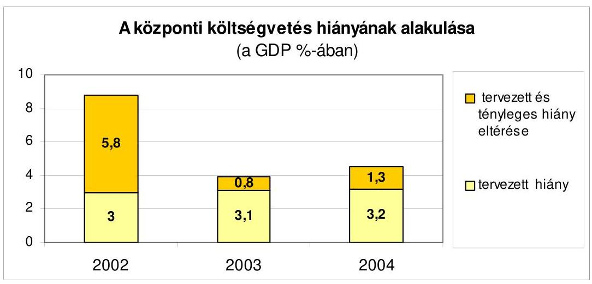
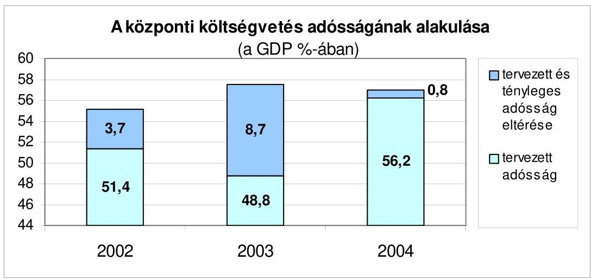
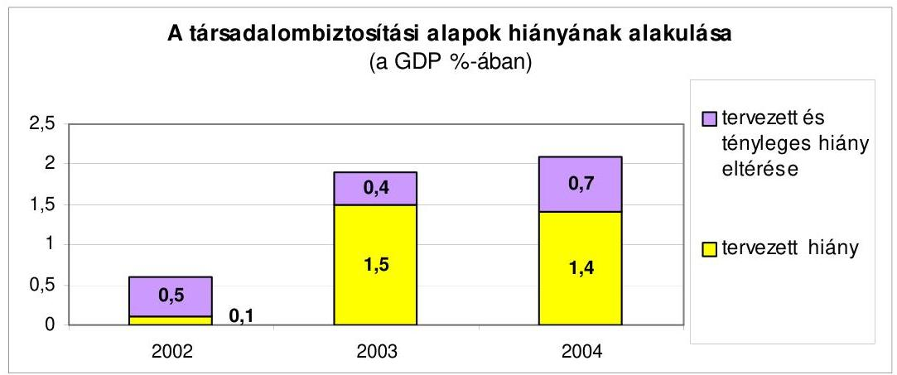
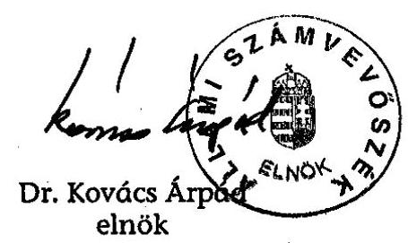

# JELENTÉS 

a Magyar Köztársaság 2004. évi
költségvetése végrehajtásának ellenőrzéséről
$\overline{0540}$
T/17290/1. 2005. augusztus

---

# 1. Szervezetirányítási és Müködtetési Igazgatóság 

Vizsgálat-azonosító szám: V0141

## Az ellenőrzést felügyelte:

Dr. Csapodi Pál
főtitkár

## Az ellenőrzés végrehajtásáért felelős:

Dr. Kékesi László
főtitkárhelyettes

## Az ellenőrzést vezette:

Horváthné Menyhárt Erika
főcsoportfőnök-helyettes

## Az ellenőrzést végezték:

| Bojtos Rózsa | Göller Géza |
| :-- | :-- |
| tanácsadó | főtanácsadó |
| Dr. Somorjai Zsoltné | Szabó Balázs |
| számvevő tanácsos | számvevő |

Nagyné Lakhézi Éva számvevő
Bálint Józsefné címzetes főmunkatárs

## 2. Államháztartás Központi Szintjét Ellenőrző Igazgatóság Az ellenőrzést felügyelte:

Bihary Zsigmond
főigazgató

## Az ellenőrzés végrehajtásáért felelős:

Simon Ákosné
főigazgató-helyettes

## Az ellenőrzést vezette:

Horváth Sándor
főcsoportfőnök-helyettes
Norczen Győzőné
osztályvezető főtanácsos
Tolnai Lászlóné
osztályvezető főtanácsos

Dr. Csépán Mária Magdolna igazgatóhelyettes
Pongrácz Éva
osztályvezető főtanácsos

Hámoriné Maróti Györgyi osztályvezető főtanácsos
Szabóné Farkas Katalin osztályvezető főtanácsos

## Az összefoglaló jelentés összeállításában közremüködtek:

Deli Gáborné
számvevő
Fogarasi Miklós
főtanácsadó
Papp Julianna
számvevő tanácsos
Szabóné Simai Mária
számvevő

## Az ellenőrzést végezték:

Dr. Antal Zoltán
külső munkatárs
Dr. Baki István
számvevő
Dr. Baloghné Sebestyén Éva
számvevő
Bata Zsuzsanna
külső munkatárs

Éva Katalin
főtanácsadó
Dr. Juhászné Szima Mária tanácsadó

Dr. Pósch Gábor
főtanácsadó
Székely Ibolya
tanácsadó

Asztalos Gézáné Dr.
külső munkatárs
Balázs Melinda
számvevő tanácsos
Bamberger Mária
tanácsadó
Bács Ágnes
számvevő

Farkas László
főtanácsadó
Krémó Márkné
számvevő tanácsos
Dr. Sipos Dóra
számvevő tanácsos
Zaroba Szilvia
számvevő

Dr. Baji László
számvevő
Balla Józsefné
külső munkatárs
Bartha Gyula
külső munkatárs
Burenzsargal Narantuja
számvevő

---

Csányi Istvánné külső munkatárs

Dombovári Nóra számvevő

Éva Katalin főtanácsadó

Fekete Győr László számvevő

Fodor Edit számvevő tanácsos

Gál Erika számvevő gyakornok

Gyarmati István számvevő tanácsos

Hajduné Sipos Erika számvevő

Hites Anita
külső munkatárs
Huszárné Borbás Melinda számvevő gyakornok

Jáger Lajos számvevő

Jiling Sámuel számvevő

Karsai Lászlóné tanácsadó

Dr. Kicska Gabriella külső munkatárs

Konorót Zsuzsanna számvevő

Knoppné Szabó Ildikó számvevő tanácsos

Dr. Lengyel Attila tanácsadó

Dr. Mészáros Leila számvevő gyakornok

Morvay András számvevő tanácsos

Papp Julianna számvevő tanácsos

Dr. Pálok László külső munkatárs

Polyák Ferenc számvevő

Dr. Remport Katalin tanácsadó

Dr. Sipos Dóra számvevő tanácsos

Szaller Krisztina külső munkatárs

Dancsóné Kuron Ildikó számvevő

Dr. Domján Eszter számvevő tanácsos

Farkas László
főtanácsadó
Dormán István Zoltán számvevő gyakornok

Fogarasi Miklós
főtanácsadó
Gömöri József számvevő tanácsos

Haáz Andorné
külső munkatárs
Hegedűs Miklós
külső munkatárs
Horváth József
számvevő tanácsos
Jagicza Istvánné számvevő

Jenei Zoltán Béláné számvevő gyakornok

Juhász József Gábor számvevő

Kaiser Ilona
külső munkatárs
Kincses Erzsébet Eszter számvevő

Koska János
külső munkatárs
Krémó Márkné számvevő tanácsos

Magyar Sára számvevő gyakornok

Molnár Bálint számvevő gyakornok

Nagy József
főtanácsadó
Pappné Dr. Nagy Ilona külső munkatárs

Pető Krisztina számvevő

Dr. Pósch Gábor
főtanácsadó
Simon Andrásné Dr. számvevő tanácsos

Szabó Erzsébet számvevő tanácsos

Dr. Szávai Tamás
főtanácsadó

Deli Gáborné
számvevő
Dormán István Zoltán számvevő gyakornok

Fehérné Jagasich Mariann számvevő tanácsos

Ferencz Katalin számvevő

Franczen Lajos számvevő gyakornok

Görgényi Gábor számvevő gyakornok

Hajdu Károlyné számvevő tanácsos

Hegedűsné Erdélyi Piroska tanácsadó

Huszár József számvevő

Dr. Jakab Kornél számvevő gyakornok

Jeszenkovits Tamás számvevő tanácsos

Dr. Juhászné Szima Mária tanácsadó

Kecskés József
külső munkatárs
Kiss Józsefné
külső munkatárs
Dr. Knapp József
külső munkatárs
Laub Ágota
külső munkatárs
Major Gizella
külső munkatárs
Molnár Katalin számvevő gyakornok

Némethné Nagy Mária számvevő

Patai Tamás számvevő tanácsos

Dr. Pintérné Csermák Jolán külső munkatárs

Dr. Princz János
külső munkatárs
Stadlerné Hantos Beáta külső munkatárs

Szabóné Simai Mária számvevő

Szepes Béla számvevő

---

| Szentesiné Tuka Margit külső munkatárs | Székely Ibolya tanácsadó | Szilágyi Gyöngyi főtanácsadó |
| :--: | :--: | :--: |
| Szilágyi Zsuzsanna tanácsadó | Szirbikné Dr. Szabó Mária számvevő | Szöllősiné Hrabóczki Etelka főtanácsadó |
| Tompa Miklós   külső munkatárs | Tóth Árpád   főtanácsadó | Vacsora Erika számvevő |
| Vas Lajos   főtanácsadó | Dr. Vass Gábor számvevő tanácsos | Váriné Kádár Margit külső munkatárs |
| Vörös Lászlóné Dr.   külső munkatárs | Vörös Katalin külső munkatárs | Winter Zsuzsa számvevő |
| Zakar László számvevő | Zaroba Szilvia számvevő |  |

# 3. Önkormányzati és Területi Ellenőrzési Igazgatóság Az ellenőrzést felügyelte: 

Dr. Lóránt Zoltán
föigazgató

## Az ellenőrzés végrehajtásáért felelős:

Dr. Sepsey Tamás főigazgató helyettes

## Az ellenőrzést vezette:

Ernst László
főtanácsadó, irodavezető

Németh Péterné
főcsoportfőnök

## A számvevői jelentések feldolgozásában és a jelentés összeállításában közremúködtek:

Alexovics Ágota számvevő tanácsos

Bauer Lajosné
főtanácsadó
Berényi Magdolna
főtanácsadó
Dr. Botta Tibor
számvevő tanácsos
Csényi István
számvevő
Dr. Csikai Zsolt
főtanácsadó
Dr. Csonka Ernő
számvevő gyakornok
Ébner Vilmosné
főtanácsadó
Engert Jakab
külső munkatárs
Fodor Tivadarné
számvevő tanácsos
Gelencsér Zoltán
külső munkatárs
Gyüre Lajosné
számvevő

Ambrus Lajos
tanácsadó
Benkéné dr. Lavner Klára
számvevőt tanácsos
Bialkó Zsolt
számvevő tanácsos
Böröcz Imre
tanácsadó
Csepreginé Tancsik Erzsébet
számvevő
Csiszárné dr. Kosik Mária
számvevő tanácsos
Csuti Lajos
számvevő tanácsos
Eigner György
számvevő
Dr. Ernst László
főtanácsadó
Fórián Erika
számvevő tanácsos
Gyenes László
külső munkatárs
Hadházy Sándor
számvevő tanácsos

Balogné Dakó Eszter számvevő tanácsos
Benn Imréné számvevő tanácsos
Dr. Boda Sándor számvevő tanácsos
Dr. Csapó Anna tanácsadó
Dr. Csermák Judit számvevő

Csomán Mihály
főtanácsadó
Czifra Erzsébet tanácsadó
Endrődy Péterné számvevő tanácsos
Fodor Pálné
külső munkatárs
Gál Istvánné
külső munkatárs
György Árpád
számvevő tanácsos
Hangyál Márta számvevő

---

| Dr. Hegedűs György főtanácsadó | Hegyes Mária számvevő | Hirka Mihály   főtanácsadó |
| :--: | :--: | :--: |
| Holman Magdolna számvevő | Horváth Mária számvevő | Huberné Kuncsik Zsuzsa tanácsadó |
| Humli Tamásné számvevő | Huszár Sándorné számvevő tanácsos | Ihász Dezső   külső munkatárs |
| Iszakné Dóczé Katalin számvevő | Jakubcsák Jenő számvevő | Kalmár István számvevő tanácsos |
| Kányáné Murva Tünde számvevő | Dr. Karáné Kőszegi Zsuzsa számvevő tanácsos | Kenéz Sándor főtanácsadó |
| Kerezsi Pál számvevő tanácsos | Kéri Péter számvevő tanácsos | Kersmájer Ágota számvevő tanácsos |
| Kisapáti Angéla külső munkatárs | Kisgergely István számvevő | Kispálné Wiedemann Györgyi tanácsadó |
| Dr. Kiss Károly számvevő tanácsos | Kiss Rita számvevő | Dr. Klapcsik László főtanácsadó |
| Klinga László számvevő tanácsos | Koczor László számvevő | Koltay Zsoltné számvevő |
| Komlósiné Bogár Éva számvevő tanácsos | Kopaczné Horváth Zsuzsanna számvevő tanácsos | Koronczai Sándorné számvevő tanácsos |
| Dr. Koronics Károlyné külső munkatárs | Korsósné Vígh Andrea számvevő tanácsos | Kovács Judit külső munkatárs |
| Kozák György   főtanácsadó | Kozma Gábor számvevő | Kőhalminé Major Judit külső munkatárs |
| Köllődné Gátai Mária külső munkatárs | Dr. Kőrös István számvevő tanácsos | Dr. Lacó Bálintné főtanácsadó |
| Laki Dóra számvevő tanácsos | Lingné Rajz Borbála számvevő | Luhály Matild számvevő |
| Majer Lajosné külső munkatárs | Major Lászlóné számvevő tanácsos | Maróti Sándor számvevő tanácsos |
| Mikóné Horváth Rita külső munkatárs | Mohl Anna számvevő | Mokányszkiné Mengyi Andrea számvevő |
| Molnár Mária külső munkatárs | Nagy Attila számvevő tanácsos | Nagy Ervin számvevő |
| Nagy János számvevő tanácsos | Nagy László Csaba számvevő tanácsos | Nagy Sándorné számvevő tanácsos |
| Nyikon Zsigmondné számvevő tanácsos | Nyíri Csabáné külső munkatárs | Dr. Pál Lehelné főtanácsadó |
| Pálfi András számvevő tanácsos | Pálfiné Pusztai Magdolna számvevő | Papp József számvevő tanácsos |
| Péntek László   főtanácsadó | Preller Zsuzsanna tanácsadó | Puskás Balázs számvevő |
| Reichert Margit számvevő | Renkó Zsuzsanna számvevő tanácsos | Ritecz Tibor számvevő |
| Schósz Attiláné számvevő | Somodiné Fehér Julianna számvevő tanácsos | Somogyiné dr. Legény Mária számvevő tanácsos |
| Szabó Mihályné külső munkatárs | Szabó Tamás számvevő tanácsos | Szabó Zoltán számvevő tanácsos |
| Szakmányné Bilik Mária számvevő | Szalontai Miklós számvevő tanácsos | Széchenyi Katalin külső munkatárs |

---

Szenténé Tubak Klára Számvevő tanácsos
Szűtsné Kiss Zsuzsanna külső munkatárs
Tótfalusi Zoltán számvevő
Tóth Péter számvevő
Újvári Józsefné számvevő
Dr. Vasváriné dr. Rózsa Anikó főtanácsadó
Vida László számvevő tanácsos

Szihalminé Kovács Zsuzsa számvevő
Dr. Telkes Imre számvevő tanácsos
Tóth László számvevő gyakornok
Tóth Tamás számvevő
Varga József számvevő tanácsos
Vécsey László
főtanácsadó
Vojcsekné Szabó Ágnes számvevő tanácsos

Dr. Szikszai Bertalan számvevő tanácsos
Tímár József
főtanácsadó
Tóth Pál számvevő tanácsos
Tóthné Salamon Ildikó számvevő tanácsos
Váriné Kádár Margit külső munkatárs
Veres Jánosné külső munkatárs
Zeke József számvevő tanácsos

# A témához kapcsolódó eddig készített számvevőszéki jelentések 

címe
Jelentés a Magyar Köztársaság 2003. évi költségvetése végrehajtásának 0443 ellenőrzéséről
Vélemény a Magyar Köztársaság 2004. évi költségvetési javaslatáról 0338
A kötött felhasználású támogatások 2002. évi felhasználásának ellenőrzése 0331
A helyi önkormányzatok beruházásaihoz és rekonstrukcióihoz nyújtott 2002. évi 0332 címzett- és céltámogatások igénybevételének és felhasználásának ellenőrzése
A helyi és a helyi kisebbségi önkormányzatok gazdálkodásának átfogó ellenőrzése

---

# TARTALOMJEGYZÉK 

BEVEZETŐ ..... 13
I. ÖSSZEGZŐ MEGÁLLAPÍTÁSOK, KÖVETKEZTETÉSEK JAVASLATOK ..... 19
II. RÉSZLETES MEGÁLLAPÍTÁSOK ..... 51
A) A ZÁRSZÁMADÁSI DOKUMENTUM TÖRVÉNYESSÉGI ÉS SZÁMSZAKI ELLENŐRZÉSE ..... 53

1. A törvényjavaslat paragrafusai és törvényi mellékletei ..... 55
1.1. Bevételi és kiadási főösszegek, mérleg ..... 55
1.2. A központi költségvetés hiányának finanszírozása, adósságának törlesztése ..... 55
1.3. A helyi önkormányzatok ..... 55
1.4. Az ÁPV Rt. költségvetési előirányzatainak teljesítése ..... 55
1.5. Méltányossági felhasználás ..... 56
1.6. Részletes indokolás ..... 56
2. Egyes törvényi előírások, illetve felhatalmazások teljesítése ..... 56
2.1. A dokumentumra vonatkozó Áht.-előírások teljesítése ..... 57
2.2. Általános és céltartalék ..... 58
2.3. Állami kezesség és viszontgarancia érvényesítése ..... 58
2.4. Az állami vagyon bemutatása ..... 59
2.5. Elkülönített állami pénzalapokra vonatkozó előírások ..... 60
2.6. A társadalombiztosítási alapokra vonatkozó előírások ..... 60
3. A zárszámadási dokumentum külső és belső egyezősége ..... 61
3.1. A központi költségvetésre vonatkozó adatok megjelenítése ..... 61
3.2. Központi beruházásokra vonatkozó adatok megjelenítése ..... 61
3.3. A helyi önkormányzatokra vonatkozó adatok megjelenítése ..... 62
3.4. A Kö.tv.-ben kapott felhatalmazások teljesítése ..... 62
3.5. A fejezetektől a társadalombiztosításnak átadott összegek megjelenítése ..... 62
3.6. A törvényjavaslat fejezeti indokolása ..... 63

---

B) HELYSZÍNI ELLENŐRZÉS ..... 65
B.1. AZ ÁLLAMHÁZTARTÁS KÖZPONTI SZINTJE ..... 67
B.1.1. A KÖZPONTI KÖLTSÉGVETÉS ..... 67

1. A központi költségvetés 2004. évi törvényi előirányzatainak teljesítése, a hiány alakulása ..... 67
2. A központi költségvetés finanszírozása, a kincstári egységes számla likvidítása ..... 69
2.1. A központi költségvetés finanszírozási igénye ..... 69
2.2. A központi költségvetés tényleges finanszírozása ..... 71
3. A központi költségvetés közvetlen előirányzatai ..... 74
3.1. A központi költségvetés közvetlen bevételei ..... 74
3.1.1. Vállalkozások költségvetési befizetései ..... 74
3.1.2. Fogyasztáshoz kapcsolt adók ..... 78
3.1.2.1. Általános forgalmi adó ..... 78
3.1.2.2. Fogyasztáshoz kapcsolt egyéb adók ..... 79
3.1.3. A lakosság befizetései ..... 81
3.1.4. Bányajáradék ..... 82
3.1.5. A Magyar Nemzeti Bank költségvetési kapcsolata ..... 83
3.1.6. Állami vagyonnal kapcsolatos bevételek ..... 83
3.1.6.1. Osztalékbevételek ..... 83
3.1.6.2. Koncessziós bevételek ..... 84
3.2. A központi költségvetés közvetlen bevételei elszámolásainak megbízhatósága ..... 84
3.2.1. Az APEH és a VP főkönyvi és analitikus adatainak egyezősége ..... 84
3.2.2. Az APEH és a VP hatáskörébe tartozó nemzetgazdasági számlákon realizált adó- és vámbevételek, valamint visszautalások elszámolása ..... 86
3.3. A köztartozások behajtására tett intézkedések ..... 90
3.3.1. Az adóhátralékok behajtására tett intézkedések ..... 90
3.3.2. Végrehajtói letéti rendszer ..... 92
3.3.3. Fizetési könnyítés, méltányossági jogok gyakorlása ..... 93
3.3.4. A vámhatóság által kezelt vám- és adótartozások behajtására tett intézkedések ..... 93
3.4. A központi költségvetés közvetlen kiadásai ..... 94
3.4.1. A közvetlen kiadások teljesítésének eljárási rendje ..... 94
3.4.2. Az előirányzatok felhasználása ..... 95
3.4.3. A központi költségvetés kamatelszámolásai, tőke- visszatérülései, az adósság- és követeléskezelés költségei ..... 101
3.4.4. A központi költségvetés terhére vállalt kezességek ..... 109

---

3.4.5. A központi költségvetés általános tartalékának és céltartalékának felhasználása ..... 115
3.5. A központi költségvetés közvetlen kiadásai elszámolásainak megbízhatósága ..... 119
4. A fejezetek költségvetésének végrehajtása ..... 124
4.1. A fejezetek bevételi és kiadási előirányzatainak teljesítése, az előirányzat-maradványok alakulása ..... 125
4.1.1. A bevételi előirányzatok teljesítése ..... 125
4.1.2. A kiadási előirányzatok teljesítése ..... 126
4.1.3. Előirányzat-maradványok alakulása ..... 127
4.1.4. A költségvetési intézmények finanszírozása ..... 129
4.1.4.1. Az előirányzat-felhasználási keret megnyitása, felhasználása ..... 129
4.1.4.2. A központi költségvetési szervek tartozásállománya, köztartozásai ..... 130
4.2. A kijelölt fejezetek, fejezeti jogosítványú költségvetési címek beszámolóinak megbízhatósága ..... 132
4.3. A kijelölt intézmények elemi beszámoló jelentéseinek megbízhatósága ..... 133
4.3.1. Az Igazgatási címek, alcímek elemi beszámoló jelentéseinek megbízhatósága ..... 133
4.3.2. A fejezetek által ellenőrzött elemi beszámolók megbízhatósága ..... 134
4.4. A fejezeti kezelésű előirányzatok elszámolásainak megbízhatósága ..... 134
5. Az EU-támogatások és az uniós tagsággal összefüggő hazai befizetések ..... 135
6. Letéti számlák ..... 144
6.1. A központi letéti számla ..... 144
6.2. Fejezeti letéti számlák ..... 144
7. A korábbi ÁSZ ellenőrzések megállapításaival kapcsolatban tett intézkedések ..... 144
B.1.2. ELKÜLÖNÍTETT ÁLLAMI PÉNZALAPOK ..... 147

1. Munkaerőpiaci Alap ..... 147
1.1. Az MPA költségvetési beszámolója ..... 147
1.2. Az MPA pénzügyi helyzete ..... 147
1.3. Az Alap bevételeinek teljesülése ..... 148
1.4. Az MPA 2004. évi kiadásai ..... 148
2. Központi Nukleáris Pénzügyi Alap ..... 149
2.1. A KNPA költségvetési beszámolója ..... 149
2.2. A KNPA 2004. évi költségvetésének végrehajtása ..... 150
2.2.1. Az Alap bevételei ..... 150
2.2.2. Az Alapot terhelő kiadások ..... 150

---

3. Wesselényi Miklós Ár- és belvízvédelmi Kártalanítási Alap ..... 151
4. Kutatási és Technológiai Innovációs Alap ..... 152
4.1. Az Alap működésének jogszabályi háttere ..... 152
4.2. Az Alap 2004. évi költségvetési beszámolója ..... 153
4.3. Az Alap költségvetésének végrehajtása ..... 153
4.3.1. A bevételek alakulása ..... 153
4.3.2. A kiadások alakulása ..... 154
B.1.3. A TÁRSADALOMBIZTOSÍTÁS PÉNZÜGYI ALAPJAI ..... 156
5. Nyugdíjbiztosítási Alap ..... 156
1.1. A 2004. évi költségvetési beszámolók elkészítése ..... 156
1.1.1. Az ellátási beszámoló fontosabb információi ..... 156
1.1.2. A múködési költségvetés beszámolója ..... 158
1.2. Az Ny. Alap pénzügyi helyzete ..... 158
1.3. A költségvetési bevételek teljesülése ..... 159
1.3.1. Az Ny. Alap járulék és hozzájárulás bevételei ..... 159
1.3.2. A központi költségvetés hozzájárulásai ..... 160
1.3.3. Az Ny. Alap egyéb bevételei ..... 160
1.4. Az Ny. Alap kiadásai ..... 161
1.4.1. Ellátási kiadások ..... 161
1.4.2. A méltányosság gyakorlása ..... 162
1.4.3. Egyéb kiadások ..... 163
1.5. Az ONYF múködési költségvetésének végrehajtása ..... 163
1.5.1. A múködési költségvetés vizsgálatának módszere ..... 163
1.5.2. A múködési költségvetés bevételei ..... 164
1.5.3. Költségvetési kiadások ..... 164
1.5.4. Az előirányzat-maradvány alakulása ..... 165
1.5.5. Az ONYF belső ellenőrzési rendszere ..... 165
6. Egészségbiztosítási Alap ..... 166
2.1. A 2004. évi költségvetési beszámolók elkészítése ..... 166
2.1.1. Az ellátási szektor beszámolója ..... 166
2.1.2. A múködési költségvetés beszámolója ..... 167
2.2. Az E. Alap pénzügyi helyzete ..... 167
2.3. A költségvetési bevételek teljesülése ..... 168
2.3.1. Az E. Alap járulék és hozzájárulás bevételei ..... 168
2.3.2. A központi költségvetés megtérítései, hozzájárulásai ..... 169
2.3.3. Egyéb bevételek ..... 169
2.4. Az Alap költségvetési kiadásai ..... 170
2.4.1. Rokkantsági nyugellátások ..... 170
2.4.2. Pénzbeli ellátások ..... 171
2.4.3. A gyógyító-megelőző egészségügyi ellátás finanszírozása ..... 171

---

2.4.4. Gyógyszerkiadások ..... 174
2.4.5. Egyéb természetbeni ellátások ..... 176
2.4.6. Az irányított betegellátás modellkísérlete ..... 177
2.4.7. Az ellátásokhoz kapcsolódó egyéb kiadások ..... 178
2.5. Az OEP működési költségvetésének végrehajtása ..... 178
2.5.1. A múködési költségvetés bevételei ..... 178
2.5.2. A költségvetés kiadásai ..... 179
2.5.3. Az előirányzat-maradvány alakulása ..... 180
2.5.4. Az OEP belső ellenőrzési rendszere ..... 180
B.2. AZ ÁLLAMHÁZTARTÁS HELYI SZINTJE, A HELYI ÖNKORMÁNYZATOK ..... 181

1. A Kö.tv. mellékleteiben meghatározott központi támogatások elszámolásának szabályszerűsége ..... 181
1.1. Az előirányzatok nyilvántartása ..... 181
1.1.1. Az eredeti előirányzatok jogcímenkénti megfelelősége a Kö.tv- ben és a PM-BM rendeletben ..... 181
1.1.2. Az előirányzat módosítások szabályszerűsége ..... 183
1.2. A helyi önkormányzatok támogatásainak és hozzájárulásainak jogcímenkénti alakulása ..... 184
1.2.1. A helyi önkormányzatok normatív hozzájárulásai ..... 184
1.2.2. A helyi önkormányzatok személyi jövedelemadó részesedése ..... 188
1.2.3. A helyi önkormányzatok által felhasználható központosított előirányzatok ..... 189
1.2.4. A helyi önkormányzatok múködőképességének megőrzését szolgáló kiegészítő támogatások ..... 195
1.2.4.1. Az önhibájukon kívül hátrányos helyzetben lévő (múködési forráshiányos) helyi önkormányzatok támogatása ..... 195
1.2.4.2. A tartósan fizetésképtelen helyzetbe került helyi önkormányzatok támogatása ..... 197
1.2.4.3. A múködésképtelen önkormányzatok egyéb támogatása ..... 198
1.2.5. A helyi önkormányzatok színházi támogatása ..... 201
1.2.5.1. A kőszínházak és a bábszínházak épületmúködtetési és művészeti tevékenységeinek kiadásaihoz való hozzájárulás ..... 202
1.2.5.2. Színházak pályázati támogatása ..... 203
1.2.6. A normatív kötött felhasználású támogatások ..... 205
1.2.7. Felhalmozási célú támogatások ..... 207
1.2.7.1. Címzett és céltámogatások ..... 207
1.2.7.2. A területi kiegyenlítést szolgáló fejlesztési célú támogatás ..... 208
1.2.7.3. A céljellegú decentralizált támogatás ..... 209

---

1.2.7.4. A felhalmozási célú támogatások felhasználása ellenőrzésének tapasztalatai ..... 210
1.2.8. Budapest 4-es - Budapest-Kelenföldi pályaudvar-Bosnyák tér közötti - metróvonal első szakasza építésének támogatása ..... 212
2. A helyi önkormányzatok előző évi elszámolása és ellenőrzése során megállapított eltérések rendezésének szabályszerűsége ..... 212
3. A könyvvizsgálati kötelezettség teljesítésének országos tapasztalatai ..... 215

---

# RÖVIDÍTÉSEK JEGYZÉKE 

| ÁAK Rt. | Állami Autópálya Kezelő Rt. |
| :--: | :--: |
| áfa | általános forgalmi adó |
| Áht. | Az államháztartásról szóló 1992. évi XXXVIII. törvény |
| AIK | Agrárintervenciós Központ |
| AKA Rt. | Alföldi Koncessziós Autópálya Rt. |
| ÁKK Rt. | Államadósság Kezelő Központ Rt. |
| ÁFSZ | Állami Foglalkoztatási Szolgálat |
| ALB | Alkotmánybíróság |
| Ámr. | Az államháztartás múködési rendjéről szóló 217/1998. (XII. 30.) Korm. rendelet |
| APEH | Adó- és Pénzügyi Ellenőrzési Hivatal |
| APEH-SZTADI | Adó- és Pénzügyi Ellenőrzési Hivatal Számítástechnikai és Adatfeldolgozó Intézet |
| ÁPV Rt. | Állami Privatizációs és Vagyonkezelő Rt. |
| Art. | Az adózás rendjéről szóló 1990. évi XCI. törvény |
| ÁSZ | Állami Számvevőszék |
| ÁSZ tv. | Az Állami Számvevőszékről szóló 1989. évi XVIII. törvény |
| ÁSZTL | Állambiztonsági Szolgálatok Történeti Levéltára |
| ÁTBP | Állami Támogatású Bérlakás Program |
| AVOP | Agrár- és Vidékfejlesztési Operatív Program |
| BC | Beruházás-ösztönzési célelőirányzat |
| Ber. | A költségvetési szervek belső ellenőrzéséről szóló 193/2003. (XI. 26.) Korm. rendelet |
| BIR | Bíróságok |
| BKIK | Budapesti Kereskedelmi és Iparkamara |
| BM | Belügyminisztérium |
| BM KGF | Belügyminisztérium Központi Gazdasági Főigazgatóság |
| Bszi | A bíróságok szervezetéről és igazgatásáról szóló 1997. évi LXVI. törvény |
| Cct. | A helyi önkormányzatok címzett és céltámogatási rendszeréről szóló 1992. évi LXXXIX. törvény |
| CEDEFOP | Európai Szakképzés-fejlesztési Központ |
| CÉDE | Céljellegú decentralizált támogatás |
| CFCU | Központi Pénzügyi és Szerződéskötő Egység |
| CISZOK | Civil Szolgáltató Központok |
| EBB | Európai Beruházási Bank |
| EBRD | Európai Újjáépítési és Fejlesztési Bank |
| EGC | Energiagazdálkodási célelőirányzat |
| EHJC | Energiafelhasználás hatékonyság javítása célelőirányzat |
| EKH | Esélyegyenlőségi Kormányhivatal |
| E. Alap | Egészségbiztosítási Alap |
| EMIR | Egységes Monitoring Információs Rendszer |

---

| ESZA Kht. | Európai Szociális Alap Nemzeti Programirányító Iroda, Társadalmi Szolgáltató Kht. |
| :--: | :--: |
| ESzCsM | Egészségügyi, Szociális és Családügyi Minisztérium |
| Etv. | Az egyes fontos tisztségeket betöltő személyek ellenőrzéséről szóló 1994. évi XXIII. törvény |
| EU | Európai Unió |
| EüM | Egészségügyi Minisztérium |
| EXIMBANK Rt. | Magyar Export-Import Bank Rt. |
| EVA | Egyszerűsített Vállalkozási Adó |
| FA | Munkaerőpiaci Alap Foglalkoztatási Alaprésze |
| FH | Foglalkoztatási Hivatal |
| FIFA | Felzárkóztatási Infrastrukturális Fejlesztési Alapprogram |
| FKA | Munkaerőpiaci Alap Fejlesztési és Képzési Alaprésze |
| Flt. | A foglalkoztatás elősegítéséről és a munkanélküliek ellátásáról szóló 1991. évi IV. törvény |
| FMM | Foglalkoztatási és Munkaügyi Minisztérium |
| FÓMI | Földmérési Távközlési Intézet |
| FPMNYI | Fővárosi és Pest Megyei Nyugdíjbiztosítási Igazgatóság |
| FVM | Földművelésügyi és Vidékfejlesztési Minisztérium |
| GDP | Bruttó hazai termék |
| Get. | A gázellátásról szóló 2003. évi XLII. törvény |
| GFC | Gazdaságfejlesztési célelőirányzat |
| GFS | Government Financial Statistics |
| GKM | Gazdasági és Közlekedési Minisztérium |
| Gt. | A gazdasági társaságokról szóló 1997. évi CXLIV. törvény |
| GVH | Gazdasági Versenyhivatal |
| GVOP | Gazdasági és Versenyképesség Operatív Program |
| GYFA | Gyártmányfejlesztési Forgóalap |
| GyISM | Gyermek-, Ifjúsági és Sportminisztérium |
| HCCP | Ételkészítéshez korszerű műszaki eszközök, berendezések és higiéniás eljárások rendszere |
| HEFOP | Humánforrás-fejlesztési Operatív Program |
| HM | Honvédelmi Minisztérium |
| HTMH | Határon Túli Magyar Hivatala |
| Hszt. | A fegyveres szervek hivatásos állományú tagjainak szolgálati viszonyáról szóló 1996. évi XLIII. törvény |
| IBRD | Nemzetközi Újjáépítési és Fejlesztési Bank |
| ICsSzEM | Ifjúsági, Családügyi, Szociális és Esélyegyenlőségi Minisztérium |
| Igazgatóságok | Magyar Államkincstár Területi Igazgatóságai |
| IH | Információs Hivatal |
| IHM | Informatikai és Hírközlési Minisztérium |
| IM | Igazságügyi Minisztérium |
| IM-BV | Igazságügyi Minisztérium Büntetésvégrehajtási Szervezet |
| ISPA | Instrument for Structural Policies for Pre-Accession |

---

| ITD-H Kft. | Magyar Befektetési és Kereskedelemfejlesztési Kft. |
| :--: | :--: |
| ISZIH | Igazságügyi Szakértői Intézetek Hivatala |
| Jöt. | A jövedéki adóról szóló 1997. évi CIII. törvény |
| KAIG | Kiemelt Adózók Igazgatósága (APEH) |
| Kbt. | A közbeszerzésekről szóló 1995. évi XL. törvény |
| KE | Köztársasági Elnökség |
| KEHI | Kormányzati Ellenőrzési Hivatal |
| KEP | Köztársasági Esélyegyenlőségi Program |
| KESZ | Kincstári Egységes Számla |
| Kft. | Korlátolt felelősségű társaság |
| Kht. | Közhasznú társaság |
| KfW | Kreditanstalt für Wiederaufbau (Újjáépítési és Hitelbank) |
| Kincstár | Magyar Államkincstár |
| KIOP | Környezetvédelmi és Infrastrukturális Operatív Program |
| KIR | Központi Illetményszámfejtő Rendszer |
| Kjt. | Közalkalmazottak jogállásáról szóló 1992. évi XXXIII. törvény |
| KKC | Kis és középvállalkozási célelőirányzat |
| KMÜFA | Központi Műszaki Fejlesztési Alap |
| KNPA | Központi Nukleáris Pénzügyi Alap |
| KOMT | Közalkalmazottak Országos Munkaügyi Tanácsa |
| Kövice | Környezetvédelmi és vízügyi célelőirányzat |
| KPI | Kutatás-fejlesztési Pályázati és Kutatáshasznosítási Iroda |
| KPSZE | Központi Pénzügyi és Szerződéskötő Egység |
| KvVM | Környezetvédelmi és Vízügyi Minisztérium |
| KSH | Központi Statisztikai Hivatal |
| KSzF | Központi Szolgáltatási Főigazgatóság |
| KT | Közbeszerzések Tanácsa |
| KTIA | Kutatási és Technológiai Innovációs Alap |
| KTK | Kincstári Tranzakciós Kód |
| Ktv. | A köztisztviselők jogállásáról szóló 1992. évi XXIII. törvény |
| KüM | Külügyminisztérium |
| KVI | Kincstári Vagyoni Igazgatóság |
| Kvtv. | A Magyar Köztársaság 2003. évi költségvetéséről szóló 2002. évi LXII. törvény |
| Kö. tv. | A Magyar Köztársaság 2004. évi költségvetéséről szóló 2003. évi CXVI. törvény |
| Közokt. tv | A közoktatásról szóló 1993. évi LXXIX. törvény |
| LEP | Lakóépületek Energia-megtakarítási Programja |
| LÜ | Legfőbb Úgyészség |
| MACIKA | Magyarországi Cigányokért Közalapítvány |
| MAT | Munkaerőpiaci Alap Irányító Testülete |
| MÁV Rt. | Magyar Államvasutak Rt. |

---

| MBH | Magyar Bányászati Hivatal |
| :--: | :--: |
| ME | Miniszterelnökség |
| MeH | Miniszterelnöki Hivatal |
| MEHVM | Miniszterelnöki Hivatalt Vezető Miniszter |
| MEHIB Rt. | Magyar Exporthitel Biztosító Rt. |
| MeHIg | Miniszterelnöki Hivatal Igazgatása |
| MEH IKB | Miniszterelnökség Informatikai Kormánybiztosság |
| MEH KÁ | Miniszterelnöki Hivatal Közigazgatási Államtitkár |
| MEKÜF | Miniszterelnökség Központi Üdülési és Oktatási Föigazgatósága |
| ME-EKH | Miniszterelnökség Esélyegyenlőségi Kormányhivatal |
| ME-MKGI | Miniszterelnökség Közbeszerzési és Gazdasági Igazgatósága |
| ME-MTRFH | Miniszterelnökség Magyar Terület- és Regionális Fejlesztési Hivatal |
| ME-NFH | Miniszterelnökség Nemzeti Fejlesztési Hivatal |
| ME-NSH | Miniszterelnökség Nemzeti Sporthivatal |
| MEP | Megyei Egészségbiztosítási Pénztár |
| METESZ | Műszaki és Természettudományi Egyesületek Szövetsége |
| MFB Rt. | Magyar Fejlesztési Bank Rt. |
| MH | Magyar Honvédség |
| MK | Munkaügyi Központ |
| MKIK | Magyar Kereskedelmi és Iparkamara |
| MKK Rt. | Magyar Követeléskezelő Rt. |
| MKÜ | Magyar Köztársaság Ügyészsége |
| MLI Kht. | Magyar Lakásinnovációs Kht. |
| MNB | Magyar Nemzeti Bank |
| MNYP | Magánnyugdíjpénztár |
| MOB | Magyar Olimpiai Bizottság |
| MPA | Munkaerőpiaci Alap |
| MSH | Magyar Sportok Háza |
| MTA | Magyar Tudományos Akadémia |
| MTI Rt. | Magyar Távirati Iroda Rt. |
| MVf Kht. | Magyar Vállalkozásfejlesztési Kht. |
| MVH | Mezőgazdasági és Vidékfejlesztési Hivatal |
| MVM Rt. | Magyar Villamos Múvek Rt. |
| NBH | Nemzetbiztonsági Hivatal |
| NBSZ | Nemzetbiztonsági Szakszolgálat |
| NA Rt. | Nemzeti Autópálya Rt. |
| NCA | Nemzeti Civil Alapprogram |
| NEKH | Nemzeti és Etnikai Kisebbségi Hivatal |
| NFA | Nemzeti Földalap Program |
| NFT | Nemzeti Fejlesztési Terv |
| NKFP | Nemzeti kutatási-fejlesztési program |

---

| NKÖM | Nemzeti Kulturális Örökség Minisztériuma |
| :--: | :--: |
| NKTH | Nemzeti Kutatási és Technológiai Hivatal |
| NVT | Nemzeti Vidékfejlesztési Terv |
| NYUFIG | Nyugdíjfolyósító Igazgatóság |
| Ny. Alap | Nyugdíjbiztosítási Alap |
| OAH | Országos Atomenergia Hivatal |
| OBH | Országgyúlési Biztosok Hivatala |
| OBmT | Országos Bűnmegelőzési Tanács |
| OECD | Gazdasági Együttmúködési és Fejlesztési Szervezet |
| OEP | Országos Egészségbiztosítási Pénztár |
| OFA | Országos Foglalkoztatási Közalapítvány |
| OGY | Országgyúlés |
| OGYH | Országgyúlés Hivatal |
| OKÉV | Országos Közoktatási Értékelési és Vizsgaközpont |
| OKF | Országos Katasztrófavédelmi Főigazgatóság |
| OKRI | Országos Kriminológiai Intézet |
| OLÉH | Országos Lakás-, és Építésügyi Hivatal |
| OM | Oktatási Minisztérium |
| OMAI | Oktatási Minisztérium Alapkezelő Igazgatósága |
| OMMF | Országos Munkabiztonsági és Munkavédelmi Felügyelőség |
| OM NKFP | Oktatási Minisztérium Nemzeti Kutatás-, Fejlesztési Program |
| OMSZI | Oktatási Minisztérium Szolgáltató Intézmény |
| ONYF | Országos Nyugdíjbiztosítási Főigazgatóság |
| OOSZI | Országos Orvosszakértői Intézet |
| ORFK | Országos Rendőr Főkapitányság |
| OSZT | Országos Szakképzési Tanács |
| OTIVA | Országos Takarékszövetkezeti Intézmény Védelmi Alap |
| OTKA | Országos Tudományos Kutatási Alapprogramok |
| OTMR | Országos Támogatási Monitoring Rendszer |
| ÖNYP | Önkéntes Nyugdíjpénztár |
| PHARE | Pologne Hongrie Aid a la Reconstrukcion Économique |
| PIR | Pályázati Információs Rendszer |
| PKN | Pénztárak Központi Nyilvántartása |
| PM | Pénzügyminisztérium |
| PM-BM rendelet | A helyi önkormányzatokat a 2004. évben megillető normatív állami hozzájárulásokról, normatív kötött felhasználású támogatásokról, személyi jövedelemadóról, valamint a helyi önkormányzatok bevételeinek aránytalanságát mérséklő kiegészítésről, illetve beszámításról szóló 3/2004. (I. 31.) PM-BM együttes rendelet |
| PNSZ | Polgári Nemzetbiztonsági Szolgálatok |
| PSZÁF | Pénzügyi Szervezetek Állami Felügyelete |

---

| RA | Munkaerőpiaci Alap Rehabilitációs Alaprésze |
| :--: | :--: |
| REGÉC | Regionális fejlesztési céle1őirányzat |
| RIB | Regionális Idegenforgalmi Bizottság |
| ROP | Regionális Operatív Program |
| Rt. | Részvénytársaság |
| SAPS | Egységes területalapú támogatás |
| szja | személyi jövedelemadó |
| SKFF | Segélykoordinációs és Finanszírozási Főosztály |
| SZMSZ | Szervezeti és Múködési Szabályzat |
| Szt. | A számvitelről szóló 2000. évi C. törvény |
| SZT-TU | Széchenyi Terv Turisztikai Pályázatok |
| TÁTB | Társadalombiztosítási Ár- és Támogatási Bizottság |
| TB alapok | Társadalombiztosítás pénzügyi alapjai |
| TC | Turisztikai céle1őirányzat |
| Tbj. | 1997. évi LXXX. törvény a társadalombiztosítás ellátásaira és a magánnyugdijra jogosultakról, valamint e szolgáltatások fedezetéről, egységes szerkezetben a végrehajtásáról szóló 195/1997. (XI. 5.) Korm. rendelettel |
| TERKI | Területi kiegyenlítést szolgáló fejlesztési célú támogatás |
| TJKSZ | Támogatásokat és Járadékokat Kezelő Szervezet |
| TNM | Tárca nélküli Miniszter |
| Tny. | 1997. évi LXXXI. törvény a társadalombiztosítási nyugellátásról, egységes szerkezetben a végrehajtásáról szóló 168/1997. (X. 6.) Korm. rendelettel |
| Top-up | Kiegészítő hazai támogatás |
| URCE | Útfenntartási és fejlesztési céle1őirányzat |
| UKIG | Útgazdálkodási Koordinációs Igazgatóság |
| ÜMSZ | Ügyviteli és Múködési Szabályzat |
| VP | Vám- és Pénzügyőrség |
| VPOP | Vám- és Pénzügyőrség Országos Parancsnoksága |
| VPSZP | Vám- és Pénzügyőrség Számlavezető Parancsnoksága |
| VPÜSZK | Vám- és Pénzügyőrség Ügyvitelszervezési és Számítástechnikai Központja |
| WMA | Wesselényi Miklós Ár- és Belvízvédelmi Kártalanítási Alap |
| zárszámadási tv. | A Magyar Köztársaság 2003. évi költségvetésének végrehajtásáról szóló 2004. évi C. törvény |

---

# BEVEZETŐ 

A Magyar Köztársaság 2004. évi költségvetéséről rendelkező 2003. évi CXVI. törvény (a továbbiakban: Kö.tv.) végrehajtásáról készített törvényjavaslatot és a döntéshozatalhoz szükséges információkat a Kormány az éves zárszámadási dokumentumban terjeszti az Országgyúlés elé.

A 2004. évi költségvetés zárszámadásának számvevőszéki ellenőrzése a Magyar Köztársaság Alkotmányának 32/C. § (1) bekezdése, az Állami Számvevőszékről szóló 1989. évi XXXVIII. törvény 2. § (1) bekezdése, illetve az államháztartásról szóló 1992. évi XXXVIII. törvény 53. és 120/A. §-aiban kapott felhatalmazások alapján történt.

Az Állami Számvevőszéknek (ÁSZ) a zárszámadás ellenőrzéséről készített jelentése államháztartási alrendszerenként foglalja össze az előterjesztett dokumentumnak, a költségvetési bevételek és a kifizetések elszámolásainak, valamint a költségvetési gazdálkodásra vonatkozó jogszabályok érvényesülésének ellenőrzéséről szerzett tapasztalatokat. Az ellenőrzésben 268 munkatárs vett részt, az előző évhez hasonlóan közel 15 ezer ellenőrzési napot fordítva a feladat elvégzésére. Ezen ellenőrzési kötelezettség az ÁSZ legnagyobb volumenű feladata, amely az éves ellenőrzési kapacitás $22 \%$-át köti le.

A Magyar Köztársaság 2004. évi költségvetése végrehajtásának ellenőrzéséről készült számvevőszéki jelentés ${ }^{1}$ követi a korábbi évek zárszámadási jelentéseinek szerkezetét, de néhány - az Országgyúlés által kiemelten kezelt - témára vonatkozó ellenőrzési tapasztalatot külön is megjelenítünk. A jelentés két kötetből áll. Az első kötet tartalmazza az ellenőrzés legfontosabb megállapításait és javaslatait, valamint a zárszámadási dokumentum törvényességi és számszaki ellenőrzésére és az államháztartás alrendszereire vonatkozó részletes ellenőrzési megállapításokat. A második kötet (Függelék) tartalmazza a költségvetési fejezetekre, a kiemelt ellenőrzési témákra, az elkülönített állami

[^0]
[^0]:    ${ }^{1}$ A zárszámadási jelentéshez az ÁSZ Fejlesztési és Módszertani Intézete háttérelemzést készített, melynek célja, hogy rámutasson az adott év költségvetésének makrogazdasági összefüggéseire és problémáira, a 2004. évi költségvetési tervezés és végrehajtás folyamatának elemzésén keresztül pedig a tervezés megalapozottságára és az átláthatóság, az államadósság, az adósságszolgálati kiadások alakulására.

---

pénzalapokra, az Egészségbiztosítási Alapra és a helyi önkormányzatok költségvetési kapcsolataira vonatkozó részletes megállapításokat és javaslatokat.

Javaslatainkkal - számuk az előző évhez hasonlóan meghaladja a 70-et - erősíteni kívánjuk a zárszámadási törvényjavaslat megbízhatóságát, átláthatóságát, illetve a feltárt hibák jövőbeni elkerülését. A 2004. évtől a zárszámadási jelentés része három - önkormányzati alrendszer költségvetési kapcsolataira vonatkozó - olyan ellenőrzés is, amely korábban önálló ÁSZ jelentésként szerepelt. E mellett a tanúsító típusú ellenőrzésekkel a zárszámadási adatok megbízhatóságát megkérdőjelező hiányosságok mélyebb feltárására nyílik lehetőség. Az Országgyúlési bizottságok munkájának megkönnyítése érdekében a tárcáknak tett javaslatokat a jelentés függelékében, az adott tárcánál, illetve az önkormányzati ellenőrzések vonatkozásában az adott témánál, a részletes megállapítások után szerepeltetjük.

Az Országgyűlés évről-évre fokozott figyelemmel kíséri a zárszámadás ellenőrzésével kapcsolatos munkánkat, igényli, hogy a költségvetési törvény végrehajtását eddig nem súlyozott dimenziókban is áttekintsük, amely szükségessé teszi a jelentés terjedelmi kereteinek - azaz Országgyűlés által támasztott követelményekhez igazodó - bővítését.

Az ellenőrzés célja annak értékelése volt, hogy

- a költségvetés végrehajtásában jog- és hatáskörrel rendelkező szervek az államháztartási és az éves költségvetési, illetve az azt módosító törvényekben kapott felhatalmazásuk keretei között, az előírásoknak megfelelően jártak-e el;
- az állami költségvetés teljesítését bemutató adatok valósághűen tükrözik-e a 2004. évi pénzügyi folyamatokat és az egyes pénzügyi műveletek miként befolyásolták a költségvetés pozícióját;
- az ÁSZ stratégiájában és az azt megerősítő 69/2002. (X. 4.) és 35/2003. (IV. 9.) OGY határozatban foglaltak szerint vállalt körben ${ }^{2}$ végzett, megbízhatóságot tanúsító pénzügyi szabályszerűségi ellenőrzések alapján a Magyar Köztársaság 2004. évi költségvetése végrehajtásáról szóló törvényjavaslat adatai megbízható és valós képet nyújtanak-e;
- a zárszámadási dokumentum előterjesztése megfelel-e a vonatkozó törvényi előírásoknak, adattartalma segíti-e a költségvetési év lezárásához szükséges rendelkezések meghozatalát.

Az ÁSZ az adott évi zárszámadás ellenőrzése keretében törvényességi és szabályszerűségi ellenőrzést végez. Ebből következően nincs abban a helyzetben, hogy az ellenőrzött intézmények vezetési és kontroll rendszerében feltárt hiányosságokat - a kiváltó okok függvényében - mérlegelje. Amennyiben a szabá-

[^0]
[^0]:    ${ }^{2}$ A zárszámadás adatai megbízhatóságát tanúsító pénzügyi szabályszerűségi ellenőrzést végeztünk az ún. alkotmányos fejezeteknél, a fejezeti jogosítvánnyal rendelkező költségvetési címeknél, a fejezetek által felügyelt intézményi körből az igazgatási címeknél, a fejezeti kezelésű előirányzatoknál és a nemzetgazdasági elszámolásoknál.

---

lyos eljárási rend sérelmet szenved, arról ÁSZ-nak kötelessége az Országgyűlést tájékoztatni.

A központi költségvetési alrendszeren belül helyszíni ellenőrzésre került sor valamennyi költségvetési fejezetnél ${ }^{3}$, fejezeti jogosítványú költségvetési címnél, az elkülönített állami pénzalapok és a társadalombiztosítás pénzügyi alapjai kezelőinél.

A Kincstári Egységes Számla központilag teljesített bevételi és kiadási pénzforgalmát (beleértve a nemzetközi elszámolásokat, a belföldi államadósság költségvetési elszámolásait, a költségvetés nemzetközi hitelfelvételeit és a külföldi, valamint a belföldi adósságának törlesztését), a privatizációs bevételt, az egyes pénzműveletek hatását, továbbá az általános és céltartalék felhasználásával kapcsolatos és egyéb, fejezetek közötti előirányzat-átcsoportosításokat, valamint az előirányzat-megnyitások alakulását a Pénzügyminisztériumnál és a Magyar Államkincstárnál (Államháztartási Hivatalnál) vizsgáltuk.

A költségvetés hitelkapcsolatait és finanszírozását a Pénzügyminisztériumnál, valamint az Államadósság Kezelő Központ Rt.-nél ellenőriztük. A költségvetés fő bevételi forrásait jelentő adóbevételek előirányzatainak teljesítését, az EU-s adószámmal rendelkező adóalanyok áfa kiutalás előtti ellenőrzésének szabályszerűségét és célszerűségét, valamint a kintlévőségek csökkentése érdekében tett intézkedések eredményességét az Adó- és Pénzügyi Ellenőrzési Hivatalnál, a vám-, adókiszabási és behajtási tevékenységet pedig a Vám- és Pénzügyőrségnél értékeltük.

A 24/2004. (III. 31.) OGY határozat alapján ellenőriztük az M5 autópályát üzemeltető cég részvényeinek megvásárlására, illetve az autópálya továbbépítésére vonatkozó, 2004. február 11-én bejelentett kormánydöntés alapján megkötött szerződéseket és azok körülményeit törvényességi, célszerűségi és eredményességi szempontból. (Megállapításainkat a Függelék A. része tartalmazza.)

A 2004. évi ÁSZ beszámoló kapcsán az Országgyűlés 43/2005. (V. 26.) OGY határozata szellemében teljes körűen áttekintettük az európai uniós támogatásokkal összefüggő pénzalapok - beleértve az előcsatlakozási alapokat is - és a hazai társfinanszírozási pénzeszközök felhasználásának, valamint Magyarország uniós költségvetési kapcsolataiból eredő egyenleg alakulását. Értékeltük a kormányzati koordinációs tevékenység, valamint az irányító hatóságok és közreműködő szervezetek tevékenységének hatékonyságát, eredményességét. (Megállapításainkat a Függelék A. része tartalmazza.)

Az Országgyűlés bizottságai, országgyűlési képviselők felvetésére kiemelten foglalkoztunk az EU-s adószámmal rendelkező adóalanyok áfa kiutalás előtti ellenőrzésének szabályszerűségével és célszerűségével. (Megállapításainkat a Függelék A. része tartalmazza.)

[^0]
[^0]:    ${ }^{3}$ Az ÁSZ költségvetési beszámolóját az Országgyűlés elnöke által pályázat alapján kiválasztott, külső auditáló szervezet vizsgálta. Az ÁSZ gazdálkodásáról szóló beszámolót hitelesítő záradékkal látta el.

---

Az ÁSZ Elnökéhez érkezett megkeresésekre figyelemmel nyolc témában ${ }^{4}$ folytattunk az érintett fejezeteknél ellenőrzést. (Megállapításainkat a Függelék A. része tartalmazza.)

A zárszámadási adatok valódiságának és a pénzügyi-szabályszerúségi ellenőrzések hatékonyságának alapja, hogy a központi költségvetési szervek olyan belső kontrollrendszert építsenek ki és múködtessenek, amely minimalizálja annak kockázatát, hogy a beszámoló téves állításokat, hibás adatokat tartalmazzon. Ebből kiindulva a helyszíni ellenőrzés keretébe vont 41 szervezeten túl, 618 önállóan gazdálkodó költségvetési intézményre irányuló felmérés útján nyertünk információt a belső kontrollfunkciók és -eljárások szabályozottságáról, a rendszerek kiépítettségéről. (Megállapításainkat a Függelék A. része tartalmazza.)

A 2004. évi központi költségvetés bevételi főösszegéből ( 5333 Mrd Ft) a nemzetgazdasági elszámolások 4584 Mrd Ft-ot reprezentálnak, amit teljes körűen auditáltunk.

A fejezetek ellenőrzési körébe tartozó intézményi kör bevételeiből ( 612 Mrd Ft), a fejezetek mintegy 5 Mrd Ft-ot auditáltak.

A központi költségvetés 2004. évi kiadási főösszege ( 6238 Mrd Ft) mintegy 74\%át ellenőriztük a zárszámadási adatok megbízhatóságát tanúsító pénzügyiszabályszerúségi ellenőrzés módszerével ${ }^{5}$. Az ÁSZ a stratégiájában az e típusú ellenőrzésre kijelölt feladatait teljes körűen teljesítette. A kiadási főösszeg fennmaradó mintegy 26\%-ának megbízhatósági ellenőrzése a 193/2003. (XI. 26.) Korm. rendelet szerint a fejezet felügyeletét ellátó szerv feladata, amit azonban szintén e rendelet alapján legkésőbb 2010-ig kell teljes körűen teljesíteni. Jelenleg a kiadási főösszeg 4,8\%-át fedték le a fejezetek pénzügyiszabályszerúségi ellenőrzéssel.

[^0]
[^0]:    ${ }^{4}$ Az állami és egyházi oktatási intézmények finanszírozási kérdéseinek, az FVM Szőlészeti és Borászati Kutató Intézeténél a mobil garázs építésének körülményeinek, a Hungarotransplant Kht. költségvetési támogatásának, az életüktől és szabadságuktól politikai okból jogtalanul megfosztottak egyösszegű kárpótlásának, a Rendőrség dolgozóinak 2004. évi 13. havi illetménye kifizetése elmaradásának, az ESZCSM és egy kft. közötti szerződés megkötése körülményeinek, a parlagfü-mentesítési célra juttatott pénzeszköz cél szerinti felhasználásának és az APEH bejelentése alapján Sokoró Alapítvány költségvetési kapcsolatainak ellenőrzése.
    ${ }^{5}$ Az ÁSZ a központi költségvetés végrehajtásának ellenőrzési modelljéül a legjobb nemzetközi gyakorlatot, az ún. financial audit típusú ellenőrzést adaptálta. Ennek lényege, hogy beszámolási területenként, kockázatelemzésre épülő mintaválasztással az elszámolások szabályszerúségéről és ezen belül a költségvetési törvényben történő felhatalmazások követéséről mondunk véleményt. Ez az ellenőrzési modell és az ahhoz tartozó eszközrendszer alkalmas arra, hogy az ÁSZ 95\%-os bizonyossággal, 2\%-os lényegességi küszöb (a kiadási főösszegre vetített elfogadott hibahatár) mellett független és megbízható véleményt adjon az Országgyúlés számára a zárszámadási törvényjavaslatban kimutatott bevételek és kiadások teljességéről, felmerüléséről, mértékéről és szabályszerűségéről.

---

A fejezetek által végzett - a felügyelt intézményi kört érintő pénzügyi szabályszerűségi - ellenőrzések száma 46 -ról 72 -re nőt, figyelemmel azonban az intézmények számára (közel 800 intézmény) további komoly erőfeszítésekre van szükség ahhoz, hogy a Kormány 2010-re megteremtse a zárszámadás teljes körű ellenőrzésének feltételeit ${ }^{6}$, az országgyűlési határozatokon alapuló, az államháztartási törvényben és kormányrendeletben foglalt előirások megvalósítását. Ebben az esetben, a zárszámadás teljes körű ellenőrzésével, lehetővé válik, hogy az ÁSZ szakmai nyilatkozatot tegyen az Országgyűlésnek benyújtott, a költségvetés végrehajtásáról készített beszámolóról, hogy az valós és megbíz-ható-e.

Az ÁSZ a közös cél elérése, az OGY határozat és a kormányrendelet teljesítése érdekében módszertani, oktatási téren minden segítséget megad az államháztartás belső pénzügyi ellenőrzési rendszerének koordinálásáért felelős pénzügyminiszternek, illetve a fejezeteknek.

Az állami költségvetés zárszámadási ellenőrzése keretében, a korábbi évek gyakorlatának megfelelően az ÁSZ - a különböző hibák, szabálysértések, nem megfelelően alátámasztott elszámolások miatt - a számvevői jelentésekben nevesítette a személyi felelősséget (EkH, MTRFH, NkTH fejezeti jogosítványú költségvetési szerveknél, valamint a GKM, az OM és az ICsSzM fejezeteknél).

Az elkülönített állami pénzalapok és a társadalombiztosítás pénzügyi alapjai zárszámadásának ellenőrzésénél - tekintettel azok kötelező könyvvizsgálatára - az adatok valódiságának, hitelességének minősítésénél hasznosítottuk a könyvvizsgálatok értékelését. A Munkaerőpiaci Alap, a Központi Nukleáris Pénzügyi Alap, Wesselényi Miklós Ár- és Belvízvédelmi Kártalanítási Alap, valamint a Nemzeti Kutatási és Innovációs Alap zárszámadásának ellenőrzését az alapkezelőkön kívül a Foglalkoztatáspolitikai és Munkaügyi Minisztériumnál, az Oktatási Minisztériumnál, valamint a Gazdasági és Közlekedési Minisztériumnál végeztük el. A társadalombiztosítás pénzügyi alapjainak ellenőrzésére az Országos Egészségbiztosítási Pénztárnál, az Országos Nyugdíjbiztosítási Főigazgatóságnál és az Egészségügyi Minisztériumnál került sor.

Az önkormányzati alrendszer vonatkozásában a 2004. évi zárszámadáshoz kapcsolódóan 1253 Mrd Ft kiadási és 6 Mrd Ft bevételi előirányzat teljesítési adatainak megbízhatóságáról kellett véleményt kialakítani. Helyszíni vizsgálatot végeztünk a Belügyminisztériumban, a Pénzügyminisztériumban, a Magyar Államkincstárban, a Környezetvédelmi és Vízügyi Minisztériumban, az Ifjúsági, Családügyi, Szociális és Esélyegyenlőségi Minisztériumban, a Gazdasági és Közlekedési Minisztériumban, a Nemzeti Kulturális Örökség Minisztériumában és az Oktatási Minisztériumban. A Magyar Köztársaság 2004. évi költségvetésének végrehajtásáról szóló törvényjavaslatban szereplő elszámolási adatok megbízhatóságát az önkormányzatok hozzájárulásai, támogatásai elő-

[^0]
[^0]:    ${ }^{6}$ A 2004. évi ÁSZ beszámoló kapcsán az Országgyűlés 43/2005. (V. 26.) OGY határozatában megerősítette: továbbra is fontosnak tartja, hogy a fejezeti ellenőrző szervezetek bevonásával megteremtődjenek a feltételek a megbízhatósági ellenőrzések zárt rendszerének megvalósítására.

---

irányzatának adatbázisaiból, pénzérték alapú mintavételi eljárással kiválasztott önkormányzatok részére utalványozott hozzájárulások, támogatások alapján ellenőriztük.

A normatív hozzájárulás igénylését és felhasználását 73 helyi önkormányzatnál ellenőriztük, ezek összesen 234825 M Ft normatív hozzájárulással számoltak el, amelyből mintavétel alapján 120346 M Ft-ot vizsgáltunk meg. Az 50 ezernél kisebb lakosságszámú települések önkormányzatánál tételes, minden jogcímre és minden intézményre kiterjedő ellenőrzést végeztünk. Az 50 ezernél több lakosú településeken a BM fejezet 23. cím 1. alcímén belül az 1-12, 18, valamint a 27-29 jogcímú támogatásokat teljes körűen, a 13-17 és 19-26 jogcíműeket pedig mintavétel alapján ellenőriztük.

A helyi önkormányzatok személyi jövedelemadó részesedését ugyanezen 73 önkormányzatnál teljes körűen ellenőriztük. Ezek együttesen 103942 M Ft abszolút értékű személyi jövedelemadó részesedéssel, kiegészítéssel, illetve beszámítással számoltak el.

A kötött felhasználású támogatásként az ellenőrzött 72 önkormányzat 54634 M Ft-ot számolt el, amelyből mintavétel alapján 38140 M Ft elszámolását ellenőriztük.

A felhalmozási célú támogatásokat 74 helyi önkormányzatnál, 399 felhalmozási célú támogatásra vonatkozóan ellenőriztük tételesen, ezek együttes előirányzata 44898 M Ft volt.

A jelentés 2004 év vonatkozásában a zárszámadás helyszíni ellenőrzésének lezárásakor (2005. május vége) rendelkezésre álló adatokat tartalmazza. A jelentésünk véglegezéséig törekedtünk az adatok frissítésére, különös tekintettel a költségvetés pozícióját 2005 évre érintő bevételek, kiutalások, kötelezettségvállalások áthúzódó hatásaira.

A Pénzügyminisztérium 2005. augusztus 23 -ai jelzése szerint a Magyar Területés Regionális Fejlesztési Hivatal egész évi pénzforgalmi adatait - a megbízhatósági ellenőrzésünk megállapításainak figyelembe vételével - újra könyveltette, aminek következtében a központi költségvetés bevételi és kiadási főösszege, valamint a hiány összege módosult. A központi költségvetés újonnan benyújtott mérleg-főösszegeinek és a hiány összegének megbízhatóságáról - figyelemmel arra, hogy jelentésünket 2005. augusztus 31-i határidővel az Országgyűlés részére átadjuk, így a zárszámadás helyszíni ellenőrzési munkaszakaszának újbóli megnyitására idő hiányában már nincs lehetőség - nem állt módunkban meggyőződni.

A zárszámadás ellenőrzéséről készített jelentésünket a központi költségvetés fejezeteinél szakértői szinten több körben, majd államtitkári szinten is egyeztettük. Néhány területen, ahol az egyeztetés után is maradt véleményeltérés, azt a függelékben szerepeltetjük.

---

# I. ÖSSZEGZŐ MEGÁLLAPÍTÁSOK, KÖVETKEZTETÉSEK JAVASLATOK 

## ÁLTALÁNOS JELENSÉGEK, TENDENCIÁK

Az előző évekhez hasonlóan e pontban összefoglaljuk azokat az ellenőrzési tapasztalatokat, melyek túlmutatnak az adott évi problémákon, s rendszerbeli több éve folyamatosan jelentkező - hiányosságokat jeleznek.

- Visszatérő jelenség, hogy az eredetileg benyújtott és elfogadott költségvetési előirányzatok és azok teljesítése között lényeges eltérések mutatkoznak. Rendszeressé vált az egyes bevételi és kiadási előirányzatok évközi vagy év végi módosítása. Elfogadva, hogy a költségvetés kiigazítására bármikor, objektív okokból (gazdasági környezet változása, katasztrófák stb.) szükség lehet, azonban az elmúlt évek tapasztalatai azt erősítik, hogy törekedni kell a makrogazdasági előrejelzésekre jobban támaszkodó, megalapozottabb költségvetés összeállítására.
- A tervezés minősége determinálja a végrehajtást. A deficit cél elérése érdekében évközben hozott szigorító intézkedések - különös tekintettel a 2005. évben már törvényi szintre emelt ún. maradvány követelmény előírására csak rövid távon befolyásolják a költségvetés pozícióját, ugyanakkor kedvezőtlen hatást fejtenek ki a költségvetésben megfogalmazott célrendszer teljesülésére és a pénzfelhasználás feladatok szerinti átláthatóságára.
- Több kormányzati cikluson átívelő probléma, hogy az állami feladatok meghatározása helyett a mindenkori kormányok a költségvetés összeállításához kapcsoltan részintézkedésekkel kívánják kikényszeríteni a költségvetés kiadási oldalának mérséklését, amelyek nem hozzák meg az elvárt eredményt. Az államháztartás hosszú távú egyensúlyi követelményeinek biztosítása megkerülhetetlenné teszi az állami feladatok tartalmának és finanszírozási mértékének meghatározását, ami az átláthatóan múködő és ellenőrizhető államháztartás alapját jelenti.
- A költségvetési gazdálkodás szabály- és feltételrendszerének - a beszámoló jelentések és ezeken keresztül a zárszámadás adatai megbízhatóságának javuló tendenciája a 2004. évben megtorpant. Az ÁSZ folyamatosan szorgalmazza az államháztartásban az INTOSAI standardok kulcsfontosságú elemének, a belső kontroll rendszerek célirányos kialakítását és következetes alkalmazását. Jelenleg az államháztartási belső kontroll rendszer kiépítettsége, folyamatos és eredményes múködése, valamint a külső és belső ellenőrzési tevékenység egymásra épülése még nem kielégítő. Az államháztartási ellenőrzés hatékonysága és gazdaságossága eléréséhez szükséges, hogy a belső ellenőrzés a külső ellenőrzéssel azonos szakmai követelményrendszer szerint múködjön. Ennek a folyamatnak következetes érvényesülése vezetne el a szabályszerű intézményi és önkormányzati múködéshez és gazdálkodáshoz, továbbá a zárszámadási adatok megbízhatóságának igazolásához.

---

- Az elmúlt évek során folyamatosan szorgalmaztuk az önkormányzati támogatási rendszer normativitásának erősítését, elaprózottságának csökkentését, a hozzájárulások, támogatások igénybevételét megalapozó jogszabályi és pályázati háttér egyszerúsítését. Erre az előirányzatok elosztásáért felelős minisztériumok általában fogadókészek voltak, kisebb módosításokon túl jelentős előrelépés azonban nem történt. A pályázati úton nyújtott támogatások nagy száma jelentős feladatot ró az önkormányzatokra, a területi igazgatóságokra és a minisztériumokra egyaránt, aminek az esetek egy részében nem tudnak határidőre eleget tenni. Az önkormányzati apparátusok szakmai felkészültségének hiányosságai, a döntés-előkészítők munkájának elhúzódása a támogatások késői utalását eredményezi, ami hátráltatja a tárgyévi felhasználást, illetve kötelezettségvállalást.
- Az önkormányzatok nem rendelkeznek saját forrással a nagyobb léptékű fejlesztési feladatok megvalósításához és ez anomáliákat okoz a további beruházási források (pályázati támogatások) megszerzésében.
- A normatív hozzájárulások igénylési feltételeinek teljesítését és az elszámolás szabályszerűségét a jogszabályok előírása alapján kell minősítenünk. Miután a szervezeti működési hibát az ÁSZ nem mérlegelheti, ezért zárszámadási jelentésünkben a megfelelő működési, szakhatósági engedélyek és szakértői vélemények hiánya miatt jogtalanul igénybe vett normatív hozzájárulás visszafizetésére tettünk javaslatot.

A helyi önkormányzatok észrevételeikben javaslataink törlését, illetve méltányossági alapon a visszafizetési kötelezettség alóli mentesítést kezdeményezték, annak ellenére, hogy ellenőrzésünk alatt a támogatás igénybevételéhez a múködési, szakhatósági engedélyek és szakértői vélemények módosítására, illetőleg pótlására a vizsgálat lezárásának időpontjáig lehetőséget biztosítottunk. Az érintett helyi önkormányzatok a normatív hozzájárulások elszámolásakor csak a Kö.tv.3.sz. mellékletében foglaltakat tekintették kötelező előírásnak. A feladatellátáshoz minimálisan biztosítandó személyi és tárgyi feltételekre vonatkozó ágazati jogszabályi követelményeknek való megfelelést kevésbé vették figyelembe. Ezt a szemléletet erősítették a minisztériumok által kiadott, nem kellő körültekintéssel megfogalmazott szakmai vélemények is.

Méltányosság gyakorlására - a hatályos előírásoktól és érvényes engedélyektől eltérni - nincs jogszabályi felhatalmazásunk, azonban az Országgyúlés a visszafizetési kötelezettség előírásától - önkormányzatonként a körülményeket mérlegelve - méltányosságból eltekinthet, amint azt indokolt esetben korábban már megtette.

---

# A 2004. ÉVI FŐBB TAPASZTALATOK 

## A ZÁRSZÁMADÁSI DOKUMENTUM

A Kormány által az Országgyúlés elé terjesztett zárszámadási törvényjavaslat köteteinek összeállításával kapcsolatban általánosságban megállapítható, hogy folyamatosan javuló tendenciát mutat a dokumentum külső, belső összhangja, pontossága. A törvényjavaslat normaszövege és a törvényi mellékletek összhangban állnak. Az általános indokolás és annak mellékletei egyezőségére vonatkozóan egyre kevesebb a hiányosság. Hasonlóan tovább javult a dokumentumban bemutatott adatok egyezősége az intézményi beszámolók összesített adataival.

A dokumentumra vonatkozó Áht.-előírások teljesítése tekintetében az elmúlt években lényeges elmozdulás továbbra sem érzékelhető. Az Áht. éves zárszámadás alkalmával teljesítendő előírásainak a törvényjavaslat jellemzően megfelel. Néhány előírás azonban - főként a mérlegek, kimutatások, többéves kihatással járó döntések vonatkozásában - nem pontos. Ezek teljesítése rendre hiányos, illetve nem egyértelmúen megítélhető. Az Áht. - bár megalkotása óta folyamatosan módosul - prezentációra vonatkozó előírásai egyértelműségük és teljesíthetőségük tekintetében érdemben nem változtak.

Hasonlóképpen az ÁSZ évek óta megállapítja, hogy az állam vagyonáról nem áll rendelkezésre állami szintű, egységes nyilvántartás. Az államháztartás alrendszereinek egységes szemléletű vagyonkimutatása a zárszámadásban nem jelenik meg, e területen előrelépés a dokumentumban a 2004. év vonatkozásában sem tapasztalható.

A zárszámadási dokumentum belső tartalma, szerkezete egyfajta kialakult gyakorlatot követve állandónak tekinthető, de teljes körű tartalmi, szerkezeti szabályozása nincs. A tartalmi, formai követelmények teljes körű szabályozása biztosíthatná az információtartalom állandóságát, az átláthatóságot, az évek közötti összevetést és a folyamatokról való képalkotást. Ezt az ÁSZ évről-évre felveti, amit a 2004. évi zárszámadási tapasztalatok is megerősítenek.

A zárszámadási dokumentumra vonatkozó megállapítások részletes kifejtése a jelentés első kötetének II. Részletes megállapítások fejezet A) A zárszámadási dokumentum törvényességi és számszaki ellenőrzése c. pontjában található meg.

## A KÖZPONTI KÖLTSÉGVETÉS

A zárszámadási törvényjavaslat 2004. évi központi költségvetési mérlegének föösszegei és a hiány jelentős összegekkel térnek el a módosított összegektől. A tényleges kiadási főösszeg ( 6237,6 Mrd Ft) 63,0 Mrd Ft-tal és a hiány ( 904,5 Mrd Ft) 218,2 Mrd Ft-tal, míg a bevételi főösszeg ( 5333,0 Mrd Ft) 155,0 Mrd Ft-tal haladja meg a módosított előirányzatot.

---

A törvényben rögzített hiány összegének jelentős túllépését egyes bevételek elmaradása és egyes kiadási tételeknél az előirányzatot meghaladó, jogszerű kifizetések együttes hatása okozta. A hiány előirányzatot meghaladó mértékének növekedése a 2002. év óta folyamatos és gyorsuló ütemű, 2002-ben 20,7\%, 2003-ban $28,7 \%, 2004$-ben $32,6 \%$ volt.

Forrás: költségvetési és zárszámadási törvényjavaslatok 2002-2004
A bevételek közül áfából 177,1 Mrd Ft-tal, szja-ból 121 Mrd Ft-tal, társasági adóból 11,2 Mrd Ft-tal, az ökoadókból 7,6 Mrd Ft-tal kevesebb realizálódott. A közel 317 Mrd Ft összegű bevételkiesést csak részben ellensúlyozták egyes bevételi többletek (így pl. az EVA 12,5 Mrd Ft, az egyéb központosított bevételek 31,5 Mrd Ft, a költségvetési szervek és a szakmai fejezeti kezelésű előirányzatok saját bevételei 167,8 Mrd Ft összegű túlteljesítése).

A kiadások közül a lakástámogatások többletkifizetései 76,3 Mrd Ft-ot tettek ki, az egyedi és normatív támogatások 17,0 Mrd Ft-tal, az adósságszolgálat, kamattérítés 124,4 Mrd Ft-tal nagyobb összegben teljesültek az előirányzathoz képest.

Az ÁSZ a 2004. évi költségvetési törvényjavaslat véleményezése során jelezte, hogy az adósságszolgálattal kapcsolatos előirányzat teljesüléséhez, illetve a PM által elfogadott kamatpálya megvalósulása csak kedvező monetáris feltételek mellett lehetséges.

Az előzőekben említettek alátámasztják a korábbi évek költségvetési törvényjavaslatairól készített ÁSZ vélemények azon összegzett tapasztalatát, hogy a költségvetést meghatározó bevételi előirányzatok egyik része fölül, míg másik része - mindenek előtt a módosítás nélkül túlteljesíthető kiadási előirányzatok - alultervezett.

A hiány megítélésénél indokolt figyelembe venni, hogy a 2004. év folyamán olyan intézkedések történtek, amelyek bevétel növekedést és kiadás mérséklődést, egyúttal hiánycsökkenést eredményeztek. Ezek (a többségi állami tulajdonú gazdasági társaságok osztalék előleg fizetési kötelezettségének előírása, az EU-s adószámmal rendelkező vállalkozások áfa bevallásainak kiutalás előtti

---

teljes körű ellenőrzése, az ún. 13. havi juttatás 2005-ben történő kifizetése) 196,2 Mrd Ft-tal mérsékelték - a Kormány mintegy 180 Mrd Ft-os takarékossági programján túlmenően - a hiányt.

Az előző évektől eltérő és így példa nélküli intézkedések a 2004. évi hiányt ugyan mérsékelték, azonban a 2005. évi hiány alakulására kedvezőtlen hatást gyakorolnak. Ezen intézkedések és hatásuk azonban egyszeri, nem mutatnak túl az érintett két éven és így nem is tekinthetők a központi költségvetés konszolidációjához vezető lépésnek.

Az államháztartás finanszírozási igénye mind az eredeti, mind a módosított finanszírozási tervekben szereplő összegekhez képest kedvezőtlenebbül alakult. Ennek oka a központi költségvetés és a társadalombiztosítás pénzügyi alapjai hiányának a tervezettől eltérő jelentős emelkedése.

A központi költségvetés - hitelátvállalások és tartozás elengedés nélküli - pénzforgalmi hiánya 858,4 Mrd Ft, a társadalombiztosítás pénzügyi alapjainak hiánya 422,9 Mrd Ft, az elkülönített állami pénzalapok többlete pedig 27,9 Mrd Ft volt 2004-ben.

A kincstári kör nettó finanszírozási igénye 1253,4 Mrd Ft volt, amely 73,8 Mrd Ft-tal magasabb a 2004 januárjában jóváhagyott finanszírozási tervben szereplő összegnél. A 2004. évi teljes nettó finanszírozási igény 50,1 Mrd Ft-tal haladta meg a tervezett (1049,6 Mrd Ft) összeget, miután a privatizációs bevételek a tervezettől 20,3 Mrd Ft-tal magasabb összegben realizálódtak, míg a közvetlen EU-s kifizetések finanszírozási igénye a számítottnál (17,2 Mrd Ft) 4,4 Mrd Ft-tal kisebb volt.

A központi költségvetés, a társadalombiztosítás pénzügyi alapjai és az elkülönített állami pénzalapok finanszírozása 2004-ben is biztosított volt.

Az államháztartás központi szintjének forrásszükségletét - lényegében a 2004 szeptemberi finanszírozási tervvel azonos - 1229,7 Mrd Ft összegű teljes nettó állampapír kibocsátás finanszírozta.

A KESZ átlagos állománya (megelőlegezés nélkül) 401,2 Mrd Ft volt, amely rendkívüli mértékben ( $42,7 \%, 120,2$ Mrd Ft) meghaladta a 2004. januári finanszírozási tervben szereplő összeget, ami túlfinanszírozást jelentett. Ennek oka a 2003. és 2004. évi tényleges hiány várható adatokhoz viszonyított növekedése.

A KESZ optimális szintjét - a 2003-2004. évi állampapír-piaci és költségvetési folyamatok bizonytalansága miatt - nagy biztonsággal határozta meg az ÁKK Rt., miután 2004-ben csak 37 nap egyenlege (ÁPV Rt. számlaállományával együtt) nem érte el az optimális szinthez tartozó sáv alsó határát. Ez a 2003. évhez viszonyítva kedvezőnek értékelhető, mivel akkor ezen napok száma 81 volt.

A központi költségvetés bruttó adóssága a 2004. év végén 11 592,4 Mrd Ft volt, amely 9,5\%-kal és 1004,7 Mrd Ft-tal magasabb a 2003. évinél. Az adósságállomány jelentős mértékű növekedésének 2002-től tartó emelkedése 2004ben is folytatódott, bár az előző 2 évtől mérsékeltebb ütemben. (Az előző évhez viszonyítottan a növekedési ütem 2002-ben 19,5\%, 2003-ban 14,8\%.) Az adós-

---

ságállomány 2004-ben a GDP arányában 57,0\%-ot tett ki, ami 0,5\%-ponttal kisebb az előző évi értéknél, azonban lényegesen magasabb a 2001. évi 52\%-os és a 2002. évi 55,1\%-os aránynál.

Forrás: költségvetési és zárszámadási törvényjavaslatok 2002-2004
A központi költségvetés teljes bevételének 76,2\%-át az APEH és a VP illetékességébe tartozó adónemek bevételei adták. A legnagyobb összegben teljesülö adónemek (áfa, szja, jövedéki adó, társasági adó) azonban elmaradtak az előirányzattól.

Az ÁSZ a 2004. évi költségvetési javaslatáról szóló Véleményében - néhány adónem kivételével (egyéb befizetések, EVA, energiaadó, bányajáradék) - felhívta a figyelmet egyes előirányzatok (áfa, szja, társasági adó, fogyasztási adó/regisztrációs díj, jövedéki adó, környezetterhelési díj, játékadó) teljesítésének kockázatára. Ez a jelzés - az szja kivételével - megalapozottnak bizonyult. (A személyi jövedelemadó előirányzat indokolása a PM munkaprogramjában meghatározott határidő után készült el.)

Különösen az áfa bevételek 177,2 Mrd Ft összegű - előirányzathoz viszonyított - hiánya rontotta a költségvetés pozícióját. A bevétel elmaradása már a 2004. I-III. negyedévi adatok ismeretében várható volt és beavatkozás nélkül év végére 304 Mrd Ft-ot ért volna el. A pénzügyminiszter - azonnali intézkedésként - 2004. október végén utasítást adott „minden európai uniós adószámmal rendelkező adóalany kiutalás előtti ellenőrzésére", amelyet „az uniós exportimport áfa elszámolások és a makrogazdasági folyamatok közötti ellentmondás"-sal indokolt. Ezt alátámasztó dokumentumokat azonban a PM nem tudott az ÁSZ rendelkezésére bocsátani.

Az utasítás adózói körben jelentkező kedvezőtlen hatását mérsékelte az öt hét elteltével kiadott újabb utasítás, amely pontosította, illetve differenciálta az ellenőrzési kötelezettséget.

Az utasítás - tartalmát tekintve - nem volt összhangban az Art. vonatkozó előírásaival és célját, az adóelkerülés csökkentését sem érte el. Ezen túlmenően az utasítás előkészítetlen, indokolatlan és szakmailag téves volt, to-

---

# vábbá a költségvetés 2005. évi pozíciójára és az APEH folyamatos feladatellátására is kedvezőtlenül hatott. 

Az utasítás alapját nem a gazdasági folyamatok és az áfa bevételek közötti összhang hiánya, hanem az áfából származó bevételek előirányzattól való lényeges, egyúttal az időarányostól is jelentős elmaradása képezte. Mindez nemcsak a költségvetési törvényben rögzített, hanem a PM által prognosztizált hiány emelkedését is előre vetítette.

A Kö.tv. 650,9 Mrd Ft összegű hiányt tartalmazott. A PM 2004 szeptemberi - privatizációs bevételek nélküli - hiányprognózisa 978,6 Mrd Ft-ot mutatott, az I-IX. havi tényleges hiány 1035,8 Mrd Ft volt. Az áfa visszatartással együtt a pénzforgalmi hiány a Kincstár mérlege szerint 890,1 Mrd Ft volt az év végén.

Az utasítás közvetlenül befolyásolta mind a 2004. évi, mind a 2005. évi költségvetés pozícióját. Közvetlen hatásaként a pénzforgalmi hiány 2004-ben 127 Mrd Ft-tal mérséklődött.

Az állam által vállalt kezesség és viszontgarancia érvényesítése címén az előirányzattól lényegesen elmaradó kiadások mérséklően hatottak a központi költségvetés hiányára.

A korábbi évek kezesség- és viszontgarancia érvényesítésének megtérüléséből származó költségvetési bevétel 2004-ben 2554,2 M Ft volt, mely összeg meghaladta a költségvetési előirányzatot. Az állam által vállalt kezesség és viszontgarancia költségvetési előirányzatai egyenlegükben mindössze 138,9 M Ft-tal rontották a költségvetés pozícióját.

Az előző évek számvevőszéki ellenőrzéseinek megállapításai alapján az elsőfokú adóhatóságok fokozott figyelmet fordítottak az óvadéki szerződésekkel biztosított hitelszerződésekre. Az elmúlt három évben tapasztalt jelenség „sajátos" banki gyakorlat (az állami kezességgel biztosított hitelösszeg egy részének óvadékra fordíttatása, az óvadék figyelmen kívül hagyása a beváltásnál) kialakulását, egyúttal az APEH ellenőrzési tevékenységének következetes voltát - a kiutalás előtti ellenőrzést - jelzi.

A Kö.tv. a Kormány egyedi kezességvállalásainak mértékét a kiadási főösszeg 2,5\%-ában, 153 310,9 M Ft-ban, illetőleg a módosított kiadási főösszeg eredményeként 154 364,1 M Ft-ban határozta meg. A Kormány 2004-ben 8 új egyedi kezességet vállalt összesen 165800 M Ft összegben, ami 11 435,9 M Fttal meghaladja a törvényben meghatározott összeget. Az év közben lejárt kezességeknél jelentkező eltérő értelmezések megszüntetése érdekében a 2005. évi költségvetési törvény e problémát rendezte.

Az Áht. 33. § (3) bekezdésében foglaltak szerint a Kormány csak kivételesen indokolt esetben vállalhat készfizető kezességet. A Kormány minden vállalásában készfizető kezességet határozott meg. A Kormány 2002-ben és 2003-ban sem tartotta be ezen előírást, miután készfizető kezességei a vállalt kezességek $98,5 \%$-át, illetve $77,4 \%$-át tették ki.

---

Az állami kezességvállalások és nyújtott hitelek állománya 2004. december 31én 1421,2 Mrd Ft volt, ami 200,2 Mrd Ft-tal haladta csak meg az előző év végi állományt.

A központi költségvetés általános tartalékának 2004. évi előirányzata 31 300,0 M Ft, teljesítése 27 595,9 M Ft volt. Bevétel elmaradás miatt zárolásra, illetve törlésre 2004-ben nem került sor.

Az általános tartalékból a Kormány 18 fejezethez csoportosított át előirányzatot, amelyből 49,8 \%-kal egy fejezet (BM), további 29,1\%-kal 4 fejezet (ME, ESzCsM, PM, GYISM) részesült.

Amint azt az ÁSZ évek óta rendszeresen jelzi, a fejezetek többletforrás igénye egyes feladatok esetében nem minősül előre nem valószínűsíthetőnek, nem tervezhetőnek, illetve előirányzott, de elháríthatatlan ok miatt elmaradó bevétel miatt pótolandónak. A szükséges előirányzatok az adott fejezeteknél átgondoltabb költségvetés készítéssel, illetve forrásbiztosítással tervezhetők lettek volna.

A központi költségvetés céltartalékának 2004. évi kiadási előirányzata 5 800,0 M Ft előirányzat módosítás nélküli, jogszerű túlteljesítése $8523,8 \mathrm{M} \mathrm{Ft}$ volt. A túlteljesítés oka a - Kötv. jóváhagyásakor még nem ismert kormányzati szándékkal összefüggő évközi kormánydöntés alapján a 2004. évben megvalósuló - köztisztviselői létszámcsökkentéssel kapcsolatos kifizetések 2 728,8 M Ftos összege volt.

A fejezeteknél a bevételek a Kö.tv.-ben meghatározott előirányzatokhoz képest az FVM, a HM, az IHM, az MTA kivételével túlteljesültek. A módosított bevételi előirányzatokat az előző évekhez hasonlóan a fejezetek többsége nem teljesítette.

A költségvetés szerinti kiadási elöirányzatok a fejezetek alig több mint felénél haladta meg a 100\%-ot. A kiadások alakulásában és ennek megfelelően az előirányzat-maradványok mértékében befolyásoló tényezőt jelentett a Kormány - egyenlegében 168 338,9 M Ft - kiadásokat mérséklő intézkedése, valamint a pénzügyminiszter 2004. szeptemberi intézkedése 489,1 Mrd Ft maradvány követelmény teljesítéséről.

Első alkalommal került sor arra, hogy az államháztartás egyensúlyi helyzetének javítása érdekében a Kormány intézkedésével korlátozta a 2004. évben - az előző évi maradvány összegével növelhető - a tárgyévi költségvetési törvényben rögzített előirányzatok felhasználásának lehetőségét. Az intézkedés rövid távon pozitív hatást gyakorolt a költségvetés pozíciójára, ugyanakkor nem oldotta meg a mintegy 470 Mrd Ft nagyságrendű kiadás végleges kezelését.

A maradvány követelmények teljesítése elsősorban azzal járt, hogy a tárcák a szerződésekben és a megkötött megállapodásokban vállalt kötelezettségek átütemezését kezdeményezték, illetve a folyamatban lévő szerződéskötéseknél a fizetési határidőt a 2005. költségvetési évben jelölték meg. A gazdálkodó szervek által kezdeményezett szerződésmódosítások jogi következménnyel nem jártak.

---

Ezen évközi intézkedések ismételten ráirányítják a figyelmet arra, hogy 2004ben sem történt érdemi előrelépés az állami feladatok körének és finanszírozásának definiálásában. Elsősorban a hiánykövetelmények teljesülését szem előtt tartó rövid távú eredményeket hozó intézkedéssorozat nem erősíti a költségvetési célok teljesítését, az állami feladatok teljesülésének minőségi követelményeit, a költségvetés érdekeltségi rendszerének múködését, és hozzájárult a költségvetési szervek tartozásállományának növekedéséhez.

A költségvetési intézmények tartozásállományának az elmúlt 3 évben tapasztalt kedvező tendenciái 2004-ben nem folytatódtak, hanem megtorpantak és az év második felében ellenkezőjére fordultak.

Az adósság jelentős növekedésével együtt a lejárat szerinti, illetve a tartozásnemek szerinti összetétel egyaránt kedvezőtlenebbül alakult. A tartozás adósságnemek közötti megoszlásán belül a köztartozások mértéke a megtett intézkedések és az APEH-hel közös ellenőrzési-informatikai rendszer múködése ellenére nőtt.

Az elmúlt évek tapasztalataival egyezően az adósság meghatározó része továbbra is egy szűk intézménycsoportnál (orvostudományi egyetemek, egészségügyi intézmények) koncentrálódik. Változást jelent azonban az elmúlt évekhez képest, hogy 2004. év végén a tartozásállomány $31 \%$-a a Belügyminisztérium fejezetnél, ezen belül is döntően az ORFK-nál és 2 megyei rendőrfőkapitányságon halmozódott fel.

2004 végére a központi költségvetési szerveknél kialakult adóssághelyzet rendezésére az év utolsó hónapjában határozott intézkedések történtek, amelyek hatása azonban csak 2005 elején volt érzékelhető.

A 2004. évi előirányzat-maradványt a PM - az előző évekhez hasonlóan az Amr. 66. § (1) bekezdésében foglaltak megsértésével - jóval a törvényes határidőn túl csak 2004. december közepén hagyta jóvá.

A központi költségvetési szervek gazdálkodásának szabály- és feltételrendszere - az Áht. előírásainak folyamatos szigorodása ellenére - kormányzati múködés szervezeti és hatásköri kereteinek döntően a 2004 októberében végrehajtott átalakítása következtében romlott. Az évközi kormányzati struktúraváltás, a fejezetek közötti feladat- és előirányzat-átcsoportosítások végrehajtása és ennek hatása az érintett fejezetek személyi állományánál komoly problémákat okozott a feladatok folyamatos, megfelelő szakmai szintű ellátásában. A szakmai feladatokat kellően ismerő állományi létszám - helyenkénti - teljes cseréje, a múltbeli folyamatokat ismerő munkatársak hiánya vezetett oda, hogy egyes minisztériumoknál és fejezeti jogosítványú költségvetési szerveknél az intézményi költségvetési beszámolók az előírt határidőt jóval meghaladóan és nem a törvényben előírtak betartásával készültek el. A vagyonátadások és a pénzügyi elszámolások lezárása a helyszíni ellenőrzés befejezéséig sem rendeződött teljes körűen. Mindezek következtében az előirányzatok teljesítéséről a beszámoltatás és számonkérés maradéktalanul nem volt érvényesíthető.

---

A központi költségvetési szerveknél a szervezeti és múködési szabályzatok, valamint a gazdálkodás belső rendjét meghatározó szabályozások teljes körűségét és aktualizálását illetően érdemi előrelépés nem történt.

Az Áht. 49. § o.) pontjában előírt, a fejezeti kezelésű előirányzatok felhasználására vonatkozó szabályozási kötelezettségüknek a tárcák eleget tettek, négy fejezet azonban az előírt határidőt nem tartotta be, két fejezetnél pedig nem aktualizálták a szabályzatot.

A tárcák a fejezeti kezelésű előirányzatokat az Áht. 24. §-ában foglalt szabályoknak megfelelően, a Kö.tv.-ben és egyéb jogszabályokban meghatározott jogcímeken, rendeltetésszerűen használták fel. Az eredeti célkitűzéstől eltérő felhasználás valósult meg a BM, az IM, a PM és az FMM fejezeteknél. A feladatfinanszírozás körébe vont fejezeti kezelésű előirányzatok felhasználásánál a tárcák betartották az Amr. 70-77. §-ában foglaltakat. A központi beruházások elszámolásai és az azonos támogatási célt szolgáló fejezeti kezelésű előirányzatok felhasználása megfelelt a vonatkozó előírásoknak.

Az ÁSZ és a tárcák által elvégzett megbízhatósági ellenőrzések a 2004. évi törvényi módosított előirányzatok, valamint a bevételi és a kiadási főösszeg mintegy $78 \%$-át fedték le.

A központi költségvetés zárszámadási törvényjavaslatban kimutatott közvetlen bevételei egészében és bevételi nemenként is megegyeztek a pénzforgalomban realizált összegekkel. A bevételek zárszámadásban szereplő adatai teljes körúek, megbízhatóak.

Az APEH és VP valamennyi lényeges adóügyi, ellenőrzési, vámigazgatási, jövedéki igazgatási, hatósági tevékenységét törvényesen és a saját belső utasításai szerint látta el. Az adóztatást, az adó- és vámbeszedés törvényes végrehajtását összességében az eredményes kontrollok biztosították.

Hiányosság mutatkozott év közben a Kincstárnál a belföldi követelések kezelésének folyamatában, ami azonban a nyilvántartások év végi egyezőségét nem érintette.

Az APEH illetékességébe tartozó bevételek és kiadások teljes körű elszámolása informatikai oldalról biztosított. Az elszámolásokat biztosító programok védelmet nyújtanak, ezáltal azokban ellenőrizhetetlen módosítások nem hajthatók végre. A VP informatikai rendszere - a 2004-ben végrehajtott intézkedések ellenére - továbbra is hiányosságokat mutat az informatikai szervezeti szabályozottság és a rendkívüli helyzetek kezelése területén. Mindez magas kockázatot jelent a VP informatikai rendszerének folyamatos és biztonságos múködésében.

A zárszámadási törvényjavaslatban a központi költségvetés közvetlen kiadásainak adatai teljes körűek és megbízhatóak. A normatív támogatásokat és a K-600 hírrendszer elszámolásait azonban az előző évihez hasonlóan figyelemfelhívó megjegyzéssel látta el az ellenőrzés.

A normatív támogatások mintegy 1/6-ánál az adóalanyok az igényelt támogatási összeget nem az előírásoknak megfelelően számították ki, ezért a jogszerűen járótól - pozitív és negatív irányban - eltérő összegben igényelték azt. Az APEH normatív támogatás igénylések ellenőrzésével és a jogosság elbírálásával kapcso-

---

latos tevékenysége nem tekinthető teljes körűnek. E területen a belső kontrollok továbbra sem működnek megbízhatóan. A hiányosságot az ÁSZ a 2002. évi zárszámadás ellenőrzése során jelezte első ízben.

A K-600 hírrendszer előirányzat terhére beszerzett tárgyi eszközök, készletek, hálózat bővítések, felújítások értékét a tárcák könyveikben, nyilvántartásaikban sem szerepeltették. A vagyonváltozás nyilvántartásokon való átvezetésének elmaradását az ÁSZ már a 2002. évi zárszámadás ellenőrzése során megállapította, de intézkedés az érintettek (HM, BM, IHM) részéről azóta sem történt.

Az elmúlt évi jelzés ellenére sem történt intézkedés arra vonatkozóan, hogy megoldottá váljon a nemzetgazdasági elszámolásokkal kapcsolatos belső ellenőrzés szabályozása (a költségvetési szervek belső ellenőrzéséről szóló kormányrendelet továbbra sem alkalmazható a költségvetés közvetlen bevételeit és kiadásait kezelő szervezetekre).

Az auditált adatok alapján a 2004. évi törvényjavaslat mellékletében bemutatott bruttó adósságállomány összegét helyesen mutatták ki.

A fejezeti jogosítvánnyal rendelkező költségvetési címek, a fejezetek igazgatási címei és alcímei, valamint a fejezeti kezelésű előirányzatokról készült beszámolójelentések adatainak megbízhatósága az előző évekhez képest romlott. Ez döntően az évközi kormányzati struktúraváltással, valamint a belső kontrollrendszer kiépítésének és múködésének elégtelenségével volt kapcsolatos.

Az elszámolások megbízhatósága, a teljesítési adatok valósághű bemutatásának lényeges feltétele az intézmények olyan belső kontrollrendszerének kiépítése és múködtetése, amely minimalizálja annak kockázatát, hogy a beszámoló téves állításokat, hibás adatokat tartalmazzon.

Magas kockázatot jelent az intézmények többségénél az informatikai környezet szabályozottsága és múködése. A számvitel informatikai támogatottsága az intézményi körben nem egységes. Az alkalmazott programok rendkívül széles skálán mozognak, a rendszerek outputjai nem egységes szabványúak és ez megnehezíti a pénzügyi műveletek ellenőrzését is.

A fejezeti- és intézményi belső ellenőrzés csak korlátozott mértékben járult hozzá a kontrollkockázatok mérsékléséhez. Ez arra vezethető vissza, hogy a költségvetési szervek belső ellenőrzési tevékenységét az INTOSAI irányelvekben definiált rendszerszemléletű megközelítés követelményei szempontjából nem lehet a belső ellenőrzésre vonatkozó rendelet alapján minden tekintetben megbízhatónak minősíteni.

Az INTOSAI Irányelvek szerint a belső kontrollrendszer felöleli a szervezetirányítást, a kontroll tevékenységeket és a kockázatkezelést. Az INTOSAI Irányelvek meghatározzák a külső és belső ellenőrzés hatóköreit és együttmúködési kereteit is. Mindezek figyelembevételével a belső kontrollrendszer kiépítettségére, folyamatos és eredményes múködésére, valamint továbbfejlesztésére irányuló külső és belső ellenőrzési tevékenység, egymásra épülésével jelentős mértékben növelhető az államháztartási ellenőrzés hatékonysága és gazdaságossága. Ehhez azonban arra van szükség, hogy a belső ellenőrzés a külső ellenőrzéssel azonos szakmai követelményrendszer szerint múködjön. Ellenkező esetben ugyanis sérül az államháztartás belső és külső ellenőrzésével kapcsolatban megfogalmazott azon

---

követelményrendszer teljesülése, hogy az államháztartási ellenőrzéseknek az állami feladatellátás jó színvonalú teljesítését és az ehhez rendelt erőforrások szabályszerű, hatékony, gazdaságos és eredményes felhasználását kell elősegítenie.

Az ún. alkotmányos, az egyintézményes és a miniszterelnökség fejezetek törvényjavaslatban szereplő adatai megbízható és valós képet mutatnak. Az ALB, az OBH, a BIR, valamint ME fejezeti kezelésű előirányzatai esetében felhívtuk az érintett gazdálkodó szervezetek vezetőinek figyelmét a feladatellátással összefüggő belső irányítási és szabályozási rendszer kiegészítésére, aktualizálására a belső ellenőrzési nyomvonal kialakítására.

A fejezeti jogosítvánnyal rendelkező költségvetési címek elszámolásai az Esélyegyenlőségi Kormányhivatal, a Magyar Terület- és Regionális Fejlesztési Hivatal, a Nemzeti Sporthivatal, a Nemzeti Kutatási és Technológiai Hivatal kivételével megbízható valós képet nyújtanak. A nevesített szervezetek beszámolójelentéseit elutasító véleménnyel láttuk el.

A fejezetek igazgatási címeinél, alcímeinél (23 intézmény) és a fejezetek felügyeleti ellenőrző szervei által lefolytatott pénzügyi-szabályszerűségi ellenőrzések ( 72 intézmény) eredményeként az intézményi beszámolójelentések 8,7\%át elutasító, $21,7 \%$-át korlátozó és $21,6 \%$-át figyelemfelhívó megjegyzéssel láttuk el. (Ezek az arányok a 2003. évben: elutasító $2 \%$, korlátozó $6 \%$, figyelemfelhívó $24 \%$ volt).

A minősített véleménnyel zárult pénzügyi-szabályszerűségi ellenőrzések az igazgatási címek és az intézményi kör tekintetében elsősorban a mérlegben kimutatott vagyoni helyzet valódiságával kapcsolatos lényeges problémákat tártak fel.

A fejezeti kezelésú előirányzatokról készült beszámolójelentések 22,2\%-át elutasító, $11,1 \%$-át korlátozó és $44,4 \%$-át figyelemfelhívó megjegyzéssel láttuk el, a céltól eltérő felhasználások és a fejezeti kezelésű előirányzatok pénzügyi és a vagyoni helyzetet bemutató mérlegek adatainak a valóságtól lényeges mértékben eltérő összegei miatt.

Magyarország hozzájárulása az Európai Unió költségvetéséhez 2004-ben 119 721,4 M Ft volt, mely fizetési kötelezettség az Európai Unió által előírt ütemben és részletekben teljesült.

Az Európai Unió tagállamai folyamatosan értékelik az unióval való elszámolási kapcsolataikat, ezen kapcsolatok bemutatása többféle módon történhet, attól függően, hogy azt az unió oldaláról, vagy a tagállamok szempontjai alapján végzik. Az eltérő számítási módozatok eltérő egyenlegeket eredményezhetnek.

A Pénzügyminisztérium számításai alapján - amely az Európai Bizottság módszertanán alapul - Magyarország nettó pozíciójának meghatározásakor 76 479,8 M Ft egyenleget mutattak ki. A 2004. évi költségvetésben ténylegesen megjelenő tételeket vizsgálva a 2004. év költségvetésének szempontjából meghatározott nettó egyenleg mínusz $27012,7 \mathrm{M} F \mathrm{t}$.

Az európai uniós támogatásokkal (az agrártámogatások kivételével) összefüggő kormányzati koordinációért a nemzeti fejlesztési terv kidolgozását is végző

---

Nemzeti Fejlesztési Hivatal volt felelős. Feladatai ellátásához erősen tagolt belső szervezetet alakított ki, amelyek hatékony működéséről a rendszer szereplőinek eltérő a tapasztalata. A pozitív megállapítások mellett felmerültek kritikai észrevételek is, amelyeket az együttmúködés hiányosságaival, a kellő szakmai tapasztalatok hiányával indokoltak. Többek között ennek is tudható be a támogatások igénybevétele folyamatának hosszadalmassága.

A Hivatal volt felelős az Egységes Monitoring Informatikai rendszer kialakításáért és múködtetéséért. A rendszer kiépítése teljes körűen 2004-ben nem fejeződött be, a szerződéskötési modul csak 2004 augusztusára, a kifizetési modul csak novemberre vált alkalmazhatóvá, a számviteli modul fejlesztése pedig nem fejeződött be. Így a pályázatok meghirdetése után a nyilvántartási rendszer nem tudott múködni az eredeti elképzelések és a jogszabály által előírt módon. E körülmények közvetlenül kihatottak a pályázatok feldolgozására, ennek következtében pedig a támogatásoknak a kedvezményezettekhez való eljutására.

Az uniós agrártámogatások lebonyolítását a tárcán kívül az MVH látta el. Az EU-hoz történő csatlakozással a támogatások és eljárásrendek szabályozása, kidolgozása felgyorsult, de az addigi lemaradást teljes mértékben nem sikerült behozni. Az MVH szervezete és irányítása túlzottan centrális volt, aminek hátránya, hogy az ügymenet lelassult. A centrális szervezet hátránya megmutatkozott abban is, hogy a központ és a vidéki egységek létszámaránya kedvezőtlen volt a központ túlsúlya miatt. Az MVH közel másfél éves múködésére 15,3 Mrd Ft-ot fordítottak, ennek ellenére a közvetlen termelői támogatások kifizetésének meghirdetett belső ütemét nem tudták tartani, múködése 2004-ben még nem volt hatékony.

A strukturális alapok támogatásaival megvalósuló operatív programok irányító hatóságai a pályázatokat eltérő időpontokban hirdették meg, így nem volt egységes a különböző operatív programok pályázói számára rendelkezésre álló idő ahhoz, hogy eséllyel számíthassanak a támogatások még tárgyévben történő igénybevételére. A pályázati rendszeren való teljes átfutási idő meghaladta az öt hónapot, ami már eleve korlátozta a támogatások tárgyévben történő tényleges lehívásának lehetőségét.

A strukturális alapokból igénybe vehető támogatás terén a teljesítési adatok szerint $5608,3 \mathrm{M}$ Ft kiadás volt, ehhez $3604,1 \mathrm{M}$ Ft uniós támogatása igénybevétele tartozott. Az AVOP egyetlen előirányzatán sem volt teljesítés. A Kohéziós Alapból és Schengen Alapból tényleges támogatás folyósítására szintén nem került sor. A Phare program keretében 2004-ben Magyarország 46070,0 M Ftot használt fel, amely összegből az uniós forrás $27915,1 \mathrm{M}$ Ft-ot tett ki.

A Sapard program pályázati lehetősége 2004. április 30-ával lezárult. Az utolsó hónapban adták be a másfél éves időszak pályázatának $90 \%$-át. Az MVH regionális és megyei egységei nem voltak felkészülve ilyen nagy tömegű pályázat feldolgozására, így a pályázat bírálati időszakának zárásakor 2004. augusztus 31-én - idő és pénzügyi keret hiánya miatt - a pályázatok közel felét érdemi bírálat nélkül elutasították.

Az Intervenciós intézkedéseknél gondot jelentett az előzetes becslést meghaladó csaknem 17 millió tonna gabonatermés kezelése. Az MVH a gazdák által felajánlott gabonamennyiségnek év végére csak töredékét tudta elhelyezni.

---

Az intervenciós tárolásra átvett gabona értékesítésére nem került sor, így 2004ben az EU részéről visszatérítés nem történt.

A csatlakozási szerződésben biztosított lehetőségek alapján Magyarország 2004-ben az ún. egységes területalapú támogatás alkalmazását vezette be. A kiegészítő hazai támogatás jogcímen a kifizetések 2005. április 30-i határidőre lényegében teljesültek. A 2004. évi egységes területalapú támogatás és a kiegészítő hazai támogatások (Top-up) kifizetése nehézkesen haladt, elhúzódott, és megfeszített munkával 2005. április 30-ára teljesült.

A FVM fejezet 2004. évi költségvetésében tervezett előirányzat terhére a nemzeti agrártámogatás széles körét finanszírozta. Nem különítették el a hazai kiegészítő támogatást a nemzeti agrártámogatástól. Ez a gyakorlat nehezítette az áttekinthetőséget és a tisztánlátást. A 105,5 Mrd Ft előirányzatot terhelte az előző évekről áthúzódó közel 82,0 Mrd Ft korábbi években vállalt kötelezettség. A determináció 2005-re tovább nőtt és 2005. április 30-ig a jelzett előirányzaton a támogatások kifizetésének teljesítési szintje 91,7\%-os volt. Mindezek következtében a Top-up 2005. évi összegének a folyó évben kifizethető részére az előirányzat nem biztosít fedezetet.

Az Országgyűlés 2004. évi határozata alapján az ÁSZ vizsgálta az M5-ös autópályát üzemeltető cég részvényeinek megvásárlására, illetve az autópálya továbbépítésére vonatkozó, 2004. február 11-én bejelentett kormánydöntés alapján megkötött szerződéseket és a szerződéskötések körülményeit törvényességi, célszerűségi és eredményességi szempontból.

Az eredeti (1994. május 2-án megkötött) Koncessziós Szerződés (első és második módosításokkal) jogi szakértők általi vizsgálata és az ÁSZ véleménye alapján is egyértelművé vált, hogy a Magyar Állam részéről a koncessziós szerződés felbontására irányuló bármiféle jogi lépés tényleges következménye csak jogerős bírósági ítélet után derülne ki.

A finanszírozási konstrukció kiválasztásánál - a lehetőségeken és a kialakult helyzet adta kereteken belül - a GKM által kidolgozott megoldás, illetve a folyamat megszervezése, lebonyolítása megfelelő volt. Az ellenőrzés hiányosnak minősíti azonban a folyamat dokumentáltságát. Megállapítható az is, hogy a kialakított pénzügyi modellt a GKM késve ellenőrizte, ezáltal annak eredményét a pénzügyi zárásig nem lehetetett figyelembe venni.

Az alkalmazott konstrukció és a végrehajtására kialakított szervezeti struktúra összhangja alapvetően megvalósult, annak ellenére, hogy kialakítása nem tervszerűen történt. Kivétel ez alól az autópálya ellenőrzésének biztosítására alkalmazott megoldás.

Az M5 autópálya matricás rendszerbe való bevonásához kialakított modell esetében a kitűzött célokat teljesítették. Az autópálya forgalma - az AKA Rt. által közölt adatok alapján - jelentősen megnövekedett. A 2003-ban áthaladt gépjárművek regisztrált száma 6,1 millió volt. Ez a szám 2004-ben több mint kétszeresére, 12,8 millióra emelkedett. Az autópálya 2. fázisának építése tovább folytatódott, amit a koncessziós szerződés 5. számú módosítása 7.1 b) bekezdése szerint 2005. december 31-ig kell befejezni. A kialakított modell lehetővé teszi,

---

hogy az autópálya építésének terhei hosszabb időszak alatt, egyenletesebben terheljék az állami költségvetést és ne növeljék az államadósságot.

Az AKA Rt. részvényeinek 39,48\%-át vásárolta meg a Magyar Állam. A megvásárolt ellenőrző pakett a gazdasági társaságokról szóló törvény által biztosított jogokon felül többletjogosítványokat jelent, amelyek biztosítják a Magyar Államnak a megfelelő érdekérvényesítési lehetőséget.

A központi költségvetésre vonatkozó megállapítások részletes kifejtése a jelentés első kötetének II. Részletes megállapítások fejezet B) Helyszíni ellenőrzés B.1.1. A központi költségvetés c. pontjában, illetve a Függelék c. második kötet „A" részében található meg.

# AZ ELKÜLÖNÍTETT ÁLLAMI PÉNZALAPOK 

Az államháztartás alrendszerébe 2004-ben négy elkülönített pénzalap tartozott: a Munkaerőpiaci Alap (MPA), a Központi Nukleáris Pénzügyi Alap (KNPA), a Wesselényi Miklós Ár- és Belvízvédelmi Kártalanítási Alap (WMA) és a 2004. január 1-jétől múködő Kutatási és Technológiai Innovációs Alap (KTIA).

Az alapok 2004. évi költségvetési beszámolóit a törvényi előírásoknak megfelelően könyvvizsgáló ellenőrizte, mindegyik beszámoló hitelesítő záradékot kapott. Az MPA és a KTIA járulék és hozzájárulás bevételeit az APEH szedi be. A két alap mérlegeiben szereplő adósállományok, az adóhatóság adatszolgáltatásán alapuló, értékvesztéssel csökkentett összegek.

Az alapok 2004. évi pénzügyi helyzete kiegyensúlyozottnak tekinthető. Az alrendszer egészét tekintve a bevételek összege 304 700,1 M Ft-ban, a kiadások összege 276 848,7 M Ft-ban teljesült. Az alapok (együttesen számított) 27 851,4 M Ft-os többlete javította az államháztartás egyensúlyi helyzetét.

Az elkülönített állami pénzalapok esetében, a konkrét alap céljaival összefüggően jelentősek az éven túli kötelezettségvállalások. A hosszabb távú célok és a költségvetési források összhangja megteremtésére a kötelezettségvállalások szigorúbb szabályozását tartjuk szükségesnek.

Az MPA tárgyévi GFS egyenlege a tervezett „0"-szaldó helyett közel 3 Mrd Ft-os hiány lett, ami csökkentette a korábbi évek maradványát, de nem okozott likviditási gondokat. Az elmúlt évben a regisztrált munkanélküliek száma és aránya (főként a pályakezdők és a nyugdíj előtt állók körében) emelkedett. Ez is szerepet játszott abban, hogy az Alapból finanszírozott aktív és passzív foglalkoztatáspolitikai eszközök nagyságrendje és részaránya az utóbbiak javára változott.

Az Alap fokozódó mértékben járul hozzá a megváltozott munkaképességű személyeket foglalkoztató szervezetek állami dotációjához és a munkanélküliek ellátórendszerének múködtetéséhez, továbbá forrásátadást teljesített uniós társfinanszírozáshoz (HEF OP) is. Az MPA pénzeszközeinek több mint 10\%-a közvetlenül vagy közvetetten múködési célokat szolgál, amit magasnak tartunk.

---

Fokozatosan átalakul a foglalkoztatáspolitika cél és eszközrendszere, ezzel együtt az Alap kiadási szerkezete is. Olyan új jogcímek jelennek meg, amelyek az Flt.-ben megfogalmazott általános célokhoz és a nevesített alaprészekhez kevéssé köthetőek. A változások megítélésünk szerint indokolják az MPA tervezési rendszerének és jogszabályi hátterének felülvizsgálatát, ideértve a Munkaerőpiaci Alapról szóló önálló törvény megalkotását is.

A KNPA az atomenergiáról szóló 1996. évi CXVI. törvény alapján múködő önálló pénzalap. Bevételeinek meghatározó részét a Paksi Atomerőmú, Kö.tv.ben meghatározott befizetési kötelezettsége teszi ki, aminek 2004. évi teljesített összege 23 930,6 M Ft volt (a 27 557,0 M Ft összbevétel 87\%-a). A tárgyévben felmerült összes kiadás 9705,9 M Ft. Az Alap felhalmozott egyenlege 65 115,8 M Ft-ra nőtt. A kiadások 75\%-a felhalmozási jellegú és a meglévő tárolói kapacitás bővítéséhez, illetőleg beruházások előkészítéséhez kapcsolódott.

A WMA 2003-ban létrehozott pénzalap, melynek a 2003. évi LVIII. törvényben megfogalmazott célja az ár- és belvízkárok megtérítésében való önkéntes részvétel ösztönzése. Az Alap érdemi múködése csak 2004-ben kezdődött meg. A tárgyévi tapasztalatok ugyanakkor igazolni látszanak azokat a kételyeket, amelyeket a 2003. évi zárszámadási jelentésben már felvetettünk. A várakozásokkal ellentétben nem kezdődött meg a veszélyeztetett településeken élők, biztosítási elven múködő részvétele a kárenyhítésben. Jelenleg nem látunk arra esélyt, hogy ebben érdemi változás következzen be. Ezért vetettük fel az Alap további fenntartása szükségességének felülvizsgálatát.

A bevételek 114,3 M Ft-ra, a kiadások 75,8 M Ft-ra teljesültek. Ebből azonban csekély összeg, mindössze 1,6 M Ft a rendszeres befizetés. Az Alap két éves maradványa 149,3 M Ft.

A KTIA-t létrehozó 2003. évi XC. törvény a költségvetési és az államháztartási források egyesítésével, célirányos felhasználásával kívánja elősegíteni a gazdaság versenyképességének, innovatív alapú növelését. Az Alapot a fejezeti jogosítványokkal rendelkező Nemzeti Kutatási és Technológiai Hivatal kezeli.

Az Alap bevételeinek tárgyévi összege 35 398,1 M Ft, ami lényegesen meghaladja a tervezettet. Ezt az innovációs járulékbevételek túlteljesülése és az innovációs célokat szolgáló, korábbi OM fejezeti kezelésű előirányzatok maradványa okozta. A kiadások 22462,4 M Ft-ra teljesültek, a maradvány 12 935,7 M Ft. A támogatások többségét ( $72 \%$-át) költségvetési intézmények kapták. Az a cél, hogy az Alap forrásai a gazdaságban hasznosuljanak (az ott folyó innovációs tevékenységeket támogatva, ösztönözve) 2004-ben nem teljesült.

Az elkülönített állami pénzalapokra vonatkozó megállapítások részletes kifejtése a jelentés első kötetének II. Részletes megállapítások fejezet B) Helyszíni ellenőrzés B.1.2.) Az elkülönített állami pénzalapok c. pontjában, illetve a második Függelék c. kötet „B" részében található.

---

# A TÁRSADALOMBIZTOSÍTÁS PÉNZÜGYI ALAPJAI 

Az államháztartás társadalombiztosítási alrendszerét alkotó Nyugdíjbiztosítási Alap (Ny. Alap) és az Egészségbiztosítási Alap (E. Alap) költségvetési beszámolóit 2004-ben is könyvvizsgáló ellenőrizte. Mindkét alap hitelesítő záradékot kapott.

A zárszámadási törvényjavaslat társadalombiztosítási alapokra vonatkozó adattartalma a beszámolókból levezethető, nyomon követhető. Az alapok ellátási beszámolói mérlegének adósállomány adata (a társadalombiztosítással szemben fennálló járulék és hozzájárulás kintlévőségek könyv szerinti értékének az adóhatóság által alkalmazott „csoportos értékelési eljárás" alapján számított) értékvesztéssel csökkentett összeg. Az elszámolt értékvesztés az Ny. Alap esetében átlagosan 59,8\%, az E. Alap estében 61,1\%, ami jelzi a kintlévőségi állomány megtérülésének bizonytalanságát.

A társadalombiztosítási alrendszer kiadásainak összege 3150 830,7 M Ft.
A költségvetési törvény az alrendszer hiányát 286 751,6 M Ft-ban határozta meg. Mindkét alap pénzügyi helyzete kedvezőtlenebbül alakult a tervezettnél, aminek következtében az együttes hiány 423 902,4 M Ft (ebből az Ny. Alap hiánya 80249,7 M Ft, az E. Alap hiánya 343652,7 M Ft). A hiány rendezésére a zárszámadási törvény (az eddigi gyakorlat szerint, elengedés formájában) intézkedik. Az E. Alap tartós egyensúlyi problémáival kapcsolatosan évek óta felhívjuk a figyelmet arra, hogy az Áht. 86. § (9) bekezdésében foglalt - a bevételek és kiadások egyensúlyának helyreállítását célzó - előírások alkalmazására mindeddig nem került sor.

Forrás: költségvetési és zárszámadási törvényjavaslatok 2002-2004
Az alapok járulék és hozzájárulás bevételei elmaradtak a tervezett szinttől. Ebben az volt a meghatározó, hogy a bruttó keresettömeg növekedés is kevesebb lett a vártnál. A kiadások ugyanakkor - egyes jogcímek esetében - a tervezettnél magasabban alakultak.

Az Ny. Alap kiadási főösszege 1707 037,8 M Ft. Az Alapba tartozó nyugellátások kiadási előirányzata 1642 293,9 M Ft volt, ami 1678 884,7 M Ft-ra teljesült. A többletet a novemberi $1 \%$-os kiegészítő nyugdíjemelés, a 13. havi

---

nyugdíj emiatti további emelése, az automatizmusok és a méltányossági nyugdíjintézkedések áthúzódó hatása együttesen eredményezte.

Az Alap működési célú kiadásainak összege - az ONYF működési költségvetése - 23 367,8 M Ft-ot tett ki, ami az Alap kiadási főösszegének 1,36\%-a (ez az arányszám 2003-ban 1,8\% volt).

Az E. Alap kiadási főösszege 1443 792,9 M Ft. A kiadások több mint kétharmadát a különféle természetbeni ellátások kiadásai alkotják.

A gyógyító-megelőző egészségügyi ellátás finanszírozására 2004-ben 654 621,8 M Ft-ot fordítottak, ami 10 445,8 M Ft-tal kevesebb a tervezettnél. A kassza „megtakarítása" részben a márciusi kormányzati intézkedések (zárolások), részben pedig az év végi maradvány (a maradvány egészségügyi szolgáltatók közötti, teljesítményarányos kiosztásának elmaradása) miatt következett be. Az év során jelentősen növekedett a teljesítményegységek forintértéke, amiben a 2002-ben végrehajtott bérintézkedések fedezetének beépítése mellett a 2004-től bevezetett teljesítmény-volumen korlát hatása is szerepet játszott.

A gyógyszerkiadások előirányzata (239 904,9 M Ft) 2004-ben sem bizonyult elegendőnek, a gyógyszertámogatás kérdése továbbra is az egészségbiztosítás neuralgikus pontja maradt. A kiadási előirányzatot a Kö.tv. módosításakor 279 000,0 M Ft-ra emelték, ami 288 949,6 M Ft-ra teljesült. A túllépés a járóbeteg ellátás gyógyszertámogatás jogcíménél következett be.

A támogatások növekedésének megfékezésére 2004-ben számos intézkedés született, amelyek azonban nem jártak a várt eredményekkel. A 2004 márciusában történt gyógyszerár-befagyasztást az Alkotmánybíróság megsemmisítette. Érvényben voltak az OEP és a gyártók közötti 2003-ban és 2004-ben kötött árvolumen, illetve támogatásvolumen szerződések. 2004 közepén került sor a Magyar Állam és a gyógyszergyártók/forgalmazók közötti - 2006 végéig szóló szerződések megkötésére, amelynek célja a támogatási rendszer stabilizálása volt. A szerződésben foglaltak már 2004-re vonatkozóan is csak részlegesen teljesültek, ezért annak átfogó értékelésére tettünk javaslatot. Vizsgálati tapasztalataink szerint kérdéses, hogy a szerződés alkalmas-e a hosszabb távon is szilárd támogatási rendszer kialakításához.

2004-ben is folytatódott az - 1999-ben megkezdett - irányított betegellátási modellkísérlet ${ }^{7}$. Bővült a szervezők köre és nőtt az érintett lakosság száma (jelenleg 1,9 millió fő). A szervezők részére 2004-ben 1508,0 M Ft-ot fizettek ki, a tárgyévi megtakarítás - aminek kifizetésére 2005-ben került sor - 3799,0 M Ft volt.

[^0]
[^0]:    ${ }^{7}$ Az irányított betegellátás modellkísérlet ellenőrzéséről készült (0508. számú) ÁSZ jelentés megállapította, hogy a kísérlet célját nem határozták meg, hiányoznak a szakmai követelmények, melynek következtében a tapasztalatok értékelése, összegzése is akadályokba ütközik. Az egészségügyi rendszer átalakítása szempontjából sem tisztázott az irányított betegellátás helye, szerepe. Az ÁSZ javasolta, hogy mielőbb készüljön egy átfogó helyzetértékelés, illetve a modellkísérlet további sorsáról szóló országgyűlési határozati javaslattervezete.

---

Az OEP múködési költségvetése 2004-ben 22 405,8 M Ft-ra teljesült. Ez az E. Alap kiadási főösszegének 1,55\%-a (ami 2003-ban 1,8\% volt).

A társadalombiztosítási alapokra vonatkozó megállapítások részletes kifejtése a jelentés első kötetének II. Részletes megállapítások fejezet B) Helyszíni ellenőrzés B.1.3.) A társadalombiztosítási alapok c. pontjában, illetve a második, Függelék c. kötet „C" részében található.

# A HELYI ÖNKORMÁNYZATOK KÖLTSÉGVETÉSI KAPCSOLATAI 

A helyi önkormányzatokat megillető támogatások és hozzájárulások előirányzatait a Kö.tv. 1. sz. mellékletében a BM fejezet 23. Helyi önkormányzatok támogatásai és hozzájárulásai címe, valamint a 4. sz. melléklet (a személyi jövedelemadó) tartalmazta. Ennek alapján a helyi önkormányzatokat a 2004. évben 795,1 Mrd Ft állami támogatás és hozzájárulás, valamint 455,8 Mrd Ft személyi jövedelemadó részesedés, összesen 1250,9 Mrd Ft illette meg.

A Kö.tv.-ben meghatározott és a PM-BM rendeletben részletezett jogcímenkénti előirányzatok között négy támogatási jogcímnél (községek általános feladatai, lakáshoz jutás feladatai, gyermekek napközbeni ellátása, települési önkormányzatok jövedelem-differenciálódásának mérséklése) eltérés volt, ezáltal az önkormányzatok között felosztott támogatás 1966,6 M Ft-tal meghaladta a Kö.tv.-ben meghatározottat. Az eltérések okait a részletes megállapítások között ismertetjük.

Az előirányzat-módosítások Kormány, fejezeti, és önkormányzati hatáskörben az Áht.-ban és a Kö.tv.-ben meghatározott szabályoknak megfelelően történtek. Év végére az előirányzat 1274,4 Mrd Ft-ra változott. A helyi önkormányzatok támogatásának módosított előirányzata 23,5 Mrd Ft-tal, azaz $1,9 \%$-kal haladta meg az eredeti előirányzatot. A pénzügyi teljesítés 1224,7 Mrd Ft, amely az eredeti előirányzat 97,9\%-a, a módosítottnak 96,1\%-a volt. A maradvány a központosított előirányzatoknál, a Budapest 4-es metróvonal első szakasza építésének támogatásánál, valamint a felhalmozási célú (címzett és céltámogatások, TERKI, CÉDE) támogatásoknál keletkezett, az utóbbiaknál a jóváhagyott, de fel nem használt források miatt.

A helyi önkormányzatok normatív hozzájárulásai és a normatív kötött felhasználású támogatások összegeit önkormányzatonként és jogcímenként az Áht. előírásának megfelelően tették közzé. Az eredeti előirányzatok az évközi lemondások és pótigénylések, valamint az intézményátadás és átvétel hatására csökkentek.

Az ellenőrzésbe bevont 73 önkormányzat adatainak összesítése alapján a helyi önkormányzatok $425,8 \mathrm{M}$ Ft normatív állami hozzájárulást jogtalanul vettek igénybe és számoltak el, 14,2 M Ft pedig pótlólagosan jár részükre. Hibátlan volt három önkormányzat elszámolása és további 68 önkormányzatnál az ellenőrzött normatív hozzájárulásokban a feltárt eltérés aránya nem haladta meg a 2\%-os lényegességi küszöböt, így összesen 71 önkormányzat elszámo-

---

lása a lényegesség figyelembevételével megbízható, két önkormányzaté pedig nem megbízható. Az ellenőrzésbe bevont önkormányzatoknál feltárt eltérések egyenlege $-411,6 \mathrm{M} F \mathrm{ft}$, amely az önkormányzatok által elszámolt és ellenőrzött normatív hozzájárulások 0,34\%-a. Ez alapján a helyi önkormányzatok 2004. évi normatív állami hozzájárulás igénylése és elszámolása a lényegesség figyelembevételével megbízható és valós képet mutat.

# A normatív hozzájárulások igényléséhez és elszámolásához kiadott minisztériumi állásfoglalások, szakvélemények nincsenek összhangban az ágazati jogszabályi előírásokkal a bentlakásos szociális intézmények és a nappali szociális intézményi ellátás esetében. 

Az iskolai oktatás jogcímú normatív hozzájárulást több önkormányzat igénybe vette a Közokt. tv. mellékletében meghatározott maximális osztálylétszámot meghaladó tanulók után is annak ellenére, hogy erre vonatkozó OKÉV engedéllyel nem rendelkeztek. A legnagyobb arányú és összegű szabálytalan normatív hozzájárulás elszámolása a különleges gondozás keretében nyújtott ellátás, ezen belül a gyógypedagógiai (konduktív pedagógiai) ellátás jogcím esetében volt.

A helyi önkormányzatokat megillető átengedett személyi jövedelemadó elszámolása az előző évinél szabályozottabb volt. A Kö.tv. 4. számú mellékletének A) és B) II. pontja szerint a településre kimutatott személyi jövedelemadó $10 \%$-át, valamint a lakosságszám alapján járó személyi jövedelemadót minden ellenőrzött önkormányzat megkapta, és azt szerepeltette a költségvetési beszámolójában.

A megyei önkormányzat által fenntartott intézményekben ellátottak utáni normatív részesedéssel a költségvetési beszámoló 31. számú űrlapján kellett elszámolni. Az ellátotti létszámban megállapított eltérések alapján a megyei önkormányzatoknak 27 M Ft-ot kell visszafizetniük, illetve egy önkormányzat részére $1,8 \mathrm{M}$ Ft személyi jövedelemadó részesedést kell kiutalni.

Az ellenőrzött települési önkormányzatok a jövedelem-differenciálódás mérséklése jogcímen $30405,7 \mathrm{M}$ Ft abszolút értékű kiegészítéssel, illetve csökkentéssel számoltak el a költségvetési beszámolójuk 50. számú űrlapján, aminek az eredője $8430,9 \mathrm{M}$ Ft csökkentés. Az ellenőrzés alapján az önkormányzatokat $891,9 \mathrm{M}$ Ft befizetési kötelezettség terheli, és részükre $18,9 \mathrm{M}$ Ft további kiegészítés utalandó ki. A vizsgált körben 70 önkormányzat elszámolása a lényegesség figyelembevételével megbízható, három önkormányzat elszámolásában a megállapított hiba meghaladja a 2\%-os lényegességi szintet. Az eltérések -873 M Ft-os egyenlege az ellenőrzött összeg 2,87\%-a, ezért az önkormányzatok elszámolása nem megbízható. A befizetési kötelezettség csaknem teljes összege ( $885,9 \mathrm{M} \mathrm{Ft}$ ) a Fővárosi Önkormányzatot terheli. A Fővárosi Önkormányzat a tényszámok helyett a tervszámokat szerepeltette a beszámolójában, ennek ellenére a nem megbízható elszámolást a Magyar Államkincstár Budapesti és Pest Megyei Regionális Igazgatósága hibátlanként átvette és az erre vonatkozó tanúsítványt kiadta.

---

A jövedelem-differenciálódás mérséklés elszámolás ellenőrzésénél megállapított eltérések következményeként a saját forrásból beruházásra felhasznált összeg visszaigényelhető része is változott. Két önkormányzat részére összesen 221,5 M Ft utalandó ki és két önkormányzatot összesen 2,2 M Ft befizetési kötelezettség terhel.

Az önkormányzati feladatellátás sokcsatornás finanszírozási rendszerében az elmúlt évek során - az aktuális település-, illetve társadalompolitikai feladatok függvényében - többször változott a kötött felhasználású támogatások jelentősége, s a normativitásra való törekvés ellenére nem csökkent a támogatási rendszer elaprózottsága. A kötött felhasználású támogatások sokfélesége, szerteágazó jogszabályi és pályázati háttere jelentős szakmai és adminisztratív feladatokat rótt az önkormányzati dolgozókra. Az egyes támogatások igénybevételéhez meghatározott feltételek betartása mellett a kapott támogatás cél szerinti felhasználását is megfelelően dokumentálni kellett. Az ellenőrzött minisztériumoknál számos szabályozási problémát tártunk fel, illetve a korábbi ellenőrzéseink során már kifogásolt ellentmondások egy részét továbbra is tapasztaltuk. A helyi önkormányzatoknál a központi és a helyi szabályozási hiányosságokra, az ebből adódó értelmezési problémákra visszavezethető támogatás eltéréseket tártunk fel.

A központosított elöirányzatok közül 17 jogcímcsoportnál pályázati úton ítélték oda a támogatást. Egy jogcímcsoport kivételével az igénybevétel részletes feltételeinek kidolgozásáért felelős minisztériumok eleget tettek a Kö.tv.-ben a támogatás igénylésére, döntési rendszerére, folyósítására és elszámolására előírt szabályozási kötelezettségüknek. A minisztériumok a Kö.tv. által a rendeleti szabályozásra, a pályázati felhívás közzétételére, a tájékoztató megjelentetésére előírt közzétételi határidőt tíz jogcímcsoportnál betartották, hét esetben késedelemmel teljesítették. A pályázati kiírások tartalma - a pincerendszerek, természetes partfalak és földcsuszamlások veszély-elháritási munkálatainak támogatása jogcímcsoport kivételével - megfelelt a Kö.tv. és az ágazati jogszabályok előírásainak. A pincerendszerek, természetes partfalak és földcsuszamlások ve-szély-elháritási munkálatainak támogatása jogcímcsoportnál az Áht. előírásaival ellentétes szabályozást a 2005. évi rendeletalkotás során küszöbölték ki. A támogatásról szóló döntést valamennyi jogcímcsoportnál a Kö.tv.-ben, a tájékoztatókban és a pályázati kiírásokban foglaltakkal összhangban hozták meg.

Az ellenőrzött 72 önkormányzat 2004-ben egyenlegében 167,8 M Ft tárgyévi, valamint $21,5 \mathrm{M}$ Ft előző évről áthozott központosított előirányzatot vett jogtalanul igénybe, ami a tételesen ellenőrzött 2004. évben igénybe vett, illetve a 2003. évről feladattal terhelten áthozott központosított előirányzatok 1,0\%-át teszi ki. Ezen belül a lakossági közmúfejlesztési hozzájárulás igénybevételének ellenőrzése során - a függelékben részletezett hibákra visszavezethetően (nem lakossági forrásból megfizetett közmúfejlesztési hozzájárulások után igényelték a támogatást, illetve a jogszabályi tiltás ellenére a támogatást magánszemélyek egy alapítványra engedményezték, lakáskasszába történő befizetés után igényeltek vissza támogatást) - feltárt eltérés aránya meghaladja a lényegességi küszöböt, mértéke 50\%. Ennek alapján a Kö.tv. 5. sz. mellékletében szereplő központosított előirányzatok helyi önkormányzatok által történő 2004. évi felhasználása és elszámolása a lényegesség figyelembevételével figyelemfelhívó

---

észrevétellel ad megbízható és valós képet a 2004. évi elszámolások jogszerűségéről.

Fentieken kívül a közmúfejlesztési társulásra kiterjesztett vizsgálat keretében $84,3 \mathrm{M} \mathrm{Ft}$, az államháztartáson kívülre nyújtott támogatásokra irányuló ellenőrzés ${ }^{8}$ során pedig további 625,6 M Ft lakossági közmúfejlesztési hozzájárulás jogtalan igénybevételét állapítottuk meg.

A helyi önkormányzatok múködőképességének megőrzését szolgáló kiegészítő támogatások magukban foglalták az önhibájukon kívül hátrányos helyzetben lévő helyi önkormányzatok támogatását, a tartósan fizetésképtelen helyzetbe került helyi önkormányzatok állami támogatását, valamint a működésképtelen önkormányzatok egyéb támogatását.

Az önhibájukon kívül hátrányos helyzetben lévő helyi önkormányzatok támogatás igénylésének, feldolgozásának, döntésének és elszámolásának rendje szabályozott. A támogatási igénylések szabályszerűségi vizsgálatát és felülvizsgálatát egyaránt elvégezték. A felülvizsgálati munka során két esetben téves minősítés eredményeként növelték a támogatás összegét. Az önhibájukon kívül hátrányos helyzetben lévő helyi önkormányzatok támogatásáról a Kö.tv.-ben előírtaknak megfelelően a pénzügyminiszter döntött. A támogatási igények csökkentése és elutasítása megalapozottan történt.

A tartósan fizetésképtelen helyzetbe került helyi önkormányzatok állami támogatása keretében egy községi önkormányzat részesült az adósságrendezés alatt működési célra igényelhető támogatásban. A támogatásról hozott döntés szabályszerű és megalapozott volt.

A működésképtelen önkormányzatok egyéb támogatásának igénylésére vonatkozó szabályokat útmutató, a döntéselőkészítés feladatait miniszteri utasítás tartalmazza. A BM-ben a döntéselőkészítési feladatok elvégézését, a miniszteri utasítás előírásainak alkalmazását belső szabályozás nem segítette. A támogatási kérelmeket az igénylés és a döntés-előkészítés szakaszában szabályszerűségi szempontból ellenőrizték, felülvizsgálatukat a kialakult gyakorlat szerint végezték el. Az egyéb támogatások odaítéléséről a Kö.tv. előírásának megfelelően minden esetben a belügyminiszter döntött. A megítélt egyéb támogatások 2\%át nem támasztotta alá működési forráshiány. Nem felelt meg az egyéb támogatás céljaként megjelölt rendkívüli, előre nem látható események minősítésnek a központi költségvetésből jogtalanul igénybevett támogatások visszafizetési kötelezettsége, hiszen az a zárszámadási törvény alapján kiadott PM-BM rendeletben az önkormányzatok költségvetési rendeletei előkészítésének időszakában már közzétételre került. Nem ösztönzi az önkormányzatokat jogkövető magatartásra, ha az ÁSZ által jogtalannak minősített költségvetési támogatások visszafizetésére más jogcímen kapnak támogatást. A miniszteri utasításban kijelölt szempontokon túl - viharkárra,

[^0]
[^0]:    ${ }^{8} 0538$ Jelentés az önkormányzatok által államháztartáson kívülre átadott pénzeszközök felhasználásával megvalósuló víziközmű beruházások finanszírozási rendszerének célszerűségéről.

---

áradás elleni védekezéssel összefüggő rendkívüli kiadásokra - nyújtottak támogatást négy települési önkormányzatnak.

A színházak pályázati támogatásánál a NKÖM a Kö.tv. előírásának megfelelően kibocsátotta a pályázati felhívást. A pályázati felhívás a támogathatók körét, a pályázó minősítésének feltételeit a vonatkozó miniszteri rendelettel összhangban határozta meg. A kiemelt alternatív színházi műhelyek és a kiemelt alternatív tánc- és mozgásszínházi műhelyek köréről - a nemzeti kulturális örökség minisztere rendeletének megfelelően - a miniszter döntött. A támogatások elosztásáról a döntést - összhangban a Kö.tv.-ben foglaltakkal - a nemzeti kulturális örökség minisztere által felkért kuratórium hozta meg.

A helyi önkormányzatok színházi támogatásánál egy önkormányzat (a Sza-bolcs-Szatmár-Bereg Megyei) csökkentette költségvetésében tervezett támogatását és a költségvetési beszámolója elkészítésekor figyelmen kívül hagyva a NKÖM rendelet előírását ${ }^{9}$. Az ellenőrzés megállapítása szerint a jogszabály be nem tartása miatt $1,7 \mathrm{M}$ Ft visszafizetési kötelezettsége keletkezett a megyei önkormányzatnak.

A normatív, kötött felhasználású támogatások a helyi önkormányzatok közoktatási, egyes szociális, hivatásos tűzoltóság fenntartási, a települési folyékony hulladékkezelési és ártalmatlanítási, valamint a fővárosi belterületi utak szilárd burkolattal való ellátási feladataihoz rendeltek - csak az adott célra felhasználható - forrásokat. Az előirányzat 61,1\%-a a szociális jellegű jövedelempótló támogatásokhoz, míg 13,3\%-a a közoktatáshoz kapcsolódott.

Egyes közoktatási feladatok ellátásához a Kö.tv. 2004-ben nyolc jogcímen biztosított normatív, kötött felhasználású támogatást az önkormányzatoknak kiegészítő jelleggel. Az ide tartozó támogatási jogcímeknél - a cél szerinti felhasználás garanciájának tekintve azt - továbbra is bonyolult a szabályozás, ami sok adminisztrációval jár. Korábbi ellenőrzéseink ${ }^{10}$ alapján és a költségvetés tervezésének véleményezése során többször javasoltuk a felhasználási kötöttség feloldását. Hibalehetőséget jelentett a háromféle (átlagos, számított és egy adott időponti) pedagóguslétszám támogatási alapként való meghatározása is. A feladatarányos finanszírozás biztosítása nem indokolta azt, hogy az ellátottak mellett az ellátást végzők létszáma is a támogatás alapja legyen, mert ez nem ösztönöz racionális gazdálkodásra.

Az ellenőrzött önkormányzatok 2004-ben egyenlegében 205,2 M Ft tárgyévi, valamint $21,3 \mathrm{M}$ Ft előző évről áthozott normatív, kötött felhasználású támogatást vettek jogtalanul igénybe, ami a tételesen ellenőrzött 2004-ben igénybe

[^0]0443 Jelentés a Magyar Köztársaság 2003. évi költségvetése végrehajtásának ellenőrzéséről

[^0]:    ${ }^{9}$ A helyi önkormányzatok színházi támogatásáról szóló 1/2004. (I.30.) NKÖM rendelet 2. § (3) bekezdés.
    ${ }^{10} 0234$ Jelentés a kötött felhasználású önkormányzati támogatások igénylésének és felhasználásának ellenőrzéséről, 2002.

---

vett, illetve 2003-ról feladattal terhelten áthozott normatív, kötött felhasználású támogatások 1,2\%-át teszi ki. Ezen belül az előző évről áthozott normatív, kötött felhasználású támogatások elszámolását tartalmazó 46. sz. űrlapon - a 2003. évi Kö.tv. tiltása ellenére 2004-re áthozott közoktatási támogatások miatt - a feltárt eltérés aránya meghaladja a lényegességi küszöböt, mértéke 3,3\%. Ennek alapján a Kö.tv. 8. sz. mellékletében szereplő normatív, kötött felhasználású támogatások helyi önkormányzatok által történő 2004. évi felhasználása és elszámolása a lényegesség figyelembevételével korlátozottan ad megbízható és valós képet a 2004. évi elszámolások jogszerúségéről.

A címzett és céltámogatások elbírálásával, odaítélésével kapcsolatban a BM eleget tett jogszabályi kötelezettségének, valamint a TERKI és a CÉDE támogatási előirányzatok egyes megyékre, illetve a fővárosra történő felosztásának javaslatát a vonatkozó jogszabályoknak megfelelően készítette el. A BM eleget tett a szakminisztériumokkal, a Regionális Fejlesztési Tanácsokkal és a Kincstárral való egyeztetési, vélemény-kérési és tájékoztatási kötelezettségeinek is.

Az ellenőrzött önkormányzatok - egy kivételével - a jogszabályokban, illetve a pályázati felhívásokban szereplő célokra, feladatokra nyújtottak be a felhalmozási célú támogatás elnyerésére vonatkozó pályázatot, illetve a céltámogatási igénybejelentést. Az ellenőrzés összesen 44 897,6 M Ft felhalmozási célú támogatás felhasználására terjedt ki. A TERKI támogatásnál a Borsod-AbaújZemplén Megyei Önkormányzat olyan feladatra nyújtott be pályázatot és nyert el 15,1 M Ft-ot, amely nem volt támogatható. A vizsgált felhalmozási célú támogatásokra vonatkozó pályázatok, céltámogatási igénybejelentések 98,7\%-a megfelelt a jogszabályokban és a pályázati felhívásokban előírt tartalmi és formai követelményeknek. Az ellenőrzött önkormányzatok közül mind a 74 önkormányzat a felhalmozási célú támogatási előirányzattal összefüggésben megbízható minősítést kapott. A felhalmozási célú támogatások összesített önkormányzati elszámolásában a valószínűsíthetően előforduló hiba nem éri el a lényegességi szintet, ennek alapján a helyi önkormányzatok a 2004. évi felhalmozási célú támogatásainak igénylése, felhasználása, valamint adatai és elszámolása a zárszámadási törvényjavaslatban a lényegesség figyelembe vételével megbízható képet mutatnak.

Nem egyértelmű a Cct.-ben a befejezett beruházásokhoz fel nem használt címzett és céltámogatási előirányzatokról való lemondási kötelezettség szabályozása, mert egyik paragrafusában a befejezést követő azonnali lemondási kötelezettséget ír elő a törvény, a másik paragrafusában pedig a befejezést követő hat hónapon belüli elszámolási kötelezettséghez kapcsolja a fel nem használt előirányzatokról való lemondási kötelezettséget. Egy önkormányzat 4,8 M Ft-os TERKI támogatási előirányzatról való lemondási kötelezettségének az Áht.-ban és a vonatkozó kormányrendeletben foglalt előírások ellenére nem tett eleget, melynek teljesítésére javaslatot tettünk.

A helyi önkormányzatokat megillető költségvetési hozzájárulások és támogatások finanszírozása során a megállapított nettó finanszírozási összeget, a központosított és egyéb előirányzatok terhére megállapított támogatásokat a jogszabályi előírásoknak megfelelően a BM, a Kincstár szabályszerűséget és fedezetet igazoló ellenjegyzésével utalványozta.

---

A központi költségvetésből származó támogatások előirányzati és teljesítési adatainak év végi egyeztetését a BM és a Kincstár elvégezte. Az adatok egyezőségét a zárszámadási előterjesztés mellékleteinek megfelelő táblázatokon aláírásukkal hitelesítették. Az önkormányzatok beszámolóikat az Igazgatóságokkal egyeztették. Az Igazgatóságok a PM felé az egyezőségekről írásban nyilatkoztak, amennyiben eltérést állapítottak meg, azt szövegesen értékelték.

A helyi önkormányzatok által elszámolt hozzájárulásokból, támogatásokból 203384 M Ft-ot ellenőriztünk tételesen, a megállapított hiba összege 844,2 M Ft, a hiba aránya 0,42\%. A helyi önkormányzatok a központi költségvetésből kapott támogatásokkal megbízhatóan számoltak el, mert a megállapított hiba aránya alapján a beszámolójuk a lényegesség figyelembevételével elfogadható és valós képet mutat, de felhívjuk a figyelmet arra, hogy a lakossági közmúfejlesztési támogatás $50 \%$-át jogtalanul igényelték és számolták el. Az elszámolásokat az előző évinél lényegesen kevesebb hibával készítették el a helyi önkormányzatok, a hibák aránya csaknem a felére csökkent.

A BM fejezet 23. címen a helyi önkormányzatok részére biztosított hozzájárulásokról és támogatásokról készített, a 2004. évi költségvetés végrehajtására vonatkozó kimutatások megalapozottak, a hozzájárulásokról és a támogatásokról a jogszabályi előírások betartásával döntöttek és azok önkormányzatok részére történő átutalása szabályszerű volt. A költségvetés végrehajtásáról szóló törvénytervezetben szereplő erre vonatkozó adatok megbízható és valós képet mutatnak.

Az előző évi támogatások, hozzájárulások elszámolásával kapcsolatos eltérések rendezése a jogszabályi előírásoknak megfelelően történt.

A helyi önkormányzatok befizetéseinek 6000 M Ft előirányzata 10 521,6 M Ftra teljesült, amely $75,4 \%$-os többletbefizetést jelentett.

A helyi önkormányzatok visszafizetési kötelezettsége 2002-ről 2003-ra 41,5 \%kal emelkedett, az elszámolási kötelezettség kiterjesztése, új jogcím megjelenése, valamint egy jogcímnél az önkormányzatok saját elszámolásai alapján az előző évit 142-szeresen meghaladó 2003. évi visszafizetési kötelezettsége miatt.

A PM törvényi kötelezettségének eleget téve az önkormányzatok saját elszámolásai, valamint az ÁSZ megállapításai alapján az önkormányzatoknak járó összegeket határidőben átutalta. Az Áht. 2004. január 1-jei változása miatt az elszámolásokkal kapcsolatos feladatok a Kincstár hatáskörébe kerültek. A jogszabályi értelmezések eredményeképpen változott az önkormányzati saját elszámolások határnapjainak megállapítása, amelynek következtében az önkormányzatoknak benyújtott azonnali beszedési megbízások hatására a saját elszámolások alapján fennálló tartozások december 31-ig rendezésre kerültek. Az ÁSZ megállapításai alapján fennálló tartozásokból a 2005. május 30-ig nem rendeződött 43 önkormányzaté 67,2 M Ft-os összegben. A jelentés lezárásáig a tartozásokat rendezték.

---

A helyi önkormányzatokra vonatkozó megállapítások részletes kifejtése a jelentés első kötetének II. Részletes megállapítások fejezet B) Helyszíni ellenőrzés B.2.) A helyi önkormányzatok c. pontjában, illetve a második, Függelék c. kötet „D" részében található.

---

# JAVASLATOK 

A helyszíni ellenőrzés megállapításainak hasznosítása mellett javasoljuk:

## a Kormánynak

1. Fontolja meg - az évközi átszervezésekből adódó jelentős elszámolási problémák elkerülése érdekében -, hogy a jövőben a több fejezetet érintő kormányzati struktúraváltoztatásokat az évváltásokhoz kapcsolják.
2. Módosítsa az Ámr. 47. § (1) bekezdésében foglaltakat úgy, hogy a központi költségvetés általános tartalékának felhasználására előterjesztést csak a pénzügyminiszter nyújthasson be a Kormánynak, a fejezet felügyeletét ellátó szerv vezetőjének kezdeményezése alapján.
3. Fontolja meg, hogy a 249/2000. (XII. 24.) Korm. rendelet 2006. évi módosításakor az egyedi értékelés számviteli elve előírásainál megjelenítésre kerüljön az egyszerúsített értékelési eljárás alá vont követelések csoportos értékelési lehetősége.
4. Fontolja meg az IM-nél - a bevétel tartósan magas és növekvő összege miatt - az alaptevékenységgel összefüggő egyéb bevételek közül a mérleg közzétételi díjaknak a költségvetés központosított bevétellé minősítését és költségvetési támogatással való kiváltását.
5. Számoltassa be az érintett fejezetek felügyeletét ellátó szervek vezetőit, hogy a minősített véleménnyel zárult beszámolójelentésekre vonatkozó megállapításokra meg-tették-e a szükséges intézkedéseket.
6. Követelje meg a pénzügyminisztertől az előirányzat-maradványok jogszabályban előírt határidőig történő jóváhagyását.
7. Fontolja meg a Wesselényi Miklós Ár- és Belvízvédelmi Kártalanítási Alap további müködtetésének indokoltságát, tekintettel arra, hogy az eredeti célját ez idáig nem töltötte be.
8. Vizsgálja felül a Munkaerőpiaci Alap tervezési rendszerét és a foglalkoztatáspolitika megváltozott követelményéhez igazodóan alakítsa ki a jogszabályi hátterét.
9. Szabályozza az államháztartási törvény 12/A. §-ában foglaltakra figyelemmel az elkülönített állami pénzalapok éven túli kötelezettségvállalásának rendjét.
10. Tekintse át a Magyar Állam és a gyógyszergyártók/forgalmazók között 2004 közepén kötött szerződés végrehajtását, a hosszabb távon szilárd támogatási rendszer megalapozásához, a szerződő felek, a költségvetés, illetőleg a lakosság érdekeit egyaránt szem előtt tartva.

---

11. Határozza meg a 2006. évi költségvetés kidolgozása keretében az irányított betegellátási modellkísérlet helyét, szerepét az egészségügyi ellátórendszer átalakítása szempontjából.
12. Fontolja meg a 2006. évi költségvetés törvényjavaslat összeállítása során a „maradvány követelmények" teljesítésének ismételt előírását, mivel a szabályozás szellemisége ellentétes a költségvetési törvényjavaslatban megfogalmazott célrendszer elérésével, továbbá kedvezőtlen hatást fejt ki a költségvetési gazdálkodás érdekeltségi rendszerére is.
13. Vizsgálja felül a fejezeteknél - az évek óta azonos szinten lévő - pénzmaradványok terhére teljesíteni kívánt feladatok megvalósulásának realitását, és döntsön az indokolatlanul maradványként kimutatott összegek végleges leírásáról.
14. Egyszerűsítse - a cél szerinti felhasználás mellőzhető feltételei elhagyásával - a peda-gógus-továbbképzésről, pedagógus szakvizsgáról, valamint a továbbképzésben részt vevők juttatásairól és kedvezményeiről szóló 277/1997. (XII. 22.) Korm. rendeletet. Ehhez kapcsolódóan
a) egyszerűsítse és pontosítsa a 2006. évi költségvetési törvényjavaslat elkészítése során a támogatás alapját képező pedagóguslétszám meghatározását;
b) hozza összhangba egymással a pedagógusok és a szociális dolgozók továbbképzésének, illetve szakvizsgájának központi támogatási feltételeit.

# a pénzügyminiszternek 

15. Kezdeményezze, hogy az Országgyűlés a Magyar Köztársaság 2004. évi költségvetésének végrehajtásáról szóló törvény elfogadás során hagyja jóvá
a) az önkormányzatok által jogtalanul igénybevett 425798 ezer Ft normatív hozzájárulás központi költségvetésbe való visszafizetését, illetve az önkormányzatoknak 14165 ezer Ft pótlólagos kiutalását;
b) a megyei önkormányzatok által fenntartott intézményekben ellátottak után jogtalanul elszámolt 27000 ezer Ft személyi jövedelemadó részesedés visszafizetését, illetve 1776 ezer Ft pótlólagos kifizetését;
c) az önkormányzatok jövedelem-differenciálódás mérséklésének elszámolásában szereplő jogtalanul igénybevett 891881 ezer Ft személyi jövedelemadó részesedés visszafizetését, illetve 18911 ezer Ft pótlólagos kiutalását;
d) az önkormányzatok jövedelem-differenciálódás mérséklés elszámolásában megállapított eltérések következményeként a beruházásuk után jogtalanul visszaigényelt 2172 ezer Ft személyi jövedelemadó visszafizetését, illetve a még jogszerűen járó 221544 ezer Ft kiutalását;
e) a helyszíni vizsgálat által feltárt, az éves költségvetési beszámolókban helytelenül elszámolt kötött felhasználású támogatások - központosított előirányzatok és egyéb kötött felhasználású támogatások jogcímen 202581 ezer Ft visszafizetendő; normatív, kötött felhasználású támogatások jogcímen 177463 ezer Ft vissza-

---

fizetendő és 7065 ezer Ft kiutalandó; előző évi kötelezettségvállalással terhelt normatív, kötött felhasználású támogatás jogcímen 21314 ezer Ft visszafizetendő; előző évi kötelezettségvállalással terhelt központosított előirányzatok és egyéb kötött felhasználású támogatások jogcímen 21504 ezer Ft visszafizetendő támogatás - pénzügyi rendezését;
f) a közműfejlesztési társulásokra kiterjesztett vizsgálat keretében feltárt jogtalan igénybevétel miatti 84254 ezer Ft, valamint az államháztartáson kívülre nyújtott támogatásokra vonatkozó ellenőrzés alapján lakossági közműfejlesztési hozzájárulás címen 625633 ezer Ft visszafizetendő támogatás pénzügyi rendezését;
g) a Szabolcs-Szatmár-Bereg Megyei Önkormányzat által jogtalanul igénybevett 1689 ezer Ft színháztámogatás visszafizetését;
h) a Borsod-Abaúj-Zemplén Megyei Önkormányzat által jogtalanul igénybe vett 15112 ezer Ft TERKI támogatás visszafizetését;
16. Tekintse át és szabályozza a zárszámadási törvényjavaslat szerkezetét, tartalmát, kezeményezze, hogy a Kormány határozza meg az Áht. 124. § (2) bekezdés b) pontjában foglaltak alapján az Áht. 116. §-ában előírt, a költségvetés és a zárszámadás előterjesztésekor kötelezően bemutatandó mérlegeket, kimutatásokat.
17. Gondoskodjon arról, hogy tiltó rendelkezés vonatkozzon az állami kezesség (garancia) mellett folyósított hitelösszeg óvadéki biztosítékként való felhasználására, továbbá az e hitelekhez kapcsolódó óvadéki szerződések az állami kezesség érvényesítéséhez szükséges dokumentumok körébe tartozzanak, illetve nemleges esetben a hitelintézetnek nyilatkozattételi kötelezettségét képezzék.
18. Követelje meg a Kincstártól és a VP-től, hogy tegyenek intézkedéseket az informatikai biztonsági rendszer ITB ajánlásai szerinti kialakítására. Ennek megfelelően teljes körűen alakítsák ki a szervezet informatikai biztonsági politikáját, valamint átfogó működésfolytonossági és katasztrófatervét.
19. Intézkedjen, hogy a Kincstár elnöke
a) intézkedjen a „a kormányhitelekből származó állami követelések kezelésének eljárási rendjéről" szóló 49/2003. sz. Elnöki Utasítás módosításáról az MNB-től átvett feladatokkal összefüggésben;
b) gondoskodjon a megfelelő és hatékonyan működő ellenőrzési (kontroll) pontok kiépítéséről a belföldi követelések kezelésének folyamatában;
20. Intézkedjen, hogy a Vám- és Pénzügyőrség országos parancsnoka
a) vizsgáltassa felül a VPOP 1980. évi Ügyviteli és Múködési Szabályzatát a korszerűsítés és a megváltozott körülményekhez való alkalmazkodás érdekében;
b) intézkedjen a Jövedéki Igazgatóság felé, hogy a kiutalás előtti és kiutalás utáni ellenőrzések számának csökkenő tendenciája - a szabályszerűség biztosítása érdekében - az elkövetkező években ne folytatódjon tovább;

---

21. Intézkedjen az Európai Unióval való pénzügyi elszámolások részletesebb és teljesebb körű bemutatásáról.
22. Kezdeményezzen jogszabály-módosítást az APEH-nál nyilvántartott járulék és hozzájárulás kintlévőségekkel kapcsolatos egységes adatszolgáltatási kötelezettség előírására.

# a belügyminiszternek 

23. Kezdeményezze a pénzügyminiszterrel egyeztetve, hogy az önkormányzatok EU-s, valamint hazai fejlesztési pályázatai saját forrás kiegészítéséhez biztosított előirányzatnak ígérvény formájában a következő évekre jóváhagyott részét kötelezettségvállalással terhelt előirányzat-maradványnak lehessen tekinteni, és azt a ténylegesen felmerülő igénynek megfelelően céltámogatásként lehessen felhasználni.
24. Biztosítsa, hogy a többcélú kistérségi társulások ösztönző támogatásának döntéselőkészítése, jóváhagyása olyan időben történjen, hogy annak összegét a társulások tárgyévben fel tudják használni.
25. Intézkedjen, hogy a müködésképtelen önkormányzatok egyéb támogatására vonatkozóan a belső szabályozás írja elő a döntés-előkészítő feladatok során kötelezően elvégzendő ellenőrzési, elemzési feladatok körét, módszereit, a miniszteri rendeletben előírt követelmények alkalmazásának részletes szabályait, a megállapítások, következtetések figyelembevételét a javaslat kialakítása során, a támogatási összeg meghatározásának szempontjait.

## a fejezetek, fejezeti jogosultságú költségvetési szervek felügyeletét ellátó szervek vezetőinek

26. Tegyék meg a szükséges intézkedéseket az ÁSZ ellenőrzésének megállapításai alapján, különös tekintettel a minősített véleménnyel ellátott beszámoló jelentésekre, annak érdekében, hogy a hibák, szabálytalanságok ne ismétlődjenek meg.
27. Intézkedjenek a felügyeletük alá tartozó költségvetési szerveknél a működés (SZMSZ, ügyrend, munkaköri leírások stb.), a gazdálkodás (számviteli politika, számlarend, leltározás-, önköltség-számítás, térítésköteles szolgáltatások megosztása, kötelezettségvállalás stb.) szabályozásának aktualizálására, a beszámolás (számszaki- és szöveges beszámoló, kiegészítő melléklet stb.) szabályzatainak jogszabályok által meghatározott időben és tartalommal való elkészítésére.
28. Gondoskodjanak arról, hogy a belső ellenőrzés - a működés, gazdálkodás és elszámolás során bekövetkezett hibák kiszűrése, a feltárt hiányosságok időben való kijavítása érdekében - a jogszabályi előírásoknak megfelelően működjön. Intézkedjenek, hogy a függetlenített belső ellenőrzés munkatervébe valamennyi gazdálkodási terület kontrolljainak ellenőrzése felvételre kerüljön és a vizsgálatok megállapításai alapján a realizálások időben, és maradéktalanul megvalósuljanak.
29. Gondoskodjanak a kormányzati struktúraváltással érintett fejezetek és fejezeti jogosultságú költségvetési szervek felügyeletét ellátó szervek vezetői, a megállapodásokban rögzítettek végrehajtásáról.

---

30. Vizsgáltassák felül a megbízásos szerződéssel foglalkoztatott külső munkatársak szerződéseit és az azokban foglaltaknak megfelelően történjen a foglalkoztatás.
31. Törekedjenek a vezetői és folyamatba épített előzetes és utólagos ellenőrzések hatékonyságának növelésére.

---

.

---

# II. RÉSZLETES MEGÁLLAPÍTÁSOK

---

.

---

A) A ZÁRSZÁMADÁSI DOKUMENTUM TÖRVÉNYESSÉGI ÉS SZÁMSZAKI ELLENŐRZÉSE

---

.

---

# 1. A TÖRVÉNYJAVASLAT PARAGRAFUSAI ÉS TÖRVÉNYI MELLÉKLETEI 

### 1.1. Bevételi és kiadási főösszegek, mérleg

A törvényjavaslat 1. §-ában, az 1. számú mellékletben, valamint a 2. számú mellékletben (a központi költségvetés 2004. évi végrehajtásának mérlege) a bevétel, a kiadás és a hiány összege számszakilag és tartalmilag is egyezik.

A törvényi módosított előirányzat kiadási - bevételi főösszeg, valamint a hiány egyenlege megegyezik a 2004. évi C. törvény 28. §-ának (18) bekezdése által módosított összegekkel.

### 1.2. A központi költségvetés hiányának finanszírozása, adósságának törlesztése

Az Országgyűlés a Kö.tv. 7. §-ának (1) bekezdésében felhatalmazta a pénzügyminisztert, hogy a Kö.tv. 5. §-ának c) pontjában foglalt hiányt finanszírozza, a Kincstári Egységes Számla folyamatos likviditását biztosítsa, és a központi költségvetés adósságát, valamint a Magyar Államkincstár követeléseit kezelje. A költségvetési hiány finanszírozásának módját az Áht. 8/A. §-ának (1) bekezdése szerint zárszámadáskor jóvá kell hagyni. A költségvetés finanszírozásával kapcsolatos egyes rendelkezéseket a törvényjavaslat 3-6. §-aiban hagyja jóvá az Országgyúlés.

A törvényjavaslat az általános indokolásban áttekintést ad a központi költségvetés 2004. évi hiányának finanszírozásáról, adósságának változásáról. Az általános indokolás mellékleteiben táblázatos formában is megjelennek a központi költségvetés finanszírozási és adósságműveletei. Ez összhangban áll a törvényjavaslat normaszövegében, illetve indokolásában leírtakkal.

### 1.3. A helyi önkormányzatok

A helyi önkormányzatok 2004. évi költségvetésének végrehajtásáról, illetve az ennek kapcsán keletkezett költségvetési kiegészítési igényekről, valamint visszafizetési kötelezettségekről a törvényjavaslat 7-8. §-ai számolnak be.

A 7. § (7) bekezdésébe illesztendő - az ÁSZ ellenőrzések megállapításai szerinti - összegek a korábbi évek gyakorlatához hasonlósan az Országgyúlés Számvevőszéki bizottsága által kidolgozott módosító indítványoknak megfelelően kerülnek a törvény normaszövegébe.

### 1.4. Az ÁPV Rt. költségvetési előirányzatainak teljesítése

A törvényjavaslat 10. §-a és 15. számú melléklete bemutatja az ÁPV Rt. központi költségvetésbe történő 2004. évi befizetésének összegét, illetve a privatizációval és vagyonkezeléssel összefüggő ráfordításait és tartalékfeltöltését. A Kö.tv. nem összegszerűen határozta meg az ÁPV Rt. befizetési kötelezettségét, hanem a hozzá tartozó állami vagyon értékesítésének és kezelésének bevételei-

---

ből az előírt kiadási kötelezettségek teljesítése után fennmaradó összeget kellett befizetnie. Ez 2004-ben 166,5 Mrd Ft volt.

A Kö.tv. 4. §-ának (1) bekezdése szerint az ÁPV Rt. által a privatizációs folyamat befejeződéséig a központi költségvetésbe befizetett privatizációs bevételek a jóváhagyott költségvetési előirányzat erejéig Infrastruktúra-fejlesztési Tőkealap Számlát képeznek a finanszírozáshoz. Ugyanezen paragrafus (3) bekezdésének rendelkezése szerint a Kormány a zárszámadási törvényben számol be a Tőkealap Számla alakulásáról. A törvényjavaslat általános indokolásának melléklete mutatja be e számla alakulását.

Az ÁSZ - zárszámadási jelentésével egyidejűleg - önálló jelentésben számol be a privatizációs szervezet 2004. évi múködésének és a központi költségvetés végrehajtásához kapcsolódó tevékenysége ellenőrzéséről.

# 1.5. Méltányossági felhasználás 

A törvényjavaslat 25. §-a az Országgyúlés utólagos jóváhagyását javasolja az E. Alap méltányossági ellátásra fordított 2. cím 2. Táppénz jogcímcsoporton túlteljesített $117,8 \mathrm{M}$ Ft kiadásra, mivel ezen előirányzatot a Kö.tv. 78. §-ának (2) bekezdése 110 M Ft-ban határozta meg.

### 1.6. Részletes indokolás

A törvényjavaslat paragrafusainak részletes indokolása a korábbi évekhez hasonlóan nem tartalmaz lényeges, a döntéshozatalt elősegítő érdemi többletinformációt a normaszöveghez képest.

## 2. EGYES TÖRVÉNYI ELŐíRÁSOK, ILLETVE FELHATALMAZÁSOK TELJESÍTÉSE

Az ÁSZ több év óta jelzi, hogy az Áht. zárszámadási törvényjavaslatra vonatkozó előírásainak jogszabályban rögzített tartalmi és formai meghatározása nem egyértelmú, nem teljes körú. Részletes szabályozás, pontos meghatározás hiányában minden évben merülnek fel a prezentációval kapcsolatos értelmezési problémák a PM és az ÁSZ között. A tartalom meghatározatlanságából adódóan nem egyértelmú, hogy mit kell törvényi mellékletként, s mit egyéb tájékoztató kimutatásként megjeleníteni.

A zárszámadási dokumentum belső tartalma, szerkezete fő vonalaiban állandó, de egyes témakörök megjelenítése az évek során különböző szerkezetben, eltérő információ-tartalommal történik. Az ÁSZ több év óta felveti, hogy a zárszámadási dokumentum tartalmi és formai követelményeinek teljes körű meghatározása biztosíthatná az információ-tartalom állandóságát, az átláthatóságot és az évek közötti összehasonlítás lehetőségét.

---

# 2.1. A dokumentumra vonatkozó Áht.-előírások teljesítése 

Az Áht. 20. §-ának (6) bekezdése előírja, hogy a Kormány a címrend változásáról a költségvetés végrehajtásáról szóló törvényjavaslat indokolásában részletesen beszámol. A törvényjavaslat a fejezeti kötetekben indokolja az évközi címrend változásokat.

Az Áht. 108/A. §-ának (7) bekezdése előírja, hogy a külföldi követelésekkel való gazdálkodásról az Országgyűlést a zárszámadás keretében évente kell tájékoztatni. Ennek során be kell mutatni a külföldi követelések alakulását országonként, követeléstípusonként, lejárat szerint, ezeken belül külön a lejárt és a kétessé vált állományt. A törvényjavaslat az általános indokolás mellékletei között bemutatja a külfölddel szemben fennálló követelések állományát országonként, volt rubel és dollár elszámolású bontásban és a lejárt állományt. Nem tartalmazza a táblázat a kétessé vált állományt külön, illetve az állomány bemutatását lejárat szerint.

Az Áht. 112. §-a szerint az államadósságot az államháztartás alrendszereire bontva kell nyilvántartani, és az Országgyűlés részére bemutatni. Ezen túlmenően az államháztartás alrendszerei államadósságának összefüggését és kapcsolatát ki kell mutatni az Európai Unió Túlzott Hiány Eljárása keretében előírt és jelentendő mutatóval: a kormányzati szektor adósságával (maastrichti adósságmutató).

A törvényjavaslat általános indokolásában és annak mellékletei között bemutatja a központi költségvetés bruttó adósságának alakulását, a helyi önkormányzatok adósságállományát, illetve a maastrichti adósságmutatót levezető táblázatot.

A törvényjavaslat általános indokolásának mellékletei az Áht. 114. §-ának (3) bekezdése előírásának megfelelően tartalmazzák az államháztartás funkcionális és közgazdasági osztályozás szerinti mérlegeit.

Az Áht. 115. §-ának előírása szerint a mérlegeknek a zárszámadáskor a vonatkozó év terv- és tény-, illetve az előző év tényadatait kell tartalmazniuk. Az általános indokolás mellékleteiként - különféle osztályozás szerint - bemutatott mérlegek megfelelnek ezen előírásnak.

Az Áht. 116. §-ában meghatározott mérlegek tartalmának részletes szabályozására az Áht. 124. §-ában a Kormány, illetve a pénzügyminiszter kapott felhatalmazást. Az e felhatalmazásra hivatkozó, utóbbi években megjelent kormányrendeletekben szereplő mérlegek, kimutatások azonban eltérnek a zárszámadási előterjesztésben megjelenőktől.

Az Áht. 116. §-ának 9. pontja előírja, hogy zárszámadáskor (és költségvetéskor is) be kell mutatni a többéves kihatással járó döntések számszerűsítését, évenkénti bontásban és összesítve. A törvényjavaslat nem ad olyan összesített kimutatást, amely a többéves kihatású döntéseket és azok számszerűsített, évekre bontott összegeit bemutatná. A törvényi rendelkezés teljesítésének értékelését nehezíti, hogy a hivatkozott kimutatás formai és tartalmi értelemben sem meghatározott.

---

Az Áht. 116. §-ának 10. pontja előírja, hogy zárszámadáskor be kell mutatni a közvetett támogatásokat (pl. adóelengedéseket, adókedvezményeket) tartalmazó kimutatást. Ilyen tájékoztató kimutatás a törvényjavaslatban, illetve annak indokolásában nem szerepel. A PM tájékoztatása szerint az adóbevallások feldolgozása folyamatban van, amennyiben a törvényjavaslat benyújtásáig az adatok rendelkezésre állnak, akkor a hiányolt kimutatással kiegészül a dokumentum.

# 2.2. Általános és céltartalék 

Az Áht. 26. § (1) bekezdése szerint az általános tartalék előirányzata nem lehet több, mint a központi költségvetés kiadási főösszegének 2\%-a, és nem lehet kevesebb, mint annak 0,5\%-a. Ennek megfelelően a Kö.tv.-ben 31300 M Ft - a költségvetési kiadási főösszeg 0,51\%-a - került tervezésre általános tartalék címen.

Az általános tartalék felhasználásában év közben a 2050/2004. (III. 11.) és a 2083/2004. (IV. 15.) Korm. határozat megtakarítást írt elő. A Kormány az Áht. 38/A. § (1) bekezdése értelmében az állami költségvetésben előirányzatokat zárolhat, csökkenthet, illetve törölhet. A hivatkozott kormányhatározatokban szereplő előírás, miszerint „megtakarítással kell számolni" nem értelmezhető a költségvetés végrehajtása során, valamint megvalósítása sem ítélhető meg egyértelműen.

A felhasználás év végén az eredeti előirányzat 88\%-át érte el, ami kisebb mértékű megtakarítást jelentett, mint amivel a kormányhatározatok számoltak.

A törvényjavaslat szöveges értékelést ad az indokolásában, valamint a mellékletek között táblázatos formában is bemutatja az általános tartalék felhasználását.

Az ÁSZ rendszeresen jelzi, hogy az általános tartalék felhasználásának jogcímei - évenként eltérő mértékben ugyan, de - nem felelnek meg maradéktalanul az Áht. előírásának, amely az előre nem valószínűsíthető, nem tervezhető kiadások fedezetére rendeli a tartalékot. Költségvetésen belül tervezhetők lettek volna például az FVM fejezetben „a fenntartott intézmények EU-követelmények szerinti átalakítása", a GKM fejezetben „turizmus nemzetközi versenyképességének javítása".

A Kö.tv. 8. §-a rendelkezik a „Céltartalékok" előirányzat felhasználásáról, és azt az előirányzat-módosítási kötelezettség nélkül teljesülő kiadások közé sorolja. A céltartalék eredeti előirányzata 5800 M Ft volt. A teljesítés $47 \%$-kal lépte túl az eredeti előirányzatot. A törvényjavaslat általános indokolásában részletesen beszámol a céltartalék felosztásáról.

### 2.3. Állami kezesség és viszontgarancia érvényesítése

Az Áht. 33. §-ának (1) bekezdésében az Országgyűlés felhatalmazza a Kormányt, hogy a központi költségvetés terhére, a költségvetési törvényben meghatározott mértéken belül, meghatározott célokra, egyedi esetben kezességet vállaljon. Az Áht. 42. §-a szerint a Kormány a zárszámadási törvényjavaslat-

---

ban köteles beszámolni az Országgyúlésnek a költségvetési törvényben meghatározott célokra, illetve mértékben történő kezességvállalásokról és a kezességi helytállás alapján teljesített kifizetésekről.

A Kö.tv. 37. §-ának (1) bekezdésének felhatalmazása alapján a Kormány által 2004-ben újonnan elvállalásra kerülő egyedi kezességek együttes összege nem haladhatja meg a megállapított kiadási főösszeg 2,5\%-át. A Kö.tv. módosítását követően ez 154,4 Mrd Ft-ot jelentett. 2004-ben 8 új egyedi kezesség vállalására került sor, összesen 165,8 Mrd Ft értékben. Ez az összeg 11,4 Mrd Ft-tal haladta meg a Kö.tv.-ben előírt keretet.

A túllépés oka, hogy egyes kezességvállalások év közben lejártak (pl. lezárult kiállításokat biztosító kezességvállalás), s a PM az így „felszabadult" keretet ismételten felhasználta. A Kö.tv. előírása nincs tekintettel az év közbeni lejáratokra. A „felszabaduló" keretösszeg újbóli igénybevétele nem felelt meg a felhatalmazásnak. Ezt a problémát a 2005. évi költségvetési törvény rendezte.

Az új egyedi kezességek együttes összegét a törvényjavaslat tévesen 142,7 Mrd Ftban jelöli meg. Ebben az összegben az éven belül lezajló kiállításokra adott három kezességvállalásból kettő nem szerepel (1016/2004. (III. 8.) és 1057/2004. (VI. 8.) Korm. hat.), egyet pedig tartalmaz (1082/2004. (VIII. 13.) Korm. hat.).

Az állam által vállalt kezesség és viszontgarancia érvényesítése érdekében a PM fejezet öt alcímén, illetve agrárgazdasági kezesség beváltás jogcímen az FVM fejezetben teljesített kiadások mindegyike az előirányzott összegen belül maradt. Ezeket, valamint a Kö.tv.-ben előírt, kezességvállalásokhoz kapcsolódó különféle állományi keretösszegek alakulását a törvényjavaslat indokolásában bemutatja.

A törvényjavaslat 2. számú mérleg mellékletének kiadásai között szereplő állam által vállat kezesség érvényesítése sor csak a PM fejezetben szereplő ez irányú kiadásokat - 2693,0 M Ft - tartalmazza és nem szerepel benne az FVM fejezet agrár kezességi beváltása ( 329,5 M Ft). 2005-től - figyelemmel az ÁSZ korábbi észrevételeire - ez utóbbi előirányzat PM fejezetbe való áthelyezése megtörtént.

# 2.4. Az állami vagyon bemutatása 

Az Áht. 116. §-ának 8. pontja kimondja, hogy az államháztartás alrendszereinek vagyonkimutatását zárszámadáskor tájékoztatásul be kell mutatni.

A törvényjavaslatban szereplő eszköz-forrás mérlegek, táblázatok (a KVI által kezelt tárgyi eszközök és az ÁPV Rt. hozzárendelt vagyona) nem adnak teljes képet az állami vagyonról. Egyes vagyonelemek évek óta hiányoznak a törvényjavaslatból (termőföld, védett természeti terület, koncesszióba adott vagyonértékű jog, közcélokat szolgáló, vagy nemzeti kincsnek minősülő létesítmény, alkotás stb.). Indokolt lenne a vagyonelemek teljes körének, így azoknak bemutatása is, melyek csak naturáliákban jeleníthetők meg.

---

A PM a 2003. évi zárszámadásról készült ÁSZ-jelentéshez tett észrevétele szerint a vagyonnyilvántartás teljes körűvé tétele érdekében jelentős előrelépések történtek. Ennek eredménye még nem érzékelhető a törvényjavaslat állami vagyonról beszámoló részében.

# 2.5. Elkülönített állami pénzalapokra vonatkozó előírások 

2004-ben a korábbi elkülönített állami pénzalapokon túl két új alap kezdte meg múködését.

A 2003. évi LVIII. törvénnyel létrehozott Wesselényi Miklós Ár- és Belvízvédelmi Kártalanítási Alap, illetve a 2003. évi XC. törvénnyel létrehozott Kutatási és Technológiai és Innovációs Alap.

Az Áht. 57. §-ának (3) és (4) bekezdése szerint az alappal rendelkező miniszter éves költségvetési beszámolót és mérleget készít, melyet független könyvvizsgáló hitelesít. A Kormány a zárszámadás keretében tájékoztatja az Országgyűlést a könyvvizsgálatok eredményéről. A törvényjavaslat általános indokolása az elkülönített állami pénzalapokkal foglalkozó részben, illetve a fejezeti indokoló kötetekben erről tájékoztatást ad. 2004-ben mind a négy alap beszámolója a vagyoni, pénzügyi és jövedelmi helyzetükről megbízható és valós képet ad.

A törvényjavaslat indokolása szerint az Alapok a részükre törvényekben (Kö.tv. és a 2003. évi zárszámadási törvény) előírt fizetési kötelezettségeiket teljesítették.

### 2.6. A társadalombiztosítási alapokra vonatkozó előírások

Az Áht. 86/A. §-ának (3) bekezdése szerint a Kormány a társadalombiztosítási alapok hitelesített mérleget is tartalmazó beszámolóit megküldi az ÁSZ-nak, a könyvvizsgálatok eredményéről a zárszámadás keretében tájékoztatja az Országgyűlést.

A törvényjavaslat fejezeti indokolásának mellékletei tartalmazzák az Alapok könyvvizsgálata eredményéről készített jelentést. E szerint mindkét alap konszolidált beszámolóját a 249/2000. (XII. 24.) Korm. rendeletben foglaltak alapján és a Magyarországon elfogadott általános számviteli alapelvek szerint állították össze és az az alapok vagyoni pénzügyi és jövedelmi helyzetéről megbízható és valós képet ad.

A törvényjavaslat a társadalombiztosítási alapok hiányát a központi költségvetés terhére történő elszámolással rendezi. Ennek megfelelően törvényjavaslat 18. §-a az Ny. Alap 2004. évi 80 249,7 M Ft-os hiányának és az E. Alap 343 652,7 M Ft-os hiányának KESZ hitelállományából történő elengedését rendeli el 2005. december 31-ig.

Az Áht. 86/A. §-ának (5) bekezdése szerint a zárszámadási törvényjavaslatban be kell mutatni az Alapnak és ezen belül a múködési költségvetésnek az elői-rányzat-maradványát és a költségvetési év költségvetési egyenlegére gyakorolt hatását. Ennek megfelelően a törvényjavaslat 22. és 24. §-ai bemutatják az Ny. és E. Alapok 2004. évi múködési előirányzat-maradványait, a fejezeti indokolá-

---

sok pedig a 2004. és a 2003. évi előirányzat-maradványok felhasználásának levezetését.

A törvényjavaslatnak a társadalombiztosítás költségvetése végrehajtásáról szóló 12. és 13. mellékletei az Áht. 86/B. §-ának (4) bekezdése és a 24. §-ának (1) bekezdése szerint tagozódnak. Az általános indokolás IX. fejezete 1.4. pontja tartalmazza a költségvetési létszám-kereteket és a tényleges létszámot.

# 3. A ZÁrSZÁMADÁSI DOKUMENTUM KÜLSŐ És BELSŐ EGYEZŐSÉGE 

A törvényjavaslat mellékletei, általános indokolása és annak mellékletei közötti összhang folyamatosan javul. Mindezek mellett a zárszámadási dokumentum áttekintésekor - egyre csökkenő számban - találkozik az ellenőrzés adateltérésekkel, indokolások hiányával és nehezen követhető számszaki összefüggésekkel.

A törvényjavaslatban szereplő adatok és az elemi beszámolók összesített adatai között a korábbi évekhez képest lényegesen kevesebb számszaki eltérés tapasztalható, e tekintetben egyértelmú javulás mutatkozik.

### 3.1. A központi költségvetésre vonatkozó adatok megjelenítése

A törvényjavaslat 2. számú mérleg mellékletének bevételi és kiadási főösszegei megegyeznek az általános indokolás mellékleteként bemutatott „A központi költségvetés funkcionális mérlege" és „A központi költségvetés közgazdasági osztályozás szerinti mérlege" kiadási és bevételi összesen adataival. A törvényjavaslat 2. számú mérleg mellékletében „a költségvetési szervek és fejezeti kezelésű előirányzatok" 2004. évi bevételi és kiadási teljesítési adatai megegyeznek az általános indokolás mellékleteként bemutatott táblázatok adataival.

Az általános indokolásban a feladatok végrehajtásának, az előirányzatok teljesítésének áttekintését nehezíti, hogy az indokolás a költségvetési szervi és a szakmai fejezeti kezelésű előirányzatokat összevontan szerepelteti, az indokolás csak részben követi az elemzés alapjául szolgáló kimutatás sorrendjét, egyes kiadásokról nem szerepel értékelés (iskolai előkészítés és alapfokú oktatás, középfokú oktatás, közegészségügyi tevékenységek és szolgáltatások).

### 3.2. Központi beruházásokra vonatkozó adatok megjelenítése

Az Áht. 23. §-ának (1)-(2) bekezdése értelmében a központi beruházások megvalósítására szolgáló pénzeszközöket „Beruházás" alcímen kell megtervezni és teljesítésüket bemutatni. Az 1000 M Ft összköltség feletti beruházásokat tételesen, az értékhatár alattiakat összevontan. A törvényjavaslat általános indokolása felsorolja a 2004-ben regisztrált 1000 M Ft összköltség feletti 12 db központi beruházást. A beruházások egy része a törvényi előírás szerint, tételesen szerepel a mellékletekben, mások csak a fejezeti kötetekben, illetve egy részüket sem a fejezeti kötetekben, sem a mellékletekben nem lehet fellelni.

Az általános indokolásban bemutatott M6-os autópályához kapcsolódó környezeti kármentesítést célzó beruházásra 1,9 Mrd Ft-os igénybe vett összeg az 1. számú mellékletben és a fejezeti indokoló kötetben sem lelhető fel.

---

Az 1. számú mellékletben az OM egyetemi központi beruházásai 9 806,1 M Ft összegben összevontan szerepelnek. Az általános indokolás részletezi az 1 milliárd Ft feletti beruházásokat, köztük a Nyíregyházi Főiskola, a Kaposvári Egyetem beruházásait, melyek a fejezeti kötetben nem szerepelnek.

A beruházások forrásainak levezetése esetenként nehezen követhető és egyeztethető az 1. számú melléklet és az általános indokolás mellékletei, illetve a fejezeti kötetek között.

A törvényjavaslat 2. számú melléklete és a központi beruházások funkcionális besorolását tartalmazó táblázat központi beruházásra vonatkozó adatai megegyeznek, és összhangban állnak az intézményi beszámolók összesített beruházási adataival.

# 3.3. A helyi önkormányzatokra vonatkozó adatok megjelenítése 

A törvényjavaslat helyi önkormányzatokra vonatkozó törvényi mellékletei összhangban vannak egymással. A törvényjavaslat általános indokolásának helyi önkormányzatokra vonatkozó részei összhangban vannak a törvényjavaslat normaszövegével és törvényi mellékleteivel. Az általános indokolás, illetve az általános indokolás mellékleteiben bemutatott funkcionális mérlegek között nem található tartalmi eltérés, az egyes funkciókon bemutatott kiadások megegyeznek.

A korábbi évek tapasztalataihoz hasonlóan a törvényjavaslat 1. számú mellékletének önkormányzati támogatások teljesítésére vonatkozó adatai eltérést mutatnak az önkormányzatok beszámolóinak összesített adataihoz képest. Az eltérések - a címzett és céltámogatások kivételével - az előző évinél alacsonyabb összegűek. Kedvező változás az előző évekhez képest, hogy a normatív hozzájárulások alatt bemutatott összegek jogcímenként is megegyeznek az önkormányzati beszámolók összesített adataival.

Az általános indokolás mellékletei közt található „Helyi önkormányzati szervek teljes munkaidőben foglalkoztatott dolgozóinak és választott tisztségviselőinek rendszeres személyi juttatás és létszám adatai" c. táblázat adatai megegyeznek az önkormányzati beszámolók összesített adataival.

### 3.4. A Kö.tv.-ben kapott felhatalmazások teljesítése

Mivel a Kö.tv.-ben kapott felhatalmazásokról a törvényjavaslat különféle részeiben - normaszöveg, törvényi melléklet, általános indokolás stb. - található beszámolás, ezért az indokolás önálló pontban mutatja be az ezekről szóló információ dokumentumon belüli felelhetőségét.

### 3.5. A fejezetektől a társadalombiztosításnak átadott összegek megjelenítése

A fegyveres testületek kedvezményes nyugellátásához való hozzájárulás és a sorkatonai szolgálatot teljesítők utáni, a minisztériumoktól a társadalombizto-

---

sításnak átadott összegek megjelenítése a törvényjavaslat prezentációjában nem egységes. Ezt az ÁSZ már több alkalommal megállapította. A 11. számú melléklet szerint a X. ME, XI. BM, XIII. HM, XIV. IM és a XXII. PM fejezetektől vesz át pénzeszközöket a társadalombiztosítás. Ilyen címen átadás az 1. számú mellékletben csak a XIII. HM fejezetnél jelenik meg, a többi érintett fejezetnél nem.

# 3.6. A törvényjavaslat fejezeti indokolása 

A fejezeti indokolások összeállításában a folyamatos tartalmi javulás érzékelhető.

A 2004. évi zárszámadási köriratban - az előző évhez hasonlóan - elemzési szempontként szerepelt a fejezetek egészére vonatkozóan a fejezet általános ismertetése, küldetése és annak eléréséhez szükséges célok bemutatása. Ezen a téren javulás tapasztalható a korábbi évekhez képest, a fejezeti indokolások nagy része szövegesen és részletesen bemutatja a fentieket. Néhány esetben az indokolások a fő feladataikat meghatározó jogszabályokat (pl. Magyar Köztársaság Ügyészsége, Országgyúlési Biztosok Hivatala,) jelölték meg. (Egyes esetekben elmaradt a küldetés bemutatása, pl. a Földművelési és Vidékfejlesztési Minisztérium.)

Az érintett tárcák általában táblázatos formában beszámolnak a gazdasági társaságokban való részvételükről és az alapítványoknak, közhasznú társaságoknak, civil szervezeteknek nyújtott támogatásaikról.
Bizonyos elemzési szempontok bemutatása - a korábbi évek zárszámadási dokumentumaihoz hasonlóan - a 2004. évi beszámolókban is elmaradt (ilyen pl. a kincstári finanszírozás tapasztalatai, a KESZ-en kívül lebonyolított pénzforgalom leírása).

A fejezeti beszámolók tartalmazzák a feladatok, tevékenységek, az intézményi működőképesség, az előirányzat-módosító intézkedések hatásának, a főbb bevételi és kiadási tételek, a személyi juttatások, lakásépítés támogatására fordított pénzeszközök, a munkaerőre vonatkozó adatok bemutatását. A fejezeti indokolások jellemzően bemutatják a fejezet felügyeletét ellátó szerv és a fejezethez tartozó intézmények nevét, törzskönyvi azonosítóját, honlapcímét. Az elői-rányzat-módosítások alakulásáról való beszámolás teljes körűnek tekinthető.

A fejezeti indokolások a kiszervezett tevékenységekről általában nem számolnak be, a tevékenységi körre, feladatokra vonatkozó információkat, a legfontosabb bevételi és kiadási tételek bemutatását azonban tartalmazzák.

---

.

---

B) HELYSZÍNI ELLENŐRZÉS

---

.

---

# B.1. AZ ÁLLAMHÁZTARTÁS KÖZPONTI SZINTJE 

## B.1.1. A KÖZPONTI KÖLTSÉGVETÉS

## 1. A KÖZPONTI KÖLTSÉGVETÉS 2004. ÉVI TÖRVÉNYI ELŐIRÁNYZATAINAK TELJESÍTÉSE, A HIÁNY ALAKULÁSA

A Magyar Köztársaság 2004. évi költségvetéséről szóló 2003. évi CXVI. tv. a 2004. évi központi költségvetés kiadási főösszegét 6132 434,5 M Ft-ban, bevételi főösszegét 5481 509,5 M Ft-ban, hiányát 650 925,0 M Ft-ban határozta meg. Az elkülönített állami pénzalapok kiadási főösszege 282 566,4 M Ft, bevételi főösszege 300034,2 M Ft, egyenlege 17 467,8 M Ft volt. A társadalombiztosítás pénzügyi alapjait a törvény 3071 564,0 M Ft kiadási főösszeggel, 2784 812,4 M Ft bevételi főösszeggel és 286 751,6 M Ft öszszegű hiánnyal tartalmazza.

A Magyar Köztársaság 2003. évi költségvetésének végrehajtásáról szóló 2004. évi C. tv. (2004. XI. 19-i hatállyal) a központi költségvetés és a társadalombiztosítás pénzügyi alapjainak főösszegeit és a hiányt az alábbiak szerint módosította:

- a központi költségvetés kiadási főösszege 6174 565,7 M Ft, bevételi főösszege 5488 216,5 M Ft, a hiány 686 349,2 M Ft,
- a társadalombiztosítás pénzügyi alapjainak kiadási főösszege 3121 262,2 M Ft, bevételi főösszege 2793 812,4 M Ft, a hiány 327 449,8 M Ft. A módosítás csak az Egészségbiztosítási Alap főösszegeit és hiányát érintette.

A módosítás következtében az államháztartás központi szintjének tervezett hiánya 996 331,2 M Ft-ra (76 122,4 M Ft-tal) nőtt, melyet a 2004. évi mérleg szerinti hiány lényegesen ( $310044,2 \mathrm{M}$ Ft-tal, $31,1 \%$-kal) meghaladt.

A zárszámadási törvényjavaslat számozott mellékletét képező, a központi költségvetés 2004. évi végrehajtását tartalmazó mérleg föösszegei és a hiány jelentős összegekkel tértek el a módosított összegektől. A törvényjavaslat szerinti kiadási főösszeg ( $6237618,4 \mathrm{M}$ Ft) $63052,7 \mathrm{M}$ Ft-tal, és a hiány ( $904520,9 \mathrm{M}$ Ft) 218 171,7 M Ft-tal haladta meg a módosított törvényben meghatározott összegeket, míg a bevételi főösszeg (5333 097,5 M Ft) 155 119,0 M Ft-tal magasabb.

A Pénzügyminisztérium 2005. augusztus 23-án arról tájékoztatta az ÁSZ-t, hogy a központi költségvetés bevételi-kiadási mérleg főösszegei és a hiány összege is módosul a 2004. június 30-i zárszámadási törvényjavaslatban szereplő összegek-

---

hez képest. Az eltérés a bevételi főösszegnél 3643,1 M Ft, a kiadási főösszegnél 2160,3 M Ft, a hiány összegénél 5803,4 M Ft. A központi költségvetés újonnan benyújtott mérleg-főösszegeinek és a hiány összegének megbízhatóságáról - figyelemmel arra, hogy jelentésünket 2005. augusztus 31-i határidővel az Országgyűlés részére átadjuk, így a zárszámadás helyszíni ellenőrzési munkaszakaszának újbóli megnyitására idő hiányában már nincs lehetőség - nem állt módunkban meggyőződni.

A törvényben rögzített hiány összegének jelentős (32,6\%-os mértékü) túllépését egyes bevételek elmaradása és egyes kiadási tételeknél az előirányzatot meghaladó, jogszerű kifizetések együttes hatása okozta.

A bevételek közül áfából 177,1 Mrd Ft-tal, szja-ból 121 Mrd Ft-tal, társasági adóból 11,2 Mrd Ft-tal, az ökoadókból 7,6 Mrd Ft-tal kevesebb realizálódott. A közel 317 Mrd Ft összegű bevételkiesést csak részben ellensúlyozták egyes bevételi többletek (így pl. az EVA 12,5 Mrd Ft, az egyéb központosított bevételek 31,5 Mrd Ft, a költségvetési szervek és a szakmai fejezeti kezelésű előirányzatok saját bevételei 167,8 Mrd Ft összegű túlteljesítése).

Az Állami Számvevőszék a 2004. évi költségvetési törvényjavaslatról szóló Véleményében kiemelte, hogy a bevételi előirányzatok (áfa, társasági adó, ökoadó) teljesítése kockázatos.

Az egyes kiadási mérlegtételeknél a lakástámogatások többletkifizetései 76,3 Mrd Ft-ot tettek ki, az egyedi és normatív támogatások 17,0 Mrd Ft-tal, az adósságszolgálat, kamattérítés 124,4 Mrd Ft-tal nagyobb összegben teljesültek az előirányzathoz képest.

Az Állami Számvevőszék a 2004. évi költségvetési törvényjavaslat véleményezése során jelezte, hogy az adósságszolgálattal kapcsolatos előirányzat teljesüléséhez, illetve a PM által elfogadott kamatpálya megvalósulásához kedvező monetáris feltételekre van szükség.

A hiány megítélésénél indokolt figyelembe venni, hogy

- az alapítói jogokat gyakorló miniszterek egyes gazdasági társaságok 2004. évi gazdálkodását érintően osztalékelőleg fizetési kötelezettséget írtak elő, összesen 24 191,5 Mrd Ft összegben. Az MFB Rt. 6,0 Mrd Ft, az MVM Rt. 2991,5 M Ft, a Szerencsejáték Rt. 4700 M Ft, a Budapest Airport Rt. 7200 M Ft, a Magyar Posta Rt. 3000 M Ft, az EXIMBANK Rt. 300 M Ft osztalék előleget fizetett be;
- a pénzügyminiszter által elrendelt, az EU-s adószámmal rendelkező gazdálkodók áfa bevallásaiban szereplő visszaigénylések teljes körű kiutalás előtti ellenőrzése azt eredményezte, hogy a 2004. augusztus 20-tól 2005. január 20-ig tartó bevallási időszakban az adóhatóság 383 Mrd Ft összegű visszaigényelt áfát tartott vissza. Ezen összegből az Art. rendelkezései szerint 127 Mrd Ft-ot még 2004-ben vissza kellett volna utalni. A 2004. december 31-ig realizált ezen költségvetési bevételek nem a „reálfolyamatok"-nak megfelelőek voltak, miután a 2004. évi zárszámadási törvényjavaslatban kimutatott 1727,7 Mrd Ft bevétel a 2004. III. n. év két hónapja, valamint a IV. n. év vonatkozásában nem a bevételek és kiadások egyenlegét, hanem csak a befizetett összegeket tartalmazta.

---

A bevétel növekedést és egyúttal az ESA'95 szerinti hiány csökkenését célzó intézkedések az előző évek gyakorlatától eltérőek, és így példa nélküliek, továbbá a központi költségvetés 2005. évi bevételei és a hiány alakulására kedvezőtlen hatással vannak;

- az ún. 13. havi juttatás szabályozása a köztisztviselők és a közalkalmazottak jogállásáról szóló törvények 2004. február 1-jétől hatályos módosítása következtében változott. A módosítás értelmében a közszféra alkalmazottai egységesen minden naptári évben - külön juttatásként - egyhavi illetményre jogosultak, amennyiben január 1-jén köztisztviselői, illetve közalkalmazotti jogviszonyban állnak. Ez a közszféra alkalmazottainak mintegy 63\%-át, kb. 510 ezer főt érintett. A módosítás a központi költségvetés 2004. évi kiadásait - a PM 2005. április 6-i keltű gyorsjelentése szerint - a járulékokkal együtt 85 Mrd Ft-tal csökkentette, továbbá ezen összegnek a 2004. évi hiányra gyakorolt mérséklő hatása az 53\%-os átlagos elvonási szint alapján 45 Mrd Ft volt.

# 2. A KÖZPONTI KÖLTSÉGVETÉS FINANSZíROZÁSA, A KINCSTÁRI EGYSÉGES SZÁMLA LIKVIDITÁSA 

### 2.1. A központi költségvetés finanszírozási igénye

A 2004. évi költségvetésről szóló 2003. évi CXVI. tv. 7.§-ának (1) bekezdésében az Országgyúlés felhatalmazta a pénzügyminisztert, hogy a 2004. évi központi költségvetés hiányát finanszírozza, valamint a KESZ folyamatos likviditását biztosítsa, és a központi költségvetés adósságát, valamint a Magyar Államkincstár által kezelt követeléseit kezelje. A törvény 68. §-ának (2) bekezdése szerint a társadalombiztosítási alrendszer alaponkénti 2004. évi hiányának rendezésére a tárgyévi költségvetés végrehajtásáról szóló törvényben kerül sor.

A költségvetési törvényjavaslatot megalapozó 2004. évi előzetes finanszírozási tervet az ÁKK Rt. Igazgatósága 2003 szeptemberében fogadta el (a költségvetés kamat-előirányzatait megalapozó finanszírozási terv). Ezt követően november végén került előterjesztésre az aktualizált induló éves finanszírozási terv (eredetileg jóváhagyott finanszírozási terv). Kiindulási tervnek azonban az ÁKK Rt. a 2004. év januárjában megtárgyalt és a pénzügyminiszter által jóváhagyott finanszírozási tervet tekinti, mivel a 2003 novemberében prognosztizált helyzethez képest jelentősen eltértek a 2003. évi tényadatok, valamint a pénzügyminiszter felülvizsgálta a 2004. évi költségvetés - a Kormány, illetve a pénzügyminiszter hatáskörébe tartozó - egyes előirányzatait. Az ÁKK Rt. Igazgatóságának javaslatára az alapító pénzügyminiszter képviselője a finanszírozási tervet 2004 szeptemberében módosította.

A költségvetés 2004. évi alakulását és a 2004. évi finanszírozási tervet az ÁKK Rt. Igazgatósága havi rendszerességgel tárgyalta. A PM havonta megküldte az ÁKK Rt. részére a 2004. évi költségvetési törvény teljesülésére vonatkozó prognózisát (a központi költségvetés, a TB alapok, az elkülönített állami pénzalapok havi egyenlegét, a privatizációs befizetéseket, az MNB és a költségvetés közötti finanszírozási jellegű átutalásokat, a KESZ-ről megelőlegezendő uniós mezőgazdasági támogatások nettó előfinanszírozását, továbbá a központi kor-

---

mányzat elsődleges egyenlegét, a várható kamategyenleget, a központi kormányzat teljes és kummulált egyenlegét). A finanszírozási tervek kialakításánál ezen adatokat az ÁKK Rt. figyelembe vette.

# A pénzügyminiszter a 2004. évi finanszírozási tervet alapítói határozattal két alkalommal módosította. 

- A 2004 januárjában jóváhagyott finanszírozási terv a nettó finanszírozási igényt 839,1 Mrd Ft-ban határozta meg. Ennek alapját az képezte, hogy a 2004. évi költségvetési törvényjavaslat szerint a központi költségvetés pénzforgalmi hiánya 608,5 Mrd Ft, a társadalombiztosítás pénzügyi alapjainak hiánya 278,7 Mrd Ft, az elkülönített állami pénzalapok többlete pedig 18,9 Mrd Ft. (A törvényjavaslatban 29 Mrd Ft összegű hitelátvállalás is szerepelt, amely ugyan hiányt növelő tétel, azonban finanszírozási igényt nem jelentett.) A teljes nettó finanszírozási igényt a terv 738,5 Mrd Ft-ban tartalmazta, tekintettel az MNB befizetésére ( $17,8 \mathrm{Mrd}$ Ft), a privatizációs bevételre ( 100 Mrd Ft), valamint a közvetlen uniós kifizetések előfinanszírozására és ezek visszatérítésének egyenlegére ( $-17,2 \mathrm{Mrd}$ Ft). A KESZ-t érintő nettó piaci kibocsátást 1034,1 Mrd Ft-ban tartalmazta a terv. Az év végi megelőlegezések összegét pedig 145,0 Mrd Ft-ban irányozta elő.
- A 2004. januárjában módosított és a pénzügyminiszter képviselője által jóváhagyott finanszírozási terv a nettó finanszírozási igényt 1178,6 Mrd Ft öszszegben tartalmazta, amely szerint a központi költségvetés hiánya 265,8 Mrd Ft-tal ( $874,3 \mathrm{Mrd}$ Ft), a társadalombiztosítás pénzügyi alapjának hiánya 43,1 Mrd Ft-tal emelkedett ( $321,8 \mathrm{Mrd}$ Ft), míg az elkülönített állami pénzalapok többlete 1,4 Mrd Ft összeggel csökkent ( $17,5 \mathrm{Mrd}$ Ft). A teljes nettó finanszírozási igény (a kincstári kör hiányának 339,5 Mrd Ft-os növekedésétől kisebb összeggel) 1049,6 Mrd Ft-ra emelkedett, figyelembe véve a privatizációs bevételek 46,2 Mrd Ft összegű tervezett emelkedését, az MNB-től származó befizetések ( $17,8 \mathrm{Mrd}$ Ft) elmaradását, valamint az uniós kifizetések előfinanszírozásának és visszafizetésének változatlan egyenlegét.

A finanszírozási terv módosítását az tette szükségessé, hogy a pénzügyminiszter által felülvizsgált 2004. évi előirányzatok 287 Mrd Ft-tal (ebből a nettó kamatkiadások 126,6 Mrd Ft-tal) meghaladták a korábban tervezettet, a 2003. évi teljes nettó finanszírozási igény 143 Mrd Ft-tal magasabb összegben teljesült, továbbá a KESZ 2003. évi záró állománya 13 Mrd Ft-tal elmaradt a tervezett szinttől. A terv a KESZ-t érintő teljes nettó kibocsátást 1122,6 Mrd Ft-ban, az év végi megelőlegezéseket változatlan ( 145 Mrd Ft) összegben tartalmazta.

- A finanszírozási terv 2004 szeptemberében kidolgozott és az alapító képviselője által jóváhagyott módosítását az indokolta, hogy a PM szeptemberi prognózisa szerint a kincstári kör elsődleges (kamatok nélküli) 2004. évi hiánya 89,9 Mrd Ft-tal haladja meg a januári finanszírozási tervben szereplő összeget. (Ez a PM augusztusban prognosztizált hiányától 111,6 Mrd Ft-tal magasabb összeget jelentett.) A hiány növekedése mellett a finanszírozási igényt csökkentette a privatizációs bevételek várható, 66,8 Mrd Ft-os többlete, amely ellensúlyozta az EU támogatások előfinanszírozásának 52,8 Mrd Ft összegű emelkedését.

---

A finanszírozási terv a központi költségvetés, a társadalombiztosítás pénzügyi alapjai és az elkülönített állami pénzalapok hiányaként 1257,2 Mrd Ft-ot tartalmazott. (Ezen összeg nem vette figyelembe a 2004 júniusi és decemberre tervezett 28,9 Mrd Ft, illetve 35,1 Mrd Ft hitelátvállalást.) A nettó finanszírozási igény 1114,2 Mrd Ft, tekintettel a 213,0 Mrd Ft privatizációs bevételre, valamint az EU támogatások előfinanszírozásának 70,0 Mrd Ft-os összegére. A teljes nettó kibocsátást 1229,3 Mrd Ft-ban, az év végi megelőlegezéseket változatlan (145 Mrd Ft) összegben tartalmazta.

# 2.2. A központi költségvetés tényleges finanszírozása 

Az államháztartás finanszírozási igénye mind az eredeti, mind a módosított finanszírozási tervekben szereplő összegekhez képest kedvezőtlenebbül alakult. Ennek oka a központi költségvetés és a társadalombiztosítás pénzügyi alapjai hiányának a tervezettől eltérő, jelentős emelkedése.

A központi költségvetés - hitelátvállalások és tartozás elengedés nélküli pénzforgalmi hiánya 858,4 Mrd Ft, a társadalombiztosítás pénzügyi alapjainak hiánya 422,9 Mrd Ft, az elkülönített állami pénzalapok többlete pedig 27,9 Mrd Ft volt 2004-ben.

A kincstári kör nettó finanszírozási igénye 1253,4 Mrd Ft volt, amely 73,8 Mrd Ft-tal magasabb a 2004 januárjában jóváhagyott finanszírozási tervben szereplő összegnél.

A 2004. évi teljes nettó finanszírozási igény 50,1 Mrd Ft-tal haladta meg a tervezett (1049,6 Mrd Ft) összeget, miután a privatizációs bevételek a tervezettől 20,3 Mrd Ft-tal magasabb összegben realizálódtak, míg a közvetlen EU-s kifizetések finanszírozási igénye a számítottnál (17,2 Mrd Ft) 4,4 Mrd Ft-tal kisebb volt.

A központi költségvetés, a társadalombiztosítás pénzügyi alapjai és az elkülönített állami pénzalapok finanszírozása 2004-ben is biztosított volt.

Az államháztartás központi szintjének forrásszükségletét- lényegében a 2004 szeptemberi finanszírozási tervvel azonos - 1229,7 Mrd Ft összegű teljes nettó kibocsátás finanszírozta.

Az Áht. 2003. évi módosítása az ÁKK Rt. feladatává tette az állam átmenetileg szabad pénzeszközeinek kezelését és az azzal való gazdálkodást. A 2004-ben elkezdődött aktív likviditáskezelés repó műveletekkel valósult meg annak érdekében, hogy a KESZ napvégi állománya az ún. optimális szintet érje el, illetve egy viszonylag szűk sávban legyen. A 2004. év végén fennálló 77 Mrd Ft összegű aktív repó állományt figyelembe véve a teljes nettó kibocsátás 1152,4 Mrd Ft lett, amely 3,9\%-kal haladta meg a 2003. évi értéket és 6,3\%-kal alacsonyabb a tervezettnél.

A 2004. évi kibocsátásokat az alábbiak jellemezték:

- A kötvények esetében a nettó kibocsátás 774,1 Mrd Ft-ot tett ki, amely 85 Mrd Ft-tal haladja meg a tervezettet. Az államkötvényekkel szemben

---

fennálló aktív repó állományt figyelembe véve azonban a többlet kibocsátás csak 8 Mrd Ft.

- A diszkont kincstárjegyeknél a nettó piaci értékesítés -78 Mrd Ft volt, amely 100 Mrd Ft-tal marad el a mínusz 178 Mrd Ft-ot tervezettől, azaz az év során prognosztizált hiány növekedését a diszkont kincstárjegyek finanszírozták.
- A lakossági nettó piaci értékesítés összege ugyan a tervezettnek megfelelően alakult, szerkezete azonban ettől eltért. A kincstári takarékjegyek nettó értékesítése 34 Mrd Ft-tal meghaladta, a kamatozó kincstárjegyek nettó értékesítése viszont 38 Mrd Ft-tal elmaradt a tervezettől.
- A forinthitelek törlesztése 128 Mrd Ft lett, 17 Mrd Ft-tal meghaladva a tervezettet.
- A nettó deviza piaci kibocsátás a tervezettől ( 624 Mrd Ft) 56 Mrd Ft-tal kisebb összegben történt.

A KESZ átlagos állománya (megelőlegezés nélkül) 401,2 Mrd Ft volt, amely rendkívüli mértékben ( $42,7 \%, 120,2$ Mrd Ft) meghaladta a 2004 januári finanszírozási tervben szereplő összeget, ami túlfinanszírozást jelentett. Ennek oka a 2003 és 2004. évi tényleges hiány várható adatokhoz viszonyított növekedése.

A KESZ optimális szintjét a 2003-2004. évi állampapír-piaci és költségvetési folyamatok bizonytalansága miatt nagy biztonsággal határozta meg az ÁKK Rt., 2004-ben csak 37 nap egyenlege (ÁPV Rt. számlaállományával együtt) nem érte el az optimális szinthez tartozó sáv alsó határát. Ez a 2003. évhez viszonyítva kedvező, mivel a múlt évben ezen napok száma 81 volt.

E vonatkozásban figyelemre méltó 2004 januárja, amikor csak a hó utolsó napján haladta meg a KESZ (ÁPV Rt. számlaállományával együtt) egyenlege a sáv alsó határát. A finanszírozás 2004. januári folyamataira - az optimális szint szempontjából - az alulfinanszírozottság, a kellő tartalék és így a mozgástér hiánya volt jellemző. A 2004 első hónapjának finanszírozási helyzetét alapvetően a tervezettnél nagyobb 2003. évi hiány, a kisebb privatizációs bevétel és az ÁKK Rt. tervezett kibocsátásai megvalósítását akadályozó (a magas hozamszint ellenére alacsony befektetési kereslet) állampapír-piaci zavarok okozták. Egyidejúleg következett be minden olyan költségvetési és államadósság kezelési probléma, amelyet az ÁKK Rt. a KESZ optimális állományának meghatározásakor kockázati tényezőként vesz figyelembe.

A 2004. év végi KESZ állomány 265,1 Mrd Ft volt, amely csak 14,5 Mrd Fttal alacsonyabb a finanszírozási tervben szereplő összegnél.

Az év végi megelőlegezés 113,6 Mrd Ft összeget tett ki, amely lényegesen, 31,5 Mrd Ft-tal kevesebb, mint a finanszírozási tervben számításba vett összeg. A megelőlegezések (az önkormányzatok támogatásának megelőlegezése 61,0 Mrd Ft, társadalombiztosítási ellátás megelőlegezése 17,5 Mrd Ft, munkabér megelőlegezése 35,0 Mrd Ft) 2005 januárjában visszafizetésre kerültek.

---

A társadalombiztosítás pénzügyi alapjai (az Ny. Alap és az E. Alap) az államháztartásról szóló 1992. évi XXXVIII. tv. 18/B. § (1) bekezdésének d) pontja, valamint a 2004. évi költségvetésről szóló 2003. évi CXVI. tv. 30. §-ának (1) bekezdése alapján az Ny. Alapot és az E. Alapot terhelő ellátások, valamint az alapokat nem terhelő ellátások folyamatos teljesítése érdekében a bevételek és a kiadások időbeli eltéréséből adódó átmeneti pénzügyi hiányok fedezetére, a központi költségvetéstől a Kincstár útján, a KESZ-hez kapcsolódó megelólegezési számlákról rendszeresen vettek igénybe kamatmentes hitelt.

A hitel igénybevételéhez az Alapok az államháztartásról szóló 1992. évi XXXVIII. tv. 101.§-ának (1) bekezdésében, a Magyar Köztársaság 2004. évi költségvetéséről szóló 2003. évi CXVI. tv. 30. §-ának (2) bekezdésében, az államháztartás múködési rendjéről szóló 217/1998. (XII. 30.) Korm. rendelet 115.§-ában, a kincstári rendszer múködésével kapcsolatos pénzügyi szolgáltatások teljesítésének rendjéről szóló 36/1999. (XII. 27.) PM rendelet 17/A . (1) bekezdésében foglaltaknak megfelelően készítettek finanszírozási tervet.

Az E. Alap és az Ny. Alap a 2004. év minden napján igénybe vett megelőlegezési hitelt, amelyeket az Alapok az államháztartás működési rendjéről szóló 217/1998. (XII. 30.) Korm. rendelet 116.§-ának, valamint a 2003. évi CXVI. tv. 30.§ (3) bekezdésének megfelelően törlesztették. A zárszámadási törvényjavaslat szerint az Országgyúlés az Ny. Alap 80249,7 M Ft, az E. Alap 343 652,7 M Ft összegű hiányát a KESZ hitelállományából 2005. december 31éig elengedi.

Az ÁPV Rt. számlaállománya 51 Mrd Ft-tal haladta meg az év végén a finanszírozási tervben szereplő összeget (33,4 Mrd Ft).

A központi költségvetés bruttó adóssága a 2004. év végén a törvényjavaslat szerint 11 592,4 Mrd Ft, amely 9,5\%-kal (1004,7 Mrd Ft-tal) magasabb a 2003. év véginél ( 10 587,7 Mrd Ft). Az adósságállomány jelentős mértékű növekedésének 2002-től tartó folyamata 2004-ben is jellemző volt, bár az előző 2 évtől mérsékeltebb ütemben. (Az előző évhez viszonyítottan a növekedési ütem 2002-ben 19,5\%, 2003-ban 14,8\%.) Az adósságállomány 2004-ben a GDP arányában $57,0 \%$-ot tett ki, amely $0,5 \%$-ponttal kisebb az előző évi értéknél.

A forintban fennálló adósság 8608,8 Mrd Ft 2004. december 31-én, amely 600,1 Mrd Ft-tal nagyobb az előző évinél.

A devizában fennálló adósság 2983,5 Mrd Ft, amely 404,5 Mrd Ft összegű és $15,7 \%$-os emelkedést jelent.

A bruttó adósságállomány összetételében 2004-ben érzékelhető arányeltolódás ment végbe, miután a devizában fennálló adósság aránya - az előző évektől eltérően - 1,4\%-ponttal növekedett és részesedése 25,7\%-ot tett ki. (Ez az arány 2002-ben 24,5\%, 2003-ban 24,3\% volt.)

A KESZ forintállománya után az MNB által fizetett kamat előirányzata a 2003. évi CXVI. tv. XLI. A központi költségvetés kamatelszámolásai, tőkevisszatérülései, az adósság- és követeléskezelés költségei fejezet 2/4. Kincstári egységes számla forint betét elszámolásai alcímén 20 298,9 Mrd Ft volt. A tel-

---

jesítés 39671,5 M Ft volt, amely 19 372,5 M Ft-tal ( $95,4 \%$-kal) volt magasabb az előirányzatnál. Ennek oka, hogy a KESZ átlagos állománya az előirányzatot megalapozó finanszírozási tervben foglalt összeget 66,2 Mrd Ft-tal meghaladta.

# 3. A KÖZPONTI KÖLTSÉGVETÉS KÖZVETLEN ELŐIRÁNYZATAI 

### 3.1. A központi költségvetés közvetlen bevételei

Az APEH és a VP a 2004. évben 4060 Mrd Ft bevételt realizált, 103 Mrd Ft-tal -2,6\%-kal - többet, mint a 2003. évben. Az adó- és vámbevételek aránya a központi költségvetés bevételeinek főösszegein belül 76,2\% volt, ami 3,8\%-kal kevesebb, mint az előző évben.

Az APEH illetékességébe tartozó adónemekből a központi költségvetésnek a 2004. évben 2555 Mrd Ft bevétele származott. A kiemelt adónemek bevétele elmaradt az előirányzattól. Az általános forgalmi adónak 90,7\%-a, a társasági adónak $97,6 \%$-a, a személyi jövedelemadónak $88,2 \%$-a folyt be a központi költségvetésbe.

A VP a 2004. évben közel 1505 Mrd Ft bevételt szedett be, 878 Mrd Ft-tal kevesebbet mint a 2003. évben. A bevétel különbség domináns része az APEH bevételei között szerepel, mivel 2004. április 30 -ával az import áfa VP által történő kivetése megszűnt. Az EU csatlakozás időpontjától - 2004. május 1-jétől - az import áfa elszámolása (beleértve a közösségen belüli forgalmat) az APEH illetékességébe tartozik.

A VP az import termékek és szolgáltatások, valamint a dohánygyártmányok után 714,8 Mrd Ft-ot, a jövedéki adóból 651,6 Mrd Ft-ot szedett be.

### 3.1.1. Vállalkozások költségvetési befizetései

A társasági és osztalékadóból a 2004. év folyamán 448,7 Mrd Ft folyt be a költségvetésbe, ami az eredeti előirányzatnál ( 459,9 Mrd Ft) 11,2 Mrd Ft-tal ( $2,4 \%$-kal) kevesebb. Az előző évhez képest a költségvetés társasági adó bevétele a 2004. évben 35,1 Mrd Ft-tal ( $8,5 \%$-kal) volt magasabb.

A 2004. decemberi hónap szerepe - a vállalkozások számára előírt ún. feltöltési kötelezettség miatt - továbbra is meghatározó, a 2004. évben ekkor érkezett az éves összes adóbevétel $36 \%$-a ( 161,8 Mrd Ft), amely a $41,2 \%$-os ( 170,6 Mrd Ft) előző évi részaránytól 5,2 százalékponttal elmaradt. A feltöltés csökkenése az ellenőrzés megítélése szerint elsősorban a 2004. évre megvalósított adócsökkentéseknek köszönhető, így például az általános adókulcs 2 százalékpontos mérséklésének és a helyi iparúzési adó utáni adóalap-kedvezmény bevezetésének.

A társasági adó bevételek elmaradása annak ellenére történt, hogy a 2004. évben a befizetések növekedési üteme - az előző évvel ellentétben - magasabb volt a kiutalások növekedésénél, a befizetések 7,9\%-kal, míg a kiutalások 4,4\%-kal emelkedtek. A 2003. évben a befizetések 6,1\%-kal, a kiutalások 20,4\%-kal nőttek.

A PM illetékes főosztályának indokolása összhangban van az Állami Számvevőszék korábbi véleményével, ugyanis az indokolás szerint „az előirányzottnál kevesebb bevételt az okozta, hogy a 2003. évi tényleges adóbevétel mintegy

---

25 Mrd Ft-tal elmaradt a 2004. évi költségvetés tervezésénél figyelembe vett 2003. évi várható bevételtől; e kiesés bázishatásként a 2004. évben is jelentkezett". Az Állami Számvevőszék a 2004. évi költségvetési javaslatról készített véleményében már 2003 őszén, a költségvetési tervezés időszakában jelezte ezt a - tervezési módszer sematikus alkalmazásából adódó, akkor még korrigálható - problémát, és a 2004. évi javasolt előirányzat realizálását már akkor magas kockázatúnak minősítette.

A társasági adó bevételnél 2004 novemberében és decemberében együttesen - az APEH-tól kapott információk szerint - 2,2 Mrd Ft-nyi kiesést okozott az, hogy a közösségi adószámmal rendelkező vállalkozások adóhatósági ellenőrzés alá vont áfa-visszaigényléseiben lévő társaságiadó-átvezetések nem realizálódtak.

Az egyszerúsített vállalkozói adóból (EVA) a 2004. év folyamán 67 Mrd Ft folyt be a költségvetésbe, ami az eredeti előirányzatot (54,5 Mrd Ft) 12,5 Mrd Ft-tal ( $22,9 \%$-kal) haladta meg. Az előző évhez képest a költségvetés EVA bevétele a 2004. évben 36 Mrd Ft-tal (116\%-kal) volt magasabb.

Az EVA-ból származó költségvetési bevételtöbblet okai:
A törvényi előirányzatnál több adóbevételt eredményező tényezők közül elsődleges szerepet játszott, hogy 2004-től az EVA-ra áttérő vállalkozások 24 ezres száma jóval meghaladta az előzetesen néhány ezerre becsült adózói számot. Az EVA-ra áttérők jelentős számának hátterét két fő tényező jelentette:

- az EVA-ra vonatkozó jogszabályi előírások 2004-től bekövetkezett módosítása: a belépéshez és az alkalmazáshoz társított bevételi értékhatár 15 M Ft-ról 25 M Ft-ra történő emelése, illetőleg a tevékenységi korlátok enyhítése (pl. 2004-től a pénzügyi tevékenységet végzők is beléphetnek az EVA-ba);
- egyes adózók először 2004-ben léphettek át az EVA-ba (ekkor teljesítették az EVA alkalmazásához szükséges két éves múködést).

Az EVA első évében, 2003-ban, az adózók - a vonatkozó szabályozás értelmében csak három negyedévre fizettek EVA-előleget, míg a IV. negyedévi adófizetés rendezése már 2004-ben történt. Ez azt jelenti, hogy a költségvetésnek az EVA-ból 2003-ban három, míg 2004-ben négy időpontban keletkezett jelentősebb bevétele.

A 2004. évi előirányzat túlteljesítésére vonatkozó fejezeti indokolás helytálló, az abban említett hatásokat a 2004. évi költségvetés tervezése során is figyelembe vették. Az Állami Számvevőszék a 2004. évi költségvetési törvényjavaslatról adott véleményében az - 2003. évhez viszonyított kiemelkedően magas - előirányzatot megalapozottnak minősítette.

A vám- és importbefizetésekből a nemzeti költségvetést megillető előirányzatot (vámbevételek, vámpótlék, statisztikai illeték) a Kö.tv. 43,0 Mrd Ft-ban határozta meg, előirányzat-módosítás év közben nem történt. A tényleges teljesítés 39,3 Mrd Ft-ot tett ki, amely az előirányzattól 3,7 Mrd Ft-tal elmaradt.

A csatlakozás előtti vámbevétel költségvetési előirányzata 32,0 Mrd Ft volt, ez 33,6 Mrd Ft-ban realizálódott, míg a csatlakozás utáni 11,0 Mrd Ft-os előirányzat 5,7 Mrd Ft-ra teljesült, amely az előirányzathoz viszonyítva 5,3 Mrd Ft bevétel kiesést jelent.

---

A vámbevételek 2004. évi alakulásában meghatározó szerepe volt az Európai Unióhoz való csatlakozásnak. A Közösségi vámjog szabályai közvetlenül alkalmazandók, ami a Vámkódex végrehajtási rendelete, a vámmentességi rendelet és a közös vámtarifáról szóló, valamint a vámfelfüggesztéseket és a vámkontingenseket tartalmazó rendeletek kötelező alkalmazását jelenti. E szabályokat egészíti ki a nemzeti szintű szabályozás, ami a magyar gyakorlatban a közösségi vámkódex végrehajtásáról szóló 2003. évi CXXVI. tv.-t, a Vám- és Pénzügyőrségről szóló 2004. évi XIX. tv.-t és a részletes szabályokat tartalmazó PM rendeleteket jelenti.

A 2004. évi nemzeti vámbevételi számla 33,6 Mrd Ft-tal, míg a 2003. évben 96,6 Mrd Ft egyenleggel zárt. A vámbiztosíték számla megszüntetése, valamint a közösségi forrásokhoz való hozzájárulás (a 33 Mrd Ft-os előirányzat) a nemzeti költségvetési bevételeket mérsékelte. A 2004. évi csatlakozás előtti bevétel április 30-ig 31,7 Mrd, majd május végéig 36 Mrd Ft-ra emelkedett, azonban a júniusi vámbevételek egyenlege negatív értéket mutatott, ugyanis a VP a korábbi időszakban jogszerűen keletkezett - a nemzeti költségvetést terhelő vámvisszatérítéseket folyamatosan teljesítette.

A PM indokolása szerint a vámkezelések lassú beindulása után a már közösségi saját forrásokat jelentő vámbevételek képződése lassan indult meg. A közösségi saját források visszatartható $25 \%$-a a 11 Mrd Ft-os előirányzattól elmaradt, a teljesítés 5,7 Mrd Ft. Az indokolás szerint a csatlakozást követően a számított EU átlagnál lényegesen alacsonyabb volt az átlagvám, az EU egészére tervezett 1,6\%$1,7 \%$-kal szemben $0,88 \%$-ra alakult. A csatlakozási szerződés átmeneti rendelkezései alapján a csatlakozást megelőző időszakban végzett vámkezelések alapján jogszerűen járó vámvisszatérítések a magyar költségvetést terhelik az alapvámkezelések idején hatályban lévő - így a nemzeti - jogszabály alapján. E feltételeknek megfelelően jogszerűen járó vámvisszatérítések szintén hozzájárultak a bevételek csökkenéséhez.

A 2004. évi költségvetési javaslat véleményezésekor a számvevőszéki ellenőrzés megállapította, hogy a vámbevételek 2004. évi előirányzatának megalapozottsága nem teljes körűen állapítható meg, ugyanis a nem szabadkereskedelmi, illetve a szabadkereskedelmi import forgalom 2003-ról 2004-re tervezett növekedése teljesíthetőségének megítéléséhez a rendelkezésre bocsátott dokumentáció nem volt elegendő. A számvevőszéki ellenőrzés véleménye szerint a PM és a VP nem készített megalapozott számításokat a vámbevételeket terhelő jogszerú visszatérítéseket illetően.

A 2004. január 1-je előtt átutalt vámbiztosíték el nem számolt maradványából (29 310,1 M Ft) a 2004. évben 2300,3 M Ft került az ügyfelek kérelme alapján visszautalásra. (Az ügyfélnek visszajáró vámbiztosíték előirányzatot a Kö.tv. 1,5 Mrd Ft-ban határozta meg.)

A befizetett, átutalt vámbiztosítékot 2004. január 1. után a VP kezelésében lévő vámletét bevételi számlára kell - a vámhatóság által meghatározott, egyedi azonosítás alapján - átvezetni. A számlán lévő befizetések már nem részei az államháztartási bevételeknek mindaddig, amíg a megfelelő államháztartási számlára az elszámolás megtörténik.

---

A Vám- és Pénzügyőrség a 2004. évben a vámtörvény 137.§-a és a közösségi vámkódex előírásai alapján - vám, áfa, statisztikai illeték, fogyasztási adó, vámpótlék, útalap és környezetvédelmi termékdíj számláról - összesen 12 496,6 M Ft vámvisszatérítést vezetett át, az előző évinél 3,8\%-kal többet.

A vámteher visszautalások száma 2004 II. félévében a korábbi időszakhoz képest csökkent, mivel a jogszabályi környezet megváltozott, az uniós csatlakozást követően életbelépő jogszabályokban nem szerepelnek a vámtörvény 137.§-ában meghatározott visszatérítési jogcímek. Ugyanakkor még a vámtörvény 137. §-a alapján keletkezett vámvisszatérítéseket - a közösségi vámjog végrehajtásának részletes szabályairól szóló 15/2004. (IV. 5.) PM rendelet 82.§ának (3) bekezdése szerint - a csatlakozás előtt hatályos jogszabályok alapján kellett teljesíteni.

A vámvisszatérítéseket a költségvetést megillető bevételek fokozott védelmének biztosítása érdekében, minden évben pénzügyi és szakmai felülvizsgálat alá kell vonni.

A 7 regionális parancsnokság, valamint a Központi Repülőtéri Parancsnokság a 2004. évben az 1 E Ft és 3 M Ft közötti vám visszatérítési határozatokat 1621 esetben vizsgálta felül. A jogsértőnek talált 5 határozatnál 635 E Ft megalapozatlan visszatérítést ismételten bevételezték. A 3 M Ft feletti visszatérítésekről rendelkező határozatok közül 501 esetben történt felülvizsgálat. Ennek során nem találtak megalapozatlan vámvisszatérítésről rendelkező határozatot.

A 2004. évben - kockázatelemzés alapján kiválasztott - jelentős összegű vámvisszatérítésben részesült gazdálkodók utólagos ellenőrzésére került sor, amelynek eredményeként 2004. december 31-éig mintegy 467 M Ft vámteher került előírásra és ebből mintegy 174 M Ft bevételezésre.

Bár a kockázatelemzéssel kiválasztott gazdálkodóknál lefolytatott helyszíni ellenőrzéseknek - tekintettel az alapbizonylatok rendelkezésre állására, a kapcsolódások tisztázhatóságára stb. - értelemszerűen nagyobb volt a hozadéka, azonban mindkét ellenőrzési formára (vámhivatali és helyszíni gazdálkodói) szükség van.

A játékadóból a 2004. évben 60,4 Mrd Ft realizálódott, ami a 64 Mrd Ft-os előirányzattól 5,6\%-kal maradt el és a 2003. évi tényadatot 22,8\%-kal haladta meg.

Az ÁSZ a Magyar Köztársaság 2004. évi költségvetéséről szóló Véleményében a játékadó előirányzat teljesülésénél kockázati tényezőnek tekintette a 2004. január 1-jétől ugrásszerűen megemelkedő, új adómérték visszatartó hatását, ami a forgalom alakulását tekintve beigazolódott. A realizált növekedésben meghatározó szerepe volt az adómérték emelkedésnek, miközben egyes szerencsejátékok forgalmára a visszaesés vagy stagnálás volt jellemző.

Az energia adó, mint új adónem beszedését a VP 2004. január 1-jétől végzi. A 2004. évi előirányzat 11 Mrd Ft volt, a teljesítés 10,9 Mrd Ft-ot tett ki.

Az energiaadó fizetési kötelezettség az uniós csatlakozással összefüggésben került bevezetésre. Az év első félévében a bevétel az előirányzatot meghaladóan teljesült, majd a második félévben sor került a jogszabályi felhatalmazás alapján tör-

---

ténő visszatérítésre, így a beszedés teljesítése $0,1 \mathrm{Mrd}$ Ft-tal elmaradt az előirányzattól.

A környezetterhelési díj fizetési kötelezettséget a 2003. évi LXXXIX. tv. írja elő 2004. január 1-jei hatállyal. E törvény jogszabályi alapját a környezet védelmének általános szabályairól szóló 1995. évi LIII. tv. teremtette meg.

A környezetterhelési díj 2004. évi előirányzata a teljesítés alapján túltervezettnek bizonyult. Az ÁSZ a 2004. évi költségvetésről szóló véleményében jelezte, hogy a 14 Mrd Ft-os előirányzat bevételi bizonytalanságot jelent, a 100\%-os díjmérték fokozatos, öt éven keresztül történő lépcsőzetes bevezetésével összefüggésben. Az ÁSZ véleményére adott észrevételében a PM is jelezte, hogy bevételi bizonytalanságot jelent a környezetvédelmi beruházásoknál felmerülő méltányossági díjmérséklés.

Egyéb befizetések jogcímen az állami adóhatóság a központi költségvetés és a TB alapok számára - a 2003. évi összegnél közel 2 Mrd Ft-tal többet 33,1 Mrd Ft-ot szedett be. A befolyt összegből a központi költségvetést megillető bevétel 23,6 Mrd Ft, ami 12,4\%-kal haladja meg az előirányzatot ( 21 Mrd Ft ).

Az APEH a TB alapok részére átengedett bevételt az előírások szerint, a realizált bevételek arányában (Ny. Alap 19,6\%, E. Alap 15,7\%), határidőben utalta át.

Az ÁSZ a Magyar Köztársaság 2004. költségvetési törvényjavaslatáról szóló Véleményében az előirányzat-tervezet teljesítését kismértékű kockázatúnak értékelte. A minősítés - a többletbevételt is figyelembe véve - reálisnak tekinthető.

Az előirányzatot meghaladó bevétel döntő részét az adóhatósági ellenőrzések megállapításaihoz kapcsolódó késedelmi pótlékok és bírságok adták.

A késedelmi pótlékok összegét a 2004. évben 2,7 Mrd Ft - a 2003. évivel közel megegyező összegű - az adózók részére fizetett késedelmi kamat terhelte. Ennek az összegnek több mint 1/3-a a megfelelő fedezet biztosítása esetén elkerülhető lett volna. Az agrártámogatási számlák fedezet hiánya miatt az APEH-nak közel 1 Mrd Ft-ot kellett fizetnie (a 2003. évben 0,4 Mrd Ft, a 2002. évben 0,3 Mrd Ft volt a kifizetett összeg).

# 3.1.2. Fogyasztáshoz kapcsolt adók 

### 3.1.2.1. Általános forgalmi adó

Az általános forgalmi adóból a 2004. évben 1727,7 Mrd Ft realizálódott, amely az előirányzattól (1904,9 Mrd Ft) 9,3\%-kal marad el. Ezen összeg a 2003. évi teljesítést (1699,6 Mrd Ft) 1,7\%-kal haladja meg.

A 2004. évi költségvetési törvényjavaslat véleményezésekor az áfa előirányzattervezete 1893,3 Mrd Ft volt, 11,6 Mrd Ft-tal kevesebb mint a Kö.tv. szerinti előirányzat. Az előirányzat(-tervezet) teljesülését az ÁSZ kockázatosnak értékelte, amely a bevételi előirányzat $90,7 \%$-os teljesülése mellett reálisnak bizonyult.

Az EU-s adószámmal rendelkező adóalanyok áfa kiutalás előtti ellenőrzésének megállapításait részletesen a függelék tartalmazza.

---

# 3.1.2.2. Fogyasztáshoz kapcsolt egyéb adók 

A fogyasztási és regisztrációs adó, valamint a jövedéki adóbevételek előirányzatát a Kö.tv. 719,8 Mrd Ft-ban határozta meg. A jövedéki, fogyasztási és regisztrációs adóból a 2004. évben 716,2 Mrd Ft bevételt realizált a költségvetés, amely az éves előirányzat 99,5\%-a.

A fogyasztási és regisztrációs adóból a 2004. évben a költségvetésnek öszszesen 64,6 Mrd Ft bevétele keletkezett, amely az előirányzat ( 64,8 Mrd Ft) 99,7\%-a. A fogyasztási adóbevétel 7,6 Mrd Ft volt, ebből 6,3 Mrd Ft-ot az import termékek után a VP realizált, míg a regisztrációs adóból származó bevétel 57,1 Mrd Ft-ot tett ki. (A belföldi forgalom után 1,3 Mrd Ft-ot szedett be az APEH.)

A teljesülés alakulását - a PM indokolása és az ellenőrzés megítélése szerint is az év egészére jellemzően a több alkalommal végrehajtott szabályozó változások miatt a hullámzás jellemezte, amelyre a piaci szereplők előrehozott, illetve késleltetett vásárlásokkal reagáltak. Az adóbevételek ingadozását másrészről az magyarázza, hogy a pénzügyi és reálfolyamatok az előző évekhez képest jobban eltértek egymástól. A 2004. évi költségvetés véleményezésekor a számvevőszéki ellenőrzés az előirányzat tervezetet közepes kockázatúnak minősítette, a bevétel elmaradás azonban mindössze 0,2 Mrd Ft-ot tett ki.

A jövedéki adóbevételek 2004. évi bevételi előirányzata 655,0 Mrd Ft volt, ami 651,6 Mrd Ft-ra teljesült.

A jövedéki adóbevételek 61,2\%-át az üzemanyagok utáni 399,1 Mrd Ft befizetés tette ki. A dohányipari termékek után 183,9 Mrd, míg az egyéb termékek után 67,0 Mrd Ft jövedéki adót fizettek be. A szőlőbor után befizetett jövedéki adó 1,6 Mrd Ft-ot tett ki.

A jövedéki adótörvény módosítása a 2004. évben az EU csatlakozásra tekintettel - az egységes belső piac szabályozásának való megfelelés érdekében - történt. A 2004. évben a jövedéki adóemelések az EU előírásokon túl nem a szokásos valorizációs elven valósultak meg. Az adóemelések elsősorban az élvezeti cikkek (dohányipari termékek, szeszesítalok) adóterheinek növekedését jelentették. A számvevőszéki ellenőrzés a 2004. évi előirányzat tervezet ( 661,0 Mrd Ft) véleményezésekor felhívta a figyelmet a javasolt adóemelések bevételeket befolyásoló negatív hatására, amely a dohánytermékeknél a forgalom jelentős csökkenését okozta.

A VP-nél a jövedéki adó visszaigénylés ellenőrzési rendszere nem mutat egységes képet. Az alkalmazott kockázatelemzési módszer jól múködik, ugyanakkor az ellenőrzési kapacitás nagyobb részét nem arra a területre irányították, ahol már a gyakorlat által igazolt eredmények, a jogosulatlan visszaigénylések aránya a legnagyobb.

A jövedéki adó visszautalások összege 27194 M Ft volt a 2004. évben, ez az öszszeg a jövedéki adó bevétel $4,2 \%$-ának felel meg. A visszautalások $70 \%$-át a mezőgazdaságban felhasznált gázolaj utáni jövedéki adó összege tette ki. A visszaigénylés összege 18968 M Ft, amely a csökkenő esetszám (2003. évben

---

104 810, 2004. évben 88415 eset) mellett 3000 M Ft-tal növekedett az előző évhez képest.

A kiutalás előtti ellenőrzések esetében az elutasított igénylések 94\%-a a mezőgazdasági visszaigényléseket érinti. Ennek ellenére a mezőgazdasági viszszaigénylések kiutalás előtti ellenőrzéseinek darabszámát az előző évi esetszám ( 7548 db ) $51 \%$-ára csökkentették, amelynek következtében az ellenőrzöttségi szint a 2003. évi 13,6\%-ról 8,5\%-ra esett vissza. Ezzel egyidejúleg az ellenőrzési kapacitást az üzemanyagok és a dohánytermékek bevételének ellenőrzésére helyezték át.

A mezőgazdasági visszaigénylők fokozottabb ellenőrzésének szükségességét pedig alátámasztja az a tény is, hogy a 2004. évben 24 esetben, a 2003. évben 81 esetben kizárólag a mezőgazdasági adóalanyok esetén állapítottak meg jövedéki bírságot az illetékes vámhivatalok.

Kedvezőnek tekinthető viszont, hogy a 2004. évben 269 esetben került sor adóbírság kiszabására a jövedéki adó visszaigényléssel összefüggésben, ami a 2003. évhez képest $32 \%$-os csökkenést jelent. A kiszabott adóbírság összege a 2004. évben 3,3 M Ft volt, ami a 2003. évhez képest $34 \%$-os csökkenést mutat.

A vámhivatalok 141 esetben szabtak ki mulasztási bírságot, ami $85 \%$-ot meghaladó növekedést mutat a 2003. év adataival összevetve. A mulasztási bírság kiszabásának okai között a köztartozásokat illetően valótlan nyilatkozat, hibás adóbevallás és az ellenőrzés akadályozása szerepeltek.

A kiutalás utáni ellenőrzések számának radikális csökkenése következtében az ellenőrzöttségi szint az előző évi 2,4\%-ról 0,7\%-ra csökkent. A kiutalás utáni ellenőrzések esetszámának csökkenését már az előző évi vizsgálat során is jelezte a számvevőszéki ellenőrzés.

A 2004. évben 587 kiutalás utáni ellenőrzésre került sor, amely az előző évhez képest $77 \%$-os esetszám csökkenést jelent. Az esetszámok csökkenése mellett a kiutalt összeg 1414 M Ft , ami csak $3 \%$-os csökkenést mutat a 2003. évhez viszonyítva.

A mezőgazdasági visszaigénylések magas számához viszonyítva a fiktív számlákkal elkövetett visszaélések száma az előző évekhez képest alacsonyabb volt. Ez annak a számlaellenőrzésre kialakított gyakorlatnak köszönhető, amely során a VPOP a nagy olajtársaságokkal együttmúködve ellenőrzi a kibocsátott számlák valódiságát.

A jellemző visszaélések a hamis, a hamisított fiktív vagy más nevére szóló gázolaj beszerzési számlák benyújtásából, a külföldön beszerzett gázolaj utáni viszszaigénylésekből származtak. A 2004. évben a fiktív számlás ügyekben indult adó ellenőrzések száma 116 db volt, ebből 86 a „felderített fiktív számlás ügyek" száma, míg 30 esetben az adóellenőrzésnél jogsértést nem állapítottak meg.

A Vám- és Pénzügyőrségnél a 2004. évben összesen 273 db kiutalás utáni adóellenőrzés fejeződött be a mezőgazdasági visszaigénylők tekintetében, amelyből 206 eset zárult megállapítással. A feltárt jogsértésekkel összefüggésben a jöve-

---

déki adó jogcímen $21,8 \mathrm{M} F \mathrm{ft}$, adóbírság jogcímen $13,7 \mathrm{M} \mathrm{Ft}$, mulasztási bírság jogcímen $1,3 \mathrm{M}$ Ft került megállapításra a mezőgazdasági visszaigényléseknél.

A 2004. évben a Jövedéki Igazgatóságon a kiutalás előtti és a kiutalás utáni ellenőrzések esetszáma és összegszerűsége is csökkent, mivel az ellenőrzési főirányok átcsoportosítására került sor.

Az előző évi ellenőrzési megállapításokhoz viszonyított pozitív változások elismerése mellett, azonban mind a kiutalás előtti, mind a kiutalás utáni ellenőrzésnél az ellenőrzési szint csökkent. Amennyiben ez a tendencia folytatódik, ez kedvezőtlen következményekkel járhat, mivel a vámhatósági jelenlét csökken.

# 3.1.3. A lakosság befizetései 

A központi költségvetés személyi jövedelemadóból származó 2004. évi bevételi előirányzata 1025,6 Mrd Ft volt, amely a 2003. évi előirányzathoz képest 5,6\%-kal magasabb bevételi célkitűzést jelentett. A teljesítés 904,6 Mrd Ft volt, ami 120,9 Mrd Ft-tal - 11,8\%-kal - maradt el a tervezettől. A 2003. évi tényadathoz képest a központi költségvetés személyi jövedelemadó bevétele 4,4 Mrd Ft-tal - 0,5\%-kal - volt kisebb 2004-ben.

A megelőző öt évben (1999-2003. években) a PM 10\%-pontos hibahatáron belül határozta meg a személyi jövedelemadó előirányzatát (a teljesítési mutató százaléka rendre: 107,7; 102,0; 96,9; 102,2; 93,6 volt). Így a 2004. évi előirányzattól való $11,8 \%$-pontos elmaradás rendhagyónak tekinthető.

Az ÁSZ a 2004. évi költségvetésről adott véleményében az előirányzatot megvalósíthatónak ítélte. Egyúttal jelezte, hogy kis mértékű negatív irányú elmozdulás valószínűsíthető, ha a befektetési adóhitelt igénybevevő magányszemélyek a tervezettnél kisebb arányban élnek a kedvezményes visszafizetés lehetőségével. A negatív eltérés az ÁSZ által jelzettet meghaladta.

A központi költségvetés személyi jövedelemadóból származó - a 2003. évi ténytől és az előirányzattól elmaradó - 2004. évi bevételeinek alakulását az alábbi tényezők határozták meg:

A bérek és keresetek 4,3\%-kal maradtak el a tervezés során számított volumentől. Az összevont adóalap adóját terhelő kedvezmények pedig 16,1\%-kal (57,7 Mrd Ft-tal) meghaladták a tervezett összeget, ami a központi költségvetés bevételére ugyancsak csökkentőleg hatott. E két tényező meghatározó volt abban, hogy az összevont adóalap adója a tervezettnél 100,2 Mrd Ft-tal kisebb lett.

Az elkülönülten adózó jövedelmek adója 12,2 Mrd Ft-tal kisebb összegben realizálódott a tervezés során számítotthoz képest.

A számítottnál 3,3 Mrd Ft-tal kevesebb adóhitelt fizettek vissza az e kedvezményt igénybevevő magánszemélyek.

Az önadózáson kívüli bevételek körében a személyi jövedelemadót érintően a központi költségvetésnek 2004-ben 21,8 Mrd Ft bevétele származott, ami az előző évhez képest 4,4 Mrd Ft-tal kevesebb.

---

A 2004. évi költségvetés végrehajtásáról szóló törvényjavaslat általános indokolása a főbb tényezőket érintve, kisebb részletezettséggel helytállóan tárgyalja a központi költségvetés személyi jövedelemadóból származó bevételének alakulását.

Az átlagos adóterhelés 2004-ben 19,6\% volt, ami mind a 2003. évi 20\%-os, mind az előirányzat tervezése során kialakított 20,9\%-os hányadnál kedvezőbben alakult.

A lakossági vámbefizetésekből a 2004. évben 0,5 Mrd Ft bevétel realizálódott, a korábbi évekhez viszonyítva tovább mérséklődött az összeg, az előző évi $46 \%$-ára.

A lakossági adóbevételeket (bérfőzési szeszadó, megyei vámbevételi számlák) a költségvetési törvény 3,9 Mrd Ft-ban irányozta elő. A tényleges teljesítés a 2004. évben 5,8 Mrd Ft volt. A bérfőzési szeszadó bevétel 5,3 Mrd Ft a 2003. évi befizetéseknél 0,4 Mrd Ft-tal kevesebb (az adó mértékét 25\%-kal növelték, a PM a bevétel jelentősebb csökkenésével számolt).

# 3.1.4. Bányajáradék 

A bányajáradék bevétel 19 Mrd Ft összegű előirányzatát a 19,7 Mrd Ft-os teljesítés $3,7 \%$-kal, a 2003. évit 2 Mrd Ft-tal haladta meg. A 2004. évi teljesítés az előző évhez képest a megalapozottabb tervezést igazolja. Az előirányzatot megalapozottnak ítélte a 2004. évi költségvetésről szóló ÁSZ Vélemény is.

A bányajáradékot érintő jogszabályi változások 2003. tört évi, valamint a 2004. teljes évi együttes hatása megközelítően 32,2\%-os bányajáradék bevétel növekedést valószínűsít, amelyből 11,3\% realizálódott 2004-ben.

A bevétel növekedését eredményező új jogszabályi előírások szerint megváltozott a járadékfizetés alapja, a kitermelt földgáz után fizetendő járadék meghatározásának módja, valamint rögzített fajlagos értékek kerültek előírásra a szilárd és a geotermikus bányatermékek járadékának számításához.

A járadék alap megváltoztatásának hatására a korábban kitermelt készletek után is be kellett fizetni a bányajáradékot, ami 2003-ban a földgáz készletek tekintetében 2,8 Mrd Ft, 2004-ben a többi járadék köteles bányatermék készletek vonatkozásában 291,6 M Ft járadék bevételt eredményezett.

A 2004. évi bányajáradék bevétel növekedéshez a szénhidrogének meghatározó módon 1,6 Mrd Ft-tal járultak hozzá. Ennek alakulásában közrejátszott a földgáz kitermelés közel 4\%-os növekedése, valamint a földgáz és a kőolaj árának emelkedése is. A növekedés további tényezője az építőipari nyersanyagok után fizetett bányajáradék 461 M Ft-os (57,1\%-os) bővülése is, amelyre hatással volt a beruházási piac, különösen az útépítések élénkülése. Bevétel elmaradás a szilárd ásványi energiahordozók - mélymúveléses bányászatát érintő - bányajáradék mértékét $2 \%$-ról $0 \%$-ra módosító törvényi szabályozás alapján jelentkezett, ami a szén kitermelést érintően 341 M Ft -ot tesz ki.

---

A bányajáradék fizetési kötelezettség a 2004. év végén 904 vállalkozást érintett, ami az előző évi $2 \%$-os ( 23 társaság) növekedéssel szemben 45 céget érintő 5\%os csökkenést jelent.

Az MBH által jogszerűen megelőlegezett regisztrációs díjak címen felmerülő kiadások költségvetési kezelését szolgálja a PM fejezet 17/1/18 költségvetési soron megtervezett „Bányajáradék-tartozás hitelezői nyilvántartásba vételének regisztrációs díja" 1 M Ft-os előirányzat. A regisztrációs díj jogi alapját a csődeljárásról, a felszámolási eljárásról és a végelszámolásról szóló 1991. évi XLIX. tv. 46. § (7) bekezdése képezi. Az előirányzat terhére nem számoltak el kiadást a 2004. évben.

# 3.1.5. A Magyar Nemzeti Bank költségvetési kapcsolata 

2003-tól a Magyar Nemzeti Bank nem fizet osztalékelőleget. A Magyar Nemzeti Bankról szóló 2001. évi LVIII. tv. módosításáról szóló 2003. évi CXV. tv. 15. §-a az MNB tv. 65. §-át oly módon módosította, hogy az MNB a közgyűlés döntése alapján fizet a tárgyévi eredményéből vagy az eredménytartalékból osztalékot. Az osztalékfizetési kötelezettséget a tárgyévi beszámoló közgyűlési elfogadását követő 8 napon belül kell teljesíteni.

A Kö.tv. ezen a jogcímen 2004-re előirányzatot nem tartalmaz, és 2004-ben az MNB-től befizetésre sem került sor.

### 3.1.6. Állami vagyonnal kapcsolatos bevételek

### 3.1.6.1. Osztalékbevételek

A Kö.tv. az állami vagyon utáni részesedésként 18,5 Mrd Ft-ban irányozta elő az ÁPV Rt. osztalék befizetési kötelezettségét. A módosított előirányzat 24,9 Mrd Ft, a tényleges teljesítés 43,1 Mrd Ft, amelyből 25,2 Mrd Ft a gazdálkodóktól elvont osztalék és 17,8 Mrd Ft a 2004. évi osztalékelőleg. Az előirányzat jelentős túlteljesítését a kormányzat - az államháztartás egyensúlyi és likviditási helyzetének javítására tett - határozott és következetes, a korábbi években nem tapasztalt jövedelem elvonó intézkedéseinek az eredménye.

A Kö.tv. eredetileg nem irányzott elő Egyéb osztalékfizetési jogcímet. Az éves megtakarítási követelmények teljesülése érdekében a 2004. évi C. tv. 28. § (18) bekezdése az előirányzat összegét 230 M Ft-ban határozta meg.

A Kö.tv. az MFB Rt. részére osztalékelőleg befizetési kötelezettséget nem írt elő. Az MFB Rt. összesen 6,0 Mrd Ft-os osztalékelöleg befizetési kötelezettsége kormányhatáskörben, előirányzat módosítás nélkül került megállapításra. Az osztalékelőleg fizetés előírásának indoka az államháztartás egyensúlyi helyzetének javítása. Az MFB Rt. előírt osztalékfizetési kötelezettségét teljesítette. Az MFB által teljesített befizetések elszámolása a Kincstár vezette Osztalék és adóskonszolidációs számlán a meghatározott jogcímen, szabályosan megtörtént.

---

# 3.1.6.2. Koncessziós bevételek 

A Kö.tv. Koncessziós díjbevételt két jogcímen határozott meg. A szerencsejátékokkal kapcsolatos díjbevételt 1892,0 M Ft, az infrastruktúrával kapcsolatos koncessziós díjat és árverési díjat összesen 16 593,0 M Ft összegben állapította meg. A koncessziós díjbevételek együttesen 18 688,8 M Ft összegben (101,1\%ban) teljesültek.

A szerencsejátékokkal kapcsolatos koncessziós díjbevétel előirányzat 1510,7 M Ft összegben teljesült. Az előirányzat tervezésekor a PM a koncessziós díjakat 25\%-os mértékű általános forgalmi adóval számolta, amit az előirányzat teljesülésekor az 1992. évi LXXIV. tv. 2004. január 1-jével hatályos módosítása miatt már nem érvényesíthetett. Az előirányzat és a teljesítés eltérése $381,3 \mathrm{M}$ Ft, ami megegyezik az áfa összegével.

Az infrastruktúrával kapcsolatos koncessziós díj és árverési dí előirányzat együttesen 17 178,1 M Ft összegben teljesült, amelyből 678,1 M Ft a koncessziós és 16500 M Ft az árverési díjbevétel. A koncessziós bevétel tartalmazza egy Koncessziós Társaság 2002. évi töredék évi díjfizetési kötelezettségét is. A díj öszszege 61,3 M Ft, amelyet 25\%-os mértékű általános forgalmi adó terhelt. Ez az összeg az IHM és a Koncessziós Társaság között létrejött, a Helyi koncessziós szerződéseket megszüntető megállapodás alapján, a költségvetés jogszerű tárgyévi bevétele.

Az ÁSZ a Magyar Köztársaság 2003. évi költségvetése végrehajtásának ellenőrzéséről szóló jelentésében jelzett vezetékes koncessziós szolgáltató koncessziós dí tartozása a 2004. évben sem rendeződött.

### 3.2. A központi költségvetés közvetlen bevételei elszámolásainak megbízhatósága

### 3.2.1. Az APEH és a VP főkönyvi és analitikus adatainak egyezősége

A zárszámadási törvényjavaslatban a központi költségvetés bevételei jogcímenként megegyeztek a pénzforgalomban teljesített összegekkel. Az adó-és vámbeszedés végrehajtásának törvényességét a beépített kontrollok biztosították. A bevételek kimutatása teljes körü, megbízható képet nyújt.

A zárszámadási törvényjavaslatban a központi költségvetést megillető - APEH illetékességébe tartozó - adóbevételek és a központi költségvetést terhelő támogatások összege valamennyi adónemnél megegyezett a nemzetgazdasági számlákon realizált 2004. évi pénzforgalom év végi záró egyenlegeként kimutatott adatokkal.

A 2004. évben is a hibás tételeket a Kincstár teljes körűen tisztázta és a tételek helyesbítését szabályszerűen dokumentálta.

Az APEH által kezelt bevételekről vezetett analitikus nyilvántartás adatai - a nem azonosított $252,4 \mathrm{M}$ Ft ( 1869 tétel) figyelembe vételével - megegyeztek a Kincstár adónemenként vezetett főkönyvi számláinak egyenlegével, a zárszámadási törvényjavaslatban kimutatott bevételek adataival. Kedvező, hogy a

---

folyószámlák zárásakor, május 3-án mindössze 34 M Ft (81 tétel) maradt a nem azonosított állományban.

Az APEH az azonosíthatóság terén mutatkozó kedvező változást a 2004. évi belső utasítás módosításával és az alapján folytatott gyakorlattal érte el, egyrészt a befizetéseket bankokhoz irányította, másrészt a készpénzfizetéseknél (amelyekből a hibás tételek számottevő része származik) számlaszámot és adóazonosítót tartalmazó, nevesített készpénz átutalási megbízást biztosított az adóalanyok számára.

Az APEH - a 2004. évi beszámolóhoz és mérlegjelentéshez szükséges - a központi költségvetés követelésállományáról szóló információkat a Kincstár részére határidőben biztosította. A Kincstár beszámolási és könyvvezetési kötelezettségeinek sajátosságairól szóló 240/2003. (XII. 17.) Korm. rendelet, valamint az Ámr. figyelembevételével elkészítette 2004. évi számlarendjét.

A Kincstár által vezetett főkönyvi könyvelés és az APEH SZTADI kincstári elszámolása alapján készített analitikus nyilvántartás összhangban van a 240/2003. (XII.17.) Korm. rendelet előírásaival, beleértve a zárómérleg, az adósok főkönyvi számlái és az adósleltár közötti egyezőséget.

A Vám- és Pénzügyő́rség államháztartási bevételi számláit kezelő vámszerve a Vám- és Pénzügyőrség Számlavezető Parancsnoksága (a továbbiakban: VPSZP). A VPSZP a Vám- és Pénzügyőrség számlavezető főkönyvelősége, melynek feladata az államháztartási bevételi számlákra vonatkozó szintetikus és analitikus könyvelés végzése és a kettő egyezőségének biztosítása.

# Az államháztartási bevételi számlákról vezetett 343. Vám-, adó-, ille-ték-, pótlék bevételi számlák 2004. évi záró egyenlege megegyezik a Magyar Államkincstár - azonos megnevezésú - számláinak záró kivonatával. 

A 2004. évi kintlévőség és túlfizetés egyeztetése a záró főkönyvi kivonat és az analitikus nyilvántartás között megtörtént.

A Vám- és Pénzügyőrségnél az Európai Uniót megillető vámösszegek könyveléséről és elszámolásáról, valamint az áfa alapú hozzájárulásról szóló belső szabályozást, a 81/2004. (V. 21.) VPOP utasítást 2004. május 21-én kiadták, amelyben szabályozták a vámbevételek A és B számlára könyvelését, a beszedési kötelezettséget, az ellenőrzést, a pénzügyi teljesítést stb.

A VPSZP feladata a megállapított közösségi jogosultságok (vámösszegek) A vagy B számla szerinti nyilvántartásának vezetése, valamint az AB számla rendszer üzemeltetése. A 2004. évben mind az előírások minősítése, mind a hibás adatok kijavítása módosításokat eredményezett.

A 2004. évben a VPSZP-n (az EU csatlakozás időpontjától) az új rendszerek üzemeltetése megkezdődött (az ORACLE adatbázisban), míg a folyószámla rendszer külön (RDB) adatbázisban múködik. Ez az adatok egyeztetésénél, illetve az adatszolgáltatások elkészítésénél több hibát, problémát okozott. A folyószámla rendszer fejlesztése, korszerűsítése 2004. december 31-ig nem történt meg. A számvevőszéki ellenőrzés megállapította, hogy a VPSZP informatikai támogatottsága nem kielégítő. Ebből adódóan a VP számlavezető vámszerve -

---

a megfelelő támogatottság nélkül - szervezeten belüli szakmai feladatait csak nagy erőfeszítésekkel tudja ellátni.

# 3.2.2. Az APEH és a VP hatáskörébe tartozó nemzetgazdasági számlákon realizált adó- és vámbevételek, valamint visszautalások elszámolása 

Az APEH a belső kontrollok működéséhez kapcsolódó eljárások megbízhatóságát a 2004. évben tovább növelte. E célt szolgálta az ellenőrzési rendszeren belül történt feladat átcsoportosítások szélesítése.

A Törvényességi és Belsőellenőrzési Főosztály irányítása alá kerültek a meghatározott témakörök vizsgálatai, az egyes igazgatóságoknál végzett konkrét cél- és téma vizsgálatok, valamint az igazgatóságok komplex, minden területet átfogó vizsgálatai.

A költségvetési szervek belső ellenőrzéséről szóló 193/2003. (XI. 26.) Korm. rendelet előírásai szerint az APEH a 2004. évben határidőre elkészítette Belső Ellenőrzési Kézikönyvét. A kézikönyvben foglaltak alapján végzett vizsgálatok teljes egészében lefedik az APEH gazdálkodását, biztosítva a megfelelő ellenőrzési szintet, ezáltal a múködési kockázat csökkenését. A Főosztály egységes irányítása biztosítja a szervezeti egységek gazdálkodási és szakmai múködésének elvárások szerinti színvonalát.

Az APEH adónemenkénti bevallásai ellenőrzésénél a belső szabályozási, irányítási és az előírt adóügyi kontrollok általában jól múködtek. A vizsgálataikat a vonatkozó törvények és belső utasítások alapján, szabályszerűen folytatták le. A kézi és elektronikus adatfeldolgozás szabályozottsága és teljes körűsége biztosított volt.

Az APEH elszámolási és ellenőrzési rendszere a 2004. évben is biztosította, hogy az előírások és jóváírások, valamint az adózó részére visszajáró kiutalások, illetve az egyes adónemek közötti átvezetések az előírt határidőre megtörténjenek. A visszatérítések, visszaigénylések és az átvezetések szabályszerűségének kontrollját a több ponton beiktatott ellenőrzések biztosították, kivéve a személyi jövedelemadó visszautalásánál tapasztalt pénzügyi teljesítések elhúzódását (öt esetben, amely késedežmi kamatfizetési kötelezettséggel járt), valamint a visszatartási jog érvényesítését (két esetben az adózó folyószámláján a visszautalás időpontjában adókötelezettség szerepelt).

Az APEH utasításaiban, illetve az SzMSz-ben előírt ellenőrzések szabályszerűen múködtek. A vizsgálatokról készült összefoglaló jelentések és a megállapítások alapján hozott intézkedések áttekintése után a számvevőszéki ellenőrzés megállapította, hogy az APEH belső kontroll rendszere - a normatív támogatási bevallások feldolgozása kivételével - jól múködik. E támogatásnál a belső kontrollok nem akadályozták meg, hogy a megváltozott munkaképességűeket foglalkoztatók a támogatásokat esetenként jogszerűtlenül vegyék igénybe.

Az APEH észrevételében jelezte, hogy a szabályozás nem egyértelmú volta vezetett a kialakult adóhatósági gyakorlathoz, amelyen az adóhatóság az adatlapok jövőbeni feldolgozásával kíván változtatni.

---

A Vám- és Pénzügyőrség belső irányítási, szabályozási, ellenőrzési rendszerének vizsgálatán belül a bevételek megbízhatóságát alátámasztó szakmai ellenőrzési tevékenységét a testület Ellenőrzési Igazgatósága, szakmai igazgatóságai, középfokú szervei, valamint a fővámhivatalok végzik.

A 2004. január 1-jétől hatályos 193/2003. (XI. 26.) Korm. rendelet előírásának megfelelően az Ellenőrzési Igazgatóság 2004. július 1-jétől múködik, mint a testület függetlenített belső ellenőrzési feladatokat ellátó szervezeti egysége.

A számvevőszéki ellenőrzés által vizsgált Vám- és Jövedéki Igazgatóság, valamint a Számlavezető Parancsnokság a 2004. évi belső (folyamatba épített) ellenőrzéseik keretében átfogó, téma és célvizsgálatokat végzett. A VPOP szakmai igazgatóságai (vám- és jövedéki) a számlavezető parancsnokság munkáját folyamatosan ellenőrizték. A VPOP a félévenként elkészített ellenőrzési tervébe a szervezeti egységek terveit beépítette. Az ellenőrzési terv tartalmazza az Igazgatóságok/Főosztályok tervezett ellenőrzéseit, az ellenőrzés tárgyát, tervezett időpontját, az ellenőrizendő szervezeti egységet is. Az ellenőrzésekről jelentések készültek, amelyekben megállapításokat, javaslatokat tettek, feladatokat határoztak meg, ezek végrehajtását figyelemmel kisérték.

A VP-nél a 2004. évben a vámbiztosíték bevételi számláról a - 2003. évben történt jogellenes visszautalásokkal kapcsolatos - mulasztások tételes vizsgálatát lefolytatták. Az eset ügyészségi vizsgálata a helyszíni ellenőrzés lezárásakor még nem fejeződött be.

A VPOP Vámigazgatósága az államháztartási bevételi számlák megbízhatóságát biztosító szakmai ellenőrzéseinél, a VPOP Jövedéki Igazgatósága az energia adóbevallások feldolgozásához kiadott utasításánál hivatkoztak a testület 9000/1980 sz. VPOP sz. Ügyviteli és Múködési Szabályzatára (ÜMSZ). A számvevőszéki ellenőrzés megállapította, hogy a VPOP ÜMSZ elavult és a megváltozott körülményeknek nem felel meg, ezért az átdolgozását, illetve aktualizálását szükségesnek tartja, amelyet már a 2003. évi zárszámadás vizsgálatánál is javasolt.

Az APEH a társasági adó bevétel 2004. évi realizálása során minden lényeges adózási, adóztatási területre vonatkozóan törvényesen és a saját belső előírásai szerint járt el.

A kézi és elektronikus adatfeldolgozás szabályozottsága és teljes körüsége biztosított. Az APEH szabályzataiban és belső utasításaiban előírt alapbizonylatokat a tartalmi és formai követelményeknek megfelelően alkalmazták. A bevallástörténetek adatai alapján a folyamatok jól nyomon követhetőek. Az APEH elszámolási és ellenőrzési rendszere a 2004. évben is biztosította, hogy az előírások és jóváírások, valamint az adózó részére visszajáró kiutalások, illetve az egyes adónemek közötti átvezetések az előírt határidőre megtörténjenek.

A belső szakmai kontrollok múködéséhez kapcsolódó eljárások megfelelően múködtek, a tranzakciók a folyószámlákon nyomon követhetőek voltak. A visszatérítések és az átvezetések szabályszerűségének kontrollját a több ponton beiktatott ellenőrzések biztosították. Az Igazgatóság részéről előírt kontrollok (szükség szerint köztartozás felmerülése esetén adóügyi megerősítés,

---

nagy ( 500 M Ft feletti) tételeknél az igazgató vagy helyettesei jóváhagyása) után a számlavezető szerv kezdeményezte a Kincstár felé a kiutalást.

A tévesen vagy adathiányosan kitöltött kérelmeknél, illetve bevallásoknál az APEH minden esetben az ügyféllel együttmúködve korrigálta a hibát, illetve a téves adatokat. A vizsgált mintában nem fordult elő adathiányos, vagy tartalmi hibás bevallás és átvezetési kérelem. Téves könyvelések a vizsgált tételeknél nem voltak.

A kiutalások utólagos ellenőrzése - az ellenőrzésekre történő kiválasztások ellenére - a 2004. évben is elmaradt.

Az adóhatóság a társasági adó ellenőrzéseit a 2004. évben is az éves bevallások utólagos ellenőrzése során folytatta le a kiutalással kapcsolatosan rendelkezésre álló szoros határidő miatt.

A Kincstár által 2004. évben könyvelt költségvetési kapcsolatok lebonyolítását szolgáló Egyszerúsített vállalkozói adó beszedési számla ellenőrzött tételeinél az alkalmazott és előírt alapbizonylatok a tartalmi és formai követelményeknek megfeleltek. Az APEH elszámolási és ellenőrzési rendszere biztosította, hogy az előírások és jóváírások határidőre megtörténjenek. A kiválasztott tételeknél az ÁSZ vizsgálata hiányosságot nem tárt fel.

A vizsgált tételeknél az előírt kontrollok jól múködtek.
Az adóügyi megerősítések az EVA alanyiság feltételeinek meglétét (bevételi értékhatár betartása, nemleges köztartozás, nemleges jövedéki termékkereskedelem, egyéb adózási megbízhatósági feltételek) szolgálták. Továbbá nem lehet az EVA alanya az sem, aki az áfánál az elszámolás különleges módját választotta.

Az adóhatósági intézkedések a vizsgált esetekben szabályszerűek voltak. Éves bevallás ellenőrzés az esetek 1,7\%-ban fordult elő. A vizsgálat helyesen, az EVA-s számlát adó vállalkozásokra is kiterjedt. Az APEH ellenőrzés adókülönbözetet nem állapított meg.

A folyamatba épített belső kontrollok jól múködtek, az adóügyi, adóellenőrzési eljárások szabályszerűségének betartatása biztosított volt.

A személyi jövedelemadónál a tranzakciókhoz tartozó dokumentumok vizsgálata során a hatályos jogszabályok érvényesülését, de néhány esetben a szabályostól való eltérést tapasztalt az ellenőrzés. A vizsgálat megállapította, hogy a bevallásokhoz kapcsolódó tranzakciók esetében a bevallások feldolgozását, ellenőrzését az APEH alapvetően a vonatkozó törvények és belső utasítások alapján, szabályszerűen folytatta le.

A pénzügyi tranzakciók vizsgálata során megállapításra került, hogy az Art. 37. § (4) bekezdésével ellentétben a kiutalásra nyitva álló időt meghaladóan teljesítettek két, együttesen 33 M Ft összegű visszaigénylést, ami után az Art. 37. § (6) bekezdése szerint 123 E Ft késedelmi kamatot folyósított az APEH.

---

A vizsgált dokumentumok alapján megállapítást nyert, hogy az APEH a személyi jövedelemadóról szóló 1995. évi CXVII. tv. 63. § (3) bekezdése szerint, az ingatlanértékesítésből származó jövedelem, kedvezményre jogosító lakáscélú felhasználása utáni adó visszaigénylések iránti kérelmek esetében, az Art. 120. § (1) bekezdés b) pontja, valamint a (2) bekezdése alapján szabályszerűen járt el és hozott határozatokat.

A belső kontrollok hiányosságát állapította meg az ellenőrzés egy téves átutalásként kezelt pénzügyi tranzakciónál, amelyet megelőzően az APEH nem érvényesítette az Art. 151. § (2) bekezdése szerinti visszatartási jogát.

A VP illetékességi körébe tartozó vámbevételeket a gazdálkodók a vámtörvény 132. §-ának (2) és (5) bekezdéseiben, valamint a 135. §-ban foglaltak szerint - a fizetés jogcímeinek megfelelően - elkülönített bevételi számlákra 5 vagy 15 munkanapon belül (azonnali vagy halasztott fizetési móddal) teljesítették (a csatlakozás előtti időszakra vonatkozóan). Az ellenőrzött alapbizonylatok a tartalmi és formai követelményeknek megfeleltek.

A vámvisszatérítések - az ügyfelek elszámolási kérelme alapján - határozattal történtek. A kiválasztott mintaelemek 7,6\%-ánál határidőn túli visszafizetés történt. A 2004. évben a VPSZP mulasztása miatt felmerült késedelmi kamat minimálisra csökkent.

Az uniós vámbevételi számlát a 2004. évben május 1-jével nyitották meg. A gazdálkodók a vámteher megfizetését - a 2913/92 EGK rendeletének 222-229. cikkei szerint a vámösszeg közlését követően elkülönített „Uniós vámbevételek lebonyolítási számlára" teljesítették. Az ellenőrzött alapbizonylatok a tartalmi és formai követelményeknek megfeleltek.

A számvevőszéki ellenőrzés a VP által elkészített új vámhatározati formát áttekintésre javasolja, tekintve, hogy az nem felel meg a 2000. évi C. tv. a számvitelről 15. § (4) bekezdése szerinti számviteli alapelvek „világosság" kritériumának. (Az összes adónem egy oldalon került felsorolásra (A/4 lapon), ami a feldolgozáskor nehezen áttekinthető.)

A 2004. évi jövedéki adóbevétel tranzakcióiból az üzemanyagok jövedéki adó bevételeinél, a dohánygyártmány adójegy befizetéseknél, az egyéb termékek jövedéki adója befizetéseknél, valamint az üzemanyagok jövedéki adó viszszatérítéseinél - a határozatok és bevallások - a tartalmi és formai követelményeknek megfeleltek.

A VP az import általános forgalmi adó beszedését a 2004. évben április 30 -áig, illetve a pénzügyi teljesítések áthúzódó hatása miatt május 31-ig végezte. (Az adóbevétel beszedése az APEH illetékességi körébe tartozik, de a bevételi számlát nem szüntették meg, ugyanis 2005. július 1-jétől ismételten a VP végzi részlegesen az import esetében az áfa bevételek beszedését.)

A kiválasztott tranzakciók befizetései határozat alapján, a formai és tartalmi követelményeknek megfelelően történtek.

---

Az energiaadó befizetését a gazdálkodók adóbevallás alapján teljesítették. A VPSZP által az ellenőrzés rendelkezésére bocsátott befizetés-előírás bizonylatok a formai követelményeknek megfeleltek, de a tartalmi követelményeknek nem, mert az előírás lapon minden esetben a vámkezelés jellegének a jövedéki adóbevallás megnevezést jelölték meg. Ez a teljesség követelményének megfelel, de az adóbevétel nyilvántartásánál a hibalehetőségeket nem zárja ki.

Az energia adóbevallások feldolgozásához a VP Jövedéki Igazgatósága a 2004. évben utasítást adott ki, amelyben hivatkoztak a testület 9000/1980. VPOP sz. Úgyviteli és Müködési Szabályzatra (ÜMSZ). A számvevőszéki ellenőrzés szükségesnek tartja az ÜMSZ átdolgozását, illetve aktualizálását, ami egyébként már a 2003. évi zárszámadás vizsgálata során tett javaslatokban is szerepelt.

A 2004. évi regisztrációs adóbevételek közül kiválasztott tételek befizetései a határozatok alapján, határidőben, adóelőlegből történő kiegyenlítés esetén a megjelölt fizetési határidőt megelőzően történtek.

A 2004. évi dohánygyártmány áfa bevételek közül a kiválasztott tranzakciók befizetései a határozatok alapján azonnali vagy halasztott fizetési móddal, határidőben történtek.

A VP által az ellenőrzés rendelkezésére bocsátott belső utasítások - a vám- és adónemenként kiválasztott és ellenőrzött mintaelemek esetében - a bevétel elszámolás szabályozottságát, teljes körűségét biztosítják és alátámasztják.

A VPSZP-hez a 2004. évben beérkezett - vám- és jövedéki ügyekkel összefüggő ügyiratok száma a 2003. évinek a 41,2\%-ára csökkent, összességében a teljes ügyiratforgalom a két év viszonylatában 71,6\%-ra csökkent. Az uniós vámbevételi számla minősítése során 2507 tétel módosítására került sor (a vámhivatalok részéről a szabályozással kapcsolatosan értelmezési problémák merültek fel, amely a csatlakozásra való felkészítés oktatási hiányosságaira vezethető vissza).

# 3.3. A köztartozások behajtására tett intézkedések 

### 3.3.1. Az adóhátralékok behajtására tett intézkedések

Az adózók központi költségvetéssel szemben fennálló tartozása - az APEH folyószámla állományának 2004. évi végi adatai szerint - az azonosítatlan állománnyal együtt 737,0 Mrd Ft, amely az előző év azonos időszakához viszonyítva 134,1 Mrd Ft növekedést mutat.

Az adózókra vonatkozó kintlévőségi állomány - az előző évekhez hasonlóan a járulékokra kivetett szankciókat is teljes összegükben adótartozásként mutatja ki, így a tényleges állapotot nem szemlélteti. Az adó és járulék szankciókra vonatkozó összevont nyilvántartás az Art. 167. §-ával összhangban van.

A 737,0 Mrd Ft követelésállományból 331,8 Mrd Ft a késedelmi pótlék és a bírság összege. A szankciók 35,3\%-a (bevételarányos felosztás alapján) 117,1 Mrd Ft összegben a TB alapokat érinti.

---

A kintlévőségi állomány alakulását - a behajtás eredményessége, a hátralékállomány beszedhetősége szerinti összetétele mellett - a törlések mértéke is befolyásolja.

A behajthatatlanság, elévülés és méltányosság miatti törlések összege 56 Mrd Ft volt, közel 4 Mrd Ft-tal kevesebb, mint az előző évben. A törlések 2/3-ad része késedelmi pótlék és bírság. Ennek következménye, hogy a tőkére vonatkozó kintlévőségi állomány jobban növekedett az előző évihez képest, mint a teljes hátralék állomány. (A 134,1 Mrd Ft növekedés $2 / 3$ része, 85,7 Mrd Ft a tőkenövekmény.)

# A hátralékállomány emelkedése kiemelkedő behajtási eredmények 

mellett következett be. A beszedett kintlévőség több mint 99\%-ban a végrehajtási intézkedések eredménye, tekintve, hogy a felszámolás (és csődeljárás) bevételei még az $1 \%$-ot sem érik el.

Az APEH igazgatóságai 212600 végrehajtási eljárást indítottak, 15\%-kal többet, mint az előző évben. A 2004. évben 381 Mrd Ft, a 2003. évben 370 Mrd Ft adó- és járuléktartozást vontak végrehajtás alá.

## Az APEH a 2004. évi feladattervében a behajtási tevékenységre meghatározott összeget (138,5 Mrd Ft) 138\%-ra teljesítette.

A behajtási bevételek - végrehajtási eljárások szerinti legfontosabb jogcímei adó- és járulékadatokra bontását, elkülönített nyilvántartását a végrehajtás statisztikai rendszere a 2004. évre sem tette lehetővé, így azok ezúttal is csak együtt értékelhetők.

A inkasszóra történő befizetések eredményessége a 2003. évi 10,8\%-ról 15,4\%-ra javult, összege 76,5 Mrd Ft (a 2003. évben 41,9 Mrd Ft), ami összes beszedett hátralék $40,3 \%$-a.

A végrehajtási lejárt cselekmények hatására és a végrehajtás megindítását követően adott fizetési könnyítésekre teljesített befizetések összege 109,8 Mrd Ft volt, de a beszedett hátralékok részarányát tekintve csökkenést mutat (a 2003. évben $68,7 \%$, a 2004. évben 57,9\%) az inkasszók részaránya növekedésének javára.

Az egyéb végrehajtási eljárásokból származó megtérülés az előző évek adataihoz hasonlóan elenyésző. Az ingó értékesítés $0,7 \mathrm{Mrd} \mathrm{Ft}$, az ingatlan értékesítés 0,4 Mrd Ft, a követelés lefoglalásból és értékpapír értékesítésből 2,4 Mrd Ft folyt be.

Az adó- és járulékbehajtásokból 189,8 Mrd Ft származik, melyből az adókra vonatkozó összeg 132,8 Mrd Ft, a járulékoké 57 Mrd Ft, a csőd- és felszámolási eljárás bevétele $1,3 \mathrm{Mrd}$ Ft volt.

Az APEH kiemelt feladata a beszedési tevékenység eredményességének tovább növelése. Ezt a célt szolgálja az elektronikus inkasszó modul bevezetése is. A tapasztalatok már a tárgyévben kedvezőek.

A modul bevezetésével (a 2004. augusztus végétől indult Adóbeszedési terv végrehajtásával), a behajtásra irányuló azonnali beszedési megbízásokat a legrövidebb időn belül bocsátották ki. A bevétel összege az év utolsó négy hónapjában meghaladta a 30 Mrd Ft-ot. A befolyt összeg 54,8\%-a az áfából származott.

---

A kintlévőségek összetétele a beszedhetőség szempontjából kedvezőtlenül változott.

A működő vállalkozások adóhátraléka az előző évi 308,1 Mrd Ft-ról 313,4 Mrd Ftra növekedett, a záró kintlévőségek állománya arányában azonban a 2003. évi 51,3\%-ról 42,5\%-ra csökkent. Ez egyben a tartozásállomány arányát jelzi, miután a felszámolás-, csőd- és végrehajtás alatt álló és a felszámolási kezdeménnyel érintett, a technikai megszűnt és a végleg megszűnt vállalkozások tartozásaiból nem (illetve minimális mértékű) megtérülés várható.

Különösen a folyamatban lévő felszámolási eljárás alatt álló gazdálkodóknál növekedett számottevően a kintlévőségi állomány.

A felszámolás alatt álló vállalkozások hátraléka 341 Mrd Ft, ami a 2003. év végi állományhoz mérten 106 Mrd Ft-tal növekedett, a fizetésképtelen vállalkozások számának és tartozásállományának emelkedéséből adódóan.

Az APEH a felszámolás alatt álló szervezetekkel szemben fennálló követelések engedményezési jogát - a 2003. év óta - pályáztatás útján gyakorolta.

A felszámolási eljárás alatt álló gazdálkodó szervezetekkel szembeni követelés engedményezésénél - a 2004. évben is - rendkívül alacsony volt a megtérülés. Az átadott követelésekért fizetendő ellenérték - az APEH és az MKK Rt. között korábbi megállapodás alapján $-0,9 \%$ volt.

A 2004. évben engedményezett adó- és járulékkövetelés 5456 M Ft volt, a fizetett ellenérték $48,6 \mathrm{M}$ Ft volt.

# 3.3.2. Végrehajtói letéti rendszer 

Az előző évekhez képest - a letéti számlák közel 50\%-ot meghaladó forgalomnövekedése ellenére - a letéti számlák 2004. év végi záró egyenlege lényegében alig változott.

A végrehajtói letéti számlán a 2004. december 31-i záró állomány 3734587 E Ft, a 2003. évi záró állomány 3671988 E Ft volt.

A beszámolási időszakban a letéti számlák követel forgalma 214920829 E Ft, a 2003. évben 145572172 E Ft volt.

A 2004. II. negyedévétől a letéti rendszer már nem tartalmazza a befizetendő revíziós adókülönbözeteket, valamint a végrehajtás alá vont revíziós adókülönbözeteket. E módosítás a végrehajtói letéti számlák 2004. év végi egyenlegét ugyan nem érinti, de a számlák forgalmát csökkentette. (Továbbiakban a végrehajtói letéti rendszer a végrehajtás keretében beszedett adóhátralékokat, a végrehajtással érintett fizetési könnyítéseket és az ezekkel kapcsolatos pénzforgalmat tartja nyilván.)

Tekintettel arra, hogy a végrehajtói letéti számlák év végi egyenlege az APEH által realizált bevételek egy ezreléke alatt maradt, így érdemben nem befolyásolta az egyes bevételek éves összegét.

---

A letéti számlára az év végén végrehajtási cselekményekre és a végrehajtással érintett fizetési könnyítési határozatokra teljesített átutalásokat döntően 2004 decemberének második felében írták jóvá, így azok már nem kerülhettek a megfelelő adó- és járuléknem számlákra a tárgyévben.

Az igazgatóságok végrehajtói letéti számláin 2004. december 31-én lévő összeg 99,7\%-át a folyószámlák logikai zárásának időpontjáig, 2005. május 3-ig a megfelelő adó- és járulék nem számlára átutalták. A fennmaradó $0,3 \%$-ot a nem rendezett tételek jelentik.

# 3.3.3. Fizetési könnyítés, méltányossági jogok gyakorlása 

Az APEH a fizetési könnyítések és a méltányossági jogok hatósági feladatának tekintetében az előírások szerint járt el. A helyszíni ellenőrzés tapasztalatai alapján megállapítható, hogy a 2004. évben beérkezett kérelmek feldolgozása javult az előző évhez képest.

Az adóhatósági eljárások során mintegy 214,2 Mrd Ft összegű tartozás elengedésére és átütemezésére került sor, ami a 2003. évi összeget 90,4\%-kal haladta meg. A növekmény döntő része - 80 Mrd Ft - egy nagy összegű ügyhöz tartozik.

A törölt összegek összetételét illetően viszont kedvezőnek értékelhető, hogy a méltányosságból törölt 10,1 Mrd Ft-ból - a tavalyi adatokhoz hasonlóan mindössze 1 Mrd Ft volt a tőke összege (a gazdálkodó szervezetek adó, valamint járulék tőketartozása nem engedhető el, a járulék tőketartozás magánszemély esetében sem mérsékelhető).

A méltányossági ügyekben született határozatok megalapozottságát jelzi, hogy a másodfokon hozott döntések az I. fokú határozatokat 89,4\%-ban megerősítették, amely meghaladja a 2003. évi (81,5\%) arányt.

### 3.3.4. A vámhatóság által kezelt vám- és adótartozások behajtására tett intézkedések

A VP 2004. év végi 60 352,2 M Ft kintlévőségi állománya - az előző évi állományhoz ( 88185 M Ft ) mérten - közel kétharmadára csökkent. A VP által kezelt folyószámla rendszerek 2004. december 31-jei fordulónapi összesített zárási adatai szerint a tartozások összege 60352,2 M Ft, melyből a tőke összege 30410,0 M Ft, a kamat, bírság összege 29942,2 M Ft volt.

A tartozásállomány számottevő csökkenéséhez - a befizetések, az elévülés miatti tartozások, folyószámla rendezések, a korábbi évekből származó elszámolatlan vámbiztosíték befizetésekből történő rendezések mellett - a KI2402/2002. sz. bevételi főigazgatói utasítás is hozzájárult, mely szerint a VPSZP a havi zárásokkal egyidejűleg kimutatást készít a 30 M Ft feletti hátralékkal rendelkező ügyfelekről. Az utasítás végrehajtása elősegítette a problémás esetek gyors feltárását, s ezáltal a legrövidebb időn belül intézkedés történt a behajtásokra.

---

A kintlévőség összetétele a beszedhetőség szempontjából kedvezőtlenül változott, mivel a múködő vállalkozások és a folyamatban lévő végrehajtás alatt állók hátraléka az összes tartozáson belül az előző évi arányokhoz viszonyítva $9,3 \%$-kal csökkent.

A folyamatban lévő csőd-, felszámolási és végelszámolási eljárással érintett tartozás összege az összes tartozás $53,1 \%-a, 32046,3 \mathrm{M}$ Ft volt. A múködő szervezetek, valamint a folyamatban lévő végrehajtási eljárás alatt állók hátraléka az összes tartozás $42,7 \%-a, 25744,2 \mathrm{M}$ Ft volt. A hátralék 4,2\%-a, 2561,7 M Ft a törölt és a jogutóddal megszűnt gazdálkodók tartozása.

A hátralék nagy része a korábbi évekből származó követelés, amelyből számottevő megtérülés nem várható. A követelések mintegy 5\%-a elévült (1996. év előtti) tartozás, amelynek leírása a 2004. december 31-i fordulónapi zárásig még nem történt meg. A 2004. évben 3341 felszámolási eljárás fejeződött be, a hitelezői veszteség összege 7841,7 M Ft volt. A 18,1 M Ft összegű hitelezői igény kielégítés mindössze $0,2 \%$-a a hitelezői igényként bejelentett összegnek. 2004. december 31én 6211 gazdálkodó állt felszámolási eljárás alatt. A felszámolási és a végrehajtási eljárások sok esetben évekig elhúzódnak, a tapasztalatok szerint a tartozás összegéhez képest jelentéktelen a megtérülés. A VP nyilvántartásából törölt gazdálkodóknál megtérülés nem valószínűsíthető.

A 2003. évben a hátralék állomány $44,8 \%$-át a csőd és felszámolással és végelszámolással érintett, $52 \%$-át a múködő vállalkozások és a folyamatban lévő végrehajtással érintett vállalkozások adták.

A behajtási tevékenység eredményessége javult, döntően az APEH által realizált végrehajtási cselekmények növekményéből adódóan.

A behajtási tevékenységből származó összes bevétel 590,3 M Ft, az előző évi 499,8 M Ft-nál 18\%-kal több. A beszedett összegből 231 M Ft az APEH által realizált összeg (ebből 195 M Ft a végrehajtásból és az adóvisszatartásból származik, 36 M Ft pedig a lezárult csőd- és felszámolási eljárásból folyt be).

A 2003. évben 150 M Ft folyt be az APEH behajtási tevékenysége által, így a 90 M Ft növekmény $90 \%$-át az APEH szedte be. A VP által benyújtott inkasszóból 359 M Ft bevétel származott (a 2003. évben 350 M Ft ).

A központi költségvetés mérlegében a beszedett bevételek között - a letéti előírásoknak megfelelően - a végrehajtói letéti számlán a 2004. év végén 28,3 M Ft-tal kevesebbet mutattak ki, ami a tárgyévben átutalt összeg 11,9\%-a. Ezen tételeknek a megfelelő vám- és adónem számlákra történő elszámolása a beazonosítatlan tételek és a késedelmes intézkedések miatt a tárgyév során nem történt meg.

# 3.4. A központi költségvetés közvetlen kiadásai 

### 3.4.1. A közvetlen kiadások teljesítésének eljárási rendje

A Magyar Köztársaság 2004. évi költségvetéséről szóló 2003. évi CXVI. tv. 48. § (1) bekezdésében meghatározott, előirányzat módosítási kötelezettség nélkül teljesülő kiadások előirányzat túllépése jogszerűen történt.

---

# 3.4.2. Az előirányzatok felhasználása 

A Kö.tv.-ben az I. Országgyúlés fejezet kiadásai között a 10. címen szerepelt a Magyar Rádió támogatása, a 11. címen a Magyar Televízió támogatása, a 12. címen Duna Televízió, a 13. címen a Média közalapítványok támogatása, a 14. címen a Magyar Távirati Iroda Rt. támogatása, valamint a 15. címen a TV üzemben tartási díj pótlása. A címekhez tartozó előirányzatok kiutalását a Kincstár teljesítette.

A Kincstár a támogatási előirányzatokkal nem gazdálkodik, a jogszabályi előírások, rendeletek alapján technikailag teljesíti az előírtakat (nyilvántartja a költségvetési előirányzatokat, vezeti a módosításokat, valamint az átutalások végrehajtásával kapcsolatos pénzforgalmi feladatotokat teljesíti).

A címek 2004. évi Kö.tv. szerinti összesített eredeti előirányzata - 46 918,3 M Ft - a módosítások következtében 47547,3 M Ft-ra változott. A teljesítés 43 175,5 M Ft-ban realizálódott ( $90,8 \%$ ). A módosítás összege 629,0 M Ft volt, amely a Magyar Távirati Iroda Rt. támogatásának megemeléséből adódott.

Az előirányzat módosításáról a 2154/2004. (VI. 28.). Korm. határozat, 2143/2004. (VI. 15.) Korm. határozat, valamint a 2331/2004. (XII. 21). Korm. határozat rendelkeztek, amelyek a nemzeti hírügynökség részére - a központi költségvetés céltartaléka terhére - összesen 629,0 M Ft többlet céltámogatást biztosított.

A Magyar Rádió támogatásán belül a műsorterjesztési költségeinek eredeti előirányzata 4586,4 M Ft, teljesítése 4340,5 M Ft (94,6\%) volt. A Magyar Rádió Rt. művészeti együtteseinek támogatási előirányzata 660,0 M Ft volt, amely $100 \%$-ban teljesült.

A Magyar Televízió mûsorterjesztés költségeinek eredeti előirányzata 7265,7 M Ft volt, teljesítése 6349,9 M Ft-ban valósult meg (87,4\%).

A Duna Televízió műsorterjesztési költségeinek eredeti előirányzata 1279,0 M Ft, amely 1278,0 M Ft-ban (99,9\%) teljesült.

A Magyar Távirati Iroda Rt. támogatásának eredeti kiadási előirányzata 1607,2 M Ft volt, a módosítás következtében 2236,2 M Ft-ra emelkedett. A teljesítés a módosított előirányzat 99,6\%-ában realizálódott.

A 13. címen szereplő Média közalapítványok támogatása 10000 M Ft összegű előirányzata 6800 M Ft-ban realizálódott.

A költségvetési támogatás a 62/2004.(VI. 14.) OGY határozat alapján a közszolgálati média részvénytársaságok struktúra átalakításának támogatását szolgálta, amely a következők szerint került átutalásra: a Magyar Televízió Rt. 4800 M Ft; a Magyar Rádió Rt. 1200 M Ft; a Duna Televízió Rt 800 M Ft összeget kapott.

A TV üzemben tartási díj pótlása eredeti előirányzata 21 520,0 M Ft volt, amely $100 \%$-ban teljesült.

---

A Kö.tv. alapján a XXI. EszCsM fejezet 11. Gyed, egyéb szociális ellátások és költségtérítések címének kiadási előirányzata 224120,4 M Ft volt, amely $220147,3 \mathrm{M}$ Ft-ra ( $98,2 \%$-ra) teljesült.

A 2004. évi XCV. tv.-ben foglalt - kormányzati szerkezetváltozással összefüggő feladatok végrehajtására a XXI. ESzCsM fejezetnél megjelenő, nemzetgazdasági számláról teljesített kiadásokkal, támogatásokkal (11. cím Gyed, egyéb szociális ellátások és költségtérítések) kapcsolatos átadás-átvételre vonatkozóan 2004. október 21-én „Megállapodás" jött létre a XXIV. Ifjúsági, Családügyi, Szociális és Esélyegyenlőségi Minisztériummal. A kötelezettségvállalási és utalványozási jogkört - a megállapodásnak megfelelően - az ifjúsági, szociális és esélyegyenlőségi miniszter által kijelölt személyek gyakorolták oly módon, hogy a pénzügyitechnikai lebonyolítás 2004. december 31-ig az ESzCsM kincstári pénzforgalmában történt.

A család- és szociális támogatások jogosulatlan kifizetései miatt behajtandó követelés 2004. december 31-ei záró állománya összesen 598,7 M Ft volt, amely a 2003. évi 603,0 M Ft záró állományához viszonyítva 4,3 M Ft-os csökkenést mutat. Ez a kismértékű csökkenés is jelentősnek mondható a 2003. évben tapasztalt 64,2 M Ft-os növekedéshez viszonyítva.

A családok támogatásáról szóló 1998. évi LXXXIV. tv. 41-43. §-a, valamint a végrehajtására kiadott 223/1998. (XII. 30.) Korm. rendelet 26. §-a rendelkezik a jogalap nélküli ellátások keletkezésének lehetőségéről, ezek nyilvántartásáról, valamint pénzügyi rendezésének módjáról.

A követelés/kötelezettség állomány analitikus nyilvántartására - a 2004. évre vonatkozóan nem állt rendelkezésre egységes eljárási/ügyviteli rend, amit azonban a 2005. évben elkészítettek.

A jogosulatlanul kifizetett család- és szociális támogatások keletkezése és az állomány évről-évre történő „újratermelődése" megakadályozása - az ellenőrzés megítélése szerint - az ellátások informatikai rendszerének országos szintű öszszekapcsolása révén történhet meg.

A normatív termelési támogatások 2004. évi 40,9 Mrd Ft-os előirányzata 13,6\%-kal magasabb az előző évi 36 Mrd Ft-hoz képest. A 2004. évi 64,1 Mrd Ft teljesítés $56,7 \%$-kal haladja meg az előirányzatot és $37,8 \%$-kal a 2003. évi 46,5 Mrd Ft teljesítést.

Az előirányzat és a teljesítés jelentős eltérését már a 2002. évi költségvetés zárszámadásához készült jelentésben is megállapította a számvevőszéki ellenőrzés. Az 1999-2003. évek mindegyikében jelentősnek és már tendenciaszerűnek mondható az előirányzatot meghaladó teljesítési mutató \%-a, ami rendre 22,7; 30,1; 37,4; 99,2; 29,1 volt. Az ellenőrzés megítélése szerint ennek oka, hogy a támogatás nagyságát befolyásoló tényezők adatai - a célszervezetek kivételével - nem állnak rendelkezésre.

A Magyar Köztársaság 2004. évi költségvetési törvényjavaslatához adott ÁSZ Vélemény szerint az MPA-ból származó rehabilitációs célú pénzátadás nem biztosítja a vállalkozások támogatásának kizárólagos forrását. Ezt az előirányzati és a teljesítési adatok is alátámasztják. Előirányzati szinten ugyanis mindössze 77,4\%-ban biztosít fedezetet az MPA 6. cím 7. alcímében a megváltozott mun-

---

kaképességű személyek támogatására előirányzott 31 613,5 M Ft. Az ellenőrzés úgy ítélte meg továbbá, hogy a foglalkoztatás bővítését célzó HEFOP nem tartalmaz olyan elemet, amihez a megváltozott munkaképességúek foglalkoztatásának jelenlegi támogatási rendszere illeszkedne. Az ellenőrzés megállapította, hogy a megváltozott munkaképességű dolgozók foglalkoztatásáról és szociális ellátásáról szóló 8/1983. (VI. 29.) EüM-PM együttes rendelet szerinti normatív támogatási rendszer nem felel meg az EU direktíváinak, mivel a dotációban részesülő vállalkozások támogatottsági szintje sokkal magasabb az uniós előirások által megengedett szintnél.

A támogatás évek óta tartó növekedésében, így a 2004. évben is szerepet játszottak a központi intézkedések. Így az előző évhez képest 6\%-kal magasabb minimálbér, valamint a 2004. évben a megváltozott munkaképességú embereket foglalkoztató vállalkozásokat érintő áfa kompenzáció, amelynek összege 3,7 Mrd Ft volt.

A 2004. évi kifizetések növekedése szempontjából meghatározó azonban a normatív támogatást igénybe vevő vállalkozások számának bővülése, a megváltozott munkaképességú emberek vállalkozáson belüli létszáma és rokkantsági foka, az üzemeltetett telephelyek száma, valamint az igényelhető dotáció maximalizálására irányuló adózói technikák.

A 2004. évben 88 társaság már nem tartozott a normatív támogatási körbe, de 132 az újonnan belépők száma, amelyek közel 1 Mrd Ft-tal járultak a támogatás növekedéséhez. Így a 2004. évben a megváltozott munkaképességűeket foglalkoztató és a normatív támogatásban részesült gazdálkodó szervezetek száma 596 volt, ami az előző évhez képest $8 \%$-os (44) növekedést jelent.

A 2004. évi normatív támogatások $85 \%$-a a célszervezetek igénylése és bevallása alapján került folyósításra, miközben e társaságok köre a támogatást igénylők számának mindössze 15,4\%-át adja. A célszervezetekhez kötődik a 2003. évi teljesítéshez viszonyított 2004. évi 17,6 Mrd Ft-os támogatás növekmény 81,1\%-a. A növekmény 29 célszervezetnél 100 M Ft feletti nagyságrendű, kettő esetében pedig 1 Mrd Ft-ot meghaladó. Ez utóbbiak együttesen adják a támogatásnövekedés $74,3 \%$-át.

A célszervezeteknek a normatív támogatáson belüli aránya alapján tény, hogy az e körbe tartozó gazdálkodó szervezetek a megváltozott munkaképességűek döntő hányadát alkalmazzák. A normatív támogatás szerepet játszott abban, hogy 2004. decemberében 40 ezer fő megváltozott munkaképességű foglalkoztatott jutott munkalehetőséghez, közel 10\%-kal több mint 2003-ban.

A 2004. évi költségvetés végrehajtásáról szóló törvényjavaslat általános indoklása kisebb részletezettséggel, de helytállóan foglalkozik a normatív termelési támogatás előirányzatának teljesítésével.

A központi költségvetés címrendjében a PM fejezet 14. Vállalkozások folyó támogatása címen belül az Egyedi támogatás alcím előirányzata a Termelési támogatás, az Eximbank Rt. kamatkiegyenlítése és a Felszámolt vagyon értékesítése elősegítését szolgáló kamattámogatás jogcímcsoportokat tartalmazza.

---

A 2004. évi Egyedi támogatás - 64,5 Mrd Ft-ról 63,4 Mrd Ft-ra - módosított előirányzatánál 58,4 Mrd Ft-ot ( $92,1 \%$-ot) utaltak át az igénybevevőknek, ami a 2003. évi kiutalásoknál 5 Mrd Ft-tal (7,9\%-kal) kevesebb.

Az Egyedi termelési támogatás - 61,2 Mrd Ft-ról 60,1 Mrd Ft-ra - módosított előirányzatának $92 \%$-át ( 55,3 Mrd Ft ) használták fel.

Az Eximbank Rt. kamatkiegyenlítése 3,2 Mrd Ft előirányzat terhére 2004ben 3,1 Mrd Ft ( $96 \%$ ) kamattámogatás került folyósításra, és mintegy 293 M Ft költségvetési befizetést - a 16/1998. (V. 20.) PM rendelet 4. § 3. és 5. bekezdésének megfelelően - teljesített a bank.

A felszámolás alatt lévő vállalkozások vagyonának értékesítését elősegitő kamattámogatás 2003. január 1-jétől megszűnt, azonban az 5 éves futamidejű hitelekhez adott kamattámogatás folyósításának kötelezettsége a 2002. december 31-ig megkötött szerződések alapján folyamatos. A 2004. évi részelőirányzatból ( 80 M Ft ) a kifizetés 57,4 M Ft-ot tett ki.

A fogyasztói árkiegészítés előirányzata 117 Mrd Ft , a felhasználás 103,8 Mrd Ft volt, ami az előirányzat 88,7\%-a.

A zárszámadási törvényjavaslat - az ellenőrzés szerint helytálló - indokolása szerint a helyi tömegközlekedésben, valamint a komp- és révközlekedésben a korábbi százalékos kulcs helyett 2004. január 1-jével a fogyasztói árkiegészítés fix összegben került megállapításra. A belföldi személyszállítások igénybevétele ugyan nem változott, de a várakozással ellentétben a kedvezménnyel utazóknál (főképp a távolsági autóbusz közlekedésben) csökkent.

A 2004. évben a PM fejezet 16. Lakástámogatások cím előirányzata 127700 M Ft , a módosított előirányzat $127655,6 \mathrm{M}$ Ft, a teljesítés 203 993,1 M Ft (159,8\%) volt. Az előirányzatból átcsoportosításra került 50 M Ft az Áht. 24. §-a (11) bekezdésének b) pontja alapján a X. Miniszterelnökség fejezethez, melyből 5,6 M Ft-ot nem használt fel, így azt visszautalta.

A teljesítés növekedésének okai, hogy 2004. április 1-jétől emelkedett a lakásépítési kedvezmény összege és a befejezett lakások száma is. Az energiatakarékos felújítás támogatásánál, illetve a fix kamatok kiegészítésénél a jegybanki alapkamat emelkedése okozta a túllépést. A kiegészítő és a jelzáloglevéllel finanszírozott hitelek kamattámogatásánál a növekedés oka, hogy a 2003. év végére magas hitelállomány alakult ki a lakossági várakozások hatására. Az így megnövekedett hitelállomány 2004-ben tovább emelkedett, ami a kamattámogatás növekedését okozta.
A 2004. évi előirányzatot a várható kiadásokhoz igazítva, illetve a „kifutó" speciális jogcímeknél (Energiatakarékos felújítás támogatás, Fix kamatok kiegészítése, Lakásra megtakarítók áruvásárlási kölcsöne stb.) a hitel állomány csökkenésének figyelembe vételével alakította ki a PM. A számvevőszéki ellenőrzés megítélése szerint az elmúlt éveket az alultervezés jellemezte. A teljesítés a 2004. évben és azt megelőző két évben több mint $50 \%$-kal meghaladta az eredeti előirányzatot.

2002-ben az eredeti előirányzat $63446,0 \mathrm{M}$ Ft, a módosított előirányzat 46 791,8 M Ft volt. 2003-ban az eredeti előirányzat $81571,2 \mathrm{M}$ Ft, 2004-ben 127 700,0 M Ft, a módosított előirányzat $127655,6 \mathrm{M}$ Ft volt. A teljesítés (a mó-

---

dosított előirányzathoz képest) 2002-ben 72334,5 M Ft (154,6\%), 2003-ban 137 175,3 M Ft (168,2\%) és 2004-ben 203 993,1 M Ft (159,8\%) volt.

A PM fejezet 17. Egyéb költségvetés kiadások költségvetési cím 2004. évben egyetlen alcímének előirányzata $13637,0 \mathrm{M}$ Ft volt, ami $20241,5 \mathrm{M}$ Ft-ra (148,4\%) teljesült. Az előirányzat túlteljesítése meghatározó módon 3365,8 Mrd Ft összegben a 17/1/6. Magán- és egyéb jogi személyek kártérítése (324,4\%) jogcímcsoporton jelentkezett.

A PM fejezet 24. Kormányzati rendkívüli kiadások cím pénzbeli kárpótlás alcíme alatt három jogcímcsoport előirányzata és teljesítése szerepel. A pénzbeli kárpótlás előirányzata 5450,0 M Ft volt, teljesülése 4791,9 M Ft (87,9\%). Az 1947-es Párizsi Békeszerződésből eredő kárpótlás előirányzata 2700,0 M Ft, a teljesítése 2324,5 M Ft (86,1\%) volt. A két jogcímcsoport alulteljesülése az ellátottak számának ( $9,8 \%$-os, illetve $2,9 \%$-os) csökkenésére vezethető vissza. 2004ben havonta átlagosan 33,6 ezer fő részesült életjáradékban, amelynek havi átlagos összege 11,9 E Ft volt. A pénzbeli kárpótlás folyósítási költségei előirányzata $118,0 \mathrm{M}$ Ft-ot tett ki és $100 \%$-on teljesült.

A PM fejezet 25. Családi támogatások, egyéb szociális ellátások és költségtérítések címének 2004. évi kiadási előirányzata $275245,1 \mathrm{M}$ Ft, a teljesítése $266379,9 \mathrm{M} \mathrm{Ft}(96,7 \%$ ) volt, amely az ellátottak számának mérsékelt csökkenésével függ össze.

A 25. költségvetési cím három alcímet foglal magába: 1. Családi támogatások, 2. Jövedelempótló és jövedelemkiegészítő szociális támogatások, 3. Gyesen és gyeden lévők után nyugdíjárulék megtérítése az Ny. Alapnak.

A 25/1/1. Családi pótlék jogcímcsoport előirányzata 187 886,8 M Ft, a Kincstár által kiutalt ellátmány $185482,8 \mathrm{M}$ Ft ( $98,7 \%$ ) volt. Az igazgatóságok által teljesített kiutalás 185602,0 M Ft volt. Az előirányzat az elmúlt évhez képest $6,8 \%$-os növekedést mutat az évközi emelésekből adódó szintre hozás miatt.

A 25/1/2. Anyasági támogatás előirányzata 5315,0 M Ft, a Kincstár által kiutalt ellátmány 4768,1 M Ft (89,7\%). Az igazgatóságok által teljesített kiutalás 4790,3 M Ft volt. Az előirányzathoz viszonyított alacsonyabb teljesítés a születések alacsony számával függ össze.

A 25/1/3. Gyermekgondozási segély előirányzata $53102,2 \mathrm{M}$ Ft, a Kincstár által kiutalt ellátmány $48691,0 \mathrm{M}$ Ft ( $91,7 \%$ ). Az igazgatóságok által teljesített kiutalás $48761,6 \mathrm{M}$ Ft volt. Az elszámolt kiadásokat kismértékben befolyásolta a gyes nyugdíj melletti igénybevételének megteremtése. Az előirányzat alakulását a gyesen és gyeden lévők számának a gyeden lévők javára történt csökkenése határozta meg.

A 25/1/4. Gyermeknevelési támogatás előirányzata 14 435,5 M Ft, a Kincstár által kiutalt ellátmány $13146,0 \mathrm{M}$ Ft ( $91,1 \%$ ). Az igazgatóságok által teljesített kiutalás $13146,8 \mathrm{M}$ Ft volt.

A 25/1/5. Apákat megillető munkaidő-kedvezmény távolléti díjának megtérítése jogcímcsoport előirányzata 1348,8 M Ft, a Kincstár által kiutalt ellátmány $1243,8 \mathrm{M}$ Ft ( $92,2 \%$ ). Az igazgatóságok által teljesített kiutalás 1116,3 M Ft volt.

---

A 25/2. Jövedelempótló és jövedelemkiegészítő szociális támogatások alcím 2004-ben egy jogcímcsoportot tartalmazott, a 25/2/1. Megváltozott munkaképességüek kereset-kiegészítését. A jogcímcsoport költségvetési törvény szerinti kiadási előirányzata 1000,0 M Ft , a Kincstár által kiutalt ellátmány 891,4 M Ft ( $89,1 \%$ ). Az igazgatóságok által teljesített kiutalás $714,3 \mathrm{M}$ Ft volt.

A 1997. évi LXXX. tv. (Tbj.) 26. § (4) bekezdése alapján a gyermekgondozási segélyben és gyermeknevelési támogatásban részesülő személyek esetében a központi költségvetés fizeti a nyugdíjárulékot a 25/3. Gyesen és gyeten lévők után nyugdíjbiztosítási járulék megtérítése az Ny. Alapnak előirányzat terhére. Az utalás alapja a Ny. Alap éves finanszírozási terve, amelyet az Alap a jogszabályban előírt tartalommal nyújtott be a PM részére. A Kincstár a jóváhagyott 12 156,8 M Ft előirányzatot 12 havi egyenlő részletben utalta át az Országos Nyugdíjbiztosítási Főigazgatóság részére. A törvényi előirányzat 100\%-ban teljesült.

A PM fejezet 26. Garancia és hozzájárulás a társadalombiztosítási ellátásokhoz költségvetési cím két alcímet foglal magába: 1. A Nyugdíjbiztosítási Alap támogatása, 2. Egészségbiztosítási Alap támogatása.

A Nyugdíjbiztosítási Alap támogatása alcím 2004-ben két előirányzatot tartalmazott: 26/1/1. A magánnyugdíj-pénztárba átlépők miatti járulékkiesés pótlására biztosított támogatás; 26/1/2. Nyugdíjbiztosítási Alap kiadásainak támogatása.

A magánnyugdíj-pénztárba átlépők miatti járulékkiesés pótlására szolgáló, a költségvetési törvényben jóváhagyott 168 096,7 M Ft előirányzatot negyedéves részletekben utalta át a Kincstár az Országos Nyugdíjbiztosítási Főigazgatóság részére. Az előirányzat 100\%-ban teljesült.

Az Ny. Alap kiadásainak támogatása előirányzat 144 305,6 M Ft volt és $100 \%$-ban teljesült.

Az E. Alap támogatása előirányzat a 2004. évi Kö.tv.-ben nem szerepelt. (A 2003. évi költségvetés ezen előirányzatot még tartalmazta.) A 2195/2004. (VIII. 2.) Korm. határozat 2.5. pontjában 1,8 Mrd Ft felhasználás engedélyezésére került sor, amelyet a közalkalmazotti bérek pótlólagos évközi növelésére kellett fordítani. E határozat végrehajtására kiadásra került a 2271/2004. (X. 30.) Korm. határozat, amely az Áht. 38. §-ában foglalt felhatalmazás alapján elrendelte a költségvetés általános tartalékából 1,8 Mrd Ft átcsoportosítását. Az előirányzat a XXII. PM fejezet 26. címén került kimutatásra, ezáltal kialakítva a 2/1. jogcímcsoportot a 2004. évi pótlólagos kereseti juttatás fedezete elnevezéssel. Az átcsoportosítás megtörtént és az előirányzott összeg teljes egészében felhasználásra került.

A PM fejezet 28. Nemzetközi elszámolások kiadásai cím előirányzata (7882,8 M Ft) 97,4\%-ban (7674,6 M Ft) teljesült.

A kismértékű elmaradást az okozta, hogy a forint árfolyamváltozása miatt a devizában előírt kötelezettségek teljesítése forintra átszámítva eltér a tervezettől. A tervezés időpontjában bizonyos (az Európa Tanács Fejlesztési Bank (CEB) tagdíj fizetésének előirányzata, az Európai Beruházási Bank (EIB) tőkebefizetésének előirányzata, az Európai Beruházási Bank (EIB) tartalékok feltöltésének előirányzata) kiadások összege csak előrejelzés szintjén állt rendelkezésre, valamint az,

---

hogy egyéb kiadásokra tervezett 150 M Ft-ból csak 10,4 M Ft (6,9\%) volt a tényleges felhasználás.

# 3.4.3. A központi költségvetés kamatelszámolásai, tőkevisszatérülései, az adósság- és követeléskezelés költségei 

A technikai fejezettel kapcsolatos összes kiadás 761 813,4 M Ft-os előirányzata 116,3\%-ban teljesült, ami az előirányzathoz képest 124 428,5 M Ft-os növekedést jelent. Az adósságszolgálati kiadások növekedése a kamatkiadások 122 398,9 M Ft-tal és az egyéb költségek 2029,6 M Ft-tal magasabb kiadásaiból származott. A kiadásokat döntően ( $98,8 \%$-ban) a kamatteher ( 875 452,4 M Ft) határozta meg. Az előirányzottnál magasabb kamatkiadás a forintban fennálló adósság kamatának 121 713,3 M Ft-os és a devizában fennálló adósság után fizetett összeg 685,6 M Ft-os többletkiadásából származott.

A makrogazdasági feltételek és az állampapír-piaci folyamatok változása következtében a 2004. évben a finanszírozás a pénzügyminiszter egyéb gazdaságpolitikai szempontokat is figyelembe vevő döntése alapján, a stratégiában lefektetett jogkörnek megfelelően eltért a korábban (2002-ben) az alapító által jóváhagyott stratégiában foglalt egyik alapelvtől, mivel az éves deviza kibocsátás nem csak a lejáró devizaadósságot, hanem részben a lejáró forint adósságot is finanszírozta. A stratégiát a 2003. évben az ÁKK Rt. felülvizsgálta. 2004-ben az államadósság-kezelés feltételrendszerének, az adósság portfolió szerkezetének változása, valamint az ÁKK Rt. által kidolgozott új kockázatkezelési modell szükségessé tette a jóváhagyott stratégia átdolgozását. Az adósságkezelés alapelveit, céljait, feltételrendszerét és kockázatait, az adósságszerkezetre vonatkozó irányelveket tartalmazó módosított stratégiát az ÁKK Rt. Igazgatósága 2004 novemberében fogadta el. (Alapítói határozat 24/2004. december 1.)

Az adósság folyó kamatterhe növekedésének meghatározó oka az előirányzatnál magasabb kamatszint és adósságnövekedés, ami a vártnál magasabb 2003. évi és a tervezettnél magasabb 2004. évi hiány miatt következett be. A 2003. év végén a kötvény kibocsátások jelentősen elmaradtak az értékesítést tartalmazó tervtől, mivel a kereslet jóval elmaradt a korábbi szinttől. Az elmaradást az ÁKK Rt. az előirányzott decemberi hitel előtörlesztések csökkentésével tudta ellensúlyozni. Ennek következtében olyan hitelek után is kellett 2004-ben kamatot fizetni, amelyeknek nem volt tervezett előirányzata.

A 2004. évi tényleges hozamok lényegesen eltértek a költségvetési előirányzatok alapjául szolgáló hozamoktól. A tényleges forint hozamgörbe átlaga magasabb volt a három hónapos előirányzatnál 3,92\%-kal, a hat hónaposnál 3,79\%-kal, az egy évesnél $3,48 \%$-kal, a három évesnél $3,4 \%$-kal, az öt évesnél $2,75 \%$-kal, a tíz évesnél $1,87 \%$-kal és a tizenöt évesnél pedig $1,67 \%$-kal. A 2003. év során tapasztalt hozamemelkedést a 2004. év hozammérséklődése csak részben ellensúlyozta. A Monetáris Tanács a 2004. év során hét lépésben, összesen 300 bázisponttal csökkentette a jegybanki alapkamatot. A költségekre kedvezően hatott viszont az árfolyam alakulása. Az adósság kamatelszámolásainál a tervezési körirat 255,0 Ft/EUR éves átlagos árfolyamot irányzott elő. Ezzel szemben a tényleges éves átlagos árfolyam 251,7 Ft/EUR lett.

---

Az ÁSZ a Magyar Köztársaság 2004. évi költségvetési javaslatáról szóló véleményében jelezte: „A finanszírozási tervben foglalt kamatpálya azt feltételezi, hogy a költségvetési törvényjavaslat (a 3,8\%-os GDP-arányos kormányzati hiánnyal) elfogadása kellő alapot fog biztosítani arra, hogy a hozamgörbe rövid végén érvényesülő kockázati felára a 2004. év közepére, 350-400 bázispontra csökkenjen. A kamatpálya ilyen módon való alakulása azonban csak egy kedvező monetáris feltételrendszer megvalósulása esetén következhet be.,,

A devizában fennálló adósság kamatkiadásainak 122 495,4 M Ft-os előirányzata 123 181,0 M Ft-on teljesült (100,6\%). A devizaadósság után fizetett kamat a fejezet összes kiadásának 13,9\%-a volt. A 685,6 M Ft-os többletkiadásból 1467,4 M Ft a devizakötvények után fizetett kamat növekedéséből és a devizahitelek után fizetett 781,8 M Ft-os kamat csökkenéséből származott.

A devizahitelek kamatkiadásainak 54 760,0 M Ft-os előirányzata 98,6\%-on teljesült (53 978,2 M Ft). A devizában fennálló adósság kamatkiadásainak 43,5\%át devizahitelek kamatkiadásai képezték. Az előirányzatnál alacsonyabb kamatkiadást az elmaradt hitel lehívások és a kedvezőbb árfolyam okozták. Az elmaradást részben ellensúlyozta a készenléti hitel után fizetett kamat, az 1997-ben átvállalt devizaadósság 1287,7 M Ft-os többletkiadása az előtörlesztések (egy 2005-ben lejáró hitelelem előtörlesztésre került a 2004. év végén) következtében, valamint a MÁV Rt.-től 2002-ben átvállalt devizahitelek kamatkiadásainak 173,4 M Ft-os többletkiadása.

A nemzetközi pénzügyi szervezetektől és külföldi pénzintézetektől (Világbank, EBB, EBRD, KfW, ET Fejlesztési Bank) felvett devizahitelek, valamint az átvállalt (MÁV Rt.-től, GySEV Rt.-től, ÁAK Rt.-től) hitelek utáni kamatkiadás 16 444,8 M Ft-os előirányzata 84,9\%-ban (13 962,6 M Ft) teljesült.

A Világbanktól felvett hitelek esetében a folyó kamatkiadások az előirányzatnak megfelelően alakultak. Az 1958,6 M Ft-os előirányzat 100,9\%-on teljesült (1975,9 M Ft). A Világbankkal 1998 óta a Magyar Állam nem írt alá új hitelmegállapodást. 2004-ben nem került sor hitellehívásra.

2004-ben az állam egyes infrastrukturális és környezetvédelmi programok finanszírozására hitelt vett fel az Európai Beruházási Banktól 66820 M Ft értékben. Az EBB és EBRD hitelek esetében a kamatkiadások csökkenése annak következménye, hogy a tervezett lehívások nem valósultak meg. Az EBB hitelek kamatkiadásának 6188,0 M Ft-os előirányzata 74,7\%-ban teljesült (4622,9 M Ft). Az EBRD hitelek kamatterhének 86,8 M Ft-os előirányzata 39,4 M Ft-on teljesült. Ezeknél a hiteleknél az előirányzatok a szerződésekbe foglalt összegeket tartalmazzák, de a programok megkezdése, lebonyolítása nehézkes és emiatt időbeni elmaradások keletkeznek.

A KfW hitelek kamatterhének előirányzata (1476,3 M Ft) 98,8\%-ban teljesült (1458,5 M Ft). 2004-ben a hitelek állománya 5014,4 M Ft-tal csökkent.

A ET Fejlesztési Banktól felvett hitelek (2004-ben 20 810,6 M Ft hitelfelvétel történt) kamatkiadásainak előirányzata 2432,5 M Ft volt, amely 67,7\%-ban (1647,3 M Ft) teljesült. A kamatkiadások tervezésekor nagyobb összegű hitelek lehívásával számoltak, de ezek igénybevétele csak részben teljesült és így a kamatkiadásokban megtakarítás keletkezett.

---

A MÁV Rt.-től 2000-ben átvállalt hitelek kamatkiadásainak 166,1 M Ft-os előirányzata $99,8 \%$-ban teljesült.

A MÁV Rt.-től és a GySEV Rt.-től 2002-ben átvállalt hitelek előirányzott kamatkiadása (2737,0 M Ft) 54,1 M Ft-tal lett kevesebb az előirányzott összegnél, ami 98,0\%-os teljesülést jelent (2682,9 M Ft).

Az ÁAK Rt.-től 2002-ben átvállalt hitelek kamatkiadásainak 1399,5 M Ft-os előirányzata $97,9 \%$-ban teljesült ( $1370,0 \mathrm{MFt}$ ).

Az 1999-től felvett devizahitelek 5613,2 M Ft-os tervezett kamatkiadása 103,9\%-ban valósult meg (5834,1 M Ft). (Az alcímszámhoz a szindikált és a készenléti hitelek után fizetett kamatkiadások tartoznak.)

Az ÁSZ-ról szóló 1989. évi XXXVIII. tv. 2. § (2) bekezdése alapján az ÁSZ elnöke ellenjegyezte a szindikált hitel és a készenléti hitelkeret szerződést. A készenléti hitelkeret likviditási hiányt finanszíroz és lehetőséget ad arra, hogy a pénzügyi folyamatok kedvezőbb alakulása esetén az ügyfél a hitelt visszafizesse, majd újból felvehesse azt. A készenléti hitelből öt lehívás történt 2004-ben és a visszafizetés 2004-ben, mind az öt esetben megtörtént.

A belföldi devizahitelek kamatelszámolásain belül az 1997-ben átváltott devizaadósság kamatkiadásainak 32060,3 M Ft-os előirányzata 104,0\%-ban teljesült ( $33348,0 \mathrm{MFt}$ ), ami a tervhez képest 1287,7 M Ft-os többletkiadást jelent. Ennek oka az, hogy a 2005-ben lejáró hitelelemek előtörlesztésére került sor 2004 év végén, növelve ez által a kamatkiadást is.
2004. december végén két, MNB-től 1997-ben átvállalt devizahitel rendkívüli előtörlesztésére került sor. A 91-es sorszámú japán jen kötvényhez kapcsolódó hitel teljes tőkeösszegben a swapokkal (csereügyletekkel) együtt. A 96-os sorszámú japán jen kötvényhez kapcsolódó hitel egy része a swappokkal együtt.

A MÁV Rt.-től 2002-ben átvállalt devizahitelek kamatkiadásainak 245,9 M Ftos előirányzata 170,5\%-ban teljesült, ami a tervhez képest 173,4 M Ft-os többletkiadást jelent. Ezen a jogcímen elszámolásra került egy másik átvállalt MÁV hitel is, melynek azonban nem volt előirányzata. (a MÁV Rt. 2002-ben átvállalt forinthitele, amely 2003-ban átváltásra került devizahitelre.)

A Rendezvénycsarnok Ingatlanfejlesztő és Kezelő Rt. 2004-ben átvállalt devizahitelek kamatkiadásainak 395,8 M Ft-os előirányzata 104,6\%-ban teljesült (414,2 M Ft), ami a tervezetthez képest 18,4 M Ft-os többletkiadást jelentett.

A Magyar Köztársaság 2004. évi költségvetéséről szóló 2003. évi CXVI. tv. 124. §ának (1) bekezdése alapján az Országgyúlés hozzájárult ahhoz, hogy a központi költségvetés terhére a Rendezvénycsarnok Ingatlanfejlesztő és Kezelő Rt. 2003. december 31-ét követően esedékessé váló, a törvényben meghatározott hiteleit annak járulékaival együtt, 2004. január 1-jei hatállyal a költségvetés ellenérték nélkül átvállalja.

A devizakötvények kamatelszámolásain belül az 1999-től kibocsátott devizakötvények után fizetendő kamat előirányzata $67728,2 \mathrm{M}$ Ft 102,2\%-ban teljesült (69 195,5 M Ft). A 1467,3 M Ft-os többletkiadás a kibocsátások során keletkezett - az előirányzottnál nagyobb - árfolyamveszteségből származott.

---

A makrogazdasági feltételek és az állampapír-piaci folyamatok változása következtében a 2004. évben a finanszírozás a pénzügyminiszter egyéb gazdaságpolitikai szempontokat is figyelembe vevő döntése alapján, a stratégiában lefektetett jogkörnek megfelelően eltért a korábban jóváhagyott stratégiában foglalt egyik alapelvtől (amely szerint a lejáró devizaadósság megújítását devizából, a lejáró forintadósság megújítását pedig forintkibocsátásból kellett volna megvalósítani), mivel az éves deviza kibocsátás nem csak a lejáró devizaadósságot, hanem részben a lejáró forint adósságot is finanszírozta. A lejáró devizaadósság és a forint adósság részbeni finanszírozása miatt 2004-ben 3,2 milliárd euró értékű piaci forrásbevonásra került sor. Az állam öt devizakötvényt bocsátott ki. Ennek összetétele a következő:

- két, egyenként 1 milliárd eurós kötvénykibocsátásból egy 10 éves, fix kamatozású és egy 7 éves futamidejú, szintén fix kamatozású kötvény kibocsátása (összesen 511 Mrd Ft);
- egy 10 éves futamidejú, fix kamatozású 500 millió angol font ( 750 millió euró) értékű kötvénykibocsátás, ami 189 Mrd Ft-nak felel meg;
- egy 5 éves, fix kamatozású 50 milliárd japán jen ( 375 millió euró) értékű kötvénykibocsátás, ami 95 Mrd Ft-nak felel meg;
- és egy 2 éves futamidejú, változó kamatozású 100 millió USD ( 80 millió euró) értékű kötvénykibocsátás valósult meg, ami 19 Mrd Ft-nak felel meg.

2004-ben az angol és amerikai kötvények után kifizetett kamat összege 7,3 M Ft volt, amely 1,4\%-kal volt több az előirányzott ( $7,2 \mathrm{M}$ Ft) összegnél.

A forintadóssággal kapcsolatos kamatkiadások 630 558,1 M Ft-os előirányzata 119,3\%-ban teljesült, amely 121 713,3 M Ft-tal haladta meg a tervezett összeget. A fejezet összes kiadásának 84,9\%-át a forintban fennálló adósság után fizetett kamat képezte. Az előirányzottnál magasabb kamatkiadás a forinthitelekben fennálló adósság kamatának 11262,3 M Ft-os, az államkötvényekben fennálló adósság után fizetett összeg 65 145,5 M Ft-os többletkiadásából és a kincstárjegyek 45 305,5 M Ft-tal többlet kamatterhéből származott.

A forinthitelek kamatkiadásainak 1805,1 M Ft-os előirányzata 723,9\%-on teljesült (13 067,4 M Ft). Az előirányzat túllépését az MNB felé fennálló hitelek és az egyéb hitelek folyó kamatkiadásának többlete okozta.

Az MNB felé fennálló hitelek kamatkiadásainak nem volt előirányzata a 2004. évet megalapozó finanszírozási tervben, mivel az AKK Rt. abban még a hitelek 2003. év végi előtörlesztésével számolt. A 2003. év végén azonban a kötvény kibocsátások jelentősen elmaradtak az értékesítést tartalmazó tervtől, így a decemberi előtörlesztéseknek csak egy része valósult meg. Ezáltal 6170,1 M Ft nem előirányzott kamatkiadás keletkezett.

Az egyéb hitelek teljesült kamatkiadása ( 6897,3 M Ft) 5092,2 M Ft-tal volt több az előirányzottnál (1805,1 M Ft). Az eltérést az egyes átvállalt forinthitelek (ÁAK Rt.-től, NA Rt.-től, Debrecen Rendezvénycsarnok Beruházó Kft.-től és a Sportfolió Kht-től 2002-ben átvállalt forinthitelek, valamint a vidéki városok közlekedési társaságaitól átvállalt forinthitelek) kamatkiadásai okozták. A 2003-ra tervezett, de elmaradt előtörlesztések következtében ezeken a sorokon sem volt előirányzat a 2004. évi finanszírozási tervben.

---

Az Útalaptól átvállalt hitelek kamatelszámolásának 341,5 M Ft-os előirányzata 134,6\%-on teljesült ( 459,8 M Ft ). A diszkont kincstárjegyek hozamának növekedése meghatározta a kamatkiadás alakulását, ugyanis az Útalaptól átvállalt hitelek kamata a rövid futamidejú állampapírok hozamához van kötve. A Rendezvénycsarnok Ingatlanfejlesztő és Kezelő Rt. 2004-ben átvállalt forinthitelei kamatkiadásainak 1061,3 M Ft-os előirányzata 138,6\%-ban teljesült (1470,6 M Ft), ami a tervezetthez képest 409,3 M Ft-os többletkiadást jelent.

A Kö.tv. 124. §-ának (1) bekezdése alapján az Országgyűlés hozzájárult ahhoz, hogy a központi költségvetés terhére a Rendezvénycsarnok Ingatlanfejlesztő és Kezelő Rt. 2003. december 31-ét követően esedékessé váló, a törvényben meghatározott hiteleit annak járulékaival együtt, 2004. január 1-jei hatállyal a költségvetés ellenérték nélkül átvállalja.

A forint államkötvények kamatelszámolása 65 145,5 M Ft-tal haladta meg az előirányzott 469 328,6 M Ft-os összeget, ami 113,9\%-os teljesülést jelent (534 474,1 M Ft). A kamatkiadás nagyságát befolyásolta az előirányzattól eltérő magasabb hozamszint.

A piaci értékesítésű, hiányt finanszírozó államkötvények kamatkiadásának 411 540,4 M Ft-os előirányzata 110,2\%-on teljesült (453 705,1 M Ft), amely az előirányzathoz képest 42 164,7 M Ft-os növekedést jelent. A növekedést két ellentétes tényező befolyásolta. Az előirányzathoz képest alacsonyabb kibocsátás csökkentette, míg a hozamok növekedése növelte a kamatkiadást.

A piaci stabilizáció érdekében a forint államkötvények kibocsátása csökkent 2004-ben. A 2004. évi költségvetést megalapozó finanszírozási terv még 1875,0 Mrd Ft kötvény kibocsátását irányozta elő, a tényleges megvalósulás viszont 1486,0 Mrd Ft volt. A kötvények nettó kibocsátása 340,3 Mrd Ft-tal csökkent. A társadalombiztosítási alapok hiányait finanszírozó államkötvények kamatelszámolásának 108,3 M Ft-os előirányzata 100\%-ban teljesült. A kincstári takarékkötvények kamatkiadásainak 687,3 M Ft-os előirányzata 98,1\%-ban teljesült ( 674,0 M Ft).

A nem piaci értékesítésű államkötvények 56 992,6 M Ft-os előirányzata 140,3\%on teljesült (79 986,7 M Ft), így a folyó kamatkiadások összege 22 994,1 M Ft-tal több volt. Az eltérést a magasabb hozamok és a 2003. év végén meg nem valósult előtörlesztések okozták. A változó kamatozású államkötvények (lakással, konszolidációval, kamatmentes adósság kötvényesítésével kapcsolatos és a Postabank Rt.-nek átadott államkötvények) esetében az évközi magas hozamok növelték a kamatkiadásokat az előirányzathoz képest. A magasabb hiány következtében a 2003. év végi előirányzott előtörlesztések elmaradtak. A 2004. évi előirányzatok tervezésénél a rubelkövetelések megvásárlását fedező államkötvények esetén teljes összegű, a kamatmentes adósság kötvényesítésével kapcsolatos államkötvények esetén pedig részösszegű előtörlesztést vettek figyelembe. Az ÁPV Rt. gázközművek miatti tartalékfeltöltést fedező kötvények utáni kamatkiadás 1665,3 M Ft-os előirányzata 131,0\%-ban (2183,1 M Ft) teljesült. A gázközművagyonnal összefüggő önkormányzati igények rendezéséről szóló törvények által előírt kötelezettség alapján a tervekbe a teljes visszavásárlási keret bekerült. A tényleges visszavásárlások összege azonban elmaradt a tervektől, így a piacon a vártnál nagyobb állomány maradt, ami után több kamatot kellett fizetni. Az MFB Rt.-nek átadott államkötvények 9216,4 M Ft-os előirányzata 100\%-ban teljesült. Az átadott államkötvények fix kamatozásúak és ennek következtében a hozamok emelkedése nem befolyásolta a kamatkiadást.

---

A kincstárjegyek 159 424,4 M Ft-os előirányzata 128,4\%-on teljesült (204 729,9 M Ft). A diszkont kincstárjegyek kamatkiadása több, míg a lakossági kincstárjegyek kamatterhe kevesebb volt az előirányzottnál. A kincstárjegyek kamatkiadásainak $81,9 \%$-át a diszkont kincstárjegyek kamatkiadása képviselte.

A diszkont kincstárjegyek 121 235,2 M Ft-os előirányzata 138,3\%-on teljesült (167 697,8 M Ft). A 46 462,6 M Ft-os többletkiadást a magas hozamok és a bruttó többlet kibocsátás okozta. Az eltérés 16,5\%-át (7680,4 M Ft) a bruttó többlet kibocsátás, $83,5 \%$-át ( $38782,2 \mathrm{M} F \mathrm{Ft}$ ) a magas hozamokból adódó hozamhatás eredményezte. A 2004. évi költségvetést megalapozó finanszírozási tervben 477 Mrd Ft-os állomány csökkenés szerepelt a diszkont kincstárjegyek állománya esetében. 2004-ben a magas finanszírozási igény következtében a tényleges csökkenés csak 78,6 Mrd Ft volt.

A lakossági kincstárjegyek 38 189,2 M Ft-os előirányzott kamatkiadása 97,0\%-on (37 032,1 M Ft) teljesült. Az előirányzatnál magasabb nettó értékesítés növelte, míg ezen papírok törlesztési struktúrája és az ebből adódó hozamhatás csökkentette a kamatkiadást.

Az eredeti finanszírozási tervben a lakossági kincstárjegyek nettó értékesítése 10,8 Mrd Ft-tal szerepelt. A kereslet növekedése következtében a tényleges nettó értékesítés elérte a 95,0 Mrd Ft-ot. Ellenkező hatást váltott ki viszont az, hogy a lakosság nagyobb volumenben és jóval a lejárat előtt váltotta be állampapírjait, ami kisebb nominális kamatfizetéssel járt.

Az adósság és követelés-kezelés egyéb kiadásainak tervezett 8759,9 M Ft-os költsége 23,2\%-kal magasabb mértékben (10 789,5 M Ft) teljesült.

A deviza elszámolások 939,6 M Ft-os előirányzata 206,2\%-on 1937,2 M Ft-on teljesült. A devizajutalékok növekedését az előirányzat készítésénél figyelembe vett a terveket meghaladó devizakötvény kibocsátás okozta.

A forint elszámolások 6947,3 M Ft-os előirányzata 8263,8 M Ft-on (118,9\%) teljesült. A forintjutalékok növekedését a vártnál nagyobb lakossági kincstárjegy értékesítés okozta.

Az állampapírok lakossági értékesítését támogató kiadásokra előirányzott 800,0 M Ft 73,5\%-on teljesült. Az állampapírok lakossági értékesítését támogató kiadásokra előirányzott összegből 484,6 M Ft-ot reklámkiadásokra, 103,5 M Ft-ot nyomdakiadásokra használt fel az ÁKK Rt. Az alacsonyabb összegű keretfelhasználásról a pénzügyminiszter döntött.

A követeléskezelés költségei 73,0 M Ft-os előirányzata 0,4 M Ft-on (0,5\%) teljesült. A külföldi követelések lebontásához kapcsolódó költségekre előirányzott 69,6 M Ft-ból 0,085 M Ft kifizetés történt. A belföldi követelések kezelésére rendelkezésre álló 3,4 M Ft-os előirányzatból mindössze 0,29 M Ft került felhasználásra.

A központi költségvetés követeléseivel kapcsolatos tőke- és kamatbevételek eredeti előirányzata $81958,7 \mathrm{M}$ Ft, módosított előirányzata $82017,2 \mathrm{M}$ Ft volt. A bevétel $91703,9 \mathrm{M}$ Ft, amely a módosított előirányzathoz képest $111,8 \%$-on teljesült. A tervezett bevételek túllépése elsősorban a KESZ kamatbevételének többletéből adódott. Ezt a többletbevételt mérsékelte az államkötvények felhalmozott kamatbevételének elmaradása a tervezett értékhez képest.

---

A devizában fennálló követelések bevételeire előirányzott 1629,0 M Ft 24,3\%ban (395,5 M Ft) teljesült. A devizakövetelések kamatbevétele 1245,0 M Ft-tal maradt el a tervezett szinttől. A Devizaszámla kamatelszámolásainak 1245,0 M Ft-os bevételi előirányzata nem teljesült, mivel devizabetét elhelyezésére a 2004. évben nem került sor. A nemzetközi pénzügyi szervezetektől és külföldi pénzintézetektől felvett hitelek kamatelszámolásainak 384,0 M Ft-os előirányzata 395,5 M Ft-on (103,0\%) teljesült.

A Világbanki hitelek kamatbevételi előirányzata 300,7 M Ft volt. A megtérülés 323,3 M Ft volt, amely $7,5 \%$-os túlteljesítést mutat. A többletbevételt a kamatlábak tervezettnél kedvezőbb alakulása okozta.

Az EBB továbbkölcsönzött devizaalapú hiteléhez kapcsolódó kamatbevétel az előirányzott 83,3 M Ft-tal szemben 72,2 M Ft volt, amely $86,7 \%$-os teljesítésnek felel meg, amit az USD devizaszorzójának az előirányzottnál alacsonyabb mértéke okozott.

A forintban fennálló követelések kamatbevételeinek 61 874,5 M Ft-os előirányzata 73 567,8 M Ft-ban (118,9\%) teljesült. A tervezett bevételek túllépését elsősorban a KESZ kamatbevételének 19 372,6 M Ft-os, az állami kölcsön kamatbevételének 30,9 M Ft-os és az alárendelt kölcsöntőke-kötvény kamatelszámolásának 403,9 M Ft-os többlete okozta. Ezt a többletbevételt mérsékelte az államkötvények felhalmozott kamatbevételének 8114,1 M Ft-os és a tőke követelések visszatérülésének 365,2 M Ft-os elmaradása a tervezetthez képest.

A tőkekövetelések visszatérülésével kapcsolatos bevételek eredeti előirányzata 18455,2 M Ft volt. A cím 18513,7 M Ft-os módosított előirányzata 17 730,0 M Ft-on ( $95,8 \%$ ) teljesült. A tervezettől való eltérést a kormányhitelek lebontásából származó bevételek 732,1 M Ft-os, a nemzetközi pénzügyi szervezetek által nyújtott és belföldre kihelyezett hitelek törlesztésének 168,3 M Ft-os elmaradása, illetve az állami kölcsönök törlesztésének 0,3 M Ft-tal és az állami alapjuttatásban részesült társaságok törlesztéseinek 116,4 M Ft-tal magasabb befizetései okozták.

A kormányhitelek visszatérüléséből származó bevételek eredeti előirányzata 14719,8 M Ft volt. A 14778,3 M Ft-os módosított előirányzat 14 046,2 M Ft-on, 95,0\%-ban valósult meg. A fizetőképesebb relációkban már sikerült megszüntetni a kormányzati követelések jelentős részét. A fennálló követelések nagyobb hányada nem, vagy csak késve és hiányosan törlesztő államokkal szemben áll fenn.

A volt rubel elszámolású országoknak korábban nyújtott kormányhitelek visszatérülése 12 693,2 M Ft volt. A bevételek az Oroszországgal (12 344,7 M Ft), Albániával (291,7 M Ft), Laosszal (25,7 M Ft) szemben fennálló követelések tervezett visszatérüléséből, illetve a Mongóliával ( $0,9 \mathrm{MFt}$ ) és Vietnámmal ( $30,2 \mathrm{MFt}$ ) kapcsolatos - az Országgyűlés által 2004. december 31-i hatállyal lemondott követelésekből származtak.

A volt dollár elszámolású országoknak korábban nyújtott kormányhitelek visszatérülése 1352,9 M Ft volt. A bevételek az Algériával (1140,9 M Ft), Törökországgal (161,3 M Ft), Nicaraguával (13,1 M Ft) szemben fennálló követelések tervezett visszatérüléséből, illetve a Bangladessel (33,3 M Ft), Egyiptommal (2,0 M Ft) és

---

Iránnal (2,2 M Ft) kapcsolatos - az Országgyúlés által 2004. december 31-i hatállyal lemondott - követelésekből származtak.

Az analitikus nyilvántartás részletes kincstári feladatait, ügymenetét a Magyar Államkincstár által készített „a kormányhitelekből származó állami követelések kezelésének eljárási rendjében" kell szabályozni. A Kincstár rendelkezik az eljárási renddel (49/2003. sz. Elnöki Utasítás), de a főosztály nem módosította a helyszíni ellenőrzés lezárásáig. A Kincstár a számvevői jelentésre tett észrevételében jelezte, hogy a kormánykövetelésekkel kapcsolatos feladatok prioritási sorrendjét figyelembe véve eleget tesz az eljárási rend módosítási kötelezettségének.

A Nemzetközi pénzügyi szervezetek és külföldi pénzintézetek belföldre kihelyezett hiteleinek tőke visszatérülése előirányzata (2098,9 M Ft) 1930,6 M Ft-on ( $92,0 \%$-on) teljesült.

A világbanki hitelek esetében a tervezett 1118,7 M Ft-tal szemben 1107,6 M Ft folyt be a költségvetésbe, ami 99,0\%-os teljesítést jelent. Az LRI-nek nyújtott EBB hitelnél a 740,0 M Ft-ra tervezett törlesztés 636,7 M Ft-on (86,0\%) teljesült, amit az USD devizaszorzójának az előirányzottnál alacsonyabb mértéke okozott.

Az OECF hitel tőketörlesztése az előirányzott 240,2 M Ft-tal szemben 186,3 M Fton $(77,6 \%)$ teljesült. A 53,9 M Ft-os bevétel elmaradásának oka egyrészt, hogy a tervezés időpontjában még nem volt ismert a konzulensi díj elengedésének összege és ezáltal ütemezése, másrészt az egyik érintett önkormányzat fizetési nehézségekkel küzdött. A Magyar Köztársaság 2001. és 2002. évi költségvetésének végrehajtásáról szóló 2003. évi XCV. tv. 45. § (2) bekezdése értelmében: „Az Országgyúlés 2003. december 31-i hatállyal elengedi a Várpalota és Régiója Környezetvédelmi Rehabilitációs Programra létrehozott céltársulásnak a Programban meghatározott beruházáshoz kapcsolódó 2003. december 31-én fennálló 1008071612 forint összegű konzulensi díj visszafizetését."

Az állami kölcsön visszatérülésének 1,5 M Ft-os előirányzata 1,8 M Ft-on (120\%) teljesült. A túlteljesülés oka a felszámolásokból befolyt törlesztések növekedése volt.

Az állami alapjuttatás járadéka 1635,0 M Ft-os előirányzata 1751,4 M Ft-on (107,1\%) teljesült. A túlteljesülés oka egyrészt a felszámolásokból befolyt törlesztések növekedése volt, másrészt az ÁKK Rt.-től adósság-átvállalás és tarto-zás-elengedés címen 117,2 M Ft befizetés történt.

Az Országgyúlés a Magyar Köztársaság 2003. évi költségvetésének végrehajtásáról elfogadott 2004. évi C. tv. 28. § (17) bekezdésének 5. pontjában 2004. december 31-i hatállyal mentesítette az FMV Finommechanikai Rt.-t az Állami Fejlesztési Intézet 1986. november 14-én megkötött és módosított, adós által a Kincstárnak visszafizetett 252,7 M Ft hadiipari célú állami alapjuttatás után fennálló 117,2 M Ft összegű járadék és ennek 4,1 M Ft összegű késedelmi kamata megfizetése alól.

---

# 3.4.4. A központi költségvetés terhére vállalt kezességek 

Az állam által vállalt kezesség és viszontgarancia érvényesítése címén (5 alcímen) a 2004. évre 7500,0 M Ft-ot irányzott elő, amelyből 2693,1 M Ft került felhasználásra.

A jogszabályi és a Kormány által vállalt egyedi kezességek, az EXIMBANK Rt. által vállalt garancia ügyletek és a MEHIB Rt. általi biztosítási tevékenység jogcímen nem keletkezett fizetési kötelezettség. A Hitelgarancia Rt. és az Agrárvállalkozási Hitelgarancia Alapítvány kiadási előirányzatai (5000,0 M Ft) terhére 2693,0 M Ft kifizetés történt, a függő tételek összege év végén 0,1 M Ft. Az előirányzattól való jelentős összegű ( 4806,9 M Ft ) és mértékű ( $64,1 \%$ ) elmaradás okai az alábbiak:

A jogszabályi és a Kormány által vállalt egyedi kezességekből eredő fizetési kötelezettség 500,0 M Ft-os előirányzata, valamint az EXIMBANK Rt. által vállalt garancia ügyletekből eredő fizetési kötelezettség (200,0 M Ft) előirányzata csak váratlan események miatti kifizetések fedezetéül szolgált, miután a tervezés során ismert volt, hogy e két alcímen kiadás nem valószínűsíthető.

A MEHIB Rt. általi biztosítási tevékenységből eredő fizetési kötelezettség 1800,0 M Ft összegű előirányzata terhére azért nem történt kifizetés, mert a reálisan várható kötelezettségek okai megszűntek, miután a kárkifizetési türelmi időszak alatt a követelések befolytak, átütemezésre került sor és a biztosítónak sikerült a kikötött garanciákat érvényesítenie.

A Hitelgarancia Rt. és az Agrárvállalkozási Hitelgarancia Alapítvány esetében az előirányzathoz (5000,0 M Ft) képest az „elmaradás" 2307,0 M Ft, amely a lehetséges kockázatok mérlegeléséből adódó, óvatosságra törekvő tervezés eredménye. A tervezés során a Hitelgarancia Rt.-nél a hatósági eljárás alatt lévő ügyletek 800,0 M Ft összegű fizetési kötelezettsége, az Agrárvállalkozási Hitelgarancia Alapítványnál pedig a mezőgazdaság jövedelemtermelő képességének prognosztizált romlása került számításba vételre.

A 2004. évi költségvetési törvényjavaslat véleményezése során a helyszíni ellenőrzés ezen kiadási előirányzatokat reálisnak ítélte meg, elfogadva a PM és a garantőr intézmények azon tervezési szempontjait, amelyek a kockázatok mérséklésére irányultak.

Összességében az állapítható meg, hogy az előirányzattól lényegesen elmaradó kiadások mérséklően hatottak a központi költségvetés hiányára.

A Kö.tv. az EXIMBANK Rt. által forrásszerzés céljából felvett hitelek és hitelintézetektől elfogadott betétek, valamint a kibocsátott kötvények együttes állományának 2004. évi felső határát 220,0 Mrd Ft-ban határozta meg. A Bank hitelintézetekkel szemben fennálló kötelezettségei 2004. december 31-én 198,2 Mrd Ft-ot (71,9\%) tettek ki.

A Kö.tv. az EXIMBANK Rt. számára a központi költségvetés terhére vállalt exportcélú garanciaügyletek 2004. december 31-én fennálló állományát legfeljebb 80,0 Mrd Ft összegben írta elő. Az Rt. ezen előírást betartotta, miután a kibocsátott garanciaállomány az év végén 35,2 Mrd Ft-ot (44\%) tett ki. Ez az állomány az előző évihez viszonyítva (6,5 Mrd Ft összegű) csökkenést jelent.

---

A Kö.tv. az EXIMBANK Rt. által - az állam készfizető kezességvállalása mellett - kibocsátott garanciákból eredő fizetési kötelezettséget 200,0 M Ft összegben határozta meg.

A MEHIB Rt. által vállalható nem piacképes kockázatok elleni biztosítási kötelezettség keretösszegét a Kö.tv. 250,0 Mrd Ft-ban határozta meg. A keret kihasználása a 2004. december 31-i állomány alapján 27,6\% (68,95 Mrd Ft) volt, amely $7,5 \%$-ponttal alacsonyabb az előző évinél.

A Kö.tv.-ben meghatározott 1800,0 M Ft előirányzat terhére 2004-ben kár nem került kifizetésre. Ez az átütemezési megállapodásokra, a kárfizetési türelmi idő alatt teljesített fizetésre, valamint a garanciák lehívására vezethető vissza. A Kö.tv.-ben a 17/1/19 jogcímcsoporton a behajtási jutalék előirányzata 8,0 M Ft, a 2004. évi teljesítés 54,9 M Ft. A MEHIB Rt.-t az 54,9 M Ft összegű behajtási jutalék - az 1100 M Ft összegű megtérülés után - jogszerűen illette meg. A kármegtérítés oroszországi, nigériai és nicaraguai ügyfelektől származott.

A MEHIB Rt. 2004-ben eredményesen működött, miután mérlegének főösszege közel 500 M Ft-tal, adózás előtti eredménye 92,9 M Ft-tal több, mint kétszeresére nőtt a 2003. évihez képest.

A Kö.tv. előírásai szerint a Hitelgarancia Rt. által vállalt készfizető kezesség állománya 2004. december 31-én a 200 Mrd Ft-ot nem haladhatta meg. A kezességállomány ezen időpontban 174,6 Mrd Ft volt, mely összeg 87,3\%-os keretkihasználást jelentett.

A legnagyobb mértékű állománynövekedés a Széchenyi-kártyahiteleknél történt. A kezességvállalás összege elérte a 63 Mrd Ft-ot, szemben a 2003. évi 17 Mrd Ft-tal. A növekedés $370 \%$-os volt.

Az előző évitől és a 2004. évi tervezettől ( 20 Mrd Ft ) is jelentősen eltérő összegű felfutás oka, hogy 2004 májusában a Széchenyi-kártyahitel összegét megemelték 5 M Ft-ról 10 M Ft-ra, és az év folyamán két bankon keresztül csatlakozott a takarékszövetkezeti kör is a hitelezőkhöz.

A Széchenyi-kártyahitel konstrukció első teljes üzleti évében magasnak ítélhető meg a beváltások száma és összege, mivel a beváltások közül 162 a Széchenyi Kártyához kapcsolódik, közel 400 M Ft-os kifizetett garanciával.

E kedvezőtlen tendencia erősödése tapasztalható a 2005. év első öt hónapjában, miután ezen időszakban 294 db kártya 819,5 M Ft összegben került beváltásra.

Az ellenőrzés úgy ítéli meg, hogy a Hitelgarancia Rt.-nek fel kell tárnia a beváltások okait, rámutatva a szabályozás esetleges azon elemeire, amelyek szerepet játszhatnak a beváltások ugrásszerű emelkedésében.

A Kö.tv. a társaság részére viszontgarancia érvényesítés jogcímen 3600 M Ft-ot irányzott elő. A költségvetés ezen a jogcímen ennél lényegesen kisebb összegű (2233,2 M Ft) kifizetést teljesített.

A Hitelgarancia Rt. 343 ügylet esetében állt helyt 3355 M Ft összegben készfizető kezesként.

---

A 2004. év végén 2 Mrd Ft összegű beváltás volt bírálat, illetve felfüggesztés alatt. Behajtás alatt 400 ügyben összesen 6,6 Mrd Ft követelés volt a 2004. év végén. A Hitelgarancia Rt. a 2004-ben befejezett behajtásokból összesen 1079 M Ft behajtási bevételt realizált, amelyből 723,2 M Ft-ot fizetett be a költségvetésbe. A befejezett behajtások átlagos megtérülési aránya $34 \%$-os volt, ami az előző évihez viszonyítva 6,9\%-pontos csökkenést jelent. Az év végéig lezárt követeléseknél az elszámolt ráfordítás (nettó veszteség) 618 M Ft.

A Hitelgarancia Rt. tevékenysége 2004-ben is sikeres volt. A társaság 2004-ben kötötte a legtöbb kezességvállalási szerződést, 21679 db garanciaszerződésben közel 157 Mrd Ft kötelezettséget vállalt. Az ügyletek számát tekintve 64,6\%-os, az összegszerűségét tekintve 37,7\%-os volt a növekedés 2003-hoz képest, amikor 13172 szerződésben 114 Mrd Ft kezességvállalásra került sor. E folyamat eredményeként a garanciaállomány összege a 2003. év végi 119,8 Mrd Ft-ról a 2004. év végére 174,6 Mrd Ft-ra nőtt. Az állománynövekedés mértéke 45,7\%.

A Hitelgarancia Rt. 2004-ben is fenntartotta eredményes gazdálkodását, adózás előtti eredménye ( 1460 M Ft ) $31,5 \%$-kal meghaladta a 2003. évit.

Az Agrár-Vállalkozási Hitelgarancia Alapítvány készfizető kezességállományának felső határát a Kö.tv. 100,0 Mrd Ft-ban határozta meg. A 2004. december 31-én fennálló állomány 72,2 Mrd Ft volt, amely $72,2 \%$-os keretkihasználást jelent. Ez lényegesen meghaladja a 2003. év végén rögzített állományt ( 45,9 Mrd Ft), melynek oka az Európa terv Agrárhitel program keretében vállalt 43,4 Mrd Ft összegű kezességállomány.

Az Alapítvány költségvetést érintő kezesi helytállása 459,8 M Ft-ot tett ki, ami a költségvetési előirányzat ( 1400 M Ft ) 32,8\%-a. Az Alapítvány kezesi helytállási kötelezettségét jelentősen csökkentette a 316 M Ft összegű - elsősorban a beváltási határidő gyakori túllépése, valamint az egyedi hitel termékekre vonatkozó banki szabályzatok és az Alapítvánnyal kötött megállapodások előírásainak megsértése miatti - kezességfizetési kérelem elutasítás.

A korábbiakban beváltott garanciákból 192,3 M Ft térült meg, amelyből az Alapítvány 145,5 M Ft-ot átutalt a költségvetésnek. Változatlanul magas ugyan a végelszámolással lezárt garancia megtérülések aránya (a 2000. évben 38,2\%, 2001-ben 43,6\%, 2002-ben 41,6\%, 2003-ban 37,6\%), azonban 2004-ben $(37,7 \%)$ sem fordult meg a megtérülési arány csökkenő tendenciája.

Az Agrár-Vállalkozási Hitelgarancia Alapítvány 2004-ben is eredményes tevékenységet folytatott, miután gazdálkodása stabil volt, mérleg föösszege és eredménye jelentősen ( $8,6 \%$-kal, illetve $24,6 \%$-kal) nőtt.

Az agrárgazdasági kezességek jogcímen 2004-ben a költségvetés terhére 404,3 M Ft kifizetés történt, mely összeg mindössze 11,6\%-a az eredeti és a 80,3\%-a a módosított (503,4 M Ft) előirányzatnak. Ezen összeg fele a 2001-ben, kétharmada a 2002-ben és több mint kétszerese $(2,25)$ a 2003-ban kifizetett öszszegnek.

Az agrárgazdasági kezességérvényesítés jogcímen történt kifizetések döntő hányada - a darabszám tekintetében -(53,3\%) a 7/2000. (II. 29.) FVM rendelethez, további $37,7 \%$-a pedig a 30/2000. (III. 10.) Korm. rendelethez kapcsolódik.

---

A törvényi előirányzat 3203,4 M Ft volt, amelyet két alkalommal ( 1000 M Ft , illetve 1700 M Ft ) módosítottak. A 2004. évi költségvetési törvényjavaslat véleményezése során az ÁSZ hangsúlyozta, hogy az előirányzat összege túlzott, a költségvetést terhelő kifizetések nagy valószínűséggel ennek töredékét teszik ki. Az ellenőrzés kiemelte, hogy az FVM ezen előirányzat tudatos felültervezésével lehetőséget teremt egyes fejezeti kezelésű előirányzatai javára történő átcsoportosításra.

Ezen előirányzat 2001. évi - a PM-től az FVM fejezethez történt - átcsoportosítását követően az ÁSZ mind a zárszámadási törvényjavaslatok ellenőrzése, mind a költségvetési törvényjavaslatok véleményezése során tett megállapításaiban egyfelől kifogásolta a kialakult gyakorlatot, másfelől - az átcsoportosítást szakmailag indokolatlannak tartva - javasolta ezen előirányzatnak a PM felelősségi körébe történő vonását. E javaslat a 2005. évi költségvetés tervezése során valósult meg.

A korábbi évek kezesség- és viszontgarancia érvényesítésének megtérüléséböl származó költségvetési bevétel 2004-ben 2554,2 M Ft volt, mely összeg meghaladta a költségvetési előirányzatot. Az állam által vállalt kezesség és viszontgarancia költségvetési előirányzatai egyenlegükben mindöszsze138,9 M Ft-tal rontották a költségvetés pozícióját. (Az e jogcímen teljesített kifizetések és bevételek egyenlege 2003-ban 9612,2 M Ft, 2002-ben 1221,1 M Ft, 2001-ben 2317,3 M Ft, 2000-ben 812 M Ft, 1999-ben pedig 9967 M Ft volt.) A 2004. évi költségvetés véleményezése során az ÁSZ rendelkezésére álló munkaanyagok alapján az egyedi és jogszabályi kezességek megtérüléseként 0,7 Mrd Ft, a garantőr szervezetek általi megtérüléseként 1,7 Mrd Ft, az agrárgazdasági kezességek megtérüléseként $0,1 \mathrm{M}$ Ft, összesen $2,5 \mathrm{Mrd} \mathrm{Ft}$ költségvetési bevétel volt prognosztizálható, egyezően a törvényi előirányzatban szereplő 2,5 Mrd Ft-tal.

A költségvetés terhére korábban kifizetett egyedi, jogszabályi kezesség és viszontgarancia megtérüléséből származó bevételekből 206,1 M Ft-ot a Postabank részvényesei fizettek vissza.

Az egyedi kezességvállalás érvényesítéséből eredő fizetési kötelezettség törlesztése 304,2 M Ft (DNM Rt., CASA Vagyonkezelő Kft., Mátraaljai Szénbányák Fa., Mezőhegyesi Állami Ménesbirtok Rt., kereskedelmi bankok).

A viszontgarantőr intézmények (MEHIB Rt., Hitelgarancia Rt., Agrár-Vállalkozási Hitelgarancia Alapítvány) által behajtott összeg 1968,8 M Ft volt.

Az agrárgazdasági kezességek korábbi érvényesítésből származó megtérülések 74,8 M Ft-ot tettek ki.

A függő tételek, illetve a téves adózói befizetések összege 0,3 M Ft.
Az APEH - a korábbi években tapasztaltakkal egyezően - fokozott gondossággal járt el az agrárgazdasági kezességérvényesítési kérelmek elbírálása során.

Az érintett igazgatóságok 20 beváltási kérelem esetén az igényelt összeget részben vagy egészben jogszerútlennek ítélték meg és ezzel 129,5 M Ft-tal mérsékelték a költségvetés kiadásait.

---

Az előző évek számvevőszéki ellenőrzéseinek megállapításai alapján az elsőfokú adóhatóságok a kiutalások előtti ellenőrzéseik során fokozott figyelmet fordítottak az óvadéki szerződésekkel biztosított hitelszerződésekre. A számvevőszéki ellenőrzések összegzett tapasztalatai a következők:

9 beváltási kérelemből csak 3 esetben van utalás óvadékra a hitelszerződésekben, 2 esetben pedig a szerződésmódosítás tartalmazza az óvadék elhelyezését, továbbá minden esetben háttér-szerződés került megkötésre.

7 beváltási kérelem vizsgálata során az adóhatóság tárta fel az óvadéki letétet és csak 2 esetben csatolta a bank kérelméhez az erre vonatkozó szerződést.

Az óvadéki szerződésekben szereplő összegeket a hiteladósoknak (2 eset kivételével) a folyósítandó hitel terhére kellett teljesíteniük.

Az adóhatósági ellenőrzés egy esetben állapította meg, hogy a bank az óvadékot is - mint a kezesség alapjául szolgáló összeget - szerepeltette annak ellenére, hogy az óvadéki szerződésben szereplő összeget a hiteladóstól elvonta.

A számvevőszéki ellenőrzés az óvadékkal biztosított és állami garanciával folyósított hitelek beváltása során fennállt problémákat a Hitelgarancia Rt.-nél is tapasztalta. E garantőr mind a kezességvállalási, mind a kezesség beváltás iránti kérelmek elbírálása során (jelentős munka- és költségráfordítással) feltárta az óvadéki háttérszerződéseket és beváltás esetén az óvadék összegével csökkentette a kifizetéseket.

Az elmúlt három évben tapasztalt jelenség „sajátos" banki gyakorlat kialakulását, egyúttal az APEH és a garantőr szervezetek ellenőrzési tevékenységének következetes voltát - a kiutalás előtti ellenőrzést - jelzi. A költségvetést terhelő indokolatlan kifizetések megakadályozása érdekében a 151/1996. (X. 1.) Korm. rendeletet szükséges úgy módosítani, hogy az óvadéki szerződések a kezesség érvényesítéséhez szükséges dokumentumok részét képezzék, illetve nemleges esetben a hitelintézetnek nyilatkozattételi kötelezettsége legyen. Az állami kezességvállalás mellett folyósított agrárgazdasági hitelek feltételeit szabályozó kormány-, illetve FVM rendeletekben indokolt annak tiltása, hogy az óvadék a hitelszerződés alapján folyósított összegből kerüljön biztosításra.

A 2002. a 2003. évi költségvetés végrehajtásának ellenőrzése során tapasztaltak - melyeket a jelen ellenőrzés megállapításai megerősítenek - alapján az ÁSZ javasolta az óvadék intézményével való visszaélés lehetőségének megszüntetését, egyúttal a költségvetés érdekeinek fokozott védelmét. A javaslatban foglaltakat a PM mellőzte.

Az APEH nyilvántartásai szerint 2004. december 31-én az egyedi, jogszabályon alapuló és agrárgazdasági kezesség beváltással érintett gazdálkodó szervezetek és magánszemélyek 9,5 Mrd Ft hátralékkal rendelkeztek (2003. december 31-én a fennálló hátralékállomány 9,9 Mrd Ft volt). Az egyedi, illetve jogszabályon alapuló kezesség beváltás miatti hátralék 8 Mrd Ft , az agrárgazdasági kezesség beváltással érintettek hátraléka 1,4 Mrd Ft.

A hátralékállomány a 2003. év végéhez viszonyítottan csökkent, mivel egyedi kezességbeváltás 2004-ben nem volt, míg a megtérülések 510,3 M Ft-ot tettek ki.

---

Az agrárgazdasági kezességbeváltás miatti hátralék 168 M Ft-tal csökkent.
A 2004. év végi hátralékállomány összetétele a további megtérülések szempontjából kedvezőtlen, miután a működő gazdálkodók hátraléka mindössze $428,7 \mathrm{MFt}(4,6 \%)$.

A Kö.tv. a Kormány egyedi kezességvállalásainak mértékét a kiadási főösszeg 2,5\%-ában, 153 310,9 M Ft-ban, illetőleg a módosított kiadási főösszeg eredményeként 154 364,1 M Ft-ban határozta meg. A Kormány 2004-ben 8 új egyedi kezességet vállalt összesen 165800 M Ft összegben, amely 11 435,9 M Ft-tal meghaladja a törvény szerinti összeget.

A PM értelmezése alapján az év közben lejárt kezességek nem terhelik tovább a keretet. Ennek ellentmond, hogy a PM szükségesnek tartotta - a korábbi évektől eltérően - a Magyar Köztársaság 2005. évi költségvetéséről szóló 2004. évi CXXXV. tv. 33. § (2) bekezdésében rögzíteni, hogy „a 2005. évben elvállalt és még 2005. évben lejáró kezességvállalások a lejárat napját követően nem terhelik tovább az (1) bekezdésben meghatározott keretet."

A PM indokoltnak tartotta a hivatkozott módosítást az eltérő értelmezések lehetőségének megszüntetése érdekében.

Az Áht. 33. § (3) bekezdésében foglaltak szerint a Kormány csak kivételesen indokolt esetben vállalhat készfizető kezességet. Ennek ellenére a Kormány minden vállalásában készfizető kezességet határozott meg. A Kormány 2002-ben és 2003-ban sem tartotta be ezen előírást, miután készfizető kezességei a vállalt kezességek $98,5 \%$-át, illetve $77,4 \%$-át tették ki az elmúlt 2 évben.

A Kormány - betartva az Áht. 42. § (1) bekezdésében, valamint a 151/1996. (X. 1.) Korm. rendelet 3. § (1) bekezdésében foglaltakat - az egyedi kezességvállalásáról nyilvános határozatokban döntött és ezeket a Magyar Közlönyben közzétette. (A Kormány 2002-ben 3 esetben, 2003-ban egy esetben 2000-es számú határozatban döntött, és ezeket a Határozatok Tárában tette közzé.)

A Kormány önálló kötelezettséget (garanciát) vállalt a Budapest Főváros Önkormányzata által az Európai Beruházási Banktól felvételre kerülő 35 millió euró összegű kölcsön és járulékai visszafizetésére. A nemzetközi fejlesztési intézményekkel szemben kereten kívüli kezességet a Kormány egy esetben vállalt a Fővárosi Önkormányzat oktatási intézményfejlesztésének finanszírozására 35 millió euró összegű kölcsön és járulékai visszafizetésére. Kereten kívüli kezesség beváltása 2004-ben nem történt.

A Magyar Fejlesztési Bank Rt. (MFB Rt.) ügyleteiért három módon vállalhatott a Kormány kezességet, illetve garanciát. Forrásszerzési hiteleiért és kötvénykibocsátásaiért 800,0 Mrd Ft, harmadik fél javára vállalt készfizető kezességeiért, illetve hitelnyújtásaiért (viszontgarancia) 200,0 Mrd Ft, az általa finanszírozott ügyletekhez kapcsolódó hosszú lejáratú külföldi hitelek árfolyamkockázatára pedig 530,0 Mrd Ft összegben. A 2004. évben az MFB Rt. két esetben vont be éven túli forrást mintegy 89,1 Mrd Ft értékben állami garancia mellett. Bankgaranciát, illetve hitelt 6 esetben nyújtott, 161,6 Mrd Ft értékben. A központi költségvetés az MFB Rt. 307,4 Mrd Ft értékű devizahiteléhez vállalt

---

árfolyam-garanciát. Költségvetési kereteinek kihasználtsága a törvényi előírásokon belül maradt.

A Diákhitel Központ Rt. jogszabályi kezességvállalással biztosított forrásbevonásai kapcsán 2004-ben beváltásra nem került sor.

Az állami kezességvállalások és nyújtott hitelek állománya 2004. december 31-én 1421,2 Mrd Ft volt, ami 200,2 Mrd Ft-tal (16\%-kal) haladta meg az előző év végén meglévő állományt.

A jelzett összegű növekmény jelentős részét ( 85,8 Mrd Ft) az MFB Rt. által felvett hitelekhez vállalt jogszabályi kezességek jelentik. Az egyedi kezességvállalások állománya is számottevően ( $28,3 \mathrm{Mrd}$ Ft-tal) nőtt. A Diákhitel Központ hiteleire vállalt forrásoldali kezesség ( $24,0 \mathrm{Mrd}$ Ft-tal) nőtt, míg a köztisztviselők lakáshitelére vállalt jogszabályi kezesség ( $49,3 \mathrm{Mrd}$ Ft-ról 58,9 Mrd Ft-ra) emelkedett.

Az állami kezességvállalások és nyújtott hitelek állománya alakulásában szerepet játszott, hogy az MFB Rt. által felvett hitelekre vállalt garanciák állománya 10,0 Mrd Ft-tal csökkent 2004 folyamán, míg az általa nyújtott viszontgarancia 11,4 Mrd Ft-ra emelkedett.

# 3.4.5. A központi költségvetés általános tartalékának és céltartalékának felhasználása 

A központi költségvetés általános tartalékának 2004. évi előirányzata 31 300,0 M Ft, teljesítése 27 595,9 M Ft volt. Bevétel elmaradás miatt zárolásra, illetve törlésre a 2004. évben nem került sor.

Az általános tartalék felhasználásánál, a fejezetekhez történő előirányzatátcsoportosítás során a Kormány betartotta az első félévi kötelezettség vállalás $40 \%$-os felső korlátját, miután az első félévben kiadott kormányhatározatokban történt átcsoportosítás ( $6897,5 \mathrm{M}$ Ft) az általános tartalék előirányzatának $22 \%$-át tette ki. A tárgyidőszakot megelőző kötelezettségvállalás az általános tartalék terhére nem történt.

Az általános tartalékból a Kormány 18 fejezethez csoportosított át előirányzatot, amelyből $49,8 \%$-kal egy fejezet, a BM, 5-10\% közötti arányban, összesen 29,1\%-kal 4 fejezet (ME, ESzCsM, PM, GYISM), 5\% alatti arányban, összesen 21,1\%-kal 13 fejezet (OGY, KE, OBH, FVM, HM, IM, GKM, KVM, KM, OM, NKÖM, GVH, MTA) részesült.

Az általános tartalék előirányzat-átcsoportosítás jogcímek szerint 30,6\%-át ( $8445,1 \mathrm{M}$ Ft) a költségvetési szféra közalkalmazottainak 2004. évi bruttó 6\%-os keresetnövekedését elősegítő intézkedések, 10,5\%-át (2902,7 M Ft) a 2004. december 5-i országos népszavazás, 7,6\%-át (2100,0 M Ft) az Egészségügyi Készletgazdálkodási Intézet részére történő pénzeszköz átadás, 5,9\%-át ( $1615,7 \mathrm{M}$ Ft) a Rendőrség és a Határőrség adósságállománya (állammal és a TB Alapokkal szemben) egy részének rendezése, a fennmaradó $45,4 \%$-ot számos más tevékenység egyenként kisebb összegű és arányú ( $5 \%$ alatti) támogatási többlete tette ki.

Amint azt az ÁSZ évek óta rendszeresen jelzi, a fejezetek többletforrás igénye egyes feladatok esetében nem minősül előre nem valószínűsíthetőnek, nem tervezhetőnek, illetve előirányzott, de elháríthatatlan ok miatt elmaradó bevétel

---

miatt pótolandónak. A szükséges előirányzat az adott fejezeteknél átgondoltabb költségvetés készítéssel, illetve forrásbiztosítással tervezhető lett volna.

A Kormány a 2066/2004. (III. 26.) határozatával 2100 M Ft-tal megemelte az általános tartalékból az ESzCsM Gyógyító-megelőző ellátás országos szakintézetei dologi kiadások előirányzatát az Egészségügyi Készletgazdálkodási Intézetnél történő gyógyszerbeszerzés céljából, mivel a pénzeszközátadás jogszabályi kötöttségek miatt az Egészségbiztosítási Alapból közvetlenül nem volt lehetséges. Az államháztartás egyensúlyi pozíciójának megtartására figyelemmel, ezzel egyidejúleg az Egészségbiztosítási Alap gyógyszertámogatási kiadási előirányzatából 2100 M Ft-ot zároltak.

A 2106/2004. (IV. 28.) Korm. határozatával a Kormány a Mezőgazdasági és Vidékfejlesztési Hivatal költségvetési támogatásának megemelésére 1000 M Ft-ot hagyott jóvá az FVM által fenntartott intézmények EU-követelmények szerinti átalakítására, új intézmények kiépítésének eredményes befejezésére. Az EU csatlakozás ténye már a 2003. évben, a költségvetés készítés időszakában ismert volt, így az intézményi háttér általános tartalékból való finanszírozása nem volt indokolt.

A 2143/2004. (VI. 15.) Korm. határozatban a fejezeti igények több témában öszszegyűjtve kerültek jóváhagyásra. A benyújtott és jóváhagyott forrásigények egy része nem minősíthető rendkívülinek, a tervezés időszakában még nem ismertnek. Ilyen átcsoportosítás volt az OGY fejezethez 200,0 M Ft az MTI telekommunikációs rendszere múködtetésének biztosítását szolgáló fejlesztésekre, a BM fejezethez 35,0 M Ft a rendőri szolgálat megerősítésére a Balaton környékén, a GKM fejezethez 100,0 M Ft a Balaton állapotának javítására és a GyISM fejezethez 800,0 M Ft Sportfólió Kht. múködését veszélyeztető, lejáró hitelek visszafizetésére.

Bevétel elmaradás miatt az általános tartalék 31300 Mrd Ft-os előirányzatából zárolásra, illetve törlésre (Áht. 25. § (2) bekezdés) a 2004. évben nem került sor. A Kormány azonban - az Áht. 38/A. §-ában kapott felhatalmazásra hivatkozva - a 2004. évben két határozatot hozott a központi költségvetés általános tartaléka felhasználásának korlátozásáról, összesen 8104,1 M Ft összegben. Ennek figyelembevételével a központi költségvetés általános tartalék előirányzatának összegéből a felhasználható, azaz a fejezetekhez átcsoportosítható összeg 23 195,9 M Ft volt. Ezzel szemben a Kormány - az Áht. 38.§-ának (1) bekezdésében biztosított jogkörében a pénzügyminiszter, illetve a fejezet felügyeletét ellátó szerv vezetője által benyújtott előterjesztések alapján - 2004ben 37 határozatban, összesen 27 595,9 M Ft átcsoportosítását rendelte el.

A kormányzati szándéktól és döntéstől 4400,0 M Ft-tal elmaradt a felhasználás megtakarítás. Ezt az okozta, hogy a PM a 2050/2004. (III. 11.) Korm. határozatot csak részben ( 7500,0 M Ft helyett 3100 M Ft-tal), a 2083/2004 (IV. 15.) Korm. határozatot teljes egészében ( 604,1 M Ft-tal) vette figyelembe. A kettő együttes öszszege 8104,1 M Ft helyett ezáltal csak 3704,1 M Ft-ot mutatott ki a felhasználásnál megtakarítandó előirányzatként. (Az Ámr. 47. § (2) bekezdése értelmében az előterjesztéssel egyidejúleg tájékoztatni kell a Kormányt az általános tartalék igénybevételének naprakész helyzetéről.)

A 2050/2004. (III. 11.) és 2083/2004. (IV. 15.) Korm. határozatokban szereplő fogalmi meghatározás (felhasználásnál megtakarítás) eltér a pénzügyminiszter által benyújtott Kormány előterjesztésekben foglaltaktól, valamint a vonatkozó jogszabályok fogalmi rendszerétől. A jelenleg hatályos Áht. nem tartalmaz

---

ilyen fogalmat, a Kormány a központi költségvetésben előirányzatok zárolására, csökkentésére, illetve törlésére hozhat határozatot [Áht. 38/A. § (1) bekezdés].

A Kincstár - mivel nem történt előirányzat-módosítás - nem vette nyilvántartásba a két kormányhatározatnak a központi költségvetés általános tartalék előirányzata felhasználásának korlátozásáról rendelkező részét és nem figyelte annak betartását. Erről hivatalosan a PM-et nem értesítette álláspontjának egyidejú ismertetése mellett. A havi adatszolgáltatásaiban ugyanakkor áprilistól októberig szerepeltette az általa nyilvántartásba nem vett kormányhatározati döntéseket (azaz mégiscsak nyilvántartásba vette valamilyen szinten azokat). Novemberben és decemberben ez már nem jelent meg az adatszolgáltatásában, azonban az állami költségvetés helyzetéről 2005. január 14-én kiadott (interneten is közzétett) 2004. I-XII. havi tájékoztatójában (a kiadások között, 5. A központi költségvetés tartalékának alakulása cím alatt) ismételten szerepeltette a két kormányhatározat vonatkozó részét, annak nyilvántartásba vétele és betartásának figyelése nélkül.

Az Áht. 18/B. § (5) bekezdése értelmében a Kincstárnak vissza kell utasítania a jogszabályi előírásoknak nem megfelelő rendelkezések teljesítését a rendelkezés kezdeményezőjének értesítésével egyidejűleg.

A MeH - a kormányrendeletek és határozatok előkészítésének és végrehajtásának ellenőrzésére irányuló feladata keretében - nem fordított kellő figyelmet arra, hogy a két kormányhatározat vonatkozó része nem felel meg a pénzügyminiszter által készített előterjesztésnek és a jogszabályi előirásoknak, továbbá arra sem, hogy az azokban foglalt korlátozó rendelkezés nem került maradéktalanul betartásra. (148/2002. (VII. 1.) Korm. rendelet 5. § (1) bekezdése és 6. § l) pontja.)

A központi költségvetés általános tartalékából 2004-ben 37 átcsoportosítás történt a fejezetekhez. A benyújtott forrásigények alapján készített kormányelőterjesztések tartalmi-formai kidolgozása és dokumentáltsága, valamint az átcsoportosításhoz kapcsolódó további eljárás az esetek többségénél eltér a jogszabályban előírtaktól.

Több esetben nem készült szöveges előterjesztés, nem nyilatkozott a fejezet minden esetben arról, hogy az igényelt feladat ellátására nincs felhasználható szabad előirányzata, illetve az előterjesztéssel egyidejűleg nem történt meg a Kormány tájékoztatása az általános tartalék igénybevételének naprakész helyzetéről. (Ámr. 47. § (1) és (2) bekezdés.)

Az ÁSZ rendszeresen jelzi, hogy az általános tartalék felhasználásának jogcímei nem minden esetben felelnek meg maradéktalanul az Áht. előírásának, amely az előre nem valószínűsíthető, nem tervezhető kiadások fedezetére rendeli a tartalékot.

2004-ben a költségvetésen belül tervezhetőek lettek volna például az MVH-nak az FVM által fenntartott intézmények EU-követelmények szerinti átalakításához, a GKM fejezetnek a Balaton állapotának javításához, a GyISM fejezetnek a Sportfólió Kht. lejáró hiteleinek visszafizetéséhez kapcsolódó kiadásai.

---

A központi költségvetés céltartalékának 2004. évi kiadási előirányzata 5800,0 M Ft, teljesítése 8523,8 M Ft volt. Az előirányzat módosítás nélküli, 2723,8 M Ft-os (47\%) túlteljesítését a Kö.tv. 48. § (1) bekezdés 15. pontja tette lehetővé. A túlteljesítés oka a - Kö.tv. jóváhagyásakor még nem ismert kormányzati szándékkal összefüggő évközi kormánydöntés alapján a 2004. évben megvalósuló - köztisztviselői létszámcsökkentéssel kapcsolatos kifizetések 2728,8 M Ft-os összege.

A céltartalék előirányzatának - felmérés alapján történő - átcsoportosítására a pénzügyminiszter kapott felhatalmazást. A céltartalék előirányzatából 95\% (8094,8 M Ft) a központi költségvetési szervekhez, 5\% (429,0 M Ft) az MTI Rt.-hez került átcsoportosításra.

A 1106/2003. (X. 31.) Korm. határozattal a Kormány által elrendelt létszámcsökkentésből adódó 2004. évi egyszeri kifizetések összegére a céltartalék előirányzatából 4634,8 M Ft átcsoportosítás történt, melyből 17 fejezet részesült. A kormányhatározat nem tiltotta a visszapótlást, így a fejezetek 2004. évre engedélyezett és végrehajtott létszámnövelései mérsékelték ezen intézkedés hatását.

A 25.310/2004. PM rendelkezéssel a főtisztviselői, központi tiszti illetmények finanszírozására 672,2 M Ft került a céltartalékból átcsoportosításra a MEH felmérése és kidolgozott igénye alapján. Az igényfelmérés anyaga nem, csak az intézményenkénti összesítés került a PM-nek megküldésre, így ez alapján, vizsgálat nélkül történt az igény elfogadása és a kért előirányzat átcsoportosítása 15 fejezet részére.

A 2050/2004. (III. 11.) Korm. határozattal a Kormány az államháztartás egyensúlyi helyzetének javításához szükséges megtakarítások céljából köztisztviselői létszámcsökkentést rendelt el a 2004. évre. A többletkiadásokra 13 fejezetnek 2787,8 M Ft-ot csoportosítottak át a céltartalékból.

Az MTI Rt.-nek két ütemben, a 2154/2004. (VI. 28.) Korm. határozattal 278,3 M Ft, a 2331/2004. (XII. 21.) Korm. határozattal 150,7 M Ft, összesen 429,0 M Ft került átcsoportosításra és utalásra a céltartalékból az Rt. létszámcsökkentésével kapcsolatos egyszeri személyi kiadások támogatására, a költségek csökkentése, valamint a likviditási helyzet javítása céljából.

A központi költségvetés céltartalékát illetően a helyszíni ellenőrzés a Kö.tv., a kapcsolódó jogszabályok, a vonatkozó Kormány döntések és PM útmutatók alapján készített fejezeti felmérések, egyéb munkaanyagok és összesítő kimutatások felülvizsgálatára terjedt ki, eltérést egy esetben állapított meg.

A 2050/2004. (III. 11.) Korm. határozat alapján végrehajtott létszámcsökkentés többlet-kiadásainak céltartalékból való finanszírozása során megtakarítás visszahagyására csak részletes indokolás alapján, az intézményrendszert érintő szervezeti változások esetében kerülhetett sor. A PM a részletes indokolások hiánya miatt - egy kivétellel - a megtakarításokat teljes körűen beszámította az egyszeri többletkiadások finanszírozásába és a fejezetek által igényelt 3124,7 M Ft helyett 336,9 M Ft-tal kevesebbet, összesen 2787,8 M Ft-ot csoportosított át. Az FVM növény-egészségügyi szakigazgatási intézményeinél, annak ellenére, hogy a létszámcsökkentés nem kapcsolódott szervezeti átalakításhoz, a 13,4 M Ft-os megtakarítás nem került beszámításra az FVM kérésére.

---

# 3.5. A központi költségvetés közvetlen kiadásai elszámolásainak megbízhatósága 

A zárszámadási törvényjavaslatban a központi költségvetés 2004. évi közvetlen kiadásai teljes körűek, megbízható és valós képet adnak. A normatív termelési támogatás és a K-600 rendszer elszámolási problémáira azonban - a korábbi évekhez hasonlóan - továbbra is fel kell hívnunk a figyelmet.

A normatív termelési támogatás az APEH által rendszeresített bevallás és az ehhez csatolt adatlap benyújtásával igényelhető.

Ellenőrzési szempontból az adatlapok érdemi információk hordozói. Elsődleges információt adnak a támogatásra jogosító létszám feltételek és arányok meglétéről, az átlagbér jogszabályi előirás szerinti alkalmazásáról a támogatás kiszámításában.

A 2004. évi pénzügyi (szabályszerúségi) ellenőrzés során, a hibás számításokat tartalmazó adatlapok alapján - a megelőző két évhez hasonlóan - szintén megállapította a számvevőszéki vizsgálat, hogy az adatlapokat a feldolgozás folyamatában, kiutalás előtt továbbra sem ellenőrizte az APEH. Ennek következményeként jogosulatlan támogatások is kiutalásra kerültek. Az APEH észrevételében jelezte, hogy az „adatlapok ellenőrzését/feldolgozását ezekben az években sem írta elő jogszabály az adóhatóság számára".

A támogatás igénylések és bevallások feldolgozásának rendjét az APEH belső utasításban szabályozza. E szerint a kontroll csupán a bevallás benyújtás formai feltételére irányul és figyelmen kívül hagyja a tartalmi ellenőrzést.

Már a 2002. évi költségvetés végrehajtásának ellenőrzése során jelezte a számvevőszéki vizsgálat, hogy a rendelet szerinti adatlapot az APEH dolgozza fel számítógépes rendszerében, mert így elkerülhetők az ÁSZ ellenőrzés által feltárt hiányosságok. Az eltelt két költségvetési év alatt azonban ebben a kérdésben nem történt előrelépés.

A K-600 hírrendszer 2004. évben felmerült üzemeltetési és fenntartási kiadásainak IHM Védelemszervezési önálló osztálya részéről történő teljesítés igazolása, valamint a számlák PM általi utalványozása és ellenjegyzése előírásszerűen történt. Az ellenőrzött és igazolt számlák kifizetését a Kincstár szabályszerűen teljesítette. A tételes ellenőrzés a K-600 hírrendszer nyilvántartásának kivételével nem állapított meg szabálytalanságot. Az ÁSZ - csakúgy, mint a 2002. és a 2003. évi költségvetés végrehajtásának ellenőrzése során - a 2004. évben is figyelemfelhívó megjegyzéssel látta el a K-600 hírrendszer elszámolásait. A K-600 hírrendszer terhére több éven keresztül beszerzett tárgyi eszközök, készletek, elvégzett hálózatbővítések és felújítások értéke - az előző két évben megállapítottal egyezően - a végrehajtásban közreműködő, a beszerzésben érintett vagy azzal kapcsolatba hozható egyetlen fejezet (IHM, HM) könyveiben, nyilvántartásaiban sem szerepel. Hiányosság továbbá, hogy nem szabályozták a meglévő vagyonrészek és az új beszerzések nyilvántartásba vételét. Így a 2004. évi költségvetés végrehajtásának helyszíni ellenőrzése során az előzőekben jelzett, korábbi években felmerült nyilvántartási hiányosságok továbbra is fennálltak.

---

A központi költségvetés általános tartalék előirányzatának 2004. évi 27 595,9 M Ft-os átcsoportosítása a PM által vezetett analitikus nyilvántartással egyezően, a zárszámadási törvényjavaslat általános indokolásában bemutatott összegben teljesült.

A központi költségvetés céltartalékának felhasználása megfelelt az Áht., illetve a Kö.tv. vonatkozó előírásainak. A céltartalék 2004. évi 8523,8 M Ft-os felhasználásáról a zárszámadási törvényjavaslat tervezetében a fejezetek teljesítési adatai között, valamint az általános indokolásban (XXII. fejezet 2.2. pont) megfelelően - a kincstári nyilvántartással egyezően - számol be a PM.

A PM által a 8001/1997. (PK) PM tájékoztató szerint vezetett - az előirányzatmódosításokat kóddal ellátó és regisztráló - számítógépes nyilvántartásban azonban a központi költségvetés céltartalékának előirányzat-módosítási nyilvántartása összegszerűségében nem teljes körű. A pótigények, illetve a különböző időpontokban benyújtott fejezeti igények alapján végrehajtott előirány-zat-átcsoportosításokat a nyilvántartás nem minden esetben tartalmazza és nem mindig a megfelelő címen.

A nyilvántartás (amely valamennyi, a költségvetési törvényben jóváhagyott központi költségvetési előirányzat módosítását tartalmazza) az előirányzatmódosítások összegét nem külön oszlopban tünteti fel, hanem az előirányzatmódosítás jogcíménél. Így nincs előirányzat-fajtánként összesítés sem, ezáltal nem biztosított a nyilvántartásból az előirányzatok felhasználásának naprakész kimutatása, valamint az egyeztetés és az ellenőrzés lehetősége. A nyilvántartás módosítása indokolt.

Az ESzCsM fejezet 11. címéhez tartozó GYED, egyéb szociális ellátások és költségtérítések jogcímei a 2004. évben nem változott, a folyósításra, elszámolásra vonatkozó jogszabályi előírásokat betartották. A tranzakciók tételes ellenőrzése során megállapítottuk, hogy a bizonylatokat a számviteli törvény tartalmi és alaki követelményeinek megfelelően állították ki, azok kezelése szabályszerű volt.

Az egyéb lakástámogatások speciális jogcímei szerinti támogatások folyósítására a PM 31 hitelintézettel kötött szerződést. A hitelintézeteknek a támogatásokat havi elszámolások alapján utalták, amelyeket a PM számszakilag ellenőrzött. A PM közigazgatási államtitkárának utasítása szerinti utalványozás és ellenjegyzés szabályosan történt.
A 12/2001. (I. 31.) Korm. rendelet 18. § (7) bekezdésében előírtak szerint - a hitelintézetek a folyósított támogatások összegéről és a támogatott kölcsönök negyedév végén fennálló állományairól - a PM részére az adatszolgáltatást teljesítették. A kormányrendelet alapján teljesített 2004. évi adatszolgáltatásban közölt adatok az előző évvel azonosan továbbra sem voltak alkalmasak a kincstári analitikában szereplő adatokkal való összehasonlításra.

Az adatszolgáltatás minőségi javítása érdekében, az analitikával való összehasonlíthatóság és ellenőrizhetőség miatt a ténylegesen lehívott előirányzatokat is célszerű lenne kimutatni.

---

A tételes ellenőrzésre került tranzakciók alapján a pénzforgalmi kifizetések elszámolása, illetve utalványozása és ellenjegyzése megbízható és szabályos volt.

A PM fejezet 17. Egyéb költségvetési kiadások címének pénzügyi szabályszerűségi ellenőrzése során az ÁSZ a K-600 hírrendszer beruházásának kivételével szabálytalanságot nem állapított meg, az átutalások bizonylatai hiánytalanul és szabályszerűen rendelkezésre álltak.

A PM fejezet 24. Kormányzati rendkívüli kiadások cím pénzbeli kárpótlás alcíme alatt szereplő három jogcímcsoport (1. Pénzbeli kárpótlás, 2. Az 1947-es Párizsi Békeszerződésből eredő kárpótlás, 3. Pénzbeli kárpótlás folyósítási költségei) kiadásainál a tételes ellenőrzés egyezőséget állapított meg.

A PM fejezet 25. Családi támogatások, egyéb szociális ellátások és költségtérítések címénél a pénzügyi szabályszerűségi ellenőrzés szabálytalanságot nem tárt fel, a dokumentumok az alaki és tartalmi előírásoknak megfeleltek, szabályszerűek voltak. Az elszámolások szabályszerűen, az előírt határidők betartásával történtek.

A PM fejezet 26. Garancia és hozzájárulás a társadalombiztosítási ellátásokhoz címnél a pénzügyi szabályszerűségi ellenőrzés szabálytalanságot nem tárt fel, a dokumentumok szabályszerűen rendelkezésre álltak.

A fogyasztói árkiegészítésből kizárólag azok a közlekedési szolgáltató vállalkozások részesültek a 2004. évi folyamán, amelyeket a fogyasztói árkiegészítésről szóló 2003. évi LXXXVII. tv. szerint fogyasztói árkiegészítés illeti meg azon szolgáltatásokhoz kapcsolódóan, ahol a jogszabály utazási kedvezményt állapít meg.

A Kincstár által vezetett nemzetgazdasági folyósítási számlán a fogyasztói árkiegészítés 2004. december 31-i egyenlege 103 836,7 M Ft volt, ami a zárszámadási törvényjavaslat a központi költségvetés mérlegében szereplő összeggel megegyezett.

A fogyasztói árkiegészítés vizsgálat alá vont alapbizonylatai a tartalmi és formai követelményeknek megfeleltek. Az APEH eljárása biztosította, hogy az előírások és terhelések, valamint a megfelelő folyósítási számlára való kiutalások, illetve annak terhére történő átutalások, valamint az egyes adó- és támogatás nemek közötti átvezetések határidőben megtörténjenek.

A túligénylések miatti befizetések és átvezetések előírásszerűségét a több ponton beiktatott ellenőrzések biztosítják. Az igazgatóságok részéről előírt kontrollok (szükség szerint adóügyi megerősítés) után az átvezetéseket jóváhagyják. A szükséges befizetésekkel a bevallások egyezőséget mutattak.

A tranzakciók 98\%-ánál - a gyakorított támogatásigénylések után - a havi bevallási adatok alapján egyenlítik ki, illetve túligénylés esetén fizetik meg az igénylések és a ténylegesen járó fogyasztói árkiegészítés különbözetét.

A fogyasztói árkiegészítés bevallás kiutalás előtti ellenőrzése csak minden 200ik esetben fordult elő. A kiválasztott mintaelemekből a támogatás nagyságrendje miatt az APEH automatikus kiválasztási rendszere ugyan kijelölte elle-

---

nőrzésre azokat, de kiutalás előtti ellenőrzés mindössze az összes tranzakció $0,3 \%$-ában volt.

A 2004. évben 5 közlekedési vállalkozás gyakorított támogatási engedély birtokában 6 hónapon át a felhasználható támogatásnál átlagosan havi 8,5 M Ft-tal többet igényelt. A többletet 10 nap, illetve 1,5 hónap igénybevétele után a tárgyhó 20-i bevallásának benyújtása mellett számolta el és fizette vissza. Az eljárás az Art.-tal összhangban van.

A központi költségvetés terhére vállalt kezességek esetében a viszontgaranciával érintett szervezetek (MEHIB Rt., Hitelgarancia Rt., Agrárvállalkozási Hitelgarancia Alapítvány) szerződésállományának, a garanciabeváltás és -megtérülés dokumentumainak helyszíni ellenőrzése során megállapítható volt, hogy ezen szervezetek a vonatkozó jogszabályok előírásait betartották. Ezen túlmenően az ellenőrzés indokoltnak tartja kiemelni, hogy e szervezetek eredményes tevékenységet végeznek annak érdekében, hogy a garanciabeváltás miatti összegek minél nagyobb összegben térüljenek meg és kerüljenek befizetésre a költségvetésbe.

Az APEH az agrárgazdasági kezességérvényesítés elbírálása során jogszerűen járt el, betartotta a 151/1996. (X. 1.) Korm. rendelet előírásait.

Az Áht. 12. és 13. §-ában foglaltaknak megfelelően a kezességérvényesítés, illetve a költségvetés által kezesként kifizetett összegek megtérülése esetén a garantőr szervezetek és az állami szervezetek az év folyamán lebonyolított pénzügyi tranzakcióknál és a zárszámadási munkálatok során a bruttó elszámolás elvét betartották.

A nemzetgazdasági számlákon vezetett pénzügyi tranzakciók megegyeznek az analitikus helyek nyilvántartásában szereplő tételekkel.

Az egyedi, illetve jogszabályon alapuló állami kezességvállalással kapcsolatos pénzügyi tranzakciókat az APEH egyeztette és ennek eredményeként a vonatkozó nemzetgazdasági számlák és az APEH kimutatásai közötti egyezőség fennáll.

Az APEH elnökének 1010/B/2001. sz utasítása rendelkezik az agrárhitelekhez kapcsolódó állami kezességérvényesítéssel kapcsolatos adóhatósági feladatokról. Az APEH megyei igazgatóságai a hivatkozott utasításban foglaltakat 2004-ben az előző évi számvevőszéki ellenőrzés során tapasztalt magas színvonaltól elmaradóan hajtották végre.

Az agrárgazdasági kezességbeváltással érintett gazdálkodók beváltása miatt az APEH igazgatóságok minden esetben meghozták a kötelezettséget előíró határozatot.

A kezességérvényesítést követő kifizetés és a határozathozatal közötti időszak az előző évhez képest - hosszabbodott.

5 esetben (11,8\%) fordult elő 2004-ben 60 napot meghaladó időszak, míg 2003ban ez 4,31\%-os arányt képviselt. A határozathozatal a kifizetések közel 34,8\%ánál 30 napon belül megtörtént és $53,5 \%$-nál haladta meg ezt az időtartamot. (2003-ban ezen arányok rendre $77 \%$-ot és $18,2 \%$-ot tettek ki.)

---

Az APEH igazgatóságok 2004-ben fokozott gondot fordítottak a jogerős határozatokat követő végrehajtási intézkedések megtételére, illetve a hitelezői igénybejelentésre.

A jogerős határozatot követően a végrehajtásra adott 106 adózó felénél 30 napon belül megtörtént a szükséges intézkedés. Mindössze 4 gazdálkodó kis összegű tartozása esetében (3\%) nem követte a jogerős határozatot végrehajtási intézkedés.

Az állam által vállalt kezességek és nyújtott hitelek állományáról - az adatszolgáltatások alapján - a Kincstár teljes körű nyilvántartással rendelkezik. Az egyedi és a jogszabályon alapuló kezességvállalásokat a PM tartja nyilván. A Kincstár és a PM nyilvántartásai összehangoltak és egyezőek. A garantőr szervezetek (EXIMBANK Rt., MEHIB Rt., Hitelgarancia Rt., Agrárvállalkozási Hitelgarancia Alapítvány) és a Kincstár nyilvántartásában kimutatott állományok egyezőek.

A PM 2001. évi ellenőrzés során tett megállapítás és az ezen alapuló javaslat szerint módosította a 16/1988. (V. 20.) PM rendeletet és e szervezetek a 151/1996. (X. 1.) Korm. rendeletben előírt határidőt követően ismételten - a mérlegek auditálása során felülvizsgált kimutatásaikról - adatokat szolgáltatnak a Kincstár részére.

A PM fejezet 28. Nemzetközi elszámolások kiadásai cím zárszámadásai adatainak alátámasztását szolgáló nyilvántartások és dokumentációk ellenőrzése alapján megállapítható, hogy a kontrollok jól múködnek, az elszámolás megbízható.

# A központi költségvetés 2004. évi mérlege az adósságszolgálat, kamattérítés kiadásait, valamint az adósságszolgálattal kapcsolatos bevételeket megbízhatóan tartalmazza. 

Az adósságszolgálat, kamattérítés kiadásainak teljesítését érvényes szerződések támasztják alá. A kifizetések az alaki és formai szempontból megfelelő, az ÁKK Rt. részéről igazolt, utalványozott bizonylatok, számlák alapján történtek. Az adósságszolgálattal összefüggő adatok integrált adósságkezelő és elszámoló rendszerbeli elektronikus nyilvántartása és a kibocsátási dokumentumok adatai azonosak. A fizetési megbízáson szereplő kamatkifizetés és jutalék összege megegyezik a kontrollszámítások összegével.

A Kincstár felé küldött fizetési megbízások tételei megegyeznek az ÁKK Rt. analitikus nyilvántartásában szereplő tételekkel. A fejezetben szereplő jogcímcsoport éves összege megegyezik az integrált adósságkezelő és elszámoló rendszerben nyilvántartott 2004. évi kamatfizetéssel.

A kamatbevételek és tőkevisszatérülések tételeit - 3 jogcímcsoport kivételével a szerződésekben és megállapodásokban foglaltaknak megfelelően számolták el, a nyilvántartások egyezőek, a jogszabályi előírásokat és a belső szabályozásokban foglaltakat betartották. Egy jogcímcsoport esetében a kamat összege tévesen került kiszámításra, három jogcímcsoportot illetően pedig késedelmes feldolgozás, illetve nyilvántartásba vétel történt.

---

A Nemzetközi pénzügyi szervezetektől és külföldi pénzintézetektől felvett hitelek kamatelszámolásai jogcímcsoportnál az ellenőrzés feltárta, hogy a világbanki kölcsön 3596 HU Nyugdíjigazgatási és egészségbiztosítási program esetében a kamatösszeg tévesen, az indokoltnál alacsonyabb - a szökőév miatt 1 nappal kevesebb - összegben került kiszámításra a 2003. december 16-tól 2004. június 15ig terjedő kamatperiódusra. Az eltérés 467912 Ft , mely az alcím teljesült előirányzatának ( $395,5 \mathrm{M} \mathrm{Ft}) 0,12 \%-a$.

A Nemzetközi pénzügyi szervezetektől és külföldi pénzintézetektől felvett hitelek kamatelszámolásai, a Világbanki hitelek tőke visszatérülése és az OECF hitelek tőkevisszatérülése jogcímcsoportoknál a nemzetgazdasági számlára az érvényes szerződésnek megfelelően törlesztették a kamat- és tőkeösszegeket. A tranzakciókhoz tartozó bizonylatok feldolgozása és analitikus nyilvántartásba vétele több esetben indokolatlanul késve történt meg, amely ellent mond a Kincstár 48/2003. számú Elnöki Utasításában foglaltaknak. A késedelmesen rögzített, összesen 9,3 M Ft összegű kamattörlesztés az alcím teljesült előirányzatának ( $395,5 \mathrm{M} \mathrm{Ft}$ ) $2,3 \%$-át, a késve rögzített, összesen 120,0 M Ft összegű tőketörlesztés a cím teljesült előirányzatának ( $17730,0 \mathrm{MFt}$ ) 0,68\%-át jelentették. A költségvetést ebből adódó veszteség nem érte. A bevételek - a megfelelő időszakban - a negyedéves mérlegjelentésekben nem a Belföldi Követeléseket Kezelő Főosztály által vezetett analitikus nyilvántartásból kerültek feladásra, hanem a főkönyvi rendszer adatbázisát képező számlavezető rendszerből nyert adatok alapján összeállított tábla alapján.

Az ellenőrzés megállapította, hogy a késedelmes rögzítések miatt - a 3 jogcímcsoportot érintő követeléselemeknél - a nyilvántartások év közben nem nyújtottak naprakész, a valóságnak megfelelő, megbízható és teljes körű információt. Az előzőekben leírtak alapján a főkönyvi kivonat év közben az analitikával nem volt alátámasztott, de az év végi zárásig az analitikus nyilvántartás teljes körűvé tétele megtörtént és ez alapján az egyezőség az analitika és a főkönyvi nyilvántartás között december 31-ével fennállt.

# 4. A FEJEZETEK KÖLTSÉGVETÉSÉNEK VÉGREHAJTÁSA 

Az Országgyűlés 2004 októberében, a 2004. évi XCV. tv. elfogadásával módosította a Magyar Köztársaság minisztériumainak felsorolásáról szóló 2002. évi XI. törvényt, ami 2004. október 21-ével lépett hatályba.

A Kormány megítélése szerint a kormányzati múködés szervezeti és hatásköri kereteinek alapvető átalakítására nem volt szükség, ezért - a kormányprogram célkitűzéseihez igazodva, a hatékonyság követelményét szem előtt tartva mindössze néhány súlyponti területen javasolt változtatást a kormányzati struktúrában.

Az ME fejezettől a KüM fejezethez került a HMTH és két kapcsolódó fejezeti kezelésű előirányzat; az ICsSzEM fejezethez az NEKH, a Kisebbségi oktatás és kultúra, valamint a Kisebbségi Országos Önkormányzatok fejezeti kezelésű előirányzatai; az NKÖM fejezethez az egyházakkal kapcsolatos 8 fejezeti kezelésű előirányzat. Az újonnan létrehozott Területfejlesztés fejezethez került az ME-MTRFH és a szintén új EU Integráció fejezethez került az ME-NFH. Az ME fejezethez kerültek a korábbi GyISM fejezettől a sporttal kapcsolatos feladatok, amelynek ellátására hozták létre az ME-NSH fejezeti jogosítványú költségvetési szervet.

---

A GKM fejezethez kerültek a KüM fejezettől a Külgazdasági feladatok kiadási és támogatási előirányzatai. A GKM fejezettől a Területfejlesztési fejezethez a Turisztikai célellírányzat, az ICsSzEM fejezethez a fogyasztóvédelemmel összefüggő feladatok előirányzatai kerültek átcsoportosításra.

A KüM fejezettől a GKM fejezethez kerültek a Külgazdasági feladatok előirányzatai. A KüM fejezethez került a HTMH intézményi előirányzatai és a Határon túli magyarok programjai támogatását szolgáló két fejezeti kezelésű előirányzat.

Az ESzCsM fejezettől a szociális és családügyi, valamint a társadalombiztosítási nyugdíjrendszerrel kapcsolatos feladatkör az ICsSzEM fejezethez került, a minisztérium elnevezése EüM-re változott.

Az NKÖM fejezethez kerültek az egyházügyi és az egyházakkal való kapcsolattartás feladatai.

Az ICsSzEM fejezet a GyISM fejezet bázisán jött létre. Elkerültek a fejezettől a sportügyekkel kapcsolatos feladatok az ME fejezethez. A fejezethez kerültek átcsoportosításra a NEKH felügyeletével, a nemzeti és etnikai kisebbségek ügyeivel, az ME-EKH múködésével kapcsolatos feladatok és előirányzatok az ME fejezettől; a szociális és családügyi, valamint a társadalombiztosítási nyugdíjrendszerrel kapcsolatos feladatok előirányzatai az ESzCsM fejezettől; a fogyasztóvédelemmel összefüggő feladatkör a GKM fejezettől.

Az évközi kormányzati struktúraváltás, a fejezetek közötti feladat- és előirány-zat-átcsoportosítások végrehajtása és ennek hatása az érintett fejezetek a személyi állományánál komoly problémákat okozott a feladatok folyamatos, megfelelő szakmai színtű ellátásában. A szakmai állomány - helyenkénti - teljes cseréje, a múltbeli eseményeket, folyamatokat és az SAP információs nyilvántartási rendszert ismerő munkatársak hiánya vezetett oda, hogy egyes fejezeteknél, fejezeti jogosítványú költségvetési szerveknél az intézményi költségvetési beszámolót nem a törvényben előírtak betartásával készítették el. Ebből következően ezeknél a szervezeteknél az intézményi beszámoló nem megbízhatóan mutatja a költségvetési szerv vagyoni és pénzügyi helyzetét. A vagyon átadások és pénzügyi elszámolások a helyszíni ellenőrzés befejezéséig sem kerültek teljes körűen rendezésre. A minisztériumok feladatainak évközi átszervezése és az ehhez kapcsolódó előirányzat-módosítások miatt, az előirányzatok teljesítéséről a beszámoltatás nem érvényesíthető maradéktalanul.

# 4.1. A fejezetek bevételi és kiadási előirányzatainak teljesítése, az előirányzat-maradványok alakulása 

### 4.1.1. A bevételi előirányzatok teljesítése

A bevételek teljesítése a Kö.tv.-ben meghatározott előirányzatokhoz viszonyítva - a kincstári adatok szerint - a fejezeteknél és a fejezeti jogosítványú költségvetési szerveknél - az FVM, a HM, az IHM és az MTA fejezetek, az ME-NFH és a KEHI fejezeti jogosítványú költségvetési szervek kivételével $100 \%$ feletti volt.

---

A módosított bevételi előirányzatot - a kincstári adatok szerint - 100,0-106,7\%-ban az OGY, a KE, az ALB, az OBH, az ME, a HM, az OM, az EüM, a GVH és a KSH fejezetek, a KT, az ME-NSH, a KEHI, a PSZÁF fejezeti jogosítványú költségvetési szervek teljesítették.

A módosított bevételi előirányzatok 90-100\%-ban teljesültek a BIR,az MKÜ, a BM, az IM, a GKM, az EüM,a KvVM, a KüM, az OM, a PM, az NKÖM, az ICsSzEM, az IHM és az FMM fejezeteknél és az ME-EKH, a PNSZ és az OMNKTH fejezeti jogosítványú költségvetési szerveknél. A teljesítés nem érte el a $90 \%$-ot az FVM (63,7\%) fejezetnél és az ME-NFH (53,2\%), az ME-MTRFH $(69,3 \%)$ fejezeti jogosítványú költségvetési szerveknél.

Az intézményi saját bevételi előirányzatok teljesítését - az előző évekhez hasonlóan - jelentős eltérések jellemezték. A Kö.tv.-ben meghatározott eredeti bevételi előirányzatokat az FVM és a PM fejezetek, az ME-NFH, fejezeti jogosítványú költségvetési szerv kivételével valamennyi fejezetnél és fejezeti jogosítványú költségvetési szervnél meghaladta a tényleges teljesítés. A módosított bevételi előirányzat kisebb mértékű túlteljesítése azonban csak az ME, a HM, a GVH és az MTA fejezeteknél, valamint a KT, a KEHI és a PSZÁF fejezeti jogosítványú költségvetési szerveknél valósult meg. A többi fejezetnél teljesült, illetve különböző mértékben elmaradt a teljesítés a módosított előirányzattól.

# 4.1.2. A kiadási előirányzatok teljesítése 

A kiadások teljesítése, illetve kisebb-nagyobb mértékű túlteljesítése - a Kö.tv.-ben meghatározott eredeti előirányzatokhoz viszonyítva - csak a fejezetek alig több mint felénél haladta meg a 100\%-ot.

Az eredeti kiadási előirányzatok túlteljesítése csak a KE (105,1\%), az ALB (100,9\%), az OBH (110,8\%), az ÁSZ (100,8\%), az MKÜ (102,2\%), a BM (102,6\%), az IM (104,6\%), a KvVM (115,8\%), a KüM (104,3\%), az OM (109,5\%), az EüM (103,3\%), a PM (113,8\%), az ICsSzEM (106,5\%), az IHM (131,6\%), az FMM (118,6\%) és a KSH (118,6\%) fejezeteknél valósult meg. A többi fejezetnél a teljesítés elmaradt az eredeti előirányzattól.

A módosított előirányzathoz viszonyítva egyetlen fejezetnél és fejezeti jogosítványú költségvetési szervnél sem érte el a teljesítés a 100\%-os mértéket.

A Kormány - az Áht. 38/A. §-ában kapott felhatalmazás alapján - a fejezetek Kö.tv.-ben meghatározott kiadási előirányzatait több határozatában módosította, amelynek egyenlegeként a Kö.tv.-ben megállapított kiadási előirányzatok összességében 177 427,5 M Ft-tal csökkentek.

Az államháztartás egyensúlyi helyzetének javításához szükséges rövid és hoszszabb távú intézkedésekről szóló 2050/2004. (III. 11.) Korm. határozat a kiadási előirányzatokat 172 883,2 M Ft-tal zárolta.

Az államháztartás egyensúlyi helyzetének javításához szükséges rövid és hoszszabb távú intézkedésekről szóló 2050/2004. (III. 11.) Korm. határozatban elrendelt zárolás feloldásáról és módosításáról szóló 2131/2004. (VI. 8.) Korm. határozat 6350,0 M Ft-tal, az államháztartás egyensúlyi helyzetének javításához szükséges rövid és hosszabb távú intézkedésekről szóló 2050/2004. (III. 11.) Korm. ha-

---

tározatban elrendelt zárolás módosításáról, az MFB Rt. részére osztalékelőleg befizetés előírásáról szóló 2194/2004. (VII. 29.) Korm. határozat 500,0 M Ft-tal, az államháztartás egyensúlyi helyzetének javításához szükséges rövid és hosszabb távú intézkedésekről szóló 2050/2004. (III. 11.) Korm. határozatban egyes GKMelöirányzatokban elrendelt zárolás feloldásáról és módosításáról szóló 2218/2004. (VIII. 30.) Korm. határozat 9797,4 M Ft-tal, a 2004. évi előirányzatzárolások előirányzat-csökkentésre történő módosításáról szóló 2351/2004. (XII. 28.) Korm. határozat 938,0 M Ft-tal növelte, míg a 2083/2004. (IV. 15.) Korm. határozatban elrendelt zárolás végrehajtásáról szóló 2162/2004. (VII. 5.) Korm. határozat 13 041,1 M Ft-tal csökkentette a kiadási előirányzatokat.

Az államháztartás egyensúlyi helyzetének javításához szükséges rövid és hoszszabb távú intézkedésekről szóló 2050/2004. (III. 11.) és a 2083/2004. (IV. 15.) Korm. határozattal elrendelt zárolás végrehajtásáról szóló 2162/2004. (VII. 5.) Korm. határozat módosításáról szóló 2178/2004. (VII. 19.) Korm. határozat és az államháztartás egyensúlyi helyzetének javításához szükséges rövid és hosszabb távú intézkedésekről szóló 2050/2004. (III. 11.) Korm. határozat módosításáról szóló 2334/2004. XII. 21.) Korm határozat egyenlegében nem befolyásolta a kiadási előirányzatok összegét.

A kiadások alakulásában és ennek megfelelően az előirányzat-maradványok mértékében befolyásoló tényezőt jelentett továbbá a pénzügyminiszter 2004 szeptemberi intézkedése, amelyben a meghatározott maradványkövetelmény elérése érdekében a bevételek beszedése mellett a kiadások visszafogására szólította fel a fejezetek felügyeleti szerveinek vezetőit.

# 4.1.3. Előirányzat-maradványok alakulása 

A 2004. évi maradvány nagyságrendjét döntően meghatározta - a Kormány 2004. szeptember 15-ei ülésén, a 2004. évi költségvetés végrehajtásának várható alakulása alapján hozott döntés következményeként - a pénzügyminiszter 2004 szeptemberi intézkedése, amely a korrigált államháztartási hiány teljesíthetősége érdekében „előírta", hogy 2004-ben legalább a 2003. évivel azonos nagyságrendű maradványnak kell keletkeznie. Ennek biztosítását a fejezet felügyeletét ellátó szerv kötelességi és felelősségi körébe utalta.

A meghatározott maradványkövetelmény szerint 2004-ben a fejezeteknek - az ún. alkotmányos fejezetekkel együtt - 489,1 Mrd Ft előirányzat-maradványt kellett teljesíteniük. A maradvány követelmény biztosítására a minisztériumok számos intézkedést tettek.

Elsősorban a már megkötött megállapodásokban, szerződésekben vállalt fizetési kötelezettség átütemezésére került sor, illetve a folyamatban lévő szerződéskötéseknél - a szakmai programmal összhangban - lehetőség szerint 2005. évi fizetési határidők kerültek rögzítésre. Fontos hangsúlyozni, hogy a szerződések módosítása nem járt jogi következményekkel.

A fejezetek, fejezeti jogosítványú költségvetési szervek a 2004. évi előirányzat-maradvány elszámolásukat, valamint a kötelezettségvállalással terhelt előirányzat-maradvány dokumentálását - az ME-EKH fejezeti jogosítványú költségvetési szerv kivételével - az Ámr. 65-66. §-ainak, valamint

---

a 249/2000. (XII. 30.) Korm. rendelet 38-39. §-ainak figyelembe vételével állapították meg.

Az ME-EKH 2004. évi előirányzat-maradványa, a tárgyévi kiadási előirányzat 27,2 M Ft-os megtakarítását és $1,2 \mathrm{M}$ Ft bevételi lemaradást mutatott ki, amelynek összege - tekintettel a helyszíni ellenőrzés során az éves gazdálkodásnál tapasztalt hiányosságokra, hibákra - nem mutatja a valós összeget.

A központi költségvetési szerveknél és a fejezeti kezelésú előirányzatoknál 2004-ben a kincstári adatok alapján - az előző évek 63 Mrd Ft felhasználatlan előirányzat-maradványával együtt - 517,0 Mrd Ft maradvány keletkezett, ami a 2003. évit ( 470,5 Mrd Ft) 46,5 Mrd Ft-tal, 9,9\%-kal haladja meg. A 2004. évi maradvány 70,8\%-a (366,6 Mrd Ft) a fejezeti kezelésű előirányzatokhoz, 29,2\%-a (151,4 Mrd Ft) az intézményi gazdálkodáshoz kapcsolódott. Az előirányzat-maradvány döntő része, 474 Mrd Ft kötelezettségvállalással terhelt.

Fejezeti szinten jelentősebb összegű maradványok a GKM (92,7 Mrd Ft), az EU Integráció ( 97,5 Mrd Ft), az OM ( 41,1 Mrd Ft), a HM ( 38,3 Mrd Ft), a KvVM ( 39,1 (Mrd Ft) és az FVM ( $25,8 \mathrm{Mrd}$ Ft) fejezeteknél keletkeztek, ami a teljes maradvány $70,8 \%-a, 366,1$ Mrd Ft.

A maradvány összege meghaladta a 10,0 Mrd Ft-ot a Kül, az EüM, a PM, az NKÖM, az IHM és az FMM fejezeteknél.

A maradvány összetétele szerint - az előző évhez viszonyítva - a kiadási megtakarítás 31,9\%-kal (532,8 Mrd Ft-ról 702,5Mrd Ft-ra ), a bevételi lemaradás összege 59,8\%-kal (138,3 Mrd Ft-ról 221,0 Mrd Ft-ra) nőtt 2004ben.

Az intézményi maradványok ( 151,4 Mrd Ft) a KE, az OBH, az ME, az FVM, a Kül, az EüM, a PM, az FMM, a GVH és a KSH fejezetek kivételével - a takarékosságra, előirányzat követelmény betartására felszólító pénzügyminiszteri intézkedésre is visszavezethetően - 2004-ben meghaladták az előző évit.

A fejezeti kezelésú előirányzatok 2003. évi maradványát a PM 2004. december 16-án hagyta jóvá.

A Kormány a fejezetek 2003. évi előirányzat-maradványainak felhasználásával kapcsolatos intézkedésekről szóló 2176/2004. (VII. 19.) Korm. határozat alapján a 2003. évi előirányzat-maradványok esetében elrendelte, hogy a fel nem használt maradványokat, illetve a még nem előirányzatosított maradványokat a fejezetek maradvány számlájukra utalják át. A fejezeti maradványszámlákról történő összegek felhasználását fel kellett függeszteni, a Kincstár a 2003. évi előirányzat-maradványok terhére előirányzat módosítást - az önrevíziós tételek kivételével - nem fogadott be.

Az EüM fejezetnél - a PM kezdeményezésére - a 2003. évi előirányzatmaradványt 3 alkalommal felülvizsgálták és a kötelezettségvállalással nem terhelt maradványon felül még további 118,2 M Ft-ot zároltak.

---

A fejezeteknél a 2004. évi maradvány nagyságrendjét döntően meghatározta a pénzügyminiszter 2004. szeptemberi intézkedése, amely a korrigált államháztartási hiány teljesíthetősége érdekében „előírta", hogy 2004. évben legalább a 2003. évivel azonos nagyságrendű maradványnak kell keletkeznie.

A fejezetek intézkedéseket tettek az PM által megfogalmazott követelmény betartására.

Az NKÖM fejezetnél a kötelezően „előírt" maradványnál magasabb maradvány keletkezett.

Az ICsSzEM fejezetnél a PM által előírt maradványnál magasabb maradvány keletkezett. Ennek érdekében a fejezet számos intézkedést tett. Elsősorban a már megkötött megállapodásokban, szerződésekben a fizetési kötelezettséget átütemezte, illetve a folyamatban lévő szerződések megkötésénél fizetési határidőként a 2005. évet jelölte meg. A fejezetnél a szerződések módosítása nem járt jogi következménnyel.

Az FVM fejezetnél az előirányzat maradvány növekedése nem a pénzügyi helyzet javulásával magyarázható, a számlák visszatartását, a pénzügyi teljesítés elhúzódását mutatja, ami a Kormány takarékossági intézkedéseinek következménye volt.

A fejezetek a 2004. évi előirányzat maradványokat a jogszabályi előírásoknak megfelelően mutatták ki. Az előirányzat maradványok növekedését az NFH intézménynél az befolyásolta, hogy későn kezdődött meg a pályázatok kiírása és elbírálása, illetve a megkötött szerződésekre a kifizetés, illetve az előleg folyósítása.

A 2003. évi előirányzat maradvány pénzügyminiszteri jóváhagyása - a korábbi évekhez hasonlóan - nem történt meg az Ámr. 66. § (1) bekezdésében meghatározott határidőre, arra csak 2004 december közepén került sor. A 2004. évi előirányzat-maradványok jóváhagyásánál is sérült az Ámr. előírása, mivel határidőre az ugyancsak elmaradt.

# 4.1.4. A költségvetési intézmények finanszírozása 

### 4.1.4.1. Az előirányzat-felhasználási keret megnyitása, felhasználása

A központi költségvetési szervek havi előirányzat-felhasználási keretét az Áht. 102. § (1) és az Ámr. 109. § (1) bekezdése előírásainak figyelembe vételével a Kincstár - a fejezetek döntő többségénél - automatikusan állapította meg és utalta át a fejezeti elosztási számlán keresztül a költségvetési szervek előirány-zat-felhasználási keret számlájára.

Az előző évhez hasonlóan a 2004. évi zárszámadás helyszíni ellenőrzése során is jogszabályi ellentmondást, illetve a törvényi előírás érvényesülésének elmaradását tapasztaltuk, mivel az Áht. 102. § (3) bekezdésében foglaltak - a kincstári finanszírozás jelenlegi rendjében - valósultak meg.

Az Áht. 102. § (1) bekezdésének előírása szerint a kincstári körbe tartozó költségvetési szerv részére a jóváhagyott költségvetésben megállapított kiadási és bevételi előirányzat várható teljesülésére figyelemmel a Kormány rendeletében szabá-

---

lyozott módon előirányzat-felhasználási keret megnyitásával történik a költség-vetési-támogatás rendelkezésre bocsátása.

Az Ámr. 109. § (1) bekezdésének értelmében az előirányzati keret megállapítása a központi költségvetési szerv kiadási és bevételi előirányzatának különbözeteként kerül megállapításra és átutalásra a fejezeti leosztási számlákon keresztül. Ennek következtében nem érvényesülhet az Áht. 102. §-ának (3) bekezdése, amely szerint „Az előirányzat-felhasználási keret megállapításánál a megelőző időszakban ténylegesen teljesített saját bevételek összegét jogszabályban meghatározott módon kell számításba venni." Ez a megállapítás vonatkozik a hivatkozott jogszabály (7) bekezdésében foglaltakra is. A többletbevételek felhasználására vonatkozóan ugyanakkor az Áht. 93. §-ának (2) bekezdésében írtak érvényesülnek.

A fejezetek részére a Kincstár által megállapított időarányos költségvetési elői-rányzat-felhasználási kerettől eltérő, előrehozott keret lekérése és a Kincstár általi teljesítése csak indokolt esetben, az MKÜ, a BM, az FVM, az IM, a KvVM, az FMM, a KSH fejezeteknél és a PNSZ fejezeti jogosítványú költségvetési szervnél fordult elő, felhasználásuk visszapótlási kötelezettséggel történt.

A BIR fejezetnél az évközi likviditási problémák megoldását az OIT a 2004./107. (X. 5.) számú belső határozata alapján a zárolt előirányzatok feloldásával és a költségvetési előirányzatok belső átcsoportosításaival segítette. Az OIT Hivatal és 14 megyei bíróság költségvetését összesen 336,6 M Ft-tal egészítette ki.

Az MKÜ, az FMM fejezeteknél és a PNSZ fejezeti jogosítványú költségvetési szervnél az előirányzati keret előrehozását a 13. havi illetmény kifizetése indokolta.

A BM fejezetnél az időarányos költségvetési előirányzat-felhasználási keret egyetlen hónapban sem volt elegendő a költségvetési szervek feladatainak finanszírozására. A fejezetnél a finanszírozási rendből, vagy a bevételek elmaradásából származó likviditási probléma a Rendőrség címnél többször és tartósan előfordult.

# 4.1.4.2. A központi költségvetési szervek tartozásállománya, köztartozásai 

A költségvetési intézmények tartozásállományának az elmúlt 3 évben tapasztalt kedvező tendenciái 2004-ben nem folytatódtak, hanem megtorpantak és az év második felében ellenkezőjére fordultak.

A tartozásállomány alakulása szempontjából a 2004-es év folyamatai két, jól elkülönülő szakaszra bonthatók.

Az év első felében a központi költségvetési szervek adóssága megfelelt az elmúlt évek átlagának. Május hónapban egyetlen intézménynek sem volt 60 napon túli minősített állománya. Az első 6 hónapban köztartozás jellegű adósság sem keletkezett. Az év második felétől, a nehezedő gazdálkodási körülmények hatására radikálisan megnőtt az adós intézmények száma és mintegy megduplázódott a tartozásállomány. December végére elérte a 15666 M Ft -ot, amelyből a minősített állomány értéke 1860 M Ft volt.

A tartozás jelentős növekedésével együtt a lejárat szerinti, illetve a tartozásnemek szerinti összetétel egyaránt romlott.

---

Az adatszolgáltatást teljesítő 676 intézmény éves átlagos össztartozás állománya 11655 M Ft , ami $94,8 \%$-kal magasabb a 2003. év átlagánál. A minősített adósságállomány az előző évhez viszonyítva a 15 -szörösére emelkedett, 2004-ben átlagosan 671 M Ft volt.

A tartozás lejárat szerinti összetételét illetően - az előző év átlagához viszonyítva - a rövidebb futamidejű tartozásállomány arányának csökkenése és a 60 napon túli, illetve az átütemezett adósság növekedése figyelhető meg. A 30 nap alatti állomány az összes tartozás $68 \%$-át tette ki, szemben az előző évi $75 \%$-os aránnyal. A 30-60 nap közötti állomány $18 \%$-ot, a 60 napon túli $8 \%$-ot, az átütemezett adósság $6 \%$-ot tett ki (ugyanezek az adatok 2003-ban rendre a következők voltak: $19 \%, 3,2 \%, 2,8 \%$ ). Az átütemezett állomány növekedése önmagában kedvező, hiszen a költségvetési szervek a likviditás figyelembevételével élnek az átütemezés lehetőségével. Az azonban kedvezőtlen, hogy az érintett intézmények közül 8 (döntően rendőrségi intézmények) ütemeztette át köztartozásait. (Az átütemezett köztartozások összege 1052 M Ft, 90\%-ban a TB-vel szembeni tartozás volt.)

A tartozás adósságnemek közötti megoszlásán belül a köztartozások mértéke (az állammal szemben 1021 M Ft , a társadalombiztosítási alapokkal szemben 2143 M Ft volt éves átlagban) a megtett intézkedések és az APEH-hel közös rendszer működése ellenére nőtt. Arányuk az összes tartozáson belül 8,8\% (adó), illetve 18,4\% (járulék), ami az előző évi átlagosan 2-2\%-os arányhoz képest jelentős növekedést jelent.

Az elmúlt évek tapasztalataival egyezően a tartozás meghatározó része továbbra is egy szűk intézménycsoportnál koncentrálódik.

Változást jelent azonban az elmúlt évekhez képest, hogy a 2004. év végén a 15666 M Ft összegű tartozásállományból 4835 M Ft (30,8\%) a XI. BM fejezetnél, ezen belül is döntően az ORFK-nál és 2 megyei rendőr főkapitányságon halmozódott fel.

Az OM felügyelete alá tartozó költségvetési szervek, ezen belül a felsőoktatási intézmények (elsősorban az orvostudományi centrumokkal rendelkező egyetemek) tartozásállománya az év végén az összes adósság 38,7\%-át tette ki.

A másik jellemző intézménycsoport, az egészségügyi ágazat általános eladósodása miatt folytatódott a Kormány „Egészség évtizede" program keretében a konszolidációs és reorganizációs részprogram végrehajtása, amelyben a Kincstár a kincstári biztosí körből kijelölt program ellenőrök útján vett részt. Az EüM felügyelete alá tartozó intézményeknél az év végi adósságállomány $1648 \mathrm{M} \mathrm{Ft}(10,5 \%)$ volt.

A 2004. év végére a központi költségvetési szerveknél kialakult adóssághelyzet rendezésére az év utolsó hónapjában határozott intézkedések történtek, amelyek hatása azonban csak a 2005. év elején volt érzékelhető. Az adósságrendezésre fordított összegek forrása nagyrészt az intézmények számára az előző évben időlegesen zárolt pénzeszközök megnyitása volt. Az egészségügyi intézmények esetében a visszajuttatott zártkassza maradványok biztosítottak forrást a tartozások csökkentéséhez.

---

2005 januárjában 5028 M Ft-tal, februárban további 951 M Ft-tal csökkent a tartozásállomány. Ezt figyelembe véve az előző évi átlagos állomány mértéke 6000 M Ft körüli összegre csökkenne, ami megfelel a korábbi évek átlagos állományának. Ezen belül a minősített állomány januárban 1480 M Ft-tal, februárban további 320 M Ft-tal csökkent, ami a minősített állomány átlagát is a szokásos elfogadható szintre hozta.

A 2005. év első hónapjában megvalósult, összesen 5979 M Ft tartozásállomány csökkenés több mint fele a BM fejezetnél jelentkezett. A BM tartozása 3300 M Fttal csökkent, amelyből 1000 M Ft minősített tartozás volt. A rendőrségi címnél a két hónap alatt összesen 650 M Ft átütemezett járuléktartozást fizettek meg. A tartozásállomány csökkentése és a köztartozás megszüntetése kincstári biztosok közreműködésével valósult meg. Ugyancsak kincstári biztos segítségével került megszüntetésre ez év elején a Pécsi Tudományegyetem előző évről áthúzódó minősített tartozása, itt a zártkassza maradványát is bevonták forrásként.

A 2004. évben 8 intézménynél vált szükségessé az adósság kincstári biztosi eszközökkel történő kezelése (2003-ban 5 intézménynél volt szükség kincstári biztos kirendelésére).

A zárolás intézményével a Kincstári Biztosi Irodának a 2004. év során -2003-hoz hasonlóan - nem kellett élnie.

Összességében megállapítható, hogy a kincstári biztosi rendszer, illetve önmagában a tartozáskezelés rendszere 2004-ben közvetlenül mintegy 5 Mrd Ft adósságcsökkenést eredményezett, illetve csökkentette a tartozásnövekedés mértékét és ütemét.

# 4.2. A kijelölt fejezetek, fejezeti jogosítványú költségvetési címek beszámolóinak megbízhatósága 

A Magyar Köztársaság 2004. évi költségvetése végrehatásának vizsgálata keretében végzett pénzügyi-szabályszerúségi ellenőrzés során az ún. alkotmányos (OGY, KE, ALB, OBH, BIR, MKÜ) az egyintézményes (GVH) és a ME fejezetek, valamint a KT, az EKH, az NFH, az MTRFH, a KEHI, a PNSZ, az NSH, az NKTH és a PSZÁF fejezeti jogosítvánnyal rendelkező költségvetési címek beszámolójelentésének megbízhatóságát ellenőriztük.

A költségvetési beszámoló, a beszámoló összeállításának alapjául szolgáló bizonylatok, dokumentumok, nyilvántartások és belső szabályzatok ellenőrzése során - tekintettel a lényegesség elvére - megállapítottuk, hogy az ellenőrzött fejezetek, fejezeti jogosítványú költségvetési szervek a beszámolókat a számviteli törvényben foglaltak és a végrehajtására kiadott 249/2000. (XII. 24.) Korm. rendelet előírásai szerint készítették el.

A beszámoló a fejezet, illetve a fejezeti jogosítványú költségvetési szerv vagyoni, pénzügyi helyzetéről megbízható és valós képet adott az OGY, a KE, az MKÜ, a ME, a GVH fejezeteknél a KEHI, a PNSZ (NBH és NBSZ), a PSZÁF fejezeti jogosítványú költségvetési szerveknél.

---

A költségvetési beszámoló a költségvetési szerv vagyoni, pénzügyi helyzetéről szintén megbízható és valós képet adott az ALB, az OBH, a BIR fejezeteknél és a KT, az NFH és a PNSZ (IH) fejezeti jogosultságú költségvetési szerveknél, azonban az intézmény vezetésének figyelmét indokolt volt felhívni a gazdálkodás szabályozási környezetének teljes körű kialakítására, illetve aktualizálására, a belső ellenőrzési nyomvonal kiépítésére. (Megállapításaink részletes kifejtését a függelék tartalmazta).

A költségvetési szerv vagyoni, pénzügyi helyzetét az intézményi beszámoló csak korlátozott módon mutatta, a beszámolóban feltárt hibák a lényegességi szintet nem érték el, a tapasztalt szabálytalanságok az intézményi beszámoló elutasítását nem indokolták az NKTH KPI intézményénél. (Megállapításaink részletes kifejtését a függelék tartalmazza.)

A ME-EKH, az NSH, az MTRFH, az NkTH fejezeti jogosítványú költségvetési szervek beszámolójelentései a költségvetési szerv vagyoni, pénzügyi helyzetét nem megbízható módon mutatták, a beszámoló adatai nem a valós képet tükrözték. (Megállapításaink részletes kifejtését a függelék tartalmazza.)

# 4.3. A kijelölt intézmények elemi beszámoló jelentéseinek megbízhatósága 

### 4.3.1. Az Igazgatási címek, alcímek elemi beszámoló jelentéseinek megbízhatósága

A EüM, az FMM az FVM, a GKM, az ICsSzEM, az IM, az IHM, a KvVM, a KüM, az NKÖM, a PM, a KSH, az MTA fejezetek Igazgatási címei, valamint a BM, a HM, az OM fejezetek Igazgatás alcímei elemi beszámolójelentéseinek megbízhatóságát ellenőriztük.

A pénzügyi- szabályszerűségi ellenőrzés mind formai, mind tartalmi szempontból kiterjedt az ellenőrzött szervezet szempontjából lényegesnek, illetve érzékenynek ítélt tranzakciók tételes, valamint a beszámoló további területeinek mintavételes eljáráson alapuló számszaki és szabályszerűségi vizsgálatára. Az egyes tételek ellenőrzése kiterjedt a kincstári tranzakció teljes folyamatára, a kötelezettségvállalástól a pénzügyi teljesítésig és az elszámolásig.

A költségvetési beszámoló, a beszámoló összeállításának alapjául szolgáló bizonylatok, dokumentumok, nyilvántartások és belső szabályzatok ellenőrzése során - tekintettel a lényegesség elvére is - megállapítottuk, hogy a költségvetési szervek az intézményi beszámolókat a Szt.-ben foglaltak és a végrehajtására kiadott 249/2000. (XII. 24.) Korm. rendelet előírásai szerint készítették el.

Az intézményi beszámoló az Igazgatási címek illetve alcímek vagyoni, pénzügyi helyzetéről megbízható és valós képet adott az FMM, a GKM IG, a GKM GI, a HM, a KSH, a KÜM, az MTA, a NKÖM GF, az OMSZI, az OM MUB, a PM esetében.

---

A költségvetési szerv (igazgatási címek, illetve alcímek) vagyoni, pénzügyi helyzetéről megbízható és valós képet adott az FVM GH, az IM, az IHM, a KvVM és az EÜM költségvetési beszámolója is, azonban az intézmény vezetésének figyelmét indokolt volt felhívni az intézményi gazdálkodás belső szabályozásának teljes körú kialakítására, illetve aktualizálására és a belső ellenőrzési nyomvonal kiépítésére. (Megállapításaink részletes kifejtését a függelék tartalmazza.)

Az Igazgatási címek, illetve alcímek intézményi beszámoló a költségvetési szerv vagyoni, pénzügyi helyzetét csak korlátozott módon mutatta, a beszámolóban feltárt hibák a lényegességi szintet nem érték el, a tapasztalt szabálytalanságok az intézményi beszámoló elutasítását nem indokolták a BM Központi igazgatás, az FVM GSZ, a NKÖM Hivatala, az OM GF intézményeknél. (Megállapításaink részletes kifejtését a függelék tartalmazza.)

Az ICsSzEM Igazgatás és az OMAI intézmények beszámolói a költségvetési szerv vagyoni, pénzügyi helyzetét nem megbízható módon mutatta, az abban feltüntetett adatok nem a valós képet tükrözték. (Megállapításaink részletes kifejtését a függelék tartalmazza.)

# 4.3.2. A fejezetek által ellenőrzött elemi beszámolók megbízhatósága 

A 2004. évben 14 fejezet - ME, BM, FVM, HM, IM, GKM, KvVM, OM, EüM, PM, NKÖM, IHM, FMM, KSH - vállalta, hogy egy, vagy több intézményének elemi beszámolóját a felügyeleti ellenőrzés keretében, az ÁSZ financial audit módszertana felhasználásával minősíti. A fejezetek összesen 95 intézmény ellenőrzését vállalták. Az ellenőrzések mintegy 75\%-a készült el. Hat intézmény esetében korlátozottan megbízhatónak, egy esetben pedig nem megbízhatónak minősítették a beszámolókat. A többi esetben a beszámolók megbízható minősítést kaptak, azonban ezek mintegy 35\%-ánál az ellenőrzés indokoltnak találta felhívni az intézmények vezetőinek figyelmét a feltárt hibák, hiányosságok megszüntetésére.

### 4.4. A fejezeti kezelésú előirányzatok elszámolásainak megbízhatósága

A 2004. évi zárszámadás keretében a fejezetek fejezeti kezelésú előirányzatairól összeállított 2004. évi költségvetési beszámolót, annak részeit és tételeit, azok könyvelési és bizonylati alátámasztását a financial audit módszertanban foglaltak szerint felülvizsgáltuk, és ennek alapján elegendő és megfelelő bizonyosságot szereztünk arról, hogy a fejezeti kezelésű előirányzatokkal történő gazdálkodásról készült 2004. évi pénzügyi kimutatásokat és az azokból összeállított költségvetési beszámolót a számviteli törvényben foglaltak és végrehajtására kiadott 249/2000. (XII. 24.) Korm. rendelet előírásai szerint készítették el.

A költségvetési beszámoló megfelel a törvényi előírásoknak és a vonatkozó egyéb rendelkezéseknek, a vagyoni, pénzügyi helyzetről megbízható és valós képet ad a HM, a KvVM, a KüM, az MTA és az OM fejezeteknél.

---

A 2004. évi fejezeti kezelésű előirányzatairól készített éves költségvetési beszámolók a BM, az IM, az EüM, a PM, az IHM, az FMM és a KSH fejezeteknél is a vagyoni, pénzügyi helyzetről megbízható és valós képet adnak, azonban a véleményünket figyelemfelhívó megjegyzéssel egészítettük ki. (Részletes megállapításainkat a függelék tartalmazza.)

Az FVM, az ICSSzEM és a NKÖM fejezetek fejezeti kezelésű előirányzatairól készült beszámolók a számviteli törvény és végrehajtására kiadott 249/2000. (XII. 24.) Korm. rendelet előírásainak eleget tesznek, de az FVM fejezet 3 kiemelt előirányzatán a feltárt hibák, szabálytalanságok, az ICSSzEM, valamint NKÖM fejezetek vagyoni helyzetét bemutató mérlegek adatainak pontatlanságai miatt a beszámolójelentést korlátozó minősítéssel láttuk el. (Részletes megállapításainkat a függelék tartalmazza.)

A GkM fejezet fejezeti kezelésű előirányzatainak felhasználásáról készített beszámolójelentés lényegességi szintet meghaladó hibát tartalmaz, ezért a beszámolójelentésben szereplő adatok a fejezeti kezelésű előirányzatok pénzügyi és vagyoni helyzetéről nem nyújtanak megbízható és valós képet. (Részletes megállapításainkat a függelék tartalmazza.)

# 5. Az EU-tÁmogatÁsok És az uniÓs tagSÁGGAL ÖSSZEFÜGGŐ HAZAI BEFIZETÉSEK 

A Magyar Köztársaság 2004. évi költségvetéséről szóló 2003. évi CXVI. tv. szerint azoknak az előirányzatoknak, amelyek európai uniós támogatásokat és a hozzájuk kapcsolódó hazai társfinanszírozást egyaránt tartalmaztak, az eredeti kiadási előirányzata összesen 360128,2 M Ft, eredeti bevételi előirányzata 215 232,4 M Ft, eredeti támogatási előirányzata 66 795,8 M Ft volt. Az év során végrehajtott előirányzat módosítások, átcsoportosítások eredményeként a módosított kiadási előirányzat 487215,8 M Ft, a módosított bevételi előirányzat 349 567,4 M Ft, a módosított támogatási előirányzat 60872,1 M Ft lett. A tényleges kiadás $225138,6 \mathrm{M}$ Ft, a tényleges bevétel $167605,1 \mathrm{M}$ Ft, a tényleges támogatás $58650,1 \mathrm{M}$ Ft volt.

A konkrét uniós támogatásokat magában foglaló előirányzatokon kívül a törvény tartalmazott olyan, csak hazai forrás-felhasználást célzó előirányzatokat is, amelyek Magyarország uniós tagságából következtek. E célok részben az Unióhoz való csatlakozás programjainak költségeit (3 364,3 M Ft), az ACQUIS átvételének nemzeti programja ( $8976,0 \mathrm{M}$ Ft), a Nemzeti Fejlesztési Hivatal és a Magyar Terület- és Regionális Fejlesztési Hivatal költségvetését (3 533,9 M Ft), illetve többek között az önkormányzatok uniós pályázati forrásainak kiegészítését ( $4400,0 \mathrm{M} F$ ) tartalmazták. Ezen előirányzatok eredeti kiadási előirányzata $28197,5 \mathrm{M}$ Ft, eredeti bevételi előirányzata $60,7 \mathrm{M} F \mathrm{Ft}$, eredeti támogatási előirányzata $23736,8 \mathrm{M}$ Ft volt.

A 2004. évben Magyarország hozzájárulása az Európai Unió költségvetéséhez 119 721,4 M Ft volt. Magyarország ezen fizetési kötelezettségét a közösségi jogszabályoknak megfelelően, havonta történő átutalásokkal teljesítette. A nemzeti hozzájárulás pontos összegét minden esetben az Európai Unió határozza meg. A tagállamok feladata ebben az esetben az így meghatározott összegek

---

átutalására korlátozódik. Magyarország fizetési kötelezettségét a 2004. évben az Európai Unió által előírt ütemben és részletekben teljesítette.

Az Európai Unió tagállamai folyamatosan értékelik az Unióval való elszámolási kapcsolataikat. Ezen kapcsolatok bemutatása többféle módon történhet, attól függően hogy azt az Unió oldaláról vagy a tagállamok szempontjai alapján végzik. Az eltérő számítási módozatok eltérő egyenlegeket eredményezhetnek.

Az Európai Bizottság egy tagállam uniós költségvetési kapcsolataiból eredő egyenlegének (nettó pozíciójának) meghatározásakor az adott tagállam számára az Unió költségvetéséből kifizetett összegeket állítja szembe az adott tagállamnak az Unió költségvetésébe befizetett összegeivel. Ez az egyenleg pénzforgalmi szemléletű.

A Pénzügyminisztérium számításai alapján - amely az Európai Bizottság módszertanán alapul - a 2004. évben az Európai Uniótól összesen 128 453,1 M Ft támogatás, 42 813,4 M Ft visszatérítés, összesen a költségvetésbe 171 266,6 M Ft, valamint 11 929,5 M Ft költségvetésen kívüli forrás (agrárpiaci támogatások, közvetlen termelői támogatások, valamint az Európai Bizottságtól, állami szerv közbeiktatása nélkül a kedvezményezettekhez érkező támogatások) mindösszesen tehát 183 196,1M Ft Európai Uniós forrás került bevételként elszámolásra. Ezzel szemben Magyarország befizetése az Európai Unió költségvetésébe 106 716,3 M Ft volt. Ezek alapján Magyarország nettó pozíciójának a meghatározásakor az egyenleg 76479,8 M Ft.

Az Európai Bizottság módszertana nem a ténylegesen befizetett összeget veszi figyelembe, - amely Magyarország tekintetében a 2004. évben 119 721,4 M Ft volt - hiszen annak érdekében, hogy az Európai Bizottság a tagállami nettó pozíciókat összehasonlíthassa, a nemzeti hozzájárulások összegét korrigálja. A korrekció indoka, hogy a tényleges hozzájárulások olyan uniós kiadásokat is finanszíroznak, amelyek nem kerülnek a tagállamok részére kifizetésre (pl.: adminisztratív kiadások, segélyek 3. országoknak). Ez a korrekció azonban pénzmozgással nem jár, Magyarország tényleges befizetését nem módosítja, csupán az EU szempontjából lényeges annak érdekében, hogy valós képet kapjon a források elosztásához. A korrigált magyar hozzájárulás - amellyel a PM is számolt - 106 716,3 M Ft volt a 2004. évben. A tényleges befizetés figyelembevétele mellett azonban az egyenleg 63474,7 M Ft.

A befizetett összeg az áfa alapú hozzájárulás, a GNI alapú hozzájárulás és a brit korrekció összegéből tevődik össze. Ez az összeg nem tartalmazza a tradicionális saját forrásoknak minősülő EU-t megillető összegeket.

Tradicionális saját forrás címén 13 461,0 M Ft került befizetésre. Ezzel, valamint a GNI tartalékból történt 235,4 M Ft befizetéssel együtt Magyarország összesen 133 417,8 M Ft befizetést teljesített az EU költségvetésébe a 2004. évben. Eszerint az egyenleg 49 778,3 M Ft.

---

Az Uniótól érkező támogatások (az ún. „belső politikák meglévő politikái" jogcímen nyújtott támogatások kivételével, amelyeket közvetlenül a kedvezményezettek kereskedelmi banki számláira utalnak át), a Bizottság rendelkezése alapján a Magyar Nemzeti Bankon keresztül, a Magyar Államkincstárnál vezetett megfelelő számlákon kerülnek jóváírásra. A Kincstár az Irányító Hatóságok rendelkezése alapján teljesít átutalást a vonatkozó fejezet előirányzat felhasználási keret-számlájára. A 2004. év végén a Kincstár számláinak egyenlege az Uniótól már beérkezett, de a fejezetekhez még át nem utalt támogatásokat mutatta. Ennek összege 62 397,2 M Ft volt. Ez az összeg a fejezetek 2004. évre vonatkozó pénzügyi beszámolóiban bevételként még nem jelenik meg, mert felhasználásukra vonatkozóan az adott fejezetek még nem intézkedtek, ezért átutalásukra sem került sor. Ez az összeg az Unió által a programok megvalósítására átutalt előleg, a végső kedvezményezettek a fenti összeghez nem jutottak hozzá a 2004. évben. A 2004. évben az Európai Uniótól érkező támogatásokból a központi költségvetésben 49 895,3 M Ft-ot számoltak el.

Az államháztartás pénzforgalmi egyenlegét vizsgálva a következők állapíthatók meg. A 62 397,2 M Ft nem jelenik meg a központi költségvetésben, arra hatást nem gyakorol, ugyanakkor az államháztartás Kincstári Egységes Számlájának (KESZ) pozícióját javítja. Ezzel szemben az agrártámogatások egy részét (közvetlen termelői, export - agrárpiaci -, intervenciós támogatások) a Kincstár megelőlegezi, és az EU azokat csak később téríti meg. Ezek a támogatások a költségvetésben nem jelennek meg, így a központi költségvetés pozíciójára hatást nem gyakorolnak, de az államháztartás KESZ számlájának pénzügyi pozíciójára a megelőlegezés negatívan hat. 2004. decemberében a költségvetésen kívül az Egységes területalapú támogatás (SAPS) és az export támogatásokra 12 887,0 M Ft kifizetés történt, melynek az Unió általi visszatérítésére a 2004. évben már nem kerülhetett sor. Mindezek következtében az államháztartás pénzforgalmi pozíciójának - a Pénzügyminisztérium általi prezentációjánál - részletesebb bemutatása indokolt. Az eredetileg számított nettó egyenleg már tartalmazza a 62397,2 M Ft-ot, ezért csak a csökkentő tényezőként figyelembe veendő 12 887,0 M Ft-tal kell helyesbíteni a korábban bemutatott nettó egyenlegeket.

A gabona intervenció keretében felvásárolt tételek értéke nem számít bele a nettó pozíció számításába, bár a finanszírozás miatt említést érdemel. A gabona átvételekor az EU-norma szerinti összeget és az áfát az MVH kifizeti a termelőknek, melyet az államháztartás a KESZ-ről előlegez meg. (Az intervenciós intézkedésekbe a vételár kifizetése mellett, bele tartoznak a szállítás, raktározás stb. költségek is.) Ezt az EU az átvett gabona értékesítésekor téríti vissza a magyar államnak (itt nem érvényesül az n+2 szabály). A 2004. évi termésre vonatkozóan az idei aratás megkezdéséig közel 100 Mrd Ft-ra tehető a megelőlegezési összeg, ami terheli a 2005. évi KESZ számlát.

A fenti számítások az államháztartás egészének likviditása szempontjából mutatják a nettó pozíciót, azonban a 2004. évi költségvetésben ténylegesen megjelenő tételeket vizsgálva a következő egyenleg vonható. Magyarország befizetése az Európai Unió költségvetésébe 119 721,4 M Ft volt. Ezzel szemben a bevételi oldalon - amely ténylegesen megjelent a bevételi sorokon egyrészt a Csatlakozási szerződés 30. §-ában meghatározott egyösszegű pénz-

---

forgalmi könnyítés címen az Európai Uniótól átutalt 42 813,4 M Ft, másrészt a 2004. évben az Európai Uniótól érkező forrásokból és előlegekből felhasznált 49 895,3 M Ft szerepel. A 2004. év költségvetésének szempontjából meghatározott nettó egyenleg a fentieknek megfelelően -27 012,7 M Ft.

A támogatások felhasználását különböző szervezetek végezték. A pályázatok útján megítélt támogatások - az operatív programok, a közösségi kezdeményezések, az ISPA és a Kohéziós Alap támogatásai esetében az egyes irányító hatóságok rendelkezése alapján kerülhettek a kedvezményezettekhez. Az irányító hatóságokat az Európai Unió strukturális alapjaiból és Kohéziós Alapjából származó támogatások hazai felhasználásáért felelős intézményekről szóló 1/2004. (I. 5.) Korm. rendelet melléklete szerinti minisztériumok szervezetén belül alakították ki. A folyamat lebonyolításában az irányító hatóságok munkáját közremúködő szervezetek és (a Kohéziós Alap vonatkozásában) lebonyolító testületek segítették. Ez utóbbiakat azok a közhasznú szervezetek és gazdasági társaságok alkották, amelyek az adott minisztérium tevékenységéhez kapcsolódóan a megfelelő szakmai kapacitás birtokában a pályázatok adminisztrációját (tartalmi és formai felülvizsgálat, döntésre való előkészítés stb.), valamint a támogatások pénzügyi lebonyolítását végezték. A pályázatokról való érdemi döntések a strukturális alapokból igénybe vehető támogatások esetében az irányító hatóságoknál, a Kohéziós Alap által támogatott projekteknél az Európai Bizottságnál születtek.

Az európai uniós támogatásokkal (agrártámogatások kivételével) összefüggő kormányzati koordinációért a Nemzeti Fejlesztési Terv kidolgozását is végző Nemzeti Fejlesztési Hivatal (NFH) volt felelős. A Hivatal koordinációs tevékenysége a Közösségi Támogatási Keret Irányító Hatóság és a Kohéziós Alap Irányító Hatóság, valamint a támogatások monitoring rendszerének múködtetésében jelentkezett. Ezek ellátásához részletesen tagolt belső szervezet került kialakításra, amelyek hatékony működéséről a rendszer szereplőinek (irányító hatóságok, közreműködő szervezetek) eltérő a tapasztalata. A pozitív megállapítások mellett felmerültek kritikai észrevételek is, amelyek az együttmüködés hiányosságait a szakmai nézeteltérésekkel, illetve a kellő szakmai tapasztalatok hiányával indokolták. Többek között ennek is tudható be a támogatások igénybevétele folyamatának hosszadalmassága.

A Hivatal a felelős az Egységes Monitoring Informatikai Rendszer (EMIR) kialakításáért és múködtetéséért. A rendszer kiépítésének folyamatáról rendelkezésre álló tapasztalatok eltérőek: amíg az NFH egyértelmúen sikeresnek tartotta az EMIR kiépítésében végzett tevékenységét, addig a többi szereplő (irányító hatóságok, közremüködő szervezetek) sikertelennek ítélték a Hivatal e téren végzett munkáját. Az NFH-tól megbízást kapott szoftverfejlesztő cég 2003 őszén szállította a nyilvántartási rendszert a Hivataltól kapott specifikáció szerint, amely azonban az összes eljárásrenden alapuló teljes konfigurálás nélkül nem volt működtethető. Mivel az egyes irányító hatóságok saját eljárásrendjüket ekkor még nem dolgozták ki (erre csak 2004 folyamán került sor), a rendszer alkalmazhatóságának korlátai csak a tényleges támogatási/pályázati adatok felvitelekor váltak ismertté. A különböző eljárásrendek és az „éles" múködés során szerzett tapasztalatok, valamint a jogszabályi változások keltette változtatási igények a már kidolgozott rendszer folyamatos módosítását okozták. A szerződéskötési modul csak 2004 augusztusára, a kifizetési

---

modul csak novemberre vált alkalmazhatóvá, a számviteli modul fejlesztése pedig nem fejeződött be 2004-ben. Így a pályázatok meghirdetése után a nyilvántartási rendszer nem tudott múködni az eredeti elképzelések és a jogszabály által előírt módon. E körülmények közvetlenül kihatottak a pályázatok feldolgozására, ennek következtében pedig a támogatásoknak a kedvezményezettekhez való eljutására. A Hivatal koordinatív tevékenységének hatékonysága elmaradt a vele szembeni várakozásoktól.

Az uniós agrártámogatások lebonyolítását a Földművelésügyi- és Vidékfejlesztési Minisztérium mint Irányító Hatóság, és a Mezőgazdasági és Vidékfejlesztési Hivatal - amely 2003. július l-én jött létre a SAPARD Hivatal és az Agrárintervenciós Központ általános jogutódjaként (MVH) - mint Kifizető Ügynökség és közreműködő szervezet látta el.

Az MVH 2004-ben kiépítette az EU-s agrártámogatások szabályozási és szervezeti rendszerét. Az EU-hoz történő csatlakozással a támogatások és eljárásrendek szabályozása, kidolgozása felgyorsult, de az addigi lemaradást teljes mértékben nem sikerült behozni.

Az MVH szervezete és irányítása túlzottan centrális volt a vizsgált időszakban, az elnök közvetlenül irányította valamennyi szakmai feladatot ellátó igazgatóságot, a szervezet múködésével közvetlen kapcsolatban lévő főosztályt. Ennek a szisztémának hátránya, hogy az ügymenet lelassul, végig megy a hierarchián. A centrális szervezet hátránya megmutatkozott abban is, hogy a központ és vidéki egységek létszámaránya kedvezőtlen volt a központ túlsúlya miatt, miközben a feladatok nagyobb tömege a kirendeltségeken jelenik meg (támogatási kérelmek feldolgozása, javítása, stb.).

Az MVH a fennállása óta - 2004. december 31-ig - múködésére elköltött közel 10 Mrd Ft-ot, az Integrált Irányítási és Ellenőrzési Rendszer (IIER) fejlesztésére 2,6 Mrd Ft-ot, a Mezőgazdasági Parcellaazonosító Rendszer (MePAR) kiépítésére 2,7 Mrd Ft-ot. Ennek ellenére a szervezet ideiglenes akkreditációval múködik, a közvetlen termelői támogatások kifizetésének meghirdetett belső ütemét nem tudta tartani, múködése 2004-ben még nem volt hatékony.

Az uniós támogatások lebonyolítását végző MVH akkreditáció előtti ellenőrzését az Állami Számvevőszék 2004-ben három szakaszban végezte. A számverőszéki ellenőrzés megállapítása szerint az MVH felkészültsége - 2004. október 15-én - a kiemelt jelentőségű akkreditációs feltételeknek teljes körűen nem felelt meg.

A Pénzügyminisztérium szervezetében kialakított Nemzeti Programengedélyező Iroda látta el a Kifizető Hatóság feladatait a PHARE-támogatások, a strukturális alapok és a Kohéziós Alap támogatásainak folyósításakor.

A Schengen Alapból érkező támogatásoknak az egyes fejezetekhez történő eljuttatásáért a Központi Pénzügyi és Szerződéskötő Egység volt a felelős. E szervezet eredetileg a Magyar Államkincstár szervezetén belül múködött, majd 2004 során került át a Nemzeti Fejlesztési Hivatal szervezetébe.

---

A strukturális alapok támogatásaival megvalósuló operatív programok irányító hatóságai a pályázatokat eltérő időpontokban hirdették meg, így nem volt egységes a különböző operatív programok pályázói számára rendelkezésre álló idő ahhoz, hogy eséllyel számíthassanak a támogatások még tárgyévben történő igénybevételére. Irányító hatóságonként eltérő volt a pályázatok feldolgozásához (adatrögzítés, ellenőrzés, elbírálás) szükséges idő is. A támogató IH döntést kapott pályázatok statisztikája szerint a pályázat benyújtásától az IH döntésig átlagosan 118 nap, csaknem 3 hónap telt el, a döntéstől a szerződés megkötéséig további átlagosan 42 nap volt szükséges. A pályázati rendszeren való teljes átfutási idő tehát meghaladta az öt hónapot, ami figyelembe véve a meghirdetés idejét - már eleve korlátozta a támogatások tárgyévben történő tényleges lehívásának lehetőségét.

Ez a gyakorlat folyamatos jogszabálysértést okozott a szabályozás hatálybalépését követően, ugyanis a strukturális alapok és a Kohéziós Alap felhasználásának általános eljárási rendjéről szóló 14/2004. (VIII. 13.) TNMGKM-FMM-FVM-PM együttes rendelet 26. §-a szerint a támogatással kapcsolatos döntésről a lebonyolító szervezet folyamatos elbírálás esetén a hiánytalan pályázat benyújtásától számított 60 naptári napon belül személyre szóló levélben tájékoztatja a támogatást igénylőt, és a támogatás megítélése esetén megküldi a támogatási szerződés tervezetét.

A strukturális alapokból igénybe vehető támogatások terén a teljesítési adatok szerint 5608,3 M Ft kiadás volt, ehhez 3604,1 M Ft uniós támogatás igénybevétele tartozott. Az uniós támogatások a HEFOP egyes előirányzatain teljesültek, míg más programok (ROP, GVOP, KIOP) egyes előirányzatain (főként a technikai segítségnyújtás előirányzatokon) hazai költségvetési forrás felhasználása történt. Az AVOP egyetlen előirányzatán sem volt teljesítés.

Az operatív programok esetében a pályázók nem voltak megfelelően felkészülve az új források lehívására, ezért nagyon sok esetben került sor a pályázatok elutasítására tartalmi, vagy formai hiányosságok miatt. A tapasztalatlan pályázóknak történő segítségnyújtás plusz erőforrásokat igényelt, melyek tovább lassították az elbírálás folyamatát.

A felkészületlenségnek tudható be, hogy több előirányzat esetében is a tervezett felhasználáshoz képest kifizetés nem, vagy csupán néhány millió forint értékben történt a 2004. évben.

A 2006. végéig rendelkezésre álló támogatási keret kihasználtsága szempontjából fontos tény, hogy az irányító hatóságok mind a pályáztatásra beérkezett projekt javaslatok, mind a pályáztatás nélküli központi programok mintegy felének 2004. december 31-ig történő feldolgozása után a rendelkezésre álló keret több mint 30\%-ának megfelelő támogatásáról döntöttek.

Az EMIR rendszerből nyert információk alapján az öt operatív programra 20042006. évekre tervezett előirányzat összesen 670 940,0 M Ft, amelyből 508 900,0 M Ft az EU támogatás. A hazai gazdálkodók igényét jellemzi, hogy a 2005. június 15 -ei állapotnak megfelelően feldolgozott adatok szerint 21908 pályázat érkezett be a strukturális alapok közreműködő szervezeteihez. A benyújtott pályázatok projekt értéke 1160 733,4 M Ft (az előirányzat 170\%-

---

a), amelyből az Irányító Hatóságok által eddig megítélt támogatás 413 643,2 M Ft, a szerződéssel lekötött támogatás 269 557,5 M Ft. A 2005. június 15-i állapot szerint eddig 621 szerződésre 18 701,1 M Ft kifizetés történt. A fenti adatok a rendelkezésre álló források $40 \%$-os lekötöttségét jelzik.

A 2004. évben a Kohéziós Alapból tényleges támogatás folyósítására nem került sor. A felhasznált támogatások az előcsatlakozás idejében nyújtott ISPAforrásból származtak, tekintettel a folyamatban levő projektekre. ISPAtámogatások nyújtása az EU-szabályok szerint tagországok számára nem lehetséges, ezért Magyarországnak a 2004. május 1-jei csatlakozása után a korábban ISPA-támogatásként folyósított összegek a Kohéziós Alap támogatásaként kerültek nyilvántartásra. Olyan új projekttel kapcsolatban azonban támogatás kifizetés nem történt, amelyet az EU Bizottsága a Kohéziós Alapból való támogatással fogadott el (a projektek döntésre való előterjesztése 2004. július 15-ig történt meg, az EU Bizottsága döntéseit 2004. év végén, illetve 2005. év elején hozta meg).

Az 1990 óta sikeresen futó PHARE program keretében -ezen program utódjának tekinthető a csatlakozást követően az ún. „Átmeneti támogatás programjai" - a 2004. évben Magyarország 43 841,6 M Ft-ot használt fel, amely összegből az uniós forrás 27 148,6 M Ft-ot tett ki. Magyarország csatlakozásával azonban megszûnt a jogosultsága további PHARE források pályázására, de a még futó projekteket be lehet fejezni és a már rendelkezésre álló források felhasználhatóak. Ez azt jelenti, hogy az utolsó, 2003. évi Pénzügyi Megállapodás alapján történő kifizetésekre 2006. november 30 -ig kerül sor.
2004. év májusában Magyarország eljuttatta az EU részére a Schengen Alap felhasználásának részletes indikatív programját, amely valamennyi fejlesztési elképzelést rögzített. A tervezett előirányzatok felhasználása azonban nem kezdődött meg, mivel Brüsszel nem teljesítette határidőre a hozzájárulási döntés megadását. A fejlesztések megkezdéséhez szükséges 2004. évi Pénzügyi Döntés csak 2004. december 13-án született meg, és a 2004. évi allokáció utalása is csak december végén történt meg. Az intézmények közötti együttmúködési megállapodások megkötése is áthúzódott a 2005. évre, amely megállapodások megléte elengedhetetlen a pénzügyi lebonyolításhoz. További nehézséget jelentett, hogy a már korábban megindított közbeszerzési eljárásokat törölni kellett, és az új közbeszerzési törvénynek a csatlakozásunk után hatályba lépő előírásainak megfelelően kellett újra lefolytatni az eljárásokat. Mindezen okok következményeként teljesítés a 2004. évben nem történt.

A Nemzeti Vidékfejlesztési Tervet (NVT) az Európai Unió illetékes bizottsága - többszöri átdolgozás és kiegészítés után - 2004. augusztus 26-án jóváhagyta. Az NVT egyes intézkedéseit megalapozó jogszabályok (kormány és miniszteri rendeletek) kiadása az év harmadik és negyedik negyedévében megtörtént.

Az NVT támogatások meghirdetése váltakozó eredményt hozott. Az Agrárkörnyezetgazdálkodás támogatás jogcímen 32804 kérelem érkezett, aminek támogatásigénye meghaladta a 3 éves keretet. 2005-ben további kérelem beadását szünetelteti az FVM. Ugyancsak sikeresnek tekinthető a Kedvezőtlen

---

adottságú területek támogatása, ahol a beérkezett kérelmek száma: 5752. A Mezőgazdasági területek erdősítése jogcímen meghirdetett támogatásra beérkezett 722 kérelem, melyből 650 -et támogatásra érdemesnek minősítettek, ez 6800 ha erdőtelepítését teszi lehetővé.

Mérsékelt volt az érdeklődés a „Környezetvédelmi, állatjóléti és állathigiéniai előírásainak való megfelelés" és a „Félig önellátó mezőgazdasági üzemek szerkezetének átalakításához" nyújtott támogatások jogcímeknél. Ennek oka részben a szigorú támogatási feltételekben, részben a feltételeket tartalmazó jogi szabályozás ellentmondásaiban keresendő.

A Sapard program pályázati lehetősége 2004. április 30-ával lezárult, amely azzal a következménnyel járt, hogy az utolsó hónapban adták be a másfél éves időszak összes pályázatának $90 \%$-át. A 8836 regisztrált pályázat projektértéke 415 Mrd Ft, melynek nemzeti támogatás igénye 217,6 Mrd Ft volt, a teljes program előirányzatának négyszerese. Az MVH regionális és megyei egységei nem voltak felkészülve ilyen nagy tömegű pályázat feldolgozására, ezért elkövették azt a hibát, hogy a pályázat bírálati időszak lezárásakor 2004. augusztus 31-én - idő és pénzügyi keret hiánya miatt - a pályázatok közel felét (4361 pályázatot) érdemi bírálat nélkül elutasítottak.

A 2004. évben kifizetett támogatások összege 14 949,5 M Ft, ami valószínűsíti azt, hogy a program lezárásakor, 2006-ban a Sapard eredményesen fejeződik be, és a teljes Uniós forrásokat felhasználják.

Intervenciós intézkedéseknél gondot jelentett az előzetes becslést meghaladó, csaknem 17 M tonna gabonatermés kezelése. A kezdeti szigorú hazai követelmények miatt a vizsgált időszakban nem állt rendelkezésre megfelelő intervenciós raktárkapacitás, ezért az MVH nem tudta elhelyezni a felajánlott terményt.

Az FVM nem gondoskodott időben a nyár közepétől fennálló raktár-kapacitás hiányok megoldásáról, a felajánlott mennyiségnek az év végéig csak töredékét tudta az MVH elhelyezni. Az intervenciós tárolásra átvett gabona értékesítésére nem került sor, így 2004-ben az EU részéről visszatérítés nem történt.

A raktárhiány - a 2004. évi termés nagy részének 2005. május végéig történt elhelyezését követően - ez évben is fennáll.

A Csatlakozási Szerződésben biztosított lehetőségek alapján Magyarország 2004. évben az ún. Egységes területalapú támogatás alkalmazását (SAPS) vezette be. SAPS jogcímen 208 ezer termelőnek (2005. május 31-ig) 78 500,0 M Ft támogatást fizetett ki az MVH, az egy hektárra jutó támogatás fajlagos összege 16310 Ft volt.

Az Országgyúlés az 50/2003. (IV. 30.) OGY határozatában felkérte a Kormányt, hogy a benyújtandó költségvetési törvényjavaslatban - a 2002. december 12-13-i koppenhágai megállapodással összhangban - biztosítson fedezetet az EMOGÁ-ból folyósítandó közvetlen mezőgazdasági támogatások 30 százalékpontnyi kiegészítésére. A kiegészítő hazai támogatás (Top-up) jogcímen a kifizetések 2005. április 30-i határidőre lényegében teljesültek, a 168000 kére-

---

lemre május 31-ig kifizetett 35081,7 M Ft-ot. Top-up jogcímen kifizetett hazai kiegészítő támogatást két részletben kapták meg a termelők: ( $7000 \mathrm{Ft}+2000$ Ft), összesen $9000 \mathrm{Ft} /$ ha. A 30 százalékpontnyi hazai támogatás úgy teljesült, hogy a hektáronként kifizetett 9000 Ft összeghez hozzászámítjuk a nemzeti támogatásként - előfinanszírozás keretében - kifizetett $8000 \mathrm{Ft} /$ ha összeget, amit a mezőgazdasági termelők földhasználatának és állattartásának támogatásáról szóló 41/2004. (IV. 7.) FVM rendelet szerint fizettek ki.

A 2004. évi SAPS és Top-up támogatások kifizetése nehézkesen haladt, elhúzódott, és megfeszített munkával is csak 2005. április 30-ára teljesült. A támogatások kifizetésének végső határidejét a vonatkozó szabályok a tárgyévet követő év április 30-ában jelölik meg, így szabálytalanság nem történt, de a célszerúségi követelmények azáltal sérültek, hogy a termelők - nehéz anyagi helyzetük és többszöri belső határidő módosítás ellenére is - később jutottak a pénzükhöz.

A Folyó kiadások és jövedelem támogatás előirányzatának a rendeltetése, hogy az Uniós egységes területalapú támogatás hazai kiegészítő támogatáshoz (Top-up) fedezetet biztosítson. Az FVM fejezet 2004. évi költségvetésében folyó kiadások és jövedelemtámogatás törvényi soron 105 500,0 M Ft eredeti előirányzatot állapított meg az Országgyűlés. A módosított előirányzat 99 809,9 M Ft volt, mely 90869,9 M Ft-ra teljesült. Az előirányzat terhére a nemzeti agrártámogatások széles körét finanszírozták. Helytelen tervezési gyakorlatot folytatott az FVM, amikor a hazai kiegészítő támogatás mellett többféle nemzeti agrártámogatást is ezen az előirányzaton terveztek. Ez a gyakorlat az áttekinthetőséget és a tisztánlátást - a hazai kiegészítő támogatás (Top-up) tekintetében - nehezíti. A fejezet tervezési és gazdálkodási gyakorlatában a Top-up - a többi nemzeti agrár támogatással szemben prioritást nem élvezett.

A 105 500,0 M Ft előirányzatot terhelte az előző évekről áthúzódó 51 Mrd Ft-os determináció, valamint a 2004. évi nemzeti hatáskörben nyújtott agrár-és vidékfejlesztési támogatások igénybevételének feltételeiről szóló 25/2004. (III. 3.) FVM rendelet szerint nyújtott támogatás. Összességében a 2004. évi előirányzatot a nemzeti támogatással együtt, közel $82,0 \mathrm{Mrd}$ Ft korábbi években vállalt kötelezettség terhelte.

A determináció 2005-re tovább nőtt, a 113,4 Mrd Ft módosított előirányzat terhére 2005. április 30-ig 103,9 Mrd Ft kifizetést teljesítettek, mely 91,7\%-os teljesítésnek felel meg. Az április 30-ig teljesített kifizetés egyben determinációt is jelent a 2005. évi előirányzat terhére, mivel kifizetés alapjául szolgáló kötelezettség az előző, vagy az azt megelőző évben keletkezett. Mindezek következtében a Top-up 2005. évi összegének a folyó évben kifizethető részéhez az előirányzat nem biztosít fedezetet.

---

# 6. Letéti szÁmlák 

### 6.1. A központi letéti számla

A központi költségvetés 2004-ben egy központi letéti számlával rendelkezett. A megszűnt társadalmi szervezetek vagyonának értékesítéséből, a nyitó egyenleg nélküli számlára 2004-ben 4,6 M Ft érkezett, amit a döntési jogosultság betartásával közérdekű célra utaltak (1989. évi II. tv. 21. § (2) bekezdés) át. A számla év végi egyenlege nulla.

### 6.2. Fejezeti letéti számlák

A központi költségvetési szervek számára a letéti számlák nyitásának, a számlák vezetésének szabályait, a letéti pénzkezelést és az arról való beszámolást az Áht. 12/A. § (4) bekezdése, az Ámr. 108. §-a, valamint a 249/2000. (XII. 24.) Korm. rendelet 44. § (4) bekezdése szabályozza.

A letéti pénzkezelés és számlák szükségességének korábbi felülvizsgálata következtében az ellenőrzött fejezetek, fejezeti jogosítványú költségvetési szervek közül a KT, a KE, az ALB, az OBH, az ME-EKH, az ME-NFH, az ME-MTRFH, a KEHI, a PNSZ, az ME-NSH, a KüM, az OM-NKTH, az NKÖM, az IHM, az FMM, a GVH a KSH és az MTA 2004-ben nem rendelkezett letéti számlával.

Az OGY, az ME, a HM, a KvVM és a PM fejezetek ugyan rendelkeztek 2004ben letéti számlával, de azokon - a 2003. évhez hasonlóan - forgalom nem volt.

A fejezeteknél meglévő letéti számla megszüntetésére, illetve új letéti számla megnyitására 2004-ben nem került sor.

Az ICsSzEM fejezettel - a kormányzati struktúraváltozás következtében - bővült a letéti számlával rendelkező szervezetek köre, mivel a fejezet a volt ESzCsM fejezettől a szociális- és gyermekintézményi feladatokhoz kapcsolódó öt letéti számla kezelését is átvette.

A BIR, az MKÜ, a BM, az FVM, az IM, a GKM, az EüM, az ICsSzEM fejezeteknél a letéti számlák vezetése, a letéti pénzkezelés és a letéti pénzforgalomról való elszámolás a hatályos jogszabályokkal összhangban valósult meg.

## 7. A KORÁBBI ÁSZ ELLENŐRZÉSEK MEGÁLLAPÍTÁSAIVAL KAPCSOLATBAN TETT INTÉZKEDÉSEK

A korábbi évekhez hasonlóan a 2004. évi költségvetés végrehajtásának ellenőrzése során külön vizsgáltuk, hogy az egyes fejezeteknél, fejezeti jogosítványú költségvetési szerveknél az előző évi ellenőrzésünk során tett javaslatok miként hasznosultak. A vizsgált szervezeteknél, az ellenőrzések megállapításainak hasznosításra való ajánlása mellett, a fejezeti egyéb szabályszerűségi és az igazgatási-, illetve fejezeti kezelésű előirányzatok, címek/alcímek pénzügyiszabályszerűségi ellenőrzése alapján a számvevői javaslatok csoportosításával,

---

szintetizálásával az államháztartás központi szintjére 47 javaslatot fogalmaztunk meg.

Javaslatainkat a kormányzati munka hatékonyabbá, szabályozottabbá, a zárszámadási törvényjavaslat teljesebbé, áttekinthetőbbé tétele mellett a fejezetek és az intézmények működése, gazdálkodása és a pénzügyi, számviteli elszámolásokra vonatkozó szabályzatok naprakészségének megteremtése, a gazdálkodás szabályszerű lebonyolítása és a pénzügyi folyamatok zártságának biztosítása érdekében tettük.

Javaslataink 21,3\%-át (10 javaslat) a Kormány részére, 10,6\%-át (5 javaslat) a fejezetek, fejezeti jogosultságú költségvetési szervek felügyeletét-ellátó szervek vezetői részére, $27,7 \%$-át ( 13 javaslat) a pénzügyminiszter részére, - a téma több tárcát érintő jellege miatt - egy javaslatot négy, két javaslatot két fejezet miniszterének, 27 javaslatot $(55,3 \%)$ hét fejezet minisztere részére tettünk.

A Magyar Köztársaság 2004. évi költségvetése végrehajtásának helyszíni ellenőrzési tapasztalatai szerint a javaslatok maradéktalan végrehajtása csak 3 fejezetnél (IM, GKM, IHM) valósult meg. A többi fejezetnél (KT, ALB, MKÜ, FVM, NKÖM, GVH, KSH) javaslatainknak csak egy részét teljesítették, fennmaradó hányaduk végrehajtása a helyszíni ellenőrzés lezárásának időpontjában még folyamatban volt.

A feltárt hiányosságok megszüntetésére tett javaslatok egészének, vagy azok egy részének megvalósítására elmaradt az intézkedés az OBH, a BIR fejezeteknél. A kormányzati struktúraváltozás következtében speciális helyzetben volt az ICsSzEM fejezet.

A jogelőd GyISM fejezet felett felügyeletet gyakorló miniszter részére a 2003. évi költségvetés végrehajtásának ellenőrzése során egyedi javaslatokat, ajánlásokat fogalmazott meg. A javaslatok végrehajtásárára, a megállapítások hasznosítására a GyISM határozatot hozott és Intézkedési Tervet dolgozott ki. A szabályozási munkafolyamatok elindultak, de - a fejezet szervezeti felépítésének és feladatkörének 2004. október 21-én bekövetkezett megváltoztatása miatt - teljes körűen nem fejezték be. Az ICsSzEM hatékony- és előíásszerú múködését új szabályzatok kiadásával kell biztosítani.

A 2003. évi zárszámadás ellenőrzése során az államháztartás központi szintjére vonatkozóan - a nemzetgazdasági elszámolásokkal kapcsolatban - 25 javaslat fogalmazódott meg. Ennek 12\%-a (3 javaslat) a Kormány részére, 72\%-a (18 javaslat) a pénzügyminiszter részére, egy javaslat négy fejezet miniszterének, két javaslat két-két fejezet miniszterének, egy javaslat pedig egy fejezet miniszterének készült.

A Magyar Köztársaság 2004. évi költségvetése végrehajtásának helyszíni ellenőrzési tapasztalatai szerint a javaslatok maradéktalan végrehajtása 7 esetben valósult meg.

Az agrárgazdasági kezesség érvényesítéséből származó fizetési kötelezettségek, illetve az ezek megtérüléséből származó bevételek a javaslat nyomán a 2005. évi költségvetésben már a PM fejezethez kerültek. Az ÁKK Rt. elnöke intézkedett az Állami Nyomda Rt.-vel kötött szerződés felülvizsgálatáról és az azzal kapcsolatos elszámolás rendezéséről. Egy fejezethez (ICsSzEM) kerültek a 2005. évi

---

költségvetésben a GYED, egyéb szociális ellátások és költségtérítések előirányzatai. Adott határidőn belül megtörtént az ÁKK Rt. által készített finanszírozási tervek módosításainak alapítói jóváhagyása. A pénzügyminiszter gondoskodott a lakástámogatások esetében - az előleg nyújtással kapcsolatban - a pénzintézetekkel kötött szerződések felülvizsgálatáról.

Megvalósult a VP-nél a vámletét elszámolási rendszer belső szabályozása.
A szakképzés finanszírozási feltételeire vonatkozóan - a földművelési és vidékfejlesztési miniszternek és az oktatási miniszternek - tett javaslat megvalósulásáról ugyan nincs információ, de az érintettek korábbi pénzügyi problémái 2004-ben már nem merültek fel.

3 esetben a vizsgált fejezet szóbeli tájékoztatása alapján a javaslatra tett intézkedés folyamatban van a lakástámogatásoknál a megelőlegezett kölcsön öszszegének pénzintézeti elszámoltatásban való szerepeltetésére vonatkozóan, a megbízási szerződés pénzintézetekkel történő megkötését és a 12/2001. (I. 31.) Korm. rendelet 18. § (7) bekezdése értelmében a pénzintézetek által - a folyósított támogatások összegeiről és a támogatott kölcsönök negyedév végén fennálló állományáról - beküldött adatszolgáltatásokat illetően.

A helyszíni ellenőrzés végrehajtásának időpontjáig 10 javaslatra nem történt intézkedés, ezáltal ezek az ajánlások a 2004. évi zárszámadás ellenőrzését követően továbbra is fennállnak.

A központosított illetmény-számfejtési rendszert (KIR) alkalmazó fejezeteknél (ME, BM, FVM, IM, GKM, PM, NKÖM, IHM, FMM, GV, KSH) a múködés korábban tapasztalt hibáinak kiküszöbölésére megvalósított program- és egyéb fejlesztések eredményeként a 2003. évi tapasztalatokhoz viszonyítva javulás mutatkozott. A zavartalan, szabályszerű és biztonságos működés feltételei 2004-ben sem álltak fenn. A működés során továbbra is sok, elsősorban program hiba merült fel, amelyeket folyamatosan javítottak. Az alkalmazás során tapasztalt hibákról a fejezetek felügyeleti szervei a PM-et és a Magyar Államkincstárt folyamatosan értesítették.

A központosított illetmény-számfejtési rendszer 2004-ben biztosította a bevallási-, jelentési (adó, járulék, statisztika stb.) kötelezettségek teljesítését, bár előfordult, hogy nem mindig határidőre. A rendszer múködésének feltételei közül elsősorban a tárgyi feltételek hiányosságai emelhetőek ki. Egyes illetményszámfejtő helyek jelezték, hogy a szerverek kapacitása szűkös, az informatikai eszközök elavultak, nagy kapacitású nyomtatógépek hiányoznak stb.

---

# B.1.2. ELKÜLÖNÍTETT ÁLLAMI PÉNZALAPOK 

## 1. Munkaerőpiaci Alap

Az MPA költségvetésére vonatkozó sajátos szabályokat a Kö.tv. 66. §-a, a költségvetési előirányzatokat pedig a törvény 9. sz. melléklete tartalmazza. Az Alap előirányzatainak törvényi módosítására nem került sor.

### 1.1. Az MPA költségvetési beszámolója

A PM előírta az MPA előzetes költségvetési beszámolójának 2005. április 30 -áig történő elkészítését és benyújtását. Az auditált beszámoló határideje május 31e volt. Ez a korábbi évekhez képest egyhónapos eltolódást jelent, amire azért került sor, hogy a mérlegben az APEH adatszolgáltatása alapján az Alappal szembeni adósállomány adatát szerepeltetni lehessen. Ennek hiányát korábban az ÁSZ kifogásolta.

Az Alap kezelője határidőre eleget tett kötelezettségeinek, a beszámolót az ÁSZnak is megküldte.

Az MPA kötelező könyvvizsgálata május 26 -ára zárult le. A könyvvizsgáló a beszámolót hitelesítő záradékkal látta el. Megjegyezte, hogy a jogszabályi előírások az MPA esetében nem tartalmaznak az APEH adatszolgáltatására határidőt és ennek május 20 -ai teljesítését későinek ítélte.

A könyvviteli mérleg főösszege a 2003. évi 24 846,0 M Ft-ról 51641,7 M Ft-ra növekedett.

Eszköz oldalon a követelésállomány jelentős növekedésének (7983,0 M Ft-ról 38 032,9 M Ft-ra) oka a számviteli előírások változása alapján számba vett kintlévőség (utólagos elszámolási kötelezettséggel nyújtott támogatásokra folyósított előleg, továbbá az APEH által adók módjára beszedett járulékokból és hozzájárulásokból származó követelések). Az eszközállomány 74\%-át a követelések teszik ki.

A kintlévőségek adóhatóság által nyilvántartott bruttó állománya 20975 M Ft , amiből az APEH adatközlése alapján 10794 M Ft összegű ( $51 \%$ mértékű) értékvesztést számoltak el, a köztartozásoknál bevezetett csoportos értékelési eljárási szabályok szerint.

Forrás oldalon a saját tőke állománya 8978,3 M Ft-ról 30 360,4 M Ft-ra nőtt. A növekedés a tőkeváltozásnál jelentkezik.

### 1.2. Az MPA pénzügyi helyzete

A Kö.tv. az MPA bevételi és kiadási főösszegét azonosan, 245 824,6 M Ftban állapította meg. Az előző években képződött maradvány (tartalék) induló összege 14604,8 M Ft volt. Az Alap tervezett egyenlegét (jelen esetben a

---

null-szaldót) meg kell tartani. Ez alól kivételt képeznek az Alap túlléphető előirányzatainak kiadásai. A költségvetési törvény lehetővé teszi a KESZ igénybevételét, legfeljebb 3 hónapra. Az Alap likviditási helyzete ezt nem tette szükségessé.

Az Alap a tervezettnél kevesebb, 241 610,6 M Ft bevételre tett szert, a kiadások ugyanakkor 244 604,6 M Ft-ra teljesültek, az Alap tárgyévi költségvetési hiánya így -2994,0 M Ft lett, költségvetési tartaléka 11 610,8 M Ft-ra mérséklődött.

Ezt is tekintetbe véve úgy látjuk, hogy az MPA pénzügyi helyzete 2004-ben is kiegyensúlyozott volt.

# 1.3. Az Alap bevételeinek teljesülése 

Az Alap tárgyévi bevétele 4214,0 M Ft-tal maradt el a Kö.tv.-ben előirányzott összegnél.

A bevételeket 85\%-ban meghatározó munkaadói és munkavállalói járulékbevételek 205 593,3 M Ft-ra teljesültek, ami 8554,9 M Ft-tal maradt el a tervezett összegtől. Ennek oka a bruttó keresettömeg tervezett szint alatti növekedése volt (ami ellentétes tendencia a korábbi évek többlet keresetkiáramlásával).

A rehabilitációs hozzájárulás 8066,6 M Ft-os összege is az előirányzat (9291,3 M Ft) alatt maradt. A hozzájárulás összege 117600 Ft/fő volt. A tervezéskor nehéz volt megítélni az alternatív lehetőségek miatt a bevételkiesés nagyságát (a megemelt fizetési kötelezettség helyett a gazdálkodók választhatják a rehabilitációs célú foglalkoztatást is).

A szakképzési hozzájárulás bevételek 2004-ben is túlteljesültek, a 22 418,9 M Ft-os bevétel 3420,9 M Ft-tal, 18\%-kal haladja meg a tervezettet.

### 1.4. Az MPA 2004. évi kiadásai

A kiadások 244 606,2 M Ft-os összege 1218,4 M Ft-tal kevesebb a tervezettnél.
A 2003. évi zárszámadás ellenőrzésekor jeleztük, hogy a kiadások belső szerkezetében bekövetkezett változások egy része kedvezőtlen tendenciákat jelez. Ezt a 2004. évi tapasztalatok megerősítették.

Legfontosabbnak tartjuk, hogy az aktív foglalkoztatáspolitikai célok támogatásának összege és aránya tovább csökkent. A tisztán aktív eszköznek tekinthető foglalkoztatási és képzési alaprész kiadási főösszeghez viszonyított aránya 2003-ban 31,3\% volt. Ez a szám 2004-ben már nem éri el a 25\%-ot. Az aktív foglalkoztatáspolitikai eszközöket tágabban értelmezve, a rehabilitációs célú munkahely teremtés, a nonprofit szektorbeli munkavállalás, a közmunkavégzés támogatására, a terület kiegyenlítésre, valamint az EU-s társfinanszírozásra átadott pénzeszközökkel együttesen az arány 29\%.

---

Az Alapból közvetlenül finanszírozott munkanélküli ellátások (szolidaritási alaprész) összege 68,4 Mrd Ft-ról 78,2 Mrd Ft-ra növekedett, a kifizetések részaránya 31,5\%-ról 32,0\%-ra nőtt. A munkanélküli ellátó rendszer múködtetéséhez az MPA 36,3 Mrd Ft költségvetési befizetést teljesít, ebből 20,2 Mrd Ft az aktív korúak rendszeres szociális segélyezésére szolgáló összeg, ami szintén paszszív eszköznek minősül.

A foglalkoztatás elősegítéséről szóló 1991. évi III. törvény (Flt.) 39. §.(2) bekezdése sorolja fel az MPA forrásai terhére megvalósítandó célokat, a (3) bekezdése pedig nevesíti az MPA hét alaprészét. Megállapítható, hogy a Kö.tv. mellékletében már húszféle kiadási jogcím szerepel. Ezek már csak részben és az Alap egészéhez viszonyítva csökkenő arányban kötődnek az egyes alaprészekhez. Egyre jellemzőbb, hogy a költségvetési törvénnyel (összefüggésben az egyes foglalkoztatáspolitikai, szociálpolitikai indíttatású döntésekkel) új kiadási jogcímek kerülnek az MPA-ba. Megítélésünk szerint mindez sürgetően veti fel az MPA tervezési rendszerének, jogszabályi hátterének felülvizsgálatát.

Az Alapból mind többet fordítanak közvetlenül, illetve közvetett módon az MPA-hoz kötődő ( az Alap feladatait lebonyolító, pénzeszközeinek elosztásában közremúködő) szervezetek múködési kiadásainak finanszírozására. A múködési alaprészből összesen 22 552,1 M Ft-ot, az Alap kiadásainak 9,2\%-át közvetlenül kapja meg az alapkezelő, az Állami Foglalkoztatási Szolgálat és az Országos Munkaügyi és Munkavédelmi Főfelügyelőség. Ezen túlmenően - számításunk szerint 9 Mrd Ft-ot meghaladó összegben - további múködési pénzfelhasználások ismertek, amelyeknek bemutatása az MPA zárszámadásában nem jelenik meg. Az Alap forrásainak 13\%-át használják fel múködési célokra. Ezt az arányt magasnak tartjuk.

Az MPA zárszámadásával kapcsolatos részletesebb megállapításokat a Függelék tartalmazza.

# 2. Központi NukleÁris Pénzügyi Alap 

A Központi Nukleáris Pénzügyi Alap (KNPA) az atomenergiáról szóló 1996. évi CXVI. törvény (Atv.) szerint a radioaktív hulladékok végleges, valamint a kiégett üzemanyagok átmeneti és végleges elhelyezésére szolgáló tárolók létesítését és üzemeltetését, a nukleáris létesítmények leszerelésének finanszírozását biztosítja. Az Alap kezelője az Országos Atomenergia Hivatal (OAH), a múködtetés operatív feladatait a Radioaktív Hulladékokat Kezelő Közhasznú Társaság (Kht.) látja el.

Az Alap felügyeleti jogkörét 2003-tól a belügyminiszter látta el. A jogkör 2004. novemberétől az igazságügy miniszterhez került át.

### 2.1. A KNPA költségvetési beszámolója

Az Alap múködéséről, gazdálkodásáról az elkülönített állami pénzalapok kezelőinek az „E"-jelű költségvetési beszámoló elkészítésével kell számot adni. A beszámolót könyvvizsgáló hitelesíti.

---

A beszámoló felülvizsgálatával megbízott könyvvizsgáló hitelesítő záradékot adott. Jelezte, hogy az alappal rendelkező miniszter személyében változás történt. Felhívta a figyelmet arra, hogy az Áht. 59. § (1) bekezdése szerint az Alap terhére gazdasági társaság nem alapítható, abban érdekeltség nem szerezhető. Ebből következően az Alap jogszabályi háttér nélkül tartja nyilván a mérlegben a Kht. 90165 E Ft értékű alapítói vagyonát, de mivel a részesedés az Alap saját tőkéjéhez viszonyítva nem visel jelentős értéket, ez érdemben nem befolyásolja a mérlegvalódiságot.

# 2.2. A KNPA 2004. évi költségvetésének végrehajtása 

A Kö.tv. 9. sz. melléklete szerint az Alap tárgyévi bevételi előirányzata 27212,1 M Ft volt, a kiadási előirányzat pedig 9744,3 M Ft. A teljesítés ettől kismértékben tér el, a bevételek összege 27577,0 Ft, a kiadások 9705,9 M Ft-ra teljesültek. Az Alap GFS egyenlege ennek megfelelően, a tervezett 17 467,8 M Ft helyett 17871,1 M Ft-ra teljesült. Ezzel az Alap felhalmozott egyenlege a 2003. évi 47 244,7 M Ft-ról 65 115,8 M Ft-ra nőtt.

### 2.2.1. Az Alap bevételei

Az Alap fő bevételi forrása a Paksi Atomerőmú Rt. a Kö.tv. 63. §-ában foglalt 23 930,6 M Ft-os összegű befizetési kötelezettségét rendben teljesítette, az előírt havonkénti részletekben.

Az Atv. 41. §-a alapján a radioaktív hulladékok végleges elhelyezésének költsége az engedélyest terheli. Az engedélyesek által befizetett összeg 10,4 M Ft (az előirányzott összeg 6,5 M Ft volt). A püspökszilágyi hulladéktárolóba 2004-ben 69 beszállítás történt.

Az Alap költségvetési tartaléka értékállóságának biztosítására az Atv. 64. § (2) bekezdése alapján költségvetési támogatásban is részesül. Erre a célra 2004. januárjában 3585,1 M Ft-ot utaltak át, ami 310,1 M Ft-tal több az előirányzottnál. A támogatás összegét a jegybanki alapkamat figyelembe vételével kell megállapítani.

Egyéb bevételként jelentkezett 2004-be a Kht. által 2003-ban fel nem használt, az Alapba visszautalt 50,9 M Ft.

### 2.2.2. Az Alapot terhelő kiadások

A 2004. évi kiadási előirányzatok alapján, a folyamatban lévő munkák figyelembe vételével a Kht. munkaprogramot készített, amelyet a miniszter elfogadott. A múködési kiadásokra üzleti terv készült. A több évet érintő kötelezettségvállalások esetében az Áht. 13/A §-ában foglaltakat érvényesítették. Az alap kezelője 2004. novemberében kezdeményezte a felhalmozási kiadások közötti átcsoportosítást, amit az igazságügy miniszter engedélyezett.

A felhalmozási kiadások összege 7255,9 M Ft volt, ami az Alap kiadási főösszegének 74,8\%-át teszi ki, és a meglévő tárolói kapacitás bővítéséhez, beruházások előkészítéséhez kapcsolódott.

---

A kis és közepes aktivitású hulladéktároló létesítésének előkészítésére 2782,1 M Ft-ot fordítottak. Az eddigi munkák megalapozták a 2005-től indult felszín alatti földtani kutatásokat.

A püspökszilágyi Radioaktív Hulladék Feldolgozó és Tároló 2004. évi beruházási kiadása a biztonságnövelő programhoz igazodóan 923,4 M Ft volt.

A nagyaktivitású hulladéktároló létesítése előkészítésének kiadása 2557,5 M Ft volt.

A kiégett fűtőelemek átmeneti tárolójának bővítési kiadásaira 910,6 M Ft-ot használtak fel. A tároló felújításának költsége 66,2 M Ft. A Paksi Atomerőmú leszerelésnek előkészítésére 16,1 M Ft-ot fordítottak.

A múködési célú kiadások összege 2450,0 M Ft volt. Ebből a hulladéktároló és a Kht. üzemeltetési költsége 1763,2 M Ft, felügyeleti díjfizetési kötelezettség teljesítése 260,0 M Ft volt, önkormányzatok támogatására 372,8 M Ft-ot fordítottak, az alapkezelőnek múködési célra 54,0 M Ft-ot adtak át.

# 3. Wesselényi Miklós Ár- és belvízvédelmi KártalanítÁsi Alap 

A 2003. évi LVIII. tv.-vel, 2003. augusztus 1-jétől létrehozott elkülönített állami pénzalap az ár- és belvízkárok megtérítésében való önkéntes (biztosítási elven működő) részvétel ösztönzését célozta meg. A töredék év miatt a 2003. évi zárszámadás ellenőrzésekor az Alap múködésének még nem voltak érdemi tapasztalatai, de már ekkor felvetettük a cél szerinti múködéssel kapcsolatos kételyeinket. A 2003. évi 113,3 M Ft-os bevételből mindössze 2,5 M Ft-os kiadásra került sor. Az Alap előző évi maradványa 110,8 M Ft volt, ami a szabályok értelmében nem vonható el.

Az Alap 2004-re tervezett költségvetési főösszege 329,8 M Ft volt, ami bevételi oldalon 114,3 M Ft-ra, kiadási oldalon pedig 75,8 M Ft-ra teljesült. A 2004. évi költségvetési beszámolót a könyvvizsgáló elfogadta, hitelesítő záradékkal látta el.

A bevételek nem csak nagyságukat, de belső összetételüket tekintve is eltérően alakultak. A bevételeknek közel a felét a (szerződésen alapuló) rendszeres befizetések alkották volna, az erre tervezett 170,0 M Ft-ból azonban mindössze 1,6 M Ft realizálódott. Az önkéntes adományokból várt 12,0 M Ft-os bevétel elmaradt.

Költségvetési támogatásként a Kö.tv. 147,8 M Ft-ot tartalmazott, ami az év közben hozott - takarékossági célú - kormányzati intézkedések következtében 100,7 M Ft-ra csökkent. A KvVM-mel kötött megállapodás alapján 2004-ben 12,0 M Ft-os végleges pénzeszközátadásra került sor.

Alapnak egyetlen kiadási előirányzata volt, a múködési kiadásokra vonatkozóan. Erre a módosított bevételi előirányzatnak megfelelően 114,1 M Ft állt rendelkezésre. A kiadások 75,8 M Ft-ra teljesültek. Az alapkezelő saját múködésére 71,4 M Ft-ot, az Alap könyvvizsgálatára 4,4 M Ft-ot használt fel.

---

Az Alap év végi egyenlege 38,5 M Ft, az előző évi maradvánnyal együtt így összesen 149,3 M Ft tartalékkal rendelkeznek. A törvényi előírások a maradvány felhasználásának lehetőségével nem foglalkoznak, erre vonatkozó utalást az alapkezelő és PM közötti megállapodás sem tartalmaz.

A múködés 2004. évi tapasztalatai megerősítik az egy évvel korában megfogalmazott kételyeket. Az év folyamán összesen 179 szerződést kötöttek, ebből év végén 174 élő szerződés volt. Mindössze 20 településen kötöttek ilyen szerződéseket (miközben a veszélyeztetett települések száma 1267, az érintett ingatlanok számát 200 ezerre becsülték). Az alapkezelő minden érintett önkormányzattal felvette a kapcsolatot, de csekély eredménnyel. Káreseményre vonatkozó bejelentés és igény nem érkezett. Úgy látjuk, hogy a jövőben sem lehet számítani, több tízezres nagyságrendben szerződéskötésekre.

Ennek fő okaként a fizetőképes kereslet, az öngondoskodási képesség hiánya jelölhető meg. Emellett az emberek számítanak az állami gondoskodásra is. Valószínű, hogy az Alap potenciális ügyfélkörének felmérésekor e tényezőket nem megfelelően vették figyelembe.

Mindez megkérdőjelezi az Alap további fenntartásának indokoltságát.

# 4. KUTATÁSI És TECHNOLOGGIAI InNOVÁciós Alap 

A gazdaság versenyképessége növelésének innovatív alapú célkitűzéseinek elősegítésére az Országgyűlés elfogadta a Kutatási és Technológiai Innovációs Alapról szóló 2003. évi XC. tv.-t. Az új elkülönített állami pénzalap célja a költségvetési és az államháztartáson kívüli források egyesítése, a fejlesztési források növelése a gazdálkodó szervezetek innovációs járulékával.

Az OM-től az Alaphoz került át a „Műszaki fejlesztési célelóirányzat" (KMÚFA), továbbá a „Nemzeti kutatási-fejlesztési programok" (NKFP) előirányzat maradványa, követelései és kötelezettségei. Az Alap feletti rendelkezési jogot az oktatási miniszter gyakorolja, aki ezeket a jogokat az Alapot közvetlenül kezelő Nemzeti Kutatási és Technológiai Hivatal (NKTH) elnökére ruházta át. Az operatív feladatokat a Hivatal felügyelete alá tartozó Kutatás-fejlesztési Pályázati és Kutatáshasznosítási Iroda (KPI) látja el.

### 4.1. Az Alap múködésének jogszabályi háttere

A törvényi szabályozás után, az Alap múködtetésével és felhasználásával kapcsolatos szabályozás csak 2004-ben született meg (a 133/2004. (IV. 29.) Korm rendelet és az Innovációs Tanács tevékenységére vonatkozó ME határozatok).

Az Alap felhasználására 2004-ben még nem készült el a középtávú stratégia. Az NKTH kidolgozta az Alap programértékelési rendjét és szabályait, de ezt nem mindig hajtották végre. Az alapkezeléssel kapcsolatos hivatali feladatokat belső szabályzatban nem rögzítették, több ponton kifogásolható a KPI eljárási rendje is. A vezetői és a folyamatba épített ellenőrzés egyik hivatali szervnél sem megfelelően kiépített.

---

A fejezeti jogosítványokkal rendelkező NKTH-nál (és egyben a KPI-nél is) a zárszámadási ellenőrzés során az intézményi beszámolók felülvizsgálatát financial audit módszerrel végeztük el.

# 4.2. Az Alap 2004. évi költségvetési beszámolója 

Az Alap 2004. évi beszámolójának mérleg föösszege 31 514,8 M Ft. Kifogásoljuk, hogy a KMÜFA célelőirányzat vagyonát képező részesedéseket, illetve tulajdoni jogviszonyt megtestesítő vagyonelemeket tételesen nem mutatták ki, illetve nem adták át teljes körűen az NKTH részére.

Az beszámoló könyvvizsgálata hitelesítő záradékkal fejeződött be. A zárszámadás szempontjából ugyanakkor a következő megállapításokat tette:

- nem történt meg a lejárt előlegekre az értékvesztés elszámolása;
- az egyéb rövid lejáratú kötelezettségek között olyanok is szerepelnek, amelyeknek teljesítésére várhatóan nem kerül sor;
- a pályázati döntések között vannak olyanok, amelyek nem szerepelnek a kötelezettségvállalások nyilvántartásában;
- a hosszabb távú kutatás-fejlesztési célok és a költségvetési források összhangja bizonytalan (az éven túli kötelezettségvállalások tekintetében).

Több ponton kifogásolható volt az Alap számviteli politikája. A 249/2000. (XII. 24.) Korm. rendeletben előírt szabályzatok teljes körűen nem készültek el, illetve hiányosak voltak, amelyek pótlásáról az Alapkezelő intézkedett.

### 4.3. Az Alap költségvetésének végrehajtása

Az Alap költségvetését a 2004. évi benyújtott költségvetési javaslat még nem tartalmazta. Az erre benyújtott T/5601/253. számú módosító indítvány az Alap bevételi és kiadási előirányzataira indoklást, háttérszámítást nem tartalmazott.

A Kö.tv. 26 667,7 M Ft-os költségvetési főösszeget tartalmazott, „0" GFS egyenleg mellett. Ez a központi költségvetés K+F előirányzatainak 37\%-át jelenti.

### 4.3.1. A bevételek alakulása

A kormányzati takarékossági intézkedések az Alap költségvetési támogatását 2561,8 M Ft-tal mérsékelték. Ennek ellenére a bevételek a vártnál magasabban teljesültek. Már az év első felében látható volt a bevételek túlteljesülése, ezért az NKTH saját hatáskörében összesen 10215,4 M Ft-os előirányzat-módosítást hajtott végre, amivel a föösszeget 34321,2 M Ft-ra emelték. Bevételi oldalon ez az innovációs járulékot, a költségvetési támogatás összegét és az egyéb bevételeket érintette. Az előirányzatok miniszteri jóváhagyása, utólag az év végén történt meg.

A bevételek tényadata 35 398,1 M Ft. Ezen belül:

- az innovációs járulék bevétel a tervezett 10 809,0 M Ft-tal szemben 15 970,5 M Ft-ra;
- a költségvetési támogatás 14 758,7 M Ft helyett 12 196,9 M Ft-ra;

---

- a visszterhes támogatások törlesztései 1100,0 M Ft-tal szemben 1250,8 M Ftra;
- az átvett pénzeszközök, egyéb bevételek (nem tervezett) összege 5979,9 M Ftra teljesült.

Az innovációs járulék bevételi előirányzata alultervezett volt, amit részben magyaráz az új adónemmel kapcsolatos tapasztalatok hiánya. A járulékfizetés és elszámolás sajátosságai miatt a bevételeket éves szinten nagyfokú ingadozás jellemezte, amit a finanszírozással nehéz összehangolni. Az első év tapasztalatai lehetőséget adnak a megfelelő eljárási rend kialakítására.

Az Alapba átkerült fejezeti előirányzatok számláinak záró egyenlege (előirányzat-maradvány) 5663,7 M Ft, aminek átutalása 2004. január 21-én történt meg. Az Alap költségvetésében ez is többletbevételként jelenik meg.

# 4.3.2. A kiadások alakulása 

Az előirányzat-módosítások valamennyi kiadási előirányzatot érintették. A bevételekhez hasonlóan a kiadási főösszeg módosított előirányzata 34321,2 M Ftra emelkedett.

Az Alap kiadásai 22 462,4 M Ft-ra teljesültek, ami az eredeti előirányzathoz képest $16 \%$-os, a módosított előirányzathoz mérve $35 \%$-os elmaradást mutat. Az okok között szerepet játszott, hogy a múködés szabályozása időben elhúzódott, a döntések pénzügyi hatása részben 2004 utánra húzódott át.

Az Alap maradványa 12 935,7 M Ft, amelyből a kötelezettségvállalással nem terhelt rész 7642,6 M Ft. Az Áht. 7. § (2) bekezdése értelmében a pénzeszközök év végi záró állományára (maradványára) vonatkozóan alapok esetében törvény állapíthat meg szabályokat. Ilyen előírásokat azonban sem az Áht. IV. fejezete, sem az Innovációs Alapról szóló 2003. évi XC. törvény nem tartalmaz. Ennek szabályozása, az Áht. 12/A. § (2) bekezdésére is figyelemmel (éven túli kötelezettségvállalások), indokoltnak látszik. Erre utalt a könyvvizsgáló felvetése is.

A kiadások összetételét, a nyújtott támogatások irányát vizsgálva, általánosságban megállapítható, hogy az Alapról szóló törvényben rögzített fő célt, miszerint a pénzeszközöket a gazdasági szférában, (közvetlenül, vagy közvetve) kutatási és technológiai innovációs tevékenységre kell fordítani, 2004-ben nem sikerült megvalósítani. A támogatások 72\%-át a korábbiakhoz hasonlóan, a költségvetési intézmények (kutatóhelyek) kapták.

A bevételekhez hasonlóan a kiadások alakulása is lényegesen eltért a finanszírozási tervben foglaltaktól. A kiadások 40\%-át, 9225,9 M Ft-ot decemberben teljesítették, ebből 4574,6 M Ft-ot ( 373 db átutalási megbízással) december 29-én.

A Kö.tv. 9. sz. melléklete nyolc kiadási jogcímre bontja a kiadási főösszeget. E jogcímek egyértelműen nem feleltethetőek meg az Alapról szóló törvény 8. §a szerinti felhasználási jogcímeknek, kutatási és innovációs tevékenységeknek. A kiadási jogcímek közül kiemelkednek:

---

- a gazdaságban hasznosuló K+F támogatása, amire 4463,9 M Ft-ot fordítottak;
- a regionális innováció támogatása, amire a tervezett 3074,0 M Ft-tal szemben mindössze 369,8 M Ft-ot használtak fel (holott a törvényi előírások szerint erre a kiadási előirányzat 25\%-át kellene fordítani);
- innováció és kutatási partnerség, hálózatépítés, infrastruktúra és mobilitás támogatása címen 3584,4 M Ft jelenik meg (ide tartozik a mecenatúra, a kutatóhelyi múszerpályázatok, a regionális egyetemi tudásközpontok, a kooperációs kutatási központok pályázatai);
- a legnagyobb tétel a Nemzeti Kutatási és Fejlesztési programok 11 770,6 M Ft-os összege (élettudományi kutatások, információs és kommunikációs technológiák, környezetvédelmi és anyagtudományi kutatások, agrárgazdasági és biotechnológiai kutatások, a nemzeti örökség és a jelenkor társadalmi kihívásai kutatások).

A 2003. évi XC. törvény 8. § (5) bekezdése a kiadási előirányzat legfeljebb 2\%-át engedi felhasználni, múködési célra, az Alap kezelésével kapcsolatos költségek fedezetéül. A 2004. évi kiadási főösszeg 26 667,7 M Ft, aminek 2\%-a 533,3 M Ft. A KPI számlájára ennek megfelelően, havi részletekben 43,6 M Ftot utaltak át. A december 20-i előirányzat-módosítás alkalmával, amikor a kiadási előirányzatot saját hatáskörben felemelték, további 85,6 M Ft átutalására került sor, amit indokolatlannak tartunk. Az előirányzat, többletbevételekkel összefüggő módosítása nem feltétlenül ok az alapkezeléssel kapcsolatos működési pénzeszközátadás megemelésére. A KPI az alapkezeléssel kapcsolatos (63,1 M Ft-os) előirányzat-maradványát más célra használta fel.

Az Alap forrásainak felhasználására általános szabály, hogy a támogatásokat pályázati úton kiválasztott kedvezményezettek használhatják fel. A törvény 8. §-a (3) bekezdése a kiadási előirányzat 3\%-át meg nem haladó mértékéig lehetővé teszi pályázaton kívüli támogatás nyújtását is. E keretet terheli a külön jogszabályban, nemzetközi szerződésben foglalt kötelezettségek, támogatások összege is. Ez 2004-re vonatkozóan 800,0 M Ft-ot jelentett. Az egyedi elbíráláson alapuló kifizetések összege 665,5 M Ft volt, az egyéb kifizetésekkel együtt sem haladta meg a törvényes keretet.

Az NKTH elnöke által engedélyezett 50 M Ft alatti egyedi támogatások esetében (36 alkalommal, 220,7 M Ft összegben) nem került sor a Tanács általi utólagos jóváhagyásra. Egy esetben, egy alapítvány 214,5 M Ft-os támogatásának odaítélésekor hiányzott a Tanács döntése. Az alapítvány a helyszíni vizsgálat befejéséig sem számolt el a kapott összeggel. Esetenként megsértették az engedélyezés, ellenjegyzés eljárási szabályait is. Az Alap pénzügyi ellenjegyzésre jogosult vezetője szabályszerű ellenjegyzése nélkül - 8 meghirdetett pályázatból 6 esetben - 29143 M Ft összegben, pályázaton kívüli támogatások esetében 9 esetben 216,3 M Ft összegben nem az előírásoknak megfelelően történt a kötelezettségvállalás.

---

# B.1.3. A TÁRSADALOMBIZTOSÍTÁS PÉNZÜGYI ALAPJAI 

## 1. NyUGDÍJbIZTOSÍTÁsi Alap

### 1.1. A 2004. évi költségvetési beszámolók elkészítése

A társadalombiztosítási alapok kezelő szervezeteinek - alaponként - a működési költségvetés („A"-jelű) beszámolóját, továbbá az ellátási költségvetés („D"-jelű) beszámolóját - a könyvvizsgálat befejezését megelőzően - 2005. április 30-ig kellett megküldeni a Pénzügyminisztériumnak.

Az auditált („A"-jelű intézményi, a „D"-jelű ellátási és az adott alapra vonatkozó „G"jelű konszolidált) költségvetési beszámolók, illetőleg a társadalombiztosítási alrendszer („H"-jelű) konszolidált éves beszámolója elkészítésének és megküldésének végső határideje május 31. A beszámolókat az Állami Számvevőszékhez is el kell juttatni.

Az Országos Nyugdíjbiztosítási Főigazgatóság (ONYF) beszámoló készítési és tájékoztatási kötelezettségét határidőre teljesítette.

Az Ny. Alapra vonatkozóan 21 db intézményi, 3 db ellátási és 1 db konszolidált költségvetési beszámoló készült. A munkafolyamatok szervezettségét, szabályozottságát, a vonatkozó előírások betartását illetően hiányosságot nem tapasztaltunk.

A könyvvizsgáló megállapította, hogy a beszámolók (a 2004. évre vonatkozó könyvviteli mérleg, a pénzforgalmi jelentés, az előirányzat-maradvány kimutatás és a kiegészítő melléklet) az ellátási és a működési szektor 2004. december 31-én fennálló vagyoni, pénzügyi és jövedelmi helyzetről megbízható, valós képet nyújtanak, a beszámolók mindegyikét hitelesítő záradékkal látta el.

A 2004. évi költségvetés végrehajtásáról szóló törvényjavaslat Ny. Alapra vonatkozó adatai a beszámolók adataiból levezethetőek, nyomon követhetőek. Az Alap pénzforgalmi bevételeinek főösszege 1626788,1 M Ft, a kiadások nagysága 1707037,8 M Ft, a hiány 80249,7 M Ft.

### 1.1.1. Az ellátási beszámoló fontosabb információi

Az Ny. Alap ellátási beszámolójának mérleg-főösszege 2004. december 31én 58711,4 M Ft volt (a 2003. december 31-i adat 55 046,2 M Ft).

Eszköz-oldalon az Alap adósállománya a meghatározó tétel, aminek „auditálás utáni" mérlegadata 50828,8 M Ft. Az APEH által nyilvántartott járulék kintlévőség könyv szerinti értéke 119 863,8 M Ft-ot tett ki, ami közel $20 \%$-kal haladta meg a tartozások egy évvel korábbi állományi értékét

---

(100 528,4 M Ft). A tartozások esetében 71 367,5 M Ft, átlagosan 59,8\%-os mértékú értékvesztés elszámolására került sor.

Az APEH közlése szerint az Ny. Alapot megillető, 2004. évi behajtási tevékenységből eredő bevétele $31966,9 \mathrm{M} \mathrm{Ft}$, ami a tartozások 1/3-os megtérülését jelenti. Ebből a megközelítésből a közel 60\%-os értékvesztés elszámolása nem tekinthető aránytalan mértékűnek. Az állami adóhatóság járulék behajtási tevékenységét nem vizsgáltuk, ezért azt nem minősítjük. A tartozások folyamatos növekedése ugyanakkor egyértelmúen kedvezőtlen.

A társadalombiztosítás pénzügyi alapjai 2003. évi költségvetése végrehajtásának ellenőrzése kapcsán, az elmúlt évben kifogásoltuk a tartozásállománynál elszámolt értékvesztés mértékét és módját. A számviteli törvény előírásaival ellentétesnek találtuk az APEH által valószínűsített adatokon alapuló értékelési eljárást.

Az államháztartás szervezeteinek beszámolási és könyvvezetési kötelezettségének sajátosságairól szóló 249/2000. (XII. 24.) Korm. rendeletet módosító 383/2004. (XII. 29.) Korm. rendelettel életbe léptetett 31/A. §-a (amely már a 2004. évi beszámoló készítésére is vonatkozott) szerint - az adók módjára behajtandó köztartozások körére vonatkozóan - az értékvesztés összege az adósok együttes minősítése alapján egyszerúsített értékelési eljárással (azok csoportos értékelésével) is meghatározható. Az ún. egyszerűsített értékelési eljárás alá vont adókövetelések értékelési elveinek meghatározását a rendelet 9. sz. mellékletében részletezett módon a folyamatosan múködő adós (ezen belül további, lejárat szerinti bontást alkalmazva), és a folyamatos múködésében korlátozott adós jogcímeknek megfelelő csoportosításban kell részletezni.

Az APEH az adósok csoportosítása szerinti különféle járulék és hozzájárulás bevételeket érintően 20 és $96 \%$ közötti százalékos kulcsokat határozott meg, ennek alapján történt az értékvesztés elszámolása.

Az egyedi értékelés számviteli alapelvének megfelelően, a törvény 16. §-a kimondja, hogy az eszközöket és a kötelezettségeket a könyvvezetés és a beszámolás során egyedileg kell rögzíteni és értékelni. Az egyedi értékelés elvétől való eltérésre a követelések esetében a törvény jelenleg nem ad felhatalmazást, ami értelemszerúen vonatkozik a köztartozásokra is.

A PM szerint az egyszerúsített értékelési eljárás alá vont követelések (adók módjára behajtandó köztartások) értékvesztésének meghatározása során az egyedi értékelés elvének alkalmazása helyett a mérleg valódiságának és a költség-haszon összevetése számviteli alapelvét helyezték előtérbe. A közterheket beszedő adóhatóságok (APEH, VPOP, helyi önkormányzatok) jelenlegi informatikai rendszere egyedi értékeléssel nem képes az adósokat minősíteni és egyenként meghatározni a hátralékos követelések várhatóan megtérülő összegét.

A csoportos értékelési eljárás általánossá tétele ugyanakkor - azon túl, hogy nem egyeztethető össze a törvényi előírásokkal - az adóhatóság mozgásterét növeli, nem kényszerít a behajtási tevékenység hatékonyságának fokozására, továbbá ronthatja a gazdálkodó szervezetek fizetési fegyelmét is. Ez különösen a múködő gazdálkodók esetében járhat kedvezőtlen következményekkel. Az Ny. Alappal

---

szembeni 119 863,8 M Ft-os kintlévőségből 87 866,1 M Ft ebből a körből származik.

A forrás oldalon az Alap saját tőkéje a 2003. december 31-i - 8560,0 M Ftról - 45 407,7 M Ft-ra változott. A 36 847,7 M Ft-os tőkeváltozás alapvetően az értékvesztéssel függ össze.

A rövid lejáratú kötelezettségek összege az előző év végi 59 469,4 M Ft-ról 99 007,4 M Ft-ra emelkedett, elsődlegesen a rövid lejáratú hitelek állománya (77 500,6 Ft), illetőleg a járulék-túlfizetés (20 863,7 M Ft) miatt.

# 1.1.2. A múködési költségvetés beszámolója 

A működési költségvetés beszámolójának mérleg-főösszege 19 997,6 M Ft, 1,9\%-kal haladja meg az előző évit. A befektetett eszközök 17 253,1 M Ft-ot tesznek ki. A tárgyi eszközök értéke 16 753,4 M Ft, ami 3,5\%-os növekedést jelent. A változást a Fiumei úti épület rekonstrukciójának befejezése, a számítástechnikai eszközök korszerűsítése és a NYUFIG épületének felújítása okozta.

A forrásokon belül a saját tőke állományi adata $15 \mathbf{6 6 8 , 2} \mathbf{M}$ Ft, a tőketartalék 2167,1 M Ft, a kötelezettségek összege 1856,0 M Ft.

### 1.2. Az Ny. Alap pénzügyi helyzete

A Kö.tv. szerint az Alap bevételi és kiadási előirányzata 1668 914,4 M Ft volt, nulla egyenleg mellett. A tervezett bevételek elmaradása és a kiadási túllépés miatt az egyensúly nem valósult meg, az Alap a 2004. évet $80249,7 \mathrm{M}$ Ft hiánnyal zárta. Ennek rendezésére - a kialakult gyakorlat szerint - a zárszámadási törvényben kell intézkedni.

Az Ny. Alap költségvetési helyzetének alakulása 2000-2004. között:
Adatok: Mrd Ft-ban

| Évek | Terv | Tény |
| :--: | :--: | :--: |
| 2000 | "0" | $-17,8$ |
| 2001 | "0" | $+1,5$ |
| 2002 | "0" | $-14,2$ |
| 2003 | "0" | $-39,0$ |
| 2004 | "0" | $-80,2$ |

Az Alap napi likviditását, az ellátási kiadások teljesítésének zavartalanságát a Kö.tv. 30. §-a alapján a KESZ-ről igénybevett kamatmentes hitel biztosította. Az év folyamán minden naptári napon, emelkedő összegben - az előző évi igénybevételt meghaladóan - volt szükség hitelfelvételre. A hitelfelvételek a likviditási terv szerint alakultak, ettől érdemi eltérés csak decemberben mutatkozott.

A 2004. évi induló hitelállomány 36,3 Mrd Ft, a záró állomány 77,5 Mrd Ft volt, a legmagasabb összeg (december 8-án) elérte a 311,7 Mrd Ft-ot. (Ugyanezen a napon az E. Alap hitelfelvétele 674,1 Mrd Ft volt.)

---

Az Alap hiányának bekövetkezte, a hitelszükséglet állandósulása és növekedése (épp úgy, mint az 1.1. pont szerinti kedvezőtlen irányú tőkeváltozás is) a pénzügyi helyzet romlását jelzi.

# 1.3. A költségvetési bevételek teljesülése 

Az Ny. Alap bevételeinek 1668 914,4 M Ft-os tervezett összege nem teljesült. A bevételek 2004. évi tényadata 42 126,3 M Ft-tal kevesebb, 1626 788,1 M Ft. Ez összességében 8,4\%-kal, 125 694,0 Ft-tal haladta meg a 2003. évi bevételeket.

### 1.3.1. Az Ny. Alap járulék és hozzájárulás bevételei

A járulékbevételek tervezésekor a bruttó keresettömeg 8\%-os növekedésével és a behajtási tevékenység javulásával számoltak. A munkáltatói és az egyéni járulék mértéke 2004-ben változatlan mértékű ( $18 \%$, illetve $8,5 \%$ ) volt. A magánnyugdíj pénztártagok által a kötelező nyugdíjrendszerbe fizetett egyéni járulék 1,5\%-ról 0,5\%-ra csökkent. Az egyéni járulékfizetés felső határát napi 14500 Ft-ra emelték. A bruttó keresettömeg azonban csak 6,9\%-kal emelkedtek, ami a bevételek teljesülésében is visszatükröződött.

A munkáltatói nyugdíjbiztosítási járulékbevétel előirányzata 1054 860,6 M Ft volt, ami 1017 040,2 M Ft-ra teljesült. Az elmaradás 37 820,4 M Ft, mértéke 3,6\%. A munkáltatói járulékok előző évhez viszonyított növekedése $7 \%$, ami a bruttó keresetek előbb említett növekedési ütemével összhangban áll. Ebből következően a tervezés idején meghatározott „optimista" előrejelzés bizonyult megalapozatlannak, a bevételi elmaradás bekövetkezése reálisnak tekinthető. A csökkenés minden munkáltatói csoportnál jelentkezett.

A biztosítotti (egyéni) nyugdíjjárulék 230 205,1 M Ft-os összege 5818,8 M Ft-tal kevesebb a tervezettnél. Ezen belül lényeges eltérések mutatkoznak az egyes járulékfizetői csoportok között. Meghatározó, hogy az alkalmazottak nyugdíijáruléka a tervezett 207 283,7 M Ft-tal szemben 195 802,5 M Ft-ra teljesült. A magánynyugdíj pénztári tagok ugyanakkor több befizetést ( $15296,3 \mathrm{M}$ Ft-ot) teljesítettek, mint az előirányzat (10 568,5 M Ft) volt. Ezen felül a magánpénztári átutalás a tervezett 358,0 M Ft (rokkantsági transzfer) helyett 1618,3 M Ft lett.

Az Ny. Alapot megillető egyéb járulékok és hozzájárulások összege (29 887,8 M Ft) az előirányzat szintjén alakult. Ide tartoznak a megállapodás alapján fizetett járulékok, a közteherjegy után fizetett járulékok, a katonai szolgálatot teljesítők utáni járulékok, valamint fegyveres testületek tagjainak kedvezményes nyugellátásához a fejezetek által átutalt hozzájárulások. Kifogásoljuk, hogy az IM, a PM és az ME fejezet részéről a törvényi kötelezettség teljesítése nem történt meg, mert a kormányzati takarékossági intézkedések végrehajtását részben ezen kiadási előirányzatok rovására teljesítették. Ily módon államháztartási szinten megtakarítás nem következett be, az Alap éves hiánya a meg nem fizetett összeggel (82,6 M Ft-tal) értelemszerűen növekedett.

---

Késedelmi pótlék és bírság címén az APEH 6163,7 M Ft-ot utalt át, amelyet az e célra összesen befizetett összegből a társadalombiztosítás pénzügyi alapjairól szóló 1992. évi LXXXIV. törvény 13. mellékletében szereplő képlet alapján arányosítással - állapítanak meg.

# 1.3.2. A központi költségvetés hozzájárulásai 

A központi költségvetési hozzájárulások bevételeket a Kincstár a Kö.tv.-ben meghatározott összegben ( $\mathbf{3 3 4} \mathbf{1 0 2 , 5} \mathbf{M}$ Ft) és ütemezésnek megfelelően átutalta az Ny. Alap részére. Az Alap bevételei között tovább nőtt a költségvetési hozzájárulás részaránya (a 2003. évi 17,7\%-ról 20,5\%-ra).

A GYES-ben, GYED-ben és GYET-ben részesülők után fizetett hozzájárulás 21 700,2 M Ft. Az érvény szabályozás szerint a központi költségvetés az ellátások kiadási előirányzatai és nem a tényleges kiadások után fizeti meg a 18\%-os munkáltatói járuléknak megfelelő összeget.

Ha a kiadások a tervezettet meghaladóan alakulnak a „kieső járulék" az Ny. Alap hiányát növeli, fordított esetben egyenlegjavító hatással járnak. A GYED folyósítására pl. 2004-ben a tervezettnél 1527,9 M Ft-tal többet fordítottak, aminek járulék vonzata $275,0 \mathrm{M}$ Ft lenne.

A magánnyugdíj pénztárak tagjai által fizetett 8\%-os tagdíj miatti járu-lék-kiesés ellentételezésére fizetett költségvetési támogatás összege 168 096,7 M Ft. A térítés kevesebb, mint a tagdíjak valós összege (ami a PSZÁF adatai szerint 2004-ben 214,3 Mrd Ft volt). A magánnyugdíj-pénztári befizetések és ennek megfelelően az ezzel kapcsolatos költségvetési támogatás alultervezésére az ÁSZ költségvetési véleménye rendszeresen felhívja a figyelmet, a teljes kieső bevétel pótlására vonatkozó javaslatunkat, mindez ideig nem valósították meg.

A központi költségvetésben tervezett és megvalósult pénzeszközátadás összege 144 305,6 M Ft volt.

### 1.3.3. Az Ny. Alap egyéb bevételei

A nyugdíjbiztosítási tevékenységgel összefüggő egyéb bevételek előirányzott összege 6383,9 M Ft volt, ami 7676,3 M Ft-ra teljesült. Ide tartoznak a korábban kifizetett, visszatérítendő és visszaérkezett nyugdíjbiztosítási ellátások összegei.

Az Alap vagyonnal kapcsolatos bevétele 14,7 M Ft volt, amelynek előirányzatát a Kö.tv. nem tartalmazta. A bevétel a KVI-nek átadott - járuléktartozás fejében átvett - vagyon értékesítéséből, illetőleg hasznosításából származott. A mérlegben a forgóeszközök között nyilvántartott „tartozásos" vagyon záró állománya 283,6 M Ft. A vagyonnak, az ebből származó bevételnek az Ny. Alap pénzügyi helyzete szempontjából már évek óta nincs meghatározó szerepe.

---

# 1.4. Az Ny. Alap kiadásai 

Az Alap 2004. évi kiadási főösszege 1707 037,8 M Ft, ami a tervezettet 38 123,4 M Ft-tal haladta meg. A működési kiadásokat nem tartalmazó összeg 1683611,8 M Ft. A kiadások növekedése alapvetően a nyugdíjkiadásokkal kapcsolatos, amely a törvény értelmében előirányzat módosítási kötelezettség nélkül túlléphető. Az előirányzat módosítására év közben nem került sor.

### 1.4.1. Ellátási kiadások

Az Ny. Alapot terhelő nyugellátások kiadási előirányzata 1642 293,9 M Ft volt, ami 1678 884,7 M Ft-ra teljesült. A 2,2\%-os mértékű túllépés több tényező együttes hatására következett be. Meghatározó volt, hogy - hasonlóan a korábbi évekhez - a 2004. évben is sor került kiegészítő nyugdíjemelésre, ez önmagában 15400 M Ft-os kiadási többletet okozott. Ezen kívül, a tervezés időszakában alábecsülték az ún. automatizmusok és a 13. havi nyugdíj további emelésének, illetőleg a méltányossági nyugdíjemelések áthúzódó, kiadásnövelő hatásait.

A nyugdíjkiadások 2003. évi összege 1507 644,4 M Ft volt, amit a 2004. évi kiadások 171 240,3 M Ft-tal, 11,4\%-kal haladtak meg. Ebből a nyugellátások emelése $7,2 \%$-ot, a szerkezeti változások (a 13. havi nyugdíj és az özvegyi nyugdíjak megemelése) $3,4 \%$-ot, az automatizmusok (létszámváltozás, összetétel változás, kiegészítő ellátások számának változása, a cserélődés) $0,8 \%$-ot tettek ki.

A nyugdíjkiadásokon belül öregségi nyugdíjakra 1124,8 Mrd Ft-ot, rokkantsági nyugellátásokra 261,9 Mrd Ft-ot, hozzátartozói ellátásokra 226,7 Mrd Ft-ot fordítottak. A 13. havi nyugdíj bevezetésének második lépéseként kifizetett két heti nyugdíj összege 65,5 Mrd Ft-ba került. Az öregségi nyugdíjak havi átlagos értéke 2004-ben 57251 Ft volt. Az átlagnál jóval magasabb - a hosszabb szolgálati idővel rendelkező - előrehozott öregségi nyugdíjban részesülők, valamint a korkedvezményes nyugdíjasok ellátása (havi 72711 Ft , illetve 87208 Ft ).
2004. január 1-jétől a Kö.tv.-ben rögzített 6,8\%-os nettó keresetnövekedés és 5,8\%-os áremelkedés alapul vételével 6,3\%-os nyugdíjemelés valósult meg. Erről a nyugellátások és a baleseti járadékok emeléséről szóló 249/2003. (XII. 23.) Korm. rendelet intézkedett. A rendelet rögzítette a nyugellátások 2004. évi legkisebb összegeit is. Az öregségi nyugdíjminimum havi 21800 Ft-ról 23200 Ft -ra emelkedett.

A tervezettet - a nyugdíjasok esetében erősebben - meghaladó árnövekedés miatt a 269/2004. (IX. 29.) Korm. rendelet november 1-jétől, visszamenőleges hatállyal 1\%-os kiegészítő nyugdíjemelésről intézkedett. Ennek végrehajtása után az egyéni ellátások 2004. évi emelése 7,4\%-os mértékű volt.

A nettó keresetek 2004-ben 5,7\%-kal, a nyugdíjasokat érintő árak 7,3\%-kal nőttek. A törvényi előírások 6,5\%-os nyugdíjemelési mértéket indokoltak volna. A nyugdíjak vásárlóértéke a 13. havi nyugdíj beszámításával az előző évhez képest 2,1\%-kal nőtt. A nyugdíjak reálpozíciója javult.

---

Tájékoztató adatok a 2000-2004. közötti időszakban megvalósult nyugdíjemelésekről:
(az előző év=100\%)

| Évek | Nyugdíjak éves   em.+13. h.ny | Nettó keresetek | Infláció |
| :--: | :--: | :--: | :--: |
| 2000 | 10,8 | 11,4 | 9,8 |
| 2001 | 15,5 | 16,2 | 9,2 |
| 2002 | 15,6 | 19,6 | 5,3 |
| 2003 | $10,8 \quad 13,1$ | 14,3 | 4,7 |
| 2004 | $7,4 \quad 9,6$ | 5,7 | 7,3 |

Megjegyzés:

- a 2000-2001. évi adat nem tartalmazza a kifizetett kamatok éves hatását (ami 0,4 , illetve $0,2 \%$ volt),
- a 2003. illetve 2004. évi második oszlop adatai (13,1\% és 9,6\%) a 13. havi nyugdijkifizetés éves hatását is tartalmazza;
- a 2004. évi inflációs adat az ún. nyugdíjas fogyasztói kosárra vonatkozik.

A 2003. évi zárszámadás ellenőrzéséről szóló jelentésünkben kitértünk a kötelező társadalombiztosítási nyugdijrendszert érintő egyes intézkedésekre. A 2004. évi eseményeket áttekintve megállapítottuk, hogy a témában hozott 78/2003. (VI. 24.) OGY. határozat végrehajtásához kapcsolható kormányzati intézkedésekre, döntésekre 2004-ben nem került sor. Ugyanakkor a 2003-ban megkezdett intézkedések (13. havi nyugdíj, az özvegyi nyugdíjak emelése) 2004-ben folytatódtak. A korhatáron túli foglalkoztatás jogszerzéssel összekapcsolt ösztönzése már 2004-ben bevezetett intézkedés volt. A Kormány „100 lépés" programja 2005-ben fogalmaz meg a nyugdíjasok helyzetét érintő koncepcionális lépéseket, amelyeknek érdemi vizsgálatára a 2006. évi költségvetési tervezés idején lesz mód.

# 1.4.2. A méltányosság gyakorlása 

A Kö.tv. a méltányosságból történő nyugellátás megállapítására 150 M Ft-os, a méltányossági nyugdíjemelésekre 750 M Ft-os előirányzatot határozott meg és a keretek között biztosította az átcsoportosítás lehetőségét. Az ONYF főigazgatójának javaslatára az egészségügyi, szociális és családügyi miniszter által jóváhagyott keretösszegek 200, illetve 700 M Ft-ra módosultak. A felhasználást a keretnyilvántartásból ellenőriztük. A pénzügyi kereteket az ONYF nem lépte túl. (A zárszámadás során ezen összegek a megfelelő nyugellátási kiadási jogcímekbe beépülnek, elkülönített kimutatásukra már nem kerül sor.)

A méltányossági jogkör gyakorlásának eljárási szabályait a végrehajtás során betartották, a kérelmek elbírálásában zavar nem jelentkezett. A nyugdíjbiztosítási szervekhez az év során 85284 nyugellátás emelése iránti kérelem érkezett, ebből 41517 eset pozitívan bíráltak el, az emelés átlagos összege 2725 Ft volt. Méltányossági ellátás megállapítása céljából összesen 4225 kérelem érkezett, amiből 1697 teljesítésére volt mód. A kérelmek kisebb hányadának elbírálása 2005-re húzódott át.

---

# 1.4.3. Egyéb kiadások 

A nyugdíjbiztosítás ellátásaihoz kapcsolódó egyéb kiadások előirányzata 4138,9 M Ft volt, ami 4727,1 M Ft-ra teljesült. Az ellátásokat terhelő postaköltség összege 3917,4 M Ft, ami 155,4 M Ft-tal több a tervezettnél. A túllépés alapvetően az 53. és 54. heti nyugdíj két részletben történő kifizetése miatt következett be. A novemberi kifizetéseknél az utalványok összevonása ugyanakkor még megtakarítást is eredményezett.

Az egyéb ellátási kiadások összege 809,7 M Ft. Ebből 598,2 M Ft rendkívüli, egyszeri kiadásként merült fel. (Bírósági ítélet - korábbi, korhatárra vonatkozó törvényi előírások vitatható értelmezése miatt indított peres eljárások lezárását követően - az ONYF-et késedelmi kamat megfizetésére kötelezte.)

A vagyongazdálkodás kiadásainak összege 58,2 M Ft volt, szemben a 20,0 M Ft-os előirányzattal. A többletkiadás egy 1996-ban történt vagyongazdálkodási esemény vesztesége, az ehhez kapcsolódó bírósági eljárás szintén 2004-ben zárult le.

### 1.5. Az ONYF múködési költségvetésének végrehajtása

### 1.5.1. A múködési költségvetés vizsgálatának módszere

Az alapok 2003. évi múködési költségvetése végrehajtásának pénzügyiszabályszerúségi vizsgálatánál, társadalombiztosítási alapok központi kezelő szervezetei (ONYF központ, OEP központ) részlegesen alkalmaztuk a költségvetési szervek elemi beszámolója Financial Audit típusú ellenőrzésének az ÁSZ-nál kidolgozott és több éve alkalmazott módszerét. Ezt a gyakorlatot 2004-re vonatkozóan is folytattuk.

A mérlegtételeket, a könyvelés helyességét - a kötelező könyvvizsgálatra tekintettel - nem ellenőriztük. Részletesen vizsgáltuk ugyanakkor az elemi költségvetés és a beszámoló készítésének szabályszerűségét, a pénzforgalmi jelentés kiadási tételeinek alakulását, az előirányzatok módosítását, a végrehajtott átcsoportosításokat, a költségvetési előirányzatok felhasználását.

A 2004. évi zárszámadási ellenőrzés során, kiemelt figyelmet fordítottunk a társadalombiztosítási költségvetési szervek belső ellenőrzési rendszereinek kialakítására és múködtetésére.

A vagyoni helyzettel összefüggésben vizsgáltuk a mérleg leltárral való alátámasztottságát.

A szervezet szabályozottságának, a belső kontrollok múködésének vizsgálatát a hatályos jogszabályok mellett, az SZMSZ, az ügyrendek, munkaköri leírások, a számviteli és egyéb szabályzatok, főigazgatói utasítások megismerése és a szabályozottságra vonatkozó munkalapok kitöltése és értékelése alapján végeztük el.

---

# 1.5.2. A múködési költségvetés bevételei 

Az ONYF 2004. évi múködési költségvetését a Kö.tv. 22 461,6 M Ft-ban állapította meg, bevételi oldalon az Ny. Alapból származó 21 061,6 M Ft-os támogatási, illetve 1400,0 M Ft-os bevételi előirányzattal.

Az Alapból igénybevett támogatás 21 883,6 M Ft volt, az ONYF saját bevételei 1697,7 M Ft-ra teljesültek. A 2003. évi előirányzat-maradvány összege 1956,0 M Ft-os összegével együtt az ONYF tárgyévi kiadásainak fedezeteként összességében 25 537,3 M Ft áll rendelkezésre. (A 2003. évi múködési költségvetés keretösszege 29 356,0 M Ft volt.)

### 1.5.3. Költségvetési kiadások

A múködési költségvetés 22 461,6 M Ft-os eredeti kiadási előirányzata 24 144,0 M Ft-ra módosult és 23 367,8 M Ft-ra teljesült. (A 2003. évi múködési kiadások nagysága ennél 14,7\%-kal volt több, 27 399,9 M Ft.) A személyi kiadások tekintetében a köztisztviselői illetményrendszer, illetve a szakmai feladatok ellátásához elengedhetetlenül szükséges létszámigény miatt az ONYF gazdálkodása kényszerpályára került. A dologi kiadások és a felhalmozási kiadásoknál a mozgástér teljesen beszűkült. Mindez, ma már veszélyezteti az ágazat múködőképességét. Ezt az ONYF által a múlt év közepén készült elemző anyag is megfogalmazta. Hiányoljuk ugyanakkor, hogy mindeddig nem alakítottak ki a feladatok, a humánerőforrás és a pénzügyi feltételek összhangját (annak hiányát) bemutató mutatószám rendszert.

Az eredeti előirányzatokat az ONYF, az év során 29 alkalommal módosította, az átcsoportosításokat szabályszerűen hajtották végre. A módosítások s központosított előirányzatok átcsoportosításával, az előirányzat-maradvány felhasználásával, illetve a saját bevételek bevonásával függtek össze

A személyi jellegú kiadások 11 306,1 M Ft-os összege a módosított előirányzatot 387,7 M Ft-tal meghaladta, a Kö.tv.-ben engedélyezett túllépési lehetőségek miatt. A kapcsolódó munkaadói járulékok összege 3551,4 M Ft. Ezek a kiadások a teljes költségvetés 63,6\%-át alkotják.

A 2004-re engedélyezett 4205 fős létszámkeret a nyugdíjbiztosítási szerveknél 2003 végén elrendelt 210 fős létszámleépítés végrehajtásával, illetőleg a feladatnövekedéssel járó 52 fős létszámbővülés után alakult ki. Részben 2004-ben jelentkeztek a 2004-ben már 2005-re elrendelt újabb 113 fős létszámcsökkentés egyszeri kiadásai is. A létszámcsökkentéssel kapcsolatos kiadásokat az illetménygazdálkodás elkülönített előirányzata, a kötelezettségvállalással nem terhelt előirányzat-maradvány terhére számolták el, illetve a központi tartalékból adták át a szükséges forrást. A létszámcsökkentés végrehajtása során részben nyugdíjas munkavállalókat küldtek el, de aktív dolgozók (közöttük magasabb jövedelmű, vezető köztisztviselők) leépítésére is sor került. Emiatt az egy főre jutó leépítés költségei jelentősen megnövekedtek, a 2003. év 2 M Ft-tal szemben 2004-ben már 5,4 M Ft-ra.

---

A világbanki kölcsön és kamatának törlesztésére 595 M Ft -ot terveztek, ami 554 M Ft-ra teljesült. A Ft/EURO árfolyam helytelen figyelembe vétele miatt az ONYF 2,3 M Ft-tal még így is többet fizetett, mint amennyi a kötelezettség lett volna.

A dolgozók lakásépítésének támogatására 15 M Ft-ot irányoztak elő, a teljesítés adata 134,2 M Ft. A dolgozói lakáskölcsönök éves forrását az ágazat belső előirányzat-átcsoportosítással, valamint a korábbi kölcsönök törlesztésének visszaforgatásával teremtette meg.

A dologi kiadások előirányzata 5126,0 M Ft volt, a teljesítés 5649,0 M Ft. A kiadások $95,4 \%$-át az intézmény-üzemeltetéssel összefüggő kiadások teszik ki (szolgáltatások igénybevétele, bérleti díjak, készletbeszerzések).

Felújítási kiadásként 267,6 M Ft merült fel, főként az igazgatási szervek építészeti és épületgépészeti átalakítási és felújítási munkáival összefüggésben.

A beruházási kiadások összege 1809,0 M Ft, ami a korábbi évek gyakorlatához hasonlóan alapvetően az informatikai fejlesztésekhez, a nyilvántartási rendszerek múködtetéséhez, korszerűsítéséhez kapcsolódott. A Fiumei úti beruházás a tárgyévben 847,9 M Ft-os kiadást jelentett. A beruházás aktiválása a 2004. évi mérlegzárással egyidejúleg történt meg, a könyvvizsgáló javaslatára.

# 1.5.4. Az előirányzat-maradvány alakulása 

A 2003. évi előirányzat-maradvány 1956,0 M Ft volt, amiből a kötelezettségvállalással terhelt rész 1941,7 M Ft-ot tett ki, ami túlnyomó részében a felhalmozási és a dologi kiadásokkal függött össze. A maradványt a PM 2004. július 9-i levelében hagyta jóvá. A levél szerint a 14,3 M Ft szabad rendelkezésű maradványt a létszámleépítéssel összefüggő kiadások részbeni fedezésére kellett felhasználni. Ez megtörtént.

A 2004. évi előirányzat-maradvány 2167,1 M Ft, amiből 2126 M Ft-ot terhel kötelezettségvállalás. A maradvány összegét a zárszámadási törvény tervezet is tartalmazza.

### 1.5.5. Az ONYF belső ellenőrzési rendszere

Az államháztartás belső ellenőrzési rendszerének 2003-ban bekövetkezett, módosított szabályozása (az Áht. 121/A. §-a, illetőleg a 193/2003. (X. 26.) Korm. rendelet előírásai) a társadalombiztosítási költségvetési szervekre is kiterjednek.

A jogszabályok - az alapok sajátosságait figyelembe vevő - külön előírásokat nem fogalmaznak meg. Az alapok esetében ilyen sajátosságnak tartjuk az alapok kötelező könyvvizsgálatát. A belső ellenőrzés által végzendő megbízhatósági ellenőrzések, annak dokumentálása és a könyvvizsgálói jelentés elkészítése részben átfedésnek tekinthető, illetőleg a jogszabály e tevékenységeket nem is különbözteti meg. Az említett jogszabályok nem említik a kötelező nyugdíjbiztosítás területén múködő más típusú ellenőrzéseket (szak-

---

igazgatási ellenőrzés, felügyeleti ellenőrzés), nem tisztázzák a belső ellenőrzés és ezen ellenőrzések kapcsolatát, egymáshoz való viszonyát.

Az ONYF megkezdte belső ellenőrzési rendszerének átalakítását. Az SZMSZ-ben (a Költségvetési Felügyeleti és Belső Ellenőrzési Főosztályon belül) rögzítették a belső ellenőrzési osztály jogállását és feladatát. A PM által 2004 áprilisában kiadott ellenőrzési kézikönyv minta alapján elkészítették saját ellenőrzési kézikönyvüket. A 2004. évi ellenőrzési tevékenységről szóló éves ellenőrzési jelentést 2005. februárjában készítették el. Ebben 17 elvégzett vizsgálatról és az ellenőrzések nyomán tett intézkedésekről számoltak be.

A társadalombiztosítási nyugdíjrendszer alapvető szakmai ellenőrzési szabályait a Tbj. 54. §-a és a Tny. 100. §-a rögzíti, a nyugdíjellenőrzési feladatok gyakorlati megvalósítását az érvényes főigazgatói utasítások aktualizálják. A szakmai ellenőrzések célja, hogy a nyugdíj-megállapítás folyamatában elősegítse a szükséges adatkérések teljesülését, nyilvántartásba vételét, a tárolt adatok megőrzését, a gyors, hatékony nyugdíj-megállapítást. Ennek érdekében 2004-ben az előző évinél $80 \%$-kal több, összesen 12474 db ellenőrzést végeztek.

# 2. EgészsÉgBizTosítÁsi Alap 

### 2.1. A 2004. évi költségvetési beszámolók elkészítése

Az Országos Egészségbiztosítási Pénztár (OEP), az ONYF-hez hasonlóan, eleget tett beszámoló készítési és tájékoztatási kötelezettségének. A beszámolókat a könyvvizsgáló az E. Alap esetében is hitelesítő záradékkal látta el. A kincstári beszámoló és az Alap beszámolói közötti kisebb eltéréseket kivétel nélkül számszerúsítették és megindokolták.

A 2004. évi költségvetés végrehajtásáról szóló törvényjavaslat E. Alapra vonatkozó adatai a beszámolók adataiból levezethetőek. Az Alap költségvetési bevételeinek föösszege 1100140,2 M Ft, a kiadások főösszege 1443792,9 Ft, a tárgyévi hiány $343652,7 \mathrm{M} \mathrm{Ft}$.

### 2.1.1. Az ellátási szektor beszámolója

Az E. Alap összesített (D-jelű) ellátási beszámolójának mérleg-főösszege az év utolsó napján 46 644,1 M Ft volt (2003. december 31-én 47 951,9 M Ft).

Az eszközökön belül a követelések mérlegadata 47 276,2 M Ft. Ezek között is meghatározó az adósállomány, ami 42 900,8 M Ft. Az APEH által az E. Alapot érintően, befizetési jogcímenként (járulékok, munkáltatói táppénz hozzájárulás, egészségügyi hozzájárulás) nyilvántartott kintlévőségek összege 104 259,3 M Ft (egy évvel korábban $88357,8 \mathrm{M}$ Ft). Ebből a jelentés B.1.3. fejezetének 1.1.1. pontjában ismertetett módon 63 739,9 M Ft összegű, 61,1\% átlagos mértékű értékvesztést számoltak el. A működő gazdálkodók felhalmozott adóssága $75762,2 \mathrm{M} \mathrm{Ft}$, az e körben elszámolt értékvesztés 38 161,1 M Ft.

---

A 2004. évi behajtásból eredő bevétel az APEH közlése szerint az E. Alapnál 26 383,3 M Ft. A kényszerintézkedések hatására befizetett összeg a 2003. év december végi adósságállománynak alig éri el a 30\%-át.

Az egyéb követelések összege 2004. végén 4375,4 M Ft, ezen belül a rövid lejáratú egyéb követelések értéke 2749,2 M Ft. (Az adat tartalmazza a gyógyszer gyártókkal szembeni követeléseket, amiről részletesebben a 2.3.3. pont szól).

A forrás oldalon az Alap saját tőkéje a 2003. évi mínusz 302 989,5 M Ft-tal szemben mínusz 338 482,6 M Ft-ra változott.

Tovább nőtt a rövid lejáratú kötelezettségek összege is, 352 683,7 M Ft-ról 386 215,1 M Ft-ra. Ebben az Alap rövid lejáratú hitelállományának növekedése játszott szerepet.

# 2.1.2. A múködési költségvetés beszámolója 

A múködési költségvetés összesített „A"-jelű beszámolójának mérlegfőösszege 11 424,4 M Ft (2003-ban 12 396,3 M Ft volt). Ennek több mint $80 \%$-át a befektetett eszközök ( 9467,5 M Ft), ezen belül a tárgyi eszközök (8738,9 M Ft) teszik ki.

Forrás oldalon a saját tőke 7589,3 M Ft, a költségvetési tartalék 1515,9 M Ft, a kötelezettségek összege 2319,3 M Ft.

### 2.2. Az E. Alap pénzügyi helyzete

A Kö.tv.-ben az Alapot eredetileg 286 751,6 M Ft-os hiánnyal tervezték meg. A Magyar Köztársaság 2003. évi költségvetésének végrehajtásáról szóló 2004. évi C. törvény 28. § (12) bekezdése, 2004. novemberében - az egyes természetbeni ellátások előirányzatainak megemelésével összefüggésben - a hiány nagyságát 327 449,8 M Ft-ra emelte. A valós hiány ennél is magasabb, 343 652,7 M Ft lett. Pozitívumnak tekintjük, hogy a költségvetés tervezésekor, és a későbbi módosítás alkalmával az Alap meglévő forráshiányát törekedtek a várható szintnek megfelelően megállapítani. Az Alap állandósult forráshiánya azonban ismételten felveti az Áht. 86. § (9) bekezdésében foglaltak indokoltságát, amire a megelőző évek zárszámadási ellenőrzéseiről szóló jelentéseinkben rendszeresen utaltunk.

A hiány rendezéséről a zárszámadási törvényben kell intézkedni.
Az E. Alap költségvetési helyzetének alakulása 2000-2004. között:
Adatok Mrd Ft-ban:

| Évek | Terv | Tény |
| :--: | :--: | :--: |
| 2000 | $-42,3$ | $-63,6$ |
| 2001 | $-29,1$ | $-30,3$ |
| 2002 | $-17,2$ | $-86,7$ |
| 2003 | $-277,1$ | $-310,0$ |
| 2004 | $-286,8$ | $-343,7$ |

---

A folyamatos fizetőképességet az E. Alap esetében is a KESZ-ről biztosított kamatmentes hitel biztosítja. Erre a 2004. év során minden naptári napon, emelkedő összegben volt szükség.

Az év első napjának hitelállománya 309,5 Mrd Ft volt, ami gyakorlatilag azonos a 2003. évi költségvetési hiánnyal. December 31-én a felvett hitel összege 343,4 Mrd Ft volt, a tárgyévi hiánnyal megegyezően. A legmagasabb igénybevételre ( 676,4 Mrd Ft) 2004. december 9-én került sor.

# Az E. Alap pénzügyi helyzetéről, az azt meghatározó legfontosabb ellátások alakulásáról, jellemzőiről a Függelék szól részletesen. 

### 2.3. A költségvetési bevételek teljesülése

Az E. Alap költségvetési bevételeinek eredeti előirányzata 1115 898,0 M Ft volt, amit a 2004. évi C törvény 1124 898,0 M Ft-ra emelt. Módosított előirányzatként a zárszámadási törvény tervezetében ez a szám szerepel. Az Alap konszolidált beszámolójában ugyanakkor a módosított előirányzat 1128 035,5 M Ft. A 3137,5 M Ft-os eltérés két tételből adódik. Az OEP működési költségvetésének terven felüli többlete 1337,5 M Ft. Az egészségügyi ágazat közalkalmazottainak 6\%-os keresetnövekedésének fedezetéhez a központi költségvetés tartalékából 1800,0 M Ft-ot adtak át az E. Alapba.

A teljesítés 1100 140,2 M Ft. A törvényi előirányzathoz viszonyított bevételi elmaradás $24757,8 \mathrm{M}$ Ft, a beszámoló módosított előirányzatához mérten pedig 27 895,3 M Ft. A 2004. évi bevételek 74 703,0 M Ft-tal, 7,3\%-kal haladták meg az előző év tényadatát.

### 2.3.1. Az E. Alap járulék és hozzájárulás bevételei

A járulék és hozzájárulás bevételek tervezésénél is $8 \%$-os bruttó keresettömeg növekedéssel, valamint a behajtási tevékenység javulásával számoltak. Lényegében egyik feltételezés sem igazolódott. A keresetek összességében 6,9\%-kal nőttek. Alapvetően ezzel magyarázható, hogy a bevételi oldalt meghatározó járulékbevételekből a tervezettnél 29 956,4 M Ft-tal kevesebb bevétel, 1022 471,6 M Ft származott.

A 2004-ben változatlanul 11\%-os munkáltatói egészségbiztosítási járulék bevétel előirányzata 635 283,9 M Ft volt, ami 623 356,5 M Ft-ra teljesült. Az elmaradás 11 927,4 M Ft, mértéke 1,9\%. A csökkenés egyedül az egyéni vállalkozók által fizetett munkáltatói járulékoknál nem mutatkozott.

A biztosítotti (egyéni) járulékok mértéke 2004-ben 3\%-ról 4\%-ra emelkedett, aminek 11 havi hatása 3,92\%-os járulékszintet jelent. Ennek hatását már a tervezésnél figyelembe vették. E járulékkategória bevételi előirányzata 207 216,7 M Ft volt, a teljesítés adata 198 334,8 M Ft. Az elmaradás 8881,9 M Ft, mértéke 4,3\%. A zárszámadási adatok szerint az elmaradás a foglalkoztatottak által fizetett egészségbiztosítási járulék túlteljesülése, ugyanakkor az egyéni vállalkozók saját jogon fizetett járulékának nagyságrendi elmaradása (27 713,2 M Ft-tal szemben mindössze 4663,7 M Ft) mellett „jött létre". Ez az ellentmondás csak az APEH-nél lenne - külön vizsgálattal - tisztázható.

---

A társadalombiztosítási alapok munkáltatói és egyéni járulékbevételeinek alakulása valójában csak együttesen értékelhető. Alaponként egy befizetés történik, amit a bevallási adatok szerint osztanak meg az egyes járuléknemek között. Az elmúlt évek során többször felvetődött, hogy a jelenlegi járulék-megosztási technika torzítja az adatokat.

Az E. Alapot megillető egyéb járulékok és hozzájárulások összege 27335,9 M Ft, ami 3\%-kal kevesebb a tervezettnél. Meghatározó tétele a munkáltatói táppénz hozzájárulás 22 380,3 M Ft-os összege.

Az IM és a PM fejezetből a Kö.tv.-ben előírtnál (4,4 M Ft-tal) kevesebb járulékot utaltak át a fegyveres testületek kedvezményes nyugellátásainak kiadásaihoz való hozzájárulásként. Álláspontunk szerint (mint erre az 1.3.1. pontban már utaltunk) a központi költségvetési szerveket érintő takarékossági intézkedések nem hajthatóak végre fizetési kötelezettségeik rovására.

A tételes és a százalékos egészségügyi hozzájárulás együttes összege 2004-ben 168 553,6 M Ft-ra teljesült, ami a tervezettől 8381,5 M Ft-tal maradt el. Ez részben tervezési hibából adódik, de a tételes hozzájárulás fizetők létszáma is csökkent.

Késedelmi pótlék és bírság címén az APEH 4890,8 M Ft-ot utalt az E. Alap számlájára.

# 2.3.2. A központi költségvetés megtérítései, hozzájárulásai 

A költségvetési hozzájárulások előirányzata a Kö.tv. szerint 57 619,1 M Ft volt, ami a 2271/2004. (X. 30.) Korm. határozat alapján 1800,0 M Ft-tal emelkedett meg. A teljesítés adata $60 \mathbf{9 0 0 , 0} \mathbf{~ M ~ F t}$. A túllépést a GYED folyósítási kiadásainak megtérítése eredményezte, amelynek fedezetéül a költségvetés az 53019,1 M Ft-os előirányzattal szemben 54500,0 M Ft-ot utalt át. A központi költségvetés még így is $47,0 \mathrm{M}$ Ft-tal kevesebbet térített meg a ténylegesen felmerült GYED kiadásból.

Egyenlegjavító céllal, 2004-ben költségvetési pénzeszközátadás nem történt.

### 2.3.3. Egyéb bevételek

A 2004. évi C. törvény az Alap egészségbiztosítási tevékenységgel kapcsolatos bevételeinek előirányzatát 4760,9 M Ft-ról 13 760,9 M Ft-ra emelte. Az egyéb bevételek alcím összesített teljesítési adata $14 \mathbf{1 8 8 , 3} \mathbf{~ M ~ F t}$.

Az ide tartozó jogcímek közül ki kell emelni a „kifizetések visszatérülése és egyéb bevételek" jogcímet, aminek módosított bevételi előirányzata 10 934,8 M Ft volt és 10 883,8 M Ft-ra teljesült. Ebből 8906,9 M Ft a gyógyszertámogatás visszatérítéséből származó bevétel, ami több szerződéstípusból teljesült:

- globális támogatás-volumen szerződésekből és GTV végelszámolás címén 715,1 M Ft;
- támogatás-volumen szerződésekből 144,3 M Ft;

---

- a 2004. márciusjában megkötött támogatás-volumen szerződésekből 381,1 M Ft;
- az Állam és a gyártók közötti 2004. június 24-én aláírt szerződésekből 7666,4 M Ft.

Az egyéb bevételek 9000,0 M Ft-tal megemelt előirányzata teljes egészében a 2004. év közepén az Állam és a gyártók között kötött szerződések teljesítésével függött össze. Ehhez kapcsolódóan az OEP 7995,2 M Ft-os fizetési kötelezettséget írt elő, ami az előbbi felsorolás szerint 7666,4 M Ft-ra teljesült.

A különféle szerződésekből adódó elszámolások 2004-ben nem zárultak le. Mérlegzáráskor a rövid lejáratú egyéb követelések között a gyógyszer-gyártókkal szembeni követelésként összesen 2665,9 M Ft-ot tartottak nyilván. A követelések megtérülése kockázatos, az ezzel kapcsolatos (az OEP különböző főosztályain vezetett) nyilvántartások nem áttekinthetőek, a feladatkörök nincsenek meghatározva. Mindez akadályozza az adatok egyeztetését és a gyártókkal való pontos elszámolásokat is.

Vagyongazdálkodási bevételként 35,0 M Ft-os előirányzat szerepelt, ami az ingyenes vagyonjuttatásból még meglévő vagyontárgyak értékesítéséből eredően 186,0 M Ft-ra teljesült.

# 2.4. Az Alap költségvetési kiadásai 

Az E. Alap kiadási előirányzata 1402 649,6 M Ft volt, ami a 2003. évi zárszámadásról szóló törvény alapján 1452 347,8 M Ft-ra emelkedett és 1443 792,9 M Ft-ra teljesült.

### 2.4.1. Rokkantsági nyugellátások

Az E. Alapba tartozó, korhatár alatti, III. csoportos nyugellátások (és a kapcsolódó hozzátartozói ellátások) kiadási összege 2004-ben 235 190,9 M Ft-ra teljesült, ami az előirányzatnál 3425,8 M Ft-tal kevesebb. Ez azért is figyelemre méltó, mert a tervezés idején kiegészítő nyugdíjemeléssel sem számoltak. A kiadási elmaradás egyértelműen azzal függ össze, hogy a tervezettnél alacsonyabb lett az érintettek létszáma (tervezéskor 402 ezer fővel számoltak, az ellátottak száma ugyanakkor 392 ezer fő alatt maradt).

A nyugdíjemelést és a nyugdíjkiadások alakulását egyebekben az Ny. Alapnál (az 1.4.1. pontban) összefoglalt tényezők határozták meg.

A 2004. évi nyugdíjkiadások 21 302,6 M Ft-tal, 10\%-kal haladták meg a 2003. évi kiadások összegét.

A társadalombiztosítás pénzügyi alapjait terhelő rokkantsági nyugellátások teljes összege (az Ny. és az E. Alapban együttesen) megközelíti az 500 Mrd Ft-ot, ami az összes forrás $15 \%$-át köti le.

---

Az ellátások megállapítása szempontjából is meghatározó az Országos Orvossszakértői Intézet (OOSZI) szakmai tevékenysége, a jogosultság elbírálásában a munkaképesség (rokkantság) fokának, a bekövetkezett változások megállapításában, a megváltozott munkaképességú személyek rehabilitációjának véleményezésében. Az OOSZI tevékenységén túlmutató problémák (melyekre rendszeresen utalunk) akadályozzák a teljes körű rehabilitáció megvalósítását. Ennek következtében az érintettek pénzbeli ellátása marad a meghatározó, ezen belül a nyugellátásban való részesülése.

# 2.4.2. Pénzbeli ellátások 

Az egészségbiztosítás pénzbeli ellátásainak 2004. évi összesített előirányzata 184 093,1 M Ft volt, a kiadások 182 563,0 Ft-ra teljesültek. Az ellátások közül a terhességi-gyermekágyi segély ( $23433,0 \mathrm{M} \mathrm{Ft}$ ), a baleseti járadék (6098,2 M Ft) és a GYED (54 547,0 M Ft) kiadásai meghaladták a tervezett szintet. A táppénzkiadások ( $96240,3 \mathrm{M} \mathrm{Ft}$ ), a külföldi gyógykezelés ( $613,8 \mathrm{M} \mathrm{Ft}$ ), az egyszeri segély ( $424,1 \mathrm{M} \mathrm{Ft}$ ), és a kártérítési járadék ( $1206,6 \mathrm{M} \mathrm{Ft}$ ) kiadásai pedig elmaradtak az előirányzott összegektől.

Kiemelhető a táppénz jogcímcsoport kiadása, ami még a 2003. évi kiadásokat sem érte el. Ebben az eljárási, szakmai és folyósítási szabályok szigorodása és a fokozott ellenőrzések egyaránt szerepet játszottak.

### 2.4.3. A gyógyító-megelőző egészségügyi ellátás finanszírozása

Az E. Alap Kö.tv. szerinti gyógyító-megelőző ellátási előirányzata 665 067,6 M Ft volt, ami 654 621,8 M Ft-ra teljesült. A gyógyító kassza (egyébként zárt) előirányzatából történő „megtakarításra" 1999 óta nem volt példa.

A gyógyító megelőző ellátás finanszírozási adatai 2000-2004. között:

| Évek | Terv | Tény |
| :--: | :--: | :--: |
| 2000 | 358,8 | 376,1 |
| 2001 | 399,3 | 410,3 |
| 2002 | 429,7 | 502,9 |
| 2003 | 615,6 | 623,0 |
| 2004 | 665,1 | 654,6 |

Az előirányzat törvényi módosítására 2004-ben nem került sor, ezért a zárszámadási törvénytervezet módosított előirányzatként az eredeti előirányzatot szerepelteti.

Az előirányzatot, azon belül annak egyes jogcímeit ugyanakkor év közben kormányzati hatáskörben módosították. (Ezt a törvényjavaslat fejezeti indoklása - a IX. kötetben - ismerteti.)

Első ízben az államháztartás egyensúlyi helyzetének javításához szükséges rövid és hosszabb távú intézkedésekről hozott 2050/2004. (III. 11.) Korm. határozat az előirányzatból összesen 8000,0 M Ft-ot zárolt. A csökkentés az előirányzat $1,2 \%$-át, az E. Alap kiadási főösszegének $0,55 \%$-át tette ki, és tíz kaszszából ötöt érintett, valamint a célelőirányzatot.

---

Az Áht. 38/A. § (1) alapján a Kormány a társadalombiztosítási alrendszerben is zárolhat, csökkenthet, illetve törölhet előirányzatokat. Az előirányzatok évközi megváltozatásának jogát az Országgyűlés a társadalombiztosítás költségvetését érintően nem tartotta fenn magának. A Kö.tv. 47. §-a csak a központi költségvetés egyes előirányzataival kapcsolatosan fogalmaz meg ilyen jogosítványokat. A Kormány, tájékoztatási kötelezettsége (a parlament felé) az Áht. 38/A. § (2) bekezdése szerinti esetben áll fenn.

A költségvetési szféra közalkalmazottainak 2004. évi 6\%-os keresetnövekedését elősegítő intézkedésekről szóló 2195/2004. (VIII. 2.) Korm. határozat Egészségbiztosítási Alapot érintő rendelkezéseinek végrehajtásáról hozott 2271/2004. (X. 30.) Korm. határozat a központi költségvetés általános tartalékából 1800,0 M Ft átadását rendelte el. Ebből 1550,0 M Ft-ot a járóbeteg szakellátásban és 250,0 M Ft-ot a mentés területén kellett felhasználni. Az öszszeg egyszeri juttatásként nem épült be a gyógyító kasszába.

# A 8000,0 M Ft-os zárolás és az 1800,0 M Ft-os költségvetési pénzátadás a gyógyító ellátás előirányzatát 658 867,6 M Ft-ra módosította. 

A Kö.tv. 72. § (1) bekezdése lehetőséget ad a gyógyító kassza egyes előirányzatai közötti átcsoportosításokra, illetőleg a jogcímek együttes kezelésre. A célelőirányzatok 16 796,9 M Ft-os összegéből 10 000,0 M Ft szolgált az egészségügyben dolgozók munkavégzési kötelezettségének szabályozásával, többletmunkavégzésével, ügyeleti díjazásával kapcsolatos kiadásokra. A rendelkezésre álló keretből összesen 7500,0 M Ft-ot csoportosítottak át a háziorvosi, az aktív fekvőbeteg és a krónikus fekvőbeteg ellátás jogcímeire. A fennmaradó 2500,0 M Ft-ot a sürgősségi betegellátó rendszer fejlesztésére szolgált volna.

A célelőirányzatokon elszámolt összeg a zárszámadásban 7443,4 M Ft, amely több tételből (a felülvéleményező főorvosi tevékenység díjazására, méltányossági alapon nyújtott gyógyító ellátások térítésére, az irányított betegellátás modellkísérlet szervezői és prevenciós dijára, alapellátási vállalkozások támogatására kifizetett összegekből) áll.

Nem teljesült az ún. intervenciós célelőirányzat ( $0,1 \mathrm{M}$ Ft), amely a tartós gazdálkodási problémákkal küzdő gyógyító intézmények támogatására szolgált volna, a Kö.tv. 49. § (12) bekezdésében foglalt ESZCSM (EüM) fejezetből történő pénzeszköz átadás esetén. Erre azonban nem került sor. Az igényelhető támogatásra az egészségügyi miniszter pályázat kiírására sem intézkedett.

Év közben további átcsoportosítás nem történt.
Év végén, a decemberi kiutalásokat követően a működési költségelőleg soron előirányzott 350,8 M Ft-tal együttesen a gyógyító-megelőző egészségügyi ellátás maradványa 9245,4 M Ft volt. A várható megtakarításról a PM novemberben kért részletes kimutatást. Akkor az OEP 7970,6 M Ft maradványt valószínűsített. Az OEP-től kapott tájékoztatás szerint MEH Gazdasági Kabinet november 23-án 5000,0 M Ft kiosztását engedélyezte. Ezt az összeget december végén (a járóbeteg kasszára 2202,7 M Ft-ot, az aktív fekvőbeteg kasszára 2375,4 M Ft-ot, a krónikus fekvőbeteg ellátásra 271,9 M Ft-ot) fizették ki. A CT, MRI kasszában 150 M Ft-ot osztottak ki.

---

Az ezen felül, más szakfeladatokon képződött 3894,0 M Ft-os maradványt átcsoportosították a múködési költségelőleg jogcímre, azon az év végén így összesen 4244,8 M Ft maradvány jelent meg. Az átcsoportosítás indokát nem ismerjük, vélhetően erre már tudatosan, az államháztartási hiány mérséklése érdekében került sor.

Az Ebtv. 35 § (4) bekezdésében foglaltak szerint a kritikus helyzetben lévő szolgáltatók részére az OEP az E. Alap költségvetésében e célra rendelt előirányzat terhére egyszeri, kamatmentes finanszírozási előleg nyújthat. Az egészségügyi szolgáltatások Egészségbiztosítási Alapból történő finanszírozásáról szóló 43/1999. (III. 3.) Korm. rendelet 6/A. § szerint az OEP által megítélt finanszírozási előleget a működési költségelőleg előirányzat keretéből kell biztosítani és azt az igénybevevőnek a tárgyévben vissza kell fizetni. A 2004. év során 64,5 M Ft igénybevételére és visszafizetésére került sor. Mivel még az eredeti előirányzatot sem merítették ki, semmiképpen nem indokolható, hogy más kasszák megtakarításait erre az előirányzatra csoportosították át. Ezzel a lépéssel a kormányrendelet 6. § (4) bekezdésében foglaltak (az ún. kasszasöprés) végrehajtását is megakadályozták, miszerint „a tárgyév utolsó hónapjában a havi kifizetést követően és az átcsoportosítások után az egyes szakfeladatokon még rendelkezésre álló előirányzatot az éves teljesítmény szerint fel kell osztani, és a kifizetéseket teljesíteni". A működési költségelőleg jogcímre a kasszasöprés szabályait nem lehet értelmezni.

A zárolás (amelyet az év végén előirányzat-csökkentéssé minősítettek) és az előirányzatok átcsoportosítása következtében a gyógyító ellátásra 2004-ben a tervezettnél 10 444,8 M Ft-tal kevesebbet használtak fel. Az egészségügyi intézmények pénzügyi helyzetét a zárszámadással összefüggésben nem vizsgáltuk, arra vonatkozóan tehát, hogy a forrás hiánya okozott-e működési zavarokat, nem is nyilatkozhatunk. Kétségtelen azonban, hogy a Kö.tv.-ben biztosított minimális fejlesztések maradtak el (háziorvosi ösztönző rendszer a gyógyszerfelírási szokások befolyásolására, a fogászati prevenció, a védőnői ellátás, mentés).

Hasonló helyzet 2005-ben is bekövetkezhet. A 2007/2005. (I. 25.) Korm. határozat elrendelte az E. Alap 2005. évi bevételi- és kiadási előirányzatai alakulásának folyamatos értékelését. Ebben az is konkrétan szerepel, hogy: „Meg kell vizsgálni a gyógyító-megelőző szakfeladatokon az év utolsó hónapjában rendelkezésre álló előirányzatok felosztására vonatkozó szabályok módosítását." A teljesítményvolumen korlát alkalmazása, illetőleg az alapdíjak emelésének halasztása, késleltetése ismét „megtakarítást" eredményezhet.

A növekvő teljesítmények visszafogására az egészségügy finanszírozásának törvényi előírásain alapuló 43/1999. (III. 3.) Korm rendelet már 2003-ban megteremtette a teljesítmény-volumen megállapodás lehetőségét és bevezette a teljesítmény-volumen határ intézményét. A járóbeteg és az aktív fekvőbeteg ellátás területén 2004-től bevezették a teljesítmény-volumen korláton (TVK) alapuló degresszív finanszírozás rendszerét, aminek lényege, hogy 2004-ben legfeljebb a 2003-ra elszámolt teljesítmények 98\%-át lehet 100\%-os díjazással elszámolni. Ezt meghaladóan a finanszírozásban már degresszió érvényesül, ezáltal az egészségügyi intézmények sokkal kevésbé érdekeltek a teljesítmény növelésében. A finanszírozás tapasztalatai általában kedvezö-

---

ek, nem keletkeztek ellátási zavarok. Problémák az egyetemi klinikákon és az önálló járóbeteg szakrendelő intézetekben jelentkeztek, utóbbiaknál (a működőképesség megőrzésére) kiegészítő fix díjazást vezettek be.

A teljesítmény egységek forintértékét a járóbeteg szakellátást érintően a 2003. évi 0,98 Ft-ról 2004 második felében 1,26 Ft-ra tudták emelni, az aktív fekvőbeteg ellátás alapdíja 100000 Ft-ról 127000 Ft-ra nőtt, a krónikus ellátás napi díja pedig 3500 Ft-ról 3900 Ft-ra emelkedett. A 2002. évben végrehajtott bérintézkedések beépülésén túl, a díjak emelését a finanszírozási szabályok kedvező változásai is lehetővé tették.

Jelenleg a járóbeteg szakellátás pontértéke 1,32 Ft, az aktív fekvőbeteg ellátás alapdíja 132000 Ft , a krónikus ellátás napi díja 4010 Ft .

# 2.4.4. Gyógyszerkiadások 

A 2004. évi gyógyszer-támogatási jogcímcsoport együttes elöirányzatát a Kö.tv. 239 904,9 M Ft-ban állapította meg. Ez az összeg alacsonyabb volt a 2003. évi kiadási összegnél ( $251818,0 \mathrm{M}$ Ft). A 2004. évi költségvetés véleményezésekor az előirányzatot - a korábbi évekhez hasonlóan - alultervezettnek minősítettük.

A 2050/2004. (III. 11.) és a 2066/2004. (III. 26.) kormányhatározatok a gyógy-szer-támogatási előirányzat együttesen 3100,0 M Ft-os zárolását rendelték el (1000,0 M Ft-ot a vénykezelési díj előirányzatból, 2100,0 M Ft-ot a gyógyszertámogatási jogcímről). Ezek az intézkedések megalapozatlannak és végrehajthatatlannak, az államháztartás egyensúlyi helyzete szempontjából eredménytelennek bizonyultak.

A 2003. évi költségvetés végrehajtásáról szóló 2004. évi C. törvény 28. § (20) bekezdése ezt $279000,0 \mathbf{M}$ Ft-ra emelte. A 31. § (2) bekezdésében a 254 100,0 M Ft-ban meghatározott 1. gyógyszer-támogatási jogcím zárt jellegét feloldotta. A gyógyszerkiadásokhoz szorosan kapcsolódó új előirányzatokat vezetett be. Bevételi oldalon, az egyéb bevételek között megjelent a gyógyszergyártók által teljesített befizetések tétele, az egészségbiztosítás egyéb kiadásai között pedig a gyógyszergyártók ellentételezése. A Kormány felhatalmazást kapott arra, hogy „a gyógyszergyártók 2004. évi ellentételezése kifizetésének és a gyártói befizetések részletes szabályait" rendeletben alkossa meg.

A gyógyszerkiadások 2004. évi tényadata 288 949,6 M Ft, a módosított előirányzatot csaknem 10 Mrd Ft-tal haladta meg. Ezen belül, az 1. jogcím (gyógyszertámogatás kiadásai) $263995,7 \mathrm{M}$ Ft-ra, a 2. jogcím (speciális beszerzésű gyógyszerkiadás) 22 769,6 M Ft-ra, a 3. jogcím (vénykezelési díj) 2184,3 M Ft-ra teljesült. Az első jogcím jelenti a járóbeteg ellátáshoz, a lakosságnak közvetlenül nyújtott támogatási összeget.
A megközelítően 264 Mrd Ft-os támogatást a lakosság további 154 Mrd Ft-os hozzájárulása egészíti ki. Egy állampolgár járóbetegként évente átlagosan 43 E Ft értékű gyógyszert fogyaszt.

---

Tájékoztató adatok a gyógyszerkiadások alakulásáról 2000-2004. között: Adatok Mrd Ft-ban:

| Évek | Terv | Tény |
| :--: | :--: | :--: |
| 2000 | 135,0 | 150,8 |
| 2001 | 147,0 | 179,5 |
| 2002 | 153,0 | 209,0 |
| 2003 | 217,0 | 251,8 |
| 2004 | 239,9 | 288,9 |

A Kormány az előirányzatok megtartása érdekében, 2004 márciusában, átmeneti időre ( $15 \%$-os árcsökkentés mellett) befagyasztotta a gyógyszerárakat. Az intézkedést az Alkotmánybíróság 2004. június 30 -ai hatállyal megsemmisítette.

Ennek hatására került sor 2004. június 24-én a Magyar Állam és a gyógyszergyártók/forgalmazók közötti (2006. december 31-éig szóló) szerződések megkötésére. A szerződéskötésre vonatkozó kormánydöntés dokumentumát nem ismerjük, a tárgyban kormányhatározat nem született.

A szerződéskötés továbblépést jelentett az elmúlt két évben tett intézkedésekhez, az OEP és a gyártók közötti ún. árvolumen, illetve támogatásvolumen szerződésekhez képest. Alapvető célja a gyógyszerpiac stabilizálása mellett az volt, hogy a lakosság gyógyszerkiadásai aránytalanul ne növekedjenek.

A gyógyszerek támogatási és finanszírozási rendszerének, a fogyasztás helyzetének ellenőrzéséről 2004. októberében nyilvánosságra hozott ÁSZ jelentés 2.2.4. pontja a szerződés megkötését még megállapodásként és csak elviekben értékelte. A véleményalkotáshoz gyakorlati tapasztalatok nem álltak rendelkezésre. Úgy vélte, hogy „a megállapodás a gyógyszerúgy egészét érintő, átfogó szabályozás első lépésének tekinthető. Az érintett felek közötti megegyezés megteremtette a szükséges alapokat a hosszabb távon kiszámítható, stabil gyógyszer-támogatási és finanszírozási rendszer kialakításához.". Az eltelt időszak tapasztalatai árnyaltabb értékelésre adnak lehetőséget.

A szerződésben foglaltak szakmai és jogi értelmezése, annak eddigi végrehajtása több problémát, elvi kérdést vet fel. Ennek részletes kifejtését a Függelék tartalmazza. A szerződésben foglaltak 2004-re vonatkozóan is csak részlegesen érvényesültek.

Költségvetési szempontból fontos, hogy a 2004. évi induló kiadási összeg (amihez a szerződés a 2005. évi és a 2006. évi várható kiadások nagyságát is köti) túlteljesült. Annak érdekében, hogy 2004-ben a betegek térítési díja ne változzon a támogatás-kiáramlás tovább emelkedett.

A 2005. év eddigi eseményeit tekintve ugyanakkor megállapítható, hogy a lakossági térítési díjak már több alkalommal is nőttek, miközben az éves szinten megállapított 284 Mrd Ft-os támogatási előirányzathoz viszonyítva, az év első hat hónapjában, időarányosan 29,5 Mrd Ft-os túllépés mutatkozik. Megítélésünk szerint a gyógyszerkassza 2005. évi előirányzatának betartása már most megkérdőjelezhető és a növekményt a gyártói befizetések aligha ellentételezik. Az egészségügyi kormányzat gyógyszerkasszát érintő (generikus program beindítása, a fix támogatási kör kiterjesztése), illetve az E. Alap kiadási főösszegének megtartására irányuló intézkedéseinek hatásától ugyanakkor a II. félévben kedvező változásokat várnak.

---

Az Ebtv. végrehatásáról szóló 217/1997. (XII. 1.) Korm. rendeletet módosító 301/2004. (XI. 2.) Korm rendelet a szerződésben foglalt augusztus 15-ei határidőhöz képest késve jelent meg, a gyártói befizetések és az ellentételezés lebonyolítása így későre tolódott, részben ebből is adódnak a vitatott elszámolások. A Kö.tv.-ben előirányzott összegek bevételi és kiadási oldalon egyaránt nem teljesültek.

Összességében indokoltnak tűnik a szerződésben foglaltak teljesülésének átfogó értékelése, a szerződő felek, a költségvetés és nem utolsó sorban a lakosság érdekeinek szempontjából, továbbá választ keresve arra, hogy a szerződés alkalmas-e a hosszabb távon is szilárd támogatási rendszer megalapozására.

Magyarország uniós csatlakozásával összefüggésben, 2004. május 1-jétől jelentősen megváltoztak a gyógyszerek támogatási rendszerbe történő befogadásának elvei és új eljárási rend bevezetésére került sor. Az ezzel összefüggő jogszabály módosítások beépültek az említett 217/2004. (XII. 1.) Korm. rendeletbe. A befogadások előkészítésére az OEP létrehozta a Technológiai Értékelő Bizottságot (TÉB), ennek fellebbviteli szervét és az új eljáráshoz szükséges igazgatási szervezetét.

A gyógyszerek társadalombiztosítási támogatásba való befogadásának szabályairól szóló 32/2004. (IV. 26.) ESzCsM rendelet 19. § (1) bekezdése szól a TÉB létrehozásáról. A (2) bekezdés szerint az OEP az egyes gyógyszerek közfinanszírozás alapjául elfogadott áráról, a befogadásról és a támogatás mértékéről, normál eljárás esetén az Egészségügyi Stratégiai Kutató Intézet véleményének kikérését követően dönt.

A befogadást kezdeményezőnek igazgatási szolgáltatási díjat kell fizetnie, ami egyszerúsített eljárásrend esetén 300000 Ft , normál eljárásrend esetén 1500000 Ft . A jogszabály szerint a befizetett díj az OEP bevétele, de arról nem rendelkezik, hogy az utóbbi összeg az ESKI közreműködői tevékenységének ellenértéke. Az OEP 2004. évi díjbevétele 439,7 M Ft volt. Az ESKI-vel 2004 végén kötött szerződés alapján az OEP 242,7 M Ft megfizetésére vállalt kötelezettséget. Az ESKI (ami az EüM fejezet szakmapolitikai háttérintézete) 2005 közepén a fenti feladatokra - szakvélemények elkészítésére - közbeszerzési pályázatot írt ki. Mindez kérdésessé teszi az intézetnek az OEP, illetve a TÉB befogadási eljárása rendjébe való közbeiktatásának indokoltságát, esetleg, hogy a pályázatot az OEP szakmai szervezete közvetlenül is lebonyolíthatná.

# 2.4.5. Egyéb természetbeni ellátások 

Gyógyászati segédeszköz támogatásra a Kö.tv. 37 996,9 M Ft-ot irányozott elő. Az előirányzat három jogcíme, a kötszertámogatás, a kölcsönzési rendszer bevezetése, illetve az általános gyógyászati segédeszköz támogatás. Az előirányzat időarányostól eltérő felhasználása miatt júliustól novemberig kormányhatározatok alapján biztosították a finanszírozáshoz szükséges kereteket.

A 2003. évi zárszámadási törvény az előirányzatot 44 600,0 M Ft-ra módosította. A teljesítés 42 982,6 M Ft, amit annak tudatában kell értékelni, hogy a kölcsönzési rendszer kialakítására és bevezetésére (így a 800,0 M Ft-os előirányzat felhasználására) 2004-ben nem került sor.

---

A gyógyfürdői ellátások igénybevételének társadalombiztosítási támogatására a Kö.tv. 5708,4 M Ft-ot hagyott jóvá, a felhasználás ennél kevesebb, 4861,1 M Ft volt. A megtakarítás magyarázatát az egyes szolgáltatásoknál az igénybevett kezelések számának csökkenése (a szabályozás és ellenőrzés szigorítása) adja.

A gyógyászati segédeszközök, gyógyfürdők, gyógyászati ellátások árához nyújtott támogatások, a támogatási rendszer múködtetéséhez, szakmai javaslattevő és véleményező szervként hozták létre a Társadalombiztosítási Ár- és Támogatási Bizottságot (TÁTB). Feladat- és hatásköréről a 112/2000. (VI. 29.) Korm. rendelet intézkedik. Az elmúlt évben ártárgyalásokra, így a TÁTB érdemi múködésére sem került sor. A támogatások alapjául elfogadott árakra még a 2003. évi jogszabályok vannak érvényben.

Az utazási költségtérítésre fordított (utalvány, illetve készpénz formájában biztosított) kiadások összege 2004-ben 5505,9 M Ft, volt, ami 600,1 M Ft-tal meghaladta a törvényi előirányzatot. Ez az előirányzat alultervezett volt, mert a 2003-hoz viszonyított növekménye még a közlekedési tarifaemelések fedezetét sem biztosították.

# 2.4.6. Az irányított betegellátás modellkísérlete 

A 2004. évben tovább folytatódott az 1999-ben megkezdett irányított betegellátási modellkísérlet. A jogszabályi előírásokat Kö.tv. 77. §-a és az egészségügyi szolgáltatások Egészségbiztosítási Alapból történő finanszírozásáról szóló 43/1999. (III. 3.) Korm. rendelet 50-50/D. §-ai tartalmazzák.

Lehetőség nyílott a szervezői-lakossági kör további bővítésére (a 2003. évi 1 millió fővel szemben, 2 millió főre kiterjedően). A pályázatok lebonyolítását és a befogadást követően 18 szervező, 1240 háziorvosi praxis és 1888 ezer fő vett részt a kísérletben.

A szervezők részére 2004-ben 1508,0 M Ft-ot fizettek ki, prevenciós díj (592,5 M Ft), szervezői díj ( 424,3 M Ft), finanszírozási előleg ( 68,0 M Ft) és a 2003. évi elvi folyószámla végelszámolás (423,2 M Ft) címén.

A modell-körbe tartozók elvi folyószámlára, bevételként 94 652,7 M Ft jutott, az igénybevett egészségügyi szolgáltatások finanszírozási összege 90 853,7 M Ft-ot tett ki. Az elért megtakarítás így 3799,0 M Ft volt, amiből a jogszabályi előírások alapján 3273,5 M Ft illeti meg az ellátásszervezőket. A kifizetésre 2005. február 28 -áig került sor.

Tájékoztató információk a modellkísérlettel összefüggő (1999 és 2004. közötti) kifizetésekről:

Adatok M Ft-ban:

| Megtakarítás | 8815,1 |
| :-- | :--: |
| szerv. és prev. díj | 2179,7 |
| szervezői alapkifizetés | 263,8 |
| mindösszesen: | $\mathbf{1 1} \mathbf{2 5 8 , 6}$ |

---

Az öt éve folyó kísérlet szempontjából kulcskérdés az eddigi tapasztalatok értékelése, jövőbeni sorsának meghatározása, összefüggésben az egészségügy ellátórendszerének hosszú idő óta napirenden lévő (de az érdemi intézkedéseket mindeddig nélkülöző) átalakításával összefüggésben is.

Az ÁSZ 2005. februárjában nyilvánosságra hozott jelentése 1999-ig visszatekintve, vizsgálta a modellkísérlet helyzetét. Hiányosságokat, illetve tennivalókat fogalmazott meg (a Kormány és az egészségügyi miniszter számára) az irányított betegellátás célját, szakmai és pénzügyi ellenőrzési rendszerét, a kifizethető megtakarítás felhasználását, az ellátásszervezők feladatait illetően.

A 2004. évi C. törvény 28. § (16) bekezdése arra hatalmazza fel az egészségügyi minisztert, hogy rendeletben határozza meg a kísérlet értékelésének módját és szakmai szempontjait.

Az OEP és a minisztérium által létrehozott bizottság 2005. elején elemezte a kísérlet eddigi múködését, ami egyben háttéranyagot is jelent a további döntések megalapozásához.

Az irányított betegellátási modellkísérlet értékeléséhez és kísérletként történő lezárásához kapcsolódó egyes feladatokról szóló 2127/2005. (VI. 24.) Korm. határozat 1. pontja ugyanakkor nem a lezárást fogalmazza meg, hanem azt, hogy 2006. január 1-jét követően további bővítésre már ne kerüljön sor. Ebből az tűnik ki, hogy a Kormány végleges álláspontja e kérdésben még nem alakult ki, noha ez a költségvetési tervezés és az egészségügyet érintően a Kormány 100 lépés programja megvalósítása szempontjából is fontos lenne.

# 2.4.7. Az ellátásokhoz kapcsolódó egyéb kiadások 

Az egyéb kiadások jogcímcsoport eredeti előirányzata 3573,3 M Ft volt. Négy kiadási jogcím tartozott ide, a kifizetőhelyeket megillető költségtérítés, a postaköltség, az orvosspecifikus vények és egyéb kiadások. A 2004. évi C. törvény 4000,0 M Ft-tal megemelte az előirányzatot, mert bevezették a gyógyszergyártók ellentételezése jogcímet. A 2004. évi kiadások összege a 7573,3 M Ftos módosított előirányzattal szemben, 4969,3 M Ft. A gyógyszergyártók részére az OEP 1468,2 M Ft-ot utalt át. A kiadási előirányzat megállapításához nem készültek számítások, az csak becslésen alapult.

A vagyongazdálkodás kiadási előirányzata 15,7 M Ft volt, ami 93,7 M Ftra teljesült. Többletkiadások a járuléktartozás fejében átvett, illetve az egyéb vagyonelemeknél is felmerültek.

### 2.5. Az OEP múködési költségvetésének végrehajtása

### 2.5.1. A múködési költségvetés bevételei

Az OEP múködési költségvetését a Kö.tv. 20 829,6 M Ft-ban állapította meg. Az E. Alapból származó támogatási előirányzat 19 774,6 M Ft volt, a múködési bevétel pedig 1055,0 M Ft.

---

Kormányzati hatáskörben 440,5 M Ft összegű kiadási előirányzatot zároltak, ami bevételi oldalon a támogatási előirányzat csökkentését vonta maga után. Így a múködési költségvetés módosított összege 20 389,1 M Ft-ra változott.

Az E. Alapból származó támogatás, az előző évi felhasználható előirányzatmaradvány és a teljesített saját bevételek 2004-ben összességében 23 691,7 M Ft-os gazdálkodási keretösszeget jelentettek (2003-ra vonatkozóan ez az összeg $25788,5 \mathrm{M}$ Ft volt).

# 2.5.2. A költségvetés kiadásai 

Az OEP múködési kiadásainak 20 389,1 M Ft-os módosított előirányzata, pénzforgalmilag 22 405,8 M Ft-ra teljesült. A 2003. évi múködési kiadások összege 23 725,8 M Ft volt. Az OEP gazdálkodási lehetőségeivel kapcsolatosan megismételhetőek az ONYF múködési költségvetésénél (az 1.5.3. pontban) felvetett aggályok. Az OEP is úgy látja, hogy a rendelkezésére álló források szűkössége miatt rövidesen működési zavarokra lehet számítani.

A múködési költségvetés kiadásainak vizsgálatát az 1.5.1. pontban leírt módszer szerint végeztük el.

Az OEP szabályszerűen hajtotta végre az előirányzatok közötti átcsoportosításokat. Az eredeti előirányzat módosítását 93 alkalommal kezdeményezték, a zárolások, a többletbevételek, az előirányzat-maradvány felhasználása, illetve egyéb átcsoportosítások miatt.

A személyi juttatások és a munkaadókat terhelő járulékok előirányzata együttesen 15 490,5 M Ft-ra teljesült. Ezek a kiadások a teljes költségvetés 69,1 \%-át teszik ki.

Az OEP 2004-re engedélyezett létszáma a 2003. évi 4356 fôről, 4187 fôre csökkent. A hivatali szervezetet is érintették a kormányzat hatáskörben elrendelt létszámcsökkentések, ugyanakkor feladatbővülés miatt létszámemelésre is engedély kaptak. Az ezzel összefüggő többletkiadásokat a illetménygazdálkodás célelőirányzatának túllépési lehetősége biztosította.

A világbanki kölcsön tőketörlesztésére és kamatkiadására a Kö.tv. 805,0 M Ft-ot biztosított. A teljesítés 801,3 M Ft, ebből a kamat 198,5 M Ft, a tőketörlesztés 602,8 M Ft.

A Kö.tv.-ben a dologi kiadások előirányzata 4197,7 M Ft volt, a módosított előirányzat 5711,2 M Ft-ra emelkedett és 5053,8 M Ft-ra teljesült (2003-ban ez az összeg 5882,8 M Ft volt). Szolgáltatások igénybevételére 2429,9 M Ft-ot költöttek, ebből csupán a bérleti díjak összege 1187,3 M Ft. (Ismeretes, hogy az FPEP, illetve az OEP központi szervezetének egy része évek óta bérleményekben van elhelyezve, amelyeket forrás hiányában saját beruházással nem tudnak kiváltani.)

Intézményi beruházásokra 337,3 M Ft-ot fordítottak. Ennek keretében ingatlanvásárlásra, egyéb ingatlan beruházásra, gépek-berendezések cseréjére, járműbeszerzésre került sor.

---

A felújítások összege 200,3 M Ft, volt. Csak a már megkezdett, illetve a halaszthatatlan munkák elvégzésére volt mód.

Informatikai fejlesztésekre (hardver és szoftver beszerzések, fejlesztések) 477,9 M Ft-ot használtak fel. A korábbi évektől eltérően - amikor a költségvetési törvény még nevesítetten tartalmazta az informatikai fejlesztési célokat -2004-ben itt is csak a legszükségesebb fejlesztéseket hajtották végre.

# 2.5.3. Az előirányzat-maradvány alakulása 

A 2003. évi 2061,7 M Ft-ban jóváhagyott előirányzat-maradványból a kötelezettségvállalással terhelt rész 1958,6 M Ft volt. A szabad rendelkezésű részből a PM engedélyezte a létszámleépítés többletkiadásainak részbeni fedezését.

A 2004. évi maradvány összege 1515,9 M Ft, amiből 1497,5 M Ft-ot terhel kötelezettségvállalás.

### 2.5.4. Az OEP belső ellenőrzési rendszere

A költségvetési szervek belső ellenőrzésére vonatkozó megváltozott jogszabályi előírások figyelembe vételével az OEP központi szervezetében Belső Ellenőrzési Önálló Osztályt hoztak létre. Az igazgatási szerveknél belső ellenőri létszámfejlesztés nem volt, egységenként egy-egy fő belső ellenőr dolgozik az igazgató közvetlen irányítása alatt. Az új ellenőrzési módszerekkel kapcsolatos változtatásokat átvezették az SZMSZ-en és külön főigazgatói utasításban is szabályozták. Az utasítás nem tér ki a megbízhatósági ellenőrzésekre, ami - a kötelező könyvvizsgálat miatt - az OEP esetében is nehezen értelmezhető. Az utasítás mellékleteként hatályba léptették a belső ellenőrzési kézikönyvet. A PM irányelveken alapuló módszertani útmutatók és segédletek kidolgozása még folyamatban van. Középtávú ellenőrzési tervet 2004-re még nem készítettek, a munkát éves terv alapján végezték. A végrehajtott ellenőrzések száma 258 db volt.

Az OEP a belső ellenőrzési szervezeten kívül még két ellenőrzési szerveztet múködtet. Az Elemzési és Szakmai Ellenőrzési Főosztály alapvetően az E. Alap ellátásaival, a nyújtott szolgáltatásokkal kapcsolatos szakmai ellenőrzéseket végzi, irányítja. A Felügyeleti Ellenőrzési Főosztály az igazgatási szervek szakmai tevékenységén túl az igazgatási szerveknél pénzügyi ellenőrzéseket is végez.

---

# B.2. AZ ÁLLAMHÁZTARTÁS HELYI SZINTJE, A HELYI ÖNKORMÁNYZATOK 

## 1. A Kö.TV. MELLÉKLETEIBEN MEGHATÁROZOTT KÖZPONTI TÁMOGATÁSOK ELSZÁMOLÁSÁNAK SZABÁLYSZERŰSÉGE

A helyi önkormányzatok és a központi költségvetés kapcsolatrendszerét a Kö.tv. harmadik fejezetében határozták meg. A központi költségvetési kapcsolatokból származó források megnevezését a Kö.tv. 20-24. §-ai tartalmazták.

A helyi önkormányzatokat megillető központi források eredeti előirányzata a Kö.tv. 1. számú mellékletében a BM fejezet 23. Helyi önkormányzatok támogatásai és hozzájárulásai címen 795144 M Ft , valamint a 4. sz. mellékletében meghatározott személyi jövedelemadó részesedés címen 455728 M Ft , összesen 1250872 M Ft volt. Év végére az előirányzat 819291,3 M Ft-ra, illetve 455071,9 M Ft-ra, összesen 1274 363,2 M Ft-ra változott. A helyi önkormányzatok támogatásának módosított előirányzata $23491,2 \mathrm{M}$ Ft-tal, azaz 1,9 \%kal haladta meg az eredeti előirányzatot. A pénzügyi teljesítés 1224735,4 M Ft, amely az eredeti előirányzat 97,9 \%-a, a módosítottnak 96,1 \%-a.

### 1.1. Az előirányzatok nyilvántartása

### 1.1.1. Az eredeti előirányzatok jogcímenkénti megfelelősége a Kö.tvben és a PM-BM rendeletben

Az Áht. 64. § (3) bekezdésében előírtaknak megfelelve a pénzügyminiszter és a belügyminiszter a helyi önkormányzatokat megillető, normatív módon elosztott, központi költségvetési kapcsolatokból származó források összegét együttes rendeletben tette közzé. Az együttes rendeletalkotás során betartották az Áht. 64. §-ának (3) bekezdésében rögzített határidőt. A Kö.tv. 24. § (3) bekezdésében előírtaknak megfelelően a Kö.tv. 4. számú mellékletének A)-B) pontjaiban határozták meg a helyi önkormányzatokat megillető személyi jövedelemadó megosztásának részletes szabályait. Az együttes rendeletben közzétették a helyi önkormányzatokat megillető személyi jövedelemadó összegét. A PM-BM rendeletben közölt előirányzatok négy támogatási jogcímnél eltértek a Kö.tv. 4. számú mellékletében - a 3. és a 8. számú melléklet egyes jogcímeihez - meghatározott előirányzatoktól.

- A Kö.tv. 4. számú mellékletében a 3. számú melléklet 1. jogcímének (Községek általános feladatai) előirányzata $0,2 \mathrm{M}$ Ft-tal haladta meg a PM-BM rendelet vonatkozó előirányzatát. A különbséget egy település közigazgatási feladatainak körjegyzőség formájában történő ellátására vonatkozó nyilvántartási adat eltérése okozta.

---

- A Kö.tv. 4. számú melléklete tartalmazta a 3. számú melléklet 10. jogcímének (A lakáshoz jutás feladatai) forrását és kiadási előirányzatát 14 236,9 M Ft összegben. A PM-BM rendeletben ugyanezen jogcím kiadási előirányzata 16 391,7 M Ft-tal szerepelt, amely 2154,8 M Ft-tal haladta meg a Kö.tv-ben meghatározott előirányzatot. Az eltérést a 3. számú melléklet 10. jogcíménél a településenkénti fajlagos összeg legalacsonyabb értékének változása okozta.

A T/5601. számú törvényjavaslat (a Magyar Köztársaság 2004. évi költségvetéséről és az államháztartás három éves kereteiről) a 3. számú mellékletében a 10. jogcímnél még nem tartalmazta a településenkénti legalacsonyabb értéket, megjelenítette viszont a 4. számú mellékletben a jogcímhez rendelt költségvetési előirányzatot 14 236,9 M Ft összegben. A költségvetési előirányzatot - a modellszámításon alapuló - 200000 Ft/település fajlagos érték mellett határozták meg. A törvényjavaslathoz az Országgyúlés Költségvetési és Pénzügyi Bizottsága által benyújtott módosító javaslat 5. pontjában közölték a 3. számú melléklet 10. jogcímének fajlagos értékeit, 1100-2100 Ft/lakos, de legalább 2000000 Ft/település összegekkel, azonban a 4. számú mellékletben a költségvetési előirányzat összegét nem módosították. A kapcsolódó módosító javaslatban a PM által elvégzett koherencia vizsgálat hibás volt, mivel a változatlan költségvetési előirányzat és a településenkénti fajlagos érték tízszeresére növelt összegének meg nem felelőségét (inkoherenciáját) nem állapították meg. Az Országgyúlés a Kö.tv. 3. számú mellékletének 10. jogcímét a módosító javaslat szerinti településenkénti 2000000 Ft-os fajlagos értékkel, a 4. számú mellékletet a 200000 Ft-tal számított költségvetési előirányzattal fogadta el. A Kö.tv. törvényszövegének és mellékleteinek ellenőrzése során a hibát nem tárták fel.

- A Kö.tv. 4. számú mellékletében a 3. számú melléklet 17. jogcímének (Gyermekek napközbeni ellátása) előirányzata 244,6 M Ft-tal volt magasabb a PM -BM rendelet vonatkozó előirányzatánál. A különbséget az országgyúlési vita során, az előzetes felmérés nélkül beépülő „Ingyenes intézményi étkeztetés" jogcím előirányzata (244,6 M Ft) okozta. A Kö.tv. tartalmazta az előirányzatot, a PM-BM rendelet nem, mivel a jogcímre előzetes mutatószám felmérés (előző év novemberében) nem készülhetett.
- A Kö.tv. 4. számú melléklete III. pontjához (A települési önkormányzatok jö-vedelem-differenciálódásának mérséklése) rendelt előirányzata 56,7 M Ft-tal volt alacsonyabb a PM-BM rendelet ugyanezen előirányzatánál. Az előirányzat tervezésekor két mutatószámhoz tartozó hozzájárulást nem vettek számba, ez okozta az eltérést A PM-BM rendelet megjelenésekor pontosították a települési önkormányzatok jövedelem-differenciálódásának mérséklése előirányzatát.

---

# 1.1.2. Az előirányzat módosítások szabályszerűsége 

Az előirányzat módosítások hatáskör szerinti alakulása a következő volt:
M Ft

| Elöirányzat   módosítás | állami támogatások,   hozzájárulások | átengedett személyi   jövedelemadó |
| :-- | --: | :--: |
| Kormány hatáskörben | $-7950,0$ |  |
| Fejezeti hatáskörben | 1943,5 | $-656,1$ |
| Saját hatáskörben | 30153,8 |  |
| Összesen: | 24147,3 | $-656,1$ |

A Kormány öt esetben rendelkezett a Kö.tv-ben tervezett előirányzatok módosításáról.

- Az államháztartás egyensúlyi helyzetének javítása érdekében zárolt az önkormányzati támogatásokból összesen 10990 M Ft-ot - az Áht. 38/A. § felhatalmazása alapján - a 2050/2004. (III. 11.) és a 2162/2004. (VII. 5.) határozatában ${ }^{11}$. A zárolás a központosított előirányzatokat ( 6515 M Ft ), a színházak támogatását ( 275 M Ft ) és a címzett és céltámogatást érintette (4200 M Ft).
- A központosított előirányzatok között új jogcímet hozott létre a 2261/2004. (X. 18.) Korm. határozatában a helyi önkormányzatoknál, illetve az általuk fenntartott költségvetési szerveknél foglalkoztatott közalkalmazottakat érintő 2004. évi bérpolitikai intézkedések támogatására - 3040 M Ft összegben - az Áht. 38. § (1) bekezdésében és az Ámr. 47. § (1) bekezdésében biztosított jogkörében a 2004. évi központi költségvetés általános tartaléka terhére.
- Két esetben döntött a Kormány költségvetési címen belüli átcsoportosításról:
a központosított előirányzatok közül a létszámcsökkentéssel kapcsolatos kiadások jogcímcsoport terhére az 1072/2004. (VII. 19.) Korm. határozatában 400 M Ft-ot a 2004. júniusi rendkívüli időjárás következtében károsodott lakóingatlanok tulajdonosainak támogatása alcímre, valamint az 1090/2004. (IX. 16.) Korm. határozatában 50 M Ft-ot a Hernád folyó 2004. év július-augusztusi áradásával öszszefüggésben károsodott lakóingatlanok tulajdonosainak támogatása alcímre.

[^0]
[^0]:    ${ }^{11}$ Az államháztartás egyensúlyi helyzetének javításához szükséges rövid és hosszú távú intézkedésekről szóló 2050/2004. (III. 11. ) Korm. határozat, valamint a 2083/2004. (IV. 15.) Korm. határozatban elrendelt zárolás végrehajtásáról hozott 2162/2004. (VII. 5.) Korm. határozat.

---

# Fejezeti hatáskörben 

- a NKÖM minisztere a Kö.tv. 49. § (18) bekezdésében ${ }^{12}$ kapott felhatalmazás alapján 1227 M Ft -ot csoportosított át ${ }^{13}$ a NKÖM döntési jogkörébe tartozó központosított és színházi támogatások előirányzata javára;
- csökkentették az előirányzatot a Kö.tv. 21. § (3) és (4) bekezdése alapján az intézményátvételből és átadásból származó átcsoportosítások miatt 586,8 M Ft-tal, illetve a személyi jövedelemadót 100,7 M Ft-tal;
- a felhalmozási célú támogatások előirányzatát az Áht. 10. § (5) bekezdése alapján 747,9 M Ft-tal növelték;
- a helyi önkormányzatok normatív hozzájárulásainak és normatív, kötött felhasználású támogatásainak lemondásából felszabadult előirányzat átcsoportosítása az önhibájukon kívül hátrányos helyzetben lévő helyi önkormányzatok támogatására a Kö.tv. 21. § (2) bekezdése alapján történt. A címen belüli átcsoportosításon túl a lemondásokból felszabaduló átengedett személyi jövedelemadóból 555,4 M Ft-tal emelték meg az előirányzatot.

A felhalmozási célú előirányzatok felhasználásához kapcsolódó saját hatáskörú (önkormányzati kezdeményezésű) előirányzat módosítás $30153,8 \mathrm{M} \mathrm{Ft}$ volt. A módosítás a több évet érintő felhalmozási célú támogatásoknál (címzett és céltámogatások, területi kiegyenlítést szolgáló fejlesztési célú támogatás, céljellegű decentralizált támogatás) történt.

Az előirányzat módosításokat az Áht-ben és a Kö.tv-ben meghatározott szabályoknak megfelelően hajtották végre.

### 1.2. A helyi önkormányzatok támogatásainak és hozzájárulásainak jogcímenkénti alakulása

### 1.2.1. A helyi önkormányzatok normatív hozzájárulásai

A Kö.tv. 20. § (1) bekezdése szerint az Országgyűlés a helyi és a helyi kisebbségi önkormányzatok számára normatív állami hozzájárulást és normatív részesedésű átengedett személyi jövedelemadót állapított meg. A hozzájárulás jogcímeit és fajlagos összegeit a Kö.tv. 3. számú mellékletében határozták meg. A

[^0]
[^0]:    ${ }^{12}$ Az Országgyűlés felhatalmazta a pénzügyminisztert, hogy a nemzeti kulturális örökség minisztere kezdeményezése alapján, a belügyminiszter egyetértésével a XXIII. Nemzeti Kulturális Örökség Minisztériuma fejezet, 10. Fejezeti kezelésű előirányzatok cím, 2. Kulturális feladatfinanszírozás alcím, 1. Kulturális célfeladatok jogcímcsoport terhére, az önkormányzati feladatellátást érintő támogatásokat a XI. Belügyminisztérium fejezet, 23. Helyi önkormányzatok támogatásai, hozzájárulásai cím megfelelő jogcímcsoportjaira átcsoportosítsa.
    ${ }^{13}$ A NKÖM minisztere a belügyminiszter egyetértésével és a pénzügyminiszter jóváhagyásával 5.1.1/2/2004. számú levelében 6 jogcímcsoportot érintően 1027 M forint, 3.4/61-2/2004. számú levelében pedig egy jogcímcsoportot érintően 200 M Ft átcsoportosításáról rendelkezett a költségvetési törvényben meghatározott előirányzat terhére.

---

BM fejezet 23. cím 1. alcímén megjelent normatív hozzájárulások előirányzata 522 902,2 M Ft volt, amely a 198570 M Ft normatív részesedésű személyi jövedelemadó kiegészítéssel együtt 721 472,2 M Ft-ot tett ki. A normatív állami hozzájárulások és a normatív részesedésú átengedett személyi jövedelemadó helyi önkormányzatokat megillető összegeit jogcímenként az Áht. 64. § (3) bekezdésében előírtaknak megfelelve a pénzügyminiszter és a belügyminiszter együttes rendeletben tették közzé. A rendeletalkotás során betartották az Áht. 64. §-ának (3) bekezdésében rögzített határidőt.

A Kö.tv. 3. és 8. számú mellékleteiben meghatározott normatív hozzájárulások és normatív kötött felhasználású támogatások igénybevételi feltételei három jogcím esetében eltértek a törvényjavaslatban foglaltaktól. Az igénybevételi szabályok eltérése miatt a pénzügyminiszter a belügyminiszterrel, valamint az érintett ágazati miniszterrel együttműködve kiegészítő felmérést hajtott végre az Áht. 64. § (4) bekezdése alapján. A felmérés eredményeként megváltozott, normatív módon elosztott önkormányzatonkénti és forrásonkénti támogatások összegét, az egyes helyi önkormányzatokat érintő finanszírozási különbözeteket - betartva az Áht. 64. § (4) bekezdésében előírtakat - a pénzügyminiszter és a belügyminiszter ismét együttes rendeletben ${ }^{14}$ tette közzé.

A helyi önkormányzatok az Áht. 64. § (1) bekezdésében foglaltaknak megfelelően a feladatmutatók szerint járó normatív hozzájárulásokat az Igazgatóságok útján igényelték a központi költségvetésből.

A 2004. év végére a normatív hozzájárulások előirányzata 717 489,6 M Ft-ra csökkent (3982,6 M Ft-tal, 0,6 \%-kal).

Az április 30-ig, illetve október 15-ig történt lemondások miatt 2961,7 M Ft állami támogatás és 337 M Ft átengedett személyi jövedelemadó címen belüli átcsoportosítása történt a Kö.tv. 21. § (2) bekezdése alapján, az önhibájukon kívül hátrányos helyzetben lévő helyi önkormányzatok támogatási előirányzatára, valamint a múködésképtelen önkormányzatok egyéb támogatási előirányzatára.

Intézményátadás és átvétel miatt 588 M Ft állami támogatás és $95,9 \mathrm{M}$ Ft átengedett személyi jövedelemadó átcsoportosítását hajtották végre fejezeten kívülre a Kö.tv. 21. § (3) és (4) bekezdésének megfelelően.

A normatív hozzájárulások teljesítése 719 308,2 M Ft, összege 0,3\%-kal haladta meg a módosított előirányzatot. Az előirányzat túllépésre a Kö.tv. 48. § (1) bekezdés (1) pontja lehetőséget adott, mivel a teljesítés módosítás nélkül is eltérhetett az előirányzattól.

[^0]
[^0]:    ${ }^{14}$ A helyi önkormányzatokat a 2004. évben megillető normatív állami hozzájárulásokról, normatív kötött felhasználású támogatásokról, személyi jövedelemadóról, valamint a helyi önkormányzatok bevételeinek aránytalanságát mérséklő kiegészítésről, illetve beszámításról szóló 3/2004. (I. 31.) PM-BM együttes rendeletet a 36/2004. (VII. 21.) PM-BM együttes rendelet módosította.

---

A helyi önkormányzatokat megillető normatív hozzájárulások finanszírozása során a megállapított nettó finanszírozási összeget - az Ámr. 119. § (2) bekezdésének előírásai szerint - a BM utalványozta, az Ámr. 119. § (1) bekezdésében rögzített tárgyhó 18 -ig.

A normatív állami támogatások és hozzájárulások BM által kimutatott előirányzati és teljesítési adatai megegyeztek a Kincstár által kimutatott, valamint az önkormányzatok beszámolóiban szereplő adatokkal.

Az ellenőrzésbe bevont 73 önkormányzat összesen 234824537 ezer Ft normatív hozzájárulást számolt el, amelyből tételesen 120345752 ezer Ft elszámolást ellenőriztünk. Az önkormányzati szintű összesítés alapján a helyi önkormányzatok 425797714 Ft normatív állami hozzájárulást jogtalanul vettek igénybe és számoltak el, 14164700 Ft pedig pótlólagosan jár részükre az ellenőrzött feladatmutatók alapján. Hibátlan volt három önkormányzat elszámolása és további 68 önkormányzatnál az ellenőrzött normatív hozzájárulásokban a feltárt eltérés aránya nem haladta meg a $2 \%$-os lényegességi küszöböt, így összesen 71 önkormányzat elszámolása a lényegesség figyelembevételével megbízható. Az ellenőrzésbe bevont önkormányzatoknál feltárt eltérések egyenlege -411633 ezer Ft, amely az önkormányzatok által elszámolt és ellenőrzött normatív hozzájárulások $0,34 \%$-a. Ez alapján a helyi önkormányzatok 2004. évi normatív állami hozzájárulás igénylése és elszámolása a lényegesség figyelembevételével megbízható és valós képet mutat. Az előző évi elszámolás ellenőrzésekor a hiba aránya $0,92 \%$ volt ${ }^{15}$.

A normatív hozzájárulások igénylésénél és elszámolásánál az önkormányzatok csak a Kö.tv. 3. számú mellékletében konkrétan meghatározott igénylési feltételeket tartják kötelezőnek, a Kö.tv.-ben hivatkozott törvények és rendeletek követelményeit kevésbé veszik figyelembe. Ezt a szemléletet erősítik azok a minisztériumi állásfoglalások, szakvélemények, amelyek nincsenek összhangban az ágazati jogszabályi előirásokkal.

A PM szerint a bentlakásos szociális intézmények esetében egyetlen jogszabály sem írja elő, hogy a normatív hozzájárulás elszámolásakor az engedélyezett férőhelyszámot meghaladó ellátottak nem vehetők figyelembe. A szakmai vélemény elkészítésénél figyelmen kívül hagyták, hogy a Kö.tv. igénylési feltételként előírja a személyes gondoskodást nyújtó szociális intézmény és a falugondnoki szolgálat engedélyezéséről, továbbá a szociális vállalkozás engedélyezéséről szóló kormányrendelet szerinti múködési engedély meglétét. A kormányrendelet által támasztott követelmény pedig a múködési engedélyben meghatározott feltételek szerinti múködtetés. A múködési engedély feltételrendszerét részben a szociális törvény, részben a személyes gondoskodást nyújtó szociális intézmények szakmai feladatairól és múködésük feltételeiről szóló 1/2000. (I: 7.) SZCSM rendelet rögzíti. A jogszabályok az ellátás biztosításához szükséges tárgyi és személyi feltételeket rögzítik. A férőhelyszám túllépés az ellátás színvonalának romlását eredményezi.

[^0]
[^0]:    ${ }^{15} 0443$ Jelentés a Magyar Köztársaság 2003. évi költségvetése végrehajtásának ellenőrzéséről 214. o.

---

Az ICsSzEM írásbeli tájékoztatása szerint a nappali szociális intézményi ellátásnál az éves átlaglétszám kiszámítása városi szinten összevontan lehetséges, amennyiben az intézményeknek közös a fenntartója. Ez a tájékoztatás nincs összhangban azzal a jogszabályi előírással ${ }^{16}$, hogy ha a fenntartó a szociális intézmény székhelyén kívül telephelyén is szociális intézményi tevékenységet kíván folytatni, a telephely múködéséhez külön múködési engedélyt kell kérelmeznie. Több önkormányzat azzal indokolta a férőhelyszám túllépésének jogszerűségét, hogy csak a nem állami és egyházi fenntartású intézményekre vonatkozik a kormányrendelet férőhelyszám túllépését tiltó rendelkezése. ${ }^{17}$ Ez a szabályozás, ami véleményünk szerint nem szektor semleges és az esélyegyenlőség alkotmányos alapelvét sérti, nem ad felmentést a múködési engedélyben meghatározott múködési feltételek betartása alól.

Az iskolai oktatás jogcímú normatív hozzájárulást több önkormányzat igénybe vette a Közokt. tv. mellékletében meghatározott maximális osztálylétszámot meghaladó tanulók után is annak ellenére, hogy erre vonatkozó OKÉV engedéllyel nem rendelkeztek. Az önkormányzatok a Közokt. tv. Kö.tv. által hatályon kívül helyezett rendelkezéseit ${ }^{18}$ értelmezték tévesen úgy, hogy az OKÉV engedély nélküli létszámtúllépés is alapot ad a normatív hozzájárulás igénylésére.

A legnagyobb arányú és összegű szabálytalan normatív hozzájárulás elszámolása a különleges gondozás keretében nyújtott ellátás, ezen belül a gyógypedagógiai (konduktív pedagógiai) ellátás jogcím esetében volt. Ezt az okozta, hogy a sajátos nevelési igényű tanulók életkorát, sajátos nevelési igényét és nevelésének, oktatásának formáját is figyelembe vevő, a tanulmányok időtartama alatt a tanuló fejlődését nyomon követő felülvizsgálatot az előírt gyakorisággal, illetve esetekben nem végezték el. A sajátos nevelési igényű tanulókat a vonatkozó miniszteri rendelet előírását ${ }^{19}$ megsértve, szakértői és rehabilitációs bizottsági felülvizsgálat, illetve a szakértői vélemény módosítása nélkül vették fel az általános iskolai tanulmányok befejezése után középfokú oktatási intézménybe. A miniszteri rendeletnek azt az előírását, hogy a felülvizsgálatot az illetékes szakértői és rehabilitációs bizottság hivatalból végzi el, úgy értelmezték, hogy a közoktatási intézménynek nincs ezzel kapcsolatos feladata, a szakvélemény, illetve a felülvizsgálat hiánya rájuk nézve hátrányos következménnyel

[^0]
[^0]:    ${ }^{16}$ A személyes gondoskodást nyújtó szociális intézmény és a falugondnoki szolgálat múködésének engedélyezéséről, továbbá a szociális vállalkozás engedélyezéséről szóló 188/1999. (XII. 16.) Korm. rendelet akkor hatályos 3. § (2) bekezdése.
    ${ }^{17}$ A 188/1999. (XII. 16.) Korm. rendelet 22/A. § (7) bekezdése szerint a nappali melegedő kivételével az intézményben ellátottak száma egyetlen napon sem haladhatja meg a múködési engedélyben meghatározott férőhelyszámot, a férőhelyszámon felül ellátottak után normatív állami hozzájárulás nem igényelhető és nem számolható el.
    ${ }^{18}$ A közoktatásról szóló 1993. évi LXXIX. törvény 129. § (9) bekezdése és az 1. számú melléklete második rész „A normatív hozzájárulás meghatározásakor figyelembe vehető gyermek-, tanulói létszám megállapítása" cím alatti második 3. pontja.
    ${ }^{19}$ A képzési kötelezettségről és a pedagógiai adatszolgálatokról szóló 14/1994. (VI. 24.) MKM rendelet 14. § (5) bekezdése.

---

nem járhat. A Kö.tv. 3. számú melléklete azonban igénylési feltételként írja elő a szakértői vélemény meglétét.

# 1.2.2. A helyi önkormányzatok személyi jövedelemadó részesedése 

A Kö.tv. 24. § (1) bekezdése szerint a helyi önkormányzatokat együttesen az állandó lakóhely szerint az adózók által 2002. évre bevallott - az Adó- és Pénzügyi Ellenőrzési Hivatal által településenként kimutatott - személyi jövedelemadó $40 \%$-a illeti meg. A helyi önkormányzatokat megillető személyi jövedelemadó megosztásának részletes szabályait a Kö.tv. 4. számú melléklete tartalmazta.

A településre kimutatott személyi jövedelemadó $10 \%$-a az önkormányzatokat közvetlen illette meg, melynek a Kö.tv-ben meghatározott összege 113932 M Ft volt, és teljes mértékben átutalták az önkormányzatok számára. Az ellenőrzött önkormányzatok a részükre járó összeget megkapták és azt szerepeltették a költségvetési beszámolójukban.

A településre kimutatott személyi jövedelemadó 30\%-ából 228294 M Ft a Kö.tv. 3. és 8. számú mellékleteiben meghatározott jogcímeket érintette, az előirányzat változásokat és felhasználásokat az említett jogcímeknél bemutattuk.

A megyei önkormányzatok Szja részesedése eredeti előirányzata 23 886,6 M Ft , amely a módosítások során csökkent 8,6 M Ft-tal, a lemondások és intézményátadások hatására bekövetkezett átcsoportosítások miatt, a felhasználás 23 897,7 M Ft volt.

Az ellenőrzött megyei önkormányzatok a Kö.tv. 4. számú melléklet B) II. pontja alapján az egységesen, illetve a lakosságszám alapján járó személyi jövedelemadót megkapták és azt a költségvetési beszámolójukban szerepeltették.

A megyei önkormányzat által fenntartott intézményekben ellátottak utáni normatív részesedéssel a költségvetési beszámoló 31. számú űrlapján kellett elszámolni. Az ellátotti létszámban megállapított eltérések alapján a megyei önkormányzatoknak 27 M Ft-ot kell visszafizetniük, illetve egy önkormányzat részére $1,776 \mathrm{M}$ Ft személyi jövedelemadó részesedést kell kiutalni.

A települési önkormányzatok jövedelem-differenciálódásának mérséklése 89 615,4 M Ft-os előirányzata 210,6 M Ft-tal csökkent, szintén a lemondások és intézményátadások hatására bekövetkezett átcsoportosítások miatt. A felhasználás 87 767,5 M Ft volt.

Az ellenőrzött települési önkormányzatok a jövedelem-differenciálódás mérséklése jogcímen 30 405,7 M Ft abszolút értékű kiegészítéssel, illetve csökkentéssel számoltak el a költségvetési beszámolójuk 50. számú űrlapján, aminek az eredője 8 430,9 M Ft csökkentés. Az ellenőrzés alapján az önkormányzatokat 891880992 Ft befizetési kötelezettség terheli, és részükre 18911158 Ft további kiegészítés utalandó ki. A vizsgált körben 70 önkormányzat elszámolása a lényegesség figyelembevételével megbízható, három önkormányzat elszámolásában a megállapított hiba meghaladja a 2\%-os lényegességi szintet. Az

---

eltérések -872 969834 Ft-os egyenlege az ellenőrzött összeg 2,87\%-a, ezért az önkormányzatok elszámolása nem megbízható. A nagy összegű befizetési kötelezettség csaknem teljes összege ( 885885336 Ft ) a Fővárosi Önkormányzatot terheli. A Fővárosi Önkormányzat a tényszámok helyett a tervszámokat szerepeltette a beszámolójában, ennek ellenére a nem megbízható elszámolást a Magyar Államkincstár Budapesti és Pest Megyei Regionális Igazgatósága hibátlanként átvette és az erre vonatkozó tanúsítványt kiadta.

A PM által a költségvetési beszámoló elkészítéséhez kiadott tájékoztató nem tartalmaz részletes útmutatást a Fővárosi Önkormányzat speciális elszámolási módjára, a Kincstár ehhez szükséges adatszolgáltatására.

A jövedelem-differenciálódás mérséklés elszámolás ellenőrzésénél megállapított eltérések következményeként a saját forrásból beruházásra felhasznált összeg visszaigényelhető része is változott. Két önkormányzat részére összesen 221544 ezer Ft utalandó ki (az egyik a Fővárosi Önkormányzat 221471 ezer Ft-tal) és két önkormányzatot összesen 2172 ezer Ft befizetési kötelezettség terhel.

# 1.2.3. A helyi önkormányzatok által felhasználható központosított elöirányzatok 

A Kö.tv. 21. § (1) bekezdése a) pontjában az Országgyűlés felhasználási kötöttséggel járó állami támogatást állapított meg központosított előirányzatként a helyi önkormányzatok által az 5. számú mellékletében felsorolt, ellátandó feladatokra.

A feladatok támogatására a 2004. évben 53 789,4 M Ft állt rendelkezésre, amely az évközbeni előirányzat átcsoportosítások hatására 49 349,4 M Ft-ra csökkent. Az előirányzatok 4440 M Ft-os (8,3 \%) csökkenése a Kormány az államháztartás egyensúlyi helyzetének javítása érdekében e jogcímeken történt 6515 M Ft zárolása, két új támogatási jogcím fedezetére biztosított 450 M Ft átcsoportosítása ${ }^{20}$, a belügyminiszter a Kö.tv. 49. § (5) bekezdésében biztosított jogkörében történt 800 M Ft jogcímen belüli átcsoportosítása miatti csökkenések és a Kormány bérpolitikai intézkedések fedezetére 3040 M Ft pótelőirányzat, valamint a fejezeti hatáskörben a NKÖM minisztere által biztosított 285 M Ft pótelőirányzat biztosítása miatti növekedés hatására következett be.

A központosított elöirányzat formájában biztosított támogatás az önkormányzatok sajátos feladataihoz járul hozzá, kiegészíti a normatív alapú támogatási rendszert. E kiegészítő jelleg ellenére ebből a forrásból egyre nagyobb arányban juthattak az önkormányzatok pótlólagos forrásokhoz, ami nehezítette a források tervezését. Míg a 2003. évi költségvetési törvény eredeti előirányzatként 19 jogcímen 20 013,5 M Ft, a 2004. évben 24 jogcímen 53 789,4 M Ft,

[^0]
[^0]:    ${ }^{20}$ A Kormány a 2004. júníusi rendkívüli időjárás következtében károsodott lakóingatlanok tulajdonosainak támogatásáról szóló 1072/2004. (VII. 19.) Korm. határozat a viharkárok enyhítésére 400 M Ft-ot, a Hernád folyó 2004. év július-augusztusi áradásával összefüggésben károsodott lakóingatlanok tulajdonosainak támogatásáról szóló 1090/2004. (IX. 16.) Korm. határozat a lakossági támogatásra 50 M Ft-ot csoportosított át.

---

addig a 2005. évben már 27 jogcímen 94 450,3 M Ft támogatási előirányzatot tartalmazott.

A kiegészítő forrásoknak ez a rendkívül dinamikus növekedése nem szükségszerű. A 2004. évben olyan új támogatási jogcímek is bekerültek a központosított előirányzatok közé, melyeknek ebben a formában történő biztosítása nem indokolt, mivel - hasonlóan néhány több éve ebből a forrásból finanszírozott feladathoz - jelentős részük elosztása, cél szerinti felhasználása jól meghatározott, mérhető mutatószámok alapján a normatív kötött felhasználású támogatások között is biztosítható.

A központosított előirányzatok három jogcímcsoportjánál pályázat és igénylés nélkül biztosították a támogatást. A központilag rendelkezésre álló információk alapján folyósított támogatások 15,0\%-os arányt képviseltek a központosított előirányzatok teljesített összegéből.

A Kö.tv. 5. számú mellékletében a pályázat és az igénylés nélkül nyújtott központosított előirányzatok két jogcímcsoportjánál rögzítették a jogosultságot igazoló szervet, valamint a BM általi utalás kötelezettségének időpontját.

A központosított előirányzatok öt jogcímcsoportjánál igénylés alapján nyújtották a támogatást. Ezen jogcímcsoportok 16,3\%-kal részesedtek a központosított előirányzatok teljesített összegéből.

Az igénylés alapján adott központosított előirányzatok meghatározott kiadásokhoz (ózdi martinsalak felhasználása miatt kárt szenvedett lakóépületek tulajdonosainak kártalanítása, az ECDL számítógép-kezelői vizsga és a nyelvvizsga díjának visszatérítése) nyújtottak kiegészítő támogatást.

A lakossági közmúfejlesztés támogatás előző években tapasztalt szabályozási hiányosságai a 2004. évben kapott támogatások esetében is fennálltak, amelyek megszüntetését és a támogatásra való jogosultság szociális alapra helyezését célozta a 2004. őszén megszületett új szabályozás, ami azonban csak a 2005. évi támogatásokat érinti. Ennek ellenére a következő években - a már megállapított és részletekben fizetett, illetve a lakáskasszák lejártakor egy öszszegben fizetendő közműfejlesztési hozzájárulások miatt - nem várható a központi költségvetés terheinek mérséklődése. A vizsgálatunkat menet közben csak e jogcím vonatkozásában kiterjesztettük további három olyan településre, amelyek egy ellenőrzésre kijelölt - a támogatást jogosulatlanul igénybevevő - önkormányzattal közösen valósították meg a közműfejlesztést. Ezek támogatásigénybevétele - mivel nem lakossági forrásból megfizetett közműfejlesztési hozzájárulások után igényelték a támogatást, illetve a jogszabályi tiltás ellenére a támogatást magánszemélyek egy alapítványra engedményezték - szintén szabálytalan volt. A 2005. évben végzett „Az önkormányzatok által az államháztartáson kívülre átadott pénzeszközök felhasználásával megvalósuló víziközmű beruházások finanszírozási rendszerének célszerűségé"-re irányuló vizsgálatunk keretében 21 önkormányzatnál - hasonló okok miatt - megállapított jogtalan támogatás igénybevételt is szerepeltetjük jelentésünkben annak érdekében, hogy a zárszámadási törvény keretében legyen érvényesíthető ennek elvonása.

---

A helyi önkormányzati körben foglalkoztatott közalkalmazottak bérfejlesztésének támogatása hozzájárult a 2004. évre tervezett bruttó 6\% keresetnövekedés ösztönzéséhez. A támogatásigénylés, elszámolás szabályozásával kapcsolatban az ellenőrzés megállapította, hogy az nem kezelte a szervezeti változásokat, a központi bérszámfejtés következtében a bérkiadások teljesítésének évek közötti áthúzódását. A hiányzó szabályozási elemeket a PM utólagos állásfoglalásokkal pótolta. A támogatással érintett ellenőrzött önkormányzatok 85,7\%-a a támogatási feltételeket érintő változásokat figyelemmel kísérte. Három önkormányzatnál a vizsgálat során az adatok összehasonlíthatósága érdekében végrehajtott korrekciók - szervezeti változás, közalkalmazotti létszám, decemberi kifizetés miatti helyesbítés - a jogosultságot nem érintették. Az igénylés alapjául szolgáló létszámot egy önkormányzat helytelenül állapította meg, melynek következtében jogalap nélkül vette igénybe a támogatást.

A központosított előirányzatok 17 jogcímcsoportjánál pályázati úton ítélték oda a támogatást. A pályáztatás eredményeként folyósított támogatások 68,7\%-os arányt képviseltek a központosított előirányzatok teljesített öszszegéből. A Kö.tv. 5. számú mellékletében kijelölték az igénybevétel részletes feltételeinek kidolgozásáért felelős minisztériumot. A támogatás igénylésének, folyósításának és elszámolásának részletes szabályozásához két esetben rendeletalkotási kötelezettséget, 12 jogcímcsoportnál tájékoztató megjelentetési és két esetben pályázati felhívás elkészítési kötelezettséget írt elő a Kö.tv., a közzétételi határidő megjelölésével. (A belső ellenőrzési társulások jogcímcsoportnál az igénybevétel feltételeit a Kö.tv. tartalmazta.)

A BM-hez és a NKÖM-höz öt-öt jogcímcsoport, a GKM-hez és a KvVM-hez két-két jogcímcsoport, míg a GYISM-hez, az OM-hez, és a PM-hez egy-egy jogcímcsoport szabályozási feladatai tartoztak.

Egyes feladatok támogatására több forrás is rendelkezésre állt (vis maior keretek, céltámogatás a pince, partfal veszély-elhárítási munkáinak támogatása esetében). Az információáramlás szabályozatlansága miatt a kettős finanszírozás lehetősége ezekben az esetekben, hasonlóan a belső ellenőrzési társulások feladatellátásának támogatásához, amit 2004. évben két központosított jogcímen is támogatott a költségvetési törvény, egyértelműen nem volt kizárható. Ez utóbbi esetében az sem volt szabályozott, hogy a támogatás szempontjából milyen rendszeres és nem rendszeres juttatások vehetők figyelembe a belső ellenőrök személyi juttatásainál.

A minisztériumok egy jogcímcsoport kivételével valamennyinél eleget tettek az előírt szabályozási feladataiknak, kidolgozták a támogatás igénylésének, folyósításának és elszámolásának részletes feltételeit.

A BM a hazai finanszírozású önkormányzati (19. jogcímcsoport) pályázatoknál nem jelentette meg a tájékoztatót. Bár a Kö.tv. a belső ellenőrzési társulások támogatása jogcímcsoportnál nem írta elő a tájékoztatási kötelezettséget, a PM elkészítette és valamennyi önkormányzat részére eljuttatta a tájékoztatót.

A Kö.tv-ben rögzített közzétételi határidőt hét esetben nem tartották be a minisztériumok.

---

Az előírt közzétételi határidőhöz képest több hónapos késedelem fordult elő a gyermek- és ifjúsági feladatok (GYISM), a települési hulladék közszolgáltatás fejlesztéseinek támogatása (BM és KvVM), valamint a kistérségi fejlesztések és kistérségi társulások ösztönzése (BM) jogcímcsoportoknál.

Az önkormányzatok támogatási igényüket - egy kivétellel - az Igazgatóságokon keresztül juttatták el a támogatást elbíráló minisztériumokhoz.

A pincerendszerek, természetes partfalak és földcsuszamlások veszély-elhárítási munkáinak támogatásánál a pályázati felhívásnak megfelelően az önkormányzatok a pályázatokat közvetlenül a BM-hez nyújtották be. Az eljárás ellentétes az Áht. 64/B. § (3) bekezdésében előírtakkal, miszerint a központosított előirányzatok terhére jóváhagyott támogatásokat az Igazgatóságok útján kell igényelni. Az ÁSZ vizsgálat előző évben is kifogásolta ezt a szabályozást és az eljárást, ezek megváltoztatására azonban a 2005. évre vonatkozó szabályozásnál nyílt lehetőség.

Az Igazgatóságok - összhangban az Áht. 64/B. § (3) bekezdésében foglaltakkal - szabályszerűségi szempontból megvizsgálták a benyújtott támogatási igényléseket. A pályázatok szakmai felülvizsgálatát - a hozzájárulás a könyvvizsgálatra kötelezett helyi önkormányzatok támogatása jogcímcsoport kivételével a minisztériumok elvégezték.

A hozzájárulás a könyvvizsgálatra kötelezett helyi önkormányzatok támogatása jogcímcsoportnál a támogatási igényléseket nem kellett továbbítani a BM-hez, ezért azok felülvizsgálata nem történhetett meg.

A minisztériumok egyes jogcímcsoportoknál (helyi önkormányzatok hivatásos zenekari és énekkari támogatása, gyermek- és ifjúsági feladatok) a szakmai felülvizsgálathoz szakértőket is igénybevettek. A települési hulladék közszolgáltatás fejlesztéseinek támogatása jogcímcsoportnál a regionális fejlesztési tanácsok végezték a BM és a KvVM szakmai képviselőinek segítségével a pályázatok feldolgozását, a döntésre való előkészítést.

A javasolt támogatások odaítéléséről - a Kö.tv., a minisztériumi rendeletek illetve a tájékoztatók előírásaival összhangban - 12 jogcímcsoportnál a feladatot ellátó miniszter, három jogcímcsoportnál a tárcaközi bizottság, egy-egy jogcímcsoportnál a szakértői bizottság, illetve a regionális fejlesztési tanács döntött.

A vizsgálat megállapítása szerint a támogatásért felelős minisztériumok - az ellenőrzött támogatásokat illetően - a jogszabályok előírásainak figyelembevételével látták el feladataikat. A támogatási jogcímek megállapított előirányzatait, azok változását, valamint a felhasználásukat áttekinthető, világos formában nyilvántartották.

Az egyes esetekben igen terjedelmes pályázatok szakmai felülvizsgálata, a döntés-előkészítéssel kapcsolatos feladatok elvégzése a minisztériumok apparátusainál is jelentős többletmunkát okoz. A pályázatok számának növekedése az Igazgatóságoknál - a szabályszerűségi felülvizsgálat, valamint a hiánypótlások elvégeztetése miatt - szintén többletfeladat. A támogatások pályázati rendszerben történő biztosítása jelentős élőmunkát igényel az önkormányzatoknál, az Igazgatóságoknál és a minisztériumoknál is. A kompok, révek felújí-

---

tási, a pince és partfal veszély-elháritási munkái támogatási előirányzatát nem a nagyobb rálátással bíró és így a többi megyei regionális szintű támogatással az összhangot biztosítani tudó megyei és regionális fejlesztési tanácsok osztják fel, amelyek a támogatás indokoltságát jobban meg tudnák ítélni.

Önkormányzati oldalról is gondot okoz az egyes jogcímek igénybevételi feltételei közzétételének figyelemmel kísérése, a pályázati dokumentáció elkészítése, az ahhoz szükséges mellékletek beszerzése, különösen a kisebb önkormányzatoknak, ahol megfelelő szakmai apparátus ehhez nem áll rendelkezésre. Amennyiben a pályázat összeállításával külső vállalkozást bíznak meg, akkor ennek többletkiadási vonzata van, ami sikertelenség esetén is az önkormányzatot terheli. A 2004. évben a kistérségi fejlesztések és kistérségi társulások ösztönző támogatásához rendkívül terjedelmes anyagokat kellett az önkormányzatoknak összeállítaniuk. Ezek elkészítése, formai és tartalmi felülvizsgálata is idő- és munkaigényes volt. Ebből adódóan a pályázatok feldolgozása, a döntés-előkészítés folyamata, a támogatási megállapodások aláírása időben elhúzódott, így a támogatás összegét a gesztor önkormányzatok csak 2004. IV. negyedévében kapták meg, ami nehezítette a tárgyévi felhasználást, illetve kötelezettségvállalást. Ugyanakkor a pályázatokban megjelölt fejlesztési feladatok előkészítetlensége is hozzájárult ahhoz, hogy csak a támogatási megállapodások aláírását követő 3-5 hónap elteltével tették meg az első lépéseket az önkormányzatok a támogatás felhasználása érdekében.

Az önkormányzatok sem tettek meg mindent azért, hogy a számlájukra utalt támogatásokat tárgyévben felhasználják. Az állat- és növénykerti, valamint a múzeumok szakmai támogatásának 87,1-99,8\%-át feladattal terhelt maradványként mutatták ki az önkormányzatok költségvetési beszámolóikban annak ellenére, hogy a támogatás tárgyévi felhasználására a kiutalást követően több hónap állt rendelkezésükre, negyedük pedig a könyvtári és közmúvelődési támogatást nem utalta tovább 8 napon belül intézményeinek, mint ahogy azt a NKÖM rendelet előírta.

A központosított támogatásokkal kapcsolatos döntéshozatal, a támogatási szerződések megkötése, az elszámoltatás gyakorlata nem egységes. Egyes jogcímeknél a minisztériumok külön elszámolást is kérnek, vannak olyan jogcímek, amelyek cél szerinti felhasználásáról csak a költségvetési beszámoló űrlapján kell számot adni. Az elszámolásokat egyes esetekben az Igazgatóságok vizsgálják felül (belső ellenőrzési társulás, gyermek és ifjúsági feladatok pénzügyi elszámolása), néhány jogcímnél a minisztériumok végzik ezt a feladatot (pincerendszerek, természetes partfalak veszély-elháritási munkáinak támogatása, kistérségi fejlesztések és kistérségi társulások ösztönzése). A támogatási jogcímek háromnegyed részénél a cél szerinti felhasználást külön nem kell a támogató részére igazolni, elegendő a költségvetési beszámolóban történő elszámolás (pl. a lakossági víz- és csatornaszolgáltatás, létszámcsökkentés támogatása, hivatásos zenekarok, énekkarok támogatása).

A támogatási előirányzat pályáztatásáért felelős minisztériumok több esetben figyelmen kívül hagyták azt, hogy a központosított előirányzat tárgyévi feladatok megvalósítását szolgálja. A pályázati feltételek közzététele, a pályázatok benyújtási, elbírálási, a támogatás kiutalási határidői későbbiek voltak annál, mint ami a támogatás éven belüli felhasználhatóságához szükséges lett volna.

---

Több pályázati kiírás már eleve lehetővé tette a tárgyévet követő évben történő felhasználást (gyermek és ifjúsági feladatok, kistérségi fejlesztések). A települési hulladék közszolgáltatás fejlesztési támogatásánál a BM által engedélyezett határidő módosítások miatt a költségvetési beszámolóra vonatkozó támogatás-elszámolási határidőig nem történt meg az egyedi elszámolás. Egyik támogatási jogcímnél sem szabályozták, hogy milyen feltételek esetén vihető át a támogatás maradványa a következő évre, illetve azt, hogy milyen okmányok megléte szükséges a kötelezettségvállalás dokumentálásához. Az EU-s pályázatok saját forrásának kiegészítéséhez biztosított előirányzat ugyanakkor nem működött „alapként", így a maradványa - az ígérvény formájában vállalt kötelezettség ellenére - 2005. évre nem volt átvihető.

Az Ámr. 121. §-ában előírtaknak megfelelően a BM utalványozta a központosított és egyéb előirányzatok terhére megállapított támogatásokat. Az utalványozás a Kincstár szabályszerűséget és fedezetet igazoló ellenjegyzésével történt.

A Kincstár a megítélt támogatásokat négy jogcímcsoportnál a nettó finanszírozás keretében, a többi jogcímcsoportnál a nettó finanszírozási körön kívül utalta ki. A támogatások kiutalása három jogcímcsoportnál - a döntés-előkészítési folyamat és a támogatási szerződések aláírásának elhúzódása miatt - késedelemmel történt.

A kistérségi fejlesztések és kistérségi társulások ösztönzésén kívül a gyermek- és ifjúsági feladatok, valamint a települési hulladék közszolgáltatás fejlesztéseinek támogatása jogcímcsoportoknál is 2004. decemberében utalták ki a támogatást, illetve annak egy részét. A késői kiutalás megnehezítette a tárgyévi felhasználást.

Az önkormányzatok a központosított előirányzatok felhasználásáról jogcímenként a költségvetési beszámoló 33. űrlapján számoltak el. A központosított támogatások a BM és az önkormányzatok által kimutatott összegei között 0,9 M Ft eltérés mutatkozott, amelyet két önkormányzat 2003. évi támogatásának 2004-ben történt könyvelése okozott. A minisztériumok öt jogcímcsoportnál a helyi önkormányzatok számára a támogatás felhasználására vonatkozóan pénzügyi, szakmai elszámolást írtak elő. A benyújtott támogatási elszámolásokat felülvizsgálták.

A kompok, révek fenntartásának, felújításának támogatása jogcím csoportnál a támogatás-elszámolások felülvizsgálata a költségvetési beszámoló leadását követően, az ÁSZ ellenőrzés időszakában történt meg. Az elszámolást nehezíti, hogy a pályázati rendszeren belül nem történt meg a tárgyi eszközök értékét növelő be-ruházási-felújítási kiadások, a folyó költséget jelentő kis értékű eszközbeszerzési és karbantartási kiadások, valamint az általános - veszteségtérítés jellegű - üzemeltetési támogatások elkülönítése.

A jogcímeken összesen 45 142,8 M Ft-ot használtak fel, amely a módosított előirányzat $91,5 \%$-a.

A 72 ellenőrzött önkormányzat adatainak összesítése szerint az önkormányzatok a 2004. évben egyenlegében 167834 ezer Ft tárgyévi, valamint 21504 ezer Ft előző évről áthozott központosított előirányzatot vettek jogtalanul igénybe, ami a tételesen ellenőrzött, a 2004. évben igénybe

---

vett, illetve a 2003. évről feladattal terhelten áthozott központosított előirányzatok 1,0\%-át teszi ki. Ezen belül a lakossági közműfejlesztési hozzájárulás igénybevételének ellenőrzése során a - jelentésben részletezett hibákra visszavezethetően (nem lakossági forrásból megfizetett közmúfejlesztési hozzájárulások után igényelték a támogatást, amit a jogszabályi tiltás ellenére a magánszemélyek egy alapítványra engedményeztek, lakáskasszába történő befizetés után igényeltek vissza támogatást) - feltárt eltérés aránya meghaladja a lényegességi küszöböt, mértéke 50\%. Ennek alapján a Kö.tv. 5. sz. mellékletében szereplő központosított előirányzatok helyi önkormányzatok által történő 2004. évi felhasználása és elszámolása a lényegesség figyelembevételével figyelemfelhívó észrevétellel ad megbízható és valós képet a 2004. évi elszámolások jogszerüségéről.

Fentieken kívül a közmúfejlesztési társulásra kiterjesztett vizsgálat keretében 84254 ezer Ft, az államháztartáson kívülre nyújtott támogatásokra irányuló ellenőrzés ${ }^{21}$ során pedig további 625633 ezer Ft lakossági közmúfejlesztési hozzájárulás jogtalan igénybevételét állapítottuk meg.

# 1.2.4. A helyi önkormányzatok múködőképességének megőrzését szolgáló kiegészítő támogatások 

Az Országgyűlés a Kö.tv. 22. § (1) bekezdésében működőképességük megőrzése érdekében kiegészítő támogatást hagyott jóvá a törvény 6 . számú mellékletében foglalt feltételeknek megfelelő önkormányzatok számára.

### 1.2.4.1. Az önhibájukon kívül hátrányos helyzetben lévő (múködési forráshiányos) helyi önkormányzatok támogatása

A Kö.tv. 1. számú mellékletében a BM fejezet 23. cím 3. alcímén belül az 1. jogcímcsoportot az önhibájukon kívül hátrányos helyzetben lévő helyi önkormányzatok támogatása alkotta.

Az önhibájukon kívül hátrányos helyzetben lévő helyi önkormányzatok támogatásának 2004. évi eredeti előirányzata $12000,0 \mathrm{M}$ Ft, a módosított előirányzata 15801,4 M Ft volt. A fejezeti hatáskörú előirányzat-módosítás keretében 3801,4 M Ft-ot csoportosítottak át a normatív állami hozzájárulások, támogatások lemondásából, valamint a központosított előirányzatokból. A 2004. évben az önhibájukon kívül hátrányos helyzetben lévő helyi önkormányzatok támogatására 15 801,4 M Ft-ot használtak fel.

Az önhibájukon kívül hátrányos helyzetben lévő helyi önkormányzatok támogatás-igénylésének feltételeit és szabályait a Kö.tv. 6. számú mellékletének 1. pontja tartalmazta. A PM a 2004. évre vonatkozó módszertani Útmutatót elkészítette és megjelentette. A helyi önkormányzatok a támogatási igényüket a PM-hez az Igazgatóságokon keresztül nyújtották be, két ütemben,

[^0]
[^0]:    ${ }^{21}$ Jelentés az önkormányzatok által az államháztartáson kívülre átadott pénzeszközök felhasználásával megvalósuló víziközmú beruházások finanszírozási rendszerének célszerűségéről

---

2004. április 20-ig, és szeptember 30-ig. Az Igazgatóságok szabályszerűségi szempontból megvizsgálták a támogatási igényeket. Vizsgálatuk eredményeként szöveges és számszaki elemzést készítettek a PM részére a figyelembe vehető forráshiányról.

Az önkormányzati igények PM általi felülvizsgálatát a kimunkált szempontrendszer segítette. A felülvizsgálati munka során két esetben nem tartották be a felülvizsgálati szempontokat, amelynek hatásaként $35,0 \mathrm{M} \mathrm{Ft}$ öszszegben, a megítélt támogatás $0,2 \%$-ában helytelen minősítés történt. Mindkét igénylés felülvizsgálata során a helytelen minősítés növelte a forráshiányt, ezáltal a támogatás összegét (Mátészalka, Mezőpeterd önkormányzatok).

Az igényelt támogatási összeg csökkentése, az igénylés elutasítása a törvényi megfelelés, valamint az adatok belső összefüggései alapján végzett felülvizsgálat keretében megalapozottan történt. A támogatást igénylő helyi önkormányzatok közül az első ütemben 53, a második ütemben 50 önkormányzat igénylése nem felelt meg a törvényi feltételeknek, ezért nem volt támogatható. Dokumentumaik nem támasztották alá a forráshiányt, ezért nem részesülhettek az önhibájukon kívül hátrányos helyzetben lévő helyi önkormányzatok támogatásában. A 2004. évi önkormányzati igénylések 7,8\%-át utasították el, amely a támogatást igénylő helyi önkormányzatok 5,5\%-át érintette.

Az önhibájukon kívül hátrányos helyzetben lévő helyi önkormányzatok támogatásának igénylési és döntés-előkészítési szakaszaiban egyaránt kialakított a munkafolyamatba épített ellenőrzések rendje. A munkafolyamatba épített és a vezetői ellenőrzések nagy hangsúllyal irányultak a támogatási igények csökkentésének és elutasításának megalapozottságára, mivel a nyilvánosság érdeklődése ebben a vonatkozásban jelentkezett. A felülvizsgálati munka támogatási összeget növelő minősítéseinek kontrollja azonban nem volt hatékony.

Az önkormányzati igénylések teljes körű felülvizsgálatát követően az első ütemről 2004. július 2-án, a második ütemről 2004. november 23-án készítették el a pénzügyminiszter részére az előterjesztés keretében a támogatási javaslatot. Az első ütemben javasolt támogatásokról 2004. július 12-én, a második ütem támogatási javaslatáról 2004. november 23-án tájékoztatták az Országgyűlés Önkormányzati Bizottságát.

Az önhibájukon kívül hátrányos helyzetben lévő helyi önkormányzatok támogatásáról a Kö.tv. 6. számú mellékletének 1. pont 1.4. alpontjában előírtaknak megfelelően a pénzügyminiszter döntött, az első ütemről 2004. július 12-én 15,0 milliárd Ft összegben, a második ütemről 2004. december 15-én 0,8 milliárd Ft összegben. A pénzügyminiszter döntését követően - a Kö.tv. 6. számú mellékletének 1. pont 1.4. alpontjában foglaltakkal egyezően - a megítélt támogatásokat a Magyar Közlönyben közzétették.

A 2004. évben az önhibájukon kívül hátrányos helyzetben lévő helyi önkormányzatok támogatására 15 801,4 M Ft-ot használtak fel, mivel év közben két önkormányzat (Olaszfa, Vönöck) 3,3 M Ft összegben véglegesen lemondott a megítélt támogatásról.

---

A helyi önkormányzatok a Kö.tv. 6. számú melléklete 1. pontjának 1.7. alpontjában előírtak szerint az éves költségvetési beszámoló 55. űrlapján teljesítették a beszámolási kötelezettségüket. A 2004. évi költségvetési beszámolók 55. számú űrlapjának összesített adatai alapján, az önhibájukon kívül hátrányos helyzetben lévő helyi önkormányzatok támogatásában részesült helyi önkormányzatok 51,3\%-át, azaz 574 önkormányzatot terhelt visszafizetési kötelezettség. A visszafizetendő támogatás 1147,2 M Ft volt, a felhasznált támogatás $7,3 \%-a$. A visszafizetési kötelezettség legnagyobb arányban ( $73,3 \%$-ban) a saját bevételek teljesítésével összefüggésben merült fel, ezt követte a normatív támogatás többletigényével kapcsolatos visszafizetés ( $26,3 \%$ ), míg az igénybejelentés alapjául szolgáló feltételrendszer tervezettől eltérő változása $0,4 \%$-ot képviselt a visszafizetés jogcímei közül. A visszafizetési kötelezettség 2004. évi adatai és az előző évekhez viszonyított alakulása a támogatási igénylések megalapozottabbá válását, valamint az önkormányzatok jogkövető magatartásának erősödését mutatták ${ }^{22}$.

A Kö.tv. 6. számú melléklete 1. pontjának 1.5. alpontja szerint az önhibájukon kívül hátrányos helyzetben lévő önkormányzatok a tárgyévben megillető támogatás összegének terhére - utólagos elszámolási kötelezettség mellett - finanszírozási előleget vehettek igénybe. A 2004. évben 632 önkormányzat igényelt finanszírozási előleget 7413,4 M Ft összegben. Az Igazgatóságok ellenőrizték a jogosan igénybe vehető előleg összegét. Ismételt ellenőrzésre került sor a BM-be megküldött önkormányzati részletezettségű összesítés adatain, számítógépes program segítségével. A finanszírozási előleget igénylők közül 87 önkormányzat mondott le 537,2 M Ft összegben az igényelt előlegről. A jogtalan igénybevétel miatt 134 önkormányzat fizetett 32,9 M Ft kamatot.

# 1.2.4.2. A tartósan fizetésképtelen helyzetbe került helyi önkormányzatok támogatása 

A Kö.tv. 1. számú mellékletében a BM fejezet 23. cím 3. alcímén belül a 2. jogcímcsoportot a tartósan fizetésképtelen helyzetbe került helyi önkormányzatok támogatása alkotta.

A tartósan fizetésképtelen helyzetbe került helyi önkormányzatok támogatásának 2004. évi eredeti előirányzata $300,0 \mathrm{M} \mathrm{Ft}$, a módosított előirányzata $100,0 \mathrm{M}$ Ft volt. A fejezeti hatáskörú előirányzat-módosítás keretében 200,0 M Ft-ot a vis maior tartalékra csoportosítottak át. Az előirányzatmódosítást a Kö.tv. 49. § (5) bekezdésében foglaltaknak megfelelően hajtották végre. A Kö.tv. 6. számú melléklet 2. pontjában rögzített jogcímen 4,9 M Ft-ot használtak fel a 2004. év során, amely a módosított előirányzathoz viszonyítva alacsony mérvű, $4,9 \%$-os pénzügyi teljesítésnek felelt meg.

A 2004. évben egy igénybejelentés érkezett a belügyminiszterhez, az adósságrendezési eljárás időtartama alatti múködési célú támogatásra, Dunafalva önkormányzatától.

[^0]
[^0]:    ${ }^{22}$ A 2003. évben a felhasznált támogatás $12,5 \%$-át (1937,9 M Ft-ot) kellett az önkormányzatoknak visszafizetniük.

---

Dunafalva Község Önkormányzata 2004. március 24-én - a Kö.tv. 6. számú mellékletének 2.2. pontja alapján - az adósságrendezési eljárás időtartama alatti működési támogatásra kérelmet nyújtott be a forráshiányból eredő jelentős ellátóképesség-csökkenés ellensúlyozására. A támogatási igénylést az előírt módon állították össze. A Bács-Kiskun Megyei Területi Igazgatóság felülvizsgálta a támogatási igénylést, elvégezte az ellenőrzést, és a szöveges indoklásával megküldte a BM-be. A Bács-Kiskun Megyei Területi Igazgatóság által elismert forráshiány $4,9 \mathrm{M}$ Ft volt. A támogatás odaítéléséről a belügyminiszter és a pénzügyminiszter együttesen döntött. A támogatást az elismert forráshiány összegével egyezően 2004. augusztus 11-én utalták át az önkormányzat részére.

A BM a felhasználást az éves beszámoló készítéséhez kötődően egyeztette a Kincstárral. A 2004. évben az adósságrendezés alatt múködési célra igényelt támogatás megítélt, utalványozott és folyósított összege megegyezett.

# 1.2.4.3. A múködésképtelen önkormányzatok egyéb támogatása 

A Kö.tv. 1. számú mellékletében a BM fejezet 23. cím 3. alcímén belül a 3. jogcímcsoportot a múködésképtelen önkormányzatok egyéb támogatása alkotta.

A múködésképtelen önkormányzatok egyéb támogatásának 2004. évi eredeti előirányzata 1200,0 M Ft, a módosított előirányzata 2300,0 M Ft volt. A fejezeti hatáskörű előirányzat-módosítás keretében 1100,0 M Ft-ot csoportosítottak át a normatív állami hozzájárulások lemondásából, valamint a központosított előirányzatokból. A múködésképtelen önkormányzatok egyéb támogatására 2317,7 M Ft-ot használt fel a BM, amelyből 17,7 M Ft a visszatérítendő támogatás visszafizetéséből származó ismételt felhasználás.

A múködésképtelen önkormányzatok egyéb támogatásának igénylésére vonatkozó szabályokat útmutatóban, a döntés-előkészítés feladatait BM utasításban ${ }^{23}$ rögzítették. A BM eleget téve - a Kö.tv. 6. számú mellékletének 3. pontjában - előírt kötelezettségének 2004. február 10-ig elkészítette az útmutatót. Az útmutató segítséget nyújtott a támogatási kérelem összeállításához, az adatlapok kitöltéséhez, meghatározta a támogatási kérelem benyújtásának, feldolgozásának, ellenőrzésének rendjét, rögzítette a finanszírozás és az elszámolás szabályait.

A BM-ben a döntés-előkészítési feladatok végrehajtását nem segítették a BM utasítás előírásainak alkalmazására vonatkozó szabályozással. Nem rögzítették a támogatási kérelem adatállománya alapján elvégzendő kötelező ellenőrzési, elemzési feladatokat, az elemzési módszereket, a megállapítások, következtetések figyelembevételét a javaslat kialakítása során (melyek a kizáró feltételek, milyen intézkedéseket vártak el az önkormányzatoktól a tartozások ren-

[^0]
[^0]:    ${ }^{23}$ A 6/2004. (BK. 5.) BM utasítás rendelkezett a múködésképtelen önkormányzatok egyéb támogatásával kapcsolatos döntés-előkészítési feladatokról.

---

dezésére, hogyan kezeljék a likviditási helyzet évközi változását), a támogatandó összeg meghatározásának szempontjait.

Az önkormányzatok az összeállított támogatási kérelmet, a kérelemhez csatolt dokumentumokkal és okiratokkal együtt (2 példányban) az Igazgatóságok részére küldték meg. A támogatási kérelmek benyújtása év közben folyamatosan történt, a BM-hez továbbított kérelmek benyújtásának végső határideje december 15-e volt. Az Igazgatóságok - az Áht. 64/B. § (3) bekezdésében előírtak alapján - szabályszerűségi szempontból megvizsgálták a támogatási kérelmeket. A BM a támogatási kérelmeket nyilvántartásba vette, feldolgozta, döntésre előkészítette. A támogatási kérelmek feldolgozása és döntés-előkészítése öt ütemben történt, amely mellett soron kívüli pályázatokat is kezeltek.

Az igénylés és a döntés-előkészítés szakaszába épített ellenőrzések rendje kialakított. A támogatási kérelmeket az igénylés szakaszában az Igazgatóságok ellenőrizték. A döntés előkészítés szakaszában a BM munkatársai vizsgálták felül a támogatási kérelmeket. A felülvizsgálat feladatainak és módszereinek szabályozása hiányában a kialakult gyakorlat szerint végezték az ellenőrzést. A felülvizsgálat eredményeként ütemenként összeállították az előterjesztést a belügyminiszter részére.

A BM utasításban és az útmutatóban támogatandó célként a rendkívüli, előre nem látható körülmények hatására megromlott likviditási helyzetet jelölték meg. A rendkívüli események közé sorolták a normatív állami támogatással, az önhibájukon kívül hátrányos helyzetben lévő helyi önkormányzatok támogatásával, valamint a helyi önkormányzatok bérkiadásainak kiegészítő támogatásával összefüggő visszafizetési kötelezettség által kiváltott likviditási helyzetet. ( 15 önkormányzatnak 173,5 M Ft összegben ítéltek meg egyéb támogatást a központi költségvetésből juttatott támogatások visszafizetési kötelezettsége miatt.) Az előző évben jogtalanul igénybevett költségvetési támogatás viszszafizetési kötelezettsége nem rendkívüli és előre nem látható körülmény, mivel az az Áht. 64. § (7) bekezdésében és a 64/B. § (1) bekezdésében előírtak alapján ismert volt. Rendkívüli körülményen alapult a támogatásra javasolt kérelmek 3,7 \%-a, ezek az egyéb támogatások összegéből 4,6\%-os arányt képviseltek. A BM utasításban, valamint az útmutatóban a múködésképtelen önkormányzatok egyéb támogatásának céljaként megfogalmazott rendkívüli, előre nem látható körülmény a támogatási kérelmek 96,3\%-ában nem volt kimutatható.

A működésképtelen önkormányzatok egyéb támogatásának odaítéléséről minden esetben, a Kö.tv. 6. számú melléklete 3. pontjának megfelelően a belügyminiszter döntött. A 2004. évben megítélt egyéb támogatások 2,0\%-a nem volt megalapozott és alátámasztott, mivel az önkormányzatok támogatási kérelmeinek adatai nem igazoltak múködési forráshiányt (Balatonboglár, Bögöte, Csapi, Egerlövő, Kazár, Tállya önkormányzatok).

A belügyminiszter a támogatási kérelmek 21,9\%-át, azaz 264 kérelmet utasított el. Elutasításra került a múködésképtelen önkormányzatok egyéb támogatásának céljával, rendeltetésével összhangban lévő két pályázat (Nyírbogát és Szanda önkormányzatok).

---

Nem utasították el azon ismételt támogatási kérelmeket, amelyeknél az önkormányzat a múködési bevételi többletét a költségvetés módosítása során nem a múködési célú hitel előirányzatának csökkentésére fordította, hanem a múködési kiadási előirányzatait növelte (Sopron Megyei Jogú Város Önkormányzata, Marcali Város Önkormányzata).

A BM utasítás 3. pontja szerint többszöri támogatás ugyanazon önkormányzat részére egy költségvetési éven belül különös méltánylást érdemlő körülmény esetén javasolható. A 2004. évben az egyéb támogatásban részesült helyi önkormányzatok 23,4\%-ának kétszer, 1,7\%-ának háromszor ítéltek meg támogatást. Az önkormányzatok a második, harmadik támogatási kérelmükben különös méltánylást érdemlő körülmény bemutatása nélkül, megismételték az első kérelmük indokait, az igényelt összeget pedig csökkentették a már elnyert támogatással. A belügyminiszter nem utasította el azon önkormányzatok újabb támogatási kérelmét, amelyek likviditási helyzete javult a költségvetési év során (Tiszalök, Nagyatád, Borsodivánka önkormányzatok, Nógrád Megyei Önkormányzat).

A BM utasításban kijelölt szempontoktól eltérő indokok alapján nyújtottak soron kívül egyéb támogatást négy települési önkormányzatnak (Kunhegyes, Barcs, Orosháza, Tiszaalpár önkormányzatok) a viharkárral, illetve az áradással összefüggő rendkívüli kiadásaikra, 41,0 M Ft összegben. A viharkárral, illetve az áradás elleni védekezéssel összefüggő rendkívüli kiadások támogatására a vis maior támogatás szolgált.

A Kö.tv. 6. számú melléklet 3. pontjában foglaltak szerint a belügyminiszter az egyéb támogatást célhoz, feladathoz rendelheti. A belügyminiszter a 2004. év során 35 esetben, a támogatott kérelmek 3,7\%-ában rendelte az egyéb támogatást célhoz, feladathoz. A tájékoztató levélben leggyakrabban megnevezett cél, feladat a jogerős bírósági ítéletek pénzügyi rendezése, illetve a központi költségvetéssel szembeni visszafizetési kötelezettség teljesítése volt. A célhoz, feladathoz rendelt egyéb támogatást elnyert önkormányzatok közül 21, (azaz 60,0\%-a) visszatérítendő támogatásban részesült, 215,2 M Ft összegben. A döntésről tájékoztató levélben kijelölték a visszafizetési határidőt, és a visszafizetés módját. A belügyminiszter által meghatározott $215,2 \mathrm{M}$ Ft visszatérítendő támogatásból az önkormányzatok 17,7 M Ft-ot, a megítélt öszszeg $8,2 \%$-át fizették vissza. Három önkormányzat nem fizette vissza a 14,0 M Ft összegű támogatást, amely a visszatérítendő támogatásból 6,5\%-os arányt képviselt. A belügyminiszter - a polgármesterek kérelme alapján - átminősítette a visszatérítendő támogatás $85,3 \%$-át azaz 183,5 M Ft-ot vissza nem térítendővé.

A belügyminiszter - a Kö.tv. 6. számú melléklete 3. pontjában előírtakat betartva - eleget tett az Országgyúlés Önkormányzati Bizottsága felé irányuló tájékoztatási kötelezettségének. A múködésképtelen önkormányzatok egyéb támogatásának 2004. évi felhasználásáról szóló Tájékoztatójában számot adott a támogatási kérelmek feldolgozásáról, a döntés előkészítési feladatok végrehajtásáról, a támogatási kérelmek leglényegesebb vonásairól, és a támogatási rendszert jellemző adatok alakulásáról.

---

Az éves költségvetési beszámolás keretében valamennyi - egyéb támogatásban részesülő - önkormányzat teljesítette a beszámolási kötelezettségét. Az önkormányzatok országos szintre összesített éves költségvetési beszámolójában a 16. űrlap 41. sorában közölt teljesítési adat megegyezett a BM részletező nyilvántartásának felhasználásra vonatkozó, visszafizetéssel (halmozódással) csökkentett adatával.

# 1.2.5. A helyi önkormányzatok színházi támogatása 

A Kö.tv. 21. § (1) bekezdése b) pontja szerint az Országgyűlés felhasználási kötöttséggel járó állami támogatást állapított meg az önálló színházat fenntartó, illetve színházat vagy színházi produkciót támogató helyi önkormányzatok részére. A 4. alcímen megjelent támogatás 10 503,6 M Ft volt, amely 90 M Ft-tal $(0,9 \%)$ haladta meg a 2003. évben felosztott összeget. A Kö.tv. 7. számú melléklete szerint a tervezett támogatás öt jogcímet érintett. A költségvetés végrehajtása során az előirányzat 11 170,6 M Ft-ra változott, és teljes összegben felhasználták.

A támogatás módosított előirányzata 667,0 M Ft-tal (6,4 \%), haladta meg az eredeti előirányzatot a Kormány hatáskörében végrehajtott 275,0 M Ft összegű előirányzat-zárolás és a pénzügyminiszter által a NKÖM minisztere kezdeményezésére, a Kö.tv. 49. § (18) bekezdése alapján végrehajtott 942,0 M Ft összegű átcsoportosítás eredményeként.

Az átcsoportosítások a támogatás előirányzatát a következők szerint érintették:
M Ft

| Jogcím-csoport | Eredeti   elöirányzat | Módosított   elöirányzat |
| :-- | :--: | :--: |
| Működtetési hozzájárulás | 7012,1 | 7710,1 |
| Művészeti tevékenység kiadásaihoz való hozzájárulás | 2250,0 | 2183,0 |
| Bábszínházak működtetési hozzájárulása | 130,0 | 144,0 |
| Bábszínházak művészeti tevékenységének támogatása | 236,5 | 228,5 |
| Színházak pályázati támogatása | 875,0 | 905,0 |
| Összesen: | 10503,6 | 11170,6 |

A Kö.tv. a 7. számú melléklete b), d) és e) pontjában nevesített támogatások igénybevételi rendjére rendeletalkotási kötelezettséget írt elő a miniszter részére, aki az előírásnak a Kö.tv. által előírt határidőn belül eleget tett, és megalkotta a helyi önkormányzatok színházi támogatásáról szóló 1/2004. (I. 30.) NKÖM rendeletet.

Az 1/2004. (I. 30.) NKÖM rendeletben meghatározták a színházak és a bábszínházak művészeti tevékenységének kiadásához való hozzájárulás igénylésének, a támogatás elosztásának számítási szabályait, a folyósításra, felhasználásra, elszámolásra vonatkozó előírásokat. Meghatározták továbbá a színhá-

---

zak pályázati támogatása érintettjeinek körét, a besorolásuk és a támogatás felosztása feletti jogosultságot, valamint az elszámolási kötelezettséget.

# 1.2.5.1. A kőszínházak és a bábszínházak épületmúködtetési és múvészeti tevékenységeinek kiadásaihoz való hozzájárulás 

A támogatásban a költségvetési szervként, vagy közhasznú társasági formában, állandó vagy alkalmi társulattal új produkciókat létrehozó, folyamatosan játszó kőszínházat, illetve bábszínházat fenntartó helyi önkormányzatok részesültek, ami 25 önkormányzaton keresztül 36 színházat és tíz bábszínházat érintett. Az előző évhez képest egy új színházat és két új bábszínházat üzemeltettek az önkormányzatok. A színházak épületműködtetési hozzájárulásra biztosított 7012,1 M Ft, és a bábszínházak működtetési hozzájárulására biztosított 130 M Ft elosztása már a költségvetési tervezéskor megtörtént, annak összege önkormányzatonként a Kö.tv. elfogadásakor ismert volt. A támogatást havonként egyenlő részletekben a nettó finanszírozás keretében utalta a BM. Az összeg év közben a NKÖM miniszter hatáskörében történt átcsoportosítás miatt megemelkedett 698 M Ft-tal, illetve 14 M Ft-tal. Ezt az összeget a színházak, bábszínházak működtetési költségeiről szolgáltatott adatok felhasználásával osztották fel.

A helyi önkormányzatokat a költségvetési rendeletükben tervezett színház és bábszínház támogatási előirányzatuk arányában a művészeti kiadásokhoz hozzájárulás illette meg, amely igénybevételének rendjét a miniszter az 1/2004. (I. 30.) NKÖM rendeletben szabályozta. A művészeti tevékenység kiadásaihoz való hozzájárulás felosztható összege 1983 M Ft volt. Az önkormányzatok a beküldött adatok alapján összesen 5807 M Ft-os saját támogatást terveztek színházaik részére, ami 714 M Ft-tal haladta meg a 2003. évit. A rendelet új előírása volt, hogy az előző évi és a tárgyévi önkormányzati támogatás közötti növekményt a felosztási alap számításánál kétszeresen vették figyelembe. Ezzel az önkormányzatokat több saját forrás bevonásában tették érdekeltté. A korrigált osztási alap 6522 M Ft lett, és ezt vették figyelembe a NKÖM minisztere által pótelőirányzatként biztosított 200 M Ft felosztásánál is.

Az önkormányzatok között egy volt (Dunaújváros), amelyik kevesebb támogatási összeget tervezett színháza számára 2004-ben, mint 2003-ban. Két önkormányzat emelése volt $10 \%$ alatti, hét önkormányzaté 10-20 \% közötti, 8 önkormányzaté 20-50 \% közötti és négyé $50 \%$ feletti. A legmagasabb arányú $72 \%$-os ( 34 M Ft ) emelést a VIII. kerületi Önkormányzat, a legkisebb arányú ( $0,2 \%$ ) és összegű ( 2,8 M Ft) emelést pedig a Fővárosi Önkormányzat hajtotta végre.

A bábszínházak művészeti tevékenységéhez a Kö.tv-ben 236,5 M Ft támogatást terveztek, amelyből a Kormány 8 M Ft-ot vont el takarékossági intézkedése keretében. A 228,5 M Ft felosztásának módja megegyezett a színházak művészeti támogatásáéval. Az önkormányzatok 301,7 M Ft-ot terveztek a bábszínházak támogatására, amely összeg korrigálva 342,2 M Ft-ra emelkedett.

Az önkormányzatok közül kettő csökkentette támogatását az előző évihez képest, a többi 7-121\% között emelte. A legmagasabb arányú emelést a Szeged Megyei Jogú Városi Önkormányzat hajtotta végre, amely a 2003. évben 6974 ezer Ft, a 2004. évben 15319 ezer Ft támogatást biztosított bábszínháza részére.

---

A megítélt támogatásról a NKÖM az önkormányzatokat írásban értesítette, a felosztást és a negyedévenként utalandó támogatás összegét a BM-mel közölte, ahonnan az utalás megtörtént. A támogatás felosztásának a minisztérium honlapján való megjelentetését június 14-én kelt feljegyzésben kérték a minisztérium sajtóirodájától. A honlapon a támogatás nem szerepel, a NKÖM ezzel megsértette az Áht. 15/A § (1) bekezdésének azon előírását, mely szerint a támogatás honlapon történő közzététele esetén legalább öt évig biztosítani kell az adatok hozzáférhetőségét.

A támogatásban részesült önkormányzatok költségvetésükben összesen 6130,2 M Ft-ot terveztek színházaik, illetve bábszínházaik támogatására. Ez az összeg az évközi módosítások hatására 6689,6 M Ft-ra emelkedett. A 25 önkormányzat közül egy volt, amely támogatását csökkentette.

A Szabolcs-Szatmár-Bereg Megyei Önkormányzat 156506 ezer Ft-os előirányzatát 151906 ezer Ft-ra csökkentette, ezáltal az 57471 ezer Ft művészeti támogatásból 1689 ezer Ft visszafizetési kötelezettsége keletkezett a helyi önkormányzatok színházi támogatásáról szóló 1/2004. (I. 30.) NKÖM rendelet 2. § (3) bekezdés előirása ${ }^{24}$ alapján.

Négy önkormányzat nem változtatott színház támogatási előirányzatán, a többi 20 önkormányzat 40-117 207 ezer Ft között változó összegű emelést hajtott végre. A módosítás oka a pénzmaradvány felhasználás jóváhagyása, a közalkalmazottak pótlékának emelése, az egyösszegű kereset kiegészítés volt. Egy-egy esetben az igazgató illetményemelése, megyenapi rendezvények támogatása, pályázati saját erő biztosítása szerepelt az indoklásban.

Összességében a színházak 2004. évi múködési kiadása 22188971 ezer Ft, melynek forrása $46 \%$ állami, $30 \%$ önkormányzati hozzájárulás és $24 \%$ saját bevétel volt.

# 1.2.5.2. Színházak pályázati támogatása 

E támogatást a NKÖM pályázati felhívása alapján a helyi önkormányzatok által fenntartott, illetve az általuk támogatott - múködtetési, valamint művészeti tevékenység kiadásaihoz kapcsolódó támogatásban nem részesülő - szabadtéri színpadok, nemzetiségi színházak, valamint színházi vállalkozások és alternatív műhelyek igényelhették. A NKÖM a költségvetési törvény előírásának megfelelően mind a négy támogatáshoz pályázati felhívást adott ki, amelyben meghatározták a támogathatók körét, a pályázat feltételeit, beadási határidejét, valamint a kitöltendő űrlapot. A Kulturális Közlöny 2. számában megjelent pályázati kiírást az alternatív színházakra és az alternatív táncszínházakra vonatkozóan a 3. számban kiegészítették. A kiegészítés szerint e két kategóriában kiemelt címen is lehetett pályázatot beadni. Az 1/2004. (I. 30.) NKÖM ren-

[^0]
[^0]:    ${ }^{24}$ Ha a helyi önkormányzat a költségvetési rendeletében jóváhagyott színháztámogatás előirányzatot évközben csökkenti, az eredeti előirányzat és a ténylegesen teljesített támogatás különbözete után számított művészeti tevékenységhez való központi költségvetési támogatás összegét nem jogosult felhasználni, és köteles azt visszautalni a központi költségvetésnek.

---

delet szerint a kiemelt alternatív színházi műhelyek és a kiemelt alternatív tánc- és mozgásszínházi műhelyek köréről kuratóriumi javaslat alapján a NKÖM minisztere döntött.

A pályázatok elbírálására különböző összetételű, a szakmai ismereteket és az érdekeket is képviselő, kuratóriumokat hoztak létre. A kuratóriumok tagjai a támogatás odaítélése feltételeinek súlyponti kérdéseit meghatározták. A vitás kérdésekről és a konkrét támogatási összegekről konszenzussal döntöttek. A döntések a NKÖM rendelet és a pályázati kiírások előírásai szerint történtek. A pályázat nyerteseit, illetve a támogató önkormányzatokat levélben értesítették.

A szabadtéri színházak pályázati támogatására a Kö.tv-ben a 2003. évivel azonosan 235 M Ft előirányzatot terveztek, amely a NKÖM minisztere hatáskörében történt átcsoportosítással 255 M Ft-ra emelkedett. A rendelkezésre álló határidőn belül 15 pályázat érkezett be, 419 M Ft támogatási igénnyel. Az öt tagú kuratórium 2004. március 29 -én döntött a támogatás felosztásáról. Döntése során egy önkormányzat pályázatát elutasította.

A Ferencvárosi Nyári Játékok Kht. pályázatát a kuratórium azért utasította el, mert a 2003. évi pályázatában megjelölt céljait nem valósította meg, illetve a megítélt 7 M Ft -ot nem a pályázati célnak megfelelően használta fel.

A nemzetiségi színházak pályázati támogatására a 2003. évi 80 M Ft-tal szemben 100 M Ft-ot terveztek a Kö.tv-ben. Ezt az összeget 10 M Ft-tal növelte a NKÖM minisztere. A rendelkezésre álló határidőn belül négy önkormányzaton keresztül hét pályázat érkezett be, 136,9 M Ft támogatási igénnyel. A hat tagú kuratórium valamennyi pályázatot elfogadta, és 2004. március 29 -én döntött a támogatás felosztásáról.

Mind a szabadtéri, mind a nemzetiségi színházak számára megítélt összegről a NKÖM 2004. április 2-án értesítette a támogatást folyósító belügyminisztériumot, valamint május 18-án az érintett önkormányzatokat, színházakat.

A színházi vállalkozások, alternatív színházi műhelyek támogatására a Kö.tv. az előző évivel egyezően 200 M Ft támogatást irányoztak elő. A támogatásra 68 pályázat érkezett 535,2 M Ft támogatási igénnyel. A pályázatok közül 13-at elutasítottak. A héttagú kuratórium március 23-án 55 pályázatot bírált el kedvezően.

A kiemelt alternatív színházi múhelyek számára 200 M Ft-ot biztosított a Kö.tv. A Fővárosi Önkormányzaton keresztül hét színház pályázott a támogatásra, 336,9 M Ft igénnyel. Valamennyi pályázó kedvező elbírálásban részesült.

Az előző évivel azonosan ( 90 M Ft ) tervezték az alternatív tánc- és mozgásszínházi múhelyek támogatását és 100 M Ft-ot terveztek a kiemelt alter-natív tánc- és mozgásszínházi múhelyek támogatására. A kilenc tagú kuratórium 2004. március 26-án 25 pályázó között osztotta fel a 90 M Ft-ot és 6 pályázó között a 100 M Ft-ot.

Az utóbbi két pályázat eredményéről a NKÖM a BM-et április 2-án, az önkormányzatokat és színházakat pedig április 23-án értesítette.

---

A színházi támogatások előirányzati és teljesítési adatai a BM, a Kincstár és az önkormányzati beszámolók összesített 16-os űrlapján egyezőséget mutattak.

# 1.2.6. A normatív kötött felhasználású támogatások 

A Kö.tv. 21. § (1) bekezdés d) pontjában felhasználási kötöttséggel járó állami támogatásról döntött egyes közoktatási feladatok kiegészítő támogatására, egyes szociális feladatok kiegészítő támogatására, a hivatásos önkormányzati tűzoltóságot fenntartó helyi önkormányzatok részére, a lakossági települési folyékony hulladék ártalmatlanításának támogatására, valamint a fővárosi kerületek belterületi útjainak szilárd burkolattal való ellátására a Kö.tv. 8. számú mellékletében meghatározott feltételek szerint.

A támogatásokat - a helyi önkormányzatok az Áht. 64. § (1) bekezdésében meghatározott adatszolgáltatása szerinti feladatmutatók, illetve szakmai mutatók alapján - önkormányzatonként és jogcímenként a pénzügyminiszter és a belügyminiszter együttes rendeletben tette közzé.

A jogcímen tervezett eredeti előirányzat 127000,9 M Ft volt, amely év végére 126 063,8 M Ft-ra csökkent (937,1 M Ft-tal, 0,7 \%-kal).

Az április 30-ig, illetve október 15-ig történt lemondások miatt 926,6 M Ft állami támogatás és 4 M Ft személyi jövedelemadó címen belüli átcsoportosítása történt a Kö.tv. 21. § (2) bekezdése alapján, az önhibájukon kívül hátrányos helyzetben lévő helyi önkormányzatok támogatási előirányzatára;
intézményátadás miatt 6,5 M Ft állami támogatás átcsoportosítása történt fejezeten kívülre a Kö.tv. 21. § (4) bekezdésének megfelelően.

A normatív kötött felhasználású támogatásoknál a felhasználás 8,3\%kal, azaz 10 427,2 M Ft-tal haladta meg a módosított előirányzatot. A Kö.tv. 48. § (1) bekezdés 2. pontja szerint a teljesülés módosítás nélkül is eltérhet az előirányzattól. A legjelentősebb előirányzat-túllépés az egyes jövedelempótló támogatások kiegészítése jogcímnél jelentkezett a tervezettet meghaladó létszámigények miatt. A legnagyobb összegű előirányzat-maradvány az önkormányzat által szervezett közcélú foglalkoztatás támogatásánál képződött, amelynél a szabályozás (a felhasználatlan alapösszeg a második félév során el nem vonható) részlegesen magában hordozta a maradvány képződését.

A teljesítési adatok év végi egyeztetése a BM és a Kincstár, valamint az önkormányzatok között megtörtént. Az egyes szociális feladatok kiegészítő támogatása az önkormányzati szinten összesített 16-os űrlapon 0,8 M Ft-tal több a Kincstár által nyilvántartott összegnél. Az eltérést az Igazgatóságok és az önkormányzatok kimunkálták, megállapították, hogy egyes önkormányzatok a támogatások visszafizetésénél rossz jogcímet jelöltek meg, illetve visszafizetett összeget - amelyet a Kincstár elismert - nem vettek támogatás csökkentésként figyelembe, valamint az év végi visszautalás nem jelent meg a Kincstár nyilvántartásában.

A normatív, kötött felhasználású támogatások a helyi önkormányzatok közoktatási, egyes szociális, hivatásos tűzoltóság fenntartási, a települési folyékony hulladékkezelési és ártalmatlanítási, valamint a fővárosi belterületi utak szi-

---

lárd burkolattal való ellátási feladataihoz rendeltek - csak az adott célra felhasználható - forrásokat. Az előirányzat 61,1\%-a a szociális jellegű jövedelempótló támogatásokhoz, míg 13,3\%-a a közoktatáshoz kapcsolódott.

Egyes közoktatási feladatok ellátásához a Kö.tv. 2004. évben nyolc jogcímen biztosított normatív, kötött felhasználású támogatást az önkormányzatoknak kiegészítő jelleggel. Az ide tartozó támogatási jogcímeknél - a cél szerinti felhasználás garanciájának tekintve azt - továbbra is bonyolult a szabályozás, ami sok adminisztrációval jár. Korábbi ellenőrzéseink ${ }^{25}$ alapján és a költségvetés tervezésének véleményezése során többször javasoltuk a felhasználási kötöttség feloldását. Hibalehetőséget jelentett a háromféle (átlagos, számított és egy adott időponti) pedagóguslétszám támogatási alapként való meghatározása is. A feladatarányos finanszírozás biztosítása nem indokolta azt, hogy az ellátottak mellett az ellátást végzők létszáma is a támogatás alapja legyen, mert ez nem ösztönöz racionális gazdálkodásra. A pedagógus szakvizsga és továbbképzés támogatási feltételei több év óta változatlanok, a fajlagos támogatás alacsonyabb, a felhasználás szabályozása bonyolultabb, mint a szociális területen hasonló célt szolgáló támogatás, ami az ágazati szabályozások összehangolásának hiányára mutat rá. A szakmai fejlesztési feladatok, pedagógiai szakmai szolgáltatások és a minőségfejlesztési feladatok jogcímeken biztosított kötött felhasználású támogatások - kis összegük miatt - elkülönített kezelése nem volt indokolt, bonyolult szabályozásuk sok adminisztrációt igényelt. A támogatásmaradvány következő évre való átvihetőségének tiltása mellett a cél szerinti felhasználás kötöttsége esetenként azt eredményezte, hogy a mutatószám alapján járó támogatási lehetőséget sem tudták az önkormányzatok kihasználni.

Az egyes jövedelempótló támogatások kiegészítése gyűjtő jogcímbe tartozó pénzbeli és természetbeni ellátási formák több mint $80 \%$-ának bevezetéséről gondoskodtak az ellenőrzött települési önkormányzatok a területükön élő lakosok támogatása érdekében. Az önkormányzatok a rendszeres szociális segélyben részesülők Szoctv-ben előírt foglalkoztatási kötelezettségét leggyakrabban közcélú munka keretében teljesítették. A 2004. évben az évközi előirányzat átcsoportosítások ellenére sem volt elegendő az e célra képzett központi támogatás tartalék az önkormányzati igények kielégítésére.

A hivatásos önkormányzati tűzoltóságok támogatásához a speciális és a különleges szerekre külön normatíva elem volt, ami az azonos mennyiségi egység és közel azonos fajlagos támogatás mellett indokolatlan. A többelemes normatí-va-rendszer elemenkénti elszámoltatása ellentétes a Kö.tv. 8. sz. mellékletében a támogatás együttes kezelésére vonatkozó előírásával.

[^0]
[^0]:    ${ }^{25} 0234$ Jelentés a kötött felhasználású önkormányzati támogatások igénylésének és felhasználásának ellenőrzéséről, 2002.

    0443 Jelentés a Magyar Köztársaság 2003. évi költségvetése végrehajtásának ellenőrzéséről

---

Az előző évekhez hasonlóan továbbra is problémát jelentett, hogy a kötött felhasználású támogatások elszámolását a költségvetési beszámoló 33., 51., 46., 47. űrlapjain nem egységesen kellett szerepeltetni, ami a beszámoló elkészítése, ellenőrzése során egyaránt gondot okozott. Az 51. és 46. űrlapokon a támogatásokról Ft-ban, a 33. és 47. űrlapokon ezer Ft-ban kellett adatot szolgáltatni; a 33. és az 51. űrlapon a visszafizetendő és a pótlólag járó összeget 2004-ben már azonos előjellel kellett szerepeltetni, de az előző évről áthozott támogatásoknál a 46. és a 47. űrlapokon a visszafizetendő összeg előjele eltért az előbbiekétől. Azoknál a támogatási jogcímeknél is volt lehetőség a 33. és 51. űrlapokon feladattal terhelt, de fel nem használt összeget feltüntetni, ahol a Kö.tv. nem engedte meg a támogatás következő évre való átvitelét. A költségvetési beszámolók átvétele, illetve ellenőrzése során az Igazgatóságok nem észrevételezték, illetve nem javították a törvényi előírás ellenére átvitt támogatást.

A 72 ellenőrzött önkormányzat adatainak összesítése szerint az önkormányzatok egyenlegében a 2004. évben 205157 ezer Ft tárgyévi, valamint 21314 ezer Ft előző évről áthozott normatív, kötött felhasználású támogatást vettek jogtalanul igénybe, ami a tételesen ellenőrzött 2004. évben igénybe vett, illetve 2003. évről feladattal terhelten áthozott normatív, kötött felhasználású támogatások 1,2\%-át teszi ki. Ezen belül az előző évről áthozott normatív, kötött felhasználású támogatások elszámolását tartalmazó 46. sz. űrlapon - a 2003. évi Kö.tv. tiltása ellenére a 2004. évre áthozott közoktatási támogatások miatt - a feltárt eltérés aránya meghaladja a lényegességi küszöböt, mértéke 3,3\%. Ennek alapján a Kö.tv. 8. sz. mellékletében szereplő normatív, kötött felhasználású támogatások helyi önkormányzatok által történő 2004. évi felhasználása és elszámolása a lényegesség figyelembevételével korlátozottan ad megbízható és valós képet a 2004. évi elszámolások jogszerüségéről.

# 1.2.7. Felhalmozási célú támogatások 

### 1.2.7.1. Címzett és céltámogatások

Az Országgyűlés a Kö.tv. 21. § (1) bekezdés c) pontjában felhasználási kötöttséggel járó támogatást állapított meg a helyi önkormányzatok kiemelt fontosságú beruházási feladataira. Ennek 64255 M Ft összegét a BM fejezet 23. cím 6. alcíme tartalmazza eredeti előirányzatként, amely év végére $83525,9 \mathrm{M}$ Ft-ra módosult.

A módosított előirányzat 19270,9 M Ft-tal, azaz 30,0\%-kal haladta meg az eredeti előirányzatot. Ebből tényleges módosítást a Kormány hatáskörű zárolás jelentett, az egyéb változások a korábban jóváhagyott előirányzatok felhasználásához kapcsolódtak.

Az előirányzat csökkent 4200,0 M Ft-tal a Kormány hatáskörében történt zárolás miatt és emelkedett 705,6 M Ft-tal a fejezeti hatáskörben - az Áht. 101. § (5) bekezdésének és a Cct. 9. § (2) bekezdésének megfelelően - történt módosítások, valamint 22 765,3 M Ft-tal az önkormányzatok saját hatáskörében - az Ámr. 52. § (11) bekezdés a) pontjának megfelelően - végrehajtott módosítások hatására.

---

A jóváhagyott előirányzatból év végéig 52 157,5 M Ft-ot használtak fel az önkormányzatok.

A támogatások elbírálásával, odaítélésével kapcsolatban a BM eleget tett jogszabályi kötelezettségének.

A BM és a Kincstár között kötött megállapodásban rögzítették a támogatások odaítélésének döntés-előkészítéssel és a pályázatkezeléssel kapcsolatos egyeztetési, véleményezési, tájékoztatási feladatokat, az önkormányzatokkal kötendő finanszírozási szerződések tartalmát, az elszámolás rendjét. A címzett támogatások esetében a BM a döntés-előkészítés során az önkormányzatok által összeállított beruházási koncepciót az illetékes szakminisztériumoknak véleményezésre és rangsorolásra megküldte.

A helyi önkormányzatok a szakminiszter által meghatározott, BM-mel egyeztetett, az igénybejelentéshez előírt ágazati szempontok alapján a beruházási koncepciókat a Kincstárhoz nyújtották be, amely elvégezte a benyújtott koncepciók felülvizsgálatát és a hiánypótlások rendezését. A szakminiszter a szakmai értékelést végző szervezet javaslatának figyelembevételével készítette el a koncepciónkénti szakmai véleményét és a támogatásra vonatkozó, rangsorolt javaslatát, amelyet a BM-nek megküldött.

A tárcák által rangsorolt és a javaslataikban foglalt támogatási igények a 2004. évre előirányzott lehetőséget meghaladták, mivel a tárcák által javasolt 104 db pályázat összességében 83798 M Ft címzett támogatási igényt támasztott. A szaktárcák a Cct. 1-3. §-aiban foglalt előírások figyelembevételével jártak el, de javaslataik során nem számoltak a 2004. évi támogatási keret lehetőségével. A 2004. évre benyújtott címzett támogatásból a BM az Országgyúlésnek jóváhagyásra 75 beruházás támogatását javasolta 61827 M Ft összegben, amelyből a 2004. évi beruházási ütemet érintő támogatás összege 6021 M Ft volt.

A BM a korábbi évek gyakorlatának megfelelően az önkormányzatok éves zárszámadásához kapcsolódó kimutatásaiban teljes körű tájékoztatást adott a Kincstárnak az önkormányzatok beruházásait érintő előirányzat módosításokról, az ezzel kapcsolatos pénzügyi mozgásokról. A Kincstár a kapott előirányzat módosításokat nyilvántartásba vette és erről az érintett önkormányzatokat értesítette. A BM által vezetett nyilvántartások jogcímenként, önkormányzatonként, beruházásonként mutatják az előirányzatok változását és a pénzügyi teljesítések alakulását.

Az év végi egyeztetések során a BM és a Kincstár adatai közt eltérés nem volt. Az önkormányzati szinten összesített 16-os űrlapon szereplő teljesítés 341 M Fttal meghaladta a Kincstár szerinti nyilvántartott értéket. A támogatási különbözet a bankok finanszírozási gyakorlatának a következménye, a finanszírozási szerződések alapján megelőlegezik a költségvetési támogatást. Az eltérést a PM-ben az Igazgatóságok segítségével önkormányzatonként kimutatták.

# 1.2.7.2. A területi kiegyenlítést szolgáló fejlesztési célú támogatás 

A területfejlesztési szempontból kedvezményezett térségek helyi önkormányzatai felhasználási kötöttséggel járó támogatást igényelhettek a Kö.tv. 21. § (1) bekezdés e) pont alapján a termelő, valamint a Cct. szerint támogatásban ré-

---

szesülő humán infrastrukturális feltételekben meglévő területi fejlettségi különbségek mérséklésére jogszabályban meghatározott esetekben. A támogatás eredeti előirányzata 10573 M Ft volt, módosított előirányzata 4866,0 M Ft-tal (45,9 \%) volt magasabb az eredeti előirányzatnál. Az előirányzat-növekedésből 33,6 M Ft a fejezeti hatáskörben - az Áht. 101. § (5) bekezdésének megfelelő - és 4832,4 M Ft az előző években jóváhagyott fejlesztési célú támogatások maradványának tárgyévi felhasználásához kapcsolódó saját hatáskörű - az Ámr. 52. § (11) bekezdés a) pontjában előírtaknak megfelelő - előirányzat-módosítás hatására történt.

A TERKI támogatás összegének megyék közötti felosztásáról a 63/2004. (IV. 15.) Korm. rendelet ${ }^{26}$ intézkedett, melynek alapján a jóváhagyott keret

- 30\%-át (3171,9 M Ft) a megyei bruttó hazai termék (GDP) egy főre jutó mutatója alapján;
- 70\%-át (7401,9 M Ft) pedig a külön jogszabályban meghatározott területfejlesztési szempontból kedvezményezett térségek lakónépessége alapján határozták meg.

A 15439 M Ft módosított előirányzatból 9249,3 M Ft-ot (59,9 \%) használtak fel.
Az év végi kötelező egyeztetéseket az érintettek elvégezték, a teljesítési adatok a BM a Kincstár és az önkormányzatok nyilvántartásában megegyeztek.

# 1.2.7.3. A céljellegú decentralizált támogatás 

A Kö.tv. 21. § (1) bekezdés f) pontjában felhasználási kötöttséggel járó támogatást biztosított felhalmozási és vis maior célokra. A céljellegú decentralizált támogatások felhasználását a Cct. szabályozta, és a Kö.tv-ben meghatározott eredeti előirányzata 6543,9 M Ft volt. Ezen belül 6300 M Ft a Területfejlesztési tanácsok és Fővárosi Közgyűlés normatív kerete, valamint 243,9 M Ft a vis maior tartalék. A módosított előirányzat 3114,8 M Ft-tal, azaz 47,6\%-kal haladta meg az eredeti előirányzatot.

Az előirányzatot fejezeti hatáskörben - a Kö.tv. 49. § (5) bekezdésének megfelelően - 500,0 M Ft-tal emelték, amelyből 300,0 M Ft-ot a központosított előirányzatokból, 200,0 M Ft-ot a helyi önkormányzatok működőképességének megőrzését szolgáló kiegészítő támogatásokból (az adósságrendezés alatt működési célra igényelhető támogatás) csoportosítottak át. Mindkét átcsoportosítás a vis maior tartalék előirányzatra történt. Szintén fejezeti hatáskörben emelték meg 58,7 M Ft-tal az előirányzatot a maradványok terhére történt visszafizetésekből és lemondásokból felszabaduló pénzeszközök terhére (ebből vis maior tartalék 52,1 M Ft) az Áht. 101. § (5) bekezdésének megfelelően.

Az előirányzatot saját hatáskörben 2556,1 M Ft-tal emelték, az előző években jóváhagyott céljellegú decentralizált támogatások maradványának tárgyévi felhasználásához kötődően. Az előirányzat-módosítás az Áht. 101. § (5) bekezdésé-

[^0]
[^0]:    ${ }^{26}$ A 63/2004. (IV. 15.) Korm. rendelet a 2004. évi területi kiegyenlítést szolgáló fejlesztési célú támogatás megyék közötti felosztásáról.

---

ben, valamint az Ámr. 52. § (11) bekezdés a) pontjában előírtaknak megfelelően történt.

A 9658,7 M Ft módosított előirányzatból az önkormányzatok számára átutaltak 6583,6 M Ft-ot. A Területfejlesztési tanácsok és Fővárosi Közgyűlés normatív keretének 5787,6 M Ft-os felhasználásából 1173,6 M Ft volt vis maior célú. A vis maior támogatás az önkormányzati tulajdont sújtó, előre nem látható természeti vagy más károkból adódó esetek többletkiadásainak részbeni, vagy teljes támogatására szolgál. A támogatás alapvetően a 2004. évi rendkívüli havazás és a 2004. május-június-júliusi rendkívüli esőzések, majd a Hernád folyó áradása miatti védekezési többletköltségeinek megtérítésére, valamint a rendkívüli időjárással összefüggő önkormányzati épületek helyreállítási munkáira benyújtott kérelmek kielégítésére szolgált.

Vis maior tartalékra a Területfejlesztési tanácsokhoz abban az esetben lehetett kérelmet benyújtani, ha a CÉDE-ből a normatív keretük 20\%-át az önkormányzati feladatokat érintő, természeti és más katasztrófából eredő károk enyhítésére már felhasználták. A benyújtott kérelmekről a belügyminiszter - a pénzügyminiszterrel történt egyeztetést követően - döntött. A 243,9 M Ft eredeti előirányzat szintén a 2004. évi rendkívüli havazás és a 2004. május-júniusjúliusi rendkívüli esőzések, majd a Hernád folyó áradása védekezési többletköltségeinek megtérítésére szolgált és egyéb váratlan káresemények miatt - fejezeti hatáskörben - összesen 552,1 M Ft-tal megemelték, és teljes összegben felhasználták.

A támogatáshoz kapcsolódóan az érintettek az év végi egyeztetéseket elvégezték. A BM és a Kincstár adatai egyezőségéről záradékot készítettek. A nyilvántartott adatok 3,5 M Ft-tal magasabbak, mint az önkormányzatok összesített 16-os űrlapján bemutatott összeg, amelynek oka, hogy egy önkormányzat a támogatását az egyéb támogatások között számolta el.

Nem a vis maior támogatások előirányzatát növelte, de tartalmában annak felelt meg az egyéb támogatási jogcímen megjelent „Támogatás lakossági viharkárok enyhítésére" és a „Hernád áradása miatti lakossági támogatás".

A Kormány a központosított előirányzatok terhére az 1072/2004. (VII. 19.) Korm. határozatában 400 M Ft-ot, a 2004. júniusi rendkívüli időjárás következtében károsodott lakóingatlanok tulajdonosainak támogatása alcímre, és az 1090/2004. (IX. 16.) Korm. határozatában 50 M Ft-ot a Hernád folyó 2004. év július-augusztusi áradásával összefüggésben károsodott lakóingatlanok tulajdonosainak támogatása alcímre csoportosított át. Az előirányzatok felhasználása a lakossági igényekhez igazodóan $61,8 \%$ és $83,6 \%$ volt.

# 1.2.7.4. A felhalmozási célú támogatások felhasználása ellenőrzésének tapasztalatai 

A helyi önkormányzatoknál vizsgált TERKI és CÉDE pályázatok esetén az érintett megyei területfejlesztési tanácsok pályázati kiírásai összhangban voltak a jogszabályokkal.

---

Az ellenőrzött önkormányzatok - egy kivételével - a jogszabályokban, illetve a pályázati felhívásokban szereplő célokra, feladatokra nyújtották be a felhalmozási célú támogatás elnyerésére vonatkozó pályázatot, illetve a céltámogatási igénybejelentést. A TERKI támogatásnál a Borsod-AbaújZemplén Megyei Önkormányzat olyan feladatra nyújtott be pályázatot és nyert el 15112 ezer Ft támogatást, amely nem volt támogatható. A vizsgált felhalmozási célú támogatásokra vonatkozó pályázatok, céltámogatási igénybejelentések 98,7\%-a megfelelt a jogszabályokban és a pályázati felhívásokban előírt tartalmi és formai követelményeknek.

Az ellenőrzött önkormányzatoknál felhalmozási célú támogatások 360 beruházás megvalósítását segítették. A beruházások megvalósítása célszerú volt. A vizsgálat során mindössze egy beruházás (Tornyiszentmiklós és térsége szennyvízközmű beruházása) volt, amely csak részben ítélhető célszerűnek, mert a létesítmények (szennyvíztisztító telep) kapacitás kihasználtsága nem éri el az 50\%-os mértéket. Az előzőek szerint, egy önkormányzatnál tártunk fel jogtalan felhalmozási célú támogatás felhasználást, azonban a hiba mértéke itt sem érte el a $2 \%$-ot, így ez az önkormányzat is megbízható minősítést kapott költségvetési beszámolója vonatkozó adataira és a támogatások elszámolására. Az ellenőrzött önkormányzatok közül mind a 74 önkormányzat 2004. évi költségvetési beszámolójának felhalmozási célú támogatásokkal összefüggő 16., 32. és 39. számú űrlapjai a vizsgált összes ( 44897585 ezer Ft) felhalmozási célú támogatási előirányzattal összefüggésben megbízható minősítést kaptak. A feltárt hibák jellege és aránya olyan, hogy valószínűsíthetően a felhalmozási célú támogatások és az önkormányzatok teljes körében azonos arányban fordul elő. A felhalmozási célú támogatások összesített önkormányzati elszámolásában a valószínűsíthetően előforduló hiba nem éri el a lényegességi szintet. Az előzőek alapján a helyi önkormányzatok 2004. évi felhalmozási célú támogatásainak igénylése, felhasználása, valamint adatai és elszámolása a Magyar Köztársaság 2004. évi költségvetésének végrehajtásáról szóló zárszámadási törvényjavaslatban a lényegesség figyelembe vételével megbízható képet mutatnak.

A Cct-ben a befejezett beruházásokhoz fel nem használt címzett és céltámogatási előirányzatokról való lemondási kötelezettség szabályozása nem egyértelmű, mert a 14. §-ban a befejezést követő azonnali lemondási kötelezettséget ír elő a törvény, a 13. §-ban pedig a befejezést követő hat hónapon belüli elszámolási kötelezettséghez kapcsolja a fel nem használt előirányzatokról való lemondási kötelezettséget. Az ellenőrzött felhalmozási célú támogatások 6,8\%ánál keletkezett az önkormányzatoknak előirányzat lemondási kötelezettsége. Az érintett önkormányzatok előirányzat lemondási kötelezettségüket 14,8\%ban nem teljesítették, közülük 11,1\%-ban a fel nem használt céltámogatási előirányzatok a Cct-ben foglalt szabályozásnak megfelelően elvonásra kerültek. A támogatások 1\%-ánál az önkormányzatok a fel nem használt támogatási előirányzatokról szabályszerűen lemondtak, azonban a Kincstár továbbra is szerepeltette azokat a nyilvántartásaiban. Egy önkormányzat (Tállya község önkormányzata) 4800 ezer Ft-os TERKI támogatási előirányzatról való lemondási kötelezettségének az Áht. 64/B. § (1) bekezdésében és a területi kiegyenlítést szolgáló fejlesztési célú támogatások felhasználásának részletes szabályairól szóló 32/1998. (II. 25.) Korm. rendelet 14. § (6) bekezdésében foglalt előírások ellenére nem tett eleget, melynek teljesítésére javaslatot tettünk.

---

A Cct. 11/A. §-ának (1) bekezdése szerint „amennyiben az önkormányzat címzett vagy céltámogatásban részesül köteles megfelelő képesítéssel rendelkező müszaki ellenőrt biztosítani e törvény 23. §-a g) pontjának 1. alpontja szerinti 1 \%-os lebonyolítási díj terhére." A Cct. 23. § g.) pontjának 1. alpontja a KSH Szolgáltatási Jegyzék SZJ. 74. 1. szerinti besorolás alá eső tevékenységek központi támogatására határoz meg korlátot, melyek közé a jogi tevékenységi, a számviteli, adószakértői tevékenység, piacközvélemény kutatási, ügyviteli tanácsadás és vagyonkezelés tartozik. A műszaki ellenőrzési tevékenység a KSH Szolgáltatási Jegyzék 74.2. szerinti besorolás alá, az integrált mérnöki szolgáltatások közé tartozik, ezért nem vonatkozik rá a központi támogatás szempontjából figyelembe nem vehető, a beruházási összköltség $1 \%$-át meghaladó részében megállapított korlát. A szabályozás nem ad egyértelmú útmutatást a központi támogatások jogszerűsége megítéléséhez.

# 1.2.8. Budapest 4-es - Budapest-Kelenföldi pályaudvar-Bosnyák tér közötti - metróvonal első szakasza építésének támogatása 

A Kö.tv. 21. § (1) bekezdés g) pontjában felhasználási kötöttséggel járó támogatást biztosított a budapesti 4-es - Budapest Kelenföldi pályaudvar-Bosnyák tér közötti - metróvonal első szakasza megépítésének állami támogatásáról szóló 2003. évi LV. törvény szerinti építési feladatokra, 15800 M Ft-os összegben, amelyből év végéig 640,8 M Ft-ot használtak fel. A költségvetési előirányzat alacsony mértékű felhasználását az építkezés környezetvédelmi engedélyének bírósági megtámadása okozta.

## 2. A HELYI ÖNKORMÁNYZATOK ELŐZŐ ÉVI ELSZÁMOLÁSA ÉS ELLENŐRZÉSE SORÁN MEGÁLLAPÍTOTT ELTÉRÉSEK RENDEZÉSÉNEK SZABÁLYSZERŰSÉGE

A Kö.tv. 1. számú melléklet PM fejezet 23. cím 2. alcíme tartalmazza a helyi önkormányzatok befizetéseinek 6000 M Ft-os előirányzatát. A helyi önkormányzatok befizetési kötelezettsége a 2002. és a 2003. évi költségvetési kapcsolatokból származó visszafizetési kötelezettségeiből és a 2004. évi lemondásokból keletkezett. A helyi önkormányzatok e jogcímre a 2004. évben összesen 10 521,6 M Ft-ot fizettek be, amely $75,4 \%$-kal haladta meg a tervezettet.

Az Országgyűlés a helyi önkormányzatok 2003. évi költségvetési kapcsolataiból származó visszafizetési kötelezettségeit a zárszámadási tv. 7. § (3)-(7) bekezdéseiben határozta meg

A helyi önkormányzatok visszafizetési kötelezettsége az előző évihez képest lényegesen (41,5 \%-kal) megemelkedett. (A 2002. évi visszafizetési kötelezettség 6284,5 M Ft, a 2003. évi 8892,2 M Ft volt.) Az emelkedés oka, hogy a 2003. évi zárszámadás során először számoltatták el az önkormányzatokat az előző évi kötelezettségvállalással terhelt központosított előirányzatok és egyéb kötött felhasználású támogatások, valamint a normatív, kötött felhasználású támogatások előirányzat maradványával. Új jogcímként megjelent a kiegészítő támogatás a helyi önkormányzatok bérkiadásaihoz, amely a visszafizetési kötelezettség $26,4 \%$-át tette ki, valamint az önkormányzatok saját elszámolásukban az önhibáján kívül hátrányos helyzetben lévő helyi önkormányzatok támoga-

---

tásánál a korábbi évekét meghaladó visszafizetési kötelezettséget mutattak ki. (A 2002. évi visszafizetési kötelezettség 13,6 M Ft volt a 2003. évi 1937,9 M Fttal szemben.)

Az önkormányzatok saját elszámolásai alapján a normatív állami hozzájárulások és a normatív, kötött felhasználású támogatások, valamint egy önkormányzat központosított támogatására megállapított járandóságokat (összesen 2655,1 M Ft) a PM 2004. április 27-én utalványozta és a Kincstár az önkormányzatok számára átutalta. Május 25 -én utalványozta a PM a 2003. évi jövedelem mérséklés számítása során valorizált iparűzési adóbevételüket csökkentő önkormányzatoknak a 2003. évi elszámolások alapján az őket megillető 1036,3 M Ft pótlólagos támogatást.

A zárszámadási tv. 7. § (8) bekezdése szerint az Ámr. 126. §-a (1) bekezdésének a) pontja alapján az éves beszámoló szerinti visszafizetési kötelezettségek teljesítésének határideje 2004. március 25. A visszafizetési kötelezettséghez kapcsolódó késedelmi kamat-fizetési kötelezettség 2004. március 26. napjától keletkezett és a zárszámadási tv. 7. § (10) bekezdés szerint amennyiben a határidőt követő 90 napon belül a befizetések nem érkeznek meg a Kincstár bevételi számlájára, az az Áht. 64/A. § (6) bekezdése alapján intézkedik a központi költségvetést megillető követelés érvényesítéséről. Az Áht. 2004. január 1-i változása az elszámolással kapcsolatos feladatokat átcsoportosította a Kincstár hatáskörébe. A Kincstár a határnapok meghatározása miatti jogértelmezésre a PMhez fordult és ennek eredményeként változott a korábbi évekhez képest az azonnali beszedés megbízás benyújtásának ideje.

A visszafizetési kötelezettséget meghatározó Áht. 64/A. § - az évek során változó bekezdéseiben megjelölt „külön jogszabály" alatt a korábbi években a PM-BM együttes rendeletet értették, míg 2004-től, logikusan az Ámr-t jelölték meg, és szerepeltették a zárszámadási tv-ben.

A jogértelmezés tisztázását követően a Kincstár az önkormányzati saját elszámolások figyelembevételével augusztus 18-án 406 önkormányzat részére utalta vissza az elszámolásokból adódó $69,8 \mathrm{M}$ Ft követelését és szeptember 9-én 710 önkormányzatnak nyújtott be azonnali beszedési megbízást 802,1 M Ft tartozásukra, illetve decemberben a kamat pótlólagos elszámolása miatt. Ennek alapján a saját elszámolásból adódó valamennyi visszafizetési kötelezettséget rendezték, adósságrendezési eljárás megindítására nem volt szükség.

A zárszámadási tv. 7. § (1) bekezdésében előírt kötelezettsége alapján a pénzügyminiszter és a belügyminiszter a zárszámadási törvény hatálybalépését követő 30 napon belül (december 17-én) együttes rendeletben hirdette ki a helyi önkormányzatok költségvetési kapcsolatokból adódó önkormányzatonként és jogcímenként részletezett elszámolását.

A helyi önkormányzatokat a 2003. évben megillető normatív állami hozzájárulásokról, normatív, kötött felhasználású támogatásokról, személyi jövedelemadóról, valamint a helyi önkormányzatok bevételeinek aránytalanságát mérséklő kiegészítésről, illetve beszámításról szóló 4/2003. (I. 30.) PM-BM együttes rendelet végrehajtásáról szóló 43/2004. (XII. 17.) PM-BM együttes rendeletben az önkormányzatok számára előírt befizetési kötelezettségek és járan-

---

dóságok összesen adatai egyenlegükben megegyeztek a zárszámadási tv. 7. § (3)-(7) bekezdéseiben megjelölt összegekkel.

A PM a zárszámadási tv. 7. § (9) bekezdésében előírt kötelezettségének megfelelően - a PM-BM együttes rendelet hatálybalépését követő 15 napon belül 2005. január 3-án utalványozta, és a Kincstár január 7-én utalta az ÁSZ megállapításaihoz kapcsolódó, helyi önkormányzatokat érintő pótlólagos állami támogatásokat. (Normatív hozzájárulások és normatív, kötött felhasználású támogatások 8,4 M Ft, egyes jövedelempótló támogatások kiegészítése és a közcélú foglalkoztatás támogatása $0,1 \mathrm{M} \mathrm{Ft}$, kiegészítő támogatás a helyi önkormányzatok bérkiadásaihoz 0,3 M Ft.)

A helyi önkormányzatonként és jogcímenként meghatározott kötelezettségek nyilvántartása - a korábbi éveknek megfelelően - a Komárom-Esztergom Megyei Igazgatóság által kifejlesztett és múködtetett zárszámadási nyilvántartó rendszerben történt.

A zárszámadási nyilvántartó rendszer a saját elszámolások rendezése időpontjának változása miatt - 2004-ben az átállás évében - nem nyújtott támogatást a tartozások és túlfizetések egy időpontban való kimutatásához. Az április 9-ei állapot bemutatása már csak az ÁSZ által megállapított és nem rendezett eltérések kimunkálását, illetve az összes jogcímenkénti fizetési kötelezettség PM-BM rendelettel való egyeztetését tette lehetővé.

A 2003. évi önkormányzati saját elszámolások és az ÁSZ megállapításai alapján 1995 önkormányzatnak keletkezett befizetési kötelezettsége, 9284,3 M Ft-os összegben (ebből a jogcímeken nyilvántartott visszafizetési kötelezettség: 8764,2 M Ft), melyből a vizsgálat időpontjában még fennállt 43 önkormányzat 67,2 M Ft ( $0,7 \%$ ) tartozása. Ebből az összegből 48,6 M Ft egy önkormányzaté, és másik négy önkormányzat (egyenkénti) tartozása meghaladja az egy M Ft-ot (összesen 15,1 M Ft).

A helyi önkormányzatoknak három jogcímen keletkezik kamatfizetési kötelezettségük. Ezek a visszafizetési kötelezettséghez kapcsolódó kiegészítő és igénybevételi kamat, valamint a késedelmi kamat.

Kiegészítő kamatot fizet az az önkormányzat, amely a mutatószámok igazgatósági felülvizsgálata során feltárt eltérések helyesbítésére szóló felhívásnak nem tett eleget és a felhívásban, illetve a jegyzőkönyvben szereplő jogcímeknél az év végi elszámolás során visszafizetési kötelezettsége és igénybevételi kamatfizetési kötelezettsége keletkezik. Alapja a jogtalanul igénybe vett előirányzat, de legfeljebb az Igazgatóság felhívásában, illetve a jegyzőkönyvbe foglalt javaslatában feltüntetett különbözet. A 2003. évi elszámolás során két önkormányzatnak keletkezett (tízezer Ft alatti) kamatfizetési kötelezettsége.

A helyi önkormányzat igénybevételi kamatot fizet a jogtalanul igényelt teljes előirányzat után, ha az igényelt, feladatmutatóhoz kapcsolódó normatív hozzájárulások és támogatások összege legalább 5 százalékkal meghaladja az önkormányzatot ténylegesen megillető összeget, illetve ha a központi költségvetésből származó támogatást vagy annak egy részét jogtalanul vette igénybe, illetve a jogszabályban rögzített arányt meghaladó mértékű támogatást vett

---

igénybe, azt nem a megjelölt feladatra használta fel, vagy a támogatások igényléséhez valótlan adatot szolgáltatott. Igénybevételi kamatfizetési kötelezettsége az önkormányzatoknak valamennyi jogcímnél jelentkezett összesen 489,6 M Ft összegben.

Az a helyi önkormányzat, amelyik a visszafizetési és kamatfizetési kötelezettségének az éves költségvetési beszámoló Igazgatósághoz történő benyújtását követő 15 napon belül nem tesz eleget, további késedelmi kamatot fizet a jogtalanul igénybe vett összeg után addig a napig, amíg visszafizetési kötelezettségének eleget nem tesz. A késedelmi kamat számított és önkormányzatonként felvezetett összege április 9-ig 62,7 M Ft volt (Komárom Esztergom Megyei Igazgatóság adata szerint).

A kamatok számítása megfelelt az Áht. 64/A. és 64/B. §-aiban előírtaknak.

# 3. A KÖNYVVIZSGÁLATI KÖTELEZETTSÉG TELJESÍTÉSÉNEK ORSZÁGOS TAPASZTALATAI 

A 2004. évi költségvetési beszámolókhoz tartozóan a könyvvizsgálatra kötelezett helyi önkormányzatok száma az előző évi 642-ről 636-ra csökkent, amelyek közül 613 önkormányzat ( $96 \%$ ) tett eleget tájékoztatási kötelezettségének ${ }^{27}$ - ebből 65 folyamatos, 548 önkormányzat eseti jelleggel - a jogszabályban előírt határidőig.

A könyvvizsgálati dokumentumokat további 133 auditálásra nem kötelezett önkormányzat is megküldte az ÁSZ-nak, a feldolgozás így összességében 746 önkormányzatra terjedt ki, a 2003. évi 782 -vel szemben.

A nem kötelezett önkormányzatok által megküldött könyvvizsgálói jelentések magas száma - bár az előző évihez képest mérséklődött - egyrészt összefügg azzal, hogy az önkormányzatok a könyvvizsgálati tevékenységet eleve hasznosnak tartják, másrészt azzal, hogy többen a kötelezettség megszűnése ellenére (hitelüket visszafizették) a könyvvizsgálói megbízást nem vonják vissza, és öszszevont egyszerűsített beszámolójukat továbbra is felülvizsgáltatják.

Az előző évekhez hasonlóan idén is széles körben kellett felhívni az önkormányzatok figyelmét a pótlásra, az egyszerűsített beszámolók hiányosságai, könyvvizsgálati jelentések, záradék megküldésének elmulasztása miatt.

Az auditálási és letéti kötelezettségét a megadott határidőig elmulasztó önkormányzatok száma az önkormányzatok jogkövető magatartásának javulásával összefüggésben 2005-ben mérséklődött. A mulasztásos törvénysértést elkövető

[^0]
[^0]:    ${ }^{27}$ A könyvvizsgálati és tájékoztatási kötelezettségének eleget tevő önkormányzatok aránya megegyezik az előző évivel.

    0443 Jelentés a Magyar Köztársaság 2003. évi költségvetése végrehajtásának ellenőrzéséről 245-246. oldal.

---

önkormányzatok száma 23 volt. ${ }^{28}$ Közülük néhányan a hitel fogalmával kapcsolatos jogértelmezési okokra hivatkoznak, mások jelezték, hogy kötelezettségüknek csak késéssel tudnak eleget tenni, részben a megbízás szabálytalansága miatt (zárszámadási rendelet elfogadását követően), részben pedig a zárszámadási rendelet-tervezet képviselőtestületi elfogadásának hiánya miatt.

Az ÁSZ-nál letétbe helyezett 746 jelentésből 699 önkormányzatnál (94\%) hitelesítették a könyvvizsgálók az egyszerűsített beszámolókat. ${ }^{29}$ Nem állapítottak meg a megbízhatóságot befolyásoló lényeges téves állítást, véleményük szerint a beszámolók megfeleltek a számviteli alapelveknek és a vonatkozó jogszabályi előírásokban foglaltaknak. ${ }^{30}$ A letétbe helyezett könyvvizsgálati jelentések között elutasító záradékolású nem fordult elő. ${ }^{31}$

Egy önkormányzat esetében (Monok) a könyvvizsgálói jelentés nem tartalmazza a záradékot, ezáltal nem felel meg a számvitelről szóló törvény 156. § (5) bekezdésében foglalt tartalmi követelményeknek. (A záradék hitelesítő jellegére a jelentés szövegéből lehet következtetni).

Korlátozott záradékkal az előző évi 69 -el szemben 45 önkormányzat (6\%) - ebből 39 községi 6 városi önkormányzat - beszámolóját látták el a könyvvizsgálók. ${ }^{32}$ A korlátozott záradék indokai ${ }^{33}$ az előfordulások számosságának megfelelő sorrendben a következők voltak:

- Hiányos vagyonkataszteri nyilvántartás, a vagyonkataszter és a főkönyvi könyvelés, valamint az analitika és leltár összhangjának hiánya, vagyontárgyak értékének helytelen megállapítása, ingatlanok forgalomképességére vonatkozó bejegyzések hiánya, a törzsvagyon szerinti besorolás hibái (19 önkormányzat).
- A követelések (értékpapírok, részesedések, tagi kölcsönök, egyéb tartósan fennálló követelések) realizálásának bizonytalanságai, az értékelés elmaradása, az értékvesztés elszámolásának hiányosságai ( 9 önkormányzat).
- A belső ellenőrzési rendszer kiépítésének hiányosságai, nem kielégítő működése, gazdálkodási szabályzatok korszerűtlensége (8 önkormányzat).

[^0]
[^0]:    ${ }^{28} \mathrm{~A}$ javulást érzékelteti, hogy a mulasztásos törvénysértést elkövető önkormányzatok száma 2002-ben még 73, 2003-ban 52, 2004-ben pedig 27 volt. E tekintetben valószínűleg pozitívan hatott kezdeményezésünk is, hogy az illetékes megyei közigazgatási hivatalok figyelmét felhívtuk a mulasztásra.
    ${ }^{29}$ A hitelesítő záradékkal ellátott önkormányzati beszámolók aránya a 2003. évben $90 \%$-os, a 2004. évben pedig $91 \%$-os volt.
    ${ }^{30}$ Szükségesnek tartjuk megjegyezni, hogy a folyamatos könyvvizsgálati kötelezetti körbe tartozó önkormányzatok beszámolója egy megyei jogú várostól eltekintve (Szolnok) hitelesítő záradékkal ellátott.
    ${ }^{31}$ Az elutasító záradékkal ellátott könyvvizsgálati jelentések száma 2003-ban öt, 2004ben pedig kettő volt.
    ${ }^{32}$ Részarányuk a kötelezetti körben 2003-ban 9,4\%, 2004-ben 8,8\% volt.
    ${ }^{33}$ A korlátozott záradék indokai felsorolásánál az önkormányzatok számának eltérését az okozza, hogy egy-egy önkormányzatnál több okot is megjelöltek a könyvvizsgálók.

---

- Az egyszerűsített beszámoló tételeit illetően nagy számú, jelentős összegű auditálási eltérés (6 önkormányzat).
- Az önkormányzat gazdasági lehetőségeit meghaladó, túlzott mértékű kötelezettségvállalás, a kötelezettségek pontatlan kimutatása, a helyi önkormányzatokról szóló 1990. évi LXV. törvény 88. § (2) bekezdésében meghatározott adósságszolgálati korlát túllépése (5 önkormányzat).
- Megalapozatlan pénzforgalmi jelentés, hibás pénzmaradvány elszámolás (3 önkormányzat).
- A befejezett beruházások aktiválásának elmaradása, a 2003. évi hiányosságok felszámolásának elmulasztása (3 önkormányzat).

Záradék megadásának elutasítására két községi önkormányzat esetében került sor (Alsószentmárton, Gomba községi önkormányzatok). A könyvvizsgálat esetükben nem tudott elegendő és megfelelő bizonyítékot szerezni arról, hogy az önkormányzati mérlegek valós adatokon alapulnak. Az egyszerúsített mérlegekben kimutatott eszközök és források jelentős része nem egyezik az analitikus nyilvántartásokkal, leltári alátámasztottságuk nem megfelelő, emiatt nem állapítható meg a valós mérlegadat.

A beküldött jelentések közel fele a számvitelről szóló 2000. évi C. törvény 156.§ (5) bekezdésében foglalt tartalmi követelményeknek megfelelő, rövidített tartalmú független könyvvizsgálói jelentés. A független könyvvizsgálati jelentést a 2005. évtől kell alkalmazni, de a szabályozás lehetőséget biztosított érvényesítésére a 2004. évi beszámolók felülvizsgálatánál is. ${ }^{34} \mathrm{E}$ jelentések azonban a felsorolt tartalmi követelményeknek való megfelelés ellenére az önkormányzatok gazdálkodására, pénzügyi számviteli rendjére vonatkozóan az előző évi tapasztalatokkal egyezően érdemi megállapítást, javaslatot - néhány kivételtől eltekintve - nem tartalmaztak.

A könyvvizsgálati jelentéseket illetően korábbi javaslatunk ellenére sem tartalmi követelmény az önkormányzati ellenőrzési feladatok megvalósításának értékelése, a jelentések többségében nincs erre vonatkozó megállapítás.

A jelentések 45\%-ánál található 577 javaslat ${ }^{35}$ (figyelemfelhívás) egyharmada az intézmények gazdálkodási gyakorlatával, számviteli tevékenységének javításával, a tárgyi eszközök, készletek értékelésével, nyilvántartási rendjével kapcsolatos, valamint a vagyonkimutatás, vagyonkataszter felülvizsgálatát a számviteli nyilvántartások és az ingatlanvagyon-kataszter egyeztetésének mielőbbi elvégzését tartalmazta. A könyvvizsgálók javaslataikkal felhívták az önkormányzatok figyelmét a szabályzatok pontosítására, aktualizálására, folya-

[^0]
[^0]:    ${ }^{34}$ Megjegyezzük, a 2005. január 1-től hatályos törvényi szabályozás ellenére a könyvvizsgálók már a 2003. éves beszámolók felülvizsgálatánál is széles körben éltek ezzel a lehetőséggel, a jelentések közel fele már az elmúlt évben is rövidített tartalmú, független könyvvizsgálati jelentés volt.
    ${ }^{35}$ A könyvvizsgálók javaslattételi kötelezettségét jogszabály nem tartalmazza, de a számvevőszéki ellenőrzések során javasoljuk ezen igény gyakorlattá válását.

---

matos karbantartásának szükségességére. A javaslatok közel 20\%-a az önkormányzat és intézményei ellenőrzési rendszerének (beleértve az ehhez szükséges belső szabályozást) továbbfejlesztését a belső ellenőrzésről szóló jogszabályi előírások teljesítését szorgalmazza. E körbe a három fővárosi kerületi önkormányzaton kívül a községi, nagyközségi települési önkormányzatok tartoznak. A könyvvizsgálati jelentésekből - összhangban az ÁSZ (átfogó) vizsgálati tapasztalataival - számos esetben kiderül, hogy a belső ellenőrzés módosult szabályait egyes önkormányzatok nem is ismerik, végrehajtásukat illetően teljes a tanácstalanság, különösen a kisebb településeken (ellenőrzési nyomvonal, ellenőrzési kézikönyv). Ugyancsak az átfogó ellenőrzések tapasztalataival egyezően több esetben megállapították és javasolták a könyvvizsgálók a kötelezettségvállalások rendjének és nyilvántartásának felülvizsgálatát (11\%).

A javaslatok 15\%-a az auditálási különbözetek elszámolására, a követelések, kölcsönök helyes értékelésére, értékvesztés elszámolására, a befektetett pénzügyi eszközök mindenkori piaci értéken történő kimutatására hívja fel az önkormányzatok figyelmét. A javaslatok további $21 \%$-a egyéb területeket érint (pl. előirányzat-módosítások pontosítása, értékcsökkenés helytelen elszámolása, felhalmozási és tőkejellegű bevételek megalapozottabb tervezése, beruházások tervezettől való elmaradása azok elhúzódó hatásainak értékelése).

Budapest, 2005. augusztus " 31 . "

Függelék: $\quad 1 \mathrm{db}$

---

.