# JELENTÉS 

az Állami Privatizációs és Vagyonkezelő
Rt. 2004. évi múködésének és a központi
költségvetés végrehajtásához kapcsolódó
tevékenységének ellenőrzéséről
$\overline{0541}$
$\mathbf{J / 1 7 2 9 3}$
2005. augusztus

---

# 2. Államháztartás Központi Szintjét Ellenőrző Igazgatóság 

2.3. Átfogó Ellenőrzési Főcsoport

Iktatószám: V-01-63/2005.
Témaszám: 747
Vizsgálat-azonosító szám: V0215

## Az ellenőrzést felügyelte:

Bihary Zsigmond
föigazgató
Az ellenőrzés végrehajtásáért felelős:
Hegedűsné dr. Müllern Veronika
főcsoportfőnök

## Simon Ákosné

föigazgató-helyettes (a központi költségvetés végrehajtásához kapcsolódó tevékenységet érintően)

## Az ellenőrzést vezette:

dr. Podonyi László
igazgatóhelyettes
A számvevői jelentések feldolgozásában és a jelentés összeállításában közremüködött:

Vati László
számvevő tanácsos, tanácsadó
Az ellenőrzést végezték:

| Bátory Béláné | Biró Endre | György Mária |
| :-- | :-- | :-- |
| számvevő tanácsos | számvevő tanácsos | számvevő |
| tanácsadó |  |  |
| dr. Kemenczei Rezső | Koós Lászlóné | dr. Majoros Sándor |
| számvevő tanácsos | számvevő tanácsos | számvevő tanácsos |
|  | tanácsadó | tanácsadó |
| dr. Németh Klára | Uglár László | Vati László |
| számvevő tanácsos | számvevő tanácsos | számvevő tanácsos |
|  | főtanácsadó | tanácsadó |

## dr. Zelei Andrásné

külső munkatárs

## A témához kapcsolódó eddig készített számvevőszéki jelentések:

## címe

Jelentés az Állami Vagyonügynökség 1991. évi tevékenységéről 113
Jelentés az Állami Vagyonkezelő Rt. tevékenységének ellenőrzéséről 157
Jelentés az Állami Vagyonügynökség 1992. évi tevékenységének 158 ellenőrzéséről

---

Jelentés az Állami Vagyonügynökség 1993. évi tevékenységének 214 ellenőrzéséről
Jelentés az Állami Vagyonkezelő Rt. 1993. évi tevékenységének 224 ellenőrzéséről
Jelentés az Állami Vagyonügynökség költségvetési cím pénzügyigazdasági ellenőrzéséről
Jelentés az Állami Vagyonkezelő Rt. által a Budapest Bank Rt.-nek juttatott tőketartalék-átadás ellenőrzéséről
Jelentés az Állami Vagyonügynökség és az Állami Vagyonkezelő 285
Rt. 1994. évi tevékenységének, valamint a jogutód szervezet megalakulási költségeinek az Állami Privatizációs és Vagyonkezelő Rt.-nél végzett ellenőrzésről
Jelentés az Állami Privatizációs és Vagyonkezelő Rt. 1995. évi 350 tevékenységéről
Jelentés az Állami Privatizációs és Vagyonkezelő Rt. 1996. évi 401 tevékenységének ellenőrzéséről
Jelentés az Állami Privatizációs és Vagyonkezelő Rt. hozzárendelt 9830 vagyonnal kapcsolatos 1997. évi tevékenységének ellenőrzéséről
Jelentés az Állami Privatizációs és Vagyonkezelő Rt. Rt. 1998. évi 9926
működésének és a központi költségvetés végrehajtásához kapcsolódó tevékenységének ellenőrzéséről
Jelentés az Állami Privatizációs és Vagyonkezelő Rt. 0031 tevékenységének ellenőrzéséről, a hozzárendelt vagyon alakulásának, privatizációjának és múködésének ellenőrzéséről
Jelentés az Állami Privatizációs és Vagyonkezelő Rt. 2000. évi 0116
működésének és a központi költségvetés végrehajtásához kapcsolódó tevékenységének ellenőrzéséről
Jelentés az Állami Privatizációs és Vagyonkezelő Rt. 2001. évi 0233
működésének és a központi költségvetés végrehajtásához kapcsolódó tevékenységének ellenőrzéséről
Jelentés az Állami Privatizációs és Vagyonkezelő Rt. 2002. évi 0330
működésének és a központi költségvetés végrehajtásához kapcsolódó tevékenységének ellenőrzéséről
Jelentés az Állami Privatizációs és Vagyonkezelő Rt. 2003. évi 0444
működésének és a központi költségvetés végrehajtásához kapcsolódó tevékenységének ellenőrzéséről

---

# TARTALOMJEGYZÉK 

BEVEZETÉS ..... 5
I. ÖSSZEGZŐ MEGÁLLAPÍTÁSOK, KÖVETKEZTETÉSEK, JAVASLATOK ..... 7
II. RÉSZLETES MEGÁLLAPÍTÁSOK ..... 14

1. A Társaság működésének szabályozottsága ..... 14
1.1. A Társaság szervezeti és működési rendjét meghatározó jogszabályok és belső szabályzatok ..... 14
1.2. A hozzárendelt vagyon beszámolási rendszere ..... 15
2. A hozzárendelt vagyon változása, a központi költségvetés végrehajtásához kapcsolódó tevékenység ..... 16
2.1. Tervezett és tényleges bevételek ..... 17
2.2. Az ÁPV Rt. költségvetési kapcsolatai ..... 20
2.3. Privatizációs és egyéb tranzakciók ..... 21
2.3.1. A Nemzeti Tankönyvkiadó Rt. privatizációja ..... 22
2.3.2. A MOL Rt. részvényeinek értékesítése ..... 27
2.3.3. A Richter Gedeon Rt. kötvényeinek kibocsátása ..... 29
2.3.4. Egyéb privatizációs tranzakciók ..... 31
2.4. Vagyonkezelési döntések ..... 35
2.4.1. A Bábolna Rt. vagyonkezelése ..... 37
2.4.2. A Budapest Airport Rt. vagyonkezelése ..... 42
2.5. Szerződésmenedzselés, a felszámolási és a végelszámolási eljárások ..... 44
2.6. A hozzárendelt vagyon változása ..... 46
2.7. A hozzárendelt vagyon ráfordításai ..... 52
2.7.1. A hozzárendelt vagyon változását nem eredményező ráfordítások ..... 59
2.8. A HM-től átvett eszközök és készletek ..... 64
2.9. A privatizációs tartalék képzése és felhasználása ..... 66
3. A Társaság saját vagyona ..... 68
3.1. Az üzleti eredményterv megalapozottsága ..... 69
3.2. A Társaság gazdálkodása ..... 71
4. A belső és külső ellenőrzés ..... 73
4.1. A Társaság belső ellenőrzési rendszere ..... 73
4.2. A belső ellenőrzés, a Társaság könyvvizsgálója, FB-je munkakapcsolata, a részvényesi jogok gyakorlójának döntései ..... 74
4.3. Az Állami Számvevőszék 2004. évi ellenőrzési megállapításainak hasznosulása ..... 75

---

# MELLÉKLETEK 

1. Jelentéstervezetre tett észrevételek
2. Az ÁPV Rt. szabályozása
3. Az ÁPV Rt. hozzárendelt vagyonának 2004. évi bevételei
4. Az ÁPV Rt. nyilvántartott követelései
5. Részletek a MOL Rt. gyorsjelentéseiből és egyéb tőzsdei bejelentéseiből
6. Az ÁPV Rt. hozzárendelt vagyonának tulajdonosi mozgásai
7. Az ÁPV Rt. és az MFB Rt. gazdasági kapcsolatai
8. A Váltó-4 Libra Rt. gazdálkodása
9. A Vértesi Erőmű Rt. privatizálására benyújtott előzetes ajánlatok összehasonlítása
10. Bábolna Rt.-vel kapcsolatos kormányzati és tulajdonosi döntések (19982003.)
11. A hozzárendelt vagyon változása a múködő társaságoknál a tranzakciók és a gazdálkodási eredmények átvezetése után
12. A saját tőkére jutó jövedelmezőség alakulása
13. Az ÁPV Rt. tulajdonosi érdekeinek érvényesítésére tett intézkedések
14. Az ÁPV Rt. 25\% feletti tulajdoni hányadú társaságainak ROE szintje
15. Az ÁPV Rt. 25\% feletti tulajdoni hányadú társaságainál a ROE mutatók alakulása a vagyonkezelés módja szerint a 2004. évben
16. ÁPV Rt. tulajdonra jutó adózás előtti eredmény szerint a nyereséges és veszteséges cégek megoszlása
17. Az ÁPV Rt. veszteséges társaságai 2004. évben
18. Az ÁPV Rt. kisebbségi tulajdonában lévő társaságok jellemző adatai 2004. évben
19. Az ÁPV Rt. kisebbségi tulajdonában lévő társaságok saját tőke adatai 2004. XII. 31-én
20. A kisebbségi társaságok 2004. évi privatizációjának összefoglaló táblázata
21. Privatizációs szakértők és tanácsadók
22. A Volán társaságoknál a rekonstrukciós autóbuszprogram végrehajtásának teljesítmény-ellenőrzése
23. A 2004-ben tervezett és megvalósult környezetvédelmi munkák
24. A céltartalék képzésének és a privatizációs tartalék felhasználásának kapcsolata
25. Tanúsítványok

---

# RÖVIDÍTÉSEK JEGYZÉKE 

| áfa | általános forgalmi adó |
| :--: | :--: |
| Áht. | Az államháztartásról szóló 1992. évi XXXVIII. tv. |
| ÁSZ | Állami Számvevőszék |
| BA | BUSSINES ASSISTANT integrált számviteli rendszer |
| BEI | Belső Ellenőrzési Igazgatóság |
| FB | Felügyelő Bizottság |
| FHB Rt. | Földhitel és Jelzálogbank Rt. |
| GM | Gazdasági Minisztérium |
| Gt. | A gazdasági társaságokról szóló 1997. évi CXLIV. tv. |
| HM | Honvédelmi Minisztérium |
| IG | Igazgatóság |
| KVI | Kincstári Vagyoni Igazgatóság |
| Kö.tv. | A Magyar Köztársaság 2004. évi költségvetéséről és az államháztartás három éves kereteiről szóló 2003. évi CXVI. törvény |
| MeH | Miniszterelnöki Hivatal |
| MFB | Magyar Fejlesztési Bank |
| MVM | Magyar Villamos Múvek Rt. |
| NFA | Nemzeti Földalap |
| OKKP | Országos Környezeti és Kármentesítési Program |
| PEH | privatizációs ellenérték hányad |
| PIR | privatizációs információs rendszer |
| PM | Pénzügyminisztérium |
| Priv. tv. | Az állam tulajdonában lévő vállalkozói vagyon értékesítéséről szóló 1995. évi XXXIX. tv. |
| RJGY | Részvényesi Jogok Gyakorlója |
| SZMSZ | Szervezeti és Múködési Szabályzat |
| SZP | Számviteli Politika |
| Sztv. | A számvitelről szóló 2000. évi C. tv. |
| "va" | végelszámolás alatt |

---

.

---

# JELENTÉS 

## az Állami Privatizációs és Vagyonkezelő Rt. 2004. évi múködésének és a központi költségvetés végrehajtásához kapcsolódó tevékenységének ellenőrzéséről

## BEVEZETÉS

Az ÁPV Rt. egyszemélyes részvénytársaság, 9,7 Mrd Ft névértékű részvénye névre szóló és forgalomképtelen, a részvényesi jogokat - azok kivételével, amelyeket az 1995. évi XXXIX. törvény az állam tulajdonában lévő vállalkozói vagyon értékesítéséről a Kormány hatáskörébe utal - a pénzügyminiszter gyakorolja.

Az ÁPV Rt. hozzárendelt vagyona a 2004. év elejei 811,9 Mrd Ft-ról év végére 713,4 Mrd Ft-ra csökkent. Saját vagyona év elején 11,1 Mrd Ft volt, amely év végére 11,3 Mrd Ft-ra változott.

A 2004. évi eredeti üzleti terv szerinti 284,4 Mrd Ft-os összes bevételből 241,4 Mrd Ft privatizációs bevételre számítottak a tényleges pénzforgalmi bevétele 310,1 Mrd Ft, amelyből a privatizációs bevétel 113,6 Mrd Ft volt. A hozzárendelt társaságok 2003. évi eredménye után 22,5 Mrd Ft osztalékelvonást terveztek, amellyel szemben 43,2 Mrd Ft-ot teljesítettek. A privatizációs bevételkiesést a kötvénykibocsátásból származó 157,8 Mrd Ft pótolta.

A privatizációból származó bevételek infrastruktúra-fejlesztési célú felhasználását az Országgyűlés szabályozta. A Magyar Köztársaság 2004. évi költségvetéséről és az államháztartás hároméves kereteiről szóló 2003. évi CXVI. törvény rögzítette az ilyen célú felhasználás keretszabályait, szemben az előző évi gyakorlattal, amikor csak a költségvetési törvény indokolása szólt a privatizációs bevételek fejlesztési célú felhasználásáról. A szabályozás keret-jellege miatt az infrastruktúrafejlesztési bevételre a költségvetési törvény előirányzatot nem tartalmazott.

Az ÁPV Rt. hozzárendelt vagyonába tartozó társaságok száma az év elején 313 volt, amelyből 217 gazdasági társaság, és 96 állami vállalat. A társaságok száma év végére 274-re csökkent. A tartós állami tulajdonú társaságok száma az év során 38 volt, a teljes mértékben privatizálható társaságok száma pedig 100. Az ÁPV Rt. tulajdoni részére jutó adózott eredmény a 2004-re tervezett 29,9 Mrd Ft-tal szemben 57,3 Mrd Ft volt.

A Társaság 2004. évi feladatainak ellátását változatlan létszámmal, az év elejei 244 fővel tervezte. A létszámstop április 1. napjától történő elrendelése után külső felvétel nem volt.

Az ellenőrzés célja annak értékelése volt, hogy:

- a Társaság szervezeti és múködési rendszere biztosította-e a szakmai feladatok hatékony és eredményes ellátását, összhangban volt-e a feladatokkal;

---

- gazdaságos, célszerű és eredményes volt-e a Társaság hozzárendelt vagyonának változása és az egyes portfóliók kezelése, a törvényi előírásokkal összhangban teljesültek-e a költségvetési törvényben a Társaság tevékenységét érintő előirányzatok, kötelezettségek, garanciavállalások;
- a Társaság gazdálkodásában érvényesültek-e a szabályszerűségi, takarékossági szempontok; az üzleti tervében meghatározott célkitűzéseknek megfelelőek voltak-e a múködési bevételei, ráfordításai;
- összehangoltan múködött-e a Társaság belső ellenőrzése az Igazgatósággal, a Felügyelő Bizottsággal és a kormányzati-felügyeleti ellenőrzéssel.

Az ellenőrzés jellege: átfogó, elsősorban a 2004. év gazdálkodására terjedt ki, de ahol szükséges volt - elsősorban a vagyonkezelésnél - a korábbi időszak döntéseit, valamint a helyszíni tapasztalatok alapján az ellenőrzés befejezéséig terjedő időszak főbb gazdasági eseményeit is vizsgáltuk.

A Volán társaságoknak új autóbuszok beszerzésére adott támogatások vizsgálatát teljesítmény-ellenőrzéssel végeztük. A teljesítmény-ellenőrzésre kiválasztott témát és kritériumait előtanulmány alapozta meg. A rekonstrukciós autóbusz program végrehajtását eredményességi szempontok szerint értékeltük, mivel az állami támogatás felhasználása alapvetően e szempontok szerint mérhető.

Az ellenőrzés jogszabályi alapját az Állami Számvevőszékről szóló 1989. évi XXXVIII. törvény 17. § (1), illetve az állam tulajdonában lévő vállalkozói vagyon értékesítéséről szóló 1995. évi XXXIX. törvény (Priv. tv.) 25. § (1) bekezdésében foglaltak képezték. A Priv. tv. előírása szerint az Állami Számvevőszék feladata a Társaság tevékenységének ellenőrzése. A helyszíni ellenőrzés befejezésekor még nem készült el az ÁPV Rt. jelentése a Részvényesi Jogok Gyakorlója (RJGY) számára, amely alapján a Kormány beterjeszthette volna a Parlament részére az éves gazdálkodásáról szóló jelentést. Az ÁSZ számára készített beszámoló alapján végzett helyszíni ellenőrzésünk alapján teszünk eleget jelentési kötelezettségünknek.

A jelentéshez csatolt mellékletek részletes megállapításokat és kiegészítő információkat tartalmaznak a Társaság hozzárendelt vagyonát érintő jogszabályi változásokról, a tranzakciók- és tulajdonos szerinti vagyonváltozásról, egyes jelentősebb privatizációs és vagyonkezelési tranzakciókról, a költségvetési előirányzatokról és az üzleti tervről, a tulajdonosi érdekek érvényesítésére tett intézkedésekről, a veszteséges társaságokról, a privatizációs szakértőkről és tanácsadókról, a volántársaságok autóbusz beszerzéseinek teljesítményellenőrzéséről, a 2004-ben tervezett és megvalósult környezetvédelmi munkákról, és a céltartalék képzésének és a privatizációs tartalék felhasználásának kapcsolatáról.

A jelentés véglegezése előtt egyeztettünk a pénzügyminiszterrel, a Miniszterelnöki Hivatal helyettes államtitkárával, valamint az ÁPV Rt. Igazgatóságának és Felügyelő Bizottságának elnökeivel, az észrevételeket az 1. sz. melléklet tartalmazza.

---

# I. ÖSSZEGZŐ MEGÁLLAPÍTÁSOK, KÖVETKEZTETÉSEK, JAVASLATOK 

Az ÁPV Rt. 2004-ben a korábban kialakult elvek és követelmények szerint látta el a hozzárendelt vagyonnal kapcsolatos tevékenységét. Folytatódott az előző évben felgyorsított privatizációs folyamat. Az állami tulajdon értékesítésének elsődleges célja a bevétel jelenértékének maximalizálása volt. A 2002-ben kidolgozott vagyonpolitikai irányelvek szerint a nemzeti szempontból stratégiai jelentőségű vállalatokra korlátozott, tiszta profilú, átlátható, üzleti alapú állami vagyonkezelés került előtérbe. A hozzárendelt vagyonba tartozó társaságok jövedelmezősége 2004-ben emelkedett. A Társaság 2004. évi múködésének jogi szabályozásában bekövetkezett kisebb módosítások mellett említést érdemel, hogy a pénzügyminiszter engedélye alapján lehetősége nyílt kötvény kibocsátására és hitel felvételére is.

A privatizáció felgyorsításának eredményeként 2004 végére 39 társasággal csökkent az ÁPV Rt. portfóliója, ugyanakkor a Társaság szervezeti és személyi feltételeinek meghatározásánál ez nem tükröződött, de a szervezeti átalakítás folyamata megkezdődött. A Társaság a bevételi tervét teljesítette, viszont az összetétel eltért az eredeti tervtől. A tervezett privatizációs bevételeinek fele teljesült, de az eredeti tervben nem szereplő kötvénykibocsátás és a megnövekedett osztalékbevétel pótolta a kiesést. Az eredeti tervhez képest a Richter Rt. értékesítésénél koncepcióváltás volt, ezért a bevétel nem privatizációból, hanem kötvénykibocsátásból keletkezett. Néhány tervezett privatizáció elmaradt, illetve későbbre halasztódott.

Az ÁPV Rt. a törvényekben és szabályzataiban megfogalmazottak alapján végezte tevékenységét, néhány esetben azonban kifogásolható módon járt el. A Nemzeti Tankönyvkiadó Rt. esetében alkalmazott kétfordulós értékesítési eljárás vonatkozásában az ÁPV Rt. versenyeztetési szabályzata nem tartalmazza teljes körűen az egy- és kétfordulós pályázat eltéréseit. A MOL Rt. részvényeinek értékesítésénél nem számoltak a MOL Rt. gáz üzletága várható eladásának a MOL részvények árfolyamát befolyásoló hatásával. A Richter Rt. kötvényeinek kibocsátása esetében az ÁPV Rt. előkészítő folyamata megelőlegezte a jogszabályi változásokat. Néhány esetben a vagyonkezelési döntések vagyonvesztéssel jártak (Bábolna Rt., Budapest Airport Rt., Váltó-4 Libra Rt.). ${ }^{1}$ A saját vagyonával nyereségesen gazdálkodott, amihez szükség volt arra, hogy a múködési költségeire a törvény által lehetővé tett előirányzott összegen felüli felhasználást a Részvényesi Jogok Gyakorlója engedélyével az állami költségvetésbe befizetendő összegből visszatarthassa.

[^0]
[^0]:    ${ }^{1}$ A tartósan veszteségesen múködő állami tulajdonú gazdasági társaságok gazdálkodásának 2005 második felében kezdődött ellenőrzésénél részletesen tovább vizsgáljuk a veszteségek okait.

---

Az ÁPV Rt. múködésének általános szabályozásában 2004-ben is voltak változások. A Társaságot a privatizációs törvénynek a 2003. évi zárszámadási törvényben és a 2004. évi módosított költségvetési törvényben megfogalmazott módosításai érintették, illetve változott a hozzárendelt vagyon számviteli törvénytől eltérő nyilvántartási, elszámolási és beszámolási rendszere. Az ÁPV Rt. kötvénykibocsátási és hitelfelvételi jogot kapott. A belső szabályzatok és utasítások általában összhangban voltak a Társaság múködésének kereteit adó jog- és egyéb szabályokkal. Összehangolási hiányosságok voltak a sajátos számviteli gyakorlatban.

Az ÁPV Rt. 2004. évi ellenőrzésekor az ÁSZ azt javasolta a Kormánynak, hogy fontolja meg a Társaság beszámolórendszerének kormányrendeletben való egységes szabályozását. A Társaság - a hozzárendelt vagyon nyilvántartásával és gazdálkodásával kapcsolatos - számviteli gyakorlata eltér a számviteli törvény általános szabályaitól, a valódiság és világosság számviteli elve sajátosan érvényesül. Az ÁSZ javaslata nem hasznosult.

Az ÁPV Rt. Igazgatósága 2003-ban két alkalommal áttekintette a 2002-ben kialakított szervezeti rend múködését. Megállapította, hogy a szervezeti átalakulás az Igazgatóság határozata szerint, és fennakadás nélkül megtörtént, továbbá, hogy az akkori szervezet alkalmas a privatizáció végrehajtására. A ténylegesen végzett, egyébként év közben csökkenő alapfeladatok (privatizáció, vagyonkezelés) meghatározása, a tevékenységgel összhangban lévő szervezeti, személyi és tárgyi feltételek meghatározása 2004-ben az év egészében nem, csak a negyedik negyedévtől volt elvárás a Részvényesi Jogok Gyakorlója (RJGY) részéről.

Az ÁPV Rt. vagyonhasznosítási és vagyongazdálkodási tevékenységének a hátterét az éves Kö.tv. és a Kormány középtávú privatizációs és vagyonkezelési koncepciója adta.

A bevételek megszerzését a költségvetési hiány és a likviditási problémák enyhítése érdekében tett intézkedések jellemezték. Ezt mutatja a jelentős mértékű osztalékelőleg beszedés és a Richter Rt. részvényeinek értékesítése helyett az adott évben magasabb egyszeri bevételt (mintegy 60 Mrd Ft-tal több) eredményező - de nagyobb kockázatot jelentő - kamatozó átváltható kötvénykibocsátás.

Nagyobb értékű tranzakció a MOL Rt. részvényeinek 73,8 Mrd Ft, az agrár társaságok 13,9 Mrd Ft összegű értékesítése, valamint a Richter Gedeon Rt. 157,8 Mrd Ft (639 M Euró) értékű kötvényeinek kibocsátása volt. Az osztalék elvonásból eredő tényleges bevétel az elszámolás-technikai tétel figyelembevétele nélkül 43,2 Mrd Ft volt.

A Társaság 2004. évi pénzforgalmi eredménye - a hozzárendelt vagyon bevételeinek és kiadásainak különbözete - a módosított tervben előirányzott 177,5 Mrd Ft-tal szemben 191,9 Mrd Ft-ra teljesült. A Társaságnak 166,5 Mrd Ft költségvetési befizetése volt, amelyet az Infrastruktúra-fejlesztési Tőkealap Számlára utalt. A Postabank Rt. 2003-ban befolyt privatizációs bevételének utólagos, 2004-ben történő elszámolása technikai tételt jelent a terv teljesítésénél.

---

A privatizálandó társaságok sajáttőke értékének nyitó állománya év elején 562 Mrd Ft, a záró állomány 444 Mrd Ft volt.

A Nemzeti Tankönyvkiadó Rt. részvényeinek 75\%-1 szavazat részvénycsomagra kiírt pályázat nyertesével kötött szerződés esetében a privatizációt elhatározó kormányhatározatban megfogalmazott cél (a legmagasabb vételár elérése) részben teljesült. A Versenyeztetési Szabályzat nem tartalmazza teljes körűen az egy- és többfordulós pályázatok során alkalmazandó eltéréseket. Az ÁPV Rt. történetében két alkalommal fordult elő a második fordulós vételár csökkentési lehetőség. ${ }^{2}$ Az NT Rt. értékesítésénél a végső vételár mintegy 700 M Ft-tal kevesebb volt a nyertes által az első fordulóban adott vételár ajánlatnál, amelyet a pályázati kiírás tett lehetővé.

Az összetett részvényértékesítés 2004. évi szakasza keretében a MOL Rt. részvényeinek 12\%-át ajánlották fel értékesítésre. A MOL pakett 2004. februárban végrehajtott ÁPV Rt. általi privatizációja magasabb árbevételt eredményezett, mintha azt előző év decemberében hajtották volna végre, de a részvények árfolyama a vizsgált időszakban emelkedő tendenciát mutatott. A MOL Rt. részvényeinek értékesítésénél nem számoltak a MOL Rt. gáz üzletága várható eladásának a MOL részvények árfolyamát befolyásoló hatásával. A korábbi gyakorlatnak felelt meg a nyilvános értékesítésnél alkalmazott allokációs konstrukció, amely szerint a kisbefektetői körben a nyilvános jegyzés alkalmával a halasztott fizetést vállalók élveztek előnyt a készpénzes ajánlattevőkkel szemben.

Az év legjelentősebb tranzakciója a Richter Gedeon Rt. kötvényeinek kibocsátása volt. Az ÁPV Rt. múködését érintő szabályozás a tanácsadói pályázat kiírásának időpontjában nem tette lehetővé a hitelfelvételt és a kötvénykibocsátást. Ezt a - pénzügyminiszteri engedélyhez kötött - lehetőséget csak a költségvetési törvény 2004. június 10-étől hatályos módosítása biztosította. A Richter Rt. kötvényeinek kibocsátási folyamatáról az ÁPV Rt. nem készített „Emlékeztetőt", mivel a Priv. tv. ezzel a technikával még nem számolt (nem számolhatott), hiszen korábban nem tette lehetővé a kötvénykibocsátást. Az emlékeztető hiánya a döntés és végrehajtás folyamatának átláthatóságát nehezíti.

A vagyonkezelési döntéseknél a mozgások között nagyobb részt a tulajdonosi joggyakorlás térítésmentes átadásai szerepeltek különböző minisztériumok és a hozzárendelt vagyon között. De előfordultak adásvételek, amelyeknek másik szereplője az MFB Rt. volt, ami azért is említésre méltó, mert a banknál a vagyontárgy közvetlen állami tulajdonjoga megszűnt, a vagyon társasági tulajdonná vált, és így csak - a bank feletti állami tulajdonjog következtében közvetett (közgazdasági értelemben vett) állami tulajdon jött létre.

A tranzakciók általában nem az ÁPV Rt. saját döntései voltak, hanem jogszabályokra, vagy kormányhatározatokra épültek. A döntések a Kormányok gyakran változó - stratégiáját, illetve koncepcióját mutatják. Kormányhatáro-zat-tervezetek az ÁPV Rt.-nél (is) készülnek. Az ÁPV Rt. hozzárendelt vagyona

[^0]
[^0]:    ${ }^{2}$ 2003-ban a Postabank Rt. privatizációs pályázata tette lehetővé, hogy az előzetes ajánlati árhoz képest a második fordulóban indoklással a pályázók csökkenthessék az árat. A Postabankot végül is nem csökkentett áron adták el.

---

és a KVI-nél regisztrált kincstári vagyon között nem volt, vagy csak korlátozottan volt átjárhatóság, - annak ellenére, hogy mindkét vagyoncsoport az állam közvetlen tulajdonában áll.

A Bábolna Rt. végelszámolásáról az ÁPV Rt. Igazgatósága kényszerhelyzetben hozott döntést. A végelszámolást elrendelő döntés érdekében a Bábolna Rt.-vel szemben fennálló közel 15 Mrd Ft összegű tőkekövetelés hátrasorolt kötelezettségként történő besorolását tudomásul vették. A mérlegbeszámolót a könyvvizsgáló több ok miatt korlátozó záradékkal látta el. A társaság vevőállományának 5,4 Mrd Ft könyvszerinti és likvidációs értéke egymástól többmilliárdos nagyságrendben tér el. Nem számszerűsített a környezetvédelmi károk költségvonzata.

Az ÁPV Rt. Igazgatósága - annak ellenére, hogy a végelszámolás elkezdődött következetesen kitart a reorganizáció mellet, miközben az 1998-tól tartó „reor-ganizáció"- amely koncepciójában és célkitűzéseiben többször változott - eredménye egyértelműen negatív: a Bábolna Rt. teljes vagyonának felélése, 10 Mrd Ft-ot meghaladó állami adósság felhalmozása, és a társaság végelszámolás útján történő megszüntetése. Az 1998 óta tartó folyamatban kormányhatározatokkal a Bábolna Rt. számára biztosított kölcsönök visszafizetése - a határidők folyamatos módosítása, átütemezése ellenére - elmaradt, a vagyonértékesítésből származó bevételekből az állam nem profitált. Az ÁPV Rt. által előkészített és menedzselt, összességében vagyonfelélést eredményező „piaci alapú"-nak nevezett vagyonkezelésből származó károkért és az egyes döntések mögötti személyi felelősség kérdését a Bábolna Rt. tulajdonosi jogait gyakorló ÁPV Rt. egyetlen esetben sem vetette fel.

A Bábolna Rt. érdekében tett állami intézkedések nem jártak eredménnyel. A különböző időpontokban elfogadott, egymástól független reorganizációs tervek nem valósultak meg, a reorganizációs célú kifizetések nem érték el a céljukat.

A Bábolna Rt. kormányhatározatokkal történő irányításának következménye a gyakori koncepcióváltás, és az egymásnak ellentmondó határozatok meghozatala. A folyamatos tőkevesztésnek végeredményben az állam a kárvallottja. Az ÁPV Rt. előterjesztéseiben indokolásként szereplő kedvezőtlen piaci tendencia nem elégséges magyarázat a társaság teljes vagyonának elvesztéséhez. A Bábolna Rt. vezető tisztségviselőinek a kinevezése az ÁPV Rt. hatáskörébe tartozik.

A Budapest Airport Rt. (BA Rt.) 2003. január 1-jétől tartozik az ÁPV Rt. hozzárendelt vagyonába. A vizsgálat lezárásáig nem intézkedett a taggyűlés öszszehívásáról és a KVI-vel való vagyonkezelési szerződés rendezéséről, amellyel a megalakuláskori rendezetlen állapotból származó (hitelátvállalás rendezetlensége, bérleti díjak szedésének jogossága, terület-használati jogok) - eddig érvényesített, vagy ezután érvényesíthető - veszteségeket enyhíthette volna.

2004-ben a BA Rt. a cargo bázis gyors fejlesztésére tett javaslatot, amelyet az ÁPV Rt. 2004 szeptemberében elfogadott. Az RJGY kezdeményezésére azonban 2005. év elején a telekvásárlással kapcsolatos érvényes adásvételi szerződés felfüggesztését javasolta az ÁPV Rt. vezérigazgatója. A megkötött adásvételi szerződés az eladó nyilatkozata alapján hatálytalanná vált, viszont a szerződés-

---

szegés miatt bekövetkezett kárigény tekintetében jogfenntartással élt, aminek következtében a jogügyletet nem lehet végérvényesen lezártnak tekinteni.

A nyereségesen múködő, folyamatosan növekvő utasforgalmat bonyolító BA Rt. közeli értékesítése a privatizáció előkészítettségére is figyelemmel (fontos dokumentumok hiánya, korábbi szerződések rendezetlensége, valamint az elődszervezettől átvett ügyek lezáratlansága) bizonyos kockázatokat hordoz. Az alapítás óta nincs elfogadható vagyonértéke a társaságnak. Jogosultságai és az előd-szervezetétől jogutódlással megszerzett kötelezettségei tisztázatlanok. Nem ismeretes a Magyar Állam elleni per folyamatának jogkövetkezménye sem.

Az ÁPV Rt. hozzárendelt vagyonában a múködő társaságok körében 2004ben a tranzakciók és a gazdálkodás eredményessége együttes hatásaként a sajáttőke csökkenése 127,2 Mrd Ft. A tranzakciókból következően az állománycsoportba tartozó társaságok száma a nyitó 158 db-ról 138 db-ra változott. Jelentős társaságok éltek 2004-ben is az eszközök piaci értékelésének lehetőségével, amely növelte a saját tőkét.

A hozzárendelt vagyonba tartozó társaságok jövedelmezősége a 2003. évi 13,4\%-ról 2004-ben 20,5\%-ra emelkedett.

Az ÁPV Rt. ráfordítási terve összhangban volt a költségvetési előirányzattal, amelynek eredeti összege 185,3 Mrd Ft, a módosított terve pedig 194,5 Mrd Ft volt. A kiadási előirányzata az Európai Unió statisztikai módszertanára épülve 41,2 Mrd Ft, a kormányzati szektor hiányát növelő összeget tartalmazott. Ezzel szemben a kormányzati szektor hiányát 49,3 Mrd Ft-tal rontotta az ÁPV Rt. A ráfordításoknál nem minden területen volt a gazdálkodás takarékos. A szakértői és tanácsadói díjak szükségessége és mértéke teljes körűen nem volt indokolt. A környezetvédelmi támogatások előfinanszírozásként való odaítélését helyenként nem megfelelően végezték.

2004-ben a Társaság saját vagyonának mérleg szerinti nyeresége 160 M Ft volt. Az ÁPV Rt. 6 Mrd Ft-os kiadását a hozzárendelt vagyon utáni befizetési kötelezettségéből visszatartotta. Az RJGY engedélyezte, hogy a költségvetésben a múködési költségeire előirányzott 4 Mrd Ft-ot a Társaság akkora összeggel lépje túl, amekkora veszteséget számára korábban jóváhagyott. Az RJGY ezzel az intézkedéssel 1 Mrd Ft tervezett osztalékelvonás jogszabályi alapját készítette elő. Az év végén az elvonni tervezett osztalékot a Társaságnál hagyták, mert arra költségvetési szempontok szerint már nem volt szükség. Az értékesítés nettó árbevételének közel 93\%-át a múködési kiadások finanszírozási bevétele adta, amelyet a költségvetési törvény keretei között a módosított üzleti tervnek megfelelően a Társaság 2004-ben megkapott. Az ÁPV Rt. saját vagyona múködési kiadásaiban az anyagjellegú ráfordítások és a személyi jellegú ráfordítások (89\%) voltak a meghatározók.

A Társaságnak 2004-ben kettő, az RJGY által elfogadott üzleti terve volt. A tervezéskor a költségek minimalizálását, a beruházások csökkentését határozta el a Társaság. A feladatok elvégzéséhez szükséges eszközök kellő mértékben és hatékonyságot eredményezően történő biztosítása általános cél volt.

---

Az anyagjellegú ráfordításokban általában megtakarítást, vagy inflációt követő kiadás-növekedést terveztek. A terv teljesült. A személyi jellegú ráfordításokban (bérköltség, személyi jellegű egyéb kifizetések, bérjárulékok) a módosított üzleti terv II. változatához viszonyítva is jelentős, 224 M Ft-os megtakarítást ért el a Társaság.

Az ÁPV Rt.-nél az integrált ellenőrzést a Belső Ellenőrzési Szabályzat tartalmazza. A szabályzat, az SZMSZ, illetve annak lebontása és a tényleges múködés közötti összhang néhány esetben nem volt naprakész.

Az ÁSZ 2004. évi javaslatai részben teljesültek. A Kormánynak azt javasoltuk, hogy fontolja meg az ÁPV Rt. jelenlegi beszámolórendszerének kormányrendeletben való egységes szabályozását. A javaslat nem hasznosult.

A pénzügyminiszternek megfogalmazott három javaslatunk közül a miniszter kettőben - a privatizációs tranzakciók előkészítésének előirányzatai meghatározásánál a korábbi tranzakciók járulékos költségeinek figyelembevétele, illetve az ÁPV Rt. kötelezettségeire vonatkozó adatok nyilvántartási rendszerének felülvizsgálata - intézkedett. A PM a Hajógyári Sziget Vagyonkezelő Kft.-ben lévő múemlékingatlan visszavásárlása nem intézkedett.

Az FB elnökének két javaslatot fogalmaztunk meg. A privatizációs tartalékot érintő peres ügyekben végzett FB felülvizsgálat károkozást nem állapított meg, ezért kártérítési igénnyel nem lépett fel.

Az önkormányzatokat a belterületi földek után megillető járandóságokkal kapcsolatos FB vizsgálat nem fejeződött be.

A helyszíni ellenőrzés megállapításainak társasági hasznosításával az Igazgatóság foglalkozott. Az Igazgatóság elfogadta a társasági tájékoztatót.

A helyszíni ellenőrzés megállapításainak hasznosítása mellett javasoljuk:

# a Kormánynak 

1. kezdeményezze a Priv. tv. kiegészítését azzal, hogy a nem privatizációt jelentő, de meghatározó nagyságrendű tranzakciókról is szülessen emlékeztető (ún. előzetes emlékeztető);
2. szabályozza tételesen az ÁPV Rt. beszámolórendszerét;
3. hívja fel a pénzügyminisztert az ÁPV Rt.-vel kapcsolatos kormány-előterjesztések készítése rendjének és folyamatának felülvizsgálatára az ellenőrzés által feltárt ellentmondások, megalapozatlanságok és szabályoktól való eltérések megszüntetése érdekében.

## a pénzügyminiszternek

1. vizsgálja meg a tranzakcióknál és a vagyonkezelésnél elkövetett szabálytalanságok, ellentmondásos előkészítések, megalapozatlan döntések és vagyonvesztések okait és ahol szükséges a személyi felelősséget;

---

2. intézkedjen, hogy az ÁPV Rt. igazgatósága olyan privatizációs pályázatokat írjon ki, amelyeknél a második fordulóban is mindvégig érvényesülhessen a verseny, továbbá, hogy a kiírt pályázatok minden szempontból tegyék lehetővé az elbírálások objektivitását és átláthatóságát.

---

# II. RÉSZLETES MEGÁLLAPÍTÁSOK 

## 1. A TÁRSASÁG MŰKÖDÉSÉNEK SZABÁLYOZOTTSÁGA

### 1.1. A Társaság szervezeti és múködési rendjét meghatározó jogszabályok és belső szabályzatok

Az ÁPV Rt.-re vonatkozó törvények 2004-ben lényegesen nem változtak. A társaság múködésének és gazdálkodásának szabályozását a privatizációs törvénynek (1995. évi XXXIX. tv.) a 2002. évi zárszámadási törvény (2003. évi XCV. tv.) és a 2003. évi módosított költségvetési törvény (2003. CXVI. tv.) által beiktatott módosításai érintették. Változott a hozzárendelt vagyon számviteli törvénytől (2000. évi C. tv.) eltérő nyilvántartási, elszámolási és beszámolási rendszere is. (2. sz. melléklet)

Az ÁPV Rt. múködésének kereteit az 1995. évi az állam tulajdonában lévő vállalkozói vagyon értékesítéséről szóló, többször módosított XXXIX. privatizációs törvény (Priv. tv.), a mindenkori költségvetési törvény, a gazdasági társaságokról szóló 1997. évi CXLIV. törvény (Gt.) határozza meg.

A 2002. évi zárszámadásról szóló 2003. évi XCV. törvény - 2003. XI. 27ei hatállyal - kiegészítette a privatizációs törvénynek az értékesítésre és az értékesítés formáira vonatkozó szabályozását.

A Priv. tv. 27. § (3) d) pontja és 28. § (2) b) pontja módosítása megteremtette a lehetőséget a már az ÁPV Rt. tulajdonában lévő (nem elsődleges kibocsátású) értékpapírok - pl. MOL Rt. részvényei - a versenyeztetést mellőző értékesítésére a „nyilvános forgalomba hozatal" mellett a „nyilvános eljárás keretében történő értékesítés" fogalmának bevezetésével, valamint a „több befektetőnél történő tőkepiaci jellegű zártkörü forgalomba hozatal" rendelkezésnek a „zártkörű értékesítést" is megengedő kiegészítésével.

A 2004. évi C. törvénnyel módosított 2004. évi költségvetési törvény 91. §-a több ponton megváltoztatta a Priv. tv.-nek az ÁPV Rt. hozzárendelt vagyonával, valamint az értékesítésre, és az értékesítésig kezelésre átvett vagyonnal való gazdálkodásának szabályozását.

Pl. az állami vállalat, illetőleg az állam többségi tulajdonában álló gazdasági társaság tulajdonában lévő egyszemélyes társaság értékesítése során is a törvényben rögzített értékesítési elvek szerint kell eljárni, vagy a módosított törvény csak készpénzben történő kötelező tartalékképzést írt elő.

A 2004. évi költségvetésről szóló (Kö.tv.) - a 2004. évi C. törvénnyel módosított - 2003. évi CXVI. törvény az előző évhez viszonyítva változtatott az ÁPV Rt. költségvetési kapcsolatainak szabályozásán.

Az ÁPV Rt. hozzárendelt vagyona záró pénzkészletének összege - a pénzügyminiszter hatáskörében - 1 Mrd Ft-ról legfeljebb 25 Mrd Ft-ra emelkedhet.

---

Meghatározott feltétekkel a pénzügyminiszter engedélye mellett az ÁPV Rt. kötvénykibocsátási jogosultságot kapott. A Richter Rt. kötvénykibocsátásáról, a tranzakció végrehajtásának folyamatáról az ÁPV Rt. „Emlékeztetőt" nem készített, tekintettel arra, hogy a Priv. tv. 34. § (1) előírásai szerint ez csak privatizáció esetében kötelező rá nézve, és a tranzakciót a kötvényátváltás esedékességéig az ÁPV Rt. nem tekinti privatizációnak, tekintettel arra, hogy előre nem látható, hogy a befektetők a kötvényen alapuló követeléseik pénzbeni kifizetését, vagy a törzsrészvényre váltását kérik a lejáratot követően.

Az ÁPV Rt. Szervezeti és Múködési Szabályzatát és Alapító Okiratát 2002-ben 2 db kormányhatározat módosította.

Az Igazgatóság 2003-ban két alkalommal áttekintette a 2002. évtől végrehajtott szervezeti változtatásokat. Megállapította, - 145/2003. (IV. 3.) IG. és a 750/2003. (XII. 23.) IG számú határozatok - hogy a szervezeti átalakulás az Igazgatóság határozatának megfelelően valamennyi területen fennakadás nélkül megtörtént.

A belső szabályzatok és utasítások általában összhangban voltak a Társaság múködésének kereteit rögzítő jog- és egyéb szabályokkal. Összehangolási hiányosságok a belső ellenőrzési rendszerrel kapcsolatban voltak (jelentés 4.1 pont).

A belső szabályozás követte az éves Kö.tv.-nek a privatizációs törvény általi módosításait. A hozzárendelt, valamint az értékesítésre, kezelésre átvett vagyonnal kapcsolatos bevételek és kiadások nyilvántartási és beszámolási rendszerére vonatkozó szabályozásról a 8/2004. (V. 20.) számú RJGY határozat rendelkezett. Az ÁPV Rt. saját- és hozzárendelt vagyonára vonatkozó nyilvántartási, elszámolási és beszámolási sajátos rendjét a 403/2004. (VII. 08.) IG számú határozatával elfogadott számviteli politika, a számlarend és a számlatükör tartalmazta.

A jogszabályi kereteknek megfelelően a szabályozottságot szolgálta a 2004-ben hatályba léptetett több belső utasítás is.

Pl. a pénzügyi (utalványozási) rendszer ügyviteli szabályozásának, a vagyonértékelések rendjének módosítása, az ÁPV Rt. által kötött szerződések változtatásával kapcsolatos döntési hatáskörök szabályozása, az ÁPV Rt. saját- és hozzárendelt vagyonának eszközeire és forrásaira vonatkozó értékelési szabályzat, a kezesi és konszernfelelősségből származó igények rendezésére kiadott, valamint a vagyonelvonással és konszernfelelősséggel érintett felszámolás alatti cégekkel kapcsolatos feltételezett kötelezettségek összegének becslésére, és a beváltási valószínűség számítására vonatkozó vezérigazgatói utasítás.

# 1.2. A hozzárendelt vagyon beszámolási rendszere 

A Társaság 2004. évi ellenőrzésekor az ÁSZ azt javasolta a Kormánynak, hogy fontolja meg az ÁPV Rt. jelenlegi beszámolórendszerének kormányrendeletben való egységes szabályozását. A hozzárendelt vagyon nyilvántartásával és gazdálkodásával kapcsolatos számviteli gyakorlata ugyanis eltér a számvitelről szóló 2000. évi C. tv. (Sztv.) általános szabályaitól, mivel az a vállalkozások és az államháztartási szervek számvitelének sajátos ötvözete. Ezért a valódiság és világosság elve sajátosan érvényesül. Az ÁSZ javaslata nem hasznosult, így az előző évben feltárt eltérések 2004-ben változatlanul fennálltak, pl. az állam tulajdonában lévő vagyon egyes elemeinek értékelése és a

---

Kö.tv. módosításait követve az éves beszámoló egyes sorainak tartalma eltér az Sztv. szabályozásától.

A hozzárendelt vagyon értékelésének sajátos gyakorlata miatt még a tőzsdére bevezetett részvények esetében sem alkalmazzák a hozzárendelt vagyon részvényekben megtestesülő értékének meghatározásához a részvények tőzsdei árfolyamát, hanem azt a Társaság mérlegében kimutatott sajáttőkének az ÁPV Rt. tulajdonában lévő hányadával arányos értéken határozzák meg, amely esetenként alacsonyabb értéket mutat a tőzsdén jegyzett árfolyamnál.

Az ÁPV Rt. - az RJGY által meghatározott sajátosságoknak megfelelően - a Számviteli Politikában (SZP) rögzítettek szerint tesz eleget a hozzárendelt vagyonnal kapcsolatos könyvvezetési és beszámolási kötelezettségének, amelyet a 219/2000. (XII. 11). Korm. rendelet előírásaira alapozva határoztak meg, mivel az Sztv. előírásai szerinti könyvvezetési kötelezettség nem terjed ki a hozzárendelt vagyon állományának és annak változásával kapcsolatos gazdasági események nyilvántartására.

Az ÁPV Rt. sajátos számviteli gyakorlata mutatkozott meg az eszközkivonás mellett végrehajtott tőkeleszállítások számviteli elszámolása területén is. Több társaságban a tőkeleszállítás pénz- és egyéb eszközök kivonása mellett valósult meg.

A Tokaj Kereskedőház Rt. 1,4 Mrd Ft alaptőke leszállításáról az Igazgatóság a 239/2004. (IV. 29.) sz. határozattal döntött, amelyet teljes egészében nem pénzbeni vagyoni eszközök kivonásával teljesítettek. A Tokaj Kereskedőház Rt.-nél a vagyoni eszközök között a Tarcali Szőlészeti és Borászati Kutatóbázis, a Tolcsvai Muzeális Borkészlet, szőlőmúvelési ágba tartozó területek, ingó és ingatlan eszközök összesen 546,3 M Ft értékben szerepeltek. A tőkeleszállítás során a 18,37 hektáros, több helyrajzi számon nyilvántartott szőlőingatlan kivonását úgy végezték el, hogy az elvont ingatlanok a nyilvántartásokban értékkel nem szerepeltek. A mérlegkészítésig a tőkekivonással érintett eszközöket nem adták át a KVI-nak.

A Váltó-4 Libra Rt. tőkeleszállítására 2004-ben 350 M Ft pénzeszköz kivonása mellett került sor. A 2004. évben befolyt 653 M Ft a 2003. évi tőkeleszállítás teljesítése volt. A társaságtól elvont pénzösszeget az ÁPV Rt. az egyéb bevételek között számolta el a hozzárendelt vagyon és az állammal szembeni kötelezettség párhuzamos csökkenése mellett.

# 2. A HOZZÁRENDELT VAGYON VÁLTOZÁSA, A KÖZPONTI KÖLTSÉGVETÉS VÉGREHAJTÁSÁHOZ KAPCSOLÓDÓ TEVÉKENYSÉG 

Az ÁPV Rt. 2004. évi üzleti tervét az Igazgatóság a 751/2003 (XII. 23.) sz. határozatával fogadta el. A MOL Rt. 2004. évi privatizációjának eredménye alapján, valamint a pénzügyminiszter takarékossági intézkedéseinek figyelembe vételével a Társaság átdolgozta az eredeti tervét, és az Igazgatóság a 183/2004. (IV. 1.) sz. határozatával új tervet fogadott el. Az átdolgozott tervet az RJGY a 7/2004. (IV. 30.) sz. határozatával 362,5 Mrd Ft bevételi és 195,1 Mrd Ft kiadási főösszeggel hagyta jóvá. A terv teljesítésének féléves felülvizsgálata alapján az a tervet az Igazgatóság a 470/2004. (VIII. 26.) IG. sz. határozatával módosította. Ezt 297 Mrd Ft bevételi és 119,6 Mrd Ft kiadási főösszeggel az RJGY a 22/2004. (X. 29.) sz. határozatával jóváhagyta.

---

# 2.1. Tervezett és tényleges bevételek 

A Társaság tervezett és tényleges bevételei fedezetet adtak a ráfordítási előirányzatok teljesítéséhez. A bevételek alakulását a 3. sz. melléklet tartalmazza.

Az ÁPV Rt. 2004. évi üzleti terve és módosítása elszámolás-technikai okokból tartalmazta a Postabank Rt. privatizációjával összefüggően a Magyar Posta Rt.től (MP Rt.) 44,3 Mrd Ft osztalékágon, és 33,9 Mrd Ft tőkekivonás által elvont összesen 78,2 Mrd Ft - készpénzbevételt már nem jelentő, kompenzációs összegeket is. Ugyancsak nem készpénzbevételt jelentő tétel az Eximbank Rt. és a Mehib Rt. részesedések MFB Rt. részére történt átadásából eredő 13,4 Mrd Ft-os követelésből 10,3 Mrd Ft részösszeg, amely a MFB Rt.-nek a Bábolna Rt.-vel szemben fennálló követelését jelentette, amelyet a két bank vételáraként az MFB Rt. az ÁPV Rt.-re engedményezett. Így az Eximbank és a MEHIB ellenértéke részben egy követelés volt, amelyre még 2004-ben 100\%-os értékvesztést számolt el az ÁPV Rt.

A bevételi oldal elszámolás-technikai tételeivel szemben a ráfordítási előirányzat a kompenzációs tételeket a vagyontárgyak vásárlása, valamint az üzleti célú befektetések jogcímeken jeleníti meg. Az elszámolás-technikai tételek nagyságrendjét a Postabank Rt. privatizációs bevétele határozta meg.

A Postabank privatizációjából az MP Rt. tulajdoni hányadára jutó bevétel 98 Mrd Ft volt, amelyből a bizományosi szerződés alapján 6,4 Mrd Ft az ÁPV Rt.-t illette meg, így az ÁPV Rt. bizományosi dijának levonása utáni 91,6 Mrd Ft MP Rt.t illető bevételre a társaság a számlát az ÁPV Rt. felé 2003 decemberében nyújtotta be.

2004-ben az ügylettel kapcsolatban az MP Rt.-nél keletkezett nyereséget részben jegyzett-tőke leszállítás, részben osztalék formájában elvonták.

- A tőkeleszállítás mértéke 33,9 Mrd Ft volt, amely megegyezik az MP Rt. postabanki részvénycsomagjának könyv szerinti értékével.
- Az osztalékelvonásból fennmaradó 44,3 Mrd Ft-ot az MP Rt. mérlegének elfogadásával egyidejűleg, 2004. május 13-ai IG határozattal vonták el.

A 2004. évben az MP Rt.-t még megillető privatizációs bevételhányad és az ÁPV Rt. ezzel pontosan megegyező tőkeleszállítás és osztalék összesített követelését 78,2 Mrd Ft - összevezették, azaz a felek készpénzmozgás nélkül kölcsönösen kiegyenlítettnek tekintették a szembenálló követeléseket.

Az ÁPV Rt. 2003. évi múködéséről szóló ÁSZ jelentés már megállapította, hogy az elszámolási mód a pénzforgalmi szemléletű kimutatásban 2003-ban a 78,2 Mrd Ft-tal több eredményt hozott, mint amennyit az ügylet 2003. évi teljes elszámolása jelentett volna. Az árbevétel az ÁPV Rt.-nél teljes egészében jelentkezett 2003-ban, ugyanakkor tekintettel arra, hogy az MP Rt.-vel csak 2004-ben számoltak el, az átutalt 13,4 Mrd Ft feletti részét 2004. évi bevételekkel kompenzálták (tőkeleszállítás és osztalék). A megoldás szerint a bevételt az ÁPV Rt. 2003. évi pénzforgalmi kimutatásában privatizációs bevételként, majd ugyanezt a tényleges (cash) bevételt 2004-ben osztalékként és tőkekivonásból származó bevételként, valamint a kiadások között vagyontárgy vásárlásaként könyvelte el. Az elszámolási mód a 2004. évi pénzforgalmi bevételek 2003. évre történő átüteme-

---

zését jelentette. Az éves Kö.tv. 9. § (13) bekezdésének a 2004. évi C. zárszámadási törvény 28. § (3) bekezdéssel végrehajtott módosítása felmentést adott az ÁPV Rt.nek a Postabank értékesítése kapcsán az MP Rt.-vel elszámolt osztalék költségvetésbe történő befizetése alól. ${ }^{3}$

Az elszámolás-technikai tételek nélkül az ÁPV Rt. 2004-ben a pénzforgalmi kimutatásában beállított 414 Mrd Ft-tal szemben készpénzben ténylegesen 310 Mrd Ft bevételt realizált, amely 13,5\%-kal meghaladta a módosított tervet. A „nettó" bevétel 31,8\%-a privatizációs tranzakciókból, 48,5\%-a a Richter Gedeon Rt.-nek az „egyéb bevételek" soron elszámolt állami tulajdonban lévő átcserélhető kötvény kibocsátásából származott. Az osztalék-elvonásból eredő bevételek 13,3\%-ot képviseltek. Nagyobb értékű tranzakció a MOL Rt. részvényeinek 73,8 Mrd Ft, az agrártársaságok 13,9 Mrd Ft összegű értékesítése, valamint a Richter Gedeon Rt. 157,8 Mrd Ft ( 639 M Európa 639 Mrd Ft ( 639 M Euró) értékú kötvényeinek kibocsátása volt.

Az eredeti tervben szereplő és meg nem valósított - a módosított tervben már elhagyott - privatizációs tranzakciók a Hungexpo Rt., a Bábolna Rt. és az Antenna Hungária Rt. értékesítése volt. Ezek tervezett bevételi összege 19,2 Mrd Ftot tett ki. A Richter Rt. privatizációja az elfogadott üzleti tervben 80 Mrd Ft-tal szerepelt, ezt váltotta ki a privatizáció helyett a kötvénykibocsátás.

A vagyonhasznosítási bevétel a privatizációs bevételhez mérten jelentéktelen ( $0,1 \%$ ) nagyságrendú volt. A 132 M Ft bevételi összeg alapvetően a KVI kezelésú HM ingatlanok bérleti dijait, a hozzárendelt vagyonban lévő volt HM ingatlanok bérleti dijait, és az egyéb vagyonhasznosítási bevételeket tartalmazza.

Az osztalék-befizetésből eredő tényleges bevétel az elszámolás-technikai tétel figyelembevétele nélkül 43,2 Mrd Ft volt. Az ÁPV Rt. 22,5 Mrd Ft osztalék bevételt tervezett, amit közel 25 Mrd Ft-ra módosított. A módosított összeg épült be a végleges költségvetési előirányzatba. A pénzügyminiszter a bevételi előirányzat jelentős mértékű túlteljesítését várta el, amit az ÁPV Rt. a 2005. év terhére 18,2 Mrd Ft osztalékelőleg beszedésével teljesített.

A pénzügyminiszter 2004. X. 29-ei levelében a tervhez képest 16,7 Mrd Ft-tal magasabb összegű osztalékbevétel eléréséhez kötötte a Társaság 2004. évi múködési költség-előirányzatának megemelésére vonatkozó kérelmének elfogadását.

Az egyéb bevételek eredetileg tervezett összege 53,1 Mrd Ft volt, amely a módosításkor 158,5 Mrd Ft-ra növekedett. A növekedés oka elsősorban a Richter Rt. részvényeire váltható kötvény kibocsátásból származó bevétel, - terv szerint - 113,4 Mrd Ft szerepeltetése. A tényleges bevétel ezen a soron 197 Mrd Ft volt, amely összeggel a terv $124 \%$-ban teljesült.

[^0]
[^0]:    ${ }^{3}$ 2003. évi CXVI. tv. 9. § (13) „Az ÁPV Rt. állami vagyon utáni részesedésként osztalékbevételeinek megfelelő összegü befizetést teljesít a központi költségvetésbe. Nem kell az ÁPV Rt.-nek befizetnie a központi költségvetésbe a Postabank Rt. értékesítése kapcsán a Magyar Posta Rt.től elszámolt 44 285,2 M forint összegü osztalékot.".

---

Az egyéb bevételek soron nyilvántartott végelszámolásból és a felszámolásból eredően a tervezett bevétel 100 M Ft volt, amelyből 6 M Ft bevételt realizáltak. Ebből a felszámolásból származó bevétel közel 6 M Ft , míg a felszámolási eljárás alatti cégekkel kapcsolatos regisztrációs díj befizetések 0,1 M Ft volt.

A bevételek alakulását a költségvetési igények teljesítése érdekében tett intézkedések hatásai jellemezték. Ezt mutatja a jelentős mértékű osztalékelőleg beszedés és a Richter Rt. részvényeinek értékesítése helyett az adott évben magasabb egyszeri bevételt eredményező, de nagyobb kockázatot jelentő kamatozó, átváltható kötvénykibocsátás.

A követelések között az év folyamán a legnagyobb tétel az MFB Rt. részére értékesített Eximbank Rt., valamint MEHIB Rt. részvényeivel kapcsolatban keletkezett 10,3 Mrd Ft-ra értékelt, közel 15 Mrd Ft tőkeösszegű hitelkövetelés, amelyre teljes mértékben értékvesztést számoltak el a Bábolna Rt. végelszámolási eljárásával összefüggésben, így az év végi követelésállományban már nem szerepel ez a tétel. A követelések és értékvesztések részletezését a 4. sz. melléklet tartalmazza.

A válságkeretből adott visszatérítendő támogatásokra 100\%-ban számoltak el értékvesztést.

Az ÁPV Rt. követelése 5,5 Mrd Ft a HM-mel szemben. A HM ingatlanokkal kapcsolatos követelés 2004-ben összességében 361 M Ft-tal csökkent.

A rövid lejáratú tulajdonosi kölcsönök bruttó értéke 4,2 Mrd Ft-tal növekedett. A növekedést döntően a Nemzeti Lóverseny Kft. részére nyújtott kölcsönök hosszú lejáratú követelésből a rövid lejáratú követelésbe való átsorolása eredményezte 3,6 Mrd Ft értékben, a növekedés többi részét a 2004. évi folyósítások tették ki.

A tőkeleszállítás miatti követelés 2004. évi záró értéke a Váltó-4 Libra Rt.vel szemben fennálló 350 M Ft követelés.

Az éven belüli reorganizációs hitel összege 697 M Ft, melyből 412 M Ft értékvesztést számoltak el.

Az adott előlegek között tartják nyilván:

- a HM Elektronikai Intézete részére adott előleg egyenlegét 206 M Ft értékben,
- a Közép és Kelet-európai Egyetem Társadalomkutatási Közalapítvány részére nyújtott 2,5 Mrd Ft-ot a Budapest, Andrássy út 60. alatti ingatlan megvásárlásához, amellyel kapcsolatban az alapítványnak elszámolási kötelezettsége van az ÁPV Rt. felé,
- a Fűzfői Szennyvízszolgáltató Kft. üzletrészének megvásárlására fordított előleget 800 M Ft értékben, és
- egyéb előlegkövetelésként 7 M Ft-ot.

---

# 2.2. Az ÁPV Rt. költségvetési kapcsolatai 

A Kö.tv. és annak módosításáról szóló törvény 13. számú melléklete tartalmazza a Társaság kiadási előirányzatait, a rendelt vagyonával kapcsolatos állami kötelezettségeit (befizetési kötelezettségek, a ráfordítás és a tartalékolás rendje) és azok összegét.

A törvény a privatizációs miniszter jóváhagyásával szabályozott feltételekkel engedélyezte a privatizációs tartalék nyitó készpénz állománya felének felhasználását. A privatizációs tartalék felhasználásának jogcímei is módosultak az „E-hitel garancialehívás teljesitése" jogcím törlésével. A hozzárendelt vagyon záró pénzkészletének lehetséges összege 1 Mrd Ft-ról 25 Mrd Ft-ra emelkedett. A 2004. évi bevételek elérésében meghatározó volt az a módosítás, amely a pénzügyminiszter engedélyével - meghatározott feltételek mellett - megengedte az ÁPV Rt. részére a kötvénykibocsátást. Ez tette lehetővé a Richter Rt. részvényeinek terhére megvalósított átváltható kamatozó kötvény kiadását.

A Kö.tv. megszüntette a privatizációs tartalék értékpapírban való tartásának lehetőségét, és kizárólag pénzkészletben lévő tartalékképzést írt elő. A módosítás változtatatott az ÁPV Rt. tulajdonosi joggyakorlása alá tartozó állami tulajdonú társaságok felsorolásán, illetve egyes társaságok állami tulajdoni hányadának mértékén is.

Az ÁPV Rt. vagyonhasznosítási és vagyon-gazdálkodási tevékenységét az éves Kö.tv. és a Kormány középtávú privatizációs és vagyonkezelési koncepciója szabályozta. Ilyen elnevezéssel formális kormányhatározat, vagy más dokumentált kormánydöntés ugyan nem született, de a koncepció fő tézisei megjelentek a 2003. évi zárszámadási törvény indokolásában. Ennek értelmében 20032005. évekre szólóan privatizációs célként 700 Mrd forintot meghaladó, az ÁPV Rt. hozzárendelt vagyoni körébe tartozó állami vagyon három év alatt történő egyenletes ütemű - évi 150-200 Mrd Ft nyilvántartási értékű privatizálható vagyontömeg - lebontása fogalmazódott meg, évenkénti 100 Mrd Ft költségvetési befizetéssel.

A hozzárendelt vagyon lebontásából származó bevételek és ráfordítások egyenlegének terhére várható költségvetési befizetések éves ütemezését az ÁPV Rt. a 2003. évi üzleti tervében mutatta be. A prognosztizált és a tényleges befizetési teljesítményt - a pénzforgalmi bevételek és ráfordítások alapján - az alábbi táblázat valamint a 3. sz. tanúsítvány tartalmazza:

|  |  |  |  |  | Mrd Ft |
| :--: | :--: | :--: | :--: | :--: | :--: |
| Hozzárendelt va-   gyon | 2003. |  | 2004. |  | 2005. |
|  | prognózis | tény | prognózis | tény | prognózis |
| Bevételek | 196,2 | 160,3 | 214,9 | 414,0 | 196,3 |
| Ráfordítások* | 98,0 | 118,2 | 99,4 | 222,1 | 80,9 |
| Egyenleg | 98,2 | 42,1 | 115,5 | 191,9 | 115,4 |

*költségvetési befizetések nélkül

---

A Társaság 2004. évi pénzforgalmi eredménye - a hozzárendelt vagyon bevételeinek és kiadásainak különbözete - 191,9 Mrd Ft volt. Ez az összeg 14,4 Mrd Ft-tal haladta meg a módosított tervben előirányzott 177,5 Mrd Ft-os egyenleget. Az éves szinten elért magas eredmény kompenzálta az előző évi elmaradást. Így a 2003. és 2004. évek együttes teljesítménye meghaladta a két évre prognosztizált bevételt. A bevétel összetétele azonban eltér a koncepcióként bemutatottól. A bevételből 158,8 Mrd Ft - a bevételek több mint egyharmada - a Richter Rt. kötvényeinek kibocsátásából származik, ugyanakkor a privatizációs bevételek elmaradtak a tervezettől.

Az eredmény terhére az ÁPV Rt.-nek a központi költségvetés javára befizetési kötelezettsége állt fenn. A Társaság a módosított üzleti tervében a Kö.tv. által 1 Mrd Ft összegben meghatározott 2004. évi záró pénzkészletének a zárszámadási törvénnyel történő 10 Mrd Ft-ra való megemelését javasolta. A privatizációért felelős miniszter a záró pénzkészlet összegét 25 Mrd Ft-ban határozta meg, és a Kö.tv.-ben előírt 18 Mrd Ft értékű privatizációs tartalék feltöltés 448 M Ft értékű megemelését engedélyezte. Így a Társaság költségvetési befizetése 166,5 Mrd Ft volt, amelyet az Infrastruktúra-fejlesztési Tőkealap Számlára fizetett be. Ezen kívül a ténylegesen realizált osztalékbevételből 43,1 Mrd Ft-ot fizetett be a központi költségvetésbe, így mindösszesen 209,6 Mrd Ft befizetése volt.

Az ÁPV Rt. tervezett bevételeinek összetételét és mértékét - a Kö.tv. ráfordítási előirányzatainak figyelembevételével - az Igazgatóság által előterjesztett és az RJGY által elfogadott és módosított terv rögzítette. A tervezett és tényleges bevételek fedezetet nyújtottak a költségvetési törvény és módosítása szerinti ráfordítási előirányzatok és a tényleges ráfordítások teljesítésre.

A 2004. évi költségvetési ráfordítási előirányzat és a teljesítésre öszszeállított bevételi terv sajátossága, hogy a bevételi és a ráfordítási oldalon azonos összegű - 88,5 Mrd Ft - tényleges pénzforgalmi mozgást nem érintő el-számolás-technikai tételeket tartalmazott. Ebből 78,2 Mrd Ft a Postabank Rt. előző évi privatizációs elszámolásából eredt, 10,3 Mrd Ft pedig az MFB Rt.-vel lebonyolított portfólió csere kapcsán keletkezett követelések és tartozások összevezetéséből származott.

A Postabank Rt. 2003-ban befolyt privatizációs bevételének 2004-ben történő elszámolás-technikai szerepeltetése mintegy negyedével eltérítette a terv teljesítésének mértékét a ténylegesen realizált összegtől. A bonyolult elszámolási mód a 2003. évi költségvetési egyenleg javítását szolgálta.

Az elszámolás-technikai tételek nélküli tényleges bevétel 310,1 Mrd Ft, a tényleges ráfordítás összesen 119,1 Mrd Ft volt. Az eredmény mértéke a korrigált adatokkal is változatlan.

# 2.3. Privatizációs és egyéb tranzakciók 

A privatizálandó társaságok értékének nyitó állománya év elején 562 Mrd Ft, a záró állomány 523 Mrd Ft volt. A változás 55,5 Mrd Ft-os növekedésen és 178 Mrd Ft-os csökkenésen kívül a gazdálkodás eredményének eredője. A növekedést részvények átvétele (ÁAK Rt., Fertővidéki HÉV Rt.), vásárlások és egyéb

---

okok (pl. tőkeemelés) befolyásolták. A csökkenés elsődleges okai az értékesítés, a tőkeleszállítás és üzletrész átadások voltak.

A teljes mértékben privatizálható társaságok száma 100, amelyekben 65 cégben többségi tulajdonnal, míg 35-ben kisebbségi részesedéssel rendelkezik az ÁPV Rt.

A 2004. évi privatizáció részben azokra a társaságokra terjedt ki, amelyeknek az értékesítését a Kormány az MFB Rt. portfólió tisztítására vonatkozó 2123/2003. (VI. 6.) határozatával annak tulajdonából az ÁPV Rt.-hez csoportosított át.

Az ÁSZ a 2003. évi ÁPV Rt. jelentésében a pénzügyminiszternek javasolta, hogy követelje meg az ÁPV Rt.-től a privatizációs tranzakciók előkészítésének tervezésénél a korábbi tranzakciók járulékos költségeinek feldolgozását, elősegítve a költségigény reálisabb meghatározását. Az ÁPV Rt. 525/2003. (X. 16.) IG. sz. határozata, amely a 2004. évi terv előzetes koncepcióját fogadta el, előírta, hogy a privatizációs tranzakciók végrehajtási programjának tartalmaznia kell az előkészítés folyamatát és teljes költségvonzatát, valamint a tranzakciók célés eszközrendszerét. A Kormány privatizációs programja az átláthatóság biztosítását, a nyílt pályáztatás, illetve a megcélzott befektetői kör versenyeztetését, a tőkepiac fejlesztését (tőzsdei bevezetés, értékesítés), valamint a készpénz bevételek maximalizálását, az állami kötelezettség vállalás minimalizálását, külső tőke bevonását és a költségvetési források kímélését fogalmazta meg.

# 2.3.1. A Nemzeti Tankönyvkiadó Rt. privatizációja 

A Nemzeti Tankönyvkiadó Rt. (NT Rt.) 75\%-1 szavazat részvénycsomagjának privatizációs koncepcióját a 2289/2003. (XI. 26.) Korm. határozat írta elő, amely szerint az állami tulajdonú részvénycsomagot kétfordulós pályázat keretében, privatizációs tanácsadó igénybevételével kell értékesíteni.

A határozat tartalmazza, hogy kétfordulós pályázatban a végső ajánlattétel keretében a legmagasabb vételárat ajánló, érvényes ajánlatot benyújtó számára kell értékesíteni a részvénycsomagot.

Az állam ÁPV Rt. kezelésében lévő vállalkozói vagyonára vonatkozó 20032004. évi vagyonpolitikai irányelvekben az NT Rt. jelentős súlyú társaságnak minősül. A vagyonkezelési célok és elképzelések szerint az NT Rt. „a magyar tankönyvpiacon kiemelkedő szerepet játszik. Megfelelő szakértői irányítás mellett az elmúlt években is biztositani tudta a magyar tankönyvek árainak viszonylag alacsony szinten tartását, adott esetben a versenytársaival igen komoly harcot folytatva, s mindezt nyereséges üzemvitel mellett. A társaság hosszabb távon állami kézben tartása indokolt". Az NT Rt. a fennállása óta nyereségesen múködik. Az évenkénti áltagos 400 M Ft nyereség 75\%-át meghagyta a tulajdonos a cégnek a fejlesztések forrásául.

A kormányhatározat alapján az ÁPV Rt. nyílt, egyszakaszos közbeszerzési eljárással választotta ki a privatizációs tanácsadót. A megbízási szerződés szerint a tanácsadó feladatai közé tartozott a pályázati felhívás, a részletes pályázati kiírás, valamint a részvény adás-vételi szerződés első tervezetének az elkészítése is.

---

A pályázati felhívás és a pályázati kiírás tartalmi elemeit a kiválasztott privatizációs tanácsadó javaslatára az ÁPV Rt. Igazgatósága 418/2004. (VII. 22.) számú határozata állapította meg. Az eredeti pályázati felhívás és pályázati kiírás a Versenyeztetési szabályzat többfordulós pályázati eljárásra vonatkozó elvei alapján került meghirdetésre (VSZ. 6. f. pontja). A többfordulós pályázat esetén a kiíró a részletes pályázati tájékoztatóban az összes pályázati feltételt ismerteti és az első fordulóban érvényes ajánlatot tett pályázók közül - az előre meghatározott és közzétett szempontok alapján - kiválasztja a következő forduló résztvevőit és felhívja őket ajánlataik módosítására. A pályázati kiírás 4. pontja tartalmazta a pályázati eljárás menetét, amelyben rögzítették, hogy „az Ajánlattevők a Pályázat második fordulójának végén nyújtják be kötelező érvényü végleges ajánlataikat, melyet követően kerül sor a Pályázat nyertesének kiválasztásá$r a^{\prime \prime}$. (Az eredeti pályázati felhívás nem, a kiírás viszont tartalmazza a Végleges Árajánlat megfogalmazást, a módosítást követően ez a fogalom már szerepel a pályázati felhívásban.)

Az ÁPV Rt. VSZ-a nem rendelkezik teljes körűen a kettő, vagy annál több fordulóban meghirdetett pályáztatás és az ajánlati kötöttség, jelen esetben az árváltoztatási lehetőség szabályairól. A szabályzat 8.2 pontja azt írja elő, hogy a többfordulós pályázat esetén a részletes tájékoztatónak tartalmaznia kell a pályázat egészére vonatkozó szabályokat. A VSZ. 6. f és 8.2 pontjával összhangban a 17.1. pont tartalmazza, hogy a pályázati felhívásban foglalt és a Priv. tv. 29. §-ának (2) bekezdésében meghatározott feltételek a pályázat eredményhirdetéséig, vagy eredménytelenné nyilvánításáig nem módosíthatók.

A VSZ. 24. pontja szerint a pályázó ajánlati kötöttsége - ha a pályázati kiírás másként nem rendelkezik - akkor kezdődik, amikor az ajánlatok benyújtására nyitva álló határidő lejár. A megfogalmazás nem részletezi, hogy többfordulós pályáztatás esetén az ajánlati kötöttséget az első, vagy a végleges pályázat benyújtásának az időpontjától kell számítani, lehetővé téve a kiírónak a szabályzat szubjektív értelmezését és az ajánlati ár második fordulóban történő csökkentését. A pályázati kiírás 6.2 pontja szerint a pályázat első fordulójában a pályázónak előzetes ajánlatot kell benyújtani a felkínált tulajdoni részesedésért fizetendő vételár összegére. Az ajánlattevőnek indokolni kell, hogy hogyan jutott az előzetes ajánlatában megjelölt vételár összegére, és hogy mit tart a főbb pozitív, illetve negatív tényezőnek az ár megállapítása során. A kiírás 7.3. pontja írta elő a pályázat második fordulójában jogilag kötelező érvényű végleges ajánlat megtételét, egyben rendelkezett, hogy „amennyiben a végleges vételár alacsonyabb az Előzetes Ajánlatban megjelölt árnál, az Ajánlattevőnek a negatív eltérést részletesen indokolni kell". Az indokolás szabályait és azok értékelési rendszerét nem tartalmazza a pályázati kiírás.

A pályázati kiírás 6. Pályázat első fordulójára vonatkozó, a 6.3/b. szakaszának 4. bekezdése szerint az Ajánlattevőnek kötelező erejű nyilatkozatot kell tennie az Előzetes Ajánlatban: „Vevő kijelenti, hogy a Társaság helyzetét ismeri, annak könyveit, mérlegét megtekintette, a szükséges vizsgálatokat maga is elvégezte és nem hagyatkozott kizárólag az Eladó állításaira. Ezzel kapcsolatban Eladóval szemben a későbbiek során semmilyen igényt nem támaszt." A pályázat második fordulójára vonatkozóan tartalmazza a kiírás a vételárcsökkentés lehetőségét, ez nincs összhangban a 7.3. e) szakasszal, amely szerint „Az Ajánlattevőnek külön-külön is részletes és kötelező erejú nyilatkozatot kell pályázatához csatolni az alábbiakról: Az

---

Ajánlattevő az Előzetes Ajánlatában vállalt kötelezettségeit fenntartja". A Priv. tv. 33. § (3) szakasza szerint „az ÁPV Rt. szerződésszegésért való felelősségét a vagyon értékesítésekor - a pályázaton kialakult vételár esetében - nem zárhatja ki, kivéve, ha a pályázati kiírásban ezt kifejezetten kikötötte". A pályázati kiírás 6.3/b) szakasza a Priv. tv. 33. § (3) szakaszával egyezően már az első fordulóra vonatkozóan tartalmazza a vételárral kapcsolatban az ÁPV Rt. felelősségének a kizárását, ezért a pályázati kiírás vételárcsökkentést tartalmazó pontja célszerűtlen. A pályázati kiírás második fordulójában történő vételárcsökkentés az ÁPV Rt. gyakorlatával ellentétes, erre mindössze egy alkalommal volt példa.

A pályázati kiírást az ÁPV Rt. 418/2004. (VII. 22.) IG határozata alapján 2004. július 26-án tették közzé. Három héttel később a kiíró a 452/2004. (VIII. 12.) IG határozat alapján a pályázati felhívás két pontjának megváltoztatásáról és ennek következtében a pályázati kiírás hatálytalanításáról döntött, egyben változtatásokkal egységes szerkezetbe foglalt új pályázati kiírást és új pályázati felhívást küldtek meg a pályázók számára.
„Az ÁPV Rt. Igazgatósága úgy döntött, hogy a 418/2004. (VII. 22.) IG számú határozat elválaszthatatlan 1. sz. mellékletét képező pályázati felhívás 7.1 pontja hatályát veszti, helyébe új tartalmú 7.1 pont lép és 8.2 pontja kiegészül. Az ÁPV Rt. Igazgatósága jelen határozatával hatályon kívül helyezi a 418/2004. (VII. 22.) IG számú határozat elválaszthatatlan 2. sz. mellékleteként jóváhagyott pályázati kiírást, és jóváhagyja, hogy a pályáztatás lebonyolítására az ÁPV Rt. Versenyeztetési Szabályzata szerint, a jelen határozat elválaszthatatlan 2. sz. mellékletét képező, a módosításokkal egységes szerkezetbe foglalt pályázati kiírásban foglaltak szerint kerüljön sor."

A tranzakcióért felelős igazgatóság által a 452/2004. (VIII. 12.) IG határozat meghozatala előtt készített előterjesztése nem ad magyarázatot arra, hogy kinek a javaslata alapján hatálytalanították a pályázati kiírást, annak ellenére, hogy ennek hiányát a Könyvszakértői Igazgatóságnak az előterjesztésről készült véleménye is tartalmazza. A pályázati kiírást készítő tanácsadó részéről a meglévő dokumentumok alapján nem készült javaslat a változtatásra. Az új változat szerint a pályázóknak a vételárra vonatkozó javaslatát külön zárt borítékban kellett beadni, a határozathozatal célja „annak biztosítása volt, hogy a pályázat mindkét fordulójában a pályázóktól elvárt szakmai követelmények értékelése, továbbá annak az első fordulóban történő pontozása az előzetes és végleges vételárajánlat ismeretének hiányában, annak befolyásolásától mentesen kerüljön sor".

A megváltozott pályázati felhívást és pályázati kiírást 2004. VIII. 16-ig közvetlenül küldték meg a Pályázati dokumentációt megvásárló, lehetséges Ajánlattevők részére. A pályázatok leadásának határideje 2004. VIII. 25-e volt.

A pályázati felhívás és pályázati kiírás megváltoztatását megalapozó előterjesztés és a 452/2004. (VIII. 12.) IG. sz. határozat annak ellenére, hogy címében a pályázati kiírás módosításáról szól, egyaránt érintette a pályázati felhívást is (tárgy: „Privatizációs pályázati kiírás módosítása a Nemzeti Tankönyvkiadó Rt. vonatkozásában (a 418/2004. (VII. 22.) IG számú határozat 1. és 2. sz. mellékletének módosítása"). A VSZ. nem tiltja ugyanis a pályázati kiírás módosítását vagy hatálytalanítását, viszont rendelkezik a pályázati felhívás módosításának szabályairól. A Versenyeztetési Szabályzat 17.1 pontja értelmében a pályázati felhívásban foglalt, és a Priv. tv. 29. §-ának (2) bekezdésében meghatározott feltételek a pályázat eredményhirdetéséig, vagy eredménytelennek nyilvánításáig

---

nem módosíthatók. A pályázati felhívás 8.2 pontjának módosítása tette lehetővé a pályázati kiírás megváltoztatását, amely már a pályázat részletes feltételeit tartalmazza. „A Pályázati Kiírás módosítását a Kiíró a Pályázati Dokumentációt megvásárló Ajánlattevők részére közvetlenül küldi meg." A VSZ. 39.5. pontja szerint ugyanis „a pályázati kiírásban kell rögzíteni azokat a konkrét egyedi szempontokat, amelyek megvalósulását az adott privatizációs tranzakciótól a kiíró elvárja, illetve az ajánlatok értékelési szempontjait".

A pályázati kiírás 8.1 pontja szerint az előzetes és végleges jelzéssel ellátott borítékban benyújtott ajánlatok „a megajánlott vételár nagyságára vonatkozóan semmilyen utalást nem tartalmazhatnak". A 7.3/b. pont szerint a Végleges Ajánlatban az előzetes ajánlatban megjelölt vételárhoz viszonyított, azaz a vételár nagyságára vonatkozó negatív eltérést indokolni kellett.

A második fordulóba kerülő pályázók számának meghatározási szempontjait nem rögzítették előre, annak megítélését az Értékelő bizottság (bizottság) hatáskörébe utalta a kiíró. Az első fordulóra elfogadott értékelési elvek összpontszám szerint rangsorolták a pályázatokat, de előzetesen nem rögzítették a meghívottak számának meghatározási szempontjait, vagy egy ponthatárt, amely a szabályszerűség elvei alapján határozta volna meg a második fordulóba kerülés lehetőségét. (A bizottság figyelembe vette a pályázati kiírás értékelési szempontjait - 20 pont adható a szakmai szempontokra és 80 pont a legmagasabb árra - az első forduló pályázatainak értékelése során. A második fordulóba kerülő érvényes pályázatok értékhatárát viszont a pályázati kiírás nem tartalmazta, azt a bizottság állapította meg.) A privatizáció célja a legmagasabb vételár elérése volt, a bizottság a 2. fordulóba történő kiválasztás során a szakmai szempontok 20\%-os súllyal történő figyelembe vételével olyan pályázatokat is kizárt, amelyeknek első fordulóban megajánlott vételárajánlata meghaladta az akkor még nem létező vagyonértékelés által később meghatározott valós piaci értéket.

A pályázat második fordulójába meghívott öt pályázóból három adott be a módosított pályázati kiírás szerinti Végleges ajánlatot és Végleges árajánlatot. A bizottság 2004. október 29-ei ülésén valamennyi ajánlat vonatkozásában hiánypótlásra szólította fel a pályázókat. A pályázati kiírásban a versenyeztetési szabályzat szerint adható 5 napból - az ÁPV Rt. szerint a kialakult gyakorlat alapján - 2 napot biztosított. A hiánypótlást két pályázó teljesítette határidőben.

A kiírás 10.1. a-i) pontjai tartalmazzák az érvénytelenség feltételeit, amelyek közül a h) pont értelmében érvénytelen a pályázat „amely egyebekben nem felel meg a jelen pályázati felhívás 6-7. pontjában foglaltaknak". A hiánypótlásra való felhívás mindkét pályázó esetében hivatkozott a kiírás megváltoztatott 7.4 pontjában megfogalmazott feltételekre. Ennek ellenére formai okok esetén lehetőség volt a pályázat hiánypótlás keretében történő kiegészítésére.

A bizottság a határidőn túl érkezett hiánypótlás tekintetében egyértelműen javasolta a pályázat érvénytelenné nyilvánítását, míg a határidőben érkezett két hiánypótlás közül az egyiket maradéktalanul teljesítettnek minősítette. A határidőben érkezett másik hiánypótlás megítélése vitát váltott ki, mivel a bizottsági jegyzőkönyv szerint a privatizációs tanácsadó és az ÁPV Rt. Jogi Igazgató-

---

ságának „értékelése nem összeegyeztethető az érvényesség tekintetében". A tanácsadó később eltérő véleményét szóban és írásban is módosította. Csak a hiánypótlást érvényesen teljesítő pályázó vételár ajánlatát bontották fel, amely 700 M Ft-tal alacsonyabb vételárat tartalmazott az első körben beadott vételár ajánlatához képest. (A hiánypótlás okai a később nyertesnek minősített pályázónál is részben fennálltak). A módosított pályázati kiírás 6 . Pályázat első fordulójára vonatkozó, a 6.3. b) szakaszának 4. bekezdése szerint: „Vevő kijelenti, hogy a Társaság helyzetét ismeri, annak könyveit, mérlegét megtekintette, a szükséges vizsgálatokat maga is elvégezte és nem hagyatkozott kizárólag az Eladó állításaira. Ezzel kapcsolatban Eladóval szemben a későbbiek során semmilyen igényt nem támaszt." A pályázat második fordulójára vonatkozóan tartalmazza a kiírás a vételárcsökkentés lehetőségét, miközben a 7.3. e. szakasza szerint „Az Ajánlattevőnek külön-külön is részletes és kötelező erejú nyilatkozatot kell pályázatához csatolni az alábbiakról: Az Ajánlattevő az Előzetes Ajánlatában vállalt kötelezettségeit fenntartja".

A nyertes pályázó a végleges ajánlati ár megállapítása során kilenc tényezőt vett számításba. A bizottsági tagok álláspontja szerint „a végleges árajánlat csökkentésének indokolásaként felsorolt kockázatok egy része az ajánlattevő számára már a pályázat első fordulójában ismert volt, ezért az előzetes árajánlat csökkentését nem indokolta. Az adatszoba látogatása és a menedzsment interjúk lefolytatása alapján végrehajtott átvilágítás során feltárt kockázatok ugyanakkor a bizottság tagjainak megítélése szerint, indokolhatják a vételár csökkentését."

A vételár csökkentés indokolását a bizottság a jegyzőkönyv szerint elfogadta. A vételár-csökkentési lehetőség indokolásához, értékeléséhez és elbírálásához a kiíró nem rendelt értékelési szempontokat, ezzel szubjektívvé téve a pályázat ezen elemét.

A bizottság tagjairól és döntési jogköréről a 418/2004. (VII. 22.) IG. sz. határozat 4. és 5. pontja rendelkezett. Ennek értelmében az ÁPV Rt. Igazgatósága felhatalmazta a bizottságot, döntsön az első fordulóban a short list-re kerülő Ajánlattevőkről. A VSZ 34.1 pontja szerint a bizottság véleményezi a benyújtott ajánlatokat és köteles az elbírálásra vonatkozó javaslatot, indoklással együtt a kiíró döntésre jogosult személyének vagy testületének előterjeszteni. A VSZ 14.1/g. pontja értelmében a pályázati kiírás tartalmazza az ajánlatok elbírálásának menetét, szempontrendszerét „külön kiemelve a pályázatok elbírálására jogosult személy, vagy testület megnevezését", amit sem az eredeti, sem az új pályázati kiírásban nem tüntettek fel.

A bizottság a 2004. november 17-ei jegyzőkönyvében a vételárcsökkentés Ajánlatban megfogalmazott indoklásával kapcsolatban „megállapította, hogy az indoklás megfelel a pályázati kiírásban rögzített feltételeknek". A nyertes pályázat vételárcsökkentésének elfogadott indoklásában szerepel, hogy „az adásvételi szerződésben nem értelmezhető világosan a stratégiai tervtől való eltérés esetén alkalmazott 5\%-os kötbér alapjának mérési módszere". A pályázó az első fordulóban nyilatkozott, hogy a pályázati feltételeket megismerte.

Az NT Rt. 75\%-1 szavazat részvénycsomagjára kiírt pályázat nyertesével kötött szerződés esetében a privatizációt elhatározó kormányhatározatban megfogalmazott cél (a legmagasabb vételár elérése) részben teljesült. A versenyezteté-

---

si szabályzat nem tartalmazza teljes körűen az egy- és kétfordulós pályázat során alkalmazandó eltéréseket. Az ÁPV Rt. a második fordulós vételár csökkentési lehetőség biztosításával a privatizáció egyik céljával ellentétes feltételt határozott meg. Nem volt az ÁPV Rt. korábbi gyakorlatában olyan sikeres, kétfordulós privatizációs eljárás, amely során a második fordulóban a győztes pályázó az első fordulóban ajánlott vételárát csökkentette volna. A Priv. tv. 31/A § (1) szakasza értelmében eredményesnek kell nyilvánítani a pályázatot, ha a pályázati felhívásra a pályázati kiírásban foglalt feltételeknek megfelelő egy vagy több érvényes ajánlat érkezett. A 13 résztvevő pályázó közül egy peres eljárást kezdeményezett a privatizáció kapcsán.

# 2.3.2. A MOL Rt. részvényeinek értékesítése 

Az ÁPV Rt. az állami tulajdonú részvényeinek 13,6\%-át részben intézményi zártkörű, és részben belföldi nyilvános körben értékesítette.

A privatizáció alapját a 2148/2003. (VII. 1.) Korm. határozat, és az azzal összhangban kiadott 18/2003. (VII. 4.) sz. RJGY határozatban foglalt rendelkezései szerint készítette elő. Ezen döntésekre a Priv. tv. 2003. november 27.-ével hatályba lépő módosítása adott felhatalmazást. Eszerint az ÁPV Rt. 2003-ban a tulajdonában lévő, a jegyzett tőke 22,73\%-át képviselő „A" sorozatú részvényekből 13,6\%-ot kínált fel intézményi és magánbefektetőknek, a MOL Rt. pedig saját részvényeiből $4 \%$-ot.

Az ÁPV Rt. és a MOL Rt. 2003. december 9-én a kedvezőtlen értékesítési körülmények - a vártnál alacsonyabb ár - miatt az értékesítés elhalasztása mellett döntöttek.

Az összetett részvényértékesítés 2004. évi szakasza keretében a MOL Rt. „A" sorozatú részvényeinek 12\%-át ajánlották fel ( $11,5 \%$ az intézményi, $0,5 \%$ a belföldi nyilvános) értékesítés céljaira, mely a jegyzett tőke 10,9\%-át képviselte.

Az összetett részvényértékesítést követően az ÁPV Rt. tulajdonában a MOL Rt. „A" sorozatú részvényeinek 13\%-a (12 792002 részvény, melyből 1 aranyrészvény) maradt, mely a jegyzett tőke $11,82 \%$-át képviseli.

Az intézményi befektetőknek értékesített részvényekből az ÁPV Rt. összesen 73,8 Mrd Ft árbevételt ért el a 70 Mrd Ft előirányzattal szemben.

Intézményi zártkörú értékesítés: A MOL Rt. 2003. évi kedvező gyorsjelentését követően, valamint a tőkepiaci körülmények kedvezőbb alakulásával az ÁPV Rt. a 33/2004. (I. 29.) IG sz. határozattal létrehozott MOL Tranzakciós Bizottság 2004. február 16-17-ei döntéseivel jóváhagyta a MOL összetett részvényértékesítés intézményi szakaszának lebonyolítását, és a belföldi nyilvános értékesítés előkészítését. Az intézményi részvényértékesítés keretében meghatározott forgalomba hozatali árat a belföldi és nemzetközi intézményi befektetők körében lebonyolított gyorsított ajánlati könyvépítési folyamat eredményeként 2004. február 17-én határozták meg, és ezt az árat alkalmazták a belföldi nyilvános részvényértékesítés során is. A végleges intézményi vételárat részvényenként 6500 Ft-ban (31,79 USD) állapították meg.

A belföldi nyilvános értékesítés keretében összesen 3,198 Mrd Ft értékben adtak el részvényeket. Ebből 2004. március 10-ig 1,23 Mrd Ft folyt be.

---

Belföldi nyilvános értékesítés: A MOL Tranzakciós Bizottság 2004. február 24-ei döntésével jóváhagyta a Magyar Részvényértékesítési Megállapodást (SZT/25776) és a belföldi részvényigénylési időszakot. A nyilvános ajánlattételi felhívás szövege 2004. február 25-én az Értékesítési Tájékoztatóban, a Napi Gazdaságban pedig február 26-án jelent meg. A részvényigénylési időszakot előzetesen 2004. március 1-5-éig hirdették meg, azonban a felajánlott 492000 db részvényre érkezett megfelelő számú igénylésre tekintettel a MOL Tranzakciós Bizottság döntése alapján az időszak 2004. március 3-án 19 órakor zárult.

A nyilvános értékesítés keretében teljes áron legfeljebb 1500 db részvény volt igényelhető fejenként. 2500 Ft befizetése mellett legfeljebb 200 db részvény volt halasztott fizetéssel igényelhető, a hátralékos összeget, részvényenként 4000 Ft-ot 2004. október 1-jéig kellett befizetni. A halasztott fizetéssel igénylők allokációs elsőbbséget élveztek, ezért a felajánlott részvénycsomagot teljes egészében a halasztott fizetéssel jegyzők kapták.

A MOL pakett privatizációja abból a szempontból eredményesnek minősíthető, hogy a 2003 decemberinél 14\%-kal magasabb áron értékesítették. Ugyanakkor a befektetési körökben komoly várakozás előzte meg a MOL Rt. gáz üzletágának eladását, ami minden elemzői vélemény szerint komoly ártartalékot jelentett a MOL Rt. részvényeinek tőzsdei árában. Ezen szempont azonban sem a 2003, sem a 2004. évi értékesítés előkészítése során nem merült fel. Megjegyezzük, hogy a MOL Rt. 2004. február 16-án ajánlatot kért be a gáztársaságok részbeni értékesítésére vonatkozóan, amelyről az ÁPV Rt. Igazgatóságának tudnia kellett. (Megjegyezzük, hogy a MOL részvényértékesítés után az összes közreműködő részére kifizetett díj és költség együttesen az árbevétel 1,42\%-át teszi ki, melyből $0,94 \%$ a forgalmazói díj.)

A Pénzügyminisztérium és az ÁPV Rt. szerint a tranzakció idején a befektetési szolgáltatók 2004. február 18-án a 12 hónapos célátlagárat 6882 Ft-ban határozták meg. A 6500 Ft-os értékesítési ár illeszkedett az elemzői várakozásokhoz és tartalmazta a gáz üzletág értékesítésének várható hatását.

A sajtó a részvénycsomag eladását megelőzően több ízben adott hírt arról, hogy a MOL gáz üzletága veszteséges, ezért a társaság értékesíteni kívánja azt, de annak időpontját még nem határozták meg. A tervezett értékesítés - amelynek keretében veszteséges üzletág kerül ki a MOL Rt.-ből - önmagában árfolyamemelő hatású. Az ÁPV Rt.-nek, mint kisebbségi tulajdonosnak tudomása volt a gáz üzletág eladásáról. A MOL árfolyamának változásait (1 évre visszamenőleg) és néhány gáz-üzletágat érintő tőzsdei közleményt az 5. sz. melléklet tartalmazza. Az árfolyam-emelkedésben az olajár emelkedés, a MOL közép-európai terjeszkedése, valamint a 2004. februári privatizáció időpontjában már hivatalosan közölt gázüzletág értékesítési szándék is szerepet játszott.

A korábbi gyakorlatnak felelt meg a nyilvános értékesítésnél alkalmazott allokációs konstrukció, amely szerint a kisbefektetői körben a nyilvános jegyzés alkalmával a halasztott fizetést vállalók élveztek előnyt a készpénzes ajánlattevőkkel szemben.

Az allokációt követően egy részvényigénylő átlagosan 109 db részvényt kapott. A hátralékos összeg törlesztése címén 2004. október 14-éig közel 2 Mrd Ft folyt be.

---

Az ÁPV Rt. álláspontja szerint azért választották ezt a konstrukciót a korábbi privatizációs gyakorlatnak megfelelően, hogy a kisbefektetők számára tegyék lehetővé a részvényjegyzést.

# 2.3.3. A Richter Gedeon Rt. kötvényeinek kibocsátása 

Az év legjelentősebb tranzakciója a Richter Gedeon Rt. kötvényeinek kibocsátása volt. Az ÁPV Rt. tőkepiacon keresztül a Richter Gedeon Rt. állami tulajdonban lévő részvényeire kötvényt (átcserélhető, kamatozó, 2009-ben esedékes) bocsátott ki. A kötvénnyel átváltható teljes részvénycsomag $25+1 \%$ szavazati arányt megtestesítő 4659373 db „A" sorozatú, egyenként 1000 Ft névértékű törzsrészvény. A kötvények ellenértéke 157,8 Mrd Ft volt.

Az ÁPV Rt. 250/2004. (IV. 29.) IG határozata jóváhagyta a nyilvános egyfordulós pályázat kiírást és tenderfüzetét a hozzárendelt vagyonában levő Richter Gedeon Vegyészeti Gyár Rt. részvényeinek értékesítését megszervező és lebonyolító befektetési szolgáltató kiválasztására. Az (16/32/IG/2004.) előterjesztés szerint az ügy nem tartozik a közbeszerzési törvény hatálya alá. A tranzakció jellege miatt (részvényekre, vagy részvényekhez fűződő jogokra vonatkozó pénzügyi instrumentumok kibocsátása) befektetési szolgáltató igénybevétele indokolt, nyilvános egyfordulós pályázat keretében.

A pályázati kiírás tartalmazta az ÁPV Rt.-nek azt az elvárását, hogy a Richter részvények, illetve az állam szavazati joggyakorlása középtávon (legalább öt évig) az ÁPV Rt. tulajdonában maradjanak a Richter Rt. stratégiai függetlenségének biztosítására. Megfogalmazott elvárás volt a tranzakciós bevétel maximalizálása is.

A 26/8/IG/2004. előterjesztés által ajánlott tranzakciós alternatívák: GDR (globális letéti igazolások értékesítése), Richter részvényekre átcserélhető kötvény.

A pályázati kiírás 2004. április 30-án megjelent, az ajánlattételi idő 30 nap, a határidő június 3-a volt. A lebonyolítás június 8 -október 15-e között történt.

A PM helyettes államtitkára 2004. április 29-ei levelében az IG határozatra hivatkozva javasolta megvizsgálni:

- az ilyen típusú kötvénykibocsátáshoz a kötvénykibocsátás jogszabályi feltételeit,
- az ilyen kvázi fiskális tevékenység kockázatait az államháztartás, ill. az ÁPV Rt. múködése szempontjából.

A felvetés indoka az volt, hogy a kötvény kockázatát az államadósság növekedése jelenti, mert a kifizetendő kamat növeli a költségvetési hiányt, amit a befolyó osztalék csökkenthet. Ugyanakkor a konkrét esetben a fix kamatozású (1\%), euróban denominált kötvények hozamát alacsonyabban határozták meg, mint a hasonló futamidejú euró államkötvényekét.

Az ÁPV Rt. múködését érintő szabályozás a tanácsadói pályázat kiírásának időpontjában nem tette lehetővé a hitelfelvételt és a kötvénykibocsátást. Ezt a pénzügyminiszter engedélyéhez kötött - lehetőséget csak a költségvetési törvény 2004. június 10-étől hatályos módosítása biztosította. A 396/2004. (VII. 01.) IG határozat előírta, hogy a vezérigazgató kezdeményezze a pénzügyminiszter engedélyének kiadását. Ez a határozat felhatalmazást tartalmazott a megbízá-

---

si szerződés megkötésére és a közreműködő ajánlati árának csökkentését célzó ártárgyalás lefolytatására. A kötvénykibocsátás feltételrendszeréről csak később határoztak és a kidolgozással, a részletkérdések eldöntésével a Richter Tranzakciós Bizottságot bízták meg.

Az ÁPV Rt. 2004. szeptember 7-i, a kötvénykibocsátás feltételeit tartalmazó engedélykérő levelére válaszolva a pénzügyminiszter a 2003. évi CXVI. tv. 9 § (2) bek. alapján 2004. szeptember 10-én engedélyezte a kötvénykibocsátást. Ugyanebben az időpontban kiadta a Priv. tv. 23. § (3) bek. szerinti egyetértését a JP Morgan Securities Ltd-vel, a Concorde Értékpapír Rt.-vel, valamint a Richter Gedeon Vegyészeti Gyár Rt.-vel a Jegyzési Garanciavállalási Szerződés megkötéséhez, külön is kiemelve abban az eladó által vállalt kötelezettségeket.

A pályázattevő feladata volt a tranzakció koncepciójának és struktúrájának a kidolgozása, a lebonyolítás módjának meghatározása és koordinálása, a kereslet felmérése, a marketing munka megszervezése. A pályázatra hét érvényes ajánlat érkezett. A hét pályázóból hat a részvényre átcserélhető kötvénykonstrukciót tartotta a legalkalmasabbnak a célkitűzések eléréséhez. Az ajánlatokat az Értékelő Bizottság az ajánlattevő, és megnevezett közreműködői gyógyszeripari tranzakciókban, tőkepiaci értékesítésekben való jártassága, személyi szakmai háttere tekintetében és az ajánlatok minősége, a meghirdetett tranzakciós célok elérésének biztosítása, valamint a jegyzési garancia tekintetében pontozták. Nem szerepelt a pályázati feltételek között a pályázó által bemutatandó bevétel és osztalékhozam kalkuláció.

Az ár és díjajánlatokat az Értékelő Bizottság 2004. június 23 -ai ülésének jegyzőkönyve tartalmazza, amelynek eredménye szerint a nyertes a részvényre cserélhető kötvénykibocsátást ajánló J-P. Morgan Securities Ltd. lett.

Az átcserélhető kötvényt ajánlók mindegyike lehetségesnek tartotta a teljes 25\%os csomag 2004. évben történő értékesítését, tehát az azonnali privatizációt. A privatizációval - becsülhetően, tekintve, hogy az értékesítés nem történt meg körülbelül 100-110 Mrd Ft bevétel lett volna elérhető.

Az ÁPV Rt. 495/2004. (IX. 09.) IG számú határozatával elfogadta a szakértőnek a tranzakció lebonyolítására tett javaslatát. A döntését követően az ÁPV Rt. 2004. szeptember 14-én 4659373 darab, 639 M Európa névértékű, évi 1\%-os kamatozású, egyszeri 3\%-os hozamot és 54\%-os kezdeti átcserélési prémiumot biztosító, 2009. augusztus 25 -étől szeptember 1-jéig esedékes (készpénzre váltás esedékessége 2009. szeptember 3.), a Richter Rt. állami tulajdonban lévő részvényeire átcserélhető kötvényt bocsátott ki, és azt bevezette a luxemburgi értéktőzsdén. A kötvények vételára, amely a kibocsátás idején érvényes részvényárfolyam 154\%-a volt, 2004. szeptember 28-án befolyt. A teljes kötvénymennyiség részvényekre cserélése esetén a tranzakció a Richter Rt. 25\% tulajdoni hányadát érintheti.

A 464/2004. (VIII. 12.) IG határozattal választották ki öt ajánlat közül a Richter Gedeon Vegyészeti Gyár Rt.-vel kapcsolatos tranzakció tranzakciójának lebonyolításához szükséges letétkezelőt, a Bank of New York-ot, amely a legkedvezőbb ajánlatot adta (20 160 Európa).

A JP Morgan Securities Ltd.-vel megkötött Megbízási szerződéssel kapcsolatban eszközölt kifizetések összesen 1,038 Mrd Ft-ot tettek ki. Ezen felül az ÁPV Rt. to-

---

vábbi szakértői és tanácsadói díjakat ( $48,8+10 \mathrm{MFt}$ ), hirdetés és nyomdai költséget ( $10,2 \mathrm{MFt}$ ), ügyvédi díjakat ( $1,1 \mathrm{MFt}$ ), fordítás és tolmácsolásra ( $0,77 \mathrm{M}$ Ft), értékpapírőrzésre ( $0,05 \mathrm{MFt}$ ) fizetett ki. A Bank of New York összesen 1,17 M Ft térítést kapott.

A tranzakcióval kapcsolatos bevételek a kötvények ellenértékén felül 2004-ben a 2003. év után járó 2,1 Mrd Ft osztalék, 2005-ben a 2004. év után járó 2,3 Mrd Ft osztalék. Ezen kívül a tenderdokumentáció értékesítéséből befolyt $4,8 \mathrm{MFt}$ és $0,16 \mathrm{M}$ Ft volt az árfolyamnyereség.

# 2.3.4. Egyéb privatizációs tranzakciók 

A MAHART Magyar Hajózási Rt. 100\%-ban az ÁPV Rt. hozzárendelt vagyonában álló részvénytársaság.

A privatizáció előkészítése már akkor megkezdődött, amikor a társaság még $50 \%+1$ szavazatmértékig az állam tartós tulajdonát képezte. Ekkor került sor pl. a leányvállalat Balatoni Hajózási Rt. ingyenes átadására, és több nagy értékű ingatlan értékesítésére is, pl. a FOKA öbölhöz tartozó három helyrajzi számon lévő ingatlanok.

A privatizáció megindítása szempontjából meghatározó volt, hogy a 62/1996. (VIII. 9.) OGY határozat a MAHART-ot a nemzetgazdaság működőképessége szempontjából jelentős társaságok közé sorolta, így annak privatizációs koncepciójáról a Kormány dönthetett.

A MAHART átalakulását - amely a társaság részekre bontását jelentette, a privatizáció megkönnyítése érdekében - az ÁPV Rt. 135/2003. (VI. 05.) alapítói határozata rögzíti. Az átalakulás lényege, hogy kiválik a MAHART-ból az M-Ingatlan Rt. és a MAHART Szabadkikötő Rt. Az M-Ingatlan Rt. fő feladata ingatlanok kezelése. A MAHART Szabadkikötő Rt. a kikötői infrastruktúra múködtetésével, árukezeléssel és üzletrészek kezelésével hivatott foglakozni. A társaságcsoport mindegyikénél maradtak ingatlanok a tevékenységhez tartozóan.

A 2220/2003. (IX. 12.) Korm. határozat jóváhagyta a MAHART Rt. privatizációs koncepcióját, amely a következőket tartalmazza:

- a társaság tevékenységei/üzletágai egyben, vagy külön-külön, az egyes - az alaptevékenységhez nem szükséges - vagyonelemei pedig a tevékenységektől/üzletágaktól elkülönítve kerüljenek értékesítésre;
- az ÁPV Rt. a privatizációt nyilvános pályázat útján hajtsa vége;
- az alaptevékenységek vonatkozásában a tevékenység fenntartását és a szükséges fejlesztési források biztosítását vállaló szakmai befektetők részesüljenek előnyben, az alaptevékenységhez nem szükséges vagyonelemek értékesítése esetén az árbevétel maximalizálása legyen a cél.

A MAHART-Szabadkikötő Rt. a MAHART szétválása során kiválás útján jött létre, és 2003 november 1-jével kezdte meg önálló tevékenységét. Az ÁPV Rt. 2005. évi üzleti tervében számol a társaság privatizációjával.

Az ÁPV Rt. a MAHART-Szabadkikötő Rt. privatizációjának előkészítésével és lebonyolításával kapcsolatos tanácsadói feladatok ellátásával a KPMG Hungária Kft.-t bízta meg. A javaslatot figyelembe véve az ÁPV Rt. úgy határozott, hogy a

---

MAHART-Szabadkikötő Rt. privatizációját nem a társaság részvényeinek, hanem a kikötő üzemeltetési jogának önálló jogként történő értékesítése útján kell megvalósítani, tekintettel arra is, hogy a Szabadkikötőt országos közforgalmi kikötő minősítése teszi vonzóvá a befektetők előtt, illetve a minősítés nagymértékben befolyásolja az értékét. Az országos közforgalmi kikötő területe a Ptk. szerint kizárólagos állami tulajdon, így az a múködési jogokkal együtt nem privatizálható. A kikötő-üzemeltetés lehetőségét szerződésben definiált jogok összességeként, egyösszegű megváltási díj ellenében a MAHART-Szabadkikötő Rt. értékesíti, amelynek feltételeit előzetesen jóváhagyás céljából az ÁPV Rt. Igazgatósága elé terjeszt. Az ÁPV Rt. Igazgatósága 512/2004. (IX. 16.) határozatával ezt az elképzelést elfogadta.

A KPMG Hungária Kft. a részletes privatizációs forgatókönyv kidolgozása során felhívta a figyelmet arra, hogy az Sztv. 2005. január 1-jétől hatályos módosítása után a társaság köteles elhatárolni a vagyontárgyainak éven túli hasznosításából származó bevételt, így a privatizációs bevételt az ÁPV Rt. nem tudja osztalékként elvonni.

Az előzőekre tekintettel a MAHART-Szabadkikötő Rt. értékesíteni kívánt kikötőüzemeltetési joga nem önálló jogként, hanem külön társaságba szervezve privatizálják. Ennek megvalósítása érdekében az ÁPV Rt. 2005-ben úgy döntött, hogy a MAHART-Szabadkikötő Rt.-ből kiválás útján jöjjön létre két 100\%-ban az ÁPV Rt. hozzárendelt vagyonában álló részvénytársaság, amelyek közül az egyik a kikötői földterület tulajdonjogával rendelkezik, míg a másik birtokolja a kikötő üzemeltetéséhez szükséges jogokat.

A M-Ingatlan Rt. is a MAHART szétválása során, kiválás útján jött létre. A társaság vagyonértékét az ERSTE Bank Befektetési Rt. által készített szakértői anyag 2,6-3,5 Mrd Ft közötti sávban állapította meg.

Az ÁPV Rt. két alkalommal, 2004. április 6-án, illetve július 19-én nyilvános kétfordulós pályázatot írt ki az M-Ingatlan Rt. 100\%-os részvénycsomagjának értékesítésére. A pályázati kiírásokra csak egy-egy ajánlat érkezett, amelyekben a vételár jelentősen elmaradt az ÁPV Rt. vagyonértékeléssel alátámasztott elvárásától. Az ÁPV Rt. a második eredménytelen pályázat után a 742/2004 (XII. 22.) IG. számú határozatában jóváhagyta, hogy az ÁPV Rt. ügyvezetése 2005. január 31ig tárgyaljon az M-Ingatlan Rt. részvényeinek megvásárlása iránt érdeklődő befektetőkkel. Ezzel párhuzamosan elfogadta a társaság részelemenként történő privatizációjának koncepcióját is. A tárgyalások végén a megadott határidőben két ajánlat érkezett. Az Ingatlanbefektetés Kft. ajánlata az ajánlatkérésben meghatározottaknak megfelelt, árajánlata 2,5 Mrd Ft volt. A második ajánlat, a Phoenix Gmbh ajánlata nem felelt meg az előírásoknak.

Az ÁPV Rt. mérlegelte az ajánlat elfogadását, illetve a vagyonelemenkénti értékesítést. Tekintettel arra, hogy a vagyonelemenkénti értékesítés azt a kockázatot hordozza, hogy a 2,5 Mrd Ft árbevételt nem érik el (a társaságtól az ÁPV Rt. csak adózott bevételt tud osztalékként elvonni), ezért 2005-ben az ajánlat elfogadása mellett döntöttek.

A Forrás Rt. privatizációjánál 2003-ban a 8601783 db összes részvényéből 4084084 db -ot kárpótlási jegyért értékesítettek. 2004-ben az egyik előző évi vevő, az ARAGO Holding Rt. nyilvános vételi ajánlatot tett az ÁPV Rt.-nél maradt 1110218 db törzsrészvényre. Az ÁPV Rt. a 409/2004. (VII. 8.) IG határoza-

---

tával jóváhagyta a csomag értékesítését. Az ÁPV Rt.-hez a törzsrészvények vételáraként 1,3 Mrd Ft folyt be.

A privatizációt megelőzően az ÁPV Rt. visszavásárolta a korábban a Forrás Rt. apportjában lévő Tokaj Rt. részvénycsomagot. A 23\% mértékű részvénycsomag 487 M Ft értéken került 2003-ban a Forrás Rt. apportjába. Az apportálás a névérték 74,6\%-án történt. A visszavásárláskor 88,1\%-os árfolyamon 575 M Ft-ot fizetett érte az ÁPV Rt. A tranzakció részleteit az alábbi táblázat tartalmazza:

| Dátum | Tranzakció | ÁPV Rt.-nél lévő jegyzett tőke | Nyilvántartási érték | Szerződés szerinti (apport/ vásárlási) érték | ÁPV Rt. maradék tulajdoni hányada |
| :--: | :--: | :--: | :--: | :--: | :--: |
|  | M Ft |  |  |  | \% |
| 2003. 01. 1. | Nyitó adat | 2837 | 7707 | - | 100 |
| 2003. 02.21. | Apportálás   *Forrás Rt.-be   - részleges | 652 | 1723 | 487 | 77 |
| 2004. 04. 8. | Vásárlás For-   rás Rt.-től | 652 | 575 | 575 | 99,9 |

Az apport érték és a nyilvántartási (itt: saját tőke) érték között fennálló, különösen kedvezőtlen 28,3\%-os arányt az ÁPV Rt.-nél vagyonértékelés támasztotta alá. Lásd 2003. évről szóló ÁPV Rt. ÁSZ jelentés.

A Forrás Rt. tőkeértékének alakulása:

| Dátum | Jegyzett tőke | Saját tőke |
| :--: | :--: | :--: |
| 2002. 12. 31. | 2837 | 7707 |
| 2003. 12. 31. | 2837 | 7897 |
| 2004. 12. 31. | 2327 | $* 6713$ |

* előzetes adat

A Magyar Befektetési és Vagyonkezelő Rt., a Borsod Abaúj 2000 Kft. és a Treport Kft. társaságok a 2123/2003. (VI. 6.) Korm. határozattal az MFB Rt.-től átvett portfólió részei voltak.

A három társaságot 2004 decemberében egy tranzakció keretében privatizálták. A társaságok együttes vételára az ÁPV Rt.-nek az MFB Rt.-től történt vásárlása alkalmával közel 1,3 Mrd Ft volt, az átvett tulajdonra eső jegyzett tőke 7 Mrd Ft értéke mellett. Az ÁPV a három cég alaptőkéjét összesen 5,7 Mrd Ft-tal csökkentette. Az új, leszállított jegyzett tőke a három társaságnál együttesen 1,3 Mrd Ft-ot tett ki, az együttes saját tőke 2003. december 31-én 3 Mrd Ft volt.

---

Az ÁPV Rt. megbízása alapján a CIB Bank Rt. elkészítette a három társaság piaci értékelését. A 2004. október 22-ei utólagos vagyonértékelés szerint a portfólió csomag piaci értéke közel 1,3 Mrd Ft lett a társaságok egymással szembeni tartozásainak figyelembevételével korrigált egyedi értékeléseinek öszszege alapján.

Az ÁPV Rt. ügyvezetése 2004. április 13-án határozott a három portfóliókezelő társaság privatizációjáról (12/2004. ÜV hat.), majd a MBV Rt. 99,98\%, a Bor-sod-Abaúj 2000. Kft. 98,95\% és a Treport Kft. 26,56\% állami tulajdonú részesedésének egyfordulós, nyilvános pályázat keretében történő együttes értékesítéséről a 489/2004. (IX. 2.) IG határozat döntött. Tekintettel arra, hogy a MBV Rt. 0,02\%-a a Borsod-Abaúj Kft., a Borsod-Abaúj Kft. 1,0495\%-a az MBV Rt., a Treport Kft. 73,44\%-a az MBV Rt. tulajdona volt, így a pályázati kiírás gyakorlatilag a három társaság 100\%-os, közvetlen irányítást biztosító csomagját jelentette.

Az MBV Rt.-nek az előzőekben említett kereszttulajdonlásokon kívül 31 különféle társaságban van részesedése. Ezek közül az ismertebbek: Lencsehegyi Szénbánya Kft., Biostatin Gyógyszerkutató Kft., DIGÉP, Hollóházi Porcelángyár, OREX, Bakony Művek Rt., Salgótarjáni Öblösüveggyár Rt.

Az MBV cégcsoportra a pályázati felhívás két országos napilapban jelent meg szeptember 13-án. A pályázat szerint a vevő a megvásárolt társaságokkal kapcsolatban pótlólagos kártérítési, kártalanítási, garanciális szavatossági, vagy egyéb igénnyel nem léphetett fel. Külön is nyilatkoznia kellett arra a vevőnek, hogy a környezetvédelemmel kapcsolatos későbbi kiadásokat vállalja. Nem tartalmazott viszont feltételt a kiírás a létszám megtartására vonatkozóan. Az ÁPV Rt. közvetett tulajdonlású cégeinek értékesítése esetére a Priv. tv. nem tartalmaz előírást a létszámra vonatkozóan.

Az MBV Rt. tulajdona volt a Salgótarjáni Öblösüveggyár (ST Glass Rt.) is (MBV Rt. közvetlen tulajdona $40,89 \%$, a Borsod-Abaúj Kft.-n keresztül további 47,37\%), így a befolyásának mértéke közvetlen a $88,26 \%$-kal. A társaság 2001-ben még 1470 fővel, az értékesítés időpontjában 900 fővel működött. Az üveggyár a 2003. évi 3 Mrd Ft forgalom mellett 2004. első negyedévig 900 M Ft lejárt és átütemezett adósságot halmozott fel.

A privatizációs kiírásra három társaság nyújtott be pályázatot, amelyek mindegyike érvényes volt. A legjobb ajánlatot a 3 M Ft törzstőkével alapított Saye Tanácsadó és Szolgáltató Kft. tette, amely a vételár biztosítékául az InterEurópa Bank 1 Mrd Ft-ról szóló hitelígérvényét csatolta. A 1,2 Mrd Ft vételárat 85 M Ft értékben kárpótlási jeggyel, a fennmaradó összeget készpénzzel fizette ki a vevő.

A privatizációval az ÁPV Rt. által elért 1,2 Mrd Ft bevétel az ÁPV Rt. nyilvántartásában szereplő beszerzési értékhez viszonyítva $96 \%$-os, a jegyzett tőke arányában $91 \%$-os, a saját tőke arányában $40 \%$-os eredményt jelent.

---

# 2.4. Vagyonkezelési döntések 

Az ÁPV Rt. hozzárendelt vagyonának 1998-tól történő mozgását a 6. melléklet részletesen tartalmazza.

A mozgások háromnegyedében a tulajdonosi joggyakorlás térítésmentes átadásai szerepeltek különböző minisztériumok és a hozzárendelt vagyon között. A fennmaradó részben az adásvételek, a térítésmentes átadások és cserék másik szereplője az MFB Rt. volt.

Az elmúlt hét évben a 6. és 7. sz. mellékletben részletezett ügyletekben szerepelt vagyonelemek (ugyanazok a társaságok) már voltak az ÁPV Rt. (vagy jogelődjei) tulajdonában, majd (ingyenes) átadás-átvételben, cserében és adásvételben váltottak - esetenként többször is - gazdát. Olyan vagyonrész is előfordult, amelyet az ÁPV Rt. a kormányhatározat előírásainak megfelelően ingyenesen adott át, majd szintén kormányzati előírásra pénzért vett vissza (pl. MAHART Balatoni Hajózási Rt.).

A tranzakciók nem az ÁPV Rt. saját döntései voltak, hanem jogszabályok, vagy kormányhatározatok alapján történtek. A döntések a Kormányok - gyakran változó - stratégiáját, illetve koncepcióját mutatják. Kormányhatározattervezetek az ÁPV Rt.-nél (is) készülnek. Az ÁPV Rt. döntési hatáskörében IG döntés, vagy menedzsmentdöntés alapján hajtották végre 2002-ben az MFB Rt.-vel a cserét, majd 2004-ben a Fertővidéki HÉV Rt. GM-től való átvételére vonatkozó tranzakciót.

Az ÁPV Rt. hozzárendelt vagyona és a KVI-nél regisztrált kincstári vagyon között nem volt, vagy csak korlátozottan volt átjárhatóság ${ }^{4}$, - annak ellenére, hogy mindkét vagyoncsoport az állam közvetlen tulajdonában állt. Ezzel szemben az MFB Rt.-vel a vagyoncserék és ingyenes átadások különösebb korlátok nélkül folytak. Jogalapként általában a Priv. tv. 28. § (2) c) és g) szakasz szerint az állami tulajdonon belüli értékarányos cserét, vagy privatizáció előkészítését, illetőleg a tartós állami tulajdon pontját nevesítették. Az állami tulajdonon belüli előírás azonban az MFB Rt.-vel megvalósult cserék esetében csak közgazdasági értelemben állt fenn. Jogi értelemben csak az ÁPV Rt. hozzárendelt vagyona állami tulajdon, a banké társasági tulajdon, akkor is, ha a bank az állam tulajdonában áll. Ennek alapján a hivatkozás csak privatizáció előkészítés, vagy tartós állami tulajdon biztosítása jogalapjaként szolgálhat. Így azok az esetek, ahol ez bizonyítottan nem állt fenn, nem feleltek meg a Priv. tv. előírásának. Például az 1998. évi ÁPV Rt. - MFB Rt. közötti portfóliócsere eseté-

[^0]
[^0]:    ${ }^{4}$ Az Áht. 1999. január 1-jéig nem szabályozta külön az Állam kincstári és vállalkozói vagyona közötti átjárhatóságot. Az Áht. 108. § (5) bekezdése szerint 1999. január 1jétől a Kormány - 2000 M Ft bruttó éves értékhatárig - csak rendeletben intézkedhet a kincstári és a vállalkozói vagyon egymás közötti bármilyen jellegű visszapótlás nélküli átcsoportosításáról. A tv. hivatkozott paragrafusának 2003. január 1-jétől hatályos módosítása az Állam kincstári és vállalkozói vagyona közötti - értékhatár, bármilyen jellegű visszapótlás nélküli - átcsoportosítási lehetőséget biztosít a mindenkori Kormánynak.

---

ben semmiféle indokolása nincs a végrehajtott cserének. Az ügyletek esetenként milliárdos nagyságrendben csökkentették a hozzárendelt vagyont. Ilyenek voltak:

Az MFB Üzletrészhasznosító Kft. megvásárlása a 2400/2002. (XII. 30.) Korm. határozat alapján, az MFB Rt. portfólió tisztítására vonatkozó 2123/2003. (VI. 6.) Korm. határozat alapján átadott társasági részesedések és a 2039/2001. (II. 28.) Korm. határozat alapján a Balatoni Hajózási Rt. átadása.

A 2002. évi XXIII. tv. 27. § (2) módosította az MFB Rt.-ről szóló 2001. évi XX. törvényt, amelynek értelmében járulékos vállalkozás kivételével csak olyan gazdasági társaságot alapíthat, illetve olyanban lehet tulajdonos, amely törvényben meghatározott feladatkörébe tartozó tevékenységet lát el. A törvény előírásainak megfelelve döntött a Kormány a 2123/2003. (VI. 6.) az MFB Rt. portfólió tisztítására vonatkozó határozatában a Magyar Fejlesztési Bank Rt. tulajdonában lévő társasági részesedések átadásáról az ÁPV Rt. részére.

Az ÁPV Rt. és az MFB Rt. gazdasági kapcsolatainak az 1998. évi portfóliócserével kezdődően a vizsgálat végéig terjedő részleteivel a 7. és $7 / 1$. sz. melléklet foglalkozik.

A MALÉV Rt. veszteség tömege 2003-ban -13,4 Mrd Ft volt, amely 2004 végére - a megtett intézkedések révén - a cég előzetes adatai alapján várhatóan -4 Mrd Ft-ra csökken.) Az ÁPV Rt. a 454/2004. (VIII. 12.) IG sz. határozatával elfogadta a Malév Rt. 2004. évi üzleti tervét, a 2004-2007. évekre szóló középtávú stratégiai tervét, és a Támogatási Szerződés teljesítésének ellenőrzése céljából összeállított fő pénzügyi adatokat. A tervezett - többször módosított - nullszaldós eredményt a MALÉV Rt. nem tudta elérni, ezért a Támogatási Szerződésben kilátásba helyezett 3 Mrd Ft összegű tulajdonosi tőkejuttatás elmaradt.

A 2005. évre a MALÉV Rt. az év elején még -8-12 Mrd Ft-os nagyságrendű adózás előtti veszteséggel számolt (az előzetes tervváltozata alapján), amelyet a társaság Igazgatósága nem fogadott el. A MALÉV Rt. új menedzsmentje nullszaldó körüli eredménnyel (vagy minimális veszteséggel) számol 2005. évre (a tervek készítése a vizsgálat idején folyamatban volt.

Az ÁPV Rt. a 439/2004. (VII. 22.) IG határozatával a MALÉV Rt. privatizációjára vonatkozó kormány-előterjesztés tervezetet fogadott el, amelyre augusztusban kormány-határozat született. A 2004. szeptember 7-én kiírt privatizációs pályázat eredménytelenül zárult. A pályázat tapasztalatai alapján módosított feltételekkel újabb pályázatot írtak ki 2004. december 28-án.

A MALÉV Rt. állami tulajdonú részvényeire kiírt pályázatra három ajánlat érkezett: az AirBridge Rt., az AVIATION SOLUTIONS Befektetői Konzorcium és a Sampaio Kft.részéről. Az ajánlatok értékelése megtörtént, az ÁPV Rt. Igazgatósága a pályázatot 2005. március 31-én érvénytelennek nyilvánította. Az IG 163/2005 (III. 31.) határozattal tárgyalásos privatizációs eljárás mellett döntött, amellyel kapcsolatban várhatóan 2005 augusztusában hoznak döntést.

A Váltó-4 Libra Rt. jegyzett tőkéje 100\%-os részvénycsomagjának értékesítéséről az ÁPV Rt. első alkalommal a 454/2001. (X. 25.), második alkalommal az 545/2001. (XII. 20.) IG sz. határozatával döntött. A pályázatokra

---

ajánlat nem érkezett. Ezt követően a 2003. évi üzleti tervének a tárgyalása során az ÁPV Rt. Igazgatósága határozatában tudomásul vette, hogy a Váltó-4 Libra Rt. a tulajdonában lévő vagyonelemeket egyenként, nyilvános pályázat keretében értékesíti. (Ennek megalapozásaként készíttették 2002 decemberében az Ernst \& Young Kft.-vel a társaság eszközeinek ismételt értékelését. )

A Váltó-4 Libra Rt. 2004. év végére gyakorlatilag értékesítette az összes vagyonelemét. A társaság tulajdonában mára csak a nehezen, valamint az ÁPV Rt., mint tulajdonos határozatai folytán korlátozottan értékesíthető vagyonelemek maradtak. Az ÁPV Rt. igazgatósága 2005-ben a Váltó-4 Rt. végelszámolásáról döntött. A Váltó-4 Libra Rt. gazdálkodásának részleteit a 8. és 8.1. sz. melléklet tartalmazza.

A Vértesi Erőmú Rt. (VÉRt.) az ÁPV Rt. hozzárendelt vagyonában lévő 29,961\%-os pakettjének értékesítése a Priv. tv. 1. § (1) bekezdés alapján történt. Az értékesítést a VÉRt. retrofitprogjamjának finanszírozásáról és a társaság privatizációjáról szóló 1055/2003. (VI. 19.) Korm. határozat írta elő. A csomagot az ÁPV Rt. a KVI 11,2895\%, az MVM Rt. 42,9129\%, és egyéb kisbefektetők öszszesen 13,6966\%-os tulajdoni részesedésével együtt, megbízás alapján együttesen kívánta értékesíteni. Az ÁPV Rt. tulajdoni hányadra eső saját-tőke értéke 2002. év végén 5,45 Mrd Ft volt.

A pályázatra négy ajánlat érkezett, amelyekből kettő tartalmazott kötelező vil-lamos-energia átvételi és ár-kiegészítési igényeket. A „Vértes-Energia" Konzorcium és a Procont Holding Rt. ajánlata bár nem tökéletesen felelt meg az ÁPV Rt. által rögzített kívánalmaknak, de további tárgyalásra alkalmas volt. Az ajánlatok összehasonlítását a 9. sz. melléklet tartalmazza.

Az ÁPV Rt. Igazgatósága értékelte a befektetőkkel folytatott tárgyalásokat és a Vértes-Energia Kft.-t jelölte meg győztesként, amellyel 2003. november 7-én adásvételi szerződést írt alá, amelyet ezt követően a hatósági engedélyek csúszása miatt kétszer módosítottak. Végül a szerződés 11.10. pontjára hivatkozással, a szerződésben foglalt jogaival élve - tekintettel arra, hogy az aláírást követően környezetterhelési díj bevezetésére került sor - a vevő 2004. február 5-én elállt vételi szándékától.
2004. szeptember 9-én a VÉRt. közgyűlése döntött a VÉRt.-hez tartozó Tatabányai Erőmű Kft. üzletrészének és a Bánhidai Erőmű telephelyének értékesítéséről. A Bánhidai Erőmű esetén a vevő ismételten a Vértes-Energia Kft. volt. A MVM Rt. és a Vértesi Erőmű Rt. a szerződést 2005. január 7-én aláírta, de a Bánhidai Erőmű vevője 2005. március 31-én ismételten visszalépett.

# 2.4.1. A Bábolna Rt. vagyonkezelése 

A pénzügyi szolgáltatásokhoz kapcsolódó egyes törvények módosításáról szóló 2004. évi XLVIII. tv. 138. § (4) bekezdése szerint az ÁPV Rt. a Magyar ExportImport Bank Rt. és a Magyar Exporthitel Biztosító Rt. 75\%-1 szavazatot megtestesítő részvénycsomagját köteles térítés ellenében, a társaságok könyvvizsgálói záradékot tartalmazó 2003. évi éves beszámolójában kimutatott saját tőke öszszegének 75\%-ával megegyező értéken a Magyar Fejlesztési Bank Rt. részére értékesíteni.

---

A 2186/2004. (VII. 22.) Korm. határozat döntött a Bábolna Rt. tőkehelyzetének rendezéséről és privatizációjáról. Ez a határozat írta elő az MFB Rt.-ÁPV Rt. felé, hogy „az MFB Rt. a tranzakció során megszerzett részvények ellenértékét a Bábolna Rt., mint adóssal szemben fennálló, 2004. július 30 -ai lejáratú 14 980,1 M Ft tőkeösszegű hitelkövetelése 10201 M Ft értéken - a követelés mögött álló biztosítékok fedezeti értékén - történő ÁPV Rt.-re engedményezéssel teljesítse".

A 2186/2004. (VII. 22.) Korm. határozatban foglalt új reorganizációs program keretében, amely az ÁPV Rt. Igazgatóságának jóváhagyásával készített előterjesztésen alapult, a következő lépések megtételére hatalmazta fel a Kormány a pénzügyminisztert és az ÁPV Rt.-t:

- a Békéscsabai Baromfifeldolgozó és a Kecskeméti Baromfifeldolgozó eszközeinek az értékesítése,
- az Euro-Tranzit Projekt Kft. és Bábolna Gyógyfürdők Kft.-ben lévő részesedések értékesítése,
- a működőképes, jövedelmező társaságok részesedéseinek és termelő egységeinek, befektetett eszközeinek független értékbecslés alapján történő apportálása,
- a Bábolna Élelmiszeripari Rt. részvénycsomagjának értékesítése.

A kormányhatározat felhívja a pénzügyminisztert, hogy intézkedjen az ÁPV Rt. felé a Bábolna Rt. tőkehelyzetének rendezése, a gyorsított profiltisztítás és a reorganizációs program végrehajtása érdekében a Bábolna Rt. jegyzett tőkéjének a szükséges mértékű csökkentéséről. Továbbá intézkedjen a pénzügyminiszter a fent említet pontok végrehajtását követően a Bábolna Rt. egyben, vagy részekben történő értékesítéséről.

A Bábolna Mezőgazdasági Termelő, Fejlesztő és Kereskedelmi Rt. 1991. december 31. óta az ÁPV Rt. és jogelődei többségi tulajdonában áll. A Priv. tv. alapján a 62/1996. (VII. 9.) OGY határozat a részvénytársaságot a nemzetgazdaság működőképessége szempontjából jelentős gazdasági társaságnak minősítette, a hazai és nemzetközi piacokon betöltött meghatározó szerepére tekintettel. A Bábolna Rt. érdekében tett állami intézkedések nem jártak eredménnyel. A különböző időpontokban elfogadott, egymástól független reorganizációs tervek nem valósultak meg, a reorganizációs célú kifizetések nem érték el a céljukat (pl. 1062/1998. (V. 15.) Korm. határozatban elfogadott reorganizációs célú 4,195 Mrd Ft tőkeemelés). A megtett intézkedések sokszor ellentmondásosak, ezért végrehajtásuk az ÁPV Rt. költségeit indokolatlan mértékben terhelték. Pl. 2028/2002. (II. 1.) Korm határozatban az ÁPV Rt. az értékesítési koncepcióval összhangban átadta az MFB Rt. részére a Bábolna Rt részvényeit, majd újabb kormányhatározatban, jogi szempontból kifogásolható módon „megszüntette" az átadást. Az átadás és megszüntetés közötti időszakban az „új" tulajdonos intézkedéseinek költségvonzatai indokolatlan kiadást jelentettek az ügyletben résztvevők - beleértve a költségvetést is - számára.

A Bábolna Rt. tevékenysége 1999 óta veszteséges. Mérleg szerinti vesztesége a 2001-2003 években meghaladta a 18 Mrd Ft-ot. Ugyanezen időszakban a befektetett eszközállománya 22 Mrd Ft-ról 17 Mrd Ft-ra csökkent, kötelezettségei 23 Mrd Ft-ról 30 Mrd Ft-ra növekedtek.

---

A Bábolna Rt. kormányhatározatokkal történő irányításának következménye a gyakori koncepcióváltás, és az egymásnak ellentmondó intézkedések. A folyamatos tőkevesztésnek végeredményben az állam a kárvallottja. Az ÁPV Rt. előterjesztéseiben indokolásként szereplő kedvezőtlen piaci tendencia nem elégséges magyarázat a társaság teljes vagyonának elvesztésére. A Bábolna Rt. vezető tisztségviselőinek a kinevezése az ÁPV. Rt. hatáskörébe tartozik. A funkcionáló vezetők részére az ÁPV Rt. a 2003. év kivételével meghatározta a kitűzött prémiumfeladatok jól teljesítése után járó prémium kifizetését. A „prémium" kifizetésére jutalom formájában 2003-ban is sor került.

A kormányhatározatok többsége az ÁPV Rt. előterjesztései alapján készült. Az egymásnak ellentmondó, ezért megalapozatlan előterjesztések nem alkalmasak a kormányhatározatok meghozatalához, a hozzájuk tartozó felelősség kérdését az ÁPV Rt. egyetlen fóruma sem vizsgálta, arra való hivatkozással, hogy a Bábolna Rt. ügyében hozott döntések a Kormány hatáskörébe tartoznak. („A fizetésképtelenség elkerülése közös feladata a Társaság menedzsmentjének, tulajdonosainak valamint a döntéshozatalban résztvevő egyéb szereplőknek.") A társasággal kapcsolatos kormányzati intézkedéseket 1998 és 2003 között a 10. sz. melléklet tartalmazza.

A kormányhatározat azt célozta, hogy úgy rendezzék a társaságok közötti átadásokat, hogy a központi költségvetésnek ne kelljen helytállni az MFB Rt.-nél fennálló hitelekhez kapcsolódó garanciális kötelezettségekért.

Az ÁPV Rt. 2004-ben átadta ${ }^{5}$ az MFB Rt. részére a MEHIB Rt. és az Eximbank Rt. részvényeinek 75\%-1 szavazatát, az MFB Rt. pedig az ÁPV Rt.-re engedményezte a Bábolna Rt.-vel szemben fennálló hitelkövetelését. A tranzakció ellenértékébe beszámított MEHIB Rt. és Eximbank Rt. részvényeinek a saját tőke értéke 17,9 Mrd Ft, aminek 75\%-a 13,437 Mrd Ft. Az MFB Rt. hitelkövetelése 14,98 Mrd Ft, amelyet a hitelkövetelés mögött álló 10,301 Mrd Ft biztosíték fedezeti értékén számítottak be a tranzakcióba. Az MFB Rt. a hitelfedezet és a részvények értéke közötti különbözet - 3,136 Mrd Ft - megfizetését 2004. december 31-éig vállalta. A MEHIB Rt. és az Eximbank Rt. részvényei 100\%-os tulajdonrészének vagyonértéke 17,9 Mrd Ft.

Az ÁPV Rt. Igazgatósága 194/2004. (IV. 08.) számú határozatával elfogadta a Bábolna Rt. 2004. évi üzleti tervét, 70,6 M Ft adózás előtti eredménnyel. Az üzleti terv közgyűlés általi elfogadásának időpontjában rendelkezésre álló időszaki jelentés adatai alapján már ismert volt, hogy az üzleti tervben szereplő sarokszámok nem fedik a valóságot.

Az ÁPV Rt. Igazgatósága az üzleti tervet úgy fogadata el, hogy egyidejűleg kezdeményezte „a Bábolna Rt. üzleti tervének módosítását 2004. július 31-ei határidővel, figyelemmel a terv készítése óta a jelenlegi piaci helyzet (termék- és alapanyag árak, export vonatkozásában az árfolyamok) és a vállalatcsoport összetételében és szerkezetében bekövetkező változások társaságra gyakorolt vagyoni és jövedelmi hatásainak megfelelő aktualizálására."

A társaság 2004. május 28 -ai közgyűlését követően a tulajdonos ÁPV Rt. több megalapozatlan reorganizációs terv után 2004. július 30 -án új programot fo-

[^0]
[^0]:    ${ }^{5}$ Az ÁSZ MFB Rt.-ről szóló jelentése részletesen tartalmazza a tranzakciót.

---

gadott el, annak tudatában, hogy a társaság likviditási helyzete és tőkevesztése felszámolási helyzetre utalt. (Figyelemre méltó ez annak tükrében, hogy már egy 2003 májusi kormányjavaslatban megfogalmazták, hogy az MFB Rt. garanciájával biztosított, akkor még mindössze „10,8 Mrd Ft összegű hitel pénzügyi fedezete a Bábolna Rt. részéről kigazdálkodhatatlan, ezért a költségvetés terhére kerüljön beváltásra".)

A Bábolna Rt. 2003. május 30-i közgyűlése megállapította, hogy a Társaság tőkeszerkezete nem felel meg a Gt. 243. §-ban foglaltaknak: „a tevékenység folytatásához elengedhetetlen tőkehelyzet rendezése a tulajdonos ÁPV Rt. kötelezettsége".

Az ÁPV Rt. Igazgatósága 471/2004. (VIII. 26.) számú határozatával döntött a Bábolna Rt. végelszámolással történő megszüntetéséről. A döntést megalapozó előterjesztésében javasoltak szerint a „Bábolna Rt.-vel szemben fennálló 14,98 Mrd Ft hitelkövetelésről és 2,9 Mrd Ft tulajdonosi kölcsön követelésről az ÁPV Rt. a rendezés érdekében lemond." Az előterjesztés a Bábolna Rt. privatizációs bevételeinek a beszámítása alapján az összesen 18 Mrd Ft összegű ÁPV Rt. követelés részbeni megtérülését tartja elérhetőnek. Az előterjesztésben nem tüntették fel a vevő és szállítóállomány értéke közötti különbözet szerinti tartozásállományt.

A végelszámolást elrendelő határozat érdekében az Igazgatóság a Bábolna Rt.vel szemben fennálló 14,98 Mrd Ft tőke összegű követelés hátrasorolt kötelezettségként történő besorolását tudomásul vette a végelszámolási mérlegben. A 14,98 Mrd Ft hitelkövetelés mögött álló vagyonértéket apport formájában különböző társaságokba vitték ki (amely társaságok továbbra is a „Bábolna csoport" részét képezik). A hátrasorolt követelést tartalmazó 566/2004. (X. 14.) IG határozat alaptalanul hivatkozott a 2186/2004.(VII. 22.) Korm. határozatban foglalt felhatalmazásra. „Az ÁPV Rt. a Bábolna Rt. „va." számára a társaság 2004. október 15-i rendkívüli közgyűlését megelőző írásos nyilatkozatában hozzájárul ahhoz, és tudomásul veszi, hogy a társaság végelszámolási nyitómérlegében a Kormány határozatának megfelelően az MFB Rt.-től az ÁPV Rt. tulajdonába került a Bábolna Rt.-vel szemben fennálló 14,9801 milliárd Ft tőkeösszegű hitelkövetelésből csak annyi térül meg, ami a vagyonértékből a külső hitelezők kifizetését követően fennmarad."

A társaság tartozásállománya 37,6 Mrd Ft, amelyből a lejárt tartozás 15 Mrd Ft volt 2004. 07. 30-án. A társaság szállítóállománya 7 Mrd Ft-tal haladta meg a vevőállományát, a várható veszteség -12 Mrd Ft. A közgyűlésen az ÁPV Rt. úgy képviselte a Kormány reorganizációs döntését, hogy az ismert gazdasági adatok alapján a Társaság Igazgatósága a végelszámolás megindításáról határozott.

Az ÁPV Rt. Igazgatósága a kialakult helyzettől eltérően nem felszámolást, hanem végelszámolást kezdeményezett. A Magyar Állam vagyonából így 17,88 Mrd Ft megtérülése bizonytalanabbá vált. A 14,98 Mrd Ft-ért vásárolt követelésre 100\% értékvesztést számolt el a Társaság. Az állami vagyon elvesztésének pontos összege a végelszámolás befejezésekor számszerűsíthető.

Az ÁPV Rt. szerint: „A végelszámolás elrendelése, mint alternativa nélküli döntés elkerülhetővé tette, hogy a költséges és leértékelő felszámolási eljárás kezdődjön, amely 28 Mrd Ft konszernjogi felelősséget háritott volna az ÁPV Rt-re. A követelés hátrasorolása szakszerü döntés, melynek következményeként a bábolnai vertikális integrációban a 11 Mrd Ft-os szállítóállományt meg lehetett tartani, ellenkező esetben a gyárak, illetve

---

az egész társaságcsoport eszközrendszere müködésképtelenné válik, és ezáltal a kötelezettségek fedezetének teljes leértékelődése következett volna be."

510/2004. (IX. 16.) IG sz. határozat 4. pontja: „Az ÁPV Rt. Igazgatósága tekintettel a Bábolna Rt. békéscsabai gyárának értékesitését jóváhagyó döntésére előzetesen hozzájárul a 2186/2004. (VII. 22.) Korm. határozatnak megfelelően az MFB Rt.-től az ÁPV Rt. tulajdonába kerülő a Bábolna Rt.-vel szemben fennálló 14,9801 Mrd Ft tőkeösszegü hitelkövetelés mögötti a két gyáregységen fennálló fedezetek felszabadításához a Bábolna Rt. felé, továbbá felkéri az ÁPV Rt. vezérigazgatóját, hogy a hozzájárulást a Bábolna Rt.-vel írásban közölje és gondoskodjon a közjegyzöi okiratba foglalt ÁPV Rt.-t megillető - a Bábolna Rt. békéscsabai és kecskeméti gyárát terhelő jelzálogok és zálogjogok törléséről."

Az ÁPV Rt. vezérigazgatója 2004. október 8-án tájékoztatta a pénzügyminisztert, hogy a szeptember 1-jén kezdődött végelszámolási eljárás milyen kockázatokkal jár. Ebben egyértelmúen közli, hogy a végelszámoló jelentése szerint a társaság vagyona likvidációs értéken elegendő az ÁPV Rt. felé fennálló kötelezettségeken kívüli kötelezettségek kifizetésére. Új likvid forrás bevonását az ÁPV Rt. többségi tulajdonában lévő Agrárgazdasági Vagyonkezelő Kft.-n keresztül (mint technikai társaság) egyéves futamidejú tulajdonosi kölcsönként biztosíthatja. Ebben a levélben jelzés történik a tranzakció kockázatosságára vonatkozóan. Ugyanis amikor a fenti ügylet transzparenssé válik azáltal, hogy a technikai cég nem tudja kifizetni a Bábolna Rt „va" részére juttatott áttételes tulajdonosi kölcsönt, mivel azt nem kapja meg a Bábolna Rt.-től, akkor az ÁPV Rt.nek kell a veszteséget rendezni. Az ÁPV Rt. Igazgatósága részére 2004. június 24-én készített előterjesztés 9. oldalán található: „Prognosztizálható, hogy az ÁPV Rt. 18 Mrd Ft (15 Mrd Ft átveendő hitelkövetelés és 2,9 Mrd Ft tulajdonosi kölcsön) követelése a javasolt rendezési lépések után is elveszik". Ezáltal nyilvánvalóvá vált, hogy bizonytalan az állami vagyon megtérülése.

A tevékenység lezáró mérlegben kimutatott eszközérték valóságtartalmáról a társaság könyvvizsgálója nem tudott meggyőződni, ezért arra korlátozó záradékot adott. A korlátozó záradékkal érintett tételek több milliárdos vevőkövetelés eltérés a könyv szerinti és likvidációs érték között, valamint a környezetszennyezési károk költségvonzata nem számszerúsített. A végelszámolást elhatározó döntés időpontjában a társaság kimutatott saját tőkéje -2,489 Mrd Ft. Mivel a saját tőke értéke negatív, ezért a cégbírósággal történt előzetes konzultációt követően a végelszámolás bejegyzésének érdekében a Társasággal szemben fennálló követelések egy részének elengedésére volt szükség. A tevékenység-lezáró mérlegben kimutatott követelésállomány 39,7 Mrd Ft. Forgóeszközeinek 30,4 Mrd Ft értékén belül a legnagyobb tételt jelentő kapcsolt vállalkozásokkal szembeni követelésállomány (18,4 Mrd Ft) megtérülésének realitása alacsony. A társaság vevőállományának 5,4 Mrd Ft könyvszerinti és likvidációs értéke egymástól milliárdos nagyságrendben tér el.

Az ÁPV Rt. Igazgatósága - annak ellenére, hogy a végelszámolás elkezdődött következetesen kitart a reorganizáció mellett, ezzel is bizonyítva, hogy az 1998ban elkezdődött „reorganizáció"- amely koncepciójában és célkitűzéseiben többször változott - eredménye: a Bábolna Rt. teljes vagyonának felélése, 10 Mrd Ft-ot meghaladó állami adósság felhalmozása és a társaság végelszámolás útján történő megszüntetése.

---

Az 1998 óta tartó folyamatban kormányhatározatokkal a Bábolna Rt. számára biztosított kölcsönök visszafizetése - a határidők folyamatos módosítása, átütemezése ellenére - elmaradt, a vagyonértékesítésből származó bevételekből az állam nem profitált. Az ÁPV Rt. által előkészített és menedzselt, összességében vagyonfelélést eredményező „piaci alapú"-nak nevezett vagyonkezelésből származó károkért, az egyes döntések mögötti személyi felelősség kérdését a Bábolna Rt. tulajdonosi jogait gyakorló ÁPV Rt. egyetlen esetben sem vetette fel.

A társaság vesztesége 2004. január 1. és augusztus 31. között 9,1 Mrd Ft, annak ellenére, hogy az ÁPV Rt. által módosítási igénnyel jóváhagyott üzleti terv 70 M Ft nyereséget prognosztizált éves szinten. A folyamatosan veszteséges tevékenység hatására a társaság saját tőkéje 2003-ban negatív értékű lett, 1,13 Mrd Ft.

A Gt tőkepótlási kötelezettséget ír elő, ha a társaság saját vagyona a jegyzett tőke értéke alá süllyed. Az ÁPV Rt. törvényben meghatározott tulajdonosi kötelezettségének kormányzati döntés hiányában nem tudott eleget tenni.

# 2.4.2. A Budapest Airport Rt. vagyonkezelése 

Budapest Airport Rt. (BA Rt.) 2003. január 1-től tartozik az ÁPV Rt. hozzárendelt vagyonába. A vizsgálat lezárásáig az ÁPV Rt. nem intézkedett a taggyűlés összehívásáról és a KVI-vel való vagyonkezelési szerződés rendezéséről, amellyel a megalakuláskori rendezetlen állapotból származó (hitelátvállalás rendezetlensége, bérleti díjak szedésének jogossága, tevékenységi díjak jogtalansága a földi kiszolgálás miatt, terület-használati jogok) - eddig érvényesített, vagy ezután érvényesíthető - veszteségeket enyhíthette volna. ${ }^{6}$

A Kormányzati Ellenőrzési Hivatal (KEHI) vizsgálata 1998-ban megállapította, hogy „az állami pénzeszköz nélkül indult utasterminál fejlesztés konstrukciója több olyan szerződés-szerü és esetleg nem szerződés-szerü pénzkiviteli lehetőséget biztosít a külföldi félnek, amely az eddigi szerződésjavító munkán túlmenően magyar szempontból indokolttá teszi további intézkedések megtételét a Magyar Állam érdekérvényesítése keretében". Ugyanez a jelentés megállapítja, hogy nem lehet egyetérteni azokkal a törekvésekkel, amelyek az LRI egészének gazdasági társasággá alakítására irányulnak.

Az ÁPV Rt. Igazgatósága 2003 decemberében felkérte a Felügyelő Bizottságot, hogy a Budapest Ferihegy Nemzetközi Repülőtér (BFNR) 2B termináljának megépítésére és a 2A termináljának átalakítására létrehozott Ferihegyi Utasterminál Fejlesztő Kft. (FUF Kft.) által elvégzett beruházás megvalósítását és annak finanszírozási körülményeit vizsgálja meg. Az FB a jelentését 2005. március 23 -ai ülésén fogadta el, amelyben közli, hogy nem tudott eleget tenni a felkérésnek, mivel fontos dokumentumok hiánya miatt nem vált lehetővé egy tényfeltáró vizsgálat végrehajtása. Ezért csak egy tájékoztató részjelentés formájában tudta összeállítani a jelenlegi helyzetet is bemutató törvénytelen állapotokat, amelyben támaszkodott a KEHI és annak jogelődje által az 19981999. évi vizsgálataira is.

[^0]
[^0]:    ${ }^{6}$ A Pénzügyminisztérium tájékoztatása szerint az apparátusa jelentős erőkkel dolgozik a tisztázatlan kérdések megoldásán, a privatizáció előkészítése keretében.

---

2004-ben a BA Rt. a cargo bázis gyors fejlesztésére tett javaslatot, amelyet az ÁPV Rt. 2004 szeptemberében a 191/2004. (IX. 09.) számú Alapítói Határozattal elfogadott. Az RJGY ajánlására a 2005. év elején a telekvásárlással kapcsolatos adásvételi szerződés megkötésétől való tartózkodást javasolta az ÁPV Rt. vezérigazgatója. A jogügylet és annak megszüntetése kapcsán tett intézkedések a részt vevő állami intézmények közötti kapcsolattartás és koordináció hiányosságaira mutatott rá. A megkötött adásvételi szerződéstől az eladó a BA Rt. szerződésszegésére hivatkozással elállt, viszont a szerződés-szegés miatt bekövetkezett kárigény tekintetében jogfenntartással élt, aminek következtében a jogügyletet nem lehet végérvényesen lezártnak tekinteni.

A BA Rt.-t 2001. szeptember 20-án alapították a Budapest Ferihegy Nemzetközi Repülőtér működtetése, az azzal összefüggő tevékenységek és az ezekhez kapcsolódó jogok és kötelezettségek - Légiforgalmi és Repülőtéri Igazgatóság (LRI) megszűnését követő - jogutódlása céljából a 45/2001. (XII. 20.) KöViM rendelet alapján. A rendelet részletesen felsorolja a BA Rt. jogutódlás körében végzendő tevékenységét és azt, hogy a tevékenységek gyakorlása harmadik személy részére nem engedhető át.

A jogutódlás érinti a BFNR múködtetése és az azzal összefüggő tevékenységek, jogok és kötelezettségek mellett a KVI-vel kötött vagyonkezelési szerződés alapján az LRI kezelésében lévő forgalomképes és forgalomképtelen kincstári vagyon részét képező FUF Kft. üzletrészét is.

A FUF Kft.-t a BFNR 2/A Termináljának átalakítására és a 2/B Terminál - LRI által kiírt tenderében szereplő - megtervezésére, finanszírozására, építésére és hasznosítására hozták létre. A tenderkiírást az Airterminál Development Corporation (ADC) kanadai cég nyerte meg, és a 2209/1996. (VII. 24.) Korm. határozat alapján az LRI 66\%-os részvételével megalapította a FUF Kft. projekt társaságot. A pályáztatásra az LRI a rendelkezésre álló dokumentumok alapján 1,52 Mrd Ft-ot költött, amelyet a BA Rt. 2003. április 11-én módosított vagyonkezelési szerződésének melléklete szerint átértékelési különbözet címén nullára leírt.

Az 1 M Ft jegyzett tőkével 1996-ban alapított FUF Kft. - amelyben a Magyar Állam részesedése $66 \%$ volt - tőkeemelésére a fejlesztési hitelfelvétellel egy időben került sor, ahol a Magyar Állam részét a külföldi fél teljesítette. Egy szindikátusi szerződéssel megváltoztak a szavazati arányok. A hitelből megvalósult fejlesztések következtében keletkezett jogok és kötelezettségek teljesítéséért a felelősség a Magyar Államot terheli. A hitel felvételére a Magyar Állam garanciát vállalt.

Az LRI a BFNR múködtetését a KVI-vel 1997. február 26-án kötött vagyonkezelési szerződés alapján végezte. Az LRI megszüntetését követően a BA Rt.-vel 2002. december 28-án megkötött új vagyonkezelési szerződésben az átadott vagyon valós értékének meghatározásához a KVI a kincstári vagyon vagyonkezelő által 2003. július 30-ig történő értékelését írta elő. A vagyonkezelési szerződés szerint „a szerződés tárgyát képező kincstári vagyon egy részének történt meg a vagyonértékelése....az LRI teljes kezelt vagyonának ismételt áttekintését valamint a vagyon végleges értékelését követően a vagyonkezelési szerződést közös megegyezéssel módosítják, valamint a vagyonkezelői jog megszerzése és gyakorlása ellenértékének összegét pontosítják." A szerződés e pontjának tartalmi elemeire vonatkozó módosítás a rendelkezésre álló dokumentumok szerint a vizsgálat lezárásáig nem történt meg. Ezen hiányosság a vagyonkezelési szerződés 9.1 pontjában megfogalmazott, a kincstári vagyonnal - a 2000. évi C. törvény alapján - történő el-

---

számolást nem teszi lehetővé. A BA Rt. 2004. évi beszámolójának 1.5 pontja szerint a „Társaság saját vagyonával, vagyis a jegyzett tőkeként kapott pénzeszközével is ugyanazon tevékenységet folytatja, mint a vagyonkezelt eszközökkel, ezért az árbevétel, a költségek és bevételek tételenkénti elkülönített nyilvántartása és megosztása kezelt-, és saját vagyon arányában nem indokolt". Az eljárás nem felel meg sem az Sztv.-ben rögzített valódiság és teljesség elvének, sem a vagyonkezelési szerződés 9.3 pontjában foglaltaknak, miszerint a vagyonkezelő a kincstári vagyon tárgyairól elkülönített nyilvántartást köteles vezetni, amely tételesen tartalmazza ezen eszközök könyvszerinti bruttó és nettó értékét és az azokban bekövetkezett változásokat.

A KVI és BA Rt. közötti vagyonkezelési szerződést módosító 2003. április 11-ei közös nyilatkozatban kiegészítették a szerződést a FUF Kft. helyett megfizetett fejlesztési hitel tíz évre szóló egyösszegű vagyonkezelési dí ellenértékébe történő beszámításával. Az egyoldalú szerződésmódosítás miatt fennálló bizonytalan jogi helyzet következtében a FUF Kft. 2003 óta nem rendelkezik elfogadott éves beszámolóval. A 2002. évi gazdálkodási év eredménye után a tulajdonosokat közvetett módon az államot - megillető osztalék elvonására a könyvvizsgálói záradék kiadásának hiánya miatt nincs lehetőség. A vitatott helyzet megoldása érdekében sem a BA Rt., sem annak tulajdonosi jogait gyakorló ÁPV Rt. nem tette meg a szükséges intézkedéseket. A megoldatlan helyzet miatt előálló jogi és gazdasági bizonytalanság lezárásáig nem állapítható meg az esetlegesen felmerülő kártérítési igények állami tulajdonra gyakorolt hatása.

A nyereségesen múködő, folyamatosan növekvő utasforgalmat lebonyolító BA Rt. közeli értékesítésének előkészítése - fontos dokumentumok hiánya, korábbi szerződések rendezetlensége, valamint az elődszervezettől átvett ügyek lezáratlansága miatt - bizonyos kockázatokat hordoz. Az alapítás óta nincs elfogadható vagyonértéke a társaságnak. Jogosultságai és az elődszervezetétől jogutódlással megszerzett kötelezettségei tisztázatlanok. Nem ismeretes a Magyar Állam elleni per folyamatának jogkövetkezménye sem, erre az ÁPV Rt. Felügyelő Bizottsága is jelentésében felhívta a figyelmet.

# 2.5. Szerződésmenedzselés, a felszámolási és a végelszámolási eljárások 

A szerződésmenedzselés napi feladatait az Eljárási rend az ÁPV Rt. és jogelődjei által kötött szerződések menedzseléséről, a Szerződéstár múködéséről szóló 24/2003. sz vezérigazgatói utasítás határozta meg. Az utasítás célja, hogy felmérjék és nyilvántartsák a szerződésekben foglalt kötelezettségeket és követeléseket, illetve megállapítsák azok pénzügyi vonzatát. Az ÁPV Rt. és jogelődei a Felszámolási és Szerződésmenedzselési Igazgatóság nyilvántartása alapján 2004. december 31-ig 22172 db szerződést helyeztek a Szerződéstárba. A nyilvántartott szerződések közül a 2005 márciusában befejezett felmérés alapján 5099 db szerződés esetében szükséges a „szerződésekben rögzített vevői és eladói kötelezettségek teljesülésének a nyomon követése, a teljesítést bizonyító információk, dokumentumok beszerzése. Az utasítás alapján végzett tevékenység várható lezárásának időpontja 2005 vége, amikorra a szerződésekbe foglalt különféle kötelezettségek és szankciók nyilvántartását be kell fejezni. Az 5099 szerződésből 2004. december 31éig 2548 db szerződést zártak le, és 1641 db szerződésben foglalt követelés, kötele-

---

zettség figyelemmel kisérését látja el a szerződésmenedzselési terület", amelyekből 636 db a privatizációs szerződés. A szerződésekben vállalt kötelmek és követelések összege részadatokat tartalmaz, a teljes körű nyilvántartás nem határozható meg.

A szerződésmenedzselést nem segíti elő, hogy a korábbi évek szerződéseinek mintegy negyedében a vevői kötelezettségek érvényesítésével (az akkor még előre nem látható esetekkel) kapcsolatban nem került pontos meghatározásra többek között

- az ellenőrzéshez nélkülözhetetlen, a teljesítés mérését lehetővé tevő bázisadatok,
- vállalt kötelezettségek teljesítésének dokumentálása,
- a szerződésszegés esetére vonatkozó szankciók,
- a fizetési kötelezettségekhez kapcsolódó biztosíték-nyújtási kötelezettsége,
- a szerződésben rögzített fogalmak egyértelmű meghatározása.

A szerződéses kötelmek számszerúsítése és az azokból érvényesíthető bevételek meghatározása csak valószínűsíthető.

A privatizációs szerződésekből eredő garanciális és szavatossági kötelezettségek 2004. XII. 31. „maximumát" három kategóriában határozták meg:

M Ft

| Megnevezés | Szavatosság maximuma | Beváltási valószínűség   szerinti összeg |
| :-- | --: | --: |
| Általános jog- és kellékszava-   tosság | 487212,863 | 2436,1 |
| Környezetvédelmi szavatosság | 3890,032 | 1369,3 |
| Egyéb kellékszavatosság, ga-   rancia | 54317,905 | 5324,4 |

Az 54,3 Mrd Ft kellékszavatosságból 49,6 Mrd Ft a Postabank privatizációjával kapcsolatos.

Az ÁPV Rt.-t terhelő kötelezettségek „beváltási valószínúsége" a nyilvántartási és szabályozási hiányosságok következtében magában hordozza a jelentős eltérések lehetőségét, megalapozottságát a tényszerűség hiánya akadályozza. (Nem ismert az általános jog- és kellékszavatosság 487 Mrd Ft összege 0,5\%-os beváltási valószínűségének az indokolása. Egy 2004 márciusában készített jelentés a beváltási valószínűséget 1\%-ban állapítja meg. Mindkét megállapítás nélkülözi a tárgyilagosságot és a tényszerűséget.) Ezt támasztja alá a jogi eljárások gyakorlati tapasztalata is, miszerint a szerződéses kötelmek érvényesítésének fentebb felsorolt akadályai miatt - elsősorban a nagy értékű követelések esetében - az érvényesítés ellehetetlenüléséhez vezetnek (felszámolás, végrehajtás, meg-

---

egyezés). A jogi intézkedésre átadott privatizációs szerződések 2004. december 31-ei állapota alapján a 7,1 Mrd Ft követelés értékből 489 M Ft folyt be.

A szerződésmenedzselés terén hozott intézkedések elsősorban a múltban felhalmozott hiányosságok megszüntetésére irányultak. Az 588/2003. (IX. 09.) sz. Vig. határozat (2005. december 31-éig le kell zárni a nyitott követeléseket) magában hordozza a rövid határidő miatt nem teljes körű munkavégzés lehetőségét. (2004-ben 637 db szerződést zártak le, 2005-ben 1732 db szerződést kell lezárni.) Az eljárási rend az ÁPV Rt. és jogelődei által kötött szerződésekben foglalt, az ÁPV Rt.-t terhelő szavatosságok, garanciavállalások maximális összegének és beváltási valószínűségének meghatározása elméleti alapokon nyugszik, eredménye nem tényszerű állapotot tükröz, hanem a statisztikai valószínűségre alapozva állapít meg viszony-, illetve keretszámokat. Az „egyedi szempontok" figyelembevétele szubjektív elemeket tartalmaz, tovább rontva a konkrét megállapítások tárgyilagosságát. Az intézkedés csak az egy éven belül kötött, menedzselésre kötelezett szerződések figyelembevételét tartalmazza, ezért az 5 éves jogszavatosságból eredő esetleges károk felmérése nem valószínűsíthető.

A 20/2004. Vig. Utasítás rendelkezik a vagyonelvonással és konszernfelelősséggel érintett, felszámolás alatti cégekkel kapcsolatos feltételezett kötelezettségek összegének becslésére és a beváltási valószínűség számítására vonatkozó eljárási rendről.

A Felszámolási és Szerződésmenedzselési Igazgatóság portfóliójába 314 cég tartozott 2004 végén, amelyből 199 céghez tartozik folyamatban lévő eljárás. Az összes követelés-állomány 20,4 Mrd Ft, amely összegből a megtérülés a felszámolás alatti besorolás függvényében az ÁPV Rt. Rt. becslése szerint nem haladja meg a 1,5 Mrd Ft-ot.

# 2.6. A hozzárendelt vagyon változása 

Az ÁPV Rt. hozzárendelt vagyona a 2003. december 31-én meglévő 811,9 Mrd Ft sajáttőke értékről 2004. december 31-ére 698,3 Mrd Ft-ra csökkent. A portfólióban a 2004-ben mutatkozó összesen 113,6 Mrd Ft csökkenést a működő társaságoknál bekövetkezett változások, valamint a gazdálkodás mérleg szerinti eredményességének növekedéséből bekövetkezett változások eredője okozta.

Az ÁPV Rt. hozzárendelt vagyonának változását az 1. sz. tanúsítvány tartalmazza.

Az ÁPV Rt. múködésének kereteit szabályozó törvényeken kívül a kormányhatározatokban döntött egyes vagyon-átcsoportosításokról.

Térítésmentes átvétel volt az Állami Autópálya Kezelő Rt. (2036/2004. (II. 19.) Korm. határozattal, 34 Mrd Ft nyilvántartási értéken); a Távközlési és Innovációs Rt. „fa" (2002. évi LXII. tv. 85. § (13) alapján, „0"Ft nyilvántartási értéken) és a Fertővidéki HÉV Rt. (2002. évi LXII. tv. 85. § (13) alapján 5 M Ft nyilvántartási értéken).

---

Térítésmentes átadás volt a Martonseed Martonvásári Mezőgazdasági Kísérleti Gazdaság Rt. részvényeinek 85\%-a (2003. évi CXVI tv. 9. § (10) alapján, 1,2 Mrd Ft nyilvántartási értéken); a Balatoni Halászati Rt. (2328/2003. (XII. 16.) Korm. határozattal, 0,7 Mrd Ft nyilvántartási értéken); a Kisrókus 2000. Kft. (2307/2003. (XII. 9.) Korm. határozattal, 7,4 Mrd Ft nyilvántartási értéken), a Millennium Média Kft. (2200/2004. (VIII. 12.) Korm. határozattal, 5,5 Mrd Ft nyilvántartási értéken).

Nem valósult meg a beszámolási időszakban a 2003. évi CXVI tv. 9. § (15) rendelkezése szerint a Volánbusz pályaudvar elnevezésű ingatlan ellenérték nélküli átadása a kincstári vagyonba, és a 2347/2004. (XII. 26.) Korm. határozatba foglaltaknak megfelelően a Fűzfői Szennyvíz Szolgáltató Kft.-ből a Nitrokémia Vegyipari Rt. tulajdonában álló üzletrész ÁPV Rt. által történő megvásárlása a cégbírósági eljárások elhúzódása miatt.

Az ÁPV Rt. tulajdoni hányadára jutó adózott eredmény 56,9 Mrd Ft. A múködő társaságok körében a gazdálkodásuk eredményessége és a tranzakciók együttes hatásaként 2004-ben a sajáttőke csökkenés 127,2 Mrd Ft. A tranzakciókból következően az állománycsoportba tartozó társaságok száma a nyitó 158 db-ról 138 db-ra változott, az ebből származó saját-tőke 147,7 Mrd Ft csökkenést mutat.

Az ÁPV Rt. hozzárendelt vagyonába tartozó működő társaságok körében a 849,4 Mrd Ft-os saját-tőke nyitó állománya év végére 837,6 Mrd Ft-ra csökkent, amelynek oka a tranzakciókból és a gazdálkodás mérleg szerinti eredményességéből következő változások. A sajáttőke értéke tartalmazza a társaságoknál az eszközeik piaci értékeléséből származó értékhelyesbítéseket is. A múködő társaságok vagyonának változását a 11. sz. melléklet és a 14. sz. tanúsítvány tartalmazza. A tartós állami tulajdonba nyitó adatként 38 db múködő társaság tartozott, számuk az év során nem változott. A teljes mértékben privatizálható társaságok száma 4 db növekedéssel és 24 db csökkenéssel 120 db-ról 100 db-ra alakult. A 2004. évi nyitó állományba 1 db múködő állami vállalat is tartozott, az Intranszmas Magyar- Bolgár Társaság 127 M Ft saját tőkeértékkel, azonban az év során végelszámolás alá került.

A gazdálkodás eredményességéből származó sajáttőkét növeli a 2004. évben elvont osztalék ( 35,1 Mrd Ft), valamint a nem tranzakciós típusú sajáttőke változás, amely a MOL Rt.-nél jelentős, értéke 1,3 Mrd Ft. Ezekkel a gazdálkodás eredményességéhez kötött vagyonérték növekedés 56,9 Mrd Ft, az ÁPV Rt.-re jutó adózott eredménnyel azonos.

Jelentős társaságok éltek 2004-ben is az eszközök piaci értékelésének lehetőségével, amely változtatja a sajáttőkét.

A Magyar Posta Rt.-nél 5,5 Mrd Ft, az MVM Rt.-nél 106,9 Mrd Ft, a Malév Rt.-nél 5,6 Mrd Ft, a MAHART Rt.-nél 107,8 M Ft, a Richter Rt.-nél 136 M Ft, a Dialóg Kft.-nél 155,6 M Ft, a Fertő-tavi Nádgazdaság Rt.-nél 370 M Ft vagyonnövekedés volt az átértékelések következtében. A Martonseed Rt.-nél a korábbi 678 M Ft-os értékhelyesbítést kivezették a könyvekből. Az értékhelyesbítés a társaságokban együttesen 118,6 Mrd Ft, amely az ÁPV Rt. tulajdoni hányadával súlyozva 118,1 Mrd Ft.

---

Az átvett, átadott társaságoknál 19,2 Mrd Ft vagyonnövekedés keletkezett, amely 2 db társaság (Állami Autópálya Kezelő Rt, Fertővidéki HÉV Rt.) térítésmentes átvételéből, valamint 3 db társaság (Balatoni Halászati Rt., Kisrókus 2000 Kft., Millennium Média Kft.) és a Martonseed Rt. többséget biztosító részvényeinek (85\%) térítésmentes átadásából származik.

A vásárolt, értékesített tranzakciós múveletek különbözete -129,1 Mrd Ft, amely összetételét tekintve 1,2 Mrd Ft vásárlás és 130,3 Mrd Ft értékesítés egyenlege. Az ÁPV Rt. 1db társaságot vásárolt 0,3 Mrd Ft-ért, és 3 db társaságban vett 0,9 Mrd Ft-ért részesedést, eladott 16 db társaságot 22,3 Mrd Ft-ért és 8 db társaság részvényeit értékesítette 108 Mrd Ft-ért.

A tőkeemelés, tőkeleszállítás 28,5 Mrd Ft vagyoncsökkenést eredményezett. Tőkeemelésben részesültek a Tiszavíz Vízerőmú Kft, (0,2 Mrd Ft), a Volán társaságok ( 6 Mrd Ft ) és 8 db erdészeti társaság ( 1,2 Mrd Ft), együttesen 7,2 Mrd Ft értékben. Tőkeleszállítás a Magyar Posta Rt.-nél (33,9 Mrd Ft) a Tokaj Kereskedőház Rt.-nél (1,4 Mrd Ft) és a Váltó-4 Rt.-nél (0,4 Mrd Ft) történt, amely összesen $35,7 \mathrm{Mrd} \mathrm{Ft}$.

Egyéb tranzakciós múveletek-átcsoportosítások, helyesbítés, szétválás, beolvadás, megszűnés, végelszámolás, dolgozói részvények bevonása, sajáttőke helyesbítés, idegentőke emelés egyenlege 9,3 Mrd Ft, amely 14,5 Mrd Ft növekedésből és 23,8 Mrd Ft csökkenésből tevődik össze.

Az ÁPV Rt.-re 2004-ben jutó adózott eredmény 56,9 Mrd Ft. A hozzárendelt vagyonba tartozó múködő társaságok ( 138 db ) az együttes teljesítményt tekintve a tárgyévben eredményesebbek voltak, mint az előző években, azonban veszteséges 34 db (24,6\%). Az ÁPV Rt. közvetlen irányítást biztosító befolyásával ( $75 \%$ feletti tulajdoni részesedéssel) múködő 21 veszteséges társaság mérleg szerinti eredménye -14,1 Mrd Ft, amely a keletkezett összes veszteség 91,5\%.

Az ÁPV Rt., tevékenységének eredményességét a gazdasági társaságok múködtetésére a 2004. évi eredmények és az elmúlt években kimutatható trendek alapján a saját-tőke arányos jövedelmezőségi mutató (ROE) felhasználásával a 12. sz. melléklet tartalmazza. A saját-tőke arányos adózás előtti nyereség szintje azt jelzi, hogy a tulajdonosok által birtokolt saját-tőke az adott időszakban mekkora hozamot biztosított az egyéb gazdasági szereplők (pl. hitelezők) követeléseinek kielégítése után.

A hozzárendelt vagyonba tartozó társaságok jövedelmezősége a 2003. évi 13,4\%-ról 2004. évben 20,5\%-ra emelkedett, ha az eredmény nincs súlyozva az ÁPV Rt. tulajdoni hányaddal. Ekkor az összesítésben olyan társaságok is szerepelnek, ahol az ÁPV Rt. részesedése minimális. A tulajdoni részesedéssel súlyozott ROE mutató 8,6\%, amely javulást mutat a 2003. évi 4,6\%-os szinthez képest. Jelentős befolyásgyakorlás a Gt-ben előírtak szerint csak 25\% feletti tulajdoni arány esetében lehetséges. Ilyen a hozzárendelt vagyonból 101 db társaság, amelyből a többségi irányítást biztosító befolyásgyakorlást lehetővé tevő $50 \%$ feletti ÁPV Rt. tulajdoni hányadú cég 93 db (92\%). Így az ÁPV Rt. gazdasági szervező, vezető és irányító munkája ennek a tulajdoncsoportnak a múködtetésében már megmutatkozik. A $25 \%$ feletti tulajdonlású társaságokból tartósan a Magyar Állam tulajdonában maradó társaságok jövedelmezősége 2004-ben 6,7\%, a privatizálható társaságoké 6,3\%. Az átlag jövedelmezőség

---

így $6,6 \%$, amely magasabb a 2003-ban elért $4,6 \%$-nál, de elmarad a kockázatmentes kamatszinttől (pl. 2004. évi 1 éves állampapír referenciahozam $9,3 \%)$.

Az ÁPV Rt. tulajdoni részesdésével súlyozott jövedelmezőség a hozzárendelt vagyonban a 2002. évi negatív mélypontról ( $-3,38 \%$ ) emelkedve 2003-ban már meghaladta az 1999. évi értéket ( $4,26 \%$ ) és a növekvő tendenciát megtartotta 2004-ben is.

A tulajdonosi érdekek érvényesítésére tett intézkedéseket a 13. sz. melléklet tartalmazza. Az ÁPV Rt. 25\% feletti tulajdoni részesedésével múködő társaságokat a 14. sz. melléklet mutatja be.

Kizárólagos tulajdonú (a Magyar Állam tulajdonrésze a társaságokban 100\%) 46 cég, melyek 2004. évi jövedelmezőségi szintje együttesen 14,2\%. Ez a 2003. évi 19,6\%-hoz mérve csökkenést jelez. Veszteséges 9 cég. Kritikus helyzetben lévő cégek a Nitrokémia Rt., a Nemzeti Lóverseny Kft., a Mahart Magyar Hajózási Rt. A jövedelmezőséget pozitív eredménnyel befolyásolta a Budapest Airport Rt., a Szerencsejáték Rt., a Magyar Posta Rt. és az erdőcsoport.

Többségi társaságok (a Magyar Állam tulajdonrésze a társaságokban 50\% feletti) csoportjába 47db cég tartozik. A 2004-ben az átlagos jövedelmezőség 1,4\%, ami jelentős javulás a 2003. évi -6,5\%-hoz hasonlítva. Veszteséges 13 db cég. A veszteség növekedett a Komáromi Mg. Rt.-nél, csökkent a MALÉV Rt.-nél, a Szövetkezeti Úzletrészhasznosító Kft.-nél, a Magyar Villamos Múvek Rt.-nél. A voláncsoport portfólió szinten nyereséges, de közülük veszteséges a Nógrád Volán Rt. és a Volánbusz Rt. A Földhitel és Jelzálog Bank Rt., a Hitelgarancia Rt., az Antenna Hungária Rt. növelte nyereségét. A teljesítmény-javulások mellett a jövedelmezőség átlagának emelkedését okozta az is, hogy az agrárcsoport negatív hatása több agrártársaság 2004. évi értékesítésével jelentősen mérséklődött, a Bábolna Rt. pedig végelszámolással kikerült a múködő társaságok köréből.

Kisebbségi társaságok (a Magyar Állam tulajdonrésze a társaságokban 50\% alatti, de $25 \%$ feletti). A ROE mutató a 2003. évi 13,5\%-ról 2004. évre 13,2\%-ra mérséklődött. A csoportba 8 db cég tartozik, amelyből 2 db veszteséges. Kiemelkedő a Richter Rt., a Forrás Rt jövedelmezősége. Negatív a Vértesi Erőmú Rt., Fertő-vidéki Helyi Érdekú Vasút Rt. eredménye. E társaság-csoport részletes adatait a 18., 19., és 20. sz. melléklet tartalmazza.

Az ÁPV Rt. a hozzárendelt vagyon múködő társaságait tartós állami tulajdonú részesedések és privatizálható részesedések bontásban tartja nyilván, amelyet a 15. sz. melléklet mutat be.

A legalább 25\% ÁPV Rt. tulajdoni hányaddal múködő társaságokból a tartós vagyonba tartozók jövedelmezősége 2004-ben 6,7\%, a privatizálhatóké 6,3\%. A cégcsoportban a Magyar Állam tartós tulajdonában maradó társaságok száma 31 db , amelyből $3 \mathrm{db}(9,7 \%)$ veszteséges. A privatizálható társaságok száma 70 db. Ebből 21 db (30\%) veszteséges. A társaságok többsége, 51 db , (50,5\%) sajáttőke arányos jövedelmezőség szempontjából jellemzően a 0-5\% közötti pozitív sávban helyezkedik el. Az éves inflációhoz viszonyítva ezeknél a társaságoknál

---

nem képződik reáljövedelem. Ilyen az erdőcsoport és a voláncsoportból több cég. Az infláció figyelembevételével az 5-10\% közötti jövedelmezőségbe tartozó társaságok ( $9 \mathrm{db}, 8,9 \%$ ) már reáljövedelműek. Ide tartozik több hitelintézet (Hitelgarancia Rt., Magyar Export-Import Bank Rt.), és néhány jobban teljesítő volán társaság (Kisalföld Volán Rt., Hajdú Volán Rt., Tisza Volán Rt.). A 10\% feletti jövedelmezőség nemzetgazdasági szinten is versenyképesnek tekinthető. Ebben a társasági körben $17 \mathrm{db}(16,8 \%)$ cég van.

Például a tőzsdei cégek közül a Richter Rt., a Földhitel és Jelzálog Bank Rt., a Forrás Rt., a Budapest Airport Rt., a Szerencsejáték Rt., a Magyar Posta Rt.

A mérsékelt veszteséget kimutató társaságok (-5-0\% közöttiek) száma 9 db , (8,9\%). Ilyen a Hungexpo Rt., a Volánbusz Rt., a Magyar Villamos Művek Rt. Jelentős negatív szintet ( $-5 \%$ és $-10 \%$ közöttiek) teljesített $5 \mathrm{db}(5,9 \%)$ cég. Ebben a csoportban van a Hollóházi Porcelán Rt., ELMIB Rt., Tisza Cipő Rt. A legalacsonyabb jövedelmezőségi szinten (-10\%-nál alacsonyabb) 10 db (12\%) társaság van. Itt található két agrár társaság (Komáromi Mg. Rt., a Fertő-tavi Nádgazdaság), a jelentős tőkehiánnyal működő Malév Rt., a strukturális problémákkal küzdő Nemzeti Lóverseny Kft., a Nitrokémia Rt., és a külső üzletrészek felvásárlásával foglalkozó Szövetkezeti Üzletrészhasznosító Kft.

Az ÁPV Rt. tulajdoni részre jutó 2004. évi adózás előtti eredmény 68,9 Mrd Ft, amely kedvezőbb, mint a 2003-ban teljesített 37,3 Mrd Ft. Ez összetételében is javult, mert a 2004. évi 84,3 Mrd Ft nyereség mellett 15,4 Mrd Ft veszteség keletkezett, míg 2003-ban 74,5 Mrd Ft nyereség és 37,3 Mrd Ft veszteség volt. Így a veszteség aránya a nyereséghez 2004-ben 18,2\%, 2003. évben pedig 50\% volt. A jövedelmezőséget emelte, hogy jelentős cégek növelték nyereségüket.

Pl. a Budapest Airport Rt., Földhitel és Jelzálog Bank Rt., a Hitelgarancia Rt., az Antenna Hungária Rt, MOL Rt., Richter Rt., Forrás Rt.

A veszteséget mérsékelte, hogy a 2004. évi privatizációkkal csak néhány agrár társaság maradt az ÁPV Rt. portfóliójában és több - évek óta negatív jövedelmezőségű - cég (Pl. Magyar Befektetési és Vagyonkezelő Rt., Magyar Gázközmú Kft.) is értékesítésre került (16. sz. melléklet.)

A 2004-ben veszteséges 34 társaság adatait (ÁPV Rt. tulajdoni hányad, adózás előtti eredmény, ROE mutató csoportosításban) a 17. sz. melléklet tartalmazza.

Az ÁPV Rt. közvetlen irányítást biztosító befolyásával (75\% feletti tulajdoni részesedéssel) 21 db , a többségi irányítást biztosító befolyásával ( $50 \%$ feletti tulajdoni részesedéssel) 1 db , jelentős irányítást biztosító befolyásával ( $25 \%$ feletti tulajdoni részesedéssel) 2 db társaság múködik. A $25 \%$ alatti tulajdoni hányadú cégek száma 10 db . Az ÁPV Rt. közvetlen irányítást biztosító befolyásával múködő 21 veszteséges társaság 2004. évi mérleg szerinti vesztesége -14,1 Mrd Ft, amely a keletkezett összes veszteség 91,5\%. Ezek közül 1,1 Mrd Ft visszatérítendő tulajdonosi kölcsönt kapott 4 cég (a Nitrokémia Vegyipari Rt., a Nemzeti Lóverseny Kft., a Fertő-tavi Nádgazdaság Rt., a Zsolnay Porcelánmanufaktúra Rt.), amelyet csak rövid távú finanszírozási problémák megoldására tudnak a társaságok felhasználni. Környezeti kárelhárításra a Nitrokémia Vegyipari Rt.-nek 5,1 Mrd Ft-ot, a Tisza Cipő Rt.-nek 35 M Ft-ot biztosított az ÁPV Rt. tartós, vissza nem térítendő támogatásban - amilyenek az üzleti célú befektetések - ez a cégcsoport nem részesült. A többféle jogcímen adható 28,1 Mrd Ft tervezett forrásából 4,4 Mrd Ft-ot

---

nem osztottak ki. Kapott viszont 2,9 Mrd Ft tulajdonosi kölcsönt a Bábolna Rt., mert a társaság vezetése a gazdasági problémákat kapacitásbővítéssel kívánta megoldani, és ehhez nem volt elegendő likvid forrása. A MALÉV Rt.-nek tervezett 3 Mrd Ft visszavonásáról az ÁPV Rt. Igazgatósága a 718/2004. (XII. 18). IG. sz. határozatban döntött. Áttekintette a MALÉV Rt. tőkehelyzetét, és úgy ítélte meg, hogy a társaság a rendelkezésére álló tárgyi eszközök tényleges piaci értékének kimutatásával növelni tudja saját tőkéjét, amivel a társaság tőkehelyzetének egyensúlya helyreáll. A forrás-juttatásban részesült társaságokat a 15. sz. tanúsítvány szemlélteti.

Az ÁPV Rt. közvetlen irányítást biztosító befolyásával múködő társaságoknál az 5+1 fokozatú korai riasztásrendszer különböző szintjei meghatározott gazdálkodási eseményekre tesznek lehetővé tulajdonosi intézkedéseket.

- Az 1. fokozatú riasztás - éppen a likviditás időbeni gyors változásából fakadóan - meglehetősen nagy számú esetben történik. Lehetséges, hogy mire az adott társaság menedzsmentje reagál a tulajdonosi figyelmeztetésre, az adott társaság likviditása helyreáll.
- A 2., 3. és 4. fokozatú riasztást kapott társaságok tranzakciós ügyintézőknek érdemes beszámoltatniuk az érintett társaság menedzsmentjét a kialakult helyzettel kapcsolatban, mert erősen romlanak a társaság gazdálkodásának eredményességét jelző mutatók. Gyors, hatékony tulajdonosi rendelkezéseknek kellene bekövetkeznie.
- Az 5. és 6. fokozatú figyelmeztetéssel érintett társaságok annyira nehéz helyzetben vannak, hogy a tulajdonos megfelelő intézkedése elkerülhetetlen.

A kontrolling jelzések dokumentáltak (16. sz. tanúsítvány). A 2004. éven az ÁPV Rt. közvetlen irányítást biztosító befolyásával múködő 21 veszteséges társaságból mindegyik (kivétel a Mese Cukrászda Bt., mert erről nincs adat) eljutott a többszöri 1-4. fokozatú jelzéstől a szintén ismétlődő 5. fokozatú jelzésig, majd pedig az előző jelzésekre történő tulajdonosi intézkedésre várva a válságos helyzetre figyelmeztetésig. Ezeknél a társaságokból 8 db -nál az eredményromlás tendenciaként is mutatkozik. Tartósan legalább 3 éve veszteséges 13 db cég.

A korai riasztás rendszer jelzései alapján jelenleg nem megfelelő és gyors az intézkedés. A kritikus helyzetben lévő társaságoknál tulajdonosi intézkedések hiányában vagyonvesztések következhetnek be. Nincs olyan szabályozás, amelynek célja a tartós vagyonvesztések megakadályozása.

Az ÁPV Rt. teljes hozzárendelt vagyonán belül a kisebbségi részesedés a 2004. évi záró állományban 23,6\%, amelyet a. 18. sz. melléklet tartalmaz. A 45 kisebbségi társaság helyzetét tekintve a Balatoni Hajózási Rt. vásárlással került a portfólióba. A Herendi Porcelánmanufaktúra Rt.-ben, a MEHIB Bank Rt.-ben, az Eximbank Rt.-ben már csak a tartós rész maradt ÁPV Rt. tulajdonban. A Richter Rt. részvénye átváltható kötvényformában 2004-ben értékesítésre került. A MOL Rt., Forrás Rt., Vértes Erőmú Rt., privatizációja tervezett. Az összes többi 36 db kisebbségi cégben az ÁPV Rt. tulajdoni hányad saját-tőke értéke 0,5 Mrd Ft (19. sz. melléklet, és 17. sz. tanúsítvány). Ebben a csoportban van a Priv. tv. szerinti aranyrészvény 6 db társaságban és a Gt. alapján szavazatelsőbbséget biztosító részvény 2 db társaságban. A 2001. évi privatizációs szerző-

---

dés miatt a Magyar Állam tulajdonában kell tartani 12 db mezőgazdasági cég 1-1 db részvényét.

A dolgozói részvényértékesítési program 2004-ben nem fejeződött be 4 társaságban (Bácsalmási Agráripari Rt., Alcsiszigeti Mg. Rt., Martonsed Rt., Dunaferr Rt.). A Martonsed Rt. kivételével azonban ez 2005-ben már megtörtént, ugyanez vonatkozik a Metalloglobus Rt. tulajdonrész eladására is.

A további 13 db társaságban az ÁPV Rt. kisebbségi tulajdonhányada még értékesítendő. A hozzárendelt vagyonban ezeknek a társaságoknak a részesedései nem képviselnek jelentős értéket. A kisebbségi részesedések értékesítésekor a megfelelő szerződési ár elérése nehéz. Az ÁPV Rt.-nek az 5 társaságban lévő kisebbségi tulajdonrész értékesítésénél csak egy esetben volt lehetősége a saját tőkeértéknél magasabb szerződési ár érvényesítésére. (20. sz. melléklet.) Az értékesítés a 0 és $25 \%$ közötti részesedés halmazból a legproblémásabb, mert az árveréseken esetleges az üzletfelek jelentkezése. Inkább csak az adott társaság dolgozói, vagy többségi tulajdonosai érdekeltek a vételben. Az értékesítés, hasznosítás más módjaként 2004-ben kisebbségi részesedéseket apportált az ÁPV Rt. a Forrás Rt.-be.

# 2.7. A hozzárendelt vagyon ráfordításai 

Az ÁPV Rt. ráfordítási terve összhangban volt a költségvetési előirányzattal. A költségvetés eredeti ráfordítási előirányzata 185,3 Mrd Ft, a módosított összege 194,5 Mrd Ft volt. A Kö.tv. módosítása az eredeti előirányzathoz képest pótlólagos fedezetet biztosított kárpótlási jegybevonásra és a HM ingóságokkal kapcsolatos ráfordításokra, miután ilyen költségek szükségszerűen, illetve részben törvényi kötelezettségek alapján továbbra is fennálltak. Az ÁPV Rt. módosított terve, 197,8 Mrd Ft összegű kiadást tartalmazott. A 3,3 Mrd Ft többletráfordítást a törvényben megengedett kerettúllépési lehetőségek részbeni kihasználásával az RJGY engedélyezte. A hozzárendelt vagyon értékesítése előkészítési költségei előirányzatot 1,5 Mrd Ft-tal, az ÁPV Rt. múködési költségeire megengedett előirányzatot pedig 1,8 Mrd Ft-tal emelte. A többlet ráfordítás megengedése mellett az RJGY ugyancsak a törvény felhatalmazása alapján 130,7 M Ft-tal csökkentette a Kö.tv. 13. sz. melléklet I. 2. b) sora szerinti előirányzatot a privatizációs tartalék nyitó készpénz állományának átmeneti finanszírozásra való felhasználásából eredő kamatteher összegével.

A kimutatott tényleges ráfordítás összege 207,7 Mrd Ft. A ráfordítások növekedése alapvetően az osztalékbevételek és az ezzel járó osztalék befizetési kötelezettség megemelkedéséből eredt.

Az éves Kö.tv. kiadási előirányzatait tartalmazó 13. melléklet szerkezete az Európai Unió statisztikai módszertanának (ESA 95) szabályaira épült, mivel az

---

ÁPV Rt. is része a kormányzati szektornak ${ }^{7}$. A kormányzati szektor hiányát érintő ráfordítások közé tartoznak többek között a hozzárendelt vagyon értékesítési előkészítésének költségei, illetve az értékesítéssel felmerülő kiadások, díjak, a vagyonkezeléssel összefüggő kiadások, a privatizációval és a vagyonkezeléssel összefüggő reorganizációs célú kifizetések egy része, és a környezetvédelmi ráfordítások, amelyek rontják e szektor egyenlegét.

Az Európai Unió jogrendje szerint Magyarországnak évente kétszer közölnie kell két kiemelt kormányzati mutatót, nevezetesen a kormányzati szektor adósságát és hiányát. 2004-ben az ún. maastrcihti hiánymutató (kormányzati szektor nettó hitelfelvétele/kölcsönnyújtása) 91,4 Mrd Ft-tal kevesebb lett, mint az államháztartási törvényben meghatározott pénzforgalmi hiány. Ez a tartalmi eltérés elsősorban a szervezeti kör különbözőségéből és az eredményszemléletű számbavételből adódott. Míg az utóbbi javítja az államháztartási egyenleget, az előbbi rontja azt.

Az ÁPV Rt. üzleti tervének összeállításakor követelmény volt annak elérése, hogy az eredmény jelentősen ne rontsa az államháztartás ESA 95. módszertan szerint számított egyenlegét. A terv koncepciója szerint az ÁPV Rt. ESA szerinti hiánya nem haladhatta meg a 41,2 Mrd Ft-ot. Ezzel szemben az ÁPV Rt. pénzügyi vagyonát érintő tranzakciók egyenlege a kormányzat egyenlegét 49,3 Mrd Ft-tal rontotta.

Az ÁPV Rt. korábbi gazdálkodási „szabadsága" a közpénzekkel - az uniós megfelelés alapján - egy átgondoltabb és takarékosabb szemléletváltást feltételez. Uniós mércével az ÁPV Rt. gazdálkodásában a privatizációs bevétel nem számolható el bevételnek.

Az éves Kö.tv. - a korábbi évek gyakorlatát követve - a hozzárendelt vagyon értékesítése előkészítésének költségeire, valamint az értékesítéssel felmerülő kiadásokra, díjakra - hasonlóan a 2003. évihez - 4 Mrd Ft-ot irányzott elő. Mivel az ÁPV Rt. 2004. évi programja továbbra is elsősorban a privatizáció volt, és nem a vagyonkezelés, a törvény megengedte, - amennyiben a privatizációért felelős miniszter jóváhagyja - hogy ez az előirányzat 1,5 Mrd Ft-tal magasabb legyen. Az ÁPV Rt. üzleti tervébe ezt az értéket, azaz 5,5 Mrd Ft-ot állította be. A törvény indokolása a túllépésre való lehetőségadást azzal támasztja alá, hogy a tapasztalatok szerint e költségek a bevételek mintegy $3 \%$-át emésztik fel.

Amennyiben az értékesített üzletrészek, részesedések szerződés szerinti árát és a hozzárendelt vagyon értékesítési előkészítésének költségeit, illetve az értékesítéssel felmerülő kiadásokat, díjakat hasonlítjuk össze, az eredmény valóban a fenti értéket közelíti 2001. és 2004. évben, a 2002. és a 2003. évi ettől eltérő.

[^0]
[^0]:    ${ }^{7}$ Az uniós statisztikai standardok által meghatározott kormányzati szektor nagyobb szervezeti kört tartalmaz, mint az államháztartás. Mindazon szervezetek beletartoznak, amelyek tevékenységük során közjavakat állítanak elő, a nemzeti jövedelem és a nemzeti vagyon elosztásában vesznek részt, irányításukat kormányzati szervek végzik, és tevékenységük ellenértékében 50\%-nál kisebb arányt képvisel az árbevétel.

---

| Év | Értékesített üzletrészek, része-   sedések szerződés szerinti ára | Értékesítéssel felmerült   kiadások, díjak | Bevétel és a privatizáció   költségeinek aránya \% |
| :--: | :--: | :--: | :--: |
| 2001 | 26742 | 960 | 3,6 |
| 2002 | 4539 | 612 | 13,5 |
| 2003 | $* 28004$ | 2822 | 10,0 |
| 2004 | 113383 | 3716 | 3,3 |

*A Postabank Rt. értékesítésének 3,21\% tulajdonaránnyal számolva, 2238 M Ft értékben.

A vagyonértékesítés kiadásaiból a hozzárendelt vagyon értékesítési költségének aránya évenként növekszik. A kiadások 2003-tól már majdnem elérik, 2004ben pedig meg is haladják a teljes költség háromnegyed részét, amelyet a következő táblázat mutat be:

| Év | Vagyon   értékesítési   kiadások | Vagyonér-   tékelés   díja | Szakértői,   tanács-   adói díjak | Értékesíté-   si jutalék | Ügyvédi   díjak | Összesen | Összes   ktg. |
| :--: | :--: | :--: | :--: | :--: | :--: | :--: | :--: |
|  | a | b | c | d | e | $(\mathrm{b}+\mathrm{c}+\mathrm{d}+\mathrm{e})$ | $\%$ |
| 2001 | 960 | 13 | 135 | 32 | 72 | 252 | 26 |
| 2002 | 612 | 3 | 138 | - | 81 | 222 | 36 |
| 2003 | 2822 | 227 | 600 | 804 | 294 | 1925 | 68 |
| 2004 | 3716 | 113 | 656 | 1738 | 363 | 2870 | 77 |

A növekedés túlnyomórészt annak a 2003-ban és 2004-ben kialakult „ÁPV Rt.-s gyakorlat"-nak a következménye, hogy a Társaság a hozzárendelt vagyon értékesítésének teljes lebonyolítását mintegy felében külső szakértőkre és tanácsadó cégekre bízta (21. sz. melléklet).

A Priv. tv. 27.§. (1) bek. határozza meg, hogy az ÁPV Rt. hogyan végezheti az értékesítést. A törvényhely három lehetőséget ad: közvetlenül, a tőkepiac intézményrendszerén keresztül, valamint a befektetési alapokon és befektetési vállalkozásokon keresztül. A törvény sehol nem ad lehetőséget arra, hogy az ÁPV Rt. befektetési alapokon és befektetési vállalkozásokon kívül végezze az értékesítés lebonyolítását. Természetesen külső szakértők, tanácsadók igénybevételét megengedi, de ez nem jelenti a privatizáció lebonyolításának teljes átadását. A Priv. tv. indokolásában található ugyan arra utalás, hogy a „már jól bevált gyakorlat" alapján az ÁPV Rt. a privatizáció teljes lebonyolítására igénybe vehet szakértőt, tanácsadó céget, hogy a munkatársak a legkiemeltebb értékesítésre koncentráljanak. Az ÁPV Rt. munkatársai a legjelentősebb cégek értékesítésének lebonyolítását egyáltalán nem végezték, és a kisebbek egy részét is külső cégekre bízták.

---

Az ÁPV Rt.-t többek között a privatizáció elvégzésére hozta létre az Országgyúlés és nem csak az „egyeztetésekre", koordinálásokra. A Priv. tv. 27. § (1) bekezdéséhez kapcsolódóan a tőkepiacról szóló 2001. évi CXX. tv. 90. §-a pedig kimondja, hogy befektetési vállalkozás az átlátható tulajdonosi viszonyok érdekében kizárólag névre szóló részvényekkel rendelkező részvénytársaságként, vagy fióktelepként múködhet. Ennek értelmében az agrártársaságok privatizációját az ÁPV Rt. - teljes körű lebonyolítással a Reorg Audit Kft. által - nem a törvénynek megfelelően végezte el, mivel sem a Kft. szervezeti formája, sem tevékenységi köre nem felel meg a törvényi előírásoknak.

A vagyonkezeléssel összefüggő ráfordításokra a Kö.tv. 13. mellékletének I/1/b) pontja alapján az ÁPV Rt. 4 Mrd Ft keretösszeget használhatott fel. Az üzleti terv ugyanezt az összeget állította be, a ténylegesen megvalósult ráfordítás a pénzforgalmi kimutatás szerint 2,6 Mrd Ft, amely tartalmazza a vagyonkezelésre kifizetett összegek mellett a HM ingóságok, ingatlanok átvételével kapcsolatos költségeket is. Az eltérés oka a HM-ingóságok ráfordításában megjelenő elmaradás. Miután költségvetési előirányzatot ezen a jogcímen a törvény külön nem tartalmazott, ezért az RJGY jóváhagyásáig a pályáztatásokat felfüggesztették, illetve a kifizetések szüneteltek, így a tervezett ütem nem volt tartható, a teljesítés elmaradt a tervszámtól.

A tényleges vagyonkezelésre fordított összeg a pénzforgalmi kimutatás szerint 964 M Ft. Ezen a költséghelyen a legnagyobb tétel a vagyonkezelési díjak 560 M Ft-os összege.

A társaságok támogatására a Kö.tv. 13. mellékletének I/1/c). pontja alapján az ÁPV Rt. 3 Mrd Ft-ot irányzott elő, amely a MALÉV Rt. részére biztosított forrásjuttatást jelentette, melyet bizonyos üzleti feltételekhez kötött. Mivel a feltételek nem teljesültek, az ÁPV Rt. Igazgatósága - a költségvetési kötelezettséget is figyelembe véve - a forrást nem ítélte meg a társaság részére, így ezen a jogcímen a 2004-ben tervezett keretet nem használták fel.

A rekonstrukciós autóbuszprogram végrehajtását eredményességi szempontok szerint értékeltük, mivel az állami támogatás és a tulajdonos által biztosított tőkeemelés felhasználása alapvetően e szempontok szerint mérhető. A vizsgálati cél szerint az eredményesség kritériumát az jelenti, hogy a támogatásokból megvalósult rekonstrukciós autóbusz program megfelelt-e a kitűzött céloknak.

- a műszaki színvonal megújulása és az átlagéletkor csökkenés részben történt meg, mert a közbeszerzési törvény alkalmazási kötelezettsége miatt bővült a forgalomba helyezett buszok típusszáma (22./d. sz. melléklet). Nőtt az új beszerzésű komfortosabb, műszakilag korszerűbb, gazdaságosabban üzemeltethető járműállomány. Még mindig jelentős (a járműállomány 74,2\%-a) az IKARUS típuscsalád üzemeltetése, amelynek részbeni felújítását követően sem javult jelentős mértékben a szolgáltatás színvonala. A buszállomány műszaki színvonalának jelentős javításához és az átlagéletkor 8-8,5 évre történő csökkenéséhez évi 10\% részarányú új autóbusz beszerzésére lenne szükség. A 2002-2005 években végrehajtott buszrekonstrukció ugyan 0,10,2 évvel csökkenti az állomány évenkénti öregedését, viszont az ebben az

---

időszakban történt elégtelen autóbusz beszerzések és selejtezések hatására az autóbusz állomány átlagéletkora 11,3 évről 11,8 évre változott.

- az előírásoknak megfelelő káros-anyag emissziós előírások elérése: az ún. „feketemotor" program teljesítése a 2003-2004. évi reorganizációs támogatások felhasználása során 2005-ben teljesült, mivel az autóbusz motorok több mit 91\%-a környezetkímélő. Az új autóbuszok üzembe helyezésekor érvényesül az ENSZ-EGB előírásokat kielégítő, EURO 3 emissziós normáknak megfelelő motorok alkalmazása.

A teljesítmény-ellenőrzés részletes megállapításait a 22. sz. melléklet tartalmazza.

A központi költségvetést megillető osztalék-befizetési kötelezettségekre az éves Kö.tv. 13. számú melléklete eredetileg 18,5 Mrd Ft-ot tartalmazott. A törvény módosítása ezt közel 25 Mrd Ft-ra változtatta. A tényleges befizetés 43,2 Mrd Ft volt.

Az osztalék-befizetési kötelezettség 2004. évi sajátossága, hogy az éves előirányzatot már a terv jóváhagyásával egyidejűleg, 2004 áprilisában teljesíteni kellett a költségvetési hiány enyhítése érdekében. Az év során a pénzügyminiszter a Kö.tv. módosításában megemelt osztalék-befizetési kötelezettségen felül további igényt támasztott, amelyet az ÁPV Rt. osztalékelőleg beszedésével teljesítette.

Jelentős mértékű osztalékot fizetett be a Szerencsejáték Rt. (13,2 Mrd Ft), a Budapest Airport Rt. (10,9 Mrd Ft), a Magyar Posta Rt. (5 Mrd Ft), az MVM Rt. (5 Mrd Ft), a Richter Gedeon Rt. (2,1 Mrd Ft), a Mahart cégcsoport (2 Mrd Ft), a Nemzeti Tankönyvkiadó Rt. (1,25 Mrd Ft).

Négy cégtől (MVM Rt., Budapest Airport Rt., Szerencsejáték Rt., Magyar Posta Rt.) a 2004. évi osztalékelőleg elvonásából származott 17,8 Mrd Ft.

Az éves Kö.tv. nem határozza meg az osztalék-elvonás és a központi költségvetésbe történő befizetés időpontját, így annak költségvetési befizetési ütemezése eddig az ÁPV Rt.-re volt bízva. Az MVM Rt.-től származó osztalék-befizetésből a 2001. év után 3 Mrd Ft-ot már 2002. május 15 -én elvont az ÁPV Rt., a fennmaradó 2 Mrd Ft-ot csak 2004 januárjában vonta el. Az ÁPV Rt. a 115/2002. (IV. 11.) IG sz. határozatával döntött a 2001. év utáni osztalék elvonásának mértékéről és annak pénzügyi teljesítési határidejéről.

A PM elvárása alapján a 2004-ben beérkezett osztalék-bevételeket a tárgyhónap végén kellett befizetni a központi költségvetésbe az éves költségvetési előirányzat mértékéig. A PM kérése alapján a központi költségvetés szeptember havi pozíciójának tartása érdekében többlet-befizetést kezdeményezett a felügyeleti hatóság (2004. szeptember 24-én kelt PM levél). Majd a költségvetés pozíciójának további javítása érdekében ismételt befizetést kért a PM, 5 Mrd Ft nagyságrendben (egy héttel későbbi PM levél). Egyben kérte, hogy az elvonandó osztalékelőleget az ÁPV Rt. előlegezze meg. Amennyiben a későbbiekben kiderül, hogy a társasági eredményekkel kapcsolatos osztalékelőleg elvonási lehetőség nem teljesül, úgy a befizetett összeg és a tényleges osztalékbevételek mértéke közötti különbözetet privatizációs befizetésnek fogja tekinteni a PM, és

---

az osztalék-befizetés mértékét korrigálni fogja a Kö.tv. módosításában szereplő rendelkezések szerint.

A környezetvédelmi feladatokra az éves Kö.tv. eredeti változata 8 Mrd Ftot ütemezett, majd a módosítás már csak 7,5 Mrd Ft-ot tartalmazott. A 7/2004. (IV. 30.) számú RJGY határozat a Kö.tv. 9. § (5) bekezdésében foglalt lehetőség figyelembevételével 7,9 Mrd Ft felhasználását engedélyezte a környezetvédelmi feladatokra. A Társaság módosított üzlet terve 7,4 Mrd Ft-ot tartalmazott, amelyet gyakorlatilag teljesítettek ( $7,3 \mathrm{Mrd} \mathrm{Ft})$.

A legjelentősebb kármentesítési program 2004-ben, hasonlóan a 2003. évihez, a Nitrokémia Rt. környezeti kármentesítésével összefüggő kiadások voltak. A Nitrokémia Rt. állami felelősségvállalás mellett központi irányítással köteles elvégezni a környezetvédelmi kárelhárítást. Ezt a tevékenységet a 2236/1997. (VII. 29.) Korm. határozat alapján végzi. A környezetvédelmi feladatokat külső pénzügyi forrásból teljesíti, amelyet évenként az ÁPV Rt. biztosít. Az ÁSZ vizsgálatok 2001-2003 években kifogásolták, hogy a környezetvédelmi munkákra biztosított előirányzatokat előfinanszírozásként juttatta a támogatott társaságok részére az ÁPV Rt., mint az állami feladat finanszírozója. Majd a kifogásnak megfelelően a 2003. évi támogatások folyósítására utófinanszírozási elvet dolgoztak ki, amely alapján végezték az állami felelősséggel történő kármentesítési programokat.

A legfontosabb környezetvédelmi munkákat a 23. sz. melléklet tartalmazza.
A Nitrokémia Rt. részére juttatott környezetvédelmi támogatások elszámolásánál 2003-ban figyelembe vették a korábbi évekből származó felhasználatlan juttatások elköltésének szükségességét, de figyelmen kívül hagyták az elkülönített bankszámlán keletkezett kamatok környezetvédelemre fordításának szükségességét. A kidolgozott hosszú távú (2010-ig terjedő) környezetvédelmi és környezeti kármentesítési feladatok költségigényét 2003-ban 15,9 Mrd Ft-ban határozták meg, amely az ÁPV Rt. finanszírozási feladata lenne, mivel a csődhelyzetben lévő támogatott társaságnak semmi fedezete nincs a korábbi évekből származó, sőt jelenleg is képződő környezetkárosítások felszámolására. Ezért az előző évi ÁSZ vizsgálat kockázatosnak minősítette, hogy a mentesítési feladatokat a Nitrokémia Rt.-re alapozottan kívánja megoldani a Társaság.

A 466/2003. (IX. 11.) IG határozat szerinti utófinanszírozás melletti környezeti kármentesítési támogatások nyújtását tartalmazó igazgatósági előterjesztésben az olvasható, hogy: „az utófinanszírozás (előlegszámla kibocsátása mellett) változatlanul hagyása egyrészt veszélyeztetné a társaság elmúlt négy évben alkalmazott ÁFA visszaigénylésének jogosságát, másrészt az utófinanszírozás miatt veszélybe kerülne a 2003. évi támogatás felhasználhatósága, mivel esetleg a teljesités már áthúzódna 2004. évre".

A 151/2004. (III. 18.) IG számú határozat már figyelmen kívül hagyta az ÁSZ korábbi észrevételeit a környezetvédelmi támogatások finanszírozásával kapcsolatban. A Nitrokémia Rt.-nek 2004-re 4 Mrd Ft támogatást hagyott jóvá, amelyet éven belüli előfinanszírozásként két ütemben utalt le a támogatottnak. Ebben még a megtakarításokból származó $2 \%$-os bonyolítói díj, mint általános költségtérítés is szerepelt a támogatott javára.

---

Ezzel szemben két hónap elteltével a 351/2004. (V. 27.) IG számú határozat az eredeti, 4 Mrd Ft-os előirányzatot 4,8 Mrd Ft-ra emelte, úgy hogy 2004. július 1jéig összesen 2,8 Mrd Ft-ot átutalt a támogatott részére. A 635/2004. (XI. 25.) IG számú határozat 5,1 Mrd Ft-ra emelte az éves keretet, de ezen kívül az elkülönített bankszámlán keletkezett 186 M Ft-os kamatbevétel is rendelkezésre állt. Az igazgatósági határozat szerint a többlet-támogatást december 10-ig nyújtja a támogató. A támogatási megállapodást a két fél 2004. december 13-án írta alá, tehát 496 M Ft elköltésére rendelkezésre állt 18 nap, amelyből munkanap alig volt.

A privatizációhoz szükséges környezetvédelmi helyzet bemutatása és a tevékenység következtében létrejött környezetkárosodások kárelhárítási és kártérítési költségének meghatározása tárgyában, a Társaság 2003-ban részvételi felhívást tett közzé a Közbeszerzési Értesítőben gyorsított eljárás megindítására, 80 db ÁPV Rt. által értékesítendő társaságra vonatkozóan. A gyorsított eljárás alkalmazása feltételeinek indokolásában azt jelölték meg, hogy az éves költségvetési törvényben a 2003. évre előírt privatizációs programot csak akkor tudja az ÁPV Rt. teljesíteni, ha a Priv. tv. 29. §. (2) bekezdésében előírt feltételeit teljesíti. A teljesítés határidejét határozott idejű keretszerződésként jelölték meg, amely a 2003. és 2004. évekre vonatkozik, szemben az indokolásban jelzett éves terv végrehajtásával. Részvételi feltételnek a cégbíróságon bejegyzett 74.20 SZ] számú „Mérnöki tevékenység, tanácsadás", vagy a 74.14 „Üzletviteli tanácsadás" tevékenységeket jelölték meg. A megjelölt tevékenységek nem jogosítanak fel környezetvédelmi audit végzésére.

Olyan társasággal kötöttek megbízási szerződést, amelynek nem volt jogosítványa környezetvédelmi audit végzésére, sőt a cégnek sem volt olyan végzettségű alkalmazottja, aki ilyen tevékenységet végezhetett volna. Az ellenőrzésnek nem tudtak bemutatni a tevékenység végzéséhez szükséges dokumentumot.

# A volt szovjet ingatlanok környezetvédelmi kárainak elhárítására 

fordított kiadásokra az éves Kö.tv. 13. számú melléklete eredetileg 1,4 Mrd Ftot, a módosított Kö.tv. pedig 1,1 Mrd Ft-ot irányozott elő. A Társaság eredeti és módosított üzleti terve 1,1 Mrd Ft-ot tartalmazott. A költségvetési előirányzatot a 22/2004. (X. 29.) RJGy határozat 210 M Ft-tal csökkentette. A feladatot a Társaság a 2225/1995. (VIII. 8.) és a 2304/1997. (X. 8.) Korm. határozatok alapján az OKKP volt szovjet laktanyák Alprogram keretében látja el. Az elszámolt teljesítés 931 M Ft volt.

A program keretében Tököl, Kiskunlacháza, Kalocsa, Kunmadaras és Mezőkövesd települések szovjet ingatlanaira terjedt ki a mentesítési munka. A települések közül Kiskunlacházán és Kalocsán a kármentesítés a műszaki beavatkozás szakaszában van. Kunmadaras és Mezőkövesd ingatlanjaira a műszaki beavatkozási terv aktualizálása, illetve a legjobb műszaki beavatkozási technológia kiválasztása tárgyában közbeszerzési eljárás volt folyamatban 2004-ben.

A Kunmadarasi repülőtér környezeti kármentesítési munkáira 2004ben 77,4 M Ft-ot fizetett ki a Társaság, pedig a kivitelezési munkák 2003-ban megszakadtak. A vállalkozási szerződés több pontját nem teljesítette a kivitelező, végül a szerződés felbontották. A végelszámolás elkészítésekor a 75\%-os készültségi fok szerinti munkákra 2000-től a 23 315. számú vállalkozási szerződésben szereplő átalányáras vállalási díjjal szemben 91\%-os készültséget ismert

---

el a Társaság. Ez súlyosan sérti az ÁPV Rt., mint megrendelő érdekeit. Ezen kívül a szerződést lezáró dokumentumban nem vették figyelembe a környezeti károkozás jellegéből adódó további állapotromlás következményeit, amely további jelentős költségigénnyel jelentkezik a mentesítési munkálatok befejezéséig.

Az ÁPV Rt. 2000. szeptember 8-án átalánydíjas vállalkozási szerződést kötött egy vállalkozással, amely a kármentesítési munkák elvégzési jogosultságát nyílt közbeszerzési pályázat alapján nyerte el. A vállalási ár az adott ajánlati dokumentáció szerint $499 \mathrm{M} \mathrm{Ft}+12 \%$ áfa volt, amely magába foglalta a szükséges környezeti állapotfelvételt, a tervezési, engedélyezési, műszaki beavatkozási munkálatok végrehajtását, a környezeti károk mentesítését, ezekről záró-dokumentáció készítését és hatósági elfogadtatását. A vállalkozási szerződés megkötésekor a közbeszerzési eljárásban kiírt feladatok elvégzésétől eltérő megállapodást kötöttek, mivel a kiírásban nem szerepelt a tételesen megtisztítandó szennyezett föld mennyisége, a kiírás és megállapodás átalányáras jellegéből fakadóan. Ennek ellenére a pályázat nyertese az ajánlatában konkrét megtisztítandó földtömeget határozott meg, amelyet az ajánlatkérő a szerződés megkötésekor elfogadott. A kivitelező 1 év elteltével az átalánydíjas szerződés módosítását kérte, amelyet elutasítottak. A következmény a környezetvédelmi munkák abbahagyása volt.

Nem teljesült a szerződés 3.12. pontjában szereplő jóteljesítési garancia vállalása sem, amely kimondta, hogy a garancia lejárati időpontja a munkák műszaki beavatkozási szakaszának befejezésétől, azaz a Megrendelő műszaki ellenőre által is igazolt kármentesítési záró dokumentációnak az illetékes területi környezetvédelmi felügyelőség általi jóváhagyásától számított 365 . nap. A részletes szerződési feltételek a Kbt. 37. § (1) alapján a kiírás 2.5. pontja szerint előírta, hogy a kármentesítési munkák teljes körű befejezését követően a záró dokumentáció elkészítésével beszerzi az illetékes környezetvédelmi felügyelet jóváhagyó határozatát, amelyben igazolja a Megrendelő felé a szerződésben vállalt kötelezettségeinek teljesítését. Az egész kivitelezési és szerződésbontási eljárás alatt nem értesítették az illetékes környezetvédelmi hatóságot. A szerződésbontási megállapodás 3. pontjában a Megrendelő felszabadította a teljes körű teljesítésre vonatkozó 25 M Ft összegű jóteljesítési bankgaranciát, annak ismerete nélkül, hogy a befejezés elmaradása, illetve a környezetvédelmi hatóság további intézkedései milyen költségnövelő tényezőket eredményez a továbbiakban.

Összességében megállapítható, hogy a 2000-ben a Kunmadarasi repülőtér környezeti kármentesítésére kiírt közbeszerzési eljárás, és annak nyertesével kötött szerződés súlyosan sértette az ÁPV Rt. érdekeit. A szerződés felbontására kényszerhelyzetben került sor.

# 2.7.1. A hozzárendelt vagyon változását nem eredményező ráfordítások 

A privatizációval és vagyonkezeléssel kapcsolatos reorganizációs kifizetésekre a Kö.tv. 13. mellékletének II. 1. pontja szerinti előirányzat 4,4 Mrd Ft. Az ÁPV Rt. éves üzleti tervében ez a ráfordítás 5 Mrd Ft összeggel szerepel, és a pénzforgalmi kimutatás szerint 5,1 Mrd Ft értéken teljesült. Az üzleti terv az ÁPV Rt. vagyonára történő hatás szerint tagozódik, azonban tartalmazza az ESA-elszámolás szerinti változatot is, mely a kormányzati szektor hiányelszámolásához igazodik. A K.3. sor tartalmazza a tv. mellékletének I.1. e) pontja szerinti 650 M Ft hiányrontó reorganizációs kiadások előirányzatát, to-

---

vábbá a II.1. pont alapján a hiányt nem rontó reorganizációs célú kiadások 4,4 Mrd Ft összegű előirányzatát.

Az üzleti tervet jóváhagyó 22/2004. (X. 29.) RJGY határozat törvény által megengedett előirányzat-átcsoportosítást is jóváhagyta 124 M Ft összegben, így sem a törvény által engedélyezett keretet, sem az üzleti tervet az ÁPV Rt. nem lépte túl. Ezen keret terhére számolták el többek között a Bábolna Rt. részére 2900 M Ft, a Dunaferr Rt. részére 800 M Ft, a Nitrokémia Rt. részére 400 M Ft, a Nemzeti Lóverseny Kft. részére 570 M Ft, valamint a Zsolnay Cégcsoport részére 252 M Ft tulajdonosi kölcsönt. A különböző címeken juttatott forrásokat a 15. sz. tanúsítvány mutatja be.

A 2062/2004. (III. 18.) Korm. határozat alapján az ÁPV Rt. a Bábolna Rt. részére ezen előirányzat terhére 2,9 Mrd Ft kamatmentes tulajdonosi kölcsönt nyújtott.

Az ÁPV Rt. a 256/2004. (IV. 29.) IG. határozatában a Dunaferr Dunai Vasmú Rt. részére 800 M Ft rövid lejáratú tulajdonosi kölcsön nyújtásáról döntött. A folyósítás célja a többségi tulajdonos által a privatizáció előtti stabilizáció biztosítása. A kölcsön lejárata a szerződés szerint 2004. december 31. A visszafizetés és az Rt. értékesítése 2004-ben megtörtént.

A 211/2004. (IV. 15.) IG sz. határozat alapján a Társaság 400 M Ft kamatmentes tulajdonosi kölcsönt fizetett ki a Nitrokémia Rt. részére a Nitrocellulóz gyártó üzeme leállításának közvetlen költségeire. A kölcsön lejárata 2004. december 31. biztosítéka az Rt. tulajdonában álló Balatonfűzfő belterületi ipartelepe, valamint a külterületi szennyvíztisztító-telepe, összesen 1729 M Ft 2003. december 31-ei könyvszerinti értéken.

A Nemzeti Lóverseny Kft. (NL Kft.) múködésének finanszírozására az ÁPV Rt. öszszesen 570 M Ft tulajdonosi kölcsönt folyósított, három szakaszban történő kifizetéssel. Ezzel a kölcsönnel a Kft. tartozása 2004. december 31. állapot szerint közel 4,2 Mrd Ft. A tulajdonosi kölcsönök fedezete a társaság alagi ingatlanjai, melyek piaci értéke 2,4 Mrd Ft, a Kincsem Parki beruházás 2,5 Mrd Ft értéken, valamint a 85 ha-os ingatlan-komplexum, melynek értéke elérheti a több 10 Mrd Ft-ot. Az NL Kft. tulajdonában lévő ingatlanok számszerúen és elviekben fedezetet nyújtanak az ÁPV Rt. kölcsöneire, ugyanakkor a Társaság kölcsönei megtérülését alapvetően a privatizáció keretén belül látja biztosítva. Addig viszont az évi 500-600 M Ft veszteséget az ÁPV Rt.-nek kompenzálnia kell, ezért az NL Kft. helyzetének megoldására vár. Ez ügyben történtek tárgyalások, javaslatok, készültek előterjesztések 2004-ben. 2005-ben igazgatósági határozat intézkedett az üggyel kapcsolatban.

A Zsolnay Cégcsoport 88, 124, és 40 M Ft tulajdonosi kölcsönt kapott igazgatósági határozatok alapján, a múködés finanszírozására és a likviditás javítására.

Üzleti célú befektetésekre az éves Kö.tv. 13. mellékletének II/2. pontjában 2004. január 1. hatállyal 14,5 Mrd Ft-ot irányzott elő. Ezt az összeget 2004. november 19. hatállyal 24,4 Mrd Ft-ra módosította a Kvtv., és az ÁPV Rt. üzleti tervében is ez az összeg szerepel. A hozzárendelt vagyon pénzforgalmi kimutatása alapján tényleges ráfordításként 22,8 Mrd Ft valósult meg.

A Kö.tv. 9. § (6) bek. kimondja, hogy az üzleti célú befektetések esetében az ÁPV Rt. egyedi, 1000 M Ft feletti döntéseihez a Kormány egyedi jóváhagyása szükséges. A Társaság a Kormány jóváhagyását nem minden döntéséhez szerezte

---

be. Az egyedi döntéseket a Kö.tv. egy előirányzaton és költségvetési éven belül írja elő, és nem a döntések 1000 M Ft alatti feldarabolását, amivel a Kormány a döntési jogosultságát veszíthetné el.

Az ÁPV Rt. a Mezőhegyesi Ménes Kft. vételárához, a 358 M Ft-hoz szerezte be a kormányhatározatot, a többi tranzakció kereteit saját hatáskörben döntötte el. Ezek közül a legjelentősebbek a 23 volántársaság részére 6000 M Ft , a Magyar Posta Rt. részére 1870 M Ft , az erdőgazdaságok részére 2300 M Ft , a Dialóg Filmstúdió Kft. részére 900 M Ft tőkejuttatás, a Tokaj Kereskedőház Rt. és a MALÉV Rt. részvényeinek a megvásárlása 575 M Ft , illetve 330 M Ft értékben, valamint a Bábolna Rt. hiteleivel összefüggő követelés ellentételezésként történő követelés elfogadása 10301 M Ft értékben.

A Társaság a Magyar Posta Rt.-t a 459/2004. IG sz. határozatában 2004. december 1-jei hatállyal 980 M Ft, a 682/2004. IG sz. határozatában 2004. december 15. hatállyal pedig 890 M Ft tulajdonosi tőkejuttatásban részesítette. Mindkét tőkeemelést a megvalósítandó feladatához, az előbbit a postai ingatlanok akadálymentesítésére, az utóbbit a múködési hatékonyság növelése céljából kialakítandó integrált rovatolási rendszerre kapta a Magyar Posta Rt. Ezen igazgatósági határozatok előterjesztéseiben a tulajdonosi tőkejuttatást a Posta forráshiányával indokolták, a 980 M Ft esetében pedig konkrétan az előző évi nyereség osztalékként történő elvonása miatti forráshiánnyal. Az ÁPV Rt. a Magyar Posta Rt. megvalósítandó feladataihoz 2004. december 1-15. között összesen 1870 M Ft tőkeemelést biztosított, amit az Üzleti célú befektetések előirányzat terhére számolhatott el.

Az ÁPV Rt. 19 erdészeti társaságnál összesen 2,3 Mrd Ft értékben tőkeemelést hajtott végre. Az egyes társaságok 40 és 215 M Ft közötti tőkejuttatásban részesültek, melyet az ÁPV Rt. tulajdonosi ellenőrzése mellett technológiai és egyéb beruházások megvalósítására kapták.

A Dialóg Filmstúdió Kft. az ÁPV Rt. filmes portfóliójába tartozik, 7 db másik társasággal együtt: nevezetesen a MAFILM Rt., a MOKÉP Rt., a Magyar Filmlaboratórium Kft., a Pannóniafilm Kft, a Budapest Filmstúdió Kft., a Hunnia és Objektív Filmstúdió Kft., amelyekben az ÁPV Rt. 100\%-os (kivétel a MAFILM Rt, ahol 86,03\%-ban az ÁPV Rt., 13,97\%-ban az MM Közalapítvány a tulajdonos) tulajdonosként gyakorolhatja jogait. A társaságok privatizációjára való felkészülés már 2001. és 2002. évben eldöntött tény volt, s ez ügyben már több egyeztető tárgyalás is lezajlott a filmszakma, a kulturális szaktárca képviselői és az ÁPV Rt. között.

Annak érdekében, hogy e társaságok tulajdonát képező filmek és azok vagyoni értékű jogai - azaz a nemzeti kulturális örökség részét képező nemzeti filmvagyon - ne kerüljön a privatizáció által magánkézbe, szükség volt olyan megoldás kialakítására, amely ezt megakadályozza. A nemzeti filmvagyon megóvásának és célszerű hasznosításának érdeke azt kívánta, hogy egyetlen szervezetnél kerüljön elhelyezésre és kezelésre. Ezt szabályozza többek között a 2004. évi II. törvény (filmtörvény) 2004. április 1-jei hatállyal. A filmtörvény úgy rendelkezett, hogy a nemzeti kulturális örökség részét képező filmvagyonra vonatkozó vagyonkezelői jog a Magyar Nemzeti Filmarchívumhoz kerüljön, amelyet sem részben, sem egészben nem idegeníthet el, nem ruházhat át, és nem terhelhet meg. A nemzeti filmvagyonba tartozó filmalkotások eredeti negatív példányai, illetve múpéldányai a Filmarchívum tulajdonát képezik. A költségvetési szervként múködő Filmarchívum alapfeladata többek között, hogy ellássa a magyar és egyetemes filmkultúra tárgyi, írásos és egyéb dokumentumainak gyűjtésével, feldolgozásával,

---

megőrzésével kapcsolatos feladatokat. A törvény nem rendelkezett viszont ezen értékek átadásáról, - a törvényjavaslat is kifejti - mivel ez nem tartozott a szabályozási körébe. Utalt viszont a Priv. tv., illetve az éves Kö.tv. rendelkezéseire, amelyek lehetővé tennék, hogy az „ÁPV Rt. térítésmentesen átadhatja a tulajdonában lévő filmszakmai társaságoknál lévő filmek vagyoni értékü jogait."

Az ÁPV Rt. a filmvagyon átadását több lépésben végezte. A korábban végelszámolásra „ítélt" Dialóg Filmstúdió Kft.-t 900 M Ft tőkeemelésben részesítette, s ezzel egyidejúleg kijelölte, mint kizárólagos tulajdonában lévő társaságot a többi filmtársaság filmjein fennálló tulajdon és vagyoni értékű jogainak megvásárlására és további hasznosítására mindaddig, amíg ezen filmvagyon vagyonkezelése - a 2004. évi II. tv. (filmtörvény) rendelkezései szerint - átadásra nem kerül a Magyar Nemzeti Filmarchívum részére.

Összehasonlítva ezen veszteségesen gazdálkodó társaságok privatizációjukat megelőző szükséges tőke-, illetve veszteség rendezésének esetleges összegét, az eddig juttatott tőkeemelés és elvont osztalék egyenlegét, valamint a tervezett további gazdasági események költségigényét, összegszerűen körvonalazható, hogy egyszerűbb és olcsóbb megoldásra is lehetősége lett volna az ÁPV Rt.-nek. Egyik ilyen lehetőség például - ezzel az ÁPV Rt. döntéseiben már élt is (Tokaj Kereskedőház Rt.-ből a muzeális borkészlet és a tarcali kutatóbázis eszközrendszerének kivonása) -, hogy előterjesztésben javasolja a Kormánynak a hozzárendelt vagyonába ( $100 \%$-os tulajdonosként) tartozó társaságok tulajdonát képező nemzeti vagyont képviselő eszközeinek KVI részére történő térítésmentes átadását.

A 2070/2004. (III. 31.) Korm. határozat az állami tulajdonban lévő agrártársaságok privatizációs koncepciójáról rendelkezik, amelyben jóváhagyja többek között a Mezőhegyesi Ménesbirtok Rt., illetve a Tokaj Kereskedőház Rt. értékesítését. A 3. illetve 4. pontban határozza meg ezen társaságok tulajdonában lévő tarcali szőlészeti-borászati kutatóbázisnak, a tolcsvai muzeális borkészletnek, valamint a szintén tradicionális értéket képviselő üzletágaknak és kapcsolódó vagyonelemeknek, illetve a lótenyésztésnek térítés nélküli, a magyar állam tulajdonaként a kincstári vagyoni körbe való átcsoportosítását. Míg a Tokaj Kereskedőház Rt.ből közvetlenül megengedi a térítés nélküli átcsoportosítást, addig a Mezőhegyesi Állami Ménesbirtok Rt.-től az ÁPV Rt. általi megvásárlást ír elő, és csak az ÁPV Rt. adhatja át térítés nélkül a kincstári vagyoni körbe. A Mezőhegyesi Állami Ménesbirtok Rt. ezért 2004. május 7. napján megalapítja a Ménes Kft.-t, melynek tulajdonába kerülnek a fentiekben felsorolt tradicionális értéket képviselő vagyonelemek, és ezen Kft. üzletrészeit vásárolja meg 358 M Ft értékben kormányhatározat alapján az ÁPV Rt. A 195/2004. (IV. 08.) IG. sz. határozat rendelkezik arról, hogy a Tokaj kereskedőház Rt. értékesítésének előkészítéséhez szükséges tulajdonosi intézkedések keretében a Forrás Rt. tulajdonában lévő részvényeket 578 M Ft értékben megvásárolja. Ezen igazgatósági határozat előterjesztése kifejti, hogy ennek a kivásárlásnak két célja van, egyik a tradicionális értékek térítés nélküli kincstári vagyoni körbe vonásának megteremtése, illetve a Forrás Rt.-től visszavásárolt részvénycsomag értékesítése. Az előterjesztő a PM számára a szükséges intézkedést szövegszerúen meghatározta, és kormányhatározat-tervezetként elfogadásra javasolta, amelyet a fenti határozatban el is fogadtak.

A vizsgált tranzakcióknál az ÁPV Rt. a nemzeti értékeink állami tulajdonba kerülése, illetve megtartás módjának meghatározásakor egymástól eltérő gazdasági megoldásokat választott.

---

A nemzeti vagyont képező vagyonelemek (borkészlet, állatok, filmjogok és filmek) a kincstári vagyoni körbe kerülésének nincs tárgyi, tulajdonságbeli feltétele. Ezen vagyonelemek vagyonkezelőinek meghatározásakor csak az eltérő tulajdonságok, kezelések szerinti igényeket szükséges figyelembe venni. Mindhárom tranzakciónak a végeredménye ugyanaz lett, lesz: térítésmentesen átkerült, át fog kerülni a kincstári vagyoni körbe, kormányhatározat alapján, csak a Ménes Kft. részére 358 M Ft, a Dialóg Filmstúdió Kft. részére 900 M Ft, a Tokaj Kereskedőház Rt. részére pedig 0 Ft juttatása után.

A Ménes Kft. erre a tranzakcióra alakult, a 358 M Ft-ot a Mezőhegyesi Állami Ménesbirtok Rt. kapta, amit az ÁPV Rt. már eladott. A kiüresedett (átlagos statisztikai létszám 1 fő) Dialóg Filmstúdió Kft. a végelszámolástól menekült meg, az ellenőrzés részére átadott dokumentumok alapján a tervek szerint az ÁPV Rt. megvásárolja a Dialóg Filmstúdió Kft.-től 155 M Ft-ért a még nála lévő filmjogokat.

Közpénzkímélő alternatíva lett volna, hogy az ÁPV Rt. a térítésmentes kincstári vagyonkörbe kerülés javaslatára ugyanolyan előterjesztést készít elő a Kormány számára, mint a Tokaj Kereskedőház Rt. esetében. Annak elfogadása azért is valószínűsíthető, mert az ellenőrzés részére eljuttatott dokumentumok alapján a tranzakció gazdasági lépéseinek módja, illetve az ezekkel kapcsolatos döntések korlátlanul a Társaság hatáskörébe tartoztak.

A filmstúdiók 100\%-os tulajdonosa a Magyar Állam, illetve az ÁPV Rt., ezáltal a filmstúdiók minden vagyona, így a filmjogok is közvetetten a hozzárendelt vagyon részei.

Az ÁPV Rt. szerint a filmjogok nem képezik az ÁPV Rt. tulajdonát, ezért szükséges a filmstúdióktól piaci értéken megvásárolni azokat, és így átkerülve a Társaság hozzárendelt vagyonába, kormányhatározattal adhatja át a kincstári vagyoni körbe.

A Társaság a 209/2044. (IV. 15.) IG. sz. határozatában jóváhagyta, hogy a 2000. január 21. és március 20. közötti időszakban a MALÉV Rt. felajánlási lista szerinti részvényesei által felajánlott részvények megvásárlásra kerüljenek a Fővárosi Bíróság, illetve az azt megerősítő Fővárosi Ítélőtábla ítélete szerinti 475\%-os árfolyamon. A 330 M Ft összeg kifizetésével az ÁPV Rt. ezen tulajdonosi kötelezettségének tett eleget.

A vagyontárgyak vásárlására a Kö.tv. 13. mellékletének II./3. pontjában 97,7 Mrd Ft előirányzatot határozott meg. Üzleti terveiben ugyanezt az összeget állította be az ÁPV Rt., a tényleges teljesítés ezen a szinten történt. A pénzforgalmi kimutatás K.5. során a Postabank Rt. privatizációs elszámolása kapcsán 78,2 Mrd Ft, a Konzumbank Rt. és a Tüköry Center vételára 10,6 Mrd Ft, valamint az MFB Rt.-től megvásárolt társaságok esedékes vételára 8 Mrd Ft szerepel. A felsorolt teljesítéseken túlmenően ezen a soron számolták el a Fűzfői Szennyvíz Szolgáltató Kft. üzletrésze ÁPV Rt. által történő vásárlásának 2004. évi 0,8 Mrd Ft összegű részletét, amelyet az adásvételi előszerződésnek megfelelően előlegként fizettek ki.

---

# 2.8. A HM-től átvett eszközök és készletek 

A honvédelmet érintő egyes kérdésekről szóló 2183/1999. (VII. 23.) Korm. határozat előírja, hogy a honvédelmi tárca a továbbiakban a felszabaduló felesleges ingó és ingatlan vagyont - zártkörű értékesítés (zártkörű elhelyezés) keretében - azonnal adja át az ÁPV Rt. részére. Így ez az állami tulajdonú vagyon az ÁPV Rt. hozzárendelt vagyonába került, ahol a Társaság feladata a teljes körű vagyonkezelés és a konkrét bevételeket eredményező értékesítés volt.

Az ÁPV Rt. létrehozta az Ingó Vagyon Hasznosítási Csoportot, amely végezte és végzi a teljes vagyonkezelési és értékesítési rendszer szabályozásának döntéselőkészítését, a rendszer irányítását, a múködés ÁPV Rt. szintű szervezését, felügyeletét. A felkészülési folyamat során az ÁPV Rt. szabályozta, kialakította az értékesítés és vagyonkezelés rendszerét. A tevékenység konkrét végrehajtására az egyes beszerzések nemzetbiztonsági és titokvédelmi okok miatti sajátos szabályairól szóló 151/1999. (X. 22.) Korm. rendeletben előírt eljárás lefolytatása után kiválasztotta a megbízásra kerülő céget és megkötötte az SZT 23332/2000. számú Bizományosi és Vagyonkezelési Megbízási Szerződést a HM Elektronikai, Logisztikai és Vagyonkezelő Rt.-vel (továbbiakban: HM EI Rt.).

Az értékesítéseket a HM EI Rt. az állami vagyonra vonatkozó, érvényben lévő törvények, rendeletek, határozatok alapján, vagyis nyilvános és zártkörű pályázatok kiírásával, nyilvános árverések meghirdetésével és tárgyalásos eljárás útján végezte és végzi. Az ÁPV Rt. hozzájárulásával Marcali Inkurencia Tároló Raktárban 2004 januárjában megkezdődött a készletek kiskereskedelmi forgalmazása is.

A 2003. évi költségvetéséről szóló 2002. évi LXII. tv. 5. § (12) bekezdése még rendelkezést tartalmazott - a korábbi évek költségvetési törvényeihez hasonlóan arra vonatkozóan, hogy a HM a kezelésében lévő, honvédelmi célra feleslegesnek minősített tárgyi eszközöket és készleteket térítésmentesen adja át az ÁPV Rt. részére.

A 2004. évi Kö.tv. 13. §-a új típusú rendszer kereteit adta meg, melyben a honvédelmi miniszter által honvédelmi célra feleslegesnek minősített ingó tárgyi eszközök és készletek ÁPV Rt. részére történő további átadását a felek közötti új megállapodásra építette, a hivatkozott törvény 107. §-a pedig hatályon kívül helyezte mindazon eddig hatályban volt törvényi előírásokat, amelyek az ÁPV Rt. átvételi kötelezettségét tartalmazták. Az átadott ingó tárgyi eszközök és készletek értékesítésére és vagyonkezelésére nem biztosított fedezetet, vagyis az ÁPV Rt. költségvetését taglaló 13. sz. melléklet erre a feladatra külön soron nem tartalmazott előirányzatot. Az RJGY-nek az ÁPV Rt. 2004. évi üzleti tervéről szóló 2004. április 30 -án kelt $7 / 2004$. (IV. 30.) sz. határozata jóváhagyta, hogy a vagyonkezeléssel összefüggő ráfordításokra biztosított előirányzatból 3427 M Ft legyen biztosítva a HM-től átvett ingó vagyonelemek kezelésével, megsemmisítésével kapcsolatos ráfordításokra.

A Kö.tv. 120. §-a rögzítette, hogy az addigi kötelezettség alapján átvett vagyontárgyak továbbra is az ÁPV Rt. hozzárendelt vagyonának minősülnek.

A 2005. évi költségvetésről szóló 2004. évi CXXXV. törvénnyel módosított Áht. 109/K. § (12) bekezdése ismét megadta a jogot a honvédelmi tárcának az értékesítésre, a karitatív célra történő átadásra és a megsemmisítésre. A 2004. évi

---

költségvetéséről szóló 2003. évi CXVI. törvény 107.§ (1) bekezdés a-c) pontja pedig törli azokat az eddig hatályban volt törvényi szakaszokat, amelyek az ÁPV Rt. átvételi kötelezettségét írták elő. A fentiek figyelembevételével a PM egyetértésével a HM úgy döntött, hogy a jövőben a honvédelmi miniszter által honvédelmi célra feleslegesnek minősített ingó tárgyi eszközök és készletek vagyonkezelését, értékesítését, egyéb hasznosítását és ártalmatlanítását, megsemmisítését a továbbiakban saját hatáskörében önállóan végzi.

A törvénymódosítás alapján az új rendszer kialakulásáig, illetve az ÁPV Rt. szerepvállalásának tisztázásáig az ÁPV Rt. a honvédelmi miniszter által honvédelmi célra feleslegesnek minősített ingó tárgyi eszközök és készletek intézményes átvételét 2004. január 1-jétől felfüggesztette. Az ÁPV Rt. jelenlegi feladata a hozzárendelt vagyonba már átvett ingó tárgyi eszközök, és készletek vagyonkezelése, értékesítése, egyéb hasznosítása és ártalmatlanítása, megsemmisítése, melyet a továbbiakban saját hatáskörében tervezi elvégezni. A 2005. évi költségvetéséről szóló 2004. évi CXXXV. törvény 13. sz. melléklete 2005. évre a hozzárendelt vagyonban lévő ingó tárgyi eszközök és készletek kezeléséhez, értékesítéséhez, a nem értékesíthető ingó vagyoni elemek megsemmisítéséhez és a rendszer leépítéséhez szükséges pénzügyi fedezet céljára 3500 M Ft előirányzatot biztosított.
A HM-től átvett ingó vagyonnal kapcsolatos bevételek és kiadások alakulását az alábbi táblázat tartalmazza:

| Év | Bevétel | Kiadás | Egyenleg |
| :-- | --: | --: | --: |
| 2000 | 46 | 43 | +3 |
| 2001 | 181 | 303 | -122 |
| 2002 | 366 | 1443 | -1077 |
| 2003 | 639 | 1497 | -858 |
| 2004 | 645 | 1872 | -1227 |
| Összesen | 1877 | 5158 | -3280 |

Az elmúlt években az ÁPV Rt. ingóvagyonnal való gazdálkodása folyamatos veszteséget mutat, ennek következtében jelentős eredményrontó hatása van a hozzárendelt vagyonnal való gazdálkodásánál, annak ellenére, hogy 2003-2004. években megnőtt az értékesítések hatékonysága.

A HM EI Rt.-vel megkötött SZT 23332/2000. számú Bizományosi és Vagyonkezelési Megbízási Szerződés felülvizsgálata során megállapítható, hogy a szerződés 7.3. pontjában meghatározott közvetlen költségek havi elszámolása során a bizományos vagyonkezelő eltérő értelmezés alapján alkalmazza az Sztv. 82. § (1) bekezdés és a 47. §-ban megfogalmazott közvetlen költségek elszámolására vonatkozó előírást.

A HM EI Rt. Logisztikai Igazgatóság által - az SZT 23 332/2000. számú szerződés 7.3. pontjára hivatkozva - havonta elszámolt vagyonhasznosítási tevékenység közvetlen költségei között a választott tisztségviselők bérköltségét, bankköltséget,

---

cégautó adót és járulékait, szakkönyveket, Internet előfizetést, továbbá egyéb igénybe vett szolgáltatást, pl. tűzoltó készülék ellenőrzését számolja el.

A hivatkozott szerződés mellékletében a felek nem szabályozták egyértelműen az elszámolható közvetlen költségtételeket. HM EI Rt. Logisztikai Igazgatóság a 2003. évi IV. negyedévi költségtérítés elszámolása során (2004. évi 120/322/04. sz. számlájában) közvetlen költségként számol el kommunális adó és helyi iparúzési adó jellegű költségeket, amely ellentétes az Sztv. 81. § (2) e. pontjában meghatározott előírásokkal.

Megállapítható, hogy a szerződés 7.4. pontjában meghatározott értékesítéssel és vagyonkezeléssel kapcsolatos szükséges és indokolt kifizetések fedezetére biztosított 312 M Ft előleghez képest összesen 370 M Ft lett kifizetve az ÁFA tartalom eltérő értelmezése miatt. A 2000-ben és 2001-ben folyósított előleg visszafizetésének helyzetéről kapott tájékoztatás szerint 2005. május 26 -ai állapotnak megfelelően eddig 106,5 M Ft előleget fizettek vissza az ÁPV Rt. részére.

# 2.9. A privatizációs tartalék képzése és felhasználása 

A tartalékszámla nyitó készlete és a hozzárendelt vagyon bevételeiből fedezett tartalék feltöltés finanszírozta a Kö.tv. által megszabott, a korábbi privatizációból eredő kötelezettségeket. A kötelezettségek fedezetére 2004-ben összesen 58,8 Mrd Ft állt rendelkezésre. A tartalék felhasználás tervezett összege 31 Mrd Ft-ról 20,1 Mrd Ft-ra csökkent. A tényleges felhasználás 7,8 Mrd Ft volt. A felhasználás mértéke 12,3 Mrd Ft-tal tért el a tervezettől. A privatizációs tartalékbankszámla záró egyenlege 51,1 Mrd Ft volt.

A privatizációs tartalékképzés törvényben rögzített jogcímeihez kapcsolódó kiadásokat a céltartalék képzés keretében mérik fel, a fedezetéül szolgáló összeget különítik el a bankszámlán (24. sz. melléklet).

A privatizációs tartalékot terhelő, a céltartalék képzés keretében felmért normatív kötelezettségeket 972,9 M Ft, a függő kötelezettségeket 56527 M Ft, összesen 57500 M Ft összegben határozták meg. A konszern felelősség miatt az ÁPV Rt.-t terhelő esetleges kötelezettségként 31033 M Ft tőke- és 52919 M Ft kamatkötelezettséget mértek fel, ezen a jogcímen összesen 83946 M Ft várható kötelezettséget prognosztizáltak. A konszern felelősség miatt bekövetkező kiadások fedezetére céltartalékot a könyvvizsgáló javaslatára nem képeztek, ezért az ebből eredő kockázatot a szükséges mértékű privatizációs tartalék meghatározásánál sem vették figyelembe.

A kötelezettségek felmérése alapján megállítható, hogy a privatizációs tartalék bankszámlán elkülönített 51025,5 M Ft nem fedezi a jövőbeni kötelezettségek, a konszernfelelősség alapján bekövetkező kifizetéseknek és a Richter Gedeon Rt. részvényeire átváltható kötvény után - a kötvényesek részére a lejáratkor fizetendő - a vételár 3\%-nak megfelelő (4-5 Mrd Ft között várható) hozamfizetés összegének megfelelő kockázatot.
A privatizációs tartalék bevételei az előző évihez képest a hozzárendelt vagyon bevételeinek terhére készpénzzel történő feltöltés miatt 18448 M Ft-tal nőtt meg. A tartalékállomány változását a következő táblázat szemlélteti:

---

|  | M Ft |  |
| :-- | --: | --: |
| Megnevezés | 2003. év | 2004. év |
| Bankszámla nyitó egyenlege | $5071,0$ | 40366,6 |
| Tartalékképzés a privatizációs bevételből | 10138,0 | 18448,5 |
| Tartalékban lévő részvények és gázkötvény egyenlege | $-2162,0$ |  |
| Összes forrás | 68031,0 | 58815,1 |
| Privatizációs tartalék terhére történt kifizetések | 28849,0 | 7758,4 |
| A hozzárendelt vagyon bankszámla átmeneti finan-   szírozására átutalt összeg | - | $-15334,3$ |
| A hozzárendelt vagyon finanszírozásához igénybe   vett összeg visszapótlása | - | $+15334,3$ |
| Privatizációs tartalékbankszámla záró egyenlege | 40367,0 | 51025,5 |

A 2004. évi tartalékot terhelő kifizetések összege 7758,4 M Ft volt. A jótállással, szavatossággal, kezességvállalással kapcsolatos kötelezettség címén kifizetett összeg az előző évi 3119 M Ft-tal szemben jelentősen csökkent (134,4 M Ft). A konszernfelelőség alapján történt kifizetések az előző évi szinten alakultak, 343,4 M Ft-ot tettek ki. Az elvont vagyontárgyak után beálló kezesi felelősség rendezésére is kevesebbet ( $527,9 \mathrm{M} \mathrm{Ft}$ ) fordítottak, mint az előző évi kifizetés ( 4805 M Ft ) volt.

A tartalék terhére 2004-ben 118,9 M Ft-ot fizettek ki perköltség és ügyvédi díj címén.

A belterületi föld értéke alapján alapítói jogon járó, valamint a volt szovjet ingatlanok értékesítése kapcsán az önkormányzatokat megillető kifizetések összege közel felére ( 5863 M Ft-ról 2257 M Ft-ra) csökkent.

A reverzális levelek alapján járó kifizetésekre fordított összeg 14,4 M Ft volt. A kiadási jogcímen a líbiai garanciák lehívásával összefüggésben tervezett 6609 M Ft-ot az ÁPV Rt. a líbiai felekkel kötött megállapodás szerint megnyitott akkreditív alapján, bécsi banknál zárolt számlára utalta. A líbiai fél az összeget nem híva le, ezért annak visszautalására az ÁPV Rt. intézkedéseket tett. A kötelezettség a privatizációs tartalékot 2004-ben nem terhelte. A gázközmúvekkel kapcsolatos önkormányzati igények rendezésére 251,7 M Ft kifizetés történt.

A privatizációs tartalékból a hozzárendelt vagyon bankszámlájára a 2004. évi folyó kiadások átmeneti finanszírozására az éves Kö.tv. alapján 15 334,3 M Ftot vezettek át a hozzárendelt vagyon bankszámlára. Az összeget a jogszabályban rögzített határidőn belül visszapótolták.

A környezetvédelmi fedezeti számlán a Tiszavasvári Alkaloida Rt. környezetvédelmi tevékenységének az ÁPV Rt. által vállalt ráfordításai szerepelnek. Az elkülönített bankszámla nyitóegyenlege év elején 31,4 M Ft volt, amelyre 2,1 M

---

Ft kamattérítés érkezett. Az évközi felhasználás $20,8 \mathrm{M}$ Ft volt, így az év végi záróegyenleg $11,9 \mathrm{M}$ Ft.

# 3. A TÁRSASÁG SAJÁT VAGYONA 

Az ÁPV Rt. saját vagyona múködtetésének kereteit a Priv. tv., az aktuális Kö.tv., az Áht., a Gt., az Sztv. és a Társaság éves beszámoló készítési és könyvvezetési kötelezettségeinek sajátosságairól szóló kormányrendelet határozza meg.

A Társaság saját vagyonként kezelte és az Sztv., valamint az éves beszámoló készítési és könyvvezetési kötelezettségének sajátosságairól szóló 219/2000. (XII. 11.) Korm. rendelet 1. § a) pontnak megfelelő kettős könyvviteli rendszerben számolta el a múködéséhez kapcsolódó eszközöket és forrásokat. A Társaság számviteli politikája, számlarendje összhangban volt a hatályos jogszabályokkal.

A Társaság saját tőkéje 2004. évi nyitó állománya 11117 M Ft volt, a záró állomány értéke 2004 végére 11277 Ft-ra nőtt, a 160 M Ft-os pozitív mérleg szerinti eredménynek köszönhetően. A jegyzett tőke - 9698 M Ft - nem változott. Az eredménytartalék a 2003. évi veszteség miatt 3042 M Ft-ról 1073 M Ftra csökkent. A mérlegfőösszege nem számottevő mértékben, 12015 M Ft-ról 12038 M Ft-ra nőtt. A saját vagyona mérleg szerinti nyeresége 160 M Ft volt. (A Társaságtól a tervezett osztalékot nem vonták el, mert arra költségvetési szempontok szerint már nem volt szükség.) Az ÁPV Rt. 2004-ben sem képzett céltartalékot. (A saját vagyon forrás-összetételét a 7. sz. tanúsítvány tartalmazza.)

A Társaság saját vagyona múködtetésének eredményességét alapvetően nem maga az Rt. határozta meg. A saját vagyon bevételeinek összegét, a bevételek elérésének/realizálhatóságának módját az aktuális éves Kö.tv. alapján hozott részvényesi joggyakorlói intézkedések döntötték el 2003-ban és 2004-ben is. (A saját vagyonba tartozó eszközök társasági hatáskörbe tartozó értékesítéséből, hasznosításából, valamint a Társaság egyéb szolgáltatásaiból származó bevételeinek aránya nem érte el a 10\%-ot.) Végeredményben az ÁPV Rt. saját vagyona - 2003-2004-ben általában 6000 M Ft-os - kiadásait a hozzárendelt vagyon utáni befizetési kötelezettségéből visszatartotta. A finanszírozás módja 2003ban és 2004-ben eltért egymástól. 2003-ban a finanszírozás forrása a megkurtított költségvetési összeg mellett részben a saját vagyon (pl. székház) értékesítés volt. Ez a megoldás közel 2000 M Ft mérleg szerinti veszteséget okozva az eredménytartalékot csökkentette. 2004-ben a részvényesi jogok gyakorlója az ÁPV Rt. második üzleti tervében engedélyezte, hogy a költségvetésben előirányzott 4000 M Ft-ot legfeljebb akkora összeggel ( 1857 M Ft ) lépje túl, amekkorát 2004. évi első üzleti tervében veszteségként részére jóváhagyott. Erre az intézkedésre azért volt szükség, mert 2004 végén a pénzügyminiszter a költségvetés helyzetének javítása érdekében a saját vagyon terhére 1000 M Ft osztalékelőleg elvonását tervezte, amit a hatályos törvények szerint csak a meglévő eredménytartalék és a képződött nyereség terhére lehetett megtenni.

A Kö.tv. 13. számú melléklete a hozzárendelt vagyon bevételeiből a Társaság múködési költségeire 4000 M Ft-ot irányzott elő. E törvény 9. § (5) bekezdése alapján a 13. sz. melléklet I/1/d) pont szerinti előirányzata legfeljebb 2000 M Ft-tal

---

túlléphető, a privatizációért felelős miniszter (egyben a részvényesi jogok gyakorlója) jóváhagyásával.

A működési kiadásait a Társaság meglévő szervezeti rendje, személyi és tárgyi feltételei determinálták. Az ügyvezetés által készített kiadási terveket az RJGY saját hatáskörében felülvizsgálat után kismértékben - kb. 3\%-kal - csökkentette ugyan, de a Társaság tevékenységének átvilágítása, a ténylegesen végzett, évközbeni csökkenő alapfeladatok (privatizáció és vagyonkezelés) meghatározása, a tevékenységgel összhangban lévő szervezeti, személyi és tárgyi feltételek meghatározása 2004. évre vonatkozóan csak az utolsó negyedévben volt elvárás. A Társaság Igazgatósága 2003 végén felülvizsgáltatta a hivatalba lépett Kormány programja szerint 2002-ben kialakított szervezeti rend működését.

Az ÁPV Rt. Igazgatósága 2003. december 23-án tárgyalta a szervezeti változásainak tapasztalatairól készült tájékoztatót, amelynek célja az 1208/2002. (XII. 21.) Korm. határozattal jóváhagyott SZMSZ konkrét tapasztalatainak bemutatása volt. Választ kerestek arra a kérdésre, hogy a végrehajtott változások mennyiben szolgálták a kitűzött célok teljesülését. Az előterjesztés alapján az IG úgy döntött, hogy" a jelenlegi szervezet alkalmas a privatizáció végrehajtására." Az ÁPV Rt. véleménye szerint a 2004. év során a Társaság előtt álló privatizációs és vagyonkezelési feladatok miatt csak a IV. negyedévben tervezhettek létszámcsökkentést.

# 3.1. Az üzleti eredményterv megalapozottsága 

A Társaság saját vagyona 2004. évi eredménytervei, a tervek teljesítése az RJGY határozatok eredménysorai alapján:

M Ft

| Megnevezés | 2003. évi   tény | 2004. évi I.   terv | 2004. évi I.   terv RJGY | 2004. évi II.   terv RJGY | 2004. évi   tény |
| :-- | :--: | :--: | :--: | :--: | :--: |
| Értékesítés nettó árbevétele | 2974 | 6401 | 4399 | 6288 | 6310 |
| ebből: hozzárendelt va-   gyonból történő átvezetés | 2500 | 6000 | 4000 | 5857 | 5857 |
| Anyagjellegú ráfordítások | 1914 | 2273 | 2064 | 2136 | 2144 |
| Személyi jellegű ráfordítások | 3379 | 3883 | 3968 | 3933 | 3709 |
| Adózás előtti eredmény | -1969 | +8 | -1857 | +1 | +159 |

Az ÁPV Rt. adózás előtti eredménye megegyezik a mérleg szerinti eredménnyel, mert nem alanya a társasági adónak és osztalékot a társaságtól nem vontak el.

Az ÁPV Rt. saját vagyona üzleti terve többlépcsős egyeztetési és döntési folyamat eredménye, amelyet az év második felében legalább egyszer a költségvetési szempontok alapján módosítanak. Az üzleti terv eredményterv, a mérleg soraival összefüggő terv nem készült, azt az RJGY sem várta el. Bár az ÁPV Rt. eredményterve a bevételeket és anyagjellegú ráfordításokat, a beruházásokat részletesen, a személyi jellegű ráfordításokat szűkebb körben mutatja be, az RJGY öt

---

keretszámra hozott határozatot. A Társaságnak 2004-ben is két RJGY által jóváhagyott üzleti terve volt. A 2004. évi tervjavaslatok jóváhagyási folyamata 3-4 hónapot igényelt. (Az RJGY az első üzleti tervet 2004. április 30-án, a módosított üzleti tervet október 29-én hagyta jóvá.)

A Társaság 2004. évi üzleti tervét az ÁPV Rt. Igazgatósága a 751/2003. (XII. 23.) IG számú határozatával hagyta jóvá. Az RJGY-vel folytatott egyeztetési folyamat után átdolgozott üzleti tervet az Igazgatóság 183/2004. (IV. 1.) sz. határozatával, az RJGY 7/2004. (IV. 30.) sz. határozatával fogadta el. (A Felügyelő Bizottság a terveket véleményezte.)

Az egyeztetési folyamatban az RJGY azt az álláspontot képviselte, hogy a bevételi tervbe ne építsék be a 2000 M Ft-os túllépési lehetőséget, illetve, hogy az ÁPV Rt. működési kiadásait $227,5 \mathrm{M}$ Ft-tal (elsősorban a személyi jellegű ráfordításokat, mert a feladatok csökkenése a létszám és a vezetői szintek csökkenését kellene, hogy eredményezze), a beruházások tervezett összegét pedig 75 M Ft-tal csökkentse, figyelemmel a takarékossági elvárásokra is. Végül az RJGY által megfogalmazott kiadási csökkentéseknél kisebb mértékű csökkentéseket fogadott el az RJGY, mert figyelembe vette az ÁPV Rt. ez irányú indokait.

A Társaság a gazdálkodás I. félévi adatai ismeretében az éves tervét felülvizsgálta, azt 470/2004. (VIII. 26.) IG. sz. határozattal módosította. A módosított üzleti tervet a részvényesi jogok gyakorlója 22/2004. (X. 29.) RJGY sz. határozattal hagyta jóvá.

A Társaság jóváhagyott 2004. évi üzleti tervében a saját vagyonának múködtetése során a törvényben hozzárendelt alaptevékenységének - a privatizáció és a vagyonkezelési feladatok - zökkenőmentes ellátásához a vagyoni, tárgyi és személyi eszközök megfelelő mértékben és hatékonyságot eredményezően történő biztosítását tűzte ki célul. A gazdálkodással szemben támasztott követelményként a költségek minimalizálását, a beruházások csökkentését határozta el.

A tervkészítés folyamatában nem volt elvárás a feladatok (privatizációs, vagyonkezelési, utógondozási, üzemeltetési stb.) bemutatása, az elvégzésükhöz szükséges személyi és tárgyi feltételek/eszközök tételes meghatározása, a hatékonyság követelményrendszerének, mutatószámainak meghatározása. A feladatok elvégzéséhez szükséges eszközök kellő mértékben és hatékonyságot eredményezően történő biztosítása általános cél maradt. A Társaság éves beszámolója szerint a saját vagyon megfelelő támogatást nyújtott a privatizációs és vagyonkezelési feladatok elvégzéséhez, a személyi és tárgyi feltételek megfelelő színvonalon álltak rendelkezésre a tevékenységek végzéséhez. Annyi és olyan összetételű tárgyi eszközre és humán erőforrásra volt szüksége a Társaságnak, amennyi rendelkezésre állt.

Az ÁPV Rt. 2004. évi éves beszámolója üzleti jelentésében a Társaság teljesítményeit az RJGY által 2004. október 29-én jóváhagyott módosított üzleti tervhez méri. E szerint bevételeit terveit a tervben kitűzött összegben teljesítette. Az anyagjellegú ráfordítások is a tervnek megfelelően alakultak. Jelentősebb megtakarítást ( $5,7 \%, 224 \mathrm{M}$ Ft) ért el a Társaság a személyi jellegű ráfordításokban, mert a kilépéssel kapcsolatos költségek nem érték el a tervezett szintet. Nagyobb részben emiatt a tervezett mérleg szerinti $0,6 \mathrm{M}$ Ft-os nyereséget 160 M Ft-ra (267 szeresére) teljesítette.

---

# 3.2. A Társaság gazdálkodása 

Az ÁPV Rt. 6310 M Ft-os múködési bevétele (értékesítés nettó árbevétele), a tervszinten teljesült. Az értékesítés nettó árbevétele a múködési kiadások finanszírozási bevétele ( 5857 M Ft ), az eszközök bérbeadása és az üzemeltetési költségek megtérülése, a megbízásból értékesített vagyonnal és vagyonkezeléssel kapcsolatos bevételi tételekből állt. Az értékesítés nettó árbevételének közel 93\%-át a múködési kiadások finanszírozási bevétele jelenti. A költségvetési törvény keretei között a módosított üzleti tervnek megfelelően a többletkiadás fedezetét RJGY határozat alapján a hozzárendelt vagyon utáni befizetési kötelezettségből visszatartotta. Emiatt a múködési bevételek nagysága és összetétele összhangban volt az üzleti tervvel, kockázati elemet nem tartalmazott.

Az ÁPV Rt. saját vagyona múködési kiadásaiban az anyagjellegú ráfordítások és a személyi jellegú ráfordítások (együtt 89\%) a meghatározók. Ez a kiadásszerkezet évek óta változatlan, kivéve a Pozsonyi úti székház eladása utáni visszabérlésből adódó (összesen 550 M Ft-os), igénybe vett szolgáltatás értékének növekedését. Az anyagjellegú ráfordítások (anyagköltség, igénybe vett szolgáltatások értéke, az eladott áruk és szolgáltatások beszerzési értéke) összege ( 2144 M Ft) a tervnek megfelelően alakult. Ezen belül mind az anyagköltség (az anyagjellegú ráfordítások közel $8 \%-a, 166 \mathrm{MFt}$ ) mind az igénybe vett szolgáltatások értéke (az anyagjellegú ráfordítások $89 \%$-a, 1914 M Ft)) tervszinten teljesült. Az anyagjellegú ráfordításokban általában megtakarítást, vagy inflációt követő kiadásnövekedést terveztek.

A személyi jellegú ráfordítások (bérköltség, személyi jellegú egyéb kifizetések, bérjárulékok) összege 2004-ben 3709 M Ft volt. E kiadáscsoportban a módosított üzleti terv II. változatához viszonyítva is jelentős, 224 M Ft-os megtakarítást ért el a Társaság. A megtakarítás nagy része az átlagos állományi létszám nem tervezett csökkenéséből, a kilépési költségek megtakarításából és a bérjárulékokban keletkezett megtakarításokból származott.

A Társaság személyi jellegú ráfordításainak 2004. évi tervei, a tervek teljesítése:

| Megnevezés | 2003. évi   tény | 2004. évi   I. terv | 2004. évi I.   terv RJGY | 2004. évi II.   terv RJGY | 2004. évi   tény |
| :-- | :--: | :--: | :--: | :--: | :--: |
| Átlagos állományi létszám (fő) | 244 | 245 | - | - | 239 |
| Zárólétszám (fő) | 248 | - | 230 | 220 | 219 |

M Ft

| Megnevezés | 2003. évi   tény | 2004. évi   I. terv | 2004. évi I.   terv RJGY | 2004. évi II.   terv RJGY | 2004. évi   tény |
| :-- | :--: | :--: | :--: | :--: | :--: |
| Bérköltség | 1784 | 2161 | 2035 | 2001 | 2003 |
| Személyi jellegú egyéb kifizetések | 847 | 824 | 997 | 993 | 871 |
| Bérjárulékok | 748 | 897 | 936 | 939 | 835 |
| Személyi jellegú ráfordítások   összesen | 3379 | 3882 | 3968 | 3933 | 3681 |

---

2004-ben nem került sor a tevékenység/feladat és annak elvégzéséhez szükséges szervezet és létszám tételes felmérésére, meghatározására. Ennek hiányában az év közben tervezett létszámleépítés költségeit nem lehetett nagyobb pontossággal megtervezni, még az év második felében sem. Az éves tervek módosításaiban az átlagos állományi létszám nem változott. A tervmódosításokban csak a zárólétszám csökkentési igénye jelent meg, amely nagyfokú rugalmasságot biztosított a létszámleépítések konkrét lépeseinek (munkavállaló kijelölése, időpont meghatározása) eldöntésében.

A Társaság év eleji terveiben létszámleépítés még nem szerepelt, tekintettel a nagyszámú privatizációs tervekre. Az RJGY által később elfogadott I. üzleti tervben április 1-jétől létszámstopot fogalmaztak meg, október 1-jétől 25 fős leépítéssel számoltak. (Az RJGY a „csökkenő feladatokhoz csökkenő szervezet" elvet követelte meg.) E tervekben +10 fő munkaszerződéssel történő foglalkoztatását tervezték az ún. adómoratórium (munkaviszonyt színlelő megbízási szerződések megszüntetése) miatt, így a tényleges leépítés 15 főre vonatkozhatott. Az év folyamán ténylegesen 6 fő létesített munkaviszonyt (ebből 5 fő márciusban, és csak 1 fő az adómoratóriummal összefüggésben), a munkaviszonya 29 főnek szűnt meg. Az október 1-jétől tervezett létszámcsökkentés keretében október 1-jétől 18 főnek, december 1-jétől 3 főnek szűnt meg a munkaviszonya.

Az ÁPV Rt. a keresetfejlesztés mértékét 7\%-ban határozta meg, amelyből 5\%-ot differenciált alapbéremelésre, 2\%-ot további ösztönzésre kívánt fordítani. A 2004. évi tervezett átlagkereset $567167 \mathrm{Ft} /$ fő/hó volt. Az ÁPV Rt. premizálási terve $60 \%$ üzleti tervhez, $40 \%$ szakmai feladatokhoz kötött volt. Dolgozóinak javadalmazásával kapcsolatos korábbi (az ÁPV Rt. szerint bevált) gyakorlatán nem kívánt változtatni. Az ÁPV Rt. éves beszámolója üzleti jelentése szerint a társaságszabályozás alá tartozó bértömegének felhasználása a 2004-re engedélyezett átlagkereseten belül történt. Az átlagkereset $567167 \mathrm{Ft} /$ fő/hó volt. A prémiumfeladatok elszámolása megtörtént.

Bár a Társaság 2004. évi üzleti tervében a költségek minimalizálását tűzte ki célul, és az RJGY is a takarékos gazdálkodásra hívta fel a figyelmét, mégis néhány intézkedése nem a takarékosságot segítette elő.

Új elemként került be a tervekbe a kiugró privatizációs sikerek elismerése, az eladott társaságok vezetői, a közremúködők anyagi ösztönzése, jutalmazása. A privatizációs sikerek elismerésének követelményrendszerét a társaság nem határozta meg, az ösztönzés nem teljesítménykritériumokra (milyen feltételek teljesülése esetén tekinthető a privatizáció sikeresnek, a privatizációban való közreműködés eredményesnek, példa értékűnek) épült. A kifizetés indokolása az eredményes példa értékű közreműködés volt. (A sikeres privatizációs elvárások egy másik ösztönző rendszerben, a prémiumfeladatok között is megfogalmazásra kerültek.) Erre a célra az első jóváhagyott tervben 201 M Ft-ot (10 privatizációs tranzakcióra), a másodikban 134,5 M Ft-ot építettek be. A tényleges kifizetés 95 M Ft volt, amelyet egy privatizált társaság 5 dolgozója, és további 2 fő kapott meg, mint magánszemélynek kifizetett díjat. (A privatizációs siker/eredményes közreműködés ellenértékének megoszlása: 1 fő 45 M Ft, 1 fő 10 M Ft, 5 fő 6 M Ft/fő, 2 fő 5 M Ft/fő. Az ÁPV Rt. Igazgatósága korábban a legnagyobb összegű kifizetést egy határozatban és az erre épülő megállapodásban feltételekhez kötötte, a határozatot később hatályon kívül helyezte, és még aznap intézkedett a kifizetésről.)

---

Az ÁPV Rt. saját vagyona épületben, ingatlanban, egyéb tárgyi eszközben, követelésekben és pénzeszközökben van. (Az ÁPV Rt. éves üzleti tervében saját vagyonára mérlegtervet nem készít, a saját vagyonnal való gazdálkodás körében az összehasonlítást az előző évi adatokhoz lehet elvégezni.) 2004-ben az ÁPV Rt. gyakorlatilag az előző évi saját vagyonnal gazdálkodott.

Az ÁPV Rt. befektetett eszközei ( 2917 M Ft) között a meghatározó tárgyi eszközök ( 2410 M Ft) körében 2004-ben említésre méltó változás nem volt. A befektetett pénzügyi eszközök ( 333 M Ft ) közel 15\%-kal emelkedtek, a részesedések között a kapcsolt vállalkozásban korábban elszámolt értékvesztés visszaírása, illetve a tartósan adott kölcsönállomány emelkedése miatt.

A Társaság 2003-as 390 M Ft-os beruházásaihoz képest 2004-re 480 M Ft-ot tervezett, amely az RJGY véleménye, illetve az ezt követő egyeztetés után 58 M Fttal csökkentett beruházási terv volt. A terveiben szerepelt a visszabérelt székház fűtéskorszerűsítése 260 M Ft értékben. Az ÁPV Rt. a tulajdonos helyett előlegezte volna meg a beruházás összegét, amely öt év alatt a bérleti díjból térült volna meg. A Társaság szerint a munkára kiírt nyílt közbeszerzési eljárás eredménytelenül zárult, ezért a beruházás elmaradt. A beruházások tényleges összege 226 M Ft volt.

Az ÁPV Rt. a már korábban meglévő kapcsolt vállalkozásaitól (két kft.) az előző években osztalékot nem vont el. Az ÁPV Rt. éves beszámolója szerint a Társaság kapcsolt vállalkozásai 2004-ben is nyereségesek voltak. A PRIV-DAT Dokumentum Archiváló és Tároló Kft. 5,9 M Ft adózott nyereséget ért el. Az ÁPV Rt. az elért nyereség és a Kft. eredménytartaléka terhére 28,9 M Ft. osztalékot vont el társaságától. A HUNGALU-SERVICE Kft. 46 E Ft adózott nyereséget ért el. Osztalékot nem fizetett.

# 4. A Belső És KÜLSŐ ELLENŐRZÉS 

### 4.1. A Társaság belső ellenőrzési rendszere

Az ÁPV Rt.-nél a belső ellenőrzési rendszer klasszikus fogalomkörébe tartozó vezetői ellenőrzés, a munkafolyamatba (tevékenység folyamatába) épített ellenőrzés, és a függetlenített belső ellenőrzés rendszerszemléletű szabályozása a Priv. tv. előírásainak megfelelően, az alapító által jóváhagyott (1102/2000. (XI. 29.) Korm. határozat) Belső Ellenőrzési Szabályzatban került megfogalmazásra.

Az SZMSZ, illetve annak a munkaszervezetre lebontott 489/2002. (XI. 14.) IG határozat melléklete konkrétan nevesíti a hatékony vezetői ellenőrzésért való felelősséget, és a munkafolyamatba épített ellenőrzési feladatokat. A munkafolyamatba épített ellenőrzés szervezetileg elkülönült formájának tekinthető a vezetői ellenőrzést is segítő szervezet, a Controlling Igazgatóság müködtetése.

A Belső Ellenőrzési Szabályzat szerint a Társaságnál két önálló ellenőrzési szervezet - az FB szakmai irányításával függetlenített Belső Ellenőrzési Igazgatóság, és a vezetői ellenőrzési feladatok ellátását segítő vezérigazgatói irányítás alatt álló Kontrolling és Ellenőrzési Igazgatóság - müködik.

---

2004-ben a Belső Ellenőrzési Igazgatóság (létszáma 9 fő) az FB-vel közös munkaterv alapján, az FB irányításával 24 ellenőrzést végzett - döntően privatizációs tranzakciókat -, ebből egy volt a munkaszervezet szabályozásával összefüggő. A szabályzat szerint a Kontrolling és Ellenőrzési Igazgatóság az SZMSZ szerint és a valóságban Vezetői Ellenőrzési Igazgatóságnak (létszáma 5 fő) munkaterve nem volt, az ellenőrzéseket a vezérigazgató rendelte el. 2004-ben 11 vizsgálatot fejeztek be, és négyet kezdtek el, utóellenőrzés nem volt. A saját vagyon múködtetésével kapcsolatos, gazdálkodásra irányuló ellenőrzést - öt igazgatóság múködési költségeinek vizsgálata - a Vezetői Ellenőrzési Igazgatóság végzett 2004-ben. Mindkét szervezet vezetője véleménye szerint megállapításaik hasznosultak. E véleményüket alapvetően a beszámoltatáson alapuló nyomon követésre alapozták. Az utóellenőrzések nem voltak jellemzők.

A Szabályzat a tulajdonosi ellenőrzésre vonatkozóan arról rendelkezik, hogy a hozzárendelt állami vagyonnal kapcsolatos tulajdonosi ellenőrzési hatáskör az ÁPV Rt. minden szervezeti egységét megilleti az SZMSZ-ben foglalt feladatmegosztás szerint. (Pl. a Könyvszakértői Igazgatóság számára fogalmaztak meg konkrét tulajdonosi ellenőrzési feladatot, a valóságban az Igazgatóság 2004ben önállóan nem végzett ilyen ellenőrzést.) A Szabályzat szerint a tulajdonosi ellenőrzés tartalmát a Priv. tv., és a Gt. határozzák meg.

A Társaságnál a valóságban nemcsak a hozzárendelt vagyonban, hanem a saját vagyonban is vannak társaságok. A hozzárendelt vagyoni körben széles skálája van a tulajdoni hányadhoz köthető, ellenőrzési jogosítványoknak. Az ÁPV Rt. különböző szervezeti egységei: FB, Belső Ellenőrzési Igazgatóság, Vezetői Ellenőrzési Igazgatóság, Kontrolling Igazgatóság, Tranzakciós Igazgatóságok stb. végeznek a tulajdonosi ellenőrzés körébe sorolható ellenőrzéseket.

A szabályzat, az SZMSZ, illetve annak lebontása és a tényleges múködés közötti összhang néhány esetben nem volt naprakész.

A Kontrolling és Ellenőrzési Igazgatóság helyett két igazgatóság, a Kontrolling és a Vezetői Ellenőrzési Igazgatóság múködött. A Szabályzat szerint a Kontrolling és Ellenőrzési Igazgatóság ellenőrzi az Igazgatóság és ügyvezetés határozatainak végrehajtását. A tényleges múködésben ezt az Igazgatási és Kormányzati Kapcsolatok Igazgatósága munkatársai végezték, akik ezen kívül az FB határozatok, döntések végrehajtását is havi rendszerességgel figyelemmel kísérték. Az SZMSZ szervezeti egységekre lebontott feladatkörei szerint a Vezetői Ellenőrzési Igazgatóság ellenőrzi az RJGY, az ÁPV Rt. döntéshozó szervei és vezetői által hozott határozatok végrehajtását, a valóságban ezt a feladatot nem ők végzik.

Az SZMSZ, illetve annak lebontása, az érvényben lévő társasági szabályzatok összehangolásában hiányok vannak, a tulajdonosi ellenőrzési feladatok széttagoltak.

# 4.2. A belső ellenőrzés, a Társaság könyvvizsgálója, FB-je munkakapcsolata, a részvényesi jogok gyakorlójának döntései 

A Könyvvizsgáló, a Társaság Felügyelő Bizottsága, továbbá Igazgatósága és belső ellenőrzése munkakapcsolata szabályozott volt, és ezeknek megfelelően működtek. A Belső Ellenőrzési Szabályzat szerint a belső ellenőrzési feladatok összehangolása, kapcsolattartás a külső ellenőrző szervekkel és a könyvvizsgálóval a Belső Ellenőrzési Igazgatóság feladata. Az SZMSZ, illetve annak a mun-

---

kaszervezetre lebontott 489/2002. (XI. 14.) IG határozat melléklete szerint mindkét ellenőrzést végző szervezet a párhuzamos ellenőrzések elkerülése céljából egyeztet más ellenőrzési tevékenységet végzőkkel.

Az FB véleményezte azokat az előterjesztéseket, amelyeket az érvényben lévő jog- és egyéb szabályok számára előírnak.

2004-ben az RJGY az ÁPV Rt. múködésével összefüggésben 28 határozatot hozott, amelyből 20-ban a kormányhatározatokat adta tovább RJGY határozat formájában. Egy esetben fordult elő, hogy a hatáskörébe nem tartozó döntést hozott, az ÁPV Rt. vezérigazgatójának javadalmazásáról. (11/2004. (VI. 30.) sz. RJGY határozat.)

Az RJGY 22/2004. (X. 29.) sz. határozata VIII. pontjában arról döntött, hogy az ÁPV Rt. tegye meg a szükséges intézkedéseket annak érdekében, hogy a saját vagyon eredménytartalékából 1 Mrd Ft nagyságú osztalékelőleg befizetésére kerüljön sor a központi költségvetésbe. A döntés végrehajthatósága érdekében az ÁPV Rt.-nek 2004. I-III. negyedévre közbenső mérleget kellett készíteni, a könyvvizsgálóval külön megállapodás alapján véleményeztetni, az ÁPV Rt. Alapító okiratának módosítását kezdeményezni, illetve számviteli politikáját módosítani. A közbenső mérleg, a könyvvizsgálói vélemény elkészült, az ÁPV Rt. Igazgatósága, Felügyelő Bizottsága véleményezte az osztalékelőlegre vonatkozó RJGY elé felterjesztett javaslatot. A Kormány az Alapító okiratot módosította. Az RJGY végül nem hozott döntést a közbenső mérlegről, az osztalékelőleg összegéről, és korábbi határozatát nem vonta vissza. A saját vagyona 2004. évi éves beszámolójának elfogadásával (6/2005. (VI. 8.) sz. RJGY határozat) tudomásul vette, hogy a Társaság osztalékelőleget/osztalékot nem fizetett. Az RJGY be nem fejezett döntése a Társaság számára többlet kiadásokkal (pl. a könyvvizsgáló részére kifizetett díj) járt.

# 4.3. Az Állami Számvevőszék 2004. évi ellenőrzési megállapításainak hasznosulása 

2004-ban az Állami Számvevőszék a helyszíni ellenőrzés megállapításainak hasznosítása mellett a Kormány, a pénzügyminiszter és a Társaság FB-je részére fogalmazott meg ajánlásokat.

Az ÁSZ a Kormánynak azt javasolta, hogy fontolja meg az ÁPV Rt. jelenlegi beszámolórendszerének kormányrendeletben való egységes szabályozását. A javaslat hasznosításával kapcsolatban a Miniszterelnöki Hivatalt vezető miniszter 2005. január 24-én az ÁSZ elnökét arról tájékoztatta, hogy az ÁSZ javaslata új konstrukciót feltételez, amelyben a számviteli előírások következetesen érvényesülnek. Ennek felvállalása esetén - amiről a pénzügyminiszter javaslatára hozhat a kormánydöntést - törvényi felhatalmazás szükséges a javasolt kormányrendelethez. Az ÁSZ javaslata nem hasznosult.

Az ÁSZ a pénzügyminiszternek három javaslatot fogalmazott meg.
Elsőként azt javasoltuk, hogy a pénzügyminiszter követelje meg az ÁPV Rt.-től a privatizációs tranzakciók előkészítésének előirányzatainál a korábbi tranzak-

---

ciók járulékos költségeinek feldolgozását, elősegítve a költségigény reálisabb meghatározását. Az ÁPV Rt. IG. 525/2003. (X. 16.) sz. határozata, amely a 2004. évi terv előzetes koncepcióját fogadta el, előírta, hogy a 2004. évi privatizációs tranzakciók végrehajtási programozásának tartalmaznia kell az előkészítés folyamatát és teljes költségvonzatát, valamint a tranzakciók cél- és eszközrendszerét. A PM tájékoztatása szerint az ÁPV Rt. kiadási előirányzatainak meghatározása minden évben a kiadott tervezési köriratban meghatározott szempontok szerint, az ÁPV Rt. által megadott tételes alátámasztással és indokolással történik. A költségvetési törvény terjedelmi korlátai miatt ezek a részletes indokolások a törvény szövegében és mellékleteiben nem jelennek meg, de a tervezési dokumentumokból az „alátámasztások" lekövethetők.

Második javaslatunk az volt, hogy a pénzügyminiszter vizsgáltassa meg a Hajógyári Sziget Vagyonkezelő Kft.-ben lévő műemlékingatlan visszavásárlására kötött szerződésben rögzített árat, és a reális ár figyelembevételével intézkedjen a szóban forgó ingatlan állami tulajdonba vétele érdekében. A PM véleménye szerint a javaslat az ÁPV Rt.-t nem érinti, a kivásárlási kötelezettség címzettje a törvényi feltételeknek megfelelően a Kincstári Vagyoni Igazgatóság. (A KVI felett a felügyeletet a pénzügyminiszter gyakorolja.)

Harmadik javaslatunkban kértük a pénzügyminiszter intézkedését, hogy az ÁPV Rt. Igazgatóságának elnöke egyrészt vizsgálja felül az ÁPV Rt. kötelezettségeire vonatkozó adatok nyilvántartási rendszerét, rögzítse egyértelműen és áttekinthetően az adatkezeléssel, adatellenőrzéssel kapcsolatos feladatokat, jogosultságokat, felelősségeket, másrészt vegye figyelembe a vagyonelemek megbontással való értékesítésénél a vagyonértékelők ajánlásait, a piac értékítéletét.

A PM tájékoztatása szerint az ÁPV Rt. Igazgatósága a téma rendezése érdekében 165/2005.(IV. 07.) IG sz. határozatával elfogadta „Az ÁPV Rt. egységes vagyonnyilvántartási rendszerének müködtetéséről és ellenőrzéséről szóló 22/2003. számú Vezérigazgatói utasítás módosítása" című előterjesztést.

Az értékesítéseket megelőzi az értékesítendő vagyonelemek vagyonértékelése.
Az FB elnökének tett két ÁSZ javaslattal összefüggő feladatot az FB 2004. II. félévi munkatervében fogalmazta meg. A feladat elvégzésének határideje mindkét esetben 2005. február 28-a volt. A Belső Ellenőrzési Igazgatóság vezetőjének tájékoztatása szerint a privatizációs tartalékot érintő peres ügyekben végzett vizsgálat befejeződött. Az ellenőrzés kártérítési kötelezettséget nem állapított meg.

Elmúlt évi vizsgálatunk két peres ügyben mulasztást állapított meg egy ügyvédi iroda jogi képviseletében és bírálta a jogi érdekérvényesítés minőségét, valamint azt a körülményt, hogy az ÁPV Rt. saját jogi szakemberein kívül és helyett külső jogi szakértőket vett igénybe az iroda megbízásával. Az ügyvédekről szóló 1998. évi IX. tv. 10. §-a értelmében mulasztás esetére az ügyvéddel, illetőleg az irodával szemben az általa kötelezően megkötött felelősségbiztosítás alapján kell eljárni, súlyosabb esetben pedig az ügyvédi Kamarához kell fordulni fegyelmi, vagy más eljárás lefolytatására.

---

Az önkormányzatokat a belterületi földek után megillető járandóságokkal kapcsolatos vizsgálat még nem fejeződött be. A helyszíni vizsgálat lezárásáig egy részjelentés elkészült.

A helyszíni ellenőrzés megállapításainak társasági hasznosításával kapcsolatban az Igazgatóság az 546/2004. (IX. 30.) IG sz. határozattal döntött. Az Igazgatóság megtárgyalta és tudomásul vette az e témában készített társasági tájékoztatót. Leegyszerűsítve a tájékoztatóban megfogalmazottakat: az ÁSZjelentésben az ÁPV Rt. véleményének nagy részét a számvevők figyelembe vették, a fennmaradt véleménykülönbségek az ÁSZ-jelentés mellékletei. Ebből az következik, hogy a helyszíni ellenőrzés megállapításainak társasági hasznosításában elvégzendő feladat az ÁPV Rt. számára nem maradt.

Budapest, 2005. augusztus 31.
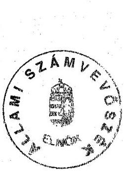
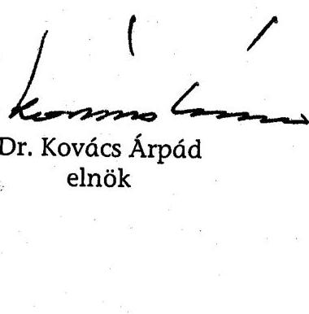

---

# Mellékletek jegyzéke 

1. Jelentéstervezetre tett észrevételek
2. Az ÁPV Rt. szabályozása
3. Az ÁPV Rt. hozzárendelt vagyonának 2004. évi bevételei
4. Az ÁPV Rt. nyilvántartott követelései
5. Részletek a MOL Rt. gyorsjelentéseiből és egyéb tőzsdei bejelentéseiből
6. Az ÁPV Rt. hozzárendelt vagyonának tulajdonosi mozgásai
7. Az ÁPV Rt. és az MFB Rt. gazdasági kapcsolatai
8. A Váltó-4 Libra Rt. gazdálkodása
9. A Vértesi Erőmű Rt. privatizálására benyújtott előzetes ajánlatok összehasonlítása
10. Bábolna Rt.-vel kapcsolatos kormányzati és tulajdonosi döntések (19982003.)
11. A hozzárendelt vagyon változása a működő társaságoknál a tranzakciók és a gazdálkodási eredmények átvezetése után
12. A saját tőkére jutó jövedelmezőség alakulása
13. Az ÁPV Rt. tulajdonosi érdekeinek érvényesítésére tett intézkedések
14. Az ÁPV Rt. 25\% feletti tulajdoni hányadú társaságainak ROE szintje..
15. Az ÁPV Rt. 25\% feletti tulajdoni hányadú társaságainál a ROE mutatók alakulása a vagyonkezelés módja szerint a 2004. évben
16. ÁPV Rt. tulajdonra jutó adózás előtti eredmény szerint a nyereséges és veszteséges cégek megoszlása
17. Az ÁPV Rt. veszteséges társaságai 2004. évben
18. Az ÁPV Rt. kisebbségi tulajdonában lévő társaságok jellemző adatai 2004. évben
19. Az ÁPV Rt. kisebbségi tulajdonában lévő társaságok saját tőke adatai 2004. XII. 31-én
20. A kisebbségi társaságok 2004. évi privatizációjának összefoglaló táblázata
21. Privatizációs szakértők és tanácsadók
22. A Volán társaságoknál a rekonstrukciós autóbuszprogram végrehajtásának teljesítmény-ellenőrzése
23. A 2004-ben tervezett és megvalósult környezetvédelmi munkák
24. A céltartalék képzésének és a privatizációs tartalék felhasználásának kapcsolata
25. Tanúsítványok

---

H-1051 BUDAPEST V. JOZSEP NÁDOR TÉR 2-4. POSTACIM. 1369 BUDAPEST, POSIAFIOK 481

TELEFON (36-1) 327-2159, (36-1) 327-2141
FAX (36-1) 318-0738

PÉNZÜGYMINISZTÉR

Dr. Kovács Árpád úr részére
clnők

Állami Számvevőszék

Budapest

E-MAIL janos veres@pm.gov.hu

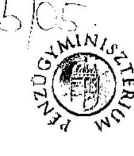

Ikt. szám: 305/15/2005.
Illy. szám: V-01-60/2005.
lány: ÁS/ jelentes
felemenyezese

ÁLLAMI SZÁMVEVŐSZÉK
ATM- 5051/2005
Érkeze: 2005 AUG 30.
Iktatósza: 1-01-64/05
Melléklet:

Kürem mipu
natolun:
1
1
08.30.

Tisztelt Elnök Úr!

Az Állami Privatizációs és Vagyonkezelő RL 2004. évi működésének és a központi
költségvetés végrehajtásához kapcsolódó tevékenységének ellenőrzéséről készített
jelentéstervezetei köszönettel megkaptam, az abban foglaltakhoz - az egyes privatizációs
tranzakciók eltérő szakmai megítélését fenntartva - észrevételi nem teszek.

Budapest, 2005. augusztus 24.

Ödvözlettel:

J. Veres János

WWW.PENZUGYMINISZTERIUM.HU

---

# MINISZTERELNÖKI HIVATAL KORMÁNYIRODA VEZETÓJE HELYETTES ÁLLAMTITKÁR 

1575/2/VIII/2005.
Ügyintéző: dr. Varga Zoltán
Hiv.sz.: V-01-53/2005.

Bihary Zsigmond úrnak, az Állami Számvevőszék föigazgatója

Budapest

Tisztelt Föigazgató Úr!
Az ÁPV Rt. 2004. évi müködéséről szóló jelentés tervezetében a Kormány számára megfogalmazott 3. számú javaslat szövegezését az alábbiak szerint kérem pontosítani: „hívja fel a pénzügyminisztert, az ÁPV Rt.-vel kapcsolatos kormány-előterjesztések készítése rendjének és folyamatának felülvizsgálatára az ellenőrzés által feltárt ellentmondások megalapozatlanságok és szabályoktól való eltérések megszüntetése érdekében".

Budapest, 2005. augusztus 18.

Üdvözlettel:
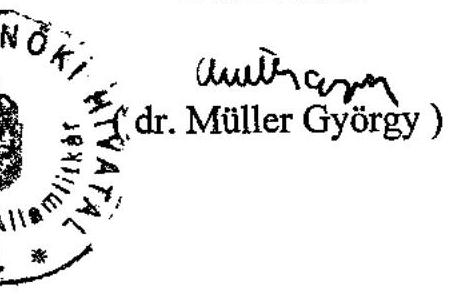

---

# Állami Privatizációs és Vagyonkezelö Rt. Hungarian Privatization and State Holding Company 

Bihary Zsigmond föigazgató

Állami Számvevőszék
H-1052 Budapest
Állami Számvevőszék 2004. évi Jelentése

Fezett: 2005 AUG 18
Tktatószám: $1-01-57105$
Felléklet:

## Felügyelö Bizottság

Tel: 237-4126
Fax: 237-4125
Isz: BE/31795/2005.

Budapest, 2005. augusztus 15.

Tárgy: Állami Számvevőszék 2004. évi Jelentése

Tisztelt Föigazgató Úrl

Az Állami Számvevőszéknek „az Állami Privatizációs és Vagyonkezelő Rt. 2004. évi müködésének és a központi költségvetés végrehajtásához kapcsolódó tevékenységének ellenőrzéséröl" szóló Jelentését megkaptam.

A Jelentés jelenlegi végső szövegezése egyeztetési folyamat eredményeként született, amelyben a mi észrevételeink is feldolgozásra kerültek.

Köszönjük az alapos, elemző, lényegre törő ellenőrzési munkát és észrevételeink figyelembe vételét.

A Jelentésben foglaltakhoz észrevételt nem teszünk.

Tisztelettel:
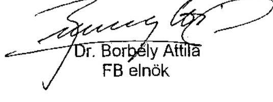

---

a V-01-63/2005. sz. jelentéshez

Állami Privatizációs és Vagyonkezelő Rt.

Hungarian Privatization and State Holding Company

ÁLLAMI SZÁMVEVÖSZÉK
ATM-4784/2001

Bihary Zsigmond
főigazgató

Állami Számvevőszék

H-1051 Budapest
Apáczai Csere J. u. 10.

2045/05

Igazgatóság elnöke

Tel: 237-4290
Fax: 237-4291

Isz: 187 / 42 / /ÁPV/2005.

Budapest, 2005. augusztus 12.

Tárgy: Az ÁPV Rt. 2004. évi működésének vizsgálatáról készült ÁSZ Jelentés
véleményezése

Tisztelt Főigazgató Úr!

Köszönettel vettem az Állami Számvevőszék által az Állami Privatizációs és
Vagyonkezelő Rt. tevékenységének a V-0215. Témaszám: 747. alapján elrendelt
vizsgálata helyszíni ellenőrzésének befejeztével, augusztus 12-én megküldött
átdolgozott Jelentés tervezetet, amely „az ÁPV Rt. 2004. évi működésének és a
központi költségvetés végrehajtásához kapcsolódó tevékenységének ellenőrzéséről"
szói.

A Jelentés alapján megállapítom, hogy az ÁSZ és az ÁPV Rt. vizsgálati
együttműködése eredményes volt, a jelentésben jelzett néhány kérdésben
megmaradt szakmai véleménykülönbség ellenére. Ezúton tudomásul veszem az
ÁPV Rt. 2004. évi működésének ÁSZ általi értékelését és minősítését.

Tájékoztatom T. Főigazgató Urat, hogy az ÁPV Igazgatósága, mint az ÁPV Rt.
vezető testülete a Jelentést az abban foglaltak hasznosítása céljából megtárgyalja,
és meghozza a szükséges döntéseket az indokolt intézkedésekre.

Végezetül jelzem, hogy az ÁSZ vizsgálati időszak lezárulta után elkészült a társaság
2004. évi beszámolója is. Mindent figyelembe véve úgy ítéljük meg, hogy az ÁPV Rt.
üzletileg sikeres 2004. évi tevékenysége törvényes kereteken belül, szabályosan
zajlott.

Tisztelettel:

Dr. Mészáros Tamás
Igazgatóság Einöke

14 0151

HUNGARIAN PRIVATIZATION AND STATE HOLDING COMPANY
2045/05

---

# Az ÁPV Rt. szabályozása 

Az ÁPV Rt. törvényi keretei 2004-ben nem változtak. A Társaság múködésének és gazdálkodásának szabályozását a privatizációs törvény, a 2003. évi zárszámadási törvény és a 2004. évi költségvetési törvény által beiktatott módosítások érintették.

Az ÁPV Rt. múködésének kereteit rögzítő főbb jogszabályok és rendelkezések:

- az állam tulajdonában lévő vállalkozói vagyon értékesítéséről szóló, többször módosított 1995. évi XXXIX. privatizációs törvény sorolja fel az ÁPV Rt. hozzárendelt vagyonába tartozó tartós állami tulajdont, a privatizálható társaságokat és szabályozza az állam tulajdonában lévő vállalkozói vagyon értékesítését;
- a mindenkori költségvetési törvény szabályozza az ÁPV Rt. befizetési kötelezettségeit, a ráfordítás és a tartalékolás rendjét és azok összegét;
- a gazdasági társaságokról szóló 1997. évi CXLIV. törvény - a Privatizációs törvény eltérő rendelkezései kivételével - a társaság alapításáról és múködéséről rendelkezik;
- a társaság Szervezeti és Múködési Szabályzatát a 1208/2002 (XII. 21.) Korm. határozat, az Alapító Okiratát 1209/2002. (XII. 21.) Korm. határozat módosításai szabályozták;
- a társaság által teljesítendő adófizetési mentességekről az adókról és az osztalék adókról szóló 1996. évi LXXXI. törvény, a helyi adókról szóló 1990. évi C. törvény, valamint a Privatizációs törvény rendelkezik;
- a Számviteli törvény felhatalmazása alapján a 219/2000. (XII. 11.) Korm. rendelet az ÁPV Rt. éves beszámolási és könyvvezetési kötelezettségeinek sajátosságait szabályozza;
- a hozzárendelt vagyon Számviteli törvénytől való eltérő nyilvántartási, elszámolási és beszámolási sajátságos rendszerét a. Részvényesi Jogok Gyakorlója (RJGY) a 8/2004. (V. 20.) számú, 2004. január 1. napjától alkalmazandó határozata szabályozta;
- a 2002. évi zárszámadásról szóló 2003. évi XCV. törvény - 2003. XI. 27-ei hatállyal - kiegészítette a privatizációs törvénynek az értékesítésre és az értékesítés formáira vonatkozó szabályozását.

A privatizációs törvény 27. § (3) d) pontja és 28. § (2) b) pontja módosítása megteremtette a lehetőséget a már az ÁPV Rt. tulajdonában lévő (nem elsődleges kibocsátású) értékpapírok - pl. MOL Rt. részvényei - a versenyeztetést mellőző értékesítésére a „nyilvános forgalomba hozatal" mellett a „nyilvános eljárás keretében történő értékesítés" fogalmának bevezetésével, valamint a „több befektetőnél

---

történő tőkepiaci jellegű zártkörű forgalomba hozatal" rendelkezésnek a „zártkörű értékesítést" is megengedő kiegészítésével.

A 2004. évi költségvetésről szóló - a 2004. évi C. törvénnyel módosított 2003. évi CXVI. törvény 91. §-a módosította a privatizációs törvénynek az ÁPV Rt. hozzárendelt vagyonával, valamint az értékesítésre és az értékesítésig kezelésre átvett vagyonnal való gazdálkodásának szabályozását.

- A privatizációs törvény 3. § (2) bekezdése szerint a vagyonról adandó, az átláthatóságot biztosító információk köre - cégkivonat, mérleg, egyéb adatok kiegészült a nyilvántartásnak az ÁPV Rt. saját honlapján való közzétételével.
- A privatizációs törvény 5. §-a kiegészült azzal, hogy az állami vállalat, illetőleg az állam többségi tulajdonában álló gazdasági társaság tulajdonában lévő egyszemélyes társaság értékesítése során is a törvényben rögzített értékesítési elvek szerint kell eljárni.
- A privatizációs törvény 21. §-a is módosult annyiban, hogy az ÁPV Rt. saját vagyonával való gazdálkodástól elkülönítetten kezelendő vagyoni kört kiterjesztette a többségi állami tulajdonú gazdasági társaság rendelkezése alatt álló, az ÁPV Rt. által szerződéssel értékesítésre és az értékesítésig vagyonkezelésre átvett vagyonelemek hasznosításával összefüggő bevételek és kiadások kezelésére is.
- A privatizációs törvény 23. § (2) bekezdésének módosítása az ÁPV Rt.-t terhelő kezességéből szavatossági, hitel-visszafizetési kötelezettségből, vagy más igényekből eredő, a tárgyévet követő időszak várható kötelezettségei fedezetére tartalékot köteles képezni. A 24/B. § bevezetésével szabályozta az értékesítésre és az értékesítésig kezelésre átvett vagyonból befolyó bevételek felhasználásának jogcímeit.
- A privatizációs törvény 69/A. § (5) bekezdése kiegészítette az önkormányzatok részére a térítésmentes vagyonátadás eljárási rendjét, és a törvény mellékletébe felvételre került a Kisvállalkozás-fejlesztő Pénzügyi Rt. a gazdasági és közlekedési miniszter 50\%+1 szavazat tulajdonosi joggyakorlásával.

A Priv. tv. írja elő az ÁPV Rt.-nek a privatizációs tranzakciók legfontosabb lépéseinek „Emlékeztető"-ben történő rögzítését és a dokumentum Levéltári megőrzését.

A 2004. évi költségvetésről szóló - a 2004. évi C. törvénnyel módosított 2003. évi CXVI. törvény az előző évhez viszonyítva változtatott az ÁPV Rt költségvetési kapcsolatainak szabályozásán.

- Az ÁPV Rt. hozzárendelt vagyona záró pénzkészletének összegét - a pénzügyminiszter hatáskörében - 1000 M Ft-ról legfeljebb 25000 M Ft-ra emelte.
- Meghatározott feltétekkel a pénzügyminiszter engedélye mellett az ÁPV Rt. kötvénykibocsátási jogosultságot kapott.
- A privatizációs miniszter által szabályozott feltételekkel engedélyezte a privatizációs tartalék nyitó készpénz állománya felének felhasználását - kamatfizetési teherrel.

---

- A privatizációs tartalék felhasználásának jogcímei is módosult, az „E-hitel garancialehívás teljesítése" jogcím törlésével.

Az ÁPV Rt.-ben a részvényesi jogokat - a Kormány, mint testület hatáskörébe utalt jogok kivételével - 2002. május 27 -től a pénzügyminiszter gyakorolta. Az ÁPV Rt. Alapító Okiratáról szóló 1047/1995. (VI. 17.) Kormány-határozat szerint.

Az ÁPV Rt. tulajdonában lévő és a hozzárendelt vagyon változásáról, hasznosításáról adandó tájékoztatás rendjéről a privatizációs törvény rendelkezik.

A Társaság beszámolási rendjének részét képezi a külső ellenőrző szervek felé történő beszámolási kötelezettségek teljesítése is, amely szerint a Kormány évente köteles - az előző évi állami költségvetés végrehajtásáról szóló törvényjavaslat előterjesztésével egyidejúleg - az Országgyűlésnek beszámolni az ÁPV Rt. tevékenységéről, a tulajdonában lévő, valamint a hozzárendelt vagyon alakulásáról, hasznosításának eredményéről.

A Kormány nevében a pénzügyminiszter a J/14603. számú (2005. február) jelentésében az Állami Privatizációs és Vagyonkezelő Rt. 2003. évi tevékenységéről, a tulajdonában álló, valamint a hozzárendelt vagyon alakulásáról, hasznosításának eredményéről beszámolt.

Az Alapító Okirat és a gazdasági társaságokról szóló törvény szerint az Igazgatóság a Felügyelő Bizottságának a társaság negyedéves, féléves, háromnegyedéves és éves tevékenységéről beszámolt.

Az ÁPV Rt. Szervezeti és Múködési Szabályzatát és Alapító Okiratát a 2002. évben hozott kormányhatározat módosította. A módosításokat részben a részvényesi jogok gyakorlójának személyében történt változás, részben szervezeti változások indokolták.

A jogszabályi kereteknek megfelelő szabályozottság biztosítását szolgáló 2004. évben hatályba léptetett főbb belső szabályzatok és utasítások:

- a pénzügyi (utalványozási) rendszer ügyviteli szabályozásának 78/2004. (II. 12.) IG. számú határozata szerinti módosítása;
- a vagyonértékelések rendjéről szóló 13/2003. számú Vezérigazgatói Utasítás 69/2004. (II. 05.) IG számú módosítása;
- az ÁPV Rt. által kötött szerződések változtatásával kapcsolatos döntési hatáskörök szabályozása a 461/2004. (VIII. 12.) IG számú határozat szerint;
- az ÁPV Rt. saját és hozzárendelt vagyonának eszközeire és forrásaira vonatkozó értékelési szabályzat (607/2004. (XI. 11.) IG sz. határozat.

---

# Az ÁPV Rt. hozzárendelt vagyonának 2004. évi bevételei 

| Megnevezés | Eredeti üzleti terv | Módosított üzleti terv | Tény | Teljesítés elszámolástechnikai tételek nélkül |  |
| :--: | :--: | :--: | :--: | :--: | :--: |
|  |  |  |  | Eredeti terv | Módosított. terv |
| Privatizációs bevételek | 241424 | 146488 | 113644 | 241424 | 136188 |
| ebből: elszámolás-technikai tétel |  | 10300 | 10301 |  |  |
| Vagyonhasznosítási bevétel | 192 | 113 | 233 | 192 | 113 |
| Privatizációs kárpótlási jegy bevétel | 1000 | 849 | 227 | 1000 | 849 |
| Értékesítés és vagyonhasznosítás összesen | 242616 | 147450 | 114104 | 242616 | 137150 |
| Kapott osztalék, részesedés | 66785 | 69262 | 87455 | 22500 | 24977 |
| ebből: elszámolás-technikai tétel | 44285 | 44285 | 44285 |  |  |
| Egyéb bevételek | 53144 | 158505 | 197073 | 19238 | 124599 |
| ebből: elszámolás-technikai tétel | 33906 | 33906 | 33906 |  |  |
| kötvénykibocsátás |  | 113400 | 157814 |  | 113400 |
| BEVÉTELEK ÖSSZESEN * | 362545 | 375217 | 398632 | 284354 | 286726 |
| VALÓS (cash) BEVÉTELEK (elszámolástechnikai tételek nélkül) | 284354 | 286726 | 310140 | 284354 | 286726 |

*Nem tartalmazza a priv. tartalékból átmeneti finanszírozásra kapott összeget.

---

# Az ÁPV Rt. nyilvántartott követelései 

(M Ft)

| Megnevezés | 2004. január 1. |  |  | 2004. december 31. |  |  |
| :--: | :--: | :--: | :--: | :--: | :--: | :--: |
|  | Bruttó érték | Értékvesztés | Nettó érték | Bruttó érték | Értékvesztés | Nettó érték |
| Követelések áruszállításból (vevők) | 2409 | 1335 | 1074 | 1973 | 1615 | 358 |
| Egyéb követelések |  |  |  |  |  |  |
| Osztalékkövetelések | 2068 | 71 | 1997 | 71 | 71 | 0 |
| Később számlázandó privatizációs bevételek | 400 | 249 | 151 | 334 | 248 | 86 |
| Végelszámolásból, felszámolásból. eredő tulajdonosi és egyéb követelések | 11513 | 11383 | 130 | 21266 | 20952 | 314 |
| HM ingatlanokkal kapcsolatos követelések | 5837 | 0 | 5837 | 5476 | 0 | 5476 |
| Rövid lejáratú tulajdonosi kölcsön | 1452 | 1452 | 0 | 5676 | 5585 | 91 |
| Tőkeleszállítás miatti követelés | 3000 | 0 | 3000 | 350 | 0 | 350 |
| Éven belüli reorganizációs hitel | 492 | 272 | 220 | 697 | 412 | 285 |
| ÁFA követelés (bevallott, de még ki nem utalt) | 484 | 100 | 384 | 639 | 0 | 639 |
| Követelés az önkormányzatoktól | 77 | 75 | 2 | 75 | 75 | 0 |
| Adott előleg | 2799 | 0 | 2799 | 3513 | 0 | 3513 |
| Saját vagyonnal szembeni követelés | 117 | 0 | 117 | 0 | 0 | 0 |
| Átutalt, be nem jegyzett tőkeemelés | 5695 | 0 | 5695 | 10509 | 0 | 10509 |
| Egyéb köv.-ek összesen | 33934 | 13602 | 20332 | 48606 | 27343 | 21263 |

---

# A követelésekkel kapcsolatban elszámolt értékvesztés 

és visszaírás

| Megnevezés | Adott kölcsönök | Vevők | Egyéb követelések |  | Összesen |
| :--: | :--: | :--: | :--: | :--: | :--: |
|  |  |  | ÁFA nélkül | ÁFA |  |
| 2003. értékvesztés | 0 | 334 | 1637 | 100 | 2071 |
| visszaírás | 0 | 62 | 2695 | 0 | 2757 |
| halmozott é.v. | 3925 | 1335 | 13502 | 100 | 18862 |
| 2004. értékvesztés | *-3 925 | 314 | 14352 | 0 | 10741 |
| visszaírás |  | 34 | 511 | 0 | 545 |
| halmozott é.v. | 0 | 1615 | 27343 | 100 | 29058 |

---

5. sz. melléklet

a V-01-63/2005. sz. jelentéshez

# Részletek a MOL Rt. gyorsjelentéseiből és egyéb tőzsdei bejelentéseiből 

MOL-árfolyam alakulása a Budapesti Értéktőzsdén
2005. június 24. péntek
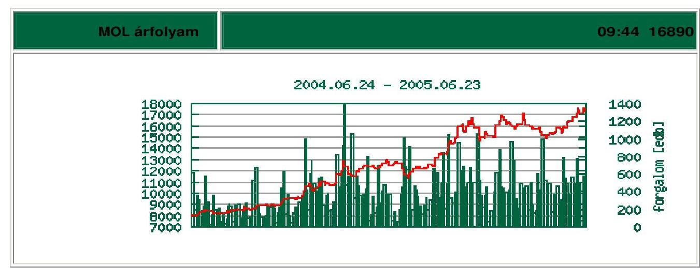

A MOL 2004. I. negyedévi gyorsjelentése: „A Földgáz szegmens eredménye jelentősen növekedett és 20,9 Mrd Ft üzleti eredményt tett ki (100,5 M USD) szemben a 2003. I. negyedévi 2,3 Mrd Ft-os (10,1 M USD) veszteséggel az új kedvező szabályozói környezetnek köszönhetően. Fontos megjegyezni, hogy az új szabályozási rendszerben a gázüzleti eredményben erős szezonalitás várható, és az értékesités az első negyedévben a legerősebb."
2004. február 13: A MOL ajánlatot kér be a gáztársaságok részbeni értékesítésére vonatkozóan.

A MOL Rt. bejelenti, hogy Igazgatósága felhatalmazta a társaság menedzsmentjét ajánlatok bekérésére a három kiszervezett gáztársaság (Földgáztároló Rt, Földgázszállító Rt, Földgázellátó Rt) esetleges részbeni értékesítésével és partnerbevonásával kapcsolatban. A MOL földgázkitermeléshez kapcsolódó eszközei nem részei a folyamatnak. Az ajánlatok benyújtására várhatóan az ilyen jellegű tranzakcióknál szokásos átvilágítást követően kerül sor. A folyamat során a MOL tanácsadója a JP Morgan.

A folyamattal kapcsolatban Hernádi Zsolt elnök-vezérigazgató az alábbiakat mondta: "A gázszabályozás utóbbi időben történt változásait követően most jött el az ideje annak, hogy feltárjuk a MOL azon stratégiai lehetőségeit, amelyek által a gázüz-

---

lettel kapcsolatos befektetések értékét és ezáltal a teljes vállalati értéket maximalizálhatjuk."

# 2004. augusztus: Információ a gázüzletág értékesítésével kapcsolatban 

A MOL bejelenti, hogy a gázüzletág részleges értékesítésének keretében megfelelő számú értékelhető ajánlatot kapott. Az ajánlatok áttekintése és elemzése után a MOL úgy döntött, hogy több befektetővel kezd párhuzamos tárgyalásokat, azzal a céllal, hogy legkésőbb az év végéig megállapodást érjen el egyes gázleányvállalatok részleges értékesítése tekintetében.

## A felső vezetés 2004. III. negyedévi véleményéből:

Hernádi Zsolt, elnök-vezérigazgató elmondta:
„A múlt héten jelentettük be a gázüzletág részleges értékesítéséről szóló szerződések aláirását, melyek a gázüzletágat mintegy 2,2 Mrd euróra értékelik. A tranzakció eredményeképp Európa egyik legnagyobb gáz- és energiaipari vállalata, az E. On Ruhrgas International a partnerünkké vált." „A Szállításban lévő befektetésünk és a Kereskedelemben, valamint a Tárolásban fennálló kisebbségi részesedésünket időrőlidőre felülvizsgáljuk azzal a szándékkal, hogy továbbra is maximalizáljuk a részvényesi értéket."

---

# Az ÁPV Rt. hozzárendelt vagyonának tulajdonosi mozgásai 

| Ev | ÁPV Rt. |  | Kitöl, vagy kinek | Az ügylet jellege | Jogszabály,   Korm. hat, ÁPV   IG. hat. megne-   vezése |
| :--: | :--: | :--: | :--: | :--: | :--: |
|  | kapta | adta |  |  |  |
| 1998. |  | MATÁV | IHM | térítésmentes átadás (aranyrészvény)csere | 2000. CXXXIII. tv |
| 1998. | Fégarmy, Követel\&Tartozik, Salgót.   Acélárugyár kez. átváll., dolg. kedv., Öblösüveggyár tart. átváll., dolg. kedv., | Salgót. Acélárugyár, Öblösüveggyár, DÉMÁSZ, Privinfo, BIF, Nemz. Priv. Tan. Kft., Matáv | MFB Rt. | csere | Fégarmy Kft. tekintetében 1996. XXXIX. tv., a többi esetében csak a 904/1997 (XII. 03.) IG határozat) |
| 1999. | MFB Rt., MEHIB Rt., EXIMBANK Rt. Szerencsejáték Rt., Hitelgarancia Rt. Reorg Rt. |  | pü. miniszter. | térítésmentes átadás | 1998. XC. tv. |
| 2001. |  | Regionális Fejlesztési Holding Rt. | gazdasági   miniszter |  | 2000. CXXXIII. tv. |
| 2001. |  | MFB Rt., Hitelgarancia Rt., FHB Rt. | pü.   miniszter. | térítésmentes átadás | 2000. CXXXIII. tv. |
| 2001. | Hungexpo Rt. |  | gazdasági   miniszter | térítésmentes átadás | 2000. CXXXIII. tv. |
| 2001. | Energiaipari társ.-ok szav.els. részv.-i |  | gazdasági   miniszter | térítésmentes átadás | 2000. CXXXIII. tv. |
| 2001. |  | Postabank Rt. 632 M Ft részvénycsomag* | Magyar   Posta Rt. | térítésmentes átadás | 2187/2001. (VII.   20.) Korm. hat.   401/2001 (IX. 13.)   IG |
| 2001. |  | Postabank Rt. 2 Mrd Ft részvénycsomag | KVI | térítésmentes átadás | 147/2001. (VIII.   22.) Korm. rend. |
| 2001. |  | MAHART Balatoni Hajózási Rt. $100 \%$ | MFB Rt. | térítésmentes átadás | 2039/2001.(II. 28.)   Korm. hat. 2/2001.   (II. 28.) RIGY,   448/2001. (V. 17.)   IG |
| 2001. |  | 12 db. mezőgazdasági. részvénytársaság** | MFB Rt. | térítésmentes átadás | 2045/2001. (III.   14.) Korm. hat.   5/2001. (II. 28.)   RIGY, 219/2001.   (V. 17.) IG |

---

|  2002. |  | Energiaipari társ.-ok szav.els. részv.-i | gazd.   miniszter. | térítésmentes átadás | 2002. XIII. tv. |
| :--: | :--: | :--: | :--: | :--: | :--: |
| 2002. |  | Bábolna Rt. | MFB Rt. | térítésmentes átadás | 2028/2002. (II. 1.)   Korm. hat.   43./2002. (II. 21.)   IG, 55/2002 (II.   28.) IG |
| 2002. | Hitelgarancia Rt., Magyar Posta Rt., Cartographia Kft., |  | illetékes miniszterek | térítésmentes átadás | 2002. XIII. tv., 372/2002. (IX. 12.)   IG, 438/2002. (X.   17.) IG |
| 2002. | Bábolna Rt. |  | MFB Rt. | térítésmentes átadás | 2229/2002. Korm. hat., 14/2002.   RJGY, 384/2002.   (IX. 26.) IG |
| 2002. | FHB Rt 35 \%,   Borsodchem Rt. 4 \%,   MOL Rt.0,04 \% | Dél-Gabona Malomip. Rt., Hungexpo Rt. $82 \%$ |  | csere | 3/2002. (I. 17.) IG |
| 2002. | CASA Vagyonk. Kft. MFB üzletrészh. Kft. |  | MFB Rt. | ÁPV Rt. vétel 20 Mrd Ft | 2002. XXIII. tv.   2400/2002. (XII.   30.) Korm. hat. |
| 2003. | Budapest Airport. Rt. |  | gazd.   min. | térítésmentes átadás | 2002. XIII. tv. |
| 2003. | FHB Rt. |  | pénz-   úgymi-   niszter | térítésmentes átadás | 2002. LXII. tv. |
| 2003. | Mertcontrol Rt., HM Centrál Mosodák Rt. |  | illetékes miniszterek | térítésmentes átadás | 2002. XIII. tv., 108/2003. (II. 18.)   VIG, 171/2003.   (III. 18.) VIG |
| 2003. | Aranykereszt, Balatoni Hajózási, Borsod 2000, Dél-Gabona, ELMIB, Hollóházi Porc., Hung expo Reklám, Hungexpo Vásár, MBV, Magy. Gázszolg., MFBProxy, Siotur, Szabad Föld, Tisza Cipő, Treport, Zsolnay örökség, -Porc.gyár, Hyferp, -Porc. manufaktúra |  | MFB Rt. | vétel 9,1 Mrd   Ft. | 2123/2003. (VI. 6.)   Korm. hat. |
| 2003. |  | Kisrókus 2000 Kft. | KVI | térítésmentes átadás | 2307/2003 (XII. 9.)   Korm. hat.,   725/2003. (XII.   18.) IG |
| 2003. |  | Martonseed Rt. | 85 \%   MTA. | térítésmentes átadás, | 2139/2003 (VI.   27.) Korm. hat.,   164/2004. (VIII.   12.) IG |
| 2003. |  | Milleniumi Média Kft. | KVI | térítésmentes átadás | 2200/2004.(VIII.   12.) Korm. hat.,   449/2004. (VIII.   12.) IG |
| 2004. | Fertővidéki HÉV Rt. |  | GKM | térítésmentes | 33/2004 Tvigh. |

---

|  | 26,31 \% *** |  |  | átadás |  |
| :-- | :-- | :-- | :-- | :-- | :-- |
| 2004. | Állami Autópálya Keze-   ló Rt. **** |  | GKM   (KVI) | térítésmentes   átadás | 2036/2004. Korm.   hat., 2/2004. (II.   18.) RIGY,   83/2004. IG |
| 2004. | Bábolna Rt. 10,3 Mrd Ft   követelés, + 3,1 Mrd Ft   kp. | MEHIB Rt. (75-1\%),   EXIMBANK Rt. (75-1\%) | MFB Rt. | vétel | 2004. XLVIII. tv.   138.§ (4), 143. §,   430/2004. (VII.   22.) IG |
| 2005. |  | Állami Autópálya Keze-   ló Rt. | GKM | térítésmentes   átadás | 2004. CXXXV.   tv. |

* A Postabanki 632 M Ft értékű részvénycsomagjának térítésmentes átadását előíró Korm. határozat a Priv. tv. 35. §-át említi a tranzakció jogalapjául. A „vevő" MP Rt. semmilyen pályázatban nem tett ígéretet a 32. §-ban a kivételes ingyenes vagyonjuttatással szemben vállalható kötelezettségekre, hiszen pályázat sem volt. Így a kormányhatározat nem elégítette ki az ingyenes átadásra vonatkozó törvényi előírásokat és összegében túllépte a Kormány vagyonátcsoportosításra vonatkozó, az Áht. 108. § (5) bekezdésében meghatározott jogosítványait.
** Lásd részletesen az ÁSZ 2001. évről szóló ÁPV Rt. jelentését.
*** A részesedéssel a Priv. tv. melléklete szerint 2002. december 31-ig a GKM minisztere rendelkezett. A 2003. évi költségvetésről szóló 2002. LXII. tv. kiemelte a társaságot a tartós állami tulajdon köréből. A Priv. tv. 7. § (11) bek. szerint a tartós állami tulajdonból kikerült társaságok felett a tulajdonosi jogokat az ÁPV Rt. gyakorolja. Ennek ellenére a GKM a társasági részesedést csak 2004. májusában adta át.
**** Az ÁAK Rt. átadása annak alapján valósult meg, hogy a 2036/2004. (II. 19.) Korm. határozat a kincstári vagyoni körből a privatizálandó körbe sorolta a társaságot, így annak tulajdonosi jogait az ÁPV Rt. gyakorolja a Priv. tv. már hivatkozott előírása alapján. A kincstári vagyon tekintetében a KVI gyakorolja a tulajdonosi jogokat, így a tulajdonosi jogok átadása is csak a KVI-n keresztül valósulhatott volna meg az Áht. előírásainak megfelelően. Annak ellenére, hogy a társaságnak nem tulajdonosi, hanem csak vagyonkezelői jogait gyakorolta, az átadást egyedül a GKM foganatosította. Előzőeket követően a Magyar Köztársaság költségvetéséről szóló 2004. évi CXXXV. tv. az ÁAK Rt. felett tulajdonosi joggyakorlást biztosít a GKM-nek, a társaságot $100 \%$-ban tartós (de nem kincstári, hanem miniszter alá rendelt) állami vagyonná minősítve.

---

# Az ÁPV Rt. és az MFB Rt. gazdasági kapcsolatai 

Az ÁPV Rt. és az MFB Rt. gazdasági kapcsolataiban az alábbi, tulajdonjogot, illetve tulajdonosi joggyakorlást érintő vagyonmozgások jelentek meg:

## - Az 1998. évi ÁPV Rt.- MFB Rt. közötti portfólió csere

Az ÁPV Rt. igazgatósága 904/1997.(XII. 3.) sz. határozatával döntött arról, hogy az ÁPV Rt. és az MFB Rt. között cserére kerül sor. A csere az IG határozatban nem, de az ügyletről készült „Emlékeztető"-ben nevesített jogalapja Priv. tv. 28. § (2) c) volt.

A cserében résztvevő vagyon az alábbi volt:

| ÁPV Rt. által átadandó   vagyonelem | Átadási érték   (E Ft) | ÁPV Rt. által átveendő   vagyonelem | Átadási érték   (E Ft) |
| :-- | :--: | :-- | :--: |
| Salgótarjáni Acélárugyár   Rt. | 671984 | Fégarmy Kft. | 973000 |
| Salgótarjáni Öblösüveg-   gyár Rt. | 463955 | Követel \& Tartozik Kft. | 2922310 |
| DÉMÁSZ Rt. | 2152035 | Salgótarjáni Acélárugyár   Rt. kezességátvállalás | 100000 |
| Privinfo Kft. | 71500 | Salgótarjáni Öblösüveg-   gyár Rt. tartozásátvállalás | 284000 |
| BIF részvények | 254873 | Salgótarjáni Acélárugyár   Rt. kezességátvállalás dol-   gozói kedvezmény | 28591 |
| Nemz. Priv. Tanácsadó Kft. | 54000 | Salgótarjáni Öblösüveg-   gyár Rt. dolgozói. ked-   vezmény | 10528 |
| Matáv Rt. | 650082 |  |  |
| Összesen | 4318429 |  | 4318429 |

A Priv. tv. hivatkozott előírásának csak a Fégarmy Kft. üzletrészének ÁPV Rt.hez kerülése felelt meg, ezt ugyanis Priv. tv. költségvetési törvénnyel végrehajtott módosítása írta elő. Az üzletrész 2002. június 22 -én végelszámolás alá került, majd 2003. március 13-án 230 M Ft-ért értékesítette az ÁPV Rt. Így az előírt átvétel az ÁPV Rt.-hez rendelt állami vagyont 743 M Ft-tal csökkentette, illetve az MFB Rt. kondícióit ugyanennyivel javította.

---

A többi társasági részesedés cseréjének indoka sehol nem szerepel, Korm. határozat nincs róla, az indokot az IG határozat sem említi. A csereügylettel foglalkozó emlékeztető megemlíti, hogy a Postabank tőkeemelése tárgyában született 155/1998. (IV. 8.) IG határozat hozzájárult ahhoz, hogy a csere legfeljebb 7 milliárd Ft-ra bővüljön. Ennek keretében likvid értékpapírok (Borsodchem, Matáv) kerültek volna átadásra az MFB Rt. társasági részesedései fejében. „Az MFB Rt. számára a likvid értékpapírok a Postabank tőkeemelése során szükséges készpénzforrást lettek volna hivatottak kiegészíteni." (A csere végül is a táblázatban bemutatott összetétellel valósult meg.) A csere nem felelt meg a Priv. tv. jogalapként hivatkozott előírásainak, illetve a megjegyzés arra enged következtetni, hogy a cserére vonatkozó IG határozat nem az ÁPV Rt. hozzárendelt vagyona érdekkörében keletkezett.

# - Vásárlás a 2400/2002. (XII. 30.) Korm. határozat alapján 

Az MFB Rt.-től a bank új középtávú stratégiájának előkészítéséhez szükséges intézkedésről szóló 2400/2002. (XII. 30.) Korm. határozat alapján 2002. december 30-án vásárolt MFB Üzletrészhasznosító Kft. (2003. július hónaptól Szövetkezeti Üzletrészhasznosító Kft.) szerződés szerinti értéke 1999999999 Ft volt. A Kft. 2003. évi saját tőke adatai alapján - könyvvizsgálói javaslatra - az ÁPV Rt. 14874203999 Ft-tal csökkentette a nyilvántartási értékét, azaz az üzletrész megvásárlásával kapcsolatban a hozzárendelt vagyon 14,9 Mrd Ft veszteséget szenvedett el. (A Kft. feladata a külső és nyugdíjas mezőgazdasági szövetkezeti üzletrészek felvásárlása és értékesítése) A hasonló feladatkörű, szintén fenti kormányhatározat előírásai alapján 1 Ft-os értéken átvett CASA Kft.-t súlyos pénzügyi, gazdasági helyzete miatt az ÁPV Rt. jogutód nélkül megszüntette. Kötelezettségeit a Szövetkezeti Üzletrészhasznosító Kft. teljesíti.

## - A 2002. évi ÁPV Rt.- MFB Rt. közötti portfólió csere

A tranzakcióról szóló „Emlékeztető" szerint a hatályos SZMSZ előírásai alapján a társaságokkal kapcsolatos döntések az igazgatóság hatáskörébe tartoznak. A 452/2001. X. 25.-ei igazgatósági határozat a tranzakció indokolását nem tartalmazza, jogalapként pedig a Priv. tv. 28. § (2) bek. c) pontját említi.

A csere az első variációjában az ÁPV Rt. portfóliójába tartozó Dél-Gabona Malomipari Rt. 100\%-át, a Hungexpo Rt. 84\%-át tartalmazta ${ }^{1}$, amelyért az MFB Rt. a Magyar Követeléskezelő Rt.-t és 900 M Ft készpénzt adott volna cserébe. Az ÁPV Rt. által az ügyben készített „Emlékeztető" a csere „feltételezhető" indokaként a Magyar Követeléskezelő Rt. valószínű jövőbeni tartós állami tulajdonba vételét jelöli meg.

Ez a megítélés téves volt, amit az támaszt alá, hogy a Magyar Követeléskezelő Rt. helyett 2004. december 4-én az ÁPV Rt.-hez érkezett levelében az MFB Rt. a Borsodchem Rt. 4\%-os, a Mol Rt. 0,05\%-os, valamint a Földhitel és Jelzálog-

[^0]
[^0]:    ${ }^{1}$ Ez a részvénycsomag az ÁPV Rt. hozzárendelt vagyonába tartozó teljes részvénymenynyiséget jelentette, az 1 db szavazatelsőbbségi részvény nélkül.

---

bank 35,37\%-os, kisebbségi csomagjait ajánlotta fel. A csere a módosított ajánlat mellett is létrejött. (Készpénz a cserében, tekintettel arra, hogy ebben az esetben már nem tisztán cseréről, hanem (a Ptk. szerint) adásvétellel vegyes cseréről van szó, csak a Priv. tv. hivatkozott paragrafusának 2003. január 1-jei módosítását követően szerepelhet, ekkortól engedi meg a tv. a készpénzzel történő kiegészítést.)

Az IG határozat a döntést nem indokolja, az „Emlékeztető" megfogalmazása („A portfóliócsere feltételezett célja") arra enged következtetni, hogy a célt a döntés meghozatalakor az ÁPV Rt. nem is ismerte.

A 2094/2003. (V. 20.) Korm. határozat, majd 2165/2003.(VII. 22.) Korm. határozat az FHB Rt. értékesítését 50\%-1 szavazat mértékig, tőkepiaci technikával történő privatizációját írta elő, ami a Priv. tv. cserére vonatkozó, a tranzakció időpontjában hatályos feltételeit kielégíti.

# - A 2003. évi vétel 

A Kormány a 2123/2003. (VI. 6.) számú, az MFB Rt. portfólió tisztítására vonatkozó határozatában döntött a Magyar Fejlesztési Bank Rt. tulajdonában lévő társasági részesedések átadásáról az Állami Privatizációs és Vagyonkezelő Rt. részére.

A tranzakció során kötött megállapodás szerint az ÁPV Rt. halasztott fizetési konstrukcióban vásárolta meg az MFB Rt.-től 2003. június 15 -vel a társasági részesedéseket. Vételárként a kormányhatározat 1. a) pontjának megfelelően az MFB Rt. könyveiben bekerülési értékként nyilvántartott összegnek az elszámolt értékvesztéssel csökkentett értékét (könyvszerinti nettó érték) tekintették, összesen 9,15 Mrd Ft értékben.

A társaságok adásvételi szerződésében a fizetés módja kamattal nem növelt halasztott fizetés, melynek végső lejárati határideje 2005. december 31., kivéve a HYFERP elszámolásra vonatkozó szerződéses kikötéseknek megfelelően két társaság, a Tisza Cipő Rt., valamint a Zsolnay Porcelángyár Rt. fizetési határidejét, amely 2003. december 31.

Az összesen 40,743 Mrd Ft jegyzett tőkeérték mellett a vételár 9,148 Mrd Ft volt.
A már hivatkozott kormányhatározat 2. pontja előírta az átvett (megvásárolt) társasági részesedések értékesítését, az értékesítés haladéktalan megkezdését. A még ÁPV Rt. tulajdoni hányadú társaságok saját tőkéje közel 4 Mrd Ft-tal, jegyzett tőkéje 1,3 Mrd Ft-tal lett kevesebb az ÁPV Rt. által történt átvételt követően. (Megállapítható továbbá, hogy egyes cégek esetében a Gt. előírásainak megfelelő jegyzett tőke leszállításokat az ÁPV Rt. 2003 végéig még nem hajtotta végre.) Ez a csökkenés csak részben függ össze azzal, hogy a társaságok közül öt kikerült a hozzárendelt vagyonból.

Az ELMIB Rt.-ben és a Magyar Gázszolgáltató Kft.-ben a jegyzett tőke emelésére került sor, még 2003. I. félévében az MFB Rt. vagyonkezelése idején. A Zsolnay Porcelángyár Rt.-nél a jegyzett tőke csökkentésére a megfelelő tőkearány helyreállítása érdekében volt szükség, amit az ÁPV Rt. 331/2003. (V. 29) IG határozatával döntött el.

---

Az Aranykereszt Rt. és a CélMédia Rt. 2004. évben végelszámolás alá került. A végelszámolások még nem fejeződtek be és miattuk az ÁPV Rt.-hez rendelt vagyon nyilvántartásában veszteség nem mutatkozott.

# Cél-Média Rt. 

E Ft

| Dátum | Tranzakció | ÁPV Rt. -nél lévő jegyzett tőke | Nyilvántartási érték | Szerződés szerinti (vásárlási) érték | ÁPV Rt. tulajdoni hányada \% |
| :--: | :--: | :--: | :--: | :--: | :--: |
| 2003. 07.14 | Vásárlás   MFB Rt.-től | 10000 | 3650 | 3650 | $10 \%$ |
| 2004. 07.01 | Végelszámolás | 10000 | 3650 | - | $10 \%$ |

A társaság mérlegadatainak alakulása

E Ft

| Dátum | Jegyzett tőke | Saját tőke |
| :-- | --: | --: |
| 2003. 12. 31. | 100000 | 223540 |
| 2004.07.01. (végelsz. nyitó m.) | 100000 | 199377 |

Tekintettel arra, hogy a Társaság nyilvántartási értéke az ÁPV Rt. könyveiben a beszerzési ár, és ez alatta marad a tulajdoni hányad (10\%) szerinti saját tőke értékének, ezért a végelszámolási nyitómérleg az ÁPV Rt. vagyonnyilvántartásában változást nem okozott, az ÁPV Rt. a követelései megtérülésével számolt, ezért 2004-ben ezekre értékvesztést nem számolt el.

Az ügyletben szereplő társaságok közül a Balatoni Hajózási Rt. 2001-ig a MAHART részeként, ezt követően közvetlenül 100\%-ban az ÁPV Rt. hozzárendelt vagyonában szerepelt. A 2039/2001. (II. 28.) Korm. hat. alapján a társaság 51\%-át 22 Balaton környéki önkormányzat, 49\%-át az MFB Rt. részére adta át az ÁPV Rt térítésmentesen 2002-ben. Ekkor a társaság saját tőkéje (és egyben a hozzárendelt vagyon nyilvántartási értéke) 2,66 Mrd Ft volt. Az MFB Rt.-nek és az önkormányzatoknak történt térítésmentes átadás 2,66 Mrd Ft-tal csökkentette az ÁPV Rt.-hez rendelt állami vagyont. Az ügylet egyidejűleg az MFB Rt. az átadási értéknek megfelelő mértékű konszolidációját is jelentette az állami vagyon terhére.

A kormányhatározat előírta, hogy a MAHART apportálja leányvállalatának múködéséhez szükséges ingatlanait a Balatoni Hajózási Rt.-be, a megemelt jegyzett tőkéjű leányvállalatot pedig a privatizációs tartalék terhére az ÁPV Rt. vegye meg a hozzárendelt vagyonba, a megvételt követően pedig adja át a társaságot ingyenesen az MFB 49\%-os és a kikötők fekvése szerinti önkormányzatok 51\%-os tulajdonába.

---

A 2123/2003. (VI. 6.) Korm. határozat alapján a 49\%-os MFB Rt. tulajdonú csomagot az ÁPV Rt. 2003-ban 12,9 M Ft-ért visszavásárolta.

A Dél-Magyarországi Gabonakereskedelmi és Malomipari Rt. 100\%-os részvénycsomagja az 1999. évi megalakulás után a 2002. évig az ÁPV Rt-hez tartozott, majd csere ügylet keretében az MFB Rt-hez került. (2002 év végén saját tőke 848 M Ft , jegyzett tőke 800 M Ft .) A 2002. évi cserében a társaság 900 M Ft értéken szerepelt, majd a 2003. évi visszavásárlás változatlan jegyzett tőkeérték mellett 499,5 M Ft értéken történt.

A társaságot 2004-ben az ÁPV Rt. a kormányhatározat előírásainak megfelelően eladta.

A Dél-Gabona Malomipari Rt. jegyzett és saját tőke alakulása nem ad magyarázatot a 2002. április 3-án végrehajtott csere, majd a 2004. december 23-ai visszavásárlás adta szerződés szerinti értékkülönbözetre. Ekkor a 10000 Ft-tal alacsonyabb jegyzett tőkéjű, 99,99\%-os tulajdoni hányadot megvalósító pakett a cserében szereplő értéknek csak 55,5\%-át érte (annak ellenére, hogy a saját tőke csak 2\%-ot csökkent). Ennek az értéknek 123,5\%-án sikerült értékesíteni az ÁPV Rt.-nek a társaságot 2004-ben, amely 123,5\% még mindig csak mintegy 68,6\%-át jelentette a cserében szereplő értéknek.

E Ft

| Dátum | Tranzakció | ÁPV Rt.-nél lévő jegyzett tőke | Nyilván-tartási érték | Szerződés szerinti érték | ÁPV Rt. maradék tul. hányada \% |
| :--: | :--: | :--: | :--: | :--: | :--: |
| 2002.01.01. | Nyitó adat | 800000 | 934581 | - | $100 \%$ |
| 2002.04.03. | Értékesítés (csere MFB Rt.) | 800000 | 934581 | 900000 | $0 \%$ |
| 2003.06.16. | Vásárlás MFB Rt.-től | 799990 | 499494 | 499494 | 99,9999\% |
| 2004.12.23. | Értékesítés (Alföldi Malomipari Rt.) | 799990 | 499494 | 617000 | $0 \%$ |

A társaság mérlegadatainak alakulása
E Ft

| Dátum | Jegyzett tőke | Saját tőke |
| :-- | --: | --: |
| 2002.12 .31 . | 800000 | 848116 |
| 2003.12 .31 . | 800000 | 833179 |

A Hollóházi Porcelángyár Rt. 88,61\%-os részvénycsomagja korábban az ÁVÜ-höz tartozott, majd 1992-ben értékesítették.

---

A Hungexpo Vásár és Reklám Rt. 1995-ig az ÁVÜ-hoz tartozott, majd átadásra került az Ipari és Kereskedelmi Minisztériumhoz. A 2001. évtől ismét ÁPV Rt. vagyonkezelésbe került a részvények 84\%-a. A 2002. évben az előzőekben részletezett csere ügylet keretében 2,57 Mrd Ft névérték mellett 2,985 Mrd Ft értéken az MFB Rt.-hez került a részvények 82,01\%-a (a Priv. tv. szerinti tartós állami tulajdonú aranyrészvényen kívül), 1,99\%-ot önkormányzatnak adtak át. A 2003. évi visszavásárlás alkalmával az ÁPV Rt. a változatlan jegyzett tőkéjű cégnek azonos pakettjéért már csak 1,09 Mrd Ft-ot fizetett a következő táblázat adatai szerint.

E Ft

| Dátum | Tranzakció | ÁPV Rt.-nél lévő jegyzett tőke | Nyilvántartási érték | Szerződés szerinti érték | ÁPV Rt. maradék tulajdoni hányada \% |
| :--: | :--: | :--: | :--: | :--: | :--: |
| 2002-01-01. | Nyitó adat | 2632334 | 4986858 | - | 84,00\% |
| 2002-04-03. | Értékesítés (csere MFB Rt.) | 2570107 | 4868973 | 2985693 | 1,99\% |
| 2003-06-16. | Vásárlás MFB Rt.-től | 2570107 | 1089778 | 1089778 | 82,01\% |

Az árcsökkenést a társaság mérlegadatai nem támasztják alá, a saját tőke minimális, $1 \%$-ot sem elérő mértékű csökkenése mellett a konszolidált saját tőke gyakorlatilag változatlan maradt. Az árváltozás indoka az volt, hogy a részvényeket vagyonértékelés alapján cserélték el, majd a visszavásárláskor a 2123/2003. (VI. 6.) Korm. határozat előírásainak megfelelően könyv szerinti értéket vettek figyelembe.

E Ft

| Dátum | Jegyzett tőke | Saját tőke |  |
| :--: | :--: | :--: | :--: |
|  |  | Egyedi | Konszolidált |
| 2002.12 .31 . | 3133735 | 5816364 | 5855587 |
| 2003.12 .31 . | 3133735 | 5795409 | 5835545 |

Az eredetileg PRIVINFO Kft. nevú cég a 1998. évi részvénycsere keretében került el az ÁPV Rt.-től. A társaság az MFB Rt. tulajdonába kerülve 1998. VII. hóban nyerte az MFB Proxy Kft. nevet. A társaság neve 2004. januárjában Agrárgazdasági Vagyonkezelő Kft-re módosult, miután az ÁPV Rt. a 2123/2003. (VI. 6.) Korm. határozat előírásai alapján az MFB Rt. portfólió tisztítása keretében visszavásárolta.

Az Agrárgazdasági Vagyonkezelő Kft-nél, amely a 2045/2001. (III. 14.) Korm. hat. alapján a nevesített 12 agrárgazdaság részvénycsomagjának a kormányhatározatban foglalt feltételek szerinti értékesítését, valamint ehhez kapcsolódóan élelmiszeripari társaságok magánosítását hajtotta végre fő tevékenységként, ezt követően pedig a részben 3\%-os kamatozású, részben kamat-

---

mentes halasztott részletfizetéssel értékesített társaságok adósságából keletkezett követelésállomány kezelésével foglalkozott, tőkevesztés következett be. A jegyzett tőke 2,5 Mrd Ft-tal történő csökkentését még az MFB Rt. hajtotta végre 2003-ban, amelynek közvetlen indoka a saját tőke vesztése miatt bekövetkezett nem megfelelő jegyzett tőke-saját tőke arány helyreállítása volt.

A vagyonkezelő kft. által a 2001-ben részletfizetéssel értékesített EKO Konzervipari Kft.-re a vevő 2003-ban a fennálló vételártartozás jelenértékre diszkontált értéken történő megváltására ajánlatot nyújtott be. A megegyezést követően az MFBProxy Kft. könyveiben nyilvántartott 2,1 Mrd Ft vételár követeléssel szemben 1,4 Mrd Ft jelenértékre diszkontált vételár folyt be.

Az Agrárgazdasági Vagyonkezelő Kft. üzleti terve szerint az ÁPV Rt. a Kft.-től a vételárat 2004-ben jegyzett tőke leszállítás keretében elvonja, amelynek következtében a jegyzett tőke és a saját tőke 1,4 Mrd Ft-tal csökken. Az ennek megfelelő üzleti tervet az ÁPV Rt. igazgatósága a 39/2004. (I. 29.) sz. határozatával elfogadta. Az elvonást nem hajtották végre, mert az ÁPV Rt. tulajdonosi döntése értelmében az Agrárgazdasági Vagyonkezelő Kft. könyv szerinti értéken megvásárolta a Bábolna Rt.-től a Bábolna Gyógyfürdő Kft.-ben és a Bábolna Eurotransit Project Kft.-ben meglévő üzletrészeket, valamint - hitel igénybevétele mellett -6,5 Mrd Ft tulajdonosi kölcsönt nyújtott a Bábolna Rt. "va."-nak.

A Szabad Föld Rt. 51,18\%-os részvénycsomagja 1994-től már volt az ÁPV Rt. jogelődjénél, az ÁV Rt-nél. 1996-ban az ÁPV Rt. ezt a tulajdoni részt értékesítette. A Szabad Föld Rt.-nek az MFB Rt.-től a 2003. évi vétel alkalmával átvett pakettje 2004. évben privatizációra került.

A Zsolnay Porcelángyár Rt. 94\%-a 1992-ben az ÁV Rt-hez került, majd 1995-ben a teljes csomagot privatizálták a Priv. tv. szerint tartós állami tulajdonú aranyrészvény kivételével.

A Zsolnay Porcelánmanufaktúra Rt. 1999-ben alakult meg, az ÁPV Rt. 1 db aranyrészvény tulajdona mellett.

A Tisza Cipő Rt.-ben az ÁPV Rt. átvétel előtt 80,73\%-os tulajdoni résszel rendelkezett, így az átvétellel az ÁPV Rt. tulajdoni részesedése 99,37\%-ra emelkedett.

# - A 2004 évi adásvétel 

Az ÁPV Rt. a 2186/2004. (VII. 22.) Korm. határozat, majd az ezen alapuló 13/2004. (VII. 29.) RJGY határozat alapján született SZT 26054 sz. adásvételi szerződés keretében az MFB Rt. részére értékesítette a tulajdonában lévő Eximbank Rt., valamint MEHIB Rt. részvényeinek 75\%-1 szavazat mértékű részét. Az MFB Rt. a megszerzett részvények ellenértékét a Bábolna Rt.-vel szemben fennálló 14,98 Mrd Ft tőkeösszegű hitelkövetelésének 10,3 Mrd Ft értéken történő engedményezésével és a különbözeti összeg készpénzben történő megfizetésével teljesítette.

A Bábolna Rt.-nek az ÁPV Rt. 2004. március 22-én 2,9 Mrd Ft kamatmentes tulajdonosi kölcsönt is nyújtott, a 2062/2004 (III. 18.) Korm. határozat, valamint az ÁPV Rt. 718/2003 (XII. 18.) sz. IG határozatának megfelelően, 2004. decem-

---

ber 31-i lejárattal. A követelés visszafizetési határidejét a 2017/2005 (II. 10.) Korm. határozat 2006. január 31-ére módosította.

A Bábolna Rt. 2004. szeptember 1-én végelszámolásra került. Az ÁPV Rt. követelései, így az EXIMBANK és a MEHIB Rt. részbeni ellenértékét jelentő 10,3 Mrd Ft-ot és a 2,9 Mrd Ft kölcsönt hátrasorolt kötelezettségként vette nyilvántartásba a végelszámoló. Az ÁPV Rt. ezekre az összegekre - szabályainak megfelelően - 100 \% értékvesztést számolt el 2004. év végén. A vétel így az ÁPV Rt.-hez rendelt állami vagyon 10,3+2,9 Mrd Ft csökkenését jelentette.

---

7/1. sz. melléklet a V-01-63/2005. sz. jelentéshez

# A 2123/2003. (VI. 6.) Korm. hat. alapján megvásárolt társaságok jegyzett és saját tőkéjének alakulása

|  Társaság neve | ÁPV Rt. tulajdoni \% (átvétel után) | ÁPV Rt. tulajdoni \% (aktuális) | 2002. december 31. (átadás előtt) |  | 2003. december 31. (átadás után) |  | Megvásárolt. tul. hányad \% | Vételár | Tul.ajdoni hányadra eső jegyzett tőke érték  |
| --- | --- | --- | --- | --- | --- | --- | --- | --- | --- |
|   |  |  | Jegyzett tőke | Saját tőke | Jegyzett tőke | Saját tőke |  |  |   |
|  Aranykereszt Rt. | 88,89 | 88,89 | 108000 | 74242 | 108000 | 65577 | 88,89 | 65867 | 96000  |
|  Balatoni Hajózási Rt. | 48,99 | 48,99 | 3522180 | 3361571 | 3522180 | 4013928 | 48,99 | 12867 | 1725620  |
|  Borsod-Abaúj 2000 Kft. | 98,95 | 0,00 | 2001000 | 1063442 | 2001000 | 341750 | 98,95 | 326700 | 1980000  |
|  Dél-Mo-i Gabonaker.és Malomipari Rt. | 99,99 | 0,00 | 800000 | 848116 | 800000 | 833179 | 99,99 | 4994934 | 799990  |
|  ELMIB Rt. | 99,98 | 99,98 | 3347000 | 3034476 | 4170000 | 3623272 | 99,98 | 508400 | 4169000  |
|  Hollóházi Porcelángyár Rt. | 75,64 | 75,64 | 889300 | 823132 | 889300 | 752955 | 75,64 | 170471 | 672680  |
|  CélMédia Rt (Hungexpo Marketing Rt.) | 10,00 | 10,00 | 100000 | 101644 | 100000 | 223540 | 10,00 | 3650 | 10000  |
|  Hungexpo Vásár és Reklám Rt. | 82,01 | 82,01 | 3133735 | 5816364 | 3133735 | 5795409 | 82,01 | 1089778 | 2570107  |
|  Magyar Gázszolgáltató Kft. | 59,89 | 59,89 | 3950500 | 4136383 | 4657500 | 4718236 | 99,98 | 331502 | 4964000  |
|  Magyar Befektetési és Vagyonk. Rt. | 99,98 | 0,00 | 4965000 | 3935159 | 4965000 | 2496330 | 59,89 | 931237 | 2789500  |
|  Agrárgazd. Vk. Kft. (MFB-Proxy Kft.) | 99,98 | 99,98 | 19894010 | 18745692 | 17394010 | 15375767 | 99,98 | 2921880 | 17390670  |
|  Siotour Rt. | 99,83 | 0,00 | 1000750 | 2038402 | 1000750 | 2038402 | 93,83 | 1568013 | 999040  |
|  Szabad Föld Rt. | 99,97 | 0,00 | 174800 | 249425 | 174800 | 249425 | 99,97 | 267220 | 174740  |
|  Tisza Cipő Rt. | 99,37 | 99,37 | 878944 | 891182 | 878944 | 803250 | 18,64 | 45060 | 163855  |
|  Treport Kft. | 26,56 | 0,00 | 470700 | 249071 | 470700 | 209178 | 26,56 | 20625 | 125000  |
|  Zsolnay Örökség Kezelő Kht. | 99,71 | 99,71 | 350000 | 370674 | 350000 | 386509 | 99,71 | 197185 | 349000  |
|  Zsolnay Porcelángyár Rt. | 92,88 | 92,88 | 670429 | 346931 | 340851 | 256781 | 80,96 | 1 | 542747  |
|  Zsolnay porcelángyár „Hyferp" |  |  |  |  |  | 65577 | 11,91 | 1 | 79862  |
|  Zsolnay Porcelánmanufaktúra Rt. | 100,00 | 100,00 | 1141000 | 1043706 | 1141000 | 967165 | 99,99 | 188263 | 1140990  |
|  Összesen | - | - | 47397348 | 47129612 | 46097770 | 43150653 |  | 9148212 | 40742802  |

---

# A Váltó-4 Libra Rt. gazdálkodása 

A VÁLTÓ-4 Libra Részvénytársaságot a Postabank Invest Részvénytársaság 1997. július 24-én alapította, az ÁPV Rt.-vel történő Postabank szanálási program (a Postabank és Takarékpénztár Részvénytársaság helyzetének rendezéséről szóló 1040/1997. (IV. 29.) és 1074/1997. (VII. 8.) Korm. határozatok) részeként lebonyolított részvénycsere előkészítéseként 12550 M Ft készpénzben teljesített jegyzett tőkével. A Társaság a vagyonértékelők által értékelt ingatlanokat a készpénzbetét felhasználásával, a Postabank Invest Rt. által meghatározott értéken és feltételekkel vásárolta 12100 M Ft-ért, 1997-ben. A Társaság vagyonát ez a vásárolt 27 ingatlan képezte.

Az ÁPV Rt. a Váltó-4 Libra Rt. részvényeihez 1997. augusztusában a kormányhatározat előírásai alapján végrehajtott csere révén jutott. A Társaságnak az ÁPV Rt. azóta is 100\%-ban tulajdonosa. Azokra az ingatlanokra, amelyek a csere időpontjában még nem voltak a Váltó-4 Rt. birtokában, a Postabank Invest Rt. alapítóval elő́szerződést kötöttek.

A Váltó-4 Libra Rt. 1998-ban megbízta a Pannonlízing Tanácsadó, Felszámoló és Kereskedelmi Kft.-t és a Mátraholding Rt.-t az aktuális vagyonérték meghatározására. A társaság ingatlanainak piaci értékét a Pannonlízing Kft. 6213 M Ft, illetve a Mátraholding Rt. 7683 M Ft-ra értékelte. Az utóbbi érték alapján értékvesztés elszámolásával a társaság saját tőkéje az 1998. évi beszámoló elfogadásakor 12605 M Ft-ról 8200 M Ft-ra csökkent. Ennek alapján az ÁPV Rt. 152/2000. (VIII. 17.) számú Alapítói Határozatában a Váltó-4 Libra Rt. jegyzett tőkéjének 12550 M Ft-ról 7500 M Ft-ra történő leszállításáról döntött. Az ingatlanokkal kapcsolatban elszámolt értékvesztések között kiemelkedő a Horto-bágy-Epona ingatlanja, amelyen 1,39 Mrd Ft, valamint a Somlói u-i ingatlan (amelyet később állami feladatellátás céljából a KVI-nek adtak át), amelyen 0,87 Mrd Ft az elszámolt értékvesztés.

A Váltó-4 Rt. alapítására a 1988. évi VI. tv. (régi Gt.) vonatkozott, amely előírta a 22. § (3) bek. alatt, hogy „A nem pénzbeli betétet szolgáltató tag a betét szolgáltatásától számított öt éven át felelős a társaságnak azért, hogy betétjének értéke a szolgáltatás idején a társasági szerződésben megjelölt értéknek megfelel.." Az a megoldás, hogy a társaságot készpénzzel alapították, majd tulajdonosa diktálta a feltételeket, hogy a készpénz betétet milyen feltételekkel és mire fordítsa a társaság, a tv. hivatkozott paragrafusának előírásait kerüli meg.

A Váltó-4 Libra Rt. 7500 M Ft névértékű, a jegyzett tőke 100\%-át megtestesítő részvénycsomagja értékesítéséről az ÁPV Rt. első alkalommal 454/2001. (X. 25.), második alkalommal 545/2001. (XII. 20.) IG sz. határozatával döntött. A pályázatokra ajánlat nem érkezett, az értékesítési kísérletek sikertelenek maradtak.

---

A Társaság létrehozásakor a cél az ingatlanok értékesítése volt. Később a feladat bővült az ingatlanvagyon kezelésével, hasznosításával és ingatlanfejlesztéssel. Néhány esetben állami ingatlangazdálkodási feladatot láttak el (pl. Somlói út 51. és ERDÉRT Székház felújítása). 2001-ben lakóparkokat is épített a cég. (Megyeri út, Balatonlelle). Új tevékenységként foglalkoztak vendéglátásra is alkalmas ingatlanokkal (Székelyudvarhely, Siófok, Balatonlelle, Hortobágy, új tengerparti szálloda Romániában). A későbbiekben ezek a befektetések sem bizonyultak rentábilisnak.

A Váltó-4 Libra Rt. leányvállalata a Hortobágy Lovasfalu Kft., amely a tulajdonába 2001. november 1-jén került, 3 M Ft jegyzett tőkével. A Kft. tulajdonosa volt a Váltó-4 Rt. hortobágyi földterületeire épített felépítményeknek, még az ÁPV Rt.-hez kerülést megelőző időszak óta. A Váltó-4 Libra Rt. 2001-ben a kft-ben összesen 56 M Ft tőkét emelt, de 2003-ban a kft tartósan veszteséges múködése miatt 21,2 M Ft értékvesztést számolt el. Az Ernst \& Young Kft. vagyonértékelése a Váltó-4 Libra Rt.-nek a Hortobágy Lovasfalu Kft.-ben meglévő befektetését 0 forintra értékelte. A Hortobágy Lovasfalu Kft. 2003. évi évközi beszámolója alapján a Váltó-4 Rt. elengedte a Kft.-vel szembeni követelései egy részét a pozitív saját tőke fenntartása érdekében. A Kft. törzstőkéjét 50\%-ra, 59 M Ft-ról 29,5 M Ft-ra szállították le.

Megkísérelték a Hortobágy Lovasfalu Kft. üzletrésze értékesítését a hortobágyi ingatlanhoz kapcsoltan, pályázati feltételként előírva a pályázó számára a Kft.-nek a Váltó-4 Libra Rt.-vel szemben fennálló kötelezettségei teljesítését. Opciós szerződést kötöttek a Hortobágy Lovasfalu Kft. kisebbségi tulajdonosa, a Belvárosi Irodaház Kft. üzletrésze megvásárlására annak érdekében, hogy a Társaság 100\%-os tulajdoni hányada kerülhessen meghirdetésre. A Hortobágyi Nemzeti Park a szállodakomplexumtól független telekrésszel kapcsolatban élt elővásárlási jogával.

A befektetett eszközök között még ma is szereplő részesedés a Küküllő 2000 Rt. (Hotel Tarnava) 92,2\%-os részvénycsomagja, amelyet a Váltó-4 Libra Rt. 2001. áprilisában, tőkeemeléssel szerzett. A tőkeemelés összege: 1990 ezer USD, illetve további 418 ezer USD és 360 ezer USD. Ezzel a Váltó-4 Rt. tulajdoni hányada $92,2389 \%$, míg egy (román állampolgárságú magyar) magánszemély $7,7551 \%$-kal, a többi 4 , szintén magánszemély részvényes a maradékkal egyenlő arányban rendelkezik. 2001. szeptember 19-én közgyűlés döntött egy arányos tőkeemelésről, amely szerint a Váltó további 656 E USD-t fizetett. Ezzel a Váltó-4 Libra Rt. akkor nyilvántartott részesedése 1,002 Mrd Ft lett. Mielőtt a Váltó-4 Libra Rt. részesedést szerzett a társaságban, a korábbi tulajdonosok eltérítették a szavazati arányokat a tulajdoni hányadoktól, így minden részvényest tulajdoni hányadától függetlenül egy szavazat illetett meg. Ez vonatkozott a Váltó-4 Libra Rt.-re is. Így a 92,2\%-os tulajdoni hányadhoz 1/6, azaz 16,67\% szavazati arány tartozott. 2003. évben a tulajdoni hányadoktól eltérített szavazati jogokat sikerült a társaságnak 50\%-ra növelni. A befektetésre 602,2 M Ft értékvesztést számolt el 2002-ben a Váltó-4 Rt.

A Váltó-4 Libra Rt. 2004. második félévében nyilvános pályázat keretében meghirdette a tulajdonában lévő Hotel Tarnava 2000 Rt. részvénycsomagját, de az egyetlen 950 E € vételárat tartalmazó beérkezett ajánlatot az ÁPV Rt. Igazgatósága nem fogadta el.

---

A Váltó-4 Libra Rt. 2002-ben számottevő veszteséget szenvedett el, - amelynek része volt az előbb említett, a Küküllő Rt.-vel kapcsolatban elszenvedett értékvesztés is - aminek következtében saját tőkéje 4242 M Ft-ra, a jegyzett tőke 56,6\%-ára csökkent, amelynek alapja az Ernst \& Young Kft. a Váltó-4 Libra Rt. megbízásából végzett részvényérték meghatározása volt, az ehhez szükséges eszközértékelések - ezen belül ingatlan értékelések - elvégzésével. Az értékelést 2002. decemberében az ÁPV Rt. elfogadta.
2002. augusztusában egy ügyvédi irodát kértek fel az 1997. augusztus 14-től 2002. július 31-ig terjedő időszak teljes körű pénzügyi, - számviteli - jogi átvilágításával. Az átvilágítás 2002. októberére fejeződött be. Ennek következtében az ÁPV Rt. 201/2003. (VIII. 07.) számú alapítói határozatával újabb tőkeleszállításra került sor.

A jegyzett tőkét 2003. december 11-én 7500 M Ft-ról 300 M Ft-ra szállították le, amely összegből 3000 M Ft tőkekivonás, a többi veszteségrendezés. A Váltó-4 Libra Rt. a 2003. évben bejegyzett tőkekivonásból eredő 3000 M Ft-os fizetési kötelezettségét 2004. I. negyedévében teljesítette az ÁPV Rt. felé. A tőkekivonás eszközelvonással (2347,49 M Ft értékben a Budapest, I. Somlói úti ingatlan, amelyet állami feladatellátás céljából az ÁPV Rt. a KVI-nek átadott) és 652,51 M Ft készpénz befizetéssel valósult meg, az ÁPV Rt. határozata alapján.

A jogi átvilágítás hatására az ÁPV Rt. 2/2003. (I. 9.) számú alapítói határozatával büntető feljelentés megtételére utasította a társaságot. A feljelentés szinte a társaság teljes korábbi múködését érinti, a végrehajtott ingatlancseréket, az ingatlan adás-vételeket és az Rt. vállalkozási tevékenységét is. A rendőrségi vizsgálat folyamatban van.

A VÁLTÓ-4 Rt. 2003. évi beszámolója szerint a készletek. (A Társaság az üzleti célú ingatlanokat a készletek között tartja nyilván.) 2003. XII. 31-i záró értékére vonatkozó összeállítás a Somlói úti ingatlanra 1878 M Ft könyv szerinti és egyúttal piaci értéket tartalmaz. A beszámoló szerint az aktuális (és a könyv szerinti értékek) elszámolása az American Appraisal Kft. 2001. év végén és 2004. év elején végzett, az Ernst \& Young Kft. 2002. novemberében és 2003. év végén, 2004. elején végzett vagyonértékelésén, a 2003. év során beérkezett vételi érdeklődésekben meghatározott árakon alapszik. Ennek ellenére a tőkeleszállításban elismert érték, illetve ezt követően az ÁPV Rt. - KVI között történt vagyonátadás 2,35 Mrd Ft értéken történt.

Az ÁPV Rt. a 2003. éves beszámoló és a társaság üzleti terve ismeretében, 195/2004. (IX. 16.) sz. alapítói határozatával ismételten csökkentette a Váltó-4 Libra Rt. jegyzett tőkéjét, ezúttal 300 M Ft-ról 50 M Ft-ra. A tőkeleszállítással együtt 350 M Ft tőkekivonásról is döntött az ÁPV Rt. A tőkekivonás részben a jegyzett tőke, részben a tőketartalék terhére valósult meg.

---

# A Váltó-4 Libra Rt. gazdálkodásának összefoglaló adatai 

|  |  |  |  |  | E Ft |
| :--: | :--: | :--: | :--: | :--: | :--: |
| Év | Jegyzett tőke | Tóketartalék | Eredménytartalék | Mérleg szerinti eredmény | Saját tőke |
| 1997 | 12550000 |  |  | 55291 | 12605291 |
| 1998 | 12550000 |  | 55291 | $-4405545$ | 8199746 |
| 1999 | 12550000 |  | $-4350253$ | $-371820$ | 7827927 |
| 2000 | 7500000 | 327927 |  | $-369981$ | 7457946 |
| 2001 | 7500000 | 327927 | $-369981$ | 118154 | 7576100 |
| 2002 | 7500000 | 327927 | $-251828$ | $-3344312$ | 4231787 |
| 2003 | 300000 | 327927 | 603860 | $-253606$ | 978181 |
| 2004 | 50000 | 227927 | 350254 | $-128163$ | 500018 |

---

A Váltó-4 Libra Rt. ingatlanjai értékvesztéseinek elszámolása az üzleti évek végén

|  Ingatlan megnevezése | 1998 | 1999 | 2000 | 2001 | 2002 | Összesen  |
| --- | --- | --- | --- | --- | --- | --- |
|  |   |   |   |   |   |   |
|  Budapest, Somlói út 51. | 194998749 | 150000 |  |  | 666653879 | 861802628  |
|  Budapest, Tímár u. 11 | 52542000 |  |  |  |  | 52542000  |
|  Budapest, Izabella u.61. | 36333200 |  |  |  |  | 36333200  |
|  Budapest, Izabella u. 62-64. |  |  |  |  |  | 0  |
|  Budapest, Podmaniczky u. 45. |  |  |  |  |  | 0  |
|  Budapest, Mártonhegyi u. 18. |  |  |  |  |  | 0  |
|  Budapest, Kútvölgyi u. 66/c. |  |  |  |  |  | 0  |
|  Budapest, Tusnádi u. 19-23 | 21872000 | 115397 |  |  |  | 21987397  |
|  Budapest, Egressy u. 20., Francia u. 29., Hungária krt. 75., 79., 81. | 102122386 | 37119936 |  |  |  | 139242322  |
|  Szentendre, Ady E. u. 54. | 6041805 |  |  |  |  | 6041805  |
|  Siófok telek | 7497360 | 8220000 |  |  |  | 15717360  |
|  Siófok iroda | 3231000 | 1000000 |  |  |  | 4231000  |
|  Tihany, Gödrös u. 5. | 3323014 |  |  |  |  | 3323014  |
|  Fonyód | 3491000 | 2975203 |  |  |  | 6466203  |
|  Izsák, Vasút u. 2. |  |  |  |  |  | 0  |
|  Ajka | 6704726 | 4310000 |  |  |  | 11014726  |
|  Kondoros | 3249176 |  | 15480000 |  | 4000146 | 22729322  |
|  Budapest, Dunaház parkoló | 244715786 |  |  |  |  | 244715786  |

---

# A Vértesi Erőmű Rt. privatizálására benyújtott előzetes ajánlatok összehasonlítása

|  Ajánlattevő | Árajánlat
Mrd Ft | Oroszlányi és
Márkushegyi
bánya mű-
ködtetése
2014-ig, a
retrofit progr.
befejezése és
tőkeemelés | Oroszlányi és
Márkushegyi
bánya bezárása 2014.
után | Tatabányai
Fűtőerőmű
működtetése,
illetve bezárása | Bánhidai
Erőmű mű-
ködtetése,
illetve bezárása | Mányi bánya
bezárása | Kötelező
áramátvételi
igény
(GWh) | Árderogáció
igény az
átvételi át-
lagár és az
Oroszlányi
Erőmű ön-
költségi ára
közötti kúl-
lönbségre | Ágazati Kol-
lektív Szerző-
dés megtar-
tásának
vállalása | Kedvezmé-
nyes munka-
vállalói rész-
vénycsomag
megmaradó
részének
megvásárlá-
sa  |
| --- | --- | --- | --- | --- | --- | --- | --- | --- | --- | --- |
|  „Vértes Ener-
gia" Konzor-
cium | 2,52 | vállalja | vállalja | vállalja | kombi ciklu-
sú gázturbi-
nás erőmű
létesítését
tervezi | humán és
környezetvé-
delmi kötele-
zettségek
állami fede-
zése | 1032 MVM
általi megvá-
sárlása átvé-
teli átlag-
áron | állami költs
ségvetés
2009-ig pó-
tolja | vállalja | vállalja  |
|  PROCONT
Holding Rt. | 5,00
(tőkeemelés,
garanciavál-
lálás is lehet) | vállalja tőke-
emelés nél-
kül | okozott költ-
ségek ará-
nyában osz-
tozik az el-
adóval | felújítás | eladót terhe-
li, vevőt csak
az ár és leköt
tött kapaci-
tás által
fedezett mér-
tékben | eladót terhe-
li, vevőt csak
az ár és leköt
tött kapaci-
tás által
fedezett mér-
tékben | 2008-ig a
megtermelt
mennyiség | 2008-ig a
kötelezettsé-
geket is tar-
talmazó
kialkudott
áron | nem vállalja | vállalja  |
|  Magyar Füg-
getlen Erőmű
Kft | nem jelölte
meg | vállalni ígéri
7 Mrd Ft
értékben, ha
az Állam
átvállalja a
10,3 Mrd Ft
adósságot | magyar jog-
alkotás sze-
rint | csak kombi
ciklusú gáz-
turbinás
erőmű létesí-
téséig tervezi
működtetni | 220 MW
kombi ciklusú
gázturbinás
erőmű létesí-
tését tervezi
18,6 Mrd Ft
értékben | tranzakció
előtt kívánja
befejeztetni | 2009-ig a
megtermelt
mennyiség | nem nyilat-
kozott | nem vállalja,
Márkushegye
n nagy ará-
nyú leépítést | nem nyilat-
kozott  |
|  Prometheus
Rt. | nem vállalja | nem vállalja | nem vállalja | csak ennek
megvásárlá-
sára és re-
konstrukció- | nem vállalja | nem vállalja |  |  | nem vállalja | nem vállalja  |

---

|   |  |  |  | jára vállalkozik |  |  |  |  |  |   |
| --- | --- | --- | --- | --- | --- | --- | --- | --- | --- | --- |
|  Első Pannon
Rt. | 1,77 | vállalja, szén önköltségét 700 Ft/Gj-ről /00-ra csökkenti, kazánparkot cserél, turbinák elé gőzturbinát telepít, import szenet kever be, kapcs. energia termelést javítja | vállalja | vállalja nagyobb teljesítményű gázturbinát javasol |  | nem vállalja | vállalja a retrofitn finanszírozása mögött álló állami garanciát kiváltja | vállalja a retrofitn finanszírozása mögött álló állami garanciát kiváltja | 2003-ban 700 fő leépítéseeseté n 2004-ben a létszám szinten tartását ígéri | vállalja  |

---

# Bábolna Rt.-vel kapcsolatos kormányzati és tulajdonosi döntések (1998-2003.) 

A Bábolna Mezőgazdasági Termelő, Fejlesztő és Kereskedelmi Rt. 1991. december 31. óta az ÁPV Rt. és jogelődei többségi tulajdonában áll. Az 1995. évi XXXIX. tv. alapján a 62/1996. (VII. 9.) OGY határozat a részvénytársaságot a nemzetgazdaság múködőképessége szempontjából jelentős gazdasági társaságnak minősítette hazai és nemzetközi piacokon betöltött meghatározó szerepére tekintettel.

Az ÁPV Rt. az 1062/1998. (V. 15.) Korm. határozat alapján 4,195 Mrd Ft tőkeemelést hajtott végre a privatizációt megelőző reorganizációs program megalapozása céljával. A reorganizációs program végrehajtásának áttekintésére a kormány 1999. január 31-ei határidőt állapított meg, de a rendelkezésre álló dokumentumok alapján a reorganizációs program áttekintésére a határidő mellőzésével csak a 2007/2001. (I. 17.) Korm. határozattal egy időben került sor.

Az állam a gazdaságpolitikai intézkedések veszteségeire, válsághelyzetek megszüntetése jogcím terhére megvásárolta a Bábolna Rt.-től a 2285/2000. (XI. 29.) Korm. határozat alapján a termőföldet, így biztosítva 4,4 Mrd Ft szabadon elkölthető forgóeszközt a társaság számára. A határozat 2. pontja előírta, hogy a Bábolna Rt. forgóeszköz finanszírozására nyújtott 2,5 Mrd Ft kamatmentes tulajdonosi kölcsönt a vételárból kell levonni.

A Kormány a tartósan állami tulajdonú körben maradó mezőgazdasági társaságokról szóló 2344/2000. (XII. 29.) határozatában már nem említi a Bábolna Rt-t, annak ellenére, hogy a társaságot OGY határozat minősítette a nemzetgazdaság múködőképessége szempontjából jelentős gazdasági társaságnak, viszont rendelkezik arról, hogy a Bábolna Rt. hagyományos, történelmi egységein kívül - amelyek tartósan állami tulajdonban maradnak - a leválasztandó ágazatok, gazdaságrészek értékesítésre kerüljenek. Az OGY határozatot hatályba léptetése óta nem módosították és nem helyezték hatályon kívül, annak ellenére, hogy célját és tartalmát időközben elvesztette.

A Magyar Köztársaság 2001. és 2002. évi költségvetéséről szóló 2000. évi CXXXIII. tv. 12. sz. mellékletében már nem szerepel a Bábolna Rt., ezért külön törvényi rendelkezés nélkül a Bábolna Rt. 2001. január 1-től nem tartozik a tartós állami tulajdonban múködő társaságok körébe.

Ennek ellenére a 2007/2001. (I. 17.) Korm. határozat a 62/1996. (VII. 09.) OGY határozatra hivatkozva, továbbra is tartós állami tulajdonban lévőnek tekintette a részvénytársaságot. A tőkeemeléssel megalapozott reorganizációs program folytatásaként megalapították a Bábolna Nemzeti Ménesbirtok Kft.-t (továbbiakban: BNA Kft.), amelyet a Magyar Állam részére megvásárolt az ÁPV Rt. A döntéssel a gazdaság hagyományos, történelmi gazdasági egységeit és

---

vagyontárgyait (központi major, szálloda, istállók, ménes) leválasztották a termelő egységekről, egyben megnyílt a lehetőség a megmaradó részek értékesítésére. A BNA Kft. jegyzett tőkéje 1,593 Mrd Ft. A gazdasági múvelet nem érintette a Bábolna Rt. vagyonmérlegét, mivel az ÁPV Rt. névértéken megvásárolta a BNA Kft.-t, de a tranzakció lehetőséget nyitott a Bábolna Rt. tartós állami körből - országgyúlési határozat, illetve törvényi rendelkezés nélkül - kivont részeinek az értékesítésére. A Kormány jóváhagyta a társaság értékesítési koncepcióját.

A 2040/2001.(II. 28.) Korm. határozat módosította a pár héttel korábbi 2007/2001. (I. 17.) Korm. határozat 2. pontját, amelyből kimaradt a BNA Kft. ÁPV Rt. általi megvásárlása, valamint jóváhagyta a Bábolna Rt. értékesítési koncepcióját. Ugyanezen határozat a korábbi kormányhatározattal ellentétben már nem számította be a 2,5 Mrd Ft tulajdonosi kölcsönt a termőföldvásárlás 4,4 Mrd Ft ellenértékébe, hanem a teljes vételárat 2001. május 31-ig megtérítette a Bábolna Rt.-nek, egyben a 2,5 Mrd Ft kölcsön lejáratát 2002. június 30-ig meghosszabbította. A kormányhatározat 4. pontja hatályon kívül helyezte a 2344/2000. (XII. 29.) Korm. határozat 6. pontját, amely a Bábolna Rt. hagyományos, történelmi gazdasági egységeit kiválasztva tartotta azokat tartósan állami tulajdonban.

A Kormány a 2028/2002. (II. 01.) határozatában felkéri az ÁPV Rt.-t a Bábolna Rt. részvényeinek az MFB Rt. részére 2,5 Mrd Ft értéken történő térítésmentes átadására. A Kormány határozott a társaság újabb értékesítési koncepciójának kidolgozásáról és 2002. február 28-i határidővel jóváhagyás céljából a Kormány elé terjesztéséről. A koncepció kidolgozása és határidőben történő tárgyalása nem valósult meg. Az MFB Rt. részére történő átadás célja a Bábolna Rt. nemzeti érdekkörben tartása és elsődlegesen magyar szakmai befektetők részére történő értékesítése, amely megegyezik az átadás előtti ÁPV Rt. részére kormányhatározatban foglalt értékesítési céllal. A határozat rendelkezik arról, hogy az MFB Rt. a Társaság részvényeinek átvételével egy időben változatlan feltételekkel vállalja át a 2,5 Mrd Ft tulajdonosi kölcsönt is. A Kormány rendelkezett a Bábolna privatizációjáról szóló 2007/2001. (I. 17.) Korm határozatban foglalt és többször módosított értékesítési koncepció hatályon kívül helyezéséről. Az MFB Rt. a Bábolna Rt. részvénycsomagját átadta a tulajdonában álló MFB Proxy Kft. részére. A megállapodás 6. pontjában az átvevő MFB Rt. az 1995.évi XXXIX tv. 35. § a) szakasza alapján olyan kötelezettségeket is vállalt, amelyek teljesítése gazdasági szempontból a vevő részére hátrányos gazdasági következményeket eredményez (a Bábolna Rt. múködőképességének fenntartása, költségvetési tehervállalás). Az átadás időpontjában a Bábolna Rt. saját tőkéje 9,3 Mrd Ft volt. A kötelmek megszegésének konzekvenciájaként a 8. pontban a saját tőke értékének 1\%-át, azaz 93 M Ft-ot tüntettek fel, ami a vállalt kötelezettségekből származó veszteséggel nincs összhangban.

A 2028/2002. (II. 01.) Korm. határozat meghosszabbította a 2,5 Mrd Ft kölcsön visszafizetési határidejét 2002. 06. 30-ig, valamint egyetértett azzal, hogy az MFB Rt. a kamatmentes tulajdonosi kölcsönt átvállalja és megfizesse az ÁPV Rt.-nek. A határozat értelmében a Kormány a 12,761 Mrd Ft névértékú Bábolna Rt. részvényeket 2,5 Mrd Ft értéken, de térítésmentesen adja az MFB Rt. tulajdonába. Az ÁPV Rt. szerint az 1125/1996. (XII. 19.) Korm. határozat 2. pontjának hatálya alá tartozó belterületi földek után járó részvények az átalaku-

---

láskor átadásra kerültek az önkormányzatok részére, ezért az átadással az ÁPV Rt.-nek nem keletkezett újabb kötelezettsége.

A 2229/2002. (VIII. 2.) Korm. határozat 1. pontja rendelkezett arról, hogy az MFB Rt. befektetési portfóliójának racionalizálása céljából a Bábolna Rt. MFB Proxy Kft. tulajdonában lévő részvényeit az ÁPV Rt. részére térítésmentesen értékhatár megjelölése nélkül - adja át, és hatályon kívül helyezi a 2028/2002. (II. 1.) Korm.határozatban rögzített értékesítési koncepció kidolgozását, valamint a 2,5 Mrd Ft tulajdonosi kölcsön MFB Rt. által történő átvállalását.

A kormányhatározat végrehajtását a térítésmentes részvény-átruházási megállapodás hat hónappal későbbi, „térítésmentes részvény-átruházási megállapodás megszüntetésére vonatkozó szerződés"-sel valósította meg az ÁPV Rt. A két kormányhatározat rendelkezése egymásnak ellentmond. Mind az átruházási szerződés, mind az azt megszüntető szerződés olyan feltételeket tartalmaz, amelyek végrehajtása kedvezőtlen gazdasági eseményeket hordoz magában. A szerződéseket tartalmuk szerint kell elbírálni, ezért a jogilag kifogásolható megszüntető szerződés tartalmilag egy részvény átruházási szerződésnek minősül, amelyben az eladó nem az MFB Rt., hanem annak leánycége az MFB Proxy Kft, mivel a két szerződés közötti időszakban a részvények 98,87\%-át az MFB Rt. apportálta. A visszavétel időpontjában a Bábolna Rt. részvényeket tulajdonló MFB Proxy Kft.-nek több tulajdonosa volt, ezért jogszerűtlen a kormányhatározat rendelkezése, mivel nem az állam tulajdonában álló gazdasági társaság, hanem egy, az állammal közvetett módon kapcsolatban álló gazdasági társaság gazdálkodásába avatkozik be. A kormányhatározat megalapozatlan, mivel ellentétes az eddig hozott privatizációt előkészítő döntéssel is. Az MFB Rt. részére történő térítésmentes részvényátruházás célja a Bábolna Rt. privatizációjához szükséges feltételek megteremtése és tőkehelyzetének rendezése, amelyek egyike sem valósult meg.

Egy hónappal később a 2280/2002. (IX. 23.) Korm. határozat készfizető kezességet vállalt az MFB Rt.-től felvett 2,5 Mrd Ft kamatmentes tulajdonosi kölcsönre.

2003-ban nem volt kormányzati döntés a Bábolna Rt. ügyében.
A Bábolna Rt. 2003. május 30-i közgyűlése megállapította, hogy a Társaság tőkeszerkezete nem felel meg a Gt 243. §-ban foglaltaknak, „a tevékenység folytatásához elengedhetetlen tőkehelyzet rendezése a tulajdonos ÁPV Rt. kötelezettsége".

---

# A hozzárendelt vagyon változása a múködő társaságoknál a tranzakciók és a gazdálkodási eredmények átvezetése után

|  Megnevezés | Nyitó adatok 2004.01.01 |  | Tranzakciós növekedés összesen |  | Tranzakciós csökkenés összesen |  | Gazdálkodás eredménye növekedés összesen |  | Gazdálkodás eredménye csökkenés összesen |  | Záró adatok tranzakcióból |   |
| --- | --- | --- | --- | --- | --- | --- | --- | --- | --- | --- | --- | --- |
|   | db | M Ft | db | M Ft | db | M Ft | M Ft |  | M Ft |  | db | M Ft  |
|  Múködő társaságok | 158 | 849438 | 4 | 56956 | 24 | 204 660 | 42658 |  | 22189 |  | 138 | 722203  |
|  Tartós állami tulajdonban lévő | 38 | 287608 | 0 | 1496 | 0 | 30380 | 3068 |  | 3084 |  | 38 | 258708  |
|  ebből: részvénytársaság | 37 | 282846 | 0 | 1296 | 0 | 30380 | 2965 |  | 3084 |  | 37 | 253643  |
|  egyéb társaság | 1 | 4762 | 0 | 200 | 0 | 0 | 103 |  | 0 |  | 1 | 5065  |
|  Teljes mértékben privatizálható | 120 | 561830 | 4 | 55460 | 24 | 174280 | 39590 |  | 19105 |  | 100 | 463495  |
|  ebből: részvénytársaság | 92 | 536167 | 3 | 55102 | 17 | 160544 | 39565 |  | 13544 |  | 78 | 456746  |
|  egyéb társaság | 28 | 25663 | 1 | 358 | 7 | 13736 | 25 |  | 5561 |  | 22 | 6749  |

---

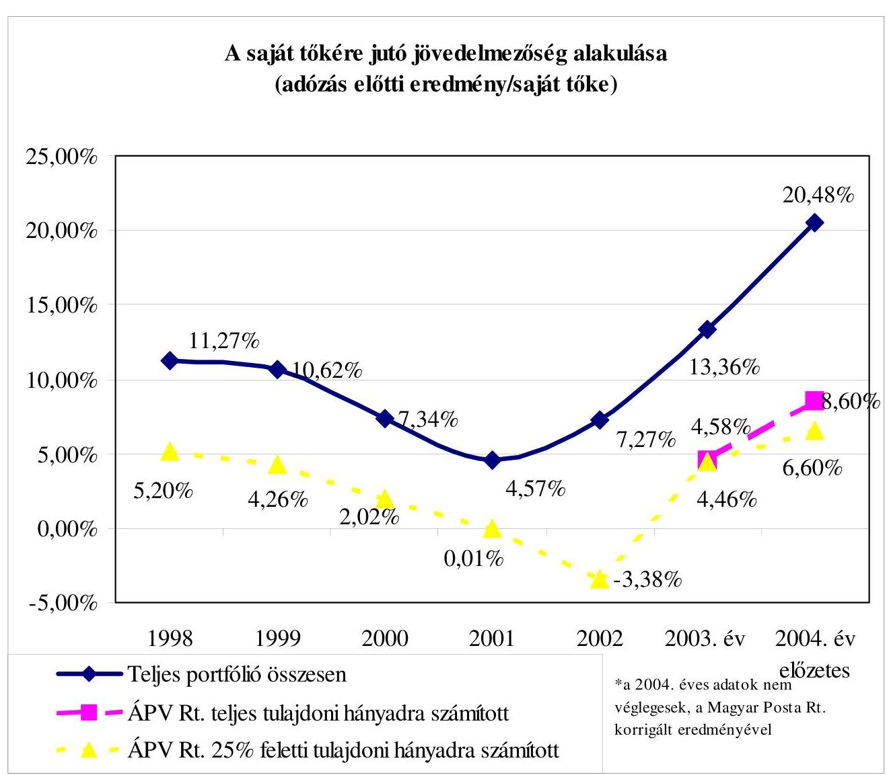

- A saját tőkére jutó jövedelmezőség alakulása (adózás előtti eredmény/saját tőke)

---

# Az ÁPV Rt. tulajdonosi érdekeinek érvényesítésére tett intézkedések 

A 616/2004. (XI. 11.) IG sz. határozat (amely módosította a 449/2003. (X. 02.) Ig. sz. határozatot) tartalmazza, hogy a stratégiai tervezés módszerében térjen át a gördülő tervezésre, éves gyakorisággal. Külön szabályozás van az erdészeti portfólió, a volán társaságok, hitelintézetek és biztosítók, speciális tevékenységű - kiemelt - társaságokra (pl. Magyar Posta Rt.).

A 615/2004. (XI. 11.) IG. sz. határozat a pótlólagos források kihelyezésével kapcsolatos követelményeket (85/2004. (IV. 19) Korm. rendelet előírásait, EU pályázati feltételeket) keretszabályozásként tartalmazó utasítás alkalmas a cégstratégiák következetes végrehajtásának elősegítésére, támogatására, a szakmaiság (egyedi tervezés, fejlesztés, kockázatvállalás) növelésére. Ennek megfelelően a forrásallokáció elsősorban üzleti szempontok szerint kell, hogy végbemenjen, de meg kell felelni a vagyonkezelő más elvárásainak (környezetvédelem, közmunka program) is.

A 723/2003. (XII. 18) IG sz. határozat a 2004. évre vonatkozó tulajdonosi tervezési irányelvek mellett nyereség- és osztalékelvárásokat, valamint keresetszabályozást is tartalmaz. Az eredményesség mérésére a ROE mutató alkalmazását rendeli el. A 7/2004. Vez. ig. utasítás a többségi társaságok első számú vezetői, Igazgatóságai, és Felügyelő Bizottságai munkájának megítéléséhez ír elő teljesítményértékelési rendszert. A 454/2003. (VIII. 28.) IG. sz. határozat javadalmazási kategóriákat határoz meg. A keresetet, prémiumot, díjazást a 752/2003. (XII. 23.) IG. sz. határozat szabályozza. A keresetfejlesztést az éves üzleti terv teljesítésétől teszi függővé a 657/2004. (X. 25) IG sz. határozza.

A 730/2004. (XI. 23.) Vig. sz. határozat szabályozza a Vagyonkezelési Információs Rendszer (VIR) üzemeltetését. Kialakították Magyarországon múködő vállalkozások gazdálkodási adatait tartalmazó jó, közepes és rossz minősítésű, illetve régiók szerinti bontású adatbázis. A nem állami társaságok teljesítményeit összehasonlítva az ÁPV Rt. többségi tulajdonában lévő társaságok mutatóival, elemzés készül az elért eredmények javíthatóságára. Az ÁPV Rt. portfólió csoportba sorolt társaságok egymással való összemérése is megtörténik, a lemaradóknak intézkedéseket kell tenni a felzárkózás érdekében. Az ÁPV Rt. tulajdoni körébe tartozó társaságokat jövedelmezőségi és más mutatók szerint sorba rendezik. A gazdálkodás folyamatos figyelését 5+1 fokozatú korai riasztás rendszer biztosítja. Vizsgálat tárgya a kritikus helyzetben lévő cégeknél a saját tőke nagysága, a saját tőke aránya a jegyzett tőkéhez, a veszteség mértéke, az eladósodottság szintje, a likviditási mutató alakulása, a bruttó cash flow. Ennek alapján történik a negyedéves értékelő értekezletre behívandó társaságok kijelölése. A gyűjtött információkból összefoglaló elemzések, heti jelentések is készülnek az ÁPV Rt. vezetői, a társaságokért felelős menedzserek részére.

---

# Az ÁPV Rt. 25\% feletti tulajdoni hányadú társaságainak ROE szintje 

| Társaság csoport | Cégek   száma | Átlagos ROE szint   2003. évben | Átlagos ROE szint   2004. évben |
| :-- | --: | --: | --: |
| 100\%-os társaság | 46 | $19,6 \%$ | $14,2 \%$ |
| Többségi társaság (50-99,99\%) | 47 | $-6,5 \%$ | $1,3 \%$ |
| Kisebbségi 25\% feletti társaság | 8 | $13,5 \%$ | $13,2 \%$ |
| ÁPV Rt. (25\%) felett összesen | 101 | $3,8 \%$ | $6,6 \%$ |

15. sz. melléklet
a V-01-63/2005. sz. jelentéshez

## Az ÁPV Rt. 25\% feletti tulajdoni hányadú társaságainál a ROE mutatók alakulása a vagyonkezelés módja szerint a 2004. évben

| ROE szint | Cégek száma |  |  | Cégek megoszlása |  |  |
| :-- | --: | --: | --: | --: | --: | --: |
|  | tartós | privati-   zálható | összesen | tartós | privatizálható | összesen |
| 10\%-nál magasabb | 5 | 12 | 17 | $16,1 \%$ | $17,1 \%$ | $16,8 \%$ |
| 5-10\% között | 3 | 6 | 9 | $9,7 \%$ | $8,6 \%$ | $8,9 \%$ |
| 0-5\% között | 20 | 31 | 51 | $64,5 \%$ | $44,3 \%$ | $50,5 \%$ |
| -5-0\% között | 2 | 7 | 9 | $6,5 \%$ | $10,0 \%$ | $8,9 \%$ |
| -10-5\% között | 0 | 5 | 5 | $0,0 \%$ | $7,1 \%$ | $5,0 \%$ |
| -10\%-nál alacsonyabb | 1 | 9 | 10 | $3,2 \%$ | $12,9 \%$ | $9,9 \%$ |
| ÁPV Rt. porfólió (25\%)   feletti átlaga összesen | 31 | 70 | 101 | $100 \%$ | $100 \%$ | $100,0 \%$ |
| ÁPV Rt. átlagos ROE   mutató | - | - | - | $6,7 \%$ | $6,3 \%$ | $6,6 \%$ |

---

16. sz. melléklet a V-01-63/2005. sz. jelentéshez

# ÁPV Rt. tulajdonra jutó adózás előtti eredmény szerint a nyereséges és veszteséges cégek megoszlása 

| ÁPV Rt. tul.-ra jutó adózás előtti   eredmény szerint | Nyereséges (illetve   nullszaldós) | Veszteséges | Összesen |
| :-- | --: | --: | --: |
| Cégek száma 2003. évben (db) | 112 | 47 | 159 |
| Cégek eredménye 2003. évben   (M Ft) | 74658 | -37313 | 37345 |
| Cégek száma 2004. évben (db) | 104 | 34 | 138 |
| Cégek eredménye 2004. évben   (M Ft | 84274 | -15390 | 68884 |

---

Az ÁPV Rt. veszteséges társaságai 2004. évben

|  Ssz. | Társaság | ÁPV Rt.
tulajdoni
hányad | ÁPV Rt-re jutó adózás előtti eredmény ( E Ft) |  |  |  | ROE (Adózás előtti eredmény / Saját tőke) |  |  |   |
| --- | --- | --- | --- | --- | --- | --- | --- | --- | --- | --- |
|   |  | 2004. év | 2001. év tény | 2002. év tény | 2003. év tény | 2004. év
tény | 2001. év
tény | 2002. év
tény | 2003. év
tény | 2004. év
tény  |
|  1 | Szövetkezeti Üzletrészhasznosító Kft. | 99.99\% | $-7,414,048$ | $-12,376,065$ | $-6,874,162$ | $-4,774,475$ | $-140.5 \%$ | $-103.1 \%$ | $-134.1 \%$ | $-1361.0 \%$  |
|  2 | Nitrokémia Vegyipari Rt. | 100.00\% | $-440,153$ | $-403,787$ | $-1,157,912$ | $-1,005,963$ | $-15.3 \%$ | $-16.4 \%$ | $-88.4 \%$ | $-330.9 \%$  |
|  3 | Magyar Légiközlekedési Csoport | 99.95\% | $-13,751,453$ | $-5,537,803$ | $-12,480,447$ | $-4,918,636$ | $-175.2 \%$ | $-66.5 \%$ | $-357.3 \%$ | $-128.2 \%$  |
|  4 | Zsolnay Porcelángyár Rt. | 92.88\% | $-53,962$ | 175,679 | $-85,398$ | $-158,065$ | $-11.1 \%$ | 54.5\% | $-35.8 \%$ | $-106.0 \%$  |
|  5 | Komáromi Mg. Termelő és Szolgáltató Rt. | 94.93\% | 91,223 | $-52,158$ | $-585,746$ | $-779,001$ | 4.2\% | $-2.3 \%$ | $-33.0 \%$ | $-78.3 \%$  |
|  6 | MAHART Magyar Hajózási Rt. | 100.00\% | 969,109 | $-1,065,486$ | 2,201,055 | $-517,050$ | 24.1\% | $-36.0 \%$ | 185.1\% | $-67.2 \%$  |
|  7 | Nemzeti Löverseny Kft. | 100.00\% | $-670,509$ | $-584,787$ | $-583,215$ | $-546,311$ | $-22.2 \%$ | $-24.0 \%$ | $-31.4 \%$ | $-41.6 \%$  |
|  8 | VÁLTÓ-4 Libra Rt. | 100.00\% | 118,154 | $-3,344,312$ | $-253,606$ | $-128,163$ | 1.6\% | $-79.0 \%$ | $-25.9 \%$ | $-25.6 \%$  |
|  9 | Fertő-tavi Nádgazdasági Rt. | 96.24\% | 6,546 | 6,018 | $-148,256$ | $-71,564$ | 1.8\% | 1.6\% | $-64.1 \%$ | $-14.7 \%$  |
|  10 | Magyar Löverseny Fogadást Szervező Kft. | 100.00\% | 80,839 | $-6,207$ | $-15,345$ | $-11,603$ | 76.0\% | $-4.1 \%$ | $-11.4 \%$ | $-9.4 \%$  |
|  11 | ELMIB Első Magyar Infrastruktúra Bef. Rt | 99.98\% | $-277,891$ | $-709,609$ | $-389,112$ | $-262,047$ | $-17.5 \%$ | $-23.4 \%$ | $-10.7 \%$ | $-7.8 \%$  |
|  12 | Nógrád Volán Rt. | 95.08\% | $-30,597$ | $-79,339$ | $-241,047$ | $-64,063$ | $-3.4 \%$ | $-9.8 \%$ | $-42.0 \%$ | $-7.5 \%$  |
|  13 | Tisza Cipő Rt. | 99.37\% | $-144,209$ | $-114,282$ | $-80,425$ | $-50,831$ | $-14.1 \%$ | $-12.9 \%$ | $-10.1 \%$ | $-6.9 \%$  |
|  14 | Hollóházi Porcelán Rt. | 75.64\% | 31,277 | $-50,107$ | $-53,083$ | $-28,738$ | 5.0\% | $-8.0 \%$ | $-9.3 \%$ | $-5.3 \%$  |
|  15 | VOLÁNBUSZ Rt. | 100.00\% | 312,518 | $-383,980$ | 23,930 | $-447,248$ | 5.1\% | $-6.6 \%$ | 0.3\% | $-4.9 \%$  |
|  16 | Magyar Gázszolgáltató Kft. | 59.89\% | $-54,728$ | $-103,182$ | $-155,810$ | $-110,259$ | $-4.5 \%$ | $-4.2 \%$ | $-5.5 \%$ | $-4.1 \%$  |
|  17 | Mozgóképforgalmazási Rt. | 100.00\% | 1,084 | 16,543 | 33,630 | $-22,299$ | 0.2\% | 3.0\% | 5.8\% | $-4.0 \%$  |
|  18 | M-Ingatlan Rt. | 100.00\% | 0 | 0 | $-10,521$ | $-8,271$ |  |  | $-4.1 \%$ | $-3.3 \%$  |
|  19 | Hungexpo Rt. | 82.01\% | 446,968 | $-4,316$ | 210,480 | $-92,402$ | 9.3\% | $-0.1 \%$ | 4.4\% | $-2.0 \%$  |
|  20 | Zsolnay Porcelánmanufaktúra | 100.00\% | 8,477 | $-108,448$ | $-76,541$ | $-702$ | 1.7\% | $-10.4 \%$ | $-7.9 \%$ | $-0.1 \%$  |
|  21 | Magyar Villamos Művek Rt. csoport | 99.87\% | $-11,078,579$ | $-33,615,243$ | $-3,590,327$ | $-228,702$ | $-4.1 \%$ | $-14.1 \%$ | $-1.2 \%$ | $-0.1 \%$  |
|  22 | Mese Cukrászda Bt. | 99.13\% | 0 | 0 | 0 | 0 |  |  |  |   |
|   | Többségi veszteséges társaságok |  | $-31,849,934$ | $-58,340,872$ | $-24,311,854$ | $-14,226,394$ | $-9.9 \%$ | $-19.9 \%$ | $-7.4 \%$ | $-3.4 \%$  |
|  24 | Fertő-vidéki HEV Rt. | 26.31\% | 0 | 0 | $-5,349$ | $-17,065$ |  |  | $-594.2 \%$ | $-105.6 \%$  |
|  23 | Vértesi Erömű Rt. | 29.96\% | 108,974 | $-639,567$ | 23,447 | $-926,124$ | 1.8\% | $-11.7 \%$ | 0.4\% | $-20.8 \%$  |
|   | 25\% feletti veszteséges társaságok (22+2) |  | $-31,740,960$ | $-58,980,439$ | $-24,293,756$ | $-15,169,584$ | $-9.7 \%$ | $-19.8 \%$ | $-7.3 \%$ | $-3.6 \%$  |
|  25 | Martonseed Martonvásári Mg. Rt. | 15.00\% | $-34,373$ | $-19,272$ | $-36,490$ | $-82,090$ | $-15.0 \%$ | $-8.1 \%$ | $-17.0 \%$ | $-246.1 \%$  |
|  26 | Bácsalmási Agráripari Rt. | 14.07\% | 8,581 | $-15,605$ | $-97,944$ | $-134,714$ | 2.2\% | $-4.0 \%$ | $-32.4 \%$ | $-78.2 \%$  |
|   | 10\% feletti veszteséges társaságok (22+2+2) |  | $-31,766,751$ | $-59,015,315$ | $-24,428,190$ | $-15,386,388$ | $-9.6 \%$ | $-19.7 \%$ | $-7.3 \%$ | $-3.6 \%$  |
|  27 | Pick Csoport | 0.00003\% | 1 | 1 | 0 | $-2$ | 5.7\% | 11.7\% | $-2.2 \%$ | $-81.1 \%$  |
|  28 | Metalloglobus Rt. | 0.005\% | $-16$ | $-9$ | $-5$ | $-27$ | $-7.7 \%$ | $-4.4 \%$ | $-2.7 \%$ | $-17.7 \%$  |
|  29 | Balatonboglári Borg. Rt. | 0.0004\% | 0 | 0 | 0 | $-2$ | 2.0\% | 0.2\% | 0.9\% | $-13.1 \%$  |
|  30 | Agroprodukt Rt. | 0.0010\% | 1 | 2 | $-3$ | $-1$ | 1.8\% | 7.3\% | $-10.6 \%$ | $-5.5 \%$  |
|  31 | Győri Épfu Rt. | 10.00000\% | 521 | 1,140 | 611 | $-3,899$ | 0.6\% | 1.2\% | 0.7\% | $-4.5 \%$  |
|  32 | Kalocsai Fűszempaprika Rt. | 0.0001\% | 0 | 0 | 0 | 0 | 0.4\% | 0.2\% | 0.9\% | $-3.1 \%$  |
|  33 | Egyesült Vegyiművek Rt. | 0.13\% | 542 | 525 | $-914$ | 0 | 14.2\% | 11.8\% | $-17.5 \%$ |   |
|  34 | Villari Rt. | 4.89\% | $-1,971$ | 555 | $-2,413$ | 0 | $-5.2 \%$ | 1.6\% | $-7.7 \%$ |   |
|   | Veszteséges társaságok összesen (34 db) |  | $-31,767,674$ | $-59,013,101$ | $-24,430,914$ | $-15,390,319$ | $-9.6 \%$ | $-19.7 \%$ | $-7.3 \%$ | $-3.6 \%$  |

---

# Az ÁPV Rt. kisebbségi tulajdonában lévő társaságok jellemző adatai 2004. évben 

| Megnevezés | 2004.01 .01 | 2004.12 .31   (előzetes) | Év ele-   je/év vége   $\%$ |
| :-- | --: | --: | --: |
| Kisebbségi tulajdonú társaságok (db) | 44 | 45 | 102,27 |
| A társaságok jegyzett tőkéje (M Ft) | 366652 | 375486 | 102,41 |
| ÁPV Rt. részesedésre eső jegyzett tőke (M Ft) | 41006 | 33164 | 80,88 |
| Átlag ÁPV Rt. tulajdoni hányad a jegyzett tőkéből | $11,18 \%$ | $8,83 \%$ |  |
| A társaságok saját tőkéje (M Ft) | 1341523 | 1792715 | 133,63 |
| ÁPV Rt. részesedésre eső saját tőke (M Ft) | 204242 | 170524 | 83,5 |
| Átlag ÁPV Rt. tulajdoni hányad saját tőkéből | $15,22 \%$ | $9,51 \%$ |  |
| ÁPV Rt. összes részesedése (teljes portfólió) (M Ft) | 849565 | 722203 | 85,00 |
| Kisebbségi tulajdonú részesedések az összes része-   sedés \%-ban | $24,04 \%$ | $23,61 \%$ |  |

---

# Az ÁPV Rt. kisebbségi tulajdonában lévő társaságok saját tőke adatai 2004. XII. 31-én 

| Kisebbségi ÁPV Rt. tulajdonú portfólió megoszlása | 2004. 12. 31. (előzetes) |  | Megoszlás |
| :--: | :--: | :--: | :--: |
|  | \% | Saját tőke ÁPV Rt. része (M Ft) | $\%$ |
| MOL Rt. | 11,78 | 99263 | 58,3 |
| Richter Rt. | 25,00 | 52062 | 30,2 |
| Forrás Rt. | 37,86 | 6730 | 3,9 |
| Vértesi Erőmú Rt. | 29,96 | 4442 | 2,4 |
| Eximbank Rt. | $25+1$ szavazat | 3005 | 1,8 |
| Herendi Porcelán Rt. | $25+1$ szavazat | 1871 | 1,1 |
| Mehib Rt. | $25+1$ szavazat | 1583 | 0,9 |
| Dunaferr Rt. | 1,81 | 1040 | 0,6 |
| Balatoni Hajózási Rt. | 48,99 | 13 | 0,008 |
| Összes többi kisebbségi cég (36) |  | 515 | 0,7 |
| Kisebbségi ÁPV Rt. tulajdonú társaságok | 45 | 170524 | 100,0 |

---

# A kisebbségi társaságok 2004. évi privatizációjának összefoglaló táblázata 

|  |  |  |  |  |  |
| :-- | --: | --: | --: | --: | --: |
| Megnevezés | Értékesített   $\%$ | Névérték | Saját tőkeér-   ték | Szerződési ár | Szerződési ár/   Saját tőke |
| Cartographia Kft. | 7,22 | 37560 | 64033 | 50561 | $79,0 \%$ |
| Innovatext Rt. | 5,66 | 5610 | 5128 | 3110 | $60,6 \%$ |
| Titász Rt. | 0,00 | 110 | 110 | 115 | $104,5 \%$ |
| Treport Kft. | 26,55 | 53110 | 53145 | 40000 | $75,3 \%$ |
| D M Kft. | 30,00 | 900 | 339 | 300 | $88,5 \%$ |
| Összesen |  | 97290 | 122755 | 94086 | $76,6 \%$ |

Megjegyzés:

- A saját tőkeérték az anyatársaság rendelkezésére álló mérlegéből került kiszámításra, ami nem mindig azonos a nyilvántartási értékkel,
- A Cartographia Kft. meg nem vásárolt dolgozói részvényeit a vevő vásárolta meg, az Innovatext Rt. részvényeladás kedvezményes dolgozói értékesítés.

---

21. sz. melléklet a V-01-63/2005. sz. jelentéshez

# Privatizációs szakértők és tanácsadók 

| Ért.éve | Társaság neve | Az értékesítésben résztvevő szakértő, tanácsadó neve | A tanácsadás tárgya |
| :--: | :--: | :--: | :--: |
| 2001 | Balaton Füszért Rt. | Pátria Consult Kft. | vagyonértékelés |
| 2000 | Masterfil-Text Kft. | Gordius Consulting Rt. | vagyonértékelés |
| 2000 | Nitrokémia 2000 Ip.Vagyonk.Rt. | EX ASSE Könyvvizsgáló Kft. | vagyonértékelés |
| 2001 | CD Hungária Rt. | nincs | (2003. szept. Mátraholding Rt. FB felkérésére) |
| 2001 | OTP Bank Rt. | CA IB Rt. | tőzsdei értékesítés |
| 2002 | Tiszamenti Vegyiművek | American Apprasail Rt. | vagyonértékelés |
| 2001 | Magyar Távközlési Rt. | CA IB Rt. | tőzsdei értékesítés |
|  |  | Réczicza Ügyvédi Iroda White and Chase LLP | Az 1997-es tőzsdei értékesítésből származó kötelezettségekkel kapcsolatos jogi tanácsadás |
| 2001 | Hungaropharma Gyógysz.Rt. | Martonyi és Kajtár, Baker és McKenzie Úgyv. Iroda | privatizációval összefüggő jogi tanácsadás |
|  |  | Ernst and Young Kft. | üzleti érték meghatározása |
| 2004 | Forrás Rt. | CA-IB Értékpapír Rt. | tanácsadói és befektetési szolgáltatói tevékenység |
|  |  | CMS Cameron McKenna és Ormai és Társa Úgyv. Iroda | a tanácsadó alvállalkozója jogi ügyekben |
| 2003 | FHB Rt. | Concorde Értékpapír Rt. | vezető forgalmazó |
|  |  | KPMG Hungária Kft. | vagyonértékelés |
| 2003 | Postabank Rt. | Concorde Értékpapír Rt. | pénzügyi tanácsadó |
|  |  | Interauditor+Neuer Herzl Kft. | vagyonértékelés |
| 2003 | Belvárosi Irodaház Kft. | Kossuth Holding Rt. | vagyonértékelés |
| 2004 | Mol Rt. | Raiffeisen Bank Rt. | magyar vezető szervező (nyilvános kibocsátás) |
| 2004 | SIOTOUR Rt | Reorg Gazdasági Rt. | vagyonértékelés |

---

| 2004 | Szabadföld Rt. | Ernst and Young Kft. | vagyonértékelés |
| :--: | :--: | :--: | :--: |
| 2004 | Mezőhegyesi Állami   Ménesb.Rt. | Reorg Audit Kft. | tanácsadói feladatok (értékesítés   lebonyolítása) |
|  |  | Kossuth Holding Rt. | vagyonértékelés |
| 2004 | Enyingi Agrár Rt. | Reorg Audit Kft. | tanácsadói feladatok (értékesítés   lebonyolítása) |
|  |  | Economix Rt | vagyonértékelés |
|  |  | Réthi, Szegheő és Társai Ügyv.   Iroda | jogi tanácsadó |
| 2004 | Hód Mg Rt. | Reorg Audit Kft. | tanácsadói feladatok (értékesítés   lebonyolítása) |
|  |  | Kossuth Holding Rt. | vagyonértékelés |
|  |  | dr.Horváth Péter ügyvéd | jogi tanácsadó |
| 2004 | Bólyi Mg. Rt. | Reorg Audit Kft. | tanácsadói feladatok (értékesítés   lebonyolítása) |
|  |  | KPMG Hungária Kft. | vagyonértékelés |
|  |  | Kelemen, Mészáros, Sándor és   Társai Ügyv.Iroda | jogi tanácsadó |
| 2004 | Abaúj Charolais Rt. | Reorg Audit Kft. | tanácsadói feladatok (értékesítés   lebonyolítása) |
|  |  | KPMG Hungária Kft. | vagyonértékelés |
|  |  | Vass, Réti és Kurucz Ügyvédi   Iroda | jogi tanácsadó |
| 2004 | Szerencsi Mg.Rt. | Reorg Audit Kft. | tanácsadói feladatok (értékesítés   lebonyolítása) |
|  |  | KPMG Hungária Kft. | vagyonértékelés |
|  |  | Vass, Réti és Kurucz Ügyvédi   Iroda | jogi tanácsadó |
| 2004 | DUNAFERR Rt. | PricewaterhauseCoopers Kft. | tanácsadói feladatok (értékesítés   lebonyolítása) |
|  |  | Erste Bank Rt. | vagyonértékelés |
| 2004 | BAZ 2000.Rt. | CIB Bank Közép-Európai Nem-   zetközi Bank Rt. | vagyonértékelés |
| 2004 | Alcsiszigeti Mg.Rt. | Reorg Audit Kft. | tanácsadói feladatok (értékesítés   lebonyolítása) |
|  |  | Réthi, Szegheő és Társai Ügyv.   Iroda | privatizációban jogi közreműkö-   dés |
|  |  | KPMG Hungária Kft. | vagyonértékelés |

---

| 2004 | Bácsalmási Agrár   Rt. | Reorg Audit Kft. | tanácsadói feladatok (értékesítés   lebonyolítása) |
| :-- | :-- | :-- | :-- |
|  |  | Réthi, Szegheő és Társai Úgyv.   Iroda | privatizációban jogi közreműkö-   dés |
|  |  | Economix Rt | vagyonértékelés |
| 2004 | Dél-Gabona Rt. | Reorg Audit Kft. | vagyonértékelés |
| 2004 | MBV Rt. | CIB Bank Közép-Európai Nem-   zetközi Bank Rt. | vagyonértékelés |
| 2004 | TREPORT Kft. | CIB Bank Közép-Európai Nem-   zetközi Bank Rt. | vagyonértékelés |

---

# A Volán társaságoknál a rekonstrukciós autóbuszprogram végrehajtásának teljesítmény-ellenőrzése 

## A téma jelentősége

Az Állami Számvevőszék 2003. évi vizsgálata során megállapította, hogy az Állami Privatizációs és Vagyonkezelő Rt. portfóliójába tartozó Volán társaságoknak nyújtott rekonstrukciós támogatásainál a támogatásban részesülő társaságok előfinanszírozás keretében jutottak forrásokhoz. A kapott forrásokkal 2 év múlva számoltak el a támogatásban részesült szervezetek.

Az ÁPV Rt. Volán portfóliójába tartozó társaságok autóbuszparkja az elmúlt években műszakilag elhasználódott. A Volán társaságok 2002. január 1-én öszszesen 6803 db busszal rendelkeztek, melyek átlagéletkora 10,87 év volt. A cserére érett ( 12 évesnél idősebb) állomány pótlását a 2002. évet megelőző beszerzések üteme nem tette lehetővé. Az 1994-2001. évi járműbeszerzéseknél az EGB előírásoknak megfelelő káros-anyag emissziós előírásoknak mindössze a jármú állomány $36,7 \%$-a felelt meg (EURO 1,2,3), míg a zaj emissziós határértéket $35,7 \%$-a teljesíti. Az EU harmonizációnak megfelelő további szigorítások miatt a jármúállomány megfelelősége tovább csökkent.

A Volán társaságoknál képződő amortizáció csökkenése mellett az IKARUS típusváltása, majd az autóbuszárak emelkedése miatt a társaságok egyre kevesebb autóbuszt tudtak beszerezni saját forrásból, ezért a forgalom ellátása érdekében gazdaságtalan múszaki megoldások alkalmazására kényszerültek (felújítás, átépítés), melyek a járműpark elöregedését eredményezte. Amennyiben az autóbusz-állomány elhasználódását, múszaki állapotának romlását nem lehet megállítani, úgy a Volán társaságok a jövőben az utasforgalom biztonságos lebonyolítására alkalmatlanná váló járművek forgalomból való kivonására kényszerülnek. Ennek a problémának a felismerése vezetett 2002-ben a központi költségvetés forrásainak ismételt bevonására, majd 2003-2004. években a tulajdonos ÁPV Rt. tőkeemelés formájában biztosított pénzügyi eszközeinek felhasználására az autóbusz rekonstrukció érdekében.

## Az autóbusz rekonstrukciós támogatás célja

A rekonstrukció tulajdonosi támogatásának célja a menetrendszerinti feladatok ellátásához szükséges EU-normáknak megfelelő autóbuszpark biztosítása. Ezen belül:

- a múszaki színvonal megújulása,
- az átlagéletkor csökkenése, az üzembiztonság megőrzése,
- az előírásoknak megfelelő káros-anyag emissziós előírások elérése,
- a zaj emissziós határérték teljesítése,

---

- A szolgáltatási színvonal szinten tartásának biztosítása.
- A vizsgálat során értékeltük a tulajdonosi támogatás céljának megvalósulását, a menetrendszerinti feladatok ellátásához szükséges EU-normáknak megfelelő autóbuszpark biztosítását.

# Az autóbusz rekonstrukciós támogatás jogszabályi háttere, az ÁPV Rt. intézkedése a támogatás felhasználására 

A Kormány 2386/2002. (XII. 20.) határozatával jóváhagyta a Volán társaságok 2002. évi 1,5 Mrd Ft autóbusz rekonstrukciós támogatását, valamint felhatalmazta az ÁPV Rt.-t a támogatás felhasználásának, a beszerzés irányításának és ellenőrzésének végrehajtására. A pénzügyminiszter, mint az ÁPV Rt. részvényesi jogainak gyakorlója a 21/2002. (XII. 23.) RJGY számú határozatával elrendelte a kormányhatározat végrehajtását.

A Kormány által jóváhagyott tulajdonosi támogatást az ÁPV Rt. 2002. december 30 -án utalta át a Volán társaságok elkülönített bankszámláira. A Volán társaságok 2002. évi autóbusz rekonstrukciós tulajdonosi támogatása állami támogatásnak minősült, ezért szükséges volt a közbeszerzésekről szóló 1995. évi XL. törvény értelmében közbeszerzési pályázat meghirdetése.

Az ÁPV Rt. Igazgatósága:

- elfogadta a Volán társaságok jármúrekonstrukciója keretében a menetrendszerinti autóbuszok beszerzésére vonatkozó közbeszerzési pályázat Ajánlati felhívását és az Ajánlatkérési dokumentációját;
- felhatalmazta a Tranzakciós II. vezérigazgató-helyettest a Közbeszerzési Értesítő Szerkesztősége által javasolt módosítások, illetve hiánypótlás végrehajtására;
- hozzájárult, hogy a Volán Egyesülés a kormánydöntést követően az Ajánlati felhívást megjelentesse, az eljárást lefolytassa.

Az Ajánlati felhívás a többszöri egyeztetések és hiánypótlások rendezése után 2003. január 29-én jelent meg először a Közbeszerzési Értesítőben. A Közbeszerzési Döntőbizottság az eljárást több alkalommal felfüggesztette, mivel a kérelmezők által előadottakból és a közbeszerzési eljárásban keletkezett dokumentumok tartalmából megállapította, hogy a közbeszerzés tisztasága megsértésének veszélye állt fenn. A közbeszerzési eljárás másfél év után zárult le, melynek eredményeként az Irányító Bizottság a Kravtex Kft-t jelölte ki nyertes pályázónak. Az eredményhirdetést követően 2004. május 28 -án kötött szerződést az Au-tóbusz-Invest Kft. a győztes ajánlattevővel. A 24 Volán társaság 65 Credo EC 11 típusú autóbuszt (kiírás szerinti maximális db számot) rendelt meg 1,913 Mrd Ft értékben, melyből 1,5 Mrd Ft volt az ÁPV Rt. 2002. évi autóbusz rekonstrukciós támogatása, és 413 M Ft-ot a társaságok saját forrásaik terhére biztosítottak. Összesen 23,8 M Ft kormánytámogatást négy Volán társaság 2004. június 30-ig nem használt fel. Az ÁPV Rt. Igazgatósága 404/2004. (VII. 08.) IG számú határozatával rendelkezett a fel nem használt összeg 2004. december 31-i felhasználási lehetőségéről.

---

A szerződéseket a Volán társaságok egyedileg is megkötötték a Kravtex Kft.-vel. A rendelkezésre álló támogatási keret felhasználását és a megvalósult rendelések összegét a 22/a. sz. melléklet mutatja be.

- A korábbi kormányzati szándéknak megfelelően az ÁPV Rt. a Volán társaságok privatizációját 2005. évre tervezte. A privatizáció sikeres megvalósítása érdekében szükséges volt biztosítani, hogy a társaságok által üzemeltetett járműpark helyzete jelentősen ne romoljon. További autóbusz rekonstrukciós programot az Uniós csatlakozást követően támogatással nem volt célszerű finanszírozni, mivel a támogatás az ESA (Európai Számviteli Standardok) szempontjából egyenleg rontó tényező. Ezért a tulajdonos ÁPV Rt. tőkeemelés formájában biztosította (2003. évben 4,5 Mrd Ft és 2004. évben 5 Mrd Ft ) az autóbusz rekonstrukció és az előírásoknak megfelelő káros-anyag és zaj emissziós előírások eléréséhez szükséges reorganizáció pénzügyi forrását (22/b. sz. melléklet).
- A Volán társaságok a tőkeemelésből rendelkezésre álló pénzügyi forrást alapvetően korszerű helyi szóló és csuklós, helyközi-elővárosi szóló és hely-közi-távolsági autóbuszok beszerzésére fordították, ill. fordítják a komfortosabb, műszakilag korszerűbb, gazdaságosabban üzemeltethető járműállomány növelése érdekében. A Volán társaságok a közbeszerzési törvény hatálya alá tartoznak, ezért a társaságok a tőkeemelésből származó pénzügyi forrást a Kbt. előírásai alapján használhatják fel. A 2003. évi tőkeemelésből a társaságoknál 103 db új autóbusz vásárlása valósul meg. A 2004. évi tőkeemelésből származó pénzügyi forrás felhasználására a közbeszerzési eljárások lezárását követően kerülhet sor.
- A Volán társaságok autóbusz állományának életkor megoszlását 2002. december 31-e és 2005. január 1-jei időpontokban az 22/c. melléklet mutatja be. Megállapítható, hogy az állomány 2002-ben 7010 db 11,3 éves átlagéletkorral rendelkező autóbuszból állt, melynek 55,7\%-a meghaladta a 12 évet. 2005. január 1-én az beszerzések hatására az autóbusz állomány 6990 db-ra változott, amelynek átlagéletkora 11,8 év volt. Az eszközértékesítések és a selejtezések következtében a 12 év feletti állomány 50,9\%-ra csökkent.
- A Volán egyesülés autóbuszt üzemeltető tagszervezeteinek autóbusz korfáját 2004. december 31-ei adatok alapján az 1. sz. ábra mutatja be.
A beszerzések hatására jelentősen növekedett a 2-3 éves életkorú autóbuszok db száma. A 12 év feletti állomány életkora növekedett a viszonylag alacsony üzemeltetési költségű IKARUS állomány öregedése miatt. További cél a rekonstrukciós program folytatására a 8 évnél nem idősebb használt autóbuszok beszerzése, amely növeli a szolgáltatás színvonalát, relatíve alacsonyabb üzemeltetési költségek mellett.
A korszerű autóbuszok beszerzését követően a társaságok - a magasabb szolgáltatási színvonal biztosítása mellett - 10-15\%-os üzemeltetési költségmegtakarítást remélnek, az EURO-3 emissziós normának megfelelő motorok pedig jelentős káros- anyag kibocsátás csökkentést eredményezhetnek. A társaságok a tulajdonos által biztosított tőkeemeléssel folytatták a környezetkímélő gépjármúbeszerzéseiket, motorfelújításaikat, melynek köszönhetően az autóbuszmotorok immár több mint 91\%-a környezetkímélő.

---

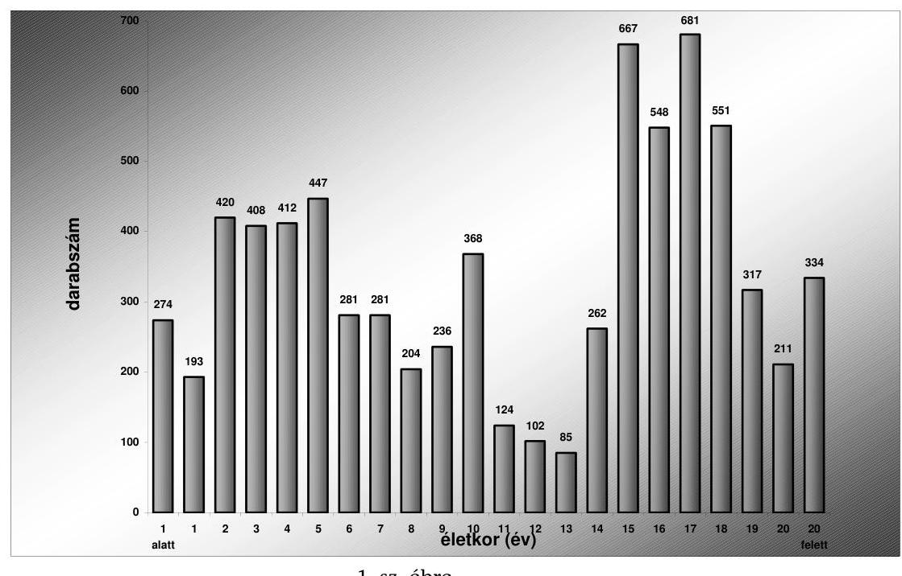

Forrás: Volán egyesülés
A Volán társaságok ellentmondásos gazdasági környezetben, illetve szabályozási keretek között múködnek. Az ellentmondások alapvető oka, hogy az autóbusszal végzett menetrend szerinti személyszállításról szóló 2004. évi XXXIII. törvény előírásai szerint, a közúti közforgalmi személyszállítási szolgáltatást közszolgáltatási tevékenységként végző szervezetek bevételeiket hatósági árként meghatározott díjszabás (az infláció mértékétől elmaradó tarifaemelés) útján szerzik, míg gazdálkodásuk piaci környezetben zajlik. Az átlagbér növekedési index 2000-től jelentősen meghaladta az autóbusszal végzett menetrendszerinti személyszállítás tarifaszint növekedését. 2003. évben 7,2\%, 2004. évben 5,8\%-os volt a helyközi tarifaemelés éves szinten, míg a 2003-2005. éves bérmegállapodás által meghatározott béremelés 2003-ban 14\%, illetve 2004-ben 11,8\%-os mértékű volt. A tarifa, a fogyasztási index és az üzemeltetési költségek összefüggését az elmúlt években a 2. sz. ábra mutatja be.

# Az autóbusz rekonstrukciós program végrehajtásának értékelése 

A teljesítmény-ellenőrzésre kiválasztott témát és kritériumait előtanulmány alapozta meg. A rekonstrukciós autóbusz program végrehajtását eredményességi szempontok szerint értékeltük, mivel az állami támogatás és a tulajdonos által biztosított tőkeemelés felhasználása alapvetően e szempontok szerint mérhető. A vizsgálati cél szerint az eredményesség kritériumát az jelenti, hogy támogatásokból megvalósult rekonstrukciós autóbusz program megfelelt-e a kitűzött céloknak.
A műszaki színvonal megújulása és az átlagéletkor csökkenés részben történt meg, mert a Kbt. alkalmazási kötelezettsége miatt bővült a forgalomba helyezett buszok típusszáma (22./d. melléklet). Nőtt az új beszerzésű komfortosabb, műszakilag korszerűbb, gazdaságosabban üzemeltethető járműállomány. Még mindig jelentős a járműállomány 74,2\%-át kitevő IKARUS típuscsalád üzemel-

---

tetése, amelynek részbeni felújítását követően sem javult jelentős mértékben a szolgáltatás színvonala. A buszállomány műszaki színvonalának jelentős javításához és az átlagéletkor 8-8,5 évre történő csökkenéséhez évi 10\% új autóbusz beszerzésére lenne szükség. A 2002-2005 években végrehajtott buszrekonstrukció ugyan 0,1-0,2 évvel csökkenti az állomány évenkénti öregedését, viszont az ebben az időszakban történt autóbusz beszerzések és selejtezések hatására az autóbusz állomány átlagéletkora 11,3 évről 11,8 évre változott.
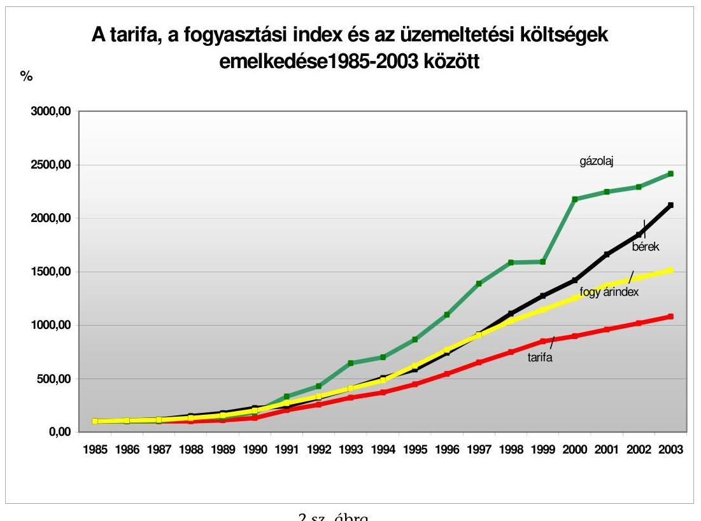
2.sz. ábra

Forrás: Volán egyesülés
Az előírásoknak megfelelő káros-anyag emissziós előírások elérése, az ún. „feketemotor" program teljesítése a 2003-2004. évi reorganizációs támogatások felhasználása során 2005. évben teljesült, az autóbusz motorok több mit 91\%-a környezetkímélő.
Javasoljuk felülvizsgálni az autóbusz állomány műszaki színvonalának jelentős javításához, az átlagéletkor 8-8,5 évre történő csökkentéséhez szükséges pénzügyi források biztosításának módjait,

- a magyarországi közúti közösségi közlekedés tarifarendszerét;
- a közúti közlekedés árkiegészítési rendszerét;
- az EU konformitás figyelembevételével a Volán társaságok közvetett és közvetlen költségvetési forrásból történő pénzügyi finanszírozási lehetőségét;
- a veszteségfinanszírozási rendszer metodikájának szabályozását;

---

# A 2386/2002. (XII. 20.) Korm. határozattal rendelkezésre álló támogatási keret felhasználása 

|  |  |  |  | M Ft |
| :--: | :--: | :--: | :--: | :--: |
| Volán Társaság | Támogatás összege | Autóbuszok száma | Rendelés összege | Fel nem használt támogatás |
| Agria Volán Rt. | 40459 | 1 | 28883 | 11576 |
| Alba Volán Rt. | 77425 | 3 | 85901 | 0 |
| Bács Volán Rt. | 21877 | 1 | 28250 | 0 |
| Bakony Volán Rt. | 33350 | 1 | 31838 | 1512 |
| Balaton Volán Rt. | 39388 | 2 | 57834 | 0 |
| Borsod Volán Rt. | 111049 | 4 | 112231 | 0 |
| Gemenc Volán Rt. | 50979 | 2 | 56508 | 0 |
| Hajdú Volán Rt. | 76756 | 3 | 83803 | 0 |
| Hatvani Volán Rt. | 11207 | 1 | 29880 | 0 |
| Jászkun Volán Rt. | 49600 | 2 | 60257 | 0 |
| Kapos Volán Rt. | 47181 | 2 | 56906 | 0 |
| Kisalföld Volán Rt. | 91832 | 8 | 228889 | 0 |
| Körös Volán Rt. | 48084 | 2 | 59719 | 0 |
| Kunság Volán Rt. | 58687 | 2 | 62263 | 0 |
| Mátra Volán Rt. | 30025 | 1 | 31341 | 0 |
| Nógrád Volán Rt. | 48156 | 2 | 57248 | 0 |
| Pannon Volán Rt. | 71081 | 3 | 84733 | 0 |
| Somló Volán Rt. | 32314 | 5 | 143860 | 0 |
| Szabolcs Volán Rt. | 64200 | 2 | 57626 | 6574 |
| Tisza Volán Rt. | 86734 | 3 | 94190 | 0 |
| Vasi Volán Rt. | 49256 | 2 | 57128 | 0 |
| Vértes Volán Rt. | 68969 | 3 | 93599 | 0 |
| Volánbusz Rt. | 224153 | 8 | 247212 | 0 |
| Zala Volán Rt. | 67238 | 2 | 63135 | 4103 |
| Összesen: | 1500000 | 65 | 1913235 | 23765 |

---

22/b. sz. melléklet

A Volán társaságok 2003. évi tőkeemelése

|  |   |   |   |   |   |   |   |   |   |   |   |   |   |   |   |   |   |   |   |   |   |   |   |   |   |   |   |   |   |   |   |   |   |   |   |   |   |   |   |   |   |   |   |   |   |   |   |   |   |   |   |   |   |   |   |   |   |   |   |   |   |   |   |   |   |   |   |   |   |   |   |   |   |   |   |   |   |   |   |   |   |   |   |   |   |   |   |   |   |   |   |   |   |   |   |   |   |   |   |   |   |

---

22/b.1. sz. melléklet a V-01-63/2005. sz. jelentősítve

A Volán társaságok 2004. évi tőkeemelése

|   |  |  |  |  |  |  |  |  |  |  |  |  |  |  |  |  |  |  |  |  |  |  |  |  |  |  |  |  |  |  |  |  |  |   |
| --- | --- | --- | --- | --- | --- | --- | --- | --- | --- | --- | --- | --- | --- | --- | --- | --- | --- | --- | --- | --- | --- | --- | --- | --- | --- | --- | --- | --- | --- | --- | --- | --- | --- | --- |
|   |  |  |  |  |  |  |  |  |  |  |  |  |  |  |  |  |  |  |  |  |  |  |  |  |  |  |  |  |  |  |  |  |  |   |
|   |  |  |  |  |  |  |  |  |  |  |  |  |  |  |  |  |  |  |  |  |  |  |  |  |  |  |  |  |  |  |  |  |  |   |
|   |  |  |  |  |  |  |  |  |  |  |  |  |  |  |  |  |  |  |  |  |  |  |  |  |  |  |  |  |  |  |  |  |  |   |
|   |  |  |  |  |  |  |  |  |  |  |  |  |  |  |  |  |  |  |  |  |  |  |  |  |  |  |  |  |  |  |  |  |  |   |
|   |  |  |  |  |  |  |  |  |  |  |  |  |  |  |  |  |  |  |  |  |  |  |  |  |  |  |  |  |  |  |  |  |  |   |
|   |  |  |  |  |  |  |  |  |  |  |  |  |  |  |  |  |  |  |  |  |  |  |  |  |  |  |  |  |  |  |  |  |  |   |
|   |  |  |  |  |  |  |  |  |  |  |  |  |  |  |  |  |  |  |  |  |  |  |  |  |  |  |  |  |  |  |  |  |  |   |
|   |  |  |  |  |  |  |  |  |  |  |  |  |  |  |  |  |  |  |  |  |  |  |  |  |  |  |  |  |  |  |  |  |  |   |
|   |  |  |  |  |  |  |  |  |  |  |  |  |  |  |  |  |  |  |  |  |  |  |  |  |  |  |  |  |  |  |  |  |  |   |
|   |  |  |  |  |  |  |  |  |  |  |  |  |  |  |  |  |  |  |  |  |  |  |  |  |  |  |  |  |  |  |  |  |  |   |
|   |  |  |  |  |  |  |  |  |  |  |  |  |  |  |  |  |  |  |  |  |  |  |  |  |  |  |  |  |  |  |  |  |  |   |
|   |  |  |  |  |  |  |  |  |  |  |  |  |  |  |  |  |  |  |  |  |  |  |  |  |  |  |  |  |  |  |  |  |  |   |
|   |  |  |  |  |  |  |  |  |  |  |  |  |  |  |  |  |  |  |  |  |  |  |  |  |  |  |  |  |  |  |  |  |  |   |
|   |  |  |  |  |  |  |  |  |  |  |  |  |  |  |  |  |  |  |  |  |  |  |  |  |  |  |  |  |  |  |  |  |  |   |
|   |  |  |  |  |  |  |  |  |  |  |  |  |  |  |  |  |  |  |  |  |  |  |  |  |  |  |  |  |  |  |  |  |  |   |
|   |  |  |  |  |  |  |  |  |  |  |  |  |  |  |  |  |  |  |  |  |  |  |  |  |  |  |  |  |  |  |  |  |  |   |
|   |  |  |  |  |  |  |  |  |  |  |  |  |  |  |  |  |  |  |  |  |  |  |  |  |  |  |  |  |  |  |  |  |  |   |
|   |  |  |  |  |  |  |  |  |  |  |  |  |  |  |  |  |  |  |  |  |  |  |  |  |  |  |  |  |  |  |  |  |  |   |
|   |  |  |  |  |  |  |  |  |  |  |  |  |  |  |  |  |  |  |  |  |  |  |  |  |  |  |  |  |  |  |  |  |  |   |
|   |  |  |  |  |  |  |  |  |  |  |  |  |  |  |  |  |  |  |  |  |  |  |  |  |  |  |  |  |  |  |  |  |  |   |
|   |  |  |  |  |  |  |  |  |  |  |  |  |  |  |  |  |  |  |  |  |  |  |  |  |  |  |  |  |  |  |  |  |  |   |
|   |  |  |  |  |  |  |  |  |  |  |  |  |  |  |  |  |  |  |  |  |  |  |  |  |  |  |  |  |  |  |  |  |  |   |
|   |  |  |  |  |  |  |  |  |  |  |  |  |  |  |  |  |  |  |  |  |  |  |  |  |  |  |  |  |  |  |  |  |  |   |
|   |  |  |  |  |  |  |  |  |  |  |  |  |  |  |  |  |  |  |  |  |  |  |  |  |  |  |  |  |  |  |  |  |  |   |
|   |  |  |  |  |  |  |  |  |  |  |  |  |  |  |  |  |  |  |  |  |  |  |  |  |  |  |  |  |  |  |  |  |  |   |
|   |  |  |  |  |  |  |  |  |  |  |  |  |  |  |  |  |  |  |  |  |  |  |  |  |  |  |  |  |  |  |  |  |  |   |
|   |  |  |  |  |  |  |  |  |  |  |  |  |  |  |  |  |  |  |  |  |  |  |  |  |  |  |  |  |  |  |  |  |  |   |
|   |  |  |  |  |  |  |  |  |  |  |  |  |  |  |  |  |  |  |  |  |  |  |  |  |  |  |  |  |  |  |  |  |  |   |
|   |  |  |  |  |  |  |  |  |  |  |  |  |  |  |  |  |  |  |  |  |  |  |  |  |  |  |  |  |  |  |  |  |  |   |
|   |  |  |  |  |  |  |  |  |  |  |  |  |  |  |  |  |  |  |  |  |  |  |  |  |  |  |  |  |  |  |  |  |  |   |
|   |  |  |  |  |  |  |  |  |  |  |  |  |  |  |  |  |  |  |  |  |  |  |  |  |  |  |  |  |  |  |  |  |  |   |
|   |

---

22/c. sz. melléklet

**Volánok autóbuszállomány életkor megoszlása 2002. december 31.**

|  Volán | 1 éves | 2 éves | 3 éves | 4 éves | 5 éves | 6 éves | 7 éves | 8 éves | 9 éves | 10 éves | 11 éves | 12 éves | 13 éves | 14 éves | 15 éves | 16 éves | 17 éves | 18 éves | 19 éves | 20 éves és azt meghaladó | 21. állomány összesen | 22. körszerű autóbusz | 23. környezetkímelő motorú autóbusz | 24. fő év feletti összesen | 25. fő év feletti állomány (%) | 26. átlag életkor  |
| --- | --- | --- | --- | --- | --- | --- | --- | --- | --- | --- | --- | --- | --- | --- | --- | --- | --- | --- | --- | --- | --- | --- | --- | --- | --- | --- |
|  Agria Volán Rt. | 3 | 10 | 8 | 11 | 3 | 11 | 3 | 8 | 14 | 5 | 2 | 1 | 11 | 23 | 27 | 39 | 8 | 4 | 0 | 0 | 191 | 37 | 191 | 112 | 58,64%  |
|  Alba Volán Rt. | 33 | 27 | 16 | 22 | 19 | 12 | 10 | 25 | 19 | 0 | 7 | 6 | 45 | 14 | 47 | 40 | 15 | 3 | 6 | 2 | 368 | 3 | 10 | 172 | 46,74%  |
|  Balaton Volán Rt. | 7 | 8 | 13 | 9 | 4 | 11 | 5 | 4 | 10 | 0 | 2 | 9 | 9 | 16 | 20 | 11 | 28 | 8 | 2 | 6 | 182 | 76 | 182 | 100 | 54,95%  |
|  Bakony Volán Rt. | 8 | 6 | 11 | 7 | 3 | 3 | 4 | 6 | 4 | 1 | 1 | 1 | 5 | 22 | 12 | 20 | 23 | 8 | 8 | 2 | 155 | 48 | 149 | 100 | 64,52%  |
|  Bács Volán Rt. | 3 | 5 | 6 | 5 | 6 | 4 | 4 | 3 | 8 | 3 | 4 | 0 | 4 | 9 | 3 | 3 | 7 | 11 | 5 | 4 | 97 | 21 | 73 | 46 | 47,42%  |
|  Borsod Volán Rt. | 11 | 21 | 24 | 25 | 15 | 14 | 10 | 6 | 8 | 1 | 2 | 0 | 34 | 69 | 64 | 69 | 57 | 25 | 30 | 18 | 503 | 113 | 390 | 364 | 72,37%  |
|  Gemenc Volán Rt. | 8 | 22 | 8 | 4 | 10 | 4 | 5 | 20 | 1 | 2 | 0 | 16 | 26 | 10 | 33 | 30 | 18 | 14 | 6 | 17 | 254 | 83 | 175 | 172 | 67,72%  |
|  Hajdú Volán Rt. | 28 | 34 | 25 | 21 | 19 | 10 | 11 | 9 | 9 | 12 | 4 | 7 | 10 | 31 | 26 | 16 | 45 | 19 | 12 | 3 | 351 | 106 | 290 | 162 | 46,15%  |
|  Hatvani Volán Rt. | 7 | 3 | 3 | 1 | 1 | 2 | 3 | 3 | 1 | 4 | 0 | 2 | 8 | 1 | 13 | 7 | 3 | 1 | 0 | 4 | 67 | 27 | 37 | 37 | 55,22%  |
|  Jászkun Volán Rt. | 24 | 9 | 19 | 19 | 16 | 12 | 9 | 11 | 16 | 4 | 2 | 4 | 4 | 28 | 24 | 18 | 10 | 5 | 1 | 7 | 242 | 90 | 196 | 97 | 40,08%  |
|  Kapos Volán Rt. | 2 | 15 | 20 | 11 | 7 | 26 | 10 | 4 | 14 | 3 | 8 | 4 | 13 | 13 | 10 | 9 | 17 | 8 | 9 | 25 | 228 | 73 | 205 | 106 | 46,49%  |
|  Kisalföld Volán Rt. | 32 | 36 | 26 | 44 | 29 | 19 | 19 | 16 | 31 | 20 | 18 | 7 | 16 | 24 | 32 | 34 | 23 | 17 | 2 | 3 | 448 | 188 | 448 | 151 | 33,71%  |
|  Körös Volán Rt. | 15 | 16 | 15 | 16 | 17 | 12 | 9 | 6 | 11 | 1 | 3 | 0 | 12 | 25 | 12 | 38 | 11 | 4 | 0 | 0 | 223 | 65 | 223 | 102 | 45,74%  |
|  Kunság Volán Rt. | 6 | 10 | 10 | 12 | 6 | 6 | 10 | 3 | 29 | 0 | 2 | 0 | 6 | 24 | 14 | 13 | 18 | 18 | 22 | 30 | 239 | 94 | 143 | 145 | 60,67%  |
|  Mátra Volán Rt. | 2 | 5 | 12 | 19 | 4 | 5 | 5 | 4 | 9 | 6 | 9 | 1 | 3 | 14 | 8 | 22 | 16 | 1 | 1 | 5 | 151 | 68 | 147 | 70 | 46,36%  |
|  Nógrád Volán Rt. | 3 | 11 | 17 | 5 | 2 | 6 | 4 | 10 | 7 | 1 | 1 | 1 | 10 | 26 | 18 | 30 | 44 | 18 | 8 | 5 | 227 | 66 | 180 | 160 | 70,48%  |
|  Pannon Volán Rt. | 8 | 18 | 17 | 14 | 7 | 8 | 5 | 7 | 25 | 0 | 2 | 0 | 1 | 18 | 20 | 27 | 20 | 27 | 28 | 85 | 337 | 107 | 149 | 226 | 67,06%  |
|  Somló Volán Rt. | 14 | 8 | 7 | 2 | 6 | 5 | 5 | 6 | 0 | 5 | 0 | 5 | 10 | 13 | 12 | 30 | 11 | 5 | 0 | 6 | 150 | 58 | 119 | 90 | 60,00%  |
|  Szabolcs Volán Rt. | 23 | 11 | 16 | 22 | 14 | 12 | 5 | 0 | 7 | 1 | 1 | 0 | 12 | 41 | 39 | 63 | 31 | 11 | 4 | 2 | 315 | 110 | 289 | 203 | 64,44%  |
|  Tisza Volán Rt. | 35 | 22 | 27 | 32 | 24 | 8 | 27 | 25 | 13 | 9 | 11 | 6 | 10 | 19 | 42 | 30 | 23 | 12 | 9 | 18 | 402 | 105 | 382 | 163 | 40,55%  |
|  Vasi Volán Rt. | 9 | 22 | 15 | 9 | 7 | 7 | 2 | 8 | 2 | 7 | 2 | 12 | 8 | 12 | 5 | 35 | 14 | 3 | 9 | 41 | 229 | 81 | 147 | 144 | 62,88%  |
|  Vértes Volán Rt. | 7 | 22 | 13 | 11 | 10 | 5 | 7 | 11 | 9 | 5 | 4 | 1 | 8 | 22 | 25 | 56 | 32 | 16 | 14 | 42 | 320 | 85 | 221 | 215 | 67,19%  |
|  Volánbusz Volán Rt. | 46 | 55 | 62 | 50 | 29 | 34 | 19 | 30 | 23 | 15 | 13 | 19 | 12 | 84 | 73 | 85 | 107 | 89 | 64 | 100 | 1009 | 288 | 745 | 614 | 60,85%  |
|  Zala Volán Rt. | 9 | 16 | 13 | 16 | 17 | 14 | 19 | 17 | 38 | 12 | 3 | 11 | 23 | 38 | 18 | 30 | 13 | 4 | 3 | 8 | 322 | 116 | 150 | 150 | 46,58%  |
|  Összesen | 343 | 412 | 403 | 387 | 275 | 250 | 210 | 242 | 308 | 117 | 101 | 113 | 300 | 596 | 597 | 755 | 594 | 331 | 243 | 433 | 7010 | 2108 | 5241 | 3901 | 55,65%  |

1. oldal

---

22/c. sz. melléklet

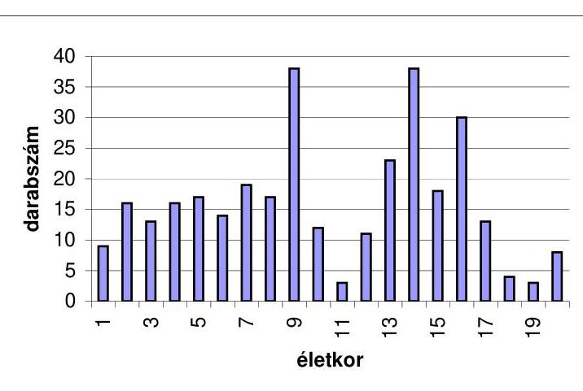

1. oldal

---

# A Volán társaságok autóbuszainak típus szerinti megoszlása 

|  |  |  |  |  |  | db |
| :--: | :--: | :--: | :--: | :--: | :--: | :--: |
| Típus | 2000.12.31 | 2001.12.31 | 2002.12.31 | 2003.12.31 | 2004.12.31 | 2005.06.01 |
| Classic | 268 | 371 | 414 | 415 | 415 | 415 |
| Credo | 8 | 26 | 50 | 75 | 155 | 155 |
| Egyéb | 164 | 176 | 193 | 198 | 233 | 235 |
| Ikarus 200 | 5136 | 4846 | 4598 | 4414 | 4121 | 4030 |
| Ikarus 300 | 659 | 702 | 716 | 728 | 740 | 738 |
| Ikarus 400 | 374 | 382 | 394 | 394 | 395 | 395 |
| Iveco | 8 | 8 | 9 | 12 | 13 | 11 |
| MAN | 42 | 113 | 174 | 235 | 299 | 327 |
| Mercedes | 25 | 24 | 29 | 27 | 30 | 29 |
| Mercedes (török) | 16 | 44 | 82 | 98 | 121 | 122 |
| Nabi | 0 | 0 | 4 | 22 | 43 | 51 |
| Neoplan | 13 | 13 | 13 | 13 | 29 | 46 |
| RÁBA | 167 | 226 | 230 | 230 | 231 | 231 |
| Scania | 9 | 11 | 12 | 12 | 12 | 13 |
| Setra | 24 | 28 | 31 | 37 | 42 | 47 |
| Volvo | 12 | 15 | 58 | 64 | 111 | 114 |
| ÖSSZESEN | 6925 | 6985 | 7007 | 6974 | 6990 | 6959 |

---

# A Volán társaságok autóbusz rekonstrukciós támogatásának teljesítmény ellenőrzése 

A teljesítmény-ellenőrzés a Volán társaságoknál 2002. évben megkezdett autóbusz rekonstrukciós program megvalósítása eredményességének vizsgálatára irányul. A vizsgálati program összeállítása és a vizsgálat lefolytatása az Állami Számvevőszék által adaptált és alkalmazott teljesítmény-ellenőrzés módszertanát követte. A vizsgálati cél szerint az eredményesség kritériumát az jelenti, hogy az állami támogatásból és a tőkeemelés pénzügyi forrásából megvalósult rekonstrukciós autóbusz program megfelelt-e a kitűzött célnak.

## 1. Helyzetértékelés a Volán tÁrsaságok autóbuszPARKJÁNAK MÜSZAKI ÁLLAPOTÁRÓL

### 1.1. Készült-e helyzetértékelés a környezetvédelmi, szakmai és az EU előírásoknak megfelelő, közúti forgalomban használható autóbuszokra: Igen, de tág határok közt.

Az ÁPV Rt. Vagyonkezelő és Privatizációs Előkészítő Igazgatósága II. folyamatosan figyelemmel kísérte a Volán társaságok autóbusz állományának műszaki, környezetvédelmi és életkor helyzetét. A társaságok éves üzleti terveiben folyamatosan megfogalmazásra került a társaságok autóbuszparkjának elöregedési tendenciája. A társaságok első számú vezetőinek egyik 2005. évi szakmai prémium feladataként határozták meg a 2005-2013. évekre vonatkozó autóbusz beszerzési stratégia kidolgozását.

### 1.2. Kié a felelősség az elöregedett autóbuszpark megszüntetéséért?

Az Országgyűlés - figyelemmel a menetrend szerinti autóbusz-közlekedésnek a mindennapi életvitelhez elengedhetetlen utazási igények kielégítésében betöltött szerepére - a személyszállítási közszolgáltatások hatékonyságának növelése és színvonalának javítása, valamint a közpénzek ésszerű és átlátható módon történő felhasználása érdekében, az Európai Unió közlekedési közszolgáltatásokra vonatkozó előírásaival összhangban hozott törvényt. Az autóbusszal végzett menetrend szerinti személyszállításról szóló 2004. évi XXXIII. tv. előírásai meghatározzák a közforgalmú közlekedés keretében végzett menetrend szerinti belföldi és nemzetközi személyszállítási szolgáltatást közszolgáltatási tevékenységként végző szervezetek feladatait.

---

Helyi közlekedésben a települési (fővárosi) önkormányzat, helyközi (távolsági) közlekedésben az állam feladata a közforgalmú közlekedés részeként a lehető legmagasabb színvonalú menetrend szerinti autóbusz-közlekedés biztosítása, az utazási igények és a rendelkezésre álló pénzügyi lehetőségek figyelembevételével. A gazdasági és közlekedési miniszter 2004 decemberében mind a 24 VoIán társasággal megkötötte a 2012. december 31-én 24 óráig szóló - a hivatkozott törvény 2. §-ának d) pontjában foglaltaknak megfelelő - helyközi-távolsági személyszállítás ellátására vonatkozó közszolgáltatási szerződést. A társaságok felelősek a törvényben maghatározott színvonalon a feladatukat ellátni és ehhez megfelelő eszközparkot biztosítani. A társaságok jellemzően 93,9\%-ban állami tulajdonban vannak, így a szolgáltatás színvonalára és minőségére vonatkozó tulajdonosi felelősség áttételesen visszaszáll az ellátásért felelős miniszterre.

# 1.3. Megfogalmazták-e a környezetvédelmi és műszaki feladatokat a program előkészítésekor: igen 

A közúti járművek forgalomba helyezésének és forgalomban tartásának műszaki feltételeiről szóló (többször módosított) 6/1990. (IV. 12.) KöHÉM rendelet szabályozta a közúti járművekben lévő motorokra vonatkozó hatósági előírásokat. A hivatkozott jogszabály maghatározta, hogy a motoroknak milyen követelményeknek kell megfelelni, illetőleg rendelkezett arról is, hogy a gépjármú alkatrészeknek és tartozékoknak mely ENSZ-EGB előírás alapján alkalmazott jóváhagyási jellel kell rendelkeznie. Az 1994-2001. évi jármúbeszerzéseknél az EGB előírásoknak megfelelő káros-anyag emissziós előírásoknak mindössze a jármú állomány $36,7 \%$-a felelt meg (EURO 1,2,3), míg a zaj emissziós határértéket $35,7 \%$-a teljesítette. Az EU harmonizációnak megfelelően 2002. évtől az EURO-2 emissziós normának megfelelő motorokkal szerelt autóbuszok beszerzése a meghatározó.

## 2. A KORMÁNY ÁLTAL BIZTOSÍTOTT TÁMOGATÁSI KERET ALAPJA

### 2.1. A támogatások odaítélésére készült-e javaslat az ÁPV Rt. Igazgatósága részére? Igen

A Kormány 2386/2002. (XII. 20.) határozatával támogatta a Volán társaságok 2002. évi 1,5 Mrd F-ost autóbusz rekonstrukciós támogatását, valamint felhatalmazta ÁPV Rt.-t a támogatás felhasználásának, a beszerzés irányításának és ellenőrzésének végrehajtására. A pénzügyminiszter, mint az ÁPV Rt. részvényesi jogainak gyakorlója a 21/2002. (XII. 23.) RJGY számú határozatával elrendelte a kormányhatározat végrehajtását.

További autóbusz rekonstrukciós programot az Uniós csatlakozást követően támogatással nem volt célszerű finanszírozni, mivel a támogatás az ESA (Európai Számviteli Standardok) szempontjából egyenleg rontó tényező. Ezért a tulajdonos ÁPV Rt. 2003. évben összesen 4,5 Mrd Ft-ot, 2004. évben összesen 5 Mrd Ft-ot biztosított - tőkeemelés formájában - az autóbusz rekonstrukció, egyedi célok és az előírásoknak megfelelő káros-anyag és zaj emissziós előírások eléréséhez szükséges reorganizáció pénzügyi forrására.

---

# 2.2. A feladatfelmérés és az éves költségvetési törvény összhangban van-e? Nem teljes körúen. 

A Volán társaságok autóbusz állományának életkor megoszlását 2002. december 31-e és 2005. január 1-jei időpontokban az 1/c. sz. melléklet tartalmazza. Megállapítható, hogy az állomány 2002-ben 6562 db 11,3 éves átlagéletkorral rendelkező autóbuszból állt, melynek 55,7\%-a meghaladta a 12 évet. 2005. január 1-én a beszerzések hatására az autóbusz állomány 7010 db-ra növekedett, amelynek átlagéletkora 11,8 év volt. Az eszközértékesítések és a selejtezések következtében a 12 év feletti állomány 50,9\%-ra csökkent. Még mindig jelentős a járműállomány $74,2 \%$-át kitevő IKARUS típuscsalád üzemeltetése, amelynek részbeni felújítását követően sem javult jelentős mértékben a szolgáltatás színvonala. A buszállomány műszaki színvonalának jelentős javításához és az átlagéletkor 8-8,5 évre történő csökkenéséhez évi 10\% új autóbusz beszerzésére lenne szükség. Költségvetési forrásokból a szükséges évi buszrekonstrukció pénzügyi fedezete nem biztosítható.

A 2002-2005 évben végrehajtott buszrekonstrukció ugyan 0,1-0,2 évvel csökkenti az állomány évenkénti öregedését, viszont ebben az időszakban történt autóbusz beszerzések és selejtezések hatására az autóbusz állomány átlagéletkora így is 11,3 évről 11,8 évre változott.

## 3. A TÁMOGATOTT TÁRSASÁGOK FELKÉSZÜLÉSE A TÁMOGATÁS FOGADÁSÁRA

### 3.1. A támogatott társaságok rendelkeztek-e a rekonstrukció elvégzésére vonatkozó fejlesztési tervvel? Igen

Az ÁPV Rt. a felügyelete alatt álló 24 Volán társaság üzleti tervét minden év I. negyedévében tárgyalta, melynek részeként tájékoztatást kapott a társaságok autóbusz rekonstrukciós folyamatáról, a fejlesztési és reorganizációs elképzelésekről.

### 3.2. A támogatott társaságok meghatározták-e a rekonstrukció célkitúzését? Igen

A társaságok a 2003. évi és a 2004. évi tőkeemelés előkészítése során százalékos formában súlyozással határozták meg a teljes állományra, az átlagéletkor megoszlásra, a műszaki életkor megoszlásra és a 12 év feletti autóbusz állomány megoszlásra jutó rekonstrukciós keretet. 2003. évben a környezetvédelmi reorganizációs célkitűzések külön is hangsúlyt kaptak, az előírásoknak megfelelő káros-anyag és zaj emissziós előírások betartása érdekében az un. „fekete motorok" kiváltása és az üzemanyag tartályok felújítása terén.

### 3.3. Az üzleti tervek összhangban álltak-e a rendelkezésre álló forrásokkal? Nem

A Volán társaságok igen ellentmondásos gazdasági környezetben, illetve szabályozási keretek között működnek. Az ellentmondások alapvető oka, hogy az

---

autóbusszal végzett menetrend szerinti személyszállításról szóló 2004. évi XXXIII. törvény előírásai szerint a közúti közforgalmi személyszállítási szolgáltatást közszolgáltatási tevékenységként végző szervezetek bevételeiket hatósági árként meghatározott díjszabás (az infláció mértékétől elmaradó tarifaemelés) útján szerzik, míg gazdálkodásuk piaci környezetben zajlik.

Az ÁPV Rt. Igazgatósága által elfogadott üzleti tervek meghatározták a társaságok rendelkezésére álló források felhasználását, ugyanakkor ezen pénzügyi források nem fedezik a szükséges autóbusz rekonstrukciót. A 2000. évtől az átlagbér növekedési index jelentősen meghaladta az autóbusszal végzett menetrendszerinti személyszállítás tarifaszint növekedését. 2003. évben 7,2\%, 2004. évben 5,8\%-os volt a helyközi tarifaemelés éves szinten, míg a 2003-2005. éves bérmegállapodás által meghatározott béremelés 2003-ban 14\%, illetve 2004ben $11,8 \%$-os volt. A társaságok éves gazdálkodásában az üzemi költségek ezen belül különösen a személyi jellegű ráfordítások - szintjének növekedése lényegesen meghaladta és meghaladja a realizálható bevételek szintjét. Folytatódik a társaságok vagyonfelélése, a halasztható beruházások, felújítások elmaradása és az eszközpark fejlesztésének lassulása.

# 4. A REKONSTRUKCIÓs TERVEK MEGVALÓSULÁSA 

### 4.1. Meghatározták-e a fejlesztéshez szükséges buszok típusát? Nem.

A Volán társaságok 2002. évi autóbusz rekonstrukciós tulajdonosi támogatása, állami támogatásnak minősült, ezért szükséges volt a közbeszerzésekről szóló 1995. évi XL. tv. értelmében közbeszerzési pályázat meghirdetése.

A Volán társaságok a 2003. és 2004. évi tőkeemelésből rendelkezésre álló pénzügyi forrást alapvetően korszerű helyi szóló és csuklós, helyközi-elővárosi szóló és helyközi-távolsági autóbuszok beszerzésére fordították, ill. fordítják a komfortosabb, műszakilag korszerűbb, gazdaságosabban üzemeltethető jármúállomány növelése érdekében. A Volán társaságok a közbeszerzési törvény hatálya alá tartoznak, ezért a társaságok a tőkeemelésből származó pénzügyi forrást szintén a Kbt. előírásai alapján használhatják fel. A rekonstrukciós fejlesztéshez szükséges paramétereket a közbeszerzési folyamat kiírásában határozták meg.

### 4.2. Sikeresek volt-e a közbeszerzési eljárások? Igen, részben.

A Kormány 2386/2002. (XII. 20.) határozatával támogatott 2002. évi 1,5 milliárd forint autóbusz rekonstrukciós támogatás felhasználására az ÁPV Rt. a közbeszerzési eljárás előírásai alapján Ajánlati felhívást tett közzé. A felhívás többszöri egyeztetések és hiánypótlások rendezése után 2003. január 29-én jelent meg először a Közbeszerzési Értesítőben. A Közbeszerzési Döntőbizottság az eljárást több alkalommal felfüggesztette, mivel a kérelmezők által előadottakból és a közbeszerzési eljárásban keletkezett dokumentumok tartalmából megállapította, hogy a közbeszerzés tisztasága megsértésének veszélye állt fenn. A közbeszerzési eljárás másfél év után zárult le, melynek eredményeként az Irányító Bizottság a Kravtex Kft.-t jelölte ki nyertes pályázónak. Az eredményhir-

---

detést követően 2004. május 28-án kötött szerződést az Autóbusz-Invest Kft. a győztes ajánlattevővel. A szerződéseket a Volán társaságok egyedileg is megkötötték a Kravtex Kft.-vel. A rendelkezésre álló támogatási keret felhasználását és a megvalósult rendelések összegét az 20/a. sz. melléklet mutatja be. A 2003. évi tőkeemelés által rendelkezésre álló források szintén a Kbt. előírásai alapján használhatók fel. A kiírt közbeszerzési eljárások hasonló eredménnyel zárultak, a közbeszerzési folyamat bonyolultsága és az értékeléshez megadott paraméterek nagy számából adódó szakmai viták miatt. Az elhúzódó eljárások következtében a győztes szállító nem minden esetben tudja határidőre legyártani a szükséges típust és darabszámot.

# 4.3. Ellenőrizték-e a támogatott társaságoknál a beszerzést? Igen, minden esetben. 

A társaságok Felügyelő Bizottságai minden esetben tételesen ellenőrizték a közbeszerzési eljárásban végrehajtott buszrekonstrukció, reorganizáció és egyedi célokra biztosított források felhasználását.

### 4.4. A buszrekonstrukció megfelelő határidőre és minőségben teljesült-e? Igen, részben.

A kormánytámogatás felhasználásával 24 Volán társaság 65 Credo C 11 típusú autóbuszt (kiírás szerinti maximális db szám) rendelt meg 1,913 Mrd Ft értékben, melyből 1,5 Mrd Ft volt az ÁPV Rt. 2002. évi autóbusz rekonstrukciós támogatása, és 413 M Ft-ot a társaságok saját forrásaik terhére biztosítottak. Öszszesen 23,8 M Ft kormánytámogatást négy Volán társaság 2004. június 30-ig nem használt fel. Az ÁPV Rt. Igazgatósága 404/2004. (VII. 08.) IG számú határozatával rendelkezett a fel nem használt összeg 2004. december 31-ei felhasználási lehetőségéről.

### 4.5. Hogyan finanszírozták a beszerzést?

Az ÁPV Rt. a Volán társaságok erre a célra elkülönített bankszámlájára utalta a buszrekonstrukció, illetve a tőkeemelések pénzügyi forrását.

## 5. A BESZERZÉS FINANszírozÁsÁNAK KONTROLLJA AZ ÁPV RT. RÉSZÉrŐL

### 5.1. A terveknek megfelelő buszrekonstrukció valósult-e meg? Igen.

A 24 Volán társaság a kormánytámogatás felhasználásával összesen 65 db Credo EC 11 típusú autóbuszt vásárolt, melyek helyi, és helyközi (elővárosi) forgalomban üzemelnek. A tőkeemelésből rendelkezésre álló pénzügyi forrást alapvetően korszerű helyi szóló és csuklós, helyközi-elővárosi szóló és helyközitávolsági autóbuszok beszerzésére fordították, ill. fordítják a komfortosabb, múszakilag korszerűbb, gazdaságosabban üzemeltethető járműállomány növelése érdekében. A 2003. évben jóváhagyott és 2004. évben végrehajtott tőkeemelésből a társaságoknál 103 db új autóbusz vásárlása valósul meg. A 2005. évi tő-

---

keemelésből származó pénzügyi forrás felhasználására a közbeszerzési eljárások lezárását követően kerülhet sor.

# 5.2. Készült-e zárójelentés a támogatott társaságoknál? Igen. 

A társaságok Felügyelő Bizottságai értékelték a kormánytámogatás felhasználásával biztosított autóbuszok beszerzési folyamatát. A Felügyelő Bizottságok 2005. I. negyedév végéig írásban tájékoztatták az ÁPV Rt. Vagyonkezelő és Privatizációs Előkészítő Igazgatóságát II. a beszerzési folyamatokról készített ellenőrzések eredményéről. Minden társaságnál az FB pozitívan nyilatkozott az autóbuszok beszerzési folyamatának végrehajtásáról.

### 5.3. Készült-e utólagos értékelés a rekonstrukció céljainak teljesüléséről és az üzemeltetés tapasztalatairól? Igen, részben.

A buszrekonstrukció üzemeltetési tapasztalatairól még nem, vagy csak részben állnak rendelkezésre adatok és költségelemzések.

A Volán társaságok által készített értékelések alapján megállapítható, hogy a társaságcsoport autóbusz állománya 2002-ben 7010 db 11,3 éves átlagéletkorral rendelkező autóbuszból állt, melynek 55,7\%-a meghaladta a 12 évet. A beszerzések hatására 2004. december 31-én az autóbusz állomány 6990 db-ra növekedett, amelynek átlagéletkora 11,8 év lett. Az eszközértékesítések és a selejtezések következtében a 12 év feletti állomány 50,90\%-ra csökkent.

A buszállomány műszaki színvonalának jelentős javításához és az átlagéletkor 8-8,5 évre történő csökkenéséhez évi 10\% új autóbusz beszerzésére lenne szükség. A 2002-2005 években végrehajtott buszrekonstrukció ugyan 0,1-0,2 évvel csökkenti az állomány évenkénti öregedését, az ebben az időszakban történt autóbusz beszerzések és selejtezések hatására az autóbusz állomány átlagéletkora 11,3 évről 11,8 évre változott.

### 5.4. Készült-e tájékoztató az ÁPV Rt. Igazgatósága részére a Volán társaságok által fel nem használt támogatási öszszeg további felhasználásának engedélyezésére? Igen.

Az ÁPV Rt. Vagyonkezelő és Privatizációs Előkészítő Igazgatósága II. 2004. június 10.-én készített előterjesztést „Tájékoztatás a 421/2003.(VIII. 07.) IG számú határozattal elfogadott és az Autóbusz-Invest Kft. által kiirt közbeszerzési pályázatról, a Volán társaságok által fel nem használt támogatási összegek további felhasználásának engedélyezése. Alapitó határozat kiadása az Autóbusz-Invest Kft. ügyvezető igazgatója személyi alapbérének módosítására vonatkozólag." címmel, melyet az ÁPV Rt. Igazgatósága a 404/2004. (VII. 08.) IG sz. határozatával elfogadott.

---

# A 2004-ben tervezett és megvalósult környezetvédelmi munkák 

| Feladat | 2004. évi módosított terv | 2004. évi tény |
| :--: | :--: | :--: |
| Nitrokémia Rt. környezeti kárelhárítás | 4800 | 5125 |
| Mecsekérc Rt. bányabezárás, rekultiváció | 850 | 861 |
| Környezetvédelmi fejlesztések támogatása | 1085 | 1083 |
| Felszámolás és végelszámolás alatti cégek | 240 | 1 |
| HM ingatlanok, inkurrencia raktárak felszámolása | 50 | 0 |
| Környezetvédelmi auditok | 299 | 253 |
| Szakértők, műszaki ellenőr | 50 | 0 |
| Egyéb kiadások | - | 6 |
| Összesen: | 7375 | 7327 |

---

# A céltartalék képzésének és a privatizációs tartalék felhasználásának kapcsolata 

M Ft

| Céltartalék a függő kötelezettségekre | Képzés a tárgyévet követő év kötelezettségeire | A jogcímre a privatizációs tartalék terhére elszámolt 2004 évi kifizetések |
| :--: | :--: | :--: |
| Jogszavatosság | 4202,0 | 134,4 |
| Jogszavatosság kamata | - |  |
| Kereskedelmi szavatosság | 5549,4 |  |
| Környezetvédelmi garancia | 1248,3 |  |
| Vagyonkezeléshez kapcsolódó garancia | 600,0 |  |
| Elvont vagyon utáni kezes-   ség | 4544,8 | 527,9 |
| Elvont vagyon utáni kezes-   ség kamata | 19311,2 |  |
| PEH | 305,5 |  |
| PEH kamat | 483,7 |  |
| Konszern felelőség | *83 946,5 | 343,3 |
| Konszern felelősség kamata |  |  |
| Belterületi földek utáni já-   randóság | 8318,2 | 2257,3 |
| Belterületi földek utáni ka-   mat | 1232,0 |  |
| Alapítói járandóság | 473,1 |  |
| Alapítói járandóság kamata | 624,2 |  |
| Tőkepótlási kötelezettsége |  |  |
| Reverzális levelek utáni kö-   telezettség | 9635,3 | 14,4 |
| Kárpótlási jegyek életjára-   dékra váltása |  | 3022,6 |
| Gázközmúvekkel kapcsolato   tos önk.igények rendezése |  | 251,7 |
| Végrehajtással kapcsolatos   ráfordítások |  | 424,4 |
| Függő összesen: | 56527,9 | 7758,4 |
| Normatív: | 972,9 |  |
| Mindösszesen: | 57500,8 |  |

*A prognosztizált kötelezettséget a céltartalék képzésnél nem vették figyelembe.

---

# Tanúsítványok jegyzéke 

1. sz. tanúsítvány A hozzárendelt vagyon változása 2004. évben - összesített kimutatás
2. sz. tanúsítvány A hozzárendelt vagyon változása tranzakciók alapján
3. sz. tanúsítvány Pénzforgalmi szemléletű eredménykimutatás az ÁPV Rt. hozzárendelt vagyon bevételeiről és kiadásairól 2004. évben
4. sz. tanúsítvány Privatizációs tartalék 2004. évben
5. sz. tanúsítvány ÁPV Rt. kötelezettségeinek alakulása
6. sz. tanúsítvány Az ÁPV Rt. eszközállományának változása 2004. évben
7. sz. tanúsítvány Az ÁPV Rt. forrásainak összetétele 2004. évben
8. sz. tanúsítvány Az ÁPV Rt. múködéséhez kapcsolódó anyagjellegű ráfordítások alakulása 2004. évben
9. sz. tanúsítvány Az ÁPV Rt. átlagos állományi létszámának alakulása 2004. évben
10. sz. tanúsítvány Az ÁPV Rt. állományi létszámának alakulása 2004. évben
11. sz. tanúsítvány Az ÁPV Rt. múködésével kapcsolatos személyi jellegű ráfordítások alakulása 2004. évben
12. sz. tanúsítvány Az ÁPV Rt. munkavállalóinak 2004. évi beosztásonkénti átlagkeresete
13. sz. tanúsítvány 2004. évi ÁSZ beszámoló és az auditált beszámoló közötti főbb különbségek levezetése
14. sz. tanúsítvány Az ÁPV Rt. múködő társaságainak adatai 2004. évben
15. sz. tanúsítvány Az ÁPV Rt. 2004. évi forrásallokáció felhasználási célja szerint
16. sz. tanúsítvány A 2004. év folyamán küldött korai riasztások a veszteséges társaságoknál
17. sz. tanúsítvány A nem jelentős kisebbségi részesedések listája

---

A hozzárendelt vagyon változása 2004. évben - összesített kimutatás

1. sz. tanúsítvány a V-01- /2005. sz. jelentéshez

|  Megnevezés | Nyitó adatok |  | Vagyonváltozás |  |  |  |  |  |  |  |  |  |  |  |  |  |  |  |  |  |  |  |   |
| --- | --- | --- | --- | --- | --- | --- | --- | --- | --- | --- | --- | --- | --- | --- | --- | --- | --- | --- | --- | --- | --- | --- | --- |
|   |  |  |  |  |  |  |  |  |  |  |  |  |  |  |  |  | Gazdálkodás
eredményessége mérlegek
szerint |  |  |  |  |  |   |
|   |  |  |  |  |  |  |  |  |  |  |  |  |  |  |  |  |  |  |  |  |  |  |   |
|   |  |  |  |  |  |  |  |  |  |  |  |  |  |  |  |  |  |  |  |  |  |  |   |
|   |  |  |  |  |  |  |  |  |  |  |  |  |  |  |  |  |  |  |  |  |  |  |   |
|   |  |  |  |  |  |  |  |  |  |  |  |  |  |  |  |  |  |  |  |  |  |  |   |
|   |  |  |  |  |  |  |  |  |  |  |  |  |  |  |  |  |  |  |  |  |  |  |   |
|   |  |  |  |  |  |  |  |  |  |  |  |  |  |  |  |  |  |  |  |  |  |  |   |
|   |  |  |  |  |  |  |  |  |  |  |  |  |  |  |  |  |  |  |  |  |  |  |   |
|   |  |  |  |  |  |  |  |  |  |  |  |  |  |  |  |  |  |  |  |  |  |  |   |
|   |  |  |  |  |  |  |  |  |  |  |  |  |  |  |  |  |  |  |  |  |  |  |   |
|   |  |  |  |  |  |  |  |  |  |  |  |  |  |  |  |  |  |  |  |  |  |  |   |
|   |  |  |  |  |  |  |  |  |  |  |  |  |  |  |  |  |  |  |  |  |  |  |   |
|   |  |  |  |  |  |  |  |  |  |  |  |  |  |  |  |  |  |  |  |  |  |  |   |
|   |  |  |  |  |  |  |  |  |  |  |  |  |  |  |  |  |  |  |  |  |  |  |   |
|   |  |  |  |  |  |  |  |  |  |  |  |  |  |  |  |  |  |  |  |  |  |  |   |
|   |  |  |  |  |  |  |  |  |  |  |  |  |  |  |  |  |  |  |  |  |  |  |   |
|   |  |  |  |  |  |  |  |  |  |  |  |  |  |  |  |  |  |  |  |  |  |  |   |
|   |  |  |  |  |  |  |  |  |  |  |  |  |  |  |  |  |  |  |  |  |  |  |   |
|   |  |  |  |  |  |  |  |  |  |  |  |  |  |  |  |  |  |  |  |  |  |  |   |
|   |  |  |  |  |  |  |  |  |  |  |  |  |  |  |  |  |  |  |  |  |  |  |   |
|   |  |  |  |  |  |  |  |  |  |  |  |  |  |  |  |  |  |  |  |  |  |  |   |
|   |  |  |  |  |  |  |  |  |  |  |  |  |  |  |  |  |  |  |  |  |  |  |   |
|   |  |  |  |  |  |  |  |  |  |  |  |  |  |  |  |  |  |  |  |  |  |  |   |
|   |  |  |  |  |  |  |  |  |  |  |  |  |  |  |  |  |  |  |  |  |  |  |   |
|   |  |  |  |  |  |  |  |  |  |  |  |  |  |  |  |  |  |  |  |  |  |  |   |
|   |  |  |  |  |  |  |  |  |  |  |  |  |  |  |  |  |  |  |  |  |  |  |   |
|   |  |  |  |  |  |  |  |  |  |  |  |  |  |  |  |  |  |  |  |  |  |  |   |
|   |  |  |  |  |  |  |  |  |  |  |  |  |  |  |  |  |  |  |  |  |  |  |   |
|   |  |  |  |  |  |  |  |  |  |  |  |  |  |  |  |  |  |  |  |  |  |  |   |
|   |  |  |  |  |  |  |  |  |  |  |  |  |  |  |  |  |  |  |  |  |  |  |   |
|   |  |  |  |  |  |  |  |  |  |  |  |  |  |  |  |  |  |  |  |  |  |  |   |
|   |  |  |  |  |  |  |  |  |  |  |  |  |  |  |  |  |  |  |  |  |  |  |   |
|   |

---

2. sz. tanúsítvány a V-01-63/2005. sz. jelentéshez

|  Megnevezés | Nyitó adatok 2004.01.01. |  |  |  |  |  |  |  |  |  |  |  |  |  |  |  |  |  |  |  |  |  |  |  |  |  |  |  |  |  |  |  |  |  |  |  |  |  |  |  |  |  |  |  |  |  |  |  |  |  |  |  |  |  |  |  |  |  |  |  |  |  |  |   |
| --- | --- | --- | --- | --- | --- | --- | --- | --- | --- | --- | --- | --- | --- | --- | --- | --- | --- | --- | --- | --- | --- | --- | --- | --- | --- | --- | --- | --- | --- | --- | --- | --- | --- | --- | --- | --- | --- | --- | --- | --- | --- | --- | --- | --- | --- | --- | --- | --- | --- | --- | --- | --- | --- | --- | --- | --- | --- | --- | --- | --- | --- | --- | --- | --- | --- | --- | --- | --- | --- | --- | --- | --- | --- | --- | --- | --- | --- | --- | --- | --- | --- | --- | --- | --- | --- | --- | --- | --- | --- | --- | --- | --- | --- | --- | --- | --- | --- | --- | --- | --- | --- | --- | --- | --- | --- | --- | --- | --- | --- | --- | --- | --- | --- | --- | --- | ---

---

Pénzforgalmi szemléletủ eredménykimutatás az ÁPV Rt. hozzárendelt vagyon bevételeiről és kiadásairól 2004. évben

Hozzárendelt vagyon bevételek

|  |   |   |   |
| --- | --- | --- | --- |
|   |  | Hozzárendelt vagyon folyó tételek NYITÖEGYENLEGE | 1025  |
|  B.1.1. | Privatizációs bevétel |  | 113644  |
|  B.1.2. | Vagyonhasznosítási bevételei |  | 233  |
|  B.1.3. | Kárpótlási jegy |  | 227  |
|  B.1. | Értékesités és vagyonhasznosítás összesen |  | 114104  |
|  B.2. | Kapott osztalék, részesedés |  | 87455  |
|  B.3. | Egyéb bevételek |  | 197073  |
|  B.4. | Tart.-ból átmeneti finanszirozásra kapott ö. |  | 15334  |
|  B. | Rendelt vagyonnal kapcsolatos bevételek összesen (B.1.- B.4.) |  | 413966  |
|  K.1.1. | Hozzárendelt vagyon értékesítése előkész.nek ktg. kiadások, díjak |  | 3716  |
|   | Ebból kárpótlási jegy |  | 227  |
|  K.1.2. | Vagyonkezeléssel összefüggő ráfordítások |  | 2629  |
|   | Ebból HM-mel kapcs ráforditás |  | 1664  |
|  K.1.3. | Privatizációval és vagyonkezeléssel összefüggő reorg. kifizetések |  | 0  |
|  K.1.4. | Az ÁPV Rt. müködési költségei |  | 5857  |
|  K.1. | Ráfordítások az 1995. évi XXXIX. tv. |  | 12202  |
|  K.2.1. | Osztalékbefizetési kötelezettség a Központi Költségvetés felé |  | 43169  |
|  K.2.2. | Az állam tulajdonosi fel. kapcsán környezetvédelmi fel. finanszirozása |  | 7327  |
|  K.2.3. | Volt szovjet ingatlanok környezetvédelmi kárelhárítása |  | 931  |
|  K.2. | Egyéb ráfordítások |  | 51427  |
|  I. | Hozzárendelt vagyont csökkentő kiadások |  | 63630  |
|  K.3. | Reorganizációs kifizetések |  | 5094  |
|  K.4. | Üzleti célú befektetés |  | 22857  |
|  K.5. | Vagyontárgyak vásárlása |  | 97661  |
|  K.7. | Tartalék feltöltése |  | 18448  |
|  II. | Hozzárendelt vagyon változását nem eredményező kiadások |  | 144060  |
|  K.R. | Kiadások |  | 207690  |
|  III. | Tart-ból átmeneti fin. kapott összeg vissza |  | 15334  |
|  IV. | Költségvetédi tv. szerinti befizetés |  | 166537  |
|  K | Kiadások összesen |  | 389561  |
|   | Eltérés a tényleges és számított egy. között |  | 30  |
|   | Hozzárendelt vagyon folyó tételek ZÁRÓEGYENLEGE |  | 25460  |

Budapest, 2005. július 28. alárás

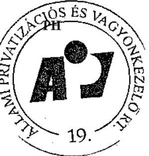

---

Privatizációs tartalék 2004. évben
M Ft-ban

|  |  | Elözetes tanusitvá ny | Végleges tanusitvá ny |
| :--: | :--: | :--: | :--: |
|  | Privatizációs tartalék NYITÓEGYENLEGE | 40367 | 40367 |
|  | Privatizációs tartalékképzés Ft összege | 18448 | 18448 |
| T.K.Ö | Privatizációs tartalékképzés összesen | 18448 | 18448 |
| T.V. | Folyó kiadások átmeneti finanszirozására átutalt összeg visz szautalása | 15334 | 15334 |
| T.F. | Összes forrás | 74149 | 74149 |
| T.1. | Jótállással, szavatossággal, kezességvállalással kapcs. kifiz. | 134 | 134 |
| T.2. | Készfizető kezességek, átvállalt tartozások kiegyenlitése |  |  |
| T.3. | Konszernfelelősség alapján történő kifizetés | 343 | 343 |
| T.4. | Elvont vagyontárgyak után beálló kezesi felelősség rendezése | 528 | 528 |
| T.5. | Szerződéses kapcsolaton alapuló tartozás kiegyenlitése |  |  |
| T.6. | Önkormányzati járandóság teljesitése | 2257 | 2257 |
| T78. | Privatizációs ellenérték hányad | 7 | 7 |
| T.8. | Villamosipari dolgozók, energiaszektor priv.kapcs. kötött megállapodások fedezete | 775 | 775 |
| T.9. | Kárpótlási jegyek életjáradékra váltása | 3023 | 3023 |
| T.10. | A „reverzális levelek" alapján történő kifizetések | 15 | 15 |
| T.11. | A gázközművekkel kapcsolatos önkormányzati igények ren dezése | 252 | 252 |
| T.12. | A privatizációs tartalékból történő kifizetésekkel kapcsolatos ráfordítások | 201 | 201 |
| T.Ö. | Privatizációs tartalék felhasználása (T.1.-T.12.) | 7535 | 7535 |
| T.13. | Folyó kiadások átmeneti finanszirozására átutalt összeg | 15334 | 15334 |
| T. | Összes kiadás (T.Ö.+T.13.) | 22869 | 22869 |
|  | Privatizációs tartalékot érintő árfolyam differencia | 224 | 224 |
|  | Eltérés a tényleges és számított záróegyenleg között | $-31$ | $-31$ |
|  | Privatizációs tartalék bankszámla ZÁRÓEGYENLEGE | 51025 | 51025 |

Budapest, 2005. július 28.
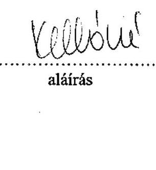
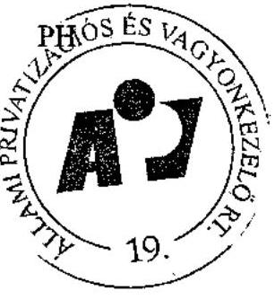

---

ÁPV Rt. kötelezettségeinek alakulása (2004. január 1 - 2004. december 31.)

5. sz. tanúsítvány a V-01-62/2005. sz. jelentéshez

|  Normatív kötelezettségek | 2004.01.01-i nyitó | Növekedés | Csökkenés | 2004. 12. 31-i záró  |
| --- | --- | --- | --- | --- |
|   | alap+ kamat | alap | korrekció | tárgyévi  |
|  PEH | 10 | 6 | 0 | 0  |
|  Önkormányzati járandóságok | 4 438 | 2 745 | 469 | 156  |
|  ebből Belterületi föld utáni járandóság | 3 584 | 1 963 | 116 | 156  |
|  ebből 1989. évi XIII. tv. szerint átalakult társas. | 2 146 | 906 | 12 | 0  |
|  1992. évi LIV. szerint átalakult társas | 1 438 | 1 057 | 104 | 156  |
|  ebből Alapitói jog alapján járó járandóság | 854 | 782 | 353 | 0  |
|  Villamosipari dolgozók járandósága | 1 037 | 1 037 | 0 | 500  |
|  Egyéb kötelezettség | 130 947 | 130 947 | 578 | 142 934  |
|  ebből bánatpénz+szállítók+saját vagy. szembeni köt. | 88 993 | 88 993 | 578 | 0  |
|  Be nem jegyzett tőkeemelés | 5 695 | 5 695 | 0 | 4 814  |
|  Egyéb rövid tej. köt. | 14 832 | 14 832 | 0 | 2 161  |
|  Ösztalék előleg | 0 | 0 | 0 | 0  |
|  Egyéb hosszú tej. köt. | 21 190 | 21 190 | 0 | 135 959  |
|  Prív. elök. kapcs. egyéb. köt. | 237 | 237 | 0 | 0  |
|  Normatív kötelezettségek összesen: | 136 432 | 134 735 | 1 047 | 143 590  |
|  Függő kötelezettségek |  |  |  |   |
|  Privatizációs szerződésekből eredő garancia és szavatosság | 11 628 | 11 628 | 0 | 1 550  |
|  ebből általános jog és kellékszavatosság | 1 453 | 1 453 | 0 | 650  |
|  Hőszolgáltató erőművek | 2 642 | 2 642 | 0 | 0  |
|  Kereskedelmi szavatosság | 5 324 | 5 324 | 0 | 0  |
|  Környezetvédelmi garancia | 1 559 | 1 559 | 0 | 900  |
|  Vagyonkezelési garancia | 650 | 650 | 0 | 0  |
|  Elvont vagyon utáni kezesség* | 24 141 | 4 811 | 0 | 0  |
|  Konszern fellelősség* | 0 | 0 | 0 | 0  |
|  PEH | 785 | 315 | 0 | 50  |
|  Önkormányzati járandóságok | 6 728 | 5 049 | 0 | 3 742  |
|  ebből Belter. Föld. (1989. évi XIII. tv.) | 5 418 | 4 376 | 0 | 3 742  |
|  ebből Alapitói jog alapján járó járandóság | 1 310 | 473 | 0 | 0  |
|  Tőkepótlási kötelezettség (ÁPV Rt. társaságok) | 9 669 | 9 669 | 0 | 0  |
|  Reverzális levelek utáni kötelezettség | 7 574 | 7 574 | 0 | 3 623  |
|  Egyéb kötelezettségek | 872 | 872 | 0 | 0  |
|  Malév Rt. részvény visszavásárlás | 93 | 93 | 0 | 0  |
|  Forrás Apport visszavásárlás | 779 | 779 | 0 | 0  |
|  Richter opció |  |  |  |   |
|  Függő kötelezettségek összesen: | 61 397 | 39 397 | 0 | 8 965  |
|  Mindösszesen: | 197 829 | 174 829 | 1 047 | 152 555  |

Budapest, 2005. 24 28. a V-01-62/2005. sz. jelentéshez

5. sz. tanúsítvány a V-01-62/2005. sz. jelentéshez

---

Állami Privatizációs és Vagyonkezelő Rt.

Az ÁPV Rt. eszközállományának változása a 2004. évben (saját vagyon)

| Megnevezés | 2003. évi záró állomány (nyitó) | Változás |  |  | 2004. évi záró állomány |
| --- | --- | --- | --- | --- | --- |
|  |  | növekedés | csökkenés | áll. vált. |  |
| Immateriális javak | 227144 | 76218 | 130394 | 54176 | 172968 |
| Tárgyi eszközök | 2456657 | 214258 | 260529 | 46271 | 2410386 |
| Befektetett pénzügyi eszközök | 289993 | 180683 | 137444 | 43239 | 333232 |
| Befektetett eszközök összesen | 2973794 | 471159 | 528367 | 57208 | 2916586 |
| Készletek | 472 | 61498 | 60897 | 601 | 1073 |
| Követelések | 676117 | 8851938 | 8840008 | 11930 | 688047 |
| Pénzeszközök | 8208897 | 7697762 | 7486435 | 211327 | 8420224 |
| Forgóeszközök | 8885486 | 16611198 | 16387340 | 223858 | 9109344 |
| Aktív időbeli elhatárolások | 155655 | 2082391 | 2225702 | 143311 | 12344 |
| Eszközök összesen | 12014935 | 19164748 | 19141409 | 23339 | 12038274 |

Budapest, 2005. július 19.
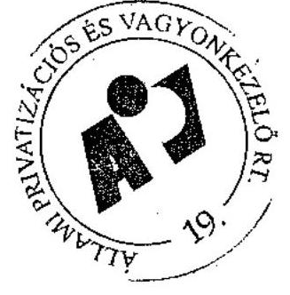
alárás

---

Állami Privatizációs és Vagyonkezelő Rt.

Az ÁPV Rt. forrásainak összetétele 2004. évben (saját vagyon)

|  Megnevezés | 2003. évi záró állomány (nyitó) | Változás |  |  | 2004. évi záró állomány  |
| --- | --- | --- | --- | --- | --- |
|   |  | növekezdés | csökkenés | áll. vált. |   |
|  Saját tőke | 11117214 | 2205606 | 2046127 | 159479 | 11276693  |
|  Céltartalék | - | - | - | - | -  |
|  Kötelezettségek | 737843 | 18556405 | 18681372 | - 124967 | 612876  |
|  Passzív időbeli elhatárolások | 159878 | 290478 | 301651 | - 11173 | 148705  |
|  Források összesen | 12014935 | 21052489 | 21029150 | 23339 | 12036274  |

Budapest, 2005. július 19.

---

Állami Privatizációs és Vagyonkezelö Rt.

Az ÁPV Rt. müködéséhez kapcsolódó anyagjellegủ ráfordítások alakulása 2004. évben

| Megnevezés | 2004. év |  |  |  | $\%$   Tervhez |
| :--: | :--: | :--: | :--: | :--: | :--: |
|  | terv | $\%$ | tény | tény\% |  |
| Energia | 76140 | 47,02 | 79264 | 45,76 | 104,10 |
| Üzemanyag | 21600 | 13,34 | 25089 | 12,98 | 116,15 |
| Nyomtatvány, irodaszer | 37157 | 22,95 | 34723 | 22,33 | 93,45 |
| Egyéb ki nem emelt anyag-   költség | 27041 | 16,70 | 27314 | 16,25 | 101,01 |
| 1. Anyagköltség összesen | 161938 | 24,26 | 166390 | 25,99 | 102,75 |
| Utazás- és szállásköltség | 12500 | 2,47 | 13538 | 2,86 | 108,30 |
| Fenntartás, javitás és karban-   tartás | 115450 | 22,83 | 82706 | 17,45 | 71,64 |
| Posta, telefon, futárszolgálat | 56695 | 11,21 | 71954 | 15,19 | 126,91 |
| Székház fenntartás, üzemeltetés | 314293 | 62,15 | 299670 | 63,24 | 95,35 |
| Egyéb ki nem emelt anyag-   jellegü szogáltatás | 6769 | 1,34 | 5969 | 1,26 | 88,18 |
| Egyéb ki nem emelt anyag-   jellegü szogáltatás | 6769 | 1,34 | 5969 | 1,26 | 88,18 |
| 2. Anyagjellegü szolgál-   tatás összesen | 505707 | 75,74 | 473837 | 74,01 | 93,70 |
| 3. Anyagjellegü ráfordítá-   sok összesen (1 + 2) | 667645 |  | 640227 |  | 95,89 |

Budapest, 2005. július 19.
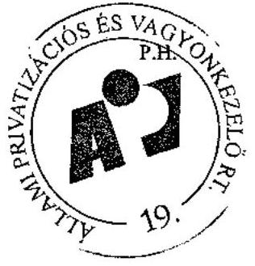
alárás

---

# Az ÁPV Rt. átlagos állományi létszámának alakulása 2004. évben 

| MEGNEVEZÉS | 2004. évl |  | Teljesités \% |
| :--: | :--: | :--: | :--: |
|  | terv | tény | tervhez |
| Teljes munkaidöben foglalkoztatott |  | 238 |  |
| Részmunkaidöben foglalkoztatott |  | 1 |  |
| Állományi létszám összesen | 245 | 239 | 97,55 |

Budapest, 2005. január 31.
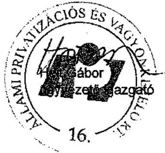

---

# Az ÁPV Rt. állományi létszámának alakulása 2004. évben 

| MEGNEVEZÉS | 2004. december 31. |  |
| :--: | :--: | :--: |
|  | Státusz | Betöltött állás |
| Felsövezető |  | 6 |
| Ügyvezető igazgató |  | 14 |
| ügyvezető igazgató-helyettes |  | 28 |
| Menedzser |  | 114 |
| Ügyintéző |  | 57 |
| Ügyviteli dolgozó |  | 0 |
| Fizikai |  | 0 |
| Összesen | 221 | 219 |

Budapest, 2005. január 31.
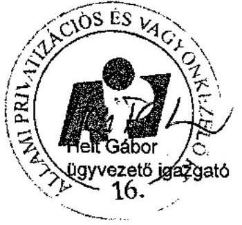

---

# Az ÁPV Rt. müködésével kapcsolatos személyi jellegü ráfordítások alakulása 2004. évben

|  Megnevezés | 2004 év |  |  |  | Telj. %  |
| --- | --- | --- | --- | --- | --- |
|   | terv | % | tény* | % | tervhez  |
|  Bérköltség | 2 001 451 | 50,89 | 1 999 110 | 54,3 | 99,88  |
|  Jutalmak | 150 000 | 3,8 | 143 969 | 3,9 | 95,98  |
|  Személyi jellegű kifizetések | 1 931 814 | 49,11 | 1 682 277 | 45,7 | 87,08  |
|  ebből: szerzői díjak | 0 | 0 | 0 | 0,00 | 0,00  |
|  étkezési hozzájárulás | 16 100 | 0,41 | 16 031 | 0,44 | 99,57  |
|  üdülési hozzájárulás | 4 000 | 0,10 | 3 890 | 0,11 | 97,25  |
|  albérleti hozzájárulás | 0 | 0,00 | 0 | 0,00 | 0,00  |
|  utazási hozzájárulás | 7 000 | 0,18 | 6 629 | 0,18 | 94,70  |
|  reprezentáció és üzleti ajándék | 29 655 | 0,75 | 18 961 | 0,52 | 63,94  |
|  segélyek | 1 600 | 0,04 | 478 | 0,01 | 29,88  |
|  gépjárműhasználati költség | 3 000 | 0,08 | 2 205 | 0,06 | 73,50  |
|  belföldi napidíj | 27 | 0,00 | 14 | 0,00 | 51,85  |
|  külföldi napidíj | 2 600 | 0,07 | 2 044 | 0,06 | 78,62  |
|  betegszabadság | 19 000 | 0,48 | 19 943 | 0,54 | 104,96  |
|  egyéb személyi jelt. Kifiz. | 788 238 | 20,04 | 649 994 | 17,66 | 82,46  |
|  munkáltatót terhelő táppénz | 5 000 | 0,13 | 5 747 | 0,16 | 114,94  |
|  nyugdíjpénztári hozzájár. | 120 000 | 3,05 | 119 471 | 3,25 | 99,56  |
|  dolgozók életbiztosítása | 0 | 0,00 | 0 | 0,00 | 0,00  |
|  belső továbbképzés | 10 000 | 0,25 | 4 949 | 0,13 | 49,49  |
|  egészségpénztári hozzájár. | 38 000 | 0,97 | 37 722 | 1,02 | 99,27  |
|  munkaruha | 96 066 | 2,44 | 94 665 | 2,57 | 98,54  |
|  társadalombizt. járulék | 791 528 | 20,12 | 699 534 | 19,00 | 88,38  |
|  Személyi jellegű ráfordítások összesen | 3 933 265 | 100,0 | 3 681 387 | 100,0 | 93,60  |

Megjegyzés: * 2005.jan. 14-ig lekönyvelt adatokat tartalmazza

Budapest, 2005. január 31.

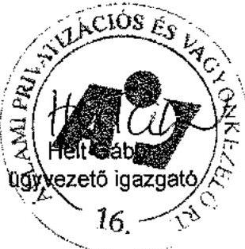

---

# Az ÁPV Rt. munkavállalónak 2004. évi beosztásonkénti átlagkeresete

|  MEGNEVEZÉS | 2004. évi átlagkereset Ft/fő/hő  |
| --- | --- |
|  Felsővezető | 3 097 835  |
|  Ügyvezető igazgató | 1 157 355  |
|  Ügyvezető igazgató-helyettes | 807 184  |
|  Menedzser | 499 762  |
|  Ügyintéző | 223 109  |
|  Ügyviteli dolgozó | 0  |
|  Összesen | 567 167  |

Budapest, 2005. január 31.

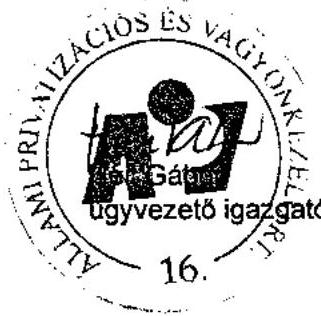

---

Állami Privatizációs és Vagyonkezelő Rt
2004. évi ÁSZ-beszámoló és auditált beszámoló közötti főbb különbségek levezetése

# Vagyonváltozás 

## 1. sz. tanúsítvány

A hozzárendelt vagyon változása 2004. évben - összesített kimutatás
(millió Ft)

|  | ÁSZ beszámoló   adatai | Végleges beszámoló | Eltérés |
| :-- | --: | --: | --: |
| 4/b vagyontábla sorai 1-   6-ig (1.sz. tanúsítvány) | 809248 | 944762 | 135514 |
| Követelések | 26506 | 41086 | 14580 |
| Kötelezettségek | 356863 | 272441 | -84422 |
| Hozzárendelt vagyon   összesen: | 478891 | 713407 | 234516 |

Az eltérések magyarázata:
A 4/b vagyontábla (1. sz. tanúsítvány)1-6 sorai 135.514 MFt-os növekedésének okai:
A 2. sz. tanúsítvány 1-6. sorának 4.043 MFt-os csökkenése (részletezve ld. ott), valamint a társaságok gazdálkodásának eredményessége miatti 150.911 MFt-os növekedés és 11.354 MFt-os csökkenés eredményezi.

A követelések és kötelezettségek változását a 2. sz. tanúsítványban leírt tényezők eredményezik.

## 2. sz. tanúsítvány

A hozzárendelt vagyon változása tranzakciók alapján
(millió Ft)

|  | ÁSZ beszámoló   adatai | Végleges beszámoló | Eltérés |
| :-- | --: | --: | --: |
| 4/a vagyontábla sorai 1-   6-ig (2.sz.tanúsítvány) | 809248 | 805205 | -4043 |
| Követelések | 26506 | 41086 | 14580 |
| Kötelezettségek | 356863 | 272441 | -84422 |
| Hozzárendelt vagyon   összesen: | 478891 | 573850 | 94959 |

---

Az eltérések magyarázata:
A 4/a vagyontábla (2. sz. tanúsitvány)1-6 sorainak 4043 MFt-os csökkenésének jelentősebb tételei:
Komáromi Mg. Rt. 1.531 MFt-os értékvesztésének visszairása, a Vértesi Erőmủ Rt.- re elszámolt 4.443 MFt-os értékvesztés;
Tiszaviz Vizerőmủ Kft. tőkeemelése 200 MFt , SEFAG Rt. beolvadás miatti növekedés 62 MFt , - mely tranzakciók cégbírósági bejegyzéséről az ÁSZ beszámoló után szereztünk tudomást;
Végelszámolás és felszámolás alá került cégek nyilvántartási értékének csökkenése: Bábolna Rt. 2.240 MFt, Aranykereszt Rt. 37 MFt, MIKI Méréstechnika Rt. 69 MFt, Etercem Kft. 229 MFt,
Tokaj Kereskedőház Rt.-től tőkekivonás miatt átvett eszközök 1.420 MFt , ingatlan tulajdonjog rendezés miatti eszköz csökkenés (Bp. X. Gyömrői út 140.) 290 MFt .

A követelések 14.580 MFt növekedésének fơbb összetevői:

- Átutalt, de még be nem jegyzett tőkeemelés csökkenése
- 760 MFt
(Tiszaviz Kft., Kiskunsági Erdészeti Rt., Bakonyi Erdészeti Rt., Szombathelyi Erdészeti Rt., Ipoly Erdő Rt.)
- HM ingatlanok miatti követelés növekedése Korm.határozatok hatályon kivül helyezése miatt
- 2.339 MFt
- Bábolna Rt. részére nyújtott kölcsönre elszámolt értékvesztés
- 2.900 MFt
- Tökeleszállítás miatti követelés csökkenés Tokaj Ker.ház rt.
- 1.420 MFt
- Aktiv időbeli elhatárolás növekedése
$+16.923 \mathrm{MFt}$

A kötelezettségek 84.422 MFt csökkenésének fơbb összetevői:

- Konszern felelősség miatt képzett céltartalék megszüntetése könyvvizsgálói javaslatra
- 83.947 MFt
- Kibocsátott „Richter" kötvény opció miatti céltartalék képzés
- 18.643 MFt
- Önkormányzati járandóságok kamatára képzett céltartalék csökkenés
- 222 MFt
- Reverzális levelek miatt fennálló köt.-re képzett céltartalék növekedés
- 1.712 MFt
- Önkormányzatokkal szemben fennálló normatív köt. csökk.
- 267 MFt
- Osztalék előleg miatt fennálló kötelezettség csökkenése a végleges beszámolókat követően
- 18.192 MFt
- Egyéb rövid lej. kötelezettség csökkenése
- 1.302 MFt
- Átutalt, de még be nem jegyzett tőkeemelés csökkenése
- 760 MFt
- Passzív időbeli elhatárolás miatti növekedés
$+639 \mathrm{MFt}$

Budapest, 2005. július 28.
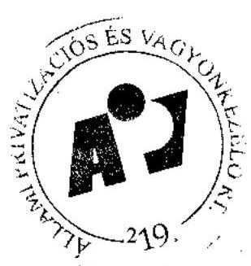

---

1. sz. tanúsítvány a V-01- 63/2005. sz. jelentéshez

|  Ssz. | Működő társaságok és társaságcsoportok | ÁPV Rt. tulajdon hányad (%) | ÁPV Rt. tartós tulajdon hányad (%) (2004. évi cégek) | Mérlegfőösszeg | (E Ft) | Saját tőke összesen (E Ft) | Saját tőke ÁPV Rt. t. h. rész (E Ft) (számított) | Értékesítés nettó árbevétele (E Ft)  |
| --- | --- | --- | --- | --- | --- | --- | --- | --- |
|   |  | 2003. év | 2004. év | 2003. év | 2003. év | 2004. év | 2003. év | 2004. év  |
|   |  |  |  |  | 7 540 622 873 | 6 716 521 714 | 2 602 593 702 | 2 402 977 638  |
|   |  |  |  |  | 2 780 364 227 | 2 243 292 818 | 1 253 066 456 | 1 557 064 951  |
|   | Jelentős súlyú, kismált cégek |  |  |  | 47 940 387 | 84 163 540 | 16 904 747 | 23 082 779  |
|   | 1. Áldehöz Húngdús (csoport)* | 73,71% | 73,71% |  |  |  |  |   |
|   | 2. Budapest Airport Rt. | 100,00% | 100,00% | 25%+1 | 25%+1 | 92 050 358 | 94 338 501 | 10 733 807  |
|   | 3. Földítési és Jajzálogbant (csoport) | 53,20% | 53,20% |  |  | 310 149 405 | 418 196 439 | 11 528 597  |
|   | 4. Magyar Légiköttletecslát (csoport) | 99,93% | 99,95% |  |  | 73 249 022 | 73 308 720 | 3 494 449  |
|   | 5. Magyar Posta (csoport) | 100,00% | 100,00% | 50%+1 | 50%+1 | 198 490 735 | 124 495 831 | 69 771 536  |
|   | 6. Magyar Villamos Művok (csoport)* | 99,86% | 99,87% | 50%+1 | 50%+1 | 446 172 000 | 552 580 000 | 288 296 000  |
|   | 7. MAHART Magyar Hajózási Rt. | 100,00% | 100,00% |  |  | 4 947 951 | 1 170 292 | 1 169 285  |
|   | 8. HOC Magyar Olaj- és Sárpari (csoport) * | 22,73% | 11,78% | 1. aranyr. 1. aranyr. | 1 358 132 000 | 1 548 108 000 | 635 905 000 | 825 542 000  |
|   | 9. Richter Gedeon (csoport) | 25,00% | 25,00% |  |  | 208 394 000 | 239 137 000 | 178 946 000  |
|   | 10. Szerencselláté (csoport)* | 100,00% | 100,00% | 100% | 100% | 43 530 364 | 29 606 597 | 18 295 325  |
|   | Erdő csoport |  |  |  |  | 86 941 855 | 84 039 382 | 44 095 139  |
|   | 11. Bakonyenző Érdészett és Falpari Rt. | 100,00% | 100,00% | 100% | 100% | 5 552 225 | 6 033 232 | 4 293 593  |
|   | 12. Délállókit Érdészett Rt. | 100,00% | 100,00% | 100% | 100% | 939 254 | 1 108 200 | 853 069  |
|   | 13. Egavadó Érdészett Rt. | 100,00% | 100,00% | 100% | 100% | 4 135 961 | 4 304 546 | 2 688 652  |
|   | 14. Ászaít-Magyarszárági Erdőgazdasági Rt. | 100,00% | 100,00% | 100% | 100% | 3 427 961 | 3 853 246 | 2 944 089  |
|   | 15. Gernonci Erdő- és Vadgazdasági Rt. | 100,00% | 100,00% | 100% | 100% | 1 974 872 | 2 452 504 | 1 471 768  |
|   | 16. GYULAJ Érdészett és Vadászati Rt. | 100,00% | 100,00% | 100% | 100% | 1 269 294 | 1 543 833 | 1 070 381  |
|   | 17. Iosily Érdi Rt. | 100,00% | 100,00% | 100% | 100% | 2 586 965 | 2 655 857 | 1 873 131  |
|   | 18. Kísaffoni Erdőgazdasági Rt. | 100,00% | 100,00% | 100% | 100% | 2 319 959 | 2 352 350 | 2 059 893  |
|   | 19. Kiskunsági Érdészett és Falpari (csoport) | 100,00% | 100,00% | 100% | 100% | 3 865 160 | 4 125 508 | 2 708 442  |
|   | 20. Mecseki Érdészett Rt. | 100,00% | 100,00% | 100% | 100% | 2 968 004 | 2 372 584 | 2 368 896  |
|   | 21. Nagykursági Érdészett és Falpari Rt. | 100,00% | 100,00% | 100% | 100% | 1 313 810 | 1 477 507 | 1 053 837  |
|   | 22. Nyírsági Érdészett Rt. | 100,00% | 100,00% | 100% | 100% | 3 084 490 | 3 451 226 | 2 506 930  |
|   | 23. Pilai Parkerdő Rt. | 100,00% | 100,00% | 100% | 100% | 2 376 846 | 2 323 832 | 3 910 725  |
|   | 24. Domagyl Érdészett és Falpari (csoport) | 100,00% | 100,00% | 100% | 100% | 5 792 095 | 5 755 842 | 4 164 226  |
|   | 25. Szombathelyi Érdészett Rt. | 100,00% | 100,00% | 100% | 100% | 2 184 142 | 2 434 780 | 1 770 372  |
|   | 26. Tanulmányi Érdőgazdasági Rt. | 100,00% | 100,00% | 100% | 100% | 1 710 977 | 1 869 621 | 1 517 382  |
|   | 27. VASIEX Mezőtítési Érdi- és Vadgazd. Rt. | 100,00% | 100,00% | 100% | 100% | 2 673 843 | 3 003 874 | 1 872 437  |
|   | 28. VÁRTIÉ Érdészett és Falpari Rt. | 100,00% | 100,00% | 100% | 100% | 1 337 461 | 1 489 560 | 1 143 076  |
|   | 29. Zafar Érdészett és Falpari (csoport) | 100,00% | 100,00% | 100% | 100% | 4 003 247 | 4 283 461 | 3 624 301  |
|   | 30. Volán csoport |  |  |  |  | 82 052 631 | 91 277 606 | 44 747 039  |
|   | 31. Ábra | 90,68% | 93,67% |  |  | 1 615 636 | 1 999 010 | 854 114  |
|   | 32. Ábra Volán Rt. | 92,83% | 94,06% |  |  | 4 386 488 | 4 584 027 | 2 091 939  |
|   | 33. Bakony Volán Rt. | 92,96% | 93,03% |  |  | 1 358 892 | 1 627 300 | 793 949  |
|   | 34. Balaton Volán Rt. | 94,20% | 94,20% |  |  | 2 037 364 | 2 249 067 | 1 224 900  |
|   | 35. Bacs Volán Rt. | 90,14% | 92,80% |  |  | 884 286 | 1 017 531 | 472 519  |
|   | 36. Borosol Volán Rt. | 91,05% | 94,08% |  |  | 4 821 280 | 5 739 225 | 2 401 322  |
|   | 37. Gomanc Volán Rt. | 92,83% | 96,29% |  |  | 2 570 688 | 2 675 700 | 1 250 269  |

1. sz. tanúsítvány a V-01- 63/2005. sz. jelentéshez

Kontrolling igazgatóság

---

14. sz. tanúsítvány folytatás Állami Privalózációs és Vagyonkezelő Rt. Adatlomás: Kontrolling Információs Rendszer

Az ÁPV Rt. működő társaságainak adatai 2004. évben

|  Ssz. | Működő társaságok és társaságcsoportok | ÁPV Rt. tulajdoní hányad (%) | ÁPV Rt. tartós tulajdoní hányad (%) (2004. évi cégek) | Mérlegfőösszeg | (E Ft) | Saját tőke összesen (E Ft) | Saját tőke ÁPV Rt.tul. rész (E Ft) (számított) | Értékesítés nettó árbevétele (E Ft)  |
| --- | --- | --- | --- | --- | --- | --- | --- | --- |
|   |  | 2003.év | 2004.év | 2003.év | 2004.év | 2003.év | 2004.év | 2003.év  |
|  37 | Hajdú Volán Rt. | 91,42% | 93,57% |  | 3 417 126 | 4 485 574 | 1 917 237 | 2 271 687  |
|  38 | Hatyard Volán Rt. | 91,31% | 94,84% |  | 555 634 | 601 583 | 159 154 | 257 829  |
|  39 | Jászéun Volán (csoport) | 91,21% | 93,60% |  | 3 900 617 | 4 174 370 | 2 350 545 | 2 625 877  |
|  40 | Kapos Volán Rt. | 91,24% | 95,46% |  | 2 818 878 | 3 069 450 | 1 439 059 | 1 620 073  |
|  41 | Kissiföld Volán Rt. | 73,34% | 73,34% |  | 5 245 205 | 5 709 755 | 2 518 011 | 3 012 771  |
|  42 | Kőrös Volán Rt. | 92,39% | 95,11% |  | 2 409 042 | 2 605 599 | 1 415 176 | 1 577 784  |
|  43 | Kunszár Volán (csoport) | 90,47% | 94,40% |  | 2 856 157 | 3 072 401 | 1 295 096 | 1 572 266  |
|  44 | Mátra Volán Rt. | 87,21% | 91,47% |  | 1 354 977 | 1 533 331 | 564 844 | 674 636  |
|  45 | Kőgyid Volán Rt. | 90,87% | 95,56% |  | 2 108 153 | 2 160 469 | 693 854 | 901 335  |
|  46 | Pannion Volán Rt. | 91,03% | 93,70% |  | 4 216 519 | 4 453 241 | 4 146 295 | 2 460 966  |
|  47 | Somló Volán Rt. | 93,00% | 93,02% |  | 1 483 809 | 1 692 624 | 824 524 | 825 201  |
|  48 | Szabolcs Volán Rt. | 90,00% | 93,58% |  | 3 162 508 | 3 435 195 | 1 454 564 | 1 721 482  |
|  49 | Tázla Volán Rt. | 94,80% | 96,67% |  | 4 570 703 | 4 855 476 | 2 349 754 | 2 725 998  |
|  50 | Vasi Volán Rt. | 90,67% | 93,77% |  | 2 323 888 | 2 775 385 | 869 048 | 970 900  |
|  51 | Vértes Volán Rt. | 92,60% | 95,53% |  | 2 964 083 | 3 439 890 | 1 318 942 | 1 787 187  |
|  52 | VOLANISJGZ Rt. | 100,00% | 100,00% |  | 10 127 292 | 17 205 645 | 8 933 786 | 9 213 650  |
|  53 | Zala Volán (csoport)* | 91,23% | 93,06% |  | 5 435 049 | 5 948 674 | 3 143 624 | 3 607 910  |
|   | Hítallintézetek és biztosító |  |  |  | 200 991 248 | 209 407 415 | 36 669 151 | 40 577 597  |
|  54 | Kikigazandia Rt. | 50,02% | 50,02% | 50%+1 | 20 289 073 | 29 330 857 | 20 790 574 | 22 225 403  |
|  55 | Vagyon Espont-Import Bank Rt. | 100,00% | 25,00% | 100% | 25%+1 | 166 608 000 | 171 520 000 | 11 709 000  |
|  56 | Vagyon Esponthitei Biztosító Rt. | 100,00% | 25,00% | 100% | 25%+1 | 9 084 173 | 9 551 478 | 8 193 577  |
|   | Egyéb tartós és aranyrészvényes cégek |  |  |  | 3 622 109 489 | 4 292 150 637 | 356 658 274 | 437 171 356  |
|  57 | CO Hungary, ing.kirg. és Szeg. Rt. | 0,01% | 0,01% | 1. aranyr. 1. aranyr. | 10 021 912 | 7 299 334 | 275 963 | 879 524  |
|  58 | Harszcsi Poncskünnenyüktöriü Rt. | 25,00% | 25,00% | 25%+1 | 9 694 508 | 8 772 549 | 7 425 193 | 7 452 035  |
|  59 | Horz Szalámigyár Rt. | 0,00% | 0,00% | 1. aranyr. 1. aranyr. | 4 510 245 | 5 531 549 | 2 505 101 | 2 775 422  |
|  60 | Hungaropharma Gyógyszankaraskadalmi Rt. | 15,00% | 0,00% | 1. aranyr. 1. aranyr. | 33 485 040 | 40 245 071 | 12 401 302 | 14 498 747  |
|  61 | Hungarotó (csoport) | 82,01% | 82,01% | 1. aranyr. 1. aranyr. | 6 909 853 | 5 942 012 | 6 835 645 | 6 682 946  |
|  62 | Kalocssi Fűszarpezrika Rt. | 0,00% | 0,00% | 1. aranyr. 1. aranyr. | 2 370 629 | 2 691 545 | 1 246 506 | 1 207 810  |
|  63 | Nemzető Tankönyvkíadó (csoport)* | 100,00% | 100,00% | 25%+1 | 25%+1 | 3 802 327 | 3 134 154 | 2 102 810  |
|  64 | CTP BÖVK (csoport) | 0,00% | 0,00% | 1. aranyr. 1. aranyr. | 3 802 563 000 | 4 182 444 000 | 305 120 000 | 389 354 000  |
|  65 | PICK (csoport) | 0,00% | 0,00% | 1. aranyr. 1. aranyr. | 41 839 743 | 27 041 543 | 14 873 353 | 7 916 231  |
|  66 | Tiszawíz Vízarómb Kft. | 100,00% | 100,00% | 100% | 100% | 7 045 251 | 7 239 402 | 4 781 905  |
|  67 | Zajónny Poncskánoyár Rt. | 92,89% | 92,89% | 1. aranyr. 1. aranyr. | 657 580 | 812 959 | 250 781 | 160 485  |
|   | Privatásáltató töbőségi cégek |  |  |  | 419 192 578 | 432 976 233 | 83 554 389 | 75 608 731  |
|  68 | Apránpadásági Vagyonkezelő Kft. | 99,98% | 99,98% |  | 15 433 529 | 18 260 771 | 15 375 767 | 15 946 247  |
|  69 | AUTOBUSZJINVEST Kft. | 100,00% | 100,00% |  | 4 249 721 | 7 522 710 | 550 116 | 317 834  |
|  70 | Állany Autószkyekapaló Rt. | 0,00% | 100,00% |  | 312 980 700 | 329 289 729 | 29 063 450 | 29 874 284  |
|  71 | Budapest Főmatolási Kft. | 100,00% | 100,00% |  |  | 121 076 |  | 53 232  |
|  72 | Dladoz Főmatolási Kft. | 100,00% | 100,00% |  | 14 035 | 1 837 240 | 4 102 | 160 680  |
|  73 | Dunajkert Várnányköltség Kft. | 50,40% | 50,40% |  | 324 522 | 425 310 | 305 682 | 308 502  |

Kontrolling igazgatóság 2

---

1. sz. tanúsítvány folytatás Állami Privatizációs és Vagyonkezelő Rt. Adatforrás: Kontrolling Információs Rendszer

Az ÁPV Rt. működő társaságainak adatai 2004. évben

|  Ssz. | Működő társaságok és társaságcsoportok | ÁPV Rt. tulajdoni hányad (%) | ÁPV Rt. tartós tulajdoni hányad (%) (2004. évi cégek) | Mérlegfőösszeg | (E Ft) | Saját tőke összesen (E Ft) | Saját tőke ÁPV Rt.tul. rész (E Ft) (számított) | Értékesítés nettó árbevétele (E Ft)  |
| --- | --- | --- | --- | --- | --- | --- | --- | --- |
|   |  | 2003.év | 2004.év | 2003.év | 2004.év | 2003.év | 2004.év | 2003.év  |
|  74 | ELMIB Első Magyar Infrastruktúra Bef. Rt | 99,02% | 99,08% |  | 4 942 347 | 4 571 542 | 3 623 272 | 3 361 152  |
|  75 | Fertő-tevi Néggazdasági Rt. | 95,24% | 96,24% |  | 440 681 | 798 495 | 240 410 | 504 058  |
|  76 | Halena Bincapradikai Szalon Rt. | 95,77% | 96,77% |  |  |  |  |   |
|  77 | Holidházi Porcelán Rt. | 75,64% | 75,64% |  | 1 441 260 | 1 289 228 | 752 855 | 714 962  |
|  78 | HUNNIA Filmstúdió Kft. | 100,00% | 100,00% |  | 108 485 | 566 327 | 6 149 | 86 080  |
|  79 | Komáromi Mp. Termelő és Szolgáltató Rt. | 94,53% | 94,53% |  | 3 598 371 | 3 291 318 | 1 858 012 | 1 047 445  |
|  80 | MAHART Szabadokötő Rt. | 100,00% | 100,00% |  | 1 794 924 | 1 949 472 | 1 520 494 | 1 637 443  |
|  81 | MAFILM Fémgyártási és Kultúrála Rt. | 86,03% | 86,03% |  | 1 608 945 | 1 620 019 | 1 357 511 | 1 383 757  |
|  82 | Magyar Filmlaboratorium Kft. | 100,00% | 100,00% |  | 1 924 230 | 998 119 | 367 573 | 384 378  |
|  83 | Magyar Gázspolgáltató Kft. | 59,89% | 59,89% |  | 5 823 493 | 5 728 396 | 4 718 236 | 4 634 141  |
|  84 | Magyar Lőverseny Fogadást Szervező Kft. | 100,00% | 100,00% |  | 166 721 | 178 381 | 134 784 | 123 181  |
|  85 | MECSEK ÖKO Rt. | 0,00% | 100,00% |  |  | 4 005 847 |  | 881 396  |
|  86 | MECSEKERG Körny véd. Rt. | 100,00% | 100,00% |  | 4 489 522 | 1 471 328 | 1 364 507 | 985 779  |
|  87 | Mese Címrészta Bt. | 99,13% | 99,13% |  |  |  |  |   |
|  88 | Mezöhegyesi Állami Ménes Kft. | 0,00% | 99,93% |  |  | 497 561 |  | 351 840  |
|  89 | M-Ispatlan Rt. | 100,00% | 100,00% |  | 349 227 | 338 147 | 259 688 | 251 417  |
|  90 | Hozgálékforgalmazási Rt. | 100,00% | 100,00% |  | 777 682 | 742 380 | 550 345 | 558 405  |
|  91 | Nemzeti Lőverseny Kft. | 100,00% | 100,00% |  | 5 573 197 | 5 053 912 | 1 855 049 | 1 313 622  |
|  92 | Nitrokérnis Vagyipari Rt. | 100,00% | 100,00% |  | 4 907 081 | 4 582 419 | 1 309 882 | 334 019  |
|  93 | Ospidív Filmstúdió Kft. | 100,00% | 100,00% |  | 209 217 | 203 959 | -1 444 | 108 123  |
|  94 | Peronánikfűrő Kft. | 100,00% | 100,00% |  | 275 561 | 418 598 | 178 788 | 182 200  |
|  95 | PRJ-MAN Privatizációt Manadzació Kft. | 100,00% | 100,00% |  | 130 532 | 123 688 | 64 839 | 68 280  |
|  96 | Pudenti-hivest Rt. | 100,00% | 100,00% |  | 129 674 | 132 794 | 108 156 | 108 156  |
|  97 | REHAB Rt. | 50,00% | 50,00% |  | 1 499 322 | 1 458 608 | 1 087 419 | 1 112 298  |
|  98 | REORG Gazdasági és Pénzügyi Rt. | 99,99% | 99,99% |  | 1 014 876 | 886 226 | 665 525 | 742 473  |
|  99 | Szövetkezeti Üzletrészhesznosító Kft. | 99,99% | 99,99% |  | 30 020 897 | 25 447 096 | 8 125 796 | 350 844  |
|  100 | Taza Cizél Rt. | 99,37% | 99,37% |  | 945 604 | 784 779 | 803 280 | 744 898  |
|  101 | Tukai Koreskedőház Rt. | 77,00% | 99,99% |  | 8 308 886 | 7 719 551 | 7 687 120 | 6 713 063  |
|  102 | VALTÓ-4 Libra Rt. | 100,00% | 100,00% |  | 4 168 270 | 891 290 | 976 181 | 600 018  |
|  103 | Zsonev Ördőségkezelő Kht. | 99,71% | 99,71% |  | 401 846 | 395 591 | 396 509 | 379 796  |
|  104 | Zsonev Porcelánmanufaktúra Rt. | 100,00% | 100,00% |  | 1 350 150 | 1 494 188 | 967 165 | 966 483  |
|   | Privatizálható kisebbségi cégek |  |  |  | 379 040 839 | 383 288 425 | 181 802 284 | 198 795 664  |
|  105 | AEG-Tisza Erőmű Kft. (volt Rt.) | 0,00% | 0,00% |  |  |  |  |   |
|  106 | ADROPRODUKT Mg. Rt. | 0,00% | 0,00% |  | 5 987 889 | 6 025 885 | 2 809 608 | 2 681 511  |
|  107 | Alosszögél Mg. Rt. | 95,55% | 14,34% |  | 2 903 734 | 4 275 984 | 1 590 275 | 1 610 007  |
|  108 | ALFÖLÖINVEST Pénzügyi Szolgáltató Kft. | 4,10% | 4,10% |  | 311 457 | 682 201 | 141 435 | 142 757  |
|  109 | Balatonlódási Bong. Rt. | 0,00% | 0,00% |  | 3 988 033 | 3 905 710 | 3 913 683 | 3 883 108  |
|  110 | Balaton Hajózási Rt. | 48,99% | 48,99% |  | 4 732 744 | 4 909 524 | 4 013 528 | 4 023 855  |
|  111 | Bácsalmási Agráripari Rt. | 53,83% | 14,07% |  | 4 250 680 | 3 904 533 | 2 148 559 | 1 224 435  |
|  112 | Budapesti Elektronics Művek Rt. | 0,10% | 0,10% |  | 122 797 000 | 143 284 000 | 70 178 000 | 71 906  |

Kontrolling igazgatóság 3

---

# Az ÁPV Rt. müködő társaságainak adatai 2004. évben

|  Ssz. | Müködő társaságok és társaságcsoportok | ÁPV Rt. tulajdoní hányad (\%) |  | ÁPV Rt. tartós tulajdoní hányad (\%) (2004. évi cégek) |  | Mérlegfőösszeg |  | (E Ft) | Saját tőke összesen (E Ft) |  | Saját tőke ÁPV Rt.tul. rész (E Ft) (számított) |  | Értékesítés nettó árbevétele (E Ft)  |
| --- | --- | --- | --- | --- | --- | --- | --- | --- | --- | --- | --- | --- | --- |
|   |  | 2003.év | 2004.év | 2003.év | 2004.év | 2003.év | 2004.év | 2003.év | 2004.év | 2003.év | 2004.év | 2003.év | 2004.év  |
|  113 | Dalmandi Mg. Rt. | 0,00\% | 0,00\% |  |  | 5868125 |  | 3404575 |  | 0 | 0 | 4055413 |   |
|  114 | Dél-Pest Magyar Mezőgazdasági Rt. | 0,00\% | 0,00\% |  |  | 8365826 |  | 3467522 | 3524143 | 0 | 0 | 3625262 | 4539688  |
|  115 | DUMAFERR Rt. | 60,53\% | 1,81\% |  |  | 104278519 | 125682532 | 28330395 | 57440095 | 19332464 | 1039686 | 86096940 | 171443466  |
|  116 | Eovegül VagymaZvek Rt. | 0,12\% | 0,12\% |  |  | 6054362 |  | 4010887 |  | 4813 | 0 | 6899305 |   |
|  117 | Eszak-mejcsrországl Áramszolgáltató Rt. | 0,00\% | 0,00\% |  |  |  |  |  |  | 0 | 0 |  |   |
|  118 | Pertő-vidék Helyi Erdokü Vasút Rt. |  | 26,31\% |  |  | 338884 | 355256 | 3421 | $-51441$ |  | $-18165$ | 19059 | 19591  |
|  119 | FORMAS Csereső | 50,20\% | 37,66\% |  |  | 17872357 | 19519155 | 16079945 | 17775087 | 8072132 | 6729648 | 2564572 | 2611348  |
|  120 | Gőzöllői Tengszdaság Rt. | 0,00\% | 0,00\% |  |  | 1424284 | 1797233 | 453325 | 594860 | 0 | 0 | 819894 | 1103896  |
|  121 | Győri ÉPFU Rt. | 10,00\% | 10,00\% |  |  | 1165427 | 1150316 | 695727 | 857734 | 89673 | 85773 | 869727 | 908556  |
|  122 | Hercegheimi Kísérleti Gazdasági Rt. | 0,00\% | 0,00\% |  |  | 1658730 | 1360788 | 369268 | 437394 | 0 | 0 | 1210456 | 523538  |
|  123 | Hidasházi Mg. Rt. | 0,00\% | 0,00\% |  |  | 2878881 | 3140189 | 1478789 | 1484181 | 0 | 0 | 2627421 | 2567759  |
|  124 | Hungarianig Sport Rt. | 2,33\% | 2,33\% |  |  | 6589385 |  | 7152897 |  | 166563 |  | 1907343 |   |
|  125 | Hungarianon Music Rt. | 0,70\% | 0,70\% |  |  | 256218 | 240571 | 209538 | 211108 | 1559 | 1659 | 29280 | 29578  |
|  126 | Latta-Hanság Rt. | 0,00\% | 0,00\% |  |  | 6194634 | 6111888 | 3306725 | 3292689 | 0 | 0 | 3157506 | 3137706  |
|  127 | La Prima Kft. | 5,00\% | 5,00\% |  |  | 62359 | 65001 | 8483 | 11550 | 424 | 598 | 171701 | 150829  |
|  128 | Martonased Martonvásári Mg. Rt. | 100,00\% | 15,00\% |  |  | 2261803 | 539411 | 1429217 | 222350 | 1429217 | 53353 | 849960 | 390016  |
|  129 | Metalagfobus Rt. | 0,00\% | 0,00\% |  |  | 4903299 | 4553732 | 3856167 | 3161184 | 0 | 0 | 176406 | 165540  |
|  130 | Mezőtolvai Mg. Term. és Szolg. Rt. | 0,00\% | 0,00\% |  |  | 3007499 | 3502335 | 1782026 | 1782026 | 0 | 0 | 1488940 | 1629106  |
|  131 | Rázkakes Kft. | 5,66\% | 5,66\% |  |  | 68824 | 89801 | 62019 | 78302 | 3510 | 4319 | 197126 | 213673  |
|  132 | Sánvár Mg. Rt. | 0,00\% | 0,00\% |  |  | 4299201 | 3889229 | 1438880 | 1479196 | 0 | 0 | 2512738 | 2313064  |
|  133 | Szarvas Mg. Termelő és El.feld. Rt. | 0,00\% | 0,00\% |  |  | 2327469 | 2591182 | 1403139 | 1413288 | 0 | 0 | 1569888 | 1520028  |
|  134 | Szombathelyi Tengszdaság Rt. | 0,00\% | 0,00\% |  |  | 2456141 | 2150117 | 1514850 | 1463794 | 0 | 0 | 978211 | 820619  |
|  135 | Törökszentmikösi Mg. Rt. | 0,00\% | 0,00\% |  |  | 2374734 | 2579646 | 1367204 | 1370277 | 0 | 0 | 1624594 | 1789656  |
|  136 | Töröksfaktor Gerg Róz. Rt. | 0,15\% | 0,15\% |  |  |  |  |  |  | 0 | 0 |  |   |
|  137 | Vértesi Erömü Rt. | 29,96\% | 29,96\% |  |  | 39160373 | 38878049 | 18000837 | 14827507 | 8393061 | 4442411 | 28091881 | 25864021  |
|  138 | Völen Rt. | 4,50\% | 4,50\% |  |  |  |  |  |  | 0 | 0 |  |   |

---

14. sz. tanúsítvány folytatás Áltamí Privatizációs és Vagyonkezelő Rt. Adatforrás: Kontrolling Információs Rendszer

Az ÁPV Rt. működő társaságainak adatai 2004. évben

|  Ssz. | Működő társaságné és társaságcsoportok | ÁPV Rt. tulajdoní hányad (%) | Átlagos statisztikai létszám (fő) | Adózott eredmény (E Ft) | ÁPV Rt.-re jutó Adózott eredmény (E Ft) | ÁPV Rt.-re jutó osztalék (2004. évi cégkörnél) (E Ft) | ROE (%)  |
| --- | --- | --- | --- | --- | --- | --- | --- |
|   |  | 2003.év | 2004.év | 2003.év | 2004.év | 2003.év | 2004.év  |
|   | Oszzesen |  |  | 116 744 110 937 326 234 971 445 419 151 | 85 614 033 | 57 314 682 | 71 747 703 35 087 639  |
|   | Jelentős súlyú, kiemelt cégek |  |  | 70 132 65 344 246 427 672 293 278 167 | 94 086 604 | 58 974 559 | 69 002 149 33 085 148  |
|   | 1. Antonov Hungária (csoport)* | 73,71% | 73,71% | 1 142 1 610 | 185 542 | 11 686 444 | 110 297  |
|   | 2. Budapest Airport Rt. | 100,00% | 100,00% | 2 229 2 099 | 4 262 598 | 6 853 188 | 4 262 598  |
|   | 3. Főhítétel és Jatálogbank (csoport) | 63,20% | 63,20% | 199 198 | 4 026 296 | 7 136 124 | 2 141 989  |
|   | 4. Magyar Légiközlekkedési (csoport) | 99,93% | 99,95% | 2 761 2 281 | -12 518 101 | -4 951 687 | -12 509 338  |
|   | 5. Magyar Posta (csoport) | 100,00% | 100,00% | 41 097 39 268 | -49 355 281 | -4 741 959 | 49 355 281  |
|   | 6. Magyar Villamos Művek (csoport)* | 99,85% | 99,87% | 377 391 | -3 898 000 | -434 000 | -3 758 377  |
|   | 7. MAHART Magyar Hatózási Rt. | 100,00% | 100,00% | 435 23 | 2 520 168 | -442 178 | 2 020 168  |
|   | 8. MGL Magyar Olaj- és Gázbanl (csoport) * | 22,73% | 11,78% | 15 803 15 460 | 154 683 000 | 223 073 900 | 30 497 138  |
|   | 9. Richter Gedeon (csoport)* | 25,00% | 25,00% | 4 751 4 757 | 34 503 000 | 37 860 000 | 8 353 647  |
|   | 10. Szerencsapíték (csoport)* | 100,00% | 100,00% | 1 206 1 206 | 13 837 791 | 4 745 317 | 13 610 203  |
|   | 11. Balonyenöt Érdészett és Falpari Rt. | 100,00% | 100,00% | 923 830 | 25 941 | 61 838 | 25 941  |
|   | 12. Dátalföldi Érdészett Rt. | 100,00% | 100,00% | 114 108 | 6 614 | 14 235 | 6 614  |
|   | 13. Egmontó Érdészett Rt. | 100,00% | 100,00% | 829 558 | -50 673 | 8 572 | 80 075  |
|   | 14. Észék árágyonviszági Érdőgazdasági Rt. | 100,00% | 100,00% | 561 559 | 69 326 | 179 716 | 69 326  |
|   | 15. Gemenci Érző- és Vadgazdasági Rt. | 100,00% | 100,00% | 365 354 | 10 122 | 35 171 | 10 122  |
|   | 16. GYULAJ Érdészett és Vadászati Rt. | 100,00% | 100,00% | 148 135 | 12 355 | 7 892 | 12 355  |
|   | 17. Ipoly Érző Rt. | 100,00% | 100,00% | 212 203 | 66 712 | 79 603 | 66 712  |
|   | 18. Ksafföldi Érdőgazdasági Rt. | 100,00% | 100,00% | 265 247 | 43 564 | 24 090 | 43 564  |
|   | 19. Kiskunságf Érdészett és Falpari (csoport) | 100,00% | 100,00% | 333 320 | -40 002 | 66 426 | 40 002  |
|   | 20. Macseki Érdészett Rt. | 100,00% | 100,00% | 361 327 | 32 903 | 47 137 | 32 903  |
|   | 21. Nagykursági Érdészett és Falpari Rt. | 100,00% | 100,00% | 236 210 | 30 765 | 20 352 | 30 765  |
|   | 22. Nyírsági Érdészett Rt. | 100,00% | 100,00% | 363 371 | 108 968 | 108 664 | 108 968  |
|   | 23. Póki Parkentő Rt. | 100,00% | 100,00% | 404 360 | 66 119 | 108 699 | 66 119  |
|   | 24. Sonnogyi Érdészett és Falpari (csoport) | 100,00% | 100,00% | 461 436 | 155 738 | 111 515 | 160 738  |
|   | 25. Szombathelyi Érdészett Rt. | 100,00% | 100,00% | 535 501 | 107 138 | 69 058 | 107 138  |
|   | 26. Tanulmányi Érdőgazdasági Rt. | 100,00% | 100,00% | 175 165 | -13 077 | 9 709 | 13 077  |
|   | 27. VADZÉK Ksafföldi Érző- és Vadgazd. Rt. | 100,00% | 100,00% | 445 432 | -11 710 | 7 104 | 11 710  |
|   | 28. Vértesi Érdészett és Falpari Rt. | 100,00% | 100,00% | 246 227 | 19 537 | 24 009 | 19 537  |
|   | 29. Zatai Érdészett és Falpari (csoport) | 100,00% | 100,00% | 428 410 | 142 960 | 161 277 | 142 960  |
|   | 30. Volán csoport |  |  | 25 049 24 724 | 613 463 | 623 755 | 711 093  |
|   | 31. Ágma Volán Rt. | 90,68% | 93,67% | 712 710 | 33 972 | 10 918 | 30 806  |
|   | 32. Ádám Volán Rt. | 92,83% | 94,96% | 1 412 1 400 | -23 713 | -24 193 | 22 013  |
|   | 33. Bakony Volán Rt. | 92,96% | 93,03% | 644 638 | 2 262 | 2 885 | 2 103  |
|   | 34. Balaton Volán Rt. | 94,20% | 94,20% | 860 645 | 100 551 | 4 547 | 94 229  |
|   | 35. Bács Volán Rt. | 90,14% | 92,80% | 331 330 | 3 852 | 1 935 | 3 499  |
|   | 36. Borsod Volán Rt. | 91,06% | 94,96% | 2 023 1 983 | 105 872 | 4 698 | 98 498  |
|   | 37. Gemenci Volán Rt. | 92,92% | 96,29% | 944 918 | 2 947 | 3 913 | 7 384  |

Kontrolling igazgatóság 5

---

# Az ÁPV Rt. müködő társaságainak adatai 2004. évben

|  Ssz. | Müködő társaságok és társaságcsoportok | ÁPV Rt. tulajdoni hányad (\%) |  |  |  | Ádígos statisztikai tétszám (tö) |  | Adózott eredmény (E Ft) |  |  |  | ÁPV Rt.-re jutó Adózott eredmény (E FT) |  |  |  | ÁPV Rt.-re jutó osztalék (2004. évl cégkömét) (E FT) |  |  |  | ROE (\%) |   |
| --- | --- | --- | --- | --- | --- | --- | --- | --- | --- | --- | --- | --- | --- | --- | --- | --- | --- | --- | --- | --- | --- |
|   |  | 2003.év | 2004.év |  | 2003.év | 2004.év |  | 2003.év | 2004.év |  | 2003.év | 2004.év |  | 2003.év | 2004.év |  | 2003. év | 2004.év |  |  |   |
|  37 | Hajdú Volán Rt. | 91,42\% | 93,67\% |  | 1333 | 1408 |  | 47396 | 108150 |  | 43320 | 98494 |  | 0 |  | 2,9 |  |  |  |  |   |
|  38 | Hatvani Volán Rt. | 91,31\% | 94,84\% |  | 184 | 178 |  | 1138 | 1435 |  | 1039 | 1391 |  | 0 |  | 0,8 |  |  |  |  |   |
|  39 | Jégytun Volán (csoport) | 91,21\% | 93,80\% |  | 830 | 838 |  | 121811 | 76242 |  | 110921 | 71515 |  | 0 |  | 5,2 |  |  |  |  |   |
|  40 | Kapos Volán Rt. | 91,24\% | 96,46\% |  | 821 | 798 |  | 20923 | 5831 |  | 19090 | 5432 |  | 0 |  | 1,6 |  |  |  |  |   |
|  41 | Késeltöld Volán Rt. | 73,34\% | 73,34\% |  | 1840 | 1836 |  | 158829 | 198760 |  | 116555 | 142570 |  | 0 |  | 5,8 |  |  |  |  |   |
|  42 | Körds Volán Rt. | 92,39\% | 95,11\% |  | 823 | 821 |  | 26800 | 9355 |  | 24761 | 8895 |  | 0 |  | 1,8 |  |  |  |  |   |
|  43 | Konagy Volán (csoport) | 90,47\% | 94,40\% |  | 844 | 628 |  | 58052 | 60266 |  | 52620 | 65910 |  | 0 |  | 4,8 |  |  |  |  |   |
|  44 | Mátra Volán Rt. | 87,21\% | 91,47\% |  | 391 | 351 |  | 3505 | 4374 |  | 3050 | 4001 |  | 0 |  | 0,6 |  |  |  |  |   |
|  45 | Nőgréd Volán Rt. | 90,57\% | 95,08\% |  | 799 | 706 |  | 263520 | $-57378$ |  | $-230374$ | $-64060$ |  | 0 |  | $-42,0$ |  |  |  |  |   |
|  46 | Pannon Volán Rt. | 91,03\% | 93,70\% |  | 1187 | 1180 |  | 5391 | 1295 |  | 4907 | 1209 |  | 0 |  | 0,3 |  |  |  |  |   |
|  47 | Somló Volán Rt. | 93,00\% | 93,02\% |  | 516 | 487 |  | 2398 | 377 |  | 2230 | 351 |  | 0 |  | 0,3 |  |  |  |  |   |
|  48 | Szabolcs Volán Rt. | 90,00\% | 93,08\% |  | 1179 | 1155 |  | 13285 | 7499 |  | 11966 | 7017 |  | 0 |  | 0,9 |  |  |  |  |   |
|  49 | Tisza Volán Rt. | 94,80\% | 96,67\% |  | 1524 | 1483 |  | 90456 | 120718 |  | 68752 | 116696 |  | 0 |  | 3,8 |  |  |  |  |   |
|  50 | Vasi Volán Rt. | 90,87\% | 93,77\% |  | 835 | 828 |  | 8080 | 6804 |  | 7308 | 6442 |  | 0 |  | 0,9 |  |  |  |  |   |
|  51 | Vörtes Volán Rt. | 92,60\% | 95,53\% |  | 1104 | 1080 |  | 6801 | 223149 |  | 6113 | 213174 |  | 0 |  | 0,5 |  |  |  |  |   |
|  52 | VOLÁNISUSZ Rt. | 100,00\% | 100,00\% |  | 3436 | 3451 |  | 29930 | $-447246$ |  | 29890 | $-447246$ |  | 0 |  | 0,3 |  |  |  |  |   |
|  53 | Zala Volán (csoport)* | 91,23\% | 93,06\% |  | 1167 | 1162 |  | 200718 | 268233 |  | 171459 | 228249 |  | 0 |  | 6,2 |  |  |  |  |   |
|   | Hitelintézetek és biztosító |  |  |  | 331 | 229 |  | 1211847 | 2208445 |  | 656914 | 917360 |  | 0 | 75148 | 2,4 |  |  |  |  |   |
|  54 | Hitelegenerde Rt. | 80,02\% | 80,02\% |  | 63 | 63 |  | 1110310 | 1459829 |  | 555377 | 729205 |  | 0 |  | 0,2 |  |  |  |  |   |
|  55 | Magyar Érperkángort Bank Rt. | 100,00\% | 25,00\% |  | 100 | 98 |  | 55000 | 611000 |  | 55000 | 152700 |  | 0 | 75148 | 0,6 |  |  |  |  |   |
|  56 | Magyar Érperhétel Biztosító Rt. | 100,00\% | 25,00\% |  | 68 | 70 |  | 40537 | 137816 |  | 49537 | 34404 |  | 0 |  | 1,1 |  |  |  |  |   |
|   | Egyéb tartós és aranyrészvényes cégek |  |  |  | 3738 | 3607 |  | 85460898 | 122668236 |  | 987230 | 610958 |  | 1710218 | 540953 |  |  |  |  |  |   |
|  57 | CD Hungary, ing forg. és Sínóg. Rt. | 0,01\% | 0,01\% |  | 55 | 55 |  | 179145 | 402561 |  | 16 | 40 |  | 0 |  | 415,4 |  |  |  |  |   |
|  58 | Herend Porcelánmanulakfúra Rt. | 25,00\% | 25,00\% |  | 1484 | 1425 |  | 38223 | 53842 |  | 9855 | 13451 |  | 0 |  | 1,2 |  |  |  |  |   |
|  59 | Herz Szalámgyár Rt. | 0,00\% | 0,00\% |  | 436 | 454 |  | 517435 | 270321 |  | 0 | 0 |  | 0 |  | 30,0 |  |  |  |  |   |
|  60 | Hungaropharma Gyógyszankereskedelmi Rt. | 15,00\% | 0,00\% |  | 914 | 900 |  | 1350365 | 1969821 |  | 199855 | 0 |  | 1 |  | 11,6 |  |  |  |  |   |
|  61 | Húngogai (csoport) | 82,01\% | 82,01\% |  | 247 | 206 |  | 105376 | $-159377$ |  | 161048 | $-127428$ |  | 160307 |  | 0 | 4,4 |  |  |  |   |
|  62 | Kalocssi Fűszerpacrika Rt. | 0,00\% | 0,00\% |  | 246 | 246 |  | 9868 | $-38686$ |  | 0 | 0 |  | 0 |  | 0,6 |  |  |  |  |   |
|  63 | Nemzeti Tanátnyakledö (csoport)* | 100,00\% | 100,00\% |  | 210 | 188 |  | 427273 | 349367 |  | 402450 | 329635 |  | 1250000 |  | 80851 | 24,9 |  |  |  |   |
|  64 | OTP BANK (csoport) | 0,00\% | 0,00\% |  |  |  |  | 83022000 | 128879000 |  | 0 | 0 |  | 1 |  | 1 | 33,7 |  |  |  |   |
|  65 | PICK (csoport) | 0,00\% | 0,00\% |  |  |  |  | $-567857$ | $-6441495$ |  | 0 | 0 |  | 0 |  |  | $-3,2$ |  |  |  |   |
|  66 | Tiszaviz Vízarőmú Kft. | 100,00\% | 100,00\% |  | 97 | 96 |  | 300000 | 563306 |  | 300000 | 563306 |  | 300000 |  | 450000 | 7,8 |  |  |  |   |
|  67 | Zsolney Porcelánpult Rt. | 92,88\% | 92,88\% |  | 26 | 26 |  | $-91343$ | $-170179$ |  | $-85397$ | $-158052$ |  | 0 |  |  | $-35,8$ |  |  |  |   |
|   | Privatizáltató többségi cégek |  |  |  | 3342 | 3926 |  | $-16829902$ | $-4823322$ |  | $-10382060$ | $-4607906$ |  | 797589 |  | 1200944 |  | $-20,2$ |  |  |   |
|  68 | Agrárpantásági Vagyonkezelő Kft. | 99,98\% | 99,98\% |  | 2 | 3 |  | $-409925$ | $-570460$ |  | $-869751$ | 570366 |  | 0 |  |  | $-6,2$ |  |  |  |   |
|  69 | AUTOBUSZ-INVEST Kft. | 100,00\% | 100,00\% |  | 2 | 2 |  | 542964 | 107716 |  | 542966 | 507716 |  | 740000 |  | 740000 |  | 98,7 |  |  |   |
|  70 | Átemi Autópályakozelő Rt. | 0,00\% | 100,00\% |  |  |  |  | $-6363559$ | 810834 |  | 0 | 810834 |  |  |  |  |  | $-21,6$ |  |  |   |
|  71 | Budapest Főmeiúgá Kft. | 100,00\% | 100,00\% |  |  |  |  |  | 95334 |  | 0 | 95334 |  | 0 |  | 47637 |  | $-13,7$ |  |  |   |
|  72 | Dlateg Filmacidő Kft. | 100,00\% | 100,00\% |  | 0 | 0 |  | 518 | 875 |  | 518 | 875 |  | 0 |  |  | 10,1 |  |  |  |   |
|  73 | Dunafort Vámügynökség Kft. | 50,40\% | 50,40\% |  | 21 | 17 |  | 59314 | 619 |  | 29894 | 413 |  | 0 |  |  | 23,7 |  |  |  |   |

---

1. sz. tanúsítvány folytatás

|  Ssz. | Működő társaságok és társaságcsoportok | ÁPV Rt. tulajdoní
hányad (%) | Átlagos
statisztikai
létszám (%) | Adózott eredmény
(E Ft) | ÁPV Rt.-re jutó Adózott
eredmény
(E Ft) | ÁPV Rt.-re jutó osztalék
(2004. évi cégkörnél) (E
Ft) | ROE (%)  |
| --- | --- | --- | --- | --- | --- | --- | --- |
|   |  | 2003. év 2004. év 2003. év 2004. év | 2003. év 2004. év 2003. év 2004. év | 2003. év 2004. év 2003. év 2004. év | 2003. év 2004. év 2003. év 2004. év | 2003. év 2004. év 2003. év 2004. év |   |
|  74 | ELMIB Első Magyar Infrastruktúra Baf. Rt. | 99,98% 99,98% 21 10 | -389 205 -282 110 | -389 127 -282 088 | 0 -10,7 -7,8 |  |   |
|  75 | Fertő-kovi Nádgazdasági Rt. | 96,24% 96,24% 128 94 | -154 048 -74 360 | -148 256 -71 864 | 0 -84,1 -14,7 |  |   |
|  76 | Helens Bizkozmatikai Szalon Rt. | 96,77% 96,77% | 0 0 | 0 0 |  |  |   |
|  77 | Húlóházi Porcelán Rt. | 75,64% 75,64% 410 387 | -70 177 -37 993 | -93 082 -28 738 | 0 -8,3 -8,3 |  |   |
|  78 | HUNNIA Filmstúdió Rt. | 100,00% 100,00% 5 3 | 140 128 198 | 140 128 198 | 76 549 -2,3 |  |   |
|  79 | Komáromi Mgr. Termelő és Szolgáltató Rt. | 94,93% 94,93% 577 455 | -817 016 -420 588 | -655 733 -778 984 | 0 -33,0 -18,3 |  |   |
|  80 | MAHART Szabadkikötő Rt. | 100,00% 100,00% 210 203 | 18 714 116 949 | 18 714 116 949 | 1,2 -1,2 |  |   |
|  81 | MAFILM Filmpyártási és Kultúrális Rt. | 86,03% 86,03% 17 18 | -30 277 -21 831 | -28 047 -27 126 | 0 -2,2 0,9 |  |   |
|  82 | Magyar Filmlaboratórium Rt. | 100,00% 100,00% 80 73 | 30 728 16 803 | 30 728 16 803 | 10,0 -10,0 |  |   |
|  83 | Magyar Gázszolgáltató Rt. | 59,89% 59,89% 20 21 | -200 148 -184 065 | -155 803 -110 284 | 0 -5,8 -4,1 |  |   |
|  84 | Magyar Lóverseny Fogadási Szervező Rt. | 100,00% 100,00% 23 24 | -15 345 -11 603 | -15 345 -11 603 | 0 -11,4 -5,4 |  |   |
|  85 | MECSEK OKO Rt. | 0,00% 100,00% 127 | 0,039 0,039 | 0,039 0,039 | 0,027 |  |   |
|  86 | MECSEKERO Környvédi Rt. | 100,00% 100,00% 204 186 | 55 543 96 625 | 55 543 96 625 | 4,1 16,5 |  |   |
|  87 | Mese Cakrészda Rt. | 99,13% 99,13% | 0 0 | 0 0 |  |  |   |
|  88 | Mezőhegyesi Állami Mense Rt. | 0,00% 99,93% | 30 3 869 | 3 869 3 869 | 1,3 |  |   |
|  89 | M-Imadlan Rt. | 100,00% 100,00% 30 22 | -10 521 -6 271 | -10 521 -6 271 | 0 -4,1 -3,0 |  |   |
|  90 | Mogyógyóforgalmazási Rt. | 100,00% 100,00% 68 63 | 30 292 -22 299 | 30 292 -22 299 | 0,6 -4,0 |  |   |
|  91 | Nemzvel Lóverseny Rt. | 100,00% 100,00% 48 47 | -583 215 -546 311 | -583 215 -546 311 | 0 -31,4 -41,5 |  |   |
|  92 | Nírokémia Vegyügyi Rt. | 100,00% 100,00% 326 163 | -1 167 912 -1 005 963 | -1 167 912 -1 005 963 | 0 -88,4 330,5 |  |   |
|  93 | Ospakós Filmstúdió Rt. | 100,00% 100,00% 8 768 | -8 758 -109 867 | -8 758 -109 867 | 101 533 -605,5 | 117,6 |   |
|  94 | Pannóniafilm Rt. | 100,00% 100,00% 25 17 | -3 292 157 919 | -3 292 157 919 | 184 507 -1,8 | 94,5 |   |
|  95 | PRI-MAN Privatizációt Memedzselő Rt. | 100,00% 100,00% 32 31 | 2 535 3 441 | 2 535 3 441 | 4,7 8,4 |  |   |
|  96 | Prudenti-invest Rt. | 100,00% 100,00% 11 11 | -4 909 8 296 | -4 909 8 296 | 0,7 5,7 |  |   |
|  97 | REPÁS Rt. | 50,00% 50,00% 281 272 | 27 279 35 484 | 13 635 17 742 | 3,2 3,2 |  |   |
|  98 | REORG Gazdasági és Pénzügyi Rt. | 99,99% 99,99% 30 31 | 40 622 92 948 | 40 618 92 939 | 40 521 20 000 | 14,8 |   |
|  99 | Szövetkezeti Szletrészhasznosító Rt. | 99,99% 99,99% 12 14 | -6 674 649 -4 774 952 | -6 674 649 -4 774 952 | -134,1 1351,0 |  |   |
|  100 | Tisza Csol Rt. | 99,37% 99,37% 9 7 | -80 832 -51 152 | -80 422 -40 422 | -10,1 -10,1 |  |   |
|  101 | Tokaj Kereskedőház Rt. | 77,00% 99,99% 281 245 | 160 017 266 186 | 123 213 266 186 | 2,0 2,0 |  |   |
|  102 | VÁLTO-4 Libra Rt. | 100,00% 100,00% 11 11 | -283 606 -128 163 | -283 606 -128 163 | 23,9 -25,8 |  |   |
|  103 | Zsolnay Örtőrséghezzei Rt. | 99,71% 99,71% 1 15 636 | 12 293 15 789 | 12 287 12 287 | 4,1 3,2 |  |   |
|  104 | Zsolnay Porcelánmanulaklóra Rt. | 100,00% 100,00% 348 339 | -76 541 -702 | -76 541 -702 | -7,9 -0,1 |  |   |
|   | Privatizálható kisebbségi cégek |  | 7 131 4 389 8 126 822 39 419 308 | -1 489 828 -23 074 | 184 448 -3,7 |  |   |
|  105 | ADE-Tisza Erőmő Rt. (vidt Rt.) | 0,00% 0,00% | 0 0 | 0 0 |  |  |   |
|  106 | AGRÓPRODUKT Mg. Rt. | 0,00% 0,00% | -286 713 -146 898 | 0 0 | 10,6 -6,5 |  |   |
|  107 | Alcsiszigeli Mg. Rt. | 95,59% 14,34% 276 244 | -268 967 15 136 | -248 802 2 171 | 16,3 0,9 |  |   |
|  108 | ÁLFÓLDINVEST Pénzügyi Szolgáltató Rt. | 4,10% 4,10% | 86 737 1 202 | 3 210 53 | 61,0 0,9 |  |   |
|  109 | Balatjardoglán Borg. Rt. | 0,00% 0,00% | -31 594 -60 480 | 0 0 | 0,8 -1,3 |  |   |
|  110 | Balatoni Hajózási Rt. | 48,99% 48,99% 390 362 | 54 287 9 928 | 31 528 4 864 | 1,7 0,2 |  |   |
|  111 | Sázasimási Agrárizeti Rt. | 93,83% 14,07% 597 437 | -596 121 -467 458 | -653 170 -734 744 | 0 -32,4 -19,3 |  |   |
|  112 | Budapest Elektronusa Művek Rt. | 0,10% 0,10% 1 849 | 11 859 000 15 962 009 | 11 859 15 962 11 936 | 21,9 26,2 |  |   |

---

# Az ÁPV Rt. működő társaságainak adatai 2004. évben

|  Ssz. | Működő társaságok és társaságcsoportok | ÁPV Rt. tulajdoní
hányad (%) | Átlagos
statisztikai
létszám (fő) | Adózott eredmény
(E Ft) | ÁPV Rt.-re jutó Adózott
eredmény
(E Ft) | ÁPV Rt.-re jutó osztalék
(2004. évi cégkömét) (E
Ft) | ROE (%)  |
| --- | --- | --- | --- | --- | --- | --- | --- |
|   |  | 2003.év | 2004.év | 2003.év | 2004.év | 2003.év | 2004.év  |
|  113 | Dalmandi Mg. Rt. | 0,00% | 0,00% |  | 13 729 | 0 | 0  |
|  114 | Dől-Post Magyar Mezőgazdasági Rt. | 0,00% | 0,00% |  | -396 551 | 143 867 | 0  |
|  115 | DUNAFERR Rt. | 60,93% | 1,81% |  | -1 041 824 | 16 871 571 | -630 816  |
|  116 | Egyesült Vagyművek Rt. | 0,12% | 0,12% |  | -744 235 |  | -493  |
|  117 | Észek-megyerország Áramezuházható Rt. | 0,00% | 0,00% |  |  | 0 | 0  |
|  118 | Fertő-vidéki Hely Értékű Vasút Rt. |  | 26,31% |  | -20 329 | -84 862 | 0  |
|  119 | FORRÁS Csoport | 50,20% | 37,86% |  | 579 449 | 2 145 153 | 290 883  |
|  120 | Gödöllő Tangszdaság Rt. | 0,00% | 0,00% |  | -200 124 | 52 872 | 0  |
|  121 | Győri EPFU Rt. | 10,00% | 10,00% |  | 5 134 | -38 993 | 513  |
|  122 | Harceghelmi Kissérleti Gazdasági Rt. | 0,00% | 0,00% |  | -578 575 | 67 645 | 0  |
|  123 | Hirtashéti Mg. Rt. | 0,00% | 0,00% |  | 1 721 | 100 438 | 0  |
|  124 | Hungaroring Sport Rt. | 2,33% | 2,33% |  | 242 623 |  | 5 655  |
|  125 | Hungaroton Music Rt. | 0,79% | 0,79% |  | 1 881 | 1 169 | 10  |
|  126 | Lajta-Hornság Rt. | 0,00% | 0,00% |  | 89 093 | 88 471 | 0  |
|  127 | La Prima Kft. | 5,00% | 5,00% |  | 2 122 | 3 467 | 106  |
|  128 | Martorásed Martorvásári Mg. Rt. | 100,00% | 15,00% | 173 | 37 | -243 266 | -647 269  |
|  129 | Metalloglubus Rt. | 0,00% | 0,00% |  | -103 351 | -558 894 | 0  |
|  130 | Mezőfalvai Mg. Term. és Szolg. Rt. | 0,00% | 0,00% |  | -145 095 | 137 140 | 0  |
|  131 | Rázkiakas Kft. | 5,00% | 5,00% |  | 17 609 | 14 283 | 997  |
|  132 | Sávoki Mg. Rt. | 0,00% | 0,00% |  | 100 231 | 95 093 | 0  |
|  133 | Szarvasi Mg. Termelő és El.héd. Rt. | 0,00% | 0,00% |  | 46 239 | 59 602 | 0  |
|  134 | Szombathelyi Tangszdaság Rt. | 0,00% | 0,00% |  | 18 015 | 10 123 | 0  |
|  135 | Törökszentmódási Mg. Rt. | 0,00% | 0,00% |  | -179 816 | 70 286 | 0  |
|  136 | Transelektro Ganz Röck Rt. | 0,18% | 0,18% |  |  |  | 0  |
|  137 | Vértesi Erőmű Rt. | 29,96% | 29,96% | 3 778 | 3 395 | -127 637 | -3 093 790  |
|  138 | Villért Rt. | 4,89% | 4,89% |  |  |  | 0  |

Az aláhúzott cég adataipei még nem rendelkezzünk, vagy előzetesek.

A gazdálkodási adatok a 2004. évi kontrolling jelentés alapján készülnek, ami nem minősül vagyonmérlegnek.

A *-gal jelölt konszolidált adatoknál a külső tulajdonosra és eredménnyel korrigáltuk az ÁPV Rt-re és eredményt.

A Magyar Villamos Művek Rt. anyatársaságá 9,8 Mrd Ft adózott eredmény érték el.

A Magyar Posta Rt. korrigált ROE mutatja a Postabank Rt. eladás nélkül került kiszámításra.

A kontrolling elemzésre séríti az Értékelési tartalék változásának hatázaé figyelmen kívül hagytuk.

Tanúsítom, hogy az adózás a Kontrolling nyilvántartással megegyeznek. Bp. 2005. június 27.

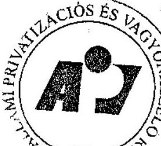

10. 10. 2004. évi cégkömét (E Ft)

---

# Az ÁPV Rt. 2004. évi forrásallokáció felhasználási célja szerint

|  Forrás juttatási forma | 2004. év terv
+ átcsop.
(cFt) | 2004. tény (eFt)
(elözetes)  |
| --- | --- | --- |
|  1) Üzleti célú befektetések | 12 656 000 | 11 269 994  |
|  Volán társaságok buszrekonstrukció | 5 000 000 | 5 000 000  |
|  Volán társaságok egyedi célok | 1 000 000 | 999 994  |
|  Magyar Posta Rt. EU harmonizációs beruházások | 1 256 000 | 1 870 000  |
|  Tiszaviz Rt. (tökeemelés) | 200 000 | 200 000  |
|  Erdőgazdasági társaságok megtérülő beruházások | 2 300 000 | 2 300 000  |
|  Budapest Airport beruházások | 1 000 000 |   |
|  Szerencsejáték Rt. beruházások | 1 000 000 |   |
|  Egyéb üzleti célú befektetés | 900 000 | 900 000  |
|  2) Reorganizációs kifizetések | 5 138 000 | 5 094 129  |
|  Nemzeti Lóverseny Kft. tulajdonosi kölcsön | 570 000 | 570 000  |
|  Fertő-tavi Nádgazdaság Rt. tulajdonosi kölcsön |  | 70 000  |
|  MM Speciális Rt. va. kifizetések (tul. kölcsön.) | 50 000 |   |
|  Bábolna Rt. tulajdonosi kölcsön | 2 900 000 | 2 900 000  |
|  Dunaferr Rt. tulajdonosi kölcsön | 800 000 | 800 000  |
|  Nitrokémia Rt. tulajdonosi kölcsön | 400 000 | 400 000  |
|  Zsolnay Porc.manufaktúra Rt., Porc. gyár Rt. tulajdonosi kölcsön | 128 000 | 252 000  |
|  Egyéb reorg. célú kifizetés | 290 000 | 102 129  |
|  3) Környezetvédelmi feladatok finanszírozása | 7 025 000 | 7 043 852  |
|  Nitrokémia Rt. környezeti kárelhárítás | 4 800 000 | 5 110 000  |
|  Mecsekérc, Mecsek ÖKO Rt. bányabezárások, rekultiváció | 850 000 | 850 000  |
|  Agrár és erdőgazd. társaságok körny.véd. beruházási támogatása | 400 000 | 397 800  |
|  Volán társaságok környezetvédelmi beruházási támogatása | 650 000 | 650 000  |
|  HM inkurrencia raktárak felszámolás | 50 000 |   |
|  Tisza Cipő Rt. | 35 000 | 35 000  |
|  Felszámolás, végelszámolás alatti cégek környezeti kárelhárítás | 240 000 | 1 052  |
|  4) Egyéb jogcím | 3 300 000 | 329 222  |
|  Válsághelyzetkezelés | 20 000 | 65 657  |
|  Erdő-társaságok hitelkamat átvállalása | 30 000 | 13 565  |
|  Erdő-társaságok természeti károk miatti termelőeszközök helyreállítása | 50 000 | 50 000  |
|  Erdő-társaságok közmunka | 200 000 | 200 000  |
|  MALÉV támogatás | 3 000 000 |   |
|  Mindösszesen | 28 119 000 | 23 737 197  |

Tanúsítom, hogy az ajtatok a Kontrolling nyilvántartással megegyeznek. Bp. 2005. június 16.

Szської István ügyvezető igazgató

---

1. sz. tanúsítvány a V-01- 6.7/2005. sz. jelentéshez

|  Társaság | ROE % 2004. Évben | 1 fokozatú riasztás | 2 fokozatú riasztás | 3 fokozatú riasztás | 4 fokozatú riasztás | 5 fokozatú riasztás | Figyelmeztetés válságos helyzetre  |
| --- | --- | --- | --- | --- | --- | --- | --- |
|  1 Szövetkezeti Üzletrészhasznosító Kft. | -1361,0% | 0 | 0 | 10 | 10 | 17 | 10  |
|  2 Nitrokémlő Vegylpari Rt. | -330,9% | 0 | 0 | 0 | 4 | 8 | 3  |
|  3 Magyar Légiközlekedési Rt. | -128,2% | 9 | 9 | 10 | 10 | 16 | 10  |
|  4 Zsolnay Porcelángyár Rt. | -106,0% | 10 | 10 | 10 | 10 | 18 | 6  |
|  5 Komáromi Mgr. Termelő és Szolgáltató Rt. | -78,3% | 9 | 0 | 9 | 8 | 8 | 2  |
|  6 MAHART Magyar Hajózási Rt. | -67,2% | 0 | 0 | 5 | 10 | 5 | 2  |
|  7 Nemzeti Lóverseny Kft. | -41,6% | 2 | 2 | 9 | 9 | 8 | 7  |
|  8 VALTO-4 Libra Rt. | -25,6% | 1 | 0 | 3 | 9 | 0 | 3  |
|  9 Fertő-tavi Nádgazdasági Rt. | -14,7% | 8 | 0 | 8 | 7 | 12 | 3  |
|  10 Magyar Lóverseny Fogadást Szervező Kft. | -9,4% | 0 | 0 | 0 | 3 | 1 | 1  |
|  11 ELMIB Első Magyar Infrastruktúra Bef. Rt. | -7,8% | 0 | 0 | 0 | 10 | 18 | 0  |
|  12 Nógrád Volán Rt. | -7,5% | 1 | 1 | 0 | 6 | 0 | 0  |
|  13 Tisza Cipő Rt. | -6,9% | 5 | 5 | 0 | 10 | 18 | 0  |
|  14 Hollóházi Porcelán Rt. | -5,3% | 2 | 0 | 4 | 3 | 11 | 0  |
|  15 VOLÁNBUSZ Rt. | -4,9% | 7 | 7 | 0 | 7 | 14 | 0  |
|  16 Magyar Gázszolgáltató Kft. | -4,1% | 1 | 1 | 0 | 10 | 0 | 0  |
|  17 Mozgóképtorgalmazási Rt. | -4,0% | 0 | 0 | 0 | 8 | 0 | 0  |
|  18 M-ingatlan Rt. | -3,3% | 0 | 0 | 0 | 8 | 0 | 0  |
|  19 Hungarpo Rt. | -2,0% | 8 | 8 | 0 | 7 | 0 | 0  |
|  20 Zsolnay Porcelánmanufaktúra Rt. | -0,1% | 9 | 0 | 1 | 8 | 18 | 0  |
|  21 Magyar Villamos Művek Rt. | -0,1% | 10 | 10 | 0 | 4 | 0 | 0  |
|  22 Mese Cukrászda Bt. |  |  |  | nincs adat |  |  |   |

1. sz. tanúsítvány a V-01- 6.7/2005. sz. jelentéshez

Megjegyzés: A riasztások a 2004. évi adatokra (terv, tény, várható, nyersménleg) kerültek kigyűjtésre. A riasztások 2004. vagy 2005. évben történtek.

Tanúsítom, hogy az adatokra Kontrolling Nyilványtazás, 10. évtarthatások. Bp. 2005. június 16.

Szecsei István ügyvezető igazgató

---

1. sz. tanúsítvány a V-01-G3/2005. sz. jelentéshez

|  Sze. | A nem jelentős kisebbségi részesedések listája | ÁPV Rt. % | Kisebbségi részesedés típusa | Saját tőke 2004. évben (E Ft) | Saját tőke ÁPV Rt. része 2004. évben (E Ft) | Adózás előtt eredmény 2004. évben (E Ft) | ÁPV Rt-es jobb adózás előtt eredmény 2004. évben (E Ft)  |
| --- | --- | --- | --- | --- | --- | --- | --- |
|  1 | Fertő-vidéki Helyi Erdokő Vasút Rt. (2004. évben került át) | 26,31% |  | -61 441 | -16 165 | -68 862 | -18 118  |
|  2 | GYF BANK Rt. | 1 db aranyrészvény | A | 0,0 |  |  |   |
|  3 | FICK Rt. | 1 db aranyrészvény | A | 8 704 224 | 10 | -6 405 804 | 0  |
|  4 | Kalmasi Fősterpaprika Rt. | 1 db aranyrészvény | A | 1 207 810 | 10 | -37 196 | 0  |
|  5 | Hungarosharma Gyógyszertbev. Rt. | 1 db aranyrészvény | A | 14 498 747 | 10 | 2 267 415 | 0  |
|  6 | Isera Szalénigyár Rt. | 1 db aranyrészvény | A | 2 775 422 | 10 | 279 109 | 0  |
|  7 | CD Hungary, Ing. ferg. és Szolg. Rt. | 1 db aranyrészvény | A | 0,0 |  |  |   |
|  8 | AGROPRODUKT Mg. Rt. | 1 db részvény | M | 2 661 511 | 10 | -146 898 | 0  |
|  9 | Alosteringeti Mg. Rt. | 14,34% |  | 1 635 852 | 234 581 | 40 981 | 5 877  |
|  10 | Bácsalmási Agráripari Rt. | 14,07% |  | 1 224 435 | 172 278 | -957 458 | -134 714  |
|  11 | Balatonboglási Borgasdaság Rt. | 1 db ezav. elp. részvény | OT | 3 863 108 | 10 | -50 485 | 0  |
|  12 | Budapesti Ejektvissza Mávék Rt. | 0,10% |  | 70 435 000 | 71 010 |  | 0  |
|  13 | Dalmatdi Mg. Rt. | 1 db részvény | M | 0,0 |  |  |   |
|  14 | Dál-Pust Megyei Mezöganizsági Rt. | 1 db részvény | M | 2 525 165 | 10 | 143 057 | 0  |
|  15 | Egyenlít Yogyomóvói Rt. | 0,12% |  | 0,0 |  |  |   |
|  16 | Észab-megyancsúsági Aramamigálható Rt. | 0,00% |  | 33 659 281 | 1 110 | 2 959 542 | 97  |
|  17 | Gödöllő Tangatdaság Rt. | 1 db részvény | M | 594 860 | 10 | 32 873 | 0  |
|  18 | Győtt EPFL Rt. | 10,00% |  | 857 734 | 85 773 | -38 993 | -3 899  |
|  19 | Dánusghálmi Eljártófi Gazdaság Rt. | 1 db részvény | M | 457 394 | 10 | 67 645 | 0  |
|  20 | Hóboháti Mg. Rt. | 1 db részvény | M | 1 486 181 | 10 | 100 338 | 0  |
|  21 | Hungaroring Sport Rt. | 2,53% |  | 0,0 |  |  |   |
|  22 | Hungaroton Mami Rt. | 0,79% |  | 0,0 |  |  |   |
|  23 | Lajta-Hasság Rt. | 1 db részvény | M | 5 292 689 | 10 | 105 313 | 0  |
|  24 | Martonyréd Martonrádáti Mg. Rt. | 15,00% |  | 222 356 | 33 553 | -547 255 | -82 058  |
|  25 | Metallogáshoz Rt. | 1 db ezav. elp. részvény | OT | 3 161 164 | 10 | -558 594 | 0  |
|  26 | Mézöldsvai Mg. Term. és Szolg. Rt. | 1 db részvény | M | 1 782 020 | 10 | 137 140 | 0  |
|  27 | Sáváti Mg. Rt. | 1 db részvény | M | 1 479 196 | 10 | 111 625 | 0  |
|  28 | Szavoni Mg. Termelő és El. thú. Rt. | 1 db részvény | M | 1 413 288 | 10 | 75 568 | 0  |
|  29 | Szombathelyi Tangatdaság Rt. | 1 db részvény | M | 1 463 794 | 10 | 10 129 | 0  |
|  30 | Törökszemmiklósi Mg. Rt. | 1 db részvény | M | 1 370 277 | 10 | 70 286 | 0  |
|  31 | Tracsabkívu Gista Rásb Rt. | 0,18% |  | 0,0 |  |  |   |
|  32 | Villáti Rt. | 4,89% |  | 0,0 |  |  |   |
|  33 | AHS-Tiera Szüml. Kft. (volt Rt.) | 0,00% |  | 0,0 |  |  |   |
|  34 | Afföldsveset (EL.SZOL) Kft. | 4,10% |  | 0,0 |  |  |   |
|  35 | La Prima Kft. | 5,00% |  | 0,0 |  |  |   |
|  36 | Késhahas Kft. | 5,66% |  | 0,0 |  |  |   |
|   | 1 Szczesna |  |  | 161 857 151 | 582 111 | -2 359 424 | -232 846  |

Megjegyzés: A: aranyrészvényesprév. tv. alapján, OT: aranyrészvényes t.h. alapján, M: 2001. évben privatizált agyár társaság

Az Alosteringeti Mg. Rt. és a Bácsalmási Agráripari Rt. dolgozói részvényértékesítése áthúosított 2005. évre. A Mézölogishusz Rt. részvényértékesítése megtörtént.

A Mézölogishus Rt. részvénye értékesítése került.

Tankóban, hogy az adózás-kéremtőlő nyilvántartással megegyeznek, ftp. 2005. június 16.

Szecesi István ügyvezető igazgató