# JELENTÉS 

a magyar-osztrák-szlovén határ menti térség környezet- és természetvédelmének ellenőrzéséről

---

2. Államháztartás Központi Szintjét Ellenőrző Igazgatóság
2.3. Átfogó Ellenőrzési Főcsoport
V-18-022/2004-2005.
Témaszám: 724
Vizsgálat-azonosító szám: V-0150
Az ellenőrzést felügyelte:
Bihary Zsigmond
föigazgató
Az ellenőrzés végrehajtásáért felelős:
Hegedüsné dr. Müllern Veronika
főcsoportfőnök
Az ellenőrzést vezette:
Papp Sándor
számvevő főtanácsos
Az összefoglaló jelentés készítésében közremüködött:
Márkus Gábor számvevő tanácsos, főtanácsadó
Dr. Ligeti Miklós számvevő tanácsos, tanácsadó
Az ellenőrzést végezték:

| Dér Lívia | Hütter Erzsébet |
| :-- | :-- |
| számvevő | számvevő tanácsos |
| Dr Ligeti Miklós | Márkus Gábor |
| számvevő tanácsos, | számvevő tanácsos, |
| tanácsadó | főtanácsadó |

# A témához kapcsolódó eddig készített számvevőszéki jelentések: 

A Környezetvédelmi Minisztérium múködésének ellenőrzése 2002
A Fertő tó természetvédelmének ellenőrzése 2003
A Környezetvédelmi Alap Célfeladatokra előirányzott 2004 pénzeszközök hasznosulása

---

# TARTALOMJEGYZÉK 

BEVEZETÉS ..... 5
I. ÖSSZEGZŐ MEGÁLLAPÍTÁSOK, KÖVETKEZTETÉSEK, JAVASLATOK ..... 9
II. RÉSZLETES MEGÁLLAPÍTÁSOK ..... 16

1. A környezetvédelem irányítási mechanizmusa és a nemzetközi kötelezettségek teljesítése ..... 16
1.1. A környezet- és természetvédelem jogszabályi háttere ..... 16
1.2. Szervezeti háttér változásai és hatásuk a feladatellátásra ..... 16
1.3. Nemzetközi szerződésekben vállalt kötelezettségek ..... 18
2. A környezet- és természetvédelem szakmai programok célkitűzései és teljesítésük ..... 20
2.1. Az ország környezetvédelmi állapota ..... 20
2.2. A szakmai programokban foglalt célkitűzések és teljesítésük ..... 21
2.3. A környezetvédelmi programok célkitűzéseinek megvalósítása a szlovén-osztrák-magyar hármas határ térségében. ..... 24
3. A szakigazgatási és a hatósági feladatok értékelése ..... 25
3.1. A hatósági feladatok szervezetek közötti megosztása ..... 25
3.1.1. A vízügyi hatósági feladatok ellátása ..... 27
3.1.2. Az egyéb környezeti elemek védelmére irányuló hatósági tevékenység ..... 30
3.1.3. A természetvédelmi hatósági feladatok ellátása ..... 32
3.2. A nemzetközi feladatok ellátása ..... 33
4. A környezetvédelemi célú beruházások, forrásaik és megoszlásuk ..... 36
4.1. A beruházások forrásainak megoszlása ..... 36
4.2. Szennyvíztisztítás ..... 38
4.3. A körmendi biomassza fűtőmű ..... 40
4.4. Hulladékgazdálkodás ..... 41
4.5. Szennyvízcsatornázás ..... 44
4.6. Ivóvízbázis védelmi beruházás ..... 46
4.7. Természetvédelem ..... 47
5. Nemzetközi együttműködés ..... 48
5.1. Együttműködés Szlovéniával ..... 49
5.2. Együttműködés Ausztriával ..... 52
6. Az ellenőrzési témakört érintő korábbi számvevőszéki javaslatok teljesítése ..... 55

---

# MELLÉKLETEK 

1. számú A környezetvédelmi és vízügyi miniszter levele
2. számú A vizsgált régióban kezdeményezett hatósági intézkedések
3. számú A vizsgált régióba jutott források összege és célja
4. számú A normatív költségszükséglet és a 2005. évi ellátmány viszonya (vízügyi igazgatóságok)
5. számú Az ellenőrzött települések csatornázottsági adatai
6. számú A felszíni vizek minősítése
7. számú Az összes oldott anyag koncentráció változása a Rába Szentgotthárdi szelvényében
8. számú A BM "Települési hulladék közszolgáltatás fejlesztéseinek támogatása" előirányzatából támogatást kapott települések
9. számú A korábbi számvevőszéki javaslatok teljesítése

## FÜGGELÉKEK

1. számú A vizsgálatba vont terület térképe
2. számú A kiválasztott területen elhelyezkedő települések
3. számú A vizsgált területen elhelyezkedő vízmérő helyek
4. számú Sérülékeny üzemelő és távlati vízbázisok a vizsgálatba vont régió területén
5. számú Az Örségi Nemzeti Park természetvédelmi célú beruházásai

---

# RÖVIDÍTÉSEK JEGYZÉKE 

| CBC | EU támogatási program a határon átnyúló együttmúködésre |
| :--: | :--: |
| ENSZ | Egyesült Nemzetek Szervezete |
| EU | Európai Unió |
| FAO | Élelmezési és Mezőgazdasági Szervezet |
| KAC | Környezetvédelmi Alap Célelőirányzat |
| KHVM | Közlekedési, Hírközlési és Vízügyi Minisztérium |
| KOI | Kémiai oxigén igény |
| KÖVICE | Környezetvédelmi és Vízügyi Célelőirányzat |
| KTM | Környezetvédelmi és Területfejlesztési Minisztérium |
| LE | Lakos egyenérték |
| MSZ | Magyar Szabvány |
| MT | Minisztertanács |
| NKP | Nemzeti Környezetvédelmi Program |
| NPI | Nemzeti Park Igazgatóság |
| NYUDU KÖVIZIG | Nyugat-Dunántúli Környezetvédelmi és Vízügyi Igazgatóság |
| NYUDU KTVF | Nyugat-Dunántúli Környezetvédelmi, Természetvédelmi és Vízügyi Felügyelőség |
| OKTVF | Országos Környezetvédelmi, Természetvédelmi és Vízügyi Föigazgatóság |
| ÖNPI | Örségi Nemzeti Park Igazgatóság |
| PHARE | EU előcsatlakozási alap |
| TTFC |  |
| VICE | Vízügyi célelőirányzat |
| WHO | Egészségügyi Világszervezet |

---

.

---

# JELENTÉS 

## a magyar-osztrák-szlovén határ menti térség környezet- és természetvédelmének ellenőrzéséről

## BEVEZETÉS

Hazánkban az Alkotmány rögzíti, hogy mindenkinek joga van az egészséges környezethez. A környezet-, és természetvédelem, valamint a vizek védelmével kapcsolatos alapvető rendelkezések törvényi szinten szabályozottak. A környezet- és természetvédelmi feladatok szakmai alapját a Nemzeti Környezetvédelmi Program, ill. a benne foglalt szakterületek intézkedési programjai ${ }^{1}$ jelentik. A programok tervezésével és a végrehajtás megszervezésével kapcsolatos irányítási feladatokat a Környezetvédelmi és Vízügyi Minisztérium, illetve annak jogelőd szervezetei látták el az elmúlt években. A végrehajtás az állami és a helyi önkormányzatok hatáskörébe tartozik, ez utóbbiak feladata a helyi rendeletalkotás is.

Az ország speciális természetföldrajzi körülményei és adottságai miatt - figyelembe véve, hogy folyóink vízgyűjtő területei döntően az ország határain kívül terülnek el, másrészt a térség országaiból az uralkodó széljárások a levegőszennyezést gyorsan eljuttathatják a szomszédos országokba - a környezet- és természetvédelem területén intenzív nemzetközi együttmúködésre van szükség. Ebben az államnak alapvetően fontos szerepe van, mivel megfelelően össze kell hangolni a környezet védelméhez fűződő állampolgári jogok és a más államokkal vagy nemzetközi szervezetekkel kötött környezetvédelmi egyezmények és szerződések érvényesülését. A környezetvédelem területén a határ menti államok között elsősorban a felszíni vizek és a vízbázisok minőségvédelme érdekében jöttek létre államközi egyezményeken alapuló folyamatos és szervezett együttműködések, a levegőbe kerülő szennyeződéseket csak ad hoc jelleggel vizsgálták. A szilárd hulladékok elhelyezése, valamint a zaj és rezgésvédelem problémái a lokális ügyek körébe tartoznak.

A szomszédos országokkal való együttműködés keretében a határon átterjedő szennyezések megelőzése vagy csökkentése és a regionális, különösen a szubregionális ${ }^{2}$ együttműködés megerősítése érdekében Magyarország, Ausztria és Szlovénia számvevőszékeinek elnökei megállapodtak a számvevőszékek kö-

[^0]
[^0]:    ${ }^{1}$ Nemzeti szennyvízelvezetési és -tisztítási program, települési csatornázási és szennyvíztisztítási program, ivóvízbázisok védelmét szolgáló országos program, országos kármentesítési program és nitrát program
    ${ }^{2}$ Egy régión belüli, meghatározott szempontok szerint szervesen összetartozó terület

---

zötti együttműködésben és adatszolgáltatásban. Ennek keretében ellenőrzésünk a három ország közös határánál fekvő terület - gyakran azonos - környezeti és természetvédelmi problémáinak kezelésére irányult, értékelve a környezet- és a természetvédelem érdekében tett erőfeszítések eredményességét.

A környezet- és természetvédelmi célú beruházásokra fordított támogatások összege az ellenőrzött szubrégióban a vizsgált időszakban megközelítette a 7,5 milliárd Ft-ot.

A három ország határ menti területein az ellenőrzés tárgyát képező tevékenységeket különböző szervezetek látták el az elmúlt években. Hazánkban az érintett régióban jelenleg a vízkár elhárítási, a környezeti és vízminőségi kárelhárítási tevékenység a Nyugat-dunántúli Környezetvédelmi és Vízügyi Igazgatóság feladatköre. A felszíni vizek, ill. a vízbázisok, valamint a talaj és a levegő szennyezettségével kapcsolatos hatósági feladatokat a Nyugat-dunántúli Környezetvédelmi és Vízügyi Felügyelőség látja el. A természetvédelmi feladatok ellátásáért az Örségi Nemzeti Park Igazgatóság felel. A helyi önkormányzatok helyi hulladékgazdálkodási terv készítésére kötelezettek, ezen kívül önálló települési környezetvédelmi programot kell kidolgozniuk, amelynek tartalmaznia kell többek között a csapadékvíz-elvezetés, a kommunális szennyvízkezelés ${ }^{3}$, a kommunális hulladékkezelés, a légszennyezés, valamint a feltételezhető rendkívüli környezetveszélyeztetés elhárításának és a környezetkárosodás csökkentésének a településre vonatkozó feladatait és előírásait.

Az ellenőrzésre kijelölt területre vonatkozó nemzetközi feladatok közül két egyezménynek van kiemelt jelentősége: ezek az Osztrák Köztársasággal 1956ban, a határvidék vízgazdálkodási kérdéseinek szabályozása tárgyában, valamint a Szlovén Köztársasággal 1994-ben, a vízgazdálkodási kérdések tárgyában kötött egyezmény.

Az ellenőrzés célja annak értékelése volt, hogy:

- a regionális végrehajtó intézmények és hatóságok tevékenysége és együttműködése teljes körűen biztosította-e a térség környezet- és természetvédelmét;
- a térségbe jutott természet- és környezetvédelmi célú múködési és fejlesztési forrásokat a feladatokhoz igazodva, célszerűen tervezték-e, volt-e hatása a kitűzött természet-, ill. környezetvédelmi célok teljesülésére, ezen belül a környezeti elemek állapotára;
- a három ország illetékes szervezeteinek közös állandó, ill. eseti együttmúködése során kialakított adat- és információáramlás megfelelően biztosította-e a környezeti elemek állapotának nyomon követését, segítette-e a káros környezeti hatások felszámolását;
- a korábban végzett számvevőszéki ellenőrzések környezet- és természetvédelemmel kapcsolatos megállapításait és javaslatait az ágazat irányításáért felelős tárca realizálta-e, a javaslatok alapján hozott intézkedéseket eredményesen végrehajtották-e.

[^0]
[^0]:    ${ }^{3}$ Szennyvízgyűjtés, - elvezetés, és - tisztítás,

---

A környezet-, és természetvédelmi, valamint a vízgazdálkodási tevékenységet különböző szempontok alapján többször ellenőrizte az ÁSZ az elmúlt években. Ilyen volt a Környezetvédelmi Minisztérium átfogó ellenőrzése 2002-ben, a Fer-tő-tó térség természetvédelmének ellenőrzése - az Osztrák Köztársaság Számvevőszékével párhuzamosan -2003-ban, és a Környezetvédelmi Alap Célfeladatokra előirányzott pénzeszközök hasznosulásának ellenőrzése 2004-ben. A települési önkormányzatok környezetvédelmet célzó tevékenységének körében ellenőriztük a szilárdhulladék-gazdálkodáshoz, a szennyvízközmű fejlesztésekhez és múködtetésekhez, valamint a vízrendezéshez ill. csapadékelvezetéshez kapcsolódó feladatok ellátását. Eddig még nem került sor a határ menti szubrégió teljes környezet- és természetvédelmével, valamint a vizek védelmével kapcsolatos tevékenységek, a szomszédos országok számvevőszékeivel egyeztetett közös ellenőrzésére.

Az ellenőrzés a környezet- és természetvédelem irányításáért, felügyeletéért és kormányzati koordinációjáért felelős környezetvédelmi és vízügyi miniszter és a felügyelete alatt álló funkcionális és regionális szervek, valamint az érintett települési önkormányzatok tevékenységére, ezen belül a levegő, a felszíni és felszín alatti vizek állapotával, valamint a természet védelmével kapcsolatos feladatok ellátására terjedt ki.

A vizsgálatot a teljesítmény-ellenőrzés módszerével végeztük. A hatékonyságot az irányítási és a hatósági feladatok ellátásán, ezen belül a hatósági intézkedéseknek és bírságoknak a környezetkárosítások visszaszorítására gyakorolt hatásán keresztül, az eredményességet a régióba jutott természet-, ill. környezetvédelmi fejlesztési forrásokhoz kapcsolt célok teljesülésén keresztül értékeltük, áttekintve egyidejüleg a kitűzött célok elérésének korlátait is. Az ellenőrzés keretében beruházásoknál a gazdaságossági szempontok érvényesítését a versenyeztetési és közbeszerzési szabályok betartására figyelemmel értékeltük, és áttekintettük a korábban végzett számvevőszéki ellenőrzések környezet- és természetvédelemmel kapcsolatos megállapításainak és javaslatainak hasznosulását.

A helyszíni ellenőrzés a Környezetvédelmi és Vízügyi Minisztérium szervezeti rendjébe tartozó Országos Környezetvédelmi, Természetvédelmi és Vízügyi Főigazgatóságra, az Országos Környezetvédelmi és Vízügyi Főfelügyelőségre, valamint az ezek szakmai irányítása alatt álló Nyugat-dunántúli Környezetvédelmi és Vízügyi Igazgatóságra, a Nyugat-dunántúli Környezetvédelmi Felügyelőségre és az Örségi Nemzeti Park Igazgatóságra, továbbá a kijelölt régió önkormányzataira terjedt ki. A vizsgált időszak a 2000-2005. első negyedéve közötti időszakot ölelte fel.

Ellenőrzésünk végrehajtására az Áht. 120/A. § (1) bekezdésében, valamint az Állami Számvevőszékről szóló 1989. évi XXXVIII. tv. 2. § (3), valamint a 17. § (5) bekezdésében foglaltak adták meg a jogszabályi alapot.

A jelentést az Állami Számvevőszékről szóló 1989. évi XXXVIII törvény 25. § (1) bekezdésének megfelelően észrevételezésre megküldtük Dr. Persányi Miklós környezetvédelmi és vízügyi miniszternek, aki a jelentésben foglaltakat elfogadta, észrevételt nem tett. Levelét az 1. számú melléklet tartalmazza.

---

# BEVEZETÉS

---

# I. ÖSSZEGZŐ MEGÁLLAPÍTÁSOK, KÖVETKEZTETÉSEK, JAVASLATOK 

Az 1990. évtől kezdődő időszakban a törvényhozásnak és más jogszabályalkotóknak - az EU-hoz való csatlakozás kapcsán - kiemelt feladata lett az ország jogrendjét harmonizálni az EU-ban hatályos jogrenddel. Az 1995. évben megjelent, a környezet védelmét, valamint a vízgazdálkodást szabályozó törvények, ill. az 1996-ban a természet védelmét célzó törvény, valamint a 2000. évben kiadott, a hulladékgazdálkodást szabályozó törvény az Alkotmányban rögzített és EU követelményeknek megfelelően készültek el.

A környezet- és természetvédelem szakmai hátterét a környezet védelmének általános szabályait rögzítő törvény rendelkezése alapján elkészített Nemzeti Környezetvédelmi Program (NKP) jelentette. Az 1997-2002 közötti időszakra szóló - NKP I-et az Országgyűlés 1997-ben fogadta el, végrehajtásának konkrét feladatait kormányhatározatokban jóváhagyott intézkedési tervek tartalmazták. A 2003-2008 közötti időszakra szóló NKP II. kidolgozásakor figyelembe vették az NKP-I. végrehajtása során szerzett tapasztalatokat, és ezek ezek alapján tűzték ki a célokat, figyelembe véve azokat a követelményeket és lehetőségeket, amelyek az ország EU-hoz való csatlakozásából következtek.

Az ellenőrzött szubrégióban a megvizsgált dokumentumok (jegyzőkönyvek, beszámolók és jelentések) alapján a környezet használatból eredő környezet károsítások sokkal kisebbek az országos tapasztalatoknál, ill. az ipari gócok környékén mérhető adatoknál. Az ellenőrzött időszakban a levegő tisztaság helyzete a szubrégióban megfelelő volt és a regionális hulladékártalmatlanítás területén is kedvező volt a helyzet. Ez a kedvezőbb környezeti állapot arra vezethető vissza, hogy ebben a térségben az elmúlt évtizedekben nem voltak elavult technológiával múködő és emiatt a térséget szennyező nagy iparvállalatok, és ilyen hatások a határ túloldaláról is csak mérsékelten érintik a területet.

Ezt a lakosság számára kedvező állapotot az ellenőrzött szubrégióba jutott, környezet- és természetvédelmi, ill. vízügyi támogatások segítették megőrizni, és ahol szükséges és lehetséges volt, még javítottak is rajta. A pénzügyi források elsősorban a szilárd hulladékkezelést, a szennyvízcsatorna hálózat kiépítését, és az ivóvíz bázis védelmét célzó beruházások teljes vagy részbeni fedezetét biztosították. A vízügyi szakterületet érintő projektek központi beruházások keretében valósultak meg, a környezetvédelmi beruházások (szilárdhulladék kezelés, szennyvízberuházások) forrásait pályázat útján nyerték el az érintettek. Az összességében kb. 7,5 milliárd Ft-ot kitevő támogatások forrásai szerteágazóak voltak, a Belügyminisztérium „települési hulladék közszolgáltatás fejlesztésének támogatása" előirányzatából kapott támogatás $42 \%$-ot, a Környezetvédelmi Alap Célfeladatok $13 \%$-ot az EU (PHARE, PHARE CBC) források $14 \%$-ot tettek ki. A sokcsatornás támogatásra jellemző, hogy pl. a csatornázottság növelését célzó projektek PHARE, valamint hat különböző előirányzatból származó hazai forrás igénybevételével valósultak meg.

---

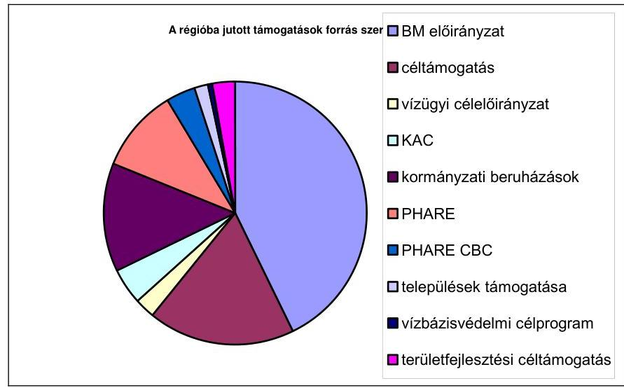

A támogatások ellenére egyes területeken forráshiány mutatkozik. A vízügyi igazgatóságok 2005. évi pénzügyi terveiben a normatív költségszükségleteknek mindössze az 54-74\%-átépítették be a ráfordítások közé, és ez az arány országos összehasonlításban az ellenőrzött szubrégióban volt a legalacsonyabb. Az árvíz- és belvízvédelmi létesítmények karbantartása esetében még rosszabb volt a helyzet, mert a normatív költségszükséglet országos átlagban kevesebb, mint $10 \%$-a állt csupán rendelkezésre, sőt a régióban illetékes igazgatóságnál erre a célra keret nem volt biztosított. A karbantartás elmaradása miatt bekövetkező károk nagysága többszöröse lehet az elmaradt karbantartási költségeknek, tehát ennek a területnek az alulfinanszírozottsága - egy átlagosnál nagyobb árvíz esetén - jelentős kockázat. A védett természeti területek állami tulajdonba vételhez szükséges költségvetési források is korlátozottak, ennek következtében a védett természeti területek állami tulajdonba vételét célzó törvényi előírások (országos és helyi) végrehajtása késik.

Hiányosság, hogy a térségbe jutott támogatások összegéről az érintett szervezeteknek összegző nyilvántartása nincs, ezt jogszabályi előírás sem teszi kötelezővé, erre vonatkozó adatokat a térségben illetékes igazgatóságok, ill. a társtárcák szolgáltattak a vizsgálat részére.

A környezetvédelmi célok hatékony végrehajtását korlátozza, hogy a hazai jogszabályok előírásai egymással nem harmonizáltak (környezeti teher rendezése nélküli felszámolási eljárások) és esetenként hiányoztak a részletes végrehajtási utasítások (biztosítékadási kötelezettségről és a felelősségbiztosítás).

A környezet-, természetvédelemmel és a vízüggyel összefüggő állami feladatok szervezeti háttere tekintetében, a már felsorolt törvényekben adott felhatalmazás alapján a Kormány rendelkezett az ország egész területét lefedő középirányítási feladatait ellátó szervezetek, -így az Országos Vízügyi Főigazgatóság és a Környezet- és Természetvédelmi Főfelügyelőség, valamint azok helyi szer-

---

vezetei, a vízügyi igazgatóságok, a környezetvédelmi felügyelőségek, valamint a nemzeti park igazgatóságok - kiépítéséről, működtetéséről.

Az ellenőrzött időszakban a területi szervezeti háttér, az ellátandó feladatok, ill. a hatósági jogkör gyakorlásának módja, és ezek területi szervezetek közötti megosztása több alkalommal változott. A változások eredményeként 2005-től a hatósági feladatokat kizárólag az Országos Környezetvédelmi, Természetvédelmi és Vízügyi Főfelügyelőség, ill. a felügyelőségek végezték, a szakmai feladatokat környezetvédelmi és vízügyi igazgatóságok és a nemzeti park igazgatóságok végezték a hatósági eljárásokban szakértőként működtek közre.

Az átszervezéseket megelőzően hatástanulmány nem készült. Az újonnan létrehozott szervezetek feladat- és hatásköreinek pontatlan meghatározása, ill. a jogszabályok eltérő értelmezése következtében az átszervezések nem voltak zökkenőmentesek. Az új felállású szervezetek munkájának hatékonyságát korlátozta, hogy a feladatellátás esetenként nem volt kellően koordinált (pl. a vízkészlet járulékok adóként való beszedése esetében) ill. (az árvízvédelemi feladatok ellátásánál), átfedések alakultak ki. Ezek a problémák a vizsgált területen illetékességgel bíró szervezetek tevékenységében nem jelentkeztek, de a többi szervezetnél ezek felszámolása további feladatot jelentenek. Az ellenőrzött szubrégióban működő környezetvédelmi felügyelőség - az alulfinanszírozottság miatt - a szükségesnél mintegy 10\%-kal kisebb létszámmal kényszerült megoldani meg a törvényben előírt feladatokat.

Nem teljesült a környezetvédelemről szóló törvény előírása, miszerint, az NKPval összhangban regionális, megyei és települési környezetvédelmi programokat kell készíteni. Ezek megyei és regionális szinten elkészültek, de településeknél - elsősorban forráshiány miatt - 80-90\%-os lemaradás mutatkozik.

A környezetvédelmi célok megvalósítását a különböző bevételeken, támogatások révén finanszírozott környezetvédelmi beruházásokon, a környezetvédelmi hatóságok által előírt technológiai előírásokon túlmenően ezt a célt segítenék az előírásokat be nem tartókra kivetett bírságok is. A környezetvédelmi bírságok fajtáinak, mértékének és megállapításának módját szabályozó rendeletek 2004-ben változtak, de a felszíni és a felszín alatti vizek minőségének védelméről rendelkező jogszabályok felkészülési időt adtak az igénybevevőknek, addig a korábban hatályos rendeletek szabályait alkalmazták.

A kiszabásra jogosult szervek betartották a rendeletekben előírt fizetési tételeket. A vizsgálat tapasztalatai szerint azonban az esetenként ismétlődő (az egyik cég esetében például huszonötszöri) - alacsony összegű - bírság kiszabásoknak visszatartó hatása az ellenőrzött időszakban nem érvényesült. Ennek legfőbb oka az, hogy a bírságot az üzemeltetőre szabja ki a hatóság, ugyanakkor a létesítmény tulajdonosa az önkormányzat, és a befizetett bírságok 30\%-át az önkormányzatok kapják. A másik lényeges ok, hogy az előírt határértékek betartása esetenként több tíz, ill. százmilliós beruházást igényel, amelynek forrását a szankciót viselőknek kell előteremteni.

A környezet- és természetvédelem, különösen a vízgazdálkodás helyzetében a jelentős összegű támogatásokból megvalósult beruházások ellenére ellenére

---

gondok tapasztalhatók. A felszíni vizek szennyezettsége az ötfokozatú besorolásban általában közepes vagy szennyezett minősítésű. Ennek oka, az Ausztriából érkező szennyezésen kívül a folyókba engedett nem megfelelő tisztítású szennyvíz. Az ellenőrzött időszakban - egy kivétellel - minden évben ugyanazt az öt céget bírságolták meg vízszennyezés miatt és a bírságolás hatására a vízszennyezési helyzet sehol sem változott, vagyis a bírságok nem kényszerítették ki a jogkövető magatartást.

A talajvizek szennyezettsége - az országos tapasztalatokhoz hasonlóan - a régióban is megfigyelhető volt. A talajvíz minősége Magyarországon az ausztriainál rosszabb, ezért ivóvíz céljára nem használható. Nálunk ehhez a felszín alatti mélyebb rétegeket elérő kutak adnak lehetőséget. A kedvezőtlen helyzet kialakulásának főbb oka a sík terület, a kilencvenes évek előtt kezdődött intenzív műtrágyahasználat, a csatornázás elhanyagolása, és sok helyen a szennyvíz ásott kutakba engedése.

A vízbázisok felmérését elvégezték, húsz vízbázist tartanak nyilván, amelyből tíz nem sérülékeny, a másik tíz pedig sérülékeny földtani környezetben fekszik. A nem sérülékeny vízbázisoknál szennyeződésre utaló jeleket nem tapasztaltak. Az ivóvízbázis védelmi célok elérését akadályozza, hogy az erre vonatkozó koncepciók, tervek és programok alapján kiadott kormányhatározatokban foglalt források ütemezését a kötelezettek nem tartják be, mert az éves költségvetési törvényekben az erre előirányzott összegek folyamatosan kisebbek voltak a kormányhatározatokban tervezettnél. A vízgazdálkodási feladatok elvégzését országos viszonylatban és a területi szerveknél jelentősen akadályozza az alulfinanszírozottság. Ebből a szempontból az ország 12 területi szerve között (a 2002. évre vonatkozó adatok alapján) éppen az ellenőrzött területen illetékes vízügyi igazgatóság esetében a legrosszabb a finanszírozási helyzet.

A csatornázottsági adatok tekintetében, a vizsgált területen élő 46749 fős lakosság 58,3\%-a lakik csatornázott útvonalon lévő lakásban, de csatornahálózatra rákötött lakásokban lakók aránya csak 41,9\%, a csatornázott településeken a rákötések aránya $56 \%$ és $99 \%$ között mozog. A vizsgálat idején folyamatban levő rákötésekkel a csatornázott lakásokban élők száma az összlakosságnak még mindig kevesebb, mint a felét fogja kitenni.

A térség levegőszennyezettségére vonatkozó állapotfelmérés a vizsgált időszakban nem készült. A vizsgálat alá vont térségben a levegő szennyezettségét a Nyugat-Dunántúli Környezetvédelmi Felügyelőség, ill. 2002-t megelőzően az ÁNTSZ Zala Megyei Intézete Zalalövő településen egy mérőponton vizsgálta, azonban a regisztrált alacsony szennyezettségi szint miatt a mérőponton folytatott légszennyezettségi méréseket megszüntették. A levegőbe jutott káros anyagok mennyiségét csökkentette a Körmenden megépített biomassza erőmű, amely - a jelentős földgáz kiváltás mellett - alacsony széndioxid kibocsátással üzemel. Az előzetes tervekhez képest ugyanakkor - más hasonló hőerőművek elkészülte - növelte az alapanyag (faapriték) árát, emiatt az önköltség magasabb lett. Ennek megoldását - a szakértők szerint - az un. energiaerdők telepítése jelentené.

A régió hulladékgazdálkodása tekintetében a szilárd hulladékkezelési közszolgáltatás minden településen kiépített, a korszerű hulladéklerakásra a Nyu-gat-Balaton és Zala-völgye térségi regionális szilárdhulladék gazdálkodási

---

rendszer projekt jelent megoldást, ez 305 települést érint, közte a szlovén határszakasz településeit is, kiterjed a múködő és felhagyott hulladéklerakók rekultiválására és kiépül egy EU jogszabályoknak megfelelő hulladéklerakó is. A program keretében a vizsgálatba vont terület 9 hulladéklerakójának rekultivációját végzik el. A projekt költsége közel 35 ezer Európa, ennek 70\%-a vissza nem térítendő ISPA támogatás. A vizsgált régió hulladékszennyezettségéről átfogó felmérés nem készült, azonban 2002. évben Phare támogatás keretében a települési szilárd hulladék lerakók országos felmérése megtörtént. A vizsgált térségben 39, már hivatalosan nem üzemelő hulladéklerakó található, környezetvédelmi szempontból ezek közül 26 közepes és 9 nagy kockázatú. A hulladékgazdálkodásról szóló törvény szerint a már üzemelő hulladéklerakó környezetvédelmi, műszaki megfelelőségének megállapítására az üzemeltető köteles volt teljes körű környezetvédelmi felülvizsgálatot elvégezni, vagy elvégeztetni. A hulladéklerakók üzemeltetőinek több mint fele nem készítette el a jogszabályokban előírt hulladékgazdálkodási terveket. A települési önkormányzatoknak a saját területükre vonatkozóan hulladékgazdálkodási tervet kell készíteniük, ennek ellenére a vizsgált területen elhelyezkedő önkormányzatok mintegy 2/3-a - elsősorban forráshiány miatt - a helyszíni ellenőrzés időpontjáig az előírást nem teljesítette.

Az Őrségi Nemzeti Park Igazgatóság a megalakulásától kezdődően 2004. év végéig - az intézmény működésének finanszírozásán kívül - a természetvédelmi programok ill. földvásárlás finanszírozására összesen 285 millió Ft támogatást kapott. A védett természeti területek védettségi szintje helyreállításának törvényi rendelkezése szerint a törvény hatálya alá tartozó, és a privatizáció során magántulajdonba került földterületet ki kell sajátítani és az Nemzeti Park Igazgatóságok (NPI) vagyonkezelésébe kell adni, ugyanakkor az eddig vagyonkezelésbe vett földterületeket - a konfliktusok elkerülése érdekében - a tulajdonossal történt megegyezést követően vásárlással szerezték meg. A természetvédelmi feladatokat ellátó Örségi Nemzeti Park Igazgatóság (ÖNPI) Igazgatóság a 2002. évben összesen 104,3 millió Ft összegben vásárolt földterületet, amelyből a vizsgált régióban összesen 368,6 ha elsősorban szántó, gyep művelési ágú földterület vásárlásra 91,3 millió Ft-ot fordítottak. Ennek eredményeként a helyszíni ellenőrzés időpontjában az ÖNPI vagyonkezelésében 11700 ha volt, azonban az állami tulajdonba vételhez szükséges források nem álltak kellő mértékben rendelkezésre, ezért az erről rendelkező törvény végrehajtása az országosan és helyben is késik. Pozitívum, hogy a Natura 2000 hálózati területek kijelölése a 2004-ben kiadott jogi szabályozásnak megfelelően (a helyszíni vizsgálatot követően) megtörtént.

Több környezetvédelmi részterületen (elsősorban a határokon átnyúló szennyeződéseket okozni képes felszíni vizek és a vízbázisok területén) hatékony prevencióra csak összehangolt nemzetközi fellépések eredményeként nyílhat lehetőség. Az ellenőrzött térség mindkét szomszédos országával, tehát Szlovéniával és Ausztriával a vízgazdálkodás és vízminőség védelem kapcsán kialakított együttműködés jogi alapját az érintett kormányokkal kötött egyezmények biztosították, a szerződések a vitás kérdések és problémák kölcsönös érdekek figyelembevételével való megoldására épültek. Az egyezmények a vízgazdálkodás mennyiségi kérdésein túl előírják a határvizek minőségi vizsgálatát, a vizek szennyezés és ésszerűtlen használata elleni védelmet, a beavatkozások környezeti hatásainak vizsgálatát. A két egyezmény között ugyanakkor az

---

érintett terület kiterjedtsége, az együttmúködés köre és mélysége tekintetében az Szlovéniával kötött egyezmény lényegesen tágabb körű.

Az Ausztriával kötött szerződés szerint a feleknek törekedniük kell, hogy a szennyvizet csak megfelelő tisztítás után vezethessék a felszíni vizekbe. Ennek ellenére az ellenőrzött időszak alatt folyamatosan fennálló megoldatlan problémaként jelentkezett, hogy a Rába vízgyűjtő területének felső (osztrák területre eső) szakaszán, a magyar határtól mindössze 2 km távolságban megépített bőrgyár már osztrák területen is szennyezte a folyót és emiatt a folyó magyar szakaszán (Szentgotthárdnál) „szennyezett" minősítést kapott. (5. sz. melléklet)

Az egyezmények végrehajtása során a koordinációs feladatokat az államközi vegyes bizottságok látták el, az operatív feladatokat pedig a helyi szervek végezték. Az együttmúködés rendszeres és szervezett volt, a hidrológiai és hidro-meteorológiai adatok cseréjére rendszeresen sor került. Munkatervek alapján évente egyszer hidrológiai szakértői találkozókat szerveztek, és közös vízmintavételezéseket végeztek. A védelmi létesítmények tervezése és kivitelezése során is eredményes együttműködés alakult ki a szomszédos országok illetékes szervezeti között.

A közös mérési eredmények elemzését, kiértékelését és a következtetések összevetését nehezíti, hogy a határ menti három ország eltérő paraméterek, illetve határértékek alapján, eltérő vízminőségi osztályozási és minősítési rendszert alkalmaz. A határon átnyúló vízbázisok tekintetében csak eseti együttmúködés alakult ki, továbbá problémát jelent, hogy a határmenti vízbázisok védőterülete átnyúlik az országhatáron, de ennek kijelöléséhez jogi formái jelenleg még nem kidolgozottak.

Az együttműködés pozitív hatása, a közös mérési tevékenységen kívül mindkét határszakaszon megvalósultak közös célú és a résztvevő szomszédos országok számára kedvező hatású beruházásokban is megmutatkozott. Így pl. a rossz tisztítási hatásfok miatt többször megbírságolt körmendi szennyvíztisztító telepen épített új szennyvíztisztító egység a környező magyar falvak mellet egy osztrák település szennyvizét is fogadni tudja. A magyar-szlovén határmenti térségben határon átívelő együttműködés keretében kiépítették három település szennyvíz elvezetési rendszerét és épül a szennyvíztisztító létesítmény. Két szlovéniai település egészséges és biztonságos vízellátását célzó tanulmányt, a szomszédos magyar vízműről biztosítaná. Ugyancsak eredményes együttműködés alakult ki a közös védelmi létesítmények tervezése és kivitelezése során Szlovéniával. Az árvízi előrejelzés hatékonyságát segítő kormányzati beruházás keretében elkészítettek egy távmérő állomást, valamint a szlovén fél adatszolgáltatással járult hozzá a Kerka és vízgyűjtőjére szóló területi vízminőségi kárelhárítási terv elkészítéséhez.

A helyszíni ellenőrzés megállapításainak hasznosítása mellett javasoljuk:

# a környezetvédelmi és vízügyi miniszternek 

1. gondoskodjon a környezetvédelmi, természetvédelmi és vízügyi szakterületek hatósági és operatív kezelési funkcióinak szétválasztása kapcsán kialakult hatásköri átfedések és koordinálatlanságok megszüntetéséről;

---

2. kezdeményezze a két szomszédos országgal kötött nemzetközi vízgazdálkodási egyezmény területi hatályának és a víggazdálkodási szempontok aktualizálását és egységesítését;
3. biztosítsa a szükséges forrásokat a védett területek természetvédelmét biztosító állami kezelésbe vétel folytatásának a jogszabályokban meghatározott ütemezése érdekében;
4. gondoskodjon az éves költségvetés tervezése során, az ivóvízbázis védelmére vonatkozó kormányhatározatokban meghatározott ütemezés szerinti forrásokról;
5. szerezzen érvényt a hulladékgazdálkodásról szóló törvény, üzemelő hulladéklerakók környezetvédelmi felülvizsgálatára vonatkozó előírásainak;
6. követelje meg a települési hulladékgazdálkodási tervek elkészítését, pénzügyi finanszírozását szükség szerint építse be támogatási rendszerébe;
7. kezdeményezze a körmendi biomassza fűtőmú alapanyag ellátása érdekében a környéken lévő alacsony aranykorona értékű földeken az „energiaerdők" telepítésének gazdaságosságát célzó tanulmány készítését.

---

# II. RÉSZLETES MEGÁLLAPÍTÁSOK 

## 1. A KÖRNVEZETVÉDELEM IRÁNYÍTÁSI MECHANIZMUSA ÉS A NEMZETKÖZI KÖTELEZETTSÉGEK TELJESÍTÉSE

### 1.1. A környezet- és természetvédelem jogszabályi háttere

A magyar Alkotmány 18. § rögzíti, hogy mindenkinek joga van az egészséges környezethez. Az 1990. évtől kezdődő időszakban a törvényhozásnak és a jogszabályalkotóknak kiemelt feladatuk lett - az EU-hoz való csatlakozásnak megfelelően - az ország jogrendjét az EU-ban hatályos jogrendhez harmonizálni.

Az Alkotmányban meghatározott követelményeknek és az EU előírásainak megfelelően készült el 1995-ben a környezet védelmének általános szabályairól szóló LIII. törvény és a vízgazdálkodásról szóló LVII. törvény, az 1996-ban a természet védelméről szóló LIII. törvény, valamint a 2000. évben elfogadott a hulladékgazdálkodásról szóló XLIII. törvény.

A környezetvédelemről szóló törvény tíz fejezetre osztva kellő részletességgel foglalkozik az általános rendelkezéseken túl a környezeti elemek védelmével és az elemeket veszélyeztető tényezőkkel, ezen belül a víz védelmével.

A törvény a környezet védelmét szolgáló állami tevékenységgel összefüggésben meghatározta az Országgyúlés, a Kormány és a környezetvédelemért felelős miniszter feladatait, kötelességeit, jogait és rendelkezik a Nemzeti Környezetvédelmi Program hatévenkénti megalkotásáról, annak tartalmáról és felépítéséről. A jogszabály szerint a Kormánynak a Program megújítására irányuló előterjesztés benyújtásakor az Országgyúlés előtt be kell számolnia az előző Program végrehajtásáról.

A törvény rögzíti a helyi önkormányzatok környezetvédelmi feladatait, a környezetvédelmi igazgatás feladatait, hatósági jogköröket határol el, meghatározza az engedélyezési eljárások előfeltételét, az engedélyek tartalmi követelményeit. Meghatározza a Környezetvédelmi Információs Rendszer múködtetésének főbb szabályait, és a tájékoztatási kötelezettségeket. A környezetvédelem gazdasági alapjai között részletezi a központi költségvetésből támogatható feladatokat, a Környezetvédelmi Alap célfeladat fejezeti kezelésű előirányzat felhasználásának területeit. Rendelkezik a környezetvédelmi engedélyezési eljárásokról, a bejelentési kötelezettségről, ellenőrzésről, anyagok, termékek és technológiák környezetvédelmi minősítéséről, a határértékek megállapításának céljairól és módozatairól.

### 1.2. Szervezeti háttér változásai és hatásuk a feladatellátásra

A környezet védelmének általános szabályairól szóló 1995. évi LIII. törvény, összhangban a természet védelméről,- a vízgazdálkodásról és hulladék gazdálkodásról szóló törvényekkel, valamint e törvények alapján meghozott Kor-mány- és miniszteri rendeletekkel, átfogóan szabályozza a környezet védele-

---

mével összefüggő jogi és szervezeti kérdéseket, az ellenőrzött időszakban azonban a szervezeti keretek gyakori változtatása hatásköri átfedéseket és koordinálatlanságokat idézett elő.

Az ellenőrzött időszak első felében (2000. és 2002. közötti években) a vízgazdálkodással összefüggő kérdések felügyelete megosztva a közlekedési és vízügyi Miniszter, valamint a mezőgazdasági vízgazdálkodási célokat szolgáló vizek és vizilétesítményeket illetően a földművelésügyi és vidékfejlesztési miniszter hatáskörébe tartoztak. A 2002. évi kormányváltást követően megszűnt a KöViM, a vízgazdálkodási feladatok a környezetvédelmi és vízügyi miniszter hatáskörébe kerültek. Ezzel a környezet védeleméről, a természet védeleméről szóló törvényekben megfogalmazott feladatok, valamint a hulladékgazdálkodásról szóló törvénnyel összefüggő igazgatási feladatok mellett a vízügyi feladatok is a környezetvédelmi és vízügyi miniszter hatáskörébe tartoznak.

A legnagyobb szervezeti változást az Országos Környezet- és Vízügyi Főfelügyelőség, az Országos Környezetvédelmi, Természetvédelmi és Vízügyi Főigazgatóság és a környezetvédelmi és vízügyi miniszter irányítása alá tartozó területi szervek feladat- és hatásköréről szóló 183/2003. (XI. 5.) Kormányrendelet rögzítette. Ezzel létrejöttek a környezet-, és természetvédelmi feladatokkal kiegészítve az új országos irányító szervezetek és azok területi szervei. Ezzel változtak az alapfeladatok is (részletesen a jelentés 3.1 pontjában).

A vízügyi igazgatóságok és a környezetvédelmi felügyelőségek illetékességi területeit a főbb vízgyűjtők határait követve alakították ki, az országban 12 felügyelőséget és 12 igazgatóságot jelöltek ki. A természetvédelmi feladatok helyi szintű ellátására 9 nemzeti park igazgatóságot hoztak létre. 2002. évben a Fer-tő-Hanság Nemzeti Park Igazgatóság (FHNPI) meghatározott területeiből a 4/2002. (II. 27.) KöM rendelet alapján létrehozták az Őrségi Nemzeti Parkot és kezelésére az Örségi Nemzeti Park Igazgatóságot. A leválasztást az indokolta, hogy az FHNPI eltérő sajátosságú területeket foglalt magába, ezért különböző szakmai követelményeknek megfelelő szervezet működtetését kellett megoldaniuk.

A FHNPI északi részén egy kiemelt jelentőségű vizes élőhely ökoszisztéma megőrzése és bemutatása volt a cél, a déli leválasztott részen egy dombvidéki, jelentős erdősültséggel rendelkező, település szerkezetében hagyományos népi építészeti értékeket megőrző kultúrtáj megtartása és bemutatása jelentkezett feladatként. A jelenlegi ellenőrzésre kijelölt terület az Örségi Nemzeti Park Igazgatóság, a Nyu-gat-dunántúli Környezetvédelmi Felügyelőség, illetve a Nyugat-dunántúli Vízügyi Igazgatóság területén fekszik.

A hatósági feladatok ellátásához engedélyezett létszám az ellenőrzött időszakban csak rendkívüli erőfeszítés mellett volt elégséges a megfelelő munkavégzéshez. Az érintett hatóságok véleménye szerint szervezet jogszabályokban meghatározott feladatainak az ellátásához kb. 10\%-kal nagyobb létszámra lenne szükség. Speciális problémát jelentett és a felügyelőségen a hatósági munkavégzést megnehezítette (egyben meggyorsította) az a 2005. január 1-vel hatályba lépő szervezeti módosítás, amelynek eredményeként a korábban külön szervezetként működő környezetvédelmi, természetvédelmi és vízügyi hatósági tevékenységeket egy szervezet keretein belül egyesítette. Ezáltal ugyanis az olyan komplex ügyek intézésekor, amelyeknek környezetvédelmi,

---

természetvédelmi és vízügyi vonatkozásai is vannak, ezután nem szükséges e szervek között a szakhatósági megkeresés, hanem a szervezeten belüli koordináció hatékonyabbá tételével gyorsabban lehet azokat elintézni.

A környezetvédelmi hatósági feladatokat ellátó Nyugat-dunántúli Környezetvédelmi Felügyelőség szervezeti felépítésének gerince 2000-2004. között lényegesen nem változott. Ez lényegében az egész ellenőrzött időszak alatt megfelelően funkcionált, a hatékonyabb munkaszervezés érdekében 2002-ben az igazgató helyettes közvetlen irányítása alatt létrehozták Területrendezési Csoportot, amelynek fő feladata a települési rendezési tervek véleményezése volt. Ugyanebben az évben korszerűsítették a felügyelőségi ügyfélszolgálatot és továbbfejlesztették a kárelháritási ügyeleti rendszert is. Ennek keretében, a rendkívüli események gyorsabb és hatékonyabb kezelése, és a komolyabb károk kialakulásának megelőzése érdekében létrehoztak egy operatív csoportot.

A felügyelőség éves átlagos statisztikai létszáma az ellenőrzött időszakban folyamatosan növekedve 67 fơről 2004 végére 88 főre emelkedett. Az első kéthárom évben elsősorban felsőfokú végzettségű új belépőkkel töltötték fel a megüresedett munkahelyeket. Ennek eredményeként, az ellenőrzött időszak második felére a felügyelőség munkajogi létszámának több mint 60\%-a felsőfokú iskolai végzettségű köztisztviselő volt. A 2003. évi létszámfejlesztés emiatt már elsődlegesen az ügyintéző I. kategóriába tartozó munkavállalók számának a növelésére irányult.

A Nyugat-dunántúli Környezetvédelmi és Vízügyi Igazgatóságon a helyszíni ellenőrzés időpontjában érvényben lévő Szervezeti és Működési Szabályzat a hatályos törvényekkel és kormány rendeletekkel összhangban szabályozta az intézmény környezetvédelmi és vízgazdálkodási feladatait.

# 1.3. Nemzetközi szerződésekben vállalt kötelezettségek 

Magyarország több nemzetközi környezet- és természetvédelmi egyezménynek részese.

A jelenlegi ellenőrzés szempontjából az ellenőrzésre kijelölt területre vonatkozó feladatokat megszabó szerződések közül két egyezménynek van kiemelt jelentősége. Ezek a Magyar Népköztársaság és az Osztrák Köztársaság között a határvidék vízgazdálkodási kérdéseinek szabályozására Bécsben 1956. április hó 9-én aláírt egyezmény, amelyet az 1959. évi 32. törvényerejű rendelettel hirdettek ki, valamint a Magyar Köztársaság Kormánya és a Szlovén Köztársaság Kormánya között a vízgazdálkodási kérdések tárgyában 1994. október 21-én Ljubljanában aláírt Egyezmény, amelyet a 41/2001. (III. 14.) Kormányrendelet hirdetett ki. Ez utóbbi egyezmény előzménye az 1955. évben Jugoszláviával kötött vízgazdálkodási kérdések megoldásáról szóló egyezmény. Az 1994. évi egyezményben Szlovénia, mint a volt Jugoszlávia egyik jogutóda szerepel.

A két egyezmény tartalmában - a közös célok ellenére - lényeges különbségek vannak. Az Osztrák viszonylatban a szerződés hatálya az országhatártól mindkét irányba 6-6 km-es sávban található vizekre vonatkozik, míg a Szlovéniával kötött szerződésben ilyen korlátozás nincs. Szlovén viszonylatban a szer-

---

ződés rendelkezései egyértelműen kiterjednek a felszíni, és a felszín alatti vizekre is, az Ausztriával kötött szerződés szövege és annak melléklete ennél általánosabban fogalmazva „vizekre" vonatkoztatja a kötelezettségeket. Az érintett országok hatóságai és területi szervei között az együttmúködés kialakult, de az egyezmények eltérő tartalma következtében nem egységes szemlélet és azonos szakmai tartalom alapján valósult meg.

A Szlovéniával kötött egyezmény tételesen rögzíti, hogy az kiterjed a felszíni és a felszín alatti vizekre, az osztrákokkal kötött egyezmény csak általánosan vizeket ill. vízfolyásokat említ. Ez utóbbi egyezmény megkötését követően mintegy öt évvel később meg jelent a vízügyről szóló 1964. évi IV. törvény hatálya a felszíni, ill. a felszín alatti vizekre is kiterjed.

Mind két szerződés a vízgazdálkodással összefüggő kérdéseknek a kölcsönös érdekek figyelembe vételével való megoldását írja elő. A Szlovéniával kötött szerződésben a vízgazdálkodás mennyiségi kérdésein túl az egyezmények előírják a határvizek minőségi vizsgálatát, a vizek szennyezés és ésszerűtlen használata elleni védelmet, a beavatkozások környezeti hatásainak vizsgálatát, ezekkel összefüggésben az együttmúködést a kutatás, tervezés, kivitelezés, megfigyelés, információ és adatcsere területén. Az Ausztriával kötött szerződés általános kötelezettségeket tartalmazó része nem határozza meg ilyen pontosan az együttmúködési kötelezettséget.

Az Ausztriával kötött egyezmény 2. cikk (7) bekezdése előírja, hogy a „határmenti vizek szennyezéstől való megóvása érdekében a Szerződő felek törekednek arra, hogy gyárak, bányák, ipari vállalatok és hasonló üzemek, valamint lakótelepülések szennyvizét ezekbe a vizekbe csak megfelelő tisztítás után vezethessenek. Ilyen jellegű új művek építésénél a szennyvizek kellő tisztításának kötelezettségét elő kell írni".

A két egyezmény hatálya közötti különbség abból is következik, hogy majdnem 40 év különbséggel kötötték meg. Az 1950-es évek közepén használatos technológiák környezetet szennyező hatása még nem volt olyan súlyú kérdés, mint a 90-es évek közepén, amikor Szlovéniával Magyarország a szerződést megkötötte. Ennek következtében ez a szerződés a környezet védelmét, a vizek szennyeződésektől való megóvását sokkal határozottabban jeleníti meg.

Természetesen egy egyezménytől nem mindig lehet elvárni, hogy minden, a jövőben bekövetkező eseményre megadja a helyes eljárás szabályait, ezért a vitás kérdések megoldására létrehozott kétoldalú bizottságok alkalmasak arra, hogy a később felmerült problémákat megtárgyalva a szerződő felek egyezségre jussanak. Ezeket a célokat segíti elő a Magyar-Osztrák Vízügyi Bizottság és a Magyar-Szlovén Vízgazdálkodási Bizottság múködése. Mindkét bizottság hatásköre elsősorban a vízgazdálkodási kérdésekre (a közös árvízvédelem, jogvédelmi, vízmegosztási, közös létesítmények üzemeltetése, fenntartása) terjed ki, de a vízminőség védelmével kapcsolatos kérdések megtárgyalására is lehetőség van. Magyarország, mint mindkét szomszéd országnál alacsonyabb térszinten elhelyezkedő ország, az ellenőrzésbe bevont területen is érdekelt e Bizottságok munkájában részt venni, hogy érdekeit érvényesíthesse.

---

# 2. A KÖRNVEZET- ÉS TERMÉSZETVÉDELEM SZAKMAI PROGRAMOK CÉLKITŰZÉSEI ÉS TELJESÍTÉSÜK 

### 2.1. Az ország környezetvédelmi állapota

A környezeti célok megvalósítása a természetvédelem és a levegőtisztaság védelem területén volt a legnagyobb mértékű (becslések szerint 80-90\%-os). A vizek védelme, a földvédelem, az emberi egészség védelme, a környezetbiztonság növelése érdekében meghatározott feladatok teljesítésének mértéke ettől kis mértékben elmaradt. A legnagyobb lemaradás a települési és az épített környezet védelme, valamint a szelektív hulladék gazdálkodás terén volt. A közvetlen környezetvédelmi intézkedéseken kívül több környezeti mutató a gazdaság szerkezeti változásának következményeként is javult.

Az ellenőrzött időszakban a környezet állapotának alakulására elsősorban egyes környezeti terhelések csökkenésének volt hatása. Több ipari központ megszűnése, átalakulása következtében fokozatosan csökkent a levegőbe jutó káros anyagok mennyisége, a korábbi időszakban összefüggő nagyobb kiterjedésű szennyezett régiók feldarabolódtak és kisebb, már nem összefüggő területekre szorultak vissza. A megváltozott körülmények között a levegő minőségében egyre jobban a közlekedésből eredő légszennyezések okoznak káros elváltozásokat. Ezt jól mutatják a nagyobb közúti forgalmat lebonyolító városok, illetve főbb közlekedési útvonalak mentén mért légszennyezést mutató mérőállomások adatai.

A nagy folyóink vízminősége összességében javult, a kis vízfolyások minősége a kisebb hígító kapacitásuk miatt - inkább romlott. A nagy vízfolyások vízszállításában vagy vízminőségben beálló szélsőségek több régió folyómenti településeinek okoznak, okozhatnak veszélyhelyzetet. A kisvízfolyások áradása vagy szennyezése esetenként csak helyi jelentőségű, de a közvetlenül érintett települések számára ez súlyos károkat okoz. (A 2001, 2002, 2004. és 2005. években a hegyvidékeken - Mátra, Bükk, Zemplén - bekövetkezett áradások által okozott károk okoztak az ellenőrzött időszakban ilyen károkat.)

A felszín alatti vízkészletek állapota és védelme minden régióban kiemelt jelentőségű, mert az ivóvíz ellátást több mint $90 \%$-ban ebből a készletből kell megoldani, ezért az ivóvízellátás, a szennyvízelvezetés és tisztítás, valamint a hulladékgazdálkodás fejlesztése az egész országban jelentős ráfordításokat igényel. Az Ivóvízminőségjavító Program alapján 2006. végéig azonban azokon a településeken meg kell oldani az ivóvíz minőségének javítását, ahol az arzén koncentráció meghaladja a $30 \mathrm{mg} / \mathrm{l}-\mathrm{t}$, valamint azokon a településeken, ahol nitrittel, bórral, fluorral szennyezett ivóvizek minősége nem felel meg az új határértékeknek. 2009. év végéig 877 településnek az ivóvíz minőségét ezekhez a követelményekhez igazodóan kell javítani, ez az ország lakosságának több mint negyed részét érinti.

A felszíni és felszín alatti vízkészletek minőségének védelme érdekében a települési szennyvizek elvezetése és tisztítása valamennyi régióban jelentős fejlesztést igényel. A Nemzeti Települési Szennyvíz-elvezetési és tisztítási Megvalósítási Program 2008. végéig tartó 1 ütemben előirányzott feladat:

---

- gyűjtőhálózat kiépítése az érzékeny területen a 10 ezer lakos egyenérték feletti települési agglomerációban;
- az elvezetett települési szennyvíz legalább biológiai, az érzékeny területen levő 10 ezer lakos egyenérték feletti agglomerációk esetében III. fokozatú tisztítása.

A településeken keletkező hulladék gyűjtése majdnem teljes körűen megoldott, de a szelektív gyűjtésnek a bevezetése még csak kísérleti stádiumban van. A hulladékgazdálkodásról szóló törvénynek köszönhetően a települések önkormányzatai kötelesek közszolgáltatást szervezni a hulladék kezelésére, és emiatt jelenleg már csak néhány kedvezőtlenebb adottságú régió kisebb településein nincs megoldva a szilárd hulladék gyűjtése és ártalmatlanítása.

Az erősebben iparosodott és nagyobb laksűrűségű területeken a keletkezett hulladék mennyiség az országos átlag felett van. Ezeken a területeken a jóváhagyott ISPA (az Európai Unió Csatlakozást Előkészítő Strukturális Politikai Eszköz) projekteknek köszönhetően a komplex hulladékgazdálkodási programok kiterjednek a szelektív gyűjtés bevezetésére, gyűjtőszigetek, hulladékudvarok, válogató és komposztáló telepek kialakítására, a hulladéklerakók kapacitásának bővítésére, új biztonságos hulladéklerakók létesítése, a meglévő betelt lerakók rekultivációjára.

# 2.2. A szakmai programokban foglalt célkitúzések és teljesítésük 

A környezet védelmének általános szabályairól szóló 1995. évi LIII. törvény tartalmazta a Nemzeti Környezetvédelmi Program (NKP) kidolgozásának részletes előírásait. Az Országgyúlés 83/1997. (IX. 26.) határozata ennek alapján rendelkezett az 1997-2002. közötti időszakra szóló első NKP-ról és elfogadta a megvalósítás általános tervét. Végrehajtásának konkrét feladatait kormányhatározatokban jóváhagyott intézkedési tervek tartalmazták.

Az NKP I-ben megfogalmazott célkitűzések időarányos teljesítéséről a törvényben előírtaknak megfelelően kétévenként értékelések készültek az Országgyúlés részére.

A 2003-2008. közötti időszakra szóló NKP II. kidolgozásakor fegyelembe vették az NKP-I. végrehajtása során szerzett tapasztalatokat, valamint azokat a követelményeket és lehetőségeket, amelyek az ország EU-hoz való csatlakozásából következnek.

Az ellenőrzött időszak átfogja az NKP I. utolsó két és az NKP-II. első két évét, ez lehetőséget ad arra, hogy az NKP-I-ről szóló értékelés és az NKP-II-ben megfogalmazott célok és programok alapján az ország környezetvédelmi állapotát, valamint az ellenőrzésre kijelölt területre vonatkozó környezetvédelmi helyzetét értékeljük.

Az NKP-I. összesen 120 elérendő célt fogalmazott meg. E célok elérésének értékelését nehezíti, hogy a program keretébe olyan intézkedések is tartoztak, amelyek hosszú távú célkitűzések elérését szolgálták. A program céljai kö-

---

zül sikeresen teljesült az EU-hoz való csatlakozás feltételeinek részét képező környezetvédelmi jogharmonizáció teljesítése, az EU konform intézmény rendszer kiépítése is megkezdődött.

Az NKP-I. a környezetvédelmi problémák megoldását ágazati bontásban kezelte, fontos szerepe volt abban, hogy erősödött a környezeti érdekek integrálódása a különböző ágazati és fejlesztési programokba (Országos Területfejlesztési Koncepció, Nemzeti Agrár környezetvédelmi Program, Nemzeti Fejlesztési Terv).

A környezetvédelmi törvény előírta, hogy az NKP-val összhangban regionális, megyei és települési környezetvédelmi programokat kell készíteni. Ennek a kötelezettségnek teljesítése megyei és regionális szinten teljesült, de települési szinten a lemaradás 80-90\%-os (2002. évre a települések kevesebb, mint 10 \%-a készített környezetvédelmi programot).

A települési környezetvédelmi programok elkészítésének elmaradása jogkövetkezménnyel nem járt. A KöM a különböző környezetvédelmi beruházásokhoz elnyerhető támogatásokra kiírt pályázatokban azokat az önkormányzatokat preferálta, amelyek ilyen tervvel rendelkeztek, de a program hiánya nem volt kizáró ok.

Az NKP-II. célkitúzései a környezeti elemek mutatóiban a program végére (2008. évre) konkrét célállapot meghatározás szerinti javulás elérését tartja szükségesnek. A légszennyezés területén ötféle szennyezés meghatározott mennyiségi, illetve arányú csökkentését tervezik elérni. A vízminőség védelmi célkitűzések között szerepel, hogy a felszíni vizek minősége nem romolhat, sőt javítani kell. A felszín alatti vizek mennyiségi és minőségi védelmében cél, hogy az $50 \mathrm{mg} / \mathrm{l}$ nitrát koncentrációt meghaladó mértékben szennyezett vízmű kutak aránya 3,6 \%-ról $2 \%$-ra csökkenjen. A felszín alatti víznyomásszint csökkenés a sokéves átlagos helyzethez képest emelkedjen, mivel már rendkívül nagy az Alföldi és a Kisalföldi régióban a talajvízszint csökkenése. A program szerint az ország $90 \%$-án meg kell szűnnie a vízkivétel miatti nyomásszint csökkenésnek és $10 \%$-án meg kell kezdődnie nyomásszint emelkedésnek, hogy az intenzív vízhasználat előtti értékek és vízkészletek álljanak helyre.

A vizek kártétele elleni védelem keretében az árvízvédelmi fővédvonal előírt kiépítettségét a $62 \%$-os mértékről $75-80 \%$-os szintre tervezik emelni, a fajlagos vízlevezetési kiépítettség kapacitását azokon a területeken, ahol jelenleg átlag alatt van a program időszak végére a jelenlegi átlagos szintre kell felhozni, ez $27,2 \mathrm{l} / \mathrm{s} / \mathrm{km}^{2}$.

A talajvédelem területén a talajpusztulással veszélyeztetett területeken a vízerózióval 2,3 millió hektár, szélerózióval 1,5 millió hektár területnek a $10 \%$-os csökkentése a célkitűzés. A program időszak végére a környezetvédelmi előírásokat ki nem elégítő, de jelenleg még üzemelő hulladék lerakók bezárása, felszámolása és utógondozása a program célja. A növény védőszer maradék, illetve a nehézfém koncentráció határértéket meghaladó értékeket a Talajvédelmi Információs és Monitoring Rendszer mérőpontjainak 1 \%-nál mértek. Az határértéket túllépő szennyező forrásokat 2008-ra meg kell szüntetni.

---

A táj és természetvédelmi célkitűzések között kiemelt helyen szerepel az egyedi jogszabállyal védett természeti területek kiterjedésének 857327 hektárról, 1024000 hektárra való növelése. A védett növény és állatfajokból veszélyeztetett 115 fajból 11-12 faj életterében és életlehetőségeiben olyan változások elérését tűzték ki, amelyeknek eredményeként kikerülhetnek a veszélyeztetett fajok köréből. A természetvédelmi kezelési tervek által lefedett terület nagyságát 305281 hektárról 1100000 hektárra tervezik bővíteni.

A program keretében az összefüggő természetes vagy természet közeli élőhelyegyüttesek $14 \%$-os országos arányát szinten tartani tervezik.

Az erdősültség (faállománnyal borított és erdő-felújítási kötelezettség alá tartozó terület) arányának 19,2\%-ról 20\%-ra való növelése a cél. Az érzékeny természeti területek rendszerének kialakulása keretében a védett területek arányát $2,5 \%$-ról $4 \%$-ra tervezik növelni.

A Nature 2000 hálózat hazai részeinek kijelölése és megfelelő ökológiai állapotának biztosítása keretében az ország $15 \%$-át e programba bevonva különleges madárvédelmi- és különleges természet megőrzési területeket terveznek létrehozni.

A földtani értékek megóvása keretében a nyilvántartásba vett földtani és felszínalaktani értéket képviselő 3600 barlang megóvása, a veszélyeztetett objektumok arányának $30 \%$-ról $20 \%$-ra való csökkentése a cél.

A fenntartható természeti erőforrások használata keretében a megújuló energiaforrások használatának az arányát a program időszak elején 3,6\%-os arányról $5 \%$-ra, 2010-re $6 \%$-ra kell emelni.

Az egészségmegőrzés életmód részprogram keretében a kémiai eredetű kockázatok csökkentése érdekében a lakossági, illetve ipari és mezőgazdasági felhasználásra kerülő anyagokban lévő mérgező, a szervezetben felhalmozódó vízszennyező vegyi anyagok és növényvédő szerek felhasználásának 20\%-os csökkentését, illetve kiváltását tervezik.

Az egészségmegőrzés érdekében az allergiás betegség tüneteit kiváltó okok csökkentésével kisebb területre való visszaszorításával a megbetegedések arányát a felére ( $10 \%$-ról $5 \%$-ra) akarják csökkenteni.

Az élelmiszerbiztonság növelése érdekében az ökológiai gazdálkodással művelt minősített terület nagyságát 85000 hektárról 300000 hektárra kívánják növelni.

A környezetbarát életviteli és fogyasztási szokások elterjesztése érdekében a szelektív kommunális hulladékgyűjtés arányát az összes begyűjtött hulladék tömegéhez viszonyítva 3\%-ról 35-40\%-ra tervezik bővíteni, a hulladék hasznosítás arányát $30 \%$-ról $50 \%$-ra kívánják emelni.

A települések környezetminőségének javítása érdekében az egy városi lakosra jutó közhasználatú zöldterület nagyságát $38,7 \mathrm{~m}^{2} /$ fő mértékről $45 \mathrm{~m}^{2} /$ fő kiterjedésre tervezik növelni.

---

A lakosság zajterhelésének szintjét úgy kívánják csökkenteni, hogy a $75 \mathrm{~dB}(\mathrm{~A})$ feletti zajterhelést jelenleg elviselni kényszerülő 20000 fő zajterhelése mérséklődjön az elfogadható határérték alá. A $65 \mathrm{~dB}(\mathrm{~A})$ feletti zajterhelések száma 1,7 millió föről 1,4 millió főre csökkenjen. Az ivóvíz minőségi határértékeinek nem megfelelő vízzel ellátott lakosság aránya a program elején az ország lakosainak $27,4 \%$-át érintette. 2009. évre az EU fele is vállalt kötelezettségnek megfelelően biztosítani kell, hogy a teljes lakosság megfelelő minőségű vizet fogyaszthasson, illetve használhasson.

A települési szennyvizek tisztítása terén meglévő nagy mértékű elmaradást 2015. végéig fel kell számolnia az országnak, ezért az érzékeny területen (a csatornázott településeken keletkező összes szennyvíz 4,1 \%) 68\%-os tisztítás mértékét teljessé kell tenni, a normál területeken (a csatornázott településeken keletkező összes szennyvíz 95,9\%) 46\%-os arányú tisztítását 83\%-ra kell növelni.

A csatornahálózattal nem rendelkező településeken keletkező szennyvizek ártalommentes elhelyezését teljes egészében meg kell oldani (ez jelenleg csak 12-15 $\%$-os arányt ér el).

# 2.3. A környezetvédelmi programok célkitűzéseinek megvalósítása a szlovén-osztrák-magyar hármas határ térségében. 

Az országra vonatkozó globális környezeti állapotokat és célkitűzéseket összevetve az ellenőrzésre kijelölt terület főbb jellemző szennyezési adatai alapján megállapítható, hogy a környezet használatból eredő környezet károsítások sokkal kisebb mértékúek, mint amit az ország központi, vagy a korábban működő nagy ipari gócok környékén mérhetó adatok mutatnak. A tó területei szervezetek - igazgatóságok, felügyelőségek - szakmai beszámolói, ill. az ellenőrzésekről készített jegyzőkönyvek és az államközi vegyes bizottságok szakértői tárgyalásairól készített jegyzőkönyvek alapján az ellenőrzött időszakban a levegő tisztaság helyzete a szubrégióban megfelelő volt és a regionális hulladékártalmatlanítás területén is kedvező volt a helyzet.

Mindezek természetföldrajzi feltételek biztosították azt, hogy a térségben eddig az országos átlaghoz képest a környezeti elemek állapota jobb és az emberi egészségre kedvezőbb.

A környezetvédelmi, természetvédelmi, vízügyi és hulladékgazdálkodással öszszefüggésben a területekért felelős helyi szervezetek - változó tárcafelügyelet és jogosítványok mellett - látták, illetve látják el feladataikat.

A környezeti elemek állapotát a vizsgált régióban az elsőfokú környezetvédelmi, természetvédelmi, tájvédelmi és vízügyi hatósági és szakhatósági jogköröket ellátó Nyugat-dunántúli Környezetvédelmi, Természetvédelmi és Vízügyi Felügyelőség követi nyomon. Feladatainak teljesítéséről évente beszámolót készít.

Feladatait a 341/2004. (XII. 22.) Korm. rendelet tartalmazza. Ezek szerint a Felügyelőség gyakorolja, múködteti a hatósági tevékenység ellátásához szükséges laboratóriumot, vezeti a jogszabályokban előírt nyilvántartásokat, összegyűjti és

---

az Országos Környezetvédelmi Információs Rendszer rendelkezésére bocsátja az annak múködéséhez szükséges - feladatkörével összefüggő - adatokat. Közreműködik a nemzetközi feladatok végrehajtásában, a III. fokú készültség esetén az árés belvízvédekezés, valamint vízminőség kárelháritás feladatinak ellátásában.

Véleményezésével befolyásolja a települési önkormányzatok környezetvédelmi, természetvédelmi és vízügyi határozattervezeteit és a környezetvédelmi programokat, a különböző térségekre vonatkozó területfejlesztési koncepciókat és programokat, a területrendezési terveket, a helyi építésügyi szabályzatokat, valamint a településrendezési terveket, továbbá a felszámolási és végelszámolási eljárásokban a környezeti károsodások, terhek rendezését elrendelő határozat végrehajtására a felszámoló által kötött szerződéseket, közbenső mérleget és vagyonfelosztási javaslatot.

A felszíni vízvédelmi és árvízvédelmi kérdések kezelése kapcsán (a felmerült problémák meghatározásáig) a szomszédos országok helyi szervezeteivel korrekt az együttmúködés. A nemzetközi megállapodás alapján kiépített kapcsolatok lehetőséget biztosítanak arra, hogy a magyar fél is vízminőségi méréseket végezzen a szomszéd országok területén, így az esetleg felmerülő szennyező források behatárolása pontosan elvégezhető. A vízgazdálkodással is összefüggő árvízi vészhelyzetek kialakulásáról a magyar fél a szomszéd országok vízmérési adatairól rendkívül gyorsan kap információt. Az együttműködési feladatok a szomszéd országok helyi szervezetei között személyre szólóan lebontásra kerültek.

# 3. A SZAKIGAZGATÁSI ÉS A HATÓSÁGI FELADATOK ÉRTÉKELÉSE 

### 3.1. A hatósági feladatok szervezetek közötti megosztása

A magyar-osztrák-szlovén határ menti térség környezetvédelmi helyzetének, a leginkább veszélyeztetett környezeti elemek fő szennyező okainak, a mezőgazdasági kemikáliák hatásának a talaj és a vizek szennyezettségére és a határon átnyúló környezeti ártalmaknak a folyamatos figyelemmel kísérése az ellenőrzött időszakban a területileg illetékes Nyugat-dunántúli Környezetvédelmi Felügyelőség, az Őrségi Nemzeti Park Igazgatóság és 2003 végéig NyugatDunántúli Vízügyi Igazgatóság, 2004-től az akkor létrehozott NyugatDunántúli Környezetvédelmi és Vízügyi Igazgatóság (NYUDU KÖVIZIG) feladata volt.

Az ellenőrzött időszakban a hatósági jogkör gyakorlásának joga a területi szervezetek között több alkalommal változott. A hatósági jogköröknek gyakori változtatása arra utal, hogy a döntések előkészítése nem volt eléggé kiérlelt. Az eredményes hatósági munka előfeltétele többek között a szakmai megalapozottság, az elfogultságmentes döntések meghozatala és a hatósági eljárás kellő időbeni lefolytatása, lezárása. Ez utóbbi feltétel teljesíthetősége az átszervezésekből adódó koordinálatlanságok miatt az utóbbi két évben kérdéses lett.

A 183/2003. (XI.5.) Kormányrendelet (továbbiakban: R) 2004. január 1-jei hatállyal létrehozta - a hatósági és a kezelői feladatok szétválasztásával - a vízügyi felügyeletet, és a környezetvédelmi és vízügyi igazgatóságot. A környezetvédelmi és természetvédelmi hatósági jogköröket - területi szinten - a környezetvédelmi

---

felügyelőségek és a nemzeti park igazgatóságok gyakorolták. Az R alapján a környezetvédelmi, természetvédelmi és a vízügyi hatósági feladatokat az egész országra kiterjedő illetékességgel az Országos Környezet- és Vízügyi Főfelügyelőség gyakorolta.

A 341/2004. (XII.22.) Kormányrendelet (továbbiakban R2) 2005. január 1-jei hatállyal létrehozta a környezetvédelmi, természetvédelmi és vízügyi felügyelőséget (továbbiakban: felügyelőség), illetve meghagyta a már létrehozott környezetvédelmi és vízügyi igazgatóságot, valamint a nemzeti park igazgatóságot. Az R2 értelmében hatósági feladatot kizárólag a felügyelőségek, illetve az Országos Környezetvédelmi, Természetvédelmi és Vízügyi Főfelügyelőség végzett, a környezetvédelmi és vízügyi igazgatóságok és a nemzeti park igazgatóságok szakértőként múködhettek közre a hatósági eljárásokban.

Az átszervezéseket megelőzően hatástanulmány, próbavizsgálat, ill. modellezés nem készült. Az újonnan létrehozott szervezetek feladat- és hatásköreinek pontatlan meghatározása, ill. a jogszabályok eltérő értelmezése következtében az átszervezések nem voltak zökkenőmentesek, az új szervezetek munkájában esetenként nem kellően koordinált feladatellátások és átfedések alakultak ki, amik a munkavégzés hatékonyságát csökkentették. Ezek a problémák a vizsgált területen illetékességgel bíró szervezetek tevékenységében nem jelentkeztek.

Az Országos Környezetvédelmi, Természetvédelmi és Vízügyi Főfelügyelőség nyilatkozata szerint: „Az ügyintézés során 9 esetben a felügyelőségek és a környezetvédelmi és vízügyi igazgatóságok megosztott hatáskörben jártak/járnak el. Az egységes jogértelmezés és joggyakorlat kialakítása céljából az Országos Környezetvédelmi, Természetvédelmi és Vízügyi Főfelügyelőség havonkénti gyakorisággal, a területi szervek hatósági vezetői és munkatársai részére munkaértekezletet tart."

A koordinálatlan tevékenység a vízkészlet járulékokhoz kapcsolódó ügyintézés (adóként való beszedése) esetében merült fel, ez az átszervezések előtt a vízügyi igazgatóságok feladata volt. A kormány rendeletek kiadását követően kialakult új szervezetben az országban múködő 12 területi szerv közül 9-nél a hatályos jogszabályok (pld. a Magyar Köztársaság 2005. évi költségvetéséről szóló 2004. évi CXXXV. tv. 21. sz. mellékletének előírásaival) ellentétben úgy értelmezték a feladatmegosztást, hogy továbbra is a vízkészletekkel való gazdálkodásért felelős környezetvédelmi és vízügyi igazgatóságok végezzék el ezt a feladatot, míg 3 területi szervnél ez a feladat átkerült a hatóságokhoz. Az ellenőrzés alá vont nyugat-dunántúli szubrégióban is a hatóság látja el az új struktúrában ezt a feladatot. Az országosan nem egységes feladat szervezés és a nyilvántartási rendszerek különbözősége miatt a vízkészletek tervezése és a vízkészletekkel való gazdálkodás - amelynek költségkihatása tízmilliárdos nagyságrendű - lassabbá és nehézkesebbé vált. Az ellenőrzött területi szerveknél a hatóság ráadásul továbbra is a korábbi szervezet technikai eszközeivel (számítógépeivel és szoftvereivel) látja el a hozzá átszervezett új feladatokat.

A korábbi ÁSZ ellenőrzések is megállapították, hogy az árvíz védekezési időszakokban a védelemvezető munkáját nehezíti, hogy a korábban hozzá tartozó szakemberek egy része fölött - mivel azok átkerültek a hatósághoz - már nem rendelkezett közvetlen utasítási jogkörrel, és mivel azok köztisztviselővé váltak, ezért az

---

árvízvédelmi tevékenységgel összefüggő túlmunkájuk a díjazása is nehezebbé vált.

A környezetvédelmi célok megvalósítását kell elősegítenie a különböző forrásokból finanszírozott környezetvédelmi beruházásoknak, a környezetvédelmi hatóságok által engedélyezett technológiai előírások betartásának, valamint az ezeket az előírásokat be nem tartó természetes és jogi személyek megbírságolásának is. A környezet védelméről szóló törvény 110. § (7) f) pontja felhatalmazza a Kormányt, hogy határozza meg a környezetvédelmi bírságok fajtáit, mértékét és megállapításának módját, a (8) d) pont pedig a minisztert hatalmazza fel a környezetvédelmi bírságok sajátos szabályainak rendeletben való kiadására. Ezek a rendeletek többször - utoljára 2004-ben - aktualizálva kiadásra kerültek.

A 219/2004. (VII. 21.) és a 220/2004. (VII. 21.) Kormányrendeletek, amelyek a felszíni és a felszín alatti vizek minőségének védelméről rendelkeznek, bizonyos felkészülési időt adnak az igénybevevőknek, így a 2004. évben részben a még korábban hatályos Kormányrendeleteket [(33/2000. (III. 17.) és a 203/2001. (X. 26.)] alkalmazták a bírságok kiszabásakor.

Az ellenőrzésbe bevont területen az ellenőrzött időszakban a bírság kiszabásra jogosult területi szervek betartották a rendeletekben megszabott eljárásrendet és alkalmazták a rendeletekben meghatározott fizetési tételeket. Egyes szennyező telepek esetében előforduló gyakori bírság kiszabások azt mutatják, hogy nem volt a bírság mértékének visszatartó hatása, a 2004. évben hatályba lépett 219/2004. (VII. 21.) és 220/2004. (VII. 21.) Kormányrendeletek a bírságok összegét jelentősen felemelték, de visszatartó hatása még csak ezután lesz értékelhető.

A felügyelőségek és az igazgatóságok a statútumaikban előírt beszámolási kötelezettségeiket az ellenőrzött időszakban folyamatosan teljesítették, a 2004. évre vonatkozó beszámoló elkészítése a helyszíni ellenőrzés időpontjában a NYUDU KTVF-nél még folyamatban volt.

# 3.1.1. A vízügyi hatósági feladatok ellátása 

A vízügyi és környezetvédelmi igazgatóság munkáját az ellenőrzött időszakban nehezítette, és annak hatékonyságát rontotta, hogy még az átszervezések következtében is megoldatlan maradt a víz minőségi és mennyiségi kérdéseinek együttes kezelése, a környezeti kárelhárítás témakörével kapcsolatos kérdések (feladat, szervezet, infrastruktúra) tisztázatlanok voltak.

A felszíni vízvédelem területén folyamatosan visszatérő gondot okozott, hogy az osztrák területről érkező Rába folyó a határ túloldalán lévő bőrgyári szennyvízkibocsátás miatt naftalindiszulfonáttal volt szennyezett. Szlovén viszonylatban ilyen probléma az ellenőrzött időszak alatt nem merült fel. A felszín alatti víz tekintetében koncentrált vízkivétel csak Szentgotthárd és Heiligenkreutz térségében volt és a vizsgálatok szerint a két vízkivétel nem volt egymásra negatív hatással (mivel eltérő mélységtartományt érintenek). A kisebb vízkivételeknek csak lokális ( 1 km -en belüli) hatásai vannak, ezért határokon átnyúló kihatásai nincsenek.

---

A vízbázisok szennyezésével kapcsolatban ugyanez a helyzet. A felszín alatti vizek nyugatról keleti irányba áramlanak, így szennyezés csak osztrák oldalról magyar irányba fordulhatna elő. Mivel azonban Ausztriában a talajvíz állapota a magyarországinál jobb minőségű, ezért szennyezett víz átáramlását eddig a NYUDU KÖVIZIG szakemberei nem tapasztalták. Határon túli együttmúködés a szakmai irányító szervek, illetve a hatóságok között ezen a területen (a felszín alatti vizek területén) az osztrák féllel rendszeres, a szlovén féllel viszont ez eddig gyakorlatilag nem jött létre, mivel egyik oldalról sem merült fel olyan jelentős probléma, amelynek a megoldása ezt szükségessé tette volna.

Annak, hogy Magyarországon az ausztriainál rosszabb a talajvíz minősége, az a következménye, hogy nálunk a talajvizet nem lehet ivóvíz céljára igénybevenni, ehhez a mélyebb rétegeket elérő kutakat kell használni. A kedvezőtlen helyzet kialakulásában szerepet játszott, hogy hazánkban az ausztriainál több sík terület található, valamint, hogy a műtrágyák használatát intenzívebbé tették, miközben a csatornázást elhanyagolták és sok helyen a szennyvizet az ásott kutakba engedték.

A felügyelőségen végzett hatósági munka hatékonyságát korlátozta, hogy a környezetvédelem területén az uniós jogharmonizáció keretében is több olyan jogszabály született, amelyet a különböző felügyelőségek eltérően értelmeztek és emiatt ezen a területen sem alakult ki egy országosan egységes jogalkalmazási gyakorlat. A nehézségeket fokozta, hogy a jogszabályok előírásai egymással nem harmonizáltak és esetenként hiányoztak a részletes végrehajtási utasítások.

A környezet védelmének általános szabályairól szóló 1995. évi LIII. törvény előírásai ellenére az ellenőrzött időszakban nem alkották meg a biztosítékadási kötelezettségről és a felelősségbiztosításról szóló jogszabályokat.

A levegő védelmével kapcsolatos egyes szabályokról szóló 21/2001. (II. 14.) Kormányrendelet szerinti védelmi övezetek kijelölését a felügyelőség aggályosnak tartotta és általános problémaként értékelte, hogy a Magyar Köztársaság 1991. évi állami költségvetéséről és az államháztartás vitelének 1991. évi szabályairól szóló 1990. évi CIV. törvény módosításáról szóló 1991. évi XV. tv. és a felszámolási eljárás és a végelszámolás környezet- és természetvédelmi követelményeiről szóló 106/1995 (IX. 8.) Kormányrendelet alapján a felszámolási eljárásokat akkor is befejezhették, ha a hátrahagyott környezeti teher nem került rendezésre.

A felügyelőség hatósági tevékenysége az ellenőrzött időszakban mind tartalmában, mind mennyiségében folyamatosan bővült és komplexebbé vált.

A NYUDU KTVF főbb feladatai többek között a szakági jogszabályok (elsősorban a környezet védelméről szóló 1995. évi LIII. törvény által meghatározott feladatok, a környezetvédelmi engedélyezési eljárások lefolytatása, valamint a környezetvédelmi felülvizsgálatok elvégzése, a környezetvédelmi alap célfeladat fejezeti kezelésű előirányzat felhasználásához, nyilvántartásához és ellenőrzéséhez kapcsolódó felügyelőségi feladatok, a szennyezett területek kármentesítési programjának kezelése és a kárelhárítási ügyelet ellátása.

Az ügyek száma 15.268; 17.812; 13.390; 27.682; és 27.815 volt a vizsgált időszakban. Az elintézett ügyek száma 2002-ben volt a legalacsonyabb, ami az ellenőrzött időszak második felében megduplázódott. A szervezet egyenetlen leter-

---

heltségének oka az volt, hogy évente jelentős mértékben eltérő számú ügyirat érkezett be a hatósághoz.

A felügyelőség által a hatósági tevékenységről készített éves beszámolók részletesen taglalják a szervezet előző évi tevékenységeit, azonban a hatósági tevékenységek összefoglaló táblázatában megadott adatok bontása nem kellő mélységú. A beszámolók a végzett tevékenységek több, mint $50 \%$-át - egyébként önmagában fontos tevékenységeket - az „egyéb" kategóriába sorolja, ami a komplex értékelést megnehezíti. (2000-ben például 15.258 intézkedésből 11.038, 2001-ben 17.812-ből 13.619, 2003-ban pedig a 27.682-ből 17.434 tartozott az egyéb tevékenységi körbe.)

A hatóság által kiadott engedélyek száma évente néhány száz volt, azonban ez a szám évről évre jelentősen ingadozott. 2001-ben például 749 engedélyt, 2002ben ennek csak a töredékét, mindössze 121 darabot adtak ki. A kiszabott bírságok száma száz körül mozgott évente, összege pedig a vizsgált időszakban 37,4, $51,6,79,7$, illetve 52,3 millió Ft volt a felügyelőség múködési területén.

Víższennyezés miatt három esetben bocsátottak ki kötelezést az ellenőrzött időszakban a Felügyelőségen a Körmendi Városi Szennyvíztisztító részére, aminek az eredményeként két esetben került sor vízjogi létesítési engedély kiadására és ezek alapján 2004-ben korszerűsítették a telepet. Az ellenőrzött időszakban egy kivétellel - minden évben ugyanazt az öt céget bírságolták meg vízszenynyezés miatt és a bírságolás hatására a vízszennyezési helyzet sehol sem változott. A vízszennyezéseknek tehát az ellenőrzött időszakban hatályos jogi szabályozás ellenére nem voltak komoly szankciói, ugyanis a bírságok nem kényszerítették ki a jogkövető magatartást. Ennek egyik oka hogy nem egyszerú jogszabályi előirás betartásának elmulasztásáról van szó, hanem több milliós beruházási igényekről. A másik oka az, hogy a létesítmény tulajdonosa az önkormányzat, de a bírságot az üzemeltetőre (ez rendszerint közhasznú, vagy más gazdasági formában múködő társaság) szabja ki a hatóság.

Az öt szervezet közül hármat nyolc alkalommal, egyet huszonhárom alkalommal, egyet pedig huszonkilenc alkalommal bírságoltak meg, és a felügyelőség nem jelezte, hogy az intézkedés (bírságolás) eredményeként javult volna a helyzet. A kiszabott szennyvíz bírságok összege a kisebb súlyú esetekben 100-200 ezer Ft-ot tett ki, de még a huszonötödik alkalommal megbírságolt cég is csak 1,8 millió Ft bírságot fizetett. (A 26., 27., 28., illetve 29. alkalommal a bírságok összege 2,0, 2,4, 2,9, illetve 4,1 millió Ft volt.)

A 2004. évben kiadott új jogszabályok - elsősorban a 220/2004.(VII. 21. Kormányrendelet és 28/2004 (XII. 25.) KvVM rendelet - szerint azonban az új határértékek már függnek a tisztító nagyságától és több más tényezőtől is. A kiszabható bírságok várhatóan nagyobbak lesznek, ugyanakkor az új jogszabályokkal a megfelelő mértékű szennyvíztisztítás jobban kikényszeríthető, de az ehhez szükséges beruházások fedezetének megszerzését nem segíti.

A szennyvízszennyezettség mértékét egy adott területen jelentős mértékben az határozza meg, hogy milyen a csatornázottság mértéke és a kiépített csatornahálózatra hány százalékos a rákötési arány. Az ellenőrzött területen lévő tele-

---

pülések erre vonatkozó adatait a 4. sz. melléklet tartalmazza. Ez az adatállomány azt mutatja, hogy az ellenőrzés alá vont területen élő lakosság száma 46.749 fő, akik 18.195 háztartást alkotnak.

A határon átnyúló szennyeződések esetében speciális problémát jelent, hogy a Rába vízgyűjtő területének felső szakasza osztrák területre esik, ahonnan több bőrgyár már osztrák területen is erősen szennyezte a folyót, és a vízbe engedett szennyező anyag jön át magyar területre. Ennek következtében a folyóvíz a szennyezés miatt „habosan" lépte át a magyar határt.

A jelenleg Jennersdorfban üzemelő bőrgyárat az osztrák tulajdonos először Szentgotthárdon akarta felépíteni. Ekkor a magyar hatóság közölte vele, hogy itt a kémiai oxigén igényre (KOI) a megengedett határérték $75 \mathrm{mg} / \mathrm{l}$, a nátrium százalékra pedig 45 egyenérték százalék. Ezek után az osztrák tulajdonos Ausztriában, Jennersdorfban építette fel a bőrgyárat, a magyar határtól 2 km -re. Itt sokkal magasabb határértékeket kapott ugyanis az illetékes osztrák hatóságoktól, mert az osztrák környezetvédelmi előírások ebből a szempontból a magyarnál kevésbé szigorúak. Ausztriában a KOI-ra 90\%-os tisztítási hatásfokot írtak elő neki, ami az 5-6000-res nyers szennyvíz KOI mellett 5-600 mg/l-es KOI-t jelentett a tisztított víz estében. A nátrium koncentrációra pedig egyáltalán nincsenek előírások Ausztriában.

# 3.1.2. Az egyéb környezeti elemek védelmére irányuló hatósági tevékenység 

A térség levegőszennyezettségére vonatkozóan a vizsgált időszakban a Felügyelőség állapotfelmérést nem készített. A vizsgálat alá vont térségben a levegő szennyezettségét a Felügyelőség, ill. 2002-öt megelőzően az ÁNTSZ Zala Megyei Intézete Zalalövő településen egy mérőponton vizsgálta, azonban a regisztrált alacsony szennyezettségi szint miatt a mérőhálózat pontjainak felülvizsgálata során 2004. májusától a mérőponton folytatott légszennyezettségi mérések megszűntetésre kerültek. A térségre elmondható, hogy - a nagy kamionforgalmat lebonyolító 86 -os úton kívül - nem rendelkezik olyan nagyobb légszennyező forrással, amely a levegő szennyezettségi szintjét oly mértékben hátrányosan befolyásolná, hogy az a levegőminőség egészségügyi határértékeit megközelítse vagy meghaladja. Fentiek miatt a térség légszennyezettségi állapotának folyamatos vizsgálata nem indokolt, melyet alátámaszt az is, hogy az ország levegőminőség szempontjából szennyezett zónáit rögzítő 4/2002. (X. 7.) KvVM rendelet a térséget nem sorolja a szennyezett, és ennek okán intézkedési terv készítésére kötelezett területek közé.

A levegő tisztaság védelem területén évente csak néhány esetben szabtak ki bírságot, de ezeknek még az ismétlődő esetekben - a vízszennyezések esetében kiszabott bírságokhoz hasonlóan - sem volt visszatartó hatásuk. Ezen a területen - hasonló módon az ország egyéb területeihez - a közlekedés által okozott terhelés jelent számottevő problémát, amit a járművek időszakos (évenkénti) műszaki felülvizsgálatával, illetve a járműpark korszerűsítésével lehetne csökkenteni.

Az ellenőrzött szubrégióban 2000-ben levegőtisztaság-védelmi panaszbejelentés kivizsgálása, illetve kötelezés nem volt. Bírságot egy esetben szabtak ki 49 ezer Ft értékben, éves légszennyezési bírság formájában, mert egy körmendi cég a saját

---

bejelentése alapján előző évben túllépte a megengedett kibocsátható szennyező anyagok mértékét. 2001-ben ugyanez volt a helyzet azzal a különbséggel, hogy akkor ugyanazt a céget ugyanazért a tevékenységért 52 ezer Ft bírsággal sújtották. 2002-ben a hatóság 5 esetben intézkedett az ellenőrzött területen a levegő-tisztaság-védelmi szabályok megsértése miatt. Erre két esetben panaszbejelentés, két esetben önbevallás alapján, egy esetben pedig a bejelentési kötelezettség elmulasztása miatt került sor. A kiszabott bírságok összege 11 ezer Ft és 300 ezer Ft között változott. 2003-ban egy esetben került sor levegőtisztaság-védelmi intézkedésre, amikor a hatóság panaszbejelentés alapján előírta egy szentgotthárdi cégnek, hogy mérje a kibocsátott szennyezőanyag értékeket és a mérési jegyzőkönyveket küldje be. Bírság kiszabására ebben az évben nem került sor. A 2004-es évben szintén egy esetben került sor levegőtisztaság- védelmi intézkedésre, ebben az esetben egy szentgotthárdi cég részére önbevallásuk alapján 245.725 Ft bírságot szabtak ki. Kötelezés, panaszbejelentés kivizsgálása a térségben nem volt.

A zajvédelem területén az elmúlt öt évben két intézkedés történt, ebből egy esetben került sor 81 e Ft bírság kiszabására. Az intézkedések eredményességét befolyásolta a vonatkozó jogszabály aktualizáltságának elmaradása.

Mivel a zaj- és rezgésvédelemről szóló 12/1983. (V. 12.) MT rendelet elavult, a felügyelőségnek a zajvédelem területén nem volt lehetősége az elvárható hathatós fellépésre. (A hatályos jogszabályok alapján zajbírságot korábban csak egyszer lehetett kiszabni évente, aminek nem volt visszatartó hatása és zajvédelmi kötelezésre a rendelet alapján üzemi és közlekedési zaj tekintetében volt mód.)

Talajszennyezés, illegális hulladéklerakás, stb. miatt a Felügyelőség az ellenőrzött időszakban nem szabott ki bírságot, bár országosan ismert tény, hogy a kemikáliák alkalmazása miatt a talajvíz jelentősen elszenynyeződött (elsősorban nitrogénvegyületekkel) és az utak, vasutak mentén sok helyen illegálisan szétdobált szeméthalmokat (üvegeket, nylonzacskókat, stb.) lehet látni.

A hulladékgazdálkodás feladatkörének háttere (a vízügyi hatósági feladathoz hasonlóan) rendezetlen volt, mert a tervezés feladatát a szervezet megkapta, de a feladat hatékony ellátásához szükséges szakember állományt, a nyilvántartási rendszert és egyéb eszközöket nem.

A 2000. évi XLIII tv. a hulladékgazdálkodásról 56. § (5) bekezdése értelmében a törvény 2001. január 1-i hatálybalépésekor már üzemelő hulladéklerakó környezetvédelmi, műszaki megfelelőségének megállapítására az üzemeltető köteles volt az a környezetvédelemről szóló 1995. évi LIII. törvény a 73-76. §a szerinti teljes körű környezetvédelmi felülvizsgálatot elvégezni, vagy elvégeztetni. A fenti hulladéklerakók üzemeltetői ezen kötelezettségüknek a helyszíni ellenőrzés időpontjáig nem tettek eleget.

A Magyar Köztársaság Országgyűlése 2002. november 26-án elfogadta a Kormány által benyújtott Országos Hulladékgazdálkodási Tervet. Az OHT-ban meghatározott feladatok és feltételrendszer, valamint az alapvető hulladékgazdálkodási elvek érvényesítése érdekében elkészültek a területi hulladékgazdálkodási tervek.

A települési önkormányzatoknak a saját területükre vonatkozóan el kell készíteniük a hulladékgazdálkodási terveiket. E munkába az elle-

---

nőrzött szubrégióban bevonták a civil mozgalmakat és a közigazgatási területükön működő vállalkozásokat is (MTESZ, Pro-Natura Egyesület, Vas megyei Természetvédelmi Egyesület). A tervezés összetett feladat, amelyben meg kell határozni a konkrét célokat, prioritásokat és cselekvési programot kell készíteni. A tervet helyi rendelet formájában kell kihirdetni. Az érintett területről az alábbi önkormányzatok tettek eleget ezen kötelezettségüknek: Alsószenterzsébet, Csákánydoroszló, Csesztreg, Csöde, Felsőszenterzsébet, Kerkafalva, Kerkakutas, Kozmadombja, Körmend, Magyarföld, Rábagyarmat, Ramocsa, Szentgotthárd, Zalalövő. A többi területen (48 önkormányzatnál) - elsősorban forráshiány miatt - a helyszíni ellenőrzés időpontjáig ezeket a feladatokat még nem végezték el.

# 3.1.3. A természetvédelmi hatósági feladatok ellátása 

A szubrégió természetvédelmi feladatait ellátó Őrségi Nemzeti Park Igazgatóság (ÖNPI) 23 esetben hozott hatósági intézkedéseket az ellenőrzött időszakban. Ezek okai: illegális hulladék lerakás, illetve üzemanyag tartály engedély nélküli elhelyezése, valamint fokozottan védett gyepen gépkocsival tartózkodás, tiltott helyen tartózkodás, engedély nélküli gyepfeltörés, engedély nélküli fakitermelés, horgászstég lebontás elmaradása, engedély nélküli, vagy tiltott módon történő horgászat és engedély nélküli sátorozás voltak. A kiszabott bírságok összege legtöbb esetben egy-kétezer Ft volt, a legmagasabb (többnyire illegális fakitermelés esetében) 250 ezer Ft volt. Az intézkedés eredményeként a tiltott tevékenységet a megbírságolta minden esetben abbahagyták.

Az ÖNPI a Fertő-Hansági Nemzeti Park Igazgatóságból való kiválással jött létre 2002-ben. A szervezet múködési területén lévő védett terület nagysága 44 ezer ha, amelyből az ÖNPI saját kezelésében lévő terület mindössze 1580 ha. Ebből 1100 ha esik a vizsgálat alá vont területre. Ezen felül állami (kincstári) tulajdonban van még mintegy 15-16 ezer ha védett természeti terület, amelynek kezelői feladatait az állami erdészeti részvénytársaság látja el,

A védett természeti területek védettségi szintjeinek helyreállításáról szóló 1995. évi XCIII tv. előírja, hogy a törvény hatálya alá tartozó és a privatizáció során magántulajdonba került védett természeti ki kell sajátítani és a NPI vagyonkezelésébe kell adni. A Nemzeti Parki igazgatóságok ehelyett helyesen - a területek vásárlás révén történő megszerzésére törekedtek. Az ÖNPI múködési területén 11.700 ha ilyen terület volt a helyszíni ellenőrzés időpontjában, azonban - mivel az állami tulajdonba vételhez szükséges forrásokat nem bocsátották a Nemzeti Park Igazgatóság rendelkezésére - a törvény végrehajtása késedelmet szenved. Az állami tulajdonba vett földeket bérbeadással, elsősorban a szarvasmarha tenyésztéssel hasznosítják, a bérbe adott területek mértéke - az ÖNPI múködési területén - csak minimális, ezért az ebből származó bevételek is alacsonyak.

A védett természeti területek körét az 1996. évi LIII. tv. szabályozza és hazánk uniós csatlakozása kapcsán az Európai Unió számára értékes élőhely típusok és fajok védelmére kijelölt területek hálózatáról (Natura 2000 hálózat) pedig a 275/2004. (X. 8.) Kormányrendeletben határozták meg a feladatokat. A jogi szabályozásnak megfelelően a Natura 2000 hálózati területek kijelölése a helyszíni vizsgálatot követően megtörtént.

---

A szervezet 41 fős létszámmal oldja meg a jogszabályokban meghatározott feladatait. A dologi kiadások összege az ellenőrzött időszakban 70 millió Ft körül mozgott évente. 2005-re 69,6 millió Ft előirányzatot kaptak, ami az ország területén múködő tíz Nemzeti Park Igazgatóság között a legalacsonyabb. Az alulfinanszírozottság mértékének értékelésénél ennél fontosabb a fajlagos költségmutatók összevetése, ez a szervezetnél 1,7 millió Ft/fő/év, és ez a legalacsonyabb az összes Nemzeti Park Igazgatóság között.

# 3.2. A nemzetközi feladatok ellátása 

Az igazgatóság a jogszabályokban meghatározott szakmai feladatait eredményesen teljesítette. A EU „víz keretirányelv" címú dokumentumban meghatározott feladatokat a NYUDU KÖVIZIG sikeresen koordinálta és ebben a témakörben jó munkakapcsolatot alakítottak ki a partner intézményekkel, tehát a Környezetvédelmi, Természetvédelmi és Vízügyi Felügyelőséggel és a Nemzeti Park Igazgatósággal.

Az ivóvízbázisok védelmére vonatkozó célprogramról szóló 2249/1995. (VIII. 31.) Kormányhatározat melléklete, meghatározza az ivóvízbázisok alapállapot-felmérésének előkészítésére vonatkozó cselekvési program feladatait, míg a 2266/1997. (IX. 5.) Kormányhatározat az ivóvízbázisok alapállapotfelmérésének előkészítésére irányuló cselekvési program végrehajtását és az alapállapot-felmérés végrehajtására készült intézkedési terv megvalósítását tekinti át. A NYUDU KÖVIZIG felmérte az illetékességi területükön elhelyezkedő vízbázisok helyét és állapotát, és elvégezte besorolását. Az ellenőrzött területen húsz vízbázist tartanak nyilván, amelyből tíz nem sérülékeny, a másik tíz pedig sérülékeny földtani környezetben fekszik. A nem sérülékeny vízbázisoknál ${ }^{4}$ szennyeződésre utaló jeleket nem tapasztaltak. Ezek a vízbázisok (Pinkamindszent, Kemestaródfa, Halogy, Kétvölgy, Kondorfa, Hegyhátszentjakab, Kerkakutas, Alsószenterzsébet, Magyarszombatfa és Szentgyörgyvölgy) területén helyezkednek el.

Ehhez illeszkedve a NYUDU KÖVIZIG illetékességi területén az országos vízbázisvédelmi célprogram keretében két vízbázisvédelmi beruházás valósult meg az ellenőrzött időszakban. Körmenden kijelölték a hidrogeológiai védőterületet és megállapították, hogy Zalalövőn a védőidomnak nincs felszíni metszete, ezért ott felszíni védőterület kijelölése nem szükséges. Szentgotthárdon 2003-ban kezdtek bele egy vízbázis védelmi beruházásba, Csákánydoroszló térségében pedig egy távlati vízbázis kijelölésére került sor.

A Szentpéterfa, Körmend, Szentgotthárd, Ivánc, Apátistvánfalva, Ispánk, Szalafő, Pankasz, Őriszentpéter és Zalalövő területén lévő sérülékeny (az 50 éves elérési időn belül lévő) vízbázisok kútjai csekély mértékben nitráttal szenynyezett vizet hoznak a felszínre. Ez arra utal, hogy a szennyezett talajvíz leszivárgott a vízbázisba, amit ezért sérülékeny földtani környezetben lévőnek tekintenek.

[^0]
[^0]:    ${ }^{4}$ A mélyebben fekvő rétegekben lévő vízbázisoknál, amelyek az 50 éves elérési időn kívül esnek

---

A felszín alatti vízbázisoknál negyedévente vizsgálják a kitermelt víz minőségét és évente egyszer kerül sor adatszolgáltatásra a mért adatok alapján.

Az ivóvízbázis védelmi célok elérését generálisan akadályozza, hogy az erre vonatkozó előzetesen lefektetett feladatokhoz szükséges források országos szinten nem biztosítottak. A 2266/1997. (IX. 5.) Kormányhatározat az ivóvízbázisok alapállapot-felmérésének előkészítésére irányuló cselekvési program végrehajtásáról és az alapállapot-felmérés végrehajtására készült intézkedési tervről felhívta a közlekedési, hírközlési és vízügyi minisztert, hogy az éves költségvetési törvényjavaslat tervezetének KHVM fejezetében az alapállapot felméréshez szükséges pénzeszközök tervezésénél 2004ig éves ütemezésben meghatározott összegű prioritást biztosítson (1997. évi ár$\mathrm{s} z$ zinten) A kormányhatározatot az Ivóvízbázis-védelmi Program végrehajtásáról szóló 2052/2002. (II. 27.) Kormányhatározat hatályon kívül helyezte azzal, hogy a Program végrehajtására 2009-ig évi 2,74 milliárd Ft pénzügyi fedezetet kell biztosítani 2003-tól kezdődően. A kormányhatározatokban foglaltak ellenére az éves állami költségvetésben vízbázisvédelemre jelentősen kevesebb öszszege álltak rendelkezésre.
millió Ft

|  | 1998. | 1999. | 2000. | 2001. | 2002. | 2003. | 2004. |
| :-- | :--: | :--: | :--: | :--: | :--: | :--: | :--: |
| 2266/1977. (IX. 5.)   Kormányhatározat   (1997. évi árszin-   ten) | 1300 | 1994 | 2355 | 2053 | 1589 | 898 | 296 |
| 2052/2002. (II.   27.) Korm. határo-   zat |  |  |  |  |  | 2740 | 2740 |
| Költségvetési tör-   vény előirányzata | 1300 | 1600 | 1997 | 1900 | 2100 | 1420 | 983 |
| Tényleges támoga-   tás | n.a. | n.a. | 274,7 | 183,5 | 337,7 | 86,6 | n.a. |
| Teljesítés* | 1299,5 | 1392,3 | 23,2 | 238,4 | 168,3 | 395,8 | 651 |

* a teljesítés összegében az előző évi maradvány felhasználása is benne van

A 2005-ös költségvetésben 523,9 M Ft-ot irányoztak elő az EU Víz Keretirányelv végrehajtásával összefüggő feladatokra, amelyen belül a vízbázisvédelem ennek kb. a felét teszi ki. (Holott a terv szerint ebben az esetben is 2,74 Mrd Ft-ot kellett volna magának a vízbázis védelemnek a céljaira elkülöníteni.)

A felszíni vizek (folyók, csatornák és tavak) minőségére, minőségi jellemzőire és minősítésére vonatkozó szabályokat az MSZ 12749 számú magyar szabvány határozza meg. Az ellenőrzött szubrégióban az országos törzshálózati mintavételi hely a Rábán és a Lapincs folyón Szentgotthárdnál, a Pinka folyón pedig Felsőcsatáron van kijelölve. A vízminta vételek a magyar szabványban foglaltaknak megfelelő gyakorisággal történtek.

---

Az általános vizsgálatokhoz szükséges mintavételek előírt gyakorisága Szentgotthárdon mindkét esetben 52 (tehát hetenkénti), a Pinkán pedig 26. A Szentgotthárdon vett mintákból évente 26 alkalommal, a Felsőcsatáron vettekből pedig évente 6 alkalommal mikrobiológiai vizsgálatokat is kell végezni. Ezeken kívül még Csörötnek térségében vesznek évente 52 alkalommal mintát a Rába vizéből, amely nem minősül országos törzshálózati mintavételi helynek.

Például 2003-ban a Rábán Szentgotthárdnál 50 általános és 22 mikrobiológiai, Csörötneken 51 általános és 3 mikrobiológiai, a Lapincson 50 általános és 24 mikrobiológiai, a Pinkán pedig 25 általános és 13 mikrobiológiai mintavétel történt.

A Rábán 2003-ban Szentgotthárdnál, a törzshálózati helyen mind az oxigénháztartás jellemzői, mind a nitrogén- és foszforháztartás, mind a mikrobiológiai jellemzők alapján „szennyezett" minősítést kapott a víz. Ez az állapot 2004-ben kis mértékben javult, de a helyzet még változatlanul nem kielégítő.

A szennyezett minősítés a MSZ 12749 szerint azt jelenti, hogy „külső eredetü szerves és szervetlen anyagokkal, illetve szennyvizekkel terhelt, biológiailag hozzáférhető tápanyagokban gazdag lehet a víz. Az oxigénháztartás jellemzői tág határok között változhatnak, elöfordulhat az anaerob állapot is. A nagy mennyiségü szerves anyag biológiai lebontása, a baktériumok nagy száma (ezen belül a szennyvízbaktériumok uralkodóvá válása), valamint az egysejtüek tömeges elöfordulása jellemző. A víz zavaros, esetenként színe változó, elöfordulhat vízvirágzás is. A biológialag káros anyagok koncentrációja esetenként a krónikus toxicitásnak megfelelő értéket is elérheti. Ez a vízminőség kedvezőtlenül hat a magasabb rendú vízi növényekre és a soksejtü állatokra".

A Lapincs és a Pinka esetében jobb a helyzet, ott a víz több jellemző alapján „tưrhető" minősítést kapott. A Rába szennyezettsége szempontjából különös jelentősége van a $\mathrm{KOI}^{5}$ koncentráció alakulásának, valamint a nátrium, klorid és szulfát ionok koncentrációjának. Az elmúlt 20 évben a KOI koncentráció az ellenőrzött időszakban a korábbi értékeknek majdnem a duplájára, a nátrium, klorid és szulfát ionok koncentrációja pedig több mint a duplájára emelkedett a térségben. (A felszíni vizek 2003. évi minősítését a 6. melléklet tartalmazza) A növekedésben az osztrák területen múködő bőrgyárak által okozott vízszennyezés is jelentős szerepet játszik, amelyet a területi szerveknek az ellenőrzött időszakban több tárgyalás ellenére sem sikerült megoldaniuk. A bőrgyárak által okozott vízszennyezés hatásaként megjelenő habzás szabad szemmel is szembetűnő. A szennyező anyagok koncentrációját mutató diagramok esetében lényeges, hogy azok az éves átlagértékeket mutatják, amelyek mögött azonban kifejezetten káros hatású szélső értékek is meghúzódhatnak.

A határon átnyúló vízszennyeződések körében osztrák viszonylatban még egy veszélyforrásról van tudomásunk a szubrégióban. Felsőőrben (Oberwart), a Pinka völgyében van egy feltöltött szeméttároló, amelyet egy homokbánya területén alakítottak ki, ahol 35.000 m 3 szemetet (építési törmeléket, háztartási szemetet, stb.) helyeztek el, majd a területet feltöltötték, és agyagréteggel lefedték. Ezt követően megállapították, hogy ebből a szeméttáro-

[^0]
[^0]:    ${ }^{5}$ Kémiai oxigén igény

---

lóból keleti irányó szennyvízkiáramlás történik. Kiemelt kockázatot jelent, hogy a szeméttároló vízgazdálkodási szempontból fontos területen fekszik, de a szennyezésre vonatkozó felmérés nem készült.

A vízgazdálkodási feladatok elvégzését országos viszonylatban, illetve a területi szerveknél is jelentősen akadályozza a krónikus alulfinanszírozottság. Ebből a szempontból az ország 12 területi szerve között éppen az ellenőrzés alá vont NYUDU KÖVIZIG-nél volt a legrosszabb a helyzet. Az OKTVF által a vízügyi igazgatóságoktól kapott beszámolók alapján készített összehasonlító diagram szerint a vízügyi igazgatóságok 2005. évi pénzügyi terveiben a normatív költségszükségleteknek mindössze az 54-74\%-a van beépítve a ráfordítások közé és ez az arány országos összehasonlításban az ellenőrzött szubrégióban volt a legalacsonyabb. Még rosszabb volt a helyzet a karbantartás esetében. Itt a normatív költségszükségletnek mindenütt csak a töredéke állt rendelkezésre, amely összeg Szombathelyen volt a legalacsonyabb. (lásd a 4. sz. mell.) A források szükössége miatt elmaradó karbantartások következtében keletkező károk nagysága többszöröse lehet az elmaradt karbantartási költségeknek, tehát az alulfinanszírozottság - árvíz esetén - jelentős veszteségforrás lehet.

Az ellátmány összege minden igazgatóságon 200 millió Ft alatt volt, miközben a normatív költségszükségletek 500 millió Ft és 1700 millió Ft között változtak.

Ennek oka több tényezőből tevődik össze. Az egyik fő ok arra vezethető vissza, hogy az igazgatóság területén relatíve kevesebb az árvíz- és belvízvédelmi létesítmény, amelyeknek a fenntartása ezért - a szűkös keretek között - prioritást kapott. A relatíve kevesebb az árvízvédelmi létesítmény, a domborzatitermészetföldrajzi helyzetből adódik.

Sajátos okként jelenik meg a Kis-Balaton Vízvédelmi Rendszer is a kis volumenű fenntartási költségeknél, bár ez területileg nem az ellenőrzés alá vont szubrégióban helyezkedik el. Az igazgatóság tevékenységében meghatározó a Balaton védelmében kiemelt szerepet játszó, a figyelem kereszttüzében lévő vízminőség védelmi beruházás fenntartása semmilyen prioritást nem élvez. Ezt jól mutatja az a tény, hogy néhány évig - igaz, szerény, $50 \mathrm{~m} \mathrm{Ft} /$ év körüli összeggel - a Kis-Balaton fenntartása önálló költségvetési soron jelent meg, azonban az ellenőrzött időszakban ez megszűnt és ma e fontos létesítményre célzott pénzügyi forrás gyakorlatilag nem jut.

# 4. A KÖRNYEZETVÉDELEMI CÉLÚ BERUHÁZÁSOK, FORRÁSAIK ÉS MEGOSZLÁSUK 

### 4.1. A beruházások forrásainak megoszlása

A környezetvédelmi céloknak a törvényekben ill. az NKP-ban foglalt célkitűzéseinek megvalósulásának finanszírozási feltételeit a különböző központi és önkormányzati költségvetésekből származó források, ill. az EU-tól kapott támogatások biztosítják.

Az ellenőrzött szubrégióba jutott vízügyi, környezetvédelmi és természetvédelmi támogatások segítették megőrizni a lakosság számára, pl. a levegő

---

szennyezettségnél tapasztalt kedvező állapotot, és ahol szükséges és lehetséges volt, még javítottak is rajta. A pénzügyi források elsősorban a szilárd hulladékkezelést, a szennyvízcsatorna hálózat kiépítését, és az ivóvíz bázis védelmét célzó beruházások teljes vagy részbeni fedezetét biztosították. Az összességében kb. 7,5 milliárd Ft-ot kitevő támogatások forrásai szerteágazóak voltak, a Belügyminisztérium „települési hulladék közszolgáltatás fejlesztésének támogatása" előirányzatából kapott támogatás 42\%-ot, a Környezetvédelmi Alap Célfeladatok 13 \%-ot az EU (PHARE, PHARE CBC) források 14\%-ot tettek ki (2. sz. melléklet).. A sokcsatornás támogatásra jellemző, hogy pl. a csatornázottság növelését célzó projekteket PHARE és hat különböző előirányzatból származó hazai forrás igénybevételével hajtották végre.

A szerteágazó forráslehetőségre utal, hogy a régióban a csatornázottság növelését célzó megvalósult, ill. folyamatban levő projektek ráfordításai 629 millió Ft PHARE és 2876 millió Ft hazai forrást vesznek igénybe, a hazai források hat különböző előirányzatból származnak. A körmendi biomassza fűtőmú megépítéséhez és üzembe helyezéséhez a KAC-ból 78,2 millió Ft, a PHARE CBC-ből 245 millió Ft támogatást biztosítottak.

A vízügyi szakterületet érintő projektek központi beruházások keretében valósultak meg. A környezetvédelmi beruházások, ezen belül szilárdhulladék kezelés, ill. a szennyvízberuházások forrásait pályázat útján nyerték el az érintettek A hulladékkezelési támogatások elsősorban a hulladéktárolók korszerűsítését, kapacitásuk bővítését, a szennyvízberuházások kapacitásbővítést ill. a csatornázottság arányának növelését célozták.

A régió települései a felsorolt célú beruházásokra az ellenőrzött időszakban - a Nyugat-dunántúli Környezetvédelmi és Vízügyi Igazgatóság adatszolgáltatása szerint - összesen 4268 millió Ft, a Belügyminisztérium költségvetésében szereplő „települési hulladék közszolgáltatás fejlesztésének támogatása" előirányzatból 3 172,7 millió Ft támogatást kaptak (7. sz. melléklet). A Környezetvédelmi Alap Célfeladat előirányzata $13 \%$-ot, a központi költségvetési forrásokhoz kapott PHARE és PHARE CBC támogatás aránya 14\%-ot tett ki.

A támogatások forrásainak megoszlása

| Forrás | Összege (millió Ft) |
| :-- | --: |
| BM előirányzat | 3172,7 |
| Céltámogatások | 1352,0 |
| Vízügyi céleIőirányzat | 194,0 |
| KAC | 321,0 |
| kormányzati beruházások | 988,0 |
| PHARE | 770,0 |
| PHARE CBC | 271,0 |
| települések támogatása | 128,0 |
| Vízbázisvédelmi célprogram | 43,0 |
| Területfejlesztési céltámogatás | 201,0 |
| Összesen | 7440,7 |

A támogatások ellenére egyes területeken forráshiány mutatkozik. A vízügyi igazgatóságok 2005. évi pénzügyi terveiben a normatív költségszükségleteknek mindössze az 54-74\%-átépítették be a ráfordítások közé, és ez az arány

---

országos összehasonlításban az ellenőrzött szubrégióban volt a legalacsonyabb. Az árvíz- és belvízvédelmi létesítmények karbantartása esetében még rosszabb volt a helyzet, mert a normatív költségszükséglet országos átlagban kevesebb, mint $10 \%$-a állt csupán rendelkezésre, sőt a régióban illetékes igazgatóságnál erre a célra keret nem volt biztosított. A karbantartás elmaradása miatt bekövetkező károk nagysága többszöröse lehet az elmaradt karbantartási költségeknek, tehát ennek a területnek az alulfinanszírozottsága - egy átlagosnál nagyobb árvíz esetén - jelentős kockázat. A védett természeti területek állami tulajdonba vételhez szükséges költségvetési források is korlátozottak, ennek következtében a vonatkozó törvény (országos és helyi) végrehajtása késik. További forrásokat igényel, hogy alacsony a szennyvíz csatornára kötések aránya és a rendszeres bírságolások ellenére jelentős a felszíni vizekbe jutott nem kellően tisztított szennyvíz mennyisége. (részletesen a 4.2. ill. a 4.5. pontokban)

# Hiányosság, hogy a vizsgált térségbe jutott támogatások összegéről sem településenként sem projektenként az érintett szervezeteknek öszszegző nyilvántartása nincs, ezt jogszabályi előírás sem teszi kötelezővé, erre vonatkozó adatokat a térségben illetékes igazgatóságok, ill. a társtárcák szolgáltattak a vizsgálat részére. 

### 4.2. Szennyvíztisztítás

A vizsgált régióban múködő szennyvíztisztító telepek közül hármat ellenőriztünk, miután évek óta szennyvízbírságot szabtak ki részükre. A körmendi városi szennyvíztisztítót 29, a zalalövői szennyvíztisztítót 23, a szentpéterfai községi szennyvíztisztítót pedig 8 alkalommal bírságolta meg a Környezetvédelmi Felügyelőség.

A körmendi szennyvíztisztító telep a kezdetektől elégtelen hatásfokú volt, a telepen a szennyvíz részleges biológiai tisztítása történt meg, ezért azt 1975 óta folyamatosan bírságolták. Az elmúlt években az üzemeltetőre a Környezetvédelmi Felügyelőség összesen 1,8 millió Ft bírságot szabott ki.

A telepen több fejlesztés valósult meg, ennek ellenére a befogadó Rába folyóba bocsátott szennyvíz minősége számottevően csak 2004. november végétől javult. A helyzet megoldása érdekében tett lényeges előrelépés történt 2004. áprilisában, amikor az önkormányzat és az üzemeltető - VASIVÍZ Rt. - megállapodást kötött a telep fejlesztési munkáiban való együttműködésről. A fejlesztéshez az Rt hitelt is igénybe vett, a visszafizetés bevételi forrását az önkormányzat a szolgáltatás díjemelésén keresztül teremtette meg.

A munkálatokhoz a kivitelező kiválasztása közbeszerzési eljárás keretében történt. A kivitelezést elnyert vállalkozás 152 millió Ft (+ 39 millió Ft általános forgalmi adó) vállalási árral nyerte meg a közbeszerzési eljárást.

A munkákhoz a terület átadása 2004. május 17-én történt meg. A beruházás során denitrifikáló és levegőztető medence építése, csapadékvíz átemelő és egyéb létesítmények, valamint gépészeti szerelés valósult meg. A tisztító $2600 \mathrm{~m}^{3} /$ nap hidraulikai kapacitású, ami 20000 lakos egyenértékben kifejezett szennyezőanyag terhelésnek felel meg.

---

A beruházás nettó - általános forgalmi adó nélküli - költsége 159 millió Ft volt, amelyből 21 millió Ft-ot a körmendi önkormányzat fedezett pénzeszköz átadás formájában, az Rt amortizációs kerete 21 millió Ft-ot, 19 millió Ft a - 20032004. évben 42 Ft-tal megemelt - körmendi csatornadíjból származik, a fennmaradó rész hitel.

A létesítmény műszaki átadás-átvétele megtörtént, a mintegy fél éves próbaüzem 2004. novemberében kezdődött, és a helyszíni ellenőrzés időpontjában fejeződött be. A vízminták laboratóriumi vizsgálatának eredményei a próbaüzem során kedvezően alakultak, így várhatóan a körmendi szennyvíztisztító telepen az eddig észlelt problémák megszűnnek, a Rába folyóba kibocsátott víz az előírt határértéken belül marad.

Szentpéterfa község szennyvízének tisztítására 1995. évben épített ki egy $140 \mathrm{~m}^{3} / \mathrm{d}$ kapacitású OWEG-SEWACONT C-700 típusú biológiai szennyvíztisztító telepet, amit 1996-97 évben egy $200 \mathrm{~m}^{3} / \mathrm{d}$ kapacitású OWEG-SEWACOMP típusú tömbösített biológiai tisztító berendezéssel és az esetlegesen elúszó lebegőanyag kifogására ülepítő berendezéssel bővítették. Ezzel a fejlesztéssel lehetővé vált négy osztrák település (Eberau, Kulm, Gaas és Winten) szennyvízének fogadása és tisztítása. Ausztriából 1999. év óta érkezik szennyvíz a telepre. A Környezetvédelmi Felügyelőség az üzemeltetőt határérték túllépés miatt 19992002 között 696 ezer Ft bírság fizetésére kötelezte. A tisztítótelep egyenletesebb hidraulikai terhelése és a dugulások megelőzése érdekében 2002. évben szivatytyú került beépítésre, a 2003. évben pedig az utóülepítők lemezeit újították fel.

A telep építésekor a technológia meghatározott mennyiségű és koncentrációjú szennyvíz tisztításával számolt. Időközben az ivóvíz árának emelése és a víztakarékos technológiák - pl. mosás stb - következében a keletkező szennyvíz mennyisége lecsökkent, koncentrációja megnőtt, ami miatt a jelenlegi állapotában a telep bizonyos időszakokban - pl. aszályos esetén - nem tudja minden paraméterre az előírt határértéket, hatásfokot teljesíteni.

Az önkormányzat tervei közt szerepel, amennyiben pályázati forrás is rendelkezésre fog állni, hogy a környéken még nem csatornázott településekkel közösen nyújtanak be pályázatot a csatornahálózat kiépítésére, s a szennyvíztisztító telep bővítésére, modernizálására.

A zalalövői szennyvíztisztító telep 1980-ban létesült 200m3/d névleges tisztítókapacitással, biológiai eleveniszapos technológiával. A tisztított szennyvízre vonatkozó előírások szigorodása, továbbá a települési csatornahálózat bővítése miatt szükségessé vált a telep kapacitás növelése. A szennyvíztisztító telep korszerűsítési és bővítési munkái az 1997. évben fejeződtek be, amelynek során a telep névleges kapacitása $600 \mathrm{~m}^{3} / \mathrm{d}$-re változott, egyidejűleg a kémiai tisztítási fokozatot is kiépítették.

A telep korszerúsítése ellenére sem alkalmas az előírásoknak megfelelő tisztítási hatásfok biztosítására. A szennyvíztisztító telep bírságolása 1981. óta folyamatos volt. A szennyvízbírságot a hatóság az üzemeltetöre vetette ki, amely a 2001-2003. évek közötti időszakban a szennyvíz telep éves működési költségének 1\%-át sem érte el, a 2004. évben a 4,1\%-át tette ki. Ugya-

---

# nakkor a kivetett szennyvízbírság 30\%-a az önkormányzatot illette meg. 

A telep korábbiakban a ZALAVÍZ Rt, 2000. május 1-től a Hoffman Víz Kft. Üzemeltette, a koncessziós szerződés 2004. december 31-én lejárt, majd elindították a társaság felszámolását. Ezt követően a Képviselő-testület az Aquaplus Kft- bízta meg egy éves időtartamra a szennyvíztisztító üzemeltetésével.

Az ebből befolyt bevétel a 2000. évben 102 ezer Ft, a 2001. évben 43 ezer Ft, a 2002. évben 56 ezer Ft, a 2003. évben 58 ezer Ft, a 2004. évben 280 ezer Ft volt.

A 2005. évtől bevezetésre kerülő új határértékeknek való megfelelés, valamint az alternatív szennyvíz elhelyezési módok feltérképezésére és felülvizsgálatára vonatkozó tanulmányterv elkészítésére a Képviselő-testület egy kft-t bízott meg. A kft a döntés előkészítő tanulmányában Zalalövő és térsége szennyvízelvezetésére és ártalmatlanítására három változatot dolgozott ki, amelynek várható beruházási költségét $88,5 \mathrm{~m}$ Ft és $172,3 \mathrm{~m}$ Ft között határozták meg a műszaki tartalomtól függően.

A tanulmány részletezte az egyes alternatívák előnyeit és hátrányait. A legkedvezőbb megoldást a „Zalaegerszeg és környéke csatornahálózat és szennyvíztisztító telep fejlesztése" projekthez való csatlakozás jelentette.

A Képviselő-testület kinyilvánította szándékát a projektben való részvételre. Zalaegerszeg Megyei Jogú város alpolgármestere a 2004. április 6-án kelt levelében értesítette az önkormányzatot, hogy a projekthez való csatlakozásra nincs lehetőség. A tanulmányban szereplő másik két alternatíva megvalósítása meghaladja az önkormányzat anyagi lehetőségeit.

### 4.3. A körmendi biomassza fűtőmú

Körmend Város az 1998. évben osztrák támogatással elkészítette a város ener-gia-koncepcióját. Ennek hangsúlyos részét képezte a város távhőellátásának helyzete, ami nagymértékben javítható megújuló energiaforrás segítségével a tanulmány szerint.

Erre alapozva döntött a város képviselő-testülete arról, hogy aktívan részt vesz a környezetvédelmi projekt megvalósításában. A tervezett projekt a településen felépítendő faaprítékon alapuló biomassza fűtőmú volt.

A beruházás során egy 5 MW kapacitású fahulladék tüzelésű fűtőmú létesítését tervezték, elsősorban az ADA Bútorgyárban keletkező fahulladék hasznosítására. A tervezett biomassza felhasználás 6300 t/év, amely körülbelül 57.540 TJ/év, a távhőellátásba kiadott energiát jelöl. Ez a tervezés idején a város hőszükségletének $75 \%$-át fedezte. A berendezések hatásfoka $82 \%$-os, ami nagyon kedvező. A felmérések szerint a tüzelőanyagként felhasználandó faanyag legalább fele - a fűtőmű nélkül - hasznosítatlan maradna. A fűtőmű révén a tervek szerint éves szinten $2227 \mathrm{em}^{3}$ földgáz megtakarítást prognosztizáltak.

A fűtőmű levegőtisztaság-védelmi biztonságvédelmi múködési engedélye 2009. október 15-ig érvényes, a beruházással globális és regionális szinten egyaránt a

---

környezet állapotának javulását kívánták elérni. A projekt pozitív hatásként elsősorban a széndioxid emissziót csökkenti.

A fűtőmú a tervezett teljes terheléssel még nem üzemelt, mert az egyik fogyasztónak (a kórház) rendszerre kapcsolása eddig nem valósult meg, s a fűtőmú szabályozása pedig gyakran nem volt alkalmas a teljes kiterhelésre.

A 2004/2005. évi fűtési idény alatt a várható faapríték felhasználás 3.800 t , a primer energia kiváltás 41.463 GJ, ennek keretében $1.220 \mathrm{eNm}^{3}$ földgáz felhasználást váltott ki, a széndioxid kibocsátás csökkenése - még az alacsonyabb teljesítmény mellett is - $2.630 \mathrm{t} /$ év volt.

A fűtőmú alapanyag ellátása nem a tervezett módon alakult. A fő beszállítóként számba vett ADA Bútorgyár az energia árak emelkedése miatt maga is áttért a hulladékként keletkező fa hasznosítására. Az elmúlt években ugyanakkor az országban több faaprítékkal üzemelő hőerőmú is elkészült, ami maga után vonta az apríték árának gyors növekedését. Ezek a változások kihatással vannak a körmendi fűtőműre. Ma az alapanyagot több helyről, többek közt az Alföldről vásárolják, így az önköltség magasabb a tervezettnél.

A szakértők szerint hosszú távon az ún. energiaerdők telepítése jelenti a legjobb megoldást az alapanyag ellátás biztosítására. Ezeknek a gyorsan növő fafajoknak - nyár, akác - a telepítésére Körmenden és környékén jók az adottságok. Az alacsony aranykorona értékű földek az energiaerdők hasznosítására jó alkalmat biztosítanának.

A próbaüzemi mérések szerint a fűtőmú szennyezőanyag kibocsátásai a határértéken belül maradnak, a faalapú tüzelés esetében a szén-monoxid kibocsátás a legjelentősebb, de ebben az esetben is a mért érték jóval a határérték alatt van.

# 4.4. Hulladékgazdálkodás 

A vizsgálattal érintett területen az önkormányzatok eleget tettek a hulladékgazdálkodásról szóló 2000. évi XLIII. törvény előírásainak és az előírt határidőn belül a települési szilárd hulladék - kezelési közszolgáltatást megszervezték.

A Környezetvédelmi Felügyelőség a két jelentősebb települést - Körmend, Szentgotthárd városokat - a 2003. évben az érintett települési hulladéklerakók teljes körű környezetvédelmi felülvizsgálatára kötelezte 2004. december 31-i határidővel. A két önkormányzat a vizsgálatnak eleget tett, jelenleg az elkészített anyag kiértékelése tart.

Szentgotthárdon a hulladék lerakás a földtani közeg minőségében nem okozott káros változást. A felszín alatti víz minőségében észlelt néhány, relatíve magas koncentráció csak olyan csekély mértékű (ivóvíz minőség határérték alatti), hogy az emberi egészségre, a természeti környezetre és a védendő vízbázis vízminőségére sem jelent veszélyt.

Körmenden a vízellátásra alkalmas rétegek védettek a szennyeződésekkel szemben, a talajvíz minőségére azonban a hulladék egyes helyeken kedvezőtlen hatást gyakorol. (Többek közt ammónium, vas, nitrit, szulfát, stb.) A hulla-

---

dék lerakás a felszín alatti víz minőségében káros változásokat hozott, s ez az adott terület használatát jelentősen befolyásolhatja, a talajvíz minősége az egészségre és a természeti környezetre is veszélyt jelent. A szennyezettség a beépített területek irányába terjed. Az esetleges kármentesítés és rekultiváció szükségességét a további feltárások, vizsgálatok alapozzák meg. A megoldást a hulladék elszállítása és biztonságos tárolása jelentheti, de ez közel egy milliárd forintba kerülne, amire a források nem állnak rendelkezésre.

A feladat nagyságrendjét mutatja, hogy a területen $150-160$ ezer $\mathrm{m}^{3}$ hulladék halmozódott fel, amely nagy része kommunális szemét, de veszélyes hulladék, építési törmelék, illetve egyéb anyagok is találhatók benne.

A vizsgálattal érintett önkormányzatokkal összefüggésben a Nyugat-dunántúli Környezetvédelmi Felügyelőség a 235/12/2003. számon a zalabéri hulladéklerakó létesítéséhez és üzemeltetéséhez adott ki környezethasználati engedélyt.

Az érintett területekről hulladékszennyezettség vonatkozásában átfogó felmérés nem készült, azonban 2002. évben Phare támogatás keretében a települési szilárd hulladék lerakók országos felmérése megtörtént. A rendelkezésre álló adatokat a LandFill Hulladéklerakó Információs Rendszer foglalja össze, az adatlapok illetve a számítógépes szoftver a környezetvédelmi, természetvédelmi és vízügyi felügyelőségeken hozzáférhetőek. A M-O-SZ határ menti térség területén 39 már hivatalosan nem üzemelő hulladéklerakó található. A felmérés adatai szerint ezen hulladéklerakók közül 3-nak környezetet veszélyeztető kockázata kicsi, 26-nak közepes és 9-nek nagy.

A Nyugat-Balaton és Zala-völgye térségi regionális szilárdhulladékgazdálkodási rendszer elnevezésű program helyszíne az ország délnyugati része, közel a horvát és a szlovén határhoz. A program összesen 305 települést érint, felöleli Zala megye teljes területét ( 257 települést) és Vas megye déli részét (48 települést). A térség településeinek nagyobb része a Balaton fokozottan védett vízgyűjtő területén fekszik. A létrehozandó integrált hulladékgazdálkodási rendszer kiterjed a szelektív hulladékgyűjtésre, az újrahasznosító és komposztáló berendezések létesítésére, a stratégiai hulladékátrakó állomás megépítésére, szeméttelepek és gyűjtőhelyek kialakítására, továbbá Zalabér községben egy korszerű, a magyar és az EU jogszabályoknak mindenben megfelelő hulladéklerakó megépítésére. A program ezeken felül a működő és felhagyott lerakóhelyek rekultiválását is tartalmazza.

Az integrált hulladékgazdálkodási rendszer előzetes beruházási költsége 34585 ezer euró, amelyhez az EU ISPA keretében 70\%-os mértékű vissza nem térítendő támogatást biztosít.

A projekt keretében a meglévő hulladéklerakó telepek rekultivációjának tervezéséhez felmérést készítettek, amely alapján 198 db telep rekultivációjára lenne szükség. Ebből az ÁSZ vizsgálattal érintett magyar-osztrák-szlovén határ 30 km-es sávjában elhelyezkedő területen az alábbiak találhatók:

---

| Helységnév | Hrsz. | Lerakott   térfogat   $\mathrm{m}^{3}$ | Kockázat |
| :-- | --: | :--: | :-- |
| 1. Alsószenterzsébet | $058 / 3$ | 400 | Minimális a vízátöblítés veszélye a hul-   ladéktárolóból az élő vízfolyásra. |
| 2. Csesztreg | $0118 / 8$ | 36750 | A lerakott hulladék közvetlen kapcso-   latban van a talajvízzel. |
| 3. Felsőszenterzsébet | 120 | 225 | Élő vízfolyás viszonylag távol helyezke-   dik el, és a vízátöblítés valószínűsége   alacsony. |
| 4. Kerkafalva | $0145 / 2$ | 2520 | A völgyön átfolyó csapadékvíz nem   érinti a lerakót. |
| 5. Kerkakutas | $039 / 1$ | 4080 | A völgy oldalában helyezkedik el, így a   felszínről lefolyó vizek nem érintik. |
| 6. Kozmadombja | 02 | 500 | A vízválasztó közelében van, élő vízfo-   lyástól messze található. |
| 7. Magyarföld | $076 / 3$ | 150 | A takartság és a domborzat miatt a   vízzel való átöblítettsége minimális. |
| 8. Ramocsa | $06 / 1$ | 675 | Csak részleges vízfolyást érint, átöblítés   valószínüsége kicsi. |
| 9. Szentgyörgyvölgy | $0170 / 2$ | 4350 | Élő vízfolyástól való távolsága nagy. |

A felmérésben szereplő 198 hulladéklerakó esetén, - ahol az még nem készült el (beleértve a vizsgálattal érintett területeken a csesztregi és a szentgyörgyvölgyi hulladéklerakókat is) a környezetvédelmi felülvizsgálatot elvégzik. Az elkészült felülvizsgálati dokumentumok alapján a rekultivációs munkálatok elvégzésére pályázatot írnak ki, végrehajtásukra a rendelkezésre álló pénzügyi források függvényében kerül sor. Az előzetes tervek szerint a Nyugat-Balaton és a Zala-völgye térségi regionális szilárdhulladék gazdálkodási rendszer ISPA projekt keretén belül - 59 hulladéklerakó létesítmény kerül rekultiválásra. A korábban már felhagyott és a Környezetvédelmi Felügyelőség által rangsorolt létesítmények (a vizsgálattal érintett alsószenterzsébeti, felsőszenterzsébeti, kerkafalvai, kerkakutasi, kozmadombjai, a magyarföldi és a ramocsai telep) esetében pedig - a tervek szerint -a föld kirostálása után fennmaradó hulladékot ártalmatlanítási céllal, a megfelelő műszaki védelemmel ellátott hulladéklerakókba szállítják.

A vizsgálatba bevont kilenc községi hulladéklerakót a szervezett szemétszállítás megszervezését követően bezárták. A korábbiakban lerakott hulladék részleges földtakarást kapott, és a növényzet benőtte.

A vizsgálattal érintett Vas megyei települések nem tagjai a Nyugat-Balaton és Zala-völgye térségi regionális szilárdhulladék telep projektnek. A községek közül a sérülékeny távlati vagy üzemelő vízbázissal rendelkező helyeken is Szentpéterfa, Csákánydoroszló, Ivánc, Szalafő - megszervezték a szilárd hulladék összegyűjtés közszolgáltatást. A korábbi évtizedekben keletkező szemét lerakása általában elhagyott bánya, kavicsgödrökben volt, ezeket a szervezett közszolgáltatás megszervezésekor földdel befedték. Egyéb helyreállítási, monitoring tevékenység nem volt.

---

A Belügyminisztérium költségvetésében szereplő „települési hulladék közszolgáltatás fejlesztésének támogatása" előirányzatból a beruházásokhoz a vizsgált időszakban a térségben 31 önkormányzat összesen 3 172,7 millió Ft támogatást kapott. (7. sz. melléklet)

# 4.5. Szennyvízcsatornázás 

Az ellenőrzött területen élő 46.749 fős lakosság 41,9\%-a 19.576 fő él csatornahálózatra rákötött lakásokban, ugyanakkor a lakosok 58,3\%-a. (27.239 fő) lakik csatorna rákötési lehetőséggel rendelkező ingatlanon lévő lakásban. Vagyis 16,4 \% (7663 fő) által lakott lakást nem kötöttek rá a hálózatra, annak ellenére, hogy a terület csatornázott, ennek mutatója, hogy a csatornázott településeken a rákötések aránya $56 \%$ és $99 \%$ között mozog. Némileg javít a mérlegen, hogy 2.027 fő esetében van folyamatban a csatornahálózatra való rákötés, ezzel együtt a csatornázott lakásokban élő személyek száma az összlakosságnak valamivel kevesebb, mint a felét fogja kitenni a folyamatban lévő rákötések befejezése után. A már csatornázott településeken kívül jelenleg még további 4 településen van folyamatban a csatornahálózat kiépítése, amely újabb 2099 személy számára teszi lehetővé a hálózatra való rákötést.

A csatornázottság helyzetének vizsgálata keretében a helyszíni ellenőrzésünk egy befejezett és egy folyamatban lévő beruházásra terjedt ki.

Csödén a szennyvízcsatorna építés három önkormányzat - Zalalövő város, Csöde és Felsőjánosfa községek - közös beruházásaként valósult meg. A beruházás gesztori feladatainak ellátására a 86 fő lakosságszámú Csöde önkormányzatát jelölték ki. Műszaki és szakmai előkészítését az önkormányzatok között létrejött megállapodás alapján az 1999. évben kezdték meg, a szennyvízcsatorna kiviteli terveinek elkészítéséhez PHARE támogatásban részesültek.

A szennyvízcsatorna építés kivitelezőjét nyílt közbeszerzési eljárásban választották ki. A generálkivitelezői építési szerződést a nyertes, összességében legkedvezőbbnek minősített ajánlatot adó HOFFMANN Építőipari Rt-vel kötötték meg nettó 199536 ezer Ft áron.

A létesítmény műszaki átadás-átvételi eljárását 2001. november 28-án folytatták le. A csatornaépítés önkormányzat által kimutatott összes költsége 216101 ezer Ft volt, amelynek $77,7 \%$-át céltámogatás, $9,8 \%$-át vízügyi célelőirányzat, $0,3 \%$-át Phare támogatás, $6,3 \%$-át csatornamú társulati hitel és $5,9 \%$-át egyéb önkormányzati saját forrás képezte.

A beruházás eredményeként 10761 fm szennyvízcsatorna hálózat, 1339 fm bekötővezeték és 155 db bekötés épült ki, ezáltal az érintett községek infrastrukturális ellátottsága teljessé vált. A beruházás nyomvonalán a csatornahálózatba 94 ingatlant kötöttek be, így a szennyvízcsatornába való házi bekötések száma elérte a 60\%-ot. A települések közigazgatási területe a Balaton vízgyűjtőjén található, az itt keletkezett szennyvíz tisztításával a Balaton vízminősége javítható. A Zala a Balaton legnagyobb tápláló vízfolyása. A beruházás üzembe helyezésétől 2004. év végéig összesen $15715 \mathrm{~m}^{3}$ tisztított szennyvíz került a befogadó Zala folyóba.

---

Csörötnek, Alsószölnök, Gasztony, Magyarlak, Rábagyarmat, Rátót, Rönök, Szakonyfalu és Vasszentmihály községek a 2000. évben állapodtak meg közös szennyvízelvezetési és szennyvíztisztítási program megvalósításában. A megállapodás értelmében a csatornahálózaton összegyüjtött szennyvizek tisztítása a program befejezését követően az ausztriai Jennersdorf szennyvíztisztító telepén fog megtörténni. A települések belterületének csatornahálózata átfogja az összes lakóingatlant. A csatornahálózat megépülése után megszüntethető a jelenlegi talaj és talajvízszennyezés. A jennersdorfi szennyvíztisztító telep a keletkezett szennyvizet az előírt VI-os kategóriának megfelelő mértékűre tisztítja. Ennek következményeként csökken a talajvíz és a befogadó Rába folyó szennyezése.

A településeken a vezetékes ivóvíz-hálózat már több mint 20 éve üzemel, a lakások komfort fokozata emelkedett, s ez maga után vonta a felhasznált vízmennyiség növekedését is. A változó magasságú réteg- és talajvizek miatt a zárt rendszerú gyűjtés és szikkasztás gazdaságtalan. emellett nem felel meg a környezetvédelmi és az Európai Uniós elvárásoknak előírásoknak. A környezetvédelmi szempontok az Örségi Nemzeti Park megnyitásával a térségben jelentősen felértékelődtek, ezért a szippantott szennyvizek kezeletlen elhelyezése az Örségi Nemzeti Park élőhelyeinek tisztaságát és hazánk egyetlen vadvizi folyójának, a Rábának vízminőségét számottevően rontaná.

A szennyvízelvezetés kiépítésével javul a Rába folyó vízminősége. A folyó megóvása a szennyezésektől biztosítani tudja a meglévő és fejlődő víziturizmust. A beruházás több kiemelt feladat megvalósításához is hozzájárul. Így többek között a sérülékeny üzemelő vízbázis védelméhez a Rába folyó mentén, környezetvédelmi értékek megóvásához, természetes vizes élőhelyek megőrzéséhez.

A beruházás során megvalósítandó létesítmények:
szennyvízcsatorna hálózat építése: NA $200^{6} 41.451 \mathrm{~m}$
NA 15014.062 m
szennyvíz nyomóvezeték építés: $\quad 36.118 \mathrm{~m}$
hálózati átemelők: $\quad 29 \mathrm{db}$
A fejlesztés készültségi foka 90 - $95 \%$ körüli volt a helyszíni ellenőrzéskor. A nyári hónapokra tervezik a próba üzemmódot. A fejlesztés a szentgotthárdi kistérségnek közel harmadát, összesen 5106 főt érint, s mintegy 2000 db házi bekötés lehetséges. A jelenlegi állapot szerint az igényelt bekötések száma 1664 db. Ez kb. 80\%-os rákötöttségnek felel meg. Az elkészült létesítmény üzemeltetésére a községek egy kft-t hoztak létre.

[^0]
[^0]:    ${ }^{6}$ gerincvezeték: NA 200, bekötő vezeték: NA 150

---

A beruházás várható költségei (millió Ft)

| Címzett támogatás | 801 |
| :-- | --: |
| Céltámogatás | 190 |
| PHARE CBC | 326 |
| VICE | 74 |
| TTFC | 19 |
| Központ költségvetési támogatás. | 128 |
| Saját forrás | 50 |
| Hitel | 120 |
| Összesen | 1708 |

# 4.6. Ivóvízbázis védelmi beruházás 

A Nyugat-dunántúli Vízügyi Igazgatóság a zalalövői körzeti vízbázist a sérülékeny vízbázisok között tartotta nyilván. A vízbázis hidrogeológiai védőterületének kijelölése célprogram keretében történt, amelynek költségeit központi források finanszírozták.

A beruházás kivitelezőjének kiválasztására az Igazgatóság nyílt közbeszerzési eljárást hirdetett. A fővállalkozói szerződést a nyertes, összességében legkedvezőbbnek minősített ajánlatot adó SMARAGD-GSH Kft-vel kötötték meg a közbeszerzési eljárásban meghatározott 24928 ezer Ft áfa-t is tartalmazó vállalkozói áron. A szerződött munkáknál többletfeladatok merültek fel. A víz utánpótlásának, keveredésének, a felfedezett vízelvezetők szerepének tisztázása érdekében további izotóp vizsgálatokat és a nyomelemek vizsgálatát kellett elvégezni, a BTEX vizsgálatok ismétlése és kiterjesztése az észlelő kutakra is szükségessé vált.

A 2000. évben indult beruházás a 2002. évben fejeződött be. A beruházás aktivált értéke 30181 ezer Ft, amely a vállalkozóval kötött szerződés szerinti munkák értékén felül tartalmazta az Országos Vízügyi Főigazgatóságtól befejezetlen beruházásként átvett ráfordítások (programkoordináció és Orto fotók), valamint a műszaki ellenőrzés, a közzétételi díjak és a mérőkamerás színes légi fényképezés költségeit. A létesítmény aktivált értéke kincstári vagyoni körbe került.

A diagnosztikai vizsgálatok megállapították, hogy Zalalövő város területe nem tartozik abba a sérülékeny körbe, ahová a korábbiakban besorolták. A vizsgálat szennyező gócokat tárt fel, és meghatározta azokat a javasolt olyan védelmi intézkedésekre, amelyek révén a vízbázis víz minőségében várhatóan negatív változás nem következik be. A tervező a felszíni védőterületek közül a belső védőterületet javasolta kijelölni. A beruházás során nyolc monitoring kutat építettek, amelyeken vízminőség védelmi vizsgálatokat kell végeztetni az önkormányzatnak.

---

A szentgotthárdi vízbázist az előzetes becslések alapján a sérülékeny vízbázisba sorolták. Ennek felmérésére vízbázis védelmi munkát kezdtek, két ütemre osztva. Az első ütem feladata volt annak kiderítése, hogy a vízbázis valóban sé-rülékeny-e. Miután az elvégzett munkák igazolták a vízbázis sérülékenységét, így a második ütem fog következni, a konkrét feltárásokkal - pl. monitoring kutak kiépítése - de ennek pénzügyi fedezete nem biztosított.

# 4.7. Természetvédelem 

A természetvédelem helyzetének felmérésére az Örségi Nemzeti Park Igazgatóságnál végeztünk vizsgálatot, amelynek keretében a tanösvény kialakítására, a természeti értékek technikai eszközökkel való bemutatására, dokumentálására, az inváziós növények visszaszorítására, valamint a területvásárlásokra juttatott természet- és környezetvédelmi források felhasználásával kapcsolatos ellenőrzésre került sor.

Az Őrségi Nemzeti Park Igazgatósága 2002. március 1-jén alakult, jogelődje a Fertő-Hanság Nemzeti Park Igazgatóság korábbi, Vas megyei területein múködik.

A KAC 2002. közcélú „b" keret pályázatok leadási határideje megelőzte az Őrségi Nemzeti Park Igazgatóság megalakulását, így a „tanösvény kialakítása az őriszentpéteri Harmatfű Természetvédelmi Központ mellett", „az Őrségi Nemzeti Park és a Vendvidék természeti értékei bemutatásának, dokumentálásának megerősítése technikai eszközökkel", valamint „az inváziós növények visszaszorítása a Rába vas megyei védett szakaszainak legértékesebb helyein" című pályázatokat a Fertő-Hanság Nemzeti Park Igazgatóság nyújtotta be.

A tanösvény kialakítása az őriszentpéteri Harmatfű Természetvédelmi Központ mellett cél megvalósítására a Környezetvédelmi és Vízügyi Minisztérium az Igazgatóság részére 800 ezer Ft támogatást biztosított. A tanösvény kialakítása az Őrségi Nemzeti Park Igazgatóság épülete mellett elkészült, a tanösvény mentén a cserjeirtás és $6 \mathrm{db} 80 \times 120 \mathrm{~cm}$ alapú favázas tábla kihelyezése megtörtént.

A 2002. július 29-én hozott döntés értelmében hárommillió forintot nyertek el „Az Örségi Nemzeti Park és a Vendvidék természeti értékeinek bemutatásának, dokumentálásának megerősítése technikai eszközökkel" cél megvalósítására KAC pályázat keretében. A technikai eszközök beszerzése két terület munkáját segíti, egyrészt a természetvédelmi kutatást, felmérését, másrészt az oktatás-nevelést.

A pályázaton elnyert támogatás összegéből nagyobb és kisebb teljesítményű digitális kamerát és tartozékait, digitális videokamerát tartozékokkal, hangfalat, valamint spektívet és tartozékait vásároltak közel 3 millió Ft értékben.

A nemzeti park rendszeresen fogad látogatókat, legnagyobb számban az általános iskolai diákok keresik fel. Rossz időjárás esetén teremben történik az oktatás, amihez technikai eszközök is szükségesek.

---

Az invázív növények visszaszorítása a Rába vas megyei védett szakaszainak legértékesebb helyein cél megvalósításához a Környezetvédelmi és Vízügyi Minisztérium 300 ezer Ft támogatást biztosított.

A Rába ártér természetes vegetációját az ártéri füzligetek és a mandulalevelű bokorfüzesek alkotják, amelyeket az utóbbi évtizedekben több invazív növényfaj árasztott el, megváltoztatva ezen társulások szerkezetét.

A füzligetek állományai alatt a gyepszint valamennyi őshonos és természetes növényfaját kiszorította a bíbor nebáncsvirág (Impatiens glandulifera), a japán keserűfú (Fallopia x bohemica) és a magas aranyvessző (Solidago gigantea).

Az „özöngyomok" visszaszorítására kísérleti jelleggel élő állatok által történő gyepápolást és mechanikai védekezést (kézi szerszámokkal, kisgépekkel) alkalmaztak. A támogatásból 100785 Ft összegben fűnyírógépet és 235200 Ft összegben 3db tenyész szamarat vásároltak.

A védett természeti területek védettségi szintjének helyreállításáról szóló 1995. évi XCIII. tv. végrehajtása érdekében az Igazgatóság a 2002. évben összesen 104,3 millió Ft összegben vásárolt földterületet, amelyből a vizsgált régióba tartozó területvásárlásra 91,3 millió Ft-ot fordítottak. Ennek során 368 ha 5771 $\mathrm{m}^{2}$ elsősorban szántó, gyep művelési ágú földterületek megvásárlására került sor.

A 2003. évben a Nemzeti Park Igazgatóság összesen 188 ha $837 \mathrm{~m}^{2}$ területet vásárolt meg 49,2 millió Ft értékben. Ebből a vizsgált régiót érinti 168 ha $8435 \mathrm{~m}^{2}$ összesen 44,7 millió Ft összegben. A szerződéskötések száma 214 db , a megvásárolt terület döntő része szántó és gyep (rét és legelő), erdő csak három szerződést érint. Az egy szerződésre jutó átlagos vételár 209 ezer Ft, a tényleges kifizetések 1000 Ft és 2,4 millió Ft között alakultak.

A 2004. évben 37 ha $1652 \mathrm{~m}^{2}$ területet (egy majorral együtt) vásároltak meg 55,8 millió Ft-ért. Az érintett régióban ebből 32 ha $4533 \mathrm{~m}^{2}$ területvásárlás történt 53 289 ezer Ft összegben. Összesen 30 szerződést kötöttek a vizsgált területen szántó és gyep vásárlására. A legnagyobb kiadást viszont egy 5 ha $2108 \mathrm{~m}^{2}$ területen fekvő major jelentette, amelyre 45 millió forintot költöttek. Ennek megvásárlásáról azért döntöttek, mert a takarmány és a gépek tárolása nem volt megoldott, s szükség volt egy zárható, az időjárás ellen védett létesítményre.

A védett természeti területek védettségi szintjének helyreállítása program keretében történő területvásárlásokról a Nemzeti Park Igazgatósága kötötte meg az adásvételi szerződéseket, amelyeket a Környezetvédelmi Minisztérium képviselője ellenjegyzett. A vételár átutalása a minisztérium ellenjegyzését követő 60 napon belül megtörtént. Az adásvétel során az ingatlan a Magyar Állam tulajdonába került, kijelölt vagyonkezelője az Őrségi Nemzeti Park Igazgatóság. A területvásárlások során a felszántott területeket gyepesítik és rét-legelő művelési ágba sorolják vissza, amelyeken állatok legeltetését, illetve kaszálást végeznek.

# 5. NemZETKÖZI EGYÜTTMŰKÖDÉs 

Az ellenőrzött térség mindhárom szomszédos országában - így hazánkon kívül Szlovéniában és Ausztriában is - úgy vélik, hogy a levegő, zaj és talajszennyezés problémái alapvetően csak helyi ügyeket jelentenek. Ezért intézményes és

---

szervezett együttmúködés elsősorban a vízgazdálkodás és vízminőség védelem területén jött létre az érintett államokkal, illetve az ott működő regionális és területi partner szervezetekkel.

A talajszennyezés ügye mindig lokális probléma, ezért ezen a területen - jellegénél fogva - eddig nem volt szükség nemzetközi kapcsolatfelvételre és határon átnyúló együttműködésre. A zaj- és rezgésvédelem területén elsősorban a közúti járműforgalom által előidézett terhelés volt jelentős, mivel a szubrégión keresztül vezet több közlekedési főútvonal, amelyen jelentős kamion forgalom bonyolódik le. Mivel a zaj- és rezgésterhelés is helyi ügy, ezen a területen se merült fel a nemzetközi kapcsolatfelvétel szükségessége.

# 5.1. Együttmúködés Szlovéniával 

A szlovén szervezetekkel való együttmúködés jogi alapját a Magyar Köztársaság és a Szlovén Köztársaság Kormánya közötti vízgazdálkodási egyezmény jelenti, amelynek a jóváhagyásáról szóló jegyzékváltás 1995. április 27-én történt és amelyet a 41/2001. (III. 14.) Kormányrendelettel hirdettek ki Magyarországon.

Ez az egyezmény az ENSZ Európai Gazdasági Bizottságában kidolgozott, a határokat átlépő vízfolyások és nemzetközi tavak védelméről és használatáról 1992. március 17 -én Helsinkiben elfogadott egyezmény alapján jött létre.

Az egyezmény rendelkezései kiterjednek a felszíni és felszín alatti vízkészletekre, a vizek káros hatásai elleni védelemre és védekezésre, a vizek használatára, a határvizek minőségi vizsgálatára, a vizek szennyezés és ésszerűtlen használata elleni védelmére, a beavatkozások környezeti hatásainak vizsgálatára, valamint a felsoroltakkal összefüggő kutatásra, tervezésre, kivitelezésre, megfigyelésekre, in-formáció- és adatcserére.

Az egyezményben meghatározott szakterületeken az operatív intézkedések meghozatala és a feladatok végrehajtása céljából Állandó SzlovénMagyar Vízgazdálkodási Bizottságot hoztak létre, amely az ellenőrzött időszakban az alapszabályzat szerint működött. Az alapszabályzatot az államközi megállapodás előkészítésének időszakában dolgozták ki és az az egyezmény függelékét képezi. A munka hatékonyabbá tétele érdekében, valamint az együttműködés operatív feladatainak elvégzése céljából az Állandó Bizottság 1995 október 25-27 között megtartott I. ülésén két munkacsoportot hoztak létre, amely közül az egyik a vízgazdálkodási, a másik pedig a vízminőség védelmi szakterülettel foglalkozik. A bizottság 1996. szeptember 9-11. között megtartott II. ülésén az együttmúködést szervezettebbé tették azáltal, hogy összeállították a munkacsoportok részletes feladatjegyzékét és elfogadták a munkaprogramokat.

A feladatot a vízgazdálkodási munkacsoport látja el a következő témakörökben:

- a vízgyűjtő szemléletű tervezést, a fenntartást és ellenőrzést mindazon vízfolyásokon és vízi infrastruktúrán, amelyek hatással vannak a vízrendszerre a közös érdekű területen, illetve a szomszédos államban,
- a már meglévő és az új vízi infrastruktúra közös évenkénti felülvizsgálatát és a megállapítások alapján a fenntartási munkák programjának az egyeztetését,

---

- a vízgazdálkodás helyzetének és a vízgazdálkodási létesítmények állapotának a figyelemmel kísérését,
- a határmenti vízfolyások megemelkedett vízállásai esetében a szomszédos fél tájékoztatását és a beavatkozások összehangolását,
- a hidrográfiai adatok évenkénti egyeztetését a mért vízhozam és a vízhozam görbék alapján,
- az ipart, a közlekedési és kommunális infrastruktúrát érintő olyan új beavatkozások egyezményes figyelemmel kísérését a vízgyűjtő területen, amelyek hatással lehetnek a vízrendszerre a szomszéd államban,
- a felülvizsgálati tárgyalások megszervezését és a hatósági eljárásokban való részvételt, tehát a vízfolyásokról való gondoskodást abból a célból, hogy azok jó ökológiai állapotot érjenek el.

A megvizsgált dokumentumok (ezeken belül elsősorban az Állandó MagyarSzlovén Vízgazdálkodási Bizottság üléseiről készült jegyzőkönyvek) alapján nyomon követhető, hogy az Állandó Bizottság az egyezmény függelékében rögzített alapszabályzatának megfelelően folyamatosan ellátta a feladatait az ellenőrzött időszakban. Az ülésszakokat váltakozva tartották meg a szomszédos országokban.

2000 október 25-27 között Lipicán, 2001 szeptember 25-27 között Veszprémben, 2002 október 28-30 között Moravske Toplicén, 2003 november 12-14 között Harkányfürdőn és 2004 október 18-20 között Radenciben tartották meg az Állandó Bizottság éves ülésszakait..

Az együttműködés keretében 2002-ben elkészítették digitális és analóg formában a magyar-szlovén közös érdekeltségű vízfolyás szakaszok és vízgazdálkodási objektumok nyilvántartását. Ez az adatbázis a közös érdekeltségű vízfolyás szakaszokról a helyszínrajzokat, a nemzetközileg egyeztetett hossz- és keresztszelvényeket, a vízi infrastruktúra mértékadó hidraulikai paramétereit és az állapot fényképeket tartalmazza, amelyek alapadatként felhasználhatók a határszakaszokon szükségessé váló tervezési munkákhoz.

Az államközi egyezmény felhatalmazása alapján, - az abban rögzített feladat rendszerhez illeszkedve - elkészítették az árvízvédelmi és nagycsapadék jelentőszolgálat múködési utasítását, amelyben meghatározták azokat a hidrológiai kritériumokat (beleértve a határmenti vízfolyások vízállásait) és csapadék mennyiségeket, amelyek felléptekor a szomszédos ország illetékes szerveit értesíteni kell az árvíz
védekezési feladatok megszervezése céljából. Ebben az utasításban részletesen meghatározták azokat a vízi infrastruktúra szakértő szolgálatokat, illetve a vízi infrastruktúra fenntartóit, sőt az intézkedésre jogosult személyek névsorát is, akiket veszélyhelyzetben értesíteni kell. Az egyezmény alapján az operatív együttműködés kialakítása és végrehajtása. Szlovéniában a Szlovén Köztársaság Környezeti Ügynöksége, Magyarországon pedig a Nyugat-dunántúli Környezetvédelmi és Vízügyi Igazgatóság hatáskörébe tartozott. A NYUDU KÖVIZIG ezt a tevékenységet az ellenőrzött időszakban eredményesen látta el, a szervezet kapcsolatai a külföldi partner szervezetekkel jók.

---

A magyar-szlovén határmenti térségben a szennyvíz elvezetés és szennyvíztisztítás területén az elmúlt években egy eredményes határon átívelő együttmúködés bontakozott ki, amelynek keretében kiépítették Bajánsenye, Kercaszomor és Domonkosfa szennyvíz elvezetési rendszerét és egy jelenleg folyó beruházás keretében Bajánsenyén létrehozzák a szennyvíztisztító létesítményeket. A szlovéniai Salovci és Hodos települések egészséges és biztonságos vízellátására is elkészítettek egy tanulmányt, amely szerint a települések vízellátását a szomszédos kétvölgyi vízműről lehetne biztosítani.

A hidrológiai és hidro-meteorológiai adatok cseréjére rendszeresen sor került és a hidrológiai szakértői találkozókat szervezték a munkaterveknek megfelelően évi egy-egy alkalommal. A vízügyi vegyes bizottság témakörei között a felszín alatti vizek kérdései nem szerepelnek, az ilyen témaköröket a hidrogeológiai szakértői találkozókon tekintik át eseti jelleggel.

A közös védelmi létesítmények tervezése és kivitelezése során is eredményes együttműködés alakult ki a két ország vízgazdálkodási és környezetvédelmi intézményei között. Ennek keretében Bajánsenye térségében, a Kerka patak felső szakaszán kormányzati beruházásként elkészítettek egy távmérő állomást és kiépítették a folyóvizet a mérőműtárgyakhoz vezető depóniákat. Ezáltal az árvízi előrejelzés hatékonyabbá vált és a biztonság növekedett. Szintén kormányzati beruházásként fejlesztették ki az ellenőrzött időszakban a Kerka és vízgyűjtőjére szóló területi vízminőségi kárelhárítási tervet, amelyhez a szlovén fél adatszolgáltatással járult hozzá.

Az Állandó Magyar-Szlovén Vízgazdálkodási Bizottság utasítása alapján az Őr-ség-Goricko-Raab Naturpark területén található természetvédelmi területeken, a vízfolyásokon végzendő fenntartási munkák összehangolása érdekében, be kellett szerezni az illetékes természetvédelmi szervezetek állásfoglalását és ki kellett adni a vízjogi üzemeltetési engedélyeket. Ez mind a Kerka, mind a Kerca patak esetében megtörtént.

Az átnyúló vízbázisok tekintetében van ugyan együttműködés, de mivel a felszín alatti vizek kérdéskörei nem szerepelnek az állandó bizottság témakörei között, ezért ezen a területen csak eseti együttmüködés alakult ki. További problémát jelent, hogy a vízbázisok átnyúlnak az országhatárokon, ezért a védőterületeket ehhez igazítva az országhatárokon átnyúlóként kellene kijelölni, de ennek jogi formái jelenleg még nincsenek kidolgozva.

Az árvízvédelem területén kialakított együttműködés keretében létrehozták a Kebele-Rédics vízrajzi mérőállomásait, amelynek az adatszolgáltatásai árvízveszély idején válnak különösen fontossá, ugyanis az adatok alapján hatékonyabbá lehet tenni az árvízi védekezést.

Az ellenőrzött területen a Kerka patakon vizsgálják a felszíni vizek minőségét a két ország szakértői együttműködése alapján, szlovén területen Hodosnál, a Kapornak út hídja mellett. Évente háromszor kerül sor mintavételre: a vegetációs időszak előtt, alatt és azt követően. Mindhárom alkalommal sor kerül a víz kémiai vizsgálatára, a vegetációs időszak alatt pedig ezen túlmenően üledékvizsgálatot és szaprobiológiai vizsgálatot is végeznek. A Kerka patak vízminő-

---

sége a vizsgálati eredmények szerint a legkedvezőbb a térségben. Az oxigén- és tápanyagháztartás a laborvizsgálati eredmények szerint a magyar öt fokozatú vízminőségi osztályozási rendszer szerint (ahol az I. fokozat a legjobb és az V. a legrosszabb), a víz a II. osztályba sorolt.

Más helyeken viszont (szintén a szlovén-magyar határszakaszon) ennél sokkal roszszabb volt a helyzet, ugyanis - bár ezek a területek a jelen ellenőrzés határain kívül esik - megállapították, hogy (az Állandó Magyar-Szlovén Vízgazdálkodási Bizottság üléseiről készített jegyzőkönyvek szerint) a Lendva az oxigénháztartás szempontjából a legrosszabb minősítést kapta, de a nitrogénháztartás, a foszforháztartás szempontjából is csak a IV. osztályba sorolták a folyó vizét, sőt a mikrobiológiai komponensek minősítése is IV. osztályú volt a magyar fél mérési eredményei szerint.

A közös mérési eredmények elemzését, kiértékelését és a belőlük adódó következtetések levonását nehezíti, hogy a két ország eltérő paraméterek, illetve határértékek alapján, eltérő vízminőségi osztályozási és minősítési rendszert alkalmaz. A közös, hármas határszakaszon a vízfolyások minőségének összefoglaló értékelését még tovább bonyolítja, hogy osztrákmagyar viszonylatban is fennáll ez a probléma, hogy ezekben az országokban eltérő vízminősítési rendszert alkalmaznak.

# 5.2. Együttmúködés Ausztriával 

Szlovéniához hasonlóan Ausztriával is megalapítottak egy közös államközi bizottságot a vízgazdálkodási és víz minőségvédelmi kérdések szabályozására. Ez a Magyar-Osztrák Vízügyi Bizottság az 1959. évi 32. törvényerejű rendelet értelmében jött létre és „a Magyar Népköztársaság és az Osztrák Köztársaság között a határvidék vízgazdálkodási kérdéseinek szabályozása tárgyában megkötött Egyezmény" alapján múködik.

Az egyezmény kiterjed az árvíz elleni védekezéssel kapcsolatos feladatokra (előrejelzés, mútárgyak kiépítési méreteinek összehangolása, szabályozás, védekezés, stb.), a határmenti vízfolyás hálózat szabályozására, fenntartására, a lefolyási viszonyok javítására, a kiépített művek és egyéb vízépítési mútárgyak fenntartására, a vízgazdálkodási és vízhasznosítási kérdések összehangolására.

Az egyezményben meghatározott fenti fő területeken kívül a Vízügyi Bizottság dokumentumai (elsősorban a szakértői tárgyalásokon elfogadott jelentések) szerint az együttmúködés gerincét az ellenőrzött időszakban a vízgazdálkodási kérdések mellett egyre jelentősebb mértékben a vízminőség védelmi feladatok alkották. Magyar részről a Környezetvédelmi és Vízügyi Minisztérium, osztrák részről pedig a Szövetségi Mező- és Erdőgazdálkodási Minisztérium irányítása alá rendelték a vegyes bizottság működését. A magyar helyi szervek a NYUDU KÖVIZIG és a NYUDU KTVF voltak, az osztrák partnerek pedig a Burgenlandi Tartományi Kormány Hivatal, a Kerületi Vízépítési Hivatal és a Vízépítési Építésvezetőség. A helyi szervek közötti együttmúködés az egyezmény előírásainak keretei között történt, a szakértői csoportok a munkaterveiknek megfelelően megtartották az üléseket, amikről a jegyzőkönyvek az ellenőrzés helyszínén archíválva voltak. A vízrajzi adatok cseréje a megállapodásban rögzített rend szerint történt, a tervezést megelőző egyeztetések, bejárások, adatszolgáltatások zökkenőmentesek voltak.

---

Hasonló módon a szlovén-magyar határszakaszon végzett közös célú beruházásokhoz, az osztrák-magyar határmenti térségben is történtek olyan beruházások, amelyek mindkét szomszédos ország számára kedvező hatásúak lehetnek. A körmendi szennyvíztisztító telepet annak rossz tisztítási hatásfoka, és az ebből következő folyamatos szennyezőanyag kibocsátás határérték túllépése miatt az ellenőrzött időszakban minden évben megbírságolták és 2003-ban kötelezték a telepet üzemeltető Vasivíz Rt.-t a telep fejlesztésére. Ennek alapján a cég kiépített egy új szennyvíztisztító egységet, amely a Körmendet körülvevő kis falvak szennyvizein kívül az ausztriai Moschendorf szennyvizeit is fogadni tudja. A beruházás már befejeződött, a helyszíni ellenőrzés időpontjában a próbaüzemelést végezték.

Horvátlövő és Pornóapáti települések szennyvíz elvezetésére és a szennyvíz tisztítására is az ellenőrzött időszakban végezték el a beruházás előkészítését. Ez egy $135 \mathrm{~m} 3 / \mathrm{d}$, 900 LE kapacitású szennyvíztisztító lesz, amelyet Pornóapáti határában fognak megépíteni. Az itt megtisztított vizet a Pinka patakba fogják vezetni. A beruházások terveit a Vízügyi Bizottságban megtárgyalták és a vízjogi létesítési engedélyt mindkét beruházás esetében 2004-ben kiadták. Emellett a fejlesztések mellett az ivánci szennyvíztisztító telep korszerűsítését kell még a közeljövőben elvégezni.

A közös árvízvédelmi létesítmények tervezése és kivitelezése során, az osztrák partner szervezetekkel az alábbi projekteknél valósult meg sikeres együttműködés (a Magyar-Osztrák Vízügyi Vegyes Bizottság határozatai alapján):

- A Pinka vízfolyás pinkamindszenti szakaszában lévő rézsű feliszapolódása és a fenék lemélyülése miatt a meder több helyen beszűkült, ezért 2000-ben egyoldali mederbővítést végeztek a meder helyreállítása érdekében. A helyszíni ellenőrzés időpontjában a beruházás már befejeződött, de a vízjogi üzemeltetési engedély kiadása még folyamatban volt.
- A Pinka szentpéterfai szakaszánál is mederrendezésre került sor az ellenőrzött időszakban, amelynek keretében kotrásokat végeztek, elfajult kanyarulatokat hoztak rendbe, töltéseket, valamint csappantyús átereszeket, szűkítő műtárgyakat és bukó műtárgyakat építettek. Az üzemeltetési engedély kiadására még ennél a beruházásnál se került sor a helyszíni ellenőrzés időpontjáig.
- Egy 2004-ben elnyert pályázat keretében osztrák-magyar közös projektként Európai Uniós támogatással (a Life-Natur alapból) a vízi élettér szélesítését tervezik megvalósítani a Láhn patakon, amelynek jelenleg az előkészítési fázisában van. A projekt sikeres befejezését megnehezítheti, hogy a saját forrás biztosítása a helyszíni ellenőrzés időpontjában még nem volt teljes körű. (88 m Ft helyett csak 51 m Ft állt erre a célra rendelkezésre.)
- Szentgotthárd árvízvédelme érdekében szintén EU támogatással (a Phare CBC alapból) árapasztó vápát építettek fel a Lapincs folyón a hozzá tartozó árvízvédelmi töltésekkel, műtárgyakkal és egy 60 m nyílású híddal, ami egy ökológiai szempontból kedvező új tó kialakítását is lehetővé tette.

A hidrológiai és hidrogeológiai szakértői együttműködés a munkaterveknek megfelelően zajlott, a vízmintákat a minőség-ellenőrzés céljából a szakértői

---

egyeztetéseken meghatározott időpontokban váltakozva dolgozták fel az osztrák és a magyar laboratóriumok. 12-szer vettek vízmintát évente: a páros hónapokban a magyarok, a páratlanokban az osztrákok. Évente egyszer közös mintavételezésre is sor került.

Az ellenőrzés alá vont szubrégióban a nemzetközi mintavételi helyek a Rábán a jennersdorfi bőrgyár fölött és az alatt, a Lapincson Szentgotthárdnál, a Strém patakon Heiligenkreutznál, a Pinka patakon pedig Felsőcsatárnál voltak. (A nemzetközi mintavételezéstől függetlenül a Rábából és a Lapincsból Szentgotthárdnál, valamint a Pinkából Felsőcsatárnál is sor kerül heti-két hetenkénti mintavételre a magyar országos mérőhálózat keretében.

Az ellenőrzött szubrégióban a legjelentősebb folyó az osztrák területről Magyarországra átfolyó Rába, amelynek a vízminősége Szentgotthárdnál (az előző fejezetben leírt okok miatt) „szennyezett" minősítést kapott. Ennek jelentős oka, hogy a folyó már osztrák területen több paraméter szempontjából „kritikus" minősítésű. A Magyar-Osztrák Vízügyi Bizottság jelentései évről évre megerősítik, hogy a jennersdorfi bőrgyárnál a helyi vizsgálat és a bevonatot képező algák elemzése alapján kritikus volt a terhelés évről évre, és a legutóbbi (2004. évi) jelentésben is az szerepel, hogy ebből a szempontból a víz minősége az előző évekhez képest nem változott. A probléma megoldatlansága azt mutatja, hogy a vízminőség javítását célzó intézkedések eddig nem voltak eléggé hatékonyak.

A bőrgyár üzembe helyezése a nátriumkoncentráció szempontjából is kedvezőtlen hatásokkal járt, ugyanis az üzembe helyezése előtt mért 1997. évi $27 \mathrm{mg} / \mathrm{l}$, illetve az 1998 évi $33 \mathrm{mg} / \mathrm{l}$ értékkel szemben az üzem beindulás után 2001-ben 67 $\mathrm{mg} / \mathrm{l}$, 2002-ben és 2003-ban pedig $73 \mathrm{mg} / \mathrm{l}$ lett. A bizottság 2003. évi jelentése szerint a magyar MI 10 172/9-1990. sz. műszaki irányelvben az öntözésre megadott határértéket ( 45 Na egyenérték\%) a bőrgyár felett az öntözési idényben az öt vizsgálat közül egynél, a bőrgyár alatt pedig az öt vizsgálatból négynél túllépték. A FAO ajánlásokban az öntözővízre vonatkozó vízminőség minősítésben ez azt jelentette, hogy a bőrgyár felett két alkalommal, a bőrgyár alatt mind az öt alkalommal túllépték a nátriumra megengedett ( $69 \mathrm{mg} / \mathrm{l}$ ) határértékeket. Mivel azonban az osztrák ajánlások mind a magyar előírásoknál, mind a FAO ajánlásoknál kevésbé szigorúak, az ottani szabályokat a bőrgyár nem szegte meg.

Évek óta gondot okoz, hogy időnként szabad szemmel is jól látható módon erős habképződés alakult ki a Rába folyó felszínén, aminek a konkrét okairól hoszszú időn keresztül eredménytelenül vitatkoztak a szakértők. A víz bakteriológiai minősítése is kedvezőtlen volt 2003-ban, az akkori mérések szerint a Rába fekáliás szennyezettsége túlnyomórészt a mérsékelttől a nagyon szennyezett tartományig volt besorolva. A magyar lakosságot aggasztja a habzó víz látványa a Rábán, ezért a Vízügyi Bizottságban a magyar fél nyomatékosan kérte a probléma megoldását. A vízminőségi szakértők 2005. március 9-11. közötti tárgyalásáról készített jelentésben az áll, hogy az osztrák fél nagyon komolyan veszi az aggályokat és intenzíven dolgozik ezen a problémán, azonban a helyszíni ellenőrzés időpontjáig a problémát ennek ellenére nem oldották meg.

2004-ben a nátrium szennyezés terén a korábbi évekhez képest sikerült jelentős javulást elérni, ugyanis ebben az évben sem a bőrgyár felett, sem az alatt nem lépték túl egyszer sem a FAO ajánlásban megadott határértékeket. Változatlanul megmaradt viszont a vízhabzás problémája, amit akkor tapasztaltak, amikor

---

magas volt a víz naftalin-diszulfonát koncentrációja. Mivel ezek a vegyületek lassan bomlanak le, ezért a vízi környezetben hosszan megmaradhatnak. A WHO az ivóvizekben 200 mikrogramm/l határértéket állapított meg ezekre a vegyületekre, de az osztrák fél adatai szerint a bőrgyár szennyvíz kifolyásánál a bőrgyárból kifolyó szennyvízben száztól több ezer mikrogramm/l naftalin-szulfonátot is ki tudtak mutatni. A szennyvízre vonatkozóan a nemzetközi szakirodalom sem határoz meg határértéket a naftalinszulfonátokra, ezért az osztrák fél arra hivatkozik, hogy Ausztriában nincs olyan jogszabály, amivel a bőrgyárakat a naftalinszulfonát kibocsátás csökkentésére kötelezhetnék.

A Rába vízhozamát és nagyobb gazdasági jelentősége miatt erőfeszítéseket ennek a folyónak a megtisztítására kell és lehet koncentrálni, mert az ellenőrzött szubrégióban lévő egyéb vízfolyások esetében a környezeti terhelés kisebb, igaz mérsékelt szennyezések ott is előfordulnak.

# 6. AZ ELLENŐRZÉSI TÉMAKÖRT ÉRINTŐ KORÁBBI SZÁMVEVŐSZÉKI JAVASLATOK TELJESÍTÉSE 

A vizsgálat keretében három korábbi ÁSZ ellenőrzés javaslatainak végrehajtását tekintettük át, e vizsgálatok a következők voltak: a Környezetvédelmi Minisztérium fejezet múködésének ellenőrzése (2002), a Fertő tó térség természetvédelmének ellenőrzése (2003) és a Környezetvédelmi alap célfeladatokra előirányzott pénzeszközök hasznosulásának ellenőrzése (2004).

Megállapítottuk, hogy javaslataink döntő része teljesült, megjelent a természet védelmét szolgáló támogatásokról szóló 276/2004. (X. 8.) Kormányrendelet, intézkedtek a védett természeti területek törzskönyvi nyilvántartási rendszerének szoftverének ellenőrzéséről, a rendszer kidolgozása 2004-ben befejeződött és megkezdték az adatok felvitelét.

A Fertő tó térség természetvédelmének ellenőrzésével kapcsolatban tett javaslat nem teljesült, mert, a természetvédelemre fordított kiadások pontos számbavételét biztosító felépítése a Minisztérium területi szervezeteinek gyakori átalakítása miatt húzódik. A gyakorlati alkalmazáshoz a szakmai és pénzügyi feladatokat együttesen kezelő számítógépes iktatási-pénzügyi rendszer szükséges, de ennek szervezeti és technikai feltételeit még nem alakították ki.

A védett területek természetvédelmét biztosító állami kezelésbe vételhez szükséges forrásokat csak korlátozott összegben biztosították, ezért a védendő természeti területek törvény alapján történő állami kezelésbe vétele továbbra is késik, ennek komoly kedvezőtlen hatása lesz, amikor Magyarországon is érvényesíteni kell az EU földvásárlási szabályait, ugyanis ekkor az államnak a várhatóan jelentős mértékű külföldi vásárlóerővel szemben kell(ene) forrásokat biztosítania.

A Minisztérium koordinálásában végrehajtott fejlesztések eredményeként létrehozott létesítmények a jogszabályoknak megfelelő aktiválása kapcsán tett javaslatunk annyiban teljesült, hogy a Minisztérium igazolást adott ki az aktiváláshoz az érintett önkormányzatoknak, amely igazolta, hogy az Önkormányzattal kötött támogatási szerződés szerinti fizetési kötelezettségét nem az önkormányzat részére történő átutalással teljesítette, hanem a tájrendezési fel-

---

adat kivitelezésére a Minisztérium írta ki a közbeszerzési eljárást. Az igazolás és az átadott dokumentumok alapján az érintett Önkormányzatok aktiválhatják a beruházásokat.

A Környezetvédelmi alap célfeladatokra előirányzott pénzeszközök pályázatonkénti, illetve jogcímenkénti hasznosulása teljesítmény szemléletű értékelési módszereinek és évenkénti beszámolási rendszerének teljes körű kialakítása kapcsán, a KvVM a 2004. évi szakmai programok kidolgozásakor prioritást adott a 2001. és 2003. év között támogatásban részesített pályázatok hatékonysági ellenőrzésének, ill. az 1996. és 2003. közötti pályázatok hasznosulásának és eredményességének komplex értékelését, összegzését célzó szakértői anyag kidolgozásának.

Részletes megállapítások a jelentés 9. számú mellékletében.

Budapest, 2005. szeptember " 14 "

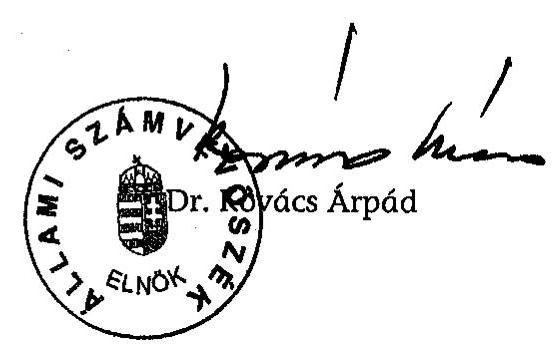

| Melléklet: | 9 db | 13 lap |
| :-- | :-- | :-- |
| Függelék: | 5 db | 4 lap |

---

Környezetvédelmi és Vizügyi Minisztérium

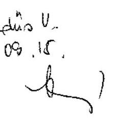

ATM-5325/2005
v-18-02/2004-05

1. sz. melléklet
a V-18-022/2004-2005. számú jelentéshez

MAGYAR KÖZTÁRSASÁG
KÖRNYEZETVÉDELMI ÉS VIZÜGYI MINISZTERE 2322/05.

FkF-348/4/05

Dr. Kovács Árpád úrnak, elnök

Állami Számvevőszék

Budapest

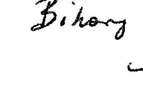

Bikany u.

09.14.

Papj lured 09.14

Tisztelt Elnök Úr!

Köszönettel megkaptam a magyar-osztrák-szlovén határ menti térség környezet- és természetvédelmének ellenőrzéséről készült jelentést, amelynek megállapításokkal teljes egészében egyetértek, észrevételt nem teszek.

Budapest, 2005. szeptember „5."

Tisztelettel

Dr. Persányi Mifjós

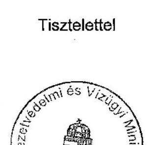

1011 Budapest, Fő utca 44-50.
1394 Budapest, Pt. 351.

telefon: 457 3300
telefax: 201 3134

---

A Nyugat-Dunántúli Környezetvédelmi Felügyelőség adatai

# A vizsgált régióban kezdeményezett hatósági intézkedések és bírságok

2000-2004. években Levegőtisztaság-védelmi szempontból panaszbejelentés kivizsgálása, kötelezés a térségben nem volt, bírság az alábbiak szerint.

A vizsgált régióban kezdeményezett hatósági intézkedések - 2000. évben

|  Intézkedés helye (település, földrajzi hely, objektum) | Intézkedés oka | Intézkedés módja | Hányadik esetben került sor intézkedésre | Bírság összege
$(\mathrm{Ft})$ | Intézkedés eredménye  |
| --- | --- | --- | --- | --- | --- |
|  Körmend
(Dr.Batthyány-
Strattman u. 9.)
MSC Hungary Kft.
(cipőüzem) | Légszennyezés mértéke éves bejelentés alapján túllépés mutatkozott a P1(kén-dioxid), P3, P9 (aceton, etil-acetát), P7, P8, P10, (aceton, metil-etil keton, etilacetát), P13, (aceton), P15 (etil-acetát) jelű pontforrások esetében | éves légszennyezési bírság kiszabása | éves bírság az előző év kibocsátásai alapján | 49.000 |   |

A vizsgált régióban kezdeményezett hatósági intézkedések - 2001. évben

|  Intézkedés helye (település, földrajzi hely, objektum) | Intézkedés oka | Intézkedés módja | Hányadik esetben került sor intézkedésre | Bírság összege
$(\mathrm{Ft})$ | Intézkedés eredménye  |
| --- | --- | --- | --- | --- | --- |
|  Körmend
(Dr.Batthyány-
Strattman u. 9.)
MSC Hungary Kft.
(cipőüzem) | Légszennyezés mértéke éves bejelentés alapján túllépés mutatkozott a P1(kén-dioxid), P3, P7, P8, P9, P10, (aceton, etil-acetát), P13 (aceton, metil-etil keton, | éves légszennyezési bírság határozat kiszabása | éves bírság az előző év kibocsátásai alapján | 52.000 |   |

---

|   | etil-acetát), P15 (etilacetát) jelű pontforrások esetében |  |  |  |   |
| --- | --- | --- | --- | --- | --- |
|  Rábagyarmat
(Kocsis L. u. 13.)
Vasi Épkoll Kft.
(faipari üzem) | zajvédelmi panasz | zajvédelmi szakvélemény benyújtását írtuk elő a határértékek teljesülésének igazolására | első | - | zajmérési jegyzőkönyv benyújtásra került  |

A vizsgált régióban kezdeményezett hatósági intézkedések - 2002. évben

|  Intézkedés helye (település, földrajzi hely, objektum) | Intézkedés oka | Intézkedés módja | Hányadik esetben került sor intézkedésre | Bírság összege
(Ft) | Intézkedés eredménye  |
| --- | --- | --- | --- | --- | --- |
|  Körmend
(Rákóczi u. 46.)
Alcufer Kft.
(fémhulladékgyűjtés) | Hulladékégetési tevékenységgel okozott légszennyezés (panaszbejelentés) | hatósági ellenőrzés, eseti légszennyezési bírság kiszabása | első | 250.000 | hulladékégetés megszűntetése  |
|  Körmend
(Dr.Batthyány-
Strattman u. 9.)
MSC Hungary Kft.
(cipőüzem) | Légszennyezés mértéke éves bejelentés alapján túllépés mutatkozott a P1(kén-dioxid), P7, P8, P9, P14 (aceton, etilacetát) P3, P10, P13 (aceton, metil-etil keton, etil-acetát), P15 (etil-acetát) jelű pontforrások esetében | éves légszennyezési bírság kiszabása | éves bírság az előző év kibocsátásai alapján | 54.000 |   |
|  Körmend
(Rákóczi u. 154.)
Olyp Hungary Kft.
(cipőüzem) | Légszennyezés mértéke éves bejelentés alapján túllépés mutatkozott P007, P008, P009, P010 (aceton, etil- | éves légszennyezési bírság kiszabása | éves bírság az előző év kibocsátásai alapján | 11.000 |   |

---

|   | acetát) pontforrásokon |  |  |  |   |
| --- | --- | --- | --- | --- | --- |
|  Körmend
(Sport u. 2.)
Babati és Társa Kft.
(hűsfeldolgozóüzem) | A bejelentésre kötele-
zett helyhez kötött
pontforrás üzemeltetö-
je a jogszabályban
előirt adatszolgáltatási
kötelezettségét nem
teljesítette | eseti légszennyezési
bírság kiszabása
kötelezés adatszolgál-
tatás elvégzésére | első | 75.000 | levegőtisztaság-
védelmi alapbejelentés
benyújtása felügyelö-
ségünkre  |
|  Szentgotthárd
(1408/1 hrsz.)
Lurotex Kft.
(textilipari üzem) | kommunális hulladék
és ipari hulladékégetés
(panaszbejelentés) | hatósági ellenőrzés,
eseti légszennyezési
bírság kiszabása | első | 300.000 | hulladékégetés meg-
szűntetése  |

# A vizsgált régióban kezdeményezett hatósági intézkedések - 2003. évben

|  Intézkedés helye (település, földrajzi hely, objektum) | Intézkedés oka | Intézkedés módja | Hányadik esetben került sor intézkedésre | Bírság összege (Ft) | Intézkedés eredménye  |
| --- | --- | --- | --- | --- | --- |
|  Szentgotthárd
(Kossuth L.u. 18.)
Steiner Sturm Kft.
(fémipari üzem) | Levegőtisztaság - és zajvédelmi szempontú panaszbejelentés | mérés előírása | első | - | mérési jegyzőkönyvek beküldése  |
|  Rábagyarmat
(Kocsis L. u. 13.)
Vasi Épkoll Kft
(faipari üzem) | Tervezett hatósági zajmérés | ellenőrző
zajmérés
zajbírság | hatósági
(túllépés)- | második | 80.665  |

---

A vizsgált régióban kezdeményezett hatósági intézkedések - 2004. évben

|  Intézkedés helye (település, földrajzi hely, objektum) | Intézkedés oka | Intézkedés módja | Hányadik esetben került sor intézkedésre | Bírság összege (Ft) | Intézkedés eredménye  |
| --- | --- | --- | --- | --- | --- |
|  Szentgotthárd (Hunyadi u. 33.)
Lurotex Textilipari Kft.
(textilipari üzem) | Légszennyezés mértéke éves bejelentés alapján túllépés mutatkozott a P4 (kén-dioxid) pontforrásnál | éves légszennyezési bírság kiszabása | éves bírság az előző év kibocsátásai alapján | 245.725 |   |

---

A Nyugat-Dunántúli Környezetvédelmi Felügyelőség adatai

# A vizsgált régióban kezdeményezett hatósági intézkedések.

A 2000. évben (1999. évre) kivetett szennyvízbírságok

|  Intézkedés helye (település, földrajzi hely, objektum) | Intézkedés oka | Intézkedés módja | Hányadik esetben került sor intézkedésre | Bírság összege Ft  |
| --- | --- | --- | --- | --- |
|  Csákánydoroszló-Ivánc községi szennyvíztisztító | határértéket meghaladó vízszennyezés | helyszíni ellenőrzések szennyvízbírság | negyedik | 49600  |
|  Hegyhátszentjakab községi szennyvíztisztító | határértéket meghaladó vízszennyezés | helyszíni ellenőrzések szennyvízbírság | negyedik | 179869  |
|  Körmend
városi szennyvíztisztító | határértéket meghaladó vízszennyezés | helyszíni ellenőrzések szennyvízbírság | huszonötödik | 1845784  |
|  Szentgotthárd Lurotex Kft | határértéket meghaladó vízszennyezés | helyszíni ellenőrzések szennyvízbírság | harmadik | 58169  |
|  Szentpéterfa
községi szenyyvíztisztító | határértéket meghaladó vízszennyezés | helyszíni ellenőrzések szennyvízbírság | negyedik | 24837  |
|  Zalalövő
községi szennyvíztisztító | határértéket meghaladó vízszennyezés | helyszíni ellenőrzések szennyvízbírság | tizenkilencedik | 341561  |

A 2001. évben (2000. évre) kivetett szennyvízbírságok

|  Intézkedés helye (település, földrajzi hely, objektum) | Intézkedés oka | Intézkedés módja | Hányadik esetben került sor intézkedésre | Bírság összege Ft  |
| --- | --- | --- | --- | --- |
|  Csákánydoroszló-Ivánc községi szennyvíztisztító | határértéket meghaladó vízszennyezés | helyszíni ellenőrzések szennyvízbírság | ötödik | 102945  |
|  Hegyhátszentjakab községi szennyvíztisztító | határértéket meghaladó vízszennyezés | helyszíni ellenőrzések szennyvízbírság | ötödik | 163440  |
|  Körmend
városi szennyvíztisztító | határértéket meghaladó vízszennyezés | helyszíni ellenőrzések szennyvízbírság | huszonhatodik | 2018613  |

---

|  Szentpéterfa
községi szenyyvízisztító | határértéket meghala-
dó vízszennyezés | helyszíni ellenőrzések
szennyvízbírság | ötödik | 166086  |
| --- | --- | --- | --- | --- |
|  Zalalövő
községi szennyvíztisztító | határértéket meghala-
dó vízszennyezés | helyszíni ellenőrzések
szennyvízbírság | huszadik | 143000  |

A 2002. évben (2001-re) kivetett szennyvízbírságok

|  Intézkedés helye (település, földrajzi hely, objektum) | Intézkedés oka | Intézkedés módja | Hányadik esetben került sor intézkedésre | Bírság összege Ft  |
| --- | --- | --- | --- | --- |
|  Csákánydoroszló-Ivánc községi szennyvíztisztító | határértéket meghala-
dó vízszennyezés | helyszíni ellenőrzések
szennyvízbírság | hatodik | 656840  |
|  Hegyhátszentjakab
községi szennyvíztisztító | határértéket meghala-
dó vízszennyezés | helyszíni ellenőrzések
szennyvízbírság | hatodik | 197850  |
|  Körmend
városi szennyvíztisztító | határértéket meghala-
dó vízszennyezés | helyszíni ellenőrzések
szennyvízbírság | huszonhetedik | 2411560  |
|  Szentpéterfa
községi szenyyvízisztító | határértéket meghala-
dó vízszennyezés | helyszíni ellenőrzések
szennyvízbírság | hatodik | 345730  |
|  Zalalövő
községi szennyvíztisztító | határértéket meghala-
dó vízszennyezés | helyszíni ellenőrzések
szennyvízbírság | huszonegyedik | 188495  |

A 2003. évben (2002-re) kivetett szennyvízbírságok

|  Intézkedés helye (település, földrajzi hely, objektum) | Intézkedés oka | Intézkedés módja | Hányadik esetben került sor intézkedésre | Bírság összege Ft  |
| --- | --- | --- | --- | --- |
|  Csákánydoroszló-Ivánc községi szennyvíztisztító | határértéket meghala-
dó vízszennyezés | helyszíni ellenőrzések
szennyvízbírság | hetedik | 1620780  |
|  Hegyhátszentjakab községi szennyvíztisztító | határértéket meghala-
dó vízszennyezés | helyszíni ellenőrzések
szennyvízbírság | hetedik | 321175  |
|  Körmend
városi szennyvíztisztító | határértéket meghala-
dó vízszennyezés | helyszíni ellenőrzések
szennyvízbírság | huszonnyolcadik | 2910480  |
|  Szentpéterfa | határértéket meghala- | helyszíni ellenőrzések | hetedik | 159260  |

---

|  községi szenyyvíztszttító | dó vízszennyezés | szennyvízbírság |  |   |
| --- | --- | --- | --- | --- |
|  Zalalövő
községi szennyvíztszttító | határértéket meghala-
dó vízszennyezés | helyszíni ellenőrzések
szennyvízbírság | huszonkettedik | 192500  |

A 2004. évben (2003-ra) kivetett szennyvízbírságok

|  Intézkedés helye (település, földrajzi hely, objektum) | Intézkedés oka | Intézkedés módja | Hányadik esetben került sor intézkedésre | Bírság összege Ft  |
| --- | --- | --- | --- | --- |
|  Csákánydoroszló-Ivánc községi szennyvíztisztító | határértéket meghala-
dó vízszennyezés | helyszíni ellenőrzések
szennyvízbírság | nyolcadik | 1839495  |
|  Hegyhátszentjakab
községi szennyvíztisztító | határértéket meghala-
dó vízszennyezés | helyszíni ellenőrzések
szennyvízbírság | nyolcadik | 448335  |
|  Körmend
városi szennyvíztisztító | határértéket meghala-
dó vízszennyezés | helyszíni ellenőrzések
szennyvízbírság | huszonkilencedik | 4088070  |
|  Szentpéterfa
községi szennyvíztisztító | határértéket meghala-
dó vízszennyezés | helyszíni ellenőrzések
szennyvízbírság | nyolcadik | 159470  |
|  Zalalövő
községi szennyvíztisztító | határértéket meghala-
dó vízszennyezés | helyszíni ellenőrzések
szennyvízbírság | huszonharmadik | 192500  |

---

A Nyugat-dunántúli Környezetvédelmi és Vízügyi Igazgatóság adatai

# A vizsgált régióba jutott források összege és célja

|  Település, földrajzi hely, objektum | Forrás megnevezése | Összege
1000,- Ft-ban | Támogatás célja | Várt eredmény | Cél szerinti teljesülés  |
| --- | --- | --- | --- | --- | --- |
|  Csöde; Felsőjánosfa, Zalalövő | Céltámogatás
Vízügyi célelőirányzat | $\begin{gathered} 170.491 \ 21.500 \end{gathered}$ | Szennyvízcsatorna hálózat építés | Kommunális szennyvíz elvezetése és tisztítása | Befejeződött 2002. február hóban  |
|  Csörötnek; Magyarlak, Rábagyarmat, Rönök,
Vasszentmihály, Rátót, Gasztony | Címzett támogatás
PHARE CBC
Vízügyi célelőirányzat
TTFC
Központi ktsg.vetési tám. | $\begin{gathered} 800.628 \ 270.714 \ 73.559 \ 12.058 \ 118.695 \end{gathered}$ | Szennyvízcsatorna hálózat építés | Kommunális szennyvíz elvezetése és tisztítása | A beruházás folyamatban van, befejezés 2006-ban.  |
|  Alszószölnök, Szakonyfalu | Céltámogatás
PHARE
TTFC
Központi ktsg.vetési tám. | $\begin{gathered} 189.982 \ 54.875 \ 7.349 \ 9.523 \end{gathered}$ |  |  |   |
|  Zalalövő I. ütem;
Zalalövő külső városrészek, Szőce | Céltámogatás
Környezetvédelmi Alap Célelőirányzat | $\begin{gathered} 315.659 \ 50.043 \end{gathered}$ | Szennyvízcsatorna hálózat építés | Kommunális szennyvíz elvezetése és tisztítása | A beruházás folyamatban van, befejezés 2005-ben.  |
|  Zalalövő II. ütem;
Kálócfa, Kozmadombja, Irsapuszta | Céltámogatás
Környezetvédelmi Alap Célelőirányzat | $\begin{gathered} 334.221 \ 106.950 \end{gathered}$ | Szennyvízcsatorna hálózat építés | Kommunális szennyvíz elvezetése és tisztítása | A beruházás folyamatban van, befejezés 2005-ben.  |
|  Pankasz; Viszák, Kisrákos | Céltámogatás
Vízügyi célelőirányzat
TTFC
Területfejlesztési kiegyenlítő támogatás | $\begin{gathered} 341.568 \ 56.928 \ 57.119 \ 20.000 \end{gathered}$ | Szennyvízcsatorna hálózat építés | Kommunális szennyvíz elvezetése és tisztítása | A beruházás folyamatban van, befejezés 2005-ben.  |
|  Bajánsenye;
Kercaszomor | PHARE
KÖVICE támogatás
TRFC | $\begin{gathered} 303.649 \ 92.013 \ 57.647 \end{gathered}$ | Szennyvízcsatorna hálózat építés | Kommunális szennyvíz elvezetése és tisztítása | A beruházás folyamatban van, befejezés 2006-ban.  |
|  Kétvölgy | Területfejlesztési támogatás
Vízügyi célelőirányzat | $\begin{gathered} 22.406 \ 17.926 \end{gathered}$ | Ivóvizhálózat bővítés | 60 fő, állandó lakos, vezetékes ivóvíz ellátá- | Befejeződött 2002. évben  |

---

|   |  |  |  | sa |   |
| --- | --- | --- | --- | --- | --- |
|  Felsőszölnök | KÖVICE támogatás | 71.502 | Ivóvízhálózat bővítés | $\begin{aligned} & \text { Kakasdomb } \ & \text { és } \ & \text { Jánoshegy település- } \ & \text { rész, } 69 \text { db ingatlan, } \ & \text { vezetékes ivóvíz ellátá- } \ & \text { sa } \end{aligned}$ | Várható befejezés 2005. évben  |
|  Csesztreg | Területfejlesztési tám.
Vízügyi cálelőirányzat | $\begin{gathered} 24.000 \ 24.000 \end{gathered}$ | Kistározó tó építés | 100000 m³-es víztározó kialakítása, a Csesztregélő Történelmi Akvapark területén | Befejezés éve 2002.  |
|  Körmend | KvVM vízbázisvédelmi célprogram | $\begin{gathered} \text { ㄷ } 35620 \ \text { 2000 évben: } 7399 \end{gathered}$ | Ivóvízbázis védőterületének meghatározása | Védőterület meghatározásra került | Teljesült: 1997-2000  |
|  Zalalövő | KvVM vízbázisvédelmi célprogram | 28658 | Ivóvízbázis védőterületének meghatározása | Védőterület meghatározásra került | Teljesült: 2000-2002  |
|  Szentgotthárd | KvVM vízbázisvédelmi célprogram | $\begin{gathered} 28991 \ \text { ebből kifizetve: } 6989 \end{gathered}$ | Ivóvízbázis védőterületének meghatározása | I. ütem lezárult | Beruházás folyamatban: 2003-2005  |
|  Pinkamindszent, Pinka vízfolyás, mederrendezés | Kormányzati beruházás | 23.880 | Lefolyási viszonyok javítása | A község biztonságának növekedése | A rendezés óta az árhullámok a mederben vonultak le.  |
|  Szentpéterfa, Pinka vízfolyás, mederrendezés | Kormányzati beruházás | 152.119 | Árvízvédelem | A község biztonságának növekedése | A beruházás terv szerint megvalósult  |
|  Alsószenterzsébet, Kerka vízfolyás, tározó | Kormányzati beruházás | 397.000 | Árvízvédelem | Csökkennek az elöntések a térségben | Befejezés 2005 év-ben  |
|  Bajánsenye, Kerka vízfolyás, mérőszelvény, deponia, mederrendezés | Kormányzati beruházás | 16.309 | Monitoring kiépítése, lefolyás javítása | Jobb árvizi előrejelzés, biztonság növelés | A mérőállomás müködik, a létesítménynek üzemeltetési engedélye van.  |
|  *Nagyrákos,
Óriszentpéter, Szalafó, Zala vízminőségi kárelháritási terve | Kormányzati beruházás | 5.500 | A törvényi előírás teljesítése | Jobb felkészültség a felszíni vizek szennyezésének elhárításában | A törvényi előírás szerint valósult meg  |
|  Vasszentmihály, Rönök, Jakabháza, Láhn-patak geodéziai felmérése | Kormányzati beruházás | 3.500 | LIFE pályázat előkészítése | Tudjuk tartani az EU által előírt határidőt | A felmérés kész van.  |

---

|  *Kerkakutas,
Kerkáskápolna,
Bajánsenye, Kerka
vízfolyás vízminőségi
kárelháritási terv | Kormányzati beruházás | 4.500 | A törvényi előírás teljesítése | Jobb felkészültség a felszíni vizek szennyezésének elhárításában | A törvényi előírás szerint valósult meg  |
| --- | --- | --- | --- | --- | --- |
|  Vasszentmihály árvízvédelmi töltés | PHARE | 84.103 | árvízvédelem | Vasszentmihály árvízvédelmének megoldása | Töltések terv szerint megépültek, az árvízvédelem megvalósult  |
|  Vasszentmihály árvízvédelmi töltés | Kormányzati beruházás | 91.715 | árvízvédelem | Vasszentmihály árvízvédelmének megoldása | Töltések terv szerint megépültek, az árvízvédelem megvalósult  |
|  Szentgotthárd Lapincs árapasztó vápa | PHARE | 327.842 | árvízvédelem | Sztg.város árvízvédelmének megoldása | A vápa és a töltések terv szerint megépültek az árvízvédelem megvalósult  |
|  Szentgotthárd Lapincs árapasztó vápa | Kormányzati beruházás | 242.203 | árvízvédelem | Sztg.város árvízvédelmének megoldása | A vápa és a töltések terv szerint megépültek az árvízvédelem megvalósult  |
|  * Rába folyógazdálkodási tervezés Győr-Alsószölnök | Kormányzati beruházás | 51.450 | vízkeret irányelv végrehajtása | vízgyűjtő terület gazdálkodás az érintettek bevonásával | A tervezés folyamatban van, befejezés 2007-ben  |

- A beruházási munka1/4 része érinti a vizsgált területet.

---

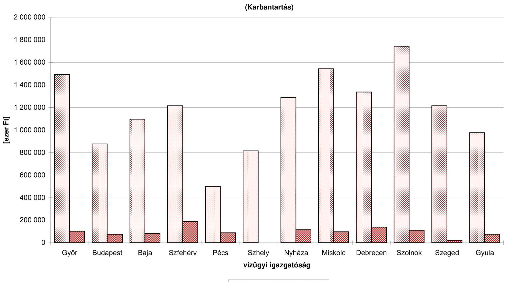

# A normatív költségszükséglet és az 2005. évi ellátmány viszonya

## (Karbantartás)

|  Győr | Budapest | Bája | Szfehérv | Pécs | Szhely | Nyháza | Miskolc | Debrecen | Szolnok | Szeged | Gyula  |
| --- | --- | --- | --- | --- | --- | --- | --- | --- | --- | --- | --- |
|  |   |   |   |   |   |   |   |   |   |   |   |

© Karb. (norm) © Karb. (2005)

---

|  TELEPÜLÉS NEVE | szv csatorna | év | Szv. tisztító | Lakosok száma összesen: | Lakosok száma összesen: | Lakosok száma összesen: | Éllőzőtáza a rendelkezésre álló víz | Éllőzőtáza a rendelkezésre álló víz | Éllőzőtáza a fényi feladatlanulás  |
| --- | --- | --- | --- | --- | --- | --- | --- | --- | --- |
|  Alsószenterzsébet | nincs |  | nincs | 92 | 40 | 40 | 3,10 | 3,00 | 0,10  |
|  Alsószólnők | folyamatban |  | nincs | 418 | 168 | 137 | 10,77 | 9,89 | 0,88  |
|  Apátistvánfalva | nincs |  | nincs | 400 | 153 | 147 | 12,04 | 9,74 | 2,30  |
|  Bajánsenye | nincs |  | nincs | 558 | 242 | 242 | 22,69 | 17,65 | 5,04  |
|  Csákánydoroszló | van | 0 | nincs | 1785 | 571 | 503 | 77,07 | 48,09 | 28,98  |
|  Csesztreg | van | 2001 | nincs | 854 | 350 | 332 | 38,40 | 30,20 | 8,20  |
|  Csöde | van | 2001 | nincs | 90 | 53 | 42 | 6,20 | 4,90 | 1,30  |
|  Csörötnek | folyamatban |  | nincs | 935 | 333 | 333 | 25,91 | 22,51 | 3,40  |
|  Daraboshegy | nincs |  | nincs | 105 | 61 | 61 | 3,26 | 3,18 | 0,08  |
|  Egyházasrádóc | nincs |  | van | 1355 | 500 | 477 | 39,13 | 32,12 | 7,01  |
|  Felsőjánosfa | van | 2001 | nincs | 213 | 84 | 87 | 6,20 | 5,10 | 1,10  |
|  Felsőmarac | nincs |  | nincs | 317 | 189 | 189 | 14,04 | 10,88 | 3,16  |
|  Felsőszenterzsébet | nincs |  | nincs | 16 | 14 | 14 | 1,90 | 1,00 | 0,90  |
|  Felsőszólgók | nincs |  | nincs | 659 | 298 | 189 | 12,60 | 11,62 | 0,98  |
|  Gasztony | folyamatban |  | nincs | 487 | 204 | 204 | 19,72 | 13,71 | 6,01  |
|  Halogy | nincs |  | nincs | 311 | 144 | 143 | 9,11 | 8,99 | 0,12  |
|  Harasztifalu | nincs |  | nincs | 181 | 81 | 82 | 5,47 | 5,34 | 0,13  |
|  Hegyhátszentjakab | van | 0 | van | 294 | 158 | 155 | 13,40 | 10,09 | 3,31  |
|  Hegyhátszentmárton | nincs |  | nincs | 71 | 54 | 46 | 3,11 | 2,43 | 0,68  |
|  Ispánk | van | 2004 | van | 111 | 51 | 51 | 6,46 | 5,63 | 0,83  |
|  Ivánc | van | 0 | van | 709 | 233 | 220 | 38,84 | 14,31 | 24,53  |
|  Kemestaródfa | nincs |  | nincs | 238 | 115 | 112 | 6,74 | 6,34 | 0,40  |
|  Kercaszomor | nincs |  | nincs | 228 | 113 | 113 | 8,96 | 8,30 | 0,66  |
|  Kerkafalva | nincs |  | nincs | 129 | 77 | 69 | 6,00 | 5,70 | 0,30  |
|  Kerkakutas | nincs |  | nincs | 150 | 96 | 87 | 4,40 | 4,30 | 0,10  |
|  Kerkáskápolna | nincs |  | nincs | 108 | 56 | 56 | 2,67 | 2,59 | 0,08  |
|  Kétvölgy | nincs |  | nincs | 138 | 68 | 66 | 4,51 | 4,36 | 0,15  |

---

|  Kísrákos | nincs |  | nincs | 234 | 98 | 98 | 8,46 | 7,40 | 1,06  |
| --- | --- | --- | --- | --- | --- | --- | --- | --- | --- |
|  Kondorfa | nincs |  | nincs | 642 | 295 | 289 | 17,40 | 15,20 | 2,20  |
|  Kozmadombja | nincs |  | nincs | 55 | 33 | 30 | 2,10 | 2,10 | 0,00  |
|  Körmend | van | 0 | van | 12535 | 4785 | 4639 | 621,85 | 445,76 | 176,09  |
|  Magyarföld | nincs |  | nincs | 34 | 23 | 23 | 1,93 | 1,90 | 0,03  |
|  Magyarlak | nincs |  | nincs | 781 | 294 | 296 | 26,39 | 21,76 | 4,63  |
|  Magyarnádalja | nincs |  | nincs | 192 | 78 | 71 | 6,97 | 6,85 | 0,12  |
|  Magyarszombatfa | nincs |  | nincs | 294 | 148 | 135 | 10,97 | 7,69 | 3,28  |
|  Nagykölked | nincs |  | nincs | 152 | 69 | 63 | 3,79 | 3,25 | 0,54  |
|  Nagyrákos | nincs |  | nincs | 319 | 147 | 140 | 13,62 | 12,42 | 1,20  |
|  Nemesmedves | nincs |  | nincs | 20 | 11 | 11 | 1,14 | 0,49 | 0,65  |
|  Orfalu | nincs |  | nincs | 65 | 29 | 28 | 2,10 | 2,07 | 0,03  |
|  Örimagyarosd | nincs |  | nincs | 258 | 115 | 114 | 10,80 | 9,56 | 1,24  |
|  Öriszentpéter | van | 2002 | van | 1309 | 500 | 486 | 67,60 | 45,48 | 22,12  |
|  Pinkamindszent | nincs |  | nincs | 147 | 107 | 105 | 4,96 | 4,86 | 0,10  |
|  Rábagyarmat | nincs |  | nincs | 886 | 305 | 305 | 30,48 | 26,98 | 3,50  |
|  Rábatófalu | nincs |  | nincs |  |  |  |  |  |   |
|  Rádóckölked | nincs |  | nincs | 278 | 124 | 128 | 9,32 | 8,16 | 1,16  |
|  Ramocsa | nincs |  | nincs |  |  |  |  |  |   |
|  Rátót | folyamatban |  | nincs | 259 | 98 | 99 | 10,18 | 7,19 | 2,99  |
|  Rönök | nincs |  | nincs | 494 | 162 | 119 | 18,58 | 9,87 | 8,71  |
|  Senyeháza | nincs |  | nincs | 704 | 217 | 216 | 17,40 | 16,80 | 0,60  |
|  Szaknyér | nincs |  | nincs | 73 | 38 | 38 | 2,81 | 2,69 | 0,12  |
|  Szakonyfalu | nincs |  | nincs | 369 | 136 | 112 | 10,14 | 9,46 | 0,68  |
|  Szalafő | van | 2004 | nincs | 237 | 139 | 140 | 14,38 | 11,14 | 3,24  |
|  Szatta | nincs |  | nincs | 79 | 36 | 37 | 3,53 | 3,45 | 0,08  |
|  Szentgotthárd | van | 2002 | nincs | 9056 | 3151 | 3101 | 453,31 | 282,94 | 170,37  |
|  Szentgyörgyvölgy | nincs |  | nincs | 485 | 236 | 181 | 21,00 | 15,20 | 5,80  |
|  Szentpéterfa | van | 2002 | van | 1049 | 369 | 367 | 38,99 | 33,74 | 5,25  |
|  Szőce | van | 0 | nincs | 424 | 213 | 204 | 15,01 | 13,83 | 1,18  |
|  Vasalja | nincs |  | nincs | 341 | 142 | 132 | 12,46 | 11,79 | 0,67  |
|  Vasszentmihály | nincs |  | nincs | 379 | 166 | 155 | 11,51 | 10,80 | 0,71  |
|  Viszák | nincs |  | nincs | 287 | 125 | 118 | 9,05 | 7,93 | 1,12  |
|  Zalalövő | van | 2002 | van | 3258 | 1229 | 1201 | 142,50 | 119,10 | 23,40  |

---

# Felszíni vizek minősítése MSZ 12749 szerint a törzshálózati helyeken (2003)

|  Állomás |  | Mintavételi hely | Mintavétel
gyakorísága |  | Vízminőségi osztály |  |  |  |  |  |   |
| --- | --- | --- | --- | --- | --- | --- | --- | --- | --- | --- | --- |
|  kód | jelleg | megnevezése | általános | Mikro-
biológiai | A csoport | B csoport | C csoport | $\begin{gathered} \mathrm{D}_{1} \ \text { alcsop. } \end{gathered}$ | $\begin{gathered} \mathrm{D}_{2} \ \text { alcsop. } \end{gathered}$ | $\begin{gathered} \mathrm{D}_{3} \ \text { alcsop. } \end{gathered}$ | $\begin{gathered} \mathrm{E} \ \text { csoport } \end{gathered}$  |
|  Rába vízgyűjtő |  |  |  |  |  |  |  |  |  |  |   |
|  06FF08 | országos | Rába, Szentgotthárd | 50 | 22 | IV. | IV. | IV. | III. | III. | I. | III.  |
|  06FF30 | regionális | Rába, Csörötnek | 51 | 3 | III. | IV. | II. | III. | III. | - | II.  |
|  06FF11 | országos | Rába, Rum | 49 | 24 | III. | IV. | IV. | III. | IV. | II. | III.  |
|  06FF07 | országos | Lapincs, Szentgotthárd | 50 | 24 | III. | III. | IV. | III. | IV. | II. | III.  |
|  06FF06 | országos | Pinka, Felsőcsatár | 25 | 13 | III. | III. | III. | II. | IV. | II. | II.  |
|  06FF02 | országos | Gyöngyös patak, Köszeg | 25 | 24 | II. | II. | IV. | II. | III. | I. | II.  |
|  06FF04 | országos | Gyöngyös-Sorok, Sorokpolány | 25 | 11 | III. | V. | IV. | II. | III. | III. | III.  |
|  Zala-Balaton-vízgyűjtő |  |  |  |  |  |  |  |  |  |  |   |
|  06FF34 | országos | Zala, Andráshída | 51 | 23 | IV. | III. | IV. | II. | IV. | I. | II.  |
|  Mura vízgyűjtő |  |  |  |  |  |  |  |  |  |  |   |
|  06FF22 | regionális | Kerka, Dobri | 26 | 1 | III. | III. | IV. | II. | III. | - | II.  |

Jelmagyarázat: A csoport: oxigénháztartás jellemzői B csoport: N és P háztartás jellemzői C csoport: mikrobiológiai jellemzők $\mathrm{D}_{1}$ alcsoport: szervetlen mikroszennyezők $\mathrm{D}_{2}$ alcsoport: szerves mikroszennyezők $\mathrm{D}_{4}$ alcsoport: radioaktív anyagok E csoport: egyéb jellemzők I. osztály: kiváló víz II. osztály: jó víz III. osztály: türhető víz IV. osztály: szennyezett víz V. osztály: erősen szennyezett víz

---

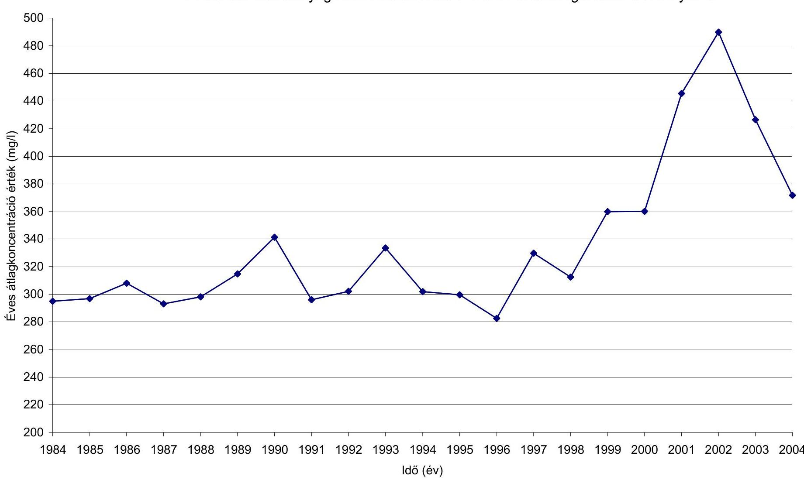

# Az összes oldott anyag koncentráció változása a Rába Szentgotthárdi szelvényében

|  1984 | 1985 | 1986 | 1987 | 1988 | 1989 | 1990 | 1991 | 1992 | 1993 | 1994 | 1995 | 1996 | 1997 | 1998 | 1999 | 2000 | 2001 | 2002 | 2003 | 2004  |
| --- | --- | --- | --- | --- | --- | --- | --- | --- | --- | --- | --- | --- | --- | --- | --- | --- | --- | --- | --- | --- |
|  Idő (év) | 200 | 200 | 200 | 200 | 200 | 200 | 200 | 200 | 200 | 200 | 200 | 200 | 200 | 200 | 200 | 200 | 200 | 200 | 200 | 200  |

---

A BM "Települési hulladék közszolgáltatás fejlesztéseinek támogatása" előirányzatából támogatást kapott települések (2002-2004)

|   | 2002 Kapott támogatás Ft | 2003 Kapott támogatás Ft | 2004 kapott támogatás Ft | összesen  |
| --- | --- | --- | --- | --- |
|  Alsószólnök | 844000 | 0 |  | 844000  |
|  Bajánsenye | 828000 | 0 |  | 828000  |
|  Csörötnek | 1048000 | 963000 |  | 2011000  |
|  Egyházasradóc | 0 | 787000 |  | 787000  |
|  Felsőmarác | 518000 | 0 |  | 518000  |
|  Gasztony | 587000 | 722000 |  | 1309000  |
|  Harasztifalu | 0 | 433000 |  | 433000  |
|  Hegyhátszentmárton | 193000 | 0 |  | 193000  |
|  Ispánk | 0 | 240000 |  | 240000  |
|  Ivánc | 518000 | 0 |  | 518000  |
|  Kemestaródfa | 315000 | 0 |  | 315000  |
|  Kisrákos | 314000 | 241000 |  | 555000  |
|  Kondorfa | 0 | 481000 |  | 481000  |
|  Körmend | 0 | 3609000 |  | 3609000  |
|  Magyarlak | 755000 | 963000 |  | 1718000  |
|  Magyarszombatfa | 0 | 345000 |  | 345000  |
|  Nagykölked | 0 | 433000 |  | 433000  |
|  Nagyrákos | 0 | 241000 |  | 241000  |
|  Öriszentpéter | 0 | 963000 |  | 963000  |
|  Rábagyarmat | 0 | 963000 |  | 963000  |
|  Rádóckölked | 0 | 433000 |  | 433000  |
|  Rátót | 0 | 241000 |  | 241000  |
|  Rönök | 0 | 525000 |  | 525000  |
|  Szakonyfalu | 844000 | 0 |  | 844000  |
|  Szalafő | 0 | 241000 |  | 241000  |
|  Szatta | 120000 | 0 |  | 120000  |
|  Szentgotthárd | 0 | 1650000 |  | 1650000  |
|  Szentgyörgyvölgy | 914000 | 0 |  | 914000  |
|  Vasszentmihály | 0 | 482000 |  | 482000  |
|  Velemér | 0 | 172000 |  | 172000  |
|  Viszák | 0 | 241000 |  | 241000  |
|  Zalalövő | 7247000 | 1313000 |  | 8560000  |
|  Összesen | 15045000 | 16682000 |  | 31727000  |

---

# A korábbi számvevőszéki javaslatok teljesítése 

## Jelentés a Környezetvédelmi Minisztérium fejezet múködésének ellenőrzéséről (2002)

## a Kormánynak:

gondoskodjon a természet védelméről szóló 1996. évi LIII. törvényben foglaltaknak megfelelően, a természeti értékek megóvásával összefüggésben felmerülő állami kötelezettséget meghatározó kormányrendelet kiadásáról;
és
Jelentés a Fertő tó térség természetvédelmének ellenőrzéséről (2003)

## a Kormánynak

készítse elő és adja ki a természet védelmét szolgáló támogatásokról, valamint az egyes kártalanítási szabályokról szóló kormányrendeletet;

A Kormány a természet védelmét szolgáló egyes támogatásokra, valamint kártalanításra vonatkozó részletes szabályokról szóló 276/2004. (X. 8.) Kormányrendelet kiadásával a 2002. évi és a 2003. évi ÁSZ javaslatot teljesítette.

## Jelentés a Környezetvédelmi Minisztérium fejezet múködésének ellenőrzéséről (2002)

## a környezetvédelmi miniszternek:

intézkedjen a Védett Természeti Területek Törzskönyvének elkészítéséről, a védett területekre vonatkozó vagyonkezelési koncepció és szakmai irányelvek kiadásáról;

A védett természeti területek törzskönyvi nyilvántartási rendszerének szoftverét a Természetvédelmi Hivatal ellenőriztette. A rendszert 2003. évben tesztelték, az elkészült modul megfelelt az alapadatok bevitelére, de a törzskönyv tartalmi megjelenítéséhez szükség volt még az alapadatokat összeillesztő, csatlakoztató és megjelenítő második modulra, amelynek kidolgozása 2004. évre áthúzódott. Ebben az évben a rendszer kidolgozása befejeződött és megkezdték az adatok felvitelét.
követelje meg, különösen a vagyonkezelésbe vett védett területek, valamint egyéb vagyontárgyak nyilvántartása, leltározása terén tapasztalt, a számviteli előírásokkal ellentétes gyakorlat megszüntetését.

A tárgyi eszközök, ezen belül a védett természeti területek analitikus nyilvántartásának rendjére vonatkozó iránymutatást a Minisztérium a nemzeti park igazgatóságok részére 2003. március hóban kiadta.

---

A Minisztérium Ellenőrzési Főosztálya a számviteli nyilvántartások szabályszerűségének, valamint a leltározás rendjének betartását az ellenőrzési munkatervbe beépítette és azt az átfogó vizsgálatok keretében ellenőrzi.

# Jelentés a Fertő tó térség természetvédelmének ellenőrzéséről (2003) 

## a Környezetvédelmi és Vízügyi miniszternek

alakítsa ki a természetvédelemre fordított kiadások pontos számbavételének módszerét

A rendszer felépítése a minisztérium területi szervezeteinek gyakori átalakítása miatt húzódik, a gyakorlati alkalmazásához a szakmai és pénzügyi feladatokat együttesen kezelő számítógépes iktatási-pénzügyi rendszer szükséges. A megvalósításhoz a szervezeti és technikai feltételek még nincsenek meg.
biztosítson forrásokat a védett területek természetvédelmét biztosító állami kezelésbe vétel folytatásához;

A miniszter ebben az ügyben az évente rendelkezésre álló központi költségvetési források szabta határokon belül biztosított keretet az elmúlt években. A szűkös központi költségvetési források miatt a földvásárlásokra fordítható pénzeszközök nem növekedtek, így a védendő természeti területek törvény alapján történő állami kezelésbe vétele továbbra is késik, ennek komoly kedvezőtlen hatása lesz, amikor Magyarországon is érvényesíteni kell az EU földvásárlási szabályait, ugyanis ekkor az államnak a várhatóan jelentős mértékű külföldi vásárlóerővel szemben kell(ene) forrásokat biztosítania.
intézkedjen a minisztérium koordinálásában végrehajtott fejlesztések eredményeként létrehozott létesítmények jogszabályoknak megfelelő aktiválásáról.

A Minisztérium az aktiváláshoz az érintett önkormányzatoknak igazolást adott arról, hogy a KvVM az Önkormányzattal kötött támogatási szerződés szerinti fizetési kötelezettségét nem az önkormányzat részére történő átutalással teljesítette, hanem a tájrendezési feladat kivitelezésére közbeszerzési eljárást írt ki. A nyertes vállalkozóval a jóváhagyott terv szerinti kivitelezésre vállalkozási szerződést kötött a KvVM és a vállalkozó által teljesített szolgáltatást a támogatás összegéből fizette ki. Az igazolás mellékletét képezi a banki terhelésekről készült értesítő és a kifizetett számlák másolata. Az igazolás és az átadott dokumentumok alapján az érintett Önkormányzatok a jogszabálynak megfelelően a beruházásokat aktiválni tudják.

## Jelentés a Környezetvédelmi alap célfeladatokra előirányzott pénzeszközök hasznosulásának ellenőrzéséről (2004)

a környezetvédelmi és vízügyi miniszternek

---

gondoskodjon a pénzeszközök pályázatonkénti, ill. jogcímenkénti hasznosulása teljesítményszemléletű értékelés módszerének, évenkénti beszámolási rendszerének teljes körű kialakításáról, és nyilvántartási hátterének kiépítéséről;

A KvVM az ajánlás végrehajtása érdekében a 2004. évi szakmai programok kidolgozásakor felvette a programok közé a 2001. és 2003. év között támogatásban részesített pályázatok hatékonysági ellenőrzésének, illetve az 1996. és 2003. közötti pályázatok hasznosulásának és eredményességének komplex értékelését, összegzését célzó szakértői anyag kidolgozását.

Az évenkénti beszámolási rendszer kialakítása a tárca Fejlesztéspolitikai Főosztályának a feladata. Ennek értelmében a 11/2004. (K.Ért.6) KvVM utasításban rögzítésre került a Fejlesztéspolitikai Főosztály éves tájékoztatási kötelezettsége. A 2003. évi XXIV. Tv. Alapján a KÖVICE felhasználására vonatkozó döntéseket nyilvánosságra kell hozni a KvVM honlapján, amelyhez a szükséges adatokat a nevezett főosztály adja.

---

# A vizsgált régió térképe 

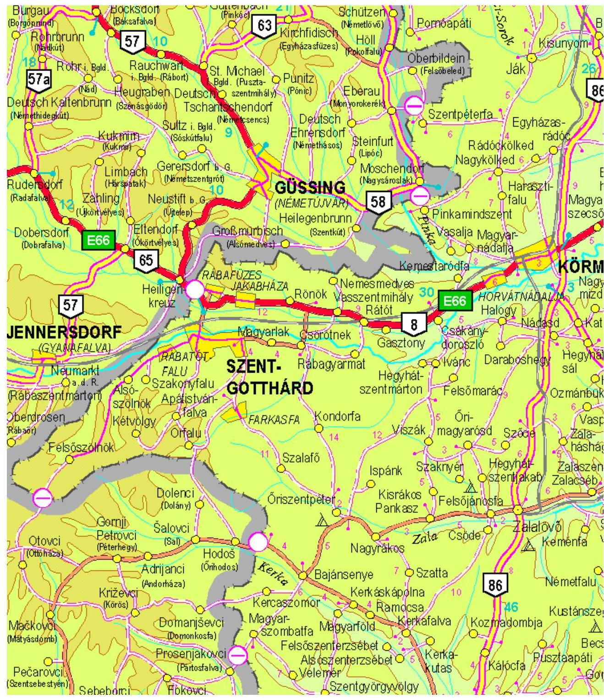

---

# A kiválasztott területen elhelyezkedő települések 

| Alsórönök |
| :-- |
| Alsószenterzsébet |
| Alsószer |
| Alsószölnök |
| Ápátistvánfalva |
| Bajánsenye |
| Csákánydoroszló |
| Csesztreg |
| Csöde |
| Csörgőszer |
| Csörötnek |
| Daraboshegy |
| Dávidháza |
| Egyházasrádóc |
| Farkasfa |
| Felsőberkifalu |
| Felsőjánosfa |
| Felsőmarac |
| Felsőrönök |
| Felsőszenterzsébet |
| Felsőszer |
| Felsőszölgök |
| Gasztony |
| Gödörháza |
| Halogy |
| Harasztifalu |
| Hegyhátszentjakab |
| Hegyhátszentmárton |
| Ispánk |
| Ivánc |
| Jakabháza |
| Kemestaródfa |
| Kerca |
| Kercaszomor |
| Kerkafalva |
| Kerkakutas |
| Kerkáskápolna |
| Kerkaújfalu |
| Kétvölgy |
| Kisrákos |
| Kogyar |
| Kondorfa |
| Kotemány |
| Kozmadombja |
| Körmend |
| Magyarföld |
| Magyarlak |
| Magyarnádalja |
| Magyarszombatfa |
| Nagykölked |
| Nagyrákos |
| Nemesmedves |

---

| Örfalu |
| :-- |
| Örbajánháza |
| Örimagyarosd |
| Öriszentpéter |
| Papkász |
| Papszer |
| Pinkamindszent |
| Pityerszer |
| Rábafüzes |
| Rábagyarmat |
| Rábatótfalu |
| Rádöckölked |
| Ramocsa |
| Rátót |
| Ritkaháza |
| Rönök |
| Senyeháza |
| Szaknyér |
| Szakonyfalu |
| Szalafő |
| Szatta |
| Szentgotthárd |
| Szentgyörgyvölgy |
| Szentpéterfa |
| Szomoróc |
| Szöce |
| Templomszer |
| Vadása |
| Vasalja |
| Vasszentmihály |
| Velemér |
| Viszák |
| Zalamindszent |
| Zalalövő |
| Zsida |
| Zsidahegy |

---

# A vizsgált területen elhelyezkedő vízmérő helyek 

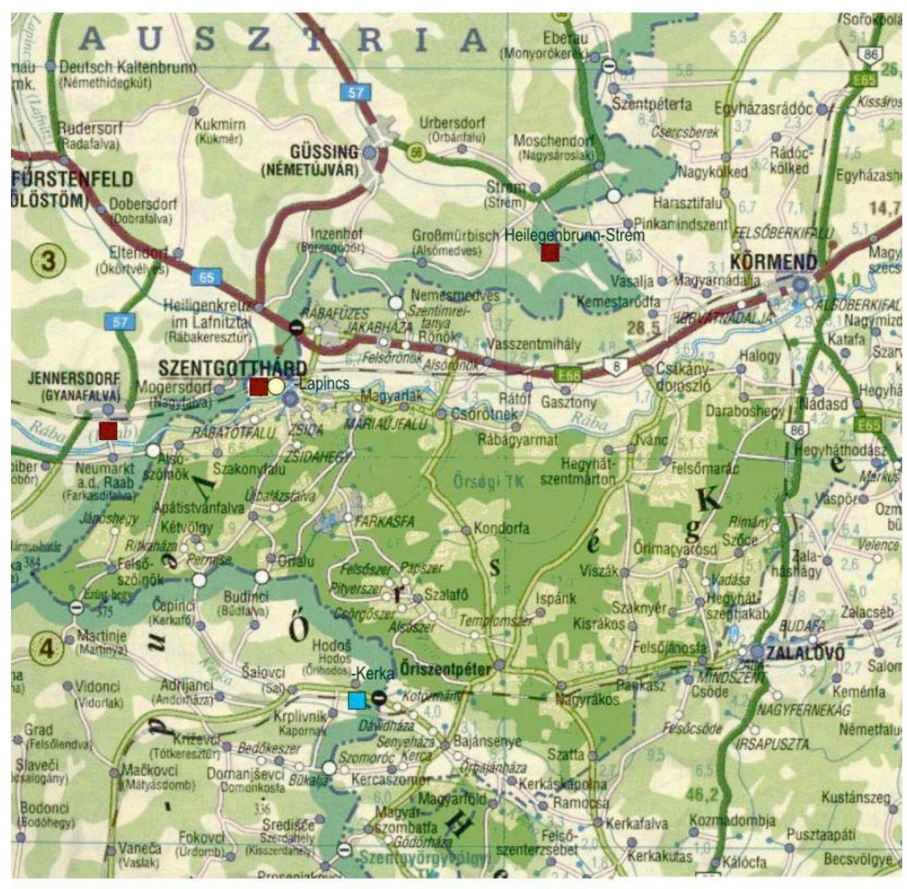

- Osztrák-Magyar Közös Határvíz
- Szlovén-Magyar Közös Határvíz
- Országos Törzshálózat

---

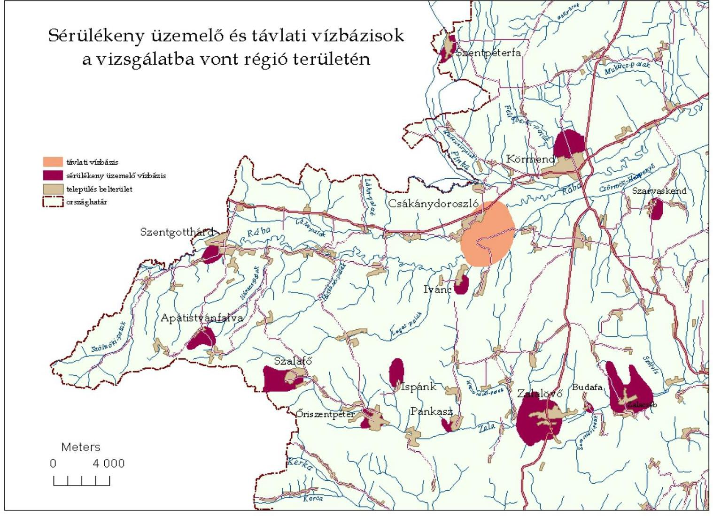

Sérülékeny üzemelő és távlati vízbázisok a vizsgálatba vont régió területén

---

# Az Örségi Nemzeti Park természetvédelmi célú beruházásai 

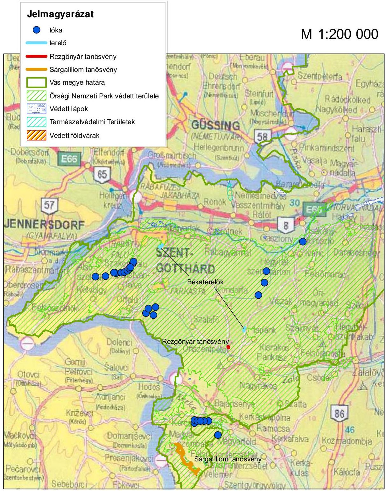