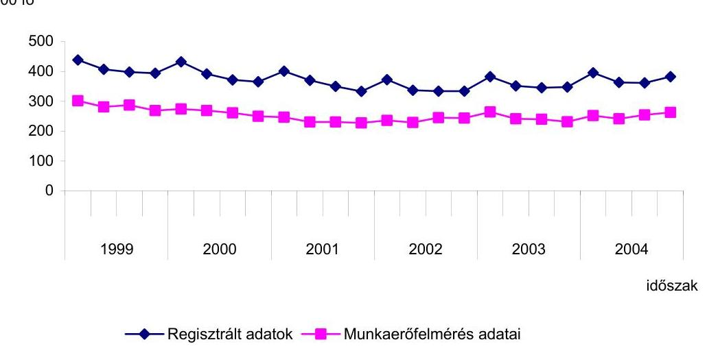
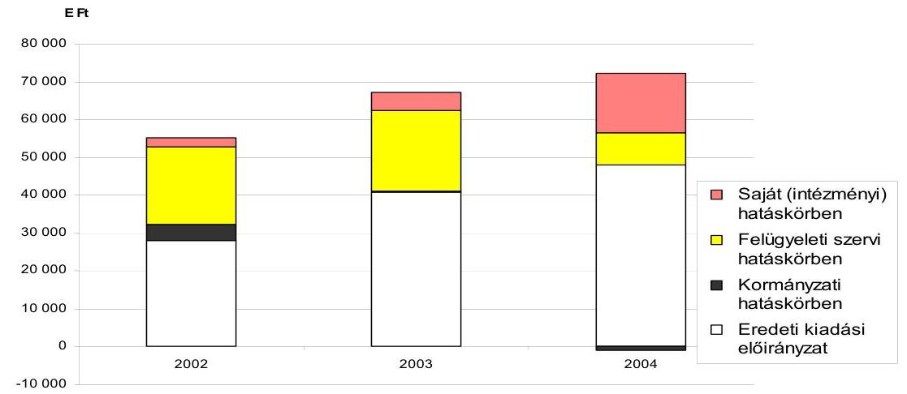
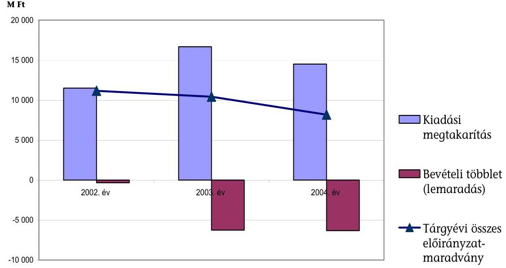
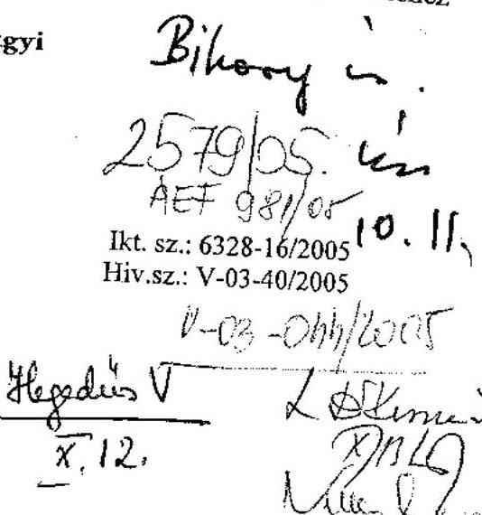
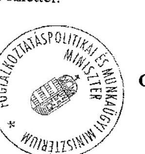

# JELENTÉS 

a Foglalkoztatáspolitikai és Munkaügyi Minisztérium fejezet működésének ellenőrzéséről

---

2. Államháztartás Központi Szintjét Ellenőrző Igazgatóság
2.3. Átfogó Ellenőrzési Főcsoport

Iktatószám: V-03-040/2005
Témaszám: 750
Vizsgálat-azonosító szám: 0193

# Az ellenőrzést felügyelte: 

Bihary Zsigmond
főigazgató
Az ellenőrzés végrehajtásáért felelős:
Hegedűsné dr. Müllern Veronika
főcsoportfőnök
Az ellenőrzést vezette:
Dr. Kurucz István
számvevő igazgatóhelyettes
Az ellenőrzést végezték:

| Bartolák Márta | Kocsis Ferencné |
| :-- | :-- |
| számvevő | számvevő |
| Fehérné Jagasich | Hegyes Mária |
| Mariann | számvevő |
| számvevő | Dr. Kuti Anna |
| Fekete Anikó Gyöngyi | számvevő tanácsos |
| számvevő | Molnár Istvánné |
| György Árpád | számvevő |
| számvevő tanácsos |  |

## A témához kapcsolódó eddig készített számvevőszéki jelentések:

## címe

sorszáma
Jelentés a foglalkoztatást elősegítő támogatások felhasználásának ellenőrzéséről 0226
Jelentés a szakképzési struktúra szerepéről a munkaerőpiaci igények kielégítésében 0321
Jelentés a kötött felhasználású támogatások 2002. évi felhasználásának ellenőrzéséről 0331
Vélemény a Magyar Köztársaság 2004. évi költségvetési javaslatáról 0338
Jelentés a Munkaerőpiaci Alap működésének ellenőrzéséről 0439

---

# TARTALOMJEGYZÉK 

BEVEZETÉS ..... 7
I. ÖSSZEGZŐ MEGÁLLAPÍTÁSOK, KÖVETKEZTETÉSEK, JAVASLATOK ..... 9
II. RÉSZLETES MEGÁLLAPÍTÁSOK ..... 15

1. Fejezet irányító, felügyeleti tevékenység ..... 15
1.1. A feladatrendszer, a szervezeti keretek és a létszám összhangja ..... 15
1.1.1. A minisztérium megalapítása ..... 15
1.1.2. A feladatok, a szervezet és a létszám változásai ..... 16
1.2. A szakmai, ágazatirányítási feladatok ..... 19
1.2.1. A foglalkoztatási és munkaügyi szabályok módosításai ..... 21
1.2.2. A felnőttképzés szabályozása, a HEFOP IH szervezete ..... 24
1.2.3. A támogatási rendszer működtetése ..... 26
1.2.4. A minisztérium egyéb irányítási, koordinációs feladatai ..... 29
1.3. A belső kontrollrendszer ..... 32
1.3.1. A humán erőforrás kontroll ..... 32
1.3.2. A szabályozási és működési feltételek változásában rejlő kockázat kezelése ..... 34
1.3.3. A hibák, a szabálytalanságok megelőzésére szolgáló kontroll ..... 35
1.3.4. A belső ellenőrzés ..... 38
1.3.5. Felügyeleti ellenőrzési feladatok ..... 40
1.3.6. Megbízhatósági ellenőrzés a fejezetnél ..... 41
1.3.7. Az EU támogatások ellenőrzése ..... 42
1.4. Az informatika fejezeti irányítási rendszere ..... 43
1.4.1. Az informatikai terület fejezeti irányítása ..... 43
1.4.2. Szervezeti, személyi és tárgyi feltételek, az informatikai rendszer védelme ..... 44
1.4.3. Az informatikai fejlesztések ..... 47
1.5. A regionális képző központok tevékenysége ..... 48
1.5.1. A képző központok felügyeleti irányítása ..... 48
1.5.2. Részvétel a felnőttképzésben, a tevékenység eredményessége ..... 51
2. A fejezet költségvetési gazdálkodási rendszere ..... 54
2.1. A költségvetés tervezése ..... 54
2.2. A költségvetés fejezeti szintű végrehajtása ..... 56
2.2.1. A bevételek és kiadások alakulása ..... 56
2.2.2. Előirányzat-módosítás, -átcsoportosítás, -maradvány ..... 58
2.2.3. A fejezeti kezelésű előirányzatok felhasználása ..... 60
2.2.4. Az államháztartáson kívüli szervezetekben való érdekeltség ..... 63
3. A korábbi számvevőszéki vizsgálatok utóellenőrzése ..... 65

---

# MELLÉKLETEK 

1. sz. melléklet FMM miniszter levele
2. sz. melléklet Az FMM alakulásakor átvett feladatok, létszám és intézmények
3. sz. melléklet Az FMM szervezeti változásai
4. sz. melléklet Támogatások kiemelt célcsoportjai
5. sz. melléklet A képző központok tanfolyamainak eredményessége
6. sz. melléklet A képző központok által használt oktatási anyagok
7. sz. melléklet A kiadási és a bevételi előirányzatok alakulása
8. sz. melléklet A kiadások alakulása kiemelt előirányzatonként
9. sz. melléklet A bevételek alakulása kiemelt előirányzatonként
10. sz. melléklet Előirányzat-maradvány alakulása

---

# RÖVIDÍTÉSEK JEGYZÉKE 

| ÁFC | Aktív Foglalkoztatási Célok |
| :--: | :--: |
| ÁFSZ | Állami Foglalkoztatási Szolgálat |
| Áht. | Az államháztartásról szóló 1992. évi XXXVIII. törvény |
| Ámr. | Az államháztartás működési rendjéről szóló 217/1998. (XII. 30.) Korm. rendelet |
| ÁPB | Ágazati Párbeszéd Bizottság |
| ÁSZ | Állami Számvevőszék |
| Ber. | A költségvetési szervek belső ellenőrzéséről szóló 193/2003. (XI. 26.) Korm. rendelet |
| BMIK | Budapesti Munkaerőpiaci Intervenciós Központ |
| CVR | Célorientált Információs Rendszer |
| EKTB | Európai Koordinációs Tárcaközi Bizottság |
| EMMA | Egységes Magyar Munkaügyi Adatbázis |
| ÉRÁK | Észak-Magyarországi Regionális Munkaerőfejlesztési és Átképző Központ |
| ESzA | Európai Szociális Alap |
| EU | Európai Unió |
| FcK | foglalkoztatási alaprész felnőttképzési célú kerete |
| FEIR | Felügyeleti Információs Rendszer |
| FEUVE | Folyamatba épített, előzetes és utólagos vezetői ellenőrzés |
| FH | Foglalkoztatási Hivatal |
| Fktv. | A felnőttképzésről szóló 2001. évi CI. törvény |
| Flt. | A foglalkoztatás elősegítéséről és a munkanélküliek ellátásáról szóló 1991. évi IV. törvény |
| FMM | Foglalkoztatáspolitikai és Munkaügyi Minisztérium |
| GM | Gazdasági Minisztérium |
| HEFOP IH | Humánerőforrás-fejlesztés Operatív Program Irányító Hatóság |
| ITB | Információs Tárcaközi Bizottság |
| Kjt. | A közalkalmazottak jogállásáról szóló 1992. évi XXXIII. törvény |
| KSH | Központi Statisztikai Hivatal |
| Ktv. | A köztisztviselők jogállásáról szóló 1992. évi XXIII. törvény |
| MBH | Magyar Bányászati Hivatal |
| MeH | Miniszterelnöki Hivatal |
| Met. | A munkaügyi ellenőrzésről szóló 1996. évi LXXV. törvény |
| MKDSz | Munkaügyi Közvetítői és Döntőbírói Szolgálat |
| MKTB | Munkavédelmi Koordinációs Tárcaközi Bizottság |
| MMK | Megyei Munkaügyi Központ |
| MNyK | Munkaügyi Nyilvántartó Központ |
| MOP | Munkavédelem Országos Programja |
| MPA | Munkaerőpiaci Alap |

---

| Mt. | a Munka Törvénykönyvéről szóló 1992. évi XXII. törvény |
| :--: | :--: |
| MVF Kht. | Magyar Vállalkozásfejlesztési Kht. |
| Mvt. | A munkavédelemről szóló 1993. évi XCIII. törvény |
| NFI | Nemzeti Felnőttképzési Intézet |
| NFT | Nemzeti Fejlesztési Terv |
| OEP | Országos Egészségbiztosítási Pénztár |
| OÉT | Országos Érdekegyeztető Tanács |
| OFA | Országos Foglalkoztatási Közalapítvány |
| OFkT | Országos Felnőttképzési Tanács |
| OGY | Országgyúlés |
| OM | Oktatási Minisztérium |
| OMKT Kft. | Országos Munkavédelmi Képző és Továbbképző Kft. |
| OMMF | Országos Munkabiztonsági és Munkaügyi Főfelügyelőség |
| OMT | Országos Munkaügyi Tanács |
| ONyF | Országos Nyugdíjbiztosítási Főigazgatóság |
| Péptv. | A prémiumévek programról és a különleges foglalkoztatási állományról szóló 2004. évi CXXII. törvény |
| Pftv. | A pályakezdő fiatalok, az ötven év feletti munkanélküliek, valamint a gyermek gondozását, illetve a családtag ápolását követően munkát keresők foglalkoztatásának elősegítéséről, továbbá az ösztöndíjas foglalkoztatásról szóló 2004. évi CXXIII. törvény |
| PM | Pénzügyminisztérium |
| RKK | Regionális Képző Központ |
| SzCsM | Szociális és Családügyi Minisztérium |
| SzMSz | Szervezeti és Működési Szabályzat |
| Sztv. | A számvitelről szóló 2000. évi C. törvény |
| Vhr. | Az államháztartás szervezetei beszámolási és könyvvezetési kötelezettségének sajátosságairól szóló 249/2000. (XII. 24.) Korm. rendelet |

---

# ÉRTELMEZŐ SZÓTÁR 

Aktív foglalkoztatáspolitikai eszközök

Belső ellenőrzés

EU15
Ellenőrzési nyomvonal

Európai Szociális Alap (ESZA)
Foglalkoztatott

Folyamatba épített, előzetes és utólagos vezetői ellenőrzés (FEUVE)

Gazdaságilag aktív népesség
Gazdaságilag nem aktív népesség (inaktívak)

Humánerőforrás-fejlesztés Operatív Program (HEFOP)

Informatikai rendszerek ellenőrzése

A munkanélküliek visszasegítése a munkaerő piacra, a munkanélküliség megelőzése, a fiatalok, a hátrányos helyzetűek munkaerő-piaci beilleszkedésének segítése az 1991. évi IV. tv. 13/A §-ában meghatározott, foglalkoztatást elősegítő támogatások alkalmazásával (forrás: a tvhez készített kommentár).
Az Áht. definíciója szerint független, tárgyilagos bizonyosságot adó és tanácsadó tevékenység, amelynek célja, hogy az intézmény működését fejlessze, és eredményességét növelje. A belső ellenőrzés az ellenőrzött szervezet céljai elérése érdekében rendszerszemléletű megközelítéssel és módszeresen értékeli, illetve fejleszti az ellenőrzött szervezet kockázatkezelési, ellenőrzési és irányítási eljárásainak hatékonyságát.
Az Európai Unió 2004. évi bővítése előtti 15 tagállam
A költségvetési szerv tervezési pénzügyi lebonyolítási és ellenőrzési folyamatainak szöveges, illetve táblázatba foglalt, folyamatábrákkal szemléltetett leírása.
Célja az Európai Foglalkoztatási Stratégia megvalósítása (forrás: HEFOP Bevezetés).
Az adott héten legalább egyórányi, jövedelmet biztosító munkát végző, vagy munkával rendelkező, de átmenetileg nem dolgozó (pl. beteg, szabadságon levő) személy (forrás: KSH munkaügyi statisztika).
A szervezeten belül a gazdálkodásért felelős szervezeti egység által folytatott első szintű pénzügyi irányítási és ellenőrzési rendszer, amelynek létrehozásáért, működtetéséért és fejlesztéséért a költségvetési szerv vezetője a felelős a pénzügyminiszter által közzétett irányelvek figyelembevételével.
A foglalkoztatottak és a munkanélküliek (forrás: KSH munkaügyi statisztika).
Azon személyek, akik sem a foglalkoztatottak, sem a munkanélküliek közé nem sorolhatók (pl. tanulók, nem dolgozó nyugdíjasok, háztartásbeliek, gyermekgondozási ellátást igénybe vevők).
Az Európai Foglalkoztatási Stratégia céljaihoz kapcsolódó, a hazai foglalkoztatás bővítését, a versenyképesség munkaerő rendelkezésre állását, az egyenlő eséllyel történő munkaerő-piacra lépést segítő program, amely 2004-2006. között az ESZA és az EFRA (Európai Regionális Fejlesztési Alap) forrásaiból mintegy 562 millió eurós támogatásra épül (forrás: HEFOP Vezetői összefoglaló).
A költségvetési szervnél működő informatikai rendszerek megbízhatóságának, biztonságának, valamint a rendszerben tárolt adatok teljességének, megfelelőségének, szabályosságának és védelmének vizsgálata.

---

Kockázatelemzés

Kockázatkezelés

Közösségi Támogatási Keret (KTK)

Megbízhatósági ellenőrzés

Munkanélküli

Munkanélküliségi ráta

Nemzeti Fejlesztési Terv (NFT)

Országos Képzési Jegyzék (OKJ)

Regisztrált munkanélküli
Rendszerellenőrzés

Objektív módszer az ellenőrizendő területek kiválasztására, mely meghatározza a pénzügyi irányítási és ellenőrzési rendszerekben rejlő kockázatokat.
Az olyan várható események és helyzetek beazonosítását, értékelését, kezelését és kézbentartását felölelő folyamat, amely megfelelő biztosítékot nyújt arra nézve, hogy a szervezet eléri célkitűzéseit.
Az Európai Bizottság által, az NFT értékelésével elfogadott, a Strukturális Alapok I. Célkitűzése körébe tartozó akciókra (programokra) vonatkozó stratégia és prioritások. A stratégia egy-egy ágazatra vagy régióra vonatkozó operatív programok révén valósul meg, amelyek a fejlesztési prioritásokat, intézkedéseket tartalmazzák (forrás: HEFOP Vezetői összefoglaló).
A költségvetési szerv által működtetett folyamatba épített előzetes és utólagos vezetői ellenőrzési és a belső ellenőrzési rendszer megfelelőségének, az éves elemi költségvetési beszámolók számviteli alapelveknek való megfelelőségének, illetve a beszámolási időszak költségvetési gazdálkodása szabályszerűségének minősítése. Az éves elemi költségvetési beszámolók megbízhatósági ellenőrzését a pénzügyminiszter által közzétett módszertan szerint kell végezni, mely a nemzetközi belső ellenőrzési standardok és az Állami Számvevőszék által kidolgozott módszertan figyelembevételével került kidolgozásra.
Az adott héten nem dolgozott, és nincs is olyan munkája, amelytől csak átmenetileg van távol, a kikérdezést megelőző 4 héten aktívan keresett munkát, a kikérdezéskor rendelkezésre állt (két héten belül munkába tudna állni), illetve talál munkát, ahol 90 napon belül dolgozni kezd (forrás: KSH munkaügyi statisztika).
A munkanélkülieknek a gazdaságilag aktívakhoz viszonyított aránya (forrás: KSH munkaügyi statisztika).
Az ország gazdasági és társadalmi helyzetének átfogó elemzése alapján a Strukturális Alapokból 2004-2006. között támogatandó célok és prioritások meghatározása (forrás: HEFOP Vezetői összefoglaló).
A szakképzésről szóló 1993. évi LXXVI. tv. 3. §-a szerint az állam által elismert szakképesítéseket, azok megszerzésének feltételeit és előfeltételeit tartalmazó jegyzék.
A megyei munkaügyi központoknál nyilvántartásba vett munkanélküli.
Rendszerek (irányítási, végrehajtási, pénzügyi lebonyolítási, beszámolási és ellenőrzési) működésének átfogó vizsgálata, melynek keretében a szabályszerűség, szabályozottság, gazdaságosság, hatékonyság és eredményesség kerül ellenőrzésre.

---

# JELENTÉS 

## a Foglalkoztatáspolitikai és Munkaügyi Minisztérium fejezet működésének ellenőrzéséről

## BEVEZETÉS

Az elmúlt másfél évtizedben többször változott a foglalkoztatáspolitika fejezeti irányítása. A 90-es években a Munkaügyi Minisztérium fejezet feladata körébe a bér- és foglalkoztatáspolitika és eszközrendszereinek meghatározása, a munkafeltételekre, a szakképzés rendjére vonatkozó szabályozás kialakítása tartozott. A Munkaügyi Minisztérium és a Népjóléti Minisztérium részbeni jogutódjaként 1998-ban létrehozták a Szociális és Családügyi Minisztériumot, amelynek szakmai tevékenysége többek között a foglalkoztatáspolitika munkaerőpiaci eszközeinek működtetésére, a munkavédelem és a munkaügyi ellenőrzések hatósági feladatainak ellátására irányult.

A Foglalkoztatáspolitikai és Munkaügyi Minisztérium (FMM) fejezet a Magyar Köztársaság minisztériumainak
 felsorolásáról szóló 2002. évi XI. törvény alapján 2002. május végén jött létre a Szociális és Családügyi Minisztérium (SzCsM), a Gazdasági Minisztérium (GM), az Egészségügyi Minisztérium (EüM) és az Oktatási Minisztérium (OM) egyes munkaügyi feladatainak átvételével.

A minisztérium feladatait az ágazati jogszabályok mellett a miniszter feladatai és hatásköréről szóló kormányrendelet határozza meg, amely szerint a miniszter alapvető feladata, hogy elősegítse az emberi erőforrásokkal való hatékony és humánus gazdálkodás feltételeinek megteremtését, a foglalkoztatási feszültségek csökkentését, az esélyegyenlőséget, a társadalmi párbeszédet, valamint a Kormány, a munkaadók és a munkavállalók közötti érdekegyeztetést.

A 2002-2006. évekre szóló kormányprogram a foglalkoztatáspolitikát érintően célként jelölte meg többek között a törvényes munkaidő csökkentését, a részmunkaidős foglalkoztatás kiterjesztését, a nem hagyományos munkavégzési formák szélesítését, a hátrányos helyzetben lévő csoportok segítését célzott programokkal, az egységes foglalkoztatási nyilvántartás létrehozását.

Az Európai Unió országai gazdasági fejlődésének gyorsításához az Európai Tanács 2000-ben elindította az un. lisszaboni folyamatot, amelyben a világ legversenyképesebb tudásalapú gazdaságának létrehozását, a foglalkoztatáspolitika területén a foglalkoztatási szint emelését tűzte ki stratégiai célként. A Kormány által figyelembe vett hazai demográfiai előrejelzések szerint a 15-64 éves korú népesség száma 2007-től várhatóan csökken, így előtérbe kerül a népesség munkaerőpiaci aktivitásának növelése. A foglalkoztatottság szintjének emelésére érdekében az elmúlt években a foglalkoztatottá válást segítő aktív eszközök és a felnőttképzés állami támogatása vált hangsúlyossá.

A fejezetnél 2002-2004. között évente ellenőriztük a költségvetési előirányzatok tervezését és azok végrehajtását, vizsgáltuk a foglalkoztatást elősegítő támogatások felhasználását, a szakképzési struktúra szerepét a munkaerőpiaci igények kielégítésében, a Munkaerőpiaci Alap működését, illetve kezelését.

A jelenlegi ellenőrzés a 2002-2004. évek közötti időszak működését fogta át, ezen belül hangsúlyozottan az utolsó két évre terjedt ki. A fejezet költségvetési bevétele 2002-2004. között 19%-kal, 54,8 Mrd Ft-ról 65,2 Mrd Ft-ra, kiadása 30,7%-kal, 43,7 Mrd Ft-ról 57,0 Mrd Ft-ra nőtt, az átlagos állományi létszám 5,4-5,6 ezer fő között változott. A 2005. évben az FMM 33 önálló költségvetési szerv felügyeletét látja el. A minisztérium egy Kft-nek a tulajdonosa, egy közhasznú társaságban tulajdonrésze van, két közalapítvány tekintetében az alapítói jogokat a miniszter gyakorolja.

Az ellenőrzés célja annak értékelése volt, hogy a fejezet

- ágazatirányítási, működési rendje, szervezeti kialakítása, létszáma összhangban volt-e a jogszabályokban és az állami irányítás egyéb jogi eszközeiben meghatározott feladatokkal;
- költségvetési gazdálkodása, ennek keretében a költségvetés tervezési, végrehajtási és beszámoltatási gyakorlata, forráselosztási, döntési, belső ellenőrzési rendszere megfelelő biztosítékot jelentett-e a foglalkoztatáspolitikai és munkaügyi tárca feladatainak a teljesítéséhez, a gazdálkodási feladatok előírás szerű ellátásához, a vagyon védelméhez;
- informatikai stratégiája reálisan tükrözi-e az ágazat szakmai információs szükségleteit, az intézmények informatikai rendszereinek szabályozottsága, működtetése, fejlesztése megfelelt-e a célszerűségi szempontoknak;
- irányító, gazdálkodási tevékenységében hasznosultak-e a korábbi számvevőszéki ellenőrzések megállapításai, ajánlásai.

Az ellenőrzés során hangsúlyozottan vizsgáltuk a fejezet belső kontroll rendszerét, annak kiépítettségét, működését. Előkészítettük az FMM Igazgatás 2004. évi zárszámadásának financial auditját, a megállapításokat az átfogó ellenőrzésnél figyelembe vettük. A teljesítményellenőrzés módszerével értékeltük a regionális képző központok tevékenységének eredményességét, amelynek során a szándékolt és a tényleges hatás viszonyát vizsgáltuk. Utóellenőrzés keretében vizsgáltuk a korábbi számvevőszéki ellenőrzések megállapításainak, javaslatainak hasznosulását.

Az ÁSZ az államháztartásról szóló többször módosított 1992. évi XXXVIII. törvény (Áht.) 120/A § (1) bek. alapján, ellenőrzi az államháztartás forrásait, azok felhasználását, a vagyonnal való gazdálkodást. A fejezet ellenőrzését az Állami Számvevőszékről szóló 1989. évi XXXVIII. törvény 2. § (3) és 17 § (3) bekezdése alapján végeztük.

A végleges jelentést az Állami Számvevőszékről szóló 1989. évi XXXVIII. törvény III. fejezet 25. § (1) bekezdésének megfelelően észrevételezésre megküldtük Csizmár Gábor miniszter úrnak, aki a jelentésben foglaltakkal kapcsolatban észrevételt nem tett. A levél másolatát a jelentés 1. sz. melléklete tartalmazza.

---

# I. ÖSSZEGZŐ MEGÁLLAPÍTÁSOK, KÖVETKEZTETÉSEK, JAVASLATOK 

A fejezet alapvető feladatait elsősorban a tárca vezetőjének feladat- és hatásköréről szóló kormányrendelet, valamint a foglalkoztatással, a felnőttképzéssel, a szakképzéssel, a munkavédelemmel, a munkaügyi ellenőrzéssel kapcsolatos törvények és rendeletek határozták meg.

A fejezet 2002. májusi létrehozását követően a Kormány hiányosan és késve rendelkezett a minisztérium működési feltételeiről, mert nem jelölte ki teljes körűen a tárcához tartozó ingatlanokat, illetve a fejezetek közötti előirányzat-átcsoportosításokról szóló kormányhatározatok is csak 2002 novemberétől jelentek meg. Az érintett minisztériumok kétoldalú megállapodásokban rögzítették a feladatok megosztását, azonban a végrehajtáshoz rendelt létszámra előzetes számítások, elemzések nem készültek. Az intézmények és a szakigazgatási létszám átvétele - a likviditás biztosítására vonatkozó napi intézkedések mellett - lehetővé tette a szakmai feladatok ellátását.

Az FMM szervezeti felépítése 2002 májusa és 2005 februárja között kilenc alkalommal változott, de a módosítások megalapozásának, illetve indoklásának dokumentumait nem tudták bemutatni. A változtatások összefüggtek a tárca vezetésében történt személycserékkel (a miniszter és a közigazgatási államtitkár személye kétszer változott), a feladatok bővülésével (pl. a Közmunka Tanács titkársági feladatainak ellátásával) vagy azok más tárcához kerülésével, illetve a működés időszakos tapasztalatainak hasznosításával.

Az ellenőrzött időszakban többször változott a fejezet irányítása. A feladatok és a szervezet összhangjának a gazdálkodási feladatok ellátásánál megállapított hiányát a 2002. évi zárszámadás értékelése során már jelezte az ÁSZ. Hasonló következtetésre jutott a tárca átvilágítását végző külső tanácsadó szervezet. A feladatok és a létszám összhangjának megteremtését segítő feladat- és teljesítménymutatókat 2004 végére alakították ki minden intézmény vonatkozásában. A 2005. évi költségvetési előirányzat tervezésénél még nem alkalmazták ezeket.

A foglalkoztatás elősegítésében közreműködő állami szervek, kiemelten az FMM, illetve a munkaerőpiacon jelenlevők felelősségét, kötelezettségeit, együttműködésük módját, a feladatok ellátásának eszközrendszerét, intézményi és pénzügyi kereteit a foglalkoztatási törvény határozta meg. A szakmai, ágazati irányítási feladatok ellátásának vizsgálatánál a hangsúlyt a foglalkoztatáspolitikai eszközök változását eredményező területek értékelésére helyeztük.

A Kormány 2004-ben elfogadott Nemzeti Foglalkoztatási Akcióterve megállapította, hogy hazánkban a népességen belül viszonylag alacsony a gazdaságilag aktívak aránya, amely 2003-ban mintegy 60% volt, 4%-ponttal kisebb az Európai Unió korábbi 15 tagállamára jellemző átlagnál, ezért a 2004-2006. évek időszakában kiemelt feladat a foglalkoztatottság, a lakosság munkaerőpiaci aktivitásának emelése, elsősorban az aktív eszközök alkalmazásával.

---

A foglalkoztatáspolitika intézményrendszere és eszköztára bővült, a felhasználható források összege 2004-től nőtt. A munkajogi szabályok módosításai ösztönözték az általánostól eltérő foglalkoztatási formák (részmunkaidős foglalkoztatás, távmunka végzés) alkalmazását.

A munkaerőpiac változó igényeihez való folyamatos alkalmazkodást, az egész életen át tartó tanulás elterjesztését segítette az iskolarendszeren kívüli felnőttképzés 2001-ben történő, törvény által megerősített újjászervezése, majd működtetése. A törvény az említett képzési forma új jogi és intézményi kereteit alakította ki, ezzel együtt azonban nem született meg a hosszabb távra szóló célokat, a várható hatásokat bemutató stratégia. A szabályozási környezet többször változott, így hiányzott a felnőttképzés működtetéséhez szükséges stabilitás. A szakterület tevékenységében a támogatások célba juttatása került előtérbe. A normatív támogatás elosztásának szabályai hiányosak, miközben a támogatottak száma 2004-ben az előző évi 5,7-szeresére, a támogatás összege 7,1-szeresére emelkedett.

A támogatási rendszer többrétűvé, tagoltabbá vált a foglalkoztatást 2005-től elősegítő új, illetve a 2003-tól bevezetett felnőttképzési támogatásokkal, valamint a Humánerőforrás-fejlesztés Operatív Program pályázatainak elindításával. Az új támogatási szabályok eredményeként bővült azoknak a köre, akik alanyi jogon kapták a támogatásokat, de ennek a pénzügyi és a foglalkoztatottságot érintő hatásait előzetesen nem vizsgálták. A megváltozott munkaképességűek legfeljebb 2006-ig fenntartható támogatási rendszerének átalakítására 2005-ben készült jogszabály-tervezet. Az eltérő jogszabályokon alapuló támogatásokhoz az előírások be nem tartása esetén eltérő szankciók kapcsolódnak.

A különböző támogatások együttes igénybevételének nyomon követése esetleges volt, mert az egyes támogatásokra vonatkozó nyilvántartások között nem volt megfelelő a kapcsolat. A kapcsolat hiánya nem tette lehetővé az automatikusan kiszűrhető jogtalan igénybevétel megállapítását. 2003-ban elmaradt a felnőttképzési normatív támogatások igénybevételének ellenőrzése, a szakmai beszámolók, elemzések nem értékelték a célt szolgáló valamennyi pénzeszköz felhasználását.

A tárca feladata volt az érdekegyeztetéssel kapcsolatos kormányzati teendők ellátása, az érdekegyeztető fórumok működéséhez szükséges pénzügyi, technikai, szabályozási feltételek biztosítása. Az elmúlt időszakban az Országos Érdekegyeztető Tanács a kialakult gyakorlat alapján és átlátható módon működött. Elfogadott alapszabály hiányában nem rendezettek az új érdekképviseleti szervezetek bekapcsolódásának a feltételei. Az érdekegyeztetés középszintű fórumaiként megalakultak az ágazati párbeszéd bizottságok. A szociális partnerek éltek a véleményezési, tájékozódási, egyetértési jogosultságukkal. Az érdekegyeztetés része az 1996-tól működő Munkaügyi Közvetítői és Döntőbírói Szolgálat (MKDSz), tevékenységében az elmúlt években a tanácsadás került előtérbe.

Az elszámolások megbízhatósága, a teljesítési adatok valósághűsége értékelésének lényeges feltétele az intézmények olyan belső kontrollrendszerének

---

kiépítése és működtetése, amely minimalizálja annak kockázatát, hogy a beszámoló téves állításokat, hibás adatokat tartalmazzon.

Az FMM fejezet 33 önállóan gazdálkodó intézményénél a belső kontrollrendszer kiépítésének és működésének értékeléséhez előzetesen kérdőíves felmérést, továbbá 10 intézménynél helyszíni ellenőrzést végeztünk. A kontrollrendszer működésében bekövetkezett változásokat értékelve - a korábbi ÁSZ ellenőrzéshez képest - pozitív irányú elmozdulást tapasztaltunk. A fejezet intézményeinél javult a szabályozottság, alacsony kockázatú besorolást kapott a számviteli tevékenység informatikai támogatottsága. Közepes kockázatú a Kincstárral kapcsolatos munkafolyamatba épített tevékenység. Továbbra is magas kockázatú az informatikai terület.

A helyszíni ellenőrzés során értékeltük a belső kontrollrendszer egyes elemei fejezeti, illetve intézményi alkalmazásának tapasztalatait, ezen belül a humán erőforrás kontrollok működését, a szabályozási és működési feltételek változásában rejlő kockázatok kezelését, benne a működés folyamatos nyomon követését biztosító monitoring rendszert, a vezetés információs rendszerét. Vizsgáltuk a hibák, a szabálytalanságok megelőzésére szolgáló, valamint a feltáró (utólagos) kontrollokat és az utóbbiak részeként a megbízhatósági ellenőrzés az ÁSZ által kidolgozott módszerének alkalmazását.

A tárcánál kidolgozták a 2003-2006. közötti időszakra az oktatási tervet, valamint a belső képzések és továbbképzések rendjét, de az ágazat nem rendelkezett átfogó fejezeti szintű képzési koncepcióval. Megfelelően kialakították az egyéni teljesítmény-értékeléseket, illetve az évenkénti értékelésekre alapozva az előmeneteli rendszert.

Az intézményrendszer stabilitása kedvező hatással volt a kontroll rendszer működésére. A belső szabályozás elősegítette a működés folyamatosságát, annak nyomon követését, a belső kommunikációt. A helyszínen ellenőrzött intézményeknél a vezetés információ rendszerét, a monitoring rendszert eltérő színvonalon alakították ki és működtették.

A fejezet intézményei rendelkeztek alapító okirattal, SzMSz-szel, költségvetési alapokmánnyal, gazdasági szervezeteik a szükséges ügyrenddel, de esetenként (pl. a Szombathelyi Regionális Képző Központnál, a Budapesti Munkaerőpiaci Intervenciós Központnál) elmaradt az aktualizálásuk. Az ellenőrzött intézmények egy része nem készítette el a vizsgálat lezárásáig a gazdálkodás folyamatához kapcsolódó ellenőrzési nyomvonalat (pl. a Komárom-Esztergom megyei Munkaügyi Központ), valamint a szabálytalanságok kezelésének eljárásrendjét (pl. OMMF). A minisztérium 2005. május 15-i hatállyal adta ki a tárcára vonatkozó eljárásrendet.

A gazdálkodás szabályozottságát biztosító kontrollok kielégítően működtek. Az intézmények rendelkeztek számviteli politikával, de a szervezetek fele nem építette be a szakmai sajátosságokat. A számviteli folyamat informatikai támogatottsága megfelelő volt.

A belső ellenőrzési tevékenység hozzájárult a kontroll kockázatok csökkentéséhez, de az még nem érvényesült teljes körűen. A Debreceni Regionális Képző
 intézmények egy része (pl. minisztérium) nem alkalmazta az új belső ellenőrzési szabályzatot, nem készített hosszú távú ellenőrzési tervet (pl. OMMF). A belső ellenőrzés funkcionális függetlenségét a Foglalkoztatási Hivatal (FH) kivételével biztosították.

A fejezet irányítás alá tartozó költségvetési szervek fejezeti szintű belső ellenőrzését, a vizsgálatok koordinálását a tárca ellenőrzési szervezete és az FH látta el. Az ellenőrzések során személyi felelősségre vonást igénylő szabálytalanságot nem tártak fel. A fejezetnél 2002-2004. között jellemzően pénzügyi és szabályszerűségi ellenőrzéseket végeztek, eseti volt a teljesítmény-ellenőrzés és az informatikai rendszer vizsgálata, elmaradt a tárcánál a financial audit.

Az FH 2005-ben egy, a minisztérium 2006-ban egy, 2007-től további két intézmény financial auditját tervezi. (A tárca megítélése szerint a jelenlegi ellenőri létszámmal nem biztosítható teljes körűen a költségvetési beszámolók megbízhatósági ellenőrzése.) Az ellenőrzött időszakban a fejezet 33 önálló költségvetési intézménye felénél (köztük az Igazgatásnál) könyvvizsgáló hitelesítette az éves beszámolót. A 2002-2004. években a tárca ezekre az ellenőrzésekre 49,2 M Ft-ot fordított, de az intézményi beszámolók felülvizsgálata nem az ÁSZ financial audit módszerével történt. Az Igazgatás cím beszámolójának megbízhatóságát pedig az ÁSZ minősíti.

A fejezetnél 2004 végére kialakították az EU támogatások ellenőrzésével foglalkozó független szervezetet, amely 2005-ben kezdte meg az érdemi tevékenységét.

Kormányhatározat alapján az ágazatnak 2004. június 15-éig jóvá kellett volna hagynia az informatikai stratégiát, de ez nem történt meg. Informatikai stratégia csak az Állami Foglalkoztatási Szolgálatnál készült. A fejezetnél nem egységes szempontok szerint alakították ki az informatikai rendszerek nyilvántartásait, ami pedig alapfeltétele az intézmények informatikai rendszerei közötti kapcsolatnak. Nem fordítottak kellő figyelmet az informatikai biztonság koordinációjára, a rendszeres ellenőrzésre (a minisztérium az adatbiztonsági felelőst 2005. márciusában nevezte ki).

Az egyes intézményekben (pl. az OMMF-nél, az FH-nál) nem volt elegendő és megfelelő képzettségű szakember az informatikai feladatok ellátásához. Nem volt teljes körű az üzemeltetéssel kapcsolatos feladatok és folyamatok szabályozása, így a feladatok ellátását számon kérni sem lehetett. A hiányos szabályozás emelte az informatikai rendszerek működési kockázatát.

Az intézmények nem mérték fel az informatikai rendszerek működésében várható kritikus helyzeteket, nem készítették el a működésfolytonossági és katasztrófa tervet. Az intézmények többsége rendelkezett elfogadott informatikai fejlesztési tervvel, amelyek színvonala eltérő volt. A terveket nem elfogadott módszertani, illetve eljárásrend szerint valósították meg, nem szabályozták az informatikai rendszerek változáskezelési eljárásait.

A regionális képző központokat (az alapításkori koncepcióval összhangban) a külső városrészekre, az ipari üzemek közelébe telepítették, ami jelenleg megnehezíti a tevékenységüket. Az elmúlt évtizedben a felszereltségük elavult, pe-

---

dig az alapításukkor a technikailag jól felszerelt oktatási intézmények közé tartoztak.

A regionális képző központok vizsgálata során megállapítottuk, hogy elmaradt az állami feladatok ellátásában betöltendő szerepük jogszabályi rendezése és nem valósult meg a működés fontos feltételét jelentő stabil és egységes irányítási, felügyeleti rendszer. A tárca és az FH a jogszabályban előírt feladataik egy részét (pl. az éves képzési terv jóváhagyását, a végrehajtás ellenőrzését, a képző központok tevékenységének rendszeres értékelését) nem teljesítette.

A képző központok bevételeinek szerkezete átalakult. A költségvetési támogatáson felüli bevételt az állami források pályázati elnyerésével biztosították. Az elmúlt három évben 13-15% között alakult a munkaügyi központok által meghirdetett képzési programokban való részesedésük, amit a pályázatokon való részvételük alapján eredményesnek értékeltünk.

A képzési tevékenységüket eredményesnek minősítettük, mert a hallgatók lemorzsolódási aránya 5 év átlagában 7%-os (a lemorzsolódási arány fele a hallgatói munkavállalás következménye), és a sikeresen vizsgázók aránya a vizsgára jelentkezettek közül 92%-os volt. A képzés fontos mutatója a végzett hallgatók elhelyezkedési aránya. A 3, illetve 12 hónapos ún. követéses vizsgálatok szerint a képző központokban vizsgázók átlagos elhelyezkedési aránya mintegy 60%-os volt, amit eredményesnek tekintünk az országos adatokhoz képest, mert a Munkaerőpiaci Alap kezelőjének számításai szerint az országos arány 50% körül szóródott.

A költségvetési tervezési munkát a kialakult gyakorlat és a jogszabályi előírások alapján végezték, amelyhez megteremtették a szervezeti és személyi feltételeket. A költségvetés tervezése alapvetően bázisszemléletű volt, amit az ÁSZ ellenőrzések rendre megállapítottak. A tervezéssel összefüggésben az intézmények sajátosságait tükröző, a differenciálásra, a kiadások felülvizsgálatára vonatkozó szempontokat nem határozta meg a minisztérium.

A költségvetés végrehajtása során indokolt volt az előirányzat módosítás, az átcsoportosítás. Az intézmények eleget tettek a saját hatáskörben végrehajtott módosításokkal kapcsolatos tájékoztatási kötelezettségüknek. Az intézményi és a fejezeti kezelésű előirányzatok módosításánál a jogszabályi előírásoknak megfelelő nyilvántartást vezetett a tárca. Az előirányzat maradvány megállapításánál szabályszerűen jártak el a fejezet intézményei, amelynek mintegy 90%-ára kötelezettségvállalás volt.

A fejezeti kezelésű előirányzatok felhasználását és a rendelkezési jogosultságokat a tárca vezetője - a pénzügyminiszterrel egyeztetve - évente utasításban szabályozta. Meghatározták az államháztartáson kívüli feladatokat ellátó szervezetek irányításával, felügyeletével kapcsolatos feladatokat. Kiadási megtakarítás elsősorban a fejezeti kezelésű előirányzatoknál és a Nemzeti Felnőttképzési Intézetnél keletkezett, mert elhúzódott a pályázatok lebonyolítása és a támogatási pénzeszközök kedvezményezetteknek történő továbbadása.

---

Az éves költségvetési beszámolókat határidőre elkészítették. Az ÁSZ a zárszámadások során az Igazgatás és a fejezeti kezelésű előirányzatok beszámolóit financial audit alapján minősítette. A beszámolókat a főkönyvi kivonat és a leltárak alátámasztották. A tárca minden évben elvégezte az intézményi beszámolók felülvizsgálatát, amely kiterjedt a pénzügyi teljesítés, a számszaki egyezőség értékelésére, a dokumentáltságra, a Kincstár által közölt adatokkal való egyezőségre.

Az ÁSZ korábbi ajánlásai hasznosultak, de csak részben sikerült megoldást találni a megyei munkaügyi központok belső ellenőrzési létszámának megerősítése ügyében.

A helyszíni ellenőrzés megállapításainak hasznosítása mellett javasoljuk:

# a foglalkoztatáspolitikai és munkaügyi miniszternek 

1. értékelje a felnőttképzési támogatások tapasztalatait, a támogatási rendszerek működtetését, a források felhasználását nyomon követő beszámoltatások, ellenőrzések végrehajtását, és az értékelés alapján - a már kezdeményezett jogszabálymódosításokra is tekintettel - intézkedjen a feladatvégzés feltételeinek rendelkezésre állásáról;
2. határozza meg a foglalkoztatáspolitikai célok eredményes megvalósítása érdekében a regionális képző központoknak a felnőttképzési feladatok ellátásában betöltött szerepét, alakítsa ki a szakmai irányítás és a beszámoltatás rendszerét;
3. intézkedjen annak érdekében, hogy elkészüljön az ágazati szintű informatikai stratégia, gondoskodjon az informatikai biztonság koordinációjának kialakításáról, az egységes szabályozási környezet megteremtéséről, az informatikai biztonság rendszeres ellenőrzéséről;
4. gondoskodjon arról, hogy a fejezetnél az intézményi beszámolók felülvizsgálatára az Áht. 121/A § (5) bekezdésében előírtaknak megfelelően kerüljön sor.

---

# II. RÉSZLETES MEGÁLLAPÍTÁSOK 

## 1. FEJEZET IRÁNYÍTÓ, FELÜGYELETI TEVÉKENYSÉG

### 1.1. A feladatrendszer, a szervezeti keretek és a létszám összhangja

### 1.1.1. A minisztérium megalapítása

A 2002-ben megalakult Kormány a foglalkoztatási és munkaügyi feladatok ellátására új minisztériumot hozott létre a Magyar Köztársaság minisztériumainak felsorolásáról szóló 2002. évi XI. törvény május 27-i hatályba léptetésével. Az ellátandó feladatokat a Foglalkoztatáspolitikai és Munkaügyi Minisztérium (FMM) 2002. június 3-án kelt alapító okirata, majd a foglalkoztatáspolitikai és munkaügyi miniszter feladat- és hatásköréről szóló 143/2002. (VI. 28.) Korm. rendelet részletezte. Az FMM - a megelőző minisztériumi struktúra alapján - a munkaügyi feladatkört a Szociális és Családügyi Minisztériumtól (SzCsM), a foglalkoztatáspolitikai feladatokat a Gazdasági Minisztériumtól, a felnőttképzés irányítását az Oktatási Minisztériumtól (OM) vette át. Az átvett feladat, létszám és intézményi adatokat a 2. sz. melléklet tartalmazza.

A szakmai feladatok folyamatos ellátását - az átadó minisztériumokkal kötött kétoldalú megállapodások alapján - az intézményi rendszer, valamint a feladatokat végző minisztériumi létszám és a közvetlen munkaeszközök átvétele lehetővé tette. A feladatok elvégzéséhez szükséges létszám megalapozásához nem készült szakmai elemzés.

## A minisztérium működési feltételeiről, az elhelyezésről és az előirányzatok átcsoportosításáról a Kormány a határozataiban ${ }^{1}$ hiányosan és a szükségesnél később rendelkezett.

Az FMM elhelyezéséről rendelkező kormányhatározatban kijelölt, Kálmán u. 2. szám alatti épület szűk volt az engedélyezett (250+1 fő) létszám elhelyezéséhez, a határozat nem tartalmazta a birtokba vett Alkotmány utcai épületrész használatára szóló felhatalmazást. Az elhelyezkedés 2002. decemberre fejeződött be. Az átvett feladatokhoz tartozó előirányzatok fejezetek közötti átcsoportosításáról rendelkező kormányhatározatok 2002. novembertől jelentek meg.

A feladatok ellátását nehezítette a létszám és az előirányzatok fokozatos átvétele, a 2002 őszi forráshiány. A gazdálkodási feladatok az alapítást követően megoszlottak az átadó és átvevő minisztériumok között. Az Igazgatás átlagos létszáma az indulásnál engedélyezett 228 fős - és az év végére, 251 főre emelt kereten belül, 220 fő volt.

[^0]
[^0]:    ${ }^{1}$ A központi közigazgatási szervek elhelyezéséről szóló 2251/2002. (VIII. 29.) Korm. határozat, 2335/2002. (XI. 7.) és 2362/2002.(XII. 5.) kormányhatározatok

---

A humánpolitika feladatellátását nehezítette, hogy a dolgozók illetményének elszámolását forráshiány miatt más fejezet végezte, és az alapvető dokumentumok (pl. munkaszerződés) az elszámolást végzőknél voltak. A gazdálkodási szakterületre külön terhet rótt a mások által vezetett nyilvántartások felügyelete.

Az egyes előirányzatok különböző fordulónappal és tartalommal történt átcsoportosítása következtében a fejezet 2002. évi beszámolója az előirányzatok teljesítéséről eltérő időszakokra vonatkozó adatokat tartalmazott, amely megnehezítette az összemérhetőséget.

Az OM az átadott feladatokra vonatkozó fejezeti kezelésű előirányzatokat kimutatta a 2002. évről szóló beszámolójában, és külön analitika szerint állította össze a 2003. évi nyitó adatokat az FMM számára. Az FMM, mint az SZCSM jogutódja, az átvett feladatokhoz tartozó előirányzatokat a 2002. évi eleji állapot szerint vette át és tüntette fel a beszámolójában.

A minisztérium megalakulását követően, a feladatok és hatáskörök megosztásáról a 2002. október közepén hatályba lépett SzMSz rendelkezett, a feladatokat, a felügyeleti és felelősségi viszonyokat főosztályi bontásban határozták meg. Az FMM 2002. évi költségvetése végrehajtásáról szóló (0329. számú) ÁSZ jelentés megállapította, hogy a szabályzat nem biztosította a gazdálkodási feladatok racionális ellátásának kereteit, és más-más szervezeti egységhez telepítette a munkaerővel kapcsolatos humánpolitikai és bérpolitikai feladatokat. Az Igazgatás - a volt SzCsM szabályzatok átvételével - a szükséges szabályzatokkal rendelkezett, de azok érvényesítése, aktualizálása elmaradt.

Az FMM a felügyelete alá tartozó intézmények szabályozottságának állapotát 2002-ben nem tudta felmérni. Az alakulás évében az intézmények saját szabályzataik alapján végezték működésüket, a szabályzatok módosítását esetenként nem végezték el.

A gazdálkodási szabályokról miniszteri utasítás nem rendelkezett. Például az Országos Munkabiztonsági és Munkaügyi Főfelügyelőség (OMMF) pénzügyi és gazdálkodási szabályzatai felülvizsgálatra szorultak, alapító okirata és közbeszerzési szabályzata hiányzott.

# 1.1.2. A feladatok, a szervezet és a létszám változásai 

Az FMM szervezeti felépítése 2002. májustól 2005. februárig kilenc alkalommal változott. (A szervezeti változásokat összefoglaló táblázatot a 3. sz. melléklet tartalmazza.) A szervezeti változások előkészítésére, indoklására hatástanulmányt nem tudtak az ÁSZ rendelkezésére bocsátani. A változtatások összefüggtek a minisztérium vezetésében történt személycserékkel (a miniszter és a közigazgatási államtitkár személye kétszer változott), a feladatok bővülésével (pl. a Közmunka Tanács titkársági feladatainak ellátásával), vagy azok más tárcához kerülésével, illetve a működés időszakos tapasztalatainak hasznosításával.

A feladatok változásához a szervezet megfelelő módosítása kapcsolódott.
A tárca feladatai 2003. július 21-től az esélyegyenlőségi tárca nélküli miniszter feladat- és hatáskörét meghatározó 107/2003.(VII. 18.) Kormányrendelet hatályba lépésével, és a polgári szolgálat 2004. novembertől elrendelt szüneteltetésével

---
 júniustól megszűnt az Esélyegyenlőségi főigazgatóság. A Közmunka Tanács titkársági feladatainak előírásával, a Humánerőforrás-fejlesztés Operatív Program Irányító Hatóság (HEFOP IH) tevékenységének kialakításával a feladatok és a szervezet bővült. A közszolgálati reform kidolgozásának beindításával, majd más tárcához telepítésével ${ }^{2}$ szintén módosult a minisztérium feladatköre és felépítése, létrehozták és megszüntették a Közszolgálati Reform Kormánymegbízotti Hivatalt.

A fejezet felügyeletével, szakmai irányításával megbízottak személye 2002 óta kétszer változott. A három miniszter és három közigazgatási államtitkár szakmai elképzeléseinek különbözősége a szervezeti felépítés változásaiban is tükröződött, a módosítások elsősorban a belső alárendeltségi viszonyokat érintették.

A 2003. márciusi személyi változások után a szervezet 2003. júniustól, a 2004. szeptemberi miniszterváltást követően november közepétől változott. A Munkaerőpiaci Alap (MPA) Alapkezelési főosztály tartozott a foglalkoztatási helyettes államtitkárhoz, a miniszterhez, majd a munkaügyi kapcsolatokért felelős helyettes államtitkárhoz. A Foglalkoztatási Hivatalt (FH) helyettes államtitkár, a miniszter, 2004. februárról a közigazgatási államtitkár, 2004. novembertől ismét helyettes államtitkár, majd 2005. januártól újra a közigazgatási államtitkár irányította.

A feladatok és a szervezet összhangjának esetenkénti hiányára külső szervezetek is rámutattak. A vélemények figyelembe vételével és a működés tapasztalatai alapján, kapcsolódó feladatokat végző főosztályokat közös felügyelet alá helyeztek, illetve összevontak.

A 2002. évi zárszámadás ellenőrzése alapján megfogalmazott ÁSZ vélemény alapján került közös irányítás alá az Igazgatás és a fejezet gazdálkodását felügyelő egy-egy főosztály, a tapasztalatok alapján a nemzetközi feladatokat végző két főosztály 2003. júniustól. Az FMM vezetése által, a minisztérium feladatalapú átvilágítására felkért tanácsadó szervezet megállapításait figyelembe véve vonták össze a felnőttképzési terület két főosztályát 2004. novembertől.

A módosítások során a főigazgatóságok megszervezésével, a főigazgatói poszt létrehozásával az eltérő hatáskörökkel felruházott vezetési szintek számát növelték.

A közigazgatási államtitkár alá tartozó főigazgatók a saját főosztályuk mellett más főosztály felügyeletét is ellátták. 2003. júniustól működött főigazgatóságként a Humánerőforrás-fejlesztés Operatív Program Irányító Hatóság, a Gazdasági, valamint az Integrációs és Nemzetközi főigazgatóság.

Az SzMSz módosításait követően sem biztosították a Humánpolitikai főosztály részére a létszám- és bérgazdálkodás - azon belül a megbízási szerződések megkötésének - érdemi felügyeletét. Nem valósult meg a létszám tervsze-

[^0]
[^0]:    ${ }^{2}$ A 1161/2002.(IX. 26.) Korm. határozatban előírt feladat alapján a kormánymegbízott határidőben, 2003. októberben előterjesztette az egységes közszolgálati szabályozás tervezetét, amelyet a Kormány első olvasatban tárgyalt. A határozat 2004. februári módosításával a Kormány a munka MeH keretében való folytatásáról döntött. A Hivatal tevékenysége során 2002-ben és 2003-ban összesen 147 M Ft-ot használt fel.

---

rú utánpótlása. A foglalkoztatáspolitika támogatási eszközei működtetésének átfogó irányításához az SzMSz az elérhető finanszírozási források áttekintésére kijelölt egy felelőst, de elmaradt a különböző csatornákon történt felhasználások összegzéséért, elemzéséért felelős szervezeti egység kijelölése. A hasonló feladatokat ellátó szakmai területeken a feladatok és hatáskörök elosztását befolyásoló elvek eltérően érvényesültek.

Eltérő gyakorlat érvényesült többek között abban, hogy minisztériumi főosztály végezzen-e nagy tételszámú, érdemi szakmai megfontolásokat nem igénylő feladatokat (pl. a felnőttképzés területén egyedi normatív támogatások bonyolítása illetve egyes foglalkoztatási támogatások minisztériumon kívüli kezelése).

Az intézményrendszer összetételében a vizsgált időszakban az Oktató és Pihenő Központnak a Foglalkoztatási Hivatalba (FH) történt beolvasztása jelentett változást. A közigazgatás korszerűsítése keretében készített fejezeti koncepcióban nem számoltak az intézményi kör szűkítésével, az intézmények más gazdálkodási formában való működtetésével. A hatékonyabb feladatellátás érdekében 2005-ben is napirenden volt az Állami Foglalkoztatási Szolgálat (ÁFSZ) és az OMMF területi szervei feladatainak áttekintése, a költségtakarékosabb szervezeti felépítés és működés kialakítása.

A fejezet elkészítette a 2050/2004. (III. 11.) Korm. határozatban előírt intézkedési tervet, majd a 2044/2005. (III. 23.) Korm. határozat alapján a tervet megújította. Az OMMF-nél és a megyei munkaügyi központoknál 2005 tavaszán a funkcionális feladatok központosításának, a megyei szervezeti elv helyett a regionális szervezeti rend érvényesítésének koncepcióján dolgoztak.

A fejezet és a minisztérium létszámának alakulását, a létszámcsökkentést elrendelő kormányhatározatok végrehajtása, az új és a megszűnő feladatok hatása, valamint a közösségi, ESZA források felhasználására a miniszter által engedélyezett létszámemelések befolyásolták. A fejezet létszámának emelése feladatokhoz kötötten (uniós támogatások, az Egységes Magyar Munkaügyi Adatbázis (EMMA) kormánydöntést követő beindítása) történt. Egyes, az intézmények létszámát meghatározó kormányzati és fejezeti intézkedések a létszám ellentétes irányú változását eredményezték.

A tagállamként való működés az Igazgatás, az FH és a munkaügyi központok, az EMMA indulása elsősorban az FH létszámának növelését igényelte. Az Igazgatás létszámkerete az elmúlt 3 év végén rendre 251 / 285 / 269 fő volt.

Az OMMF számára 2002 végén engedélyezett bővítést 2003-ban és 2004-ben a létszám Kormány által elrendelt csökkentése követte, miközben 2004. óta napirenden volt a munkaügyi ellenőri létszám 100 fős emelése. ${ }^{3}$

A fejezetnél alkalmazott éves teljesítményértékelések alapján létszám módosítási javaslat nem készült, az Igazgatás területén az egyes főosztályokhoz létszámkereteket nem rendeltek. A regionális képző központoknál a szükséges lét-

[^0]
[^0]:    ${ }^{3}$ A Kormány a 2168/2005. (VIII. 2.) Korm. határozatban döntött a munkaügyi felügyelők létszámának 2005. aug. 1-jétől és okt. 1-jétől 50-50 fővel való megemeléséről és a fedezetül szolgáló forrás átcsoportosításáról.

---

számnak a feladatok alapján történő meghatározásához a feladatmutatókat nem használták fel.

A fejezeti létszámra vonatkozó eredeti irányszám - a költségvetésben engedélyezett intézményi létszámok alapján - 2004-ben 5422 fő volt, ami 4\%-kal, 198 fővel volt alacsonyabb a 2002. év végi keretnél. A létszám intézmények közötti megoszlása - az ellentétes irányú változások mellett is - alig, 1-1\%-kal változott. Dinamikájában jelentős, $38 \%$-os növekedés a kis létszámú, 2002-ben 130 fős FH-nál volt, a 3970 illetve 692 fót foglalkoztató munkaügyi központok és OMMF engedélyezett létszáma 4-4\%-kal csökkent.

A többletfeladatokhoz rendelten a 2003. évi költségvetés 68, 2004-ben a miniszter 468 fő (ebből 250 fő határozott idejű) alkalmazására adott engedélyt. A többlet létszám hatására, az átlagos állományi létszám a fejezetnél $4 \%$-kal, azon belül az FH-nál 72\%-kal emelkedett, és a keret csökkenésével szemben a munkaügyi központoknál is magasabb lett. Az Igazgatás 2002 végén 251 fős létszámkerete 2004-re 18 fővel, 7\%-kal nőtt, amit kiegészített a 2004-ben engedélyezett további 20 fő. A minisztérium megbízási és vállalkozási szerződésekkel külső kapacitást is igénybevett alapfeladatai ellátásához, melyhez forrást az Igazgatás és a fejezeti kezelésű előirányzatok biztosítottak.

A megbízási szerződésekre 2002-ben 16,9 M Ft-ot, 2003-ban 67,9 M Ft-ot, 2004-ben 107,0 M Ft-ot, 2005 első négy hónapjában 36,1 M Ft-ot fizettek ki.

A fejezet dolgozói között 2004. év végén - a jogszabályi előírásoknak megfelelően - 12 fő főtisztviselő, 4876 fő köztisztviselő, 496 fő közalkalmazott volt, 255 főt az Mt. alapján foglalkoztattak.

Az Igazgatás, az FH, a Munkaügyi központok, az OMMF dolgozói a Ktv. és az Mt., a Képző központok és az NFI dolgozói pedig a Kjt. hatálya alá tartoztak.

Az ellenőrzött időszakban a felső vezetők száma egy fővel, a középvezető köztisztviselők (főosztályvezető, osztályvezető) száma 19 fővel (3,4\%-kal), a közalkalmazottaknál a felső vezetők száma 2 fővel, az egyéb vezetők száma 3 fővel emelkedett. A köztisztviselő érdemi ügyintézők száma 232 fővel (11,1\%-kal), arányuk 2002-2004. között 44,8\%-ról 48,1\%-ra nőtt, ami a magasabb képzettséget igénylő feladatok végzését segítette.

# 1.2. A szakmai, ágazatirányítási feladatok 

A foglalkoztatás elősegítésében közreműködő állami szervek és a munkaerőpiacon jelenlévők felelősségét, kötelezettségeit, együttműködésük módját, a feladatok ellátásának eszközrendszerét, intézményi és pénzügyi kereteit a foglalkoztatás elősegítéséről és a munkanélküliek ellátásáról szóló 1991. évi IV. törvény (Flt.) határozta meg.

A szakmai, ágazati irányítási feladatok ellátásának vizsgálatánál a hangsúlyt a foglalkoztatáspolitikai eszközök változását eredményező területekre helyeztük. A Munkaerőpiaci Alap és az Állami Foglalkoztatási Szolgálat működtetését és működését az ÁSZ 2004-ben ellenőrizte, jelen vizsgálat erre a területre nem terjedt ki.

---

A szakmai feladatokat befolyásoló gazdasági környezetben, a 2004-et közvetlenül megelőző években a gazdasági növekedés ütemének csökkenése a munkanélküliség alakulására is kedvezőtlenül hatott. A nyilvántartott munkanélküliek száma az FH adatai szerint a 2001. decemberi 343012 főről 2004. decemberére 400 597-re, 2005 áprilisára 419424 főre emelkedett, majd júniusban 388088 főre csökkent.

# A regisztrált és a munkaerő-felmérés szerinti munkanélküliek számának változása, negyedévente 

A KSH munkaügyi elemzése ${ }^{4}$ megállapította, hogy a munkanélküliség mérésére alkalmazott mindkét mutató szerint a munkanélküliség 2002 végéig lassan csökkenő trendje 2003-tól megfordult. A munkanélküliség területi különbségei nem csökkentek.

A munkanélküliség alakulását a KSH nemzetközi összehasonlításra alkalmas módon, minta megkérdezése alapján havonta méri, munkanélküliként a munkát kereső, elhelyezkedni szándékozó személyeket veszik számba. A Foglalkoztatási Hivatal a területi kirendeltségeinél nyilvántartott munkanélküliek számát közli, ami - más országok tapasztalatával összecsengően, a támogatások igénybevételének szándéka miatt - jellemzően magasabb a KSH adatánál. A régiók közötti különbségek ${ }^{5}$ lényegében 2004-ben is megmaradtak, a legkedvezőtlenebb helyzetű, észak-magyarországi régióban mért munkanélküliségi ráta (9,7\%) több, mint kétszerese a legjobb helyzetben lévő Közép-Magyarország régió adatánál $(4,5 \%)$.

[^0]
[^0]:    ${ }^{4}$ Főbb munkaügyi folyamatok, 2004. január-december - KSH, 2005. május
    ${ }^{5}$ Foglalkoztatottság és munkanélküliség 2004. IV. negyedév, 2004. év - KSH Gyorstájékoztató, 2005. január 27.

---

Az elmúlt években emelkedett a munkaképes korú népesség iskolázottsági szintje, azonban a képzés szakmai összetétele nem felelt meg a munkapiac igényeinek. A munkaerő-kereslet alakulását hosszabb távon bemutató prognózis utoljára 1996-ban készült. A KSH szerint 2004 folyamán a legnagyobb ütemben a fiatalok munkanélküliségi rátája nőtt, a IV. negyedévben a regisztrált munkanélkülieken belül közel 50\%-kal több volt a tanulmányok befejezése után állást keresők száma, mint egy évvel korábban.

A felsőoktatásban megháromszorozódott a hallgatók száma, de csökkent a műszaki és természettudományos képzésben résztvevőké, 1990-ben 466 iskolában, 2004-ben mintegy 620 iskolában folyt szakiskolai képzés, az intézmények jelentős részében mindössze egy-egy szakiskolai osztály működött.

A munkaerőpiaci helyzet legfontosabb jellemzője - a Kormány foglalkoztatáspolitika stratégiáját összefoglaló, Nemzeti Foglalkoztatási Akcióterv szerint - a népesség alacsony munkaerőpiaci részvétele volt. A munkaerőpiacon - sem foglalkoztatottként, sem pedig számba vett munkanélküliként - jelen nem lévő, nem aktív lakosok népességen belüli aránya 2003-ban 40\% volt, amely 4 százalékponttal meghaladta az EU15-ökre jellemző 36\% körüli átlagos szintet.

# 1.2.1. A foglalkoztatási és munkaügyi szabályok módosításai 

A munkaerőpiaci tendenciák változása, az Európai Unióhoz való csatlakozással elérhető, közösségi források felhasználásának igénye, valamint az Flt. is megkövetelte a foglalkoztatáspolitika középtávú céljainak és feladatainak meghatározását. Az Európai Bizottsággal történt egyeztetéseket követően, az FMM több tárca közreműködésével 2004 őszére elkészítette, és a Kormány 2004 október 1-jén jóváhagyta a Nemzeti Foglalkoztatási Akciótervet ${ }^{6}$. Fő célkitűzésként a 2004-2006. évekre a foglalkoztatottság emelését jelölték meg.

A Kormány az Akciótervben - az európai foglalkoztatási stratégiához is kapcsolódva - meghatározta a 2004-2006. években követendő stratégiai célokat (teljes foglalkoztatás, a munka minőségének javítása és a társadalmi kohézió erősítése), a megvalósulásukat megalapozó, 10 fő irányvonalat (területet) és az egyes területeken végrehajtandó intézkedéseket. A
 dokumentum a szükséges hazai, illetve az Unió által biztosított forrásokat is tartalmazta. Az intézkedések hatásainak megállapításához mérőszámok (indikátorok) rendszerét alakították ki.

A foglalkoztatás emelése - a munkaképes korúak számának várható csökkenésére is tekintettel - a népesség foglalkoztathatóságának, munkavállalási képességének javítását, az inaktívak munkapiacra történő bevonását feltételezi, ami - az elmúlt évek gyakorlatának folytatásaként, a járadék jellegű passzív eszközök helyett - az aktív eszközök előtérbe helyezését igényli.

Az aktív eszközök körébe a munkanélküliek képzésének, vállalkozóvá és/vagy önfoglalkoztatóvá válásának, aktív munkahely keresésének, illetve a munkanélkülieket foglalkoztatóknak a támogatása tartozik. A támogatásra fordított kiadá-

[^0]
[^0]:    ${ }^{6}$ 2247/2004.(X. 1.) Korm. határozat a 2004. évi Nemzeti foglalkoztatási akciótervről

---

sokon belül az aktív eszközök részaránya a 90-es évek közepére jellemző 32-34\%ról 2002-2003-ra 57-58\%-ra emelkedett. ${ }^{7}$

A vizsgált időszakban a foglalkoztatási szabályok módosításával, a felnőttképzés szabályozásának és a humán erőforrásokat közösségi forrásokból fejlesztő program beindításával, irányításuknak az FMM hatáskörébe helyezésével a foglalkoztatáspolitika hagyományos, Flt-ben szabályozott jogi és intézményi rendszere, eszköztára bővült, a felhasználható források a közösségi források rendelkezésre bocsátásával 2004-től emelkedtek.

Az FMM elsősorban a hátrányos helyzetű - az Unióban is hangsúlyosan kezelt rétegek (pályakezdők, nők és idősebb korú munkanélküliek, megváltozott munkaképességűek, romák) foglalkoztatásának elősegítésére a foglalkoztatási, munkajogi és támogatási feltételeket egyaránt, de időben nem mindig összhangban módosította.

A foglalkoztatás rugalmasságának javítása érdekében a Munka Törvénykönyvében (Mt.) szabályozták az általánostól eltérő, atipikus foglalkoztatási formák (a részmunkaidős foglalkoztatást 2003. júliustól, a távmunkát 2004. májustól) alkalmazásának feltételeit. A részmunkaidős és a távmunka formájában történő foglalkoztatás támogatására az Flt. 2003. januárjától, a támogatások részletes szabályait megállapító 6/1996. (VII. 16.) MüM (végrehajtási) rendelet 2003. október 15-től adott lehetőséget.

A részmunkaidős foglalkoztatás támogatására vonatkozó Korm. határozat ${ }^{8}$ alapján építették be az Mt-be a részmunkaidőben foglalkoztatottak védelmét szolgáló szabályokat. A részmunkaidős foglalkoztatás szempontjából hátrányos nyugdíjszabályok 2004. január 1-től szűntek meg. Külön fejezetként bekerültek az Mt-be és a Ktv-be a távmunka-végzés - az Európai Unióban kialakított elvek alapján megfogalmazott - szabályai, melyekkel összhangban a kapcsolódó - munkavédelmi, ellenőrzési, jövedelemadó - jogszabályokat is módosították.

A vizsgált időszakban készítették elő és 2005. januártól lépett életbe két új, sajátos foglalkoztatási viszonyt és egyben alkalmazásuk támogatását is szabályozó törvény. A prémiumévek programról és a különleges foglalkoztatási állományról szóló 2004. évi CXXII. törvény (Péptv.) a közszférából való, fokozatos kivonulást ösztönzi a programba belépett közszolgák foglalkoztatási költségeinek megtérítésével. A 2004. évi CXXIII. törvény ${ }^{9}$ (Pftv.) a munkaerőpiacra tanulmányaik után, vagy hosszabb távollétet - gyermekgondozást, ápolást - kö-

[^0]
[^0]:    ${ }^{7}$ Az Flt. 2005. július 2-i átfogó módosítása a munkára ösztönzés érdekében a munkanélküli ellátórendszer helyett bevezette az álláskeresők támogatási rendszerét.
    ${ }^{8}$ 2017/2003.(II. 6.) Korm. határozat a részmunkaidős foglalkoztatás elterjesztésének elősegítésére
    ${ }^{9}$ 2004. évi CXXIII. tv. a pályakezdő fiatalok, az ötven év feletti munkanélküliek, valamint a gyermek gondozását, illetve a családtag ápolását követően munkát keresők foglakoztatásának elősegítéséről, továbbá az ösztöndíjas foglalkoztatásról

---

vetően belépők, valamint az 50 év feletti munkanélküliek foglalkoztatását járulékkedvezménnyel támogatja ${ }^{10}$.

A prémiumévek törvény alapján a legfeljebb 3 évvel a nyugdíj előtt állók a prémiumévekre, a fiatalabb közszolgák legfeljebb egy évre kerülhetnek a határozott időre szóló, különleges foglalkoztatási állományba. A második törvény meghatározta az ösztöndíjas foglalkoztatás szabályait.

A foglalkoztatás tartós növelésére hozott új szabályok az adott kört foglalkoztatók részére - az Flt-ben szabályozott, mérlegelés alapján megítélt támogatásokkal szemben újszerű - normatív jellegű, önbevallással igénybe vehető járulékkedvezményt vezettek be, jogosságát az adóhatóság ellenőrizte. A jogtalanul felhasznált járulék sorsáról a törvény az MPA javára rendelkezett, ugyanakkor a pótlékokról, bírságokról nem. A bevételek automatikusan a központi költségvetésbe kerültek. Az APEH részére előírt adatszolgáltatás az igénybevétel értékelését - az első igénybevételek alapján legkorábban 2005. ősztől - lehetővé teszi.

# A foglalkoztatásra vonatkozó szabályok további módosításai a gaz-

daságban létesített foglalkoztatási jogviszonyok Mt-vel való összhangját, szabályszerűségét és átláthatóságát kívánták növelni. A munkaadók bejelentési kötelezettségén alapuló munkaügyi információs bázis (EMMA) létrehozásáról az Flt. módosításával 2003. novemberben döntött ${ }^{11}$ az Országgyúlés. A 2004. májustól vezetett nyilvántartás a munkaügyi, munkaerőpiaci és munkabiztonsági ellenőrzések számára is megbízható, naprakész adatforrást jelenthet.

Az adatforrást más állami szerv is felhasználhatja és az adatbázisból az EU felé jelentendő statisztika is összeállítható. A bejelentések és a nyilvántartási kötelezettség részletes szabályai kormányrendeletben, a további szabályok a foglalkoztatáspolitikai és munkaügyi miniszter rendeletében ${ }^{12} 2004$ áprilisában jelentek meg.

A munkaszerződések szabályszerű megkötésének, a színlelt (megbízási) szerződések megszüntetésének ösztönzésére született az Mt, valamint a munkaügyi ellenőrzésről szóló 1996. évi LXXV. törvény (Met.) 2003. júliustól hatályba léptetett módosítása.

A módosítás jogi hátteret adott az ellenőrzést végzők részére a színlelt szerződéseknek a tényleges foglalkoztatás tartalma szerinti átminősítéséhez. A szabályozás visszatartó erejének növelésére a kiszabható bírság felső határát megduplázták. A bírság kivetésére szóló moratórium meghirdetésével lehetőséget teremtettek a jogszerűtlen foglalkoztatás utólagos bejelentésére és jogszerűvé átalakításá-

[^0]
[^0]:    ${ }^{10}$ A két törvénynek a Magyar Közlöny 2005/92. számában kihirdetett módosítása egyrészt kiterjesztette a Péptv-beli támogatásokat a magánszférából való kivonulás esetére, másrészt rugalmasabbá tette a pályakezdők foglalkoztatásának Pftv-beli támogatását.
    ${ }^{11}$ 2003. évi XCIV. tv. egyes törvényeknek az Egységes Munkaügyi Nyilvántartás létrehozásával összefüggő módosításáról
    ${ }^{12}$ 67/2004.(IV. 15.) Korm. rendelet és 18/2004. (IV. 25.) FMM rendelet

---

ra. A 2005. májusban (2006 végéig) újra meghosszabbított moratórium lejártának eredeti dátuma 2004. június 30. volt.

Az intézkedés önmagában nem érte el a kívánt célt, amit a bírságolás felfüggesztésének meghosszabbítása is jelzett. A munkaügyi szakemberek véleménye szerint a színlelt szerződések gyakorlatának megszüntetéséhez az adó- és járulékszabályok módosítására, valamint fokozott mértékű ellenőrzésre lett volna szükség. Az ellenőrzést végzők kapacitása 2003 végén - a Kormány által a fejezetre elrendelt létszámleépítés következtében - csökkent.

A munkaerőpiaci feltételek szabályozása a külföldiek magyarországi foglalkoztatására is kiterjedt. Az Európai Unióhoz történt csatlakozást követően az Unió állampolgárainak és hozzátartozóinak munkavállalási szabályait - a magyar munkavállalókra korlátozást fenntartó EU tagországok esetén - viszonossági alapon határozták meg ${ }^{13}$.

Az engedély nélkül foglalkoztatott külföldiek számáról a regisztrációs kötelezettség alapján áll rendelkezésre információ. A csatlakozás nem várt hatása a külföldiek (elsősorban szlovák munkavállalók) kis- és középvállalkozásoknál, alkalmi munkavállalói könyvvel történt foglalkoztatása.

Az Flt. és a végrehajtási rendelet egyéb módosításai is az aktív eszközök körére vonatkoztak, és a hátrányos helyzetben lévő személyek foglalkoztatását ösztönözték (pl. az alkalmi munkavállalói könyvvel foglalkoztatottak járulékkedvezménye). A passzív eszközök körét bővítő, új, álláskeresési juttatás feltételeként is a foglalkoztatás érdekében való tevékeny közreműködést írták elő.

# 1.2.2. A felnőttképzés szabályozása, a HEFOP IH szervezete

A munkaerőpiac változó igényeihez való folyamatos alkalmazkodást, az egész életen át tartó tanulás (life long learning - LLL) elterjesztését az iskolarendszeren kívüli felnőttképzés újjászervezése, majd működtetése segítette.

Az oktatás, a foglalkoztatáspolitika, az esélyegyenlőség területeihez szorosan kapcsolódó felnőttképzés jogi és intézményi kereteinek kialakítására 2001 végén fogadta el az Országgyűlés a felnőttképzésről szóló 2001. évi CI. törvényt (Fktv.), amely 2002. január 1-jétől lépett hatályba. A törvény meghatározta a felnőttképzésben részesülőkre, a képzést végzőkre és a képzés tartalmára, minőségére, a felnőttképzés irányítási és intézményi, támogatási rendszerére vonatkozó szabályokat. A szakterület irányítását a Kormány 2002. májustól - az oktatási miniszter helyett - a foglalkoztatáspolitikai és munkaügyi miniszterre bízta.

Iskolarendszeren kívüli felnőttképzésnek minősül a tankötelezettségét teljesített, nagykorú felnőtt - tanulói és hallgatói jogviszonyon kívüli - bármilyen, államilag elismert végzettséget adó vagy nem adó, rendszeres képzést folytató szervezet általi képzése.

[^0]
[^0]:    ${ }^{13}$ Flt. 7. §. (2) bek. b), hatályos 2004. 07. 10-től és 93/2004. (IV. 27.) Korm. rendelet

---

A miniszter tevékenységét több tárca képviselőiből és az érdekképviseleti szervezetek jelöltjeiből álló szerv, az Országos Felnőttképzési Tanács segítette (OFkT). A módszertani, kutatási, koordinációs feladatok ellátására megalapították a Nemzeti Felnőttképzési Intézetet (NFI). A képzés minőségének biztosítására a képző intézményekre, illetve a tananyagra regisztrációs és akkreditációs követelményeket írtak elő, az eljárás lefolytatására létrehozták a Felnőttképzési Akkreditációs Bizottságot (FAT).

A törvény az FMM felelősségi körébe tartozó, új támogatásként a költségvetési normatív támogatást és az MPA 2003-tól elkülönítendő - a foglalkoztatási alaprész felnőttképzési célú - keretéből (FcK) történő támogatásokat határozta meg, a részletes szabályokat a Kormány, illetve - az MPA keret felhasználására az Flt. felhatalmazása alapján - a miniszter rendelete (ez utóbbi csak 2003 júliusában) állapította meg ${ }^{14}$.

A normativitás elvének ellentmond a támogatásban részesíthető felnőttek számának Kormány általi korlátozása, amelyet illetően a szabályozás nem egyértelmű. Hiányoznak a küszöbszámot meghaladó számú igénylő közül a támogatásban részesülők kiválasztásának szabályai. A normatív támogatás szakma szerinti prioritást nem közvetít, a munkapiac szükségleteitől függetlenül - egyéb feltételek teljesülése esetén - bármilyen szakma oktatásánál igénybe vehető. A támogatás igénybevételéről szóló adatszolgáltatás előírásánál a foglalkoztatáspolitika számára fontos elemzési szempontokat (képzésben résztvevők neme, területi megoszlás, kor, iskolai végzettség) nem vettek figyelembe, a támogatás igénybevételének elemzéséhez, eredményességének megítéléséhez külön kiadással járó, kiegészítő adatfelvétel szükséges. A normatív támogatás szabályozása módosításának szakmai előkészítése 2005-ben megkezdődött. A javaslatokat 2005 júniusában vitatta meg az OFKT.

Az Fktv-ből 2004-től kikerült a támogatottak éves számának a költségvetésben való korlátozása, a 2005. évi költségvetési törvény ugyanakkor előírta a támogatásban részesíthetők legmagasabb számát. A normatív támogatást a képző intézmények az OKJ-s szakképzettséggel, illetve felsőfokú végzettséggel nem rendelkezők első - az állam által elismert - szakképzettségének megszerzésére irányuló képzésért, valamint a fogyatékos felnőtt képzéséért igényelhetik.

A szabályozást a felnőttképzés szerepére, a határterületekkel való kapcsolódására vonatkozó, a hosszabb távon elérendő célokat és hatásokat is tartalmazó stratégia elfogadása nélkül alakították ki. A felnőttképzés minisztériumon belüli megítélése, súlya a vizsgált időszakban változott. Az önálló szakterületként való működés koncepciója helyett a hangsúly a területnek a foglalkoztatáspolitikában betöltendő szerepére tolódott. A tevékenységben - a stratégiai kérdések helyett - a támogatásokkal járó operatív feladatok kerültek előtérbe.
„Az FMM megalakulásakor a feladatokra létrehozott két főosztály közvetlen irányítására helyettes államtitkár kapott megbízást. A felére csökkent létszámú, 2004. novembertől egy főosztályból álló területet 2005. január végétől a foglalkoztatási területet felügyelő helyettes államtitkár irányítja. A szakterület fő feladata a felnőttképzés fejlesztésével kapcsolatos koncepciók, stratégiák készítése, a

[^0]
[^0]:    ${ }^{14}$ 15/2003.(II. 19.) Korm. rendelet és 8/2003.(VII. 4.) FMM rendelet

---

felnőttképzési törvény és a kapcsolódó jogszabályok korszerűsítése, a felnőttképzés támogatási rendszer működtetése, közreműködés a Kormány beruházás ösztönző programjának kidolgozásában. A feladatok része a mintegy 800 ezer, általános iskolai végzettséggel sem rendelkező, munkaképes korú személy alapvető ismeretekhez juttatása, az elavult tudású inaktívak alapvető készségeinek fejlesztése is."

A 2002. óta hatályos szabályozási,
 intézményi környezet a rövid időszak alatt többször módosult (pl. a szankcionálási és akkreditációs szabályok, az NFI feladatainak változása), nem biztosított stabil kereteket a felnőttképzéshez. A regionális központok szakmai irányítása nem volt rendezett, szerepükre, finanszírozásukra koncepció 2005 tavaszán készült (a részletes értékelést az 1.5. pont tartalmazza).

Az FMM alapításakor a - Nemzeti Fejlesztési Terv (NFT) alapuló - Humánerőforrás-fejlesztés Operatív Program (HEFOP) kidolgozására, az irányító hatóságként való működés előkészítésére külön szervezeti egységet (HEFOP IH) hoztak létre. A személyi és anyagi feltételek biztosítását, és a feladat kiemelt irányítását a Kormány 2002 végén hozott határozatával ${ }^{15}$ rendelte el. Az operatív program, az intézkedések szakmai tartalmának kialakítása a szakterületek képviselőivel közösen történt.

A 2004-2006. években a program költségvetése 750 millió euró, melynek 75%-a közösségi forrás. A külső forrást elsődlegesen az Európai Szociális Alap (ESZA) biztosítja. A szervezet felépítését és szükséges létszámát az IH humánerőforrás stratégiájában határozták meg.

A feladatokat az EU és a hazai jogszabályokkal összhangban határozták meg. Az egyes feladatok elvégzésének rendjét, a szükséges szabályzatokat elkészítették, a nyilvántartási és monitoring rendszert kialakították. A működési, szabályozási követelmények teljesítését menetközben külső és belső szerv is ellenőrizte, a még hiányzó feladatokat elvégezték.

# 1.2.3. A támogatási rendszer működtetése

A támogatási rendszer a foglalkoztatást elősegítő, új támogatások, valamint a felnőttképzési támogatások bevezetésével, a HEFOP pályázatainak elindításával többrétűvé, tagoltabbá vált. Új támogatási elveket alakítottak ki, ugyanakkor az Flt-ben meghatározott támogatások igénybevételének feltételeit egyre részletesebben szabályozták. A támogatásokra jogosultak - Flt-ben a munkanélküliekre kiterjedő - alanyi köre az új szabályok esetében bővült, az adott esetben automatikusan járó támogatási összeg - a mérlegeléssel történő megállapítással szemben - a támogatások egyértelmű és átlátható meghatározását jelentette. (Az egyes támogatások célcsoportjairól a 4. számú melléklet ad áttekintést.)

[^0]
[^0]:    ${ }^{15}$ 1218/2002.(XII. 29.) Korm. határozat a Nemzeti Fejlesztési Terv és az operatív programok elfogadásáról...

---

Az egyes támogatásokra vonatkozó előírások be nem tartása, a jogtalan igénybevétel eltérő szankciókkal járt. A jogkövetkezményeket (pl. a visszafizetési, illetve kamatfizetési kötelezettség, bírság fizetése) meghatározta a támogatást megalapozó jogszabály, a támogatás megállapításának, közlésének módja (államigazgatási határozat, polgári jogi szerződés).

A támogatásra jogosult alanyi kör bővítésének pénzügyi, és a foglalkoztatottság alakulásában várható hatásait előzetesen nem vizsgálták. Elmaradt 2004-ben a megváltozott munkaképességűek legfeljebb 2006-ig fenntartható támogatási rendszerének átalakítása. A szükséges jogszabályi tervezetek 2005 első felében elkészültek, így a munkáltatók akkreditációjának, ellenőrzésének, és a munkavállalók foglalkoztatásához nyújtható költségvetési támogatások szabályairól szóló tervezetek. A Kormány által 2005 tavaszán indított, 100 lépés programjának keretében megvalósítandó foglalkoztatáspolitikai intézkedések a munkavégzéshez fűződő érdekeltséget, az aktív álláskeresés támogatását, a munkaügyi szabályok érvényre juttatását ösztönzik ${ }^{16}$.

A Munkaerőpiaci Alap foglalkoztatási alaprészéből finanszírozott munkanélküli ellátások és a foglalkoztatási célú, felnőttképzési illetve közösségi támogatások célba juttatása esetenként az FMM megfelelő főosztálya, és/vagy az ÁFSZ közreműködésével valósult meg. Az azonos, vagy egymást átfedő célokat követő, többcsatornás támogatási rendszerben ugyanazon támogatotti kör számára, ugyanazon célra különböző összegű támogatások állapíthatók meg. Az eltérő forrásból és módon nyújtott támogatások felhasználásának szabályozása és ellenőrzése is különbözik egymástól.

Például egy hátrányos helyzetű, régóta munkanélküli személynek a megyei munkaügyi központ által szervezett képzése támogatható az adott évi költségvetési törvényben a felnőttképzés normatív támogatására meghatározott normatíva szerint, az Flt-beli képzési támogatással a központ munkatársának mérlegelése alapján, továbbá a HEFOP 2.3.1 intézkedéséhez rendelt keretből, pályázat alapján megítélt összegben. A felnőttképzés normatív támogatását az FMM főosztálya, az Flt. támogatást a munkaerőpiaci ellenőrök, a HEFOP támogatást az IH ellenőrzi. A szakértők szerint a HEFOP magasabb támogatási szintet valósít meg.

A különböző támogatások együttes igénybevétele - a forrás, a lebonyolító vagy a nyilvántartások elkülönültsége miatt - esetlegesen követhető nyomon. Az ellenőrzési rendszer széttagolt, az egyes támogatásokra vonatkozó nyilvántartások között nincs logikai és elektronikus kapcsolat, a jogtalan igénybevétel automatikus kiszűrése nem valósult meg.

A támogatások eredményességét rendszerszerűen nem, csak egy-egy részterületen mérik, a támogatottak sorsáról hosszabb távlatban nincs információ.

[^0]
[^0]:    ${ }^{16}$ A munka értékének, becsületének, biztonságának megteremtését célzó 15 lépés módosítja a munkanélküliek ellátó rendszerét, szélesíti az alkalmi munkavégzés támogatását, célzottabbá kívánja tenni a közmunka, közcélú és közhasznú munka támogatási rendszerét, szigorítja a munkaügyi ellenőrzést.

---

Az egy-egy réteg támogatására fordított teljes összeg az éves beszámolókból nem határozható meg. A végrehajtásról beszámolót készített az MPA alapkezelő, a közreműködő szervezetek, a minisztérium a fejezeti kezelésű előirányzatok felhasználásával kapcsolatban. Valamennyi forrást áttekintő szakmai összefoglaló egy-egy kiemelt célcsoportra (pl. a romákra, a megváltozott munkaképességűekre) készült.

A felnőttképzés normatív támogatásának lebonyolításánál a szakterület a szükséges ellenőrzési feladatokat az első évben - a normatív támogatást igénylőknek és a támogatásban részesülőknek a vártnál jóval magasabb száma miatt - nem tudta maradéktalanul elvégezni. Az előkészítés és az ellenőrzés jelentőségét a felhasználás ugrásszerű emelkedése, és az igénylések jogosságának kizárólag helyszíni elbírálhatósága indokolta, ugyanakkor a támogatott képző intézmények helyszíni ellenőrzése csak 2004-ben kezdődött meg. 44 támogatásban részesült intézményt 60 helyszínen ellenőriztek, ennek keretében értékelték a 2003. évi támogatások tapasztalatait is. A 2004-ről beküldött elszámoló lapoknak a képzettekre vonatkozó részletező adatainak rögzítése 2005 nyarán még folyamatban volt.

Normatív támogatásra 2003-ban 52 intézménnyel kötöttek megállapodást, a tényleges felhasználás $360,3 \mathrm{M}$ Ft volt, ami 4742 fő (köztük 410 fogyatékos személy) képzését biztosította. 2004-ben a kifizetett összeg 2567,5 M Ft volt, a támogatással 27210 fő (közülük 2374 fogyatékos személy) képzése valósult meg.

Az MPA iskolarendszeren kívüli felnőttképzési célú keretének felhasználása érdekében javaslattevő, koordináló, esetenként lebonyolító, valamint ellenőrzési és beszámolási feladatai voltak az illetékes főosztálynak.

A pályázatok lebonyolítását, a pályázókkal történő szerződések megkötését (egy-két kivétellel) az NFI végezte. Az Intézet az elmúlt két évben alakította ki a több száz pályázó és szerződés nyilvántartásához és a finanszírozáshoz szükséges adminisztrációs rendszert. A lebonyolítónál az év végén le nem kötött forrás MPA-ba való visszakerülését biztosító eljárást 2005-re alakították ki.

2003-ban 741 pályázat alapján 525 szerződést, 2004-ben 889 pályázat beérkezését követően 291 nyertessel kötöttek szerződést. 2003-ban a rendelkezésre álló, 4,9 Mrd Ft-os keretből a támogatottak részére 4,5 Mrd Ft, 2004-ben a 4,7 Mrd Ft-os keretből 1,4 Mrd Ft kifizetés történt.

A két év alatt a keretből az Flt-ben engedélyezett felhasználási területekre (pl. beruházások ösztönzéséhez kapcsolódó, foglalkoztatási feszültségeket enyhítő vagy megelőző képzésekhez, a képzést végzők infrastruktúrájának javításához, módszertani kutatásokhoz) nyújtottak támogatást. A 2003. évi keretből - mintegy a normatív keret kiegészítéseként - pályázat alapján 965 M Ft-ot fordítottak normatív jellegű támogatásra. A normatív támogatásról szóló szakmai beszámolók ezen összeg felhasználására nem tértek ki. A pályázat alapján nyújtott támogatásokról a felnőttképzési célú keret kifizetéseiről szóló beszámolók adtak tájékoztatást. A 2004. évi keretet nem használták fel a támogatási javaslatok - az Alap kiadásainak visszafogását célzó központi szándék hatását is tükröző - hiánya, illetve javasolt támogatások miniszteri elutasítása miatt.

---

A humánerőforrások fejlesztési program intézkedéseihez rendelt közösségi és hazai források felhasználása központi fejlesztések és pályázatok útján történt. Az IH a pályázatok lebonyolítását 2004-ben megkezdte. A 18 pályázati felhívásra 2005. májusig 1592 pályázatot nyújtottak be, amelyből a döntések alapján 502 projektet támogattak. Mind a hét központi programban megkötötték a támogatási szerződéseket. Az első pályázati értékelések lezárásakor döntöttek egyes pályázatok újbóli meghirdetéséről. A támogatások odaítélésénél, felhasználásában a pályázatok szakmai előkészítése volt a meghatározó.

Az IH a Monitoring Bizottságnak készített beszámolójában és az éves végrehajtási jelentés tervezetében értékelte a pályázatkezelés rendszerét, a monitoring információs rendszer működését és az értékelésben résztvevő szakértők közreműködését és a problémák megoldására javaslatot tett.

Például a pályázati dokumentáció benyújtásának megkönnyítésére a következő kiírásokban a kötelezően benyújtandó mellékletek száma csökken, és a hiányzó mellékletek jelentős része pótolható. Az IH felkérte a Közreműködő Szervezeteket, hogy a pályázatok értékelésének megállapításait vegyék figyelembe a következő bírálati szakaszban.

Az FMM a támogatási rendszer átláthatóbbá és egyszerűbbé tételéhez a munkajogi és támogatási szabályok felülvizsgálatát megkezdte. A támogatások célhoz juttatásában kiemelt szerepet játszó Állami Foglalkoztatási Szolgálat (ÁFSZ) szervei részére 2005-ben készítettek a kiemelt rétegekhez kapcsolódó feladatokhoz, és a különböző források igénybevételéhez eligazítást adó, szakmai irányelveket meghatározó útmutatót.

# 1.2.4. A minisztérium egyéb irányítási, koordinációs feladatai

A helyszíni vizsgálat során áttekintettük a munkabiztonsági feladatokkal, a munkaügyi ellenőrzéssel, az érdekegyeztetés fórumainak működtetésével, a nemzetközi kapcsolatokkal összefüggő fejezeti tevékenységet.

A miniszter a munkavédelemmel, a munkaügyi ellenőrzéssel kapcsolatos irányítási, szabályozási, hatósági feladatait az Országos Munkabiztonsági és Munkaügyi Főfelügyelőség (OMMF) és annak területi hatáskörű felügyelőségei útján látta el.

A munkabiztonság és a munkaegészségügy területet átfogó munkavédelemmel összefüggő állami feladatok megoszlanak az Országgyűlés, a Kormány, az FMM, az Egészségügyi Minisztérium (EüM), a Gazdasági Minisztérium (GM), illetve az irányításuk alatt működő intézmények között.

A feladatokat alapvetően a munkavédelemről szóló 1993. évi XCIII. törvény (Mvt.) és a munkaügyi ellenőrzésről szóló 1996. évi LXXV. törvény (Met.) határozta meg. Az elsőként említett törvényt 2004-ben, a másodikat 2003-ban ${ }^{17}$ módosították.

[^0]
[^0]:    ${ }^{17}$ a 2003. évi XX. és a XCIV. törvénnyel

---

Az Mvt. átfogó felülvizsgálatával újra szabályozták a munkaadók és munkavállalók közötti együttműködést, korszerűsítették a munkabalesetek és a foglalkozási megbetegedések bejelentésére, kivizsgálására és nyilvántartására vonatkozó szabályokat, módosították a hatósági felügyelet szabályait.

A munkaügyi ellenőrzéssel kapcsolatos módosítások során figyelembe vették az eltelt időszak tapasztalatait, az Mvt. és a Flt. változásait, illetve az Egységes Munkaügyi Nyilvántartás létrehozásával összefüggő feladatokat.

Az OMMF a tevékenysége keretében évente előkészítette a Munkavédelem Országos Programjának (MOP) ${ }^{18}$ éves intézkedési és ütemtervét, ellátta a Munkavédelmi Koordinációs Tárcaközi Bizottság (MKTB) és szakbizottságai titkársági, adminisztratív feladatait.

A 2004. évi szakmai munkák között szerepelt az a jóváhagyásra előkészített javaslat, amely a munkáltatóknak a munkavédelemben való érdekeltségét növelte, de ennek megvalósítását az EüM - a kormányprogram változására tekintettel - nem tartotta időszerűnek.

Az OMMF a szakmai irányítás keretében határozta meg az éves ellenőrzési feladatokat, a célvizsgálatokat, az országos ellenőrzési akciókat. A Főfelügyelőség a közcélú munkavédelmi információs rendszer működtetésével, tanácsadással és a pályázatok alapján megítélt támogatásokkal segítette a munkavédelmi szakmai követelmények elterjesztését, azok megvalósulását.

A 2003-2004-ben befolyt munkavédelmi bírság 50%-ára meghirdetett pályázatok céljai nem változtak, amelyekben többek között módszertani feladatokra, szakmai tájékoztatók elkészítésére, automatikus ágytálmosók beszerzésére lehetett pályázatot benyújtani.

A 2003. februárjától működő információs szolgálat tapasztalatait nem értékelték.
Az FMM feladata volt az érdekegyeztetési fórumok, az Országos Érdekegyeztető Tanács (OÉT), az ágazati párbeszéd bizottságok (ÁPB-k), a Munkaügyi Közvetítői és Döntőbírói Szolgálat (MKDSZ) működéséhez szükséges pénzügyi, személyi- és tárgyi feltételek megteremtése. Az MPA-ból az érdekegyeztetés finanszírozására fordított források az FMM szakmai alapfeladatainak ellátására is fedezetet nyújtottak. A szociális partnerek - a megállapodás alapján - az ÁPB-k működéséhez befizetéseket nem teljesítettek.

Az FMM gondoskodott a titkársági feladatok
 ellátásáról, az iroda fenntartásáról, a munkaeszközök beszerzéséről, a szükséges információk összegyűjtéséről. A pénzügyi forrást a Munkaerőpiaci Alap, valamint Phare támogatás biztosította.

A munkaadók, a munkavállalók és a Kormány az elsősorban a munka világával összefüggő kérdésekben történő, háromoldalú - tripartit - konzultációk és megállapodások rendszerének megújítására - az Országos Munkaügyi Tanács (OMT) jogutódjaként - az Országos Érdekegyeztető Tanács (OÉT) létrehozására

[^0]
[^0]:    ${ }^{18}$ a munkavédelem országos programjáról szóló 20/2001. (III. 30.) OGY határozat

---

2002. július 26-án írták alá a megállapodást ${ }^{19}$. Az OÉT működésének szabályozása - a Kormány ez irányú törekvései ellenére - hiányos. Nincs átlátható és egyértelmű szabály új érdekképviseleti szervezetnek az érdekegyeztetési folyamatba való bekapcsolódására, a döntéshozatal rendjének az egyes szervezetek támogatottságától függő megállapítására.

Az elmúlt időszakban az OÉT - a munkaterv és az elfogadott dokumentumok, jegyzőkönyvek nyilvánosságra hozatalával - átlátható módon működött. A szociális partnerek a véleményezési és tájékozódási jogukat gyakorolták, egyetértési jogukkal éltek, a háromoldalú bértárgyalásokat lefolytatták.

Az érdekegyeztetés középszintű - a munkaadók és a munkavállalók közötti kétoldalú fórumainak, az ágazati párbeszéd bizottságok rendszerének a kialakítása Phare projekt ${ }^{20}$, majd a Kormány és az EU között 2002. június 20-án aláírt szerződés alapján valósult meg. Az ÁPB-k megalakítása jogi szabályozás hiányában is, a Kormány és az ÁPB-k képviselőinek 2004. szeptemberben aláírt átfogó megállapodása alapján, szabályozott módon történt. A megállapodás részletesen meghatározta - a jogszabályok hatályba lépéséig terjedő időszakra - a működés, a tagok státuszának, az oldalon belüli viták rendezésének, az oldalak közötti szavazás rendjének szabályait. 2004. november 1.-ig 29 ÁPB alakult meg.

Az ágazati párbeszéd elsősorban a kollektív szerződések feltételeire vonatkozik. A Kormány, mint munkaadó nem alakította ki szakmai stratégiáját a közszférában köthető kollektív szerződések szükségességére, tartalmára.

Az érdekegyeztetés része az 1996-tól működő Munkaügyi Közvetítő és Döntőbírói Szolgálat, amely az OÉT által elfogadott szabályzatok szerint működött. Az MKDSZ évente beszámolt a tevékenységéről, amelyben az elmúlt évek során a tanácsadás került előtérbe. A közvetítői, döntőbírói szolgáltatás iránti igény felkeltésére, a szolgáltatás ismertségének növelésére folyamatosan erőfeszítéseket tesznek.

A tárca a nemzetközi feladatai során kapcsolatot tartott az EU tagállamokkal, és más országokkal, amely kiterjedt a szakmai kapcsolatokra, a kétoldalú megállapodásokból, a nemzetközi szervezetekkel kialakított együttműködésből adódó feladatok megvalósítására. Ez utóbbi kötődött az OECD illetve az Európa Tanács tagsághoz.

A tárca valamennyi régi és új EU tagállammal kapcsolatot tartott. Évek óta együttműködnek többek között a Szász Szabadállam illetékes minisztériumával, a vallon régióval. Folyamatos egyeztetést igényelt az Ausztriával kötött gyakornoki és határ menti szolgáltatások szabad áramlásáról kötött egyezmény végrehajtása.

[^0]
[^0]:    ${ }^{19}$ OÉT tájékoztató az Országos Érdekegyeztető Tanács 2002. július 26-i alakuló üléséről - Magyar Közlöny 2002/108.
    ${ }^{20}$ Indoklás a Phare projekthez - Gazdasági Minisztérium, 2000. november 15.

---

# 1.3. A belső kontrollrendszer 

„A belső kontroll egy összetett folyamat, amelyet egy szervezet vezetése, és dolgozói valósítanak meg, és amelyet a kockázatok meghatározására, és az ésszerű biztosítékok megteremtésére alakítanak ki azért, hogy a szervezet küldetésének teljesítése során a tevékenységeket (műveleteket) szabályszerűen, etikusan, gazdaságosan, hatékonyan, és eredményesen hajtsa végre, teljesítse az elszámolási kötelezettségeket, megfeleljen a vonatkozó törvényeknek és szabályozásoknak, megvédje a szervezet forrásait a veszteségektől, a nem rendeltetésszerű használattól és károktól"21.

Az FMM fejezet önállóan gazdálkodó intézményeinél a belső kontroll rendszer kiépítésének és működésének értékeléséhez előzetesen kérdőíves felmérést, továbbá 10 intézménynél helyszíni ellenőrzést végeztünk. A kontroll rendszer működésében bekövetkezett változásokat értékelve - a korábbi ÁSZ ellenőrzéshez ${ }^{22}$ képest - pozitív irányú elmozdulást tapasztaltunk. A fejezet intézményeinél javult a szabályozottság, valamint alacsony kockázati besorolást kapott a számviteli tevékenység informatikai támogatottsága. Közepes kockázatú a kincstárral kapcsolatos munkafolyamatba épített ellenőrző tevékenység. Továbbra is magas kockázatú az informatikai terület.

A hivatkozott irányelvekkel összhangban a helyszíni ellenőrzés során értékeltük a belső kontroll rendszer egyes elemei fejezeti, illetve intézményi alkalmazásának a tapasztalatait, ezen belül a humán erőforrás kontrollok működését, a szabályozási és működési feltételek változásában rejlő kockázatok kezelését, benne a működés folyamatos nyomon követését biztosító monitoring rendszert, a vezetés információs rendszerét. Vizsgáltuk a hibák, a szabálytalanságok megelőzésére szolgáló, valamint a feltáró (utólagos) kontrollokat, és az utóbbiak részeként a megbízhatósági ellenőrzés - az ÁSZ által kidolgozott módszerének alkalmazását.

### 1.3.1. A humán erőforrás kontroll

A fejezetnél - az intézmények vezetői által jóváhagyott - Közszolgálati Szabályzat rendelkezett a munkavégzés feltételeiről, a munkavállalók jogairól, juttatásairól, az előléptetés, a kinevezés feltételeire vonatkozó szabályokról és az előírt továbbképzésekben való részvételi kötelezettségről.

A tárca a 199/1998. (XII. 4.) Korm. rendelet és a 1020/2003. (III. 27.) Korm. határozat előírásainak figyelembe vételével készítette el a 2003-2006. közötti időszakra érvényes oktatási tervet, valamint a belső képzések és továbbképzések rendjét, de az ágazat nem rendelkezett fejezeti szintű átfogó képzési koncepcióval. Kidolgozták az egyéni teljesítményértékelés rendszerét, amit évente az igényeknek és a célfeladatoknak megfelelően módosítottak.

[^0]
[^0]:    ${ }^{21}$ Irányelvek a belső kontroll standardokhoz a közszférában (az INTOSAI XVIII. Kongresszusán, Budapesten jóváhagyott dokumentum)
    ${ }^{22}$ Jelentés a központi költségvetés területén működő belső kontroll mechanizmusok ellenőrzéséről (2001)

---

Az OMMF-nél a továbbképzéseket az elnök által jóváhagyott és a gazdasági vezető által ellenjegyzett éves továbbképzési terv alapján központilag szervezték. Belső szervezésben évente egy-két alkalommal valamennyi felügyelő számára kötelező belső továbbképzést tartottak. Az országos konzultációkat a felügyelők igénylik, véleményük szerint a konzultációk számát növelni kellene. A megyei felügyelőségek indokoltnak tartanák olyan speciális tréning szervezését, amely a súlyos (halálos) balesetek helyszíni kivizsgálása során elszenvedett lelki megrázkódtatás feldolgozásához nyújthat segítséget.

A megyei munkaügyi központok a továbbképzési programjukat a szakmai felügyelet (FH), illetve a Közigazgatási Továbbképzési Kollégium útmutatása, tájékoztatása alapján alakították ki. Az éves képzési-továbbképzési terveikben kiemelten kezelték az új belépők részére az alapképzést, a közigazgatási alap- és szakvizsga-, valamint ügykezelői alapvizsga- felkészítést, az ÁFSZ modernizációjával kapcsolatos trénerképzést, az Európai Uniós közigazgatással kapcsolatos képzéseket. 2004-ben új elemként jelent meg az EMMA működtetésben részt vevők képzése, valamint a HEFOP-hoz kapcsolódó ismeretek elsajátítása, a korrupciómentes és etikus közigazgatást szolgáló képzés.

A képző központok a belső képzésekre és továbbképzésekre vonatkozó terveket a minőségirányítási rendszer keretében dolgozták ki, melyek a munkafolyamatok részletesebb megismerését, illetve a minőségbiztosítási rendszer eredményes működését szolgálták.

# A teljesítményértékelést egymásra épülő rendszerben alakították ki. 

A miniszter évente a Ktv. 34. § (2) bekezdésében előírtak szerint, utasításban határozta meg az irányítása alá tartozó szervezeteknél foglalkoztatott köztisztviselők teljesítménykövetelményeinek alapját képező kiemelt célokat.

Az OMMF-nél a felügyelők munkájának egyéni értékelése során alkalmazott mutatószámok (utazásra, ellenőrzésre fordított idő, ellenőrzött vállalkozások megoszlása, ellenőrzött létszám, ellenőrzések komplexitása, intézkedések száma, kiszabott bírság összege) összefüggő rendszert alkottak, együttes alkalmazásuk lehetővé tette a teljesítmény valós értékelését. A mintegy 670 fős létszámból 2004-ben az értékelés következményeként 16 főnél érvényesítettek pozitív, és 9 főnél negatív irányú illetmény eltérítést. A Hajdú-Bihar Megyei Felügyelőségen az adatokat havonta kiértékelték, az egyes felügyelők munkáját egymással és a megyei, valamint az országos átlaggal összehasonlították. A Veszprém Megyei Felügyelőségen negyedévente értékeltek és évente egy alkalommal tételesen ellenőrizték egy hónap munkáját.

A megyei munkaügyi központok igazgatói az állami foglalkoztatási szolgálatra vonatkozó, a teljesítménykövetelmények alapját képező kiemelt célokkal összhangban állapították meg a megyei célkitűzéseket. Komárom-Esztergom megyében a célkitűzések és a munkaköri feladatok értékelésén túl minősítették a munkateljesítményt, munkamagatartást, valamint - beosztástól, illetve munkakörtől függően - a vezetői teljesítményt. Veszprémben a vezetők feladata volt szeptember hónapban az időarányos, és a következő év január hónapban az év végi értékelés. Az értékelésekben a követelmények és határidők teljesítésére vonatkozó megállapítások szerepeltek.

---

A köztisztviselők munkáját éves gyakorisággal értékelték, az előmeneteli rendszert erre alapozottan alakították ki.

A képző központok közalkalmazottainak minősítése a Kjt. és az intézmények 2003. január 1-jétől hatályos Közalkalmazotti Szabályzatában előírtak szerint, illetve a minőségirányítási rendszeren keresztül történt. A Székesfehérvári RKK-ban az egyéni teljesítményértékelésre jutalmazást megelőzően került sor. Az értékelés eredményét figyelembe vették a jutalom megállapításakor.

# 1.3.2. A szabályozási és működési feltételek változásában rejlő kockázat kezelés 

Az intézményrendszer stabilitása a belső kontroll rendszer működtetésére kedvező hatással volt. A helyszínen ellenőrzött intézményeknél a működési és szabályozási feltételek változásában rejlő kockázatok csökkentése érdekében, a munkafolyamatok, a kockázati tényezők elemzésében, a folyamatba épített ellenőrzési pontok kijelölésében előrelépés történt, de a kockázatkezelési rendszer kialakítása nem minden intézménynél valósult meg és mindössze egy intézmény (BMIK) dolgozott ki Kockázatkezelési Szabályzatot.

A minisztériumnál és az OMMF-nél kockázatkezelési rendszer kialakítására - a jogszabályban előírt határidőig - nem került sor. (A minisztériumnál - helyszíni ellenőrzésünk lezárását követően - 2005. május 15-i hatállyal került kiadásra a Kockázatkezelési Szabályzat.) A Komárom-Esztergom MMK kialakította a kockázatelemzési eljárás rendjét, a kockázati tényezőket a szervezeti egységeknél kérdőíves felméréssel értékelték, viszont a Hatósági és Belső Ellenőrzési Osztály tevékenységében rejlő kockázatokat nem mérték fel.

A működés folyamatosságát, annak nyomon követését, a belső kommunikáció működésének alapvető feltételeit a belső szabályozás rendszere (SzMSz, ügyrendek, utasítások, munkaköri leírások) biztosította, amelyek keretében szervezeti egységhez, munkakörökhöz kötötten határozták meg a feladat ellátási, tájékoztatási, végrehajtási, ellenőrzési, számonkérési, illetve intézkedési feladatokat.

A minisztérium esetében nehezítette az irányítást, az információáramlást, az ellenőrzést, a feladatvégzés hatékonyságát, hogy nem volt biztosított az egy telephelyen való elhelyezés (az egyes szakfeladatok ellátása Budapest különböző részein bérelt ingatlanokban - 2003-ban 5, 2004-ben már 7, 2005. évben pedig további új bérleményekben).

Az információáramlás szervezeti kereteit a különböző szintű és rendszerességgel tartott értekezletek jelentették, a döntések végrehajtását, a tájékoztatást az értekezletekről készített emlékeztetőkkel alapozták meg. A belső kommunikáció működését az intézmények belső levelezési rendszere támogatta. A minisztérium és a felügyelete alá tartozó intézmények az interneten megjelentek, továbbá helyi információs rendszerekkel segítették a szakanyagokhoz, aktuális információkhoz való hozzájutást.

A minisztérium belső hálózatán rendelet-figyelő segítségével tették megismerhetővé a soron következő feladatokat, a résztvevőket, a felelősöket és a határidőket.

---

Az OMMF informatikai hálózatán jogszabályváltozás-figyelést működtetett, központi irat mintatár a hálózaton rendelkezésre állt.

# Az ellenőrzött intézményeknél a vezetés információs és monitoring 

rendszerét különböző módon alakították ki és működtették. Egyes intézményeknél informatikai rendszerekkel biztosították a tevékenységre vonatkozó információk, a mindennapi működés folyamatos nyomon követését.

A BMIK az Észak-Magyarországi Regionális Munkaerőfejlesztési és Átképző Központ (ÉRÁK) által kifejlesztett vezetői információs rendszert alkalmazta, amelyben valamennyi, az alaptevékenységre vonatkozó információ folyamatosan nyomon követhető volt, ellenőrizhető módon rendelkezésre állt. Az OMMF-nél 2005-ben alakítják ki a számítógépes vezetői információs rendszert, amely lehetőséget ad az egyéni munkaidő nyilvántartás vezetésére, a napi teendők folyamatos, feladatonkénti rögzítésére.

Az OMMF-nél a vezetői információs rendszer részét képezte a felügyeleti információs rendszer (FEIR), amellyel nyomon követhetők a felügyelői intézkedések az alkalmazott teljesítménymutatók segítségével. Az
 adatokat rendszeresen kiértékelték, az egyes felügyelők munkáját egymással és a megyei, valamint az országos átlaggal összehasonlították.

A képző központok ISO minőségirányítási rendszer keretében működtették a vezetés információs rendszerét. A kitűzött stratégiai célok folyamatos nyomon követése érdekében az alaptevékenységhez kapcsolódóan értékelési és monitoring rendszert dolgoztak ki.

A Debreceni RKK a minőségcélok teljesülését negyedévente (esetenként két negyedévet összevonva) belső audit formájában vizsgálta. A minőségi követelményektől való eltérések számát rögzítették, súlyos, közepes vagy enyhe kategóriával minősítették, meghatározták a kijavító intézkedést és felelősét, majd értékelték az intézkedés hatását. Évente minden szakterület vezetője írásos értékelést készített, amelyet éves beszámoló formában összegeztek.

A munkaügyi központok a befejezett támogatások eredményességének mérésére 1994-től monitoring rendszert alkalmaztak. A támogatás befejezését követően 3 hónappal az önkéntes válaszadások feldolgozásával készítettek értékelést. Az elhelyezkedési adatokon túl, a képzések fajlagos költségeinek alakulását is nyomon követték. A munkaügyi központok az FH által összeállított egységes szempontok alapján teljesítették az adatszolgáltatást, félévente elkészítették a különböző munkaerőpiaci programok monitoring vizsgálatát és annak értékelését.

A Veszprém MMK a Célorientált Vezetési Rendszer (CVR) keretében a vezetést negyedévente tájékoztatta kirendeltségi mutatószámokról a munkaerőpiaci szervezet stratégiai céljainak és eredménymutatóinak alakulásáról.

### 1.3.3. A hibák, a szabálytalanságok megelőzésére szolgáló kontroll

A költségvetési szerv vezetőjének az Áht., valamint az Ámr. szabályozásának megfelelően kell megszerveznie és működtetnie a folyamatba épített, előzetes és utólagos vezetői ellenőrzést, biztosítva ezzel a szabálytalanságok megelőzésére szolgáló kontrollokat.

---

A helyszíni ellenőrzés során olyan szabályozásbeli hiányosságot nem tapasztaltunk, amely a belső kontroll rendszer eredményes működését érdemben korlátozta volna. Az ellenőrzött időszakban javult az intézményeknél a belső szabályozási tevékenység, az ellenőrzött időszak végére a fejezet minden intézménye rendelkezett alapító okirattal, SzMSz-el és költségvetési alapokmánnyal, valamint a gazdasági szervezeteik ügyrenddel, azonban a hibák és szabálytalanságok megelőzésére szolgáló kontrollok működését befolyásolta egyes szabályzatok aktualizálásának hiánya.

A Szombathelyi RKK SzMSz-ét, valamint gazdasági szervezetének ügyrendjét az 1997. évi jóváhagyásuk óta nem módosították, az időközben bekövetkezett jogszabályi és szervezeti változásoknak megfelelően. A helyszíni ellenőrzésünk időszakában megkezdték az átdolgozását. A BMIK-nál az Alapító Okirat és az SzMSz aktualizálása - az Alapítói hozzájárulások megszerzésének elhúzódása miatt - elmaradt. E hiányosságokat a felügyeleti szerv 2004. évi ellenőrzése is megállapította.

Az OMMF-nél a 2004. évi ÁSZ ellenőrzés ${ }^{23}$ által javasolt, Nemzeti Fókuszpont működtetésével kapcsolatos feladatok ellátásából fakadó jogok és kötelezettségek SzMSz-ben történő rögzítése továbbra sem valósult meg. Az OMMF SzMSz-ét - a jogszabályi előírásokkal ellentétesen - a felügyeleti szerv nem hagyta jóvá. A Gazdasági Főosztály a jogszabályban és SzMSz-ben előírtaktól eltérően, csak 2004. december 15-étől rendelkezett ügyrenddel.

A munkafolyamatba épített ellenőrzést a pénzügyi, gazdasági hatású eseményeknél, folyamatoknál az SzMSz-ek mellett az ügyrendek és egyéb belső (pl. a kötelezettségvállalásra vonatkozó) szabályzatok segítették. A FEUVE rendszerében új elemként előírt, a gazdálkodás folyamatához kapcsolódó ellenőrzési nyomvonalat, valamint a szabálytalanságok kezelése eljárásrendjét az ellenőrzött intézmények többsége az előírt határidőig ${ }^{24}$ nem készítette el.

Az ellenőrzési nyomvonalat a minisztérium a helyszíni vizsgálat alatt elkészítette, az OMMF-nél folyamatban volt az elkészítése. A Komárom-Esztergom MMK összeállította a szabálytalanságok kezelésének eljárásrendjét, az ellenőrzési nyomvonal elkészítésére helyszíni ellenőrzésünk idejéig nem került sor.

A képző központokban a vezetői és munkafolyamatba épített és a függetlenített belső ellenőrzés folyamatait a minőségbiztosítási rendszer keretében elkészített Minőségbiztosítási Kézikönyv szabályozta, amelynek keretében szabályozták a feladatokat, az ellenőrzési pontokat, a hiba, hiányosság esetén teendő intézkedéseket és a visszacsatolásokat. A minőségirányítási rendszer keretében az egyes folyamatokhoz kapcsolódó felelősségi és hatásköröket rögzítették.

A tárcánál a szakmai felügyeletet ellátó apparátus nem adott ki az érintett intézmények részére a kötelezően előírt szabályzatok elkészítéséhez irányelveket, útmutatókat, mintákat. Az intézmények szabályozási gyakorlata nehezen áttekinthető, mert valamennyi intézmény vezetője saját hatáskörben felelt a működését biztosító szabályzatok kiadásáért, döntött a szabályzatok mélységéről, tartalmáról.

[^0]
[^0]:    ${ }^{23}$ Jelentés az egészségügy területén megvalósult PHARE beruházásokról (2004)
    ${ }^{24}$ A PM az útmutatókat a Pénzügyi Közlönyben január 31-én publikálta. Az elkészítés határideje a közzétételétől számított 90 nap volt.

---

működését biztosító szabályzatok kiadásáért, döntött a szabályzatok mélységéről, tartalmáról.

Valamennyi intézmény rendelkezett számviteli politikával, amelyhez számlarend és számlakeret-tükör, eszközök és források értékelési szabályzata, leltározási és leltárkészítési szabályzat, pénzkezelési szabályzat kapcsolódott. Aktualizálásuk esetenként elmaradt, vagy nem a szakmai sajátosságokhoz igazodva alakították ki a számviteli politikát. Előfordult, hogy a számlarend tartalmi kellékei nem feleltek meg a jogszabályi előírásoknak.

A BMIK gazdálkodásra vonatkozó szabályzatai között - az aktualizálás eltérő időpontjából fakadóan - párhuzamosságok és belső ellentmondások találhatók. A számlarend a helyszíni ellenőrzésünk idején készült, a számviteli politika és a számlatükör aktualizálása megtörtént. Az OMMF számlarendjében nem rögzítették az analitikus nyilvántartás vezetésének szabályait, illetve azt, hogy a főkönyvi nyilvántartást milyen analitikus nyilvántartás támogatja.

A Szombathelyi RKK 2004. január 1-jétől hatályos számlarendje a számlatükörre való hivatkozással az alkalmazásra kerülő számlák számát és megnevezését nem tartalmazta. Nem szerepeltették a számlák tartalmát és a számlaösszefüggéseket, nem nevezték meg konkrétan az előirányzati, a forgalmi és az állományi számlákat sem, továbbá az analitikus nyilvántartások vezetésének szabályait, a főkönyvi könyveléssel való egyeztetés módját.

# A gazdálkodási jogköröket - néhány kivételtől eltekintve - megfelelően szabályozták az intézmények. 

A Debreceni RKK szabályzatában a gazdasági jogkörök gyakorlásával kapcsolatos összeférhetetlenségi követelményeket nem írták elő. A BMIK-nál a Gazdálkodási ügyrend aktualizálása nem történt meg. A minisztérium SzMSz-e valamennyi szakterületet kötelezettségvállalási, utalványozási joggal ruházott fel, de a rendelkezésükre álló kereteket nem igazolták vissza, azok a fejezeti kezelésű előirányzatokból gazdálkodtak, az FMM Igazgatás bevonásával. Az OMMF-nél nem szabályozták a bizonylati rendet és okmányfegyelmet.

Munkaköri leírással - a Zala MMK kivételével - az intézmények valamennyi munkatársa rendelkezett. A helyszíni ellenőrzés során néhány hiányosságot tapasztaltunk.

Az OMMF-nél pl. az informatikai főosztályvezető-helyettes nem rendelkezett aktualizált munkaköri leírással, a gazdasági vezető esetében nem tartalmazta a munkaköri leírás a felelősségi körébe utalt feladatokat, így az önköltség számítási szabályzat elkészítéséért és aktualizálásáért való felelősséget, kockázatelemzés végzésének feladatát. A Szombathelyi RKK Gazdasági Iroda dolgozói munkaköri leírását nem névre szólóan készítették el, csak a munkakört jelölték meg.

A közbeszerzési eljárások rendjét 3 intézmény nem szabályozta (OMMF, ÉRÁK, Nyíregyházi RKK), de a szabályzatok elkészítése ellenőrzésünk idején folyamatban volt.

Az intézményeknél a számviteli folyamat informatikailag támogatott volt. Az intézmények kétharmada az analitikus nyilvántartásokat teljes egészében számítógépes program segítségével vezette, a többi intézménynél ez csak részben megoldott. Nem valósult meg - néhány intézmény kivételével - a gépi analitikák és a főkönyv közötti automatikus kapcsolat.

# 1.3.4. A belső ellenőrzés 

Az EU által előírt követelményekhez való alkalmazkodás az ellenőrzési rendszer, valamint a jogszabályi háttér megváltoztatását eredményezte, módosult az Áht. az Ámr., és megjelent a költségvetési szervek belső ellenőrzéséről szóló 193/2003. (XI. 26.) Korm. rendelet (Ber.).

Az intézmények függetlenített belső ellenőrzési tevékenységét a kormányrendelet követelményeinek való megfelelőség szempontjából értékeltük. Megállapítottuk, hogy a belső ellenőrzés hozzájárult a kontroll kockázatok csökkentéséhez, azonban hiányosságként tapasztaltuk, hogy az új szabályozási követelményeknek még nem minden intézmény tett eleget.

A Debreceni RKK 2004. november 20.-ától hatályos új belső ellenőrzési szabályzata az egy évvel korábban hatályon kívül helyezett 15/1999. (II. 5.) Korm. rendelet alapján készült.

A kötelezően elkészítendő belső ellenőrzési kézikönyvvel (Kézikönyv) - a Debreceni RKK kivételével - valamennyi intézmény rendelkezett, amely megfelelt a jogszabályban előírt követelményeknek. Az intézmények a rendelet előírásainak eleget téve készítettek éves ellenőrzési tervet, azonban a feladatokkal összhangban álló hosszabb távú tervezés követelménye egyes intézményeknél nem érvényesült.

A Debreceni RKK és az OMMF nem készített stratégiai és középtávú ellenőrzési tervet. A Komárom-Esztergom MMK és a Vas MMK stratégiai és középtávú ellenőrzési terve elkészítésére és jóváhagyására 2004. év végén került sor, így a 2004. évi ellenőrzési terv készítését nem előzte meg rendszerszemléletű kockázatelemzés és erre alapozott stratégiai és középtávú ellenőrzési terv. (A 2005. évi ellenőrzési tervet már a Kézikönyvben foglaltak szerint, a szervezet egészére kiterjedő kockázatelemzés eredményeit felhasználva készítették el.)

Az ellenőrzéseket program alapján hajtották végre, mindegyik ellenőrzésről készült írásos jelentés, de előfordult, hogy nem tartották be a rendelet egyes előírásait.

A Komárom-Esztergom MMK-nál egyes ellenőrzési programokban nem határozták meg az ellenőrzés célját, tárgyát, az ellenőrzött időszakot, nem rögzítették az ellenőrzési módszereket és eljárásokat. Az OMMF-nél olyan jelentés is készült, amely nem tartalmazta az ellenőrzött időszakot, az ellenőrzés kezdetét és végét.

A fejezet intézményeinél - az FH kivételével - a belső ellenőrzés funkcionális függetlensége minden esetben biztosított volt, mivel tevékenységüket a költségvetési szerv vezetőjének közvetlenül alárendelve végezték, az ellenőrzésen kívül más tevékenységet nem végeztek. A belső ellenőrök továbbképzését folyamatosan biztosították. (Az FH-nál a 2005-ben tervezett szervezeti módosítás során a főigazgató közvetlen irányítása alá kerül a kialakítandó ellenőrzési iroda.)

---

A fejezet 33 intézményénél 2004-ben összesen 41 fő látott el a rendeletben foglaltak szerinti ellenőrzési tevékenységet. A belső ellenőrök rendelkeztek az előírt felsőfokú végzettséggel, valamint a több éves szakmai tapasztalattal.

A belső ellenőrzési feladatok ellátására 14 intézmény külön szervezeti egységet működtetett, jellemzően teljes munkaidős belső ellenőrt foglalkoztattak, de előfordult az ellenőrzési feladatok részfoglalkozásban, illetve megbízásos jogviszonyban történő ellátása.

A Szombathelyi RKK 2005 végéig nyugdíjas belső ellenőrt foglalkoztat havi 40 órában, megbízási szerződéssel, aki nem rendelkezik az előírt iskolai végzettséggel, de ez alól felmentést kapott. A Debreceni RKK-nál 2002-2003-ban a belső ellenőrzési feladatokat vállalkozási jogviszonyban végezték, személyük évente változott. 2004-ben egy gazdasági társaság látta el a feladatot.

A belső ellenőrzés által végzett tevékenységet, az ellenőrzések tapasztalatait az intézmények éves jelentések formájában összegezték. Az OMMF nem készített éves értékelést a belső ellenőrzés tárgyi, személyi feltételeire vonatkozóan, de azt a felügyeleti szerv sem követelte meg.

A belső ellenőrök a hibák, szabálytalanságok feltárásával, javaslatokkal hozzájárultak a gazdálkodás szabályszerűségének erősítéséhez. A megállapítások és javaslatok elsősorban a szabályozottságra, és a szabályos működésre vonatkoztak, amint ezt az FMM is - a felügyelete alá tartozó szervezetek 2004. évi ellenőrzési jelentései alapján - megállapította ${ }^{25}$. A fejezetnél 2004. évben a pénzügyi és szabályszerűségi ellenőrzések voltak jellemzőek, a rendszer- és teljesítmény-ellenőrzések aránya kisebb mértéket (14,9%) képviselt és mindössze két informatikai rendszerellenőrzés valósult meg, annak ellenére, hogy az intézmények feladatellátása a számítástechnikára alapozva működött. A nem tervezett ellenőrzések aránya 10% alatt maradt. A 2005. évre tervezett 371 ellenőrzés 42%-a szabályszerűségi, 33%-a rendszerellenőrzés, 10%-a pénzügyi, 10%-a teljesítmény-ellenőrzés, 4%-a utóellenőrzés, mindössze 1%-a informatikai rendszerellenőrzés és összesen egy megbízhatósági ellenőrzést (Bács-Kiskun MMK) terveztek. Soron kívüli ellenőrzésekre az összes kapacitás 14%-a jut.

Az intézmények - néhány kivételtől eltekintve - az ellenőrzési megállapítások alapján intézkedési tervet készítettek és a megtett intézkedéseket utóvizsgálat keretében ellenőrizték.

Az OMMF-nél a belső ellenőrzés által javasolt feladatok végrehajtására - a jogszabályi előírásoktól eltérően - nem készítettek intézkedési tervet, azokat a
 OMMF éves munka- és ellenőrzési tervében írták elő.

A Szombathelyi RKK-nál 2002. és 2004. években elvégzett belső ellenőrzésekről készített jelentésekben, egy esetben sem fogalmaztak meg intézkedési javaslatot, pedig a megállapítások indokolták volna (pl. a jelentés szerint a sokszorosítást nem lehetett ellenőrizni, mivel annak mennyiségét nem tartották nyilván; munkaidő elszámolás értékelhetetlen volt, mivel egy főre havi 360 munkaórát rögzítettek).

[^0]
[^0]:    ${ }^{25}$ Foglalkoztatáspolitikai és Munkaügyi Minisztérium: Összefoglaló éves ellenőrzési jelentés, Üi.sz: 2318-9/2005.

---

# 1.3.5. Felügyeleti ellenőrzési feladatok 

Az FMM Ellenőrzési Iroda a közigazgatási államtitkár közvetlen irányításával látta el a minisztérium és a fejezeti szintű gazdálkodás belső ellenőrzési feladatait, a minisztérium működésével, gazdálkodásával, ügyvitelével, dokumentációs rendjével összefüggő feladatok jogszabályszerű végrehajtásának vizsgálatát. Az Ellenőrzési Iroda a minisztérium irányítása alá tartozó költségvetési szervek belső ellenőrzését, illetve a vizsgálatok koordinálását az FH Ellenőrzési Osztályával közösen, a köztük megkötött külön megállapodás alapján végezte.

Az FMM közigazgatási államtitkára és az FH főigazgatója által 2002. szeptember 30-án aláírt megállapodás szerint a felügyeleti ellenőrzési feladatokat az FH végzi a munkaügyi központok és a képző központok vonatkozásában, az FH esetében pedig az Ellenőrzési Iroda. A megállapodás szerint a FH felügyeleti ellenőrzési munkatervét, az ellenőrzési jelentéseket, a javaslatokat megküldi az Ellenőrzési Iroda részére. A 2004. márciusában és 2005. januárjában kötött újabb megállapodások szerint hasonlóan megosztott a két ellenőrzési szervezet között a felügyeleti és az annak részét képező megbízhatósági ellenőrzések végzése is.

A felügyeleti ellenőrzések az intézmények működésében alapvető fontosságú hiányosságot, szabálytalanságot nem állapítottak meg, az ellenőrök nem tettek javaslatot személyi felelősségre. Az ellenőrzések megállapításai szerint az intézmények tevékenysége a kötelező előírásoknak megfelelően szabályozott volt, de a szabályzatok karbantartása és a szervezeti működéshez történő igazítása elmaradt, nem volt megfelelő a kötelezettségvállalások nyilvántartása.

A költségvetési beszámolókat a főkönyvi kivonatok és a leltárak alátámasztották. A felügyeleti szerv minden évben eleget tett az igazgatási és intézményi beszámolók felülvizsgálati kötelezettségének, amely kiterjedt a pénzügyi teljesítés összhangjának és számszaki egyezőségének értékelésére, az intézményi beszámolók dokumentáltságára és a Kincstár által közölt adatokkal való egyezőségére. Az eltéréseket az intézmények írásban indokolták, rendezésük megtörtént.

A szöveges beszámolók az éves beszámolókkal összhangban, az éves gazdálkodást alátámasztva, a PM által kiadott köriratnak megfelelően készültek el, a fejezet egészére vonatkozóan áttekintést adtak a fő feladatok teljesítéséről, a bekövetkezett szervezeti módosulásról, a tényleges teljesítést befolyásoló tényezőkről.

Az éves munkatervek és beszámolók alapján 2002-2003. években összesen 41 felügyeleti ellenőrzést végeztek (16-ot az Ellenőrzési Iroda és 25-öt az Ellenőrzési Osztály), amelyből 23 átfogó, 5 téma, 13 célvizsgálat volt. Az előírt háromévenkénti felügyeleti ellenőrzést a fejezet intézményeinél megtartották. Az Ellenőrzési Iroda 2004. évi ellenőrzési tervét kockázati tényezők felmérése alapján készítette. Az FM Ellenőrzési Osztály 2004. évi munkaterve a munkaidőmérleg adatai alapján, gördülő tervezéssel készült, a kockázatelemzés módszertana a tervezés időszakában még nem állt rendelkezésre.

Az Ellenőrzési Iroda 2004-ben 11 ellenőrzést végzett, melyből 8 terven felüli volt. Az eltérés oka a belső ellenőrök áthelyezése a Költségvetési Felügyeleti Főosztályra, akiknek így már nem volt kötelezettsége az Ellenőrzési Iroda munkatervének

---

végrehajtása. Az FH az ellenőrzések lefolytatása és dokumentálása során 2004-ben nem alkalmazta a PM által kiadott dokumentum mintákat, valamint az ajánlott módszereket, a belső ellenőrök nem alkalmaztak kockázatelemzést, az ellenőrzési jelentések nem voltak egységesek.

Az FH-nál a belső ellenőrzési rendszer kialakításához, illetve működtetéséhez informatikai program készítését kezdték meg. A program a költségvetési szervek vezetőinek adhat tájékoztatást az adott feladat, tevékenység végrehajtásáról, a pénzügyi folyamatok alakulásáról, az ügyintézői és ellenőrzési tapasztalatokról, a különféle szakmai és pénzügyi elemzésekről, értékelésekről, a kitűzött célok megvalósulásáról, a szervezetfejlesztési szükségletekről, az emberi erőforrás fejlesztési igényekről.

# 1.3.6. Megbízhatósági ellenőrzés a fejezetnél 

A megbízhatósági ellenőrzés 2010. évi teljes körű végrehajtása érdekében 2004. és 2005. évben elsődleges feladatuknak tekintették az ÁSZ által kidolgozott módszer elsajátítását.

Az FMM Ellenőrzési Iroda megbízhatósági ellenőrzést 2004-ben nem végzett. Saját munkatárssal 2005-re sem terveztek megbízhatósági ellenőrzést, amit a PM is kifogásolt. 2006-ra tervezik az FH-nál, és 2007-re 3 intézménynél (FH, OMMF, NFI) megbízhatósági ellenőrzés végzését. Az Ellenőrzési Iroda úgy tervezi, hogy 2007 után a FH-val megosztják a megbízhatósági ellenőrzést, illetve külső szakértőket vonnak be. Az FH a hozzá tartozó intézményeket ellenőrzi.

2002-ben 16, 2003-ban és 2004-ben 15-15 intézménynél könyvvizsgáló auditálta a költségvetési beszámolót. A külső könyvvizsgáló díja 2002-ben 10,8 M Ft, 2003-ban 18,0 M Ft és 2004-ben 20,4 M Ft volt. (A könyvvizsgálati díjak jelentős szóródást mutattak, 2002-ben 0,1-2,1 M között, 2004-ben 0,3-4,0 M Ft között változtak). A FH Ellenőrzési Osztálya 2005-ben a Bács-Kiskun MMK-nál tervez financial auditot.

Az Ellenőrzési Iroda tájékoztatása szerint az ÁSZ módszer alapján végzett megbízhatósági ellenőrzéseket teljes körűen alkalmazni kívánják. A felmerülő lehetőségek (a belső erőforrások kihasználása, megbízásos jogviszony, külső vállalkozók, könyvvizsgáló cégek igénybevétele, a fentiek kombinációja) összehasonlításával és elemzésével alapozzák meg a végleges döntést.

A tárca véleménye szerint a jelenlegi ellenőri létszámmal azonban nem biztosítható teljes körűen a költségvetési beszámolók megbízhatósági ellenőrzése. Az ellenőrzéseket nagy számban, viszonylag rövid idő alatt szükséges lefolytatni, valamint a soron kívüli ellenőrzések rendre felborítják a terv szerinti ütemet.

Az ÁSZ minden évben elvégezte az Igazgatás megbízhatósági ellenőrzését. Ezzel párhuzamosan 2003-tól külső könyvvizsgáló is hitelesítette az Igazgatás beszámolóját. A kétszeres vizsgálat nem volt indokolt.

A 2002. évi ÁSZ ellenőrzés megállapította, hogy az Igazgatás 2002. évi intézményi beszámolója a számviteli törvényben és a vonatkozó rendeletekben foglaltaknak megfelelt. A figyelem felhívással élve néhány problémát is jelzett, pl.

---

a mérlegben szereplő induló tőke nem volt ellenőrizhető, a beállított értéknek nem volt hitelt érdemlő dokumentuma, szabályosan átvett tárgyi eszközök bevételezése nem történt meg.

Az FMM Igazgatás és a fejezeti kezelésű előirányzatok 2003-2004. évi költségvetési beszámolója az ÁSZ pénzügyi ellenőrzésének megállapítása szerint megfelelt a törvényi előírásoknak és a vonatkozó egyéb rendelkezéseknek, a vagyoni, pénzügyi helyzetről megbízható és valós képet adott.

# 1.3.7. Az EU támogatások ellenőrzése 

Az Európai Bizottság és a Magyar Köztársaság Kormánya által aláírt Egyetértési nyilatkozat és pénzügyi megállapodás kiköti, hogy az NFT végrehajtásában érintett szervezeteken belül független belső ellenőrzési egységnek kell működnie. Feladatait a nemzetközileg elfogadott ellenőrzési normák szerint végzi, hogy biztosítsa a Közösség pénzügyi érdekeinek megfelelő védelmét, megbízható információkat bocsásson a vezetés rendelkezésére, és elfogadható szintre csökkentse a kockázatok előfordulásának valószínűségét.

## Az FMM Ellenőrzési Irodánál és az FH Ellenőrzési Osztálynál 2004. év végére kialakították az EU támogatások ellenőrzésével foglalkozó független szervezeti egységet.

Az Ellenőrzési Iroda 2003. évben vizsgálta, hogy a PHARE előcsatlakozási alapokból nyújtott támogatások felhasználása szabályszerűen és hatékonyan történt-e.

Az ellenőrzés megállapította a folyamatba épített ellenőrzés hiányát. Bár sem jogszabály, sem a pályázati kiírás nem írta elő a megvalósító konzorciumok egyes tagjai közötti személyi összefonódás vizsgálatát, mégis felhívták a figyelmet ennek kockázatára. Bizonytalannak ítélték a jogtalanul felhasznált támogatás visszafizetését olyan esetben, amikor a pályázó székhelye valamelyik vezetőjének lakcímével megegyezett, vagy a nyújtott támogatás összege jelentősen meghaladta az adott feladat ellátásáért felelős szervezet teljes vagyonának értékét.

A 2004. évben értékelték a HEFOP IH felkészültségét. Az ellenőrzés célja annak megállapítása volt, hogy az HEFOP IH milyen mértékben készült fel a Strukturális Alapokból érkező támogatások fogadására, illetve végrehajtották-e a KEHI 2003. évi vizsgálata alapján készült Intézkedési Tervben foglaltakat.

Az Ellenőrzési Iroda 2004-ben vizsgálta a közreműködő szervezetek felkészültségét a Strukturális Alapok támogatásai igénybevételében betöltött szerepét. Ezek között volt a Magyar Államkincstár is, mint speciális közreműködő szervezet.

Az ellenőrzés megállapítása szerint a Kincstár felkészült az operatív programok lebonyolításával összefüggő feladatokra, a személyi és tárgyi feltételek biztosítottak, az eljárásrendek - tervezet szintjén - rendelkezésre álltak.

Az Ellenőrzési Osztály 2004-ben elkészítette az ESzA ellenőrzési kézikönyvet, a támogatások ellenőrzését 2005-ben tervezik megkezdeni.

---

# 1.4. Az informatika fejezeti irányítási rendszere 

### 1.4.1. Az informatikai terület fejezeti irányítása

Az informatikai terület fejezeti szintű irányításának alapvető hiányossága, hogy a minisztérium nem készítette el az ágazatra vonatkozó, aktualizált informatikai stratégiát, így nem teljesítette az 1054/2004. (VI. 3.) Korm. határozat előírásait ${ }^{26}$. A minisztérium által irányított, illetve felügyelt szervekre vonatkozó közös informatikai stratégia hiánya miatt nem volt mód az összehangolt informatikai fejlesztések végrehajtására és az egymással együttműködni képes, korszerű informatikai rendszerek kialakítására. A minisztérium SzMSz-e a stratégia megalkotását és a végrehajtás szervezését az Informatikai Osztály feladatkörébe utalta, azonban a 3 fős osztály nem rendelkezett a feladat eredményes ellátásához szükséges létszámmal és szervezeti függetlenséggel ${ }^{27}$.

Elsősorban a fejlesztések nem kellő összhangjának tudható be, hogy nem történt meg az informatikai rendszerek nyilvántartásainak fejezeti szintű egységesítése, holott a rendszerek együttműködésének egyik alapfeltétele, hogy az általuk kezelt nyilvántartások (pl. munkaadói törzsadatok) egységesek legyenek. Az alapadatok egységes kezelésének hiánya megnehezíti az intézmények rendszereinek jövőbeni együttműködését és az intézmények közötti adatátadásokat.

Az informatikai terület fejlesztésének stratégiai irányítása csak a fejezet alá tartozó ÁFSZ esetében valósult meg, ahol az FH megfelelően ellátta a 4/2002 (X. 17.) FMM rendeletben ${ }^{28}$ meghatározott, az informatikai fejlesztések koordinációjára vonatkozó feladatait. Az FH az informatikai fejlesztéseket ÁFSZ szintű stratégia elkészítésével alapozta meg, amely az informatikai jövőkép mellett azokat a fejlesztéseket is meghatározta, amelyek a stratégiai célok eléréséhez szükségesek. Az FH 2003. évtől elkezdte azoknak a fejlesztési programoknak a végrehajtását, amelyekkel a stratégiában kitűzött célok - a szervezeti hatékonyságot növelő, EU konform, korszerű, központosított informatikai rendszerek kialakítása - elérhetők.

Nem valósult meg az informatikai biztonság koordinációja és ellenőrzése, miközben a fejezet intézményei az ágazat és a szociális ellátórendszer szempontjából kiemelt fontosságú, személyes és pénzügyi adatokat is tartalmazó nyilvántartásokat vezetnek, illetve ezek alapján teljesítenek kötelezettségeket.

A minisztérium saját informatikai szabályzata azzal a céllal is készült, hogy mintául szolgáljon az intézmények saját szabályzatainak kidolgozásához, azonban a szabályzat ilyen célú felhasználására nem került sor. Az ÁFSZ intézményei informatikai biztonsági szabályzatainak egységesítését az FH sem végezte el, jóllehet a 4/2002. (X. 17.) FMM rendelet 3. §-a a Hivatal
 feladatkörébe utalta a munkaügyi központok kötelező belső szabályzataira (közte az informatikai biztonsági szabályzatokra) vonatkozó alapelvek és főbb tartalmi követelmények meghatározását. A rendelet előírásai mellett az informatikai biztonsági, a szakmai és a költséghatékonysági szempontok is megerősítették, hogy az FH-nak feladata a munkaügyi központok informatikai biztonsághoz kapcsolódó szabályozási tevékenység koordinálása, így biztosítva az egységes biztonsági követelmények teljesülését.

A fejezet intézményei - az FH kivételével ${ }^{29}$ - rendelkeztek az informatikai biztonság alapvető dokumentumaival és szabályzataival, azonban e dokumentumok megalapozottsága, részletezettsége és színvonala eltérő volt, ami elsősorban az informatikai biztonság fejezeti szintű koordinációjának hiányára vezethető vissza.

# Az informatikai biztonság rendszeres ellenőrzését sem a felügyeletet ellátó szervezetek - minisztérium, FH - sem maguk az intézmények nem végezték el. 

Az ellenőrzött intézményekben - a minisztérium kivételével ${ }^{30}$ - nem volt az informatikai biztonság rendszeres belső ellenőrzésével megbízott személy. A szükséges szakértelem és létszám hiányában elmaradtak az informatikai biztonsági ellenőrzések.

### 1.4.2. Szervezeti, személyi és tárgyi feltételek, az informatikai rendszer védelme

A fejezet intézményeiben az informatikai feladatok ellátásának szervezeti kialakítása megfelelt a vonatkozó ajánlásoknak és előírásoknak, kivéve a minisztérium szervezetét, ahol az informatikai feladatokat ellátó Informatikai Osztály szervezeti hierarchiában elfoglalt helye nem felelt meg az Információs Tárcaközi Bizottság (ITB) 12. sz. ajánlásának ${ }^{31}$.

[^0]
[^0]:    ${ }^{29}$ Az Informatikai Biztonsági Szabályzat hiányára a Munkaerőpiaci Alap ellenőrzéséről szóló 2004. évi ÁSZ jelentés is felhívta a figyelmet.
    ${ }^{30}$ A minisztériumban 2005. márciusa óta az informatikai biztonság belső ellenőrzését az Ellenőrzési Iroda vezetője látja el.
    ${ }^{31}$ Az Információs Tárcaközi Bizottság 12. számú, az Informatikai Rendszerek Biztonsági Követelményeire vonatkozó ajánlása az informatikai terület közvetlen képviseletét írja elő a szervezet felső vezetésében. Ennek a követelménynek az Informatikai Osztály nem felelt meg, mivel szervezetileg a Sajtó, Kommunikációs és Informatikai Főosztály alá tartozott.

---

Az informatikai feladatok ellátásának további hiányossága, hogy egyes intézményekben nem volt összhangban az informatikai szervezet létszáma illetve szakmai felkészültsége az informatikai feladatokkal.

A minisztérium Informatikai Osztálya korlátozott létszám miatt nem tudta végrehajtani az SzMSz-ben meghatározott ágazati szintű koordinációs és stratégiaalkotási feladatokat. Az OMMF-nél sem volt elegendő informatikai létszám arra, hogy az üzemeltetési feladatok ellátása mellett, a szükséges szabályozási feladatokat is végrehajtsák ${ }^{32}$.

A szakmai felkészültség és a feladatok közötti összhang hiánya mutatható ki az FH informatikai szervezetében, ahol a Rendszerfejlesztési Főosztály 28 fős létszáma elvileg jelentős fejlesztési kapacitást jelentett, azonban az állomány szakismerete nem volt összhangban a Hivatal által elvégzett fejlesztési feladatokkal ${ }^{33}$.

# A folyamatos fejlesztéseknek köszönhetően a fejezet intézményeinek informatikai eszközökkel való ellátottsága, azok kapacitása és korszerűsége javult, az eszközök kapacitása és műszaki színvonala lehetővé tette a feladatellátás hatékony támogatását. 

Az FH a középtávú informatikai fejlesztési programja keretében 2004-ben végrehajtotta az ÁFSZ informatikai és kommunikációs eszközeinek korszerűsítését. A Hivatal 2004-ben 3,2 Mrd Ft-ot fordított informatikai eszközbeszerzésre, amelynek keretében több mint 2500 db számítógép beszerzése valósult meg. A fejlesztések során külső forrásokat is bevontak. 2004-ben például a HEFOP forrásból 2 Mrd Ft, míg Phare források felhasználásával 194 M Ft értékű fejlesztés valósult meg. A Hivatal az Egységes Kormányzati Gerinchálózatra való csatlakozással a feladatellátáshoz szükséges hálózati kapacitást is biztosította. Az OMMF-nél 2003-ban 80 M Ft-ot, 2004-ben 150 M Ft-ot fordítottak informatikai beruházásokra.

A fejezethez tartozó intézmények informatikai rendszereinek védelme eltérő színvonalú volt mind szabályozási oldalról, mind a gyakorlati megvalósulást tekintve. Általános hiányosságként jelentkezett, hogy a biztonsági szabályzatokban megfogalmazott védelmi intézkedések nem az adatok biztonsági osztályokba sorolásán és a védelmi igények meghatározásán alapultak, ezért azok teljes körűsége, zártsága nem volt kielégítő.

A rendszerek folyamatos működésével kapcsolatos kockázatot jelentett, hogy az intézmények nem készültek fel az informatikai rendszerek működésében bekövetkező súlyosabb problémák és a katasztrófahelyzetek kezelésére. Nem mérték fel a kritikus folyamataikat, illetve az

[^0]
[^0]:    ${ }^{32}$ Az Informatikai Főosztály 8 fővel (ezen belül 2 fő vezetés 1 fő adminisztráció) látta el a számítógéppark (közel 600 munkaállomás és 50 szerver) és az informatikai rendszerek üzemeltetését, az informatikai fejlesztések és eszközbeszerzések lebonyolítását valamint a felhasználók támogatását.
    ${ }^{33}$ Egy külső cég által 2004-ben elkészített, a Szervezeti struktúra átvilágítása címú tanácsadói jelentés is problémaként fogalmazza meg az informatikus szakembergárda nem megfelelő összetételét és az integrátori és projektmenedzseri ismeretek hiányát.

---

azokat támogató erőforrásokat és nem készítettek működésfolytonossági- és katasztrófatervet.

A szabályozottsággal kapcsolatos további hiányosság volt, hogy egyes intézményekben (pl. FH-nál, OMMF-nél) nem történt meg teljes körűen az üzemeltetéssel kapcsolatos feladatok és folyamatok szabályzatokban és eljárásrendekben történő rögzítése, így a gyakorlatban ellátott üzemeltetési és biztonsági feladatok sem voltak ellenőrizhetőek és számon kérhetőek.

Az informatikai terület szabályozottságához hasonlóan az adatok bizalmasságát, sértetlenségét és rendelkezésre állását biztosító gyakorlati védelmi intézkedések eltéréseket mutattak az egyes intézményeknél. A rendszerek központi elemeinél alkalmazott fizikai védelmi kontrollok - az OMMF kivételével - megfelelő védelmet nyújtottak az illetéktelen hozzáféréssel szemben, azonban a környezeti veszélyforrásokkal szembeni védelem már nem valósult meg teljes körűen.

Az intézmények a környezeti veszélyforrások közül tipikusan a vízkár elleni védelmet nem alakították ki, emellett az egyes szervezetekre jellemző hiányosságok is jelentkeztek, mint például a minisztériumban a szerverszoba légkondicionálásának elégtelen kialakítása, vagy a tűzoltórendszer hiánya az FH szervertermében.

A logikai kontrollok közül a jelszókezeléssel kapcsolatos előírások - néhány kivételtől eltekintve - az általánosan elvárható követelményeknek megfeleltek. Az informatikai rendszerek naplózták a legfontosabb eseményeket és felhasználói tevékenységeket, azonban nem valósult meg a naplóállományok rendszeres ellenőrzése. Az intézmények vírustámadásokkal szembeni védelme kielégítő volt, illetve az intézmények rendelkeztek valamilyen tűzfal megoldással a kívülről érkező támadások kivédésére.

A jelszókezelés hiányosságaira példaként hozható fel az FH, ahol az informatikai rendszerek nem kényszerítették ki a jelszavak rendszeres cseréjét.

Az informatikai alkalmazások korszerűségüket és az alkalmazott technológiai megoldásaikat tekintve különbözőek. Ez biztonsági kockázattal járt és üzemeltetési szempontból sem tekinthető hatékony megoldásnak. A folyamatos fejlesztések ellenére az ÁFSZ informatikai rendszerei között elavult technológián alapuló alkalmazás is működött (pl. Megyei Munkaügyi Adatbázis rendszerei), amelyek a legalapvetőbb biztonsági követelményeknek sem feleltek meg.

Informatikai biztonsági szempontból további kockázatot jelentett, hogy egyes informatikai rendszerek üzemeltetési feladatait nem az informatikai szakterület látta el. E rendszerek központi elemei a szerverszobán kívül működtek, és az adatok védelméhez kapcsolódó feladatokat, a rendszert üzemeltető szakterület látta el, ezért nem, vagy csak részben érvényesültek a biztonsági szabályzatokban meghatározott követelmények és védelmi intézkedések.

A minisztériumban működő Munkaügyi Kapcsolatok Információs Rendszere biztonságos üzemeltetésével kapcsolatos kockázatként jelentkezett, hogy a szerver befogadására szolgáló helyiség alapszinten sem biztosította az illetéktelen hozzáféréssel és a fizikai veszélyforrásokkal szembeni védelmet.

---

# 1.4.3. Az informatikai fejlesztések 

A fejezethez tartozó intézmények többsége rendelkezett elfogadott informatikai fejlesztési tervvel, de eltérő színvonallal és aktualizáltsággal.

A minisztérium saját szervezetére vonatkozó informatikai stratégiája még csak tervezetként készült el, elfogadására a helyszíni vizsgálat befejezéséig nem került sor. Az FH által kidolgozott ÁFSZ szintű stratégia kidolgozottsága és szakmai színvonala kielégítette az általános szakmai elvárásokat, azonban a stratégiát nem aktualizálták. Az OMMF 2005-ben elkészített informatikai stratégiájának hiányossága, hogy technológiai szemlélete miatt nem tükrözte a szakterületek informatikai rendszerrel szemben megfogalmazott elvárásait.

Az intézmények az informatikai fejlesztéseiket nem egy elfogadott módszertan, illetve eljárásrend szerint valósították meg, és nem szabályozták az informatikai rendszerek változáskezelési eljárásait.

A változáskezelési eljárások hiánya hangsúlyozottan gond az FH esetében, ahol a szakmai rendszereken, a követelmények és a jogszabályi környezet változása miatt jelentős számú (havi 2-5) programmódosítást hajtanak végre, ami formalizált eljárásrend hiányában kockázatot jelent mind a működésfolytonosság, mind az általános biztonság tekintetében.

A munkaügyi terület informatikai fejlesztéseinek kiemelten fontos elemét alkotja az Egységes Magyar Munkaügyi Adatbázis (EMMA) kifejlesztése. Az EMMA kialakításáról az egyes törvényeknek az Egységes Munkaügyi Nyilvántartás létrehozásával összefüggő módosításáról szóló 2003. évi XCIV. törvény rendelkezett. A rendszert fejlesztő cég kiválasztása nyílt közbeszerzési eljárás keretében valósult meg. A pályázat kiírására 2003. október 22-én, a szerződéskötésre 2003. decemberében került sor, a szerződés összege 299 M Ft volt. A rendszer határidőre elkészült, és a terveknek megfelelően 2004. május 1.-én elindult.

Az EMMA az első 3-4 hónapban nem felelt meg az előzetes várakozásoknak, mert az adatfeldolgozás lassúsága miatt a Munkaügyi Nyilvántartó Központ (MNyK) nem tudta betartani az államigazgatási eljárás szerinti határidőket. A bejelentések lassú feldolgozását egyrészt az MNyK létszámának nem megfelelő területi megoszlása, másrészt az informatikai rendszer kezdeti hiányosságai okozták. A rendszer továbbfejlesztése és az erőforrások átcsoportosítása eredményeként az MNyK a hátralékokat 2004. augusztus végéig ledolgozta.

Az EMMA-val kapcsolatban a helyszíni vizsgálat idején még fennálló problémaként jelentkezett, hogy a rendszerben kezelt adatok minősége nem volt kielégítő. Az MNyK által végzett belső ellenőrzés megállapítása szerint a kezdeti adatfeltöltéskor használt információk pontatlansága okozta a rossz minőséget.

Az OMMF területi felügyelőségei által végzett munkaügyi ellenőrzések is megerősítették, hogy az adatbázis nem volt naprakész, késett az adatfeldolgozás, a napi munkavégzés során az adatok felülvizsgálata nem volt biztosított. A gondok ellenére az EMMA segítette az illegális foglalkoztatás felderítését.

---

Az EMMA alapjául szolgáló korszerű technológia, valamint a fejlesztés során alkalmazott biztonsági megoldások növelték az adatvédelem szintjét. A rendszer által biztosított kontrollokat azonban jelentősen gyengítette, hogy a rendszert fejlesztő külső cég az üzemeltetésben is részt vett, továbbá alkalmazottai teljes hozzáférési jogosultsággal rendelkeztek az éles adatokhoz. Ez a gyakorlat elvi lehetőséget biztosított arra, hogy a fejlesztők az FH által ellenőrizhetetlen módon lemásolják, vagy módosítsák a rendszer adatait. Az EMMA folyamatos és biztonságos működése szempontjából további kockázatot jelentett, hogy az FH nem rendelkezett elfogadott eljárásrenddel a mentések kezelésére vonatkozóan, és nem valósult meg a mentések biztonságos, a szerverszobától elkülönített helyiségben történő tárolása.

A közigazgatás korszerűsítését szolgáló aktuális e-kormányzati feladatokról szóló 1044/2005. (V. 11.) Korm. határozat az FMM fejezetet érintő közszolgáltatások között jelölte meg az EMMA használatát, a munkanélküli járadék igénylését. Az előbbi 2004. május 1.-étől, az utóbbi 2005. június 3.-ától működik. A tervezés szakaszában van az az ÁFSZ állásajánlatai közötti internetes keresés, valamint az álláslehetőségek interneten keresztül történő bejelentése. A szükséges alkalmazás 2005. október 31.-re készül el.

# 1.5. A regionális képző központok tevékenysége 

Az ÁSZ 2004-ben vizsgálta a Munkaerőpiaci Alap működését és ennek keretében értékelte az aktív foglalkoztatási eszközökre fordított előirányzatok hatékonyságát, eredményességét. Az FMM fejezet működésének ellenőrzése során a regionális képző központok tevékenységét értékeltük, amely nem volt része a korábbi ellenőrzésnek. Ennek kapcsán vizsgáltuk a központok felügyeleti irányítását, részvételüket a felnőttképzésben, működésük eredményességét.

### 1.5.1. A képző központok felügyeleti irányítása

A 90-es években a munkaerőpiacon zajló folyamatok nyilvánvalóvá tették a felnőttképzéshez kapcsolódó állami szerepvállalás szükségességét. Mivel
 a foglalkoztatási rendszerben bekövetkezett változásokhoz szükséges képzési feltételek Magyarországon nem álltak rendelkezésre, a 90-es évek első felében a munkaügyi miniszter a területileg illetékes önkormányzatokkal együttműködve (világbanki projekttámogatással) 9 regionális hatáskörrel működő képző központot alapított.

Az iskolarendszeren kívüli felnőttképzéssel foglalkozó intézményhálózat feladataként határozták meg a foglalkoztatáspolitika irányelveinek megvalósításában való közreműködést, a foglalkoztatás javításában való aktív szerepvállalást és a felnőttképzés bázisintézményeiként való működést.

## A képző központok küldetését definiáló feladat-meghatározás és az állami szerepvállalás pontos megfogalmazása azonban a vonatkozó jogszabályokban elmaradt, illetve ellentmondásosan jelent meg.

A felnőttképzéshez kapcsolódó állami szerepvállalás piaci alapon történő ellátásának koncepciójával összhangban a regionális képző központok (RKK-k)

---

alapfeladatait meghatározó jogszabályok ${ }^{34}$ kizárólag általános, bármely képző intézmény által megvalósítható feladatokat jelöltek meg, nem adtak kizárólagos jogosítványokat (feladatokat) ezen állami intézményeknek. Az állami feladatellátás megfogalmazásának hiányából fakadt a képző központokkal kapcsolatos elvárások ellentmondásossága. Egyrészt a képzési piac szereplője volt, amely piaci magatartást és versenyszemléletet követelt, másrészt központi költségvetési szervként, illetve szakmai háttérintézményeként költségvetési szemléletet kellett tanúsítania.

Az eredményes működés feltételrendszerének alapelemét jelentő stabil és egységes irányítási-, felügyeleti rendszer a képző központok esetében nem valósult meg.

1998-ig a Munkaügyi Minisztérium, majd jogutódjaként a Szociális és Családügyi Minisztérium látta el a felügyeletet. A szakképzéssel (iskolarendszerű és iskolarendszeren kívüli) kapcsolatos ügyek egy helyen történő kezelése érdekében a képző központok irányítása a 2000-2002. közötti időszakban az Oktatási Minisztérium feladatkörébe tartozott.

2002 júniusa óta a központok a Foglalkoztatáspolitikai és Munkaügyi Minisztérium felügyelete és irányítása alapján a Foglalkoztatási Hivatal szakmai irányításával az Állami Foglalkoztatási Szolgálat részeként működtek.

A minisztérium és az FH az Állami Foglalkoztatási Szolgálatról szóló 4/2002. (X. 17.) FMM rendeletben és az Fktv-ben foglalt feladataikat csak részben látták el. A jogszabályok a szakmai irányítás tartalmát és a képző központok kapcsolatrendszerét hiányosan szabályozták.

A minisztérium nem határozta meg a képző központok által folytatott államilag elismert szakképzések körét, a képző központok által nyújtott munkaerőpiaci és pedagógiai szolgáltatásokat. Nem hagyta jóvá a képző központok éves tananyag-fejlesztési és képzési tervét. A Hivatal a szakmai irányítói jogkörében jellemzően adatgyűjtéseket végzett, a képző központok és a megyei munkaügyi központok közötti együttműködési megállapodások elveit nem dolgozta ki, az éves képzési tervek végrehajtását nem ellenőrizte, a tevékenységének rendszeres értékelése elmaradt. A Hivatal tevékenysége - a jogszabály, illetve egyéb belső szabályozás ez irányú előírásának hiányából fakadóan - a képző központok koordinációjára, szakmai iránymutatások, koncepciók kidolgozására, egységes követelmény, továbbképzési és értékelési rendszer kialakítására nem terjedt ki.

A képző központoknak az ÁFSZ egyéb szerveivel való kapcsolatrendszere szabályozatlan maradt.

Az FMM és az FH felismerve a képző központok tevékenységében, finanszírozásában meglévő gondokat, anomáliákat, szakmai munkacsoportot hozott létre, amelynek feladata volt a hiányzó jogi szabályozás kidolgozása, a képző központok alapfeladatainak egyértelmű meghatározása és a folyamatos működést biztosító finanszírozás megteremtése. A szükséges javaslatok az FH bevonásá-

[^0]
[^0]:    ${ }^{34}$ 1991. évi IV. törvény A foglalkoztatás elősegítéséről és a munkanélküliek ellátásáról (Flt.), majd 2002. január 1-jétől a 2001. évi CI. számú, a felnőttképzésről szóló törvény (Fktv.), illetve a Szakképzésről szóló 1993. évi LXXVI. törvény (Szktv.)

---

val, illetve koordinálásával elkészültek. A tervek szerint 2006. január elsejétől a központok az új szabályok szerint működnek. ${ }^{35}$

A javaslat szerint az ÁFSZ részét képező központoknak - az MMK analógiájára elsősorban a tevékenységük minimum 70-80%-át kitevő, állami kötelező feladatokat (képzés, fejlesztés, szolgáltatás) kell ellátniuk. A közösségi forrásokra kiírt pályázatok útján elnyert képzések, a vizsgáztatás, illetve az egyéb árbevételes tevékenységek a képző központok fakultatív feladatait képezik. A javaslat a központok finanszírozását a már korábban is rendelkezésre álló erőforrások átcsoportosításával tervezi megvalósítani.

A foglalkoztatáspolitikai irányelvekben megfogalmazott stratégiai céloknak a felügyeleti iránymutatás alapján összeállított éves képzési tervekben kell megjelenniük. Az éves tananyag-fejlesztési és képzési terv jóváhagyása és a végrehajtás ellenőrzése az irányításért felelős szervezetek feladata. A minisztérium a részére megküldött éves képzési terveket nem hagyta jóvá, azok végrehajtását az FH nem ellenőrizte.

A felnőttképzési törvényben a képzési tervekkel szemben rögzített tartalmi követelmények nem jelentettek biztosítékot arra, hogy a képzési tervek összeállítása és végrehajtása során figyelembe vegyék a foglalkoztatáspolitika aktuális preferenciáit. Az Fktv. valamennyi felnőttképzéssel foglalkozó intézményre egységes követelményeket fogalmaz meg és a felügyeletet ellátó minisztérium sem támasztott további követelményeket a képző központokkal szemben.

Megállapítottuk, hogy az RKK-k a terv elkészítését a törvényben kötelezően meghatározott tartalmon túlmenően széleskörű felmérésekkel, statisztikákkal alapozták meg, amelyek segítették a munkáltatók és magánszemélyek képzési igényeinek megfelelő kielégítését. Az éves képzési tervek kidolgozásánál figyelembe vették a központi képzési programokból a régióban megvalósítható képzéseket.

A képző központok költségvetési támogatási politikája a stratégiai célok megvalósulását hosszútávon bizonytalanná tette. A képző központok céljainak megvalósításához rendelkezésre álló források kisebb hányadát tette ki a költségvetésből származó támogatás, jelentősebb részt a piacról, jellemzően pályázatok útján biztosították. Az Flt. majd az Fktv. rendelkezései szerint a képző központok alapszintű működési költségeit az állami költségvetés (a felügyeletet ellátó fejezet költségvetésének önálló alcímeként) biztosította, az alapszintű működés fogalmát azonban e jogszabályok nem tisztázták.

A fejezet költségvetésében az eredeti bevételi előirányzat a 2002. évi 2267 M Ft-ról 2005-re 3115 M Ft-ra emelkedett. Ezen belül a támogatás mértéke a 2002. évi 739 M Ft-ról 2005-re 959 M Ft-ra növekedett, a támogatás aránya 31% és 42% között változott. A képző központok bázis alapon tervezett bevétele eltért a piaci folyamatok eredményeként realizálódott teljesítésektől. A bevételek túltel-

[^0]
[^0]:    ${ }^{35}$ 2005. július 2-án módosult a képző központok működésének törvényi szabályozása. A finanszírozás forrása az MPA foglalkoztatási alaprészének új kerete, a képzési keret. A részletes szabályok meghatározására a foglalkoztatáspolitikai és munkaügyi miniszter kapott felhatalmazást.

---

jesítése teremtette meg a kiadások terven felüli növelésének lehetőségét. A költségvetés eredeti bevételi előirányzatának teljesítése 2002-ben 65, 2003-ban 48, 2004-ben 45%-kal haladta meg a tervezettet.

# 1.5.2. Részvétel a felnőttképzésben, a tevékenység eredményessége 

Valamennyi képző központ - az alapításkori koncepcióval összhangban - a külső városrészekben, ipari környezetben fekszik. Ez a topológiai adottság hátrányt jelentett a hallgatókért folytatott versenyben.

A központok alapításukkor az ország technikailag legjobban felszerelt intézményei voltak, új beruházásként jöttek létre. A működésük 10 - 15 éve alatt azonban az éves költségvetésük csak nagyon korlátozott mértékben biztosította az eszközpark fejlesztését. Az éves költségvetés a 2002-2005. közötti időszakban összesen 575,3 M Ft fejlesztési támogatást biztosított. A tanműhelyek és oktatótermek berendezéseinek műszaki állapotán, színvonalán tükröződött a fejlesztési források hiánya, amely rontotta az eredményes működés és a piacon maradás esélyét.

## A képző központok tevékenységüket regionális hatókörrel végezték

a központi telephelyükön, a bázisiskolákban, illetve egyre nagyobb arányban a megrendelő (munkaadó, célcsoport) igényeihez igazodva egyéb helyszíneken.

A regionalitás megteremtéséhez a bázisiskolai háttér nem bizonyult elégségesnek. A tanítási idő utáni képzést és a középiskolás korosztályhoz igazodó oktatási metódust a hallgatók nem preferálták, a munkaerőpiaci képzések folyamatossága - a tanév rendjéből fakadóan - nem volt biztosítható, így a kihasználtság alacsony szintű maradt. A regionalitás követelményének való megfelelés érdekében egyes képző központok a hallgatói igényekhez igazodóan külső helyszíneken szervezték meg a képzést. A pécsi központ esetében a képzések kétharmada úgynevezett külső képzés.

A Szombathelyi Képző Központ a régió munkaerő-piaci igényeinek kielégítése érdekében külső kapacitásokat (infrastruktúrát, oktatócégeket, szakértőket) is igénybe vett. Az intézmény minőségirányítási rendszerében meghatározott kritériumok alapján kereste azokat a vállalkozókat, cégeket, magánszemélyeket, akik megfelelő kompetenciával és szakmai infrastrukturális eszközökkel piacképes árszinten rendelkezésre álltak. A külső kapacitások igénybevételével lehetősége nyílt az intézménynek arra, hogy szerződéses jogviszony keretében saját eszközeit az együttműködő partnerekhez kitelepítve oldja meg az aktuális képzéseket.

A képző központok bevételének szerkezete a vizsgált időszakban átalakult. A támogatáson felüli ún. saját erő előteremtése a piaci verseny körülményei között, de alapvetően felnőttképzést támogató állami forrásokból történt.

Az ellenőrzés során értékeltük a képző központoknak a különböző költségvetési forrásokból megvalósuló programokban való részesedését. Eredményesnek tekintettük a részvételüket, ha benyújtott pályázataik sikeresnek bizonyultak, és az így megvalósított képzésekkel teljesültek a pályázati célok.

Az MPA foglalkoztatási alaprészének decentralizált keretéből a Munkaügyi Központok által meghirdetett képzési programokban való részvételük, a költségvetési forrásból való részesedési arányuk a vizsgált időszakban 13-15% között alakult, amit eredményesnek értékeltünk. A képző központok a megtartott képzésekkel hozzájárultak e támogatási forma céljainak megvalósításához, elősegítve a strukturális munkanélküliség kezelését, új szakmák elsajátítását.

A képzési piac nagyságát jól mutatja, hogy országosan 1054 akkreditált képző intézmény működik.

A közbeszerzésekről szóló 2004. május 1-jétől hatályos 2003. évi CXXIX. törvény rendelkezéseinek következménye volt, hogy a decentralizált keretből folyósított támogatások aránya a központok összbevételén belül visszaesett. A szigorú formai követelményeket támasztó, valamint a legkedvezőbb ajánlati áron alapuló versenyben a képző központok nem voltak képesek az említett forrás hatékony megpályázására.

A munkaügyi központoktól származó bevétel aránya a képző központok összes bevételéből a 2000-2003. közötti időszakban folyamatosan csökkenő tendenciát mutatva 43%-ról 35%-ra csökkent, a részarányának további (25%-ra) csökkenése 2004-ben következett be. A munkaügyi központok által támogatott tanfolyamok és hallgatók aránya a 2000-2003. években tapasztalt 55-58% között alakult, amely 2004-re 32%-ra csökkent. A központok nem tudták kiadásaikat rövidtávon, az árverseny követelményeinek megfelelően befolyásolni (adott infrastruktúra, közalkalmazotti humánerőforrás), illetve a szervezetek nem tudtak rugalmasan reagálni az új kihívásokra (központosított, önálló pályázati egység létrehozása, igazolások beszerzésének megfelelő ütemezése).

Az elnyert pályázatok esetében a képző központok bevételeinek bizonytalanságát növelte, hogy a munkaügyi központok a kalkulált hallgatói létszámot csak esetenként tudták biztosítani.

A BMIK esetében 2004. évben a Fővárosi és a Pest Megyei Munkaügyi Központnál elnyert 18, illetve 12 tanfolyamból pénzhiány miatt csak 3, illetve 5 tanfolyam került elindításra.
2003. évtől további állami - felnőttképzési - forrás elnyerésére volt lehetőségük, mely az intézmények finanszírozási szerkezetének módosulásához vezetett.

A képző központoknak az MPA foglalkoztatási alaprésze felnőttképzési célú kerete terhére kiírt pályázatokon való részvételük megfelelőnek tekinthető. A 2003-2004. évben a pályázatok keretében megítélt 4472 M Ft támogatásból a képző központok összesen 648 M Ft (14,5%) támogatást nyertek el a 12 pályázaton. Az elmúlt három évben 13-15% között alakult a munkaügyi központok által meghirdetett képzési programokban való részesedésük, amit a pályázatokon való részvételük alapján eredményesnek értékeltünk.

A központok aktivitását jól mutatja, hogy a 12 pályázat közül ötben valamennyi, kettőben pedig a központok többsége nyert el pályázati összeget. A központok eredményessége pályázatonként eltérő volt. A kisebbségi számítástechnikai képzési pályázaton a teljes összeget, az önkéntes haderő témában a pályázati összeg 87%-át a képző központok részére ítélték meg.

---

Az FMM felnőttképzés normatív támogatása fejezeti kezelésű előirányzatát a képző központok régiónként változó sikerrel pályázták meg. A képző központok 2003-ban a 459 M Ft-ból 125,4 M Ft-ot,
 2004-ben a közel 3 Mrd Ft-os keretből 475 M Ft-ot nyertek el. E támogatási formában legeredményesebb a pécsi központ volt, amely a képző központok által 2004-ben elnyert összeg felét kapta meg.

A közösségi források pályázati rendszere új stratégiai és operatív gondolkodást igényelt, a kiírt pályázatokba a képző központok változó aktivitással és eredményességgel tudtak bekapcsolódni. Valamennyi képző központ részt vett az úgynevezett központi, kizárólag részükre meghirdetett programokon.

Az Európai Unió Európai Szociális Alapjának felhasználását szabályozó 1/2004. (II. 16.) TNM-FMM-FVM-GKM-KvVM-PM együttes rendelet rendelkezéseit figyelembe véve a képző központok kiemelt szerepet kaptak a Humánerőforrásfejlesztés Operatív Programnak az egész életen át tartó tanulás úgynevezett 3. prioritásának megvalósításában. Kedvezményezettként, pályázat benyújtása nélkül, az Irányító Hatóság felhívását figyelembe véve az NFI-vel és az FH-val közösen készítették el a programtervezetet. A megvalósítási szerződés aláírására 2005. április 29-én sor került. Ennek keretében olyan nagyságrendű tananyag- és projektfejlesztésben vesznek részt a képző központok, melyek a következő évek fejlesztési alapjait fogják képezni.

A további közösségi források elnyerése nyílt pályázat útján valósult meg. A HEFOP 2. célkitűzésében, a hátrányos helyzetűek foglalkoztathatósága javítására kiírt projektekben a központok közül csak a pécsi, a budapesti és a szombathelyi egy-egy pályázata volt sikeres.

A HEFOP 2. projektek a roma fiatalok munkaerőpiaci integrálását helyezi középpontba, de hangsúlyt fektet a rehabilitációs igényű fogyatékossággal élő célcsoport támogatására is.

A képző központok pályázat útján a Munkaügyi Központokon keresztül az aktív munkaerőpiaci politikák támogatása prioritás keretében a munkanélküliség megelőzése és kezelése intézkedésben rendelkezésre álló forrásokat nyerhettek el, jellemzően közbeszerzési pályázat útján. A központok aktivitása ezen pályázatok terén eltérő volt. A program keretében összesen 359 M Ft értékben kötöttek szerződést a képző központok a munkaügyi központokkal.

A legeredményesebb pályázó ez esetben is a pécsi képző központ volt, a BMIK nem pályázott, a kecskeméti központnak pedig egy ajánlata sem volt sikeres.

Az EQUAL közösségi kezdeményezés keretéből két képző központ részesült maximális támogatásban a sikeres pályázatuk alapján, amelynek elbírálásakor kiemelt szempont volt a pályázatok innovatív jellege.

A békéscsabai központ 394,5 M Ft-ot használhat fel a regionális munkahelymegtartó hálózat kiépítésére, a pécsi központ 304 M Ft-ot költhet a tolerancia erősítő innovációs szövetség létrehozására. Már a korábbi években is jó eredményt ért el a békéscsabai képző központ, amely - a kecskeméti képző központtal együttműködve - a kísérleti EQUAL program megvalósításában vett részt.

A helyszíni ellenőrzés során a képzési programokkal elérendő célok megvalósulását a képzési tervek teljesülése, a hallgatót megtartó képesség, a sikeres vizsgázók aránya, a követéses vizsgálat eredményei, illetve a képző központok által kitöltött kérdőívek kontrollja alapján értékeltük.

A mindenkori foglalkoztatáspolitika kiemelt rétegei, a hátrányos helyzetűek és munkanélküliek képzésbe vonása és képzésben tartása általában fokozott erőfeszítést, szervezőmunkát igényelt. Gondot jelentett az optimális tanfolyami létszám feltöltése, a képzésre vállalkozók megtalálása, elsősorban a kis létszámmal működő képző központoknak.

# A tanfolyamot befejező hallgatók valamint a sikeresen vizsgázók aránya alapján megállapítottuk, hogy a regionális képző központok jó eredményt értek el. (5. sz. melléklet) 

A hallgatók lemorzsolódási aránya öt év átlagában 7\%-os volt. A sikeresen vizsgázó hallgatók aránya - a vizsgára jelentkezettek között - átlagosan 92,3\% volt. A Székesfehérvári Regionális Központban a lemorzsolódás okait vizsgálva megállapították, hogy 40-45\%-ban a hallgató munkavállalásának következtében történt.

A munkaerőpiaci képzés eredményességének fontos mutatója a végzett hallgatók elhelyezkedésének aránya. Ezen arányokat a képző központok az ún. követéses vizsgálat keretében értékelték. A mintegy $\mathbf{60\%}$-os elhelyezkedési arány jó eredménynek tekinthető a munkaerőpiaci szervezet által készített ugyanilyen tartalmú adatgyűjtések fényében.

A követéses vizsgálat során a tanfolyam után 3, illetve 12 hónappal kiküldött kérdőívre adott válaszok alapján mérték az elhelyezkedők arányát. Az MPA kezelője országos adatai szerint az elmúlt években a munkaerőpiaci képzésben résztvevő, a tanfolyamot sikeresen befejező munkanélkülieknek elhelyezkedési aránya átlagosan $50\%$ körül szóródott.

A központoknál folyó oktatási-szakmai munka eredménye, hogy az RKK-k által fejlesztett oktatási anyagok és módszerek 55-60\%-os arányt képviseltek az összes felhasznált oktatási anyagon belül (6. sz. melléklet).

Pécsett 68, Miskolcon 80, Kecskeméten 90\%-os volt a saját oktatási anyagok aránya.

## 2. A FEJEZET KÖLTSÉGVETÉSI GAZDÁLKODÁSI RENDSZERE

### 2.1. A költségvetés tervezése

Az ellenőrzött időszakban a tervezett előirányzatok összhangban voltak a kormányprogramokban meghatározott főbb foglalkoztatáspolitikai, illetve ágazati célokkal. A 2004-ben készített Nemzeti Foglalkoztatási Akciótervben a 2004-2006. évekre kitűzött feladatok, intézkedések a költségvetési tervezés alapjául is szolgáltak.

Az FMM felelősségi körébe tartozó meghatározó feladat volt az előcsatlakozási eszközökből (PHARE támogatások), illetve a csatlakozást követően az EU költségvetéséből nyújtott támogatások fogadása. A feladatot végző szervezeti egység, a HEFOP IH működésének költségeit az FMM költségvetése, az operatív

programok előirányzatát 2004-ben a Miniszterelnökség fejezet, 2005-ben pedig az EU integráció fejezet költségvetése tartalmazta.

A foglalkoztatáspolitikai és munkaügyi feladatok ellátásához a költségvetés a fejezet 1-8. címén biztosított fedezetet. A fejezet eredeti kiadási előirányzata a vizsgált időszakban ${ }^{36}$ a 2003. évi 40,9 Mrd Ft-ról 2005-re 45,4 Mrd Ft-ra, 11\%-kal emelkedett.

Jellemző volt, hogy a fejezet felügyeleti szerve által javasolt intézményi és fejezeti kezelésű előirányzatok meghaladták a PM által meghatározott keretszámokat. A tervezés során a többletigényekkel kapcsolatos szakmai egyeztetés az FMM és a PM között folyamatos volt.

Az alkalmazott tervezési rendszer alapvetően bázisszemléletű volt. A költségvetést véleményező ÁSZ jelentések évente megállapították a tervező munka jellemző hiányosságaként, hogy az előirányzatok megalapozottabbá tétele érdekében a részletesebb intézményi szintű előirányzatok kialakítása elmaradt, így azokat visszatervezéssel határozták meg.

A források és a feladatok közötti összhang megteremtése, a hatékonyabb közpénz felhasználás érdekében a fejezeti kezelésű előirányzatok 2005. évi tervezésére előírt új - pályáztatásos - módszer ellenére a költségvetési javaslat a korábbi évek gyakorlatához hasonlóan folyamatos egyeztetések alapján alakult ki.

A felnőttképzés normatív támogatására a költségvetési egyeztetések eredményeként a PM által javasolt 1500 M Ft-hoz képest 3000 M Ft került jóváhagyásra, a tárca által benyújtott pályázati igény 4000 M Ft volt. A közmunka programokra a PM által javasolt 1500 M Ft helyett végül 3050 M Ft-ot hagytak jóvá. A prioritásként megjelölt távmunka program támogatási igénye 2118 M Ft volt, amit nem fogadtak el. (A pályázott összes támogatási igény $42037,6 \mathrm{M}$ Ft volt, ami az előző évekre jóváhagyott előirányzatot meghaladta.)

A szakmai feladatok megvalósítására - a feladatok változása, illetve a tervezési előírások következtében - évente változó összegű, 2003-2005. között 15-18 Mrd Ft fejezeti kezelésű előirányzatot hagyott jóvá az OGy. A kiadási előirányzaton belüli arányuk évente 33 - 37\%-os volt.

Az FMM a feladatok és források összhangjának megteremtése érdekében évente elsődleges célokat határozott meg. A fejezeti kezelésű előirányzatok költségvetési tervezése során az eredeti előirányzatok szintjén kiemelt összeggel szerepelt a PHARE programok megvalósítása, a közmunka programok, illetve a felnőttképzés normatív támogatása. A fejezeti kezelésű előirányzatok tervezése a vizsgált időszakban kellően dokumentált és számszakilag alátámasztott volt.

Az ÁSZ jelentések megállapították, hogy a fejezet nem tett olyan lépéseket az intézményrendszer korszerűsítésére, amelyeknek kedvező pénzügyi-gazdasági

[^0]
[^0]:    ${ }^{36}$ 2002. évre a fejezet nem rendelkezett eredeti költségvetési előirányzattal, törvényi módosított előirányzata 28,2 Mrd Ft volt.

hatása a tervezés során számszerűsíthető lett volna. A költségtakarékosabb feladatellátás szervezeti kereteinek kialakítása 2005 májusban folyamatban volt (lásd az 1. 1. 2. pontban).

A tervezés megalapozottabbá tétele érdekében a fejezet felügyeletét ellátó szerv - az előírásoknak ${ }^{37}$ megfelelően - 2004-ben kidolgozta és a 2005. évi költségvetési alapokmányban megjelenítette az intézményeknél alkalmazható feladat- és teljesítménymutatók körét. Az intézményi költségvetési előirányzatokban azonban a mutatók alapján levonható következtetések nem tükröződtek, a tervezés módszere a korábbi évekhez képest nem változott.

A regionális képző központok, a munkaügyi központok, az NFI, az OMMF és Igazgatás esetében feladat- és teljesítménymutatókat határoztak meg a tevékenységek összevethetősége érdekében. Az FH-nál kialakították kapacitás-, hatékonyság-, valamint az eredményességi mutatókat.

A tervezési munkát a jogszabályi előírások és a kialakult gyakorlat alapján végezték, az előirányzatok tervezésével kapcsolatos alapvető feladatokra vonatkozó felelősségi köröket belső szabályzatban rögzítették. Az előirányzatok meghatározásánál, kialakításánál a tartalmi és számszaki levezetések megfeleltek a tervezési előírásoknak, amint azt az ÁSZ költségvetést véleményező korábbi jelentései megállapították. A fejezetnél a költségvetési tervezés szervezeti és személyi feltételeit biztosították.

A tervezést irányító szervezeti egység - az SzMSz-ben is meghatározott feladataként - évente elkészítette, és jóváhagyásra előterjesztette a fejezet éves költségvetési tervjavaslatát, részt vett a fejezet költségvetését érintő tárgyalásokon. A költségvetési javaslatok felülvizsgálatára, az intézmények létszám meghatározására, átcsoportosítására azonban nem dolgozott ki egységes szempontokat, ezek dokumentálása sem volt nyomon követhető.

Az FMM évente körlevelekben tájékoztatta az intézményeket a tervezés feltételrendszeréről, azonban a tervezési köriratban foglaltakat meghaladóan, az intézmények sajátosságait tükröző differenciálási, valamint a kiadások felülvizsgálatára vonatkozó szempontokat nem határoztak meg.

A tervezési munkát - saját fejlesztésű - számítógépes program segítette. 2002-től a PM és az FMM költségvetési előirányzatainak egyeztetése érdekében pozíciópapír bevezetésére került sor, amely a fennmaradt véleménykülönbségek nyomon követését szolgálta.

# 2.2. A költségvetés fejezeti szintű végrehajtása 

### 2.2.1. A bevételek és kiadások alakulása

A költségvetési bevételek összege 54,8 Mrd Ft-ról 65,2 Mrd Ft-ra, 19\%-kal nőtt 2002-2004. között. Az összes bevételen belül meghatározó, 51-57\%-os volt a

[^0]
[^0]:    ${ }^{37}$ Az Ámr. módosításáról szóló 95/2003. (VII. 15.) Korm. rendelet, 1096/2003. (IX. 11.) Korm. határozat

működésre és felhalmozásra átvett pénzeszközök együttes aránya, ami a tényleges kiadások 62-71\%-át fedezte (9. sz. melléklet).

Az intézményi működési bevételeknél az intézményi ellátási díjaknak, az OMMF esetében a hatósági-, engedélyezési- és ellenőrzési tevékenységek bevételeinek meghatározó szerepe volt. A bevételek utáni befizetési kötelezettségüket az intézmények határidőre teljesítették.

A követelések állománya a fejezetnél több mint kétszeresére 948 M Ft-ról 2248 M Ft-ra emelkedett, elsősorban a támogatási program előlegéből keletkezett követelések miatt. A követelések aránya a mérleg főösszegen belül 3,6 - 7,4\% között változott. A mérleget alátámasztó követelésállomány leltárában a vevők által elismert követeléseket jogszerűen mutatták ki. Kis összegű követelés behajthatatlannak történő minősítésére és elengedésére a vizsgált időszakban nem került sor. A követelések minősítése és az összesen 254,2 M Ft értékvesztés megállapítása a számviteli politikában előírtaknak megfelelt.

Az OMMF 2004-ben számolt el először értékvesztést a kiszabott bírságok követelésállományban, az értékelés felügyelőségenként, bírságtételenként történt.

A kiadások összege 43,7 Mrd Ft-ról 57 Mrd Ft-ra, 30\%-kal emelkedett. A teljesítés 19-55\%-kal haladta meg az eredeti előirányzatot, de 21-25\%-kal a módosított előirányzat alatt maradt (8. sz. melléklet).

A kiadási megtakarítás alapvetően a fejezeti kezelésű előirányzatoknál és az NFI-nél keletkezett a működési célú pénzeszközátadás késedelmes teljesítése miatt.

A 2002. évben módosított előirányzathoz viszonyított tényleges kiadás elmaradásának oka volt, hogy a kormányváltást követően későn álltak a fejezet rendelkezésére az előirányzatok, így azokat az év hátralévő részében nem tudták a meghatározott feladatokra felhasználni.

A fejezet intézményeinél a személyi juttatásokkal
 való gazdálkodást a jogszabályi, tervezési előírásoknak és a fejezet sajátosságait tükröző belső szabályozásnak megfelelően végezték. A személyi juttatások összege 35%-kal, 12,9 Mrd Ft-ról, 17,4 Mrd Ft-ra nőtt, amely az összes kiadás 29-34%-a között változott. A besorolási fokozatokra vonatkozó előírásokat betartották. A dolgozók részére kifizetett nem rendszeres juttatás a közszolgálati szabályzatban meghatározott mértékű volt. Az átlagilletmények intézményenként, illetve állománycsoportonként differenciáltan emelkedtek (a köztisztviselői, valamint a közalkalmazotti törvény szerinti juttatások eltérése, a vezetői beosztások száma és a címadományozási feltételek különbözősége miatt). Az emelkedés nagyobb arányú volt a felsőfokú végzettségűek, az osztályvezetők körében.

A fejezet alkalmazottainak havi átlagilletménye a 2002. évi 160,4 e Ft-ról 2004-ben 215,1 e Ft-ra, 34,1%-kal emelkedett.

A 13. havi illetmény mellett az év közbeni jutalmazás forrását a bérmegtakarítás, valamint az egyéb tevékenységre átvett pénzeszközök biztosították. A

---

rendelkezésre álló jutalmazási keret átlagosan 2,5-3 havi illetménynek megfelelő díjazást tett lehetővé.

A fejezetnél 2004-ben 13. havi illetmény kifizetésére nem került sor, kivéve a közalkalmazottakat foglalkoztató képző központok közül ott, ahol a korábbi gyakorlatnak megfelelően az előző évi 13. havi juttatást 2004. januárjában fizették ki.

A végkielégítések és a jubileumi jutalmak kifizetése jogszerű volt. A ruházati, étkezési és utazási költségtérítéseket a jogszabályi előírások által lehetővé tett mértékben, a közszolgálati szabályzatok alapján állapították meg és fizették ki.

A kiadások 17-19%-át kitevő dologi költség 7,8 Mrd Ft-ról 10,8 Mrd Ft-ra, 38%-kal, a felhalmozási ráfordítás 2,6 Mrd Ft-ról 6 Mrd Ft-ra, 130%-kal nőtt. Az ingatlanok nettó állománya 18,4%-kal emelkedett. Az ingatlanvagyon a vizsgált időszakban egy épülettel, 14 építménnyel (együttesen 1399,1 M Ft nettó értékkel), és 3,4 hektár nagyságú (8,6 M Ft értékű) telekkel növekedett.

A számítógépek száma 2002-2004. között 33,9%-kal, 9442 db-ról 12645 db-ra emelkedett. Minden dolgozónak biztosították a munkavégzéshez szükséges számítógépet és a meglévő számítógépeket folyamatosan cserélték. Ennek köszönhetően a három évnél régebbi számítógépek aránya 2002-től 2004-ig 66%-ról 48%-ra csökkent.

# 2.2.2. Előirányzat-módosítás, -átcsoportosítás, -maradvány 

A fejezet intézményei az előirányzat-módosításokat a hatásköri előírásokat betartva, dokumentáltan, az Áht. és az Ámr. vonatkozó előírásainak megfelelően hajtották végre. A módosítások, átcsoportosítások indokoltak voltak, és a tervezés időszakában még nem látható, vagy nem számszerűsíthető feladatok ellátását biztosították (7. sz. melléklet). A fejezetek közötti átcsoportosítások minden esetben a megállapodások alapján történtek.

A fejezet éves költségvetése az előirányzat-módosítások eredményeként 2002-ben 95,6%-kal, 2003-ban 64,0%-kal és 2004-ben 48,7%-kal emelkedett.

A kiadási előirányzatok módosításai

---

Az FMM az Ámr. 2004. évi módosításaira figyelemmel szabályozta az intézmények saját hatáskörű előirányzat módosításának rendjét, a jogot átadta az intézményeknek. Az intézmények eleget tettek tájékoztatási kötelezettségüknek.

A felügyeleti szervi módosítás aránya 2004-ben csökkent, elsősorban a saját hatáskörű előirányzat módosítási jogosultság változása miatt. A kiadások saját hatáskörű előirányzat-módosítása a 2002. évi 8,4%-os arányáról 2004-ben 67,0%-ra emelkedett, többek között az előző évi előirányzat-maradványok (39,7%) és a többletbevételből (19,8%) történő módosítások következtében.

Az intézményi és fejezeti kezelésű előirányzatok módosításáról a Költségvetési Felügyeleti Főosztály a jogszabályi előírásoknak megfelelő analitikus nyilvántartást vezetett, külön az intézményi hatáskörű és külön a fejezeti kezelésű előirányzat módosításról.

Előrehozott támogatás az Oktatási és Pihenő Központ esetében fordult elő 2002-ben, illetve az Igazgatásnál voltak likviditási problémák a fejezet megalakulásakor a kormányszintű előirányzat-módosítás késedelme miatt.

Az előirányzat-maradványok megállapításánál a fejezet intézményei szabályszerűen jártak el, az előirányzatok levezetését az államháztartás szervezetei beszámolási és könyvvezetési kötelezettségének sajátosságairól szóló 249/2000. (XII. 24.) Korm. rendelet mellékletben foglaltak szerint dokumentálták. Az előirányzat-maradványok a bevételi lemaradást meghaladó kiadási megtakarításból származtak.

A fejezet előirányzat-maradványainak alakulása 2002-2004 között

---

A fejezet előirányzat-maradványa 2002-ben volt a legnagyobb (részben a kormányváltással kapcsolatos elhúzódó átcsoportosítás, részben a közbeszerzési eljárások miatt), amely az eredeti kiadási előirányzat 39,6%-a, a módosított kiadási előirányzat 20,2%-a volt. A 2003-ban ez az arány 25,5%, illetve 15,5%, 2004-ben 17,0%, illetve a 11,4%-a volt (10. sz. melléklet).

Az előirányzat-maradványok mintegy 90%-nál volt kötelezettségvállalás. Kötelezettség-vállalással nem terhelt maradványból a felülvizsgálat alapján az adott időszakban összesen 2473 M Ft-ot vontak el.

# 2.2.3. A fejezeti kezelésű előirányzatok felhasználása 

Az előirányzatok a 2002-2004. között biztosították a kiemelt célfeladatok megvalósítását, amelynek 2002-ben 8, 2003-ban 20, 2004-ben 17 alcíme volt.

2003-ban többek között az uniós csatlakozásra történő felkészüléssel, a felnőttképzési támogatással, az egységes munkaügyi nyilvántartás rendszerének kialakításával és működtetésével, az országos munkavédelmi program támogatásával, a közszolgálati reform előkészítésével kapcsolatos feladatok bővültek, ugyanakkor kivált az Esélyegyenlőségi Kormányhivatal.

2004-ben új előirányzat volt az EQUAL Közösségi Kezdeményezés, az Uniós programok előkészítése, a PHARE és ESZA típusú programok végrehajtásának támogatása. Kormányhatározat alapján átadták a MEH részére a közszolgálati reform előkészítése előirányzatot.

## Az előirányzatok felhasználásáról szóló utasításban szabályozták az előirányzatok felhasználásának rendjét, így azok tartalmazták a kötelezettségvállalásra, az utalványozásra, az ellenjegyzésre, továbbá a tervezésre, a költségvetési beszámolásra, a zárszámadásra, előirányzat-maradvány megállapítására és felhasználására vonatkozó szabályokat.

A Számviteli politikában nem rögzítették a 249/2000. (XII. 24.) Korm. rendelet 8. § (5) bekezdésében előírt, a lényeges és nem lényeges esemény, a jelentős és nem jelentős összeg megkülönböztetésére szóló szempontokat. Az ÁSZ észrevétele alapján a hiányosságokat a tárca a helyszíni vizsgálat ideje alatt megszüntette.

Az eredeti kiadási előirányzat 2002-2004. között a feladatok bővülésével 10,2 Mrd Ft-ról 18 Mrd Ft-ra 76%-kal nőtt. Az eredeti kiadási előirányzatokat érintő módosítások 90%-a felügyeleti hatáskörben történt. A módosítások alapvetően az előirányzat-maradványok felhasználásához, illetve az intézményekhez történő átcsoportosításokhoz kapcsolódtak.

A kormánydöntéseken alapuló módosítások 2002-ben 2495,6 M Ft-tal növelték, 2003-ban 242,6 M Ft-tal, 2004-ben 708,3 M Ft-tal csökkentették a kiadási előirányzatokat.

A felhasználás során eleget tettek az Ámr. előírásainak, az előirányzat-módosításokat és átcsoportosításokat szabályszerűen hajtották végre. Betartották az államháztartás szervezetei beszámolási és könyvvezetési kötelezettségeinek sajátosságairól szóló 249/2000. (XII. 24.) Korm. rendelet előírásait.

---

Az FMM a programfinanszírozás körébe vont előirányzatok esetében a Kincstár részére az Ámr. 71-72. §-aiban meghatározott tartalommal nyújtotta be a programismertetőket és a részprogram engedélyezési okiratokat, azokat a Kincstár elfogadta. A finanszírozás a számlák alapján és a teljesítés igazolása mellett történt. A pénzügyi teljesítés elszámolása a Kincstár által megküldött számlakivonatokon alapult. A több éves kihatású feladatok teljesítéséről a fejezet megbízható nyilvántartással rendelkezett.

A fejezeti kezelésű előirányzatokon belül részletesebben vizsgáltuk az Állami Foglalkoztatási Szolgálat fejlesztésére, valamint a közmunka programokra fordított pénzeszközök felhasználását.

Az Állami Foglalkoztatási Szolgálat fejlesztési program fejezeti kezelésű előirányzat az ÁFSZ intézményeinek építési, beruházási, ingatlan felújítási, valamint informatikai fejlesztését szolgálta. A gazdálkodás rendjéről és a kezelői feladatok ellátásáról külön szabályzat készült, amely tételesen tartalmazta az FMM részére jóváhagyott tárgyévi fejezeti kezelésű előirányzatokat, a felhasználás általános és részletes szabályait, a beszámolási kötelezettségért felelősöket. Meghatározta a kötelezettségvállalásra, az érvényesítésre, az utalványozásra, az ellenjegyzésre és a szakmai teljesítésre vonatkozó jogosultságot.

A vizsgált időszakban az ÁFSZ fejlesztési programjára összesen 3750 M Ft forrás állt rendelkezésre, ezen belül 1763 M Ft az informatikai, és 1937 M Ft az ingatlanfejlesztési célok megvalósítására. Az előirányzat felhasználása az FH és a gazdasági főigazgató javaslatára a közigazgatási államtitkár által jóváhagyott éves tervek alapján, előirányzat-átcsoportosítással történt.

Az építési beruházási és ingatlan felújítási terv a munkaügyi központok igényeinek előzetes felmérésével, és azok elbírálásával, a tervezett költségek előzetes felmérésével készült.

2002-2003. években az ÁFSZ modernizációja PHARE program keretében kiválasztott 12 munkaügyi kirendeltség építési átalakítása történt meg. A 2004-2005. éveket érintően a terv a HEFOP 1.2 intézkedés keretében megvalósuló 60 kirendeltség információs terének átalakításához kapcsolódó központi forrást igénylő beruházási és felújítási munkákat, valamint a Munkaügyi Központok legindokoltabb fejlesztéseit tartalmazta.

Az informatikai fejlesztési tervet az FH informatikai egységeinek a javaslatai alapján, az Informatikai Fejlesztési Tanácsadó Testület véleményének kikérésével állították össze, az ÁFSZ egészét érintő központi fejlesztési koncepciójához alkalmazkodva.

Az előirányzat alakulásáról, felhasználásáról az FH-ban és az FMM Költségvetési Felügyeleti Főosztályán is vezettek nyilvántartást. A Főosztály a nyilvántartásait negyedévenként egyeztette a Kincstárral, és az FH-val. Az intézmények által megvalósított építési beruházások helyszíni ellenőrzésére az FH építési műszaki ellenőrt alkalmazott, aki a megvalósítás alatt lévő beruházásokat szúrópróbaszerűen, a műszaki átadás-átvételeket pedig minden esetben ellenőrizte. Az átvétel feltétele a műszaki ellenőr teljesítés-igazolása volt.

---

A közmunkaprogramok előirányzata a munkanélküliség csökkentésére alkalmas fejlesztési, felújítási, infrastruktúrális, környezetvédelmi, az elmaradt térségek felzárkóztatását célzó közfeladatok ellátásának ösztönzésére biztosított keretet.

Az előirányzattal való gazdálkodást a többször módosított 49/1999. (III. 26.) Korm. rendelet szabályozta. A rendelet módosításáról szóló 262/2002. (XII. 18.) Korm. rendelet szerint a 2003. január 1-jétől létrehozott Közmunkatanács tevékenységét segítő Közmunkatanács Titkársága a miniszter közvetlen irányításával 2003. február 1-jével kezdte meg a működését.

A kormányrendelet módosítása könnyebbé tette a kisebb lélekszámú és szabad forrásokkal nem rendelkező önkormányzatok részvételét a közmunka programokban. A pályázók köre bővült az állami feladatokat ellátó gazdasági társaságokkal, erdőgazdaságokkal. Megszűnt a 100 fős létszámminimum követelmény, a kötelező önrész vállalása, és indokolt esetben lehetővé vált a 25%-os előleg folyósítása.

A vissza nem térítendő támogatást a foglalkoztatott személyek munkabérére, annak járulékaira, meghatározott dologi költségekre, valamint 2005-től az elnyert pályázati támogatási összeg 10%-áig a tárgyi eszközök beszerzési költségére adhatták.

Korábban csak kis értékű tárgyi eszközök beszerzésére volt lehetőség, így pl. a közterületek karbantartásához csak kézi kasza vásárlását tette lehetővé.

A vizsgált időszakban a közmunkaprogramra - a pályázati rendszeren keresztül - összesen 13,3 Mrd Ft-ot fordítottak. A működtetési költségek egyik évben sem haladták meg a kormányhatározatban rögzített 5%-ot. A pályázatok elbírálásánál elsődleges szempont volt a hátrányos helyzetű települések segítése, az összefogás támogatása. A közmunkaprogram keretében foglalkoztatottak több mint kétharmada roma volt.

A hátrányos helyzetre vonatkozó kritériumokra adható, összesen 28 ponttal kiszűrték azokat a településeket, amelyek egyetlen hátrányos helyzetű kritériumnak sem feleltek meg, így nem kerülhettek be a támogatottak közé.

2002-ben a közmunkaprogramra fordított összeg 5,6 Mrd Ft volt. A 8 pályázat között volt rendkívüli közmunkaprogram, gazdaságilag elmaradt megyék közmunkaprogramja, a tartós munkanélküliek és szociális kirekesztődésnek kitett, rendszeres segélyben részesülők életkörülményeinek javítása, a hátrányos helyzetben lévők foglalkoztatását szolgáló közmunkaprogram.

2003-ban a közmunkaprogram keretében kifizetett 4,8 Mrd Ft 6780 közmunkás, illetve az áthúzódó programok és a fluktuáció következtében mintegy tízezer ember foglalkoztatását biztosította.

2004-ben tíz pályázat alapján kifizetett 2,9 Mrd Ft révén a foglalkoztatottak közel felét a legrászorultabb térségekben (Szabolcs-Szatmár-Bereg megyében, Borsod-

---

Abaúj-Zemplén megyében, Békés megyében) alkalmazták. A pályázatok révén 1056 településen összesen 7980 közmunkást foglalkoztattak.

# A Közmunkatanács tett javaslatot a miniszternek a támogatási céloknak megfelelő keret felosztására, a támogatandó pályázatokra. 

Véleményezte a pályázati felhívásokat, döntött a pályázatok elbírálásánál a pontozás feltételeiről, amitől nem tértek el. A támogatásoknál előnyben részesítették a megye határokon átnyúló pályázatokat, a regionális feladatellátás elősegítése érdekében. Regionális pályázatot nem írtak ki, azokat együttműködési megállapodás alapján, a Titkárságon keresztül szervezték, (pl. autópálya építésénél, a Vásárhelyi programnál). A külső forrással rendelkező, meghívásos
 pályázatoknál a Tanács általában tudomásul vette a feladatokat.

## A közmunkaprogram pályázati rendszere megfelelt a jogszabályi előírásoknak, az EU követelményeknek. A pályázat tartalmazta a pályázat kiírásának célját, feltételeit, forrását és mértékét, a régióban nyújtható támogatások összértékét, a program megvalósításának határidejét, a foglalkoztatási kötelezettség mértékét, időtartamát, a szerződésszegés jogkövetkezményét.

A pályázat kiírásával együtt nyilvánossá tették az elbírálás pontrendszerét. A pályázatokkal kapcsolatos írásbeli kérdéseket és válaszokat átadták a bírálóknak. A benyújtott pályázatokat a Titkárság ellenőrizte formai szempontból és a hiánypótlásokra rögtön felszólították a pályázókat, 72 óra biztosításával. A pályázatok értékelésére meghívásos eljárás keretében választották ki a szakértő céget, ezzel biztosítva a pályázat kiírójának és az értékelőnek a függetlenségét. A munkanélküliek bejelentkezésének elősegítése érdekében a pályázatok elbírálásához a munkaügyi központok igazolták, hogy hány főt tudnak biztosítani, és a munkanélküliek közvetítése is a központok feladata volt. A nyerteseket miniszteri határozattal értesítették. 2005-től személyesen íratják alá az elfogadó nyilatkozatot és a szerződést. (A támogatottak kétharmad része a gyorsabb lebonyolítás miatt, a postai út helyett ez utóbbi eljárást választotta, az előleget április 10-ig átutalták.)

Közbeszerzési eljárás keretében választották ki a teljesítések pénzügyi ellenőrzésére a MONETA Kft-t és a vállalt feladatok teljesítésének helyszíni ellenőrzésére a Conto 82 Kft-t.

A foglalkoztatási programnál minden esetben az induló, a záró és egy közbenső állapot fényképes ellenőrzésével rögzítették a vállalt feladatok végrehajtását. A pénzügyi ellenőrzéshez a szerződéseket már aláírást követően átadták a MONETA Kft-nek, a kifizetések csak az igazolás szerinti összegben történtek. Az előleggel a futamidő közepéig el kellett számolni (nincs követelés, egy peres ügy van, ami még a Közmunkatanács megalakulása előtt keletkezett).

### 2.2.4. Az államháztartáson kívüli szervezetekben való érdekeltség

Az FMM a jogszabályokban meghatározott feladatainak egy részét a Kormány által létrehozott közalapítvány, a minisztérium által önállóan, illetve társminisztériumokkal közösen alapított társaságok működtetésével látta el. A miniszter az Országos Foglalkoztatási Közalapítvány (OFA), a Munkavédelmi Kutatási Közalapítvány, a Távmunka Koordinációs Kht, az Európai Szociális Alap Nemzeti Programvégrehajtó Kht. (ESzA Kht.), valamint az Országos Munkavédelmi Képző és Továbbképző Kft. (OMKT Kft.) alapítói, tulajdonosi jogainak gyakorlója.

---

A szakmai felügyeletet az ESZA Kht. felett az FMM Közigazgatási Államtitkárságának HEFOP Irányító Hatósága, az OFA felett a Foglalkoztatási Helyettes Államtitkárság Foglalkoztatási Főosztálya, a Munkavédelmi Kutatási Közalapítvány felett a Társadalmi Kapcsolatok Helyettes Államtitkárság Munkaügyi és Civil Kapcsolatok Főosztálya, az OMKT Kft. felett a Felnőttképzési Helyettes Államtitkárság Felnőttképzési Főosztálya gyakorolta, és a Távmunka Koordinációs Kht. felszámolásával kapcsolatos tulajdonosi teendőket a Gazdasági Igazgatóság Gazdálkodási Főosztály látta el. Az OFA-val kötött megállapodásokat, illetve a teljesített kifizetésekről szóló kimutatásokat az MPA Alapkezelési Főosztálya tartotta nyilván.

Az Országos Foglalkoztatási Közalapítvány - az 1992-ben a Munkaügyi Minisztérium által alapított Országos Foglalkoztatási Alapítvány jogutódjaként történő - létrehozásáról az 1127/1996. (XII. 22.) Korm. határozat döntött. Az OFA induló vagyona 2527 M Ft volt, a Fővárosi Bíróság 1998. január 1-jei hatállyal kiemelkedően közhasznú szervezetként vette nyilvántartásba.

Az OFA az állam tulajdonában lévő vállalkozói vagyon értékesítéséről szóló, többször módosított 1995. évi XXXIX. törvény 1997. VIII. 1-jétől hatályos módosításával nyert felhatalmazás alapján az Agora Ipari Kft., az Erfo Ipari Kft., a Fővárosi Kézműipari Rt., a Főkefe Ipari Kft., a Savaria Nett-Pack Kft. és a Szegedi Fonalfeldolgozó Rt. felett 100%-ban gyakorolja az állami tulajdonosi jogokat. Az OFA saját alapítású szervezetei az OFA Foglalkoztatást Elősegítő Kht., a Diósgyőri Foglalkoztatás-szervező és Szolgáltató Kht., az Ózdi Foglalkoztatást Elősegítő Kht., a DIMEK Munkaerő-kölcsönző Kft., valamint az OFA-HÍD Munkaerő-kölcsönző Kft.

A Munkavédelmi Kutatási Közalapítványt az Alkotmány 70/D §-ában, a munkavédelemről szóló 1993. évi XCIII. törvény, valamint nemzetközi egyezményekben meghatározott feladatok ellátására a Kormány 1995-ben alapította.

A két alapítvány vagyona a számviteli jogszabályoknak megfelelően nem szerepelt az FMM mérlegében, az állami vagyonról készített kimutatásokban. Az alapítvány - és így az átadott vagyon - felett a tulajdonosi jogokat a kuratórium gyakorolta.

A fejezet a megalakulásakor az SzCsM-től átvette (a bírósági határozattal 2002. február 14.-étől fizetésképtelenség miatt felszámolás alatt álló) Távmunka Koordinációs Kht. 40%-os tulajdonjogát. Az FMM Igazgatás - a felszámoló tájékoztatása alapján - 2003-ban 100%-os értékvesztést számolt el.

A 2179/2000. (VIII. 9.) Korm. határozat alapján az OM, az SzCsM és a GM az ESzA típusú programok előkészítésére és végrehajtására létrehozta az Európai Szociális Alap Nemzeti Programvégrehajtó Iroda Kht-t a meglévő PHARE Programirodákra építve.
2002. évi XI. törvényben meghatározott minisztériumok közötti feladat átcsoportosítással az SzCsM 24%-os tulajdoni arányú törzsbetét átadásával az FMM az ESZA Kht. alapítója lett. A Gazdasági és Közlekedési Minisztérium az ESZA Kht. 24%-os vagyonkezelői jogát, illetve az OM az ESZA Kht-ban levő 52%-os vagyonkezelői jogából 28%-os vagyonkezelői jogot az FMM-re átruházott. Az FMM 76%-

---

os tulajdoni aránnyal, a 2003. évi 38 M Ft törzstőke emelést követően összesen 42,5 M Ft értékű törzsbetéttel rendelkezik az ESZA Kht-ban.

A munkaügyi miniszter a 10/1997. (V. 13.) MüM rendeletben döntött az Országos Munkavédelmi Képző és Továbbképző Intézet, mint költségvetési szerv megszüntetéséről, és ezzel egyidejűleg az Országos Munkavédelmi Képző és Továbbképző Kft. (OMKT Kft.) egyszemélyes gazdasági társaság 30,9 M Ft jegyzett tőkével való megalapításáról.

A fejezet megalakulásakor az SzCsM-től átvett társaság nem szerepelt a korábbi tulajdonosok nyilvántartásában, ezért 2003-ban könyvvizsgálót bíztak meg az üzleti érték megállapítására. A megállapított 50 M Ft -ot nyilvántartásba vették.

A társaság vagyoni helyzetének felmérése és az ellátott feladatok felülvizsgálata alapján a közigazgatási államtitkár javaslatára a miniszter 2005-ben döntött a társaság jegyzett tőkéjének 3 M Ft-ra történő leszállításáról, és esetleges értékesítéséről. Az államháztartáson kívüli feladatokat ellátó szervezetek irányítását, szakmai felügyeletét FMM utasítás szabályozta.

# 3. A KORÁBBI SZÁMVEVŐSZÉKI VIZSGÁLATOK UTÓELLENŐRZÉSE 

A foglalkoztatást elősegítő támogatások felhasználásának ellenőrzéséről 2002-ben készített jelentés utóellenőrzésére a Munkaerőpiaci Alap működésének ellenőrzéséről 2004-ben készített ÁSZ jelentés kitért.

A jelentés javaslatai kapcsán a foglalkoztatáspolitikai és munkaügyi miniszter tájékoztatást adott arról, hogy a közhasznú munkavégzés támogatásának eljárásrendjét folyamatosan aktualizálták, de egységes szerkezetben nem adták ki.

A munkaügyi központoknál tartott helyszíni ellenőrzésünk tapasztalatai szerint a közhasznú munkavégzés támogatására 1996-ban készített eljárási rendet módosításokkal egységes szerkezetben, azóta sem adták ki, jelenleg van folyamatban valamennyi eljárási rend aktualizálása.

A jelentés javasolta a közmunkaprogramok bővítési lehetőségének szorgalmazását, a közfoglalkoztatások rendszerének racionalizálását.

A miniszter intézkedést kezdeményezett, hogy a közhasznú munkavégzés keretében foglalkoztatottakra terjedjen ki a Munka Törvénykönyve szabályozása, valamint a vonatkozó 49/1999. (III. 26.) Korm. rendelet módosításával kizárólagosan állami tulajdonú gazdasági társaságok, közhasznú társaságok is benyújthassanak pályázatot (továbbá lehetővé váljon a kisebb önkormányzatok pályázatainál az előfinanszírozás).

A közhasznúmunka támogatási lehetőségét szűkítette az Flt. 2003. január 1-jétől érvényes módosítása. A helyzetet a 2004. májusától hatályba lépett módosítás orvosolta.

---

Az Flt. átfogó felülvizsgálata keretében foglalkoznak a közfoglalkoztatások rendszerének racionalizálásával, az új támogatási rendszerben tervezik annak újraszabályozását.

Az ellenőrzött időszakban bővült a Közmunkaprogram fejezeti kezelésű előirányzatból támogatott programok köre, 2002-ben 8, 2004-ben 10 programot támogattak.

A közmunkaprogramok támogatására az FMM fejezetnél 2002-ben 3,3 Mrd Ft eredeti, 7,6 Mrd Ft módosított, 2003-ban 3,0 Mrd Ft eredeti, 5,0 Mrd Ft módosított, 2004-ben 3,2 Mrd Ft eredeti és 3,3 Mrd Ft módosított előirányzat állt rendelkezésre. A teljesítés évente 5,6 Mrd Ft, 4,8 Mrd Ft és 2,9 Mrd Ft volt.

# A Magyar Köztársaság 2004. évi költségvetési javaslatának vélemény-

nyezése során az ÁSZ javasolta a Munkaerőpiaci Alap tervezési rendszerének korszerűsítését. A 2005. évi költségvetés tervezésének vizsgálata során ÁSZ ellenőrzés megállapította, hogy a korábbi években kialakult gyakorlathoz képest érdemleges változás nem történt. A 2004. november 14-én hatályba lépett SzMSz-ben a minisztérium feladatai között megfogalmazásra került a rendelkezésre álló pénzügyi források felhasználásának a koordinálása. Ez elősegíti, hogy az MPA foglalkoztatási alaprészének tervezése során a minisztérium egyes forrásainak a felhasználása korszerű módon összehangolásra kerüljön.

A Munkaerőpiaci Alap működésének 2004. évi ellenőrzése során az ÁSZ javasolta az FH-nak az alkalmazott informatikai rendszerek biztonságos működtetéséhez szükséges szabályzatok kidolgozását. Az FH az intézkedési tervében 2005. december 31-i határidőt tűzte ki a szabályzatok elkészítésére, amelyeket külső vállalkozóval tervez elkészíttetni. A helyszíni vizsgálat befejezéséig - a közbeszerzési eljárás előkészítése keretében - az ajánlati kiírás műszaki melléklete készült el.

Az ÁSZ vizsgálatot követően az FH - soron kívüli ellenőrzés keretében - megvizsgálta az ellenőrzési szervezet feladatai és létszáma közötti összhang megteremtésének lehetőségeit, amely során 18 fő belső ellenőr létszámfejlesztési igényt állapított meg. 2005. júniusáig - a pénzügyi lehetőségek függvényében - 2,5 fő belső ellenőri létszámfejlesztés valósult meg.

A helyszínen ellenőrzött négy munkaügyi központ közül kettőnél továbbra sem megoldott a belső ellenőrzés létszáma, a Vas MMK-nál jelenleg is kapacitáshiánnyal küzdenek, emiatt a hatósági ellenőrzések arányát kénytelenek minimálisra csökkenteni; a Hajdú-Bihar MMK-nál az ellenőrzéseket terv szerint végrehajtották, de a belső ellenőrzési feladatok növekedése miatt az ellenőrzések hatásainak utóvizsgálatára 2004-ben már tervezés szintjén sem maradt kapacitás.

A munkaügyi központokban 2004-ben 25 fő belső ellenőrt foglalkoztattak köztisztviselői jogviszonyban. Öt megye kivételével egy belső ellenőrt alkalmaztak, három megyében (Baranya, Somogy, Zala) az ellenőrzési osztályvezető egyben a belső ellenőrzés vezetője és osztott munkakörben a belső ellenőr is.

---

Az FH Ellenőrzési Osztálya az osztályvezetőn kívül 3 fő pénzügyi ellenőrrel (ebből 1 fő megbízásos jogviszonyú) és 1 fő szakmai ellenőrrel látta el feladatait. Megbízási szerződéssel foglalkoztatták 2004. október 1-jétől a közvetlenül a főigazgató felügyelete alá tartozó belső ellenőrt. A jelenlegi létszámkapacitással az osztály nem tudja felvállalni az informatikai rendszerek ellenőrzését, az intézmények évenkénti teljes körű megbízhatósági ellenőrzését.

Budapest, 2005. október 27.

Melléklet: $\quad 10 \mathrm{db} \quad 6$ lap

---

MELLÉKLET

---

# 1 sz. melléklet 

a V-03-040/2005. sz. jelentéshez

Foglalkoztatáspolitikai és Munkaügyi Minisztérium

## A11

Dr. Kovács Árpád úr
elnök

Állami Számvevőszék
Budapest

Tisztelt Elnök Úr!

A Foglalkoztatáspolitikai és Munkaügyi Minisztérium fejezet működésének ellenőrzéséről készített jelentésre észrevételt nem teszek.

Budapest, 2005. október „ II. „

Üdvözlettel:

Csizmár Gábor

---

# 2. számú melléklet   a V-3-040/2005. sz. jelentéshez 

Az FMM alakulásakor átvett feladatok, létszám és intézmények

| Átvétel tárgya | SZCSM/ESZCSM | GM/GKM | OM |
| :--: | :--: | :--: | :--: |
| Szakterület | munkavédelem és a munkaügyi ellenőrzés szakmai-hatósági feladatai | foglalkoztatáspolitika, ÁFSZ működtetése, munkaügy, bérpolitika, társadalmi párbeszéd, MKDSZ, nemzetközi kapcsolatok, ILO, MPA kezelés, működtetés és MAT működtetése, ESZA források felhasználása | felnőttképzés |
| Igazgatási létszám | $70+31$ | 95 | 32 |
| Költségvetési intézmény /Alap | OMMF, Lánchíd Irodaház, Oktatási és Pihenőközpont | ÁFSZ tagjai (FH és megyei munkaügyi központok), Munkaerőpiaci Alap |  |
| Tulajdonosi, alapítói felügyelet | Távmunka Koordinációs Kht. (33%-os részesedés), ESZA Nemzeti Programirányító Iroda Társadalmi Szolgáltató Kht. (28%), Munkavédelmi Kutatási Közalapítvány, Nemzeti Údülési Alapítvány | Országos Foglalkoztatási Közalapítvány (OFA), ESZA 24%-os részesedés | Az ÁFSZ részét képező regionális képző központok (rkk) |
| Működési előirányzatok | Az átadott

 létszám alapján, 2002. 01. 01. | Alap feletti rendelkezés: 2002. 05. 27-től, egyébként a létszám átvételekor | Költözéskori állapot, létszám szerint |
| Fejezeti kezelésű előirányzatok | Az átadott feladatra vonatkozó részt, 2002. 01. 01. | Az átadott feladatra vonatkozó részt, 2002. 07. 01. | Az átadott feladatra vonatkozó részt, 2003. 01. 01. |
| Intézményi előirányzatok | Az átadott feladatra vonatkozó részt, 2002. 01. 01. | Az átadott feladatra vonatkozó részt, 2002. 07. 01. | Az átadott feladatra vonatkozó részt a költségvetés módosításakor |

---

# 3. számú melléklet   a V-3-040/2005. sz. jelentéshez 

A minisztérium szervezetének változása

| SZMSZ és módosításának hatályba lépése | Változás | Miniszter / közigazgatási államtitkár megbízatása |
| :--: | :--: | :--: |
| 2002. 10. 15. | Első SZMSZ | Kiss Péter 2002. 05. 27   Dr. Pulay Gyula 2002. 05. 27. |
| 2003. 01. 01. | Közszolgálati Reform Kormánymegbízotti Hivatal létrehozása a miniszter közvetlen irányítása alatt, az alapításkor még nem létező, 4. helyettes államtitkár (h.át.) irányítása alá átkerül a Stratégiai főosztály és a HEFOP |  |
| 2003. 02. 01. | Közmunkatanács Titkárság létrehozása a miniszter közvetlen irányítása alatt, Oktató és Pihenő Központ irányítása a h. át. I-hez kerül |  |
| 2003. 04. 01. | A közigazgatási államtitkár (k.át.) közvetlen felügyelete alá átkerül a HEFOP | Burány Sándor 2003. 03. 03.   Csanádi Ágnes 2003. 03. 17. |
| 2003. 06. 01. | Esélyegyenlőségi Főigazgatóság megszűnése, Foglalkoztatási főosztály létrehozása h.át. I alatt, az MpA feladatok az alapkezeléssel bővülnek (FH-tól), főigazgatóságok létrehozása k.át. alatt |  |
| 2004. 02. 13. | MpA terület, informatika és FH a miniszter közvetlen irányítása alá kerül, Oktató és Pihenő Központ FH-ba kerül, Nemzetközi és EU Integrációs Főosztályok összevonása, Emberi erőforrás főosztályból Felnőttképzési Stratégiai és Támogatási főosztály lesz, Ellenőrzési főosztályból Ellenőrzési Iroda lesz és átveszi az uniós támogatások ellenőrzését. | Dr. Héthy Lajos 2004. 05. 18. - |
| 2004. 09. 01. | Ellenőrzési Iroda feladatai változnak (kikerülnek az uniós rendszerellenőrzések), A Költségvetési Felügyeleti főosztály felügyeleti ellenőrzési feladatai megszűnnek. | Csizmár Gábor 2004. 10. 04. - |
| 2004. 11. 15. | Miniszteri biztos és megbízott feladatai   h. át. III. alá kerül a Jogi főosztály, az MpA Alapkezelő Igazgatóság, ILO Iroda, h. át. II. alatt a két felnőttképzési főosztály összevonása, FH átkerül h. át. I. alá |  |
| 2005. 01. 24. | k.át. közvetlen irányításában létrehozzák az ÁFSZ Felügyeletét Koordináló Irodát, FH irányítása is ide kerül. H.át. I és h. át. II. területei változnak |  |

---

MELLÉKLET 4. számú melléklet a V-3-040/2008. sz. jelentéshez

Támogatások kiemelt célcsoportjai (központi és térségi programokon kívül)

|   |  |  |  |  |  |  |  |  |  |  |  |  | 2004. évi C008. tv. | 2004. évi C009. tv. | 2001. évi C1. tv.  |
| --- | --- | --- | --- | --- | --- | --- | --- | --- | --- | --- | --- | --- | --- | --- | --- |
|   |  |  |  |  |  |  |  | (a megyei munkaügyi központ döntése alapján) |  |  |  |  | (a törvényben meghatározott mértékű) |  |   |
|  Célcsoportok | képzési támogatás | intenzív álláskeresés támogatása | vállalkozói válás elősegítése | bértámogatás | közhasznú munkavégzés támogatása | óránként foglalkoztatás támogatása | járulékok átvállalása | munkahelyteremtés és -megőrzés támogatása | megváltozott | pályakezdők | általános-tól eltérő | általános-tól eltérő | (akulékkedv. a | (akulékkedv. a | felnőttképzés  |
|  munkanélküli | X |  |  |  |  |  |  |  |  |  |  |  |  |  | normatív támogatása  |
|  m.nélküli, 25 év alatti (30 év alatti főiskolai végzettségű) és mnélküli járadékra nem jogosult | X |  |  |  |  |  |  |  |  |  |  |  |  |  |   |
|  pályakezdő munkanélküli |  |  |  |  |  |  |  |  |  |  | X |  |  | X |   |
|  50 év feletti munkanélküli |  |  |  |  |  |  |  |  |  |  |  |  |  |  | X  |
|  munkanélküli, ha járadékban részesül és mk nem tud állást felajánlani |  |  | X |  |  |  |  |  |  |  |  |  |  |  |   |
|  munkanélküli, ha maga is állást keres |  | X |  |  |  |  |  |  |  |  |  |  |  |  |   |
|  munkanélküli, ha maga is gondoskodik az óránként foglalkoztatásáról |  |  |  |  |  | X |  |  |  |  |  |  |  |  |   |
|  gyermek gondozásáért díjban, segélyben vagy ápolási díjban részesül | X |  |  |  |  |  |  |  |  |  |  |  |  | X |   |
|  éven belül megszűnő munkahelyen dolgozók | X |  |  |  |  |  |  |  |  |  |  |  |  |  |   |
|  közhasznú munkavégzésben résztvevő | X |  |  |  |  |  |  |  |  |  |  |  |  |  |   |
|  munkaviszonyban lévő, ha a foglalkoztatásához szükséges | X |  |  |  |  |  |  |  |  |  |  |  |  |  |   |
|  legalább 6 hónapja munkanélkülit foglalkoztató |  |  |  | X |  |  |  |  |  |  |  |  |  |  |   |
|  a mk által kiközvetített munkanélkülit közhasznú munkára alkalmazó |  |  |  |  | X |  |  |  |  |  |  |  |  |  |   |
|  AM könyvvel rendelkező munkanélkülit foglalkoztató |  |  |  |  |  |  | X |  |  |  |  |  |  |  |   |
|  munkahelyteremtés és -megőrzés támogatása |  |  |  |  |  |  |  |  |  |  |  |  |  |  |   |
|  megváltozott munkaképes személyeket foglalkoztató |  |  |  |  |  |  |  |  |  | X |  |  |  |  |   |
|  magánszemély, ha részmunkában, távmunkában foglalkoztat |  |  |  |  |  |  |  |  |  |  |  | X |  |  |   |
|  közszolgálatban foglalkoztatott szakképesítés nélkül, ill. fogyatékos felnőttek |  |  |  |  |  |  |  |  |  |  |  |  |  | X |   |
|  mk: megyei munkaügyi központ
AM könyv: alkalmi munkavállalói könyv |  |  |  |  |  |  |  |  |  |  |  |  |  |  |   |

4. számú melléklet a V-3-040/2008. sz. jelentéshez

4

---

# A KÉPZŐ KÖZPONTOK TANFOLYAMAINAK EREDMÉNYESSÉGE

|   |  | Békéscsaba | Budapest | Debrecen | Kecskemét | Miskolc | Nyíregyháza | Pécs | Sz.fehérvár | Szombathely | Összesen:  |
| --- | --- | --- | --- | --- | --- | --- | --- | --- | --- | --- | --- |
|  1 | 2000. | 98,6\% |  | 96,6\% | 96,0\% | 95,8\% |  | 98,5\% | 78,0\% |  | 93,9\%  |
|   | 2001. | 98,6\% |  | 97,3\% | 96,0\% | 93,8\% | 95,0\% | 98,2\% | 63,0\% | 95,0\% | 92,1\%  |
|   | 2002. | 90,7\% | 99,4\% | 98,4\% | 96,0\% | 93,7\% | 95,0\% | 97,9\% | 63,0\% | 95,0\% | 92,1\%  |
|   | 2003. | 91,6\% | 97,8\% | 96,6\% | 96,0\% | 90,4\% | 95,0\% | 97,2\% | 66,0\% | 95,0\% | 91,7\%  |
|   | 2004. | 93,2\% | 98,0\% | 99,8\% | 96,0\% | 92,4\% | 95,0\% | 98,5\% | 73,0\% | 95,0\% | 93,4\%  |
|   | Össz.: | 94,5\% | 98,4\% | 97,7\% | 96,0\% | 93,2\% | 95,0\% | 98,1\% | 68,6\% | 95,0\% | 93,0\%  |
|  2 | 2000. | 89,0\% |  | 96,9\% | 96,0\% | 94,4\% |  | 97,0\% | 80,0\% |  | 92,2\%  |
|   | 2001. | 91,0\% |  | 96,4\% | 96,0\% | 90,9\% | 80,0\% | 97,5\% | 94,0\% | 90,0\% | 92,0\%  |
|   | 2002. | 93,2\% |
 98,2\% | 99,0\% | 96,0\% | 90,0\% | 80,0\% | 98,0\% | 92,0\% | 90,0\% | 92,9\%  |
|   | 2003. | 92,8\% | 96,6\% | 98,4\% | 96,0\% | 85,2\% | 80,0\% | 96,0\% | 96,0\% | 90,0\% | 92,3\%  |
|   | 2004. | 94,0\% | 94,2\% | 98,9\% | 96,0\% | 88,1\% | 80,0\% | 97,4\% | 96,0\% | 90,0\% | 92,7\%  |
|   | Össz.: | 92,0\% | 96,3\% | 97,9\% | 96,0\% | 89,7\% | 80,0\% | 97,2\% | 91,6\% | 90,0\% | 92,3\%  |

1. A tanfolyamot befejezők aránya
2. Eredményesen vizsgázók aránya

---

# A KÉPZŐ KÖZPONTOK ÁLTAL HASZNÁLT OKTATÁSI ANYAGOK

|   |  | Békéscsaba | Budapest | Debrecen | Kecskemét | Miskolc | Nyíregyháza | Pécs | Sz.fehérvár | Szombathely | Összesen:  |
| --- | --- | --- | --- | --- | --- | --- | --- | --- | --- | --- | --- |
|  1 | 2000. | 35,0\% | 10,0\% | 92,0\% | 90,0\% | 85,0\% | 30,0\% | 65,0\% | 46,0\% | * | 56,6\%  |
|   | 2001. | 40,0\% | 10,0\% | 93,0\% | 90,0\% | 80,0\% | 30,0\% | 65,0\% | 46,0\% |  | 56,8\%  |
|   | 2002. | 45,0\% | 10,0\% | 94,0\% | 90,0\% | 80,0\% | 30,0\% | 70,0\% | 47,0\% |  | 58,3\%  |
|   | 2003. | 55,0\% | 10,0\% | 95,0\% | 90,0\% | 75,0\% | 30,0\% | 70,0\% | 45,0\% |  | 58,8\%  |
|   | 2004. | 60,0\% | 10,0\% | 98,0\% | 90,0\% | 80,0\% | 30,0\% | 70,0\% | 46,0\% |  | 60,5\%  |
|   | Össz.: | 47,0\% | 10,0\% | 94,4\% | 90,0\% | 80,0\% | 30,0\% | 68,0\% | 46,0\% |  | 58,2\%  |
|  2 | 2000. | 10,0\% | 90,0\% | 4,0\% | 10,0\% | 10,0\% | 40,0\% | 10,0\% | 10,0\% | * | 23,0\%  |
|   | 2001. | 10,0\% | 90,0\% | 3,0\% | 10,0\% | 13,0\% | 40,0\% | 10,0\% | 9,0\% |  | 23,1\%  |
|   | 2002. | 15,0\% | 90,0\% | 3,0\% | 10,0\% | 10,0\% | 40,0\% | 8,0\% | 10,0\% |  | 23,3\%  |
|   | 2003. | 15,0\% | 90,0\% | 2,0\% | 10,0\% | 15,0\% | 40,0\% | 8,0\% | 9,0\% |  | 23,6\%  |
|   | 2004. | 10,0\% | 90,0\% | 1,0\% | 10,0\% | 50,0\% | 40,0\% | 10,0\% | 8,0\% |  | 27,4\%  |
|   | Össz.: | 12,0\% | 90,0\% | 2,6\% | 10,0\% | 19,6\% | 40,0\% | 9,2\% | 9,2\% |  | 24,1\%  |

1. Saját, kidolgozott oktatási anyagok, módszerek aránya az alkalmazott összes anyag, módszer között
2. Más regionális képző központ által kidolgozott oktatási anyagok, módszerek aránya az alkalmazott összes anyag, módszer között

- nincs ilyen nyilvántartás

---

Foglalkoztatáspolitikai és Munkaügyi Minisztérium fejezet
7. számú melléklet a V-3-040/2005. sz.jelentéshez

# A KIADÁSI ÉS A BEVÉTELI ELŐÍRÁNYZATOK MÓDOSÍTÁSA 

| adatok: E Ft-ban |  |  |  |
| :--: | :--: | :--: | :--: |
| Megnevezés | 2002. év | 2003. év | 2004. év |
| Eredeti kiadási előirányzat | 28199300 | 40930200 | 48108400 |
| Módosítás összesen | 26965321 | 26183136 | 23448656 |
| Hatáskörök szerint: | 0 | 0 | 0 |
| OGY | 0 | 0 | 0 |
| Kormány | 4190216 | 105172 | $-842214$ |
| Felügyeleti szervi | 20457462 | 21377462 | 8585252 |
| Saját | 2317643 | 4700502 | 15705618 |
| - előir. maradványból | 2315699 | 4700303 | 9301279 |
| - többletbevételből | 0 | $-1$ | 4641068 |
| - egyéb forrásból | 1944 | 200 | 1763271 |
| Módosított kiad. előir. | 55164621 | 67113336 | 71557056 |
| Eredeti bevételi előirányzat | 28199300 | 40930200 | 48108400 |
| Módosítás összesen | 26965321 | 26183136 | 23448656 |
| Ebből: saját bevétel átvett pénzeszköz | 1181736 | 985383 | 791966 |
| felhalmozási, tőke jellegű bev. | 13304412 | 10875245 | 9885839 |
| kölcsönök visszatérülése költségvetési tám. pénzforg. nélküli bev. | 380 | 89 | 0 |
| Módosított bevételi előir. | 55164621 | 67113336 | 71557056 |

---

# Foglalkoztatáspolitikai és Munkaügyi Minisztérium

## 8. számú melléklet

a V-3-040/2005. sz.jelentéshez

## fejezet/cím 26 fejezet összesen

## A KIADÁSOK ALAKULÁSA KIEMELT ELŐIRÁNYZATONKÉNT

|  Megnevezés | 2002. év |  |  | 2003. év |  |  | 2004. év |  |   |
| --- | --- | --- | --- | --- | --- | --- | --- | --- | --- |
|   | Eredeti | Mód. | Teljesítés | Eredeti | Mód. | Teljesítés | Eredeti | Mód. | Teljesítés  |
|   | előirányzat |  |  | előirányzat |  |  | előirányzat |  |   |
|  Személyi juttatások | 8610700 | 13220631 | 12855374 | 14259600 | 17443308 | 16924032 | 16990100 | 18352939 | 17442811  |
|  Munkaadókat terhelő járulékok | 2904800 | 7110130 | 6981473 | 6002400 | 7445204 | 7233877 | 6801900 | 6870085 | 6524611  |
|  Dologi kiadások | 5697922 | 10038838 | 7803094 | 8497897 | 12390995 | 9539056 | 8055251 | 13424967 | 10838669  |
|  Egyéb folyó kiadások | 205978 | 549938 | 514161 | 205103 | 2591089 | 2554852 | 147549 | 1191981 | 1135726  |
|  Elíátottak pénzbeni |  | 973097 | 973097 | 1079600 | 936496 | 936496 | 1075600 | 805419 | 626818  |
|  Műk. és felhalm. célú pénzeszköz átadás | 7853200 | 18191177 | 11912704 | 8767300 | 22513294 | 10908453 | 11934300 | 23577293 | 14479701  |
|  Felújítás | 91200 | 241690 | 180130 | 115700 | 268556 | 191627 | 53700 | 261249 | 144318  |
|  Beruházási kiadások | 585300 | 3458269 | 2310835 | 1842600 | 3067171 | 1881189 | 2950100 | 6918844 | 5767058  |
|  Központi beruházás | 76000 | 96376 | 65940 | 100000 | 130396 | 104817 | 70000 | 88562 | 87792  |
|  Pénzügyi befektetések | 0 | 0 | 0 | 0 | 37950 | 37950 |  |  |   |
|  Kölcsönök nyújtása és törlesztése | 2174200 | 1284475 | 65048 | 60000 | 288877 | 126880 | 29900 | 65717 | 29717  |
|  Pénzforgalom nélküli kiadások | 0 | 0 | 0 | 0 | 0 | 0 | 0 | 0 | 0  |
|  Költségvetési kiadások összesen | 28199300 | 55164621 | 43661856 | 40930200 | 67113336 | 50439229 | 48108400 | 71557056 | 57077221  |
|  Függő, átfutó, kiegyenlítő kiadások | 0 | 0 | 24848 | 0 | 0 | $-31023$ | 0 | 0 | 34364  |

Budapest, 2005. április 20.

---

Foglalkoztatáspolitikai és Munkaügyi Minisztérium fejezet

# A BEVÉTELEK ALAKULÁSA KIEMELT ELŐIRÁNYZATONKÉNT

adatok: E Ft-ban

|  Megnevezés | 2002. év |  |  | 2003. év |  |  | 2004. év |  |   |
| --- | --- | --- | --- | --- | --- | --- | --- | --- | --- |
|   | Eredeti | Mód. | Teljesítés | Eredeti | Mód. | Teljesítés | Eredeti | Mód. | Teljesítés  |
|   | előirányzat |  |  | előirányzat |  |  | előirányzat |  |   |
|  1. Intézményi működési bevételek | 6470070 | 3378019 | 2880516 | 2933500 | 3854683 | 3591217 | 3298900 | 3927992 | 3215401  |
|  2. Felhalmozási és tőke jellegű bevételek | 0 | 33390 | 34522 | 0 | 22513 | 24125 | 0 | 31644 | 32047  |
|  3. Felügyeleti szervtől kapott tám. - működésre - felhalmozásra | 7045200 | 11378604 | 14730680 | 14359100 | 14442000 | 14601441 | 15309800 | 14764869 | 14765027  |
|   | 669200 | 483708 | 469484 | 255900 | 331071 | 331071 | 417700 | 174653 | 174495  |
|  4. Átvett pénzeszközök
- működésre
- felhalmozásra | 12402830 | 24524888 | 23639720 | 20805200 | 29661659 | 27035301 | 25988900 | 32525905 | 30869174  |
|   | 1612000 | 7035131 | 7683809 | 2576500 | 4609717 | 4212705 | 3093100 | 6547000 | 6235686  |
|  5. Kölcsönök igénybevétele és visszatérítése | 0 | 140634 | 181578 | 0 | 42895 | 47890 | 0 | 31674 | 37649  |
|  6. Pénzforgalom nélküli bevétel (előir. maradv. igénybevétele) |  | 8190247 | 5208303 |  | 14148798 | 11016757 |  | 13553319 | 9899549  |
|  Költségvetési bevételek összesen | 28199300 | 55164621 | 54828612 | 40930200 | 67113336 | 60860507 | 48108400 | 71557056 | 65229028  |
|  Függő, átfutó, kiegyenlítő bevételek |  |  | 12758 |  |  | $-68972$ |  |  | 7625  |

Budapest, 2005. április 20.

---

# Foglalkoztatáspolitikai és Munkaügyi Minisztérium 

10. számú melléklet fejezet a V-3-040/2005. sz.jelentéshez

## ELŐIRÁNYZAT-MARADVÁNY ALAKULÁSA

adatok: E Ft-ban

| Megnevezés | 2002. év | 2003. év | 2004. év |
| :--: | :--: | :--: | :--: |
| Előző évek előir. maradványa | 2982042 | 3132041 | 3653770 |
| Tárgyévben képződött előir. Maradv. Ebből:   - kiadási megtakarítás   - bevételi többlet   - vállalkozási tev. eredményéből felhasznált | $\begin{aligned} & 11166735 \\ & 11501999 \\ & -335243 \\ & 0 \end{aligned}$ | $\begin{aligned} & 10421278 \\
 & 16674107 \\ & -6252829 \\ & 0 \end{aligned}$ | $\begin{aligned} & 8181807 \\ & 14509835 \\ & -6328028 \\ & 0 \end{aligned}$ |
| Jóváhagyandó előirányzat maradvány | 14148798 | 13553319 | 11835577 |
| Elvonásra felajánlott előir. maradvány | 14343 | 416571 | 458659 |
| Felhasználásra javasolt előir. maradvány | 14125639 | 13356908 | 11376918 |
| Felülvizsgálat alapján előir. maradv. elvonás | 2049981 | 337480 | 83526 |
| Beszámolási időszakban felhasznált előirányzat maradvány összesen: | 5091050 | 11016757 | 9899549 |
| Ebből:   - jutalmazás   - egyéb személyi juttatás   - munkaadókat terhelő járulékok   - dologi kiadások   - egyéb. múk. célú támogatások, kiadások   - intézményi beruházási kiadások   - központi beruházás   - felújítás   - egyéb felhalm. célú tám. | $\begin{gathered} 20027 \\ 182341 \\ 66014 \\ 737366 \\ 3204852 \\ 811890 \\ 20375 \\ 38892 \\ 9293 \end{gathered}$ | $\begin{gathered} 21777 \\ 192299 \\ 77364 \\ 1216417 \\ 8165589 \\ 888648 \\ 30397 \\ 59741 \\ 364525 \end{gathered}$ | $\begin{gathered} 30835 \\ 200401 \\ 90482 \\ 1551751 \\ 5237616 \\ 1382951 \\ 25561 \\ 69305 \\ 1310647 \end{gathered}$ |

Budapest, 2005. szeptember
