# JELENTÉS 

a helyi és a helyi kisebbségi önkormányzatok gazdálkodásának átfogó ellenőrzéséről

---

# 3. Önkormányzati és Területi Ellenőrzési Igazgatóság 

3.3. Átfogó Ellenőrzések Főcsoport

Iktatószám: V-1002-60/2004.
Témaszám: 692
Vizsgálat-azonosító szám: V0157

## Az ellenőrzést felügyelte:

Dr. Lóránt Zoltán
föigazgató
Az ellenőrzés végrehajtásáért felelős:
Dr. Sepsey Tamás
föigazgató-helyettes
Az ellenőrzést vezette:
Csecserits Imréné
főcsoportfőnök-helyettes
A számvevői jelentések feldolgozásában és a jelentés összeállításában közremüködtek:

## Castro Hurtadoné Juhász Erika

számvevő tanácsos
Cséffai János
tanácsadó
Kántor Ilona
tanácsadó
Koltayné Szepesi M Zsuzsanna
főtanácsadó
Köcse Istvánné
főtanácsadó
Puchy Márta
számvevő tanácsos
Az ellenőrzést végezték:

| Alexovics Ágota   számvevő tanácsos | Horváth Mária   számvevő | Nagy János   számvevő tanácsos |
| :-- | :-- | :-- |
| Ambrus Lajos   tanácsadó | Horváth Zoltán   György   számvevő | Nagy László Csaba   számvevő tanácsos |
| Balogné Dakó Eszter   számvevő | Huberné Kuncsik   Zsuzsanna   tanácsadó | Nagy Sándorné   számvevő tanácsos |
| Bauer Lajosné   főtanácsadó | Humli Tamásné   számvevő | Nyikon Zsigmondné   számvevő tanácsos |
| Benkéné Dr. Lavner | Huszár Sándorné | Dr. Pál Lehelné |

---

| Klára   számvevő tanácsos | számvevő tanácsos | főtanácsadó |
| :--: | :--: | :--: |
| Benn Imréné számvevő tanácsos | Iszakné Dóczé Katalin számvevő | Pálfi András számvevő tanácsos |
| Berényi Magdolna főtanácsadó | Jakubcsák Jenő számvevő | Pálfiné Pusztai Magdolna számvevő |
| Bialkó Zsolt Gyula számvevő tanácsos | Kántor Ilona tanácsadó | Papp József számvevő |
| Bíró Zsolt számvevő | Kányáné Murvai   Tünde   számvevő | Pappné Dr. Szamosi Éva számvevő tanácsos |
| Bocsi Sándor főtanácsadó | Dr. Karáné Kőszegi   Zsuzsanna   számvevő tanácsos | Péntek László   főtanácsadó |
| Dr. Boda Sándor számvevő tanácsos | Kenéz Sándor   főtanácsadó | Preller Zsuzsanna számvevő tanácsos |
| Dr. Botta Tibor számvevő tanácsos | Kerezsi Pál számvevő tanácsos | Puchy Márta számvevő tanácsos |
| Böröcz Imre tanácsadó | Kéri Péter számvevő | Puskás Balázs számvevő |
| Buús Zoltánné Hütter Erzsébet számvevő | Kersmájer Ágota számvevő tanácsos | Reichert Margit számvevő |
| Castro Hurtadoné Juhász Erika számvevő tanácsos | Keszthelyi Zoltán számvevő | Remeczki László számvevő tanácsos |
| Dr. Csapó Anna tanácsadó | Kisgergely István számvevő gyakornok | Renkó Zsuzsanna számvevő tanácsos |
| Cséffai János tanácsadó | Kispálné Wiedemann Györgyi tanácsadó | Ritecz Tibor számvevő |
| Csényi István számvevő | Dr. Kiss Károly számvevő tanácsos | Schósz Attila Ferencné számvevő |
| Csepreginé Tancsik Erzsébet számvevő | Kiss Rita Teréz számvevő | Somodiné Fehér Julianna számvevő tanácsos |
| Dr. Csikai Zsolt   főtanácsadó | Dr. Klapcsik László   főtanácsadó | Szabó Leonóra Ildikó számvevő |

---

| Csiszárné Dr. Kosik | Klinga László | Szabó Tamás |
| :--: | :--: | :--: |
| Mária számvevő tanácsos | számvevő tanácsos | számvevő tanácsos |
| Csomán Mihály főtanácsadó | Koczor László számvevő | Szabó Zoltán számvevő tanácsos |
| Dr. Csonka Ernő számvevő gyakornok | Koltay Zsoltné számvevő | Szalontai Miklós számvevő tanácsos |
| Csuti Lajos számvevő tanácsos | Koltayné Szepesi M   Zsuzsanna   főtanácsadó | Szenténé Tubak Klára számvevő tanácsos |
| Csutora Erzsébet külső munkatárs | Komlósiné Bogár Éva számvevő tanácsos | Szihalminé Kovács   Zsuzsanna   számvevő |
| Czifra Erzsébet tanácsadó | Kopaczné Horváth   Zsuzsanna   számvevő tanácsos | Dr. Szikszai Bertalan számvevő tanácsos |
| Dér Géza számvevő | Koronczai Sándorné számvevő tanácsos | Szikszainé Király Mária tanácsadó |
| Dér Livia számvevő tanácsos | Dr. Koronics Károlyné külső munkatárs | Dr. Szücs Zoltán számvevő tanácsos |
| Ébner Vilmosné főtanácsadó | Korsósné Vígh Andrea számvevő tanácsos | Dr. Takács András számvevő tanácsos |
| Endrődy Péterné számvevő | Kozák György   főtanácsadó | Dr. Telkes Imre számvevő tanácsos |
| Dr. Ernst László számvevő tanácsos | Kozma Gábor számvevő | Dr. Tompa Gábor külső munkatárs |
| Dr. Fátrainé Zsebedics Katalin tanácsadó | Köcse Istvánné   főtanácsadó | Tormáné Ivánfi Irén számvevő tanácsos |
| Fejszák Tamás számvevő | Dr. Körös István számvevő tanácsos | Tótfalusi Zoltán számvevő |
| Fercsik Gyula   főtanácsadó | Laki Dóra   számvevő tanácsos | Dr. Tóth András   főtanácsadó |
| Fodor Tivadarné számvevő tanácsos | Lingné Rajz Borbála számvevő | Tóth Péter számvevő |
| Fórián Erika számvevő tanácsos | Luhály Matild számvevő | Tóth Tamás számvevő |
| Dr. Fülöp László számvevő tanácsos | Maczekó Károly   főtanácsadó | Tóthné Salamon Ildikó számvevő tanácsos |
| Gaál László | Dr. Marosi Gyöngyi | Ujvári Józsefné |

---

számvevő
Groholy Andrásné
Hangyál Márta
számvevő
György Árpád
számvevő tanácsos
Gyüre Lajosné
számvevő
Hadházy Sándor
György
számvevő tanácsos
Harsányi Imréné
számvevő
Hegyes Mária
számvevő

Hirka Mihály
főtanácsadó
Holman Magdolna
Julianna
számvevő
számvevő tanácsos
Mohl Anna
számvevő
Molnár Gyula Mihály
főtanácsos

Molnár Istvánné
számvevő

Molnár Mária
külső munkatárs
Nagy Attila
számvevő tanácsos

Nagy Ervin Barnabás
számvevő
számvevő
számvevő tanácsos
számvevő
valu Tibor
tanácsadó

Varga József
számvevő tanácsos
Dr. Vasváriné Dr.
Rózsa Anikó
főtanácsadó
Vécsey László
főtanácsadó
Vida László
számvevő tanácsos
Vojcsekné Szabó
Ágnes
számvevő tanácsos
Zeke József
számvevő tanácsos

# A témához kapcsolódó korábbi számvevőszéki jelentések: 

címe
sorszáma
Jelentés az egyes települési és helyi kisebbségi önkormányzatok 9908
pénzügyi-gazdasági tevékenységének 1998. évi ellenőrzési
tapasztalatairól
Jelentés a helyi és a helyi kisebbségi önkormányzatok pénzügyi- 0010
gazdasági tevékenységének 1999. évi ellenőrzési tapasztalatairól
Jelentés a helyi és a helyi kisebbségi önkormányzatok átfogó 0113
ellenőrzéséről
Jelentés a helyi és a helyi kisebbségi önkormányzatok 0220
gazdálkodásának átfogó ellenőrzéséről
Jelentés a helyi és a helyi kisebbségi önkormányzatok 0319
gazdálkodásának átfogó ellenőrzéséről
Jelentés a helyi és a helyi kisebbségi önkormányzatok 0436
gazdálkodásának átfogó ellenőrzéséről

---

# TARTALOMJEGYZÉK 

BEVEZETÉS ..... 5
I. ÖSSZEGZŐ MEGÁLLAPÍTÁSOK, KÖVETKEZTETÉSEK, JAVASLATOK ..... 7
II. RÉSZLETES MEGÁLLAPÍTÁSOK ..... 21

1. A költségvetés tervezésének, végrehajtásának és a zárszámadás elkészítésének szabályszerűsége ..... 21
1.1. A költségvetési rendelet jóváhagyásának, módosításának szabályszerűsége ..... 21
1.2. A gazdálkodás szabályozottsága, a bizonylati rend és fegyelem szabályszerűsége, a folyamatba épített ellenőrzés működése ..... 25
1.3. A könyvviteli mérlegben kimutatott vagyon alakulása, a vagyonnal való gazdálkodás szabályszerűsége, nyilvánossága ..... 31
1.4. Az önkormányzati vagyon nyilvántartásának, számbavételének szabályszerűsége ..... 39
1.5. A céljelleggel nyújtott támogatások szabályszerűsége ..... 41
1.6. A működési és felhalmozási bevételek, kiadások alakulása ..... 43
1.7. A költségvetés egyensúlyi helyzete ..... 45
1.8. A közbeszerzési eljárások szabályszerűsége ..... 49
1.9. A zárszámadás szabályszerűsége ..... 51
1.10. A pénzügyi-számviteli feladatok ellátásának informatikai támogatottsága ..... 53
2. Az önkormányzati feladatok és a rendelkezésre álló források összhangja ..... 54
2.1. Az önkormányzati feladatok meghatározása és szervezeti keretei ..... 54
2.2. A kötelező és az önként vállalt önkormányzati feladatok finanszírozása ..... 56
3. Belső ellenőrzési rendszer működésének értékelése ..... 60
3.1. Az önkormányzati ellenőrzési rendszer kialakítása, működése ..... 60
3.2. A könyvvizsgálati kötelezettség teljesítése ..... 64
3.3. A korábbi számvevőszéki ellenőrzések javaslatainak hasznosulása ..... 65
4. A helyi kisebbségi önkormányzatok gazdálkodása ..... 67

---

# MELLÉKLETEK 

1. számú Ellenőrzött önkormányzatok jegyzéke (7 oldal)
2. számú Ellenőrzött helyi kisebbségi önkormányzatok jegyzéke (5 oldal)
3. számú Tájékoztató az ellenőrzött helyi kisebbségi önkormányzatok 2003. és 2004. évi bevételeinek és kiadásainak alakulásról (1 oldal)
4. számú Tájékoztató a helyi önkormányzatok eszközeiről és azok forrásairól (1 oldal)
5. számú Tájékoztató az ellenőrzött önkormányzatok eszközeiről és azok forrásairól (1 oldal)
6. számú Az ellenőrzött helyi önkormányzatok 2003. évi kiadásai (1 oldal)
7. számú Az ellenőrzött önkormányzatok 2003. évi bruttó bevételi és kiadási előirányzatai és azok teljesítésének alakulása önkormányzati típusonként (1 oldal)
8. számú A helyi önkormányzatok 2003. évi bruttó bevételeinek és kiadásainak alakulása (1 oldal)
9. számú Az ellenőrzött helyi önkormányzatok 2003. évi bruttó bevételeinek és kiadásainak alakulása (1 oldal)
10. számú Tájékoztató a helyi kisebbségi önkormányzatok gazdálkodásával kapcsolatos ellenőrzési megállapításokról ( 9 oldal)
11. számú A helyszíni ellenőrzésekről a 2004. évben készített számvevői jelentésekben a helyi és a helyi kisebbségi önkormányzatok szabályszerű és célszerű múködése érdekében tett javaslatok ( 9 oldal)
12. számú Tájékoztató az egyes önkormányzati feladatokra elszámolt kiadásokról és finanszírozási forrásairól 2001-2003. év között (1 oldal)
13. számú Tájékoztató az egyes önkormányzati feladatok fajlagos kiadásairól és finanszírozási forrásairól 2001-2003. év között (1 oldal)
14. számú Tájékoztató az egyes önkormányzati feladatok fajlagos kiadásainak alakulásáról az ellenőrzött önkormányzatoknál (2 oldal)
15. számú Dr. Veres János pénzügyminiszter úr észrevétele (2 oldal)
16. számú Dr. Lamperth Mónika belügyminiszter úrhölgy észrevétele (1 oldal)
17. számú Dr. Lamperth Mónika belügyminiszter úrhölgy észrevételére írt válaszlevél (1 oldal)

---

# RÖVIDÍTÉSEK JEGYZÉKE 

2003. évi költségvetési törvény
Ötv.
Htv.

Áht.
Fot.
Ktv.
Nek. tv.

Szoctv.

Kbt. $_{1}$
Kbt. $_{2}$
Hatv.
Vt.
Ksztv.
Társ. tv.

Számv. tv.
Ámr.
Vhr.

Ber.
ÖNHIKI
Kincstár
ÁSZ
SzMSz
GFS
2003. évi jelentés
2004. évi jelentés
a Magyar Köztársaság 2003. évi költségvetéséről szóló 2002. évi LXII. törvény
a helyi önkormányzatokról szóló 1990. évi LXV. törvény
a helyi önkormányzatok és szerveik, a köztársasági megbízottak, valamint egyes centrális alárendeltségű szervek feladat- és hatásköreiről szóló 1991. évi XX. törvény
az államháztartásról szóló 1992. évi XXXVIII. törvény
a fogyatékos személyek jogairól és esélyegyenlőségük biztosításáról szóló 1998. évi XXVI. törvény
a köztisztviselők jogállásáról szóló 1992. évi XXIII. törvény
a nemzeti és etnikai kisebbségek jogairól szóló 1993. évi LXXVII. törvény
a szociális igazgatásról és szociális ellátásról szóló 1993. évi III. törvény
a közbeszerzésekről szóló 1995. évi XL. törvény
a közbeszerzésekről szóló 2003. évi CXXIX. törvény
a helyi adókról szóló 1990. évi C. törvény
a vízgazdálkodásról szóló 1995. évi LVII. törvény
a közhasznú szervezetekről szóló 1997. évi CLVI. törvény
a helyi önkormányzatok társulásairól és együttmúködéséről szóló 1997. évi CXXXV. törvény
a számvitelről szóló 2000. évi C. törvény
az államháztartás múködési rendjéről szóló 217/1998. (XII. 30.) Korm. rendelet
az államháztartás szervezetei beszámolási és könyvvezetési kötelezettségének sajátosságairól szóló 249/2000. (XII. 24.) Korm. rendelet
a költségvetési szervek belső ellenőrzéséről szóló 193/2003. (XI. 26.) Korm. rendelet
az önhibájukon kívül hátrányos helyzetbe került önkormányzatok kiegészítő támogatása
Magyar Államkincstár
Állami Számvevőszék
szervezeti és múködési szabályzat
Government Financing System, kormányzati pénzügyi rendszer. Az IMF által kidolgozott kormányzati elszámolási rendszer, nemzetközi standard az államháztartások összehasonlíthatósága céljából.
a 2003. július 2-án kelt 0319 számú: Jelentés a helyi és a helyi kisebbségi önkormányzatok gazdálkodásának átfogó ellenőrzéséről
a 2004. július 19-én kelt 0436 számú: Jelentés a helyi és a helyi kisebbségi önkormányzatok gazdálkodásának átfogó ellenőrzéséről

---

# 4

---

# JELENTÉS 

## a helyi és a helyi kisebbségi önkormányzatok gazdálkodásának átfogó ellenőrzéséről

## BEVEZETÉS

Az államháztartás önkormányzati alrendszerét a 2004. évben 3187 helyi önkormányzat és 1827 helyi kisebbségi önkormányzat alkotta. A helyi önkormányzatok könyvviteli mérlegben kimutatott vagyona a 2003. évben 9235 milliárd Ft volt, ami a 2004. évben 9618 milliárd Ft-ra nőtt. Az önkormányzatok a 2003. évben 2879 milliárd Ft, a 2004. évben 5,6\%-kal magasabb összegű, 3040 milliárd Ft konszolidált költségvetési bevétellel gazdálkodtak. Az önkormányzati feladatok ellátásában 42 ezer köztisztviselő és 412 ezer teljes munkaidőben foglalkoztatott közalkalmazott vett részt.

A helyi önkormányzatok gazdálkodását átfogó jelleggel az ÁSZ az Ötv. 92. § (1) bekezdése, valamint az Áht. 120/A. § (1) bekezdése alapján ellenőrzi, kiemelt figyelmet fordítva az Országgyúlés 35/2003. (VI. 9.) számú határozatában kifejezett egyetértésével a jelentősebb anyagi eszközökkel rendelkező Budapest fővárosi, megyei, megyei jogú városi és Budapest fővárosi kerületi önkormányzatok gazdálkodására. Ezen önkormányzati kör ellenőrzéséről készült számvevőszéki jelentéseket az ÁSZ a 2003. évtől kezdődően nyilvánosságra hozta.

Az önkormányzati gazdálkodás átfogó ellenőrzésének célja - a korábbi évekhez hasonlóan - annak értékelése volt, hogy:

- az önkormányzatok a gazdálkodás törvényességét, szabályszerűségét biztosították-e a tervezés, a költségvetés végrehajtása, a vagyongazdálkodás és a zárszámadás során;
- az önkormányzat által ellátott feladatok és az azokhoz rendelkezésre álló források összhangja biztosított volt-e, különös tekintettel egyes kiemelt feladatokra;
- a gazdálkodás szabályszerűségét biztosító kontrollok ${ }^{1}$ megfelelően segítettéke a végrehajtást;

[^0]
[^0]:    ${ }^{1}$ A gazdálkodás szabályszerűségét biztosító kontroll alatt értjük a kiépített és működő belső irányítási és szabályozási rendszert, valamint a belső ellenőrzési funkciók ellátását.

---

- a helyi kisebbségi önkormányzatok gazdálkodása során érvényesítették-e az Áht. és a vonatkozó kormányrendeletek előírásait.

Az ÁSZ a 2004. évben 371 helyi önkormányzat (az önkormányzatok 11,6\%-a) és 150 helyi kisebbségi önkormányzat (a kisebbségi önkormányzatok $8,2 \%$-a) gazdálkodásának átfogó ellenőrzését végezte el. Ezen ellenőrzés keretében a 2003. évben a Budapest Fővárosi Önkormányzat mellett hat megyei, négy megyei jogú városi, hat Budapest fővárosi kerületi (a továbbiakban: kiemelt önkormányzati kör), 64 városi, 22 nagyközségi és 268 községi önkormányzatot ellenőriztünk. A vizsgált önkormányzatok jegyzékét, településtípus szerinti bontásban az 1. és a 2. számú mellékletek tartalmazzák.

Az ellenőrzés során alapvetően a 2003. évi gazdálkodásra koncentráltunk, de a helyszíni vizsgálat befejezéséig figyelemmel kísértük a pénzügyi-gazdasági folyamatokat és egyes gazdasági tendenciák megítélésénél a megelőző három év adatait is értékeltük.

A helyszíni ellenőrzést, amelyhez részletes segédlet készült 2004. január 12. és december 17. közötti időszakban végeztük.

Az ellenőrzött önkormányzatoknál tapasztaltak összegzése mellett - amely statisztikai jellegű adatfeldolgozáson is alapul - az önkormányzatok gazdálkodásának országosan jellemző tendenciáit és főbb adatait, gazdálkodási mutatószámait is bemutattuk. Az önkormányzatok gazdálkodását több éve egységes program alapján ellenőrizzük, ezáltal az átfogó ellenőrzések megállapításai lehetőséget adnak arra, hogy a korábbi évekkel összehasonlítható elemzésükre vállalkozhassunk az arányokat, a trendeket és a tendenciákat is bemutassuk.

---

# I. ÖSSZEGZŐ MEGÁLLAPÍTÁSOK, KÖVETKEZTETÉSEK, JAVASLATOK 

A helyi önkormányzatok és intézményeik elsődleges kiadásainak aránya az államháztartáson belül évek óta hasonlóan, 22\% körül alakult. Az összesen 3187 helyi önkormányzat és 1827 helyi kisebbségi önkormányzat 2004. évi konszolidált kiadása 5,9\%-kal, a bevételek pedig 5,6\%-kal haladták meg az előző évit. Ezen belül azonban a múködési kiadások, különösen a társadalom- és szociálpolitikai juttatások a tárgyévi kiadások növekvő részarányát kötik le és csökken a felhalmozásra, fejlesztésre fordított hányad. Az általános tendencián belül jelentős a szórás még a hasonló adottságú önkormányzatok között is. Az eltérések csak részben magyarázhatók az önkormányzatok eltérő hatékonyságú múködésével, illetve eltérő földrajzi, történelmi meghatározottságával.

Az önkormányzati forrásszabályozási és támogatási rendszer lényegét tekintve nem változott, továbbra is erőteljes a jövedelemcentralizáció, a feladat, hatáskör és felelősség vonatkozásában pedig a decentralizáció jellemzi. A források elosztásában és a pénzügyi szabályozásban alapvető változás nem történt, de kedvezően értékelhető, hogy többszöri javaslatunk nyomán módosult az szja megosztása, az elvileg szabad felhasználású hányad emelésével. Növelte az önkormányzatok bevételeit az is, hogy az általuk beszedett gépjármúadó teljes összege helyben maradt. A forrásszabályozás módjában nem hozott változást a 2004. évi költségvetés sem, amely alapvetően az önkormányzatoknál és intézményeiknél végrehajtandó takarékossági, hatékonyságot növelő intézkedésekre helyezte a hangsúlyt és a helyi önkormányzatok saját bevételeinek növekvő hányadát vette figyelembe a feladatok finanszírozásánál. Bár az önkormányzatoknak átadott költségvetési támogatások és hozzájárulások arányának 2001. óta tartó növekedése a központi költségvetés kiadásai között tovább folytatódott, s az átengedett személyi jövedelemadóval együtt $21 \%$-kal haladta meg az előző évit, továbbra sem nyújtott fedezetet a kormányprogramból adódó bér- és szociálpolitikai többletkiadásokra.

Országosan az önkormányzatok könyvviteli mérlegben kimutatott eszközeinek értéke a 2003. évben 2811,3 milliárd Ft-tal, a következő évben 383,4 milliárd Ft-tal nőtt, 2004. december 31-én 9618 milliárd Ft volt. A 2003. évi növekedést döntően a korábban nem, vagy érték nélkül nyilvántartott ingatlanok értékének megállapítása és számviteli nyilvántartásba vétele eredményezte. ${ }^{2}$ A 2003. évi országosan összesített adatok az önkormányzatok gazdálkodási feltételeinek a romlását jelezték. Az éves költségvetés terhére a 2003. évben az előző évinél 52,8 milliárd Ft-tal (13\%-kal) kevesebbet fordítottak az önkor-

[^0]
[^0]:    ${ }^{2}$ A helyi önkormányzatok a 48/2001. (III. 27.) Korm. rendelettel módosított 147/1992. (XI. 6.) Korm. rendeletben előírt 2003. január 1. határidőt nem tartották be, így az ingatlanvagyon-kataszter és a könyvviteli mérleg egyezősége biztosításának folyamata még nem zárult le.

---

mányzatok beruházásokra, felújításokra, 29,1 milliárd Ft-tal (10\%-kal) csökkent a forgatási célú értékpapírok és a pénzeszközök év végi állománya. A 2004. évben a forgóeszközök között kimutatott értékpapírok és a pénzeszközök év végi állománya 44,5 milliárd Ft-tal (16\%-kal) nőtt. Az országos átlagos adatok figyelembevételével számított mutatószámok azt jelzik, hogy az önkormányzatok likviditási helyzete az 1999. év óta minden évben romlott ${ }^{3}$, ennek ellenére likviditási tervek csak az ellenőrzött önkormányzatok kevesebb mint felénél álltak rendelkezésre ${ }^{4}$. Az éves költségvetések végrehajtása során a bevételek és kiadások időbeli eltéréseinek áthidalására az ellenőrzött önkormányzatok $35 \%$-a vett igénybe likvid hitelt, melynek az előző évihez viszonyított öszszege az érintettek háromnegyed részénél növekedett. A felvett likvid hiteleket egyharmaduk nem tudta visszafizetni, azok a következő év gazdálkodását is terhelték.

Országosan az önkormányzatok konszolidált ${ }^{5}$ bevétele a 2003. évben 2879 milliárd Ft, a 2004. évben 3040 milliárd Ft volt. A 2003. évi teljesített bevételek $12 \%$-kal haladták meg az előző évit, a 2004. évi teljesítés az előző évhez viszonyítottan 5,6\%-os növekményt mutatott. A bevételek 2004. évi növekedésében legnagyobb súllyal a múködési bevételek szerepeltek a források között, a 2003. évben $76 \%$-ot, a 2004. évben már $78 \%$-ot képviseltek. A kiadások teljesítését a felhalmozási és tőke jellegű bevétel 2003-2004. években közel 10\%-ban segítette. Az önkormányzatoknak a kölcsönök felvételéből és visszatérüléséből, hitelekből, kötvények, értékpapírok értékesítéséből a 2003. évben 110 milliárd Ft, a 2004. évben 101 milliárd Ft bevétele keletkezett, a pénzforgalom nélküli bevételek összeg a 2003. évi 281 milliárd Ft-ról 277 milliárd Ft-ra csökkent. Az önkormányzatok konszolidált kiadásai az előző évhez viszonyítva a 2003. évben $11,8 \%$-kal, a 2004. évben $6 \%$-kal növekedtek.

Az ellenőrzött önkormányzatok 2003. évi konszolidált bevétele (563,2 milliárd Ft) a konszolidált kiadások 69,7\%-ára ${ }^{6}$ nyújtott fedezetet. A konszolidált kiadások $81 \%$-át múködésre, $19 \%$-át felhalmozásra fordították az önkormányzatok. A múködési kiadások $64 \%$-át a személyi juttatások és a mun-

[^0]
[^0]:    ${ }^{3}$ A 2004. évi jelentés 36. oldalán rögzítettük, hogy „Az országos összesen adatokból számított likviditási mutatószámok alakulása a települési önkormányzatok pénzügyi helyzetének folyamatos rosszabbodását jelzi."
    ${ }^{4}$ A 2004. évi jelentés is rögzítette, hogy az ellenőrzött önkormányzatok 54\%-ánál a jegyző nem készített likviditási tervet, az elkészített tervek 11\%-ánál nem reálisan mérték fel a bevételeket és a kiadásokat, valamint év közben nem aktualizálták az adatokat (2004. évi jelentés 47. oldal)
    ${ }^{5}$ Konszolidáció tartalma: ennek során megtörténik a polgármesteri hivatalok és az intézmények közötti, valamint az önkormányzatok közötti pénzeszközátadások miatti halmozódások kiszűrése, a rövid lejáratú hitelfelvételek, visszafizetések, a rövid lejáratú értékpapírok vétele-eladása, a pénzforgalom nélküli kiadások-bevételek miatti halmozódások kiszűrése, továbbá a függő, átfutó és kiegyenlítő tételek figyelmen kívül hagyása.
    ${ }^{6} \mathrm{~A} 2002$. évben ez az arány $69 \%$ volt.

---

kaadókat terhelő járulékok tették ki, a dologi kiadások részesedése 36\% volt. Az ellenőrzött önkormányzatok 2003. évi konszolidált bevételeinek és kiadásainak egyenlege 27 milliárd Ft hiány volt, ami a múködési bevételek és kiadások 45 milliárd Ft többlete, valamint a felhalmozási bevételek és kiadások 72 milliárd Ft hiánya hatására alakult ki.

Az ellenőrzött önkormányzati körben jellemezően minden második önkormányzat nem tett eleget gazdasági program-készítési kötelezettségének, nem fogalmazta meg a választási ciklusban megvalósítani kívánt főbb stratégiai céljait, amelyeket az ágazati koncepciók alapján, azokkal összhangban kell elvégezni. A kiemelt önkormányzati kört tekintve az országosnál jobb volt az arány a megyei önkormányzatoknál és a városoknál. A községek harmadának nem volt gazdasági programja. A mulasztásban szerepet játszott, hogy a gazdasági program tartalmára, elkészítési határidejére, időtartamára vonatkozóan nincs kötelező előírás, módszertani ajánlás sem. Az elfogadott gazdasági programok alkalmasak voltak arra, hogy alapját képezzék az egyes évek gazdálkodását megalapozó költségvetési tervező munkának.

A kiemelt önkormányzati körbe tartozó önkormányzatok mindegyike elkészítette költségvetési koncepcióját, a többi önkormányzat is szinte kivétel nélkül teljesítette ezen törvényi kötelezettségét. A polgármesterek az önkormányzatok háromnegyed részénél az Ámr. előirrása ellenére nem csatolták a költségvetési koncepció előterjesztéséhez a pénzügyi bizottság, négyötöd részénél a kisebbségi önkormányzatok véleményét. A tapasztaltakat összehasonlítva a korábbi hasonló összefoglaló ${ }^{7}$ adataival, megállapítható, hogy ez évben sem történt érdemi változás.

A költségvetési rendelettervezetet az önkormányzatok több mint kétharmadánál az előző évek tényadataiból kiindulva, a várható változások hatásának figyelembevételével készítették el, egyeztették a költségvetési intézmények vezetőivel. A polgármesterek közel negyede az Áht-ban előírt határidő után nyújtotta be a képviselő-testületnek a költségvetési rendelettervezetet. Az előterjesztésekhez - az Ámr. előírásai ellenére - a pénzügyi bizottságok véleményét az önkormányzatok közel kétharmadánál nem csatolták, azt esetenként a költségvetési rendelettervezet tárgyalása során osztották ki, vagy szóban ismertették. ${ }^{8}$ Az előző évekhez hasonlóan a költségvetési elő́terjesztések hiányosan tartalmazták a képviselő-testületek tájékoztatásához szükséges adatokat. A vizsgálat által érintett önkormányzatok közül minden ötödik az Ámr. előírása ellenére elmulasztotta a múködési előirányzatok költségvetési szervenkénti részletezését, minden negyedik a kisebbségi önkormányzatok költségvetésének elkülönített megjelenítését, valamint minden harmadik a többéves kihatással

[^0]
[^0]:    ${ }^{7}$ A 2004. évi jelentésben a költségvetési koncepciót készítő önkormányzatok aránya 96\% volt. A 2003. évben ellenőrzött önkormányzatok háromnegyede a pénzügyi bizottság, 76\%-a kisebbségi önkormányzatok véleményét nem csatolta a koncepció előterjesztéséhez.
    ${ }^{8}$ A Pénzügyi bizottság érdemi véleményének hiánya megnehezítheti a képviselők információszerzését a rendelettervezet megalapozottságától.

---

járó feladatok előirányzatainak éves bontásban történő bemutatását. Az Áht. előírásait megsértve, az ellenőrzésbe vont önkormányzatok közel 40\%-ánál költségvetési bevételként mutatták ki a finanszírozási célú pénzügyi műveletek bevételeit, illetve több mint $21 \%$-ánál a kiadásait. A mulasztásban közrejátszott, hogy a hiány bemutatására, tartalmára és körére vonatkozóan az Áht. előírása nem pontos, mivel a hosszú lejáratú hitel visszafizetési kötelezettség figyelembevételének módját előíró rendelkezés nem egyértelmú. A költségvetési rendeletek közel felénél hiányosan rögzítették a költségvetés végrehajtásával kapcsolatos szabályokat, jellemzően az előirányzatok évközi változtatásával, az intézményi többletbevételek és a tartalékok feletti rendelkezéssel, a hiány finanszírozásával összefüggő hatáskörök és szabályok meghatározása maradt el. A tapasztaltakat összehasonlítva a korábbi hasonló összefoglalók ${ }^{9}$ adataival, megállapítható, hogy a többletbevételek feletti rendelkezést érintően javult a szabályozottság, az előirányzat módosítás vonatkozásában nem volt változás.

A költségvetési előirányzatok évközi módosításakor az önkormányzatok a korábbi évekhez hasonlóan nem a jogszabályi előírásoknak megfelelően jártak el, a költségvetési rendelet módosítási tervezeteinek majd harmada nem a költségvetéssel összehasonlítható módon készült, több mint felénél nem tartották be az előirányzat módosítás Ámr-ben előírt gyakoriságát, határidejét, nem dokumentálták hitelt érdemlően az előirányzat-változásokat.

A vizsgált polgármesteri hivatalok több mint felénél nem vezettek nyilvántartást a költségvetési előirányzatokról és azok változásairól ${ }^{10}$. A kötelezettségvállalások összegének megállapításához szükséges analitikus nyilvántartással a polgármesteri hivatalok több mint kétharmada nem rendelkezett. Ez szerepet játszott abban, hogy az önkormányzatok közel felénél az Áht. előírását megsértve nem a jóváhagyott előirányzat mértékéig vállaltak kötelezettséget. Az önkormányzatok a szabálytalan előirányzatok felhasználásának okait nem vizsgálták, az előirányzat túllépések miatt - az előző évhez hasonlóan ${ }^{11}$ felelősségrevonást nem kezdeményeztek.

[^0]
[^0]:    ${ }^{9}$ A 2003. évi jelentésben a költségvetés végrehajtási szabályait nem, vagy hiányosan rögzítő önkormányzatok aránya 30\%, a 2004. évi jelentésben az előirányzat módosításnál 50\%, a többletbevételek vonatkozásában $68 \%$ volt.
    ${ }^{10}$ A korábbi évhez képest nem tapasztalható javulás, a 2004. évi jelentés a 22. oldalon az ÁSZ rögzítette, hogy a polgármesteri hivatalok 57\%-a nem vezette az előirányzat nyilvántartást.
    ${ }^{11}$ 2004. évi jelentés 8. oldal.

---

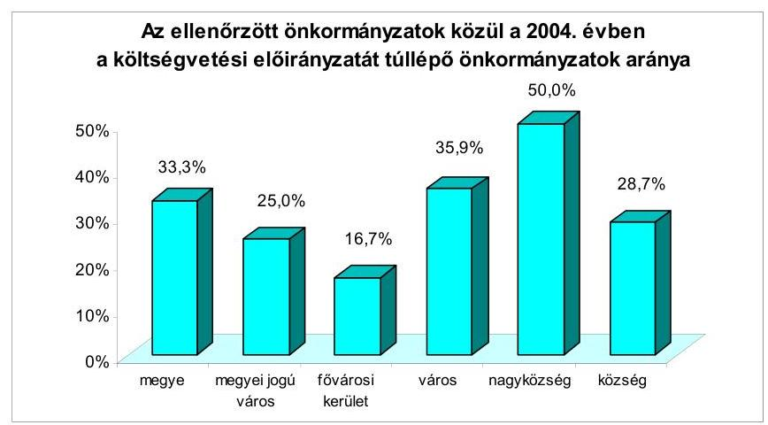

A gazdálkodás szabályozottsága az előző évekhez viszonyítva érdemben nem változott. Közel minden második ellenőrzött polgármesteri hivatal nem rendelkezett SzMSz-szel, minden negyediknél a gazdasági szervezet feladatait nem rögzítették ügyrendben. A polgármesteri hivatalok jellemzően a jogszabályi előírásokkal összhangban határozták meg az operatív gazdálkodással és a munkafolyamatba épített ellenőrzéssel kapcsolatos felelősségi és hatásköröket, a kötelezettségvállalás és az utalványozás, valamint ezek ellenjegyzésének rendjét. Az érvényesítési feladatokat a polgármesteri hivatalok több mint harmadánál nem végezték el. A nagyközségi és községi önkormányzatok polgármesteri hivatalainál és a körjegyzőségeknél az érvényesítési feladatok elvégzésénél tapasztalt hiányosságokhoz hozzájárult az iskolai végzettség és a szakmai képesítés hiánya is.

A polgármesteri hivatalok jóval több, mint felénél a jegyző nem rendelkezett az érvényesítés alapját képező szakmai teljesítés igazolására jogosultakról és az igazolás módjáról. A jogszabályban előírt szabályzatok színvonala nem javult, ezt mutatta, hogy a számviteli politikák, a leltározási szabályzatok, a pénzkezelési szabályzatok egyharmada, a selejtezési szabályzatok közel fele, a számlarendek szinte visszatérően nem feleltek meg az előírásoknak és a helyi sajátosságoknak. A pénzügyi-számviteli munkafeladatok elvégzésének folyamatát az ellenőrzött önkormányzatok alig több mint harmadánál határozták meg a jogszabályi követelmények és a helyi sajátosságok figyelembevételével. A pénz-ügyi-gazdasági, számviteli területen dolgozók munkaköri leírásában a munkafolyamatban elvégzendő ellenőrzési, egyeztetési feladatokat az önkormányzatok több mint felénél nem rögzítették. ${ }^{12}$

[^0]
[^0]:    ${ }^{12}$ A 2004. évi jelentés a 8. oldalon rögzítette: „Az önkormányzati gazdálkodás helyi szabályozottsága az évek óta tartó folyamatos javulás ellenére, még mindig kritikus terület."

---

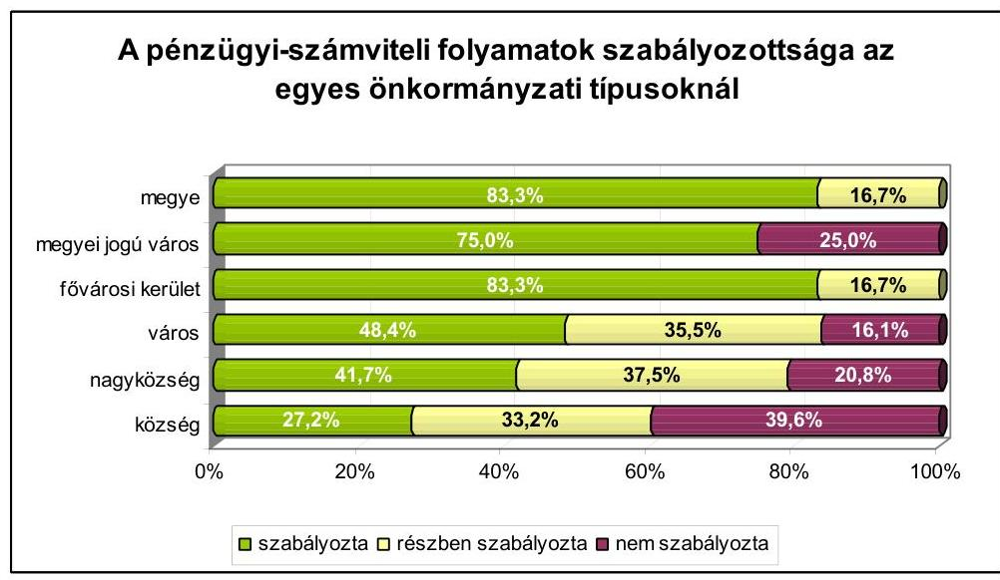

A szabályozási hiányosságok is hozzájárultak ahhoz, hogy a munkafolyamatba épített ellenőrzés színvonala nem javult a korábbi évekhez viszonyítva. Jellemzően előforduló hiányosságok voltak, hogy nem minden gazdasági múveletről állítottak ki bizonylatot, a Számv. tv. tartalmi és formai előírásainak nem feleltek meg a bizonylatok, előfordult, hogy a gazdasági eseményeket késedelmesen rögzítették a számviteli nyilvántartásokban, a kötelezettségvállalást és az utalványozást szabálytalanul, az arra fel nem jogosított személy végezte, illetve elmaradt vagy utólag, formálisan, az Ámr-ben előírt ellenőrzési feladatok elvégzése nélkül történt meg az ellenjegyzés, az érvényesítés nem a szakmai teljesítés igazolásán alapult. ${ }^{13}$

Az adósságot keletkeztető kötelezettségvállalásokat megelőzően az ellenőrzött önkormányzatok közel kétharmada az Ötv-ben előírt felső korlátot nem vizsgálta. A határértéket túllépő önkormányzatok ${ }^{14}$ majd harmadának a fizetőképessége került veszélybe és néhány esetben veszélyeztette a múködőképességet is. A jogszabály az adósságot keletkeztető kötelezettségvállalás éves felső határának megállapításakor nem rendelkezik a több éven keresztül fizetési kötelezettségként jelentkező, felhalmozási kiadásokhoz kapcsolódó, szerződésen alapuló kötelezettségek beszámításáról. Minden ötödik hitelfelvétel indokoltságát a Pénzügyi bizottság nem vizsgálta meg.

A 2003. évben az előző évhez hasonlóan a vizsgált polgármesteri hivatalok mintegy 70\%-a végzett a Vhr-ben előírtaknak megfelelő leltározást. Az értékvesztés elszámolási kötelezettségének az érintett polgármesteri hivatalok mintegy kétharmada tett eleget a követelések és a részesedések, háromnegyede az értékpapírok esetében. Országos szinten a befektetett eszközök, követelések, készletek és értékpapírok után összesen 6,8 milliárd Ft értékvesztést számoltak

[^0]
[^0]:    ${ }^{13}$ Szinte ugyanezen hiányosságokat állapította meg a 2004. évi jelentés is a 8. oldalon.
    ${ }^{14}$ Erre az igen gyakori törvénysértésre már a 2004. évi jelentés is felhívta a figyelmet a 10. oldalon.

---

el és 2,8 milliárd Ft értékvesztést írtak vissza, ezek hatására az eszközök könyviteli mérlegben kimutatott értéke fél százalékkal csökkent.

Az ellenőrzött önkormányzatok közel teljes körűen rögzítették rendeletben a vagyongazdálkodás helyi szabályait, ugyanakkor a vagyongazdálkodási rendeletek több mint harmada az Áht. előírását megsértve nem tartalmazta, hogy milyen esetekben és módon lehet önkormányzati vagyont térítésmentesen átadni, illetve követelésről lemondani. A vagyont érintő döntések meghozatalakor az önkormányzatok több mint egynegyede nem tartotta be az előírt szabályokat. A vizsgált önkormányzatok közel fele az Áht-t megsértve nem határozta meg rendeletben azt az értékhatárt, amely felett csak versenytárgyalás útján lehet vagyont értékesíteni, vagy a használat, hasznosítás jogát átadni. A kötelezettséget formálisan teljesítették, amikor olyan magasan határozták meg az értékhatárt, hogy a versenyeztetés gyakorlati alkalmazása nem vált szükségessé, illetve törvénysértően lehetővé tették, hogy a képviselő-testület döntésével eltérjenek a nyilvános pályáztatási kötelezettségtől. Az érintett önkormányzatok fele nem gondoskodott az Áht-ban meghatározott feltételeknek megfelelő szerződések adatainak közzétételéről, nyilvánosságra hozataláról. A tapasztaltakat összehasonlítva a korábbi hasonló összefoglaló ${ }^{15}$ adataival, megállapítható, hogy a vagyongazdálkodás szabályozottsága kismértékben javult.

Országosan a helyi önkormányzatok a 2003. évben 162,2 milliárd Ft pénzeszközt adtak át saját intézményeiken kívüli költségvetési szerveknek, vállalkozásoknak, non-profit szervezeteknek, háztartásoknak és magánszemélyeknek. Az ellenőrzött önkormányzatok - a Budapest Fővárosi Önkormányzat nélkül - 12 milliárd Ft múködési és 5 milliárd Ft felhalmozási célú pénzeszközátadást teljesítettek az államháztartáson kívüli szervezetek és háztartások részére. A céljellegú támogatást nyújtó önkormányzatok több mint harmada írt elő az Áhtnak megfelelően számadási kötelezettséget, ezen önkormányzatok esetében a támogatott szervezetek és magánszemélyek több mint egyharmada nem számolt el. A 67 önkormányzat közül, ahol a támogatott szervezet, illetve magánszemély nem tett eleget az előírt számadási kötelezettségnek 14 önkormányzatnál zárták ki őket a további támogatásból, 53-nál ezt törvénysértően elmulasztották. A számadások tartalmi és formai felülvizsgálatát, ellenőrzését a támogatást nyújtó, vizsgálattal érintett önkormányzatok mintegy harmadánál végezték el, azaz az önkormányzatoknak csak kevesebb mint 7\%-a tett eleget az Áht-ban előírt kötelezettségének. Az ellenőrzés során 19 önkormányzat állapított meg céltól eltérő támogatás felhasználást, közülük négy intézkedett a támogatás visszafizetése érdekében. A közhasznú szervezeteket támogató önkormányzatok kétharmada az ezekre a szervezetekre vonatkozó törvény előírását is megsértette, mert nem határozta meg szerződésben a támogatással való elszámolás feltételeit és módját. A támogatást nyújtó önkormányzatok jóval több mint $40 \%$-a a döntés meghozatalakor megsértette az Ötv. előírásait is, mert az alapítványok, közalapítványok támogatásáról nem a képviselő-

[^0]
[^0]:    ${ }^{15}$ A 2004. évi jelentésben a vagyongazdálkodást szabályozó önkormányzatok aránya $85,1 \%$, a térítésmentes átadás eseteit és módját nem rögzítők aránya $69 \%$ volt. A versenytárgyalást kötelezővé tevő értékhatárt az önkormányzatok 62\%-a nem határozta meg rendeletben.

---

testület, hanem bizottság, önkormányzati tisztségviselő, illetve az adóbevételek feletti rendelkezési jog átengedésével az adózó döntött. ${ }^{16}$ A támogatások ellenőrzésének módját központi jogszabály nem írja elő.

Az ellenőrzött önkormányzatok kétharmada a költségvetésében forráshiányt tervezett. Ez az arány a korábbi vizsgálati tapasztalatokkal összehasonlítva romló tendenciát mutat. A forráshiányt tervező önkormányzatok aránya a 2001. évben és a 2002. évben azonos volt. A forráshiány kialakulásában az intézményi kapacitás alacsony kihasználtsága, a bevételek alultervezése, az esetenként irreálisan magas kiadások tervezése, a bevételeket meghaladó mértékű beruházási kötelezettségvállalás, a feladatellátás célszerűtlen szervezeti struktúrája játszott szerepet. Az egyensúly megteremtése érdekében az ellenőrzött önkormányzatok közel fele ${ }^{17}$ takarékossági intézkedéseket vezetett be, működési kiadásait csökkentette, az önként vállalt feladataira fordított kiadásait visszafogta, felhalmozási kötelezettségvállalásait mérsékelte, a bevételek növelése érdekében vagyontárgyakat értékesített, egyéb bevételi forrásokat tárt fel. A vizsgált önkormányzatoknál felerősödött a pályázati pénzeszközök megszerzésére irányuló törekvés, melynek hatására kétharmaduk megteremtette a pályázatok személyi, szakmai és szervezeti feltételeit. A források biztosítására, a kiadások mérséklésére hozott intézkedések a vizsgált önkormányzatok több mint 40\%ánál nem bizonyultak elégségesnek a forráshiány rendezésére, ezek az önkormányzatok ÖNHIKI támogatásában részesültek. Ez az arány megegyezik a 2003. évben tapasztaltakkal.

A meghatározó forrást jelentő helyi adót vezetett be az ellenőrzött önkormányzatok csaknem mindegyike ( $97 \%$-a), amelyből a központi mentességeken kívül a helyi sajátosságok figyelembevételével további kedvezményeket nyújtottak. A befolyt adóbevételek országos szinten a GFS ${ }^{18}$ rendszerú bevételek 12,9\%-át jelentették. A vizsgált önkormányzatok az országos tendenciáknak megfelelően a helyi vállalkozókat terhelték, mert az adóbevételek $85 \%$-át a 2002. évhez hasonlóan az iparúzési adóból szedték be. Az átlagos adómérték az iparúzési adó esetében a törvényi maximum $83 \%$-a, a vállalkozók kommunális adója vonatkozásában $93 \%$-a volt. Ezek az arányok a 2004. évben ellenőrzött önkormányzatoknál az iparúzési adónál 77\%-ot, a kommunális adóknál $49 \%$-ot tettek ki.

[^0]
[^0]:    ${ }^{16}$ 2002-ben a támogatás összege összesen 170027 millió Ft volt. Az ÁSZ által megállapított hibák típusa és aránya lényegesen nem változott (2003. évi jelentés 10. és 41-45. oldalai).
    ${ }^{17}$ 2002-ben az ellenőrzött és forráshiányos önkormányzatok 49\%-a, 2003-ban már $60 \%$-a vezetett be takarékossági intézkedéseket (2004. évi jelentés 49. oldal).
    ${ }^{18}$ A GFS (Government Financing System) kormányzati pénzügyi rendszer. Az IMF által kidolgozott kormányzati elszámolási rendszer, nemzetközi standard az államháztartások összehasonlíthatósága céljából.

---

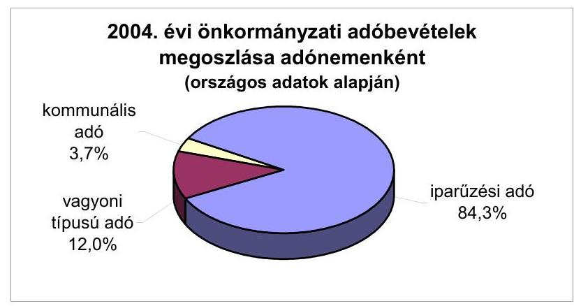

A Kbt ${ }_{1}$-ben kapott felhatalmazás alapján a jelentős anyagi erőforrással és intézményhálózattal rendelkező valamennyi megyei, megyei jogú városi, kerületi önkormányzat, a városi önkormányzatok mintegy kétharmada szabályozta helyi rendeletben a közbeszerzési eljárás kiírásával és elbírálásával kapcsolatos tevékenységet. A Kbt. ${ }_{1}$ előírását figyelmen kívül hagyva a vizsgált önkormányzatok fele nem határozta meg a közbeszerzési eljárás belső felelősségi rendjét. Az érintett önkormányzatok majdnem felénél az eljárást lezáró döntésre nem személyt, hanem testületet hatalmaztak fel. A Kbt. ${ }_{1}$ előírásait a vizsgált önkormányzatok háromnegyede betartotta az egyes beszerzési típusoknak megfelelő értékhatár alkalmazásakor, illetve a becsült érték egybeszámításakor. Ugyanakkor a vizsgált önkormányzatok harmada nem tartotta be a Kbt. ${ }_{1}$ ben foglaltakat, mivel nem írt ki közbeszerzési eljárást, annak ellenére, hogy az árubeszerzésre, szolgáltatásvásárlásra fordított összeg meghaladta a költségvetési törvényben előírt értékhatárt. A Közbeszerzési Döntőbizottság az ellenőrzött, közbeszerzési eljárást lefolytató önkormányzatok 17\%-át marasztalta el ${ }^{19}$.

Az éves gazdálkodásról szóló zárszámadási rendelettervezetet a polgármester a vizsgált önkormányzatok majdnem teljes körében benyújtotta az Áht-ban előírt határidőn belül a képviselő-testület részére. A zárszámadási előterjesztések harmada azonban az Áht. rendelkezései ellenére nem a költségvetéssel öszszehasonlítható módon készült el. A vizsgált körben a zárszámadási dokumentumok több mint 16\%-ánál az eredeti előirányzatok fő- és részösszegei, 27\%ánál a módosított előirányzatok összegei nem egyeztek. Ezek az adatok az előző évhez viszonyítva javulást mutatnak, mert a 2002. évben 22\%, illetve 36\% volt az arány. Megismétlődtek a korábbi években már jelzett, az előterjesztések szerkezetére, tartalmára, részletezettségére vonatkozó hiányosságok. A 2002. évi zárszámadáshoz hasonlóan az önkormányzatok kétharmadánál - az Áht. előírásai ellenére - nem mutatták be teljes körűen az előírt mérlegeket, kimutatásokat. A polgármesteri hivatalok zárszámadásban kimutatott, jóváhagyott

[^0]
[^0]:    ${ }^{19}$ Az ÁSZ kérésére elvégzett kigyűjtés szerint a 2003. évben országosan a közbeszerzési eljárást lefolytató önkormányzatokat, illetve intézményeiket az eljárások 5,7\%-ában marasztalta el a Közbeszerzési Döntőbizottság, az érintett szervezetek együttesen 110,5 millió Ft bírságot fizettek. A 2004. évben összesen 148 közbeszerzési eljárásban marasztalta el a Közbeszerzési Döntőbizottság az önkormányzatokat, amelynek alapján összesen 197 millió Ft bírság megfizetését írta elő.

---

pénzmaradványa a vizsgált önkormányzatok majd negyedénél - az előző évben ötödénél - nem a szabad és a feladattal terhelt együttes összeget tartalmazta, valamint hasonló arányban nem biztosították az előirányzati adatok tekintetében a zárszámadás és az éves költségvetési beszámoló adatainak egyezőségét.

Az ellenőrzött helyi kisebbségi önkormányzatok, egy kivételével nem vettek át a települési önkormányzattól feladat- és hatáskört, a településeken élő kisebbségek érdekeinek képviseletét, hagyományainak, kulturális és szellemi örökségének gondozását látták el. A 2004. évi gazdálkodáshoz 1106,7 millió Ft bevétellel rendelkeztek, a teljesített múködési kiadásaik 9\%-kal voltak magasabbak az előző évinél. A vizsgált kisebbségi önkormányzatok egy része (13\%a) nem rögzítette megállapodásban a települési önkormányzatokkal való együttműködés szabályait. Nem tartalmazta a megállapodások közel harmada az Áht. előírásaitól eltérően a költségvetés tervezetének összeállítása és a költségvetési rendelet megalkotása részletes szabályait. Ugyanakkor kedvező, hogy a vizsgált kisebbségi önkormányzatok majd teljes köre ( $96 \%$-a) az Áht-ban előírtaknak megfelelően testületi határozatban állapította meg a 2003. évi költségvetését és háromnegyede az éves gazdálkodásáról szóló zárszámadását.

A kisebbségi önkormányzatok gazdálkodási gyakorlata alapvetően nem változott az előző évben ellenőrzöttekéhez viszonyítva ${ }^{20}$. A kötelezettségvállalásokat szabálytalanul végezték az ellenőrzött körben a bizonylatok 27\%ánál, közel harmaduknál azok ellenjegyzésénél sértették meg az Áht. előírásait. Az utalványozás során nem tartották be az Ámr. előírásait a bizonylatok egyharmadánál, elmaradt az utalványozás, nem az elnök, hanem a polgármester, a jegyző, vagy a polgármesteri hivatal alkalmazottja utalványozott, illetve a kisebbségi önkormányzat elnökének felhatalmazása nélkül utalványozott testületi tag. Az utalvány ellenjegyzésének feladatait nem látták el az Ámr-ben előírtaknak megfelelően a bizonylatok felén. Az Ámr. előírásainak ellenére a bizonylatok mintegy harmadánál hiányzott a szakmai teljesítés igazolása és az érvényesítés.

A főkönyvi könyvelés és a beszámoló készítés számítógépes támogatottsága a Kincstár által ingyenesen rendelkezésre bocsátott szoftverekkel teljes mértékben biztosított volt. A Kincstártól kapott és a vásárolt analitikus nyilvántartó programok által nyújtott lehetőségeket azonban csak részben használták ki. A vizsgált kiemelt önkormányzati kör polgármesteri hivatalainak kétharmadánál a számítógépek hálózatos rendszerben múködtek, de a korábbi évekhez hasonlóan továbbra is jellemző volt, hogy a pénzügyi-számviteli feladatok ellátásához használt szoftverek nem alkottak egységes integrált rendszert. E körbe tartozó önkormányzatok polgármesteri hivatalának közel felénél az informatikai rendszer használatához informatikai szakembert alkalmaztak. A szabályozottság terén javulás mutatkozott, de még jelentős különbségek vannak önkormányzati típustól függően. Az informatikai fejlesztések során kiemelt figyelmet kapott az elavult számítógépek cseréje, a magasabb verziójú, jogtiszta szoftverek beszerzése.

[^0]
[^0]:    ${ }^{20}$ 2004. évi jelentés 11. és 78-92. oldal.

---

Az ellenőrzött önkormányzatok a 2001-2004. években több intézményracionalizálási döntést hoztak, a költségvetési intézmények meghatározó szerepe megmaradt, azonban a közhasznú szervezetek száma ezen időszakban 30cal nőtt, a közszolgáltatásban 67 -tel több egyéni és társas vállalkozás vett részt. Kilenc önkormányzat szociális alapellátási és szakosított intézményt hozott létre, intézményeket szüntettek meg, vontak össze gazdaságossági megfontolásból, illetve a feladatellátást közhasznú társaságoknak adták át. A 2001-2003. években $13 \%$-kal emelkedett a társulásban részt vevő önkormányzatok száma, feladat átadás-átvételre is sor került. ${ }^{21}$

Az ellenőrzött önkormányzatoknál az oktatási-nevelési és szociális intézményekben az egy ellátottra, illetve tanulóra jutó kiadások növekedtek a 2001-2003. években, amelyben a központi bérintézkedések miatti személyi juttatások és járulékainak emelkedése volt a meghatározó.

|  | Egy főre jutó kiadás   (ezer Ft) |  |  | Az állami hozzájárulás aránya   (\%) |  |  |
| :-- | :--: | :--: | :--: | :--: | :--: | :--: |
|  | 2001. év | 2002. év | 2003. év | 2001. év | 2002. év | 2003. év |
| Bölcsőde | 787,6 | 893,9 | 1033,5 | 22,5 | 23,4 | 35,1 |
| Óvoda | 251,5 | 318,3 | 415,5 | 50,2 | 44,2 | 45,5 |
| Általános iskola | 199,4 | 249,6 | 320,9 | 68,2 | 67,0 | 65,3 |
| Középiskola | 211,2 | 255,4 | 255,4 | 70,5 | 66,1 | 66,1 |
| Nappali szociális   ellátás | 208,0 | 249,4 | 292,5 | 55,8 | 56,4 | 61,6 |
| Bentlakásos szociális   ellátás | 887,5 | 1115,5 | 1374,4 | 53,4 | 49,5 | 53,0 |

Az önként vállalt feladatok kiadásai az elmúlt három évben fokozatosan csökkentek. ${ }^{22}$ A vizsgált önkormányzatok költségvetésében jelentős mértékű szóródást mutatva $0,5 \%-17 \%$ közötti részarányt képviseltek a nem kötelező feladatok kiadásai. Valamennyi ellenőrzött önkormányzat nyújtott államháztartáson kívül múködő szervezetnek múködési vagy felhalmozási célú támogatást, emellett a vizsgált városi önkormányzatok több mint fele középfokú oktatási intézmény fenntartásáról gondoskodott, hasonló az arány a bentlakásos szociális intézményeket tekintve is. Jelentős (22\%) volt azon önkormányzatok aránya, amelyek önként vállalt feladatként gondoskodtak járó- és fekvőbeteg szakellátó intézmény fenntartásáról. Az önkormányzatoknál a kötelezően ellátandó feladatok végrehajtását az önként vállalt feladatok finanszírozása nem veszélyeztette.

[^0]
[^0]:    ${ }^{21}$ Budapest főváros és fővárosi kerületek, megyei önkormányzatok és városok, városok és minisztérium, város és község, illetve város és kisebbségi önkormányzat között.
    ${ }^{22}$ Erre már az ÁSZ a 2004. évi jelentésben is felhívta a figyelmet (2004. évi jelentés 13. oldal).

---

A középületek akadálymentesítésére irányuló műszaki munkák szükségességét 1999-2004. között az ellenőrzött önkormányzatok kétharmada mérette fel. A feladatok végrehatására 473 millió Ft-ot terveztek a 2001-2003. években. Azonban a vizsgált önkormányzatok közül mindössze egy városban (Zalakaros), valamint 50 községben biztosították a törvény előírásának megfelelően az akadálymentes közlekedés feltételeit. A középületekben az akadálymentesség megteremtéséhez szükséges forrásigény és a 2001-2003. években e célra fordított kiadások összhangja nem állt fent, ezáltal a Fot ${ }^{23}$-ban meghatározott 2005. január 1-i határidő teljesítésének feltételei nem voltak biztosítottak ${ }^{24}$.

Az ÁSZ ellenőrzés során feltárt hiányosságok változatlanul és ismételten jelezték ${ }^{25}$, hogy a belső ellenőrzések nem tudtak számottevően javítani a gazdálkodás szabályszerűségén. A vizsgált önkormányzatok 40\%-a eltérő módon alakította ki az ellenőrzési feladatai végrehajtásához szükséges szervezeti kereteket, szervezte meg a belső ellenőrzési rendszert, hasonló az arány az önállóan gazdálkodó intézmények ellenőrzésének szervezeti és személyi feltételeit illetve a polgármesteri hivatalok belső ellenőrzését illetően is. A 2003. évi jogszabályi változások ellenére az ellenőrzési tevékenység kereteit az ellenőrzött önkormányzatok kis része ( $16 \%$-a) rögzítette szervezeti és múködési szabályzatban és még kevesebben voltak, akik elkészítették a belső ellenőrzési kézikönyvet. Az ellenőrzések végrehajtását többnyire a polgármesteri hivatalban foglalkoztatott köztisztviselők révén biztosították. Az önkormányzatok kevesebb mint harmada hozott döntést társulás alapításáról, vagy ahhoz történő csatalakozásról, ugyanakkor az ellenőrzések megvalósítását az önkormányzatok kevesebb mint negyedénél hajtották végre ezen keretek között. A Ber-nek megfelelően, de a Ktv. előírásától eltérően az önkormányzatok több mint negyede vállalkozásokat bízott meg az ellenőrzések végrehajtására.

Az egyértelmű jogi szabályozás hiánya miatt az intézmények és a polgármesteri hivatal belső ellenőrzésének felelős vezetése és irányítása eltérő volt az önkormányzatoknál. A vizsgált körben a belső ellenőrzési feladatra kijelölt személyek, szervezetek több mint egyharmada a polgármesternek, több mint egynegyede a jegyzőnek, és volt olyan is, hogy mindkettőnek alá volt rendelve, ugyanakkor több mint egynegyedénél nem történt kijelölés, illetve más hivatali szervezeti egység vezetése alá tartoztak. A belső ellenőrzést ellátók funkcionális és szervezeti függetlensége a vizsgált önkormányzatok jóval több mint ötödénél nem érvényesült. Gyakori eset volt, hogy a belső ellenőrzést ellátókat más irányítási és végrehajtási tevékenységbe is bevonták. A jogszabályi válto-

[^0]
[^0]:    ${ }^{23}$ Fot. = a fogyatékos személyek jogairól és esélyegyenlőségük biztosításáról szóló 1998. évi XXVI. törvény
    ${ }^{24}$ A 2004. évi jelentésünkben már jeleztük, hogy nem biztosított a feladat 2005. január 1-i határidőre történő elvégzése.
    ${ }^{25}$ 2004. évi jelentés 13. oldal: „Az önkormányzatok az ellenőrzési kötelezettséget a korábbi évekhez hasonlóan nem kezelték szakmai súlyának és a jogszabályban előírtaknak megfelelően."

---

zások figyelembe vételével a 2004. évben a vizsgált körben a belső ellenőrzési vezető az ellenőrzést kezdeményező önkormányzatok kétharmadánál készített ellenőrzési programot. Kedvező, hogy az elvégzett ellenőrzések majdnem háromnegyedét az ütemezésnek és az ellenőrzési célnak megfelelően hajtották végre, az elvégzett ellenőrzések kétharmadáról a Ber-nek megfelelő tartalmú ellenőrzési jelentések készültek. A belső ellenőrzési rendszer működésének hiányossága, hogy az önkormányzatok nem fordítottak kellő figyelmet az ellenőrzés javaslatainak realizálására. Az ellenőrzött intézményeknek csak kevesebb mint fele készített a hibák kijavítására intézkedési tervet. A vizsgált dokumentumok szerint gyakori volt, hogy az érintett a hiányosságok kiküszöböléséről nem intézkedett. A képviselő-testület az ellenőrzést végrehajtó önkormányzatok közel felénél nem tekintette át az általa alapított költségvetési szervek ellenőrzésének tapasztalatait.

A könyvvizsgálati kötelezettségüket az országos adatok szerint ${ }^{26}$ az arra kötelezett összesen 642 önkormányzat teljesítette, míg 27 nem. Ezt utóbbi esetben a mulasztás tényére felhívtuk a megyei közigazgatási hivatalok figyelmét. Az ellenőrzött városi és a nagyközségi önkormányzatok közül négy mulasztotta el a könyvvizsgálati kötelezettség teljesítését. A könyvvizsgálók az ellenőrzött önkormányzatok költségvetési beszámolóját egy kivétellel záradékolták, négy esetben korlátozott záradékkal látták el. A könyvvizsgálók a vizsgálati jelentések felében tettek javaslatokat, jellemzően a számviteli nyilvántartások, mérlegek, kimutatások megalapozása, szabályszerűsége érdekében ${ }^{27}$.

A 2001-2003. években valamennyi megyei, megyei jogú városi, főváros kerületi önkormányzatnál, a városi önkormányzatok több mint 92\%-ánál, a nagyközségi önkormányzatok 77\%-ánál és a községi önkormányzatok 26\%-ánál volt ÁSZ vizsgálat. Az ellenőrzések során 1646 javaslatot tettünk, melyek kétharmadánál intézkedtek az önkormányzatok. Kedvező tapasztalat, hogy a helyszíni ellenőrzés ideje alatt több önkormányzatnál a feltárt hiányosságok megszüntetése érdekében intézkedtek. A számvevői javaslatok több mint 13\%-át csak részben, közel $22 \%$-át pedig, bár indokoltságát nem vitatták, végül nem valósították meg. Ezek a javaslatok elsősorban olyanok voltak, amelyek megvalósítása a testületek mérlegelési körébe tartozott. A javaslataink hatására bár szerény mértékben, de érzékelhetően javult az önkormányzatok gazdálkodásában, a polgármesteri hivatalok működésében a szabályok betartása, erősödtek a belső kontrollok.

A helyi és a helyi kisebbségi önkormányzatok gazdálkodásának 2003. évi átfogó ellenőrzéséről készült jelentésben szereplő, a belügyminiszternek és a pénz-

[^0]
[^0]:    ${ }^{26}$ Az Áht. 82. §-a alapján a könyvvizsgálatra kötelezett önkormányzatok kötelesek a könyvvizsgálatról szóló jelentést az Állami Számvevőszéknek megküldeni.
    ${ }^{27}$ A 2004. évben könyvvizsgálatra kötelezett önkormányzatoknál készült jelentések országosan összesített tapasztalatai azt mutatják, hogy az önkormányzatok 2003. évi beszámolóinak csaknem 9\%-át a könyvvizsgálók korlátozott záradékkel látták el. Az előző évihez képest csökkent a javaslatot tartalmazó könyvvizsgálói jelentések száma, egyre több könyvvizsgáló tért át a Könyvvizsgálói Kamara által javasolt rövidített jelentés készítésére.

---

ügyminiszternek címzett javaslataink közel fele hasznosult, számos javaslatunkat az Ötv. és az Áht. módosítására irányuló törvénytervezetekben figyelembe vették. Nem történt intézkedés többek közt az önkormányzatok kötelező feladatai és ezek ellátását szolgáló költségvetési források egyértelmű meghatározására, a céljelleggel nyújtott támogatások esetében a számadási kötelezettség és a felhasználás ellenőrzésének módjára vonatkozó követelmények meghatározására, a helyi kisebbségi önkormányzatok szabályszerű működése elősegítése érdekében a gazdálkodásukkal összefüggő pénzügyi-számviteli nyilvántartási követelményeket összefoglaló kézikönyv megjelentetésére.

Az ellenőrzések során tett javaslatokat a helyi és a helyi kisebbségi önkormányzatok elfogadták.

Az ellenőrzési tapasztalatok alapján elkerülhetetlen az állami és az önkormányzati feladatok újragondolása, pontosabb meghatározása, a központi költségvetés és a helyi önkormányzatok közötti hatás- és feladatkör elhatározása és ezekhez kapcsolódóan az önkormányzati finanszírozási rendszer korszerűsítése.

A helyszíni ellenőrzés megállapításainak hasznosítása során javasoljuk:

# a belügyminiszternek 

1. kezdeményezze az önkormányzati törvény felülvizsgálata kapcsán az önkormányzatok kötelező feladatainak egyértelmű meghatározását;

## a pénzügyminiszternek

1. kezdeményezze
a) az önkormányzati belső ellenőrzési feladatok ellátására, elvégzésére, irányítására vonatkozó jogszabályi előírások - a feladatellátására vonatkozóan a Ktv. 1. § (8) bekezdésének és a Ber. 2. § m) pontjában foglaltaknak összhangba hozatalát annak érdekekében, hogy egyértelmű legyen ki jogosult az önkormányzat gazdálkodásának belső ellenőrzésére;
b) az Ámr. módosítását annak érdekében, hogy a helyi önkormányzatok gazdálkodásában érvényesítési feladatot az Ámr. 135. § (2) bekezdésében meghatározott szakmai képesítéssel rendelkező alkalmazott végezhessen azon községi és a nagyközségi önkormányzat felügyelete alatt működő polgármesteri hivatalokban és körjegyzőségeken, amelyekhez önállóan, illetve részben önállóan gazdálkodó költségvetési szervek kapcsolódnak;
c) az Áht. kiegészítését annak érdekében, hogy meghatározásra kerüljön az önkormányzatokra vonatkozóan a hiány megállapításának módja;
d) az önkormányzatok által céljelleggel nyújtott támogatások ellenőrzési szabályainak meghatározását.

---

# II. RÉSZLETES MEGÁLLAPÍTÁSOK 

## 1. A KÖLTSÉGVETÉS TERVEZÉSÉNEK, VÉGREHAJTÁSÁNAK ÉS A ZÁRSZÁMADÁS ELKÉSZÍTÉSÉNEK SZABÁLYSZERŰSÉGE

### 1.1. A költségvetési rendelet jóváhagyásának, módosításának szabályszerúsége

Az ellenőrzött önkormányzatok 45,4\%-a tett eleget gazdaságiprogram készitési kötelezettségének. Az Ötv. 91. § (1) bekezdés előírását megsértő önkormányzatok aránya a 2003. évi 68,0\%-ról a 2004. évben 54,6\%ra csökkent. A mulasztásban szerepet játszott, hogy a gazdasági program tartalmára, elkészítési határidejére, időtartamára vonatozóan nincs kötelező előírás, módszertani ajánlás sem.
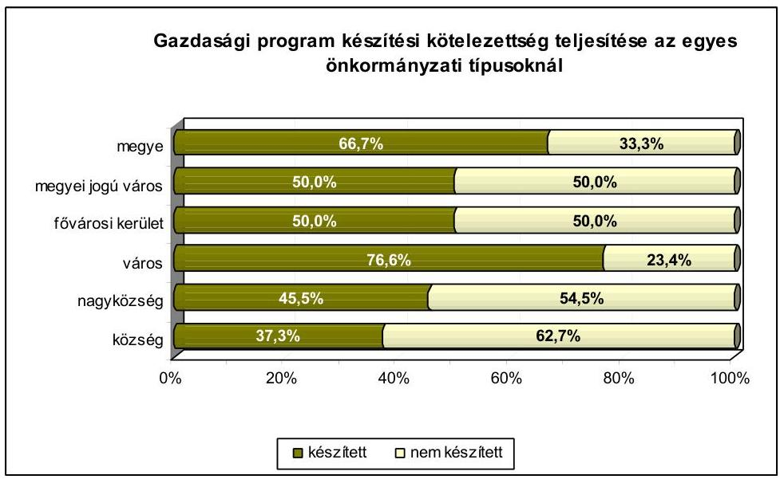

Gazdasági programot az előző évhez hasonlóan, a legnagyobb arányban változatlanul a városi önkormányzatok, a legalacsonyabb arányban a községi önkormányzatok készítettek. Az elfogadott gazdasági programok alkalmasak voltak arra, hogy alapját képezzék az egyes évek gazdálkodását megalapozó költségvetési tervező munkának.

Az önkormányzatok 95,1\%-a az Ámr. 21. § (2) bekezdés b) pontja alapján elkészítette a költségvetési koncepcióját, melyet elfogadás előtt az önkormányzatok bizottságai megtárgyaltak és véleményüket, javaslataikat határozatokban rögzítették. A polgármesterek az Ámr. 28. § (3) bekezdésben foglaltak ellenére a költségvetési koncepció előterjesztéséhez az önkormányzatok 75,7\%-ánál nem csatolták a bizottságok - köztük a pénzügyi bizottság és 83,6\%-ánál a kisebbségi önkormányzatok koncepcióról alkotott véleményét.

---

A 2003. és a 2004. évi költségvetési előirányzatok meghatározása - az Ámr. 26. §-a alapján - az előző évek eredeti előirányzatából kiindulva, a várható szerkezeti változások és szintre hozások, előző évi előirányzati többletek hatásának számszerú kimunkálásával történt meg az önkormányzatok 71,3\%ánál. A jegyzők a költségvetési rendelettervezetet az önkormányzatok 71,7\%ánál egyeztették a költségvetési szervek vezetőivel. Az Ámr. 29. § (4) bekezdésének előírásai ellenére az egyeztetés eredményét írásban nem rögzítették az önkormányzatok felénél. A körjegyzőségek költségvetéséről az érdekelt önkormányzatok 90,2\%-a - az Ámr. 29. § (7) bekezdésében foglaltaknak megfelelően - a saját költségvetési rendeletüket tárgyaló képviselő-testületi ülést megelőzően, együttes testületi ülésen döntött. Az önkormányzatok 23,2\%-ánál (az előző évben $21 \%$-ánál ) a 2003. évi költségvetési rendelettervezetet a polgármester az Áht. 71. § (1) bekezdésében rögzített február 15-i határidőn túl nyújtotta be. Az előterjesztésekhez - az Ámr. 29. § (9) bekezdésének előírásai ellenére - a pénzügyi bizottságok véleményét az önkormányzatok 63,9\%ánál nem csatolták, azt a költségvetési rendelettervezet tárgyalása során osztották ki, vagy szóban ismertették.

A költségvetési rendeletekben az Áht. 67. §-ában előírtakat megsértve az önkormányzatok 27,3\%-ánál (az előző évben 30\%-nál) nem határozták meg a költségvetés címrendjét és a címrend felépítési elveit. A költségvetési előterjesztések szerkezetére, tartalmára vonatkozó -az Áht. 69. § (1) bekezdésében, illetve az Ámr. 29. § (1) bekezdésében rögzített - elöírásokat egy, vagy több pontban megsértették:

- a kiemelt előirányzatok közül a költségvetési rendelettervezetek 22,9\%-a az ellátottak pénzbeli juttatásait, 19,3\%-a a speciális célú támogatásokat, $7,8 \%$-a a létszámkeretet nem tartalmazta;
- a múködési előirányzatok önállóan és részben önállóan gazdálkodó költségvetési szervenkénti részletezését az önkormányzatok 19,3\%-a (az előző évben 19,0\%-a) mulasztotta el, ezen belül kiemelt előirányzatonként az előterjesztések 19,7\%-a a személyi jellegú kiadásokat, 20,1\%-a a dologi kiadásokat, $34,9 \%$-a az ellátottak pénzbeli juttatásait, $30,1 \%$-a a speciális célú támogatásokat, $21,1 \%$-a a létszámkeretet nem határozta meg;
- a felújítási előirányzatok célonkénti és a felhalmozási kiadások feladatonkénti meghatározása $21,4 \%$-nál, illetve $19,9 \%$-nál hiányzott;
- a múködési és felhalmozási célú bevételi és kiadási előirányzatokat mérlegszerűen az előterjesztések 26,2\%-a (az előző évben 33\%-a) nem mutatta be;
- a többéves kihatással járó feladatok előirányzatairól éves bontásban az önkormányzatok 49,0\%-a (az előző évben 53,0\%-a), a múködési és felhalmozási célú bevételi és kiadási előirányzatokról mérlegszerűen az önkormányzatok 26,2\%-a (az előző évben 33,0\%-a) nem adott tájékoztatást;
- a költségvetési rendelettervezetek nem tartalmazták elkülönítetten is a helyi kisebbségi önkormányzatok költségvetését az érintett önkormányzatok 24,7\%-ánál (az előző évben 25\%-ánál).

---

A költségvetési rendelet megalkotását megelőzően - az Áht. 71. § (2) bekezdésében foglaltaknak megfelelően - az önkormányzatok 85,4\%-ánál (az előző évben $70 \%$-ánál) a polgármesterek előterjesztették azokat a rendelettervezeteket, amelyek a javasolt előirányzatokat megalapozták.

A 2003. és a 2004. évi költségvetés-tervezetben - az Áht. 8/A. (4) bekezdésének előírását megsértve - az önkormányzatok a költségvetési bevételi és kiadási előirányzatokban finanszírozási célú pénzügyi műveletek bevételeit (39,5\%-ánál) és kiadásait ( $21,2 \%$-ánál) szerepeltették, ezzel megsértették az Áht. 8/A. § (7) bekezdésében foglalt előírást is, mely szerint a költségvetésben nem lehet az Áht. 8/A. § (3)-(6) bekezdéseiben foglalt pénzügyi műveleteket költségvetési hiányt, illetve többletet módosító költségvetési bevételként, illetve költségvetési kiadásként elszámolni.

Az Áht. és a Vhr. 2004. január 1-től hatályos finanszírozási célú pénzügyi műveletekre vonatkozó előírásai között az összhang nem biztosított, mivel az Áht. 8/A. § (3) bekezdés a)-c) pontjai alapján finanszírozási célú pénzügyi műveletek: az értékpapírok kibocsátása, értékesítése és visszavásárlása; a hitelek felvétele és törlesztése; valamint a szabad pénzeszközök betétként való elhelyezése és visszavonása. A 2004. január 1-től hatályos Vhr. 9. számú melléklet 5. pontja szerint ugyanakkor a költségvetési hiány finanszírozásával, illetve a likviditás biztosításával kapcsolatos pénzügyi műveleteket finanszírozási célú pénzügyi műveletek között kell kimutatni. Idetartoznak: a forgatási célú értékpapírok értékesítésével (beváltásával), vásárlásával, a rövid lejáratú múködési (likviditási) célú hitelek felvételével és visszafizetésével, valamint a múködési célú rövid lejáratú kötvény kibocsátásával kapcsolatos pénzügyi műveletek bevételei és kiadásai. Az Áht. a költségvetési hiány megállapításánál finanszírozási célú hitelként nem csak a rövid, hanem valamennyi hitelt figyelembe veszi, ugyanakkor a Vhr. finanszírozási célú hitelként csak a rövid lejáratú hitelt határozza meg. A hiány számításánál a hosszú lejáratú hitel figyelembevételének módja nem egyértelmúen szabályozott.

Az önkormányzatoknál a költségvetés végrehajtásával összefüggő legfontosabb szabályokat az előző évhez hasonló arányban nem, vagy hiányosan rögzítették a költségvetési rendelettervezetben:

- az Áht. 93. § (4) bekezdésében előírtakat megsértve 53,9\% nem szabályozta a többletbevételek költségvetési szerv hatáskörében felhasználható körét és mértékét;
- a költségvetési hiány finanszírozásával összefüggő hitelműveleti hatásköröket, valamint a költségvetési többlet felhasználási módját és szabályait az Áht. 75. §-ában foglaltakat megsértve az önkormányzatok 53,9\%-ánál, illetve $59,7 \%$-ánál nem rögzítették.

Az Áht. 118. §-ának előírásait megsértve - az erre vonatkozó előterjesztés hiánya miatt - az önkormányzatok 91,6\%-ánál (az előző évi $87 \%$ volt) nem határozták meg rendeletben a költségvetés és a zárszámadás előterjesztésekor bemutatandó mérlegek és kimutatások tartalmi követelményeit. Nem mutatták be tájékoztatásul az önkormányzat összevont mérlegének tartalmát az önkormányzatok $40 \%$-ánál, a többéves kihatással járó

---

döntések számszerűsítését évenkénti bontásban, valamint összesítve az önkormányzatok 56,1\%-ánál, továbbá a közvetett támogatásokat tartalmazó kimutatást szöveges indoklással együtt az önkormányzatok 81,6\%-ánál.

Az előirányzatok módosítására vonatkozó az Áht. 18. §-ában és az Ámr. 53. §-ában foglalt előírásokat egy vagy több pontban a következők miatt sértették meg:

- az előterjesztett rendelettervezetek 31,7\%-a (az előző évben 36,0\%-a) nem a költségvetéssel összehasonlítható módon tartalmazta a módosítási javaslatokat.
- Az előirányzat változásokat - a központi költségvetésből biztosított pótelőirányzatok kivételével - a polgármesteri hivatalok 36,3\%-a (az előző évben $32,0 \%-a$ ) nem dokumentálta.
- Az Ámr. 53.§ (2) bekezdésének a rendeletmódosítások gyakoriságára vonatkozó előírását az előző évhez hasonlóan az önkormányzatok 57,4\%-ánál nem tartották be. A központi költségvetésből biztosított pótelőirányzatokkal év közben költségvetésüket nem, vagy nem negyedévente módosították, illetve az Ámr. 53. § (2) és (6) bekezdéseiben előírtak ellenére a költségvetési beszámoló megküldésének a Vhr. 10. § (2) bekezdésében előírt időpontját (február 28.) követően, a zárszámadással egyidejűleg módosították.
- A helyi kisebbségi önkormányzatok költségvetését módosító határozatokat az Ámr. 53. § (8) bekezdésében előírtak ellenére - 53,3\%-ban nem vezették át a helyi önkormányzatok költségvetési rendeletén.

A költségvetési előirányzatokat terhelő kötelezettségvállalások összegeinek megállapításához szükséges analitikus nyilvántartással a polgármesteri hivatalok 28,7\%-a rendelkezett, de ezek 50,5\%-a nem biztosította a nyilvántartások folyamatos vezetését. Az Ámr. 134. § (6) bekezdésével ${ }^{28}$ ellentétben a kötelezettségvállalásokról készített nyilvántartások 64,8\%-ából nem volt megállapítható a kötelezettségvállalások éves összege.

A költségvetési előirányzatokról és azok változásairól - az Áht. 103. § (1) bekezdésének előírásait megsértve - nem vezetett folyamatosan nyilvántartást a polgármesteri hivatalok 59,5\%-a (az előző évben 57\%-a). Ennek hiányában a nyilvántartások a döntéshozók (kötelezettségvállalók és ellenjegyzők) számára nem adtak pontos információt a ténylegesen szabad, rendelkezésre álló pénzügyi előirányzatokról.

A 2003. évi költségvetési beszámolók és a zárszámadási rendeletek adatai szerint az önkormányzatok 46,8\%-nál, valamint a költségvetési intézmények 50,4\%-nál az Áht. 93. § (1) bekezdésében, és az Áht. 12/A. § (1) bekezdésében foglaltakat megsértve a jóváhagyott előirányzatokat meghaladó mértékben vállaltak kötelezettséget, illetve teljesítettek kifizetést. Az

[^0]
[^0]:    ${ }^{28}$ Számozását a jogszabály-módosítás 2005. január 1-től (13) bekezdésre módosította.

---

érintett önkormányzatok 98,0\%-ánál az előirányzat-túllépés okait nem vizsgálták, emiatt - az előző évez hasonlóan - felelősségre vonást nem kezdeményeztek.

# 1.2. A gazdálkodás szabályozottsága, a bizonylati rend és fegyelem szabályszerúsége, a folyamatba épített ellenőrzés múködése 

A polgármesteri hivatalok 40,8\%-a nem rendelkezett az Ámr. 10. § (4) bekezdés előírásainak megfelelő SzMSz-szel. A jóváhagyott SzMSz-ek háromnegyed részében rögzítették az Ámr. 17.§ (4) bekezdésének előírásai szerint a gazdasági szervezet felépítését és feladatait.

A polgármesteri hivatalok 74,3\%-ánál szabályozták a gazdasági szervezet feladatait ügyrendben. Az Ámr. 17. § (5) bekezdésének ${ }^{29}$ megfelelően az ügyrendek 58,4\%-a tartalmazta részletesen a pénzügyi-gazdasági feladatok ellátásáért felelős személyek feladatait, hatás- és jogkörét.

A polgármesteri hivatalok mintegy $\mathbf{8 0 \%}$-ánál az Ámr. előírásaival összhangban határozták meg az érvényesítés, a kötelezettségvállalás és az utalványozás, valamint azok ellenjegyzésének rendjét. A szabályozásokban a kötelezettségvállalás rendjének rögzítése elmaradt a polgármesteri hivatalok $1,1 \%$-ánál, további $19,2 \%$-ánál részlegesen történt meg. Kötelezettségvállalási, utalványozási jogkörrel a polgármesterek 46,2\%-a, az ellenjegyzéssel a jegyzők $45,7 \%$-a hatalmazott fel másokat is.

A polgármesteri hivatalok 56,9\%-ánál általános jelleggel rögzítették a kötelezettségvállalásra jogosultak körét. A kötelezettségvállalás ellenjegyzésére vonatkozó felhatalmazások $60,4 \%$-a volt általános jellegű, $71,8 \%$-a az összeghatár megjelölését nem tartalmazta. A felhatalmazottak beszámoltatását a polgármesteri hivatalok $85,3 \%$-ánál nem szabályozták.

Az érvényesítés rendjét a jegyzők a polgármesteri hivatalok 4,5\%-ánál egyáltalán nem, 13,9\%-ánál részben szabályozták. Az érvényesítő személyek kijelölésénél nem tartották be az Ámr. 135. § (2) bekezdésének az iskolai végzettségre és szakmai képesítésre, valamint az írásbeli megbízásra vonatkozó előírásait a polgármesteri hivatalok 2,3\%-ánál, illetve 18,9\%-ánál.
Az érvényesítések alapját képező szakmai teljesítés igazolás módjáról az Ámr. 135. § (3) bekezdésében foglaltak ellenére a polgármesteri hivatalok 54,3\%-ánál belső szabályzatban nem rendelkeztek.

[^0]
[^0]:    ${ }^{29}$ A hivatkozott bekezdés-számozása 2004. január 1-től módosult.

---

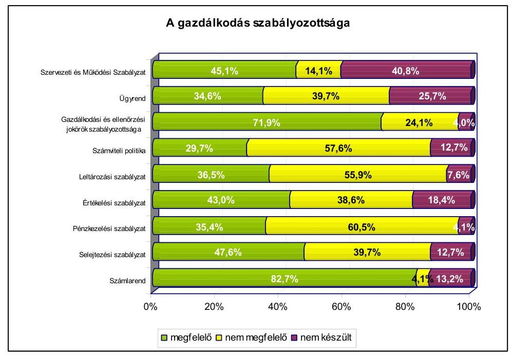

A számviteli politikával rendelkező polgármesteri hivatalok 70,5\%ánál határozták meg, hogy a számviteli elszámolás és értékelés szempontjából mit tekintenek lényegesnek, illetve nem lényegesnek, jelentős, illetve nem jelentős összegnek, a megbízható és valós összkép kialakítását befolyásoló lényeges információnak. A számviteli politikában a Vhr. 8. § (8) bekezdésének megfelelően a polgármesteri hivatalok 78,9\%-a jelölte ki azt az időpontot, ameddig az értékelési, helyesbítési feladatok elvégezhetők.

A vállalkozási tevékenységet végző polgármesteri hivatalok 36,4\%-a határozta meg az értékcsökkenés és a tevékenységet terhelő előzetesen felszámított általános forgalmi adó összegének alap- és vállalkozási tevékenység közötti megosztásánál, valamint 21,4\%-a az általános kiadások megosztási módszerének kiválasztásánál figyelembe veendő szempontokat a Vhr. 8. § (5) bekezdés c) és e) pontjaiban foglaltaknak megfelelően.

A számviteli politika részeként elkészítendő, valamint az egyéb szabályzatok hiányosságai voltak:

- az eszközök és források leltározási és leltárkészítési szabályzatában a polgármesteri hivatalok több mint fele (55,9\%) a leltározás részletes szabályait hiányosan rögzítette. A szabályzatok nem, vagy nem megfelelően tartalmazták: a leltározási egységek kijelölését, a leltározás lebonyolításának, a bizonylatok feldolgozásának, a leltározás és a könyvvitel adatai egyeztetésének, a leltárkülönbözetek megállapításának és rendezésének módját.
- Az eszközök és a források értékelési szabályzata a polgármesteri hivatalok 43,0\%-ánál felelt meg a jogszabályi követelményeknek. A szabályzatok nem, vagy nem megfelelően tartalmazták: a terven felüli értékcsökkenés elszámolásának rendjét, a piaci értéken történő értékelés esetén a követendő eljárás elveit, módszereit, eszközcsoportonkénti részletezettségben.

---

- A pénzkezelési szabályzatoknak a jogszabályi előírásokkal való összhangját a polgármesteri hivatalok 35,4\%-a biztosította. A többieknél a szabályzatok nem, vagy hiányosan tartalmazták az Ámr. 103. § (2), (6) és (7) bekezdései alapján megnyitható bankszámlák körét, rendeltetését, az azok feletti rendelkezésre jogosultak megnevezését, a bankszámlák és a pénztár kapcsolatrendszerét, a készpénz felvételének rendjét, a házipénztári keret összegét és elszámolási szabályait, a pénztáros helyettesítésének rendjét, a pénztár átadásának, átvételének szabályait. Ugyancsak nem, vagy hiányosan rögzítették az utólagos elszámolásra átadott összegek nyilvántartásának, elszámolásának rendjét, a házipénztáron kívüli pénzkezelés szabályait, az értékpapírok nyilvántartásának, őrzésének rendjét, a pénztárellenőrzésért felelős munkaköröket, a pénztárellenőrzések gyakoriságát, a szigorú számadás alá vont nyomtatványok, nyilvántartások vezetésével, elszámolásával kapcsolatos teendőket.
- A felesleges vagyontárgyak hasznosításának, selejtezésének szabályzata a polgármesteri hivatalok 47,6\%-ánál volt összhangban a vagyongazdálkodási rendelettel.

A Vhr. 49. §-a szerinti számlarenddel a polgármesteri hivatalok 86,8\%-a rendelkezett. A jegyzők által hatályba léptetett számlarendek hiányossága volt, hogy azokban nem, vagy hiányosan rögzítették:

- a Számv. tv. 161. § (2) bekezdésében foglaltakat megsértve az alkalmazásra kijelölt főkönyvi számlák megnevezését, tartalmát, a főkönyvi számla értéke növekedésének és csökkenésének jogcímeit, alapbizonylatait;
- a Vhr 49. § (2) és (4) bekezdésében előírtak ellenére az analitikus nyilvántartások formáját, tartalmát, azok vezetésének módját, a főkönyvi könyveléssel való egyeztetés módját, a gyakoriságát, dokumentálási formáját, a zárlati feladatok elvégzésének időpontjait és módját, az összesítő kimutatások (feladások) elkészítésének rendjét.

A gazdálkodási szabályzatokban a pénzügyi-számviteli munkafeladatok elvégzésének folyamatát a polgármesteri hivatalok 34,0\%-ánál szabályozták a jogszabályi követelményeknek és a helyi sajátosságoknak megfelelően.
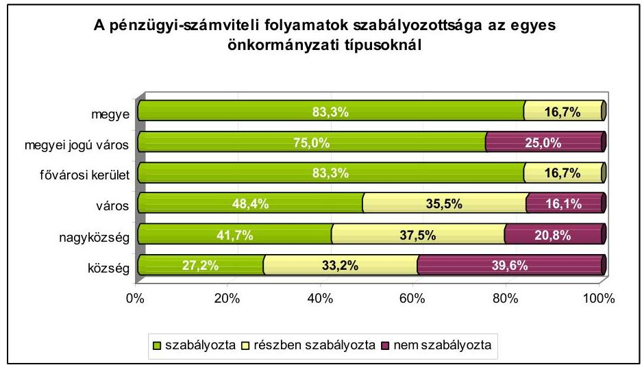

---

A szabályzatok csak részben töltötték be szabályozó funkcióikat, mert hiányzott a pénzügyi-számviteli munkafolyamatok ellenőrzési pontjainak kijelölése (37,0\%-nál); az ellenőrzéskor elvégzendő műveletek leírása (40,4\%-nál); az ellenőrzés viszonyítási alapjának meghatározása ( $61,7 \%$-nál); a követelményektől való eltérések megállapításának (62,5\%-nál); az eltérés esetén szükséges teendők, jelzési kötelezettségeknek a meghatározása (61,9\%-nál).

A pénzügyi-gazdasági, számviteli területen dolgozók munkaköri leírásában a munkafolyamatokban elvégzendő ellenőrzési, egyeztetési feladatokat a polgármesteri hivatalok 51,2\%-ánál nem rögzítették, 35,7\%-ánál hiányosan határozták meg. A szabályzatok és a munkaköri leírások ellenőrzésre, egyeztetésre vonatkozó előírásainak összhangját a polgármesteri hivatalok 69,5\%-ánál biztosították.

A polgármesteri hivatalok 38,3\%-ánál alakították ki a Számv. tv. 165. § (4) bekezdésének megfelelően a számvitel logikailag zárt rendszerét a főkönyvi könyvelés, az analitikus nyilvántartások és a bizonylatok adatai közötti egyezőség feltételeinek biztosításával. A polgármesteri hivatalok az önkormányzatok 52,6\%-ánál gondoskodtak a főkönyvi számlákhoz kapcsolódó analitikus nyilvántartások vezetéséről. A polgármesteri hivatalok 44,7\%-a részben, 2,7\%-a egyáltalán nem tett eleget ennek a kötelezettségének. A nyilvántartások vezetését elmulasztó polgármesteri hivatalok nem biztosították az Ámr. 145. § (1) bekezdés előírása ellenére a negyedéves mérlegjelentések analitikus nyilvántartásokkal történő alátámasztását.

A fókönyvi könyvelés és az analitikus nyilvántartások adatainak egyeztetését negyedévente nem végezték el és nem dokumentálták a polgármesteri hivatalok 31,3\%-nál, nem győződtek meg az elszámolások helyességéről, a könyvviteli adatok megbízhatóságáról. A polgármesteri hivatalok 89,6\%-a a Vhr. 17. számú mellékletében meghatározott tartalmú fókönyvi kivonatot elkészítette, a negyedéves mérlegjelentés és a beszámolók összeállítását megelőzően. Az egyeztetési feladatokat az egyes önkormányzati típusoknál eltérő arányban teljesítették a polgármesteri hivatalok.
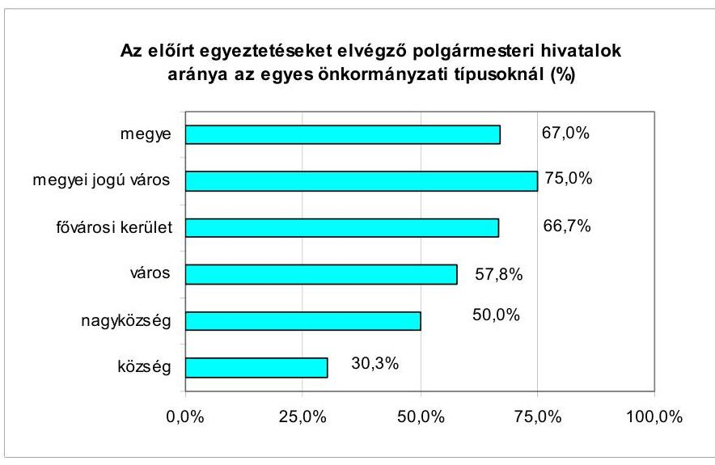

---

A polgármesteri hivatalok a könyvviteli nyilvántartásokban elszámolt gazdasági események, múveletek 96,0\%-áról a Számv. tv. 165. § (1) bekezdésében előírtaknak megfelelően bizonylatot állítottak ki. A vagyon és pénzeszközváltozást eredményező gazdasági múveletek, események 4\%-át bizonylat nélkül, illetve az előírásoknak nem megfelelő tartalmú bizonylatok alapján számolták el. Nem állítottak ki bizonylatot a házipénztári bevételekről, a pénztárból kifizetett előlegekről, a hatósági szolgáltatási díjak, a kamatmentes kölcsönök, az egészségügyi szolgáltatási, a szociális gondozási és étkezési díjak, a bérleti díjak bevételeiről, a követelések és kötelezettségek állományváltozásáról. A tartalmilag hibásnak minősített bizonylatokról hiányzott a gazdasági múvelet pontos leírása, a gazdasági eseményt elrendelő aláírása, a sorszám, vagy más azonosító, a keltezés, a kiállító gazdálkodó szerv megnevezése, hivatkozás az érintett könyvviteli számlákra, a könyvviteli nyilvántartásban történt rögzítés időpontja. Nem a polgármesteri hivatal nevére, illetve nem annak nevében kiállított számla alapján számoltak el bevételi és kiadási pénzforgalmat. A Számv. tv. 167. § (1) bekezdés a)-j) pontjaiban előírt alaki és tartalmi kellékek hiányosságai valamennyi ellenőrzött bizonylatot érintettek a polgármesteri hivatalok $22,9 \%$-ánál, $50 \%$-ot meghaladó arányban fordultak elő a polgármesteri hivatalok $11,1 \%$-ánál.

A polgármesteri hivatalok a gazdasági eseményekről, múveletekről készült bizonylatok 80,1\%-ának adatait késedelem nélkül, a Vhr. 51. § (1) bekezdés a)-b) pontjaiban foglalt előírások betartásával rögzítették a könyvviteli nyilvántartásokban. Hiányosság volt, hogy a pénzforgalom könyvelését a havi, vagy a negyedéves zárlati időszakban, utólag végezték el, illetve az egyéb gazdasági események mérlegjelentésekhez kapcsolódó elszámolása negyedévenként nem, csak a félév, vagy az év végén történt meg.

A kötelezettségvállalásokat 90,7\%-ban az arra feljogosítottak végezték a bankszámláról és a pénztárból történt kifizetések esetén. A további bizonylatoknál az Ámr. 134. § (3) bekezdésében előírt írásos felhatalmazás hiányában vállalt kötelezettséget bizottsági elnök, képviselő-testületi tag, jegyző, hivatali dolgozó, vagy más alkalmazott.

A bevételek beszedésének és a kiadások teljesítésének elrendelését (utalványozást) az arra jogosultak végezték el a bizonylatok 93,8\%-án, a többinél nem dokumentálták az utalványozást, nem oldották meg az összeférhetetlenségi esetek kizárását biztosító helyettesítéseket.

A pénzgazdálkodás folyamatában az előzetes ellenőrzést a polgármesteri hivatalok több mint egyharmadánál ( $36,2 \%$-nál) nem múködtették.

---

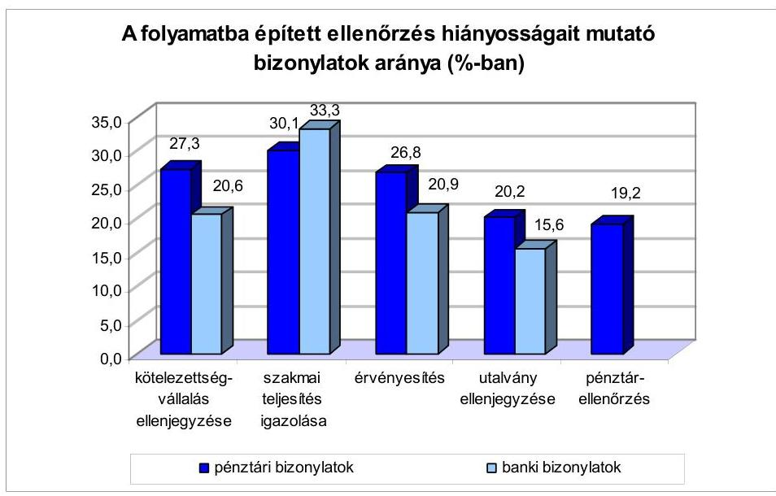

A kötelezettségvállalás ellenjegyző́je nem tett eleget az Ámr. 134. § (1)(2) ${ }^{30}$ bekezdésében foglalt kötelezettségének, a bizonylatok 23,5\%-ánál elmaradt a kötelezettségvállalás írásba foglalása és ellenjegyzése, a kötelezettségvállalás nem előirányzat-felhasználási terven alapult.

Az utalványozás ellenjegyzésére jogosultak a bizonylatok 17,7\%-ánál nem látták el feladatukat a jogszabályban ${ }^{31}$ és a helyi szabályozásban foglaltak szerint. Nem ellenőrizték a kifizetést megelőzően, hogy a költségvetésben biztosított-e a fedezet, szabályszerűen megtörtént-e a szakmai teljesítés igazolása és az érvényesítés, az utalványozás nem sérti-e a gazdálkodásra vonatkozó szabályokat.

A szakmai teljesítést igazolók a kiadások teljesítésének és a bevételek beszedésének elrendelése előtt a bizonylatok 31,8\%-ánál nem ellenőrizték az okmányok alapján azok jogosultságát, összegszerűségét, a szerződés, a megrendelés, a megállapodás teljesítését.

Az érvényesítés igazolását a bizonylatok 81,6\%-a tartalmazta, de az Ámr. 135. § (1) bekezdésében előírt feladataikat ennél kisebb arányban, 68\%-ban végezték el az érvényesítők. Az érvényesítés hiányossága volt, hogy nem alapult a szakmai teljesítés igazolásán, nem tartalmazta az érvényesítve kifejezést, elmaradt a megállapított összeg és a kijelölt főkönyvi számla rögzítése.

Az érvényesítés nem biztosította az összegszerűség, a fedezet meglétének, valamint az előírt alaki követelmények betartásának megbízható ellenőrzését, a hibák megelőzését a pénzgazdálkodásban és a számviteli elszámolásokban, va-

[^0]
[^0]:    ${ }^{30}$ Számozását a 134. § (7)-(8) bekezdésre változtatta a 382/2004. (XII. 29.) Korm. rendelet 68. §-a a 2005. január 1-től.
    ${ }^{31}$ Az utalvány ellenjegyzőjének feladatait az Ámr. 134. § (7)-(9) bekezdései, a 2005. január 1-től a (9)-(12) bekezdései tartalmazzák.

---

lamint az Ámr. 135. § (2) bekezdésében előírt pénzügyi-számviteli szakképesítés nélkül is végeztek érvényesítést. A nagyközségi, községi önkormányzatok polgármesteri hivatalainál és a körjegyzőségeknél az érvényesítők megbízásánál éltek az Ámr. 168. §-ában 2004. január 1-től biztosított lehetőséggel és a képesítési előírást nem követelték meg. A nagyközségi és községi önkormányzatok polgármesteri hivatalainál és a körjegyzőségeknél az érvényesítési feladatok elvégzésénél tapasztalt hiányosságokhoz hozzájárult az iskolai végzettség és a szakmai képesítés hiánya is.

A pénztárellenőrök a polgármesteri hivatalok 80,8\%-ánál végezték el feladataikat a követelményeknek megfelelően, a többinél nem történt meg a pénztári be- és kifizetések folyamatában az előzetes, illetve az utólagos pénztárellenőrzés, mely visszavezethető arra, hogy a pénztárellenőrzést nem szabályozták, illetve nem jelölték ki a pénztárellenőrt, nem határozták meg az előzetes és az utólagos pénztárellenőrzés feladatait.

Utasításra történt a kötelezettségvállalás ellenjegyzése egy, az utalványozás ellenjegyzése kettő bizonylat esetében. Az ellenjegyzésre jogosultak az Ámr. 134. § (9) ${ }^{32}$ és a 137. § (4) bekezdésében foglalt előírások szerint, az érintett bizonylatokon rögzítették, hogy az ellenjegyzés utasításra történt, és arról a kép-viselő-testületet tájékoztatták.

A polgármesteri hivatalok a gazdasági események elszámolásakor 98,0\%-ban betartották a Vhr. és a saját számlarendjük előírásait. A kiadások és a bevételek előirányzatait, valamint azok teljesítését a gazdasági események tartalmának megfelelően számolták el a főkönyvi könyvelésben közgazdasági osztályozás szerint költségnemenként, és funkcionális osztályozás szerint tevékenységenként, illetve szakfeladatonként.

# 1.3. A könyvviteli mérlegben kimutatott vagyon alakulása, a vagyonnal való gazdálkodás szabályszerűsége, nyilvánossága 

Az államháztartás önkormányzati alrendszerének könyvviteli mérlegben kimutatott vagyona a 2002. évi 6423,3 milliárd Ft-ról 2003. december 31-re 9234,6 milliárd Ft-ra, 2004. december 31-re 9618 milliárd Ft-ra nőtt (az önkormányzatok vagyonának alakulását a 4. számú melléklet részletezi). Az eszközök könyvviteli nyilvántartás szerinti értékének változását a 2003. évben 99,9\%-ban a befektetett eszközök állományának változása eredményezte. A 2004. évben megváltoztak az arányok, a 383,4 milliárd Ft-os eszközérték növekedés $89,8 \%$-át a befektetett eszközök, $10,2 \%$-át a forgóeszközök könyvviteli mérlegben kimutatott értékének változása okozta.

A befektetett eszközök nyilvántartás szerinti értékének 2003. évi növekedésében meghatározó szerepe volt a tárgyi eszközök 2482,4 milliárd Ft-os, ezen

[^0]
[^0]:    ${ }^{32}$ Számozását a 2005. január 1-től 134. § (12) bekezdésre változtatta a 382/2004. (XII. 29.) Korm. rendelet 68. §-a.

---

belül az ingatlanok 2400,8 milliárd Ft-os emelkedésének. Az üzemeltetésre, kezelésre átadott eszközök 2003. év végi állománya 323,8 milliárd Ft-tal, az immateriális javak értéke 2,4 milliárd Ft-tal, a befektetett pénzügyi eszközök állománya 1,8 milliárd Ft-tal növekedett az előző évhez viszonyítva. A 2004. évben az ingatlanok és az üzemeltetésre kezelésre átadott eszközök nyilvántartás szerinti értéke együttesen 318,8 milliárd Ft-tal, a pénzügyi befektetések nyilvántartási értéke 8,3 milliárd Ft-tal haladta meg az előző évit. Az önkormányzatok könyvviteli mérlegében kimutatott befejezetlen beruházás-állomány értéke a 2003. év végén 247,2 milliárd Ft volt, az 1999. óta minden évben jellemző növekedéssel ellentétben a 2003. évben 5,6 milliárd Ft-tal csökkent, majd a 2004. évben 4,9 milliárd Ft-tal ismét nőtt.

Az immateriális javak, tárgyi eszközök, üzemeltetésre, kezelésre átadott eszközök növekedésének összetevőit a helyi önkormányzatok országosan összesített költségvetési beszámoló adatai felhasználásával vizsgáltuk a tartalmilag összefüggő sorok elemzésével. ${ }^{33}$

|  | A növekedésen belüli arány \%-ban |  |  |
| :-- | :--: | :--: | :--: |
|  | 2002. év | 2003. év | 2004. év |
| Aktív beruházások és az   értékesítések egyenlege | 10,9 | 8,9 | 57,4 |
| Térítésmentes átvétel-   átadás egyenlege | 1,0 | 2,4 | 5,7 |
| Egyéb növekedés-   csökkenés, selejtezés   egyenlege | 88,1 | 88,7 | 36,9 |
| Összesen | 100,0 | 100,0 | 100,0 |

Az immateriális javak, tárgyi eszközök és üzemeltetésre, kezelésre átadott eszközök nyilvántartás szerinti értékének változását a 2002. évben 88,1\%-os, a 2003. évben $88,7 \%$-os arányban az egyéb növekedés okozta. Az önkormányzatok a 2002. évben és a 2003. évben is a térítésmentesen átvett, korábban érték nélkül nyilvántartott ingatlanok, földterületek, épületek, közművek értékének megállapításával és számviteli nyilvántartásba vételével növelték meg az ingatlanok és az üzemeltetésre, kezelésre átadott eszközök értékét 2495,9 illetve 2659,8 milliárd Ft-tal. A 2004. évben az egyéb növekedés csökkenés egyenlegének összege 184 milliárd Ft, aránya a 2001. évihez (34,8\%) hasonló $36,9 \%$ volt. Az önkormányzatok tulajdonában lévő ingatlanvagyon nyilvántartási és adatszolgáltatási rendjéről szóló 147/1992. (XI. 6.) Korm. rendelet előírása szerint az érték-megállapítást és az ingatlanvagyon kataszter felülvizsgálatát 2003. január 1-ig kellett volna elvégezniük az önkormányzatoknak, de a feladat végrehajtása áthúzódott a 2003. és a 2004. évre.

[^0]
[^0]:    ${ }^{33}$ Forrás: Magyar Államkincstár Fejlesztési Igazgatósága önkormányzati költségvetési beszámoló 38. számú űrlapja.

---

Az önkormányzatok a 2003. évi költségvetésük terhére összesen 367,1 milliárd Ft-ot, a 2002. évinél 52,8 milliárd Ft-tal kevesebbet, a 2004. évben 383,6 milliárd Ft-ot, az előző évinél 16,5 milliárd Ft-tal többet fordítottak beruházásokra, felújításokra.

A befektetett pénzügyi eszközök nyilvántartási értéke 1,8 milliárd Ft-tal nőtt a 2003. évben, ezen belül csökkent 4 milliárd Ft-tal a tartós hitelviszonyt megtestesítő értékpapírok, 11,3 milliárd Ft-tal az adott kölcsönök állománya, ugyanakkor a részesedések értéke 5,6 milliárd Ft-tal, az egyéb hosszú lejáratú követelések értéke 11,5 milliárd Ft-tal nőtt. A befektetett pénzügyi eszközök nyilvántartási értéke a 2004. évben 1,5\%-kal, 8,3 milliárd Ft-tal növekedett. A befektetett eszközök 2003. évi könyvviteli mérlegben kimutatott értékét a 2002. évihez viszonyítva 42,6 milliárd Ft-tal növelte az, hogy az önkormányzatok éltek a piaci értékelés lehetőségével.

A forgóeszközökön belül a követelések értéke a 2002. évben 1,8\%-kal , a 2003. évben 12,4\%-kal, a 2004. évben 5,2\%-kal nőtt. Az adósok könyvviteli mérlegben kimutatott állománya 7,9\%-kal, 18,9 milliárd Ft-tal nőtt a 2003. évben, az előző évi növekedés 4,6 milliárd Ft-os volt. A 2004. évben a nyilvántartott adókövetelések összege 11,4 milliárd Ft-tal növekedett, elérte a 155,0 milliárd Ft-ot, ami azt mutatja, hogy csökkent a vállalkozások és az állampolgárok adófizetési hajlandósága.

Az önkormányzatok rendelkezésre álló forgatási célú értékpapírok állománya a 2002. évi 10,9 milliárd Ft-ot meghaladóan 2003-ban 21,2 milliárd Ft-tal csökkent. A pénzeszközök év végi állománya a 2003. évben az előző évi 26,1 milliárd Ft-os növekedéssel ellentétben 7,9 milliárd Ft-tal csökkent. A 2003. évben a legjelentősebb mértékű változás a Budapest Fővárosi Önkormányzatnál történt, ahol a forgóeszközök között kimutatott értékpapír-állomány 15,0 milliárd Ft-tal, a pénzeszközök állománya 12,5 milliárd Ft-tal volt kevesebb, mint az előző év végén. A 2004. év végén az önkormányzatok összes forgatási célú értékpapír állományának értéke 18,5 milliárd Ft-tal, a könyvviteli mérlegben kimutatott pénzeszközeinek összege 26,0 milliárd Ft-tal növekedett.

A hosszú- és rövid lejáratú kötelezettségek növekedésének üteme a 2002. évi 43,6\%-hoz viszonyítva a 2003. évben 10,1\%-ra csökkent. A 2003. évben a növekedés a hosszú lejáratú kötelezettségeknél $15,3 \%$, a rövid lejáratú kötelezettségeknél 5,1\% volt. A változás kedvező irányú, mivel az általában felhalmozási célokat szolgáló hosszú lejáratú hitelek állománya növekedett gyorsabb ütemben, mint a jellemzően a múködés finanszírozása érdekében vállalt rövid lejáratú kötelezettségek. A 2004. évben a rövid lejáratú kötelezettségek 43,6 milliárd Ft-os, (22,8\%-os) és a hosszú lejáratú kötelezettségek 27,4 milliárd Ft-os ( $16,1 \%$-os) növekedésével a korábbi tendencia megváltozott.

---

A hosszú- és rövid lejáratú kötelezettségek költségvetési kiadásokhoz viszonyított aránya:

| Önkormányzati típus   megnevezése | 2002. évi   arány (\%) | 2003. évi   arány (\%) | Változás |
| :-- | :--: | :--: | :--: |
| megyei | 6,6 | 6,0 | $-0,6$ |
| Budapest fóvárosi | 32,6 | 29,9 | $-2,7$ |
| megyei jogú városi | 17,5 | 17,4 | $-0,1$ |
| Budapest fóvárosi kerü-   leti | 7,2 | 9,8 | 2,6 |
| városi | 13,9 | 14,0 | 0,1 |
| nagyközségi | 12,1 | 10,5 | $-1,6$ |
| községi | 9,3 | 10,2 | 0,9 |
| Országos összesen: | 14,7 | 14,6 | $-0,1$ |

A megyei jogú városi és a Budapest fővárosi nagyobb, a megyei és a községi önkormányzatok kisebb arányban csak külső erőforrások bevonásával tudták közszolgálati feladataikat ellátni. A 2003. évben a Budapest Fővárosi Önkormányzatnál ezen kötelezettségek a folyó évi költségvetési kiadások 29,9\%-át tették ki. Ez az arány a megyei jogú városoknál 17,4\%, a többi városnál $14,0 \%$, a megyei önkormányzatoknál $6,0 \%$, a Budapest fővárosi kerületeknél $9,8 \%$ volt.

Az önkormányzatok eladósodottságának adott évi szintjét jelzi a rövid lejáratú kötelezettségek éves költségvetési kiadásokhoz viszonyított aránya. Az országos összesen adatokból számított arány 7,1\% volt a 2003. évben:

- az ellenőrzött önkormányzatok közül a rövid lejáratú kötelezettségek aránya 8 -nál meghaladta a $20 \%$-ot, 22 -nél $10 \%$ és $20 \%$ közé esett, 56 -nál $5 \%$ és $10 \%$ közötti, 262-nél 5\% alatti volt, 22 önkormányzat nem mutatott ki a 2003. év végén rövid lejáratú kötelezettséget.
- Az ellenőrzött önkormányzatok közül legnagyobb arányban Ruzsa és Zalamerenye községek önkormányzata adósodott el, a rövid lejáratú kötelezettségek költségvetési kiadásokhoz viszonyított aránya 39,6\%, illetve 37,7\% volt. Ez az arány Győr megyei jogú város, Gárdony, Tiszafüred városok, Telki, Nemesbük és Verseg községek önkormányzatai esetében 22,4\%-28,2\% között volt.
- A rövid lejáratú kötelezettség-állomány 2003. év végi értéke a Budapest Főváros Önkormányzatánál 34,9 milliárd Ft volt, négy megyei és további három megyei jogú városi önkormányzatnál haladta meg az egymilliárd Ft-ot.

---

Az országos adatok figyelembevételével a 2004. évben romlott a helyi önkormányzatok likviditási helyzete:

Likviditási mutatók alakulása*
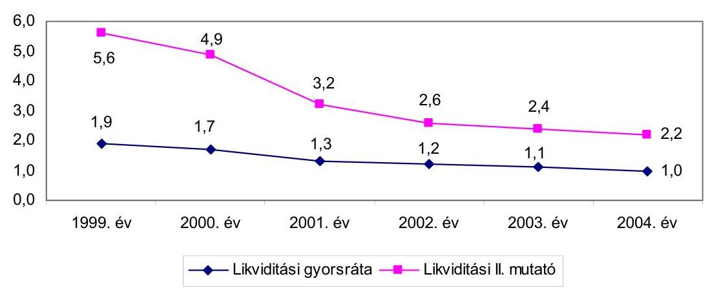

* Likviditási gyorsráta (pénzeszközök/rövid lejáratú kötelezettségek Likviditási II. mutató (követelések + értékpapírok + pénzeszközök / rövid lejáratú kötelezettségek)

A likviditási mutatószámok az önkormányzatok pénzügyi helyzetének folyamatos rosszabbodását jelzik. Rámutatnak arra, hogy az önkormányzatok rendelkezésére álló egyes forgóeszközök csökkenő mértékben nyújtanak fedezetet a rövidlejáratú kötelezettségek teljesítésére.

Az önkormányzatok 92,7\%-a rögzítette rendeletben a vagyongazdálkodás helyi szabályait a Htv. 138. § (1) bekezdés j) pontjában kapott felhatalmazás alapján. Ezen rendeletek hatálya az önkormányzatok 73,9\%-ánál terjedt ki valamennyi vagyonelemre, $26,1 \%$-nál az ingó vagyontárgyakra és az üzemeltetésre, kezelésre átadott eszközökre nem tértek ki a szabályozásban. A vagyongazdálkodási rendeletek négyötöde meghatározta az önkormányzati feladatok ellátását szolgáló forgalomképtelen, illetve korlátozottan forgalomképes törzsvagyonba tartozó eszközök körét. A forgalomképesség szerinti besorolás megváltoztatásának módját, szabályait az önkormányzatok 39,9\%-a rögzítette.

A vagyongazdálkodási rendeletek 90,0\%-ában szabályozták a vagyonnal való rendelkezési, döntési hatásköröket. Az önkormányzatok 48,1\%-a megosztotta a különböző eszközökre vonatkozó eltérő értékhatárok rögzítésével a vagyont érintő döntési jogosultságokat a képviselő-testület, a bizottságok és a polgármesterek között. A vagyongazdálkodás szabályozása az önkormányzatok 96,1\%-ánál az értékesítésre, 92,5\%-ánál a bérbeadásra, 40,5\%-ánál a selejtezésre, $52,7 \%$-ánál az értékpapírok adására, vételére, a pénzügyi befektetésekre terjedt ki. Az Áht. 108. § (2) bekezdésének előírását megsértve az önkormányzatok 36,0\%-a nem szabályozta az ingyenes (térítésmentes) átadás és a követelésekről történő lemondás módját és eseteit.

---

Az Áht. 108. § (1) bekezdésében rögzített kötelezettségnek, mely szerint önkormányzati rendeletben kell meghatározni azt az értékhatárt ${ }^{34}$ ami felett vagyont értékesíteni, a vagyon használatát, illetve a hasznosítás jogát átengedni csak nyilvános (indokolt esetben zártkörű) versenytárgyalás útján a legjobb ajánlatot tevő részére lehet, az ellenőrzött önkormányzatok 54,1\%-a tett eleget. A vagyont érintő döntések nyilvánosságát, a versenyeztetés lehetőségét a helyi körülményekhez viszonyítottan magas értékhatár megállapítása, valamint a mentességek lehetővé tétele miatt a gyakorlatban nem biztosították a következő önkormányzatok:

- a Tolna megyei, a Budapest főváros I. és IX. kerületi és Pécel városi önkormányzatok 100 millió Ft-ban, Szombathely Megyei Jogú Város Önkormányzata 200 millió Ft-ban, Budapest Főváros VI. kerület Önkormányzata, Szentgotthárd Város Önkormányzata 300 millió Ft-ban, Budapest Főváros XIII. kerület Önkormányzata 500 millió Ft-ban rögzítette azt az értékhatárt, amely felett a versenyeztetés kötelező.
- Bánfa, Katádfa, Rózsafa és Szentdénes községek önkormányzatainál a nyilvános versenytárgyalást kötelezővé tevő értékhatárt 20 millió Ft-ban állapították meg, ami az önkormányzati vagyon 21-76 millió Ft közötti nyilvántartási értékéhez viszonyítva irreálisan magas.
- Két megyei és két megyei jogú városi, három Budapest fővárosi kerületi és három városi önkormányzat lehetővé tette az értékhatárt meghaladó értékesítések esetében, hogy a közgyűlés, illetve a képviselő-testület döntésével különböző indokok alapján mellőzzék a nyilvános versenyeztetést.

A nyilvános versenyeztetés mellőzésére lehetőséget biztosítottak:

- „közérdekböl", illetve egyedi elbírálás alapján gazdasági, városfejlesztési, vagy városrendezési érdek esetén, „méltánylandó" indokok esetén;
- amennyiben jogszabály vételi jogot, vagy a hasznosítást érintő más jellegű kizárólagosságot biztosított;
- szociális célú lakásépítésre kijelölt telkek elidegenítésekor.

A magas összeghatár megállapítása, illetve a nyilvános versenyeztetés önkormányzati rendeletben rögzített elkerülési lehetősége indokolatlanul nagy mozgásteret nyújtott az önkormányzati döntéshozóknak, nem biztosította a gazdálkodás nyilvánosságát, átláthatóságát. A rendeletekben meghatározott értékhatár alapján az ellenőrzött önkormányzatok 20,0\%-ánál volt a 2003. évben pályáztatási kötelezettség, ezek 17,6\%-a nem tett ennek eleget.

Az ellenőrzött önkormányzatok közül - a 2004. év január 1-től a helyszíni ellenőrzések befejezéséig terjedő időszakban - 19,7\% kötött az Áht. 15/A. § és 15/B.

[^0]
[^0]:    ${ }^{34}$ A Magyar Köztársaság 2005. évi költségvetéséről szóló 2004. évi CXXXV. törvény 7. § (1) bekezdése alapján 20 millió Ft-ot meghaladó forgalmi értékű vagyontárgy értékesítésekor kötelező a versenytárgyalás alkalmazása. A helyi önkormányzat rendeletében ennél kisebb összeget is meghatározhat.

---

§ hatálya alá tartozó szerződést, de az Áht. előírásait megsértve ezek 49,3\%-a nem gondoskodott a közzétételről.

Az ellenőrzött önkormányzatok 3,8\%-ánál volt a 2003. évben a könyvviteli mérleg főösszegének 5\%-át meghaladó mértékű vagyoncsökkenés (az ellenőrzött önkormányzatok vagyonának alakulását az 5. számú melléklet részletezi). A csökkenés a 2002. évben a korábban nem, vagy érték nélkül nyilvántartott vagyon értékének megállapításakor és számviteli nyilvántartásba vételekor elkövetett hibák korrigálása, a több önkormányzat közös beruházásában létrejött közművek tulajdonjogának a megosztása és más költségvetési szervek részére történő térítésmentes átadás miatt következett be.

A vagyon alakulását befolyásoló döntések meghozatalakor az ellenőrzött önkormányzatok $2,8 \%$-a nem, $20,6 \%$-a részben tartotta be az Ötv-ben és az önkormányzati rendeletekben előírtakat:

- az önkormányzati forrásokból létrejött víziközműveket a Budapest főváros XVIII. kerület, Mohács, Berettyóújfalu városok, valamint nyolc község önkormányzata értékesítette, vagy térítésmentesen átadta, a szolgáltató gazdasági társaságba apportálta, illetve tőketartalékába helyezte. Ezek az önkormányzatok megsértették az Ötv. 79. § (2) bekezdés b) pontjának, az egyes állami tulajdonban lévő vagyontárgyak önkormányzatok tulajdonába adásáról szóló 1991. évi XXXIII. törvény 20. §-a és a vízgazdálkodásról szóló 1995. évi LVII. törvény. 6. §-a előírásait, amelyek szerint a víziközművek az önkormányzati kötelező feladat ellátását szolgálják, a törzsvagyon körébe tartoznak, ezért tulajdonjoguk nem adható át ${ }^{35}$;
- Villány város, Vásárosbéc, Acsád és Iklódbördőce községek önkormányzatai a törzsvagyonba történt besorolás megváltoztatása nélkül értékesítettek vagyont. Mohács Város Önkormányzata az Ötv. 88. § (1) bekezdés b) pontja előírása ellenére jelzáloggal terhelte meg a törzsvagyoni körbe tartozó egyik ingatlanát;
- Ajka Város Önkormányzatánál a 2003. évi költségvetési rendelet 27. §-ának tiltása ellenére kamatmentes hitelt nyújtottak az egyik gazdasági társaságuknak. A polgármester a képviselő-testület határozatában elfogadottnál az önkormányzat számára hátrányosabb feltételekkel kötötte meg a szerződést. Kiskunlacháza nagyközség, Külsővat és Olcsva községek önkormányzatainak polgármesterei a képviselő-testület határozata nélkül értékesítettek ingatlanokat, Szikszó Város Önkormányzatának polgármestere a képviselőtestület felhatalmazása és költségvetési előirányzat nélkül nyújtott 10 alkalommal kölcsönt más önkormányzatnak, egyesületnek;
- az Áht. 108. § (1)-(2) bekezdésében előírt rendeleti szintű szabályozás és a képviselő-testület határozata nélkül a Budapest Főváros XVIII. kerület Önkormányzata 7,4 millió Ft, Bácsalmás Város Önkormányzata 1 millió Ft kö-

[^0]
[^0]:    ${ }^{35}$ Ezt megerősítették az Alkotmánybíróság önkormányzati rendeleti előírás felülvizsgálatára és megsemmisítésére irányuló kezdeményezés tárgyában hozott 10/2002. (III. 20.) és 11/2002. (III. 20.) számú határozatai.

---

vetelést engedett el, a Budapest főváros XVI. kerület, Szigetvár és Kunszentmiklós város önkormányzatai a vagyon tulajdonjogát ingyenesen ruházták át;

- a vagyonértékesítés során az önkormányzatok 7,7\%-a nem szerepeltette a szerződésben az önkormányzat érdekeit védő garanciális elemeket, a tulajdonjog változás földhivatali bejegyzésének feltételeit, a késedelmes fizetés szankcióit, a szerződéstől való elállás eseteit.

Az önkormányzatok 87,0\%-a hozott szakmailag megalapozott vagyongazdálkodási döntést, 13,0\% ezt elmulasztotta:

- Kecskemét Megyei Jogú Város Önkormányzatát egy gazdasági társasága értékesítésekor előnytelen kötelezettségvállalás miatt 90 millió Ft veszteség érte;
- Szikszó Város Önkormányzata 31,5 millió Ft kamatmentes kölcsönt nyújtott más önkormányzatnak, egyesületnek úgy, hogy a határidő utáni visszafizetés esetére késedelmi kamatot nem kötött ki, ugyanakkor az önkormányzat likviditási problémákkal küzdött, hitelfelvételre kényszerült;
- Berettyóújfalu Város Önkormányzata a nyugdíjasház beruházását előzetes igényfelmérés nélkül valósította meg, a megfelelő kihasználást a működtetés során nem tudták biztosítani;
- Döbröce és Nagygörbő községeknél rendszeresen szóbeli előterjesztések alapján, megalapozatlan vagyonértékesítési döntéseket hoztak, az önkormányzat anyagi lehetőségeit meghaladó kötelezettségeket vállaltak;
- az önkormányzati vagyon értékesítését, illetve cseréjét az esetek 57,8\%-ában nem előzte meg értékbecslés készíttetése. A Budapest Főváros VI. kerület Önkormányzata két esetben, Szentgotthárd Város Önkormányzata egy esetben az egyenértékűség szakértői értékbecsléssel történő alátámasztása nélkül bonyolított le csereügyletet.

Az értékpapír vételénél az önkormányzatok egyötöde nem biztosította a szabályszerűség érvényesülését:

- Mohács Város Önkormányzata figyelmen kívül hagyva az Ámr. 103. § (5) bekezdése tiltó rendelkezését állami hozzájárulásból is vásárolt befektetési jegyet;
- a Fejér Megyei Közgyűlés elnöke, Baja, Kunszentmiklós, Mohács, Mezőkövesd, Dunaharaszti, Szigetvár, Dorog városok és Külsővat, Szigetmonostor községek önkormányzatainak polgármesterei a döntésre jogosult testület határozata, vagy felhatalmazása nélkül, illetve attól eltérve bonyolítottak le értékpapírokat érintő ügyleteket. A Fejér megyei, a Mezőkövesd és Dunaharaszti városi önkormányzatok államilag garantált értékpapírba történő befektetésre adtak felhatalmazást az elnöknek, illetve a polgármesternek, ennek ellenére azok befektetési jegyeket vásároltak, amely azonban államilag nem garantált értékpapír volt;

---

- a Hajdú-Bihar Megyei Önkormányzat 781,6 millió Ft értékű portfoliója kezelését egy befektetési szolgáltatóra bízta, figyelmen kívül hagyva az Ötv. 9. § (3) bekezdésének előírását, mely szerint a képviselő-testület a hatáskörét az önkormányzat bizottságaira, a részönkormányzat testületeire, a helyi kisebbségi önkormányzatok testületeire, illetve a közgyűlés elnökére (polgármesterre) ruházhatja át. A 2003. évben átlagosan 0,6\% volt a hozam, ami lényegesen elmaradt az egyéb befektetési módokkal elérhető eredménytől. A portfolió kezelési szerződést az ÁSZ ellenőrzés ideje alatt megszüntették;
- Kiskunlacháza Nagyközség Önkormányzatát célszerűtlen részvényértékesítés miatt 70 millió Ft veszteség érte, emiatt felvetettük a polgármester és a jegyző személyes felelősségét.

# 1.4. Az önkormányzati vagyon nyilvántartásának, számbavételének szabályszerűsége 

A polgármesteri hivatalok 68,9\%-a a Vhr. 9. számú melléklete 1/k. pontjának megfelelően a főkönyvi számlák további bontásával, vagy részletező, analitikus nyilvántartások vezetésével gondoskodott az önkormányzati feladatok és hatáskörök ellátását szolgáló törzsvagyon elkülönített nyilvántartásáról.

Az ingatlanvagyon értékét befolyásoló gazdasági eseményeket a polgármesteri hivatalok 77,6\%-a teljes mértékben, 22,4\%-a hiányosan, vagy egyáltalán nem rögzítette a számviteli nyilvántartásokban. A vagyonvédelmet nem biztosító, hiányos számviteli nyilvántartások miatt nyolc önkormányzatnál javasoltuk a személyes felelősség megállapítását. A számviteli hiányosságok miatt a könyvviteli mérlegben kimutatott értékadatok nem az önkormányzatok tényleges vagyonát mutatták:

- Keszthely Város Önkormányzata 61 millió Ft követelést, Zsámbék Nagyközség Önkormányzata 23,6 millió Ft részesedést, 2,1 millió Ft kötelezettséget, a községi önkormányzatok közül Rimóc 69 millió Ft követelést, 68 millió Ft kötelezettséget, Acsád 28,9 millió Ft Kht. törzsbetétet, Külsővat 16,4 millió Ft, Balatongyörök 5,7 millió Ft, Doba 1,2 millió Ft részesedést nem rögzített a polgármesteri hivatal számviteli nyilvántartásában;
- a Pest Megyei Önkormányzatnál a 2000. évben megszűnt gazdasági társaságok, Szentlőrinc Város Önkormányzatánál az eladott telkek értékének számviteli nyilvántartásokból történő kivezetése maradt el. A Fejér Megyei Önkormányzat könyvelési hiba miatt 945 millió Ft-tal magasabb ingatlanértéket mutatott ki a 2003. évi mérlegében, amelyet a 2004. évben helyesbítettek.

Az ellenőrzött polgármesteri hivatalok 69,5\%-a szerepeltette a Vhr. 20. § (1) bekezdésében előírtaknak megfelelően a számviteli nyilvántartásokban az üzemeltetésre, kezelésre átadott eszközeit. A vizíközmű beruházást megvalósító önkormányzatok polgármesteri hivatalainak 19,5\%-a a könyvviteli nyilvántartásában az elkészült közművek értékét nem mutatta ki.

---

A Vhr. 37. §-ban előírtak ellenére az adott eszközféleséggel rendelkező önkormányzatok polgármesteri hivatalainak 44,4\%-a az értékpapírok, 33,2\%-a az üzemeltetésre, kezelésre átadott eszközök, 29,4\%-a a részesedések, 25,1\%-a az ingatlanok leltározását elmulasztotta. Az eszközök, leltározásakor a leltárt a polgármesteri hivatalok 64,7\%-a a részletező nyilvántartások alapján készített összesítő kimutatással helyettesítette. A Vhr. 37. § (4) ${ }^{36}$ bekezdésében részletezett feltételek azonban az érintett polgármesteri hivatalok négyötöd részénél nem voltak meg, nem rendelkeztek a felügyeleti szerv egyetértésével. A leltározást a polgármesteri hivatalok 26,2\%-a nem a helyi szabályozásnak megfelelően hajtotta végre. A leltározások 35,5\%-ánál elmaradt a leltár kiértékelése. A leltár és a számviteli nyilvántartások értékadatai között a polgármesteri hivatalok 5,7\%-ánál állapítottak meg eltérést, ezek egyötöd részénél elmulasztották az eltérések számviteli rendezését.

A polgármesteri hivatalokban a Vhr. 31. §-a alapján, a befektetett eszközök, készletek, követelések és értékpapírok esetében a 2003. évben országosan összesen 6825 millió Ft értékvesztést számoltak el és 2776 millió Ft korábban elszámolt értékvesztést írtak vissza. Ezek hatására az eszközök nyilvántartás szerinti értéke a 2003. év végén 0,5\%-kal csökkent.

Az ellenőrzött polgármesteri hivatalokban az értékeléshez szükséges információk a követeléseknél 66,3\%-ban, a részvényeknél 38,9\%-ban, az értékpapíroknál 24,1\%-ban álltak rendelkezésre. Ezen polgármesteri hivatalok 40,6 \%-a végezte el a követelések, 47,3\%-a a részesedések, 43,6\%-a az értékpapírok értékelését. Az értékvesztés elszámolása a követeléseknél 53, a részvényeknél 48, az értékpapíroknál 17 esetben volt indokolt, ennek a kötelezettségnek az érintett polgármesteri hivatalok 56,9\%-a, 66,7\%-a, illetve 75,0\%-a tett eleget.

A korábbi években a polgármesteri hivatalok 15,0\%-a számolt el értékvesztést, ezek háromnegyed részénél megvizsgálták a visszaírás szükségességét. A visszaírás Eger megyei jogú városi és Komárom-Esztergom megyei önkormányzatok kivételével megtörtént.

A Számv. tv. 57. § (3) bekezdése lehetővé teszi, hogy a költségvetési szervek, amennyiben a tulajdoni részesedést jelentő befektetés piaci értéke jelentősen meghaladja a visszaírás utáni könyv szerinti bekerülési értéket piaci értéken értékeljék és tartsák nyilván azokat. A 2003. évben ezzel a lehetőséggel a polgármesteri hivatalok $4,1 \%$-a élt, de ezek $6,1 \%$-a nem a jogszabályi előírásoknak megfelelően végezte ezt a tevékenységet:

- Aranyosapáti és Pilisszentlászló községek önkormányzatai esetében nem álltak fenn a Számv. tv. 57. § (3) bekezdésében rögzített feltételek;
- Ároktő, Borsodivánka, Gerde, Öttömös, Pécsbagota, Pilisszentlászló, Szabadszentkirály és Velény községek önkormányzatainál, a Számv. tv. 57. § (3)

[^0]
[^0]:    ${ }^{36}$ A Vhr. 37.§ (4) bekezdését a 278/2003. (XII. 24.) Korm. rendelet 29. § (3) bekezdése 2004. január 1-től hatályon kívül helyezte, megszüntette a részletező nyilvántartások alapján készített összesítő kimutatás alapján történő leltárkészítés lehetőségét.

---

bekezdésében foglaltak ellenére, az értékelést nem vizsgáltatták felül könyvvizsgálóval;

- Tápiószele nagyközség, Aranyosapáti, Ároktő, Borsodivánka és Pilisszentlászló községek önkormányzatainál az értékhelyesbítéseket a Vhr. 32/A. §ban előírtaktól eltérően rögzítették a számviteli nyilvántartásokban;
- Baja, Dorog, Szentes városi, Tápiószele nagyközségi, Aranyosapáti, Ároktő, Borsodivánka, Öttömös és Pilisszentlászló községi önkormányzatoknál - eltérően a Vhr. 32/A. § (1) bekezdésében előírtaktól - a 2003. december 31-i fordulónappal készült leltár nem tartalmazta az egyedi eszköz piaci és bekerülési értékét, a két érték különbözetét.

# 1.5. A céljelleggel nyújtott támogatások szabályszerűsége 

A helyi önkormányzatok a 2003. évben összesen 162191 millió Ft pénzeszközt adtak át vállalkozásoknak, non-profit szervezeteknek, háztartásoknak és az önkormányzat saját intézményein kívüli költségvetési szerveknek, 7836 millió Ft-tal kevesebbet, mint az előző évben. Az átadott pénzeszközök összes folyó évi költségvetési kiadáshoz viszonyított aránya a 2003. évben 6,0\% volt, szemben a 2002. évi 7,0\%-kal.

Az államháztartáson kívülre átadott pénzeszközök támogatott szervezetek közötti megoszlása
(országos összesen)
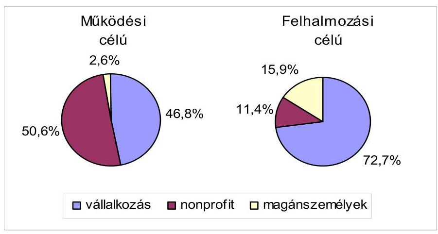

Az országos arányok alakulását befolyásolta, hogy a Budapest Fővárosi Önkormányzat az általa nyújtott 13570 millió Ft múködési célú támogatás 68,2\%-át és a 30916 millió Ft fejlesztési célú támogatás 96,7\%-át vállalkozásoknak adta.

A 2003. évben az ellenőrzött önkormányzatok négyötöde tervezett a költségvetésében speciális célú támogatásokra elkülönített összegeket. Az önkormányzatok 77,0\%-a alapítványokat, 70,0\%-a társadalmi szervezeteket, 67,0\%-a egyéb szervezeteket, 33,0\%-a a vállalkozásokat, 17,8\%-a közhasznú társaságokat, $41,4 \%$-a egyházakat, $25,7 \%$-a magánszemélyeket részesített céljelleggel nem szociális ellátásként - támogatásban.

---

Az ellenőrzött önkormányzatok - a Budapest Fővárosi Önkormányzat nélkül 12019 millió Ft működési és 4950 millió Ft felhalmozási célú pénzeszközátadást teljesítettek az államháztartáson kívüli szervezetek és háztartások részére.

# Az átadott pénzeszközök támogatott szervezetek közötti megoszlása az ellenőrzött önkormányzatoknál 

(Budapest Fővárosi Önkormányzat nélkül)
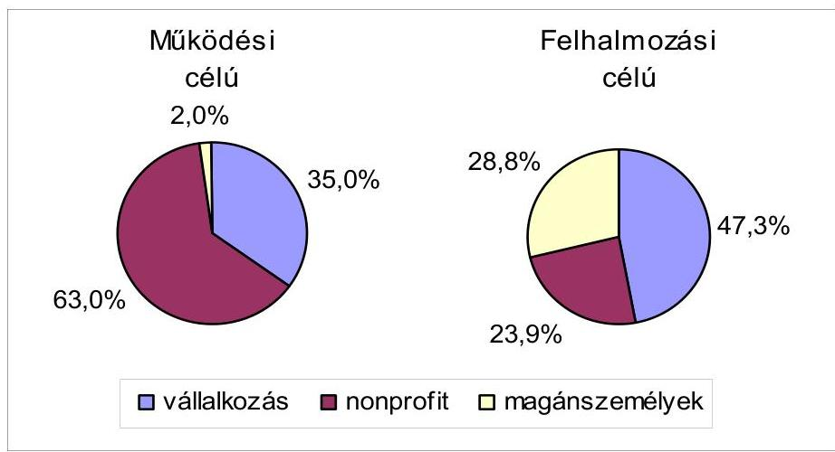

A támogatások összegére és a támogatásban részesülő szervezetek kiválasztására irányuló döntést a képviselő-testületek, a bizottságok és a polgármesterek hozták meg. Az önkormányzatok 42,8\%-a az alapítványok esetében az Ötv. 10. § (1) bekezdés d) pontjában foglalt hatásköri előírást, 9,2\%-a a helyi hatásköri szabályokat figyelmen kívül hagyva döntött a támogatásokról:

- az Ötv. 9. § (3) bekezdésében előírt hatásköri szabályokat megsértve, két önkormányzat a képviselő-testület döntési hatáskörét az adófizető állampolgárokra, három az alpolgármesterre, közgyűlési alelnökre, további kettő az önkormányzati képviselőkre ruházta át.

Szombathely Megyei Jogú Város Önkormányzata a 2003. évben összesen 110,1 millió Ft iparűzési adóbevételt fordított különböző célok támogatására az adózó állampolgárok döntése alapján a Közgyűlés utólagos jóváhagyásával. Szentes Város Önkormányzatánál az iparűzési adó 10\%-ának felhasználásáról dönthettek az adófizetők. A Fejér megyei, Pest megyei önkormányzatoknál a közgyűlés alelnöke, a Szombathely megyei jogú városnál az alpolgármester, Encs és Balatonalmádi városoknál az önkormányzati képviselők is hozhattak támogatási döntéseket;

- költségvetési szerv 88 önkormányzatnál támogatott társadalmi szervezetet, közülük 13 nem rendelkezett a képviselő-testület engedélyével, megsértve az Áht. 94. § (1) bekezdés előírását.

Az Áht. 13/A. § (2) bekezdésében előírtakat megsértve a céljelleggel - nem szociális ellátásként - nyújtott támogatásoknál az önkormányzatok 62,7\%-a nem írta elő a számadási kötelezettséget, 39,6\%-a nem rögzítette az elérni kívánt célt, 62,7\%-a nem írta elő a számadás módját, 60\%-a a számadás határidejét. Az érintett önkormányzatok 66,1\%-a nem tartotta be a közhasznú szervezetek

---

esetében a Ksztv. 14. § (2) bekezdésének előírását, mely szerint szerződésben kell meghatározni a támogatással való elszámolás feltételeit és módját.

A számadásra kötelezett támogatott szervezetek 59,9\%-a az előírt módon, 59,1\%-a a rögzített határidőben eleget tett számadási kötelezettségének. Az önkormányzatok közül 67-nél fordult elő, hogy a támogatott szervezet nem nyújtott be számadást, emiatt 14 önkormányzat függesztette fel a további támogatás folyósítását, 53 önkormányzat az Áht. 13/A. § (2) bekezdés előírása ellenére ezt elmulasztotta.

A polgármesteri hivatalok a benyújtott számadások 29,9\%-a esetében elvégezték a tartalmi, $36,3 \%$-a esetében a formai követelményeknek való megfelelés ellenőrzését. Az átadott pénzeszközök támogatási céloknak megfelelő felhasználását a polgármesteri hivatalok a benyújtott számadások 91,5\%-a esetében nem ellenőrizték a támogatott szervezeteknél a helyszínen. A pénzügyi elszámolásként átadott számlamásolatok és írásos beszámolók nem nyújtottak elegendő információt a felhasználás ellenőrzésének érdemi elvégzéséhez.

Az ellenőrzött önkormányzatoknál 19 esetben állapították meg, hogy a támogatás felhasználása jogsértő módon, a kijelölt céltól eltérően történt. Négy polgármesteri hivatal intézkedett a támogatás visszafizetésére az Áht. 13/A. § (2) bekezdése előírásának megfelelően. Két önkormányzatnál együttesen három támogatott szervezet nem tett eleget visszafizetési kötelezettségének:

- a Budapest Főváros XIII. kerület Önkormányzatánál két társadalmi szervezet esetében kezdeményezték eredménytelenül a támogatás visszafizetését, ezért ezeket kizárták a további támogatásokból;
- Szarvas Város Önkormányzatánál a felszólításnak egy társadalmi szervezet nem tett eleget, ezért a visszakövetelt támogatás behajtása érdekében fizetési meghagyás kibocsátásával intézkedtek, a helyszíni ellenőrzés befejezéséig a visszafizetés nem történt meg.

A számadási kötelezettség előírásának elmulasztásával, a számadás teljesítésének elmaradásával, valamint a kapott számadások ellenőrzésének elmulasztásával az ellenőrzött önkormányzatok 93,3\%-a megsértette az Áht. 13/A. § (2) bekezdésében előírtakat.

# 1.6. A múködési és felhalmozási bevételek, kiadások alakulása 

Az önkormányzatok a 2003. évben összesen 3693,4 milliárd Ft bruttó bevételt realizáltak és 3411,9 milliárd Ft bruttó kiadást teljesítettek (ennek részletezését a 8. számú melléklet tartalmazza). Az ellenőrzött önkormányzatok 2003. évi bruttó bevétele 1327,0 milliárd Ft, összes bruttó kiadása 1143,1 milliárd Ft volt. (Az ellenőrzött önkormányzatok kiadásainak összetételét a 6. számú melléklet, az önkormányzati típusonkénti alakulását a 7. számú melléklet, a bevételek és kiadások részletezését a 9. számú melléklet tartalmazza.)

---

Országosan az önkormányzatok konszolidált ${ }^{37}$ bevétele a 2003. évben 2879 milliárd Ft, a 2004. évben 3040 milliárd Ft volt. A 2003. évi teljesített bevételek 12\%-kal haladták meg az előző évit, a 2004. évi teljesítés az előző évhez viszonyítottan 5,6\%-os növekményt mutatott. A bevételek 2004. évi növekedésében legnagyobb súllyal a múködési bevételek szerepeltek a források között, a 2003. évben a 76,5\%-ot, a 2004. évben már 78,1\%-ot képviseltek. A 2003. évben 9,9\%-ban, a 2004. évben 9,5\%-ban segítette a kiadások teljesítését felhalmozási és tőke jellegű bevétel. Az önkormányzatoknak a kölcsönök felvételéből és viszszatérüléséből, hitelekből, kötvények, értékpapírok értékesítéséből a 2003. évben 110 milliárd Ft, a 2004. évben 101 milliárd Ft bevétele keletkezett, a pénzforgalom nélküli bevételek összege a 2003. évi 281 milliárd Ft-ról 277 milliárd Ft-ra csökkent. Az önkormányzatok konszolidált kiadásai az előző évhez viszonyítva a 2003. évben 11,8\%-kal, 2004. évben 6\%-kal növekedtek.

Az ellenőrzött önkormányzatok 2003. évi konszolidált saját bevétele (563,2 milliárd Ft) a konszolidált kiadások 69,7\%-ára ${ }^{38}$ nyújtott fedezetet. A konszolidált kiadások 80,8\%-át múködésre, 19,2\%-át felhalmozásra fordították az önkormányzatok. A múködési kiadások 64,0\%-át a személyi juttatások és a munkaadókat terhelő járulékok tették ki, a dologi kiadások részesedése 36,0\% volt. Az ellenőrzött önkormányzatok 2003. évi konszolidált bevételeinek és kiadásainak egyenlege -27 milliárd Ft volt, ami a múködési bevételek és kiadások 45 milliárd Ft többlete, valamint a felhalmozási bevételek és kiadások 72 milliárd Ft hiánya hatására alakult ki. Az ellenőrzött önkormányzatok 2003. évi konszolidált kiadásainak megoszlását a 6. számú melléklet szemlélteti.

Az önkormányzatok 30,1\%-a döntött adósságot keletkeztető kötelezettségvállalásról, amely az előző évhez képest nem jelentett változást ${ }^{39}$. Az ellenőrzött önkormányzatok közül egy bocsátott ki kötvényt, 24 lízingszerződést kötött, 43 garanciát, illetve kezességet vállalt, 71 hitelt vett fel. A pénzügyi bizottságok az esetek 77,8\%-ában vizsgálták meg a hitelfelvételek indokoltságát. Az adósságot keletkeztető éves kötelezettségvállalás Ötv. 88. § (2) bekezdésében meghatározott felső korlátját az érintett önkormányzatok 40,5\%-a vizsgálta és ezek 70,7\%-a tartotta be. A jogszabály által meghatározott korlát megsértésével az érintett önkormányzatok 3,0\%-ának működőképessége, 30,9\%-ának a fizetőképessége került veszélybe.

Az adósságot keletkeztető kötelezettségvállalás éves felső határának meghatározásakor a jogszabály alapján figyelembe nem vett, de fizetési kötelezettségként jelentkező, szerződésen alapuló, több év alatt részletekben teljesített köte-

[^0]
[^0]:    ${ }^{37}$ Konszolidáció tartalma: a polgármesteri hivatalok és az intézmények közötti, valamint az önkormányzatok közötti pénzeszközátadások miatti halmozódások kiszűrése, a rövid lejáratú hitel felvételek, visszafizetések, a rövid lejáratú értékpapírok vételeeladása, a pénzforgalom nélküli kiadások-bevételek miatti halmozódások kiszűrése, továbbá a függő, átfutó és kiegyenlítő tételek figyelmen kívül hagyása.
    ${ }^{38}$ A 2002. évben 69\%-ára.
    ${ }^{39}$ A helyi és a helyi kisebbségi önkormányzatok gazdálkodásának átfogó ellenőrzéséről a 2004. évben készített jelentés $30 \%$-ot rögzített.

---

lezettségek törlesztése az önkormányzatok költségvetéseit éveken át megterheli, a fizetőképességet a jogszabályban felsorolt, kötelezettségvállalási korlátként figyelembe vettekhez hasonlóan befolyásolja, a tényleges adósságállományt növeli.

# 1.7. A költségvetés egyensúlyi helyzete 

Az ellenőrzött önkormányzatok 65,0\%-a a 2003. évi költségvetésében forráshiányt tervezett. Az önkormányzatok tervezett kiadásainak átlagosan 3,5\%-ára nem nyújtottak fedezetet a bevételek. A tervezés időszakában a költségvetési hiány a legnagyobb arányban a községi önkormányzatokat jellemezte, ahol átlagosan a tervezett költségvetési kiadások 11,1\%-ára nem volt biztosított a forrás, a nagyközségeknél és a városoknál a hiány aránya 5,1\%. A költségvetési főösszeghez viszonyítva a megyei jogú városoknál 4,5\%, a megyei önkormányzatoknál 3,0\% és a Budapest fővárosi kerületeknél 2,0\% volt a hiány.

A vizsgált önkormányzatokon belül a tervezéskor forráshiányos önkormányzatok arányát önkormányzat típusonként az alábbi diagram mutatja be:
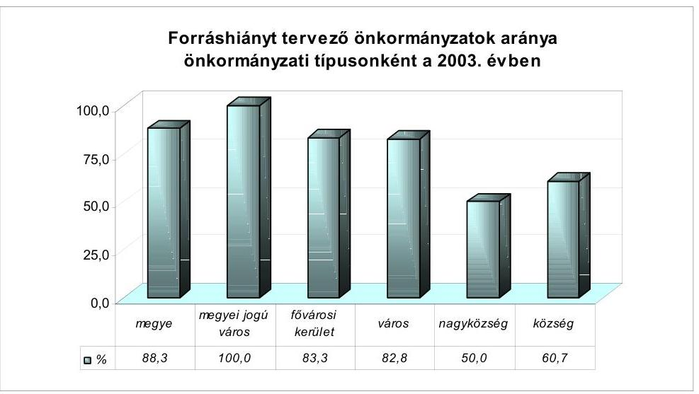

A költségvetési egyensúly hiánya egy-egy önkormányzatnál is több tényező együttes következményeként jött létre. A költségvetési hiányt 28,8\%-ban az intézményi kapacitások kihasználatlansága, 22,5\%-ban a bevételek alultervezése, $20,0 \%$-ban a fiktív, irreálisan magas kiadások tervezése, $19,2 \%$-ban a bevételeket meghaladó mértékű beruházási kötelezettségvállalás, 10,0\%-ban a feladatok célszerűtlen struktúrában történő ellátása, 9,6\%-ban a teherbíró képességet meghaladó önként vállalt feladatok, $7,1 \%$-ban pedig a bevételeket meghaladó mértékű felújítási kötelezettségvállalás okozta.

A költségvetési hiány a megyei önkormányzatoknál a bevételek alultervezéséből fakadt, de a növekedés irányába hatott a feladatellátás célszerűtlen szervezeti struktúrája, továbbá a bevételeket meghaladó mértékű beruházási és felújítási kötelezettségvállalás is. A megyei jogú városokban jellemző ok a bevételek alultervezése, a Budapest fővárosi kerületeknél és a többi városnál pedig a bevételeket meghaladó mértékű beruházási kötelezettségvállalás volt. A községeknél jellemző volt az intézményi kapacitások alacsony kihasználtsága, a bevételek alul-

---

tervezése és a kiadások túltervezése. A társadalmi, gazdasági szempontból hátrányos helyzetű, munkanélküliséggel sújtott települések körében, az alacsony helyben beszedhető saját bevételek, valamint a megnövekedett szociális terhek is hozzájárultak a forráshiányhoz.

A működési forráshiány valamennyi településtípusnál előfordult. A költségvetési tervezés szintjén az ellenőrzött önkormányzatok 58,8\%-ánál múködési forráshiány volt, amely az előző évekhez ${ }^{40}$ viszonyítottan jelentős emelkedést mutatott. A forráshiány kezelése érdekében alapvetően hitelek felvételével számoltak az önkormányzatok és emellett tervezték pályázati források megszerzését is.

A 2003. évben az ellenőrzött önkormányzatok 65,0\%-a tervezte, hogy hitellel állítja helyre költségvetésének egyensúlyát. Ezzel szemben év közben az önkormányzatok 19,2\%-a, a forráshiányos önkormányzatok 24,2\%-a döntött hitel felvételéről. A felvett hitelek az önkormányzatok 74,6\%-ánál felhalmozási, 8,5\%-ánál múködési célokat szolgáltak. A hitelszerződést kötött önkormányzatok 16,9\%-a a 2003. év során, mind a felhalmozási, mind múködési forrásait részben hitellel finanszírozta.

A költségvetési egyensúly javítása érdekében a forráshiányos önkormányzatok fokozatosan növekvő arányban, a 2001. évben 45,8\%-ban, a 2002. évben 52,5\%-ban, a 2003. évben 63,8\%-ban, takarékossági intézkedéseket vezettek be. A 2001-2003. években folyamatosan a forráshiányos önkormányzatok 41,3\%-a takarékoskodott. Az intézkedések a forráshiányos önkormányzatok 63,3\%-ánál kifejezetten a múködési kiadások csökkentésére irányultak. A bevételek növelése érdekében a forráshiányos önkormányzatok 87,9\%-a értékesítette valamely vagyontárgyát, $59,2 \%$-a egyéb bevételi forrást tárt fel.

# A kiutalt ÖNHIKI támogatás a múködési forráshiány átlagosan 

40,2\%-ára nyújtott fedezetet, amely az előző évben vizsgált önkormányzati kör 72,0\%-os átlagától jelentősen elmaradt. Az ÖNHIKI-vel támogatott önkormányzatok 43,7\%-a forráshiányának 50\%-át meghaladóan kapott támogatást.

A múködési forráshiányos önkormányzatok 13,4\%-a valamely tervezett kiadását nem teljesítette, míg a továbbiak a központilag nem fedezett hiány finanszírozására a vagyon hasznosításából származó bevételeket fordították, illetve külső forrásokból származó bevételeket - elsősorban pályázatokon elnyert pénzeszközöket - használtak fel. Az önkormányzatok 71,4\%-a megteremtette a pályázatok benyújtásának személyi, 54,2\%-a pedig a szervezeti feltételeit. A felhalmozási célú pályázati döntéseknél az önkormányzatok 98,8\%-a betartotta a központi és 99,0\%-a a saját szabályzataiban foglalt előírásokat. A külső források a forráshiányos önkormányzatok 78,8\%-nál csökkentették a költségvetési hiányt és 67,5\%-ánál a múködési forráshiányt.

[^0]
[^0]:    ${ }^{40}$ A 2002. és 2003. években az önkormányzatok 47\%-ának gazdálkodása múködési forráshiányos volt.

---

A pénzügyi egyensúly megőrzése érdekében, a jegyzők a vizsgált önkormányzatok 47,2\%-ánál készítettek likviditási tervet. Az év elején elkészített tervek 66,7\%-ának az aktualizálása elmaradt, így az azokban foglaltak a likviditási gondok évközi megoldását nem segítették. Az önkormányzatok az éves költségvetések készítésénél, módosításánál figyelemmel voltak az ellátandó feladatok pénzigényére és a várható bevételek közti egyensúlyi követelményekre. Ennek megteremtése, a költségvetés bevételei és kiadásai közötti ütemkülönbségek áthidalása, a fizetési képesség fenntartása érdekében a 2003. évben a vizsgált önkormányzatok 34,9\%-a vett igénybe likvid hitelt, melynek az előző évihez viszonyított összege az érintettek háromnegyed részénél növekedett. A felvett hiteleket az önkormányzatok 31,7\%-a az év végéig nem tudta visszafizetni, így azok a következő év gazdálkodását is terhelték.
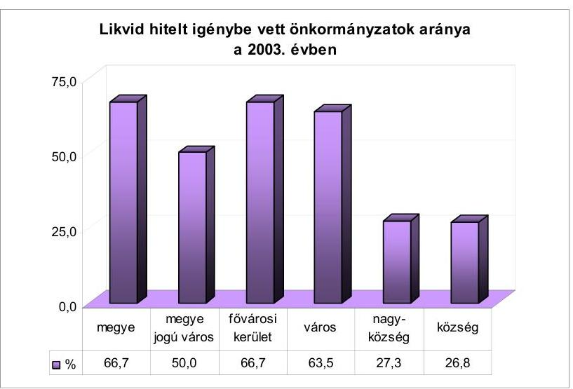

A vizsgált önkormányzatok 97,3\%-a bevételi forrásai gyarapítása érdekében élt a helyi adókivetés lehetőségével. Leggyakrabban az iparűzési adó (77,0\%) és a magánszemélyek kommunális adója (66,3\%) bevezetéséről hoztak döntést. Az építményadót az önkormányzatok 27,9\%-a, a telekadót 13,5\%-a, a vállalkozók kommunális adóját $17,4 \%$-a, az idegenforgalmi adót $18,8 \%$-a vetette ki.

A Hatv-ben biztosított maximális lehetőséggel az iparűzési adónál az érintett önkormányzatok 44,5\%-a, a kommunális jellegú adóknál 32,1\%-a, a vagyoni típusú adóknál 13,0\%-a élt. A Budapest fővárosi kerületek, megyei jogú városok és a városok valamennyi önkormányzata vetett ki valamilyen helyi adót. Az iparűzési adó mellett a városok 77,8\%-a vagyoni típusú adókkal, 93,7\%-a kommunális adókkal is növelte bevételi forrásait. A nagyközségek $13 \%$-a, a községek $14,4 \%$-a valamennyi adótípust kivetette.

Az átlagos adómérték a Hatv-ben lehetővé tett felső határhoz viszonyítva az iparűzési adónál $\mathbf{8 2 , 9 \%}$, a magánszemélyek kommunális adójánál $41,2 \%$, a vállalkozók kommunális adójánál 93,3\%, az építményadónál 40,7\%, a telekadónál $30,0 \%$, az idegenforgalmi adónak pedig $73,0 \%$ volt.

---

Az önkormányzatok a 2003. évi GFS rendszerú bevételeinek 12,9\%-át - a 2002. évben 13,6\%-át - jelentő helyi adó bevétel a 2002. évben 296,8 milliárd Ft, a 2003. évben 322,6 milliárd Ft volt.

A 2003. évben országosan az önkormányzatok összes helyi adó bevételének ${ }^{41}$ 84,3\%-a az iparúzési adóból, $12 \%$-a vagyon típusú adóból, $3,7 \%$-a kommunális jellegú adóból származott. A gépjármúadó költségvetési súlya nőtt azáltal, hogy a szabályozás változásának eredményeként emelkedett az adó összegének alsó határa és szűkült a kedvezmények köre, továbbá a teljes összeg az önkormányzatoknál maradt. Országosan a konszolidált GFS rendszerú bevételek $1,2 \%$-át, a vizsgált kört illetően $0,8 \%$-át tette ki a gépjármúadó a 2003. évben.

Az önkormányzatok 65,1\%-a az adófizetők részére a Hatv-ben nevesítetten kívül további mentességeket is biztosított. A vagyoni típusú adók körében a helyi adót kivető önkormányzatok $63,7 \%$-a, a kommunális jellegú adóknál $48,2 \%$-a, az iparúzési adó esetében $47,1 \%$-a nyújtott kedvezményt. A mentességek között a településen állandó lakóhellyel rendelkező magánszemélyek, illetve a vállalkozásoknál a kezdő vállalkozók és a kisvállalkozók kedvezménye szerepelt leggyakrabban. Ha ugyanazon adótárgy után több adónem miatt is fizetési kötelezettség keletkezett, általában csak az egyik fizetésére kötelezték az adózót.
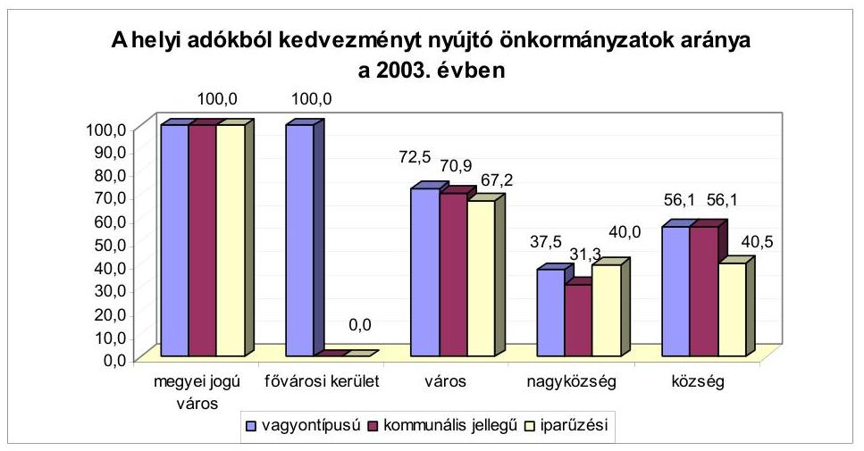

A kedvezmények, mentességek nyújtása során az önkormányzatok a település érdekeit szem elött tartva jártak el.

Az ellenőrzött önkormányzatok a finanszírozási gondok, a forráshiányos gazdálkodás és a romló pénzügyi helyzet ellenére fizetési kötelezettségeiknek eleget tettek. Fizetésképtelenség miatt adósságrendezési eljárás lefolytatását a képviselő-testületek és a polgármesterek nem kezdeményezték.

[^0]
[^0]:    ${ }^{41}$ Pótlékok és bírságok nélkül számítva.

---

# 1.8. A közbeszerzési eljárások szabályszerűsége 

A ellenőrzött önkormányzatok 66,7\%-ánál a közbeszerzések száma és értéke indokolta volna a helyi szabályozást, ennek azonban az érintettek $14,7 \%$-a nem tett eleget.

A Kbt., 96. § (2) bekezdésében kapott felhatalmazás alapján a jelentős anyagi erőforrással és intézményhálózattal rendelkező megyék, megyei jogú városok, Budapest fővárosi kerületek önkormányzatai rendeletben határozták meg a közbeszerzési eljárás kiírásával és elbírálásával kapcsolatos tevékenységre, valamint az abban eljáró személyekre vonatkozó szabályokat. A városi önkormányzatok 60,9\%-a élt a rendeleti szabályozás lehetőségével. A közbeszerzések száma és értéke további tíz városi önkormányzatnál indokolta volna a helyi rendeletalkotást, ennek ellenére a képviselő-testületek nem éltek ezzel a lehetőséggel.

A közbeszerzési rendeletek alanyi hatályát az ellenőrzött önkormányzatok 39,7\%-a kiterjesztette az önkormányzatra is a Kbt., 96. § (2) bekezdésében foglalt előírás ellenére, amely arra hatalmazta fel a helyi önkormányzatokat, hogy az általuk alapított költségvetési szervek vonatkozásában szabályozzák a közbeszerzési eljárások egyes kérdéseit. A Kbt., 31. § (3) és (6) bekezdésének előírásai ellenére a közbeszerzési eljárást lezáró döntés meghozatalára jogosult személyt $46,6 \%$-a, a közbeszerzési eljárás belső felelősségi rendjét, az eljárásba bevont személyek felelősségi körét az önkormányzatok 41,4\%-a nem határozta meg. Az önkormányzatok a Kbt. 2 2004. május 1-i hatályba lépését követően közbeszerzési rendeletüket hatályon kívül helyezték.

A közbeszerzési eljárás centrális megvalósításának (polgármesteri hivatal és intézmények) lehetőségét, célszerűségét kettő megyei, négy kerületi, nyolc városi és egy nagyközségi önkormányzat vizsgálta, illetőleg döntött az alkalmazásáról.

A 2003. évi beszerzéseknél az egyes beszerzési típusoknak megfelelő értékhatár alkalmazásakor az önkormányzatok 75,5\%-a a Kbt., 7-9. §-aiban - árubeszerzés, építési beruházás, illetve szolgáltatás meghatározása foglaltakat figyelembe vette. Az árubeszerzések, építési beruházások, szolgáltatások becsült értékének számításakor a 2003. évben az önkormányzatok 73,5 \%-a a Kbt., 5. §-ának - azonos tárgyú közbeszerzésekre vonatkozó - előírásai szerint járt el. Figyelembe vették a részekre bontás Kbt., 5. § (1) bekezdés szerinti tilalmát, a Kbt., 5. § (2) bekezdés alapján a beszerzések értékét egybeszámították, a Kbt., 5. § (3) bekezdésében foglalt lehetőséggel élve több közbeszerzési eljárásban szerezték be ezeket az eszközöket.

Az önkormányzatok 32,3\%-a megsértette ${ }^{42}$ a Kbt., 2. § (1) bekezdésében foglalt rendelkezést, mivel a törvény hatálya alá eső árubeszerzés, épí-

[^0]
[^0]:    ${ }^{42}$ A Kbt. 70. § (7) bekezdésében szabályozott, jogorvoslati eljárásra indítására a 90 napos jogvesztő határidő valamennyi ellenőrzött beszerzés vonatkozásában letelt, így az ÁSZ-nak a felsorolt ügyekben jogorvoslati eljárás kezdeményezésére nem volt lehetősége.

---

tési beruházás és szolgáltatás megrendelésekor nem folytatták le a közbeszerzési eljárást, annak ellenére, hogy azok értéke a 2003. évi költségvetési törvény 55. § (1) bekezdésében megállapított értékhatárt elérte. ${ }^{43}$

A Kbt., 4. § (1) bekezdésében foglaltakat megsértve kettő városi és egy Budapest fővárosi kerületi önkormányzat az épület-felújítás és műszaki ellenőrzési feladatok becsült értékének meghatározásakor nem a beszerzés megkezdésének időpontjában annak tárgyáért kért legmagasabb összegű ellenszolgáltatást vette figyelembe.

A Kbt., 4. § (5) bekezdésében foglaltaktól eltérően kettő megyei, kettő Budapest fővárosi kerületi, öt városi önkormányzat a határozatlan idejű, egy évnél hoszszabb időre kötött szerződéseknél - parkfenntartás, köztisztaság, közterület karbantartás, takarítás, őrző-védő, ügyeleti ellátás szolgáltatásainak megrendelésekor - nem folytatta le a közbeszerzési eljárást, annak ellenére, hogy az egy évre számított ellenszolgáltatás összege elérte az értékhatárt.

A Kbt., 5. § (2) bekezdésében foglaltakat figyelmen kívül hagyva a becsült érték számítása során 33 esetben - élelmezési anyag, irodaszer, nyomtatvány, személygépkocsi, gyógyszer, számítástechnikai eszköz beszerzéskor, intézményi étkeztetés, útfelújítás, hó és síkosságmentesítés, utak kátyúmentesítése, épületfelújítás, csatorna- és járdaépítés megrendelésekor - az árubeszerzések, illetve a szolgáltatások értékét nem számították egybe.

A Kbt., 9. § (1) bekezdésében előírtakat megsértve 11 városi önkormányzat közvi-lágítás-, épület-, járda felújítását, tetőszigetelését, utcák burkolat javítását nem szolgáltatási tevékenységnek minősítette, hanem építési beruházásnak.

A közbeszerzési eljárások lefolytatásának szabályszerűségét 152 eljárás alapján értékeltük, melyből $80,3 \%$ nyílt, $3,9 \%$ meghívásos és $15,8 \%$ tárgyalásos eljárás volt. Az eljárási fajták kiválasztásánál a Kbt., 26. §-ában meghatározott előírásokat érvényesítették az önkormányzatok. Az eljárás előkészítésében, illetve más szakaszában a Kbt., 31. § (2) bekezdésében előírt összeférhetetlenséget az eljárások 10,5\%-ánál nem vizsgálták. Az ajánlatok felbontására a Kbt., 51. § (1) bekezdésében foglaltaknak megfelelően az ajánlattételi határidő lejártának időpontjában került sor. Az ajánlatok felbontásakor, illetőleg azt követően szabályosan állapították meg az ajánlatok érvényességét. Az ajánlatok elbírálása során a Kbt., 55-60. §-aiban foglaltakat a közbeszerzési eljárások 5,3\%-ánál nem tartották be. Az ajánlatok elbírálásáról a közbeszerzési eljárást lezáró határozatot a képviselő-testület, illetve önkormányzati bizottság hozta meg az önkormányzatok 55,4\%-ánál, amivel megsértették a Kbt., 31. § (3) bekezdésébe foglalt személyi döntésre vonatkozó előírást. A közbeszerzési eljárás eredményének kihirdetése és közzététele az eljárások 4,6\%-ánál a Kbt., 61. §ában foglaltak ellenére nem történt meg.

[^0]
[^0]:    ${ }^{43}$ A közbeszerzés értékhatára 2003. december 31-ig a 2003. évi költségvetési törvény 55 § (1) bekezdés a) pontja szerint az árubeszerzések esetében 20 millió Ft, a)-b) pontja alapján építési beruházás esetében 40 millió Ft, a)-c) pontja értelmében szolgáltatás megrendelésekor 10 millió Ft volt.

---

Az önkormányzatok az eljárások 97,4\%-ánál a közbeszerzési eljárás nyerteseivel a Kbt., 62. § (1) bekezdésében foglaltakat betartva a felhívás, a dokumentáció és az ajánlat tartalmának megfelelően kötötték meg a szerződéseket, később ezek $36,8 \%$-át módosították a szerződő felek. A szer-zödés-módosítások Kbt., 73. § (1) bekezdésében meghatározott feltételei kettő eljárás esetében nem voltak meg.

A Közbeszerzési Tanács mellett múködő Közbeszerzési Döntőbizottság a közbeszerzési eljárást lefolytató önkormányzatok 17\%-át marasztalta el.

A Közbeszerzési Döntőbizottság elmarasztalásának indokai voltak: az ajánlatkérő nem az ajánlati felhívásban meghatározott szempontok alapján értékelte az ajánlatokat (három esetben), az elbírálási részszempontok nem gazdaságilag értékelhető mennyiségi és minőségi tényezőkön alapultak, az ajánlati biztosítékot az ajánlattevő tíz napon belül nem fizette vissza, a nyertes ajánlattevő ajánlata nem felelt meg az ajánlati felhívásban meghatározott feltételeknek, a rendkívüli sürgősség indoka nem állt fent, az ajánlattevő nem határozta meg az ajánlati felhívásban az érvénytelenség okait, illetve érvénytelennek nyilvánította az ajánlatot, melyről az ajánlattevőt nem tájékoztatta.

# 1.9. A zárszámadás szabályszerűsége 

A polgármesterek az éves gazdálkodásról szóló zárszámadási rendelettervezeteket az önkormányzatok 5,9\%-ánál az Áht. 82. §-ában foglalt határidőn túl nyújtották be a képviselő-testületek részére.

Az önkormányzatok 29,2\%-ánál (az előző évben 37\%-ánál) az Áht. 18. §ában foglaltakat megsértve a zárszámadási rendelet nem a költségvetési rendelettel összehasonlítható módon készült az előterjesztés hibája miatt. Az önkormányzatok 16,2\%-ánál (az előző évben 22\%-ánál) a zárszámadási rendelettervezetben szereplő eredeti előirányzatok fő- és részösszegei nem egyeztek meg a költségvetési rendelet vonatkozó adataival, vagy a rendelettervezetek nem is tartalmazták azokat. A bevételek és kiadások módosított előirányzataként nem a legutolsó költségvetési rendeletmódosítás alkalmával elfogadott módosított előirányzatot szerepeltették a zárszámadási rendelettervezetben az önkormányzatok 27,2\%-ánál (az előző évben 36\%-ánál).

A zárszámadási rendeletek szerkezetére, tartalmára, részletezettségére vonatkozó az Áht. 69. § (1) bekezdésében, illetve az Ámr. 29. § (1) bekezdésében rögzített kötelező előírásokat egy vagy több ponton be nem tartó önkormányzatoknál az évek óta ismétlődő típushibák a következők voltak:

- a működési, fenntartási előirányzatok önkormányzati szintű teljesítését 7,1\%-nál hiányosan tartalmazták, ezen belül jellemzően az ellátottak pénzbeli juttatásainak, a speciális célú támogatásoknak és a tényleges létszámadatoknak a bemutatása maradt el;
- a működési, fenntartási előirányzatok költségvetési szervenkénti és kiemelt előirányzatonkénti teljesítését $36,8 \%$-nál nem tartalmazták, $52,2 \%$-nál elmaradt az intézményenkénti tényleges létszámok bemutatása;

---

- a polgármesteri hivatalok kiadásainak teljesítését feladatonként 30,1\%-nál, a felújítási előirányzatok teljesítését célonként 27,6\%-nál és a felhalmozási kiadásokat feladatonként $26,4 \%$-nál nem részletezték;
- a múködési és felhalmozási célú bevételeket és kiadásokat mérlegszerűen $42,1 \%$-nál, illetve $42,2 \%$-nál nem mutatták be.

Az önkormányzatok 66,2\%-a - az előző évekhez hasonlóan - a zárszámadás előterjesztésekor az Áht. 118. §-ának előírását megsértve tájékoztatásul nem mutatta be az összevont mérleget, a vagyonkimutatást, valamint a többéves kihatással járó döntések számszerúsítését évenkénti bontásban, összesítve, továbbá a közvetett támogatásokat az előírt szöveges indoklással együtt.

# Az éves költségvetési beszámolóban a polgármesteri hivatalok pénzmaradványát az önkormányzatok 81,7\%-a (az előző évekkel azonos arányban) a Vhr. 38-39. §-ai és az Ámr. 65-67. §-aiban foglaltaknak megfelelően, szabályszerűen állapította meg. 

A zárszámadási rendelet az önkormányzatok 47,8\%-ánál a pénzmaradványt - az Ámr. 66. § (4) bekezdése előírásai ellenére - nem költségvetési szervenként, hanem önkormányzatra összesítve tartalmazta. A költségvetési szervek pénzmaradványának megállapítása során elmaradt a részben önállóan gazdálkodó intézmények, a körjegyző́ségek pénzmaradványának jóváhagyása. Az intézmények pénzmaradványának megállapításánál az önkormányzatok 30,8\%-a élt az Ámr. 66. § (6) bekezdés g) pontjában biztosított jogkörével, az intézményeknél keletkezett szabad pénzmaradvány egy részét vagy egészét elvonta. Az önkormányzatok 23,8\%-ánál nem mutatták ki a pénzmaradvány személyi juttatásra és felhalmozásra fordítható részét, valamint a kötelezettséggel nem terhelt, szabadon felhasználható pénzmaradványt.

Vállalkozási tevékenységet az ellenőrzött polgármesteri hivatalok 3,2\%-ánál végeztek, ezek 75,0\%-a a vállalkozási tevékenység eredményének megállapításánál és felhasználásánál szabályszerűen járt el. A vállalkozási tevékenység eredményét visszaforgatták az alaptevékenységre, így befizetési kötelezettségük nem keletkezett. A községi önkormányzatok közül három folytatott úgy vállalkozási tevékenységet a 2003. évben, hogy annak bevételeit és kiadásait a polgármesteri hivatal nem gyűjtötte külön szakfeladaton, az Ámr. 68. §ában előírtak ellenére nem készített eredmény-kimutatást.

A képviselő-testületek a költségvetési szervek elemi beszámolója felülvizsgálatának rendjét, tartalmát - az Ámr. 149. § (2) bekezdésének előírása ellenére az önkormányzatok $81,5 \%$-nál nem határozták meg. Az intézmények költségvetési beszámolóját az Ámr. 149. § (3) bekezdésében meghatározott határidőig az önkormányzatok 48,4\%-ánál felülvizsgálták, annak elfogadásáról az Ámr. 149. § (5) bekezdése alapján a jegyzők 35,6\%-a írásban értesítette az intézményeket. A zárszámadás és az éves költségvetési beszámoló adatainak egyezőségét az önkormányzatok 23,0\%-ánál nem biztosították az előirányzati adatok tekintetében.

---

# 1.10. A pénzügyi-számviteli feladatok ellátásának informatikai támogatottsága 

A polgármesteri hivatalokban a főkönyvi könyvelés és a beszámoló készítés számítógépes támogatottsága biztosított volt a Kincstár által rendelkezésükre bocsátott, folyamatosan korszerűsített szoftverekkel. Az analitikus nyilvántartó programok közül a központilag elfogadott, folyamatosan aktualizált és a főkönyvi könyveléshez, beszámoló készítéshez illeszkedő programokat a polgármesteri hivatalok $95,1 \%$-a részben, $4,9 \%$-a egyáltalán nem használta.

Az analitikus nyilvántartások közül a kötelezettségvállalás és a házipénztár nyilvántartását a polgármesteri hivatalok $2,9 \%$-a, illetve $15,7 \%$-a oldotta meg számítógépes program segítségével, $78,4 \%$-a a tárgyi eszközök, $43,1 \%$-a a készletek analitikus nyilvántartására használt számítógépes szoftvereket.

Az analitikus nyilvántartások vezetéséhez az előbb említetteken kívül még típusprogramokat vagy egyedi igényeknek megfelelően készíttetett szoftvereket vásároltak a polgármesteri hivatalok. A beszerzésnél azonban jellemzően nem vizsgálták, hogy a már meglévő programokhoz azok illeszkednek-e, így az analitikus és főkönyvi nyilvántartások programjai a polgármesteri hivatalok 50,0\%-ánál nem voltak egymással összekapcsolhatók. A polgármesteri hivatalok 61\%-a rendelkezett számítógépes hálózatos rendszerrel. A polgármesteri hivatalok $45,5 \%$-a alkalmazott az informatikai rendszer használatához informatikai tudással rendelkező szakembert, rendszergazdát.

A polgármesteri hivatalokra továbbra is jellemző volt, hogy a pénzügyiszámviteli feladatok ellátásához nem integrált programrendszert használtak, a szoftverek egy-egy részterülethez kapcsolódtak, lokálisan múködtek, nem használtak közös adatbázist. Az egységes, integrált, valamennyi munkafázist lefedő és kiszolgáló pénzügyi-számviteli rendszer, az erre alkalmas programok kis száma miatt nem alakult ki. Az integrált informatikai rendszernek az azt előnyét, hogy gyorsabb, biztonságosabb munkavégzést és adatszolgáltatást tesz lehetővé, nem tudták kihasználni.
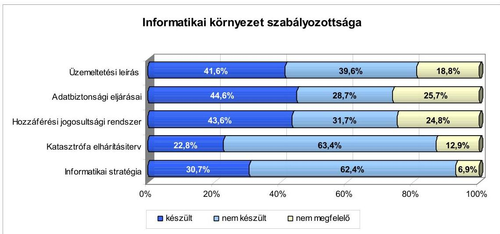

---

A szabályozottság terén az előző évhez viszonyítva javulás mutatkozott. A megyei jogú városok mindegyike, Budapest fővárosi kerületek fele, a megyei önkormányzatok és a városok egyharmada, a nagyközségek 4,5\%-a rendelkezett hosszú távú informatikai stratégiával, amelyben meghatározták a célkitűzéseiket, informatikai jövőképüket. A polgármesteri hivatalok 63,4\%-ánál nem készítettek katasztrófa elhárítási tervet, 23,0\%-a rendelkezett megfelelő informatikai szabályzattal, 43,6\%-a dolgozta ki az informatikai rendszer használatával összefüggő program részletezettségű hozzáférési jogosultságokat, azonban közel 10,6\%-nál ezt nem dokumentálták. Az adatbiztonsági eljárás szabályainak dokumentálását a polgármesteri hivatalok 5,1\%-a nem végezte el. Az informatikai rendszerek 41,6\%-a üzemeltetési leírással, a pénzügyi-számviteli felhasználói programok 53,6\%-a a felhasználói rendszer leírásával, 61,8\%-a a szoftverek múködési leírásával rendelkezett.

A számítógépet használók 33,3\%-a végzett számítógép-kezelői tanfolyamot, amely igazolt alapfokú informatikai képzettséget adott. Az előző évhez viszonyítva fejlődés mutatkozott a pénzügyi-számviteli programot használóknál, $45,1 \%$-uk vett részt az alkalmazott program használatához segítséget nyújtó tanfolyamon. Javulás mutatkozott abban is, hogy a pénzügyi-számviteli programokat használók munkaköri leírásainak 59,0\%-a az informatikai rendszer használatát, a használat során elvégzendő feladatok, kötelezettségek leírását, a munkakörhöz kapcsolódó programkezelési ismeretek elsajátításának követelményét tartalmazta. A felhasználók munkaköri leírásának 40,2\%-a nem tartalmazta az informatikai rendszer használatát.

Az informatikai fejlesztések során kiemelt figyelmet kapott az elavult számítógépek cseréje, a magasabb verzió számú, jogtiszta szoftverek beszerzése. A polgármesteri hivatalok 80,4\%-a a régi, elavult informatikai eszközeit folyamatosan kicserélte, ennek elősegítése érdekében 13,7\%-a vett részt informatikai eszközök beszerzését segítő pályázatokon. A polgármesteri hivatalok $67,7 \%$-a a szoftverek állományát is korszerűsítette beszerzéssel, illetve $31,4 \%$-a saját program készítésével, fejlesztésével.

# 2. AZ ÖNKORMÁNYZATI FELADATOK ÉS A RENDELKEZÉSRE ÁLLÓ FORRÁSOK ÖSSZHANGJA 

### 2.1. Az önkormányzati feladatok meghatározása és szervezeti keretei

Az önkormányzatok 2001. január 1-jén a közszolgáltatások 41,2\%-át költségvetési szervek, $36,2 \%$-át egyéni és társas vállalkozások, $19,2 \%$-át társulás és $3,4 \%$-át közhasznú szervezetek útján nyújtották.

Az önkormányzatok a 2001-2004. években több intézményracionalizálási intézkedésről döntöttek, de a költségvetési intézmények meghatározó szerepe továbbra is megmaradt. A közhasznú szervezetek köre ezen időszakban 30-cal bővült, a közszolgáltatásban 67-tel több társas és egyéni vállalkozás vett részt.

---

Szociális alapellátási és szakosított intézményt kettő megyei, négy városi, egy nagyközségi és két községi önkormányzat hozott létre az elhelyezésre várakozók számának növekedése miatt. Tíz önkormányzatnál az átszervezéseket, a gazdálkodási jogkörök módosítását, a gazdaságosabb múködtetés igénye, az azonos feladatok egységes szakmai irányítása motiválta. A Pest Megyei Önkormányzatnál 2004. január 1-től kettő bentlakásos intézmény integrációját a kis férőhelyszám és a földrajzi közelség indokolta. Intézmény megszüntetését Törökszentmiklós Város Önkormányzatánál az alacsony férőhely kihasználtság tette szükségessé. Szombathely megyei jogú város a szociális és gyermekjóléti ellátás intézményi feladatait egy-egy kiemelkedően közhasznú társaságnak adta át, amelyek a város egész területén azonos szintű szolgáltatást biztosítottak. Eger megyei jogú városban az egészségügyi ellátást irányító önállóan gazdálkodó intézmény átszervezésére került sor, melynek eredményeképpen az egészségügyi szakellátás tiszta profilú, részben önállóan gazdálkodó intézmény feladata lett. Az óvodai nevelést, az alap- és középfokú oktatást szolgáló intézményhálózat átszervezéséről 31, intézményi összevonásokról 28 önkormányzat döntött a gyermeklétszám csökkenése miatt, szem előtt tartva a szakmai színvonal megőrzését, a múködés hatékonyságának növelését.

Az önkormányzati feladatok ellátásában közreműködő közhasznú szervezetek 6,3\%-át a szociális alapellátás, $6,3 \%$-át az egészségügyi szakellátás, $6,3 \%$-át a középfokú oktatás, $12,5 \%$-át a közművelődés, $25 \%$-át a sport, $43,6 \%$-át a településüzemeltetés gazdaságosabb és célszerűbb működtetése érdekében hozták létre.

A 2001-2003. években 2,4\%-kal nőtt az önkormányzatoknál a feladatellátásba bevont gazdasági társaságok száma, amelyek 81,0\%-a a településüzemeltetési feladatok teljesítésében múködött közre. Egyéb kötelező feladatokat 46 önkormányzat adott át megállapodásban rögzített feltételekkel vállalkozások részére.

Az Ötv. 41-43. §-aiban, valamint a Társ. tv. által biztosított lehetőséggel élve az önkormányzatok társulásban való részvétele 13,5\%-kal emelkedett a 2001-2003. években. A társulásban résztvevők körének bővítése 9\%-ban a városi, $6,8 \%$-ban a nagyközségi, $84,2 \%$-ban a községi önkormányzatoknál történt meg. Az önkormányzatok 22,6\%-a terület- és térségfejlesztési társulásokban vett részt a 2001-2003. években, melyek a programok összehangolására, kidolgozására, a fejlesztési források bővítését szolgáló pályázati lehetőségek kiaknázására, a kapott támogatások hatékonyabb felhasználására alakultak. Az önkormányzatok 8,0\%-a a hatósági igazgatási feladatok szakszerűbb ellátása érdekében vett részt 2001-2003. években társulás létrehozásában.

Az önkormányzatok körében feladatátadás-átvételekre is sor került a 20012003. években:

- az Ötv. 63. § (3) és (5) bekezdésében foglaltak figyelembevételével, a Budapest Fővárosi Közgyűléssel kötött megállapodás alapján Budapest főváros VI. és XVI. kerületi önkormányzatok a Budapest Fővárosi Önkormányzat fela-dat- és hatáskörébe tartozó járóbeteg-szakellátás működtetését vállalták át;

---

- az Ötv. 69. § (3) bekezdésében foglaltak alapján Pécel Város Önkormányzata a Pest Megyei Önkormányzattól egy középfokú oktatási intézmény fenntartását vette át;
- az Ötv. 70. § (1) bekezdése alapján a települési önkormányzatok kezdeményezésére a megyei önkormányzatok körzeti közszolgáltatást nyújtó intézményeket vettek át.

A Pest Megyei Önkormányzat a 2001-2003. évek között 16 intézmény átvételéről döntött. Pápa Város Önkormányzata öt - szakképző iskola, gimnázium, általános iskola, zeneiskola, nevelési tanácsadó - korábban közös finanszírozásban fenntartott intézményt adott át a Veszprém Megyei Önkormányzatnak, mivel az intézmények működtetéséhez adott megyei önkormányzati támogatás mértékében nem tudtak megállapodni. Ajka Város Önkormányzata a 2003. évben három középfokú iskola átadásáról döntött, mely éves szinten 20 millió Ft költségvetési megtakarítást eredményezett.

- Gyomaendrőd Város Önkormányzata egy önállóan gazdálkodó szakképző intézmény, Villány Város Önkormányzata egy szakképző iskola és kollégium fenntartói jogát átadta a Földművelődésügyi és Vidékfejlesztési Minisztérium részére, miután az intézmények felújításához az önkormányzat forrással nem rendelkezett.
- Tiszafüred Város Önkormányzata egy óvoda, egy általános iskola és egy bentlakásos szociális otthon múködtetését Tiszaszőlős Község Önkormányzatának, Budakeszi Város Önkormányzata egy óvoda működtetését, az identitás megőrzésének hangsúlyosabb érvényesülése érdekében, a helyi német kisebbségi önkormányzat részére adta át.

Az Ötv. 39-40. §-ában foglaltak alapján az önkormányzat múködésével, valamint az államigazgatási ügyek döntésre való előkészítésével kapcsolatos feladatok ellátása érdekében egy megyei jogú városi, 10 városi, kettő nagyközségi és 182 községi önkormányzat vállalta a körjegyzői feladatok ellátását, illetve körjegyzőséget hozott létre. A körjegyzőségben részvevő önkormányzatok 19,0\%-a gazdaságtalansága ellenére a településen önálló hivatali szervezetet tartott fent.

# 2.2. A kötelező és az önként vállalt önkormányzati feladatok finanszírozása 

Az ellenőrzött önkormányzatok által ellátott kötelező feladatok közül az előző évekhez hasonlóan a szociális ellátás és a közoktatás egyes feladataira fordított kiadásokat és azok forrásait tekintettük át, amelynek számszerú adatait a 12-es és a 13-as számú mellékletek tartalmazzák.

A szociális és a közoktatási feladatok naturális mutatókkal mérhető ellátásaira fordított kiadások az ellenőrzött önkormányzatoknál a 2001. év és a 2003. év között 32\%-kal nőttek. A kiadások növekedésében a személyi juttatások és járulékai emelkedése volt a meghatározó a végrehajtott közalkalmazotti bérintézkedések miatt.

---

A három évesnél fiatalabb gyermekek napközbeni bölcsődei gondozását a 2001. évben 5394 férőhely biztosította, melyek száma a 2003. évre 5142-re csökkent. A bölcsődei ellátásban részesülők köre a 2001-2003. évek között 3817 fơről - 7,6\%-kal - 4106 főre emelkedett, amely hozzájárult ahhoz, hogy a bölcsődei férőhelyek kapacitáskihasználtsága 9,1 százalékponttal, 70,8\%-ról-79,9\%-ra növekedett Az egy bölcsődés korú ellátásának kiadása a 2001. évben 787638 Ft/fő volt, amely a 2003. évre 1033503 Ft/főre emelkedett. Az egy főre jutó kiadások 31,2\%-os növekedését a működési kiadások $41,2 \%$-os és az ellátottak számának 7,6\%-os bővülése eredményezte.

A fajlagos kiadás összege a legmagasabb Eger Megyei Jogú Város Önkormányzatánál volt a 2003. évben 1535215 Ft/fő, ami az országos átlagot 48,5\%-kal haladta meg. A legkisebb fajlagos kiadás mellett Szentlőrinc Város Önkormányzata múködtette bölcsődéjét, az egy ellátottra fordított kiadás a 2001-2003. évek között 351500 Ft/főről 31,7\%-kal 463000 Ft/főre emelkedett.

A bölcsődei ellátások kiadásainak forrását a 2003. évben 35,6\%-ban az állami hozzájárulás, 56,7\%-ban önkormányzati támogatás és 7,7\%ban az intézményi bevételek képezték. Az önkormányzati források meghatározó szerepe fennmaradt, az állami szerepvállalás bővülése ellenére a múködtetéshez biztosított önkormányzati támogatások összege a 2001. évhez viszonyítva a 2003. évben 17,3\%-kal volt magasabb.

A nappali ellátást nyújtó intézmények férőhelyeinek kihasználtsága a 20012003. években $108,6 \%-107,2 \%-106,1 \%$ volt. Az egy ellátottra jutó kiadás a 2001. évben 208048 Ft/fő volt, mely a 2003. évre 40,6\%-kal, 292460 Ft/főre nőtt, a működtetési ráfordítások 37,3\%-os emelkedése, valamint az ellátottak számának 2,3\%-os csökkenése miatt. A múködési kiadások forrásösszetételében a normatív állami hozzájárulás a 2001-2003. években 56,3\%-64,4\%$62,1 \%$ részarányt képviselt, az önkormányzatok 24,6\%-20,2\%-21,2\%-os támogatási aránya mellett.

A legmagasabb egy főre jutó kiadás ( 349023 Ft/fő) a Budapest Főváros XVIII. Kerületi Önkormányzat nappali ellátást nyújtó intézményeinek múködését jellemezte a 2003. évben, amely a vizsgált önkormányzatok átlagához viszonyítottan 19,3\%-kal, az ellenőrzött Budapest fővárosi kerületek átlagához képest 13,5\%-kal volt magasabb. A legalacsonyabb egy főre jutó kiadás ( 146713 Ft/fő) a 2003. évben Baja Város Önkormányzatánál volt.

A bentlakásos szociális intézmények nyújtottak ápolást és gondozást az önmaguk ellátására nem, vagy csak folyamatos segítséggel képes idősek, pszichiátriai és szenvedélybetegek, fogyatékos személyek valamint hajléktalanok részére a 2003. évben 10465 férőhelyen, 98,5\%-os kapacitáskihasználtság mellett. Az intézmények egy fôre jutó múködési kiadása a 2001-2003- években 887456 Ft/fő - 1115509 Ft/fő - 1374387 Ft/fő volt. Az egységnyi kiadások 54,9\%-os növekedését a fenntartásra fordított kiadások 52,7\%-os emelkedése és az ellátottak számának 1,4\%-os csökkenése eredményezte.

A legmagasabb egységnyi ráfordítás - 3577714 Ft/fő - mellett a 2003. évben Budapest Főváros IX. Kerületi Önkormányzat biztosította 21 fő ellátását, amely a vizsgált önkormányzatok átlagánál 160\%-kal, az ellenőrzött Budapest fővárosi kerületi önkormányzatok átlagánál 106,4\%-kal volt magasabb. A legalacso-

---

nyabb egységnyi ráfordítás - 358650 Ft/fő - Fehérgyarmat Város Önkormányzatának fenntartásában múködő intézményben volt a 2003. évben, ahol az ellenőrzött önkormányzatok átlagához képest $73,9 \%$-kal, az ellenőrzött városi önkormányzatok átlagához viszonyítva $73 \%$-kal kevesebb kiadást fordítottak egy ellátott gondozására.

Az ellátás múködtetésének forrásában a 2001-2003. években meghatározó volt a normatív állami hozzájárulás $54 \%-53,6 \%-53,4 \%$-os részaránya. Az intézményi saját bevételek csökkenő mértékben - $34,4 \%-30,3 \%-27,6 \%$-os -, az önkormányzati támogatás növekvő arányban - $11,6 \%-16,1 \%-19,0 \%$-ban - járult hozzá a feladatellátás finanszírozásához.

A közoktatás feladatcsoportból az óvodai nevelésre, iskolai életmódra való felkészítésre, valamint a nappali rendszerú, általános iskolai oktatásra terjedt ki az adatok megfigyelése.

Az óvodai férőhelyek száma a 2001. évi 49 689-ről a 2003. évre 6,9\%-kal, az ellátottak száma $8,7 \%$-kal csökkent, ezért a kapacitáskihasználtság a 2001. évi 100,1\%-ról a 2003. évre 98,0\%-ra módosult. Az egy óvodai ellátottra a 2001-2003. években 251537 Ft/fő, 318258 Ft/fő, 415470 Ft/fő kiadást fordítottak az ellenőrzött önkormányzatok. Az egy főre jutó ráfordítás 65,2\%-os növekedését a működtetési-fenntartási kiadások 50,6\%-os emelkedése és az ellátottak számának $8,7 \%$-os csökkenése befolyásolta. A kiadások forrásösszetételében a normatív állami hozzájárulás részaránya fokozatosan csökkent - $52,2 \%, 50,5 \%, 47,2 \%$-, az önkormányzati támogatás növekedett, $41,5 \%, 43 \%, 46,8 \%$ volt a 2001-2003. években.

A Budapest Főváros VI. Kerületi Önkormányzatnál volt a legmagasabb - 783276 Ft/fő - az egy óvodai ellátottra fordított kiadás a 2003. évben, mely a vizsgált önkormányzatok átlagát $88,5 \%$-kal, az ellenőrzött Budapest fővárosi kerületi önkormányzatok átlagát $58,0 \%$-kal haladta meg. Az óvodai ellátást Nyírmada Nagyközség Önkormányzata biztosította a legalacsonyabb - 255136 Ft/fő - fajlagos kiadás mellett a 2003. évben, amely az ellenőrzött önkormányzatok átlagánál $38,6 \%$-kal, az ellenőrzött nagyközségi önkormányzatok átlagánál 27,3\%kal volt kevesebb.

Az egy általános iskolai oktatásban részesülő tanulóra jutó kiadás a 2001-2003. években - 199408 Ft/fő, 249559 Ft/fő, 320879 Ft/fő volt, $60,9 \%$-kal emelkedett, a múködési kiadások $51,1 \%$-os növekedése és a tanulók számának $6,1 \%$-os csökkenése hatására. A múködtetésre fordított kiadások finanszírozásában a normatív állami hozzájárulás aránya a 2001. évi 71,7\%-ról a 2003. évre $67,7 \%$-ra csökkent. Az önkormányzatok növekvő arányban 2001. évben $22,7 \%$, a 2003. évben $27,3 \%$ - járultak hozzá az alapfokú oktatás személyi és tárgyi feltételeinek biztosításához.

A Fejér Megyei Önkormányzat a legmagasabb egységnyi kiadás - 744526 Ft/fő mellett biztosította a 2003. évben az alapfokú oktatást, ami az ellenőrzött önkormányzatok átlagát $132,0 \%$-kal, az ellenőrzött megyei önkormányzatok átlagát $25,3 \%$-kal haladta meg. Az alapfokú oktatás múködésére a 2003. évben legalacsonyabb egy főre jutó kiadást - 176852 Ft/fő - Derecske Város Önkormányzata teljesítette, ami az ellenőrzött önkormányzatok átlagának 48,7\%-a, az ellenőrzött városi önkormányzatok átlagának $76,5 \%$-a volt.

---

A középiskolai oktatásban részesülők száma a 2003. évben 84701 fő volt, amely $0,7 \%$-kal magasabb a 2001. évinél. Az egy középiskolai tanuló ellátására 255359 Ft/fő kiadást fordítottak az önkormányzatok a 2003. évben, amely a múködési kiadások emelkedése miatt 20,9\%-kal haladta meg a 2001. évit. A középiskolai oktatás kiadásait a 2003. évben 74\%-ban állami hozzájárulás, 18,6\%-ban önkormányzati támogatás és 7,4\%-ban intézményi saját bevétel finanszírozta. A kiadások finanszírozásának forrásösszetételében a 2001. évhez képest jelentős változás nem volt.

A költségvetés tervezés és beszámolás rendje az adott feladatcsoportba tartozó valamennyi kiadás egy közös szakfeladaton való elszámolását ${ }^{44}$ írta elő. Ezáltal együttesen került megtervezésre és elszámolásra a nappali gondozásra szoruló időskorúak, fogyatékosok, valamint a szenvedélybetegek részére fenntartott klubok és egyéb nappali intézmények tevékenységével kapcsolatban felmerüló bevételek és kiadások.

Az ÁSZ a helyi és a helyi kisebbségi önkormányzatok gazdálkodásának 2003. évi átfogó ellenőrzéséréről készült jelentésében a pénzügyminiszternek javasolta, az önkormányzati finanszírozási rendszer korszerűsítése keretében a hatályos szakfeladat rend átgondolását, módosítását, annak érdekében, hogy a főbb alapellátási formák kiadásai-bevételei, feladatmutatói, a különböző szintű tervezéshez, a költségarányos finanszírozási rend és teljesítménykövetelmények kialakításához, valamint ezek teljesítésének ellenőrzéséhez megállapíthatóak legyenek. A 2005. évi elemi költségvetés készítést megalapozó szakfeladatrend módosult, első lépésben a közoktatási alapellátási formák és a szociális ellátás rendszerében. Elválasztásra kerültek az alaptevékenységektől a kiegészítő, kisegítő, valamint a vállalkozási tevékenységek fő ágazatonként, ezzel megteremtődtek az alapjai az önkormányzati feladatrendszer struktúrájához kapcsolódó, az ágazati törvények szerinti differenciált elszámolásnak.

A megyei, a megyei jogú városi, a Budapest főváros kerületi, a városi és a nagyközségi önkormányzatok jelentős ráfordítást igénylő önként vállalt feladatokat is elláttak a 2001-2003. években. Az önkormányzatok önként vállalt feladatai köréből az államháztartáson kívülre nyújtott működési és felhalmozási célú támogatások voltak a jellemzőek.

A megyei, a megyei jogú városi, a Budapest fôvárosi kerületi önkormányzatok költségvetésében az önként vállalt feladatok részesedése Győr Megyei jogú Város kivételével - a 2001. évhez képest a 2003. évre fokozatosan csökkent. Az önként vállalt feladatok ellátásának kiadásai a 20012003. évi költségvetésekben a megyei önkormányzatoknál 0,5\%-4,6\%, a megyei jogú városoknál 6,0-15,5\%, a főváros kerületeinél 6,0-17,0\% közötti részarányt képviseltek. Az államháztartáson kívülre nyújtott támogatáson túl a Pest és a Hajdú megyei önkormányzatok egy-egy óvoda, Győr és Kecskemét megyei jogú városok önkormányzatai színházak, Budapest főváros kerületei középfokú és alapfokú művészeti oktatást szolgáló intézmények működtetéséről

[^0]
[^0]:    ${ }^{44}$ PM tájékoztató a költségvetési szervek részletes költségvetési előirányzatainak összeállítására szolgáló nyomtatványgarnitúrák kitöltéséhez, 2003. évi kiadvány

---

gondoskodtak. A Budapest főváros I., VI., XIII. kerületi önkormányzatok járóbeteg-szakellátást nyújtottak a lakosság részére.

Az ellenőrzött önkormányzatoknál az önként vállalt feladatok ellátását szolgáló kiadások a 2001-2003. években nem veszélyeztették a kötelezően előírt feladatok ellátását.

A középületek akadálymentesítésére ${ }^{45}$ irányuló munkák műszaki feltételeit az 1999-2004. évek között valamennyi megyei, megyei jogú városi és kerületi önkormányzat, a városi önkormányzatok 59,4\%-a, a nagyközségi és községi önkormányzatok 54,1\%-a mérette fel. A feladatok végrehajtásának finanszírozására a 2001-2003. évi költségvetésekben az ellenőrzött önkormányzatok 7,8\%-a irányozott elő összesen 473 millió Ft-ot, amely 1,3\%-kal magasabb, 479 millió Ft összegben realizálódott. A vizsgált önkormányzatok közül mindössze egy városban (Zalakaros), valamint 50 községben biztosították a törvény előírásának megfelelően az akadálymentes közlekedés feltételeit.

A középületekben az akadálymentesség megteremtéséhez szükséges forrásigény és a 2001-2003. években az erre a célra fordított kiadások időarányos összhangja az ellenőrzött önkormányzatok 86,4\%-ánál nem állt fent, ezért a Fot. 29. § (6) bekezdésében meghatározott 2005. január 1-i határidő teljesítésének feltételei nem voltak biztosítottak.

# 3. BELSŐ ELLENŐRZÉSI RENDSZER MŰKÖDÉSÉNEK ÉRTÉKELÉSE 

### 3.1. Az önkormányzati ellenőrzési rendszer kialakítása, múködése

Az önkormányzati költségvetési szervek belső ellenőrzését meghatározó jogszabályi előírás-változások az önkormányzatoktól megkövetelték a belső ellenőrzési terület újraszabályozását. Ezért ellenőrzésünk során figyelemmel voltunk a jelentős jogszabályi módosítások helyi önkormányzatoknál történő végrehajtására. A vizsgált önkormányzatok 40,0\%-a eltérő módon alakította ki ellenőrzési feladatai végrehajtásához szükséges szervezeti kereteket, szervezte meg a belső ellenőrzési rendszert.

Az ellenőrzések végrehajtására vonatkozó szabályokat a vizsgált önkormányzatok 60\%-a belső ellenőrzési szabályzatban rögzítette. A szabályzatok fele azonban - az előző évekhez hasonlóan - általános megfogalmazásokat tartalmazott, a megváltozott jogszabályi környezethez és a helyi viszonyokhoz nem igazodott, a gyakorlatban is hasznosítható érdemi segítséget nem nyújtott az ellenőrzési tevékenység megszervezéséhez. A kép-viselő-testületek 18,0\%-a határozta meg a költségvetési intézmények ellenőrzésének gyakoriságát. Az önkormányzatok figyelmen kívül hagyták a Ber. 20.§ (1 bekezdés és a 21. § (1) bekezdés stratégiai, középtávú elle-

[^0]
[^0]:    ${ }^{45}$ Fot. 29. § (6) bekezdésében foglaltak alapján a meglévő középületek akadálymentessé tételét fokozatosan, de legkésőbb 2005. január 1-ig el kellett végezni.

---

nőrzési, valamint éves ellenőrzési tervre vonatkozó előírásait, mely szerint az éves ellenőrzési terveknek a középtávú ellenőrzési tervre, annak pedig a stratégia tervre kell épülnie. A polgármesteri hivatalok 23,8\%-a rendelkezett éves ellenőrzési tervvel, 3,5\%-nál volt középtávú ellenőrzési terv, valamint 3,0\%-nál készült az ellenőrzési célkitűzéseket meghatározó stratégiai terv.

A jegyzők a vizsgált önkormányzatok 43,2\%-ánál alakították ki a polgármesteri hivatalban az önállóan gazdálkodó intézmények ellenőrzésének feltételeit.
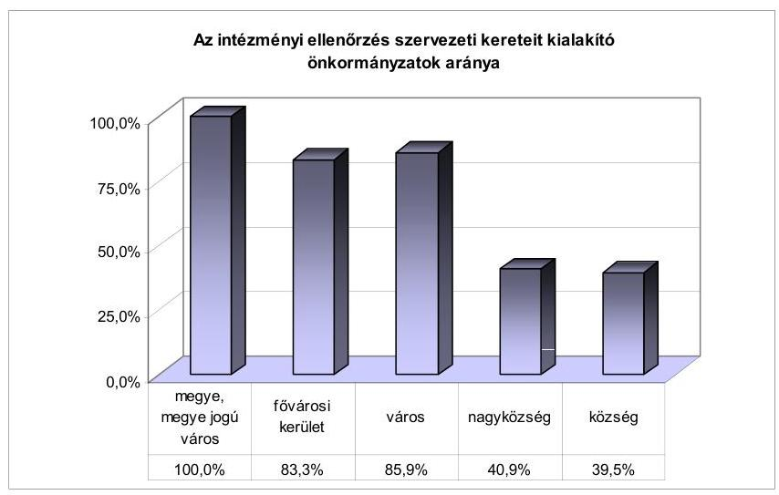

Az ellenőrzött önkormányzatok 33,8\%-a gondoskodott az Áht. 2003. november 27-től hatályos 97. § (1) bekezdésében foglalt előírásnak megfelelően a belső ellenőrzés szervezetének kialakításáról és a múködéshez szükséges források biztosításáról. A 2004. évben a Ber. 5. § és 37. § (2) bekezdésében foglaltak alapján a polgármesteri hivatalok 11,1\%-ánál készítették el a jegyző jóváhagyásával a belső ellenőrzési kézikönyvet. Az ellenőrzési vezetők feladatait a vizsgált önkormányzatok 8,6\%-nál szabályozták, a belső ellenőr jogairól és kötelezettségeiről 15,7\%-ánál rendelkeztek.

Az ellenőrzések végrehajtását a polgármesteri hivatalok 40,6\%-ában köztisztviselők révén biztosították. Az intézmények ellenőrzéséről társulás útján gondoskodott az önkormányzatok 21,1\%-a. A Ktv. 1.§ (8) bekezdésében foglaltak ellenére, mely szerint csak köztisztviselő jogosult belső ellenőri tevékenység folytatására, a Ber. 2. § m) pontjában foglaltak alapján az önkormányzatok 26,3\%-ánál vállalkozások kaptak megbízást, 12,0\%-ánál pedig egyéb módon szervezték meg az ellenőrzések végrehajtását. Az intézményi ellenőrzés szervezeti kereteit kialakító önkormányzatok 10\%-a a köztisztviselő foglalkoztatása mellett társulás és vállalkozó megbízása útján is növelte ellenőri kapacitását.

---

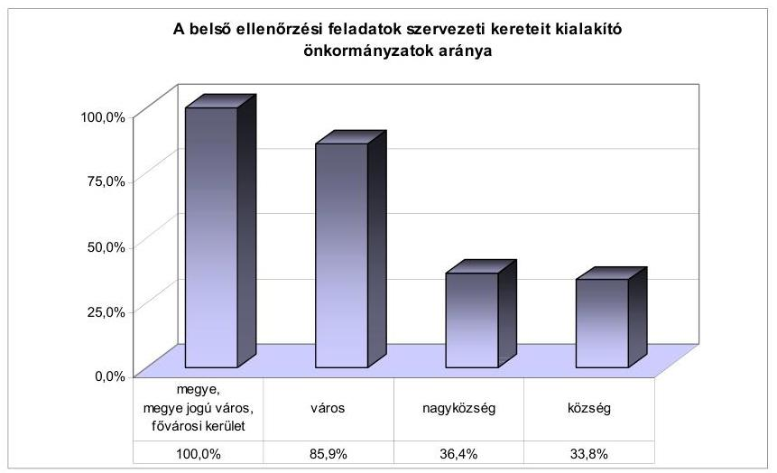

A foglalkoztatott belső ellenőrök számát a belső ellenőrzési tevékenységet kialakító önkormányzatok 23,2\%-a - a Ber. 4. § (6) bekezdésében előírtaknak megfelelően - kapacitás felmérés alapján, az ellátott feladatokkal összhangban határozta meg. A belső ellenőrök 88,5\%-a megfelelt a Ber. 11. §-ban előírt iskolai végzettségi és képesítési követelményeknek, valamint rendelkezett az ugyanitt előírt költségvetési pénzügyi, vagy számviteli munkakörben eltöltött legalább kétéves munkaviszonnyal.

A belső ellenőrzést ellátók funkcionális és szervezeti függetlenségét az önkormányzatok 22,9\%-ánál nem biztosították. A belső ellenőrzési feladatra kijelölt személyek, szervezetek 31,3\%-a a polgármesternek, 40,4\%-a a jegyzőnek, 4,2\%a mindkettőnek alá volt rendelve. Az önkormányzatok 24,1\%-ban nem történt kijelölés, illetve más hivatali szervezeti egység vezetése alá tartoztak.
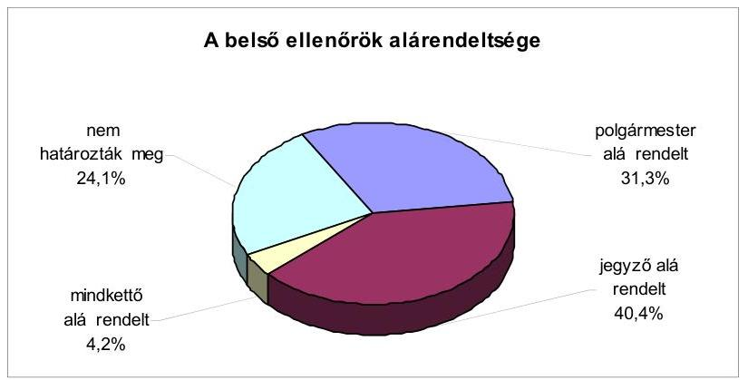

Az Áht. 121/A. § (4) bekezdés e) pontjában foglaltakat megsértve a belső ellenőrzést végzők 19,1\%-át más irányítási, végrehajtási tevékenység ellátásával is megbízták.

A belső ellenőrök többek között közreműködtek a minőségbiztosítási rendszer kidolgozásában, átalakításában, pályázatok előkészítésében, bonyolításában és elszámolásában, lakástámogatási rendszer, szabadság és táppénznyilvántartás, ingatlanvagyon-kataszter vizsgálatban, vagyonnyilatkozatokkal kapcsolatos feladatok végrehajtásában, bér- és munkaügyi feladatok ellátásában.

---

Az ellenőrzött önkormányzatok 31,5\%-a hozott létre társulást, vagy csatlakozott már múködő ellenőrzési társuláshoz.
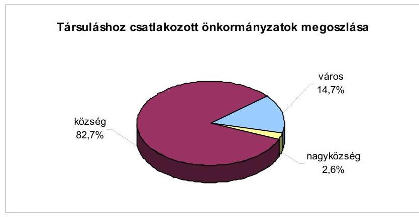

A társulási megállapodások 69,8\%-a tartalmazta a főállású belső ellenőr feladatait, 35,3\%-ában elmaradt az ellenőrzés megszervezési módjának meghatározása, $39,7 \%$-a nem tartalmazott előírást az éves munkatervek összeállítási rendjére. A megállapodások 53,4\%-a nem rögzítette a társulás múködésének értékelési szabályait.

A társulások az éves ellenőrzési terveikben foglalt ellenőrzéseik 36,2\%át teljesítették. A társulások múködése a résztvevő önkormányzatok 24,1\%ánál biztosította az ellenőrzési feladatok megvalósítását. Az önkormányzatok nem mérték fel a feladatokat, a társulás ellenőri kapacitásának kialakítását nem előzte meg kockázatbecslés.

Dabrony Község Önkormányzata 2001. év óta tagja társulásnak, ahol mintegy 50 önkormányzat számára két fő végzett ellenőrzési feladatokat. A megalakulás óta egy alkalommal történt ellenőrzés az önkormányzatnál, összesen 20 munkanap ráfordítással vizsgálták az önkormányzat gazdálkodását.

Rétság Város Önkormányzata összesen 42 költségvetési szerv ellenőrzése céljából létre jött 11 tagú társulás tagja, ahol egy főállású belső ellenőr dolgozik. A társulás léte az ellenőrzési feladatok végrehajtását segíti, de a foglalkoztatott létszám kevés az ellenőrzési feladatok ellátásához.

Kishartyán Község Önkormányzata 2004. márciusától tagja ellenőri társulásnak, amelynek 20 önkormányzati költségvetési szerv ellenőrzését kell megoldania egy fő teljes munkaidőben foglalkoztatott belső ellenőrrel.

A belső ellenőrzési vezető, vagy az általa megbízott ellenőr az ellenőrzést biztosító önkormányzatok 66,0\%-ánál ellenőrzési programot készített, 61,3\%-ánál rendelkezett a belső ellenőr megbízólevéllel. Az elvégzett ellenőrzések 72,1\%-a az ütemezésnek és az ellenőrzési célnak megfelelően zajlott.

Az elvégzett intézményi ellenőrzésekről készített jelentések, jegyzőkönyvek a vizsgálati programmal összhangban, a vizsgálatokat kezdeményező önkormányzatok 58,5\%-ánál tartalmaztak részletes megállapításokat, melyek alapján az ellenőrök érdemi javaslatokat fogalmaztak meg a hiányossá-

---

gok felszámolására. Az elvégzett ellenőrzések 66,4\%-ában készültek a Ber. 27. § (2) bekezdésében foglaltaknak megfelelő tartalmú ellenőrzési jelentések.

A belső ellenőrzési rendszer működésének hiányossága, hogy a korábbi évekhez hasonlóan nem fordítottak kellő figyelmet az ellenőrzés javaslatainak realizálására. A jelentések nem tartalmaztak átvételi záradékot, az ellenőrzési dokumentumok átadását követően nem vált általánossá az intézkedési terv készítésének igénylése. Az ellenőrzöttek 14,3\%-a tett észrevételt az ellenőrzési dokumentumokban rögzített megállapításokra, 46,9\%-a készített intézkedési tervet a hiányosságok felszámolása érdekében. Az intézményi gazdálkodás ellenőrzését elvégző önkormányzatok 51,3\%-a győződött meg utóvizsgálattal a feltárt hiányosságok megszüntetéséről. Az önállóan gazdálkodó intézményeknél végzett pénzügyi ellenőrzések által feltárt hiányosságok 45,3\%-át maradéktalanul, 37,7\%-át részben szüntették meg. A polgármesteri hivatalok és a hozzá tartozó részben önállóan gazdálkodó intézmények gazdálkodásának belső ellenőrzése során feltárt hiányosságok 42,8\%-át teljes körűen, $35,2 \%$-át részben szüntették meg.

Az ellenőrök az önkormányzatok 7,8\%-nál tártak fel büntető-, kártérítési-, illetve fegyelmi eljárás megindítására okot adó cselekményt. (Két megyei, egy Budapest fővárosi kerületi, hat városi, valamint egy-egy nagyközségi és községi önkormányzatnál).

Az ellenőrzést biztosító önkormányzatok 41,7\%-a - a Htv. 138. § (1) bekezdés g) pontjában előírtakat megsértve - a 2004. évben nem tekintette át az általa alapított költségvetési szervek ellenőrzésének tapasztalatait.

Az ellenőrzési tapasztalatokat tárgyaló képviselő-testületek - kettő kivétellel - a beszámolókat elfogadták, illetve tudomásul vették.

Vecsés és Keszthely városok önkormányzatai a beszámolók - időbeli késedelem, illetve tartalmi hiányosságok miatti - elutasításáról határoztak.

Az előterjesztéseket megvitató testületek 25,7\%-a fogalmazott meg az ellenőrzések továbbfejlesztésével, a munka színvonalával összefüggő követelményeket, elvárásokat.

# 3.2. A könyvvizsgálati kötelezettség teljesítése 

A megyei, a megyei jogú városi, a Budapest fővárosi és a fővárosi kerületi önkormányzatok az Ötv. 92/A. § (1) bekezdésében rögzített feltételek alapján fennálló könyvvizsgálati kötelezettségüket teljesítették. Az Ötv. 92/A. § (2) bekezdése (hitel felvétel és 300 millió Ft-ot meghaladó költségvetési kiadás) ellenére Rétság város, Halásztelek, Tápiószele és Tarpa nagyközségek önkormányzata nem teljesítette ezt az előírást. A könyvvizsgálatra kötelezett önkormányzatok 95,2\%-a tett eleget könyvvizsgálati kötelezettségének.

Az önkormányzatok a könyvvizsgáló kiválasztásakor betartották az Ötv. 92/B. § (1) bekezdésében előírt feltételeket, valamint az Ötv. 92/B. § (2) bekezdésében a könyvvizsgálóval kapcsolatos összeférhetetlenségi követelményeket.

---

A könyvvizsgálók az önkormányzatok költségvetési beszámolóit - egy kivétellel - záradékolták, 3,6\%-ánál korlátozott záradékkal látták el:

- Pécel Város Önkormányzatánál a könyvvizsgáló az egyszerűsített éves beszámolóra, a pénzmaradvány kimutatásra és a zárszámadási rendelettervezetre a záradék megadását elutasító záradékot adott, amelyet azzal indokolt, hogy nem tudott elegendő és megfelelő könyvvizsgálói bizonyítékot szerezni;
- Szigetvár és Szob városi önkormányzatoknál a könyvvizsgálók a 2003. évi egyszerűsített beszámolót auditálási eltéréssel hagyták jóvá, korlátozott záradékkal látták el, mert az ingatlanvagyon kataszteri nyilvántartásban, illetve a vagyonkimutatásban szereplő értékadatok nem voltak összhangban a költségvetési beszámoló adataival;
- Baktalórántháza Város Önkormányzatánál a könyvvizsgáló korlátozott záradékot adott, mivel a pénzeszközök könyvviteli mérlegben kimutatott értéke nem volt megbízható;
- Balkány Nagyközség Önkormányzatánál a könyvvizsgáló az ingatlankataszter, a számviteli analitikus és a főkönyvi nyilvántartás egyezőségéről nem kapott megbízható, valós képet, ezért az egyszerűsített éves beszámolót korlátozott záradékkal látta el.

A könyvvizsgálók a jelentéseik 53,1\%-ában tettek javaslatokat, melyek az eszközök és források értékelését, az értékvesztés elszámolását, az analitikus nyilvántartások rendjét és vezetését érintették. Az önkormányzatok háromnegyede biztosította a megállapítások és javaslatok hasznosulását.

# 3.3. A korábbi számvevőszéki ellenőrzések javaslatainak hasznosulása 

Az összes ellenőrzött megyei, megyei jogú városi, Budapest fővárosi kerületi önkormányzatnál, a városi önkormányzatok 92,2\%-ánál, a nagyközségi önkormányzatok 77,3\%-ánál és a községi önkormányzatok 26,1\%-ánál volt 20012003. években ÁSZ vizsgálat.

Az ellenőrzések 44,7\%-a a 2003. évi zárszámadáshoz kapcsolódva a normatív, kötött és a központosított állami hozzájárulás igénylésének és elszámolásának, a helyi önkormányzatok beruházásaihoz nyújtott cél és címzett támogatások felhasználásának jogszerűségére irányult.

Az önkormányzatoknál a témavizsgálatok és az átfogó ellenőrzések során, a 2001-2003. években feltárt szabálytalanságok, hiányosságok megszüntetésére, a feladatellátás célszerűségét és hatékonyságát szolgáló intézkedések megtételére az ellenőrzésekről készült jelentések 1646 javaslatot tartalmaztak, melyből a gazdálkodás szabályszerűségének biztosítására 60,3\%, célszerűségének javítására $39,7 \%$ irányult. A megfogalmazott javaslatainknak 64,8\%át maradéktalanul, $13,3 \%$-át részben, $21,9 \%$-át nem valósították meg az önkormányzatok.

A zárszámadáshoz kapcsolódó vizsgálatoknál tett 536 javaslat 69\%-át hasznosították. A jogosulatlanul igénybe vett támogatásokat az önkormányzatok

---

visszafizették, az intézmények alapító okiratait felülvizsgálták, a szociális rendeleteket kiegészítették, a támogatások elszámolásának dokumentálásában jelentős előrelépés történt. A javaslatok ellenére a költségvetési rendelet és a zárszámadás előterjesztéséhez a képviselő testületek tájékoztatása céljából nem mutatták be az önkormányzatok a közvetett támogatásokat, a többéves kihatással járó döntések hatását számszerúsítve, szöveges indoklással.

A 19 különböző témaellenőrzés kapcsán 766 javaslat született, melyek 59,1\%ára intézkedtek az önkormányzatok. A szabályozottság javítása érdekében elkészültek a környezetvédelmi programok, a szennyvízközmű-vagyon számviteli nyilvántartásokban való rögzítése, az üzemeltetésre átadott eszközök elkülönített nyilvántartása, leltározása megtörtént. Az önkormányzati lakások elidegenítéséből származó bevételek felhasználásának szabályozását, elkülönített számlán való kezelését biztosították, a helyi adórendeleteket kiegészítették. Elmaradt a közbeszerzési rendelet megalkotása, az értékhatár alatti beszerzések szabályozása, nem készültek el a gazdasági programok.

A helyi és a helyi kisebbségi önkormányzatok gazdálkodásának szabályszerűségének, célszerűségének biztosítását 344 javaslat szolgálta, amelyek 70\%-a érvényesült. A gazdálkodás szabályszerűségét érintő javaslatok közül a számlarendet, számviteli politikát és a kapcsolódó szabályzatokat aktualizálták. A célszerűségi javaslataink alapján megtörtént az ÁSZ vizsgálatok megállapításairól a képviselő testületek tájékoztatása. Részben valósult meg a munkaköri leírásokban az egyeztetési, munkafolyamatba épített ellenőrzési feladatoknak a meghatározása.

A helyi és a helyi kisebbségi önkormányzatok gazdálkodásának a 2003. évi átfogó ellenőrzéséről készült összefoglaló számvevőszéki jelentésben szereplő - a belügyminiszternek és a pénzügyminiszternek címzett javaslatok 37,5\%-át hasznosítottak, 25\%-ára részben intézkedtek, 37,5\%-anem valósult meg. Az Ötv. módosításának tervezetében szerepel a gazdasági program tartalmára, elkészítési határidejére vonatkozó előírás, az adósságot keletkeztető kötelezettségvállalás felső határának megállapításánál rövid lejáratú kötelezettségvállalásnak minősül a több éven keresztül fizetési kötelezettségként jelentkező váltótartozások és szállítókkal szembeni tartozások összegének adott évre jutó törlesztő részlete. Az Ötv. tervezett módosításának előkészítése során figyelembe vették az önkormányzati belső ellenőrzési feladatok ellátására vonatkozóan a jogszabályok közötti összhang megteremtésére irányuló javaslatunkat. Nem történt intézkedés az Ötv. felülvizsgálata során az önkormányzatok kötelező feladatainak és az ezek ellátását szolgáló költségvetési források egyértelmű meghatározására, a helyi kisebbségi önkormányzatok szabályszerű működése elősegítése érdekében a gazdálkodásukkal összefüggő pénzügyi-számviteli nyilvántartási követelményeket, valamint az operatív gazdálkodási és belső ellenőrzési feladatok sajátos rendjét összefoglaló kézikönyv megjelentetésére. A céljelleggel nyújtott támogatások esetében a számadási kötelezettség teljesítésének és a felhasználás ellenőrzésének módjára vonatkozó követelmények előírása elmaradt. A Belügyminisztérium a pályázatok kiírásának, az egységes könyvviteli nyilvántartási rendszerhez kapcsolódó számítástechnikai programok kiadásának támogatásával elősegítette az önkormányzatok informatikai felkészültségének javítását.

A 2004. évi átfogó ellenőrzések során a helyi és a helyi kisebbségi önkormányzatok részére tett javaslatokat a 11. számú melléklet tartalmazza.

---

# 4. A HELYI KISEBBSÉGI ÖNKORMÁNYZATOK GAZDÁLKODÁSA 

A kisebbségi önkormányzatok, Budakeszi Város Német Kisebbségi Önkormányzata kivételével, nem vettek át települési önkormányzattól feladat- és hatáskört, a településeken élő kisebbségek érdekeinek képviseletét, hagyományainak, kulturális és szellemi örökségének gondozását végezték. A 2004. évi gazdálkodáshoz 1106,7 millió Ft bevétellel rendelkeztek, ennek 91,6\%-át felhasználták a teljesített múködési kiadásaik 9\%-kal voltak magasabbak az előző évinél. (Az ellenőrzött helyi kisebbségi önkormányzatok bevé-teleinek-kiadásainak részletezését a 3. számú melléklet tartalmazza.)

A kisebbségi önkormányzatok 11,3\%-a települési önkormányzati képviselőtestület és a jegyző hatáskörébe tartozó szociális támogatások nyújtásával megsértette a Szoctv. előírásait. A költségvetéséből a kisebbségi önkormányzatok 10\%-a adott támogatást egyházaknak, költségvetési- és non profit szervezeteknek céljelleggel, nem szociális ellátásként, amelyekre - a Budapest Főváros XVI. kerület Bolgár Kisebbségi Önkormányzat kivételével - nem írtak elő számadási kötelezettséget, a támogatások felhasználását az Áht. 13/A. $\S$ (2) bekezdésében foglaltakat megsértve nem ellenőrizték.

A kisebbségi önkormányzatok 12,8\%-a nem rögzítette megállapodásban a települési önkormányzatokkal való együttmüködés szabályait. Nem tartalmazta a megállapodások 27,6\%-a - az Áht. 68. § (3) bekezdésének előírásait megsértve - a költségvetés tervezetének összeállítása és a költségvetési rendelet megalkotása részletes szabályait. A polgármesteri hivatalok gazdálkodást segítő tevékenysége 60,3\%-nál nem volt szabályozott a Nek. tv. 28. §-a alapján SzMSz-ben. Az operatív gazdálkodás és a számvitel szabályozása nem terjedt ki a kisebbségi önkormányzatokkal kapcsolatos feladatokra a hivatalok számviteli politikájában és számlarendjében 62,2\%-nál. A jegyzők az önkormányzatok 43,6\%-ánál az Ámr. 135. § 82) bekezdésének előírása ellenére, nem bízták meg írásban a kisebbségi önkormányzatok részére az érvényesítést végzőt, elmulasztották a szakmai teljesítés igazolás módjának szabályozását $87,2 \%$-nál, nem jelölték ki az igazolást végző személyt $85,9 \%$-nál. Mindezek következtében hiányosan látták el a kisebbségi önkormányzatok könyvviteli nyilvántartási feladatait és a folyamatba épített ellenőrzés nem múködött.

Testületi határozatban állapította meg a 2003. évi költségvetését a kisebbségi önkormányzatok 96,7\%-a az Áht. 65. § (2) bekezdésében előírtaknak megfelelően. Így az előző évinél 4,2\%-al nagyobb arányban álltak rendelkezésre jóváhagyott előirányzatok a kötelezettségvállalásokhoz és az utalványozásokhoz. A költségvetési határozatok 69,3\%-a felelt meg az Áht.69. § (2) bekezdésének, illetve az Ámr. 29. § (2) bekezdése előírásainak. A költségvetés jóváhagyott előirányzatait a kisebbségi önkormányzati testületek 35,2\%-nál módosították év közben határozattal, amelyek $92,2 \%$-át továbbította az elnök olyan időben a települési önkormányzat polgármesteréhez, hogy azok átvezethetők voltak a költségvetési rendeleten az Ámr. 53. § (8) bekezdésének előírásai szerint.

A kisebbségi önkormányzatok 82,8\%-a rendelkezett bankszámlával a költségvetési gazdálkodáshoz, de nem használták a megnyitott számlák

---

14,1\%-át. A kisebbségi önkormányzat készpénzforgalmára házipénztárt nem müködtettek, azt nem különítették el a települési önkormányzatétól 54,0\%-nál. A számlapénz forgalomról nem a kisebbségi, hanem 34,1\%-nál a települési önkormányzatok tisztségviselői, illetve hivatalának dolgozói rendelkeztek. Az elszámolást végző hivatalok nem vezettek nyilvántartást a kisebbségi önkormányzatok 83,3\%-ának a kötelezettségvállalásairól és 49,4\%-ának a jóváhagyott előirányzatairól, a több kisebbségi önkormányzattal érintett települések 12,2\%-ánál az elszámolt bevételek és kiadások kisebbségi önkormányzatonkénti adatairól. A kisebbségi önkormányzatok vagyon nyilvántartásainak elkülönített vezetéséről a polgármesteri hivatalok 43,6\%-a gondoskodott.

A kisebbségi önkormányzatok gazdálkodási gyakorlata alapvetően nem változott az előző évben ellenőrzöttekéhez viszonyítva, a hibás bizonylatok aránya továbbra is meghaladta a $25 \%$-ot a folyamat minden egyes eleménél. A kötelezettségvállalásokat szabálytalanul végezték a bizonylatok 27,0\%-nál, azok ellenjegyzésénél 32,5\%-nál vették figyelembe az Ámr. 137. § (3) bekezdés előírásait. Az utalványozás során nem tartották be az Ámr. 136.§ (1)-(4) bekezdés és a belső szabályozás előírásait a bizonylatok 28,6\%-ánál, elmaradt az utalványozás, nem az elnök, hanem a polgármester, a jegyző, vagy a hivatali alkalmazott utalványozott, illetve a kisebbségi önkormányzat elnökének felhatalmazása nélkül utalványozott testületi tag. Az utalvány ellenjegyzésének feladatait az Ámr. 137. § (3) bekezdésében előírtak ellenére a bizonylatok 44,0\%-ánál nem végezték el. Az érvényesítés hiányzott, illetve nem felelt meg az Ámr. 135. § (1)-(2) és (4) bekezdések előírásainak a bizonylatok $38,0 \%$-ánál, szakmailag nem igazolták a teljesítést 33,1\%-ban a pénztári és $30,2 \%$-ban a bankszámlához kapcsolódó tevékenységben. A gazdasági eseményekről kiállított bizonylatok 74,4\%-a felelt meg a Számv. tv. 167. § (1) bekezdés a)-j) pontjaiban előírt alaki és tartalmi követelményeknek, azok főkönyvi elszámolását 16,7\%-ánál késedelmesen végezték el a polgármesteri hivatalok.

Az éves gazdálkodásról szóló zárszámadást a kisebbségi önkormányzatok 75,3\%-a határozattal hagyta jóváhagyta. A határozatok tervezetét a megállapodásban foglaltak szerint elkészítette a jegyzők 56\%-a. A zárszámadási határozatok az önkormányzatok 64\%-ánál voltak összehasonlíthatók a költségvetéssel, megfelelve az Áht. 18. §-ban foglaltaknak. A jóváhagyott zárszámadási határozatot a kisebbségi önkormányzatok 57,3\%-ánál továbbította az elnök a települési önkormányzat polgármesteréhez olyan időben, hogy az a zárszámadási rendeletbe beépíthető legyen.

A helyi kisebbségi önkormányzat gazdálkodásával kapcsolatos részletes ellenőrzési megállapításokat a 10. számú melléklet tartalmazza.
Budapest, 2005. szeptember " $\mathcal{F}$ "
Melléklet: 17 db 44 lap
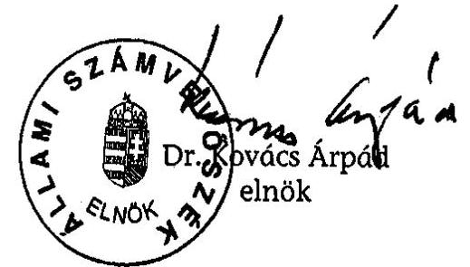

---

# Ellenőrzött önkormányzatok jegyzéke 

| Sorszám | Megye /   főváros | Önkormányzat /   Település neve | Megye/   főváros | Megye/ jogú   város | Város /   kerület | Nagy-   község | Község | Az önkormányzatok 2003. évi bruttó kiadásai (ezer Ft) |
| :--: | :--: | :--: | :--: | :--: | :--: | :--: | :--: | :--: |
| 1 | Főváros | Fővárosi önkormányzat | x |  |  |  |  | 547390904 |
| 2 |  | I. kerület |  |  | x |  |  | 5938064 |
| 3 |  | IX. kerület |  |  | x |  |  | 14368551 |
| 4 |  | VI. kerület |  |  | x |  |  | 18502842 |
| 5 |  | XIII. kerület |  |  | x |  |  | 21281569 |
| 6 |  | XVI. kerület |  |  | x |  |  | 9314500 |
| 7 |  | XVIII. kerület |  |  | x |  |  | 16034713 |
| 8 | Baranya | Babarcszólős |  |  |  |  | x | 26366 |
| 9 |  | Bánfa |  |  |  |  | x | 84975 |
| 10 |  | Beremend |  |  |  | x |  | 633406 |
| 11 |  | Bisse |  |  |  |  | x | 26219 |
| 12 |  | Bosta |  |  |  |  | x | 14377 |
| 13 |  | Botykapeterd |  |  |  |  | x | 42541 |
| 14 |  | Bükkösd |  |  |  |  | x | 245058 |
| 15 |  | Cserdi |  |  |  |  | x | 45866 |
| 16 |  | Csertő |  |  |  |  | x | 50771 |
| 17 |  | Csonkamindszent |  |  |  |  | x | 15408 |
| 18 |  | Dinnyeberki |  |  |  |  | x | 16466 |
| 19 |  | Egyházaskozár |  |  |  |  | x | 189147 |
| 20 |  | Gerde |  |  |  |  | x | 58865 |
| 21 |  | Görcsöny |  |  |  |  | x | 247027 |
| 22 |  | Hegyhátmaróc |  |  |  |  | x | 25243 |
| 23 |  | Helesfa |  |  |  |  | x | 50464 |
| 24 |  | Homorúd |  |  |  |  | x | 85716 |
| 25 |  | Kacsóta |  |  |  |  | x | 25540 |
| 26 |  | Katádfa |  |  |  |  | x | 17290 |
| 27 |  | Kisnyárád |  |  |  |  | x | 23893 |
| 28 |  | Kistótfalu |  |  |  |  | x | 42816 |
| 29 |  | Lánycsók |  |  |  |  | x | 356092 |
| 30 |  | Mágocs |  |  |  | x |  | 451171 |
| 31 |  | Magyarsarlós |  |  |  |  | x | 29461 |
| 32 |  | Matty |  |  |  |  | x | 82469 |
| 33 |  | Mekényes |  |  |  |  | x | 31498 |
| 34 |  | Mohács |  |  | x |  |  | 10053482 |
| 35 |  | Nagyhajmás |  |  |  |  | x | 52277 |
| 36 |  | Nagykozár |  |  |  |  | x | 328559 |
| 37 |  | Nagypeterd |  |  |  |  | x | 216436 |
| 38 |  | Nagyváty |  |  |  |  | x | 33246 |
| 39 |  | Nyugotszenterzsébet |  |  |  |  | x | 33737 |
| 40 |  | Öcsárd |  |  |  |  | x | 52675 |
| 41 |  | Orfü |  |  |  |  | x | 315152 |
| 42 |  | Pécsbagota |  |  |  |  | x | 17294 |
| 43 |  | Regenye |  |  |  |  | x | 28991 |
| 44 |  | Rózsafa |  |  |  |  | x | 90307 |
| 45 |  | Szabadszentkirály |  |  |  |  | x | 182090 |
| 46 |  | Szalánta |  |  |  |  | x | 202101 |
| 47 |  | Szárász |  |  |  |  | x | 8950 |
| 48 |  | Szentdénes |  |  |  |  | x | 50507 |

---

| $\begin{gathered} \text { Sor- } \\ \text { szám } \end{gathered}$ | Megye /   föváros | Önkormányzat /   Település neve | Megye/   föváros | Megyei jogú   város | Város /   kerület | Nagy-   község | Község | Az önkormányzatok 2003. évi brutió kiadásai (ezer Ft) |
| :--: | :--: | :--: | :--: | :--: | :--: | :--: | :--: | :--: |
| 49 |  | Szentlőrinc |  |  | x |  |  | 1031898 |
| 50 |  | Szigetvár |  |  | x |  |  | 5621736 |
| 51 |  | Szilvás |  |  |  |  | x | 16656 |
| 52 |  | Szőke |  |  |  |  | x | 18703 |
| 53 |  | Tófü |  |  |  |  | x | 13852 |
| 54 |  | Vásárosbéc |  |  |  |  | x | 46681 |
| 55 |  | Velény |  |  |  |  | x | 22194 |
| 56 |  | Villány |  |  | x |  |  | 495137 |
| 57 |  | Vokány |  |  |  |  | x | 160070 |
| 58 | Bács-Kiskun | Bácsalmás |  |  | x |  |  | 1330023 |
| 59 |  | Baja |  |  | x |  |  | 14370507 |
| 60 |  | Dunapataj |  |  |  | x |  | 522917 |
| 61 |  | Izsák |  |  | x |  |  | 827552 |
| 62 |  | Kecskemét |  | x |  |  |  | 23115107 |
| 63 |  | Kéleshalom |  |  |  |  | x | 53180 |
| 64 |  | Kunszentmiklós |  |  | x |  |  | 1574989 |
| 65 |  | Nyárlőrinc |  |  |  |  | x | 409751 |
| 66 |  | Soltszentimre |  |  |  |  | x | 146356 |
| 67 |  | Tabdi |  |  |  |  | x | 133970 |
| 68 |  | Tiszaalpár |  |  |  | x |  | 496209 |
| 69 |  | Tiszakécske |  |  | x |  |  | 2507066 |
| 70 |  | Tiszaug |  |  |  |  | x | 187503 |
| 71 | Békés | Battonya |  |  | x |  |  | 1592944 |
| 72 |  | Békés |  |  | x |  |  | 3638308 |
| 73 |  | Elek |  |  | x |  |  | 1399732 |
| 74 |  | Gyomaendröd |  |  | x |  |  | 4444579 |
| 75 |  | Kamut |  |  |  |  | x | 159585 |
| 76 |  | Kardoskút |  |  |  |  | x | 169482 |
| 77 |  | Sarkad |  |  | x |  |  | 2624296 |
| 78 |  | Szarvas |  |  | x |  |  | 4795369 |
| 79 | Borsod-A.-Z. | Abaújszántó |  |  | x |  |  | 799236 |
| 80 |  | Ároktó |  |  |  |  | x | 194049 |
| 81 |  | Bogács |  |  |  |  | x | 420975 |
| 82 |  | Borsod-Abaúj-Zemplén | x |  |  |  |  | 34096471 |
| 83 |  | Borsodivánka |  |  |  |  | x | 139516 |
| 84 |  | Detek |  |  |  |  | x | 55878 |
| 85 |  | Edelény |  |  | x |  |  | 3940829 |
| 86 |  | Encs |  |  | x |  |  | 2147259 |
| 87 |  | Gagybátor |  |  |  |  | x | 41478 |
| 88 |  | Gagyvendégi |  |  |  |  | x | 39974 |
| 89 |  | Hangony |  |  |  |  | x | 235507 |
| 90 |  | Hegymeg |  |  |  |  | x | 103652 |
| 91 |  | Hejce |  |  |  |  | x | 89736 |
| 92 |  | Hernádkak |  |  |  |  | x | 224085 |
| 93 |  | Hernádpetri |  |  |  |  | x | 42838 |
| 94 |  | Hernádvécse |  |  |  |  | x | 310491 |
| 95 |  | Hét |  |  |  |  | x | 64946 |
| 96 |  | Ináncs |  |  |  |  | x | 277052 |
| 97 |  | Kesznyéten |  |  |  |  | x | 355426 |
| 98 |  | Kisgyőr |  |  |  |  | x | 266138 |
| 99 |  | Kissikátor |  |  |  |  | x | 28065 |
| 100 |  | Kistokaj |  |  |  |  | x | 236346 |
| 101 |  | Makkoshotyka |  |  |  |  | x | 185483 |
| 102 |  | Mezőkövesd |  |  | x |  |  | 6451341 |
| 103 |  | Négyes |  |  |  |  | x | 45233 |

---

| $\begin{gathered} \text { Sor- } \\ \text { szám } \end{gathered}$ | Megye /   föváros | Önkormányzat /   Település neve | Megye/   föváros | Megyei jogú   város | Város /   kerület | Nagy-   község | Község | Az önkormányzatok 2003. évi bruttó kiadásai (ezer Ft) |
| :--: | :--: | :--: | :--: | :--: | :--: | :--: | :--: | :--: |
| 104 |  | Nyékládháza |  |  | x |  |  | 960711 |
| 105 |  | Önod |  |  |  |  | x | 434206 |
| 106 |  | Prügy |  |  |  |  | x | 423777 |
| 107 |  | Pusztaradvány |  |  |  |  | x | 38059 |
| 108 |  | Ricse |  |  |  | x |  | 563885 |
| 109 |  | Sajóbábony |  |  |  | x |  | 484084 |
| 110 |  | Sajóecseg |  |  |  |  | x | 93560 |
| 111 |  | Sajóhidvég |  |  |  |  | x | 190747 |
| 112 |  | Sajókeresztúr |  |  |  |  | x | 175546 |
| 113 |  | Sajónémeti |  |  |  |  | x | 113762 |
| 114 |  | Selyeb |  |  |  |  | x | 92125 |
| 115 |  | Serényfalva |  |  |  |  | x | 159773 |
| 116 |  | Szegí |  |  |  |  | x | 53117 |
| 117 |  | Szegilong |  |  |  |  | x | 66899 |
| 118 |  | Szikszó |  |  | x |  |  | 1823241 |
| 119 |  | Szirmabesenyő |  |  |  | x |  | 439479 |
| 120 |  | Tarcal |  |  |  |  | x | 484964 |
| 121 |  | Tard |  |  |  |  | x | 575345 |
| 122 |  | Tibolddaróc |  |  |  |  | x | 264184 |
| 123 |  | Tomor |  |  |  |  | x | 112575 |
| 124 |  | Viss |  |  |  |  | x | 147112 |
| 125 | Csongrád | Árpádhalom |  |  |  |  | x | 103208 |
| 126 |  | Csengele |  |  |  |  | x | 256426 |
| 127 |  | Derekegyház |  |  |  |  | x | 186613 |
| 128 |  | Eperjes |  |  |  |  | x | 108715 |
| 129 |  | Fábiánsebestyén |  |  |  |  | x | 432855 |
| 130 |  | Mórahalom |  |  | x |  |  | 2511589 |
| 131 |  | Nagymágocs |  |  |  | x |  | 366883 |
| 132 |  | Nagytőke |  |  |  |  | x | 52553 |
| 133 |  | Ötö̈mös |  |  |  |  | x | 173908 |
| 134 |  | Ruzsa |  |  |  |  | x | 620614 |
| 135 |  | Szentes |  |  | x |  |  | 4773228 |
| 136 | Fejér | Etyek |  |  |  |  | x | 2613385 |
| 137 |  | Fejér | x |  |  |  |  | 26238665 |
| 138 |  | Gárdony |  |  | x |  |  | 1827883 |
| 139 |  | Mezőfalva |  |  |  | x |  | 597272 |
| 140 |  | Pusztaszabolcs |  |  |  | x |  | 601374 |
| 141 |  | Sárbogárd |  |  | x |  |  | 2497067 |
| 142 |  | Szabadhidvég |  |  |  |  | x | 130093 |
| 143 |  | Velence |  |  | x |  |  | 789383 |
| 144 | Győr-M.-S. | Fertőboz |  | x |  |  | x | 22604 |
| 145 |  | Győr |  |  |  |  |  | 41832190 |
| 146 |  | Hővej |  |  |  |  | x | 39602 |
| 147 |  | Jobaháza |  |  |  |  | x | 45562 |
| 148 |  | Rábatamási |  |  |  |  | x | 110067 |
| 149 |  | Táp |  |  |  |  | x | 115451 |
| 150 |  | Vámosszabadi |  |  |  |  | x | 83190 |
| 151 | Hajdú-Bihar | Ártánd |  |  |  |  | x | 58222 |
| 152 |  | Balmazújváros |  |  | x |  |  | 4244518 |
| 153 |  | Bedő |  |  |  |  | x | 88862 |
| 154 |  | Berettyóújfalu |  |  | x |  |  | 8296401 |
| 155 |  | Biharkeresztes |  |  | x |  |  | 736411 |
| 156 |  | Bojt |  |  |  |  | x | 132569 |
| 157 |  | Derecske |  |  | x |  |  | 1439974 |
| 158 |  | Hajdú-Bihar | x |  |  |  |  | 19365454 |

---

| $\begin{gathered} \text { Sor- } \\ \text { szám } \end{gathered}$ | Megye /   föváros | Önkormányzat /   Település neve | Megye/   föváros | Megyei jogú   város | Város /   kerület | Nagy-   község | Község | Az önkormányzatok 2003. évi bruttó kiadásai (ezer Ft) |
| :--: | :--: | :--: | :--: | :--: | :--: | :--: | :--: | :--: |
| 159 |  | Told |  |  |  |  | x | 56810 |
| 160 | Heves | Aldebrő |  |  |  |  | x | 171414 |
| 161 |  | Eger |  | x |  |  |  | 12237287 |
| 162 |  | Erk |  |  |  |  | x | 131743 |
| 163 |  | Heves |  |  | x |  |  | 2903055 |
| 164 |  | Hort |  |  |  |  | x | 423973 |
| 165 |  | Tófalu |  |  |  |  | x | 67387 |
| 166 | Jász-N.-Sz. | Jászapáti |  |  | x |  |  | 1507853 |
| 167 |  | Jászberény |  |  | x |  |  | 7872144 |
| 168 |  | Karcag |  |  | x |  |  | 7606122 |
| 169 |  | Tiszafüred |  |  | x |  |  | 3492698 |
| 170 |  | Törökszentmiklós |  |  | x |  |  | 4887442 |
| 171 |  | Újszász |  |  | x |  |  | 1419774 |
| 172 | Komárom-E. | Dorog | x |  | x |  |  | 2546605 |
| 173 |  | Komárom-Esztergom |  |  |  |  |  | 18116650 |
| 174 |  | Oroszlány |  |  | x |  |  | 4621484 |
| 175 | Nógrád | Bátonyterenye |  |  | x |  |  | 2746169 |
| 176 |  | Ecseg |  |  |  |  | x | 158293 |
| 177 |  | Kishartyán |  |  |  |  | x | 61331 |
| 178 |  | Kozárd |  |  |  |  | x | 25870 |
| 179 |  | Mihálygerge |  |  |  |  | x | 83682 |
| 180 |  | Nógrádsáp |  |  |  |  | x | 179710 |
| 181 |  | Rétság |  |  | x |  |  | 856248 |
| 182 |  | Rimóc |  |  |  |  | x | 311833 |
| 183 |  | Sóshartyán |  |  |  |  | x | 152422 |
| 184 |  | Szurdokpüspöki |  |  |  |  | x | 179817 |
| 185 | Pest | Budakeszi |  |  | x |  |  | 1992080 |
| 186 |  | Dunaharaszti |  |  | x |  |  | 4060297 |
| 187 |  | Gyál |  |  | x |  |  | 2511569 |
| 188 |  | Halásztelek |  |  |  | x |  | 697931 |
| 189 |  | Káva |  |  |  |  | x | 59986 |
| 190 |  | Kiskunlacháza |  |  |  | x |  | 1499731 |
| 191 |  | Nagybörzsöny |  |  |  |  | x | 179547 |
| 192 |  | Nagymaros |  |  | x |  |  | 765807 |
| 193 |  | Pécel |  |  | x |  |  | 1802080 |
| 194 |  | Pest | x |  |  |  |  | 30269168 |
| 195 |  | Pilisjászfalu |  |  |  |  | x | 219765 |
| 196 |  | Pilisszentlászló |  |  |  |  | x | 106655 |
| 197 |  | Szigetmonostor |  |  |  |  | x | 553980 |
| 198 |  | Szob |  |  | x |  |  | 879414 |
| 199 |  | Tápiószele |  |  |  | x |  | 584196 |
| 200 |  | Telki |  |  |  |  | x | 652719 |
| 201 |  | Vácrátót |  |  |  |  | x | 247387 |
| 202 |  | Vecsés |  |  | x |  |  | 2465743 |
| 203 |  | Verseg |  |  |  |  | x | 196485 |
| 204 |  | Zsámbék |  |  |  | x |  | 1147420 |
| 205 | Somogy | Andocs |  |  |  |  | x | 219950 |
| 206 |  | Balatonberény |  |  |  |  | x | 311741 |
| 207 |  | Balatonboglár |  |  | x |  |  | 1687758 |
| 208 |  | Balatonföldvár |  |  | x |  |  | 1249057 |
| 209 |  | Balatonlelle |  |  | x |  |  | 1344417 |
| 210 |  | Balatonmáriafürdő |  |  |  |  | x | 271051 |
| 211 |  | Bálványos |  |  |  |  | x | 61052 |
| 212 |  | Bodrog |  |  |  |  | x | 44119 |
| 213 |  | Böhönye |  |  |  |  | x | 373493 |

---

| $\begin{gathered} \text { Sor- } \\ \text { szám } \end{gathered}$ | Megye /   főváros | Önkormányzat /   Település neve | Megye/   főváros | Megyei jogú   város | Város /   kerület | Nagy-   község | Község | Az önkormányzatok 2003. évi bruttó kiadásai (ezer Ft) |
| :--: | :--: | :--: | :--: | :--: | :--: | :--: | :--: | :--: |
| 214 |  | Darány |  |  |  |  | x | 235111 |
| 215 |  | Gyékényes |  |  |  |  | x | 232045 |
| 216 |  | Kastélyosdombó |  |  |  |  | x | 40017 |
| 217 |  | Kereki |  |  |  |  | x | 50077 |
| 218 |  | Magyaratád |  |  |  |  | x | 154937 |
| 219 |  | Nemeskisfalud |  |  |  |  | x | 15637 |
| 220 |  | Osztopán |  |  |  |  | x | 223605 |
| 221 |  | Öreglak |  |  |  |  | x | 159818 |
| 222 |  | Patalom |  |  |  |  | x | 46507 |
| 223 |  | Pusztaszemes |  |  |  |  | x | 42435 |
| 224 |  | Rinyaújlak |  |  |  |  | x | 43435 |
| 225 |  | Somogyudvarhely |  |  |  |  | x | 210557 |
| 226 |  | Szántód |  |  |  |  | x | 140550 |
| 227 |  | Szenyér |  |  |  |  | x | 40989 |
| 228 |  | Szólád |  |  |  |  | x | 121256 |
| 229 | Szabolcs-Sz.-B. | Ajak |  |  |  | x |  | 550318 |
| 230 |  | Baktalórántháza |  |  | x |  |  | 1408101 |
| 231 |  | Balkány |  |  |  | x |  | 1027903 |
| 232 |  | Buj |  |  |  |  | x | 350827 |
| 233 |  | Csenger |  |  | x |  |  | 902903 |
| 234 |  | Fehérgyarmat |  |  | x |  |  | 2162412 |
| 235 |  | Gelénes |  |  |  |  | x | 141310 |
| 236 |  | Hodász |  |  |  | x |  | 489173 |
| 237 |  | Ibrány |  |  | x |  |  | 1204683 |
| 238 |  | Kisar |  |  |  |  | x | 269083 |
| 239 |  | Kisvárda |  |  | x |  |  | 11247023 |
| 240 |  | Lónya |  |  |  |  | x | 169360 |
| 241 |  | Mátyus |  |  |  |  | x | 63478 |
| 242 |  | Nagyar |  |  |  |  | x | 113500 |
| 243 |  | Nyirbogát |  |  |  | x |  | 547447 |
| 244 |  | Nyírcsaholy |  |  |  |  | x | 346892 |
| 245 |  | Nyírjákó |  |  |  |  | x | 289302 |
| 246 |  | Nyírkércs |  |  |  |  | x | 177263 |
| 247 |  | Nyírlugos |  |  |  | x |  | 721568 |
| 248 |  | Nyírmada |  |  |  | x |  | 1699206 |
| 249 |  | Nyírmeggyes |  |  |  |  | x | 353244 |
| 250 |  | Nyírparasznya |  |  |  |  | x | 193495 |
| 251 |  | Olcsva |  |  |  |  | x | 103182 |
| 252 |  | Pusztadobos |  |  |  |  | x | 344922 |
| 253 |  | Ramocsaháza |  |  |  |  | x | 313206 |
| 254 |  | Szamostatárfalva |  |  |  |  | x | 39932 |
| 255 |  | Tarpa |  |  |  | x |  | 507203 |
| 256 |  | Timár |  |  |  |  | x | 198077 |
| 257 |  | Tiszaadony |  |  |  |  | x | 201331 |
| 258 |  | Tiszakerecseny |  |  |  |  | x | 210285 |
| 259 |  | Tivadar |  |  |  |  | x | 42629 |
| 260 |  | Tuzsér |  |  |  | x |  | 479869 |
| 261 |  | Vámosatya |  |  |  |  | x | 97934 |
| 262 | Tolna | Bátaszék |  |  | x |  |  | 2277489 |
| 263 |  | Csibrák |  |  |  |  | x | 40659 |
| 264 |  | Kurd |  |  |  |  | x | 239053 |
| 265 |  | Medina |  |  |  |  | x | 134653 |
| 266 |  | Sárszentlőrinc |  |  |  |  | x | 148223 |
| 267 |  | Tolna | x |  |  |  |  | 14170018 |
| 268 | Vas | Acsád |  |  |  |  | x | 77741 |

---

| $\begin{aligned} & \text { Sor- } \\ & \text { szám } \end{aligned}$ | Megye /   főváros | Önkormányzat /   Település neve | Megye/   főváros | Megyei jogú   város | Város /   kerület | Nagy-   község | Község | Az önkormányzatok 2003. évi bruttó kiadásai (ezer Ft) |
| :--: | :--: | :--: | :--: | :--: | :--: | :--: | :--: | :--: |
| 269 |  | Bögöt |  |  |  |  | x | 49191 |
| 270 |  | Bucsu |  |  |  |  | x | 214346 |
| 271 |  | Egyházashollós |  |  |  |  | x | 49690 |
| 272 |  | Felsőmarác |  |  |  |  | x | 31285 |
| 273 |  | Hegyhátszentmárton |  |  |  |  | x | 6276 |
| 274 |  | Horvátzsidány |  |  |  |  | x | 145466 |
| 275 |  | Ivánc |  |  |  |  | x | 74208 |
| 276 |  | Kiszsidány |  |  |  |  | x | 8232 |
| 277 |  | Meggyeskovácsi |  |  |  |  | x | 66947 |
| 278 |  | Nemesmedves |  |  |  |  | x | 17376 |
| 279 |  | Ölmod |  |  |  |  | x | 40622 |
| 280 |  | Oszkó |  |  |  |  | x | 24278 |
| 281 |  | Örímagyarósd |  |  |  |  | x | 69417 |
| 282 |  | Pápoe |  |  |  |  | x | 35434 |
| 283 |  | Peresznye |  |  |  |  | x | 86739 |
| 284 |  | Porpác |  |  |  |  | x | 16329 |
| 285 |  | Rábatöttös |  |  |  |  | x | 29902 |
| 286 |  | Rum |  |  |  |  | x | 162104 |
| 287 |  | Szentgotthárd |  |  | x |  |  | 2787911 |
| 288 |  | Szentpéterfa |  |  |  |  | x | 150044 |
| 289 |  | Szombathely |  | x |  |  |  | 23992207 |
| 290 |  | Szöce |  |  |  |  | x | 39141 |
| 291 |  | Táplánszentkereszt |  |  |  |  | x | 210510 |
| 292 |  | Vasszentmihály |  |  |  |  | x | 46865 |
| 293 |  | Zsennye |  |  |  |  | x | 20069 |
| 294 | Veszprém | Ajka |  |  | x |  |  | 9633717 |
| 295 |  | Bakonybél |  |  |  |  | x | 191272 |
| 296 |  | Balatonalmádi |  |  | x |  |  | 1722012 |
| 297 |  | Dabrony |  |  |  |  | x | 36328 |
| 298 |  | Dáka |  |  |  |  | x | 83484 |
| 299 |  | Doba |  |  |  |  | x | 50486 |
| 300 |  | Dörgicse |  |  |  |  | x | 89247 |
| 301 |  | Felsőörs |  |  |  |  | x | 357151 |
| 302 |  | Hárskút |  |  |  |  | x | 56244 |
| 303 |  | Iszkáz |  |  |  |  | x | 37121 |
| 304 |  | Kemeneshögyész |  |  |  |  | x | 69979 |
| 305 |  | Kemenesszentpéter |  |  |  |  | x | 98232 |
| 306 |  | Kiscsősz |  |  |  |  | x | 19633 |
| 307 |  | Kisszölős |  |  |  |  | x | 12692 |
| 308 |  | Külsővat |  |  |  |  | x | 92600 |
| 309 |  | Lesencefalu |  |  |  |  | x | 115726 |
| 310 |  | Lesencetomaj |  |  |  |  | x | 704896 |
| 311 |  | Lókút |  |  |  |  | x | 55475 |
| 312 |  | Megyer |  |  |  |  | x | 7479 |
| 313 |  | Mihályháza |  |  |  |  | x | 106612 |
| 314 |  | Nagyesztergár |  |  |  |  | x | 144008 |
| 315 |  | Nemesvámos |  |  |  |  | x | 266161 |
| 316 |  | Olaszfalu |  |  |  |  | x | 215290 |
| 317 |  | Pápa |  |  | x |  |  | 9499152 |
| 318 |  | Pápasalamon |  |  |  |  | x | 47539 |
| 319 |  | Pénzesgyőr |  |  |  |  | x | 32296 |
| 320 |  | Rigács |  |  |  |  | x | 29453 |
| 321 |  | Somlószőlős |  |  |  |  | x | 109819 |
| 322 |  | Takácsi |  |  |  |  | x | 82715 |
| 323 |  | Ukk |  |  |  |  | x | 89476 |

---

| $\begin{gathered} \text { Sor- } \\ \text { szám } \end{gathered}$ | Megye /   főváros | Önkormányzat /   Település neve | Megye/   főváros | Megyei jogú   város | Város /   kerület | Nagy-   község | Község | Az önkormányzatok 2003. évi bruttó kiadásai (ezer Ft) |
| :--: | :--: | :--: | :--: | :--: | :--: | :--: | :--: | :--: |
| 324 |  | Vászoly |  |  |  |  | x | 25541 |
| 325 |  | Veszprémfajsz |  |  |  |  | x | 77250 |
| 326 |  | Zalameggyes |  |  |  |  | x | 7721 |
| 327 | Zala | Alsószenterzsébet |  |  |  |  | x | 12751 |
| 328 |  | Babosdőbréte |  |  |  |  | x | 37181 |
| 329 |  | Bak |  |  |  |  | x | 204978 |
| 330 |  | Balatongyörök |  |  |  |  | x | 330848 |
| 331 |  | Batyk |  |  |  |  | x | 47835 |
| 332 |  | Becsehely |  |  |  |  | x | 301472 |
| 333 |  | Boncodfölde |  |  |  |  | x | 26214 |
| 334 |  | Böde |  |  |  |  | x | 33760 |
| 335 |  | Csömödér |  |  |  |  | x | 181333 |
| 336 |  | Döbröce |  |  |  |  | x | 19693 |
| 337 |  | Eszteregnye |  |  |  |  | x | 133998 |
| 338 |  | Felsőpáhok |  |  |  |  | x | 101720 |
| 339 |  | Felsőszenterzsébet |  |  |  |  | x | 3774 |
| 340 |  | Hernyék |  |  |  |  | x | 51047 |
| 341 |  | Hévíz |  |  | x |  |  | 2393709 |
| 342 |  | Hottó |  |  |  |  | x | 32513 |
| 343 |  | Iklődbördöce |  |  |  |  | x | 36555 |
| 344 |  | Karmacs |  |  |  |  | x | 232761 |
| 345 |  | Keménfa |  |  |  |  | x | 8469 |
| 346 |  | Kerkafalva |  |  |  |  | x | 35401 |
| 347 |  | Kerkakutas |  |  |  |  | x | 15205 |
| 348 |  | Keszthely |  |  | x |  |  | 8617539 |
| 349 |  | Kisgörbő |  |  |  |  | x | 128967 |
| 350 |  | Kisrécse |  |  |  |  | x | 24846 |
| 351 |  | Kissziget |  |  |  |  | x | 22926 |
| 352 |  | Magyarföld |  |  |  |  | x | 5635 |
| 353 |  | Nagygörbő |  |  |  |  | x | 68572 |
| 354 |  | Nemesbük |  |  |  |  | x | 1047824 |
| 355 |  | Pölöskefő |  |  |  |  | x | 32762 |
| 356 |  | Ramocsa |  |  |  |  | x | 7477 |
| 357 |  | Rígyác |  |  |  |  | x | 33721 |
| 358 |  | Salomvár |  |  |  |  | x | 109653 |
| 359 |  | Sárhida |  |  |  |  | x | 69504 |
| 360 |  | Sármellék |  |  |  |  | x | 259209 |
| 361 |  | Szentgyörgyvár |  |  |  |  | x | 36123 |
| 362 |  | Teskánd |  |  |  |  | x | 228659 |
| 363 |  | Valkonya |  |  |  |  | x | 13742 |
| 364 |  | Vállus |  |  |  |  | x | 15734 |
| 365 |  | Vindornyafok |  |  |  |  | x | 14058 |
| 366 |  | Vindornyaszölős |  |  |  |  | x | 89223 |
| 367 |  | Zalakarros |  |  | x |  |  | 940690 |
| 368 |  | Zalaköveskút |  |  |  |  | x | 4573 |
| 369 |  | Zalamerenye |  |  |  |  | x | 97175 |
| 370 |  | Zalasárszeg |  |  |  |  | x | 9712 |
| 371 |  | Zebecke |  |  |  |  | x | 11907 |
| Összesen |  | 371 | 7 | 4 | 70 | 22 | 268 | 1143080521 |

---

# Ellenőrzött helyi kisebbségi önkormányzatok jegyzéke

|  Sorszám | Megye / főváros | Település neve | Nemzetiség / etnikai kisebbség megnevezése |  |  |  |  |  |  |  |  |  |  |  |   |
| --- | --- | --- | --- | --- | --- | --- | --- | --- | --- | --- | --- | --- | --- | --- | --- |
|   |  |  | bolgár | cigány | görög | horvát | lengyel | német | örmény | román | ruszin | szerb | szlovák | szlovén | ukrán  |
|  1 | Főváros | I. kerület | x |  |  |  |  |  |  |  |  |  |  |  |   |
|  2 |  | IX. kerület |  |  |  |  |  |  |  |  |  |  |  |  |   |
|  3 |  | VI. kerület |  |  |  |  |  |  |  |  |  |  | x |  |   |
|  4 |  | XIII. kerület |  |  |  |  |  |  |  |  |  |  |  |  |   |
|  5 |  | XVI. kerület | x |  |  |  |  |  |  |  |  |  |  |  |   |
|  6 |  | XVIII. kerület |  |  |  |  |  |  |  |  |  |  |  |  |   |
|  7 | Baranya | Mohács |  |  |  |  |  |  |  |  |  |  |  |  |   |
|  8 |  | Szentlőrinc |  |  |  |  |  |  |  |  |  |  |  |  |   |
|  9 |  | Szigetvár |  |  |  | x |  | x |  |  |  |  |  |  |   |
|  10 |  | Villány |  |  |  |  |  |  |  |  |  |  | x |  |   |
|  11 |  | Beremend |  | x |  |  |  |  |  |  |  |  |  |  |   |
|  12 |  | Mágocs |  |  |  |  |  |  |  |  |  |  | x |  |   |
|  13 |  | Babarcszőlős |  | x |  |  |  |  |  |  |  |  |  |  |   |
|  14 |  | Bánfa |  | x |  |  |  |  |  |  |  |  |  |  |   |
|  15 |  | Botykapeterd |  | x |  |  |  |  |  |  |  |  |  |  |   |
|  16 |  | Bükkösd |  | x |  |  |  |  |  |  |  |  |  |  |   |
|  17 |  | Cserdi |  | x |  |  |  |  |  |  |  |  |  |  |   |
|  18 |  | Egyházaskozár |  |  |  |  |  | x |  |  |  |  |  |  |   |
|  19 |  | Gerde |  | x |  |  |  |  |  |  |  |  |  |  |   |
|  20 |  | Görcsöny |  | x |  |  |  |  |  |  |  |  |  |  |   |
|  21 |  | Kisnyárád |  |  |  |  |  | x |  |  |  |  |  |  |   |
|  22 |  | Lánycsók |  |  |  |  |  | x |  |  |  |  |  |  |   |
|  23 |  | Magyarsarlós |  |  |  |  |  | x |  |  |  |  |  |  |   |
|  24 |  | Nagykozár |  |  |  |  |  | x |  |  |  |  |  |  |   |
|  25 |  | Nagypeterd |  | x |  |  |  |  |  |  |  |  |  |  |   |
|  26 |  | Szabadszentkirály |  | x |  |  |  |  |  |  |  |  |  |  |   |
|  27 |  | Szalánta |  |  |  | x |  |  |  |  |  |  |  |  |   |
|  28 |  | Vásárosbéc |  | x |  |  |  |  |  |  |  |  |  |  |   |
|  29 |  | Velény |  | x |  |  |  |  |  |  |  |  |  |  |   |
|  30 |  | Vokány |  |  |  |  |  | x |  |  |  |  |  |  |   |

---

|  Sorszám | Megye / főváros | Település neve | Nemzetiség / etnikai kisebbség megnevezése |  |  |  |  |  |  |  |  |  |  |  |   |
| --- | --- | --- | --- | --- | --- | --- | --- | --- | --- | --- | --- | --- | --- | --- | --- |
|   |  |  | bolgár | cigány | görög | horvát | lengyel | német | örmény | román | ruszin | szerb | szlovák | szlovén | ukrán  |
|  31 | Bács-Kiskun | Kecskemét |  |  |  |  |  |  |  |  |  |  |  |  |   |
|  32 |  | Bácsalmás |  |  |  | x |  | x |  |  |  |  |  |  |   |
|  33 |  | Baja |  |  |  |  |  |  |  |  |  | x |  |  |   |
|  34 |  | Kunszentmiklós |  |  |  |  |  |  |  |  |  |  |  |  |   |
|  35 |  | Dunapatal |  | x |  |  |  |  |  |  |  |  |  |  |   |
|  36 | Békés | Battyonya |  |  |  |  |  |  |  |  |  | x |  |  |   |
|  37 |  | Békés |  |  |  |  |  |  |  |  |  |  | x |  |   |
|  38 |  | Élek |  |  |  |  |  |  |  |  |  |  | x |  |   |
|  39 |  | Gyomaendrőd |  |  |  |  |  | x |  | x |  |  |  |  |   |
|  40 |  | Sarkad |  |  |  |  |  |  |  |  |  |  |  |  |   |
|  41 |  | Szarvas |  |  |  |  |  |  |  | x |  |  | x |  |   |
|  42 | Borsod-Abaúj-Zemplén | Abaújszántó |  | x |  |  |  |  |  |  |  |  |  |  |   |
|  43 |  | Edelény |  | x |  |  |  |  |  |  |  |  |  |  |   |
|  44 |  | Encs |  | x |  |  |  |  |  |  |  |  |  |  |   |
|  45 |  | Mezőkövesd |  | x |  |  |  |  |  |  |  |  |  |  |   |
|  46 |  | Szikszó |  | x |  |  |  |  |  |  |  |  |  |  |   |
|  47 |  | Ricse |  | x |  |  |  |  |  |  |  |  |  |  |   |
|  48 |  | Szirmabesenyő |  | x |  |  |  |  |  |  |  |  |  |  |   |
|  49 |  | Detek |  | x |  |  |  |  |  |  |  |  |  |  |   |
|  50 |  | Hangony |  | x |  |  |  |  |  |  |  |  |  |  |   |
|  51 |  | Hernádlak |  | x |  |  |  |  |  |  |  |  |  |  |   |
|  52 |  | Hernádpetri |  | x |  |  |  |  |  |  |  |  |  |  |   |
|  53 |  | Hernádvécse |  | x |  |  |  |  |  |  |  |  |  |  |   |
|  54 |  | Ináncs |  |  |  |  | x |  |  |  |  |  |  |  |   |
|  55 |  | Kesznyéten |  | x |  |  |  |  |  |  |  |  |  |  |   |
|  56 |  | Makkoshotyka |  | x |  |  |  |  |  |  |  |  |  |  |   |
|  57 |  | Önod |  | x |  |  |  |  |  |  |  |  |  |  |   |
|  58 |  | Prügy |  | x |  |  |  |  |  |  |  |  |  |  |   |
|  59 |  | Pusztaradvány |  | x |  |  |  |  |  |  |  |  |  |  |   |
|  60 |  | Sajónémeti |  | x |  |  |  |  |  |  |  |  |  |  |   |
|  61 |  | Serényfalva |  | x |  |  |  |  |  |  |  |  |  |  |   |
|  62 |  | Tarcal |  | x |  |  |  |  |  |  |  |  |  |  |   |
|  63 |  | Tomor |  | x |  |  |  |  |  |  |  |  |  |  |   |
|  64 |  | Viss |  | x |  |  |  |  |  |  |  |  |  |  |   |
|  65 | Csongrád | Szentes |  | x |  |  |  |  |  |  |  |  |  |  |   |

---

|  Sorszám | Megye / főváros | Település neve | Nemzetiség / etnikai kisebbség megnevezése |  |  |  |  |  |  |  |  |  |  |  |   |
| --- | --- | --- | --- | --- | --- | --- | --- | --- | --- | --- | --- | --- | --- | --- | --- |
|   |  |  | bolgár | cigány | görög | horvát | lengyel | német | örmény | román | ruszin | szerb | szlovák | szlovén | ukrán  |
|  66
67
68
69 | Fejér | Sárbogárd
Mezőfalva
Pusztaszabolcs
Étyek |  | x
x |  |  |  | x
x |  |  |  |  |  |  |   |
|  70 | Győr-Moson-Sopron | Győr |  |  |  |  |  |  | x |  |  |  |  |  |   |
|  71
72
73
74 | Hajdú-Bihar | Balmazújváros
Berettyóújfalu
Biharkeresztes
Derecske |  | x
x
x |  |  |  |  |  | x |  |  |  |  |   |
|  75
76
77
78 | Heves | Eger
Heves
Erk
Tófalu |  | x
x
x | x |  |  |  |  |  |  |  |  |  |   |
|  79
80
81
82
83
84 | Jász-Nagykun-Szolnok | Jászapáti
Jászberény
Karcag
Tiszafüred
Törökszentmiklós
Újszász |  | x
x
x
x
x |  |  |  |  |  |  |  |  |  |  |   |
|  85
86 | Komárom-Esztergom | Dorog
Oroszlány |  |  |  |  |  |  | x |  |  |  | x |  |   |
|  87
88
89
90
91
92 | Nógrád | Bátonyterenye
Rétság
Ecseg
Nógrádsáp
Rímóc
Sóshartyán |  | x
x
x
x |  |  |  |  |  |  |  |  | x
x |  |   |
|  93
94
95
96
97
98
99
100
101 | Pest | Budakeszi
Dunaharaszti
Gyál
Nagymaros
Pécel
Vecsés
Halásztelek
Kiskunlacháza
Tápiószele | x
x
x
x |  |  |  |  | x
x |  |  |  |  |  |  |   |

---

|  $\begin{aligned} & \text { Sor- } \ & \text { szám } \end{aligned}$ | Megye / főváros | Település neve | Nemzetiség / etnikai kisebbség megnevezése |  |  |  |  |  |  |  |  |  |  |  |   |
| --- | --- | --- | --- | --- | --- | --- | --- | --- | --- | --- | --- | --- | --- | --- | --- |
|   |  |  | bolgár | cigány | görög | horvát | lengyel | német | örmény | román | ruszin | szerb | szlovák | szlovén | ukrán  |
|  102 |  | Zsámbék |  |  |  |  |  |  |  |  |  |  |  |  |   |
|  103 |  | Nagybőrzsöny |  |  |  |  |  |  |  |  |  |  |  |  |   |
|  104 |  | Pilisjászfalu |  |  |  |  |  |  |  |  |  |  |  |  |   |
|  105 |  | Pilisszentlászló |  |  |  |  |  |  |  |  |  |  |  |  |   |
|  106 | Somogy | Öreglak |  | x |  |  |  |  |  |  |  |  |  |  |   |
|  107 |  | Szenyér |  | x |  |  |  |  |  |  |  |  |  |  |   |
|  108 | Szabolcs-Szatmár-Bereg | Baktalórántháza |  | x |  |  |  |  |  |  |  |  |  |  |   |
|  109 |  | Csenger |  | x |  |  |  |  |  |  |  |  |  |  |   |
|  110 |  | Ibrány |  | x |  |  |  |  |  |  |  |  |  |  |   |
|  111 |  | Kisvárda |  | x |  |  |  |  |  |  |  |  |  |  |   |
|  112 |  | Ajak |  | x |  |  |  |  |  |  |  |  |  |  |   |
|  113 |  | Balkány |  | x |  |  |  |  |  |  |  |  |  |  |   |
|  114 |  | Hodász |  | x |  |  |  |  |  |  |  |  |  |  |   |
|  115 |  | Nyírbogát |  | x |  |  |  |  |  |  |  |  |  |  |   |
|  116 |  | Nyírlugos |  | x |  |  |  |  |  |  |  |  |  |  |   |
|  117 |  | Nyírmada |  | x |  |  |  |  |  |  |  |  |  |  |   |
|  118 |  | Tarpa |  | x |  |  |  |  |  |  |  |  |  |  |   |
|  119 |  | Tuzsér |  | x |  |  |  |  |  |  |  |  |  |  |   |
|  120 |  | Buj |  | x |  |  |  |  |  |  |  |  |  |  |   |
|  121 |  | Nagyar |  | x |  |  |  |  |  |  |  |  |  |  |   |
|  122 |  | Nyírcsaholy |  | x |  |  |  |  |  |  |  |  |  |  |   |
|  123 |  | Nyírparasznya |  | x |  |  |  |  |  |  |  |  |  |  |   |
|  124 |  | Olcsva |  | x |  |  |  |  |  |  |  |  |  |  |   |
|  125 |  | Ramocsaháza |  | x |  |  |  |  |  |  |  |  |  |  |   |
|  126 |  | Szamostatárfalva |  | x |  |  |  |  |  |  |  |  |  |  |   |
|  127 |  | Timár |  | x |  |  |  |  |  |  |  |  |  |  |   |
|  128 | Tolna | Bátaszék |  | x |  |  |  |  |  |  |  |  |  |  |   |
|  129 |  | Medina |  | x |  |  |  |  |  |  |  |  |  |  |   |
|  130 |  | Sárszentlőrinc |  | x |  |  |  |  |  |  |  |  |  |  |   |
|  131 | Vas | Szombathely |  |  |  | x |  |  |  |  |  |  |  |  |   |
|  132 |  | Szentgotthárd |  |  |  | x |  |  |  |  |  |  |  |  |   |
|  133 |  | Szentpéterfa |  |  |  | x |  |  |  |  |  |  |  |  |   |
|  134 |  | Vasszentmihály |  |  |  |  |  |  |  |  |  |  |  |  |   |
|  135 | Veszprém | Ajka |  |  |  |  |  |  |  |  |  |  |  |  |   |
|  136 |  | Balatonalmádi |  |  |  |  | x |  |  |  |  |  |  |  |   |
|  137 |  | Pápa |  |  |  |  | x |  |  |  |  |  |  |  |   |

---

|  $\begin{aligned} & \text { Sor- } \ & \text { szám } \end{aligned}$ | Megye / főváros | Település neve | Nemzetiség / etnikai kisebbség megnevezése |  |  |  |  |  |  |  |  |  |  |  |   |
| --- | --- | --- | --- | --- | --- | --- | --- | --- | --- | --- | --- | --- | --- | --- | --- |
|   |  |  | bolgár | cigány | görög | horvát | lengyel | német | örmény | román | ruszin | szerb | szlovák | szlovén | ukrán  |
|  138 |  | Hárskút |  |  |  |  |  |  |  |  |  |  |  |  |   |
|  139 |  | Lókút |  |  |  |  |  |  |  |  |  |  |  |  |   |
|  140 |  | Nagyesztergár |  |  |  |  |  |  |  |  |  |  |  |  |   |
|  141 |  | Pénzesgyőr |  |  |  |  |  |  |  |  |  |  |  |  |   |
|  142 |  | Somlószólós |  | x |  |  |  |  |  |  |  |  |  |  |   |
|  143 | Zala | Keszthely |  | x |  |  |  |  |  |  |  |  |  |  |   |
|  144 |  | Zalakaros |  | x |  |  |  |  |  |  |  |  |  |  |   |
|  145 |  | Becsehely |  |  |  | x |  |  |  |  |  |  |  |  |   |
|  146 |  | Csömödér |  |  |  |  |  |  |  |  |  |  |  |  |   |
|  147 |  | Karmacs |  | x |  |  |  |  |  |  |  |  |  |  |   |
|  148 |  | Sárhida |  | x |  |  |  |  |  |  |  |  |  |  |   |
|  149 |  | Sármellék |  | x |  |  |  |  |  |  |  |  |  |  |   |
|  150 |  | Zalamerenye |  | x |  |  |  |  |  |  |  |  |  |  |   |
|   | Összesen | 150 | 4 | 92 | 1 | 6 | 2 | 22 | 3 | 3 | 1 | 6 | 8 | 1 | 1  |

---

# Tájékoztató 

## az ellenőrzött helyi kisebbségi önkormányzatok 2003. és 2004. évi bevételeinek és kiadásainak alakulásáról

| Megnevezés | 2003. év |  | 2004. év |  | 2004/2003.   \% |
| :--: | :--: | :--: | :--: | :--: | :--: |
|  | millió Ft | arány \% | millió Ft | arány \% |  |
| Kiadások |  |  |  |  |  |
| Müködési kiadások | 880,8 | 86,1 | 960,1 | 94,7 | 109,0 |
| Ebböl: |  |  |  |  |  |
| Személyi juttatások | 273,7 | 26,7 | 284,1 | 28,0 | 103,8 |
| Munkaadókat terhelő járulékok | 80,6 | 7,9 | 81,3 | 8,0 | 100,9 |
| Dologi kiadások | 387,8 | 37,9 | 415,5 | 41,0 | 107,1 |
| Végleges pénzeszközátadások | 133,5 | 13,0 | 175,5 | 17,3 | 131,5 |
| Felhalmozási kiadások | 111,1 | 10,8 | 30,8 | 3,0 | 27,7 |
| Felújítások | 14,2 | 1,4 | 19,7 | 1,9 | 138,7 |
| Hitelek, értékpapírok, kölcsönök, pénzforgalom nélküli kiadások | 17,3 | 1,7 | 3,6 | 0,4 | 20,8 |
| Tárgyévi kiadások összesen | 1023,4 | 100,0 | 1014,2 | 100,0 | 99,1 |
| Bevételek |  |  |  |  |  |
| Müködési bevételek | 139,9 | 12,9 | 145,1 | 13,1 | 112,1 |
| Ebböl: |  |  |  |  |  |
| Inzézmények müködési bevételei | 32,7 | 3,0 | 42,0 | 3,8 | 128,4 |
| Sajátos müködési bevételek | 107,2 | 9,9 | 103,1 | 9,3 | 96,2 |
| Felhalmozási és tőkejellegủ bevételek | 1,3 | 0,1 | 11,7 | 1,1 | 900,0 |
| Állami támogatások és hozzájárulások | 225,9 | 20,8 | 267,7 | 24,2 | 118,5 |
| Egyéb támogatások, kiegészítések, átvett pénzeszközök | 613,7 | 56,5 | 555,8 | 50,2 | 90,6 |
| Hitelek, értékpapírok, kölcsönök, pénzforgalom nélküli bevételek | 105,6 | 9,7 | 126,4 | 11,4 | 119,7 |
| Tárgyévi bevételek összesen | 1086,4 | 100,0 | 1106,7 | 100,0 | 101,9 |

Forrás: Magyar Államkincstár Fejlesztési Igazgatósága
önkormányzati éves költségvetési beszámoló 17. számú űrlap

---

# Tájékoztató

## a helyi önkormányzatok eszközeiről és azok forrásairól

|  Megnevezés | 2001. év | 2002. év | 2003. év | Változás
2002/2001.
$\%$ | Változás
2003/2002.
$\%$ | Változás
2003/2001.
$\%$  |
| --- | --- | --- | --- | --- | --- | --- |
|  I. Immateriális javak | 6,2 | 8,9 | 11,3 | 143,5 | 127,0 | 182,3  |
|  II. Tárgyi eszközök | 1897,5 | 4350,2 | 6832,6 | 229,3 | 157,1 | 360,1  |
|  Ebből: ingatlanok | 1558,6 | 3925,8 | 6326,6 | 251,9 | 161,2 | 405,9  |
|  beruházások | 232,6 | 252,8 | 247,2 | 108,7 | 97,8 | 106,3  |
|  III. Befektetett pénzügyi eszközök | 586,3 | 564,7 | 566,5 | 96,3 | 100,3 | 96,6  |
|  IV. Üzemeltetésre átadott eszközök | 489,5 | 929,9 | 1253,7 | 190,0 | 134,8 | 256,1  |
|  A) Befektett eszközök | 2979,5 | 5853,7 | 8664,1 | 196,5 | 148,0 | 290,8  |
|  I. Készletek | 13,2 | 15,8 | 14,3 | 119,7 | 90,5 | 108,3  |
|  II. Követelések | 169,0 | 172,1 | 193,4 | 101,8 | 112,4 | 114,4  |
|  III. Értékpapírok | 95,1 | 84,2 | 63 | 88,5 | 74,8 | 66,2  |
|  IV. Pénzeszközök | 192,1 | 218,2 | 210,4 | 113,6 | 96,4 | 109,5  |
|  V. Egyéb aktív pénzügyi elszámolások | 56,0 | 79,3 | 89,4 | 141,6 | 112,7 | 159,6  |
|  B) Forgóeszközök | 525,4 | 569,6 | 570,5 | 108,4 | 100,2 | 108,6  |
|  ESZKÖZÖK ÖSSZESEN | 3504,9 | 6423,3 | 9234,6 | 183,3 | 143,8 | 263,5  |
|  D) Saját tőke | 3008,6 | 5770,2 | 8541,1 | 191,8 | 148,0 | 283,9  |
|  E) Tartalékok | 157,9 | 163,2 | 175,8 | 103,4 | 107,7 | 111,3  |
|  I. Hosszú lejáratú kötelezettségek | 105,7 | 174,7 | 201,4 | 165,3 | 115,3 | 190,5  |
|  II. Rövid lejáratú kötelezettségek | 142,6 | 181,9 | 191,2 | 127,6 | 105,1 | 134,1  |
|  III. Egyéb passzív pénzügyi elszámolások | 90,1 | 133,3 | 125,1 | 147,9 | 93,8 | 138,8  |
|  F) Kötelezettségek | 338,4 | 489,9 | 517,7 | 144,8 | 105,7 | 153,0  |
|  FORRÁSOK ÖSSZESEN | 3504,9 | 6423,3 | 9234,6 | 183,3 | 143,8 | 263,5  |

Forrás: Magyar Államkincstár Fejlesztési Igazgatósága önkormányzati éves költségvetési beszámoló 1. számú űrlap

---

# Tájékoztató

## az ellenőrzött helyi önkormányzatok eszközeiről és azok forrásairól

|  Megnevezés | 2001. év | 2002. év | 2003. év | Változás
2002/2001.
$\%$ | Változás
2003/2002.
$\%$ | Változás
2003/2001.
$\%$  |
| --- | --- | --- | --- | --- | --- | --- |
|  I. Immateriális javak | 1,0 | 1,7 | 2,1 | 170,0 | 123,5 | 210,0  |
|  II. Tárgyi eszközök | 283,6 | 763,6 | 1301,4 | 269,3 | 170,4 | 458,9  |
|  Ebből: ingatlanok | 226,6 | 684,5 | 1203,1 | 302,1 | 175,8 | 530,9  |
|  beruházások | 34,7 | 43,3 | 42,2 | 124,8 | 97,5 | 121,6  |
|  III. Befektetett pénzügyi eszközök | 77,2 | 78,3 | 51,6 | 101,4 | 65,9 | 66,8  |
|  IV. Üzemeltetésre átadott eszközök | 65,6 | 114,2 | 129,5 | 174,1 | 113,4 | 197,4  |
|  A) Befektett eszközök | 427,4 | 957,8 | 1484,6 | 224,1 | 155,0 | 347,4  |
|  I. Készletek | 2,5 | 2,4 | 3,5 | 96,0 | 145,8 | 140,0  |
|  II. Követelések | 29,2 | 26,5 | 42,5 | 90,8 | 160,4 | 145,5  |
|  III. Értékpapírok | 8,4 | 10,1 | 4,0 | 120,2 | 39,6 | 47,6  |
|  IV. Pénzeszközök | 33,4 | 34,4 | 35,0 | 103,0 | 101,7 | 104,8  |
|  V. Egyéb aktív pénzügyi elszámolások | 10,7 | 15,4 | 18,0 | 143,9 | 116,9 | 168,2  |
|  B) Forgóeszközök | 84,2 | 88,8 | 103,0 | 105,5 | 116,0 | 122,3  |
|  ESZKÖZÖK ÖSSZESEN | 511,6 | 1046,6 | 1587,6 | 204,6 | 151,7 | 310,3  |
|  D) Saját tőke | 426,1 | 939,8 | 1484 | 220,6 | 157,9 | 348,3  |
|  E) Tartalékok | 26,6 | 23,8 | 27,5 | 89,5 | 115,5 | 103,4  |
|  I. Hosszú lejáratú kötelezettségek | 20,3 | 25,9 | 17,7 | 127,6 | 68,3 | 87,2  |
|  II. Rövid lejáratú kötelezettségek | 20,8 | 31,4 | 33,0 | 151,0 | 105,1 | 158,7  |
|  III. Egyéb passzív pénzügyi elszámolások | 17,8 | 25,7 | 25,4 | 144,4 | 98,8 | 142,7  |
|  F) Kötelezettségek | 58,9 | 83,0 | 76,1 | 140,9 | 91,7 | 129,2  |
|  FORRÁSOK ÖSSZESEN | 511,6 | 1046,6 | 1587,6 | 204,6 | 151,7 | 310,3  |

Forrás: Magyar Államkincstár Fejlesztési Igazgatósága önkormányzati éves költségvetési beszámoló 1. számú űrlap

---

# Az ellenőrzött helyi önkormányzatok 2003. évi kiadásai (nettó teljesítési adatok alapján) 

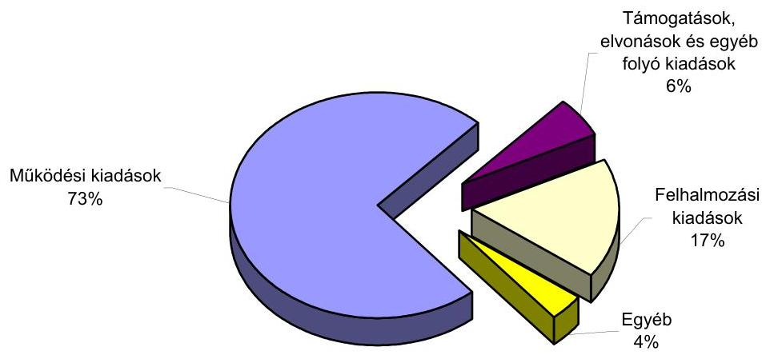

| Megnevezés | Az ellenőrzött helyi önkormányzatok 2003. évi teljesített kiadásai |  |  |
| :--: | :--: | :--: | :--: |
|  | bruttó teljesítés | nettó teljesítés |  |
|  | (ezer Ft) | (ezer Ft) | \% |
| Kiadások összesen: | 1143080521 | 807422681 | 100,0 |
| Ebből: |  |  |  |
| Müködési kiadások | 704282447 | 585763821 | 72,6 |
| Személyi juttatások | 282297976 | 282297976 | 35,0 |
| Munkaadókat tehelö járulékok | 93765334 | 93765334 | 11,6 |
| Dologi kiadások | 328219137 | 209700511 | 26,0 |
| Támogatások, elvonások és egyéb folyó kiadások | 49661321 | 45955185 | 5,7 |
| Felhalmozási kiadások | 142040881 | 139511772 | 17,3 |
| Egyéb | 247095872 | 36191903 | 4,5 |
| Kölcsönnyújtás | 3023828 | 3023828 | 0,4 |
| Hitel visszafizetés | 68672539 | 29276815 | 3,6 |
| Hosszú lejáratú értékpapírok vásárlása | 360400 | 360400 | 0,0 |
| Éven belüli értékpapír forgalom egyenlege | 171120227 | 3530860 | 0,4 |

---

# Az ellenőrzött önkormányzatok 2003. évi bruttó bevételi és kiadási előirányzatai és azok teljesítésének alakulása önkormányzati típusonként 

| Önkormányzat típusa | Előirányzat |  | Bevétel összesen |  | Kiadás összesen |  | Bevétel   megoszlás   (\%) | Kiadás   megoszlás   (\%) |
| :-- | :--: | :--: | :--: | :--: | :--: | :--: | :--: | :--: |
|  | eredeti   ezer Ft | módosított   ezer Ft | teljesítés |  | teljesítés |  |  |  |
|  |  |  | ezer Ft | $\%$ | ezer Ft | $\%$ |  |  |
| Budapest fővárosi és   megyei önkormányzatok | 492909292 | 522565899 | 855076361 | 163,6 | 689647330 | 132,0 | 64,4 | 60,3 |
| megyei jogú városok | 80296943 | 99589165 | 105407547 | 105,8 | 101176791 | 101,6 | 8,0 | 8,9 |
| fővárosi kerületek | 79415000 | 85281810 | 90146452 | 105,7 | 85440239 | 100,2 | 6,8 | 7,5 |
| városok | 189791069 | 216581141 | 220709305 | 101,9 | 213561846 | 98,6 | 16,6 | 18,7 |
| nagyközségek | 13907231 | 15811720 | 15820472 | 100,1 | 15108645 | 95,6 | 1,2 | 1,3 |
| községek | 34907559 | 41901544 | 39857165 | 95,1 | 38145670 | 91,0 | 3,0 | 3,3 |
| Összesen: | 891227094 | 981731279 | 1327017302 | 135,2 | 1143080521 | 116,4 | 100,0 | 100,0 |

A 2003. évi bevételek megoszlása
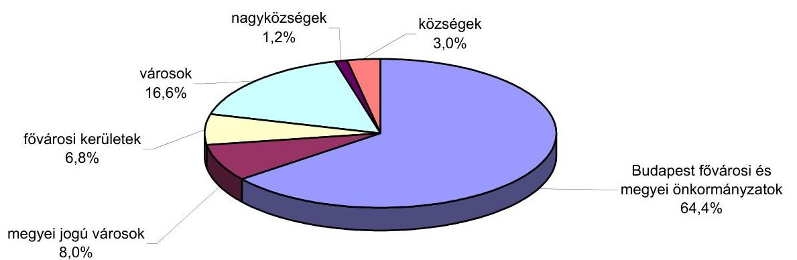

A 2003. évi kiadások megoszlása
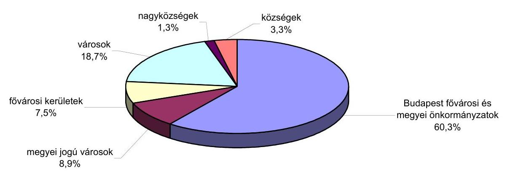

Forrás: Magyar Államkincstár Fejlesztési Igazgatósága önkormányzati éves költségvetési beszámoló 80 . számú űrlap

---

# A helyi önkormányzatok 2003. évi bruttó bevételeinek és kiadásainak alakulása

|  |   |   |   |
| --- | --- | --- | --- |
|  Mérlegsor megnevezése | Eredeti | Módosított | Teljesítés  |
|   | előirányzat |  |   |
|  Bevételek |  |  |   |
|  Intézményi működési bevételek | 188492518 | 225244705 | 228149325  |
|  Kamatbevételek | 10756303 | 13979473 | 16602752  |
|  Gépjárműadó | 26177740 | 27658739 | 30008654  |
|  Helyi adók és kapcsolódó pótlékok, bírságok | 315827700 | 321108599 | 327074462  |
|  Illetékek | 42903427 | 47708963 | 54255861  |
|  Személyi jövedelemadó | 405100038 | 405449324 | 405449324  |
|  Egyéb átengedett adók, adójellegủ bevételek | 1206719 | 1388323 | 1456221  |
|  Önkorm. megillető bírságok és egyéb sajátos bevételek | 22741523 | 24086442 | 24446800  |
|  Működési célra átvett pénzeszközök | 405710638 | 451938859 | 448753538  |
|  Költségvetési kiegészítések, visszatérülések | 0 | 2475188 | 132655957  |
|  Felhalmozási és tőkejellegủ bevételek | 152949467 | 140046974 | 111374919  |
|  ebből: |  |  |   |
|  Tárgyi eszköz, immateriális javak értékesítése | 60184882 | 67164815 | 51576981  |
|  Önkorm. lakások, egyéb helyiségek ért., cseréje | 30641267 | 36223678 | 33484186  |
|  Részesedések értékesítése | 41820520 | 12695772 | 4578679  |
|  Felhalmozási célra átvett pénzeszközök | 135805219 | 161310921 | 124138921  |
|  Kölcsönök visszatérülése, igénybevétele | 7446721 | 10703503 | 13218118  |
|  Saját bevételek összesen | 1715118013 | 1833100013 | 1917584852  |
|  Önkormányzat költségvetési támogatása | 649154357 | 777077851 | 748948367  |
|  Előző évi pénzmaradvány igénybevétele | 72669290 | 174013412 | 281973934  |
|  Hitelek bevételei | 182459184 | 185466358 | 415942908  |
|  Értékpapírok bevételei | 67401352 | 121423937 | 329397261  |
|  Egyéb finanszírozás bevételei | 1598425 | 1630936 | $-404552$  |
|  BEVÉTELEK MINDÖSSZESEN | 2688400621 | 3092712507 | 3693442770  |
|  Kiadások |  |  |   |
|  Személyi juttatások | 942428261 | 984418252 | 953393035  |
|  Munkaadókat terhelő járulékok | 316987415 | 328713659 | 317363534  |
|  Dologi kiadások | 545001602 | 646495485 | 604598699  |
|  Egyéb folyó kiadások | 26729042 | 46296714 | 163520525  |
|  Ellátottak pénzbeli juttatása | 6227895 | 8552339 | 8159471  |
|  Müködési célú pénzeszköz átadás | 77355172 | 97371597 | 91592339  |
|  Társadalom- és szociálpolitikai juttatások | 92418017 | 113947253 | 105652634  |
|  Tervezett maradvány, eredmény, tartalék | 111720332 | 47337826 | 1325522  |
|  Felújítás | 47921072 | 79101244 | 57969287  |
|  Intézményi beruházási kiadások | 321809359 | 439102379 | 309107338  |
|  Egyéb felhalmozási kiadások | 1618073 | 649852 | 542922  |
|  Részesedések vásárlása | 1683820 | 5158177 | 4557968  |
|  Felhalmozási célú pénzeszköz átadások | 72926810 | 102881534 | 70598383  |
|  Kölcsönök törlesztése, nyújtása | 6750435 | 13526442 | 13642860  |
|  Hitelek törlesztése | 84385440 | 110681754 | 399416684  |
|  Értékpapírok kiadásai | 32437876 | 68478000 | 300260011  |
|  Egyéb finanszírozás kiadásai | 0 | 0 | 10198823  |
|  KIADÁSOK MINDÖSSZESEN | 2688400621 | 3092712507 | 3411900035  |

Forrás: Magyar Államkincstár Fejlesztési Igazgatósága önkormányzati éves költségvetési beszámoló 80. számú űrlap

---

# Az ellenőrzött helyi önkormányzatok 2003. évi bruttó bevételeinek és kiadásainak alakulása 

Adatok: ezer Ft-ban

| Mérlegsor megnevezése | Eredeti | Módosított | Teljesítés |
| :--: | :--: | :--: | :--: |
|  | elöirányzat |  |  |
| Bevételek |  |  |  |
| Intézményi müködési bevételek | 58325833 | 68391899 | 68675139 |
| Kamatbevételek | 6050425 | 6713820 | 7685412 |
| Gépjárműadó | 5089707 | 5380006 | 5852425 |
| Helyi adók és kapcsolódó pótlékok, bírságok | 120695594 | 119316260 | 121018571 |
| Illetékek | 20149927 | 21564685 | 23732649 |
| Személyi jövedelemadó | 97002065 | 97135016 | 97135016 |
| Egyéb átengedett adók, adójellegủ bevételek | 182971 | 206791 | 218885 |
| Önkorm. megillető bírságok és egyéb sajátos bevételek | 7528124 | 7609316 | 8552864 |
| Müködési célra átvett pénzeszközök | 164166096 | 179942674 | 178745978 |
| Költségvetési kiegészítések, visszatérülések | 0 | 627850 | 118708255 |
| Felhalmozási és tőkejellegủ bevételek ebböl: | 69114303 | 39857766 | 30125255 |
| Tárgyi eszköz, immateriális javak értékesítése | 15284880 | 16053783 | 14053309 |
| Önkorm. lakások, egyéb helyiségek ért., cseréje | 6607226 | 8305421 | 6787675 |
| Részesedések értékesítése | 39274969 | 8035689 | 1199973 |
| Felhalmozási célra átvett pénzeszközök | 37759758 | 40139202 | 30324419 |
| Kölcsönök visszatérülése, igénybevétele | 1546215 | 2706295 | 3082877 |
| Saját bevételek összesen | 587611018 | 589591580 | 693857745 |
| Önkormányzat költségvetési támogatása | 160677994 | 185429725 | 179207974 |
| Előző évi pénzmaradvány igénybevétele | 36295488 | 87075599 | 194971786 |
| Hitelek bevételei | 60610110 | 59595767 | 63281055 |
| Értékpapírok bevételei | 44167387 | 59200414 | 192105259 |
| Egyéb finanszírozás bevételei | 1865097 | 838194 | 3593483 |
| BEVÉTELEK MINDÖSSZESEN | 891227094 | 981731279 | 1327017302 |
| Kiadások |  |  |  |
| Személyi juttatások | 278816990 | 293273369 | 282297976 |
| Munkaadókat terhelő járulékok | 94067097 | 97752041 | 93765334 |
| Dologi kiadások | 175919815 | 215340571 | 200290071 |
| Egyéb folyó kiadások | 10024735 | 15899614 | 127929066 |
| Ellátottak pénzbeli juttatása | 2273578 | 3110551 | 2918345 |
| Müködési célú pénzeszköz átadás | 27298070 | 32334462 | 28757612 |
| Társadalom- és szociálpolitikai juttatások | 15782698 | 19350303 | 17985364 |
| Tervezett maradvány, eredmény, tartalék | 54130799 | 14323648 | 503242 |
| Felújítás | 17474309 | 30155664 | 20442966 |
| Intézményi beruházási kiadások | 98954314 | 123042836 | 83750623 |
| Egyéb felhalmozási kiadások | 355853 | 10847 | 2949 |
| Részesedések vásárlása | 356677 | 743693 | 959727 |
| Felhalmozási célú pénzeszköz átadások | 50351082 | 62124358 | 36884616 |
| Kölcsönök törlesztése, nyújtása | 1889327 | 4340059 | 3023828 |
| Hitelek törlesztése | 36316338 | 38531850 | 68672539 |
| Értékpapírok kiadásai | 27215412 | 31397413 | 171480627 |
| Egyéb finanszírozás kiadásai | 0 | 0 | 3415636 |
| KIADÁSOK MINDÖSSZESEN | 891227094 | 981731279 | 1143080521 |

Forrás: Magyar Államkincstár Fejlesztési Igazgatósága
önkormányzati éves költségvetési beszámoló 80. számú űrlap

---

# Tájékoztató 

## a helyi kisebbségi önkormányzatok gazdálkodásával kapcsolatos ellenőrzési megállapításokról

Az ellenőrzött önkormányzatok polgármesteri hivatalai összesen 269 helyi kisebbségi önkormányzat munkáját segítették. Az együttmúködést az országban múködő helyi kisebbségi önkormányzatok 14,7\%-át (az előző évben 10,3\%-át) érintően vizsgáltuk.

A kisebbségi önkormányzati feladatellátás és gazdálkodás részletes ellenőrzése településenként egy-egy kisebbségi önkormányzatra, az ott működők 55,8\%-ára terjedt ki. Az ellenőrzés érintette a Nek. tv. 61. § (1) bekezdésében szereplő valamennyi nemzetiség önkormányzatát.

A kisebbségi önkormányzatok 3,3\%-a Nek. tv. 27. § (2) bekezdésének és az Ötv. 102/C. § (6) bekezdésének előírásait megsértve, az elmúlt évben ellenőrzöttekkel azonos arányban, nem szabályozta szervezete és müködése rendjét. A szabályozás hiányában nem rendelkeztek a szervezetük kialakításáról, az önkormányzati feladatok és hatáskörök gyakorlásáról, a testületek összehívásának és a döntések meghozatalának rendjéről.

A kisebbségi önkormányzatok feladatellátásában meghatározó volt a településeken élő kisebbségek érdekeinek képviselete, hagyományainak, kulturális és szellemi örökségének gondozása. A kisebbségi önkormányzatok - egy kivételével - nem vettek részt közvetlenül a települési önkormányzatok szociális, oktatási feladatainak megvalósításában. A 2002. évi választásokat követően nem éltek azokkal a lehetőségekkel, amelyeket az Ötv. 102/C. § (2) bekezdésének előírásai biztosítottak számunkra a települési önkormányzati feladités hatáskör átruházását nem kezdeményeztek.

Budakeszi Város Német Kisebbségi Önkormányzata napközi otthonos óvodát múködtetett a 2003. szeptember 1-től a települési önkormányzattól átvett feladatként. Az intézmény fenntartásának átvételét a kisebbségi önkormányzat testülete kezdeményezte az Ötv. 9. § (1) és (2) és 102/C. § (1) és (2) bekezdések előírásai alapján.

A kisebbségi önkormányzatok feladatainak ellátásához a települési önkormányzatok igény esetén ingyenes irodai helyiség- és eszközhasználatot biztosítottak, a polgármesteri hivatalok elvégezték az önkormányzati testület múködéséhez szükséges irodai feladatokat (gépelés, sokszorosítás, pos-

---

tai kézbesítés) a Nek tv. 28. § és 59. § (1) bekezdés, illetve az Ámr. 57. § (6) bekezdés előírásaival összhangban.

A kisebbségi önkormányzatok költségvetésében a gazdálkodáshoz szükséges pénzeszközöket az állami költségvetésből nyújtott központosított támogatás, valamint a helyi önkormányzatok támogatása biztosította. Intézményt - Budakeszi német kisebbségi önkormányzat által fenntartott óvoda kivételével - nem tartottak fenn, így feladatmutatóhoz kötött normatív állami hozzájárulásban nem részesültek. Költségvetési forrásaik között a saját bevételek $13,1 \%$-ot képviseltek.

Az ország helyi kisebbségi önkormányzatainak múködéséhez nyújtott állami támogatás a 2001. évben 829,3 millió Ft volt, ezt a 2004. évi összeg 57,6\%-kal haladta meg.

Az ellenőrzött kisebbségi önkormányzatok a 2004. évi gazdálkodáshoz 1106,7 millió Ft bevétellel rendelkeztek, amely 1,9\%-kal volt több az előző évinél. Költségvetésükben a múködési előirányzatok 94,7\%-ot képviseltek. A költségvetési forrásokból finanszírozták a testületi múködéssel kapcsolatos kiadásokat, illetve a település kisebbségét érintő feladatokat.

A kisebbségi önkormányzatok a 2004. évi feladataik ellátásához felhasználták a tárgyévi bevételek $91,6 \%$-át. A teljesített múködési kiadások 9,0\%-kal voltak magasabbak az előző évinél. A költségvetés kiemelt előirányzatai közül a személyi juttatásokra 3,8\%-kal, a dologi kiadásokra 7,1\%-kal számoltak el nagyobb ráfordítást, mint egy évvel korábban.

A kisebbségi önkormányzatok 11,3\%-a nyújtott különféle szociális támogatást közvetlenül a költségvetéséből óvodai és az általános iskolai ellátottak, valamint az időskorúak részére. Ennek keretében pénzbeli támogatásokat (átmeneti-, temetési-, beiskolázási segély) és természetbeni juttatásokat (élelmi-szer-csomag, iskolakezdéshez taneszközök) biztosítottak a nemzetiségükhöz tartozónak tekintett személyeknek, amellyel a települési önkormányzatok hatósági jogkörébe tartozó segélyezési feladatokat finanszíroztak. A szociális támogatások különböző formáival a kisebbségi önkormányzat olyan hatósági feladatokat végeztek, amelyek a helyi önkormányzati képviselőtestület és a jegyző́ hatáskörébe tartoztak a helyi kisebbségi önkormányzatra nem ruházhatják át az Ötv. 102/C. § (2) bekezdésében foglalt előírások értelmében. A szabálytalan feladatellátással a kisebbségi önkormányzatok múködéséhez biztosított forrásokat egyes személyek, csoportok támogatására használták fel. Ezzel megsértették az Áht. 62. § (2) bekezdésének előírásait is, amelyek szerint a helyi kisebbségi önkormányzat a költségvetéséből finanszírozza és látja el a Nek. tv. és az Ötv-ben meghatározott feladatait.

A kisebbségi önkormányzatok 10\%-a adott támogatást költségvetéséből különféle szervezeteknek (egyházak, költségvetési- és egyéb non profit szervezetek) céljelleggel, nem szociális ellátásként, de a Budapest fővárosi XVI. kerület Bolgár Kisebbségi Önkormányzat kivételével, nem írtak elő̉ számadási kötelezettséget. A támogatások jogszabályoknak megfelelő és

---

rendeltetésszerű felhasználását nem ellenőrizték a finanszírozók, megsértették az Áht. 13/A. § (2) bekezdésének előírásait.

Az önkormányzatok képviselő-testületei nem rendelkeztek a kisebbségi önkormányzatok feladatainak ellátásához szükséges keretekről. A kisebbségi önkormányzatok 97,4\%-a nem kezdeményezett rendeleti szabályozást a települési önkormányzatoknál az Ötv. 102/B. § (4) bekezdésben biztosított lehetősége alapján a települési önkormányzat által a részére elkülönített vagyon használatáról, a költségvetéséről, zárszámadásáról, illetve a települési önkormányzat által rendelkezésére bocsátott források felhasználásáról.

A kisebbségi önkormányzatok 12,8\%-a (az előző évben 20,8\%-a) nem rögzítette megállapodásban a települési önkormányzatokkal való együttmúködés helyi szabályait. A megállapodás hiánya miatt nem történt meg a gazdálkodás végrehajtásának az Áht. 66. §-ában foglalt, valamint a költségvetési tervezés Áht. 68. § (3) bekezdésében előírt feladatainak rögzítése.

Az Ámr. 29. § (11) bekezdésében előírt 2003. január 15-i határidő után kötötte meg a megállapodást a település önkormányzatával a kisebbségi önkormányzatok 37,4\%-a (az előző évben 9,2\%-a). Egy évet meghaladó késedelemmel kötöttek megállapodást 4,5\%-nál, ahol így nem állt rendelkezésre a közös feladatellátás szabályozása sem a 2003. évi tervezés, gazdálkodás, beszámolás végrehajtásához, sem a 2004. évi költségvetési tervezés feladataihoz. A kisebbségi önkormányzatok 29,5\%-ának együttmúködési megállapodását a 2002. évi választásokat megelőzően múködött testületek kötötték, a választások után megalakult testületek azok felülvizsgálatát az Ámr. 29. § (11) bekezdésében biztosított lehetőség ellenére nem végezték el. Felülvizsgálatot és módosítást $42,9 \%$-nál indokoltak a feladatok változásai és a gazdálkodási feltételek módosulása.

Az együttműködési megállapodások 16,0\%-a nem tartalmazta, hogy a kisebbségi önkormányzat gazdálkodásának végrehajtó szerve a polgármesteri hivatal, valamint 23,1\%-a az Ámr. 29. § (3) bekezdés előírásai ellenére a jegyző felkérését a költségvetési, előirányzat-módosítási és zárszámadási határozat-tervezetek elkészítésére. A megállapodásban történő szabályozás elmaradására visszavezethetőek a gazdálkodási feladatok ellátásának és a testületek gazdasági döntései előkészítésének és a hozott határozatok tartalmának hiányosságai.

Nem szabályozták a megállapodások 27,6\%-ában (az előző évben 25,8\%ában) az Áht. 68. § (3) bekezdés előírásait megsértve a költségvetés tervezetének összeállítása és a költségvetési rendelet megalkotása során követendő együttmüködés részletes szabályait és eljárási rendjét. Szabályozatlan volt a költségvetési koncepció egyeztetésének, véleményezésének, a költségvetési ha-tározat-tervezet összeállításának rendje, a határozat kisebbségi önkormányzati testületi jóváhagyásának a rendeletalkotáshoz igazodó ütemezése és a települési önkormányzati rendeletbe történő beépítésének feltételei. Ennek következménye volt a koncepciók véleményezésének elmaradása, a költségvetési határozatok késedelmes benyújtása a testülethez, és továbbítása a települési önkormányzatokhoz, illetve mindezek elmulasztása.

---

# A gazdálkodási feladatok szabályozottsági arányának alakulása a 2002-2004. években az ellenőrzött helyi kisebbségi önkormányzatoknál 

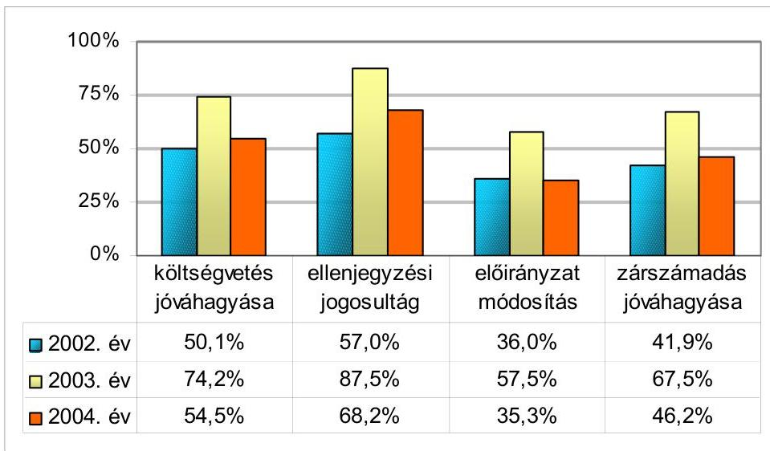

A kisebbségi önkormányzatok gazdálkodásának végrehajtásával kapcsolatos feladatokat a polgármesteri hivatalok végezték az együttmúködési megállapodások és a Nek. tv. 28. § előírásai alapján. Kivétel ez alól a készpénzkezelés, amely a polgármesteri hivatalon kívül történt a kisebbségi önkormányzatok 5,3\%-nál.

A polgármesteri hivatalok gazdálkodást segitő tevékenysége 60,3\%nál nem, 7,7\%-nál csak részben volt szabályozott a Nek. tv. 28. §-ában előírtak szerint. Ennek oka, hogy a gazdálkodást végrehajtó szervek nem rendelkeztek szervezeti és múködési szabályzattal, illetve a meglévő szervezeti és múködési szabályzatokban hiányosan rögzítették az ellátandó feladataikat. A helyi szabályozás hiányából, illetve a sajátosságoknak, gazdálkodási körülményeknek nem megfelelő előírások rögzítéséből következett, hogy az operatív gazdálkodás és a számviteli munka helyi szintü szabályozása nem terjedt ki a kisebbségi önkormányzatokkal kapcsolatos feladatokra. Nem történt meg a szabályozás a polgármesteri hivatalok számviteli politikájában és számlarendjében 62,2\%-nál, részben szabályozták a feladatokat 12,8\%-nál. Az előző évinél kisebb arányban maradt el az utalványozásra jogosultak és mindezek ellenjegyzőjének meghatározása, nagyobb arányban a helyettesítések szabályozása, illetve a jogkört gyakorlók kijelölése az átmeneti és tartós távollétek, a jogosultak érintettsége és rokoni kapcsolata esetére. A jegyzők nem bízták meg írásban az érvényesítést végzőt az Ámr. 135. § (2) bekezdése ellenére 43,6\%-nál, elmulasztották a szakmai teljesítés igazolása módjának az Ámr. 135. § (3) bekezdésében előírt szabályozását 87,2\%-nál és nem jelölték ki az igazolást végző személyt 85,9\%-nál. Mindezek következtében hiányosan múködött a folyamatba épített belső ellenőrzés.

Önkormányzati testületi határozatban állapította meg a 2003. évi költségvetését a kisebbségi önkormányzatok 96,7\%-a az Áht. 65. § (2) bekezdésében előírtaknak megfelelően. Az előkészítés hiányosságainak követ-

---

kezménye, hogy a testületek által jóváhagyott költségvetési határozatok 69,3\%-a felelt meg az Áht. 69. § (2) bekezdésében, illetve az Ámr. 29. § (2) bekezdésében foglalt előírásoknak. A határozatok tartalmi, szerkezeti hiányossága volt a kiadások kiemelt előirányzatonkénti és a bevételek forrásonkénti részletezésének, valamint, a bevételek és kiadások teljes számba vételének elmulasztása, a költségvetési egyensúly hiánya és a végrehajtás szabályozásának elmaradása.

A költségvetés jóváhagyott előirányzatait az önkormányzati testületek 35,2\%-nál módosították év közben határozattal. Az előterjesztés hiánya miatt elmaradt az indokolt módosítások 27,3\%-a esetében az Ámr. 53. § (7) bekezdésében előírt kisebbségi önkormányzati testületi jóváhagyás. A kisebbségi önkormányzatok elnökei a költségvetési előirányzatok módosításáról hozott testületi határozatok 92,2\%-át (az előző évben 97,7\%-át) továbbították olyan időben a települési önkormányzat polgármesteréhez, hogy azok a költségvetési rendeleten átvezethetők voltak az Ámr. 53. § (8) bekezdés előírásai szerint.

A költségvetési határozatok módosításának elmulasztása következtében nem szerepelt az előirányzatokban az év közben elnyert pályázati támogatás, a jóváhagyott pénzmaradvány, az átvett pénzeszközök, a bevételi többletek felhasználása, illetve a kiadások szerkezetének, kiemelt előirányzatainak változása. A határozatok továbbításának elmaradása esetén a települési önkormányzatok nem vezethették át a költségvetési rendeleten az előirányzatok jóváhagyott módosításait.

A kisebbségi önkormányzatok 82,8\%-a rendelkezett önálló bankszámlával, illetve a települési önkormányzat költségvetési elszámolási számlájához kapcsolt alszámlával. Nem használták a gazdálkodásra, illetve a pénzellátással kapcsolatos pénzforgalomra a megnyitott számlák 14,1\%át (az előző évben 20,5\%-át), a pénzforgalmat a települési önkormányzat költségvetési elszámolási számláján bonyolították. A gazdálkodási pénzforgalmat önálló számlán, vagy alszámlán bonyolító kisebbségi önkormányzatok egy költségvetési elszámolási számlával rendelkeztek, amelyet a székhelyük szerinti helyi önkormányzat hitelintézeténél nyitottak meg és vezettek az Ámr. 103. § (2) bekezdésének előírásaival összhangban. A kisebbségi önkormányzatok pénzgazdálkodását 59,7\%-ban a pénztárban folytatták (az előző évben 69,7\%-ban), a nagyobb biztonságot nyújtó bankszámlát kevésbé alkalmazták a kiadások teljesítésére. Bankszámlát egyáltalán nem használtak a gazdálkodásra 26,2\%-nál.

A számla feletti rendelkezési jogosultságot szabályozták a számlát vezető kisebbségi önkormányzatok 99\%-ánál. A szabályozásban az érintett kisebbségek 92,7\%-ának biztosították a számla feletti rendelkezési jogosultságot. Ilyen jogosultsága egyáltalán nem volt azoknak a kisebbségi önkormányzatoknak, amelyek pénzforgalmát a települési önkormányzatéval összevontan kezelték. A számlán vezetett pénzforgalomról nem a kisebbségi, hanem a települési önkormányzatok tisztségviselői, illetve a polgármesteri hivatal dolgozói rendelkeztek 34,1\%-nál.

A számla felett polgármesteri hivatali alkalmazottak rendelkezhettek az elektronikus utalások teljesítésekor Keszthely Város, Csömödér, Karmacs, és Sármellék

---

Községek Cigány Kisebbségi Önkormányzatainál az ügyfélterminálos rendszer múködtetéséhez szükséges részletes szabályozás (hozzáférési jogosultságok, utalás kezdeményezésének rendje) elmulasztása következtében.

A számla feletti rendelkezés hiányára, illetve a hozzáférési jogosultságok rendezetlenségére vezethető vissza, hogy átmeneti pénzügyi problémáinak áthidalására Sárszentlőrinc Község Cigány Kisebbségi Önkormányzat számlájáról a polgármesteri hivatal 2004. 02. 02-án 500 ezer Ft-ot vezetett át a költségvetési elszámolási számlára, valamint, hogy Medina Község Szerb Kisebbségi Önkormányzat pénzeszközeit a települési önkormányzat rendszeresen igénybe vette.

A kisebbségi önkormányzat készpénzforgalmára házipénztárat nem múködtettek, a pénztári bevételeket és a kiadásokat nem különítették el a települési önkormányzatétól 54,0\%-nál (az előző évben 60,8\%-\%-ánál). A készpénzes kiadásokra rendszeresen előleget, ellátmányt biztosítottak utólagos elszámolási kötelezettséggel az önálló pénztár múködtetése helyett, a kisebbségi önkormányzatok 10,0\%-ánál, nem biztosították a felhasználások és elszámolások követhetőségét.

A polgármesteri hivatalok a települési önkormányzattal összevont bankszámla és házipénztár kezelés esetén nem végezték el az érintett kisebbségi önkormányzatok pénzforgalmának elkülönített rögzítését a számviteli nyilvántartásokban. A 20/1995. (III. 3.) Korm. rendelet elkülönített számviteli nyilvántartás vezetését előíró 15. § (1) bekezdésében foglaltak ellenére nem, vagy csak részben történt meg a kisebbségi önkormányzat bevételeinek és kiadásainak elkülönítése a fókönyvi könyvelésben és az analitikus nyilvántartásokban.

A kisebbségi önkormányzatok múködéséhez nyújtott központi és települési önkormányzati támogatást az adott kisebbségi önkormányzat bevételeként 17,9\%-nál, a teljesített kiadásokat 8,5\%-ánál nem, illetve csak részben számolták el. A települési önkormányzatétól való elkülönített nyilvántartások vezetésének elmulasztásával nem biztosították azt, hogy a költségvetési beszámolók összeállításához és a zárszámadási határozatok jóváhagyásához megbízható, valós adatok álljanak rendelkezésre.

A kisebbségi önkormányzatok vagyoni nyilvántartásainak elkülönített vezetéséről 43,6\%-nál gondoskodtak az elszámolást végző polgármesteri hivatalok.

A kisebbségi önkormányzatok operatív gazdálkodási gyakorlata, valamint a gazdálkodási hiányosságok okai az előző évben ellenőrzötteknél megállapítottakhoz viszonyítva alapvetően nem változtak. A hibás bizonylatok aránya továbbra is meghaladta a $25,0 \%$-ot a vertikális folyamat minden egyes eleménél.

A polgármesteri hivatalok 49,4\%-ánál nem vezették az Áht. 103. § (1) bekezdésében rögzített nyilvántartást az előirányzatokról, valamint 83,3\%-nál az Ámr. 134. § 2005. január 1-ig hatályos számozása szerinti (6) bekezdésében előírt nyilvántartást a kötelezettségvállalásokról. Ennek következménye, hogy az operatív gazdálkodás folyamatában hiányoztak azok az információk, amelyek

---

a kötelezettségvállalási és az utalványozási intézkedéseket, továbbá mindezek ellenjegyzését megalapozzák.

A kötelezettségvállalásokat az Ámr. 134. § (1) bekezdésében foglaltaktól eltérően végezték a bizonylatok 27,0\%-ánál. Jellemzően a kötelezettségvállalás írásba foglalása maradt el.

A kötelezettségvállalás ellenjegyzésénél megsértették az Áht. 74/A. § (2)(3) bekezdésében foglalt előírásokat a bizonylatok 32,5\%-ánál (az előző évben $39,7 \%$-ban), nem vették figyelembe azt az előírást mely szerint az ellenjegyzést a helyi kisebbségi önkormányzat testületének tagja a kisebbségi önkormányzat testületének megbízása alapján végezheti. A testület felhatalmazása nélkül is végeztek ellenjegyzést kisebbségi önkormányzati testületi tagok, illetve jegyzők és hivatali dolgozók is.

Az Ámr. 134. § (9) bekezdésében foglaltak ellenére a kötelezettségvállalás ellenjegyzésére jogosultak nem végezték el feladataikat, az ellenjegyzést megelőzően nem győződtek meg arról, hogy a jóváhagyott költségvetés kiadási előirányzata biztosítja-e a fedezetet, a kötelezettségvállalás nem sérti-e a gazdálkodásra vonatkozó szabályokat.

Az utalványozás során nem tartották be az Áht. 74/A. § (1) bekezdés, valamint az Ámr. 136. § (3) bekezdés és a belső szabályozás előírásait a bizonylatok $28,6 \%$-ánál. Elmaradt az utalványozás, nem biztosították az elnök utalványozási jogkörének gyakorlását, mert részben vagy teljes egészében a polgármester, a jegyző, illetve hivatali alkalmazott utalványozott, továbbá a kisebbségi önkormányzat elnökének felhatalmazása nélkül gyakorolta az utalványozást testületi tag. A hiányosságok között szerepelt, hogy nem érvényesített okmányon, illetve ellenjegyzés nélkül is végeztek utalványozást. A személyes érintettség esetére szóló belső szabályozás hiányára vezethető vissza, hogy a kisebbségi önkormányzatok elnökei saját maguk javára is utalványoztak kifizetést.

Az operatív gazdálkodás hiányosságait a legnagyobb arányban az utalvány ellenjegyzése területén tapasztaltuk. Az ellenjegyzés feladatait nem látták el az Áht. 74/A. § (3) bekezdésében és az Ámr. 137. § (3) bekezdésében előírtaknak megfelelően a bizonylatok $44 \%$-án.

Az érvényesítés hiányzott, illetve az Ámr. 135. § (1)-(2) és (4) bekezdés előírásaitól eltérően végezték a bizonylatok 38,0\%-ánál. Nem történt meg az érvényesítés jellemzően az elszámolt bevételek bizonylatain, illetve nem tartalmazta az „Érvényesítve" megjelölést, a megállapított összeget, a főkönyvi elszámolásra utaló számla számát. Az érvényesítők nem ellenőrizték az összegszerűséget, a fedezet meglétét és azt, hogy az előírt alaki követelményeket be-tartották-e. Ezen túlmenően jegyzői megbízás, illetve szakmai képesítés, valamint munkaköri leírásban rögzített feladat meghatározás hiányában is végeztek érvényesítést. A bevételek beszedésének és a kiadások teljesítésének elrendelése előtt az Ámr. 135. § (1) bekezdés előírásai ellenére okmányok alapján nem ellenőrizték, szakmailag nem igazolták a teljesítést $33,1 \%$-ban a pénztári és $30,2 \%$-ban a bankszámlához kapcsolódó tevékenységben.

---

Az operatív gazdálkodás fenti hiányosságai jelzik a belső ellenőrzés múködésének hiányát és zavarait a kisebbségi önkormányzati gazdálkodásban. Mivel a folyamat elemeinek hiánytalan és a hivatkozott jogszabályokban rögzített tartalmú elvégzését nem biztosították, kötelező sorrendjét nem tartották be, azok nem voltak hatékony eszközei a hibák megelőzésének, időbeni feltárásának és kijavításának.

A gazdasági eseményekről kiállított bizonylatok 74,4\%-a felelt meg a Számv. tv. 167. § (1) bekezdés a)-j) pontjaiban előírt alaki és tartalmi követelményeknek. A további bizonylatoknál nem csatolták az alapbizonylatot az elszámolásokhoz, illetve nem hivatkoztak annak fellelhetőségére, nem alakítottak ki zárt rendszert a bizonylatok kezelésére. Az elszámolás alapját képező bizonylatok nem a kisebbségi önkormányzat nevére szóltak, adataik hiányosak voltak a gazdasági események pontatlan leírása, illetve a szükséges aláírások elmulasztása miatt. Nem tartalmazták jellemzően a könyvviteli nyilvántartásokban történt rögzítés időpontját, az utalványozó és a rendelkezés végrehajtását igazoló személy, valamint a pénztárellenőr aláírását.

A polgármesteri hivatalok 16,6\%-ánál nem tartották be a Vhr. 51. § (1) bekezdés a)-b) pontjaiban szereplő előírásokat, késedelmesen végezték el a gazdasági eseményekről, műveletekről kiállított bizonylatok adatainak főkönyvi elszámolását. Nem biztosították a könyvviteli elszámolást a készpénzforgalom esetén a pénzmozgással egyidejűleg, a bankszámlaforgalomnál a hitelintézeti értesítés megérkezéskor, az egyéb gazdasági műveleteknél legkésőbb a tárgynegyedévet követő hónap 15-ig.

Az éves gazdálkodásáról szóló zárszámadását határozattal jóváhagyta a kisebbségi önkormányzatok 75,3\%-a. A határozatok tervezetét a jegyzők 56\%-a készítette el a megállapodásban foglaltak szeirnt. A zárszámadási határozat jóváhagyását elmulasztó kisebbségi önkormányzatok megsértették a Nek. tv. 27. § (1) bekezdés b) pontjában ${ }^{1}$ előírt kötelezettséget. A zárszámadási határozatok tartalma 64\%-nál volt összehasonlítható a költségvetéssel. A továbbiak nem, vagy csak részben tartalmazták az összehasonlíthatóságot biztosító eredeti és módosított előirányzatokat, valamint a kisebbségi önkormányzatok bevételeinek és kiadásainak alakulását. A nem megfelelőnek minősített zárszámadási határozatokból az eredeti és a módosított előirányzatokon túlmenően hiányzott a kiadások kiemelt előirányzatonkénti és a bevételek forrásonkénti részletezése, az állami és az önkormányzati támogatások adatai, az előző évi pénzmaradványok összegei.

A jóváhagyott zárszámadási határozatot a kisebbségi önkormányzatok 57,3\%-ánál továbbította az elnök a települési önkormányzat polgármesteréhez olyan időben, hogy az a zárszámadási rendeletbe beépíthető legyen.

[^0]
[^0]:    ${ }^{1}$ Nek. tv. 27. § (1) bekezdés b) pontja szerint a helyi kisebbségi önkormányzat saját hatáskörében - a települési önkormányzat rendeletében foglalt keretek között - határozza meg költségvetését, zárszámadását, a települési önkormányzat által rendelkezésére bocsátott források felhasználását.

---

A gazdálkodási szabályok súlyos megsértése miatt felvetettük a kisebbségi önkormányzat elnökének és az önkormányzat jegyzőjének személyes felelősségét Battonya Város Szerb Kisebbségi Önkormányzatnál.

---

# A helyszíni ellenőrzésekről a 2004. évben készített számvevői jelentésekben a helyi és a helyi kisebbségi önkormányzatok szabályszerű és célszerű múködése érdekében tett javaslatok 

A helyi önkormányzatok gazdálkodásának átfogó ellenőrzéséről készült számvevői jelentések megállapításainak hasznosítását valamint a hiányosságok megszüntetését 12229 javaslattal kívántuk elősegíteni. A javaslatok közül $85,5 \%$ a törvényekben, kormányrendeletekben és a helyi önkormányzatok rendeleteiben, a polgármesteri hivatalok szabályzataiban előírtak maradéktalan betartására, a szabályszerű működésre hívta fel a figyelmet. A javaslatok $14,5 \%$ az önkormányzati feladatok hatékonyabb ellátásának elősegítése, az intézményrendszer és a polgármesteri hivatalok munkájának célszerűbb megszervezése, szabályozottságának javítása érdekében született.

## 1. A jogszabályi előírások maradéktalan betartása érdekében a helyi önkormányzatok ellenőrzéséről készített számvevői jelentésekben tett szabályszerűségi javaslatok

1.1. A költségvetési rendelet jóváhagyásának, módosításának, az előirányzatok nyilvántartásának és betartásának szabályszerűségére 2455 javaslat, a szabályszerűségi javaslatok 23,5\% a hívta fel az önkormányzatok figyelmét. A gazdasági program elkészítését 178 önkormány részére javasoltuk. A költségvetés tervezése és a költségvetési rendelet alkotása során, a jóváhagyás rendjére, valamint az éves költségvetés tartalmára, szerkezetére, összeállítására a törvényekben, kormányrendeletben vonatkozó előírások betartása érdekében 1661 javaslattal éltünk. A jóváhagyott költségvetési előirányzatok módosítása, nyilvántartása során a központi és az önkormányzati rendelkezések érvényre jutását 407 javaslat szolgálta, míg a kiemelt előirányzatok betartására 209 javaslat irányult.

- A Htv. 140. § (1) bekezdés a) pontja alapján az önkormányzatok több évre szóló gazdasági programját határozzák meg a képviselő-testületek az Ötv. 91. § (1) bekezdésében előírtak betartása érdekében.
- Az Áht. 118. §-ában előírt mérlegek, kimutatások tartalmát önkormányzati rendeletben rögzítsék a képviselő-testületek.
- Az Ámr. 28. §-a alapján a költségvetési koncepciót a helyben képződő bevételek, valamint az ismert kötelezettséget figyelembevételével állítsák össze, az előterjesztéséhez csatolják a helyi önkormányzatoknál múködő bizottságok és a kisebbségi önkormányzatok véleményét.
- A költségvetési rendelettervezetet az Áht. 71. §-ában meghatározott határidőben, a javasolt előirányzatok megalapozottságát biztosító rende-

---

lettervezetekkel, valamint a többéves elkötelezettséggel járó kiadási tételek későbbi évekre vonatkozó kihatásainak bemutatásával terjesszék a képviselő-testület elé.

- A költségvetési rendelet az Áht. 69. § (1) bekezdésében foglaltak alapján tartalmazza a múködési és felhalmozási célú bevételeket és kiadásokat, ezen belül költségvetési szervenként a személyi jellegű kiadásokat, a munkaadókat terhelő járulékokat, a dologi jellegű kiadásokat, az ellátottak pénzbeni juttatásait, a speciális célú támogatásokat, a költségvetési létszámkeretet, illetve a helyi önkormányzat által kijelölt felhalmozások előirányzatait.
- Az Ámr. 29. § (1) bekezdésében előírt szerkezetben készüljön a költségvetési rendelettervezet, melyben legalább az Ötv-ben előírt részletezettséggel mutassák be a bevételeket, az önálló és részben önállóan gazdálkodó költségvetési szervek bevételeit, kiemelt előirányzatonként részletezve kiadásait, felújítási előirányzatokat célonként, felhalmozási kiadásokat feladatonként, az önkormányzati hivatal költségvetését feladatonként, valamint külön tételben az általános és céltartalékot, a létszámkeretet, az év várható bevételi és kiadási előirányzatainak teljesüléséről előirányzat-felhasználási ütemtervet.
- A költségvetési rendeletben az Áht. 67. § (3) bekezdése alapján határozzák meg a címrendet.
- Az Áht. 8. § (1) bekezdésében foglaltaknak megfelelően a költségvetési bevételek és kiadások különbségeként a tervezett hiányt a költségvetési rendelettervezetben mutassák be.
- A költségvetési rendelettervezeteket a jegyzők az Ámr. 29. § (4) bekezdésében meghatározottak szerint a költségvetési szervek vezetőivel egyeztessék.
- A körjegyző́ség költségvetéséről az Ámr. 29. § (7) bekezdésében foglaltak alapján az érdekelt önkormányzatok együttes testületi ülésen döntsenek.
- A költségvetési és zárszámadási rendeletek előterjesztésekor az Áht. 118. §-a alapján a képviselő-testületek felé tájékoztatásául mutassák be az önkormányzat összevont mérlegeit és elkülönítetten a helyi kisebbségi önkormányzatok mérlegeit, a többéves kihatással járó döntések számszerúsítését évenkénti bontásban, valamint összesítve, a közvetett támogatásokat tartalmazó kimutatásokat szöveges indoklással együtt.
- Rendeletben rögzítsék a költségvetés végrehajtásának szabályait, az előirányzatok évközi módosításának eljárási rendjét, a tartalékkal való rendelkezés jogosultjait, a költségvetés hiányának finanszírozásával összefüggő hitelmúveleti hatásköröket, a költségvetési többletbevételek felhasználásának szabályait, a vagyonnal kapcsolatos tárgyévi teendők végrehajtásának jogosultjait és felelőseit.
- Amennyiben a központi költségvetés, vagy az elkülönített állami pénzalapok pótelőirányzatot biztosítanak az önkormányzatok számára, a költségvetési rendeletet az Ámr. 53. § (2) bekezdésében foglalt ha-

---

táridőn belül, negyedévente, de legkésőbb a tárgyévet követő év február 28-ig módosítsák az önkormányzatok.

- Az önkormányzat önállóan gazdálkodó költségvetési szervei saját hatáskörében végrehajtott előirányzat-változtatásáról a jegyző előkészítésében 30 napon belül kapjon tájékoztatást a képviselő-testület az Ámr. 53. § (6) bekezdése alapján.
- Az Áht. 103. § (1) bekezdésének megfelelően a költségvetés végrehajtása során a jóváhagyott előirányzatokat és azok teljesülésének alakulását folyamatosan tartsák nyilván, a (2) bekezdés előírása alapján a rendeletben szabályozott módon történő nyilvántartás terjedjen ki a bevételi előirányzatok teljesítését előrejelző - a teljesülés várható időpontja szerint rögzített - bevételi előírások folyamatos nyilvántartási kötelezettségére.
- A költségvetés végrehajtása során, az Áht. 12/A. § (1) bekezdésében foglaltak betartása érdekében tárgyévi fizetési kötelezettséget a jóváhagyott kiadási előirányzatok mértékéig vállaljanak, továbbá, a költségvetési szervek az Áht. 93. § (1) bekezdésében foglaltaknak megfelelően a jóváhagyott előirányzatokon belüli gazdálkodjanak.
1.2. A gazdálkodás szabályozottsága, a bizonylati rend és fegyelem szabályszerűségének javítása érdekében 4196 javaslat született, amely a szabályszerűségi javaslataink 40,1\%-a volt. A gazdálkodási, ellenőrzési jogkörök Áht-ban és Ámr-ben foglalt előírásainak betartását 1688, a számviteli politika és a keretében előírt szabályzatok, a számlarend jogszabályi követelményeknek, valamint a helyi sajátosságoknak megfelelő kidolgozását 513 javaslat segítette elő.

# - A gazdálkodás és a pénzügyi-számviteli feladatok szabályozása tekintetében: 

- a gazdálkodás szabályszerű lebonyolítása érdekében a kötelezettségvállalás, utalványozás gazdálkodási és az ellenjegyzés, érvényesítés, teljesítés szakmai igazolás ellenőrzésének jogosultjai meghatározásánál érvényesítsék az Ámr. 134-138. §-aiban foglaltakat.
- Az előzetes írásbeli kötelezettségvállalást nem igénylő, 50000 Ft-ot el nem érő kifizetések nyilvántartási rendjét és formáját az Ámr. 134. § (4) bekezdésében foglaltak alapján belső szabályzatban rögzítsék, továbbá a nyilvántartás alkalmas legyen az Ámr. 134. § (6) bekezdésében foglaltakban előírt kötelezettségvállalás évenkénti összegének megállapítására.
- Az Ámr. 135. § (3) bekezdésében foglaltakat figyelembe véve a szakmai teljesítés igazolásának módját határozzák meg és az azt végző személyeket jelöljék ki.
- A Htv. 140. § (1) bekezdés c) pontja alapján a jegyzők alakítsák ki a költségvetési szervek egységes számviteli rendjét.
- A polgármesteri hivatalok szervezeti és múködési szabályzatait egészítsék ki az Ámr. 10.§ (4) bekezdésében foglalt tartalmi előírásoknak megfelelően.
- A gazdasági szervezetek ügyrendjét vizsgálják felül, az Ámr. 17. § (4) bekezdésében előírtaknak megfelelően tartalmazza a szervezet és egységei, a pénzügyi-gazdasági feladatok ellátásáért felelős személyek által, valamint

---

a hozzájuk rendelt részben önállóan gazdálkodó költségvetési szervek ellátandó feladatait, a vezetők és más dolgozók feladat-, hatás- és jogkörét.

- A számviteli politikát aktualizálják és egészítsék ki, hogy a számviteli elszámolás és a terven felüli értékcsökkenés elszámolásánál mit tekintenek jelentős összegnek, illetve lényeges szempontnak a Vhr. 8. § (5) bekezdés a) és g) pontjában foglaltak betartása érdekében, valamint a Vhr. 8. § (8) bekezdés alapján határozzák meg a mérlegkészítés időpontját.
- A számlarendben a Vhr. 49. §-ában előírtaknak megfelelően rendelkezzenek a 9. számú melléklet szerinti könyvviteli számlák további tagolásáról, a könyvviteli számlákhoz kapcsolódó analitikus nyilvántartások vezetésének módjáról, formájáról, tartalmáról, az adataiból készült feladások határidejéről.
- Az eszközök és források leltározási és leltárkészítési szabályzatában a leltározás módjának és gyakoriságának meghatározásánál a Vhr. 37. §-ban foglaltakat vegyék figyelembe, amely alapján végezzék el a könyvviteli mérlegben kimutatott eszközök és források leltározását.
- A pénzügyi-számviteli munkakört betöltő dolgozók munkaköri leírását egészítsék ki az egyeztetési kötelezettségek, a munkafolyamatba épített ellenőrzési teendők meghatározásával a Ktv. 11. § (6) bekezdésében foglalt előírások szerint.

# - A költségvetési gazdálkodás és az ellenőrzési jogkörök gyakorlása szabályszerűségének biztosítása érdekében: 

- minden gazdasági műveletről, eseményről, amely az eszközök, illetve az eszközök forrásainak állományát vagy összetételét megváltoztatja a bizonylatokat állítsák ki, amely alapján szabad az adatokat a számviteli nyilvántartásokba bejegyezni, a Számv. tv. 165. § (1)-(2) bekezdése alapján.
- A könyvviteli elszámolást közvetlenül alátámasztó bizonylatok feleljenek meg a Számv. tv. 167. § (1) bekezdésében előírt alaki és tartalmi követelményeinek.
- A költségvetési pénzforgalmat érintő gazdasági események bizonylatainak adatait késedelem nélkül, a készpénzforgalom esetén a pénzmozgással egyidejűleg, bankszámla forgalomnál a hitelintézeti értesítés megérkezésekor, az egyéb gazdasági műveletek, események bizonylatainak adatait a gazdasági események megtörténte után, de legkésőbb a tárgynegyedév utolsó hónapjának végéig rögzítsék a könyvekben, a Vhr. 51. § (1) bekezdés a) és b) pontjában foglaltak betartása érdekében.
- Az Ámr. 134. § (2) bekezdésében foglaltak érvényre jutása érdekében biztosítsák, hogy kötelezettségvállalás a gazdasági vezető vagy az általa felhatalmazott személy ellenjegyzése után, írásban történjen meg.
- Az Ámr. 135. § (1) bekezdésében előírtakat tartsák be, a kiadások teljesítésének és a bevételek beszedésének elrendelése előtt az okmányok alapján ellenőrizzék, szakmailag igazolják azok jogosultságát, összegszerűségét, a szerződés, megrendelés, megállapodás teljesítését, valamint az érvényesítő tegyen eleget a munkafolyamatba épített ellenőrzési feladatainak, a szakmai teljesítés igazolás alapján ellenőrizze az összegszerűséget, a fedezet meglétét és az előírt alaki követelmények betartását.
- A munkafolyamatba épített ellenőrzési feladatokat az Ámr. 134. § (7) bekezdésében meghatározottak szerint végezzék el az ellenjegyzők, az ellenjegyzést megelőzően győződjenek meg arról, a jóváhagyott költségvetés fel

---

nem használt, illetve le nem kötött, a kötelezettségvállalás tárgyával összefüggő kiadási előirányzat biztosítja-e a fedezetet, a kötelezettségvállalás nem sérti-e a gazdálkodásra vonatkozó szabályokat, a kötelezettségvállalás célszerűségét megalapozó eljárás megtörtént-e.

- Az önkormányzat pénzállományának alakulásáról a jegyző készíttessen likviditási tervet, gondoskodjon folyamatos aktualizálásáról az Ámr. 139. $\S$-ában foglaltak alapján.
1.3. A szabályszerűségi javaslatok 5,8\%-a az önkormányzati vagyon nyilvántartása, a vagyonnal való gazdálkodás szabályszerűsége, célszerűsége, nyilvánossága biztosítását segítette elő.
- A számviteli nyilvántartásokban gondoskodjanak a főkönyvi számlák további bontásával, vagy részletező analitikus vezetésével a Vhr. 9. számú melléklet $1 / \mathrm{k}$ pontja alapján arról, hogy abból kitűnjön a törzsvagyon (ezen belül a forgalomképtelen, elletve korlátozottan forgalomképes) nem törzsvagyon részét képező eszközök értéke.
- A mérleg fordulónapján fennálló követelések, értékpapírok és meglévő részesedések év végi értékelési feladataihoz intézkedjenek, hogy az adatok rendelkezésre álljanak, vizsgálják meg az értékvesztés elszámolásának szükségességét a Számv. tv. 54. § (1) bekezdése és a (2) bekezdés c) pontjában és (4) bekezdésében, valamint a Számv. tv. 55. § (1) bekezdésében előírtaknak megfelelően.

# - A vagyongazdálkodási rendelet módosítását végezzék el, annak érdekében: 

- az Áht. 108. § (1) bekezdése alapján határozzák meg azt az értékhatárt, amely felett a vagyont értékesíteni, az állami tulajdonban lévő vagyon feletti vagyonkezelés jogát, a vagyon használatát, illetve a hasznosítás jogát átengedni csak nyilvános, (indokolt esetben zártkörű) versenytárgyalás útján a legjobb ajánlattevő részére lehet.
- Az Áht. 108. § (2) bekezdésében foglaltaknak megfelelően határozzák meg a vagyon tulajdonjoga és a vagyonkezelési joga ingyenes átruházásának, továbbá a követelésről való lemondásának módját és eseteit.
- A rendelet hatályát terjesszék ki a teljes vagyoni körre, rendelkezzenek a forgalomképesség szerinti besorolás megváltoztatásának módjáról, határozzák meg a vagyonnal való gazdálkodás képviselő-testület felé történő beszámolás rendjét.
- Az államháztartás alrendszereiből nyújtott céljellegű, fejlesztési támogatások kedvezményezettjeinek nevére, a támogatás céljára, összegére, továbbá a támogatási program megvalósítási helyére vonatkozóan az Áht. 15/A. §-a, a vagyonnal történő gazdálkodással összefüggő - nettó ötmillió Ft-ot elérő vagy azt meghaladó - árubeszerzésre, építési beruházásra, szolgáltatás megrendelésre, vagyonértékesítésre, vagyonhasznosításra, vagyon vagy vagyon kezelői jog átadásra az Áht. 15/B. §-a hatálya alá tartozó szerződések folyamatos közzétételéről gondoskodjanak.
- Az önkormányzati ingatlanok pártszervezetek részére történő bérbeadásánál a kedvezményeket szüntessék meg, az Ötv. 78. § (1) bekezdésében foglaltak végrehajtása érdekében.

---

1.4. Az önkormányzatok céljelleggel - nem szociális ellátásként - szervezetek, magánszemélyek számára támogatást nyújtottak, mely szabályszerűségének javítását kívánta javaslataink 4,3 \%-a elősegíteni.

- Az Áht. 13/A. § (2) bekezdése alapján juttatott összegek rendeltetésszerű felhasználásáról írjanak elő számadási kötelezettséget, múködtessék a számadások, felhasználások ellenőrzési rendszerét, intézkedjenek a céltól eltérő, nem rendeltetésszerű felhasználás esetén a visszafizetésre, illetve a számadási kötelezettség elmulasztása esetén a kötelezettség teljesítéséig a további támogatás felfüggesztésére.
- A közhasznú szervezetek részére megállapított támogatások folyósítására szerződés alapján kerüljön sor, melyben írják elő az elszámolás kötelezettségét, annak feltételeit és módját, a Kszt. tv. 14. § (2) bekezdésében foglaltakat alapján.
- A támogatások odaítélése esetén biztosítsák az Ötv. 10. § (1) bekezdés d) pontjában foglaltak betartását, miszerint a képviselő-testület hatásköréből nem ruházható át a közösségi célú alapítványi forrás átadása.
1.5. A közbeszerzési eljárások lebonyolításának szabályai betartására tettük a szabályszerűségi javaslataink 0,5\%-át.
- A Kbt. 2 35-39. §-ai szerint meghatározott érték feletti beszerzésnél minden esetben kerüljön sor a közbeszerzési eljárás lefolytatására.
- A Kbt. 2 16. § (1) bekezdésében foglaltak alapján a közbeszerzések éves statisztikai összegzést határidőben készítsék el, küldjék meg a Közbeszerzési Tanács részére.
1.6. A zárszámadási kötelezettség teljesítésére, a pénzmaradvány elszámolás és felülvizsgálat rendjére, tartalmára vonatkozó jogszabályi előírások betartásával függött össze a szabályszerűségi javaslataink 6,9\%-a.
- A költségvetés végrehajtásáról szóló zárszámadást az elfogadott költségvetéssel összehasonlító módon, az év utolsó napján érvényes szervezeti, besorolási rendnek, az Áht. 18. §-ában foglaltaknak megfelelően készítsék el.
- A zárszámadási rendeletet az Áht. 69. §-ában és az Ámr. 29. § (1) bekezdésében meghatározott szerkezeti rendben és tartalommal terjesszék a képviselő-testület elé, melyhez tájékoztatásul csatolják az Áht. 118. §ában előírtaknak megfelelően az önkormányzat összes bevételét, kiadását, finanszírozását és pénzeszközének változását, vagyonkimutatását, valamint szöveges indoklással a többéves kihatással járó kiadások számszerűsét és a közvetett támogatásokat tartalmazó kimutatást.
- A költségvetési szervek beszámolóját az Ámr. 149. § (3) bekezdésében foglalt tartalommal és határidőig vizsgálják felül, továbbá az (5) bekezdés alapján a költségvetési beszámoló számszaki felülvizsgálatának eredményéről a költségvetési intézmények vezetőit írásban értesítsék.

---

1.7. Az önkormányzati ellenőrzési rendszer kialakítását és múködését érintette a javaslatok 8,6\%-a:

- az Ötv. 92. § (2) bekezdésében és az Áht. 120/A. § (2) bekezdés b) pontjában előírt belső ellenőrzési tevékenység a polgármesteri hivataloknál is kerüljön végrehajtásra, gondoskodjanak az Áht. 121/A. § (3) bekezdése alapján a polgármesteri hivatal belső ellenőrzésének szervezeten belüli kialakításáról, annak keretében intézkedjenek az ellenőrök funkcionális függetlenségét biztosító feltételek megteremtésére az Áht. 121/A. (4) bekezdésében részletezetteknek megfelelően.
- A Ber. 4. § (2) bekezdése alapján a polgármesteri hivatalok SzMSz-ében határozzák meg a belső ellenőrzést végző szervezet jogállását és feladatait.
- A Ber. 8. §-a alapján határozzák meg a belső ellenőrzés feladatait, a 18. §-ában foglaltak szerint készítsék el a stratégiai tervet, középtávú és éves ellenőrzési tervet, melyeket a költségvetési szervek vezetői hagyjanak jóvá.
- Az ellenőrzés lefolyatatásához a Ber. 23. §-ában előírt tartalmú ellenőrzési programot készítsenek, a 24. § szerinti megbízólevéllel lássák el a belső ellenőröket, az ellenőrzés végrehajtása során a 25 . § foglaltakat érvényesítsék, valamint a 27. § meghatározott tartalmú ellenőrzési jelentést készítsenek.
- A képviselő-testületek a Htv. 138. § (1) bekezdés g) pontjában előírt gazdálkodási feladat és hatáskörében meghatározott időszakonként tekintsék át az általuk alapított és fenntartott költségvetési szervek ellenőrzésének tapasztalatait.
- A jegyzők a Htv. 140. § (1) bekezdés e) pontjában meghatározott gazdálkodási feladat és hatáskörük keretében lássák el az önkormányzat által alapított és fenntartott költségvetési szervek pénzügyi és gazdasági ellenőrzését.
1.8. A költségvetési és vagyongazdálkodás, az intézményi szervezeti rendszer kialakítása és múködtetése, a költségvetés egyensúlyának helyzete áttekintése alapján tettük a szabályszerűségi javaslatok 7,7\%-át:
- az Ötv. 8. § (2) bekezdésében foglaltak alapján az önkormányzatok határozzák meg - a lakosság igényei alapján, anyagi lehetőségeiktől függően-, mely feladatokat, milyen mértékben és módon látnak el.
- Az adósságot keletkeztető éves kötelezettségvállalások során tartsák be az Ötv. 88. § (2) bekezdésében előírt felső határt.

2. A munka színvonalának javítása érdekében a helyi önkormányzatoknál készített számvevői jelentésekben tett célszerűségi javaslatok

A gazdálkodás egyes területeire vonatkozó szabályozási kérdésekkel, a pénzügyi-számviteli feladatok informatikai támogatottságával, a polgár-

---

mesteri hivatalok működésével, az önkormányzati feladatellátással és egyéb kérdésekkel összefüggésben 1773 javaslatot tettünk.

- A pénzügyi-számviteli területen dolgozó köztisztviselők munkaköri leírásaiban határozzák meg a hatás és jogköröket, valamint egészítsék ki az informatikai rendszerek használatához kapcsolódó feladatokkal.
- A gazdálkodási és ellenőrzési jogkörök gyakorlásáról a felhatalmazottakat számoltassák be.
- A polgármesteri hivatalok informatikai rendszereivel történő biztonságos munkavégzés érdekében a váratlan események esetére dolgozzanak ki katasztrófa elhárítási tervet, továbbá készítsék el az informatikai fejlesztésekhez kapcsolódó informatikai stratégiát.
- A céljelleggel nyújtott támogatások egységes nyilvántartási feladatait, a számadások ellenőrzésének módját, feltételeit, feladatait, hatásköri és felelőségi rendjét határozzák meg.
- A középületek akadálymentessé tételét kísérjék figyelemmel, tekintettel a Fot. 29. § (6) bekezdésében meghatározott 2005. január 1-i teljesítési határidőre.
- Az Ász ellenőrzés tapasztalatait testületi ülésen tárgyalják meg, a feltárt hiányosságok megszüntetése érdekében készítsenek intézkedési tervet.

# 3. A számvevői jelentésekben rögzített megállapítások alapján tett javaslatok a helyi kisebbségi önkormányzatok gazdálkodásával kapcsolatban tett javaslatok: 

- alkossák meg szervezeti és működési szabályzatukat, határozzák meg abban az ellátandó feladataikat a Nek. tv. 27. § (2) és az Ötv. 102/C. § (6) bekezdésének megfelelően;
- kössék meg a települési önkormányzatokkal a hiányzó együttmúködési megállapodásokat az Áht. 66. § és a 68. § (3) bekezdés előírásai alapján; vizsgálják felül és aktualizálják, a jogszabályi előírások, illetve a helyi sajátosságok tekintetében elavult megállapodásokat;
- az önkormányzattal kötött megállapodásokat, illetve a hatályban lévők felülvizsgálatát, módosítását az Ámr. 29. § (11) bekezdésben foglaltak alapján január 15-ig végezzék el;
- tartsák be az Ötv. 102/C. § (2) bekezdésének előírásait, és a kisebbségi önkormányzatok ne lássanak el a települési önkormányzat hatáskörébe utalt hatósági feladatokat; költségvetési forrásaikat az Áht. 62. § (2) bekezdésében és a hatályos költségvetési törvényben foglaltak szerint, az önkormányzat múködésére és a kisebbségük érdekeinek érvényesítésére használják fel;
- teljesítsék a költségvetés határozatban történő megállapításával kapcsolatos, az Áht. 65. § (2) bekezdésében előírt kötelezettségeiket és ennek során tartsák be az együttműködési megállapodásban, illetve az

---

Ámr. 36. § (5) bekezdésében rögzített határidőket, érvényesítsék Áht. 69. § (2) és az Ámr. 29. § (2) bekezdésében előírt tartalmi követelményeket;

- végezzék el a költségvetési előirányzatok évközi módosítását, és arról tájékoztassák a települési önkormányzat polgármesterét az Ámr. 53. § (1-8) bekezdésében foglaltaknak megfelelően; biztosítsák ezzel, hogy az előirányzat-módosító határozatokat az Áht. 74. § (3) bekezdésének megfelelően átvezethessék a költségvetési rendeleten a települési önkormányzatok;
- tegyenek eleget az operatív gazdálkodás folyamatában a bankszámla nyitásával, a banki és a készpénzes forgalom elkülönített kezelésével, az Ámr. 103. § (2) bekezdésében foglalt előírásoknak;
- biztosítsák, hogy a polgármesteri hivatalok a kisebbségi önkormányzatok bevételeinek és kiadásainak elkülönített elszámolását, számviteli adatainak a települési önkormányzatén belül elkülönített nyilvántartását a 20/1995. (III. 3.) Korm. rendelet 15. § (1) bekezdésében foglaltak szerint végezzék el;
- tartsák be a kötelezettségvállalás, a teljesítés szakmai igazolás, az érvényesítés, az utalványozás és az ellenjegyzés Áht. 74/A. § (1)-(3) bekezdésében, valamint az Ámr. 134-138. §-aiban rögzített előírásait; a pénzgazdálkodásban szüntessék meg az összeférhetetlenségeket;
- érvényesítsék a gazdálkodás folyamatában a bizonylati rend- és fegyelem Számv. tv. 165-167. §-aiban foglalt, valamint a számviteli elszámolások Vhr. 49. § (1) bekezdésében és 51. § (1) bekezdés a)-b) pontjaiban rögzített előírásait;
- teljesítsék a Nek. tv. 27. § (1) bekezdés b) pontjában foglalt, a zárszámadás határozattal történő elfogadásának kötelezettségét az együttmúködési megállapodásban és az Ámr. 36. § (5) bekezdésében előírtaknak megfelelő határidőre, az Áht. 18. §-ában előírt tartalmi és szerkezeti követelmények betartásával;
- igényeljék a polgármesteri hivatalok hatékonyabb segítségét a kisebbségi önkormányzat gazdálkodási feladatainak szakszerűbb ellátásához a Nek. tv. 28. § előírásai alapján;
- végezzék el, illetve kezdeményezzék a szabályszerű gazdálkodáshoz szükséges belső szabályozás jogszabályi előírásoknak és helyi adottságoknak megfelelő kidolgozását, biztosítsák a meglévő szabályozások rendelkezéseinek betartását a költségvetési tervezés, gazdálkodás, számlavezetés, számviteli tevékenység és beszámolás területén egyaránt az Áht. 121. § (1) bekezdésében foglaltak alapján.

---

12. számú melléklet

a V-1002-60/2004. számú jelentéshez

## **Tájékoztató**

## **az egyes önkormányzati feladatokra elszámolt kiadásokról és finanszírozási forrásairól 2001-2003. év között**

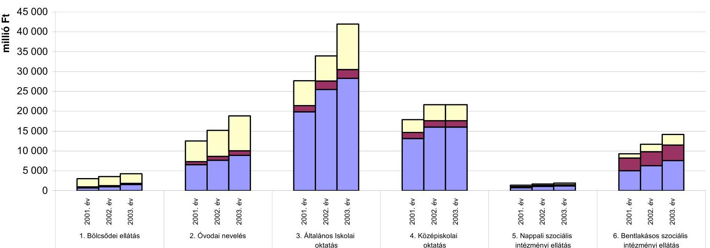

☐ állami hozzájárulás, támogatás
☐ intézményi saját bevétel
☐ önkormányzati támogatás

---

13. számú melléklet

a V-1002-60/2004. számú jelentéshez

## **Tájékoztató**

## **az egyes önkormányzati feladatok fajlagos kiadásairól és finanszírozási forrásairól 2001-2003. év között**

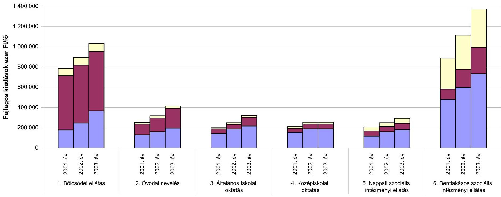

☐ állami hozzájárulás, támogatás
☐ önkormányzati támogatás
☐ intézményi saját bevétel

---

14. számú melléklet a V-1002-60/2005. számú jelentéshez

# Tájékozató az egyes önkormányzati feladatok fajlagos kiadásainak alakulásáról az ellenőrzött önkormányzatoknál 

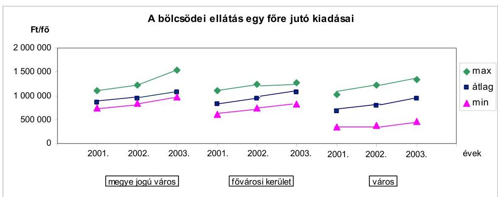
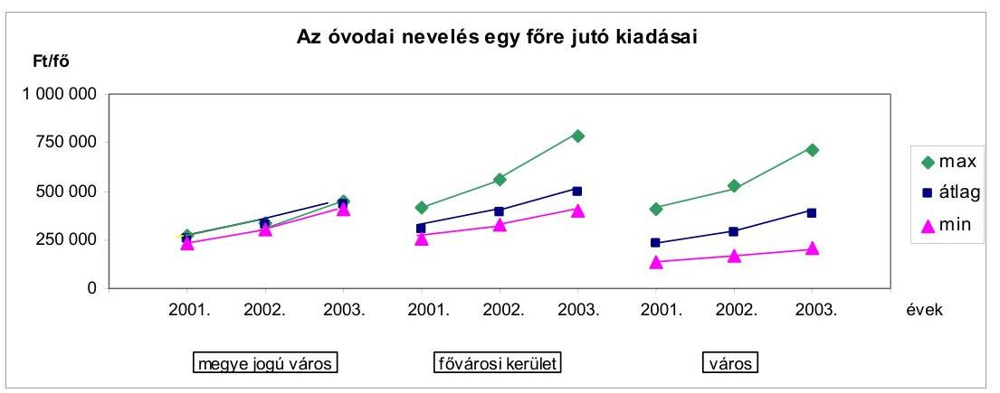
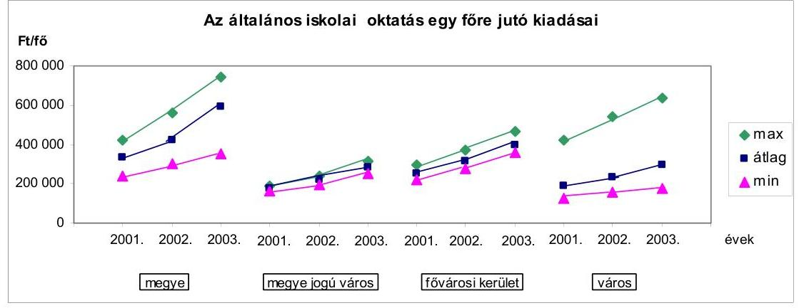

---

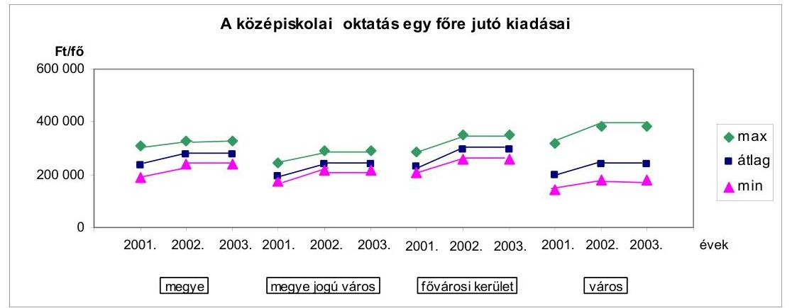

A nappali szociális intézményi ellátás egy före jutó kiadásai
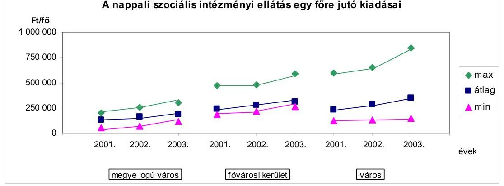

A bentlakásos szociális intézményi ellátás egy före jutó kiadásai
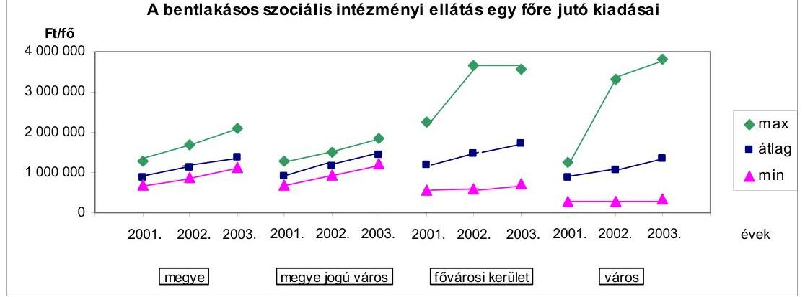

---

H-1051 BUDAPEST V., JÓZSEF NÁDOR TÉR 2-4. POSTACIM: 1369 BUDAPEST, POSTAFIOK 481.

TELEFON: (36-1) 327-2159, (36-1) 327-2141
FAX: (36-1) 318-0738

E-MAIL: janos.veres@pm.gov.hu

PÉNZÜGYMINISZTER

V-1002-57/2004.

Iktatószám: 11066/ 8/2005.
Hiv.szám: V-1002-56/2004.
Úgyintéző: Antal Ágnes
Tárgy: A helyi és a helyi kisebbségi önkormányzatok gazdálkodásának átfogó ellenőrzéséről szóló jelentés

Dr. Kovács Árpád úr
elnök

Állami Számvevőszék

Budapest

Tisztelt Elnök Úr!

A helyi és a helyi kisebbségi önkormányzatok gazdálkodásának átfogó ellenőrzéséről szóló jelentést megkaptam.

Köszönettel vettem, hogy észrevételeink egy része figyelembevétére került.

A jelentésben szereplő javaslatok közül az a) és d) pontokra teszek észrevételt

a) Az Országgyűlés a 2005. évi XCII. törvénnyel elfogadta a helyi önkormányzatokról szóló törvény (Ötv.) módosítását. E törvény 2005. augusztus 31-étől lép hatályba. Az Ötv. 92. § módosított előírásai szabályozzák a helyi önkormányzatok belső ellenőrzésének tartalmát, felelősét. Az egyeztetett jelentés-tervezetben – még a belügyminiszter számára – megfogalmazott javaslat szerint a jelenlegi jogszabályok rendelkezéseit összhangba kell hozni annak érdekében, hogy egyértelmű legyen, ki a felelős az önkormányzat gazdálkodásának, a polgármesteri hivatalnak és az intézményeknek a belső ellenőrzéséért. Megítélésem szerint az összhang az Ötv. módosításával megvalósult, mely szerint a helyi önkormányzat belső ellenőrzésének működtetéséről, ennek keretében a felügyelt költségvetési szervek ellenőrzéséről a jegyző köteles gondoskodni. A költségvetési szerv – a polgármesteri hivatal és az intézmények - belső ellenőrzésének megszervezése az Áht. 97. § (1) bekezdése alapján a költségvetési szerv vezetőjének a feladata. Fentiek alapján az 1. a) pontban tett javaslat okafogyottá vált.

d) Az Ötv. 92. § (5) bekezdése alapján: „A jegyző köteles gondoskodni a belső ellenőrzés működtetéséről a pénzügyminiszter által kézzétett módszertani útmutatók és a nemzetközi belső ellenőrzési standardok figyelembevételével.” A törvénymódosítás hatálybalépését követően a Pénzügyminisztérium kidolgozza az önkormányzatok részére – az önkormányzati sajátosságokat tartalmazó - belső ellenőrzési kézikönyvet, amely tartalmazni fogja az önkormányzatok által céljelleggel juttatott támogatásokra érvényes

---

ellenőrzési kötelezettségeket is. A módszertani útmutató elkészitését az államháztartási törvény 121/B §-a határozza meg a pénzügyminiszter részére. Megitélésem szerint nem szükséges további törvényi felhatalmazás e munka elvégzésére, és elégségesnek tartom külön kormányrendelet helyett - a Pénzügyminisztérium által készített módszertani útmutatóban történő szabályozást. Kérem a fentiek figyelembe vételét az 1. d) pontban megfogalmazott javaslatnál.

Budapest, 2005. augusztus 15.

Üdvözlettel:
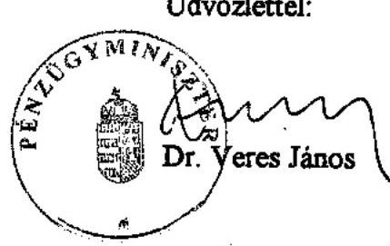

---

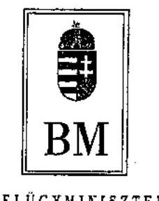

Iktatószám: 1-a-1/26/2005.
Dr. Kovács Árpád úrnak, elnök

Állami Számvevőszék

# Budapest 

## Tisztelt Elnök Úr!

A helyi és a helyi kisebbségi önkormányzatok gazdálkodásának átfogó ellenőrzéséről szóló Jelentés megküldését köszönettel vettem, az abban foglaltakkal összefüggésben az alábbi észrevételt teszem.

Fontos hangsúlyozni, hogy az önkormányzati kötelező feladatok tekintetében a helyi önkormányzatokról szóló 1990. évi LXV. törvény (továbbiakban Ötv.) kerettörvényként funkcionál. Ennek megfelelően arról rendelkezik, hogy „törvény a helyi önkormányzatnak kötelezö feladat- és hatáskört is megállapíthat. A kötelezöen ellátandó önkormányzati feladat- és hatáskörök meghatározásával egyidejüleg az Országgyülés biztositja az ellátásukhoz szükséges anyagi feltételeket, dönt a költségvetési hozzájárulás mértékéröl és módjáról." Ennek megfelelően az önkormányzatok számára kötelezően ellátandó feladatról - az egyes ágazatok vonatkozásában - az ágazati törvények rendelkeznek. Megitélésem szerint az ágazati törvényekben meghatározott feladatok egyértelmú feladat-meghatározást jelentenek.

A fentieknek megfelelően javaslom, hogy a belügyminiszter részére megfogalmazott javaslat kerüljön elhagyásra.

Kérem, hogy észrevételemet figyelembe venni szíveskedjék.
Budapest, 2005. augusztus „ 85. "
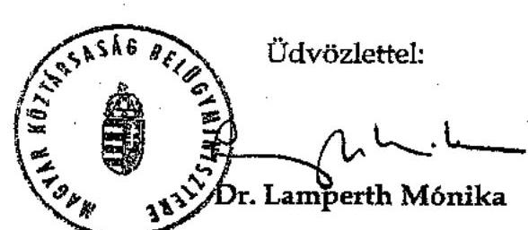

---

# Állami Számvevőszék 

## Élnök

V-1002-59/2004.

## Dr. Lamperth Mónika úrhölgy belügyminiszter

Belügyminisztérium

Budapest

## Tisztel Miniszter Úrhölgy

Köszönettel vettem a helyi és a helyi kisebbségi önkormányzatok gazdálkodásának átfogó ellenőrzéséről szóló jelentéshez adott észrevételét, mellyel kapcsolatban az alábbiakról tájékoztatom.

Az észrevételében hivatkozott törvényi előírás végrehajtása érdekében indokolt, hogy a különböző ágazati törvényekben elöírt önkormányzati feladatok esetében egyértelmű legyen: az adott önkormányzat részére az Országgyülés milyen kötelezően ellátandó feladatot határozott meg. Az önkormányzatok számára gondot okoz - az ellenőrzés tapasztalatai szerint - a kötelező feladatok és azok kiadásainak elhatárolása az önként vállalat feladatoktól. A feladatok és a források értékeléséhez szükséges, hogy egyértelmủ legyen az ezeket meghatározó jogszabályi előírás. Ezért a javaslat megtételét továbbra is indokoltnak tartom.

Budapest, 2005. szeptember " 6 . "

Tisztelettel:
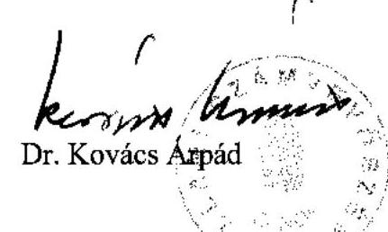