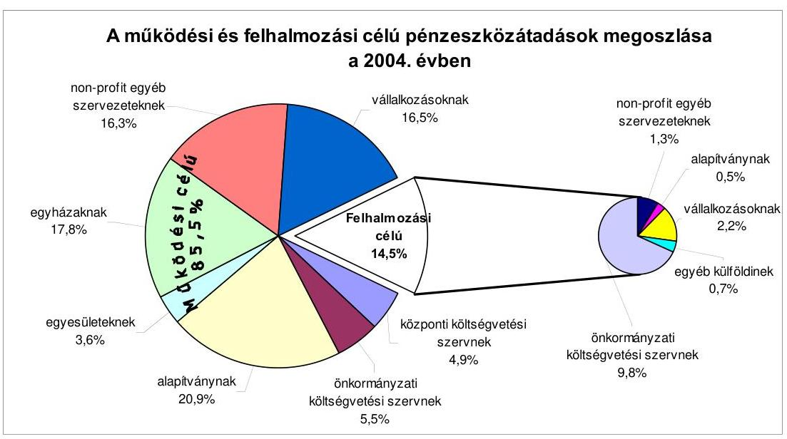
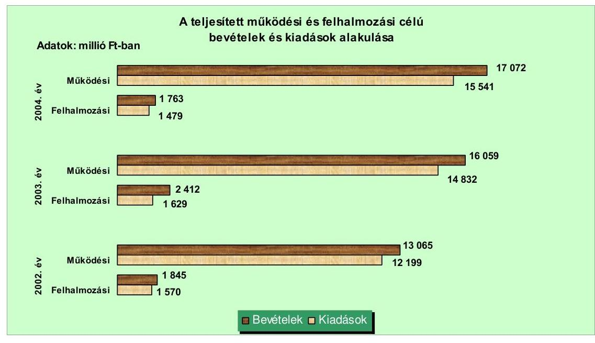
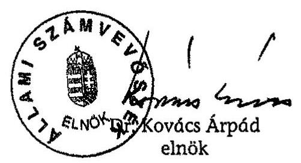
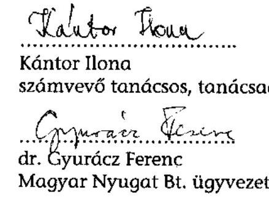
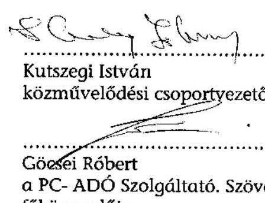
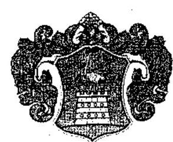
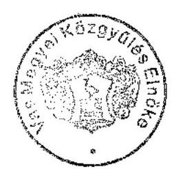

# JELENTÉS 

## a Vas Megyei Önkormányzat gazdálkodási rendszerének átfogó ellenőrzéséről

---

3. Önkormányzati és Területi Ellenőrzési Igazgatóság
3.3. Átfogó Ellenőrzések Főcsoport
Iktatószám: V-1001-1/28/15/2005.
Témaszám: 749
Vizsgálat-azonosító szám: V0201
Az ellenőrzést felügyelte:
Dr. Lóránt Zoltán
főigazgató
Az ellenőrzés végrehajtásáért felelős:
Dr. Sepsey Tamás
főigazgató-helyettes
Az ellenőrzést vezette:
Csecserits Imréné
főcsoportfőnök-helyettes
Az ellenőrzést végezték:
Gaál László
számvevő
Kántor Ilona
tanácsadó
Dr. Pál Lehelné
főtanácsadó

# A témához kapcsolódó - elmúlt négy évben - készített számvevőszéki jelentések: 

címe
sorszáma
Jelentés a helyi és a helyi kisebbségi önkormányzatok átfogó el- 0113 lenőrzéséről
Jelentés az általános iskolai oktatás minőségének javítását szolgáló 0219 intézkedések ellenőrzésének tapasztalatiról
Jelentés a helyi önkormányzatok beruházásaihoz és rekonstrukcióihoz nyújtott 2001. évi címzett és céltámogatás igénybevételének és felhasználásának vizsgálatáról
Jelentés a megyei, fővárosi illetékhivatali tevékenység ellenőrzéséről 0243
Jelentés a helyi önkormányzatok tartós szociális ellátási feladatainak 0317 ellenőrzéséről az idősek otthonainál
Jelentés a helyi önkormányzatok beruházásaihoz és rekonstrukcióihoz nyújtott 2002. évi címzett és céltámogatás igénybevételének és felhasználásának vizsgálatáról
Jelentés a 2003. április 12-én megtartott országos népszavazás 0423 lebonyolításához felhasznált pénzeszközök elszámolásának ellenőrzéséről

Jelentéseink az Országgyűlés számítógépes hálózatán és az Interneten a www.asz.hu címen is olvashatók.

---

# TARTALOMJEGYZÉK 

BEVEZETÉS ..... 5
I. ÖSSZEGZŐ MEGÁLLAPÍTÁSOK, KÖVETKEZTETÉSEK, JAVASLATOK ..... 7
II. RÉSZLETES MEGÁLLAPÍTÁSOK ..... 17

1. A költségvetés tervezésének, végrehajtásának, az Önkormányzat vagyongazdálkodásának és a zárszámadás elkészítésének szabályszerűsége ..... 17
1.1. A költségvetési rendelet jóváhagyásának, módosításának, az előirányzatok nyilvántartásának szabályszerűsége ..... 17
1.2. A gazdálkodás szabályozottsága, a bizonylati rend és fegyelem szabályszerűsége ..... 22
1.3. A pénzügyi-számviteli feladatok ellátásának informatikai támogatottsága ..... 30
1.4. Az önkormányzati vagyon nyilvántartása, számbavétele ..... 31
1.5. A vagyonnal való gazdálkodás szabályszerűsége, célszerűsége, nyilvánossága ..... 33
1.6. A céljelleggel nyújtott támogatások szabályszerűsége ..... 42
1.7. A közbeszerzési eljárások szabályszerűsége ..... 46
1.8. A zárszámadási kötelezettség teljesítésének szabályszerűsége ..... 49
2. Az önkormányzati feladatok és a rendelkezésre álló források összhangja ..... 50
2.1. A feladatok meghatározása és szervezeti keretei ..... 50
2.2. A költségvetés egyensúlyának helyzete ..... 53
2.3. A feladatok finanszírozása ..... 60
3. A belső irányítási, ellenőrzési rendszer működésének értékelése ..... 62
3.1. Az ellenőrzési rendszer kialakítása, múködése ..... 62
3.2. A könyvvizsgálati kötelezettség teljesítése ..... 66
3.3. A korábbi számvevőszéki ellenőrzések javaslatainak hasznosulása ..... 67

---

# MELLÉKLETEK 

1. számú Az Önkormányzat gazdálkodását meghatározó főbb adatok, mutatószámok (1 oldal)
2. számú Az önkormányzati vagyon nagyságának alakulása (1 oldal)
3. számú Az Önkormányzat 2004. évi bevételeinek és kiadásainak alakulása (1 oldal)
4. számú Egyes önkormányzati feladatok finanszírozása (1 oldal)
5. számú Helyszíni ellenőrzési jegyzőkönyv (4 oldal)
6. számú Markó Péter úr, a Vas Megyei Közgyűlés elnökének észrevétele (1 oldal)

---

# RÖVIDÍTÉSEK JEGYZÉKE 

Ötv.
Áht.
Htv.

Számv. tv.
Kbt. ${ }_{1}$
Kbt. ${ }_{2}$
Ksztv.
Ámr.
Vhr.

Ber.
ÁSZ
Kincstár
SzMSz
ügyrend
vagyongazdálkodási rendelet
közbeszerzési
rendelet
közbeszerzési
szabályzat

Önkormányzat
Közgyűlés
Ügyrendi és jogi bizottság
Pénzügyi bizottság
Gazdasági és vagyongazdálkodási bizottság
a helyi önkormányzatokról szóló 1990. évi LXV. törvény az államháztartásról szóló 1992. évi XXXVIII. törvény a helyi önkormányzatok és szerveik, a köztársasági megbízottak, valamint egyes centrális alárendeltségű szervek feladat- és hatásköreiről szóló 1991. évi XX. törvény a számvitelről szóló 2000. évi C. törvény a közbeszerzésekről szóló 1995. évi XL. törvény a közbeszerzésekről szóló 2003. évi CXXIX. törvény a közhasznú szervezetekről szóló 1995. évi XL. törvény az államháztartás múködési rendjéről szóló 217/1998. (XII. 30.) Korm. rendelet
az államháztartás szervezetei beszámolási és könyvvezetési kötelezettségének sajátosságairól szóló 249/2000. (XII. 24.) Korm. rendelet
a költségvetési szervek belső ellenőrzéséről szóló 193/2003. (IX. 26.) számú Korm. rendelet
Álami Számvevőszék
Magyar Államkincstár Vas Megyei Területi Igazgatósága
Vas Megyei Önkormányzat 10/1995. (VI. 19.) számú rendelete a Szervezeti és Múködési Szabályzatáról
Vas Megyei Önkormányzat Hivatalának ügyrendje, az SzMSz 9/A. számú melléklete
Vas Megyei Önkormányzat 10/2000. (V. 19.) számú rendelete a vagyongazdálkodás szabályairól
Vas Megyei Önkormányzat 13/1998. (XII. 18.) számú rendelete a Közgyűlés és szervei, valamint intézményei közbeszerzéseiről, továbbá az önkormányzati beruházások előkészítésének, jóváhagyásának, megvalósításának rendjéről
Vas Megyei Önkormányzat Közgyűlésének 46/2004. (IV. 30.) számú határozata a Közgyűlés és szervei, valamint intézményei közbeszerzéseiről, továbbá az önkormányzati beruházások előkészítésének, jóváhagyásának, megvalósításának rendjéről
Vas Megyei Önkormányzat
Vas Megyei Önkormányzat Közgyűlése
Vas Megyei Önkormányzat Közgyűlésének Ügyrendi és Jogi Bizottsága
Vas Megyei Önkormányzat Közgyűlésének Pénzügyi Bizottsága
Vas Megyei Önkormányzat Közgyűlésének Gazdasági és Vagyongazdálkodási Bizottsága

---

Közbeszerzési bizottság
Közgyűlés elnöke
főjegyző
Önkormányzati hivatal
Művelődési és sport titkárság
Egészségügyi, szociális és ifjúságvédelmi titkárság
Szervezési és jogi titkárság
Pénzügyi és gazdasági titkárság
Ellenőrzési csoport
Illetékhivatal
Ellátó szervezet
Kórház
KELER Rt.

Vas Megyei Önkormányzat Közgyűlésének Közbeszerzési Bizottsága
Vas Megyei Közgyűlés elnöke
Vas Megyei Önkormányzat főjegyzője
Vas Megyei Önkormányzat Hivatala
Vas Megyei Önkormányzat Hivatalának Művelődési és Sport Titkársága
Vas Megyei Önkormányzat Hivatalának Egészségügyi, Szociális és Ifjúságvédelmi Titkársága
Vas Megyei Önkormányzat Hivatalának Szervezési és Jogi Titkársága
Vas Megyei Önkormányzat Hivatalának Pénzügyi és Gazdasági Titkársága
Vas Megyei Önkormányzat Hivatalának Pénzügyi és Gazdasági Titkársága Ellenőrzési Csoportja
Vas Megyei Illetékhivatal
Vas Megyei Közgyűlés Ellátó Szervezete
Vas Megye és Szombathely Megyei Jogú Város Markusovszky Kórháza, Egyetemi Oktató Kórház
Központi Elszámolóház és Értéktár (Budapest) Rt.

---

# JELENTÉS 

## Vas Megyei Önkormányzat gazdálkodási rendszerének átfogó ellenőrzéséről

## BEVEZETÉS

Az ellenőrzést az Állami Számvevőszék 2005. évi munkatervében szereplő feladatként, a helyi önkormányzatokról szóló 1990. évi LXV. törvény 92. § (1) bekezdése, az Állami Számvevőszékről szóló 1989. évi XXXVIII. törvény 2. § (3) bekezdése, valamint az államháztartásról szóló 1992. évi XXXVIII. törvény 120/A. § (1) bekezdése alapján végeztük.

## Az ellenőrzés célja annak értékelése volt, hogy:

- az önkormányzati gazdálkodás törvényességét ${ }^{1}$, szabályszerűségét biztosítot-ták-e a tervezés, a költségvetés végrehajtása, a vagyongazdálkodás és a zárszámadás során;
- az Önkormányzat által ellátott feladatok és az azokhoz rendelkezésre álló források összhangja biztosított volt-e, különös tekintettel az egyes kiemelt feladatokra;
- a gazdálkodás szabályszerűségét biztosító belső kontrollok ${ }^{2}$ lehetővé tették-e a szabálytalanságok, hiányosságok, gazdaságtalan megoldások feltárását, megelőzését.

A vizsgált időszak: a 2004. év, valamint 2005. I. negyedév, az 1.5; 2.1.-2.3; és 3.3 ellenőrzési pontok esetében ezen túlmenően a 2002-2003. évek is

Vas megye területe az ország területének 3,6\%-a, a népesség száma 2004. január 1-jén 268 ezer fő volt. A megye 216 településéből 9 város, 207 község. A lakosság $57 \%$-a városban, $13,6 \%$-a pedig 500 fő alatti falvakban él.

[^0]
[^0]:    ${ }^{1}$ A törvényi előírások betartásának elmulasztásakor a részletes megállapítások fejezetben egységesen a törvénysértés megjelölést alkalmazzuk, mivel az ÁSZ nem tehet különbséget a törvényi előírások között.
    ${ }^{2}$ A gazdálkodás szabályszerűségét biztosító kontroll alatt értjük a kiépített és működő belső irányítási és szabályozási rendszert, valamint a belső ellenőrzési funkciók ellátását.

---

A Közgyűlés tagjainak száma 40 fő, akiknek a munkáját 11 állandó bizottság segítette. A Közgyűlés elnökének személye a 2002. évi önkormányzati választásokat követően nem változott. A főjegyző e munkakörét 1991. óta tölti be.

Az Önkormányzat 34 költségvetési intézményt tartott fenn, melyből 31 önállóan gazdálkodott. A feladatok folyamatos ellátásában egy önkormányzati közüzemi vállalat és hét gazdasági társaság vett részt.

A foglalkoztatott közalkalmazottak száma a 2004. évben 3574 fő volt, az Önkormányzati hivatalban 80 fő köztisztviselő dolgozott.

Az Önkormányzat a 2004. évben 18 834,9 millió Ft költségvetési bevételt és 17020,6 millió Ft költségvetési kiadást teljesített, a 2004. év végén a könyvviteli mérleg szerint 18561,1 millió Ft értékű vagyonnal rendelkezett. A Közgyűlés az Önkormányzat 2005. évi költségvetésének bevételi és kiadási főösszegét 20115 millió Ft-ban hagyta jóvá. Az Önkormányzat gazdálkodását meghatározó 2004. évi adatokat, mutatószámokat az 1. számú melléklet részletezi.

---

# I. ÖSSZEGZŐ MEGÁLLAPÍTÁSOK, KÖVETKEZTETÉSEK, JAVASLATOK 

A Közgyűlés jóváhagyta a 2003-2006. évekre szóló társadalmi-gazdasági programját, amely a feladatok meghatározása mellett a pénzügyi-gazdasági feltételrendszerrel kapcsolatos célkitűzéseket is megfogalmazta. A 2004. és 2005. évek költségvetési koncepciói összeállításánál figyelembe vették a központi döntések kihatásait, a várható saját bevételeket, az intézmény fenntartással, és egyéb célokkal összefüggő elkötelezettségeket. Az Áht. előírását figyelmen kívül hagyva a Közgyűlés elnöke a költségvetési koncepciókat az előírt határidőnél később terjesztette a Közgyűlés elé, illetve az Ámr-ben foglaltak ellenére annak előterjesztéséhez nem csatolta a Pénzügyi bizottság véleményét. A Közgyűlés a költségvetés készítés további feladatairól határozatban döntött.

A Közgyűlés elnöke a 2004. és 2005. év költségvetési rendelet tervezetét az Áht-ban előírt határidőig a Közgyűlés elé terjesztette, de nem tartotta be az Ámr-ben foglaltakat, mert a Pénzügyi bizottság véleményét az előterjesztéshez nem csatolta, azt a bizottság elnöke az ülésen szóban ismertette. A költségvetési rendeletek adattartalma, szerkezete megfelelt az Áht. és az Ámr. vonatkozó előírásainak. Megsértették az Áht-ban foglaltakat, mert a hiány fedezetéül megtervezett hitelfelvételt költségvetési bevételként mutatták be. A bizottsági döntési hatáskörbe tartozó pénzügyi keretekre használt „alap" elnevezés félreérthető, mivel nem felel meg az Áht. követelményeinek A Közgyűlés döntött a költségvetés végrehajtási szabályairól, valamint döntött a költségvetési rendeletekben a kötelezettségvállalásra jogosultakról annak ellenére, hogy arra a Htv. és az Ámr. szerint a Közgyűlés elnöke jogosult. A 2004-2005. évi költségvetési rendeletekben az Áht-ban előírt mérlegeket, kimutatásokat tájékoztatásul bemutatták. Az Önkormányzat 2004. évi eredeti költségvetési előirányzata az év során 11,9\%-kal növekedett. Az előirányzat módosításokat megalapozó előterjesztések kellő tájékoztatást adtak a változások okairól. Nem tartották be az Ámr-ben és a költségvetési rendeletben foglaltakat, mert egy módosítást az azokban előírt határidőn túl terjesztettek elő. Az Önkormányzati hivatalban az előirányzat változásokról megfelelő részletezettségű, teljes körű nyilvántartást vezettek.

Az Önkormányzati hivatal tevékenységét az Ámr-ben előírt Szervezeti és Működési Szabályzatnak megfelelő ügyrend alapján végezte. A gazdasági szervezet részére a főjegyző évente meghatározta az ügyrendet és annak keretében a munkatervet is, azonban az Illetékhivatal gazdasági ügyintézőjének szakmai irányításával összefüggő feladatokat az ügyrend nem tartalmazta. Az Ámrben foglaltaknak megfelelően a Közgyűlés elnöke és a főjegyző a távollétekre és az összeférhetetlenségre tekintettel írásban elkészítette a kötelezettségvállalásra, utalványozásra, azok ellenjegyzésére vonatkozó, személyre szóló felhatalmazásokat. A felhatalmazásokkal kapcsolatos utólagos beszámoltatási kötelezettség előírása és a beszámoltatás elmaradt. Az érvényesítést végzőket a főjegyző írásban megbízta, a megbízott személyek az előírt iskolai, szakmai végzettséggel rendelkeztek. A főjegyző nem tartotta be az Ámr-ben foglaltakat, mert a szakmai teljesítés igazolás módját nem határozta meg. A Közgyűlés döntése alap-

---

ján egyes feladatok pénzügyi lebonyolítását az Ellátó szervezet végezte, a tevékenységgel kapcsolatban az Önkormányzati hivatallal megállapodást kötöttek.

A főjegyző utasításban meghatározta a költségvetési szervek egységes számviteli rendjét, valamint jóváhagyta az Önkormányzati hivatal számviteli politikáját, amely összhangban volt a Vhr. előírásaival. A számviteli politika részeként elkészítették az eszközök, források leltározási és leltárkészítési szabályzatát. A szabályzat tartalmazta a leltározással kapcsolatos fogalmakat, eszközés forráscsoportonként a leltározás fordulónapját, módját, az alkalmazandó bizonylatokat, a leltározás lebonyolításának munkaszakaszait, a leltározásban résztvevők feladatait, felelősségük meghatározását. Az eszközök és források értékelési szabályzatában, a Vhr-ben foglaltakkal összhangban meghatározták az eszközök bekerülési és előállítási értékébe beszámítandó kiadásokat. Az értékvesztés elszámolására vonatkozó előírásokat az adósok, vevők esetében e szabályzatban, a tulajdoni részesedést jelentő befektetések értékvesztése elszámolásának, visszaírásának szabályait pedig a számviteli politikában rögzítették. A Vhr. 2004-2005. évi változásait a szabályozásokban átvezették. Az értékelési szabályzatban az illeték követelések egyszerúsített értékelési elveit folyamatosan működő adós, valamint folyamatos működésükben korlátozott adósok szerint meghatározták, azonban a Vhr-ben foglaltakkal szemben a követelések lejárat szerinti további bontását, valamint a várható megtérülésre vonatkozó százalékos mutatók meghatározásának módszerét, illetve a mutatók éves felülvizsgálatának rendjét, felelőseit nem rögzítették. Az Önkormányzati hivatal pénz- és értékkezelési szabályzata tartalmazta mind a bankszámla forgalommal, mind a készpénzkezeléssel kapcsolatos szabályokat. Az Önkormányzati hivatalban a felesleges vagyontárgyak feltárásáról, hasznosításáról, valamint selejtezéséről szóló szabályzattal rendelkeztek, amely előírta a követendő eljárási rendet, és meghatározta a selejtezési bizottság feladatait.

Az Önkormányzati hivatal 2004. évben jóváhagyott számlarendje tartalmazta az alkalmazandó könyvviteli számlák számát, megnevezését, valamint a számlaosztályok, főkönyvi számlák tartalmára, kapcsolatára, érték változására vonatkozó előírásokat. A Pénzügyi és gazdasági titkárság munkatársai és az Illetékhivatal pénzügyi-gazdasági feladatot ellátó ügyintézői munkaköri leírással rendelkeztek, amelyekben az ellátandó tevékenységekkel kapcsolatos fe-ladat- és hatáskörök, valamint a helyettesítés rendje szerepelt.

A főkönyvi számlákhoz kapcsolódóan a szükséges analitikus nyilvántartásokat vezették, azonban a főkönyvi és analitikus nyilvántartások, valamint a bizonylatok adatai közötti egyeztetési pontokat - az analitikus nyilvántartások vezetésének hiányosságai miatt - a beruházási hitelek, gondozási dí hátralék, fizetési előleg esetében nem alakították ki. A főkönyvi könyvelés és az analitikus nyilvántartás dokumentált negyedévenkénti egyeztetése a III. negyedévben a nyilvántartások harmadánál történt meg. Év végén a leltározás során a főkönyvi és analitikus nyilvántartások adatai közötti egyeztetéseket elvégezték. Az éves beszámoló összeállítását megelőzően a könyvviteli mérleget és a pénzforgalmi kimutatást a Vhr. előírása szerinti főkönyvi kivonattal alátámasztották.

Az Önkormányzati hivatal gazdálkodásával kapcsolatban a könyvviteli nyilvántartásokban elszámolt gazdasági műveletekről, eseményekről a Számv.

---

tv-ben előírt bizonylatokat kiállították, amelyek megfeleltek az alaki követelményeknek. A Számv. tv. előírásait megsértve a pénzforgalommal összefüggő bizonylatok $31,8 \%$-a tartalmi szempontból hiányos volt, nem szerepelt rajtuk a kötelezettségvállalás nyilvántartásának száma, a kötelezettségvállaló, vagy a kötelezettségvállalás ellenjegyzőjének a feladat elvégzését igazoló aláírása. A pénzforgalommal nem járó gazdasági műveleteket érintően az előírásnak megfelelő bizonylatok rendelkezésre álltak. A kötelezettségvállalásokról nyilvántartást az Önkormányzati hivatalban vezettek, az Illetékhivatalban az Ámr. előírásai ellenére erre nem került sor. A kifizetések 7,9\%-ánál az Ámr-ben foglaltak ellenére nem történt meg az előzetes írásbeli kötelezettségvállalás, további 18,4\%-nál pedig nem volt kötelezettségvállaló, illetve ellenjegyző. A többi esetben a kötelezettségvállalást és annak ellenjegyzését az arra felhatalmazottak végezték. A szakmai teljesítés igazolást, érvényesítést, utalványozást, és annak ellenjegyzését az arra felhatalmazottak elvégezték. A kiadások 50\%-ánál az utalványozás során az Ámr-ben foglaltak ellenére az utalványon a kötelezettségvállalás sorszámát nem tüntették fel. A szakmai teljesítést igazolók a munkafolyamatba épített ellenőrzési kötelezettségüknek eleget tettek. Amikor a kötelezettségvállalások ellenjegyzése az arra felhatalmazottak által megtörtént, az ellenjegyző 7,7\%-ban nem látta el az Ámr-ben előírt feladatát, nem észrevételezte, hogy a megrendeléseknek nincs kötelezettségvállalója. A pénzforgalommal kapcsolatos bizonylatoknál az érvényesítő 30,6\%-ban, az utalvány ellenjegyzője szintén 30,6\%-ban nem tett eleget az Ámr. előírásainak. A pénztárzárás és pénztárellenőrzés a pénz- és értékkezelési szabályzatban előírt gyakorisággal nem történt meg. A 2004. évben önkormányzati szinten a kiemelt kiadási előirányzatokat betartották, azonban négy intézmény az Áht. előírásait megsértve túllépte egy-egy kiemelt kiadási előirányzatát, a túllépés okait nem vizsgálták, felelősségre vonás nem történt.

Az Önkormányzati hivatalban a pénzügyi-számviteli analitikus nyilvántartások felét vezették számítógépen, a 2004. évben fejlesztés ezen a téren nem történt. Az Önkormányzati hivatal informatikai stratégiával, katasztrófa elhárítási tervvel, üzemeltetési leírással nem rendelkezett, nem szabályozták a hozzáférési jogosultság rendszerét, az adatbiztonsági eljárásokat. A pénzügyiszámviteli területen dolgozók az alkalmazott programok használatához szükséges alapvető informatikai ismeretekkel rendelkeztek.

Az Önkormányzat vagyontárgyainak nyilvántartásáról a főkönyvi és analitikus nyilvántartások vezetésével - és ezek keretében a törzsvagyon elkülönített nyilvántartásáról - gondoskodtak. Az Önkormányzati hivatalban az ingatlanok, üzemeltetésre, kezelésre átadott eszközök, részesedések, értékpapírok, rövid- és hosszú lejáratú követelések, kötelezettségek, pénzeszközök főkönyvi számláihoz megfelelő tartalommal kapcsolódott analitikus nyilvántartás és azok értékadatai számszerúen megegyeztek 2004. december 31-én. Az Önkormányzat által az üzemeltetésre történő átadásra kötött megállapodások, szerződések nem tartalmazták az átadott eszközökkel kapcsolatos - a tervszerű, az Önkormányzat tulajdonosi érdekeinek érvényesülését biztosító - vagyongazdálkodási feladatokat, hatásköröket. A 2004. évi leltározási feladatokat a Vhr. és a leltározási szabályzat előírásainak megfelelően teljesítették. Értékvesztést számoltak el az illeték-követeléseknél az adósok együttes minősítése alapján meghatározott egyszerűsített értékelési eljárás keretében, de a Vhr-ben foglaltak ellenére, a követelések értékelésekor azok lejárati idejét nem vették figye-

---

lembe. Az Önkormányzati hivatal egyéb követeléseinél értékvesztés elszámolása nem volt indokolt.

A Közgyűlés a vagyongazdálkodási rendeletben rögzítette a vagyonnal való gazdálkodás szabályait. A tulajdonnal való rendelkezési hatáskörök szabályozása a helyi sajátosságok figyelembe vételével történt. A vagyontárgyak értékesítése, apportálása, ingyenes átadása a vagyongazdálkodási rendeletben meghatározott hatáskörök betartásával valósult meg. Az Önkormányzat vagyongazdálkodási rendeletében meghatározott értékhatár feletti vagyon értékesítésénél, használatának, hasznosítási jogának átengedésénél a versenyeztetési szabályok mellőzését lehetővé tevő előírásokkal megsértették az Áht. előírásait. A szabályozás nem segítette a közvagyonnal való gazdálkodás nyilvánosságát, átláthatóságát. A versenyeztetéssel történő vagyonértékesítés értékhatárát célszerűtlenül a számviteli bruttó nyilvántartási értékhez kötötték, így az értékhatár alatti nyilvántartási értékű, de azt meghaladó forgalmi értékű vagyon értékesítésére - a jogalkotónak a nyilvánosság biztosítására vonatkozó szándékával szemben - a versenyeztetés szabályai nem terjedtek ki.

A vagyongazdálkodási rendelet szerinti versenyeztetési kötelezettséggel járó értékesítések 67\%-ánál nem tartották be a versenyeztetés lebonyolítására vonatkozó szabályokat. A pályázati felhívásban nem tették közzé az ajánlati kötöttség minimális időtartamát, és az induló árat. A vagyongazdálkodási rendeletnek a versenyeztetésre vonatkozó szabályozásában nem szerepelt a licit induló árának csökkentési lehetősége, ezért a pályázati felhívásban megjelölt induló licit ár alatti áron történt ingatlan értékesítés ellentétes volt a versenyeztetés nyilvánossága, átláthatósága követelményével. Az évi kettő millió Ft bérleti díjat meghaladó bérbeadások 67\%-ánál a vagyongazdálkodási rendeletben előírtak ellenére elmaradt a versenyeztetés. Az egyes állami tulajdonban lévő vagyontárgyak önkormányzatok tulajdonába adásáról szóló törvény előírásaival szemben az elővásárlási joggal való rendelkező nyilatkozatát egy értékesítésnél nem szerezték be. Az értékpapírok vétele-eladása során a hatásköri előírásokat betartották, azonban elmaradt a befektetési kockázatot csökkentő együttes rendelkezési jog KELER Rt-nél történő bejegyeztetése. A vagyon tulajdonjoga térítésmentes átruházása eseteinek az Áht. szerinti meghatározását nem végezték el, ezért a vagyon térítésmentes átruházására vonatkozó döntésekkel megsértették az Áht. előírását. Az Önkormányzati hivatal selejtezési szabályzatában foglaltak ellenére az Illetékhivatal által használt tárgyi eszközök selejtezésének jóváhagyását a Közgyűlés elnöke helyett az Illetékhivatal vezetője végezte.

Az Önkormányzat a 2004. évben céljelleggel 289,1 millió Ft támogatást biztosított működési és felhalmozási célra különböző szervezeteknek és magánszemélyeknek. A támogatási összeg 86,3\%-áról a Közgyűlés, 10,1\%-áról egyes bizottságok, 3,6\%-áról a Közgyűlés elnöke döntött. A Közgyűlés elnöke, a bizottságok és az egyik intézmény támogatást nyújtott alapítványok számára is, mellyel megsértették az Ötv-ben foglalt azon előírást, mely szerint a Közgyűlés hatásköréből nem ruházható át a közösségi célú alapítványi forrás átadása. A főjegyző a támogatási rendszer működtetésének részletes szabályait a 2004. évre vonatkozóan nem dolgozta ki. A 2004. évben a bizottságok és a Közgyűlés elnöke döntöttek a támogatások folyósításának szabályairól, feltételeiről, a számadás rendszeréről. A támogatások nyújtásának, a számadások ellenőrzé-

---

sének rendjét a főjegyző a 2005. évben szabályozta. A támogatások esetében az Áht. alapján előírták a számadási kötelezettséget a támogatott szervezetek részére. A számadásokat a támogatás által megvalósult cél, feladat tekintetében szakmai szempontból vizsgálták, a pénzügyi elszámolások összegszerűségét ellenőrizték, helyszíni ellenőrzést nem végeztek. A 2005. évi támogatások kiutalása az előző évi támogatás elszámolásáig nem történt meg.

Az Önkormányzat rendeletet, majd hatályon kívül helyezését követően közbeszerzési szabályzatot alkotott az Önkormányzat és költségvetési szervei közbeszerzési eljárásainak szabályairól. A Kbt. ${ }_{1}$-ben foglaltak ellenére a közbeszerzési rendeletben a közbeszerzési eljárást lezáró döntés meghozatalára a Közbeszerzési bizottságot jogosították fel. Az Önkormányzati hivatal költségvetésében tervezett feladatok körében a nemzeti értékhatárokat meghaladó beszerzések esetében lebonyolították a közbeszerzési eljárásokat. A lefolytatott közbeszerzési eljárások során a hirdetmény közzététele nélküli tárgyalásos eljárási fajta kiválasztásánál nem vették figyelembe a Kbt. ${ }_{1}$ előírásait. A közbeszerzési eljárásokban az ajánlatok felbontása, elbírálása és az eljárás eredményének kihirdetése során érvényesültek a Kbt. ${ }_{1}$ előírásai. A szerződés módosításának a Kbt. ${ }_{1}$-ben rögzített feltételei fennálltak, a szerződések határidőben teljesültek. A Közbeszerzések Tanácsa Közbeszerzési Döntőbizottsága elnökének hivatalból kezdeményezett egy jogorvoslati eljárásában az Önkormányzatot elmarasztalták, mert a tárgyalásos eljárás alkalmazásának a Kbt. ${ }_{1}$ szerinti feltételei nem álltak fenn. A kirótt bírságot, a felelősségét elismerve, a bonyolító fizette meg.

A Közgyűlés elnöke az Önkormányzat 2004. évi gazdálkodásáról szóló zárszámadási rendelettervezetet a könyvvizsgálói jelentéssel együtt az Áht-ban előírt határidőn belül a Közgyűlés elé terjesztette. A rendelettervezet előkészítésénél az Áht. és az Ámr. előírásai szerint jártak el, a rendelettervezet tartalmát és szerkezetét tekintve a központi és helyi szabályozásnak megfelelő volt. Az intézményi beszámolók felülvizsgálata határidőre megtörtént. A Közgyűlés a felülvizsgált intézményi pénzmaradványokat jóváhagyta, erről, valamint a beszámoló elfogadásáról az intézményvezetőket írásban értesítették.

Az Önkormányzat az Ötv-ben az önkormányzati feladatokra vonatkozó előírások szerint határozta meg a kötelező és az önként vállalt feladatait. Kötelező feladatait tételesen, jogszabályi megalapozottsággal nevesítette. Az önként vállalt feladatok felsorolását az SzMSz tartalmazta. A kötelező feladatok ellátását 34 intézmény, egy vállalat, hét kizárólagos, vagy többségi tulajdonban lévő gazdasági társaság, valamint szerződéses kapcsolatok segítségével valósították meg. Az intézményrendszer kialakítását, továbbfejlesztésének irányait, szakmai koncepciókra, ciklusprogramra alapozottan, az ellátási igényekhez, a helyi adottságokhoz igazodóan határozták meg. A 2002-2004. évek között két középfokú oktatási intézmény fenntartását vették át egy városi önkormányzattól, egy szociális intézmény egyházi fenntartásba történő átadásáról döntöttek, kettő szociális otthont kezdtek el üzemeltetni egy korábban kórházi részlegként múködő épületegyüttes átalakításával, valamint egy városi önkormányzat szociális otthonának átvételével.

Az Önkormányzat az ellátandó feladatok pénzigénye és az azokhoz szükséges források közötti összhangot, a működési célú bevételek és kiadások egyen-

---

súlyát éves költségvetései közgyűlési jóváhagyása időpontjában nem teremtette meg, az év során az egyensúlyt bevételi többletek segítségével biztosították. A felhalmozási források fedezetet nyújtottak a tervezett felhalmozási kiadások megvalósítására. Múködési célú hitelt a Kórház gazdálkodási feladataihoz vettek igénybe. Az időszakosan jelentkező likviditási problémák megoldása érdekében likvid hitelt vettek fel, az intézmények finanszírozása kiskincstári rendszerben történt. Az Önkormányzat adósságot keletkeztető kötelezettségvállalásai a korrigált saját folyó bevételt a 2003. évben meghaladták, mellyel megsértették az Ötv. kötelezettségvállalásra vonatkozó korlátozását. A 2002. és 2004. években az Önkormányzat által teljesített adósságot keletkeztető kötelezettségvállalások összege a korrigált saját folyó bevétel alatt maradt. Az Önkormányzat egyik intézménye pénzügyi líingszerződéseket, tartalmukat illetően hitelszerződéseket kötött, ezzel megsértette az Áht. azon előírását, mely szerint költségvetési szerv pénzkölcsönt (hitelt) nem vehet fel. Az önként vállalt feladatok nem veszélyeztették a kötelező feladatok ellátását. A feladatok ellátásához szükséges bevételek biztosítása érdekében éltek a pályázati lehetőségekkel, melynek eredményeként a felhalmozási célú pályázatokkal elnyert támogatások a pályázati célhoz kapcsolódó felhalmozási kiadások 88,8\%-át finanszírozták.

A naturális mutatókkal mérhetó oktatatási és szociális feladatok fajlagos kiadási mutatói folyamatosan növekvő tendenciát mutatnak. A növekedés a személyi, dologi kiadások növekményéből, az ellátottak számának csökkenéséből, az intézmények számának változásából fakadt. A kiadások finanszírozásában az állami támogatás változatlanul meghatározó maradt, a források $52,5 \%-64,7 \% \%$-át jelentette a 2004. évben. A bentlakásos szociális intézményi ellátásban az intézményi saját bevétel $35,8 \%$-kal, források közötti megoszlása 1,5 százalékponttal növekedett.

Az Önkormányzat a fogyatékos személyek jogairól és esélyegyenlőségük biztosításáról szóló törvényi kötelezettség - a középületekben az akadálymentes közlekedés kialakítása - teljesítéséhez az intézmények felújítási, korszerűsítési, átalakítási munkáival együtt kezdett hozzá, a költségvetésben erre a célra forrásokat nem különítettek el, az Önkormányzat törvényben meghatározott határidőre az előírt feladatokat nem teljesítette.

Az Önkormányzat kialakította az Ötv. 92. § (2) bekezdésében meghatározott ellenőrzési kötelezettsége teljesítéséhez szükséges szervezeti és személyi feltételeket. A Közgyűlés elfogadta az ellenőrzési csoportvezető által kidolgozott, a Ber. alapján a főjegyző által jóváhagyott stratégiai tervet, középtávú ellenőrzési tervet és a 2005. évi ellenőrzési tervet, valamint a belső ellenőrzési kézikönyvet. A Közgyűlés az Ellenőrzési csoport egy fővel történő bővítését rendelte el, a döntés végrehajtására intézkedést kezdeményeztek, de a bővítést még nem hajtották végre. A szabályozásban és a létszámban végrehajtott változásokat nem követte az SzMSz módosítása. Az Önkormányzati hivatal belső ellenőrzési feladatának ellátásánál az Áht-ban foglaltakat megsértve, a Ber-rel ellentétben, nem volt biztosított az Ellenőrzési csoport szervezeti függetlensége az irányítási és végrehajtási tevékenységtől való egyértelmű elkülönítése tekintetében. A belső ellenőrök a 2004. évben elláttak munkakörükhöz nem tartozó feladatot is, a 2005. évben már biztosították feladatköri függetlenségüket. Az intézményi ellenőrzéseket a 2004. évben a tervezett számban, ütemezésben hajtották végre.

---

Az ellenőrzési jelentések tartalma, záradékolása, az ellenőrzések nyilvántartása a 2005. évtől a Ber. előírásainak megfelelt. Az Önkormányzati hivatal tevékenységére vonatkozó ellenőrzést az ellenőrök 2004. évi munkaterve nem, a 2005. évi munkaterve már tartalmazott. A 2004. évben az Önkormányzati hivatalban a főjegyző két témavizsgálat lefolytatását kezdeményezte. A főjegyző az intézmények ellenőrzési tapasztalatairól beszámolt a Közgyűlésnek. Az Önkormányzati hivatali belső ellenőrzés tapasztalatait az Áht-ben foglaltakat megsértve nem tartalmazta a beszámoló.

Az Önkormányzat a könyvvizsgálatra vonatkozó Ötv-ben meghatározott kötelezettségnek eleget tett. A könyvvizsgáló éves intézményi ellenőrzéseivel segítséget nyújtott a belső ellenőrzési feladatok végrehajtásához. A könyvvizsgáló az Önkormányzati hivatal és az intézmények összevont adatait tartalmazó éves beszámolót korlátozás nélküli hitelesítő záradékkal látta el, eltérést nem állapított meg.

Az Önkormányzat az előző négy évben végzett ÁSZ ellenőrzések realizálásaként a javasolt intézkedések 94,0\%-át részben, illetve teljes mértékben megvalósította, javítva a feladatellátás, szabályszerűségét, célszerűségét. Nem valósultak meg a költségvetési koncepciók határidőn belüli előterjesztésére, az Illetékhivatalban dolgozók munkakörülményeinek javítására, az ügyfelek kultúrált kiszolgálására, az iratanyag biztonságos tárolására vonatkozó javaslatok.

A helyszíni ellenőrzés megállapításainak hasznosítása mellett javasoljuk:

# a Közgyűlés elnökének 

a jogszabályi előírások maradéktalan betartása érdekében
1. a költségvetés elkészítéséhez kapcsolódóan
a) terjessze a költségvetési koncepciót az Áht. 70. §-ában előírt határidőn belül a Közgyűlés elé;
b) csatolja a Pénzügyi bizottság véleményét a költségvetési koncepció előterjesztéséhez az Ámr. 28. § (3) bekezdésének megfelelően, valamint a költségvetési rendelet tervezethez az Ámr. 29. § (9) bekezdése alapján;
2. kezdeményezze a Közgyűlésnél az Áht. 108. § (1) bekezdésében foglaltakra figyelemmel az értékhatár feletti vagyon értékesítésénél, használatának, hasznosítási jogának átengedésénél a versenyeztetési szabályok mellőzését lehetővé tevő előírások módosítását, valamint azt, hogy a Közgyűlés a versenyeztetéssel történő vagyonértékesítés értékhatárát - figyelemmel a Magyar Köztársaság költségvetéséről szóló 2004. évi CXXXV. tv. 7. § (1) bekezdésére - az érintett vagyontárgy forgalmi értékében határozza meg;
3. biztosítsa, hogy a hirdetmény közzététele nélküli tárgyalásos közbeszerzési eljárás alkalmazására a Kbt. 2 125. §-ában meghatározott követelmények megléte esetén kerüljön sor;

---

4. gondoskodjon a középületek akadálymentessé tételéről, tekintettel a fogyatékos személyek jogairól és esélyegyenlőségük biztosításáról szóló 1998. évi XXVI. törvény 29. § (6) bekezdésében előírt határidőre;
a munka színvonalának javítása érdekében
5. határozza meg a kötelezettségvállalásra, utalványozásra felhatalmazottak beszámolási kötelezettségét, és kérje számon annak betartását;
6. kezdeményezze az üzemeltetőkkel, az üzemeltetésre történő átadásra kötött megállapodásoknak, szerződéseknek - az átadott eszközökkel kapcsolatos vagyongazdálkodási, leltározási feladatokkal, hatáskörökkel történő - kiegészítését;
7. kezdeményezze a befektetési szolgáltatón keresztül az értékpapír vásárlásoknál a befektetési kockázat csökkentése érdekében a KELER Rt-nél az Önkormányzat nevére szóló alszámla nyitását és az együttes rendelkezési jog kikötését;
8. terjessze a számvevőszéki jelentést a Közgyűlés elé, a feltárt hiányosságok megszüntetése érdekében készíttessen intézkedési tervet határidők és felelősök megjelölésével;

# a föjegyzönek 

a jogszabályi előírások maradéktalan betartása érdekében
1. a költségvetési rendelettervezet előkészítése során
a) biztosítsa az Áht. 8/A. § (3) bekezdés b) pontjában és (4) bekezdésében foglaltak betartása érdekében a bevételek és kiadások különbözeteként a hiány bemutatását;
b) gondoskodjon előterjesztés elkészítésével, hogy a költségvetésben jóváhagyott előirányzatok módosításának időpontjai megfeleljenek az Ámr. 53. § (2) bekezdésében foglaltaknak;
2. gondoskodjon az értékelési szabályzatban - a Vhr. 9. számú melléklet 2. pont c) alpontja alapján - az illeték követelések értékelési elveinek kialakításakor a követelések lejárat szerint megbontásáról, valamint a százalékos mutató meghatározásának módszere és felülvizsgálat rendje szabályozásáról és annak megfelelően a szükséges értékvesztés elszámolásáról;
3. biztosítsa, hogy az Önkormányzati hivatal gazdálkodásában érvényesüljenek
a) a Számv. tv. 167. § (1) bekezdése alapján a bizonylatok tartalmi követelményeire vonatkozó előírások, az Ámr. 136. § (3) bekezdés h) pontja alapján az utalványokon tüntessék fel a kötelezettségvállalás nyilvántartásba vételének sorszámát;
b) az Ámr. 134. § (2) bekezdésében az előzetes írásbeli kötelezettségvállalásra, annak ellenjegyzésére vonatkozó előírások;

---

c) az Ámr. 135. § (1) bekezdésében az érvényesítő, 134. § (7) bekezdésében a kötelezettségvállalás, az utalványozás ellenjegyzőjének feladatellátását meghatározó előírások;
4. a vagyongazdálkodással kapcsolatban
a) gondoskodjon az értékesítések esetében a vagyongazdálkodási rendelet szerinti versenyeztetési kötelezettség teljesítéséről, a versenyeztetésre vonatkozó szabályok érvényesüléséről a pályázati felhívás elkészítésekor - az ajánlati kötöttség minimális időtartamának, az értékesítési legalacsonyabb árának megjelölésével és a licit meghirdetett induló árának alkalmazásáról az értékesítési versenytárgyalás lebonyolításakor;
b) gondoskodjon az ingatlan tulajdonjoga átadásakor az egyes állami tulajdonban lévő vagyontárgyak önkormányzatok tulajdonba adásáról szóló 1991. évi XXXIII. törvény 39. § (1) bekezdésében foglalt, az ingatlan fekvése szerint illetékes önkormányzat elővásárlási joggal való rendelkező nyilatkozatának beszerzéséről;
c) gondoskodjon az Önkormányzati hivatal selejtezési szabályzatában foglalt hatásköri előírások érvényesüléséről a selejtezések jóváhagyása során;
d) készítsen előterjesztést annak érdekében, hogy a Közgyűlés az Áht. 108. § (2) bekezdése alapján a vagyon tulajdonjoga ingyenes átruházásának eseteit meghatározza;
5. a belső ellenőrzéssel kapcsolatban
a) készítsen előterjesztést a Közgyűlés részére annak érdekében, hogy a Ber. 4. § (2) bekezdésében foglaltaknak megfelelően a belső ellenőrzési kötelezettséget, az ellenőrzést végző személy, egység jogállását az SzMSz-ben rögzítsék, ennek során kezdeményezze, hogy az Áht. 97. § (1) bekezdésben, az Áht. 121/A. § (4) bekezdésben az Ötv. 92. § (5) bekezdésében és a Htv. 140. § (1) bekezdés c) pontjában foglaltaknak megfelelően a belső ellenőrök a főjegyzőnek közvetlenül alárendelt szervezetben végezzék tevékenységüket;
b) készítsen előterjesztést a Közgyűlés részére az Áht. 97. § (2) bekezdés alapján az Önkormányzati hivatal belső ellenőrzési tevékenységének tapasztalatairól;
a munka színvonalának javítása érdekében
6. kezdeményezze a költségvetési rendelettervezet előkészítése során a félreérthető önkormányzati pénzalapok elnevezésének megváltoztatását;
7. biztosítsa a Pénzügyi és gazdasági titkárság esetében a működés kereteit hosszabb távon rögzítő ügyrend és az operatív rendeltetésű éves munkaterv szétválasztását, valamint az Illetékhivatal gazdasági ügyintézőjének szakmai irányításával kapcsolatos feladatokkal való kiegészítését;
8. határozza meg az ellenjegyzésre felhatalmazottak beszámolási kötelezettségét és kérje számon annak betartását;

---

9. gondoskodjon az Illetékhivatalban a pénz- és értékkezelési szabályzatban foglaltak végrehajtásáról a pénztárzárással, pénztárellenőrzéssel kapcsolatban;
10. gondoskodjon az Önkormányzati hivatal informatikai stratégiájának, az informatikai rendszer katasztrófa elhárítási tervének, üzemeltetési leírásának, a hozzáférési jogosultság rendszerének, az adatbiztonsági eljárásoknak az elkészítéséről.

---

# II. RÉSZLETES MEGÁLLAPÍTÁSOK 

## 1. A KÖLTSÉGVEtÉs TERVEZÉSÉNEK, VÉGREHAJTÁSÁNAK, AZ ÖNKORMÁNYZAT VAGYONGAZDÁLKODÁSÁNAK ÉS A ZÁRSZÁMADÁS ELKÉSZÍTÉSÉNEK SZABÁLYSZERŰSÉGE

### 1.1. A költségvetési rendelet jóváhagyásának, módosításának, az előirányzatok nyilvántartásának szabályszerűsége

A Közgyűlés 55/2003. (IV. 25.) számú határozatával jóváhagyta az Önkormányzat 2003-2006. évekre szóló társadalmi-gazdasági programját.

#### Abstract

A program sorra vette az önkormányzati feladatellátás egyes területeit, röviden értékelte az eddigi eredményeket és meghatározta azokat a feladatokat, amelyekkel kapcsolatban az Önkormányzatnak koordináló, kapcsolatépítő szerepe van, illetve a saját intézményhálózat fenntartásával, fejlesztésével kapcsolatos teendőket. A program a gazdasági feltételrendszert illetően hangsúlyozta a pénzügyi egyensúly megtartása érdekében a saját bevételek növelésének fontosságát, elsősorban a szűkös fejlesztési források miatt a pályázati lehetőségek maximális kihasználását, az ehhez szükséges saját erő biztosításának prioritását.

Az Önkormányzat 2004-2005. évi költségvetési koncepciójának összeállításánál figyelembe vették a költségvetési törvényjavaslat önkormányzatokra vonatkozó irányelveit, számba vették a kötelező és önként vállalt feladatokat, áttekintették a folyamatban levő beruházásokat, felújításokat, az önkormányzat működési, felhalmozási kiadásokkal kapcsolatos elkötelezettségeit. A 2003-2006. évekre szóló társadalmi-gazdasági program célkitűzéseit a pénzügyi lehetőségek függvényében érvényesítették. A költségvetési koncepció előterjesztése az ismert központi intézkedések és a helyi számítások alapján három döntési lehetőséget tartalmazott.

A Közgyűlés elnöke megsértette az Áht. 70. §-ában foglaltakat, mert a koncepciókat az ott meghatározott határidőn túl ${ }^{3}$, 2003. december 9-én, illetve 2004. december 7-én terjesztette be a Közgyűlés 2003. december 19-i, valamint 2004. december 17-i ülésére. Mindkét évben a koncepciót a Pénzügyi bizottság megtárgyalta, határozatba foglalt állásfoglalását, véleményét az Ámr. 28. § (3) bekezdésében foglaltak ellenére az előterjesztéshez nem csatolták, hanem az ülésen szóban ismertették.

A Közgyűlés a 164/2003. (XII. 19.) számú és a 172/2004. (XII. 17.) számú határozatokban döntött a költségvetési koncepcióról és a költségvetés készítés további feladatairól.

[^0]
[^0]:    ${ }^{3}$ Az Áht. 70. §-a szerint a koncepció benyújtásának határideje november 30.

---

Az Ügyrendi és jogi bizottság, illetve a Pénzügyi bizottság előterjesztése alapján a Közgyülés megalkotta a költségvetési és zárszámadási rendelet tartalmának meghatározásáról szóló 8/2005. (III. 25.) számú rendeletet. A rendelet az Áht. 69. § (1) bekezdésének, 71. § (3) bekezdésének és az Ámr. 29. § (1) bekezdésének előírásaival egyezően tartalmazta a költségvetési és zárszámadási rendelet szerkezetére, tartalmára vonatkozó szabályokat, az előterjesztéshez a kötelezően előírt mellékleteken túl bemutatandó információs táblákat, a költségvetés végrehajtására vonatkozóan a költségvetési rendeletben szabályozandó kérdéseket. Rögzítették továbbá az Áht. 116. § 6., 9. 10. pontjában foglalt mérlegek, kimutatások tartalmi követelményeit. A vagyonkimutatás tartalmi követelményeit a vagyongazdálkodási rendelet határozta meg.

A költségvetési törvény elfogadása után a szükséges változtatások és az intézményi egyeztetések eredményeinek átvezetése után a 2004. évi költségvetési rendelettervezetet az Áht. 71. § (1) bekezdésében foglalt február 15-i határidőn belül, február 3-án, 2005. évben február 8-án a Közgyülés elnöke a Közgyűlés elé terjesztette. Az Önkormányzat az 1/2004. (II. 13.) számú rendeletével jóváhagyta a 2004. évi költségvetési rendeletét, az 1/2005. (II. 18.) számú rendeletével a 2005. évi költségvetési rendeletét. A Közgyűlés elnöke a költségvetési rendeletet megelőzően, illetve azzal egy időben előterjesztette azokat a rendelettervezeteket is ${ }^{4}$, amelyek a javasolt előirányzatokat megalapozták. A köztisztviselői illetményalapot és az intézményi élelmezési normákat az adott év költségvetési rendeletében hagyták jóvá.

A bizottságok, köztük a Pénzügyi bizottság is, a költségvetési rendelettervezetet mindkét évben megtárgyalták. A Közgyűlés elnöke nem tartotta be az Ámr. 29. § (9) bekezdésében foglalt előírást, a Pénzügyi bizottság véleményét nem csatolta az előterjesztéshez, azt a bizottság elnöke szóban ismertette a költségvetést tárgyaló ülésen. Az Áht. 82. § §-ában foglaltaknak megfelelően az egyes évek költségvetési rendelettervezete csatoltan tartalmazta a könyvvizsgáló véleményét, aki a 2004. és a 2005. évi rendelettervezetek elfogadását javasolta.

A költségvetési rendeletekben meghatározták a címrendet.
A címeket a főbb feladatcsoportok alkották, amelyen belül alcímként az azt ellátó intézményeket sorolták fel. Az alcímeket a főbb bevételi csoportok és a kiemelt előirányzatok szerinti részletezettségben előirányzat-csoportokra bontották.

A költségvetési rendeletek az Áht. 69. (1) bekezdésének és az Ámr. 29. § (1) bekezdésének megfelelően tartalmazták az Önkormányzat bevételeit főbb jogcímcsoportonként, a működési kiadási előirányzatokat kiemelt előirányzatonként, illetve a létszámkeretet Önkormányzatra összesen és költségvetési szervenként, a felhalmozási előirányzatot - beleértve a fejlesztési célú pénzeszköz-

[^0]
[^0]:    ${ }^{4}$ Az Önkormányzatnak a megyei szakosított szociális intézmények ellátási díjáról szóló 10/1994. (IX. 27.) számú rendeletét módosító 17/2003. (XII. 19.) számú és a 3/2005. (II. 18.) számú rendelete, valamint a megyei közgyűlés és bizottságok tagjai tiszteletdíjáról és természetbeni juttatásairól szóló 2/1995. (II. 6.) számú rendeletet módosító 15/2003. (XI. 28.) számú és az 5/2005. (II. 18.) számú rendelete.

---

átadásokat és hiteltörlesztéseket is - összesen és feladatonként, a felújítási előirányzatokat célonként. Cél- és általános tartalékot a fejlesztési kiadásokkal kapcsolatban terveztek. Az Önkormányzati hivatal költségvetését feladatonként meghatározták, ezen belül a különböző ágazati célokat szolgáló, többségében bizottsági döntési hatáskörbe tartozó pénzösszegeket „alap" elnevezéssel szerepeltették (Egészségügyi és szociális alap, Ifjúsági alap, Oktatási alap). A költségvetésben elkülönített pénzügyi keretösszegek alapként történő elnevezése megtévesztő, ugyanis az Áht. az elkülönített állami pénzalapokra használja az „alap" kifejezést, amelyekre meghatározza azok létrehozásának, gazdálkodásának feltételeit. Az Áht. 54. §-ában meghatározott feltételeknek az Önkormányzat által létrehozott alapok nem felelnek meg, a kifejezés félreérthető. Az államháztartás rendszerében a meghatározott feltételekhez kötött fogalomnak eltérő tartalmú alkalmazása bizonytalanságot, az egyértelműség hiányát okozza.

A költségvetési rendeletek tartalmazták az Áht. 71. § (3) bekezdése alapján a 2004. évet követő két év előirányzatait, az Ámr. 29. § (1) bekezdés j.) pontjának megfelelően az előirányzat-felhasználási ütemtervet, valamint az Ámr. 29. § (1) bekezdés h.) pontja alapján a működési és felhalmozási célú előirányzatok bemutatását mérlegszerűen, külön-külön és együttesen. A rendeletben a Közgyűlés elnöke bemutatta az Áht. 116. § 6. pontja szerint az Önkormányzat összevont mérlegeit, az Áht. 116. § 9. pontjában és az Ámr. 29. § (1) bekezdés g.) pontjában foglaltaknak megfelelően a többéves kihatással járó feladatok előirányzatait éves bontásban, valamint összesítve is (külön táblázatban bemutatták 2009-ig évenként az adósságot keletkeztető kötelezettségvállalások felső határának számítását).

A múködési bevételi-kiadási előirányzatok hiánya a 2004. évben 148 245 ezer Ft, a 2005. évben 180989 ezer Ft volt, amelynek fedezetéül hitelfelvételt terveztek, a felhalmozási bevételek-kiadások egyensúlyban voltak. Megsértették az Áht. 8/A. § (3) bekezdés b) pontjában és (4) bekezdésében foglaltakat, mert a rendeletben a hitel felvételt, mint finanszírozási célú pénzügyi műveletet nem a kiadások és bevételek különbözeteként, hanem költségvetési bevételként mutatták ki.

A költségvetési rendeletekben a Közgyűlés a költségvetés végrehajtásának szabályait a következők szerint határozta meg:

- az önkormányzati szintű előirányzatok megváltoztatásával kapcsolatban hatáskört nem ruházott át;
- a központi forrásból kapott pótelőirányzatok miatti költségvetési rendelet módosítás időpontjait az Ámr. 53. § (2) bekezdésben foglaltak szerint szabályozta. A költségvetési rendelet szerint a költségvetési szervek saját hatáskörben csak a múködési és felhalmozási célra átvett többletbevételből emelhetik fel bevételi és kiadási előirányzatuk főösszegét és a kiemelt előirányzataikat. A többletbevételekről az Önkormányzati hivatalt a keletkezés időpontjában tájékoztatni kell, hogy az Ámr. 53. § (6) bekezdésében foglaltaknak megfelelően a Közgyűlés elnöke a Közgyűlést 30 napon belül tájékoztatni tudja. A Közgyűlés döntése szerint a saját hatáskörű előirányzatmódosítások költségvetési rendeleten való átvezetéséről legalább félévenként

---

kell gondoskodni. Mind a központi pótelőirányzatok, mind az egyéb elői-rányzat-módosítások esetében a Közgyűlés a költségvetési rendelet módosításának legkésőbbi időpontját február végében határozta meg. Ezzel a rendelkezéssel nem volt összhangban a 3/2004. számú főjegyzői utasítás, amely szerint a költségvetési évre vonatkozó módosítások elvégzésének határideje a tárgyévet követő év január 31-e;

- a Közgyűlés az általános és céltartalékkal való rendelkezési jogosultsággal a Közgyűlés elnökét bízta meg, továbbá felhatalmazta, hogy az Önkormányzati hivatal költségvetésében a felhalmozási, illetve a múködési előirányzatokon belül a feladatok között átcsoportosítást hajthat végre;
- a költségvetési rendelet szerint hitel felvételt egyedi döntéssel a Közgyűlés engedélyezhet;
- az intézmények - az OEP körbe tartozó és a szakképzési hozzájárulást átvevő intézmények kivételével - átmenetileg szabad pénzeszközeiket nem köthetik le, az Önkormányzati hivatalban az ilyen jellegű pénzeszközök számlavezető pénzintézetnél történő lekötéséről, ugyanazon pénzintézetnél értékpapírszámlán történő kezeléséről, értékpapír vásárlásáról a főjegyző javaslata alapján a Közgyűlés elnöke dönt;
- a vagyonnal kapcsolatban a pénzeszközökön kívül a költségvetési rendelet az intézményi hatáskörben engedélyezett felhalmozási, felújítási előirányzatok felhasználásának kereteit szabályozta;
- a 2004. és 2005. évi költségvetési rendeletekben a Közgyűlés a szakbizottságokat, a tanácsnokokat és a Közgyűlés elnökét az egyes alapok felett - pályázati eljárás alapján - kötelezettségvállalásra jogosította fel. A Közgyűlés kötelezettségvállalásra vonatkozó döntése ellentétes a Htv. 139. § (1) bekezdés d) pontjában foglaltakkal, amely szerint az Önkormányzati hivatal előirányzatai terhére kötelezettségvállaló a Közgyűlés elnöke vagy az általa felhatalmazott személy.

Az Önkormányzat a 2004. évi költségvetési rendeletét hat alkalommal módosította ${ }^{5}$. A 2004. évi eredeti előirányzat a módosítások következtében 2037 millió Ft-tal, 11,9\%-kal növekedett. A költségvetési előirányzatok évközi módosítását a központi költségvetési támogatások, a saját bevételek, átvett pénzeszközök növekedése, szervezeti változások miatti előirányzat és létszám átcsoportosítások, az előző évi pénzmaradvány rendezése tette szükségessé.

Az előirányzat változásokat alátámasztó dokumentumok rendelkezésre álltak.

[^0]
[^0]:    ${ }^{5}$ Az Önkormányzat 6/2004. (III. 26.) számú, 9/2004. (VI. 11.) számú, 12/2004. (IX. 23.) számú, 16/2004. (XII. 17.) számú, 2/2005. (II. 18.) számú, 6/2005. (III. 25.) számú rendeletei a Vas Megyei Önkormányzat 2004. évi költségvetéséről szóló 1/2004. (II. 13.) számú rendelet módosításáról.

---

A módosításokhoz a Kincstár értesítő levelei, közgyűlési határozatok, bizottsági döntések, a többletbevételekkel kapcsolatos intézményi ügyiratok, egyéb bizonylatok rendelkezésre álltak. Az előterjesztések részletesen, jól követhetően csoportosítva alapos tájékoztatást adtak a változások indokairól, összegéről.

A költségvetési rendelet módosítását minden alkalommal a Pénzügyi bizottság elnöke terjesztette a Közgyűlés elé. Az Áht. 71. § (1) bekezdése és az Ámr. 29. § (9) bekezdése szerint a költségvetési rendeletet a Közgyűlés elnöke terjeszti be, ez az előírás érvényes annak módosítására is. Az Önkormányzat könyvvizsgálója az előterjesztéseket véleményezte és elfogadásra javasolta.

Három esetben nem tettek eleget az Ámr. 53. § (2) bekezdésében, illetve a költségvetési rendeletben foglaltaknak, amelyek a központi pótelőirányzatok miatti negyedévenkénti módosítást írták elő.

A 2004. februárban kapott céljellegú decentralizált támogatás (147 ezer Ft), színházi támogatás (12 288 ezer Ft) miatti módosítást a 2004. június 11-i ülésre terjesztették elő, a könyvvizsgálati kötelezettség miatti, 2004. augusztusban megkapott 168 ezer Ft központosított előirányzatot pedig december hónapban vezették át.

A költségvetési szervek saját hatáskörben végrehajtott előirányzat módosításaikról a költségvetési rendeletben foglaltaknak megfelelően, a többletbevételek keletkezésekor értesítették az Önkormányzati hivatalt, amelyekről a Közgyűlés elnöke tájékoztatta a Közgyűlést. A saját hatáskörű előirányzat-módosítások miatti költségvetési rendelet-módosítást a költségvetési rendeletben meghatározott időtartamon belül, félévenként a Közgyűlés elé terjesztették. A Vhr. előírásainak módosítása alapján ${ }^{6}$ a 2004. évi költségvetési beszámoló elkészítésekor az ellenőrző program jelezte, hogy a forgatási célú értékpapír vásárlásnak és értékesítésnek nem lehet előirányzata, ezért a költségvetési rendelet és a beszámoló módosított előirányzatának egyezősége érdekében a 6/2005. (III. 25.) számú rendelettel a 2004. évi költségvetés bevételi és kiadási előirányzatát 510 millió Ft-tal csökkentették. A március hóban történt előirányzat-módosítás nem felelt meg az Ámr. 53. § (6) bekezdésében és a költségvetési rendeletben előírt határidőnek ${ }^{7}$.

A Pénzügyi és gazdasági titkárságon eleget tettek az Áht. 103. § (1) bekezdésében foglaltaknak, az előirányzatok alakulásáról jól áttekinthető nyilvántartásokat vezettek. Intézményenként számítógépen rögzítették rende-let-módosításonként, ezen belül jogcímenként a változásokat, amelyek bevételi részletezése megegyezik a költségvetési rendelettel, a kiadások módosítását pedig kiemelt előirányzatonként tüntették fel. Az Önkormányzati hivatal előirányzatainak alakulásáról kézzel vezetett nyilvántartás szerkezete az intézmé-

[^0]
[^0]:    ${ }^{6}$ A Vhr. 22. § (4) bekezdését módosította 2004. január 1-i hatállyal a 278/2003. (XII. 24.) Korm. rendelet 12. § (2) bekezdése.
    ${ }^{7}$ A költségvetési rendeletet a költségvetési beszámoló felügyeleti szervhez történő megküldésének külön jogszabályban meghatározott határidejéig, február 28-ig lehet módosítani.

---

nyihez hasonló volt, de a változásokat részletesebben, feladatonként tartalmazta. A nyilvántartások szerinti 2004. évi módosított előirányzat megegyezett a zárszámadási rendelet hasonló tartalmú adatával.

# 1.2. A gazdálkodás szabályozottsága, a bizonylati rend és fegyelem szabályszerúsége 

A Közgyűlés az SzMSz 9/A. számú mellékleteként hagyta jóvá az ügyrendet, amely az Ámr. 10. § (4) bekezdés a.) és g.) pontjának megfelelően tartalmazta az Önkormányzati hivatal alapító okiratának keltét, számát, a költségvetés végrehajtása érdekében vezetett bankszámlák számát. Az Ámr 10. § (4) bekezdés b) pontjában előírtak teljesítéseként a feladatokat illetően visszautalt az SzMSz 1. számú mellékletére, amely tevékenységcsoportonként, részletesen, jogszabályi hivatkozásokkal határozta meg az Önkormányzat feladatait, amelyekkel kapcsolatban az Önkormányzati hivatalban a döntés előkészítő munkát végzik. Az SzMSz 2. számú melléklete az önként vállalt feladatokat tartalmazta. Az SzMSz 72. §-a meghatározta az Önkormányzati hivatal belső szervezetét, az egyes titkárságok szervezeti tagozódását. Az ügyrend rögzítette a titkárságonként ellátandó feladatokat, a képviseletre feljogosítottakat. Az ügyrend mellékletét képező munkaköri leírások tartalmazták a pénzügyigazdasági tevékenységet ellátó személyek feladat-, hatás- és jogkörét. A költségvetés tervezésével, végrehajtásával kapcsolatos előírások az SzMSz-ben, annak 1. számú mellékletében, valamint a költségvetési gazdálkodás lebonyolításának szabályzatát tartalmazó 11. számú mellékletében szerepeltek.

A Pénzügyi és gazdasági titkárság ügyrendjét évente, így a vizsgált 2004. és 2005. években is elkészítették, amely egyúttal munkatervként is szolgált, és azt a főjegyző jóváhagyta. Az ügyrend tartalmazta a Közgyűlés, az érintett bizottságok tevékenységéhez kapcsolódó, a költségvetés készítésével, előirányzatok módosításával, a könyvvezetéssel, beszámolással, adatszolgáltatásokkal kapcsolatos feladat-, hatás- és jogköröket a felelősök nevének, szükség esetén a határidőknek a megjelölésével. A 2005. évre a Pénzügyi és gazdasági titkárság tevékenységi köre a vagyongazdálkodási feladatokkal bővült, amelyek részletezése szintén beépült az ügyrendbe.

Az SzMSz-ben az Illetékhivatalt részjogkörú szervezeti egységként sorolták be, és annak belső múködési rendjét az SzMSz önálló mellékletében szabályozták. A szabályzat részletezte a szervezeti felépítést, a hivatalvezető, az egyes csoportok, a gazdálkodási ügyintéző feladatait, egyes tevékenységek követelményrendszerét. Az Illetékhivatal gazdálkodását az Önkormányzati hivatal költségvetési elszámolási számlájának alszámlájaként funkcionáló bankszámlán végezte, a gazdálkodási ügyintéző az Önkormányzati hivatal gazdasági szervezetéhez tartozó feladatokat látott el. Ennek ellenére a Pénzügyi és gazdasági titkárság ügyrendje és a titkárságvezető munkaköri leírása az Illetékhivatal gazdálkodási ügyintézője szakmai irányításával, felügyeletével kapcsolatos tevékenységeket nem tartalmazta, azonban a Pénzügyi és gazdasági titkárság dolgozói számára az illetékhivatali adatszolgáltatások, beszámolók ellenőrzését előirták.

---

A felhatalmazásoknál tekintettel voltak a távollétek eseteire és az összeférhetetlenségi követelményekre:

- a függelékben kötelezettségvállalásra felhatalmazást kapott a Közgyűlés elnökétől az alelnök, munka és bérügyekben a főjegyző, munkáltatói kölcsönöknél a Pénzügyi és gazdasági titkárság vezetője. Az Illetékhivatal előirányzatok feletti rendelkezési jogosultsága a múködéséhez szükséges dologi előirányzatokra terjedt ki, ezzel kapcsolatban kötelezettségvállalásra felhatalmazást kapott az Illetékhivatal vezetője, távollétében helyettese. Felhatalmazást kaptak az egyes bizottságok elnökei a tevékenységi körükkel kapcsolatos alapok feletti rendelkezési jogosultságra ${ }^{8}$.
- A kötelezettségvállalások ellenjegyzésére a főjegyzőtől az aljegyző kapott felhatalmazást. Az Illetékhivatalnál a főjegyző felhatalmazta ellenjegyzésre a gazdasági ügyintézőt, távollétében a könyvelőt.
- A Közgyűlés elnöke utalványozásra a Pénzügyi és gazdasági titkárság vezetőjét, távollétében a költségvetési csoportvezetőt, az Illetékhivatalban a vezetőt, valamint helyettesét hatalmazta fel.
- A főjegyző az utalványozás ellenjegyzésére a költségvetési csoportvezetőt, távollétében, illetve az összeférhetetlenség elkerülésére pedig a költségvetési csoport egyik ügyintézőjét, az Illetékhivatalban a gazdasági ügyintézőt, valamint a könyvelőt hatalmazta fel.

A felhatalmazások a jogkörök gyakorlásával kapcsolatban utólagos beszámolási kötelezettséget nem írtak elő, beszámoltatásra nem került sor.

# A főjegyzö írásban adott megbízást az érvényesítési feladatok ellátására a Pénzügyi és gazdasági titkárságon és az Illetékhivatalban az e feladatot ellátó ügyintézőknek. Az érvényesítést végzők az Ámr. 135. § (2) bekezdésében előírt iskolai és szakmai végzettséggel rendelkeztek. 

A gazdálkodás lebonyolításának szabályzatában a szakmai teljesítés igazolásának célját meghatározták, de az Ámr. 135. § (3) bekezdésében foglaltak ellenére a főjegyző nem határozta meg az igazolás módját9.

A szabályzat szerint az igazolást az egyes tevékenységekért felelős szakemberek, beruházásnál a műszaki ellenőrzéssel megbízott szervezet képviselője végzik. A megbízásokat a munkaköri leírásokban kell rögzíteni. A munkaköri leírások a szakmai teljesítés igazolás feladatát tartalmazták.

## A gazdálkodás lebonyolításának szabályzatában a Közgyülés egyes feladatok pénzügyi elszámolásával az Ellátó szervezetet, mint önállóan gazdálkodó költségvetési szervet, bízta meg. Az Önkormányzati hivatal készpénzforgalma minimális (havi 3-4 tétel), ezért annak lebonyolításával

[^0]
[^0]:    ${ }^{8}$ A Közművelődési és Ifjúsági Bizottság elnöke három alap esetén, a Kisebbségi és Külügyi, az Egészségügyi és Szociális, az Oktatási, valamint az Idegenforgalmi Bizottság elnöke egy-egy alapra vonatkozóan kaptak kötelezettségvállalásra felhatalmazást.
    ${ }^{9}$ A közbenső egyeztetés során a Közgyűlés elnöke által adott észrevétel szerint: a „főjegyző utasítást adott ki (az ügyrendnek az év második felére, tervezett módosításáig is) a kötelezettségvállalások szakmai teljesítése igazolásának módjára" vonatkozóan.

---

szintén az Ellátó szervezetet bízták meg, a kifizetések az erre a célra szolgáló ellátmányból történtek. Az Ellátó szervezet alapító okirata az előbbi tevékenységeket összevontan tartalmazta, annak részletei a két költségvetési szerv között a 2002. évben kötött megállapodásban szerepeltek az Ámr. 17. § (1) bekezdésében foglaltaknak megfelelően.

Az SzMSz. 11. számú melléklete szerint az 50000 Ft-ot el nem érő gazdasági eseményeknél az előzetes írásbeli kötelezettségvállalás nem volt kötelező, de elvégezhető a gazdasági eseményről kiállított okmányon, valamint ezekről a tételekről egyszerű idősoros nyilvántartást kellett vezetni, 2005. január 1től pedig a könyvelési programhoz kapcsolódó kötelezettségvállalás nyilvántartás ezeket a tételeket is tartalmazta. Az 50000 Ft feletti kötelezettségvállalásokról 2004. december 31-ig kézi nyilvántartás vezetését írták elő, 2005. évben pedig számítógépes programot alkalmaztak.

A főjegyző eleget tett a Htv. 140. § (1) bekezdés c) pontjában foglaltaknak, 2004. január 1-i hatállyal kiadta a 3/2004. számú utasítást a számviteli rend és információs rendszer szabályozásáról, amelynek hatálya kiterjedt az Önkormányzat fenntartásában múködő intézményekre is.

Az utasítás az egységes eljárás érdekében előírta az adatszolgáltatásokkal, a költségvetési támogatások elszámolásával kapcsolatos követelményeket, a számviteli politika keretében elkészítendő szabályzatoknál figyelembe veendő szempontokat (az ingatlanvagyon forgalomképesség szerinti nyilvántartásának számviteli eljárását, a kis értékű tárgyi eszközök besorolási értékhatárát, a mennyiségben nyilvántartott eszközök leltározásának gyakoriságát, az általános költségek elszámolásának módját, a leltári eltérések kompenzálásának szabályait).

A főjegyző a 2001. évben hagyta jóvá az Önkormányzati hivatal számviteli politikáját, amelyet a jogszabályi változások miatt több alkalommal módosítottak.

A megbízható és valós összkép kialakítását befolyásoló információk tekintetében előírták, hogy a főkönyvi számlákhoz kapcsolódó analitikus nyilvántartások vezetésével kell gondoskodni a költségvetési beszámoló valóságnak megfelelő alátámasztásáról. A lényegességet figyelembe véve az 5 ezer Ft feletti egyedi értékú eszközökről kell nyilvántartást vezetni. Lényeges információnak tekintették azt, amely alapján megítélhető az Önkormányzat vagyoni, pénzügyi helyzete. Az 50 ezer Ft alatti egyedi beszerzési értékű vagyoni értékű jogok, szellemi termékek és tárgyi eszközök bekerülési értékének beszerzéskor egy összegben dologi kiadásként való elszámolását írták elő. Lényeges szempontnak tekintették, hogy az immateriális javak, tárgyi eszközök a mérlegben a valós használatnak megfelelő értéken szerepeljenek. Ha ennek megállapítására a terv szerinti értékcsökkenés nem alkalmas, akkor terven felüli értékcsökkenést kell elszámolni, amelyet a Számv. tv. 53. § (1) bekezdés a) pontjával összhangban szabályoztak, az ezzel kapcsolatos jelentős összegű eltérés pedig a Vhr. 5. § 7/a) pontjában előírtal megegyező, meghaladja az éves terv szerinti értékcsökkenést vagy a 100000 Ft-ot.

A jelentős összegű eltérés, hiba, valamint a megbízható és valós képet lényegesen befolyásoló hiba arányát, nagyságrendjét a Vhr. 5. § 8. és 10. pontjának megfelelően szabályozták. Jelentős összegű a hiba, ha az

---

évet érintő ellenőrzések során megállapított hibák saját tőkét és a tartalékokat növelő-csökkentő értékének előjeltől független összege meghaladja az adott év mérleg főösszegének $2 \%$-át, vagy a 100 millió Ft-ot. A valós képet lényegesen befolyásoló hibának kell tekinteni, ha a hiba megállapításának évét megelőző költségvetési év mérlegében kimutatott saját tőke és tartalékok együttes értéke legalább 10 százalékkal változik. A számviteli politika a számvitelben végrehajtható helyesbítések határidejét a 3/2004. számú főjegyzői utasításnak megfelelően tartalmazta. Meghatározták az immateriális javak, tárgyi eszközök üzembe helyezése dokumentálásának módját. Az Önkormányzati hivatal nem választotta a piaci értékelés lehetőségét.

A számviteli politika részeként elkészítették az eszközök és források leltározási és leltárkészítési szabályzatát. A szabályzat tartalmazta a leltározással kapcsolatos fogalmakat, a leltár felvétel módját, a leltározás lebonyolításának munkaszakaszait, a leltározásban résztvevők feladatait, felelősségük meghatározását. A szabályozás szerint a könyvviteli mérlegben kimutatott eszközök és források december 31-i értékét minden évben leltárral kell alátámasztani. Az értékeléssel kapcsolatban visszautaltak az értékelési szabályzatban foglaltakra. A leltárkülönbözetek számviteli rendezésének módjára a számviteli politikában van utalás. A leltározási és leltárkészítési szabályzat függeléke eszköz és forrás csoportonként tartalmazta a leltározás fordulónapját, módját, az alkalmazandó leltári bizonylatokat. A fordulónapot december 31-ben határozták meg, a mennyiségi felvétellel, egyeztetéssel történő leltározás előíása megfelelt a Vhr. 37. § (3) bekezdésében foglaltaknak. Az üzemeltetésre, kezelésre átadott eszközök vonatkozásában az üzemeltetők által végzett leltározásban az Önkormányzat képviselője is részt vesz.

Az eszközök és források értékelési szabályzatában eszközcsoportonkénti részletezettségben - a Vhr. 32-36. §-ában foglaltakkal összhangban - meghatározták az eszközök bekerülési és előállítási értékébe beszámítandó kiadásokat. A terven felüli értékcsökkenés elszámolásának rendjét a számviteli politikában szabályozták. Az értékvesztés elszámolásának kötelezettségét az adósok, vevők esetében meghatározták, a tulajdoni részesedést jelentő befektetések értékvesztését a számviteli politikában szabályozták. A követelések értékelésével kapcsolatban a Vhr. 34. § (9) bekezdésével összhangban rögzítették, hogy a mérlegben behajthatatlan követelést nem lehet kimutatni.

A Vhr. 8. § (17) bekezdése 2004. január 1-től módosult ${ }^{10}$, az ebből következő változásokat átvezették az értékelési szabályzatban. A Vhr. 2004. év végi módosítása ${ }^{11}$ szerint az illetékek esetében az értékvesztés összege egyszerúsített értékelési eljárással, csoportos értékeléssel is meghatározható. Az Illetékhivatal vezetője a tapasztalati adatok alapján a Vhr. 31/A. § (1) és (3) bekezdéseiben

[^0]
[^0]:    ${ }^{10}$ Az államháztartás szervezetei beszámolási és könyvvezetési kötelezettségének sajátosságairól szóló 249/2000. (XII. 24.) Korm. rendelet módosításáról szóló 278/2003. (XII. 24.) Korm. rendelet 7. §.
    ${ }^{11}$ Az államháztartás szervezetei beszámolási és könyvvezetési kötelezettségének sajátosságairól szóló 249/2000. (XII. 24.) Korm. rendelet módosításáról szóló 383/2004. (XII. 29.) Korm. rendelet 16. §.

---

foglaltak figyelembe vételével, az adósok együttes minősítése alapján - a folyamatos múködésükben korlátozott és a folyamatosan múködő adósok minősítési kategóriákban, a várható megtérülésre vonatkozó százalékos mutatók meghatározásával - egyszerúsített értékelési eljárást határozott meg, a főjegyző a módosítást jóváhagyta. Az értékelési elvek meghatározásakor a Vhr. 9. számú melléklet 2. pont c) alpontjában foglaltak ellenére a folyamatosan müködő adóköveteléseket lejáratuk szerint ${ }^{12}$ tovább nem bontották. Nem rögzítették az egyes minősítési kategóriákhoz tételesen hozzárendelt, a várható megtérülésre vonatkozó százalékos mutatók meghatározásának módszerét, valamint a mutatók éves felülvizsgálatának rendjét, felelőseit.

Az Önkormányzati hivatalban nem végeztek olyan tevékenységet, amely miatt önköltség-számítási szabályzatot kellett volna készíteni.

Az Önkormányzati hivatal pénz- és értékkezelési szabályzata tartalmazta mind a bankszámla forgalommal, mind a készpénzkezeléssel kapcsolatos szabályokat. Tételesen felsorolták az Önkormányzati hivatal és az Illetékhivatal által vezetett bankszámlákat. Szabályozták az ügyfélterminál használatának rendjét. A számlavezető pénzintézettel kötött szerződés szerint 2004. januárjától az Önkormányzati hivatal nemzetközi üzleti kártyával rendelkezik, amelynek használatára a Közgyűlés elnöke jogosult. Az Önkormányzati hivatal részére a házipénztár múködtetésének feladatait az Ellátó szervezet látta el, a szabályzat hatálya alá tartozó házipénztára az Illetékhivatalnak volt. Előírták a készpénz felvételével kapcsolatos teendőket, a házipénztári keretet 70 ezer Ft-ban határozták meg. Rögzítették a pénztáros feladatait. A pénztáros helyettesítésével, a pénztár átadás-átvételével kapcsolatos feladatokat helyesen határozták meg. Rögzítették az utólagos elszámolásra kiadható összegek jogcímeit, szabályozták az elrendelés módját, a nyilvántartást, az elszámolás határidejét. A szigorú számadású nyomtatványokkal kapcsolatban a besorolás kritériumait, a nyilvántartás tartalmát szabályozták.

A főjegyzö a 2001. évben hagyta jóvá a felesleges vagyontárgyak feltárásáról, hasznosításáról, valamint selejtezéséről szóló szabályzatot. A szabályzat tartalmazta a feleslegessé válás ismérveit, a felesleges vagyontárgyak feltárásának eljárási rendjét, a főjegyző által megbízott selejtezési bizottság feladatait, a döntési hatáskörök tekintetében visszautalt a vagyongazdálkodási rendeletre.

Az Önkormányzati hivatal 2004. évben jóváhagyott számlarendje tartalmazta a Vhr. 48. § (2) bekezdésében előírt számlakeretet, ezen belül az alkalmazandó könyvviteli számlák számát, megnevezését, valamint a számlaosztályok, főkönyvi számlák tartalmára vonatkozó előírásokat. A számlarend tartalmazta az értékváltozások jogcímeit, a főkönyvi számlák egymás közötti kapcsolatát. Az egyes főkönyvi számlákhoz kapcsolódó analitikus nyilvántartások formáját, tartalmát meghatározták. A bizonylati szabályzatban részletezték az analitikus nyilvántartások vezetésének szabályait. A számviteli

[^0]
[^0]:    ${ }^{12}$ Legfeljebb 90 napos, 91-180 napos, 181-360 napos, illetve 360 napon túli.

---

politikában az alábbiak szerint szabályozták az analitikus nyilvántartások főkönyvi könyveléssel való egyeztetésének módját, gyakoriságát:

- havi egyeztetést írtak elő a bankszámlák és a pénztár, a kifizetett illetmények és a havi összesítő esetében;
- negyedéves egyeztetést írtak elő az előleg számlák, lakásépítési számla, beruházási, felújítási számlák, tárgyi eszközök esetében;
- a függő, átfutó, kiegyenlítő tételeknél, szállítóknál, vevőknél féléves, éves egyeztetetést írtak elő;
- nem szerepelt a számviteli politikában a részesedések, adott kölcsönök, adósok, hitelek főkönyvi számláinak és a hozzá kapcsolódó analitikus nyilvántartásoknak az egyeztetési kötelezettsége. A hiányos szabályozás nem biztosította az Ámr. 145. § (1) bekezdésében elrendelt időközi mérlegjelentés adatainak megbízható alátámasztását.

A számviteli politikában meghatározták a zárlati feladatok (havi, féléves, éves) elvégzésének időpontját, módját. Nem tettek eleget azonban a Vhr. 49. § (4) bekezdésében foglaltaknak, mert nem szabályozták az összesítő kimutatások (feladások) elkészítésének határidejét.

A gazdálkodási jogkörök gyakorlásával, a bankszámla és készpénzforgalommal, a selejtezéssel kapcsolatos szabályzatokban elöírták az előző munkafázis elvégzésének ellenőrzését, kijelölték az ellenőrzési pontokat, és meghatározták az elvégzendő múveleteket, az ellenőrzés viszonyítási alapját. Az eltérés megállapításának módját, dokumentálását, a szükséges teendőket az ellenjegyző és a pénztárellenőr tevékenységével kapcsolatban szabályozták.

A Pénzügyi és gazdasági titkárság munkatársai és az Illetékhivatal pénzügyi-gazdasági feladatot ellátó ügyintézői rendelkeztek munkaköri leírással, amelyekben a pénztárosi, pénztárellenőri teendők kivételével az ellátandó tevékenységekkel kapcsolatos feladat- és hatáskörök, a helyettesítés rendje szerepelt. A munkaköri leírások az illetékhivatali ügyintézők esetében nem, a titkárság dolgozói esetében részben - elsősorban az intézményekkel kapcsolatosan - tartalmazták az egyeztetési, ellenőrzési feladatokat. A szabályzatokban és a munkaköri leírásokban az ellenőrzésre, egyeztetésre vonatkozó előírások egymással összhangban voltak.

Az Ámr. 145/B. §-ában foglaltak alapján a 2005. év májusában a főjegyzö elkészítette az Önkormányzati hivatalra vonatkozóan az ellenőrzési nyomvonalat, amelyet a Közgyűlés az SzMSz mellékleteként jóváhagyott ${ }^{13}$. Az ellenőrzési nyomvonal táblázatos részében 14 pénzügyi-gazdasági folyamatot és az ahhoz tartozó gazdasági eseményeket, tevékenységeket soroltak fel, amelyekkel kapcsolatban megnevezték a jogszabályi hivatkozást, a keletkező dokumentumokat, a felelősöket, az ellenőrzésre jogosultakat. Ezzel egy időben

[^0]
[^0]:    ${ }^{13}$ Az SzMSz módosításáról szóló 14/2005. (VI. 17.) számú rendeletben.

---

elkészült a szabálytalanságok kezelésének eljárás rendje, illetve a kockázatkezelés rendje.

A fókönyvi számlákhoz kapcsolódóan a helyi szabályzatoknak megfelelően analitikus nyilvántartást vezettek a következőkről: immateriális javak, ingatlanok, gépek, berendezések, részesedések, tartósan adott kölcsönök, üzemeltetésre, kezelésre átadott eszközök, adósok, vevők, egyéb követelések, munkabér előlegek, szállítók, beruházási hitelek, aktív és passzív pénzügyi elszámolások.

A fókönyvi és analitikus nyilvántartások, valamint a bizonylatok adatai közötti egyeztetési pontokat nem alakították ki a beruházási hitelek és a gondozási dí hátralék, fizetési előleg esetében, mivel az analitikus nyilvántartásokban az egyeztetéshez szükséges hivatkozásokat nem szerepeltették. A beruházási hitelek nyilvántartásában nem szerepelt a főkönyvi számla száma, a gondozási dí hátralék, a fizetési előleg analitikus nyilvántartásában az egyes tételeknek nem volt sorszáma.

A főkönyvi könyvelés és az analitikus nyilvántartás dokumentált módon történő negyedéves egyeztetése az Ámr. 145. § (1) bekezdésében foglaltak ellenére az év III. negyedévében a nyilvántartások harmadánál történt meg. Év végén a leltározás során az egyeztetéseket elvégezték. Az éves beszámoló összeállítását megelőzően a könyvviteli mérleget és a pénzforgalmi kimutatást a Vhr. 17. számú melléklete szerinti főkönyvi kivonattal alátámasztották.

A számviteli nyilvántartásokkal, a gazdálkodással kapcsolatos előírások betartását az Önkormányzati hivatal banki, az Ellátó szervezetnél az Önkormányzati hivatalt érintő házipénztári, az Illetékhivatal banki és házipénztári bizonylatai alapján vizsgáltuk.

A könyvviteli nyilvántartásokban elszámolt gazdasági műveletekről, eseményekről a Számv. tv. 165. §-ában (1)-(2) bekezdésében előírt bizonylatokat kiállították. A gazdasági eseményeket rögzítő bizonylatok megfeleltek a Számv. tv. 167. § (1) bekezdésében foglalt alaki követelményeknek. A tartalmi követelményeket illetően megsértették a Számv. tv. 167. § (1) bekezdésének előírásait, a pénzforgalmi gazdasági események bizonylatainak 31,8\%-a nem felelt meg az előírásnak, mert nem szerepelt rajtuk a kötelezettségvállalás nyilvántartásának száma, a kötelezettségvállaló, vagy a kötelezettségvállalás ellenjegyzőjének a feladat elvégzését igazoló aláírása. A pénzforgalommal nem járó gazdasági múveleteket érintően a tartalmilag megfelelő bizonylatok rendelkezésre álltak, amelyekhez sorszámozott utalványrendeletet csatoltak, azok utalványozását és ellenjegyzését is elvégezték.

A költségvetési pénzforgalmat érintő gazdasági események bizonylatainak adatait készpénzforgalom esetében a pénzmozgással egy időben, a banki pénzforgalom esetében a pénzintézeti értesítés megérkezésekor a könyvviteli nyilvántartásokban rögzítették. Az egyéb gazdasági események adatait, illetve az analitikus nyilvántartások alapján készített feladások adatait a Vhr. 51. § (1) bekezdésének b) pontja alapján a tárgy negyedévet követő hó 15 -ig rögzítették a könyvviteli nyilvántartásokban. A könyvelési határidők betartása alapján eleget tettek az előírt adatszolgáltatási, beszámolási kötelezettségnek.

---

A teljesített bevételek és kiadások érvényesítése során mind a közgazdasági (költségnemek és jogcímek), mind a funkcionális (tevékenységenkénti) osztályozás szerint az Önkormányzati hivatal számlarendjének megfelelő főkönyvi számlákat és szakfeladatokat jelöltek ki.

A gazdálkodás lebonyolításának szabályzatában előírtak szerint az Önkormányzati hivatalban a 2004. évben kézi nyilvántartást vezettek az 50000 Ft alatti és feletti összegű kötelezettségvállalásokról. A 2005. évben a szabályozás módosítása után az időigényes kézi nyilvántartás kiváltására bevezették a Kincstár által terjesztett, a könyvelési programhoz illeszkedő kötelezettségvállalás nyilvántartási szoftver alkalmazását, amely az előirányzatokat, teljesítési adatokat átveszi a főkönyvi könyvelésből. Az Illetékhivatalban a 2004. évben az 50000 Ft-ot meghaladó kötelezettségvállalás nyilvántartást megnyitották, de folyamatos vezetése nem történt meg. A 2005. évben a számítógépes nyilvántartási programot telepítették, de abban a kötelezettségvállalások adatait nem rögzítették.

A banki és pénztári 50000 Ft-ot meghaladó kifizetések 7,9\%-ánál az Ámr. 134. § (3) bekezdésében foglaltak ellenére nem történt meg az írásbeli kötelezettségvállalás.

Nem előzte meg írásbeli kötelezettségvállalás az Illetékhivatalban az étkezési utalványok beszerzését ( 357 ezer Ft), a Suzuki gépkocsi javítását ( 130 ezer Ft), a Vas Megyei Bíróságnak átutalt behajtási díj kifizetését ( 81 ezer Ft).

A kifizetések 18,4\%-ánál szintén nem tartották be az Ámr. 134. § (3) bekezdésében előírtakat, mert hiányzott a kötelezettségvállalás, vagy ellenjegyzés. A többi esetben az arra jogosultak látták el a kötelezettségvállalás és ellenjegyzés feladatát. A kiadások és bevételek esetében a munka elvégzésének, a szolgáltatás teljesítésének, az áru leszállításának igazolását az arra feljogosítottak mind a banki, mind a házipénztári pénzforgalomban írásban rögzítették a bizonylaton. A bizonylatok érvényesítését a feladattal megbízottak elvégezték. A banki és pénztári pénzforgalomban a bevételek beszedésére, a kiadások teljesítésére az arra jogosultak utalványozása és ellenjegyzése alapján került sor.

Nem tettek eleget az Ámr. 136. § (4) bekezdés h.) pontjában előírtaknak, mert a kiadások utalványainak 50\%-án a kötelezettségvállalás nyilvántartásba vétel sorszámát nem tüntették fel.

A gazdálkodási és ellenőrzési jogkörök gyakorlása során betartották az Ámr. 138. § (1)-(3) bekezdésében rögzített összeférhetetlenségi követelményeket. A vizsgált időszakban utasításra történő kötelezettségvállalás, valamint utalványozás ellenjegyzése nem volt.

A szakmai teljesítést igazolók az Ámr. 135. § (1) bekezdésében előírt feladatokat végrehajtották, az átvételt, az elvégzett munka, szolgáltatás teljesítését igazolták. Az érvényesítő a kifizetésekkel kapcsolatban 30,6\%-ban nem hajtotta végre az Ámr. 135. § (1) bekezdésében előírt feladatát, nem észrevételezte a kötelezettségvállalások, ellenjegyzések hiányát, a kötelezettségvállalás nyilvántartási sorszáma feltüntetésének elmaradását. A banki pénzforgalommal

---

kapcsolatban, amikor a kötelezettségvállalás ellenjegyzése az arra jogosultak által megtörtént, az ellenjegyzö 7,7\%-ban nem tett eleget az Ámr. 134. § (7) bekezdése előírásának, nem észrevételezte, hogy a megrendeléseknek nincs kötelezettségvállalója. A pénztári kifizetések esetében a kötelezettségvállalás ellenjegyző́je ellenőrzési feladatát az Ámr. 134. § (7) bekezdésében előírtaknak megfelelően elvégezte. Az utalvány ellenjegyzöje a banki és házipénztári kifizetéseknél 30,6\%-ban nem teljesítette az Ámr. 137. § (3) bekezdésében előírtakat, nem észrevételezte a kötelezettségvállaló, vagy az ellenjegyző aláírásának hiányát, a kötelezettségvállalás nyilvántartási sorszáma feltüntetésének elmaradását.

A pénz- és értékkezelési szabályzat szerint pénztárzárást „dekádonként" kellett volna végezni, a gyakorlatban azonban ettől eltérően havonta volt zárás. A szabályzat szerint a pénztárellenőrnek a zárás ellenőrzésének elvégzését igazolni kell, amely negyedévenként történt meg.

Az Önkormányzat 2004. évi zárszámadásának adatai szerint önkormányzati szinten és az Önkormányzati hivatalban a kiemelt kiadási előirányzatokat betartották. Az intézmények közül négy megsértette az Áht. 93. § (1) bekezdésében foglaltakat, amely szerint a költségvetési szerv a jóváhagyott előirányzatokon belül köteles gazdálkodni ${ }^{14}$.

A részben önállóan gazdálkodó Ungaresca Táncegyüttes 1321 ezer Ft-tal (18,7\%), az Autóközlekedési Tanintézet 102 ezer Ft-tal ( $0,1 \%$ ) lépte túl a dologi előirányzatát. További két intézmény előirányzat nélkül teljesített 205, illetve 50 ezer Ft összegben egyéb támogatási kiadást.

Az előirányzat túllépések okait az Áht. 121/A. § (2) bekezdésében foglaltakat megsértve dokumentáltan nem vizsgálták, felelősségre vonás nem történt.

# 1.3. A pénzügyi-számviteli feladatok ellátásának informatikai támogatottsága 

Az Önkormányzati hivatalban a pénzügyi-számviteli munkaterülettel kapcsolatos analitikus nyilvántartások felét vezették számítógépen. Kézi nyilvántartása volt a hiteleknek, a kölcsönöknek, az Önkormányzati hivatal előirányzat-módosításainak, a céljellegú előirányzatoknak, tartalékoknak, követeléseknek, fizetési előlegnek, lakástámogatásnak, tárgyi eszközöknek, üzemeltetésre átadott eszközöknek. A fókönyvi könyvelést számítógépes programmal végezték. A számítógépes analitikus nyilvántartások közül a 2005. évtől ilyen módon vezetett kötelezettségvállalás nyilvántartás kapcsolódott a főkönyvi könyvelés rendszeréhez. A többi számítógépes analitikus nyilvántartás nem integrált, azokba az adatokat külön munkafolyamatban kell felvinni.

[^0]
[^0]:    ${ }^{14}$ A közbenső egyeztetés során a Közgyűlés elnöke által adott észrevétel szerint: a 751/2005. számú intézkedésében nyomatékosan felhívta a költségvetési szervek figyelmét az előirányzatok módosításával összefüggő feladatok pontos és maradéktalan teljesítésére.

---

Az Önkormányzati hivatalban 2005. év elején 48 db számítógép volt, amelynek $42 \%$-át a 2003. évet megelőzően vásárolták. A Pénzügyi és gazdasági titkárságon a számítógépek száma 13. A 2004. évben a Pénzügyi és gazdasági titkárság részére négy db számítógépet vettek összesen 941 ezer Ft értékben. Önálló szoftver beszerzés, fejlesztés ezen a területen nem volt.

Az Önkormányzati hivatal a hosszú távú célkitűzéseket tartalmazó informatikai stratégiával nem rendelkezett. Nem készült katasztrófa elhárítási terv, az informatikai rendszer program részletezésű hozzáférési jogosultsági rendszere nincs kidolgozva. A főjegyző 1/2002. (I. 1.) számú utasításával jóváhagyta a közszolgálati adatvédelmi szabályzatot, amely a személyi iratok kezelésével, a közszolgálati alapnyilvántartás vezetésével, a vagyonnyilatkozattal kapcsolatos iratok kezelésével összefüggő adatvédelmi szabályokat tartalmazta. Az informatikai rendszer adatbiztonsági eljárásait nem szabályozták. A gyakorlatban az eszközök védelmét az általánosan érvényes házirend és tűzvédelmi szabályzat előírásai alapján biztosították. Az Önkormányzati hivatalnak egységes adatmentési informatikai rendszere nem volt, a biztonságos múködéshez, üzemeltetéshez szükséges mentéseket, archiválást az informatikusok rendszeresen elvégezték. Az Önkormányzati hivatalban informatikai üzemeltetési leírással nem rendelkeztek. A pénzügyi-számviteli területen mind a Kincstár által felügyelt, mind az egyéb módon beszerzett programoknak felhasználói program leírása rendelkezésre állt.

A pénzügyi-számviteli területen számítógépet használók 78,6\%-a alapfokú számítástechnikai tanfolyamot végzett. A Pénzügyi és gazdasági titkárság munkatársai az általuk használt programok alkalmazásához szükséges alapvető informatikai ismeretekkel rendelkeztek. Munkaköri leírásaikban a „táblaszerkesztéssel" készített nyilvántartásoknál a számítógép használatára történik utalás, valamint az intézményi beszámolók számítógépes feldolgozása szerepelt feladatként.

# 1.4. Az önkormányzati vagyon nyilvántartása, számbavétele 

A vagyongazdálkodási rendeletben meghatározták az Önkormányzat vagyonának nyilvántartási értéken és mennyiségben történő számba vételét szolgáló vagyonnyilvántartás tartalmát, felépítését.

Az Önkormányzati hivatal a Vhr. 9. számú mellékletének 1/k. pontjában előírtaknak megfelelően a számviteli analitikus nyilvántartásokban való rögzítéssel és a főkönyvi számlák alábontásával gondoskodott a törzsvagyon elkülönített nyilvántartásáról.

Az Önkormányzati hivatalban az ingatlanok, részesedések, értékpapírok, rövid- és hosszú lejáratú követelések, kötelezettségek, pénzeszközök főkönyvi számláihoz a számviteli politikában, a bizonylati szabályzatban és a számlarendben meghatározott tartalommal kapcsolódott analitikus nyilvántartás, amelyek értékadatai számszerüen megegyeztek 2004. december 31-én. Az üzemeltetésre, kezelésre átadott eszközök között 734 millió Ft bruttó értékű vagyont tartottak nyilván 2004. december 31-én.

---

Az üzemeltetésre átadott eszközök 29\%-a az Önkormányzat (rész)tulajdonában lévő gazdasági társaságok idegenforgalmi, fürdőszolgáltatási és hulladékgazdálkodási feladatait, 23,1\%-a más önkormányzatokkal közös fenntartásban ellátott egészségügyi feladatokat, 18,5\%-a katasztrófavédelmi feladatokat, 16,9\%-a az Evangélikus Egyháznak átadott ápolási, gondozási feladatokat szolgálta. Az átadott eszközök 12,3\%-át az Állami Népegészségügyi és Tisztiorvosi Szolgálat üzemeltette és $0,2 \%$-ot képviselt a más önkormányzatokkal közös tulajdonú üzemeltetésre átadott ingatlanok értéke.

Az Önkormányzati hivatal által vezetett analitikus nyilvántartásban az üzemeltetésre átadott eszközök értékének 34\%-a szerepelt, a többi eszköz analitikus nyilvántartását az üzemeltetők vezették. Az üzemeltetésre történő átadásra megállapodásokat, szerződéseket kötöttek, de az Önkormányzat (rész)tulajdonában lévő gazdasági társaságok megállapodásai kivételével, azok nem tartalmazták az átadott eszközökkel kapcsolatos, a tervszerű, az Önkormányzat tulajdonosi érdekeinek érvényesülését biztosító vagyongazdálkodási - az állagmegóvásra, fejlesztésre, pótlásra, selejtezésre és a leltározásra kiterjedő - feladatokat, hatásköröket.

Az Önkormányzatnak másik 13 önkormányzattal közös tulajdonú ingatlanban10,3\%-os tulajdoni részaránya volt, amelynek hasznosítási és üzemeltetési feladataival a Házkezelési Kft-t bízták meg. A közös tulajdonú, üzemeltetésre átadott vagyon értéke a tulajdoni aránynak megfelelően szerepelt az Önkormányzati hivatal 2004. évi könyvviteli mérlegében.

Az Önkormányzati hivatalban az eszközök és források leltározási és leltárkészítési szabályzatának megfelelően, a 2004. évi leltározási feladatok előkészítésekor a főjegyző kiadta a leltározási utasítást és elkészítették a leltározási ütemtervet. A 2004. évi leltározás az Önkormányzati hivatal nyilvántartásában szereplő valamennyi eszközre és forrásra - beleértve az Illetékhivatal által használt és nyilvántartott eszközöket és forrásokat is - kiterjedt.

A Vhr. 37. § (3) bekezdésében meghatározott módon és a leltározási szabályzatnak megfelelően mennyiségi felvétellel elvégezték az ingatlanok leltározását. A Vhr. 37. § (3) bekezdésének előírásai szerint, egyeztetéssel történt a dematerializált értékpapírok, a hosszú lejáratú követelések (fejlesztési kölcsön és munkáltatói lakástámogatás), a rövid lejáratú kötelezettségek (szállítók), a hosszú lejáratú kötelezettségek (fejlesztési hitelek) leltározása, a rövid lejáratú követelések (tandíitartozás és gondozási díj hátralék) 2004. évi leltározását egyeztető levelekkel végezték, eltérést nem állapítottak meg. A leltározási és leltárkészítési szabályzatnak a számviteli politika 2004. évi kiegészítésében foglaltaknak megfelelően az üzemeltetésre, kezelésre átadott eszközök leltározását mennyiségi felvétellel - az Önkormányzati hivatal részvételével - az üzemeltetők végezték. A leltározás során - a nyilvántartásban nem szereplő belterületi földingatlannál - tapasztalt eltérést tisztázták és a becsült érték megállapítását követően az ingatlant nyilvántartásba vették.

Az Önkormányzati hivatal a leltárak kiértékelését elvégezte, a leltározás megfelelően dokumentált volt. Az Önkormányzati hivatal a Vhr. 32. § (7) bekezdése szerinti piaci értékelés lehetőségét nem alkalmazta az eszközök értékelésénél.

---

Az Önkormányzati hivatal 2004. évi könyvviteli mérlegében 1746 millió Ft követelést mutattak ki. Az értékeléshez szükséges információk rendelkezésre álltak. Az illeték követelésnél a Vhr. 31. §-a alapján 271 millió Ft értékvesztést számoltak el. Az értékvesztés összegét az értékelési szabályzat szerint határozták meg, az értékeléskor a folyamatosan múködő adósokkal kapcsolatos illeték követelések lejáratát - legfeljebb 90 napos, 91 - 180 napos, 181 - 360 napos, illetve 360 napon túli megbontásban -, a Vhr. 9. számú melléklet 2. pont c) alpontjában foglaltak ellenére nem vették figyelembe. A követelések más csoportjainál értékvesztés elszámolása nem volt indokolt. A követeléseknél a korábbi években nem számoltak el értékvesztést.

A 2004. évi könyvviteli mérlegben kimutatott 1746 millió Ft követelésből 448 millió Ft a Kórháznak nyújtott fejlesztési kölcsön, 25,6 millió Ft a lakáscélú munkáltatói kölcsön tartozás összege, és $0,2-0,2$ millió Ft volt a tandíjtartozás, illetve a gondozási dí hátralék. Az illetékekkel kapcsolatos követelésállomány összege (az értékvesztés elszámolását követően) 1272 millió Ft. Az illeték teljes kintlévőségének a $49 \%$-át tette ki a végrehajtás alá nem vonható követelés (csőd- és felszámolási eljárás alatt álló ügyek, kiskorúak tartozása, fizetési határidőn belüli ügyek és egyéb jogcímek miatti követelés). A kintlévőségből végrehajtás alá vonható hátralék összege 777 millió Ft (51\%), amelynek $65 \%$-át vonták végrehajtás alá.

Az Önkormányzati hivatal 2004. évi könyvviteli mérlegében 534 millió Ft részesedést mutattak ki. A mérlegkészítés január 31-i időpontjában a gazdasági társaságok részéről rendelkezésre álló információk - a saját tőke és a jegyzett tőke összege, valamint a Savaria Tourist Kft. esetében a Közgyűlés pótbefizetésről szóló döntése - alapján, a számviteli politikában a saját tőke és a jegyzett tőke arányváltozásának tartósságára vonatkozó előírások figyelembe vételével vizsgálták az értékvesztés elszámolásának szükségességét. A korábbi években elszámolt értékvesztéseken túl további értékvesztés elszámolása, illetve értékvesztés visszaírása nem volt indokolt.

# 1.5. A vagyonnal való gazdálkodás szabályszerűsége, célszerúsége, nyilvánossága 

Az Önkormányzat a Htv. 138. § (1) bekezdés j) pontja alapján a vagyongazdálkodási rendeletben rögzítette az önkormányzati vagyonnal történő gazdálkodás szabályait. A rendelet hatálya a teljes vagyoni körre kiterjedt és mellékletében - törzsvagyon, egyéb vagyon részletezésben - rögzítették tételesen az Önkormányzat ingatlanvagyonát, valamint az ingatlanra vonatkozó vagyoni értékű jogokat. Az ingóvagyont a törzsvagyon korlátozottan forgalomképes tárgyaiként határozták meg, kivéve az egyéb vagyoni körbe sorolt ingatlanokban elhelyezett ingóvagyont, ami forgalomképes besorolású. A vagyontárgyak forgalomképességének meghatározása az Ötv. 79. § (2) bekezdés b) pontja alapján, a vagyongazdálkodási rendeletben foglaltak szerint a Közgyűlés hatáskörébe tartozik.

A tulajdonnal való rendelkezési jog a Közgyűlést és a vagyongazdálkodási rendeletben foglalt - célszerú - felhatalmazással a Gazdasági és vagyongazdálkodási bizottságot, a Közgyűlés elnökét, valamint az Önkormányzat költségvetési szerveit illette meg, az alábbiak szerint:

---

- a Közgyűlés hatáskörébe tartozott az önkormányzati vagyon gazdasági társaságba, közalapítványba vitelének engedélyezése, továbbá a vagyon kezességgel, jelzálogjoggal történő megterhelése és a vagyon használatba adása az Önkormányzat tulajdonában lévő lakások kivételével. A Közgyűlés hatásköre volt a 10 millió Ft bruttó nyilvántartási érték feletti ingatlanok értékesítésének, cseréjének engedélyezése, valamint a vagyon - kivéve a lakásingatlan - öt évet meghaladó határozott idejű bérbe, haszonbérbe adása;
- a Gazdasági és vagyongazdálkodási bizottság hatásköre volt - a Pénzügyi bizottság véleménye kikérésével - az ingatlanok értékesítésének, cseréjének engedélyezése 10 millió Ft bruttó nyilvántartási érték alatt. Az ingó vagyon értékesítésének engedélyezése egy millió Ft bruttó nyilvántartási érték felett és a vagyon - kivéve a lakásingatlan - határozott idejű bérbe, haszonbérbe adása három-öt év időtartam esetén a Gazdasági és vagyongazdálkodási bizottság hatáskörébe tartozott;
- a Közgyűlés elnöke engedélyezhette az ingó vagyon értékesítését egy millió Ft és 100 ezer Ft bruttó nyilvántartási érték között;
- az Önkormányzat költségvetési szervei jogosultak 100 ezer Ft bruttó nyilvántartási érték alatti ingó vagyon értékesítésére, valamint a használatába adott vagyon három évet el nem érő időtartamú bérbeadására és időtartam korlátozása nélkül a lakásingatlanok bérbeadással történő hasznosítására.

A vagyongazdálkodási rendeletben meghatározták, hogy az Önkormányzat vagyonát elidegeníteni öt millió Ft bruttó nyilvántartási érték felett, valamint bérbe adni évi kettő millió Ft bérleti díj felett csak versenyeztetés útján lehet. Azzal, hogy a versenyeztetéssel történő vagyonértékesítés értékhatárát célszerútlenül a bruttó nyilvántartási értékhez kötötték, az értékhatár alatti nyilvántartási értékű, de jelentős forgalmi értékű vagyon értékesítésére - a nyilvánosság biztosítására vonatkozó igénnyel szemben - a versenyeztetés szabályai nem terjedtek ki.

A vagyongazdálkodási rendelet 6. § (3) bekezdésében a fő szabálytól eltérő versenyeztetés nélküli vagyonértékesítés, illetve bérbeadás eseteit rögzítették. E szerint nem kellett a versenyeztetés szabályait alkalmazni, ha a versenyeztetéssel történő értékesítés három hónapon belül, vagy két alkalommal eredménytelen, valamint a Gazdasági és vagyongazdálkodási bizottság döntése alapján megalapozott önkormányzati érdek esetén. A vagyon olyan értékesítése, bérbeadása eseteiben ${ }^{15}$ sem kellett a versenyeztetés szabályait alkalmazni, amikor külön eljárás nélkül is kiválasztható volt a legjobb ajánlat, vagy a konkrét ajánlattevőn kívül más nem adhatott ajánlatot. Az Önkormányzat vagyongazdálkodási rendeletében az értékhatár feletti vagyon értékesítésénél,

[^0]
[^0]:    ${ }^{15}$ Az előbbieken túl nem kellett a versenyeztetés szabályait alkalmazni az értékpapírok nyilvános forgalomba-hozatala, az értékpapírok tőzsdei értékesítése, az ingatlanok cseréje esetén, továbbá ha az ajánlattevő ajánlatának elfogadása az ingatlan tulajdonjogi, használati viszonyainak rendezését szolgálja, illetve ha az ajánlattevőt a dologgal kapcsolatos egyéb jogosultság illeti meg.

---

használatának, hasznosítási jogának átengedésénél a versenyeztetési szabályok mellőzést lehetővé tevő előírással megsértették az Áht. 108. § (1) bekezdésében foglaltakat. Az Önkormányzat szabályozása nem segítette a közvagyonnal való gazdálkodás nyilvánosságát, átláthatóságát.

A vagyongazdálkodási rendelet szerint a versenyeztetés megvalósulhat nyilvános, vagy - nyomós önkormányzati érdekből a Gazdasági és vagyongazdálkodási bizottság előzetes engedélyével - zártkörű pályázat útján, amelynél valamennyi ajánlattevő számára egyenlő esélyt kell biztosítani. A vagyongazdálkodási rendeletben meghatározták, hogy az Önkormányzat egyéb vagyoni körbe tartozó ingatlanvagyonát, továbbá a bruttó 100 ezer Ft nyilvántartási érték feletti ingó vagyonát csak forgalmi értékbecslést követően lehet értékesíteni.

A vagyongazdálkodási rendelet 5. számú melléklete tartalmazta a versenyeztetési eljárás szabályait, amelynek főbb tartalmi jegyei meghatározásában figyelemmel voltak az - 1057/1996. (V. 30.) Korm. határozattal jóváhagyott - Állami Privatizációs és Vagyonkezelő Részvénytársaság Versenyeztetési Szabályzatában foglaltakra ${ }^{16}$. A versenyeztetés szabályai kiterjedtek a pályázat kiírására, annak tartalmi követelményeire, a pályázati felhívás tartalmára, a pályázati biztosíték, az ajánlati kötöttség és az ajánlat tartalmi kellékeire, valamint a pályázat elbírálásának követelményeire.

Az Önkormányzat az Áht. 108. § (2) bekezdésében foglaltakra figyelemmel a vagyongazdálkodási rendeletében meghatározta a vagyon tulajdonjoga ingyenes átruházásának módját. E szerint az ingatlanvagyon, valamint a 100 ezer Ft egyedi bruttó nyilvántartási értékű ingó vagyon tulajdonjogának ingyenes átadása a Közgyűlés kizárólagos hatáskörébe tartozott. Az ingó vagyon tulajdonjogának ingyenes átadásáról az 50 ezer Ft és 100 ezer Ft értékhatár között a Gazdasági és vagyongazdálkodási bizottság, az 50 ezer Ft egyedi bruttó nyilvántartási érték alatt a Közgyűlés elnöke jogosult dönteni.

Az Önkormányzat a vagyongazdálkodási rendeletben meghatározta, hogy a behajthatatlan követelés törlésének engedélyezése egy millió Ft egyedi érték felett a Közgyűlés, a 100 ezer Ft és egy millió Ft között a Gazdasági és vagyongazdálkodási bizottság, az 50 ezer Ft és 100 ezer Ft közötti esetben a Közgyűlés elnökének és 50 ezer Ft egyedi érték alatt a költségvetési szerv hatáskörébe tartozott.

Az Önkormányzat pénzeszközei felhasználásával, vagyonával történő gazdálkodással összefüggő - nettó ötmillió forintot elérő, vagy azt meghaladó értékű szerződések, illetve az Önkormányzat által nyújtott céljellegú, fejlesztési támogatások egyes adatainak - az Áht. 15/A. és 15/B. §-aiban foglaltak alapján - az Önkormányzat internetes honlapján történő közzétételi kötelezettségét az 1/2004. számú főjegyzői utasítás szabályozta. A 2004. január 1jét követően 2005. március 31-ig az Önkormányzat által megkötött 14 szerző-

[^0]
[^0]:    ${ }^{16}$ A Kormány a határozatban felkérte a belügyminisztert, hogy az önkormányzatok tulajdonában lévő vagyon kezelésének, illetőleg hasznosításának segítése érdekében a Versenyeztetési Szabályzat előírásainak ajánlás jelleggel történő alkalmazására hívja fel az önkormányzatok figyelmét.

---

dés és a 19 céljellegű fejlesztési támogatás adatát tették közzé az Önkormányzat honlapján.

Az Önkormányzatnak a 2003-2006. évekre szóló társadalmi-gazdasági programban megfogalmazott vagyongazdálkodási célkitüzései a rendelkezésre álló vagyon optimális hasznosítására irányultak. A feladatellátás szükségleteihez kapcsolódó célkitűzések mellett meghatározták, hogy felül kell vizsgálni a felszabaduló ingatlanok hasznosítási (értékesítési, bérbeadási) lehetőségeit. A hasznosításra - bevétel elérésére - vonatkozó törekvés az éves költségvetésekben a vagyonhasznosításból származó bevételi előirányzat meghatározásában és a tervezett bevétel teljesítéseként jelent meg. Az Önkormányzat a 20022004. évek költségvetéseiben összesen 257 millió Ft vagyonhasznosítási bevételt tervezett és 202 millió Ft bevételt realizált.

A 2002-2004. években, valamint a 2005. év I. negyedévben az Önkormányzat 21 ingatlan-értékesítésről, valamint egy üzletrész értékesítéséről döntött. A vagyonértékesítések a bevételek elérését megjelölő vagyongazdálkodási célkitűzést szolgálták. A négy legnagyobb értékű értékesítésnél betartották a döntéshozatal hatásköri szabályait egy kivétellel. Egy esetben a forgalmi érték 78 -szorosa volt a nyilvántartási értéknek és a vagyongazdálkodási rendeletben meghatározott Gazdasági és vagyongazdálkodási bizottság helyett a Közgyűlés döntött az értékesítésről.

Értékbecslést végeztettek a vagyon tulajdonjogának átadása esetén, azonban a versenyeztetés során a négy legnagyobb értékű értékesítés közül három esetben a forgalmi értékbecslés szerinti értékeknél alacsonyabbak voltak az eladási árak. Az Önkormányzat ingatlanvagyonának - a vagyongazdálkodási rendeletben meghatározott öt millió Ft bruttó nyilvántartási érték felett versenyeztetési kötelezettséggel járó - értékesítését a 2002-2004. években a szükséges hét esetben nyilvánosan meghirdették. A három - versenyeztetési kötelezettséggel járó - ellenőrzött értékesítés közül kettőnél nem tartották be a versenyeztetés lebonyolítására a vonatkozó helyi szabályokat, mert a pályázati felhívásban nem tették közzé kettő esetben az ajánlati kötöttség minimális időtartamát, és egy esetben a legalacsonyabb árat. A versenyeztetés szabályozásában nem szerepelt a licit induló árának csökkentési lehetősége, ezért a Vízöntő utcai ingatlan értékesítésekor a pályázati felhívásban megjelölt induló ár alatti licit ár elfogadásával figyelmen kívül hagyták a versenyeztetés - szabályai által meghatározott - nyilvánosság, átláthatóság követelményét.

Az egyes állami tulajdonban lévő vagyontárgyak önkormányzatok tulajdonba adásáról szóló 1991. évi XXXIII. törvény 39. § (1) bekezdésében foglalt, az ingatlan fekvése szerint illetékes Szombathely Megyei Jogú Város Önkormányzata elővásárlási joggal való rendelkező nyilatkozatát nem szerezték be a Szombathely, Vízöntő utca 5. szám alatti ingatlan értékesítésénél. Az adásvételi szerződésekben meghatározták a földhivatali bejegyzés feltételeit, a tulajdonjog átadása a Közgyűlés elnökének hozzájárulási nyilatkozata alapján történt.

A Gencsapáti Vas Megyei Csecsemő- és Gyermekotthonnál a Közgyűlés a 31/2003. (III. 28.) számú határozatában elhatározta a lakásotthonok, átmeneti otthon céljára szolgáló és igazgatási épületrész megépítését nyílt pályáztatás keretében. A beruházás ellenértékeként - az ingatlanok cseréjével - az intézmény elhelyezését szolgáló gencsapáti 642 hrsz-ú, 14 ha $5781 \mathrm{~m}^{2}$ területú felépítményes

---

ingatlant jelölték meg. A vagyongazdálkodási rendelet alapján az értékesítéshez szükséges értékbecslés a - 123 millió Ft bruttó nyilvántartási értékű - föld és felépítmények értékét 304 millió Ft (+ 39 millió Ft áfa) összegben határozta meg. Az elkészített költségszámítás szerint a létesítmény 324 millió Ft ( 259 millió Ft + 65 millió Ft áfa) bekerülési költséggel megvalósítható. A pályázat nyertesével a 312,5 millió Ft ( 250 millió Ft + 62,5 millió Ft áfa) vállalkozói díjat - és az ingatlanok cseréje folytán az Önkormányzatot terhelő általános forgalmi adó befizetési kötelezettség maximum 30 millió Ft-ig terjedő átvállalását - tartalmazó vállalkozási szerződést 2003. július 8 -án írták alá. Az Önkormányzat és a vállalkozó kettő alkalommal - a vállalkozói dijra és a teljesítési határidőre kiterjedően módosították a vállalkozási szerződést. A vállalkozói díj 50 millió Ft + 12,5 millió Ft áfa összegű csökkentését a beszerzés műszaki tartalmának és a költségek csökkenésére, valamint a csereingatlan vállalkozó által vitatott érték megállapításának felülvizsgálatára ${ }^{17}$ alapozták. Az elkészült létesítmények és az ellenszolgáltatásként megjelölt ingatlan tulajdonjogának átruházását tartalmazó csereszerződést a vállalkozó kezdeményezése alapján a Közgyűlés a 7/2205. (II. 18.) számú határozattal jóváhagyta és azt a Közgyűlés elnöke és a vállalkozó 2005. február 18-án aláírták. A csereszerződésben az elcserélt ingatlanok értékét azonos - 200 millió Ft + 50 millió Ft áfa - összegben (az ellenszolgáltatásként megjelölt ingatlan kontroll értékbecslésében szereplő forgalmi értékkel egyezően) határozták meg. A vállalkozó a 30 millió Ft átutalását 2005. március 25 -én teljesítette, a cserére vonatkozó számlákat 2005. március 30-án állították ki.

Az Önkormányzat és a Berzsenyi Dániel Tanárképző Főiskola által 1999. évben kötött együttműködési megállapodásban az Önkormányzat vállalta, hogy megvizsgálja a tulajdonában lévő, Szombathely, Gagarin u. 3. szám alatti ingatlan elidegenítésének lehetőségét a Főiskola javára. A forgalomképes vagyon körébe sorolt ingatlan területe $1153 \mathrm{~m}^{2}$ és nyilvántartási bruttó értéke 700 ezer Ft volt. A 2001. évi értékesítés meghiúsulását követően a Főiskola a 2002. évben újabb ajánlatot tett az ingatlan megvásárlására. Az ingatlanvagyon értékesítését megalapozó - a Főiskola által készíttetett - forgalmi értékbecslés az ingatlan értékét 54989 ezer Ft-ban határozta meg. A vagyongazdálkodási rendelet szerint a 700 ezer Ft-os nyilvántartási érték miatt - a nyilvántartási értéknél 78 -szor nagyobb összegű forgalmi érték ellenére - a versenyeztetési eljárást nem kellett lefolytatni. A Gazdasági és vagyongazdálkodási bizottság a 47/2002. (X. 18.) számú határozatában - a vagyongazdálkodási rendelet szerinti hatáskörében egyetértett az ingatlannak a Főiskola részére történő értékesítésével 55 millió Ft eladási áron azzal, hogy abból az Önkormányzat 20 millió Ft-ot az épület felújítására fordít. A Közgyűlés elnöke és a Főiskola rektora támogatási megállapodást írt alá 2002. december 4-én. Ebben megállapodtak, hogy a Főiskola a vásárolt ingatlanban továbbképzési központot hoz létre a régió szakembereinek posztgraduális képzésére a megyei érdekek figyelembe vételével, amelyhez az Önkormányzat 25 millió Ft támogatást biztosít. A Közgyűlés a 133/2002. (XII. 13.) számú határozatában döntött az ingatlan 54600 ezer Ft-ért történő értékesítéséről, valamint a támogatási megállapodásban meghatározott feltételekkel

[^0]
[^0]:    ${ }^{17}$ A főjegyző 2004. július 28-i felkérése alapján az értékbecslésről szakmai véleményt készített az Illetékhivatal. A szakmai vélemény szerint az értékbecslés során figyelembe vett egyes tényezők pontatlanok, valamint a területre vonatkozó érték-megállapítás megalapozaflan, ezért az Illetékhivatal vezetője javasolta ellenőrző szakértői értékbecslés készíttetését. Az ismételt forgalmi értékbecslésben a szakértő a teljes (a földet és a felépítményeket is magába foglaló) ingatlan értékét 199,9 millió Ft + 50 millió Ft áfa összegben állapította meg.

---

25 millió Ft vissza nem térítendő támogatás nyújtásáról a Főiskola részére. A vevő az 54600 ezer Ft összegű vételárat megfizette.

A Közgyűlés a Vas Megyei Kéményseprő és Tüzeléstechnikai Vállalat gazdasági társasággá alakításáról és privatizációs lehetőségeiről szóló 91/2003. (VI. 27.) számú határozatában értékesítésre kijelölte a Szombathely, Vízöntő utca 5. szám alatti (műhelyek megnevezésű) ingatlant. A forgalomképes vagyoni körbe sorolt, $16060 \mathrm{~m}^{2}$ területű belterületi ingatlan felépítményeinek bruttó nyilvántartási értéke 9785 ezer Ft, a földterület nyilvántartási értéke 34529 ezer Ft, ezért a vagyongazdálkodási rendelet alapján az értékesítésre nyilvános versenytárgyalás útján, a legjobb ajánlatot tevő kiválasztásával kerülhetett sor. Az értékesítés előkészítésekor beszerzett kettő forgalmi értékbecslés a telek és a felépítmények értékét 67,6 millió Ft-ban, illetve 52,1 millió Ft-ban határozta meg, amelyek nem tartalmazták a felépítmények hét, illetve öt millió Ft összegű áfa vonzatát. A nyilvános versenytárgyalásra vonatkozó felhívást kettő alkalommal meghirdették a megyei napilapban. A pályázati felhívásban a vagyongazdálkodási rendelet 5. számú mellékletében foglaltak ellenére nem tették közzé a kötelezően megjelölendő ajánlati kötöttség minimális időtartamát. A 2003. szeptember 16án megtartott versenytárgyalásra kettő pályázat érkezett. A jegyzőkönyvben foglaltak szerint a 60 millió Ft-os kikiáltási áron a pályázók nem tettek ajánlatot, majd a kikiáltási ár fokozatos csökkentésével 46 millió Ft-ra érkezett vételi ajánlat. A kikiáltási ár csökkentésére annak ellenére került sor, hogy annak lehetősége nem szerepelt a vagyongazdálkodási rendeletben. A versenytárgyalást követően a liciten érvényesnek tekintett ajánlatot tevő Kft vezetői kérték, hogy az adásvételi szerződés vevőként ne a Kft-t, hanem a Kft vezetőit, mint magánszemélyeket jelölje meg. A Gazdasági és vagyongazdálkodási bizottság javaslata alapján a Közgyűlés a 132/2003. (XI. 28.) számú határozatában - a versenyeztetés nyilvánosságának, átláthatóságának követelményével ellentétben, a pályázati felhívásban megjelölt bruttó 60 millió Ft induló ár alatti licit árat elfogadva - az ingatlant bruttó 46 millió Ft-ért a Kft három magánszemély tulajdonosa részére értékesítette. Az adásvételi szerződés tartalmazta, hogy a vevők tulajdonjoga bejegyzésének feltétele a teljes vételár megfizetése, amely 2003. december 18-án megtörtént. Az egyes állami tulajdonban lévő vagyontárgyak önkormányzatok tulajdonába adásáról szóló 1991. évi XXXIII. törvény 39. § (1) bekezdésében foglalt, az ingatlan fekvése szerint illetékes Szombathely Megyei Jogú Város Önkormányzat elővásárlási joggal való rendelkező nyilatkozatát nem szerezték be az értékesítés lebonyolításakor.

A Közgyűlés a Savaria Tourist Kft. pénzügyi konszolidációjáról szóló 172/2003. (XII. 19.) számú határozatban kijelölte értékesítésre a Kft használatában lévő Vadása-tavi kempinget. A kemping földterületének és létesítményeinek a vagyonleltár szerinti bruttó nyilvántartási értéke 40498 ezer Ft, ezért a vagyongazdálkodási rendelet alapján az értékesítésre nyilvános versenytárgyalás útján, a legjobb ajánlatot tevő kiválasztásával kerülhetett sor. Az Illetékhivatal által 2004. március 29-én készített forgalmi értékbecslés a földterületek és felépítmények forgalmi értékét 41157 ezer Ft-ban állapította meg. Az értékesítésre vonatkozó pályázati felhívásban a vagyongazdálkodási rendelet 5 . számú mellékletében foglaltak ellenére nem tették közzé kötelezően megjelölendő ajánlati kötöttség minimális időtartamát, és az induló árat. A pályázatra a kempinget bérlő Bt adott 24 millió Ft + áfa összegű vételi ajánlatot. A Gazdasági és vagyongazdálkodási bizottság 23/2004. (IV. 27.) számú határozata alapján a vételi ajánlattal kapcsolatos további tárgyalásra feljogosított ad-hoc bizottság megállapodott az ajánlatot tevő Bt képviselőjével 30 millió Ft + 7,5 millió Ft áfa összegű árban. A Közgyűlésnek az értékesítésről szóló 73/2004. (VI. 11.) számú határozatban történt döntése ellenére az adás-vétel nem jött létre, mert a kemping területének az Önkormányzat által bérelt részét is az Önkormányzattól kívánta meg-

---

vásárolni az ajánlatot tevő Bt. (Ezt az ingatlant a Közgyűlés 178/2004. (XII. 17.) számú határozata alapján 3,7 millió Ft-ért megvásárolta az Önkormányzat.) A Bt. 2004. december 2-án újabb vételi ajánlatában 40 millió Ft vételárat jelölt meg azzal a kéréssel, hogy az adásvételi szerződésben az általa kijelölt más társaság lehessen a vevő. A Közgyűlés a 178/2004. (XII. 17.) számú határozatában döntött a kemping teljes területének a Bt. részére, bruttó 40 millió Ft eladási áron történő értékesítéséről. A határozatban a Közgyűlés egyetértett azzal, hogy az adásvételi jogügyletbe a Bt., illetve annak képviselője tagsági viszonyát magába foglaló új gazdasági társaság lépjen be engedményezés jogcímén. A Közgyűlés határozata alapján megkötött adásvételi szerződésekben meghatározott feltételek szerint történt a vételár megfizetése és az ingatlanok tulajdonba adása.

A költségvetési rendeletekben meghatározottak szerint az átmenetileg szabad pénzeszközökből, a számlavezető pénzintézetnél vásároltak éven belüli befektetésként OPTIMA befektetési jegyet, valamint diszkont kincstárjegyet. Az értékpapírok vételéről és eladásáról a költségvetési rendeletben foglaltaknak megfelelően a főjegyző javaslata alapján a Közgyűlés elnöke döntött. Az értékpapírok vétele-eladása az ugyanazon pénzintézetnél, ugyanarra az időszakra vonatkozó változó kamatozású pénzbetét lekötéseknél a 2002. és a 2004. évben kedvezőbb, a 2003. évben alacsonyabb hozamot biztosított. Az értékpapír számla szerződés megkötése során a Közgyűlés elnöke a befektetési kockázat fokozottabb csökkentését elősegítő lehetőséggel nem élt, nem nyittatott a befektetési szolgáltatóval a KELER Rt-nél ${ }^{18}$ az Önkormányzat nevére szóló értékpapír alszámlát. Nem kérte annak biztosítását, hogy kizárólag az Önkormányzat és a befektetési alapkezelő együttes rendelkezése alapján kerülhessen sor a számlán terhelésre, jóváírásra.

A Közgyűlés elnökének döntése alapján a 2002-2004. években 17 alkalommal, összesen 1781 millió Ft-ért - ebből 1201 millió Ft-ért a 2003. évben - vásároltak likvid eszköznek minősülő OPTIMA befektetési jegyet. Az átlagosan 98 napig megtartott befektetési jegyek vétele-eladása során a 2002. évben 14296 ezer Ft, a 2003. évben 9397 ezer Ft, a 2004. évben 10156 ezer Ft hozamot értek el. A folyószámlát vezető pénzintézetnél az ugyanebben az időszakban történő, azonos időtartamú változó kamatozású pénzbetét lekötésekkel a 2002. évben 11412 ezer Ft, a 2003. évben 9817 ezer Ft, a 2004. évben 7565 ezer Ft hozamot lehetett volna realizálni. A 2004. évben 79 napig megtartott diszkont kincstárjegy 5179 ezer Ft, 12,3\%-os éves szintű hozamot biztosított az Önkormányzat számára, míg a folyószámlát vezető pénzintézetnél az azonos időtartamra történő változó kamatozású pénzbetét lekötéssel ugyanebben az időszakban 3692 ezer Ft, 8,8\%-os éves szintű hozamot lehetett volna elérni.

Az Önkormányzat a 2002-2004. években kettő - 100\%-os ${ }^{19}$, illetve 46\%-os ${ }^{20}$ tulajdonában lévő - a 2002. illetve a 2003. évben még vállalati formában

[^0]
[^0]:    ${ }^{18}$ Központi Elszámolóház és Értéktár (Budapest) Rt.
    ${ }^{19}$ A Közgyűlés az Önkormányzat tulajdonában lévő Vas Megyei Kéményseprő és Tüzeléstechnikai Vállalat korlátolt felelősségű társasággá alakítását a 131/2003. (XI. 28.) számú határozatával hagyta jóvá.

---

múködő gazdálkodó szervezetének korlátolt felelősségű társasággá történő átalakulásáról döntött. Az átalakuláskor a vagyont az Áht. 108. § (3) bekezdésében foglaltaknak megfelelően, a könyvvizsgáló által megállapított értéken vették figyelembe. Az Önkormányzat a tulajdonában lévő Savaria Tourist Kft. pénzügyi helyzetének javítására a Közgyűlés a 170/2004. (XI. 26.) számú határozatában pótbefizetés címén 48 millió Ft-ot adott át. Az Önkormányzat az apportálási döntések során a döntéshozatal hatásköri szabályait betartotta.

Az Önkormányzati hivatal a vagyongazdálkodási rendelet 8. § (2) bekezdése alapján nyilvántartást vezetett az Önkormányzat költségvetési szervei által bérbe adott ingatlanok bérleti szerződéseiről. A tulajdonosi jogok gyakorlásának szabályozása során meghatározott döntési hatáskör érvényesült, azaz a bérleti szerződésekben az Önkormányzat érdekeit védő garanciális elemek szerepeltek, mert tartalmazták a használat feltételeit, a bérlők kötelezettségeit, a bérleti díj megfizetését, a bérleti szerződés felmondásának eseteit az ellenőrzött három bérbeadás esetében. A nem lakás céljára szolgáló helyiségek bérbeadása során az Áht. 108. § (1) bekezdése alapján a vagyongazdálkodási rendeletben - a vagyonnak az évi kettő millió Ft bérleti díj feletti bérbeadására - előírt versenyeztetési kötelezettséget az ellenőrzött három bérbeadás közül kettő esetben megsértették ${ }^{21}$ :

- a Vas Megyei Autóközlekedési Tanintézet a 2003. július 1-től 2006. június 30-ig terjedő időtartamra a vagyongazdálkodási rendelet szerinti hatáskörében bérbe adta a használatában levő Szombathely, Wesselényi u. 7. szám alatti $110 \mathrm{~m}^{2}$ alapterületű ingatlanrészt évi 3383 ezer Ft (+ áfa) bérleti dijért. Az előírt versenyeztetési kötelezettségnek nem tettek eleget;
- a Megyei Művelődési és Ifjúsági Központ a 2004. január 1-től 2004. december 31-ig terjedő időtartamra a vagyongazdálkodási rendelet szerinti hatáskörében bérbe adta a használatában lévő Szombathely, Ady Endre tér 5. szám alatti $115 \mathrm{~m}^{2}$ alapterületű helyiségeket évi 2079 ezer Ft (+ áfa) bérleti dijért. A bérbeadó az előírt versenyeztetési kötelezettségnek nem tett eleget.

Az Önkormányzati hivatal és az Önkormányzat költségvetési szervei folyamatos jelleggel nem adtak helyiségeket bérbe pártoknak a 2002-2004. években.

Az Illetékhivatal a 2002. és a 2004. évben kettő alkalommal - 809 ezer és 2531 ezer Ft bruttó nyilvántartási értékű, teljesen leírt immateriális javakra és gépekre, berendezésekre kiterjedően - végzett selejtezést. Az Önkormányzati hivatal selejtezési szabályzatában foglaltak ellenére a selejtezésekről a Közgyűlés elnöke helyett az Illetékhivatal vezetője döntött. A döntést követően a vég-

[^0]
[^0]:    ${ }^{20}$ A Győr-Moson-Sopron Megyei Önkormányzattal közös tulajdonú - FLORASCA Környezetgazdálkodási Vállalat korlátolt felelősségű társasággá történő átalakulásáról a Közgyűlés a 35/2002. (IV. 25.) számú határozatával döntött.
    ${ }^{21}$ A közbenső egyeztetés során a Közgyűlés elnöke által adott észrevétel szerint: a 751/2005. számú intézkedésében nyomatékosan felhívta a költségvetési szervek figyelmét a vagyongazdálkodási rendeletben rögzített feladataikra.

---

rehajtott selejtezések előkészítése, lebonyolítása a selejtezési szabályzatban előírtaknak megfelelően történt.

Az Önkormányzat vagyonából a 2002-2004. években kilenc esetben történt térítésmentes átadás. Az ingatlan átadás önkormányzatoknak, a Magyar Államnak és a Nemzeti Gyermek és Ifjúsági Közalapítványnak történt, valamint ingó vagyon átadásra került sor - az ápolási, gondozási feladatok átadásához kapcsolódóan - a vagyongazdálkodási rendeletben foglalt hatásköri előírásoknak megfelelően a Közgyűlés döntése alapján.

A vagyon tulajdonjoga és használati joga ingyenes átruházási eseteinek meghatározását a vagyongazdálkodási rendeletben (vagy más rendeletben) nem végezték el, ezért a vagyon ingyenes átruházására vonatkozó döntésekkel megsértették az Áht. 108. § (2) bekezdésének előírását, amely szerint az önkormányzat rendeletben meghatározza a vagyon tulajdonjoga ingyenes átruházásának eseteit.

Az Önkormányzati hivatalban az illeték-követelésből az illetékekről szóló 1990. évi XCIII. törvény 79. § (1) bekezdése alapján a 2002. évben 88,3 millió Ft, a 2003. évben 103,5 millió Ft, a 2004. évben 114,1 millió Ft előző évi követelést töröltek, amely $8,8 \%-a, 9,4 \%-a$ és $8 \%-a$ volt a január 1-i nyitó illeték követelés állományának. Az illeték követelés törlésének 30,2\%-a behajthatatlanság és elévülés címén, $3,4 \%$-a méltányosságból, illetve $66,4 \%$-a jogalapi ${ }^{22}$ törlésként történt a 2002-2004. években. Az Önkormányzati hivatalban egyéb követelés elengedésére nem került sor.

Az Önkormányzat vagyona a 2002. évről a 2004. évre 17420 millió Ft-ról 18561 millió Ft-ra emelkedett, amely 6,5\%-os növekedésnek felelt meg. Az Önkormányzat vagyonának 2002-2004. évi alakulását és összetételét a 2. számú melléklet adatai szemléltetik.

A 2004. évben az eszközök 69,1\%-át kitevő tárgyi eszközök - beruházások, felújítások aktiválásából származó - növekedése ( 915 millió Ft) tette ki a vagyon bővülésének a $80 \%$-át.

A tárgyi eszközök növekedésében meghatározó szerepe volt a 2003-2004. években befejeződött ingatlan rekonstrukcióknak, felújításoknak, amelyek közül a jelentősebbek: Idősek Otthona Acsád 653 millió Ft; Megyeháza épülete 177,5 millió Ft; Szakosított Otthon Ivánc 41,5 millió Ft, a Kórház létesítményeinek felújítása 243 millió Ft. A gépek, berendezések állományának a 2003-2004. években megvalósult növekedéséből kiemelkedett a Kórház 749 millió Ft összegű beszerzése.

Az Önkormányzat vagyonának forrásaiban a saját tőke és a tartalék részaránya a 2002. évi $72,2 \%$-ról a 2004. évi $87,1 \%$-ra növekedett, a kötelezettségek részaránya 14,9 százalékponttal csökkent. A kötelezettségeknek a 2002. év-

[^0]
[^0]:    ${ }^{22}$ Az illetékekről szóló 1990. évi XCIII. törvény 79. § (1) bekezdése alapján a meg nem fizetett illeték törlésére az örökös által felépített lakóház felfüggesztett illetékhez, a több lakástulajdon vásárlásával és értékesítésével összefüggő illetékhez, a négy éven belüli lakóház építés esetén a telektulajdon illetékéhez kapcsolódóan és az illetékekről szóló törvényben meghatározott esetekben a fizetésre kötelezett kérelmére került sor.

---

ben a 79,2\%-át, a 2004. évben a 83,5\%-át kitevő rövid- és hosszú lejáratú kötelezettségek - a felvett hitelek törlesztése következtében, a 2002. évről a 2004. évre - 60,5\%-kal csökkentek. A hosszú lejáratú kötelezettségeknek a következő évi törlesztéssel együttes állománya - a 2002. évihez képest 48,8\%-os csökkenéssel - a 2004. évben 995 millió Ft volt, amelyből 237 millió Ft a 2005. évi törlesztési kötelezettség. A szállítói kötelezettségeknek a könyvviteli mérlegben szereplő értéke emelkedő tendenciájú, a 2002. évi 309 millió Ft-ról 2004. december 31-én 480 millió Ft-ra (55,3\%-kal) emelkedett.

# 1.6. A céljelleggel nyújtott támogatások szabályszerűsége 

Az Önkormányzat a 2004. évi költségvetésében működési célú pénzeszköz átadásokra 247,6 millió Ft, felhalmozási célú pénzeszköz átadásokra 172,5 millió Ft előirányzatot hagyott jóvá eredeti előirányzatként. A 2004. évi költségvetési beszámolóban, a költségvetési kiadások 2,8\%-át kitevő, összesen 484,6 millió Ft pénzeszköz átadásról adtak számot. A múködési célú átadások 76,1\%-át (326,5 millió Ft), a felhalmozási célú pénzeszköz átadások 58,4\%-át (34,1 millió Ft) az Önkormányzati hivatal teljesítette. A további múködési célú pénzeszköz átadást hét intézmény a felhalmozási célú pénzeszköz átadást egy intézmény teljesítette. A múködési és felhalmozási célú pénzeszköz átadásból, a céljelleggel nyújtott támogatások összege 289,1 millió Ft volt ${ }^{23}$ :.

A teljesített céljellegú támogatások összetételét az alábbi táblázat mutatja be:

| Megnevezés | millió Ft |
| :-- | :--: |
| Müködési célú pénzeszközátadások | $\mathbf{2 4 7 , 3}$ |
| - központi költségvetési szerveknek | 14,1 |
| - másik önkormányzatnak | 16,0 |
| - alapítványoknak | 60,3 |
| - egyesületeknek | 10,5 |
| - egyházaknak | 51,4 |
| - non-profit egyéb szervezeteknek | 47,2 |
| - vállalkozásoknak | 47,8 |

[^0]
[^0]:    ${ }^{23}$ Az adatok - a 2004. évi költségvetési beszámoló 80 űrlapján elszámolt múködési és felhalmozási célú pénzeszközátadások (484,6 millió Ft) közül - nem tartalmazzák az EU parlamenti választásra települési önkormányzatoknak továbbított 55 millió Ft-ot, a népszavazás költségeire átadott 52,5 millió Ft-ot, az intézmények által fejezeti kezelésű előirányzatoknak és az Önkormányzatnak, valamint központi költségvetési szerveknek átadott összesen 88 millió Ft-ot.

---

| Megnevezés | millió Ft |
| :-- | :--: |
| Felhalmozási célú pénzeszközátadások | $\mathbf{4 1 , 8}$ |
| - másik önkormányzatnak | 28,3 |
| - non-profit szervezeteknek | 3,8 |
| - alapítványnak | 1,5 |
| - vállalkozásoknak | 6,2 |
| - külföldi szervezetnek | 2,0 |
| Összesen | $\mathbf{2 8 9 , 1}$ |

A Közgyűlés a 2004. évi költségvetési rendeletben a konkrétan megnevezett támogatásokon túl hagyott jóvá a pénzeszköz átadások között keretösszegeket (alapokat, elnöki keretet), melyek felett a Közgyűlés elnökének, egyes bizottságoknak, valamint a Közgyűlés elnökének kettő tanácsnokkal együttesen biztosított rendelkezési jogosultságot.

A múködési és felhalmozási célú pénzeszközátadások támogatottak közötti megoszlását a következő ábra szemlélteti:

A 2004. évben kifizetett céljellegú, nem szociális támogatások 86,3\%-áról a Közgyűlés, 10,1\%-áról bizottságok, 3,6\%-ról a Közgyűlés elnöke döntött. A múködési támogatások 24,4\%-át ( 60,3 millió Ft), a felhalmozási célú támogatások 3,6\%-át ( 1,5 millió Ft) közalapítványok, alapítványok részére nyújtották. Ezen támogatások 90,2\%-át a Vas Megyei Közoktatási Közalapítvány múködését segítő központi költségvetési hozzájárulás ( 52,4 millió Ft) és az Önkormányzat költségvetéséből nyújtott múködési támogatás (2 millió Ft) képezte. A Közgyűlés további 3,1 millió Ft támogatást nyújtott még a különböző alapítványok, közalapítványok részére.

Az alapszerűen kezelt támogatási előirányzatokból 2,8 millió Ft múködési célra juttatott alapítványi támogatásról hoztak döntést az egyes bizottságok, valamint a Közgyűlés elnöke. További 1,5 millió Ft felhalmozási célú alapítványi támogatásról a Kórház vezetése hozott döntést. Az alapítvá-

---

nyok számára történő támogatási döntéssekkel megsértették az Ötv. 10. § (1) bekezdés d) pontjában foglalt előírást, mely a Közgyűlés át nem ruházható hatásköreként rögzíti a közösségi célú alapítványi forrás átadását.

Az előző évtől eltérően 2005. évben az alapítványok, közalapítványok számára nyújtott támogatásokról kizárólag a Közgyúlés hozott döntést, az illetékes bizottságok és a Közgyűlés elnöke javaslatainak figyelembe vételével.

Az Önkormányzat költségvetési szervei közül a Sportigazgatóság, az Áht. 94. § (1) bekezdésében foglaltak alapján, kizárólag a Közgyúlés egyetértésével nyújtott, összesen 19 millió Ft támogatást társadalmi szervezeteknek. A speciális célú támogatások felhasználásakor a tervezett elöirányzatokat nem lépték túl, betartották az Áht. 12/A. és az Áht. 93. § (1) bekezdésében foglalt előírást.

A támogatási rendszer múködésének, önkormányzati szinten egységes, a támogatások folyósításának, felhasználásának, elszámolásának és ellenőrzésének részletes feltételeit, módját a 2004. évben nem szabályozták. Nem határozták meg a Közgyűlés elnöke, illetve az egyes bizottságok részére biztosított pénzügyi keretek, alapok felhasználásával kapcsolatos számadási kötelezettségeket, nem jelölték ki a számadások ellenőrzéséért felelősöket. Nem alakították ki a céljellegú támogatások nyilvántartásának olyan egységes rendszerét, melyből megállapítható, hogy a támogatottak mikor, milyen szervezet (személy), döntése alapján, milyen célra, milyen forrásból részesültek támogatásban, eleget tettek-e számadási kötelezettségüknek. A főjegyző 1/2005. számú, 2005. június 1-jén kiadott főjegyzői utasítással szabályozta az Önkormányzat által a 2005. évben céljelleggel juttatott támogatásokkal összefüggő eljárás rendjét. Az utasítás meghatározta a céljellegú előirányzatok tervezését, az előirányzatok felhasználásának módját, a pályázatok kiírási feltételeit, a támogatási szerződések tartalmát, a támogatási döntésekre jogosultak eljárási rendjét, a számadásokkal szemben támasztott követelményeket, a támogatásokról adott számadások és a támogatás felhasználása ellenőrzésének felelőseit, követelményeit ${ }^{24}$.

Az éves beszámoló mellékleteként bemutatták az elnöki keret felhasználását, melyben tájékoztatást adtak az előirányzat teljesítéséről, valamint tételesen felsorolták a támogatásokat, a kifizetés dátumával, összegével, jogcímével együtt. Az alapok pénzeszközeinek felhasználásáról a bizottsági beszámolókon keresztül kapott tájékoztatást a Közgyűlés.

A bizottságok, illetve a bizottságok munkáját segítő szakreferensek önállóan alakították ki az általuk kezelt alapok terhére nyújtott támogatások folyósításának, nyilvántartásának és a felhasználás ellenőrzésének rendszerét.

[^0]
[^0]:    ${ }^{24}$ A közbenső egyeztetés során a Közgyűlés elnöke által adott észrevétel szerint: a „főjegyző utasítást adott ki a céljellegú támogatásban részesített szervezetek számadási kötelezettsége teljesítésével összefüggő feladatokra".

---

A 2004. évben általánossá tették a támogatási szerződések (megállapodások) megkötését, amelyekben meghatározták a támogatás célját, összegét és a támogatásban részesülők részére számadási kötelezettséget, határidőt írtak elő. A támogatási szerződésekben az írásos szakmai beszámoló mellett a számlamásolatokkal történő pénzügyi elszámolás követelményét határozták meg.

A közhasznú szervezetek esetében a Ksztv. 14. § (2) bekezdésében foglaltaknak megfelelően támogatási szerződésben határozták meg a nyújtott támogatással való elszámolás feltételeit és módját.

A 2004. évben összesen 441 alkalommal támogatott szervezetek közül 101 esetben a támogatás felhasználásáról határidőn belül nem teljesítették számadási kötelezettségüket. A számadási határidőt mulasztók közül 95 esetben a felszólítást követően, elszámoltak, négy támogatott szervezet számára a döntést hozók elszámolási haladékot adtak, kettő támogatást pedig visszautaltak.

A 2004. évben a támogatott szervezetek számadási kötelezettségének határidőben történő teljesítését a referensek, az Elnöki titkárság dolgozója az Elnöki keretet illetően -, valamint egyes önálló költségvetési előirányzatok esetében a Pénzügyi és gazdasági titkárság ellenőrizték, a mulasztók figyelmét felhívták a pótlás szükségességére. Az Önkormányzati hivatal referensei, egyes támogatások estében a Pénzügyi és gazdasági titkárság dolgozói, valamint a - Sport Alap és a Kisközségek sport célú támogatása tekintetében elszámolási feladatokkal megbízott - Sportigazgatóság a számadásokat a támogatás által megvalósult cél, feladat tekintetében szakmai szempontból vizsgálták, a pénzügyi elszámolások összegszerűségét ellenőrizték, de az ellenőrzés nem terjedt ki a bizonylatok számviteli megfelelőségének, a benyújtott számlák tartalmának ellenőrzésére.

A számadások ellenőrzése során céltól eltérő, jogsértő felhasználást nem állapítottak meg, az Áht. 13/A. § (2) bekezdés szerinti, támogatás visszakövetelésére irányuló eljárást nem kezdeményeztek. A támogatás felhasználására vonatkozóan helyszíni ellenőrzést nem végeztek. A 2004. évben támogatott és számadási kötelezettségüknek késedelmesen eleget tevő szervezetek részére a 2005. évben a támogatások kiutalása addig nem történt, amíg az előző évi támogatásról szóló számadási kötelezettségüket nem teljesítették.

A vizsgálat során az Állami Számvevőszékről szóló 1989. évi XXXVIII. tv. 21. § (3) bekezdésében foglalt felhatalmazás alapján ellenőriztük a Magyar Nyugat Bt. részére - két könyv kiadására - négy alkalommal, két alapból és az Elnöki keretből nyújtott összesen 750 ezer Ft támogatás cél szerinti felhasználását és a benyújtott számadását. Az ellenőrzés a könyvek kiadását igazoló eredeti bizonylatok alapján történt. A támogatott szervezet a támogatást a pályázatban, valamint a támogatási szerződésben rögzítetteknek megfelelő célra használta fel. A támogatás összegét és az ezzel összefüggő kiadásokat számviteli elszámolásaiban rögzítette. A szervezet számadását késedelmesen, írásos beszámolóval, számlamásolatok csatolásával tette meg. A tényleges nyomdai költségek a támogatási összegeket meghaladták.

---

A támogatási szerződések, valamint a számadások 21\%-a egyes részleteiben - a számadási határidő betartásán kívül - nem felelt meg a szerződésekre, a számadások tartalmára, formájára vonatkozó követelményeknek.

- A Sport Alapból támogatásban részesültek közül hét szervezet részére az Áht. 13/A. § (2) bekezdésben foglaltakat megsértve nem írtak elő számadási kötelezettséget, mivel a támogatási szerződést nem a támogatást kérővel, hanem a támogatási összeget az Önkormányzattól megkapó szervezettel kötötték meg, valamint a támogatási szerződésekben nem a támogatottakat jelölték meg kedvezményezettnek, hanem magát a támogatási célt, feladatot.
- A támogatási szerződésekben számlamásolatokkal történő számadási kötelezettséget írtak elő, ezzel szemben hét szervezet számadása esetében a támogatás felhasználásának igazolására elfogadtak ellenőrzésre alkalmatlan - olvashatatlan - számlamásolatokat, illetve más dokumentumok másolatait is. Így: bankszámlakivonatot, útiköltség átvételéről szóló elismervényt, támogatási szerződéseket, közlekedési költségtérítési igényeket, menetleveleket, megbízási szerződéseket, előlegről szóló elismervényt, kiadások felsorolását a tényleges kiadások bizonylatai nélkül. A szabálytalan számadások elfogadásával megsértették az Áht. 13/A. § (2) bekezdésben foglaltakat, melynek értelmében a támogatott köteles számadást adni, a támogatást nyújtó pedig vizsgálni annak szabályszerűségét.

# 1.7. A közbeszerzési eljárások szabályszerűsége 

Az Önkormányzat a Kbt. ${ }_{1}$ 96. § (2) bekezdésének felhatalmazása alapján megalkotta a közbeszerzési rendeletét, amely a közbeszerzési eljárás kiírásával és elbírálásával kapcsolatos tevékenységre és az abban eljáró személyekre vonatkozó - a Kbt. ${ }_{1}$-ben nem szabályozott - rendelkezéseket tartalmazott. A közbeszerzési rendelet 2. §-a és a 8. § (1) bekezdése szerint az Önkormányzati hivatal és az Önkormányzat intézményei ajánlati felhívásainak jóváhagyása, az ajánlatok elbírálása, az eljárást lezáró határozat meghozatala a Közbeszerzési bizottság hatáskörébe tartozott. Az eljárást lezáró határozat meghozatalára vonatkozó szabályozással és az ennek megfelelő gyakorlattal megsértették a Kbt. ${ }_{1} 31 . \S$ (3) bekezdésben foglalt személyes döntésre vonatkozó előírást ${ }^{25}$.

A Kbt. 2 6. § (1) bekezdése alapján megalkotott közbeszerzési szabályzatban meghatározták a közbeszerzési eljárások előkészítésének, lefolytatásának, belső ellenőrzésének felelősségi rendjét, az ajánlatkérő nevében eljáró, illetve az eljárásba bevont személyek, illetőleg szervezetek felelősségi körét és a közbeszerzési eljárások dokumentálási rendjét, a döntésekért felelős személyeket, testületet.

Az Önkormányzati hivatalnak a 2003. évről 2004. évre áthúzódóan egy, a 2004. évben öt, a nemzeti értékhatárokat meghaladó árubeszerzése, építési beruházása és szolgáltatása volt. Az Önkormányzat költségvetési szervei költség-

[^0]
[^0]:    ${ }^{25}$ A Kbt. 2 2004. május 1-i hatályba lépésével, a Kbt. 2 8. § (3) bekezdése alapján a közbeszerzési eljárást lezáró döntést személy, vagy testület hozhatja meg.

---

vetésében szerepeltek - a Vas Megyei Szakosított Szociális Otthon Ivánc kivételével - a használatukban lévő létesítmények 2004. évi felújításának előirányzatai. Az Önkormányzati hivatalnak a 2004. évi költségvetésében szereplő nemzeti értékhatárokat meghaladó beszerzésekre - egy esetben a 2003. évben lebonyolították a közbeszerzési eljárásokat. A 2004. évben négy eljárást ${ }^{26}$ - amelyek közül egy nyílt előminősítéses eljárás ajánlattételi szakasza eredménytelen lett, - a Kbt. ${ }_{1}$ előírásai alapján folytattak le. Mind a négy beszerzésnél a közbeszerzési eljárás fajtájának kiválasztása a Kbt. ${ }_{1}$ 7-9. §-ainak előírtaknak megfelelően történt, a becsült érték meghatározásakor a Kbt. ${ }_{1} 5 . \S$ a előírásainak eleget téve, a beszerzések értékét egybe számították. A 2004. évben egy nyílt eljárást, valamint egy hirdetmény közzététele nélküli tárgyalásos eljárást a Kbt. ${ }_{2}$ alapján folytatták le.

Az Önkormányzati hivatal a 2004. évi közbeszerzéseiről az éves összegzést a Kbt. ${ }_{1} 61 . \S$ (9) bekezdésében, illetve a Kbt. ${ }_{2} 16 . \S$ (1) bekezdésében foglaltak alapján elkészítette és megküldte a Közbeszerzések Tanácsának.

Az Önkormányzati hivatal költségvetésében tervezett feladatok körében a 2004. évben lefolytatott hat közbeszerzési eljárás közül három eljárásra terjedt ki az ellenőrzés. Mindhárom eljárást a Kbt. ${ }_{1}$ szabályai szerint kellett lefolytatni, amelyek közül kettő nyílt, és egy hirdetmény közzététele nélküli tárgyalásos eljárás volt:

- a Berzsenyi D. tér 1. szám alatti megyeháza nagytermének eredeti állapotban történő felújítása tárgyú nyílt eljárás ajánlati felhívását a Közbeszerzési bizottság az 5/2004. (II. 5.) számú határozatával fogadta el. A közbeszerzési eljárás előkészítésével, a felújítás lebonyolításával és műszaki ellenőrzésével külső szervezetet bíztak meg, az összeférhetetlenségéről nyilatkozattal rendelkeztek. Az ajánlatok felbontásánál érvényesültek a Kbt. ${ }_{1}$ 51-54. §-ainak előírásai. A Közbeszerzési bizottság döntésével - indokoltan, a Kbt. ${ }_{1} 52$. § (2) bekezdés d) pontjára hivatkozással - megállapították egy pályázat érvénytelenségét, amelyről az ajánlattevőt értesítették. A Közbeszerzési bizottság - a Kbt. ${ }_{1} 31 . \S$ (3) bekezdését megsértve, azonban a közbeszerzési rendeletben foglaltaknak megfelelően - a 19/2004. (V. 21.) számú határozatával meghozta az eljárást lezáró döntést. Az eljárás eredményének kihirdetése és közzé tétele a Kbt. ${ }_{1} 61$. $\S$-a szerint történt. A nyertes ajánlattevővel az ajánlati felhívásnak és az ajánlatnak megfelelő tartalommal, határidőben megkötötték az 53,7 millió Ft (+ áfa) összegű vállalkozási szerződést. A szerződést 2004. július 16-án módosították, mert az eredeti (2004. július 31-i) teljesítési határidő helyett az ajánlattevő - önhibáján kívül - a 2004. augusztus 30-i határidőre végezhette el a munkálatokat. A szerződés módosítására okot adó - az építési napló 2004. június 23-i és július 2-i bejegyzéseivel, és a 2004. július 1-i emlékeztetőben foglaltakkal alátámasztott - körülmények ${ }^{27}$ miatt beálló teljesítési határidő késedelme a vállalkozó jogos érdekét sértette és ez megalapozta a Kbt. ${ }_{1}$ 73. §-a szerinti
${ }^{26}$ Kettő nyílt, egy nyílt előminősítéses eljárás részvételi szakasza és egy hirdetmény közzététele nélküli tárgyalásos eljárás.
${ }^{27}$ A műemléki falfeltárási, falkutatási munkáknak a tervezettnél nagyobb mennyisége, a padozati feltárást követően szükségessé vált csapos gerenda zárófödém faanyagvédelmi szakvéleményének elkészíttetése és a kapcsolódó pótmunkák, valamint a megnövekedő energiaigények miatt indokolt - az áramszolgáltató által végzett - földkábel csere elhúzódása.

---

szerződés-módosítást. A Közbeszerzések Tanácsa Közbeszerzési Döntőbizottságához a beszerzéssel kapcsolatban jogorvoslati kérelmet nem terjesztettek elő.

- A Vas Megyei Időskorúak Intézménye Acsád épületeinek múködéséhez szükséges mobiliák, berendezési tárgyak, eszközök beszerzése tárgyú nyílt eljárás ajánlati felhívásának tartalmát a Közbeszerzési bizottság a 22/2003. (XII. 8.) számú határozatával állapította meg. A közbeszerzési eljárás előkészítésével, és a beszerzés lebonyolításával külső szervezetet bíztak meg, összeférhetetlenségéről nyilatkozattal rendelkeztek. Az ajánlatok felbontásánál és az érvénytelenség megállapításánál (összesen nyolc részajánlatot nyilvánítottak érvénytelennek indokoltan a Kbt., 52. § (2) bekezdés c) pontja, illetve d) pontja alapján) érvényesültek a Kbt., 51-54. §-ainak előírásai. A Közbeszerzési bizottság a Kbt., 31. § (3) bekezdését megsértve, azonban a közbeszerzési rendeletben foglaltaknak megfelelően - a 9/2004. (III. 16.) számú határozatával meghozta az eljárást lezáró döntést. Az eljárás eredményének kihirdetése és közzététele a Kbt., 61. §-a szerint történt. A nyertes ajánlattevőkkel az ajánlati felhívásnak és az ajánlatnak megfelelő tartalommal, határidőben megkötötték az együttesen 56,6 millió Ft (+ áfa) összegű vállalkozási szerződést. A szerződést nem módosították. A Közbeszerzések Tanácsa Közbeszerzési Döntőbizottságához a beszerzéssel kapcsolatban jogorvoslati kérelmet nem terjesztettek elő.
- A Vas Megyei Szakosított Otthon Ivánc „B" épület „kiskastély" részleges rekonstrukciója tárgyú beszerzésnek a Kbt., 70. § (1) bekezdés c) pontja szerinti hirdetmény közzé tétele nélküli tárgyalásos eljárás megindításáról a Közbeszerzési bizottság a 6/2004. (II. 5.) számú határozatával döntött. A közbeszerzési eljárás előkészítésével, és a beszerzés lebonyolításával külső szervezetet bíztak meg. Az eljárásban közreműködő külső szakértő összeférhetetlenségéről nyilatkozattal rendelkeztek. A megbízott lebonyolító a Kbt., 71/B. § (2) bekezdése alapján megküldte a Közbeszerzési Döntőbizottság elnökének az ajánlati felhívást. A 10 napos ajánlattételi határidőben 2004. február 27-ig három pályázó adott be ajánlatot. Az ajánlatok bontásáról felvett jegyzőkönyv tartalmazta a pályázók nevét, székhelyét és a vállalási árat. A 2004. március 1-i első tárgyalásról felvett jegyzőkönyv tartalmazta a pályázók alkalmasságát, a pályázók csökkentett összegű vállalási árait és az eredményhirdetés 2004. március 17-i időpontját. A tárgyalást követően egy ajánlattevő visszavonta ajánlatát. A Közbeszerzési bizottság - a Kbt., 31. § (3) bekezdését megsértve, azonban a közbeszerzési rendeletben foglaltaknak megfelelően - a 10/2004. (III. 16.) számú határozatával meghozta az eljárást lezáró döntést. Az eljárás eredményének kihirdetése és közzététele a Kbt., 61. §-a szerint történt. A nyertes ajánlattevővel az ajánlat szerinti 23 millió Ft (+ áfa) összegű vállalkozási szerződést 2004. március 31 -én kötötték meg. A szerződést nem módosították. A műszaki átadás-átvétel - a teljesítési határidőn belül - 2004. június 29-én megtörtént.

A hirdetmény közzététele nélküli tárgyalásos eljárás megindítása miatt a Közbeszerzések Tanácsa Közbeszerzési Döntőbizottságának elnöke hivatalból jogorvoslati eljárást kezdeményezett. Az eljárásban elmarasztalták az Önkormányzatot, mert a Kbt., 26. § (1) bekezdés második fordulatára tekintettel a Kbt., 70. § (1) bekezdés c) pontját megsértette azzal, hogy a tárgyalásos eljárás alkalmazásának az - Önkormányzat által hivatkozott - előre nem látható okból előállt rendkívüli sürgőssége nem állt fenn. A Közbeszerzések Tanácsa

---

Közbeszerzési Döntőbizottsága a D.130/9/2004. számú határozatában az Önkormányzatot egy millió Ft pénzbírság megfizetésére kötelezte ${ }^{28}$.

# 1.8. A zárszámadási kötelezettség teljesítésének szabályszerűsége 

A Közgyűlés elnöke az Önkormányzat 2004. évi gazdálkodásáról szóló zárszámadási rendelettervezetet, az egyszerűsített tartalmú beszámolót a könyvvizsgálói jelentéssel együtt az Áht. 82. §-ában foglalt határidőn belül ${ }^{29}$, április 19-én a Közgyűlés elé terjesztette. Az előterjesztés bevételi forrásonként, kiemelt kiadási előirányzatonként, felhalmozási célonként részletes értékelést tartalmazott a feladatellátás helyzetéről, a pénzügyi-gazdasági folyamatok 2004. évi alakulásáról. A Közgyűlés az Önkormányzat 2004. évi zárszámadását és a pénzmaradvány elszámolást a 11/2005. (IV. 29.) számú rendelettel hagyta jóvá.

A rendelettervezetet az Áht. 18. §-ának megfelelően a költségvetési rendelettel összehasonlítható módon készítették el. A zárszámadási rendeletben szereplő eredeti előirányzatok fő- és részösszegei megegyeztek a költségvetési rendelet vonatkozó adataival. Módosított előirányzatként a legutolsó költségvetési rendeletmódosítással elfogadott 19 106,0 millió Ft összegű előirányzatot szerepeltették. A zárszámadási rendelet a bevételek és kiadások eredeti, módosított előirányzatait, a teljesítési adatokat, a létszámokat az Áht. 69. § (1) bekezdése és az Ámr. 29. § (1) bekezdése szerinti részletezésben tartalmazta. A Közgyűlés elnöke tételesen beszámolt az elnöki keret és a tartalékok felhasználásáról átruházott hatáskörben hozott döntéseiről.

Az Önkormányzat költségvetési és zárszámadási rendelet tartalmára vonatkozó 8/2005. (III. 25.) számú helyi rendeletében foglaltaknak megfelelően a Közgyűlés részére bemutatták az Önkormányzat hitelállományát, a törlesztések ütemezését, a többéves kihatással járó döntések (több évre kiterjedő szerződések intézmény átadások, szolgáltatások miatt) számszerűsítését évenkénti bontásban, szöveges indoklással, a közvetett támogatásokat (az intézmények által jelzett ingyenes helyiség használatok) szöveges indoklással. A vagyongazdálkodási rendeletben foglaltaknak megfelelően a Közgyűlés elé terjesztették az Önkormányzat vagyonkimutatását, amely intézményenként tartalmazta a könyvviteli mérleg adatokat, tételesen az ingatlanokat a legfontosabb azonosító és értékadatok feltüntetésével, intézményi szinten összevontan a gépek, berendezések és járművek értékét forgalomképesség szerinti csoportosításban, a könyvviteli mérlegben értékkel nem szereplő vagyontárgyak mennyiségét intézményenként (levéltári anyag, múzeumi gyűjtemény, könyvtári állomány), a

[^0]
[^0]:    ${ }^{28}$ Az Önkormányzattal kötött megállapodás alapján a közbeszerzési eljárás előkészítésével, lebonyolításával megbízott külső szervezet fizette meg a pénzbírságot.
    ${ }^{29}$ Az Áht. 82. §-a szerint a Közgyűlés elnöke a zárszámadási rendelettervezetet, valamint az egyszerűsített tartalmú éves beszámolót a költségvetési évet követően négy hónapon belül terjeszti a Közgyűlés elé.

---

részesedések, a jelzáloggal terhelt ingatlanok, az ingyenes használati jogok felsorolását.

Az Önkormányzati hivatal pénzmaradványának megállapításánál a Vhr. 38-39. §-ai és az Ámr. 65-67. §-ai szerint jártak el. Az Önkormányzati hivatal bankszámláinak 2004. december 31-i záró egyenlegét az előírt korrekciós tételekkel módosították. A helyesbített pénzmaradvány 377,2 millió Ft volt, amelyet az egyes állami támogatások elszámolásának eredményeként csökkentettek 18,7 millió Ft-tal. A helyesbített pénzmaradványt növelte az intézményektől elvont 38,3 millió Ft, így a módosított pénzmaradvány összege 396,8 millió Ft volt. Az intézményi elvonások esetében a 2004. évi költségvetési rendelet pénzmaradvány elszámolásra vonatkozó előírásait érvényesítették. A költségvetési intézmények megindokolták a kötelezettségvállalással terhelt pénzmaradvány összegét, és megjelölték a szabad rendelkezésű maradvány felhasználási céljait. A célokat felülvizsgálva nyolc intézménytől további 7,5 millió Ft elvonás történt. Az Önkormányzati hivatal szabad rendelkezésű pénzmaradványa 68,0 millió Ft volt, amelyet a 2005. évi hiány csökkentésére fordítottak. A Közgyűlés az Ámr. 66. § (4) bekezdésében foglaltaknak megfelelően a zárszámadási rendeletben költségvetési szervenként jóváhagyta a 2004. évi pénzmaradványokat. Az Önkormányzati hivatal alapító okirata szerint vállalkozási tevékenységet nem folytat, ezért eredmény-kimutatást nem kellett készítenie.

A Pénzügyi és gazdasági titkárság vezetője 2005. januárban írásban értesítette az intézmények vezetőit a 2004. évi beszámoló elkészítéséhez szükséges tudnivalókról, felsorolta azokat a jogcímeket, elsősorban mérlegtételeket, amelyekkel kapcsolatban tételes kimutatást kértek, meghatározta a pénzmaradvány felülvizsgálatát, a vagyonkimutatás elkészítését alátámasztó adatszolgáltatás tartalmát, a szöveges értékelés szempontjait. A levél tartalmazta a február 21-24-re tervezett beszámoló felülvizsgálat intézményenkénti ütemezését is, amely az előre jelzett időpontokban megtörtént.

A zárszámadási rendelet jóváhagyása után az Ámr. 149. § (5) bekezdésében foglaltaknak eleget téve a Közgyűlés elnöke levélben értesítette az intézményvezetőket a beszámoló és a múködés elbírálásáról, jóváhagyásáról, a jóváhagyott pénzmaradvány összegéről. Az elemi beszámolók összesítése központilag rendelkezésre bocsátott számítógépes program segítségével történt, a beszámoló és a zárszámadási rendelet adatainak egyezőségét biztosították.

# 2. AZ ÖNKORMÁNYZATI FELADATOK ÉS A RENDELKEZÉSRE ÁLLÓ FORRÁSOK ÖSSZHANGJA 

### 2.1. A feladatok meghatározása és szervezeti keretei

Az Önkormányzat feladatait a Közgyűlés az Ötv. 69-70. §-aiban foglaltak figyelembe vételével határozta meg az SzMSz-ben. Az SzMSz 1. számú melléklete - tételesen, részletező jogszabályi hivatkozással - tartalmazza az Önkormányzat működésével összefüggő feladat és hatásköröket, valamint a Közgyűlés általános feladat- és hatásköreit. Az Önkormányzat által önként vállalt

---

feladatokat az SzMSz 2. számú melléklete rögzíti. A kötelezően ellátandó és önként vállalt feladatok szervezeti rendszerét részleteiben az Önkormányzat ciklusprogramok, szakmai - területfejlesztési, közoktatási, közművelődési, egészségügyi, szociális - programok, koncepciók alapján határozta meg, melyek végrehajtását feladatonként, illetve az intézmények tevékenységéről szóló beszámoltatással követi figyelemmel a Közgyűlés.

Az Önkormányzat ciklusprogramjaiban a múködési egyensúly megtartását tűzte ki, előtérbe helyezve a kötelező feladatok ellátását, valamint a támogatási rendszerek révén nyerhető fejlesztési források megszerzésével végrehajtható kötelező feladatokat ellátó ingatlanok rekonstrukcióját, a szükséges önerő biztosítását.

Az Önkormányzat feladatait saját fenntartású intézményeivel, valamint az általa alapított, vagy a résztulajdonában álló gazdasági társaságok és a megye települési önkormányzatai, továbbá civil szervezetek és a szolgáltatásokat nyújtó egyéb vállalkozások útján oldotta meg.

Az Önkormányzat intézményeinek száma a vizsgált időszakban 31-ről 34-re emelkedett. Az intézmények költségvetésében engedélyezett létszámkerete 2002-2005. között 2828 fơről 3721 főre csökkent. Az Önkormányzat egyes feladatainak ellátásáról a következők szerint gondoskodott:

- egészségügyi szakellátást az Önkormányzat fenntartásában a 20022004. évben két intézmény nyújtott. A Kórház évi 40-42 ezer fekvőbeteg ellátása mellett, a több mint 100 féle speciális szakszolgáltatást nyújtó ambulancián és szakrendelésen évente több mint egy millió beteg gyógyítását végzi négy városban és vonzáskörzetében. A Vas Megyei Rehabilitációs Kórház és Gyógyfürdő Szentgotthárd mozgásszervi és belgyógyászati betegek rehabilitációs ellátását biztosító szakkórház, nappali kórházi speciális járóbeteg szakellátást és gyógyfürdő ellátást biztosító részlegekkel, megyei területi ellátási kötelezettséggel;
- szociális ellátások területén, szakosított ellátások keretében az Önkormányzat hét önállóan gazdálkodó intézményt tartott fenn a 2004. évben. A feladatellátás nagyságrendjében változás következett be azáltal, hogy 2002. július 1-jével létrehoztak - korábban a Kórház részlegeként múködő hegyfalui telephelyen - egy 140 férőhelyes idősek otthonát, 2004-ben pedig ${ }^{30}$ a Vas Megyei Egészségügyi Gyermekotthon és Idősek Otthona által ellátott feladatokat átadta a Magyarországi Evangélikus Egyháznak, továbbá ez évben a Közgyűlés egy új 100 férőhelyes intézmény, a Vasvári Idősek Otthona alapításáról döntött. A döntések célja a szociális otthoni férőhelyek számának növelésével, az elhelyezésre várok számának mérséklése, a szélesebb körű ellátás biztosítása volt. Az Önkormányzat - kötelezően ellátandó feladatként biztosította a megyei módszertani feladatok ellátását is;
- gyermek és ifjúságvédelmi feladatok ellátását a 2002-2004. évben három önállóan gazdálkodó intézmény biztosította. A területi gyermekvédelmi szakszolgálat keretében a szakellátáson túl gondoskodtak a nevelőszülői há-

[^0]
[^0]:    ${ }^{30}$ A Közgyűlés 8/2004. (II. 13.) számú határozata.

---

lózat múködtetéséről. A 2003. évben kötött feladat ellátási megállapodás alapján egyik intézmény végzi a szombathelyi lakhelyű gyermekek átmeneti gondozását is;

- közoktatási feladatok ellátása keretében kettő alapfokú oktatási nevelési intézményt kizárólag a fogyatékkal élő gyermekek részére tartottak fenn. Mindkét intézmény feladata volt továbbá a sajátos nevelési igényű gyermekek óvodai nevelése, a nappali rendszerú szakiskolai nevelés, a diákotthoni ellátás. A középfokú oktatási feladatokat ellátó intézmények száma a 20022004. évben négyre emelkedett. A Közgyűlés ${ }^{31}$ 2003. július 1-től átvette a Körmendi Kölcsey Ferenc Gimnázium és a Rázsó Imre Szakközépiskola, Szakiskola és Kollégium által ellátott - tulajdon átvétele nélküli - fenntartói feladatokat. A pedagógiai szolgáltatási, pályaválasztási tanácsadási feladatokat ellátó Vas megyei Pedagógiai Intézet, Szakmai- és Szakszolgálat 2002. januárjától a sárvári, 2003. évi júliusától a körmendi nevelési tanácsadó átvételét, múködtetését is feladatául kapta;
- közmúvelődési feladatok tekintetében az Önkormányzat megszervezte a levéltári, múzeumi, közművelődési és könyvtári feladatok ellátását. Ezen a területen tíz intézmény múködését biztosították. Az Önkormányzat pénzeszközök átadásával segítette a megye közművelődési területein múködő civil szervezetek munkáját. Az Önkormányzat a saját fenntartású intézményein kívül egyes oktatási, kulturális és művészeti feladatait Szombathely Megyei Jogú Várossal közösen, nyolc költségvetési szerv fenntartására alakult, intézményfenntartó társulás keretében látja el;
- a megyei testnevelési- és sportszervezési feladatok ellátását, a diák, szabadidő és versenysport szervezetek tevékenységének összehangolását, segítését, hazai és nemzetközi sportrendezvények, versenyek szervezését egy önállóan gazdálkodó költségvetési szerv biztosította. A Közgyűlés anyagi támogatást nyújtott kiemelkedő sportesemények, rendezvények megszervezéséhez, a települési sportegyesületek munkájához;
- az Önkormányzat a megye általános és középiskolás fiataljai, családjai szervezett üdültetésére, táborozására egy üdülőt működtet. Az Önkormányzat a jármúvezetői oktatási feladatok ellátásra egy önálló költségvetési szervet tart fenn;
- az Önkormányzatnak a vizsgált időszakban egy vállalatban és hét gazdasági társaságban volt tulajdonosi érdekeltsége, részesedése. Az idegenforgalmi, közszolgáltatási - kéményseprés, temetkezés, környezetvédelem - feladatok ellátására két társaságban kizárólagos tulajdonos, két társaságban többségi tulajdonos. Az idegenforgalmi feladatok ellátását segíti egy társaság, ahol a tulajdoni hányad fele illeti meg az Önkormányzatot. Az Önkormányzat a sport és területfejlesztési feladatok megvalósítása érdekében egy kft-ben 2 millió Ft névértékű részesedéssel, egy rt-ben 2 millió Ft névre szóló törzsrészvénnyel rendelkezett 2004. december 31-én;

[^0]
[^0]:    ${ }^{31}$ A Közgyűlés 70/2003. (V. 30.) számú határozata.

---

- az Önkormányzat társulásban való részvétele a 2002-2004. évben nem változott, a Szombathely Megyei Jogú Várossal fennállón kívül más társulásban nem vett részt, térségi feladatot ellátó megállapodást a közoktatás, a szociális ellátás, a közművelődés, egészségügyi ellátás fejlesztése érdekében kötött. Az Önkormányzat a 2002-2004. évben megállapodás alapján másik önkormányzatnak óvodai ellátási, fogászati, vérszállítási, halmozottan fogyatékos gyermekek gondozására vonatkozó feladatokat, civil szervezetnek szociális feladatokat, gyógyszertári múködtetést adott át, miközben átvette a gyermekek átmeneti gondozását, a fogyatékos személyek ellátását, nevelési tanácsadói feladatokat, középfokú oktatási feladatokat. A megállapodásokban rögzítették a feladatok átadását-átvételét és az ahhoz kapcsolódó pénzügyi intézkedéseket;
- az Önkormányzat a 2002. évben négy olyan közalapítvánnyal rendelkezett melyek alapításáról döntött. A közalapítványok száma háromra csökkent. A Közgyűlés a 2003. évben döntött az általa alapított Vas Megyei Gyermek és Ifjúsági Közalapítvány megszüntetéséről, mivel a múködtetésével kapcsolatosan nehézségek - kuratórium tagjainak gyakori változása, anyagi eszközök hiánya - merültek fel ${ }^{32}$. A közalapítványok egészségügyi, közoktatási, gyermek és ifjúsági, művészeti, hírközlési feladatokat láttak el. Az Önkormányzat egy alapítvánnyal rendelkezik, a 2002-2004. évben alapítványt nem hozott létre.

A 2002-2004. évben végrehajtott szervezeti változások konkrét szakmai és gazdasági előnyeit, hátrányait mérlegelve hozott döntést a Közgyűlés, értékelte a feladatellátás egyes területeit, szervezeti kereteit, a megállapodások végrehajtását. A meghozott döntések a feladatellátás célszerűbbé, megalapozottabbá tételére irányultak. A feladatok ellátásának átfogó jellegű értékelésére nem került sor. Az Önkormányzat a rendelkezésre álló források változásával összhangban módosította az önkormányzati feladatok ellátásának szervezeti kereteit, megoldásának módját.

# 2.2. A költségvetés egyensúlyának helyzete 

Az Önkormányzat az ellátandó feladatok pénzigénye és az azokhoz szükséges források közötti összhangot a költségvetés tervezése során hitel igénybevételének tervezésével biztosította. A költségvetési egyensúly a működési célú bevételek és kiadások között az éves költségvetése elfogadásakor nem állt fenn. A 2002-2005. években a költségvetési rendeletekben a kötelező és önként vállalt feladatok együttes kiadási igényét a tervezhető saját bevételeken és központi támogatásokon felüli mértékben állapították meg. A felhalmozási források terv szinten fedezetet nyújtottak a tervezett felhalmozási kiadások megvalósítására.

A 2002-2005. években tervezett költségvetési bevételek között közel azonos arányt $-0,8 \%, 1,0 \%, 0,9 \%, 0,9 \%$ - képviselt a tervezett múködési hiány.

[^0]
[^0]:    ${ }^{32}$ A Vas Megyei Bíróság Pk. 60.073/1990/36. számú végzésével a közalapítványt megszüntette.

---

A Közgyűlés a bevételek és kiadások fedezeteként, a költségvetési egyensúly érdekében - a hiány nagyságával azonos mértékú - a 2002. évre 90 millió Ft, a 2003. évre 160,4 millió Ft, a 2004. évre 148,2 millió Ft, a 2005. évre 181 millió Ft múködési célra igénybe vehető hitel felvételét tervezete. A tervezett hiánnyal szemben mindhárom évben olyan mértékű bevételi többletet értek el, hogy a 2002-2004. években múködési célú hitel felvételére nem volt szükség.

A Kórház stabilizációjának támogatása érdekében 65 millió Ft múködési hitel felvételéről döntött a Közgyűlés, amely a 2002-2003. években segítette az intézmény gazdálkodását. Az év közben jelentkező átmeneti likviditási gondokat enyhítette a 115 millió Ft-os, majd 150 millió Ft-os folyószámla hitelkeret.

A 2002. évben a tervezett hiány mértékére fedezetet nyújtott a keletkezett illeték bevételi többlet ${ }^{33}$ ( 84659 ezer Ft), valamint az értékpapírok hozama (11 265 ezer Ft). A 2003. évben a gazdálkodás során igénybe vett 2002. évi pénzmaradvány (104 244 ezer Ft), valamint az illeték bevételi többlet egy részének (145 068 ezer Ft) felhasználása volt meghatározó a hiány finanszírozásában. A 2004. évben a tervezett múködési hiányt növelték az évközi állami támogatás lemondásokból eredő fizetési kötelezettségek, perköltség, a munkaviszony megszűnésével kapcsolatos kiadások, bevételi kiesés, ugyanakkor csökkentették az intézmény átadásból eredő megtakarítások és a kapott évközi központi költségvetési támogatások. A hiány csökkentésében ez évben is meghatározó volt az illeték bevételi többlet.

Az Önkormányzat és a Szombathely Megyei Jogú Város Önkormányzata az illetékbevételek és a költségek egymás között megosztását évente megállapodásba foglalta. A beszedett illetékbevételek elosztására a Magyar Köztársaság éves költségvetési törvényeiben foglaltak szerint, az illetékesség alapján került sor, a költségek levonása után. Az önkormányzatok Illetékhivatal költségvetési kiadásaihoz a saját bevételek és az átvett pénzeszközök leszámítása után az előző évi tényszám alapján kimutatott bevételi arány szerint járultak hozzá. (Az Önkormányzat 2002-ben 60,0\%-át, 2003-ban 65,0\%-át, 2004-ben 58,4\%-át, 2005ben $57,1 \%$-át viselte a költségeknek.) Az érdekeltségi rendelet alapján fizetett múködési költségeket az önkormányzatok illeték-bevételi részesedésük alapján viselték. A tényleges illeték-bevételi aránynak megfelelő és a múködési célra levont és átutalt visszatartott illetékbevétel elszámolására az év végi zárást követően - a 2004. évi elszámolásra vonatkozóan 2005. február 17-én - került sor.

A 2002-2004. években a zárszámadásokban bemutatott teljesítési adatok szerint a költségvetési bevételek fedezetet nyújtottak a költségvetési kiadásokra, az Önkormányzat a tervezettekkel ellentétben nem volt forráshiányos.

Az elmúlt három év adatainak összehasonlítása során a múködési és felhalmozási bevételek öszegének ingadozása volt tapasztalható. A múködési célú bevételek a 2002. évi 13065 millió Ft-ról a 2004. évben 17072 millió Ft-ra, 30,7\%-kal emelkedtek. A növekedés elsősorban a 2003. évi teljesítményben látható, amikor az előző évhez viszonyítva 22,9\%-kal növekedtek a

[^0]
[^0]:    ${ }^{33}$ Az illetékbevételek növekményének oka a módosult forrásmegosztás, továbbá az illetéktárgyak forgalmának növekménye, az illetékek mértékének emelkedése volt.

---

múködési célú bevételek. Ez a dinamizmus megtört a következő évben, amikor az előző évhez viszonyítva 6,3\%-os múködési többletforrás képződött. A felhalmozási bevételek 1845 millió Ft-ról, 1763 millió Ft-ra, 4,5\%-kal csökkentek a vizsgált időszakban, miközben a 2003. évben 30,7\%-kal növekedtek, majd a 2004. évben $26,9 \%$-kal maradtak el az előző évi teljesítéstől.

Az elmúlt három évben teljesített múködési és felhalmozási célú bevételek és kiadások összegét, összetételének alakulását az alábbiak mutatják ${ }^{34}$ :

Adatok: millió Ft-ban

| Megnevezés | 2002. év   tény | 2003. év   tény | 2004. év   tény |
| :-- | :--: | :--: | :--: |
| Múködési bevételek | 13065,1 | 16059,0 | 17072,0 |
| Felhalmozási bevételek | 1845,3 | 2412,4 | 1762,9 |
| Összes költségvetési bevétel | $\mathbf{1 4 9 1 0 , 4}$ | $\mathbf{1 8 4 7 1 , 4}$ | $\mathbf{1 8 8 3 4 , 9}$ |
| Múködési bevétel az összes költségvetési bevétel \%-ában | 87,6 | 86,9 | 90,6 |
| Felhalmozási bevétel az összes   költségvetési bevétel \%-ában | 12,4 | 13,1 | 9,4 |
| Múködési kiadások | 12198,8 | 14832,0 | 15541,2 |
| Felhalmozási kiadások | 1570,0 | 1629,2 | 1479,4 |
| Összes költségvetési kiadás ${ }^{35}$ | $\mathbf{1 3 7 6 8 , 8}$ | $\mathbf{1 6 4 6 1 , 2}$ | $\mathbf{1 7 0 2 0 , 6}$ |
| Múködési kiadás az összes költségvetési kiadás \%-ában | 88,6 | 90,1 | 91,3 |
| Felhalmozási kiadás az összes   költségvetési kiadás \%-ban | 11,4 | 9,9 | 8,7 |

A múködési célú kiadások 12199 millió Ft-ról 15541 millió Ft-ra, 27,4\%kal emelkedtek. A növekedés elsősorban, az azonos típusú bevételekhez hasonlóan a 2003. évi teljesítményeknél látható, amikor az előző évihez viszonyítva $21,6 \%$-os volt a növekedés. A következő évben a múködési kiadások $4,8 \%$-kal haladták meg a 2003. évi teljesítést. A felhalmozási célú kiadások 1570 millió Ft-ról 1479 millió Ft-ra, 5,8\%-kal csökkentek, miközben a 2003. évben $3,8 \%$-kal növekedtek, majd a következő évben $9,2 \%$-os mérséklődés következett be.

A 2002-2004. évek között a költségvetési bevételek 26\%-kal, a költségvetési kiadások $24 \%$-kal emelkedtek. Meghatározó volt a múködés súlya, mivel a múködési bevételek elérték a költségvetési bevételek 90,6\%-át, a múködési kia-

[^0]
[^0]:    ${ }^{34}$ A táblázat nem tartalmazza a hitelek, értékpapírok és egyéb finanszírozási (függő, átfutó kiegyenlítő) múveletek bevételeit és kiadásait.
    ${ }^{35}$ A korábbi időszakban felvett felhalmozási célú hitelek törlesztésére fordított kiadások, felhalmozási kiadások között történő figyelembe vételével is megállapítható, hogy a felhalmozási források elégségesnek bizonyultak a hiteltörlesztéssel korrigált felhalmozási kiadásokra, a törlesztés nem vont el múködési célú bevételeket.

---

dások pedig a költségvetési kiadások 91,3\%-át. A múködés elsődlegessége folyamatosan biztosított volt.

Az Önkormányzat költségvetési bevételeinek 2002-ben 81,6\%-át, 2004. évben 81,6\%-át képezték az önkormányzati saját bevételek. A központi költségvetés támogatásának költségvetési bevételek közti részaránya 12,8\%-ról, 12,6\%ra mérséklődött. Az előző évek pénzmaradványa 2002-ben 5,6\%-ban, a 2004. évben 7,2\%-ban nyújtott forrást a költségvetési bevételek között. Az intézményi múködési bevételek költségvetési bevételek közötti aránya 8,9\%-ról, 8,5\%-ra csökkent. A felhalmozási és tőkejellegű bevételek, valamint a felhalmozási célra átvett pénzeszközök együttes összege a 2002. évi 5\%-ról, 2004-ben 4,8\%-ra mérséklődött.

Az Önkormányzat múködési célú kiadásai között a személyi jellegú juttatások és járulékainak részaránya 48,3\%-ról, 52,4\%-ra növekedett. A dologi kiadások növekedése a személyi kiadásoktól elmaradt, $23 \%$-ot tett ki, költségvetésen belüli részesedése gyakorlatilag változatlan, $33,5 \%$, majd $33,3 \%$ volt.

A múködési és felhalmozási bevételek és kiadások alakulását az alábbi diagram szemlélteti:

A kiegészítő források megszerzése és a hiány csökkentése érdekében sikeresen pályáztak, bevételi forrásokat tártak fel, bevezették a kiskincstári finanszírozást és közgyűlési döntéssel létszámcsökkentést hajtottak végre. A Közgyűlés által szükségesnek ítélt felújítási, beruházási feladatokat teljesítették. A gazdálkodás során a hiányt megszüntették.

---

Az Önkormányzat a 2002-2004. évek között múködési, illetve felhalmozási célú pénzeszközöket ${ }^{36} 3836,7$ millió Ft összegben vett át. Az átvett pénzeszközök költségvetésen belüli aránya a 2002. évben 7,3\%, a 2003. évben 7,8\%, a 2004. évben $7,0 \%$ volt. Az Önkormányzat költségvetési bevételei között a felhalmozási feladatok végrehajtásának finanszírozásában a felhalmozási célra átvett pénzeszközök részaránya a költségvetési bevételek között a 2002. évben 35\%, a 2003. évben $43,4 \%$ a 2004. évben $49,6 \%$ volt.

A 2002-2004. években a múködési és felhalmozási célú átvett pénzeszközök 45,2\%-a származott különböző pályázati forrásokból. Az elnyert pályázati pénzeszközök 13,3\%-át múködési feladatok, 86,7\%-át felhalmozási feladatok megvalósításához vették igénybe. A pályázatok irányultságát az Önkormányzat ciklusprogramja, valamint az éves költségvetésekben megfogalmazott célkitűzések határozták meg. A pályázatok figyelésével, előkészítésével kapcsolatos feladatokat a szakmai titkárságok és a Pénzügyi és gazdasági titkárság végezték - a pályázat jellegétől függően - egymással, vagy az érintett intézményekkel együttmúködve. Az Önkormányzati hivatal a bevételek növelése érdekében a pályázati munka személyi, szakmai és szervezeti feltételeit kialakította. Az Önkormányzati hivatalnak a külső források megszerzésére irányuló intézkedéseit, a pályázatok benyújtását, a saját erő vállalását és biztosítását ágazati bizottsági, közgyúlési döntések, felhatalmazások támasztották alá. A pályázatok sikeres elbírálásáról a Közgyűlés tájékoztatást kapott és szükség szerint döntött az elnyert pénzeszközök felhasználását illetően is. A pályázati tevékenység során a külső források igénybevételénél, a pályázatok benyújtásához kapcsolatos döntéseknél a központi és a helyi szabályozásban előírt hatásköri szabályokat betartották.

A múködési célú pályázati pénzeszközökkel a 2002-2004. évben összesen 25 intézmény (az intézmények 73,5\%-a) évente növekvő összegekben egészítette ki forrásait. Az intézmények közül öt nyerte el a múködési támogatások (228,5 millió Ft) felét. A múködési célú pályázatokkal elnyert támogatások a pályázati célhoz kapcsolódó 332,7 millió Ft összegű kiadások 69,2\%-át finanszírozták.

Címzett támogatások segítségével a 2002-2004. évben összesen öt nagyobb beruházás valósult meg - illetve megvalósulása folyamatban van -, ezen időszakban összesen 1272,1 millió Ft ráfordítással, 1217,6 millió Ft támogatás ( $95,7 \%$ ) és 54,5 millió Ft ( $4,3 \%$ ) saját erő igénybevételével. A Vas megyei Területfejlesztési Tanács támogatásával a 2002-2004. évben öt felújítás valósult meg - illetve megvalósulása folyamatban van -, ezen időszakban összesen 306,7 millió Ft ráfordítással, 113,8 millió Ft támogatás (37,1\%) és 192,9 millió Ft (62,9\%) saját erő igénybevételével. A minisztériumoktól pályázattal elnyert egyéb felhalmozási célok megvalósítását segítő támogatások száma három volt a 2002-2004. években, melyek segítségével az összesen 91,1 millió Ftos ráfordításhoz 60,4 millió Ft (66,3\%) támogatást és 30,7 millió Ft (23,7\%) sa-

[^0]
[^0]:    ${ }^{36}$ a Kórház feladatait finanszírozó OEP támogatásokkal, valamint a Szombathely Megyei Jogú Város részéről a közös intézmények támogatására átadott pénzeszközöket figyelmen kívül hagyva.

---

ját erőt vettek igénybe. A Kórház felhalmozási célú kiadásai fedezetére a 20022004. évben 14 alkalommal pályázott sikeresen. A pályázatok összesen 170,2 millió Ft-os kiadást, 93,9 millió Ft-tal (55,2\%-os arányban) támogattak. A többi önkormányzati intézmény felhalmozási célú pályázatokkal a 2002-2004. években összesen 252,7 millió Ft-os kiadásához, 194,1 millió Ft ( $76,8 \%$-os arányú) támogatásban részesült.

A felhalmozási célú pályázatokkal elnyert támogatások a pályázati célhoz kapcsolódó kiadások 88,8\%-át finanszírozták. Egyéb fejlesztési források révén az Önkormányzat a 2002. évben 42,8 millió Ft, a 2003. évben 23 millió Ft, a 2004. évben 15,2 millió Ft további kiegészítő forráshoz jutott. (E források között meghatározó volt az egyházi kártalanításra juttatott 51 millió Ft.)

Az Önkormányzat által tervezett feladatok folyamatos, zavartalan ellátása, a biztonságos gazdálkodás alátámasztása érdekében a pénzállomány várható alakulásáról a főjegyző, az Ámr. 139. §-ában előírtaknak megfelelően, az éves költségvetésekkel egyidejűleg - havi és halmozott adatokkal kidolgozott előirányzat felhasználási ütemtervre alapozottan - összeállította az évenkénti likviditási terveket és azok szükség szerinti aktualizálását végrehajtották. A Közgyűlés által jóváhagyott pótelőirányzatok összegét beépítették az előirányzat felhasználási ütemtervbe, majd ennek alapján korrigálták a likviditási tervet is A likviditási tervben reálisan vették számításba a bevételek és kiadások közötti ütemkülönbséget. A felhalmozási kiadásokat a lehetőségekhez mérten úgy tervezték meg, hogy azok kiegyenlítése ne okozzon likviditási problémát. A likviditási helyzetet javította a kiskincstári finanszírozás, mely a technikai, személyi feltételek megteremtése után, 2001-ben került bevezetésre.

Az éves költségvetések végrehajtása során az ellátandó feladatok pénzigénye és a költségvetési bevételek és kiadások közötti időbeli különbözőség miatt a fizetési képesség fenntartása érdekében likviditási hitel felvételére volt szükség. Ennek érdekében a számlavezető pénzintézettel kötött szerződés szerint 2003. május 11-ig 115 millió Ft, ezt követően 150 millió Ft folyószámlahitel keretet engedélyezett a Közgyűlés ${ }^{37}$. Az előző évek likvid hitelei nem terhelték a következő év gazdálkodását, mivel év végére a visszafizetésük megtörtént.

A folyószámlahitel igénybevételére a 2002 - 2004. évben 14, 12 és egy napon keresztül volt szükség. A felvett hitel összege 2002-ben 170 millió Ft, 2003-ben 36 millió Ft, 2004-ben 114,3 millió Ft volt.

Az átmenetileg szabad pénzeszközök lekötéséből származó kamatbevétel a 2004. évben a 2002. évhez viszonyítottan 25,9\%-kal növekedett. A 2004. évi befektetés összege a 2002. évinél 14,8\%-kal volt magasabb. Az OPTIMA befektetési jegyek hozama 29\%-kal mérséklődött, melynek oka az árfolyamok alakulása volt. A jóváírt kamatok nagyságrendje 115,8\%-kal növekedett, melynek oka alapvetően a - 2004. január 26-án, április 14-i lejárattal vásárolt 11,8\%-os ho-

[^0]
[^0]:    ${ }^{37}$ A Közgyűlés 43/2001. (IV. 27.) számú, a 30/2002. (IV. 25.) számú, valamint az 50/2003. (IV. 25.) számú határozatokkal döntött.

---

zamú - kincstárjegyek kamatainak elszámolása volt. A 2004. év végén értékpapír állományuk nem volt.

Az Önkormányzat hitelállománya a 2002. évben 1 154,5 millió Ft, a 2003. évben 620,7 millió Ft volt. A 2002. évi hitelállomány egy múködési célú és kettő felhalmozási célú hitelből tevődött össze, amely a 2003. évben a kettő felhalmozási célú hitelből eredő kötelezettségre mérséklődött. Az Önkormányzat fennálló hitelállománya a 2004. év végén 489,9 millió Ft volt, mely kettő felhalmozási célra igénybevett hitelből tevődött össze:

- a Kórháznak a Philips Magyarország Kft. felé, diagnosztikai géppark vásárlásából fennálló tartozása kiegyenlítésére 2001. május 30-án kötött szerződéséből eredő 890 millió Ft hitel, 96 havi futamidőre, 2009. május 31-i visszafizetési határidővel. A következő időszakot terhelő kötelezettség 449,9 millió Ft;
- a boglárlellei önkormányzati üdülő ingatlan 50\%-os tulajdoni hányadának megvásárlására, 2002. augusztus 8-án 70 millió Ft hitelt vett fel az Önkormányzat, melyet a 2003-2008. években vállalt törleszteni. A következő időszakot terhelő kötelezettség 40 millió Ft.

A 2004. évi zárszámadásban kimutatott adósságot keletkezető éves kötelezettségvállalás összege a 2002-2004. év között 262,8 millió Ft, 587,2 millió Ft és 235,2 millió Ft volt.

A Pénzügyi bizottság vizsgálta a hitelek felvételének indokoltságát és gazdasági megalapozottságát. A támogató döntéseket határozatokba foglalva terjesztették a Közgyűlés elé. A hitelek felvételét megelőzően úgy a bizottsági üléseken, mint a testületi üléseken meghallgatták a könyvvizsgáló szakmai véleményét is.

Az Önkormányzat intézménye, a balatonberényi üdülő 2000. szeptember 22-én három db személygépkocsit szerzett be 10 éves futamidejű pénzügyi lízingszerződés megkötésével, 6,7 millió Ft-os tőke és 1,77 millió Ft-os kamatfizetési kötelezettséggel. Az intézmény a lízingszerződés megkötésével megsértette az Áht. 100. § (1) bekezdés a) pontjában foglalt azon előírást, mely szerint költségvetési szerv pénzkölcsönt (hitelt) nem vehet fel. A szabálytalan szerződéskötés tényét a könyvvizsgáló által végzett ellenőrzés tárta fel ${ }^{38}$. A szerződésből eredő kötelezettségek az Önkormányzat 2004. évi beszámolójában kimutatottak.

Az adósságot keletkeztető kötelezettségvállalásoknál az Ötv. 88. § (2) bekezdésében előírt felső határt vizsgálták, azt a 2002. és a 2004. években a tervezés során, valamint a gazdálkodási döntéseknél betartották. A 2003. évben a zárszámadási adatok alapján, az Önkormányzat adósságot keletkeztető éves kötelezettségvállalásának felső határa 562,1 millió Ft volt, ezzel szemben az Ötv. 88. §. (2) bekezdésében foglaltakat megsértve ez évben a korrigált saját folyó bevételeket meghaladóan, összesen 587,2 millió Ft ösz-

[^0]
[^0]:    ${ }^{38}$ A könyvvizsgáló az intézmény gazdálkodásának ellenőrzését követően, vezetői levélben hívta fel a figyelmet a szabálytalan szerződéskötésre, ezt követően a főjegyző részéről megtörtént az intézményvezető figyelemfelhívása a lízingszerződés szabálytalanságát illetően.

---

szegben vállalt fizetési kötelezettséget ${ }^{39}$ az Önkormányzat. A rövid lejáratú kötelezettségek közül 520,7 millió Ft-ot a Kórház egyenlített ki ${ }^{40}$.

A 2002-2004. évi kötelezettségvállalások az Önkormányzat fizetőképességét és múködőképességét nem veszélyeztették.

# 2.3. A feladatok finanszírozása 

Az Önkormányzat által ellátott, naturális mutatókkal mérhető feladatok közül az általános iskolai és középfokú oktatási, valamint a bentlakásos szociális intézményi ellátás fajlagos kiadásainak a 2002-2004. években végbement változásait értékeltük. Az elemzés alapjául szolgáló mutatószámok alakulását a jelentés 4. számú melléklete tartalmazza.

Általános iskolai oktatás összesen három intézményben, 41 tanulócsoportban folyt normál, enyhén és középsúlyosan értelmi fogyatékos tanulók részére. A 2002-2004. évek között a tanulói létszám folyamatosan - 478 fơről, 415 főre, 13,2\%-kal - csökkent. A tanulók számában bekövetkezett csökkenés következtében az egy tanulócsoportra jutó oktatottak száma is mérséklődött, a 2002. évi 12 fős tanulócsoporti létszám 10 főre változott. Az egy tanulóra jutó kiadás a 2004. évben 891 ezer Ft/fő volt, a 2002. évhez viszonyítva jelentősen, 69,3\%-kal emelkedett. A fajlagos kiadás növekedése a tanulók létszámának csökkenése és az összes múködési kiadás $47 \%$-os emelkedése mellett következett be. A múködési kiadások között a személyi juttatások és járulékaik 78,9\%-os aránya 77,4\%-ra mérséklődött, összegében 39,6\%-kal emelkedett, a dologi kiadásoké ellenben 20,2\%-ról, 22,1\%-ra, 52,8\%-kal emelkedett. A finanszírozási források között a központi költségvetési hozzájárulás aránya a 2002-2004. év között 13,8 százalékponttal csökkent, az önkormányzati támogatás aránya 16 százalékponttal növekedett ugyanezen időszakban.

A középiskolai oktatásban résztvevő tanulók száma az átvétett intézmények miatt 74,9\%-kal, a tanulócsoportoké 62,5\%-kal növekedett. Az egy tanulóra jutó kiadás a 2002. évi 366,7 ezer Ft/főről, 401,6 ezer Ft/főre, 9,5\%-kal nőtt. Az egy tanulócsoportra jutó tanulók száma a 2002. évi 26 fơről 27 fơre változott. Az intézmények számának emelkedésének hatására a múködési kiadások 91,5\%-kal növekedtek. A 2002. évben teljesített személyi juttatások és járulékaik, valamint a dologi kiadások közötti 75,1\%-os és 24,5\%-os arány a 2004. évben $75,6 \%$-ra és $24,0 \%$-ra módosult. A fajlagos kiadások növekményét elsősorban a személyi jellegú kiadások változása idézte elő. A központi költségvetési hozzájárulás aránya az összes kiadáson belül a 2002-2004. évek között 12,3 százalékponttal növekedett. Az önkormányzati támogatás 12,4 százalékponttal csökkent a kiadások forrásai között, összege azonban 35,9\%-kal növekedett.

[^0]
[^0]:    ${ }^{39}$ Tőke és kamattörlesztés 541,3 millió Ft, lízingdíj 20,9 millió Ft, bankgarancia 25 millió Ft.
    ${ }^{40}$ A Kórház az adósságkönnyítési program keretében 300 millió Ft vissza nem térítendő támogatást kapott, melyet a kötelezettségvállalási korlát számításánál, a saját bevételek között figyelembe vételére az Ötv. 88. § (5) bekezdés nem ad lehetőséget.

---

A bentlakásos szociális intézményi ellátást a 2002. évben 1283 fő, majd a 2004. évben 1276 fő részére biztosította az Önkormányzat. A férőhelyek kihasználtsága ugyanezen időszakban $96 \%$-ról $92 \%$-ra csökkent. A feladat múködési kiadásai alapján számított egy fő ellátottra jutó kiadás a 2002. évben 1070,6 ezer Ft/fő, a 2003. évben 1330,5 ezer Ft/fő, a 2004. évben 1394,9 ezer Ft/fő volt, $24,3 \%$-os, majd $4,8 \%$-os emelkedést mutatva. A múködési kiadások 29,6\%-kal növekedtek részben a szociális intézmények száma változásának eredményeként, részben a szakmai jogszabályok által előírt működési minimumfeltételek biztosítása következtében. A kiadások finanszírozásában az állami hozzájárulás részesedése a 2002. évi $62,2 \%$-ról, a 2004. évben $54,6 \%$-ra csökkent, annak ellenére, hogy az egy főre jutó összege $35,4 \%$-kal nőtt. Az önkormányzati támogatás összege 2002-ről, 2004-re 138,5\%-kal, az intézményi saját bevételek a múködési kiadás finanszírozásában betöltött szerepe 36,6\%kal nőtt, a központi költségvetési hozzájárulás összege 14,6\%-kal emelkedett.

A Közgyűlés az önként vállalt feladatokat az SzMSz 2. számú mellékletében határozta meg. Az SzMSz 79. §-a szerint az éves költségvetések tervezetében először a törvényben előírt kötelező önkormányzati feladatok megvalósításának módozatait kell kimunkálni, majd ezt követi az önként vállalható önkormányzati feladatok számbavétele. Az Önkormányzat a szabályozás szerint eljárva határozta meg évente az önként vállalt feladatait és a szükséges forrásokat.

A jelentős kiadást igénylő önként vállalt feladatok ellátásának pénzügyi feltételei, a szükséges források a 2002-2004. években adottak voltak. Az éves költségvetések végrehajtásáról szóló rendeletekből a vizsgálat ideje alatt kigyűjtött önként vállalt feladatok kiadásaira az éves költségvetési kiadások $\mathbf{1 , 1 \%}, \mathbf{0 , 7 \%}$ és $\mathbf{0 , 7 \%}$-át fordították, összegük a 2002. évben 155,3 millió Ftot, a 2003. évben 109,6 millió Ft-ot, a 2004. évben 127,3 millió Ft-ot tett ki.

Az önként vállalt feladatok kiadásainak a 2002-2004. év között 57,3\%-át, $25,1 \%$-át és $4,4 \%$-át fordították az Önkormányzat felhalmozási kiadásai finanszírozására.

A 2002. évben kulturális célokra 3 millió Ft-ot, a mentőállomás építésének támogatására 15 millió Ft-ot, üdülési célokra 70 millió Ft-ot, falugondnoki feladatokra 1 millió Ft-ot fordítottak. A 2003. évben 2,5 millió Ft-ot ugyancsak a falugondnoki szolgálatok támogatására juttattak, míg 25 millió Ft a tanárképző főiskola felújítását szolgálta. A 2004. évben 5 millió Ft-tal a nemzetközi kapcsolatokat, 1,2 millió Ft-tal üdülési és sportberuházással kapcsolatos feladatokat támogattak..

Az önként vállalt feladatok közül a múködési célokra fordított kiadások alapvetően céljellegú támogatások voltak, melyeket civil szervezeteknek nyújtottak, művészeti, kulturális, szociális és sport feladatai ellátása segítségére.

Támogatást kaptak megyei rendezvények - Bartók fesztivál, Alpok-Adria találkozó, Pannon ősz, Savaria Nyári Egyetem, Birkózó Nagydíj, Atlétikai Nagydíj -, felsőoktatásban tanulók a Bursa Hungarica Ösztöndíjrendszer keretében, valamint hagyományőrző népművészeti műhelyek.

Az önként vállalt feladatok kiadásai nem veszélyeztették az Önkormányzat kötelező feladatainak teljesítését.

---

Az Önkormányzat 1999-ben, 2003-ban, majd a 2004. évben állapotfelmérést hajtott végre az akadálymentes közlekedés megvalósítása tárgyában. A fogyatékos személyek jogairól és esélyegyenlőségük biztosításáról szóló 1998. évi XXVI. törvény 29. § (6) bekezdésében előírt középületek akadálymentesítésére irányuló múszaki munkák forrásigényét - a 2004. évben végzett felmérés szerint - a korábbi években teljesített akadálymentesítési kiadásokon felül 128 millió Ft-ban határozták meg. A felmérés szerint az Önkormányzat fenntartásában, tulajdonában álló középületek 82\%-a akadálymentessé tehető, de 18\%-ánál műszaki, építészeti okból - egészségügyi és szociális, illetve az oktatási épületek - továbbra sem megoldható, vagy csak aránytalanul magas kiadással.

Az Önkormányzat akadálymentesítésre a 2002-2004. évek költségvetéseiben költségvetési előirányzatot nem különített el, de az intézmények fejlesztése, bővítése, felújítása, korszerűsítése alkalmával már a tervezés során figyelembe vették az akadálymentes közlekedésre vonatkozó előírásokat. Az akadálymentesítésre az Önkormányzat éves költségvetéseiből a 2002. évben 220 ezer Ft-ot, a 2003. évben 5182 ezer Ft-ot fordított. A 2004. évi felmérésben, a teljes körű akadálymentesítés megvalósítása érdekében saját költségvetési forrásként 105,3 millió Ft vett számításba az Önkormányzat a 2004. évben. Ezzel szemben 2004-ben csak 1,7 millió Ft-ot fordítottak akadálymentesítésre, amely az Illetékhivatal ügyfélszolgálati helyiségének átalakítása során merült fel. Az egészségügyi intézmények épületeinek 80\%-a, a szociális intézmények épületeinek $60 \%$-a, a gyermekvédelmi épületek $80 \%$-a, a közművelődési épületek 50\%a, az oktatásra szolgáló épületek 50\%-a akadálymentesítése történt meg. A 2005. évi költségvetésben a Megyeháza, valamint az Illetékhivatal épületeinek akadálymentesítésére terveztek kiadást.

Az Önkormányzat a fogyatékos személyek jogairól és esélyegyenlőségének biztosításáról szóló 1998. évi XXVI. tv. 29. § (6) bekezdés előírásaival szemben, az akadálymentesítésre meghatározott 2005. január 1-i határidőre a középületek teljes akadálymentes megközelíthetőségét a forrásaiból nem biztosította.

# 3. A BELSŐ IRÁNYÍTÁSI, ELLENŐRZÉSI RENDSZER MŰKÖDÉSÉNEK ÉRTÉKELÉSE 

### 3.1. Az ellenőrzési rendszer kialakítása, múködése

Az Önkormányzat kialakította az Ötv. 92. § (2) bekezdésében ${ }^{41}$ meghatározott ellenőrzési kötelezettsége teljesítéséhez szükséges szervezeti és személyi feltételeket.

Az SzMSz-ben a főjegyző költségvetéssel kapcsolatos feladatai között szerepel a költségvetési szervek pénzügyi-gazdasági ellenőrzése végrehajtásának kötelezett-

[^0]
[^0]:    ${ }^{41}$ Az Ötv. 92. § (2) bekezdés szerint a saját intézmények ellenőrzését a helyi önkormányzat látja el. A helyi önkormányzat gondoskodik gazdálkodásának belső ellenőrzéséről jogszabályban meghatározott képesítésű ellenőr útján.

---

sége. A Közgyűlés a Pénzügyi és gazdasági titkárság szervezeti egységekeként határozta meg az e feladatokat ellátó Ellenőrzési csoportot. Az SzMSz Ellenőrzésről szóló fejezete szerint az Önkormányzat feladata az Önkormányzati hivatal útján gondoskodni az Önkormányzat intézményei ellenőrzéséről, továbbá a főjegyző feladata megszervezni az Önkormányzati hivatal belső ellenőrzését. Az ügyrend szerint a Pénzügyi és gazdasági titkárság az intézményeknél a Közgyűlés által meghatározott gyakorisággal pénzügyi-gazdasági ellenőrzést végez.

Az Önkormányzat 9/1993. (V. 27.) számú, a belső ellenőrzésről szóló rendeletét a 13/2004. (IX. 23.) számú rendeletével módosította. A módosított ellenőrzési szabályzatban a jogszabályi változásoknak megfelelően meghatározták az ellenőrzés alapelveit, módszereit, fajtáit, a pénzügyi-gazdasági ellenőrzés tartalmát, az ellenőrzési terv illetve program tartalmát, végrehajtását, az összefoglaló ellenőrzési jelentés tartalmát, az ellenőrzés tapasztalatairól tájékoztatandók körét.

A Közgyűlés az ellenőrzési kézikönyvet a 108/2004. (IX. 23.) számú határozattal fogadta el, valamint az Önkormányzat fenntartásában lévő költségvetési szervek ellenőrzésére vonatkozóan a 191/2004. (XII. 17.) számú határozatával elfogadta az ellenőrzési csoportvezető - a Ber. 2. § n) pontja szerinti belső ellenőrzési vezető - által kidolgozott, a főjegyző által a Ber. 12. § b) pontja alapján jóváhagyott, a Pénzügyi bizottság által megtárgyalt és elfogadásra javasolt, stratégiai tervet, középtávú ellenőrzési tervet, valamint a 2005. évi ellenőrzési tervet.

A stratégiai terv a Ber. 19. § d) és h) pontjaiban foglaltak ellenére nem tartalmazta a belső ellenőrzésre vonatkozó fejlesztési tervet, valamint az ellenőrzés által vizsgált területeket, tekintettel az Önkormányzat struktúrájában vagy tevékenységében szükséges változásokra. A középtávú ellenőrzési tervben a Ber. 20. § (2) bekezdés c) és d) pontjai ellenére elmaradt az ellenőrzéshez szükséges erőforrások meghatározása, valamint a belső ellenőrök számára nem készült középtávú továbbképzési és szakmai fejlődési terv (személyre szóló képzési terv) A középtávú ellenőrzési tervben határozták meg a költségvetési intézmények belső ellenőrzésének évenkénti ütemezését (2005-2007. évekre vonatkozóan). A 2005. évi ellenőrzési terv kidolgozását megelőzően az ellenőrzési csoportvezető kockázatelemzést végzett, kockázati kritériumokat állított össze, majd ennek megfelelően sorolta be az ellenőrzés alá vonandó intézményeket.

A belső ellenőrzési kézikönyv elfogadásával egyidejűleg a Közgyűlés - 2004. október 1-i hatállyal - az Ellenőrzési csoport egy fővel történő bővítését rendelte el. A közgyűlési döntés végrehajtására intézkedést kezdeményeztek, de a bővítést még nem hajtották végre. A Közgyűlés ajánlotta továbbá a Kórháznak, valamint a kőszegi Dr. Nagy László Gyógypedagógiai Intézménynek - saját szervezeten belül - függetlenített belső ellenőr alkalmazását, indítványozta az Önkormányzat fenntartásában működő intézményeknek a vezetői és a munkafolyamatba épített ellenőrzés hatékonyságának javítását, szükség szerint független szakértő bevonásával.

Az önkormányzati intézmények ellenőrzésére szervezetileg a Pénzügyi és gazdasági titkársághoz tartozó Ellenőrzési csoport kapott megbízást. Az Ellenőrzési csoport az ügyrend szerint, igazodva az Áht. 121/A. § (3) bekezdésében és Ber. 6. § (2) bekezdésében foglalt előirásokhoz, a feladatellátás tekinte-

---

tében közvetlenül a főjegyzö irányítása alá tartozik. Az Ellenőrzési csoport SzMSz-ben rögzített az ügyrenden előírtaktól eltérő szervezeti besorolásával azonban megsértették az Áht. 121/A. § (4) bekezdésében foglaltakat, mely szerint biztosítani kell a belső ellenőrök funkcionális (feladatköri és szervezeti) függetlenségét, továbbá az Áht. 97. § (1) bekezdésben előírtakat, mely szerint a főjegyző felelős a belső ellenőrzés megszervezéséért és hatékony működtetéséért.

A belső ellenőrzést végzők 2004. október 13-ig hatályos munkaköri leírásai több olyan feladatokat is felsoroltak és azok alapján ténylegesen elláttak, amelyek nem tartoztak a belső ellenőrzés feladatkörébe, ez által megsértették az Áht. 121/A. § (4) e) pontjában foglaltakat, valamint figyelmen kívül hagyták a Ber. 6. § (3) bekezdésében foglaltakat. A munkaköri leírások az intézmények ellenőrzésével kapcsolatos feladatokat részletezték, azonban az Önkormányzati hivatal belső ellenőrzésére vonatkozóan feladatot nem határoztak meg. A 2004. október 14-től hatályos munkaköri leírások, a 2003. évben megváltozott jogszabályi előírásokat figyelembe véve már nem tartalmaznak olyan feladatot, amely nem a belső ellenőrök feladata. A munkaköri leírások értelmében az ellenőrök ellenőrzési tevékenységük során a főjegyző rendelkezési szerint járnak el. A munkaköri leírások az Önkormányzati hivatal belső ellenőrzésével összefüggésben is tartalmaztak feladatokat.

Az Ellenőrzési csoport tevékenysége során az Áht. 121/A. § (4) bekezdésében foglalat feladatköri függetlensége az ellenőrzési program készítése, az ellenőrzési módszer kiválasztása, a jelentés készítése és az ajánlások kidolgozása során érvényesült. Az általuk összeállított éves ellenőrzési tervekhez ajánlásokat adott a főjegyző és a Közgyűlés bizottságai. Az ellenőrzési feladatokkal megbízottak a Ber. 11. §-ában rögzített szakirányú felsőfokú iskolai végzettséggel, valamint az előírt időtartamú munkaviszonnyal rendelkeznek.

Az Ellenőrzési csoport 2004. évi belső ellenőrzési terve tartalmazta az ellenőrizendő intézmények megnevezését, viszont a Ber. 21. § (3) bekezdés c), d), e), f) pontjaiban előírtak ellenére nem tartalmazta az ellenőrzés célját, az ellenőrizendő időszakot, a szükséges ellenőrzési kapacitás meghatározását, az ellenőrzés módszereit. Az Ellenőrzési csoport 2005. évi feladatait a Közgyűlés által elfogadott ellenőrzési szabályzat, a pénzügyi belső ellenőrzési kézikönyv, a kockázatelemzésen alapuló, stratégiai, középtávú és a 2005. évi ellenőrzési terv határozta meg.

A 2004. évi munkatervben tervezett vizsgálatokat a tervezett ütemezésben végrehajtották. A főjegyzö a 2004. évben munkaterven felül kettő ellenőrzésre adott megbízására az Ellenőrzési csoport végrehajtotta az Önkormányzat Művészeti, Kulturális Alapjából a 2003. évben átadott pénzeszközök felhasználásának, illetve szabályszerű elszámolásának ellenőrzését, továbbá megvizsgálta a kötelezettségvállalásra, utalványozásra, érvényesítésre vonatkozó előírások érvényesülését. Az ellenőrzések során feltárt hiányosságok hasznosítására a vizsgálattal érintettek dokumentált módon nem tettek intézkedést.

A 2005. évi ellenőrzési tervben a Ber. 21. § (3) bekezdése alapján, intézményenként jelölték meg az elvégzendő ellenőrzések típusát (rend-

---

szer, szabályszerűségi, utóvizsgálat), tárgyát, célját, az ellenőrizendő időszakot, az ellenőrzések tervezett ütemezését, módszerét, és az ellenőrzések során alkalmazott eljárásokat. Az ellenőrzések részletes feladatait az ellenőrzési programok tartalmazták. A 2005. évben pénzügyi rendszer- és szabályszerűségi ellenőrzést, ágazati-szakmai és törvényességi ellenőrzést, utóellenőrzést, célvizsgálatot, valamint az Önkormányzati hivatal belső ellenőrzéseként két vizsgálatot - a normatív állami hozzájárulás jogszerűsége, valamint a céljelleggel jutatott támogatások rendeltetésszerű felhasználása - tervezték ${ }^{42}$. A 2005. évi ellenőrzési feladatok végrehajtásához, a 2005. évi ellenőrzési terv részeként munkaidő mérleget készítettek, melyben három fő ellenőrrel számolva határozták meg a munkaidő szükségletet. Az Önkormányzat ellenőrzési szabályzata ${ }^{43}$ háromévente ismétlődő pénzügy-gazdasági ellenőrzést írt elő, ez azonban a 2005. évben olyan nagyszámú intézményi ellenőrzési feladatot jelentett volna, amely a megemelt ellenőri kapacitással sem biztosítható, ezért rangsorolást követően csak a nagyobb kockázatú intézmények ellenőrzését tervezték. A soron kívüli pénzügyi-gazdasági ellenőrzések elrendelésére a Pénzügyi bizottság, valamint a főjegyző kezdeményezésére a Ber. 21. § (6) bekezdésével foglaltak ellenére nem a belső ellenőrzési vezető, javaslatára nem a főjegyző, hanem a Közgyűlés elnöke kapott felhatalmazást a Közgyűlés által jóváhagyott 2005. évi ellenőrzési tervben.

Az ellenőrzések összehangoltan, az ütemezésnek megfelelően történtek. Az ellenőrök a 2005. évtől rendelkeztek a Ber. 24. §-ában előírt megbízólevéllel, ezt megelőzően ilyen tartalmú dokumentum nem készült. A 2004. évben végrehajtott ellenőrzésekről készült jelentések nem tartalmazták a Ber. 27. § (2) bekezdés a h) pontban rögzítettek ellenére az alkalmazott ellenőrzési módszereket és eljárásokat, a k) pontban előírtak ellenére az ellenőrzött időszakban hivatalban lévő vezetők nevét, beosztását. Az elvégzett ellenőrzésekről a 2005. évben a Ber. 27. §-ának megfelelő tartalmú ellenőrzési jelentések készültek.

A 2004. évben a munkaterv szerint végrehajtott intézményi vizsgálatok ellenőrzési jelentéseit záradékkal látták el, de azok a Ber. 28. § (2) bekezdésével ellentétben nem határidőhöz - 8 napon belül nyilatkozattétel, 15 napon belül észrevétel - kötötten adtak lehetőséget az ellenőrzöttek számára nyilatkozat, illetve észrevétel tételére. A 2005. évben betartották a Ber. 28. § (2) bekezdésben foglalt előírásokat.

A végrehajtott intézményi ellenőrzésekről záró-tárgyalási jegyzőkönyvet készítettek, ahol ismételten felhívták az érintettek figyelmét a hiányosságokra, majd felkérték az intézmények vezetőit az intézkedési tervek határidőhöz kötötten történő elkészítésére. Az intézkedési terveket az Önkormányzati hivatal értékelte, majd annak elfogadásáról, kiegészítéséről a főjegyző realizáló levélben intézkedett.

[^0]
[^0]:    ${ }^{42}$ A közbenső egyeztetés során a Közgyűlés elnöke által adott észrevétel szerint: a „főjegyző kezdeményezésére több az önkormányzati hivatal belő ellenőrzésére vonatkozó témavizsgálat került meghatározásra".
    ${ }^{43}$ Az Önkormányzat 13/2004. (IX. 23.) számú rendeletével módosított 9/1993. (V. 27.) számú rendelete.

---

Az ellenőrzöttek a megállapításokat nem vitatták, észrevételt nem tettek, ezért a Ber. 28. § (3) bekezdésében előírt megbeszélés megtartására nem volt szükség. A belső ellenőrzést végzők az ellenőrzések során nem tártak fel büntető, kártérítési, illetve fegyelmi eljárás megindítására okot adó cselekményt. A vizsgált szervek intézkedési tervet készítettek az ellenőrzés során feltárt hiányosságok felszámolására, amelynek végrehajtását az Önkormányzati hivatal ágazati titkárságai folyamatosan figyelemmel kísértek. Az ellenőrzések során feltárt hiányosság utóvizsgálat elrendelését egy intézményben tette szükségessé, melyre az ütemezés szerint 2005. II. negyedévében került sor.

Az Ellenőrzési csoport az elvégzett ellenőrzésekről a Ber. 32. § (1) bekezdésben előírt nyilvántartást a 2004. évben vezette de, a Ber. 32. § (2) bekezdésében előírtaknál szűkebb tartalommal. A 2005. évtől kezdődően az ellenőrzési nyilvántartás vezetése az előirásoknak megfelelő.

A Közgyűlést a főjegyző az elvégzett ellenőrzések tapasztalatairól éves rendszerességgel tájékoztatta. A beszámoló naptári évre vonatkozott, a kialakult gyakorlat szerint a tárgyévet követő harmadik negyedévben, önálló napirendi pontként került sor a tapasztalatok megvitatására ${ }^{44}$. A Közgyűlés a 124/2004. (IX. 23.) számú határozattal további elvárások, feladatok meghatározása nélkül tudomásul vette a 2003. évi intézményi ellenőrzésekről szóló, a főjegyző által előterjesztett beszámolót.

A 2003. évi beszámoló az Önkormányzati hivatalra vonatkozóan nem tartalmazta a belső ellenőrzés múködésének tapasztalatait, mellyel a főjegyző megsértette az Áht. 97. § (2) bekezdésében foglaltakat. Előterjesztés hiányában a Közgyűlés megsértette a Htv. 138. § (1) bekezdés g) pontjában előírt, a költségvetési szervek ellenőrzési tapasztalatainak áttekintésére vonatkozó kötelezettségét. A 2004. évi ellenőrzésekkel kapcsolatos beszámoló a Közgyűlés éves munkatervében a 2005. szeptember havi ülés napirendjei között szerepel.

# 3.2. A könyvvizsgálati kötelezettség teljesítése 

Az Önkormányzat az Ötv. 92/A. (1) bekezdés alapján folyamatos könyvvizsgálatra volt kötelezett. A választott könyvvizsgálóval a 1996. évben kötöttek - 1998. évtől határozatlan idejű - megbízási szerződést, melyet évente a szolgáltatási díjat illetően módosítanak. A megbízást ellátó természetes személy, aki a könyvvizsgáló társaság tagja, a Magyar Könyvvizsgáló Kamara regisztrált tagja, költségvetési minősítéssel rendelkezik, összeférhetetlenségi nyilatkozata a szerződés mellékletét képezi.

A könyvvizsgáló az Ötv. 92/C. §. (4) bekezdés alapján megfelelően vizsgálta és írásban véleményezte az Önkormányzat költségvetési koncepcióit, a költségvetési rendelettervezeteket, ezek módosításaival kapcsolatos előterjesztéseket, a

[^0]
[^0]:    ${ }^{44}$ A közbenső egyeztetés során a Közgyűlés elnöke által adott észrevétel szerint: a „főjegyző kezdeményezésére a megyei közgyűlés módosította éves munkatervét, miszerint a 2005. évi ellenőrzések tapasztalatairól 2006-ban, a zárszámadás keretében adjon számot".

---

zárszámadási rendelettervezeteket. A könyvvizsgálat kiterjedt az egyszerűsített mérleg, pénzforgalmi jelentés, pénzmaradvány-kimutatás, eredménykimutatás felülvizsgálatára, továbbá a beszámoló záradékkal történő ellátására. Az Önkormányzattal egyeztetett munkaprogram alapján nyolc intézmény átfogó vizsgálatát végezte el, amelyek az önkormányzati könyvviteli mérleg föösszegének 59\%-át, a költségvetési kiadás 67\%-át tették ki a 2004. évben.

A könyvvizsgáló által végrehajtott intézményi ellenőrzésekről vezetői tájékoztató készült, amely tartalmazta a vizsgálat során feltárt negatívumokat, rögzítette a kijavítás érdekében adott javaslatokat.

A szerződésben foglaltaknak megfelelően a könyvvizsgáló az észlelt eltérésekről tájékoztatta a Közgyűlést. Éves jelentését a Közgyűlés a zárszámadással együtt tárgyalta, majd elfogadta.

A könyvvizsgáló az Önkormányzat 2004. évi egyszerúsített beszámolóját korlátozás nélküli hitelesítő záradékkal látta el, az auditálás során eltérést nem állapított meg.

# 3.3. A korábbi számvevőszéki ellenőrzések javaslatainak hasznosulása 

Az ÁSZ a 2002-2004. évben hét helyszíni ellenőrzést hajtott végre az Önkormányzatnál. Az ellenőrzési jelentések összesen 33 javaslatot tartalmaztak, amelyből a szabályszerűségi javaslatok száma 15, a célszerűségi javaslatok száma 18 volt. A javaslatok közül 26 (78,8\%) megvalósult, öt (15,2\%) részben teljesült, kettő ( $6,0 \%$ ) végrehajtása elmaradt.

Az Önkormányzat gazdálkodásának 2001. évben végrehajtott átfogó ellenőrzése során 13 javaslatot fogalmazott meg a vizsgálat.

Megvalósult javaslatok:

- az Áht. 118. §-ának megfelelően a több évre kiható, költségvetést érintő kötelezettségeket bemutatták mind a költségvetési, mind a zárszámadási rendelettervezet előterjesztésekor;
- a zárszámadási rendelethez a vagyongazdálkodási rendeletben előírt tartalommal az önkormányzati ingatlanok vagyonkimutatását csatolták;
- az Önkormányzati hivatal készpénzforgalmát megbízás alapján lebonyolító Ellátó szervezet az Ámr. 135. §-ában foglaltaknak megfelelően érvényesített bizonylat alapján végezte a házipénztári kifizetésekre vonatkozóan;
- a főjegyző a számviteli rend és információs rendszer szabályozásáról a 3/2004. számú utasítást kiadta, amelynek hatálya kiterjedt az intézményekre is;
- az Önkormányzati hivatal számviteli nyilvántartásában az ingatlanokkal kapcsolatos számviteli kiegészítéseket elvégezték. Az ingatlanok kataszteri nyilvántartását és a számviteli nyilvántartások adatait felülvizsgálták, a kötelező egyezőséget megteremtették;
- az SzMSz 56. §-ában az Ötv. 92. § (3) bekezdése szerint határozták meg a Pénzügyi bizottság feladatait;

---

- az SzMSz-ben rögzítették a Közbeszerzési bizottságnak a közbeszerzésekkel kapcsolatos feladat- és hatáskörét;

Részben megvalósult javaslatok:

- a pénzügyi ellenőrzés belső szabályozásának és gyakorlatának összhangját részben biztosították; összehangolták az ellenőrzéssel megbízottak feladatait;
- az Önkormányzati hivatal belső ellenőrzési rendjének átfogó szabályozása, kisebb hiányosságok mellett megtörtént.

Nem realizált javaslat:

- a vizsgált évek költségvetési koncepciói előterjesztésének időpontja továbbra sem felelt meg az Áht. 70. §-ában foglalt határidőnek.

Az általános iskolai oktatás minőségének javítását szolgáló intézkedések 2001. évben végrehajtott számvevőszéki ellenőrzése két javaslatot fogalmazott meg, melyek megvalósultak:
a Közgyűlés eleget tett a közoktatásról szóló LXXIX. tv. 132. § (7) bekezdésében leírtaknak, amikor a 16/2004.(II. 13.) számú határozatával elfogadta a megye közoktatási minőségirányítási programját;

- a jóváhagyott minőségirányítási program megvalósulását folyamatosan figyelemmel kísérik.

A tartós szociális feladatok ellátásának 2002. évi számvevőszéki ellenőrzése során három javaslatot fogalmaztunk meg, melyek megvalósultak:

- az ápolást-gondozást nyújtó intézményekben felvételre várakozók számítógépes nyilvántartatásba vétele megtörtént, abból naprakészen megállapítható a felvételre várakozók és a soron kívüli elhelyezést kérők adatai, valamint megtörtént a halmozódások kiszűrése;
- a bentlakásos intézmények dolgozóinak szakképzettségét, a továbbképzések alakulását intézményi szinten felülvizsgálták, előírták a szakképzetlenek szakképesítésének megszerzését;
- az Egészségügyi és szociális bizottság átruházott hatáskörben a 3/2003. (I. 3.) számú határozatával jóváhagyta a személyes gondoskodást nyújtó szociális intézmények szakmai programját.

A helyi önkormányzatok beruházásaihoz és rekonstrukcióihoz nyújtott 2001. évi címzett támogatások 2002. évben végrehajtott számvevőszéki ellenőrzése önkormányzati intézkedés megtételét nem kezdeményezte.

A Vas Megyei Illetékhivatal tevékenységének ellenőrzése 14 javaslatot fogalmazott meg:

Megvalósult javaslatok voltak: az Illetékhivatal esetében végrehajtották a javasolt gazdálkodási jogosítványok megosztását, az illetékhivatali előirányzatok felhasználása körére a megfelelő felhatalmazásokat megtették a gazdálkodási jogkörök gyakorlását illetően. Megtörtént egy helyszínelési csoport kialakítása, az illetékkiszabói és értékmegállapítói munka szétválasztása. Megvalósult a munkafolyamatba épített és a belső ellenőrzés. Az Illetékhivatal múködésére és költségvetési gazdálkodására vonatkozó megállapodás megkötése Szombathely Megyei Jogú Város Önkormányzatával megtörtént. A dolgozók ösztönzési rendszerének

---

módosított szabályait kidolgozták, összekapcsolták a teljesítmény-értékeléssel. Egy fő létszámbővítéssel megvalósult a hivatali munkafolyamatok elemzése, ellenőrzése;

Részben teljesült javaslatok: az Illetékhivatal iktatási hátralékait felszámolta, az illeték megállapítás ügyintézési ideje forgalmi érték megállapítást nem igénylő ügyekben átlagosan 30 nap alá csökkent, a forgalmi érték megállapítást igénylő ügyekben 60-90 nap között változik, esetenként ezt meghaladó. Az Illetékhivatalban - speciális szakképzés hiányában - továbbra sem megoldott a megfelelő szakképesítés megszerzése, az ügyintézés színvonalának javítása érdekében csak szakirányú felsőfokú iskolai végzettséggel rendelkezőket alkalmaztak az elmúlt három évben. A végrehajtói szakvizsga megszerzésének lehetősége - speciális szakképzés hiányában - változatlanul nem biztosított. A számítástechnikai ellátottság színvonala, a minőségi cserék folytán javult, az illeték-nyilvántartási rendszer fejlesztése megkezdődött;

Nem realizált javaslat volt: az Illetékhivatal elhelyezését, a munkakörülmények javítását, az ügyfelek kultúrált kiszolgálását, az iratanyag biztonságos tárolását kezdeményező javaslat megvalósítása nem történt meg.

A 2003. évben ellenőrzésre került a helyi önkormányzatok beruházásaihoz és rekonstrukcióihoz nyújtott 2002. évi címzett támogatások igénybevételének és felhasználásának vizsgálata, amely az Önkormányzat számára intézkedés megtételét nem kezdeményezte.

A 2004. évben vizsgáltuk a 2003. április 12-én megtartott országos népszavazás lebonyolításához felhasznált pénzeszközök elszámolásának szabályszerúségét, melynek során az ellenőrzés egy javaslatot tett. A javasolt intézkedés megvalósult. Választásonként szabályozták a gazdálkodási jogkörök gyakorlásának rendjét. A szabályozásban az összeférhetetlenségi esetekre tekintettel voltak.

Budapest, 2005. szeptember " 23 "

Melléklet: $\quad 6 \mathrm{db} \quad 9$ lap

---

# Az Önkormányzat gazdálkodását meghatározó adatok, mutatószámok 

| Megnevezés | 2004. év |
| :--: | :--: |
| Vas megye állandó lakosainak száma (fő) 2004. év január 1-jén | 268022 |
| A Közgyűlés tagjainak a száma (fő) | 40 |
| A Közgyűlés munkáját segítő állandó bizottságok száma (db) | 11 |
| A Önkormányzati hivatalban foglalkoztatott köztisztviselők száma (fő) | 80 |
| Az összes vagyon értéke, a 2004. december 31-i számviteli mérleg szerint (millió Ft) | 18561 |
| Az adósságállomány értéke 2004. december 31-én (millió Ft) | 522 |
| Az egy lakosra jutó adósságállomány ( Ft ) | 1948 |
| Az összes költségvetési bevétel (millió Ft) | 18835 |
| Ebből: saját bevétel (millió Ft), melyből | 15111 |
| helyi adóbevétel (millió Ft) | 0 |
| Az egy lakosra jutó összes költségvetési bevétel (Ft) | 70274 |
| Az egy lakosra jutó saját bevétel (Ft) | 56378 |
| Az egy lakosra jutó helyi adóbevétel (Ft) | 0 |
| Saját bevétel/Összes költségvetési bevétel (\%) | 80,23 |
| Helyi adó bevétel/Összes költségvetési bevétel (\%) | 0 |
| Az összes teljesített költségvetési kiadás (millió Ft) | 17021 |
| Ebből: felhalmozási célú kiadás (millió Ft) | 1479 |
| Az összes költségvetési kiadásból a felhalmozási kiadás részaránya (\%) | 8,7 |
| Az egy lakosra jutó költségvetési kiadás (Ft) | 63505 |
| Az egy lakosra jutó felhalmozási kiadás (Ft) | 5520 |
| Az Önkormányzat által fenntartott költségvetési intézmények száma (db) | 34 |
| Ebből: részben önállóan gazdálkodó (db) | 3 |
| Az Önkormányzat által fenntartott költségvetési intézményekben foglalkoztatott közalkalmazottak száma (fő) | 3574 |

---

# Az önkormányzati vagyon nagyságának alakulása

|  Mérlegsor
megnevezése | 2002.év
(ezer Ft) | 2003. év
(ezer Ft) | 2004. év
(ezer Ft) | Változás \%-a |  |   |
| --- | --- | --- | --- | --- | --- | --- |
|   |  |  |  | 2003/2002. | 2004/2003. | 2004/2002.  |
|  Immateriális javak | 13965 | 32048 | 39869 | 229,5 | 124,4 | 285,5  |
|  Tárgyi eszközök | 11905290 | 12430556 | 12819812 | 104,4 | 103,1 | 107,7  |
|  ebből: ingatlanok | 9506017 | 9503493 | 10553988 | 100,0 | 111,1 | 111,0  |
|  beruházások | 79716 | 587748 | 188230 | 737,3 | 32,0 | 236,1  |
|  Befektetett pénzügyi eszközök | 1110416 | 1005120 | 907850 | 90,5 | 90,3 | 81,8  |
|  Üzemeltetésre átadott eszközök | 492647 | 495019 | 563298 | 100,5 | 113,8 | 114,3  |
|  Befektetett eszközök összesen | 13522318 | 13962743 | 14330829 | 103,3 | 102,6 | 106,0  |
|  Forgóeszközök összesen | 3898115 | 4572903 | 4230263 | 117,3 | 92,5 | 108,5  |
|  ebből: követelések | 1648393 | 2020784 | 1467992 | 122,6 | 72,6 | 89,1  |
|  pénzeszközök | 1663798 | 1922333 | 2152712 | 115,5 | 112,0 | 129,4  |
|  Eszközök összesen | 17420433 | 18535646 | 18561092 | 106,4 | 100,1 | 106,5  |
|  Saját tőke összesen | 11504132 | 14006561 | 14469539 | 121,8 | 103,3 | 125,8  |
|  Tartalék összesen | 1068714 | 1349971 | 1691184 | 126,3 | 125,3 | 158,2  |
|  Kötelezettségek összesen | 4847587 | 3179114 | 2400369 | 65,6 | 75,5 | 49,5  |
|  ebből: rövid lejáratú kötelezettségek | 2359907 | 1223501 | 762244 | 51,8 | 62,3 | 32,3  |
|  hosszú lejáratú kötelezettségek | 1478958 | 951107 | 757595 | 64,3 | 79,7 | 51,2  |
|  Források összesen: | 17420433 | 18535646 | 18561092 | 106,4 | 100,1 | 106,5  |

Forrás: Magyar Államkincstár Fejlesztési Igazgatóság éves költségvetési beszámoló "01" számú űrlap adatai

---

# Az Önkormányzat 2004. évi bevételeinek és kiadásainak alakulása 

|  | Adatok: ezer Ft-ban |  |  |
| :--: | :--: | :--: | :--: |
| Megnevezés | Eredeti | Módosított | Teljesítés |
|  | elöirányzat |  |  |
| Bevételek |  |  |  |
| Intézményi müködési bevételek | 1412113 | 1671626 | 1598660 |
| Kamatbevételek | 34255 | 139905 | 163569 |
| Gépjármüadó | 0 | 0 | 0 |
| Helyi adók és kapcsolódó pótlékok, bírságok | 0 | 0 | 0 |
| Illetékek | 1300000 | 1411046 | 1622547 |
| Személyi jövedelemadó | 1908493 | 1871640 | 1871640 |
| Egyéb átengedett adók, adójellegủ bevételek | 0 | 0 | 0 |
| Önkorm. megillető bírságok és egyéb sajátos bevételek | 0 | 0 | 11980 |
| Müködési célra átvett pénzeszközök | 8390714 | 8630969 | 8639200 |
| Költségvetési kiegészitések, visszatérülések | 0 | 0 | 67581 |
| Felhalmozási és tökejellegủ bevételek | 53000 | 101317 | 41591 |
| ebböl: |  |  |  |
| Tárgyi eszköz, immateriális javak értékesítése | 41000 | 89317 | 32743 |
| Önkorm. lakások, egyéb helyiségek ért., cseréje | 0 | 0 | 0 |
| Részesedések értékesítése | 0 | 0 | 0 |
| Felhalmozási célra átvett pénzeszközök | 967076 | 820071 | 875005 |
| Kölcsönök visszatérülése | 102856 | 170625 | 168876 |
| Kölcsönök igénybevétele | 0 | 50000 | 50000 |
| Saját bevételek összesen | 14168507 | 14867199 | 15110649 |
| Önkormányzat költségvetési támogatása | 2434514 | 2822979 | 2372731 |
| Előző évi pénzmaradvány igénybevétele | 317712 | 1415792 | 1351550 |
| Hitelek bevételei | 148245 | 0 | 0 |
| Értékpapírok bevételei | 0 | 0 | 0 |
| Egyéb finanszírozás bevételei | 0 | 0 | $-154708$ |
| BEVÉTELEK MINDÖSSZESEN | 17068978 | 19105970 | 18680222 |
| Kiadások |  |  |  |
| Személyi juttatások | 7035433 | 7121377 | 6704408 |
| Munkaadókat terhelő járulékok | 2334555 | 2360328 | 2216640 |
| Dologi kiadások | 5229794 | 6282531 | 5667399 |
| Egyéb folyó kiadások | 146976 | 337733 | 323710 |
| Ellátottak pénzbeli juttatása | 78961 | 82771 | 80114 |
| Müködési célú pénzeszköz átadás | 247574 | 483801 | 427239 |
| Társadalom- és szociálpolitikai juttatások | 1491 | 1863 | 1798 |
| Tervezett maradvány, eredmény, tartalék | 22017 | 18363 | 9240 |
| Felújítás | 326450 | 519283 | 484867 |
| Intézményi beruházási kiadások | 1239598 | 1453241 | 826395 |
| Részesedések vásárlása | 0 | 0 | 0 |
| Felhalmozási célú pénzeszköz átadások | 172474 | 90895 | 57385 |
| Kölcsönök nyújtása | 1000 | 71129 | 69557 |
| Kölcsönök törlesztése | 101856 | 151856 | 151856 |
| Hitelek törlesztése | 130799 | 130799 | 130799 |
| Értékpapírok kiadásai | 0 | 0 | 0 |
| Egyéb finanszírozás kiadásai | 0 | 0 | $-13142$ |
| KIADÁSOK MINDÖSSZESEN | 17068978 | 19105970 | 17138265 |

---

# Egyes önkormányzati feladatok finanszírozása 

| Megnevezés | 2002. év | 2003. év | 2004. év | A finanszírozási források megoszlásának változása (+/- százalékpont) |  |
| :--: | :--: | :--: | :--: | :--: | :--: |
|  |  |  |  | $\begin{gathered} 2003-2002 . \\ \text { év } \end{gathered}$ | $\begin{gathered} 2004-2003 . \\ \text { év } \end{gathered}$ |
| Általános Iskolai oktatás:   Egy csoportra jutó tanulók száma (fő) | 12 | 11 | 10 |  |  |
| Egy tanulóra jutó kiadás (Ft/fő) | 526084 | 852175 | 890605 |  |  |
| Egy tanulóra jutó kiadás változása (előző év $=100 \%$ ) |  | 162,0 | 104,5 |  |  |
| A kiadások forrásának megoszlása (\%) |  |  |  |  |  |
| - állami hozzájárulás, támogatás | 66,3 | 53,2 | 52,5 | $-13,1$ | $-0,7$ |
| - önkormányzati támogatás | 28,9 | 43,7 | 44,9 | 14,8 | 1,2 |
| - intézményi saját bevétel | 4,8 | 3,1 | 2,6 | $-1,7$ | $-0,5$ |
| Középiskolai oktatás:   Egy csoportra jutó tanulók száma (fő) | 25 | 27 | 27 |  |  |
| Egy tanulóra jutó kiadás (Ft/fő) | 366723 | 407516 | 401570 |  |  |
| Egy tanulóra jutó kiadás változása (előző év $=100 \%$ ) |  | 111,1 | 109,5 |  |  |
| A kiadások forrásának megoszlása (\%) |  |  |  |  |  |
| - állami hozzájárulás, támogatás | 52,4 | 59,9 | 64,7 | 7,5 | 4,8 |
| - önkormányzati támogatás | 43,0 | 36,4 | 30,6 | $-6,6$ | $-5,8$ |
| - intézményi saját bevétel | 4,6 | 3,7 | 4,7 | $-0,9$ | 1,0 |
| Bentlakásos szociális intézményi ellátás: Kapacitás kihasználtsága (\%) | 96 | 98 | 92 |  |  |
| Egy ellátottra jutó kiadás (Ft/fő) | 1070554 | 1330491 | 1394948 |  |  |
| Egy ellátottra jutó kiadás változása (előző év $=100 \%$ ) |  | 124,3 | 104,8 |  |  |
| A kiadások forrásának megoszlása (\%) |  |  |  |  |  |
| - állami hozzájárulás, támogatás | 62,2 | 56,5 | 54,6 | $-5,7$ | $-1,9$ |
| - önkormányzati támogatás | 7,2 | 15,2 | 13,3 | 8,0 | $-1,9$ |
| - intézményi saját bevétel | 30,6 | 28,3 | 32,1 | $-2,3$ | 3,8 |

---

# Helyszíni ellenőrzési jegyzőkönyv 

Készült: a Magyar Nyugat Bt. ellenőrzéséről, 2005. május 24-én

## Jelen vannak:

- Kántor Ilona számvevő tanácsos, tanácsadó az Állami Számvevőszék 3. Önkormányzati és Területi Ellenőrzési Igazgatóság, Vas Megyei Ellenőrzési Irodája részéről;
- Kutszegi István közmúvelődési csoportvezető a Vas Megyei Önkormányzati hivatal képviseletében;
- Dr. Gyurácz Ferenc a Magyar Nyugat Bt. ügyvezetője;
- Göcsei Róbert a Magyar Nyugat Bt. által a könyvvezetéssel megbízott PCADÓ Szolgáltató Szövetkezet főkönyvelője.

Tárgy: A Magyar Nyugat Bt. (továbbiakban: Bt.) részére a 2004. évben a Vas Megyei Önkormányzat (továbbiakban: Önkormányzat) forrásaiból nyújtott támogatások felhasználásának ellenőrzése az Állami Számvevőszékről szóló 1989. évi XXXVIII. törvény 21. § (3) bekezdésében foglalt felhatalmazás alapján az államháztartásról szóló 1992. évi XXXVIII. törvény 13/A. §-ban előírtak szerint.

A támogatásban részesült főtevékenysége - a társasági szerződésben meghatározottak szerint - könyvkiadás, időszaki kiadvány kiadása, egyéb kiadás, humán kutatás, fejlesztés, titkári, fordítói tevékenység, felnőtt és egyéb oktatás, szociális ellátás elhelyezés nélkül, alkotó és előadóművészet. A gazdálkodási feladatokat a PC-ADO Szolgáltató Szövetkezet látja el, aki analitikus nyilvántartást vezet a Bt. rendelkezésére álló forrásokról és azok felhasználásáról.

A Bt. részére az Önkormányzat a 2004. évben az alábbiak szerint nyújtott támogatást:

- az Elnöki keretből a Bt. ügyvezetőjének 2004. április 30-án kelt kérelmére, a Vas Megyei Közgyűlés Elnöke (továbbiakban: Közgyűlés elnöke) 200 ezer Ft támogatást nyújtott, majd a felek 2004. május 5 -én támogatási szerződést kötöttek, melyben a számadási kötelezettséget - írásos szakmai beszámolóval, a számlamásolatok csatolásával - 2004. december 10-ében határozták meg. A szerződésben rögzített támogatási cél a pályázattal azonosan - Kuntár Lajos - Füzesi Zsuzsa: A bűvös ládikó címủ könyv kiadásának támogatása volt. A támogatást a Vas Megyei Közgyűlés Önkormányzati hivatala (Önkormányzati hivatal) 2004. május 18-án a Bt. számlájára átutalta. A bevétel a Bt. bankszámlájára május 18-án megérkezett. A számadás 2005.

---

január 20-án az elszámolási határidőn túl - a 2005. január 10-én küldött írásbeli felszólításra - megtörtént.

- A Vas Megyei Közgyűlés Közművelődési és Ifjúsági Bizottsága a Művészeti és Kulturális Alap terhére a 11/2004. (III. 16.) számú határozattal 300 ezer Ft Kuntár Lajos - Füzesi Zsuzsa: A bűvös ládikó címú könyv -, majd a 32/2004. (V. 28.) számú határozattal 150 ezer Ft - Kapiller Ferenc: Megélt aranykor (Salföldi beszélgetések Somogyi Győző festőművésszel) kötet támogatásról hozott döntést. A - 2004. március 16. és 2004. május 28-án aláírt - támogatási szerződésekben rögzített felhasználási célok azonosak voltak a pályázatokban megjelöltekkel. A számadási határidőt mindkét támogatás esetében 2004. december 10-ében határozták meg, írásos szakmai beszámolóval, a számlamásolatok csatolásával. A támogatást az Önkormányzati hivatal 2004. április 22-én, illetve június 29-én a Bt. számlájára átutalta. Mindkét bevétel a Bt. bankszámláján e napokon nyilvántartásba került. A számadás 2005. január 6-án az elszámolási határidőn túl, felszólításra történt meg.
- A Vas Megyei Közgyűlés Tudományos Tanácsadó Testülete javaslatára, a Tudományos Alap terhére a Közgyűlés elnöke 100 ezer Ft támogatásról döntött. A pályázatnak megfelelően a támogatást a 2004. július 8-án megkötött szerződés szerint Kapiller Ferenc: Megélt aranykor (Salföldi beszélgetések Somogyi Győző festőművésszel) címú kötet támogatására kapta a Bt. A támogatási összeg felhasználásáról a támogatási szerződés szerint 2004. december 15 -ig a Bt. hiteles számlamásolatokkal volt köteles elszámolni, mellékelve a pályázat megvalósításáról szóló írásos jelentést. A támogatást az Önkormányzati hivatal 2004. augusztus 24-én a Bt. számlájára utalta. A bevétel a Bt. bankszámlájára e napon megérkezett, nyilvántartásba vétele megtörtént. A számadás 2005. április 5-én, az elszámolási határidőn túl, felszólításra megtörtént.

A Bt. a pályázati adatlapokon, kérelmekben az igényelt támogatási összegen felül feltüntette az Önkormányzattól már elnyert, illetve a későbbiekben igényelni tervezett támogatások összegét, a könyvekben megjelenő hirdetések miatti bevételét, valamint a saját források összegét is. A pályázatokat szöveges kiegészítésekkel, indoklással látta el. A pályázatokban Kuntár Lajos - Füzesi Zsuzsa: A bűvös ládikó címú kötetet kiadásának tervezett költségeit 3,0 millió Ftban, Kapiller Ferenc: Megélt aranykor (Salföldi beszélgetések Somogyi Győző festőművésszel) címú könyv kiadásának tervezett költségeit 1,1 millió Ft-ban jelölte meg a Bt.

A Bt. az Önkormányzat pénzeszközeiből Kuntár Lajos - Füzesi Zsuzsa: A bűvös ládikó címú kötetet kiadásának támogatására összesen 500 ezer Ft - Elnöki keretből 200 ezer Ft, Művészeti és Kulturális Alapból 300 ezer Ft - támogatásban részesült.
A Bt. az Önkormányzat pénzeszközeiből Kapiller Ferenc: Megélt aranykor (Salföldi beszélgetések Somogyi Győző festőművésszel) kiadásának támogatására összesen 250 ezer Ft - Múvészeti és Kulturális Alapból 150 ezer Ft, Tudományos Alapból 100 ezer Ft - támogatásban részesült.
A kiutalt összesen 750 ezer Ft önkormányzati támogatás összegét, majd annak felhasználását a Bt. számviteli nyilvántartásaiban rögzítette.

---

A Bt. által megbízott PC-ADÓ Szolgáltató Szövetkezet a helyszíni ellenőrzés rendelkezésére bocsátotta a támogatás felhasználásának eredeti dokumentumait, a számlák alapján történt átutalások bankszámlakivonatait.
A Bt. fókönyvi nyilvántartása - 9672 önkormányzati támogatás, 967 visszafizetés nélkül kapott támogatás főkönyvi számlák - szerint a Bt. összesen 1650 ezer Ft támogatásban részesült a 2004. évben. A támogatásból 1350 ezer Ft Kuntár Lajos - Füzesi Zsuzsa: A bűvös ládikó című könyv, 250 ezer Ft pedig Kapiller Ferenc: Megélt aranykor (Salföldi beszélgetések Somogyi Győző festőművésszel) című könyv kiadását támogatta. A további 50 ezer Ft támogatás egy másik könyv kiadásával függött össze.
Kuntár Lajos - Füzesi Zsuzsa: A bűvös ládikó címú könyvét az Önkormányzat 500 ezer Ft-os támogatásán felül további négy önkormányzat összesen 380 ezer Ft-tal, négy gazdasági társaság és egy szervezet összesen 470 ezer Ft-tal támogatták.
A Kapiller Ferenc: Megélt aranykor (Salföldi beszélgetések Somogyi Győző festőművésszel) című könyv kiadásához csak az Önkormányzat nyújtott támogatást.

A Bt. ügyvezetője a támogatások felhasználásáról két számlával számolt el:

- A Szignatúra Nyomda Kft. 2004/397. sorszámú, 2004. május 25-i keltezésű számlája 2178750 Ft összegben könyv előállítási költségét tartalmazta. A számla kiállítója a számlán nem tüntette fel, hogy az melyik könyv nyomtatásának költségét foglalta magába. A Bt. ügyvezetője szerint a Kuntár Lajos - Füzesi Zsuzsa: A bűvös ládikó címú könyv nyomdai elkészítésének megrendelése szóban történt. A számlához kapcsolódó szállítólevél száma: 000415, dátuma 2005. május 25. volt. A szállítólevél tanúsága szerint a számla Kuntár Lajos - Füzesi Zsuzsa: A bűvös ládikó címú könyvének nyomdai költségeire vonatkozott. A nyomda számlájának kiegyenlítése 2004. június 23 -án - 1000000 Ft - és 2004. július 22 -én - 1178750 Ft megtörtént. A kötet összesen 2500 példányban készült el. A könyv kereskedelmi forgalomba került $2095 \mathrm{Ft}+$ áfa egységáron. A számla másolatát az Elnöki keretből juttatott 200 ezer Ft, valamint a Vas Megyei Közgyűlés Közművelődési és Ifjúsági Bizottsága határozata alapján a Művészeti és Kulturális Alap terhére adott 300 ezer Ft - összesen 500 ezer Ft - támogatás számadásához nyújtották be, melyen a Bt. nem tüntette fel az önkormányzati forrásokból juttatott támogatásokkal szemben történt felhasználás tényét, továbbá azt, hogy más szervezetek által nyújtott támogatás elszámolásához is felhasználta. A Bt. e számla másolatát csatolta a többi támogatást nyújtó szervezet számára készített számadáshoz is. A számla összege meghaladta a különböző szervezetek részéről nyújtott összes támogatás - 1350 ezer Ft - összegét.
- A Szignatúra Nyomda Kft. 2004/926. sorszámú, 2004. november 23-i keltezésű számlája 325080 Ft Kapiller Ferenc: Megélt aranykor (Salföldi beszélgetések Somogyi Győző festőművésszel) címủ könyvének nyomdai költségét tartalmazta, melynek megrendelése szóban történt. A számla kiegyenlítése 2004. december 6-án megtörtént. A könyv a 000877 számú 2004. november 23-i dátummal kiállított - szállítólevél tanúsága szerint öszszesen 1200 példányban készült el. A könyv kereskedelmi forgalomba került $1857 \mathrm{Ft}+$ áfa egységáron. A számlát a Múvészeti és Kulturális alapból juttatott 150 ezer Ft, valamint a Vas Megyei Közgyűlés Tudományos Tanácsadó

---

Testülete által javasolt 100 ezer Ft-os - összesen 250 ezer Ft - támogatás felhasználásának elszámolásához nyújtották be. Az Önkormányzat felé elkészített számadás során, a Bt. a számlamásolaton nem tüntette fel az önkormányzati forrásokból juttatott támogatásokkal szemben történt felhasználás tényét. A Bt. a számlát más támogatás számadása során nem használta fel.

Az eredeti bizonylatok alapján elvégzett ellenőrzés során megállapítható, hogy a támogatást a pályázatokban és a támogatási szerződésekben megjelölt célra fordították, a különböző szervezetek részéről nyújtott együttes támogatás nagyságrendje nem haladta meg a számadások keretében benyújtott számlamásolatok összegét.

A jegyzőkönyvben foglaltakkal a jelen lévők egyetértenek, melyet aláírásukkal igazolnak.

Kmf.

Magyar Nyugat Bt.
9747 Vasszilvágy, Rakóczi u. 64.
Tel.: 94/ 355-385
Adószám: 21875418-2-18
11747006-20205355-00000000

---

# VAS MEGYEI KÖZGYÜLÉS ELNÖKE 

$805-2 / 2005$

Dr. Kovács Árpád Úrnak
Állami Számvevőszék elnöke

## Budapest

## Tisztelt Elnök Úr !

A Vas Megyei Önkormányzat gazdálkodási rendszerének átfogó ellenőrzéséről szóló jelentést köszönettel megkaptuk. A tett megállapításokat és a javasolt intézkedéseket elfogadjuk, azokat korrektnek tartjuk.

A jelentés alapján tett intézkedéseinkről az Állami Számvevőszék részére 2005. június 30 -án már tájékoztatást adtunk.
Jelzem, hogy a javaslatban szereplő teendők végrehajtása érdekében intézkedési terv összeállítására kerül sor.

A vizsgálatban közremüködő munkatársak alapos, segitőkész munkáját ezúton is megköszönöm.

Szombathely, 2005. augusztus 9.

Tisztelettel:
$\mathrm{V}=\mathrm{A}$
Markó Péter