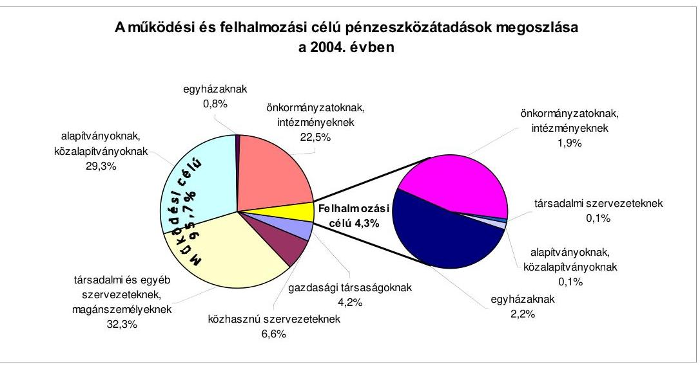
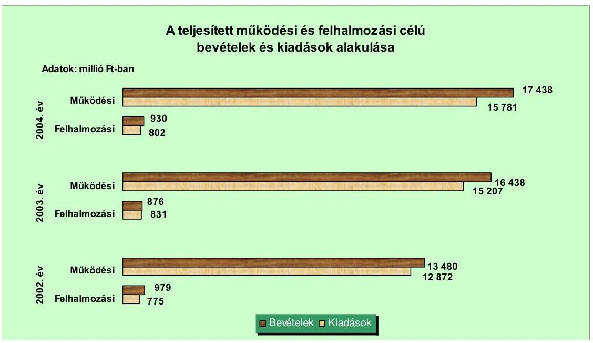
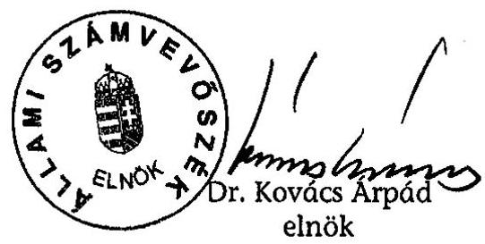
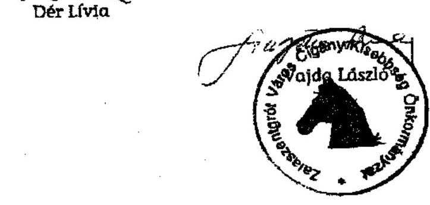

# JELENTÉS 

a Zala Megyei Önkormányzat gazdálkodási rendszerének átfogó ellenőrzéséről

---

3. Önkormányzati és Területi Ellenőrzési Igazgatóság
3.3. Átfogó Ellenőrzések Főcsoport
Iktatószám: V-1001-1/29/16/2005.
Témaszám: 749
Vizsgálat-azonosító szám: V0202
Az ellenőrzést felügyelte:
Dr. Lóránt Zoltán
főigazgató
Az ellenőrzés végrehajtásáért felelős:
Dr. Sepsey Tamás
főigazgató-helyettes
Az ellenőrzést vezette:
Csecserits Imréné
főcsoportfőnök-helyettes
Az ellenőrzést végezték:
Dér Lívia
számvevő tanácsos
Köcse Istvánné
főtanácsadó
Tóthné Salamon Ildikó
számvevő tanácsos

# A témához kapcsolódó - elmúlt három évben - készített számvevőszéki jelentések: 

címe
sorszáma
Jelentés az általános iskolai oktatás minőségének javítását szolgáló 0219
intézkedések ellenőrzésének tapasztalatairól
Jelentés a helyi és a helyi kisebbségi önkormányzatok 0220
gazdálkodásának átfogó ellenőrzéséről
Jelentés a megyei, fővárosi illetékhivatali tevékenysége 0243
ellenőrzéséről
Jelentés a szakképzési struktúra szerepéről a munkaerőpiaci 0321
igények kielégítésében
Jelentés a területfejlesztési tanácsok és munkaszervezeteik 0327
rendelkezésére álló támogatások igénylésének és felhasználásának ellenőrzéséről

Jelentéseink az Országgyűlés számítógépes hálózatán és az Interneten a www.asz.hu címen is olvashatók.

---

# TARTALOMJEGYZÉK 

BEVEZETÉS ..... 5
I. ÖSSZEGZŐ MEGÁLLAPÍTÁSOK, KÖVETKEZTETÉSEK, JAVASLATOK ..... 7
II. RÉSZLETES MEGÁLLAPÍTÁSOK ..... 16

1. A költségvetés tervezésének, végrehajtásának, az Önkormányzat vagyongazdálkodásának és a zárszámadás elkészítésének szabályszerűsége ..... 16
1.1. A költségvetési rendelet jóváhagyásának, módosításának, az előirányzatok nyilvántartásának és betartásának szabályszerűsége ..... 16
1.2. A gazdálkodás szabályozottsága, a bizonylati rend és fegyelem szabályszerűsége ..... 22
1.3. A pénzügyi-számviteli feladatok ellátásának informatikai támogatottsága ..... 31
1.4. Az önkormányzati vagyon nyilvántartása, számbavétele ..... 32
1.5. A vagyonnal való gazdálkodás szabályszerűsége, célszerűsége, nyilvánossága ..... 36
1.6. A céljelleggel nyújtott támogatások szabályszerűsége ..... 42
1.7. A közbeszerzési eljárások szabályszerűsége ..... 46
1.8. A zárszámadási kötelezettség teljesítésének szabályszerűsége ..... 50
2. Az önkormányzati feladatok és a rendelkezésre álló források összhangja ..... 53
2.1. A feladatok meghatározása és szervezeti keretei ..... 53
2.2. A költségvetés egyensúlyának helyzete ..... 55
2.3. A feladatok finanszírozása ..... 59
3. A belső irányítási, ellenőrzési rendszer működésének értékelése ..... 62
3.1. Az ellenőrzési rendszer kialakítása, működése ..... 62
3.2. A könyvvizsgálati kötelezettség teljesítése ..... 64
3.3. A korábbi számvevőszéki ellenőrzések javaslatainak hasznosulása ..... 65

---

# MELLÉKLETEK 

1. számú Az Önkormányzat gazdálkodását meghatározó adatok, mutatószámok (1 oldal)
2. számú Az önkormányzati vagyon nagyságának alakulása (1 oldal)
3. számú Az Önkormányzat 2004. évi bevételeinek és kiadásainak alakulása (1 oldal)
4. számú Egyes önkormányzati feladatok finanszírozása (1 oldal)
5. számú Helyszíni ellenőrzési jegyzőkönyv (3 oldal +1 oldal)
6. számú Kiss Bódog Zoltán úr, a Zala Megyei Közgyűlés elnökének észrevétele (3 oldal)
7. számú Kiss Bódog Zoltán úr, a Zala Megyei Közgyűlés elnökének kiegészítő észrevétele
(2 oldal)

---

# RÖVIDÍTÉSEK JEGYZÉKE 

Ötv.
Áht.
Számv. tv.
$\mathrm{Kbt}_{-1}$
$\mathrm{Kbt}_{-2}$
Art. 1
Art. 2
Htv.

Ksztv.
Szoc. tv.

Fot.
Ámr.
Ber.
Vhr.

ÁSZ
Döntőbizottság
Önkormányzat
Közgyűlés
Hivatal
Közgyűlés elnöke
föjegyző
SzMSz
vagyongazdálkodási rendelet ${ }_{1}$
vagyongazdálkodási rendelet ${ }_{2}$
közbeszerzési rendelet
közbeszerzési szabályzat
a helyi önkormányzatokról szóló 1990. évi LXV. törvény az államháztartásról szóló 1992. évi XXXVIII. törvény a számvitelről szóló 2000 . évi C. törvény a közbeszerzésekről szóló 1995. évi XL. törvény a közbeszerzésekről szóló 2003. évi CXXIX. törvény az adózás rendjéről szóló 1990. évi XCI. törvény az adózás rendjéről szóló 2003. évi XCII. törvény a helyi önkormányzatok és szerveik, a köztársasági megbízottak, valamint egyes centrális alárendeltségú szervek feladat- és hatásköreiről szóló 1991. évi XX. törvény a közhasznú szervezetekről szóló 1997. évi CLVI. törvény a szociális igazgatásról és szociális ellátásokról szóló 1993. évi III. törvény
a fogyatékos személyek jogairól és esélyegyenlőségük biztosításáról szóló 1998. évi XXVI. törvény az államháztartás múködési rendjéről szóló 217/1998. (XII. 30.) Korm. rendelet
a költségvetési szervek belső ellenőrzéséről szóló 193/2003. (XI. 26.) Korm. rendelet
az államháztartás szervezetei beszámolási és könyvvezetési kötelezettségének sajátosságairól szóló 249/2000. (XII. 24.) Korm. rendelet

Állami Számvevőszék
Közbeszerzések Tanácsa Közbeszerzési Döntőbizottság Zala Megyei Önkormányzat
Zala Megyei Önkormányzat Közgyűlése
Zala Megyei Önkormányzat Közgyűlésének Hivatala
Zala Megyei Önkormányzat Közgyűlésének elnöke
Zala Megye Önkormányzatának főjegyzője
Zala Megye Önkormányzatának 3/2004. (II. 20.) számú rendelete a Zala Megyei Közgyűlés Szervezeti és Müködési Szabályzatáról
Zala Megye Önkormányzatának 4/1997. (III. 21.) számú rendelete a megyei önkormányzati tulajdonról és a vagyongazdálkodás szabályairól
Zala Megye Önkormányzatának 14/2004. (VI. 30.) számú rendelete az Önkormányzat vagyonáról és a vagyongazdálkodás szabályairól
Zala Megye Önkormányzatának 19/1999. (X. 5.) számú rendelete a Zala Megyei Közgyűlés Hivatala és intézményei közbeszerzéseiről
6/2004. számú főjegyzői és 2/2004. számú elnöki utasítás a Zala Megyei Önkormányzat és a Zala Megyei Közgyűlés Hivatala közbeszerzési eljárásainak szabályairól

---

beruházási rendelet ${ }_{1} \quad$ Zala Megye Önkormányzatának 17/1999. (IX. 27.) számú rendelete a beruházások rendjéről
beruházási rendelet ${ }_{2} \quad$ Zala Megye Önkormányzatának 12/2003. (IX. 25.) számú rendelete a beruházások rendjéről
ügyrend $_{1} \quad$ A Zala Megyei Közgyűlés 81/2001. (IX. 21.) számú határozata a Zala Megyei Közgyűlés Hivatalának ügyrendjéről
ügyrend $_{2} \quad$ a főjegyző által 2004. július 1-jén kiadott és a Közgyűlés elnöke által jóváhagyott, a Zala Megyei Közgyűlés Hivatala szervezetét és múködését szabályozó Ügyrend
ügyrend $_{3} \quad$ a főjegyző által 2005. március 31-én kiadott és a Közgyűlés elnöke által jóváhagyott, a Zala Megyei Közgyűlés Hivatala szervezetét és múködését szabályozó Ügyrend
gazdálkodási szabály$\mathrm{zat}_{1} \quad$ a főjegyző 10/2001. (IX. 30.) számú utasítása a Zala Megyei Közgyűlés Hivatalának gazdálkodással összefüggő szabályokról
gazdálkodási szabály$\mathrm{zat}_{2} \quad$ a főjegyző 5/2004. (VII. 1.) számú utasítása a Zala Megyei Közgyűlés Hivatala gazdálkodási feladatai ellátásának változásairól
gazdálkodási szabály$\mathrm{zat}_{3} \quad$ A Közgyűlés elnöke és a főjegyző 1/2005. (V. 25.) számú együttes utasítása a Zala Megyei Közgyűlés Hivatala gazdálkodásának szabályairól
pénzkezelési szabályzat ${ }_{1} \quad$ a főjegyző 6/2001. (IX. 30.) számú utasítása a Zala Megyei Közgyűlés Hivatalának pénzkezelési szabályzatáról
pénzkezelési szabályzat ${ }_{2} \quad$ a főjegyző 11/2004. (VIII. 2.) számú utasítása a Zala Megyei Közgyűlés Hivatalának pénzkezelési szabályzatáról
Pénzügyi bizottság Zala Megyei Közgyűlés Pénzügyi Ellenőrző Bizottsága
Gazdasági bizottság Zala Megyei Közgyűlés Intézményi és Vagyongazdálkodási Bizottsága
Pénzügyi osztály Zala Megyei Közgyűlés Hivatalának Pénzügyi Osztálya
Ellenőrzési osztály Zala Megyei Közgyűlés Hivatalának Ellenőrzési, Vagyongazdálkodási és Beruházási Osztálya
Asbóth SZKI
Isletékhivatal Zala Megyei Illetékhivatal
Ellátó szervezet Zala Megyei Önkormányzat Ellátó Szervezete
Kórház Zala Megyei Kórház
MMIK Zala Megyei Művelődési és Pedagógiai Intézet, Szakképző Iskola, Zalaegerszeg
Útkezelői Társulás Zala Megyei Települési Önkormányzatok Útkezelői Társulása
Fejlesztési Kht. Zala Megyei Fejlesztési Közhasznú Társaság

---

# JELENTÉS 

## a Zala Megyei Önkormányzat gazdálkodási rendszerének átfogó ellenőrzéséről

## BEVEZETÉS

Az Ötv. 92. § (1) bekezdése, az Állami Számvevőszékről szóló 1989. évi XXXVIII. törvény 2. § (3) bekezdése, valamint az Áht. 120/A. § (1) bekezdése szerint az önkormányzatok gazdálkodását az Állami Számvevőszék ellenőrzi. Az ellenőrzést az Országgyűlés illetékes bizottságai részére is átadott, országosan egységes ellenőrzési program alapján végeztük.

## Az ellenőrzés célja annak értékelése volt, hogy:

- az önkormányzati gazdálkodás törvényességét ${ }^{1}$, szabályszerűségét biztosított-ták-e a tervezés, a költségvetés végrehajtása, a vagyongazdálkodás és a zárszámadás során;
- az Önkormányzat által ellátott feladatok és az azokhoz rendelkezésre álló források összhangja biztosított volt-e, különös tekintettel egyes kiemelt feladatokra;
- a gazdálkodás szabályszerűségét biztosító kontrollok ${ }^{2}$ megfelelően segitettéke a végrehajtást.

Az ellenőrzött időszak: a 2004. év és a 2005. I. negyedév; az 1.5., 2.1-2.3. és a 3.3. pontok esetében a 2002-2003. évek is.

Zala megye lakosainak száma 2004. január 1-jén 296892 fő volt. A megye 257 településének 60,3\%-a 500 fő alatti lakosságszámmal rendelkező község, ahol a lakosság $12,3 \%$-a él.

Az Önkormányzat 40 tagú Közgyűlésének munkáját 12 állandó bizottság segítette. A 2002. évi önkormányzati választásokat követően a Közgyűlés elnökének és a főjegyzőnek a személye változott. A pénzügyi osztályvezető nem dolgozott a 2004. évben betegség miatt, munkaköre a helyszíni ellenőrzéskor betöltetlen volt felmentés következtében.

[^0]
[^0]:    ${ }^{1}$ A törvényi előírások betartásának elmulasztásakor a részletes megállapítások fejezetben egységesen a törvénysértés megjelölést alkalmazzuk, mivel az ÁSZ nem tehet különbséget a törvényi előírások között.
    ${ }^{2}$ A gazdálkodás szabályszerűségét biztosító kontroll alatt értjük a kiépített és működő belső irányítási és szabályozási rendszert, valamint a belső ellenőrzési funkciók ellátását.

---

Az Önkormányzat a 2004. évben 18 367,9 millió Ft költségvetési bevételből gazdálkodott, a 2005. évre 17 006,4 millió Ft költségvetési bevételt tervezett. A teljesített költségvetési kiadása a 2004. évben 16 583,6 millió Ft volt, a 2005. évre tervezett kiadása 17 833,2 millió Ft. Könyvviteli mérlegében kimutatott vagyonának értéke 2004-ben 13628,8 millió Ft, a kötelezettségállománya 1511,6 millió Ft volt.

Az Önkormányzat által fenntartott intézmények száma 2004. január 1-jén 34 volt (ebből négy részben önállóan gazdálkodó), amely öt önállóan gazdálkodó intézménnyel csökkent 2004. december 31-re. Ezen kívül az Önkormányzatnak egy gazdasági társaságban volt 100\%-os, míg további háromban kisebbségi részesedése.

A Hivatalban dolgozó köztisztviselők létszáma 2004. január 1-jén 97 fő volt, az intézményekben 3555 fő közalkalmazott látta el a különböző közszolgáltatásokat és az azokhoz kapcsolódó gazdálkodási feladatokat. A köztisztviselők létszáma 102 főre, míg a közalkalmazottaké 3393 főre módosult 2004. december 31-re. (Az Önkormányzat gazdálkodását meghatározó adatokat, mutatószámokat a jelentés 1-3. számú mellékletei tartalmazzák.)

---

# I. ÖSSZEGZŐ MEGÁLLAPÍTÁSOK, KÖVETKEZTETÉSEK, JAVASLATOK 

A Közgyűlés az Ötv. előírásainak megfelelve a 2003. évben fogadta el a választási időszakra vonatkozó - tartalma szerint gazdasági programnak megfelelő ciklusprogramját, amely alkalmas volt az éves tervezőmunka megalapozására. A Közgyűlés elnöke az Áht-ban előírt határidőket betartva terjesztette a Közgyűlés elé a 2004. és a 2005. évi költségvetési koncepciókat, valamint költségvetési rendelettervezeteket. Az Ámr. előírásainak megfelelően csatolta a költségvetési koncepciók előterjesztéséhez a Pénzügyi bizottság, a költségvetési rendelettervezetekhez a Pénzügyi bizottság és a könyvvizsgáló véleményét. A költségvetési koncepciók az Ámr-ben előírtaknak megfelelő tartalommal készültek, az elfogadáskor a Közgyűlés döntött a költségvetés készítéssel kapcsolatos elvárásokról.

A főjegyző a költségvetési rendelettervezetet beterjesztése előtt a költségvetési szervek vezetőivel az Ámr-ben foglaltaknak megfelelően egyeztette. A Közgyűlés a költségvetés benyújtását megelőzően elfogadta azokat az intézményi ellátással kapcsolatos rendeleteket, melyek a költségvetés megalapozását biztosították. Az Áht-ban foglaltakat megsértve a 2004. és a 2005. évi költségvetési rendeletekben finanszírozási célú pénzügyi műveleteket vettek figyelembe költségvetési kiadásként. Az Áht. előírásaival szemben, előterjesztés hiányában a Közgyűlés nem határozta meg a költségvetés és - a vagyonkimutatás kivételével - a zárszámadás előterjesztésekor tájékoztatásul bemutatandó mérlegek és kimutatások tartalmi követelményeit, ennek ellenére ezeket a költségvetési rendelettervezetek tartalmazták. Az Áht. és az Ámr. előírásainak megfelelve a múködési és felhalmozási célú bevételeket és kiadásokat Önkormányzatra öszszesen és kiemelt előirányzatonként, a bevételek előirányzatait az elemi költségvetés szerinti főbb jogcím-csoportonkénti részletezettségben, valamint a múködési, fenntartási előirányzatokat önállóan és részben önállóan gazdálkodó költségvetési szervenként, intézményen belül kiemelt előirányzatonként mutatták be. A felújítási előirányzatokat célonként, a felhalmozási kiadásokat feladatonként határozták meg. Az Ámr. előírásai ellenére nem mutatták be a Közgyűlésnek elkülönítetten az európai uniós támogatással megvalósuló projekt pénzügyi teljesítését. Az Ámr-ben előírtaknak megfelelően csatolták a költségvetésekhez az előirányzatok várható felhasználási ütemét bemutató tájékoztatást. A 2004. és a 2005. évi költségvetésekben az Ámr-ben előírtak ellenére a céltartalékon kívül a Hivatal előirányzatai között további tartalék jellegű keretösszegeket is képeztek múködési kiadásokra, különféle pályázatokra, támogatásokra. A költségvetésekben szociális és pályázati céllal elkülönített összegek alapként történő megjelölése félreérthető, mivel nem felel meg az Áht. követelményeinek.

A költségvetés végrehajtási szabályait a 2004. és a 2005. évi költségvetésekben részletesen meghatározták, amelyek között a Közgyűlés az előterjesztés alapján, az Ámr-ben előírtaktól eltérően az intézményi kiemelt előirányzatok saját hatáskörű módosításáról történő tájékoztatásra féléves gyakoriságot írt elő, amely nem biztosította, hogy azokról a főjegyző előkészítésében a Közgyű-

---

lés elnöke az előirányzat módosítási javaslatot a Közgyűlés elé terjessze a költségvetési rendeletben foglalt negyedéves ütemezésben. Az előirányzat módosításoknál eltértek az Ámr-ben és a költségvetési rendeletben előírtaktól az első félév végén történő, valamint a határidő utáni költségvetési rendeletmódosítással. A költségvetési előirányzatokról, azok változásáról folyamatosan vezették a nyilvántartást.

Az Ámr-ben előírt szervezeti és múködési szabályzatnak megfelelő ügyrendben határozták meg a Hivatal szervezeti felépítését és múködési rendszerét, szervezeti egységeinek megnevezését, feladatait. Ennek rendelkezéseit a 2005. évben kiegészítették a pénzügyi-gazdasági tevékenységet ellátó személyek feladatkörének, munkakörének meghatározásával, illetve a Hivatal alapító okiratában foglaltak részletezésével. A gazdasági szervezet (Pénzügyi osztály) részére az Ámr-ben foglaltak ellenére ügyrendet nem készítettek. A gazdálkodási és ellenőrzési jogkörök gyakorlásának szabályait a főjegyző a Közgyűlés elnöke által jóváhagyott szabályzatokban rögzítette. Az Illetékhivatal vezetője az Ámrben és a Hivatal belső szabályzataiban foglaltak ellenére adott felhatalmazásokat kötelezettségvállalásra. A főjegyző belső szabályzatban nem rögzítette a szakmai teljesítés igazolás módját és azt végzők kijelölését. Az érvényesítési feladatokra megbízásnál az iskolai végzettségre és szakmai képesítésre vonatkozó követelményeket betartották. A felhatalmazottak beszámoltatása nem történt meg.

A Htv. előírásait megsértve a főjegyző nem szabályozta az Önkormányzat intézményeire érvényes számviteli rendet. A főjegyző a Hivatalra vonatkozóan elkészítette a számviteli politikát és a kapcsolódó szabályzatokat, a számlarendet, valamint az eszközök hasznosítási és selejtezési szabályzatát, azonban a 2004. évtől indokoltsága ellenére elmaradt az önköltség számítási szabályzat elkészítése. A számviteli politikában a Vhr-ben előírtak ellenére nem szabályozták a beszerzett, illetve előállított immateriális jószág, tárgyi eszköz üzembe helyezése dokumentálásának szabályait. Nem tartalmazta a leltározási szabályzat a Vhr. előírásai ellenére a források és az üzemeltetésre, kezelésre átadott eszközök leltározásának, indokoltsága ellenére a leltár és a könyvviteli adatok egyeztetésének, az eltérések rendezésének módját, feladatait. A pénzkezelési szabályzat nem tartalmazta a bankszámlák és a pénztárak kapcsolatrendszerét, az OTP ügyfélterminál használatának részletes szabályait. A selejtezési szabályzat előírásai nem voltak összhangban a vagyongazdálkodási rendelet ${ }_{2}$ a vagyon pályáztatás útján történő hasznosítására vonatkozó rendelkezéseivel. A számlarendben a Számv. tv-t megsértve nem rögzítették az illetékhivatali egységnél és a részben önállóan gazdálkodó szervnél alkalmazandó főkönyvi számlák megnevezését, tartalmát, az értékváltozások jogcímét, azok könyvvezetésének, illetve a beszámoló alátámasztásának sajátos módját, feladatait, a Vhr. előírásai ellenére valamennyi kapcsolódó analitikus nyilvántartás formáját, tartalmát, vezetésének módját. A munkaköri leírásokban nem rögzítették az elvégzendő tevékenységet megelőző művelet ellenőrzési kötelezettségét, felelősségi körét, nem tértek ki azok elvégzési határidejére, az eltérések dokumentálásának módjára, a szabályzatoktól eltérően rögzítették a gazdálkodási és ellenőrzési jogköröket. A Hivatal ellenőrzési nyomvonalát a főjegyző 2005. április 1-től elkészítette, amely az Ámr-ben előírtak alapján tartalmazta a költségvetési tervezési, pénzügyi lebonyolítási, valamint az ellenőrzési folyamatok leírását.

---

A főkönyvi számlákhoz analitikus nyilvántartást vezettek, azok főkönyvi könyveléssel való egyeztetését elvégezték. A könyvviteli mérleget és a pénzforgalmi jelentést főkönyvi kivonattal alátámasztották. A gazdasági eseményekről a Számv. tv-ben előírt bizonylatokat kiállították, azokat a tartalmuknak megfelelően elszámolták közgazdasági és funkcionális osztályozás szerint, s a Vhrben előírt időpontban rögzítették a könyvviteli nyilvántartásokban. A számviteli bizonylatok - a könyvviteli nyilvántartásban történt rögzítés időpontjának feltüntetése kivételével - megfeleltek a Számv. tv-ben foglalt alaki és tartalmi követelményeknek.

A gazdálkodási jogkörök gyakorlásánál betartották az összeférhetetlenségi szabályokat. Az Áht-ban foglaltakat megsértve nem történt meg a kötelezettségvállalások ellenjegyzése a kiadások 50\%-ánál. Nem tartalmazták az utalványrendeletek az Ámr-ben előírtak ellenére a kötelezettségvállalás nyilvántartásba vételének sorszámát. A kötelezettségvállalást, utalványozást, azok ellenjegyzését és az érvényesítést az arra belső szabályzatokban, munkaköri leírásokban felhatalmazottak végezték. Az Ámr-ben előírtak ellenére a szakmai teljesítés igazolást a bizonylatok $71,9 \%$-ánál nem végezték el, $28,1 \%$-ánál szabálytalanul végezték, s az érvényesítő és az utalvány ellenjegyzője nem ellenőrizte annak meglétét. Az érvényesítés nem tartalmazta az Ámr. előírásai ellenére a könyvviteli elszámolásra utaló főkönyvi számlaszámot. A pénztárellenőr nem igazolta a munkafolyamatba épített ellenőrzési feladatai elvégzését a pénztári bizonylatok $73 \%$-ánál.

Az Ámr. előírásai ellenére a Hivatalban nem rendelkeztek olyan analitikus nyilvántartással, amelyből megállapítható a 2004. évi kötelezettségvállalás összege. Ennek hiányában a nyilvántartás a döntést hozók számára nem biztosított pontos információt a ténylegesen szabad, felhasználatlan pénzügyi előirányzatokról. Önkormányzati szinten a módosított kiemelt előirányzatokat betartották a teljesítés során, azonban a Hivatal három feladat és az intézmények 58,8\%-a a kiemelt költségvetési előirányzatait átlagosan 6\%-kal (összesen 76,6 millió Ft-tal) túllépte, megsértve az Áht-ban foglalt előírásokat. A túllépések okait - hat intézmény igazoló jelentése kivételével - nem vizsgálták, felelősségre vonás nem történt.

A Hivatalban a pénzügyi és számviteli feladatellátásban manuális és számítógépes megoldásokat egyaránt alkalmaztak. A főkönyvi és az analitikus nyilvántartásokhoz alkalmazott programok nem illeszkedtek egymáshoz. Az informatikai stratégiára alapozott 2005. évi számítógép fejlesztés biztosítja a pénzügyi, számviteli és gazdálkodási feladatokat ellátó köztisztviselők számítógéppel történő munkavégzését. Nem készítettek katasztrófa elhárítási tervet, az informatikai rendszerről önálló, átfogó üzemeltetési leírást. Nem szabályozták a programok használatával kapcsolatos engedélyezési jogköröket, nem jelölték ki a programrendszerben lévő adatokért felelősök körét, a hozzáférési jogosultságokat. A pénzügyi-számviteli szakmai programokat használó dolgozók 42,8\%-ának munkaköri leírása tartalmazta a munkakörhöz szükséges informatikai rendszer használatát.

Az Önkormányzat vagyontárgyainak nyilvántartásáról és forgalomképesség szerinti elkülönítéséről gondoskodtak. A vagyontárgyak forgalomképesség szerinti besorolását a számviteli nyilvántartásokban nem a vagyongazdál-

---

kodási rendelet ${ }_{2}$ szerint végezték el. A főkönyvi számlák és a kapcsolódóan vezetett analitikus nyilvántartások értékadatai megegyeztek a vevőkkel szembeni követelések kivételével. A Vhr. előírásait figyelmen kívül hagyva a saját üzemeltetésű eszközök között mutatták ki a különféle állami közszolgáltatási feladatokat ellátó szervek által üzemeltetett ingatlanokat. A leltározási utasítás és a leltár összeállítása nem felelt meg a Vhr. és a leltározási szabályzat előírásainak. Az eszközök Vhr-ben előírtak szerinti mennyiségi leltározása helyett összesítő kimutatások készítésével, egyeztetéssel állapították meg az év végi állományt. A Számv. tv. előírásai ellenére elmulasztották a korábbi években értékvesztéssel leírt vevő követelések, a lakáscélra nyújtott kölcsönök, valamint az egyéb hosszú lejáratú kötelezettségek egyeztetéssel történő leltározását. A Számv. tv. előírásait figyelmen kívül hagyva három esetben nem vizsgálták az értékvesztés elszámolásának szükségességét. Egy gazdasági társaság megszüntetését követően részvényeit a Számv. tv. előírásai ellenére nem vezették ki a nyilvántartásokból. Indokoltsága ellenére a 2004. évben nem számoltak el értékvesztést a vevőkkel szembeni követeléseknél és nem vizsgálták a korábban elszámolt értékvesztés visszaírásának szükségességét a Számv. tv. előírásai ellenére. Egyszerűsített értékelési eljárással végezték el az illetékkövetelések év végi értékelését, de a végrehajtás módja nem felelt meg a Vhr-ben foglaltaknak, mivel a csoportos értékeléshez szükséges alapadatok nem álltak rendelkezésre.

Az Önkormányzat a vagyonnal való gazdálkodás szabályait, a rendelkezési, döntési jogköröket meghatározta, az erre vonatkozó rendeletek nevesítették az Önkormányzat összes vagyonát. A Közgyűlés - célszerűen - értékhatárhoz és vagyoncsoportokhoz kapcsolódó vagyongazdálkodási jogokat biztosított a Közgyűlés elnöke és az intézményvezetők részére. A bizottságok véleményező, javaslattevő szerepet kaptak. A vagyongazdálkodási rendelet ${ }_{1,2}$ a vagyon hasznosítására, a hasznosítás nyilvánosságára vonatkozó eljárási rendet és a nyilvános pályáztatás rendjét tartalmazta. A vagyongazdálkodási rendelet ${ }_{2}$ a versenyeztetési szabályok mellőzésére értékhatártól függetlenül, korlátlan lehetőséget biztosított a Közgyűlés számára, megsértve ezzel az Áht. előírásait. A vagyontárgyak tulajdonjogának és vagyonkezelői jogának ingyenes átruházási módját, eseteit szabályozták, az esetek körét 2004. június 30-tól szűkítették. Az Áht. előírását megsértve nem szabályozták a követelésekről történő lemondás módját, eseteit. Az Önkormányzat az Áht. előírásait megsértve nem tett eleget a 2004-2005. I. negyedév között a támogatásokra vonatkozó döntések és a megkötött szerződések adataira vonatkozó nyilvánosságra hozatali kötelezettségének az előírt határidőn belül. A 2005. évben pótlólag közzétett adatok nem tartalmazták az Áht-ban előírtak ellenére a támogatási program megvalósulásának helyét. Az év közben átmenetileg szabad pénzeszközök befektetéséről a Közgyűlés elnöke egy esetben nem a költségvetési rendelet előírásai szerint döntött. A 2002-2005. I. negyedév közötti időszakban vagyonértékesítés, közhasznú társaság alapítás, ingatlan bérbeadás, selejtezés történt a vagyongazdálkodási rendelet ${ }_{1,2}$ előírásai figyelembe vételével. Az Önkormányzatnál a három évben összesen 33,9 millió Ft követelést, átlagosan az év elején fennálló követelésállomány $0,75 \%$-át elengedték. A behajthatatlan követelések törlése és az illeték követelések elengedése a helyi és a központi előírások alapján történt. Az önkormányzati vagyon térítésmentes átadása és ingyenes használatba adása négy esetben az Áht. előírásaitól eltérően nem önkormányzati rendeletben szabályozott esetekben történt. Indokoltsága ellenére egy esetben nem rendelkez-

---

tek egyértelműen az Önkormányzat támogatásával az ingyenesen használatba adott eszközökön megvalósított fejlesztések tulajdoni viszonyairól.

A Közgyűlés a céljellegú támogatások rendjét szabályozta. A számadások ellenőrzésének módját, feltételeit nem rögzítették, nem határoztak meg előírásokat a Közgyűlés és a Közgyűlés elnöke hatáskörében nyújtott támogatások elszámolására és ellenőrzésére. A kifizetett speciális célú támogatásokról a döntést a Közgyűlés, a bizottságok és a Közgyűlés elnöke a hatáskörükben hozták meg. Az Áht előírását megsértve a támogatások 9,8\%-ánál nem írtak elő számadási kötelezettséget, a számadást elmulasztó szervezeteket a 2004. évben nem szólították fel annak pótlására, visszafizetést nem kezdeményeztek. Egy közhasznú társaság részére nyújtott támogatásnál nem tartották be a Ksztv. szerződéskötési kötelezettségre vonatkozó előírását. Egy intézmény az Ötv. és az Áht. előírását megsértve alapítványnak nyújtott támogatást. A Hivatalban a számadási kötelezettségüket teljesítők számadásainak tartalmi és formai ellenőrzését az Áht. előírásait megsértve nem végezték el, a támogatások rendeltetésszerű felhasználását három támogatott szervezetnél a helyszínen ellenőrizték.

A Kbt., felhatalmazása alapján a Közgyűlés rendeletben, a Kbt. ${ }_{2}$ hatályba lépését követően a Közgyűlés elnöke és a főjegyző szabályzatban határozta meg a közbeszerzésekkel kapcsolatos feladatokat. Meghatározták a felelősségi és összeférhetetlenségi szabályokat, de nem írták elő ez utóbbi dokumentálási módját. A közbeszerzési eljárásokban részt vevő munkacsoport állandó tagjainak eseti kijelölése nem biztosította az állandó munkacsoport részére meghatározott feladatok elvégzését. Az Önkormányzat a határidőt követően tett eleget a Kbt. ${ }_{1}$ alapján fennálló éves összegzés készítési kötelezettségének. Nem készítették el a Kbt. ${ }_{2}$-ben előírt határidőre a 2005. évi közbeszerzési tervet. Az Önkormányzatnál a 2004. évben 33 közbeszerzési eljárást folytattak le. A Kbt. ${ }_{1}$ előírásait figyelmen kívül hagyva, nem alkalmazták az egybeszámítás szabályait a 2003. évben indult egészségügyi gép-műszer beszerzéseknél és nem folytatták le a közbeszerzési eljárást, amelyet elmulasztottak két intézmény élelmiszer beszerzéseinél is. A közbeszerzési eljárások kategóriába sorolása és az eljárási fajták kiválasztása, a munkacsoportok kijelölése az előírásoknak megfelelő volt, de nem vizsgálták a Kbt. ${ }_{1}$ előírásai ellenére az eljárásban résztvevők összeférhetetlenségét. Az ajánlatok bontását, értékelését és elbírálását írásban rögzítették, a szerződéskötés a Kbt. ${ }_{1}$ előírásainak megfelelt. A 2004. évben négy alkalommal indult a Döntőbizottság előtt jogorvoslati eljárás, a Döntőbizottság két alkalommal megállapította a jogsértés tényét, ebből egy esetben pénzbeli szankciót alkalmazott.

A költségvetéssel összehasonlítható módon összeállított zárszámadási rendelettervezetet a Közgyűlés elnöke az előírt határidőn belül terjesztette a Közgyűlés elé. Az előterjesztés megfelelt az Áht-ban és az Ámr-ben foglalt előírásoknak. Bemutatták az Áht-ban foglaltak alapján a többéves kihatással járó döntések számszerűsítését éves bontásban, valamint összesítve, szöveges indoklással, és az illetékek méltányosság címén történt elengedéséből származó közvetett támogatásokat szöveges indoklással együtt. Az Ámr-ben előírtak ellenére nem történt meg a működési és felhalmozási célú előirányzatok teljesítésének mérlegszerű bemutatása. Az Ámr-ben előírtakkal ellentétben az intézményeket

---

éves számszaki beszámolójuk és múködésük elbírálásáról, jóváhagyásáról írásban nem értesítették.

A Közgyűlés az SzMSz-ben a kötelezően ellátandó és az önként vállalt feladatok megállapításakor figyelembe veendő szempontokat határozta meg. A tervezett feladatokat és azok ellátási módját a ciklusprogram, valamint az ágazati koncepciók részletesen tartalmazták. Az Önkormányzat az egészségügyi, a szociális, a közoktatási és a közművelődési közfeladatait költségvetési intézményein keresztül látta el, a feladatellátásban két közalapítvány vállalt szerepet. A kötelező szociális feladatok közül a szakosított ellátások körébe tartozó hajléktalanok otthona és a hajléktalanok rehabilitációs intézménye ellátást az Önkormányzat az Szoc. tv-ben foglaltakat megsértve nem valósította meg, erre ellátási szerződés megkötésével sem intézkedett.

A 2002-2004. években végrehajtott szervezeti változások intézmény összevonásokhoz, ellátási szerződés alapján egyházi fenntartónak és önkormányzatnak történő átadáshoz, bábszínház és közhasznú társaság alapításához kapcsolódtak. Az intézmény összevonások során a gazdasági szervezetek számát csökkentették, álláshelyeket szüntettek meg. A kisegítő jellegű tevékenységek hatékonyságának fokozását tervezték megvalósítani. Az átszervezések során az Önkormányzat betartotta a jogszabályi előírásokat.

A 2002-2004. években a jóváhagyott bevételek nem nyújtottak fedezetet a jóváhagyott kiadásokra, az egyensúlyt hitel felvétel tervezésével biztosították. A jóváhagyott hiány az első két évben a működési, a 2004. évben emellett a felhalmozási bevételek-kiadások hiánya volt. Az intézmények kincstári finanszírozása hozzájárult a folyószámla hitel csökkenő mértékéhez és a likviditás javításához. Az Önkormányzat intézményracionalizálási intézkedéseket tett, szigorította a létszámgazdálkodást és csökkentette az intézmények támogatását. Az intézkedések eredményeként keletkezett bevételi többletek és kiadási megtakarítások a pénzügyi egyensúlyt saját eszközökkel biztosították. A zárszámadási adatok szerint mindhárom évben költségvetési többletet értek el, így a tervezett hitel felvételére nem volt szükség és tartalékok is képződtek. A pénzállomány alakulásáról a főjegyző nem készítette el az Ámr-ben előírt likviditási tervet. Az Önkormányzatnál a 2002-2004. években egy alkalommal kötöttek lízingszerződést, két alkalommal vettek fel felhalmozási célú hitelt és két önkormányzati tulajdonú gazdasági társaság hitelfelvételére vállaltak kezességet. A Közgyűlés elnöke a 2004. évi fejlesztési célú hitelfelvételnél a költségvetési rendeletben előírt szabályoktól eltérően, az Ötv. megsértésével döntött. Az Illetékhivatal a Közgyűlés engedélye nélkül kötött lízingszerződést, amely nem tette lehetővé az Ötv. szerinti felső korlát vizsgálatát. Az adósságot keletkeztető kötelezettség vállalásoknál az előírt korlátot betartották.

Az Önkormányzat jelentősebb önként vállalt kiadása a színház és a bábszínház működtetése, valamint a különféle szervezetek céljellegű támogatása volt. Ezekre a célokra fordították a költségvetési kiadások 1-2,7\%-át, amelyek nem veszélyeztették a kötelezően ellátandó feladatok végrehajtását.

Az Önkormányzat a fogyatékos személyek mozgásának segítése érdekében a középületek akadálymentesítésére a 2003. évben felmérést készíttetett. A 2004. és a 2005. évi költségvetésben e feladatra elkülönített előirányzatot nem

---

alakított ki. A középületek 13,6\%-a felelt meg az akadálymentes megközelíthetőség követelményének 2005. márciusában. A fennmaradó 70 épületre vonatkozóan, a Fot. előírásaival szemben, a meghatározott 2005. január 1-i határidőre a feladatok elvégzését nem biztosították.

Az Önkormányzat a feladatkörébe utalt belső ellenőrzési feladatok végrehajtásához szükséges szervezeti kereteket kialakította. A hivatali belső ellenőrnek a Közgyűlés elnöke közvetlen irányítása alá helyezésével megsértették az Áht. előírását. Az ellenőrök funkcionális függetlenségét 2004. július 1-jét követően az éves ellenőrzési terv kidolgozása, az ellenőrzési program elkészítése és végrehajtása, az ellenőrzési módszerek kiválasztása, a következtetések és ajánlások kidolgozása, az ellenőri jelentés elkészítése, az ellenőrzési tevékenység más tevékenységektől való elkülönítése tekintetében biztosították. A belső ellenőrzési vezetőt az ellenőrzési tevékenységen kívül más tevékenység végrehajtásába is bevonták, ezáltal megsértették az Áht. előírását. A belső ellenőrzési kézikönyvet elkészítették, tartalma a Ber. előírásainak megfelelt. A Hivatalban stratégiai, középtávú és éves ellenőrzési terveket készítettek. Az intézményi ellenőrzési munka megtervezéséhez összeállított terveket a főjegyző, a hivatali belső ellenőrzésre vonatkozó terveket a Közgyűlés elnöke hagyta jóvá, ez utóbbival figyelmen kívül hagyták a Ber. előírását. Az intézményi ellenőrzések dokumentálása megfelelt a követelményeknek. A hivatali belső ellenőr által ellenőrzött szervezeti egységek a Ber-ben előírt intézkedési terveket nem készítettek. A 2004. évi ellenőrzéseket az ütemezéstől eltérően folytatták le. A főjegyző tájékoztatta a Közgyűlést az előző évi intézményi és a hivatali belső ellenőrzések tapasztalatairól.

Az Önkormányzat a törvényben előírt könyvvizsgálati kötelezettségét az összeférhetetlenségi követelmények figyelembevételével, költségvetési minősítésű könyvvizsgálóval teljesítette. A könyvvizsgáló véleményezte az éves költségvetések készítésével, módosításával kapcsolatos előterjesztéseket, rendelettervezeteket. Auditálási eltéréseket nem állapított meg, korlátozás nélküli hitelesítő záradékkal látta el a Hivatal és az intézmények összevont adatait tartalmazó 2004. évi egyszerűsített költségvetési beszámolót.

Az Önkormányzatnál az előző négy évben végzett számvevőszéki ellenőrzések szabályszerűségi és célszerűségi javaslatainak kilenctizedét teljes mértékben, illetve részben végrehajtották, amelyek eredményeként javult a feladatellátás törvényessége és szabályozottsága.
Nem valósultak meg a szakképző intézmények saját bevételeinek reális tervezésére; az Illetékhivatal előirányzatok feletti rendelkezési jogosultságának meghatározására; az Illetékhivatal múködtetéséről szóló megállapodásban a tervezett és tényleges kiadások elszámolásának, az elszámolás ellenőrzésének rögzítésére; az érdekeltségi célú juttatások forrásául szolgáló fedezet képzésének, a kifizetés nyilvántartásának szabályozására vonatkozó javaslatok.

---

A helyszíni ellenőrzés megállapításainak hasznosítása mellett javasoljuk:

# a Közgyűlés elnökének 

a jogszabályi előírások maradéktalan betartása érdekében

1. a költségvetési gazdálkodás jogszerű kereteinek kialakítása céljából terjessze a Közgyűlés elé - a főjegyző által készített előterjesztés alapján - az Áht. 118. §-ában előírt, a 116. § 6., 9. és 10. pontja szerinti mérlegek, kimutatások tartalmának meghatározásáról szóló rendelettervezetet;
2. kezdeményezze, hogy a Közgyűlés gondoskodjon a Szoc. tv. 71/B. § és 74/A. §aiban előírt kötelező szociális feladatok teljesítéséről a hajléktalanok otthona és a hajléktalanok rehabilitációs intézménye ellátásának megszervezésével;
3. gondoskodjon a középületek akadálymentessé tételéről, tekintettel a Fot. 29. § (6) bekezdésében előírtakra;
4. intézkedjen az Áht. 121/A. § (3) bekezdésében előírtaknak megfelelően annak érdekében, hogy a hivatali belső ellenőrzést végző személy jogállása alapján a költségvetési szerv vezetőjének közvetlen alárendeltségébe kerüljön;
a munka színvonalának javítása érdekében
5. terjessze a számvevőszéki jelentést a Közgyűlés elé, a feltárt hiányosságok megszüntetésére készíttessen intézkedési tervet a határidők és a felelősök megjelölésével;

## a főjegyzönek

a jogszabályi előírások maradéktalan betartása érdekében

1. a gazdálkodási és pénzügyi-számviteli feladatok szabályozása tekintetében
a) intézkedjen a Hivatal gazdasági szervezetének az Ámr. 17. § (5) bekezdésében foglaltak szerinti ügyrendje elkészítésére;
b) tegyen eleget a Htv. 140. § (1) bekezdés c) pontjában foglalt, az Önkormányzat intézményeire vonatkozó számviteli rend kialakítási kötelezettségének;
2. biztosítsa, hogy a kötelezettségvállalásokhoz kapcsolódóan olyan analitikus nyilvántartást vezessenek, amelyből az Ámr. 134. § (13) bekezdés előírásainak megfelelően megállapítható az évenkénti kötelezettségvállalás összege;
3. intézkedjen, hogy a részesedések, értékpapírok, követelések értékelését és az értékvesztés szükség szerinti elszámolását, továbbá a korábban elszámolt vevőkkel szembeni követelések értékvesztése visszaírásának indokoltságát a Számv. tv. 54. § (1)-(2) és (4) bekezdések, 55. § (1)-(3) bekezdések előírásainak megfelelően vizsgálják; gondoskodjon a cégnyilvántartásból törölt gazdasági társaság részvényeinek kivezetéséről a Számv. tv. 15. § (3) bekezdés előírásainak eleget téve;

---

4. készítse el az Ámr. 139. § alapján az Önkormányzat pénzállományának alakulásáról a likviditási tervet és gondoskodjon annak szükség szerinti aktualizálásáról;
5. biztosítsa az Áht. 121/A. § (4) bekezdés e) pontja és a Ber. 6. § (3) bekezdésében foglaltak szerint, hogy a belső ellenőrzési vezetőt az ellenőrzési tevékenységen kívül más tevékenységbe ne vonják be; gondoskodjon arról, hogy az ellenőrzött szervezeti egységek vezetői a Ber. 29. § (1) bekezdésében előírt intézkedési tervet készítsenek;
a munka színvonalának javítása érdekében
6. intézkedjen a Hivatal informatikai rendszerének folyamatos és zavartalan múködése érdekében katasztrófa-elhárítási terv, továbbá üzemeltetési leírás elkészítésére; szabályozza a programok használatával kapcsolatos engedélyezési jogköröket, hozzáférési jogosultságokat; határozza meg a programrendszerekben levő adatokért való felelősségi szabályokat;
7. intézkedjen a Hivatalban a pénzügyi-számviteli feladatellátás egységes informatikai rendszerének kiépítésére, egymással kompatibilis programok alkalmazására;
8. kezdeményezze az illetékkövetelések Vhr. 31/A. § előírásai alapján elvégzendő egyszerűsített értékelési eljárása alkalmazásához a Vhr. 9. számú melléklet (2) bekezdés) pontjában előírtakat lehetővé tevő információs bázis kialakítását.

---

# II. RÉSZLETES MEGÁLLAPÍTÁSOK 

## 1. A KÖLTSÉGVETÉS TERVEZÉSÉNEK, VÉGREHAJTÁSÁNAK, AZ ÖNKORMÁNYZAT VAGYONGAZDÁLKODÁSÁNAK ÉS A ZÁRSZÁMADÁS ELKÉSZÍTÉSÉNEK SZABÁLYSZERŰSÉGE

### 1.1. A költségvetési rendelet jóváhagyásának, módosításának, az előirányzatok nyilvántartásának és betartásának szabályszerúsége

A Közgyűlés a Közgyűlés elnökének előterjesztése alapján a 2003. évben a 136/2003. (XI. 7.) számú határozatával elfogadta az Önkormányzat 20032006. évekre szóló - tartalma szerint gazdasági programnak megfelelő - ciklusprogramját az Ötv. 91. § (1) bekezdésében előírt kötelezettségének megfelelően. A ciklusprogramban meghatározták az időszakban megvalósítandó főbb stratégiai, fejlesztési célkitűzéseket, prioritásokat az Önkormányzat együttműködési rendszere, gazdálkodása és ágazati feladatai területén. A ciklusprogram alkalmas arra, hogy alapját képezze az éves gazdálkodást megalapozó költségvetési tervező munkának.

A ciklusprogram tartalmazta a bel- és külföldi kapcsolatok, kisebbségi- és pénzügypolitika, vagyongazdálkodás, európai uniós integrációra való felkészülés, az oktatás, kultúra, ifjúság és sport, szociális és gyermekvédelem, egészségügyi ellátás, környezetvédelem, turizmus, területfejlesztés helyzetelemzését, azok szakmai és a megvalósításhoz szükséges költségvetési források biztosításával kapcsolatos feladatait. Előírta új ágazati ellátási modellek, minőségfejlesztési és minőségbiztosítási rendszerek bevezetését, a döntéshozatalt megalapozó szakértői elemzések, szakmai programok, stratégiai tervek kidolgozását, azok fő irányait és céljait.

A 2004. és 2005. évi költségvetési koncepciók összeállítása előtt a főjegyző áttekintette az önállóan és a részben önállóan gazdálkodó költségvetési szervek következő költségvetési évre vonatkozó feladatait, az Önkormányzat bevételi forrásait az Ámr. 28. § (2) bekezdésében foglaltak szerint.

A költségvetési koncepciókat az Ámr. 28. § (1) bekezdésében foglaltakat betartva a helyben képződő bevételek és az ismert kötelezettségek alapján állították össze, figyelembe véve a központi szabályozás változásából eredő, illetve az Önkormányzat által vállalt kötelezettségeket. A költségvetési koncepciókról szóló előterjesztésekben rögzítették, hogy a költségvetés nem lesz egyensúlyban, szükség lesz külső forrás (hitel) igénybe vételére és ismertették a hitelképesség várható alakulását.

A költségvetési koncepciók tervezetét az Önkormányzatnál múködő bizottságok - köztük a Pénzügyi bizottság - megtárgyalták, azokról írásban véleményt nyilvánítottak. A Közgyűlés elnöke az Ámr. 28. § (3) bekezdésében foglaltaknak megfelelően a Pénzügyi bizottság véleményét csatolta az elő-

---

terjesztésekhez. Az előterjesztéseknek mindkét évben melléklete volt a könyvvizsgáló kiegészítéseket, javaslatokat tartalmazó véleménye.

A Közgyűlés elnöke a 2004. és a 2005. évre szóló költségvetési koncepciókat az Áht. 70. §-ában előírt határidőket ${ }^{4}$ betartva (2003. november 26-án, illetve 2004. november 22-én) nyújtotta be a Közgyűlésnek. A Közgyűlés a koncepciók elfogadásáról hozott határozatokban ${ }^{4}$ az Ámr. 28. § (4) bekezdésében foglaltaknak megfelelően rendelkezett a költségvetés-készítéssel kapcsolatos elvárásokról.

A Közgyűlés konkrét elvárásokat fogalmazott meg a költségvetés készítéséhez a költségvetési egyensúly javítása és a külső források (hitel) minél alacsonyabb szintre történő visszaszorítása érdekében a racionalizálással, a bevételek, a működési és felhalmozási kiadások tervezésével, a várható többletbevételek hiány csökkentéseként történő figyelembe vételével kapcsolatosan.

A Közgyűlés elnöke előterjesztésének hiányában a Közgyűlés a 2004. és 2005. években - a zárszámadáskor bemutatandó vagyonkimutatás ${ }^{5}$ kivételével - nem határozta meg rendeletben a költségvetés és a zárszámadás előterjesztésekor tájékoztatásul bemutatandó Áht. 116. § 6. pontja szerinti mérlegek, az Áht. 116. § 9. pontja szerinti több éves kihatással járó döntések számszerűsítését, illetve az Áht. 116. § 10. pontja szerinti közvetett támogatásokat tartalmazó kimutatások tartalmi követelményeit, amivel megsértették az Áht. 118. §-ában előírt kötelezettséget.

A költségvetési rendelettervezeteket a Közgyűlés elnöke az Áht. 71. § (1) bekezdésében előírt határidőn belül ${ }^{6}$ 2004. február 6-án, illetve 2005. február 4-én terjesztette jóváhagyásra a Közgyűlés elé. Az előterjesztésekhez az Ámr. 29. § (9) bekezdésében foglalt kötelezettségének megfelelően csatolta a Pénzügyi bizottság, valamint a könyvvizsgáló véleményét.

A főjegyző a 2004. és a 2005. évi költségvetési rendelettervezeteket egyeztette a költségvetési szervek vezetőivel, amelynek eredményét intézményenként írásban rögzítették az Ámr. 29. § (4) bekezdésében foglaltaknak megfelelően. A Közgyűlés elnöke a költségvetési rendelet megalkotásakor, illetve azt megelőzően a Közgyűlés elé terjesztette azokat az intézményi ellátással kapcsolatos rendelettervezeteket, amelyek a javasolt előirányzatokat megalapozták ${ }^{7}$. A külön-

[^0]
[^0]:    ${ }^{3}$ Az Áht. 70. §-a szerint a következő évre vonatkozó költségvetési koncepciót november 30-ig - a helyi önkormányzati képviselő-testület tagjai általános választásának évében legkésőbb december 15-ig - kell a Közgyűlésnek benyújtani.
    ${ }^{4}$ A Közgyűlés 167/2003. (XII. 17.) és 162/2004. (XII. 10.) számú határozatai.
    ${ }^{5}$ A vagyongazdálkodási rendelet ${ }_{1}$ 20. § (4) bekezdésében és a vagyongazdálkodási rendelet ${ }_{2}$ 14. § (4) bekezdésében határozta meg a Közgyűlés a vagyonkimutatás tartalmi követelményeit.
    ${ }^{6}$ Az Áht. 71. § (1) bekezdés szerinti határidő a tárgyév február 15-e.
    ${ }^{7}$ Az Önkormányzat meghatározta az élelmezést nyújtó önkormányzati intézményekben alkalmazandó nyersanyagnormákat és az intézményi térítési díjak mértékét a 20/2003. (XII. 12.), 21/2003. (XII. 12.), 4/2004. (II. 20.), 5/2004. (II. 20.), 20/2004. (XII. 15.), valamint 21/2004. (XII. 15.) számú rendeletekben.

---

böző térítési díjakat, élelmezési nyersanyagnormákat ennek megfelelően vették figyelembe a költségvetési rendelettervezetekben.

Az Önkormányzat a Közgyűlés elnökének előterjesztését elfogadva alkotta meg a 2/2004. (II. 20.) számú, illetve 2/2005 (II. 17.) számú rendeletét a 2004. és a 2005. évi költségvetésekről. A 2004. évi költségvetési rendeletben az Önkormányzat bevételeit 15 489,6 millió Ft-ban, kiadásait 16 213,6 millió Ft-ban, a költségvetési hiányt 724 millió Ft-ban, a 2005. évi költségvetési rendeletben a bevételeket 17006,4 millió Ft-ban, a kiadásokat 17853,3 millió Ft-ban, a költségvetési hiányt 846,9 millió Ft-ban hagyta jóvá. A kiadások előirányzatában, megsértve az Áht. 8/A. § (7) bekezdésében foglaltakat mindkét évben finanszírozási célú pénzügyi műveletet (hiteltörlesztést) vettek figyelembe. ${ }^{8}$

Az Önkormányzat 2004. és 2005. évi költségvetési rendeletei tartalmazták a címrend meghatározását az Áht. 67. § (3) bekezdésében foglalt előírásoknak megfelelően, és mellékleteikben alkalmazták a címrend szerinti felépítést. Rögzítették a költségvetésekben az Áht. 69. § (1) bekezdésében foglaltaknak megfelelően a működési és felhalmozási célú bevételeket és kiadásokat Önkormányzatra összesítve, ezen belül a személyi jellegű juttatásokat, munkaadókat terhelő járulékokat, dologi jellegű kiadásokat, az ellátottak pénzbeli juttatásait, a speciális célú támogatások és a felhalmozások előirányzatait. Bemutatták az Önkormányzat és az intézmények bevételeit - a pénzügyminiszter elemi költségvetés összeállítására vonatkozó tájékoztatójában rögzített - főbb jogcím-csoportonkénti részletezettségben, a működési-fenntartási előirányzatokat önállóan és részben önállóan gazdálkodó költségvetési szervenként, azon belül kiemelt előirányzatonként, a felújítási előirányzatokat célonként, a felhalmozási kiadásokat feladatonként részletezve az Ámr. 29. § (1) bekezdés a)-d) pontjaiban foglaltaknak megfelelően. Az Ámr. 29. § (1) bekezdés e)-h) és j) pontjaiban előírtak szerint mutatták be:

- a Hivatal költségvetését feladatonként, és külön tételben a céltartalékot;
- az éves létszámkeretet önállóan és részben önállóan gazdálkodó költségvetési szervenként;
- a többéves kihatással járó feladatok előirányzatait éves bontásban és az Áht. 71. § (3) bekezdésében előírtaknak megfelelően a költségvetési évet követő két év előirányzatait;
- a működési és felhalmozási célú bevételi és kiadási előirányzatokat mérlegszerűen;
- az előirányzat-felhasználási ütemtervet az év várható bevételi és kiadási előirányzatainak teljesüléséről.

[^0]
[^0]:    ${ }^{8}$ A Közgyűlés elnöke által adott, mellékelt tájékoztatás szerint a költségvetési rendelettervezet előkészítésével kapcsolatban a 15/2005. (VIII. 2.) sz. főjegyzői utasítás 2. pontjában rendelkeztek a finanszírozási célú pénzügyi műveletek elkülönítéséről, azok kiemeléséről a kiadások közül.

---

Az előterjesztés hiányosságai miatt a 2005. évi költségvetési rendelet nem tartalmazta az Ámr. 29. § (1) bekezdés k) pontjában foglaltak ellenére elkülönítetten az európai uniós támogatással megvalósuló projekt bevételeit és kiadásait, amelyet a Hivatal igazgatási előirányzatai között szerepeltettek. ${ }^{9}$

Mindkét évben bemutatták a költségvetés elő́terjesztésekor az Áht. 116. § 6. pontja szerinti összevont mérleget, az Áht. 116. § 9. pontja szerinti több éves kihatással járó döntések számszerűsítését tartalmazó kimutatást évenkénti bontásban, valamint összesítve az Áht. 118. §-ában foglaltaknak megfelelően.

# A költségvetés végrehajtására vonatkozó helyi szabályokat meghatározták. Külön rendelet ${ }^{10}$ tartalmazta a bizottsági hatáskörbe tartozó előirányzatok terhére történő kifizetések rendjét, a többi végrehajtási szabályt a költségvetési rendeletekben rögzítették: 

- a Közgyűlés az Áht. 74. § (2) bekezdésében foglaltak alapján felhatalmazta a Közgyűlés elnökét a központi költségvetésből kapott évközi pótelőirányzatok költségvetésen történő átvezettetésére, amelyekről a következő Közgyűlésen köteles volt tájékoztatást adni.
- A jóváhagyott előirányzatok szükséges módosítására vonatkozó javaslatok közgyűlési előterjesztésének kötelezettségét - az Ámr. 53. § (2) bekezdésében foglaltakkal összhangban - negyedéves ütemezésben határozta meg a Közgyűlés.
- Az intézményi kiemelt előirányzatok saját hatáskörben végrehajtott módosításáról féléves gyakorisággal (június 30. és december 31-i határidőre) írták elő az intézményvezetők részére a Hivatal tájékoztatását, amely nem biztosította, hogy az emiatti az előirányzat módosítási javaslatot a költségvetési rendeletben foglalt negyedéves ütemezésben a főjegyző előkészítésében a Közgyűlés elnöke a Közgyűlés elé terjessze.
- Rögzítették, hogy a tartalék előirányzat igénybevételére a Közgyűlés előzetes döntése alapján kerülhet sor, kivéve a költségvetési rendeletek 32. § (1) bekezdéseiben a Közgyűlés elnökének hatáskörbe utalt eseteket.
- Rendelkeztek a többletbevételek felhasználásáról, amelyet a hiány - az intézményi ellátási díjaknál az önkormányzati támogatás - csökkentésére kellett fordítani. A hiány finanszírozásának módjaként a múködési és felhalmozási célú hitelt rögzítették. Meghatározták a hitelfelvétel rendjét, amelyre a 2004. évben a felhalmozási hitel esetén a Közgyűlés döntése alapján kerülhetett sor. Mindkét évben felhatalmazták a Közgyűlés elnökét a folyószámlahitel felvételére maximum 500 millió Ft-ig, a 2005. évben a felhal-

[^0]
[^0]:    ${ }^{9}$ A Közgyűlés elnöke által adott, mellékelt tájékoztatás szerint a költségvetési rendelettervezet előkészítésével kapcsolatban a 15/2005. (VIII. 2.) sz. főjegyzői utasítás 1. pontjában rendelkeztek az európai uniós támogatással megvalósuló projektek bevételeinek és kiadásainak elkülönítéséről.
    ${ }^{10}$ Az Önkormányzat 6/2004. (II. 20.) számú rendelete tartalmazta a bizottsági hatáskörbe tartozó előirányzatok terhére történő kifizetések rendjét.

---

mozási hitel felvételére a költségvetésben jóváhagyott kiadások finanszírozásához szükséges mértékig.

- Előírták a Közgyűlés elnökének feladataként az átmenetileg szabad pénzeszközök hasznosításának módját tartós betét, vagy 50 millió Ft-ig pénzintézeti garanciával rendelkező értékpapír, felette államilag garantált értékpapír, vagy állampapírba fektető befektetési alap jegyeinek vásárlásával.
- Előírták az intézményfinanszírozás éves összege 4\%-ának zárolását a 2004. év március 1-től; az intézményeknek a 30 napon túli, éves előirányzatuk 10\%-át meghaladó tartozásállományukról a tárgyhónapot követő 10 -ig kellett adatszolgáltatást teljesíteni a Hivatal részére.
- Az intézményeknél létszámzárlatot rendeltek el és a megüresedő álláshelyek betöltéséhez a Közgyűlés elnökének engedélyét írták elő.
- Rögzítették az önkormányzati kincstár keretében történő pénzellátás szabályait, amelynek alapja a tárgyhónapot 5 nappal megelőzően összeállított likviditási terv; a kincstári rendszerbe bevonták az intézmények 100 ezer Ftot meghaladó napi saját bevételeit.

Az Önkormányzat a 2004. és a 2005. évi költségvetésében a Hivatal előirányzatai között a céltartalék mellett további tartalékjellegú előirányzatokat is tervezett ellentétben az Ámr. 29. § (1) bekezdés e) pontja előírásaival, amely szerint a Hivatal kiadásainak feladatonkénti részletezése mellett, külön tételben általános és céltartalék képezhető. ${ }^{11}$ A Hivatal költségvetésében szereplő bizottsági keretek, pályázati önrészek, ösztöndíjakra, szervezetek támogatására előirányzott összegek meghatározott feltételek mellett, év közbeni döntés alapján felhasználható tartalék jellegű keretösszegek voltak. Ez azt jelentette, hogy a 2004. évben 306,5 millió Ft-tal, a 2005. évben 287,8 millió Ft-tal magasabb volt az Önkormányzat ténylegesen tervezett tartaléka a költségvetésben tartalékként kimutatottnál.

A Hivatali feladatok között szociális és pályázati alapként tervezett keretösszegeknél az alap elnevezés nincs összhangban az Áht-ban foglaltakkal, mert az elkülönített állami pénzalapokra, mint az államháztartási rendszer egyik alrendszerének elemére az Áht. szóhasználatával röviden az „alap" kifejezést használja, amelyekre az Áht. 54. §-a meghatározza azok létrehozásának, gazdálkodásának feltételeit is. Ezen feltételeknek az Önkormányzat költségvetéseiben szereplő alapok nem feleltek meg, ezért a kifejezés félreérthető. Az államháztartás rendszerében a meghatározott feltételekhez kötött fogalmak eltérő tartalmú alkalmazása bizonytalanságot, az egyértelműség hiányát okozza. ${ }^{12}$

[^0]
[^0]:    ${ }^{11}$ A Közgyűlés elnöke által adott, mellékelt tájékoztatás szerint a költségvetési rendelettervezet előkészítésével kapcsolatban a 15/2005. (VIII. 2.) sz. főjegyzői utasítás 3. pontjában rendelkeztek arról, hogy az általános és céltartalékok között kerülnek kimutatásra azok az előirányzatok, ahol a feladat konkrétan nem határozható meg, arra csak későbbi időben kerülhet sor.
    ${ }^{12}$ A Közgyűlés elnöke által adott, mellékelt tájékoztatás szerint a főjegyző a 15/2005. (VIII. 2.) sz. főjegyzői utasítás 8. pontjában előírta, hogy a rendelet tervezet előkészítése során az „alap" kifejezést nem lehet alkalmazni. Meghatározta, hogy hol kell tervezni az előirányzatokat és milyen elnevezéssel.

---

A költségvetési előirányzatokat számítógépen tartották nyilván, a bekövetkezett változásait hitelt érdemlően dokumentálták és a nyilvántartásban rögzítették. A nyilvántartás alkalmas volt az előirányzatok alakulásának folyamatos nyomon követésére, a különböző információs igények kielégítésére.

Az Önkormányzat öt alkalommal rendelettel ${ }^{13}$ és további egy alkalommal a zárszámadás keretében módosította a 2004. évi költségvetését. A végrehajtott módosítások következtében az Önkormányzat költségvetésének hitelfelvétel nélküli bevételi főösszege 2653 millió Ft-tal (17,1\%-kal), a hiteltörlesztés nélküli kiadási főösszege 1939,8 millió Ft-tal ( $12 \%$-kal) nőtt.

- A 2004. június 25 -én végrehajtott első módosítás során nem tartották be az Ámr. 53. § (2) bekezdésében ${ }^{14}$ és az Önkormányzat költségvetési rendeletének 27. §-ában foglalt negyedévenkénti módosítási előírást annak ellenére, hogy február 12-én 6,4 millió Ft központi pótelőirányzatot kapott az Önkormányzat; a 2005. évi költségvetés első módosítását a Közgyűlés elnöke a Közgyűlés 2005. április 22-ei ülésén terjesztette elő, betartva az Ámr. 53. § (2) bekezdésének és a költségvetési rendelet 27. §-ának előírásait.
- A 2004. évi költségvetést utolsó (hatodik) alkalommal az Ámr. 53. § (2) bekezdésében előírtak ellenére nem a költségvetési beszámoló megküldésének a Vhr. 10. § (1) bekezdésében előírt időpontjáig (február 28 -ig), hanem azt követően, a Közgyűlés 2005. április 22-ei ülésén, és a zárszámadás jóváhagyása keretében módosították. Az ezzel érintett intézmények saját hatáskörben végrehajtott előirányzat módosításáról ${ }^{15}$ a Közgyűlés elnöke az Ámr. 53. § (6) bekezdésében foglaltak ellenére 30 napon belül nem tájékoztatta a Közgyűlést. ${ }^{16}$

[^0]
[^0]:    ${ }^{13}$ Az Önkormányzat 2004. évi költségvetésének módosításáról szóló 13/2004. (VI. 30.) számú, 15/2004. (IX. 30.) számú, 16/2004. (XI. 10.) számú, 19/2004. (XII. 15.) számú, és $1 / 2005$. (II. 17.) számú rendeletekkel.
    ${ }^{14}$ A Közgyűlés elnöke által adott, mellékelt tájékoztatás szerint a főjegyző a 15/2005. (VIII. 2.) sz. főjegyzői utasítás 5. pontjában elrendelte, hogy az előirányzat módosítások időpontjai feleljenek meg az Ámr. 53. § (2) bekezdésében foglaltaknak, 2005. évben az előirányzat módosítások a jogszabályi előírásoknak megfelelően kerültek a Közgyűlés elé.
    ${ }^{15}$ A kérelmek a Hivatalhoz érkeztek 2005. január 14-én (Vajda János Gimnázium Keszthely) és 2005. január 25-én (Nagyváthy János Szakközépiskola és Kollégium Keszthely és Zala Megyei Levéltár Zalaegerszeg).
    ${ }^{16}$ A Közgyűlés elnöke által adott, mellékelt tájékoztatás szerint: „A főjegyző intézkedett, hogy az intézmények a saját hatáskörben végrehajtott előirányzat módosításról azonnal tájékoztassák a fenntartót. A közgyűlés következő soros ülésén az elnöki beszámolóban a közgyűlés tájékoztatása megtörténik, a negyedévenkénti előirányzat módosításokba beépítésre kerül."

---

A saját hatáskörú előirányzat módosítást tartalmazó kérelmek a vonatkozó főjegyzői intézkedésben előírt határidő ${ }^{17}$ után érkeztek a Hivatalhoz, amelyeket a Közgyűlés elnöke elutasított ${ }^{18}$ azzal, hogy a 2004. évi költségvetés utolsó módosítása a Közgyűlés decemberi ülésén történt. Ezt követően a Közgyűlés 2005. február 11-én hat intézmény, 2005. április 22-én az elutasítással érintett három intézmény költségvetésében előirányzat módosításokat engedélyezett.

A rendelet-módosításokat a költségvetéssel összehasonlítható módon terjesztették elő, és hagyta jóvá a Közgyűlés.

# 1.2. A gazdálkodás szabályozottsága, a bizonylati rend és fegyelem szabályszerúsége 

A Közgyűlés a 2004. évben fogadta el hatályos SzMSz-ét, amely rögzítette az Önkormányzat feladatainak, a Közgyűlés, a bizottságok működésének, a Közgyűlés elnöke és az alelnökök feladatainak, valamint a Hivatal belső szervezeti egységeinek meghatározását. A Hivatal az Ámr. 10. § (4) bekezdésében előírt szervezeti és múködési szabályzat helyett ügyrenddel rendelkezett. Az ügyrend ${ }_{1,2}$-ben határozta meg a főjegyző a Hivatal szervezeti felépítését, múködési rendszerét, és a szervezeti egységek megnevezését, feladatait, amelyet a 2005. április 1-től hatályos ügyrend ${ }_{3}$-ban kiegészítettek a pénzügyi-gazdasági tevékenységet ellátó személyek feladatkörének, munkakörének meghatározásával, a szervezeti egységeken belül a gazdasági szervezet, telephely megnevezésével, a költségvetés végrehajtására szolgáló számlaszámmal.

A Hivatal gazdasági szervezete (Pénzügyi osztály) az Ámr. 17. § (5) bekezdésében előírtak ellenére ügyrenddel nem rendelkezett, nem határozták meg részletesen a gazdasági szervezet és szervezeti egységek által, továbbá a részben önállóan gazdálkodó Útkezelői Társulás tekintetében ellátandó feladatokat, a vezetők és más dolgozók feladat-, hatás-, és jogkörét.

A kötelezettségvállalás, utalványozás, ezek ellenjegyzése és az érvényesítés rendjére vonatkozó előírásokat a főjegyzői utasítással hatályba helyezett különböző belső szabályzatokban ${ }^{19}$ határozták meg, amelyeket - a pénzkezelési szabályzat ${ }_{1,2}$-ben foglaltak kivételével - a Közgyűlés elnöke jóváhagyott. A 2004. július 1-től párhuzamosan kettő szabályzat tartalmazta a gazdálkodási jogkörök gyakorlásának általános ${ }^{20}$ és kettő a pénztári pénzkezelésre ${ }^{21}$ vonatkozó szabályait. Valamennyi gazdálkodási jogkörre kiterjedő szabályozás a gazdálkodási szabályzat ${ }_{1}$-ben volt, a továbbiak abból egyes elemek-

[^0]
[^0]:    ${ }^{17}$ A főjegyző 2004. október 21-én kelt, 401-6/2004.P. számú leiratában: október 29.
    ${ }^{18}$ Az elnök 2005. február 1-jén kelt, 223-2, 240 és 242/2005/P. számú intézkedései.
    ${ }^{19}$ A kötelezettségvállalás, utalványozás és érvényesítés rendjére vonatkozó előírásokat tartalmazott az ügyrend ${ }_{2,3}$, a gazdálkodási szabályzat ${ }_{1,2}$, valamint a pénzkezelési szabályzat ${ }_{1,2}$.
    ${ }^{20}$ ügyrend ${ }_{2}$ és gazdálkodási szabályzat ${ }_{1}$.
    ${ }^{21}$ gazdálkodási szabályzat ${ }_{2}$ és pénzkezelési szabályzat ${ }_{2}$.

---

kel foglalkoztak, amely megnehezítette az előírások áttekintését és alkalmazását ${ }^{22}$. A gazdálkodási hatás- és jogköröket tartalmazó szabályzatokban:

- a kötelezettségvállalási jogkör gyakorlására költségvetési, illetve kiadási jogcímek szerint, az utalványozási jogosultságra értékhatártól függően, azon belül a költségvetési, illetve kiadási jogcímek alapján adott felhatalmazást a Közgyűlés elnöke a főjegyző, az Illetékhivatal vezetője, a Pénzügyi osztály és az illetékes szervezeti egységek vezetői részére;
- az Ámr. 134. § (3) ${ }^{23}$ bekezdésében a Közgyűlés elnöke részére biztosított jogkör és a Hivatal belső szabályzataiban foglalt előírások ellenére az Illetékhivatal vezetője hatalmazta fel ${ }^{24}$ kötelezettségvállalásra a helyettesítését ellátó osztályvezetőt, valamint a gazdálkodási főelőadót a munkaköri leírásokban;
- a kötelezettségvállalás és az utalványozás ellenjegyzésének elvégzésére értékhatár alapján hatalmazta fel a főjegyző a Pénzügyi osztály kijelölt munkatársát, valamint a költségvetés jogcíme szerint az Illetékhivatal vezető helyettesítését ellátó osztályvezetőt;
- külön kezelték az "egymillió Ft-ig" és az "egymillió Ft alatti összegek"-et, ennek következtében ugyanazon gazdasági események ${ }^{25}$ utalványozására hatalmazta fel a Közgyűlés elnöke a főjegyzőt és a pénzügyi osztályvezetőt is ${ }^{26}$.

A kötelezettségvállalásra történt felhatalmazáskor általános megfogalmazásként rögzítették, hogy az Önkormányzat nevében a Közgyűlés elnöke, a Hivatal nevében a főjegyző jogosult kötelezettségvállalásra. A Közgyűlés elnöke nem adott egyértelmű felhatalmazást kötelezettségvállalásra a jegyző részére ${ }^{27}$. A kötelezettségvállalási jogkört nem bontották meg konkrét feladatokra, előirányzatokra, illetve összegekre. Ennek következtében nem volt megállapítható, hogy a felhatalmazás mire terjedt ki és az Ámr. 138. § (1) bekezdésében előírtak ellenére nem volt kizárva, hogy ugyanazon gazdasági eseményre a kötelezettségvállaló és az ellenjegyző ne lehessen azonos személy.

Rögzítették, hogy a kötelezettségvállaló és az ellenjegyző ugyanazon gazdasági eseményre vonatkozóan azonos személy nem lehet, de a hivatali kifizetések kötelezettségvállalására felhatalmazott főjegyző az Ámr. 138. § (1) bekezdésében

[^0]
[^0]:    ${ }^{22}$ A vizsgálat ideje alatt 2005. június 1-től hatályon kívül helyezték az ügyrend ${ }_{2,3}$ a gazdálkodási szabályzat ${ }_{1,2}$, valamint a pénzkezelési szabályzat ${ }_{1,2}$ kötelezettségvállalásra, utalványozásra, ezek ellenjegyzésére és érvényesítésre vonatkozó előírásait és annak rendjét a gazdálkodási szabályzat ${ }_{3}$-ban határozták meg.
    ${ }^{23}$ Számozását (2) bekezdésre módosította 2005. január 1-től a 382/2004. (XII. 29.) Korm. rendelet 68. §-a.
    ${ }^{24}$ A vizsgálat ideje alatt a felhatalmazásokat megszüntették a 2005. június 10-től hatályos munkaköri leírásokban.
    ${ }^{25}$ A Hivatal bevételei és kiadásai esetében.
    ${ }^{26}$ A vizsgálat ideje alatt 2005. június 1-től a gazdálkodási szabályzat ${ }_{3}$-ban megszüntették az ugyanazon gazdasági események utalványozására szóló felhatalmazásokat.
    ${ }^{27}$ A vizsgálat ideje alatt a Közgyűlés elnöke által a főjegyző részére 2005. június 1-től adott, kötelezettségvállalásra vonatkozó felhatalmazásban meghatározták, hogy mit tekintenek a Hivatal működési kiadásainak.

---

foglaltak ellenére ellenjegyzési jogkörének gyakorlására nem hatalmazott fel más személyt az egymillió forint feletti összegeknél ${ }^{28}$.

Előírták, hogy a kötelezettségvállalást aláírás előtt kézjegyével kell ellátni az illetékes osztályvezetőnek és a pénzügyi osztályvezetőnek, valamint véleményeztetni kell a Hivatal kijelölt jogászával, de nem határozták meg az aláírásokhoz, véleményezéshez kapcsolódó feladatokat, felelősségi köröket ${ }^{29}$.

Nem történt meg a kötelezettségvállalásra jogosult alelnök kijelölése a Közgyűlés elnökének távolléte esetére ${ }^{30}$.

A főjegyző belső szabályzatban nem rendelkezett az Ámr. 135. § (3) bekezdésében foglaltak ellenére a szakmai teljesítés igazolás módjáról és nem jelölte ki az azt végző személyeket ${ }^{31}$.

Az érvényesítésre jogosultakat a főjegyző a belső szabályzatokban kijelölte, de az írásbeli megbízásuk a munkaköri leírásokban csak a Hivatal esetében történt meg, elmaradt az illetékhivatali szervezeti egység gazdálkodását érintően ${ }^{32}$. Az érvényesítésre történő megbízásoknál betartották az Ámr. 135. § (2) bekezdésének az iskolai végzettségre és szakmai képesítésre, valamint az Ámr. 135. § (5) bekezdésének az összeférhetetlenségre vonatkozó előírásait.

A főjegyzö a Hivatalra vonatkozóan elkészítette, hatályba helyezte a számviteli politikát és a kapcsolódó szabályzatokat, a számlarendet, valamint az eszközök hasznosítási és selejtezési szabályzatát, azonban a 2004. évtől indokoltsága ellenére elmaradt az önköltség számítási szabályzat elkészítése. Nem történt meg az Önkormányzat intézményeire érvényes egységes számviteli rend - főjegyző általi - kialakítása, megsértve ezzel a Htv. 140. § (1) bekezdés c) pontjában foglaltakat.

A számviteli politikát a főjegyzö évente szabályozta ${ }^{33}$ a belső körülmények és a jogi szabályozás változása, a Vhr. 8. § (3) bekezdés előírása alapján. Ennek megfelelően a 2004. évben újra szabályozta a pénzkezelést, valamint az eszközök és források értékelését és módosította a leltározási és leltárkészítési szabályzatot is. A számviteli politika és kapcsolódó szabályzatok hatályát kiterjesztette a Hivatalhoz kapcsolt részben önállóan gazdálkodó költségvetési

[^0]
[^0]:    ${ }^{28}$ A vizsgálat ideje alatt a főjegyző a hivatali kifizetésekhez kapcsolódó kötelezettségvállalások ellenjegyzési jogkörének gyakorlására az aljegyzőt hatalmazta fel a 2005. június 1-től hatályba helyezett gazdálkodási szabályzat ${ }_{2}$-ban.
    ${ }^{29}$ A vizsgálat ideje alatt 2005. június 1-től meghatározták az aláírásokhoz, véleményezéshez kapcsolódó feladatokat a gazdálkodási szabályzat ${ }_{2}$-ban.
    ${ }^{30}$ A vizsgálat ideje alatt 2005. június 1-től elvégezték a kijelölést a gazdálkodási sza-bályzat ${ }_{2}$-ban.
    ${ }^{31}$ A vizsgálat ideje alatt a szakmai teljesítésigazolás módjának szabályozása és az azt végző személyek kijelölése megtörtént 2005. június 1-től a gazdálkodási szabályzat ${ }_{2}$ ban.
    ${ }^{32}$ A vizsgálat ideje alatt a kijelölés megtörtént a 2005. június 10-től hatályos munkaköri leírásban.
    ${ }^{33}$ A Hivatal számviteli politikáját a főjegyző az 1/2003. (III. 30.) és a 9/2004. (VI. 30.) számú utasítással léptette hatályba 2003. január 1-jén és 2004. július 1-jén.

---

szervre és illetékhivatali egységre, amelyhez a Közgyűlés Vhr. 8. § (13) bekezdésében előírt egyetértését az éves költségvetési rendeletek tartalmazták.

A számviteli politikában a költségvetési évet követő február 25-ében jelölték meg azt az időpontot, ameddig helyesbítések végezhetők a könyvekben a tárgyévre vonatkozóan. A kis értékű tárgyi eszközök értékét 50 ezer Ft beszerzési ár alatt határozták meg. A számviteli politikát a 2004. II. félévtől kiegészítették a Vhr. 8. § (5) bekezdés a)-b), g) pontjaiban foglalt, lényegesnek, nem lényegesnek tekintett elszámolási és értékelési szempontokkal. Rögzítették a figyelembe veendő szempontokat a megbízható valós összkép kialakításánál, a kis értékű tárgyi eszközök, a vagyoni értékű jogok és a szellemi termékek minősítésénél, a terven felüli értékcsökkenés elszámolásánál. A jelentős összegű hiba nagyságát a mérleg főösszeg 2\%-ában, illetve 100 millió Ft-ban határozták meg. Rögzítették az immateriális javak, a tárgyi eszközök nyilvántartásba vételének bizonylatait, azonban nem határozták meg a Vhr. 8. § (7) bekezdés előírásai ellenére az üzembe helyezés dokumentálásának szabályait ${ }^{34}$.

A leltározási és leltárkészítési szabályzat rögzítette a leltározás fogalmát, célját, személyi feltételeit (a leltározás vezetője, leltározók, leltárellenőr), tárgyi követelményeit (leltározás bizonylatai), előkészítésének, végrehajtásának feladatait, a leltározási utasítás és ütemterv kötelező tartalmi elemeit. Tartalmazott előírást a leltárak kiértékelésére, a hiányok, többletek és a felelősség megállapítására. Az eszközök évenkénti leltározási kötelezettségét - szemben az előző egy-három évvel - a szabályzat módosításában ${ }^{35}$ írták elő, megfelelve ezzel a Vhr. 37. § (1) bekezdésében foglaltaknak. A szabályzat a Vhr. 37. § (1) bekezdés további előírásai ellenére nem tartalmazta a források és üzemeltetésre, kezelésre átadott eszközök leltározásának, az indokoltság ellenére a leltár és a könyvviteli adatok egyeztetésének, az eltérések rendezésének módját, feladatait ${ }^{36}$.

Az értékelési szabályzat eszköz- és forráscsoportonkénti részletezésben tartalmazta az eszközök bekerülési értékének, az eszközök és források mérleg szerinti értékének meghatározását. A szabályzatban 2004. július 1-től hatályosan kiegészítették ${ }^{37}$ a követelések értékelésének elveit a minősítés szempontjaival, valamint a tárgyi eszközök értékelésének előírásait a beruházások, a beruházásra adott előlegek és az első beszerzésű készletek minősítésének, értékelésének szempontjaival. A számviteli politikában szabályozták a terven felüli értékcsökkenés elszámolásának, az értékvesztés és az értékvesztés visszaírásának rendjét, az értékpapírok forgóeszközként, illetve pénzügyi befektetésként minősítésének követelményeit. Nem rögzítették 2005. január 1-jét követően az egyszerűsített értékelési eljárás alá vont követelések besorolásának elveit, dokumentálásának szabályait a Vhr. 8. § (18) bekezdésének előírásai ellenére.

[^0]
[^0]:    ${ }^{34}$ A vizsgálat ideje alatt a főjegyző a 7/2005. (VI. 14.) számú utasításában 2005. június 15 -től meghatározta az üzembe helyezés dokumentálásának szabályait.
    ${ }^{35}$ A leltározási és leltárkészítési szabályzatot 2004. augusztus 2-án módosította a főjegyző 10/2004. (VIII. 2.) számú utasításában.
    ${ }^{36}$ A megállapított hiányosságokat a vizsgálat ideje alatt a főjegyző 10/2005. (VI. 14.) számú utasításának hatályba lépésével megszüntették 2005. június 15 -től.
    ${ }^{37}$ A főjegyző 8/2004. (VI. 30.) számú utasításával a 2004. július 1-jén hatályba léptetett eszközök és források értékelési szabályzatában.

---

A főjegyző a Vhr. 8. § (4) bekezdés c) pontjában foglaltak ellenére nem készíttette el az önköltségszámítás rendjére vonatkozó belső szabályzatot, a Hivatal alaptevékenységet kiegészítő, kisegítő jellegű tevékenysége keretében a 2004. április 16-tól engedélyezett ${ }^{38}$ rendszeres szolgáltatásnyújtásra vonatkozóan. Ennek következtében szabályozatlanok voltak a nyújtott szolgáltatások bekerülési értékének megállapítására vonatkozó előírások, az önköltségszámítás során figyelembe vett adatok dokumentálásának rendje, az adott főkönyvi számlákkal, analitikus nyilvántartásokkal való kapcsolatuk.

A pénzkezelési szabályzatban meghatározták az Ámr. 103. § (6)-(7) bekezdései alapján megnyitható bankszámlákat, a pénzforgalom, a készpénzszállítás, megőrzés és tárolás szabályait. Előírásait 2004. augusztus 2-től hatályosan kiegészítették ${ }^{39}$ a házipénztárakban zárás után tárolható pénztári keret 50-300 ezer Ft összegeivel, a pénztáros feladataival, a pénztárellenőrzés gyakoriságával, feladataival, a pénztáros helyettesítésének rendjével. A szabályzat az indokoltság ellenére nem tartalmazta a bankszámlák és a pénztárak kapcsolatrendszerét, az OTP ügyfélterminál használatának részletes szabályait, a PIN kód alkalmazására kijelölt személyek jogosultságának feltételeit ${ }^{40}$. A bankszámla felett rendelkezésre jogosult munkaköröket a gazdálkodási szabályzat ${ }_{1}$, az értékpapírok, a szigorú számadás alá vont nyomtatványok kezelésének, nyilvántartásának, az előlegek elszámolásának szabályait, a kiadási pénztárbizonylaton az átvevő aláírásának kötelezettségét a bizonylati szabályzat ${ }^{41}$ tartalmazta.

Elkészítették a Vhr. 37. § (5) bekezdése alapján a Hivatal selejtezési szabályzatát ${ }^{42}$, amely tartalmazta a feleslegessé válás ismérveit, a minősítési jogokat gyakorló munkaköröket, a hasznosítás formáit (értékesítés, térítés nélküli átadás) a hasznosítás és selejtezés eljárási rendjét, bizonylatolásuk szabályait, a selejtezési bizottság kijelölését, feladatait. A szabályzatot nem módosították a feladatokban és jogszabályokban bekövetkezett változásokkal, az értékesítést tartalmazó előírásai nincsenek összhangban a vagyongazdálkodási rendelet ${ }_{2}$ 11. § (2) bekezdésének a vagyon pályáztatás útján történő hasznosítására vonatkozó rendelkezéseivel ${ }^{43}$.

[^0]
[^0]:    ${ }^{38}$ A Közgyűlés 46/2004. (IV. 16.) számú határozatával jóváhagyott alapító okiratban engedélyezte a Hivatalnak a nyomdai, parkolási, ingatlan üzemeltetési, takarítási, szállítási és egyéb szálláshely szolgáltatási tevékenységek ellátását.
    ${ }^{39}$ A pénzkezelési szabályzat ${ }_{2}$-ben.
    ${ }^{40}$ A hiányzó szabályozást a vizsgálat ideje alatt elvégezte a főjegyző a 9/2005. (VI. 15.) számú utasításában 2005. június 15 -től.
    ${ }^{41}$ A bizonylati szabályzatot a főjegyző az 5/2001. (IX. 30.) számú utasítással léptette hatályba 2000. május 1 -jén.
    ${ }^{42}$ A felesleges vagyontárgyak hasznosításának, selejtezésének szabályzatát a főjegyző a 4/2001. (IX. 30.) számú utasítással léptette hatályba 2000. május 1 -jén.
    ${ }^{43}$ A vizsgálat ideje alatt a főjegyző a 8/2005. (VI. 15.) számú utasításában a vagyongazdálkodási rendelet ${ }_{2}$ előírásaival összhangban határozta meg 2005. június 15 -től az értékesítés szabályait; rögzítette, hogy elvégzik a 2005. II. félévben a vagyongazdálkodási rendelet ${ }_{2}$ és a selejtezési szabályzat felülvizsgálatát, generális módosítását.

---

A Hivatal számlarendjében ${ }^{44}$ - megsértve a Számv. tv. 161. § (2) bekezdés a)-b) pontjában foglaltakat - nem határozták meg az Illetékhivatalnál és a részben önállóan gazdálkodó Útkezelői Társulásnál alkalmazásra kijelölt számlák megnevezését, tartalmát, a számla értéke növekedésének és csökkenésének jogcímeit. Nem rögzítették azok könyvvezetésének, illetve a beszámoló alátámasztásának sajátos módját, feladatait. Nem tartalmazta a számlarend a Vhr. 49. § (2) bekezdésében előírtak ellenére a kapcsolódó analitikus nyilvántartások ${ }^{45}$ - ideértve az egyéb kiegészítő és részletező nyilvántartásokat is - formáját, tartalmát, vezetésének, illetve a 2005. január 1-től a főkönyvvel való egyeztetés dokumentálásának szabályait.

# A pénzügyi-számviteli dolgozók munkaköri leírásai tartalmaztak ellenőrzési feladatokat, de az elvégzendő tevékenységet megelőző múvelet ellenőrzési kötelezettségét ${ }^{46}$, felelősségi körét nem rögzítették. Nem tértek ki azok elvégzési határidejére, valamint az eltérések dokumentálásának módjára. A hivatali pénztár ellenőrzésével megbízott dolgozó munkaköri leírása a pénzkezelési szabályzatban foglaltakkal összhangban volt. 

A munkaköri leírásokban a Hivatal belső szabályzataiban foglaltaktól eltérően rögzítettek egyes gazdálkodási jogköröket ${ }^{47}$.

Az egyik pénzügyi munkatárs a belső szabályozásban a pénztári utalványok ellenjegyzésére kapott felhatalmazást, amelyet a munkaköri leírása szerint valamennyi egymillió Ft alatti kiadásra kiterjedően, de csak a másik pénzügyi munkatárs akadályoztatása esetén végzett.
Nem tartalmazta:

- az érintett hivatali dolgozók ${ }^{48}$ munkaköri leírása a gazdálkodási szabályzat ${ }_{1,2}$ ben rögzített kötelezettségvállalási, utalványozási és mindezek ellenjegyzésével kapcsolatos feladatokat;
- az Illetékhivatalnál kötelezettségvállalási és utalványozási feladatokat a hivatalvezető, mindezek ellenjegyzését és a pénztár ellenőrzését a vezető helyettes, az érvényesítést a gazdálkodási főelőadó munkaköri leírása.

[^0]
[^0]:    ${ }^{44}$ A számlarendet a főjegyző a 2/2003. (III. 30.) és a 7/2004. (VI. 30) számú utasítással léptette hatályba 2003. január 1-jén, illetve 2004. július 1-jén.
    ${ }^{45}$ Az illetékhivatali egységnél, Útkezelői Tárulásnál vezetendő nyilvántartások; üzemeltetésre, kezelésre átadott eszközök, forgóeszköznek minősülő értékpapírok, bankszámlák, pénztárak - alapítványi támogatás kivételével -, múködési és felhalmozási célú pénzeszközátadások főkönyvi számlákhoz.
    ${ }^{46}$ A vizsgálat ideje alatt 2005. június 10 -től az Illetékhivatal három dolgozójának munkaköri leírásában rögzítették az elvégzendő tevékenységet megelőző múvelet ellenőrzési kötelezettségét.
    ${ }^{47}$ A vizsgálat ideje alatt a belső szabályzat és a munkaköri leírások tartalmi összhangját biztosították a hivatali dolgozóknál a gazdálkodási szabályzat ${ }_{2}$-ban 2005. június 1től, az illetékhivatali dolgozóknál a munkaköri leírásokban 2005. június 10 -től.
    ${ }^{48}$ Az ellenőrzési osztályvezető az általa irányított egység munkatársainak kiküldetésével kapcsolatos kötelezettségvállalást és utalványozást, valamint a 100 ezer Ft alatti anyagbeszerzések és szolgáltatások kötelezettségvállalását, az egyik pénzügyi munkatárs ez utóbbi kötelezettségvállalások és a pénztári bevételek, kiadások ellenjegyzését.

---

A Hivatal ellenőrzési nyomvonalát a főjegyző 2005. április 1-től elkészítette az Ámr. 145/B. § (1) bekezdésében előírtak alapján, amely a Hivatal szervezetét és múködési rendjét szabályozó ügyrend ${ }_{3}$ melléklete volt. Tartalmazta a költségvetési tervezési, pénzügyi lebonyolítási, valamint az ellenőrzési folyamatok táblázatba foglalt, és folyamatábrákkal szemléltetett leírását.

A Hivatalban vezették a részletező nyilvántartásokat a Vhr. 9. számú melléklete szerinti fókönyvi számlákhoz.

- Az üzemeltetésre, kezelésre átadott eszközök analitikus nyilvántartásában rögzítették a főkönyvi számla számát, az eszközök bruttó értékét, növekedését és csökkenését jogcímenként, valamint az értékcsökkenés adatait.
- Az értékpapírokról vezetett analitikus nyilvántartás tartalmazta az értékpapírok típusát, kibocsátóját, sorozatát, címletét, árfolyamát, névértékét és az elért hozamot (kamatot).
- A követeléseket adósok, vevők, munkavállalókkal szembeni követelések és egyéb követelések tagolásban mutatták ki.
- A belföldi szállító követelések analitikus nyilvántartását számítógépes program segítségével biztosították.

A főkönyvi és az analitikus nyilvántartások, valamint a bizonylatok adatai közötti egyeztetési pontokat a számlarendben kialakították, az analitikus nyilvántartásba vétel sorszámát a bizonylatokon rögzítették.

Üzemeltetésre átadott eszközként közmúveket és intézményi ellátást szolgáló létesítményeket tartottak nyilván. A Zalavíz Rt. vezette az általa üzemeltetett közművek, az érintett intézmények a más fenntartónak átadott Hevesi Sándor Színház, a Letenyei és a Türjei Idősek Otthona létesítményeinek nyilvántartását, amelyek negyedévenként tájékoztatták a Hivatalt a változásokról. A főkönyvi könyvelés és analitikus nyilvántartás közötti egyeztetést az üzemeltetésre átadott eszközökre vonatkozóan negyedévenként elvégezték.

Értékpapírként részvényeket, üzletrészeket, kárpótlási jegyet tartottak nyilván, amelyeknél negyedévente elvégezték az egyeztetést az analitikus és a főkönyvi nyilvántartás között.

A követelések és a kötelezettségek közül a vevők és szállítók nyilvántartását naprakészen, folyamatosan vezették, azok főkönyvvel való egyeztetése negyedévenként megtörtént. Az állományokban bekövetkezett változásokat a főkönyvi könyvelésben rögzítették, azokat a negyedéves mérlegjelentés tartalmazta.

A 2004. évi beszámoló összeállítását megelőzően a könyvviteli mérleget és a pénzforgalmi jelentést a Vhr. 17. számú melléklete szerinti - a főkönyvi könyvelésből előállított - főkönyvi kivonattal alátámasztották.

A pénzforgalmi gazdasági eseményekről az előírt számviteli bizonylatokat, valamint a negyedéves és év végi feladások összesítő bizonylatait kiállították. A bizonylatok - a Számv. tv. 167. § (1) bekezdés i) pontjában előírt könyvviteli nyilvántartásba történő rögzítés időpontjának feltüntetése kivételével - megfelel

---

leltek a Számv. tv. 167. § (1) bekezdésében foglalt alaki és tartalmi követelményeknek.

A költségvetési pénzforgalmat érintő gazdasági események bizonylatainak adatait a Vhr. 51. § (1) bekezdésében előírtaknak megfelelő időben rögzítették a számviteli nyilvántartásban. A házipénztárban a pénzmozgással egyidőben, a bankszámlák esetében a bankkivonat megérkezésekor. Az egyéb gazdasági események könyvelése a tárgynegyedévet követő hónap 15. napjáig megtörtént. Az utólagos elszámolásra kiadott előlegek bizonylatait kiállították, és nyilvántartásba vették, azokról az érintettek határidőben elszámoltak.

A Hivatal a múködési és felhalmozási kiadásokat és bevételeket a főkönyvi könyvelésben a közgazdasági és funkcionális osztályozási mód szerint elszámolta, amelyeket a költségvetés szerkezeti rendjében meghatározottak figyelembe vételével és a belső szervezeti kódok szerint alábontott főkönyvi számlákon könyveltek. A könyvelés a számviteli alapbizonylatok tartalmával megegyező adatokkal történt. A felújítások elhatárolása a karbantartástól és a kisjavítástól megfelelt a Számv. tv. 3. § (4) bekezdés 8. és 9. pontjaiban foglaltaknak. A költségvetés szerkezeti rendjének megfelelően könyvelték a működési célú pénzeszköz átvételeket és a pénzmaradványt. A múködési és a felhalmozási célú pénzmaradvány igénybevételének könyvelése megfelelt az előírásoknak.

A kötelezettségvállalásokat az Áht. 98. § (2) bekezdés előírásainak megfelelően írásba foglalták, azonban az ellenjegyzés elmulasztása miatt nem felelt meg a kötelezettségvállalás az Ámr. 134. § (2) ${ }^{49}$ bekezdés előírásainak ${ }^{50}$ a kiadások 50\%-ánál, megsértve az Áht. 98. § (2) bekezdés előírásait is. Nem tartalmazták az utalványrendeletek az Ámr. 136. § (4) bekezdés h) pontjában előírtak ellenére a kötelezettségvállalás nyilvántartásba vételének sorszámát ${ }^{51}$.

# A bevételek beszedésénél és a kiadások teljesítésénél: 

- a szakmai teljesítés igazolása az Ámr. 135. § (1) bekezdésében foglaltak ellenére nem történt meg a bizonylatok $71,9 \%$-ánál, a továbbiaknál az Ámr. 135. § (3) bekezdésében előírt főjegyzői szabályozás és kijelölés hiányban végezték azt;
- az érvényesítő és az utalvány ellenjegyzője az Ámr. 135. § (1) ${ }^{52}$, illetve az Ámr. 137. § (3) bekezdésében előírtak ellenére nem ellenőrizte a szakmai tel-

[^0]
[^0]:    ${ }^{49}$ Számozását (8) bekezdésre módosította 2005. január 1-től a 382/2004. (XII. 29.) Korm. rendelet 68. §-a.
    ${ }^{50}$ A Közgyűlés elnöke által adott, mellékelt tájékoztatás szerint a 4/2005. (VIII. 2.) elnö-ki-főjegyzői utasítás 1. pontjában intézkedtek a kötelezettségvállalások ellenjegyzésének elvégzéséről, az Ámr. 134. § (8) bekezdésében foglaltaknak megfelelően.
    ${ }^{51}$ A vizsgálat ideje alatt a kötelezettségvállalás nyilvántartási számával 2005. június 1től kiegészítették az utalványrendeletet a gazdálkodási szabályzat ${ }_{3}$-ban.
    ${ }^{52}$ A Közgyűlés elnöke által adott, mellékelt tájékoztatás szerint a 4/2005. (VIII. 2.) elnö-ki-főjegyzői utasítás 1. pontjában intézkedtek az Ámr. 135. § (1) bekezdésében foglaltaknak megfelelően arról, hogy a bizonylatokat a szakmai teljesítés igazolások megtörténtét követően érvényesítsék.

---

jesítés igazolásának megtörténtét; az érvényesítés az Ámr. 135. § (4) bekezdés előírásai ellenére nem tartalmazta a könyvviteli elszámolásra utaló főkönyvi számlaszámot ${ }^{53}$;

- a munkafolyamatba épített ellenőrzési feladatainak elvégzését nem igazolta a pénztárellenőr a pénztári bizonylatok $73 \%$-a esetében. ${ }^{54}$

A kötelezettségvállalást, az utalványozást és azok ellenjegyzését, valamint az érvényesítést az arra belső szabályzatban, illetve munkaköri leírásban feljogosítottak írták alá a bizonylatokon. A gazdálkodási jogkörök gyakorlása során betartották az Ámr. 135. § (5) bekezdésében és az Ámr. 138. § (1)-(3) bekezdésében rögzített összeférhetetlenségi követelményeket. A gazdálkodási és ellenőrzési jogkörök gyakorlására hatáskörrel felhatalmazottakat nem számoltatták be a tevékenységükről. ${ }^{5556}$

# Utasításra végzett ellenjegyzést nem rögzítettek a bizonylatokon. 

A Hivatalban a kötelezettségvállalásokról rendelkeztek nyilvántartással, de abból az Ámr. 134. § (6) ${ }^{57}$ bekezdésben foglaltak ellenére nem volt megállapítható a 2004. évi kötelezettségvállalás összege. Ennek hiányában az nem biztosított pontos információt a döntést hozók (kötelezettségvállalók és ellenjegyzők) számára a ténylegesen szabad, felhasználatlan pénzügyi előirányzatokról.

Önkormányzati szinten a módosított kiadási előirányzatokat betartották a teljesítéskor, azonban a költségvetési szervek szintjén, illetve a kiemelt előirányzatokban túllépte azokat a Hivatal három feladatnál és 20 intézmény (az öszszes $58,8 \%$-a, az önállóan gazdálkodók 56,7\%-a, a részben önállóak 75\%-a).

Három intézmény túllépte az intézményi szintű előirányzatát, négy a múködési kiadások, 17 intézmény a kiemelt kiadások, hat intézmény a felhalmozási, a Hivatal pedig kettő múködési és egy felhalmozási feladat előirányzatát. Az előirányzat túllépés átlagosan $6 \%$ volt, amely az intézményeknél $0,2 \%-68,6 \%$, a Hi-
${ }^{53}$ A vizsgálat ideje alatt a könyvviteli elszámolásra utaló főkönyvi számlaszámot 2005. június 1-től beépítették az érvényesítés feladataiba a gazdálkodási szabályzat ${ }_{2}$-ban.
${ }^{54}$ A Közgyűlés elnöke által adott, mellékelt tájékoztatás szerint a főjegyző a 15/2005. (VIII. 2.) sz. főjegyzői utasítás 9. pontjában meghatározta, hogy a pénztárellenőr köteles a bizonylatokat alaki és tartalmi szempontból ellenőrizni, ezt aláírásával kell igazolni. A feladat elvégzését a belső ellenőrrel ellenőrizteti, munkatervének kiegészítését elrendelte.
${ }^{55}$ A Közgyűlés elnöke által adott, mellékelt tájékoztatás szerint: „a 4/2005. (VIII. 2.) el-nöki-főjegyzői utasítás 2. pontjában előírtam a kötelezettségvállalási és utalványozási jogköröket gyakorlók részére a negyedévenként írásban történő beszámolási kötelezettséget."
${ }^{56}$ A Közgyűlés elnöke által adott, mellékelt tájékoztatás szerint a 4/2005. (VIII. 2.) el-nöki-főjegyzői utasítás 2. pontjában elrendelték az ellenjegyzési feladatok teljesítéséről szóló negyedévenkénti beszámolási kötelezettséget.
${ }^{57}$ Számozását (13) bekezdésre módosította 2005. január 1-től a 382/2004. (XII. 29.) Korm. rend. 68. §-a.

---

vatali feladatoknál 0,5\%-4,6\% között alakult. A legnagyobb összegű túllépés 20,3 millió Ft az MMIK dologi és speciális célú támogatás előirányzataiban volt.

Az előirányzat túllépésekkel megsértették az Áht. 93. § (1) bekezdésében foglaltakat, amely szerint a költségvetési szerv a jóváhagyott előirányzatokon belül köteles gazdálkodni. Megsértették az Áht. 12/A. § (1) bekezdésének előírását is, amely szerint tárgyévi fizetési kötelezettség a jóváhagyott kiadási előirányzatok mértékéig vállalható. Az összesen 76,6 millió Ft előirányzat túllépés okát - hat intézmény által adott igazoló jelentés kivételével - nem vizsgálták, felelősségre vonás nem történt. ${ }^{58}$

# 1.3. A pénzügyi-számviteli feladatok ellátásának informatikai támogatottsága 

A Hivatalban a pénzügyi-számviteli feladatok ellátásához nem alakítottak ki egymásra épülő, integrált informatikai rendszereket. Az analitikus nyilvántartások vezetése manuálisan és számítógéppel történt. Átfogó pénzügyi informatikai rendszer hiányában jelentős a manuális munkavégzés.

Manuálisan vezettek a pénzügyi és számviteli feladatok területén 14 db nyilvántartást a hitelekről, a kezességvállalásokról, a részvényekről és üzletrészekről, a beruházásokról, az egyéb követelésekről, az előlegekről, a szigorú számadású nyomtatványokról, továbbá a gépkocsik használatához, a külföldi kiküldetésekhez, a nemzetközi kapcsolatokhoz és az áfa nyilvántartásához kapcsolódóan.

A fókönyvi könyvelés számítógépes feldolgozással - központi könyvelő programmal - történt. A főkönyvi és az analitikus nyilvántartások programjai nem illeszkedtek egymáshoz, nem volt biztosított közöttük az elektronikus adatátvitel lehetősége és nem alakítottak ki közös adatbázisokat. A főkönyvi könyvelő program biztosította az elektronikus adatátvitel lehetőségét a központi információs rendszer kötelező adatszolgáltatásainak elkészítéséhez alkalmazott számítógépes programokhoz, így a negyedévi költségvetési és a mérlegjelentés, továbbá a költségvetés, a félévi és az év végi beszámoló elkészítéséhez. A 2004. félévi és éves költségvetési beszámolót számítógépes támogatással készítették.

A Pénzügyi osztályon a 2004. évben nem került sor informatikai fejlesztésre. A 2005. év első negyedévében a Hivatal hardver eszközeit öt db szerver gép és 17 db személyi számítógép beszerzésével, továbbá 69 db számítógép bérleti konstrukció keretében történő üzembe helyezésével fejlesztették. Utóbbiak közül 13 db számítógép a pénzügyi-számviteli feladatellátáshoz kapcsolódott. A fejlesztést követően a Pénzügyi osztály 18 db számítógép használatával látja el feladatait, amely biztosítja a pénzügyi, számviteli és gazdálkodási feladatokat ellátó köztisztviselők számítógéppel történő munkavégzését.

[^0]
[^0]:    ${ }^{58}$ A Közgyűlés elnöke által adott, mellékelt tájékoztatás szerint: „a 4/2005. (VIII. 2.) el-nöki-főjegyzői utasítás 6. pontjában szabályozásra került a szükséges intézkedés annak érdekében, hogy az intézmények a jóváhagyott előirányzatok keretein belül gazdálkodjanak, az esetleges túllépésekről készítsenek igazoló jelentést értékhatárra való tekintet nélkül, indokolt esetben felelősségre vonást kell alkalmazni".

---

A Hivatal a Közgyűlés által jóváhagyott, a 2005. év végéig érvényes informatikai stratégiával rendelkezett. Nem készítettek a biztonságos és folyamatos munkavégzést, az adatmentést és az adatmegőrzést biztosító katasztrófa elhárítási tervet. Az informatikai szabályzatban ${ }^{59}$ meghatározták a számítógép használatára vonatkozó előírásokat, szabályozták a rendszerek hozzáférési jogosultságainak kezelését és a szerverek üzemeltetésére vonatkozó követelményeket. A pénzügyi-számviteli szakterületre meghatározták a programok felhasználóit, az adatok mentési módját és felelőseit. Az informatikai rendszerről önálló, átfogó üzemeltetési leírást nem készítettek. Nem szabályozták az egyes programok használatával kapcsolatos engedélyezési jogköröket, nem jelölték ki a programrendszerben lévő adatokért felelősök körét, a hozzáférési jogosultságokat. Ezek következtében nem voltak szabályozottak a biztonságos és hatékony üzemeltetés feltételei. A pénzügyi és számviteli feladatok ellátásához használt szoftverek üzemeltetési dokumentációja 45,5\%-ban, a felhasználói leírás $54,5 \%$-ban állt rendelkezésre.

A Pénzügyi osztályon dolgozók 63,6\%-ának van számítástechnikai képzettsége, illetve tanulmányai során szerzett számítástechnikai ismerete.

Négy fő ECDL Start vizsgával (ezek közül egy fő számítástechnikai szoftverüzemeltető, három fő számítógép kezelői képesítéssel emellett), egy fő számítógép kezelői ismeretekkel rendelkezik. Két fő egyetemi tanulmányai során tett szert számítástechnikai ismeretekre.

A pénzügyi-számviteli szakmai programokat használó hét fő köztisztviselő közül három fő munkaköri leírása nem tartalmazta a munkakörhöz szükséges informatikai rendszer használatát és az informatikai rendszerrel kapcsolatos feladatokat. Három dolgozó munkaköri leírása az alkalmazott program használatát igen, de az általuk elvégzendő feladatok leírását nem tartalmazta.

# 1.4. Az önkormányzati vagyon nyilvántartása, számbavétele 

A Hivatal számviteli nyilvántartásaiban - a Vhr. 9. számú melléklet 1/k. pontjában előírtaknak eleget téve - gondoskodtak a törzsvagyon, ezen belül a forgalomképtelen és a korlátozottan forgalomképes vagyon elkülönített nyilvántartásáról a főkönyvi számlák tovább-bontásával, az analitikus nyilvántartó lapokon történő jelöléssel, valamint az ingatlanvagyon kataszteri nyilvántartásokban. A számviteli nyilvántartásokban az egyes vagyontárgyak forgalomképesség szerinti besorolása nem felelt meg a vagyongazdálkodási rendelet ${ }_{2} 3$. § előírásainak. ${ }^{60}$

A vagyongazdálkodási rendelet ${ }_{1}$-ben a vagyontárgyak forgalomképesség szerinti besorolására az Ötv. 79. § (2) bekezdésében előírtaknál szigorúbb szabályokat

[^0]
[^0]:    ${ }^{59}$ A főjegyző 5/2005. számú, 2005. április 1-jétől hatályos utasítása.
    ${ }^{60}$ A Közgyűlés elnöke által adott, mellékelt tájékoztatás szerint a főjegyző a 14/2005. (VIII. 1.) sz. főjegyzői utasítás 1. pontjával elrendelte a vagyonkataszteri nyilvántartás felülvizsgálatát, a számviteli nyilvántartások módosítását, az intézményi alapító okiratok felülvizsgálatát, az intézmények használatában lévő vagyontárgyak ellenőrzését.

---

határoztak meg, amelyeket a vagyongazdálkodási rendelet, hatályon kívül helyezett. A számviteli nyilvántartásokban nem módosították a vagyontárgyak forgalomképesség szerinti besorolását a megváltozott szabályozást követően.

Az üzemeltetésre átadott és koncesszióba adott víziközműveket a korlátozottan forgalomképes helyett a forgalomképes vagyontárgyak között tartották nyilván a főkönyvi és az analitikus nyilvántartásokban.

Az ingatlanok, a részesedések, az értékpapírok, az adósok és az egyéb rövid lejáratú követelések, a szállítók, a rövid- és a hosszú lejáratú kötelezettségek, a pénzeszközök fókönyvi számláihoz kapcsolódott analitikus nyilvántartás és azok értékadatai megegyeztek. Nem szerepeltek a vevők analitikus nyilvántartásában a korábbi években értékvesztéssel nullára leírt vevő követelések, a Vhr. 9. számú melléklet (2) bekezdés c) pont előírásai ellenére. ${ }^{61}$ A lakáscélú munkáltatói kölcsönök adatait a számlavezető hitelintézet kimutatásai alapján rögzítették a főkönyvi nyilvántartásokban.

Az Önkormányzat 1075,6 millió Ft nettó értékű üzemeltetésre, kezelésre átadott és koncesszióba adott eszközzel rendelkezett, amelyek közül 711 millió Ft-ot a jogszabályi előírásoknak megfelelően szerepeltettek a nyilvántartásokban. A Vhr. 20. § (1) bekezdés előírásai ellenére, az üzemeltetésre, kezelésre átadott eszközök helyett a saját üzemeltetésű eszközök között mutatták ki a különféle állami közszolgáltatási feladatokat ellátó szervek ingyenes használatába adott ${ }^{62}$ és általuk üzemeltetett 364,6 millió Ft értékű ingatlant ${ }^{63}$. Az Önkormányzat a más önkormányzattal közös tulajdonban lévő üzemeltetésre, kezelésre átadott és koncesszióba adott eszközöket a tulajdoni arányának megfelelően szerepeltette a könyvviteli mérlegben.

A balatonlellei üdülő 50-50\%-ban az Önkormányzat és a Bács-Kiskun Megyei Önkormányzat tulajdona. A Zalaszentgrót regionális vízmű nyilvántartott vagyonrészei 20 önkormányzat közös tulajdonát képezik, amelyből három települési önkormányzat lemondó nyilatkozata ${ }^{64}$ alapján az Önkormányzatot 130/1000 tulajdonrész illeti meg. Az Önkormányzat tulajdonában lévő víziközműveken az üzemeltető és a koncessziós társaság valósított meg fejlesztéseket, felújításokat az
${ }^{61}$ A Közgyűlés elnöke által adott, mellékelt tájékoztatás szerint a főjegyző a 14/2005. (VIII. 1.) sz. főjegyzői utasítás 2. pontjában előírta az analitikus nyilvántartások kiegészítését, hogy a főkönyvi számlákon elszámolt értékvesztések utólag az analitikában is követhetőek legyenek.
${ }^{62}$ Az egyes állami tulajdonban lévő vagyontárgyak önkormányzatok tulajdonba adásáról szóló 1991. évi XXXIII. törvény 40. § (2), (6) bekezdései alapján.
${ }^{63}$ A Közgyűlés elnöke által adott, mellékelt tájékoztatás szerint a főjegyző a 14/2005. (VIII. 1.) sz. főjegyzői utasítás 4. pontjában elrendelte a számviteli nyilvántartás felülvizsgálatát és helyesbítését annak érdekében, hogy a más szervezetek által üzemeltetett eszközök a Vhr. 20. § (1) bekezdésének megfelelően az üzemeltetésre, kezelésre átadott eszközök között kerüljenek nyilvántartásra.
${ }^{64}$ Zala megyei Vagyonátadó Bizottság 94-8/1992. I. számú határozata szerint Zalaapáti, Bókaháza, Esztergályhorváti Önkormányzatok az 1992. évi vagyonátadáskor nem kérték a településeiket ellátó vízmű tulajdont.

---

üzemeltetési díjak és koncessziós díjak terhére 16,9 millió Ft értékben, amelyet vagyonnövekedésként kimutattak.

A főjegyző nem hagyott jóvá ütemtervet a 2004. évi leltározás végrehajtásához, a leltározási szabályzat előírásaival ellentétben. A leltározási utasításban tényleges mennyiségi leltárfelvételt az anyagraktárban rendelt el, a további eszközök és források esetében az analitikus és a főkönyvi nyilvántartások egyeztetésével történő tételes leltár készítését írta elő. Nem rendelkezett a Hivatal összesített könyvviteli mérlegében szereplő Útkezelői Társulás és Illetékhivatal eszközeinek és forrásainak leltározásáról. A leltározási utasítás és a leltár öszszeállítása nem felelt meg a Vhr. 37. § (1) bekezdés és a leltározási szabályzat előírásainak, melyek szerint a könyvviteli mérlegben kimutatott eszközöket és forrásokat minden évben, a Vhr. 37. § (3) bekezdésében meghatározott módon leltározni kell. ${ }^{65}$

Az immateriális javak, az ingatlanok, gépek, berendezések és felszerelések, a járművek, a beruházások, továbbá a tulajdoni részesedést jelentő befektetések és az értékpapír esetében az év végi állományt az analitikus nyilvántartásokból készített összesítő kimutatással állapították meg. Az üzemeltetésre, kezelésre átadott, koncesszióba adott eszközöket a hivatali nyilvántartások és az üzemeltetők által szolgáltatott adatok alapján vették számba. A lakáscélú munkáltatói kölcsönökről a hitelintézet nyilvántartását és elszámolási összesítőjét csatolták a leltár dokumentációhoz. Összesítő kimutatást nem készítettek, egyeztetéssel történő leltározását elmulasztották a Számv. tv. 46. § (3) bekezdés előírásait megsértve. Nem vizsgálták a kölcsönök törlesztését a fizetés esedékességének megállapításához. Az egy éven belül esedékes - rövid lejáratú követelésként kimutatott - törlesztő részleteket nem számították ki, a 2004. évi összes befizetés alapján, becsléssel határozták meg az év végi állományát.

A rövid lejáratú kölcsönöket a főkönyvi és az analitikus nyilvántartások egyeztetésével, a vevőkkel szembeni követeléseket emellett - a peresített eseteken kívül - egyenlegközlő levelek küldésével leltározták. Elmulasztották a korábbi években értékvesztéssel leírt vevő követelések leltározását a Vhr. 37. § (3) bekezdés és 9. számú mellékelt (2) bekezdés c) pont előírásai ellenére. Az illeték elszámolásokból eredő követelések és kötelezettségek év végi állományát a központilag kiadott illeték-nyilvántartó program által készített zárási összesítő alapján állapították meg. A hiteleket és a szállítói kötelezettségeket egyeztetéssel leltározták. Az egyéb hosszú lejáratú kötelezettségek egyeztetéssel történő leltározását elmulasztották, melynek következtében - a Vhr. 26. § (4) bekezdés dl) pont előírásaival ellentétben - az egyéb hosszú lejáratú kötelezettségek között mutatták ki a 2005. évben esedékes lízingdíjakat.

A 2004. évi leltár kiértékelése a mennyiségi felvétellel leltározott eszközök (anyagok) esetében megtörtént, eltérést nem mutattak ki. Az Önkormányzat

[^0]
[^0]:    ${ }^{65}$ A Közgyűlés elnöke által adott, mellékelt tájékoztatás szerint a főjegyző a 14/2005. (VIII. 1.) sz. főjegyzői utasítás 3. pontjában a leltározási szabályzatban foglaltak végrehajtása érdekében elrendelte a leltárütemterv és a leltározási utasítás elkészítését, a vagyontárgyak teljes körű leltározását 2005. december 31-i fordulónappal.

---

nem élt a Számv. tv. 57. § (3) és a Vhr. 32. § (7) bekezdésében lehetővé tett piaci értékelés lehetőségével.

A Hivatal 2004. évi könyvviteli mérlegében a részesedések, üzletrészek értéke 206,4 millió Ft volt, amely a könyvviteli mérleg főösszeg 4,9\%-a. A részesedések év végi értékeléséhez szükséges információk a nyolc befektetés közül hat esetében rendelkezésre álltak, ezeknél az értékvesztés elszámolásának szükségességét az év végi értékelési feladatok keretében vizsgálták. Ezen részesedéseknél a Számv. tv. 54. § (1) és (2) bekezdés c) pontja alapján az értékvesztés elszámolásának feltételei nem álltak fenn.

A Számv. tv. 54. § (1) és (4) bekezdések előírásait megsértve, a további két részesedés (a Déli Autópálya Rt. és a Pacsa és Vidéke ÁFÉSZ), valamint a kárpótlási jegy ${ }^{66}$ esetében az értékvesztés elszámolásának szükségességét a 2004. évi könyvviteli mérleg elkészítése során nem vizsgálták.

A Déli Autópálya Rt-t 2003. szeptember 1-jén törölték a cégnyilvántartásból. A változást a könyvviteli nyilvántartásokban nem rögzítették, részvényeit 95 ezer Ft értékben szerepeltették a 2004. évi könyvviteli mérlegben, megsértve ezzel a Számv. tv. 15. § (3) bekezdésében foglalt valódiság elvét.

A Hivatal 2004. évi könyvviteli mérlegében 1708,8 millió $\mathbf{F t}^{67}$ rövid- és hosszú lejáratú követelést mutattak ki, amely a könyvviteli mérleg főöszszeg 40,5\%-a. A Számv. tv. 55. § (1) bekezdés előírásait megsértve nem végezték el a 20,6 millió Ft értékben nyilvántartott - a könyvviteli mérleg főösszegének 0,5\%-át kitevő - lakáscélra nyújtott munkáltatói kölcsönök esetében az adós minősítést és az értékelési feladatokat. A vevőkkel szembeni követelések értékelése alapján nem volt indokolt értékvesztés elszámolása a 2004. éviek esetében. A Számv. tv. 55. § (1) bekezdés és az értékelési szabályzat alapján fennálló indokoltsága ellenére nem számoltak el értékvesztést a korábbi évekről áthúzódó vevőkkel szembeni követeléseknél. A három vevő közül egynél a bíróság az Önkormányzat fizetési meghagyás kibocsátása iránti kérelmét elutasította.

Az adósok együttes minősítése alapján, egyszerúsített értékelési eljárással (csoportos értékeléssel) végezték el az illeték követelések értékelését és a 2079,3 millió Ft korrigált kintlévőség után 395,9 millió Ft értékvesztést számoltak el. Az adósok minősítési kategóriáinak kialakításakor eltértek a Vhr. 9. számú melléklet (2) bekezdés c) pontjában minimum követelményként előírt csoportosítástól. Ennek alkalmazásához nem rendelkeztek a Vhr. 31/A. § (3) bekezdésében előírt, a követelés-beszedés eredményeinek adatait előállító információs bázissal, helyette becsült megtérülési mutatókat alkalmaztak.

Az adósokat folyamatos múködésükben korlátozott és folyamatosan múködő adósokra bontották, de utóbbin belül a követeléseket nem lejáratuk szerinti (legfeljebb 90 napos, 91-180 napos, 181-360 napos, illetve 360 napon túli), hanem

[^0]
[^0]:    ${ }^{66}$ Az 1997. év óta 15 ezer Ft névértékú kárpótlási jegyet tartottak nyilván.
    ${ }^{67}$ Az összeg nem tartalmazza a jelentés 2. számú mellékletében szereplő követelés öszszegéből 33,5 millió Ft-ot, amely az Önkormányzat intézményeinek a követelésállománya.

---

végrehajtás alá vont és végrehajtás alá nem vont adósokkal szembeni követelés csoportokra bontották. A csoportokra különböző mértékű - $90 \%, 50 \%, 5 \%$ - értékvesztést számoltak el. E megtérülési adatok - az értékvesztés elszámolásához mellékelt feljegyzés szerint - csak valószínűsített, tapasztalati adatok, mivel az alkalmazott központi illeték nyilvántartó program nem ad lehetőséget a rendelet szempontjai szerinti kategóriánkénti és időintervallumonkénti bontásokra.

Nem vizsgálták a korábban elszámolt értékvesztés visszaírásának szükségességét a vevőkel szembeni követeléseknél, a Számv. tv. 55. § (3) bekezdés előírásait megsértve. Ezen túlmenően a Hivatalban nem tartottak nyilván olyan korábban elszámolt értékvesztést, amelynél a Számv. tv. 54. § (3), (6) bekezdések és a Vhr. 31. § és 32. § (2) bekezdés előírásai alapján visszaírásra kerülhetett volna sor.

# 1.5. A vagyonnal való gazdálkodás szabályszerűsége, célszerúsége, nyilvánossága 

A Htv. 138. § (1) bekezdés j) pont előírásai alapján a Közgyűlés a vagyongazdálkodási rendelet ${ }_{1,2}$-ben szabályozta az önkormányzati vagyonnal és a vagyongazdálkodással kapcsolatos feladatokat, eljárási rendet. A vagyongazdálkodási rendelet ${ }_{1,2}$ és az Önkormányzat tulajdonában lévő lakások bérletéről szóló 8/1994. (III. 31.) számú rendelet a teljes vagyoni körre kiterjedt. A vagyongazdálkodási rendelet ${ }_{1,2}$-ben nevesítették az Önkormányzat öszszes vagyonát, meghatározva a törzsvagyon - benne a forgalomképtelen és a korlátozottan forgalomképes - valamint a törzsvagyonon kívüli vagyon körét. A vagyontárgyak forgalomképesség szerinti besorolása megváltoztatásának módjáról rendelkeztek, a forgalomképtelen vagyon körébe tartozó vagyontárgyak korlátozottan forgalomképessé nyilvánításának lehetőségét szabályozták.

A vagyonnal való rendelkezési, döntési jogköröket - célszerűen - megosztották a Közgyűlés, a Közgyűlés elnöke és - az intézmények használatában lévő ingó vagyon esetében - az intézményvezetők között. A Pénzügyi és a Gazdasági bizottság véleményező, javaslattevő szerepet kapott. A vagyongazdálkodási rendelet ${ }_{1,2}$ - ingatlanoknál kétmillió, ingóságoknál egymillió Ft - értékhatárokra vonatkozó előírásai nem tartalmazták, hogy a könyv szerinti nettó, bruttó, illetve piaci értéket kell alkalmazni. Az ellenőrzéskor a könyv szerinti nettó értéket vettük alapul.

A korlátozottan forgalomképes vagyon értékesítése - a Pénzügyi és a Gazdasági bizottság előzetes véleménye alapján - a Közgyűlés hatáskörébe tartozott. A törzsvagyonon kívüli egyéb vagyon értékesítéséről és bérbeadásáról a döntés az ingatlanoknál kétmillió Ft, az ingó vagyonnál egymillió Ft alatt a Közgyűlés elnöke, felette - a Gazdasági bizottság véleményezését követően - a Közgyűlés hatásköre volt. Az intézmények használatában lévő ingó vagyon elidegenítését az intézmény vezetője végezhette, amelyhez 0,2 millió Ft értékhatár felett a Közgyűlés elnökének írásbeli véleményére volt szükség.

Az értékpapírok vételét, eladását, a pénzügyi befektetéseket - az átmenetileg szabad pénzeszközök hasznosítása kivételével - külön nem szabályozták, azokra a törzsvagyonon kívüli egyéb vagyonra vonatkozó előírások voltak irányadók. Az átmenetileg szabad pénzeszközök hasznosítása a költségvetési rende-

---

letben előírtak alapján - tartós betétbe helyezés, értékpapír vásárlás - a Közgyűlés elnökének feladatkörébe tartozott.

Gazdasági társaságok alapítása, a gazdasági társaságokba történő belépés, illetve a kilépés és a megszüntetés - a Pénzügyi és a Gazdasági bizottság véleményezését követően - a Közgyűlés, az egyéb tulajdonosi döntések meghozatala a Gazdasági bizottság hatáskörébe tartozott. A 25+1\%-os tulajdoni hányadnál alacsonyabb részesedésű gazdasági társaságokkal kapcsolatos tulajdonosi döntések meghozatalára 2004. február 20-tól a Gazdasági bizottság volt jogosult.

A törzsvagyon körébe tartozó vagyontárgyak bérbeadását az azokat használó intézmények hatáskörébe adták, amelyekhez egy évet meghaladó bérbeadás esetén a Közgyűlés elnökének előzetes véleménye volt szükséges. E jogkör az Ellátó szervezet 2004. június 30-i megszűnését követően a korábban e szervezet által kezelt vagyontárgyak esetében a Közgyűléshez került.

A nyilvános pályáztatás alkalmazásának kötelezettségét ingatlanoknál kétmillió Ft, ingóságoknál egymillió Ft értékhatár felett határozták meg, ingatlanforgalmi szakértői értékbecslés alapján. A nyilvános pályáztatás alkalmazásának kötelezettségét 2004. június 30 -át követően kiterjesztették és értékhatár nélkül nyilvános vagy zártkörű pályáztatást írtak elő az ingatlan, ingó, vagyoni értékű jog elidegenítése, bérbeadása, használatba, haszonélvezetbe adása során. A pályáztatás alól felmentést a vagyongazdálkodási rendelet ${ }_{2} 11 . \S$ (3) bekezdés előírásai alapján - értékhatár nélkül - a Közgyűlés adhat, ez esetben dönt a hasznosítás módjáról, feltételeiről és a szerződő fél kiválasztásáról. Zártkörű pályáztatást akkor kell tartani, ha a nyilvánosság nyomós önkormányzati érdeket sértene, vagy a teljesítésre csak meghatározott ajánlattevők alkalmasak, indokoltságáról a főjegyző dönt. A vagyongazdálkodási rendelet ${ }_{2}$ korlátlan lehetőséget nyújt a versenyeztetési szabályok mellőzésére és nem biztosítja a köztulajdonnal történő gazdálkodás nyilvánosságát, megsértve ezzel az Áht. 108. § (1) bekezdés a)-e) pontjai előírásait ${ }^{68}$, amelyekben a nyilvános versenytárgyalási eljárás alóli kivételeket felsorolták, a kivételek között a kiíró (Önkormányzat) saját hatáskörű joga nincs nevesítve.

Az Áht. 108. § (2) bekezdése alapján rendeletben szabályozták a vagyontárgyak tulajdonjoga és a vagyon vagyonkezelői joga ingyenes (térítésmentes) átruházásának módját, eseteit. Kiterjedt a korlátozottan forgalomképes vagyon más önkormányzat részére történő átengedésének esetére; továbbá a törzsvagyonon kívüli egyéb vagyon más önkormányzatnak való átadása, valamint ingyenes használatba adása eseteire, amelyek - a Gazdasági és a Pénzügyi bizottság véleménye alapján - a Közgyűlés hatáskörébe tartoztak. Az intézmények használatában lévő ingó vagyon ingyenes átadása esetén az intézmény vezetője nettó 0,2 millió Ft egyedi érték felett a Közgyűlés elnöké-

[^0]
[^0]:    ${ }^{68}$ A Közgyűlés elnöke által adott, mellékelt tájékoztatás szerint a 4/2005. (VIII. 2.) el-nöki-főjegyzői utasítás előírja, hogy a vagyonrendelet módosítását a 2005. szeptember 23-i közgyűlés elé kell terjeszteni, és a rendeletben biztosítani kell a 11. § (3) bekezdésének módosításával az Áht. 108. § (1) bekezdését sértő szabályozás megszüntetését.

---

nek előzetes írásbeli véleményét volt köteles kikérni. A szabályozást 2004. június 30-tól a törzsvagyonon kívüli egyéb vagyon más önkormányzatnak történő átadása és ingyenes használatba adása eseteire korlátozták. Az Önkormányzat a követeléseiről történő lemondás módját, eseteit az Áht. 108. § (2) bekezdés előírásait megsértve nem szabályozta. ${ }^{69}$

Az Áht. 15/A. § (1) bekezdés és 15/B. § (1) bekezdés előírásait megsértve, nem tették közzé a 2004-2005. I. negyedév közötti 47 db nem normatív, céljellegú fejlesztési támogatásokra vonatkozó döntés, valamint 30 db nettó ötmillió Ft-ot meghaladó értékű árubeszerzésre, építési beruházásra, szolgáltatás megrendelésre, vagyonértékesítésre, vagyonhasznosításra, vagyon vagy vagyoni értékű jog átadására, valamint koncesszióba adásra vonatkozó szerződés jogszabályban meghatározott adatait. Az első nyilvánosságra hozatal - az erről szóló tanúsítvány szerint - csak 2005. április 15-én történt meg. A nem normatív, céljellegú fejlesztési támogatásokra vonatkozó döntések esetében a pótlólag közzétett adatok tartalma nem felelt meg az Áht. 15/A. § (1) bekezdés előírásainak, mivel nem tartalmazta a támogatási program megvalósulásának helyét. ${ }^{70}$

A 2002-2004. években 21 ingatlant és személygépkocsit összesen 145,8 millió Ft eladási áron értékesítettek. A nettó kétmillió Ft nyilvántartási érték feletti ingatlanok értékesítéséhez ingatlanforgalmi szakértői értékbecslést végeztettek és az értékesítésükről a Közgyűlés döntött. Az döntésekhez készített előterjesztéseket a Pénzügyi és a Gazdasági bizottság megtárgyalta. Az értékesítések során a vagyongazdálkodási rendelet előírásait - kettő kivételével - betartották.

A Zalaegerszeg 2038/1. hrsz-ú telek és 24 db gépkocsi garázs ingatlant a Közgyűlés 19/2002. (I. 11.) számú határozatával jelölte ki értékesítésre - a vevőt is meghatározva - a szakértői értékbecslésben szereplő 28,9 millió Ft-ért. A vevő konkrét kijelölése ellentétes volt a vagyongazdálkodási rendelet; 18. § (2) bekezdés előírásaival, amelyben nyilvános versenytárgyaláson történő értékesítést írtak elő. A vevő a meghatározott értéken az ingatlant nem vásárolta meg és az ezt követő nyilvános versenytárgyalás is eredménytelenül zárult. A Közgyűlés 168/2003. (XII. 17.) számú határozatában nyílt versenytárgyaláson történő értékesítéséről döntött. Az aktualizált értékbecslés az ingatlan forgalmi értékét 22,5 millió Ftban határozta meg. A nyílt versenytárgyalásra történő felhívást, ellentétben a vagyongazdálkodási rendelet; 18. § (4) bekezdésével, országos napilapban nem jelentették meg. A versenytárgyalás a Közgyűlés döntését követő második napon történt, amelyen egy vevő jelent meg (a korábbi határozatban kijelölt METAMORF Kft.), részére az ingatlant kikiáltási áron értékesítették. Az adásvételi szerződést a Közgyűlés által meghatározott határidőben és feltételekkel kötötték meg és további garanciális elemeket szerepeltettek. A vevő tulajdonjogát a vételár megfizetését követően lehetett bejegyezni a földhivatali nyilvántartásban. Az

[^0]
[^0]:    ${ }^{69}$ A Közgyűlés elnöke által adott, mellékelt tájékoztatás szerint: „A vagyonrendelet módosításával - ez 2005. szeptember 23-án kerül a közgyűlés elé - kezdeményeztem az Áht. 108. § (2) bekezdésében előírtak alapján a Vhr. 5. § (3) pontja szerint minősített követelésről történő lemondás eseteinek és módjának meghatározását."
    ${ }^{70}$ A Közgyűlés elnöke által adott, mellékelt tájékoztatás szerint a főjegyző intézkedett, hogy a nyilvánosságra hozatal egészüljön ki a támogatott program megvalósulásának helyével, ennek érdekében a támogatási szerződések tartalmi elemeinek szabályozása a 13/2005. (VIII. 1.) sz. főjegyzői utasítás 1. pontjában szerepel.

---

adásvételi szerződésben kikötötték a Hivatal és az öt db garázsra ingyenes használati joggal rendelkező szervezetek gépjárművei részére további három hónapig történő tárolási lehetőség biztosítását.

A 2004. évben nyolc db személygépkocsit értékesítettek. A négy db hivatali személygépkocsit a Közgyűlés elnöke, az Útkezelői Társulás feladatait szolgáló négy db személygépkocsit a Közgyűlés jelölte ki értékesítésre. Az értékesítést megelőzően értékbecslés nem készült. A használt személygépkocsikat az új személygépkocsikat szállító kereskedők részére értékesítették, a nyolc közül ötöt az újak árába történő beszámítással. Három személygépkocsi értékesítéséhez más kereskedőtől is rendelkeztek árajánlattal, amelyek 6,1-13,7\%-kal meghaladták a realizált értékesítési árat. Az árajánlatokban az új személygépkocsik vásárlása feltételként szerepelt, így azok nem független értékbecslések voltak.

Az Önkormányzatnak az ingatlanok bérbeadásából és üzemeltetési szolgáltatásból a 2002. évben 42,9 millió Ft, a 2003. évben 45,3 millió Ft, a 2004. évben 101,8 millió Ft bevétele származott. A 2004. évi kiemelkedő bevétel oka, hogy a Közgyűlés engedélyével az 1994-2009. évek közötti időszakra bérbe adott művese állomás ingatlanrész bérleti szerződését 10 évvel meghosszabbították és az ezen időszakra járó 59,2 millió Ft-ot a bérbevevő a Hivatalnak előre egy öszszegben megfizette. A bérleti szerződésekbe az Önkormányzat érdekeit védő garanciális elemeket, a jogviszony megszüntetésének feltételeit, a késedelmes fizetés szankcióit beépítették.

A művese állomás bérlője kötelezettséget vállalt arra, hogy a bérbevett ingatlanrészt eredeti rendeltetésének megfelelően művese kezelés céljára és ellátási kötelezettség mellett hasznosítja. A bérleti szerződés 10 éves meghosszabbításakor jelen értéken mintegy 100 millió Ft beruházás megvalósítását vállalta.

Az FVM Sapard Hivatal bérleti szerződése határozatlan időre szólt, de 2006. október 31-ig nem lehetett felmondani. Az FVM Sapard Hivatal jogutódja azóta más ingatlant vett bérbe és elköltözött, de - a szerződésben foglalt garanciák alapján - az új bérbeadó fizeti a bérleti és üzemeltetési díjat a határozott idő lejártáig.

A 2002-2004. években 8,1 millió Ft bruttó értéken nyilvántartott eszköz selejtezésére került sor a Hivatalban és az Ellátó szervezetnél. A selejtezett eszközök egyedi nettó értéke nem haladta meg a 0,2 millió Ft-ot, így ahhoz a vagyongazdálkodási rendelet; 13. § (1) bekezdés előírásai alapján nem volt szükséges a Közgyűlés elnökének előzetes írásbeli véleménye.

Az Önkormányzat ingatlan bérbeadás útján nem nyújtott közvetett támogatásokat pártoknak.

A Közgyűlés elnöke az év közben, átmenetileg szabad pénzeszközök befektetése céljából - a költségvetési rendeletekben kapott felhatalmazásnak megfelelően - a 2002. évben 97,2 millió Ft, a 2003. évben 100 millió Ft névértékű magyar államkötvény vételéről döntött. A Közgyűlés elnöke a 2005. évben 100 millió Ft értékben - a költségvetési rendelet 35. § (1) bekezdés b) pont előírásai ellenére - államilag nem garantált, OTP Optima ${ }^{71}$ nyílt végú befektetési jegy

[^0]
[^0]:    ${ }^{71}$ Az OTP Optima Alapban döntő súlyt képviselő állampapírok mellett helyet kapnak jelzálog levelek, forint betétek és magyar vállalatok kötvényei is.

---

vételéről döntött. ${ }^{72}$ A befektetések futamideje egy-két hónap volt. Az értékpapírok vétele és eladása a számlavezető pénzintézeten keresztül történt, a szerződéseket a főjegyző ellenjegyezte. Az értékpapírok vétele és eladása célszerű volt. A pénzügyi befektetésekből realizált hozam átlagosan 7,9\% volt, mindhárom évben meghaladta a lekötött betét elhelyezésével elérhető kamatot. Az értékpapírok elhelyezése együttes rendelkezésű vevő értékpapír-számlán történt.

A 2002-2005. I. negyedév közötti időszakban eszközök apportálása nem történt. A 2003. évben Fejlesztési Kht. alapításáról döntött a Közgyűlés 35/2003. (IV. 4.) számú határozatában. A Fejlesztési Kht. három millió Ft jegyzett tőkéjéből az Önkormányzat 95\%-kal részesedik, amelyet a 2003-2004. években két egyenlő részletben, pénzben bocsátott rendelkezésre. A Közgyűlés az alapítással egyidejűleg döntött a működéssel kapcsolatos költségek fedezetére tulajdonosi kamatmentes kölcsön biztosításáról. A Közgyűlés elnöke 2003. június 3-án kötötte meg a kölcsönfolyósítási megállapodást 21 millió Ft összegben, amelynek viszszafizetése a 2008. évben lett volna esedékes. A Közgyűlés 166/2003. (XII. 17.) számú határozatában - a Fejlesztési Kht. tőkevesztésének megakadályozása és a közhasznú tevékenység elismerése érdekében - a folyósított tulajdonosi kölcsön követelésből 11 millió Ft-ot elengedett. A fennmaradó 10 millió Ft tőketartalékba helyezéséről döntött, amely a saját jogon benyújtandó pályázatok önrészeként használható fel. A követelés elengedésének ezt a módját, esetét önkormányzati rendeletben nem határozták meg, ezért a kölcsön elengedésével megsértették az Áht. 108. § (2) bekezdés előírásait.

A költségvetési rendetekben kapott felhatalmazás alapján a 2002-2004. években követelések behajthatatlanság címén történő törlésére intézmény vezetői hatáskörben a Kórháznál került sor összesen 4,4 millió Ft értékben. E három évben összesen 18,1 millió Ft illetékkövetelés mérséklés és elengedés történt az illetékekről szóló 1990. évi XCIII. törvény 88. § (1) bekezdésében kapott felhatalmazás alapján, az Art. ${ }_{1}$ 82. § (5) bekezdés, illetve az Art. ${ }_{2}$ 134. § (4) bekezdés előírásai szerinti méltányosság jogcímén, a jövedelmi és szociális körülményekre tekintettel. Az Önkormányzatnál elengedett követelések a vonatkozó év január 1-jén fennálló követelésállománynak a 2002. évben a 0,5\%-át, a 2003. évben az 1,2\%-át, a 2004. évben a 0,6\%-át tették ki.

Önkormányzati vagyon térítésmentes átadásáról a 2002-2005. I. negyedév között kilenc alkalommal döntöttek, amely összesen 84 millió Ft nettó értékben nyilvántartott vagyontárgyat érintett. Vagyonhasználati jog ingyenes átadására a 2004. évben három alkalommal került sor. A térítésmentes átadások a Közgyűlés határozatai alapján, a bizottságok véleményezését követően történtek.

A vagyon térítésmentes átadása az Áht. 108. § (2) előírásai alapján, a vagyongazdálkodási rendelet ${ }_{1,2}$-ben szabályozott esetekben és módon történt a következő esetekben:

[^0]
[^0]:    ${ }^{72}$ A Közgyűlés elnöke által adott, mellékelt tájékoztatás szerint: „a 4/2005. (VIII. 2.) el-nöki-főjegyzői utasítás 5. pontja tartalmazza a 2005. évi költségvetési rendelet 35. § (1) bekezdés b) pontjában foglaltak betartására vonatkozó intézkedéseket".

---

- a Közgyűlés 92/2001. (IX. 21.) számú határozatával a petrikeresztúri 367/1. hrsz-ú - volt levéltári raktár, előtte iskola - ingatlant a települési önkormányzat tulajdonába adta. Az ingatlant a 2002. évben adták át, a számviteli nyilvántartásokban nettó 7,3 millió Ft értékkel szerepelt;
- a Közgyűlés 20/2002. (I. 11.) és 87/2002. (IX. 27.) számú határozataival kettő - értékkel nem nyilvántartott - meddő szénhidrogén kutató fúrást termálvíz hasznosítása céljából települési önkormányzatok tulajdonába adott;
- a Közgyűlés 17/2002. (I. 11.) számú határozatával két települési önkormányzat tulajdonába adta a vagyonátadáskor a két települést megillető, de lemondás folytán az Önkormányzat tulajdonába adott víziközmű és működtető vagyoni részeket 7,9 millió Ft értékben;
- a Közgyűlés 143/2003. (XI. 7.) számú határozatával 0,2 millió Ft értékű ingó vagyont a Zala Megyei Sportszövetségek Egyesülése tulajdonába adott;
- a Közgyűlés 78/2004. (VI. 25.) számú határozatával három települési önkormányzat tulajdonába adta a vagyonátadáskor a településeket megillető, de lemondás folytán az Önkormányzat tulajdonába adott 19,8 millió Ft víziközmű vagyont és 1,3 millió Ft részvényt. Érték meghatározása nélkül döntött további egy települési önkormányzat részére víziközmű vagyon ${ }^{73}$ és 1,7 millió Ft értékű részvény átadásáról;
- a Közgyűlés 15/2005. (II. 11.) számú határozatában öt települési önkormányzat részére összesen 1,8 millió Ft értékű víziközmű vagyonhoz kapcsolódó részvényt adott át.

A vagyon térítésmentes átadása és a vagyon használati jogának ingyenes átadása az Áht. 108. § (2) előírásait megsértve, önkormányzati rendeletben nem szabályozott esetekben történt a következő átadásoknál:

- a Közgyűlés 15/2005. (II. 11.) számú határozatával az öt települési önkormányzat tulajdonába adta a Csesztreg-Zalabaksa kistérségi vízmű rendszerből Zalabaksa, Kálócfa, Kozmadombja, Kerkabarabás, Pórszombat településeket megillető, a vagyonátadáskor az Önkormányzat tulajdonába adott víziközmű vagyonrészeket. A rendeleti szabályozás az ingyenes vagyonátadás ezen esetét 2004. június 30 -tól nem tartalmazta;
- a Közgyűlés 108/2004. (IX. 24.) számú határozatában két - a Kórház kezelésében lévő - ingatlanon beruházások megvalósításához $1000 \mathrm{~m}^{2}$ terület 10 évre gazdasági társaságok részére történő ingyenes használatba adásához járult hozzá. A területeken megvalósított beruházások a 10 év leteltét követően önkormányzati tulajdonba kerülnek. A két érintett kórházi ingatlan a 2004. évi zárszámadási rendelet vagyonkimutatást tartalmazó 9/a) számú mellékletében a forgalomképtelen ingatlanok között szerepelt ${ }^{74}$;
- a Közgyűlés 81/2004. (VI. 25.) számú határozatával megszüntetett Letenyei Idősek Otthona intézmény 48,4 millió Ft nettó értékű ingatlanait térítésmente-

[^0]
[^0]:    ${ }^{73}$ Csesztreg Községi Önkormányzat tulajdonrésze nem volt elkülönített a hat települést ellátó Csesztreg-Zalabaksa (Kálócfa, Kozmadombja, Kerkabarabás, Pórszombat) vizműből, amely az Önkormányzat számviteli nyilvántartásaiban 38,9 millió Ft nettó értéken szerepelt 2004. december 31-én. A Közgyűlés 15/2005. (II. 11.) számú határozatával a fennmaradó vagyonrészeket is a települési önkormányzatok tulajdonába adta.
    ${ }^{74} \mathrm{Az}$ indoklás szerint a vagyon ingyenes használatba adása a Közgyűlés hatáskörébe tartozik, de az ott hivatkozott 10. § a törzsvagyonon kívüli egyéb vagyon hasznosítása esetében tette lehetővé a vagyon használatának ingyenes átengedését.

---

sen használatba adta 50 éves időtartamra ( 1,1 millió Ft ingóságokat ${ }^{75}$ térítésmentesen tulajdonba adta) a feladatellátást továbbiakban végző Magyar Kolping Szövetségnek;

- a Közgyűlés 134/2004. (XI. 5.) számú határozatával megszüntetett Türjei Idősek Otthona intézmény 17,9 millió Ft nettó értékű ingatlanát térítésmentesen használatba adta 50 éves időtartamra, a négy millió Ft ingó vagyont térítésmentesen tulajdonba adta a feladatellátást továbbiakban végző Magyar Kolping Szövetségnek.

Az Önkormányzat három éven keresztül összesen 60 millió Ft fejlesztési támogatást nyújt a Magyar Kolping Szövetség részére a Türjei Idősek Otthona jogszabályi előírásoknak történő megfeleltethetősége és korszerűsítése érdekében. Indokoltsága ellenére nem rendelkeztek az így létrejövő eszközök tulajdonjogáról. Az Önkormányzat vállalta, hogy a jogviszony megszűnését követően azon vagyontárgyakat, amelyeket a Magyar Kolping Szövetség az ellátottak részére, illetve az ellátás színvonalának javítására biztosított és a ráépített vagyontárgyakat forgalmi értéken megvásárolja, amelyek közül nem vették ki az önkormányzati támogatásból megvalósított eszközöket. ${ }^{76}$

# 1.6. A céljelleggel nyújtott támogatások szabályszerűsége 

Az Önkormányzat 2004. évi költségvetési rendelete speciális célú támogatásként elkülönített összegeket tartalmazott, ezáltal az Áht. 69. § (1) bekezdésében foglaltaknak eleget tettek. A speciális célú támogatásokra elkülönített összegek működési és a felhalmozási célra átadott pénzeszközöket is tartalmaztak.

Az Önkormányzat rendeletben ${ }^{77}$ határozta meg a bizottságok által adható támogatások rendjét, amelyben szabályozták a támogatásokra vonatkozó szerződések főbb tartalmi követelményeit, a támogatott szervezetek elszámolásának rendjét és határidőit. Rögzítették, hogy a Hivatal ellenőrzi a pénzeszközök támogatási szerződés szerinti felhasználását és a pályázati vállalások teljesítését. Nem szabályozták a számadások ellenőrzésének módját, feltételeit és a helyszíni ellenőrzési kötelezettséget. A 2004. március 1-től hatályos szabályozásban nem határoztak meg előírásokat a Közgyűlés és a Közgyűlés elnökének hatáskörében nyújtott támogatások elszámolására és ellenőrzésére.

[^0]
[^0]:    ${ }^{75}$ Az intézmény használatában lévő ingó vagyon ingyenes átadása 2004. június 30-ig szabályozott volt, 0,2 millió Ft felett a Közgyűlés elnöke hozzájárulásával.
    ${ }^{76}$ A Közgyűlés elnöke által adott, mellékelt tájékoztatás szerint kezdeményezték a Magyar Kolping Szövetség Világi Elnökének vezetőjénél a 30000 e Ft pénzeszköz átadására vonatkozó támogatási szerződés módosítását az alábbiak szerint: „A támogatásból megvalósuló ingóságok és vagyontárgyak esetében az Ellátási Szerződés megszűnésekor a szerződés 31. pontja szerinti forgalmi értéket a támogatási összeggel csökkenteni kell." A 2005. évben a támogatási szerződés módosításával, a 2006-2007. évekre pedig a fenti szövegrésznek a támogatási szerződésbe történő beépítésével tudnak eleget tenni a javaslatnak.
    ${ }^{77}$ Az Önkormányzat 6/2004. (II. 20.) számú rendeletében.

---

Az Önkormányzat a 2004. évben céljellegú (nem szociális ellátásként nyújtott) támogatásokat a következő jogcímeken és összegben biztosított:

Adatok: millió Ft-ban

| Megnevezés | 2004. évi tény |
| :-- | --: |
| Müködési célú pénzeszközátadások ${ }^{78}$ | 221,4 |
| - gazdasági társaságoknak | 9,7 |
| - közhasznú szervezeteknek | 15,2 |
| - társadalmi és egyéb szervezeteknek, magánszemélyeknek | 74,7 |
| - alapítványoknak, közalapítványoknak | 67,8 |
| - egyházaknak | 2,0 |
| - önkormányzatoknak, intézményeknek | 52,0 |
| Felhalmozási célú pénzeszközátadások ${ }^{79}$ | 9,9 |
| - társadalmi szervezeteknek | 0,1 |
| - alapítványoknak | 0,2 |
| - egyházaknak | 5,1 |
| - önkormányzatoknak, intézményeknek | 4,5 |
| Összesen | 231,3 |

A múködési és felhalmozási célú pénzeszköz-átadások összetételét a 2004. évben a következő ábra szemlélteti:

Az Önkormányzat által nyújtott céljellegű támogatásoknak 95,7\%-a működési, $4,3 \%$-a felhalmozási (beruházás, felújítás) célokat szolgált.

[^0]
[^0]:    ${ }^{78}$ A múködési célú pénzeszköz átadások nem tartalmazzák a népszavazásra átadott 123 millió Ft-ot, a megyei ösztöndíjak, nívódíjak 3,4 millió Ft összegét, az önkormányzati intézmények átszervezéséhez kapcsolódó 14,7 millió Ft pénzmaradvány rendezést, és az intézményi pénzeszköz átadások 7,3 millió Ft összegét.
    ${ }^{79}$ A felhalmozási célú pénzeszköz átadások nem tartalmazzák az intézményektől a Hi vatal részére a fejlesztési kiadások megvalósításához átadott 85,4 millió Ft-ot.

---

A 2004. évben kifizetett speciális célú támogatásokról szóló döntéseket a támogatási összeg 60,6\%-ában a Közgyülés, 12\%-ában a bizottságok, 1\%ában a Közgyúlés elnöke a költségvetési rendeletben biztosított hatáskörükben hozták meg. A kifizetett támogatások 26,4\%-áról nem a Közgyűlés, hanem a Közgyűlés elnöke - a szerződések megkötésével - döntött a 2004. évi költségvetésben szereplő kiadási jogcímek keret jellegű előirányzatai terhére.

A bizottságok és a Közgyűlés elnöke alapítványi támogatásokról nem döntött, betartva az Ötv. 10. § (1) bekezdés d) pontjában előírtakat.

Az Önkormányzat egy intézménye támogatott a 2004. évben alapítványt öszszesen 1,4 millió Ft összegben. A támogatás nyújtásánál a Zala Megyei Múzeumok Igazgatósága megsértette az Ötv. 10. § (1) bekezdés d) pontjában foglaltakat, amely szerint a Közgyűlés át nem ruházható hatáskörébe tartozik az alapítványok részére történő forrásátadás, továbbá az Áht. 94. § (3) bekezdésének előírását. ${ }^{80}$

Az Önkormányzat költségvetési szervei társadalmi szervezeteket nem támogattak. A speciális célú támogatások felhasználása során betartották az Áht. 12/A. § (1) és az Áht. 93. § (1) bekezdésében előírtaknak megfelelően az éves költségvetésben meghatározott előirányzatokat.

A Hivatal a támogatott szervezetekkel megállapodást kötött, amelyekben meghatározták a támogatás célját és rögzítették a támogatás összegét. Nem írták elő a számadási kötelezettséget a támogatások 9,8\%-ánál, ezzel megsértették az Áht. 13/A. § (2) bekezdésének előírásait. A számadási kötelezettséget előírt szervezetek részére számlamásolattal történő elszámolási módot határoztak meg.

Megsértették a Ksztv. 14. § (2) bekezdésében foglalt - szerződéskötési kötelezettségre vonatkozó - előírást, mivel a Zalai Nyári Színházak Kht-val nem kötöttek szerződést a 2004. évben kilencmillió Ft összegű támogatás nyújtásáról.

A 2004. évben támogatásban részesült 377 szervezet 20,9\%-a (79 szervezet) nem számolt el a kapott támogatással. A számadási kötelezettséget nem teljesítő szervezetek 87,3\%-ánál (69 szervezet) a támogatási szerződésekben a számadás határidejét célszerűtlenül, a megvalósulást követő 30 napban határozták meg, ezáltal a számadási kötelezettség elmulasztása csak helyszíni ellenőrzés során állapítható meg.

A számadási kötelezettséget az előírt határidőig nem teljesítőket a Hivatal a 2004. évben nem szólította fel a számadások pótlására. A számadást elmulasztó tíz szervezet közül hét szervezet részére a 2005. április hónapban felszólító leveleket küldtek, amelyben az elszámolások pótlását kérték. A további három szervezet esetében a támogatások összegének visszakövetelésére intézkedéseket nem tettek, megsértve ezzel az Áht. 13/A. § (2) bekezdésében előírtakat.

[^0]
[^0]:    ${ }^{80}$ A Közgyűlés elnöke által adott, mellékelt tájékoztatás szerint: „levélben hívtam fel az intézmények figyelmét az Ötv. 10. § (1) bekezdésének d) pontjában foglaltak és az Áht. 94. § (3) bekezdés előírásainak betartására".

---

A felszólítás hatására három szervezet számadási kötelezettségének eleget tett, egy kisebbségi önkormányzat visszautalta a támogatás összegét.

A számadási kötelezettséget nem teljesítő szervezetek a 2005. I. negyedévben nem kaptak támogatást. Két szervezet számadási kötelezettség előírásának hiányában nem számolt el a kapott támogatással, részükre a 2005. I. negyedévben további támogatást nyújtottak.

A Zalai Nyári Színházak Kht. múködéséhez a Közgyűlés által a 2004. évben kilenc millió Ft támogatásról szerződést nem kötöttek, a szervezet elszámolást nem készített. A 2005. I. negyedévben a Kht. részére a múködéshez 0,3 millió Ft-ot, a Magyar Kultúra Napja rendezvény lebonyolításához 0,5 millió Ft-ot utaltak át. A rendezvény lebonyolításához a 2005. évre biztosított támogatásról a Kht. a számadási kötelezettségének eleget tett.

A Zala Megyei Sportszövetségek Egyesülése részére sportfeladatok ellátása és múködési célra a 2004. évben megállapodás alapján összesen 13,8 millió Ft támogatást nyújtottak. A megállapodás a számadás módját és határidejét nem tartalmazta, az Egyesülés számadást nem készített. A 2005. I. negyedévében az Egyesülés részére 1,9 millió Ft támogatást biztosítottak.

A támogatási rendszer múködésének részletes szabályait, az ellenőrzésének feltételeit, módját nem dolgozták ki. Nem jelölték ki a számadások ellenőrzéséért felelősöket, nem állapítottak meg követelményeket a támogatásokkal foglalkozó dolgozók feladatellátása módjára. Az elszámolási kötelezettségüket teljesítők számadásainak (összesítő kimutatások, számlamásolatok) tartalmi és formai ellenőrzését nem végezték el, ezzel megsértették az Áht. 13/A. § (2) bekezdésének előírását. ${ }^{81}$

A támogatási megállapodásokat a 2005. évben egységesítették, azok a számadási kötelezettség módját és határidejét tartalmazták. A számadások tartalmi és formai ellenőrzését a Hivatal elvégezte.

A Hivatal a támogatások rendeltetésszerú felhasználását három támogatott szervezetnél - akik az összes támogatás 3,2\%-os arányában részesültek - a helyszínen ellenőrizte, céltól eltérő, jogsértő felhasználást nem állapított meg, így emiatt a támogatás visszakövetelésére, illetve a folyósítás felfüggesztésére nem került sor.
${ }^{81}$ A Közgyűlés elnöke által adott, mellékelt tájékoztatások szerint a főjegyző a 13/2005. (VIII. 1.) sz. főjegyzői utasításban szabályozta a támogatási szerződések kötelező tartalmi elemeit. Előírta a számadási kötelezettség teljesítésének és a támogatás összegének rendeltetésszerú felhasználásának ellenőrzését. Intézkedett továbbá arról, hogy Pénzügyi osztály kijelölt munkatársa köteles ellenőrizni a számadási kötelezettség teljesítését, a támogatás összegének rendeltetésszerú felhasználását. Amennyiben a támogatott határidőben nem tett eleget az előírt számadási kötelezettségének, úgy a Pénzügyi osztály kijelölt munkatársa köteles felszólítani a támogatottat a számadás pótlására. A számadás pótlásának elmulasztása, illetve a támogatási összeg céltól eltérő felhasználása esetén gondoskodni kell a támogatási összeg visszafizettetése iránt. A számadási kötelezettség teljesítéséig az esetleges további támogatás folyósítását fel kell függeszteni.

---

Az ÁSZ vizsgálathoz kapcsolódó helyszíni ellenőrzésre a Zalaszentgróti Cigány Kisebbségi Önkormányzatnál került sor ${ }^{82}$.

A kisebbségi önkormányzat a Holocaust 60. évfordulójának megemlékezésén (Auschwitzban) való részvétel céljára kapott támogatásról határidőben, a kulturális rendezvény lebonyolításához biztosított támogatásról határidőn túl számolt el. A támogatások felhasználása a megállapodásban meghatározott célra történt.

# 1.7. A közbeszerzési eljárások szabályszerűsége 

A Közgyűlés a Kbt., felhatalmazása alapján rendeletben szabályozta a Hi vatal és az intézmények vonatkozásában - a leadott beruházói jogkör kivételével - a közbeszerzési eljárás kiírásával és elbírálásával kapcsolatos tevékenységet. Meghatározta a közbeszerzési eljárásban résztvevők feladatait és hatáskörét, az előkészítés és a lebonyolítás módját, kijelölték az ajánlatkérő nevében a közbeszerzési eljárást lezáró határozatot meghozó személyt (Közgyűlés elnöke). Nem rögzítették az eljárásba bevont személyek szakmai felkészültségére vonatkozó követelményeket, az eljárásban részt vevők felelősségi körét, a Kbt., 31. § (1) és (6) bekezdések előírásait megsértve. Nem határozták meg a Kbt., 31. § (2) bekezdésében előírt összeférhetetlenségi követelmények dokumentálási módját.

A közbeszerzési eljárásban részt vett az előkészítő munkacsoport és a Pénzügyi bizottság. A munkacsoport három állandó és három delegált tagból állt, utóbbiak a közbeszerzésben érintett intézmény vezetőjének kijelölése alapján. Állandó tagjait - közbeszerzési eljárásonként - a főjegyző javaslata alapján a Közgyűlés elnöke bízta meg, ennek során biztosították a közbeszerzési eljárások jellegétől függően a megfelelő szakmai végzettségű közreműködő részvételét. Az állandó tagok közbeszerzési eljárásonként történő, eseti kijelölése nem biztosította a költségvetés végrehajtása során a munkacsoport folyamatos múködését. Ennek következménye, hogy a munkacsoport nem készítette el és a Pénzügyi bizottság nem hagyta jóvá a 2004. évi közbeszerzési tervet, a közbeszerzési rendelet 3. § (3) bekezdés és 4. § (1) bekezdés előírásai ellenére. A közbeszerzési rendeletet a törvényi változások miatt 2004. április 22-től hatályon kívül helyezték, melyet az akkor folyamatban volt eljárásban továbbra is alkalmaztak.

A Közgyűlés elnöke és a főjegyzö a közbeszerzési szabályzatban szabályozta a Kbt. 2 6. § alapján a közbeszerzési eljárások előkészítésével és lebonyolításával kapcsolatos feladatokat. Kijelölték a közbeszerzéseket előkészítő munkacsoport tagjait ${ }^{83}$, amely eseti tagokkal a beszerzés tárgyától függően szakértelemmel rendelkező személyekkel bővíthető a főjegyző javaslata alapján. Meghatározták a közbeszerzési eljárás során alkalmazandó felelősségi és az összeférhetetlenségi szabályokat, de utóbbira nem írták elő a dokumentálás módját.

[^0]
[^0]:    ${ }^{82}$ Az ellenőrzésről készült jegyzőkönyvet a jelentés 5. számú melléklete tartalmazza.
    ${ }^{83}$ A Közgyűlés elnöke által meghatalmazott alelnök, az Ellenőrzési osztály vezetője, a Pénzügyi osztály vezetője és a jogi képviselő.

---

Az Önkormányzat élt a Kbt.. ${ }^{1}$ 96. § (2) bekezdés b) pontjában kapott felhatalmazással, szabályozta a közbeszerzési értékhatár alatti beszerzések rendjét. A szabályozás a Kbt. ${ }_{2}$ hatályba lépését követően az egyszerű közbeszerzési eljárás értékhatára alatti beszerzésekre vonatkozott, főszabályként - alsó értékhatár nélkül - három ajánlat bekérését írta elő a kötelezettségvállalások előtt.

Az Önkormányzat nem készítette el a Kbt. 1 61. § (9) bekezdésében előírt határidőben a hatálya alá tartozó 2004. évi beszerzéseiről az éves összegzést, a Közbeszerzések Tanácsa elnökének tájékoztatójában foglaltak ellenére ${ }^{84}$.

Az Önkormányzat és a Hivatal Kbt. ${ }_{2}$ hatálya alá tartozásáról az előírt határidőben értesítették a Közbeszerzések Tanácsát. A Kbt. 2 18. § előírásait megsértve, a bejelentési kötelezettségnek nem tettek eleget az Útkezelői Társulás vonatkozásában ${ }^{85}$. A Kbt. 2 5. § (1) és (4) bekezdések előírásait megsértve, a Hivatalban nem készítették el 2005. április 15 -ig az éves összesített közbeszerzési tervet $^{86}$.

Az Önkormányzatnál a 2004-2005. I. negyedév közötti időszakban 33 közbeszerzési eljárást folytattak le, ebből hatot a Kbt. ${ }_{1}$ és 27 -et a Kbt. ${ }_{2}$ alapján. A Hivatalban lefolytatott 13 közbeszerzési eljárás közül kettő a Kbt. ${ }_{1}$ hatálya alá tartozó nyílt és 11 a Kbt. ${ }_{2}$ hatálya alá tartozó eljárás volt. Utóbbiak közül egy esetben a nemzeti értékhatárt elérő nyílt, egy esetben a nemzeti értékhatár felét elérő egyszerű, hét esetben hirdetmény közzététele nélküli egyszerű, kettő esetben tárgyalásos eljárást alkalmaztak, továbbá három esetben központosított közbeszerzési eljáráshoz csatlakoztak. A lefolytatott közbeszerzési eljárások alapján az Önkormányzatnál nettó 2715,5 millió Ft összegben kötöttek szerződést.

A Kbt. 1 5. § (2) bekezdés ${ }^{87}$, előírásait megsértve, nem vették figyelembe a 2003. évben indult egészségügyi gép-műszer beszerzés becsült érték kiszámítása során, hogy mindazon árubeszerzések értékét egybe kell számítani, amelyek beszerzésére egy költségvetési évben kerül sor, és beszerzésére egy ajánlattevővel lehetne szerződést kötni, továbbá rendeltetése azonos, vagy hasonló, illetőleg felhasználásuk egymással összefügg. A Közgyűlés 104/2003. (IX. 19.) számú határozatával jóváhagyott beruházási célokmány 92,8 millió Ft + áfa egészségügyi gép-műszer beszerzést tartalmazott. A négy gyógyászati területen megjelölt 10 eszközfajta értékét nem számították egybe és a Kbt. 1 2. § (1) bekezdés ${ }^{88}$ előírásait megsértve nem indították meg a közbeszerzési eljárást ${ }^{89}$, hanem

[^0]
[^0]:    ${ }^{84}$ A Közbeszerzések Tanácsa elnöke felhívta az ajánlatkérők figyelmét, hogy a $\mathrm{Kbt}_{2}$ hatályba lépését megelőzően megkezdett közbeszerzéseikről és beszerzéseikről a Kbt ${ }_{1} 7$. számú melléklete szerint kell az éves összegzést elkészíteni és 2005. március 31-ig megküldeni. Az Önkormányzat a hiányosságot 2005. május 23 -án pótolta.
    ${ }^{85}$ A Közgyűlés elnöke az értesítési kötelezettséget 2005. május 24-én pótolta.
    ${ }^{86}$ A Közgyűlés elnöke a 2005. évi közbeszerzési tervet 2005. június 2-án jóváhagyta.
    ${ }^{87}$ Az egybeszámítás szabályait 2004. május 1-től a Kbt 2 245. § (1), (5) bekezdéseiben, a 298. § (1), (3) bekezdéseiben hivatkozott, a Kbt 2 40. § (2) bekezdése tartalmazza.
    ${ }^{88}$ A közbeszerzés alkalmazási kötelezettségét 2004. május 1-től a Kbt 2 2. § (1) bekezdése tartalmazza.

---

a beruházási rendelet ${ }_{2}$ 17. § (1) bekezdés alapján meghívásos eljárást alkalmaztak.

A beruházási célokmányban jóváhagyott részelőirányzatok közül kettő (egy eszköz és egy eszközcsoport) becsült értéke 20-20 millió Ft + áfa volt, amely önállóan is elérte az árubeszerzésre vonatkozó közbeszerzési értékhatárt ${ }^{90}$. Ez esetekben a közbeszerzési eljárást - az egybeszámítás figyelembe vétele nélkül is - el kellett volna indítani. A beszerzésekre 12 db - két szervezettel kettő-kettő - szerződést kötöttek, utóbbiak szervezetenkénti értéke meghaladta a közbeszerzési értékhatárt. A szerződések alapján a 2004. évben 80,3 millió Ft + áfát fizettek ki.

A 2004. évi költségvetési rendeletben három intézmény élelmezés beszerzésre jóváhagyott kiemelt előirányzata meghaladta a közbeszerzési értékhatárt ${ }^{91}$, ezek közül kettőnél - az ellenőrzés részére elkészített Tanúsítvány szerint közbeszerzési eljárást nem indítottak, megsértve a Kbt., 2. § (1) bekezdés előírásait. ${ }^{92}$ A 2004. évi költségvetési és a zárszámadási rendelet szerint az Idősek Otthona Módszertani Otthona Zalaegerszeg élelmezésre jóváhagyott eredeti előirányzata 63,6 millió Ft (teljesítés 55,1 millió Ft), az Asbóth SZKI esetében 47,4 millió Ft (teljesítés 55 millió Ft) volt ${ }^{93}$.

A közbeszerzési eljárások szabályszerűségének ellenőrzését Zala megye területrendezési terve, valamint az Asbóth SZKI részére számítástechnikai termékek és komplett nyelvoktató rendszer beszerzése tárgyában a Hivatalban a Kbt., alapján lefolytatott közbeszerzések lebonyolításának vizsgálatával végeztük el. A Kbt. ${ }_{1} 26$. § előírásainak megfelelően mindkét esetben nyílt közbeszerzési eljárást folytattak le, melyeket a Kbt. ${ }_{1}$ 8-9. §-ainak megfelelő kategóriába soroltak be. A Kbt. ${ }_{1} 31 . \S$ (3) bekezdés előírásainak eleget téve legalább három tagú munkacsoportot a főjegyző javaslata alapján a Közgyűlés elnöke kijelölte, tagjai között a számítógép beszerzésnél külső szakértő, továbbá az intézményvezető és két dolgozó segítette a döntés előkészítést. A tagok a Kbt. ${ }_{1} 31 . \S$ (1) bekezdés előírásainak eleget téve, megfelelő szakértelemmel bíró személyek voltak. Nem

[^0]
[^0]:    ${ }^{89}$ A Közgyűlés elnöke által adott, mellékelt tájékoztatás szerint: „A Zala Megyei Közgyűlés Hivatala szakosztályainak a főjegyző levélben hívta fel a figyelmét a közbeszerzésekről szóló 2003. évi CXXIX. törvény 2. § (1) bekezdésében előírtak szerinti végrehajtásra."
    ${ }^{90}$ A Magyar Köztársaság 2003. évi költségvetéséről szóló 2002. évi LXII. törvény 55. § (1) bekezdés a) pont szerint 2003. december 31-ig a közbeszerzési értékhatár árubeszerzés esetén 20 millió Ft volt.
    ${ }^{91}$ A Kbt ${ }_{2}$ 402. § (1) bekezdés a) pont szerint 2004. december 31-ig a közbeszerzési értékhatár árubeszerzés esetén 25 millió Ft volt.
    ${ }^{92}$ A Közgyűlés elnöke által adott, mellékelt tájékoztatás szerint: „külön levélben intézkedtem valamennyi intézménynél, hogy a közbeszerzési értékhatárt elérő árubeszerzéseknél, szolgáltatások, építési beruházások esetében a közbeszerzési eljárás lefolytatását a közbeszerzésekről szóló 2003. évi CXXIX. törvény 2. § (1) bekezdésében előírtak alapján bonyolítsák, vegyék figyelembe a becsült érték kiszámítása során az egybeszámítási szabályokat."
    ${ }^{93}$ A kifogásolt esetekben a $\mathrm{Kbt}_{1}$ 79. § (7) bekezdésében meghatározott határidő - a Kbt ${ }_{1}$ szabályait sértő esemény bekövetkezésétől 90 nap - letelte miatt az ÁSZ-nak nem volt módja a Kbt ${ }_{1}$ 79. § (4) bekezdésében biztosított jogorvoslat kezdeményezésére.

---

vizsgálták a közbeszerzési eljárásban résztvevő munkacsoportok és a Pénzügyi bizottság tagjainak összeférhetetlenségét a külső szakértő kivételével, megsértve ezáltal a Kbt., 31. § (2) bekezdés ${ }^{94}$ előírásait. ${ }^{95}$

Az ajánlati felhívásokat a munkacsoport javaslata alapján a Pénzügyi bizottság hagyta jóvá és javaslatot tett a munkacsoport által elkészített döntés előkészítő dokumentumok alapján a Közgyűlés elnökének a nyertes ajánlattevő kiválasztására.

Az Asbóth SZKI részére számítástechnikai termékek és komplett nyelvoktató rendszer beszerzésére az ajánlati felhívás a Közbeszerzési Értesítő 2004. január 14i számában jelent meg. A felhívásra négy ajánlat érkezett, bontásuk a Kbt., 51. § szerint történt. Egy ajánlattevő ajánlatát a Kbt., 52. § (2) bekezdés d) pont alapján érvénytelennek nyilvánították, a további három ajánlat elbírálása a Kbt., 55. § (1) bekezdésében előírt határidőben, az ajánlati felhívásban megjelölt értékelési szempontrendszer szerint megtörtént. A munkacsoport véleményeltérését, illetve egy tagjának különvéleményét a jegyzőkönyvhöz csatolták. A Pénzügyi bizottság a Kbt., 59. § (1) bekezdésében előírtak szerint, az elbírálási szempontok alapján legkedvezőbbnek minősített ajánlattevő nyertesnek nyilvánítására tett javaslatot. A Közgyűlés elnöke ezzel azonosan hozta meg a közbeszerzési eljárást lezáró határozatot, amelyet megbízása alapján a munkacsoport egyik tagja nyilvánosan kihirdetett. Az eljárásról a Kbt., 61. § (1) bekezdésében előírt 5. számú melléklet szerinti összegzést elkészítették, az ajánlattevőknek megküldték és a Közbeszerzési Értesítőben közzétették. A Kbt., 62. § szerint a szerződést az ajánlati felhívás, a dokumentáció és az ajánlat tartalmának megfelelően az ajánlatkérő nevében eljáró Közgyűlés elnöke kötötte meg, és a későbbiekben nem módosították. A szerződést teljesítették, azt a munkacsoport két tagja a helyszínen ellenőrizte. A számlákat - az előirányzat felett rendelkező - Asbóth SZKI fizette ki.

Zala megye területrendezési terve ajánlati felhívása a Közbeszerzési Értesítő 2004. május 3-i számában jelent meg. A felhívásra két ajánlat érkezett, bontásuk a Kbt., 51. § szerint történt. Az ajánlatokat a Kbt., 55. § (1) bekezdésében előírt határidőben, az ajánlati felhívásban megjelölt értékelési szempontrendszer szerint bírálták el. A munkacsoport egy tagjának különvéleményét a jegyzőkönyvhöz csatolták. Az alkalmazott két értékelési módszerrel (arányosítással és a két ajánlattevő miatt nem arányosítva) elvégzett számításnak egymással ellentétes eredménye lett. A Pénzügyi bizottság a munkacsoport többségi ajánlatával ellentétben javasolta a nyertes ajánlattevőt elfogadásra a Közgyűlés elnökének. A Közgyűlés elnöke a beérkezett ajánlatokat felülvizsgáltatta, mely alapján módosították a korábbi arányosítás módszerével meghatározott értékelést. A Közgyűlés elnöke az ismételt értékelés eredményével megegyezően hozta meg a közbeszerzési eljárást lezáró határozatot. Az eljárásról a Kbt., 61. § (1) bekezdésében előírt 5. számú melléklet szerinti összegzést elkészítettek az ajánlattevőknek megküldték és a Közbeszerzési Értesítőben közzétették. A Közgyűlés elnöke a nyertesként közzétett ajánlattevővel a szerződéskötésre előírt időpontban kötötte meg a szerző-

[^0]
[^0]:    ${ }^{94}$ A közbeszerzési eljárásokban résztvevők összeférhetetlenségi szabályait 2004. május 1-től a $\mathrm{Kbt}_{2}$ 10. § tartalmazza.
    ${ }^{95}$ A Közgyűlés elnöke által adott, mellékelt tájékoztatás szerint: „a 3/2005. sz. elnöki és főjegyzői utasításban rendelkeztem, meghatároztam az előkészítő munkacsoport feladatait, az utasítás mellékleteként csatolásra került egy formanyomtatvány a munkacsoport tagjainak nyilatkozata a Kbt. 10. §-ában meghatározott összeférhetetlenségi okok fenn nem állásáról."

---

dést az ajánlati felhívás, a dokumentáció és az ajánlat tartalmának megfelelően. Teljesítése folyamatban van, az első munkafázis eredményéről a Vidék és területfejlesztési bizottság 2004. december 10-i ülésén számoltak be.

# A Döntőbizottság négy alkalommal indított jogorvoslati eljárást az 

Önkormányzat által lefolytatott közbeszerzési eljárások ellen.

A Kórház „1 db Siemens gyártmányú 2001 gyári számú COROSKOP1 T.O.P. orvostechnikai berendezés karbantartása, hibajavitása és teljes körü dímentes alkatrészellátása" tárgyú közbeszerzési eljárása ellen a Döntőbizottság elnöke által hivatalból kezdeményezett eljárásban megállapította, hogy nem volt jogsértő a Kbt. 70. § (1) bekezdés b) pontjára alapított tárgyalásos eljárás. A Kórház azonban a pénz-ügyi-, gazdasági- és műszaki alkalmasság igazolására kért adatok és tények, valamint az ajánlatok elbírálásának meghatározása körében megsértette a Kbt. 1 71/B. § (1) bekezdésére tekintettel, a 33. § (5) bekezdését, a 34. § (1), illetve (3) és (4) bekezdését, ezért a Döntőbizottság egymillió Ft bírságot szabott ki.

Az Önkormányzat által a 2005. évben induló Kórház rekonstrukció „III. ütemének keretében, címzett támogatás igénybevételével felépítendő új pavilon engedélyes terveinek az elkészitése, a neurológia és a gyermekosztály szakmai igényeinek kielégitése" tárgyban indított közbeszerzési eljárás ellen a Döntőbizottság elnöke által hivatalból kezdeményezett eljárásban a Döntőbizottság megállapította, hogy nem volt jogsértő a Kbt. 125 . § (2) bekezdés c) pontjára alapított hirdetmény közzététele nélkül indított tárgyalásos eljárás, de az Önkormányzat megsértette a Kbt. 2 135. § (1) bekezdését, valamint a 126. §-ára, a 135. § (2) bekezdésére és a 133. § (1) bekezdésére tekintettel a Kbt. 57 . § (1) bekezdését amikor az ajánlati felhívás alkalmazásakor eltért annak kötelező tartalmi elemeitől. A Döntőbizottság nem ítélte indokoltnak bírság kiszabását, mivel a jogsértésnek nem volt érdemi hatása a közbeszerzési eljárásra.

A Kórház által indított „1 db csúcskategóriás 4D-s LCD monitorral rendelkező szülészeti ultrahangkészülék szállitása szállítási szerződés szerint, különféle tartozékokkal" tárgyú közbeszerzési eljárással szemben egy vállalkozó által kezdeményezett jogorvoslati eljárásban a Kórház a közzétett ajánlati felhívást visszavonta, amely alapján a Döntőbizottság az eljárást hivatalból megszüntette.

A Kórház által az épülettakarítási munkák tárgyában meghirdetett közbeszerzési eljárás ellen az egyik - alkalmatlannak minősített - ajánlattevő jogorvoslati kérelmét a Döntőbizottság elutasította.

### 1.8. A zárszámadási kötelezettség teljesítésének szabályszerúsége

Az Önkormányzat 2004. évi gazdálkodásáról szóló zárszámadási rendelettervezetet, valamint az egyszerúsített tartalmú pénzforgalmi jelentést, mérleget, pénzmaradvány kimutatást a Közgyưlés elnöke határidőn belül ${ }^{96}$, 2005. április 15-én terjesztette a Közgyűlés elé. Az Önkormányzat április 22-i ülésén döntött a zárszámadás elfogadásáról az 5/2005. (IV. 27.) számú rendeletével.

[^0]
[^0]:    ${ }^{96}$ Az Áht. 82. §-a alapján a költségvetési évet követő négy hónapon belül kell a Közgyűlés elé terjeszteni.

---

A zárszámadásról szóló rendelettervezetet és az egyszerűsített éves beszámolót a könyvvizsgáló az Ötv. 92/A. § (1) bekezdés és 92/C. § (2) bekezdésben előírtak alapján felülvizsgálta, amelyről a 2005. április 8 -án kelt jelentésben adott számot; a jelentést a Közgyűlés elnöke a Közgyűlés elé terjesztette.

A zárszámadás az Áht. 18. §-ában foglaltaknak megfelelően az elfogadott költségvetéssel összehasonlítható módon készült. Tartalma megfelelt az Áht. 69. § (1) bekezdésében, valamint az Ámr. 29. § (1) bekezdésében a műkö-dési-fenntartási előirányzatok és teljesítésük részletezésére vonatkozó előírásoknak. Nem tartalmazta a zárszámadási előterjesztés - a költségvetéstől eltérően - az Ámr. 29. § (1) bekezdés h) pontjában foglalt múködési és felhalmozási célú bevételi és kiadási előirányzatok teljesítésének mérlegszerű bemutatását. A zárszámadási előterjesztésben a - költségvetéshez hasonlóan - elmulasztották az európai uniós támogatással megvalósuló projekt bevételeinek és kiadásainak, valamint az Önkormányzaton kívüli ilyen projektekhez történő hozzájárulások Ámr. 29. § (1) bekezdés k) pontja szerint elkülönített bemutatását. ${ }^{97}$

A zárszámadás előterjesztésekor a Közgyűlés részére tájékoztatásul bemutatták az Áht. 118. §-ában foglaltak alapján az Önkormányzat összes bevételét és kiadását, finanszírozását és pénzeszközeinek változását, a hitelállományt, az Áht. 116. § 6. és 8. pontja szerinti összevont mérleget és vagyonkimutatást. Az előterjesztés tartalmazta az Áht. 116. § 9. és 10. pontja szerinti több éves kihatással járó 2004. évi döntések számszerúsítését évenkénti bontásban, az illetékek méltányosság címén történt elengedéséből származó közvetett támogatásokat tartalmazó kimutatást, valamint azok szöveges indokolását. A tájékoztatás nem terjedt ki a vagyongazdálkodási rendelet ${ }_{2}$ 14. § (4) bekezdésében foglaltak ellenére az önkormányzati tulajdonban lévő lakások és nem lakás célú helyiségek jegyzékének és hasznosítási adatainak bemutatására.

A Közgyűlés a költségvetési szervek pénzmaradványát a zárszámadási rendeletben az Ámr. 66. § (4) bekezdésében előírtak alapján jóváhagyta 1764,5 millió Ft összegben, amely $51 \%$-os növekedést jelentett a 2003. évihez viszonyítva. Az előző években képzett, fel nem használt pénzmaradványt 93,7 millió Ft-tal, a 2003. évinél 5\%-kal kisebb összegben állapították meg. Az intézmények 2004. évi pénzmaradványát - 1286,1 millió Ft pozitív és 6,8 millió Ft negatív pénzmaradvány egyenlegeként - 1279,3 millió Ft-tal, míg a Hivatal pénzmaradványát 485,2 millió Ft-tal hagyták jóvá. Az önállóan és részben önállóan gazdálkodó költségvetési szervek pénzmaradvány jóváhagyása mellett - költségvetési szervenként - döntöttek annak felosztásáról, felhasználásáról is.

[^0]
[^0]:    ${ }^{97}$ A Közgyűlés elnöke által adott, mellékelt tájékoztatás szerint a főjegyző a 15/2005. (VIII. 2.) sz. főjegyzői utasítás 6. pontjában tett intézkedéseket, hogy a zárszámadási rendeletben az Áht. 18. §-ának előírásai alapján a költségvetési rendelettel összhangban kerüljön bemutatásra a múködési és felhalmozási célú előirányzatok teljesítése mérlegszerűen. Ugyanezen utasítás 1. pontjában a szükséges intézkedést megtette a zárszámadási rendelet tervezetben és az éves beszámolókban az európai uniós támogatással megvalósuló projektek bevételeinek és kiadásainak, valamint az önkormányzaton kívüli ilyen projektekhez történő hozzájárulások elkülönített bemutatása érdekében.

---

Az intézmények pénzmaradványát a Hivatal felülvizsgálta, és adatait intézményenként jegyzőkönyvbe foglalták. Ennek alapján a Közgyűlés az Ámr. 66. § (6) bekezdés g) pontjában biztosított jogkörében eljárva 26,8 millió Ft öszszegben elvonta az intézmények áthúzódó feladattal le nem kötött pénzmaradványát.

Az intézmények módosított pénzmaradványának döntő része (97,9\%-a) kötelezettséggel terhelt maradvány volt, amelyet a Közgyűlés intézményenként hagyott jóvá. A negatív pénzmaradvánnyal záró intézmény kötelezettségei a pénzmaradvány elszámolás során elismerésre kerültek az egyéb dologi kiadásainak fedezethiány miatti csökkentése mellett.

Az Önkormányzat költségvetési szervei a 2004. évben vállalkozási tevékenységet nem folytattak, így eredmény-kimutatást nem készítettek.

A zárszámadási előterjesztés összeállítása előtt a Hivatal - a Közgyűlés hatáskörében eljárva - a zárszámadás megbízhatóságának biztosítása céljából, az Ámr. 149. § (3) bekezdésében foglaltak ${ }^{98}$ alapján felülvizsgálta az intézmények költségvetési beszámolóit. Az intézményeket az éves számszaki beszámolóik és múködésük elbírálásáról az Ámr. 149. § (5) bekezdésében foglaltakkal ellentétben írásban nem értesítették. ${ }^{99}$

A zárszámadási rendeletben szereplő eredeti és módosított előirányzatok fő és részösszegei megegyeztek a költségvetési rendelet eredeti és módosított adataival. A zárszámadás és az elemi beszámolók tartalmi összhangját, számszaki adatainak egyezőségét - a pénzmaradvány elvonás kivételével - biztosították.

A Hivatal és az intézmények az éves beszámolóban a Vhr. 25. § (2) bekezdésében foglaltak és a költségvetési beszámolóra vonatkozó szabályok ${ }^{100}$ ellenére nem mutatták ki az intézményeket az Ámr. 66. § (6) bekezdés a)-f) pontjai szerint meg nem illető pénzmaradványt.

[^0]
[^0]:    ${ }^{98}$ Az Ámr. 149. § (3) bekezdésében foglaltak szerint értékelni kell az alaptevékenységekbe tartozó szakmai feladatok teljesítését, a pénzügyi teljesítés és a feladatmegvalósítás összhangját, az eredeti, a módosított terv és tényadatok eltérését, a számszaki beszámoló belső, valamint a felügyeleti szerv által meghatározott adatszolgáltatással való összhangját.
    ${ }^{99}$ A Közgyűlés elnöke által adott, mellékelt tájékoztatás szerint a főjegyző a 15/2005. (VIII. 2.) főjegyzői utasítás 7. pontjában az intézmények írásbeli értesítéséről rendelkezett, meghatározta annak tartalmát és mellékletét.
    ${ }^{100}$ A Pénzügyminisztériumnak a Vhr. 10. § (3) bekezdésében kapott felhatalmazás alapján kiadott, a 2004. évi költségvetési beszámoló elkészítésére vonatkozó Tájékoztatójában foglaltak szerint a tárgyévi helyesbített pénzmaradványt korrigálni kell a pénzmaradványt terhelő elvonások összegével, amelyet a pénzmaradvány elszámolás 18. során kell kimutatni.

---

# 2. AZ ÖNKORMÁNYZATI FELADATOK ÉS A RENDELKEZÉSRE Álló FORRÁSOK ÖSSZHANGJA 

### 2.1. A feladatok meghatározása és szervezeti keretei

A Közgyűlés a 2004. március 1-je előtt hatályos szervezeti és működési szabályzatban meghatározta az Önkormányzat kötelezően ellátandó és önként vállalt közszolgáltatásait. A 2004. március 1-től hatályos SzMSz a kötelezően ellátandó és az önként vállalt feladatokat nem részletezte, a megállapításakor figyelembe veendő szempontokat határozta meg. A tervezett feladatokat és azok ellátási módját az Önkormányzat ciklusprogramja és az ágazati koncepciók ${ }^{101}$ részletesen tartalmazták.

Az egészségügyi szakellátást a két telephelyen működő Kórház nyújtotta. Az intézmény a fekvőbetegek gyógyintézeti aktív és krónikus ellátása mellett a járó betegek szakorvosi ellátását biztosította.

A szakosított szociális ellátás feladatait a megyében 10 önállóan gazdálkodó intézmény biztosította. Az intézmények közül négy időskorúak ellátását, három fogyatékosok, kettő pszichiátriai betegek, egy szenvedélybetegek gondozását látta el. A kötelező szociális feladatok közül a szakosított ellátások körébe tartozó hajléktalanok otthona ellátást az 1999. október 1-i határidőig és a hajléktalanok rehabilitációs intézménye ellátást a 2004. december 31-i határidőig az Önkormányzat a Szoc. tv. 71/B. § és 74/A. §-aiban foglaltakat megsértve nem valósította meg, erre ellátási szerződés megkötésével sem intézkedett.

A feladatellátás területén a 2004. évben történt változás, egy pszichiátriai betegek otthonát a szenvedélybetegek otthonával, valamint két fogyatékos személyek otthonát vontak össze. Az intézmények integrációja során a gazdasági szervezetek számát négyről kettőre csökkentették, álláshelyeket szüntettek meg, és a kisegítő tevékenységek (mosodai szolgáltatás, eszköz beszerzés) hatékonyságának fokozását tervezték megvalósítani. Két idősek otthoni ellátását biztosító intézményt ellátási szerződés alapján egyházi fenntartónak adtak át. Az intézmények átadásáról - az előterjesztés szerint - a tárgyi és személyi feltételek fejlesztése, az átlagot meghaladó minőségű elhelyezési körülmények megteremtése miatt döntöttek.

A gyermekvédelmi szakellátást az Önkormányzat hat intézmény múködtetésével látta el. Az intézmények közül kettőben a szakellátáson túl gondoskodtak a nevelőszülői hálózat működtetéséről. Gyermekvédelemhez kapcsolódó feladatokat látott el a Zalai Gyermek és Ifjúsági Közalapítvány, amely kedvezményes üdültetést szervezett és az alapítványi célok elérése érdekében közösségeket támogatott pályázati úton.

[^0]
[^0]:    ${ }^{101}$ A Közgyűlés a 62/2000. (V. 5.) számú határozattal a Kulturális koncepciót, a 134/2003. (XI. 17.) számú határozatával a Megyei szociális szolgáltatástervezési koncepciót, a 153/2003. (XII. 15.) számú határozatával a Megyei gyermekvédelmi szakellá-tás-szervezési koncepciót, a 11/2004. (II. 13.) számú határozattal a Közoktatás Minőségirányítási Programját fogadta el.

---

Az Önkormányzat az oktatási feladatok ellátására öt alapfokú és nyolc középfokú oktatási, valamint két pedagógiai szakmai szolgáltatást és szakszolgálatot végző intézményt múködtetett. Az alapfokú oktatáson belül gyógypedagógiai oktatás folyt, és a diákotthoni ellátás is megoldott. Egy intézményben fogyatékos gyermekek óvodai nevelését, kettőben szakiskolai oktatást biztosítottak. A középfokú oktatáson belül egy intézményben gimnáziumi, két intézményben gimnáziumi szakközépiskolai és szakiskolai, öt intézményben szakközépiskolai és szakiskolai oktatás folyt, két intézmény kivételével kollégiumi ellátást is biztosítottak a tanulók részére. Oktatáshoz kapcsolódó feladatot látott el a Zala Megyei Közoktatásért Közalapítvány. Az oktatási tevékenységet érintően változás a 2004. évben történt, a Pedagógiai Intézetet, mint önállóan gazdálkodó költségvetési szervet jogutódlással megszüntették, a feladatot a MMIK vette át. A két intézmény összevonásával a Pedagógiai Intézet elhelyezésében, az előadótermek és a könyvtár használatában alakult ki kedvező változás. A gazdasági és kisegítő jellegű tevékenységek területén létszám csökkentést valósítottak meg.

A közművelődési feladatok tekintetében az Önkormányzat biztosította a levéltári, múzeumi, közművelődési, a könyvtári feladatok ellátását, négy költségvetési szerv működtetésével. A közművelődést szolgálta az Önkormányzat legjelentősebb kiadásigényű önként vállalt feladata, a Hevesi Sándor Színház működtetése, amelynek fenntartói jogát az Önkormányzat 2002. július 1-től átadta Zalaegerszeg Megyei Jogú Város Önkormányzatának, és a működtetéséhez évente támogatást nyújtott. Az Önkormányzat az intézmény közös fenntartásában, a finanszírozás megosztásában tartotta biztosíthatónak a színház hosszú távú működtetését. A Közgyűlés Zalaegerszeg Megyei Jogú Város Közgyűlésével közösen a 2004. évben Bábszínházat alapított. Az intézmény működtetését intézményfenntartó társulás keretében biztosították. A sportfeladatok ellátásáról az Önkormányzat a Hivatal, valamint a Zala Megyei Sportszövetségek Egyesülésével kötött megállapodás alapján gondoskodott. A feladat ellátásához az egyesülés részére évenként támogatást nyújtott.

Az Önkormányzat az épületüzemeltetési, vagyonkezelési feladatok ellátására önálló gazdálkodási jogkörű Ellátó szervezetet működtetett. Az Ellátó szervezetet a Közgyűlés 2004. június 30-i hatállyal megszüntette, és a feladatokat a Hivatal szervezetébe integrálta. Ezzel az átláthatóbb, takarékosabb gazdálkodás lehetőségét kívánták megteremteni.

A Közgyűlés a végrehajtott szervezeti változások szakmai és gazdasági előnyeit nem értékelte. Az intézményi átszervezések döntés előkészítése során az érdekképviseleti szervek és a munkavállalók véleményét kikérték.
A Közgyűlés a 2002-2004. években gazdasági társaság alapításáról, vagy abban való részvételről nem döntött.
Az Önkormányzat a megyét érintő infrastrukturális beruházások megvalósítási ütemének a fenntartása, gyorsítása és továbbfejlesztése érdekében való közreműködés, a települési fejlesztési igények felmérése, feldolgozása, a rendezési tervek összehangolása érdekében a 2003. évben Fejlesztési Kht-t alapított.

Az Önkormányzat 2004. december 1-ig 20 társulásnak volt tagja, azonban a társulásokban - a települési önkormányzatok többcélú kistérségi társulásairól szóló 2004. évi CVII. törvény hatályba lépésével - tagságuk megszűnt. Az Ön-

---

kormányzat 1993. évtől további 187 települési önkormányzatával az Útkezelői Társulás tagja. A társulás alapító okiratában a tevékenységi köreként az önkormányzatok úthálózata fenntartási, korszerűsítési és fejlesztési feladatainak előkészítését, a pályázatok összeállításában való közremúködést, és egyéb mű-szaki-igazgatási feladatok ellátását jelölték meg.

# 2.2. A költségvetés egyensúlyának helyzete 

A 2002-2004. évek között az Önkormányzat tervezett költségvetési bevétele 33,5\%-kal, a teljesített költségvetési bevétele 27\%-kal növekedett. Ugyanezen időszakban a tervezett költségvetési kiadások 38,6\%-os, a teljesített költségvetési kiadások 21,5\%-os növekedést mutattak. A költségvetés belső struktúráját tekintve a tervezett és a tény adatok szerint egyaránt a múködési bevételekkiadások aránya volt a meghatározó. A múködési bevételek az összes költségvetési bevételen belül 93,2-98\%-os, a múködési kiadások az összes költségvetési kiadáson belül 94,3-96,7\%-os arányt képviseltek, növekvő tendencia mellett. A tervezett adatok szerint egyik évben sem biztosítottak fedezetet a múködési és a felhalmozási célú bevételek az azonos célú kiadásokra. Ezzel ellentétben, a teljesítési adatok szerint a múködési célú bevételek 104,7-110,5\%ban, a felhalmozási célú bevételek 105,5-126,3\%-ban biztosítottak fedezetet az azonos célú kiadásokra. Az Önkormányzat teljesített költségvetési bevételeit és költségvetési kiadásait az alábbi táblázat mutatja ${ }^{102}$ :

Adatok millió Ft-ban

| Megnevezés | 2002. év   tény | 2003. év   tény | 2004. év   tény |
| :-- | :--: | :--: | :--: |
| Múködési bevételek | 13479,6 | 16438,0 | 17437,7 |
| Felhalmozási bevételek | 979,1 | 876,9 | 930,2 |
| Összes költségvetési bevétel | $\mathbf{1 4 4 5 8 , 7}$ | $\mathbf{1 7 3 1 4 , 9}$ | $\mathbf{1 8 3 6 7 , 9}$ |
| Múködési bevétel az összes költség- | 93,2 | 94,9 | 94,9 |
| vetési bevétel \%-ában | 6,8 | 5,1 | 5,1 |
| Felhalmozási bevétel az összes költségvetési bevétel \%-ában | 12872,2 | 15206,5 | 15781,4 |
| Múködési kiadások | 775,4 | 831,3 | 802,2 |
| Felhalmozási kiadások | $\mathbf{1 3 6 4 7 , 6}$ | $\mathbf{1 6 0 3 7 , 8}$ | $\mathbf{1 6 5 8 3 , 6}$ |
| Összes költségvetési kiadás | 94,3 | 94,8 | 95,2 |
| Múködési kiadás az összes költségvetési kiadás \%-ában | 5,7 | 5,2 | 4,8 |
| Felhalmozási kiadás az összes költségvetési kiadás \%-ában |  |  |  |

[^0]
[^0]:    ${ }^{102}$ A táblázat adatai nem tartalmazzák az Áht. 8/A. § (3) bekezdése szerinti finanszírozási célú pénzügyi múveleteket: a hitelek felvételét és törlesztését.

---

A 2002-2004. évek költségvetési rendeleteiben a jóváhagyott bevételek nem nyújtottak fedezetet a jóváhagyott kiadásokra. A hitelfelvétel összegével megegyezően jóváhagyott hiány a 2002. évben 303,2 millió Ft, a 2003. évben 406,4 millió Ft, a 2004. évben 724 millió Ft volt, a költségvetési főösszegeknek a 2,5-4,5\%-a. A költségvetési bevételek és a költségvetési kiadások különbözeteként számított hiány a jóváhagyottnál kisebb mértékű (a 2002. évben 80,5 millió Ft, a 2003. évben 345,4 millió Ft, a 2004. évben 708 millió Ft) volt, amely a költségvetési kiadásoknak a 0,7-4,4\%-át tette ki.

Az Önkormányzat a költségvetési rendeletekben tervezett hiányt bevételi többleteivel (illetékek, intézményi múködési bevételek, átvett pénzeszközök, előző évi pénzmaradvány) és kiadási megtakarításaival (átadott pénzeszközök, személyi juttatások) mindhárom évben kiváltotta, ténylegesen hiány nem keletkezett. A költségvetési többlet a 2002. évben 811,1 millió Ft, a 2003. évben 1277,1 millió Ft, a 2004. évben 1784,3 millió Ft, a költségvetési bevételeknek az 5,6-9,7\%-a volt. Az Önkormányzat az intézményeket kincstári rendszerben finanszírozta, amely a bevételek központosításával hozzájárult a folyószámla hitel csökkentéséhez, a likviditás javításához. Az Önkormányzat további intézkedéseket tett a kiadások csökkentése és a bevételek növelése érdekében.

A 2004. évi költségvetési rendeletben az intézményeknél létszámzárlatról és a finanszírozás 4\%-ának zárolásáról döntöttek. A hivatali és az intézményi többletbevételeknek a hiány finanszírozásába, illetve az intézményfinanszírozás csökkentésébe történő bevonását írták elő. A Közgyűlés 83/2004. (VI. 25.) számú határozatában az intézmények finanszírozását 250 millió Ft-tal csökkentette. A gyermekvédelmi, a szociális, továbbá az oktatási és múvelődési intézményekben feladat átcsoportosítási, intézményracionalizálási és létszámcsökkentési intézkedéseket tett, amely 52,5 álláshely megszüntetését jelentette. A Közgyűlés 16/2005. (II. 11.) számú határozatában a gyermekvédelmi feladatok racionalizálásáról és kilenc fő közalkalmazotti létszám csökkentéséről, a 27/2005. (III. 10.) számú határozatában hat középfokú oktatási intézmény átszervezéséről, illetve feladatellátásának módosításáról hozott döntést.

---

Az Önkormányzat a pénzügyi egyensúlyt a 2002-2004. években saját eszközeivel biztosította, ennek következtében nem volt szükség a tervezett hitel felvételére. Ez időszakban működési célú hitel felvétel - likviditási kivételével - nem történt, két alkalommal összesen 74,8 millió Ft középlejáratú fejlesztési hitelt vettek fel a 2002. évben egészségügyi gép-műszer, a 2004. évben személygépkocsi beszerzéséhez. Az Önkormányzat hitel állománya 109 millió Ft-ról 42,8 millió Ft-ra, a mérleg főösszeg 1,1\%-áról $0,3 \%$-ára csökkent. Önkormányzati szinten évente növekvő összegű - a következő évi kiadások finanszírozásába bevonható - költségvetési tartalékok képződtek.

Az összevont könyvviteli mérlegben a költségvetési tartalék a 2002. évben 716,3 millió Ft, a 2003-ban 1178,7 millió Ft, a 2004. évben 1725,9 millió Ft volt.

A költségvetési rendeletekben jóváhagyott hiánynak a 2002-2003. években a 100\%-a, a 2004. évben 79,8\%-a a múködési bevételek-kiadások hiánya volt, amely alapján a Közgyűlés az első két évben döntött az önhibájukon kívül hátrányos helyzetben lévő helyi önkormányzatok támogatására pályázat benyújtásáról. Az elvégzett számításokat követően a 2002. évben nyújtottak be pályázatot, azonban támogatásban nem részesültek. Az Önkormányzat a 2002. évben múködésképtelen önkormányzatok egyéb támogatására jelentett be 80 millió Ft-os igényt, elsősorban a megelőző időszakban átvett kilenc oktatási intézmény és két nevelési tanácsadó többletkiadásaira hivatkozva. Az igénylésben foglaltak alapján a belügyminiszter 30 millió Ft támogatásban részesítette az Önkormányzatot. A 2003-2004. években nem részesültek önhibájukon kívül hátrányos helyzetben lévő, tartósan fizetésképtelen helyzetbe került önkormányzatok és a működésképtelen önkormányzatok egyéb támogatásában.

Az Önkormányzat a felhalmozási, felújítási feladatokhoz a 2002. évben 217,6 millió Ft-ot, a 2003. évben 236,6 millió Ft-ot, a 2004. évben 172,3 millió Ft-ot vett át ${ }^{103}$, amelyeknek az államháztartáson belülről származó pénzeszközök átlagosan a $73,5 \%$-át, az államháztartáson kívülről származó pénzeszközök a 26,5\%-át tették ki. Az átvett források az egyes feladatok finanszírozásában 23-100\% közötti, átlagosan 60,8\%-os részarányt képviseltek. Az államháztartáson belülről átvett pénzeszközöknek a $82,3 \%$-át az oktatási, a kulturális és a szociális ágazatok felhalmozási, felújítási feladataihoz a minisztériumok által biztosított pénzeszközök tették ki. Felhalmozási célú pénzeszközöket vettek át a Falumúzeum, a kehidakustányi és a söjtöri Deák kúriák fejlesztéséhez; fogyatékosok, szenvedélybetegek otthona, átmeneti otthon, gyermekotthon, pszichiátriai betegek otthonában foglalkoztató kialakításához; XXI. századi képzőhely kialakításához és új szakmák indításához. Az államháztartáson kívülről átvett pénzeszközök 85,2\%-át a szakképzési hozzájárulások jelentették.

Az Önkormányzat a felhalmozási és felújítási feladataihoz az elmúlt három évben 216 millió Ft állami támogatásban részesült, amely a finanszírozott 10 feladat megvalósításához 13-50\% közötti arányban, összesen 35,3\%-

[^0]
[^0]:    ${ }^{103}$ Az átvett pénzeszközök nem tartalmazzák az Önkormányzaton belüli átutalásokat, valamint a dolgozók számítógép pályázataihoz a dolgozók által befizetett összegeket és az egyéb technikai elszámolásokat.

---

ban járult hozzá. Céltámogatást vettek igénybe minden évben egészségügyi gép-műszer beszerzéséhez, céljellegű decentralizált támogatást és területi kiegyenlítést szolgáló hozzájárulást az intézmények fűtésrekonstrukcióihoz, továbbá egészségügyi gép-műszer beszerzésekhez, fogyatékosok otthona és átmeneti otthon kialakításához. Az államháztartáson belülről származó átvett pénzeszközök és állami támogatások az oktatási ágazat fejlesztését 119,5 millió Ft-tal, a kulturális ágazat fejlesztését 89,3 millió Ft-tal, a szociális ágazat fejlesztését 248 millió Ft-tal és az egészségügyi ágazat fejlesztését 209 millió Ft-tal segítették. Az Önkormányzat pályázati tevékenysége eredményes volt, amelyet mutat, hogy a felhalmozási és felújítási célokhoz átvett pénzeszközök 68,2\%-át, az igénybe vett külső források $76,3 \%$-át pályázati rendszer keretében nyerték el. Önkormányzati, illetve hivatali szintű pályázat figyelő rendszert azonban nem alakítottak ki, a személyi, szakmai és szervezeti feltételeket a hivatali és az intézményi dolgozók pályázati munkában történő részvételével biztosították. A pályázati tevékenység összhangban volt a ciklusprogramban és az éves költségvetésekben megfogalmazott célkitűzésekkel. A felhalmozási célú pályázati döntéseknél a központi és önkormányzati hatásköri előírásokat betartották.

A pénzállomány alakulásáról a főjegyző nem készített az Ámr. 139. §-ában előírt likviditási tervet. Az Önkormányzat a likviditási problémák megoldására a 2002. évben 200 millió Ft, a 2003. évben 300 millió Ft és a 2004. évben 500 millió Ft összegű folyószámla hitelkeret szerződést kötött. A folyószámla hitelt a 2002. évben 72 napon, a 2003. évben 39 napon, a 2004. évben 26 napon vették igénybe egymillió Ft és 102,8 millió Ft közötti összegben, átlagos állománya 7,8 millió Ft volt. A hitelt mindhárom évben visszafizették év végéig. A folyószámla hitel éves halmozott összege mérséklődött, a 2003. évben 67,6\%-a, a 2004. évben 50,7\%-a volt az előző évinek. Átmenetileg szabad pénzeszközöket a 2004. évben kötöttek le, 50 millió Ft egy hónapos elkülönített betétszámlán történő elhelyezése 467 ezer Ft kamatbevételt eredményezett.

Az Önkormányzat adósságot keletkeztető éves kötelezettségvállalásának az Ötv. 88. § (2)-(4) bekezdéseiben foglaltak szerinti adatait a költségvetési koncepciókhoz készített előterjesztésekben bemutatták, annak felső korlátját a döntéseknél betartották. E kötelezettségvállalások nem veszélyeztették a fizetőképességet, működőképességet a kötelezettségvállalások éveiben és a futamidő további éveiben.

Az Önkormányzat a 2002-2004. években kötvénykibocsátásról és garanciavállalásról nem döntött. Lízingszerződést a 2002. évben az Illetékhivatal kötött számítástechnikai eszközök beszerzése céljából 1,9 millió Ft összegben, három éves lejáratra. Az Illetékhivatal vezetőjét a Közgyűlés nem hatalmazta fel több éves kötelezettség vállalására, a döntésről tájékoztató nem készült. Az adósságot keletkeztető kötelezettségvállalás e módja nem tette lehe-

---

tővé az Ötv. 88. § (2)-(4) bekezdéseiben előírt felső korlát Önkormányzat egészére történő vizsgálatát. ${ }^{104}$

A 2002-2004. évek hitelfelvételeihez kapcsolódóan két alkalommal döntöttek felhalmozási célú hitel felvételéről. A Közgyűlés 29/2001. (IV. 20.) számú határozatában döntött a Kórház számára spirál CT beszerzéséhez pályázat benyújtásáról és - sikeres pályázat esetében - 80 millió Ft hitel felvételéről. A hitelszerződést 2001. november 8-án 62 millió Ft összeggel kötötték meg, lejárata 2006. december 30. A hitel felvételére 2002. március 25 -én került sor. A
Közgyűlés elnöke a hivatali személygépkocsik vásárlása céljából 2004. május 21-én - a főjegyző ellenjegyzésével - négy kölcsönszerződést kötött összesen 12,8 millió Ft összegben három éves lejáratra. A kölcsön felvételéről való döntéseknél a Közgyűlés elnöke nem tartotta be a 2004. évi költségvetési rendelet 4. § (2) bekezdés előírását, amely a fejlesztési célú hitel felvételét a Közgyűlés döntési hatáskörében tartotta. Ezzel megsértette az Ötv. 10. § (1) bekezdés d) pont előírásait, amely szerint a képviselő-testület által meghatározott értékhatár feletti hitel felvételt a képviselő-testület át nem ruházható hatásköre. A személygépkocsik vásárlására vonatkozó szerződéseket a hitelfelvételt megelőzően, 2004. márciusban megkötötték, amelynek fedezetére előirányzattal és finanszírozási forrással akkor nem rendelkeztek. A Közgyűlés határozatán alapuló hitelfelvételt döntés előtt a Pénzügyi bizottság vizsgálta, a Közgyűlés döntése nélkül felvett hitelről később tájékoztatták.

A Közgyűlés 46/2003. (IV. 4.) számú határozatában kezességet vállalt a Kórház többségi tulajdonát képező Transhumán Kft. 30 millió Ft-os fejlesztési hitelének visszafizetésére. Az ennek megfelelő készfizető kezességvállalási szerződést 2003. június 5-én kötötték meg, lejárata 2006. június 30. Az Önkormányzat a 2003. évi költségvetést módosító 5/2003. (IV. 11.) számú rendeletében kezességet vállalt az egyszemélyes tulajdonát képező ZALATOUR Kft. 105 millió Ft hitelfelvételére. A kezességvállalással érintett hitelek 2004. évi lejáratát követően a Közgyűlés határozatokkal ${ }^{105}$ döntött azok meghosszabbításáról, illetve módosításáról.

# 2.3. A feladatok finanszírozása 

Az Önkormányzat a 2002-2004. években múködési kiadásainak 20,4-21,520,7\%-át az általa ellátott, naturális mutatókkal mérhető - a vizsgálatba vont - közoktatási és szociális feladatok ellátására fordította. Az Önkormányzat által ellátott egyes kötelező jellegű, naturális mutatókkal mérhető feladatok fajlagos kiadásai finanszírozásának elemzése a jelentés 4 . számú mellékletében részletezett adatok alapján történt.

[^0]
[^0]:    ${ }^{104}$ A Közgyűlés elnöke által adott, mellékelt tájékoztatás szerint: „a 4/2005. (VIII. 2.) elnöki-főjegyzői utasítás 3. pontjában tettem intézkedéseket. Felhívtam az intézmények figyelmét a 397/2005/P. iktatószámú levélben, jogszabályi hivatkozással, hogy adósságot keletkeztető kötelezettséget nem vállalhatnak. Amennyiben ezt jogszabályellenesen megtették, akkor erről haladéktalanul tájékoztassák a fenntartót."
    ${ }^{105}$ A 91/2004. (VI. 25.), 156/2004. (XII. 10.) és 6/2005. (II. 11.) számú határozatokban.

---

A középsúlyos és halmozottan fogyatékos gyermekek részére a napközi otthonos óvodai ellátást 50 férőhelyen a Gyógypedagógiai Fejlesztő, Tanácsadó és Továbbképzési Központ biztosította. A férőhely kihasználtság a 2002. évi $36 \%$-ról a 2004. évre $32 \%$-ra változott. Az alacsony kihasználtság alakulását nem vizsgálták, a múködési kiadásokat az ellátottak számának megfelelően biztosították. Az egy ellátottra jutó kiadás $8,2 \%$-kal, 80167 Ft/fővel csökkent. A kiadások finanszírozásában az állami hozzájárulás aránya 11,5\%-kal csökkent, amely szükségessé tette az önkormányzati támogatás arányának $11,5 \%$-os emelését.

A fogyatékos tanulók általános iskolai oktatását az Önkormányzat a 2002. évben 567 fő részére biztosította, a tanulólétszám a 2004. évben 576 fő volt, egy tanulócsoportban átlagosan 12 tanuló oktatása folyt. A feladat ellátására az Önkormányzat a 2004. évben 31,8\%-kal, 102,3 millió Ft-tal nagyobb összeget használt fel, mint a 2002. évben. Az egy gyermek oktatására fordított kiadások átlagos összege ugyanezen időszakban 152268 Ft/fő összeggel emelkedett, a 2004. évben $664280 \mathrm{Ft} /$ fő összegben realizálódott. Az egy ellátottra jutó kiadások növekedését $34,7 \%$-ban a személyi juttatások, $28,8 \%$-ban a munkaadói járulékok 17,5\%-ban a dologi kiadások emelkedése idézte elő. Az alapfokú oktatási feladat finanszírozásában jelentős az állami szerepvállalás. A normatív állami hozzájárulások és támogatások az általános iskolai oktatás egységnyi kiadásainak a 2002. évben 83,4\%-át, a 2003. évben a 82,5\%-át, a 2004.évben a $86,2 \%$-át fedezték az önkormányzati támogatás 9 -$11,1-7,2 \%$-os részaránya mellett.

Az Önkormányzat a nyolc középfokú oktatási intézményében a 2002. évben 3290, a 2004. évben 3307 tanuló általános és szakmai képzését biztosította a tanulócsoportok számának csökkenése mellett, így az egy tanulócsoportban oktatottak száma az átlagos 29 fơről 31 főre emelkedett. A feladat ellátására fordított kiadások a 2002-2004. évek között 831,5 millió Ft-ról 1076,2 millió Ft-ra, 29,4\%-kal növekedtek. A múködési kiadásokon belül a dologi kiadások változása volt jelentős, a 2002. évről a 2004. évre 77,5\%-kal emelkedett. A növekedést a tanulói tankönyvbeszerzések elszámolása, a pályázati forrásokból és szakképzési hozzájárulásból finanszírozott kis értékű tárgyi eszközök beszerzések, a számítástechnikai tanfolyamok szervezésével összefüggő szolgáltatási kiadások és az energia áremelkedések okozták. Az egy tanulóra számított múködési kiadás a 2002. évben 252755 Ft/fő, a 2004. évben 325439 Ft/fő öszszegben teljesült, amelyet a 74,8-82,3\%-ban az állami hozzájárulás és támogatás fedezett. Az önkormányzati finanszírozás súlya az intézményi saját bevételek arányának növekedése mellett 16,3\%-ról 4,5\%-ra csökkent.

Az Önkormányzat a bentlakásos szociális intézményi ellátást a 2002. évben 1417, a 2004. évben 1325 férőhelyen biztosította, a csökkenés két intézmény egyházi fenntartásba adásához kapcsolódott, a kapacitáskihasználás 98,2-100,8\%-os volt. A feladatellátásra fordított múködési kiadások egységnyi összege 1177183 Ft-ról 1470372 Ft-ra emelkedett. A tevékenység finanszírozásában az állami támogatás súlya 53,2-56\%-ot képviselt, az intézményi bevétel 28,8-31,7\% volt. Az Önkormányzat támogatása a 2002. évről a 2004. évre $8,5 \%$-kal emelkedett, és $15 \%$-ban realizálódott. Az egy ellátottra jutó múködési kiadások 293189 Ft/fős növekedését a személyi juttatások és járulékai 24,3\%os, a dologi kiadások $26,3 \%$-os emelkedése okozta.

---

A kapacitáskihasználtság javítására a Közgyűlés a 2005. évben tett intézkedéseket, a középfokú oktatási intézményekben a várható tanulólétszám csökkenése miatt intézményi átszervezésekről döntött.

Az Önkormányzat kötelező feladatai mellett olyan feladatokat is ellátott, amelyek a jogszabályi előírások szerint számára nem voltak kötelezőek. Az önként vállalt feladatok megvalósítására a 2002-2004. évek között az éves költségvetési kiadások 2,7-1-1,5\%-át fordították. Összegük a 2002. évi 364,4 millió Ft-ról 166,6 millió Ft-ra csökkent, majd 2004. évben 242,8 millió Ft-ra alakult, és a kiadások belső arányaiban jelentős eltolódás következett be.

A 2002. évben a nem kötelező feladatok 59\%-a, 215,2 millió Ft nem kötelező feladatot ellátó intézmény fenntartási kiadás, $37,1 \%$-a múködési és felhalmozási célú pénzeszköz átadás volt, és 3,9\%-a a Hivatal múködési kiadásai között (nemzetközi kapcsolatok, tagdíjak jogcímen) szerepelt. A nem kötelező feladatot ellátó intézmény fenntartási kiadás a 2003. évben a színház átadás következtében megszűnt, majd a 2004. évben a bábszínház alapítása miatt 75,6 millió Ft-ra, az önként vállalt kiadások 31,3\%-ára alakult. A működési és a felhalmozási célú pénzeszköz átadások a 2003. évben a 81,6\%-át, a 2004. évben az $55,9 \%$-át tették ki az önként vállalt kiadásoknak. Az önként vállalt feladatok kiadásainak a 2003. évben a 18,4\%-a, a 2004. évben a 12,8\%-a a Hivatal költségvetésében jelent meg, a jelentősebb ráfordításai az Alpok-Adria Munkaközösséggel kapcsolatos kiadások (19,1 millió Ft), nemzetközi kapcsolatok ( 9,5 millió Ft), tagdíjak ( 2,5 millió Ft) voltak.

Az Önkormányzatnál az önként vállalt feladatok finanszírozása nem veszélyeztette a kötelezően ellátandó feladatok végrehajtását.

Az Önkormányzat a fogyatékos személyek mozgásának segítése érdekében a középületek akadálymentesítésére a 2003. évben felmérést készíttetett, amely szerint a kórház és a keszthelyi nevelési tanácsadó, továbbá két szociális intézmény három épületében volt biztosított az akadálymentes közlekedés. Az Önkormányzat a törvényi kötelezettség teljesítésére önálló programot nem készített, az intézmények felújítási, korszerűsítési, beruházási munkáival összekapcsolva végezte a középületekben az akadálymentes közlekedés kialakítását. A 2004. és a 2005. évi költségvetésben e feladatra elkülönített előirányzatot nem alakított ki, az akadálymentesítéssel kapcsolatos feladatok előirányzatai a felújítási, beruházási előirányzatok között szerepeltek. Ennek eredményeként egy bentlakásos szociális intézmény két épületében a mozgáskorlátozottak részére megoldották az épületekbe bejutást, a szobák és a fürdők akadálymentes megközelítését. A Hivatal épületében felvonó üzembe helyezése történt meg. A 2005. márciusában a középületek 13,5\%-a felelt meg az akadálymentes megközelíthetőség követelményének. A további akadálymentesítési munkák becsült költségigénye 468 millió Ft. A fennmaradó 70 épületre vonatkozóan, a Fot. 29. § (6) bekezdésében előírtakat megsértve, a meghatározott 2005. január 1-i határidőre a feladatok elvégzését nem biztosították.

---

# 3. A BELSŐ IRÁNYÍTÁSI, ELLENŐRZÉSI RENDSZER MŰKÖDÉSÉNEK ÉRTÉKELÉSE 

### 3.1. Az ellenőrzési rendszer kialakítása, múködése

Az Önkormányzat kialakította a feladatkörébe utalt ellenőrzési feladatok végrehajtásához szükséges szervezeti kereteket az Ötv. 92. § (2) bekezdésének megfelelően.

Az ügyrend ${ }_{1,2,3}$ szerint a Hivatal belső ellenőrzési feladatait a Közgyűlés elnökének közvetlen irányítása alá tartozó függetlenített belső ellenőr végezte. A szervezeti besorolással megsértették a Htv. 140. § (1) bekezdés e) pontjának előírását, amely szerint a pénzügyi-gazdasági ellenőrzés ellátása a főjegyző hatáskörébe tartozik, az Áht. 121/A. § (3) bekezdésében foglaltakat, miszerint a főjegyző köteles gondoskodni a belső ellenőrzés kialakításáról, és a belső ellenőrzést végző személy vagy szervezet tevékenységét a költségvetési szerv vezetőjének közvetlenül alárendelve végzi, jelentéseit közvetlenül a költségvetési szerv vezetőjének küldi meg, továbbá az Áht. 97. § (1) bekezdésében előírtakat, miszerint a főjegyző felelős a Hivatalban a belső ellenőrzés megszervezéséért és hatékony múködéséért.

A költségvetési intézmények gazdálkodásának ellenőrzése 2004. június 30-ig a Pénzügyi osztály feladatkörébe tartozott, 2004. július 1-től a szervezeti változással létrehozott Ellenőrzési osztály végezte. A költségvetési intézmények ellenőrzését végző ellenőrök - az osztályvezetőn keresztül - a főjegyzőnek voltak alárendelve. A 2004. január 1-től 2004. június 30-ig tartó időszakban az intézményi ellenőrzést végzők feladatköri függetlensége az Áht. 121/A. § (4) bekezdés e) pontját megsértve nem érvényesült, mert az ellenőröket az ellenőrzési tevékenységen kívül más tevékenység végrehajtásába is bevonták. Az ellenőrök funkcionális függetlenségét 2004. július 1-jét követően az éves ellenőrzési terv kidolgozása, az ellenőrzési program elkészítése és végrehajtása, az ellenőrzési módszerek kiválasztása, a következtetések és ajánlások kidolgozása, az ellenőri jelentés elkészítése, az ellenőrzési tevékenység más tevékenységektől való elkülönítése tekintetében az Áht. 121/A. § (4) bekezdésének megfelelően biztosították. A főjegyző belső ellenőrzési vezetőnek az Ellenőrzési osztály vezetőjét jelölte ki, akinek feladatkörébe munkaköri leírása szerint az intézményi ellenőrzések szervezésén és irányításán kívül vagyongazdálkodási és beruházási feladatok is tartoztak. A belső ellenőrzési vezető kijelölésekor megsértették az Áht. 121/A. § (4) bekezdés e) pontjában, valamint figyelmen kívül hagyták a Ber. 6. § (3) bekezdésében foglaltakat, amely szerint a belső ellenőrzési vezető az ellenőrzési tevékenységen kívül más tevékenység végrehajtásába nem vonható be.

A Hivatalnál a belső ellenőrzés kialakításáról és a múködtetéséhez szükséges források biztosításáról a Ber. 4. § (1) bekezdésében foglaltaknak megfelelően gondoskodtak. A belső ellenőrzési kötelezettséget, a hivatali belső ellenőrzést végző személy és az intézményi tevékenységet ellátó Ellenőrzési osztály jogállását, feladatait a Ber. 4. § (2) bekezdésében foglaltakkal ellentétesen nem a szervezeti és múködési szabályzat, hanem az ügyrend ${ }_{1,2,3}$ tartalmazta.

---

A foglalkoztatott belső ellenőröket kapacitás felmérés alapján, az ellátott feladatok arányában határozták meg. Az Ellenőrzési osztályon foglalkoztatott két fő belső ellenőr a vonatkozó általános és szakmai követelményeknek megfelelt. A hivatali belső ellenőr szakirányú felsőfokú iskolai képzettséggel rendelkezett. Alkalmazásakor a Ber. 11. § (1) bekezdésében foglaltakra nem voltak figyelemmel, mivel nem rendelkezett legalább kétéves munkaviszonnyal, köztisztviselői, illetve közalkalmazotti jogviszonnyal, hivatásos állományú szolgálati viszonnyal, költségvetési, pénzügyi vagy számviteli munkakörben.

A belső ellenőrzési vezető elkészítette, a főjegyző 2004. július 15-én jóváhagyta a belső ellenőrzési kézikönyvet. A kézikönyv a Pénzügyminisztérium módszertani kiadványa alapján készült, tartalma a Ber. 5. § (2) bekezdésében foglaltaknak megfelelt. A hivatali belső ellenőrzésre a 2001. január 1-től hatályos belső ellenőrzési szabályzat is tartalmazott rendelkezéseket, amelynek hatályon kívül helyezéséről nem gondoskodtak a belső ellenőrzési kézikönyv hatályba léptetésekor. Ezáltal az ellenőrzési jelentés szerkezetére és az éves ellenőrzési terv tartalmára két szabályzat eltérő rendelkezéseket tartalmazott.

A Hivatalban stratégiai, középtávú és éves ellenőrzési terveket készítettek. Az intézményi ellenőrzési munka megtervezéséhez összeállított terveket a főjegyző, a hivatali belső ellenőrzésre vonatkozó terveket a Közgyűlés elnöke hagyta jóvá. A hivatali belső ellenőrzéshez kapcsolódó stratégiai, középtávú és éves tervek elfogadásakor nem tartották be a Ber. 18. §-ában foglaltakat, amely szerint az ellenőrzési terv jóváhagyása a költségvetési szerv vezetőjének hatáskörébe tartozik. A stratégiai, a középtávú és az éves ellenőrzési tervek tartalma a Ber. 19-21. §-aiban foglaltaknak megfelelt.

Az ellenőrzések szabályszerű lebonyolítása érdekében ellenőrzési program és megbízólevél készült. A 2004. évi ellenőrzéseket az ütemezéstől eltérően folytatták le. A hivatali belső ellenőri feladatokat a korábbiakban megbízási jogviszonyban foglalkoztatott látta el. A megbízottal a szerződést 2004. augusztus 1től felbontották, az új belső ellenőr kinevezésére 2005. január 26-tól került sor, ezáltal a 2004. évi belső ellenőrzési tervben szereplő kilenc vizsgálat 44,4\%-a elmaradt. ${ }^{106}$ Terven felül a 2004. április 13-án megtartott választás pénzügyi lebonyolításával kapcsolatos belső ellenőrzést rendelték el. Az intézményi belső ellenőrzési terv a 2004. évre kilenc intézmény ellenőrzését tartalmazta. A janu-ár-június hónapokra tervezett ellenőrzések végrehajtása - a hivatali szervezet átalakításával összefüggésben - áthúzódott a második félévre. Az ellenőrzési tervben szereplő feladatok közül egy intézmény ellenőrzése maradt el, terven felül két célvizsgálat történt.

Az elvégzett intézményi ellenőrzésekről a Ber. 27. §-ának megfelelő tartalmú ellenőrzési jelentéseket készítettek. A 2004. évi hivatali belső ellenőrzésekről öszszeállított jelentések a Ber. 27. § (2) bekezdés b), c) h) és j) pontjaiban foglaltaknak nem feleltek meg, nem tartalmazták az ellenőrzött szervezeti egység

[^0]
[^0]:    ${ }^{106}$ A Közgyűlés elnöke által adott, mellékelt tájékoztatás szerint a 4/2005. (VIII. 2.) el-nöki-főjegyzői utasítás 4. pontjában előírták a hivatali belső ellenőr részére, hogy az éves ellenőrzési tervben elrendelt feladatok végrehajtásáról negyedévenként írásban számoljon be.

---

megnevezését, az ellenőrzésre vonatkozó jogszabályi felhatalmazás megjelölését, az alkalmazott ellenőrzési módszereket, eljárásokat, továbbá a következtetéseket. A 2005. évben végzett hivatali belső ellenőrzésről összeállított jelentések a Ber. 27. §-ában foglaltaknak megfeleltek.

A 2004. évben végzett ellenőrzésekről készült jelentéseket a főjegyző részére átadták az ellenőrzést végző személyek. Az ellenőrzött szervezetek az átvett ellenőrzési jelentések megállapításaival kapcsolatosan észrevételt nem tettek, a Ber. 29. §-ában előírt intézkedési tervet nem készítettek. Az ellenőrzések büntető, kártérítési, illetve fegyelmi eljárás megindítására okot adó cselekményt nem tártak fel.

Az intézmények gazdálkodásában feltárt hiányosságok felszámolására a főjegyző a 2004. évben realizáló levelet küldött ki, amelyben meghatározta az intézkedések megtételének határidejét. Az ellenőrzési megállapítások hasznosulásáról, a hibák kijavításáról a tett intézkedések végrehajtásáról készített beszámolók alapján győződtek meg. Azoknál az intézményeknél, amelyeknél a 2004. évben ellenőrzést folytattak le a vizsgálat keretében az előző pénzügyi gazdasági ellenőrzések utóvizsgálata is megtörtént.

A belső ellenőr 2004. évben lefolytatott ellenőrzései a Hivatal vagyongazdálkodásának, a normatív állami hozzájárulások elszámolásának, a pénzmaradvány megállapításának, a beszámolóban szereplő mérlegadatok valódiságának, a 2004. június 13-i választás pénzügyi lebonyolításának vizsgálatára, valamint az Illetékhivatal tevékenységének ellenőrzésére terjedtek ki. A belső ellenőrzés során feltárt hiányosságokat - egy kivétellel - felszámolták. Nem történt meg a normatív állami hozzájárulások helyszíni ellenőrzése a szakosztályok bevonásával. Az elszámolások adattartalmának ellenőrzését a Pénzügyi osztály az intézményi nyilvántartások (beírási napló, gondozási nap nyilvántartás) bekérésével végezte el. Az elvégzett egyeztetésekről feljegyzést készítettek.

A Htv. 138. § (1) bekezdés g) pontja alapján a Közgyűlés évente napirendjére tűzte az ellenőrzési tapasztalatokról a beszámolót. A főjegyző beszámolt a Közgyűlésnek az előző évi intézményi és a hivatali belső ellenőrzések tapasztalatairól. A Közgyűlés az ellenőrzések tapasztalatairól készített beszámolót elfogadta, az ellenőrző munka színvonalának javítása érdekében nem fogalmazott meg követelményeket, elvárásokat.

# 3.2. A könyvvizsgálati kötelezettség teljesítése 

Az Önkormányzat eleget téve az Ötv. 92/A. § (1) bekezdésében foglalt kötelezettségének, a folyamatos könyvvizsgálat ellátására könyvvizsgálót bízott meg.

Az Önkormányzatnál az 1995. évtől ugyanaz a könyvvizsgáló gazdasági társaság látja el a könyvvizsgálói feladatot. A Közgyűlés a könyvvizsgáló kiválasztására az 1995. és az 1999. évben pályázatot írt ki. Az 1999. évi pályáztatás és a Közgyűlés döntése alapján a Közgyűlés elnöke határozott időtartamra 1999. március 1. és 2002. február 28. időszakra kötött szerződést a könyvvizsgáló társasággal. A

---

2002. évben a Közgyűlés határozatával ${ }^{107}$ a szerződés határidejét 2006. szeptember 30-ra módosította.

A könyvvizsgáló megbízásánál betartották az Ötv. 92/B. §-ban előírt szakmai és összeférhetetlenségi követelményeket, a megbízott könyvvizsgáló a Magyar Könyvvizsgálói Kamara bejegyzett, regisztrált, költségvetési minősítéssel rendelkező tagja, nyilatkozata alapján a személyével szemben összeférhetetlenség nem állt fenn.

A könyvvizsgáló véleményezte az éves költségvetések és azok módosításával kapcsolatos rendelettervezeteket. Jelentést készített a Hivatal és az intézmények adatait összevontan tartalmazó 2004. évi egyszerűsített éves beszámoló (mérleg, pénzforgalmi jelentés pénzmaradvány-kimutatás) felülvizsgálatáról. A könyvvizsgáló az egyszerűsített mérleget, az egyszerűsített pénzmaradványkimutatást érintően a 2004. évre vonatkozóan auditálási eltérést nem állapított meg. A 2004. évi egyszerűsített éves beszámolót korlátozás nélküli hitelesítő záradékkal látta el, intézkedést igénylő javaslatot, ajánlást nem tett.

# 3.3. A korábbi számvevőszéki ellenőrzések javaslatainak hasznosulása 

Az Állami Számvevőszék az Önkormányzat gazdálkodását a 2001. évben ellenőrizte átfogó jelleggel, és különböző témákban az elmúlt három évben is tartott vizsgálatokat.

A gazdálkodás 2001. évi átfogó ellenőrzése során 19 szabályszerűségi és öt célszerűségi javaslatot tartalmazott a jelentés.

A szabályszerűségi javaslatok közül 17 megvalósult, kettő részben valósult meg.
Megvalósult javaslatok voltak:

- a gazdasági program jóváhagyása megtörtént;
- az Ellátó szervezetet a Közgyűlés megszüntette, ezáltal az alapító okirat módosítására, a kötelezettségvállalásokra vonatkozó javaslatokra nem kellett intézkedéseket tenni;
- a közbeszerzési szabályzatban a közbeszerzési eljárást lezáró, a döntésre jogosult személyt meghatározták;
- az intézményekben a 2002-2003. években végzett vállalkozási tevékenység során veszteséget nem számoltak el, a 2004. évtől a vállalkozási tevékenységet megszüntették;
- a pénzmaradvány jóváhagyásáról a zárszámadás keretében döntöttek;
- a kötelezettségvállalás szabályozásának módosítása megtörtént;
- a letéti számlán történő helytelen elszámolást megszüntették;
- az üzemeltetésre átadott tárgyi eszközökről az analitikus nyilvántartást felfektették, illetve az üzemeltetőkkel szerződést kötöttek annak vezetésére;

[^0]
[^0]:    ${ }^{107}$ A Közgyűlés 87/2002. (IX. 27.) számú határozata.

---

- a zárszámadási rendelettervezet előterjesztésekor a többéves kihatással járó döntések számszerúsítését, valamint a közvetett támogatásokat tartalmazó kimutatást tájékoztatásul bemutatták;
- a beruházási munkák számviteli elszámolása során megállapított eltéréseket a nyilvántartásokban helyesbítették;
- az illeték kintlévőségek behajtására belső szervezeti változást végeztek, három fő munkavállalót végrehatási feladatokkal bíztak meg. Éves behajtási ütemtervet készítettek, amely alapján a hátralékos számlák folyamatos felülvizsgálata megtörtént;
- a tárgyévi pénzmaradványt terjesztették a Közgyűlés elé jóváhagyásra, az előző évben képzett tartalék előirányzatát az előterjesztés nem tartalmazta;
- az államtól térítésmentesen átvett földterületek forgalmi értékének megállapítására és nyilvántartásba vételére az ingatlanvagyon kataszteri nyilvántartás felülvizsgálata keretében sor került;
- a gazdálkodásra vonatkozó belső szabályzatokat felülvizsgálták, módosították;
- az ingatlanvagyon kataszteri és a számviteli nyilvántartások egyezőségét biztosították;
- a felhasználási kötöttséggel járó támogatások elszámolásához az analitikus nyilvántartások rendszerét kialakították.

Részben teljesült javaslatok voltak:

- az eszközöket a 2001. évben mennyiségi felvétellel leltározták, az azt követő években, a mérlegben szereplő eszközök és források értékét összesítő kimutatással támasztották alá, azonban ehhez a felügyeleti szerv egyetértésével nem rendelkeztek;
- a belső kontroll rendszerek Hivatal szervezetén belüli kiépítésére intézkedtek, részben történt meg a munkafolyamatba épített ellenőrzés ügyintézői szintre lebontott feladat meghatározása és beépítése a munkaköri leírásokba.

A célszerűségi javaslatok alapján:

- a vagyongazdálkodással összefüggő feladatok koordinált, összehangolt ellátása érdekében a Hivatalban szervezeti változtatások történtek;
- az Ellátó szervezethez telepített pénzügyi-gazdasági feladatoknak a Hivatal szervezetébe való integrálása megtörtént;
- a Hivatal szervezeti felépítését bemutató ábrát elkészítették;
- az intézményi belső ellenőrzések tervezésére, végrehajtására 2004. július 1-től szervezeti változást hajtottak végre, a létrehozott Ellenőrzési osztály feladata az intézményi ellenőrzési tapasztalatokról a beszámolás kötelezettség;
- a kiadási megtakarítások kiterjesztésének lehetőségét figyelemmel kísérték, ezt a célt szolgálták az intézményi és hivatali átszervezések.

A 2001. évben végzett ÁSZ ellenőrzés az általános iskolai oktatás javítását szolgáló intézkedésekre irányult, és négy célszerűségi javaslatot fogalmazott meg.

---

A célszerűségi javaslatok:

- a települési önkormányzatoknak a fejlesztési tervben foglaltaktól eltérő intézkedései előzetes egyeztetését és az intézményrendszerben végrehajtott valamennyi változásról az Önkormányzat utólagos tájékoztatásának kezdeményezését;
- a tervezett feladatok módosításával kapcsolatos előzetes véleményegyeztetés eljárási rendjének és az információáramlás szabályainak kidolgozását;
- a megyei fejlesztési tervtől való eltérések esetén teendő intézkedések meghatározását;
- az ingyenes, illetve térítésköteles szolgáltatások körének az igénybevevők számára megismerhető módon való szabályozását tartalmazták.

A javaslatok alapján a megyei közoktatás fejlesztési terv megvalósítása érdekében évente jegyzői értekezleteken adtak tájékoztatást az aktuális közoktatásitanügyigazgatási feladatokról, a települések oktatási intézményeit érintő tervezett intézkedések előkészítésének módjáról. A feladat ellátását két segédanyag kiadásával segítették. A közoktatásról szóló 1993. évi LXXIX törvény 88. § (6) bekezdésének 2003. szeptember 1-től hatályos módosítása biztosította a véleményegyeztetés és az információáramlás szabályozását. Meghatározták a Zala Megyei Pedagógiai Intézet ingyenesen, illetve térítéskötelesen igénybe vehető szolgáltatásainak körét. A szakmai szolgáltatások kínálatát tartalmazó tájékoztatót tanévenként a megye összes óvodájába, általános iskolájába és középiskolájába eljuttatták.

# A szakképzési struktúra szerepe a munkaerő-piaci igények kielégítése témában készült 2002. évi számvevői jelentés egy szabályszerűségi javaslata a feladat ellátási, intézményhálózat-működtetési és fejlesztési terv készítésére irányult. A javaslatot végrehajtották, a közoktatási, feladat-ellátási, intézményhálózat múködtetési és fejlesztési tervet a Közgyűlés ${ }^{108}$ jóváhagyta. 

A négy célszerűségi javaslat alapján:

- a Közgyűlés a fenntartása alá tartozó szakképző intézmények feladat ellátásáról, szakma struktúrájáról a működési feltételek és finanszírozás alakulásáról a középfokú oktatási intézmények átszervezésével kapcsolatos előterjesztésben tájékoztatást kapott;
- a megyei fenntartású szakképző intézmények vezetői folyamatos kapcsolatot tartottak a településük és térségük jelentősebb munkáltatóival a szakképzési struktúra szükséges módosításának előkészítése érdekében. A szakképzési rendszer munkaerő piaci igényekhez történő alakításának elősegítése céljából a Hivatal együttműködést alakított ki a gazdasági kamarákkal és a Zala Megyei Munkaügyi Központtal;
- elkészült az Önkormányzat által fenntartott szakképző intézmények szakmaistatisztikai adatbázisa.

[^0]
[^0]:    ${ }^{108}$ A Közgyűlés a 11/2004. (II. 13.) számú határozatával az Önkormányzati Közoktatási Minőségirányítási Program 1. számú mellékleteként hagyta jóvá a közoktatási, feladatellátási, intézményhálózat múködtetési és fejlesztési tervet a fenntartásában múködő közoktatási intézményekre.

---

Nem valósult meg a szakképző intézmények saját bevételeinek reális tervezése, a 2004. évi 138,4 millió Ft eredeti bevételi előirányzattal szemben ténylegesen több mint két és félszerese 364,5 millió Ft folyt be.

Az Illetékhivatal tevékenységének ellenőrzése a 2002. évben történt, a vizsgálat négy szabályszerűségi javaslatot fogalmazott meg. A szabályszerűségi javaslatok közül megvalósult a Hivatal számviteli politikájának az Illetékhivatalra való kiterjesztése, továbbá az ügyiratok érkeztetésének dokumentálása és a jogszabályi előírásoknak megfelelő iktatás bevezetése.

Részben teljesült a 30 napos ügyintézési határidő betartása a személyi feltételek hiánya miatt.

Nem valósult meg az Illetékhivatal előirányzatok feletti rendelkezési jogosultságának meghatározása.

A célszerűségi javaslatok alapján megtörtént a forgalmi érték megállapítás rendjének szabályozása, a fizetési határidőn túli nyitott általános tételek felülvizsgálata. A végrehajtási cselekmények számának és hatékonyságának növelése érdekében átszervezéseket hajtottak végre, az illeték hátralékok behajtására éves ütemtervet készítettek.

Nem valósult meg:

- az Illetékhivatal múködtetéséről szóló megállapodásban a tervezett és tényleges kiadások elszámolásának, az elszámolás ellenőrzésének rögzítése;
- az érdekeltségi célú juttatások forrásául szolgáló fedezet képzésének és a kifizetés nyilvántartásának szabályozása.

# A területfejlesztési tanácsok és munkaszervezeteik rendelkezésére álló támogatások igénylésének és felhasználásának ellenőrzéséről a 2002. évben készült jelentés. 

A szabályszerűségi javaslatok alapján:

- a gazdasági program jóváhagyása megtörtént;
- a kötelezettségvállalási nyilvántartást kiegészítették a területfejlesztési pénzeszközökre irányuló szerződésekben foglalt kötelezettségek vonatkozásában;
- a beruházási rendelet ${ }_{1}$ előírásait alkalmazták a beruházások során.

Az egy célszerűségi javaslat megvalósulását a beruházási rendelet ${ }_{1}$ hatályon kívül helyezése és a beruházási rendelet ${ }_{2}$ megalkotása szolgálta.
Budapest, 2005. szeptember „ ${ }^{26}$.

Melléklet: $\quad 7 \mathrm{db} \quad 13$ lap

---

# Zala Megyei Önkormányzat 

## Az Önkormányzat gazdálkodását meghatározó adatok, mutatószámok

| Megnevezés | 2004.XII.31. |
| :--: | :--: |
| A megye állandó lakosainak száma (fő) 2004. év január 1-jén | 296892 |
| A Közgyűlés tagjainak a száma (fő) | 40 |
| A Közgyűlés munkáját segítő állandó bizottságok száma (db) | 12 |
| A Hivatalban foglalkoztatott köztisztviselők száma (fő) | 102 |
| Az összes vagyon értéke, a 2004. december 31-i számviteli mérleg szerint (millió Ft) | 13628,8 |
| Az adósságállomány értéke 2004. december 31-én (millió Ft) | 42,8 |
| Az egy lakosra jutó adósságállomány ( Ft ) | 144 |
| Az összes költségvetési bevétel (millió Ft) | 18367,9 |
| Ebből: saját bevétel (millió Ft) | 14720,6 |
| Az egy lakosra jutó összes költségvetési bevétel (Ft) | 61867,3 |
| Az egy lakosra jutó saját bevétel (Ft) | 49582,3 |
| Saját bevétel/Összes költségvetési bevétel (\%) | 80,1 |
| Az összes teljesített költségvetési kiadás (millió Ft) | 16583,6 |
| Ebből: felhalmozási célú kiadás (millió Ft) | 793,1 |
| Az összes költségvetési kiadásból a felhalmozási kiadás részaránya (\%) | 4,8 |
| Az egy lakosra jutó költségvetési kiadás (Ft) | 55857,3 |
| Az egy lakosra jutó felhalmozási kiadás (Ft) | 2671,3 |
| Az Önkormányzat által fenntartott költségvetési intézmények száma (db) | 29 |
| Ebből: részben önállóan gazdálkodó (db) | 4 |
| Az Önkormányzat által fenntartott költségvetési intézményekben foglalkoztatott közalkalmazottak száma (fő) | 3393 |

---

# Az önkormányzati vagyon nagyságának alakulása

|  Mérlegsor
megnevezése | 2002.év
(ezer Ft) | 2003. év
(ezer Ft) | 2004. év
(ezer Ft) | Változás \%-a |  |   |
| --- | --- | --- | --- | --- | --- | --- |
|   |  |  |  | 2003/2002. | 2004/2003. | 2004/2002.  |
|  Immateriális javak | 19919 | 31145 | 40204 | 156,4 | 129,1 | 201,8  |
|  Tárgyi eszközök | 5439595 | 8017708 | 8140531 | 147,4 | 101,5 | 149,7  |
|  ebből: ingatlanok | 4475514 | 6995949 | 6980088 | 156,3 | 99,8 | 156,0  |
|  beruházások | 184677 | 54381 | 85949 | 29,4 | 160,0 | 45,6  |
|  Befektetett pénzügyi eszközök | 238214 | 237593 | 236477 | 99,7 | 99,5 | 99,3  |
|  Üzemeltetésre átadott eszközök | 546514 | 651758 | 711037 | 119,3 | 109,1 | 130,1  |
|  Befektetett eszközök összesen | 6244242 | 8938204 | 9128249 | 143,1 | 102,1 | 146,2  |
|  Forgóeszközök összesen | 3523954 | 4181680 | 4500583 | 118,7 | 107,6 | 127,7  |
|  ebből: követelések | 1331050 | 1676658 | 1742294 | 126,0 | 103,9 | 130,9  |
|  pénzeszközök | 1603189 | 1854878 | 2338146 | 115,7 | 126,1 | 145,8  |
|  Eszközök összesen | 9768196 | 13119884 | 13628832 | 134,3 | 103,9 | 139,5  |
|  Saját tőke összesen | 7291811 | 10316372 | 10302422 | 141,5 | 99,9 | 141,3  |
|  Tartalék összesen | 880056 | 1271603 | 1814805 | 144,5 | 142,7 | 206,2  |
|  Kötelezettségek összesen | 1596329 | 1531909 | 1511605 | 96,0 | 98,7 | 94,7  |
|  ebből: rövid lejáratú kötelezettségek | 426047 | 478384 | 700992 | 112,3 | 146,5 | 164,5  |
|  hosszú lejáratú kötelezettségek | 49109 | 32644 | 22846 | 66,5 | 70,0 | 46,5  |
|  Források összesen: | 9768196 | 13119884 | 13628832 | 134,3 | 103,9 | 139,5  |

Forrás: Államháztartási Hivatal Költségvetési Nyilvántartási és Adatfeldolgozási Főosztály éves költségvetési beszámoló "01" számú űrlap adatai

---

# Az Önkormányzat 2004. évi bevételeinek és kiadásainak alakulása 

|  |  | Adatok: ezer Ft-ban |  |
| :--: | :--: | :--: | :--: |
| Mérlegsor megnevezése | Eredeti | Módosított | Teljesítés |
|  | elöirányzat |  |  |
| Bevételek |  |  |  |
| Intézményi müködési bevételek | 1229509 | 1420896 | 1510258 |
| Kamatbevételek | 13999 | 120279 | 132450 |
| Gépjármüadó | 0 | 0 | 0 |
| Helyi adók és kapcsolódó pótlékok, bírságok | 0 | 0 | 0 |
| Illetékek | 1513009 | 1836499 | 1829959 |
| Személyi jövedelemadó | 2071798 | 2042682 | 2042682 |
| Egyéb átengedett adók, adójellegü bevételek | 0 | 0 | 0 |
| Önkorm. megillető bírságok és egyéb sajátos bevételek | 0 | 0 | 0 |
| Müködési célra átvett pénzeszközök | 8261196 | 8528150 | 8780759 |
| Költségvetési kiegészitések, visszatérülések | 0 | 0 | 44611 |
| Felhalmozási és tőkejellegü bevételek | 22200 | 122382 | 117729 |
| ebböl: |  |  |  |
| Tárgyi eszköz, immateriális javak értékesítése | 0 | 17738 | 21456 |
| Önkorm. lakások, egyéb helyiségek ért., cseréje | 0 | 0 | 0 |
| Részesedések értékesítése | 0 | 0 | 0 |
| Felhalmozási célra átvett pénzeszközök | 5200 | 235750 | 255474 |
| Kölcsönök visszatérülése | 8000 | 8000 | 6654 |
| Kölcsönök igénybevétele | 0 | 0 | 0 |
| Saját bevételek összesen | 13124911 | 14314638 | 14720576 |
| Önkormányzat költségvetési támogatása | 2295046 | 2500205 | 2411405 |
| Előző évi pénzmaradvány igénybevétele | 69600 | 1327769 | 1235943 |
| Hitelek bevételei | 724060 | 12828 | 12828 |
| Értékpapírok bevételei | 0 | 0 | 0 |
| Egyéb finanszírozás bevételei | 0 | 0 | $-225953$ |
| BEVÉTELEK MINDÖSSZESEN | 16213617 | 18155440 | 18154799 |
| Kiadások |  |  |  |
| Személyi juttatások | 7130371 | 7273493 | 6809503 |
| Munkaadókat terhelő járulékok | 2325583 | 2378251 | 2230124 |
| Dologi kiadások | 5718861 | 6571074 | 6221263 |
| Egyéb folyó kiadások | 64175 | 119421 | 132212 |
| Ellátottak pénzbeli juttatása | 24745 | 21910 | 21175 |
| Müködési célú pénzeszköz átadás | 289627 | 411727 | 369751 |
| Társadalom- és szociálpolitikai juttatások | 0 | 0 | 0 |
| Tervezett maradvány, eredmény, tartalék | 188830 | 80448 | 0 |
| Felújítás | 0 | 53287 | 50528 |
| Intézményi beruházási kiadások | 354400 | 1120850 | 645788 |
| Részesedések vásárlása | 1425 | 1425 | 1425 |
| Felhalmozási célú pénzeszköz átadások | 91600 | 97568 | 95338 |
| Kölcsönök nyújtása | 8000 | 8000 | 6505 |
| Kölcsönök törlesztése | 0 | 0 | 0 |
| Hitelek törlesztése | 16000 | 17986 | 17996 |
| Értékpapírok kiadásai | 0 | 0 | 0 |
| Egyéb finanszírozás kiadásai | 0 | 0 | $-174582$ |
| KIADÁSOK MINDÖSSZESEN | 16213617 | 18155440 | 16427026 |

---

# Zala Megyei Önkormányzat 

## Egyes önkormányzati feladatok finanszírozása

| Megnevezés | 2002. év | 2003. év | 2004. év | A finanszírozási források megoszlásának változása (+/- százalékpont) |  |
| :--: | :--: | :--: | :--: | :--: | :--: |
|  |  |  |  | 2003-2002.   év | $\begin{gathered} 2004-2003 . \\ \text { év } \end{gathered}$ |
| Ovodai nevelés:   Kapacitás kihasználtsága (\%) | 36 | 36 | 32 |  |  |
| Egy neveltre jutó kiadás (Ft/fő) | 1110667 | 938944 | 1030500 |  |  |
| Egy neveltre jutó kiadás változása (előző év $=100 \%$ ) |  | 84,5 | 109,8 |  |  |
| A kiadások forrásának megoszlása (\%) |  |  |  |  |  |
| - állami hozzájárulás, támogatás | 56,2 | 47,9 | 44,7 | $-8,3$ | $-3,2$ |
| - önkormányzati támogatás | 43,8 | 52,1 | 55,3 | 8,3 | 3,2 |
| - intézményi saját bevétel | - | - | - | - | - |
| Általános Iskolai oktatás:   Kapacitás kihasználtsága (\%) | 100 | 98 | 102 |  |  |
| Egy oktatottra jutó kiadás (Ft/fő) | 512012 | 687083 | 664280 |  |  |
| Egy oktatottra jutó kiadás változása (előző év $=100 \%$ ) |  | 134,2 | 96,7 |  |  |
| A kiadások forrásának megoszlása (\%) |  |  |  |  |  |
| - állami hozzájárulás, támogatás | 83,4 | 82,4 | 86,3 | - 1,0 | 3,9 |
| - önkormányzati támogatás | 9,0 | 11,1 | 7,2 | 2,1 | - 3,9 |
| - intézményi saját bevétel | 7,6 | 6,5 | 6,5 | - 1,2 | 0,1 |
| Középiskolai oktatás:   Kapacitás kihasználtsága (\%) | 104 | 103 | 106 |  |  |
| Egy oktatottra jutó kiadás (Ft/fő) | 252755 | 334626 | 325439 |  |  |
| Egy oktatottra jutó kiadás változása (előző év $=100 \%$ ) |  | 132,4 | 97,3 |  |  |
| A kiadások forrásának megoszlása (\%) |  |  |  |  |  |
| - állami hozzájárulás, támogatás | 74,8 | 75,7 | 82,3 | 0,9 | 6,6 |
| - önkormányzati támogatás | 16,3 | 14,7 | 4,4 | - 1,6 | - 10,3 |
| - intézményi saját bevétel | 8,9 | 9,6 | 13,3 | 0,7 | 3,7 |
| Bentlakásos szociális intézményi ellátás: Kapacitás kihasználtsága (\%) | 98,2 | 99,4 | 100,8 |  |  |
| Egy ellátottra jutó kiadás (Ft/fő) | 1177183 | 1376523 | 1470372 |  |  |
| Egy ellátottra jutó kiadás változása (előző év $=100 \%$ ) |  | 116,9 | 106,8 |  |  |
| A kiadások forrásának megoszlása (\%) |  |  |  |  |  |
| - állami hozzájárulás, támogatás | 53,3 | 56,0 | 53,3 | 2,7 | - 2,7 |
| - önkormányzati támogatás | 17,3 | 15,2 | 15,0 | - 2,1 | - 0,1 |
| - intézményi saját bevétel | 29,4 | 28,8 | 31,7 | - 0,6 | 2,9 |

---

# HELYSZÍNI ELLENŐRZÉSI JEGYZŐKÖNYV 

Készült: A Zalaszentgróti Cigány Kisebbségi Önkormányzat hivatalos helyiségében (Zalaszentgrót, Csányi u. 2.) 2005. május 13-án.

Jelen vannak:

- Dér Lívia számvevố tanácsos Állami Számvevőszék Zala Megyei Ellenőrzési Iroda részéről,
- Sőre Zoltán pénzügyi munkatárs Zala Megyei Önkormányzat, mint finanszírozó részéről,
- Vajda László elnök a Zalaszentgróti Cigány Kisebbségi Önkormányzat részéről.

Tárgy: A Zalaszentgróti Cigány Kisebbségi Önkormányzat részére a Holocaust 60. évfordulójáról való megemlékezés céljából Auschwitzba történő kiutazás támogatásához és a hagyományok és kultúra ápolása címú konferencia megrendezéséhez nyújtott önkormányzati támogatás ellenőrzése az Államháztartásról szóló 1992. évi XXXVIII. törvény 13/A. §-ban elôírtak szerint.

## MEGÁLLAPÍTÁSOK

1. A Zala Megyei Önkormányzat Közgyűlésének Nemzetiségi és Esélyegyenlőségi Bizottsága a 17/2004. (VI. 15.) számú határozatával 300 ezer Ft, a Közgyűlés elnöke az elnöki keret terhére 100 ezer Ft támogatást biztosított a Holocaust 60 . évfordulójáról való megemlékezés céljából Auschwitzba történő kiutazásra a Kisebbségi Önkormányzat részére. A Zala Megyei Önkormányzat Közgyűlésének Nemzetiségi és Esélyegyenlőségi Bizottsága 12/2004. (VI. 2.) számú határozata alapján a hagyományok és kultúra ápolása címú konferencia megrendezéséhez 90 ezer Ft összegű speciális célú támogatásban részesültek.
2. A Zala Megyei Önkormányzat Közgyűlésének Nemzetiségi és Esélyegyenlőségi Bizottsága által biztosított előirányzat terhére 2004. július 14-én, ill. július 6-án, a Közgyűlés elnöke által biztosított előirányzat terhére 2004. július 27-én a Közgyűlés elnöke és a Cigány Kisebbségi Önkormányzat elnöke megállapodást kötött a támogatások folyósításáról. A támogatási szerződé-

---

sekben a támogatás célját, összegét, a támogatás felhasználásáról való elszámolás módját, a cél szerinti felhasználás ellenőrzését a finanszírozó meghatározta. A szerződések szerint a Cigány Kisebbségi Önkormányzat a támogatások felhasználásáról számlamásolatokkal a megvalósulást követő 30 napon belül köteles volt elszámolni.
3. A támogatások felhasználásáról a támogatott a finanszírozási megállapodásban foglaltak szerint - számlamásolatokkal - elszámolt. A Holocaust 60. évfordulójáról való megemlékezés céljából Auschwitzba történő kiutazásra biztosított támogatás elszámolása határidőben 2004. augusztus 15 -én (a kiutazás időpontja 2004. július 30. - augusztus 1. között volt), a hagyományok és kultúra ápolása címú konferencia megrendezéséhez nyújtott támogatás elszámolása határidőn túl (a rendezvény lebonyolítására 2004. szeptember 4-7. között került sor) 2004. december 15-én történt.
4. A Cigány Kisebbségi Önkormányzat elnöke az Állami Számvevőszék átfogó vizsgálatának keretében helyszíni ellenőrzést végzők részére rendelkezésre bocsátotta a támogatás felhasználásának igazolása céljából az eredeti dokumentumokat és a Cigány Kisebbségi Önkormányzat számviteli elszámolásait.
5. A helyszínen az eredeti bizonylatok alapján elvégzett ellenőrzés során megállapítottuk, hogy a támogatásokat a Cigány Kisebbségi Önkormányzat a meghatározott célnak megfelelően használta fel. A Holocaust 60. évfordulójáról való megemlékezés céljából Auschwitzba történő kiutazásra a Nemzetiségi és Esélyegyenlőségi Bizottság által biztosított támogatást a melléklet 8. sorszámán feltüntetett 47 fő szállásdíjára, a Közgyűlés elnökének kerete terhére biztosított támogatást a melléklet 9. sorszámán feltüntetett személyszállitási költségre használták fel. A konferencia megrendezéséhez nyújtott támogatás elszámolását 6 db , összesen 124612 Ft összegű számlával igazoltak. A melléklet 1. sorszáma alatt feltüntetett közösségi ismeretterjesztésről kiállított számla az előadói díjat tartalmazta. A melléklet 2. sorszám alatt feltüntetett kazetta a rendezvényekről készített videofelvételek készítéséhez volt szükséges. A melléklet 3-4. sorszámán feltüntetett kifizetés a konferenciához kapcsolódó kulturális és sport rendezvény lebonyolításával volt kapcsolatos. A melléklet 5. sorszáma alatt feltüntetett szállás, étkezés a megye területéről érkezett résztvevők elhelyezésére és étkezésére szolgált. A melléklet 6. sorszáma alatt feltüntetett terem bérlet, a konferencia helyszínét biztosította. Az eredeti számlákon az elszámolás tényét, a támogatás nevét, azonosító adatát (szerződés száma vagy kelte, támogató neve) nem tüntették fel.
6. A Cigány Kisebbségi Önkormányzat számviteli elszámolásában a rendezvények kiadásait külön nem mutatták ki. A helyszíni ellenőrzés időpontjában a nyilvántartásból történő kigyűjtés alapján a Holocaust 60 . évfordulójáról való megemlékezés céljából Auschwitzba történő kiutazás összes ráfordítása 868831 Ft volt. A megemlékezésen Zalaegerszeg és Zalaszentgrót térségének cigány kisebbségi önkormányzati képviselői és kisebbséghez tartozó személyek vettek részt. A kisebbségi önkormányzati képviselők kiutazásának költségeit a támogatások finanszírozták, a három fő kisebbséghez tartozó személy $25000 \mathrm{Ft} /$ fő hozzájárulást fizetett. A hagyományok és kultúra ápolása címú konferencia megrendezésére összesen 124612 Ft-ot fordítottak. A kon-

---

ferencia témája a Zala megyei cigány kisebbségi önkormányzatok helyzetének, a kisebbségekre vonatkozó jogszabályoknak megvitatása volt. A konferenciához kulturális és sportrendezvények kapcsolódtak. A konferención 7080 fó, a rendezvényeken 100-120 fó vett részt. A résztvevők a konferencia és a rendezvények lebonyolításához hozzájárulást nem fizettek.
7. A Zala Megyei Önkormányzat által nyújtott támogatáson kívül a Cigány Kisebbségi Önkormányzat - a számviteli nyilvántartás szerint - a Holocaust 60. évfordulójáról való megemlékezés céljából Auschwitzba történő kiutazáshoz 11 kisebbségi önkormányzattól összesen 369 ezer Ft-ot, három magánszemélytól 75 ezer Ft-ot vett át, valamint a hagyományok és kultúra ápolása címú konferencia megrendezéséhez a Zalaszentgrót Városi Önkormányzattól 20 ezer Ft támogatásban részesült.

A jelenlévők a jegyzőkönyvben rögzített megállapodásokat egyeztették, egyetértésüket aláírásukkal igazolták.

Kmf.

Sóre Zoltán

---

# A Holocaust 60. évfordulójáról való megemlékezés elszámolását 

1. a 1011008. számú, a Karos Team Tours Kft. által 2004. július 23-án kiállított 300000 Ft összegű, autóbusz fuvardíj előleg megnevezésű;
2. a 0350776. számú, a Gróti Pékség által 2004. július 30-án kiállított 5037 Ft összegű, pogácsa megnevezésű;
3. a 0241851. számú, az Ildikó Virágbolt által 2004. július 30-án kiállított 8300 Ft összegű, koszorú megnevezésű;
4. a 10101048. számú, a Tesco Globál Rt. által 2004. július 29-én kiállított 14967 Ft összegű, üditőltal, ásványvíz elnevezésű;
5. a 140. számú, az INTEGRÁL-M Kft. által 2004. július 30-án kiállított 2193 Ft összegű, élelmiszer megnevezésű;
6. a 0252063. számú, a Pálfi Profi Food Kft. által 2004. július 30-án kiállított 8050 Ft összegű, élelmiszer megnevezésű;
7. az 501453. számú, a Penny Market által 2004. július 30-án kiállított 5384 Ft összegű, élelmiszer megnevezésű;
8. a 1011010. számú, a Karos Team Tours Kft. által 2004. augusztus 5-én kiállított 423000 Ft összegű, szállásdíj 47 fő részére megnevezésű;
9. a 1011009. számú, a Karos Team Tours Kft. által 2004. augusztus 5-én kiállított 101900 Ft összegű, autóbusz fuvardíj elszámolása megnevezésű számlákkal igazolták.

## A hagyományok és kultúra ápolása elnevezésú konferencia rendezéséhez nyújtott támogatás elszámolásához

1. a 0141753. számú, a Bogdán János által 2004. szeptember 4-én kiállított 24000 Ft összegű, közösségi ismeretterjesztés megnevezésű;
2. a 773087. számú, a Technika Kereskedőház Bt. által 2004. szeptember 3-án kiállított 3112 Ft összegű, kazetta megnevezésű;
3. a 704123. számú, Ferkovics József vállalkozó által 2004. szeptember 4-én kiállított 40000 Ft összegű, kulturális műsor rendezése, lebonyolítása megnevezésű;
4. a 815549. számú, Asperján László vállalkozó által 2004. szeptember 5-én kiállított 2500 Ft összegű, 5 db oklevél készítése megnevezésű;
5. a 0730893. számú, Tarsoly Bolázs vállalkozó által 2004. szeptember 8-án kiállított 45000 Ft összegű, szállás, étkezés megnevezésű;
6. a 756890. számú Városi Művelődési Központ Könyvtár és Alapfokú Művészeti Iskola által 2004. szeptember 14-én kiállított 10000 Ft összegű, terembérleti díj megnevezésű számlákat csatolták.

---

# Zala Megyei Közgyűlés Elnöke 

Ügyiratszám: 330-3/2005/F.

Tárgy: Zala Megyei Önkormányzat gazdálkodási rendszerének átfogó ellenőrzése

Dr. Kovács Árpád
elnök úr részére
Állami számvevőszék

## Budapest

Tisztelt Elnők Úr!
A Zala Megyei Önkormányzat gazdálkodási rendszerének átfogó ellenőrzéséről szóló jelentést megkaptam.
A jelentésben foglalt és a korábban tett, az ÁSZ által el nem fogadott észrevételek további feltüntetését nem kérjük.
Az időközben megtett intézkedésekről az alábbi tájékoztatást adom.
A közgyülés elnơ̌kének a jogszabályi előírások maradéktalan betartása érdekében tett javaslatok közül kérjük törölni a

- 2/a. pontot, mert a 4/2005. (VIII. 2.) elnöki-föjegyzöi utasítás 6. pontjában szabályozásra került a szükséges intézkedés annak érdekében, hogy az intézmények a jóváhagyott előirányzatok keretein belül gazdálkodjanak, az esetleges túllépésekről készítsenek igazoló jelentést értékhatárra való tekintet nélkül, indokolt esetben felelősségre vonást kell alkalmazni,
- 2/b. pontot és a 2/c. pontot, mert a hivatkozott utasítás 7-8. pontja elöírja, hogy a vagyonrendelet módosítását a 2005. szeptember 23-i közgyülés elé kell terjeszteni, és a rendeletben biztosítani kell a 11. § (3) bekezdésének módosításával az Áht. 108. § (1) bekezdését sértő szabályozás megszüntetését, valamint az Áht. 108. § (2) bekezdésében foglaltak alapján a Vhr. 5. § (3) bekezdés szerintiek szabályozását.
A rendelet jelenleg előkészítés alatt áll.
- 2/d. pontot, mert a 4/2005. (VIII. 2.) elnöki-föjegyzöi utasítás 5. pontja tartalmazza a 2005. évi költségvetési rendelet 35. § (1) bekezdés b) pontjában foglaltak betartására vonatkozó intézkedéseket.
- 2/e. pontot - levélben hívtam fel az intézmények figyelmét az Ötv. 10. § (1) bekezdésének d) pontjában foglaltak és az Áht. 94. § (3) bekezdés előírásainak betartására,
- 8. pontot - a 4/2005. (VIII. 2.) elnöki-föjegyzöi utasítás 2. pontjában elöírtam a kötelezettségvállalási és utalványozási jogköröket gyakorlók részére a negyedévenként írásban történő beszámolási kötelezettséget.

A főjegyzőnek a jogszabályi előírások maradéktalan betartása érdekében a költségvetési rendelettervezet előkészítésével kapcsolatban tett javaslatokra a 15/2005. (VIII. 2.) sz. főjegyzöi utasításban rendelkeztünk az alábbiak végrehajtásáról:

- az 1/a. pontról az utasítás 1. pontjában az európai uniós támogatással megvalósuló projektek bevételeinek és kiadásainak elkülönítéséről,

---

- az 1/b. pontról az utasítás 2. pontjában a finanszírozási célú pénzügyi műveletek elkülönítéséről, azok kiemeléséről a kiadások közül,
- az 1/c. pontról, az utasítás 3. pontja szerint az általános és céltartalékok között kerülnek kimutatásra azok az előirányzatok, ahol a feladat konkrétan nem határozható meg, arra csak későbbi időben kerülhet sor,
- az 1/d. pontról az utasítás 4. pontjában. Az elnöki beszámolóban, a negyedévenkénti előirányzat módosítást megelőzően a közgyűlés tájékoztatása megtörténik. Az intézményektől a saját hatáskörben végrehajtott előirányzat módosításokról 30 napon belül tájékoztatást kértem.
- az 1/e. pontról az utasítás 5. pontjában. Elrendeltem, hogy az előirányzat módosítások időpontjai feleljenek meg az Ámr. 53. § (2) bekezdésében foglaltaknak, 2005. évben az előirányzat módosítások a jogszabályi előírásoknak megfelelően kerültek a közgyűlés elé.

A gazdálkodási és pénzügyi-számviteli feladatok szabályozása tekintetében a
4. pontról a 4/2005. (VIII. 2.) elnöki-föjegyzői utasítás 1. pontjában intézkedtünk annak érdekében, hogy érvényt szerezzünk az Ámr. 134. § (8) bekezdésében és az Ámr. 135. § (1) bekezdésében foglaltaknak. A kötelezettségvállalások ellenjegyzésének elvégzéséről, illetve arról, hogy a bizonylatokat a szakmai teljesítés igazolások megtörténtét követően érvényesítsék.

Az önkormányzati vagyon nyilvántartása és számbavétele során

- az 5/a. pontról a 14/2005. (VIII. 1.) főjegyzői utasítás 1. pontjával elrendeltem a vagyonkataszteri nyilvántartás felülvizsgálatát, a számviteli nyilvántartások módosítását, az intézményi alapító okiratok felülvizsgálatát az intézmények használatában lévő vagyontárgyak ellenőrzését.
- az 5/b. pontról a hivatkozott utasítás 2. pontjában előírtam az analitikus nyilvántartások kiegészítését, hogy a fökönyvi számlákon elszámolt értékvesztések utólag az analitikában is követhetöek legyenek.
- az 5/c. pontról a hivatkozott utasítás 4. pontjában elrendelésre került a számviteli nyilvántartás felülvizsgálata és helyesbítése annak érdekében, hogy a más szervezetek által üzemeltetett eszközök a Vhr. 20. § (1) bekezdésének megfelelően az üzemeltetésre, kezelésre átadott eszközök között kerüljenek nyilvántartásra.
- az 5/d. pontról a hivatkozott utasítás 3. pontjában a leltározási szabályzatban foglaltak végrehajtása érdekében elrendeltem a leltárütemterv és a leltározási utasítás elkészítését, a vagyontárgyak teljes körű leltározását 2005. december 31-i fordulónappal.

Céljellegủ támogatások nyújtása és elszámolása

- a 6. és 7. pontról a 13/2005. (VIII. 1.) főjegyzői utasításban, a támogatási szerződések kötelező tartalmi elemeit, és a számadási kötelezettség teljesítésének ellenőrzését szabályoztam.

# Közbeszerzési szabályok betartása érdekében 

- a 8/a. pontra, külön levélben intézkedtem valamennyi intézménynél, hogy a közbeszerzési értékhatárt elérő árubeszerzéseknél, szolgáltatások, építési beruházások esetében a közbeszerzési eljárás lefolytatását a közbeszerzésekről szóló 2003. évi CXXIX. törvény 2. § (1) bekezdésében előírtak alapján bonyolítsák, vegyék figyelembe a becsült érték kiszámítása során az egybeszámítási szabályokat.
- a 8/b. pontról a 3/2005. sz. elnöki és főjegyzői utasításban rendelkeztem, meghatároztam az előkészítő munkacsoport feladatait, az utasítás mellékleteként csatolásra került egy formanyomtatvány a munkacsoport tagjainak nyilatkozata a Kbt. 10. §-ában meghatározott összeférhetetlenségi okok fenn nem állásáról.

---

A költségvetési rendelettervezethez

- a 9. pontról a 15/2005. (VIII. 2.) főjegyzői utasítás 6. pontjában tettem intézkedéseket, hogy a zárszámadási rendeletben az Áht. 18. §-ának előirásai alapján a költségvetési rendelettel összhangban kerüljön bemutatásra a müködési és felhalmozási célú előirányzatok teljesítése mérlegszerűen.
A 2005. I. félévről szóló beszámolóban már mérlegszerűen kell kimutatni a teljesítéseket a közgyűlési előterjesztésben.
- a 10. pontról a hivatkozott főjegyzői utasítás 7. pontjában foglaltak szerint az intézmények írásbeli értesítéséről rendelkeztem, meghatároztam annak tartalmát és mellékletét.

A munka színvonalának javítása érdekében tett javaslatoknál

- a 13. pontról a 15/2005. (VIII. 2.) főjegyzői utasítás 8. pontjában előírtam, hogy a rendelet tervezet előkészítése során az „alap" kifejezést nem lehet alkalmazni. Meghatároztam, hogy hol kell tervezni az előirányzatokat és milyen elnevezéssel.
- a 14. pontról a 4/2005. (VIII. 2.) elnöki-föjegyzői utasítás 2. pontjában intézkedtem, elrendeltem az ellenjegyzési feladatok teljesítéséről szóló negyedévenkénti beszámolási kötelezettséget, amit a belső ellenőrrel ellenőriztetni fogok.
- a 15. pontról a 15/2005. (VIII. 2.) főjegyzői utasítás 9. pontjával meghatároztam, hogy a pénztárellenőr köteles a bizonylatokat alaki és tartalmi szempontból ellenőrizni, ezt aláírásával kell igazolni.
A feladat elvégzését a belső ellenőrrel ellenőriztetem, munkatervének kiegészítését elrendeltem.
- A 20-as pontban megfogalmazottak szerint kezdeményeztük a Magyar Kolping Szövetség Világi Elnökének vezetőjénél a 30.000 e Ft pénzeszköz átadására vonatkozó támogatási szerződés módosítását az alábbiak szerint:
„A támogatásból megvalósuló ingóságok és vagyontárgyak esetében az Ellátási Szerződés megszűnésekor a szerződés 31. pontja szerinti forgalmi értéket a támogatási összeggel csökkenteni kell."
2005. évben a támogatási szerződés módosításával, a 2006-2007. évekre pedig a fenti szövegrésznek a támogatási szerződésbe történő beépítésével tudunk eleget tenni a javaslatnak.
- A 21. pontról a 4/2005. (VIII. 2.) elnöki-főjegyzői utasítás 3. pontjában tettem intézkedéseket. Felhívtam az intézmények figyelmét a 397/2005/P. iktatószámú levélben, jogszabályi hivatkozással, hogy adósságot keletkeztető kötelezettséget nem vállalhatnak. Amennyiben ezt jogszabályellenesen megtették, akkor erről haladéktalanul tájékoztassák a fenntartót.
- a 22. pontról a hivatkozott elnöki-főjegyzői utasítás 4. pontjában rendeltem el a szükséges intézkedést.
Előírtam a hivatali belső ellenőr részére, hogy az éves ellenőrzési tervben elrendelt feladatok végrehajtásáról negyedévenként írásban számoljon be.

Kérem, hogy a megtett intézkedéseket szíveskedjenek elfogadni a javasolt intézkedések teljesítéseként, és azokat a végleges jelentésben kérjük elhagyni.
Munkánk színvonalának javítása és a jogszabályok maradéktalan betartása érdekében tett javaslataikat köszönjük, azok végrehajtása érdekében a szükséges intézkedéseket a továbbiakban is megteszszük.

Zalaegerszeg, 2005. augusztus 10.

---

# Zala Megyei Közgyűlés Elnöke 

Ügyiratszám: 330-4/2005/P.

Tárgy: Zala Megyei Önkormányzat gazdálkodásának átfogó ellenőrzése

Dr. Kovács Árpád
elnök úr részére
Állami Számvevőszék

## Budapest

Tisztelt Elnök Úr!

A Zala Megyei Önkormányzat gazdálkodási rendszerének átfogó ellenőrzéséről szóló Állami Számvevőszéki jelentéshez az alábbi kiegészitést teszem, az elnök, illetve főjegyzö részére megfogalmazott szempontokra időközben hozott intézkedések miatt.

A közgyülés elnökének a jogszabályi előírások maradéktalan betartása érdekében tett javaslatok közül a $2 /$ c. pontra.
A vagyonrendelet módosításával - ez 2005. szeptember 23-án kerül a közgyülés elé - kezdeményeztem az Áht. 108. § (2) bekezdésében előirtak alapján a Vhr. 5. § (3) pontja szerint minősített követelésről történő lemondás eseteinek és módjának meghatározását.

A főjegyzőnek a jogszabályi előírások maradéktalan betartása érdekében a költségvetési rendelet tervezet előkészítésével kapcsolatban tett javaslatok közül az 1/d. pontnál.
A főjegyzö intézkedett, hogy az intézmények a saját hatáskörben végrehajtott előirányzat módosításról azonnal tájékoztassák a fenntartót.
A közgyülés következő soros ülésén az elnöki beszámolóban a közgyülés tájékoztatása megtörténik, a negyedévenkénti előirányzat módosításokba beépítésre kerül.

A főjegyzö intézkedett a 13/2005. (VIII. 1.) főjegyzői utasításban a céljellegủ támogatások nyújtása és elszámolása érdekében.
A 6. pontban foglaltakra intézkedett, hogy a nyilvánosságra hozatal egészüljön ki a támogatott program megvalósulásának helyével, ennek érdekében a támogatási szerződések tartalmi elemeinek szabályozása a hivatkozott utasítás 1. pontjában szerepel.

A 7. pontban foglaltak végrehajtására a hivatkozott főjegyzői utasítás 2. pontja tartalmaz előírásokat.
2.1. A Hivatal Pénzügyi Osztályának kijelölt munkatársa köteles ellenőrizni a számadási kötelezettség teljesítését, a támogatás összegének rendeltetésszerủ felhasználását.

---

2.2. Amennyiben a támogatott határidőben nem tett eleget az előírt számadási kötelezettségének, úgy a Pénzügyi Osztály kijelölt munkatársa köteles felszólítani a támogatottat a számadás pótlására.
A számadás pótlásának elmulasztása, illetve a támogatási összeg céltól eltérő felhasználása esetén gondoskodni kell a támogatási összeg visszafizettetése iránt.
2.3. A számadási kötelezettség teljesítéséig az esetleges további támogatás folyósítását fel kell függeszteni.

A közbeszerzési szabályok betartása érdekében a 8/a. pontban foglaltakra.
A Zala Megyei Közgyűlés Hivatala szakosztályainak a főjegyző levélben hívta fel a figyelmét a közbeszerzésekről szóló 2003. évi CXXIX. törvény 2. § (1) bekezdésében előírtak szerinti végrehajtásra.

A zárszámadási rendelet tervezetben és az éves beszámolókban az európai uniós támogatással megvalósuló projektek bevételeinek és kiadásainak, valamint az önkormányzaton kívüli ilyen projektekhez történő hozzájárulások elkülönített bemutatása érdekében a 9. pontban foglaltak végrehajtása miatt a főjegyzö a szükséges intézkedést megtette a 15/2005. sz. főjegyzői utasítás 1. pontjában.
A 2005. 1. féléves gazdálkodásról készült beszámoló az intézkedések eredményeként már így tartalmazza a teljesítéseket.

Kérem, hogy a végleges Állami Számvevőszéki jelentés összeállításánál szíveskedjen a fenticket figyelembe venni.

Zalaegerszeg, 2005. szeptember 5.

Tisztelettel:
Kiss Bódog Zoltán