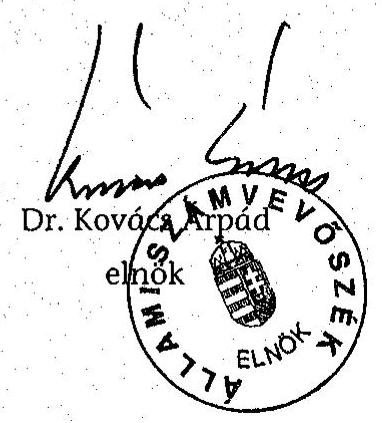
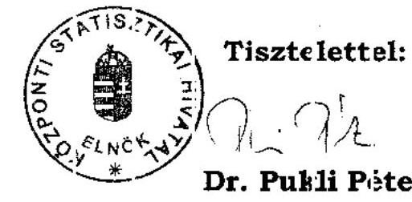
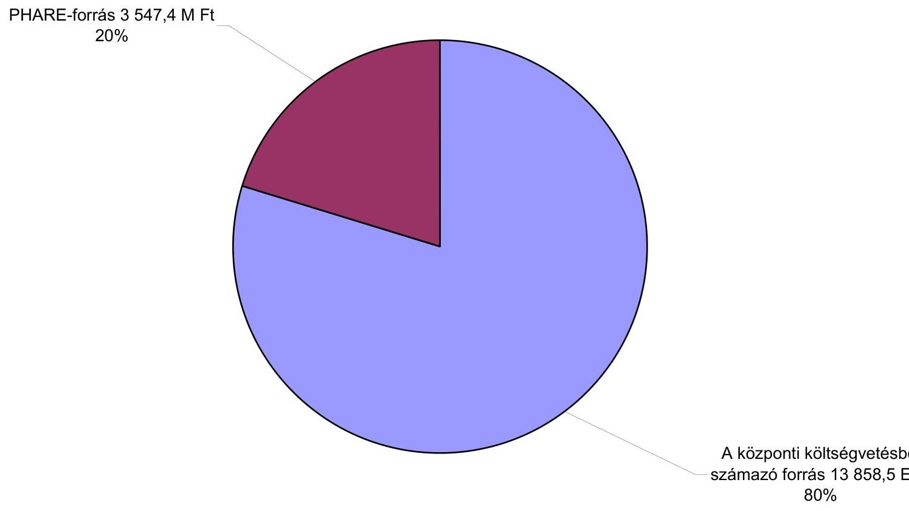
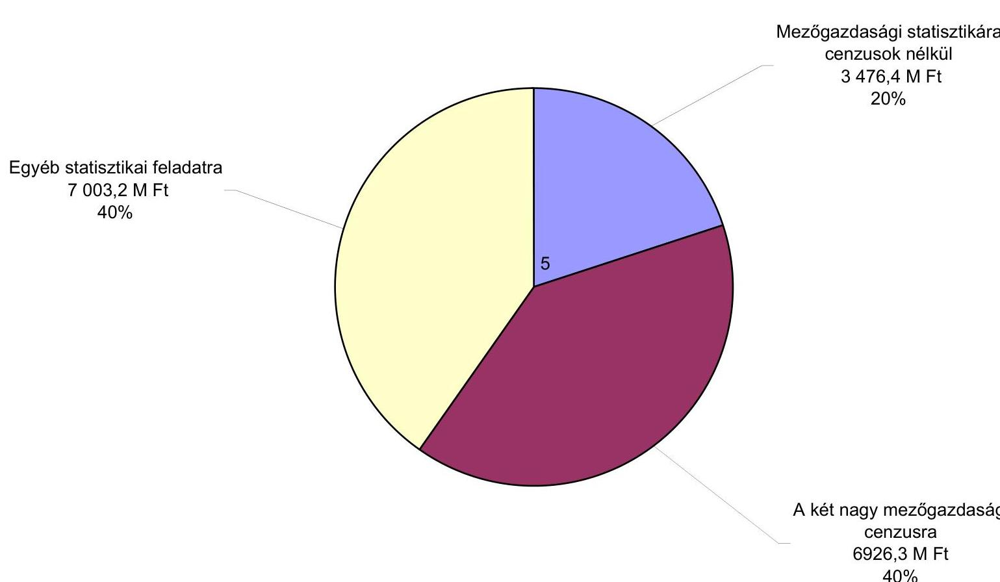
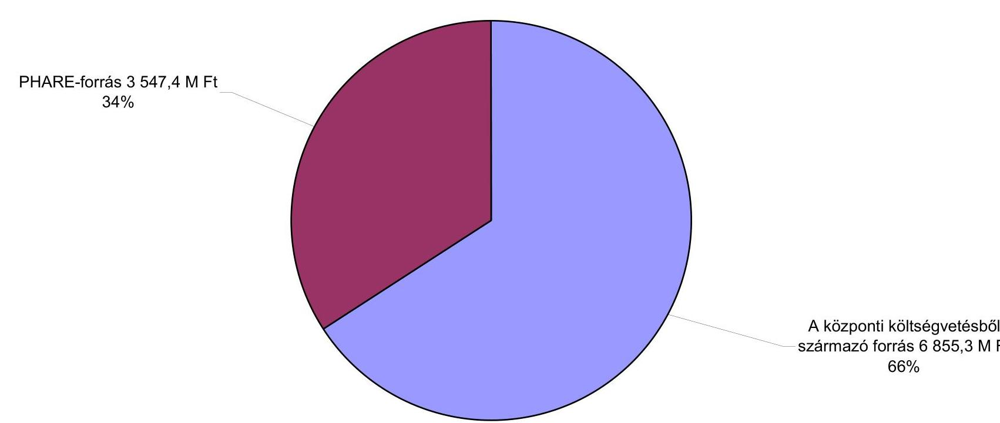

# JELENTÉS 

a "Statisztika" Nemzeti Programra fordított pénzeszközök hasznosulásának ellenőrzéséről

---

2. Államháztartás Központi Szintjét Ellenőrző Igazgatóság
2.3. Átfogó Ellenőrzési Főcsoport
Iktatószám: V-34-36/2004-2005.
Témaszám: 745 .
Vizsgálat-azonosító szám: V0152
Az ellenőrzést felügyelte:
Bihary Zsigmond
főigazgató
Az ellenőrzés végrehajtásáért felelős:
Hegedűsné dr. Müllern Veronika
főcsoportfőnök
Az ellenőrzést vezette:
dr. Horváth Margit
osztályvezető főtanácsos
Az ellenőrzést végezték:
dr. Bartos László Pál dr. Burján Margit Jakab Péter
számvevő
számvevő tanácsos, külső munkatárs
főtanácsadó
Krüzselyi Attila Lödiné Cser Zsuzsanna Szilas István
számvevő számvevő számvevő tanácsos
Vitányi István Vörös Katalin
külső munkatárs
külső munkatárs

# A témához kapcsolódó eddig készített számvevőszéki jelentések: címe 

sorszáma
Jelentés a Magyar Köztársaság (MK) 2001. évi költségvetése ..... 0232
végrehajtásának ellenőrzéséről
Jelentés az FVM fejezet múködésének ellenőrzéséről. ..... 0320
Jelentés az MK 2002. évi költségvetése végrehajtásának ..... 0329
ellenőrzéséről
Jelentés a KSH fejezet múködésének ellenőrzéséről ..... 0334
Jelentés az MK 2003. évi költségvetése végrehajtásának ..... 0443
ellenőrzéséről.

---

# TARTALOMJEGYZÉK 

BEVEZETÉS ..... 5
I. ÖSSZEGZŐ MEGÁLLAPÍTÁSOK, KÖVETKEZTETÉSEK, JAVASLATOK ..... 8
II. RÉSZLETES MEGÁLLAPÍTÁSOK ..... 15

1. A „Statisztika" Nemzeti Program meghatározása és végrehajtásának döntési mechanizmusa ..... 15
1.1. A statisztikára vonatkozó közösségi vívmányok átvé-telének feladatai ..... 15
1.2. A programmal elérni kívánt cél kritériumainak kialakítása, a prioritások meghatározásának célszerűsége ..... 16
1.3. A program kialakításának és végrehajtásának szabályozási és múködési környezete ..... 19
1.3.1. A statisztikai acquis feladatainak meghatározása ..... 19
1.3.2. Az előirányzatok felhasználásának szabályozottsága, szervezeti, döntési rendszere ..... 23
2. A programra fordított források hasznosulása ..... 29
2.1. A „Statisztika" Nemzeti Program forrásainak meghatározása, a felhasználások alakulása ..... 29
2.2. A statisztikai acquis átvételének végrehajtása ..... 38
2.2.1. A fejlesztési költségek és a múködési kiadások kapcsolata ..... 45
2.3. A feladatellátás informatikai hátterének kialakítása, az informatikai fejlesztések hatása ..... 47
2.4. Az együttmúködési, beszámoltatási és ellenőrzési rendszerek múködése ..... 49
3. A korábbi számvevőszéki vizsgálatok utóellenőrzése ..... 56
3.1. Az átfogó ellenőrzések vonatkozó megállapításainak és javaslatainak hasznosulása ..... 56
3.2. Az éves költségvetésekről és zárszámadásról szóló ÁSZ jelentések vonatkozó javaslatainak hasznosulása ..... 58
MELLÉKLETEK
1/a-b. számú Észrevételek
2. számú A "Statisztika" Nemzeti Program részletes vizsgálatba bevont feladatai
3. számú A vizsgálatba bevont feladatokra fordított pénzeszközök (1998-2004.)
4. számú A statisztikai acquis átvételére 1998-ban előirányzott források
5. számú A "Statisztika" Nemzeti Programra felhasznált források összetétele

---

6. számú A "Statisztika" Nemzeti Programra felhasznált források megoszlása kiemelt területek szerint
7. számú A "Statisztika" Nemzeti Program mezőgazdasági célú ráfordítása
8. számú A "Statisztika" Nemzeti Programra előirányzott források (a KSH fejezetnél)
9. számú Turizmussal kapcsolatos adatszolgáltatások az EU-ban
10. számú A Turizmus Szatellit Számlák helyzete az EU-ban

# FÜGGELÉKEK 

1. számú A KSH általános célú statisztikai informatikai rendszerei

---

# RÖVIDÍTÉSEK JEGYZÉKE 

| AKII | Agrárgazdasági Kutató és Informatikai Intézet |
| :--: | :--: |
| ANP | EU Közösségi Vívmányai (acquis communautaire) átvételének Nemzeti Programja |
| ÁESZ | Állami Erdészeti Szolgálat |
| ÁMÖ | Általános Mezőgazdasági Összeírás |
| ÁSZ | Állami Számvevőszék |
| BM | Belügyminisztérium |
| BTO | Belföldi Termékosztályozás |
| ECA | Európai Számvevőszék (European Court of Auditors) |
| ECOSTAT | KSH Gazdaságelemző és Informatikai Intézet |
| EIR | Erdészeti Információs Rendszer |
| ESA'95 | a nemzeti számlák európai rendszere (European System of Accounts) |
| ESZCSM | Egészségügyi, Szociális és Családügyi Minisztérium |
| ESZIR | Erdészeti Szakigazgatási Informatikai Rendszer |
| EU | Európai Unió |
| EUROSTAT | Európai Közösség Statisztikai Hivatala |
| FADN | az egyéni és társas mezőgazdasági vállalkozások gazdálkodásáról ökonómiai információkat biztosító tesztüzemi rendszer (Farm Accountancy Data Network) |
| FEOR | Foglalkozások Egységes Osztályozási Rendszere |
| FÖMI | Földmérési és Távérzékelési Intézet |
| FSS | az ÁMÖ-höz kapcsolódó, gazdaságszerkezeti összeírás (Farm Structural Survey) |
| GM | Gazdasági Minisztérium |
| GNI | Bruttó nemzeti jövedelem (Gross National Income) |
| GSZÖ | az ÁMÖ-höz kapcsolódó, gazdaságszerkezeti összeírás, angolul: Farm Structural Survey - FSS |
| GSZR | Gazdasági Szervezetek Regisztere |
| HICP | harmonizált fogyasztói árindex (Harmonised Index of Consumer Prices) |
| HM | Honvédelmi Minisztérium |
| IER | Integrált Igazgatási és Ellenőrzési Rendszer |
| IM | Igazságügyi Minisztérium |
| INTRASTAT | az EU-n belüli külkereskedelmi tevékenységet megfigyelő rendszer |
| KSH | Központi Statisztikai Hivatal |
| KTM | Környezetvédelmi és Területfejlesztési Minisztérium |
| KüM | Külügyminisztérium |
| KVM | Környezetvédelmi és Vízügyi Minisztérium |
| MNB | Magyar Nemzeti Bank |
| MVH | Mezőgazdasági és Vidékfejlesztési Hivatal |

---

| NACE | a gazdasági tevékenységek statisztikai osztályozásának rendszere az Európai Közösségekben (Nomenclature Générale des Activités Economiques dans les Communautés Européennes) |
| :--: | :--: |
| OSAP | Országos Adatgyűjtési Program |
| PHARE | EU támogatás Lengyelország és Magyarország gazdaságának átalakításához (Poland-Hungary Assistance for Restructuring the Economy) |
| PM | Pénzügyminisztérium |
| SZJ | Szolgáltatások Jegyzéke |
| SzMSz | Szervezeti és Múködési Szabályzat |
| TARIC | Európai Közösségek integrált vámtarifája (Tarif intégrédes des Communautés européens) |
| TEÁOR | Tevékenységek Egységes Osztályozási Rendszere |

---

# JELENTÉS 

## a „Statisztika" Nemzeti Programra fordított pénzeszközök hasznosulásának ellenőrzéséről

## BEVEZETÉS

Magyarország 2004. V. 1-je óta az Európai Unió (EU) tagja. A tagságra való felkészülés során - a statisztika területén - kettős követelmény fogalmazódott meg: egyrészt meg kellett teremteni a tagfelvételhez szükséges jogi környezetet, másrészt pontos és a tagállamokkal összehasonlítható képet kellett adni a magyar társadalom és gazdaság állapotáról, a változások irányairól.

A tagfelvételt közel másfél évtizedes előkészítő munka alapozta meg. Különböző szintű szakmai és politikai egyeztetések eredményeként formálódott az EU közösségi vívmányai átvételének Nemzeti Programja (ANP), amelynek egyik részterülete az EU követelményeivel harmonizáló statisztikai rendszer volt. A Kormány 1998-ban a Nemzeti Programot külön határozatban ${ }^{1}$ fogadta el. A „Statisztika" tárgyalási fejezetre vonatkozóan meghatározta ${ }^{2}$ a statisztikai rendszer EU-harmonizációs fejlesztését célzó és a kapcsolódó jogalkotási feladatokat, valamint az érvényesíteni kívánt prioritásokat, amelyek az uniós elvek és követelmények szerinti statisztikák 4 év alatti (1998-2001) kialakítását jelentették mintegy 12,5 Mrd Ft költségvetési forrás biztosításával.

A „Statisztika" tárgyalási fejezet feladatai 85\%-ának főfelelőse a Központi Statisztikai Hivatal (KSH) volt. Az agrárstatisztikai feladatokért való felelősséget megosztva viselte a KSH és a Földművelésügyi és Vidékfejlesztési Minisztérium (FVM).

Az ANP statisztikai feladatainak végrehajtása már 1998-ban megkezdődött, de a kormányhatározat pénzügyi ütemezésétől eltérően erre a célra nevesített költségvetési források - a KSH költségvetésében - csak 2000-től álltak rendelkezésre.

[^0]
[^0]:    ${ }^{1}$ A Magyarország és az Európai Unió közötti csatlakozási tárgyalások alapvető kérdéseiről, a tárgyaló delegáció kijelöléséről, az EU közösségi vívmányai (acquis communautaire) átvételének Nemzeti Programjáról, valamint a csatlakozásra való felkészülés gazdaságstratégiai hátteréről szóló 2084/1998. (IV. 8.) Korm. határozat.
    ${ }^{2}$ Az Európai Unióhoz történő csatlakozásra irányuló tárgyalásokkal, illetőleg a csatlakozásra való felkészüléssel összefüggő egyes további kérdésekről szóló 2211/1998. (IX. 30.) Korm. határozat függeléke.

---

A „Statisztika" Nemzeti Program végrehajtására a KSH és az FVM fejezetnél 1998-2004 között összesen 17,4 Mrd Ft-ot fordítottak ( $80 \%$-át a KSH-nál).

A Program megvalósulását, az EU követelményeinek kielégítését, a jogharmonizációval kapcsolatos tevékenységet a Kormány és az uniós intézmények folyamatosan nyomon követték. Az ANP eredményét összességében értékelő 2003. évi országjelentés nem állapított meg a statisztika terén jelentős problémákat, elmaradásokat.

Az ellenőrzés végrehajtására az Állami Számvevőszékről (ÁSZ) szóló 1989. évi XXXVIII. törvény 2. § (3), valamint 17. § (3) bekezdéseiben, továbbá az államháztartásról szóló 1992. évi XXXVIII. törvény 120/A. § (1) bekezdésében foglaltak adtak jogszabályi alapot.

Az ellenőrzés célja annak értékelése volt, hogy

- a jogszabályi környezet, az érintett fejezetek irányító, szabályozási tevékenysége, a kialakított szervezeti rendszer és a döntési mechanizmusok hatása miként érvényesült;
- a felhasznált források mértéke, rendszere biztosította-e a program szabályszerű, célszerű és eredményes végrehajtását;
- a fejezeteknél végzett korábbi ÁSZ ellenőrzések realizálására készített intézkedési terveknek az ellenőrzésünk témaköréhez kapcsolódó megállapításai, javaslatai mennyiben hasznosultak, hogyan járultak hozzá a feladatok megvalósításához.

Az ellenőrzés az 1998-tól az EU csatlakozásig terjedő időszakra irányult, az előtanulmány keretében kimunkált kérdéskörök és kritériumok figyelembevételével, felhasználva a csatlakozás Nemzeti Programjának végrehajtásáról szóló beszámolók, továbbá az uniós szakértők által végzett átvilágítások, értékelések tapasztalatait.

A „Statisztika" Nemzeti Programmal kapcsolatban megvizsgáltuk a program meghatározásának és végrehajtásának döntési mechanizmusait, a statisztikai közösségi vívmányok átvételének feladatait, az elérendő célok kritériumrendszerét, a Program kialakításának és végrehajtásának szabályozási és múködési környezetét, a Programra fordított források hasznosulását.

Az ellenőrzést a teljesítmény-ellenőrzés módszerével végeztük a kérdésekhez rendelt kritériumok teljesítésének elemzésével. A részletes ellenőrzésre kiválasztott feladatok (2. sz. melléklet) ráfordítása összesen 12,9 Mrd Ft volt, a Program teljes kiadásainak $3 / 4$-e (3. sz. melléklet). Ezen belül a KSH-nál a felelősségébe tartozó feladatok végrehajtására felhasznált költségek $68 \%$-át vontuk be a vizsgálatunkba. Az ellenőrzés az FVM-nél az összes feladatra és azok ráfordítására terjedt ki.

A részletes vizsgálatba bevont feladatok között szerepeltek a Kormány, illetve a KSH által prioritásként megjelölt feladatok, ezen belül egyes feladatcsoportok (statisztikai infrastruktúra kialakítása, külkereskedelmi statisztika, mezőgazdasági statisztika) teljes körűen. A kiválasztott feladatok között egyaránt megta-

---

lálhatóak a relatíve homogén, kis forrásigényú és az önmagukban is komplex, milliárd forintos nagyságrendű, továbbá a projektként, illetve a hagyományos hivatali rendben megvalósított területek. A kiválasztásnál további szempontként érvényesítettük, hogy a mintában szereplő feladatok megvalósításának eredményessége a helyszíni ellenőrzés időszakában megfelelően értékelhető legyen. Ezért egyes, így például a makro- és pénzügystatisztikához tartozó feladatok végrehajtását - jelentőségük ellenére - csak a rendszer elemeként érintettük.

A Program végrehajtását elsősorban eredményességi szempontok szerint értékeltük. Az eredményesség kritériuma az volt, hogy a statisztikára vonatkozó közösségi vívmányok átvétele ne legyen akadálya Magyarország EU-hoz való csatlakozásának. A végrehajtásban részt vevő szervezeteknél a feladatok és források egyértelmú egymáshoz rendelését biztosító nyilvántartások hiánya nem tette lehetővé az egyes feladatok, illetve a Program egészének gazdaságosságiés hatékonysági szempontok szerinti minősítését.

A jelentés tervezetét egyeztettük a KSH elnökével és a földművelésügyi és vidékfejlesztési miniszterrel. Az érintettek részéről észrevétel nem merült fel. A levelek másolatát az 1/a-b. sz. melléklet tartalmazza.

---

# I. ÖSSZEGZŐ MEGÁLLAPÍTÁSOK, KÖVETKEZTETÉSEK, JAVASLATOK 

Az Európai Unióhoz (EU) való csatlakozás feltétele volt az Európa Tanács által a koppenhágai kritériumokban (1993. június) előírt közösségi vívmányok ${ }^{3}$ adaptálása. A Kormány felhatalmazása alapján a magyar küldöttség 1998ban az EU-hoz való csatlakozást előkészítő tárgyalások során a statisztikára vonatkozó közösségi vívmányokat (statisztikai acquis) átmeneti intézkedések igénylése nélkül fogadta el.

A közösségi vívmányok átvételére ugyanebben az évben a Kormány határozatban, a Nemzeti Program (ANP) keretében, 40 fejezetre tagolva rögzítette a szükséges intézkedéseket. Ebben a statisztika területére a Központi Statisztikai Hivatal (KSH), a Földművelésügyi és Vidékfejlesztési Minisztérium (FVM), a Pénzügyminisztérium, illetve a Magyar Nemzeti Bank (MNB) főfelelősségébe tartozó jogharmonizációs, intézményfejlesztési és beruházási feladatokat jelölt meg. A Kormány a feladatok felét (a források $88 \%$-át) prioritásként is kiemelte, a súlypontképző, orientáló szerepük nem érvényesülhetett. Kimaradtak viszont az EU statisztikai fejlesztési programjának fontos múködési elvei, így a statisztikai tevékenység szervezésére, hatékonyságának növelésére, a statisztikai adatok előállításának teljes folyamatára, illetve a szervezet egészére kiterjedő minőségbiztosításra vonatkozó elvárások ${ }^{4}$, továbbá a közösség saját forrásaira vonatkozó kötelezettségek megállapításával ${ }^{5}$ kapcsolatos intézkedések.

A Kormány a statisztikai acquis átvételénél egyetlen célként határozta meg, hogy az átvétel ne legyen akadálya Magyarország uniós csatlakozásának ${ }^{6}$. Ezen túlmenően nem került sor számonkérhető és mérhető kritériumokkal megalapozott célok kijelölésére. Ezek hiányában a végrehajtásában részt vevő felelős szervezetek és az EU statisztikai szervezete, az EUROSTAT szakmai együttműködése, illetve a források tekintetében a PM-mel folytatott költségveté-

[^0]
[^0]:    ${ }^{3}$ A teljes (francia) kifejezés - acquis communautaire - esetenként rövidítve használatos (acquis), vagy valamelyik területre vonatkozóan jelzőként: például mezőgazdasági acquis, statisztikai acquis stb.
    ${ }^{4}$ A KSH 2004-től kidolgozta - és folyamatosan fejleszti - az új középtávú, 2008-ig szóló stratégiáját. A stratégiai főirányok között már ezek a témák is szerepelnek.
    ${ }^{5}$ Közvetlenül a csatlakozás előtt került kiadásra az EU saját forrásaival kapcsolatos kötelezettségek teljesítésében részt vevő intézmények feladat- és hatásköréről, valamint a kapcsolódó eljárásrendről szóló 84/2004. (IV. 19.) Korm. rendelet.
    ${ }^{6}$ A statisztikai acquis a közösségi vívmányok átvétele egészének költségeit tekintve nem volt jelentős. A „Statisztika" fejezet feladatai megvalósítására a Kormány a közösségi vívmányok átvételére tervezett erőforrások kevesebb, mint 5\%-át (12,5 Mrd Ft) irányozta elő.

---

si egyeztetések keretében formálódtak a megvalósítható célok, azok tartalmának és teljesítésének minősítése.

Az ANP-ben a statisztikai acquis megjelenítése nem volt következetes. Ez megnehezítette a költségvetési előirányzatok feladatokhoz rendelését és a beszámolás rendjét, a feladatok és a források áttekinthetőségét, tartalmát. Az ANP „Statisztika" fejezetén kívül más területekre vonatkozó tárgyalási fejezetekben (oktatás, közbeszerzések, energetika) is szerepeltek statisztikai feladatok.

Az ANP „Statisztika" fejezete csak a KSH főfelelősségébe tartozó feladatok részletes szakmai ismertetését tartalmazta. Az FVM feladatai az agrárgazdaság fejezetben szerepeltek. A szakmai tartalom ismertetésének hiánya nehezítette egyes feladatok végrehajtásának ellenőrzését, így különösen a makro- és pénzügystatisztika területét érintő, fontos, komplex, még a tagállamokban is újnak számító, az érintett szervezetek (KSH, MNB, PM) szoros együttmúködését, a vonatkozó uniós szabályozás egységes értelmezését megkövetelő tevékenységek esetében.

A statisztikai acquis átvételének feladatai a vizsgálatunkba vont két fejezetet (KSH, FVM) eltérő mértékben érintették, a különbség megjelent a feladatok meghatározásának, a források biztosításának, nyilvántartásának, elszámolásának rendjében, a döntési mechanizmusok kialakításában.

A statisztikai acquis feladatai a KSH alapfeladataihoz jobban illeszkedtek, a szervezet kialakítása, a működés rendje, a felhalmozott szakértelem jelentősen megkönnyítette azok végrehajtását. A feladatok végrehajtásának szakmai komplexitása a KSH feladatrendszerének, tevékenységének egészére kihatott, teljes múködését befolyásolta.

Az uniós követelmények miatti munkateher a KSH a szakmai főosztályainál jelentett erőteljes növekedést, a KSH Központ létszáma 23\%-kal, szervezeti egységeinek száma 16 -ról 28 -ra növekedett. Az ANP-ben meghatározott statisztikai feladatok megvalósítására a KSH-nál célszerú döntési mechanizmust alakítottak ki. A feladatokat lebontották, az azokhoz rendelt pénzügyi keretekkel az illetékes szakmai főosztályok gazdálkodtak a felügyelő elnökhelyettes jóváhagyásával, 8-15\%-os tartalékképzés mellett. A feladatok és a hozzájuk rendelt források ilyen jellegú elkülönített kezelése az ANP befejezésével, 2004 után megszűnt. Ugyanakkor továbbra is jelentkeznek olyan jogszabályokban előírt, kiemelt feladatok, amelyek ennek a szabályozásnak a fenntartását indokolják. A megvalósítás projektszerúen történt az összetettebb, bonyolultabb feladatoknál (Háztartási Költségvetési Felvétel, Állóeszköz-projekt, integrált adatgyűjtési rendszer, Adattárház).

A statisztikai acquis átvételével kapcsolatban a KSH-ban 2000-2003 között több mint ötezer megbízási szerződést kötöttek, a közterhekkel együtt 663 M Ft összegben. A szerződések csaknem felét saját dolgozóval létesítették, egy-egy munkavállalóval több szerződést is. A belső megbízási szerződések általában a megbízottak által köztisztviselőként is végzett, magas szakmai hozzáértést, specializált ismereteket igénylő területekre vonatkoztak. Az összeírásokhoz kapcsolódó tevékenységek kivételével a munkaköri leírásokból nem volt megállapítható egyértelmúen, hogy az elvégzett konkrét (rész)feladat beletartozott-e a megbízott munkakörébe. Az intenzívebb és/vagy a munkaidőn túli igénybevé-

---

tel elismerésénél elsősorban nem a jutalmazást választották, ehelyett a belső megbízási szerződések tömeges alkalmazásával éltek.

A statisztikai acquis feladatai az FVM általános feladatrendszere, illetve a mezőgazdaságra és vidékfejlesztésre vonatkozó közösségi vívmányok átvétele, az ennek kapcsán szükséges intézmények kiépítése szempontjából csekély súlyt képviseltek ${ }^{7}$, végrehajtásuk során kisebb figyelmet fordítottak a feladatok és források dokumentált, jól nyomon követhető ellenőrzését biztosító szabályozás, nyilvántartás kialakítására. Az FVM-nél az intézményekhez telepítették a statisztikai acquis feladatainak ellátását a statisztikai szakmai irányításhoz szükséges szabályozási háttér kialakítása nélkül, ami koordinációs, illetve nyilvántartási problémákhoz vezetett. Emiatt az agrárgazdasági feladatokon belül a statisztikai feladatok nem különültek el megfelelő mértékben. Hátrányosan érintette a statisztikai feladatok ellátását a vonatkozó felelősségi rend tisztázatlansága, és a megfelelő szakmai felelősök hiánya.

A statisztikai acquis feladatainak megvalósításában a KSH, mint főfelelős közel 30 szervezettel alakított ki együttmüködést, amelynek feltételeit különösen 2001 után a KSH kezdeményezésére szerződésekben rögzítették. Esetenként az érintett szervezet indokolatlan késedelme, a kormányzati koordináció gyengesége miatt fontos szerződéseket a csatlakozásig megvalósítható végrehajtás utolsó fázisában kötötték meg (például a külkereskedelmi statisztika átvétele a Gazdasági Minisztériumtól 2002-ben).

A statisztikai feladatok az uniós elvárásoknak megfelelő teljesítéséről a beszámoltatás szintenként eltérő követelményrendszerek szerint jelent meg. Az ANP adott évi végrehajtásáról szóló beszámolókat a Külügyminisztérium fogta össze, előírta a beszámoló formátumát, az értékelés szempontjait, de abból érdemi kérdések (például a létszámfejlesztés) maradtak ki. A KSH a főfelelősségi feladataihoz kapcsolódóan szigorúan megkövetelte mind a szakmai, mind a pénzügyi teljesítésről szóló számadást a Hivatalon belül, egyúttal rendszeresen beszámolt a szakmai felügyeletet gyakorló EUROSTAT-nak.

A Kormány 1998-99-ben határozataiban a statisztikai acquis átvételének feladataihoz (1998. évi árszinten) több mint 12 Mrd Ft költségvetési forrást hagyott jóvá négy évre ütemezve. Ettől eltérően az ANP-kben 1999-től csak a KSH fejezethez rendeltek az uniós statisztikai feladatok végrehajtásához költségvetési eszközöket, az FVM fejezetnél pedig azok az agrárgazdaságra vonatkozó közösségi vívmányok átvétele költségeinek részeként, nem teljes körűen elkülönítve jelentkeztek. Az ANP-ben biztosított források nem voltak elégségesek ${ }^{8}$. A statisztikai acquis átvételét nemcsak fejezeti kezelésú előirányzatok biztosították, az érintett fejezetek (KSH, FVM) a saját működési költségvetésük terhére is eszközöltek ráfordításokat, amelyek nagyságrendje, főleg nyilvántartási problémák miatt nem volt teljes körűen azonosítható. Az ANP kapcsán nem volt előírás a közösségi vívmányok átvétele érdekében felhasznált források egy-

[^0]
[^0]:    ${ }^{7}$ A fejezet 1999-2004 közötti összes kiadásából (1185,7 Mrd Ft) a statisztikai acquis átvételének költségei kevesebb, mint fél százalékot jelentettek.
    ${ }^{8}$ Ez különösen a KSH fejezetnél jelentkezett a 2002 utáni időszakban.

---

értelmű nevesítése a fejezeti költségvetésekben, az ANP-kben meghatározott források és a fejezeti költségvetésekben nevesített előirányzatok között nem volt összhang.

A két fejezet a statisztikai acquis átvételére összesen 17,4 Mrd Ft-ot fordított, amelynek ötöde PHARE segély ${ }^{9}$ volt. A KSH fejezetnél a statisztikai acquis átvételének feladataira 1998-2005 ${ }^{10}$ között 14,1 Mrd Ft került felhasználásra. A KSH PHARE-projektjeinél - a Hivatalon kívüli okok miatt - az eredeti ütemezés és indítás, valamint a megvalósítás elszakadása miatt nem voltak összhangban az előirányzatok és a teljesítések. Az FVM fejezetnél a feladatok végrehajtására kimutatott 6,6 Mrd Ft felének, a távérzékeléssel ${ }^{11}$ összefüggő kiadásoknak a statisztikai acquis átvételéhez való kapcsolódása nem volt egyértelmú.

Az ANP „Statisztika" fejezetében a mezőgazdasághoz kapcsolódó területek feladatai és forrásai meghatározóak voltak. Az agrárstatisztikával kapcsolatos feladatokra az összes igénybevett forrás mintegy 60\%-át (10,4 Mrd Ft) fordították, ennek harmadát fedezték PHARE-segélyek. Az agrárstatisztikára fordított kiadások kétharmadát tette ki a két cenzus (általános mezőgazdasági összeírás, illetve a szőlő- és gyümölcsös ültetvények összeírása) részesedése.

A két fejezetnél a statisztikai acquis átvételére fordított költségek - folyó árakon - nagyságrendileg megegyeztek a Kormány által 1998-ban meghatározott ráfordítási szükséglettel. Ugyanakkor nagymértékben eltér az egyes feladatokkal kapcsolatos kiadások megoszlása. A távérzékelés jelentősen, mintegy 1 Mrd Ft-tal kisebb kiadása miatt az FVM főfelelősségébe tartozó feladatok 3 százalékponttal kisebb arányban részesedtek a forrásokból. A KSH-hoz tartozó feladatoknál a két mezőgazdasági összeírásra a kiadások alultervezése miatt a teljesítés alapján a részesedésük 40\%-kal magasabb lett, ezáltal a többi feladat végrehajtását szolgáló költségek aránya is csökkent és megvalósításuk reálértékben az 1998-ban tervezetthez képest kisebb ráfordítással történt.

Magyarország csatlakozására az ANP indulásakor kitűzött 2002. I. 1-jei időponthoz képest 28, a 2000-ben célul tűzött 2003. I. 1-jéhez képest 16 hónappal később került sor. A csatlakozás későbbi időpontja megnövelte a felkészülésre fordítható időt, az időközben megjelenő új követelmények, jogszabályok vi-

[^0]
[^0]:    ${ }^{9}$ Ebben nem szerepel az a két 1998-2000 közötti PHARE-program, amely nem jelent meg a KSH fejezet költségvetésében.
    ${ }^{10}$ Az ANP-ben nevesített általános mezőgazdasági összeíráshoz kapcsolódó feladatok ellátását szolgáló PHARE-segély pénzügyi teljesítése áthúzódott 2005-re.
    ${ }^{11}$ A távérzékelés műholdas rendszerek, légi-fényképezés felhasználásával végzett tevékenység, amely statisztikai alkalmazása lehetővé teszi például a növényzetesítésre (ezen belül az erdősültség, egyes haszonnövények vetésterülete) vonatkozó adatok ellenőrzését, a statisztikai adatfelvételek tervezését, végrehajtását. Ezen kívül az uniós terület-alapú támogatások ellenőrzése a távérzékelésre és a megyei földhivatalok kataszteri adataira támaszkodik. A katasztert és az ingatlan-nyilvántartásokat a távérzékelési adatokat felhasználva hangolják össze.

---

szont egyes területeken (például a statisztikai nómenklatúrák adaptálása) többletfeladattal jártak.

A statisztikai acquis átvételével Magyarország eleget tett a koppenhágai kritériumoknak, a végrehajtásra kijelölt, vizsgált fejezetek teljesítették a Kormány vonatkozó előírásait. A statisztikai rendszer, az azt múködtető szervezetek által előállított adatok hozzájárultak hazánk részesedési lehetőségéhez az uniós támogatási forrásokból, illetve a közösségi befizetési kötelezettségei meghatározásához.

Magyarország a jogharmonizációs kötelezettségeknek - alapvetően a statisztikáról szóló törvény módosításaival - eleget tett. A közigazgatási nyilvántartási adatok statisztikai célú felhasználásainak teljes körűvé tétele ugyanakkor csak részben valósult meg. Elsősorban a személyi adatokat tartalmazó adatállományok elemi szintű átvétele esetében okoz nehézséget, hogy az adatok kezelőire vonatkozó törvények szükséges módosítása csak részben történt meg, ezért az érintett szervek egy része (Országos Egészségbiztosítási Pénztár, Nyugdíjfolyósító Intézet, Állami Foglalkoztatási Szolgálat) nem adhatja át az adatokat a KSH-nak, ezért ezeket többlet költségekkel járó gyűjtéssel kell előállítani.

A hivatalos statisztikai szolgálathoz tartozó azon szervezetek esetében, amelyek átadhatják az adataikat a KSH-nak, továbbra is probléma, hogy nem valósult meg a statisztikai, illetve az adminisztratív célú adatgyűjtés és felhasználás szervezeti elkülönítése. A statisztika függetlenségének uniós értelmezése szabályozási szinten megköveteli annak intézményes biztosítását, hogy az adminisztratív adatbázisok hasznosíthatóak legyenek statisztikai célra, de a statisztikai célból gyűjtött egyedi, személyes adatokat közigazgatási célból ne lehessen felhasználni.

A statisztikai acquis átvétele kapcsán sem kormányzati, sem a végrehajtásban résztvevő egyéb szervezetek szintjén nem fogalmaztak meg hatékonysági követelményeket. Egyes feladatok végrehajtásánál azonban a szakmailag indokolt megoldások hozadéka költségmegtakarítás is volt. A szőlő-és gyümölcsültetvények összevont összeírásának ${ }^{12}$ előkészítésénél $14 \%$-os, a végrehajtásnál $24 \%$-os, a feldolgozásnál $26 \%$-os, összességében $19 \%$-os ( 367 M Ft ) megtakarítás volt számszerűsithető.

A KSH ANP-hez tartozó informatika rendszereinek kialakítása, fejlesztése, irányítása a feladatok belső összefüggései, illetve a technikailag is indokolt költség-hatékony megoldások miatt a KSH egyéb informatikai rendszereinek részeként valósult meg. A vizsgált időszakban a teljes informatikai beruházások $27 \%$-át az ANP forrásai biztosították, ezeknek közel felét PHARE-segélyek fedezték. A két ellenőrzött fejezetnél a vizsgált rendszerek megfelelnek a magyar és EU jogszabályi követelményekből rájuk háruló feladatoknak. Megvalósítják a létrehozásukkor kitűzött célokat, működtetésük eredményesen szolgálja és támogatja a rendszerek felhasználóit.

[^0]
[^0]:    ${ }^{12}$ Európában, illetve korábban Magyarországon is két külön összeírással valósították meg a felvételt.

---

Sem a Kormány, sem az érintett főfelelősök nem készítettek olyan számvetést, amely kimutatta volna a csatlakozásra való felkészülés, ezen belül az ANP költségeit, az ehhez biztosított uniós források nagyságát, a csatlakozás időpontja változásának hatását, az eredményeket, a tapasztalt, a megoldott és a fennmaradó problémákat.

Az ÁSZ korábbi, a KSH és az FVM fejezet 1998-2002 közötti időszakot átfogó ellenőrzéseinek megállapításai, javaslatai alapján mindkét fejezetnél intézkedési terv készült. Az intézkedési terveknek a jelen ellenőrzésünk tárgyával összefüggő pontjait az ellenőrzés időpontjáig teljes körűen egyik fejezetnél sem hajtották végre. A KSH-nál nem valósult meg a szervezeti egységek, intézmények egységes értékelési szempontrendszerének, a minősítés kritériumainak kidolgozása ${ }^{13}$, nem készültek el határidőre az éves munkatervek megalapozásához szükséges középtávú tervek. Az informatika terén elrendelt intézkedések részben teljesültek, nem került kiadásra informatikai stratégia ${ }^{14}$. Az FVM-nél a fejezeti kezelésű előirányzatok teljesítményszemléletű értékelési rendszerének kidolgozása nem történt meg.

Az éves költségvetésekről és a zárszámadásokról szóló ÁSZ jelentésekben tett, a jelen ellenőrzésünk témájával összefüggő javaslatok részben hasznosultak. A fejezeti kezelésű előirányzatokkal kapcsolatban javasolt szabályozási feladatot nem teljes körűen hajtották végre. A KSH-nál hiányzott az utasításokból az előirányzatok felosztására objektív mutatók meghatározása, az FVMnél mind a szabályozás, mind a támogatások nyilvántartása tekintetében voltak hiányosságok.

A Magyar Köztársaság 2003. évi költségvetése végrehajtásának ellenőrzéséről készült ÁSZ jelentésben az FVM-nek a PHARE támogatásokkal kapcsolatos elszámolási, pénzügyi feladatok ellátására javasolt intézkedés, a szabályozás felülvizsgálata az EU-csatlakozás jogharmonizációja keretében megtörtént.

[^0]
[^0]:    ${ }^{13}$ Ellenőrzésünk idején folyamatban volt a KSH új stratégiájában meghatározott fő irányokhoz rendelt, azok megvalósulásának mérését, értékelését biztosító stratégiai muta-tószám-rendszer (Board Score Card - BSC) kialakítása.
    ${ }^{14}$ A KSH 2004-ben elkészült intézményi stratégiájában van informatikával foglakozó fejezet, és az ebben foglalt célkitűzések közül egyesekhez részletesebb önálló fejlesztési koncepció készült. A dokumentum tartalmaz informatikai fejlesztési irányelveket, de önmagában nem tekinthető az Informatikai Stratégiát kiváltó dokumentumnak.

---

Az ellenőrzés megállapításainak hasznosítása mellett javasoljuk:

# a Kormánynak 

1. intézkedjen a közigazgatási adatbázisok statisztikai célú felhasználásának teljes körűvé tételéhez szükséges törvények módosításának előkészítéséről;
2. teremtse meg a szabályozási háttér kialakításának lehetőségét arra, hogy a statisztikai célból gyújtött egyedi, személyes adatokat közigazgatási célból ne lehessen felhasználni;

## a földművelési és vidékfejlesztési miniszternek és a KSH elnökének

alakítson ki, illetve múködtessen a kiemelt, jogszabályokban elrendelt statisztikai feladatok költségvetési előirányzatai megalapozott tervezését és célszerű felhasználását biztosító nyilvántartási rendszert;

## a földmúvelési és vidékfejlesztési miniszternek

alakítsa ki az agrárstatisztikának az Unión belüli kiemelt jelentőségére is tekintettel a statisztikai feladatok ellátásának egyértelmú felelősségi rendjét.

---

# II. RÉSZLETES MEGÁLLAPÍTÁSOK 

## 1. A „Statisztika" Nemzeti Program meghatározása és VÉGREHAJTÁSÁNAK DÖNTÉSI MECHANIZMUSA

### 1.1. A statisztikára vonatkozó közösségi vívmányok átvételének feladatai

Az Európai Unióhoz (EU) csatlakozni kívánó országok számára az Európa Tanács a koppenhágai kritériumokban (1993. júniusi) követelményként határozta meg a közösségi vívmányok (acquis communautaire) adaptálását és alkalmazását, benne a statisztikára vonatkozó közösségi vívmányok (statisztikai acquis) átvételének kötelezettségét is.

A közösségi vívmányok az Európai Közösségeket ${ }^{15}$ alapító szerződésekben megfogalmazott alapelvek, célok, feladatok megvalósulását elősegítő jogi eszközökön kívül tartalmazzák az EU, annak normaalkotó szervezetei köztük a statisztikáért felelős EUROSTAT által a tagállamok számára előírt követelményeket ${ }^{16}$, amelyek formailag ajánlásoként, szakmai megállapodásokként (gentleman's agreement) jelennek meg. Szerepük az EU által korábban is fontosnak tartott területeken is jelentős, így például a mezőgazdasági adatszolgáltatási kötelezettség csaknem $40 \%$-ban megállapodásokon alapult.

A statisztikára vonatkozó közösségi vívmányokat tartalmazó EU dokumentum „A" listája 1998. III. 1-jei eszmei időpontnak megfelelően 170 különböző szintű jogforrást nevesített, míg a 75 tételből álló „B" listája alapvetően ajánlásokat, állásfoglalásokat, szerződéseket tartalmazott. A csatlakozó országoknak a joganyagok harmonizáltságára vonatkozóan nyilatkozniuk kellett.

A tagolás nem volt következetes: a „B" lista is tartalmazott 10 jogszabályt, továbbá meglévő jogszabályok maradtak ki mindkét listából (például a „túl nagy költségvetési hiány és adósság esetén alkalmazandó eljárás"17 szabályaira vonatkozó Commission Decision 98/501).

Az Európai Integrációs Tárcaközi Bizottság a magyar statisztikai rendszert jelentős mértékben harmonizáltnak minősítette. A csatlakozás 1998-ban kitűzött

[^0]
[^0]:    ${ }^{15}$ Európai Szén- és Acélközösség (Montánunió), Európai (Gazdasági) Közösség és az Euratom.
    ${ }^{16}$ Az EUROSTAT részére nemcsak a tagállamok, illetve a tagjelöltek (a 15 régi tagállam és a tagságot 2004-ben elnyert 10 országon kívül Bulgária és Románia) szolgáltatnak adatokat, vesznek részt munkájában, hanem Izland és Norvégia is.
    ${ }^{17}$ Excessive Deficit Procedure - EDP.

---

2002. I. 1-jei időpontjáig álláspontja szerint megvalósítható volt a statisztikára vonatkozó közösségi vívmányok derogációk nélküli átvétele.

Az Európai Integrációs Tárcaközi Bizottság illetékes munkacsoportjának (amelyben a hivatalos statisztikai szolgálathoz tartozó legfontosabb szervezetek ${ }^{18}$ szakértői vettek részt) ülése után a KSH elnöke, az igazságügyminiszter, a pénzügyminiszter és a KüM Integrációs Államtitkárságának vezetője együttes előterjesztést készített a Kormány részére.

Az „A" listában megnevezett 170 jogszabályból 28 olyan volt, amelyeknél a magyar gyakorlat már megfelelt a közösségi vívmányok követelményeinek, így további intézkedést nem igényeltek. 106 jogszabály átvétele már megkezdődött, de teljes körű alkalmazásuk még jogközelítési és intézményfejlesztési intézkedést tett szükségessé. 30 olyan jogszabály volt, amelyeknek a tagság elnyeréséig nem volt hatása a hazai statisztikai gyakorlatra, a csatlakozás után azonban kötelező érvényűek, ezért el kellett kezdeni az átvételre való felkészülést. A maradék 6 jogszabály Magyarország esetében nem volt releváns (tengeri halászatra, olivatermesztésre vonatkoztak).

A közösségi joganyag statisztika fejezetével kapcsolatosan a Kormány 1998. VII. 15-ei döntése, egyben felhatalmazása alapján a magyar küldöttség az átvilágításáról szóló tárgyalásokon a vonatkozó közösségi vívmányokat átmeneti intézkedések nélkül elfogadta.

Az ágazati statisztikánál a többéves mutatók előállításánál a jogszabályok átmeneti időt engedélyeztek. Ezzel Magyarország is élt. Egyes adatok gyűjtése megkezdődött, de bizonyos előírások teljesítése csak 2005-ben teljesült, például a szakosodott egység szintű ipari és építőipari adatsoroknál.

A 12. „Statisztika" fejezet lezárására 1999 közepén került sor azt követően, hogy az EUROSTAT a magyar statisztikai rendszer egészét átvilágította, meggyőződött Magyarország önértékelésének és a statisztikai acquis átvételével kapcsolatos vállalásainak megalapozottságáról.

# 1.2. A programmal elérni kívánt cél kritériumainak kialakítása, a prioritások meghatározásának célszerúsége 

Az EU 1998-2002. évekre vonatkozó statisztikai fejlesztési programjában a működés elvei sorában megnevezte a hatékonyság mérését a hatékonyabb irányítás és igazgatás (prioritások, tervezhetőség, koordináció) növelésének követelménye mellett. Nevesítette továbbá a prioritásnak tekintett területeket, így a szolgáltatási szektorra vonatkozó statisztikák, a környezetstatisztika és a társadalomstatisztika, valamint a makrogazdasági statisztikák

[^0]
[^0]:    ${ }^{18}$ A Központi Statisztikai Hivatal (KSH), a Belügyminisztérium, Földművelésügyi Minisztérium, az Ipari, Kereskedelmi és Idegenforgalmi Minisztérium, az Igazságügyi Minisztérium (IM), a Közlekedési, Hírközlési és Vízügyi Minisztérium, a Külügyminisztérium (KüM), a Művelődésügyi Minisztérium, a Környezetvédelmi és területfejlesztési Minisztérium (KTM), a Magyar Nemzeti Bank (MNB), valamint a Pénzügyminisztérium (PM).

---

(ezen belül a konvergencia-kritériumokkal ${ }^{19}$ kapcsolatos adatok) fejlesztését. Fontos célként emelték ki a nemzeti statisztikai hivatalok módszertani vezető szerepének erősítését is.

A statisztikai acquis átvételével kapcsolatban a 2211/1998. (IX. 30.) Korm. határozat megjelölte a prioritásokat és az azokhoz rendelt forrásokat is négy éves ütemezéssel.

A Kormány által meghatározott prioritások között az EU statisztikai fejlesztési programjának múködési elvei csak részben jelentek meg. Teljesen hiányoztak a statisztikai tevékenység szervezésére, hatékonyságának növelésére vonatkozó elvárások. A prioritások széles kört foglaltak magukban, mivel a 35 feladat felét nevesítették, amelyek a kormányhatározatban becsült teljes forrás $88 \%$-át tették ki, ezen belül a mezőgazdasági statisztika feladatai $71 \%$-ot képeztek. A megnevezett prioritások közül az agrárstatisztika az FVM felelősségébe is tartozott, ahol azonban az agrárgazdaságra vonatkozó közösségi vívmányok átvételének feladatain belül már jelentéktelen (kevesebb, mint fél százalék) volt a mezőgazdasági statisztikai feladatok kiadásainak aránya és nem számított kiemelt területnek.

A kormányhatározatban megnevezett prioritások: az integrált megfigyelési rendszer, a konvergencia kritériumok méréséhez kapcsolódóan a makrogazdasági statisztika továbbfejlesztése, a mezőgazdasági statisztika átfogó reformja és továbbfejlesztése, továbbá az ágazat számviteli információs rendszerének országos hálózata, a külkereskedelmi statisztika minőségének javítása és az INTRASTAT rendszer bevezetésére való felkészülés, a vándorlásstatisztika fejlesztése, a gazdasági szervezetek regiszterének továbbfejlesztése, a regionális statisztika továbbfejlesztése és a térinformatikai alapú adatszolgáltatás EU-kompatibilis rendszerkapcsolásának kiépítése, a közigazgatási nyilvántartási adatok statisztikai célú felhasználásának teljes körűvé tétele.

A KSH a 2000. X. 30-án hozták nyilvánosságra hozott, 2005/2006-ig tartó időszakra szóló középtávú fejlesztési stratégiájában a kormányhatározatnál bővebben vázolta fel a prioritásokat. A feladatok szélesebb skálája miatt nem érvényesült a prioritások súlypontképző, orientáló szerepe a forrásallokációban és a végrehajtásban, ezzel fogalmilag értelmezhetetlenné vált a prioritás jelentése.

A stratégiában - részben az EU-csatlakozás, részben hazai statisztika belső integrálódása támasztotta követelményként - a Kormány által meghatározott felada-

[^0]
[^0]:    ${ }^{19}$ Az európai integrációt magasabb szintre emelő, a három „pilléren" (pénzügyi-, majd gazdasági unió, közös kül- és biztonságpolitika, bel- és igazságügyi együttmúködés) nyugvó Európai Uniót létrehozó, 1993. XI. 1-jén életbe lépett maastrichti szerződés meghatározta a gazdasági- és pénzügyi unióhoz (Economic and Monetary Union EMU), illetve a közös pénz övezetéhez való csatlakozás feltételeit. Ez gyakorlatilag a legjobb monetáris eredményeket (árstabilitás, a hosszú lejáratú kamatszint, árfolyamok stabilitása, valamint a költségvetési deficit és az államadósság aránya a GDP-ben) felmutató tagállamok teljesítményéhez való konvergálás követelményét jelenti. A statisztikai hivataloknak felelős szerepe van e területen is, tekintve, hogy az EMU-hoz kapcsolódó konvergencia-kritériumok teljesítését az EUROSTAT adatai alapján állapítják meg.

---

tok közül azok munkaigényessége, nagysága és sürgőssége miatt kiemelésre került: a nemzeti számlák rendszere, a külkereskedelmi statisztika (kiemelten az INTRASTAT kidolgozás és bevezetetése), a mezőgazdasági statisztika átalakítása, a nemzetközi vándorlás statisztikai rendszerének kidolgozása, továbbá a pénzügystatisztika rendszerének modernizálása, az integrált társadalomstatisztikai rendszer, telepi szint létrehozása a gazdasági szervezetek regiszterében (GSZR), az adatvagyon hasznosítása (adattárház belső- és külső felhasználóknak). A prioritást élvező témák között szerepelt még: a népesedési folyamatok, az egészségi állapot, a társadalom polarizálódása, a konjunktúra, a gazdasági növekedés, a gazdasági egyensúly, a regionalizálódás, a kistérségek, települések, az információstatisztika kidolgozása, fejlesztése, valamint a társadalmi, a gazdasági, a környezeti folyamatok komplexitásra törekvő elemzése.

A Kormány, illetve a KSH által meghatározott prioritások a feladatok nagy részét átfogták, de a tagsággal járó alapvető kötelezettségek közé tartozó, az uniós költségvetéshez való nemzeti hozzájárulás megállapításával kapcsolatos intézkedések kiemelése hiányzott.

A közösség saját forrásaihoz való hozzájárulás megállapításhoz szükséges GNI (Gross National Income - bruttó nemzeti jövedelem) és a harmonizált áfa számítások módszertani kidolgozása része volt ugyan az ANP-nek, de nem nevesült külön feladatként, hanem beágyazódott a nemzeti számlák terén történő általános intézkedések közé.

A Kormány a statisztika fejezet csatlakozás szempontjából kedvező értékelésén túl nem határozta meg az ANP teljesítésének kritériumát a statisztika területén az EUROSTAT „teljesen harmonizált", illetőleg „részben harmonizált" kategóriáival összefüggésben. A harmonizáltsággal kapcsolatos követelményrendszert az érintett fejezetek (KSH, FVM) sem dolgoztak ki.

A célok meghatározást nehezítette, hogy az EU-konform statisztikai adatgyűjtés, adatszolgáltatás sem tekinthető jól definiált állapotnak, az EUROSTAT statisztikai igényei egyre bővülnek, egyre mélyebbek (egyre kisebb megfigyelési egységekre vonatkoznak) és rövidülnek a határidők is. Évente átlagosan a statisztikai acquis mintegy 15\%-át érintették a változások. Ezen kívül az EUROSTAT sem teljesen harmonizált a különböző egységei (units) szakmailag nem mindig indokolható módon eltérően határozták meg a megfigyelési egységeket.

A gazdaságban lejátszódó reál- és pénzügyi folyamatokat integrált rendszerben leíró nemzeti számlák európai rendszere (European System of Account - ESA95), az EU tagállamaiban 1999. óta kötelező. Az ESA95 jogszabályban meghatározott 24 tábla 1200 adathelyéből 2004-ben Magyarország több közel 20\%-ot nem tudott kitölteni (alapvetően az MNB és PM megfelelő adatszolgáltatásának hiánya miatt). A kiinduló „részben harmonizált" állapothoz képest (1998 előtt még csak közel 50\%-os volt a kitöltöttség aránya) a „nagyrészt harmonizált" minősítés fejlődést jelent, de ez nem volt az értékelés alapja.

A Kormány a statisztikai acquis átvételére vonatkozóan egyetlen célként határozta meg, hogy az átvétel ne legyen akadálya Magyarország uniós csatlakozásának. A Kormány ezen túlmenően nem határozott meg számonkérhető és mérhető kritériumokkal megerősített célokat, így a felelős szervezetek, főként a KSH nagy szakmai önállósággal szervezték a tényleges munkát, beszámolóikat a Kormány érdemi minősítés nélkül elfogadta, a konkrét feladatokra fordított keretekről nem kellett beszámolni.

---

A konkrét kormányzati célmeghatározás hiányában a statisztikai acquis átvételében felelősként résztvevő szervezetek és az EUROSTAT közötti szakmai együttműködés keretében formálódtak az ANP végrehajtásához kötődő tényleges célok, valamint azok teljesülésének minősítése, a PM-mel való költségvetési egyeztetés szintjén a források biztosítása.

# 1.3. A program kialakításának és végrehajtásának szabályozási és múködési környezete 

### 1.3.1. A statisztikai acquis feladatainak meghatározása

Az EU-hoz való csatlakozás alapdokumentuma a Kormány által 1998 áprilisában jóváhagyott, majd 1998 szeptemberében pontosított Nemzeti Program (ANP) volt, amely tárgyalási fejezetenkénti tagolásban tartalmazta a csatlakozásig elvégzendő feladatok ütemezését.

A Kormány a 2084/1998. (IV. 8.) Korm. határozatban jóváhagyta „Az EU Közösségi Vívmányai (acquis communautaire) átvételének Nemzeti Programja" (ANP) című dokumentumot ${ }^{20}$. A tárgyalási fejezetek átvilágítása során szükségessé vált átdolgozást követően aktualizált ANP-t a Kormány az EU-hoz történő csatlakozásra irányuló tárgyalásokkal, illetőleg a csatlakozásra való felkészüléssel összefüggő egyes további kérdésekről szóló 2211/1998. (IX. 30.) Korm. határozatban elfogadta ${ }^{21}$.

Az ANP elfogadását követően a Kormány évenként megtárgyalta az előző évi ANP teljesítéséről szóló beszámolót és határozott annak felülvizsgálatáról ${ }^{22}$. Az általa elfogadott, felülvizsgált ANP-k az EU részére is átadásra kerültek.

Az ANP-nek a célja volt a kormányzati döntéshozók, az Országgyűlés, a magyar állampolgárok és az EU megfelelő tájékozódásának biztosítása is, ezen keresztül figyelemmel kísérhették Magyarország felkészülését az uniós tagságra, annak költségeit. Az ANP e célokat a statisztika területén korlátozottan volt képes biztosítani, mivel a statisztikai acquis átvételével elérni kívánt szakmai célt, az ennek érdekében szükséges feladatokat, azok költségeit, az értékelés szempontjait nem következetesen és nem teljes körűen határozták meg. Ez hátrányosan érintette a költségvetési előirányzatok feladatokhoz rendelését, a beszámolás rendjét, a feladatok és a források áttekinthetőségét, tartalmát is.

[^0]
[^0]:    ${ }^{20}$ Angol címe: Hungarian National Programme for the Adoption of the Acquis (NPAA).
    ${ }^{21}$ Az ANP - a kissé eltérő csoportosítás miatt - nem 31, hanem 40 fejezetben rendezi a közösségi vívmányok átvételéhez szükséges intézkedéseket. Az ANP-ben a „Statisztika" fejezet számozása így - a „3. Gazdasági és pénzügyek" fejezeten belül - 3.3. lett. (Az ANP-ben nem következetesen használták a „fejezet", illetve „alfejezet" megnevezést.)
    ${ }^{22}$ A 2212/1998. (IX. 30.), 2184/1999. (VII. 23.), 2280/1999. (XI. 5.), 2133/2000. (VI. 22.), 2140/2000. (VI. 23.), 2149/2001. (VI. 20.), 2158/2001. (VI. 27.), 2088/2002. (III. 29.), 2068/2003. (IV. 3.) Korm. határozatok.

---

A 2211/1998. (IX. 30.) Korm. határozat mellékletének függeléke évenként számszerűsítve részletezte a statisztikai acquis átvételéhez kapcsolódó (egyes) feladatokat, a szükséges forrásokat.

A 35 feladatot 6 csoportba sorolták. A feladatokat a csoportjaik szerint számozták, illetve egyes feladatokat tovább bontottak részfeladatokra. A feladatok 4 kivételével a KSH főfelelősségébe tartoztak. A 9 feladatból álló agrárstatisztikai blokkból a 6.2. számú Mezőgazdasági számviteli információs rendszer ${ }^{23}$, a 6.4. számú A távérzékelés (remote sensing) statisztika célú felhasználása és a 6.8. számú Erdészeti információs rendszer megnevezésű feladatok végrehajtásának volt a főfelelőse az FVM volt. A 3.3. számú A külföldi múködő tőke-beruházások megfigyelése feladatért az MNB volt a főfelelős.

Az ANP „Statisztika" fejezete nemcsak a kormányhatározat mellékletében meghatározott feladatokat tartalmazta, és az azonosakat sem teljesen ugyanolyan sorrendben ${ }^{24}$. Ezen kívül az ANP más fejezeteiben is szerepeltek a statisztikai rendszert érintő intézkedések (energetikával, illetve közbeszerzésekkel kapcsolatos statisztikai feladatok, oktatásstatisztika), amelyekben volt feladata a KSH-nak is. Ugyanakkor olyan feladatok is bekerültek ebbe a fejezetbe, amelyeknél nem a KSH volt a főfelelős, hanem az FVM, a PM vagy az MNB. Kifogásolható, hogy az utóbbi szervezetekhez tartozó feladatok mellől hiányzott a szakmai tartalom ismertetése, mert különösen a makro- és pénzügystatisztika területét érintő, fontos, komplex témákról volt szó, amelyek még a tagállamokban is újnak számítanak, az érintett szervezetek (KSH, MNB, PM) szoros együttműködésével, a vonatkozó uniós szabályozás egységes értelmezésével oldhatók meg.

A PM és az MNB felelősségébe tartoztak: 3.7. számú A jegybanki számviteli információs rendszer szükséges módosítása és továbbfejlesztése (MNB, PM), 3.8. számú A fizetési mérleg-statisztikák és a pénzügyi számlák elszámolásának kialakítása az EU követelményeinek megfelelően (MNB), 3.10. számú Az új GFS ${ }^{25}$ szerinti statisztika előállítása és rendszeres publikálása (PM), 3.11. számú A külföldi múködő tőke-beruházások megfigyelése (MNB).

Az FVM statisztikai feladatainál az ANP „Statisztika" fejezete a részletezést az agrárgazdaság fejezethez utalta. A feladatok statisztikai szakmai tartalma ugyanakkor nem egyértelmúen azonosítható minden témánál.

Az ANP 2000. évi teljesítéséről szóló beszámolóban a mezőgazdasági számviteli információs rendszerrel kapcsolatban a „Statisztika" és az „Agrárgazdaság" feje-

[^0]
[^0]:    ${ }^{23}$ A 2001. évi ANP-ben a 6.2. és a 6.3. A gazdaságtipológia kialakítása, a mezőgazdasági tevékenységet folytató gazdaságok besorolása megnevezésű feladat számozását - indokolás nélkül - felcserélték.
    ${ }^{24}$ A 3.3. számú A külföldi működő tőke-beruházások megfigyelése számozása 3.11. lett. (A 3.3. számú feladat az ANP-kben a Biztosítókra, hitelintézetekre és nyugdíjalapokra vonatkozó adatszolgáltatási kötelezettség volt.)
    ${ }^{25}$ Government Finance Statistics - a Nemzetközi Valutataalap által alkalmazott, a kormányzati pénzügyek számba vételét szolgáló statisztikai rendszer, amely nem azonos az EU hasonló célt szolgáló ESA (European System of Accounts) rendszerével.

---

zet egymásra hivatkozott, de valójában egyiküknél sem szerepelt a feladat részletesen.

Az ANP 4.2. számú „Agrárgazdaság" fejezete 2000-ig 3 csoportban 20, majd 4 csoportban 36 témában határozta meg a szükséges intézkedéseket. Ezen belül külön feladatként szerepel a 6.2. számú Mezőgazdasági számviteli információs rendszer. Ez gyakorlatilag az egyéni és társas vállalkozások gazdálkodásáról ökonómiai információkat biztosító, az 1996-ban elkezdett tesztüzemi rendszer (Farm Accountancy Data Network - FADN) fejlesztését jelentette és teljes egészében statisztikai jellegű feladatnak tekinthető. Ugyanakkor a statisztikai szempontok elkülönítése a távérzékelés esetében már nem egyértelmú, az erdészeti információs rendszer kialakítása pedig túlmutat a statisztikai feladatokon.

A 6.4. számú A távérzékelés statisztika célú felhasználása azonban már egy nagyobb feladat integrált részeként (2000-ig „Földnyilvántartás és távérzékelés", majd „Térképészeti adatbázisok, távérzékelés") jelent meg, amelynek követel-mény-rendszere nemcsak - és nem elsősorban - statisztikai jellegú volt. Ezek közül a statisztikai szempontok elkülönítése csak részlegesen végezhető el. A 6.8. Erdészeti információs rendszer, azaz az Erdészeti Szakigazgatási Informatikai Rendszer (ESZIR) az Európai Erdészeti Információs és Kommunikációs Rendszerről (European Forestry Information and Communication System - EFICS) szóló uniós jogszabályokban megfogalmazott követelményeknek megfelelő kialakítása pedig a feladatok a statisztikai igények kielégítésénél jóval szélesebb körét foglalta magába. Itt ezek kiválasztása még kevésbé egyértelműsithető.

A távérzékelési feladatok a Földmérési és Távérzékelési Intézet (FÖMI) alapfeladatai közé tartoznak. A FÖMI-től kapott tájékoztatás szerint statisztikai célra csak 2002-ben költöttek 19 M Ft-ot, ehhez képest az FVM Költségvetési Főosztálya 2000-2004 között összesen 3279,6 M Ft statisztikai jellegű felhasználást közölt, vagyis a teljes intézményi finanszírozást statisztikai célú felhasználásként szerepeltették.

Az ANP „Statisztika" fejezetében meghatározott feladatok alapvetően változatlanul maradtak. Új feladatként jelentkezett 2000-től a 4.6. számú Információstatisztika, 4.7. számú Az üzleti szolgáltatások statisztikája. A feladatokkal kapcsolatos tevékenységek évről-évre akkor is szerepeltek, ha azokhoz a KSH már nem rendelt forrást a megfelelő fejezeti kezelésű előirányzatokból a téma lezárása miatt vagy a KSH fejezet múködési költségvetése terhére történt a végrehajtás.

Az ANP és végrehajtás során az érintett fejezetek nem tettek különbséget a követelmények megjelenésének (uniós) jogi formája szerint, a relevánsnak tekintett témák megvalósítását feladatul határozták meg (pl. regionális statisztika, egy évet átfogó háztartási időmérleg felvétel).

Jogszabály nem rendelkezett tételesen a regionális statisztikáról, de a strukturális alapokról szóló 2081/93 EU rendelet előírja, hogy a támogatások célterületei milyen regionális szinthez köthetőek, továbbá rögzíti, hogy az egyes célterületekhez tartozás milyen konkrét statisztikai mutatók alapján kerül meghatározásra ${ }^{26}$,

[^0]
[^0]:    ${ }^{26}$ Erre vonatkozóan elkészültek az EUROSTAT ajánlásai is a regionális számlákra, a kedvezményezettség elbírálásához, illetve a helyzetértékelésekhez regionális szinten

---

ezért az ANP-ben kiemelt feladatként kezelték. A rendszer alapvetően elkészült és működik (bár például a háztartások jövedelmi számláit, a bruttó állóeszköz felhalmozást nem tartalmazza teljes körűen, és 1992-ig visszamenően nem minden adatsor áll még rendelkezésre).

Az egy évet átfogó harmonizált időmérleg-felvétel végrehajtásárával és elemzésével kapcsolatban az „A" lista nem tartalmazott jogszabályi előírást. A népesség teljes éves időháztartását vizsgáló, eredetileg tízévenkénti gyakorisággal tervezett KSH felvételek (korábban 1976-ban, illetve 1986-ban) sorába illeszkedő feladat mégis előírásra került az ANP-ben. Az 1999-2000 között 167 M Ft-os költséggel végrehajtott felvétel eredményei nemcsak a hazai tematikus elemzések, kiadványok formájában hasznosultak, hanem 2004-ben adatokat szolgáltattak az EUROSTAT „How Europeans Spend Their Time?" c. kiadványához is.

A statisztikai acquis átvételével kapcsolatban jogharmonizációs és intézményfejlesztési feladatok kerültek kijelölésre. Ezekhez 2001-től beruházási kiadásokat tartalmazó gazdaságfejlesztési feladatok kapcsolódtak.

A jogharmonizáció kapcsán előírt jogalkotási kötelezettségek végrehajtása egyben az egyéb statisztikai szakmai feladatok végrehajtásának jogszabályi kereteit is kijelölte, befolyásolta.

A jogharmonizációs feladatokat a 2211/1998. (IX. 30.) Korm. határozat foglalta össze. A jogalkotási feladatok öt intézkedést nevesítettek: jogszabályilag erősíteni - összhangban az uniós követelményekkel - a statisztika pártatlanságát (ezen belül is a KSH szakmai függetlenségét), a közigazgatási nyilvántartásokban szereplő adatok hozzáférhetőségét KSH részére, illetve az egyedi adatok EU részére történő átadását lehetővé tenni; az Általános Mezőgazdasági Összeírás (ÁMÓ) végrehajtására vonatkozó törvény megalkotását, valamint a TARIC $^{27}$ nomenklatúra alkalmazását a csatlakozás időpontjától. A nevesített feladatokkal kapcsolatos jogalkotási tevékenységnek az Országgyúlés eleget tett.

Az EUROSTAT elvárása, hogy a tagországok az adatszolgáltatási kötelezettségüknek közvetlenül a nemzeti statisztikai hivatalokon keresztül, de legalábbis annak szakmai egyetértésével tegyenek eleget, így pl. a költségvetési hiányra és az államadósságra vonatkozó adatokat, amelyeket többnyire a pénzügyi tárcák állítanak össze.

A jogharmonizációs feladatokat a 2212/1998. (IX. 30.) Korm. határozat 3. pontja alapján a Kormány évente áttekintette és aktualizálta ${ }^{28}$. 2000-ig
szükséges indikátorok előállításához és egységes tartalmához a regionális támogatási rendszerhez szükséges REGIO adatbázis és a települési szintű SIRE (System of Intransgional Europe) adatbázis, és mindezek térképi megjelenítéséhez szükséges GISCO (Geographical Information System of Committee) rendszer.
${ }^{27}$ Tarif intégrédes des Communautés européens - Európai Közösségek integrált vámtarifája.
${ }^{28}$ A 2212/98. (IX. 30.) Korm. határozat módosításáról és a 2002. XII. 31-éig vonatkozó jogharmonizációs programról és a végrehajtásával összefüggő feladatokról szóló 2158/2001. (VI. 27.) Korm. határozat, majd a jogharmonizációs programról és a prog-

---

az ANP is tartalmazta a legfontosabb uniós jogszabályokat, az átvételük határidejét, felelősét.

A KSH elnöke a KüM részére évente adott külön tájékoztatást a statisztikát érintő új EU-jogszabályok átvételének elfogadásáról. (Ennek jogi jelentősége ugyan nem volt, hiszen a Kormány ezt általánosságban már megtette, de a két szervezet egyeztetése biztosította, hogy egyetlen releváns jogszabály sem maradt ki az éves áttekintésekből.)

# 1.3.2. Az előirányzatok felhasználásának szabályozottsága, szervezeti, döntési rendszere 

A „Statisztika" Nemzeti Program végrehajtását - a vizsgált két fejezetnél alapvetően fejezeti kezelésű előirányzatok és PHARE támogatások biztosították.

A fejezeti kezelésű előirányzatok felhasználását és a rendelkezési jogosultságokat az éves költségvetési törvények, az államháztartásról szóló 1992. évi XXXVIII. törvénnyel (Áht.), az államháztartás működési rendjéről szóló 217/1998. (XII. 30.) Korm. rendelettel összhangban - a pénzügyminiszterrel egyeztetve - a fejezeti kezelésű előirányzatok gazdálkodási szabályzatában alakították ki mindkét fejezetnél.

A szabályzatokat mindkét fejezetnél rendszeresen késedelmesen, az Áht. által meghatározott február 15-e után adták ki.

A KSH-nál az előirányzatok felhasználását 1998-ban szabályzat, a következő években elnöki utasítás szabályozta. A szabályozás megfelel az Áht. 24. § (4) bekezdésében, valamint a 49. § (o) pontjában előírtaknak. A fejezeti kezelésű előirányzatok felhasználását évről-évre részletesebben, 2001-től teljes körűen szabályozták.

A fejezeti kezelésű előirányzatok felhasználása szabályozott volt. A vonatkozó rendelkezéseket - a PM-mel egyeztetetten - évente jóváhagyta az elnök; 1999-től kezdődően elnöki utasításként: 3/1999. (SK 2.), 4/2000. (SK 2.), 4/2001. (SK 2.), 4/2002. (SK 2.), 3/2003. (SK 2.), 4/2004. (SK 2.). A szabályzatok mind részletesebben, 2001-től teljes körűen tartalmazták az adott előirányzattal kapcsolatos rendelkezési hatáskörre, szakmai- és pénzügyi ellenőrzésre, nyilvántartásramódosításra, pénzügyi lebonyolításra és beszámolásra vonatkozó szabályozást. A PHARE-programokra vonatkozóan nem csak elnöki utasítást adtak ki (8/2000. (SK 6.), hanem 2001. VI. 1-jei hatállyal külön szabályzatot is.

2001-től meghatározták az összeg elosztásának módját, a rendelkezési hatásköröket, az előirányzat-módosítás rendjét, nyilvántartását, a pénzügyi lebonyolítási és a szakmai-pénzügyi ellenőrzési jogosultságot, továbbá a beszámolás feltételeit.

Az FVM-nél a fejezeti kezelésű előirányzatok felhasználását évente ügyrend, miniszteri utasítás szabályozta.
ram végrehajtásával összefüggő feladatokról szóló 2099/2002. (III. 29.), 2072/2003. (IV. 9.), 2065/2004. (III. 18.) Korm. határozatok.

---

A miniszteri utasítás az előirányzatokra vonatkozó eljárási szabályokat, költségvetési kapcsolatokat, az előirányzatok tartalmának leírását, a 2003-2004. évi utasítás a szakmai felelős főosztályok, sőt a Költségvetési Főosztály ügyintézőinek felsorolását is tartalmazta.

Az FVM a fejezeti kezelésű előirányzataiból finanszírozott támogatások pl. az FADN felhasználására vonatkozó alapvető eljárási szabályokat 1999-2002 között külön FVM rendeletek, 2003-ban kormányrendelet tartalmazta ${ }^{29}$. Az eljárási rendek előírták évente - legkésőbb a tárgyév február 28-áig - részletes felhasználási terv készítésének kötelezettségét, de az a vizsgált időszakban, a témában nem készült. Ennek oka volt az is, hogy az eljárási rendek általában későbbi időpontban került kiadásra, így a határidő betartása nem volt lehetséges.

A PHARE támogatások és a társfinanszírozás kérdése, a felhasználás rendje, formája, elszámolása a vizsgált időszakban mindkét fejezetnél szabályozott volt. Az EU előírásoknak megfelelően a személyi és technikai feltételeket kialakították.

A KSH-ban a PHARE-programokra vonatkozóan nemcsak elnöki utasítást adtak ki (8/2000. (SK 6.), hanem 2001. VI. 1-jei hatállyal külön szabályzatot is.

A KSH-nál az uniós követelmények kielégítése miatti munkateher az egyes szakmai főosztályok esetében - az eleve eltérő kiinduló állapotok miatt is - eltérő mértékben bár, de erőteljesen növekedett. A 2005. évi OSAP több mint $40 \%$-át tették ki azok a gyűjtések, amelyek nagyrészt az EUROSTAT igényei miatt szükségesek. (Ez azt is jelenti, hogy a fennmaradó $60 \%$ adatgyűjtéseiben is kisebb-nagyobb mértékben szerepelnek olyan kérdések, amelyek ugyancsak hasonló célt szolgálnak.)

Az adatgyűjtésekben érdekelt szakfőosztályoktól a KSH vezetése rendszeresen kérte a következő évi OSAP előkészítése kapcsán az igényeik bemutatását, a gyűjtés szükségességének alátámasztását. Az uniós követelményeket nevesítve csak 2001től kellett elkülönítetten részletezniük.

A vizsgált időszakban a KSH-nál a Központ (KSH Igazgatás cím) szervezeti egységeinek száma növekedett, differenciálódott, feladataik bővültek. A változásokat a Szervezeti és Működési Szabályzatban (SzMSz) átvezették.

A helyszíni ellenőrzés idején is hatályos, egységes szerkezetű SzMSZ kiadása 2002. VI. 1-jei hatállyal a 10/2002. (SK 4-5.) elnöki utasítással történt meg, amely a korábbi módosításokat is egységes szerkezetbe foglalva lépett a régebbi - 1999. 6/1999. (SK 4.) utasítással kiadott - SzMSz helyébe.

Az EU előírások teljesítésével kapcsolatos feladatok növekedése, az EU prioritásai miatt a vizsgált időszakban a Népesedés-, egészségügyi és szociális statiszti-

[^0]
[^0]:    ${ }^{29}$ Az agrárgazdasági célok 1999. évi költségvetési támogatásáról szóló 8/1999. (I. 20.), a múködtetés költségvetési forrása az agrárgazdasági célok 1999. évi költségvetési támogatásáról szóló 15/2001. (III. 3.), illetve az agrárgazdasági célok 2002. évi költségvetési támogatásáról szóló 102/2001. (XII. 16.) FVM rendelet, továbbá az agrártámogatások igénybevételének általános feltételeiről szóló 290/2002. (XII. 27.) Korm. rendelet.

---

kai főosztályon belül Vándorlásstatisztikai osztály jött létre; önállóvá vált az összeírói hálózattal, a cenzusok kommunikációjával foglalkozó Összeíráskommunikációs és képzési osztály, valamint a Környezetstatisztikai osztály és hasonlóan más szervezeti egységekből önállósulva megalakult a Pénzügystatisztikai Főosztály és Külkereskedelmi statisztikai Főosztály is, kibővített feladatkörrel.

A KSH részére 2000-2003 között csak az ANP-ben foglalt feladatokkal összefüggésben határoztak meg összesen 306 fő létszámbővítést.

A KSH 1999. évi engedélyezett létszáma 2141 fő volt.
2000-2002 között a PM tervezési köriratának előírásai szerint a fejezetek az előző évhez képest csökkentve tervezhették meg a létszámot, így a KSH az engedélyezett létszámbővítés és az előírt csökkentés különbözetével növelte az engedélyezett költségvetési létszámot, 2000-ben 131 fő helyett 101 fővel, 2001-ben 80 helyett 40 fővel, 2002-ben 75 helyett 36 fővel, 2003-ban az engedélyezett 20 fővel, összesen 197 fővel. Nem állapítható meg egyértelműen, hogy a KSH-ban minden évben teljes mértékben az engedélyezett számban bővült-e az ANP érdekében foglalkoztatott munkavállalók száma. A statisztikai acquis átvételéhez, alkalmazásához kulcsfontosságú nyelvismeret terén a KSH a vizsgált időszakban jelentős haladást ért el. A nyelvtanulás kiemelt prioritásként kezelése és a minőségi cserét jelentő fiatalítás következtében a releváns nyelvekből (angol, francia, német) közép- vagy felsőfokú vizsgával rendelkező köztisztviselők aránya a Központban 1998-2002 között 19,1\%-ról 46,0\%-ra nőtt (ezen belül az angol nyelvet tekintve a megfelelő mutatók 16,6\%, illetve 29,9\%).

A személyi juttatások teljesítése a létszámváltozások költségein kívül a megbízási díjakat és felhasználási szerződéseket, az EU céljutalmakat, a céljuttatásokat és csekély - 1\% alatti mértékben - a napidíakat foglalta magába. A személyi juttatások $45 \%$-a a két mezőgazdasági összeíráshoz, az azokat lebonyolító megyei igazgatóságokhoz kapcsolódott.

Szabálytalanul, 2001-ben a létszámkeret túllépésével, továbbá egyes esetben az angol nyelvismeret igazolásának hiányában, 2002-ben jogalap nélkül történt az integrációs céljutalmak kifizetése, mivel a hivatkozott kormányhatározatot a 2166/2001. (VI. 29.) Korm. határozat hatályon kívül helyezte. (Integrációs céljutalom jogcímen 1998-1999-ben nem történt kifizetés.) A hivatkozott kormányhatározatot a 2166/2001. (VI. 29.) Korm. határozat hatályon kívül helyezte.

Az EU integrációs feladatai ellátásában közvetlenül résztvevő köztisztviselők többletmunkája anyagi elismerésének lehetőségét megteremtő 2437/1997. (XII. 20.) Korm. határozat alapján a KSH elnöke 2000-2002 között évenként utasításban ${ }^{30}$ rendelkezett az integrációs céljuttatásról. ${ }^{31}$ 2001-től a céljuttatásban részesíthetők számát megemelték a korábbi 60 fơről 70 főre). A céljuttatás összege 20-

[^0]
[^0]:    ${ }^{30}$ A 9/2000. (SK. 6.), a 2/2001. (SK. 2.), valamint a 7/2002. (SK. 2.) elnöki utasítások.
    ${ }^{31}$ A céljuttatás 2003-tól megszűnt.

---

40 ezer forint/hó volt, a személyekről és a megállapított összegről a munkahelyi vezető javaslata alapján az elnök döntött. A teljes kifizetett összeg $0,6 \mathrm{MFt} / \mathrm{hó}$ volt.

Az elnöki utasításban meghatározott havi mértékeket betartották, de 2001. év IIIV. negyedévében az engedélyezett 70 fő helyett 77 fő részére engedélyezték a kifizetést. További kisebb hiányosság, hogy az utasításban feltételként meghatározott angol nyelvismeret igazolását nem minden esetben csatolták az engedélyezési okmányokhoz.

A statisztikai acquis átvételével kapcsolatban a KSH jelentős mértékben kötött megbízási szerződéseket, 2000-2003 között több mint ötezer (5376) alkalommal, mintegy 663 M Ft összegben (a közterhekkel együtt). A szerződések 45\%-át saját dolgozóval kötötték, jellemzően egy-egy munkavállalóval több szerződést is. A nagyszámú megbízási szerződés nemcsak a két mezőgazdasági összeíráshoz kapcsolódott, hanem a KSH-ban a feladatellátás bevett gyakorlatához tartozott. 2002-ben a nagy cenzusok után a Központban összesen 4411 megbízási szerződést kötöttek, amelyből 2400 az ANP feladatokkal volt kapcsolatban. Ezek megbízási díjainak összege - a közterhekkel együtt - közel 480 M Ft volt. Az összes szerződés 44\%-át (1958, ebből 1268 az ANP-re vonatkozóan) saját dolgozóval kötötték. A kifizetett díjak a személyi juttatások előirányzat közel 10\%-át tették ki. A Központ engedélyezett költségvetési létszáma ebben az évben 899 fő volt.

A belső megbízási szerződések száma a vonatkozó vezetői koncepció változása miatt 2003 után jelentősen csökkent: 2004-ben 74 fő részére történt kifizetés, ebből 29 fő a KSH által kiadott folyóiratokkal kapcsolatos feladatokat (lektorálás, rovatvezetés) végezte. A megfelelő adatok 2005 első 4 hónapja alatt: 35, illetve 28 fő.

A megbízási szerződések formailag szabályszerűek voltak, azokat egységesítették. A feladatokat meghatározták, sőt 2001 után a kötelezettségvállalást indokolták is.

Ha belső megbízási szerződésről volt szó, a megbízó főosztályvezetőn kívül -2001-től - a megbízott dolgozó munkahelyi vezetője is igazolta, hogy a megbízás tárgyát képező feladat nem tartozik a megbízott munkakörébe sorolt feladatok köré.

Az összeírásokhoz kapcsolódó tevékenységek kivételével a munkaköri leírásokból - bármilyen részletesek voltak is azok - nem állapítható meg egyértelműen, hogy a megbízott által elvégzett konkrét részfeladat beletartozott-e a megbízott munkakörébe. A belső megbízási szerződések általában a megbízottak által köztisztviselőként is végzett, magas szakmai hozzáértést, specializált ismereteket igénylő területekre vonatkoztak. Az intenzívebb és/vagy a munkaidőn túli igénybevétel elismerésének szabályszerűbb formája lett volna a jutalmazás a belső megbízási szerződések tömeges alkalmazása helyett.

Rendszeresen előfordult, hogy az integrációs céljuttatásban részesülőkkel ugyanarra az időszakra megbízási szerződést is kötöttek, esetleg még az ANP-keretek terhére céljutalmat is kaptak. Ezekben az esetekben nem különíthetők el a tevékenységek és juttatások jogcímei.

---

Például 2000. szeptemberben 3 fő, 2001. márciusban 7 fő, 2002. októberben 3 fő esetében állt fenn megbízási jogviszony és az integrációs céljuttatásra való jogosultság egyidejűleg. (A jelzett időpontokban fennálló megbízási szerződések együttes összege 619 E Ft, 1024 E Ft, illetve 460 E Ft volt.)

Az FVM fejezetnél, illetve intézményeinél nem történt a statisztikai acquis átvételével kapcsolatban létszámfejlesztés.

A KSH-nál a Központban az önálló szervezeti egységek száma 1998-ban 16, 2003-ban pedig 28 (a létszám 21,5\%-kal növekedett) volt. A nem statisztikai feladatokat ellátó szervezeteknél foglalkoztatottak aránya ebben az időszakban 22,9-24,7\%, ezen belül az Informatika Főosztályé - enyhe csökkenéssel - 17-19\% között mozgott.

Az önálló szervezeti egységek száma 2005 elején 21 volt. A csökkenés új szervezeti egységek (Modernizációs Programiroda, a Központba Adatgyűjtő főosztályként betagolódott Budapesti és Pest Megyei Igazgatóság) létrehozásának és korábban önálló (fő)osztályok összevonásának eredményeként jelentkezett.

A KSH 2000-től az ANP-ben meghatározott feladatokat további részfeladatokra bontotta és Az EU csatlakozás „Statisztika" Nemzeti Program előirányzatának felhasználásához keretgazdálkodást vezetett be. A kereteket 2000-től egységes formában tervezték meg a végrehajtásért felelős főosztályok. A kereteket kiemelt előirányzatok szerint bontották és meghatározták a keret felhasználásnak időbeni ütemezését is. A feladatok tervezett költségigényének meghatározását is a felügyelő elnökhelyettes hagyta jóvá. Az összes keretre vonatkozó felosztásról az Elnöki Értekezlet döntött. A keretekkel való gazdálkodás rendje alapjában már 2000-ben kialakult, de szabályzatként csak a következő évben került kiadásra. A tapasztalatokat figyelembe véve, 2002-ben vált a tervezésre, felhasználásra vonatkozó szabályozás véglegessé.

A KSH-nál az adott évben az egyes célfeladatokhoz rendelt előirányzatoknak meghatározott százalékából tartalékot képzett. Az előirányzatból rendelkezésre álló források évente 8-15\%-át tették ki a tartalékok, illetve az általános (dologi) kiadások aránya.

Az ANP-vel kapcsolatban engedélyezett létszámbővítések költségeit központilag használták fel (12,4\%), amelyek a személyi juttatások 25\%-át tették ki.

A feladatokat/kereteket elnökhelyettesis2 blokkok szerint csoportosították. Elnökhelyettesi blokkon belül az elnökhelyettes, azok között az elnök jóváhagyásával lehetett átcsoportosítani. A keretek közötti átcsoportosítás nem volt jellemző, egyes feladatok többletigénye esetén a tartalékot vették igénybe.

[^0]
[^0]:    ${ }^{32}$ A KSH-ban a vizsgált időszak egészében (2004 márciusig) 4 elnökhelyettes volt: koordinációs, gazdasági és informatikai, gazdaságstatisztikai, valamint társadalomstatisztikai.

---

Az egyes elnökhelyettesi blokkon belüli átcsoportosítások aránya évente 6-7\%-ot tett ki (2002-ben 11\%), az elnökhelyettesi blokkok között pedig gyakorlatilag nem volt (2003-ban 2\%) átcsoportosítás.

Egyes feladatok megvalósítása projektszerú múködés keretében történt.
A projektek megvalósításával és annak ellenőrzésével kapcsolatos véleményezési, javaslattételi és döntési feladatok ellátására létrehozott, a területi és koordinációs főosztály vezetőjének irányítása alatt álló 6 tagú Felügyelő Bizottság tagja volt a két - gazdaság-, illetve társadalomstatisztikai területet képviselő - szakfőosztály vezetőjén kívül az informatikai, a költségvetési főosztályvezető, valamint a munkatervek összeállításáért, monitoringjáért felelős munkatárs is.

Az erre vonatkozó döntést elsősorban az adott feladat komplexitásának mértéke, a közremúködő szervezeti egységek száma befolyásolta. A nevesítetten projektként megvalósuló 3 feladat (Háztartási Költségvetési Felvétel, az Állóeszközprojekt és az integrált adatgyűjtési rendszer) költségei szerint a kis-, illetve közepes forrásigényűek közé tartozott. Több egyéb feladat megvalósítása ugyancsak projektszerűen történt, bár nem ez volt az elnevezésük. Ebbe a körbe tartoznak például az összeírások esetében a cenzus bizottságok, a Regiszter Koordinációs Bizottság, az ADATTÁRHÁZ szerkesztősége stb.

Az egyes kiemelt feladatok megvalósításáról szóló III/2000. (SK 7.) elnöki szabályzat szerint, elnöki (a gyakorlatban: az Elnöki Értekezlet) döntés alapján 2000. IX. 1-jétől az SzMSz-ben foglalt szervezeti felépítéstől független munkaszervezet, projekt team hozható létre. A 3 projekt a Háztartási Költségvetési Felvétel (mintegy 21 M Ft kiadás), az Állóeszköz-projekt ( 283 M Ft ) és az integrált adatgyűjtési rendszer ( 133 M Ft ) volt.

A statisztikai acquis átvételének feladatait a KSH-nál a Központ és a megyei igazgatóságok szoros együttműködésével oldották meg. Az összes forrást tekintve a Központ aránya évenként 70-100\% volt, kivéve a 2000. és a 2004. évet, az ÁMÖ és a hozzá kapcsolódó GSZÖ - pénzügyi - lebonyolításának idejét, ekkor a területi szervek részesedése meghaladta a Központét.

A KSH fejezet egyéb intézményeinek (KSH Könyvtár és Dokumentációs Szolgálat, valamint két kutatóintézet: az ECOSTAT KSH Gazdaságelemző és Informatikai Intézet és a KSH Népességtudományi Kutató Intézet) részesedése a statisztikai acquis átvételének forrásai felhasználásában elhanyagolható volt.

Az FVM-nél a statisztikai acquis átvételének feladatellátását alapvetően egyes intézményekhez telepítették. A tesztüzemi rendszer vonatkozásában az Agrárgazdasági Kutató és Informatikai Intézet (AKII), az ANP-ben előírt erdészeti statisztikai feladatot az Állami Erdészeti Szolgálat (ÁESZ), a távérzékelési feladatokat a FÖMI látta el a minisztérium szakfőosztályának felügyelete alatt. Ugyanakkor az FVM-nél nem alakítottak ki elkülönült statisztikai szervezetet, a statisztikai szakmai irányítás szükséges szabályozási hátterét nem teremtették meg. A statisztikai feladatok ellátásában, koordinációjában, nyilvántartásában hiányosságok mutatkoztak. Tekintettel az agrárium kiemelt

---

szerepére, a közös mezőgazdasági politika súlyára az EU-ban ${ }^{33}$, az ehhez szükséges statisztikai adatbázisok jelentőségére, indokolt az FVM-nél a statisztikai feladatok ellátásának és a kapcsolódó felelősségi rend szükséges összhangját kialakítani.

# 2. A PROGRAMRA FORDÍTOTT FORRÁSOK HASZNOSULÁSA 

### 2.1. A „Statisztika" Nemzeti Program forrásainak meghatározása, a felhasználások alakulása

Az ANP „Statisztika" fejezete feladatainak megvalósítására a Kormány a közösségi vívmányok átvételére tervezett erőforrások csekély részét irányozta elő.

Az ANP-nek utoljára a 2133/2000. (VI. 22.) Korm. határozattal elfogadott 2000. évi felülvizsgálata során készültek összefoglaló adatok a közösségi vívmányok átvételének teljes költségeire vonatkozóan.

A kormányhatározat a közösségi vívmányok átvételének teljes ANP forrásigényét 2000-2002 időszakra vonatkozóan ${ }^{34} 257,8$ Mrd Ft-ra becsülte, amelyben a központi költségvetés $55,8 \%$-ot, az uniós támogatások (PHARE) 33,2\%-ot, a nem kormányzati szervek, magánszektor támogatása mintegy 9\%-ot képviselt, míg az önkormányzatoké kevesebb, mint $2 \%$ volt.

Az acquis átvételéhez a jogharmonizációs és intézményfejlesztési intézkedéseken túlmenően egyes területeken (mezőgazdaság, környezetvédelem, közlekedés és regionális fejlesztés) jelentős beruházásokra is szükség volt. A gazdaságfejlesztés költségeit az ANP a fenti időszakra vonatkozóan 646,3 Mrd Ft-ra becsülte. A beruházások forrásai között is a központi költségvetés $(39,4 \%)$ és az EU-támogatás $(23,4 \%)$ volt a meghatározó.

A statisztikai acquis feladataira tervezett kiadások az egész ANP költségeinek 4,8\%-át tették ki (12 507,7 M Ft), ezek 87\%-át a központi költségvetés (az ANP összes ilyen jellegű forrásának 7,6\%-a, 10903,7 M Ft) és a PHARE-segélyek ( $1,9 \%, 1604 \mathrm{MFt}$ ) biztosították. (Az ANP „Statisztika" fejezet erőforrásaira vonatkozó előirányzatok 2000 után csak a KSH fejezetnél jelentek meg.)

Az ANP feladatai végrehajtásához kapcsolódó létszámfejlesztés a központi közigazgatásra vonatkozó fejlesztésen belül nem volt jelentős, a „Statisztika" fejezetet aránya nem érte el a 3\%-ot, az összesen tervezett 10689 főből 286 fő $(2,7 \%)$ volt.

[^0]
[^0]:    ${ }^{33}$ Az EU ide számítja a vidékfejlesztést is, ezért például az erdészet - így az annak részét alkotó erdészeti információs rendszer kialakítása - a vidékfejlesztési feladatokhoz tartoztak. Az Unió 2005. évi költségvetésében a mezőgazdasági támogatások és a vidékfejlesztési projektek aránya $46 \%$.
    ${ }^{34}$ A csatlakozás vélelmezett időpontja ekkor már 2003. I. 1-jére módosult.

---

A Kormány 1998-ban két és fél hónapos, illetve 1998-1999-ben egy éves időszakon belül jelentős eltérésekkel határozta meg a statisztikai acquis átvételének konkrét (intézményfejlesztési) feladatait és várható költségeit a 3040/1998., illetve a 2211/1998. (IX. 30.) Korm. határozatokban, valamint az ANP-kben. (Tekintve, hogy a 2211/1998. (IX. 30.) Korm. határozatot csak a csatlakozás után helyezték hatályon kívül ${ }^{33}$, 2001-ig a statisztikai acquis átvételét formailag egymással összhangban nem álló kormányhatározatok szabályozták.)

A statisztikai acquis átvételével kapcsolatban a 3040/1998. Korm. határozat nem ugyanazokat a feladatokat sorolja fel - és az egyezőeket sem teljesen abban a csoportosításban - mint a 2211/1998. (IX. 30.) Korm. határozat, jóllehet mindkét kormányhatározat az 1998-2001 közötti időszakot veszi számításba. Az előbbi nevesíti az MNB, illetve a PM fő- vagy kizárólagos felelősségébe tartozó pénzügyi statisztikákkal, valamint a kutatás-fejlesztés statisztikával kapcsolatos feladatokat is. Ugyanakkor hiányoznak egyes ipari-, továbbá a teljes egészségügyi-, szociális statisztikai feladatok, az integrált adatgyűjtési rendszer kialakítása, valamint több agrárstatisztikai feladat is.

A 3040/1998. Korm. határozat a statisztika acquis várható költségigényét mintegy 12 Mrd Ft-ra becsülte, a 2211/1998. (IX. 30.) Korm. határozat pedig 12458 M Ft költségvetési forrás igényét határozta meg (mindkét esetben 1998. évi árakon számítva). Ebben a kormányhatározatban szerepelt utoljára az FVM-hez tartozó statisztikai feladatokhoz rendelt források meghatározása, amely az összesnek a $22,5 \%$-a volt (4. sz. melléklet).

A 12458 M Ft összegű forrásigény 1998. évi árakon került meghatározásra. Ha a Kormány által az 1999-2001 közötti időszakra vélelmezett, összességében 24\%-os inflációt vesszük figyelembe, akkor ez folyó árakon 14566 M Ft-ot jelentett volna. Ha azonban a tényleges inflációs hatást ellensúlyozták volna, akkor még magasabb összegeket kellett volna biztosítani, mivel a Kormány által előzetesen megadott infláció mértékét a tényleges áremelkedések 2000-től rendszeresen és jelentősen meghaladták. Ebben időszakban a tényleges infláció összességében 33\% volt, azaz évente átlagosan közel $40 \%$-kal volt magasabb a tervezettnél.

Az Európai Unió Közösségi Vívmányainak átvételéről szóló Nemzeti Program felülvizsgálatáról hozott 2184/1999. (VII. 23.) Korm. határozat - egyezően az 1999. évi ANP-vel - ehhez képest kisebb összegben jelölte meg a statisztikai acquis átvételének a központi költségvetésből biztosított költségeit a KSH fejezet részére folyó árakon 1999-re 70 M Ft, 2000-re 2570 M Ft, 2001-re pedig 3970 M Ft, összesen 6610 M Ft-ot, a tervezett 1806 M Ft EU-támogatással együtt 8416 M Ft-ot irányzott elő. Ez azt jelentette, hogy a Kormány feltételezte, a statisztikai acquis átvétele a tervezett - 1998. évi árakon számított - 9650 M Ft-hoz képest nemcsak kisebb ráfordítással, hanem rövidebb idő alatt is megoldható: a program végrehajtására először csak 1999-ben biztosítottak deklaráltan erre a célra forrásokat, mégis a megvalósítás tervezett időpontja változatlanul 2001 vége volt.

[^0]
[^0]:    ${ }^{33}$ Az egyes kormány- és minisztertanácsi határozatok hatályon kívül helyezéséről, valamint a 2004. évi deregulációs programról szóló 1067/2004. (VII. 8.) Korm. határozat.

---

Ugyanakkor az ANP „Statisztika" fejezetének más szervezetek főfelelősségébe tartozó feladataival kapcsolatban az ANP-k utoljára 1999-ben tartalmaztak előírásokat. Ezt követően az ANP „Statisztika" fejezet erőforrás-adatai (költségvetési eszköz, létszám) kizárólag a KSH fejezetre vonatkoztak. A másik három szervezet statisztikai acquis átvételéhez kapcsolódó feladatainak forrásai egyáltalán nem (PM, MNB) vagy az FVM fejezet esetében, az ANP agrárgazdaság fejezetének kiadásai között, nem teljes körűen elkülönítve jelentek meg.

A hivatkozott kormányhatározat és az 1999. évi ANP sem volt teljesen összhangban. Az ANP külön táblázatban bemutatta, hogy az 1999-2001 közötti időszakban a statisztika acquis átvételére a PM fejezetben mindösszesen 360 M Ft költségvetési forrást, míg az FVM fejezetben 450 M Ft-ot irányoztak elő. Az utóbbi összeg a FVM fejezet által 1999-ben az ÁMÓ-vel összefüggésben a KSH fejezetnek átadott pénzeszköz, tehát még ebben a kimutatásban sem szerepelnek az FVM felelősségébe tartozó mezőgazdasági statisztikai feladatok végrehajtásának költségei.

A 2001. évi ANP szerint „a jegybanki statisztikával kapcsolatos költségek a Nemzeti Program 3.3. Statisztika alfejezetében vannak feltüntetve". Ott azonban semmi nem utalt arra, hogy ez így lenne.

Az ANP „Agrárgazdaság" fejezetben az erdészeti információs rendszer költségei külön kimutatásra kerültek, de a FADN és a távérzékelés csak a fejezet 2000-ig 11, azután 7 feladatból álló „horizontális területek" csoport összes kiadásain belül - nem elkülönítve - szerepelt.

Az ANP „Statisztika" fejezetében meghatározott feladatok végrehajtására a fejezeti nyilvántartások alapján bizonyíthatóan - 17 405,9 M Ft került felhasználásra (5. sz. melléklet). Ez - folyóárakon - nagyságrendileg megegyezik a statisztikai acquis átvételének költségeire vonatkozóan a 2211/1998. (IX. 30.) Korm. határozatban megjelölt összeggel. Ugyanakkor jelentősen eltér az egyes feladatokkal kapcsolatos kiadások megoszlása. Az FVM főfelelősségébe tartozó feladatok kisebb arányban részesedtek a forrásokból ( $22 \%$ helyett 19\%), ami a távérzékelés statisztikai célú felhasználására a kormányhatározatban meghatározottnál ( 1000 M Ft ) elenyészően kevés ( 19 M Ft ) teljesítése okozott. A KSH-hoz tartozó feladatoknál a két mezőgazdasági összeírásra tervezett kiadások részesedésénél a teljesítés $40 \%$-kal lett magasabb. Ez azt jelenti, hogy a többi feladat végrehajtását szolgáló költségeknek nem csak az aránya lett kisebb, de megvalósulásuk az 1998-ban tervezetthez képest kisebb - bár mértékében, összegében nem számszerűsíthető - ráfordítással történt meg (6. sz. melléklet).

A két összeírás költségeit alultervezték, ugyanis csak egy-egy évre kerültek öszszegek meghatározásra (ÁMÖ 1999-ben 1500 M Ft ; a szőlő- és gyümölcs összeírás 2000-ben 1900 M Ft). Ugyanakkor az összeírások - az előkészítéstől az adatok feldolgozásáig, publikálásáig - jellemző módon egy éven túlmutató feladatot jelentenek (7. sz. melléklet).

A statisztikai acquis átvételét nemcsak az ANP-ben, illetve a fejezeti költségvetésekben hasonló elnevezéssel nevesített források biztosították a KSH, illetve az FVM fejezet számára, hanem egyéb fejezeti kezelésű előirányzatok, átvett pénzeszközök, illetve a múködési kiadások. Az ANP kapcsán nem volt előírás a közösségi vívmányok átvétele érdekében felhasznált

---

források egyértelmű nevesítése a fejezeti költségvetésekben, az ANP-kben meghatározott források és a fejezeti költségvetésekben nevesített előirányzatok között nem volt összhang. Az egyes feladatok végrehajtására előirányzott forrásoknak, illetve azok felhasználásának megállapítása részletes vizsgálatokat igényelt (8. sz. melléklet).

A KSH fejezetnél az EU csatlakozás „Statisztika" Nemzeti Program, illetve a NACE bevezetéséhez szükséges fejlesztések megnevezésű célelőirányzatok és a kapcsolódó, ugyancsak fejezeti kezelésű PHARE támogatások együttesen a kiadások 88,0\%-át fedezték ( $76,4 \%, 1,3 \%$, illetve $10,3 \%$ ). Ezen túlmenően a statisztikai acquis átvételének egyéb költségeit nem minden esetben lehetett teljes körűen számszerűsíteni.

A NACE bevezetéséhez szükséges fejlesztés fejezeti kezelésű előirányzat 1996-2000 között szerepelt a KSH fejezet költségvetésében. Mivel programfinanszírozásként valósult meg, így 2000-ben is külön fejezeti kezelésű előirányzatként kezelése indokolt volt.

A statisztikai acquis átvételével kapcsolatos fejezeti kezelésű előirányzatokat a vizsgált időszakban két alkalommal módosították a felügyeleti szintű módosításon túl. 2000-ben az árvizi katasztrófahelyzet pénzügyi fedezetének biztosítása érdekében a 2076/2000. (VII. 11.) Korm. határozat alapján 53 M Ft-tal, illetve hasonló ok miatt - 2002-ben a 2363/2002. (XII.5.) Korm. határozat alapján 33,4 M Ft-tal csökkent Az EU csatlakozás „Statisztika" Nemzeti Program célfeladat előirányzata.

Az FVM fejezet költségvetésében a fejezetei kezelésű előirányzatok címen belül a FADN 1999-től jogcím az agrártámogatások, agrárinformatika, farm és egyéb szakmai gyakorlatok támogatása célelőirányzaton, majd 2003-ban az Európai Unióhoz való csatlakozás Agrár Nemzeti Programja, 2004-ben az ACQUIS átvételének Nemzeti Programja 2004. évi előirányzata soron szerepelt nevesítve.

A távérzékelés feladatai forrását 1999-2002 között a 10.2.6 az Európai Unióhoz való csatlakozás Nemzeti Programja jogcímen, majd a FÖMI intézményi költségvetésében biztosították.

Az erdészeti statisztika, az erdészeti információs rendszer feladatellátás forrásaként 1999-2001 között az FVM fejezet költségvetésében biztosított Az Európai Unióhoz való csatlakozás Nemzeti Programja fejezeti kezelésű előirányzatot, 2002-ben az Agrárgazdasági Intézményfejlesztés megnevezésű fejezeti kezelésű előirányzatot nevesítették.

A KSH fejezet költségvetésében statisztikai acquis átvételéhez kapcsolódó egyes fejezeti kezelésű előirányzatokon túl 1998-1999-ben további forrást jelentett, a KSH fejezet intézményi költségvetése, amelyből fedezték egyes, az ANP-ben is nevesített feladatok ellátását, amennyiben az erre a célra biztosított költségvetési előirányzatok nem voltak elégségesek. Ezek összegét azonban a számviteli-nyilvántartási rendszer sajátosságai, a költség-elszámolásra vonatkozó szabályozás miatt teljes körűen nem lehetett számba venni.

Nem kimutatható mértékben támogatták a statisztikai acquis átvételét 1998-ban a „Gazdasági szervezetek teljes körű összeírásának végrehajtása", valamint az

---

„Adatfelvételi és informatikai rendszer korszerűsítése és továbbfejlesztése" előirányzatokból, amelyek összege 200 M Ft , illetve 113 M Ft volt.

A „Statisztika" fejezeti kezelésű előirányzat 2003-ban már csak a külkereskedelmi statisztikával kapcsolatos ANP feladatokra biztosított forrást. A KSH vezetése úgy döntött, hogy ezen kívül még 17 kiemelt feladatra a KSH költségvetéséből 159,5 M Ft-ot különített el és felhasználására alkalmazta a „Statisztika" fejezeti kezelésű előirányzatból megvalósított célfeladatok esetében múködtetett eljárási rendet. A költségvetési megszorítások mellett is biztosítani kívánták a kiemeltnek minősített feladatokra a szükséges forrást és felhasználásuk nyomon követhetőségét. Ebből 4 feladat ( 13 M Ft ) az ANP-ben közvetlenül is nevesítve volt, további 9 ( 117 M Ft ) kapcsolódott a statisztika acquis átvételéhez.

Az ANP feladatokra 1998-2005 ${ }^{36}$ között - kimutathatóan - 14 106,6 M Ft került felhasználásra, beleértve a jóváhagyott maradványokat és az átvett pénzeszközöket. A ráfordítás 19\%-a PHARE segély ${ }^{37}$ volt.

A jelentősebb átvett pénzeszközök között volt az FVM fejezettől 1999-ben az ÁMÖ előkészítésére átvett 450 M Ft , az MNB a turisztikai feladatok ellátását támogatta 2003-ban közel 106 M Ft, 2004-ben pedig 64 M Ft átadásával.

A felhasználások felét ( $49,1 \%$ ) a két nagy mezőgazdasági cenzus és a kapcsolódó gazdaságszerkezeti összeírás tette ki. Ez az arány közel kétszerese az 1998-ban becsült forrásokból ezekre az összeírásokra előirányzott kereteknek( $27,3 \%$ ).

Az összes forrás több mint felét (54\%) személyi juttatásokra és közterheikre fordították. A felhalmozás informatikai beruházás volt, aránya 10\%-ot tett ki, a fennmaradó $36 \%$ dologi kiadás volt.

Az FVM fejezetnél a nyilvántartás kialakított rendszere, amelyben a felhasználások elszámolása nem a szükséges részletezettséggel kapcsolódott az adott feladatokhoz, nem tette lehetővé a távérzékeléssel kapcsolatban a fejezeti tanúsítványban kimutatott 3279,6 M Ft 99,5\%-ának a statisztikai acquis átvételével való összefüggésének megállapítását.

Megállapítható azonban, hogy a fejezet az ANP „Statisztika" fejezetben meghatározott feladatai közül 1999-2004 között a FADN kiépítésére 1700,8 M Ft, a távérzékelés statisztikai célú hasznosítására 19,0 M Ft-ot, míg az erdészeti információs rendszerre 1579,5 M Ft-ot, mindösszesen 3299,3 M Ft-ot fordított, a PHARE-támogatás ebből $26,3 \%$ volt.

Az FVM fejezetnél az intézményi nyilvántartások alapján megállapítható, hogy a források $44 \%$-át személyi juttatásokra és járulékaira, $32 \%$-át dologi kiadásokra és $25 \%$-át informatikai beruházásokra fordították.

[^0]
[^0]:    ${ }^{36}$ Az ANP-ben nevesített ÁMÖ-höz kapcsolódó feladatok ellátását szolgáló PHAREsegély pénzügyi teljesítése áthúzódott 2005-re.
    ${ }^{37}$ Ebben nem szerepel az a két 1998-2000 közötti PHARE-program, amely nem jelent meg a KSH fejezet költségvetésében.

---

A 3040/1998. Korm. határozat szerint a „jelzett költségeket a tárcáknak az éves költségvetésekben kellett megtervezni" volt. Az előírás hiányos, nem tartalmazza, hogy minden, a közösségi vívmányok átvétele érdekében felhasznált forrást egyértelműen, az ANP-ben meghatározott feladatokhoz való kapcsolódásukat megjelölve kell nevesíteni azonosítható módon a fejezeti költségvetésekben.

A Kormánynak külön határozatban ${ }^{38}$ az 1998. évi költségvetés XXXV. fejezetében az euro-atlanti integrációs folyamat (azaz EU-, illetve a NATO-csatlakozás előkészítése) közvetlen támogatására elkülönített rendkívüli célelőirányzat terhére a KSH fejezet részére biztosított $43,8 \mathrm{M}$ Ft felhasználását nem számították a statisztikai acquis átvételének forrásai közé.

Az előirányzatból az említett tevékenységgel összefüggésben 16 M Ft-ot a 6 fő létszámbővítésre, 27,8 M Ft-ot a KSH esetében az uniós feladatok ellátásában közvetlenül részt vevő köztisztviselők többletmunkájának anyagi elismerésére fordították

Ugyanez az összeg, ugyanerre a feladatra - a PM tervezési köriratának megfelelően - 1999-ben már beépült a KSH Központi Igazgatása cím múködési költségei közé.

A PM 1999. évi költségvetési tervezésre vonatkozó körirata hivatkozik az ANPre, és előírta, hogy a fejezetek az illetékességi körükbe tartozó előirányzatokat „Az Európai Unióhoz való csatlakozás Nemzeti Programja" alcím alatt kötelesek megtervezni. Ugyanakkor rögzítette, hogy az „EU csatlakozás felkészülési költsége természetesen a fejezet számára megadott fejezeti keretet terheli."

A KSH fejezetnél ilyen megnevezésű előirányzat nem került az 1999. évi költségvetésében kialakításra, ellentétben például az FVM, a Gazdasági Minisztérium, a KüM, az Oktatásügyi Minisztérium, az Egészségügyi Minisztérium, a Nemzeti Kulturális Örökség Minisztérium fejezetekkel.

Különösen a KSH fejezet költségvetését érintette, hogy a Kormány nem vállalt kötelezettséget az ANP-ben meghatározott költségek fedezetének teljes körű biztosítására az éves költségvetési törvényekben. Ez feladatelmaradásokat is okozott (fizetési mérleg statisztika összeállításához szükséges adatgyűjtések), illetve egyes feladatok végrehajtása (a 2003. évi GSZÖ) eseti többlettámogatásokat igényelt. A KSH 2005. évi fejezeti költségvetésben az egyes statisztikai feladatok (az ebben az évben esedékes GSZÖ) végrehajtására csak részben történt meg a források biztosítása.

Ugyanakkor a fejezet 1999. évi költségvetésében jóváhagyásra került „Makrogazdasági statisztikák" célfeladat ( 320 M Ft) szorosan kapcsolódott ANP-ben megfogalmazott egyes statisztikai feladatok előkészítéséhez, a költségvetési törvényjavaslat fejezeti indokolása, illetve a költségvetési beszámoló ezt a kapcsolatot nem jelezte. Az ANP erre az évre is csak a NACE bevezetéséhez szükséges fejlesztések célfeladat 70 M Ft-os előirányzatát és a korábban indult két - a KSH fejezet költ-

[^0]
[^0]:    ${ }^{38}$ A Kormány 2437/1997. (XII. 20.) határozata az 1998. évi költségvetés XXXV. fejezetében az euro-atlanti integrációs folyamat közvetlen támogatása céljára elkülönített rendkívüli célelőirányzat felhasználásáról.

---

ségvetésében nem szereplő - PHARE program 109 M Ft-os összegét vette figyelembe a statisztika acquis átvételének forrásaként.

Az ANP feladatainak és forrásainak egyértelmű egymáshoz rendelésének hiányát jelzi, hogy az ANP-ről készített 1999-re vonatkozó beszámolóban a KSH az „Álló-eszköz-állomány korösszetételére vonatkozó statisztika kidolgozása" elnevezésű feladattal kapcsolatban pénzeszközök hiányában a tervezett adatgyűjtés elmaradásáról tájékoztatott, miközben a költségvetés végrehajtásának szöveges beszámolója szerint a nevezett célfeladatból 19 M Ft az „Állóeszközállomány felértékelése" részfeladatra került felhasználásra.

A KSH fejezet költségvetésében 2000-2002 között az ANP-kben meghatározott, központi költségvetésből biztosítandó források összegével egyező előirányzatok kerültek jóváhagyásra.

Ugyanakkor 2003-ban az ANP-ben megjelölt 5 136,2 M Ft helyett a fejezet költségvetésében csak 748,2 M Ft került elfogadásra, 2004-ben pedig az 1140 M Ft helyett $742,0 \mathrm{M} \mathrm{Ft}$.

# A statisztikai acquis átvételének feladataihoz a KSH és az FVM is 

igénybe vett PHARE támogatást. A PHARE-segélyek felhasználása nem az előzetes terveknek, illetve a költségvetési törvényekben adott évre meghatározott előirányzatoknak megfelelően történt.

A PHARE támogatásoknál az eltéréseket a projektek indítása, megvalósítása és elszámolása közötti időbeni eltérések, csúszások okozták.

Az ANP jóváhagyását megelőzően elnyert pályázatok alapján két PHARE projekt ${ }^{39}$ indult a statisztikai acquis átvételével kapcsolatban. A KSH mindkét esetben csak kedvezményezett volt, a pénzügyi lebonyolítást más szervezet végezte, a támogatások összegei ( 110 M Ft , illetve 53 M Ft ) nem jelentek meg előirányzatként a KSH fejezet költségvetésében. A tényleges szakmai megvalósítás mellett a KSH a saját költségvetéséből további 58 M Ft -ot irányzott elő a feladat végrehajtására. A térinformatikai program sikeres volt, az állami szektor ${ }^{40}$ állóeszközállomány értékelésére alkalmas új módszer bevezetése, illetve ennek alapján meghatározott évre vonatkozóan becslés készítése azonban csak részlegesen járt hasznosítható eredménnyel.

Magyarország 2000. évtől induló PHARE-programjaira vonatkozó megállapodást az illetékes tárca nélküli miniszter és az EU-képviselet vezetője 1999. XII. 22-én írta alá. Ezért a KSH eredetileg három évre (2000-2002) tervezett 6 millió $€$ kerettel rendelkező PHARE programja (az ÁMÖ-höz kapcsolódó Agrárstatisztikai program) csak egy évvel később indulhatott, de az eredeti teljesítési határidő (2002. XII. 31.) nem változott.

[^0]
[^0]:    ${ }^{39}$ A KTM 1998-ban kezdődött HU9606-01-05 kódszámú „Regionális statisztikai és területi térinformatikai rendszer fejlesztése" és a HU9803 „Állami pénzügyek" projekt részeként 1999-ben induló HU9803-01-06 „Technikai segítségnyújtás a KSH-nak".
    ${ }^{40}$ Tulajdonképpen az államháztartás egészéről van szó.

---

A KSH fejezet 2001. évi költségvetésében szereplő „Agrárstatisztikai program PHARE HU 9909-03 ${ }^{41}$ segélyből fedezett kiadásai" megnevezésű fejezeti kezelésű előirányzat eredeti előirányzata 672 M Ft , módosított előirányzata 1400 M Ft , míg a teljesítés 649,3 M Ft volt. A következő évben a megfelelő összegek $404 \mathrm{MFt}, 1034,4 \mathrm{M}$ Ft, illetve $788,2 \mathrm{MFt}$, a tényleges kifizetés mindösszesen 1437,5 M Ft volt. ${ }^{42}$

A KSH 2003. évi költségvetésében két PHARE-program is nevesítve volt („HU 0101-02 Az egészségügy finanszírozási rendszere, nemzeti egészségügyi számlák továbbfejlesztése" 85,5 M Ft és a HU 0101-02 INTRASTAT-tal kapcsolatban $78,2 \mathrm{MFt}$ ).

A két programra vonatkozóan a szerződéseket a költségvetés tervezésekor még nem kötötték meg, nem volt kizárható, hogy 2003-ban nem is fogja az EU (teljes körűen) megnyitni a kereteket. A PM-nek a 2003. évi költségvetési tervezésre vonatkozó előirása szerint a PHARE programok keretösszegének és feladatmeghatározásának ismeretében azokat előirányzatként be kellett állítani a költségvetésbe.

A pályáztatás lebonyolításának elhúzódása miatt az egészségügyi statisztikával kapcsolatos feladatra biztosított keretből 2003-ban nem került sor felhasználásra. A 2004. évi költségvetésben szereplő 83,1 M Ft összegű módosított előirányzat egyben a teljes program 68,0 M Ft-ra teljesült.

Az INTRASTAT bevezetéséhez szükséges információs kampányhoz és az adatszolgáltatók képzéséhez elnyert segélyt a KSH egyáltalán nem tudta felhasználni. A 2003 májusában kiírt pályázatra nem érkezett ajánlat. Új tender megszervezésére már nem volt lehetőség, mivel a csatlakozás időpontjáig a feladatot mindenképpen meg kellett valósítani. A feladatot a KSH saját erőforrásaival oldotta meg.

Az ÁMÖ-höz kapcsolódó, gazdaságszerkezeti összeírásra (GSZÖ) a KSH 2003ban sikeresen pályázott a 2003/004-347-04-01 kódszámú PHARE segély elnyerésével. A segélynek a 2004. évi költségvetésében meghatározott 126,3 M Ft előirányzata - a 2005-re áthúzódó 7,4 M Ft-tal együtt - összesen 107,4 M Ft-ra teljesült.

Az eredetileg jóváhagyott előirányzatoknál, illetve megítélt segélykereteknél kisebb összegű teljesítés nem jelentett a KSH részére tényleges megtakarítást vagy maradványt. Az elvégzett feladatra a PHARE kifizető hatóság - a kedvezményezett KSH-tól független okok miatt - kevesebbet fizetett ki.

A 2001-2005-ben megvalósult három PHARE programból az első kettő esetében az EU eltekintett a társfinanszírozástól, a harmadiknál a pályázati feltételek szerint nem volt szükség társfinanszírozásra.

[^0]
[^0]:    ${ }^{41}$ Helyesen HU9909-003-01-0001.
    ${ }^{42}$ Mivel ebben az időszakban jelentős árfolyam-emelkedés volt, ezért a forintban meghatározott előirányzatok nominális értéke is emelkedett.

---

Az FVM-nél a mezőgazdasági statisztikai feladatok ellátására PHARE forrásból a tesztüzemi rendszerre (FADN) az elmúlt időszakban $251,6 \mathrm{M} \mathrm{Ft}$, az erdészeti statisztikai feladatokra 615,5 M Ft támogatást fordítottak.

Az FVM fejezetnél PHARE finanszírozással valósult meg az EU-s tagságra való felkészülés időszakában, a csatlakozás előkészítésére vonatkozó erdészeti informatikai fejlesztése.

Az „Erdészeti Információs Rendszer fejlesztése" HU 0102-04 PHARE program keretében biztosított forrásból vált lehetővé az erdészeti információs rendszer EUkonform kiépítése, a számítástechnikai adatfeldolgozás rendszerének harmonizálása, továbbfejlesztése, az új rendszer központi elemét képező térinformatikai rendszer kifejlesztése. Az erdő-nyilvántartási rendszer fejlesztésének célja - a Közös Agrárpolitika intézményrendszerének kialakítása érdekében a Kormány 1063/2000. (VII. 11.) határozatának megfelelően - az erdészeti szektorban az Európai Unió követelményeinek megfelelő statisztikai, nyilvántartó és információs rendszer kialakítása, az EU konform agrár-környezetvédelmi programok megvalósításához szükséges adatgyűjtési, feldolgozási és szolgáltatási rendszer fejlesztése, a közösségi támogatások folyósítását, ellenőrzését biztosító intézményrendszer kialakítása volt.

A fejezeti kezelésű előirányzatok körében a dokumentáltság alapelemei minden esetben rendelkezésre álltak a vizsgált tételek esetében. Eltérés a pénzügyi tranzakciókhoz kapcsolódó bizonylatok, dokumentumok tartalmában mutatkoztak. A fejezeti kezelésű előirányzatok hatékony felhasználásának megítélését a hosszadalmas megvalósítási időszakok kedvezőtlenül befolyásolták.

Magyarország csatlakozására az ANP indulásakor vélelmezett 2002. I. 1-jei időponthoz képest 28, a 2000-ben célul tűzött 2003. I. 1-jéhez képest 16 hónappal később került sor. Ennek kétféle hatása volt. Egyrészt több időt hagyott a felkészülésre, másrészt az idöközben megjelenő új követelmények, jogszabályok esetenként jelentős többletmunkát okoztak.

A KSH az EU - jogszabály által előírt - tevékenységi osztályozási rendszerét (NACE Rev. $1^{43}$ ) teljes körűen, változtatások nélkül 1998-ban vette át a TEÁOR '98 (Tevékenységek Egységes Osztályozási Rendszere) kiadásával. Az erre épülő terméktípusú nomenklatúra esetében ugyancsak 1998-ban történt meg az teljes körűen az uniós CPA ${ }^{44}$ átvétele az SZJ '98 (Szolgáltatások Jegyzéke), illetve a Belföldi Termékosztályozás (BTO) megjelentésével. Ugyanakkor 2002-ben a NACE/CPA rendszerében olyan mértékű változások történtek, hogy szükségessé vált még ugyanabban az évben az új TEÁOR '03 és az SZJ '03 kiadása. (Az EU részéről az új NACE/CPA kidolgozása 2007-ben várható.) A nómenklatúrák átdolgozása a TEÁOR esetében annak mintegy 16\%-át, az SZJ-nél pedig 20\%-át érintette.

[^0]
[^0]:    ${ }^{43}$ Nomenclature Générale des Activités Economiques dans les Communautés Européennes - a gazdasági tevékenységek statisztikai osztályozásának rendszere az Európai Közösségekben.
    ${ }^{44}$ Classification of Products by Activity.

---

A két szempont hatását nem lehet számszerúsíteni, sőt még a statisztikai acquis átvételére vonatkozóan sem lehet általános érvényű megállapítást tenni. Egyes területeken eltérő hatást gyakorolt a csatlakozás időpontjának kitolódása. Nem állapítható meg, hogy a statisztikai acquis átvétele azért csak 2004-re valósult meg, mert az EUROSTAT 2001, illetve 2002 utáni követelményeinek csak akkorra lehetett eleget tenni, vagy eleve túl optimistán ítélték meg a statisztikai acquis 2001, illetve 2002 végére történő átvételének megvalósíthatóságát ${ }^{45}$.

# 2.2. A statisztikai acquis átvételének végrehajtása 

A statisztikai acquis átvételének feladatai eltérő mértékben érintették a két fejezetet. A különbség megmutatkozott a feladatok kezelésének, a források biztosításának, nyilvántartásának, elszámolásának eltérő rendjében.

A KSH-nál a szervezet kialakítása, a múködés rendje, a felhalmozott szakértelem és tapasztalat jelentősen megkönnyítette a statisztikai acquis átvételének végrehajtását.

A KSH számára a harmonizáció megkezdődött az ANP kialakítása előtt.
A KSH elnöke az EUROSTAT főigazgatója már 1992. V. 27-én közös nyilatkozatot írt alá a szervezeteik közötti együttműködésről, ennek keretében magyar statisztikusok részt vehettek az EUROSTAT és a tagállamok statisztikai hivatalai által szervezett szemináriumokon, tanulmányutakon. A KSH-n belül az EUROSTAT-tal történő hosszú távú együttmúködés megszervezésére vonatkozóan kiadásra került az 1/1994. (SK. 4.) elnöki utasítás.

A harmonizációs feladatok - különösen 1996-tól - megjelentek az Országos Adatgyűjtési Programokban (OSAP) ${ }^{46}$, továbbá a KSH fejezet éves költségvetéseiben egyes kiemelt területekre is elkülönítettek előirányzatokat.

1996-tól 2000-ig szerepelt a KSH fejezetnél „Az EU tevékenységi osztályozásának (NACE) bevezetéséhez szükséges fejlesztések" megnevezésű célelőirányzat.

A statisztikai acquis átvételét kedvezően befolyásolta, hogy a KSH lebonyolított három nagy cenzust ${ }^{47}$ 2000-2001-ben bonyolított le.

[^0]
[^0]:    ${ }^{45}$ A KSH 2001. IV. 2-án az ANP előző évi feladatai teljesítéséről szóló beszámolóját azzal fejezte be, hogy a „statisztikai acquis átvételének területén a feladatok végrehajtása az ütemezésnek megfelelően folyik, terveink szerint 2002. december 31-ig befejezzük a csatlakozásra való felkészülést."
    ${ }^{46}$ A statisztikáról szóló 1993. évi XLVI. törvény (Stt.) felhatalmazása alapján (8. § (6) bekezdés) a Kormány évente rendeletileg határozza meg - jogi személyekre, valamint a gazdasági tevékenységet folytató természetes személyekre és a jogi személyiséggel nem rendelkező szervezetekre vonatkozó hatállyal - a következő évre vonatkozó adatgyűjtések listáját (OSAP), megjelölve, hogy a statisztikai szolgálat melyik tagja rendelte el az adott gyűjtést, milyen adatszolgáltatói körre kiterjedően és milyen gyakorisággal.
    ${ }^{47}$ Az ANP-ben elrendelt két mezőgazdasági összeírás mellett a 2001. évi népszámlálás.

---

Ezek együttesen a KSH fejezet költségvetéséből mindösszesen 14373 M Ft kiadással részesedtek, amely a fejezet 1998-2002 közötti ${ }^{48}$ (módosított) összesített kiadási előirányzatának (69 256,7 M Ft) 20,8\%-át jelentette.

A KSH történetében addig még nem volt példa arra, hogy akárcsak két nagy cenzusra is sor kerüljön egymást követő években; a vizsgált időszakban két év alatt három ilyen nagy összeírást hajtottak végre, miközben a - folyamatosan bővülő - uniós követelmények miatt a statisztikai rendszer egészét érintően is jelentős változtatásokat kellett megvalósítani.

A statisztikai acquis átvételének folyamata, a témák szakmai komplexitása kihatott a KSH feladatrendszerének egészére, annak teljes múködését befolyásolta.

A 2001. évi népszámlálás nem szerepelt az ANP feladatai között. Ugyanakkor a felvételi ív összeállításakor figyelembe kellett venni uniós követelményeket is: például felvételre került az EU-ban kötelezően előírt témakörként az állampolgárság, a magyar népszámlálásokban 1970 óta ez nem szerepelt. A népszámlálási adatokra alapozva, a lakásépítési költségmodell felhasználásával készült el az ANP-ben feladatként meghatározott lakás állomány értékelése, az induló értékadatok továbbvezetési módszerének a kialakítása. Ugyancsak a népszámlálás szolgáltatott fontos adatokat a statisztikai acquis átvételének egyik prioritásaként megjelölt regionális statisztika adatbázisaihoz.

Az FVM általános feladatrendszere, illetve a mezőgazdaságra és vidékfejlesztésre vonatkozó közösségi vívmányok átvétele, az ennek kapcsán szükséges intézmények kiépítése szempontjából a statisztikai acquis vonatkozó feladatai a fejezet 1999-2004 közötti összes kiadásából (1185,7 Mrd Ft a vállalkozások folyó támogatása nélkül) kevesebb, mint fél százalékot jelentettek. Ezen kívül, az ANP „Statisztika" fejezetben az FVM-hez rendelt feladatokat - a FADN kivételével - kevésbé lehetett elkülöníteni az FVM egyéb feladataitól. Az FVM jelentős bár a 3 statisztikai feladatát tekintve nem ugyanolyan - mértékben támaszkodhatott a KSH közremúködésére is.

Az ANP „Statisztika" fejezetében meghatározott feladatok között meghatározóak voltak a mezőgazdasághoz kapcsolódó intézkedések. A két fejezet által - bizonyíthatóan - a statisztikai acquis átvételére igénybe vett források mintegy $60 \%$-át tették ki az agrárstatisztikával kapcsolatos feladatok. Ezen belül kiemelt szerepe volt a két cenzusnak, amelyek részesedése közel $40 \%$ volt, 1/32/3 megoszlásban az ÁMÖ javára. Mind a két összeírás adatai hozzájárultak az ANP-ben feladatként meghatározott mezőgazdasági regiszter ${ }^{49}$ kialakításához.

[^0]
[^0]:    ${ }^{48}$ A cenzusokkal közvetlenül összefüggő feladatok ebben az időszakban jelentkeztek.
    ${ }^{49}$ A mezőgazdasági regiszter a statisztikai egységek olyan strukturált listája, amely biztosítja a mezőgazdasági statisztikai adatgyűjtések alapsokaságának és adatszolgáltatói körének számbavételét, rendszeres karbantartását, illetve EU előírások szerinti megfeleltetését, továbbá alkalmas statisztikai elemzések elvégzésére is.

---

A 2000-től 43,9 MFt felhasználásával létrehozott regiszter közvetlenül hazai célokat szolgál, adatait a nemzetközi adatszolgáltatások kielégítésekor is hasznosítják. Az EU-hoz csatlakozott országok közül 2004-ben csak Magyarország rendelkezett ilyen regiszterrel.

Az ÁMÖ alapján - a standard fedezeti hozzájárulások ${ }^{50}$ alkalmazásával - 2001ben elkészült üzemtipológia megalapozottabbá tette a kiválasztási tervet. Ennek hatására a FADN adatok reprezentativitása jelentősen javult.

A 6.7. számú Feldolgozott mezőgazdasági termékek megfigyelése megnevezésű feladathoz szükséges próbafelvételek szervezése is az ÁMÖ információi alapján történt.

Magyarország 2004. V. 1-jével az EU tagja lett. Ezzel az ANP lényegében sikeresen megvalósult. A statisztikai acquis átvételét értékelő, az Európai Bizottság által készített, 2003 szeptemberi állapotot tükröző „Átfogó monitoring jelentés Magyarország csatlakozási felkészüléséről"51 megállapította, hogy „Magyarország a statisztika területén alapvetően megfelel azoknak a kötelezettségvállalásoknak és követelményeknek, amelyek a csatlakozási tárgyalásokból erednek, és előreláthatóan olyan helyzetben lesz, hogy a csatlakozástól fogja tudni alkalmazni a közösségi vívmányokat. Magyarországnak javitania szükséges egyes adatkörök, mint például a nemzeti számlák, a kormányzati pénzügyi statisztikák és a gazdasági statisztikák pontosságát és időszerüségét."

Az „országjelentés" jelzett problémái megítélésénél fontos szempont, hogy a régi és új tagállamoknál egyaránt gondot okoz például a makrogazdasági statisztikáknál a nemzeti számlák és a GNP ESA95 módszertanának megfelelő számítása, az árstatisztika harmonizált fogyasztói árindex (HICP ${ }^{52}$ ) szabályozás szerinti összeállítása, az államadósságra és a költségvetési hiányra vonatkozó statisztikák EDP szerinti levezetése a fiskális adatokból.

Figyelembe véve, hogy a magyar statisztikai rendszer már jóval az ANP kialakítása előtt törekedett a statisztika acquis követelményeinek alkalmazására, nem volt jellemző, hogy az ANP előzmények nélkül álló, teljesen új feladatot írt volna elő. A közösségi vívmányokkal kapcsolatban a KSH számára nem volt jellemző a teljes harmonizáltság, illetve a nem-harmonizáltság minősítése. A statisztika acquis átvételét illetően 1998-ban egyes területek eltérő módon voltak harmonizáltak. A konkrét területek harmonizáltságának mérésére azonban nem készültek mutatók.

Az EUROSTAT három kategóriát alkalmazott a statisztika acquis átvételének értékelésekor: „teljes mértékben harmonizált", „nagyrészt harmonizált", illetve „részlegesen harmonizált".

[^0]
[^0]:    ${ }^{50}$ Standard Gross Margin - SGM.
    ${ }^{51}$ Angolul: Comprehensive Monitoring Report on Hungary's Preparation for Membership.
    ${ }^{52}$ Harmonised Index of Consumer Prices.

---

Az EUROSTAT egyes statisztikák esetében végzett értékeléseket, de nem feltétlenül a csatlakozás időpontjára vonatkozóan. A konkrét adatszolgáltatásoknál a minősítések külön-külön az érték- és volumen adatok teljessége, részletezettsége, minősége, valamint az előírt határidők betartása szempontjából készültek. A különböző területek értékeléséből nem szükségszerűen készült átfogó minősítés. A statisztikai acquis átvételét összeségében nem értékelte az EUROSTAT.

Egyes területeken az EUROSTAT részletesebb értékélést használt. Az ANP-ben prioritásként megnevezett integrált megfigyelési rendszer részét képező éves gazdaságszerkezeti statisztikával (Structural Business Statistics - SBS) kapcsolatos adatszolgáltatást az EUROSTAT 2004 október-novemberében - 2002. évre vonatkozóan - értékelte.

Négy kategória volt: „nagyon jó teljesítés, minden kívánt adat - kisebb hiányosságokkal - időben átadva", „jó teljesítés, néhány adat hiányzik vagy kisebb késés a határidőben", „az adatok részben rendelkezésre állnak, de a teljesítés fontos elemei hiányoznak vagy a határidő be nem tartása", illetve „az adatok nagy része hiányzik vagy az átadásban jelentős késések".
„Nagyon jó" minősítést kapott Magyarország is, akárcsak az adatszolgáltató országok többsége. A határidők betartását tekintve Magyarország minősült a legjobbnak. Az ugyancsak az integrált rendszerhez kapcsolódó, 2004. X. 1-jére vonatkozó, 32 indikátorból álló évközi gazdaságstatisztika (Short Term Statistics - STS) esetében egyedül Magyarország kapta meg a legmagasabb minősítést.

Jelen vizsgálatunk során a KSH szakértői segítségével - az EUROSTAT erre a területre rendelkezésre álló adatai alapján - elkészítettük a turisztikai statisztika értékelését. Magyarország 2001-2004 között a turisztikára vonatkozó adatszolgáltatási kötelezettségnek 90\%-ban tett eleget (9. sz. melléklet). Ez magasabb nemcsak a további 9 csatlakozó ország átlagánál (61\%), hanem a 15 régi tagállam (77\%), illetve az EU egészére vonatkozó mutatónál (72\%) is.

Magyarország esetében sem volt jellemző azonban, hogy mind a 29 tábla minden adathelyét minden évre vonatkozóan képes volt kitölteni. Volt olyan adatszolgáltatás (éves turisták száma), amelyet a 25 országból egyetlen egy sem, illetve olyan is, amelyet csak Magyarország volt képes biztosítani (éves eltöltött éjszakák).

A KSH 2005-ben már képes megfelelni az összes tábla - legfontosabb - adataira vonatkozó kitöltési kötelezettségnek. A kapcsolódó feladat, a turizmus szatellit számlák ${ }^{53}$ esetében (10. sz. melléklet) Magyarország még 2004 márciusában sem tudta a kért adatokat - teljes körűen - előállítani. (Erre ebben az időpontban csak 10 régi és 2 új tagállam volt képes.)

A statisztikai acquis 2004-ig tartó átvételével Magyarország eleget tett a koppenhágai kritériumoknak, és végrehajtotta a Kormány erre a területre vonat-

[^0]
[^0]:    ${ }^{53}$ A turizmussal összefüggő kiadásoknak és bevételeknek a nemzeti számlák rendszerébe történő beillesztésére szolgál.

---

kozóan meghatározott előírásait, egyben az EUROSTAT követelményeit is a „legjobb" vagy „jó" szinten teljesítette. A helyszíni ellenőrzés lezárásáig információink szerint a statisztikai rendszer, az általa előállított adatok nem hátráltatták azt, hogy Magyarország részesedhessen az uniós támogatási forrásokból, illetve a közösségi befizetési kötelezettségei pontosan megállapíthatóak legyenek.

Az EU saját forrásaival kapcsolatos kötelezettségei teljesítésében részt vevő intézmények feladat- és hatásköréről, valamint a kapcsolódó eljárásrendről szóló 84/2004. (IV. 19.) Korm. rendelet szerint az áfa alapú hozzájárulás meghatározásának alapjául szolgáló harmonizált (súlyozott átlagos) áfa alap kiszámítása, illetve a GNI alapú hozzájárulás meghatározásának alapjául szolgáló GNI alap tényleges kiszámítása a KSH feladata. A KSH stratégiai fejlesztésére vonatkozó dokumentum szerint a nemzeti számlák rendszere teljesen még nem állt össze és több helyen nem felel meg az uniós előírásoknak, például a GDP és főbb összetevőinek visszamenőleges konzisztens idősorának előállíthatósága, továbbá az áfakulcsszámítással összefüggésben bizonyos konzisztencia problémák megléte miatt. Ennek fő oka, hogy az ÁKM még nem integrált része a nemzeti számlák rendszerének.

Az EU/EUROSTAT követelmények teljesítése egybeesett a magyar statisztikai rendszer belső önfejlődésével, azt felgyorsította vagy éppen új adatokat is eredményezett. Az adatok kevés kivétellel direkt módon is hasznosíthatóak, bár a nemzetközi összehasonlítást vagy az uniós befizetések kötelezettségek/támogatások megállapítását szolgáló mutatók (például a HICP, vagy az átlagos áfa-kulcs számítás) - nem közvetlen hazai igényeket elégítenek ki. Kivételesen előfordult, hogy az EUROSTAT által megkívánt adatszolgáltatás rontotta a korábban múködtetett rendszer színvonalát, így például az EUkonform építőipari tevékenységi nómenklatúra kevesebb dimenziót használ, mint a régebbi magyar rendszer.

A statisztikai acquis átvételének eredményei nemcsak közvetlenül a statisztika terén hasznosulnak, mivel a teljesítés előfeltétele volt a közösségi strukturális támogatások igénybevételének, a közösségi támogatások és a közösségi saját források hozzájárulása mértéke megállapításának. Ezen kívül a hazai felhasználók is igénybe veszik a társadalmi-gazdasági döntéshozatal megalapozásában, a jogalkotásban stb.

A regionális statisztika adatait nemcsak a magyar és nemzetközi statisztikai intézmények hasznosítják, hanem azok a hazai területi fejlesztési szervezetek (például a Nemzeti Fejlesztési Hivatal, megyei-regionális fejlesztési tanácsok) igényeit is kielégítik.

Az uniós nomenklatúrák átvételének eredményességét közvetve igazolja, hogy a jogszabályok (például az általános forgalmi adóról szóló 1992. évi LXXIV. törvény) is használják.

A jogharmonizációs kötelezettségek közül háromnak az Stt. módosításával, a negyediknek - a TARIC nomenklatúrával kapcsolatban - a közösségi vámjog végrehajtásáról szóló 2003. évi CXXVI. törvény felhatalmazása alapján a közösségi vámjog végrehajtásának részletes szabályairól szóló 15/2004. (IV. 5.) PM rendelet kiadásával tett eleget Magyarország.

---

Az Stt. 1999. évi módosítása ${ }^{54}$ biztosítja a statisztikai pártatlansága követelményének kiterjesztését (3/A. §): a „statisztikai szolgálathoz tartozó szerv vezetőjének biztosítania kell a statisztikai tevékenység müködésének önállóságát és a statisztikai tájékoztatás függetlenségét". Ez azonban csak részben elégíti ki a brüsszeli átvilágításhoz kapcsolódó tárgyalások során a statisztikai célra gyüjtött adatokért és az igazgatási nyilvántartási feladatokért felelős szervezeti egységek elkülönülésére tett magyar vállalást ${ }^{55}$.

Megvalósult a közigazgatási nyilvántartásokban szereplő adatok KSH-nak és az egyedi adatok - csak statisztikai célból, statisztikai tevékenységgel foglalkozó nemzetközi szervezetnek - az EUROSTAT-nak történő átadása lehetőségére vonatkozó követelmény.

A közigazgatási nyilvántartási adatok statisztika célú felhasználásának teljes körúvé tétele ugyanakkor csak részben teljesült, az adatok kezelőire vonatkozó ágazati törvények szükséges módosítása csak részben történt meg, ezért az érintett szerveknek csak egy része adhatja át az adatokat. A személyi adatokat tartalmazó adatállományok elemi szintű átvételének hiánya miatt a szükséges külön adatgyűjtések többlet-kiadásokkal járnak ${ }^{56}$. A vonatkozó törvények olyan fontos, átfogó adatbázisokat kezelő szervezetek esetében, mint például az Országos Egészségbiztosítási Pénztár, a Nyugdíjfolyósító Intézet, az Állami Foglalkoztatási Szolgálat nem teszik lehetővé a nyilvántartásaik adatainak a KSH részére történő statisztikai célú átadását.

Jelentősebb problémát okoz, hogy egyes adminisztratív nyilvántartások szerkezete, minősége, az átadás módja miatt a KSH számára esetenként számottevő többletmunkát igényel az átvett adatok statisztikai célra használhatóvá tétele.

A közigazgatási adatbázisok kialakításakor, fejlesztésekor a KSH igényének kielégítése - és az ezzel járó esetleges többletköltségek vállalása - az adatbázist üzemeltető szervezet részére nem kiemelt szempont.

A vándorlásstatisztikai feladatai ellátásához a KSH adatokat kap a BM különböző intézményeitől. Az egyes adatállományra vonatkozóan már akár tíz éves együttmúködés ellenére is problémák maradtak, nem az átadás körülményeivel, hanem az átadott adatok teljes körűségét, minőségét illetően. Például a BM Bevándorlási és Állampolgársági Hivatala (BÁH) által kezelt tartózkodási és letelepedési engedély kérelmek adatállományában fontos logikai szűrések hiányoztak
${ }^{54}$ Az 1999. évi CVIII. törvény a 2001. évi népszámlálásról, valamint a statisztikáról szóló 1993. évi XLVI. törvény módosításáról.
${ }^{55}$ A statisztika függetlensége azt is megköveteli, hogy a statisztikai szolgálathoz tartozó intézmények esetében is szervezetileg elkülönüljön a statisztikai-, illetve az adminisztratív célú adatgyűjtés, felhasználás. A szükséges szabályozásnak intézményesen biztosítania kell, hogy a két adatbázis közötti kapcsolat „egyirányú utca" legyen: az adminisztratív adatbázisok hasznosíthatóak statisztikai célra, de a statisztikai célból gyűjtött egyedi/személyes adatokat közigazgatási célból nem lehet felhasználni.
${ }^{56}$ Az adminisztratív források felét a gazdaságstatisztikai főosztályok használták, 26\%át a társadalomstatisztikai, továbbá $24 \%$-át az egyéb főosztályok (informatikai, tájékoztatási).

---

(egymást kizáró adatok kerültek rögzítésre), sok rekord nem volt teljes körűen kitöltve (például hiányzott a családi állapot, az iskolai végzettség, a tartózkodás célja), a KSH települési regiszterét, foglalkozási kódszótárát (FEOR ${ }^{57}$ ) nem következesen, vagy nem a statisztikai feldolgozást elősegítő módon használták (például kódok helyett szöveges kitöltés alkalmazása).

A hiányosságok ellenére a KSH 2004 júliusában végzett felmérése szerint az adatok fő felhasználói, a KSH egyes szakfőosztályai az átvett adatok teljességét $81 \%$-osra, azok minőségét $93 \%$-osra értékelték, ezzel összességében sikeresnek minősíthető az adminisztratív adatok átvétele területén tett fejlődés. (A felmérés idején a KSH 82 ilyen adatállományt használt fel, és további 58 hasznosításával számolt.)

Ugyanakkor a KSH részéről is megállapított a felmérés bizonyos hiányosságokat. A szakfőosztályok nem minden esetben rendelkeztek elegendő ismerettel a létező adminisztratív adatforrásokról, illetve az azonos adatokat használó főosztályok egymás közötti koordinációja sem mindig múködött megfelelően.

A KSH 2004-2008 közötti időszakra vonatkozó stratégiai dokumentuma azonban megállapítja, hogy „nem tekinthetjük teljesen kiaknázottnak az adminisztratív adatbázisok felhasználását például a nemzeti számlák területén (azon belül főleg az ÁKM ${ }^{58}$ esetében), ahol a lehetőségek módszeres feltárása még nem történt meg."

A mezőgazdasági cenzusok végrehajtásához szükséges törvények megalkotása is megtörtént: az ÁMÖ-ről szóló 1999. évi XLVI. törvény, illetve a szőlő- és gyümölcsös ültetvények összeírásáról szóló a 2000. évi CXLIII. törvény.

Az ANP-k a fentiekhez képest bővebben határozták meg a jogalkotási feladatokat. Ide sorolták a statisztikai adatgyűjtések konkrét végrehajtására - kivéve a nagy cenzusokat - jogi alapot biztosító OSAP-okat is, mert ezek szerepe a statisztikai acquis átvételével kapcsolatban alapvető volt. (A 2005. évi OSAP több mint $40 \%$-át teszik ki azok a gyűjtések, amelyek nagyrészt az EUROSTAT igényei miatt szükségesek. A fennmaradó $60 \%$ adatgyűjtéseiben is kisebbnagyobb mértékben szerepelnek olyan kérdések, amelyek ugyancsak hasonló célt szolgálnak.)

A közös agrárpolitika igényeinek kielégítése érdekében szükséges FADN létrehozására vonatkozó uniós jogszabály hazai alkalmazását az agrárgazdaság fejlesztéséről szóló 1997. évi CXIV. törvény 10. § e) pontjának felhatalmazása alapján a számviteli-üzemgazdasági adatok gyűjtésére szolgáló mezőgazdasági tesztüzemi információs rendszerről szóló 13/2004. (I. 31.) FVM rendelet szabályozta ${ }^{59}$.
${ }^{57}$ Foglalkozások Egységes Osztályozási Rendszere.
${ }^{58}$ Ágazati Kapcsolatok Mérlege.
${ }^{59}$ A tesztüzemi rendszer létrehozását már a hivatkozott törvény 7. §-a is előírta, amely szerint „Az agrárgazdaság megalapozott irányítása és az Európai Unióhoz való csatlakozás követelményeinek teljesítése érdekében a kormány reprezentatív üzemgazdasági adatbázist hoz létre és müködtet".

---

A statisztikai acquis átvétele kapcsán nem kerültek hatékonysági követelmények megfogalmazásra. Több feladat végrehajtásánál azonban a szakmailag indokolt megoldások költségmegtakarítást is eredményeztek. Ezek hatása általában nem számszerűsíthető.

A gazdaságstatisztikai évközi kérdőívrendszer (STS) 1998 előtt az egymástól elkülönült munkaügyi, teljesítmény- és rendelés-statisztikai, valamint beruházásstatisztikai kérdőívekből állt. Ezenkívül még több mutató hiányzott (szolgáltatási árbevétel, építési költség, építési anyag- és munkaköltség,), illetve a fogalom nem minden esetben volt teljesen harmonizált az EUROSTAT előírásaival (például az ipari és építőipari új rendelés). Ebből került kialakításra - a hazai konjunktúra vizsgálati, valamint a nemzeti számla igények, továbbá a nemzetközi (elsősorban EUROSTAT) adatigények figyelembe vételével - az évközi integrált gazdaságstatisztikai kérdőívrendszer, amely 10 darab havi és 7 darab negyedéves kérdőívet egyetlen virtuális kérdőívvé integrált. Ezzel javult az adatminőség és hatékonyabbá vált az adatfeldolgozási folyamat is.

A feladat jellege, a ráfordítások tervezési-nyilvántartási rendszere lehetővé tette, hogy helyszíni vizsgálatunk során - a KSH szakértőivel együttműködve - bizonyos megtakarításokat felmérjünk a szőlő, illetve gyümölcsös ültetvények összeírása kapcsán.

A szőlő-, illetve a gyümölcsös ültetvények összeírása az EU-ban - és a korábbi hazai felvételnél - külön történik. Magyarország - elsősorban a csatlakozás 1998-ban kitűzött 2002. I. 1-jei időpontjára tekintettel - egyszerre hajtotta végre. Ennek eredményeként a jogi előkészítés (két törvény helyett csak egyre volt szükség), a kommunikációs kiadások, a kérdőívek előkészítése, az informatikai tervezés, az oktatás, a szervezés, a végrehajtás, a feldolgozás személyi-tárgyi feltételeiben egyaránt megtakarítás jelentkezett. Az összevont összeírás előkészítésénél - az értékeket egészre kerekítve - $14 \%$ ( 63 M Ft ), a végrehajtásnál $24 \%$ (265 M Ft), a feldolgozásnál 26\% (39\%), összességében 19\% (367 M Ft) költségmegtakarítás becsülhető.

# 2.2.1. A fejlesztési költségek és a múködési kiadások kapcsolata 

A statisztikai acquis átvételének feladatai jellemzően nem egyszeri feladatot jelentettek, mert a kiépített rendszereket múködtetni, fejleszteni, az újonnan elkezdett adatgyűjtéseket, azok hasznosítását, valamint az adatszolgáltatást az EUROSTAT részére a továbbiakban folyamatosan biztosítani kell. (Még az ÁMÖ sem fejeződött be az adatok feldolgozásával, publikálásával, hanem szorosan kapcsolódik hozzá a 2-3 évente jogszabályilag elrendelt mezőgazdasági struktúra-felvétel.) Mivel a statisztikai acquis átvétele azt feltételezi, hogy az adatszolgáltató ország egy bizonyos időponttól képes az elvárt adatok folyamatos és megfelelő minőségű átadására, a fejlesztési típusú feladatok teljesülésük esetén szinte kivétel nélkül az EU által megkövetelt működtetési típusú, rendszeres feladattá válnak.

Az idegenforgalommal kapcsolatos statisztikai feladatokra a KSH 2001-2003 között 48,8 M Ft-ot biztosított. Ugyanakkor a külső forrásokból (Miniszterelnöki Hivatal, MNB, Gazdasági és Közlekedési Minisztérium) ennek a nyolcszorosa származott: 2003-ban 112 M Ft, 2004-ben 292,7 M Ft. A támogató szervezetek 2004ben tájékoztatták a KSH-t, hogy a következő évtől kezdve nincs lehetőségük a to-

---

vábbi támogatásra. Amennyiben a KSH 2005-től kezdve nem lesz képes a források biztosítására, akkor bizonyos idő múltán - a meglévő adatok frissítésének elmaradása, a megkezdett fejlesztések leállása miatt - az erre a feladatra 20012004 között fordított kiadások (legalábbis részben) értelmüket vesztik.

A KSH már 1999-ben jelezte a Kormánynak, hogy egyes feladatok - tekintettel a statisztikai adatok folyamatosságára, az idősorok biztosítására - megkövetelik, hogy egy-egy elkezdett adatgyűjtést folyamatosan végezzenek, ami megemelt múködési költségigénnyel jár. Ennek ellenére a KSH 2003 után csak részben, esetleg ad hoc intézkedések eredményeként rendelkezett a statisztikai acquis múködtetéséhez szükséges költségvetési forrásokkal.

A KSH fejezet 2003. évi költségvetési tervjavaslatát megalapozó báziskorrekció levezetése során a PM a bázisként szolgáló 2002. évi fejezeti kezelésű előirányzatok együttes összegét ( 3428,2 M Ft) csökkentette a következő évre központilag elrendelt mértékben ( 585,9 M Ft), majd az íly módon nyert összegből levonta a fejezeti kezelésű előirányzatként elismert tételeket (fejezeti tartalék 10 M Ft , beruházások 430 M Ft , az INTRASTAT bevezetésével összefüggő feladatok $748,6 \mathrm{M}$ Ft) és a különbséget ( $1653,7 \mathrm{M}$ Ft) tekintette az uniós feladatok beépülése miatt indokolt támogatási előirányzat-növekményként. A mechanikusan, szakmai megalapozás nélkül, számszakilag levezetett öszszeg és a beépülő feladatok tényleges költségei között nem volt kapcsolat.

A KSH fejezet 2003. évi költségvetése olyan mértékben nem volt elégséges a feladatai ellátására, hogy az év decemberében az intézményi támogatás kiegészítésére 1082 M Ft , az egy havi külön juttatásra 370 M Ft , a GSZÖ feladataira pedig 338 M Ft került többletforrásként biztosításra. (A kiegészítés - az évközbeni PHARE segéllyel együtt - már elégséges volt a GSZÖ költségeinek fedezésére.) Ezek a pótlólagos források az eredeti fejezeti költségvetés (13 350,4 M Ft) mintegy 13\%át tették ki.

A 2004. évi költségvetési tervjavaslat előkészítése során a KSH fejezet a PM kérésére kimutatta, hogy melyik 7 konkrét szakmai feladat beépülésével számolnak, összesen 1428,5 M Ft kihatással. A PM észrevételek nélkül tudomásul vette, majd néhány hónappal később, bármiféle értékelés és indokolás nélkül tájékoztatta a fejezetet, hogy csak 1 feladat (külkereskedelmi statisztika) beépülését fogadja el - az eredetileg is megadott - 883,5 M Ft összegben. A fejezeti indokolások mindkét esetben ezeket az összegeket tartalmazták, szakmai alátámasztás nélkül. Ugyanakkor például a csatlakozási tárgyalások során Magyarország által két - statisztikai és agrár - fejezetben is vállalt GSZÖ 1204,4 M Ftos többletigényéből csak 742 M Ft került elfogadásra, mint ANP-hez kapcsolódó fejezeti kezelésű előirányzat.

A múködési költségvetésbe beépülö ANP-feladatok, illetve a szakmailag alátámasztott előirányzatok problémája még határozottabban jelentkezett a 2005. évi tervezésnél. A KSH fejezet a PM előírásai szerint pályázott a fejezeti kezelésű előirányzatokra. A pályázati dokumentációk minden korábbinál sokrétűbben, megalapozottabban indokolták az adott feladat végrehajtásának szükségességét, beleértve az uniós jogszabályok követelményeivel való összefüggéseket. A KSH fontossági sorrendbe állítva 10 pályázatot nyújtott be 3194,5 M Ft összegben. Ezek közül 6 (a költségek közel 40\%-a) egyértelmúen EU-feladat volt. A PM a pályázott összegekből a beruházások esetében azok

---

75\%-át, az uniós feladatok közül pedig alig 35\%-át fogadta el. Ezek az összegek épültek be a múködési költségvetésbe, míg egyetlen fejezeti kezelésű előirányzat került kialakításra, a KSH által fontosságát tekintve a 9. helyre sorolt „mikrocenzus és jövedelmi felvétel" amelynek teljes összegét jóváhagyta a PM. Ugyanakkor a PM a kétévenként tervezett, 2005-ben ismét esedékes GSZÖ pályázati összegéből semmit nem ismert el. A GSZÖ megvalósításának 20052006. évekre előirányzott 1085 M Ft összes költsége a 2005-re tervezett 202,7 M Ft-os kiadásának csak egy részét, 70 M Ft-ot tudta a KSH a költségvetéséből elkülöníteni. Ez csak a feladat elkezdésére lesz elegendő.

A finanszírozási feszültségek enyhítéséhez hozzájárulhat, ha a KSH az uniós pályázatok biztosította lehetőségeket kihasználja. A pályázatok jelentőségét a KSH is felismerte, a következő időszakra vonatkozó stratégiájában feladatként határozta meg, hogy ki kell alakítani a különböző uniós pályázatokon történő részvétel előkészítésének, társfinanszírozásának és megvalósításának rendjét.

2004-ben az EUROSTAT által a pályázatokra (grants) biztosított teljes összegből 3,5\% (1819,7 ezer $€$, azaz $445,8 \mathrm{M} \mathrm{Ft}^{60}$ ) volt a KSH részesedése (a pályázatok száma alapján azonban csak 2,8\%, azaz 12 db ). Az összeget tekintve a KSH maga mögött hagyta az általános elismertséggel rendelkező skandináv és holland statisztikai hivatalokat, de a 10 új tagállam közül az észt, a litván, a szlovák és a szlovén pályázatok összege és száma is nagyobb volt. (Sőt, még az általában gyengébb minősítéseket kapó görög statisztikai hivatal is több mint 60\%-kal nagyobb pályázati összeget nyert el, mint a KSH.)

# 2.3. A feladatellátás informatikai hátterének kialakítása, az informatikai fejlesztések hatása 

A KSH-ban a statisztikai információs rendszer kialakított informatikai eszköztára, a termelési adatbázisrendszerek - tekintettel a támogatott, az ANP-ben meghatározott, illetve ott nem nevesített feladatok szoros kapcsolódására - teljes körű volt (1. számú függelék). A rendszerek egymásra épülése, illetve összekapcsoltsága miatt az optimális fejlesztés indokolta, hogy lehetőség szerint kiépítésük párhuzamosan haladjon. Így kerültek kialakításra a metaadatvezérelt ${ }^{61}$ alkalmazások (ADATTÁRHÁZ, ADÉL, GÉSA, HOMBÁR). Uniós jogszabályok írják elő, hogy fejleszteni kell a gazdaságstatisztikát érintő adatgyűjtési rendszer teljes folyamatát a kérdőívszerkesztéstől, az adatgyűjtés előkészítésén, az adatfeldolgozáson keresztül a hazai és nemzetközi igények korszerű kielégítéséig ${ }^{62}$. Ezek ugyan - szigorúan véve - csak az éves gazdaságszerkezeti statisztikára (SBS), illetve az évközi gazdaságstatisztikára (STS) vonatkoznak, de

[^0]
[^0]:    ${ }^{60} 245 \mathrm{Ft} /$ EUR árfolyamon számolva.
    ${ }^{61}$ A KSH metaadat-rendszere leírja a statisztika információkat, fogalmakat, osztályozási rendszereket, a statisztika információk forrásul szolgáló adatgyűjtéseket és a termelési folyamat elemeit, jellemzőit.
    ${ }^{62}$ Ehhez (is) kapcsolódott az elektronikus adatgyűjtés fejlesztése.

---

olyan fejlesztés, amely kizárólag ezekre a területekre korlátozódik, célszerűtlen és pazarló lett volna.

Az ANP előirányzatából 2002-ben közel 30 M Ft az ADATTÁRHÁZ fejlesztésére, mintegy 35 M Ft pedig az ADÉL rendszer építésére került felhasználásra. (A feladatokra ezt megelőzően és ezt követően nem a statisztikai acquis átvétele biztosított forrásokat.)

A KSH által kezelt statisztikai adatok jelentős része központosított adatbázisokban került tárolásra, az adatvagyonnak az ellenőrzés idején még volt olyan része, mely statisztikai szakterületenként szétszórva, munkaállomásokon található. Ezek központi felhasználása, egységes központi kezelése, aktualizálása, mentése, archiválása nehézkes, nem megbízható. A KSH az intézményi stratégiájának informatikai fejlesztésekkel foglakozó részében célul tűzte ki, hogy ezek az adatok is az informatikai üzemeltetési rend szerint múködtetett adatbázisokba kerüljenek.

A KSH ANP-hez tartozó informatika rendszereinek irányítása nem különül el a KSH egyéb informatikai rendszerei irányítási mechanizmusaitól. Ebből a szempontból kivételnek számít az ANP-hez tartozó INTRASTAT-ot támogató informatikai rendszer, mely teljes egészében a KOPINT DATORG-nál került kialakításra.

Az ANP-hez tartozó statisztikai rendszerek hardware hátterüket tekintve kimutatható módon nem igényeltek önálló, kifejezetten ezen programot lefedő statisztikai rendszerekhez rendelt számítástechnikai kapacitás bővítést vagy beruházást. Ennek oka egyrészt, hogy a KSH statisztikai rendszerei egymással párhuzamosan futva, illetve adott esetben időszakosan és időosztásos módon használják a KSH központi számítógép kapacitásait, másrészt az ANP-hez tartozó informatikai rendszerek informatikai számítási, feldolgozási igényei számítástechnikai oldalról nem jelentenek meghatározó, domináns terhelést a teljes KSH igényekhez képest, e rendszerek fejlesztésekor és üzemeltetésekor az IT infrastruktúra nem jelentett szűk keresztmetszetet.

A vizsgált rendszerekhez kapcsolódó kisebb, - rendszerint nem csak az adott rendszert támogató - beszerzések döntően közbeszerzések voltak, azok lebonyolítása a vonatkozó jogszabályoknak megfelelően történt.

Az IT beszerzések az éves beruházási tervek alapján történtek, ezek szakmai előkészítését, a fejlesztések műszaki koncepciójának kidolgozását, a közbeszerzési eljárások teljes szakmai lebonyolítását, az új eszközök rendszerbe állítását és terítését, az Informatikai Főosztály a Közbeszerzési Iroda, illetve külső szakértői támogatással bonyolította le. Ezen külsős szerződések szakmai tartalmára a közös tervezés, a külső programozás és egyéb szakértői tevékenység volt a jellemző.

Az ANP-hez tartozó statisztikai rendszerek fejlesztései a KSH 1998-2004 közötti összes informatikai fejlesztéseinek ( 5658 M Ft) 27\%-át tették ki. Ebből 48\%-ot PHARE-segélyek fedeztek. A tervezéshez szükséges specifikáció tartalmi elemeit és követelményei belső szabályozásban nem írták elő, így azok minősége nagyban függött az illetékes szakmai főosztály, illetve a projekt vezetésének elvárásaitól.

KSH-szintú kapacitásmérleg hiányában az egyes feladatok tervezésekor csak becslésekre támaszkodhatott a KSH.

---

A helyszíni ellenőrzés időszakában egy új, a stratégiai tervezést támogató erőfor-rás-tervező rendszer bevezetése kezdődött meg, amely a statisztikai alaptevékenységek múveleti mélységú nyilvántartásával, a ráfordítási tényadatok regisztrálásával és feldolgozásával kívánja támogatni a tervezési folyamatokat.

Az FVM fejezet esetében az Erdészeti Információs Rendszert (EIR) az ÁESZ-nél lakították ki, alapvetően PHARE forrásokból és a kapcsolódó társfinanszírozásból. A projekt terjedelme többször módosult, a módosításokat annak megvalósítása során folyamatosan jóváhagyták. A projekt a tervezett költségkereteken belül maradt, de az eredeti célkitúzéseket, melyek az ÁESZ szakmai specifikációjára alapultak, teljes körűen nem tudták megvalósítani, a rendszer részeként tervezett térképészeti funkciókat elhagyták. Az elvégzendő feladat pontos ismeretének hiánya miatt a szerződés nem volt fixáras és nem kötött ki eredményt, költség és (idő)ráfordítás alapú elszámolást is lehetővé tett, ezáltal nehezítette a tényleges teljesítmény mérését és a költségek kontrollálását. Az eredeti tervek fontos infrastrukturális feladattokkal és azok költségeivel nem számoltak, (tűzfal, szünetmentes áramforrások, hálózatvezérlés stb). A tenderkiírás rendszerspecifikációja nem volt minden vonatkozásban egyértelmú, a végrehajtás során a hatékonyságot hátrányosan befolyásoló értelmezési és munkamegosztási problémák merültek fel a szállító konzorciumok között. A beszállítói típusú projektben gyakorlatilag nem volt fővállalkozó, ez koordinációs problémákat okozott és többletfeladatot rótt az ÁESZ-re is.

Az EIR projekt lezárását követően belső erőforrásokból fejlesztették, de az adatbázis és az alkalmazás funkciója továbbra is kiegészítésre szorul. A rendszer egyes lekérdezéseket csak részben tud teljesíteni, amely alapvetően a program optimalizálási hiányosságaira vezethető vissza.

Az erdők állapotára, erdőtelepítésekre, az erdőgazdálkodókra és tulajdonosokra vonatkozó információkat egységes digitális erdőtérképre alapuló térinformatikai rendszerbe illesztették, melynek adatai alapján biológiai modellezést is végeznek. A folyamatosan aktualizált adatbázist, melynek segítségével az ÁESZ tervezési és hatósági feladatait támogatja, a KSH, a minisztériumok, a Mezőgazdasági és Vidékfejlesztési Hivatal (MVH), valamint szakmai kutatóhelyek használják rendszeresen, valamint ebből teljesítik a nemzetközi statisztikai adatszolgáltatási kötelezettségeket, és innen történnek a nemzeti pénzügyi támogatásokhoz szükséges adatszolgáltatások is.

A két fejezetnél vizsgált statisztikai informatikai rendszerek megfelelnek a magyar és EU jogszabályi követelményekből rájuk háruló feladatoknak. Alapvetően megvalósítják a létrehozásukkor kitűzött célokat, működtetésük eredményesen szolgálja és támogatja a rendszerek felhasználóit.

# 2.4. Az együttmúködési, beszámoltatási és ellenőrzési rendszerek múködése 

A KSH a statisztikai acquis átvétele során közel harminc szervezettel, minisztériummal, illetve azok felügyelete alá tartozó intézménnyel, országos hatáskörű szervezettel, szakmai szövetséggel és egyéb szervvel múködött együtt. A kapcsolatokat általában - különösen 2001 után, illetve ha több szervezet közös tevékenységét kellett koordinálni - formalizálták, a KSH kezde-

---

ményezésére együttmúködési szerződést kötöttek. Ezt a feladat speciális jellege is indokolta.

A rutinszerű együttműködés esetében azonban a korrekt munkakapcsolatnak nem volt feltétele a megállapodás megléte, a tapasztalatok alapján azonban a jobb minőségű adatszolgáltatást - a megfelelő paraméterek rögzítésével - elősegíthette volna.

A kapcsolatok szerződéses alapra helyezése érdekében folytatott levelezésekből, a szakértői tárgyalások dokumentumaiból kitűnik, nem volt rá példa, hogy a KSH hozzáállása miatt hiúsult volna meg bármiféle együttmúködési megállapodás létrejötte.

A PHARE támogatással megvalósuló Nemzeti Egészségügyi Számla Információ Rendszerének kialakítása és múködtetése érdekében a KSH, illetve az Egészségügyi, Szociális és Családügyi Minisztérium (ESZCSM), a PM, a BM, a Honvédelmi Minisztérium (HM), a Gazdasági és Közlekedési Minisztérium, az IM, az Államháztartási Hivatal, az Országos Egészségbiztosítási Pénztár, az Országos Tisztifőorvosi Hivatal, a Pénzügyi Szervezetek Állami Felügyelete, az ESZCSM Gyógyító Ellátás Információs Központja, az Országos Egészségügyi Információs Intézet és Könyvtár 2003. II. 17-én kötött együttmúködési megállapodást.

A speciális állóeszközök felmérése vonatkozóan együttmúködési szerződést kötöttek például a Kincstári Vagyoni Igazgatósággal (2001. V. 6.), a HM-mel (2001. XII. 20.), az Országos Vízügyi Főigazgatósággal (2002. VI. 10.).

A nemzetközi- és a belföldi vándorlásstatisztikához szükséges adatokat a KSH részben a BÁH idegenrendészeti nyilvántartásából, illetve a BM Központi Adatfeldolgozó, Nyilvántartó és Választási Hivatal által vezetett regiszterből és más adatbázisból kapja évenként benyújtott kérelme alapján.

# A KSH általános felelőssége az ANP „Statisztika" fejezete feladatai végrehajtásáért nem tudott minden esetben maradéktalanul érvényesülni. A Kormány nem intézkedett arról, hogy az egyes - kiemelt - feladatok végrehajtásában részt vevő szervezetek milyen módon, milyen határidővel kötelesek együttműködésüket megszervezni. Ez esetenként a statisztikai acquis átvételének egyes intézkedéseit is veszélyeztette (pl. külkereskedelmi statisztika átvétele). 

Több - jelentős érdekérvényesítési lehetőséggel rendelkező - szervezet csak a csatlakozás időpontjának közeledésével intézményesítette a KSH-val meglévő együttműködését, illetve fokozta annak intenzitását. A külkereskedelmi statisztika átvétele a Gazdasági Minisztériumtól (GM) késve történt. A GM érdemi szakmai indokolással alá nem támasztott elutasító álláspontja miatt a Kormány csak akkor hozta meg a szükséges döntést ${ }^{63}$ - a KSH eredeti elgondolásához képest 20 hónappal később, négy előterjesztés után -, amikor a KSH felhívta a figyelmet arra, a további halasztás azzal járhat, hogy a csatlakozás időpontjában nem lesz működő külkereskedelmi statisztikai rendszer. (Ezzel egy

[^0]
[^0]:    ${ }^{63}$ A külkereskedelmi statisztika szervezeti és felelősségi rendjéről, a rendszer fő fejlesztési feladatairól és a végrehajtásukhoz szükséges feltételekről szóló 2009/2002. (I. 25.) Korm. határozat.

---

régi hiányosság is kiküszöbölhetővé vált: a vámstatisztikai adatokat be lehetett illeszteni a fizetési mérleg adatai közé.)

A külkereskedelmi statisztika előállítása a GM és a KSH megosztott felelősségével történt. Mivel a GM irányítása alatt történt az adatok feldolgozása és - egyedileg azonosítható adatokat is szolgáltatva - az államigazgatási adatszolgáltatás, nem vált szét az adatok statisztikai és igazgatási célú felhasználása. Ezen kívül módszertani követelményeit a KSH nemcsak, hogy nem tudta maradéktalanul érvényesíteni, de az adat-előállítás elveit sem ismerte. A statisztikai acquis terén a külkereskedelmi statisztika egyik fontos feladata, amelyet a csatlakozás időpontjáig meg kell teremteni, az INTRASTAT kiépítése volt. ${ }^{64}$

A Kormány 2000-ben feladatul szabta, hogy a KSH főfelelősségével, a GM társfelelősségével a külkereskedelmi statisztikai feladatok KSH-hoz történő teljes körű telepítésére vonatkozóan készüljön előterjesztés. A GM együttműködésének hiányában a KSH egyedül, majd később - a külgazdasági folyamatok irányításáért, koordinálásáért és a gazdaságdiplomáciával összefüggő feladatokért 2000. II. 1jétől a GM helyett felelős - KüM-mel közös előterjesztéseket nyújtott be a Kormányhoz. Ennek ellenére csak a csatlakozás előtt két évvel kerültek az INTRASTAT-tal kapcsolatos feladatok teljes egészében a KSH-hoz.

A KSH és a MNB közötti kapcsolatok is csak 2001 után váltak intézményesítetté. Az egyes konkrét feladaton - például a külföldi tőkeállomány és az újrabefektetett jövedelmek adatainak egyeztetése - túlmutató, átfogó együttmúködési megállapodást 2002. II. 8-án írták alá. Ha ez már korábban megtörténik, akkor vélelmezhetően az uniós adatigényeket a csatlakozás időpontjára jobban ki lehetett volna elégíteni.

A KSH kezdeményezésére az EDP jelentéstételi kötelezettséggel kapcsolatos együttműködési megállapodást a KSH, az MNB és a PM 2004. januárban kötötte meg.

Esetenként csak a csatlakozás után vált szorosabbá a kapcsolat. Így például a harmonizált áfa alapról szóló jelentés összeállításával összefüggő feladatok részletes meghatározásáról a KSH és a PM 2004. VII. 26-án kötött együttmúködési megállapodást.

A KSH vezetésének a szakfőosztályok az általuk elvégzett munkáról, időben és feladatonként változó - a vezetés igényeihez alkalmazkodó - formában számoltak be. Az összeírásokról, a projektekről a KSH vezetésének rendszeresen beszámoltak, a többiről általában csak akkor, ha valamilyen új feladat indításáról volt szó (például INTRASTAT). Az összeírások és projektek operatív irányítását, felügyeletét végző bizottságok rendszeresen, az üléseket, határozataikat dokumentáltan múködtek. Az egyéb feladatok esetében a konkrét feladattól, az időszaktól függően eltérő módon és gyakorisággal történt meg a

[^0]
[^0]:    ${ }^{64}$ Az INTRASTAT a tagországok közötti ún. szabad forgalomba kerülő termékforgalom mérése, amely a természetes személyek által bonyolított forgalmon kívül minden mást magába foglal. A feladat bonyolultságát - és ezért időigényességét jelzi -, hogy a Magyarországnál fejlettebb országok mindegyike sem tudta ezt kiépíteni az EUcsatlakozásuk idejére.

---

pénzügyi-szakmai teljesítésről a beszámolás. Ez nem volt egységesen szabályozva, gyakorlatilag a feladat végrehajtásáért felelős elnökhelyettes, illetve főosztályvezető elképzelései alapján alakult ki a beszámolás rendje. Ugyanakkor a feladatok beépítésre kerültek az éves szakmai munkatervekbe, ezért ezek kontrolláló hatása minden feladatra kiterjedő módon érvényesült.

A munkaterv megvalósulását folyamatosan figyelték, havonta beszámoló készült az elnök részére, aki az elmaradásokat vagy minden további nélkül tudomásul vette, vagy az érintett elnökhelyettesnek - indokolással - munkaterv módosítást kellett kezdeményeznie. A munkaterv és monitoringja biztosította, hogy a szükséges operatív beavatkozások megtörténhessenek. Ugyanakkor nem készült az éves munkatervek megvalósulásáról komplex értékelés, a rendszerszerűen megjelenő hiányosságok, határidő csúszások okainak szisztematikus elemzésével, amely alapul szolgálhatott volna azok megszüntetését célzó intézkedéseknek. Így azt sem lehetett feltárni, hogy a munkaterv egy-egy elemének (határidő) - módosítással vagy anélkül történt - megváltozásának hatását helyesen mérték-e fel, vezették át a munkaterv többi elemét érintően, illetve az egyéb területekre vonatkozó tervekben. További hiányosságot jelentett, hogy nem - vagy csak egy-egy feladat vonatkozásában - készültek középtávú tervek.

A pénzügyi teljesítésről a vezetés részére havonta - időben bővülő tartalommal és részletezettséggel - göngyölített adatokkal gyorsjelentést készítettek külön az intézményekről, illetve azok összesítéséről, a likviditási helyzetről, a (kiemelt) többletfeladatok (pót)előirányzatainak teljesüléséről. A gyorsjelentések részét képezték az ANP feladatokra biztosított előirányzatokra/keretekre vonatkozó kimutatások.

# A KSH a végrehajtott intézkedésekről rendszeresen beszámolt mind a 

Kormány, mind közvetlenül az EUROSTAT felé. A statisztikai acquis átvétele során mind a jogharmonizációs, mind a szakmai tevékenység folyamatos felügyelete biztosított volt, az utóbbit tekintve a Kormány részéről formailag (a források meghatározásában részlegesen), az EUROSTAT részéről ténylegesen.

A KSH a 2211/1998. (IX. 30.) Korm. határozat szerint minden évben beszámolt a KüM Integrációs Államtitkárságának ${ }^{65}$ az előző évi ANP feladatok teljesítéséről, illetve a tárgyévi és a csatlakozásig még hátralévő feladatokról. A KüM minden évben előírta a beszámoló formátumát, az értékelés szempontjait. A beszámoló kiterjedt a költségekre is, de több, a végrehajtás szempontjából fontos adatra - pl.: létszámfejlesztések - már nem.

Az ANP teljesítéséről szóló beszámolókban is tükröződnek a feladatmeghatározás következetlenségei. A beszámolókban a „Statisztika" fejezet feladatai közül általában csak a KSH illetékességébe tartozókról található a végrehajtásról, a továbbiakban szükséges intézkedésekről ismertetés. A többiekről vagy másutt számolnak be (például egyes agrárstatisztikai feladatokról a 4.2. „Agrárgazdaság" fejezetben) vagy sehol nem (a PM, illetve az MNB főfelelősségébe tartozó feladatok), ez megnehezíti a teljesítés átfogó értékelését.

[^0]
[^0]:    ${ }^{65}$ A megnevezése 2000-ben KüM Integrációs és Külgazdasági Államtitkárságra változott.

---

A fenti, általánosságban jellemző megállapítás érvénye alól - ugyancsak a szabályozottság, a kötelező eljárásrend kialakításának hiányára utalóan - vannak kivételek. A „Statisztika" fejezetben 2002-2003-ban beszámoltak egyes PM, illetve MNB, 2003-ban pedig az FVM felelősségébe tartozó feladatokról is.

Az EUROSTAT rendszeresen, összességében és részleteiben egyaránt figyelemmel kísérte a statisztikai acquis átvételének folyamatát, szakmailag szoros felügyeletet gyakorolva. Az aktuális helyzetről az EUROSTAT a legalapvetőbb információkat az adatkérési igényeire adott adatokból nyerte. Az Európai Bizottságnak évente eljuttatott ANP-n túlmenően a KSH a csatlakozni kívánó országoknak biztosított többoldalú PHARE program számára évente tervet készített ${ }^{66}$, majd ennek alapján beszámolt gyakorlatilag ugyanazokról a feladatokról, amelyek az ANP-ben is szerepeltek. A feladatok tagolása, szerkezete azonban - eltérően az ANP-től - az EUROSTAT által kialakított formának megfelelően történt, így megkönnyítette az EUROSTAT számára a tervezés-beszámolás áttekintését.

Az EUROSTAT rendszeresen megküldte az 1998. évi átvilágítás aktualizált változatát, illetve átadta a statisztikai acquis átvételének helyzetét értékelő „Statistical Requirements Compendium"-okat ${ }^{67}$ is.

A rendszeres szakmai konzultációk, az EUROSTAT szakembereinek egyegy területet/feladatot érintő helyszíni értékelése mellett 1998 után még két alkalommal került sor a magyar statisztikai rendszer átfogó átvilágítására. A KSH elnöke felkérésére - a világon szakmai etalonnak tartott - kanadai statisztikai hivatal elnöke és munkatársa által elvégzett szakértői vizsgálat eredményét tartalmazó jelentés mind Magyarországon (Statisztikai Szemle 2002. 2. szám), mind külföldön nyilvánosságra került. Az EUROSTAT megbízásából az angol statisztikai hivatal volt elnökének vezetésével is megtörtént a magyar statisztikai rendszer átvilágítása (2002 január-február), amelyről a hivatalos jelentést 2002 áprilisában tették közzé. A két jelentés lényegében ugyanarra a megállapításra jutott: a magyar statisztikai rendszer, de különösen a KSH tevékenységét magas szakmai színvonalúnak minősítették, az esetenként súlyos kritikák nem erre, hanem a munkaszervezésre, a vezetői irányítás gyengeségeire, a KSH-n belüli, illetve a statisztikai szolgálat szervei közötti szakmai együttmúködés, koordináció hiányosságaira vonatkoztak.

A „kanadai átvilágítás" ajánlásai és megállapításai között - többek között - szerepelt, hogy a statisztikai szolgálat tevékenységnek koordinálására, fejlesztésére hivatott intézmények, sem az Országos Statisztikai Tanács ${ }^{68}$, sem a KSH, nem ké-

[^0]
[^0]:    ${ }^{66}$ Annual Work Plan for the Statistics Multi-beneficiary Programme.
    ${ }^{67}$ Magyarul - tartalmilag - a statisztikai acquis átvételének követelményeit összefoglaló kivonatos gyűjteményt jelent.
    ${ }^{68}$ Az Stt. 7. § (1) bekezdése szerint a „hivatalos statisztikai szolgálat múködésének, munkája összehangolásának elősegitésére, a társadalmi érdekek képviseletének és az adatfelhasználók igényeinek érvényre juttatására, az OSAP tervezetének véleményezésére, a KSH elnökének szakmai tanácsadó, véleményező szerveként Országos Statisztikai Tanács múködik."

---

pesek ellátni feladatukat; a statisztikai szolgálat többi szervezeténél a szakmai függetlenségnek nincs reális biztosítéka (csak a törvényi elvárás szintjén van ennek garanciája); a KSH nem tart fenn a társszervekkel kétoldalú kapcsolati hálózatot, nem ismeri az olyan nagy minisztériumok, mint az oktatási, az egészségügyi vagy a belügyi tárcák, legújabb koncepcióit, és nem is érdeklődik irántuk ebből is fakad a felhasználói igények következetes feltárásának hiánya; belső kommunikáció hiányosságai (vezetői szinten is); az átfogó, projektalapú belső költségelszámolási rendszer hiánya és az átfogó emberierőforrás-fejlesztési irányelvek/politika, valamint a kormányzati szférán belüli megrendelések elnyerését elősegitő aktív marketing tevékenység szükségessége.

A függetlenített belső ellenőrzés az érintett fejezeteknél átfogóan nem vizsgálta a statisztikai acquis átvételére biztosított források felhasználását, így a vezetés nem ismerhette meg a felhasználás szakmai és pénzügyi összefüggéseit. Az éves költségvetések ellenőrzése érintette a fejezeti kezelésű előirányzatokat, de alapvetően csak szabályossági szempontból értékelték.

A KSH-nál a megyei igazgatóságok belső ellenőrzései sem voltak mélyebbek, de itt a felvételekkel, összeírásokkal kapcsolatos kifizetéseket (elsősorban a megbízási szerződéseket) rendszeresen ellenőrizték. Felügyeleti ellenőrzésként került sor 2004 elején 3 igazgatóságnál a GSZÖ végrehajtására vonatkozó témaellenőrzésre. Az ellenőrzések nem állapítottak meg szabálytalanságokat, jelentősebb hiányosságokat.

A fejezeti kezelésű előirányzatokkal kapcsolatos beszámolási kötelezettségüknek a fejezetek - a szabályzatok szerint - az éves költségvetési beszámoló keretében tettek eleget. Ugyanakkor az éves beszámolókban a végrehajtás szöveges részletezése gyakran nem adott elegendő támpontot a folyamatok kellő mélységű elemzéséhez.

A PHARE forrásból biztosított támogatások szabályszerű felhasználását, a felhasználási célok teljesítését - az EU szakemberein kívül - a KSH-nál az Ellenőrzési Főosztály vizsgálta. A megállapításaikat a jelen ellenőrzés tapasztalatai is alátámasztották, a tervezés, a projektek kivitelezése, a pályáztatás, a pénzeszközök felhasználása szabályozott volt.

A támogatási összegek rendeltetésszerű felhasználásának ellenőrzését szakmai vonatkozásban biztosították, eljárásrendben rögzítették. A pénzügyi tranzakciók ellenőrzése nem minden esetben volt megoldott. Azoknál az előirányzatoknál, amelyeknek a felhasználása decentralizált hatáskörben valósult meg, elmaradtak a fejezetek részéről a folyamatba épített, előzetes és utólagos vezetői ellenőrzések, csak a hatályos, az Európai Uniós előcsatlakozási eszközök támogatásai felhasználásának pénzügyi tervezési, lebonyolítási és ellenőrzési rendjéről szóló 80/2003. (VI. 7.) Korm. rendeletnek megfelelő vizsgálatok valósultak meg.

A KSH-nál a vezetői ellenőrzés minden formáját alkalmazták (elemzések, értékelések, a helyszíni ellenőrzés, a dolgozók beszámoltatása, aláírási jogkör gyakorlása).

A munkafolyamatokba épített ellenőrzést megalapozták a szabályzatok (ügyrend, kötelezettségvállalás, érvényesítés, utalványozás, ellenjegyzés szabályzata), munkaköri leírások, az adatrögzítő- és feldolgozó programba beépített ellenőrzési

---

pontok. A számviteli rendszer zártsága biztosította a munkafolyamatok egymásra építését és hézagmentességét, a követelményektől való eltérés estén a visszacsatolás módját és irányát.

A felügyeleti ellenőrzés keretében - a vizsgált időszakban hatályban lévő 15/1999. (II. 15.) Korm. rendelet alapján - mindkét fejezetnél (KSH, FVM) vizsgálták a fejezeti kezelésű előirányzatok felhasználását, kiemelten a „Statisztika" Nemzeti Program forrásaiból finanszírozott feladatok ellenőrzésére nem került sor. Így a fejezetek vezetése nem kapott átfogó tájékoztatást a statisztikai acquis feladataira fordított források szabály- és célszerűségéről.

A KSH-nál a felügyeleti ellenőrzés szabályozása az SzMSz-ben, illetőleg a 8/1999. (SK6.) számú utasításként kiadott, a központi, a társadalombiztosítási és a köztestületi költségvetési szervek kormányzati, felügyeleti, valamint belső költségvetési ellenőrzéséről szóló 15/1999. (II. 5.) Korm. rendelet (Er.) 5. §-ának megfelelő, ügyrendi részletezettségű ellenőrzési szabályzatban és az ellenőrzést végzők munkaköri leírásaiban megtörtént.

A fejezeti kezelésű előirányzatok felhasználásának felügyeleti ellenőrzése során a KSH Ellenőrzési Önálló Osztálya 2001-ben az 1999. és a 2000. éveket ellenőrizte. 2002-ben pedig a 2001. év munkáját vizsgálták. Az ellenőrzések megállapították, hogy a fejezeti kezelésű előirányzatok felhasználásának szabályozása elnöki utasítások formájában a vonatkozó jogszabályi előírásokkal összhangban megtörtént, továbbá a rendelkezésre álló keretek felosztására a célfeladatok esetében a feladatokhoz kapcsolódó naturális mutatók alapján került sor. A munkafolyamatba épített ellenőrzés hatékony, a naprakész nyilvántartások lehetővé tették az esetleges eltérések azonnali kiszűrését, illetve okának megállapítását. A megyei igazgatóságok szakmai és gazdálkodási tevékenységének értékelését az illetékes szakmai főosztályok elvégezték, ugyanakkor az értékelés során nem különült el az alapköltségvetés, valamint a fejezeti kezelésű előirányzatok felhasználásával megvalósult munkavégzés értékelése.

Az FVM Ellenőrzési Főosztálya tevékenységét a vizsgált időszakban a hatályos SzMSz, az Ellenőrzési Főosztály ügyrendje, az Ellenőrzési szabályzat és a költségvetési szervek belső ellenőrzéséről szóló 193/2003. (XI. 26.) Korm. rendeletnek megfelelően kiadott Ellenőrzési kézikönyv alapján látta el.

Az ellenőrzések ütemezését a Közigazgatási Államtitkár által jóváhagyott éves ellenőrzési tervben határozták meg, a végzett tevékenységről évente beszámoltak.

A mezőgazdasági statisztikai adatszolgáltatásban érintett 3 intézményt átfogóan - az Er. előírásainak megfelelően - a kétévenkénti felügyeleti-költségvetési ellenőrzés keretében vizsgálták. A vizsgálat az ANP keretében felhasznált pénzeszközök, fejezeti kezelésű előirányzatok felhasználása gazdaságossága, eredményessége vonatkozásaira szabályozás hiányában nem terjedt ki.

---

Az 1998-2002 közötti időszakot átfogó ÁSZ vizsgálatok ${ }^{69}$, illetve a költségvetés végrehajtását a financial audit módszerével vizsgáló éves ellenőrzések ${ }^{70}$ nem állapítottak meg a fejezetnél a fejezeti kezelésű előirányzatokra, a belső kontrollokra vonatkozóan jelentősebb szabálytalanságokat, hiányosságokat.

Sem a Kormány, sem az érintett főfelelősök nem készítettek olyan számvetést, amely kimutatta volna a csatlakozásra való felkészülés (ezen belül az ANP) költségeit, az ehhez biztosított uniós források nagyságát, a csatlakozás időpontja változásának hatását, az eredményeket, a tapasztalt, a megoldott és a még megoldásra váró problémákat stb.

# 3. A KORÁBBI SZÁMVEVŐSZÉKI VIZSGÁLATOK UTÓELLENŐRZÉSE 

### 3.1. Az átfogó ellenőrzések vonatkozó megállapításainak és javaslatainak hasznosulása

Az ÁSZ korábbi, a KSH és az FVM fejezet 1998-2002 közötti időszakot átfogó ellenőrzése megállapításai, javaslatai alapján mindkét fejezetnél intézkedési terv készült. Az intézkedési terveknek a jelen ellenőrzésünk tárgyával összefüggő pontjai végrehajtása a helyszíni ellenőrzés befejezéséig teljes körűen egyik fejezetnél sem történt meg.

A KSH-nak az intézkedési terv alapján 2004. X. 31-éig kezdeményeznie kellett volna, hogy a Kormány számára az államháztartás vagyon-nyilvántartási rendszerének helyzetéről, a fejlesztések eredményeiről készüljön tájékoztató. A feladat ebben a formában nem került végrehajtásra. A KSH a cél érdekében az érdekeltekkel való egyeztetések után - hatékonyabbnak ítélte, ha a kor-mány-tájékoztató helyett, az állóeszköz-felmérés kapcsán kötött együttműködési megállapodásokra is építve, közvetlen szakmai konzultációkkal, a vonatkozó nemzetközi (OECD és EU) metodikák megismertetésével (például a folyamatos leltározás módszere ${ }^{71}$ ) segíti elő a feladat megoldását. Ennek során az önkormányzatok számára kiadásra került az állóeszközeik értékelését támogató segédlet. (A feladat teljes körű, nemcsak statisztikai célú hasznosítást biztosító végrehajtása érdekében további - a KSH felelősségi körén túlmutató - intézkedések szükségesek ${ }^{72}$.)
${ }^{69} 0334$ Jelentés a KSH fejezet múködésének ellenőrzéséről, 0320 Jelentés az FVM fejezet múködésének ellenőrzéséről.
${ }^{70} 0232$ Jelentés a Magyar Köztársaság (MK) 2001. évi költségvetése végrehajtásának ellenőrzéséről, 0329 Jelentés az MK 2002. évi költségvetése végrehajtásának ellenőrzéséről, továbbá a 0443 Jelentés az MK 2003. évi költségvetése végrehajtásának ellenőrzéséről.
${ }^{71}$ Permanent Inventory Method - PIM.
${ }^{72}$ Az ÁSZ 0515 sz., 2005. áprilisában nyilvánosságra hozott, a kincstári vagyon kezelésének és múködtetésének ellenőrzéséről szóló jelentésében a kincstári vagyongazdálkodással, így például a kincstári vagyonkataszter fejlesztésével kapcsolatban több javaslatot fogalmazott meg a Kormánynak, illetve a pénzügyminiszternek címezve.

---

A KSH-nál határidőre nem történt meg a szervezeti egységek, intézmények egységes értékelési szempontrendszerének, a minősítés kritériumainak kidolgozása.

Nem készült el határidőre a beszámoló a „kanadai átvilágítás" alapján létrehozott öt munkabizottság munkájának eredményéről, sem az éves munkatervek megalapozásához szükséges középtávú terv. A „kanadai bizottságok" munkaanyagait azonban felhasználták az új stratégia kidolgozása során.

Az új stratégia nem egyszerűen a korábbi - az ÁSZ átfogó vizsgálatában is javasolt - felülvizsgálata, hanem teljesen új megközelítést alkalmazott, hasznosítva a vonatkozó szakirodalmat is. A stratégia a célok hierarchiájára építve 6 területen határozott meg stratégiai főirányokat: szakstatisztikák fejlesztése, tájékoztatás, szolgáltatások, kapcsolatok a statisztikai szolgálattal, valamint a külföldi statisztikai szervezetekkel, szervezetfejlesztés és az informatika területein. Az egyes föirányok megvalósítása konkrét projektekben jelenik meg.

A stratégia irányultsága szerint a KSH teljes múködését átfogja. Nemcsak az elért eredmények rendszerbe szervezett továbbfejlesztésére összpontosít, hanem a korábban kisebb figyelmet kapott területeket is hangsúlyozza, így például a szervezet egészére, a statisztikai tevékenység teljes folyamatára (beleértve az informatikai rendszerek fejlesztését is) kiterjedő minőségbiztosítási rendszer kiépítését a tagországok statisztika vezetőiből és az EUROSTAT főigazgatójából álló Statisztikai Programbizottság által 2001-ben elfogadott Európai Statisztikai Rendszer minőségügyi irányelveire építve.

Az Európai Számvevőszék (European Court of Auditors - ECA) 2004 decemberében a hozzáadottérték-adó/GNI alapú saját források ellenőrzésének 2004-es pénzügyi év megbízhatósági nyilatkozata keretében a KSH-nál is vizsgálatot folytatott. Megállapította, hogy a KSH-nál hiányzik a szabályozott, rendszeres minőségbiztosítás, kockázatértékelés. Az ECA értékelte ugyanakkor, hogy erre a KSH stratégiája kialakítása, a kapcsolódó projektek meghatározása kapcsán kiemelt figyelmet fordít.

A helyszíni ellenőrzés ideje alatt folyamatban volt a tapasztalatok alapján a stratégia véglegesítése, a stratégiai főirányokhoz rendelt, azok megvalósulásának mérését, értékelését biztosító stratégiai mutatószám rendszer (Board Score Card - BSC) kialakítása.

Az informatika terén elrendelt intézkedések is csak részben valósultak meg. Továbbra sem volt olyan önálló IT stratégia, amelynek elkészítési módja, szerkezete és tartalma megfelel az ITB ajánlásainak. Ezt nem helyettesíti, hogy a KSH intézményi stratégiájának van informatikával foglalkozó fejezete és az ebben foglalt célkitűzések közül néhányhoz részletesebb önálló fejlesztési koncepciók készültek.

A két professzionális statisztikai programcsomagnak - SPSS és SAS - a kapacitások rugalmas átcsoportosíthatóságát nehezítő, többletköltséget okozó, párhuzamos alkalmazása továbbra is fennállt, bár időközben a SAS által lefedett funkciók jelentős része a KSH vezérszoftvere, az ORACLE környezetébe került, ezzel jelentős megtakarításokat realizáltak.

---

Javaslataink alapján a KSH külső szakértő cég bevonásával elkészítette az informatikai rendszere kockázatelemzését és felülvizsgáltatta az annak szabályozási környezetét adó belső utasításokat, szabályzatokat.

Az átfogó ellenőrzés keretében javasoltuk, hogy a KSH gondoskodjon a fejezeti kezelésű előirányzatok szabályzatának az Áht-ben előírt határidőre történő kiadásáról.

A szabályzat kiadása a pénzügyminiszteri egyeztetés miatti levélváltás időigénye néhány napos-hetes késéssel történt meg.

Az FVM-nél jellemzően azokat a feladatokat hajtották végre, amelyek a csatlakozásig szükséges feltételek teljesítésére vonatkoztak. Javasoltuk, hogy a minisztérium gondoskodjon a fejezeti kezelésű előirányzatok teljesítményszemléletű és minél teljesebb körű értékelési rendszerének kialakításáról, a feladatot a helyszíni ellenőrzés lezárásáig nem hatották végre.

Javaslatunk alapján a nemzeti támogatások hasznosulásának értékelését lehetővé tevő, az EU támogatások alapvető feltételeként meghatározott monitoring és ellenőrzési rendszer működtetésével kapcsolatos tervek kidolgozása, a szükséges feltételek és a pénzügyi források biztosítása megtörtént, 2004. év során szoros időbeli ütemezéssel, az Integrált Igazgatási és Ellenőrzési Rendszert (IIER) a csatlakozásig üzembe helyezték.

Az ÁSZ jelentésében javasolta, hogy a FVM valamennyi támogatási rendszernél építse ki az azok nyomon követhetőségét lehetővé tevő informatikai rendszert. Ez részlegesen megtörtént. Javaslatunk ellenére az átfogó Informatikai Biztonsági Szabályzat nem készült el. Az Informatikai Főosztály tevékenységi körével kapcsolatos, az SzMSz-ben és mellékleteiben szükséges módosítások, kiegészítések végrehajtása a helyszíni ellenőrzés alatt folyamatban volt.

Az egységes állami adatbázis kialakítására irányuló javaslatunk alapján az Európai Unió közös Agrárpolitikája magyarországi végrehajtásában, illetve a nemzeti agrártámogatási rendszerben érintett ügyfelekkel összefüggő ügyfél regiszter létrehozásáról és az ezzel kapcsolatos nyilvántartásba vételről kormányrendeletet (141/2003. (IX. 9.) Korm. rendelet) adtak ki. Az EU-hoz való csatlakozáshoz szükséges kifizető ügynökségi intézményfejlesztési feladatok megvalósítása folyamatosan történik, az ügyfélregiszter létrehozása befejeződött, fejlesztése és kezelése az MVH feladata lett.

# 3.2. Az éves költségvetésekről és zárszámadásról szóló ÁSZ jelentések vonatkozó javaslatainak hasznosulása 

Az éves költségvetések véleményezéséről és a zárszámadásról szóló ÁSZ jelentésekben tett, a jelen ellenőrzésünk témájához tartozó javaslatok részben hasznosultak.

---

A 2000. évi költségvetés véleményezéséről szóló ÁSZ jelentésben javasoltuk, hogy a fejezeteket felügyelő szervek vezetői követeljék meg a fejezeti kezelésű előirányzatok tervszámainak megalapozottságát, a tervezés során tárják fel a megtakarítási lehetőségeket és a feladatok ismételt rangsorolásával, alakítsák ki a reális keretszámokat. Továbbá gondoskodjanak az előirányzatok intézmények közötti elosztásánál a feladatokhoz igazodó keretszámokról. A költségvetés tervezésekor a megállapításokat a KSH-nál és az FVM-nél is hasznosították.

A 2001. évi költségvetés végrehajtásának ellenőrzéséről készült jelentésünkben javasoltuk a fejezetek felügyeletét ellátó szervek vezetői egyértelműen és számon kérhető módon alakítsák ki az előirányzatok felhasználási, elszámolási rendjét, térjenek ki a szabályzatban az ágazati specialitásokra és a kifizetéseket megelőzően végrehajtandó szakmai és pénzügyi ellenőrzések körére is.

A KSH-nál a fejezeti kezelésű előirányzatok felhasználását szabályozó elnöki utasítások - az évek előrehaladásával egyre részletesebben - meghatározták az ellenjegyzésre, utalványozásra jogosultak körét, az előirányzati összegek elosztásának módját, az előirányzat-módosítások rendjét, az ellenőrzést és a beszámolást. Hiányzott viszont az utasításokból az előirányzatok felosztására vonatkozó objektív mutatók meghatározása.

Az előirányzat-módosításokkal, a Kincstárral való adategyeztetésekkel kapcsolatos javaslatunk alapján a KSH-nál az 1999-től kialakított nyilvántartás tartalmazta az egyes intézmények eredeti és módosított előirányzatait, illetve az év folyamán már igénybe vett előirányzati keretet és ezzel összefüggésben az adott évben még felhasználható előirányzati keretet. A Kincstárral a kapcsolattartás és az egyeztetés folyamatos volt, a különböző szempontok szerint kialakított nyilvántartások összhangban voltak, egymásra épültek.

A szabályozás, a támogatások nyilvántartása tekintetében az FVM-nél előrelépés nem történt, a Kincstár és a támogatások folyósítását végző APEH adatbázisából megbízhatóan követhető a támogatások pénzügyi felhasználása, ugyanakkor az FVM Költségvetési Főosztálya továbbra sem rendelkezik a támogatások megfelelő színvonalú nyilvántartásával.

A 2001. évi zárszámadásról készült jelentésünkben javaslatot tettünk arra, hogy fordítsanak kiemelt figyelmet a központi költségvetési szervek és a fejezeti kezelésű előirányzatok beszámolójelentéseinek megbízhatóságát elősegítő vezetői és a munkafolyamatba épített ellenőrzések megvalósítására, hatékonyabbá tételére, a függetlenített belső és a felügyeleti ellenőrzés megállapításainak hasznosítására. Utóvizsgálatok keretében ellenőrizzék a vezetői intézkedési tervekben foglaltak teljesítését.

Az FVM-nél az ellenőrzés rendszerét a javaslatunknak és a hatályos jogszabályoknak megfelelően átdolgozták, az Ellenőrzési Kézikönyv a kormányrendeletnek megfelelően kiadásra került, az utóellenőrzéseket az FVM Ellenőrzési Főosztálya a jóváhagyott, éves munkaterve alapján folyamatosan végezte.

---

A 2003. évi költségvetés végrehajtásának ellenőrzéséről készült jelentésünkben, a földművelésügyi és vidékfejlesztési miniszternek a fejezeti kezelésű előirányzatokból megvalósuló felhasználások egységes dokumentálása érdekében az elszámolások „törzs" adattartalmára vonatkozó javaslatunk alapján az FVM-nél a feladat végrehatására intézkedtek.

Budapest, 2005. szeptember " 28 "

| Melléklet: | 10 db | lap |
| :-- | --: | :-- |
| Függelék | 1 db | lap |

---

Mellékletek

---

Központ. Sta isztikai Hivatal
Elnök
$300-2: 1 / 1 / 05$.

Dr. Kovács Árpád úrnak
elnèk
Állami Számıvevöszék

# Budapest 

## Tisztelt Elnök Úr!

Köszönettel vettćk as: Állami Szárnvevöszék által a „Statisztika" Ne:nzeti P:ogramra forditott pénzeszkózök hasznosulásának ellenórzéséról készített jeleıtésüket, melyhez észrevételt nem kívánunk tenni.

Budapest, 2005. szeptember 7.

---

1/b. sz. melléklet

a V-34-36/2004-2005. sz. jelentéshez

A MAGYAR KÖZTÁRSASÁG
FÖLDMÜVELES JGYT ES VIDÉKFEJLESZTÉSI MINISZTELE

Úgyiratszár: 40.163/2/2005.

Dr. Kovács Árpád ár
elnök

Állami Számverőszék
1052 Budapest
Ápáciai Cs. J.n.10.

Tisztelt Elnők Úr!

Hivatkozással V-34-33/2004-2005. számú evelére, melyben megküldte részemre a "Statisztikai" Nemzeti Programra fordított pénzeszközök hasznosulásának ellenőrzéseiről készített jelentést, ezúton tájékoztatom, hogy a jelentésben foglaltakkal egyetettek, arra érdek és érevéltem nem teszek.

A jelentésben foglalt javaslatok és megállapítások alapján elrendelt intézkedéseimről az Ön által hivatkozott jogszabályi hely alapján tájékoztatom Tisztelt Elnők Úrat.

Budapest, 2005. szeptember „24.

Tiszteltel:

Graf József

---

# A "Statisztika" Nemzeti Program részletes vizsgálatba bevont feladatai 

| Sor-   szám | Feladat megnevezése |
| :--: | :--: |
| 1. | 1. feladatcsoport |
| 2. | 1.1. Gazdaságtipológia, regiszter és adatbázisok kialakítása |
| 3. | 1.2. CPA, NACE típusú osztályozások bevezetése |
| 4. | 1.3. Szakosodott egység, telep bevezetése a regiszterben és a megfigyelésekben |
| 5. | 2. feladatcsoport |
| 6. | 2.1. Egészségügyi elszámolások rendszere |
| 7. | 2.2. Életmód- és időmérleg felvétel |
| 8. | 2.3. Időmérleg felvétel |
| 9. | 2.4. Nemzetközi vándorlási statisztika fejlesztése |
| 10. | 2.5. Regionális statisztika továbbfejlesztése |
| 11. | 3. feladatcsoport |
| 12. | 3.1. A nemzetgazdaság állóeszközállományának felmérése |
| 13. | 3.2. A kormányzati szektor állóeszközvagyonának értékelése |
| 14. | 3.3. Állóeszköz statisztika |
| 15. | 3.4. Állóeszköz-állomány korösszetételére vonatkozó statisztika kidolgozása |
| 21. | 3.5. Integrált adatgyűjtési rendszer kialakítása |
| 16. | 4. feladatcsoport |
| 18. | 4.1. A lakosság turisztikai keresletének és fogyasztásának mérése |
| 19. | 4.2. A turizmus szatellit számláinak összeállításához a külföldiek turisztikai keresletének mérése |
| 20. | 4.3. Lakossági és külföldi turisztikai kereslet vizsgálata |
| 22. | 5. feladatcsoport |
| 23. | Külkereskedelem statisztikai tevékenység |
| 24. | 5.1. INTRASTAT |
| 25. | 5.2. EXTRASTAT |
| 26. | 5.3. Szolgáltatás külkereskedelmi statisztika |
| 27. | 5.4. Az egységes külkereskedelmi árstatisztikai rendszer bevezetésének előkészítése |
| 28. | 6. feladatcsoport |
| 29. | 6.1. Általános Mezőgazdasági Összeírás |
| 30. | 6.2. Gyümölcs- és szőlőösszeírás |
| 31. | 6.3. Mezőgazdasági termékek termelési statisztikájának fejlesztése |
| 32. | 6.4. Feldolgozott mezőgazdasági termékek megfigyelésének fejlesztése |
| 33. | 6.5. Mezőgazdasági számlák és az agromonetáris statisztika egyéb részei |
| 34. | 6.6. Mezőgazdasági számviteli információs rendszer |
| 35. | 6.7. A távérzékelés (remote sensing) statisztikai célú felhasználása |
| 36. | 6.8. Erdészeti információs rendszer |

---

# A vizsgálatba bevont feladatokra fordított pénzeszközök (1998-2004.) 

| Sorszám | Feladat megnevezése | Teljes ráfordítás |
| :--: | :--: | :--: |
| 1. | 1. feladatcsoport |  |
| 2. | 1.1. Gazdaságtipológia, regiszter és adatbázisok kialakítása | 43944 |
| 3. | 1.2. CPA, NACE típusú osztályozások bevezetése | 189300 |
| 4. | 1.3. Szakosodott egység, telep bevezetése a regiszterben és a megfigyelésekben | 76405 |
| 5. | 2. feladatcsoport |  |
| 6. | 2.1. Egészségügyi elszámolások rendszere | 94560 |
| 7. | 2.2. Életmód- és időmérleg felvétel | 144777 |
| 8. | 2.3. Időmérleg felvétel | 15084 |
| 9. | 2.4. Nemzetközi vándorlási statisztika fejlesztése | 22694 |
| 10. | 2.5. Regionális statisztika továbbfejlesztése | 65682 |
| 11. | 3. feladatcsoport |  |
| 12. | 3.1. A nemzetgazdaság állóeszközállományának felmérése | 165669 |
| 13. | 3.2. A kormányzati szektor állóeszközvagyonának értékelése | 98602 |
| 14. | 3.3. Állóeszköz statisztika | 3176 |
| 15. | 3.4. Állóeszköz-állomány korösszetételére vonatkozó statisztika kidolgozása | 177163 |
| 16. | 3.5. Integrált adatgyűjtési rendszer kialakítása | 140097 |
| 17. | 4. feladatcsoport |  |
| 18. | 4.1. A lakosság turisztikai keresletének és fogyasztásának mérése | 164558 |
| 19. | 4.2. A turizmus szatellit számláinak összeállításához a külföldiek turisztikai | 19147 |
| 20. | 4.3. Lakossági és külföldi turisztikai kereslet vizsgálata | 20000 |
| 21. | 5. feladatcsoport |  |
| 22. | Külkereskedelem statisztikai tevékenység (bontás nélkül) | 212785 |
| 23. | 5.1. INTRASTAT | 332251 |
| 24. | 5.2. EXTRASTAT | 366028 |
| 25. | 5.3. Szolgáltatás külkereskedelmi statisztika | 60737 |
| 26. | 5.4. Az egységes külkereskedelmi árstatisztikai rendszer bevezetésének | 30518 |
| 27. | 6. feladatcsoport |  |
| 28. | 6.1. Általános Mezőgazdasági Összeírás | 4643394 |
| 29. | 6.2. Gyümölcs- és szőlőösszeírás | 2288463 |
| 30. | 6.3. Mezőgazdasági termékek termelési statisztikájának fejlesztése | 90242 |
| 31. | 6.4. Feldolgozott mezőgazdasági termékek megfigyelésének fejlesztése | 30943 |
| 32. | 6.5. Mezőgazdasági számlák és az agromonetáris statisztika egyéb részei | 64067 |
| 33. | 6.6. Mezőgazdasági számviteli információs rendszer | 1700800 |
| 34. | 6.7. A távérzékelés (remote sensing) statisztikai célú felhasználása | 19000 |
| 35. | 6.8. Erdészeti információs rendszer | 1579600 |
| 36. | Összesen: | 12859686 |

---

# A statisztikai acquis átvételére 1998-ban előirányzott források ${ }^{1}$

|  Feladat, intézkedés megnevezése |  | 1998 | 1999 | 2000 | 2001  |
| --- | --- | --- | --- | --- | --- |
|  1. | STATISZTIKAI INFRASTRUKTÚRA |  |  |  |   |
|  1.2. | CPA, NACE alapú szolgáltatásjegyzék bevezetése |  | 20 | 15 | 15  |
|  1.4. | Szakosodott egység, telep bevezetése a regiszterben és a megfigyelésekben |  | 50 | 100 | 50  |
|  2. | DEMOGRÁFIA, TÁRSADALOMSTATISZTIKA ÉS TERÜLETI STATISZTIKA |  |  |  |   |
|  2.1. | Nemzetközi vándorlási statisztika fejlesztése |  | 47 | 37 | 47  |
|  2.2. | Munkaügyi, egészségügyi és szociális statisztika továbbfejlesztése |  |  |  |   |
|  2.2.1. | Harmonizált munkaerő-piaci információs rendszer megvalósítása | 3 | 32 | 26 | 20  |
|  2.2.2. | Egészségügyi adatbázis létrehozása |  | 155 | 11 | 155  |
|  2.2.3. | Szociális statisztika fejlesztése |  | 30 | 28 | 36  |
|  2.2.4. | Szociális védelmi adatbázis létrehozása |  | 30 | 30 | 18  |
|  2.3. | Időmérleg-életmód felvétel végrehajtása |  | 60 |  |   |
|  2.4. | Oktatásstatisztika fejlesztése |  | 30 | 30 | 30  |
|  2.6. | Regionális statisztika továbbfejlesztése | 35 | 105 | 30 | 30  |
|  3. | MAKROGAZDASÁGI STATISZTIKA, MONETÁRIS, PÉNZÜGYI ÉS FIZETÉSI MÉRLEG STATISZTIKA |  |  |  |   |
|  3.1. | A harmonizált fogyasztói árindex számítás adaptálása | 12 | 18 | 10 | 10  |
|  3.2. | Vagyonmérlegek |  |  | 90 | 20  |
|  3.3. | Külföldi müködőtőke befektetések megfigyelése |  | 25 | 5 | 5  |
|  3.4. | ÁKM és commodity flow fejlesztése |  | 15 | 10 | 15  |
|  3.5. | Negyedéves GDP-számítások továbbfejlesztése |  | 40 | 40 | 40  |
|  3.11. | Európai összehasonlítási program |  | 15 | 14 | 14  |
|  4. | ÁGAZATI STATISZTIKÁK |  |  |  |   |
|  4.1. | Integrált adatgyűjtési rendszer kialakítása | 10 | 180 | 90 | 60  |
|  4.2. | Ipari és építőipari statisztika |  |  |  |   |
|  4.2.1. | Lakásépítési költségek becslési módszerének kidolgozása |  | 2 | 2 | 2  |
|  4.2.2. | Építőipari termelői árindex kialakítása | 2 | 13 | 5 | 5  |
|  4.2.3. | Termékstatisztikai adatgyűjtés fejlesztése | 6 | 18 | 10 | 10  |
|  4.2.4. | Állóeszköz-állomány korösszetételére vonatkozó statisztika kidolgozása | 2 | 53 | 10 | 10  |
|  4.3. | Közlekedési, szállítási statisztika fejlesztése |  | 20 | 20 | 30  |
|  4.4. | Idegenforgalmi statisztika továbbfejlesztése |  |  | 50 | 50  |
|  4.5. | Környezetstatisztika fejlesztése |  | 130 | 10 | 10  |
|  5. | KÜLKERESKEDELMI TEVÉKENYSÉGI STATISZTIKA |  | 210 | 140 | 550  |
|  6. | MEZÖGAZDASÁGI STATISZTIKA |  |  |  |   |
|  6.1. | Általános mezőgazdasági összeírás |  | 1500 |  |   |
|  6.2. | Mezőgazdasági számviteli információs rendszer |  | 300 | 300 | 400  |
|  6.3. | Gazdaságtipológia |  | 10 | 15 | 10  |
|  6.4. | A távérzékelés (remote sensing) statisztikai célú felhasználása |  | 300 | 300 | 400  |
|  6.5. | Gyümölcsfa-, szőlőregiszter kialakítása összeírás alapján |  |  | 1900 |   |
|  6.6. | Mezőgazdasági termékek termelési statisztikájának átalakítása |  | 400 | 400 | 400  |
|  6.7. | Feldolgozott mezőgazdasági termékek megfigyelése |  |  | 400 | 300  |
|  6.8. | Erdészeti információs rendszer |  | 200 | 300 | 300  |
|  6.9. | Mezőgazdasági számlák rendszerének felállítása és működtetése |  | 200 | 300 | 300  |
|  1-6. | STATISZTIKA ÖSSZESEN: 12458 | 70 | 4208 | 4838 | 3342  |

[^0] [^0]: ${ }^{1}$ Az Európai Unióhoz történő csatlakozásra irányuló tárgyalásokkal, illetőleg a csatlakozásra való felkészüléssel összefüggő egyes további kérdésekről szóló 2211/1998. (IX. 30.) Korm. határozat függeléke.

---

# A "Statisztika" Nemzeti Programra felhasznált források összetétele

---

**A "Statisztika" Nemzeti Programra felhasznált források megoszlása kiemelt területek szerint**

---

# A "Statisztika" Nemzeti Program mezőgazdasági célú ráfordítása 

---

# A "Statisztika" Nemzeti Programra előirányzott források (a KSH fejezetnél)

|  Sorszám |  | 1998. | 1999. | 2000. | 2001. | 2002. | 2003. | 2004. május 1-éig | Összesen  |
| --- | --- | --- | --- | --- | --- | --- | --- | --- | --- |
|  1. | A rendelkezésre állt módosított előirányzatok összesen | 70000 | 840000 | 2608487 | 5377300 | 3957622 | 1590437 | 1424411 | 15868257  |
|  2. | A mintába kiválasztott feladatokra rendelkezésre állt módosított előirányzatok összesen | 70000 | 546211 | 2052333 | 4051567 | 1986781 | 1166649 | 1423475 | 11297016  |
|  3. | A "Statisztika" nemzeti program fejezeti kezelésű előirányzatnál rendelkezésre állt módosított előirányzat összesen |  |  | 2447000 | 3970000 | 2784900 | 748600 | 742000 | 10692500  |
|  4. | Az 3. az 1. \%-ában |  |  | 93,8 | 73,8 | 70,4 | 47,1 | 52,1 | 67,4  |
|  5. | A 2. a 3. \%-ában | nem
értelmezhető | nem
értelmezhető | 83,9 | 102,1 | 71,3 | 155,8 | 191,8 | 105,7  |

---

# 9. sz. melléklet

a V-34-36/2004-2005. számú jelentéshez

|  Táblázat
sorszáma | A táblázat adattartalma | Adatszolgáltatás gyakorisága | Kitöltöttség 2001-2004 |  |  |  |   |
| --- | --- | --- | --- | --- | --- | --- | --- |
|   |  |  | EU tagállamok |  |  |  |   |
|   |  |  | Magyar-
ország * | 2004.05.01-jétől
csatlakozott
tagállamok ** | Alapító és
2004.05.01. előtt
csatlakozott
tagállamok ** | EU
tagállamok
összesen | Teljesítés
$\%$  |
|  01. | Létesítmények száma | évente | 1 | 8 | 15 | 24 | 96  |
|  02. | Szobák száma | évente | 1 | 9 | 15 | 25 | 100  |
|  03. | Ágyak száma | évente | 1 | 9 | 15 | 25 | 100  |
|  04. | Belföldi vendégek | évente | 1 | 9 | 14 | 24 | 96  |
|  05. | Belföldi vendégek által eltöltött éjszakák | évente | 1 | 9 | 14 | 24 | 96  |
|  06. | Külföldi vendégek | évente | 1 | 9 | 14 | 24 | 96  |
|  07. | Külföldi vendégek által eltöltött éjszakák | évente | 1 | 8 | 15 | 24 | 96  |
|  08. | Külföldi vendégek | évente, havonkénti bontásban | 1 | 8 | 15 | 24 | 96  |
|  08. | Külföldi vendégek | havonta | 1 | 8 | 15 | 24 | 96  |
|  09. | Külföldi vendégek által eltöltött éjszakák | évente, havonkénti bontásban | 1 | 8 | 15 | 24 | 96  |
|  09. | Külföldi vendégek által eltöltött éjszakák | havonta | 1 | 8 | 15 | 24 | 96  |
|  10. | Belföldi vendégek | havonta | 1 | 8 | 15 | 24 | 96  |
|  11. | Belföldi vendégek által eltöltött éjszakák | havonta | 1 | 8 | 15 | 24 | 96  |
|  12. | Külföldi vendégek | havonta | 1 | 8 | 15 | 24 | 96  |
|  13. | Külföldi vendégek által eltöltött éjszakák | havonta | 1 | 8 | 15 | 24 | 96  |
|  14. | Ágyak bruttó kihasználtsága | havonta | 1 | 8 | 14 | 23 | 92  |
|  15. | Ágyak nettó kihasználtsága | havonta | 1 | 8 | 14 | 23 | 92  |
|  16. | Turisták száma | évente | 0 | 0 | 0 | 0 | 0  |
|  17. | Turisták száma | negyedévente | 1 | 8 | 11 | 20 | 80  |
|  18. | Utak száma | évente | 1 | 0 | 0 | 1 | 4  |
|  19. | Utazások száma | negyedévente | 1 | 8 | 11 | 20 | 80  |
|  20. | Eltöltött éjszakák szám | évente | 1 | 0 | 0 | 1 | 4  |
|  21. | Eltöltött éjszakák szám | negyedévente | 1 | 8 | 11 | 20 | 80  |
|  22. | Utazások száma | évente | 1 | 0 | 10 | 11 | 44  |
|  23. | Eltöltött éjszakák szám | évente | 1 | 0 | 10 | 11 | 44  |
|  24. | Utazások száma (4 v. több egym. köv. éjszaka) | évente | 1 | 1 | 10 | 12 | 48  |
|  25. | Eltöltött éjszakák szám (4 v. több egym. köv. éjszaka) | évente | 1 | 1 | 13 | 15 | 60  |
|  26. | Turisták kiadásai - összesen | negyedévente/évente | 1 | 0 | 11 | 12 | 48  |
|  27. | Turisták kiadásai - szervezett utak | évente | 1 | 0 | 10 | 11 | 44  |
|  28. | Turisták kiadásai - összesen | évente | 0 | 3 | 7 | 10 | 40  |
|  29. | Turisták kiadásai - szervezett utak | évente | 0 | 0 | 3 | 3 | 12  |
|   | Összes adatszolgáltatás |  | 28 | 170 | 357 | 555 | 72  |
|   | Teljes körű adatszolgáltatás esetén*** |  | 31 | 279 | 465 | 775 |   |
|   | Tényleges adatszolgáltatás aránya \% |  | 90 | 61 | 77 | 72 |   |
|   | Hiányzó adatok aránya \% |  | 10 | 39 | 23 | 28 |   |

*Magyarország 2001-től az 1-15. táblázatokat, 2004. január 1-jétől a 16, 28, és 29 tábláka kivételével minden táblázatot kitölt (2004. évi adattartalommal már ezek a táblák is kitöltésre kerülnek.) ** Azon országok szerepelnek akik a vizsgált időszakban legalább két évben szolgáltattak adatokat ***Minden ország minden táblázatot kitöltene.

---

# A Turizmus Szatellit Számlák helyzete az EU-ban

2002-2005 március

|  Megnevezés | 2002. |  |  | 2004. |  |  | 2005
március | 2005
márciusáig
(halmozott)  |
| --- | --- | --- | --- | --- | --- | --- | --- | --- |
|   | Elkészült | Folyamat-
ban | Megvalósíthatósági tanulmány készült | Elkészült | Folyamatban | Megvalósíthatósági tanulmány készült | Elkészült | Elkészültek összesen  |
|  TSZSZ összeállításával elkészült | 3 |  |  | 2 |  |  | 8 | 13  |
|  TSZSZ összeállítása folyamatban van |  | 2 |  |  | 11 |  |  |   |
|  TSZSZ megvalósíthatósági tanulmány kidolgozása folyamatban van |  |  | 2 |  |  | 1 |  |   |
|  Elkészítették vagy dolgoznak a TSZSZ összeállításáa | 3 | 2 | 2 | 2 | 11 | 1 | 8 | 13  |
|  Nem kezdték el a TSZSZ összeállításának munkálatai | 22 | 23 | 23 | 23 | 14 | 24 | 17 | 12  |
|  EU tagállamok összesen | 25 | 25 | 25 | 25 | 25 | 25 | 25 | 25  |
|  TSZSZ-t összeállítók és előkészítők \% | 12 | 8 | 8 | 8 | 44 | 4 | 32 | 52  |
|  TSZSZ összeállításán nem munkálkodók \% | 88 | 92 | 92 | 92 | 56 | 96 | 68 | 48  |

---

FÜGGELÉK

---

# A KSH általános célú statisztikai informatikai rendszerei 

Az ADATTÁRHÁZ lényege, hogy a KHS felhasználásra előkészített adatait egységes rendszer keretein belül dokumentáltan tárolja, és elérhetővé teszi a belső felhasználók számára úgy, hogy az adatok témától függetlenül egységes eszközzel lekérdezhetőek, miközben a felhasználó dinamikusan állíthat össze tetszés szerinti táblázatokat, grafikonokat és ezeket változtathatja igényei szerint. A külső felhasználók, a nagyközönség számára a KSH honlapján elérhető tájékoztatási adatbázis az ADATTÁRHÁZ szűkített változata; csak olyan homogén adatköröket tartalmaz, amelyekben nincs védett adat.

Az ADÉL ${ }^{1}$ egy általános adatelőkészítő rendszer. (Az adatelőkészítés a KSH-ban a kérdőívek feldolgozásának az a lépése, amely során a kérdőívek adatait rögzítik, ellenőrzik, javítják mindaddig, amíg elő nem áll az ellenőrzési szempontoknak megfelelő adatállomány. Ezt az állományt használják a feldolgozás további lépései.) A rendszer segítségével biztosítható a jelentések adatainak közvetlenül a központi adatbázisba való bevitele, a bevitt vagy elektronikusan érkezett adatok ellenőrzése ${ }^{2}$. A javítása, a központi felhasználók (statisztikusok, informatikusok) figyelemmel kísérhetik a teljes adatelőkészítési folyamatot, függetlenül attól, hogy az a Központban (KSH Központi Igazgatás cím) vagy a területi szervezeteknél történik. Az ellenőrzések során megvalósíthatók a kérdőíveken belüli összefüggések vizsgálata, más jelentésekkel, és más időszakokokkal való egybevetés, valamint aggregált adatok ellenőrzése is. (A rendszer a bevitt jelentéseket a GÉSA - adatgyűjtés szervezési - rendszerben beérkezteti.) A rendszer biztosítja, hogy az adatelőkészítési munka addig nem fejezhető be, amíg az adatok a megfogalmazott ellenőrzési szempontoknak eleget nem tesznek. A rendszer üzemszerű bevezetése 2000-ben indult és folyamatosan mind több adatgyűjtést vontak be. (A KSH 138 adatbeviteli rendszeréből 2004. év végén már 85 alkalmazás készült az ADÉL rendszerrel.)

A GÉSA a gazdasági szervezetek KSH felé irányuló adatszolgáltatási kötelezettségének nyilvántartására és ellenőrzésére szolgáló informatikai rendszer, ami lehetővé teszi, hogy a kérdőívek kiküldése, azok beérkeztetése előre szabályozottan és ellenőrzötten történjen. A rendszer átfogja a statisztikatermelési folyamatot az adatgyűjtések sokaságának meghatározásától a mintakiválasztás, a kérdőívküldés, a kérdőívek beérkezésének regisztrálása és a sürgetés támogatásán keresztül, az adatgyűjtés eredményességének kiértékeléséig. Vezérli az általános adat-előkészítő rendszereket és az elektronikus adatgyűjtést. Az információszolgáltatás teljessége azonban a helyszíni ellenőrzés lezárásáig még nem volt biztosított, mert az intézményi adatgyűjtések egy része, a lakossági adatgyűjtések pedig teljesen kimaradtak az egységes rendszerből.

[^0]
[^0]:    ${ }^{1}$ Elnevezése az ADatELőkészítés szóból képzett mozaikszó.
    ${ }^{2}$ A társadalomstatisztika területén az ellenőrzésünk idején nem voltak elektronikus adatgyűjtési alkalmazások.

---

A HOMBÁR rendszer célja, hogy a mezőgazdaság-statisztikai adatok termelési adatbázisaként, függetlenül azok forrásától, az OSAP keretébe tartozó agrárstatisztikai adatgyűjtések adatain kívül más nem-mezőgazdasági OSAP-os adatgyűjtésekből, illetve az OSAP-ba nem tartozó adatgyűjtésekből, adatátvételekből származó adatok fogadására, kezelésére is alkalmas legyen. (Ennek feltétele, hogy a megfigyelés szintjét jelentő egységek a rendszer részét képező regiszter elemei legyenek.) Az üzembe helyezés 2003-ban kezdődött el a 2003. év évközi adataival, a 2003. év éves adataira 2004-ben került sor. A rendszer funkcionális kapcsolatban van más rendszerekkel is, ezért a mezőgazdasági regiszter a rendszer integrált része. A helyszíni ellenőrzés idején valamennyi - évközi és éves - mezőgazdasági adatgyűjtés ( 36 db ) feldolgozása ebben a rendszerben történt.

Budapest, 2005. szeptember „