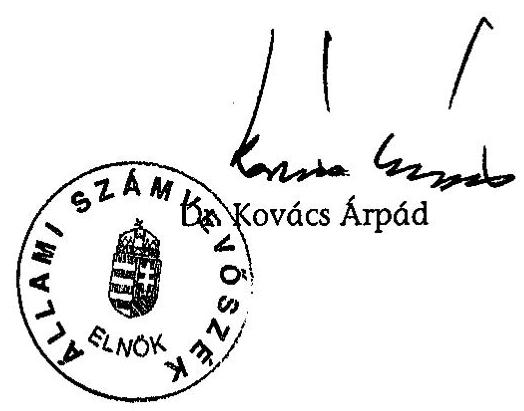

# JELENTÉS 

a Magyar Igazság és Élet Pártja 2003-2004. évi gazdálkodása törvényességének ellenőrzéséről

---

3. Önkormányzati és Területi Ellenőrzési Igazgatóság
3.1. Szabályszerüségi Ellenőrzési Főcsoport
V-1016-022/2005.
Témaszám: 774
Vizsgálat-azonosító szám: V-0220
Az ellenőrzést felügyelte:
Dr. Lóránt Zoltán
főigazgató
Az ellenőrzés végrehajtásáért felelős:
Dr. Elek János
általános főigazgató-helyettes
Az ellenőrzést vezette:
Horváth Balázs
főcsoportfőnök-helyettes
Az összefoglaló jelentést készítette:
Szendrey Lajos
számvevő
Az ellenőrzést végezték:
Tóth István Szakmányné Bilik Szendrey Lajos
tanácsadó Mária számvevő
A témához kapcsolódó eddig készített számvevőszéki jelentések:
címe
Sorszáma
Jelentés a Magyar Igazság és Élet Pártja 1995-1996. évi 369
gazdálkodása törvényességének ellenőrzéséről
Jelentés a Magyar Igazság és Élet Pártja 1997-1998. évi 0009
gazdálkodása törvényességének ellenőrzéséről
Jelentés a Magyar Igazság és Élet Pártja 1999-2000. évi 0130
gazdálkodása törvényességének ellenőrzéséről
Jelentés a Magyar Igazság és Élet Pártja 2001-2002. évi 0337
gazdálkodása törvényességének ellenőrzéséről

Jelentéseink az Országgyűlés számítógépes hálózatán és az Interneten a www.asz.hu címen is olvashatók.

---

# TARTALOMJEGYZÉK 

BEVEZETÉS ..... 5
I. ÖSSZEGZŐ MEGÁLLAPÍTÁSOK, KÖVETKEZTETÉSEK, JAVASLATOK ..... 6
II. RÉSZLETES MEGÁLLAPÍTÁSOK ..... 10

1. A PÁRT GAZDÁLKODÁSÁRÓL SZÓLÓ 2003-2004. ÉVI BESZÁMOLÓK ..... 10
1.1. A teljes vizsgálati időszakra érvényes megállapítások ..... 10
1.2. A 2003. és 2004. évi beszámolók ..... 10
1.2.1. Bevételek ..... 11
1.2.2. Kiadások ..... 11
2. A PÁRTNAK A BESZÁMOLÓ ÖSSZEÁLLÍTÁSÁRA ÉS AZ AZT ALÁTÁMASZTÓ KÖNYVVEZETÉSRE VONATKOZÓ BELSŐ SZABÁLYOZÁSA ÉS GYAKORLATA ..... 12
2.1. A belső szabályozás rendszere ..... 12
2.2. A könyvvezetés gyakorlata, összhangja a törvényi és a belső előírásokkal ..... 12
2.3. Analitikus nyilvántartások ..... 13
2.4. A bizonylati elv és a bizonylati fegyelem érvényesülése ..... 14
3. A PÁRT BEVÉTELSZERZŐ GAZDÁLKODÓ TEVÉKENYSÉGE ..... 15
4. A GAZDÁLKODÁSSAL ÖSSZEFÜGGŐ, EGYÉB JOGSZABÁLYOKBAN FOGLALT ELŐÍRÁSOK BETARTÁSA ..... 15
4.1. Személyi jellegű kifizetések ..... 15
4.2. Az adózási, társadalombiztosítási és egyéb jogszabályok rendelkezéseinek érvényesítése ..... 16
5. A PÁRT BELSŐ ELLENŐRZÉSÉNEK RENDSZERE ..... 16
5.1. A belső ellenőrzés rendszerének szabályozottsága ..... 16
5.2. A belső ellenőrzés múködése ..... 16
MELLÉKLETEK
6. számú A Párt 2003. évi módosított pénzügyi beszámolója
7. számú A Párt 2004. évi pénzügyi beszámolója
8. számú A Párt 2003. évi korrigált beszámolójának levezetése

---

.

---

# RÖVIDÍTÉSEK JEGYZÉKE 

| Art. | Az adózás rendjéről szóló - többször módosított - 1990. évi XCI. törvény, hatályon kívül helyezését követően az adózás rendjéről szóló 2003. évi XCII. törvény |
| :--: | :--: |
| ÁSZ | Állami Számvevőszék |
| MÁK | Magyar Államkincstár |
| OI | Országos Iroda |
| Párt | Magyar Igazság és Élet Pártja |
| Párttörvény | A pártok múködéséről és gazdálkodásáról szóló - többször módosított - 1989. évi XXXIII. törvény |
| Számviteli törvény | A számvitelről szóló - többször módosított - 2000. évi C. törvény |
| Szja törvény | A személyi jövedelemadóról szóló - többször módosított 1995. évi CXVII. törvény |

---

.

---

# JELENTÉS 

## a Magyar Igazság és Élet Pártja 2003-2004. évi gazdálkodása törvényességének ellenőrzéséről

## BEVEZETÉS

Az Állami Számvevőszékről szóló 1989. évi XXXVIII. törvény 5. §-a és a 16. § (2) bekezdése, valamint a pártok múködéséről és gazdálkodásáról szóló - többször módosított - 1989. évi XXXIII. törvény (továbbiakban: párttörvény) 10. § (1) bekezdése alapján a pártok gazdálkodása törvényességének ellenőrzésére az Állami Számvevőszék (továbbiakban: ÁSZ) jogosult. Az ÁSZ 2005. évi ellenőrzési tervének megfelelően vizsgálta a Magyar Igazság és Élet Pártja (továbbiakban: Párt) 2003-2004. évi gazdálkodása törvényességét.

Az ellenőrzés célja annak megállapítása volt, hogy:

- a Párt által készített és a Magyar Közlönyben közzétett éves beszámolók a törvényi előírásoknak megfelelnek-e, a könyvvezetéssel és a valósággal megegyező adatokat tartalmaznak-e;
- a könyvvezetés és a gazdálkodás során betartották-e a számvitelről szóló többször módosított - 2000. évi C. törvény (továbbiakban: számviteli törvény) és az egyéb jogszabályi rendelkezéseket és belső előírásokat;
- a Párt a múködéséhez szabályszerűen igénybe vehető forrásokat használt-e fel, nem folytatott-e a párttörvény által tiltott gazdálkodó tevékenységet, nem fogadott-e el tiltott vagyoni hozzájárulást, illetőleg adományt.

Az ellenőrzés előkészítését és végrehajtását az ÁSZ elnöke által 13/2003. 03. 25. sz. utasításával kiadott "Módszertan a pártok gazdálkodása törvényességének ellenőrzéséhez" c. kiadvány és a 14/2003. 12. 15. sz. elnöki határozattal elfogadott segédletben foglaltak alapján végeztük.
Az ellenőrzés körülményeit illetően rögzíteni szükséges, hogy az ÁSZ évek óta folyamatosan javasolja a Kormánynak a pártok ellenőrzéseiről készített jelentéseiben a párttörvény módosítását tekintettel arra, hogy:

- a párttörvény 1. sz. melléklete szerinti beszámoló-mintához magyarázatot, kitöltési útmutatót nem készítettek a jogalkotók, így ennek kitöltése pártonként - kialakított számviteli politikájuknak megfelelően - eltérő lehet;
- a beszámoló-minta a számviteli törvény rendelkezéseivel nem harmonizál, nem felel meg sem a mérleg, sem az eredmény-kimutatás követelményeinek.

A helyszíni ellenőrzést 2005. május 27 -június 30 -a között, a Párt kérésére az általa megbízott könyvelő szolgáltató irodahelységében végeztük el.

---

# I. ÖSSZEGZŐ MEGÁLLAPÍTÁSOK, KÖVETKEZTETÉSEK, JAVASLATOK 

A Párt 2003. és 2004. évi pénzügyi beszámolóját a párttörvényben előírt határidőben, meghatározott formában közzétette a Magyar Közlönyben. A 2003. évi beszámolót önellenőrzéssel megalapozottan - egy évvel később - ismételten megjelentették, mivel a helyi alapszervezetek határidőt követően leadott pénzügyi elszámolása 4,4\%-os mértékű lényeges eltérést okozott.

A Párt gazdálkodásáról nyilvánosságra hozott éves pénzügyi beszámolók nem mutattak teljes körü, megbízható képet. A teljesség és a valódiság számviteli alapelvét sérti, hogy 2003. évben a szervezetek 21,8\%-a, 2004. évben 50,5\%-a nem számolt el bevételeivel és kiadásaival, valamint a nem pénzbeli vagyoni hozzájárulások értékét nem tartalmazták a beszámolók.

A beszámolási hiányosságok következtében sérült a számviteli törvényben meghatározott teljesség és valódiság elve. Az ellenőrzés a hibák tényleges bevételi és kiadási hatását megalapozott információk hiányában nem tudta számszerúsíteni.

A teljes vizsgálati időszakra jellemző szabálytalanságok kivételével a beszámolók jogcímenkénti összegei, bevételi és kiadási főösszegei előírás szerint megegyeztek a főkönyvi könyveléssel. Ehhez meghatározták a párttörvény sajátos beszámoló sorainak főkönyvi összefüggését, valamint az előírások betartásához kitöltési segédletet alkalmaztak.

A Párt számviteli szabályozása a számviteli törvénnyel összhangban, a gazdálkodási sajátosságokra figyelemmel határozta meg a beszámolás és könyvvezetés rendjét. A számviteli politika előírásait 2003. január 1-jei hatálylyal módosították, figyelemmel az ÁSZ előző jelentésének megállapítására. A számviteli politikához tartozó leltározási, értékelési és pénzkezelési szabályzatok előírásait - aktualitásukra tekintettel - változatlanul érvényben tartották. A számlarendet 2003-ban öt, illetve 2004-ben két új számlával kiegészítették. A számviteli szabályozások módosítása a gazdálkodásban bekövetkezett változások kezelésére történt.

A beszámolót alátámasztó könyvvezetést külső szolgáltatói szerződéssel, kettős könyvviteli program alkalmazásával végezték. A számítógépes könyvelés az ellenőrzés igényei szerint biztosította a szükséges adatokat. A zárlati munkálatok végrehajtása nem a belső szabályzatokban előírt határidőre történt meg, mivel 2003. évben a helyi szervezetek mintegy harmadának évközi és év végi könyvelési feladásai határidőn túl vagy egyáltalán nem realizálódtak. Ennek következtében a számviteli politika rendelkezése alapján végrehajtották a 2003. évi beszámoló dokumentált önellenőrzését.
2004. évben a Pártnál leszűkítették a könyvelő szolgáltató tevékenységét a főkönyv és analitikája vezetésére. A könyvelési bizonylatok átadása az éves gazdálkodási időszakot követően, a negyedéves elszámolásra vonatkozó belső elő-

---

írás megsértésével, hiányosan valósult meg. A könyvelési feladást és leltári alátámasztását a pártszervezetek közel fele nem teljesítette. Az elszámolási mulasztások megfigyelésére, kezelésére új főkönyvi számlát nyitottak, amely a leltárral alá nem támasztott házipénztárkészlet miatti követelések kimutatására szolgált.

A főkönyvi számlákhoz kapcsolódó analitika körét, vezetését ügyviteli rendben szabályozták. A nyilvántartások tartalma, időszaki zárása megfelelt a számviteli előírásoknak. Az előírt részletező nyilvántartások közül az időszaki pénztárjelentést 2003-ban a pártszervezetek egyötöde, 2004-ben mintegy fele mulasztotta el a központi könyvelésnek leadni. Az analitika évente növekvő, rendezetlen követeléseket is tartalmazott: 2002. évre 100 ezer Ft, 2003. évre 1261 ezer Ft, 2004. évre 5370 ezer Ft.

A leltározás feladatait - hatályos szabályozás szerint - évente kiadott leltározási utasítással szervezték. A 2003. évi leltározást valamennyi szervezet végrehajtotta, dokumentumait a könyvvezetést végző szolgáltatónak átadta. A 2004. évi leltározási bizonylatokat - a beszámoló készítés időpontjáig kiküldött többszöri felszólítás ellenére - a szervezetek 45,7\%-a nem küldte meg. A leltári egyeztetéseket dokumentáltan elvégezték.

A Párt gazdálkodási rendje szabályozta a kötelezettségvállalás, ellenjegyzés és utalványozás előírásait, amelyek közül az utalványozás gyakorlása nem volt teljes körű: 2003. évben a tranzakciók 5,7\%-ánál, 2004. évben 17,3\%-ánál hiányzott az utalványozó aláírása. A helyi szervezetek házipénztár-kezelési szabályzatának - összeférhetetlenséget szabályozó - előírása ellenére előfordult, hogy az utalványozást és pénzfelvételt azonos személy igazolta.

A bizonylati szabályzatba foglalt bizonylati elv és fegyelem sérült, mivel 2004-ben a Párt egy rendszeres szállítója részére a gazdasági tranzakciók ismétlődően számla vagy belső bizonylat nélkül teljesültek. A pártszervezetek pénzforgalmának bizonylatolásában nem érvényesültek következetesen a bizonylatolás számviteli törvényben meghatározott alaki és tartalmi követelményei.

A Párt 2003-2004. évi tevékenységét - a könyvviteli nyilvántartások vizsgált adatai szerint - jogszerű forrásokból fedezte. A bevételszerző tevékenység eredményeként a költségvetési támogatás rendszeres tagdíjbevétellel, belföldi természetes és jogi személyek adományával, valamint kamattal és árfolyamnyereséggel egészült ki.

A Párt az éves pénzügyi beszámolókból kihagyott nem pénzbeli vagyoni hozzájárulásra is szert tett, amellyel kapcsolatban a párttörvény előírja a kötelező értékelést. A helyi önkormányzatoktól térítésmentes vagy jelképes bérleti díjjal igénybe vett ingatlanhasználattal összefüggésben - piaci értékhez viszonyítva becsült nem pénzbeli vagyoni hozzájárulás értéke mindkét évben meghaladta az egy-egy millió Ft nagyságrendet. A Párt 2004-ben hasonlóan elmulasztotta a rendezvényszervezést közvetítő gazdasági társaság térítésmentes szolgáltatásának értékelését.

A Párt feladatainak teljesítéséhez saját tulajdonú személygépkocsit üzemeltetett és magántulajdonú személygépkocsik hivatalos célú használatát engedélyezte.

---

A tulajdonát képező jármű igénybevételének rendjét szabályozták, kizárólagos hivatali használatát az Szja törvény előírásának megfelelően dokumentálták. A magántulajdonú személygépkocsik hivatali célú használatát előzetes engedélyhez kötötték, költségtérítését - rendeletben szabályozott - normatív mértékkel folyósították. Az utazás hivatalos jellege egy megyei szervezetnél utólag nem volt megállapítható, mivel az útnyilvántartás nem tartalmazta az utazási célt, felkeresett partnert.

A Párt adó- és járulékfizetési kötelezettséggel járó munkaszerződést, megbízásos jogviszonyt nem létesített. Az adózási és társadalombiztosítási jogszabályokban előírt határidőre éves bevallási kötelezettségének nullás bevallás benyújtásával tett eleget. A törvényi szabályozás ellenére nem vont le adóelőleget a 2003. évben kifizetett 347 ezer Ft összegű magán telefonhasználat költségtérítésével összefüggésben, továbbá nem teljesítette az adózás rendjéről szóló törvényben előírt adatszolgáltatást.

A Párt belső ellenőrzési rendszerét alapdokumentumok szabályozták, amely rendelkezett a számvizsgáló bizottság feladatairól, működésének rendjéről, a vezetői ellenőrzés területeiről, hatásköri gyakorlásáról. A bizottság tevékenységét éves munkaterv alapján végezte, dokumentálta a házipénztárak kezelésével, a leltározások bonyolításával kapcsolatos szabálytalanságokat. A vezetői és munkafolyamatba épített ellenőrzés a vizsgált időszakban eltérő hatásfokkal funkcionált. A Pártnál nem érvényesült a belső ellenőrzés összehangolt, folyamatos múködése, gyengült a hibák feltárásának, megszüntetésének hatásfoka.

A helyszíni ellenőrzés megállapításainak hasznosítása mellett az Állami Számvevőszék elnöke felhívja

# a Párt elnökét 

1. Gondoskodjon a pártszervezetek 2003. és 2004. évi gazdálkodása teljes körű elszámoltatásáról, valamint a nem pénzbeli vagyoni hozzájárulások értékének meghatározásáról. A számviteli törvény 15. § (2)-(3) bekezdésében előírt teljesség és valódiság elvének érvényesítésével ismételten tegyen eleget az éves beszámoló közzétételi kötelezettségének.
2. Szerezzen érvényt a helyi szervezeteknek kiadott házipénztár kezelési szabályozásnak megfelelően az összeférhetetlenség követelményének.
3. Gondoskodjon:
a) a számviteli törvény 165. § (1) és (2) bekezdésében előírt bizonylati elv,
b) a 167. § (1) bekezdés c) és i) pontja szabályozásának megfelelően a bizonylatok alaki és tartalmi követelményeinek
c) a 169. § (2) bekezdése szerint a bizonylatok megőrzésére vonatkozó előírásainak betartásáról.

---

4. Intézkedjen a számviteli törvény 69. § előírásai és a Párt leltározási szabályzata értelmében a leltározás teljes körű végrehajtására.
5. Rendeljen el önellenőrzést és tegye meg a szükséges intézkedést a magántulajdonú gépkocsik költségtérítésének felülvizsgálatára, figyelemmel az Szja törvény 5. számú melléklet II. 7. pontjában előírt adattartalomra.
6. Gondoskodjon a költségtérítésekkel összefüggésben, az Szja törvény 47. § (9) bekezdés szerinti igazolás kiállításáról és az Art. 52. § (4)-(5) bekezdésekben szabályozott adatszolgáltatás teljesítéséről.
7. Intézkedjen a Párt évek óta halmozódó rendezetlen követeléseinek tisztázására és a belső szabályozásnak megfelelő elszámolására.
8. Biztosítsa a belső ellenőrzési rendszer összehangolt, folyamatos működését; segítse elő a feltárt hibák megszüntetését.

Az ellenőrzési tapasztalatokra figyelemmel javasoljuk:

# a Kormánynak 

Kezdeményezze a párttörvény következők szerinti módosítását:
a korábbi pártellenőrzések alapján tett jelzésekre is figyelemmel intézkedjen azon, a pártok számviteli nyilvántartási és beszámolási rendszerét érintő ellentmondások feloldására, amelyek a pártok múködéséről és gazdálkodásáról szóló - többször módosított - 1989. évi XXXIII. törvény, valamint a 2001. január 1. napjától hatályos számviteli törvény között továbbra is fennállnak.

---

# II. RÉSZLETES MEGÁLLAPÍTÁSOK 

## 1. A PÁRT GAZDÁlKODÁSÁról SZÓLÓ 2003-2004. ÉVI BESZÁMOLÓK

### 1.1. A teljes vizsgálati időszakra érvényes megállapítások

A Párt a 2003. évi beszámolóját a Magyar Közlöny 2004. évi 57. számában, a 2004. évi beszámolóját a Magyar Közlöny 2005. évi 58. számában, a párttörvényben előírt határidőben, meghatározott formában tette közzé. A Párt a 2003. évi pénzügyi beszámolóját egy évvel később önellenőrzéssel módosította, a Magyar Közlöny 57. számában ismételten megjelentette (1-2. számú melléklet).

Az önellenőrzés a pénzügyi elszámolást előírt határidő után teljesítő helyi alapszervezetek elszámolásai miatt vált szükségessé. A Párt 2003. évi beszámolójának bevételi főösszegét 49 ezer Ft-tal, kiadási főösszegét 4749 ezer Ft-tal, 4,4\%kal növelte, két kiadási beszámolósort módosítva (3. számú melléklet). Jelen ellenőrzés az önellenőrzéssel módosított 2003. évi és 2004. évi beszámolóknak a törvényi és a belső előírásokkal való összhangját vizsgálta.

A Párt az éves beszámolók összeállítása során az önellenőrzés ellenére sem érvényesítette a számviteli törvény 15. § (2)-(3) bekezdés szerinti teljesség és valódiság számviteli elvét:

- 2003. évben a helyi pártszervezetek $21,8 \%$-a a nyilvántartott 1029 ezer Ft pénzállomány alakulásáról, felhasználásáról nem számolt el;
- 2004. évben az elszámolást nem teljesítő szervezetek aránya 50,5\%-ra, míg a pénzállomány összege 4883 ezer Ft-ra emelkedett;
- a beszámolókból hiányzott ezen túlmenően 2003. évben 1000 ezer Ft-ot, 2004. évben 1500 ezer Ft-ot meghaladó nem pénzbeli vagyoni hozzájárulás értéke.

Az éves beszámolókhoz kapcsolódóan feltárt hibák tényleges bevételi és kiadási hatása megalapozott információk hiányában nem volt számszerűsíthető, így az eltérés sem értékelhető a pártok ellenőrzésénél alkalmazott 2\%-os lényegességi küszöb viszonylatában.

### 1.2. A 2003. és 2004. évi beszámolók

A pénzforgalomról számot nem adó pártszervezetek kivételével a Párt által közzétett beszámolók bevételi és kiadási jogcímeinek összege megegyezett a főkönyvi könyvelésben kimutatott adatokkal. A vizsgált időszakban érvényesült a bevételi és kiadási jogcímek tartalmi azonossága, megfelelő beszámolósoron való szerepeltetése.

---

# 1.2.1. Bevételek 

A tagdíjak beszámolókban közzétett adataiból 2003. évben hiányzott a szervezetek több mint egyötödének, 2004. évben több mint felének elszámolása a teljesített befizetésekről.

Állami költségvetésből származó támogatást évente 87000 ezer Ft öszszeggel, a MÁK adataival megegyezően közölték.

Az egyéb hozzájárulások, adományok adatait a párttörvény előírásai szerint részletezték. Az analitikus nyilvántartások szerint a beszámolóban szerepeltetett belföldi jogi és magánszemélyektől származó, az értékhatárt meghaladó - nevesítendő 500 ezer Ft feletti - adomány, hozzájárulás nem teljesült.

A Párt az általa használt önkormányzati tulajdonú ingatlanokkal összefüggésben nem szerepeltette a piaci érték és az ingyenes vagy jelképes bérleti díj különbözeteként számított nem pénzbeli vagyoni hozzájárulás értékét. Vizsgálati becslés szerint ennek értéke mindkét évben meghaladta az 1000 ezer Ft-ot. Hasonlóan 2004. évben nem szerepeltettek a beszámolóban gazdasági társaságtól díjmentes rendezvényszervezési szolgáltatással összefüggő nem pénzbeli vagyoni hozzájárulást sem.

Az egyéb bevételek beszámolósor adata a pénzintézettől kapott kamatokból és árfolyamnyereségből, valamint 2003. évben biztosítótól kapott kártérítésből tevődött össze. A beszámolókban kimutatott összegek levezethetők voltak a belső előírások szerint kapcsolódó főkönyvi számlák zárlati adatai alapján.

### 1.2.2. Kiadások

A Párt a korábbi belső utasításokban az éves beszámolók összeállításához meghatározta a politikai, múködési, eszközbeszerzési és egyéb kiadások főkönyvi kapcsolatait, minősítési ismérveit.

A támogatások egyéb szervezeteknek beszámolósoron kizárólag jogi személyiségű szervezeteknek juttatott támogatások szerepeltek.

A múködési kiadások közölt adata az üzemeltetési és fenntartási költségeket tartalmazta, mindkét évben megegyezett a kapcsolódó főkönyvi számlák együttes egyenlegével.

Eszközbeszerzés címén az éves beszámolók értékhatártól függetlenül -a Párt belső szabályozása szerint- minden készlet és tárgyi eszköz beszerzést tartalmaztak. A Párt az eszközöket szabályszerűen bekerülési értéken mutatta ki.

Politikai tevékenység kiadása címen jellemzően a tevékenységével összefüggő szállítási, utazási és kiküldetési, telefon, reprezentációs és rendezvényszervezés költségeit mutatta ki, 2003-ban 53336 ezer Ft, 2004-ben 39143 ezer Ft összegben. A Párt közzétett beszámolóinak kiadási sorai nem tartalmazták 2003. évben a helyi szervezetek $21,8 \%$-ának, 2004. évben 50,5\%ának teljes körű elszámolását, mivel nem vagy csak időszakosan tettek eleget az elszámolási kötelezettségüknek.

---

# 2. A PÁRTNAK A BESZÁMOLÓ ÖSSZEÁLLÍTÁSÁRA ÉS AZ AZT ALÁTÁMASZTÓ KÖNYVVEZETÉSRE VONATKOZÓ BELSŐ SZABÁLYOZÁSA ÉS GYAKORLATA 

### 2.1. A belső szabályozás rendszere

A Párt beszámolási és könyvvezetési rendjét meghatározó szabályozások 19992001. óta hatályosak. A számviteli törvény rendelkezésére kiadott számviteli politika beszámoló-készítési előírásait - az ÁSZ megelőző jelentésének megállapítására figyelemmel - 2003. január 1-jei hatállyal módosították. A számviteli politikához tartozó leltározási, értékelési, pénzkezelési szabályzatok előírásai a vizsgált időszakban időszerűek maradtak, nem változtak.

A könyvvezetést szabályozó számlarend 2001. január 1-jétől hatályos komplex szabályozáson alapult. A számviteli törvénnyel összhangban álló követelményeket a szöveges számlarend, a számlatükör és alapkontírozási szabályzat, a bizonylatkezelési szabályzat, valamint az ügyviteli rend együttesen határozta meg. A számlarend előírásait a gazdasági változások, események figyelemmel kísérése céljából 2003-ban öt, 2004-ben két új számlával kiegészítették. Ennek keretében célszerűen elkülönített számlát nyitottak az előző időszakot érintő pénzmozgás nélküli - rendezéseknek, valamint a leltárral nem alátámasztott házipénztár követeléseknek.

A Párt számviteli szabályozásának rendszere a törvényi konzisztencia mellett kifejezésre juttatta a gazdálkodásra jellemző sajátosságokat.

### 2.2. A könyvvezetés gyakorlata, összhangja a törvényi és a belső előírásokkal

A Párt a könyvvezetést a vizsgált időszakban a kettős könyvelés rendszerében valósította meg, negyedéves feladásos rendszerben. Mindkét évben azonos számítógépes program alkalmazásával, ugyanazon külső szolgáltató könyvelt.

A számlakijelölés gyakorlatában egyes gazdasági események kivételével érvényesültek a jogszabályi és belső előírások. A politikai, múködési és eszközbeszerzési kiadásokat a kontírozáskor megfelelő jelöléssel ellátva szétválasztották. A számítógépes könyvelésből minden szükséges adat az ellenőrzés igényeinek megfelelően lekérdezhető volt. A zárlati munkálatok végrehajtása nem a belső szabályzatokban előírt határidőre történt meg, ennek következtében a számviteli politika rendelkezése alapján végrehajtották a 2003. évi beszámoló dokumentált önellenőrzését.
2003. évben a helyi szervezetek mintegy harmadának évközi és év végi feladásai, elszámolásai határidőn túl vagy egyáltalán nem realizálódtak annak ellenére, hogy december 31-éig a szolgáltató a könyvvezetésen túlmenően a megyei és helyi szervezetekkel egyeztetett is, a hiányos vagy nem megfelelően kitöltött bizonylatok esetén elősegítette azok helyesbítését, javítását. A megszűnt pártszervezetek dokumentációjának hiányában a szervezetek pénzállományát követelésként írta elő a könyvelés. Az elszámolással, a pénzállomány hiteles alátámasztásával kapcsolatos probléma könyvviteli kezelése érdekében új fő-

---

könyvi számlát hoztak létre, amely a leltárral alá nem támasztott házipénztár készlet miatti követelések kimutatására szolgált. A határidőn túl leadott szervezeti elszámolások miatt dokumentált önellenőrzést hajtottak végre 2003. évre vonatkozóan, melyet a főkönyvben szabályszerűen rögzítettek.
2004. január 1-jétől a Párt vezetősége a könyvelő cég a Párt részére végzett tevékenységét leszűkítette a főkönyv és analitika vezetésére. A könyvelési bizonylatok átadása 2005. január 1-jétől kezdődően, hiányosan valósult meg. A könyvelési feladást és leltári alátámasztását a pártszervezetek közel fele nem teljesítette. Az éves gazdálkodási események könyvelése egy időben történt, a belső szabályozásban előírt negyedévenkénti elszámoltatás nem valósult meg, ugyanakkor az elszámolásra vonatkozó szabályozást nem módosították. További hiba, hogy a főkönyvben 2003-2004. évben nem könyvelték a nem pénzben kapott vagyoni hozzájárulások értékét. A könyvvezetésben mindkét évben sérült a számviteli törvényben foglalt teljesség és valódiság elve.

# 2.3. Analitikus nyilvántartások 

A Párt az ügyviteli rendben szabályozta a főkönyvi számlákhoz kapcsolódó analitikák körét, vezetésének rendjét. A nyilvántartások tartalma megfelelt a törvényi követelményeknek és a belső előírásoknak. Az éves záráskor az előírt egyeztetések megtörténtek.

A tárgyi eszközök analitikája szabályszerűen tartalmazta a beszerzéseket, az aktiválásokat, az értékcsökkenés elszámolását. A szállítók analitikáját a szerződésekről vezetett nyilvántartás egészítette ki. A készpénzforgalomra előírt időszaki pénztárjelentést hiányosan vezették: 2003-ban a pártszervezetek egyötöde, 2004-ben mintegy fele mulasztotta el az időszaki pénztárjelentések leadását.

A szigorú számadású nyomtatványok nyilvántartási kötelezettségét szabályozták. Szigorú számadásúnak kezelték a pénztárjelentést, a bevételi és kiadási pénztárbizonylatokat, a pénz felvételére jogosító utalványt, a belföldi kiküldetési rendelvényt. A nyilvántartást teljes körű adattartalommal vezették.

A követelések és a kötelezettségek értékelése megfelelt az értékelési szabályzat előírásainak. A Párt az adott előlegekről felvételenként és szervezetenként számítógépes analitikus nyilvántartást vezetett. Ennek kapcsán a nyilvántartások évenként növekvő, rendezetlen követeléseket tartalmaztak:

- 2002. évben elszámolásra kiadott előleg: 100 ezer Ft
- 2003. évi házipénztár leltár differencia, megszűnt szervezetek és bizonylat hiánya miatti követelés: 1261 ezer Ft
- a 2004. évi leltárral alá nem támasztott házipénztár, bizonylat hiánya, megszűnt szervezetek, leltárdifferencia miatti követelés: 5370 ezer Ft.
A rendezés érdekében történt dokumentált, többszöri felszólítások döntőrészt eredménytelenek voltak.

---

# 2.4. A bizonylati elv és a bizonylati fegyelem érvényesülése 

A Párt 2001. január 1-jétől hatályos gazdálkodási rendje szabályozta a kötelezettségvállalás, az ellenjegyzés és az utalványozás előírásait. A Pártnál a kötelezettségvállalási és ellenjegyzési jogkör gyakorlása a szabályzatban foglaltak szerint történt. A gazdasági események elszámolása során 2003. évben az ellenőrzött tételek 5,7\%-át, 2004. évben 17,3\%-át nem utalványozták. Az alapszervezetek házipénztár kezelési szabályzata összeférhetetlenséget szabályozó előírása ellenére a pénzfelvevő és az utalványozó személye 2003. évben kettő, 2004. évben hat esetben megegyezett. Az utalványozásban észlelt hiányosságok miatt az ellenőrzés a kifizetés alapbizonylatai alapján visszaélésre utaló jelet nem tapasztalt.

A bizonylati szabályzatba foglalt bizonylati elv és fegyelem 2004. évben esetenként sérült, mivel egyes gazdasági tranzakciók számla vagy belső bizonylat hiányában teljesültek. Ezzel a Párt megsértette a számviteli törvény 165. § (1) és (2) bekezdés előírását.

A bizonylatok alaki és tartalmi kellékeire vonatkozó előírások a következőkben nem érvényesültek:

- általános - a számviteli törvény 167. § (1) bekezdés i) pontjába ütköző szabálytalanság, hogy a banki és vegyes bizonylatokról hiányzott a könyvelés időpontjának feltüntetése, azt a könyvelő program sem rögzítette;
- a számviteli törvény 167. § (1) bekezdés c) pontja és a belső szabályozás előírása ellenére a helyi szervezetek kifizetéseinek mintegy $94 \%$-ánál az ellenőrzött években a rendelkezés, a feladat végrehajtását igazoló személy aláírása hiányzott, továbbá;
- 2003. évben a kiadási pénztárbizonylatok 6,7\%-án a pénz átvevője az átvételt aláírásával nem igazolta, valamint;
- 2003. évben a pénztári bizonylatok 14\%-án, 2004. évben 11\%-án az ellenőr nem dokumentálta az ellenőrzést.
A gépkocsi költségtérítések alapbizonylataként mellékelt útnyilvántartások naturális adataiból számított, a bizonylaton ceruzával rögzített értékadatok miatt nem voltak alkalmasak a bizonylatok, a számviteli törvény 169. § (2) bekezdésében szabályozott megőrzés biztosítására.

A Párt a vegyes naplóban vegyes bizonylatok alapján könyvelt tételeihez megfelelő részletező kimutatásokat és bizonylatokat mellékelt. A vegyes bizonylatokat negyedéves feladás alapján könyvelte.

A Párt a leltározást a leltározási szabályzat rendelkezésének megfelelően a Párt elnöke által évente kiadott leltározási utasítással szervezte. A 2003. évi leltározás dokumentumait valamennyi szervezet átadta a főkönyvelőség részére. A 2004. évi leltározási bizonylatokat - a beszámoló készítés időpontjáig többszöri felszólítás ellenére - a szervezetek 45,7\%-a nem küldte meg. A főkönyvelőség a leltári egyeztetéseket dokumentáltan elvégezte, eltérések esetén felszólították a szervezeteket a hiányok pótlására és rendezésére. A leltári eltérések miatt a Párt felelősségre vonást nem kezdeményezett.

---

# 3. A PÁRT BEVÉTELSZERZŐ GAZDÁLKODÓ TEVÉKENYSÉGE 

A Párt 2003-2004. évi tevékenységét - a könyvviteli nyilvántartások vizsgált adatai szerint - jogszerú forrásokból fedezte. A párttörvény 4. §-a által tiltott bevételt, névtelen adományt nem fogadott el; a 6. §-ban nem engedélyezett gazdálkodó tevékenységet nem folytatott, gazdasági társaságban részesedést nem szerzett.

A Pártot megillető központi költségvetési támogatás a bevételszerző tevékenység eredményeként rendszeres tagdíj bevétellel, belföldi természetes és jogi személyek adományával, valamint kamattal és árfolyam nyereséggel egészült ki.

A Párt az éves pénzügyi beszámolókban nem jelzett nem pénzbeli vagyoni hozzájárulásra is szert tett.

- A helyi önkormányzatoktól szerződéssel bérelt ingatlanok közül az egyes időszakokban 11 illetve 16 használatáért bérleti díjat nem fizettek, további 24, illetve 22 ingatlannál a bérleti díj mértéke jelképesnek minősült. A rendelkezésre álló önkormányzati adatok alapján a nem pénzbeli vagyoni hozzájárulás értéke mindkét évben meghaladta az egy-egy millió Ft nagyságrendet.
- A Párt 2004-ben 25845 ezer Ft összeggel számlázott közvetített szolgáltatást vett igénybe. A dokumentumok alapján megállapítást nyert, hogy a rendezvényszervezést közvetítő gazdasági társaság a szolgáltatást - szervezői díj felszámítása nélkül - térítésmentesen nyújtotta.
A Párt a nem pénzbeli vagyoni hozzájárulás értéke meghatározásának elmulasztásával megsértette a párttörvény 4. § (5) bekezdésének előírását.

## 4. A GAZDÁLKODÁSSAL ÖSSZEFÜGGŐ, EGYÉB JOGSZABÁLYOKBAN FOGLALT ELŐÍRÁSOK BETARTÁSA

### 4.1. Személyi jellegú kifizetések

A Párt adó- és járulékfizetési kötelezettséggel járó munkaszerződést vagy megbízásos jogviszonyt korábbi gyakorlatának megfelelően az ellenőrzött években sem létesített.

A Párt 2003. évben 347 ezer Ft összegben telefon költségtérítést fizetett ki magánszemély részére, adóelőleg levonása nélkül.

A Párt feladatainak teljesítéséhez a tömegközlekedési eszközök igénybevételén kívül, 2003. május 24 -ig a Párt tulajdonában lévő személygépkocsit üzemeltetett, továbbá magántulajdonú gépkocsik hivatalos célú használatát engedélyezte.

A Párt tulajdonában lévő személygépkocsi igénybevételének rendjét szabályozták. A kizárólagos hivatali használatot az Szja törvény 70. §-ában, valamint a törvény 5. számú mellékletének II. 7. pontjában meghatározott adatkövetelményeknek megfelelő menetlevéllel dokumentálták. A kizárólagos hiva-

---

talos célú használat miatt a Pártnak cégautó adó fizetési kötelezettsége nem keletkezett.

A magántulajdonú személygépkocsik hivatali célú használatát az OI vezetője évente engedélyezte a megyei szervezetek részére kilométer-keret megállapításával. A Szabolcs-Szatmár-Bereg megyei szervezetek 2003. évi útnyilvántartásai alapján - az utazási cél és a felkeresett partner feltüntetése hiányában - az utazás hivatalos jellege utólag nem volt megállapítható. A gépjármú költségtérítések a 60/1992. (IV. 1.) Korm. rendeletben szabályozott normatív mértékkel, adómentesen teljesültek.

# 4.2. Az adózási, társadalombiztosítási és egyéb jogszabályok rendelkezéseinek érvényesítése 

A Párt az adózási és társadalombiztosítási jogszabályokban előírt határidőre éves bevallási kötelezettségének nullás bevallás benyújtásával tett eleget.

A magán-telefonhasználat 2003. évi költségtérítésével összefüggésben a Párt az akkor hatályos Szja törvény 46. § (2) bekezdés szabályozása ellenére az adóelőleget nem állapította meg, az Art. 45. § (4) bekezdésében előírt adatszolgáltatás teljesítését elmulasztotta. A Párt elnöke jelezte intézkedéseit a hibák rendezésére.

A politikai kiadások között elszámolt reprezentációs költségek mértéke a vizsgált években nem érte el az Szja törvény 69. § (7) bekezdés b) pontjában foglalt értékhatárt.

A Pártnál az adó- és társadalombiztosítási hatóság ellenőrzést nem végzett a vizsgált időszakban.

## 5. A PÁRT BELSŐ ELLENŐRZÉSÉNEK RENDSZERE

### 5.1. A belső ellenőrzés rendszerének szabályozottsága

A Párt belső ellenőrzésének rendszerét alapdokumentumok szabályozták. Az Alapszabály rendelkezett a Számvizsgáló Bizottság feladatairól, múködésének rendjéről. A Párt Országos Gyűlése a testületet 2003. februárjában újraválasztotta. A gazdálkodási rend határozta meg a vezetői ellenőrzés körébe sorolt Elnökség, Ol vezető, főkönyvelő, valamint területi elnökök hatás- és jogkörét.

A pénzügyi elszámolások folyamatba épített ellenőrzésének követelményéről a számviteli szabályozás és a gazdálkodási rend tartalmazott részletes rendelkezéseket.

### 5.2. A belső ellenőrzés múködése

A Számvizsgáló Bizottság éves munkaterv szerint vizsgálta a gazdálkodásra vonatkozó szabályok betartását, a költségvetés alakulását, a Párt éves beszámolóit és a leltározást. A bizottság vizsgálati jegyzőkönyv, jelentés formában dokumentálta tevékenységét, melynek során feltárta a házipénztári pénzkeze-

---

lés, valamint a leltározások bonyolításával kapcsolatos szabálytalanságokat. A feltárt hibák megszüntetésére irányult kezdeményezések érdemi változást nem eredményeztek.

A vezetői ellenőrzés megszervezése és működtetése a belső előírások rendelkezései szerint történt. Ennek keretében az Országos Elnökség irányította és ellenőrizte a Párt tevékenységét az Országos Gyűlés határozatai és az alapszabály szerint. A végzett feladatokról folyamatosan beszámoltatott. Az OI vezetője ellenőrizte a helyi szervezeteknek kiutalt támogatásokat, az elszámolások és a tagdíj nyilvántartások vezetését. A 2004. évi könyvelési bizonylatok nagy tömegú átadása a hatékony vezetői ellenőrzés megvalósítását nehezítette. A folyamatba épített ellenőrzés hatékonysága jelentősen csökkent a könyvelő szolgáltató szerződéses feladatkörének szűkítésével.

A Pártnál a vizsgált időszakban nem érvényesült a belső ellenőrzés korábban összehangolt, folyamatos működése, melynek következtében gyengült a hibák feltárásának, megszüntetésének hatásfoka.

Budapest, 2005. október " 11 "

Melléklet: $\quad 3 \mathrm{db}$

---

# A Magyar Igazság és Élet Pártja 2003. évi módosított pénzügyi beszámolója 

## Bevételek

1. Tagdijak ..... 6271
2. Állami költségvetésböl származó támogatás ..... 87000
3. Képviselơosoportnak nyújtott állami támogatás
4. Egyéb hozzájárulások, adományok ..... 1740
4.1. Jogi személyeklơl ..... 2
4.1.1. Belföldiektól ( 500000 Ft feletti hozzájárulás nevesitve) ..... 2
4.1.2. Külföldiektól ( 100000 Ft feletti hozzájárulás nevesitve)
4.2. Jogi személynek nem minősülö gazdasági társaságtól
4.2.1. Belföldiektól ( 500000 Ft feletti hozzájárulás nevesitve)
4.2.2. Külföldiektól ( 100000 Ft feletti hozzájárulás nevesitve)
4.3. Magánszemélyektól ..... 1738
4.3.1. Belföldiektól ( 500000 Ft feletti hozzájárulás nevesitve)
4.3.2. Külföldiektól ( 100000 Ft feletti hozzájárulás nevesitve)
5. A párt által alapított vállalat és kft. nyereségéből származó bevétel
6. Egyéb bevétel ..... 2898
Összes bevétel a gazdasági évben: ..... 97909
Kiadások
7. Támogatás a párt országgyülési csoportja számára
8. Támogatás egyéb szervszetnek ..... 32022
9. Vállalkozás alapítására fordított összegek
10. Müködési kiadások ..... 22464
11. Eszközbeszerzés ..... 1155
12. Politikai tevékenység kiadása ..... 53336
13. Egyéb kiadások ..... 3849
Összes kiadás a gazdasági évben: ..... 112826
Csurka István s. k.,
a Magyar Igazság és Élet Pártja elnöke

---

# A Magyar Igazság és Élet Pártja 2004. évi pénzügyi beszámolója 

## Bevételek

1. Tagdijak ..... 3607
2. Állami költségvetésböl származó támogatás ..... 87000
3. Képviselöcsoportnak nyújtott állami támogatás ..... 1789
4. Egyéb hozzájárulások, adományok ..... 2
4.1. Jogi személyektól
4.1.1. Belföldiektól ( 500000 Ft feletti)
4.1.2. Külföldiektól ( 100000 Ft feletti)
4.2. Jogi személyeknek nem minősülő gazdasági társaságoktól
4.2.1. Belföldiektól ( 500000 Ft feletti)
4.2.2. Külföldiektól ( 100000 Ft feletti)
4.3. Magánszemélyektól ..... 1787
4.3.1. Belföldiektól ( 500000 Ft feletti)
4.3.2. Külföldiektól ( 100000 Ft feletti)
5. A párt által alapított vállalat és kft. nyereségéből származó bevétel
6. Egyéb bevételek ..... 293
Összes bevétel a gazdasági évben: ..... 92689
Kiadások
7. Támogatás a párt országgyülési csoportja számára
8. Támogatás egyéb szervezetnek ..... 49000
9. Vállalkozás alapítására fordított összegek
10878
11. Müködési kiadások ..... 198
12. Eszközbeszerzés ..... 39143
13. Politikai tevékenység kiadásai ..... 369
14. Egyéb kiadások ..... 99588
Összes kiadás a gazdasági évben:
Czurka István s. k.,
a Magyar Igazság és Élet Pártja eladke

---

# A Magyar Igazság és Élet Pártja 2003. évi módosított pénzügyi beszámolója 

## Bevételek

1. Tagdijak ..... 6271
2. Állami költségvetésböl származó támogatás ..... 87000
3. Képviselóosoportnak nyújtott állami támogatás ..... 1740
4. Egyéb hozzájárulások, adományok ..... 2
4.1: Jogi személyeklöl
4.1.1. Belföldiektól ( 500000 Ft feletti hozzájárulás nevesitve)
4.1.2. Külföldiektól ( 100000 Ft feletti hozzájárulás nevesitve)
4.2. Jogi személynek nem minősülő gazdasági társaságotól
4.2.1. Belföldiektól ( 500000 Ft feletti hozzájárulás nevesitve)
4.2.2. Külföldiektól ( 100000 Ft feletti hozzájárulás nevesitve)
4.3. Magánszemélyektól
1738
4.3.1. Belföldiektól ( 500000 Ft feletti hozzájárulás nevesitve)
4.3.2. Külföldiektól ( 100000 Ft feletti hozzájárulás nevesitve)
5. A párt által alapított vállalat és kft. nyereségéből származó bevétel
6. Egyéb bevétel
2898
Összes bevétel a gazdasági évben:
97909
Kiadások
7. Támogatás a párt országgyúlési csoportja számára
8. Támogatás egyéb szervezetnek ..... 32022
9. Vállalkozás alapítására fordított összegek
10. Müködési kiadások ..... 22464
11. Eszközbeszerzés ..... 1155
12. Politikai tevékenység kiadása ..... 53336
13. Egyéb kiadások ..... 3849
Összes kiadás a gazdasági évben:
112826
Csurka István s. k.,
a Magyar Igazság és Élet Pártja elnöke