# JELENTÉS 

a társasági adó beszedésére kialakított rendszer múködésének ellenőrzéséről

---

2. Államháztartás Központi Szintjét Ellenőrző Igazgatóság
2.1. Teljesítmény Ellenőrzési Főcsoport
Iktatószám: V-29-44/2004-2005.
Témaszám: 740
Vizsgálat-azonosító szám: V0144
Az ellenőrzést felügyelte:
Bihary Zsigmond
főigazgató
Az ellenőrzés végrehajtásáért felelős:
Kemény Emil
főcsoportfőnök
Az ellenőrzést vezette:
Vörös Mária
osztályvezető főtanácsos
Az ellenőrzést végezték:

| Dr. Földvári Gábor | Józsa Ferencné | Kapronczai Gabriella |
| :-- | :-- | :-- |
| számvevő | számvevő | számvevő tanácsos, tanácsadó |
| Temesváry Miklós | Uram Ferenc |  |
| számvevő | számvevő tanácsos |  |

# A témához kapcsolódó eddig készített számvevőszéki jelentések: 

címe
sorszáma
A központi költségvetés adóbevételei, illetve a 0028
társadalombiztosítást illető adó- és járulékbevételek realizálásának ellenőrzéséről (2000. augusztus)
A Magyar Köztársaság 2000. évi költségvetése végrehajtásának 0126 ellenőrzése (2001. augusztus)
A Magyar Köztársaság 2001. évi költségvetése végrehajtásának 0232 ellenőrzése (2002. augusztus)
A Magyar Köztársaság 2002. évi költségvetése végrehajtásának 0329 ellenőrzése (2003. augusztus)
A Magyar Köztársaság 2003. évi költségvetése végrehajtásának 0443 ellenőrzése (2004. augusztus)

---

# TARTALOMJEGYZÉK 

BEVEZETÉS ..... 7
I. ÖSSZEGZŐ MEGÁLLAPÍTÁSOK, KÖVETKEZTETÉSEK, JAVASLATOK ..... 9
II. RÉSZLETES MEGÁLLAPÍTÁSOK ..... 13

1. A pénzügyminiszter felügyeleti jogköre gyakorlásának értékelése ..... 13
2. A bevallások feldolgozása és a feldolgozás során végzett ellenőrzések ..... 15
2.1. A bevallási rend kialakításának célszerűsége ..... 15
2.2. A bevallás-feldolgozás eredményessége ..... 16
2.3. A bevallás-feldolgozás során végzett ellenőrzések eredményessége ..... 17
3. A társasági adó ellenőrzésének eredményessége ..... 19
3.1. A társasági adó-ellenőrzések tervezése, az ellenőrzési prioritások kialakítása ..... 19
3.2. Az ellenőrzések informatikai támogatottsága ..... 19
3.3. Az ellenőrzések végrehajtása ..... 20
4. A hátralék megfizetésére tett intézkedések eredményessége ..... 23
4.1. A behajtási tevékenység tervezése, a hátralékállomány alakulása ..... 23
4.2. A hátralékkezelés informatikai támogatottsága ..... 23
4.3. Végrehajtási eljárások eredményessége ..... 24
5. Az APEH hatósági tevékenysége ..... 26

## MELLÉKLETEK

1/a-b. sz. melléklet: Észrevételek
2. sz. melléklet Tanúsítványok jegyzéke
3. sz. melléklet Mutatók jegyzéke
4. sz. melléklet Hibernálások főbb okai és az alkalmazandó eljárásrend rövid összefoglalása

---

.

---

# RÖVIDÍTÉSEK JEGYZÉKE 

| AMIR | adósminősítő információs rendszer |
| :-- | :-- |
| APEH, Hivatal | Adó- és Pénzügyi Ellenőrzési Hivatal |
| régi Art. | 1990. évi XCI. törvény az adózás rendjéről (hatályát vesz- |
|  | tette: 2004. január 1.) |
| új Art. | 2003. évi XCII. törvény az adózás rendjéről |
| ESCORT | ellenőrzést támogató informatikai rendszer |
| GIRO | elektronikus bankközi elszámolás-forgalmi rendszer |
| HVR | hátralékkezelési és végrehajtási informatikai rendszer |
| KAIG | APEH Kiemelt Adózók Igazgatósága |
| KAT | adózókat kategorizáló informatikai rendszer |
| KSH | Központi Statisztikai Hivatal |
| PM | Pénzügyminisztérium |
| SESAM | informatikai auditáló rendszer |

---

.

---

# ÉRTELMEZŐ SZÓTÁR 

Adóteljesítmény:

Bevallási mód:

Bevallási rend:

Ellenőrzés fajtái:

Ellenőrzési irányelv:

Ellenőrzöttségi szint:

Hibernálás:
az adózó bruttó módon számított (költségvetési támogatással, adókedvezménnyel, adómentességgel növelt) öszszes, elévülési időn belüli adókötelezettségének egy évre vetített átlaga, amelyben az általános forgalmi adó esetében a fizetendő, továbbá az előzetesen felszámított és levonható általános forgalmi adó értékei közül a nagyobb abszolút értéket kell figyelembe venni.
a bevallás-teljesítés formája: lehet hagyományos (bevallási garnitúra), nyomtatványkitöltő programmal előállított és elektronikus.
magában foglalja a bevallás időpontját, gyakoriságát, a bevallás-teljesítés módját és annak konkrét formáját, tartalmi, formai elemeit.
bevallások vizsgálatára irányuló (ideértve az egyszerúsített ellenőrzést is), az állami garancia beváltásához kapcsolódó, az egyes adókötelezettségek teljesítésére irányuló, az adatok gyüjtését célzó, valamint az illetékkötelezettségek teljesítésére vonatkozó ellenőrzések.
az aktuális gazdasági folyamatokra, az adópolitikai célkitüzésekre, a jogszabályváltozásokra, a gazdálkodási típusokra, az adóbevételi érdekeket leginkább sértő magatartásformákra, illetőleg az adóbevételi szempontból legnagyobb kockázatot jelentő adózói csoportokra kiemelt figyelemmel szabályozza az adóhatóság ellenőrzési kapacitásainak felhasználását. Az ellenőrzési irányelv tartalmazza az adott év kiemelt vizsgálati céljait, az ellenőrizendő főbb tevékenységi köröket (szakma, ágazat), az ellenőrzési típusok tervezett arányszámait.
az ellenőrzött adóalanyok és az összes adóalany számának aránya.
amennyiben a hibás bevallás javítása az adózó közremúködését igényli, de az a többszöri megkeresés ellenére sem érthető el, az adóhatóság a javítás megtörténtéig felfüggeszti a bevallás feldolgozását.

---

.

---

# JELENTÉS   a társasági adó beszedésére kialakított rendszer múködésének ellenőrzéséről 

## BEVEZETÉS

Az Állami Számvevőszék (továbbiakban: ÁSZ) a stratégiájában célul tűzte ki a költségvetés legnagyobb bevételeit kitevő adók beszedésére kialakított rendszerek múködtetésének teljesítmény szemléletű ellenőrzését. Ennek keretében 2002-ben az áfa visszaigénylési rendszerét ${ }^{1}$, 2003-ban a jövedéki adóbevételek realizálását², 2004-ben pedig a személyi jövedelemadó bevallási és visszaigénylési rendszert ${ }^{3}$ értékeltük. Jelen vizsgálatunk a társasági adó beszedésének értékelésére irányult.

A gazdaságpolitikai célok és az EU jogharmonizációs követelményeinek figyelembevételével a beruházások és fejlesztések ösztönzése érdekében 2002-2004. években többször módosították a társasági- és osztalékadóról szóló törvényt. Ennek keretében 2003. január 1-jével a beruházási adókedvezményeket felváltották a fejlesztési adókedvezmények, 2004. május 1-jével az EU irányelveknek megfelelően módosították a társasági adó törvénynek az adókedvezmények igénybevételére és az osztalékadóra vonatkozó szabályozását.

Az ÁSZ minden évben ellenőrzi az állami költségvetés végrehajtását és véleményezi a költségvetési javaslatot. A költségvetési javaslat véleményezése keretében értékeli, hogy a tervezett társasági adó bevételi előirányzatok meglapozottak-e, illetve teljesíthetők-e. Az állami költségvetés végrehajtása ellenőrzésének keretében vizsgálja a társasági adó bevételi előirányzatok teljesítését.

Az ellenőrzés célja annak értékelése volt, hogy az Adó- és Pénzügyi Ellenőrzési Hivatal (továbbiakban: APEH, Hivatal) ellenőrzési rendszere biztosítja-e a társasági adóból származó költségvetési bevételek minél teljesebb körű beszedését, ezen belül eredményes-e az ellenőrzésre kiválasztás rendszere, a jogosulatlanul igénybe vett adókedvezmények kiszűrésére és az ellenőrzések során megállapított fizetési kötelezettségek behajtására tett intézkedései.

[^0]
[^0]:    ${ }^{1}$ Az áfa visszaigénylési rendszerének ellenőrzéséről készített jelentésünket 2003 áprilisában terjesztettük az Országgyűlés elé.
    ${ }^{2}$ A költségvetési jövedéki adóbevételek realizálásának ellenőrzéséről készített jelentésünket 2004 januárjában terjesztettük az Országgyűlés elé.
    ${ }^{3}$ A személyi jövedelemadó bevallási és visszaigénylési rendszerének ellenőrzéséről készített jelentésünket 2004 júliusában terjesztettük az Országgyűlés elé.

---

A Hivatal - a társasági adó-bevallások feldolgozásának és ellenőrzésének területét kivéve - az ellenőrzések tervezését és végrehajtását, a hátralékok kezelését és behajtását valamennyi adónemet érintően együttesen kezeli. A teljesítményellenőrzés módszerével értékeltük, hogy

- a pénzügyminiszter felügyeleti jogkörét gyakorolva megfelelően segítette-e a társasági adó beszedési és ellenőrzési rendszerének, a fejlesztési adókedvezmények iránti kérelmek elbírálási eljárásának eredményes múködését;
- eredményes-e a bevallás-feldolgozási eljárás végrehajtása, ezen belül hozzá-járultak-e a bevallás-feldolgozás kontrollmechanizmusai a bevallás benyújtását elmulasztó, illetve késve teljesítő, valamint az adókötelezettségét nem teljesítő adózók kiszűréséhez;
- segítették-e irányelvek az ellenőrzések egységes gyakorlaton alapuló és eredményes végrehajtását (beleértbe az adókedvezmények igénybevétele jogszerűségének vizsgálatát, az ellenőrzöttségi szint alakulását, az ellenőrzés kiválasztási rendszerét, illetve a kockázatkezelést);
- hozzájárultak-e a hátralékkezelési és végrehajtási eljárások a kintlévőségek minél teljesebb körű behajtásához.

Az értékelés alapját képező kitöltött tanúsítványokat a 2. sz. melléklet tartalmazza.

Vizsgálatunk a 2002. január 1 - 2004. december 31. közötti időszakot foglalta magában, figyelembe véve a helyszíni ellenőrzés lezárásáig a társasági adó beszedésére kialakított rendszer folyamatában bekövetkezett változásokat. Az adózás rendjéről szóló törvényben meghatározott határidőkből következően vizsgálatunk a 2004. adóévi teljesítési adatok (társasági adó-előlegek befizetése) értékelésére csak részben terjed ki. Az éves adóbevallások beadási határideje az adóévet követő év május 31., és a Hivatal a bevallások feldolgozását a negyedik negyedév elejére fejezi be. Az ellenőrzésre az Állami Számvevőszékről szóló 1989. évi XXXVIII. törvény 2. § (4) bekezdése alapján került sor.

A helyszíni ellenőrzésbe bevont szervezetek: a Pénzügyminisztérium, az APEH központja, valamint a bekért tanúsítványok adatai alapján a vizsgálati programban meghatározott kockázati tényezők figyelembevételével 13 területi igazgatóság: Kelet-Budapesti Igazgatóság, Észak-Budapesti Igazgatóság, DélBudapesti Igazgatóság, Pest megyei Igazgatóság, Győr-Moson-Sopron megyei Igazgatóság, KAIG, Heves megyei Igazgatóság, Baranya megyei Igazgatóság, Borsod-Abaúj-Zemplén megyei Igazgatóság, Veszprém megyei Igazgatóság, Csongrád megyei Igazgatóság, Hajdú-Bihar megyei Igazgatóság, Szabolcs-Szatmár-Bereg megyei Igazgatóság.

A jelentést egyeztetésre megküldtük a pénzügyminiszternek és az APEH elnökének. Válaszlevelük másolatát az 1/a-b. sz. melléklet tartalmazza.

---

# I. ÖSSZEGZŐ MEGÁLLAPÍTÁSOK, KÖVETKEZTETÉSEK, JAVASLATOK 

Az APEH a társasági adó ellenőrzésével és beszedésével kapcsolatos, jogszabályokban meghatározott feladatait - az adóbevallások feldolgozása, az adóalanyok ellenőrzése, valamint az adók beszedése adminisztratív és informatikai rendszerei segítségével - eredményesen látta el az ellenőrzött időszakban. A társasági adóval kapcsolatban a 2004. évi állami költségvetés végrehajtásának ellenőrzésekor az ÁSZ hiányosságot nem állapított meg.

A központi költségvetés bevételeinek évente átlagosan 7-8\%-a származik a társasági adó befizetésekből. A társasági adó-bevallást benyújtó adóalanyok száma 2002 és 2004 között 330-340 ezer között alakult. Az adóalanyok a költségvetésbe 2002-ben 473 Mrd Ft, 2003-ban 504 Mrd Ft, 2004-ben pedig 512 Mrd Ft összegű bruttó társasági adót fizettek be. Az APEH az adóalanyok túlfizetései miatt a befizetett adónak 2002-ben 16\%-át ( 76 Mrd Ft), 2003-ban $18 \%$-át ( 90 Mrd Ft), 2004-ben pedig $12 \%$-át ( 63 Mrd Ft ) utalta vissza, illetve az adózók kérésére - más adótartozás rendezésére vezette át. Többletbefizetést az adóalanyok azért teljesítenek, hogy elkerüljék az adófeltöltési kötelezettségük elmulasztása esetén fizetendő bírságot. Az APEH a társasági adó beszedését a költségvetési előirányzathoz viszonyítva 2002-ben 105,3\%-ban, 2003-ban 96,5\%-ban, 2004-ben pedig 97,8\%-ban teljesítette ${ }^{4}$. 2005. I-VIII. hónapjában a társasági adó befizetések nettó összege 196 Mrd Ft. Ez a teljesítés az éves előirányzatnak ( 468 Mrd Ft) 41,9\%-a, az időarányos előirányzatnak pedig 62,8\%a. Figyelembe véve azonban, hogy az adóalanyok adófeltöltési kötelezettségének határidejét a jogszabály december 20-ban határozza meg, az időarányos befizetések alapján a bevételek éves teljesülésére következtetés még nem vonható le.

A pénzügyminiszter teljesítette a társasági adóval összefüggő jogalkotási kötelezettségeit és az EU-csatlakozással kapcsolatos jogharmonizációs feladatait. Felügyeleti jogkörében eljárva az Art.-ban meghatározottak szerint iránymutatásokat adott ki, és követelményeket határozott meg, ezek teljesítéséről a Hivatalt rendszeresen beszámoltatta. Fenti intézkedéseivel hozzájárult az APEH társasági adóval kapcsolatos feladatainak eredményes végrehajtásához.

A PM az adókedvezmények igénybevételével, elbírálásával kapcsolatos, jogszabályban előírt feladatait teljesítette. Nem készített azonban elemzést, illetve értékelést arra vonatkozóan, hogy a különböző adókedvezmények igénybevétele mennyiben segítette a kitűzött gazdaságpolitikai célok elérését arra hivatkozva, hogy ezt jogszabály nem írja elő számára.

[^0]
[^0]:    ${ }^{4}$ Az adatok a költségvetés végrehajtásának ellenőrzéséről készített ÁSZ jelentésekben szereplő pénzforgalmi adatok.

---

A Hivatal folyamatosan értékeli a bevallási nyomtatványokat az adó elszámolásához, illetve annak ellenőrzéséhez szükséges optimális adattartalom kialakítása szempontjából. A vizsgált időszakban a nyomtatvány terjedelme és összetettsége folyamatosan nőtt az adókedvezményekkel kapcsolatos, illetve a különböző állami szervek által igényelt olyan adatsorok szerepeltetése miatt, amelyeket a Hivatal az adóellenőrzés során nem használ fel. Emiatt korlátozott a lehetősége az adóbevallások tartalmi ellenőrzését segítő adatok és információk bővítésének. Az adóbevallások benyújtásának és feldolgozásának egyszerűsítése, minőségének javítása és a költségek csökkentése érdekében a vizsgált években informatikai fejlesztéseket hajtott végre a bevallási módokra, ezen belül elsősorban az elektronikus adóbevallás lehetőségeinek kiszélesítésére.

Az adóbevallások feldolgozásának rendje biztosítja a bevallások egységes elvek szerinti nyilvántartását, rögzítését és ellenőrzését. A feldolgozási folyamat meghatározó részét támogatja informatikai rendszer, azonban ez nem terjed ki valamennyi feldolgozási szakaszra, bár annak informatikai feltételei biztosítottak. Az adóbevallások számszaki ellenőrzéséhez nem használja fel rendszerjellegűen kontrolladatként a más adónemekkel kapcsolatos adatállományait.

A bevallás-elmulasztás szankcionálását megelőző hatósági munka eljárásrendjére az igazgatóságok eltérő gyakorlatot alakítottak ki. Míg az egyik igazgatóság felszólító levélben hívja fel az adózó figyelmét bevallási kötelezettségének teljesítésére, egy másik igazgatóság azonnal a bírságról szóló határozatot küldi meg.

A Hivatal a feltárt adókülönbözetek összegét adónemenként csak egy összegben tartja nyilván, ellenőrzési típusokra bontva azonban nem tudja kimutatni. Az ellenőrzések eredményeként befolyt bevételt 2003-ig egy összegben, nem adónemenkénti bontásban mutatták ki, 2004-től - az új Art. előírásai következtében - már összességében sem állapítható meg az így realizált bevétel. Nem mutatható ki az sem, hogy az ellenőrzéssel feltárt adókülönbözet meg nem fizetése mennyivel növeli a hátralékállományt. Mindez megnehezíti a feladatvégrehajtás értékelését, továbbá megbízható adatok, információk szolgáltatását a felügyeleti szerv részére a gazdaság- és költségvetés-politikai döntések előkészítéséhez.

A Hivatal kialakította az ellenőrzési és végrehajtási stratégiáját. Ennek megfelelően - valamint a jogszabályokban előírt kötelezettségeket, illetve a korábbi évek ellenőrzési tapasztalatait figyelembe véve - irányelvekben fogalmazta meg az éves ellenőrzési prioritásokat és szempontokat. Az igazgatóságok az irányelvek alapján határozták meg éves feladattervüket és ellenőrzési típusonként a teljesítendő ellenőrzöttségi szintet. 2002-ben a társasági adó-bevallást benyújtó adóalanyok 1,4\%-át, 2003-ban 1,9\%-át, 2004-ben pedig 1,3\%-át ellenőrizték. 2004. évben - jogszabály alapján - a 3000 legnagyobb várható éves adóteljesítményű adóalany (kiemelt adózói kategória) kötelező kétévenkénti ellenőrzése keretében 1934 utólagos adóellenőrzést hajtottak végre; a költségvetés társasági adó bevételeinek 53\%-a ezen adóalanyok befizetéseiből származott.

Az utólagos (valamennyi adónemet érintő) ellenőrzések eredményessége a vizsgált időszakban folyamatosan javult. A Hivatal továbbfejlesztette az elle-

---

nőrzésre kiválasztás informatikai rendszerét, megnövelte a minden adónemre és járulékra kiterjedő átfogó ellenőrzések portfolión belüli arányát. Az éves irányelvek prioritásai alapján folyamatosan bővítette az utólagos ellenőrzésre kiválasztás kockázati paramétereit, figyelembe véve a jogszabályokban előírt kötelezettségeket, illetve a korábbi évek ellenőrzési tapasztalatait. Az igazgatóságok kiemelten ellenőrizték többek között a veszteséges vállalkozásokat, valamint a különböző jogcímeken igénybe vehető adókedvezmények, illetve az adóalap korrekciós tételek elszámolását.

Az egy ellenőrzéssel feltárt adókülönbözet összege 2001 és $2004^{5}$ között 55\%-kal emelkedett (2003-ról 2004-re megduplázódott), miközben az ellenőrzések száma átlagosan 4\%-kal csökkent. Az ellenőrzések számának csökkenését egyrészt az ellenőrök számának 12\%-os leépítése, másrészt a nagyobb revizori kapacitást igénylő átfogó ellenőrzések portfolión belüli részarányának növekedése okozta. Az eredményesség javulásához hozzájárult, hogy egyrészt növelték az ellenőrzésre kiválasztás kockázati paramétereinek számát, másrészt bővítették informatikai alkalmazásuk körét.

A Hivatal az éves feladattervében 2003-ig elkülönítetten, 2004-től pedig egy összegben tervezte az adókra és járulékokra vonatkozó behajtási tevékenységből várható bevételeit. Az éves irányelvekben meghatározta mindazokat az adott évre vonatkozó legfontosabb behajtási célokat, illetve feladatokat, amelyeket a hátralékok csökkentése érdekében az igazgatóságoknak figyelembe kellett venniük. A vizsgált évek mindegyikében a tervezettet meghaladó mértékben hajtotta be az adókat és a járulékokat. 2001-2003 években a teljesítés 108-113\% között alakult. 2004-ben az azonnali beszedési megbízások GIRO rendszeren keresztüli kibocsátásának bevezetésével ez 138\%-os volt.

Központilag kidolgozott egységes informatikai rendszerek segítik a behajtásivégrehajtási tevékenységet. A 2002 januárjában üzembe helyezett, az adó jövőbeni megfizetése kockázatának mérésére szolgáló AMIR információs rendszer biztosítja az adósminősítés országosan egységes eljárását. A tárolt adatok értékelése alapján javaslatot kínál fel a fizetési könnyítési kérelmek objektív alapú elbírálásához. A HVR informatikai rendszer támogatja a végrehajtás elindításának nyilvántartásba vételét és 2004-től alkalmas az azonnali beszedési megbízások on-line kibocsátására. Nem készíti el azonban az egyes, egységesített dokumentumokat, azaz a határozatokat és típusleveleket. A Hivatal még nem alakította ki a fizetési kedvezménnyel érintett részletfizetések automatikus figyelésének és nemfizetés esetén azok visszarendezésének informatikai támogatottságát, ezáltal nem biztosított a részletfizetések napkészségének nyomon követése és a részletek határidőre történő beszedése.

A végrehajtások eredményességének növelése érdekében a Hivatal megtette a szükséges intézkedéseket. Valamennyi adónemre vonatkozó egységes kockázatkezelési rendszert alakítottak ki. A vizsgált időszakban közel 30\%-kal több adóalanynál kezdeményeztek végrehajtási eljárást, a végrehajtással érintett adó-

[^0]
[^0]:    ${ }^{5}$ Az ellenőrzések 2005. évi eredményessége még nem határozható meg, mivel az adóbevallások beadási határideje 2005. május 31., így ezek ellenőrzését a Hivatal csak a feldolgozásukat követően, 2005. II. félévétől kezdheti meg.

---

tartozás összege is $21 \%$-kal nőtt. Az intézkedések eredményeként 2003-ról 2004re a társasági adó-hátralékból behajtott bevételek összege $41 \%$-kal emelkedett.

A helyszíni ellenőrzés megállapításainak hasznosítása mellett javasoljuk:

# a pénzügyminiszternek 

1. Készíttessen értékelést arra vonatkozóan, hogy az igénybe vett adókedvezmények milyen mértékben járultak hozzá a kitűzött gazdaságpolitikai célok eléréséhez.
2. Írja elő az Adó- és Pénzügyi Ellenőrzési Hivatal elnöke számára, hogy
a) egészítse ki belső szabályzatát annak érdekében, hogy a bevallás benyújtása elmulasztásának szankcionálásakor az igazgatóságok egységes eljárásrendet kövessenek;
b) alakítsa át informatikai-nyilvántartási rendszerét annak érdekében, hogy a főbb ellenőrzési típusokkal feltárt adókülönbözetek adónemenként kimutathatók legyenek;
c) fejlessze tovább az ellenőrzésre kiválasztás informatikai rendszerét annak érdekében, hogy a más adónemekkel kapcsolatos adatállományaiból nyerhető információk alapján kockázati paraméterek legyenek képezhetők;
d) tegyen intézkedést, hogy az informatikai rendszer alkalmas legyen az azonnali és automatikus visszarendezésre, ha a fizetési könnyítésben részesített adóalany a részletfizetési kötelezettségének időben nem tesz eleget.
3. Kísérje figyelemmel az APEH elnöke számára megfogalmazott feladatok végrehajtását és erről rendszeresen számoltassa be.

---

# II. RÉSZLETES MEGÁLLAPÍTÁSOK 

## 1. A PÉNZÜGYMINISZTER FELÜGYELETI JOGKÖRE GYAKORLÁSÁNAK ÉRTÉKELÉSE

A pénzügyminiszter felügyeleti jogkörét gyakorolva elősegítette a társasági adó beszedési és ellenőrzési rendszerének eredményes múködtetését. Teljesítette a társasági adóval összefüggő jogalkotási kötelezettségeit és az EU-csatlakozással kapcsolatos jogharmonizációs feladatait. Az EU irányelveknek megfelelően 4 területen (átalakulásra, osztalékadóra, részvénytársaságra vonatkozóan, illetve új típusú adókedvezmény bevezetésére) kezdeményezte a társasági adó-törvény módosítását, továbbá rendeletekben szabályozta a fejlesztési- és a társasági adókedvezmények igénybevételének engedélyezési eljárását. Meghatározta az Adó- és Pénzügyi Ellenőrzési Hivatal (továbbiakban: APEH, Hivatal) feladatainak éves követelményeit, ezek teljesítéséről a Hivatalt rendszeresen beszámoltatta. Ennek formája az APEH által havonta elküldött miniszteri levél és negyedéves beszámoló.

A PM társasági adót érintően a vizsgált időszakban összesen 60 esetben (2002ben 26, 2003-ban 23, 2004-ben 11 esetben) kért az APEH-tól tájékoztatást valamely adózó ügyéről.

A pénzügyminiszter a vizsgált időszak éveiben felügyeleti jogkörében eljárva az Art.-ban meghatározottak szerint iránymutatásokat adott ki és a Hivatallal szemben éves követelményeket határozott meg, valamint tájékoztatást kért az APEH múködésével, illetve valamely adózó ügyével kapcsolatban.

Az Art. alapján a pénzügyminiszter többek között felügyeli az adóztatás törvényességét, ellenőrzi az adóhatóság irányítását, a törvények és más jogszabályok végrehajtását, a törvényesség és szakszerűség ellenőrzése érdekében az adóhatóság vezetőjétől jelentéseket, beszámolókat kérhet, bármely adózó ügyéről tájékoztatást kérhet, meghatározza az állami adóhatóság feladatai teljesítésének éves követelményeit.

A miniszter az éves érdekeltségi jutalom kifizetésének feltételeként mind menynyiségi (pl. hátralékállomány alakulása, határozatok helybenhagyási aránya, ellenőrzöttségi szint alakulása), mind minőségi (pl. adóadminisztráció csökkentése, adóigazgatási szervezeti egységek korszerűsítése) elvárásokat határozott meg. Ezek azonban nem az egyes adónemekre vonatkozóan, hanem a különböző ellenőrzési típusokra (kiutalás előtti ellenőrzés, egyszerűsített ellenőrzés, utólagos adónem ellenőrzés, stb.) határoznak meg teljesítménymutatókat.

A többi kiemelt adónemhez hasonlóan a társasági adó beszedési rendszerének eredményessége is hozzájárul több mutató (pl. a hátralékállomány alakulására, az adózók ellenőrzésére, a határozatok helybenhagyási arányára vonatkozó mutatók) értékének pozitív irányú változásához.

---

A pénzügyminiszter a vizsgált évek közül 2003-ra és 2004-re vonatkozóan határozott meg az ellenőrzöttségi szinttel kapcsolatos elvárásokat, összhangban az Art. előírásaival. Az elvárások 2003-ban a 3000 legnagyobb adóteljesítményű adózó időarányos ellenőrzésére korlátozódtak. A pénzügyminiszter 2004ben az új Art. 90. § (2) bekezdésében előírt 3000 legnagyobb adóteljesítménnyel rendelkező adózó minden adónemre és költségvetési támogatásra kiterjedő ellenőrzése mellett a nagyobb, a közepes és a kisebb adóteljesítményű adózók ellenőrzésére is meghatározott ellenőrzöttségi mutatókat.

A nagy és közepes adózók esetében az adóteljesítmény alapján az ellenőrzöttségi szintet, a kisebb adózók esetében pedig az ellenőrzések számát határozták meg.

A PM az adókedvezmények igénybevételével, elbírálásával kapcsolatos, jogszabályban előírt feladatait teljesítette, de nem készített elemzést vagy értékelést arra vonatkozóan, hogy az adókedvezmények igénybevétele mennyiben segítette a kitüzött gazdaságpolitikai célok elérését (pl. kis- és középvállalkozások fejlesztése, elmaradott térségek felzárkóztatása). Ilyen kötelezettséget jogszabály nem ír elő számára, de a különböző adókedvezmények költségvetésre gyakorolt hatása ezt indokolttá tenné.

# A PM kialakította a fejlesztési adókedvezményre irányuló kérelmek elbírálásának feltételeit, nyilvántartási rendjét. A kérelmek elbírálásakor a jogszabályoknak megfelelően járt el. 

A PM a fejlesztési adókedvezmény bevezetése (2003. január 1.) előtt számítást készített a kedvezmény várható mértékéről. 2003-ban 9,2 Mrd Ft jelenértékű fejlesztési adókedvezményt engedélyeztek, az előzetesen becsült összeg (26,7 Mrd Ft) 35\%-át. 2004-ben az engedélyezett adókedvezmény összege az előző évi érték ötszörösére, 46 Mrd Ft-ra emelkedett. A 2004-ben várható fejlesztési adókedvezmény iránti kérelmekről, illetve a vizsgált időszakban az egyéb adókedvezményekről (kis- és középvállalkozások adókedvezménye, térségi, beruházási adókedvezmények) sem előzetes számítás, sem utólagos értékelés nem készült.

A fejlesztési adókedvezmények iránti kérelmek feltételeinek meglétét a PM-nek jogszabályi előírás hiányában - nem kellett a vizsgált időszakban ellenőriznie, a döntést az adózó nyilatkozatára alapozva hozta meg, ezért az engedélyezési folyamat formálisnak tekinthető. A tapasztalatok alapján a PM kezdeményezésére a társasági adó-törvényt úgy módosította az Országgyúlés a 2005. évi XXVI. sz. tv.-nyel, hogy 2005. július 1-jétől a fejlesztési adókedvezményt - kivételes esettől eltekintve - előzetes engedélyezés nélkül, önadózással lehet igénybe venni. A törvénymódosítást az adókedvezmény igénybevételének egyszerúsítésével indokol$\operatorname{t} a ́ k$.

A társaságok először a 2004. évre vonatkozó adóbevallásukban (melynek benyújtási határideje 2005. május) számolhatnak el fejlesztési adókedvezményt. Így legkorábban 2005. évtől kezdődően értékelhető, hogy az egyes években igénybevett adókedvezmények mekkora bevételkiesést jelentenek az éves költségvetésben.

A 275/2003. (XII. 24) Korm. rendelet szerint az APEH-nak az adókedvezmény első igénybevételét követő negyedik adóév végéig kell legalább egyszer ellenőriznie a

---

kedvezmény feltételeinek teljesítését, tehát az APEH számára ez ellenőrzési kötelezettséget legkorábban 2008-ban jelent.

# 2. A beVallÁsOK Feldolgozása és a feldolgozás során VÉGZETT ELLENŐRZÉSEK 

### 2.1. A bevallási rend kialakításának célszerűsége

A Hivatal az adóbevallások benyújtásának és feldolgozásának egyszerűsítése, minőségének javítása és a költségek csökkentése érdekében a vizsgált években folyamatosan fejlesztette a bevallási módokat.

Az APEH folyamatosan értékeli a bevallási nyomtatványokat az adó elszámolásához, illetve annak ellenőrzéséhez szükséges optimális adattartalom kialakítása szempontjából. A vizsgált időszakban a nyomtatvány terjedelme és összetettsége folyamatosan nőtt, például az adókedvezményekkel kapcsolatos, illetve a különböző állami szervek, mint pl. Központi Statisztikai Hivatal, a Pénzügyminisztérium, a Gazdasági és Közlekedési Minisztérium által igényelt olyan adatsorok szerepeltetése miatt, amelyeket a Hivatal az adóellenőrzés során nem használ fel. Korlátozott tehát a lehetősége az adóbevallások tartalmi ellenőrzését segítő adatok és információk bővítésének (pl. főkönyvi adatokkal).

A bevallási nyomtatvány egyszerűsítését akadályozza, hogy az APEH-nak olyan adatokat is be kell kérnie az adóalanyoktól, amelyeket azok más állami intézmény felé is kötelesek benyújtani. Ilyenek a cégbíróságok, illetve az Igazságügyi Minisztérium Cégnyilvántartási és Céginformációs Szolgálat részére kötelezően megküldött mérlegadatok, valamint részben az önkormányzatok részére a helyi iparűzési adó megállapításához szükséges adatok. Ez a többszörös adatszolgáltatás növeli az adózók és az adatot feldolgozó állami szervezetek adminisztrációs terheit és az ezzel összefüggő költségeket.

A jelenlegi adatszolgáltatási rendben a gazdasági társaságok egyrészt az adóbevallásban (tárgyévet követő május 31-ig), másrészt a beszámoló letétbe helyezési, illetve közzétételi kötelezettsége teljesítésével - a Cégbíróságnak, illetve az Igazságügyi Minisztérium Cégnyilvántartási és Céginformációs Szolgálatának (a tárgyév mérlegforduló napjától számított 150 napon belül, vagyis jellemzően a tárgyévet követő május 30 -ig) - kötelesek mérlegadataikról tájékoztatást adni.

A cégbíróságnál vezetett mérlegadatok az APEH álláspontja szerint hiányosak, esetenként kétségesek, az adatok informatikai összesítésre alkalmatlanok. A szabályozás nem teszi lehetővé a számszaki hibák kijavítását, a későbbi korrekciók átvezetését. A cégnyilvántartó rendszerben rendelkezésre álló adatok megismerése jelenleg az APEH számára is csak költségtérítés ellenében lehetséges.

Az adózók 2001-ben még a bevallások 50\%-át hagyományos módon, azaz bizonylaton teljesítették, ugyanakkor 2004-ben a vállalkozások 68\%-a, a teljes adóalanyi kör 60\%-a a társasági adó-bevallását a korszerű, nyomtatványkitöltő informatikai program segítségével nyújtotta be. Ez hozzájárult a hibás beval-

---

lások számának jelentős mértékű csökkenéséhez, mivel a nyomtatványkitöltő informatikai program alaki és tartalmi összefüggéseket vizsgál.

A bevallási szokások ez irányú változásában szerepet játszott egyrészt, hogy bevezetésre került az egyszerűsített vállalkozási adó, másrészt, hogy a vállalkozások növekvő mértékben használják az informatikai lehetőségeket.

Az elektronikus adóbevallás a leggyorsabb, a legmegbízhatóbb és egyben költségtakarékos eljárási mód, ezzel a bevallási móddal a tartalmi és a formai hibák száma minimálisra csökkenthető. A Hivatal 1997-ben megteremtette az elektronikus adóbevallás lehetőségét. A folyamatos továbbfejlesztések eredményeként 2003-ban az adóalanyok 0,1\%-a, 2004-ben már 0,65\%-a ilyen módon tett eleget bevallási kötelezettségeinek, ami az összes adónemre teljesített befizetések és kiutalások egyenlegének (nettó pénzforgalom) 30\%-át, illetve 52\%-át jelentette. Az Art. 2005-től hatályos módosításával tovább szélesedett az elektronikus adóbevallásra kötelezettek köre.

A Hivatal - a bevallási formák korszerűsítésével összhangban - 2002-ben először a társasági adó-bevallásoknál, a tapasztalatok alapján pedig 2003-tól az összes Internetről letölthető bevallásnál bevezette az ún. 2D pontkódrendszert. Ezzel felgyorsította a bevallások feldolgozását, csökkentve a rögzítési költségeket.

# 2.2. A bevallás-feldolgozás eredményessége 

A Hivatal úgy alakította ki a társasági adó bevallások feldolgozásának a rendjét, hogy az biztosítja a bevallások egységes elvek szerinti nyilvántartását, rögzítését és ellenőrzését. A feldolgozási rend kialakításakor figyelembe vették a folyamatok időigényét a késedelmi kamatfizetési kötelezettség elkerülése érdekében.

## A feldolgozási folyamat meghatározó részét támogatja informatikai

rendszer, azonban ez nem terjed ki valamennyi feldolgozási szakaszra. Egyes szakaszok feladatait (pl. érkeztetés, nyilvántartásba vétel, rögzítés, formai-tartalmi ellenőrzés, hibás bevallások javítása) manuálisan hajtják végre annak ellenére, hogy azok informatikai feldolgozhatóságának feltételei biztosítottak.

A formai és logikai ellenőrzésekhez, valamint a hibás bevallások kezeléséhez az informatikai rendszer a szükséges mértékben segítséget nyújt. A bevallásfeldolgozás során a hibás bevallásoknál a program csak a hibatípust, és nem a konkrét problémát jelezi, illetve nem ajánlja fel a javítás módját. A Hivatal álláspontja szerint a hibajavítás jelenleginél nagyobb informatikai támogatása a különböző adatállományok kezelése miatt lelassítaná a bevallások feldolgozását.

A bevallások feldolgozására kifejlesztett informatikai alapú ellenőrzési rendszer ún. teljességvizsgálat keretében alkalmas a duplán bevallók kiszűrésére, illetve a bevallást elmulasztók leválogatására és szankcionálására. Kiállítja az adóalanyok részére a felszólításokat, illetve az I. fokú határozatokat.

A bevallás benyújtásának elmulasztása miatt mulasztási bírsággal szankcionált adóalanyok száma a vizsgált évek mindegyikében közel azonos szinten (mintegy

---

12-14 ezer db) alakult. Az adóbevallást benyújtó adóalanyok száma 2001-ben 295 333, 2003-ban 338728 db , 2004-ben pedig 310517 db volt.

# Az adóbevallások feldolgozását segítő informatikai rendszert úgy alakította ki a Hivatal, hogy a tranzakciók naplózásával lehetőséget biztosít valamennyi végrehajtott múvelet nyomon követésére, adatbiztonsági vizsgálatára. 

A felhasználói rendszer logikai védelméhez tartozik, hogy a számítógépes alapszoftver valamennyi beavatkozásról gépi nyomkövetést végez. Ennek függvényében kimutatható, ha valaki nem a számára meghatározott feladatot látja el, vagy az adatokat illegálisan meg kívánja változtatni. Az igazgatóságok nem tapasztaltak jogtalan múveletet a vizsgált időszakban, ezért külön ellenőrzést a naplózási adatokra vonatkozóan nem végeztek.

### 2.3. A bevallás-feldolgozás során végzett ellenőrzések eredményessége

A bevallások belső összefüggéseinek vizsgálata szempontjából az informatikai programba beépített összetett tartalmi és logikai vizsgálatok biztosítják, hogy csak formailag és összefüggéseiben hibátlan bevallások kerülhessenek további feldolgozásra.

A vizsgált időszakban a hibásan kitöltött adóbevallások aránya - elsősorban a korszerű bevallási módok elterjedése miatt - fokozatosan csökkent. Az egyszeres könyvvitelt vezető adózók által beküldött hibás bevallások aránya 2001-2004 közötti időszak alatt folyamatosan, 78\%-ról 28\%-ra mérséklődött. A kettős könyvvitelt vezető adózók - a bonyolultabb bevallási nyomtatvány miatt - közel egynegyedével magasabb hibaaránnyal töltik ki a bevallásokat. A fenti időszakban azonban ebben az adózói körben is lényegesen, 92,7\%-ról 51,2\%-ra csökkent a hibás bevallások aránya (2. sz. tanúsítvány).

A központi feldolgozás a törzsadatok ellenőrzésére, országos szinten duplaságés teljesség-vizsgálatra, továbbá a könyvelést befolyásoló összefüggések vizsgálatára terjed ki.

Teljességvizsgálat alapján állapítható meg, hogy a bevallásra kötelezett adóalanyok eleget tettek-e bevallási kötelezettségüknek.

A Hivatal - jogszabályi felhatalmazása alapján - saját hatáskörben javítja az adóbevallásokat, amennyiben a hibák kijavítása nem igényli az adózó közremúködését és nem befolyásolja az adó összegét. A Hivatal a vizsgált időszakban ilyen módon a hibáknak mintegy 80-90\%-át javította ki.

Az egyszeres könyvvezetést vezető adóalanyok által beküldött hibás bevallások közül 2001-ben 8,7\%, 2002-ben 6,9\%, 2003-ban 10,5\%, 2004-ben 14,9\% volt csak javítható adózói közreműködéssel. A kettős könyvvitelt vezető adóalanyok által hibásan beküldött bevallások 2001-ben 8,2\%, 2002-ben 6,7\%, 2003-ban 6,1\%, 2004-ben $11,6 \%$ volt.

Az adózó bevonása nélkül nem javítható hibák esetében - ha a Hivatalnak az adózó megkeresésére irányuló intézkedései meghiúsulnak - a bevallásokat nem

---

dolgozzák fel, hanem „hibernálják". Hibás adóbevallás teljesítése miatt a Hivatal eljárásrendje szerint - nem írnak elő adófizetési kötelezettséget.

Az adóbevallást akkor hibernálják, ha az olyan hibá(ka)t tartalmaz, amely(ek) miatt nem könyvelhető fizetési kötelezettség az adózó folyószámlájára, ezáltal nem jelenik meg adótartózás sem. Hibernálásra az alábbi főbb esetekben kerül sor: duplán beadott bevallás; szabályostól eltérő, más típusú társasági adóbevallás benyújtása; az adóalanynak nem kellett volna társasági adó-bevallást benyújtania; a beadott adó-bevallás határidőn túl érkezett és a feldolgozó rendszeren keresztül már nem dolgozható fel; a hibásan/hiányosan beadott adóbevallás az adózó bevonása nélkül nem dolgozható fel. Ilyenek továbbá, amikor a bevallás hitelesítése elmarad, az aláírás hiányzik. Ezekben az esetekben alkalmazott eljárásrend rövid leírását a 4. sz. melléklet tartalmazza.

A hibernált bevallások száma évenként változóan alakult: míg 2001-ben mintegy 500, 2004-ben már 5000 bevallást hibernáltak.

Az Art. önellenőrzés keretében lehetőséget biztosít a hibás bevallások javítására, amennyiben az az adóalapot, illetve az adót érinti. A bevallásban közölt egyéb adatok javítására ilyen lehetőség nincs. Ebből következik, hogy hibás adatszolgáltatás esetén az egyéb (pl. a KSH, a PM részére átadott) adatok javítására csak akkor van mód, ha az APEH utólagos ellenőrzéssel a hibát feltárja.

Az APEH 2005. július 20-i levelében arról tájékoztatta az ÁSZ-t, hogy az önellenőrzéssel nem helyesbíthető adatok javításának teljes körű feldolgozására vonatkozó számítástechnikai rendszer és az ehhez tartozó eljárási rend kialakítása folyamatban van.

# A társasági adó-bevallások számszaki ellenőrzéséhez az APEH nem 

rendelkezik külső szervezettől származó kontroll-információval és nem használja fel rendszerjellegüen kontrolladatként a más adónemekkel kapcsolatos adatállományait sem (pl. az adóalany egyéb adóbevallásainak illetve a Hivatal más adónemre vonatkozó ellenőrzési megállapításainak adatai, továbbá külső adatszolgáltatók által biztosított adatok).

Informatikai alapú kontrollal ellenőrizhető lenne az adóbevallások egyes adatsorainak megbízhatósága. E kontroll elvégzésével az adatok eltérései feltárhatók. A bevallás feldolgozás informatikai rendszere az adózó adatait a törzsadatbázissal veti össze, valamint elvégzi a társasági adó-bevallás egyes sorainak a bevalláson belüli, számszaki-logikai összefüggéseinek vizsgálatát, az adott feldolgozási folyamatban az adózó más bevallásának adatait a feldolgozási rendszer nem vizsgálja. Pl. áfa bevallások, a munkáltatóként (kifizetőként) megküldött szja, járulék-elszámolások adatai alkalmasak arra, hogy logikailag ellenőrizhető legyen a társasági adó-bevallást helyettesítő nyilatkozatok $(03,05)$ valóságtartalma, illetve a társasági adó-bevallásban közölt eredmény-kimutatás adatsorai (árbevétel, bérköltség, járulék stb.).

A Hivatal - az Art. előírásai alapján - elkészítette a szankcionálásra vonatkozó belső szabályzatát, azonban az igazgatóságok eltérő gyakorlatot alakítottak ki a szankcionálást megelőző hatósági munka eljárásrendjére. A központi szabályozás alapján egyes igazgatóságok további belső utasítást adtak ki (Heves, Borsod-Abaúj-Zemplén megyei

---

igazgatóságok), míg mások ezt nem tartották szükségesnek (Veszprém, Baranya megyei igazgatóságok). Míg az egyik igazgatóság felszólító levélben hívja fel az adózó figyelmét a bevallási kötelezettsége teljesítésére (Heves megyei igazgatóság), egy másik igazgatóság (Borsod-Abaúj-Zemplén megyei igazgatóság) azonnal a bírságról szóló határozatot küldi meg. Ezáltal - a vizsgálat véleménye szerint - sérül az azonos elbírálás elve.

# 3. A TÁRSASÁGI ADÓ ELLENŐRZÉSÉNEK EREDMÉNYESSÉGE 

### 3.1. A társasági adó-ellenőrzések tervezése, az ellenőrzési prioritások kialakítása

Az APEH kialakította az ellenőrzési és végrehajtási stratégiáját. Ennek megfelelően - valamint a jogszabályokban előírt kötelezettségeket, illetve a korábbi évek ellenőrzési tapasztalatait figyelembe véve - irányelvekben fogalmazta meg az éves ellenőrzési prioritásokat és szempontokat, mint például a veszteséges, illetve adókedvezményt elszámoló vállalkozások ellenőrzése. Az igazgatóságok az irányelvek alapján határozták meg éves feladattervüket és ellenőrzési típusonként a teljesítendő ellenőrzöttségi szintet.

Ilyenek 2004-ben pl. az egyes adókötelezettség teljesítésére irányuló ellenőrzés $27,5 \%$, az állami garancia beváltásához kapcsolódó ellenőrzés $0,1 \%$, adatok gyújtését célzó ellenőrzés $7,1 \%$, a bevallások utólagos vizsgálatára irányuló ellenőrzés $64,9 \%$. Ez utóbbin belül, pl. vagyongyarapodási vizsgálatok $1,5 \%$, kiutalás előtti ellenőrzések 11,9\%, átalakuló, adókötelezettségüket megszűntető, vagy más jogutód nélkül megszűnő vállalkozások ellenőrzése 16,2\%.

Az igazgatóságok 2002-ben a társasági adó-bevallást benyújtó adóalanyok 1,4\%-át, 2003-ban 1,9\%-át, 2004-ben pedig 1,3\%-át ellenőrizték. 2004. évben - az Art. alapján - a Hivatal a 3000 legnagyobb várható éves adóteljesítményű adóalany (kiemelt adózói kategória) kötelező kétévenkénti ellenőrzése keretében 1934 utólagos adóellenőrzést hajtott végre. A költségvetés társasági adó-bevételeinek 53\%-a e 3000 adóalany befizetéseiből származik. Az ellenőrzöttségi szint 2003. év növekedésének, illetve 2004. évi csökkenésének oka, hogy a társasági adót érintő ellenőrzések száma 2002-ről 2003ra $47 \%$-kal nőtt, 2003-ról 2004-re pedig $30 \%$-kal csökkent. Az ellenőrzések számának 2004. évi alakulása a Hivatal létszámának csökkentésével magyarázható (2001 és 2004 között a Hivatal létszáma összesen 10\%-kal, ezen belül az ellenőrök száma $12 \%$-kal csökkent).

### 3.2. Az ellenőrzések informatikai támogatottsága

Az APEH az éves irányelvek prioritásai alapján folyamatosan bővítette az utólagos ellenőrzésre kiválasztás kötelezően alkalmazandó, illetve szabadon választható kockázati paramétereit annak érdekében, hogy növelje a kiválasztás objektivitását és csökkentse az ellenőrzés kockázatát. Az adózókat kategorizáló informatikai rendszer (továbbiakban: KAT) segíti a célirányos kiválasztást, azonban az igazgatóságok a KAT rendszer mellett - a belső szabályzatok keretei között - azonos elven alapuló helyi programokat is kidolgoztak a területi sajátosságok figyelembevétele céljából. Ezek segítségével értékelik a bevallások-

---

ban foglalt adatokat és választják ki adózói kategóriánként a magas kockázatot jelentő adóalanyokat ellenőrzésre.

Az Art. előírásai alapján kötelezően elvégzendő ellenőrzések (legnagyobb adóteljesítményű adózók) az adóalanyok 35\%-ára irányultak, a fennmaradó 65\% vizsgálatát az igazgatóságok a célirányos kiválasztás alapján végezték.

A Hivatal az utólagos ellenőrzések informatikai támogatására alkalmazza a SESAM és az ESCORT rendszereket. Nem fogalmazott meg célokat, illetve elvárásokat arra vonatkozóan, hogy ezeknek az informatikai rendszereknek a felhasználásával milyen eredményeket lehet, illetve szükséges elérni. Nem mérte fel alkalmazhatóságuk technikai feltételeit sem. Ezért alkalmazásuk az igazgatóságoknál csak korlátozott mértékben valósult meg. Az igazgatóságok az informatikai rendszereket 2003-ig növekvő, azt követően csökkenő számban alkalmazták. Ennek egyik oka, hogy a meglévő számítógépek adattárolási kapacitása csak kisebb adatállományok kezelését teszi lehetővé, a másik, hogy az ellenőröktől magas szintű felhasználói ismereteket igényel. A Hivatal folyamatosan szervez oktatásokat az ellenőrök számára a rendszerek működtetésére.

A SESAM rendszer önálló alkalmazása esetén a megállapítással zárult ellenőrzések aránya 2004-ben 76\%, az ESCORT rendszer önálló alkalmazása esetén $69 \%$, a két rendszer együttes alkalmazásakor pedig $81 \%$ volt. A Hivatal nem értékelte az informatikai rendszerek önálló, illetve együttes alkalmazása során elért ellenőrzési eredményeket.

A SESAM nevű szoftver informatikai auditáló rendszer, amely hatékony segítséget nyújt a számítógépes könyvelést, nyilvántartást vezető, nagy tömegű adattal dolgozó vállalkozások ellenőrzéséhez. A SESAM rendszer önálló alkalmazásával a 23 igazgatóság közül 2003-ban 9, 2004-ben 15 igazgatóság nem végzett ellenőrzést. A megállapítással zárult ellenőrzések aránya 2003-ról 2004-re 19\%-kal javult, ugyanakkor az egy ellenőrzésre fordított idő 162,1\%-kal, azaz 16,7 revizori nappal nőtt.

Az ESCORT rendszer iratminták készítésével, a számítások segítésével, CD jogtár alkalmazásával nyújt támogatást az ellenőrzések elvégzéséhez. Az ESCORT támogatással végzett ellenőrzéseknél a megállapítással zárult ellenőrzések aránya $81 \%$-ról $69 \%$-ra csökkent, miközben az egy ellenőrzésre fordított revizori napok száma 3,8 nappal nőt.

Az ellenőrzést támogató rendszerek alkalmazhatóságát segítette elő az Art. (2003. évi XCII. tv.) 95. § (2) bekezdésének módosítása, amely szerint az adóhatóság meghatározhatja az adózó számára az elektronikus adathordozón tárolt adatok formátumát. Ezzel az adatállományok konvertálásának törvényi feltételei megvalósultak, de ennek kedvező hatása még nem volt kimutatható.

# 3.3. Az ellenőrzések végrehajtása 

Az utólagos ellenőrzések során az ellenőrök valamennyi adónem, illetve járulék ellenőrzését egyszerre hajtják végre. Hiányosságok feltárása esetén határozatban adónemenként írják elő a fizetendő adókülönbözetet. Az adóalanyok folyószámláján a fizetési kötelezettségek adónemenként elkülönülnek, azonban az APEH nem készít olyan kimutatást, hogy egy adónemet érintően a fizetendő adó összegéből mennyi a bevallás alapján keletkezett, illetve mennyi az elle-

---

nőrzés által előírt adókötelezettség. Ebből következik, hogy az egyes adónemek beszedésére tett intézkedéseinek eredményessége csak közvetett módon értékelhető.

A Hivatal informatikai rendszere nem tartja nyilván az egyes ellenőrzési típusokkal feltárt adókülönbözetek összegeit, hanem adónemenként egy összegben tartja nyilván. Az ellenőrzések eredményeként befolyt bevételt 2003-ig egy öszszegben, nem adónemenkénti bontásban mutatta ki, 2004-től - az új Art. előírásai, nevezetesen a letéti számla megszüntetése következtében - már összességében sem állapítható meg az így realizált bevétel. A nyilvántartás ezen hiányossága miatt nem tudja figyelembe venni az adóalanyok fizetési hajlandóságát az ellenőrzési portfoliója kialakításakor. Korlátozza továbbá a feladatvégrehajtás értékelési szempontrendszerének bővítését és megbízható adatok, információk szolgáltatását a felügyeleti szerv részére a gazdaság- és költségve-tés-politikai döntések előkészítéséhez (pl. adókedvezményekkel, támogatásokkal kapcsolatos jogszabály-módosítások).

# A Hivatal által végrehajtott, valamennyi adónemet érintő utólagos ellenőrzések eredményessége a vizsgált időszakban folyamatosan 

javult. A pozitív irányú változás oka, hogy a Hivatal továbbfejlesztette az ellenőrzésre kiválasztás informatikai rendszerét és megnövelte a minden adónemre és járulékra kiterjedő átfogó ellenőrzések portfolión belüli arányát. Az intézkedések meghozatalát szükségessé tette egyrészt a Hivatal által végrehajtott létszámcsökkentés, másrészt az Art. 2003. évi módosítása, amely szerint a Hivatalnak 2004-től a 3000 legnagyobb adóteljesítményű adóalany kétévenkénti, minden adónemre és járulékra kiterjedő ellenőrzését el kell végeznie.

A társasági adót érintő ellenőrzések száma és az ellenőrzési portfolión belül az egyes ellenőrzési típusok aránya a vizsgált időszakban megváltozott. A társasági adót is érintő összes utólagos adónem-ellenőrzés száma 2001-ről 2004-re átlagosan $4 \%$-kal csökkent.

Az ellenőrzések száma 2002-ről 2003-ra 47\%-kal nőtt, 2003-ról 2004-re 30\%-kal csökkent. Az összes ellenőrzésen belül az átfogó ellenőrzések aránya a 2001. évi $52 \%$-ról 2004-ben $72 \%$-ra növekedett. A több adónemet érintő ellenőrzések aránya ugyanakkor $44 \%$-ról $22 \%$-ra csökkent, a kizárólag társasági adó célellenőrzések aránya is $11 \%$-ról $8 \%$-ra mérséklődött.

Az ellenőrzésekkel feltárt összes adókülönbözet 49\%-kal nőtt. Az egy ellenőrzéssel feltárt adókülönbözet összege a 2001. évi 862 E Ft-ról 2004-ben 1338 E Ft-ra, azaz $55 \%$-kal emelkedett, ezen belül 2003-ról 2004-re megduplázódott.

Az ellenőrzésekkel feltárt, társasági adót érintően jellemző hiba volt az adóalap növelő és csökkentő tételek helytelen kezelése (jogerős bírság, behajthatatlan követelések helytelen minősítése, nem a saját adóköteles bevételszerző tevékenység érdekében felmerült költségek elszámolása, adomány, tárgyi eszköz nyilvántartási érték $50 \%$-a alatti értékesítése stb.), az időbeli elhatárolások elmulasztása, illetve kisebb beruházások, felújítások költségenkénti elszámolása.

A Hivatal által az ellenőrzés részére átadott dokumentumokból megállapítható, hogy a költségvetés társasági adó-bevételeinek növekvő összegét csökkenő számú adóalany fizette meg.

---

A bevallott társasági adó összege 2001-ről (310,8 Mrd Ft) 2002-re (338,7 Mrd Ft) $9 \%$-kal, 2002-ről 2003-ra (384,1 Mrd Ft) 13\%-kal emelkedett, 2003-ról 2004-re ( 338 Mrd Ft) pedig $12 \%$-kal csökkent. A társasági adót fizető adóalanyok száma ugyanebben az időszakban $3 \%$-kal csökkent.

A társasági adó-előleg feltöltési kötelezettségnek 2003-ban az adózók 23,6\%-a, 2004-ben $17 \%$-a nem tett eleget (3. sz. tanúsítvány). 2003-ban 50 ezer, 2004ben 52 ezer adóalany - a bevallásra kötelezettek 12\%-a - nem teljesítette bevallási kötelezettségét (4. sz. tanúsítvány). A vizsgált időszakban $54 \%$-ról $70 \%$-ra emelkedett azon adóalanyok száma, akik bevallásukban nem mutattak ki társasági adó fizetési kötelezettséget, illetve $4 \%$-ot meghaladó mértékben nőtt a veszteséges vállalkozások száma.

A Hivatal kimutatásai szerint az adóbevallásokban elszámolt (igénybevett) társasági adó-kedvezmény összege az előző évihez képest (83,3 Mrd Ft) 2002-ben még csak 3\%-kal, 2003-ban (131,3 Mrd Ft) már 53\%-kal növekedett, 2004-ben pedig (50,1 Mrd Ft) - jogszabályi változás hatására - 62\%-kal csökkent. Az igazgatóságok a társasági adó vizsgálata során - az irányelvekben meghatározott prioritást figyelembe véve - kiemelten ellenőrizték a különböző jogcímeken igénybe vehető adókedvezmények, illetve az adóalap korrekciós tételek elszámolását. Nem határozható meg azonban, hogy a Hivatal hány ellenőrzést végzett adókedvezményt igénybevevő adóalanynál és mekkora összegű adóhiányt tárt fel az adókedvezmény jogosulatlan igénybevétele miatt.

A Hivatal az egyedi, engedélyhez kötött beruházási adókedvezmények ellenőrzésekor ugyan feltárt adókülönbözetet, de egyedi beruházási adókedvezményt érintő megállapítást - az ellenőrzésünk számára kiválasztott esetekben - nem tett.

Az igazgatóságok a beruházási adókedvezmények vizsgálata során megállapították, hogy a vállalkozások - a törvény adta lehetőségeket kihasználva - jelentősebb beruházás megvalósítása nélkül vettek igénybe kedvezményt. A vállalkozási övezetre, illetve a kiemelt térségre vonatkozó kedvezmény igénybevételi lehetőségének meghatározásánál a törvény nem írt elő minimumot a beruházás összegére, ezért az adózók kisebb összegű beruházással is jelentős adókedvezményt vettek igénybe.

A térségi kedvezmények igénybevételénél három típushiba fordult elő: nem a kedvezményezett térségben (vállalkozási övezet, kiemelt térség) történt a beruházás; nem a társasági adótörvény 2. sz. melléklete szerint számolta el az adózó az értékcsökkenési leírást; illetve „a korábban még használatba nem vett eszköz" törvényi megfogalmazást az adózó úgy értelmezte, hogy az általa még nem használt, de nem új eszközre is vonatkoznak a törvényi feltételek.

A „kis- és középvállalkozások adókedvezménye" igénybevételekor jellemző hiba volt, hogy az adózó a folyószámlahitel kamata után vette igénybe a kedvezményt, illetve ugyanazon hitel után az adóalap csökkentő lehetőséget és a hitel kamatai utáni kedvezményt is egyaránt igénybe vette.

---

# 4. A HÁTRALÉK MEGFIZETÉSÉRE TETT INTÉZKEDÉSEK EREDMÉNYESSÉGE 

### 4.1. A behajtási tevékenység tervezése, a hátralékállomány alakulása

Az APEH éves feladattervében 2003-ig elkülönítetten, 2004-től pedig egy öszszegben tervezte az adókra és járulékokra vonatkozó behajtási tevékenységből várható bevételeit. Az éves irányelvekben meghatározta mindazokat az adott évre vonatkozó legfontosabb behajtási célokat, illetve feladatokat, amelyeket a hátralékok csökkentése érdekében az igazgatóságoknak figyelembe kellett venniük.

Irányelvben megfogalmazott előírások pl. a behajtási intézkedések lehetőleg valamennyi adózói körre való kiterjesztése az egységes hátralékkezeléssel; a tartozások minél nagyobb hányadának végrehajtás alá vonása; az adós lefoglalható vagyonának minél pontosabb feltárása a rendelkezésre álló adatok, valamint a helyszíni ellenőrzések alapján; az adós behajtható követeléseinek lefoglalása, figyelemmel a mögöttes felelősök felkutatására és helytállási kötelezettségük érvényesítésére; az eljárási határidők betartása a fizetési könnyítési és méltányossági eljárás során, a kedvezmények feltételhez (lehetőleg biztosíték nyújtásához) kötése.

A Hivatal a vizsgált évek mindegyikében a tervezettet meghaladó összegben hajtotta be az adókat és a járulékokat. 2001 és 2003 között a tervezetet 8-13\%-kal teljesítette túl, 2004-ben ez az arány $38 \%$ volt. A 2004. évi jelentő́s (az adott évre tervezetthez képest $38 \%$-os, az előző évi teljesítéshez képest $30 \%$-ot meghaladó) mértékú növekedést az azonnali beszedési megbízások on-line kibocsátásának bevezetése eredményezte. Az intézkedésekből származó összes (adó és járulék) bevétel összegén belül a behajtott adó összege minden évben meghaladta a $66 \%$-ot.

Az igazgatóságok 2001-ben 246 Mrd Ft, 2004-ben 496 Mrd Ft hátralékra bocsátottak ki azonnali beszedési megbízást. Az összes kibocsátott inkasszóértéknek 2001-ben 8\%-a (19 Mrd Ft), 2004-ben pedig 15\%-a ( 76 Mrd Ft) teljesült. A foglalt ingó és ingatlan vagyontárgyak értékesítése után befolyt összeg nagysága évente eltérő tendenciát mutat: 2001-ben 1,1 Mrd Ft, 2002-ben 0,4 Mrd Ft, 2003-ban 1,9 Mrd Ft, 2004-ben pedig 1,1 Mrd Ft volt. Ez az összes lefoglalt ingó- és ingatlan érték 2-7\%-a (5. sz. tanúsítvány és 1. sz. mutató). A foglalt ingó és ingatlan vagyontárgyak értékesítése után befolyt összeg nagyságát APEH-en kívüli tényezőként befolyásolja a végrehajtás alá vonható vagyontárgyak értékesíthetősége.

### 4.2. A hátralékkezelés informatikai támogatottsága

A Hivatal által központilag kidolgozott egységes informatikai rendszerek (Adósminősítő Információs Rendszer, a továbbiakban: AMIR és a Hátralékkezelési és Végrehajtási Informatikai Rendszer, a továbbiakban: HVR) segítik a behajtási-végrehajtási tevékenységet.

A Hivatal által kifejlesztett és 2002 januárjában üzembe helyezett, az adó jövőbeni megfizetése kockázatának mérésére szolgáló AMIR

---

információs rendszer biztosítja az adósminősítés országosan egységes eljárását. A tárolt adatok értékelése alapján javaslatot kínál fel a fizetési könnyítési kérelmek objektív elbírálása céljából. A rendszer komplex értékelési módszerek alkalmazásával minősíti az adózókat, tájékoztatást ad azok gazdálkodásáról, vagyoni, jövedelmi, pénzügyi helyzetéről, jövőbeni fizetőképességének és fizetőkészségének kockázatáról.

Az APEH a hátralékkezelés informatikai támogatására 2002 márciusában bevezette a HVR rendszert. A rendszerben biztosított a hátralékkezelés naprakészsége, a folyószámla adatok alapján a hátralékos adózókról kimutatás készítése, az egyes adózók adónemekre lebontott tartozása, ezáltal lerövidült a végrehajtás adminisztrációs folyamatának időigénye.

A HVR támogatja a végrehajtás elindításának nyilvántartásba vételét és 2004től alkalmas az azonnali beszedési megbízások on-line kibocsátására. Nem készíti el az egyes, egységesített dokumentumokat, azaz a határozatokat és típusleveleket. Ezeket a feladatokat manuálisan hajtják végre. Nem alakította ki a fizetési kedvezménnyel érintett részletfizetések automatikus figyelésének és nemfizetés esetén azok visszarendezésének funkcióját, ezáltal nem biztosított a részletfizetések napkészségének nyomon követése és a részletek határidőre történő beszedése.

Az igazgatóságok a részletfizetések, mint fizetési könnyítések figyelésére saját fejlesztésű vagy egy társigazgatóság által kifejlesztett programot alkalmaznak. Ezeknél szűrő beépítésével figyelik az általuk meghatározott értékhatárok feletti hátralékok alakulását. Az egységesített iratokat előállító számítógépes program fejlesztése a helyszíni vizsgálat ideje alatt folyamatban volt, az informatikai rendszer a formalevelek előállítási moduljának alkalmazását 2005. II. félévétől tervezi.

# 4.3. Végrehajtási eljárások eredményessége 

A végrehajtási eljárások indításakor ismert az egyes adónemek szerinti tartozás összege. A Hivatal a végrehajtás eredményként beszedett tartozást az egyes adónemek összegének arányában megosztva könyveli le az adóalany folyószámlájára. Az eljárások eredményességének értékelésénél a társasági adóra vonatkozó adatokat vettük figyelembe.

## A Hivatal a végrehajtások eredményességének növelése érdekében megtette a szükséges intézkedéseket.

Valamennyi adónemre vonatkozó egységes kockázatkezelési rendszert alakított ki. A módszertanban, illetve az éves irányelvekben meghatározott kockázati tényezőket az igazgatóságok figyelembe vették.

Kockázati tényezőként - a teljesség igénye nélkül - a következő szempontokat veszik figyelembe: tevékenységi kör figyelése; adóalanyi háttér információ figyelése és felhasználása az elemzés módszerével; mérleg tartalmi összefüggésének elemzése; ügyvezető váltással érintett gazdálkodók figyelése; korábban felszámolással megszűnt gazdasági társaságban érintett adózók; jogerős revíziós megállapítással rendelkező adózók. Kockázati tényező lehet ugyanazon címen, hasonló néven,

---

ugyanazon személyek által működtetett vállalkozások kapcsolatának elemzése is. A megyei igazgatóságok kiemelt kockázati tényezőként kezelik a megyét váltó adózókat, valamint azokat, akiket nem találnak a bejelentett székhelyen.

A Hivatal a 2001. évi 148284 -ről a 2004. évi 192 025-re, azaz 29\%-kal növelte a végrehajtással érintett adóalanyok számát (lsd. 6. sz. tanúsítvány és 2. sz. mutató). A végrehajtással érintett adótartozás összege ugyanebben az időszakban $21 \%$-kal nőtt (2001. évben 310,4 Mrd Ft, 2004. évben pedig 376,8 Mrd Ft$)$.

# Növekvő számban kezdeményezett a Hivatal felszámolási eljárást és nőtt a végelszámolással és felszámolással megszűnt vállalkozások száma is. 

A kezdeményezett felszámolások száma a 2001. évi 4908 db-ról 2004-ben 5466 db-ra, azaz 11\%-kal nőtt. Ehhez hasonló, 13\% a kezdeményezett eljárásokban kimutatott tartozás növekedési üteme (2001-ben 58,8 Mrd Ft, 2004-ben 66,6 Mrd Ft). A lezárt felszámolási ügyek száma a 2001. évi 3808 db-ról 2004-ben 5628 db-ra, azaz $48 \%$-kal emelkedett. A felszámolás lezárását követően befolyt hátralék a felszámolási eljárások elhúzódása miatt változóan alakult: 2001-ben 27 M Ft, 2002-ben 18 M Ft, 2003-ben 14 M Ft, 2004-ben 117 M Ft volt. A felszámolással és végelszámolással megszűnt vállalkozások száma a vizsgált időszakban alig változott, a 2001. évi 8774 db-ról, 2004-ben 10220 db-ra nőtt (7. sz. tanúsítvány és 3 . sz. mutató).

A törlési eljárások eredményességét negatívan befolyásolja, hogy a hatályos jogszabály szerint a Cégbíróság nem köteles igazolást kérni a Hivataltól a gazdasági társaság adótartozásáról annak cégjegyzékből való törlése előtt. A Cégbíróság tehát úgy törli a gazdasági társaságokat a cégjegyzékből, hogy a Hivatalnak erről nincs információja, ezért az igazgatóságok a behajtási-végrehajtási eljárást vagy nem tudják befejezni, vagy meg sem tudják kezdeni.

Cégjegyzékből való törlés miatt a törölt hátralék összege (2001-ben 18,8 Mrd Ft, 2002-ben 8,3 Mrd Ft, 2003-ban 14,6 Mrd Ft, 2004-ben 4,7 Mrd Ft), ezen belül a törölt társasági adó összege (2001-ben 411 M Ft, 2002-ben 244 M Ft, 2003-ban 362 M Ft, 2004-ben 153 M Ft) a vizsgált évek mindegyikében eltérően alakult (8. sz. tanúsítvány és 4 . sz. mutató).

Behajthatatlanság miatt a törölt összes hátralék (2001-ben 20,4 Mrd Ft, 2002-ben 17,8 Mrd Ft, 2003-ban 22,1 Mrd Ft, 2004-ben 15,9 Mrd Ft), ezen belül a törölt társasági adó (2001-ben 328; 2002-ben 129; 2003-ban 95; 2004-ben 514 M Ft) öszszege a vizsgált években változó volt (8. sz. tanúsítvány és 4. sz. mutató).

Az elévülés címén törölt hátralékok összegén belül a társasági adó címen törölt hátralék összege az összes hátraléknak 1,5\%-a alatt maradt.

Elévülés címén a Hivatal 2001-ben 26,1, 2002-ben 38,2, 2003-ban 34,3, 2004-ben pedig 18,6 Mrd Ft-ot törölt. A törölt összegek aránya az összes hátralékhoz viszonyítva 2001-ben 4,20\%, 2002-ben 5,92\%, 2003-ban 5,06\%, 2004-ben pedig 2,20\% volt. A törölt társasági adó összege 2001-ben 343 M Ft, 2002-ben 46 M Ft, 2003-ban 382 M Ft, 2004-ben pedig 263 M Ft-ot tett ki (lsd. 8. sz. tanúsítvány és 4. sz. mutató). A törölt társasági adó összegek aránya az összes társasági adóhátralékhoz viszonyítva 2001-ben 1,54\%, 2002-ben 0,16\%, 2003-ban 1,23\%, 2004ben pedig $0,66 \%$-ot tett ki.

---

# Az intézkedések eredményeként a vizsgált években a társasági adóhátralékból beszedett bevételek összege nőtt. E növekedés üteme minden évben meghaladta az összes hátralékból beszedett adó öszszegének növekedési ütemét. 

A keletkezett összes hátralékból a végrehajtási eljárás során beszedett összeg folyamatosan, a vizsgált időszakban összességében $41 \%$-kal nőtt (2001. évben 134,9 Mrd Ft, 2004-ben 189,8 Mrd Ft). A társasági adóhátralékból befolyt bevételek 2001-ről (6,7 Mrd Ft) 2002-re (7,4 Mrd Ft) 12\%-kal, 2003-ról ( 9 Mrd Ft) 2004-re (12,6 Mrd Ft) pedig $41 \%$-kal, a vizsgált években összesen $90 \%$-kal emelkedtek (8. sz. tanúsítvány és 5 . sz. mutató).

## 5. Az APEH hatósági teVékenysÉge

A Hivatal nem vezet adónemek szerinti nyilvántartást a hatósági ügyekről, ezért a hatósági tevékenységét csak az összes adónemet magában foglaló mutatók alapján értékeltük. Az eredményesség a vizsgált időszakban folyamatosan javult.

A másodfokú határozatok alapján az elsőfokú határozatok megalapozottsága a vizsgált időszakban kedvezően, az egyes években $87 \%$ körül alakult. A másodfokú határozatokkal törölt összegek (adóhiány, adóbírság, mulasztási bírság, késedelmi pótlék) 2002-ben és 2003-ban az előző évi adatokhoz viszonyítva 37, ill. 20\%-kal (11,9 Mrd Ft-ra, illetve 9,5 Mrd Ft-ra) csökkentek, 2004-ben azonban $74 \%$-kal ( $16,6 \mathrm{Mrd}$ Ft-ra) nőttek. A negatív irányú változás elsősorban a többi főbb adónemet (áfa, szja) érintette.

A megvizsgált 30 eset közül 2002-ben 4 másodfokú határozat összesen 64,5 M Ft értékben, 2004-ben 1 határozat 129,6 M Ft értékben törölt társasági adót. 2003ban a 10 legnagyobb értékű másodfokú határozat közül egy sem törölt adóhiányt társasági adónemben.

A másodfokú határozatok megalapozottsága - az ítélettel zárult közigazgatási perek alapján - a vizsgált időszakban kis mértékben romlott, a megnyert és elvesztett perek értéke azonban a Hivatal számára kedvezően változott.

Az APEH által megnyert perek értéke a vizsgált időszakban 7,1 Mrd Ft és 12,9 Mrd Ft között, az elvesztett perek értéke 2,8 Mrd Ft és 6,5 Mrd Ft között alakult. A perek következtében a Hivatal terhére 120 M Ft , javára 227 M Ft perköltséget ítéltek meg.

A megszüntetett perekről a Hivatal 2004-ig nem vezetett nyilvántartást, ezért perképviseleti tevékenysége ezt megelőzően teljes körűen nem értékelhető. A permegszüntetéssel végződő eljárások számának növekedése indokolttá tette e nyilvántartás kialakítását, amelyet a Hivatal 2004. évre visszamenőleg elkészített és 2005-től folyamatosan vezet.

A nyilvántartás szerint 2004-ben 190 esetben 4,7 Mrd Ft értékű ügyben a megtámadott adóhatósági határozat változatlan formában hatályban maradt, 40 esetben 1,8 Mrd Ft értékben viszont a határozatot módosították vagy megsemmisítették. A megszüntetett perek száma a vizsgált években 230 db és 437 db között,

---

az összes befejeződő peren belüli aránya 19,4\%-a és 32,1\%-a között alakult, a teljes időszakot tekintve átlagosan $26,9 \%$-ot tett ki.

A felügyeleti intézkedések iránti kérelmek számának alakulása a határozatok megalapozottságát tükrözi. A vizsgált időszak éveiben az összes adónemet érintően 4230 db (2002-ben 1571 db, 2003-ban 1327 db , 2004-ben 1332 db ) felügyeleti intézkedés iránti kérelem érkezett a Hivatalhoz. Az elbírált kérelmek 88-90\%-át intézkedés nélkül elutasították, az esetek 10-12\%-ában rendeltek el intézkedést. Az intézkedéssel törölt adókülönbözet öszszege a vizsgált időszakban összesen 1,7 Mrd Ft volt.

A törölt adókülönbözet összege 2002-ben 791 M Ft, 2003-ban 758 M Ft, 2004-ben 144 M Ft volt.

A PM-hez benyújtott, összes adónemet érintő felügyeleti intézkedés iránti kérelmek száma a vizsgált időszakban csökkent (2002-ben 45 db , 2003-ban 40 db , 2004-ben 38 db ). Ezekből társasági adót érintően 2002-ben 7 db , 2003ban 5 db kérelmet nyújtottak be. 2004-ben ilyen kérelem nem érkezett a PMhez. Átlagosan a kérelmek 60\%-át intézkedés nélkül elutasították.

Budapest, 2005. október 20.
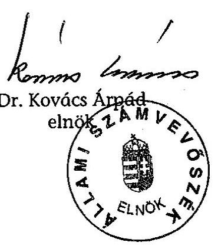

---

# 1/A-B. SZÁMÚ MELLÉKLETEK (észrevételek)

---

1/a sz. melléklet a V-29-44/2004-2005. sz. jelentéshez

$$
\begin{aligned}
& \text { V-29-43/2004-2005 HTM-6095/2005 } \\
& \text { 2659/05MMN/2 } \\
& \text { 2659/05MMN/2 }
\end{aligned}
$$

H-1051 BUDAPEST V., JOZSEF NÁDOR TÉR 2-4. POSTACIM: 1369 BUDAPEST, POSTAFIOK 481.
TELEFON: (36-1) 327-2159, (36-1) 327-2141
FAX: (36-1) 318-0738
E-MAIL: janos.veres@pm.gov.hu

PÉNZÜGYMINISZTER

Dr. Kovács Árpád úr
elnök
Állami Számvevőszék

Budapest

Tisztelt Elnök Úr!
A társasági adó beszedésére kialakított rendszer müködésének ellenőrzéséről készített jelentésük korrekt módon mutatja be az e területet érintően a minisztérium és az adóhatóság által az elmúlt időszakban végzett feladatokat. A jelentésben foglaltak a valóságnak megfelelnek, így arra észrevételt nem kívánok tenni.

Budapest, 2005. október 13.
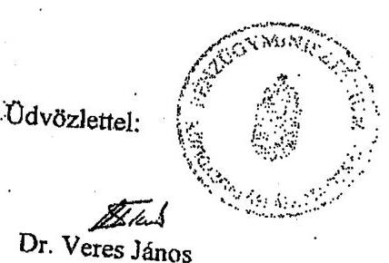

---

# ADÓ- ÉS PÉNZÜGYI ELLENÖRZÉSI HIVATAL 

## Elnök

Iktatószám: 8991858026/2005.

Hivatkozási szám:V-29-34/2004-2005.
Tárgy: ÁSZ jelentés-tervezet észrevételezése

## Bihary Zsigmond   föigazgató részére

Állami Számvevőszék
Budapest

## Tisztelt Föigazgató Úr!

Az APEH részére megküldött, a társasági adó beszedésére kialakított rendszer müködésének ellenőrzéséről készített V-29-34/2004-2005. számú ÁSZ jelentés-. tervezetben korábbi észrevételeink túlnyomórészt átvezetésre kerültek, a továbbiakban észrevételt nem teszünk.

Budapest, 2005. augusztus „b, ".
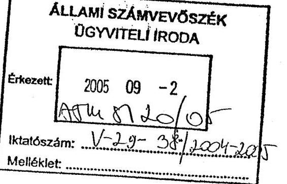
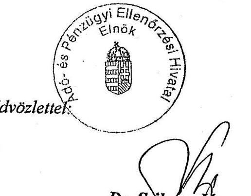

---

# 2. SZ. MELLÉKLET

---

# Tanúsítványok jegyzéke 

1. sz. tanúsítvány A társasági és osztalékadó bevallás elmulasztása miatt kivetett bírság alakulásáról 2001-2004.
2. sz. tanúsítvány A hibás bevallások számának alakulásáról 2000-2003. évi bevallások alapján.
3. sz. tanúsítvány A társasági adóelőleg kiegészítési kötelezettség elmulasztása alapján kiszabott bírságokról 2001-2004.
4. sz. tanúsítvány A társasági adóbevallás benyújtására adott évben kötelezett szervezetek bevallási mód szerinti megoszlásáról 200-2004.
5. sz. tanúsítvány A behajtási tevékenység kiemelt adatainak alakulásáról 2001-2004.
6. sz. tanúsítvány A külső megkeresésre folytatott végrehajtási eljárások alakulásáról 2001-2004.
7. sz. tanúsítvány A folyamatban lévő és a lezárult felszámolási és végelszámolási ügyek alakulásáról 2001-2004.
8. sz. tanúsítvány A behajtási eljárások lefolytatása után befolyt hátralékok és hátraléktörlések alakulásáról 2001-2004.

---

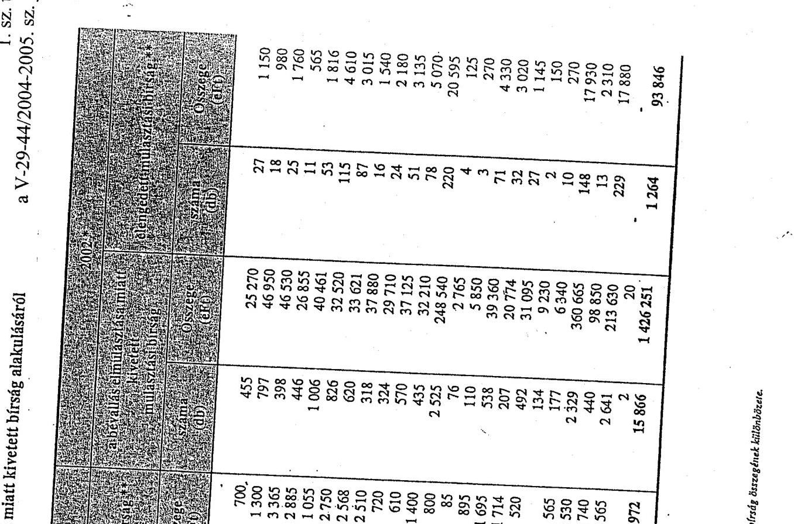

|  1. sz. tanúsítvány a V-29-44/2004-2005. sz. jelentéshez |  |  |  |  |  |  |  |  |  |  |  |  |  |  |  |  |   |
| --- | --- | --- | --- | --- | --- | --- | --- | --- | --- | --- | --- | --- | --- | --- | --- | --- | --- |
|  2001 - 2002 |  |  |  |  |  |  |  |  |  |  |  |  |  |  |  |  |   |
|  |   |   |   |   |   |   |   |   |   |   |   |   |   |   |   |   |   |
|  |   |   |   |   |   |   |   |   |   |   |   |   |   |   |   |   |   |
|  |   |   |   |   |   |   |   |   |   |   |   |   |   |   |   |   |   |
|  |   |   |   |   |   |   |   |   |   |   |   |   |   |   |   |   |   |
|  |   |   |   |   |   |   |   |   |   |   |   |   |   |   |   |   |   |
|  BARANYA M. | 710 | 26 250 | 22 | 700 | 455 | 25 370 | 27 | 1 150 |  |  |  |  |  |  |  |  |   |
|  BÁCS-KISKÚN M. | 710 | 39 660 | 21 | 1 300 | 797 | 46 950 | 18 | 980 |  |  |  |  |  |  |  |  |   |
|  BÉKÉS MEGYE | 297 | 40 460 | 36 | 3 365 | 398 | 46 530 | 25 | 1 760 |  |  |  |  |  |  |  |  |   |
|  BORSOD-ABAÚJ-ZEMP. M. | 695 | 28 755 | 81 | 2 885 | 446 | 26 855 | 11 | 565 |  |  |  |  |  |  |  |  |   |
|  CSONGRÁD M. | 688 | 28 165 | 38 | 1 055 | 1 006 | 40 461 | 53 | 1 816 |  |  |  |  |  |  |  |  |   |
|  FEJÉR MEGYE | 491 | 33 150 | 47 | 2 750 | 826 | 32 520 | 115 | 4 610 |  |  |  |  |  |  |  |  |   |
|  GYŐR-MOSON-SOPRON M. | 316 | 16 195 | 61 | 2 568 | 620 | 33 621 | 87 | 3 015 |  |  |  |  |  |  |  |  |   |
|  HAJDÚ-BIHAR M. | 465 | 51 570 | 24 | 2 510 | 318 | 37 880 | 16 | 1 540 |  |  |  |  |  |  |  |  |   |
|  HEVES MEGYE | 142 | 11 490 | 12 | 720 | 324 | 29 710 | 24 | 2 180 |  |  |  |  |  |  |  |  |   |
|  KOMÁROM-ESZTERGOM M. | 375 | 15 725 | 19 | 610 | 570 | 37 125 | 51 | 3 135 |  |  |  |  |  |  |  |  |   |
|  NÓGRÁD M. | 220 | 15 190 | 21 | 1 400 | 435 | 32 210 | 78 | 5 070 |  |  |  |  |  |  |  |  |   |
|  PEST M. | 524 | 42 450 | 11 | 800 | 2 525 | 248 540 | 220 | 20 595 |  |  |  |  |  |  |  |  |   |
|  SOMOGY M. | 201 | 4 690 | 3 | 85 | 76 | 2 785 | 4 | 125 |  |  |  |  |  |  |  |  |   |
|  SZABOLCS-SZ.-B. M. | 251 | 18 780 | 12 | 895 | 110 | 5 850 | 3 | 125 |  |  |  |  |  |  |  |  |   |
|  JÁSZ-N.-SZOL. M. | 431 | 18 450 | 54 | 1 695 | 538 | 39 360 | 71 | 4 330 |  |  |  |  |  |  |  |  |   |
|  TOLNA M. | 231 | 13 647 | 51 | 1 714 | 207 | 20 774 | 32 | 3 020 |  |  |  |  |  |  |  |  |   |
|  VAS M. | 284 | 18 415 | 8 | 520 | 492 | 31 095 | 27 | 1 145 |  |  |  |  |  |  |  |  |   |
|  VESZPRÉM M. | 240 | 11 820 |  |  | 134 | 9 230 | 2 | 150 |  |  |  |  |  |  |  |  |   |
|  ZALA M. | 316 | 7 135 | 36 | 565 | 177 | 6 340 | 10 | 270 |  |  |  |  |  |  |  |  |   |
|  ÉSZAK-BUDAPEST | 817 | 77 910 | 33 | 2 530 | 2 329 | 360 665 | 148 | 17 930 |  |  |  |  |  |  |  |  |   |
|  KELET-BUDAPEST | 1 467 | 168 260 | 104 | 10 740 | 440 | 98 850 | 13 | 2 310 |  |  |  |  |  |  |  |  |   |
|  DÉL-BUDAPEST | 2 776 | 277 750 | 418 | 47 565 | 2 641 | 213 630 | 229 | 17 880 |  |  |  |  |  |  |  |  |   |
|  KAJÓ | 2 | 350 |  |  | 2 | 20 | 1 | 17 880 |  |  |  |  |  |  |  |  |   |
|  ORSZÁGOS ÖSSZESEN | 12 749 | 966 247 | 1 112 | 86 972 | 15 866 | 1 426 251 | 1 264 | 93 846 |  |  |  |  |  |  |  |  |   |
|  |   |   |   |   |   |   |   |   |   |   |   |   |   |   |   |   |   |
|  |   |   |   |   |   |   |   |   |   |   |   |   |   |   |   |   |   |
|  |   |   |   |   |   |   |   |   |   |   |   |   |   |   |   |   |   |
|  |   |   |   |   |   |   |   |   |   |   |   |   |   |   |   |   |   |
|  |   |   |   |   |   |   |   |   |   |   |   |   |   |   |   |   |   |
|  |   |   |   |   |   |   |   |   |   |   |   |   |   |   |   |   |   |
|  |   |   |   |   |   |   |   |   |   |   |   |   |   |   |   |   |   |
|  |   |   |   |   |   |   |   |   |   |   |   |   |   |   |   |   |   |
|  |   |   |   |   |   |   |   |   |   |   |   |   |   |   |   |   |   |
|  |   |   |   |   |   |   |   |   |   |   |   |   |   |   |   |   |   |
|  |   |   |   |   |   |   |   |   |   |   |   |   |   |   |   |   |   |
|  |   |   |   |   |   |   |   |   |   |   |   |   |   |   |   |   |   |
|  |   |   |   |   |   |   |   |   |   |   |   |   |   |   |   |   |   |
|  |   |   |   |   |   |   |   |   |   |   |   |   |   |   |   |   |   |
|  |   |   |   |   |   |   |   |   |   |   |   |   |   |   |   |   |   |
|  |   |   |   |   |   |   |   |   |   |   |   |   |   |   |   |   |   |
|  |   |   |   |   |   |   |   |   |   |   |   |   |   |   |   |   |   |
|  |   |   |   |   |   |   |   |   |   |   |   |   |   |   |   |   |   |
|  |   |   |   |   |   |   |   |   |   |   |   |   |   |   |   |   |   |
|  |   |   |   |   |   |   |   |   |   |   |   |   |   |   |   |   |   |
|  |   |   |   |   |   |   |   |   |   |   |   |   |   |   |   |   |   |
|  |   |   |   |   |   |   |   |   |   |   |   |   |   |   |   |   |   |
|  |   |   |   |   |   |   |   |   |   |   |   |   |   |   |   |   |   |
|  |   |   |   |   |   |   |   |   |   |   |   |   |   |   |   |   |   |
|  |   |   |   |   |   |   |   |   |   |   |   |   |   |   |   |   |   |
|  |   |   |   |   |   |   |   |   |   |   |   |   |   |   |   |   |   |
|  |   |   |   |   |   |   |   |   |   |   |   |   |   |   |   |   |   |
|  |   |   |   |   |   |   |   |   |   |   |   |   |   |   |   |   |   |
|  |   |   |   |   |   |   |   |   |   |   |   |   |   |   |   |   |   |
|  |   |   |   |   |   |   |   |   |   |   |   |   |   |   |   |   |   |
|  |   |   |   |   |   |   |   |   |   |   |   |   |   |   |   |   |   |

---

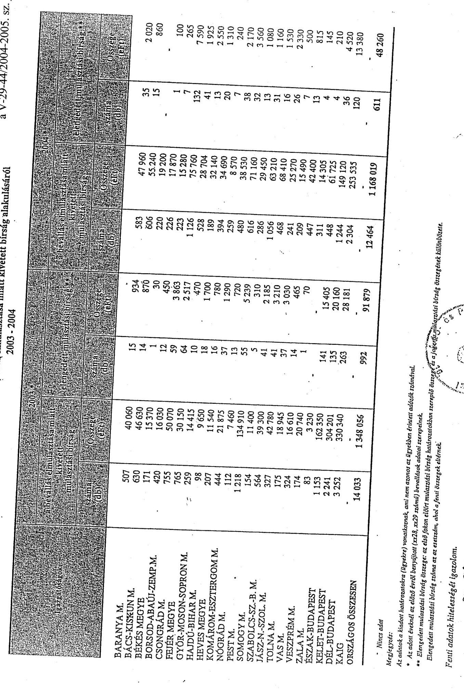

# A társasági és osztalékadó bevallás elmulasztása miatt kivetett bírság alakulásáról

## 2003 - 2004

|  BÁRANYA M. | 507 | 40 060 | 15 | 954 | 583 | 47 960 | 35 | 2 020  |
| --- | --- | --- | --- | --- | --- | --- | --- | --- |
|  BÁCS-KISMUN M. | 630 | 46 630 | 14 | 870 | 606 | 55 240 | 15 | 860  |
|  BÉKÉS MEGYE | 171 | 15 370 | 1 | 30 | 220 | 19 200 | 1 | 100  |
|  BORSOD-ABAÚJ-ZEMP. M. | 420 | 16 030 | 12 | 450 | 226 | 17 870 | 1 | 265  |
|  CSONORÁD M. | 755 | 50 070 | 59 | 3 863 | 223 | 15 280 | 7 | 7 590  |
|  FEJÉR MEGYE | 765 | 30 150 | 64 | 2 517 | 1 126 | 75 760 | 132 | 7 925  |
|  GYŐR-MOSON-SOPRON M. | 259 | 14 415 | 10 | 470 | 528 | 28 704 | 41 | 1 925  |
|  HAJDÚ-BIHAR M. | 98 | 9 650 | 18 | 1 700 | 189 | 32 140 | 13 | 2 550  |
|  HEVES MEGYE | 207 | 11 540 | 16 | 780 | 394 | 34 690 | 20 | 1 310  |
|  KOMÁROM-ESZTERGOM M. | 444 | 21 875 | 37 | 1 290 | 259 | 8 570 | 7 | 240  |
|  NOORÁD M. | 112 | 7 460 | 13 | 720 | 480 | 38 530 | 38 | 2 170  |
|  PEST M. | 1 218 | 134 910 | 55 | 5 239 | 616 | 71 160 | 32 | 5 560  |
|  SOMOGY M. | 154 | 11 400 | 5 | 310 | 286 | 29 450 | 13 | 1 080  |
|  SZABOLCS-SZ.-B. M. | 564 | 59 300 | 41 | 2 185 | 1 056 | 63 210 | 31 | 1 160  |
|  JÁSZ-N.-SZOL. M. | 337 | 42 780 | 41 | 3 210 | 468 | 68 410 | 16 | 1 530  |
|  TOLNA M. | 175 | 18 945 | 37 | 3 030 | 241 | 25 270 | 26 | 2 330  |
|  VAS M. | 324 | 16 610 | 14 | 465 | 209 | 15 490 | 7 | 500  |
|  VESZPRÉM M. | 174 | 20 740 | 1 | 70 | 447 | 42 400 | 13 | 815  |
|  ZALA M. | 83 | 3 230 | 14 | 15 405 | 311 | 14 305 | 4 | 145  |
|  ÉSZAK-BUDAPEST | 1 153 | 162 350 | 141 | 15 405 | 448 | 61 725 | 4 | 210  |
|  KELET-BUDAPEST | 2 241 | 304 201 | 135 | 20 160 | 1 244 | 149 120 | 36 | 4 520  |
|  DÉL-BUDAPEST | 3 252 | 330 340 | 263 | 28 181 | 2 304 | 253 535 | 120 | 13 380  |
|  KAJG |  |  |  |  |  |  |  |   |
|  ORSZÁGOS ÖSSZESEN | 14 033 | 1 348 056 | 992 | 91 879 | 12 464 | 1 168 019 | 611 | 48 260  |

- Nincs adat

Megjegyzés:

Az adatok a kiadott határozatokra (ügyekre) vonatkoznak, ami nem azonos az ügyekben érintett adatok számával.

- Az adott éveknél az előző évről benyújtott (zs28, zs29 számú) kevésletek adatai szerepelvek.

* Elengedett mulozatást bírság összege: az első fokon eléért mulozatást bírság határozatokban szereplő összege és a jogerőmiköngyést bírság összegevek különböző.

Elengedett mulozatást bírság száma az az esetzetet, ahol a fenti összegek elrímak.

Elengedett mulozatást bírság száma az az esetzetet, ahol a fenti összegek elrímak.

Fenti adatok hitelességét igazolom.

Budapest, 2005. 02. 02.

---

2. sz. tanúsítvány a V-29-44/2004-2005. sz. jelentéshez

Tanúsítvány a hibás bevallások számának alakulásáról 2000-2003 évi bevallások alapján

|  Bevallások* |  |  |  |  |  |  |  |  |  |  |  |  |  |  |  |  |  |  |  |  |  |  |  |  |  |  |  |  |  |   |
| --- | --- | --- | --- | --- | --- | --- | --- | --- | --- | --- | --- | --- | --- | --- | --- | --- | --- | --- | --- | --- | --- | --- | --- | --- | --- | --- | --- | --- | --- | --- |
|   |  |  |  |  |  |  |  |  |  |  |  |  |  |  |  |  |  |  |  |  |  |  |  |  |  |  |  |  |  |   |
|   |  |  |  |  |  |  |  |  |  |  |  |  |  |  |  |  |  |  |  |  |  |  |  |  |  |  |  |  |  |   |
|   |  |  |  |  |  |  |  |  |  |  |  |  |  |  |  |  |  |  |  |  |  |  |  |  |  |  |  |  |  |   |
|   |  |  |  |  |  |  |  |  |  |  |  |  |  |  |  |  |  |  |  |  |  |  |  |  |  |  |  |  |  |   |
|   |  |  |  |  |  |  |  |  |  |  |  |  |  |  |  |  |  |  |  |  |  |  |  |  |  |  |  |  |  |   |
|   |  |  |  |  |  |  |  |  |  |  |  |  |  |  |  |  |  |  |  |  |  |  |  |  |  |  |  |  |  |   |
|   |  |  |  |  |  |  |  |  |  |  |  |  |  |  |  |  |  |  |  |  |  |  |  |  |  |  |  |  |  |   |
|   |  |  |  |  |  |  |  |  |  |  |  |  |  |  |  |  |  |  |  |  |  |  |  |  |  |  |  |  |  |   |
|   |  |  |  |  |  |  |  |  |  |  |  |  |  |  |  |  |  |  |  |  |  |  |  |  |  |  |  |  |  |   |
|   |  |  |  |  |  |  |  |  |  |  |  |  |  |  |  |  |  |  |  |  |  |  |  |  |  |  |  |  |  |   |
|   |  |  |  |  |  |  |  |  |  |  |  |  |  |  |  |  |  |  |  |  |  |  |  |  |  |  |  |  |  |   |
|   |  |  |  |  |  |  |  |  |  |  |  |  |  |  |  |  |  |  |  |  |  |  |  |  |  |  |  |  |  |   |
|   |  |  |  |  |  |  |  |  |  |  |  |  |  |  |  |  |  |  |  |  |  |  |  |  |  |  |  |  |  |   |
|   |  |  |  |  |  |  |  |  |  |  |  |  |  |  |  |  |  |  |  |  |  |  |  |  |  |  |  |  |  |   |
|   |  |  |  |  |  |  |  |  |  |  |  |  |  |  |  |  |  |  |  |  |  |  |  |  |  |  |  |  |  |   |
|   |  |  |  |  |  |  |  |  |  |  |  |  |  |  |  |  |  |  |  |  |  |  |  |  |  |  |  |  |  |   |
|   |  |  |  |  |  |  |  |  |  |  |  |  |  |  |  |  |  |  |  |  |  |  |  |  |  |  |  |  |  |   |
|   |  |  |  |  |  |  |  |  |  |  |  |  |  |  |  |  |  |  |  |  |  |  |  |  |  |  |  |  |  |   |
|   |  |  |  |  |  |  |  |  |  |  |  |  |  |  |  |  |  |  |  |  |  |  |  |  |  |  |  |  |  |   |
|   |  |  |  |  |  |  |  |  |  |  |  |  |  |  |  |  |  |  |  |  |  |  |  |  |  |  |  |  |  |   |
|   |  |  |  |  |  |  |  |  |  |  |  |  |  |  |  |  |  |  |  |  |  |  |  |  |  |  |  |  |  |   |
|   |  |  |  |  |  |  |  |  |  |  |  |  |  |  |  |  |  |  |  |  |  |  |  |  |  |  |  |  |  |   |
|   |  |  |  |  |  |  |  |  |  |  |  |  |  |  |  |  |  |  |  |  |  |  |  |  |  |  |  |  |  |   |
|   |  |  |  |  |  |  |  |  |  |  |  |  |  |  |  |  |  |  |  |  |  |  |  |  |  |  |  |  |  |   |
|   |  |  |  |  |  |  |  |  |  |  |  |  |  |  |  |  |  |  |  |  |  |  |  |  |  |  |  |  |  |   |
|   |  |  |  |  |  |  |  |  |  |  |  |  |  |  |  |  |  |  |  |  |  |  |  |  |  |  |  |  |  |   |
|   |  |  |  |  |  |  |  |  |  |  |  |  |  |  |  |  |  |  |  |  |  |  |  |  |  |  |  |  |  |   |
|   |  |  |  |  |  |  |  |  |  |  |  |  |  |  |  |  |  |  |  |  |  |  |  |  |  |  |  |  |  |   |
|   |  |  |  |  |  |  |  |  |  |  |  |  |  |  |  |  |  |  |  |  |  |  |  |  |  |  |  |  |  |   |
|   |  |  |  |  |  |  |  |  |  |  |  |  |  |  |  |  |  |  |  |  |  |  |  |  |  |  |  |  |  |   |
|   |  |  |  |  |  |  |  |  |  |  |  |  |  |  |  |  |  |  |  |  |  |  |  |  |  |  |  |  |  |   |
|   |

---

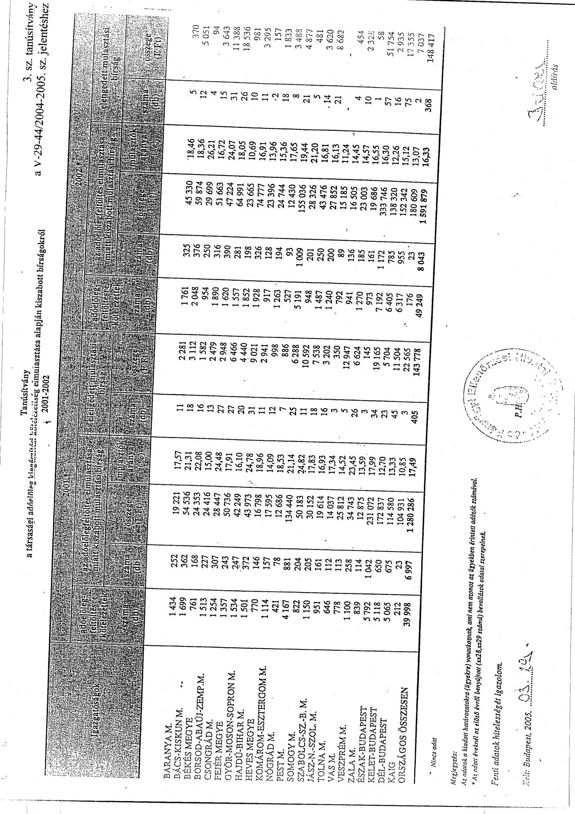

# 3. sz. tanúsítvány

## a 1994. 12. 18. 18. 18. 18. 18. 18. 18. 18. 18. 18. 18. 18. 18. 18. 18. 18. 18. 18. 18. 18. 18. 18. 18. 18. 18. 18. 18. 18. 18. 18. 18. 18. 18. 18. 18. 18. 18. 18. 18. 18. 18. 18. 18. 18. 18. 18. 18. 18. 18. 18

---

tanúsítvány a társasági adóelőleg kiegészítési hitédegyítóg elismáncsára alapján kiszabott bíróágokról 2003-2004 a V-29-44/2004-2005. sz. jelentéshez

|  |   |   |   |   |   |   |   |   |   |   |   |   |
| --- | --- | --- | --- | --- | --- | --- | --- | --- | --- | --- | --- | --- |
|  |   |   |   |   |   |   |   |   |   |   |   |   |
|  |   |   |   |   |   |   |   |   |   |   |   |   |
|  |   |   |   |   |   |   |   |   |   |   |   |   |
|  |   |   |   |   |   |   |   |   |   |   |   |   |
|  |   |   |   |   |   |   |   |   |   |   |   |   |
|  |   |   |   |   |   |   |   |   |   |   |   |   |
|  |   |   |   |   |   |   |   |   |   |   |   |   |
|  |   |   |   |   |   |   |   |   |   |   |   |   |
|  |   |   |   |   |   |   |   |   |   |   |   |   |
|  |   |   |   |   |   |   |   |   |   |   |   |   |
|  |   |   |   |   |   |   |   |   |   |   |   |   |
|  |   |   |   |   |   |   |   |   |   |   |   |   |
|  |   |   |   |   |   |   |   |   |   |   |   |   |
|  |   |   |   |   |   |   |   |   |   |   |   |   |
|  |   |   |   |   |   |   |   |   |   |   |   |   |
|  |   |   |   |   |   |   |   |   |   |   |   |   |
|  |   |   |   |   |   |   |   |   |   |   |   |   |
|  |   |   |   |   |   |   |   |   |   |   |   |   |
|  |   |   |   |   |   |   |   |   |   |   |   |   |
|  |   |   |   |   |   |   |   |   |   |   |   |   |
|  |   |   |   |   |   |   |   |   |   |   |   |   |
|  |   |   |   |   |   |   |   |   |   |   |   |   |
|  |   |   |   |   |   |   |   |   |   |   |   |   |
|  |   |   |   |   |   |   |   |   |   |   |   |   |
|  |   |   |   |   |   |   |   |   |   |   |   |   |
|  |   |   |   |   |   |   |   |   |   |   |   |   |
|  |   |   |   |   |   |   |   |   |   |   |   |   |
|  |   |   |   |   |   |   |   |   |   |   |   |   |
|  |   |   |   |   |   |   |   |   |   |   |   |   |
|  |   |   |   |   |   |   |   |   |   |   |   |   |
|  |   |   |   |   |   |   |   |   |   |   |   |   |

---

4. sz. tanúsítvány a V-29-44/2004-2005. sz. jelentőshez a társasági adóbevallás benyújtására adott évben kötelezett szervezetek bevallási mód szerinti megoszlásáról 2002-2004

|   |  |  |  |  |  | Vállalkozások |  | Egyéb szervezetek |  |  |  |   |
| --- | --- | --- | --- | --- | --- | --- | --- | --- | --- | --- | --- | --- |
|   |  |  |  |  |  | 2002* | 2003 | 2004 | 2002* | 2003 | 2004 | 2002*  |
|  Összes kötelezett | száma (db) |  |  |  |  | 363 565 | 371 201 | 957 | 69 741 | 67 481 | 290 332 | 429 306  |
|  Elektronikus bevallást benyújtók | száma (db) |  |  |  |  | 435 | 2 814 | 0 | 0 | 35 | 0 | 435  |
|   | aránya (%) |  |  |  |  | 0,12 | 0,78 | 0,00 | 0,00 | 0,00 | 0,00 | 0,10  |
|  Nyomtatványkötöltő programmal kötötti bevallást benyújtók | száma (db) |  |  |  |  | 213 714 | 253 063 | 508 | 5 041 | 6 785 | 148 943 | 218 755  |
|   | aránya (%) |  |  |  |  | 58,78 | 68,17 | 52,87 | 7,67 | 10,00 | 50,43 | 50,96  |
|  Hagyományos módon teljesített bevallások | száma (db) |  |  |  |  | 145 938 | 107 605 | 71 835 | 451 | 5 383 | 4 196 | 146 389  |
|   | aránya (%) |  |  |  |  | 49,58 | 29,61 | 19,35 | 47,13 | 8,16 | 6,22 | 49,57  |
|  Nyilatkozott | száma (db) |  |  |  |  | 612 | 665 |  | 46 195 | 47 139 |  | 46 807  |
|   | aránya (%) |  |  |  |  | 0,17 | 0,18 |  | 70,27 | 69,86 |  | 10,90  |
|  Bevallást be nem nyújtók száma | száma (db) |  |  |  |  | 41 149 | 42 824 |  | 9 142 | 9 328 |  | 50 291  |
|   | aránya (%) |  |  |  |  | 11,32 | 11,54 |  | 13,91 | 13,82 |  | 11,71  |
|  Összes kötelezett | eFI |  |  |  |  | 9 512 199 929 | 10 724 729 182 | 11 626 592 222 | 45 347 553 | 131 148 435 | 156 034 265 | 9 557 547 482  |
|  Elektronikus bevallást benyújtók | eFI |  |  |  |  | 3 021 988 880 | 8 655 578 577 | 0 | 0 | 33 151 315 | 0 | 3 021 988 880  |
|   | aránya (%) |  |  |  |  | 0,00 | 28,18 | 57,24 | 0,00 | 0,00 | 21,25 | 0,00  |
|  Nyomtatványkötöltő programmal kötötti bevallást benyújtók | eFI |  |  |  |  | 7 159 651 016 | 6 081 531 105 | 4 009 811 787 | 25 721 702 | 64 375 608 | 58 228 942 | 7 165 372 718  |
|   | aránya (%) |  |  |  |  | 75,27 | 66,71 | 34,49 | 56,72 | 49,08 | 37,32 | 75,18  |
|  Hagyományos módon teljesített bevallások | eFI |  |  |  |  | 2 352 548 913 | 1 379 370 647 | 694 110 519 | 19 625 851 | 29 868 400 | 16 357 919 | 2 372 174 764  |
|   | aránya (%) |  |  |  |  | 24,73 | 12,88 | 5,97 | 43,29 | 22,77 | 10,49 | 24,82  |
|  Összes kötelezett | eFI |  |  |  |  | 1 932 634 342 | 2 067 459 419 | 2 398 603 225 | 21 668 811 | 78 880 861 | 94 917 864 | 1 954 303 153  |
|  Elektronikus bevallást benyújtók | eFI |  |  |  |  | 655 258 276 | 1 268 599 025 | 0 | 0 | 17 766 996 | 0 | 655 258 276  |
|   | aránya (%) |  |  |  |  | 0,00 | 31,39 | 53,72 | 0,00 | 0,00 | 15,74 | 0,00  |
|  Nyomtatványkötöltő programmal kötötti bevallást benyújtók | eFI |  |  |  |  | 1 423 697 679 | 1 087 598 261 | 914 580 266 | 10 409 589 | 31 648 351 | 31 018 995 | 1 434 107 268  |
|   | aránya (%) |  |  |  |  | 73,67 | 52,59 | 38,13 | 48,04 | 40,12 | 32,68 | 75,39  |
|  Hagyományos módon teljesített bevallások 1 | eFI |  |  |  |  | 508 936 663 | 318 083 725 | 170 639 286 | 11 259 223 | 19 572 826 | 10 390 892 | 520 195 886  |
|   | aránya (%) |  |  |  |  | 26,33 | 15,24 | 7,11 | 31,95 | 24,81 | 10,95 | 26,62  |
|  Megjegyzés: |  |  |  |  |  |  |  |  |  |  |  |   |
|  Az adatok összeállítása során nem a bevallások számát, hanem az érintett adóalanyokat vettük figyelembe. |  |  |  |  |  |  |  |  |  |  |  |   |
|  Az adott év oszlopában az előző ávról beadott exült, exült, exFI számú bevallások szerepelnek, függetlenül attól, hogy ELÖ, vagy éppen üzleti évet váltó bevallásról van e szó. |  |  |  |  |  |  |  |  |  |  |  |   |
|  * 2001 évre vonatkozóan a kötelezettek köre helyett a ténylegesen társasági adó bevallást benyújtók száma szerepel. |  |  |  |  |  |  |  |  |  |  |  |   |
|  ** Adóteljesítmény az összes adónemre vonatkozó bevallások alapján számított érték. |  |  |  |  |  |  |  |  |  |  |  |   |
|  *** Az összes adónemre vonatkozó befizetések és klubbafizetések. |  |  |  |  |  |  |  |  |  |  |  |   |

A fenti adatok hőalességét igazolom:

Kelt: 2005.04.07.

---

5. sz. tanúsítvány a behejtási tevékenység kiemelt adatainak alakulásáról 2001 a V-29-44/2004-2005. sz. jelentéshez

|  Tarifati
szerveszetek/igazgatóságok/ | Végrehajtási cselesmények |  |  |  |  |  |  |  |  |  |  |  |  |  |  |  |  |  |  |  |  |  |   |
| --- | --- | --- | --- | --- | --- | --- | --- | --- | --- | --- | --- | --- | --- | --- | --- | --- | --- | --- | --- | --- | --- | --- | --- |
|   |  |  |  |  |  |  |  |  |  |  |  |  |  |  |  |  |  |  |  |  |  |  |   |
|   |  |  |  |  |  |  |  |  |  |  |  |  |  |  |  |  |  |  |  |  |  |  |   |
|   |  |  |  |  |  |  |  |  |  |  |  |  |  |  |  |  |  |  |  |  |  |  |   |
|   |  |  |  |  |  |  |  |  |  |  |  |  |  |  |  |  |  |  |  |  |  |  |   |
|   |  |  |  |  |  |  |  |  |  |  |  |  |  |  |  |  |  |  |  |  |  |  |   |
|   |  |  |  |  |  |  |  |  |  |  |  |  |  |  |  |  |  |  |  |  |  |  |   |
|   |  |  |  |  |  |  |  |  |  |  |  |  |  |  |  |  |  |  |  |  |  |  |   |
|   |  |  |  |  |  |  |  |  |  |  |  |  |  |  |  |  |  |  |  |  |  |  |   |
|   |  |  |  |  |  |  |  |  |  |  |  |  |  |  |  |  |  |  |  |  |  |  |   |
|   |  |  |  |  |  |  |  |  |  |  |  |  |  |  |  |  |  |  |  |  |  |  |   |
|   |  |  |  |  |  |  |  |  |  |  |  |  |  |  |  |  |  |  |  |  |  |  |   |
|   |  |  |  |  |  |  |  |  |  |  |  |  |  |  |  |  |  |  |  |  |  |  |   |
|   |  |  |  |  |  |  |  |  |  |  |  |  |  |  |  |  |  |  |  |  |  |  |   |
|   |  |  |  |  |  |  |  |  |  |  |  |  |  |  |  |  |  |  |  |  |  |  |   |
|   |  |  |  |  |  |  |  |  |  |  |  |  |  |  |  |  |  |  |  |  |  |  |   |
|   |  |  |  |  |  |  |  |  |  |  |  |  |  |  |  |  |  |  |  |  |  |  |   |
|   |  |  |  |  |  |  |  |  |  |  |  |  |  |  |  |  |  |  |  |  |  |  |   |
|   |  |  |  |  |  |  |  |  |  |  |  |  |  |  |  |  |  |  |  |  |  |  |   |
|   |  |  |  |  |  |  |  |  |  |  |  |  |  |  |  |  |  |  |  |  |  |  |   |
|   |  |  |  |  |  |  |  |  |  |  |  |  |  |  |  |  |  |  |  |  |  |  |   |
|   |  |  |  |  |  |  |  |  |  |  |  |  |  |  |  |  |  |  |  |  |  |  |   |
|   |  |  |  |  |  |  |  |  |  |  |  |  |  |  |  |  |  |  |  |  |  |  |   |
|   |  |  |  |  |  |  |  |  |  |  |  |  |  |  |  |  |  |  |  |  |  |  |   |
|   |  |  |  |  |  |  |  |  |  |  |  |  |  |  |  |  |  |  |  |  |  |  |   |
|   |  |  |  |  |  |  |  |  |  |  |  |  |  |  |  |  |  |  |  |  |  |  |   |
|   |  |  |  |  |  |  |  |  |  |  |  |  |  |  |  |  |  |  |  |  |  |  |   |
|   |  |  |  |  |  |  |  |  |  |  |  |  |  |  |  |  |  |  |  |  |  |  |   |
|   |  |  |  |  |  |  |  |  |  |  |  |  |  |  |  |  |  |  |  |  |  |  |   |
|   |  |  |  |  |  |  |  |  |  |  |  |  |  |  |  |  |  |  |  |  |  |  |   |
|   |  |  |  |  |  |  |  |  |  |  |  |  |  |  |  |  |  |  |  |  |  |  |   |
|   |  |  |  |  |  |  |  |  |  |  |  |  |  |  |  |  |  |  |  |  |  |  |   |
|   |

---

|  Tarifisté |  |  |  |  |  |  |  |  |  |  |  |  |  |  |   |
| --- | --- | --- | --- | --- | --- | --- | --- | --- | --- | --- | --- | --- | --- | --- | --- |
|  rezervzatek/igazgatitsizgak/ |  |  |  |  |  |  |  |  |  |  |  |  |  |  |   |
|   |  |  |  |  |  |  |  |  |  |  |  |  |  |  |   |
|  |   |   |   |   |   |   |   |   |   |   |   |   |   |   |   |
|  |   |   |   |   |   |   |   |   |   |   |   |   |   |   |   |
|  |   |   |   |   |   |   |   |   |   |   |   |   |   |   |   |
|  |   |   |   |   |   |   |   |   |   |   |   |   |   |   |   |
|  |   |   |   |   |   |   |   |   |   |   |   |   |   |   |   |
|  |   |   |   |   |   |   |   |   |   |   |   |   |   |   |   |
|  |   |   |   |   |   |   |   |   |   |   |   |   |   |   |   |
|  |   |   |   |   |   |   |   |   |   |   |   |   |   |   |   |
|  |   |   |   |   |   |   |   |   |   |   |   |   |   |   |   |
|  |   |   |   |   |   |   |   |   |   |   |   |   |   |   |   |
|  |   |   |   |   |   |   |   |   |   |   |   |   |   |   |   |
|  |   |   |   |   |   |   |   |   |   |   |   |   |   |   |   |
|  |   |   |   |   |   |   |   |   |   |   |   |   |   |   |   |
|  |   |   |   |   |   |   |   |   |   |   |   |   |   |   |   |
|  |   |   |   |   |   |   |   |   |   |   |   |   |   |   |   |
|  |   |   |   |   |   |   |   |   |   |   |   |   |   |   |   |
|  |   |   |   |   |   |   |   |   |   |   |   |   |   |   |   |
|  |   |   |   |   |   |   |   |   |   |   |   |   |   |   |   |
|  |   |   |   |   |   |   |   |   |   |   |   |   |   |   |   |
|  |   |   |   |   |   |   |   |   |   |   |   |   |   |   |   |
|  |   |   |   |   |   |   |   |   |   |   |   |   |   |   |   |
|  |   |   |   |   |   |   |   |   |   |   |   |   |   |   |   |
|  |   |   |   |   |   |   |   |   |   |   |   |   |   |   |   |
|  |   |   |   |   |   |   |   |   |   |   |   |   |   |   |   |
|  |   |   |   |   |   |   |   |   |   |   |   |   |   |   |   |
|  |   |   |   |   |   |   |   |   |   |   |   |   |   |   |   |
|  |   |   |   |   |   |   |   |   |   |   |   |   |   |   |   |
|  |   |   |   |   |   |   |   |   |   |   |   |   |   |   |   |
|  |   |   |   |   |   |   |   |   |   |   |   |   |   |   |   |
|  |   |   |   |   |   |   |   |   |   |   |   |   |   |   |   |
|  |   |   |   |   |   |   |   |   |   |   |   |   |   |   |   |

---

|  Területi
szervizetett
igazgatóságok | Végrehajtási cselekvés |  |  |  |  |  |  |  |  |  |  |  |  |  |  |  |  |   |
| --- | --- | --- | --- | --- | --- | --- | --- | --- | --- | --- | --- | --- | --- | --- | --- | --- | --- | --- |
|   |  |  |  |  |  |  |  |  |  |  |  |  |  |  |  |  |  |   |
|   |  |  |  |  |  |  |  |  |  |  |  |  |  |  |  |  |  |   |
|   |  |  |  |  |  |  |  |  |  |  |  |  |  |  |  |  |  |   |
|   |  |  |  |  |  |  |  |  |  |  |  |  |  |  |  |  |  |   |
|   |  |  |  |  |  |  |  |  |  |  |  |  |  |  |  |  |  |   |
|   |  |  |  |  |  |  |  |  |  |  |  |  |  |  |  |  |  |   |
|   |  |  |  |  |  |  |  |  |  |  |  |  |  |  |  |  |  |   |
|   |  |  |  |  |  |  |  |  |  |  |  |  |  |  |  |  |  |   |
|   |  |  |  |  |  |  |  |  |  |  |  |  |  |  |  |  |  |   |
|   |  |  |  |  |  |  |  |  |  |  |  |  |  |  |  |  |  |   |
|   |  |  |  |  |  |  |  |  |  |  |  |  |  |  |  |  |  |   |
|   |  |  |  |  |  |  |  |  |  |  |  |  |  |  |  |  |  |   |
|   |  |  |  |  |  |  |  |  |  |  |  |  |  |  |  |  |  |   |
|   |  |  |  |  |  |  |  |  |  |  |  |  |  |  |  |  |  |   |
|   |  |  |  |  |  |  |  |  |  |  |  |  |  |  |  |  |  |   |
|   |  |  |  |  |  |  |  |  |  |  |  |  |  |  |  |  |  |   |
|   |  |  |  |  |  |  |  |  |  |  |  |  |  |  |  |  |  |   |
|   |  |  |  |  |  |  |  |  |  |  |  |  |  |  |  |  |  |   |
|   |  |  |  |  |  |  |  |  |  |  |  |  |  |  |  |  |  |   |
|   |  |  |  |  |  |  |  |  |  |  |  |  |  |  |  |  |  |   |
|   |  |  |  |  |  |  |  |  |  |  |  |  |  |  |  |  |  |   |
|   |  |  |  |  |  |  |  |  |  |  |  |  |  |  |  |  |  |   |
|   |  |  |  |  |  |  |  |  |  |  |  |  |  |  |  |  |  |   |
|   |  |  |  |  |  |  |  |  |  |  |  |  |  |  |  |  |  |   |
|   |  |  |  |  |  |  |  |  |  |  |  |  |  |  |  |  |  |   |
|   |  |  |  |  |  |  |  |  |  |  |  |  |  |  |  |  |  |   |
|   |  |  |  |  |  |  |  |  |  |  |  |  |  |  |  |  |  |   |
|   |  |  |  |  |  |  |  |  |  |  |  |  |  |  |  |  |  |   |
|   |  |  |  |  |  |  |  |  |  |  |  |  |  |  |  |  |  |   |
|   |  |  |  |  |  |  |  |  |  |  |  |  |  |  |  |  |  |   |
|   |  |  |  |  |  |  |  |  |  |  |  |  |  |  |  |  |  |   |
|   |

---

Sz. sz. tanúciirány a behaítási tevékenység kiemelt adatainak alakulásáról 2004 a V-29-44/2004-2005. sz. jelentéshez

|  Területi |  |  |  |  |  |  |  |  |  |  |  |  |  |  |  |   |
| --- | --- | --- | --- | --- | --- | --- | --- | --- | --- | --- | --- | --- | --- | --- | --- | --- |
|  szervezés |  |  |  |  |  |  |  |  |  |  |  |  |  |  |  |   |
|  szervezés |  |  |  |  |  |  |  |  |  |  |  |  |  |  |  |   |
|  Szervazás |  |  |  |  |  |  |  |  |  |  |  |  |  |  |  |   |
|  Szervazás |  |  |  |  |  |  |  |  |  |  |  |  |  |  |  |   |
|  Szervazás |  |  |  |  |  |  |  |  |  |  |  |  |  |  |  |   |
|  Szervazás |  |  |  |  |  |  |  |  |  |  |  |  |  |  |  |   |
|  Szervazás |  |  |  |  |  |  |  |  |  |  |  |  |  |  |  |   |
|  Szervazás |  |  |  |  |  |  |  |  |  |  |  |  |  |  |  |   |
|  Szervazás |  |  |  |  |  |  |  |  |  |  |  |  |  |  |  |   |
|  Szervazás |  |  |  |  |  |  |  |  |  |  |  |  |  |  |  |   |
|  Szervazás |  |  |  |  |  |  |  |  |  |  |  |  |  |  |  |   |
|  Szervazás |  |  |  |  |  |  |  |  |  |  |  |  |  |  |  |   |
|  Szervazás |  |  |  |  |  |  |  |  |  |  |  |  |  |  |  |   |
|  Szervazás |  |  |  |  |  |  |  |  |  |  |  |  |  |  |  |   |
|  Szervazás |  |  |  |  |  |  |  |  |  |  |  |  |  |  |  |   |
|  Szervazás |  |  |  |  |  |  |  |  |  |  |  |  |  |  |  |   |
|  Szervazás |  |  |  |  |  |  |  |  |  |  |  |  |  |  |  |   |
|  Szervazás |  |  |  |  |  |  |  |  |  |  |  |  |  |  |  |   |
|  Szervazás |  |  |  |  |  |  |  |  |  |  |  |  |  |  |  |   |
|  Szervazás |  |  |  |  |  |  |  |  |  |  |  |  |  |  |  |   |
|  Szervazás |  |  |  |  |  |  |  |  |  |  |  |  |  |  |  |   |
|  Szervazás |  |  |  |  |  |  |  |  |  |  |  |  |  |  |  |   |
|  Szervazás |  |  |  |  |  |  |  |  |  |  |  |  |  |  |  |   |
|  Szervazás |  |  |  |  |  |  |  |  |  |  |  |  |  |  |  |   |
|  Szervazás |  |  |  |  |  |  |  |  |  |  |  |  |  |  |  |   |
|  Szervazás |  |  |  |  |  |  |  |  |  |  |  |  |  |  |  |   |
|  Szervazás |  |  |  |  |  |  |  |  |  |  |  |  |  |  |  |   |
|  Szervazás |  |  |  |  |  |  |  |  |  |  |  |  |  |  |  |   |
|  Szervazás |  |  |  |  |  |  |  |  |  |  |  |  |  |  |  |   |
|  Szervazás |  |  |  |  |  |  |  |  |  |  |  |  |  |  |  |   |
|  Szervazás |  |  |  |  |  |  |  |  |  |  |  |  |  |  |  |   |
|  Szervazás |  |  |  |  |  |  |  |  |  |  |  |  |  |  |  |   |
|  Szervazás |  |  |  |  |  |  |  |  |  |  |  |  |  |  |  |   |
|  Sz

---

tanúsítvány a külső megkeresésre folytatott végrehajtási eljárások alakulásáról 2001

|  Területi szervezetek/igazgatóságok/ | Végrehajtás alá vont adózók száma | Végrehajtással érintett adótartozás | Külső megkeresésre folytatott végrehajtási eljárások száma | Külső megkeresésre folytatott végrehajtási eljárások összege  |
| --- | --- | --- | --- | --- |
|   | db | E Ft | db | E Ft  |
|  Baranya megyei | 5.776 | 5.466.248 | 260 | 101.348  |
|  Báce-Kiskun megyei | 6.806 | 11.228.523 | 531 | 1.087.172  |
|  Békés megyei | 7.867 | 7.396.217 | 227 | 113.941  |
|  Borsod-Abaúj-Zemplén megyei | 7.136 | 7.797.555 | 1.038 | 147.201  |
|  Csongrád megyei | 7.435 | 7.835.547 | 660 | 2.362.472  |
|  Fejér megyei | 2.811 | 8.803.316 | 136 | 117.654  |
|  Győr-Moson-Sopron megyei | 3.379 | 6.537.357 | 225 | 539.751  |
|  Hajdú-Bihar megyei | 10.853 | 8.743.820 | 1.228 | 355.515  |
|  Heves megyei | 4.014 | 4.390.537 | 194 | 44.857  |
|  Jász-Nagykun-Szolnok megyei | 3.984 | 5.414.575 | 227 | 149.961  |
|  Komárom-Esztergom megyei | 6.898 | 13.254.733 | 45 | 17.833  |
|  Négrád megyei | 4117 | 5.827.581 | 382 | 151.500  |
|  Pest megyei | 11.559 | 33.017.927 | 519 | 121.087  |
|  Somogy megyei | 6.115 | 8.316.780 | 421 | 504.344  |
|  Szabolcs-Szatmár-Bereg megyei | 7.610 | 9.192.131 | 1.517 | 708.314  |
|  Tolna megyei | 3.343 | 3.441.428 | 225 | 81.849  |
|  Vesszprém megyei | 2.703 | 2.988.117 | 127 | 135.785  |
|  Zala megyei | 4.915 | 4.987.667 | 208 | 61.836  |
|  Déli-budapesti | 5.474 | 3.862.846 | 251 | 47.425  |
|  Eszak-budapesti | 16.866 | 44.914.756 | 626 | 532.567  |
|  Kelet-budapesti | 7.007 | 47.785.139 | 356 | 578.313  |
|  KAJG | 11.612 | 57.223.006 | 727 | 847.903  |
|  Összesen | 148.284 | 1.987.374 | 0 | 0  |
|   |  | 310.413.180 | 10.230 | 8.808.628  |

Fenti adatok hitelességét igazolom.

Kelt: Budapest, 2005. CZ 15

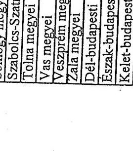

alázás

---

Tandeltvány a külső megkeresésre folytatott végrehajtási eljárások alakulásáról 2002

|  Területi szervezetek/igazgatóságok/ | Végrehajtás alá vont adózók száma | Végrehajtással érintett adótartozás | Külső megkeresésre folytatott végrehajtási eljárások száma | Külső megkeresésre folytatott végrehajtási eljárások összege  |
| --- | --- | --- | --- | --- |
|   | db | E Ft | db | E Ft  |
|  Baranya megyei | 5.689 | 6.026.354 | 657 | 131.807  |
|  Bács-Kiskun megyei | 8.382 | 11.905.996 | 1.172 | 2.027.135  |
|  Békés megyei | 7.793 | 7.944.956 | 594 | 229.315  |
|  Borzod-Abaúj-Zemplén megyei | 10.056 | 9.477.483 | 1.877 | 319.218  |
|  Csongrád megyei | 6.446 | 8.929.569 | 934 | 2.548.816  |
|  Fejér megyei | 3.646 | 10.077.640 | 407 | 67.791  |
|  Győr-Moson-Sopron megyei | 2.545 | 7.819.883 | 427 | 7.243.983  |
|  Hajdú-Bihar megyei | 7.812 | 7.424.194 | 879 | 225.550  |
|  Heves megyei | 4.464 | 4.142.659 | 469 | 91.648  |
|  Jász-Nagykun-Szolnok megyei | 4.782 | 5.867.494 | 490 | 104.115  |
|  Komárom-Esztergom megyei | 7.341 | 12.860.773 | 440 | 139.304  |
|  Nógrád megyei | 2.919 | 5.782.379 | 448 | 156.738  |
|  Pest megyei | 17.378 | 35.276.982 | 1.472 | 598.280  |
|  Somogy megyei | 6.528 | 7.553.708 | 780 | 254.422  |
|  Szabolcs-Szatmár-Bereg megyei | 7.836 | 17.690.953 | 1.767 | 1.101.428  |
|  Tolna megyei | 3.284 | 3.578.127 | .288 | 258.736  |
|  Vas megyei | 3.019 | 3.131.383 | 523 | 46.492  |
|  Veszprém megyei | 5.308 | 4.953.048 | 533 | 124.926  |
|  Zala megyei | 6.922 | 4.393.212 | 477 | 59.300  |
|  Dél-budapesti | 20.912 | 46.090.109 | 1.617 | 943.118  |
|  Eszak-budapesti | 10.081 | 56.371.370 | 1.161 | 1.305.679  |
|  Kelet-budapesti | 15.899 | 62.923.099 | 1.609 | 803.009  |
|  KAIG | 4 | 1.569.527 | 1 | 33  |
|  Összesen | 169.046 | 341.790.896 | 18.824 | 18.780.843  |

Fenti adatok hitelességét igazolom.

Kelt: Budapest, 2005. 02.28.

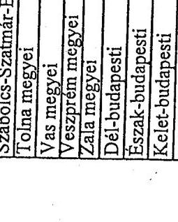

alázás

---

6/b sz. tanúsítvány a V-29-44/2004-2005. sz. jelentéshez

|  Területi szervezetek/igazgatóságok/ | Végrehajtás alá vont adózók száma | Végrehajtással érintett adótartozás | Külső megkeresésre folytatott végrehajtási eljárások száma | Külső megkeresésre folytatott végrehajtási eljárások összege  |
| --- | --- | --- | --- | --- |
|   | db | E Ft | db | E Ft  |
|  Baranya megyei | 5.756 | 6.234.614 | 1.091 | 169.245  |
|  Bács-Kiskun megyei | 9.070 | 13.943.218 | 1.342 | 1.569.508  |
|  Békés megyei | 6.486 | 7.621.074 | 764 | 274.998  |
|  Borsod-Abaúj-Zemplén megyei | 9.972 | 9.823.083 | 2.134 | 244.538  |
|  Csongrád megyei | 7.982 | 9.746.080 | 1.099 | 1.869.220  |
|  Fejér megyei | 4.352 | 14.028.428 | 675 | 94.656  |
|  Győr-Moson-Sopron megyei | 2.482 | 9.931.042 | 480 | 371.195  |
|  Hajdú-Bihar megyei | 8.943 | 7.858.798 | 1.552 | 456.402  |
|  Heves megyei | 4.547 | 4.825.250 | 762 | 509.972  |
|  Jász-Nagykun-Szolnok megyei | 4.982 | 6.208.210 | 867 | 206.324  |
|  Komárom-Esztergom megyei | 5.532 | 10.399.465 | 640 | 403.412  |
|  Nógrád megyei | 3.068 | 3.769.172 | 668 | 102.583  |
|  Pest megyei | 19.936 | 42.617.566 | 1.869 | 1.054.885  |
|  Somogy megyei | 5.335 | 9.719.174 | 875 | 8.465.586  |
|  Szabolcs-Szatmár-Bereg megyei | 7.577 | 10.775.893 | 2.110 | 1.332.684  |
|  Tolna megyei | 3.574 | 3.865.854 | 619 | 150.675  |
|  Vas megyei | 2.925 | 3.185.219 | 416 | 46.904  |
|  Veszprém megyei | 5.296 | 6.152.227 | 782 | 106.664  |
|  Zála megyei | 7.134 | 4.877.802 | 740 | 62.397  |
|  Dél-budapesti | 23.805 | 51.621.689 | 1.856 | 952.100  |
|  Észak-budapesti | 10.017 | 69.178.227 | 1.678 | 1.258.400  |
|  Kelet-budapesti | 17.206 | 63.171.808 | 2.149 | 1.410.475  |
|  KAJG | 617 | 251.526 | 0 | 0  |
|  Összesen | 176.594 | 369.805.417 | 25.168 | 21.112.823  |

Fenti adatok hitelességét igazolom.

Kelt: Budapest, 2005. 01.28

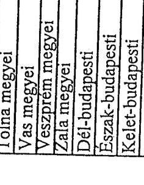

---

Tauúsítvány a külső megkeresésre folytatott végrehajtási eljárások alakulásáról 2004

|  Területi szervezetek/igazgatóságok/ | Végrehajtás alá vont adózók száma | Végrehajtással érintett adótartozás | Külső megkeresésre folytatott végrehajtási eljárások száma | Külső megkeresésre folytatott végrehajtási eljárások összege  |
| --- | --- | --- | --- | --- |
|   | db | E Ft | db | E Ft  |
|  Baranya megyei | 6.057 | 6.779.598 | 1.564 | 229.845  |
|  Bács-Kiskun megyei | 8.804 | 12.845.459 | 2.002 | 1.844.896  |
|  Békés megyei | 6.354 | 8.289.710 | 1.137 | 313.440  |
|  Borsod-Abaúj-Zemplén megyei | 11.298 | 10.406.420 | 2.846 | 431.435  |
|  Csongrád megyei | 8.245 | 9.085.497 | 1.608 | 1.555.196  |
|  Fejér megyei | 5.857 | 14.137.074 | 1.452 | 178.942  |
|  Győr-Moson-Sopron megyei | 3.395 | 5.131.574 | 860 | 500.100  |
|  Hajdú-Bihar megyei | 9.822 | 7.215.876 | 2.182 | 517.358  |
|  Heves megyei | 5.152 | 5.630.309 | 1.151 | 187.894  |
|  Jász-Nagykun-Szolnok megyei | 5.227 | 6.530.176 | 1.222 | 201.303  |
|  Komárom-Esztergom megyei | 5.553 | 10.089.721 | 1.390 | 179.950  |
|  Nógrád megyei | 3.442 | 3.852.233 | 794 | 145.434  |
|  Pest megyei | 20.509 | 43.364.302 | 3.459 | 964.724  |
|  Somogy megyei | 5.629 | 6.978.794 | 1.329 | 143.061  |
|  Szabolcs-Szatmár-Bereg megyei | 7.966 | 11.212.720 | 2.866 | 1.934.575  |
|  Tolna megyei | 3.848 | 4.055.916 | -1.105 | 105.554  |
|  Vas megyei | 3.012 | 4.343.097 | 748 | 96.430  |
|  Veszprém megyei | 6.023 | 6.191.531 | 1.285 | 161.042  |
|  Zala megyei | 7.194 | 5.063.075 | 1.183 | 108.094  |
|  Dél-budapesti | 24.284 | 51.295.180 | 2.791 | 892.158  |
|  Eszak-budapesti | 14.391 | 68.474.436 | 2.896 | 2.480.504  |
|  Kelet-budapesti | 19.954 | 75.334.052 | 3.336 | 1.316.706  |
|  KAIG | 9 | 456.603 | 0 |   |
|  Összesen | 192.025 | 376.763.353 | 39.206 | 14.488.641  |

Fenti adatok hitelességét igazolom.

Kelt: Budapest, 2005.02.28.

---

Tanúsítvány a folyamatban lévő és a lezárult felszámolási és végelszámolási ügyek alakulásáról 2001

|  Területi
szervvezetek/igazgatóságok/ | Apek által kezdeményezett felszámolási ügyek | Kezdeményezett felszámolásokban kimutatott tartozás | Lezárt felszámolási ügyek | Pehn.iszárását követően befolyt bátvalák | Indított végelszámolási ügyek | Végelszámolásnál kimutatott tartozás | Felszámolással és végelszámolással megszűnt vállalkozások száma  |
| --- | --- | --- | --- | --- | --- | --- | --- |
|   | db | E Ft | db | E Ft | db | E Ft | db  |
|  Baranya megyei | 126 | 415011 | 150 | 0 | 113 | 12387 | 242  |
|  Bácsi-Kiátun megyei | 286 | 1900611 | 283 | 1 | 255 | 152824 | 570  |
|  Békés megyei | 118 | 447967 | 159 | 0 | 70 | 43046 | 238  |
|  Borzsó-Abaúj-Zemplén megyei | 250 | 1483849 | 264 | 709 | 451 | 716506 | 440  |
|  Csongrád megyei | 166 | 1728012 | 227 | 15793 | 197 | 235841 | 467  |
|  Fejér megyei | 137 | 2130197 | 124 | 0 | 212 | 153492 | 245  |
|  Győr-Moson-Sopron megyei | 107 | 743149 | 102 | 0 | 234 | 85808 | 355  |
|  Hajdú-Bihar megyei | 370 | 2078388 | 269 | 0 | 302 | 373257 | 464  |
|  Hevez megyei | 225 | 1213378 | 125 | 78 | 67 | 84934 | 192  |
|  Jász-Nagykun-Szolnok megyei | 155 | 636982 | 179 | 0 | 128 | 46390 | 257  |
|  Komárom-Esztergom megyei | 81 | 651451 | 118 | 0 | 118 | 22441 | 245  |
|  Négrád megyei | 58 | 905169 | 127 | 654 | 92 | 112525 | 203  |
|  Fest megyei | 1115 | 6951813 | 204 | 10357 | 369 | 35532 | 621  |
|  Szabolcs-Szatmár-Bereg megyei | 64 | 8959243 | 64 | 129 | 148 | 211122 | 210  |
|  Szabolcs-Szatmár-Bereg megyei | 272 | 1497060 | 247 | 0 | 282 | 110872 | 439  |
|  Tolna megyei | 72 | 580123 | 77 | 0 | 126 | 101217 | 177  |
|  Vaz megyei | 72 | 674282 | 53 | 0 | 170 | 178629 | 124  |
|  Veszprém megyei | 216 | 1022196 | 75 | 0 | 153 | 104652 | 219  |
|  Zala megyei | 161 | 501341 | 109 | 838 | 176 | 81051 | 245  |
|  Dél-budapesti | 400 | 7971661 | 360 | 0 | 861 | 629515 | 1031  |
|  Ezzék-budapesti | 205 | 7905214 | 199 | 0 | 837 | 986951 | 1065  |
|  Kélet-budapesti | 252 | 8395869 | 293 | 0 | 693 | 415098 | 725  |
|  KAJD |  |  |  |  |  |  | 0  |
|  Összezen | 4908 | 58791166 | 3808 | 26559 | 6160 | 4892088 | 8774  |

Fenti adatok hitelességét igazolom.

Kelt: Budapest, 2005. 2. LP.

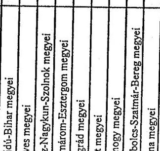

2001

2001

2001

2001

2001

2001

2001

2001

2001

2001

2001

2001

2001

2001

2001

2001

2001

2001

2001

2001

2001

2001

2001

2001

2001

2001

2001

2001

2001

2001

2001

2001

2001

2001

2001

2001

2001

2001

2001

2001

---

Tanúsítvány a folyamatban lévő és a lezárult felszámolási és végelszámolási ügyek alakulásáról 2002 a V-29-44/2004-2005. sz. jelentéshez

|  Területi
szervezetek/igazgatóságok/ | Apeh által
kezdeményezett
felszámolási ügyek | Kezdeményezett
felszámolásokban
kímutatott tartozás | Lezárt
felszámolási
ügyek | Felcs.lezárását
követően
befolyt bátvalák | Indított
végelszámolási
ügyek | Végelszámolással
kímutatott
tartozás | Felszámolással és végelszámolással
megezünt
vállalkozások száma  |
| --- | --- | --- | --- | --- | --- | --- | --- |
|   | db | E Ft | db | E Ft | db | E Ft | db  |
|  Baranya megyei | 242 | 1309227 | 213 | 0 | 75 | 8940 | 319  |
|  Bács-Kiskun megyei | 178 | 1882062 | 262 | 0 | 161 | 123622 | 500  |
|  Békés megyei | 218 | 1596513 | 174 | 0 | 77 | 17878 | 269  |
|  Burzoń-Abaúj-Zemplén megyei | 350 | 1057572 | 374 | 1263 | 117 | 71583 | 558  |
|  Csongrád megyei | 162 | 830566 | 236 | 349 | 164 | 146458 | 489  |
|  Fejér megyei | 182 | 2285188 | 184 | 1049 | 113 | 77147 | 316  |
|  Győr-Moson-Szpron megyei | 47 | 172697 | 130 | 0 | 166 | 91329 | 291  |
|  Hajdú-Bihar megyei | 497 | 1993033 | 479 | 0 | 228 | 262637 | 755  |
|  Heves megyei | 95 | 1202024 | 126 | 0 | 87 | 240985 | 233  |
|  Iksz-Nagykun-Szolnok megyei | 151 | 511738 | 183 | 0 | 64 | 23933 | 263  |
|  Komárom-Esztergom megyei | 102 | 4344419 | 157 | 0 | 88 | 12178 | 265  |
|  Négrád megyei | 73 | 736509 | 82 | 0 | 58 | 35503 | 139  |
|  Pezi megyei | 634 | 3833214 | 258 | 747 | 488 | 146103 | 606  |
|  Somogy megyei | 99 | 878599 | 146 | 11665 | 150 | 146956 | 287  |
|  Szabolcs-Szatmár-Bereg megyei | 229 | 2237590 | 328 | 0 | 177 | 58542 | 636  |
|  Tolna megyei | 64 | 647350 | 101 | 0 | 47 | 64081 | 151  |
|  Vaz megyei | 61 | 457024 | 74 | 805 | 60 | 12424 | 204  |
|  Veszprém megyei | 235 | 1198671 | 209 | 0 | 118 | 76855 | 383  |
|  Zala megyei | 97 | 628108 | 136 | 799 | 107 | 25178 | 275  |
|  Dél-budapesti | 602 | 8774902 | 354 | 887 | 729 | 999774 | 950  |
|  Enzék-budapesti | 154 | 7180663 | 212 | 94 | 859 | 1087401 | 1117  |
|  Kelet-budapesti | 413 | 9839082 | 374 | 548 | 921 | 1534400 | 854  |
|  KAIG |  |  |  |  |  | 0 | 0  |
|  Összesen | 4885 | 53596751 | 4792 | 18206 | 5054 | 5263907 | 9885  |

Fenti adatok hitelességét igazolom.

Kelt: Budapest, 2005. 2. 29.

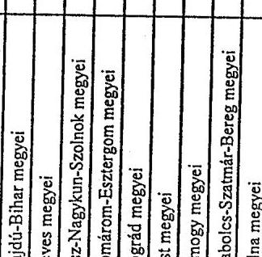

alálrús

---

Tanúsítvány a folyamatban lévő és a lezárult felszámolási és végelszámolási ügyek alakulásáról 2003

|  Területi szervezetek/igazgatóságok/ | Apek által kezdeményezett felszámolási ügyek | Kezdeményezett felszámolásokban kimutatott tartozás | Lezárt felszámolási ügyek | Felcs.lezárását követően befolyt bátvalók | Indított végelszámolási ügyek | Végelszámolással kimutatott tartozás | Felcsámolással és végelszámolással megszűnt vállalkozások száma  |
| --- | --- | --- | --- | --- | --- | --- | --- |
|   | db | E Ft | db | E Ft | db | E Ft | db  |
|  Baranya megyei | 195 | 626540 | 202 | 0 | 58 | 8973 | 260  |
|  Bácsi-Kiskun megyei | 152 | 1710772 | 292 | 2046 | 139 | 94913 | 516  |
|  Békés megyei | 155 | 704729 | 150 | 0 | 52 | 35354 | 238  |
|  Barusd-Abaúj-Zemplén megyei | 278 | 1891276 | 220 | 0 | 105 | 25944 | 388  |
|  Csongrád megyei | 298 | 948661 | 259 | 306 | 177 | 1069443 | 461  |
|  Fejér megyei | 160 | 1228731 | 190 | 3058 | 96 | 124060 | 279  |
|  Győr-Marson-Szpron megyei | 121 | 1828911 | 173 | 0 | 152 | 36212 | 345  |
|  Hajdú-Bihar megyei | 460 | 2421143 | 352 | 3100 | 228 | 237038 | 584  |
|  Havas megyei | 105 | 893922 | 215 | 24 | 64 | 91131 | 284  |
|  Jazz-Nagykun-Zsolnok megyei | 225 | 1080375 | 137 | 235 | 49 | 32664 | 213  |
|  Komárom-Esztergom megyei | 118 | 1137152 | 168 | 0 | 67 | 829701 | 274  |
|  Nögrád megyei | 94 | 632576 | 104 | 0 | 70 | 78368 | 151  |
|  Post megyei | 1562 | 5048541 | 311 | 6 | 375 | 120992 | 616  |
|  Somogy megyei | 88 | 885050 | 185 | 583 | 136 | 72638 | 354  |
|  Szabolcs-Zsaimár-Berag megyei | 325 | 1868493 | 377 | 67 | 149 | 195586 | 583  |
|  Tolna megyei | 53 | 458226 | 89 | 669 | 656 | 1432967 | 137  |
|  Vas megyei | 99 | 742311 | 73 | 0 | 57 | 55547 | 126  |
|  Veszprém megyei | 136 | 1616731 | 184 | 425 | 39 | 19049 | 285  |
|  Zala megyei | 222 | 1081330 | 138 | 3553 | 108 | 28549 | 230  |
|  Dél-budapesti | 311 | 7145194 | 411 | 0 | 76 | 8932 | 1168  |
|  Essék-budapesti | 109 | 7235871 | 269 | 0 | 756 | 1095478 | 1133  |
|  Kélet-budapesti | 321 | 10256976 | 305 | 0 | 711 | 780538 | 1429  |
|  KAIG |  |  |  |  |  | 0 | 0  |
|  Összesen | 5587 | 51443511 | 4804 | 14072 | 4320 | 6474077 | 10054  |

Fenti adatok hitelességét igazolom.

Kelt: Budapest, 2005. c/2. L

---

Tanúsítvány a folyamatban lévő és a lezárult felszámolási és végelszámolási ügyek alakulásáról 2004

|  Területi szervezetek/igazgatóságok/ | Apek által kezdeményezett felszámolási ügyek | Kezdeményezett felszámolásokban kimutatott tartozás | Lezárt felszámolási ügyek | Felszleszárását követően befolyt bátvalék | Indított végelszámolási ügyek | Végelszámolásnál kimutatott tartozás | Felszámolással és végelszámolással megszűnt vállalkozások száma  |
| --- | --- | --- | --- | --- | --- | --- | --- |
|   | db | E Ft | db | E Ft | db | E Ft | db  |
|  Baranya megyei | 190 | 964619 | 225 | 0 | 77 | 14679 | 262  |
|  Bács-Kiskun megyei | 91 | 564154 | 251 | 14510 | 93 | 66113 | 372  |
|  Békés megyei | 127 | 541046 | 211 | 3077 | 68 | 88330 | 271  |
|  Borzod-Abaúj-Zsóöpén megyei | 149 | 1458320 | 378 | 3350 | 99 | 40608 | 561  |
|  Csongrád megyei | 288 | 4077974 | 224 | 45919 | 146 | 123131 | 387  |
|  Fejér megyei | 288 | 2964782 | 260 | 1317 | 77 | 105448 | 356  |
|  Győr-Moson-Szpran megyei | 92 | 6756557 | 210 | 1252 | 157 | 161165 | 469  |
|  Hajdú-Bihar megyei | 529 | 2450832 | 571 | 4366 | 158 | 173902 | 782  |
|  Heves megyei | 82 | 584488 | 161 | 37 | 44 | 148125 | 230  |
|  Iázó-Nagykun-Szolnok megyei | 257 | 1211476 | 226 | 3564 | 70 | 48756 | 288  |
|  Komárom-Eszterpon megyei | 77 | 1094877 | 198 | 0 | 99 | 389904 | 273  |
|  Nögrád megyei | 51 | 546486 | 80 | 1087 | 85 | 184865 | 177  |
|  Post megyei | 1197 | 4265518 | 158 | 495 | 416 | 392714 | 534  |
|  Szemegy megyei | 82 | 640047 | 189 | 16149 | 135 | 280453 | 283  |
|  Szabatos-Szatmár-Bereg megyei | 316 | 3117789 | 332 | 122 | 115 | 29385 | 478  |
|  Tolna megyei | 48 | 680333 | 83 | 411 | 39 | 59206 | 211  |
|  Tisz megyei | 42 | 485311 | 105 | 1963 | 46 | 40537 | 163  |
|  Tiszaprém megyei | 106 | 687154 | 244 | 9849 | 79 | 61778 | 328  |
|  Zola megyei | 171 | 990810 | 169 | 1726 | 87 | 13956 | 263  |
|  Dél-budapesti | 641 | 6195341 | 585 | 4707 | 563 | 221781 | 1253  |
|  Érzék-budapesti | 458 | 9349507 | 371 | 2121 | 643 | 864829 | 1110  |
|  Kérel-budapesti | 184 | 16993300 | 397 | 1475 | 675 | 725776 | 1169  |
|  KAJD |  |  |  |  |  | 0 | 0  |
|  Összesen | 5466 | 66640721 | 5628 | 117497 | 3971 | 4235441 | 10220  |

Fenti adatok hitelességét igazolom.

Kelt: Budapest, 2005. 02. 18

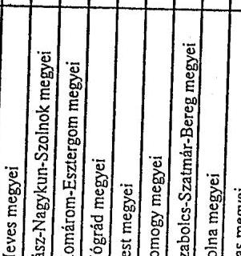

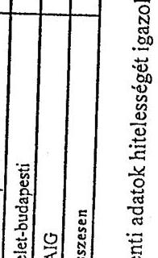

---

tanúsítvány a behajtási eljárások lefolytatása után befolyt hátralékok és hátraléktőrlések alakulásáról 2001

|  Területi | Végrehajtási eljárások |  |  |  |  |  |  |  |  | (adatok E Ft-ban)  |
| --- | --- | --- | --- | --- | --- | --- | --- | --- | --- | --- |
|  szervezetek/igazgatóságok/ | lefolytatása után befolyt hátralék |  |  |  |  |  |  |  |  |   |
|   | összesen | ebből tao |  |  |  |  |  |  |  |   |
|  Baranya megyei | 3980208 | 106701 | -138797 | - | -516794 | - | -263178 | - | -755504 | -  |
|  Bács-Kiskun megyei | 5635497 | 233123 | -437914 | - | -1171215 | - | -5262 | - | -979337 | -  |
|  Békés megyei | 3888755 | 123148 | -138444 | - | -1490675 | - | -166543 | - | -2143770 | -  |
|  Borzod-Abaúj-Zemplén megyei | 6745285 | 344901 | -455246 | - | -1386393 | - | -1074510 | - | -1052061 | -  |
|  Csongrád megyei | 5502517 | 168647 | -984331 | - | -125784 | - | -91171 | - | -681496 | -  |
|  Fejér megyei | 4793939 | 82425 | -664191 | - | -483562 | - | -624321 | - | -341040 | -  |
|  Győr-Moson-Sopron megyei | 6536628 | 301458 | -90793 | - | -475349 | - | -17831 | - | -1099951 | -  |
|  Hajdú-Bihar megyei | 4903458 | 226334 | -257810 | - | -503090 | - | -280288 | - | -824151 | -  |
|  Heves megyei | 3297538 | 108438 | -236902 | - | -445216 | - | -109707 | - | -1636982 | -  |
|  Jász-Nagyban-Szolnok megyei | 3560507 | 141429 | -213666 | - | -1486318 | - | -100641 | - | -331673 | -  |
|  Komárom-Esztergom megyei | 5189479 | 150085 | -293579 | - | -789705 | - | -339242 | - | -78286 | -  |
|  Nögrád megyei | 1616437 | 63345 | -145279 | - | -578710 | - | - | - | -274332 | -  |
|  Pest megyei | 11055885 | 875980 | -1417095 | - | -987506 | - | -641010 | - | -1420946 | -  |
|  Somogy megyei | 3431993 | 132291 | -109364 | - | -658735 | - | -62 | - | -436752 | -  |
|  Szabolcs-Szatmár-Bereg megyei | 5251915 | 104106 | -342475 | - | -621443 | - | -195821 | - | -972279 | -  |
|  Tolna megyei | 2226338 | 133741 | -108028 | - | -1207869 | - | -24840 | - | -138820 | -  |
|  Vas megyei | 2503490 | 71477 | -95303 | - | -84940 | - | -28715 | - | -221691 | -  |
|  Veszprém megyei | 3170554 | 106714 | -297927 | - | -588449 | - | -49880 | - | -505754 | -  |
|  Zala megyei | 2554071 | 120607 | -97563 | - | -251246 | - | -140575 | - | -285398 | -  |
|  Dél-budapesti | 12881710 | 381411 | -401438 | - | -519757 | - | -165470 | - | -6190055 | -  |
|  Eszak-budapesti | 17038250 | 1259037 | -1883157 | - | -1050478 | - | -12211407 | - | -1396282 | -  |
|  Kelet-budapesti | 12390059 | 1229239 | -1390370 | - | -4956765 | - | -2306252 | - | -4315257 | -  |
|  KAJG | 6794535 | 197265 | -533327 | - | - | - | - | - | - | -  |
|  Összesen | 134949049 | 6661902 | -10533199 | -1853 | -20379999 | -327557 | -18836726 | -410717 | -26081817 | -343401  |

Fenti adatok hitelességét igazolom.

Kelt: Budapest, 2005. 02.28. alárás

---

tanúsítvány a behajtási eljárások lefolytatása után befolyt hátralékok és hátraléktörlések alakulásáról 2002

|  Területi szervezetek/igazgatóságok/ | Végrehajtási eljárások lefolytatása után befolyt hátralék |  |  |  |  |  |  |  |  |   |
| --- | --- | --- | --- | --- | --- | --- | --- | --- | --- | --- |
|   |  |  |  |  |  |  |  |  |  | Törölt hátralék  |
|   |  |  |  |  |  |  |  |  |  |   |
|   |  |  |  |  |  |  |  |  |  | Cégtörlés miatt  |
|   |  |  |  |  |  |  |  |  |  |   |
|  Baranya megyei | 4154611 |  | 110889 |  |  |  |  |  |  |   |
|  Bács-Kiskun megyei | 5305984 |  | 210314 |  |  |  |  |  |  |   |
|  Békés megyei | 4036808 |  | 126242 |  |  |  |  |  |  |   |
|  Borand-Abaúj-Zemplén megyei | 6327258 |  | 176131 |  |  |  |  |  |  |   |
|  Csongrád megyei | 4953793 |  | 360889 |  |  |  |  |  |  |   |
|  Fejér megyei | 4336352 |  | 175630 |  |  |  |  |  |  |   |
|  Győr-Moson-Sopron megyei | 6608715 |  | 227907 |  |  |  |  |  |  |   |
|  Hajdú-Bihar megyei | 5382605 |  | 425090 |  |  |  |  |  |  |   |
|  Heves megyei | 3448418 |  | 95177 |  |  |  |  |  |  |   |
|  Jász-Nagykon-Szolnok megyei | 3653940 |  | 135747 |  |  |  |  |  |  |   |
|  Komárom-Esztergom megyei | 5593889 |  | 169677 |  |  |  |  |  |  |   |
|  Nógrád megyei | 2066207 |  | 54323 |  |  |  |  |  |  |   |
|  Pest megyei | 11303573 |  | 750706 |  |  |  |  |  |  |   |
|  Somogy megyei | 3784262 |  | 143619 |  |  |  |  |  |  |   |
|  Szabolcs-Szatmár-Bereg megyei | 4687399 |  | 171058 |  |  |  |  |  |  |   |
|  Tolna megyei | 2173492 |  | 58544 |  |  |  |  |  |  |   |
|  Vas megyei | 2286109 |  | 54680 |  |  |  |  |  |  |   |
|  Veszprém megyei | 3443258 |  | 209528 |  |  |  |  |  |  |   |
|  Zala megyei | 2824813 |  | 86908 |  |  |  |  |  |  |   |
|  Dél-budapesti | 13919858 |  | 558339 |  |  |  |  |  |  |   |
|  Eszak-budapesti | 18161903 |  | 992232 |  |  |  |  |  |  |   |
|  Kelet-budapesti | 14171196 |  | 1810332 |  |  |  |  |  |  |   |
|  KAJG | 3605671 |  | 334847 |  |  |  |  |  |  |   |
|  Összesen | 136230116 |  | 7438809 |  |  |  |  |  |  |   |

Fenti adatok hitelességét igazolom.

Kelt: Budapest, 2005. 02.28.

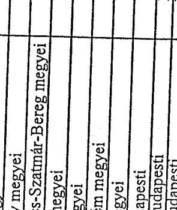

---

Tanúsítvány a behajtási eljárások lefolytatása után befolyt hátralékok és hátraléktörlések alakulásáról 2003 (adatok E Ft-ban)

|  Területi szervezetek/igazgatóságok/ | Végrehajtási eljárások lefolytatása után befolyt hátralék | Méltányosságból összesen | Méltányosságból összesen | Behajthatatlanság miatt |  |  |  |  |   |
| --- | --- | --- | --- | --- | --- | --- | --- | --- | --- |
|   | összesen |  |  |  |  |  |  |  |   |
|  Baranya megyei | 3999872 | 120012 | -158.668 | - | -969.490 | - | -16.702 | - | -911.550  |
|  Bácsi-Kiskun megyei | 6259010 | 374829 | -523.323 | - | -471.329 | - | -35.229 | - | -1.621.076  |
|  Békés megyei | 4582173 | 164067 | -242.757 | - | -1.190.266 | - | -198.248 | - | -1.102.095  |
|  Borsod-Abaúj-Zemplén megyei | 7563824 | 326438 | -399.672 | - | -806.974 | - | -222.577 | - | -1.790.065  |
|  Csongrád megyei | 4799567 | 288342 | -517.057 | - | -906.718 | - | -142.261 | - | -1.396.504  |
|  Fejér megyei | 5583365 | 94718 | -766.192 | - | -702.064 | - | -275.097 | - | -668.997  |
|  Győr-Moson-Sopron megyei | 4642942 | 340904 | -381.888 | - | -1.386.044 | - | -50.441 | - | -1.091.696  |
|  Hajdú-Bihar megyei | 5760563 | 370591 | -248.164 | - | -588.480 | - | -165.096 | - | -832.072  |
|  Heves megyei | 3545838 | 132721 | -232.518 | - | -938.780 | - | -8.833 | - | -956.178  |
|  Jász-Nagykon-Szolnok megyei | 4043934 | 172230 | -180.368 | - | -2.043.232 | - | -85.129 | - | -272.983  |
|  Komárom-Esztergom megyei | 6380949 | 191408 | -396.061 | - | -408.561 | - | -229.540 | - | -182.146  |
|  Nógrád megyei | 2005649 | 75652 | -98.233 | - | -840.494 | - | - | - | -523.169  |
|  Pest megyei | 11981051 | 859093 | -1.713.500 | - | -4.958.516 | - | -876.879 | - | -3.419.465  |
|  Somogy megyei | 4059611 | 125566 | -100.796 | - | -329.189 | - | - | - | -764.662  |
|  Szabolcs-Szatmár-Bereg megyei | 5116842 | 316541 | -272.204 | - | -722.921 | - | -7.393.438 | - | -1.677.707  |
|  Tolna megyei | 2321485 | 86962 | -171.716 | - | -505.424 | - | -24.452 | - | -317.816  |
|  Vas megyei | 2691517 | 93185 | -122.090 | - | -208.747 | - | -29.595 | - | -200.303  |
|  Veszprém megyei | 4066113 | 225096 | -233.615 | - | -969.185 | - | -105.852 | - | -965.726  |
|  Zala megyei | 3365707 | 223084 | -47.327 | - | -497.308 | - | -9.295 | - | -391.474  |
|  Dél-budapesti | 12726403 | 893909 | -489.290 | - | -498.440 | - | -46.847 | - | -4.247.336  |
|  Eszak-budapesti | 19643396 | 2096087 | -678.477 | - | -550.262 | - | -1.790.454 | - | -5.756.165  |
|  Kelet-budapesti | 16362599 | 1054167 | -1.697.932 | - | -1.636.428 | - | -2.843.891 | - | -5.218.212  |
|  KAJG | 2118238 | 351121 | -595.987 | - | - | - | - | - | 300  |
|  Összesen | 143620649 | 8976723 | -10267835 | -6 | -22128853 | -94882 | -14549857 | -362120 | -34307099  |

Fenti adatok hitelességét igazolom.

Kelt: Budapest, 2005. 02.28.

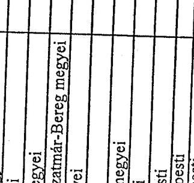

---

tanúsítvány a V-29-44/2004-2005. sz. jelentéshez a behajtási eljárások lefolytatása után befolyt hátralékok és hátraléktőrlések alakulásáról 2004

|  Területi szervezetek/igazgatóságok/ | Végrehajtási eljárások lefolytatása után befolyt hátralék |  |  |  |  |  |  |  |  |   |
| --- | --- | --- | --- | --- | --- | --- | --- | --- | --- | --- |
|   |  |  |  |  |  |  |  |  |  | (adatok E Ft-ban)  |
|   |  | Méltányosságból |  |  |  |  |  |  |  |   |
|   |  |  |  |  |  |  |  |  |  | (adatok E Ft-ban)  |
|   |  |  |  |  |  |  |  |  |  | VÉGEK  |
|  Baranya megyei | 5612949 | 329707 | -65472 | - | -410428 | - | -69633 | - | -507867 | -  |
|  Bárc-Kiskun megyei | 7693140 | 397108 | -546600 | - | -946828 | - | -40035 | - | -553867 | -  |
|  Békés megyei | 4877324 | 248312 | -256172 | - | -1492869 | - | -144276 | - | -999322 | -  |
|  Borzod-Abaúj-Zemplén megyei | 8077926 | 331610 | -347489 | - | -661620 | - | -320106 | - | -857916 | -  |
|  Csongrád megyei | 6518375 | 318690 | -539644 | - | -386534 | - | -36723 | - | -674382 | -  |
|  Fejér megyei | 6858818 | 211583 | -607911 | - | -734838 | - | -450093 | - | -230890 | -  |
|  Győr-Moston-Sopron megyei | 6449728 | 361526 | -115396 | - | -131143 | - |  | - | -342005 | -  |
|  Hajdú-Bihar megyei | 7296750 | 397475 | -296220 | - | -546344 | - | -7623 | - | -541194 | -  |
|  Heves megyei | 3995446 | 167438 | -175632 | - | -472007 | - | -560 | - | -170639 | -  |
|  Jász-Nagykun-Szolnok megyei | 4947818 | 227425 | -100784 | - | -1739081 | - | -81113 | - | -389782 | -  |
|  Komárom-Esztergom megyei | 6919826 | 349761 | -378511 | - | -460323 | - | -38371 | - | -929480 | -  |
|  Nógrád megyei | 3001219 | 83270 | -108831 | - | -191545 | - |  | - | -137179 | -  |
|  Pest megyei | 14797136 | 964024 | -1063952 | - | -329505 | - | -224758 | - | -1198381 | -  |
|  Somogy megyei | 5388164 | 289959 | -63729 | - | -4095297 | - |  | - | -541025 | -  |
|  Szabolcs-Szatmár-Bereg megyei | 6216232 | 330274 | -319481 | - | -620752 | - | -71018 | - | -1190285 | -  |
|  Tolna megyei | 2931428 | 138281 | -143237 | - | -163826 | - | -1765 | - | -391456 | -  |
|  Vas megyei | 4049032 | 105783 | -105260 | - | -117386 | - | -31 | - | -171859 | -  |
|  Veszprém megyei | 5471504 | 399577 | -242503 | - | -260639 | - | -253802 | - | -611837 | -  |
|  Zala megyei | 4579249 | 227447 | -36861 | - | -372525 | - | -98 | - | -550415 | -  |
|  Dél-budapesti | 18257193 | 1667106 | -356349 | - | -51874 | - | -97396 | - | -2694338 | -  |
|  Eszak-budapesti | 31413710 | 3076712 | -723434 | - | -343899 | - | -1297856 | - | -2321475 | -  |
|  Keleti-budapesti | 19803334 | 1633305 | -886601 | - | -1403469 | - | -1552776 | - | -2751070 | -  |
|  KAJG | 4664786 | 380729 | -118312 | - |  |  |  |  |  |   |
|  Összesen | 189821087 | 12636522 | -7598381 | -416 | -15932732 | -514042 | -4684033 | -153188 | -18556754 | -264722  |

Fenti adatok hitelességét igazolom.

Kelt: Budapest, 2005/02/28.

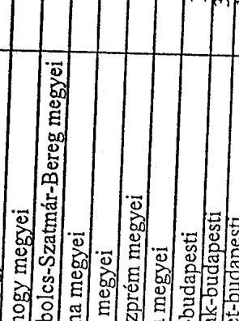

---

# 3. SZ. MELLÉKLET

---

# Mutatók jegyzéke 

1. sz. mutató A behajtási tevékenység kiemelt adatainak alakulása 2001-2004.
2. sz. mutató Fizetési kedvezmények alakulása 2001-2004.
3. sz. mutató A folyamatban lévő és lezárult felszámolási ügyek alakulása 20012004.
4. sz. mutató A hátraléktörlések alakulása 2001-2004.
5. sz. mutató A behajtási eljárások lefolytatása után befolyt hátralékok alakulása 2001-2004.

---

1. sz. mutató a V-29-44/2004-2005. sz. jelentéshez

# A behajtási tevékenység kiemelt adatainak alakulása 2001-2004

|  Év | Végrehajtási cselem |  |  |  |  |  |  |  |  |  |  |  |   |
| --- | --- | --- | --- | --- | --- | --- | --- | --- | --- | --- | --- | --- | --- |
|   | Értéke | Ebből
beszedve | Arányuk | Értéke | Ebből
beszedve | Arányuk | Értéke | Ebből beszedve | Arányuk | Értéke | Ebből
beszedve | Arányuk | Értéke  |
|   | M Ft | M Ft | % | M Ft | M Ft | % | M Ft | M Ft | % | M Ft | M Ft | % | M Ft  |
|  2001 | 288 555 | 134 949 | 47 | 246 121 | 19 029 | 8 | 28 995 | 722 | 2 | 5 696 | 382 | 7 | 5 696  |
|  2002 | 295 074 | 136 230 | 46 | 256 822 | 21 983 | 9 | 22 686 | 249 | 1 | 6 253 | 132 | 2 | 6 253  |
|  2003 | 450 554 | 143 621 | 32 | 389 330 | 41 932 | 11 | 30 653 | 547 | 2 | 15 640 | 547 | 4 | 15 640  |
|  2004 | 555 214 | 189 821 | 34 | 496 078 | 76 498 | 15 | 30 569 | 722 | 2 | 15 569 | 386 | 2 | 386  |

---

2. sz. mutató a V-29-44/2004-2005. sz. jelentéshez

# Fizetési kedvezmények alakulása 2001-2004

|  Év | Fizetési kedvezményekre irányuló
kérelmek | Fizetési könnyítési kérelmek | Mértektési kérelmek | Vegyes kérelmek  |
| --- | --- | --- | --- | --- |
|   | Száma
összesen | Áránya
előző évhez | Áránya
2001-hez | Száma  |
|   | db | % | db | %  |
|  2001 | 133 909 | 44 377 | 44 377 | 33 392  |
|  2002 | 138 014 | 50 295 | 50 295 | 113  |
|  2003 | 140 906 | 56 829 | 56 829 | 113  |
|  2004 | 158 575 | 67 929 | 67 929 | 120  |

---

3. sz. mutató a V-29-44/2004-2005. sz. jelentéshez

A folyamatban lévő és lezárult felszámolási ügyek alakulása 2001-2004

|  Év | APLH által kezdeményezett felszámolási ügyek | Kezdeményezett felszámolásban kimutatott tartozás | Lezárt felszámolási ügyek | Felszámolás lezárását követően befolyt hátrolék  |
| --- | --- | --- | --- | --- |
|   | Száma | Aránya előző évhez | Aránya 2001-hez | Összege  |
|   | db | % |  |   |
|  2001 | 4 908 | 58 791 | 58 791 | 3 808  |
|  2002 | 4 885 | 100 | 100 | 53 597  |
|  2003 | 5 587 | 114 | 114 | 54 444  |
|  2004 | 5 466 | 98 | 111 | 66 641  |

---

## A hátraléktörlések alakulása 2001-2004

|  Év | Méltányossághól törölt hátralék |  |  |  |  |  |  |  |  |  |  |  |  |  |  |  |  |  |  |  |  |  |  |  |  |  |  |  |  |  |  |  |  |  |  |  |  |  |  |  |  |  |   |
| --- | --- | --- | --- | --- | --- | --- | --- | --- | --- | --- | --- | --- | --- | --- | --- | --- | --- | --- | --- | --- | --- | --- | --- | --- | --- | --- | --- | --- | --- | --- | --- | --- | --- | --- | --- | --- | --- | --- | --- | --- | --- | --- | --- | --- |
|   |  |  |  |  |  |  |  |  |  |  |  |  |  |  |  |  |  |  |  |  |  |  |  |  |  |  |  |  |  |  |  |  |  |  |  |  |  |  |  |  |  |   |
|   |  |  |  |  |  |  |  |  |  |  |  |  |  |  |  |  |  |  |  |  |  |  |  |  |  |  |  |  |  |  |  |  |  |  |  |  |  |  |  |  |  |   |
|   |  |  |  |  |  |  |  |  |  |  |  |  |  |  |  |  |  |  |  |  |  |  |  |  |  |  |  |  |  |  |  |  |  |  |  |  |  |  |  |  |  |   |
|   |  |  |  |  |  |  |  |  |  |  |  |  |  |  |  |  |  |  |  |  |  |  |  |  |  |  |  |  |  |  |  |  |  |  |  |  |  |  |  |  |  |   |
|   |  |  |  |  |  |  |  |  |  |  |  |  |  |  |  |  |  |  |  |  |  |  |  |  |  |  |  |  |  |  |  |  |  |  |  |  |  |  |  |  |  |   |
|   |  |  |  |  |  |  |  |  |  |  |  |  |  |  |  |  |  |  |  |  |  |  |  |  |  |  |  |  |  |  |  |  |  |  |  |  |  |  |  |  |  |   |
|   |  |  |  |  |  |  |  |  |  |  |  |  |  |  |  |  |  |  |  |  |  |  |  |  |  |  |  |  |  |  |  |  |  |  |  |  |  |  |  |  |  |   |
|   |  |  |  |  |  |  |  |  |  |  |  |  |  |  |  |  |  |  |  |  |  |  |  |  |  |  |  |  |  |  |  |  |  |  |  |  |  |  |  |  |  |   |
|   |  |  |  |  |  |  |  |  |  |  |  |  |  |  |  |  |  |  |  |  |  |  |  |  |  |  |  |  |  |  |  |  |  |  |  |  |  |  |  |  |  |   |
|   |  |  |  |  |  |  |  |  |  |  |  |  |  |  |  |  |  |  |  |  |  |  |  |  |  |  |  |  |  |  |  |  |  |  |  |  |  |  |  |  |  |   |
|   |  |  |  |  |  |  |  |  |  |  |  |  |  |  |  |  |  |  |  |  |  |  |  |  |  |  |  |  |  |  |  |  |  |  |  |  |  |  |  |  |  |   |
|   |  |  |  |  |  |  |  |  |  |  |  |  |  |  |  |  |  |  |  |  |  |  |  |  |  |  |  |  |  |  |  |  |  |  |  |  |  |  |  |  |  |   |
|   |  |  |  |  |  |  |  |  |  |  |  |  |  |  |  |  |  |  |  |  |  |  |  |  |  |  |  |  |  |  |  |  |  |  |  |  |  |  |  |  |  |   |
|   |  |  |  |  |  |  |  |  |  |  |  |  |  |  |  |  |  |  |  |  |  |  |  |  |  |  |  |  |  |  |  |  |  |  |  |  |  |  |  |  |  |   |
|   |  |  |  |  |  |  |  |  |  |  |  |  |  |  |  |  |  |  |  |  |  |  |  |  |  |  |  |  |  |  |  |  |  |  |  |  |  |  |  |  |  |   |
|   |  |  |  |  |  |  |  |  |  |  |  |  |  |  |  |  |  |  |  |  |  |  |  |  |  |  |  |  |  |  |  |  |  |  |  |  |  |  |  |  |  |   |
|   |  |  |  |  |  |  |  |  |  |  |  |  |  |  |  |  |  |  |  |  |  |  |  |  |  |  |  |  |  |  |  |  |  |  |  |  |  |  |  |  |  |   |
|   |  |  |  |  |  |  |  |  |  |  |  |  |  |  |  |  |  |  |  |  |  |  |  |  |  |  |  |  |  |  |  |  |  |  |  |  |  |  |  |  |  |   |
|   |  |  |  |  |  |  |  |  |  |  |  |  |  |  |  |  |  |  |  |  |  |  |  |  |  |  |  |  |  |  |  |  |  |  |  |  |  |  |  |  |  |   |
|   |  |  |  |  |  |  |  |  |  |  |  |  |  |  |  |  |  |  |  |  |  |  |  |  |  |  |  |  |  |  |  |  |  |  |  |  |  |  |  |  |  |   |
|   |  |  |  |  |  |  |  |  |  |  |  |  |  |  |  |  |  |  |  |  |  |  |  |  |  |  |  |  |  |  |  |  |  |  |  |  |  |  |  |  |  |   |
|   |  |  |  |  |  |  |  |  |  |  |  |  |  |  |  |  |  |  |  |  |  |  |  |  |  |  |  |  |  |  |  |  |  |  |  |  |  |  |  |  |  |   |
|   |  |  |  |  |  |  |  |  |  |  |  |  |  |  |  |  |  |  |  |  |  |  |  |  |  |  |  |  |  |  |  |  |  |  |  |  |  |  |  |  |  |   |
|   |  |  |  |  |  |  |  |  |  |  |  |  |  |  |  |  |  |  |  |  |  |  |  |  |  |  |  |  |  |  |  |  |  |  |  |  |  |  |  |  |  |   |
|   |  |  |  |  |  |  |  |  |  |  |  |  |  |  |  |  |  |  |  |  |  |  |  |  |  |  |  |  |  |  |  |  |  |  |  |  |  |  |  |  |  |   |
|   |  |  |  |  |  |  |  |  |  |  |  |  |  |  |  |  |  |  |  |  |  |  |  |  |  |  |  |  |  |  |  |  |  |  |  |  |  |  |  |  |  |   |
|   |  |  |  |  |  |  |  |  |  |  |  |  |  |  |  |  |  |  |  |  |  |  |  |  |  |  |  |  |  |  |  |  |  |  |  |  |  |  |  |  |  |   |
|   |  |  |  |  |  |  |  |  |  |  |  |  |  |  |  |  |  |  |  |  |  |  |  |  |  |  |  |  |  |  |  |  |  |  |  |  |  |  |  |  |  |   |
|   |  |  |  |  |  |  |  |  |  |  |  |  |  |  |  |  |  |  |  |  |  |  |  |  |  |  |  |  |  |  |  |  |  |  |  |  |  |  |  |  |  |   |
|   |  |  |  |  |  |  |  |  |  |  |  |  |  |  |  |  |  |  |  |  |  |  |  |  |  |  |  |  |  |  |  |  |  |  |  |  |  |  |  |  |  |   |
|   |  |  |  |  |  |  |  |  |  |  |  |  |  |  |  |  |  |  |  |  |  |  |  |  |  |  |  |  |  |  |  |  |  |  |  |  |  |  |  |  |  |   |
|   |

---

5. sz. mutató a V-29-44/2004-2005. sz. jelentéshez

# A behajtási eljárások lefolytatása után befolyt hátralékok alakulása 2001-2004

|  Év | Végrehajtási eljárás lefolytatása után befolyt hátralék
összesen | Ebből társasági adó | Társasági adó
aránya  |
| --- | --- | --- | --- |
|   | Összege | Aránya előző
évhez
viszonyítva | Aránya 2001.
hez viszonyítva  |
|   | M Ft | % | %  |
|  2001 | 134 949 | 100 | 6 661  |
|  2002 | 136 230 | 101 | 7 439  |
|  2003 | 143 621 | 105 | 8 977  |
|  2004 | 189 821 | 132 | 12 637  |

---

# 4. SZ. MELLÉKLET

---

.

---

# Hibernálások főbb okai és az alkalmazandó eljárásrend rövid összefoglalása 

Az APEH a társasági adó bevallásokat az alábbi főbb okok miatt hibernálják:

## 1. Duplán beadott adóbevallás:

Ha az adózó ugyanabból a típusú adóbevallásból ugyanarra az időszakra a beadott bevalláson kívül még egyet bead, a Hivatal az elsőnek beérkezett bevallást dolgozza fel. A később beadott, azonos típusú bevallást - az adózó egyidejú tájékoztatása mellet - hibernálja. Az elsőként hibásan, majd újólag, módosított adattartalommal beadott adóbevallás benyújtása mellett jellemző hiba, hogy az adózó az adóhatóság mellett a Cégbíróságra is benyújtja adóbevallását a beszámolójával együtt. A Hivatal a másodikként beadott bevallást hibernálja, és egyúttal tájékoztatja erről az adózót, mivel ha feldolgozná, úgy többszörös kötelezettségelőírás történne a folyószámláján. Tájékoztatást kap továbbá arról is, hogy amennyiben a korábban beadott bevallása tartalmán kíván változtatni, arra önellenőrzési nyomtatvány benyújtásával van módja.

## 2. Szabályostól eltérő, más típusú társasági adóbevallás benyújtása:

Ha az adózó például kettős könyvvezetésű és az egyszeres könyvvezetésű adózók részére rendszeresített adóbevallást nyújtotta be, ezeket a bevallásokat a Hivatal hibernálja, egyúttal felszólítja az adózót a helyes típusú bevallás benyújtására. A nem megfelelő típusú bevallások a kettős könyvvezetésű adózók által megadandó adatok hiányában nem dolgozhatók fel.

## 3. Az adóalanynak nem kellett volna társasági adóbevallást benyújtania:

Ha az adózó például végelszámolási eljárás alatt áll, akkor a végelszámolás kezdete szerinti évre nem társasági adóbevallást, hanem un. záró adóbevallást kell benyújtani. A tévesen benyújtott társasági adóbevallás hibernálásáról az igazgatóság értesíti az adózót, egyúttal felszólítja a helyes típusú bevallás benyújtására. A Hivatal így tudja biztosítani, hogy az adózó a jogszabályi előírásoknak eleget tegyen.

## 4. A beadott adóbevallás határidőn túl érkezett és a feldolgozó rendszeren keresztül már nem dolgozható fel:

Ha az adózó helyes típusú adóbevallást nyújt be, de olyan évszámút, amely már nincs érvényben (vagyis az APEH feldolgozó rendszere nem tudja fogadni a késett bevallást), akkor a bevallás hibernálásra kerül. Egyúttal az illetékes igazgatóság felszólítja az adózót az adott évre érvényes pótló bevallás benyújtására. Az adóhivatal így tudja biztosítani, hogy a mindenkor hatályos jogszabályi előírások érvényesüljenek.

---

# 5. A hibásan/hiányosan beadott adóbevallás az adózó bevonása nélkül nem dolgozható fel: 

Ha az adózó hibásan/hiányosan (például aláírás nélkül, vagyis hitelesítés hiányában érvénytelenül) adja be a bevallást, az adóhatóság legalább kétszeri tértivevényes kiértesítő levéllel felszólítja a hiba kijavítására vagy a hiány pótlására. Amennyiben az adózó a felszólítások ellenére sem javítja ki a bevallást, azt az igazgatóság hibernálja. Ilyen esetben ugyanis nem bizonyható, hogy a bevallást az adózó, illetve a helyette jogosult személy adta be. Ha az adózó a későbbiekben mégis megkeresi a Hivatalt a hiba kijavítása érdekében, akkor a bevallást az igazgatóság „újraéleszti" a hibernálásból és a bevallást kijavítja az adózó közremúködésével, majd lekönyveli a bevallás adatait a folyószámlára.

Az előzőekben felsorolt eseteken túlmenően még egyéb olyan körülmények is felmerülhetnek (pl.: ellenőrzéssel lezárt időszakra beadott adóbevallás), amelyek indokolttá tehetik a társasági adóbevallás hibernálását.

Budapest, 2005. október