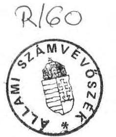
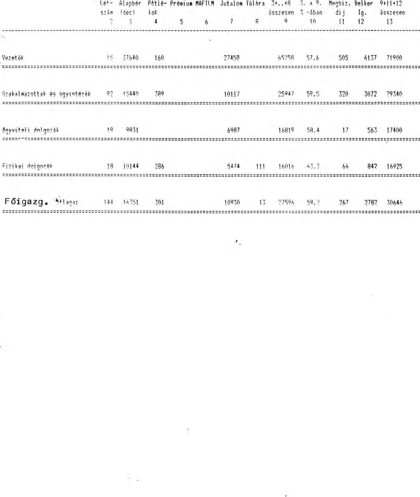
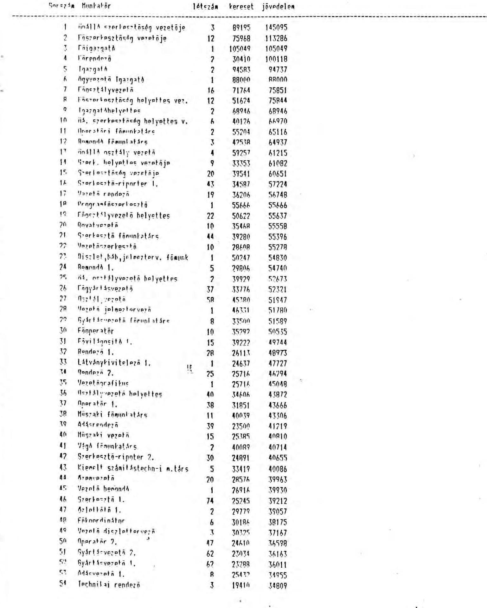

# 21lami 

## JELENTÉS

a Magyar Televízió pénzügyi-gazdasági ellenőrzéséről

---

Az ellenőrzést végezték:
Bakonyvári Róbertné számvevő tanácsos, dr. Burján Margit számvevő, Csóry Györgyné számvevő tanácsos, Deák Tamásné számvevő, Éva Katalin számvevő tanácsos, Hegyesné dr. Solymosi Mária számvevő, dr. Mihály Sándor számvevő tanácsos, Nagy Ákosné számvevő tanácsos, Szabó József számvevő, Szíjártó Károly számvevő.

Az ellenőrzést vezette:
Matusek István főtanácsos

---

# JELENTÉS 

a Magyar Televízió pénzügyi-gazdasági ellenőrzéséről

A Magyar Televízió (MTV), mint költségvetési fejezet két költségvetési intézményt foglal magában: a maradványérdekeltségű MTV Gazdálkodó Szervezetet (továbbiakban: Gazdálkodó Szervezet) és az eredményérdekeltségű Magyar Televízió Kereskedelmi Főigazgatóságát (továbbiakban: Főigazgatóság). A Gazdálkodó Szervezet részét alkotja a szegedi és pécsi MTV Stúdió, mint részben önálló költségvetési intézmény.

A Gazdálkodó Szervezet 1990. évi átlaglétszáma 3.593 fő volt, a Főigazgatóságé 140 fő. A fejezet 1990. évi tényleges összes bevétele 8,2 milliárd Ft-ot, összes tényleges kiadása 7,7 milliárd Ft-ot tett ki. (A különbözet a Főigazgatóságnál mutatkozó eredmény.) A Fejezet állóeszközállományának bruttó értéke 3,7 milliárd Ft, ebből az ingatlanok értéke mintegy 1 milliárd Ft értékben szerepel a számviteli nyilvántartásokban. A befejezetlen beruházások 1990. XII. 31-i állománya ugyancsak 1 milliárd Ft nagyságrendű volt.

Az ellenőrzés az 1988. január 1-1991. március 31. közötti időszakban vizsgálta a rendelkezésre álló pénzeszközök felhasználásának törvényességét, célszerűségét és eredményességét. Ezen belül kiemelt figyelmet fordított az MTV folyamatban lévő szervezeti átalakítására.

---

# I. 

## Következtetések, javaslatok

Az MTV bevételi és kiadási előirányzatai a vizsgált időszakban folyamatosan emelkedtek. A bevételi előirányzatok 1988-1990. között 38,7%-kal, a kiadási előirányzatok 38,2%-kal növekedtek.

A bevételekből meghatározó arányt képviselnek a működési bevételek között elszámolt előfizetői díjak (3,3 milliárd Ft 1990-ben), s egyre nagyobb hányadot tesz ki a szponzorok anyagi támogatása.

A kiadások valamelyest szerényebb ütemű növekedése ellenére az MTV főképpen a Gazdálkodó Szervezet funkciózavarai és súlyos gazdálkodási hiányosságai miatt több év óta veszteségesen működik. A vizsgált időszakban a válságjelenségek állandósultak és elmélyültek. Többszöri állami gazdasági intervenció ellenére sem sikerült az MTV-t szanálni és stabilizálni.

Az állami és belső ellenőrzések által többször feltárt hiányosságokat nem követték hatékony intézkedések, ezért ma is teljességgel helytállóak és továbbra is aktuálisak a Pénzügyminisztérium által 1988-ban végzett ellenőrzés idevonatkozó megállapításai:
"A Magyar Televízió gazdálkodásának ellenőrzése során olyan méretű és mélységű szervezetlenség, szabályozatlanság és szabálytalan működés tárult fel, amelyeket az adott viszonyok fenntartásával, vagy kisebb módosításával már nem lehet a kívánatos irányba terelni.
Olyan, a fejezet egészét érintő, átfogó intézkedéssorozatra van szükség, amely a szervezet minden lényeges gazdálkodási feladatát rendszerszemléletben újraszabályozza."

Az MTV működési rendjében tapasztalható alapvető hiányosságok hosszantartó hatásuk következtében jelentősen dezorganizálták az egész szervezetet és annak tevékenységét.

Az MTV fejezetnek nincs alapítólevele. A szervezet jogállását szabályozó Mt. határozat - amely a felügyelet és a kinevezési jogkört illetően többször módosult -

---

tartalmában olyan szűk és elavult szabályozási elemeket tartalmaz, hogy arra belső szabályozás nem alapozható.

A gazdálkodás belső szabályozása sok tekintetben hiányos vagy elavult, s rendszerében nehezen áttekinthető.

A vizsgált időszakban a Gazdálkodó Szervezet költségvetési gazdálkodására a pénzügyi egyensúly tartós megbomlása, a növekvő adósságállomány és az állandósult likviditási gondok voltak jellemzőek. Ebben kisebb részben külső, meghatározóan belső okok játszottak közre:
-a szakmai elképzelések és a pénzügyi lehetőségek összhangjának hiánya, az intézményi költségvetés megalapozatlansága, a költségvetési és pénzügyi tervezés hibái;
-a rendkívül laza gazdálkodási és ügyviteli fegyelem, ami tervszerűtlen, pazarló, esetenként visszaélésektől sem mentes gazdálkodáshoz vezetett;
-az intézmények (Gazdálkodó Szervezet és Főigazgatóság) közötti ésszerűtlen tevékenységmegosztás, valótlan költségviszonyok (azaz, a ténylegesnél alacsonyabb költségek felszámítása a nyújtott szolgáltatások igénybevételénél);
-a fedezet nélkül indított nagyberuházás;
-a pénzügyi lehetőségeket meghaladó bérfejlesztés;
-a szabályozó hatások késedelmes felismerése, az alkalmazkodás rugalmatlansága;
-a gyakori vezetői személycserék kulcspozíciókban;
-a feladat- és hatáskörök, felelősségi körök tisztázatlanságai;
-az ellenőrzési rendszer hiányosságai stb.
Mindezek, az MTV vezetése által is régóta jól ismert okok ellenére gazdálkodási mulasztásokért 1972. óta felelősségre vonást nem alkalmaztak.

A teljesség igénye nélkül felsorolt kedvezőtlen feltételek határozzák meg az MTV gazdálkodásának színvonalát és eredményességét a gazdálkodás minden elemében. A negatív jelenségek egy része a Kereskedelmi Főigazgatóságra is jellemző.

---

A költséggazdálkodás terén az egyre feszítőbb gazdálkodási körülmények kényszerítő hatása ellenére sem történtek átütő erejű, a hatékonyabb gazdálkodást célzó intézkedések. Például:

- nem dolgozták ki a takarékos költség- és eszközgazdálkodást biztosító egységes ösztönzési rendszert,
- jelenleg sincs elfogadott, véglegesített, a költségek racionalizálását szolgáló árjegyzék (csak tervezet szintű),
- rendszerszerű közgazdasági munka nem folyik, a költségnövekedés okait nem elemzik,
- a feltárt szabálytalanságokat, mulasztásokat (pl. a maradék filmnyersanyag felhasználás, valamint a szállítással összefüggő túlóra elszámolás hiányosságait) nem követi számonkérés, felelősségre vonás,
- az egész MTV-t átható "semmi sem drága" mentalitás az elmúlt években sem változott. A szervezetlenség, az előkészítetlenség következtében általános a kapacitások túlbiztosítása, a művészi koncepció fűtött kamerák melletti "megálmodása" stb.

A számvitelben tapasztalható alapvető hiányosságok miatt a vizsgált időszak mérlegadatainak valódisága bizonyíthatóan elfogadhatatlan. (Jelentés 10; 23; 24; 26; 27; 28; 32; 33; 38; 45 o.)

Tényként leszögezhető, hogy az MTV-nél a radikális változásokra a lehetetlenné vált gazdálkodási körülmények miatt objektíve szükség volt. Kérdéses csupán a változások iránya és belső tartalma lehet.

Az ellenőrzés időszakában megkezdett átszervezés az első olyan elhatározás, amelyik eljutott a megvalósulás fázisáig. A helyszíni ellenőrzés befejeződéséig meghozott intézkedések eredményeiről vagy következményeiről elégséges időtáv hiányában megalapozott, gazdasági eredményekkel minősíthető véleményt adni alig lehet. Sok jel mutat arra, hogy a kitűzött célok érdekében tett konkrét intézkedések ellentmondásosak. A kellő szakmai bázist és támogatást nélkülöző vezetői döntések végrehajtása gyakran elakad, mivel az intézkedések nem eléggé átgondoltak, nem kellően szakszerűek.

---

A támogatás általános hiányát súlyosbította az a körülmény, hogy a fokozatosan kialakított koncepció részleteinek kidolgozására, döntésre, majd végrehajtásra alkalmas formába hozatalára nem létesültek operatív bizottságok. A hivatali szervezetek pedig az átalakulással együttjáró bizonytalanságok miatt alkalmatlannak bizonyultak - a munka folyamatosságának fenntartásával egyidejűleg — szabályozásokba foglalni saját átalakulásukat.

A kiérleletlen elgondolások ellentmondásos helyzetet eredményeznek és esetenként tovább súlyosbítják az egyébként sem könnyen áttekinthető helyzetet.

Az átszervezés alapvető, rendszerbeli hibájának tekinthető, hogy olyan horderejű új szervezeti struktúra létrehozását határozta el az MTV elnöke, amelyhez kompetenciája nem elégséges és az illetékes szervek előzetes egyetértését nem tudta megszerezni. Ilyen kulcspozíció a két kinevezett intendánsé, akiknek műsorügyekben a deklarált jogosultságát közvetlenül maga az MTV elnöke sem befolyásolhatja vagy korlátozhatja az MTV elnöke által jóváhagyott megbízólevél szerint.

Az egyébként is bonyolulttá váló helyzetet tovább bonyolították az intendánsok kezdeti intézkedéseiben előfordult hatásköri túllépések, amelyek elnöki beavatkozást igényeltek (egyes munkakörök alóli jogosulatlan felmentések, bér- és jutalmazási feltételek megállapítása, kereskedelmi szervezet megbontása).

Az átalakulás legsúlyosabb ellentmondása az, hogy az újként elképzelt szervezet működése tulajdonképpen maradéktalanul a régi alapokra épül. A szervezetlenség, a szabályozatlanság, a gazdasági-pénzügyi fegyelem hiánya, a megbízhatatlan, hézagos nyilvántartások következményeit nem lehetséges kizárólag a versenyeztetés eszközeivel imitált, vagy valódi piaci hatásokkal felszámolni. Az erélyes és eredményes vezetői intézkedések egyelőre hiányoznak.

Mindezek a nem kívánatos jelenségek csak részben indokolt velejárói egy nagy átalakításnak. A negatívumok többsége elkerülhető, de legalább is enyhíthető lett volna, ha az MTV vezetése előzetesen megnyeri a részletesen kidolgozott koncepciójának a külső, belső döntési faktorokat és az eredményes végrehajtásban érdekelt személyeket és az átalakítás egyesített erővel folyna.

A régebb óta fennálló finanszírozási nehézségek és az átszervezés miatt mutatkozó gyártási, beszerzési bizonytalanságok következtében a műsortartalék oly mértékben lecsökkentek, hogy komolyan veszélyeztetik a II. félévi műsorszolgáltatás folyamatosságát és színvonalát.

---

Jóllehet a sugárzott műsor az MTV tevékenységének végső célja és eredménye, a műsor struktúrája, tényleges előállításának módja pedig a költségeket alapvetően meghatározza, a műsorok értékelése nem képezte az ellenőrzés tárgyát, mert az pénzügyi-gazdasági ellenőrzési módszerekkel nem minősíthető.

# JAVASLATOK 

Az előkészületben lévő, de még el nem fogadott törvénytervezetek végleges kialakítása mellett realitásként kell figyelembe venni, hogy az MTV korábbi szervezete döntő pontokon felszámolódott, átalakult vagy átalakulóban van. Javaslatainkat az általunk ismert belső és külső adottságok figyelembevételével tesszük meg.

## A Kormány hatáskörébe tartozóan:

Az MTV-t érintő törvények további előkészítése során mérlegelést igényelnek az ellenőrzés megállapításai, tényfeltárásai:

1. A megjelenő törvényekkel összhangban korszerűsítve kell kiadni az MTV alapítólevelét.
2. A szponzoráció gyors bővülése az MTV bevételei között számos elvi és gyakorlati problémát vet fel. Legfontosabb ezek közül a nemzeti médiák (jelesül az MTV) és azok munkatársainak túlzott és célzatos befolyásolási lehetősége anyagi eszközökkel, valamint a piaci verseny szabályainak megkerülése rejtett reklám útján. Ezért a törvényi szabályozás körébe utalandó kérdések közé javasoljuk sorolni azon etikai normáknak a meghatározását, amelyek betartásával az MTV szponzori - vagy műsor - támogatást elfogadhat.
3. Megítélésünk szerint arra kell törekedni, hogy az MTV mint közszolgálati televízió gazdaságilag minél függetlenebb legyen. Ennek érdekében az MTV bevételeiben növelni célszerű az előfizetői díjak és a saját ár- és díjbevételek arányát. Nem tartható fenn az a korábbi gyakorlat, hogy az előfizetői díjak emelésén osztozik az MTV, MR és a központi költségvetés. Célszerűnek tartjuk megszüntetni azt a gyakorlatot is, hogy prognosztizált bevételnövekedés képezze a támogatás csökkentés alapját. Indokoltnak tartjuk a TV előfizetői díjak

---

beszedésével kapcsolatos eddigi jogosultságok és eljárási kérdések újraszabályozását.
4. A törvényi szabályozás során indokoltnak tartjuk meghatározni a nemzeti médiák privatizálásának elveit és korlátait, illetve azok részvételét különböző gazdasági társaságokban. Szabályozandó a külföldi tőke részvételének lehetősége vagy tilalma a közszolgálati médiák működtetésében, fenntartásában, fejlesztésében.
5. A vidéki körzeti stúdiók szellemi és anyagi potenciáljának nagyságrendje és értéke nyomatékosan szükségessé teszi feladataik és kapcsolódásuk újrarendezését, önállóságuk növekedését.

# A Magyar Televízió hatáskörébe tartozóan: 

6. Az MTV régi szervezetének és működésének radikális átalakítását rendszerszemléletben, a pénzügyi és a szakmai követelmények összehangolásával, szükség szerint külső szakértők, szervezési intézetek igénybevételével és az ellenőrzés megállapításainak hasznosításával folytatni kell.

- A törvények elfogadásáig kerülni kell minden olyan MTV-n belüli megoldást, amiről előre látható, hogy a készülő törvényekben foglaltakkal ellentétes vagy attól eltérő helyzetet eredményezhet. '.
- Pótlólagosan ki kell dolgozni a belső átalakulás részletes stratégiáját, beleértve a gazdasági feltételeket. Kimunkálandók a várható költségek és hozamok. Az eddigieknél sokkal nagyobb figyelmet kell fordítani a döntések jó előkészítésére, gazdasági-pénzügyi megalapozására és a végrehajtás körültekintő megszervezésére.
- Az átszervezés tényleges sikerének feltétele, hogy a további előkészítő munka szervezettebbé váljék, az átalakítás különböző folyamatainak megalapozását és végrehajtását belső szabályozások időbeni elkészítésével segítsék. Mielőbb intézkedések szükségesek a szervezeti és működési szabályzat, az ügyrend és a munkaköri leírások kiadása, bevezetése érdekében.
- A belső gazdasági stabilitást minél hamarabb helyre kell állítani, már csak azért is, mert a tényfeltárás arra mutat, hogy a rendelkezésre álló műsortartalék vészesen fogyóban van.

---

- A szervezeti egységek feladatmegosztását a célszerűség, gazdaságosság, a költségvetési források kímélése szempontok érvényesítésével kell kialakítani és megszervezni, s ennek keretében fel kell számolni a Kereskedelmi Főigazgatóság és a Gazdálkodó Szerv közötti kifogásolt kapcsolatrendszert.
- Az érvényes
 munkajogi szabályok szerint kell rendezni a központi állományba tartozók sorsát. Megengedhetetlen, hogy tényleges munkakör és feladat nélkül történjék több hónapon keresztül bérfizetés.

7. Sürgős megoldást igényel a megüresedett gazdasági vezetői munkakörök betöltése.
8. Az MTV számára bizonyíthatóan hátránnyal járó pénzfelhasználások miatt (pl. Peugeot gépkocsik lízingdíja, a szabálytalanul kihelyezett pénzeszközök) indokolt a személyes felelősség tisztázása és a felelősségre vonás érvényesítése.
9. További vizsgálat után szintén indokolt lehet a személyes felelősség tisztázása azokban az esetekben, amikor rendszeresen előforduló, ismétlődő hibák kiküszöbölésére nem történtek vezetői intézkedések (számviteli hiányosságok, beruházások pénzügyi rendezetlensége, analitikus nyilvántartások hiánya stb.).
10. Rendezendők az állammal szembeni befizetési kötelezettségek (pl. ingatlanvásárlásból befolyt bevételek, lízingelt gépkocsik után fizetett ÁFA, a maradványérdekeltségű tevékenység javára elszámolt összegek miatt).

---

# II. 

## Az ellenőrzés részletes megállapításai

A) A fejezet és a Gazdálkodó Szervezet működése 1988-1990. években.

1. A fejezet szervezeti-működési rendje, a belső szabályozás helyzete.

Az MTV tevékenységi körét - a módosítása ellenére is - elavult 1047/1974. (IX.18.) Mt. határozat állapítja meg, amely a televízió feladatául szabja:
-a Magyar Köztársaság politikájának felelős propagálásában való hatékony részvételt;
—a korszerű, gyors hírközlést és tájékoztatást;
—a közművelődési igények színvonalas kielégítését és a szabadidő tartalmas kihasználásának elősegítését.

A Magyar Televízió és a Magyar Rádió felügyeletéről szóló 116/1989.(XI.22.) MT rendelet a békés átmenet megvalósítása érdekében Felügyelő Bizottság létrehozásáról intézkedett, egyidejűleg meghatározva a Bizottság hatáskörét. Az 1/1990. (I.4.) MT rendelet a felügyeleti szabályokat módosította, majd a 92/1990. (V.10.) MT rendelet mindkét korábbi rendeletet hatálytalanította.

A Felügyelő Bizottság tevékenységéről, határozatairól az MTV-nél iratok nem lelhetők fel. Érdemi hatása az MTV tevékenységére vagy irányító szervezetére nem mutatható ki.

Az MTV jogállásának, az állam által meghatározott feladatainak korszerű és a megváltozott társadalmi-politikai viszonyoknak megfelelő törvényi szintű szabályozására az ellenőrzés lezárásáig még nem került sor. Több, előkészületben lévő törvényi szintű jogszabály érinti az MTV további működését, (a Magyar Rádió és a Magyar Televízió jogállásáról; a sajtóról, a távközlésről és a frekvenciagazdálkodásról) amelyek végleges formában való elfogadása - optimális esetben - a következő hónapokban várható.

---

Az MTV szervezeti és működési szabályzatát 1986. óta nem korszerűsítették. Jelenlegi formájában és tartalmában alkalmatlan az intézmény működésének szabályozására.

Az irányítást és működést (szervezeti struktúrát) főképpen elnöki utasításokkal és körlevelekkel szabályozták.

A kiadott utasítások azonban többnyire nem vezettek eredményre, mert nem megalapozott, objektív helyzetfeltáráson, a célok világos meghatározásán alapultak, hanem gyakran a vezetőváltással, szubjektív indítékokkal, rögtönzött döntésekkel voltak összefüggésben, különösebb előretekintés nélkül. Ilyennek tekinthetők a TV-1. és TV-2. programközpontok létrehozása, a gazdálkodással összefüggő feladatok késedelmes szabályozása. Elnöki utasításból 90 db, elnöki körlevélből 37 db van érvényben. Ezen kívül nagy számban jelentek meg egyéb belső utasítások is.

A belső utasítások nagy száma nem tette szervezettebbé a működést, sőt az mind bonyolultabbá, összefüggéseiben áttekinthetetlenebbé és ellenőrizhetetlenebbé vált.

A Gazdálkodó Szervezet számviteli rendjének újraszabályozása hozott ugyan némi javulást, de annak eredményeit az elkövetett súlyos szabálytalanságok elfedik.

A pénzügyi és bizonylatfegyelem nem kielégítő. Folyamatosan ismétlődő hiányosság a bizonylatok hiánya, ami megnehezíti a belső ellenőrzési rendszer (folyamatba épített ellenőrzés, vezetői ellenőrzés) hatékony működését. Sok helyen hiányoznak a megfelelő áttekintést nyújtó analitikus nyilvántartások. A kialakított nyilvántartási rendszerek hiányosak, nem alkotnak zárt rendszert, a belőlük nyert adatok valódisága nehezen bizonyítható.

Az utalványozás és kötelezettségvállalás tartalma ügyrendben nincs szabályozva. Az utalványozók köre több helyen 15-20 fős. Az MTV-nél összesen mintegy 300 főt ruháztak fel utalványozási joggal.

A szervezeti változások mindhárom évben jelentősek voltak. A változások - a kitűzött céltól eltérően - létszámcsökkentéssel nem jártak, a szervezeti egységek száma sem lett kevesebb.

Az igazgatósági szintű szervezetek (gazdasági, műszaki és gyártási) létrehozását a beruházási, fejlesztési feladatok indokolták. A Kereskedelmi Főigazgatóság státuszának meghagyását, majd 1989-ben a Gazdasági és

---

Kereskedelmi Főigazgatóság összevonását elsősorban személyi indítékok vezették. A pénzügyi, gazdasági folyamatok tisztázását a Főigazgatóság kialakított működési rendje jelenleg is akadályozza.

Korábban, a két programközpont létrehozása a TV2-nél 106 fős létszámnövekedéssel járt. A kísérleti szervezet nem vált be, vissza kellett állítani az eredeti állapotot.

1990. februárjában az MTV irányítását elnökség vette át, majd annak lemondása után ideiglenes ügyvezető elnök vezette az intézményt 1990. augusztus elsejéig, az új elnök kinevezéséig.

Az irányítás rendszere 1990. elején szétesett. A vezetés legfeljebb a nagyobb problémák elhárítására, a napi adásidő zavarmentes biztosítására vállalkozott. Mélyreható szervezeti átalakítást az MTV vezetése 1990. év második felében határozott el, s az elindított folyamat még - a helyszíni ellenőrzés befejezéséig — csak kibontakozóban volt.

# 2. A fejezet költségvetésének tervezése 

A költségvetési tervezés az állami költségvetési tervezési metodikából következően bázis szemléletű. A támogatási előirányzatokat a PM-mel egyeztetve, az előírások szerint alakították ki. A költségvetési lehetőségek és a belső igények mégsem voltak összhangban, mivel a műsoridőre vonatkozó MTV döntéseket a költségvetési kondíciókat és a reális anyagi lehetőségeket megelőzve, azok ismerete nélkül hozták.

Az MTV állandó feladatait, a műsoridejét érintő olyan célt, vagy döntést, amely költségvonzattal járt volna, állami szinten nem hoztak. Sőt az állami költségvetés a pénzügyi korlátokból kiindulva a műsoridő esetleges csökkenésével is számolt. Ezzel ellentétben az MTV a műsoridő fedezet nélküli meghosszabbítására hozott rendszeresen döntéseket. Legutóbb az 1991. évi műsoridő megnövelését határozták el.

Műsorstruktúra 1989. óta nem készült. Ennek hiányában megoldhatatlan volt a szakmai célkitűzések és a költségvetési, pénzügyi tervek összehangolása.

Az éves költségvetési terv kiadási előirányzatainak egy részét decentralizált gazdálkodó egységekre bontották le. A felosztott keretek betartásához azonban gyakorlatilag konzekvenciák nem fűződtek. Váratlan feladatokra, vagy a túllépések ellensúlyozására központi pénzügyi tartalékot alig képeztek.

---

A fejezet költségvetésében a bevételi előirányzatok főösszege (kiegyenlítő, függő, átfutó tételekkel együtt) az 1988. évi 5.892,716 millió Ft-ról, 1990-re 92%-kal, 11.319,420 millió Ft-ra emelkedett. Ugyanezen időszak alatt a kiadási előirányzat 5.753,5 millió Ft-ról 1990-re 85%-kal, 10.653,3 millió Ft-ra emelkedett. A bevételekben - úgy a fejezet, mint a Gazdálkodó Szervezet szintjén — az előfizetési díj a meghatározó arányú, de volumenében és arányában növekvő az ár- és díjbevétel, valamint a költségvetési támogatás. (1.sz.melléklet)

# 3. A Gazdálkodó Szervezet bevételei és kiadásai. 

A Gazdálkodó Szervezet bevétele a vizsgált időszakban dinamikusan, 41,5%-kal (2,7 milliárd Ft-tal) emelkedett. Bevételei között a működési bevételként elszámolt előfizetői díjak a legnagyobbak. Az előfizetői díjak címén befolyt bevételek annak ellenére növekedtek, hogy gyakoribbá vált a díjfizetési kötelezettség elmulasztása, továbbá a 70 éven felüliek mentességet élveznek.

Azoknak a készülékeknek a száma, amelyek után előfizetői díjat fizettek 1988-1991. között, 330 ezer darabbal csökkent, ebből a 70 éven felüliek készülékének száma 300 ezer db volt. Bevételkiesésben ez 1989-ben 122 millió Ft-ot, 1990-ben 35 millió Ft-ot jelentett. (2.sz.melléklet)

A kieséseket - egyelőre - bőven ellensúlyozta az előfizetői díjak többszöri emelése. (A havi előfizetési díjakat az 1988. évi 80 Ft-ról három lépcsőben 1991. III. 31-ig 200.-Ft-ra emelték.)

Az előfizetői díjbevételek alakulása, illetve annak az előirányzattól való elmaradása az állami költségvetés és a fejezet közötti állandó viták tárgya és egyben a pótelőirányzati igények egyik — nem mindig megalapozott — indoka.

A nézetkülönbségek oka az, hogy a Pénzügyminisztérium és a fejezet eltérően becsüli meg évenként az előfizetők számát és a várható előfizetői díjak összegét. A PM által előre elvont támogatás összege 1988-1990-ben nagyobb volt, mint a számított bevételkiesés. Az 1991. évi bevételkiesést viszont a fejezet tervezte - az ellenőrzés véleménye szerint - irreálisan magasan (1,4 milliárd Ft) a ténylegesen várhatóhoz képest (kb. 3-500 millió Ft).

## Az ár- és díjbevételek rendszeresen alátervezettek.

Az MTV Gazdálkodó Szervezetét megillető ár- és díjbevétel nagyobb része a Kereskedelmi Főigazgatóság útján realizálódik. Az 1989. évi 7,6 millió Ft

---

bevételi előirányzattal szemben 304,1 millió Ft-ra teljesült. 1990-ben a tervezett 7,6 millió Ft helyett 422,4 millió Ft folyt be. Az 1991. évi előirányzat már reálisabb, 110,1 millió Ft, de előre láthatóan ez is alacsonyabb a ténylegesnél.

Az ár- és díjbevételek között szerepelnek a szponzor bevételek, amelyből 1990-ben 304 millió Ft-ot realizáltak. Műsortámogatás címén 1990-ben a fejezetnek 34 millió Ft bevétele volt.

A szponzorációt fogalmilag meg kell különböztetni a műsorgyártás támogatásától. Az előbbi a közvetett, rejtett reklám finanszírozása az intézmény útján, az utóbbi valamely - a támogató rokonszenvét bíró - műsor elkészítéséhez való anyagi hozzájárulás, támogatás. A két jogcím feltételeinek megkülönbözetése nem egyértelmű, ebből eredően elvi és gyakorlati problémák fordulnak elő.

Pl: szponzortámogatásról az Európa Tanács Tömegtájékoztatási Bizottsága által készített "Határnélküli Televíziózás" c. egyezménytervezet értelmező szövege szerint a szponzor műsorban a szponzor áruira, szolgáltatásaira történő bármilyen hírverés tilos. Az MTV-nél a szponzorált áruk és termékek köre felismerhető. A szponzoráció célja elsődlegesen a technikai feltételek javítása. Az MTV-nél a szponzorációhoz kapcsolódó jutalmazási rendszer a megszerezhető jövedelmek felé terelte az érdekeket. A műsorokhoz kapcsolódó támogatások esetében a Főigazgatóság bekapcsolása a bevételek realizálásába felesleges és hátrányos. A szponzorálás és műsortámogatás belső szabályozása elavult, korszerűsítésre szorul.

Egyes években jelentős összeget, 1989-ben: 140 millió Ft-ot, 1990-ben: 25,2 millió Ft-ot (504,4 ezer dollárt) képviselt a bevételek között az állóeszközök értékesítéséből származó bevétel.

Az ingatlanok értékesítése során a vételárból elért bevételek a 16/1969. (IX.30.) ÉVM-MÉM-PM. sz. együttes rendelet 10.paragrafus (2.) bek. szerint az állami költségvetést illetik meg. Az MTV a Cserkesz utcai és a Rajk utcai ingatlanok eladásánál nem tett eleget befizetési kötelezettségének (összesen 165,2 millió Ft).

Jelentősebb bevétel származott még a használt gépkocsik értékesítéséből (évente 2-3 millió Ft).

A költségvetési támogatás előirányzata 1988-1991. között ötszörösére emelkedett.(3.sz. melléklet) A ténylegesen juttatott támogatások - az 1989. év kivételével - jelentősen meghaladták a tervezettet, mivel csak így lehetett

---

helyreállítani a pénzügyi egyensúlyt.(1988: 140 millió Ft bevételkiesés pótlására; 1990: 500 millió Ft likviditási célra).

Folyamatosan nőtt a bevételek között a működési célokra átvett pénzeszközök összege (az 1988. évi 133,4 millió Ft; 1990-ben 555,8 millió Ft).

E forrásban meghatározó és növekvő a Főigazgatóságtól különböző címen a fejezet által átcsoportosított pénzeszköz.

E bevételcsoportban 1990-től új tétel az Új Képújság Kft-be befektetett pénzeszközök után kapott eredményrész (1,5 millió Ft).

A költségnövekedés és a műsoridőnövekedés évről-évre növekvő adósságállományhoz vezetett. A kifizetetlen számlák 1988. évi - folyamatos számlavezetés hiányában - 200-220 millió Ft-ra becsült összege az 1990-es év közepére elérte a 460 millió Ft-ot. Az MTV működőképességének biztosítása érdekében nyújtották be a Pénzügyminisztériumhoz az 500 millió Ft-os likviditási pótelőirányzat igényt.

A PM az MTV fejezet 1990. évi költségvetési támogatási előirányzatát egyszeri jelleggel, a fenti összeggel megemelte, egyúttal 1990. dec. 10-ig a felhasználásról tételes elszámolást kért. Ez a mai napig nem történt meg.

Az összeget december 17-ig a fejezeti számlán tartották. A megalapozottnak, körültekintőnek nem nevezhető, kapkodó felhasználásra csak év végén került sor. A kért céltól eltérően utólag arra fordították, ami éppen akkor a legfeszítőbb gondot jelentette. (beruházásra
 116 millió Ft-ot; nagyjavításra 106 millió Ft-ot; személyi kiadásra 160 millió Ft-ot; költségvetési befizetésre 125 millió Ft-ot).

Az adósságállomány mértéke az évenkénti fizetett kamat dinamikus emelkedése szempontjából sem elhanyagolható. (A fizetett kamat 1988-1990. évek között közel ötszörösére, 22 millió Ft-ra nőtt). Az 1990. XII. 31-én fennálló 144,2 millió Ft-os adósságállomány után felszámítható büntető kamat (44%) elméletileg megközelíthetné a 65 millió Ft-ot. Ez mindenképpen elgondolkodtató olyan szempontból, hogy a kifizetetlen számlák egyik évről a másikra való göngyölítése, az azokról való tudatos megfeledkezés (1988.) nem megoldása a problémának.

Az összkiadások az 1988. évi 3,1 milliárd Ft-tal szemben 1990. évben 5,2 milliárd Ft-ban realizálódtak, ami több mint 60%-os dinamikának felel meg.

A kiadásokon belül — 1990. évet alapulvéve — 27,9%-os részarányt képviselnek az intézményt terhelő kiadások (bér, jutalom, TB járulék), 28,4%-kal részesednek

---

az ún. általános igazgatást terhelő költségek (pl. rezsi költségek) és a legnagyobb részesedésük (43,7%) a műsort terhelő költségeknek van.

A postai költségek átlagos 39%-os növekedésén belül — a műsoridő bővülésének egyenes következményeként — a vonalköltség (93,5%-os) és a sugárzási díj (20%) emelkedése volt a meghatározó.

A műsorsugárzásért a Magyar Posta részére fizetett sugárzási díj 1988. évben 325,8 millió Ft, 1989. évben 333 millió Ft, 1990-ben 390 millió Ft volt. 1990. január 1-jével a Magyar Posta 3 különálló vállalata jött létre és az illetékes jogutód, a Magyar Műsorszóró Vállalat a műsorsugárzási díjat az eddiginek mintegy háromszorosára kívánja emelni. A Pénzügyminisztérium az APEH útján vizsgálatot rendelt el. A vizsgálat megállapítása szerint a bővítés nélküli sugárzási időre jutó MTV-t terhelő költség legalább 626 millió Ft.

Mindenesetre a tisztánlátást zavarja a Vállalat abszolút monopol helyzete és az a körülmény, hogy a televíziós adóállomások elmaradt fejlesztéseit és a jövőt illető amortizációját jelen pillanatban egyedül az MTV-re lehet hárítani. A vállalattá szervezés megelőzte a piaci viszonyok (frekvenciamoratórium feloldása) létrejöttét.

A gyártási költségek általános növekedési dinamikáját a pénzügyileg meg nem alapozott műsoridő növekedésén túl olyan objektív tényezők is befolyásolták, mint a többszöri forintleértékelés és az áremelkedések. A közgazdasági elemző munka hiányára vezethető vissza, hogy ezeknek a tényezőknek még csak a hozzávetőleges hatását sem ismerik.

Az energia költségek (80 millió Ft) több, mint 40 millió Ft-os, (102%-os) növekedésében a tarifa emelkedések mellett a takarékosnak nem mondható felhasználás is szerepet játszott.

A dinamika és a nagyságrend szempontjából egyaránt kiemelést érdemelnek még az állóeszközfenntartás költségei (ez a költségtényező 1988. évi 96 millió Ft-ról 1990. évre 326 millió Ft-ra nőtt).

Kétségtelen, hogy az infláció igen kedvezőtlenül hatott a felújítási költségekre, de a növekedés ütemét ez csak részben indokolja. Megállapítható volt, hogy belső rendellenességek is közrehatnak a költségek növekedésében. Pl.: felújításként számoltak el beruházásnak minősülő költségeket (pécsi stúdió bővítése 18 millió Ft; Ó utcai épület rekonstrukciója 37 millió Ft; Rajk L. utcai épület bontása 25 millió Ft stb.) Nem készültek hosszabb távra

---

szóló felújítási tervek, nem elemzik a többletköltségek okait, elmosódik a költségek alakulásáért való felelősség stb.

A költségek között merül fel a meg nem térülő ÁFA, amely szintén növekvő tendenciájú. Ebben azonban tükröződik az is, hogy a Kereskedelmi Főigazgatóság felé elszámolt szolgáltatások költségeinél alkalmazott alacsony díjtételek a reálisnál kevesebb ÁFA-t tartalmaznak.

Értelmezési, nézetegyeztetési nehézségek miatt 1988. szeptemberéig elhúzódott az ÁFA köteles szolgáltatások számlázási, nyilvántartási és elszámolási feladatainak egyértelmű meghatározása. Növekvő mértékben terhelték az ÁFA befizetési kötelezettséget a belső adminisztráció lazaságai miatt felszámított késedelmi kamatok (1988: 291 ezer Ft, 1989: 637 ezer Ft; 1990: 2795 ezer Ft).

Az ÁFA bevezetése volt a hivatkozás arra, hogy a Jelmez- és Díszletgyártó Üzem önálló intézményi gazdálkodását megszüntették és tevékenységét az MTV Gazdálkodó Szervezete szakfeladatrendjébe építették.

Az ÁFA értelmezéséhez hasonlóan a vállalkozási nyereségadó (VÁNYA) MTV körülményeihez igazított alkalmazása ugyancsak nehézségekkel járt. Az adónemnek a költségvetési szervekre való kiterjesztéséből eredő hatását a fejezet egészére szintén késedelmesen mérték fel és a szükséges intézkedéseket sem tették meg kellő időben.

Az eredményt terhelő adókulcsok jelentős növelése ellenére sem módosították a szolgáltatások díjtételeit 1991-ig. Ebből adódóan a Főigazgatóság nyereségének egyik jelentős forrása maradt a maradványérdekeltségű költségvetés.

# 4. Pénzmaradvány elszámolása 

A pénzmaradvány elszámolása a Pénzügyminisztériummal az érvényes szabályokkal összhangban megtörtént. A jóváhagyott pénzmaradvány a fejezet szintjén 1988-ban 191,8 millió Ft; 1989-ben 100,4 millió Ft volt.

Az ellenőrzés elvi hibának tartja, hogy a pénzmaradvány elszámolásának időpontjában a függő tételeket úgy tekintik, mintha azok rendezettek lennének.

---

Elvileg vitatható az is, hogy a Kereskedelmi Főigazgatóság eredményéből (ami valójában nem tekinthető az MTV pénzmaradványának) 1988-ban 87,5 millió Ft-ot (ebből jutalomra 58,7 millió Ft-ot), 1989-ben 220,8 millió Ft-ot (ebből jutalomra 120,0 millió Ft-ot) számoltak el az intézménynél a pénzmaradványok között.

# 5. Az állammal szembeni kötelezettségek teljesítése 

Az MTV nyereségadó befizetési kötelezettségét 1988-1989-ben nem a törvényben előírt módon és összegben teljesítette. Ez részben a szabályozás ellentmondásainak, részben azok sajátos értelmezésének a következménye.

Az 1988. évi befizetési kötelezettség módosítását kérte az MTV a Pénzügyminisztériumtól. A PM a kérelmet azzal utasította el, hogy az MTV és a Kereskedelmi Főigazgatóság gazdasági kapcsolatainak rendezésével oldják meg gondjaikat. Az MTV fejezet a bevételek, a költségek reálisabb megosztását nem valósította meg. 1989-ben a szabályozóváltozásokra hivatkozva kérte az MTV a 136 millió Ft-os kötelezettségének elengedését, amit a PM kompetencia hiányában elutasított. Javasolta, hogy a zárszámadás során jelezze az MTV az elmaradás indokát. Két év során összesen 272 millió Ft után nem teljesítette a fejezet, illetve a Főigazgatóság a nyereségadó befizetést. Ez évben fentiekhez hasonlóan 74 millió Ft előirányzatmódosítás történt.

A bevételi számla forgalmából egyébként az állapítható meg, hogy az eredményérdekeltségű tevékenységek eredménye után mindkét évben a 10% nyereségadó befizetése - a fenti összegeken felül - időbeli késedelmekkel ugyan, de megtörtént.

Szabálytalanul járt el a fejezet amikor nyereségelvonás címén az MTV alapfeladataira 100 millió Ft-ot a Főigazgatósággal az MTV Gazdálkodó Szervezet számlájára átutaltatott és így a nyereségadózás alól kivont.

A módosított 19/1980. (IX.27.) PM számú rendelet 46. paragrafus (4) bekezdése az intézményeknek - mint adóalanyoknak - biztosítja azt a lehetőséget, hogy vállalkozási tevékenységük eredményét csökkentsék azzal az összeggel, amelyet az évközben várható eredményükből a maradvány érdekeltségű alaptevékenységükre fordítottak.

A konkrét esetben azonban a vállalkozói tevékenység nem a maradványérdekeltségű alaptevékenység finanszírozását segítette, hanem javadalmazási célokat szolgált.

---

A nyomda, szállítási és szcenikai részleg szabad kapacitásának értékesítése során az utókalkulációban kimutatott közvetlen bérköltség nem a valós bérfelhasználást tükrözi, s így a kimutatott eredmény torzított.

# 6. Létszám- és bérgazdálkodás 

A létszám- és bérgazdálkodás az MTV gazdálkodásának állandósult neuralgikus pontja. Az elmúlt tíz évben a vezetés különböző indítékoktól vezetve különféle — mindenféle megalapozottságot nélkülöző — létszámracionalizálási tervekkel kísérletezett, természetesen sikertelenül. (4.sz. melléklet)

Az ellenőrzött időszakban a korábban kialakult kedvezőtlen folyamatok tovább folytatódtak. A fejezet létszáma az 1988. évi 3624 főről 3733 főre (+109 fő) növekedett, miközben szüntelen törekvés volt a létszám csökkentésére. A béralap felhasználás ugyanezen időszak alatt több, mint kétszeresére (216%) nőtt, az 1988. évi 501,1 millió Ft-ról közel 1,1 milliárd Ft-ra. A bér- és bérjellegű kiadások TB járulékkal együtt számított értéke 1990. évre fejezet szinten elérte a 2,2 milliárd Ft-ot, ami a működési kiadások egyharmada.

A bérköltségek igen gyors növekedése — többek között — munkaszervezési és irányításbeli zavarokra vezethető vissza.

A korábbi kötöttségeket a honorárium szabályzatban feloldották, a kifizetések felső határát megszüntették. A korlátozás nélküli kifizetések nincsenek összhangban a szervezet gazdasági lehetőségeivel és a valóságos viszonyokkal sem.

A létszám- és bérgazdálkodásban általánosan tapasztalható negatívumok kialakulásához az is hozzájárult, hogy 1977. óta hiányzik egy olyan belső érdekeltségi rendszer, amely megfelelő garanciát nyújtana az erőforrások ésszerű, hatékony felhasználására. A gazdálkodás megreformálására irányuló vezetői intézkedések így rendre meghiúsultak, az MTV belsőérdekeltségi rendszere összekuszálódott, kezelhetetlenné vált.

További súlyos terhelést jelentett az 1989. IV. negyedévében végrehajtott 30%-os bérfejlesztés, amelyre a Gazdálkodó Szervezetnél akkor került sor, amikor a kifizetetlen számlák összege 284 millió Ft-ot tett ki. A bérfejlesztés feltétele a műsorköltségek csökkentése, az átdolgozások és az önkéntes túlmunkák teljes megszüntetése volt. Egyik feltétel sem teljesült. Ennek elmaradása 1990-ben együttesen 531,4 millió Ft többletköltséget jelentett. A költségnö-

---

vekedés összege némileg meghaladta az 1990-ben költségvetési egyensúly megőrzése céljából kapott fél milliárd Ft egyszeri támogatás összegét.

A fejezet létszámának és béralapjának 97%-a a Gazdálkodó Szervezetnél koncentrálódik. A béralap terhére teljesített kiadás az 1988. évi 485 millió Ft-ról több mint 1 milliárd Ft-ra nőtt. Mindez a bérfejlesztéseken túl alapvetően az önkéntes túlmunka négyszeres, és az átdolgozásra kifizetett összegek tízszeres emelkedésének a következménye. Jelentős összeget képviselt még a szponzorbevételekből kifizetett jutalmak összege is.

A Gazdálkodó Szervezetnél a munkatársak egy részének jövedelmét az egyéb címen kapott jövedelemelemek határozzák meg. (6. sz. melléklet)

A jövedelmek dinamikusan és egyben rendkívül differenciáltan emelkedtek. Az évi 1 millió Ft feletti jövedelemmel rendelkezők száma az 1989. évben 11 fő volt, 1990-ben 71 főre emelkedett. A legmagasabb éves jövedelem 1989-ben 1 879 737 Ft, 1990-ben 2 909 952 Ft volt. A Gazdálkodó Szervezetben foglalkoztatottak főbb állománycsoportonkénti jövedelem megoszlását a 11. sz. melléklet részletesen szemlélteti.

A legjobban kereső 10% (382 fő) adatainak elemzése szerint az 1990. évben elért havi bruttó átlagkeresetük 28 510 Ft volt, ugyanekkor a havi bruttó átlagjövedelmük 70 946 Ft.

Az 1988. évi egy főre jutó havi átlagos alapbér összege 1990-re 9490 Ft-ról 15 989 Ft-ra, 68%-kal nőtt. A 3 év alatt a különféle jogcímeken megvalósított bérfejlesztések havi szinten összességében 26,6 millió Ft-tal növelték a bérköltségeket, és ennek alig felét (47%-át) indokolta a központilag lehetővé tett mérték. (8.sz. melléklet)

A kiválasztott főszerkesztőségeken tapasztaltak azonban azt mutatják, hogy a megnövelt alapbérekkel szemben megkövetelt teljesítmény igen alacsony. Ennek egyenes következménye, hogy az önkéntes túlmunka, átdolgozás lehetősége, illetve szükségessége biztosítva van.

A felkeresett főszerkesztőségek között volt olyan, ahol a havi munkabérért való követelményszint pár napos (pl.: 3 nap) teljesítésével, vagy néhány riport elkészítésével volt egyenlő. Volt azonban olyan főszerkesztőség is, ahol munkakövetelményt egyáltalán nem szabtak meg.

---

Átdolgozás, önkéntes túlmunka címén való kifizetések eloszlása igen eltérő, de esetenként jelentős jövedelmi forrás.

Az 1990. évi kifizetésekről készített — nem teljes körű — kimutatásból is látható, hogy ilyen módon az alapbér közel hatszorosa is megkereshető volt. (9. sz. melléklet)

Az ellenőrizetlen folyamatok nem zárják ki fiktív kifizetések lehetőségét.
Az 1991. I. negyedévi kifizetések indokoltsága alapvetően megkérdőjelezhető, mivel az átszervezéssel kapcsolatosan a napi műsorokon kívül csak az előző évről áthozott produkciók és napi aktuális műsorok "gondozása" volt folyamatban. Mégis az önkéntes túlmunka és átdolgozás megszüntetésének elrendelésére
 csak ez év I. negyedévének végével került sor.

Addigra az ilyen címen folyósított kiadások összege meghaladta az 1988. évben kifizetett összegek két és félszeresét, az 1 sugárzott műsorpercre jutó összeg pedig több mint nyolcszorosára nőtt.

Az elnök rendelkezése azonban az érdekeltek ellenállása, tiltakozása miatt nem került végrehajtásra. Végeredményben a kifizetések továbbra sem szüntek meg. Április hónapban 23,2 millió Ft-ot fizettek ki önkéntes túlmunka címén.

A prémium jelentősége csökkent, mivel a nem műsorkészítő egységeknél 1986-ban teljes egészében beépült az alapbérbe, a műsorkészítő területen csak részben és nem egységesen.

Jelenleg 11 szervezeti egység rendelkezik prémium kerettel. Az ellenőrzött főszerkesztőségeken a prémium ösztönző szerepét egyértelműen nem lehet megállapítani.

Sajátos szerepe van az ún. Filmgyári prémiumnak. Ezen a címen kerül elszámolásra a külső gyártásban közreműködő MTV-s dolgozók részére kifizetett díj összege. A produkciókban közreműködő munkatársak nagyságrendileg magasabb összegű prémiumban részesülnek ugyanazon munkakörben, mint a belső gyártásban résztvevők. A gyártási költségek terhére kifizetett prémiumok összege szabályozatlan. Így teljes egészében szabálytalan kifizetésnek minősülnek.

A jutalmazási források dinamikusan nőttek, ennek megfelelően a kifizetések is (10.sz. melléklet), Éves szinten egy főre vetítve több mint háromszorosra

---

emelkedtek és 1990-ben 51.697 Ft-ot tettek ki. A személyre szóló kifizetés összege attól függött, hogy milyen összegű szponzorbevételre tudott a szervezeti egység szert tenni.

A szponzor bevételekből származó jutalék-jutalom kifizetések mögött lényegében munkateljesítmény nem áll. Egyes esetekben 3-400 ezer Ft fölötti összeget is felvettek - szabálytalanul - az érvényes elnöki utasításokat megszegve. (12.sz.melléklet)

Külön említést érdemel az elnöki különkeretből folyósított jutalmak ellentmondásossága. Egy-két napos rendkívüli esemény során végzett tevékenységeket feltűnően magas összegekkel honorált az MTV vezetése. A vizsgálat ezeken kívül más, etikátlan, egyben indokolatlanul magas összegű kifizetéseket is tapasztalt.

Például az 1989. decemberi romániai fordulat során a közvetítésben résztvevők között több, mint 2 millió Ft-ot osztottak ki. Az országgyűlési választások idején 50 főnek 1 millió Ft-ot, a labdarúgó VB közvetítéséért 31 főnek 465 ezer Ft-ot, a taxisblokád ideje alatt 657 ezer Ft jutalmat utalványoztak.

Egy személynek a főszerkesztőségről való lemondás címén 100 ezer Ft-ot fizettek ki. Az állásából felmentett gazdasági és kereskedelmi igazgatónak az ellene folytatott vizsgálat ideje alatt kieső jövedelem pótlására visszamenőleg 20%-os bérfejlesztést állapítottak meg és elmaradt prémium, jutalom címén további 100 ezer Ft-ot folyósítottak. A bér- és jövedelem kiegészítések együttes összege TB járulék nélkül 162.000 Ft volt. Egy bemondónőnek betegsége miatt, segélyként 100 ezer Ft jutalmat fizettek. Ezek a példák nem egyediek.

A Főigazgatóság által kifizetett megbízási díjak jelentős mértékben befolyásolták a Gazdálkodó Szervnél dolgozók jövedelemszintjét. Gyakori volt a több százezer forint összegű kifizetés. Az elvégzett munka és a díjazás mértékének aránya az esetek nagy részében erősen vitatható.

Megbízási díjakat, honoráriumokat belső és külső munkatársak részére egyaránt folyósítanak. Mindkét jogcímen kifizetett összegeknél a teljesítések igazolását megengedhetetlen nagyvonalúság jellemezte.

Az Angyalbőrben filmsorozat 13-26. rész novelláiról írt 2 oldalas szakértői véleményért 50 ezer Ft; ugyancsak a film egyik epizódja (négy oldalas) szinopszisának megírásáért 40 ezer Ft; a költészet napja alkalmából 2 oldalas (20 pontba foglalt) szakanyagért 10 ezer Ft honoráriumot fizettek

---

ki. (Hozzá kell tennünk, hogy az érvényben lévő személyi jövedelemadózási rendszer szerint az ilyen címen felvett összegek 35%-a után kell SZJA-t fizetni.) A honoráriumok mértéke más esetekben talán nem ennyire magas, de minden esetben nagyvonalú. Jogszerűen nem kifogásolhatóak, mivel az MTV belső szabályai szerint a honorárium mértéke a "piaci viszonyok" függvénye és ezért felső határuk nincs.

Az MTV dolgozóinak 85%-a részesült valamilyen okból vagy címen megbízási díjban, illetve honoráriumban. Rajtuk kívül rendszeresen alkalmaznak munkatársakat a Magyar Rádiótól, illetve a MAFILM-től. A Magyar Rádiótól 427-483 fő közötti létszámot, a MAFILM-től 224-272 főt.

A megbízási díj címén kifizetett 1 főre jutó összege az MR és MAFILM dolgozói esetében a vizsgált időszak végére kétszeresükre, belső dolgozók esetén a négyszeresükre növekedtek. E mögött alapvetően a honorárium szabályzatban meghatározott tarifák felső határainak eltörlése áll. Ennek következtében a vizsgált esetekben a teljesítményekkel összhangban nem álló kifizetések a jellemzőek. Megállapítható volt továbbá a viszonossági foglalkoztatásban való érdekeltség is, mivel a megbízási jogcím a legtöbb esetben megegyezett az MTV-ben főfoglalkozású munkaviszonyban foglalkoztatottak munkakörével. Különösen igaz ez a vezetők esetében.

# 7. Beruházás, állóeszközgazdálkodás 

A fejezethez tartozó két költségvetési szerv - a Gazdálkodó Szervezet és a Főigazgatóság - állóeszközállományának könyv szerinti nettó értéke a vizsgált időszakban 11%-kal nőtt és ezzel 2 milliárd Ft fölé emelkedett. Az aktivált beruházások főképpen a Szabadság téri stúdiók korszerűsítését, berendezéseinek modernizálását célozták.

A befejezetlen beruházások állománya közel kétszeresére növekedve az időszak végére meghaladta az 1 milliárd Ft-ot. A Bojtár utcai stúdióközpontban folyamatban lévő további beruházásokat is figyelembevéve, az állóeszközök bruttó értéke a közeli jövőben megközelíti, elérheti a 4 milliárd Ft-ot.

A vagyont megtestesítő épületek, technikai eszközök stb. jövőbeni megújítására, az érték megtérülésére lehetőséget nyújtó mechanizmusok a jelenlegi költségvetési gazdálkodási rendben nem működnek.

---

A maradványérdekeltségű rendszerben tevékenykedő szervezetek - ilyen az MTV is - költségként nem számolnak el amortizációt, így forrásuk sem keletkezik állóeszközeik megújítására. Emellett az értékcsökkenési leírást nem tartalmazó működési költség valótlan információt ad arról, hogy mennyibe is kerül az intézmény által nyújtott szolgáltatás.

A megtérülési elv jövőbeni figyelmen kívül hagyása növekvő költségvetési támogatási igényt indukál.

A beruházások lebonyolításának rendszerét, a hatásköröket, az idevonatkozó bizonylatok útját nem szabályozták.

A kialakult gyakorlat szerint a beszerzések a szervezeti egységek (főosztály, főszerkesztőségek stb.) előzetes igényfelmérése alapján, rangsorolva, központilag történtek. Az ellenőrzés során azonban számos esetben ettől eltérő gyakorlatot is tapasztaltunk.

A beruházásokra középtávú terv nem készült, azok az éves terveken, pénzügyi lehetőségeken alapulnak.

Az éves terv is késedelmesen (a tárgyév április-májusára) készül el. Tartalmukat tekintve sem teljesek, mivel pl. a fejlesztési alapból megvalósított beruházásokat nem tartalmazzák. A terven felüli beruházásoknál elmarad a megfelelő előkészítés (árajánlat, pénzügyi fedezet rendezése stb).

Az MTV állóeszköz-nyilvántartási rendszere igen sok kívánni valót hagy maga után. A számviteli rendszer nem zárt, nem ad biztosítékot a vagyontárgyak hiánytalan, pontos nyilvántartására. Több vagyontárgy nem szerepel a nyilvántartásokban, más vagyontárgyakat pedig helytelen értékkel rögzítették a könyvekben.

Az 1983-ban a 43. sz. Állami Építőipari Vállalattól megvásárolt Bojtár u. 49-59. alatti, A, B, C-vel jelölt épületek és telek (450 millió Ft) nem szerepelnek az 1990. évi mérlegben sem.

A Zsálya utcai vendégházat — felértékelés alapján — 1990-ben 6 millió Ft értékben aktiváltak. Az 1981. szeptemberben keltezett tulajdoni lap szerint azonban már ekkor az ingatlan kezelője az MTV volt.

Az MTV a könyveiben 1985. óta 1 millió Ft értékkel tartja nyilván az Ö-u. 14. sz. alatti ingatlant, amit az elmúlt években a felújítási költségek terhére jelentős összeggel (37 millió Ft) korszerűsítettek. Az ingatlant a Kereskedelmi Főigazgatóság 1990-ben 122 millió Ft értékkel - szabálytalanul - aktiválta. Az ingatlan így az év végén mindkét intézmény mérlegé-

---

ben szerepel. Az ingatlan nyilvántartási értéke - az érvényben lévő előírások szerint - csak az eszközölt ráfordítások beruházásnak minősülő részével lett volna növelhető, és az is az MTV-nél, nem pedig a Főigazgatóságnál. (Az ingatlan vagyonértékét növelte az 1989. évben a Texért Vállalat részére kifizetett 10,5 millió Ft, amely a Münnich F. u. 18. sz. épület bérleti jogának volt a fedezete. A megállapodást 1985-ben kötötték és az ellenértéket ugyanebben az évben átutalták. Aktiválásra csak 1989. év végén került sor. Ugyanakkor az épületnek az MTV nem kezelője, csak bérlője évi 1 millió 275 ezer Ft bérleti díj fizetése mellett.)

Hasonló hiányosságok jellemzik a gépi beruházások nyilvántartását is.
A nagyarányú beruházások mellett az MTV ingatlan vásárlásokkal is (Rajk L. utcai textilgyár, Nádor u. 18. sz. alatti épület bérleti jogának megvásárlása) igyekezett elhelyezési gondjain enyhíteni, lényegében eredménytelenül. Ez egyben a beruházások célszerűtlenségére utal.

A működéshez rendelkezésre álló saját terület mellett az MTV 43 bérleményben 10-12 ezer m² területet bérel főleg raktárak és irodák céljaira. A kifizetett bérleti díjak az 1988. évi 12,5 millió Ft-ról 1990-re 27,7 millió Ft-ra emelkedtek. Az említetteken kívül a Kereskedelmi Főigazgatóság is bérel 16 helyiséget (ebből 7 üzlet) kb. 1.400 m² alapterülettel.

Az építési beruházások között központi helyet foglal el a Bojtár utcai stúdióközpont. Ez a beruházás magán viseli az elmúlt évtizedek beruházásaira jellemző összes negatívumokat (alátervezés, finanszírozási gondok, a megvalósítás elhúzódása stb.).

A beruházás előkészületei az 1980-as évek elején kezdődtek. Az indításra vonatkozó első engedélyt az OT elnöke 1982-ben adta ki, majd 1985-ben 426 millió Ft-ban határozta meg a beruházás költségeit. Összefoglaló dokumentáció, beruházási program ekkor készült utoljára a tervezett új létesítményről. A tényleges bekerülési értéke megközelíti az 1,6 milliárd Ft-ot.

A beruházás 1991-re jutott el a befejezésig. Vizsgálatunk idején (1991. V. hó) folynak a végleges átadás-átvétel munkálatai.

A megvalósítás során évről-évre visszatérő gond volt a beruházás folytatásához szükséges pénzügyi források előteremtése. Többszöri módosítás után olyan megoldás született, hogy az OT és a PM garanciája mellett 876,5 millió Ft hitelt vett fel az MTV, amit folyamatosan 1996-ig fog visszafizetni, 15%-ban a saját forrásaiból, 75%-ban (752 millió Ft-ot) pedig a költségvetésből a következő

---

években kiutalando támogatás terhére (hitelszerződést a kapott tájékoztatás szerint nem kötöttek). Ezzel a pénzügyi megoldással a garanciát vállaló szervek — előzetes parlamenti jóváhagyás nélkül — az említett összeget előre "elköltötték" az 1991-96. évek állami költségvetéséből.

A hosszúra nyúlt megvalósítási idő, a rendkívül sok probléma ellenére végülis egy korszerű, építészetileg látványos, a célszerűségi követelményeket némileg meghaladó színvonalú létesítmény jött létre.

A stúdió üzembehelyezésével az MTV technikai bázisa, lehetőségei számottevően bővülnek, a technika működtetése azonban egyben jelentős költségeket fog igényelni. Ezért rendkívül fontos, hogy működtetése és kihasználása megfelelő legyen, ugyanis félő, hogy enélkül az üzemeltetés várható - eddig még ki nem számított - költségei újabb teherként a költségvetésre fognak nehezedni.

A gépek, berendezések vagyonértéke 1990-ben 2,5 milliárd Ft. Az 1990. évi új beszerzés 192 millió Ft-ot tett ki.

A műszerimportról megállapítható volt a gazdaságosságra való törekvés. A beszerzésekre vonatkozó szabályokat (előkészítés, tipizálás, gazdaságosság) megfelelően érvényesítették.

A korszerű és jelentős értékű szakmai berendezések beszerzése az alapfeladat ellátásához szükséges műszaki színvonal javítását szolgálta. A beszerzéseknél figyelembe vették a már meglévő eszközállomány típusát, szállítóját és annak megfelelően eszközölték a további fejlesztéseket. (Pl. az új stúdiót a Studer és a Thomson cég berendezéseivel szerelték fel.)

Ezzel szemben az egyéb, működési feltételeket szolgáló gépeknél, berendezéseknél nem érvényesül a tipizálásra való törekvés. Ez a fenntartási, üzemeltetési költségek növekedését vonta maga után (pl. az ellenőrzés időpontjában 43 féle típusú másológépet üzemeltetett a televízió, mindez különféle egységcsomagot, eltérő szervízelés szükségességét jelenti; ugyanez a helyzet a jelentős számú és értékű írógéppel is).

Az ellenőrzés
 időpontjában az MTV 154 db személygépkocsival rendelkezett, amelyből 19 db a 0-ra leírt. Ezen kívül 222 db egyéb haszonjármű (mikrobusz, autóbusz, tehergépkocsi, pótkocsi, konténerszállító stb.) volt a birtokában, amelyekből 109 db a 0-ra leírt.

---

Az elmúlt két évben 64 db személygépkocsit, 14 db autóbuszt és egyéb járművet szereztek be. A beszerzett járművek közül 8 db Volga szgk. aktiválatlan. Ezeken kívül az MTV viszonylag nagyobb darabszámban különböző típusjelű Peugeot gépkocsit is vásárolt, illetve lízingelt, amelyek - helytelenül - még nem szerepelnek az állóeszköznyilvántartásban. A lízingügylet — az ÁFA kétszeres felszámítása és a szállító 65%-os árrése következtében - 35 millió Ft többletkiadást okozott az MTV-nek. A többlet kifizetésekért való személyes felelősség tisztázást igényel.

A beruházási célú beszerzések pénzügyi rendezése, számviteli elszámolása, ill. könyvelése nem minden esetben felel meg a szabályoknak.

Az ellenőrzött időszakot megelőző évekből rendezetlen még összesen 2,5 millió Ft összegű beszerzés, mellyel együtt az 1990. év végi rendezetlen állomány 109,4 millió Ft volt. A készletre, ill. költségre elszámolt, azonban kiegyenlítésre még nem került szállítói számlák összege 144,2 millió Ft volt. Ez utóbbi késedelmi kamatokat is vonhat maga után.

Szükségesnek tartjuk, hogy a számlák kifizetésére, a már kiegyenlített számlák esetében a készletrevételezés és költségelszámolás teljesítésére haladéktalanul intézkedjenek.

Decentralizált hatáskörben, elszámolási utalvánnyal több beruházást, illetve beszerzést valósítottak meg. Ezekben az esetekben többrétű hiányosság fordult elő. Így az Üzemgazdasági főosztály által beszerzett csőfagyasztó értékét kétszer egyenlítették ki; a Pénzügyi főosztály korábban a már kifizetett számlák bekérésére, esetleges pótlására nem tette meg a szükséges intézkedéseket; az iktatás hiányosságai miatt a pénzügyi és számviteli kötelezettségek késedelméért vagy elmulasztásáért a felelősséget nem lehet egyértelműen megállapítani.

A hiányzó számlák 1989. évben 53,4 millió Ft-ot (926 tétel), 1990. évben 31,5 millió Ft-ot (605 tétel) képviselnek. Ezek számviteli elszámolása nem történt meg.

A hiányzó számlák miatt számvitelileg rendezetlen állományból a szúrópróbaszerúen kiválasztott esetek vizsgálata különböző eredményre vezetett. Előfordult pl. tényleges számlahiány, bevételezés elmulasztása, kétszeres kifizetés stb. Előfordult azonban, hogy a számla előkerült, csupán az osztályok koordinációs készségének hiánya miatt nem rendeződött az ügy. Esetenként a bevételezés is megtörtént a szállítólevél alapján, ugyanakkor a számla hiányában ennek számviteli rendezésére mégsem került sor.

---

Számos rendezetlenség fordul elő a befejezetlen beruházások állományánál. Az MTV beszámolója szerint a befejezetlen beruházások értéke 1988-ban 561 ezer Ft, 1989-ben 671 ezer Ft volt, 1990-ben meghaladta az 1 milliárdot. A beszámoló adatai nem tekinthetők teljesnek és megalapozottnak.

A befejezetlen állományban nem szerepel a Bojtár u. 49-59. sz. épület értéke.
A befejezetlen gépberuházások értéke sem tükrözi a valóságot, mivel vannak olyan berendezések, amelyek már évek óta üzemelnek és még nem, vagy jóval később aktiválták azokat (pl: Beta BVW 75. tip. video lejátszó 3,5 millió Ft értékben).

Általában megállapítható, hogy az állománybavételi bizonylatok kiállítása rendkívül hiányos, amelyek a szükséges esetekben nem teszik lehetővé az azonosítást.

Végezetül megemlítjük még a hiányosságok között, hogy a lízingelés időtartamára elmulasztották nyilvántartásba venni (0 számlaosztályban) a lízingelt 26 db Peugeot gépkocsit.

# 8. Műsorgyártás, műsorvásárlás 

A műsorsugárzás 1990. évben 485.907 perc volt, ami az 1988. évit 28,7%-kal haladta meg és ezzel a heti átlagos műsoridő 150,9 órára alakult (1989. évben 132,4 óra, 1988. évben 109,4 óra volt). A növekedés főleg az 1989-es évben volt jelentős, ami a rendszeres hétfői adásnap bevezetéséből adódott. (13. sz. melléklet)

A sugárzott műsor összetétele: mintegy fele saját gyártású műsor, 19%-a vásárolt, illetve kölcsönzött film, 18%-a ismétlés. A többi átvett műsor, reklám stb.

A műsorsugárzás fajlagos költsége (percköltség) az intézményi mérlegbeszámoló adatai alapján 1988-ban 7.191 Ft, 1989-ben 8.080 Ft és 1990-ben 9.889 Ft volt.

A műsorgyártási tevékenységet az 1980. évben kiadott "A Magyar Televízió műsorgyártási rendje" c. 4/1980. sz. elnöki utasítás részletekbemenően szabályozta ugyan, de az elmúlt évek során ez részben elavult, részben bizonyos elemei a napi munka során háttérbe szorultak, gyakorlatilag nem alkalmazták előírásait.

---

A gyártáson belül a nyilvántartások saját belső és saját külső gyártást különböztetnek meg. Saját belső gyártásként a saját szellemi és anyagitechnikai kapacitással készített produkciókat veszik figyelembe, saját külső gyártásnak pedig az MTV kezdeményezésére, de külső gyártó közreműködésével készült produkciókat tekintik. A gyártási mód meghatározása a főszerkesztőségek vezető munkatársai döntési körébe tartozott és általában a helyi, rendelkezésre álló kapacitáslehetőségeket vették figyelembe.

Zömében a dramatikus, több helyszínt, több szereplőt, statisztériát igénylő nagyobb szabású produkciókat és a több részből álló sorozatjellegű feldolgozásokat adták külső gyártásba. Az utóbbi években az ilyen jellegű gyártás az anyagi lehetőségek korlátozottsága miatt visszaszorult, illetve kissé csökkent.

A gyártott és beszerzett műsorok ideje 1990. évben 377.780 percet tett ki, az 1988. évi hasonló adatot 55,8%-kal haladta meg. Az összes gyártáson belül jelentősebben (70%-kal) fejlődött a saját belső gyártású műsorok ideje. Az összes műsorperc 72,7%-a saját belső gyártású, 1,4%-a saját külső gyártású, 25,9%-a beszerzett műsor volt.

Fenti műsorperc gyártási költségeként a belső nyilvántartások 2312 millió forintot jelölnek meg, de ez az adat nem teljes, mert a gyártás során igénybevett kapacitások költségeit nem tartalmazza, továbbá a saját külső gyártásban rendszeresen közreműködő televíziós dolgozók ún. filmgyártási prémiuma sem szerepel az e címen kimutatott összegben.

A műsorperc fajlagos gyártási költségének alakulása a vizsgált években kedvező.

Összességében több mint 10%-kal csökkent és egy műsorperc legyártása 1990-ben 6121 forintba került az 1988. évi 6.856 forinttal szemben. A beszerzett műsorok mutatják a legkedvezőbb fajlagos gyártási költséget, egy műsorperc 3.672 Ft-ba került, a saját belső gyártású műsorok esetében ez a mutató 5.807 Ft, a legdrágábbak pedig a saját külső gyártású műsorok, amelyek 67.606 Ft-ba kerültek percenként.

A gazdálkodás célszerűségét vizsgálva áttekintettük az egyes gyártási módok szervezettségét, költségelszámolását.

A gyártáshoz szükséges személyi és eszközkapacitásokat az igények és lehetőségek összehangolását számítógép segítségével végezték el és osztották szét.

---

A főszerkesztőségek igényei elég sok túlbiztosítást tartalmaztak, így a gyakorlati munkában sűrűn előfordult a biztosított kapacitás lemondása, átdiszponálása, vagy kiegészítő, új igények kielégítése. Az ilyen esetekre gyűjtött adatokkal nem rendelkeznek, de szúrópróbaszerűen az egyes főszerkesztőségek ilyen eseteit megvizsgáltuk.

A saját belső gyártásra vonatkozóan normativát - néhány kezdeti kísérletet nem számítva - nem alakítottak ki és a túlforgatások arányaira sem tartanak nyilván adatokat.

Általában az a vélemény, hogy a rövidebb forgatási idő hosszabb utómunkálatokkal jár, illetve fordítva, a hosszabb forgatási idő megtérül a rövidebb utómunkálatokkal. A túlforgatások kirívó esetei az intézménynél szóbeszéd tárgyát képezik, de az érintett alkotók ellenállása miatt — akik óvakodnak attól, hogy tevékenységük kézzelfoghatóan minősíthető, rangsorolható legyen — ezek nyilvántartásával érdemi vizsgálatával az MTV nem foglalkozott.

A produkciókra elő- és utókalkuláció nem készült, de az összeállított részletes költségvetéseket előkalkulációnak tekintik. Ezek utólagos gazdasági értékelése megtörténik ugyan, de az meglehetősen formális.

A saját külső gyártású műsorok előkészítése lényegében a saját belső gyártásúakéhoz hasonló, de indításukra általában a költségkeretek lebontása után (március-április hó) került sor. Bizonyos előkészítő munkák (szinopszis, forgatókönyv készítés, terepszemlék stb) már ezt megelőzően is előfordultak. A keret ismertté válása után kértek fel bizonyos gyártókat - akik tevékenységéről referenciákkal rendelkeztek — hogy készítsenek költségvetést a műsorra.

A műsor megvalósításakor az MTV tett javaslatot a rendező, az operatőr és a gyártásvezető személyére - ezek általában televíziós dolgozók voltak - és további 12-16 fő televíziós dolgozót is kirendelt a produkcióhoz (hangmérnököt, díszlet-, jelmeztervezőt, fővilágosítót, berendezőt, koreográfust, sminkest, fodrászt, asszisztenseket stb.), akik a forgatás 1-2 hónapja alatt a gyártónál tevékenykedtek.

A saját külső gyártású műsorok elkészítésében 1990. évben 17 külső gyártó vett részt, de 5 gyártó kapta az ezen a jogcímen kifizetett 358,4 millió Ft 90%-át.

A vizsgált időszak két első évében 1988-1989-ben a Főigazgatóság szervezte a legtöbb külső gyártást. A forgatáshoz szükséges feltételeket (személyi és

---

eszköz) általában az MTV biztosította, jóval a tényleges önköltsége alatti térítés ellenében.

Az intézményben 1990. évben 46 műsor készült külső gyártók bevonásával (1988-ban 57, 1989-ben 46 műsor).

A magas költségszint és a produkciók nagy száma miatt az ellenőrzés a Drámai főszerkesztőség saját külső gyártású műsorait tételesen is vizsgálta.

A Drámai főszerkesztőség az adásidő 1%-át adta, ugyanakkor a főszerkesztőségi létszámok 11%-át, a költségek 21%-át vette igénybe. A főszerkesztőség 1990-ben 14 műsort adott külső gyártásba, 9 produkció készült saját belső gyártásban, további 8 műsor saját belső gyártásban, de külső közreműködőkkel. A "teljesítménykövetelményekre" jellemző, hogy 38 rendezőt alkalmazott a Főszerkesztőség, de 1989-ben 8 rendezőnek, 1990. évben 11 rendezőnek nem volt forgatás alatt lévő filmje egész évben.

Az intézmény 1990. évben 359,4 millió Ft-ot fordított műsorok beszerzésére, illetve a beszerzett műsorokkal kapcsolatos utómunkákra (szinkron, hangalámondás stb). Fenti összegből 100 millió forintot filmvásárlásra, 80 millió forintot filmkölcsönzésre, 150 millió Ft-ot a filmek szinkronizálására fordítottak, a külföldi sportközvetítésekkel kapcsolatos költségek 29 millió Ft-ot tettek ki.

A kedvező fajlagos költségű (3672 Ft/perc) beszerzett műsorok műsorideje 1990. évben 97891 perc volt, ami az 1988. évit 30,5%-kal haladta meg, de növekedése az összes gyártás növekedése mögött elmaradt, és aránya az összes gyártáson belül az 1988. évi 31%-ról 26%-ra csökkent.

Az MTV közismert anyagi nehézségei mellett, továbbá miután a külföldi televíziók műsoraiban számtalan igen jó színvonalú kultúrális, technikai, földrajzi, néprajzi, zoológiai stb. ismeretterjesztő sorozat szerepel, célszerű lenne megvizsgálni az ezekből való válogatás lehetőségét, amivel a beszerzett, olcsóbb műsorok aránya növelhető lenne.

# 9. Anyag és készletgazdálkodás 

Az anyag- és készletgazdálkodásban a pénzforrások szűkítése relatív javulást eredményezett. Az MTV 1990. év végén 464,1 millió Ft értékű anyag- és fogyóeszközkészlettel rendelkezett, amely a vizsgált időszak 1988. január 1-i induló készletértékéhez viszonyítva 22,2%-kal növekedett. A MTV feladatbővü-

---

lését tükröző heti átlagos műsoridő 38%-os növekedése mellett összességében a készletellátottság szintjének emelkedése nem jelentős.

Az anyagkészlet összetételére jellemző, hogy a vizsgált időszakon belül az összes anyagérték mintegy 2/3 részét a fenntartási anyagok tették ki. A szakmai anyagokon (filmszalag, videokazetta) kívül - amelyek nem egészen 30%-os részarányt képviseltek 1990. év végén - a fennmaradó mintegy 10% az irodaszer, nyomtatvány volt.

A készletek 1990. év végi záróállománya intézményi szinten átlagosan 7 havi felhasználásra elegendő, amely 1988. évhez viszonyítva kedvezőbb, mivel akkor 8,6 hónapnak megfelelő készletállománnyal rendelkeztek év végén. Ez főként a legnagyobb volument képező fenntartási anyagok nagyobb ütemű felhasználásának hatására következett be. (Az 1988. évi zárókészlet még 15 hónapnak megfelelő felhasználást biztosított, amely 1990. év végére 9 hónapra mérséklődött.)

A fogyóeszközkészletek 1990. év végi 277,1 millió Ft-os záróállománya mellett alacsony a készletezési szint, mivel az új fogyóeszközökből 10 millió Ft-ot sem éri el a raktárkészlet. Ez mindössze 2%-a a
 munkahelyre kiadott, használatban lévő készletnek.

A beszerzéseket a 3/1989. sz. Gazdasági és Kereskedelmi Főigazgatói utasítás a gazdálkodási fegyelem javítása érdekében újraszabályozta és megszigorította. Az utasítás a szervezeti egységek számára lényegében pótolta az elavult szervezeti és működési szabályzatban elnagyoltan megfogalmazott és aktualitását vesztett feladatmeghatározást.

A keretgazdálkodás 1989. évi szabályozásának szerény eredménye, hogy a készletbeszerzésre biztosított keret szervezeti egységenkénti felhasználása 1990. évre tervszerűbbé vált, mivel az 1989. évi 80%-os túllépés 1989. évben 27%-ra, majd 1990. évben 20%-ra mérséklődött.

A beszerzések célszerűsége, hasznossága és a takarékossági törekvések nem követhetők nyomon, mivel a felhasználói területek túlzottan szétaprózottak.

Az ellenőrzés során annyi megállapítható volt, hogy a nagy felhasználók a részükre előírt felhasználói keretek betartását nem tekintették szigorú kötelemnek. A legnagyobb felhasználást reprezentáló Műszaki Igazgatóság kerettüllépése 13% volt, a Gyártási Igazgatóság 50%-kal (50 millió Ft) haladta meg a részére megállapított értéket. A pénzügyi egyensúlyt veszélyeztető fegyelmezetlenségeket sem vizsgálat, sem retorzió nem követte.

---

Az ellenőrzés tapasztalatai alapján megállapítható, hogy a készletgazdálkodás szabályozottsága nem megfelelő. A döntési, hatásköri és információs rendszer nem épül egymásra, a rendszer nem zárt. A készletgazdálkodás teljes folyamatát átfogó egységes ügyrendi szabályozás hiányában a részérdekek érvényesülésének nincs rendszerbeli korlátozása. Lényeges gazdálkodási területek így kikerülnek a vezetői ellenőrzés köréből. Például a szponzorációban való érdekeltség miatt elterjedtek az ún. kompenzációs szerződések, amelyek során a szponzorok kompenzált ellenszolgáltatásként vagyontárgyat juttatnak az MTV-nek és ezek sorsa nem rendeződik megfelelő módon.

Így fordulhatott elő, hogy az IKEA-tól 1989. év végén 4 millió Ft értékben beszállított iroda és kellékbútorok készletrevétele a vizsgálat időpontjáig nem történt meg. Szintén kompenzációs szerződés keretében a Hungarotextól 2,7 millió Ft értékben beszerzett utcai jelmezként kezelt férfi és női ruhák, kellékek és díszítők az MTV tulajdonává minősítő bizonylatolása sem valósult meg mindezideig. Ezek a vagyonbiztonság és vagyonvédelem témakörét is érintő mulasztások a számviteli és bizonylati rend hiányosságaira is felhívják a figyelmet.

A készletek raktározási helyzete az elmúlt években romlott.
A készletek elhelyezése a raktárak széttagoltsága és a szakosítás hiányossága miatt messze van az optimális feltételektől. Központi cikktörzskönyv hiányában minden raktár egyedileg alakított ki cikkszámokat. Ezért azonos anyagokhoz különféle cikkszám is tartozik. A raktárak szakosodása sem tiszta profilú, ezért átfedések, párhuzamos beszerzések lehetősége fennáll.

A központi raktárak közül még csupán a Bojtár utcában valósították meg a korszerű feltételeket - bár a Bútorraktár túlzsúfoltsága miatt itt sem biztosítható az állagvédelem.

A központi raktárakon kívül számos kéziraktár található az MTV-nél, amelyek anyagkezelésre vonatkozó szabályozás hiányában az előírt raktári nyilvántartások nélkül működnek. Az ellenőrzés során csupán a Díszletgyártó üzemben volt található szabályszerű és a vagyonbiztonságot is kielégítő kéziraktár.

A felhasználásra kerülő anyagokat (pl. videokazetta, film) azonnal költségként leírják, azokról mennyiségi nyilvántartást a továbbiakban nem vezetnek. A készletek mozgását tehát a raktárból való kivételezést követően semmilyen ellenőrzés nem követi.

---

Megoldatlan az archív és a szalagtári anyagok kiadási és kopírozási rendje, amelynek következtében - mint azt a belső ellenőrzés megállapította - csak a véletlenen múlt, hogy az MTV egy értékes, saját gyártású anyaga nem semmisült meg. Ez bármikor megtörténhet.

Elkészítették az MTV állományában lévő eszközök teljes körű, rendszeres számbavételét biztosító leltározási szabályzatot. Nem gondoskodtak azonban az abban foglaltak maradéktalan betartásáról.

A feltárt hiányosságok miatt összességében megállapítható, hogy a mérleg leltárral igazolt bizonylati alátámasztása a vizsgált időszakban sem volt megfelelő. Leltározási ütemtervet egyik évben sem készítettek.

Az MTV-nél a felesleges vagyontárgyak hasznosítására és selejtezésére a költségvetési gazdálkodás jelenlegi rendjét ki nem elégítő 3/1972. sz. Igazgatói utasítás van érvényben.

A selejtezendő és főként elfekvő készletek feltárása és hasznosítása nem tervszerű, nem rendszeres, ezért nem segíti elő az anyagok és eszközök gyorsabb cseréjét.

Az egyéb eszközök és források állományának számbavételénél tapasztalt hiányosságok miatt szintén megkérdőjelezhető a mérleg valódisága.

A szállítókkal és vevőkkel szemben fennálló tartozások és követelések szept. 30-i egyeztetése évek óta nem történt meg. Emiatt az 1990. év végén a rendezetlen tételek értéke 100 millió Ft volt;

A leltárak kiértékelését a könyvelés végzi, a leltáreltérést többnyire nem rögzítik.

Az évenkénti leltározási kötelezettséget a munkahelyre kiadott, használatban lévő fogyóeszközök vonatkozásában nem teljeskörűen hajtották végre, holott vagyonvédelmi szempontból ennek jelentősége kiemelt.

A leltározás előbb részletezett hiányosságai a Díszletgyártó üzemre nem jellemzőek.

---

# 10. A körzeti stúdiók működési feltételei és továbbfejlesztésük irányai 

Az MTV-nek két körzeti stúdiója működik Pécsett és Szegeden. Működési (költségvetési, technikai, elhelyezési) feltételeik az elmúlt 15 évben fokozatosan bővültek. Szegeden új stúdiót létesítettek, Pécsett régi épületekből alakították ki, a stúdióhelyiséget pedig most újították fel. A stúdiók részt vettek a központi műsorok készítésében, teljesítik az MTV Szerkesztőségeinek megbízásait, így részesei az országos műsorprogramoknak.

A körzeti stúdiók TV-1 és TV-2 műsoraiban való részvételére 1988-ban még éves terv készült, 1989-1990. évekre már nem. 1988-ban a Szegedi Stúdió 5.200 perccel, a Pécsi Stúdió 6.600 perccel vett részt a TV-2 műsorszerkesztése alapján az országosan sugárzott műsorok előállításában. 1989-ben és 1990-ben a 6.500 perces, illetve 6.600 perces műsorigény 55-60%-a a TV-1, 40-45%-a a TV-2 megrendelésére készült.

Kiemelt programjuk a nemzetiségi műsorok készítése. Működésükkel szemben a kihívások fokozódnak, ezeknek új műsorokkal, a szolgáltatások fejlesztésével igyekeztek megfelelni. (Szegeden a Virradóra, Pécsett az Extra TV c. szórakoztató magazin jellegű műsorokkal). Ezek a műsorok szponzorok támogatásával készülnek, a költségvetésből erre nincs fedezet.

A stúdiók eszközellátottsága a teljes körű műsorgyártáshoz elegendő, színvonaluk, korszerűségük az MTV műszaki paraméterei átlagához közelítő.

Jelenleg a szűk keresztmetszetet a rögzítő és az utómunkálati eszközök jelentik, amelyek korszerűtlenek, elavultak.

A stúdiók - gazdálkodás szempontjából - részben önálló költségvetési intézmények; nincs jogkörük a költségvetési tervezésre, a bér- és létszámgazdálkodásra; hatáskörük a működési költségvetési keret felhasználására és lebontására terjed ki.

A vizsgált időszakban a stúdiók irányítási, gazdálkodási kötöttsége nem változott, főosztályi besorolásban az MTV "kihelyezett" szervezeti egységeiként működtek. A belső szervezet kialakítását racionálisan oldották meg.

Az MTV és a körzeti stúdiók között több területen tisztázatlanok a kapcsolódási pontok és hiányoznak az érdemi önállóság elemi feltételei, a stúdióvezetők erre vonatkozó javaslatai nem kerültek elfogadásra.

---

A stúdiók működésére kedvezőtlenül hat, hogy az MTV átszervezési tervéből kimaradtak. A stúdióvezetők a jövőbeni működésre vonatkozó elképzeléseiket az MTV elnökének megküldték, azonban sem őket érintő koncepció nem készült, sem konkrét döntés nem született.

A stúdiók már eddig is több figyelmet érdemeltek volna. A korábbinál sokkal nagyobb részt vállalhatnának az MTV központi műsorprogramjából, vagy egyéb módon hasznosulhatnának jobban.

A Gazdálkodó Szervezet — eddig — egy privatizált gazdasági társaságban, az Új Képújság Kft-ben érdekelt.

Az MTV egy helyiség 10 évre meghatározott bérleti jogát vitte apportként az Új Képújság Kft-be. Elmulasztotta azonban az elhelyező hatóság engedélyét megkérni. Az MTV számára hátrányosan értékelték a Kft-be bevitt apportot. Az MTV által nyújtott szolgáltatások nem mindig mérhetők a személyi átfedések miatt (pl. Manager Magazin), ezért az MTV eszközeinek és szellemi erőforrásainak kihasználása ellenőrizhetetlen. A szellemi kapacitás igénybevétele ellenértékének megfizetése az MTV számos munkatársának érdeke, mert így többletjövedelemhez jutnak (műszaki karbantartás, erősáramú klíma, műsor készítésében résztvevők).

# 11. Az MTV Kereskedelmi Főigazgatóságának gazdálkodása 

A Főigazgatóság és a Gazdálkodó Szervezet kapcsolatrendszerét a nem kellő szabályozottság, ellentmondásos átfedések, nem egyértelmű kapcsolódások jellemzik. A vizsgált időszakban a bonyolult, kusza szervezeti, hatásköri és pénzügyi viszonyok felülvizsgálatára és egyértelmű, átfogó újraszabályozására nem került sor.

Az egyetlen számottevő változás 1989-ben az volt, hogy az MTV korábbi gazdasági igazgatójának és a Kereskedelmi Főigazgatóság főigazgatójának távozása után a két funkciót összevonva Gazdasági és Kereskedelmi főigazgatót neveztek ki. A két funkció egyszemélybe való egyesítése nem megoldotta, hanem elmélyítette a két szervezetnél korábban is fellelhető szabálytalanságokat, negatív jelenségeket.

Az MTV két intézménye sajátos gazdasági szimbiózist alkot. Ennek az a lényege, hogy az eredményérdekeltségű Főigazgatóság a Gazdálkodó Szervtől átvett szolgáltatásokat a tényleges költségeknél alacsonyabb áron látja el és a keletkező hasznon osztoznak. A sajátos munkamegosztás magas összegű belső foglalkoztatást és honorárium kifizetéseket is lehetővé tesz.

---

A Gazdálkodó Szervezetnél észlelt hiányosságok nemcsak hasonlóképpen jelennek meg a Főigazgatóságnál, hanem előfordulási lehetőségük alapvető feltétele éppen együttműködésük szabályozatlan módjából ered. A képtelen anomáliák minden átalakítási szándékkal dacoló tartós fennállását a szervezet szinte minden tagjára kiterjedő személyi érdekeltség és az intézmények egybeeső érdekei biztosították. E súlyos megállapítást a vizsgált gazdasági folyamatok mindegyike maradéktalanul alátámasztja.

# a.) A költségvetési gazdálkodás 

A Főigazgatóság költségvetési-pénzügyi tervezését - a fejezethez, illetve a Gazdálkodó Szervezethez hasonlóan - a bázis szemlélet és a saját bevételek rendszeres alátervezése jellemzi. Némi javulás az 1990-es év tervezésénél tapasztalható, amelynél részben tervezték a már elért tényleges bevételeket.

A Főigazgatóság pénzforgalmi kiadási előirányzatának terv- és tényadatai olyan eltéréseket mutatnak, amelyek jelzik, hogy az intézménynél az előirányzatok kialakítása során tervezésről nem beszélhetünk.

Az egyes előirányzatok terv- és tényadatai 1988-1990. években szeszélyes hullámzást mutatnak. Egyes esetekben az egyes költségnemek tényadatai több mint 6-8 szoros túllépést mutatnak az előirányzathoz képest, más esetekben esetleg ugyanez a költségnem csak 80%-ra teljesül.

A Főigazgatóság 1990. évi ár- és díjbevétele 2.064 millió Ft-ot tett ki, több mint egy milliárd forinttal meghaladva az 1988. évit.

Az intézményi ár- és díjbevételen belül a TV reklám-sugárzásból és technikai műsorkészítésből eredő bevétel 1990-ben 1.090,5 millió Ft volt, amely több, mint 2,5-szerese az 1988. évinek.

Az 1990. évi bruttó eredmény 70,2%-a (798,1 millió Ft) származott reklámsugárzásból. Ezt 44,4 millió Ft sugárzási díj terhelte.

Az MTV-nek térítendő sugárzási díj évek óta változatlan volt - 4.500 Ft/perc - és csak 1990. IV. 1-től emelkedett 12.000 Ft/percre (+ÁFA).

A mesterségesen alacsony szinten tartott sugárzási díjtétel hozzájárult ahhoz, hogy a Kereskedelmi Főigazgatóságnál e tevékenységnél kiugróan magas nyereség képződött.

---

A nagy nyereség elérését természetesen olyan tényezők is befolyásolták, mint az 1988-ban bevezetett felárrendszer a legfrekventáltabb adásidőknél, a reklám sugárzási idő dinamikus emelkedése (1990-ben a televízió-reklám percszám 33,4%-kal volt magasabb az 1988. évinél.)

A Főigazgatóság által az MTV Gazdálkodó Szervezetétől igénybevett technikai eszközök térítési díjai viszonylag alacsonyak voltak a vizsgált időszakban, amellyel ugyancsak "elősegítették" a növekvően eredményes gazdálkodást, mivel az alacsony térítések miatt a költségek jó része az MTV gazdálkodását terhelte.

A MTV Gazdálkodó Szervezet a Főigazgatóság felé 1988-ban összesen 86,6 millió Ft-ot, 1989-ben 206,1 millió Ft-ot, 1990-ben 549,4 millió Ft-ot számlázott ki. Ebből sugárzási díj címen az egyes években 38,7; 26,4; 44,4 millió Ft, egyéb MTV-től igénybevett kapacitás térítése címen 36,1; 15,6; 200,9 millió Ft került leszámlázásra, míg a fennmaradó legnagyobb hányad azon szponzorbevételek 90%-a, amelyek az MTV-t illetik a közvetett reklámtevékenységért (11,9; 164,1; illetve 304,1 millió Ft).

A bevételek között számottevő a devizát hozó koprodukciós tevékenység devizabevétele, amelynek forint értéke 1987-ben 68,7, 1988-ban 220,2, 1989-ben 136,5
 és 1990-ben 30,3 millió Ft volt.

Az összes devizabevételen belüli részaránya 1987-ben 70%, 1988-ban 79% volt, 1990-ben 23%-ra csökkent.

A devizaérték az 1987. évi 1.481 ezer USD-ról 1988-ban 4.016 ezer USD-ra emelkedett, majd 1990-ben 471 ezer USD-ra esett vissza. Ez az érték az 1987. évi bevételnek alig egyharmada volt.

Az adózott eredményt az 1983-ban elfogadott érdekeltségi szabályzat elvei szerint osztották fel. (14. sz. melléklet)

A Főigazgatóság több esetben még az éves eredmény elszámolása és a felosztás fejezeti jóváhagyása előtt eszközölt pénzeszköz-átutalásokat az MTV és a Magyar Rádió érdekeltségi alapja terhére az intézmények rendelkezései alapján.

Az MTV 1988-ban 15,1 millió Ft-tal, 1989-ben 30,2 millió Ft-tal lépte túl éves érdekeltségi alapját. A Magyar Rádió érdekeltségi alapjánál 1989. évben 20,1 millió Ft, 1990-ben 28 millió Ft volt a túllépés.

---

A túlköltekezést az eredményelszámolás és eredményfelosztás jóváhagyása után rendezte a Főigazgatóság - 1988-1989. években - az alapok képzésével. Az 1990. évben még nem történt meg az elszámolás.

Fentieken kívül - mint a fejezet gazdálkodásánál már bemutattuk - az adózatlan eredményből az MTV fejezeti célokra elvont összegeket a költségvetési szabályozások félreértelmezése alapján.

A devizás nemzetközi szolgáltatásból származó árbevétel az 1988. évi 35,5 millió Ft-ról 1989-re 61,2 millió Ft-ra emelkedett, 1990-re jelentősen, 33,2 millió Ft-ra csökkent.

1989-ben több nemzetközi érdeklődésre számot tartó esemény (Nagy Imre temetése, Bush elnök látogatása, Kohl kancellár látogatása, stb.) sok külföldi tudósítót vonzott.

Az árbevétel arányos eredmény - bár évről évre csökkent — kedvezőnek ítélhető, 1988-ban 57,1%-os, 1989-ben 46,6%-os, 1990-ben 42,2%-os volt. A tevékenység 1988-ban 20,3 millió Ft, 1989-ben 28,6 millió Ft, 1990-ben 14,0 millió Ft eredményt hozott. A kedvező eredmény mögött azonban egyaránt megtalálhatók a pozitív és negatív gazdálkodási jelenségek.

A devizás költségvetésben figyelembe vett személyek száma lényegesen kisebb, mint a forintos elszámoló költségvetésekben. A nyugati stábok kisebb létszámmal forgatnak, tehát kevesebb közreműködő honoráriumát hajlandók kifizetni.

Az igénybevett technikai eszközök, stúdiók devizában kalkulált árát az utóbbi években többször emelték. A szolgáltatási díjak kialakításánál figyelemmel kell azonban lenni arra is, hogy a hazai technikai felszereltségünk, infrastruktúránk elmarad a nyugati színvonal mögött. Az árajánlatoknál differenciálnak aszerint is, hogy régi vagy új partner-e az igénylő, a régiek jutányosabb áron kapják a szolgáltatásokat.

A honoráriumokat - mivel az 5/1988. MTV számú utasítás a felső tarifahatárokat eltörölte - a munkavállalóval történő megegyezés alapján állapítják meg.

A megbízási szerződésekből legtöbbször nem állapítható meg az ellátandó munkakör, a megbízás ideje, így nem ellenőrizhető, hogy a honoráriumot mennyi idejű munkavégzésre fizették ki;

Az egy-egy szolgáltatás során kifizetett honoráriumok összege nem magas, az egyes technikai közreműködőknek 300-500 Ft-ot fizetnek, általában 4 órai munkáért. Találtunk azonban az átlagosnál lényegesen magasabb

---

összegű kifizetéseket is. A nemzetközi szolgáltatás keretében végzett túlmunkáért 1.200-65.000 Ft közötti kifizetésekkel is találkoztunk (5 nap teljesítés ellenértékeként).

A Nemzetközi Szolgáltatási Osztály dolgozói gyártásvezetői munkát vállaltak, bár munkaköri leírásukban nem szerepel, hogy főállásukban kötetlen munkaidőben dolgoznak. A szolgáltatásokban végzett tevékenységükért különösen 1989-ben magas összegű honoráriumokat vettek fel (4 fő 135.000-370.000 Ft/fő értékhatárok között).

A szolgáltatások díjaként a Nemzetközi Szolgáltatási Osztály dolgozói közvetlenül átvehetnek valutát a megrendelőtől. Az átvevők a pénzt addig maguknál tartják, míg a bankba be nem fizetik. A valutakezelésnek ezt a szabálytalan módját az MTV belső ellenőrzése már korábban kifogásolta, de intézkedés mindeddig nem történt.

További részletesebb vizsgálatot igényel annak tisztázása, hogy ilyen módon mekkora összegeket vettek át a munkatársak és általában mennyi idő telt el a befizetésig.

A bevételi többletek, az átmenetileg szabad pénzeszközök - koprodukciós és filmgyártási tevékenység, ingatlan értékesítés átmenetileg lekötetlen pénzeszközei is - új típusú vállalkozásokra, sőt szabálytalan - a költségvetési előirányzatok pénzeszközeinek kezelésére érvényes előírásokat sértő - tőkekihelyezésekre is lehetőséget adtak. A Főigazgatóság 1988. év végén 163,5 millió Ft, 1989. év végén 44,4 millió Ft, 1990. év végén 3,2 millió Ft kihelyezett vagyonnal rendelkezett. A döntően kamatozású betétekben, kötvényekben elhelyezett és többször meghosszabbított befektetések alacsony (5-17% közötti) kamathozadékai a kihelyezések célszerűtlenségét mutatják. (15.sz. melléklet)

A különböző bankokban szabálytalanul elhelyezett betétek után a kamatjóváírás 31,7 millió Ft volt.

A vásárolt diszkont kincstárjegyek és államkötvények után 4,2 millió Ft volt a bevétel.

A Főigazgatóság két részvénytársaságban és három korlátolt felelősségű társaságban viszonylag szerény tőkebefektetésekkel érdekelt.

A tőkekihelyezés összege 1990. év végén 3,2 millió Ft volt. Az ebből származó 2,3 millió osztalék a 1,5 millió Ft összegű részvények után jutott. A Főigazgatóság Kft befektetései 1989-1990. évekre esnek, e rövid idő alatt az új szervezetek jelentősebb eredményt még nem értek el.

---

A Reform RT Lap- és Könyvkiadó Részvénytársaság 1989. évi osztalék átutalása 2,1 millió Ft volt.

Az MTV Kereskedelmi Főigazgatóság pénzügyi fizetőképessége az egyre növekvő kintlevőségek ellenére az 1988-1990. években jónak ítélhető. A növekvő bevételek és eredményelszámolás után képezhető alapok pénzeszközei a lazább pénzügyi gazdálkodásra is lehetőséget adtak.

A Főigazgatóság kintlevősége 1990. év végén 721 millió Ft volt, több mint kétszerese az 1988. évinek. Ebből az 1990. év végére a 90 napon túli kintlevőség 230,1 millió Ft-ot tett ki.

A tartósan nem fizetőkkel szemben mindössze 20,7 millió Ft tartozás érvényesítése érdekében kezdeményeztek jogi intézkedést.

A Főigazgatóság a késedelmes fizetőkkel szemben a késedelmi kamatot nem érvényesíti, mely egyben jelentős bevételkiesést jelent.

# b.) Létszám- és bérgazdálkodás 

A Főigazgatóság tervezett létszáma a vizsgált években 156 fő volt, 1990-ben 180 fő. Ténylegesen 1988-ban 120; 1989-ben 139; 1990-ben 171 fő volt. (5.sz. melléklet)

A létszám az intézmény szervezeti változásával - Ó utcai irodaház belépése, a Belkereskedelmi Igazgatóság szervezetének módosulásai, Vállalkozási Iroda létesítése, illetve megszűnése - részben a bevételek emelkedése miatti többletlétszám-igénnyel függ össze, illetve azon 1990. évi létszámzárlattal, amely vonatkozott a Főigazgatóságra is (elnöki intézkedésként).

Az 1990-ben mutatkozó 35,7%-os létszám-emelkedéssel szemben a béralap felhasználása az 1988. évinek kétszeresére emelkedett.

A teljes munkaidőben foglalkoztatottak éves átlagos alapbére 1990. évben 192.806 Ft/fő/évre emelkedett, amely 68%-kal haladta meg az 1988. évit. (Felhívjuk a figyelmet arra, hogy 1988-ban az Igazgatóság alapbérjei jelentősen meghaladták a Gazdálkodó Szervezetét, 1990-ben még mindig valamivel magasabb volt a Gazdálkodó Szervezet létszám- és béradatainál.)

A jutalmak egy főre jutó összege - szabályszerű forrásokból - 1990. évben átlagosan 135.180 Ft/fő/év volt. 81,8%-kal magasabb mint az 1988. évben.

---

Az 1990-es évben az egy főre kifizetett jutalmak összege éves szinten 20-500 ezer Ft között szóródott. (Belkereskedelmi Igazgatóságon pl. a főosztályvezetők és helyettesek jutalmazására 380-409 ezer Ft/fő között, a takarítók jutalmazására 50-55 ezer Ft között volt lehetőség (takarítók 1990. XII. havi alapbére 7.700-7.900 Ft volt.) A jutalmazásoknál ugyancsak az Igazgatóság van kedvezőbb helyzetben a Gazdálkodó Szervezethez viszonyítva, annak ellenére, hogy az egy főre jutó összeg ott is megháromszorozódott.

A magas jutalmazásra elsődlegesen az előző évi bérmegtakarítás és érdekeltségi alap adott lehetőséget.

Az átlagkereseten belül az alapbérek aránya 52-59%. A keresetek alakulásában a jutalmakon kívül egyes szakmai területeken és a vezetőknél a kifizetett honoráriumok és megbízási díjak is számottevő jövedelemforrást jelentettek.

#### Abstract

A december havi alapbérek alapján 1990. év végére az alapbérek átlagosan 67%-kal haladták meg az 1988. évit. A havi alapbérek átlagosan a vezetőknél 90,0%-kal, a szakalkalmazottaknál és ügyintézőknél 73%-kal, az ügyviteli alkalmazottnál 51,6%-kal, a fizikai dolgozóknál 42,4%-kal haladták meg az 1988. év végi alapbéreket. Az átlagkeresetek a vezetők kategóriájában 1990. év végére havi 71.900 Ft/főre emelkedtek, a növekedés több mint kétszerese az 1988. évinek. A többi kategóriákban az átlagkeresetek 83,2%-56,0%-kal haladták meg az 1988. évit. (Részletes adatok a 7. sz. mellékletben)

Az 1989-1990-es években az MTV Kereskedelmi Főigazgatóság dolgozóinak döntő hányada (84-81%-a) részesült honoráriumban, míg az 1988. évben a dolgozók 56%-a élvezett ilyen címen jövedelmet. Az utóbbi két évben nőtt a honoráriumok jutalmazási, illetve prémium jellege, a közvetetten érintett munkakörökben a honorárium terhére eszközölt kifizetések köre szélesedett, nőtt a formai megbízások, szerződések száma és aránya is. Ennek az SZJA szabályokban rejlik a magyarázata, ugyanis a honoráriumokat terhelő személyi jövedelemadó az így kifizetett összegek 35%-át terheli.

Feltétlenül szigorítást igényel a belső honorárium-szabályzat, mivel fennáll annak gyanúja, hogy az eddigi ilyen jellegű pénzkifizetések a személyi jövedelemadó szabályainak kijátszására irányultak.

---

# c.) Anyag- és készletgazdálkodás 

Az 1990. évi zárókészlet értéke az 1988. évi nyitókészlet értékének a háromszorosa.

Nőtt a szakmai anyagok (filmek, üres videokazetták) és késztermékek, műsoros kazetták aránya és a fogyóeszközökön belül az igazgatási berendezéseké.

A Főigazgatóságnak önálló raktára nincs, ezért az irodaszereket, nyomtatványokat, takarítószereket, propaganda anyagokat a beszerzéskor azonnal költségként számolják el és használatba adják.

A készletek leltározása munkahelyenként történik, ebből a készletadatok összevontan (fajta, méret, minőség szerint) csak hosszas munkával volnának megállapíthatók. Ez a nyilvántartási mód - amely a fejezeti gazdálkodást szabályozó előírásoknak sem felel meg - lehetetlenné teszi a teljes áttekintést és gazdálkodást.

A leltárak tanúsága szerint a leltározás megtörtént.
A selejtezések szabályszerűsége - szabályozás hiányában - teljeskörűen nem ellenőrizhető.

## d.) Filmexport lebonyolítása

Az MTV (a Főigazgatóság által lebonyolított) filmexportból származó devizabevétele 1988-ban 434 ezer USD, 1989-ben 429 ezer USD volt, 1990-re 381 ezer USD-re csökkent.

A leértékelés miatt a bevétel forintban évről évre nőtt. (1988-ban 21.375 ezer Ft, 1989-ben 21.413 ezer Ft, 1990-ben 23.682 ezer Ft volt.)

A műsorok kiajánlási árai függetlenek a hazai ráfordításoktól. A kialakult nemzetközi gyakorlatnak megfelelően a műsor műfajától és a vásárló országban működő TV készülékek számától függ.

A filmexport tevékenység nyeresége - a forintbevétel növekedése ellenére - csökkent, 1990-ben már veszteséges volt. (1988-ban 5.633 ezer Ft, 1989-ben 3.968 ezer Ft nyereséget, 1990-ben 3.533 ezer Ft veszteséget könyveltek el.)

---

A veszteségek okai:

- Jelentősen emelkedtek a reklám-propaganda költségek, utazási, szállodai díjak, amelyek szorosan hozzátartoznak az értékesítési ráfordításokhoz.
- Magasak a hazai TV-fesztiválok reklám-propaganda, vendéglátói, reprezentációs költségei is, ugyanakkor minden konkrét üzletkötés, eredmény nélkül.
- Növekedtek a nemzetközi kópiák előállításának költségei is. A magyar műsorkínálat elsősorban riport és dokumentumfilmekből állt, amelyekért a nemzetközi piacon elérhető ár nemhogy az értékesített műsorok bekerülési költségeit fedezte volna, gyakran még a piaci értékesítés költségét sem.
- Az elszámolt értékesítési külön költség emelése már régen indokolt lett volna.
- Rossz a kapcsolat, az információáramlás a műsorgyártó főszerkesztőségek és az export osztály között. Sem a szerkesztőségeknek, sem az alkotóknak nem fűződik érdeke az exporthoz.

Az utazásokra forintban kifizetett költségek a devizaforint kiadásoknak kb. háromszorosára tehetők. Az export osztály dolgozói több esetben meghívásra utaztak, utiköltségeikhez, ellátásukhoz a meghívó hozzájárult, vagy fesztiválokra utaztak, ahol a konkrét üzletkötések történtek.

Nem mondható ez el a Főigazgatóság volt vezetőiről, egy-egy dolgozójáról, az MTV vezetőiről, akik kapcsolatfelvétel, kapcsolattartás céljából utaztak több alkalommal távoli országokba, konkrét üzleti eredmény
 nélkül.
—A Főigazgató 1987-ben NSZK, Franciaország, Ausztria, Ausztrália, Svájc, Anglia úticéllal, 1988-ban Ausztriába, Franciaországba, Angliába, Ausztráliába, NSZK-ba, Kanadába utazott.

- A gazdasági vezető 1987-ben Spanyolországba, Franciaországba, Ausztriába, 1988-ban Franciaországba, NSZK-ba, Finnországba látogatott.
- A titkárság vezetője — 1987-ben Franciaországba, Ausztráliába, Ausztriába, 1988-ban Franciaországba, Ausztráliába, Olaszországba utazott.

---

- Az MTV főrendezője 1987-ben Brazíliába, 1988-ban Franciaországba, Kínába látogatott.

# e.) A reklámfilmgyártó tevékenység 

A reklámkészítés dinamikusan fejlődő tevékenysége a Főigazgatóságnak. A reklámmegrendeléseket részben ügynöki hálózaton keresztül - jutalékért, részben a Kereskedelmi Főosztályon dolgozó munkatársak segítségével szerzik.

1988-ban 45,8 millió Ft bevételt és 19,4 millió Ft nyereséget, 1990-ben 63,8 millió Ft bevételt és 21,4 millió Ft nyereséget hozott ez a tevékenység.

Az intézmény a ténylegesen elszámolható személyi és egyéb költségeken túlmenően korábban 50%, jelenleg 65% fedezeti hányadot számol fel a megrendelők felé. A közvetlen költségek közül a honorárium kifizetések 1988-ban 72,7%-ot, 1990-ben 68,3%-ot képviseltek.

Az MTV-től bérelt technikai eszközöket, stúdiókat az elavult 1984-es szolgáltatási árjegyzék alapján, nagyon olcsón veszik igénybe, ezért is alakulhatnak ki a már említett személyi-technikai költségarányok. (Az MTV stúdióinak igénybevételéért a legmagasabb díj 1.500 Ft/óra. Más reklámgyártó cég (MAHIR) stúdióbérletért egy órára pl. 3.500 Ft-ot számol fel.)

Az elért árbevétellel és eredménnyel szemben 1989-ben 3,4 millió Ft-ot, 1990-ben 4,2 millió Ft-ot utaltak az MTV részére a reklámfilmkészítéshez bérelt eszközök, stúdiók használatáért. (1990-ben ez az összeg a TB járulék és honorárium nélkül számított közvetlen költség 42%-a volt.)

Az egy-egy reklámfilmre kifizetett honoráriumköltségek személyenként nem tűnnek magasnak. Meg kell jegyezni azonban, hogy a megbízásokat a TV dolgozói ún. önként vállalt túlmunkában végzik, s mivel a megbízási szerződéseken - szabálytalanul - legtöbbször nem tüntetik fel a munkavégzés idejét, nem ellenőrizhető, hogy reális, valóban túlmunkában végzett teljesítményért fizetik-e ki az összegeket.

---

# f.) Beruházások 

A Főigazgatóság beruházási kiadásokra az 1988-1990. évben 17,4 millió Ft-ot fordított. A nem számottevő fejlesztések lebonyolítását esetenként a Főigazgatóság, esetenként a Gazdálkodó Szervezet végezte, mely esetekben a Főigazgatóság a pénzügyi fedezetet átutalta az MTV szervezetének. A fejlesztések tervezésének, lebonyolítási folyamatának intézményen belüli és két intézmény közötti szabályozása hiányos.

Az állóeszközök számviteli nyilvántartása nem megfelelő. Az analitikus nyilvántartások az eszközök leglényegesebb adatait is hiányosan tartalmazzák, a vagyonvédelmi követelményeket nem elégítik ki. (Eszközök azonosítási adatai pontatlanok, hiányosak, elmarad a tartozékok feltüntetése, a bekövetkezett változások nyomonkövetése. A lízingbe adott, illetve átvett eszközöket a Főigazgatóság az O1 állóeszközök nyilvántartási számlában nem mutatja ki. (Pl. a MAHIR részére 1988-ban átadott 8,1 millió Ft filmtechnikai berendezéseket, az MTV részére lízingelés útján 1990-ben beszerzett személygépkocsikat.)

## B) Az MTV szervezeti átalakításának előkészítése, megalapozottsága és következményei

Az intézmény már régóta meglévő súlyos gazdasági-pénzügyi problémái, a személyes anyagi érdekeltség teljesítménytől független túlburjánzása, s az ezzel járó korrupciós jelenségek már évekkel korábban a gazdasági ellehetetlenülés állapotát idézték elő az MTV-nél. Az MTV vezetése azonban az elmúlt 10-15 évben képtelen volt a súlyosbodó helyzeten változtatni. Az intézmény szervezeti-működési rendjét nem korszerűsítették, a pénzügyi-gazdasági folyamatokban a tisztánlátás, a gazdaságosság, a takarékosság nem jutott érvényre, a működési és bérköltségek a teljesítményektől elszakadva növekedtek. A létszám - minden ellenkező deklarációval szemben - folytonosan emelkedett. A szakmai és a gazdasági szempontok közelítése, a különböző érdekek konzisztens kezelése sikertelen maradt. Ezen a tarthatatlan helyzeten kíván változtatni az MTV átalakítási terve, amelynek a végrehajtása 1990. december hóban kezdődött és a vizsgálat időtartama alatt is folyamatban volt.

Az átalakulás operatív végrehajtására az MTV elnöke 1990. év végén Ad Hoc Bizottságot hozott létre. Az Ad Hoc Bizottság feladata a több alternatív döntési

---

lehetőséget tartalmazó átalakítási tervből — témakörönként — a legjobb megoldási variáns kiválasztása, a végrehajtás megszervezése volt. Az Ad Hoc Bizottság az átalakítás minden szempontból megalapozott előkészítésének hiányát nem tudta pótolni. A végrehajtás így gyakorlati akadályokba ütközött. Ennek tudható be, hogy az ütemtervhez képest időben jelentős elmaradások keletkeztek a feladatok teljesítésénél. Az Ad Hoc Bizottság mellett Gazdasági Bizottságot és Kereskedelmi Bizottságot is létrehoztak, folyamatosan azonban csak az Ad Hoc Bizottság működött.

A bizottság az első másfél hónapban nagyobb részt az átalakítási terv alternatíváinak értelmezésével foglalkozott. Ebben az időszakban kevés érdemi döntés született. A legtöbb és visszatérő vitát kiváltó kérdések az alábbiak voltak:
—Az intendatúrák és a produceri irodák (vezetők) feladatai, kapcsolatai.
—Az MTV Enterprises további működése, a reklám, a szponzorációs tevékenység a két csatornánál egy szervezetben (Enterprises), vagy külön-külön (TV2-nél Enterprises, TV1-nél megbízott ügynökség útján).
—A műsorgyártási feltételek, szolgáltatások teljesítésére leányvállalatok létesítése.
—A központi állományban maradt létszám helyzetével összefüggő feladatok és azok pénzügyi kihatásai.
—A működéshez szükséges technikai feltételek, pénzügyi eszközök szétválasztása, szétosztása.
—A szerződések, kinevezési okmányok előkészítése, realizálása.

# 1. Szervezeti elgondolások 

Az új struktúrában az MTV működése új szervezeti egységeken keresztül valósul meg.

Meghatározó szerepet szántak a két csatornának, illetve intendatúrának, amelyek önálló költségvetéssel, műsorpolitikával, műsorszerkezettel rendelkeznek; a csatorna műsoraiért teljes felelősséggel tartoznak; a szükséges műsorokat a produceri irodáktól rendelik meg.

---

Az intendatúrák feladatai nem kerültek szabályozásra. A szervezeti és működési szabályzat, valamint az ügyrend az ellenőrzés befejezéséig még nem készült el. Az intendánsok kinevezési okmányukkal együtt munkaköri leírásukat átvették. A munkaköri leírás a csatorna egész működéséért az intendánst teszi felelőssé, a megfelelő műsorpolitikai, gazdasági-pénzügyi, munkáltatói jogosítványokkal együtt. A munkaköri leírás - áttételesen - az intendatúrák működésére vonatkozó feladatokat is tartalmazzák. Figyelmet keltő, hogy az intendánsok vezető munkatársaik személyi alapbérét - akik igazgatói besorolást, címet kaptak - igyekeztek túlbiztosítani.

A műsorkészítéssel, a produkciók szervezésével a produceri irodák foglalkoznak (számuk induláskor mindegy 40-re tehető), amelyek - a kialakított elképzelés szerint - egymással versenyeznek a két csatorna megrendeléseiért. A produkciók elkészítése céljából szerződéses viszony jön létre az intendatúrák és a produceri irodák között.

Az ún. belső produkciós irodák (amelyek az intendánsokhoz közvetlenül kapcsolódnak) működési feltételeit írásban szabályozták, azt minden produkciós iroda vezetőjének a kinevezési okmánnyal, a munkaköri leírással együtt átadták.

Ez a szabályozás részletesen tartalmazza a megalakítás, a működés feltételeit, az intendatúrákkal kötött megállapodások körét (szponzoráció, könyv-, lemezkiadás, stb.), a produkciós iroda tagjainak jövedelemforrásait (bér,-honorárium-keret, anyagi ösztönzési bevételek).

A koncepció feltételezései szerint, a kivitelező vállalatok, szolgáltató szervezetek a műsorgyártáshoz szükséges kapacitásokat a produceri irodáknak ugyancsak szerződéses alapon biztosítják (MTV Filmgyártó Vállalat, MTV Enterprises).

Az előzetes tájékozódás hiányával függ össze, hogy megalapozatlan reményeket fűztek a leányvállalati forma kialakításához, az Enterprises és a Gyártási Igazgatóság létrehozásához.

Ezzel magyarázható, hogy a PM az új leányvállalati forma megalapításához késedelmesen és feltételekkel járult hozzá. (1991. év végéig szól az engedély azzal, hogy gazdasági társaságokban a leányvállalat nem vehet részt.)

Az új szervezetben továbbra is működnek központi szervezetek, amelyek a műsorgyártással, a központi adminisztációval, egyéb közös feladatok ellátásával foglalkoznak (gazdasági, műszaki, ügyvezető igazgatóság). E területek, illetve a szervezetek működésével kapcsolatos feladatok még kialakulatlanok. A rájuk vonatkozó állásfoglalások, döntések, szabályozások még nem jelentek meg.

---

Az átszervezés során kerülni kell olyan belső lépések megtételét, amelyek ellentmondásba kerülhetnek az új média-törvényekkel. Az átszervezés során számolni kell egy olyan helyzet kialakulásával, hogy az új struktúra és a média-törvény ellentmondásba kerülhet egymással. Ebben az esetben a belső szervezetet és ennek működését hozzá kell majd igazítani a törvény követelményeihez. Ennek következményei ma még beláthatatlanok.
Pl. intendánsok jogkörének megváltoztatása, privatizációs döntések stb.

# 2. Az átszervezés pénzügyi megalapozottsága 

Az új műsorrend és az új felépítésű televíziós szervezet anyagi, pénzügyi feltételei nem voltak és nincsenek megnyugtató módon biztosítva.

Az 1991. évi fejezeti költségvetés időpontjában az átszervezés elvi alapjai sem voltak még részletesebben megfogalmazva, amelyeket az éves költségvetési tervnek kellett volna alátámasztania.

A tervezés különböző fázisaiban ezért jelentős mértékben eltérő kiadási főösszeggel és támogatási igénnyel számoltak.

1990. szeptemberében az új műsorstruktúrára, műsoridőre, az áremelkedések részbeni fedezetére, sajátgyártású TV játékok, filmek költségeire 1,5 milliárd Ft fejlesztési igényt jeleztek, melyet kiválthatónak ítéltek az előfizetői díj 70.-Ft-os emelésével.

Az 1990. novemberében készült javaslatban már 1,6 milliárd Ft alapelőirányzattal (a 70 éven felüliek miatti bevételkiesésére 425 millió Ft, ún. automatizmusokra 317 millió Ft), 4,6 milliárd fejlesztési igénnyel és 1,5 milliárd Ft beruházási szükséglettel összesen 7,7 milliárd Ft támogatási igénnyel számoltak. A fejlesztési többletből 1,6 milliárd Ft a Műsorszóró Vállalat időközbeni díjemelési közlésén alapult, 2,2 milliárd Ft az átszervezés (két független csatornára, nyugat-európai műsorstruktúrára való átállásra), 0,8 milliárd Ft az infláció részbeni fedezetére szolgált volna.

A TV előfizetési díjak 70.-Ft-os emelése a jelzett támogatási igényt 1,6 milliárd Ft-tal csökkenti a kalkulációjuk szerint. A támogatási igény - így számításaik szerint — legalább 6,1 milliárd Ft.

A Parlament az MTV igényeit csak részben fogadta el. A jóváhagyott költségvetési támogatást 1 milliárd Ft-ban határozta meg, s döntött az előfizetési díjak havi 70 Ft összegű emeléséről. A központilag jóváhagyott kondíciók nem

---

voltak elégségesek az MTV vezetése által elgondolt műsorstruktúra finanszírozására, mégis az a döntés született, hogy májusban elindítják az új műsorrendet.

A nagy vonalakban elgondolt új szervezeti struktúra - az MTV feltételezései szerint - megtakarításokat fog eredményezni, ezt azonban a tervezők is távlatosan, legkorábban 1992-től várták. Az 1991. január-április hónapok pénzügyi-gazdasági adatai sem igazolják egyelőre megtakarítások realizálhatóságát.

Bármilyen konkrétsággal bíró gazdasági számítás, vagy becslés a megtakarítási kilátások alátámasztására nem készült. Arra nézve sem történt intézkedés, hogy a kétségtelenül meglévő pazarlás, indokolatlan költekezés, fölösleges létszám felszámolásával vagy legalább csökkentésével nyerjenek realizálható forrásokat. A megnövelt műsoridővel elérhető reklámbevételi többletek a hiányt csak enyhíteni képesek, megszüntetni nem.

A korlátozottan rendelkezésre bocsátott költségvetési támogatás és a feltáratlan belső tartalékok nem nyújtanak kellő pénzügyi fedezetet az igényesebb és hosszabb idejű műsorok elkészítésére és szolgáltatására. Ezekre a tényekre alapítva az ellenőrzésnek az a véleménye, hogy az MTV vezetése nem igazította elképzeléseit a lehetőségekhez.

Az új gazdálkodási formációk (intendatúrák, produceri irodák) a pénzügyi lehetőségekről mindvégig bizonytalan információkkal rendelkeztek. Az általuk felhasználható pénz- és egyéb eszközökről hatályos felhatalmazás és jogosítás hiányában késedelmesen voltak képesek szerződéseket kötni és a produkciók gyártását megkezdeni.

Az új szervezeti egységek kapcsolatrendszerét, működési rendjének gazdasági szabályait (ÁFA elszámolás, árképzés, rezsikihatások stb.) tartalmazó dokumentumokat nem bocsátottak az ellenőrzés rendelkezésére. Ezek hiányában a döntések pénzügyi, gazdasági megalapozottsága és várható kihatásai nem ítélhetők meg.

Egy 1991. III. 28. keltezésű számítási anyag, amely a Gazdálkodó Szervezet 1991. évi kiadásainak felosztását tartalmazza rovat-tétel mélységű bontásban, nem ad választ az eszközállomány, a kapacitások és egyéb tárgyi feltételek várható elosztására, azok ár- és költségkihatására. Az itt figyelembe vett adatok nincsenek összhangban az ugyanekkor készült más dokumentumokban foglaltakkal.

---

A gyártás költségeire itt 712 millió Ft-ot terveztek, a produceri irodák 90,2 millió Ft-tal, a központi szervezetek 2.335 millió Ft-tal, a TV-1 952 millió Ft-tal, a TV-2 956 millió Ft-tal szerepelnek.
 Az előirányzatok realitása egyéb információk hiányában nem értékelhető, ellenőrizhető. Az összesen 6.250 millió Ft-ra tervezett költségvetés sugárzási díjra 600 millió Ft-ot irányzott elő.

A Pénzügyminiszternek március 25-én megküldött támogatási igényben a sugárzási díj 1,2 milliárd Ft-tal szerepel, a fedezetlen kiadások összege pedig 233 millió Ft.

Az ellenőrzés adatai szerint az előfizetési díjemelés késedelméből és egyéb jogcímek miatt kieső bevételek a közölt 1390 millió Ft-tal szemben 3-500 millió Ft-ra becsülhetők.

# 3. Az átszervezés létszám- és bérfeltételei 

Az átalakulás lebonyolítására 1990. decemberében egy ütemterv készült. A meghatározott időpontokhoz képest – különösen a személyi döntések késedelmesen valósultak meg. Főképpen az intendánsok kinevezésének elhúzódása okozott tartós bizonytalanságot és zavart a többi személyi döntésnél.

Az eddig hozott döntések is feszültséget okoztak. A végrehajtás időközben egyes területeken elakadt, a szervezeti kiépítés lelassult (pl. intendatúráknál).

Az intendánsok a megállapított személyi bruttó alapbéren felül a külön megkötött megbízási szerződés alapján havonta nagyobb összegű megbízási díjban részesülnek, mint a megállapított személyi alapbérük.

Az új vezetők kinevezésével és azok jövedelmi szintjének megállapításával a múlt ellentmondásai konzerválódtak. Ennek következtében a vezetés minden más területet érintő, a bérköltséget csökkentő próbálkozása nagy ellenállásba ütközik (pl. önkéntes túlmunka megszüntetése). Etikai kérdéseken túl az intendánsi és igazgatói kinevezéseknél a megbízási díjak folyósításának módja az adózási jogszabályok megkerülését eredményezi.

Az intendánsok az intendatúra vezető munkatársai részére a személyi alapbéren felül 100% prémiumot biztosítanak olyan feladatok teljesítéséért, amelyek a munkaköri kötelezettségük közé sorolhatók.

Az intendatúrák költségvetése, létszáma, szervezeti kialakítása nehézkesen halad, több vezető munkatárs kinevezésére még mindig nem került sor.

---

Igen problematikusnak tekinthető a központi állományba kerülők helyzete, akiknek a száma kb. 400 főre tehető, (pontos adat nem áll rendelkezésre). Az Ad Hoc Bizottság 4 szakmai irodát alakított, a központi állományba tartozó dolgozók ide kerülnek áthelyezésre. Ez a helyzet nyomasztó feszültséget teremt; tisztázatlan a dolgozók jogállása, létszáma, besorolása, bére. Ez az ára annak, hogy a vezetés felduzzasztotta a létszámot, a csökkentést nem az átszervezést megelőzően hajtotta végre.

A további kinevezések, amelyeket az intendánsok foganatosítottak, szintén jogos kifogás alá esnek.

Az intendánsok a kinevezésekkel egyidejűleg olyan munkakörökből mentették fel munkatársaikat, amelyre az MTV elnöke volt csak jogosult. A munkakörök nem egyértelmű meghatározása szervezeti, irányítási zavarokat okozott (pl.: a Kereskedelmi Igazgatóság jogállása a TV-2-höz csatolásával).

Az eddig megállapított új munkaköri bérkondíciók tovább növelték a már korábban is meglévő bérfeszültségeket és a bérelőirányzatok jelentős túllépésével fenyegetnek, különösen abban az esetben, ha létszámcsökkentés nélkül végrehajtják azt az általános 20%-os béremelést, amiben az MTV elnöke az érdekképviseleti szervekkel megállapodott. Enélkül is a béralapot meghaladó kötelezettségek 75,3 millió Ft-ot tesznek ki. (16. sz. melléklet)

Az ellenőrzés olyan megalapozott tervezetet nem tudott véleményezni, amelyből az átszervezés létszámcsökkentő hatása látható lenne. A műsoridő közel 40%-os tervezett emelése egyébként is erőteljesen az ellenkező irányba hat.

A pénzügyi lehetőségek azonban nem engedik meg azt a magatartást, hogy miközben egyetértés van abban, hogy a meglévő létszám túlzott mértékű, ezzel szemben semmilyen érdemi intézkedés a helyzet megváltoztatására nem történik.

# 4. Az átszervezés hatása a műsorgyártás körülményeire 

Az MTV-nél folyó átszervezés jobbító szándéka vitathatatlan. A két felelős intendáns megbízása, a korábbi főszerkesztőségek helyett produceri irodák létrehozása, az irodák versenyeztetése, a gyártási kapacitásokra kialakított belső árjegyzék, a költségekkel és a gyártási módokkal való gazdálkodás minden bizonnyal elősegítheti a célszerűbb költségalakulást.

---

A produceri irodákkal való szerződéskötések elhúzódása és más gyakorlati kérdések rendezetlensége miatt a műsorgyártási tevékenység a korábbi időszak lendülete, tehetetlenségi ereje következtében folyik ugyan, de új alapokra még nem helyeződött.

A megalakult intendatúrák a műsorstruktúra megtervezése során naponta 15 órás (szombaton-vasárnap 16 órás) műsoridővel számoltak mindkét csatorna esetében, ami heti 214 órás adásidőt, évente több mint 667.000 műsorpercet eredményez. Ez az adásidő az 1990. évi műsorpercet 40%-kal haladná meg. Ilyen arányú műsoridő növekedés az utóbbi 8-10 évben nem fordult elő.

Tervek szerint a műsorstruktúrán belül az összetétel az olcsóbb műsorok felé fog eltolódni és az egyes csatornák az adásidőt a jelenleginél (49%) nagyobb arányban kívánják kitölteni saját készítésű műsorokkal.

A megnövekedett műsoridő kitöltéséhez 1991. elején felmérték a megszűnő főszerkesztőségek adáskész, illetve félkész műsorállományát. Az adatok szerint jelenleg 219 műsor van adáskész állapotban, ennek műsorideje 12.445 percet tesz ki és további 139 műsor van forgatás, illetve utómunkálatok alatt, 136 esetében pedig a forgatókönyv készül vagy elkészült. Ha a függőben lévő műsorok elkészülnek, illetve a forgatókönyvekből műsort készítenek, akkor a tartalék műsorok adásideje megközelíti a 30.000 percet, ami a tervezett éves adásidő 5%-a alatt marad és nem nyújt megfelelő biztonságot az adások zavartalan lebonyolításához. A beszerzett műsorok és a sugárzásra került beszerzett műsorok különbségéből is feltételezhetően van cca 100 ezer perc műsortartalék, ami kissé javítja a helyzetet.

A két csatorna műsoraival kapcsolatban költségtervezés az ellenőrzés befejezéséig még nem folyt, mert a csatornák költségkerete bizonytalan volt. Az év elején még csatornánként 2 milliárd forintos költségkerettel számoltak, de 1991. április közepére ez a keret 950 millióra, illetve 820 millióra szűkült. Ilyen költségkeretek esetében a műsorgyártás, különösen a megnövekedett műsoridő kitöltése nem biztosított. Elgondolások szerint a rendelkezésre álló költségkeretet szponzorációs pénzekből, reklámbevételekből kívánják kiegészíteni, de ennek realitása jelenleg még nem minősíthető.

A csatornák folyamatosan tárgyalnak a produkciós irodákkal és a műsorgyártás előkészítése folyik, bizonyos előszerződések aláírásra is kerültek. A megalakult produceri irodák között bizonyos versenyeztetés lehetővé vált és elő is fordult. A produkciós irodák által kivitelezett műsorokról egyelőre nincs ismeretanyag, miután közreműködésükkel készülő gyártás még nem folyik, illetve nincs értékelhető állapotban.

---

# 5. Pénzügyi folyamatok az I-IV. hónapokban 

Az MTV 1991. I-III. havi bevételei meghaladták a 2141 millió forintot, ami az előző év azonos időszakának bevételeit közel egyharmadával (31,3%-kal) haladta meg.

A bevételek 60%-a az előfizetési díjakból származott, közel 25%-a saját forrás volt (nyitó pénzállomány és fejlesztési célú saját forrás), 6%-a műsortámogatás és műsorhozzájárulás, közel 5%-a költségvetési támogatás, a fennmaradó 4,9% pedig a Kereskedelmi Főigazgatóságtól, az Új Képújság Kft-től származó nyereség, egyéb bevétel, vállalkozói tevékenység bevétele és ÁFA visszatérítés volt. Az előző évhez képest abszolút összegben növekedett az előfizetői díj, a műsortámogatás és műsorhozzájárulás, valamint a vállalkozói tevékenység bevétele (ez pl. több mint 15-szörösére nőtt, de az összes bevételnek így is csak fél százalékát adta) és csökkent a Főigazgatóság alaptevékenységéből származó és az egyéb bevétel.

Ugyanezen időszakban a kiadások megközelítették a kétmilliárd forintot (1 992 765 129.-) és a tavalyinál 30,9%-kal voltak magasabbak.

Az időszaki kiadások 29%-a az intézményt terhelő (bér, jutalom, TB járulék), 30%-a az általános igazgatást terhelő, 41%-a a műsorgyártást terhelő kiadás volt. Az előző évhez képest főleg az általános igazgatást terhelő kiadások növekedtek (258 millió forinttal, 75%-kal), aminek legnagyobb része (165 millió Ft) a beruházásokkal volt kapcsolatos, de jelentős összegű többletkiadást okozott az is, hogy gépészeti fenntartási anyag beszerzésére 1990. I-IV. hónapban 7 millió forintot, 1991. év azonos időszakában 50 milliót fordítottak, 25 millióval volt több az ÁFA, 15 millió Ft-tal az energia költség.

Intézményi szinten az 1991. I-IV. havi kiadások összege 470 millió forinttal volt magasabb, mint az előző évi. A kiadási többlet legnagyobb tétele a beruházások többletköltsége, a postával kapcsolatos költségek az előző évit 61 millió forinttal haladták meg, a munkabér, jutalom címen történt személyi jellegű kifizetések (honoráriumok), valamint a bérjellegű kifizetések (önkéntes túlmunka és átdolgozások) összességében 20,8%-kal, több mint 115 millió forinttal voltak magasabbak, mint egy évvel korábban, (ezen belül a munkabér pl. 15,3%-kal volt nagyobb, bár az elhatározott 20%-os béremelésre még nem került sor). Filmgyártásra közel 47 millióval (52%-kal), fenntartási anyagok beszerzésére 45 millióval (293%-kal) többet fordítottak, mint 1990. év I-IV. hónapjában. A

---

felsoroltakon túlmenően több kiadással járt a játékfilmek beszerzése (+6 millió Ft), a külső labor munkák (+10 millió Ft), a szállítás (+7 millió Ft), a bérleti díj (összesen+18 millió Ft), az energia (+15 millió Ft), a szinkronizálás (+4 millió Ft), a kiküldetés (+16 millió Ft).

Összefoglalva, megállapítható, hogy az I-IV. havi adatok az MTV átszervezésének költségcsökkentő hatását nem jelzik, bár feltehető, hogy az eltelt időszak a pozitív hatások érvényesülésére nem volt elegendő, továbbá figyelembe kell venni azt is, hogy egyes kérdések (pl. produkciók valós költségeinek kimutatása) továbbra sem megoldottak.

Budapest, 1991. június

Melléklet: 16 db 22 lap

---

# 1. sz. melléklet

a V-21-26/1991. számhoz

## MTV fejezet

## BEVÉTELES-ELABÁSOK ALAPOLÁSA

|  Megnevezés | er.előir. | 1988. |  | 1989. |  | 1990. |  | 1991. |  | 1992. |  | 1993. |   |
| --- | --- | --- | --- | --- | --- | --- | --- | --- | --- | --- | --- | --- | --- |
|   |  | mód.előir. | teljesítés | er.előir. | mód.előir. | teljesítés | er.előirás | mód.előirás | teljesítés | er.elői. |  | 1989/88 | 1990/89  |
|  51. Működési bevétel | 2.826.777 | 2.599.777 | 2.596.181 | 3.336.700 | 3.262.700 | 3.133.149 | 3.431.250 | 3.431.250 | 3.301.173 | 5.000.100 |  | 120,7 | 105,4  |
|  52. Ár- és díjbevétel | 640.805 | 640.805 | 1.173.136 | 665.561 | 789.582 | 1.731.485 | 1.116.701 | 1.137.649 | 2.486.442 | 1.339.400 |  | 147,6 | 143,6  |
|  Intézményi bevétel össze: | 3.467.582 | 3.240.582 | 3.769.317 | 4.002.261 | 4.052.282 | 4.864.634 | 4.547.951 | 4.568.899 | 5.787.615 | 6.339.500 |  | 129,1 | 119,0  |
|  44. Költségvetési támogatás | 209.362 | 474.709 | 474.709 | 321.207 | 321.207 | 321.207 | 839.800 | 1.339.823 | 1.339.823 | 1.000.000 |  | 67,7 | 417,1  |
|  55. Költségvetés szervek befiz. | 136.000 | 49.000 | 40.215 | 136.000 | 53.000 | 69.159 | 53.000 | 53.000 | 44.810 |  |  | 172,0 | 64,8  |
|  57. Elszámolandó árá |  |  | 162.471 | 116.400 | 116.400 | 302.325 | 230.000 | 234.343 | 536.457 | 284.700 |  | 186,1 | 177,4  |
|  58. Árá visszatérítés |  |  | 34.219 | 23.879 | 23.879 | 78.920 | 45.700 | 47.242 | 197.257 | 78.900 |  | 230,6 | 250,0  |
|  62. Működési célra átvett pénze | 

 |  |  |  |  |  |  | 450.483 |  |  |  |  |   |
|  82. Előző évi pénzek, igénybev. |  | 85.305 | 71.087 |  | 279.846 | 264.715 |  | 306.967 | 276.152 |  |  | 372,4 | 104,3  |
|  84. Erd. és egyéb alap igénybev. |  | 13.431 | 13.431 |  | 18.433 | 18.433 |  | 30.328 | 30.328 |  |  | 137,2 | 164,6  |
|  Bevételek összesen | 3.812.944 | 3.863.027 | 4.565.449 | 4.599.747 | 4.865.047 | 5.919.393 | 5.716.451 | 7.031.085 | 8.212.442 | 7.703.100 |  | 129,7 | 138,7  |
|  Elég. függő, átfutó bev. |  |  | 1.327.267 |  |  | 1.698.385 |  |  | 3.106.978 |  |  | 128,0 |   |
|  Bevételek fő összege | 3.812.944 | 3.863.027 | 5.892.716 | 4.599.747 | 4.865.047 | 7.617.778 | 5.716.451 | 7.031.085 | 11.319.420 | 7.703.100 |  | 129,3 | 148,6  |
|  Eladások fő összege | 3.676.944 | 3.814.027 | 5.753.501 | 4.463.747 | 4.812.047 | 7.617.778 | 5.663.451 | 6.978.085 | 10.653.326 | 7.703.100 |  | 127,8 | 144,9  |
|  Elég. függő, átfutó kiad |  |  | 1.539.648 |  |  | 1.763.347 |  |  | 2.932.536 | 7.703.100 |  | 114,5 |   |
|  Eladások összesen | 3.676.944 | 3.814.027 | 4.213.853 | 4.463.747 | 4.812.047 | 5.586.753 | 5.663.451 | 6.978.085 | 7.720.790 |  |  | 132,6 | 138,2  |
|  Működési kiadások | 3.628.723 | 3.714.874 | 3.906.598 | 4.041.487 | 4.384.857 | 5.008.913 | 5.122.451 | 6.197.204 | 6.503.685 | 7.057.300 |  | 128,2 | 129,8  |
|  ebből: |  |  |  |  |  |  |  |  |  |  |  |  |   |
|  11. Előállítási beszerzés | 363.809 | 351.707 | 243.536 | 367.795 | 421.528 | 421.676 | 717.345 | 725.610 | 468.857 | 886.334 |  | 173,1 | 111,9  |
|  12. Béralap | 535.291 | 531.813 | 501.100 | 582.070 | 692.257 | 608.625 | 881.017 | 1.108.701 | 1.082.053 | 1.053.100 |  | 121,4 | 177,8  |
|  13. Anyagjellegű kiad. | 773.869 | 775.313 | 1.057.727 | 798.277 | 817.238 | 986.199 | 948.785 | 1.165.994 | 1.160.946 | 1.965.037 |  | 93,4 | 117,5  |
|  14. Bérjellegű kiad. | 302.249 | 397.160 | 452.874 | 355.298 | 590.131 | 624.652 | 507.973 | 630.265 | 708.517 | 781.457 |  | 138,0 | 113,4  |
|  15. Szolgáltatások | 932.578 | 974.309 | 1.005.514 | 992.312 | 963.582 | 1.222.805 | 1.118.899 | 1.108.018 | 1.544.512 | 1.424.402 |  | 121,6 | 126,3  |
|  16. Költségvetési bef. | 199.430 | 124.237 | 88.789 | 367.265 | 306.111 | 302.069 | 437.436 | 636.728 | 592.475 | 512.470 |  | 340,2 | 196,1  |
|  17. Magyarítás | 44.642 | 98.860 | 77.663 | 44.215 | 58.433 | 146.623 | 64.000 | 170.000 | 169.995 | 234.500 |  | 188,9 | 115,9  |
|  21. Költségvetési elvonás |  | 886 | 22.143 |  | 1.322 | 72.122 |  | 78 | 399.499 |  |  | 325,7 | 553,9  |
|  23. Intézmények tartaléka | 169.000 | 169.000 |  | 226.400 | 226.400 |  | 447.000 | 451.210 |  | 200.000 |  |  |   |
|  61. Műk. célra átad. pénzeszközök | 307.855 | 291.589 | 457.252 | 307.855 | 307.855 | 622.142 |  |  | 376.831 |  |  | 136,1 | 60,6  |

---

# A TV készülékek számának, az előfizetési díj változásának hatása a működési bevételre. 

|  |  | 1988. | 1989. | 1990. | 1991. |
| :--: | :--: | :--: | :--: | :--: | :--: |
|  |  |  |  |  | terv |
| 1. Díjköteles TV készülékek átlagos száma | ezer db | 2.791 | 2.689 | 2.648 | 2.500 |
| 2. Díjmentes TV készülékek átlagos száma | ezer db | 232 | 253 | 330 | - |
| 3. Előfizetési díj | Ft/hó | 90 | 100 | 130 | 200 |
| 4. Egy díjköteles készülékre jutó átlagos havi díjbevétel | Ft/hó | 77.5 | 97.0 | 103.9 | 166.7 |
| 5. Díjfizetési arány | % | 96.8 | 97.1 | 95.9 | 100.0 |
| 6. Működési bevétel eredeti előirányzata | ezer Ft | 2.782.562 | 3.336.700 | 3.431.250 | 5.000.100 |
| 7. Rádiónak átutalandó előirányzat | ezer Ft | 305.255 | 305.255 | - | - |
| 8. MTV-t illető működési bevétel előirányzata | ezer Ft | 2.477.307 | 3.031.445 | 3.431.250 | 5.000.100 |
| 9. Működési bevétel teljesítése | ezer Ft | 2.596.181 | 3.133.149 | 3.301.173 | - |
| 10. Rádiónak átutalt műk. bev. | ezer Ft | 305.255 | 305.255 | - | - |
| 11. MTV-t illető tényleges műk.bev. | ezer Ft | 2.290.926 | 2.827.894 | 3.301.173 | - |
| 12. Eltérés (8-11) | ezer Ft | -186.381 | -203.551 | -130.077 | - |
| 13. Állami támogatás (pótló) műk. bev. kiesésre | ezer Ft | 140.000 | - | - | - |
| 14. MTV Értes. Főig.-tól átvett | ezer Ft | 87.000 | 74.000 | 79.000 | - |

* Megjegyzés: ebből 5/6 rész MTV, 1/6 rész MR.

1990-től az MR közvetlenül - nem az MTV-n keresztül - kapja meg az őt megillető működési bevételt.

---

# 3. sz. melléklet 

a V-21-26/1991. számhoz

## MTV fejlesztés

## Költségvetési támogatások alakulása

| Megnevezés: | 1988. |  | 1989. |  | 1990. |  | 1991. |  |
| :--: | :--: | :--: | :--: | :--: | :--: | :--: | :--: | :--: |
|  | ezer Ft | % | ezer Ft | % | ezer Ft | % | ezer Ft | % |
| előző évi eredeti előirányzat |  |  | 209.362 |  | 321.207 |  | 839.800 |  |
| bázis előirányzat |  |  | 473.349 |  |  |  |  |  |
| tárgy évi jóváhagyott előir. | 209.362 | 44.1 | 321.207 | 100 | 339.800 | 25.4 | 1.000.000 | 100 |
| fejlesztésre jóváhagyott előir. |  |  |  |  | 500.000 | 37.3 |  |  |
| pótelőirányzat | 265.347 | 55.9 |  |  | 500.023 | 37.3 |  |  |
| költségvetési támogatás össz.: | 474.709 | 100 | 321.207 | 100 | 1.339.623 | 100 | 1.000.000 | 100 |
| MTV GZSZ kiadások össz. eredeti: | 2.999.408 |  | 3.654.851 |  | 3.857.633 |  | 6.110.116 |  |
| MTV GZSZ kiadások össz. tényleges: | 3.127.421 |  | 4.053.633 |  | 5.462.738 |  |  |  |
| Kiadások tervezett támogatásfedettség |  | 6,7 |  | 8,8 |  | 8,8 |  | 16.4 |
| Kiadások tényleges támogatásfedettség |  | 15,2 |  | 7,9 |  | 24,5 |  |  |

## Megjegyzések:

* 1989-ben a 771.207 ezer Ft volt a számított alapelőirányzat, amely helyett az előfizetési díj 20.-Ft/készülék/hó emelés 650 millió Ft-ra becsült bevételnövelő hatására tekintettel 450 millió Ft-tal kisebb összegben hagyott az Országgyűlés jóvá.

Vetítési alapként az MTV Gazdálkodó Szervezetének átfutó, függő és kiegyenlítő tételeket sem tartalmazó összegző adatai szolgált, tekintettel arra, hogy a támogatás - 1989. évben a Díszletgyártó Üzemnek juttatott 5.248 ezer Ft kivételével - annak részbeni finanszírozását szolgálta.

**A kiadások összege tartalmazza az irányító szervi szinten tervezett 234.500 ezer Ft felújítási előirányzatot is.**

---

4. sz. melléklet
a V-21-26/1991. számhoz
az MTV gazdálkodó szervezetének 1980-1990. évek közötti
létszámadatai

| Időszak | Alkalmazott |  | Fizikai |  | Éves átlagos összlétszám |  |
| :--: | :--: | :--: | :--: | :--: | :--: | :--: |
|  | keret | tény | keret | tény |  |  |
|  | dec. 31-i állapot szerinti létszám |  |  |  | keret | tény |
| 1980. | 2158 | 1989 | 1495 | 1384 | 3607 | 3326 |
| 1981. | 2229 | 2093 | 1424 | 1317 | 3637 | 3385 |
| 1982. | 2266 | 2118 | 1448 | 1349 | 3672 | 3427 |
| 1983. | 2354 | 2177 | 1384 | 1281 | 3726 | 3445 |
| 1984. | 2392 | 2202 | 1349 | 1230 | 3746 | 3441 |
| 1985. | 2393 | 2227 | 1348 | 1251 | 3745 | 3422 |
| 1986. | 2361 | 2238 | 1387 | 1315 | 3752 | 3516 |
| 1987. | 2310 | 2187 | 1471 | 1381 | 3774 | 3565 |
| 1988. | 2217 | 2115 | 1528 | 1343 | 3763 | 3501 |
| 1989. | 2225 | 2047 | 1596 | 1481 | 3772 | 3491 |
| 1990. | 2265 | 2109 | 1624 | 1530 | 3856 | 3593 |

Megjegyzés: A részfoglalkozásúaknál redukált létszámot vettünk figyelembe.

---

5. sz. melléklet
a V-21-26/1991. számhoz
a Főigazgatóság 1980-1990. évek közötti létszámadatairól

| Időszak | Alkalmazott |

  | Fizikai |  | Éves átlagos összlétszám |   |
| --- | --- | --- | --- | --- | --- | --- |
|   | keret | tény | keret | tény |  |   |
|   | dec. 31-i állapot szerinti létszám |  |  |  | keret | tény  |
|  1980. | 82 | 72 | 9 | 9 | 90 | 81  |
|  1981. | 88 | 74 | 7 | 7 | 96 | 83  |
|  1982. | 97 | 87 | 8 | 7 | 102 | 88  |
|  1983. | 95 | 87 | 7 | 7 | 102 | 95  |
|  1984. | 103 | 90 | 9 | 8 | 110 | 98  |
|  1985. | 103 | 89 | 10 | 9 | 115 | 99  |
|  1986. | 116 | 104 | 8 | 8 | 121 | 106  |
|  1987. | 120 | 116 | 10 | 9 | 130 | 122  |
|  1988. | 132 | 110 | 12 | 11 | 143 | 123  |
|  1989. | 151 | 124 | 19 | 17 | 165 | 132  |
|  1990. | 149 | 124 | 20 | 18 | 171 | 140  |
|  |   |   |   |   |   |   |

Megjegyzés: A részfoglalkozásúaknál redukált létszámot vettünk figyelembe.

---

# MÚV Fejezet

Jövedelmek alakulása állománycsoportonként 1990. év Ft/fő

|   | Létszám | Alapbér (dec) | Pótlékok | Prémium | MAFILM | Jutalom | Túlóra | 3+..+8 | 3y a 9. | Megbíz. | Helker | 9+11+12  |
| --- | --- | --- | --- | --- | --- | --- | --- | --- | --- | --- | --- | --- |
|   |  |  |  |  |  |  |  | összesen | I-ában | díj | Ig. | összesen  |
|   | 2 | 3 | 4 | 5 | 6 | 7 | 8 | 9 | 10 | 11 | 12 | 13  |
|  |   |   |   |   |   |   |   |   |   |   |   |   |
|  |   |   |   |   |   |   |   |   |   |   |   |   |
|  |   |   |   |   |   |   |   |   |   |   |   |   |
|  Vezetők | 162 | 39620 | 1628 | 1329 | 425 | 10187 |  | 53190 | 74.4 | 11049 | 1787 | 46078  |
|  |   |   |   |   |   |   |   |   |   |   |   |   |
|  |   |   |   |   |   |   |   |   |   |   |   |   |
|  Szakalkalmazottak és ügyintézők | 1814 | 17380 | 459 | 488 | 915 | 4972 | 6 | 24221 | 71.7 | 7750 | 1627 | 33599  |
|  |   |   |   |   |   |   |   |   |   |   |   |   |
|  |   |   |   |   |   |   |   |   |   |   |   |   |
|  Ügyviteli dolgozók | 64 | 11310 | 345 | 157 |  | 4147 | 37 | 15999 | 70.6 | 757 | 277 | 17028  |
|  |   |   |   |   |   |   |   |   |   |   |   |   |
|  Fizikai dolgozók | 1631 | 12278 | 407 | 187 | 98 | 2664 | 2065 | 17702 | 69.3 | 3445 | 892 | 22040  |
|  |   |   |   |   |   |   |   |   |   |   |   |   |
|  Magyar Televízió átlaga: | 3671 | 15989 | 486 | 385 | 514 | 4162 | 921 | 22460 | 71.1 | 5861 | 1284 | 29606  |

---

# 7. sz. melléklet 

a V-21-26/1991. számhoz

$$
\begin{aligned}
& \text { Jövedelmek alakulása állománycsoportonként } \\
& 1990 . \text { év } \quad \text { Ft/fő }
\end{aligned}
$$

---

Bérfejlesztések havi összege
1988. évi havi növekedés összege Ft
Éves bérfejlesztés ..... 1.261.000
Túlórák nettó értékének megtartása miatti bérfejlesztés ..... 333.000
Felsőfokú iskolai végzettségűek bére emelése az alsó határ elérése miatt ..... 61.250
Újságírók béremelése ..... 1.122.450
Prémiumkeret alapbéresítése ..... 2.200
2.779.900
1989. év
Éves bérkifizetés ..... 2.505.700
Műszaki karbantartók bérfejlesztése ..... 524.000
Prémiumkeret alapbéresítése ..... 30.000
30% bérfejlesztés ..... 11.790.000
14.849.700
1990. év
Éves bérfejlesztés ..... 8.884.310
Külföldi tudósítók béremelésére ..... 51.380
Prémiumkeret alapbéresítése ..... 55.630
8.991.320

---

1990. évben önkéntes túlmunka, illetve átdolgozás címén 500 ezer Ft feletti kifizetésben részesültek

| Beosztás | Éves alapbér | Átdolg./önként.túl | Aránya |
| :-- | :--: | :--: | :--: |
|  | Ft | munka Ft | % |
| szerk. fõmunka | 291.600 | 578.000 | 198,2 |
| szerkesztő | 240.000 | 630.898 | 262,9 |
| szerk. vezető | 365.000 | 510.000 | 139,7 |
| igazgató | 720.000 | 921.850 | 128,0 |
| bemondó | 226.500 | 506.700 | 223,7 |
| főgyártásvezető | 254.100 | 1.468.800 | 578,0 |
| vezető rendező | 420.000 | 1.044.550 | 248,7 |
| szerk.vez.h. | 354.000 | 685.750 | 193,7 |
| gyártásvezető | 220.800 | 598.500 | 271,1 |
| szerk. riporter | 246.366 | 662.000 | 268,7 |
| szerk. riporter | 262.500 | 899.750 | 342,8 |
| szerk. riporter | 209.196 | 522.300 | 249,7 |
| szerk. vezető | 420.000 | 1.051.200 | 250,3 |
| szerk. riporter | 324.000 | 1.234.600 | 381,0 |
| öv.h. | 444.000 | 582.000 | 131,1 |
| gyártásvezető | 376.200 | 536.000 | 142,5 |
| szerk. h. vez. | 642.000 | 1.032.500 | 160,8 |
| főgyártásvez. | 242.400 | 588.870 | 242,9 |
| szerk. h. vez. | 420.600 | 559.000 | 132,9 |
| főgyártásvezető | 258.000 | 566.950 | 219,7 |
| operatőri fintárs | 331.500 | 758.300 | 228,7 |
| szerk. riporter | 300.000 | 886.200 | 295,4 |
| adásrendező | 228.000 | 655.000 | 287,3 |
| rendező | 222.571 | 560.900 | 251,9 |
| szerkesztő | 222.000 | 868.791 | 391,3 |
| főgyártásvezető | 258.000 | 593.200 | 229,9 |
| főszerkesztő h.vez. | 600.000 | 687.500 | 114,6 |
| rendező | 198.000 | 1.373.413 | 693,6 |
| főszerk. vez. | 570.000 | 1.129.268 | 198,1 |
| szerkesztő | 294.600 | 1.468.750 | 498,6 |
| rendező | 168.000 | 798.000 | 475,0 |
| szerk.vez.h. | 482.000 | 615.000 | 127,6 |
| öv. | 420.000 | 531.000 | 126,4 |
| gyártásvezető | 300.000 | 882.900 | 294,3 |
| gyártásvezető fm. | 263.333 | 541.000 | 243,4 |
| adásrendező | 276.000 | 650.750 | 235,8 |
| szerkesztő | 214.500 | 567.000 | 264,3 |
| ö.szerk.vez. | 580.800 | 733.300 | 126,3 |
| ö.szerk.vez. | 720.000 | 589.100 | 81,8 |
| szerk. riporter | 300.000 | 786.900 | 262,3 |

---

# 10. sz. melléklet

a V-21-26/1991. számhoz

Jutalmazási alap képződésének forrásai

|  Megnevezés | 1988. |  | 1989. |  | 1990. |   |
| --- | --- | --- | --- | --- | --- | --- |
|   | keret | felhaszn. | keret | felhaszn. | keret | felhaszn  |
|  1/ Kv-ben tervezett |  |  |  |  |  |   |
|  jutalom előirányzat | 7.830 | 529 | 7.922 | 8.325 | 56.528 | 56.528  |
|  2/ Előző évi bérmaradv. | 25.857 | 25.857 | 26.061 | 26.061 | 25.089 | 25.089  |
|  3/ Tárgyévi bérmegtakarít. |  |  |  |  |  |   |
|  4/ Betegség miatti bérmegtak. |  |  |  |  |  |   |
|  5/ Átvett jut.(pénzeszk. átcsop.) | 20.003 | 20.003 | 58.704 | 57.791 | 120.031 | 89.193  |
|  6/ Egyéb jogcím (min. és jub. stb) | 3.778 | 4.106 | 8.295 | 9.568 | 10.000 | 12.114  |
|  Összesen: | 57.468 | 50.495 | 101.385 | 101.745 | 211.648 | 182.924  |
|  Tényleges átlaglétsz. (fő) | 3.208 |  | 3.332 |  | 3.520 |   |
|  1 főre eső jut. |  |  |  |  |  |   |
|  Ft/fő/év |  | 15.740 |  |  |  |  |

 |  | 30.535 |  | 51.967  |

---

# MTV Gazdálkodó Szervezet 

11. sz. melléklet
a V-21-26/1991. számhoz

| (Munkakörök sorrendje a jövedelmek |  |  |  |  |
| :--: | :--: | :--: | :--: | :--: |
|  |  |  |  |  |

---

| Sorszám | Munkakör | létszám | kereset | jövedelem |
| :--: | :--: | :--: | :--: | :--: |
| 55 | Csoportvezető | 81 | 31241 | 34756 |
| 56 | Műhelyvezető | 9 | 34312 | 34755 |
| 57 | Műszaki műsor készítő 1 | 21 | 17519 | 33627 |
| 58 | Fővillamosító 2. | 5 | 24005 | 32686 |
| 59 | Zenei szerkesztő 2. | 3 | 16419 | 32656 |
| 60 | Vágó műsortechnikai munkatárs | 25 | 22790 | 32197 |
| 61 | Műsortechnikai munkatárs 1. | 51 | 18760 | 32118 |
| 62 | Díszlettervező 1. | 6 | 30998 | 32025 |
| 63 | Vágó fejlesztő | 3 | 28618 | 31960 |
| 64 | Kiemelt műszaki műsor készítő | 30 | 18957 | 31664 |
| 65 | Diszpécser | 21 | 25551 | 31559 |
| 66 | Koordinátor | 16 | 24383 | 31444 |
| 67 | Fizikai csoportvezető | 47 | 27509 | 31316 |
| 68 | Vágó karbantartó | 10 | 26798 | 31127 |
| 69 | Vágó műszaki ügyeletes | 23 | 22962 | 31082 |
| 70 | Vágó vágó | 4 | 24777 | 30928 |
| 71 | Maszkmester 1. | 6 | 29080 | 30867 |
| 72 | Rendezőasszisztens 1. | 27 | 18327 | 30743 |
| 73 | Bábszerkesztő 1. | 1 | 27573 | 30606 |
| 74 | Berendező 1. | 6 | 26305 | 30379 |
| 75 | Dramaturg 1. | 16 | 23824 | 29741 |
| 76 | Díszletépítész 1 | 11 | 24142 | 29666 |
| 77 | Díszletépítész 2. | 2 | 18554 | 29592 |
| 78 | Főelőadó | 62 | 25713 | 29343 |
| 79 | Felvételvezető 1. | 36 | 19569 | 29216 |
| 80 | Kiemelt fejlesztő | 7 | 28125 | 29062 |
| 81 | Trükk operátor | 2 | 16591 | 28911 |
| 82 | Zenei szerkesztő 1 | 6 | 21903 | 28554 |
| 83 | Szerkesztő 2. | 53 | 20299 | 28223 |
| 84 | Dramaturg 2. | 4 | 22562 | 27998 |
| 85 | Műszaki munkatárs 2. | 36 | 24441 | 27930 |
| 86 | Berendező 2. | 6 | 20674 | 27882 |
| 87 | Világosító 1. | 101 | 20903 | 27833 |
| 88 | Kiemelt karbantartó | 16 | 22245 | 27744 |
| 89 | Jelmeztervező 1. | 5 | 26332 | 27598 |
| 90 | Archiváló 2. | 11 | 23080 | 27289 |
| 91 | Maszkmester 2. | 5 | 25413 | 27159 |
| 92 | Jogtanácsos | 1 | 27050 | 27050 |
| 93 | Revizor | 2 | 26987 | 26987 |
| 94 | Vágó 1. | 52 | 20705 | 26935 |
| 95 | Rendezőasszisztens 2. | 27 | 17613 | 26901 |
| 96 | Garázsmester | 13 | 25690 | 26645 |
| 97 | Főgarázsmester | 1 | 26275 | 26441 |
| 98 | Vágó 2. | 24 | 19912 | 26396 |
| 99 | Műszaki munkatárs 1. | 15 | 21019 | 26312 |
| 100 | Bútorfelelős | 8 | 21178 | 25863 |
| 101 | Kameramán 2. | 40 | 17481 | 25757 |
| 102 | Vágó dramaturg | 2 | 24978 | 25703 |
| 103 | Felvételvezető 2. | 33 | 18067 | 25613 |
| 104 | Szállítómunkás | 18 | 20740 | 25500 |
| 105 | Program szerkesztő | 7 | 24165 | 25408 |
| 106 | Villanyszerelő | 5 | 20499 | 25297 |
| 107 | Kiemelt szoftvermunkás | 44 | 23121 | 25054 |
| 108 | Segédoperátor 1. | 14 | 16725 | 25019 |

---

| Sorszám | Munkakör | létszám | kereset | jövedelem |
| --- | --- | --- | --- | --- |
| 109 | Titkár | 82 | 21344 | 24734 |
| 110 | Kameramán 1. | 9 | 16499 | 24171 |
| 111 | Fénytechnikus | 1 | 22500 | 24041 |
| 112 | Világosító 2. | 12 | 17140 | 23888 |
| 113 | Jelmeztervező 2. | 1 | 23614 | 23864 |
| 114 | Gépjármű vezető | 166 | 18144 | 23583 |
| 115 | Épületgépészeti karbantartó | 7 | 21682 | 23415 |
| 116 | Díszlettervező 2. | 3 | 19475 | 23249 |
| 117 | Segédoperátor 2. | 23 | 18187 | 23150 |
| 118 | Vágó raktáros | 9 | 21933 | 22949 |
| 119 | Kihangoló | 27 | 15659 | 22933 |
| 120 | Elektronikai technikus | 8 | 20272 | 22923 |
| 121 | Műszertechnikus 2. | 266 | 14101 | 22779 |
| 122 | Adatrögzítő 2. | 2 | 19416 | 22763 |
| 123 | Operátor 1. | 6 | 20646 | 22749 |
| 124 | Géniusz 1 | 11 | 21416 | 22686 |
| 125 | Főnök | 10 | 21306 | 22583 |
| 126 | Könyvkötő | 6 | 20420 | 22304 |
| 127 | Műszaki dokumentátor | 3 | 20132 | 22195 |
| 128 | Stúdióügyeletes | 1 | 18550 | 22188 |
| 129 | Karbantartó | 15 | 18341 | 21603 |
| 130 | Frászgépi karbantartó | 23 | 20286 | 21578 |
| 131 | Díszletfestő | 12 | 20942 | 21285 |
| 132 | Pincér | 44 | 16781 | 21242 |
| 133 | Ügyvezető vágó | 3 | 16758 | 21208 |
| 134 | Műszaki munkatárs 2. | 23 | 18457 | 21009 |
| 135 | Színész-gyakorlatvezető | 9 | 16795 | 20878 |
| 136 | Lakatos | 18 | 19292 | 20371 |
| 137 | Műszaki szerkesztő | 4 | 20345 | 20345 |
| 138 | Karpitós-díszítő | 16 | 19103 | 20068 |
| 139 | Előadó | 128 | 18235 | 20006 |
| 140 | Szakács | 12 | 20001 | 20001 |
| 141 | Stúdiótechnikai gépkezelő | 3 | 17393 | 19932 |
| 142 | Könyvkötő | 3 | 18941 | 19815 |
| 143 | Piktor 1. | 6 | 18273 | 19801 |
| 144 | Nukleáris technikus | 4 | 19475 | 19589 |
| 145 | Anyagkezelő | 6 | 18956 | 19373 |
| 146 | Szakmunkás | 53 | 18024 | 19330 |
| 147 | Műszaki rajzoló 2. | 12 | 13751 | 19301 |
| 148 | Operátor 2. | 8 | 16164 | 19272 |
| 149 | Főmérnök | 7 | 18675 | 19218 |
| 150 | Főnővér | 3 | 18346 | 19052 |
| 151 | Pincér | 88 | 18659 | 18992 |
| 152 | Ásztatós | 33 | 17967 | 18674 |
| 153 | Színészgyakornok | 3 | 17138 | 18393 |
| 154 | Fűtő | 21 | 17839 | 18362 |
| 155 | Főnök | 13 | 15410 | 18353 |
| 156 | Faltár | 42 | 16122 | 18265 |
| 157 | Híradástechnikai szakmunkás | 25 | 15036 | 17636 |
| 158 | Nővér | 17 | 15913 | 17571 |
| 159 | Vágóasszisztens 2. | 8 | 14897 | 17465 |
| 160 | Nyomdász | 19 | 13543 | 17430 |
| 161 | Szögfaragó | 8 | 13458 | 17146 |
| 162 | Tervező asszisztens | 2 | 16293 | 17126 |
| 163 | Fejlesztő | 7 | 16669 | 16909 |

---

| Sorszám | Munkakör | létszám | kereset | jövedelem |
| --: | :-- | --: | --: | --: |
| 164 | Portás | 24 | 15241 | 16827 |
| 165 | Velőkes, halolajkes | 28 | 14199 | 16706 |
| 166 | Pásztorutca nyíró | 2 | 13121 | 16397 |
| 167 | Sminkes | 13 | 13540 | 16095 |
| 168 | Áremi spanyol | 5 | 14254 | 16083 |
| 169 | Purtasrépa | 29 | 15466 | 15937 |
| 170 | Parata-kaszita | 1 | 14065 | 15778 |
| 171 | Varrossziária lakatos | 5 | 15191 | 15679 |
| 172 | Kapu nyitás villamosági műszerész | 4 | 15585 | 15678 |
| 173 | Laltár | 4 | 14836 | 15137 |
| 174 | Vágóasszisztens 1. | 13 | 13146 | 14716 |
| 175 | Berbivunkarala | 2 | 14716 | 14716 |
| 176 | Pakolászó | 1 | 14238 | 14238 |
| 177 | Statisztikus | 1 | 13090 | 14089 |
| 178 | Részletőr 2. | 2 | 13916 | 14085 |
| 179 | Színbráz-festő | 3 | 13802 | 14037 |
| 180 | Telefonkábel-kábelező | 13 | 13419 | 13546 |
| 181 | Patantinnt punkas | 19 | 13037 | 13371 |
| 182 | Papírcikk nálkáli képviselő | 2 | 12375 | 12608 |
| 183 | Purtas | 30 | 12538 |

 12587 |
| 184 | Számítógépes | 27 | 11904 | 12016 |
| 185 | Pénztári szérelvezető | 1 | 10954 | 11454 |
| 186 | Hivatalsegéd | 13 | 11109 | 11235 |
| 187 | Takarító | 93 | 10665 | 11153 |
| 188 | Praxológus-gyalneront | 1 | 10000 | 10000 |

---

# Kereskedelmi Főigazgatóság 

## $11 / a$. sz. melléklet

a V-21-26/1991. sz. hoz
Munkakörök sorrendje a jövedelem nagysága szerint
1990. év FT/hó

|  |  |  |  |  |
| :--: | :--: | :--: | :--: | :--: |
| 1 | Igazgató | 1 | 99000 | 107333 |
| 2 | Gépláirda vezetője | 1 | 56600 | 88199 |
| 3 | Főosztályvezető | 5 | 72699 | 77308 |
| 4 | Főosztályvezető-helyettes | 2 | 61020 | 68103 |
| 5 | Osztályvezető | 6 | 56289 | 60038 |
| 6 | Részlegvezető | 1 | 28916 | 56416 |
| 7 | Választmánytitkár | 1 | 53136 | 54161 |
| 8 | Jegyző | 1 | 50175 | 53458 |
| 9 | Osztályvezető-helyettes | 2 | 44770 | 46916 |
| 10 | Tanácsadó | 1 | 42085 | 42083 |
| 11 | Csoportvezető | 10 | 36169 | 40754 |
| 12 | Szerkesztő 1. | 4 | 28816 | 39480 |
| 13 | Főelőadó | 7 | 27925 | 36826 |
| 14 | Főgyártásvezető | 2 | 30739 | 35613 |
| 15 | Gépesvezető | 1 | 33875 | 35207 |
| 16 | Főpénztáros | 1 | 28533 | 30658 |
| 17 | Gyártásvezető 1. | 2 | 22458 | 29832 |
| 18 | Vágó 2. | 1 | 24008 | 28487 |
| 19 | Műszaki munkatárs 1. | 1 | 21341 | 28403 |
| 20 | Anyaggazdász | 1 | 26325 | 27325 |
| 21 | Gyártásvezető 2. | 3 | 25332 | 26077 |
| 22 | Titkár | 5 | 25712 | 26035 |
| 23 | Árukezelő 2. | 2 | 25975 | 25975 |
| 24 | Számítógépes 3. | 4 | 24261 | 25471 |
| 25 | Előadó | 28 | 21929 | 23864 |
| 26 | Fővilágosító 1. | 1 | 27441 | 23107 |
| 27 | Képesítés nélküli könyvelő | 3 | 21729 | 22229 |
| 28 | Szakmunkás | 1 | 19233 | 20583 |
| 29 | Műszaki munkatárs 3. | 1 | 19058 | 19449 |
| 30 | Felvételvezető 1. | 1 | 19400 | 19400 |
| 31 | Műszaki-technikai munkatárs 2. | 3 | 14674 | 17618 |
| 32 | Hivatalsegéd | 2 | 16589 | 17164 |
| 33 | Gépirás | 5 | 16091 | 16627 |
| 34 | Szántás | 4 | 15754 | 16353 |
| 35 | Bonyolító 1. | 1 | 15625 | 15625 |
| 36 | Adminisztrátor | 3 | 14902 | 15260 |
| 37 | Patronált munkás | 1 | 14133 | 15174 |
| 38 | Szerkesztő-gyakornok | 2 | 13700 | 14708 |
| 39 | Gépész 2. | 1 | 14566 | 14566 |
| 40 | Portás | 5 | 14199 | 14283 |
| 41 | Telefonközpont-kezelő | 2 | 13910 | 14110 |
| 42 | Pénztári számfejtő | 1 | 14050 | 14050 |
| 43 | Takarító | 5 | 11071 | 12221 |
| 44 | Borbély 1. | 1 | 9355 | 9605 |

---

# KIMUTATÁS 

a szponzorálási szerződések után kifizetett üzletszerzői jutalékokról.

| Kifizethető összeg   a 6/1989.sz. elnöki   utasítás szerint | Tényleges kifizetés | Túlfizetés |
| :--: | :--: | :--: |
| 4.500 | 5.000 | 500 |
| 215.759 | 469.333 | 253.574 |
| 7.500 | 7.500 | - |
| 104.796 | 272.233 | 167.437 |
| 33.483 | 52.050 | 18.567 |
| 2.625 | 2.625 | - |
| 2.000 | 2.000 | - |
| 14.823 | 100.000 | 85.177 |
| 14.823 | 100.000 | 85.177 |
| 29.058 | 46.058 | 17.000 |
| 8.350 | 8.350 | - |
| 3.840 | 4.800 | 960 |
| Összesen: | 441.557 | 1.069.949 |

---

13. sz. melléklet a V-21-26/1991. számhoz

A sugárzási idő alakulása az 1988-1990. években.

| Megnevezés | 1988. |  | 1989. |  | 1990. |  | Index |  | % | | :--: | :--: | :--: | :--: | :--: | :--: | :--: | :--: | :--: | :--: | :--: | :--: | :--: | | | perc | % | perc | % | perc | % | 1988/87. | 1989/88. | 1990/89. | | Saját gyártású műsor | 149.992 | 43,9 | 211.650 | 51,2 | 230.854 | 49 | 112,5 | 141,1 | 109,1 | | Átvett belf. műsor (sport, színház közv.) | 19.359 | 5,7 | 24.267 | 5,9 | 36.958 | 7,8 | 125,9 | 125,4 | 152,3 | | Átvett külf. műsor (sport, Intervízió, Euróvízió) | 21.770 | 6,4 | 11.670 | 2,8 | 16.248 | 3,5 | 137,2 | 53,6 | 139,2 | | Vásárolt film | 57.235 | 16,7 | 71.100 | 17,2 | 82.231 | 17,5 | 113,4 | 124,2 | 115,7 | | Kölcsönzött film | 3.114 | 0,9 | 7.735 | 1,9 | 7.417 | 1,6 | 56,7 | 248,4 | 95,9 | | Ismétlés | 78.508 | 23 | 73.148 | 17,7 | 82.922 | 17,6 | 91,7 | 93,2 | 113,4 | | Reklám | 11.470 | 3,4 | 13.626 | 3,3 | 14.264 | 3 | 117,4 | 118,8 | 104,7 | | összes műsoridő | 341.448 | 100,0 | 413.196 | 100,0 | 470.894 | 100,0 | 108,1 | 121 | 114 | | Heti átl. műsoridő | 109,4 | óra | 132,4 | óra | 150,9 | óra | | | | | | Egyéb adásidő | 36.230 | | 23.224 | | 15.013 | | | | | | | | összes sugárz. idő | 377.678 | | 436.420 | | 485.907 | | 102,5 | 115,6 | 111,3 |

---

az 1990. évi eredmény felosztása a Magyar Televízió és a Magyar Rádió között

| Sorszám | Megnevezés | Magyar Televízió |  | Magyar Rádió |  | Összesen: |  | Eredmény  |
| --- | --- | --- | --- | --- | --- | --- | --- | --- |
|   |  | árbevétel | költség | árbevétel | költség | árbevétel | költség |   |
|  1./ | Belkereskedelmi tevékenység | 1.461.342 | 529.216 | 402.965 | 207.509 | 1.864.307 | 736.725 | 1.127.582  |
|  2./ | Felkínálás | 4.045 | 5.057 |  |  | 4.045 | 5.057 | -1.012  |
|  3./ | Külkereskedelmi tevékenység | 89.503 | 50.801 | 686 |  | 90.189 | 50.801 | 39.388  |
|  4./ | Tele P' Art | 1.013 | 1.420 |  |  | 1.013 | 1.420 | -407  |
|  5./ | Televíziós pr.filmek | 1.795 | 1.795 |  |  | 1.795 | 1.795 | -  |
|  6./ | Filmfőszerkesztőség | 4.420 | 1.780 |  |  | 4.420 | 1.780 | 2.640  |
|  7./ | Bongó | 68.013 | 66.361 |  |  | 68.013 | 66.361 | 1.652  |
|  8./ | Televideo | 55.181 | 57.274 |  |  | 55.181 | 57.274 | -2.093  |
|  9./ | Egyéb tevékenység | 21.897 | 52.837 | 176 |  | 22.073 | 52.837 | -30.764  |
|   | 1990. év összesen: | 1.707.209 | 766.541 | 403.827 | 207.509 | 2.111.036 | 974.050 | 1.136.986  |
|   | Kitermelés 4-a | 80,9 % | 78,7 % | 19,1 % | 21,3 % | 100 % | 100 % |   |

---

15. sz. melléklet

MTV Kereskedelmi Főigazgatóság betétei, részvényei, Kft. tagságai 1988-1991. III.31.-i állapot a V-21-26/1991.sz-hoz

|  | Befektetés helye | Befektetés fajtája | Kihelyezés időpontja | Kihelyezés lejárata | Kihelyezés feltételei | Kihelyezés összege | Bevétel |
| :--: | :--: | :--: | :--: | :--: | :--: | :--: | :--: |
| 1./ | Bp.Bank Rt. | betét | 1987.08.19 | 1988.09.30 | 8 %, 12,5 % | 50.000.000 .- | 5.028.868 |
| 2./ | Bp.Bank Rt. | betét | 1987.03.13 | 1988.12.31 | 9 %, 12,5 % | 28.000.000 .- | 4.592.000 .- |
| 3./ | Bp.Bank Rt. | váltó | 1987.03.13 | 1989.03.28 | 400.830 .-/n.év   405.000 .-/n.év | 12.000.000 .- | 3.286.000 .- |
| 4./ | Interbank | betét | 1987.12.02 | 1989.01.10 | 5 %, 9,25 %, 14 % | 30.000.000 .- | 5.533.543.- |
| 5./ | Befektetési Bank | betét | 1988.12.13 | 1989.12.23 | 17 % | 40.000.000 .- | 7.933.213.- |
| 6./ | Ipari Fejl. Bank | betét | 1988.06.20 | 1989.03.31 | 12 % | 50.000.000 .- | 5.083.333 .- |
| 7./ | Citibank Bp. | betét | 1988.04.14 | 1988.08.31 | 11 %, 12 % | 44.169.000 .- | 1.970.356,02 |
| 8./ | Citibank Bp. | betét | 1988.04.15 | 1989.03.31 | 11,5 %, 12 %, 14 % | 2.000.000 .- | 251.360,47 |
| 9./ | MNB | diszkont kincstárjegy | 1989.08.22 | 1989.09.20 |  | 47.465.000 .- | 2.535.000 .- |
| 10./ | Postabank Rt. | államkötvény | 1989.09.07 | 1989.12.27 | 5,76 % | 30.000.000 .- | 1.729.750.- |
| 11./ | Ipari Fejl. Bank | részvény | 1987 | - | - | 1.000.000 .- | 190.000 .- |
| 12./ | Reform Rt.

 | részvény | 1988.09.16 | - | m.á. | 500.000 .- | 2.090.000 .- |

---

MTV Kereskedelmi Főigazgatóság betétei, részvényei, Kft. tagságai 1988-1991.III.31.-ig

|   | Befektetés helye | Befektetés fajtája | Kihelyezés időpontja | Kihelyezés lejárata | Kihelyezés feltételei | Kihelyezés összege | Bevétel  |
| --- | --- | --- | --- | --- | --- | --- | --- |
|  13./ | Kalendárium Kft | alaptőke | 1990. | - | - | 600.000 .- | -  |
|  14./ | Audió Kft | alaptőke | 1989 | - | - | 947.680 .- | -  |
|  15./ | TV 3 Kft | alaptőke | 1990 | - | - | 150.000 .- | -  |

---

1991. évi béralapot terhelő kötelezettségek

Éves szinten
I. Átszervezés előtti kötelezettség
818.616,0 ezer Ft

- alapbér + pótlék
II. Átszervezéssel kapcsolatos többlet
kötelezettségvállalás:
25.020,8 ezer Ft
- produceri irodák 15.454,8 ezer Ft
- csatornák
3.266,0 ezer Ft
- 100% prémium
6.300,0 ezer Ft
III. Bérfejlesztés (3500 Ft/hó/fő)
157.261,0 ezer Ft
IV. Atdolgozás + ön. túlmunka
89.428,2 ezer Ft
(1991. április 16-ig)

Mindösszesen:
1.090.326,0 ezer Ft
Éves béralap:
1.015.050,0 ezer Ft

Hiány:
75.276,0 ezer Ft
1991. június
