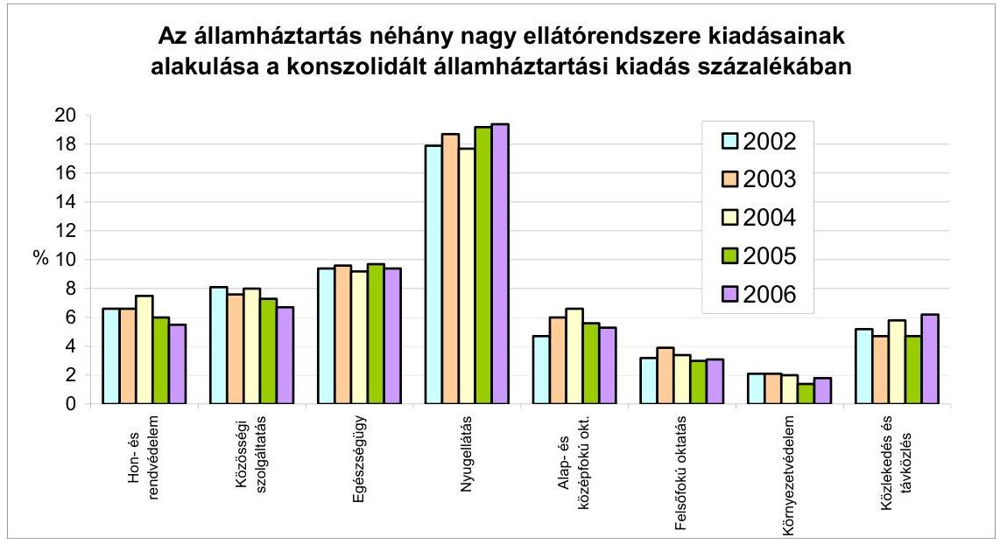
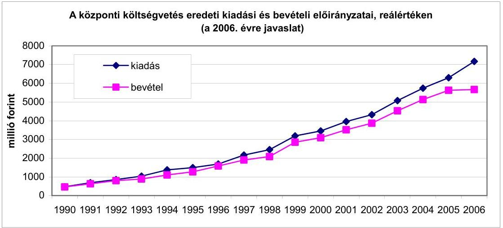
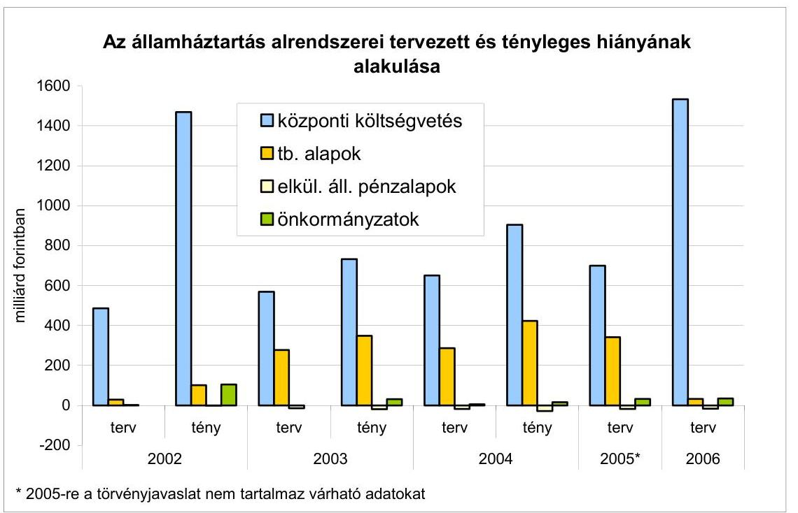
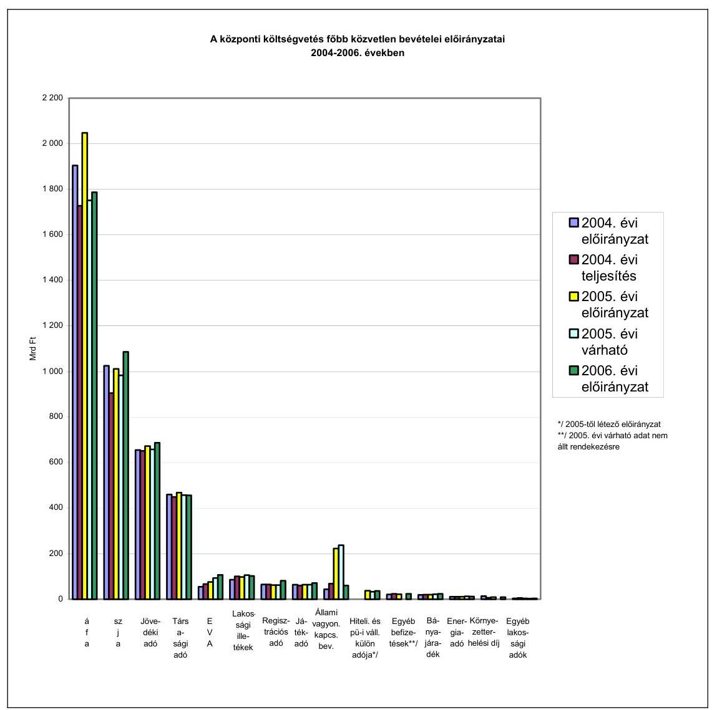
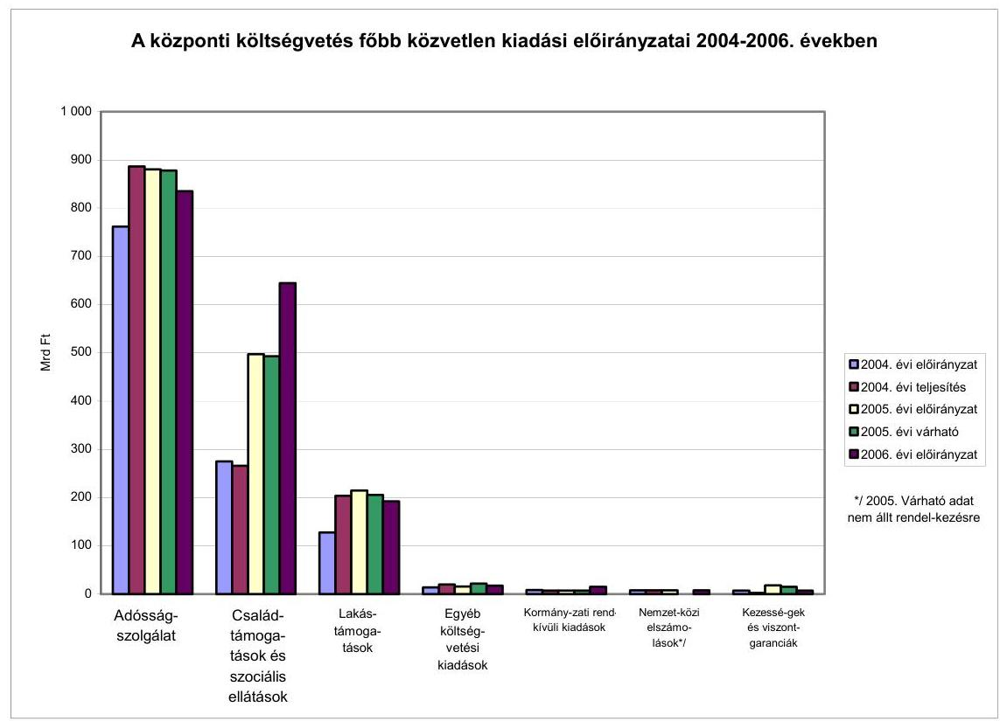
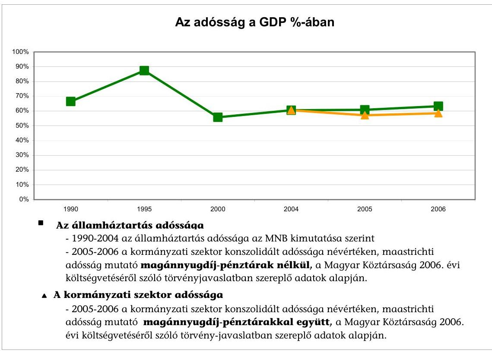
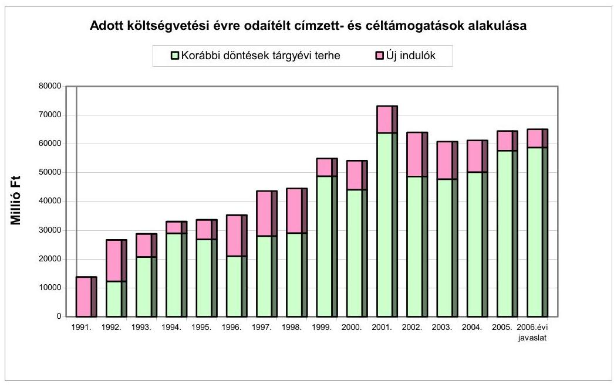
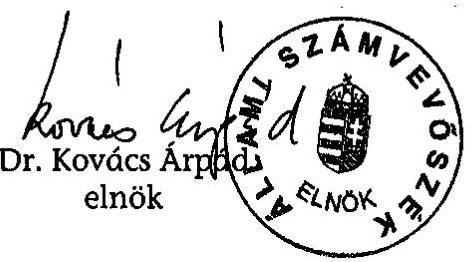

# VÉLEMÉNY 

a Magyar Köztársaság 2006. évi
költségvetési javaslatáról

| 0550 | T/17700/1. | 2005. október |
| :-- | :-- | :-- |

---

# 1. Szervezetirányítási és Működtetési Igazgatóság 

Vizsgálat-azonosító szám: V0191
Az ellenőrzést felügyelte:
Dr. Csapodi Pál
főtitkár
Az ellenőrzés végrehajtásáért felelős:
Dr. Kékesi László
főtitkárhelyettes
Az ellenőrzést vezette:
Horváthné Menyhárt Erika
főcsoportfőnök-helyettes
Az ellenőrzést végezték:

| Bojtos Rózsa | Göller Géza | Nagyné Lakhézi Éva |
| :-- | :-- | :-- |
| tanácsadó | főtanácsadó | számvevő |
| Dr. Somorjai Zsoltné | Szabó Balázs | Bálint Józsefné |
| számvevő tanácsos | tanácsos | címzetes főmunkatárs |

## 2. Államháztartás Központi Szintjét Ellenőrző Igazgatóság

Az ellenőrzést felügyelte:
Bihary Zsigmond
főigazgató
Az ellenőrzés végrehajtásáért felelős:
Simon Ákosné
főigazgató-helyettes
Az ellenőrzést vezették:

| Horváth Sándor   főcsoportfőnök-helyettes | Dr. Csépán Mária   Magdolna   igazgatóhelyettes | Norczen Győzőné   osztályvezető főtanácsos |
| :-- | :-- | :-- |
| Pongrácz Éva   osztályvezető főtanácsos | Szabóné Farkas Katalin   osztályvezető főtanácsos | Tolnai Lászlóné   osztályvezető főtanácsos |
| Az ellenőrzést végezték: |  |  |
| Dr. Baji László   számvevő | Baki István   számvevő | Balázs Melinda   számvevő tanácsos |
| Dr. Baloghné Sebestyén   Éva   számvevő | Bamberger Mária   tanácsadó | Bartolák Márta   számvevő |
| Bács Ágnes   számvevő | Burenzsargal   Narantuja   számvevő | Czácz Dénes   számvevő gyakornok |
| Dancsóné Kuron Ildikó   számvevő | Deli Gáborné   számvevő | Dombovári Nóra   számvevő |
| Dr. Domján Eszter   számvevő tanácsos | Dormán István Zoltán   számvevő gyakornok | Éva Katalin   főtanácsadó |
| Farkas László   főtanácsadó | Fehérné Jagasich   Mariann   számvevő tanácsos | Ferencz Katalin   számvevő |

Jelentéseink az Országgyűlés számítógépes hálózatán és az Interneten a www.asz.hu címen is olvashatók.

---

| Fekete Anikó Gyöngyi számvevő | Fekete György László számvevő | Fodor Edit számvevő tanácsos |
| :--: | :--: | :--: |
| Fogarasi Miklós főtanácsadó | Franczen Lajos számvevő gyakornok | Gömöri József számvevő tanácsos |
| Görgényi Gábor számvevő gyakornok | Gyarmati István számvevő tanácsos | Hajdu Károlyné számvevő tanácsos |
| Hajdáné Sipos Erika számvevő | Hegedűsné Erdélyi   Piroska   tanácsadó | Horváth József számvevő tanácsos |
| Huszár József számvevő | Huszárné Borbás   Melinda   számvevő gyakornok | Jagicza Istvánné számvevő |
| Dr. Jakab Kornél számvevő | Jáger Lajos számvevő | Jiling Sámuel számvevő |
| Juhász József Gábor számvevő | Dr. Juhászné Szima   Mária   tanácsadó | Karsai Lászlóné tanácsadó |
| Kincses Erzsébet Eszter számvevő | Konorót Zsuzsanna   Mária   számvevő | Knoppné Szabó Ildikó számvevő tanácsos |
| Krémó Márkné számvevő tanácsos | Lödiné Cser Zsuzsa számvevő | Magyar Sára számvevő gyakornok |
| Dr. Mészáros Leila számvevő gyakornok | Morvay András számvevő tanácsos | Dr. Mihály Sándor főtanácsadó |
| Molnár Bálint számvevő gyakornok | Molnár Katalin számvevő gyakornok | Nagy József   főtanácsadó |
| Papp Julianna számvevő tanácsos | Patai Tamás számvevő tanácsos | Pető Krisztina számvevő |
| Polyák Ferenc számvevő | Dr. Pósch Gábor   főtanácsadó | Salamin Viktor számvevő gyakornok |
| Séra Andrásné   főtanácsadó | Simon Andrásné Dr. számvevő tanácsos | Dr. Sipos Dóra számvevő tanácsos |
| Szabó Erzsébet számvevő tanácsos | Szabóné Simai Mária számvevő | Dr. Szávai Tamás   főtanácsadó |
| Szepes Béla számvevő | Székely Ibolya tanácsadó | Szilágyi Gyöngyi   főtanácsadó |
| Szilágyi Zsuzsanna tanácsadó | Szirbikné Dr. Szabó   Mária   számvevő | Szöllősiné Hrabóczki   Etelka   főtanácsadó |
| Tóthné Nagy Éva számvevő tanácsos | Vacsora Erika számvevő | Dr. Vass Gábor számvevő tanácsos |
| Winter Zsuzsa számvevő | Zakar László számvevő | Zaroba Szilvia számvevő |

A dokumentumot készítő 2. Államháztartás Központi Szintjét Ellenőrző Igazgatóság munkatársainak felsorolása eltér a nyomdahibásan nyomtatott példányokétól.

---

3. Önkormányzati és Területi Ellenőrzési Igazgatóság Az ellenőrzést felügyelte:

Dr. Lóránt Zoltán
főigazgató
Az ellenőrzés végrehajtásáért felelős:
Németh Péterné
főcsoportfőnök
Az ellenőrzést vezette:
Dr. Sallai Antal
osztályvezető főtanácsos
A helyszíni vizsgálati jelentések feldolgozásában és az összefoglaló elkészítésében közreműködött:
Dankó Géza Kozák György
főtanácsadó
Az ellenőrzést végezték:
Ambrus Lajos
tanácsadó
Dr. Mezei Imréné
főtanácsadó
Főtanácsadó
Kozák György
főtanácsadó

---

# TARTALOMJEGYZÉK 

BEVEZETÉS ..... 15
I. ÖSSZEGZŐ MEGÁLLAPÍTÁSOK, KÖVETKEZTETÉSEK, JAVASLATOK ..... 18
II. RÉSZLETES MEGÁLLAPÍTÁSOK ..... 37
A) A KÖLTSÉGVETÉSI DOKUMENTUM TÖRVÉNYESSÉGI ÉS SZÁMSZAKI ELLENŐRZÉSE ..... 39

1. Az Áht. költségvetési tervezésre és a törvényjavaslat előterjesztésére vonatkozó előírásainak érvényesülése ..... 41
1.1. A tervezés feltételei ..... 41
1.2. A költségvetési dokumentum előterjesztése ..... 42
2. A törvényjavaslat normaszövegéhez kapcsolódó észrevételek ..... 44
3. Egyéb észrevételek a törvényjavaslathoz ..... 47
B) HELYSZÍNI ELLENŐRZÉS ..... 49
B1. AZ ÁLLAMHÁZTARTÁS KÖZPONTI SZINTJE ..... 51
B.1.1. KÖZPONTI KÖLTSÉGVETÉS ..... 51
4. A költségvetés makroszintű számításai ..... 51
5. A központi költségvetés közvetlen bevételi előirányzatai ..... 53
2.1. Vállalkozások költségvetési befizetései ..... 54
2.1.1. Társasági adó ..... 54
2.1.2. Hitelintézetek és pénzügyi vállalkozások különadója ..... 55
2.1.3. Bányajáradék ..... 55
2.1.4. Játékadó-bevétel ..... 56
2.1.5. Egyszerűsített vállalkozói adó ..... 56
2.1.6. Ökoadó ..... 57
2.1.6.1. Energiaadó ..... 57
2.1.6.2. Környezetterhelési díj ..... 57
2.1.7. Egyéb befizetések ..... 58
2.2. Fogyasztáshoz kapcsolt adók ..... 58
2.2.1. Általános forgalmi adó ..... 58
2.2.2. Jövedéki adó ..... 60
2.2.3. Regisztrációs adó ..... 61

---

2.3. A lakosság költségvetési befizetései ..... 62
2.3.1. Személyi jövedelemadó ..... 62
2.3.2. Egyéb lakossági adók ..... 63
2.3.3. Lakossági illetékek ..... 63
2.4. Állami vagyonnal kapcsolatos bevételek ..... 64
3. A központi költségvetés közvetlen kiadási előirányzatai ..... 66
3.1. A központi költségvetés kamatelszámolásai, tőke-visszatérülései, az adósság- és követeléskezelés költségei ..... 73
3.2. Az állami kezességvállalás és kezességérvényesítés ..... 81
4. A fejezetek költségvetési előirányzatai ..... 86
4.1. A fejezeti tervezés irányítása, összehangolása ..... 86
4.2. Az intézmény- és feladat-felülvizsgálat eredményei ..... 89
4.3. Kiadási előirányzatok ..... 91
4.3.1. Létszám és a személyi juttatások ..... 92
4.3.2. Dologi előirányzatok ..... 94
4.3.3. Fejezeti kezelésű előirányzatok ..... 96
4.3.3.1. Felhalmozási kiadások ..... 96
4.3.3.2. A PPP alakulása ..... 96
4.3.3.3. Fejezeti kezelésű előirányzatok változása ..... 97
4.3.3.4. A fejezeti tartalék alakulása ..... 99
4.3.4. Alapítványok, közhasznú társaságok értékelése ..... 100
4.3.5. Az Európai Uniós tagsággal összefüggő előirányzatok ..... 101
4.3.5.1. Hozzájárulás az EU költségvetéséhez ..... 101
4.3.5.2. A költségvetés bevételei ..... 102
4.3.5.3. Az Európai Uniótól érkező támogatások ..... 102
5. Bevételi előirányzatok ..... 108
6. Költségvetés központosított bevételei ..... 109
B.1.2 ELKÜLÖNÍTETT ÁLLAMI PÉNZALAPOK ..... 111

1. Az elkülönített állami pénzalapok költségvetésének tervezési szempontjai ..... 111
2. Munkaerőpiaci Alap (MPA) ..... 112
2.1. A munkaerőpiaci helyzet alakulása ..... 112
2.2. Az MPA 2006. évi költségvetésének kidolgozása ..... 112
3. Központi Nukleáris Pénzügyi Alap ..... 117
4. Wesselényi Miklós Ár- és Belvízvédelmi Kártalanítási Alap (WMA) ..... 118
5. Kutatási és Technológiai Innovációs Alap (KTIA) ..... 119
6. Szülőföld Alap (SZA) ..... 122
6.1. Az Alap létrehozásának célja, jogszabályi háttere ..... 122
6.2. Az Alap 2006. évi költségvetésének kialakítása ..... 123

---

B.1.3 TÁRSADALOMBIZTOSÍTÁS PÉNZÜGYI ALAPJAI ..... 125

1. A tervezés folyamata és szempontjai ..... 125
2. Nyugdíjbiztosítási Alap ..... 126
2.1. A tervezés feltételei ..... 126
2.2. Az Ny. Alap bevételeinek tervezése ..... 127
2.2.1. A 2005. évi bevételi előirányzat várható teljesülése ..... 127
2.2.2. A 2006. évi bevételi előirányzat ..... 127
2.3. Az Ny. Alap kiadásainak tervezése ..... 129
2.3.1. A 2005. évi kiadási előirányzat várható teljesülése ..... 129
2.3.2. A 2006. évi nyugdíjkiadások tervezése ..... 130
2.4. Az ONYF működési kiadásai ..... 132
3. Egészségbiztosítási Alap ..... 134
3.1. A tervezés feltételei ..... 134
3.2. Az E. Alap bevételeinek tervezése ..... 135
3.2.1. A 2005. évi bevételi előirányzat várható teljesülése ..... 135
3.2.2. A 2006. évi bevételi előirányzat ..... 135
3.3. Az egészségbiztosítás ellátási kiadásainak tervezése ..... 137
3.3.1. Rokkantsági nyugellátások ..... 137
3.3.2. Pénzbeni ellátások ..... 138
3.3.3. Gyógyító-megelőző egészségügyi ellátás ..... 138
3.3.4. Gyógyszer-támogatás ..... 141
3.3.5. Gyógyászati segédeszköz támogatás ..... 141
3.4. Az OEP 2006. évi működési kiadásainak tervezése ..... 142
B2. A HELYI ÖNKORMÁNYZATOK ..... 145
4. A költségvetési törvényjavaslat és a helyi önkormányzati pénzügyi szabályozó rendszer összhangja ..... 145
5. A forrásszabályozás módosításának főbb jellemzői ..... 147
6. Az önkormányzati bevételek tervezése ..... 150
3.1. A normatív és egyéb állami hozzájárulások, támogatások ..... 150
3.1.1. Normatív állami hozzájárulás és normatív részesedésű átengedett személyi jövedelemadó ..... 150
3.1.2. Normatív, kötött felhasználású támogatás ..... 154
3.1.3. Központosított előirányzatok ..... 158
3.1.4. A helyi önkormányzatok működőképességének megőrzését szolgáló kiegészítő támogatások ..... 158
3.2. Fejlesztési támogatások ..... 159
3.2.1. A fejlesztési támogatások decentralizálásának jellemzői ..... 159
3.2.2. Címzett- és céltámogatások ..... 162
3.2.3. A leghátrányosabb helyzetű kistérségek felzárkóztatásának támogatása ..... 165

---

3.2.4. Helyi önkormányzatok fejlesztési és vis maior támogatása ..... 166
3.2.5. A helyi önkormányzatok európai uniós fejlesztési pályázataihoz szükséges önkormányzati saját forrás kiegészítése ..... 167
3.2.6. Kiemelt fővárosi fejlesztési támogatási programok előirányzatai ..... 168
3.2.7. Az önkormányzati fejlesztések finanszírozására elérhető egyéb források ..... 168
3.3. Átengedett bevételek ..... 170
3.4. Saját források ..... 171
MELLÉKLETEK ..... 173

1. számú Kimutatás az átengedett személyi jövedelemadó és ..... 175 önkormányzati támogatások rendelkezési jogosultság szerinti megoszlásáról
2. számú A normatív hozzájárulások jogcímenkénti és ágazatonkénti ..... 176 előirányzatainak változása
3. számú A normatív, kötött felhasználású támogatások jogcímenkénti és ..... 177 ágazatonkénti előirányzatainak változása
4. számú A központosított előirányzatok jogcímeinek és összegének ..... 178 változása
5. számú Az önkormányzatok 2006. évi fejlesztési célú támogatásainak ..... 180
FÜGGELÉK ..... 181
I. ORSZÁGGYŰLÉS ..... 183
KÖZBESZERZÉSEK TANÁCSA ..... 185
II. KÖZTÁRSASÁGI ELNÖKSÉG ..... 187
III. ALKOTMÁNYBÍRÓSÁG ..... 189
IV. ORSZÁGGYŰLÉSI BIZTOSOK HIVATALA ..... 191
V. ÁLLAMI SZÁMVEVŐSZÉK ..... 193
VI. BÍRÓSÁGOK ..... 195
VIII. MAGYAR KÖZTÁRSASÁG ÜGYÉSZSÉGE ..... 197
X. MINISZTERELNÖKSÉG ..... 199
KORMÁNYZATI ELLENŐRZÉSI HIVATAL ..... 202
POLGÁRI NEMZETBIZTONSÁGI SZOLGÁLATOK ..... 204
XI. BELÜGYMINISZTÉRIUM ..... 206
XII. FÖLDMŰVELÉSÜGYI ÉS VIDÉKFEJLESZTÉSI MINISZTÉRIUM ..... 211
XIII. HONVÉDELMI MINISZTÉRIUM ..... 214
XIV. IGAZSÁGÜGYI MINISZTÉRIUM ..... 217

---

XV. GAZDASÁGI ÉS KÖZLEKEDÉSI MINISZTÉRIUM ..... 220
XVI. KÖRNYEZETVÉDELMI ÉS VÍZÜGYI MINISZTÉRIUM ..... 225
XVII. TERÜLETFEJLESZTÉS ..... 228
XVIII. KÜLÜGYMINISZTÉRIUM ..... 230
XIX. EU INTEGRÁCIÓ ..... 232
XX. OKTATÁSI MINISZTÉRIUM ..... 235
XXI. EGÉSZSÉGÜGYI MINISZTÉRIUM ..... 239
XXII. PÉNZÜGYMINISZTÉRIUM ..... 244
PÉNZÜGYI SZERVEZETEK ÁLLAMI FELÜGYELETE ..... 246
XXIII. NEMZETI KULTURÁLIS ÖRÖKSÉG MINISZTÉRIUMA ..... 249
XXIV. IFJÚSÁGI, CSALÁDÜGYI, SZOCIÁLIS ÉS ESÉLYEGYENLŐSÉGI MINISZTÉRIUM ..... 253
XXV. INFORMATIKAI ÉS HÍRKÖZLÉSI MINISZTÉRIUM ..... 256
XXVI. FOGLALKOZTATÁSPOLITIKAI ÉS MUNKAÜGYI MINISZTÉRIUM ..... 259
XXX. GAZDASÁGI VERSENYHIVATAL ..... 262
XXXI. KÖZPONTI STATISZTIKAI HIVATAL ..... 264
XXXIII. MAGYAR TUDOMÁNYOS AKADÉMIA ..... 267
XXXIV. NEMZETI KUTATÁSI ÉS TECHNOLÓGIAI HIVATAL ..... 269

---

.

---

# RÖVIDÍTÉSEK JEGYZÉKE 

| ÁAK Rt. | Állami Autópálya Kezelő Rt. |
| :--: | :--: |
| áfa | általános forgalmi adó |
| Áht. | Az államháztartásról szóló 1992. évi XXXVIII. törvény |
| AIK | Agrárintervenciós Központ |
| AKA Rt. | Alföldi Koncessziós Autópálya Rt. |
| ÁKK Rt. | Államadósság Kezelő Központ Rt. |
| ÁFSz | Állami Foglalkoztatási Szolgálat |
| ALB | Alkotmánybíróság |
| Ámr. | Az államháztartás működési rendjéről szóló 217/1998. (XII. 30.) Korm. rendelet |
| ÁNTSZ | Állami Népegészségügyi és Tisztiorvosi Szolgálat |
| APEH | Adó- és Pénzügyi Ellenőrzési Hivatal |
| APEH-SZTADI | Adó- és Pénzügyi Ellenőrzési Hivatal Számítástechnikai és Adatfeldolgozó Intézet |
| ÁPV Rt. | Állami Privatizációs és Vagyonkezelő Rt. |

 |
| Atv. | 1996. évi CXVI. törvény az atomenergiáról |
| ÁSZ | Állami Számvevőszék |
| ÁSZ tv. | Az Állami Számvevőszékről szóló 1989. évi XVIII. törvény |
| ÁSZTL | Állambiztonsági Szolgálatok Történeti Levéltára |
| ÁTBP | Állami Támogatású Bérlakás Program |
| AVOP | Agrár- és Vidékfejlesztési Operatív Program |
| BC | Beruházás-ösztönzési célelőirányzat |
| Ber. | A költségvetési szervek belső ellenőrzéséről szóló 193/2003. (XI. 26.) Korm. rendelet |
| BIR | Bíróságok |
| Bit. | A biztosítóintézetekről és a biztosítási tevékenységről szóló 2003. évi LX. törvény |
| BKIK | Budapesti Kereskedelmi és Iparkamara |
| BM | Belügyminisztérium |
| BM KGF | Belügyminisztérium Központi Gazdasági Főigazgatóság |
| BM NSH | Belügyminisztérium Nemzeti Sporthivatal |
| Bszi | A bíróságok szervezetéről és igazgatásáról szóló 1997. évi LXVI. törvény |
| BVOP | Büntetés-végrehajtás Országos Parancsnoksága |
| Bszt. | A bíróságok szervezetéről és igazgatásáról szóló 1997. évi LXVI. törvény |
| CEDEFOP | Európai Szakképzés-fejlesztési Központ |
| CÉDE | Céljellegű decentralizált támogatás |
| CFCU | Központi Pénzügyi és Szerződéskötő Egység |
| CISZOK | Civil Szolgáltató Központok |
| CT | Computer Tomográf (számítógépes rétegfelvétel) |
| Cst. | A családok támogatásáról szóló 1998. évi LXXXIV. törvény |

---

| EBB | Európai Beruházási Bank |
| :--: | :--: |
| EBRD | Európai Újjáépítési és Fejlesztési Bank |
| EDR | egységes digitális rádió-távközlő rendszer |
| EFE | Egészségügyi Fejlesztési Célelőirányzat |
| EGC | Energiagazdálkodási célelőirányzat |
| EGT | Európai Mezőgazdasági Térség |
| EHJC | Energiafelhasználás hatékonyság javítása célelőirányzat |
| eho | Egészségügyi hozzájárulás |
| EKHO | Egyszerűsített Közteherviselési Hozzájárulás |
| EKH | Esélyegyenlőségi Kormányhivatal |
| E. Alap | Egészségbiztosítási Alap |
| EMIR | Egységes Monitoring Információs Rendszer |
| EMOGA | Európai Mezőgazdasági Orientációs és Garancia Alap |
| EP | Európa Parlament |
| ESKI | Egészségügyi Stratégiai Kutatóintézet |
| ESZA Kht. | Európai Szociális Alap Nemzeti Programirányító Társadalmi Szolgáltató Kht. |
| Etv. | Az egyes fontos tisztségeket betöltő személyek ellenőrzéséről szóló 1994. évi XXIII. törvény |
| EU | Európai Unió |
| EüM | Egészségügyi Minisztérium |
| Eütv. | Az egészségügyről szóló 1997. évi CLIV. törvény |
| EXIMBANK Rt. | Magyar Export-Import Bank Rt. |
| EVA | Egyszerűsített Vállalkozási Adó |
| FA | Munkaerőpiaci Alap Foglalkoztatási Alaprésze |
| FH | Foglalkoztatási Hivatal |
| FIFA | Felzárkóztatási Infrastrukturális Fejlesztési Alapprogram |
| FKA | Munkaerőpiaci Alap Fejlesztési és Képzési Alaprésze |
| Flt. | A foglalkoztatás elősegítéséről és a munkanélküliek ellátásáról szóló 1991. évi IV. törvény |
| FMM | Foglalkoztatáspolitikai és Munkaügyi Minisztérium |
| FÖMI | Földmérési és Távközlési Intézet |
| FPMNYI | Fővárosi és Pest Megyei Nyugdíjbiztosítási Igazgatóság |
| FVM | Földművelésügyi és Vidékfejlesztési Minisztérium |
| GDP | Bruttó hazai termék |
| Get. | A gázellátásról szóló 2003. évi XLII. törvény |
| GFC | Gazdaságfejlesztési célelőirányzat |
| GFS | Government Financial Statistics |
| GKM | Gazdasági és Közlekedési Minisztérium |
| Gt. | A gazdasági társaságokról szóló 1997. évi CXLIV. törvény |
| GVH | Gazdasági Versenyhivatal |
| GVOP | Gazdasági Versenyképesség Operatív Program |
| Gyvt. | A gyermekek védelméről és a gyámügyi igazgatásról szóló 1997. évi XXXI. törvény |
| GYFA | Gyártmányfejlesztési Forgóalap |

---

| GyISM | Gyermek-, Ifjúsági és Sportminisztérium |
| :--: | :--: |
| GYES | Gyermekgondozási segély |
| GYED | Gyermekgondozási díj |
| GYET | Gyermeknevelési támogatás - 1998. évi LXXXIV. törvény |
| HBCs | Homogén Betegség Csoport |
| HCCP | Ételkészítéshez korszerű műszaki eszközök, berendezések és higiéniás eljárások rendszere |
| HEFOP | Humánforrás-fejlesztési Operatív Program |
| HM | Honvédelmi Minisztérium |
| HM IKH | HM Ingatlankezelési Hivatal |
| HM KÁT | HM közigazgatási államtitkár |
| HM KPSZH | HM Központi Pénzügyi és Számviteli Hivatal |
| HM PSzSz | Honvédelmi Minisztérium Számviteli Szolgálat |
| HM VTB | HM Védelmi Tervező Bizottság |
| HM VTF | HM Védelmi Tervezési Főosztály |
| Hpt. | Hitelintézetekről és pénzügyi vállalkozásokról szóló 1996. évi CXII. törvény |
| HTMH | Határon Túli Magyarok Hivatala |
| Hszt. | A fegyveres szervek hivatásos állományú tagjainak szolgálati viszonyáról szóló 1996. évi XLIII. törvény |
| IBR | Irányított Betegellátási Rendszer |
| IBRD | Nemzetközi Újjáépítési és Fejlesztési Bank |
| ICsSzEM | Ifjúsági, Családügyi, Szociális és Esélyegyenlőségi Minisztérium |
| Igazgatóságok | Magyar Államkincstár Területi Igazgatóságai |
| IH | Információs Hivatal |
| IHM | Informatikai és Hírközlési Minisztérium |
| ILO | Nemzetközi Munkaügyi Szervezet |
| IM | Igazságügyi Minisztérium |
| IM-BV | Igazságügyi Minisztérium Büntetés-végrehajtási Szervezet |
| IPPC | Integrált szennyezés megelőzés és ellenőrzés |
| ISPA | Instrument for Stuctural Policies for Pre-Accession |
| ITD-H Kft. | Magyar Befektetési és Kereskedelemfejlesztési Kft. |
| ISZIH | Igazságügyi Szakértői Intézetek Hivatala |
| Jöt. | A jövedéki adóról szóló 1997. évi CIII. törvény |
| KAIG | Kiemelt Adózók Igazgatósága (APEH) |
| KAIH | Kohéziós Alap Irányító Hatóság |
| Kbt. | A közbeszerzésről szóló 2003. évi CXXIX. törvény |
| KE | Köztársasági Elnökség |
| KEHI | Kormányzati Ellenőrzési Hivatal |
| KEP | Köztársasági Esélyegyenlőségi Program |
| KESZ | Kincstári Egységes Számla |
| Ket. | Közigazgatási hatósági eljárás és szolgáltatás általános szabályairól szóló 2004. évi XCL. törvény |
| Kft. | Korlátolt felelősségű társaság |
| Kht. | Közhasznú társaság |

---

| KfW | Kreditanstalt für Wiederaufbau (Újjáépítési és Hitelbank) |
| :--: | :--: |
| Kincstár | Magyar Államkincstár |
| KIOP | Környezetvédelmi és Infrastrukturális Operatív Program |
| KIR | Központi Illetményszámfejtő Rendszer |
| Kjt. | Közalkalmazottak jogállásáról szóló 1992. évi XXXIII. törvény |
| KKC | Kis- és középvállalkozási célelőirányzat |
| KMÜFA | Központi Műszaki Fejlesztési Alap |
| KNPA | Központi Nukleáris Pénzügyi Alap |
| KOMT | Közalkalmazottak Országos Munkaügyi Tanácsa |
| Kövice | Környezetvédelmi és vízügyi célelőirányzat |
| KPI | Kutatás-fejlesztési Pályázati és Kutatáshasznosítási Iroda |
| KPSZE | Központi Pénzügyi és Szerződéskötő Egység |
| KvVM | Környezetvédelmi és Vízügyi Minisztérium |
| KvVM FI | KvVM Fejlesztési Igazgatóság |
| KSH | Központi Statisztikai Hivatal |
| KSzF | Központi Szolgáltatási Főigazgatóság |
| KT | Közbeszerzések Tanácsa |
| KTIA | Kutatási és Technológiai Innovációs Alap |
| KTIA tv. | a Kutatási és Technológiai Innovációs Alapról szóló 2003. évi XC. törvény |
| KTK | Kincstári Tranzakciós Kód |
| Ktv. | A köztisztviselők jogállásáról szóló 1992. évi XXIII. törvény |
| KüM | Külügyminisztérium |
| KVI | Kincstári Vagyoni Igazgatóság |
| Kvtv. | A Magyar Köztársaság 2005. évi költségvetéséről szóló 2004. évi CXXXV. törvény |
| Közokt. tv. | A közoktatásról szóló 1993. évi LXXIX. törvény |
| LEP | Lakóépületek Energia-megtakarítási Programja |
| LÜ | Legfőbb Ügyészség |
| MACIKA | Magyarországi Cigányokért Közalapítvány |
| MAT | Munkaerőpiaci Alap Irányító Testülete |
| MÁV Rt. | Magyar Államvasutak Rt. |
| MBH | Magyar Bányászati Hivatal |
| ME | Miniszterelnökség |
| MÉBIH | Magyar Élelmiszerbiztonsági Hivatal |
| MeH | Miniszterelnöki Hivatal |
| MeHVM | Miniszterelnöki Hivatalt Vezető Miniszter |
| MEHIB Rt. | Magyar Exporthitelt Biztosító Rt. |
| MeHIg | Miniszterelnöki Hivatal Igazgatása |
| MeHVM | Miniszterelnöki Hivatalt Vezető Miniszter |
| ME IKB | Miniszterelnökség Informatikai Kormánybiztosság |
| MEH KÁ | Miniszterelnöki Hivatal Közigazgatási Államtitkár |
| MEP | Megyei Egészségbiztosítási Pénztár |
| METESZ | Műszaki és Természettudományi Egyesületek Szövetsége |

---

| MFB Rt. | Magyar Fejlesztési Bank Rt. |
| :--: | :--: |
| MH | Magyar Honvédség |
| MK | Munkaügyi Központ |
| MKIK | Magyar Kereskedelmi és Iparkamara |
| MKK Rt. | Magyar Követeléskezelő Rt. |
| MKÜ | Magyar Köztársaság Ügyészsége |
| MLI Kht. | Magyar Lakásinnovációs Kht. |
| MNB | Magyar Nemzeti Bank |
| MNYP | Magánnyugdíjpénztár |
| MOB | Magyar Olimpiai Bizottság |
| MPA | Munkaerőpiaci Alap |
| Mpt. | A magánnyugdíjról és a magán-nyugdíjpénztárakról szóló 1997. évi LXXXII. törvény |
| MRI | Magnetic Resonance Imaging (mágneses rezonancián alapuló képalkotás) |
| MSH | Magyar Sportok Háza |
| Mt. | a Munka Törvénykönyvéről szóló 1992. évi XXII. törvény |
| MTA | Magyar Tudományos Akadémia |
| MTI | Magyar Távirati Iroda Rt. |
| MUBT | Magyar UNESCO Bizottság Titkársága |
| MVf Kht. | Magyar Vállalkozásfejlesztési Kht. |
| MVH | Mezőgazdasági és Vidékfejlesztési Hivatal |
| MVM Rt. | Magyar Villamos Művek Rt. |
| NBH | Nemzetbiztonsági Hivatal |
| NBSZ | Nemzetbiztonsági Szakszolgálat |
| NA Rt. | Nemzeti Autópálya Rt. |
| NCA | Nemzeti Civil Alapprogram |
| NEKH | Nemzeti és Etnikai Kisebbségi Hivatal |
| NFA | Nemzeti Földalap Program |
| NFT | Nemzeti Fejlesztési Terv |
| NIIF | Nemzeti Információs és Infrastrukturális Iroda |
| NKFP | Nemzeti kutatási-fejlesztési program |
| NKÖM | Nemzeti Kulturális Örökség Minisztériuma |
| NKTH | Nemzeti Kutatási és Technológiai Hivatal |
| NUPI | Nemzeti Utánpótlás-nevelési Intézet |
| NKP | Nemzeti Környezetvédelmi Program |
| NSH | Nemzeti Sporthivatal |
| NUPI | Nemzeti-Utánpótlási Nevelési Intézet |
| NVT | Nemzeti Vidékfejlesztési Terv |
| NYUFIG | Nyugdíjfolyósító Igazgatóság |
| Ny. Alap | Nyugdíjbiztosítási Alap |
| OAH | Országos Atomenergiai Hivatal |
| OBH | Országgyűlési Biztosok Hivatala |
| ObmT | Országos Bűnmegelőzési Tanács |

---

| OECD | Gazdasági Együttműködési és Fejlesztési Szervezet |
| :--: | :--: |
| OEP | Országos Egészségbiztosítási Pénztár |
| OFA | Országos Foglalkoztatási Közalapítvány |
| OGY | Országgyűlés |
| OGYH | Országgyűlés Hivatala |
| OKÉV | Országos Közoktatási Értékelési és Vizsgaközpont |
| OKF | Országos Katasztrófavédelmi Főigazgatóság |
| OKRI | Országos Kriminológiai Intézet |
| OKTVF | Országos Környezetvédelmi, Természetvédelmi és Vízügyi Főigazgatóság |
| OLÉH | Országos Lakás- és Építésügyi Hivatal |
| OM | Oktatási Minisztérium |
| OMAI | Oktatási Minisztérium Alapkezelő Igazgatósága |
| OMMF | Országos Munkabiztonsági és Munkavédelmi Felügyelőség |
| OM NKFP | Oktatási Minisztérium Nemzeti Kutatás-Fejlesztési Program |
| OMSZ | Országos Meteorológiai Szolgálat |
| OMSZI | Oktatási Minisztérium Szolgáltató Intézmény |
| ONYF | Országos Nyugdíjbiztosítási Főigazgatóság |
| OOSZI | Országos Orvosszakértői Intézet |
| ORFK | Országos Rendőr-főkapitányság |
| OSEI | Országos Sportegészségügyi Intézet |
| OSZT | Országos Szakképzési Tanács |
| OTIVA | Országos Takarékszövetkezeti Intézmény Védelmi Alap |
| OTKA | Országos Tudományos Kutatási Alapprogramok |
| OTMR | Országos Támogatási Monitoring Rendszer |
| ÖNYP | Önkéntes Nyugdíjpénztár |
| Öpt. | Az Önkéntes Kölcsönös Biztosító Pénztárakról szóló 1993. évi XCVI. törvény |
| PET | Pozitron Emissziós Tomográf |

 PHARE | Pologne Hongrie Aid a la Reconstruction Économique |
| PIR | Pályázati Információs Rendszer |
| PKN | Pénztárak Központi Nyilvántartása |
| PM | Pénzügyminisztérium |
| PNSZ | Polgári Nemzetbiztonsági Szolgálatok |
| PPP | Public Privat Partnership |
| PSZÁF | Pénzügyi Szervezetek Állami Felügyelete |
| Psztv. | A Pénzügyi Szervezetek Állami Felügyeletéről szóló 1999. évi   CXXIV. törvény |
| RA | Munkaerőpiaci Alap Rehabilitációs Alaprésze |
| REGÉC | Regionális fejlesztési célelőirányzat |
| RHK Kht. | Radioaktív Hulladékokat Kezelő Közhasznú Társaság |
| RIB | Regionális Idegenforgalmi Bizottság |
| ROP | Regionális Operatív Program |
| Rt. | Részvénytársaság |

---

| SAPARD | Különleges Előcsatlakozási Program a Mezőgazdasági és Vidékfejlesztés Támogatására |
| :--: | :--: |
| SAPS | Egységes területalapú támogatás |
| szja | személyi jövedelemadó |
| SKFF | Segélykoordinációs és Finanszírozási Főosztály |
| Szatv. | 2005. évi II. törvény a Szülőföld Alapról |
| SZF | Szerencsejáték Felügyelete |
| Szht. | 2003. évi LXXXVI. törvény a szakképzési hozzájárulásról |
| SZMSZ | Szervezeti és Működési Szabályzat |
| Szoc. tv. | 1993. évi III. törvény a szociális igazgatásról, szociális ellátásról |
| Szt. | A számvitelről szóló 2000. évi C. törvény |
| SZT-TU | Széchenyi Terv Turisztikai Pályázatok |
| TÁTB | Társadalombiztosítási Ár- és Támogatási Bizottság |
| TB alapok | Társadalombiztosítás pénzügyi alapjai |
| TC | Turisztikai célelőirányzat |
| Tbj. | 1997. évi LXXX. törvény a társadalombiztosítás ellátásaira és a magánnyugdíjra jogosultakról, valamint e szolgáltatások fedezetéről, egységes szerkezetben a végrehajtásáról szóló 195/1997. (XI. 5.) Korm. rendelettel |
| TERKI | Terület kiegyenlítést szolgáló fejlesztési célú támogatás |
| TJKSZ | Támogatásokat és Járadékot Kezelő Szövetkezet |
| TKH | Területpolitikai Kormányzati Hivatal |
| TMP | Tagállamként való Működés Kormányzati Program |
| TNM | Tárca nélküli Miniszter |
| Tny. | 1997. évi LXXXI. törvény a társadalombiztosítási nyugellátásról, egységes szerkezetben a végrehajtásáról szóló 168/1997. (X. 6.) Korm. rendelettel |
| Top-up | Kiegészítő hazai támogatás |
| Tpt. | A tőkepiacról szóló 2001. évi CXX. törvény |
| ÚFCE | Útfenntartási és fejlesztési célelőirányzat |
| UKIG | Útgazdálkodási Koordinációs Igazgatóság |
| ÜMSZ | Ügyviteli és Működési Szabályzat |
| VITUKI | Környezetvédelmi és Vízgazdálkodási Kutató Intézet Közhasznú társaság |
| VKJ | Vízkészlet járulék |
| VP | Vám- és Pénzügyőrség |
| VPOP | Vám- és Pénzügyőrség Országos Parancsnoksága |
| VPSZP | Vám- és Pénzügyőrség Számlavezető Parancsnoksága |
| WMA | Wesselényi Miklós Ár- és Belvízvédelmi Kártalanítási Alap |
| zárszámadási   tv. | A Magyar Köztársaság 2003. évi költségvetésének végrehajtásáról szóló 2004. évi C. törvény |

---

.

---

VE-03-006/2005.

# BEVEZETÉS 

Az Állami Számvevőszék (ÁSZ) az Alkotmány (32/C. § (1) bekezdés) és a számvevőszéki törvény (2. § (1) bekezdés) alapján véleményezi az állami költségvetési javaslat megalapozottságát, a bevételi előirányzatok teljesíthetőségét. Az államháztartási törvény (29. § (1) bekezdés) szerint az Országgyűlés a költségvetési törvényjavaslatot a számvevőszéki véleménnyel ${ }^{1}$ együtt tárgyalja.

A véleményt megalapozó ellenőrzés célja annak megállapítása volt, hogy

- a költségvetés tervezésének feltételrendszere, a költségvetési javaslat összeállítása megfelel-e az államháztartásról szóló törvény, valamint a végrehajtására kiadott kormányrendeletek előírásainak;
- a 2006. évi költségvetésről szóló törvényjavaslat bevételi és kiadási előirányzatainak megalapozottságát (a bevételi előirányzatok teljesíthetőségét, a kiadási előirányzatok indokoltságát) kielégítően biztosítják-e a tervezésnél alkalmazott módszerek, az állami feladatrendszer és a szabályozók javasolt módosításai;
- teljesültek-e az előirányzatok kialakítására kiadott tervezési köriratban és a fejezetenként összeállított tervezési tájékoztatóban foglaltak;
- a költségvetési törvényjavaslatban az önkormányzati forrásszabályozás és támogatási rendszer tervezett változtatásai megalapozottak-e, a szabályozás egyes elemei egymással összhangban kerültek-e kialakításra.

Az állami költségvetésre vonatkozóan a helyszíni ellenőrzés a Pénzügyminisztérium tervező és koordináló tevékenységére és a pénzügyminiszter hatáskörébe tartozó, a nemzetgazdasági elszámolások részét képező fő bevételi jogcímekre, a költségvetési fejezetekre, az elkülönített állami pénzalapokra és a társadalombiztosítási alapokra irányult.

A helyszínen ellenőriztük az Országgyűlés (a fejezeten belül a fejezeti jogosítványú Közbeszerzések Tanácsa), a Köztársasági Elnökség, az Alkotmánybíróság, az Országgyűlési Biztosok Hivatala, a Bíróságok, a Magyar Köztársaság Ügyészsége, a Miniszterelnökség (a fejezeten belül a Polgári Nemzetbiztonsági Szolgálatok és a Kormányzati Ellenőrzési Hivatal fejezeti jogosítványú költségvetési szervek), a

[^0]
[^0]:    ${ }^{1}$ A költségvetési véleményhez az ÁSZ Fejlesztési és Módszertani Intézete háttérelemzést készített, mely a 2006. évi költségvetési törvényjavaslatról szóló ÁSZ-véleményhez kapcsolódva értékeli a költségvetési tervezőmunka megalapozottságát, a 2006. évi költségvetés makrogazdasági környezetét, a költségvetés fő prioritásait, jellemző vonásait.

---

Belügyminisztérium, a Földművelésügyi és Vidékfejlesztési Minisztérium, a Honvédelmi Minisztérium, az Igazságügyi Minisztérium, a Gazdasági és Közlekedési Minisztérium, a Környezetvédelmi és Vízügyi Minisztérium, a Területfejlesztés, a Külügyminisztérium, az EU integráció, az Egészségügyi Minisztérium, az Oktatási Minisztérium, a Pénzügyminisztérium (a fejezeten belül a fejezeti jogosítványú Pénzügyi Szervezetek Állami Felügyelete), a Nemzeti Kulturális Örökség Minisztériuma, az Ifjúsági, Családügyi, Szociális és Esélyegyenlőségi Minisztérium, az Informatikai és Hírközlési Minisztérium, a Foglalkoztatáspolitikai és Munkaügyi Minisztérium, a Gazdasági Versenyhivatal, a Központi Statisztikai Hivatal, a Magyar Tudományos Akadémia és a Nemzeti Kutatási és Technológia Hivatal fejezetek tervezési munkáját.

Ellenőrzésünk kiterjedt - a nemzetgazdasági elszámolások körébe tartozó - „A központi költségvetés kamatelszámolásai, tőkevisszatérülései, az adósság- és követeléskezelés költségei" c. technikai fejezetre, valamint az Elkülönített Állami Pénzalapok Államháztartási Alrendszer fejezeteire: a Munkaerőpiaci Alapra, a Központi Nukleáris Pénzügyi Alapra, a Wesselényi Miklós Ár- és Belvízvédelmi Kártalanítási Alapra, a Kutatási és Technológiai Innovációs Alapra és a Társadalombiztosítás Pénzügyi Alapjai Államháztartási Alrendszer fejezeteire: az Egészségbiztosítási Alapra és a Nyugdíjbiztosítási Alapra.

A helyi önkormányzatok vonatkozásában a helyszíni ellenőrzés keretében a Pénzügyminisztériumban, a Belügyminisztériumban, az Oktatási Minisztériumban, az Ifjúsági, Családügyi, Szociális és Esélyegyenlőségi Minisztériumban és a Magyar Terület- és Regionális Fejlesztési Hivatalban tájékozódtunk a tervező munka részleteiről.

A helyszíni ellenőrzés szeptember 30-i lezárásáig a 2006. évi költségvetési törvényjavaslat előirányzatainak megalapozásához szükséges törvényjavaslatok benyújtása nem zárult le, ezért a költségvetési törvényjavaslat és azok közötti összhang teljes körűsége nem volt véleményezhető.

Az ÁSZ a költségvetési törvényjavaslat véleményezése során messzemenően szem előtt tartja és alapelvként érvényesíti, hogy nem érinti az állami újraelosztás irányait és arányait, az azt befolyásoló, megalapozó politikai és gazdaságpolitikai döntéseket, mivel ezekre törvényi felhatalmazása nem terjed ki. Kizárólag a költségvetési törvényjavaslatban szereplő előirányzatok megalapozottsága, illetve hangsúlyozottan a tervkészítés szabályainak betartása - a tervezési és a végrehajthatósági kockázatok csökkentése - a minősítés alapja.

A költségvetés bevételi tervszámai megalapozottságának minősítésénél a magas, közepes, illetve alacsony kockázat fogalmát használja az ÁSZ. Alacsony kockázat: az előirányzat teljesülése valószínűsíthető, az elmaradás nem jelentős összegű, illetve arányú. Közepes kockázat: az előirányzat várhatóan nem teljesül, az elmaradás 2\% körüli. Magas kockázat: az előirányzat várhatóan nem teljesül, az elmaradás 5\% körüli vagy azt meghaladó. A közepes és magas kockázat különösen figyelmet érdemel a nagy összegű bevételek (szja, áfa) esetében.

Az előirányzatok várható teljesülésének kockázatok szerinti minősítésénél a következőket vette alapul az ellenőrzés: a háttér számításokat, illetve azok megalapozottságát; a Pénzügyminisztérium szerinti várható (2005. évi) teljesülést, figyelemmel az időarányos adatokra is; a jogszabályi változásokat és az előző évek teljesülésének alakulását és azok előirányzathoz való viszonyát.

A Magyar Köztársaság 2006. évi költségvetési törvényjavaslatáról készített számvevőszéki vélemény első része tartalmazza az ellenőrzés legfontosabb megállapításait és a javaslatokat, valamint a költségvetési törvényjavaslat törvényességi és számszaki ellenőrzésére és az államháztartás alrendszereire vonatkozó részletes ellenőrzési megállapításokat. A második rész (Függelék) az egyes fejezetek tervezőmunkájáról, előirányzataik megalapozottságáról kialakított véleményünket foglalja magában.

A költségvetésről készített véleményünket a központi költségvetés fejezeteinél szakértői szinten, majd államtitkári szinten is egyeztettük. Néhány területen, ahol az egyeztetés után is maradt véleményeltérés, azt a függelékben szerepeltetjük.

---

# I. ÖSSZEGZŐ MEGÁLLAPÍTÁSOK, KÖVETKEZTETÉSEK, JAVASLATOK 

## A költségvetési dokumentum összeállítása

Az államháztartási törvényben a költségvetési tervező munka folyamatára meghatározott határidők a 2006. évi tervezés során nem érvényesültek maradéktalanul. A fejezetek felügyeletét ellátó szervek a tervező munkát mintegy másfél hónapos késéssel kezdték meg. Az ÁSZ véleményét megalapozó helyszíni vizsgálatok idején folyamatosan változó munkaanyagok álltak rendelkezésre. A tervezési folyamat késedelmes elindítása mind a tervezés megalapozottságát, mind a számvevőszéki vélemény készítésének feltételrendszerét kedvezőtlenül érintette.

A szeptember 30-i határidőre benyújtott törvényjavaslatnak az Áht. 52. § (1) bekezdése szerint az államháztartás helyzetét bemutató valamennyi összefoglaló táblázatot, mérleget tájékoztatásul tartalmaznia kell. A törvényjavaslat fő kötete ezen előírásokat rendre csak részlegesen teljesíti, és gyakorlattá vált, hogy bizonyos idősorok, kimutatások csak a 15 nappal később előterjeszthető fejezeti részletező kötetekben, illetve kiegészítésekben jelennek meg.

A költségvetési dokumentum véleményezésekor az ÁSZ évek óta alapjaiban hasonló megállapításokat tesz. A költségvetési törvényjavaslat dokumentumának pontos tartalma, szerkezete, összeállításának metodikája nem meghatározott. Ebből adódóan az általános indokolás és annak mellékletei, a bemutatott adattartalom, az idősorok évről-évre változnak. Egyes adatok, kimutatások hiánya miatt nem mindig ítélhető meg az Áht. vonatkozó előírásainak teljesítése. Az egyes évek adatai nehezen összevethetők, illetve az arányok változásának követése igen nehéz².

Az előző évhez hasonlóan ez évben is hiányoznak egyes törvényerőre emelendő javaslati összegek a törvényjavaslat normaszövegéből, illetve törvényi mellékletéből (például a köztisztviselők illetményalapja, a közalkalmazottak illetménypótlék számítási alapja, kiegészítő támogatások stb.).

A megalapozott döntéshozatalt nem támogatja, hogy a költségvetési törvényjavaslatokban nem jelennek meg a többéves elkötelezettségek hatásai áttekinthetően összefoglalva, illetve a további két évre kitekintő irányszámok.

A jelen törvényjavaslat is - mint a korábbi években - több ponton javasolja módosítani az Áht.-t. Az ÁSZ folyamatosan jelzi, hogy a változtatások mértéke és gyakorisága nehezen összeegyeztethető az állam működésének pénzügyi kereteit meghatározó törvényi jelleggel. Szükséges lenne az Áht. felülvizsgálata és teljes megújítása.

A költségvetési dokumentumra vonatkozó megállapítások részletes kifejtése a vélemény II. Részletes megállapítások fejezet A) „A költségvetési dokumentum törvényességi és számszaki ellenőrzése" c. pontjában találhatók.

# Az állami költségvetés 

A 2006. évre készített makropálya összefüggés rendszere az államháztartási hiány csökkentésére és növekedésorientált gazdaságpolitikára épül. A törvényjavaslat a 2005. évre 3,5-4\% közötti, míg 2006-ra kb. 4\%-os GDP növekedéssel számol. A 2005. évi növekedés megítélését illetően a mérvadó elemző szervezetek egy-két tized százalékponttal óvatosabb előrejelzést adnak az EU Bizottság áprilisi 3,9\%-os várható növekedési üteme kivételével. A költségvetési irányelvekben és a 2004 decemberében aktualizált Konvergencia programban szereplő tervszámokhoz képest óvatos prognózis a 2006. évre prognosztizált 3,9\%-os GDP növekedés, mellyel azonos adatot tartalmaz az MNB augusztusi inflációs jelentése és az OECD májusi előrejelzése.

A lakossági fogyasztásnak a gazdasági növekedésre gyakorolt hatása a 2003. évi gazdaságpolitikai irányváltás eredményeként csökkent. A 2004 decemberében aktualizált Konvergencia program szerint a lakossági fogyasztás bővülése tartósan csak a GDP növekedése alatti mértékben történhet. E célkitűzés 2005-ben is megvalósul, miután a GDP 3,7\%-os növekedése
 várhatóan kb. 3,0%-os fogyasztásnövekedéssel párosul. A jelzett évektől eltérően 2006-ban a makropálya vonatkozó adatai azt jelzik, hogy a GDP és a fogyasztás növekedési ütemkülönbsége (0,5 százalékpont) szűkült. Ez gazdaságpolitikai irányváltást jelez, azonban ennek oka és indokoltsága – dokumentumok hiányában – nem ítélhető meg. A lakossági fogyasztás alapját képező reálbérnövekedésre vonatkozóan a törvényjavaslat sem a 2005. évi várható, sem a 2006. évre prognosztizált adatot nem tartalmazza.

A fogyasztói árindex 2005. évi első nyolc havi adatai a 2005-2006. évekre adott 4,5%, illetve 4% körüli előrejelzésekhez képest lényegesen kedvezőbben alakultak. A KSH adatai szerint a 2005. év első nyolc hónapjában 3,7%-kal voltak magasabbak a fogyasztói árak, mint az előző év azonos időszakában. A törvényjavaslatban a 2005. évi várható fogyasztói árindex 3,5-4%-os intervalluma a mérvadó gazdasági elemzők adataival összhangban van. A 2005. évi várható értékek az OECD és az EU Bizottság adataival is megegyeznek. A törvényjavaslatban – a 2005. év folyamataival összhangban – kb. 2%-os mérték szerepel 2006. évi prognózisként. Az MNB 2005. augusztusi inflációs jelentésében a várható átlagos inflációs index 3,6%, míg a 2006. évi átlagra 1,6%-ot prognosztizáltak, amelyben az áfa mérséklés hatását is figyelembe vették.

Az MNB 2005. augusztusi inflációs jelentése szerint magasabb inflációs rátát okozhat a fogyasztás gyorsabb növekedése, a minimálbér-emelés által a munkaköltség azonnali emelkedése és ezek tovagyűrűző hatása. Az alacsonyabb infláció valószínűségét növeli viszont, hogy az inflációcsökkenés hosszabb ideig mérsékli az inflációs várakozásokat. Az MNB az előrejelzés bizonytalansági tényezőjeként jelöli meg az olaj világpiaci árának alakulását.

---

Az államháztartási hiány a költségvetési politika központi kérdésévé emelkedett, nemcsak abból a szempontból, hogy az euro bevezetéséhez szükséges maastrichti kritériumot – a 2004. decemberében aktualizált Konvergencia programban vállalt – 2008. évi határidőre eléri-e Magyarország, hanem abból a szempontból is, hogy a 2006. évi költségvetés készítésének időszakában derült fény arra, hogy az államháztartási hiány kimutatásában – az Eurostat által kifogásolt, az autópályákhoz kapcsolódó államháztartási bevételek és kiadások elszámolását érintő – módszerbeli eltérések vannak.

A fentiekben említettek hatással vannak a 2006. évi költségvetés tervezésére, és ezzel összefüggésben rámutatnak a transzparencia hiányára.

A 2004. decemberében aktualizált Konvergencia program 2005. március 8-i elfogadásával egyidejűleg az EU ajánlást adott ki, amelyben felhívta a Kormány figyelmét, hogy tegyen lépéseket a 2005. évi hiánycél (3,8%) teljesítése érdekében és növelje a költségvetés tartalékait.

A 2005. évi költségvetési törvény előírásai szerint az intézményi előirányzatok 1%-a és a fejezeti kezelésű előirányzatok 10%-a mértékében képzett, a központi költségvetés szintjén 137,1 Mrd Ft államháztartási tartalékot a Magyar Államkincstár fel nem használható előirányzatként kezeli. Ugyancsak a költségvetési törvényben kapott felhatalmazás alapján, a fejezetek 2005. évi maradványképzési kötelezettségének teljesítéséről szóló 2166/2005. (VIII. 2.) Korm. határozatban került előírásra a fejezeteket, a Nyugdíj- és az Egészségbiztosítási Alapot érintő, összesen 544 Mrd Ft maradványképzési kötelezettség, amelyet a Kincstár szintén fel nem használható összegként kezel.

Az Eurostat 2005. szeptember 26-án közzé tett jelentése alapján véglegessé vált a magyar államháztartás GDP %-ában kifejezett 2004. évi 5,4%-os hiánya. A 2006. évi költségvetési törvényjavaslat szerint a 2005. évi hiánymutató várható mértéke a magánnyugdíjpénztárakkal együtt 6,1%, míg a 2006. évre prognosztizált arány 4,7%. Ezt a célt a törvényjavaslat általános indoklása szerint a hiány mérséklését középpontba állító fiskális politikával kívánják elérni. Az elszámolás rendszerét érintő módszertani különbségek ³ e mutató 2005. és 2006. évi megvalósulásának kockázatát növelik és hatást gyakorolhatnak az elkövetkezendő évekre is. (Ilyenek pl. a Gripen szerződésből eredő 2006-2007. éveket érintő kiadások, amelyek az ESA egyenleget egyszeri hatásként a GDP 0,5-0,6%-ával érinthetik.)

Az államháztartási hiány meghatározó tényezője a központi költségvetés hiánya. A PM 2005. I-IX. havi adatai szerint a hiány 81,2 Mrd Ft-tal haladja meg a költségvetési törvényben szereplő 699,7 Mrd Ft-ot. A korábbi évektől eltérően ezen tájékoztató nem tartalmazza az év végi hiány prognózisát.

[^0]
[^0]:    ³ Az Áht. 8. §-a szerint a költségvetés pénzforgalmi szemléletű. Az uniós módszertan az államháztartási elszámolásokhoz képest – a szervezeti kör különbözőségén túl – eltér a számbavétel időpontját, értékét, az elszámolandó tranzakciók körét illetően is. Az alkalmazandó uniós módszertan, az ESA'95 nemzeti számla rendszer.

---

Az elmúlt évek zárszámadásai számvevőszéki ellenőrzéseinek összegzett tapasztalata, hogy a központi költségvetés (pénzforgalmi) hiánya minden évben – növekvő összegben és mértékben – meghaladta nemcsak a költségvetési törvényben, hanem az annak módosításaiban rögzített összeget is. (2002-ben a túllépés 252 Mrd Ft, 20,6%, 2003-ban 163 Mrd Ft, 28,7%, 2004-ben 218 Mrd Ft, 31,8% volt.)

A 2006. évi költségvetési hiány értékelésénél figyelembe kell azonban venni, hogy az előző évekhez képest megnövekedett hiány 55%-a a társadalombiztosításnak átadott pénzeszközök miatt keletkezik a központi költségvetésben. A Nyugdíjbiztosítási Alap költségvetési egyensúlyának biztosítását célzó forráskiegészítés után, első alkalommal került sor arra, hogy az állam megtéríti az egészségbiztosítási járulékot nem fizetők meghatározott körének járulékát. Kifejezésre juttatja azt a – társadalom szolidaritását kifejező – szándékot, miszerint az egészségügyi szolgáltatások igénybevétele mögött, a biztosítási elv alapján, járulékfizetés áll. Ez a szándék a „100 lépés programban” is megfogalmazódott. A társadalombiztosítás pénzügyi alapjai részére – garancia és hozzájárulás a társadalombiztosítási ellátásokhoz jogcímen – átadott pénzeszközök nagysága 777 Mrd Ft.

Az államháztartás nagy ellátórendszereinek reformja az évek óta ismétlődő kormányzati kezdeményezések ellenére nem járt eredménnyel. A reform megvalósításának felgyorsítása azért is indokolt, mivel a költségvetési hiány folyamatos növekedése mellett az ezekre a rendszerekre fordított kiadások aránya – a hon- és rendvédelem kiadásai, valamint a közigazgatás létszámának (2004. évi 274 470 főről 2006-ra 258 304 főre) több, mint 6%-os csökkenése ellenére, amint az ábra mutatja – gyakorlatilag változatlan, ami azt jelenti, hogy a rendszer jelenlegi struktúrában való további működtetése egyre többe kerül.

A 2004. decemberében aktualizált Konvergencia program 2005-re 55,3%, 2006-ra 53% GDP arányos bruttó államadósság elérését célozta meg. Az EU Bizottság prognózisában az államháztartás bruttó adóssága – magánnyugdíjpénztári

---

befizetésekkel együtt – a 2005. évre 57,6%, 2006-ra 57,8%-os arányt mutat. Ezeket az adatokat közelítik a törvényjavaslat általános indoklásában megjelenő, a kormányzati szektor névértéken kimutatott konszolidált adósságának a magánnyugdíjpénztárakkal együtt bemutatott adatai, amelyek szerint a 2005. évre várható arány 57,1%, illetve a 2006. évre prognosztizált arány 58,5%.

Az ÁSZ az államháztartási hiány és a bruttó államadósság GDP-hez viszonyított arányát úgy ítéli meg, hogy a 2006. évi költségvetési törvényjavaslatban foglaltak megvalósulása kockázatot hordoz. E megítélésre – az előzőekben foglaltakon túlmenően – az is alapot ad, hogy a Kormány által 2004. decemberében aktualizált Konvergencia programban foglaltaktól nemcsak a korábbi évek tényadatai, hanem a 2005. évi várható és a 2006. évre prognosztizált adatok is érdemben eltérnek. (Az államháztartási hiány eltérése 2003-ban 1%-pont, 2004-ben 0,9%-pont, a 2005. évi költségvetési törvény szerint 7,3%-pont, a 2006. évi törvényjavaslat szerint pedig 1,6%-pont. A bruttó államadósság eltérése 2003-ban 0,4%-pont, 2004-ben 0,1%-pont, a 2005. és a 2006. évi költségvetési törvény/javaslat szerint 1,8, illetve 5,5%-pont.)

A központi költségvetés 2006. évi vám- és adóbevételi előirányzatainak megalapozottsága összességében – az elmúlt évekéhez képest – javult. Ebben szerepe volt annak is, hogy a tapasztalatokat a korábbi éveknél jobban hasznosították. Az előirányzatok kialakítása során számos munka- és háttéranyag, felmérés, elemzés készült, melyek közül a legreálisabbnak vélt változatot választották.

A tervezési munka minőségének javulását mutatja, hogy a nemzetgazdasági számlákon tervezett 4498,1 Mrd Ft bevétel összegéből 38,1%-ot (társasági adó, a hitelintézetek és pénzügyi vállalkozások különadója, bányajáradék, játékadó, egyéb befizetések, szja, energiaadó, vámbeszedési költség megtérülése előirányzatait) az ellenőrzés alacsony kockázatúnak értékelt. (A 2005. évi tervezés során ez a mutató 34,3% volt.) Kedvező, hogy magas kockázattal minősített előirányzat nem volt. (A 2005. évi ÁSZ Vélemény az áfát és az EU által visszatartott vám- és importbefizetés előirányzatát magas kockázatúnak minősítette.)

A személyi jövedelemadó és a társasági és osztalékadó 2006. évi módosításai e törvények determinált célját (adómérséklés, illetve a versenyképesség fokozását) sem szolgálják, miután a változások a személyi jövedelemadóban mindössze 21,4 Mrd Ft, a társasági adóban pedig 19,4 Mrd Ft adócsökkentéssel járnak, amelyek e két adónemből származó költségvetési bevételek töredékét jelentik.

Egyes kormánydöntések elhúzódása miatt azonban (a játékadó és egyéb befizetések kivételével) ezúttal sem ⁴ tartották be a PM munkaprogramjában előírt határidőket. Voltak olyan bevételi jogcímek (környezetterhelési díj, lakossági illeték), amelyek előirányzatának javaslatát az ÁSZ még a költségvetési törvény

[^0]
[^0]:    ⁴ Több kormányzati cikluson átívelő probléma, hogy a törvényjavaslat közvetlen benyújtását megelőzően is módosultak az előirányzatok.

---

beterjesztésének időpontjában sem értékelhette, mivel a véleményezéshez szükséges paraméterek sem álltak rendelkezésre.

Az ellenőrzés a bevételi előirányzatok 58,3%-át (az áfa, a jövedéki adó, EVA, regisztrációs adó, egyéb lakossági adók) teljesülését közepes kockázatúnak minősítette. (Az előirányzatok 2,6%-a nem értékelhető.)

Az áfa előirányzatának teljesülését az évek közötti áthúzódások (2003-ban mínusz 159,7 Mrd Ft, 2004-ben 103,9 Mrd Ft és 2005-ben a várható 196,4 Mrd Ft) bizonytalansága miatt feszítettnek minősítettük, továbbá a megváltozott számbavételi rend további eltéréseket okozhat.

A jövedéki adó bevételének teljesülését az ellenőrzés azért minősítette közepes kockázatúnak, mivel a jövedéki adóköteles termékek 40%-át kitevő dohányáruk és szeszipari termékek – áfa ellentételezését is magába foglaló – adó- és áremelésének illegális forgalomra gyakorolt várható hatása csak nagy hiba százalékkal kalkulálható.

Az EVA előirányzat megalapozottsága az adónem alakulását érintő hatások (az áfa kulcs változása, EKHO bevezetése) miatt kellő biztonsággal nem ítélhető meg. A becslésen alapuló tervezés következtében a teljesítést az ellenőrzés közepes kockázatúnak minősíti.

A regisztrációs adó bevételi előirányzatának közepes kockázatú minősítése egyértelműen tervezési hiányosságra utal.

A 2006. évi törvényjavaslatban a központi költségvetés közvetlen kiadásainak többségénél, továbbá egyes kiemelt jelentőségű (pl. családi támogatások, lakástámogatások, EU-támogatások) előirányzatnál a kiadások előirányzat-módosítási kötelezettség nélkül (az EU-támogatásoknál korlátozásokkal) teljesíthetők. A 2006. évre vonatkozó javaslatban a kiadási főösszeg közel 40%-át jelentik a módosítási kötelezettség nélkül teljesülő előirányzatok. A korábbi évek adatai és a 2005. évi várható kiadások egy része azt mutatják, hogy a 2006. évi központi költségvetés tervezett hiányának növekedéséhez ezek a kiadások az előirányzatot különböző mértékben meghaladó túlteljesülésük miatt hozzájárulhatnak, ezáltal a hiánycél betartásának kockázati tényezőjeként jelennek meg. Az előbb említett kockázatokat csökkentheti az államháztartási tartalék.

Az államháztartás központi szintjének – szeptember 29-ei állapot szerinti – nettó finanszírozási igénye (2004-ben 858,4 Mrd Ft és 2006-ban 814,7 Mrd Ft) a törvényjavaslat elkészültét közvetlenül megelőző – az adósságátvállalásra (NA Rt. 238,1 Mrd Ft összegű adóssága) vonatkozó – döntés következtében növekedett. Az ezáltal szükségessé váló többletforrást az államkötvények, valamint a
 diszkont kincstárjegyek kibocsátásának növelésével tervezik biztosítani, amely e két instrumentum kamatterheinek és költségeinek 18,8 Mrd Ft-os növekedésével jár együtt. A törvényjavaslat benyújtását megelőzően a fent említett többlet forrásigény időbeli lefutását tartalmazó finanszírozási terv még nem állt az ellenőrzés rendelkezésére. A meglévő finanszírozási terv a korábbi állapotnak megfelelő forrásbiztosítást tartalmazza.

---

A szeptember 29-én érvényben lévő finanszírozási terv esetében is jelezte már az ÁSZ a kockázatot. A 2005. évi finanszírozási terv változása a 2006. évi magasabb nettó finanszírozási igény, a kamatpálya és a forint állampapírok iránti külföldi kereslet lényeges csökkenése kockázati tényezőt jelent a 2006. évi finanszírozási terv teljesülésénél. Az előzőekben jelzett kockázatot az adósságátvállalás következtében megnövekedett finanszírozási igény, amelynek részletei nem ismertek, megnövelheti.

A jogszabályi és a Kormány által vállalt egyedi, továbbá a Diákhitel Központ Rt.-vel és az MFB Rt.-vel kapcsolatos kezességekből eredő fizetési kötelezettséggel a törvényjavaslat nem számolt. Két lakáshitelhez (közszféra, fészekrakó program) kapcsolódó kezességnél kerül sor összesen 280 M Ft kifizetésre a tervek szerint. Az agrárgazdasági kezességérvényesítésnél a tervezett (1000 M Ft) összeg a korábbi évekhez hasonlóan, túlzott óvatosságot mutat. A garantőr szervezeteknél (EXIMBANK Rt., MEHIB Rt., Hitelgarancia Rt., Agrár-vállalkozási Hitelgarancia Alapítvány) kezességbeváltásokra a törvényjavaslat 5712 M Ft összegű kiadást tartalmaz. A kezesség megtérítésekből származóan a 2006. évre 1481,8 M Ft bevétellel számolt a költségvetés.

A 2006. évi költségvetési törvényjavaslat kiemelt céljainak elérése mindenekelőtt az államháztartás 2005. évi tervezett hiányának „kézben tartása" - a tervezett bevételi és kiadási előirányzatok ismeretében - különböző mértékű kockázatokat rejt magában. Ezek elsősorban az egyes adóbevételi tervszámokkal és az előirányzat-módosítási kötelezettség nélkül teljesülő kiadási előirányzatok bővülésével, továbbá a társadalombiztosítási alapok egyes kiemelt ellátási formájának feszített tervszámával vannak összefüggésben.

A PM, a fejezetek részére meghatározott támogatási keretszám összegét direkt módon határozta meg, annak kiadását megelőzően a fejezetek támogatási igényét nem mérte fel. Ebből következően az Áht. költségvetési tervezésre vonatkozó jogszabályi előírásai sérültek, azok teljes körűen nem valósulhattak meg sem a fejezetek, sem annak intézményei részéről.

A fejezet felügyeletét ellátó szervek a támogatáscsökkentést eltérő elvek szerint érvényesítették. A fejezetek a költségvetéseik egyensúlyát a saját bevételeik növelésével (az intézmények által díjazás ellenében nyújtott szolgáltatásoknál, térítési díjaknál a költségeken alapuló bevétellel) létszámleépítéssel és költségmegtakarító intézkedésekkel, illetve a fejezeti kezelésű előirányzatok terhére kívánták biztosítani. Előfordult néhány, a függelékben részletesen bemutatott tárca esetében, hogy a Kormány eltekintett a támogatás csökkentésének végrehajtásától.

A 2006. évi költségvetés tervezése során - külön tervezési feladat meghatározása nélkül - ismételten kiemelt hangsúlyt kapott a fejezetek intézményrendszerének felülvizsgálata. A 2006. évi tervezési körirat - az előző évhez hasonlóan a központi költségvetési fejezetek részére megadott általános szempontjain belül több pontban is (közvetlenül, illetve közvetve) foglalkozott a költségvetési intézményhálózat korszerűsítésének folytatásával, az eredmények költségvetési előirányzatok kialakítása során való hasznosításával. A fejezetek az előző évek gyakorlatát folytatva a 2006. évi költségvetés tervezésénél sem vállaltak kez-

---

deményező szerepet ennek végrehajtásában. A tervező munka során ezen intézkedések pénzügy-gazdasági hatása nem volt számszerúsíthető.

A fejezetek a tervezési köriratban foglaltaknak megfelelően elvégezték a fejezeti kezelésű előirányzatok felülvizsgálatát, az új prioritások, kötelezettségek figyelembe vételével. Egyes fejezetek a fejezeti kezelésű előirányzatok szerkezetének újragondolásával átláthatóbb, célszerűbb szerkezet létrehozását tűzték ki célul, ami a 2006. évi törvényjavaslatban még nem érvényesülhetett.

A többéves elkötelezettséggel járó döntések egyik fajtája a PPP-beruházások. Ezeket a 2005. évi törvényjavaslat (ugyan vázlatosan, nem kellő részletezettséggel) bemutatta, szemben a 2006. évi törvényjavaslat fő kötetével, amely semmit nem tartalmaz ezekről a - folyamatban lévő vagy tervezett - projektekről. A Pénzügyminisztérium tájékoztatása szerint a köz- és magánszféra együttműködésén alapuló programok becsült jelenértéke 668754 M Ft. A PPP programok főbb adatait a I. fejezeti kötet tartalmazza.

A 2006. évre tervezett EU költségvetéséhez való hozzájárulások összesen 217 000,0 M Ft-ot tesznek ki, amely a 2005. évre tervezett 210 000 M Ft összeget 3,3%-kal haladja meg. Ez az összeg magába foglalja az áfa-alapú hozzájárulást, ami 31 600,0 M Ft-ot tesz ki, a GNI-alapú hozzájárulást, amelynek összege 165 200,0 M Ft, valamint a brit korrekció ${ }^{5} 20$ 200,0 M Ft finanszírozási költségét.

A törvényjavaslat az Európai Uniótól érkező, a 2006. évi költségvetésben megjelenő támogatásokat 308 682,5 M Ft, az ehhez kapcsolódó hazai társfinanszírozást 140 119,5 M Ft összegben tartalmazza. Ezen kívül további 174 061,8 M Ft olyan uniós támogatást tervez, amely a központi költségvetésben nem kerül kiadásként elszámolásra.

Az európai uniós ügyekért felelős tárca nélküli miniszter által felügyelt előirányzatok tíz fejezetnél szerepelnek a törvényjavaslatban. A központi költségvetés ilyen módon történő bemutatása nincs összhangban a fejezet feletti általános rendelkezési jog- és hatáskör értelmezésével, tekintettel a hatáskör általánostól eltérő meghatározására. Ez a megoldás ellentétes a kormányzat által korábban helyesnek tartott prezentációs gyakorlattal. Emellett külön szabályozást és ellenőrzést tehet szükségessé a finanszírozás és a beszámolási kötelezettség biztosítása.

Az uniós támogatások igénybevételének biztosítása azonban nem elsősorban tervezési feladat, hanem a programok működtetését végző hatóságok munkájának hatékonyságán múlik. Ezért hangsúlyozni kell, hogy az előirányzatok módosításának a törvényjavaslat szerinti viszonylag rugalmas rendje - jóllehet elősegíti az uniós támogatások igénybevételét -, nem jelent garanciát a felhasználás megvalósulására.

[^0]
[^0]:    ${ }^{5}$ A brit kormány az unióba való magas befizetéseit ellentételezi, ami azzal van összefüggésben, hogy az Európai Unió több, nagy tagállama a mezőgazdasági támogatás igénybevételével plussz forrásokhoz jut az Egyesült Királysággal szemben.

---

A strukturális alapok tervezett kiadási előirányzata 268 172,9 M Ft, tervezett bevételi előirányzata 199 597,1 M Ft, tervezett támogatási előirányzata 68 575,8 M Ft. Ezeket a szakmai információs bázisra épülő tervszámokat a szeptember végén hozott kormánydöntés a törvényjavaslat véglegesítésekor megváltoztatta.

A strukturális alapok és kohéziós alap támogatásainak előirányzatai az előbbiek alapján alultervezettek, az irányító hatóságok által számítotthoz képest.

A mezőgazdasági támogatások közül Top-up 2006. évi előirányzatát önálló törvényi soron nem tervezte a fejezet függetlenül attól, hogy a PM tervezési körirat előírta ezt és a 2004. évi zárszámadás keretében az ÁSZ is ennek külön soron történő tervezését kezdeményezte. Az FVM helytelen tervezési gyakorlata miatt a Folyó kiadások és jövedelem támogatás előirányzatából, a 2006. évi tervezés szintjén a Top-up támogatásra fordított kiadások közvetlenül nem láthatók.

Az NVT intézkedéseire a 2006. évi tervjavaslatban lévő előirányzat teljesíthető, de a 175,4 Mrd Ft-os 3 éves keretmegállapodásban biztosított forrás csak úgy hasznosítható, ha a fejezet a támogatási kérelmek meghirdetését és azok befogadását felgyorsítja.

A központi költségvetésre vonatkozó megállapítások részletes kifejtése a vélemény II. "Részletes megállapítások" fejezet B) "Helyszíni ellenőrzés" B.1.1. "A központi költségvetés" c. pontjában, illetve a Függelékben található.

Az elkülönített állami pénzalapok 2006. évi kiadásaikat a 2006. évi tervezett bevételek erejéig tervezhették, nulla egyenleggel. Kivételt képezett a Központi Nukleáris Pénzügyi Alap, ahol a hosszú távú feladatok finanszírozása céljából az alap egyenlegét bevételi többlettel tervezték. Az alapok költségvetési javaslatait illetően az államháztartási hiány szempontjából nem értékelünk kockázati tényezőket.

A Munkaerőpiaci Alap tervezési rendszerében alapvető változások nem következtek be. A Munkaerőpiaci Alap forrásainak folyamatosan csökkenő hányadát fordítják az aktív eszközök finanszírozására: az alap kiadási főösszegéhez viszonyítva 2006-ban annak 32,9%-át.

A Központi Nukleáris Pénzügyi Alap az előző évekhez hasonlóan 2006. évben is bevételi többlettel számol, így várhatóan 2006. év végére az Alap felhalmozott egyenlege megközelíti a 100 Mrd Ft-ot.

A Wesselényi Miklós Ár- és Belvízvédelmi Kártalanítási Alap az alapként való működés kritériumainak csak formálisan tesz eleget, mert az Alapból nem teljesülhetnek az Alap feladatával összefüggő kifizetések, a saját bevétele elenyésző, még a működést sem fedezi. Korábbi jelentéseinkben is jeleztük a feladatellátás formájának átgondolását.

A Szülőföld Alap 2005. második felében kezdte meg a működését. A tervezet szerint a 2006. évi bevételi előirányzat 608,3 M Ft. A jövő évre vonatkozó költségvetési törvényben szándékozik a pénzügyi kormányzat 1 Mrd Ft-os felső ha-

---

tárral nyitottá tenni az előirányzatot. A kiadási előirányzat 608,3 M Ft. Az Alap „egyéb támogatások" kiadási előirányzata 558,3 M Ft, az „alapkezelő működési költségei" 50 M Ft.

A Kutatási és Technológiai Innovációs Alap ${ }^{6}$ esetében - a 2004. és a 2005. évi tapasztalatok ismeretében - a bevételi és a kiadási előirányzatok teljesülését nem látjuk reális célnak.

Az elkülönített állami pénzalapokra vonatkozó megállapítások részletes kifejtése a vélemény II. Részletes megállapítások fejezet B) "Helyszíni ellenőrzés" B.1.2.) "Az elkülönített állami pénzalapok" c. pontjában, illetve a Függelékben található.

A társadalombiztosítás pénzügyi alapjai esetében a központi költségvetés terhére egyensúlyjavító intézkedések megtételére került sor, ami konkrétan azt jelenti, hogy a központi költségvetés helytáll a lakosság meghatározott körének egészségügyi ellátásáért. Mindkét alap vonatkozásában a bevételi oldalt a járulékfizetéssel összefüggésben túltervezettnek érzékeljük, miközben a kiadásokat több tételnél (pl. nyugdíjkiadások, gyógyszerkiadások) alultervezettnek látjuk.

Nem megfelelő a nyugdíjkiadások 2005. évi várható nagyságának meghatározása. Ennek oka, hogy a Nyugdíjbiztosítási Alapnál a 2005. novemberi kiegészítő nyugdíjemelés - amiben már döntés született - pénzügyi kihatásával a 2006. évi költségvetés egyáltalán nem számolt, nem vették figyelembe a már elhatározott özvegyi nyugdíjemelés számszerű hatását és a nyugdíjas állomány összetételváltozásának hatását sem. Mindezek miatt az Ny. Alap 2006. évre tervezett költségvetési egyensúlya nem valósulhat meg.

Az Egészségbiztosítási Alap hiánya az állami hozzájárulás következtében a terv szerint 31,8 Mrd Ft lesz. A járulékok túlzott bevételi összegei és a kiadási oldal több tétel alultervezett összege miatt, rosszabb pénzügyi pozíció kialakulását valószínűsítjük. A gyógyító-megelőző egészségügyi ellátás 2006-ra tervezett előirányzatának korlátozás nélkül felhasználható része 660,9 Mrd Ft, ami 33,7 Mrd Ft-tal kevesebb a 2005. évi várható teljesítés összegénél. Az előirányzat nominális értéken történő csökkentésére még nem volt példa, amit önmagában véve is kockázatosnak tartunk. A gyógyszertámogatások kiadási előirányzata ugyancsak bizonytalannak tekinthető, ami részben a gyártókkal történő megállapodás, illetőleg a gyógyszer-rendelési és fogyasztási gyakorlat befolyásolását célzó intézkedések függvénye (az erre tett eddigi kísérletek nem voltak eredményesek).

[^0]
[^0]:    ${ }^{6}$ A K+F tevékenység és az innováció témakörében az ÁSZ Fejlesztési és Módszertani Intézetének kutatói tanulmánykötetben részletesen elemzik az állam szerepét, ez irányú elkötelezettségét, a vonatkozó költségvetési támogatások, források alakulását, ezek, és az egész folyamat hatásosságát. A tanulmány kiemelten foglalkozik az intézményi és a funkcionális, illetve a költségvetési és a statisztikai elszámolások anomáliáival. (Kutatástól az Innovációig - a K+F tevékenység helyzete, néhány hatékonysági, finanszírozási összefüggése Magyarországon. Budapest, 2005. október)

---

A társadalombiztosítási alapokra vonatkozó megállapítások részletes kifejtése a vélemény első kötetének II. Részletes megállapítások fejezet B) "Helyszíni ellenőrzés" B.1.3.) "A társadalombiztosítási alapok" c. pontjában, illetve a Függelékben található.

# A helyi önkormányzatok 

A helyi önkormányzatok, valamint a többcélú kistérségi társulások 2006. évi összes tárgyévi bevétele 2927 Mrd Ft,
 amely 41,8 Mrd Ft-tal (1,4%) haladja meg az előző évi országgyűlési előirányzatot. A tervek szerint az inflációval azonos mértékben növekedhetnek a GFS rendszerű (hitelfelvétel és értékpapír-műveletek nélküli) bevételek, ezen belül az intézményi működési bevételek, valamint az államháztartás más alrendszereitől (Egészségbiztosítási Alap, Munkaerőpiaci Alap, fejezetek) működési célra átvett pénzeszközök.

Az összes bevétel 17%-át a helyi adóhatóságok, illetve az illetékhivatalok szedik be. Az illetékbevételeknek előző évi szinten történő teljesítése az ingatlan-nyilvántartási eljárási illeték igazgatási szolgáltatási díjának alakítása miatt és a helyi adóbevételeknek inflációt meghaladó mértékű növelése - a helyi iparűzési adóalapot érintő tervezett módosításokkal összefüggésben - alacsony kockázatot jelent.

A helyi önkormányzatok bevételeinek 64,4 %-a - ez az arány a 2004. évi teljesítés szerint 61,6 % volt - a központi költségvetésből, az államháztartás más alrendszereiből és az európai uniós támogatásból, valamint az azt kiegészítő hazai társfinanszírozásból származik a törvényjavaslatban. A helyi önkormányzatok szabályozott forrásait tervezéskor csökkentették a 2005. évi költségvetési törvényben előírt, államháztartási egyensúlyt biztosító tartalék 21,7 Mrd Ft-os összegével, így az a javaslat elfogadása esetén végleges elvonássá alakul át.

A családtámogatási rendszer átalakítása miatti 46 Mrd Ft-os feladatátadáson túl az áfa felső kulcsának öt százalékpontos és a tételes egészségügyi hozzájárulás mértékének csökkenése miatt 28,3 Mrd Ft, a létszámcsökkentés elmaradása miatt 10 Mrd Ft báziskorrekcióval (támogatáscsökkentéssel) számoltak a 2006. évi előirányzatok kialakításakor, így a 2005. évi állami támogatás és átengedett személyi jövedelemadó jóváhagyott összegéhez képest 101,5 Mrd Ft-tal csökken a korrigált bázis.

Ezen túl a költségvetési törvényjavaslat 52. §-a szerint a működési célú központi költségvetési támogatások, hozzájárulások és az átengedett személyi jövedelemadó 3%-át kitevő államháztartási tartalékot kell a helyi önkormányzatok 2006. évi költségvetésében képezni, amelynek felhasználására a javaslat szerint - a gazdasági növekedés ismeretében és az államháztartási bevételek kedvező alakulása esetén - a Kormányt hatalmazza fel az Országgyűlés.

---

Az államháztartási tartalékot a költségvetési törvényjavaslat 52. § (1) bekezdése szerint a helyi önkormányzatoknál a személyi jövedelemadó meghatározott hányada mellett valamennyi helyi önkormányzatnál és a többcélú kistérségi társulásoknál a normatív hozzájárulások, támogatások és a normatívan elosztott személyi jövedelemadó 0,9 %-ában kell képezni. Az 52. § (2) bekezdése alapján az államháztartási tartalékot ugyanakkor csak a helyi önkormányzatoknak kell költségvetésükben céltartalékként előirányozni, a normaszöveg nem utal a többcélú kistérségi társulásokra.

A helyi önkormányzatok központi költségvetésből származó forrásai (állami támogatás, hozzájárulás, átengedett személyi jövedelemadó) összehasonlítható szerkezetben - a feladatátadás, az adó- és járulékcsökkentés, az államháztartási tartalék zárolásának hatásával korrigált bázishoz képest -2,1%-os (26,1 Mrd Ft) növekményt tartalmaznak. E többletek elsősorban a társadalom- és szociálpolitikai juttatások emelésével, az új családsegélyezési rendszer bevezetésével, a 2005. szeptember 1-jei szociális és gyermekjóléti intézkedések szintrehozásával és a leghátrányosabb helyzetű kistérségek felzárkóztatásának kiemelt támogatásával kapcsolatos többletfeladatokra nyújtanak fedezetet.

A növekvő európai uniós támogatások és hitelfelvétel révén a helyi önkormányzatok fejlesztési lehetőségeinek számottevő bővülésével számol a törvényjavaslat. Az Európai Uniótól átvett pénzeszközök az előző évihez képest 80%-kal (97,7 Mrd Ft-ra) emelkednek a helyi önkormányzatoknál. A beruházási hányad a tárgyévi kiadásokon belül az előző évben tervezett 14,6%-ról 16,5%-ra növekszik. A tervek szerint a 2006. évben a megvalósítás érdemi szakaszába jut a Regionális Operatív Program, amelynek keretében felhasználható források 34,6 Mrd Ft-ra (2,5-szeresére) nőnek, amelyből az európai uniós támogatás 29,4 Mrd Ft. A Kohéziós Alap 178 Mrd Ft támogatásával a szennyvízkezelés, a hulladékgazdálkodás területén valósulhat meg program a helyi önkormányzatoknál az elkövetkezendő években. A hitelek a fejlesztések finanszírozásában betöltött szerepének növekedése következtében a helyi önkormányzatok adósságállománya a költségvetési törvényjavaslat indokolásában szereplő előrejelzésben 80 Mrd Ft-tal emelkedik a 2006. évben.

A fejlesztési források döntési jogköreinek decentralizálására való törekvés mellett az uniós előírásokkal, valamint a II. Nemzeti Fejlesztési Terv már ismertté vált követelményeivel való összhang érdekében azok a beruházások, amelyek uniós támogatásban részesülnek, az Önerő Alap támogatásait kivéve más hazai forrásból nem támogathatók. Új fejlesztési célú pályázati felhívást közzétenni, illetve egyedi fejlesztési támogatással kapcsolatos döntést hozni - a Munkaerőpiaci Alapból, valamint a részben uniós forrásból finanszírozandó támogatások kivételével - 2006. évben csak külön kormányrendeletben meghatározott módon lehet.

[^0]
[^0]:    ${ }^{7}$ A helyi önkormányzatok 2004. évi beszámolója szerint a hosszú lejáratú kötelezettségek éves törlesztő részlete az összes bevétel 1%-a volt. Az összes hosszú lejáratú kötelezettség 39%-a a Fővárosi Önkormányzatnál állt fent.

---

A fejlesztési források közül az előző évivel azonos nagyságrendű, 63,8 Mrd Ft címzett- és céltámogatás áll rendelkezésre 2006. évben. A forrás determinációja erőteljes, a 2004. évi 14,1 Mrd Ft-tal szemben az új induló beruházások címzett- és céltámogatására együttesen - az előző évhez hasonlóan - 6,5 Mrd Ft fordítható. Nem változik az önkormányzatok európai uniós fejlesztési pályázatainak saját forrás kiegészítésére szolgáló 7,4 Mrd Ft-os támogatás előirányzata.

A hazai finanszírozású, nagyrészt decentralizált területfejlesztési célú támogatási rendszer a korábbi évek determinációi mellett a régiók versenyképességének növelésére, az EU által nem támogatott munkahelyteremtő beruházásokra, az önkormányzati, részben turisztikai fejlesztések támogatására koncentrál. A regionális fejlesztési és megyei területfejlesztési tanácsok hatáskörébe utalt területfejlesztési, szakmai és ágazati támogatások régiónkénti összegeit a költségvetési törvényjavaslat 21. számú melléklete foglalja össze, amelynek újszerű eleme, hogy a támogatások 2006. évi üteme mellett meghatározza a programok 2007-2008. évi kötelezettségvállalási kereteit is.

A 2006. évben összesen több mint 66,1 Mrd Ft fejlesztési támogatásra vállalható kötelezettség. A XVII. Területfejlesztési fejezet Terület- és régiófejlesztési célelőirányzatánál a decentralizált területfejlesztési programokra a 2005. évi 22,3 Mrd Ft-tal szemben 13,4 Mrd Ft-ot tartalmaz a javaslat. A decentralizált támogatási előirányzat több mint kétharmada a helyi önkormányzatok által vehető igénybe. A IX. Helyi Önkormányzatok támogatásai fejezet fejlesztéseket érintő előirányzatai feletti rendelkezési jogosultság megosztott, az érintettek közötti információáramlás javítását igényli a felhasználások koordinálása és átláthatósága.

A területi kiegyenlítés keretében a leghátrányosabb helyzetű kistérségek felzárkóztatását 10 Mrd Ft szolgálja a költségvetési törvényjavaslatban a megyei területfejlesztési tanácsok felhasználási jogkörébe utalva. Ez ellensúlyozza a helyi önkormányzatok fejlesztési és vis maior támogatása 43%-os tervezett csökkentését, így a megyei területfejlesztési tanácsok területi kiegyenlítésben betöltött szerepe továbbra is fennmarad.

A helyi önkormányzatok 2006. évi szabályozott forrásainak (állami hozzájárulás és támogatások, átengedett személyi jövedelemadó) költségvetési törvényjavaslatban szereplő előirányzatait az államháztartás egyensúlyi helyzetének javítását szolgáló intézkedések mellett a családtámogatási és segélyezési rendszer tervezett átalakítása, a megalakult többcélú kistérségi társulások

[^0]
[^0]:    ${ }^{8}$ A 2006. évi költségvetési törvényjavaslat 53. § (4) bekezdése szerint a IX. Helyi önkormányzatok támogatásai fejezet esetében - a címzett és céltámogatások, a leghátrányosabb helyzetű kistérségek felzárkóztatásának támogatása cím kivételével - a belügyminiszter, a XVII. Területfejlesztés fejezet, valamint a Címzett és céltámogatások, a helyi önkormányzatok fejlesztési és vis maior feladatainak támogatása, a leghátrányosabb helyzetű kistérségek felzárkóztatásának támogatása cím esetében a regionális fejlesztésért és felzárkóztatásért felelős tárca nélküli miniszter gyakorolja a tervezési, előirányzat-módosítási, felhasználási, beszámolási, információszolgáltatási, ellenőrzési kötelezettséget.

---

közszolgáltatásokban betöltött szerepe erősítésének és az esélyegyenlőség javításának igénye befolyásolta.

A költségvetési törvényjavaslatban szerepel a korábban a helyi önkormányzatok által folyósított rendszeres gyermekvédelmi támogatás családi pótlékba történő beépítése. Az alacsony jövedelmű családok gyermekei a bölcsődében, az óvodában, az általános iskola 1-4. osztályában ingyenes étkeztetésre, valamint tankönyvellátásra és a tanévkezdéshez gyermekenként ötezer Ft rendkívüli gyermekvédelmi támogatásra szereznek jogosultságot a rendszeres gyermekvédelmi kedvezmény bevezetésével. Az új támogatásra történő átálláshoz a javaslat szerint három hónap átmeneti idő áll rendelkezésre, amely idő alatt az érintettek választhatnak, hogy a régi vagy az új rendszerű támogatást igénylik-e. A rendszeres gyermekvédelmi támogatás továbbfolyósításának fedezete szerepel a javaslatban.

A családtámogatási rendszer átalakítása mellett a törvényjavaslatban figyelembe vették a szociális segélyezésben tervezett változtatásokat (családi segélyezés, a segélyből élők munkába állását, aktivitását ösztönző támogatások).

A szezonális foglalkoztatási gondok enyhítése érdekében új, modellértékű közmunka program indítását határozta el a Kormány, amelynek keretében 2005. november 15. és 2006. május 31. között 24 ezer fő munkába állását tervezik. Ennek 2006. évi végrehajtásához szükséges 6,2 Mrd Ft-ot a törvényjavaslatban 3,7 Mrd Ft összegben a Munkaerőpiaci Alap, 2,5 Mrd Ft összegben a helyi önkormányzatok által szervezett közfoglalkoztatás támogatásán belül, közmunka programban való önkormányzati részvétel jogcímen tartalmazza.

Az állami hozzájárulás, támogatás, az átengedett személyi jövedelemadó 77%-át normatív módon, különböző mutatók alapján igényelhetik a helyi önkormányzatok, többcélú kistérségi társulások. Ennek 50%-a a közoktatási feladatok (kiemelve az óvodai nevelést, iskolai oktatást, szakmai elméleti és gyakorlati képzést, a különleges gondozás keretében nyújtott ellátásokat, művészeti oktatást, kollégiumi ellátást), további 26%-a a szociális és gyermekjóléti feladatok, 2,5%-a a településműködtetési (településüzemeltetési, igazgatási, sport, tömegközlekedés) feladatok támogatása.

A normatívan elosztott források 15%-a az un. globális támogatások köre (települési önkormányzatok személyi jövedelemadó kiegészítése, megyei önkormányzatok személyi jövedelemadó részesedése, körzeti igazgatási, üdülőhelyi feladatok, megyei, fővárosi önkormányzatok feladatai, társadalmi-gazdasági és infrastrukturális szempontból elmaradott, illetve súlyos foglalkoztatási gondokkal küzdő települési önkormányzatok hozzájárulása).

A költségvetési törvényjavaslatban a normatív hozzájárulások és támogatások rendszere a jogcímösszevonásokkal, szerkezeti átrendezésekkel, szigorításokkal, és a fajlagos támogatások mérséklésével, a többcélú kistérségi társulások feladatellátása ösztönzésével módosult a 2005. évi jóváhagyotthoz képest. A 2005. szeptember 1-jei 4,5%-os közalkalmazotti béremelés szintrehozása, a normatívák fajlagos összegeibe való beépülése a 2006. évi báziscsökkentés miatt nem érzékelhető. A 2005. évben a közoktatás területén a méretgazdaságosság követelményeit ösztönző kiegészítő normatívák - a többcélú kistérségi társulás keretében működtetett intézmények kivételével - a javaslat szerint megszűnnek.

A hivatásos önkormányzati tűzoltóságok normatív, kötött felhasználású támogatásával kapcsolatos szabályozás továbbra sem terjed ki a támogatás elszámolására, valamint az esetleges maradvány következő évre történő átvitelére, ezért változatlan formában történő jóváhagyás esetén a felhasználás jogszerűsége nem ellenőrizhető. A törvényjavaslat 8. számú melléklete II/3. pontjában szereplő „Egyes jövedelempótló támogatások" jogcímcsoport normaszövegéből - a Pénzbeli szociális juttatásoknál való szerepeltetés és a kapcsolódó forrás biztosítása ellenére - kimaradt a jogcímfelsorolásból a rendszeres gyermekvédelmi támogatás továbbfolyósítása.

A törvényjavaslat 8. számú melléklete II/3. pontjában szereplő „Szociális továbbképzés" és szakvizsga normatíva fajlagos támogatásának 60%-os csökkenése nem teszi lehetővé a továbbképzési követelményeket teljesítő szociális dolgozók - legalább egyhavi illetményüknek megfelelő - Szoc. tv-ben és kormányrendeletben garantált juttatását. A garanciát biztosító szabályok hatályon kívül helyezése hiányában az önkormányzatoknak saját forrásból továbbra is ki kell fizetniük a jogszabályokban előírt juttatást.

A többcélú kistérségi társulások támogatási feltételei rendkívül sokrétűek, összetettek, bonyolultak, ezért nehezen követhetők. Jelenlegi formájában aránytalanul munkaigényesek az idetartozó kiegészítő támogatások igénylési, elszámolási és ellenőrzési feladatai.

A közszférában a keresetek növelésére a 2006. évben a költségvetési törvényjavaslat benyújtásával egy időben zajló érdekegyeztetés eredményétől függően kerülhet

 sor. Így a költségvetési törvényjavaslatban a közalkalmazotti bértáblára, köztisztviselői illetményalapra vonatkozó részek kitöltetlenül, kipontozva szerepelnek, ezért azok megalapozottsága, a kapcsolódó forrásokkal való összhangja nem volt véleményezhető.

A közalkalmazottak 2005. szeptember 1-jei 4,5%-os (a január 1-jei 7,5%-on túli) béremelésének áthúzódó (3%-nak megfelelő) hatását (szintrehozását) az önkormányzati forrásszabályozás csak részben ellensúlyozza. A fejezeteknél a 2006. évi bruttó béremelés fedezetére a PM tervezési körirata szerint a támogatások 3%-ának megfelelő mértékben tervezett államháztartási tartalék szolgál. A költségvetési törvényjavaslat indokolásában a helyi önkormányzatoknál képzendő államháztartási tartalék összegére vonatkozóan ilyen utalás nem található.

[^0]
[^0]:    ${ }^{10}$ A szociális igazgatásról és a szociális ellátásokról szóló 1993. évi III. törvény 92/D. § (2) bekezdése, valamint a 30/1993. (II. 17.) Korm. rendelet 9/A. §-a.

---

A költségvetési törvényjavaslat 88. §-a tartalmazza az Áht. tervezett módosítását. Az Áht. 100. § (1) bekezdésére irányuló módosító javaslat szerint a költségvetési szervek - az Áht. 66. §-ában szereplő polgármesteri hivatalok, körjegyzőségek és a kincstár kivételével - pénzügyi lízing és faktoring szerződéseket nem köthetnek. Az Egészségbiztosítási Alapból finanszírozott egészségügyi intézmények (kórházak) - tulajdonosi támogatás hiányában - jelenleg is lízing szerződések keretében gondoskodnak a gyógyító munkához nélkülözhetetlen eszközök egy részéről. A különféle lízing konstrukciók közül a pénzügyi lízing szerződésre vonatkozó tiltó rendelkezések más lízing megoldás választásával megkerülhetők. Az Áht. módosító javaslat elfogadása esetére nem tartalmaz a költségvetési törvényjavaslat a már megkötött pénzügyi lízing szerződésekre vonatkozó átmeneti rendelkezéseket.

A helyi önkormányzatokra vonatkozó megállapítások részletes kifejtése a vélemény II. Részletes megállapítások fejezet B) "Helyszíni ellenőrzés" B.2.) "A helyi önkormányzatok" c. pontjában található.

A zárszámadás ellenőrzési tapasztalatai alapján az Állami Számvevőszék mintegy „tükörkép"-et ad az éves költségvetés végrehajtásáról. Az éves gazdálkodás következetességét, szabályszerűségét a mindenkori költségvetés tervezésének megalapozottsága is meghatározza. A költségvetési törvényjavaslatról készített számvevőszéki Vélemény - az esetenként megfogalmazott erőteljesebb kritikával is - azt a célt szolgálja, hogy az éves költségvetés megalapozottabb, és a végrehajtásáról készült Jelentésben megmutatott „tükörkép" kedvezőbb legyen.

---

# JAVASLATOK 

Véleményünk hasznosítása mellett javasoljuk:

## a Kormánynak:

1. gondoskodjon arról, hogy a megalapozott költségvetés érdekében, az Áht. 50. § (1) bekezdésében foglaltaknak megfelelően, a pénzügyminiszter időben elkészítse és a Kormány döntését követően a részletes költségvetést elkészítők rendelkezésére bocsássa a költségvetési irányelveket;
2. intézkedjen az Áht 36. § (1) bekezdés c) pontjában foglaltaknak megfelelően a költségvetési évet követő két év várható előirányzatainak kidolgozására;
3. gondoskodjon arról, hogy az államháztartás egyensúlyi helyzetének javításához szükséges rövid és hosszabb távú intézkedésekről szóló 2050/2004. (III. 11.) Korm. határozat alapján kidolgozott és a kormányhatározat módosításáról, továbbá a közszférát érintő szervezeti átalakítások folytatásáról szóló 2044/2005. (III. 23.) Korm. határozat alapján a fejezetek felügyeleti szervei által aktualizált intézkedési tervek maradéktalanul megvalósuljanak;
4. kezdeményezze a köztársasági elnök, a miniszterelnök, az Országgyűlés elnöke, az Alkotmánybíróság elnöke és a Legfelsőbb Bíróság elnöke tiszteletdíjáról és juttatásairól szóló 2000. évi XXXIX. törvény 8. § (4) bekezdésének kiegészítését és pontosítását, mivel a törvény 8. §-ának (4) bekezdése előírásától eltérően, az (1)-(3) bekezdésekben meghatározott juttatások és szolgáltatások biztosításával kapcsolatos feladathoz tartozó költségvetési előirányzat - már a 2005. évi tervezőmunkától kezdődően - a Külügyminisztérium fejezet helyett a Köztársasági Elnökség fejezet költségvetésében került megtervezésre és jóváhagyásra;
5. intézkedjen, hogy a 2006. évi költségvetésben, az FVM fejezeti előirányzatai között megtervezett Top-up önállóan, egy törvényi soron jelenjen meg;
6. gondoskodjon a költségvetési törvényjavaslatban a normatív hozzájárulásokat, támogatásokat érintő módosításokkal összefüggésben a közoktatásról szóló 1993. évi LXXIX. törvény, a szociális igazgatásról és szociális ellátásokról szóló 1993. évi III. törvény, a gyermekek védelméről és a gyámügyi igazgatásról szóló 1997. évi XXXI. törvény módosítására vonatkozó törvényjavaslatok benyújtásáról;
7. kezdeményezze a költségvetési törvényjavaslat normaszöveg kiegészítését a többcélú kistérségi társulások államháztartási tartalék képzésére vonatkozó előírásokkal;
8. kezdeményezze a költségvetési törvényjavaslat 8. számú mellékletében a hivatásos önkormányzati tűzoltóságok támogatásával kapcsolatos szabályok kiegészítését az elszámolásra, a maradványok következő évre történő átvitelére vonatkozóan;

---

9. kezdeményezze a költségvetési törvényjavaslat 8. számú melléklete II/1 pontjában szereplő „Egyes jövedelempótló támogatások" jogcímcsoportba tartozó jogcímek felsorolásának kiegészítését a rendszeres gyermekvédelmi támogatás továbfolyósításával, mivel a kapcsolódó fedezet biztosítása az előirányzatban szerepel;
10. gondoskodjon a szociális törvény 92/D. § (2) bekezdésének, valamint a 30/1993. (II. 17.) Korm. rendelet 9/A. §-ának módosításával a továbbképzési követelményeket teljesítő dolgozók - egyhavi illetményüknek megfelelő - garantált juttatásának, a szociális továbbképzés és szakvizsga 60%-kal csökkentett fajlagos támogatásával történő összehangolásáról;
11. kezdeményezze a költségvetési törvényjavaslat 8. számú mellékletének V. fejezetében a többcélú kistérségi társulások normatív támogatásának a véleményben foglaltak figyelembevételével történő egyszerűsítését, áttekinthetőbbé tételét;
12. dolgozzon ki az Ny. és az E. Alap működési kiadásainak meghatározására olyan módszert, amely - az alapok kiadási főösszegének százalékában kifejezve - hosszabb távon alkalmas a nyugdíjbiztosítási és egészségbiztosítási igazgatási feladatok ellátásához szükséges (működési és fejlesztési) források biztosítására, a költségvetési szervek működésére és gazdálkodására vonatkozó előírások maradéktalan érvényesítése mellett.

---

.

---

# II. RÉSZLETES MEGÁLLAPÍTÁSOK

---

.

---

A) A KÖLTSÉGVETÉSI DOKUMENTUM TÖRVÉNYESSÉGI ÉS SZÁMSZAKI ELLENŐRZÉSE

---

.

---

# 1. Az Áht. KÖLTSÉGVETÉSI TERVEZÉSRE ÉS A TÖRVÉNYJAVASLAT ELŐTERJESZTÉSÉRE VONATKOZÓ ELŐÍRÁSAINAK ÉRVÉNYESÜLÉSE 

### 1.1. A tervezés feltételei

Az Áht. 50. § (1) bekezdése szerint a pénzügyminiszter április 15-éig elkészíti és a Kormány elé terjeszti a következő évre vonatkozó gazdaságpolitikai elképzelésein alapuló költségvetési politika fő irányait és a költségvetési tervezés fő kereteit meghatározó költségvetési irányelveket. A 2006. évi tervező munkát alapvetően befolyásolta, hogy a konvergencia programra épített költségvetési irányelvek csak munkaanyagként szolgáltak a tervezés folyamatában. Ezen irányelvek ismeretének hiányában az államháztartás szereplői nem tudtak eleget tenni az Áht. 51. § (1) bekezdésben foglalt kötelezettségüknek, mivel nem rendelkeztek a költségvetés részletes tervezetének kimunkálásához szükséges, jóváhagyott dokumentummal.

A Pénzügyminisztérium a tervezési köriratot szeptember hónapban adta ki. A fejezetek felügyeletét ellátó szervek a 2006. évi tervező munkát - az előző évek gyakorlatától eltérően - mintegy másfél hónapos késéssel, a kiadott tervezési köriratban meghatározott szempont-rendszerek és a fejezetenként megadott támogatási keretszámok alapján kezdték meg. A tervezési körirat az előző évek gyakorlatához képest kevésbé volt részletezett, a táblázatokhoz nem csatoltak kitöltési utasítást, ami a tervezés folyamatában - az eltérő értelmezés lehetősége miatt - az előző évinél nagyobb kockázatot jelentett. A körirat az önkormányzatok forrásszabályozására vonatkozóan nem tartalmazott konkrét követelményeket, elgondolásokat. A költségvetés makrogazdasági megalapozottságának megítélésében bizonytalansági tényező, hogy a körirat - az előző évektől eltérően - nem tartalmazta a költségvetési tervezés makrogazdasági feltételrendszerét. (A költségvetés kidolgozásához a PM Gazdaságpolitikai Főosztály a legfontosabb makrogazdasági paramétereket a tervezésben résztvevő főosztályok részére átadta, az e mutatók mögötti gazdaság- és költségvetéspolitikai megfontolások, háttérszámítások nélkül.)

Az ÁSZ számára csak a költségvetési törvényjavaslat országgyűlési benyújtását követően váltak ismertté a kormányzat gazdaságpolitikájának fő vonásai, az államháztartás 2006-2008 közötti időszakra vonatkozó elképzelései. Így a helyszíni ellenőrzés időszakában nem volt lehetőség arra, hogy a gazdaságpolitika és a központi költségvetés közötti összhangról az ellenőrzés véleményt alkothasson, továbbá értékelhesse, hogy a gazdaságpolitikai célkitűzések megvalósulására a 2006. évi költségvetés milyen hatást fejt ki.

Először fordult elő, hogy a Kormány, illetve a PM az Áht. 36. § (1) bekezdés c) pontjában előírtaktól eltérően a tervezési köriratban és annak mellékleteiben a 2007. és 2008. évek kiadási irányszámainak kialakítására nem tért ki, ezért a fejezetek felügyeleti szervei ezekre az évekre irányszámokat nem munkáltak ki. Ennek hiányában nem ítélhető meg - a 2006. évi törvényjavaslat indokolásában csak az általánosság szintjén megfogalmazott - az államháztartás középtávú céljainak és kereteinek előirányzati megjelenítése, beleértve az egyes költségvetési évek pénzügyi folyamatait és azok áthúzódó hatásait,

---

a tervezett feladatellátási és szervezeti változásait, valamint a gazdasági előrejelzések hatásait.

A véleményt megalapozó helyszíni vizsgálatok idején, a korábbi évekhez hasonlóan, most sem állt rendelkezésre a pénzügyminiszter által - az Áht. 51. § (2) bekezdése szerint augusztus 31-ig - a Kormány elé terjesztendő költségvetési törvényjavaslat tervezete. A tárcaközi egyeztetések eredményeként folyamatosan változó munkaanyagok készültek. 2005. szeptember 23-án - a törvényjavaslat benyújtása előtti héten - az adatok nem voltak véglegesek, mivel a tervezési munkák még nem zárultak le, így nem állt módunkban a folyamatokat teljes körűen értékelni, valamint a tervezés folyamatát a törvényjavaslat Országgyűlés elé terjesztéséig nyomon követni.

# 1.2. A költségvetési dokumentum előterjesztése 

Az Áht. 8. § (4), illetve 112. § (3) bekezdése értelmében az államháztartás alrendszerei költségvetési egyenlegének (többletének vagy hiányának), államadósságának összefüggését és kapcsolatát ki kell mutatni az Európai Unió Túlzott Hiány Eljárása keretében előírt és jelentendő mutatóval: a kormányzati szektor hiányával (maastrichti deficitmutató) és a kormányzati szektor adósságával (maastrichti adósságmutató). A törvényjavaslat bemutatja a hazai és az uniós módszertanok főbb eltéréseit, valamint a kormányzati szektor adósságának és hiányának alakulását az Európai Unió módszertana szerint.

Az Áht. 23. § (2) bekezdésének előírása szerint a központi beruházások hároméves programját évente ki kell dolgozni és a költségvetési törvényjavaslattal egyidejűleg kell előterjeszteni. Az 50 Mrd Ft-ot elérő, vagy meghaladó beruházásokhoz az Országgyűlés előzetes felhatalmazását kell kérni a törvényjavaslatban. Az általános indokolás beruházásokat bemutató melléklete fejezetenként csak a 2006. évi előirányzatot jeleníti meg, nem tartalmazza a beruházások összköltségeit és a hároméves kitekintést. A projektenkénti összköltséget és annak időbeli bontását az egyes fejezeti indokolások tartalmazzák. Ez a prezentáció megnehezíti a terület áttekintését, az adatok kezelhetőségét.

Az Áht. 24. § (1) bekezdése szerint a költségvetésben be kell mutatni a költségvetési létszámkeretet, a választott tisztségviselőket és a foglalkoztatottakat külön-külön. A törvényjavaslat ez évben sem tartalmaz erre vonatkozó összesített táblázatot (az egyes fejezeti indokolásokban bontás nélkül szerepel a létszám).

Az Áht. 36. § (1) bekezdés b) pontja szerint a Kormány a költségvetési törvényjavaslat benyújtásakor tájékoztatást ad a többéves elkötelezettséggel járó kiadási tételek későbbi évekre vonatkozó hatásairól. A tervezési körirat is előírja a fejezetek számára ezek kimutatását. A törvényjavaslat ez évben sem ad összegző tájékoztatást a többéves elkötelezettséggel járó kiadásokról. Az ÁSZ korábban is jelezte, hogy a döntések megalapozását segítené egy olyan kimutatás, amely tartalmazna valamennyi, többéves kihatású döntést és azok számszerűsített, évekre bontott összegeit.

---

Az Áht. 36. § (1) bekezdés c) pontja szerint a költségvetési törvényjavaslat teljes körűen be kell mutassa a költségvetési évet követő 2 év várható előirányzatait. Ez az 1997. évi költségvetési évtől hatályos előírás - a törvényjavaslat fő kötetében - jellemzően nem, vagy csak hiányosan teljesült. A törvényjavaslat benyújtását követően az előterjesztés kiegészítésére több esetben sor került, a hiányzó adatsorok pótlólag (fejezeti kötetek, kiegészítő kötet) megjelentek. A 2006. évi törvényjavaslatban, illetve annak fejezeti indokolásaiban a fejezeti előirányzatok két évre kitekintő irányszámai nem szerepelnek.

Az Áht. 36. § (1) bekezdés d) és e) pontjai szerint a törvényjavaslatnak be kell mutatnia a költségvetési törvény
 legfontosabb társadalmi és gazdasági hatásait, és értékelni a költségvetési évet megelőző időszak gazdasági, költségvetési folyamatait. A törvényjavaslat általános indokolása – a korábbi évek előterjesztéseinél szűkebb információtartalommal – ismerteti a változásokat.

Az Áht. 86. § (8) bekezdése szerint a Nyugdíjbiztosítási Alap költségvetéséről szóló törvényjavaslat benyújtásakor az Országgyűlésnek tájékoztatásul be kell mutatni a Nyugdíjbiztosítási Alap bevételeire és kiadásaira vonatkozóan öt évre, a demográfiai folyamatokra és azok hatásaira vonatkozóan ötven évre szóló előrejelzést. A törvényjavaslat fő kötete nem, a fejezeti indokoló kötetek tartalmazzák ezeket az előrejelzéseket.

Az Áht. 114. § (1) bekezdése előírja, hogy az államháztartás információs rendszerét – a nemzetgazdasági pénzügyi információrendszer részeként – úgy kell kialakítani, hogy segítse az államháztartási pénzügyi folyamatok megtervezését, a költségvetési előirányzatok kialakítását, és a teljesülés elemzésére, értékelésére, ellenőrzésére alkalmas legyen. Az ÁSZ évek óta jelzi, hogy a költségvetési (zárszámadási) törvényjavaslatok dokumentumai nem teljesítik teljes körűen ezen elveket. Ez felveti a dokumentumok tartalmi, szerkezeti, illetve az adattartalom felépítése szabályozásának szükségességét.

Az Áht. 115. §-a szerint az államháztartás mérlegeinek a költségvetés előterjesztésekor a vonatkozó év és az előző év várható, valamint az azt megelőző év tényadatait kell tartalmaznia. Az általános indokolás mellékleteiben szereplő mérlegekben a 2005. évre nem a várható teljesítés, hanem a költségvetési törvényben elfogadott előirányzatok jelennek meg.

Az Áht. 116. és 117. §-aiban tételesen előírt, az Országgyűlés részére bemutatandó mérlegek és kimutatások közül az előterjesztés nem tartalmazza a kisebbségi önkormányzatok mérlegeit, a többéves kihatással járó döntések számszerűsítését évenkénti bontásban és összesítve, valamint a közvetett támogatásokat (pl. adóelengedéseket, adókedvezményeket).

---

# 2. A TÖRVÉNYJAVASLAT NORMASZÖVEGÉHEZ KAPCSOLÓDÓ ÉSZREVÉTELEK 

## A törvényjavaslatból hiányzó összegek

A törvényjavaslat normaszövege – hasonlóan az előző évhez – nem tartalmazza számszerűen: az egyetemi tanári munkakör 1. fizetési fokozatának garantált illetményét, a közoktatási feladatot ellátó egyházi intézmény normatív hozzájáruláson túli kiegészítő támogatását, a közoktatási feladatot ellátó intézményt fenntartó kisebbségi önkormányzat normatív hozzájáruláson túli kiegészítő támogatását, a szociális és gyermekjóléti intézményt fenntartó egyházi jogi személy normatív hozzájáruláson túli kiegészítésének mértékét, a köztisztviselők illetményalapját és a közalkalmazottak illetménypótlék számítási alapját, az 1. fizetési fokozatú bírák és ügyészek legalacsonyabb alapilletményét. A törvényjavaslat a közalkalmazottak jogállásáról szóló törvény 1. sz. mellékletét meghatározó 22. sz. törvényi mellékletben nem szerepelnek számadatok, illetve a vegyes és záró rendelkezésekben hiányzik e törvény módosításának hatálybaléptetési időpontja.

## A költségvetési hiány

A törvényjavaslat 1. § c) pontja 1533,3 Mrd Ft-ban állapítja meg a központi költségvetés 2006. évi hiányát. A hiány finanszírozására, illetve az ehhez kapcsolódó tevékenységekre az Országgyűlés a törvényjavaslat 3. §-ában hatalmazza fel a pénzügyminisztert.

A költségvetési dokumentum általános indokolás III. pontjában bemutatja a hiány finanszírozása és a központi költségvetés adósságának kezelése során alkalmazott teljesítménymutatókat (új elemként), illetve adósságkezelési elveket.

## Állami kezességek

A törvényjavaslat normaszövegének ötödik fejezetében az Áht. 33. § (1) és (2), a 33/A. § (3) a 33/B. § (1) és a 33/C. (3) bekezdéseinek megfelelően meghatározza a 2006-ban újonnan elvállalható egyedi kezességek és a kiállítási garanciák keretösszegét, illetve a jogi személyek által vállalható – viszontgaranciával biztosított – kezesség állományának felső határát. A törvényjavaslat a várható fizetési kötelezettségek fedezetére a XXII. PM fejezet 18. címén közel 7 Mrd Ft-ot irányoz elő. Az állományi keretek közül több a 2005. évivel azonos összegű, a változásokat a törvényjavaslat általános indokolásának 2.13. pontja ismerteti.

Az Áht. 42. § (5) bekezdése szerint a Kormány kezességvállalásai alapján várhatóan esedékessé váló fizetési kötelezettségeit összesítve, az esedékessé válás valószínűsége szerint is bemutatva köteles a költségvetési törvényjavaslat indokolásában tájékoztatásul előterjeszteni. Az indokolás röviden bemutatja, hogy a kezességérvényesítésre tervezett kifizetések mértékét milyen körülmények figyelembevételével határozták meg.

# Általános és céltartalék 

Az Áht. 25. §-a szerint a központi költségvetésben általános tartalékot kell képezni az előre nem tervezhető kiadásokra, illetve az elmaradó bevételek pótlására. A tartalék nagyságát az Áht. 26. § (1) bekezdése a kiadási főösszeg százalékában (0,5–2% között) határozza meg, s ez az elmúlt években jellemzően 1% alatt maradt. 2006-ra 50,6 Mrd Ft került megtervezésre a X. ME fejezet 20. cím 2. alcímén, s ez a kiadási főösszeg 0,7%-át jelenti.

Az Áht. 38. § (2) bekezdése szerint a céltartalék olyan, a központi költségvetésben meghatározott előirányzat, amely évközi központi (kormányzati) intézkedés fedezetéül szolgál. 2006-ban a X. ME fejezet 20. cím 2. alcímén képzett 5 Mrd Ft a törvényjavaslat 4. §-ában meghatározott célokra szolgál.

## Államháztartási tartalék

A törvényjavaslat 51. és 52. §-ai a fejezeti, illetve a helyi önkormányzati államháztartási tartalékkal kapcsolatos előírásokat tartalmazzák. Az államháztartási egyensúly kockázatainak mérséklését célzó tartalékról a 2005. évi költségvetés is rendelkezett. A 2006. évi költségvetési törvényjavaslat normaszövegében nem fogalmazza meg az államháztartási tartalék célját, csak a részletes indokolásában jelzi, hogy a gazdasági növekedés függvényében szükséges az államháztartási egyensúly helyzetének biztosítása. A javaslat szerint a felhasználás a Kormány engedélyével történhet, egyéb feltételhez nem kötötten.

Az államháztartási tartalék – együttes összege közel 61 Mrd Ft – valamennyi fejezetnél megtervezésre került, a fejezeti kiadási főösszeg 1–3% közötti értékben (a XIX. EU Integráció fejezetnél 13,6%). Az önkormányzatok által képzendő államháztartási tartalék nagyságát a működési célú központi költségvetési támogatások, hozzájárulások és az átengedett személyi jövedelemadó 3%-ában határozza meg a törvényjavaslat. A társadalombiztosítási alapok mérlegében pedig 21 Mrd Ft szerepel e jogcímen, melynek felhasználását a Kormány engedélyezheti.

---

# Maradványképzés 

Az ÁSZ a 2004. év zárszámadásáról készített jelentésében javasolta a Kormánynak, hogy a 2006. évi költségvetési törvényjavaslat összeállításakor fontolja meg a „maradványkövetelmények” ismételt előírásának elhagyását, mivel a szabályozás szellemisége ellentétes a költségvetési törvényjavaslatban megfogalmazott célrendszer elérésével, továbbá kedvezőtlen hatást fejt ki a költségvetési gazdálkodás érdekeltségi rendszerére is. A PM a 2004. évi zárszámadási törvényjavaslathoz T/17290/2. számon benyújtott kiegészítésében tett észrevételei között a hivatkozott javaslattal kapcsolatban egyetértett azzal, hogy a kérdés mindenképpen megoldást igényel a 2006. év során. Ezzel szemben a törvényjavaslat 51. § (2) bekezdése szerint az Országgyűlés 2006-ban is elrendeli, hogy a központi költségvetési szerveknél és a fejezeti kezelésű előirányzatoknál a 2005. évivel azonos összegű előirányzat-maradvány képződését kell elérni.

## Az államháztartási törvény

A törvényjavaslat 88. §-a több helyen módosítani javasolja az Áht.-t. 1992-es megjelenése óta az Áht.-t 56 törvény módosította (évente átlagosan több mint 4), a normaszöveg közel háromszorosára duzzadt. Az eredeti törvény 128 paragrafusából napjainkra összesen 3 olyan paragrafus maradt, amelyet a 13 év alatt nem módosítottak.

A törvény megalkotásának célja az volt, hogy az állam működésének pénzügyi kereteit meghatározza. A törvény jelen állapotában e célját már nem tölti be, az aktuális változásokhoz alakuló, részletező törvénnyé vált. Módosításának gyakorlata és gyakorisága a költségvetési gazdálkodás átláthatóságát nagymértékben csökkenti. Az ÁSZ évek óta jelzi, hogy szükséges a törvény teljes felülvizsgálata, megújítása, visszaadva ezzel a törvény keret jellegét.

---

# A központi költségvetés előirányzat-módosítás nélkül teljesülő kiadásai és bevételei 

Az Áht. 12. § (4) bekezdése szerint az éves költségvetés jóváhagyásakor meghatározott egyes kiadási előirányzatok előirányzat-módosítás nélkül is túlléphetők. Ezek csak olyan előirányzatok lehetnek, amelyek esetében törvényben, kormányrendeletben megállapított támogatásra, ellátásra vonatkozó jogosultság eredményezhet előirányzatot meghaladó kiadást. A törvényjavaslat 46. §-a nevesíti 2006-ra az ún. automatikus előirányzatok körét, amely előirányzatok kiadási főösszeghez viszonyított aránya közel 41%-ot jelent.

## 3. EGYÉB ÉSZREVÉTELEK A TÖRVÉNYJAVASLATHOZ

## Társadalombiztosítási alapok hiánya

Az előző évek tendenciájához hasonlóan a társadalombiztosítási alapok kiadásai 2006-ban is meghaladják bevételeiket. A társadalombiztosítási alrendszer tervezett egyenlege jelentős központi költségvetési pénzeszközátadás mellett valósul meg. Az évről évre növekvő mértékű pénzeszközátadás 2006-ban új elemmel bővül az E. Alap irányában.

|  | milliárd forintban |  |
| :-- | :-- | :-- |
|  | 2005 terv | 2006 terv |
| A TB Alapok hiánya | 341,3 | 31,8 |
| A kp.-i ktv. pénzeszköz átadása * | 421,4 | 777,4 |
| A TB Alapok hiánya a kp.-i ktv. pénzeszköz   átadása nélkül | 762,7 | 809,2 |

Forrás: a költségvetési törvényjavaslat, illetve a 2005. évi költségvetési törvény
*PM fejezet 26. cím Garancia és hozzájárulás a társadalombiztosítási ellátásokhoz
A pénzeszközátadások összegének nagysága felhívja a figyelmet a társadalombiztosítási alrendszer ellátási és finanszírozási rendszere megújításának szükségességére. Az ellátórendszer átfogó, reformértékű átalakítása a 2006. évi költségvetési törvényjavaslatban sem jelenik meg, az E. Alap hiányának jelentős csökkenése a központi költségvetés azonos összegű hiány növekedésével jár együtt.

A törvényjavaslat 102. § c) pontja szerint az Áht. 86 § (9) bekezdése a költségvetési törvény hatálybalépésével egyidejűleg hatályát veszti. Ez a törvényi előírás rendszerszemléletben írta elő a társadalombiztosítási alapok költségvetési egyensúlyának biztosítási követelményét. E szerint, ha a pénzügyi tervekből, az előrejelzésekből és a rendszer működéséből megállapítható, hogy az alapok bevételei – jelentős hiányt felhalmozva – tartósan nem fedezik a várható kiadásokat, a Kormánynak a társadalombiztosítás működési, ellátási és finanszírozási rendszerét módosító, a bevételek és kiadások egyensúlyát helyreállító, a járulékok emelésével vagy egyes ellátások mérséklésével járó javaslatot kell tennie az Országgyűlésnek. Ennek kötelezettsége az Áht. javasolt módosításával megszűnik.

---

# A törvényjavaslat mellékletei és indokolása 

A törvényjavaslat mellékletei összhangban állnak egymással és az általános indokolás mérlegeivel. A mellékletekben az Áht. előírásával szemben a 2005. évi várható előirányzatok helyett az eredeti előirányzatok szerepelnek.

A költségvetés prezentációjában az általános indokolás hivatott a költségvetési politika prioritásainak bemutatására. A törvényjavaslat általános indokolása leíró jellegű, a prioritások sorrendje, súlya nem egyértelmű. A korábbi évektől eltérően kevesebb számadatot (esetenként egyet sem) tartalmaz, tájékoztatásul nem vezeti le az intézkedések hatásait. Az értékelésben bemutatott adatokat közvetlenül egyeztethető formában nem minden esetben támasztják alá a törvényjavaslat mellékletei.

A költségvetési törvényjavaslatok a központi beruházásokat, a költségvetési szervek előirányzatait, a szakmai fejezeti kezelésű előirányzatokat évről évre eltérő szerkezetben mutatják be. Például a kormányzati beruházások az egymást követő években sem azonos szerkezetben jelentek meg: 2004-ben funkcionális és a költségvetés fejezeti rendjének megfelelő bontásban, 2005-ben a költségvetési szervek előirányzataival és a szakmai fejezeti kezelésű előirányzatokkal összevontan, 2006-ban önálló táblázatként a költségvetés fejezeti rendje szerinti bontásban. A részletező információk eltérő bemutatása csökkenti az áttekinthetőséget, az évek közötti összehasonlíthatóságot.

Az Operatív Programok fejezeti besorolása az elmúlt három év során minden költségvetési törvény esetében változott (2004-ben a Miniszterelnöki Hivatalhoz, 2005-ben a XIX. EU Integráció fejezethez, 2006-ban a szakminisztériumokhoz tartoznak az előirányzatok), miközben a felelősségi- és hatáskörök változatlanok maradtak.

A költségvetési és zárszámadási törvényjavaslatok 1. és 9–12. mellékletei a 2002. évi zárszámadási törvényjavaslat benyújtása óta nem tartalmaznak funkciókódokat, így ezen mellékletek nem vethetők össze az államháztartás és az egyes alrendszerek funkcionális szerkezetű mérlegeivel.

---

B) HELYSZÍNI ELLENŐRZÉS

---

.

---

# B1. AZ ÁLLAMHÁZTARTÁS KÖZPONTI SZINTJE 

## B.1.1. KÖZPONTI KÖLTSÉGVETÉS

## 1. A KÖLTSÉGVETÉS
 MAKROSZINTŰ SZÁMÍTÁSAI

A 2006. évi tervezés megalapozottságának megítélésében bizonytalanságot jelent, hogy az Ámr. 22. § (2) bekezdése szerint készítendő tervezési tájékoztató (körirat) - az előző évektől eltérően - nem tartalmazza a költségvetés tervezési munkát alapvetően meghatározó, makrogazdasági szempontrendszert. A PM - mint a költségvetési tervezés szervezője és irányítója - a 2006. évi költségvetés kidolgozásához a Gazdaságpolitikai Főosztályán keresztül a 2005. augusztus 22-i állapot szerinti legfontosabb makrogazdasági paramétereket tartalmazó körlevelet adott ki a tervezésben résztvevő főosztályai részére.

A rendelkezésre bocsátott anyagokban szereplő információk, adatok nem voltak véglegesek, mivel a tervezési munkák (2005. szeptember 23-án) még nem zárultak le. A törvényjavaslat a helyszíni vizsgálat lezárásakor még nem állt az ellenőrzés rendelkezésére, így az ellenőrzésnek nem állt módjában a folyamatokat teljes körűen értékelni, valamint a tervezés folyamatát a törvényjavaslat elkészültéig nyomon követni.

A költségvetési irányelvek munkaanyagában megfogalmazottak szerint a makropálya a 2004. évben kibontakozott folyamatokat követve az export és a beruházások által vezérelt növekedésen alapul. Az irányelvekben intervallumokkal szereplő makrogazdasági paraméterekhez képest a 2006. évi költségvetés kidolgozásához a PM főosztályai részére átadott makrogazdasági mutatók már egy konkrét értékkel jelennek meg, amelyek a 2005. évi várható adatok vonatkozásában bizonyos óvatosságot tükröznek azzal, hogy az intervallum alsó határában helyezkednek el. Ez nem jellemző a törvényjavaslat makro mutatóira, amelyeket néhány mutató kivételével ismét nem konkrét számokként, hanem intervallumokban szerepeltetnek. A törvényjavaslatban szereplő makro mutatók száma kevesebb a 2006. évi költségvetés tervezéséhez készült 2005. augusztus 22-i makropálya mutatóinál. Ugyanakkor olyan mutatókat is tartalmaz, amelyek a tervezéshez készült anyagban nem szerepelnek.

A 2006. évre készített makropálya összefüggés rendszere az államháztartási hiány csökkentésére és növekedésorientált gazdaságpolitikára épül. A 2004. évi 4,2%-os GDP növekedéssel szemben a 2006. évi költségvetés készítésekor a PM a 2005. évre 3,7%-os, a 2006. évre 3,9%-os növekedést prognosztizált. A 2005. évi prognózis mind a 2004 decemberében aktualizált Konvergencia programhoz, mind pedig a 2005. évi költségvetés makrogazdasági háttérszámításához képest 0,3%-pontos mérséklést jelent.

---

A 2005. évi növekedés megítélését illetően a mérvadó elemző szervezetek egy-két tized százalékponttal óvatosabb előrejelzést adnak az EU Bizottság áprilisi prognózisának kivételével, amely szerint 3,9%-os GDP növekedés várható a 2005. évben. A 2006. évi költségvetés tervezésénél számításba vett 3,9%-os GDP növekedés a költségvetési irányelvekben és a 2004 decemberében aktualizált Konvergencia programban szereplő tervszámokhoz képest óvatos prognózis. A 2006. évre prognosztizált 3,9%-os GDP növekedéssel azonos adatot tartalmaz az MNB augusztus havi inflációs jelentése és az OECD májusi előrejelzése, míg egytized százalékponttal kisebb előrejelzést tett közzé a Kopint-Datorg. A törvényjavaslat a 2005. évre 3,5-4% közötti, míg 2006-ra kb. 4%-os GDP növekedéssel számol.

Az államháztartási hiány a költségvetési politika központi kérdésévé emelkedett, nemcsak abból a szempontból, hogy az euro bevezetéséhez szükséges maastrichti kritériumot - a 2004 decemberében aktualizált Konvergencia programban vállalt - 2008. évi határidőre eléri-e Magyarország, hanem abból a szempontból is, hogy a 2006. évi költségvetés készítésének időszakában derült fény arra, hogy az államháztartási hiány kimutatásában - az Eurostat által kifogásolt, az autópályákhoz kapcsolódó államháztartási bevételek és kiadások elszámolását érintő - módszerbeli eltérések vannak. A módszertani kérdések a tervező munka alapját képező 2005. évi várható és a 2006. évre tervezett GDP arányos államháztartási hiány mutató alakulását érintően kockázatot jelentenek és a további éveket is érinthetik.

A fentiekben említettek kihatással vannak a 2006. évi költségvetés tervezésére, annak időbeli ütemezésére és ezzel összefüggésben a transzparencia hiányára. A PM által a 2006. évi költségvetés tervezéséhez készített 2005. augusztus 22-i makropálya nem tartalmazza a GDP %-ában kifejezett államháztartási hiány mutatóját. Így a helyszíni ellenőrzés csak a költségvetési irányelvek és a 2004 decemberében aktualizált Konvergencia program alapján tudta áttekinteni a GDP százalékában kifejezett államháztartási hiány mutató tervszámait, mivel azok a helyszíni ellenőrzés lezárásakor sem álltak még rendelkezésre. Az EU által elfogadott, 2004 decemberében aktualizált Konvergencia programban a 2005. és a 2006. évek vonatkozásában 3,8, illetve 3,1%-os hiány mutató szerepel. Az időben később készített költségvetési irányelvekben ugyanakkor a mutatók értéke 3,6, illetve 2,9%, ami a 2005. év vonatkozásában az eredeti célkitűzésnek tekinthető.

Az EU a felülvizsgált, 2004 decemberében aktualizált Konvergencia program 2005. március 8-i elfogadásával egyidejűleg ajánlást adott ki, amelyben felhívta a Kormány figyelmét, hogy tegyen meg mindent a 2005. évi hiánycél (3,8%) teljesítése érdekében és növelje a költségvetés tartalékait.

A 2005. évi költségvetési törvény előírásai szerint az intézményi előirányzatok 1%-a és a fejezeti kezelésű előirányzatok 10%-a mértékében képzett, a központi költségvetés szintjén 137,1 Mrd Ft államháztartási tartalékot a Magyar Államkincstár fel nem használható előirányzatként kezeli. Ugyancsak a költségvetési törvényben kapott felhatalmazás alapján, a fejezetek 2005. évi maradványképzési kötelezettségének teljesítéséről szóló 2166/2005. (VIII. 2.) Korm. határozatban került előírásra a fejezeteket, a Nyugdíj- és az Egészségbiztosítási Ala-

---

pot érintő, összesen 544 Mrd Ft maradványképzési kötelezettség, amelyet a Kincstár szintén fel nem használható összegként kezel.

A hiány alakulásával összefüggésben a helyszíni ellenőrzés időszakában különböző információk váltak ismertté. Az Eurostat 2005. szeptember 26-án közzé tett jelentése alapján véglegessé vált a magyar államháztartás GDP %-ában kifejezett 2004. évi 5,4%-os hiánya. A törvényjavaslat szerint a 2005. évi hiánymutató várható mértéke a magánnyugdíj pénztárakkal együtt 6,1%, míg a 2006. évre prognosztizált arány 4,7%. Ezt a célt a törvényjavaslat általános indoklása szerint a hiány mérséklését a középpontba állító fiskális politikával kívánják elérni.

A felmerült módszertani kérdésekben hivatalos döntéseket a 2005. év vonatkozásában még nem hoztak. Ennél fogva, tekintettel az elszámolás rendszerét alapvetően érintő módszertani eltérésekre, a 2006. évi költségvetés peremfeltételeit képező makropálya megalapozottsága a GDP %-ában kifejezett államháztartási hiány mutatóját érintő kockázatok miatt nem megítélhető.

Az ESA 95 szerinti bruttó államadósság GDP %-ában kimutatott aránya ugyancsak a Monetáris Unióhoz való csatlakozás maastrichti kritériuma. Az adósság arányára vonatkozó adatot a PM 2005. augusztus 22-i makropálya mutatói nem tartalmaznak. A 2004 decemberében aktualizált Konvergencia program 2005-re 55,3%, 2006-ra 53% GDP arányos bruttó államadósság elérését célozta meg.

Az EU Bizottság prognózisában az államháztartás bruttó adóssága magánnyugdíj pénztári befizetésekkel együtt a 2005. évre 57,6%, 2006-ra 57,8%-os arányt mutat a GDP %-ában. Ezeket az adatokat közelítik a törvényjavaslat általános indoklásában megjelenő, a kormányzati szektor névértéken kimutatott konszolidált adósságának (maastrichti adósságmutató) magánnyugdíj pénztárakkal együtt bemutatott adatai, amelyek 2005. évre várható aránya 57,1%, illetve a 2006. évre prognosztizált aránya 58,5%.

# 2. A KÖZPONTI KÖLTSÉGVETÉS KÖZVETLEN BEVÉTELI ELŐIRÁNYZATAI 

A központi költségvetés közvetlen bevételi előirányzatai a 2005. évről szóló költségvetésben már egy önálló fejezetben (XLII. A központi költségvetés fő bevételei) szerepelnek. Az ezt megelőző években - a közvetlen kiadásokhoz hasonlóan - technikailag az egyes fejezeteknél ún. vonal alatti tételként jelentek meg.

A helyszíni ellenőrzés lezárását (2005. szeptember 23.) követően, 2005. szeptember 27-én álltak rendelkezésre az általános forgalmi adó, a regisztrációs adó és a jövedéki adó előirányzatainak tervezési dokumentumai.

---

# 2.1. Vállalkozások költségvetési befizetései 

### 2.1.1. Társasági adó

A 2006. évi előirányzat 455,9 Mrd Ft, amely a 2004. évi ténynél (448,7 Mrd Ft) 1,6%-kal magasabb, de a 2005. évi előirányzatnál (467,8 Mrd Ft) 2,5%-kal, a 2005. évi várható teljesítésnél (465,7 Mrd Ft) 2,1%-kal alacsonyabb.

A társasági adó tervezett módosításai a vállalkozások adóterheinek kismértékű, 18,8 Mrd Ft összegű csökkentése révén a versenyképesség elősegítését célozzák.

A versenyképesség javítását szolgáló módosítások következtében a helyi iparűzési adó utáni adóalap-kedvezmény 50%-ról 100%-ra emelése 12,8 Mrd Ft, az első 5 M Ft adóalapra 10%-os adókulcs bevezetése 6 Mrd Ft, az egyösszegű értékcsökkenési leírással érintett eszközök értékhatárának 50 E Ft-ról 100 E Ft-ra emelése 6 Mrd Ft bevétel kiesést jelentenek a PM számításai szerint. Mindössze egy tényező, az áfa-változások eredményt növelő hatása mérsékeli a kieső bevételt, amely a PM számításai szerint 6 Mrd Ft bevétel többletet jelenthet.

---

A tervezés megalapozottságához hozzájárult, hogy a tervezés alapjául szolgáló 2005. évi várható adatok megbízható közelítéséhez szükséges 2004. évi bevallások feldolgozottsági szintje elérte a 99,8%-ot.

A 2005. május 31-ig beérkezett 2004. évi bevallásokból (319 976 db) mindössze 499 db-ot nem dolgoztak fel.

Az általános indokolás - az előző évi tervezéseknél tapasztaltakhoz hasonlóan - nem tér ki a társasági adóalap nagyságát befolyásoló lényeges tényezőkre, mindenekelőtt az adóalapot növelő, illetve csökkentő tételekre, amelyek egyenlege meghatározó a társasági adó fizetési kötelezettséget illetően. Ugyanakkor az indokolás az előző évekbenél részletesebben tartalmazza az adóbevételek alakulására kisebb hatást gyakorló adókedvezményeket.

A társasági adó előirányzatának teljesülése valószínűsíthető, azonban ennek megalapozottsága - a 2005. szeptember 23-án az ellenőrzés rendelkezésére álló, fejezeti indokolást nélkülöző munkaanyagok alapján - teljes körűen nem volt megítélhető.

A rendelkezésre álló dokumentáció és a számítások alapján a 2006. évi előirányzat teljesíthetősége alacsony kockázatúnak tekinthető.

# 2.1.2. Hitelintézetek és pénzügyi vállalkozások különadója 

A 2006. évi előirányzat 36,1 Mrd Ft bevétellel számol, amely a 2005. évre előirányzott bevételnél 1,7 Mrd Ft-tal (4,5%-kal) alacsonyabb. Ennek oka a PM kellően óvatos tervezése, mivel - indokolásuk szerint - a 2006. évre tervezett összeg számításának alapjául a 2005. évi előirányzatnál alacsonyabb várható adóbevétel (32,5 Mrd Ft) szolgált.

A 2005. évi várható bevétel alakulása, a rendelkezésre álló dokumentáció és a számítások alapján a 2006. évi előirányzat teljesíthetősége alacsony kockázatúnak tekinthető.

### 2.1.3. Bányajáradék

A 2006. évi előirányzat 23,6 Mrd Ft, a 2004. évi ténynél (19,7 Mrd Ft) 19,8%-kal, a 2005. évi előirányzatnál 14,4%-kal és a 2005. évi várható teljesítésnél (21,6 MFt) 6,5%-kal magasabb.

A bányajáradék döntő részét (90,7%-át) továbbra is a szénhidrogének utáni befizetések teszik ki. Ezen belül is a földgáztermelésből származó bevétel adja a 2006. évi előirányzat 63%-át.

A földgáz utáni tervezett bányajáradék befizetés a 2005. évi várható teljesítést (13 Mrd Ft) 4,7%-kal haladja meg. Az előirányzat növekménye a termelés kismértékű csökkenése ellenére, a földgáz viszonteladói díjának - a bányajáradék fizetés alapjának - növekedéséből adódik.

---

A kőolaj esetében a befizetések 10,3%-os csökkenésével számoltak. Ez az összeg (5,9 Mrd Ft) a PM megítélése szerint a világpiaci árak stabilizálódásából és a hazai termelés 2-2,5%-os csökkenéséből adódik. (A 2005. évi várható teljesítés 6,6 Mrd Ft.)

Az egyéb szilárd ásványi nyersanyagok területén (elsősorban az építőanyag- és az építőipar igényeinek megfelelően) enyhe növekedés prognosztizálható a bányajáradék-bevételekből.

A 2005. évi várható bevétel alakulása, a rendelkezésre álló dokumentáció és a számítások alapján a 2006. évi előirányzat realizálása alacsony kockázatúnak tekinthető.

# 2.1.4. Játékadó-bevétel 

A játékadó bevétel 2006. évi előirányzata 70,7 Mrd Ft, ami a 2004. évi ténynél (60,4 Mrd Ft) 17,1%-kal magasabb, a 2005. évi előirányzattal azonos összegű várható teljesítést (64,2 Mrd
 Ft) 10,1\%-kal haladja meg. A várható teljesítés realitását az időarányos adatok alátámasztják.

A 2005. I-VIII. havi tényadatok szerint 42,8 Mrd Ft folyt be a költségvetésbe, ami az éves várható összeg 66,8\%-a.

A közel 6,5 Mrd Ft bevételi növekmény - a PM szerint - elsősorban a pénznyerő automaták játékadójának 33,3\%-os mértékű növekedésétől várható. Az adómérték emelés visszatartó hatását a tervezés során - kellő körültekintéssel számításba vették.

A pénznyerő automaták játékadóját - 2005. szeptember 1-jével 75000 Ft/játékhely/hó-ról 100000 Ft/játékhely/hó-ra növelték. A 2006. évi előirányzat képzésénél - a 2004. évi adóemelés hasonló hatásait feltételezve - 5\%-kal csökkentették a játékhelyek számát.

A 2006. évi előirányzaton belül az egyes játéknemekből származó bevétel tervezett összege a 2005. évi várható teljesítéshez képest a PM számításai szerint minimális mértékben változott.

A sorsolásos játékokból származó bevétel tervezett növekménye 0,5 Mrd Ft, a kaszinók üzemeltetése utáni játékadó bevétel növekménye 0,2 Mrd Ft.

Tekintve, hogy a pénznyerő automaták játékadó mértékének változásán kívül (melynek hatását gondos mérlegelés után a tervezés során figyelembe vették) az adózási szabályok nem változnak, az ellenőrzés az előirányzat teljesíthetőségét alacsony kockázatúnak minősíti.

### 2.1.5. Egyszerűsített vállalkozói adó

A 2006. évi előirányzat 106,9 Mrd Ft, amely a 2004. évi ténynél (67,0 Mrd Ft) 59,6\%-kal, a 2005. évi előirányzatnál (75,3 Mrd Ft) 42\%-kal, a 2005. évi várható teljesítésnél (92,8 Mrd Ft) is 15,2\%-kal magasabb. A 2005. évi előirányzat teljesíthetőségét az időarányos adatok alátámasztják.

---

Az általános indokolás szerint az EVA főbb szabályai nem változnak 2006-ban. Ez alapján nem várható az EVA-ra áttérők számának oly mértékű növekedése, mint a 2005. évben.

A 2005. augusztus 31-i adatok szerint az EVA alanyiságot választók köre közel 99 ezer volt, ami 19\%-kal magasabb, mint az előző év azonos időszakában. A bevételek szempontjából kedvezőnek tekinthető, hogy ebből 47,5 ezer a társas vállalkozások száma, ami 23,2\%-kal meghaladta a 2004. augusztus 31-i állapotot.

Az EVA-ból származó költségvetési bevételt a PM szerint az áfa felső kulcsának 25\%-ról 20\%-ra való mérséklése 2,8 Mrd Ft-tal, valamint az egyszerűsített közteherviselési hozzájárulás (EKHO) bevezetése 2,1 Mrd Ft-tal csökkenti.

A 2005. évre várhatóként jelzett 92,8 Mrd Ft bevétel 72,5\%-a realizálódott 2005. augusztus végéig.

Az előirányzat részletes indokolása, továbbá számítások, háttér anyagok nem álltak rendelkezésre, így a helyszíni ellenőrzés lezárásáig az előirányzat megalapozottsága teljes körűen nem volt értékelhető. A törvényjavaslat melléklete az áfa és az EKHO hatásait ugyan bemutatja, de a bevétel növekedését döntően befolyásoló adatokra, az adóalanyok számának és összetételének (egyéni és társas vállalkozók), valamint ezek prognosztizált bevételeinek tervezett alakulására nem tér ki.

A 2005. évi várható bevétel alakulása, a rendelkezésre álló dokumentáció és a számítások alapján, valamint az EKHO bevezetése és az áfa változás miatti bevételkiesés becslése miatt a 2006. évi előirányzat realizálása közepes kockázatúnak tekinthető.

# 2.1.6. Ökoadó 

### 2.1.6.1. Energiaadó

A 2006. évi bevételi előirányzat 12,0 Mrd Ft, amely a 2004. évi ténynél (10,9 Mrd Ft) 10,1\%-kal, a 2005. évi előirányzatnál (1,3 Mrd Ft) 12,1\%-kal több, míg a várható bevételnél 0,5 Mrd Ft-tal kevesebb. A számítások az energiaadó visszatérítések lehetőségén és változatlan adótételeken alapulnak, az adózói kör változatlansága mellett.

A 2006. évi előirányzat a 2005. évi bevétel várható teljesülését figyelembe véve alacsony kockázatot tartalmaz.

### 2.1.6.2. Környezetterhelési díj

A törvényjavaslat szerint az előirányzat 9,0 Mrd Ft. Az előirányzat alapját képező (számítások, szöveges indokolás) munkaanyagot 2005. szeptember 23-ig a PM nem adott át az ellenőrzés részére. Az általános indokolás sem tartalmaz erre vonatkozóan információt.

A PM-től 2005. szeptember 23-án kapott tájékoztatás szerint a környezetterhelési díj 2006. évi tervezett előirányzata 9,0 Mrd Ft, a 2005. évi költségvetési előirányzattal azonos összegű. A 2004. évi tény 6,5 Mrd Ft, ami az előirányzatot 38,5\%-kal haladja meg. A 2005. évi várható teljesítésre nem állt rendelkezésre információ.

A PM szóbeli tájékoztatása szerint a 2006. évre a légszennyező anyag kibocsátásának csökkenését szolgáló, valamint a vízterhelést csökkentő beruházások növekedésével számolnak, ami díjkedvezmény igénybevételét teszi lehetővé. Ugyanakkor a 100\%-os díjmérték 2004. évtől 5 éven át történő lépcsőzetes bevezetése a bevételek növelésének irányába hat.

Az előirányzat tervezet számítási anyaggal (levegőterhelési díj, vízterhelési díj, talajterhelési díj, díjkedvezmények, befizetési kötelezettség növekedése, pénzforgalmi bevétel) nincs megalapozva, és a 2005. évi várható adat sem ismert, ezért a bevétel teljesülése nem ítélhető meg.

# 2.1.7. Egyéb befizetések 

Az egyéb (szankciókhoz kapcsolódó) befizetések 2006. évi előirányzata 24 Mrd Ft, ami a 2004. évi tényt (23,6 Mrd Ft) 1,7\%-kal, a 2005. évi tervezettet 11,6\%-kal haladja meg.

Az előirányzat képzését arra alapozták, hogy a szankciókból származó befizetések a 2002. év óta az éves előirányzatokat közelítő egyenletes teljesítést mutatnak a 2005. évi várható teljesítés kivételével.

A 2005. évi teljesítés elmaradása teljes egészében az uniós adószámmal rendelkező adózók áfa kiutalás előtti ellenőrzésének meghosszabbításával van összefüggésben, mivel a visszautalni kért összegek késedelmes kifizetése után a 2005. évben közel 8,4 Mrd Ft kamatot fizettek ki az adózók részére. Az ellenőrzések eredményeként - a jogerősen visszatartott összegek mellett - 1,1 Mrd Ft adóbírságot szabtak ki.

A 2005. év I-VIII. hónapjában a 2005. évi előirányzatnak 44,7\%-a (9,6 Mrd Ft) teljesült. Ebből a központi költségvetést megillető késedelmi pótlék mindössze 1 Mrd Ft volt.

## A 2006. évi előirányzat teljesülését az ellenőrzés alacsony kockázatúnak értékeli.

### 2.2. Fogyasztáshoz kapcsolt adók

### 2.2.1. Általános forgalmi adó

Az áfából származó bevételek 2006. évi előirányzata 1787,0 Mrd Ft, ami a 2004. évi ténynél (1727,7 Mrd Ft) 3,4\%-kal magasabb, a 2005. évi előirányzatnál 12,7\%-kal alacsonyabb és a 2005. évre várható teljesítést (1758,4 Mrd Ft) 1,6\%-kal haladja meg. A PM internetes honlapján található 2005. szeptember 30-i adatszolgáltatásában a 2005. évi várható értékként 1896 Mrd Ft szerepel, azonban a PM által az ÁSZ rendelkezésére bocsátott dokumentációban szereplő adatok és számítások az 1758,4 Mrd Ft várható összeg szerint készültek és arra épülnek.

---

A jogszabályváltozások hatása a számítások szerint a 2006. évben 306,0 Mrd Ft bevétel kiesést jelent a központi költségvetésnek. (A bevételkiesést az áfa rendszeren kívül tervezik mérsékelni a jövedéki adó és a regisztrációs adó mértékének növelésével.)

A fejezeti indokolás szerint a normál adókulcs 25\%-ról 20\%-ra történő csökkentése 277,0 Mrd Ft, a napilapok és egyéb előfizetéses sajtótermékek 15\%-os adómértékének 5\%-os áfa körbe történő átsorolása 9,0 Mrd Ft, a támogatások áfa levonási tilalmának megszüntetése 20,0 Mrd Ft bevétel elmaradást jelent.

Az áfa tv. elfogadott módosításai között nem szerepel bevételnövelést eredményező változtatás (átsorolás, adómérték változás).

Az előirányzat kidolgozása során a tervezett adómérték csökkentés hatásának felmérésére a PM részletes számításokat végzett. A számítások körültekintően, több változatban készültek, figyelemmel a prognosztizált makrogazdasági mutatókra és az adókulcsok változtatásának hatására.

A 2006. évről szóló költségvetési törvényjavaslatban a hiány mutató módszertanát és alakulását részletező 2.2 pont bemutatja az áfa számítás évek közötti áthúzódását, számbavételi rendjének módszertanát. Az ESA 95 rendszer a januári befizetéseken túlmenően a visszaigényelni kért összegeket veszi figyelembe, függetlenül a pénzforgalmi teljesítés időpontjától. Az új elszámolás a tervezett áfa bevételek realizálását kétségessé teszi, mivel a korábbi évek tervezési gyakorlata nem vehető alapul. Az adatok a PM észrevétele szerint sem összehasonlíthatók. Az új rendszer az APEH e célra kialakított adatközlési rendszerére támaszkodik. Az adóhatóságnál viszont a 2005. évről a 2006. évre történő áthúzódásokat illetően ilyen adat még nem állhat rendelkezésre. Így nem állapíthatók meg megfelelő bizonyossággal az áthúzódások és azok egyenlegének (110 Mrd Ft) a 2006. évi áfa bevételre gyakorolt hatása.
a 2003. évi bevétel 1699,6 Mrd Ft, az áthúzódások egyenlege -159,7 Mrd Ft
a 2004. évi bevétel 1720,7 Mrd Ft, az áthúzódások egyenlege 103,9 Mrd Ft
a 2005. évi várható bevétel 1758,4 Mrd Ft, az áthúzódások egyenlege 196,4 Mrd Ft.

A számítások során célszerű lett volna figyelembe venni az import áfa bevétel realizálását befolyásoló 2005. július 1-i illetékesség változását. Ennek jelentőségét az adja meg, hogy a 2004. évi áfa bevételek elmaradásának egyik oka éppen az illetékesség és a bevallási, elszámolási rendszer átgondolatlan változtatása volt. Így nem érzékelhető annak hatása, hogy az import áfa adóalanyainak az APEH-től a VP illetékességébe való visszahelyezésével (az önadózás helyetti adókivetéssel) milyen mértékben szűkül az eredmény és a pénzforgalmi szemlélet adatai közötti különbség.

A PM tájékoztatása szerint az import áfa bevétel mértéke igen nehezen becsülhető, tekintve, hogy az importőrök szabadon választhatják meg, hogy mely ország vámhivatalánál végeztetik a beléptetést.

A PM úgy ítéli meg, hogy a végső fogyasztás az import áfát is magában foglalja. Az ellenőrzés ezzel szakmai szempontból egyetért, azonban a tervezéssel kapcsolatos véleményét fenntartja, miután az import áfa bevétel egyenlege a 2005. I-III. negyedévi adatok szerint meghaladja az 50 Mrd Ft-ot. 2005. évi bevételként 95100,0 Mrd Ft valószínűsíthető az illetékesség változás 2005. július 1-jei bevezetésével. Ez pedig olyan nagyságrendű összeg, amely az áthúzódásokat érdemben befolyásolhatja. Az elkövetkező években - amennyiben jogszabályváltozás nem történik - ezen összeg elenyészővé válik.

# Az ellenőrzés az előirányzat teljesíthetőségét - a pénzforgalmi áthúzódások nagyságrendjének bizonytalansága miatt - közepes kockázatúnak minősíti. 

### 2.2.2. Jövedéki adó

A jövedéki adó 2006. évi előirányzata 687,0 Mrd Ft, amely a 2004. évi ténynél (651,6 Mrd Ft) 5,4\%-kal, a 2005. évi 672,3 Mrd Ft-os előirányzatnál (14,7 Mrd Ft) 2,2\%-kal, a 2005. évi 658,0 Mrd Ft összegű várható bevételnél pedig (29,0 Mrd Ft) 4,4\%-kal több.

A törvényjavaslat indokolása szerint a jövedéki adó mértékek az áfa kulcs változásával összefüggésben módosulnak. Az 5 százalékpontos áfa kulcscsökkentés ellentételezésre kerül a jövedéki adó köteles italoknál (termékcsoportonként differenciáltan) és a dohánygyártmányoknál. A cigaretta esetében a kieső áfa bevételek ellentételezéseként egy mérsékelt adóemelésre is sor kerül. A szőlőbor esetében megszűnik a jövedéki adóteher. Az üzemanyagok adómértéke a 2005. évi szinten marad. A 2006. évi benzin- és a gázolajfogyasztásnál forgalomnövekedéssel számoltak.

A 2006. évi előirányzat részletes számítási anyaggal alátámasztott.
Az összes bevételnek kb. 62\%-át teszi ki az üzemanyagokat terhelő jövedéki adó. A motorbenzinnél 2\%-os, a gázolajnál 5\%-os volumennövekedést prognosztizáltak. A tervezett volumennövekedés realizálása kétséges, miután erre az üzemanyagárak tartós növekedése is hatást gyakorol. A VP fokozott ellenőrzési tevékenysége elősegítheti az adózás alól elvont üzemanyag felhasználás felderítését, és ez által a forgalmazás legális csatornába terelését.

A VP a 2005. évben a töltőállomások ellenőrzései során megállapította, hogy jelentős az adózás alól elvont üzemanyag felhasználás mértéke (3 kiemelten vizsgált megyében 27\%, az ország egyéb területein közel 9\% volt). A kijelölt régió területén végzett demonstratív ellenőrzések eredményt hoztak, a térségben lévő töltőállomások forgalma számottevő mértékben (benzin 18\%-kal, gázolaj 9\%-kal) nőtt.

A szeszesitaloknál a 2004. évi szintnél magasabb fogyasztást vettek alapul. A dohánytermékeknél a 2005. évi csökkent forgalommal és mintegy 7,5\% adóemeléssel
 számolnak az áfa csökkenés ellentételezésén felül.

A szeszes italok esetében, melyből az adóbevétel kb. 11%-a származik, differenciált adótétel emelést terveznek, amely az illegális kereskedelem élénkülését okozhatja.

---

A dohányáru termékcsoportból az adóbevétel kb. 27%-a származik. A cigaretta esetében forgalom-visszaesés várható, mivel az adótételt az áfa ellentételezésén túl - az EU minimumszinthez való közelítés céljából - 7,5%-kal emelik. Így közel 7%-os fogyasztói árnövekedéssel számolnak, ami szintén az illegális forgalmat ösztönözheti.

Ennél a terméknél nagy jelentősége van a VP ellenőrzési tevékenységének, amely a fekete kereskedelem megfékezésére irányul. (Becslésük szerint a hazai éves cigarettapiac mintegy 15%-a származik illegális forgalomból.)

A pénzforgalmi áthúzódások (2005-ről 62,6 Mrd Ft, 2007-re 66,2 Mrd Ft) tapasztalati adatokon alapulnak, összegük elfogadható.

Az előirányzat teljesülése közepes kockázatot hordoz, mivel a bevétel közel 40%-át kitevő dohányárunál és szeszipari terméknél adó- és áremelések kerülnek bevezetésre, ami az illegális forgalom növekedését okozhatja. Kétséges továbbá az üzemanyagok értékesítésének prognosztizált növekedése is. Az illegális kereskedelem felderítésében és a forgalmazás legális csatornákba terelésében nagy jelentősége van a VP által végzett jövedéki ellenőrzéseknek. Az ellenőrzések eredményességéhez azonban elengedhetetlen az ellenőrzési kapacitás fenntartása, sőt bővítése.

# 2.2.3. Regisztrációs adó 

A regisztrációs adó 2006. évi előirányzata 81,1 Mrd Ft, amely a 2004. évi ténynél (64,6 Mrd Ft) 25,5%-kal, a 2005. évi 62,3 Mrd Ft-os előirányzatnál 18,8 Mrd Ft-tal (30,2%-kal), a 2005. évi 62,0 Mrd Ft összegű várható bevételnél 19,1 Mrd Ft-tal (30,8%-kal) magasabb.

A törvényjavaslat általános indokolása szerint a 2005. évi előirányzathoz viszonyított növekedést az áfa kulcs csökkentés hatásának a regisztrációs adótételek növelésével történő ellentételezése okozza.

A regisztrációs adó hatálya alá eső termékek adóterhelésének változatlan szinten tartását a regisztrációs adótételek átlagosan 33%-os emelése biztosítja. A regisztrációs adótételek valorizálására nem kerül sor, mivel a további adóemelés olyan mértékű volumencsökkenéssel járhat, amely miatt többlet adóbevétel nem várható.

Az adótartalom változatlansága az egyes adókategóriákon belül csak az átlagos árú termékek esetén érvényesül. Ez azt jelenti, hogy minden adókategóriában az „átlagár"-nál magasabb ár esetén az áfa kulcs csökkenés hatása magasabb lesz, mint a regisztrációs adó emelés hatása, azaz egyenlegében kevesebb lesz az együttes adóbevétel a tervezettnél. Az „átlagár"-nál alacsonyabb ár esetén pedig magasabb lesz az együttes adóbevétel a tervezettnél.

A 2006. évi előirányzat részletes számítási anyaggal alátámasztott.
A PM a 2006. évre vonatkozóan az egyes járműkategóriákból a belföldön történő forgalomba hozatal mennyiségét a 2005. évi előirányzat kialakítása szerint alapul vett darabszámmal tervezte.

---

Az 5-ik vagy annál jobb környezetvédelmi besorolású járművek 8 kategóriájában a 2005. évi előirányzattal azonosan, 217776 db-bal számoltak, a kategóriákon belül is mechanikusan azonos darabszámmal. Az 5-iknél rosszabb környezetvédelmi besorolású járművek 8 kategóriájában a 2005. évi előirányzatnál (6000 db) kevesebb, 4865 db gépjárművel számoltak.

A 2005. évi várható forgalomba hozatal darabszámát (és annak kategóriánkénti megoszlását) az ellenőrzés rendelkezésére álló dokumentumok nem tartalmazzák.

A pénzforgalmi áthúzódás egyenlegeként az előző időszak (2004. évi tény, 2005. évi előirányzat, 2005. évi várható) adatával azonosan, a plusz 4405 M Ft és a mínusz 4605 M Ft eredőjeként mínusz 200 M Ft-ot állítottak be.

Az előirányzatot statikusan, a gépjárműpiac tendenciáinak felmérése és a várható értékesítés prognózisa nélkül alakították ki.

A tervezett adóbevétel teljesülése közepes kockázatú, miután a fentieken túlmenően a bevétel realizálásának feltétele, hogy minden egyes kategóriában a tervezett mennyiségű gépjármű (valamint motorkerékpár) forgalomba helyezése megtörténjen.

# 2.3. A lakosság költségvetési befizetései 

### 2.3.1. Személyi jövedelemadó

Az államháztartás személyi jövedelemadóból származó bevétele a 2006. évi előirányzat szerint 1569,1 Mrd Ft (2004. év tény 1360,4 Mrd Ft, a 2005. év várható 1424,7 Mrd Ft), amelyből a központi költségvetést 1086,0 Mrd Ft illeti meg, a helyi önkormányzatok részére átengedett bevétel pedig 483,1 Mrd Ft.

A központi költségvetés 2006. évi bevételi előirányzata a 2004. évi tényt (904,6 Mrd Ft) 20,1%-kal, a 2005. évre tervezettet 7,3%-kal és a várható teljesítést 10,4%-kal haladja meg.

A 2005. I-VIII. havi tényadatok (636,4 Mrd Ft) alapján az előirányzat számítás alapjául szolgáló várható bevétel (983,7 Mrd Ft) reálisnak tekinthető.

A 2006. évi előirányzat képzésénél - ezúttal is - abból indultak ki, hogy a 2005. évi várható adatokhoz képest az államháztartási szintű szja bevétel tervezett növekménye (10,1%) meghaladja a bér- és keresettömeg (5,2%) és az összevont adóalap (5,4%) növekedését.

Az előirányzat alapját képező szja törvényjavaslat célja a kedvezményrendszer átalakítása és az adótábla módosítása. Figyelemre méltó, hogy az összevont adóalap adójának mérséklése miatti bevételkiesés ellentételezését döntő mértékben az szja rendszeren belül tervezik megoldani. Ez azt jelenti, hogy a 2006. évre tervezett adóváltozások hatása 21,4 Mrd Ft bevételkiesést eredményez. Következésképpen az adóterhek és az adóterhelés érdemi csökkenését a további változások nem eredményezik.

---

- A PM számításai szerint az adótábla módosítása (a 18%-os kulcs felső sáv határának 50 E Ft-tal való növelése és a felső kulcs 38%-ról 36%-ra történő mérséklése) miatti bevételkiesés 55,6 Mrd Ft.
- A kiegészítő adójóváírás emelése és az adójóváírás jövedelemhatárának növelése 25,6 Mrd Ft bevételkiesést jelent.
- A családi adókedvezmény mérséklése (50,5 Mrd Ft) és az önkéntes kölcsönös biztosítási pénztár befizetések utáni adókedvezmény megszüntetése (9,8 Mrd Ft) összesen 60,3 Mrd Ft bevételi növekményt eredményezhet a PM számításai szerint.

A 2006. évi előirányzat teljesítését az ellenőrzés alacsony kockázatúnak minősíti, tekintve, hogy az előirányzatok kialakításánál minden olyan tényt és körülményt számításba vettek, amely hatással lehet a bevételek alakulására. Az értékelést az a tény is erősíti, hogy a 2005. évre tervezett 7,4% és a várható 7,1% bérkiáramlás között csak kismértékű az eltérés.

# 2.3.2. Egyéb lakossági adók 

A törvényjavaslat a bérfőzési szeszadó bevétel 2006. évi előirányzatát 3,5 Mrd Ft-ban határozta meg, ami a 2004. évi ténynél (5,3 Mrd Ft) 34,0%-kal alacsonyabb. A 2005. évi várható bérfőzési szeszadó bevétel az előirányzattól (3,5 Mrd Ft) elmaradóan 2,5 Mrd Ft. A PM az 1 Mrd Ft összegű bevétel növekedést az adótétel 2006. évi tervezett emelésének figyelembevételével határozta meg.

A bérfőzési szeszadó bevétel alakulását a gyümölcstermés és a főzési paraméterek (főzési kedv) befolyásolják, amelyek a VPOP-től kapott szóbeli információ szerint a 2005. évben várhatóan továbbra sem alakulnak kedvezően.

A VPOP megítélése szerint a forgalom bővülését a következő években behatárolja, hogy csak az EU pályázat útján elnyert szervezeteknél lehet lepárlást végezni. Mindössze egy, kereskedelmi főzésre alkalmas hely van az ország területén. (Ez ugyan csak a szőlő törköly, mint alapanyag esetében kötelező, de az alapanyag meghatározó nagyságrendet jelent a bérfőzési tevékenységen belül).

## Az előirányzat teljesülését az ellenőrzés közepes kockázatúnak minősíti.

### 2.3.3. Lakossági illetékek

A lakossági illeték bevételek államháztartási szintű, 2006. évi munkaanyaga 171,7 Mrd Ft összeget tartalmaz, amelyből a helyi önkormányzatokat 64,2 Mrd Ft, a központi költségvetést 107,5 Mrd Ft illeti meg. A központi költségvetés bevételi előirányzata a 2004. évi tényt (100,1 Mrd Ft) 7,4%-kal, a 2005. évi előirányzatot (97,6 Mrd Ft) 10,1%-kal, míg a 2005. évi várható bevételt (106,0 Mrd Ft) 1,4%-kal haladja meg.

A PM szóbeli tájékoztatása szerint a 2005. évi várható bevételi növekmény a külföldi forgalmi rendszámú gépjárművek után befizetett (előző évitől eltérő) teljes évi illeték bevételből, valamint az eljárási illetékek befizetésének módjában bekövetkezett változásokból adódik.

---

A központi költségvetés lakossági illeték bevételeinek 2006. évi tervezett összegét a változatlan törvényi keretek, a mérséklődő ingatlanforgalom és az infláció közeli ingatlanár-növekmény határozza meg. Ennek megfelelően a PM kisebb bevételi növekménnyel számolt (1,5 Mrd Ft) a 2005. évi várható bevételhez viszonyítva.

A PM az előirányzat tervezetet - a várható bevétel alapján - illeték fajtánkénti számítással támasztotta alá. A vagyonszerzési illeték 2,4%-os növekedését tervezték, míg az eljárási illetékből származó bevételnél nem terveztek növekedést.

A törvényjavaslat szerint az illetékbevételek 2006. évi előirányzata 102,0 Mrd Ft, amely a PM előirányzat javaslatában szereplő összegnél 5,5 Mrd Ft-tal kevesebb. Tekintettel arra, hogy e csökkenésről számítási anyag nem állt az ellenőrzés rendelkezésére, az előirányzat megalapozottsága és teljesíthetősége nem ítélhető meg.

A PM észrevételében jelezte, hogy „a munkaanyagban szereplő előzetes adatokhoz viszonyított eltérés az államigazgatási eljárási illetékek csökkenésére vezethető vissza. Egyfelől csak a költségvetési törvényjavaslat benyújtásakor vált ismertté az illetéktörvény költségvetési törvény keretén belül történő módosítása. Ennek értelmében az ingatlannyilvántartási eljárások, a környezetvédelmi, vízügyi első fokú eljárások helyett a szaktárcák - a vonatkozó jogszabályok módosításával, illetve új jogszabály alkotásával - 2006. január 1-jétől igazgatási szolgáltatási díjat vezetnek be. Ekképp ezen eljárásokból származó eljárási illeték összege 6,1 Mrd Ft-tal lesz kisebb, mint a tervezés korábbi szakaszában. Tekintve, hogy a vagyonszerzési illeték alá eső ügyekben az illetékhivatal szabja ki az eljárási illetéket, így az ingatlan-nyilvántartási eljárási illeték-bevétel csökkenés (6 Mrd Ft) kisebb része érinti a helyi önkormányzatok illeték-bevételi előirányzatát (1,5 Mrd Ft értékben) is. (A KvVM ügykörébe tartozó eljárások „díjasítása" miatt az illetékbevételi előirányzat 0,1 Mrd Ft-tal csökken.)

Az eljárási illeték-bevétel csökkenésének másik oka az illetékbélyegben fizetendő külföldi gépjárművek adójából származó bevétel - forgalom-csökkenésre visszavezethető - csökkenése és a gépjármű-szerzéshez kapcsolódó okmány-kiadás volumenének várható csökkenése, mely összességében 0,9 Mrd Ft-tal csökkenti az eljárási illeték-bevételt, kizárólag a központi költségvetést érintően. Ennek megfelelően az összes illeték-bevétel 164,7 Mrd Ft (7 Mrd Ft-tal kisebb, mint a munkaanyag szerinti bevétel), melyből az önkormányzatok 62,7 Mrd Ft (1,5 Mrd Ft-tal kisebb, mint a munkaanyag szerinti bevétel), a központi költségvetés 102 Mrd Ft (5,5 Mrd Ft-tal kevesebb a munkaanyag szerinti bevételhez képest) illeti meg 2006. évre."

# 2.4. Állami vagyonnal kapcsolatos bevételek 

Az állami vagyonnal kapcsolatos bevételek (osztalékbevételek, koncessziós és árverési díjbevételek, a kincstári vagyonkezeléssel és -hasznosítással kapcsolatos bevételek) 2006. évi előirányzata 60417,4 M Ft, ami a 2004. évi teljesítésnél (68155,7 M Ft) 11,4%-kal alacsonyabb, a 2005. évi előirányzatnak (222 868,2 M Ft), illetve az első háromnegyedévi teljesülésnek (237453,1 M Ft) pedig még az egyharmadát sem éri el.

---

Ennek egyik fő oka, hogy a 2006. évre az autópályák hasznosításából származó visszatérülést az előirányzat nem tartalmaz. A 2005. évben 148612 M Ft volt ezen előirányzat összege, amelynél 177800 M Ft összegű várható teljesüléssel számolnak. Az állami vagyonnal kapcsolatos bevételeken belül az osztalékbevétel előirányzata 16950 M Ft, ami a 2004. évi teljesülésnek (49466,1 M Ft) 34,3%-a, a 2005. évi várható összegnél (23413,1 M Ft) pedig 27,6%-kal alacsonyabb.

A 2006. év tervezett osztalékbevételnek a 2004. évi teljesüléshez és 2005. évi várható összeghez képest bekövetkezett csökkenése nemcsak az ÁPV Rt. portfóliójának további cégeladások miatti szűkülésével függ össze, hanem ebben szerepet játszanak az előző
 évek jelentős összegű osztalék-előleg elvonásai is. (Az osztalék-előlegek 2004-ben 23892 M Ft-ot, 2005-ben 11800 M Ft-ot jelentett.) A 2006. évi tervezett osztalékbevételben az osztalék-előleg mértéke egyelőre nem ismert.

A 2004. évi osztalékbevételből az ÁPV Rt. portfóliójába tartozó cégektől elvont osztalék-előleg összege 17892 M Ft, ami az osztalékbevételek 36,1 %-a volt. A 2004. évi költségvetési törvény az MFB Rt.-től osztalék-előleg elvonást nem irányzott elő, de ettől függetlenül az MFB Rt. a 2004. évben előirányzat módosítás nélkül 6000 M Ft osztalék-előleget fizetett be a költségvetésbe.

A PM által 2005. szeptember 23-áig megadott adatok között az állami vagyonnal kapcsolatos bevételekben új jogcímcsoportot tüntet fel, az Egyéb osztalékot. Az új jogcímcsoport 2005. évi várható bevétele 5039,8 M Ft. Ez az összeg már tartalmazza az MFB Rt.-től - a 2005. évi várható eredménye terhére szeptember hóig elvont 3000 M Ft összegű osztalék-előleget is. Kiemelendő, hogy a 2005. évi költségvetés az állami vagyonnal kapcsolatos bevételeken belül egyéb osztalék címen előirányzatot nem tartalmaz és a Kö.tv. módosításra nem került.

Az osztalékbevételek 2006. évi előirányzata az ÁPV Rt. által fizetendő osztalékbevételeket és az egyéb osztalékot tartalmazza. Az ÁPV Rt. által fizetendő osztalék összege 8950 M Ft, amely a 2005. évi várható bevételnek 34,8 %-a. A 2006. évi tervezés alapja az ÁPV Rt. által - a főleg többségi tulajdonába tartozó gazdálkodó szervezetek üzleti terveinek elemzése után - kidolgozott és a PM-nek benyújtott javaslat. Az ÁPV Rt. 2006. évre tett elvonási javaslata a gazdálkodók várható adózott eredményére vonatkozóan 50-100%. Az egyéb osztalék előirányzata 8000 M Ft, ami a 2005. évi várható bevételt 58,7 %-kal haladja meg. A költségvetési törvényjavaslat az egyéb osztalék előirányzatának indokolását nem tartalmazza.

A számvevőszéki ellenőrzés részére nem állt rendelkezésre olyan dokumentum, amely az osztalékfizetésre kötelezett gazdálkodók körét, ezek várható és elvonható osztalékának összegét tartalmazza. Az előirányzat megalapozottsága és teljesíthetősége nem ítélhető meg.

A 2006. évi koncessziós bevételek előirányzata 7867,4 M Ft, két jogcímcsoportot tartalmaz, a szerencsejátékkal és az infrastruktúrával kapcsolatos koncessziós díjbevételeket. A PM 2006. évi szerencsejátékkal kapcsolatban tervezett koncessziós díjbevétele 1675 M Ft. Ez az összeg a 2005. évi, már teljesített bevételnél 3,8%-kal magasabb. Az IHM és az NHH által 2006. évre tervezett koncessziós és pályázati díjbevételek nettó összege 6192,4 M Ft, ami a 2005. évi elő-

irányzatnak 24%-a, a 2005. évi várható teljesítésnek 20,9%-a. A bevételcsökkenés magyarázata az, hogy az UMTS (harmadik generációs mobiltelefon) szolgáltatás frekvencia használatáért a szolgáltatóknak a 2006. évben, a megállapodások alapján, összességében már kevesebb pályázati díjat kell fizetniük.

Mindkét jogcímcsoport előirányzata dokumentált és megalapozott, miután a szolgáltatók (a felek) kötelezettségeit koncessziós szerződések, illetve hatósági határozatok rögzítik.

A kincstári vagyonkezeléssel és -hasznosítással kapcsolatos központi költségvetést megillető bevételek 2006. évi előirányzata 35600 M Ft, ami a KVI által 2006-ban értékesíteni tervezett vagyonelemeket tartalmazza, és a 2005. évi várható teljesítésnél 18,6 %-kal magasabb.

# 3. A KÖZPONTI KÖLTSÉGVETÉS KÖZVETLEN KIADÁSI ELŐIRÁNYZATAI 

A Magyar Köztársaság 2006. évi költségvetésről szóló törvényjavaslatban megjelenő közvetlen kiadások a kiadási főösszeg 31,3%-át jelentik. Ezen belül az adósságszolgálat és kamattérítés kiadásai 11,4%-kal, a családi támogatások és szociális juttatásoké 8,8 %-kal, az adósságátvállalásé (NA Rt. adósságának átvállalása) 3,3 %-kal, valamint a lakásépítési támogatások 2,6 %-kal jelennek meg.

Az előző évekhez képest több változás történt a közvetlen kiadásokat illetően. Az EU-hoz való csatlakozással összefüggésben a 2004. évtől az FVM fejezetben az addig vonal alatti tételként szereplő közvetlen termelői és piaci támogatások fejezeti kezelésű előirányzatokká válnak. A 2005. évtől pedig a Lakástámogatások a PM fejezetből a Területfejlesztés fejezethez, a Családi támogatások és a Jövedelempótló és jövedelemkiegészítő szociális támogatások a PM fejezetből az ESzCsM fejezet Gyed, egyéb szociális ellátások és költségtérítések előirányzataival együtt az ICsSzEM fejezetbe kerültek.

Ezen előirányzatok a pénzügyminiszter közvetlen rendelkezése alatt állnak, bár technikailag az egyes fejezeteknél ún. vonal alatti tételként megjelenített közvetlen kiadási előirányzatok.

A pénzügyminiszter rendelkezése alatt álló központi költségvetési előirányzatok közül számos előirányzat a Magyar Köztársaság 2006. évi költségvetéséről szóló törvényjavaslat 46. §-ának (1) bekezdése alapján a központi költségvetés előirányzat-módosítási kötelezettség nélkül teljesülő kiadásai és bevételei közé tartozik. Az e körbe tartozó kiadások köre - az előző évhez képest - bővült (pl. a XVII. Területfejlesztés fejezetben a Lakástámogatásokon belüli két új speciális, bár költségvetési előirányzatként külön meg nem jelenő jogcímcsoport, a XXII. PM fejezetben a Vegyes kiadásokon belüli új jogcímcsoport). Az előirányzatmódosítási kötelezettség nélkül túlteljesíthető kiadások a hiánycél betartásának kockázati tényezőiként jelennek meg már évek óta.

A 46. § (1) bekezdése alapján - a teljesség igénye nélkül - ide tartoznak a lakástámogatások, az EU-s támogatások, bár korlátozásokkal, az állam által vállalt kezesség és viszontgarancia érvényesítése, a pénzbeli kárpótlás, kivéve annak folyósítási költségeit, az MNB költségvetési kapcsolatainak elszámolása, a nemzetközi elszámolások kiadásai, a családi támogatások, valamint a központi költségvetés kamatelszámolásai, tőke-visszatérülései és az adósság- és követeléskezelés költségei stb.

A 2006. évre a Lakástámogatások előirányzatát a XVII. Területfejlesztési fejezethez tartozó OLÉH tervezte meg az Egyéb lakástámogatások alcímen, mivel a Lakástámogatások előirányzata a 2005. évtől a PM fejezetből a XVII. Területfejlesztés fejezet 6. Lakástámogatások cím 1. Egyéb lakástámogatások alcímbe

került. A 2006. évtől a Fiatalok otthonteremtési támogatása (FOT) és a Lakóépületek és környezetük felújításának támogatása előirányzatok is a Lakástámogatás címhez tartoznak. Ezzel egyidejűleg - a 2005. évtől eltérően (amikor kormánydöntés alapján voltak túlléphetők ezek az előirányzatok) - mindkét előirányzat módosítási kötelezettség nélkül túlteljesíthető előirányzattá vált.

A korábbi évektől eltérően a 2005. évi várható kiadások (205 700,2 M Ft) a 2005. évi előirányzatot (223 967,9 M Ft) nem haladják meg. A 2006. évi tervezett előirányzatot 258 902,0 M Ft-ban határozták meg, ami a 2004. évi teljesítésnél 26,9 %-kal, a 2005. évi várhatónál 25,8 %-kal magasabb. A 2006. évi tervezett összeg kialakításánál a 2005. évi várható teljesítést, a tervezett kormányzati döntéseket vették figyelembe, valamint a FOT és Lakóépületek és környezetük felújításának támogatása - 6. Lakástámogatások címbe kerülése - volt az irányadó. Ezzel szemben a 2006. évi költségvetésről szóló törvényjavaslat - a 2005. szeptember 23-i állapothoz képest - már egy jelentősen (66 239,1 M Ft-tal) csökkentett összeget, 192 662,9 M Ft-ot tartalmaz előirányzatként, amelynek speciális jogcímenkénti részletezése már nem áll az ellenőrzés rendelkezésére, ezáltal megalapozottsága nem megítélhető. (A speciális jogcímek esetében csak előirányzat-tervezet szerepeltethető, mivel a törvényjavaslat erre vonatkozó részletezést, indokolást nem tartalmaz.)

Az egyéb lakástámogatások alcímen belül az előirányzatot az OLÉH speciális jogcímekre bontotta a lakáscélú állami támogatásokról szóló 12/2001. (I. 31.) Korm. rendelet alapján. Ezek a speciális jogcímek a Kormány döntése szerint évente változhatnak. A speciális jogcímcsoportokat megtervezik ugyan, de azok egyike sem szerepel külön jogcímen előirányzatként a költségvetési törvényjavaslatokban. Az évek óta tartó, jelentős mértékű túlteljesítés miatt, valamint a tervezés átláthatósága és az ellenőrizhetőség érdekében kívánatos, hogy a kormányrendelet alapján kialakított speciális jogcímcsoportok előirányzatai a költségvetés tervezése során legalább összevont jogcímcsoportokban jelenjenek meg a törvényjavaslatban. A 2006. évi előirányzat tervezetet (258 902,0 M Ft) a 2005. évi várható kiadásokhoz igazítva, illetve a „kifutó" speciális jogcímeknél a hitelállomány csökkenésének figyelembevételével, de becslés alapján alakította ki az OLÉH.

A hitelintézetektől kért negyedéves adatszolgáltatásban ugyanis a kifutó tételek kamattámogatását - az energia megtakarító hitelek kamattámogatásának, az 1990 előtti fix kamatozású hitelek kamat-kiegészítésének, a betétesek áruvásárlási kölcsönei kamattámogatásának, a forgóeszközhitelek kamattámogatásának, továbbá a törlesztési támogatásnak az állományi adatait - csak összevontan, egy összegben tartalmazza, jogcímcsoportonként nem áll rendelkezésre.

A lakástakarék-pénztári megtakarítások támogatása speciális jogcímcsoport írásos dokumentációja nem állt rendelkezésre.

A lakóépületek és környezetük felújításának támogatására tervezett kiadási előirányzat 2006. évi összege - a helyszíni ellenőrzés lezárásakor - 6000,0 M Ft volt. A 2006. évi tervszámok kialakításánál - az elmúlt évekhez hasonlóan - az előző évi kötelezettségvállalások összegét nem vették figyelembe.

A 2004. évi eredeti előirányzat (2000,0 M Ft) terhére a 2003. évi kötelezettségvállalás 521,0 M Ft, a 2005. évi eredeti előirányzatból (1900,0 M Ft) a 2004. évi kötelezettségvállalás 1508,4 M Ft volt.

A 2006. évre tervezett előirányzatot a 2062/2005. (IV. 22.) Korm. határozat alapján teljes összegében terheli a 2005. évi kötelezettségvállalás. Ezáltal a 2006. évre kialakított előirányzat-tervezet a 2006. évi támogatási igényekre maradéktalanul nem nyújt fedezetet.

# A Lakástámogatások cím Egyéb lakástámogatások alcímének előirányzata a speciális jogcímcsoportonként megtervezett, de a törvényjavaslatban önálló jogcímen nem szereplő előirányzatok alapján a teljesülést illetően kockázatot hordoz a következők miatt: 

- Az ún. kifutó tételek előirányzat tervezetei becsült értékek, mivel az ehhez kapcsolódó negyedéves banki adatszolgáltatás adatai összevontan tartalmazzák a hitelállományok adatait. Ezáltal ezen speciális jogcímcsoportok tervezéséhez nem nyújtanak érdemi információkat.
- A lakástakarékpénztári megtakarítások támogatása speciális jogcímcsoportnál az OLÉH nem rendelkezik a tervezési adatot alátámasztó írásos dokumentációval.
- A lakóépületek és környezetük felújításával kapcsolatos 2006. évi támogatási igényekre a 2006. évi előirányzat tervezet nem nyújt fedezetet.
- A fiatalok otthonteremtési támogatása, valamint a lakóépületek és környezetük felújításának támogatása jogcímcsoportok előirányzatai a 2005. évtől eltérően 2006-tól előirányzat-módosítási kötelezettség nélkül túlteljesíthető előirányzatokká válnak.

A PM fejezetnél az Egyéb költségvetési kiadások cím 2006. évi előirányzata - a K-600 hírrendszer kivételével - 17 427,0 M Ft, ami a 2004. évi teljesítésnél 12,2%-kal alacsonyabb, a 2005. évi előirányzatnál (15822,0 M Ft) 10,1%-kal magasabb, viszont a várhatónál (21602,0 M Ft) 19,3%-kal alacsonyabb. A K600 hírrendszer működtetésének előirányzata (400,0 M Ft) a 2006. évtől az IHM fejezetben kerül megtervezésre.

Az egyéb költségvetési kiadások előirányzatának várható összeghez viszonyított csökkenése a helyi önkormányzatok állami támogatásának elszámolásából eredő fizetési kötelezettségnél jelentkezik, ahol a 3000,0 M Ft-os előirányzat 2005. évi várható teljesülése 9000,0 M Ft az áthúzódó hatások miatt. E jogcímcsoport 2006. évi előirányzata a 2005. évi előirányzattal egyezően 3000,0 M Ft.

A 2005. évi előirányzathoz viszonyított növekedés pedig elsősorban az elmúlt évitől eltérően (2005-ben a PM fejezeten belül ezen előirányzat más, a 12. költségvetési címen szerepelt, fejezeti kezelésű előirányzatként 600,0 M Ft összegben) kialakított Védelmi felkészítés 1197,0 M Ft-os előirányzatának a következménye.

A Védelmi felkészítés előirányzatán belül két jogcímcsoportot alakítottak ki az Ország mozgósítás gazdasági felkészülés központi kiadásai (297,0 M Ft) és a Honvédelmi Tanács és a Kormány speciális működési feltételeinek biztosítása (900,0 M Ft) előirányzatokat. E jogcímcsoportok előirányzatai a költségvetési

törvény szerint nem léphetők túl. Új jogcímcsoport 2006-ban az ÁKK Rt. szakértői díja.

Az Áht. 2006. január 1-jétől életbe lépő módosítása szerint a Kormány által előírt esetekben az ÁKK Rt. szakértőként közreműködik a jogi személyek által állami kezesség mellett felveendő hitelek
 feltételeinek kialakításában azzal a céllal, hogy valóban érvényesüljön e hitelek költségeiben az állami kötelezettségvállalás miatt csökkenő kockázat. Az Áht. módosítása mellett az állam által vállalt kezesség előkészítésének és a kezesség beváltásának eljárási rendjéről szóló 151/1996. (X. 1.) Korm. rendelet is módosításra kerül. A jogcímcsoport előirányzata módosítási kötelezettség nélkül túlteljesíthető lesz.

# Az egyéb költségvetési kiadások előirányzatai - a rendkívüli beruházási tartalék előirányzatának kivételével, amelynek jogszabályi háttere 

nem biztosított - megalapozottan kerültek kialakításra.

#### Abstract

A rendkívüli beruházási tartalék jogcímcsoporton az előre nem tervezhető, váratlan események, illetve helyzetek miatt bekövetkező beruházási, finanszírozási nehézségek esetében halaszthatatlanul szükséges forrásokat tervezik meg. A rendkívüli beruházási támogatás előirányzat felhasználásának rendjét a 7/2003. (III. 13.) PM rendelet szabályozta, amelyet 2005. szeptember 1-jével a 149/2005. (VII. 27.) Korm. rendelet hatályon kívül helyezett. Ennek következtében a jogcímcsoport jogszabályi háttere nem biztosított, ezáltal az előirányzatból az egyes fejezetekhez történő átcsoportosítás rendje nincs kialakítva.

A PM szóbeli tájékoztatása szerint a 2005. évben a jogbizonytalanságot megszüntetik. Megjegyzésre érdemes, hogy a 2004. évi zárszámadás ellenőrzéséről készült jelentésünkben jeleztük, hogy célszerű lenne felülvizsgálni a 7/2003. számú PM rendelet egyes szakaszait a benyújtott pályázatok és az ahhoz kapcsolódó szakmai javaslatok egységessé tétele érdekében.

A Kormányzati rendkívüli kiadások 2006. évi előirányzata az 1992. évi XXXII. törvény alapján az életüktől és szabadságuktól politikai okból megfosztottaknak fizetendő összegekre, az 1947-es párizsi békeszerződésből eredő kár-pótlás-kifizetésekre, a folyósítási költségtérítésekre, valamint az egységes adószámla bevezetésével kapcsolatos kiadásokra nyújt fedezetet. Ez utóbbi alcím a költségvetési törvényjavaslatban már szerepel, de a helyszíni ellenőrzés lezárásakor (2005. szeptember 23.) még nem képezte a 24. Kormányzati rendkívüli kiadások cím részét.

A Kormányzati rendkívüli kiadások cím 2. Pénzbeli kárpótlás alcímének 2006. évi előirányzata összesen 7026,0 M Ft, ami a 2004. évi teljesítésnél 2,9%-kal, a 2005. évi előirányzatnál 3%-kal, a várható értéknél 5,1%-kal alacsonyabb. A pénzbeli kárpótlás jogcímcsoport előirányzata 4520,0 M Ft, amely a 2005. évi előirányzathoz képest 3%-kal, a várhatóhoz képest 8,2%-kal alacsonyabb. Az 1947-es párizsi békeszerződésből eredő kárpótlásnál az előirányzat 2380,0 M Ft, ami 3,3%-kal alacsonyabb a 2005. évi előirányzatnál, és csupán 1%-kal nagyobb a várhatónál. A pénzbeli kárpótlás folyósítási költségei előirányzat tervezete 126 M Ft, ami a 2005. évi előirányzatot és várható értéket egyaránt 2,4%-kal haladja meg, kialakítása a 2006. évi prognosztizált infláció figyelembevételével történt. A 3. Egységes adószámla bevezetésével kapcsolatos kiadások előirányzataként 8000,0 M Ft-ot tartalmaz a törvényjavaslat.

---

Az előirányzatok alátámasztására - az egységes adószámla bevezetésével kapcsolatos kiadásokat kivéve - a PM dokumentációt készített. A Pénzbeli kárpótlás és a Párizsi békeszerződésből eredő kárpótlás jogcímcsoport 2006. évi kiadási előirányzatainak kialakítása az ellátásokban részesülők létszámának várható alakulása, valamint a kifizetések összegét meghatározó tényezők (nyugdíjemelés, keresetnövekedés, infláció) tervezett növekedésének figyelembevételével történt. A 2005. évi várható teljesítési adatok, valamint a tervezésnél számításba vett adatok alapján az előirányzatok megalapozottan kerültek kialakításra és teljesíthetőnek minősülnek, kivéve az Egységes adószámla bevezetésével kapcsolatos kiadások előirányzatát, amelynek megalapozottságára vonatkozó dokumentáció nem állt rendelkezésre a helyszíni ellenőrzés lezárásáig, ezáltal teljesíthetősége nem megítélhető.

A XXIII. NKÖM fejezet 15. címe tartalmazza még a Kormányzati rendkívüli kiadások 1. alcímeként a Volt egyházi ingatlanok tulajdoni helyzetének rendezése előirányzatát, amelynek összege 3556 M Ft.

Az MNB költségvetési kapcsolatainak elszámolása címen belül a 2. Jegybank támogatása alcím előirányzata 143,9 M Ft. Sem a törvényjavaslat, sem annak általános, illetve részletes indokolása nem tartalmaz szöveges magyarázatot, indokolást ezen előirányzatra.

A költségvetési törvényjavaslathoz az MNB által a PM részére készített prognózis szerint az MNB 2005-ös vesztesége várhatóan meghaladja az eredménytartalék nagyságát, emiatt a költségvetésnek az MNB-ről szóló 2001. LVIII. törvény 65. § (3) bekezdése szerint a különbözet mértékéig térítési kötelezettsége képződik. Ez a különbözet, azaz a 2006. évben a központi költségvetés által - a 2005. évi beszámoló közgyűlési elfogadását követő 8 napon belül - az MNB eredménytartaléka javára megtérítendő összeg 143,9 M Ft.

A helyszíni ellenőrzés során a PM által rendelkezésre bocsátott dokumentum nem nyújtott elegendő információt arra, hogy az ellenőrzés az előirányzat megalapozottságát megítélhesse. A törvényjavaslat a tervezési munka módszertanára vonatkozó leírást, valamint az előirányzattal kapcsolatos elemzést, értékelést nem tartalmaz. A PM-től kapott írásbeli tájékoztatás szerint a Magyar Köztársaság 2005. évi költségvetéséről szóló 2004. évi CXXXV. törvény II. 1.1.7. pontjában foglaltak szolgálnak alapul a 2006. évi költségvetés tervezésénél is.

A nemzetközi elszámolások kiadásai cím előirányzata 2006-ban 7809,6 M Ft, ami a 2004. évi teljesítésnél 1,8%-kal magasabb. Valamennyi kiadás az ország nemzetközi pénzügyi szervezetekben vállalt tagságából, illetve az ebből adódó kötelezettségvállalásából ered. Az előirányzatokat alapvetően az adott évre szóló nemzetközi kötelezettségek ismeretében alakították ki. E címnél az előirányzatok teljesítésének esetleges kockázatát - a korábbi évekéhez hasonlóan - az árfolyam-előrejelzés pontossága jelenti. A nemzetközi elszámolások kiadásainak előirányzatai megalapozottak, teljesíthetők.

A Magyar Köztársaság 2005. évi költségvetéséről szóló 2004. évi CXXXV. törvény alapján a Magyar Köztársaság 2003. évi költségvetése végrehajtásának ellenőrzéséről szóló ÁSZ jelentésben tett javaslattal összhangban a XXIV.

---

ICsSzEM fejezethez kerültek átcsoportosításra ún. „vonal alatti" tételként a 10. címre a Családi támogatások és a 11. címre az Egyéb szociális ellátások és költségtérítések. (2004-ben a jelzett címen XXI. ESzCsM fejezet 11. Gyed, egyéb szociális ellátások és költségtérítések, valamint a XXII. PM fejezet 25. Családi támogatások, egyéb szociális ellátások és költségtérítések címeken szerepeltek.)

A családi támogatások cím a következő alcímeket foglalja magába: 1. Családi pótlék; 2. Anyasági támogatás; 3. Gyermekgondozási segély; 4. Gyermekgondozási díj; 5. Gyermeknevelési támogatás; 6. Apákat megillető munkaidő kedvezmény távolléti díjának megtérítése; 7. Egyszeri támogatás. Az egyéb szociális ellátások és költségtérítések cím négy alcímből áll, a 11/2. Jövedelempótló és jövedelemkiegészítő szociális támogatások, a 11/3. Különféle jogcímen adott térítések és a 11/4. Folyósított ellátások utáni térítés, 11/5. Nyugdíjasok távfűtési-díj támogatásával kapcsolatos feladatokhoz hozzájárulás.

Az előirányzatok kialakításánál a várható teljesítések mellett az ellátásban részesülők létszámának várható alakulását, a nyugdíjemelést, továbbá az infláció változását vették figyelembe.

Az ICsSzEM fejezet 10. Családi támogatások címének 2006. évi kiadási előirányzata 472 189,0 M Ft 42,9%-kal magasabb, mint a 2005. évi 330 317,0 M Ft előirányzat és 44%-kal magasabb a 327900,0 M Ft összegű várható teljesülésnél.

Az ICsSzEM fejezet 11. Egyéb szociális ellátások és költségtérítések címének 2006. évi kiadási előirányzata 172 209,0 M Ft, 3,3%-kal magasabb a 2005. évi 166 727,0 M Ft-os előirányzatnál és 4,3%-kal magasabb a 165 110,0 M Ft várható teljesülésnél.

A XXIV. ICSSZEM fejezet törvényjavaslatot dolgozott ki a családtámogatási rendszer átalakítására, amely az elképzelések szerint 2006. január 1-én lép hatályba. A családtámogatási rendszer pénzügyi forrásigénye a tervek szerint az alábbiak szerint alakul:

- A családi pótlék új, megemelt összegének tényleges igényeként 322 000,0 M Ft került megtervezésre. A fejezet előzetes becslése szerint kb. 30000 fő igényli a 2006. március 31-éig tartó időszakra az ellátások régi rendszer szerinti folyósítását.
- Az anyasági támogatás előirányzatának (5528,0 MFt) kialakításánál 7860 fő havi átlaglétszámot, és 2006. január 1-jétől átlagosan 4,3%-os mértékű öregségi nyugdíjemelést vették figyelembe.
- A gyermekgondozási segély melletti munkavállalás lehetőségének biztosításával a tárca a 2006. évben 15000 fő elhelyezkedésével számol. A számítások szerint így az állami költségvetés mintegy 11 800,0 M Ft többletbevételhez juthat. Abban az esetben azonban, ha a munkába állók létszáma nem haladja meg a 11000 főt, akkor a létszámtól függően többletkiadással kell számolni, ami 1000 fő esetében kb. 700,0 M Ft-ot jelent.
- A gyed és gyet előirányzatánál (63 071 M Ft és 15 228,0 M Ft) az előző évinél magasabb átlaglétszámmal számoltak, továbbá figyelembe vették a gyed

---

esetében a 2006-ban is folytatódó, a gyes-ről a gyed javára történő átstrukturálódást.

- Az apákat megillető munkaidő-kedvezmény távolléti díjának megtérítése alcím előirányzatát a 2005. évi várhatónál 12,4%-kal kisebb összegben (1390,0 M Ft) alakították ki, mivel az igénybevevők esetében a 2005. évinél alacsonyabb átlaglétszámmal számoltak.

A családtámogatási rendszer átalakításával összefüggésben tervezésre került új előirányzatként az egyszeri (gyermekvédelmi) támogatás, ami a 2006. évben 3500 Ft. Ezt követően a mindenkori költségvetési törvény határozza meg a mértékét, melyre előzetes becslések szerint 700000 fő lesz jogosult.

Az egyéb szociális ellátások és költségtérítések címen tervezett támogatások, járulékok, pótlékok és különféle jogcímen adott térítések előirányzatainak kialakításánál a különböző nyugellátások jogszabályi előírások szerinti alakulásával számoltak. Az előirányzati összegeket a tényleges adatokra és a várható tendenciákra alapozva tervezték meg, figyelembe véve a jogszabályi változásokat.

A 2006. év költségvetéséről szóló törvényjavaslatban a 11/2. Jövedelempótló és jövedelemkiegészítő szociális támogatások alcím kibővült a 11/2/14. Nyugdíjasok távfűtési-díj támogatása jogcímcsoporttal 1870,0 M Ft összegben és a 11/5. Nyugdíjasok távfűtési-díj támogatásával kapcsolatos feladatokhoz hozzájárulás alcím 50,0 M Ft-os előirányzatával.

A 10. cím kialakított előirányzatainak teljesülése - a gyes kivételével -, továbbá a 11. cím tervezett előirányzatainak teljesülése megvalósíthatónak minősíthető, kivéve - a helyszíni ellenőrzés lezárása után - a törvényjavaslatba bekerült jogcímcsoport (11/2/14.), illetve alcím (11/5.) előirányzatait, melyek megalapozottsága ily módon nem ítélhető meg. A gyes teljesülése a rendelkezésre álló háttérszámítások alapján kockázatot hordoz.

# 3.1. A központi költségvetés kamatelszámolásai, tőkevisszatérülései, az adósság- és követeléskezelés költségei 

A központi költségvetés adósságának előirányzott összege - az ÁKK Rt. által rendelkezésre bocsátott és a 2005. szeptember 29-i állapotot tükröző dokumentációk alapján - a 2006. év végére (13 545,3 Mrd Ft) 6,7%-kal magasabb a 2005. év végére várható összegnél, ami a GDP 58,2%-át képviseli. A központi költségvetés devizaadósságának növekedési üteme magasabb a forintadósság növekedési üteménél. A 2006. év végére a devizaadósság összege (4066,1 Mrd Ft) 11,2%-kal növekszik a 2005. év végére várható állományhoz viszonyítva és ennek következtében a devizaadósság előirányzott aránya az adósságállományon belül 30,0%-ot képvisel. 2006-ban nagyrészt a devizakötvények kibocsátása biztosítja a devizafinanszírozást. Év végére a devizakötvény állománya, a tervek szerint 325,5 Mrd Ft-tal (11,9%-kal) magasabb, mint 2005-ben. A devizahitelek aránya (25%) a devizaadósságon belül nem változik 2005-höz viszonyítva, és az állomány csak a projektfinanszírozó hitelek lehívásával nő. A központi költségvetés forintadósságának 2006. év végi állománya (9479,2 Mrd Ft) 4,9%-kal növekszik a 2005. év végére várható állományhoz

---

képest. A forinthitelek állománya a törlesztések és a tervezett előtörlesztések következtében csökken, míg a hiányt finanszírozó államkötvények állománya növekszik. A hiányt finanszírozó és adósságmegújító kötvények 8,7%-kal (547,6 Mrd Ft), a diszkont kincstárjegyek állománya 6,7%-kal (97,8 Mrd Ft) növekszik 2006. év végére, míg a nem piaci államkötvények állománya 31,2%-kal (201,8 Mrd Ft) csökken a 2005. év várható értékeihez viszonyítva.

A 2006. évi költségvetésről szóló törvényjavaslat - a 2005. szeptember 29-i állapothoz képest - a központi költségvetés 2006. évi piaci értéken számított adósságának az összegét 14 144,9 Mrd Ft-ban határozza meg, ami
 a GDP 60,8%-át jelenti. Az adósságállomány 2006. évi növekedése az NA Rt.-től történő adósságátvállalással függ össze. A XXII. PM fejezet 32. Adósság-átvállalás és tartozás-elengedés címén 1. alcímként A Nemzeti Autópálya Rt. adósságának átvállalása 238 100,0 M Ft kiadási összeggel szerepel, melynek kamatkiadása a XLI. fejezet 2/1/2/15. jogcímszámon jelenik meg 4614,9 M Ft összeggel az NA Rt.-től 2006-ban átvállalt forinthitelek kamatelszámolásaiként.

Az ÁKK Rt. által elkészített - 2005. szeptember 29-éig rendelkezésre álló adatok alapján - 2006. évi finanszírozási tervben - a PM által megküldött - a 2006. évi költségvetési törvényjavaslattól eltérő - prognózisnak, illetve a PM által jóváhagyott kamat-előrejelzésnek megfelelően - a kincstári kör hiánya (központi költségvetés, a társadalombiztosítási alapok, az elkülönített állami pénzalapok) 832,1 Mrd Ft. Az adósságkezelő 2006-ban a forint kamatszínvonal csökkenésével számol.

A PM az eddigi gyakorlattól eltérően külön nem közölte az ÁKK Rt.-vel alrendszerenként a központi költségvetés, a társadalombiztosítási alapok és az elkülönített állami pénzalapok hiányát vagy többletét, csak összevontan bocsátotta rendelkezésre azt. A PM előrejelzése szerint a kincstári kör kamatok nélküli elsődleges hi-

---

ánya 2006-ban 70 Mrd Ft. A PM nem tervezett rendkívüli privatizációs bevételt, és az MNB kiegyenlítési tartalékának feltöltési igényénél nullával számolt.

A finanszírozási terv a Közvetlen Uniós kifizetések előfinanszírozásának 17,4 Mrd Ft-os összegét is tartalmazza. Ennek következtében az előirányzott teljes nettó éves finanszírozási igény 814,7 Mrd Ft.

A három államháztartási alrendszer összes finanszírozási igényének biztosításához, valamint a központi költségvetés lejáró adósságállományának megújításához szükséges forrásbevonás megtervezésére a jóváhagyott államadósságkezelési stratégia alapján került sor. A dokumentum az adósságkezelő feladatát a költségvetés finanszírozási szükségletének hosszú távon minimális költséggel, elfogadható kockázatok vállalása mellett, egységes szemléletben történő finanszírozásában határozza meg, figyelembe véve az aktuális gazdaságpolitikai környezet által támasztott feltételeket.

A 2004. december 1-jén - 24/2004. december 1. alapítói határozattal - jóváhagyott stratégia kibővítette a teljesítménymutatók rendszerét az adósságportfolió forint-deviza összetétele és a forint portfolió fix-változó teljesítménymutatókkal. Az alapító által, az ÁKK Rt. létrejöttekor (2001. március 1-jén) jóváhagyott, és a helyszíni ellenőrzés időszakában is érvényben levő teljesítménymutatók közé tartozik a devizaadósság devizaszerkezete, a devizaadósság fix-változó kamatozású összetétele, valamint a KESZ optimális állományának nagysága. A teljesítménymutatók mellett - a stratégia keretén belül - hosszú távú célként fogalmazódott meg a forint államadósság futamidejének hosszabbítása, likviditásának növelése, a kibocsátási technikák fejlesztése, a piacok és a közvetítői rendszer korszerűsítése, a termékfejlesztés és az értékesítési csatornák biztosítása.

A központi költségvetés folyó kamatkiadásainak és bevételeinek 2006. évi előirányzatait a stratégiai célok figyelembevételével határozták meg a finanszírozási terv keretén belül. A kibocsátási terv a stratégiában megfogalmazott teljesítménymutatók megvalósulásával számolt.

A forint kibocsátás és hitelfelvétel előirányzott összege 2,3%-kal magasabb, mint 2005-ben. A nettó kibocsátás 53,4%-át a forint kibocsátások képviselik. Ezen belül a kötvények nettó kibocsátása 345,8 Mrd Ft-ot tesz ki, és a fix kamatozású 5-15 éves futamidejú kötvények tervezett részaránya 2005-höz képest emelkedik. A 2006. évi kibocsátási előirányzat a diszkont kincstárjegyek 97,8 Mrd Ft-os emelkedését tartalmazza. A diszkont kincstárjegyek kibocsátása kizárólag likviditáskezelési célokat szolgál. A finanszírozási terv a lejáró lakossági állampapírok megújítását irányozza elő, azonban az értékesítés mennyisége a tényleges lakossági kereslet függvényében változhat.

A lejáratokat meghaladó deviza-kibocsátás a költségvetési hiány részbeni finanszírozását szolgálja. A deviza kibocsátás és hitelfelvétel előirányzott összege 35,7%-kal kevesebb, mint 2005-ben. A finanszírozási terv 505 Mrd Ft kötvény kibocsátást és 104,4 Mrd Ft fejlesztési célú hitel felvételt tartalmaz. E hitelek külföldi finanszírozási forrást jelentenek a Kormány által jóváhagyott fejlesztési, beruházási programok megvalósításához. Elsősorban az Európai Beruházási Banktól (EBB) és az Európa Tanács Fejlesztési Bankjától (CEB) tervezik a hitellehívásokat.

---

A 2005. évi finanszírozási terv nagymértékű változása, a 2006. évi magasabb nettó finanszírozási igény, a kamatpálya és az ÁPV Rt. 2006. évi számlaállományának nem az előirányzatnak megfelelő alakulása, a forint állampapírok iránti külföldi kereslet lényeges csökkenése kockázati tényezőként jelentkezik a 2006. évi finanszírozási terv teljesülésénél.

Mivel az NA Rt. adósságának átvállalásáról a törvényjavaslat benyújtását közvetlenül megelőzően került sor, így az ÁKK Rt. által elkészített finanszírozási terv a 2005. szeptember 29-én rendelkezésre álló adatoknak megfelelően készült el, azokat támasztja alá. A törvényjavaslatban szereplő, a korábbinál magasabb összegű államháztartási hiány finanszírozására vonatkozó finanszírozási terv azonban már nem állt az ellenőrzés rendelkezésére. Ezáltal a törvényjavaslatban az XLI. fejezetben megjelenő adósságszolgálattal kapcsolatos kiadások és bevételek megalapozottsága, az azokat alátámasztó dokumentumok hiányában nem ítélhető meg. Így a finanszírozás időbeli lefutása sem látható. A törvényjavaslatban szereplő kamatkiadási előirányzatok - a korábbi állapothoz képest azt tükrözik, hogy az államkötvények és diszkont kincstárjegyek kamatkiadásai növekednek, a két instrumentum kibocsátásának emelkedése következtében. A két instrumentum kamatkiadása, továbbá az átvállalás kamatterhe és az adósságkezelés költségeinek növekedése összesen 18 847,2 M Ft-os emelkedést jelent a szeptember 29-i állapothoz (816 452,7 M Ft) képest.

A központi költségvetés adósságával kapcsolatos folyó kiadásokra - pénzforgalmi szemléletben - 835 261,9 M Ft-ot irányoztak elő a 2006. évre. Ebből 822 366,8 M Ft a kamat - és 12 895,1 M Ft az egyéb kiadásokra (amely tartalmazza az adósságkezelés és követeléskezelés költségeit is) előirányzott összeg. A 2006-ra előirányzott kamatkiadás 50 980,0 M Ft-tal (5,7%-kal) alacsonyabb összegű a 2004. évi teljesítésnél és 42 723,7 M Ft-tal (5,1%-kal) kevesebb, mint a 2005-ben várható összeg. Ennek oka, hogy az adósságállomány nominális növekedését ellensúlyozni tudja a hozamok csökkenése.

A devizában fennálló adósság kamatelszámolásai címen 145 120,4 M Ft kamatkiadás szerepel előirányzatként, ami 9,0%-kal haladja meg a 2005. évi várható értéket. A kamatkiadás növekedésének 97,6%-át (11 736,7 M Ft) az 1999-től kibocsátott devizakötvények 2005. évi várható értékeihez viszonyított kamatelszámolásainak növekedése határozza meg.

A 2006. évi (PM által megadott) átlagos EUR/HUF árfolyam 252,5.
A devizaadósság után fizetendő kamatok 12 023,9 M Ft-tal növekednek a 2005. évi várható értékhez viszonyítva, ami a devizaadósság állományának 2005. évi növekedéséből adódik. A devizaadósság várható állománya 2005-ben (3657 Mrd Ft) 673789 M Ft-tal növekszik a 2004. év végi állományhoz viszonyítva. A devizahitelek kamatterhe 289,6 M Ft-tal nő. A kamatkiadás növekedése két ellentétes folyamat eredménye. A nemzetközi pénzügyi szervezetektől és külföldi pénzintézetektől felvett hitelek kamatkiadása 2934,2 M Ft-tal emelkedik, míg az 1999-től felvett devizahitelek kamatkiadásai 89,2 M Ft-tal és a belföldi devizahitelek kamatterhe pedig 2555,4 M Ft-tal csökken a 2005. év várható összegéhez viszonyítva.

---

A devizakötvények kamatkiadásainak előirányzata a 2006. évre 106 085,8 M Ft, ami 11 734,3 M Ft-tal (12,4%-kal) meghaladja a 2005-ben várható értéket. Ez a 2006. évi devizakötvény kibocsátás miatti állománynövekedés következménye.

Az angol és amerikai kötvények állománycsökkenésével párhuzamosan azok 2006. évi előirányzott kamatkiadásai is 2,4 M Ft-tal elmaradnak a 2005. évben várható kamatkifizetés összegétől.

A költségvetés forintban fennálló adóssága után a 2006. évre 677 246,4 M Ft kamatkiadást irányoztak elő. Ez 55 588 M Ft-os csökkenést jelent a 2005. évi várható teljesüléshez (732 834,4 M Ft) képest, a forint kamatszínvonal csökkenésének eredményeként. A forintadósság kamata a központi költségvetés hiteleihez, államkötvényeihez és kincstárjegyeihez kapcsolódó folyó kamatkiadásokat foglalja magába.

A forinthitelek 2006. évre előirányzott összege 4683,1 M Ft-ot tesz ki, ami 4390,2 M Ft-tal haladja meg a 2005. évi várható kiadást az NA Rt.-től átvállalt hitel kamatkiadása miatt.

A forinthitelek előirányzata az ÁAK Rt.-től 2002-ben átvállalt forinthitelek 68,2 M Ft összegű kamatkiadását, valamint az NA Rt.-től 2006-ban átvállalt forinthitelek 4614,9 M Ft összegű kamatelszámolását tartalmazza.

Az állampapírok kamatelszámolásai alcímen 672 563,3 M Ft szerepel 2006. évi előirányzatként. Ez 59 978,1 M Ft csökkenést jelent a 2005. évi várható értékhez képest.

A piaci értékesítésű államkötvények után előirányzott kamatkiadás (470 549,1 M Ft) - a 2005-ben várható értékhez képest - 23 812,2 M Ft-tal növekszik. A költségvetés finanszírozási és adósságmegújítási szükségletét az elmúlt években alapvetően a hiányt finanszírozó, piaci értékesítésű államkötvények biztosították, így állományuk és arányuk a teljes kötvényállományon belül évről évre emelkedett és emelkedik.

A nem piaci értékesítésű államkötvények kamatterhe (52 393,7 M Ft) 27 288,1 M Ft-tal csökken a 2005. év várható teljesüléséhez képest. A nem piaci értékesítésű államkötvények nem vesznek részt a finanszírozásban, és állományuk a törlesztések és visszavásárlások révén folyamatosan csökken és így a várható kamatkiadás is csökken.

A kincstárjegyek kamatkiadásának 2006. évi előirányzata (149 620,5 M Ft) 56 502,3 M Ft-tal kisebb a 2005-ben várható értékhez viszonyítva. A diszkont kincstárjegyeknél és a lakossági kincstárjegyek esetében is csökkenő kamatkiadással számol a finanszírozási terv a 2005. évi várható teljesüléshez képest. A 2006. évi finanszírozási terv szerint a diszkont kincstárjegyek állománya 97 795,1 M Ft-tal növekszik, de ezt ellensúlyozza a csökkenő kamatok hatása. Az előirányzott kamatteher 2006-ban 43 509,3 M Ft-tal csökken a 2005. évi várható értékhez viszonyítva. A lakossági kincstárjegyek esetében a kamatszínvonal csökkenésével és nulla nettó kibocsátással számol a finanszírozási terv, és ennek következtében az előirányzott kamatteher 2006-ban 12 993,0 M Ft-tal csökken a 2005. évi várható értékhez viszonyítva.

---

Az adósság- és követeléskezelés egyéb kiadásainak 2006. évi előirányzata (12 895,1 M Ft) 840,4 M Ft-tal haladja meg az előző évi várható összeget. A növekedés elsősorban a forint elszámolásokkal kapcsolatban jelentkezik. Az előirányzat szerint a forgalom növekedése és az áthúzódó kifizetések következtében növekszik a tervezett összeg. Összességében 2006-ra a devizajutalékok jogcímen 2047,4 M Ft, a forintjutalékok jogcímen 9250,4 M Ft, az adósságkezelés jogcímen 785,3 M Ft, az állampapírok értékesítését támogató kommunikációs kiadások jogcímen 800,0 M Ft az előirányzat-tervezet. (Az adósságkezelés költségei 2003-2005 között a XXII. PM fejezetben szerepeltek).

A forint elszámolások között kerülnek kimutatásra a lakossági papírok értékesítése után kifizetendő forgalmi jutalékok és az egyéb költségek (BÉT-, és KELER-díjak, az állampapírok előállításának nyomdaköltségei stb.), amelyek a 2005. évi várható összeget kis mértékben meghaladják.

Az állampapírok értékesítését támogató kommunikációs kiadások 2006. évi előirányzat-tervezete (800 M Ft), ami megegyezik a 2005. évre előirányzott összeggel, de 150 M Ft-tal magasabb az előző év várható értékénél. Ezen az alcímen történik a - törvényben előírt - tájékoztatási kötelezettséggel kapcsolatos, a hazai és külföldi megjelenéssel összefüggő, valamint az alternatív finanszírozási forrást jelentő lakossági papírok keresletének megtartását, illetve növelését szolgáló marketing kiadások elszámolása.

A költségvetés belföldi- és külföldi követeléseinek kezeléséhez kapcsolódó költségek előirányzata a 2006. évre 12 M Ft, ami a 2005. évi előirányzattal és a 2005. évi várható kiadással egyaránt megegyezik.

Ennek oka, hogy az orosz államadósság keretében bánatpénz visszafizetésére nem került sor a 2005. évben, illetve az MNB-től átvett dokumentumok auditálása sem valósult meg.

Az adóssággal kapcsolatos kamatbevételek előirányzata (49 704 M Ft) 2006-ban 24 239,3
 M Ft-tal kevesebb a 2004. évi teljesítésnél és 62117,5 M Ft-tal kevesebb, mint a 2005. évi várható érték. Az alacsonyabb bevétel majdnem teljes összege több hatás eredőjeként alakul ki. Egyrészt az államkötvények értékesítésekor felmerülő felhalmozott kamatokból eredő bevételek 56 622,1 M Ft-os csökkenéséből, másrészt a Kincstári Egységes Számla (KESZ) állománya után fizetett kamatok 3512 M Ft-os csökkenéséből származhat. A 2006. évre tervezett előirányzatok az előző évi előirányzathoz és a várható értékekhez képest egyaránt alacsonyabb szinten alakulnak a belföldi és külföldi követelésállomány folyamatos, évről évre történő csökkenése, a forint erősödése (kedvezőbb árfolyamok), illetve a kamatok csökkenésének eredményeként. Mindezek a kamat- és tőkemegtérülés bevételeit jelentősen csökkentik.

A nemzetközi pénzügyi szervezetek és külföldi pénzintézetek devizában fennálló belföldre kihelyezett hiteleinek kamatelszámolásai címen a 2006. évre 117,9 M Ft visszatérülést terveztek, ami 162,8 M Ft-tal, azaz 58%-kal alacsonyabb a 2005. évi előirányzathoz képest és 125,2 M Ft-tal, 51,5%-kal alacsonyabb a 2005. évi várható megtérüléshez képest.

---

A 2006. évre a világbanki hitelek kamatainak előirányzata 117,9 M Ft, ami 129,4 M Ft-tal, 52,3%-kal alacsonyabb a 2005. évi előirányzathoz képest és 91,9 M Ft-tal, 43,8%-kal alacsonyabb a 2005. évi várható megtérüléshez képest. Az EBB hitel esetében az igénybevétel befejeződött, így 2006. évre kamatbevételi előirányzatot nem alakítottak ki. A 2005. év várható bevétele 32,3 M Ft.

A Kincstár az adatok összeállításánál a világbanki programok közül a 3596-HU Nyugdíjigazgatási és egészségbiztosítási programmal, a 3032-HU II. Közlekedési programmal számolt, mivel 2006-ban ezek tartoznak a visszterhes körbe. A 3596HU program 5-részéhez - a program két részből áll „A” és „S” rész - és a 3032-HU programhoz kapcsolódó kamatbevétel a kamatidőszakot megelőző 3-6 hónapos diszkont kincstárjegy hozamától függ. Ennek összegét a Kincstár az ÁKK Rt. által megküldött kamatinformációk alapján tervezi.

A Magyar Államkincstár a forintban fennálló követelések kamatelszámolásai címen a 2006. évre 932,6 M Ft visszatérülést tervezett, ami a 2005. évi előirányzathoz képest 475,9 M Ft-tal, 33,8%-kal és a 2005. évi várható bevételhez képest 593 M Ft-tal, 38,9%-kal alacsonyabb.

A 2006. évre az egyéb hitelek kamata jogcímen az állami kölcsönök kamatára 1 M Ft előirányzatot terveztek, ami a 2005. évi előirányzathoz képest 1 M Ft-tal, 50%-kal és a 2005. év várható bevételéhez képest 4 M Ft-tal, 80%-kal alacsonyabb.

Az állami kölcsönök esetében két tartósan hátralékban lévő adós is kiegyenlítette kamattartozását, illetve az alárendelt kölcsöntőke-kötvényekhez kapcsolódó kamatok 2005 első félévében a tervezettnél magasabb szinten alakultak.

A központi költségvetés forintkötvények után járó kamatbevételeinek nagy részét a piaci államkötvények többszöri kibocsátásakor jelentkező felhalmozott kamat teszi ki. A 2006. év alacsonyabb bevételének oka az, hogy míg 2005-ben - a gyors ütemű piaci hozamcsökkenés miatt az államkötvények kamatszelvényei alatt alakuló aukciós hozamok következtében - árfolyamnyereség képződik a költségvetésben, addig 2006-ban az adósságkezelés nem számol jelentős árfolyamnyereséggel.

A 2006. évre a nem piaci értékesítésű államkötvények kamata jogcímen az alárendelt kölcsöntőke-kötvények kamatelszámolására 931,6 M Ft előirányzatot terveztek, ami a 2005. évi előirányzathoz képest 474,9 M Ft-tal, 33,8%-kal és a 2005. év várható megtérüléshez képest 589 M Ft-tal, 38,7%-kal alacsonyabb.

Az alárendelt kölcsöntőke-kötvényekhez kapcsolódó kamat mértéke a kamat megállapítás időpontját megelőző hat hónap 3 hónapos lejáratú diszkont kincstárjegy aukcióin kialakult átlaghozamoknak az adott aukción elfogadott ajánlatok összegével súlyozott átlaga.

A KESZ forintbetét kamatbevételének 2006. évi előirányzata (21 432,9 M Ft) 3512 M Ft-tal csökken a 2005. évi várható értékhez viszonyítva.

---

E kamatbevétel nagyságát alapvetően a KESZ állományváltozása és a jegybanki alapkamat mértéke befolyásolja. A KESZ forintbetét után kapott bevételek mérséklődését a KESZ átlagállományának és az alapkamatnak a tervezett csökkenése eredményezi.

A fejezet 2. címe a 2005. évtől kibővült az 5. Intervenciós felvásárlás előfinanszírozási költségének megtérítése alcímmel.

A törvényjavaslat 28. §-a alapján a Mezőgazdasági és Vidékfejlesztési Hivatal köteles az intervenciós finanszírozás Európai Unió által folyósított kamattérítését annak beérkezése után haladéktalanul - a központi költségvetés részére befizetni.

Az alcím 2006. évi előirányzata 1300 M Ft, ami a 2005. évi előirányzathoz képest 30,2%-kal magasabb és a várható bevételhez képest 44,7%-kal alacsonyabb.

A 2006. évre a tőke követelések visszatérülésére 5032,5 M Ft bevételt terveztek az érvényben lévő szerződések alapján, ami a 2004. évi teljesítés (17730 M Ft) kevesebb mint egyharmada, a 2005. évi előirányzathoz képest 1777,4 M Ft-tal, 26,1%-kal és a 2005. év várható bevételhez képest 2657,4 M Ft-tal, 34,6%-kal alacsonyabb.

A központi költségvetés külföldi követeléseivel való gazdálkodás szabályait az Áht. 108/A. §-a szabályozza. Ennek értelmében a központi költségvetés külföldi követeléseivel való gazdálkodásért a költségvetési törvény keretein belül a Kormány felelős. A gazdálkodás feladatait a hatályos szabályozás szerint a pénzügyminiszter a Kincstár közreműködésével látja el. E területen a pénzügyminiszter munkáját egy tárcaközi szakértői Munkacsoport segíti.

A Kincstár a 2006. évre a kormányhitelek visszatérülése alcímen 3255,6 M Ft bevételt tervezett, ami a 2005. évi tervhez képest 260,4 M Ft-tal, 7,4%-kal és a 2005. év várható bevételéhez képest 1125,1 M Ft-tal, 25,7%-kal alacsonyabb.

A 2005. évi várható többletbevétel növekedésének két oka van. A Pénzügyminisztérium 2132/2005. (VII. 8.) Korm. rendelet alapján megállapodott a Jemen Magyarországgal szemben fennálló adósságának konszolidálásáról és rendezéséről. Ennek eredményeként év végére egyösszegű 3 M USD forintellenérték beérkezésével számolnak a PM Nemzetközi pénzügyi kapcsolatok főosztály javaslata alapján. A főosztály tájékoztatása alapján Tanzániával egy adósságrendezési megállapodás megkötése van folyamatban, amelynek eredményeként év végére egyösszegű 2 M USD forintellenérték realizálása várható.

A volt rubelrelációban nyújtott kormányhitelek tekintetében Albánia esetében az adósságtörlesztés folyamatos, 209,23 M Ft bevételt terveztek. Oroszország esetében rendelkezésre áll az érvényes államközi adósságrendezési megállapodás. A pályázók és az orosz partnereik között létrejött külkereskedelmi szerződésekben meghatározott szállítási ütemezések alapján 2006-ban 3019,2 M Ft költségvetési bevétellel számoltak.

A korábban dollárrelációban nyújtott kormányhitelek tekintetében a 2006. évben Nicaraguától 27,2 M Ft bevételt terveztek a 2004. augusztus 2-án aláírt - Nicaragua és a MEHIB Rt. között létrejött - megállapodás alapján.

---

A nemzetközi pénzügyi szervezetek és külföldi pénzintézetek belföldre kihelyezett hiteleinek tőkevisszatérülése magába foglalja a világbanki hitelek és az OECF hitel tőkevisszatérülését. A 2006. évi tervezett előirányzat 1276,9 M Ft, ami a 2005. évi előirányzathoz képest 717 M Ft-tal, 36%-kal, illetve a 2005. évi várható bevételhez képest 697,1 M Ft-tal, 35,3%-kal alacsonyabb.

A Kincstár Alap- és Követeléseket Kezelő Osztálya az adatok összeállításánál a világbanki programok közül a 3596-HU Nyugdíjigazgatási és egészségbiztosítási programmal, a 3032-HU II. Közlekedési programmal; az OECF-hez kapcsolódó bevételnél a HUG P1 Várpalota és környéke környezetvédelmi rehabilitációs programmal számolt, mivel jelenleg ezek tartoznak a visszterhes körbe.

A Kincstár a tőketörlesztések előrejelzésénél figyelembe vette, hogy

- azon programok, amelyekhez kapcsolódó követelések forintban kerültek meghatározásra - a 3596-HU VB hitel S-része, a kereskedelmi bankon keresztül bonyolított 3032-HU VB program és az OECF program - már lezárt programok, ezért a tőketörlesztés üteme csak esetleges átütemezés, illetve központi döntés alapján történő elengedés esetén változik;
- az LRI esetében az igénybevétel befejeződött, így a tőketörlesztés devizában nyilvántartott üteme nem változik.

A devizában fennálló követelések forint adatait a PM levelében szereplő árfolyammal határozták meg.

A 2006. évre 252,5 Ft/EUR, a 2007-2008. évekre 254,0 Ft/EUR árfolyamot, illetve 1,2068 USD/EUR keresztárfolyamot terveztek.

A Kincstár a 2006. évtől állami kölcsön tőkevisszatérülés előirányzatot nem tervezett. Ennek oka, hogy az állami kölcsönnel rendelkező adósok zöme ma már felszámolás alatt áll és az időben rendkívül elhúzódó felszámolásokból várható megtérülés minimális. Nehezíti a megtérülést az is, hogy a legtöbb esetben még a felszámolási költségekre is alig van, illetve nincs fedezet. A 2005. évre előirányzatot nem terveztek, azonban 0,2 M Ft bevétel várható.

A 2006. évre az állami alapjuttatás járadéka alcím előirányzata 500 M Ft, ami a 2005. évi előirányzathoz képest 800 M Ft-tal, 61,5%-kal alacsonyabb. A 2005. évi várható megtérüléshez képest 835 M Ft-tal, 62,6%-kal alacsonyabb.

# 3.2. Az állami kezességvállalás és kezességérvényesítés 

A költségvetési törvény normaszöveg javaslata keretösszeg formájában határozza meg a kezességvállalás mértékét. A javaslat szerint a Kormány által 2006-ban újonnan elvállalható egyedi kezességek együttes összege nem haladhatja meg a 150 000 M Ft-ot. A 2006. évben elvállalt és még ebben az évben lejáró kezességvállalások a lejárat napját követően nem terhelik tovább a 2006. évi 150 000 M Ft-os keretet, amely a 2005. évinél visszafogottabb lehetőséget biztosít az állami kezességvállalásra.

A PM jelenlegi ismeretei szerint a 2005. évre jellemző kiugró összegű (375 000 M Ft) kezességvállalásra (így pl. az autópálya építéssel kapcsolatos 2005. évi 125 Mrd Ft összegű állami kezességvállalás) nem kell számítani, így a

---

2006. évi keret a korábbi évekre jellemző kisebb volumenű (2004. évben 154 364,1 M Ft) egyedi kezességek vállalását fedi le. A Kormány által vállalható egyedi kezességek 2006. évi összegének meghatározása során a PM nem rendelkezett információval a Kormány gyorsforgalmi úthálózat fejlesztési programmal kapcsolatos egyedi kezességvállalási szándékáról.

Kiállítási garancia- és viszont-garanciavállalások címén együttesen 160 000 M Ft-os keretösszeg áll 2006-ban rendelkezésre. A kiállítási garancia és viszont-garanciavállalások együttes állománya az év egyetlen napján sem haladhatja meg a 160 000 M Ft-os keretösszeget.

Az Áht. módosítása szerint 2005-től az állami és önkormányzati fenntartású múzeumok által rendezett, külföldi műtárgyak bemutatását szolgáló, időszakos garanciák önálló állami kötelezettségvállalásként jelentkeznek, nem terhelve ez által az egyedi kezességvállalások keretét. A kiállítási garanciák állományának a 2005. évihez képest (120 000 M Ft) 33%-kal növelt összegét több kiállítás időbeli egybeesése okozza. A 2006. évre 9 állami garancia mellett megvalósuló nemzetközi kiállítást tervez a kulturális tárca, továbbá egyes műalkotások magyarországi bemutatását is segíti majd az állami kötelezettségvállalás.

A törvényjavaslat a kiállítási garanciák és viszont-garanciák érvényesítése jogcímen előirányzatot nem tartalmaz, miután e jogcímen történő kifizetés nem valószínűsíthető.

Tekintettel arra, hogy a jogszabályi és a Kormány által vállalt egyedi, valamint a Diákhitel Központ Rt.-vel és az MFB Rt.-vel kapcsolatos kezességekből eredő fizetési kötelezettséggel 2006-ban nem számoltak, ezért a törvényjavaslat előirányzatot nem tartalmaz kezességérvényesítés jogcímen.

A közszféra alkalmazottainak lakáshiteleihez és az ún. „fészekrakó” programhoz kapcsolódó kezesség érvényesítése jogcímen e két hitelkonstrukciónál összesen 280,0 M Ft kerül a 2006. évben a tervek szerint kifizetésre (közszférában dolgozók lakáshitelei 200 M Ft, „fészekrakó” program 80 M Ft). Ez azt jelenti, hogy a kezességállomány 0,75%-a kerülhet a prognózis alapján beváltásra.

Az egyes állami kezességvállalásokhoz kapcsolódó kezességvállalási díj 2006-ra 259 M Ft bevételt tartalmaz.

Ezen összeg nagy részét (220 M Ft) a „fészekrakó” program keretében folyósításra kerülő hitel, valamint a közszféra alkalmazottai lakáshiteleinek államilag garantált része után és az egyedi kezességvállalások után felszámítandó (31 M Ft és 8 M Ft
 ) kezességvállalási díj teszi ki.

A kezesség megtérülések előirányzata szerint a 2006. évre 1481,5 M Ft bevétel várható.

Az egyedi és jogszabályi kezességek megtérülései 174,5 M Ft-ot tesznek ki a G-Modus Kft.-vel (Postabank Rt.) szembeni tőkekövetelés és kamat 2006. évre tervezett összegéből.

---

A korábbi évek beváltásaiban érintett, felszámolás alatt álló vállalkozások (CASA Vagyonkezelő Kft., Diósgyőri Nemesacél Művek Kft., Mátraaljai Szénbányák Vállalat) vonatkozásában megtérülés megalapozottan 2006-ban nem várható, az eljárások befejeződése, illetve a besorolásnak megfelelő kielégítési hányad szerinti összegek 2005. év végéig várható megfizetése miatt.

Az agrárgazdasági kezességekből tervezett megtérülések 200,0 M Ft-ot tesznek ki. Ezen összeg közel háromszorosa az elmúlt években realizált összegeknek (2003-ban 68,1 M Ft, 2004-ben 74,8 M Ft) és kis mértékben (9%-kal) elmarad a 2005. évi várható megtérülés 220 M Ft-os összegétől. A korábbi évektől lényegesen nagyobb összegű költségvetési bevétel oka a 2005. évi kiugróan magas (várhatóan 996,1 M Ft) beváltásokból előreláthatólag megtérülő összeg.

A garantőr szervezetek (Eximbank Rt., MEHIB Rt., Hitelgarancia Rt., Agrárvállalkozási Hitelgarancia Alapítvány) korábbi kezesség érvényesítései megtérüléseiből tervezett költségvetési bevétel 1107 M Ft, mely összeg realizálása valószínű.

A MEHIB Rt. kármegtérülésénél (27 M Ft) az algériai és nicaraguai biztosítási ügyletekből származó bevételeket vették figyelembe.

A Hitelgarancia Rt. és az Agrárvállalkozási Hitelgarancia Alapítvány bevételeit (900 M Ft, illetve 180 M Ft) az előző évek megtérülési aránya alapján határozták meg, figyelembe véve a 2006. évben valószínűen befejeződő behajtásokat is.

Az Eximbank Rt.-nél megtérülés nem prognosztizálható a lezárt ügyletek miatt, továbbá annak következtében, hogy sem 2003-ban, sem 2004-ben kezességérvényesítésre nem került sor és 2005-ben sem várható beváltás.

A törvényjavaslat szerint az EXIMBANK Rt. által forrásszerzés céljából kül- és belföldi hitelintézetektől felvett hitelek és elfogadott betétek, valamint a kibocsátott kötvények együttes állománya 2006. december 31-én legfeljebb 220000 M Ft. A központi költségvetés terhére vállalható export célú garancia ügyletek állománya ugyanezen időpontban 80000 M Ft lehet.

A bevonható külső források - a 2004. és a 2005. évi költségvetésben meghatározottal azonos összegű állománya - a Bank tevékenységének évek óta tartó növekedését megalapozottan veszi figyelembe.
2005. I. félévében az állomány 125,3 Mrd Ft volt. Az állomány tervezett kihasználtsága 2006-ban 66%.

A központi költségvetés terhére vállalható export célú garancia ügyletek (a 2000. évtől változatlan állományának) felső határa biztonsággal betartható, tekintettel az elmúlt évek viszonylag alacsony, 50% körüli kihasználtságára (2003.: 51,2 %, 2004.: 44,0%, 2005. I. félév: 49,0 %). A 2006. évi tervezett kihasználtság mértéke 65%.

A törvényjavaslat az Eximbank Rt. által vállalt garancia ügyletekből származó, a központi költségvetést terhelő fizetési kötelezettségként a 2006. évre 500 M Ft összegű előirányzatot tartalmaz. Ez az összeg a kiadott garanciaállomány százalékában kifejezve elenyésző, ami a nemzetközi tapasztalatok szerint is kiemelkedően jó portfoliót jelent.

---

Az Eximbank Rt. által vállalt garanciaügyletekhez kapcsolódó kezességbeváltási előirányzat olyan, a bank által a magyar exporttőrök, illetve az őket finanszírozó kereskedelmi bankok kockázatainak mérséklésére kibocsátott garanciák érvényesítésével számol, amelyek magas kockázatúak, alacsony fedezettségűek és így beváltásuk nagy valószínűséggel be fog következni.

A törvényjavaslat a MEHIB Rt. által vállalt nem piacképes biztosítások állományát 2006. december 31-re legfeljebb 250000 M Ft-ban határozza meg. A társaság biztosítási tevékenységéből eredő fizetési kötelezettségét az előirányzat 462 M Ft összegben tartalmazza.

A nem piacképes biztosítások felső határát az elmúlt öt év költségvetési törvényei változatlan összegben határozták meg. Az ún. globál limit nagy biztonsággal betartható.

2003-ban a kihasználtság 34,7%-os, 2004-ben 27,6%-os, 2005. I. félévében 30,0%-os volt. 2006-ra a keret kihasználtságának növekedését prognosztizálja a MEHIB Rt. A 2003-ban indult délkelet-európai program várható hatásait, az Oroszországhoz kapcsolódó biztosítási kötelezettség-vállalásokat, valamint a FÁK tagországokba, a szomszédos országokba és néhány közel-keleti országba, valamint a dél-amerikai régióba irányuló hagyományos forgalom, illetve a kockázatos fejlődő országokba irányuló kötött segély program termékek bevezetése miatt.

A 2005. évi 292,8 M Ft-os várható fizetési kötelezettséget jóval meghaladó, 2006. évre jelzett 462 M Ft-os, biztosítási tevékenységből eredő kárfizetési kötelezettség meghatározása a 2005. évi várható biztosítási szerződésállományon alapul és az említett célországokba irányuló exporthitelek törlesztési kockázataihoz, illetve futamidejéhez igazodik.

Mindezek figyelembevételével az állapítható meg, hogy a kárfizetési összeg 2006. évi előirányzata megalapozott, alacsony kockázatúnak minősíthető.

A törvényjavaslat a Hitelgarancia Rt. által költségvetési viszont-garanciával vállalható készfizető kezesség állományát 2006. december 31-ére 300000 M Ft-ban határozza meg, eltérően a korábbi évek (2003-2005) 200000 M Ft-ban megállapított állományi összegétől.

A Hitelgarancia Rt. kezdeményezése alapján a 2005. évi állomány 250000 M Ft-ra történő módosítása a zárszámadási törvényjavaslat részeként folyamatban van a 2005. év I. félévi (201 Mrd Ft) jelentős állománybővülés miatt.

A garancia állomány 2006. évi megemelt felső határa figyelembe veszi az elmúlt években tapasztalt dinamikus állománybővülést, mindenekelőtt a Széchenyi Kártya felfutását és az ezen konstrukcióban igénybe vehető hitel jelentősen (5 M Ft-ról 10 M Ft-ra) megnövekedett összegét, valamint a Hitelgarancia Rt. azon törekvését, hogy a jövőben a középvállalkozói kör banki forrásokhoz jutását fokozottabban elő kívánja segíteni.

A vállalkozásonkénti kezességvállalás mértéke 2006-ra a korábbi 600,0 M Ft-ról 800,0 M Ft-ra módosul, melynek oka, hogy a Hitelgarancia Rt. a középvállalkozói kör felé kíván nyitni és ehhez szükséges a nagyobb összegű fejlesztések, projektek támogatása a kapcsolódó garanciavállalási keret megemelésével.

---

A Hitelgarancia Rt. prognózisa és a 2005. I. félévi garanciák állománya alapján a keret 80-90%-os kihasználása valószínűsíthető.

A társaság garancia ügyleteiből eredő fizetési kötelezettség előirányzata a 2006. évre 4000 M Ft.

Ezen összegtől 400-600 M Ft-tal alacsonyabb összeg teljesülése valószínűsíthető, tekintettel a kis- és középvállalkozói szektor várható piaci helyzetére és jövedelmezőségi, illetve likviditási pozíciójának alakulására vonatkozó prognózisokra, az ezekben meglévő bizonytalansági tényezőkre.

A 2005. évi várható fizetési kötelezettség a garancia ügyletekhez kapcsolódóan 3000 M Ft. Ez a 2005. évi előirányzat (4000 M Ft) 75%-ának felel meg.

A törvényjavaslat az Agrárvállalkozási Hitelgarancia Alapítvány által vállalható készfizető kezesség állományát 2006-ban 120000 M Ft-ban határozza meg a 2005. évivel egyezően. Növekszik ugyanakkor az Alapítvány által az egyes agrárvállalkozások részére vállalható kötelezettség összege 150 M Ft-ról 200 M Ft-ra.

Az Alapítvány portfoliójába tartozó vállalkozások átlagos mérete és ez által hiteligénye fokozatosan növekszik. Ez indokolja a jogosultankénti összeghatár jelentős emelését.

A készfizető kezesség érvényesítése előirányzat 750 M Ft összegű kiadást tartalmaz. (A 2005. évi 1000 M Ft-os előirányzat várható teljesülése 556,8 M Ft.)

Az előirányzat kialakításánál meghatározó szerepet játszott, hogy az Alapítvány kezesség állományának 63%-a (42 Mrd Ft) az ún. Európa terv keretében vállalt hitelfelvételekhez kapcsolódik. E hitelek 2005. évi moratóriumára is tekintettel valószínűsíthető, hogy 2006-ban a kezességállomány 1%-a beváltásra kerül.

Az agrárgazdasági kezességérvényesítés 2006. évi kiadási előirányzata 1000 M Ft.

A beváltási előirányzat a kezességállomány 2%-ának beváltásával számol a korábbi beváltási tapasztalatok és a garantált hitelállomány törlesztési ütemezésének alapján.

A helyszíni ellenőrzés véleménye szerint a központi költségvetést terhelő kifizetés tervezett összege - csakúgy, mint a korábbi években - túlzott óvatosságot mutat, tekintettel a hitelállomány nagyságára és összetételére, valamint a korábbi évek kezességérvényesítésére. (2002-ben 640,3 M Ft, 2003-ban 179 M Ft, 2004-ben 404,3 M Ft.)

A törvényjavaslat a Magyar Fejlesztési Bank Rt. forrásszerzés céljából felvett - amerikai dollárban, euróban, svájci frankban, vagy forintban meghatározott - éven túli hiteleinek, kölcsöneinek, valamint kötvénykibocsátásainak együttes állományát 2006-ra 1200000 M Ft-ban határozza meg, az addigi 1000000 M Ft-tal szemben. A hozzá kapcsolódóan a Kormány által vállalható árfolyam-garancia összegét pedig 1000000 M Ft-ra módosítja a korábbi

---

900000 M Ft-ról. A viszont-garancia összege megegyezik a 2005. évi 400000 M Ft-os mértékkel.

A magyar vállalkozások versenyképességének erősítése és a helyi közösségek kezdeményezéseinek pénzügyi megerősítése érdekében az MFB Rt. a vállalkozásoknak és az önkormányzatoknak szóló hosszú lejáratú és kedvezményes kamatozású hitellehetőségeit a „Sikeres Magyarországért" Hitelprogramokba vonja össze és bővíti. Ezen aktivitásbővülést segíti elő az állományi keretek 2006. évi megemelése.

# 4. A FEJEZETEK KÖLTSÉGVETÉSI ELŐIRÁNYZATAI 

### 4.1. A fejezeti tervezés irányítása, összehangolása

A fejezetek felügyeletét ellátó szervek 2006. évi tervező munkáját alapvetően befolyásolta, hogy - az Áht. 50. § (1) bekezdésében előírtaktól eltérően - a pénzügyminiszter csak munkaanyag szintjén készítette el a 2006. évre vonatkozó költségvetési politika fő irányait és a költségvetési tervezés fő kereteit meghatározó költségvetési irányelveket. Ebből következően a fejezet felügyeletét ellátó szervek vezetői, az elkülönített állami alapok és a társadalombiztosítás pénzügyi alapjainak kezelői nem tudtak eleget tenni az Áht. 51. § (1) bekezdésében foglalt kötelezettségüknek.

A PSZÁF fejezeti jogosítvánnyal rendelkező költségvetési szervnél - amely kizárólag saját bevételből gazdálkodik - a tervezési folyamatban bizonytalanságot okozott a gazdaságpolitika prognózisának hiánya, mivel a Kormány által 2004. decemberében aktualizált konvergencia program 2004-2008. évekre vonatkozó makrogazdasági előrejelzései 2005. augusztusában már elavultnak tekinthetők, nem teljesítik a tervezés megalapozottságának elvárásait.

A fejezetek felügyeletét ellátó szervek a 2006. évi részletes tervező munkát az előző évek gyakorlatától eltérően - mintegy másfél hónapos késéssel - 2005. szeptember elején a PM által kiadott tervezési köriratban meghatározott szempontrendszerek és a fejezetenként megadott támogatási keretszámok alapján kezdték meg.

A PM a 2006. évi tervezési köriratot 2005. szeptember 2-án küldte meg a fejezeteknek. A tervezésnél alapkövetelmény volt, hogy a fejezetek felügyeletét ellátó szerveknek az államháztartás forrásképződésének, illetve elkötelezettségeinek mozgásteréből, paramétereiből adódóan a feladatokat az aktuális prioritásoknak megfelelően rangsoroló, - a szervezetek megkezdett felülvizsgálatára támaszkodó - forrásokkal való szigorúbb, racionálisabb gazdálkodást eredményező tervező munkával kellett biztosítani.

A tervezési köriratban foglaltak szerint a Kormány kiemelt feladatainak tekinti az Európai Uniós támogatások maximális igénybevételéhez és a felzárkózást segítő regionális fejlesztésekhez szükséges hazai források biztosítását, ezért az egyéb kiadási területeken strukturális átalakításokat fogalmazott meg. Ezek az új családtámogatási rendszer bevezetésével, a munkanélküli ellátás átalakításával, a területfejlesztés, az oktatás- és egészségügy reformjával vannak összefüggésben.

---

A fejezetek felügyeletét ellátó szerveknek az általános követelményeken túl érvényesíteniük kellett az igazgatási és háttérintézményi kiadások csökkentését, a szolgáltatási és térítési díjak költségeken (önköltségszámításon) alapuló növelését úgy, hogy a rendelkezésre álló előirányzatok biztosítsák az intézményeknél a feladatellátást.

A tervezési köriratban a támogatási keretszámok tervezésére vonatkozó előírások között - a 2005. évi Kvtv. előírásai alapján - határozták meg az államháztartási egyensúlyt biztosító tartalék létrehozása miatt megváltozott előirányzatok egy részének bázisba építését (szerkezeti változás), továbbá a közalkalmazotti illetménytábla 2005. szeptember 1-jei 4,5%-os emelésének áthúzódó hatását (szintrehozás). A fejezet felügyeletét ellátó szervek hatáskörébe utalták a teljes bevételi, kiadási, támogatási, létszám-keretszámok szétosztását, figyelemmel arra, hogy az igazgatási és háttérintézményi kiadásoknak általában 10%-kal csökkenniük kell az államháztartási tartalékkal korrigált, valamint a szerkezeti változásokkal módosított előirányzathoz képest.

A fejezet felügyeletét ellátó szervek a 10%-os támogatáscsökkentést eltérő elvek szerint érvényesítették az intézmények
 működésének körülményei, adottságai miatt. Csak részben tartották be az előírt csökkentést az NKTH-nál. A HM fejezet esetében az igazgatás (és háttérintézményi) kiadások a 2005. évhez viszonyított 10%-os csökkentése az Igazgatásnál teljes mértékben, az intézmények tekintetében csak részben valósult meg. Az EU Integráció Igazgatása (NFH) megnövekedett feladatait változatlan létszámmal látja el, így az igazgatási kiadások 10%-os csökkentését nem tudta felvállalni. Az ALB fejezetnél az igazgatási és intézményi kiadások elvárt 10%-os csökkentését a személyi juttatások és a járulékok tervezésénél nem tudták érvényesíteni. A csökkentést teljesítették ugyan, de a forráskiesést a fejezeti kezelésű előirányzatok terhére részben ellentételezték (IHM, KSH), illetve 2006. év folyamán többletbevételből, létszámleépítéssel (FVM) és költségmegtakarító intézkedésekkel kívánják pótolni (IM). A Kormány a csökkentés végrehajtása alól egyes intézményeket (szociális, gyermek és ifjúsági) mentesített (ICsSzEM).

Teljesítette a támogatás előírt csökkentését a KT (az igazgatási és felhalmozási kiadások csökkentésével), a KE, a BIR, a ME, a BM, az FVM, a HM Igazgatás, az IM intézmények, a GKM, a KvVM, a KüM, az OM, az EüM, a PM, az NKÖM igazgatási intézményei, a GVH, a KSH, az MTA.

A tervezési köriratban megfogalmazott elvárás volt, hogy a fejezetek a 2006. évi saját bevételeket - a várható teljesítéstől függően - reálisan irányozzák elő, valamint az intézmények által díjazás ellenében nyújtott szolgáltatásoknál, térítési díjaknál - a törvényi előírásokra figyelemmel - költségeken alapuló bevételt tervezzenek.

A bevételi tervszámok megalapozása érdekében haladéktalanul elő kellett készíteni azokat a jogszabály-módosító javaslatokat, amelyek a 2006. évi bevételek alakulását befolyásolják.

A hatósági, eljárási, engedélyezési, felügyeleti, ellenőrzési és egyéb szaktevékenységből származó bevételek felülvizsgálata nem fejeződött be, a jogszabály módosítására vonatkozó javaslatok kidolgozása a helyszíni ellenőrzés lezárásának idején még folyamatban volt a BM, FVM és a PM fejezeteknél.

---

A BM fejezet 2005. augusztus hónapban felülvizsgálta a felügyelete alá tartozó intézmények szolgáltatási díj emelésére tett javaslatait. A változás mértékéről még nem döntöttek, a fejezet felügyeleti szerve ehhez részletes önköltségszámítások elkészítését kérte a javaslattevőktől.

Az FVM fejezet a tulajdoni lap kiadásával kapcsolatos illeték helyett szolgáltatási díjat kíván bevezetni.

A PM fejezetnél az SZF esetében a bevétel megalapozott tervezését akadályozta, hogy a vonatkozó jogszabályok módosítása a tervezéskor még folyamatban volt.

A KvVM a bevételeit meghatározó jogszabályokat felülvizsgálta és elkészítette azok módosító javaslatait.

A KvVM fejezet 2006. évtől a térítésmentes szolgáltatások körének szűkítése érdekében igazgatási szolgáltatási, IPPC vizsgálati díj és emisszió felügyeleti díj bevezetését tervezi.

A fejezetek részére kiadott támogatási keretszámok a költségvetési szervek és a fejezeti kezelésű előirányzatok támogatását tartalmazták. A fejezetek részére a körirattal egy időben kiadott (összesen 2230 000,9 M Ft) támogatási keretszám a költségvetési egyeztetések során változott.

A tervezési köriratban megfogalmazottak szerint a fejezet felügyeletét ellátó szerv feladata nem a kiadott keretszám - előírt szerkezetben történő - egyszerű visszatervezése volt, hanem a rendelkezésre álló időszakban nem változtatható determinációknak és azoknak a követelményeknek, feltételeknek, folyamatoknak a meghatározása, amelynek eredménye a keretszámok szerint végrehajtható költségvetés.

A tervezést alapvetően befolyásolta a kormány kisebb és hatékonyabb államra vonatkozó célkitűzése, a fejezetek évközi támogatásának szűkítése, ami a jövőre vonatkozóan is a költségvetési források mérséklése irányába mutat.

A tervezési körirat az előző évek gyakorlatához képest kevésbé volt részletezett, a táblázatokhoz nem csatoltak kitöltési utasítást, ami a tervezés folyamatában - az eltérő értelmezés lehetősége miatt - az előző évinél nagyobb kockázatot jelentett.

A fejezetek a tervezési körirat kiadását megelőzően megkezdték a felkészülést a 2006. évi tervezésre, a PM-mel folytatandó tervtárgyalások megalapozása érdekében felméréseket készítettek (MKÜ, ME-PNSZ, BM, FVM, HM, IM, GKM, EU Integráció, EüM, ICsSzEM, KSH, MTA).

Az MKÜ fejezet 2005. I. félévében felmérte a fejezet feladataival összefüggő determinációkat, jogforrásonként összeállította a meghatározott új feladatok forrásigényét.

A BM fejezetnél a 2005. júniusban végzett felmérés alapján a fejezet felügyelete alá tartozó intézményeknek a 2006. évi többletfeladatainak forrásigénye 85218 M Ft volt.

Az FVM fejezet felügyeleti szerve 2005. június végén áttekintette a felügyelete alá tartozó intézmények finanszírozási helyzetét. Kilenc intézmény tartozásállomá-

---

nya összesen 825,0 M Ft volt (az összes intézményi kiadás 0,8%-a), ebből az egyik intézményé 634,0 M Ft-ot tett ki.

A HM fejezet a szervezeti egységeitől beérkező adatszolgáltatások alapján összeállította, majd a tervek kiegyensúlyozásához szükséges javaslatokkal a HM Védelmi Tervező Bizottság elé terjesztette a tárca 2006-2015. évekre szóló, gördülő, 10 éves erőforrás, költség és kiadási tervjavaslatát.

Az IM fejezet 2005. májusában felmérte a felügyelete alá tartozó intézmények kiemelt szakmai feladatainak várható költségvetési igényét. A támogatási igények minimalizált változatát 2005. júliusban ismételten bekérte intézményeitől, mely szerint a többlettámogatási igény 5594,0 M Ft volt.

A tervezési köriratban foglalt követelmények, prioritások érvényesítésére egyes fejezetek felügyeleti szervei - a fejezet sajátosságaiból következően (OGY, KT, KE, ALB, OBH, MKÜ, ME-KEHI, GVH, NKTH), illetve a költségvetési javaslat beadásának rövid határideje miatt (ME-PNSZ, BM, FVM, IM, KvVM, EU Integráció, ICsSzEM, KSH) - nem adtak ki útmutatót, illetve körlevelet. A tervezési körirat és a támogatási keretszámok megküldése mellett egyes fejezetek útmutatóban, körlevélben hívták fel az intézményeik figyelmét a tervezés legfontosabb előírásaira (BIR, ME, GKM, Területfejlesztés, KüM, OM, PM, NKÖM, IHM, FMM, MTA).

# 4.2. Az intézmény- és feladat-felülvizsgálat eredményei 

A 2006. évi költségvetés tervezése során - külön tervezési feladat meghatározása nélkül - ismételten kiemelt hangsúlyt kapott a fejezetek intézményrendszerének felülvizsgálata. A 2006. évi tervezési körirat - az előző évhez hasonlóan a központi költségvetési fejezetek részére megadott általános szempontjain belül több pontban is (közvetlenül, illetve közvetve) foglalkozott a költségvetési intézményhálózat korszerűsítésének folytatásával, az elért eredményeknek a költségvetési előirányzatokban való megjelenítésével.

A Kormány, az államháztartás egyensúlyi helyzetének javításához szükséges rövid és hosszabb távú intézkedésekről szóló 2050/2004. (III. 11.) Korm. határozat 6. pontjának c) bekezdésében és 7. pontjában rendelte el a költségvetési szerveket, alapítványokat, közalapítványokat, közhasznú társaságokat és gazdasági társaságokat érintő szervezeti átalakításra intézkedési terv kidolgozását. Ezt erősítette meg a Kormány 2004. június 2-i, az államháztartás hatékony működését elősegítő szervezeti átalakításokról és az azt megalapozó intézkedésekről szóló Jegyzőkönyvi Határozata.

A 2005. évben a 2050/2004. (III. 11.) Korm. határozat módosításáról, továbbá a közszférát érintő szervezeti átalakítások folytatásáról szóló 2044/2005. (III. 23.) Korm. határozat 2. pontja írta elő a fejezetek felügyeletét ellátó szervek vezetői részére a költségvetési szervekre, az alapítványokra, közalapítványokra, valamint az állam, vagy központi költségvetési szerv legalább többségi irányítást biztosító befolyása alatt álló közhasznú és gazdasági társaságokra vonatkozóan a korábban elkészült intézkedési tervek meghatározott szempontok szerinti aktualizálását. Az intézkedési terv megújításához a kormányhatározat melléklete három gazdálkodási típusba sorolással szempontokat is adott.

---

A szervezeti rendszer felülvizsgálatára nem került sor az ALB és az OBH fejezetnél, így 2006-ban a tervek szerint változatlan szervezeti felépítéssel végzik tevékenységüket.

Az intézményrendszer átalakítását - a szervezeti felépítés és a feladatok jogszabályi szabályozottsága miatt - nem látta szükségesnek az OGY és a BIR fejezet, valamint az ME-PNSZ fejezeti jogosítvánnyal rendelkező költségvetési cím.

A szervezeti struktúrában az MKÜ, az IM, a Területfejlesztés, a KüM és a KSH fejezet a korábbi időszakokban végrehajtott, már befejezett szervezet átalakítások következtében nem tervezett újabb változtatásokat.

Nem tett javaslatot szervezetkorszerűsítésre az ME, az EU Integráció, a PM, az NKÖM, a GVH és az MTA fejezet.

Folyamatban van, illetve terveznek a feladat- és intézményrendszer átalakítására vonatkozó intézkedéseket a KE, a BM, az FVM, a GKM, a KvVM, az OM, az EüM, az ICsSzEM, az IHM és az FMM fejezetek.

A KE fejezetnél új főosztályt hoztak létre a köztársasági elnök belföldi protokollal kapcsolatos ügyeinek intézésére.

A BM fejezetnél a szervezetkorszerűsítési folyamat, amelyet 2003-ban indítottak az ágazati stratégia részeként, a fejezet felügyelete alá tartozó költségvetési szervek költséghatékonyabb feladatellátását szolgálja.

Az FVM fejezetnél intézménykorszerűsítésre, szervezeti átalakításokra számos előterjesztés készült, azonban intézkedési terv a helyszíni ellenőrzés lezárásáig még nem született. Az előterjesztésben szereplő szervezeti átalakítások fő irányai a mezőgazdasági hatósági feladatok egy ablakos rendszerének kialakítása a szakigazgatási szervek területi egységeinek egy szervezetbe történő integrálásával; az MVH megyei szervezeteinek megerősítése.

A GKM fejezetnél folyamatban van a szervezet átalakítása, az új szervezeti struktúrát tartalmazó SZMSZ-t még nem fogadták el.

A KvVM fejezetnél az intézményrendszer tervezett korszerűsítését számszerűsítették és annak hatását figyelembe vették a fejezet költségvetési javaslatában, de az intézkedési terv kimunkálása még folyamatban van.

Az OM fejezetnél hatékonyabb működést szolgáló intézkedések egy része (felsőoktatási intézményeknél, gazdasági társaságoknál) megvalósult, másik része (igazgatásnál, háttérintézményeknél) folyamatban van.

Az EüM fejezetnél minden intézmény feladatát áttekintették és az eddig vállalt, de jogszabályban nem nevesített állami feladatok finanszírozását csökkentik, illetve megszüntetik, és további racionalizáló intézkedéseket terveznek (egységes logisztikai rendszer kialakítása, intézmények összevonása, illetve önkormányzati körbe történő átadása).

Az ICsSzEM fejezetnél a szervezet működésének felülvizsgálatát elvégezték, az átalakításra vonatkozó javaslataikat számításokkal alátámasztották, a kapcsolódó megtakarításokat a tervezés során figyelembe vették.

---

Az IHM fejezetnél a Magyar Űrkutatási Irodát beolvasztják az Igazgatás szervezetébe, a Nemzeti Hírközlési és Informatikai Tanács feladatait - saját bevételből történő finanszírozással - a továbbiakban a Nemzeti Hírközlési Hivatal látja el. Az NIIF intézmény kiadását - fejezeti kezelésű előirányzat helyett - 2006-tól intézményi támogatásból biztosítják.

Az FMM átfogó, a szervezet működését befolyásoló felülvizsgálatot a Regionális képző központoknál tervezett.

A költségvetési törvényjavaslat normaszövegéhez hat fejezet és egy fejezeti jogosítványú költségvetési szerv (ME, BM, GKM, PSZÁF, NKÖM, ICsSzEM, KSH) nyújtott be javaslatot.

Az ME fejezetnél az állam vagyonával, a KSZF kezelésében lévő vagyon üzemeltetésével összefüggően jogszabály módosítási javaslatokat dolgoztak ki.

A BM fejezet a normaszöveg-javaslatában az Áht., az 1996. évi XXXI. törvény, a Ktv. és a Hszt. módosítását kezdeményezte, illetve a BM-NSH-ra vonatkozó jogszabályi előírások változtatására fogalmazott meg javaslatot.

A PSZÁF fejezeti jogosítvánnyal rendelkező költségvetési szerv a felügyeleti díj megállapításának módosítására tett javaslatot.

Az NKÖM fejezet a muzeális intézmények, a nyilvános könyvtári ellátásról és közművelődésről szóló 1997. évi CXL. törvény egyes - a közfeladat-ellátás finanszírozási feltételeit kötelezően előíró - törvényhely megváltoztatását javasolta.

A fejezeti címrend módosítására - a már ismert, illetve tervezett változások ellenére - az ME, a BM, az EüM, az ICsSzEM, az FMM és a KSH fejezetek kivételével a fejezetek felügyeleti szervei nem tettek javaslatot.

# 4.3. Kiadási előirányzatok 

A 2006. évi költségvetési törvényjavaslat szerint a fejezetek és a fejezeti jogosítványú szervek - vonal alatti tételek nélküli - kiadási előirányzata 3207 291,6 M Ft, amelyet 2273 184,6 M Ft támogatás és 934 107,0 M Ft bevétel finanszíroz.

A 2006. évi költségvetés tervezési munkálatai során a kiadási előirányzatok kialakítását a fejezetek a PM által 2005. szeptemberében kiadott, a tervezési köriratban foglaltak alapján készítették el.

A tervezési körirat szerint a fejezeteknek a központi költségvetési szervek és a fejezeti kezelésű előirányzatok támogatási főösszegének legalább 3%-át, fejezeti államháztartási tartalékként kellett megtervezni.

A 2006.
 évre javasolt kiadási előirányzat összege - a 2005. évi eredeti kiadási előirányzathoz képest - több fejezetnél csökkent (KE, OBH, MeH, ME-KEHI, ME-PNSZ, HM, IM, KüM, EU Integráció, PM, KSH).

---

A fejezetek részére kötelező prioritási sorrend kialakítására a tervezési köriratban előírás nem volt. A Kormány a 2006. évi költségvetés kidolgozásához irányelveket nem adott ki, a fejezetek költségvetési javaslatuk kidolgozása során maguk alakították ki a prioritásokat.

A létszám és személyi juttatások tervezésénél az Áht. 24. §-a és az Ámr. 58-59. §-ainak rendelkezéseit, valamint a tervezési köriratban megadott szempontokat érvényesítették.

A fejezetek egy részénél a létszám és személyi juttatások tervezésénél a létszámcsökkentő intézkedések mellett (BM, HM, GKM, KüM, EüM, PM, ICsSzEM), a fejezetgazdáknak a központi költségvetési szervei számára biztosítani kellett, hogy a jogszabályokban előírt kötelező személyi juttatások fedezetéhez a szükséges előirányzatok rendelkezésre álljanak.

A működési kiadásoknál (az intézményrendszeren belül a minisztériumok igazgatási címeinél, az intézményrendszer hasonló feladatokat ellátó szervezeti egységeinek kiadási előirányzatainál), a fejezeti kezelésű előirányzatoknál, a központi beruházásoknál a támogatási keretszám csökkentése az előirányzatok közötti átcsoportosítás lehetőségét szűkítette.

A 2006. évi illetményemeléssel összefüggő előirányzatok megtervezésére az országos érdekegyeztetés eredményétől függően kerül sor, mely a tervezés elkészítésének időszakában nem zárult le, így ennek hatása nem épült be az előirányzatokba.

A tervezési munka során a forrásoldali hiányok felszámolására tett intézkedések - intézményrendszer felülvizsgálata, az ésszerű takarékosság elvének érvényesítése, a bevételek tényleges költségekhez igazítása stb. - érdemi változást a feszültségek feloldásában nem jelentettek.

A Kormány, illetve a PM az Áht. 36. § (1) bekezdés c) pontjában előírtaktól eltérően a tervezési köriratban és annak mellékleteiben a 2007. és 2008. évek kiadási irányszámainak kialakítására nem tért ki, ezért a fejezetek felügyeleti szervei ezekre az évekre irányszámokat nem munkáltak ki. Ennek hiányában nem ítélhető meg az államháztartás középtávú céljainak érvényesülése az egyes költségvetési évek pénzügyi folyamataiban. Nincs információ a több éves kihatású kötelezettségekről, a tervezett feladatellátási és szervezeti változásokról, valamint a gazdasági előrejelzések hatásairól.

# 4.3.1. Létszám és a személyi juttatások 

A létszám és a személyi juttatások, valamint a munkaadókat terhelő járulékok 2006. évi tervezésénél - a tervezés általános szempontjain túl, amely szerint az igazgatási és háttérintézményi kiadásoknak általában 10\%-kal csökkenniük kell - elvárás volt, hogy a kialakított előirányzatok a törvényi kötelezettségek teljesítésére, a közalkalmazotti illetménytábla emelésének áthúzódó hatására, valamint a minimálbér 2006. évi emelésére fedezetet nyújtsanak.

---

Az elmúlt években az éves költségvetés elkészítéséhez kiadott tervezési köriratok a fejezetek felügyeleti szervei felé azt az elvárást fogalmazták meg, hogy - az intézmény- és feladat-felülvizsgálat eredményeinek hasznosításán túl - a létszám és személyi juttatások tervezésénél tárják fel azokat a belső forrásokat, amelyek megtakarítást eredményezhetnek. A kormányzati intézkedések ellenére a létszám csökkentésére - a megvalósult szervezeti módosulások mellett - elsősorban a költségvetési források szükségessége és az egyéb források, főként a saját bevételek növelésének korlátja miatt (esetenként kényszerből) került sor.

Az elmúlt évek költségvetési törvényjavaslatok (a 2004-2006. években) fejezeti indokolásaiban feltüntetett összesített összegek szerint a 2006. évre mind a központi költségvetés fejezeteinek, mind a minisztériumok és országos hatáskörű szervek létszámkeretei összességében csökkentek a 2004. évi előirányzatokhoz viszonyítva.

Az összeállítás elkészítésénél nehézséget okozott, hogy az éves költségvetési törvényjavaslatok fejezeti indokolásaiban a létszámadatok összesített kimutatása néhány esetben nem egyezett meg a fejezet intézményeinél feltüntetett adatok együttes összegével. Ezeknél a fejezeteknél az összehasonlíthatóság érdekében az összesített adatokat vettük figyelembe.

Egyes fejezetek a 2006. évi irányszámot a feladatbővülés miatt létszámnövekménnyel tervezték a KT, a KE, az MKÜ, az ME-PNSZ, az IM, az NKÖM, az FMM fejezeteknél, ebből kiemelkedően jelentős az MKÜ, az IM, és az FMM fejezetek többlet igénye.

Az MKÜ 145 fős fejlesztési többletigényét - melyet a jogszabályváltozások miatti többlet feladatokkal indokolnak - számításokkal alátámasztotta. Az intézmény felülvizsgálat eredményeit hasznosítva az IM fejezet létszámkerete 354 fővel emelkedik, amely a szervezet átalakítás miatti (206 fővel történő) létszámcsökkentés, valamint a PPP keretében megvalósuló feladatbővülés (560 fővel való) létszámnövekedésének együttes hatása. Az FMM fejezet 179 fő létszámtöbblete a munkaügyi ellenőrzések hatékonyságának javításával kapcsolatosak. A munkaügyi felügyelők létszámát 100 fővel, a Regionális Központokat 10 fővel és a megváltozott munkaképességűek foglalkoztatásával összefüggő létszám 69 fővel emelkedik.

A feladatok csökkenése, átcsoportosítása miatt létszámcsökkenéssel a KüM, a Területfejlesztés, az MTA, az OGY, a BM, a HM, az EüM, a PM, az ICsSzEM fejezetek számoltak.

Az OGY fejezet 9 fős létszámcsökkentést tervezett. A BM fejezet 264 fő létszámleépítéssel számol, elsősorban a költségvetési források szűkössége miatt. A HM fejezet a 2006 évi létszámát a 2005. évi adatokhoz viszonyítva 9,5\%-os (3129 fő) csökkenéssel tervezte. A 2005. évi engedélyezett létszámkerethez képest 1112 fővel kevesebb létszámkeretet tervezett az EüM fejezet. A PM fejezetnél a KVI 21 fős létszámcsökkentést szervezeti racionalizálással kíván elérni. A szervezet működésének felülvizsgálatát követően az ICsSzEM fejezet 100 fő létszámcsökkenést kalkulálva létszámkeretét 2354 főben határozta meg. A KüM fejezet 3,6\%-os létszámcsökkentéssel (111 fő átlagos statisztikai létszámcsökkentéssel) számolt.

A 2006. évi tervezés során a 2005. évi adatokhoz képest változatlan létszámot tervezett az ALB, az OBH, az ME-KEHI, a GVH fejezet.

---

A személyi juttatások előirányzatának tervezésekor a fejezetek felügyeleti szervei a vonatkozó jogszabályi előírásokban és a tervezési köriratban foglaltaknak megfelelően alakították ki irányszámaikat. Ugyanakkor a fejezet felügyeleti szervei - jellemzően - központilag nem adtak ki irányelveket a foglalkoztatás, a díjazás formáinak, mértékének meghatározására, a megbízási és tiszteletdíjak felülvizsgálatára, a teljesítményekkel nem arányos, illetve a feladatellátáshoz nem feltétlenül szükséges kifizetések mérséklésére, törlésére.

A fejezetek felügyeleti szervei a takarékosabb bérgazdálkodásra irányelvet nem fogalmaztak meg, az intézmények valós foglalkoztatási, díjazási igényét a tervezésnél nem vizsgálták felül. Kivéve az EüM fejezetet, ahol figyelembe vették az intézmény felülvizsgálat eredményét, áttekintették a megbízási díjakat és tiszteletdíakat, valamint az IM fejezetet, ahol az intézmények a tervezés során kiemelt figyelmet fordítottak a létszám- és a foglalkoztatási struktúra összhangjára, a létszám arányok optimalizálására.

A személyi juttatásokat az Ámr. 58. §-ában és a tervezési köriratban foglaltaknak megfelelően tervezte meg a KT, a KE, az OBH, az MKÜ, a BM, a KSH, a Területfejlesztés, a PM, az IHM fejezet. A tervezési köriratban foglaltaktól eltérően a GVH a személyi juttatások tervezésénél figyelembe vette a versenytörvény módosítását, ami a hivatal munkatársai számára külön illetmény kifizetésére jogosít (2006. év vonatkozásában 200,0 M Ft többlet igény jelentkezik).

A személyi juttatásokon belül a külső foglalkoztatás növekedésével számolt az MKÜ, a szakértői díjak emelkedése miatt. Az EU Integráció a külső foglalkoztatás megbízási előirányzatánál 200\%-os növekménnyel számolt, bevétellel ellentételezetten. A 2005. évivel azonos összegben tervezte meg az előirányzatot az OBH fejezet.

A jutalom tervezésénél érvényesítették az Ámr. 58. § (5), illetve az 59. § (2) bekezdésében foglalt előírásokat az OGY, a BIR, az MKÜ, az ME-KEHI, az IHM fejezetnél. Nem tervezett jutalmat a 2006. évre az OBH és az EüM fejezet. Egyes fejezetek - a helyszíni ellenőrzés lezárásának idejéig - csak a kiemelt előirányzatok szintjén határozták meg az előirányzatot, a jutalom összegét nem tervezték meg az ME, az OM és az NKÖM fejezetek.

A munkaadókat terhelő járulék mértékét a fejezetek felügyeleti szervei a 2006. a tervezési köriratban foglaltaknak megfelelően vették figyelembe.

A tervezési körirat előírása alapján a minimálbér 2006. évi emelésének hatását a támogatási keretszámba beépítette az IM, az EüM fejezet.

# 4.3.2. Dologi előirányzatok 

A dologi kiadások előirányzata tervezésénél a tervezési körirat a fejezetek felügyeletét ellátó szervek részére - az általánosan érvényesítendő előírásokon túl - azt a követelményt támasztotta, hogy azok a fejezeti támogatási keretszámból és a saját bevételek növekményéből, továbbá az egyéb, kiemelt előirányzatok közötti átcsoportosításból finanszírozhatóak. Az előirányzatok kialakítása során az ésszerű takarékosság követelményének érvényesítése érdekében fel-

---

ül kellett vizsgálni a kiadások alakulását, a tervezett előirányzat megfelelő helyre történő koncentrálása érdekében rangsorolni kellett a feladatokat.

Az előirányzatok tervezésénél a fejezetek felügyeletét ellátó szervek többségénél érvényesült a tervezési körirat azon követelménye, hogy a dologi kiadások a fejezeti támogatási keretszámból és a saját bevételek növekményéből, továbbá az egyéb, kiemelt előirányzatok közötti átcsoportosításból finanszírozhatóak. Az előirányzatok kialakításánál a fejezetek figyelembe vették az áfa kulcs csökkenés és a tartalékképzés kiadáscsökkentő hatását.

Egyes fejezeteknél (KE, OBH, BIR, MKÜ, ME-PNSZ, IM, GVH) a dologi kiadások forráshiánya - a fejezetek sajátosságaiból adódóan - saját bevételi többlettel, illetve az egyéb kiemelt előirányzatok közötti átcsoportosításokból nem ellensúlyozható.

A személyi juttatások előirányzata pénzügyi fedezetének biztosítása érdekében a dologi előirányzat terhére csoportosítottak át forrást az NKÖM és az EüM fejezeteknél.

A fejezetek többségére jellemző, hogy a 2006. évre tervezett dologi kiadási előirányzat alacsonyabb a 2005. évi előirányzatnál (KT, ALB, OBH, BM, BIR, MKÜ, ME, BM-NSH, ME-KEHI, FVM, IM, GKM, EüM, ICsSzEM, KSH, NKTH). Néhány fejezetnél azonban a dologi kiadási előirányzatok növekedését tapasztaltuk (KE, OGY, OM).

A dologi kiadások tervezett előirányzata az előző évi jóváhagyott költségvetési előirányzat 109,6\%-ában került meghatározásra a KE fejezetnél, ahol a szolgáltatásoknál és a belföldi kiküldetéseknél jelentős többletkiadással számoltak.

Az OGY-nál a dologi kiadások emelkedését a saját bevételek növekményéből, valamint a kiemelt előirányzatok átcsoportosításából finanszírozzák.

A dologi kiadások 2006. évi javasolt előirányzata emelkedik az OM fejezetnél, a növekedés a felsőoktatási intézményeknél jelentős, fedezetét a saját bevételek biztosítják.

A dologi előirányzatok feszítettsége miatt a tárcák egy része az előirányzatból teljesített kiadások felülvizsgálatát, a feladatok rangsorolását rendelte el, ésszerű, de szigorú takarékossági intézkedéseket dolgozott ki (KT, OBH, BIR, MEKEHI, ME-PNSZ, IM, ICsSzEM). A kiadások felülvizsgálata folyamatban van a BM és az FMM fejezeteknél.

Egyes fejezeteknél a működési költségvetés támogatási forrásának elvonása miatt a működési feltételekhez szükséges dologi előirányzat-hiány gondot okozhat a feladatellátásban, valószínűsíthető a jogszabályi kötelezettségek teljesítésének elmaradása (ME-PNSZ, BM, IM, PM). Ezért is szükséges a fejezeteknek a feladatok és források összhangja megvalósítása érdekében további, a hatékony és takarékossági szempontokat érvényesítő intézkedéseket megtenniük.

---

# 4.3.3. Fejezeti kezelésű előirányzatok 

### 4.3.3.1. Felhalmozási kiadások

A tervezési körirat szerint a fejezeti kezelésű előirányzatok között „Beruházás" alcímen kell előirányozni a kormányzati beruházások előkészítésére és megvalósítására szolgáló összegeket.

A BIR, az MKÜ, a BM, az FVM, a HM, a GKM, a KvVM, az OM, az EüM, az NKÖM, az IHM és az MTA fejezetek 2006. évi költségvetési javaslata tartalmaz központi beruházást. A 2005. évi költségvetéshez viszonyítva összességében a 2006. évi költségvetési törvényjavaslat alacsonyabb kiadási összeget tartalmaz. Az előző évhez viszonyítva az FVM és az MTA fejezetek azonos, a BIR és a HM fejezetek magasabb összegű központi beruházást irányoztak elő. A fejezetek felügyeleti szervei a tervezési köriratban foglalt előírásokat betartották.

A BIR fejezet az igények felülvizsgálata után a szerződéssel még alá nem támasztott
 beruházási munkák későbbi évekre történő halasztását kezdeményezte, hogy megvalósíthatók legyenek a középtávú beruházási tervben foglaltak.

A BM fejezetnél a központi beruházások terve csak folyamatban lévő – ágazati fejlesztési koncepció részét képező – feladatokhoz tartalmaz az előző évinél még szűkösebb forrásokat.

Az EüM fejezetnél az OORI 485,0 M Ft-os előirányzata annak ellenére alacsony, hogy a fejezet továbbra is kiemelten fontosnak tartja a rehabilitációt és a kórházstruktúra átalakítását. Az OSEI esetében befektető bevonását tervezik az elkészült épületrész hasznosítására.

Az NKÖM fejezet központi beruházásként már folyamatban levő és a 2006. évben induló új projekteket is tervezett. A három új projekt közül kettő a Szépművészeti Múzeum folyamatban levő rekonstrukciójának további feladataira vonatkozik, a harmadik a kulturális tevékenység nevesített beruházásaira nyújt fedezetet.

### 4.3.3.2. A PPP alakulása

A köz- és magánszféra együttműködésén alapuló programok becsült jelenértéke a PM kimutatása szerint 668754 M Ft. Ebből az autópályák (M5-ös I.-II.-III. szakasz, az M6-os I. szakasz) 363235 M Ft, a börtönépítések 71732 M Ft, az MTV székház 78000 M Ft, a kollégiumi és diákotthoni infrastruktúrák 155787 M Ft jelenértéket képviselnek. A projektek várható időtartama, kezdési ideje az OGY/Korm. határozatok szerint változik.

A tervezési körirat szerint a PPP programokkal kapcsolatos kiadásokat a fejezeti kezelésű előirányzatok között, programonként nevesítve kellett tervezni és a tárgyéven túli kötelezettségvállalásokból adódó kifizetéseket külön be kellett mutatni.

A köz- és magánszféra együttműködésén alapuló programok öt fejezetet érintenek. A konstrukciónak két fejezetnél (BM-NSH, IM) a 2006. évben költségvetési kihatása nem lesz, mert a kötelezettségvállalás 2007. évtől kezdődik. Há-

---

rom fejezet (GKM, OM, NKÖM) tervezett 2006. évre PPP-hez kapcsolódó költségvetési kiadást.

Az IM fejezet az új büntetés-végrehajtási intézetek létesítéséről, valamint a beruházásokhoz kötődő forrásbevonásról szóló 2126/2004. (V. 28.) Korm. határozatban foglaltak szerint a személyzet 2006. évben történő felvételének költségét tervezte 730,9 M Ft összegben.

A GKM fejezetnél a rendelkezésre állási díjakat ( $49694,1 \mathrm{M} \mathrm{Ft}$ ) – a tervezési köriratban előírtaktól eltérően – összevontan tervezték, a költségvetési javaslatban nem nevesítették az egyes szerződésekkel (M5, M6, és ÁAK Rt.) kapcsolatos kiadásokat.

A jelenlegi gyakorlat szerint az M5-ös autópálya esetében a rendelkezésre állási díj kifizetése az AKA Rt. által kiállított számlák alapján történik euróban, és a szolgáltatás igénybevételéről kiállított előleg- majd végszámlák „Egyéb közúti üzemeltetési szolgáltatás”-ról szólnak, és nem a Kvtv.-ben szereplő felhalmozási célú pénzeszköz átadásról.

Az OM fejezet a PPP programokkal kapcsolatos kiadásokat 2006. évre a tervezési köriratnak megfelelően programonként tervezte. (Az oktatási-kutatási infrastruktúra díját $397,8 \mathrm{M} \mathrm{Ft}$, a meglévő kollégiumi rekonstrukciók bérleti díját 543,5 M Ft és az új diákotthoni férőhelyek bérleti díját 174,7 M Ft előirányzattal.). Az OM a bérleti díj 50%-ának kifizetésére vállalt kötelezettséget. A bérleti díjak fizetésére az OM és az intézmények megállapodást kötöttek. A megállapodásokban becsült bérleti díjak az év végéig megkötött szerződésekben várhatóan módosulnak. Az eddig megkötött három szerződés bérleti díja összességében jelentősen (27,7%-kal) haladja meg a megállapodás szerinti díj összegét. (A Miskolci Egyetemmel kötött Szerződésben és a Megállapodásban szereplő összeg megegyezik (93,8 M Ft). A Budapesti Műszaki Főiskolánál a Szerződésben szereplő összeg (74,0 M Ft) 34,5%-kal több a Megállapodásban feltüntetett összegnél (55,0 M Ft), míg a Dunaújvárosi Főiskolánál a Szerződés szerinti összeg (164,0 M Ft) 47,7%-kal haladja meg a Megállapodásban rögzített (111,0 M Ft) összeget.)

Az NKÖM fejezet a Művészetek Palotája működtetésével kapcsolatos kiadások fejezeti kezelésű előirányzat sora (2400,0 M Ft) tartalmazza a PPP finanszírozási megoldással megvalósult Művészetek Palotájával kapcsolatos, szerződésben meghatározott rendelkezésre állási díjat és az éves becsült üzemeltetési költséget. (A 2005. április 1-jén aláírt Rendelkezésre Állási Szerződésben a 2006. évre meghatározott rendelkezésre állási díj 5160000,0 Európa + áfa, ami a tervezési köriratban megadott 252,5 Ft/Európa árfolyamon számítva 1302,9 M Ft + 260,6 M Ft (áfa) együttesen 1563,5 M Ft.)

# 4.3.3.3. Fejezeti kezelésű előirányzatok változása 

A PM által a fejezetek részére kiadott keretszámok a fejezeti kezelésű előirányzatokra tervezhető támogatási összeget is tartalmazták. A tervezési körirat a fejezet felügyeletét ellátó szervek hatáskörébe utalta a keretek szétosztását, amelynek során figyelemmel kellett lenniük arra a követelményre, hogy az igazgatási és háttérintézményi kiadásokat általában 10%-kal csökkenteni kell. Az igazgatási és háttérintézményi csökkentéseket – a működőképesség fenntartása érdekében – a fejezeti kezelésű előirányzatok terhére visszapótolták. A fejezetek a korábbi években is ellátott szakmai feladataikra az előző évekhez viszonyítva alacsonyabb kiadási összeget terveztek a forrás szűkössége miatt.

---

A fejezeti kezelésű előirányzatok 2006. évi tervezése – eltérően a 2005. évtől – a körirat szerint nem pályázati rendszerben történt.

A fejezeti kezelésű előirányzatok köre minden fejezet esetében – az ALB és az OBH kivételével, ahol az államháztartási tartalékot önálló címen tervezték – növekedett a tervezési köriratban előírt, a fejezetek támogatási főösszegének 3%-át kitevő államháztartási tartalékkal.

Az FVM, a GKM, a KvVM, a Területfejlesztés, az OM az EüM, az IHM, az FMM és az NKTH fejezetek címrendje az EU Integráció fejezettől átcsoportosított EU integráció fejezeti kezelésű előirányzatokkal bővült. Az átcsoportosított fejezeti kezelésű előirányzatok fölött a tervezési, előirányzat-módosítási, felhasználási, beszámolási, információszolgáltatási, ellenőrzési kötelezettségek és jogok továbbra is az európai ügyekért felelős tárca nélküli minisztert illetik meg a 2006. évi költségvetési törvényjavaslat 53. § (6) bekezdése alapján.

A fejezetek felügyeleti szervei a tervezési köriratban foglaltaknak megfelelően elvégezték a fejezeti kezelésű előirányzatok felülvizsgálatát, az új prioritások, kötelezettségek figyelembe vételével. Egyes fejezetek (GKM, EüM, ICsSzEM) a fejezeti kezelésű előirányzatok szerkezetének újragondolása során átláthatóbb, célszerűbb szerkezet létrehozását tűzték ki célul.

Az EüM fejezet az előirányzatok tervezése során törekedett a célok és források koncentrálására, valamint a programok átláthatóbb, kezelhetőbb méretének megteremtésére, a Kormányprogramban megfogalmazott prioritások érvényesítésére. A 2005. évi „Egészségügyi modernizációs feladatok” kiemelt előirányzat sor módosult tartalommal „Egészségügyi ellátási és fejlesztési feladatok” elnevezést kapta, számos előirányzat megszüntetésre került, illetve a 100 lépés kormányprogramhoz kötődő előirányzatokat „a 21 lépés az egészségügy megújítását szolgáló feladatok” előirányzat tartalmazza.

A szakmai feladatok bővülése miatt új fejezeti kezelésű előirányzatokat tervezett a BIR, a ME, a BM-NSH, az FVM, a GKM, a KvVM, a Területfejlesztés, az EüM, az ICsSzEM, az FMM fejezet.

A BIR fejezet a 14. alcímen tervezte az igazságügyi reform folytatásához szükséges támogatások kiadásait.

A ME fejezetnél a növekedést a KüM fejezettől az EU integrációs tevékenység irányításával összefüggő feladatátvétel okozta.

A GKM fejezetnél új előirányzat az Útpénztár, melynek célja az, hogy az országos közúthálózat és gyorsforgalmi úthálózat működtetéséhez, fenntartásához és fejlesztéséhez kapcsolódó fejezeti kezelésű előirányzatokat (az ÚFCE, amely tartalmazza az EIB IV. közúti projektek addicionális forrásait; a Gyorsforgalmi úthálózat program; a Gyorsforgalmi úthálózat fejlesztések előkészítése; az NA Rt. támogatása) egyesítve, egy fejezeti soron finanszírozza, amely fejezeti sor önálló bevétellel is rendelkezik.

Az EüM fejezet az EFE-t újonnan képezte az egészségügyről szóló 1997. évi CLIV. tv. 156/A §-a alapján. Az előirányzat megteremtése elsősorban technikai jellegű, lehetőséget nyújt jövőbeni támogatások fogadására.

---

Az ICsSzEM fejezetnél új feladatként jelent meg a Budapesti Európai Ifjúsági Központ működtetése, a Magyarországi roma tanulók tanulmányi támogatása, Az egyenlő bánásmód és az esélyegyenlőség fejlesztése előirányzaton belül a Lakóotthon-fejlesztés és az Önálló életvitelt segítő eszközök beszerzése, modellszolgáltatások támogatása. A Szociális intézményi foglalkoztatás normatív támogatása fejezeti kezelésű előirányzat 2006. július 1-jétől várhatóan – a szociális igazgatásról és szociális ellátásról szóló 1993. évi III. törvény módosítását követően, felülről nyitott előirányzatként, normatív támogatással – biztosítja a szociális foglalkoztatók támogatását.

Az FMM fejezetnél a Megváltozott munkaképességűek foglalkoztatásának támogatása alcímen terveztek két új fejezeti kezelésű előirányzatot.

Az FVM fejezet nem önálló törvényi soron tervezte a Top-up 2006. évi előirányzatát, függetlenül attól, hogy azt a tervezési körirat előírta és az ÁSZ zárszámadási jelentéseiben, illetve a költségvetési törvényjavaslat véleményezésénél több alkalommal kezdeményezte.

# 4.3.3.4. A fejezeti tartalék alakulása 

A 2006. évi költségvetés tervezési körirat központi költségvetési fejezetek tervezéséhez megadott általános szempontok között szerepel, hogy a központi költségvetési szervek és a fejezeti kezelésű előirányzatok támogatási főösszegének legalább 3%-át fejezeti tartalékként (a Fejezeti kezelésű előirányzatok címen belül Fejezeti államháztartási tartalékként) kell megtervezni.

A Magyar Köztársaság 2006. évi költségvetéséről szóló törvényjavaslat normaszöveg javaslata (51. § (1) bekezdés) szerint a fejezetek – ide nem értve az I-VI., a VIII., a XXX. és a XXXIII. fejezeteket –, valamint a Munkaerőpiaci Alap költségvetésében jóváhagyott fejezeti államháztartási tartalék előirányzata csak a Kormány engedélyével használható fel. A normaszöveg javaslata (51. § (2) bekezdés) szerint az Országgyűlés elrendeli továbbá, a 2005. évivel azonos összegű előirányzat-maradvány képzésének a kötelezettségét is. A maradvány megállapításának módjára, összegének mérséklésére, fejezetenkénti meghatározására, továbbá a fejezeti államháztartási tartalék előirányzatainak fejezetek közötti átcsoportosítására a Kormány kap felhatalmazást.

Az államháztartási tartalékképzési kormányintézkedés nem újszerű, mivel már a Magyar Köztársaság 2005. évi költségvetéséről szóló 2004. évi CXXXV. törvény 51. § (1) bekezdése rendelkezett – valamennyi fejezetre kiterjedően – az államháztartás egyensúlyi kockázatát mérséklő Államháztartási egyensúlyt biztosító tartalék előirányzat 2005. januári létrehozásáról.

A 2005. évi költségvetési törvény normaszövege szerint államháztartási tartalék forrása a központi költségvetési szervek támogatással fedezett kiadásainak intézményi előirányzatai 1%-a, a központi költségvetés fejezeti kezelésű előirányzatok támogatással fedezett kiadásai 10%-a, az Általános tartalék előirányzatából 10000,0 millió forint, d) a Munkaerőpiaci Alap Állami Foglalkoztatási Szolgálat működése és fejlesztése cím alcímeinek kiadási előirányzatai 1%-a, e) az E. Alap Gyógyító-megelőző ellátás jogcímcsoport jogcímei kiadási előirányzatai együttes összegének 0,3%-a.

---

A költségvetési törvény 51. § (6) bekezdésében az Országgyűlés elrendelte továbbá, a 2004. évivel azonos összegű előirányzat-maradvány képzésének a kötelezettségét is.

A 2004. évi költségvetési törvény még nem tartalmazott előírást a kötelező tartalékképzésre. Az államháztartás egyensúlyi helyzetének javításához szükséges rövid és hosszabb távú intézkedéseivel a Kormány – az Áht. 38/A. §-ában kapott felhatalmazás alapján – a fejezetek költségvetési törvényben meghatározott 2004. évi kiadási előirányzatait több határozatában módosította, amelynek egyenlegeként a törvényben megállapított kiadási előirányzatok összességében 177 427,5 M Ft-tal csökkentek. A kiadások alakulásában és ennek megfelelően az előirányzat-maradványok mértékében befolyásoló tényezőt jelentett továbbá a pénzügyminiszter 2004 szeptemberi intézkedése, amelyben a meghatározott maradványkövetelmény elérése érdekében a bevételek beszedése mellett a kiadások visszafogására szólította fel a fejezetek felügyeleti szerveinek vezetőit.

A fejezetek és fejezeti jogosítvánnyal rendelkező költségvetési szervek betartották a fejezeti államháztartási tartalék képzésére vonatkozó – a tervezési köriratban rögzített – előírásokat. Találkoztunk olyan megoldással is, hogy a fejezet a többlettámogatás terhére (MTA), vagy – a PM-mel történt egyeztetés alapján – meghatározott juttatásokkal csökkentett támogatási keretszám alapján képezte a tartalékot (OGY).

Fejezeti általános tartalékot terveztek az előre nem tervezhető feladatok végrehajtására az ME, a GKM, a KvVM, a Területfejlesztés, az OM, a PM, a
 PSZÁF, az ICsSzEM, az IHM és az MTA fejezetek. Az FMM fejezet általános tartalékként az MPA-tól származó bevétel kiemelt sorainak 3%-át tervezte meg.

# 4.3.4. Alapítványok, közhasznú társaságok értékelése 

A 2006. évi költségvetési előirányzatok kialakításához kiadott tervezési körirat külön nem nevesítette az alapítványok, közalapítványok, közhasznú társaságok működésének értékelési, a társaságok létjogosultságának felülvizsgálati kötelezettségét. A központi költségvetési fejezetek részére megadott általános tervezési szempontok között (2. pont) azonban követelményként határozták meg, hogy az államháztartás forrásképződésének, az elkötelezettségek mozgásteréből, paramétereiből adódóan előírt, a feladatokat tudatosan, az aktuális prioritásoknak megfelelően rangsoroló, átrendező, a kapacitásokkal, a forrásokkal való szigorúbb, racionálisabb és hatékonyabb gazdálkodást eredményező tervezőmunkát a szervezetek megkezdett felülvizsgálatára támaszkodva kell elvégezni.

Az alapítványok, közhasznú társaságok működésének értékelési kötelezettségét az Ámr. 149. § (6) bekezdése tartalmazza. Az államháztartás egyensúlyi helyzetének javításához szükséges rövid és hosszabb távú intézkedésekről szóló 2050/2004. (III. 11.) Korm. határozat 6. pontjának c) bekezdése és 7. pontja, valamint a hivatkozott kormányhatározat módosításáról, továbbá a közszférát érintő szervezeti átalakítások folytatásáról szóló 2044/2005. (III. 23.) Korm. határozat 2. pontja írta elő a fejezetek felügyeletét ellátó szervek vezetői részére egyéb feladatok mellett - az alapítványok, közalapítványok, közhasznú társaságok működésének ismételt áttekintését, a korábban elkészült intézkedési tervek meghatározott szempontok szerinti aktualizálását.

---

Az alapítványokkal, közalapítványokkal, közhasznú társaságokkal, gazdasági társaságokkal rendelkező fejezetek - az Ámr. előírásai szerint - eleget tettek a társaságok, alapítványok működésének alakulásáról készített értékelési kötelezettségüknek. A fejezetek felügyeleti szervei az értékelés alapján döntöttek a társaságok létjogosultságáról és a 2006. évi támogatások mértékéről (BM, FVM, IM, GKM, KvVM, Területfejlesztés, OM, EüM, ICsSzEM, FMM, KSH, MTA).

A BM fejezet költségvetési javaslatában nem szerepel a Miskolci Speciális Felderítő és Mentőcsoport Közalapítvány támogatása, csökkentett támogatást terveztek a Biztonságos Magyarországért Közalapítványnak és a Nemzedékek Biztonságáért Alapítványnak. A Belügyi Általános Beruházási és Fejlesztő Kht.-t még 2005-ben megszűntetik.

Az IM fejezetnél a fogvatartottak foglalkoztatására létrehozott 12 büntetésvégrehajtási gazdálkodó szervezet egyszemélyes korlátolt felelősségű társaságként működik, támogatásukra a 2005. évinél alacsonyabb összegű támogatást terveztek.

A GKM fejezetnél a MÁV esetében az Alapító Okirat módosítását kezdeményezik, kormány-előterjesztéseket készítenek elő az üzletvitel-finanszírozással, tőkeemeléssel kapcsolatban, és a tőkemegfelelés biztosítására. A 1069/2005. (VII. 8.) Korm. határozat alapján a 19 Megyei Állami Közútkezelő Kht. megszűnik az ÁKMI Kht.-ba történő beolvasztással létrejön a Magyar Közút Állami Közútkezelő, fejlesztő, Műszaki és Információs Kht.

A KvVM fejezetnél öt Kft. végelszámolására, tizenhárom Kft. értékesítésére, egy Kft. és két közhasznú társaság átalakítására, egy Kkt. értékesítésére született döntés.

Az OM fejezetnél öt közalapítvány önállóságát megszűntetik és tevékenységüket egy újban összevonják. Döntöttek két alapítvány egyesítéséről és közalapítványnyá alakításáról, valamint két alapítvány megszűntetéséről. Folyamatban van két gazdasági társaság végelszámolása. A Kht.-k közül döntés született a suliNOVA és az Educatio Kht. tevékenységének korszerűsítésére és a Diákbónusz Kht.-nak az Educatio Kht.-ba történő beolvasztására.

Az EüM fejezet felülvizsgálta, értékelte és újrarangsorolta a közalapítványok támogatását. Ennek eredményeképpen az Aranyág Alapítvány támogatása megszűnik.

Az IHM fejezetnél a Puskás Tivadar Közalapítvány támogatása a 2005. évhez viszonyítva csökken, és megszűnik az eddig támogatott hírközlési és tudományos egyesületek támogatása.

# 4.3.5. Az Európai Uniós tagsággal összefüggő előirányzatok 

### 4.3.5.1. Hozzájárulás az EU költségvetéséhez

A 2006. évre tervezett EU költségvetéséhez való hozzájárulások összesen 217 000,0 M Ft-ot tesznek ki, amely a 2005. évre tervezett 210 000 M Ft összeget 3,3%-kal haladja meg. Ez az összeg magába foglalja az áfa-alapú hozzájárulást, ami 31 600,0 M Ft-ot tesz ki, a GNI-alapú hozzájárulást, amelynek összege 165 200,0 M Ft, valamint a brit korrekció 20 200,0 M Ft finanszírozási költségét.

---

A 2006. évben ténylegesen teljesítendő hozzájárulás összegét azonban még az Európai Központi Bank 2005. december 31-ei Ft/euró árfolyama, - ezen az árfolyamon kell majd teljesíteni a 2006. évi befizetéseinket - a 2006. évi uniós költségvetés decemberi elfogadása, valamint a közösségi költségvetés év közbeni változása módosíthatja. A hozzájárulás összege az Európai Bizottság és a Tanács előzetes kalkulációin alapulnak.

Annak biztosítása érdekében, hogy Magyarország - függetlenül a decemberi változásoktól - teljesíteni tudja hozzájárulási kötelezettségét az előirányzat felülről nyitott, a törvényben tervezett összeg túlléphető.

# 4.3.5.2. A költségvetés bevételei 

Az Unió költségvetését illetik a vámbevételek, illetve a cukorgyárak által fizetendő ún. cukor- és izoglükóz-illetékek. A tradicionális saját forrásoknak nevezett tételeket a tagállamoknak kell beszedni, azonban a beszedés költségeinek a fedezetére a bevételek 25%-a a nemzeti költségvetést illeti meg. Az így befolyó összeg a költségvetés bevételei között kerül elszámolásra. Ezen a jogcímen a 2006. évben cukor-illeték visszatérítés címén 417,6 M Ft, míg vámvisszatérítés címén 7000,0 M Ft-hoz jut a költségvetés. Az előirányzat kialakítását részletes prognózisok és számítások támasztották alá.

A bevételi oldalon jelenik meg továbbá az Unió által nyújtott, a Csatlakozási Szerződés 30. §-ában meghatározott évenként csökkenő, egyösszegű pénzforgalmi visszatérítés, amely a 2006. évre 7965,7 M Ft. Ez az összeg szabadon felhasználható forrás, amely nem minősül uniós támogatásnak.

### 4.3.5.3. Az Európai Uniótól érkező támogatások

A törvényjavaslat az Európai Uniótól érkező, a 2006. évi költségvetésben megjelenő támogatásokat 308 682,5 M Ft, az ehhez kapcsolódó hazai társfinanszírozást 140 119,5 M Ft összegben tartalmazza. Ezen kívül további 174 061,8 M Ft olyan uniós támogatást tervez, amely a központi költségvetésben nem kerül kiadásként elszámolásra.

## A strukturális alapok és a Kohéziós Alap támogatása

Az Európai Unió által a strukturális alapokból és a Kohéziós Alapból nyújtott támogatásokat tartalmazó előirányzatok tervezése a Nemzeti Fejlesztési Hivatal és más fejezetek együttműködésében valósult meg. Az eredeti elképzelések szerint az összes ilyen előirányzat a központi költségvetés XIX. EU Integráció fejezetében jelent volna meg, azonban a Kormány által véglegesített költségvetési törvény tervezetében azon előirányzatok, amelyek az egyes fejezetek szervezetében működő irányító hatóságok szakmai kezelésében vannak, az adott program, prioritás vagy intézkedés lebonyolításáért szakmailag felelős fejezet költségvetésében szerepelnek. A törvénytervezet ugyanakkor az ilyen előirányzatok feletti rendelkezési jogot (tervezési, előirányzat-módosítási, felhasználási, beszámolási, stb.) az európai uniós ügyekért felelős tárca nélküli miniszter hatáskörébe utalja.

---

Az európai uniós ügyekért felelős tárca nélküli miniszter által felügyelt előirányzatok tíz fejezetnél szerepelnek a törvényjavaslatban (FVM, GKM, KvVM, Területfejlesztés, EU Integráció, OM, EüM, IHM, FMM, NKTH). A központi költségvetés ilyen módon történő bemutatása nincs összhangban a fejezet feletti általános rendelkezési jog- és hatáskör értelmezésével, tekintettel a hatáskör általánostól eltérő meghatározására. Ez a megoldás ellentétes a kormányzat által korábban helyesnek tartott prezentációs gyakorlattal. Emellett külön szabályozást és ellenőrzést tehet szükségessé a finanszírozás és a beszámolási kötelezettség biztosítása.

A többi olyan előirányzatot, amely EU-támogatást is tartalmaz (PHARE programok és átmeneti támogatás, Schengen Alap, SAPARD, a Nemzeti Vidékfejlesztés terv előirányzatai) a törvényjavaslat az egyes szakfejezeteknél sorolja fel, és az adott szakminiszter felügyelete alá tartozónak rendeli.

A költségvetési törvényjavaslat szerint az operatív programok és a Kohéziós Alap kiadási előirányzatainál az eredeti támogatási előirányzat annak 45%-ával, más - uniós forrást tartalmazó - előirányzatoknál azok 15%-ával a fejezet felügyeletét ellátó szerv vezetőjének engedélyével túlléphető. Ezt meghaladó előirányzat-túllépés a kormány jóváhagyásával történhet.

Az Európai Unióval a 2007-ig terjedő költségvetési időszakra megkötött pénzügyi megállapodások, illetve az azok alapján az egyes támogatásokra vonatkozó kötelezettségvállalási keretek jelentik azt a maximális finanszírozási szükségletet, amelyre a programokat meghirdető hatóságok szerződést köthetnek. Ugyanakkor a strukturális alapoknál az n+2 szabály szerint az uniós támogatások felhasználása a szerződésekkel (kötelezettségvállalással) lekötött kereten belül a 2006. év után még két évig lehetséges. E körülmények indokolttá teszik a törvényjavaslatban előterjesztett átcsoportosítási és előirányzat módosítási szabályokat.

Az uniós támogatások igénybevételének biztosítása azonban nem elsősorban tervezési feladat, hanem a programok működtetését végző hatóságok munkájának hatékonyságán múlik. Ezért hangsúlyozni kell, hogy az előirányzatok módosításának a törvényjavaslat szerinti viszonylag rugalmas rendje - jóllehet elősegíti az uniós támogatások igénybevételét -, nem jelent garanciát a felhasználás megvalósulására.

A strukturális alapok és a Kohéziós Alap előirányzatainak tervezésére a 360/2004. (XII. 26.) Korm. rendelet 3. és 4. §-a tartalmaz előírásokat. Mindkét támogatásnál a forrásgazdának az irányító hatóságokkal és a közreműködő szervezetekkel való együttműködésben kell a tervszámokat kialakítani.

# Az operatív programok támogatásai 

A PM által kiadott tervezési körirat megjelenését követően az NFH az irányító hatóságoktól időközben visszaérkezett - tárca szinten egyeztetett - tervjavaslatokat vetette össze saját számításaival. Az AVOP esetében az irányító hatóság támogatási igényét túlzottnak találták, az operatív programoknál az irányító hatóságok által tervezet szinten ítélték meg és véglegesítették az előirányzatokat.

---

A strukturális alapok tervezett kiadási előirányzata 268 172,9 M Ft, tervezett bevételi előirányzata 199 597,1 M Ft, tervezett támogatási előirányzata 68 575,8 M Ft. Ezeket a szakmai információs bázisra épülő tervszámokat a szeptember végén hozott kormánydöntés a törvényjavaslat véglegesítésekor megváltoztatta. A kiadási előirányzat 44 065,2 M Ft-tal, a bevételi előirányzat 32 454,1 M Ft-tal támogatási előirányzat 11 611,1 M Ft-tal csökkent. Az operatív programok törvényjavaslat szerinti kiadási előirányzata 224 107,7 M Ft, a bevételi előirányzata 167 143,0 M Ft, a támogatási előirányzata 56 964,7 M Ft lett.

A strukturális alapok támogatásainak előirányzatai az előbbiek alapján alultervezettek az irányító hatóságok által számítotthoz képest.

A strukturális alapok tervezett előirányzatai abból a szempontból is értékelhetőek, hogy azok mennyiben tükrözik a többéves uniós támogatási keret felhasználását. A 2006 költségvetési év az utolsó - az EU 2007-től kezdődő újabb hétéves költségvetési periódusa előtt - amelyben a többéves keret felhasználása kötelezettségvállalásokkal biztosítható. Ezt követően még két évig van lehetőség az uniós támogatások lehívására. A 2004. évi tényleges kiadási előirányzatok, a 2005. évi várható kiadási előirányzatok, valamint a 2005. évi előirányzat maradvány és a 2006. évi tervezett kiadási előirányzat összesítése után a strukturális alapok hároméves kerete mintegy 53%-os pénzforgalmi teljesülést mutat.

A várhatóan fel nem használt több, mint 316 Mrd Ft lehívására - az n+2 szabály szerint - 2008. december 31-ig van lehetőség abban az esetben, ha a szerződéseket a 2006. év végéig megkötik. A NFH erre vonatkozó becslése szerint a kötelezettségvállalások ekkorra a hároméves keretet mintegy 60,0 Mrd Ft-tal haladják meg, tehát a támogatások lehívásának nem lesz akadálya. Ismét hangsúlyozni kell azonban, hogy a fenti számítás nagyrészt becslésen alapul, és annak teljesülése nemcsak a tervezett kiadási előirányzatok alakulásától függ, hanem a jövőbeni kötelezettségvállalások nagyságától, a programok megvalósulásának ütemétől, az elszámolhatóság (szabályszerűség) helyzetétől, s végül, de nem utolsó sorban a hazai társfinanszírozási források rendelkezésre állásától.

# A közösségi kezdeményezések támogatásai 

A Közösségi kezdeményezések bevételi, kiadási és támogatási előirányzatai az érintett fejezeteknél kerültek megtervezésre. Az INTERREG Közösségi kezdeményezés hét programja a TF fejezetnél szerepel 1778,4 M Ft támogatási előirányzattal. Az FMM fejezetben az EQUAL Közösségi kezdeményezés három programjának előirányzatai 1336,9 M Ft támogatási előirányzatot tartalmaznak. Ennél a fejezetnél
 technikai segítségnyújtásra is terveztek előirányzatot.

## A Kohéziós Alap támogatásai

A Kohéziós Alap előirányzatainál a forrásgazdának figyelembe kell venni a közreműködő szervezet által összeállított, az elmúlt év pénzügyi teljesüléseinek, a várható teljesítés, illetve a projektek lezárulásáig várható kifizetések ütemére vonatkozó előrejelzését. Figyelembe kell venni továbbá azokat a tárgyévre és a

---

következő évre vonatkozó előrejelzéseket, amelyeket a közreműködő szervezet állít össze évente, projektenkénti bontásban, és megküld a Kohéziós Alap Irányító Hatóság számára a tárgyév március 15-ig. A tervezés alapja ezen kívül az Európai Bizottságnak a projekt elfogadásáról szóló határozata.

A fenti információk a KAIH-nál rendelkezésre álltak.
A KAIH kidolgozta a közreműködő szervezetek javaslatainak figyelembevételével saját tervjavaslatát, amelyet a PM által megadott sarokszámok alapján átdolgozott. A Kohéziós Alap támogatására eredetileg tervezett 108 398,0 M Ft uniós forrást 56 321,0 M Ft hazai társfinanszírozás egészítette volna ki, amelyet a PM a sarokszámok ismeretében 63 019,0 M Ft uniós támogatásra, illetve 46 000,0 M Ft hazai társfinanszírozásra módosított. Az egyes projektek támogatás-tartalma a PM-sarokszámok ismeretében az eredeti előirányzatok egymás közti arányaiban kerültek felosztásra. A PM-nek végül benyújtott EU-támogatási előirányzat 58,14%-a, a hazai társfinanszírozási előirányzat 81,67%-a a monitoring jelentések, illetve az azok aktualizálása után eltér a szakmailag indokoltnak tartott mértéknél.

A törvényjavaslat véglegezése előtt a már említett központi támogatáscsökkentési intézkedés után a Kohéziós Alap projektjeinek tervezett kiadási előirányzata 87 657,7 M Ft, bevételi előirányzata 50 866,7 M Ft, támogatási előirányzata 36 791,0 M Ft lett.

# A Kohéziós Alap támogatásait tartalmazó előirányzatok fentiek következtében a KAIH-nál rendelkezésre álló tervezési alapinformációkhoz képest alultervezettek. 

## Az EGT Finanszírozási Mechanizmus és a Norvég Alap

A 2004. május 1-jén hatályba lépett EU - Európai Gazdasági Térség (továbbiakban: EGT) szerződés értelmében az EGT nem EU-tag országai (Norvégia, Liechtenstein és Izland) díjat fizetnek a belső piaci részvételért. Ez a hozzájárulás képezi az EGT Finanszírozási Mechanizmus elnevezésű, új támogatási forma alapját.

Az EGT Finanszírozási Mechanizmus mellett, a tíz újonnan csatlakozott ország részére Norvégia kétoldalú szerződésekkel létrehozta a Norvég Finanszírozási Mechanizmust (Norvég Alap).

A fentiek értelmében Magyarország 5 éven keresztül évi 27 M euró (kb. 6,0 Mrd Ft) támogatást kap. Bár két támogatási alapról van szó, eljárásrendjükben egységesnek tekinthetőek, egységes szabályrendszer vonatkozik rájuk, és egységes intézményrendszer kezeli őket.

Az EGT Finanszírozási Mechanizmus prioritásai: környezetvédelem, fenntartható fejlődés, az Európai örökség megőrzése, humánerőforrás fejlesztés és oktatás, egészségügy, gyermek és ifjúság, tudományos kutatás.

A fenti prioritások figyelembevételével 5 projekt indult el. A 2006. évben az EGT Finanszírozási Mechanizmus és a Norvég Finanszírozási Mechanizmus forrásaiból rendelkezésre álló kötelezettségvállalási előirányzat 6510,0 M Ft. Az 5

---

projektre a 2006. évben 2900,8 M Ft kifizetést terveztek, amely összeg a Kormány intézkedésének hatására 1667,5 M Ft-ra csökkent. A Finanszírozási Mechanizmusok jellegének (utófinanszírozás) tudható be, hogy az összeg teljes mértékben hazai forrást jelent, ugyanis nem garantált, hogy a 2006. évben sor kerül kifizetésre a rendelkezésre álló forrásokból (a kiküldött számlák ellenőrzésének elhúzódása, további dokumentumok kérése stb.).

# A Schengen Alap támogatásai 

A Schengen Alap bevételi, kiadási és támogatási előirányzatai az érintett fejezeteknél kerültek megtervezésre (BM, GKM, KüM, EU Integráció, PM). Az összes kiadási előirányzat 16 306,2 M Ft, az összes bevételi előirányzat 14 689,6 M Ft, az összes támogatási előirányzat 1616,6 M Ft. Az EU Integráció fejezetnél csak a technikai segítségnyújtásra fordítható 742,3 M Ft kiadási előirányzat - melyből 589,8 M Ft bevétel, 152,5 M Ft támogatás - szerepel.

## A PHARE programok és az Átmeneti támogatás

A több fejezeti kezelésű előirányzatot is érintő PHARE támogatások tervezése az adott fejezeten belül történt (BM, EüM, FMM, GKM, Területfejlesztés, ICsSzEM, IHM, EU Integráció, KvVM, OM). Tekintettel arra, hogy a programok végső kifizetési határideje 2006. november 30-a, egyes fejezeteknél már kisebb előirányzatot terveztek az előző évinél, mert a programok lezárultak (pl. ICsSzEM). Ezzel szemben más fejezeteknél az előirányzatok emelkedést mutatnak (pl. GKM), az új programként belépő Átmeneti támogatások előirányzatai miatt. Az EU Integráció fejezetben csak a PHARE források céltartaléka szerepel 425,0 M Ft összeggel. Előre nem látható kiadás lehet az árfolyam-különbözet fedezésére szolgáló összeg és a szabálytalan kifizetések következményeként keletkező visszafizetési kötelezettség.

## Az agrártámogatások

Az FVM fejezeti kezelésű előirányzatai között kiemelt szerepe van az uniós agrártámogatásoknak, amelyekhez az esetek többségében hazai kiegészítő támogatás is kapcsolódik.

## Közvetlen termelői kifizetések

Az EU által közvetlenül térített támogatásokra összesen 145 925,0 M Ft-tal számol a fejezet, melyből 102 175,0 M Ft az Egységes területalapú támogatás (SAPS), 43 750,0 M Ft pedig a „piaci támogatás" céljait szolgálja.

Ezek a közvetlenül térített támogatások az FVM fejezet költségvetésében nem szerepelnek, azok kifizetését a Kincstár megelőlegezi és az Európai Unió azt a tárgyhónapot követő két hónapon belül megtéríti.

A Csatlakozási Szerződésben biztosított lehetőségek alapján Magyarország 2004-ben a SAPS alkalmazását vezette be. Lényege, hogy a támogatást a földhasználó jogi, illetve természetes személy veheti igénybe, amennyiben a jogszabályban foglalt feltételeknek, követelményeknek megfelel. Az EU által fizetett támogatást az Európai Mezőgazdasági Orientációs és Garancia Alap Garancia Részlegéből finanszírozza. A támogatás 2004. évi induló mértéke 25%

---

volt (a régi uniós tagok hektáronkénti támogatási átlagának 25%-a), ez hektáronként 16 310 Ft-ot jelentett, 2006-ban a támogatás mértéke már 35 százalékpont.

# Kiegészítő hazai támogatás (Top-up) 

Az Országgyűlés az 50/2003. (IV. 30.) OGY határozatában felkérte a Kormányt, hogy a benyújtandó költségvetési törvényjavaslatban a - 2002. december 1213. koppenhágai megállapodással összhangban - biztosítson fedezetet az EMOGÁ-ból folyósítandó közvetlen mezőgazdasági támogatások 30%-pontnyi hazai kiegészítésére.

A Top-up 2006. évi előirányzatát önálló törvényi soron nem tervezte az FVM fejezet, függetlenül attól, hogy a tervezési körirat előírta ezt és a 2004. évi zárszámadás keretében az ÁSZ is ennek külön soron történő tervezését kezdeményezte. Az FVM helytelen tervezési gyakorlata miatt a Folyó kiadás és jövedelem támogatás előirányzatából a 2006. évi tervezés szintjén a Top-up támogatásra fordított kiadások közvetlenül nem láthatók. A Folyó kiadások és jövedelemtámogatás 2006. évi előirányzata 110 519,9 M Ft, melyből a Top-up támogatás mellett egyéb nemzeti agrártámogatást is kell finanszírozni.

Az előirányzatot (2005. szeptember 15-ei állapot szerint) 130,0 Mrd Ft determináció terheli. Az előirányzatban a Top-up-ra 90 000,0 M Ft-ot, a mezőgazdasági termelők, gazdák érdekképviseleti szerveivel kötött megállapodás értelmében állatjóléti támogatásra 10 000,0 M Ft-ot vettek számításba.

## Nemzeti Vidékfejlesztési Terv

A vidékfejlesztési terv egyes intézkedéseire 2006-ban összesen 60 500,0 M Ft kiadási előirányzatot tartalmaz a fejezet költségvetési javaslata, melyből 12 100,0 M Ft a támogatási előirányzat és 48 400,0 M Ft az uniós forrás. Az NVT egyes intézkedéseire, jogcímeire az igények meghirdetése 2004-ben indult, három éves időtartamra szóló keretmegállapodásban lévő támogatásra kötelezettségvállalást 2006. végéig lehet megtenni. A keretmegállapodásban 186 839,0 M Ft-ot, annak 2005. évi módosításában 175 468,0 M Ft-ot határoztak meg. Az NVT intézkedésekre befogadott kérelmek értéke a 2005. szeptember 15-ei állapot szerint 51,5 Mrd Ft.

Az NVT intézkedéseire a 2006. évi tervjavaslatban lévő előirányzat teljesíthető, de a 175,4 Mrd Ft-os 3 éves keretmegállapodásban biztosított forrás csak úgy hasznosítható, ha a fejezet a támogatási kérelmek meghirdetését és azok befogadását felgyorsítja.

Az FVM fejezet tartalmazza az Agrár- és Vidékfejlesztési Operatív Program előirányzatait is, melynek kiadási összege 40 538,0 M Ft, ebből 11 688,0 M Ft a támogatás és 28 850,0 M Ft az uniós társfinanszírozás összege.

---

# SAPARD támogatások 

SAPARD intézkedésekre 12 000,0 M Ft kiadási előirányzatot tartalmaz az FVM fejezet költségvetési javaslata, melyből 9000,0 M Ft az uniós és 3000,0 M Ft a hazai forrás. A SAPARD támogatások felhasználása 2006-ban lezárul. Helyét az AVOP veszi át és így azokra a célokra, amelyekre korábban a SAPARD-on belül lehetett pályázni, 2006-tól az AVOP-on keresztül lehet forráshoz jutni.

## 5. BEVÉTELI ELŐIRÁNYZATOK

A fejezetek részére a saját bevételek tervezéséhez a PM nem adott ki keretszámot, arra saját hatáskörben kellett javaslatot tenni, a megalapozottság és költségarányosság elvének érvényesítésével. A tervezési köriratban megfogalmazott elvárás volt, hogy a bevételeket a tapasztalatok alapján, a várható teljesítéshez közelebb álló, reális mértékben tervezzék és vegyék figyelembe az átvett pénzeszközöket. Meghatározták a bevételek növelésének konkrét teendőit.

A konkrét teendők között szerepelt a bevételeket szabályozó jogszabályok felülvizsgálata; mértékének mélyreható elemzése, a térítésmentes szolgáltatások és ellátások szűkítése, a fizetésre kötelezettek körének bővítése, a bevételt eredményező tevékenységek nyilvántartásának és önköltségszámításának kialakítása.

A fejezetek a 2006. évi kiadási előirányzataiknak mintegy egyharmadát kívánják saját bevétellel - amely tartalmazza az EU-s forrásokat és az átvett pénzeszközöket is - ellentételezni.

A fejezetek egy része - feladataiból és gazdálkodási sajátosságaiból következően - saját bevétel nélkül, illetve minimális bevételt tervezve - azok eseti jellege miatt - készítette el a költségvetési javaslatát (OGY, KE, ALB, OBH, ME-KEHI, ME-PNSZ, GVH).

Néhány fejezetnek a tevékenységéből adódóan nagyarányú többletbevétel realizálására nincs lehetősége (BIR, MKÜ, ICsSzEM, KSH).

A BM és a GKM fejezeteknél eseti bevételnövekedést terveztek a vagyonkezelésükben lévő ingatlanok értékesítése révén.

A BM fejezet ingatlanok értékesítéséből 11 800,0 M Ft bevételt tervez, amelynek realizálásához szükséges jogszabály-módosítási javaslatot a költségvetési törvényjavaslat normaszövege tartalmazza.

A GKM fejezetnél a 2006. évi költségvetési törvény normaszöveg-javaslatában megfogalmazott, központi költségvetésbe történő befizetési kötelezettség miatt (a saját bevételből gazdálkodó intézményeknél jelentkező forráshiány részbeni ellensúlyozására) ingatlanracionalizálási projektet indítottak. Az értékesítésből 2006. évben befolyó bevételből legfeljebb 4000,0 M Ft fordítható az alapfeladatokhoz kapcsolódó beruházási és felújítási feladatokra.

---

A kiadások forrásigényének bevételekkel való ellensúlyozására csak azoknál a fejezeteknél volt lehetőség, ahol az intézményi körben jelentős a hatósági eljárási, engedélyezési, felügyeleti, ellenőrzési és egyéb szaktevékenységből, szolgáltatásból származó bevétel (KT, OM, PSZÁF).

A KT fejezeti jogosítvánnyal rendelkező költségvetési cím - tevékenységének jellegéből adódóan - döntően saját bevételből gazdálkodik, ez a 2006. évi költségvetési javaslatban 80,1%-os arányt képvisel. A javaslathoz kimunkált számítások alapján a működőképesség fenntartása és a feladatok végrehajthatósága kockázatot hordoz. A Kbt. várható módosítása következtében adódó bevételkiesést más forrásból szükséges biztosítani.

Az OM fejezet 2006. évre az előző évi eredeti bevételi előirányzatánál 32 621,4 M Ft-tal magasabb összeget tervezett, amely nagyobb mértékben pénzeszköz-átvételből származik. A tervezésnél figyelembe vették a felsőoktatási felvételi eljárási díj összegéről szóló 9/2005. (IV. 1.) OM rendeletet és az egyetemi és főiskolai hallgatók által fizetendő díjakról és térítésekről, valamint a részükre nyújtható egyes támogatásokról szóló 51/2002. (III. 26.) Korm. rendelet módosítását.

Az OM, az EüM, az FMM és az NKTH fejezeteknél a saját bevételek jellemzően pénzeszköz-átvétellel ellentételezettek.

A HM fejezetnél a tervezett kiadások fedezete az OEP bevétel kivételével költségvetési támogatás. A fejezet összes nem vállalkozási tevékenységből eredő bevétele a központi költségvetés központosított bevételét képezi a 2006. évi költségvetési törvényjavaslat 10. § (1) bekezdése alapján, kivéve e bekezdésben felsorolt
 bevételeket.

A tervezési köriratnak megfelelően a ráfordítás arányos díjtételek kialakítása érdekében az MKÜ, a KvVM és az EüM fejezetek önköltségszámításokat végeztek, illetve azokat felülvizsgálták.

# 6. KÖLTSÉGVETÉS KÖZPONTOSÍTOTT BEVÉTELEI 

A tervezési köriratban ún. vonal alatti tételként központi bevételi előirányzatként jelennek meg bevételek az FVM, a GKM, a KvVM, a Területfejlesztés, a KüM, a PM, az NKÖM és az IHM fejezeteknél.

A központosított bevételek tartalmi és számszaki meghatározása összhangban áll a vonatkozó jogszabályokkal, a fejezetek felügyeletét ellátó szervek a tervezés során figyelembe vették az előirányzatok várható teljesülését.

Az FVM fejezetnél 5 alcímen (erdészeti, termőföld védelmével, hasznosításával kapcsolatos, állattenyésztési és tenyésztésszervezési, halgazdálkodási, vadgazdálkodási) 14 jogcímcsoporton 10740,0 M Ft-ot terveztek, a 2005. évi eredeti előirányzattal azonos szinten.

A GKM fejezetnél 3 alcímen (gazdaságfejlesztési támogatások visszatérülése, gépjármű túlsúlydíj, energiagazdálkodási célelőirányzat befizetése) 51100,0 M Ft bevételt - a korábbi évek teljesítéseit és a jogszabályi előírásokat alapul véve reálisan terveztek.

---

A KvVM fejezetnél 5 alcímen (környezetvédelmi támogatások visszatérülése, bírságok, termékdíjak, vízügyi támogatások visszatérülése, vízkészletjárulék) 12 jogcímcsoporton 39 510,0 M Ft-ot terveztek. A bevételek tervezése az előző év adataiból kiindulva történt. A termékdíjra vonatkozó jogszabály változások előterjesztése a helyszíni ellenőrzés ideje alatt folyamatban volt.

A Területfejlesztés fejezetnél a területfejlesztési kölcsönök visszatérülése alcímen 200,0 M Ft bevételt terveztek, a 2005. évi eredeti előirányzatot és az I. félévi teljesítést alapul véve az előirányzatot alultervezték.

A KüM fejezetnél konzuli- és vízumdíj bevétel címen, amelyek korábban a fejezet saját bevételeit képezték, 3500,0 M Ft-ot irányoztak elő.

Az NKÖM fejezetnél a kulturális járulékot az előző évivel azonos mértékben tervezték 9600,0 M Ft összegben.

Az IHM fejezetnél a távközlés-fejlesztési és frekvenciagazdálkodási támogatások visszatérülése alcímen becsléssel 10,0 M Ft-ot terveztek.

---

# B.1.2 ELKÜLÖNÍTETT ÁLLAMI PÉNZALAPOK 

## 1. AZ ELKÜLÖNÍTETT ÁLLAMI PÉNZALAPOK KÖLTSÉGVETÉSÉNEK TERVEZÉSI SZEMPONTJAI

Az elkülönített állami pénzalapok kezelőinek a PM tervezési körirata alapján a központi költségvetés fejezeteihez, illetőleg a társadalombiztosítás pénzügyi alapjaihoz hasonlóan, szeptember 6-ig kellett elkészíteni az alapok költségvetési javaslatát.

Figyelembe kellett venni az alapokat érintő szabályozás, az előirányzatok megalapozását szolgáló jogszabályokat, illetve azok változásait.

Az alapok 2006. évi kiadásaikat a 2006. évi tervezett bevételek erejéig tervezhették, nulla egyenleggel. Kivételt képezett a Központi Nukleáris Pénzügyi Alap (KNPA), ahol a hosszú távú feladatok finanszírozása céljából többlet tervezését írták elő.

A körirat a kiadások tervezésére vonatkozóan csak a Munkaerőpiaci Alap (MPA) esetében tartalmazott konkrét követelményeket. E szerint:

- az Alap költségvetési befizetési kötelezettsége 2006-ban összesen 82,0 Mrd Ft lesz;
- a korengedményes nyugdíjak 2005. évi kifizetéséhez kapcsolódóan 0,5 Mrd Ft megtérítési kötelezettséget kell teljesíteni;
- forrást kell biztosítani az EU Humánerőforrás-fejlesztési Operatív Program társfinanszírozására;
- a munkaerőpiaci szervezet működtetésére szolgáló pénzeszközöket a költségvetési intézményekre vonatkozó előírások szerint kell biztosítani az Alapból, továbbá
- az Alap kiadásai között fejezeti tartalékot kell elkülöníteni, aminek mértéke az alapkezelőnek átadott pénzeszköz, az Állami Foglalkoztatási Szolgálat működése és fejlesztése, illetőleg az Országos Munkabiztonsági és Munkavédelmi Főfelügyelőségnek átadott pénzeszköz 2006. évre tervezett kiadási előirányzatának 3%-a.

A költségvetési törvényjavaslat szerint az öt elkülönített állami pénzalap 2006. évi bevételeinek tervezett összege 360 052,7 M Ft, a kiadási előirányzatok nagysága 343 054,0 M Ft, 16 998,7 M Ft egyenleggel. A tervezés és a kialakított javaslat alapvetően megfelel az elvárásoknak.

---

# 2. Munkaerőpiaci Alap (MPA) 

### 2.1. A munkaerőpiaci helyzet alakulása

A 2005. évi munkaerőpiaci helyzet legfontosabb jellemzője továbbra is a kereslet és a kínálat egyensúlytalansága, alacsony foglalkoztatottsági szint mellett.

A második negyedévi adatok alapján a foglalkoztatottak száma alapvetően nem változott az előző év azonos időszakához képest (3 millió 892 ezer fő), így a foglalkoztatási ráta továbbra is alacsonyabb, mint az EU-ban. Az Állami Foglalkoztatási Szolgálatnál regisztrált munkanélküliek, ezen belül a fiatal pályakezdők száma és aránya jelentős mértékben emelkedett. A munkanélküliek száma elérte a 300 ezer főt, a munkanélküliségi ráta 5,9%-ról 7,1%-ra emelkedett. A tartósan munkanélküliek aránya közel 46%. Ugyanebben az időszakban a fiatal, 15-24 év közötti korcsoportba tartozók munkanélküliségi aránya 19,3%.

Az uniós foglalkoztatási iránymutatásokkal összhangban szükséges lenne a munkaerőpiaci részvétel növelése és a szociális védelmi rendszerek modernizálása, a munkavállalók és a vállalkozások alkalmazkodóképességének javítása, hatékonyabb humánerőforrás-fejlesztés jobb minőségű oktatás és képzés révén.

A Kormány 2005-től - a 100 lépés program keretében - módosítja a munkanélküli és szociális ellátórendszert annak érdekében, hogy a munkanélküli ellátások álláskeresésre ösztönözzenek, a szociális rendszer pedig megpróbálja munkavállalás felé irányítani az inaktív rétegeket.

A 2005-ben újrafogalmazott foglalkoztatási célkitűzések a következők:

- a munkaerőpiac legyen átlátható, és megfelelő ösztönzők segítsék a legális foglalkoztatást, erősödjön a munkaügyi ellenőrzés,
- a munkát terhelő adó- és járulékterhek célzott csökkentése támogassa a munkaerőpiaci szempontból hátrányos helyzetű csoportok foglalkoztatását,
- az egész életen át tartó tanulás lehetősége mindenki számára hozzáférhetővé váljon, az oktatási rendszer biztosítsa a munkaerőpiaci részvételhez szükséges tudás elsajátítását,
- a munkaerőpiaci diszkrimináció elleni küzdelemmel segítse a hátrányos helyzetű csoportok munkaerőpiaci részvételének növelését.

### 2.2. Az MPA 2006. évi költségvetésének kidolgozása

Az alapkezelő számításai alapján a 2005. év végére a költségvetésben megállapított 278 703,8 M Ft-os bevételi és kiadási főösszegű, „0" GSF egyenlegű költségvetéssel szemben 275 670 M Ft bevétel és a 274 944,5 M Ft kiadás, és ezek eredőjeként 725,5 M Ft bevételi többlet várható. Saját számításaink szerint folyó évben 274 927,5 M Ft-ot kitevő bevétel és 274 716,5 M Ft kiadás prognosztizálható (211 M Ft egyenleg).

---

A 2006. évi tervszámok kialakításakor az alapkezelő, a tervezési köriratban meghatározott „0" GFS egyenleget tartva, 294 689,4 M Ft bevétellel, illetve ezzel megegyező kiadással számolt.

A járulékbevételek tervezésénél a tervezési köriratban meghatározott paramétereket figyelembe vette: a munkaadói és munkavállalói járulék előirányzatának meghatározásánál változatlan járulék alappal és mértékkel, valamint 5,2%-os bér és keresettömeg növekedéssel számolt. Ennek eredményeképpen a munkaadói járulék 2006. évi előirányzatát 181 400,4 M Ft-ban, a munkavállalói járulék előirányzatát 55 734 M Ft-ban jelölte meg. Megítélésünk szerint az MPA tervszámai, a vállalkozói járulék 2005. évi, vélhetően helytelen számlára fizetéséből adódó magasabb bázis miatt, kismértékben túltervezettek. A 2006. évi költségvetési tervben a vállalkozói járulék előirányzata 16 080 M Ft, az ÁSZ becslése a folyó évi befizetések alapján 12 000 M Ft.

A rehabilitációs hozzájárulás 2006. évi előirányzatának tervezésénél az alapkezelő a jogszabálynak megfelelő tényezőket vette számításba, melynek alapján a tervezett éves bevétel 11 570,0 M Ft.

A szakképzési hozzájárulás 2006-ra vonatkozó előirányzata alultervezett (25 248 M Ft), várhatóan a folyó évi bevétel is eléri ezt a nagyságrendet. A tervezési köriratban megjelölt bér és keresettömeg növekedéssel számolva további 1500-1600 M Ft bevétel prognosztizálható.

A Munkaerőpiaci Alap 2006. évi költségvetési kiadási terve (294 689,4 M Ft) a folyó évi várható teljesítést összességében 7%-kal haladja meg.

A Munkaerőpiaci Alap kiadási előirányzata két alaprésznél, - a Foglalkoztatási, valamint a Szakképzési Alaprésznél - nem tartalmaz több, tartalmilag e körbe tartozó kiadást. Ezek a jogcímek a tervévben külön jogcímen szerepelnek, a megelőző években még az FA költségvetésének részét alkották.

A Munkaerőpiaci Alap 2006. évi költségvetésének kiadási oldalát több, az Alaptól független tényező determinálja: a tervezési köriratban előírt „0" GFS egyenlegtartási kötelezettség, a Munkaerőpiaci Alap által teljesítendő 82 000 M Ft-ot kitevő költségvetési befizetési kötelezettség, valamint az egyéb törvényi kötelezettségek, és a működéssel összefüggő kiadások. Ezek figyelembevételével, a jogszabály alapján közvetlenül a Munkaerőpiaci Alap hatáskörébe tartozó feladatok ellátására szolgáló „Aktív foglalkoztatási eszközök" (Foglalkoztatási Alaprész) 2006. évi előirányzata - az előző évhez hasonlóan maradékelven alakult ki (48 730 M Ft), összege a 2005. évi várható kiadással megegyezik.

Az alapkezelő a Foglalkoztatási Alaprész három keretére készített 2006. évre tervet. Az iskolarendszeren kívüli felnőttképzés célját szolgáló 2006. évi keret tervezése továbbra az oktatási tárcánál történik. A feladat forrásának tervezésnél a „Szakképzési célú kiadások" jogcímnél, míg zárszámadáskor - a feladat ellátásának megfelelően - a Foglalkoztatási Alaprész kiadásai között szerepel, ami átláthatatlanná teszi a források felhasználását. 2006-ban e jogcímnél az MPA a folyó évivel megegyező összegű forrás átvételt tervez (5283,7 M Ft).

---

Az alapkezelő 2006. évi részletes tervezési munkája a megyei/fővárosi munkaügyi központok által felhasználható decentralizált keretre terjed ki, melynek összegét kiindulásként 40 000 M Ft-ban határozták meg. A megyei felhasználási tervek azt mutatják, hogy a jövő év során kiemelten kívánják kezelni a képzés, a csoportos létszámleépítés, az intenzív álláskeresés, a részmunkaidős foglalkoztatás kérdését. E támogatási formák mindegyikénél 20%-ot meghaladó forrásemelkedést állítottak be, azonban a képzés kivételével a kiadások tervezett nagyságrendje nem meghatározó az MPA kiadásai főösszegéhez viszonyítva.

A 2006-tól módosuló szabályozás alapján a regionális képző központok munkaerőpiaci képzési és képzéssel kapcsolatos feladatainak ellátásához a Foglalkoztatási Alaprész képzési kerete biztosít forrást. Terv szerint e képzési keretet a foglalkoztatáspolitikai és munkaügyi miniszter, a foglalkoztatási alaprész pénzeszközeinek felhasználási célok szerinti felosztása előtt hozza létre, az FA-n belül. A regionális képző központok feladataira vonatkozó szabályozási munka folyamatban van.

A Szakképzési Alaprésznél az MPA 2006. évi költségvetési terve 22 838 M Ft-os előirányzatot tartalmaz. Az előirányzat két feladatkör finanszírozását szolgálja: az Szht.-ban meghatározott „hagyományos" szakképzési feladatokét (17 554,3 M Ft), valamint az iskolarendszeren kívüli felnőttoktatás támogatását (5283,7 M Ft). Ez utóbbi forrását év közben, jogszabály alapján adja át az OM az MPA részére. Szükségesnek tartanánk e jogcímnél a működésre szánt kiadásoknak az MPA költségvetésében külön soron történő feltüntetését.

Az alapkezelő a Szolidaritási Alaprész 2005. évi kiadási terveinek kidolgozásához figyelembe vette a 2005. év november 1-jétől hatályos módosításokat a 100 lépés kormányzati program keretében. A munkanélküli ellátások jelenlegi formái megszűnnek, helyette egy vegyes típusú, biztosítási és szociális elemeket is tartalmazó járadékrendszer jön létre, amely a szociális biztonság mellett erősíteni kívánja a biztosítási elvet. A módosítások szerint az álláskeresési járadék összege a korábbi átlagkereset 60%-a, nagyságrendje a minimálbérhez igazodik. Az álláskeresési járadékra nem jogosultak álláskeresési segélyt fognak kapni, ha legalább 200 nap munkaviszonnyal rendelkeznek. A főbb változások az áthúzódás miatt csak 2006. évben éreztetik pénzbeni hatásukat a munkanélküli ellátások területén.

Az alapkezelő a 2006. év tervszámainak kialakításakor a fő hangsúlyt az egyes ellátási formákban részesülők havi átlaglétszámának és az átlagos ellátási időtartam előrebecslésére helyezte. Az alapkezelő a munkaügyi központoktól beérkezett adatok alapján modellezéssel állította össze a jövő évi költségvetés munkanélküli ellátásainak számait. Kimutatta, hogy összességében a támogatási rendszer átalakítása változatlan megoszlást és támogatásban részesülő létszámot feltételezve többlet kiadást nem eredményez. Ez a jogosultak számának folyó évi alakulását figyelembe véve alultervezettnek tekinthető. A tervezetthez képest 4237 M Ft-tal magasabb kiadást indukálhat, ha az ellátásban részesülők száma évről évre kimutathatóan tovább nő, valamint az, hogy az alapkezelő 60 000 Ft-os 2006. évi minimálbérrel számolt.

---

A rehabilitációs célú kifizetések nagyságrendjét maradványelven a központi költségvetési befizetési
 kötelezettség összege befolyásolja. A tapasztalatok alapján elmondható, hogy a vállalkozások és szervezetek sokkal több integrált munkahelyet tudnának teremteni megfelelő forrás biztosítása esetén.

Az MPA költségvetéséből az Állami Foglalkoztatási Szolgálat működésére és fejlesztésére átadott összegeket az FMM Költségvetési Igazgatósága tervezte. Tervezésnél betartották a tervezési köriratban előírtakat.

A 2005. évi Kö.tv. 51. §-ának értelmében az Állami Foglalkoztatási Szolgálatot érintő előirányzatok 1%-át az FMM államháztartási tartalékként a 2005. évi módosított előirányzatra megképezte, ennek összege 192,6 M Ft. A tervezési köriratban megadott 3%-os maradványt megképezték. A kormány 100 lépés programjának részeként meghatározta a fekete munka visszaszorítását, melynek egyik eszköze a munkaügyi ellenőrzés kiterjesztése. A foglalkoztatáspolitikai és munkaügyi miniszter kívánatosnak tartja a munkáltatók 10%-os ellenőrzésének biztosítását. A munkaügyi ellenőrzés hatékonyságának javítása, a munkaügyi felügyelők létszámának növelése az Alapnak 678 M Ft-os többletkiadást jelent.

A Humán Erőforrás-fejlesztési Operatív Program hazai forrását jelenti 2004-től az MPA társfinanszírozása. A befizetés 8564 M Ft. A tervezés az Irányító Hatóság feladata, az alapkezelőnek aktív szerepe nincs.

A Kormány 2006. évre 6254 M Ft-ot tervez egy speciális 6 hónapig tartó közmunka programra, melyből 3752,4 M Ft az MPA átadása az FMM fejezetbe. A közmunka finanszírozásának átalakítása tette ezt szükségessé.

A Munkaerőpiaci Alap forrásaiból két címen történik járulékkedvezmény visszatérítés. Az 50 év felettiek járulékkedvezménye jogcímen támogatásként a munkaadót terhelő egészség- és nyugdíjbiztosítási járuléknak, munkaadói járuléknak, valamint egészségügyi hozzájárulásnak megfelelő összeg vállalható át. E járulékkedvezmény visszatérítésekre az 50 év felettiek esetében 2000 M Ft-ot tervezett az alapkezelő. A normatív járulékkedvezmény alapján, 2005 januárjától visszatérítés biztosítható a pályakezdő fiatalok, valamint gyermek gondozását, illetve családtag ápolását követően munkát keresők foglalkoztatásának elősegítésére. A munkaadó a kedvezményre akkor válik jogosulttá, ha a támogatott személyt legalább kilenc hónapon keresztül megszakítás nélkül foglalkoztatta. A 2006. évi költségvetési terv e célra 4870 M Ft-ot tartalmaz.

A Kormány - a 100 lépés program keretében - újabb programot indított a pályakezdő fiatalok nagyobb arányú foglalkoztatása érdekében, START program néven. Az új támogatási rendszer célcsoportja (pályakezdő fiatalok), a támogatás célja (főként munkatapasztalat szerzés), a támogatás módja (fiatalok foglalkoztatásához kötődő járulékkedvezmény) megegyezik a 2005. januárjában megindult normatív járulékkedvezmény rendszerrel. A pályakezdők foglalkoztatását célzó két kedvezmény rendszer 2006. június végéig párhuzamosan működik.

---

Az alapkezelő a megváltozott munkaképességű személyek foglalkoztatásának támogatása címen 2006-ban 52000 M Ft költségvetési befizetési kötelezettséget teljesít. A Munkaerőpiaci Alap dotációhoz történő hozzájárulása jelenleg több mint 90%.

Az új kormányrendelet szerint a rehabilitációs foglalkoztatáshoz nyújtható támogatás három elemből áll, bértámogatásból, költségkompenzációs támogatásból, valamint a rehabilitációs költségtámogatásból. A bértámogatás a munkabér és járulékainak 40-100%-áig terjedhet. A költségkompenzációs támogatás a megváltozott munkaképességű személy foglalkoztatásához közvetlenül kapcsolódó, igazolt költségek fedezetére szolgál. A rehabilitációs költségtámogatás non-profit szervezetek számára pályázati konstrukcióban, hatósági (védett szervezeti) szerződés keretében nyújtható. Feltétele, hogy olyan élethelyzetben levő személyek foglalkoztatására vállalnak kötelezettséget, akiknek munkához jutási esélyei - munkavégzést gátló egészségügyi körülményeik miatt - rendkívül korlátozottak.

Az FMM fejezeti kezelésű előirányzatai: a bértámogatás, a költségkompenzációs támogatás és a rehabilitációs költségtámogatás elkülönítése történt meg a 2006. évi költségvetési tervezéssel egyidejűleg. Az FMM fejezet az MPA költségvetési befizetéséből 13000 M Ft-ot kap erre a célra.

Az új szabályokat fokozatosan vezetik be. Még 2007. június 30-áig igényelhető a dotáció a régi módon. Ezzel párhuzamosan léphetnek be az új támogatási formába az új, ilyenfajta támogatásban eddig nem részesült szervezetek és az átlépők.

E támogatási rendszerekre az MPA kezelőjének és irányító testületének nincs rálátása, hatáskörrel nem rendelkezik.

Az alapkezelő a 2006. évi költségvetési tervben a munkanélküli ellátórendszer változásával összefüggő költségvetési befizetési kötelezettséget a köriratnak megfelelő összegben állította be (együtt 30000 M Ft, mely nincs jogcímekre bontva). A Szociális törvény 2005. évben életbe lépő módosítása szerint aktív korú személyek részére nyújtott támogatás, a rendszeres szociális segély megállapításának feltétele, hogy vállalja a beilleszkedését segítő programban való részvételt. Az MPA a munkaadók, munkavállalók, vállalkozók (munkaerőpiac) biztosításon alapuló rendszere, és a jelenleg folyó új szabályozások is biztosítási jellegét igyekszenek előtérbe helyezni.

A Munkaerőpiaci Alap forrásainak folyamatosan csökkenő hányadát fordítják az aktív eszközök finanszírozására: az alap kiadási főösszegéhez viszonyítva 2006-ban annak 32,9%-át (a korábbi években ez az arány meghaladta a kiadási főösszeg 1/3-át), az aktív és passzív eszközökre fordított együttes kiadáshoz mérten 2006-ban terv szerint annak 45,9%-át.

A túlléphető előirányzatok alultervezettsége tisztán látható és a minimálbér várhatóan a tervezettet meghaladja. Az Alapnál az aktív eszközök tervezett nagyságrendje nem lesz tartható. Az évek óta növekvő költségvetési befizetési kötelezettségek miatt már nem az Alap foglalkoztatáspolitikai céljai határozzák meg a feladatfinanszírozás nagyságrendjét. A tervezés másik veszélye,

---

hogy a finanszírozás az alap maradványa terhére következik be. Az Alap jelenlegi maradványa akkora, hogy az évközben keletkező likviditási hiányokat még finanszírozni tudja. Ez a finanszírozási igény bizonyos időszakokban a kiadási főösszeg 6%-a az alapkezelő számításai szerint. Az Flt. 39/D. §-ának a benyújtott költségvetési törvénytervezet szerint történő beépítésével az alapnak a kiadási főösszeg 25/365 részét kitevő likviditási tartalékot kell képeznie. Ennek feltöltésére vonatkozó előírásokat a 2006. évi költségvetési törvénytervezet még nem tartalmaz.

# 3. Központi Nukleáris Pénzügyi Alap 

Az Alap 2006. évi tervezett bevétele 28 109,3 M Ft. A bevétel 81,2%-a a Paksi Atomerőmű Rt. befizetési kötelezettségéből származik. Az atomerőmű számára teljesítendő 2006. évi befizetés 22 827,5 M Ft, amelyet az Atv. 63. § (2)-(3) bekezdésében foglaltaknak megfelelően az OAH és a Magyar Energia Hivatal egyetértésével határozták meg.

#### Abstract

A helyszíni ellenőrzés ideje alatt a Kormány (2005. szeptember 7-én) megtárgyalta és elfogadta a kis és közepes aktivitású radioaktív hulladékok tárolójának létesítését előkészítő tevékenység megkezdéséhez szükséges előzetes, elvi országgyűlési hozzájárulásról és a paksi atomerőmű üzemidejének meghosszabbításáról szóló előterjesztést és azt az Országgyűlés elé terjesztette. A Kht. által készített ötödik közép- és hosszú távú tervben (2005 májusában) rögzítették, hogy a befizetések meghatározásánál az élettartam meghosszabbítást csak a szükséges engedélyeztetés lezárulását követően veszik figyelembe.

Az Alap jelentős tartalékot képez (2005. év végi várható pénzeszköze 84503,8 M Ft), mert a bevételi forrása rövidebb ideig (az atomerőmű bezárásáig) biztosított, mint a finanszírozandó tevékenységek. A kincstári számlán lévő felhalmozott pénz értékállóságát a központi költségvetés támogatás formájában biztosítja Atv. 64. § (2) bek.). Az Államháztartási Hivatallal egyeztetett 2006. évre tervezett összeg 5274,3 M Ft. Az Alap 1-8. havi felhalmozott pénzeszközét és az átlagos jegybanki kamatlábat (7,14%)11 tekintve a tervezett összeg reális.

Az Alap 2006. évi tervezett kiadási főösszege 11 110,6 M Ft, amely a 2005. évi előirányzattal egyező összegű. 2004-2005. évekhez hasonlóan 2006-ban sem érvényesült a szakmai tervezés. A kiadási főösszeg 11 760,5 M Ft-tal (51,4%-kal) kevesebb, mint az Alap által finanszírozott feladatok végrehajtását végző RHK Kht. által elkészített és az Alap felett rendelkező igazságügy-miniszter által jóváhagyott ötödik közép- és hosszú távú tervben szerepelt. A szakmai tervnél alacsonyabb kiadás miatt:

- a kis és közepes aktivitású hulladéktároló létesítésének tervezett határideje csúszik, amely miatt az atomerőműnek bővítenie kell az átmeneti tárolóját. Az elhúzódó előkészítési munkák költségnövekedést okoznak.

[^0]
[^0]:    11 Az adat a központi költségvetési szervek részére készített tervezési köriratból származik

---

- a nagy aktivitású hulladéktároló telephely kiválasztására irányuló program gyakorlatilag leáll;
- a Kiégett Kazetták Átmeneti Tárolójának bővítésének (II. ütem) elkészítésére tervezett 2007. júliusi határidőt tartani nem lehet, emiatt a paksi atomerőműre is többlet feladat hárul.

Az elmaradt feladatok végrehajtása elkerülhetetlen, az Alap költségvetésében a jövőben meg kell jelennie.

A tervezett 2006. évi költségvetési törvényjavaslat 119. §-ban foglaltak alapján a kis és közepes aktivitású hulladéktároló létesítésének előirányzata indokolt esetben, Kormány engedéllyel növelhető.

A 2006. évi kiadásokból felhalmozási kiadásokra 8077,0 M Ft-ot, működési kiadások finanszírozására 3033,6 M Ft-ot terveztek. A 2005. évi várható kiadáshoz képest a felhalmozási kiadások 1,2%-kal (99,6 M Ft-tal) csökkennek, a működési kiadások 3,4%-kal (99,6 M Ft-tal) emelkednek.

Az elkülönített állami pénzalapok tervezési köriratában az Alapra előírt feltétel teljesült, az Alap többletet tervezett. A 2006. évi bevételek 60,5%-a, 16 998,7 M Ft az Alap felhalmozott pénzeszközét növeli. A kincstári számlán „gyűjtött” pénzeszköz a jövőben végrehajtandó feladatok finanszírozásához szükséges.

# 4. Wesselényi Miklós Ár- és Belvízvédelmi Kártalanítási Alap (WMA) 

A Wesselényi Miklós Ár- és Belvízvédelmi Kártalanítási Alap 2004-től kezdte meg szerződéskötési tevékenységét. 2005. augusztus 31-én az Alapnak összesen 199 db érvényben lévő szerződése volt. Az alapkezelő az Allianz Hungária Biztosító Rt.-t 2005. május 30-án megbízta a szerződéskötésekben való közreműködéssel, melynek eredményeképp az idei év végéig 110 db, 2006-ban további 550 db új kártalanítási szerződés létrejöttével számol. Az érintett lakosság fogékonysága az eddigi tapasztalatok alapján mindig elmaradt a vártól. Az alapkezelő az ÁSZ 2005. évi költségvetési tervezéshez készített javaslatának eleget téve megvizsgálta, hogy az Alap céljainak megvalósulásában melyek a legfőbb akadályozó tényezők. Az Alap szükségességének felülvizsgálatára nem került sor.
2005. szeptember 30-ig 13 db kártalanítási szerződéshez érkezett kárbejelentés. Ebből 10 szerződés esetében az illetékes Környezetvédelmi és Vízügyi Igazgatóság állásfoglalása alapján az igény elutasításra került, mivel a bejelentett kár nem árvízből, és/vagy árvízből eredő belvízből keletkezett, egy kárbejelentés pedig még érvényesen létre nem jött szerződésre érkezett be. Két szerződéshez (egy ingatlanra vonatkozó) kárbejelentés elbírálása még folyamatban van, a megítélt kár 196715 Ft.

Az Alap 2006. évi bevételi előirányzata 90 M Ft, ami saját bevételből és költségvetési támogatásból tevődik össze (az előző évek tapasztalatai alapján nem indokolt önkéntes, nem rendszeres befizetéssel is számolni). Az Alap saját bevé-

---

tele (szerződésekre befizetett díjak) 2006-ban várhatóan 6,5 M Ft, a többi 83,5 M Ft költségvetési támogatásból fedezett. A saját bevétel tervezése az Allianz Hungária Biztosító Rt. közreműködése nyomán megemelkedő szerződésszámra épül. Az eddigi tapasztalatok nem támasztják alá a 2006. év végéig prognosztizált 860 db szerződést, ezért számolni kell a saját bevételek tervezettől elmaradó teljesülésével. Az Alap egyetlen kiadási előirányzata az alapkezelő működési költsége, amely a bevétellel megegyező.

A WMA az alapként való működés kritériumainak csak formálisan tesz eleget, mert az Alapból nem teljesülhetnek az Alap feladatával összefüggő kifizetések, a saját bevétele elenyésző, még a működést sem fedezi.

Az elkülönített állami pénzalapokra vonatkozó alapelvek (Áht. 54. § (2) bekezdése) egyike szerint az alapok létrehozásának feltétele, hogy meghatározott feladatok állami ellátásához részben célzott adójellegű befizetések, hozzájárulások, járulékok, bírságok címén államháztartáson kívüli források legyenek közvetlenül hozzárendelhetők. Ez a Wesselényi Alap tekintetében nem érvényesül, mert a szerződések díja nem az előbb felsorolt címeken képez államháztartáson kívüli forrást. A másik alapelv szerint a pénzalapok meghatározott feladatra jönnek létre, ami az Alap esetében a kártalanítás, ugyanakkor ennek forrása csak külön eljárás keretében,
 költségvetési támogatásból, nem az Alap vagyonából biztosítható.

Mint ahogy azt a korábbi jelentéseinkben is hangsúlyoztuk, hosszú távon sincs esély, hogy a Wesselényi Miklós Alap valódi alapként, önfenntartóan működhessen.

# 5. Kutatási és Technológiai Innovációs Alap (KTIA) 

Az NKTH a Pénzügyminisztérium tervezési körirata szempontjainak figyelembe vételével készítette el az Alap 2006. évi költségvetési tervezetét. A Pénzügyminisztérium sarokköveként „0" GFS egyenleget, a költségvetési támogatás mértékének 2005. évi szinten tartását, az Alap kezelésére fordítható kiadások megemelését, valamint a Tudományos és Technológiapolitikai attaséi hálózat pályázaton kívüli támogatások 3%-os keretösszegén felüli finanszírozási kötelezettségét határozta meg.

Az Alap 2006. évi kiadási és bevételi előirányzatait 36 555,7 M Ft-ban állapították meg, a költségvetési támogatás összege - a korábbi évekkel azonosan - 12 196,9 M Ft.

Az Alap innovációs járulékból eredő bevételének a 15 977,1 M Ft-os (68,2%) 2005. I.-VIII. havi teljesítési adata időarányosan nem mutat elmaradást. Ennek ellenére az APEH 2004. évi járulék bevallásra vonatkozó adatszolgáltatásra, valamint az Alap 2005. évi pénzforgalmának alakulására a 2005. évi tervezett 23 423,2 M Ft innovációs járulék bevétel elmaradása (kb. 23 Mrd Ft) prognosztizálható. 2005. január 1-jétől jelentősen csökkent az

---

Alap járulék fizetői köre*, ami 2005. III. negyedévétől érezteti a hatását (2005. II. negyedévében jelentősen emelkedett a járulék bevétel a teljesített előlegek és a bevallási adatok különbözetének pénzügyi rendezési kötelezettsége miatt). Az APEH adatszolgáltatása alapján a 2005. IV. negyedévre jelzett 4071,8 M Ft járulék előleg bevallási adata jelentősen elmarad az előirányzat teljesítéséhez szükséges 7446,1 M Ft-tól.

A 2005. évi innovációs járulék bevételi előirányzat valószínűsített elmaradása miatt a 2006. évi tervezett $23383,2 \mathrm{M}$ Ft teljesíthetőségét bizonytalannak ítéljük meg. Az 2006. évi előirányzat tervezéséhez az NKTH 2005. évi 25098,1 M Ft prognosztizált bevallási adatának 1/4-ét, valamint 2003. évi társasági adóbevallás adataiból (a pénzügyi szektor kivételével) kiinduló szakértői tanulmány 2006. évre jelzett adatának 22811,6 M Ft 3/4-ét vették számításba. A 22 811,6 M Ft-ot a 2006. évre vonatkozó 0,3%-os járulékkulccsal és 2005. évhez viszonyított 5,11%-os járulékalap növekedéssel határozták meg. Az előirányzat tervezésénél nem vették figyelembe az innovációs járulék pénzforgalmát meghatározó előlegfizetési és bevallási rendet. A gazdasági társaságoknak az innovációs járulék előleg fizetési kötelezettségét a tárgyévet megelőző év bevallási adatai alapján kell teljesíteni a társasági adó bevallásához hasonlóan. A 2006. évi járulék kulcs emelkedésből származó többletbevétel 2007-2008. években fog jelentkezni.

A költségvetési támogatásra vonatkozó garanciális szabály (KTIA tv. 7. §) tervezett „eltörlése” jelzi, hogy a költségvetési támogatás összege valószínűsíthetően hosszú távon nem fogja az innovációs járulék növekedési ütemét követni, ami egyben az Alap bevételi oldalán a „garantált”, kiszámítható finanszírozás megszűnését is jelenti. Ez a lépés az Alap létrehozásakor megfogalmazott célok teljesítését veszélyeztetheti.

Az KTIA tv. 7. §-a szerint központi költségvetési támogatás éves mértéke nem lehet kevesebb, mint a járulék megfizetésére kötelezetteknek a tárgyévet két évvel megelőző évre elszámolt befizetéseinek összege, amelyet először 2006.-ban kellett volna alkalmazni.

Az NKTH az Alap 2006. évi költségvetési tervében a 2005. évi várható kiadásokat a 36818,3 M Ft-os 2005. évi kiadási előirányzattal azonos összegben prognosztizálta. A tárgyévi források kötelezettségvállalással nem terhelt állománya 10973,2 M Ft (8638,6 M Ft összegben pályázat kiírása folyamatban van). A 2005. évre előirányzott $36818,3 \mathrm{M}$ Ft teljesítése valószínűleg alacsonyabb összegben fog realizálódni, tekintettel a 9803,7 M Ft (26,6%) 2005. évi I-VIII. havi teljesítési adatára, illetve a 2005. I. félévi finanszírozási tervhez viszonyított 47,9%-os lemaradásra.

Az Alap 2006. évi kiadási előirányzatát a 2005. évitől eltérő szerkezetben tervezték meg, azok közvetlenül nem összehasonlíthatók.

[^0]
[^0]:    * Az Atv. módosításával kivonták a kisvállalkozásokat, az MNB-t, az ÁPV Rt.-t, továbbá az IM felügyelete alá tartozó, a fogva tartottak kötelező foglalkoztatására létrehozott gazdasági társaságokat a járulék fizetői körből.

---

Az Alap 2006. évi kiadási előirányzatát 62,0%-ban determinálta a korábbi években a tárgyév terhére vállalt kötelezettségek állománya, ezért a 2006. évi tervezett pályázatok keretösszegei az előző évekhez viszonyítva jelentős csökkenést mutatnak. Az innovációs járulék 2005. évi előirányzatához viszonyított csökkenése, az KTIA tv.7. §-ban rögzített garanciális szabály tervezett visszavonása továbbra is indokolttá teszi az Alap terhére vállalt éven túli kötelezettségekre vonatkozó részletesebb szabályozást, tekintettel a kutatás-fejlesztési programok hosszú távú megvalósítása és a költségvetési források ezen időszakra vonatkozó bizonytalansága közötti ellentmondásra.

A vállalati innováció és gazdaságban hasznosuló K+F támogatása 2006. évi 15 823,7 M Ft-os kiadási előirányzata több régi előirányzat összevonásából került kialakításra, a gazdaságban hasznosuló K+F ráfordítások közvetlen mérése érdekében. Ide tartoznak Nemzeti Kutatási és Fejlesztési Programok, nagyobb léptékű, átfogó jellegű, a közszféra és a vállalatok együttműködését segítő programok, korszerű, magas értékeket képviselő piacképes agrárélelmiszeripari termékek, eljárások és szolgáltatások létrehozását célzó pályázatok.

Az Alap regionális innovációs célokat szolgáló 12 613,7 M Ft összegű előirányzata terhére - a fejlesztési források hatékonyabb felhasználása érdekében -, a költségvetési törvényjavaslat régiónként összesen 4000,0 M Ft-ot irányzott elő a regionális fejlesztési tanácsok döntési hatáskörébe utalt decentralizált pályázatokra. Ehhez kapcsolódóan a tervezett törvényi szabályozás módosítás továbbra is biztosítaná az NKTH és a Kutatási és Technológiai Innovációs Tanács szakmai felügyeletét, ami alapján az KTIAtv. végrehajtására kiadott 133/2004. (IV.19.) Korm. rendeletet módosítani kell.

Tudás- és technológiatranszfer, az együttműködés és az infrastruktúra fejlesztése jogcímen összesen 2006-ban 6152,0 M Ft kifizetést terveztek. Ide tartozik a kutatók-fejlesztők nemzetközi tapasztalatcseréjének támogatása, konferenciák szervezése, szakkiállítások rendezése, kiadványok készítése, a tudományos és technikai ismeretek, a kutatás-fejlesztési eredmények terjesztése, innováció-ösztönzési célú díjakhoz történő hozzájárulások, a nemzetközi kutatás-fejlesztési hálózatokhoz, infrastruktúrához való kapcsolódás, illetve nemzetközi kutatási programokba való csatlakozás elősegítése, a magyarországi kutatóhelyek két- vagy többoldalú nemzetközi együttműködését szolgáló programok, EUREKA aktivitás fellendítésével kapcsolatos pályázatok, kutatók képzésének segítése, illetve fiatal szakemberek hazatérésének, kutatói mobilitás ösztönzése.

A pályázatokra fordítható forrásokat - a kiadási előirányzat 3%-án (1096,7 M Ft) felül terheli az Alapot - csökkenti a TéT attaséi hálózat fenntartásával kapcsolatos 472,5 M Ft összegben megtervezett (forrása korábban a KMÜFA célelőirányzat volt), illetve 2006. évet megelőzően az OM fejezetet terhelő Tudományos és Technológiapolitikai Tanácsadó Testület költségeinek 50,0 M Ft összegű tervezett finanszírozása.

---

Az Alap kezelési költségének a 2005. évi kiadási előirányzat 3,3%-ról 2006. évi 2,5%-ra történő csökkenését illetve a fejezet intézményi támogatási előirányzat csökkenéséből eredő forráshiányt az Alapból átvett pénzeszköz emelésével ellensúlyozták. Ezen a jogcímen előirányzott kiadást a 2006. évi kiadási előirányzat 3,3%-ában, 1206,3 M Ft összegben tervezték meg.

Az NKTH az Alap 2007-2008. évi költségvetési irányszámokat nem dolgozott ki, tekintettel arra, hogy a tervezési körirat részére ez irányú követelményt nem fogalmazott meg.

A Kormány 100 lépés programjának keretében 2006. április 1-jei hatállyal módosul az adózás rendjéről szóló 2003. évi XCII. törvény 40. § (1) bekezdése. Adónemenként elkülönült számlák helyett összevontan egy átutalással kell majd teljesíteni a befizetési kötelezettséget, ami - a teljesített befizetés a fennálló tartozás arányában kerül megosztásra - átmeneti likviditási nehézséget okozhat az Alap finanszírozásában.

A program másik innovációs járulékot érintő eleme az innovációs járulék számítási alapját képező helyi iparűzési adó 2008. január 1-jétől történő eltörlése. Az innovációs járulék alapja a helyi adókról szóló, többször módosított 1990. évi C. törvény 39. § (1) bekezdése alapján meghatározott adóalap, így a helyi iparűzési adó megszüntetésével párhuzamosan szükségessé válik az innovációs járulék rendszerének átgondolása. A vetítési alap kialakításánál elsődleges szempontként kell meghatározni az arányos teherviselést. A jelenlegi járulékkivetés hozzáadott-értékre épül, ami aránytalanságot okoz, ugyanis ahol magasabb a tevékenység élőmunka igénye, ott magasabb járulékot fizetnek.

# 6. Szülőföld Alap (SZA) 

### 6.1. Az Alap létrehozásának célja, jogszabályi háttere

A Szülőföld Alap (a továbbiakban: Alap) célja a határon túli magyarságnak a szülőföldjén való - egyéni és közösségi - boldogulása, anyagi és szellemi gyarapodása, nyelvének és kultúrájának megőrzése és továbbfejlesztése, az anyaországgal való és egymás közötti sokoldalú kapcsolatának fenntartása és erősítése érdekében támogatások nyújtása. Az Alappal kapcsolatos feladatokat a Szülőföld Alapról szóló 2005. évi XVI. törvénnyel módosított 2005. évi II. törvényben, ennek végrehajtásáról szóló 105/2005. (VI. 16.) Korm. rendeletben, valamint a gazdálkodási jogszabályokban foglaltak alapján kell végezni.

A támogatások legalább 90%-a nyilvános pályázat keretében, a fennmaradó legfeljebb 10% támogatásrész a Tanács által meghatározott egységes elvek alapján meghozott támogatási döntések alapján nyerhető el. A Tanács határozata (2005. VIII. 31.) szerint 2005. és 2006. évekre a támogatások 100%-át nyilvános pályázat keretében kívánják odaítélni.

---

# Az Alap terhére támogatás vissza nem térítendő, illetve részben vagy egészben visszatérítendő formában nyújtható, amiről a támogatást megállapító határozatban kell rendelkezni. 

Az Alappal - a Szatv.-ben foglaltak figyelembevételével - a külügyminiszter rendelkezik.

Az Alap kezelője a Határon Túli Magyarok Hivatala (a továbbiakban: HTMH). A Tanács az Alap 15 fős elvi irányító testülete. A HTMH elnöke hivatalból tagja a Tanácsnak. A Kollégiumok a támogatások odaítéléséről döntést hozó testületek, a Kollégiumokat támogatási célcsoportonként hozzák létre. 2005. és a 2006. évekre három kollégiumot állítanak fel: Oktatási, kulturális, szociális, egyházügyi és média kollégium; Regionális és önkormányzati együttműködési kollégium; Gazdasági és területfejlesztési kollégium.

Az Alap 2005. második felében kezdte meg a működését.
Az Alap pénzügyi forrásai 2005-ben: 1 Mrd Ft költségvetési támogatás és 0,1 Mrd Ft önkéntes befizetések.

A Tanács elfogadta a támogatások országonkénti prioritás-listáit. Ezek azt mutatják, hogy 2005-ben a felhalmozási és a működési kiadások a támogatások összegén belül hozzávetőlegesen 20-80%-ban oszlanak meg. A felhalmozási kiadásokat az érintett térségben történő beruházásokra kívánják fordítani (oktatási intézmények építése, fejlesztése, médiafejlesztés, munkahely-teremtési programok, infrastruktúrafejlesztés).

### 6.2. Az Alap 2006. évi költségvetésének kialakítása

Az Alap 2005. évi költségvetési kiadási előirányzata 1000,1 M Ft, várható teljesítése 745,8 M Ft (720,8 M Ft „alapból nyújtott támogatás” és 25 M Ft működési költségek; az 5 M Ft-os előirányzat-átcsoportosítás a működési költségek javára a külügyminiszter jóváhagyása után léphet hatályba). A kiadási előirányzat várható teljesítése a költségvetési előirányzattól 254,3 M Ft-tal marad el.

Az eltérés oka az Alap 2006. évre vonatkozó, eredetileg benyújtott költségvetési tervének indoklásában foglaltak szerint, hogy a Külügyminisztérium - helytelenül - az alapból történő maradványképzési kötelezettséget írt elő 2005. évre. A Külügyminisztérium Gazdálkodási Főosztálya 2005. július 11-i levelében közvetlenül nem az Alapot kötelezte a maradványképzésre, hanem „a HTMH részéről, intézményi szinten az átadott fejezeti kezelésű előirányzatokból 3500000 eFt maradványképzést” rendelt el. A 2166/2005. (VIII. 2.) Korm. határozat rendelkezik a fejezetek 2005. évi maradványképzési kötelezettségének teljesítéséről. A kormányhatározat és a benne hivatkozott jogszabályok előírásai szerint a Szülőföld Alapot nem érinti a maradványképzési kötelezettség. Az Alap az államháztartás elkülönített állami pénzalapok alrendszerének a része, nem tartozik a központi kormányzat költségvetési fejezetei közé. Következésképpen a KüM fejezetnek sem
 része.

---

Az alapkezelő és a Pénzügyminisztérium közötti költségvetési tárgyalások során az eredetileg benyújtott tervet módosították. A jogtalan maradványképzési kötelezettség megszüntetéséről a helyszíni ellenőrzés lezárásakor még folytak a tárgyalások.

A módosított tervezet szerint a 2006. évi bevételi előirányzat 608,3 M Ft. A jövő évre vonatkozó költségvetési törvényben szándékozik a pénzügyi kormányzat 1 Mrd Ft-os felső határral nyitottá tenni az előirányzatot. A Magyar Köztársaság 2006. évi költségvetéséről szóló törvénytervezet 46. § (4) bekezdése kimondja, hogy „a Szülőföld Alap adományokat kiegészítő támogatása előirányzat a Szülőföld Alapról szóló 2005. évi II. törvény 4. §-a (5) bekezdésének a) pontjában foglalt mértékig túlléphető. Ennek alapján - amennyiben a törvényt így fogadja el az Országgyűlés - az Alap bevételi előirányzata elérheti az 1 Mrd Ft-ot.

A kiadási előirányzat 608,3 M Ft. Az Alap „egyéb támogatások" kiadási előirányzata 558,3 M Ft, az „alapkezelő működési költségei" 50 M Ft. Ez a működési költségterv csak akkor indokolt, ha az Alap bevételei elérik a lehetséges maximumot, az 1 Mrd Ft-ot. A kiadási előirányzat megbontása a működési és a felhalmozási célú kiadások között 430,8 M Ft, illetve 177,5 M Ft.

Az ellenőrzés aggályosnak találja a maradványképzést azért is, mert így az Alapnak a következő, a 2006. évi költségvetési támogatása törvény szerinti összegét úgy fogják előirányozni, hogy a 2005. évi maradvány összegét egészítik csak ki a különbözettel. A két naptári évre (2005., 2006.) ezért kevesebb forrás jut az Alap céljára, a határon túli magyarság támogatására, mint a lehetséges maximum, 2 Mrd Ft.

---

# B.1.3 TÁRSADALOMBIZTOSÍTÁS PÉNZÜGYI ALAPJAI 

## 1. A TERVEZÉS FOLYAMATA ÉS SZEMPONTJAI

Az Áht. 51. § (1) bekezdésében foglaltak szerint „...a társadalombiztosítás pénzügyi alapjainak kezelői alaponként az egészségügyi miniszter, valamint az ifjúsági, szociális, családügyi és esélyegyenlőségi miniszter közreműködésével elkészített társadalombiztosítás pénzügyi alapjai költségvetésének részletes tervezetét a költségvetési irányelvek szerint állítja össze."

Költségvetési irányelveket a 2006. évi költségvetés összeállítására vonatkozóan nem adtak ki. (az Áht 50. § (1) bekezdésében foglalt június 30-ai határidőre, illetőleg később sem). A pénzügyminiszter által az Áht. 50. § (2) bekezdésében foglaltak szerint a Kormány elé terjesztett költségvetési javaslat összeállításában a társadalombiztosítási alapok kezelői érdemben nem vettek részt. Az alapok költségvetési javaslatára vonatkozóan az Ámr. 30. §-ában foglalt eljárási rend nem érvényesült, a tervezési munkába az alapkezelők „utólag kapcsolódtak be". Az előírt tervezési tájékoztatót - ismert nevén a köriratot - a PM csak szeptember elején bocsátotta közre. Egy hét sem állt rendelkezésre ahhoz, hogy az alapkezelők a részükre megadott keretszámokból költségvetési javaslatukat összeállítsák.

A körirat a tervezésre vonatkozó általános szempontokon túl konkrét eligazítást nem tartalmazott. Mindkét alapra vonatkozóan kiemelték a 2005. évi várható adatok meghatározásának fontosságát, a 13. havi nyugdíj ellátásra szolgáló összeg tervezését, a megadott makrogazdasági paraméterek, különféle szabályváltozások és intézkedések figyelembe vételének szükségességét.

A körirat az alapok keretszámait összegszerűen nem tartalmazta, a 2005. évi eredeti előirányzatból kiinduló levezetést, csak „elvi szinten" ismertette.

Az alapkezelőknek csak a 2006. évi keretszámokat bocsátották rendelkezésükre, annak tartalmáról, számításának részleteiről, az érvényesített sajátos szempontokról nem kaptak felvilágosítást. Ezeket az információkat szóban és írásban az ÁSZ is kérte a PM illetékes főosztályától, de arról még szeptember 30-át követően sem kaptunk tájékoztatást, számítási anyagot. Ebből adódóan a költségvetési törvény tervezetében szereplő előirányzatok háttérszámításait nem volt módunk megismerni. Ezek a tények és a korábbi évekhez viszonyított időbeli késedelem megnehezítette a társadalombiztosítási alapok 2006. évi költségvetési javaslatának áttekintését, a számvevőszéki vélemény összeállítását.

Az ONYF és az OEP a tervezési folyamat sajátos körülményeihez és az államháztartás egyensúlyi követelményeihez igazodva törekedett feladatát körültekintően elvégezni. A szeptember 6-ára összeállított tervjavaslatok összességében tudatos, reális, szakmailag megalapozott munka eredményének tekinthetőek.

---

A szeptember 30-án benyújtott költségvetési javaslat (71. §) az alrendszer bevételi főösszegét 3499721,4 M Ft-ban, a kiadási főösszeget 3531558,4 M Ft-ban, 31 837,0 M Ft hiány mellett határozta meg. A kiadások csaknem egynegyedét ( $845441,9 \mathrm{M}$ Ft-ot) a központi költségvetés különböző jogcímeken átadott térítései, hozzájárulásai teszik ki.

Mindez a központi költségvetés tervezett (1 533 303,3 M Ft-os) hiányának vizsgálata során is fontos szempont, hiszen látni kell, hogy a hiány 55%-a a társadalombiztosításnak átadott pénzeszközök miatt keletkezik.

A költségvetési törvényjavaslat a társadalombiztosítás költségvetése tekintetében kockázati tényezőket és bizonytalansági elemeket - bevételi és kiadási oldalon - egyaránt hordoz.

Az alapok esetében nem dolgozták ki a 2007. és a 2008. évi költségvetési irányszámokat. A 2006. évi költségvetési javaslat az alapok tekintetében nem tesz eleget az Áht. 115. §-ában foglaltaknak, ami szerint a költségvetés előterjesztésekor a vonatkozó év adatai mellett be kell mutatni az előző év várható, és az azt megelőző év tényadatait is. A tervezés során azonban a PM és az alapkezelők is figyelembe vették a 2004. évi tényadatokat és a 2005. évi várható adatokat. A PM jelzése szerint a hiányzó információkat az Országgyűlés elé október 15-ig benyújtásra kerülő „fejezeti kötetek" tartalmazni fogják (ezeket azonban az ÁSZ véleményének kialakításakor már nem áll módunkban hasznosítani).

# 2. NYUGDÍJBIZTOSÍTÁSI ALAP 

### 2.1. A tervezés feltételei

Az Ny. Alap 2006. évi tervezési keretösszege 2005343,9 M Ft volt, amit az Alap 2005. évi ellátási kiadási előirányzatából kiindulva, a működési költségvetést érintő - tárgyévi zárolás, az egészségügyi hozzájárulás és az ÁFA csökkentés - intézkedések hatásaival korrigálva, az ONYF működési költségvetési bevételeinek és a nyugdíjkiadások növekménye becsült összegének figyelembe vételével alakítottak ki. A számítások részleteit (az 1. pontban kifejtettek miatt) nem ismerjük.

A fenti összeg az Ny. Alap 2005. évi költségvetési főösszegét - 1854 373,8 M Ft-ot - 150 970,1 M Ft-tal haladja meg. A nyugdíjbiztosítási bevételek és kiadások tervezett összegét a későbbiek során részletesen elemezzük.

A bevételek tervezését 2006-ra vonatkozóan a bázist képező 2005. évi várható adatok, változatlan járulékmértékek alapján, 5,2%-os bruttó keresettömeg növekedés mellett kellett elvégezni.

A kiadások tervezése, a bázist képező 2005. évi várható adatok alapján, a nyugdíjemelés mértékét meghatározó két alapvető mutató (a nettó átlagkeresetek 6,4%-os, illetőleg a fogyasztói árak tervezett 2,1%-os növekedése) segítségével történt. Külön kellett tervezni és megjeleníteni a Tny. 6/A. §-ában szabályozott 13. havi nyugdíjellátásra szolgáló összeget.

---

# 2.2. Az Ny. Alap bevételeinek tervezése 

### 2.2.1. A 2005. évi bevételi előirányzat várható teljesülése

A Kvtv. az Ny. Alap 2005. évi bevételi és kiadási főösszegét 1854 373,8 M Ft-ban határozta meg. A járulék és hozzájárulás bevételek törvényi előirányzata 1422 354,0 M Ft.

Az év első nyolc hónapjának pénzforgalmi adatai alapján az Alap tárgyévi bevételeinek időarányos része 1224163,4 M Ft, ami összességében a bevételek 66,0%-os teljesülését jelenti. A működési bevételek nélkül a teljesítés 65,9%-os. Az Alap időarányos hiánya 18 173,3 M Ft.

Ezen belül a járulék és hozzájárulás bevételek nyolc havi összege 936 419,5 M Ft, amiből:

- a munkáltatói járulékok (750 473,5 M Ft) 66,6%-át;
- a biztosítotti nyugdíjjárulékok (164 186,4 M Ft) 63,5%-át;
- az egyéb járulékok és hozzájárulások (18 944,6 M Ft) 62,9%-át;
- a késedelmi pótlék és bírság eddig átutalt összege (2815,0 M Ft) 42,3%-át
teszi ki az éves előirányzatnak.
Az ONYF bevételi prognózisa, 2005-re vonatkozóan a munkáltatói nyugdíjbiztosítási és az egyéni nyugdíjjárulékok esetében elmaradást jelez, amit azonban az év hátralevő hónapjainak folyamatai (például a szeptemberi közalkalmazotti illetményemelések) kedvezően befolyásolhatnak.

Az ONYF előrejelzését helyesnek tartjuk, a bevételi elmaradást 1015 Mrd Ft közötti összegre becsüljük. Ennek alapján, figyelembe véve a kiadások 2.3.1. pontban részletezett okok miatti túlteljesülését is, az Ny. Alap hiánya éves szinten 2005-ben is a 2004. évihez (80 Mrd Ft) hasonlóan alakulhat.

A bevételek tervezésének alapja a bruttó keresettömeg adott évi összege, illetőleg a keresettömeg előző évhez viszonyított növekedési indexe. A PM körirata a 2005. évre vonatkozóan 7,1%-os mutatót tartalmaz. Eddigi ismereteink alapján biztonsággal állítható, hogy a 2005. évi keresettömeg-növekedés 2004-hez viszonyítva magasabb, 8,5-9,0%-os lesz. Ebből következik, hogy a nettó átlagkeresetek növekedése is nagyobb lesz a körirat szerinti 8,8%-nál, várhatóan - éves szinten - eléri a 10-11%-ot. Véleményünket a KSH által a nemzetgazdasági keresetek alakulására szeptemberben közreadott adatai alátámasztják.

### 2.2.2. A 2006. évi bevételi előirányzat

A T/17 700. számú törvényjavaslat az Ny. Alap költségvetését 1995 693,9 M Ft főösszeggel, nulla-egyenleg mellett határozta meg. Ez 9650,0 M Ft-tal kevesebb a tervezéshez eredetileg meghatározott keretösszegnél. A változtatásra a benyújtást közvetlenül megelőzően került sor, melynek hátterét nem ismerjük.

---

A bevételi oldal belső szerkezetét tekintve, az előterjesztők az alapkezelő számításainál magasabb járulékbevételekkel, viszont alacsonyabb költségvetési hozzájárulással számoltak. A számítások megalapozottságáról nem volt módunk meggyőződni.

A bevételeket meghatározó járulék és hozzájárulás bevételek tervezéséhez a körirat 5,2%-os 2006. évi bruttó keresettömeg-növekedést tartalmazott. Az ONYF makro-paraméterekhez igazodó számításai 2006-ra összesen 1445 461,6 M Ft-os bevételi előirányzatot mutattak. A törvényjavaslat ezzel szemben 1513 622,0 M Ft-ot tartalmaz, ami 6,4%-kal magasabb a 2005. évi törvényi előirányzatnál.

Megítélésünk szerint a járulékbevételek előirányzatait a reálisnál magasabban állapították meg. A munkáltatói és az egyéni járulékok összege 1477 909,0 M Ft. A PM-től október 12-én kapott táblázat szerint a 2006-ra tervezett járulékbevételi többlet 70%-a ered a keresettömeg növekedésből, a többi a járulékszabályok változtatásával (pl. természetbeni juttatások bruttó kezelése, járulékalap szélesítés), illetőleg az adóhatóság hatékonyabb beszedési tevékenységéből adódik.

2006-tól bevezetik az egyszerűsített közteherviselési hozzájárulást, ami a megbízási, illetve vállalkozási jogviszonyban tevékenységet végző magánszemélyek közteherviselését valósítja meg. A befizetésekből (később meghatározandó metodika szerint) az Ny. Alap, az E. Alap és az MPA is részesedik. Az új befizetési jogcímhez kapcsolódó bevételi összeg nagyságrendje ma még ismeretlen, ezért az alapok pénzügyi pozíciójára gyakorolt hatását sem tudjuk értékelni.

A 2006. évi megalapozott járulék-bevételi előirányzat kialakítását, a bevételek teljesülésének megítélését nehezíti az Art. 2005. évi LXXXV. törvénnyel történt módosítása (9. §). A változtatás szerint (egyszerűsítési célzattal, illetve a „21 lépés" alapok bevételi oldalát érintő célkitűzéseihez kapcsolódóan) 2006. április 1-jétől valamennyi járulékot (több adónemmel együtt) egy adószámlára kell befizetni. A befizetések megosztása, ellenőrizhetősége érdekében ugyanakkor minden járulékfizetőnek, havonként és személyenként bevallást kell teljesíteni.

Az intézkedés több szempontból is aggályos. A befizetés valóban egyszerűsödik, de a bevallás sokkal bonyolultabbá válik, aminek teljesítése megsokszorozza a járulékfizetők adminisztrációs terheit és a hibalehetőségeket is. Mindez az ellenőrzést is megnehezíti. Az átállás informatikai támogatottsága bizonytalan. Ma még nem világos, hogy a havi bevallások feldolgozása, a kapcsolódó adatszolgáltatások működtetése és a tervezett egyéni nyilvántartások kialakítása milyen többletfeladatot jelent az adóhatóságnak, valamint a társadalombiztosítási költségvetési szerveknek.

Jelenleg nem ismert az egy számlára érkező bevételek felosztásának módja (sem a befizetéskor, sem a bevallások feldolgozását követően), a kiegyenlítési sorrend értelmezése. Az államháztartás különböző alrendszereit megillető „bevételek
 összevonása, egységes kezelése és fiktív szétosztása" az alapok deklarált pénzügyi-gazdálkodási önállósága (a Tbj. szerinti ellátások fedezetének, illetőleg a társadalombiztosítás pénzügyi alapjairól szóló 1992. évi LXXXIV. tör-

---

vény szerint az alapok bevételeinek értelmezése) szempontjából is kérdéseket vet fel.

Az APEH működési költségvetésének előirányzatát a költségvetési törvény tervezete (47.§) legfeljebb 14 784,0 M Ft-tal engedi túllépni - ösztönzési céllal - az érintett előirányzatok 1%-os túlteljesülése esetén. A kifizetést november 27-i előirányzat-teljesülési mérőszámhoz köti a törvényjavaslat. Az egy számlára több adónem befizetése esetében a számlaállományból nem állapítható meg a befizetés nagysága, ill. az előirányzathoz viszonyított eltérése. Miután a bevallásfeldolgozás folyamata nem azonnali, célszerű lenne az ösztönzést az APEH teljes adó- és járulékbevételének összegéhez kötni.

A 2006. évre vonatkozóan a központi költségvetésből származó hozzájárulás javasolt összege - a korábbi költségvetési változatban szereplő 551 269,3 M Ft helyett - 473 408,9 M Ft. Ez az összeg három jogcímhez kapcsolódik. A magánnyugdíj-pénztárba átlépők miatti járulékkiesés pótlására 240 881,4 M Ft-ot fordítanak, a GYED-ben, GYES-ben és GYET-ben részesülők utáni költségvetési térítés összege 24 224,0 M Ft, az alap nulla egyenlegét biztosító pénzeszköz átadás pedig 208 303,5 M Ft. A költségvetési hozzájárulás a központi költségvetésben jelentkező kiadási tétel.

A GYES, GYED, GYET-ben részesülők utáni térítés az 5,2%-os növekedést figyelembe véve megalapozott, ugyanakkor a magánnyugdíj-pénztári tagok járulék-kiesését pótolni hivatott előirányzat és a központi költségvetésben tervezett pénzátadás előirányzata alultervezett. A magánnyugdíj-pénztári tagok járulék-kiesése miatt fizetett költségvetési támogatás előirányzata kialakításánál évek óta nem veszik figyelembe a reálfolyamatok alakulását, véleményünk szerint a 2006. évi javaslat is a kiesés várható összegénél alacsonyabb (mintegy 5 Mrd Ft-tal). A központi költségvetésben tervezett pénzeszközátadás előirányzatánál a - „0" szaldós követelmény miatt - a járulék-bevételek felültervezése okoz eltérést.

Mivel a nyugdíjbiztosítási bevételeket felül-, a kiadásokat (2.3. pontban kifejtett okok miatt) alultervezettnek ítéljük az Alap pénzügyi egyensúlyának megvalósulása 2006-ban sem várható.

Tájékoztató adatok az Ny. Alap bevételeiről (Mrd Ft-ban):

|  | összesen | járulékbev. | központi ktgv. |
| :-- | :-- | :-- | :-- |
| 2004. előir. | 1668,9 | 1327,0 | 334,1 |
| 2004. tény | 1626,8 | 1283,3 | 334,1 |
| 2005. előir. | 1854,4 | 1422,4 | 421,4 |
| 2005. várh. | 1804,8 | 1374,1 | 421,4 (ONYF) |
| 2006. előir. | 1995,7 | 1513,6 | 473,4 (T/17 700) |

# 2.3. Az Ny. Alap kiadásainak tervezése 

### 2.3.1. A 2005. évi kiadási előirányzat várható teljesülése

A benyújtott törvényjavaslat 2005. évi várható adatot nem tartalmaz. A PM honlapján nyilvánosságra hozott - mindkét társadalombiztosítási ág nyugdíjkiadását tartalmazó - várható nyugellátási kiadásból következtethetően a

---

2004. évi tényszámhoz viszonyítva - várhatóan, éves szinten - az alapkezelő által prognosztizált növekedéshez hasonló mértékű növekedést feltételeztek.

A tervezés minősítésének meghatározó feltétele a 2005. évi bázis meghatározási folyamatának megismerése. A Körirat a bázist képező 2005. évi várható adatok meghatározásához még nem jelezte az év végi kiegészítő nyugdíjemelés szükségességét, mivel a tervezési köriratban szereplő nettó 8,8%-os átlagkereset növekedési index és 3,8%-os fogyasztói árszínvonal változás mellett erre nem volt szükség. A törvényjavaslat benyújtását követően, - a körirat paramétereitől eltérő reálfolyamatok következtében - a 2005. október 5-i kormányülésen döntöttek arról, hogy a januárban végrehajtott 6,3%-os nyugdíjemelésen felül, november hónapban visszamenőleges hatállyal, 1%-os nyugdíjemelésre kerül sor. A nyugdíjemelés a 13. havi nyugdíj (2005-ben: háromheti) összegére is vonatkozik.

A 2005. évi I.-VII. majd I.-VIII. havi nyugellátási kiadások tényadatai azt valószínűsítik, hogy a 2005. évi nyugellátási kiadások várható összege a Kvtv. szerinti 1826 911,5 M Ft-tal szemben - kiegészítő nyugdíjemelés nélkül 1861 448,3 M Ft, ami 34,5 Mrd Ft-tal túllépi az eredeti előirányzatot. A túllépésből kb. 20 Mrd Ft-ot a létszámváltozások és az összetétel-változás, cserélődés hatásai indokolnak, azok hatása magasabb lett a 2005. évi tervezéskor figyelembe vett értékeknél.

A nyugdíjasok létszámának és összetétel változásának hatásait a 2005. évi tervezés során nem prognosztizálták helyesen. A nyugdíjkiadások tervezett értékét a PM a tervezés végső fázisában tovább csökkentette. A hiba a 2004. második félévében fokozatosan növekedő előrehozott nyugdíjas állomány hatásából adódott, miután az éves adatokban a nyugdíjba vonulási folyamat sajátosságai csak bizonyos késéssel tükröződnek, pl. a létszám éves átlagos jellegéből, továbbá a legfeljebb fél éves visszamenőleges hatályú nyugdíjigénylésből adódóan. Miközben a tervezéskor 2005. évben az automatizmusok között a létszám 0,7%-os csökkenését prognosztizálták a 2004. évi várható adathoz képest, addig - a 2005. közepén megismert létszámadatok szerint - várhatóan megegyezik a 2004. évi ténnyel. Tovább növeli az eltérést az összetétel változás hatása is.

Befolyásolta a növekményt az is, hogy a 2005. évi terv összeállítása során a nyugellátási kiadásokra prognosztizált 2004. évi várható értéket 5,4 Mrd Ft-tal meghaladta a 2004. évi tényleges érték. Fentiek miatt - ahogy azt részben az elmúlt évi véleményünkben jeleztük - a 2005. évi előirányzat nem bizonyult kellően megalapozottaknak.

A kiegészítő nyugdíjemelést is figyelembe véve a nyugellátások 2005. évi várható összege 1880 Mrd Ft-ban prognosztizálható, reálisan ezt az összeget alapul véve lehet meghatározni a 2006. évi kiadások nagyságát.

# 2.3.2. A 2006. évi nyugdíjkiadások tervezése 

Az Alap 2006. évi kiadási főösszege a bevételi főösszeggel egyezően 1995 693,9 M Ft. Ebből a nyugellátási kiadások összege 1968 201,9 M Ft. Az előirányzat kiszámításának részleteiről az ellenőrzés nem kapott információt a PM-től. Álláspontunk az, hogy az előirányzat alultervezett, aminek nagyságrendjét 40-48 Mrd Ft-ban lehet számszerűsíteni.

---

Az Ny. Alap kezelője előkészített egy olyan szakmai javaslatot, amelyben a nyugellátási kiadások 2006. évi értéke 2008 820,0 M Ft. Ez az érték részletes számításokon alapul, megalapozottnak minősíthető. Ez az összeg nem tartalmazza az özvegyi nyugdíjak mértékének 50%-ról 55%-ra történő 2006. január 1-től történő változásának - 8 Mrd Ft-os - hatását. Az eltérést az 1%-os nyugdíjkorrekciós kiadások hatásán felül a 2006. évi automatizmusok eltérő figyelembe vétele okozhatja.

A nyugdíjkiadások 2006. évi összegének tervezésénél az anyagi (ellátási) nyugdíj szabályok változatlanságát tételezték fel. A köriratban meghatározott nettó kereseti (6,4 %) és fogyasztói árindexek (2,1 %) értékeit alkalmazva, 2006. évre 4,3%-os nyugdíjemelési mértékkel számoltak.

A költségvetési törvény tervezete 58. §-ának (2) bekezdése szerint a nyugdíjemelés mértékének számításánál 2006. évben 6,4%-os országos nettó átlagkeresetnövekedést és 2,1%-os fogyasztói árnövekedést kell figyelembe venni, amiből a vegyes indexálással 4,25%-os mérték adódik. A törvényjavaslat indoklása - a korábbi évek gyakorlatának megfelelő, kerekített - 4,3%-os - mértéket tartalmaz.

Az így kiszámított összeg (a létszám és a szerkezeti változások lehetséges hatásait figyelembe véve) nagyobb volt a körirat mellékletében „nyugdíjemelésre és 13. havi nyugdíjra" közölt 151 388,3 M Ft összegnél. Ezért az ONYF felhívta a PM és a felügyelő miniszter figyelmét, hogy november kiegészítő emelés nélkül is a prognosztizált nyugdíjas létszámváltozás, cserélődés és összetétel változás miatt további összegre (11 058,1 M Ft-ra) lenne szükség.

A benyújtott törvényjavaslat 1968 201,9 M Ft összeget tervez nyugellátási kiadásokra. Ez az összeg a 2005. évi várható kiadásokat 5,7%-kal haladja meg. A 13. havi nyugdíj kiadások 148 761,9 M Ft-os összege miatti növekedés 37,8%. Az öregségi nyugellátásokra tervezett 1 269 550,0 M Ft-os összeg ugyanakkor csak 3%-os, a rokkantsági nyugellátásokra tervezett 289 790,0 M Ft-os összeg csak 2,3%-os, a hozzátartozói nyugellátásokra tervezett 259 950,0 M Ft-os összeg csak 1,6%-os növekedést mutat.

A tervezési köriratban meghatározott 4,3%-os nyugdíjemelés, az automatizmusok és az özvegyi nyugdíjak január 1-jei emelésének +8 Mrd Ft-os összegét figyelembe véve az előirányzat alul tervezettnek minősülhet.

A törvényjavaslat méltányossági nyugdíjemelésre ill. megállapításra 800 M Ft-ot (600+200 M Ft-ot) tartalmaz. Előirányzatként a keretösszeg nem jelenik meg, de arra a normaszöveg 82. § (1) bekezdése intézkedik. Visszaállítani tervezi továbbá az egyszeri segély lehetőségét 150 M Ft keret-összegben. Az elbírálás tervezett szabályai nem ismertek.

A 2006. évi nyugellátások megállapítására, ezen keresztül a 2006. évi nyugdíjkiadásokra már hatással lehet az Art. 2006. évi változása. A bevallási és befizetési adatok feldolgozásának helyzetéről az ellenőrzésnek nem sikerült információt szereznie. Az Ny. Alap kezelőjének többszöri jelzése ellenére sem látható, hogy a havi bevallási adatokból hogyan áll elő a NYENYI adatszolgáltatást kiváltó éves, konszolidált adat. Ilyen éves, adatszolgáltatási kötelezettséget az Art. nem ír elő. A zavarok elkerülése érdekében megfontolandónak tartjuk az Art. módosítását.

---

A nyugdíjasok helyzetének és életminőségének javításáról az uniós csatlakozás folyamatában címú 78/2003. (VI. 24.) OGY. határozatban foglaltakban előrelépés, intézkedés - a 2006. évi tervszámokban tükröződve - az özvegyi nyugdíjak mértékének 50%-ról 55%-ra történő „első lépcsős" emelésében történik.

A Konvergencia Programban foglaltakhoz kapcsolódóan ugyanakkor fel kell hívni a figyelmet arra, hogy 2006. évben és az azt követő években a nyugdíjkiadások számottevő - demográfiai tényezők által is befolyásolt - növekedésére kell felkészülni (amit a rendszeres, éves nyugdíjemeléseken túl a 2006-ban teljes összeggel belépő 13. havi, illetőleg az özvegyi nyugdíjak emelése is fokoznak).

A növekvő nyugdíjkiadásokat az államháztartás egyensúlya (a tervezhető és elérhető GDP-arányos hiány mértéke) szempontjából „stabil" tényezőnek kell tekinteni, ide értve a nyugdíjreform miatti költségvetési kiadásokat is, amelyek a magánnyugdíj-pénztárakba átlépők miatti járulékkiesés pótlása kapcsán merülnek fel.

Tájékoztató adatok az Ny. Alap kiadásairól (Mrd Ft-ban):

|  | összes kiadás | ellátások |
| :-- | :-- | :-- |
| 2004. előir. | 1668,9 | 1646,4 |
| 2004. tény | 1707,0 | 1683,7 |
| 2005. előir. | 1854,4 | 1831,5 |
| 2005. várh. | 1889,6 | 1866,1 (ONYF) |
| 2006. előir. | 1995,7 | 1972,9(T/17 700) |

# 2.4. Az ONYF működési kiadásai 

A Kötv. szerint az ONYF 2005. évi működési kiadásai előirányzata 22 855 M Ft, amiből 1586,5 M Ft-ot saját bevétel és 21 268,5 M Ft-ot az Ny. Alap fedez. A törvény 51. § szerint a kiadások 1%-át „zárolni" és az „államháztartási tartalék"-ba kellett helyezni. Ennek összege 212,7 M Ft volt.

A bázis előirányzat meghatározásakor a tartalék elvonásra került.
A 2166/2005. (VIII. 2.) Korm. határozat a Nyugdíjbiztosítási Alap esetében a költségvetési törvény alapján 2167,1 M Ft, az államháztartási törvény alapján 248,1 M Ft összesen 2 415,2 M Ft-os előirányzat maradványképzést írt elő 2005. évre, amely több mint a 2004. évi.

A 2005. évben kötelezően képzendő előirányzat maradványt csak a működés során igénybe vett szolgáltatások fizetésének átütemezésével tudja teljesíteni az ONYF és igazgatási szervei, ami összességében nem jelent tényleges megtakarítást. A fizetés elhalasztása ún. körbetartozáshoz vezethet. A Fiumei úti beruházásokhoz kapcsolódó - egyszeri jellegű - előirányzat maradvány korrekciójának hiányában a működéstől más szervezetekhez viszonyítva magasabb összeget vontak el és ez automatikusan alakítja a későbbi követelményt is.

A működési saját bevételek növekedése mellett a 2005. évi várható működési kiadások (23 444,5 M Ft) csak a 2004. évi
 szinten fognak teljesülni.

---

A társadalombiztosítási költségvetési szerveknek a körirat mellékleteként kiadott keretszámokban meghatározták 2006. évre az Eho ($75,5 \mathrm{M}$ Ft) -, az áfa (143,5 M Ft) -csökkentés, a „zárolt" (212,7 M Ft) összeg miatti elvonás valamint a működési kiadások összesen 22 436,8 M Ft értékét. Az ONYF-nek ugyanazokat az előírásokat kellett a tervezésnél alkalmazni, mint a központi költségvetési szerveknek. A keretszámok a 2006. évi bérfejlesztést és annak finanszírozását nem tartalmazták, arra 3%-os tartalékképzési kötelezettséget írtak elő.

Az ONYF már a Körirat kézhezvétele előtt megkezdte a költségvetési tervezés munkálatait. A felügyeletet ellátó miniszternek és a PM-nek is mind 2004. évben, mind 2005. évben az ONYF többször jelezte, hogy a rendelkezésre bocsátott keret nem elegendő a működés biztonságos finanszírozására, miután az ágazat helyzetéről készített felmérések kimutatták, hogy az ágazat tartalékai kimerültek, a teljes létszám kapacitás kihasznált, egyes területeken a folyamatosan jelentkező új feladatok miatt rendszeres túlmunka jelentkezik. A 2006. évi tervezéshez kapcsolódóan is jelezték, hogy a Ket.-ben előírt többletfeladatok elvégzésére 2006. évben se forrás, se létszám nem áll rendelkezésre.

A 2006. évi keretszámot a 2005. évi eredeti előirányzatból kiindulva úgy tudták betartani, hogy változatlan létszám mellett felújításra nem tudtak tervezni és beruházásra is csak 124,4 M Ft-ot. Az egyeztetések eredményeként működési kiadásokra az ágazat további 300 M Ft-ot kapott, így alakult ki működési kiadásokra, 2006. évre a törvényjavaslatban szereplő $22 152,7 \mathrm{M}$ Ft, és „fejezeti tartalékra" 634,1 M Ft.

Az intézményi beruházási kiadások tervezett összege 424,4 M Ft, ami a 2005. évi bázis előirányzat 30,3%-a. Ugyanakkor az elmúlt években elszámolt átlagos értékcsökkenés 2200 M Ft volt.

Nem tudta érvényesíteni az alapkezelő a 2005. november 1-én hatályba lépő Ket. többletfeladataiból adódó költségigényt és létszámszükségletet sem.

A változatlan létszám - a nyugdíjágazat a központi költségvetési fejezetektől eltérően speciális jellege miatt - a munkaerő cserélődésének hatására magasabb besorolási bért eredményez. Az ágazatban a középfokú végzettségűek aránya 70%-os. Az előírások szerinti cserélődés nem bérmegtakarítást, hanem többletkiadást jelent, mivel az újonnan alkalmazott munkatársaknál előírt felsőfokú végzettségi követelmény magasabb besorolási bért igényel a nyugdíjba vonulók - középfokú végzettséggel rendelkezők - bérénél. A 2006. évi költségvetésben ezért a fejezeti tartalék képzése csak a beruházás terhére volt végrehajtható.

A meghatározott keretből a saját bevétel a benyújtott törvényjavaslat szerint 1650 M Ft, az Ny. Alapból átvett összeg $21136,8 \mathrm{M}$ Ft, ami a kiadási főösszeg 1,1%-át sem éri el.

A kiszámíthatóbb, átgondoltabb és hosszabb távon előre tervezhető gazdálkodás érdekében a Nyugdíjbiztosítási Alap (és hasonló indokok alapján az Egészségbiztosítási Alap) működési kiadásainak meghatározása indokolt. Ilyen megoldást a társadalombiztosítás területén korábban már alkalmaztak és erre az elkülönített állami pénzalapok alrendszerében is van példa.

---

Szükségesnek tartjuk elmúlt évi véleményünket ismételni: „Hangsúlyozni kell ugyanakkor, hogy a szervezet korszerűsítése, a nyilvántartási, nyugdíjmegállapítási és pénzügyi rendszerek fejlesztése változatlanul fontos feladat marad. Az elhalasztott fejlesztések több év távlatában hátráltatják a nyugdíjbiztosítási szolgáltatások megfelelő színvonalú működtetését." 2006. évben az informatikai területről kényszerítő okok miatt átcsoportosított források részbeni visszapótlására már nem lesz lehetőség.

# 3. Egészségbiztosítási Alap 

### 3.1. A tervezés feltételei

Az E. Alap 2006. évi tervezési keretösszege (aminek számítására vonatkozóan nincsenek ismereteink) $1535864,5 \mathrm{M}$ Ft volt, ami $14179,6 \mathrm{M}$ Ft-tal több az Alap 2005. évi kiadási előirányzatánál és $20710,0 \mathrm{M}$ Ft-tal kevesebb a kiadások várhatóan teljesülő összegénél.

Az Alap T/17 700. számú törvényjavaslat szerinti kiadási főösszege a keretösszeggel megegyezik. A bevételi főösszeg 1504027,5 M Ft, a hiány nagysága $31837,0 \mathrm{M} \mathrm{Ft}$.

Az általános indoklás (első kötet 294-299. oldalak) megfogalmazása szerint a Kormány programjában szereplő strukturális reform elképzelések az egészségügyre is kiterjednek. A 2006. évi fejlesztési irányokat a 100 lépés program keretében a „21 lépés az egészségügy megújítására" részprogram jelöli ki. Az E. Alap költségvetési javaslatának elemzése során ezekre - a tervező munka megalapozottsága szempontjából - az egészségbiztosítás érintett (bevételi és kiadási) jogcímeinél kitérünk. Megjegyezzük ugyanakkor, hogy teljeskörűségre e tekintetben nem törekedhettünk, mivel a program megvalósításához kapcsolódó törvény-, illetve egyéb jogszabály módosítások többsége kidolgozás alatt áll.

A tervezésnél a 2.1. pontban ismertetett tényezők mellett a körirat az E. Alapra vonatkozóan - nem számszerűsített - sajátos szempontként

- a gyógyító-megelőző előirányzatok meghatározásánál a 2005. évi államháztartási tartalékképzés érvényesítését, valamint a finanszírozás változtatását;
- a gyógyszertámogatás előirányzatainak esetében a gyógyszer-gyártókkal kötött szerződésben foglaltak figyelembe vételét;
- a gyógyászati segédeszközökkel kapcsolatosan a támogatási rendszer racionalizálását;
- a pénzbeni ellátásoknál az ellenőrzési rendszer hatékonyságának javítását
emelte ki.
Az E. Alap bevételi oldalát érintő változás, hogy a tételes egészségügyi hozzájárulás napi összege a jelenlegi $3450 \mathrm{Ft} /$ főről 2005. november 1-jétől 1950 Ft/főre csökken, majd 2006. november 1-jétől megszűnik.

---

# 3.2. Az E. Alap bevételeinek tervezése 

### 3.2.1. A 2005. évi bevételi előirányzat várható teljesülése

A Kvtv. az E. Alap 2005. évi bevételi főösszegét 1180 365,4 M Ft-ban rögzítette.

Januártól augusztus végéig az Alap 797 142,8 M Ft bevételhez jutott, ami összességében a bevételi előirányzat 67,53%-a. Ezen belül:

- a munkáltatói járulékok ($458344,8 \mathrm{MFt}$) 66,45%-át;
- a biztosítotti járulékok ($150179,5 \mathrm{MFt}$) 67,1%-át;
- az egyéb járulékok és hozzájárulások (18 495,5 M Ft) 64,15%-át;
- az egészségügyi hozzájárulás ($114849,2 \mathrm{MFt}$) 70,3%-át;
- a késedelmi pótlék, bírság (2219,0 M Ft) 42,87%-át
tette ki az éves előirányzatnak.
A fenti adatok alapján az E. Alap járulék és hozzájárulás bevételi előirányzatainak teljesülésére reálisan lehet számítani. Az OEP és a PM számításai is erre a feltételezésre épültek.

Ki kell emelni az egészségbiztosítási tevékenységgel kapcsolatos egyéb bevételeket, ami több tételből áll. Az összevont bevételi előirányzat 2005-re vonatkozóan 5990,1 M Ft volt. Az ebből várható bevételek összegét 25 938,0 M Ft-ban határozták meg, amiből a gyógyszer-gyártók és forgalmazók befizetéseként $20000,0 \mathrm{M}$ Ft szerepel. Ismereteink szerint a gyártók és az állam között a 2004 közepén megkötött szerződés 2005. évre szóló megállapodására a költségvetés benyújtásával egyidejűleg került sor. A gyártói befizetés összege augusztus végéig 3814,5 M Ft volt, aminek egy része az előző év(ek)ről áthúzódó kötelezettségekhez kapcsolódik.

Amennyiben a gyártói befizetések realizálódnak, az E. Alap hiánya megközelítőleg 360 Mrd Ft körül alakul.

### 3.2.2. A 2006. évi bevételi előirányzat

A törvényjavaslat szerinti bevételi előirányzat 1504 027,5 M Ft, ami az OEP-től kapott szeptember 23-ai változat bevételi főösszegnél 36 887,0 M Ft-tal több.

A többlet az E. Alap esetében is a munkáltatói és az egyéni járulékbevételeknél jelentkezik és a tervezéshez megadott 5,2%-os keresettömeg növekedés által indokolhatónál lényegesen magasabb járuléknövekedést tételez fel. Erre nem találtunk magyarázatot, ezért a bevételi előirányzatot összességében és részleteit tekintve is megalapozatlannak tartjuk.

A munkáltatói egészségbiztosítási járulékbevételek összege 739 615,5 M Ft, ami a 2005. évi várható bevételekhez viszonyítva 7,4%-os növekedést jelent. Az egyéni egészségbiztosítási járulékok tervezett nagysága

---

254 846,4 M Ft. Ennek növekedése az idei év várható adatához mérten irreálisan magas, 13,8%.

Az E. Alap esetében a 2005-höz viszonyított bevételi növekményből 60%-ot tesz ki a keresettömeg növekedése miatti rész, a többi a járulékszabályok változásával és az adóhatóság beszedési tevékenységének javulásával függ össze, amit - hasonlóan az Ny. Alaphoz - itt is bizonytalannak tartunk.

Az egészségügyi hozzájárulásból tervezett bevétel nagysága 97 793,0 M Ft. A tételes hozzájárulás a fajlagos mérték csökkentése miatt, a 2005. évi 143 868,8 M Ft-ról 78 937,0 M Ft-ra mérséklődik, a százalékos hozzájárulás számított összege 18 708,0 M Ft.

A 2006 végén megszűnő bevételi elem (a meghirdetett járulékcsökkentéssel egyidejűleg) az E. Alap bevételi struktúráját átalakítja, az ellátási kiadások finanszírozásához 2007-től pótlólagos forrásokról kell gondoskodni.

A központi költségvetés 371 963,0 M Ft-tal járul hozzá az E. Alap 2006. évi kiadásainak finanszírozásához. Az E. Alap támogatása a központi költségvetésben megjelenő kiadási tétel. Ennek következtében az E. Alap hiánya (31 837,0 M Ft) az eddigiek töredékére mérséklődött.

A központi költségvetés hozzájárul a terhesség-megszakítással kapcsolatos költségekhez (1300,0 M Ft-tal), egyes egészségügyi feladatok ellátásához (3600,0 M Ft-tal) és megtéríti a GYED folyósításának kiadásait (63 071,0 M Ft).

Ezek mellett az Alap költségvetésében új bevételi tétel - a központi költségvetési hozzájárulások között - „a központi költségvetésből járulék címén átvett pénzeszköz", aminek tervezett összege 303 992,0 M Ft. A törvényjavaslat 58. §-a szerint a PM fejezetben megjelenő kiadási jogcím a központi költségvetés által, a minimálbér után fizetendő 11%-os mértékű egészségbiztosítási járulék fedezetét biztosítja.

A döntés azt a szándékot fejezi ki, hogy a Kormány a kötelező egészségbiztosítás biztosítási elvét a szolidaritási elv (nemzeti kockázatközösség) erősítésével együttesen kívánja érvényesíteni, elismerve, hogy a járulékfizetői kör a teljes népesség ellátási kiadásait nem tudja fedezni.

A Tbj. módosítását tartalmazó T/17547 sz. törvényjavaslat 123.§-a rendelkezik a központi költségvetés fizetési kötelezettségéről.

Az egészségbiztosítással kapcsolatos egyéb bevételek előirányzata 6999,0 M Ft. Ezen belül a gyógyszer-gyártók és forgalmazók befizetésére 1000,0 M Ft-os előirányzatot állítottak be. Az előirányzat teljesülése a gyógyszertámogatási kiadások alakulásának függvénye.

---

Tájékoztató adatok az E. Alap bevételeiről (Mrd Ftban):

|  | összesen | jár.és h.jár. | központi ktgv. |
| :-- | :-- | :-- | :-- |
| 2004. előir. | 1124,9 | 1055,3 | 68,5 |
| 2004. tény | 1100,1 | 1022,5 | 60,9 |
| 2005. előir. | 1180,4 | 1110,0 | 62,6 |
| 2005. várh. | 1200,0 | 1107,3 | $65,2 (\mathrm{OEP})$ |
| 2006. előir. | 1504,0 | 1123,4 | $372,0 (\mathrm{~T}/17700)$ |

# 3.3. Az egészségbiztosítás ellátási kiadásainak tervezése 

Az E. Alap 2005. évi törvényi előirányzata 1521 684,9 M Ft, ami a Kvtv. 51. §-a által előírt tartalékolási kötelezettség mellett 1519 594,9 M Ft-ra módosult. A tárgyévi kiadások - az OEP számításai szerint - várhatóan 1560 574,5 M Ft-ra teljesülnek. A túllépés a gyógyszerkiadások alakulásával függ össze. Az időarányos pénzforgalmi adatok alapján ez biztosnak látszik.

Az Alap 2006. évi tervezett kiadási főösszege 1535 864,5 M Ft. Az OEP működési kiadásai és az államháztartási tartalékképzési összeg nélkül ebből az ellátási kiadások előirányzata 1490 509,4 M Ft. A törvényjavaslat az egészségbiztosítás természetbeni ellátásainak előirányzatai esetében kiadás-csökkentéssel számol. Ezekre az ellátásokra, a 2005-re számított 1081 861,1 M Ft-os várható értékkel szemben 2006-ban 1015 219,1 M Ft-ot irányoztak elő.

Az OEP az ellenőrzési rendszerek fejlesztésétől a pénzbeni és a természetbeni ellátások esetében a 2005. évinél feszesebb, szűkösebb előirányzatok megtartását reméli.

Tájékoztató adatok az E. Alap kiadásairól (Mrd Ft-ban):

|  | Összesen | gyógyító ell. | gyógyszer |
| :-- | :-- | :-- | :-- |
| 2004. előir. | 1452,3 | 664,8 | 239,9 |
| 2004. tény | 1443,8 | 654,6 | 288,9 |
| 2005. előir. | 1521,7 | 696,7 |

 284,0 |
| 2005. várh. | 1560,6 | 694,6 | $331,0(\mathrm{OEP})$ |
| 2006. előir. | 1535,9 | 660,9 | $298,0(\mathrm{~T} / 17700)$ |

### 3.3.1. Rokkantsági nyugellátások

Az E. Alapba tartozó nyugellátások 2005. évi előirányzata 258 939,4 M Ft. Az időarányos adatok alapján az OEP ettől valamivel kisebb teljesítéssel számolt, de nem kalkulált az esetleges kiegészítő nyugdíjemelés pénzügyi vonzatával. Ennek hatásait a Kormány sem vette figyelembe a tervezés során.

A 2006. évi javasolt kiadási előirányzat 274 037,0 M Ft. Az összeg kialakításánál 4,3%-os januári nyugdíjemeléssel, 0,2%-os létszámemelkedéssel, 0,2%-os cserélődéssel és a 13. havi nyugdíj immár négyheti összegével számoltak. Utóbbit az előírásoknak megfelelően külön soron tervezték meg. A törvényjavaslat benyújtását követően bizonyossá vált, hogy novemberben 1%-os, visszamenőleges hatályú kiegészítő nyugdíjemelésre kerül sor, továbbá már 2006-ban megemelik a hozzátartozói főellátásokat. Ezért a rokkantsági nyugellátások 2006. évi előirányzatát alultervezettnek minősítjük, nagysága 273,0 Mrd Ft-ra tehető.

# 3.3.2. Pénzbeni ellátások 

Az egészségbiztosítás pénzbeni ellátásainak 2006. évi javasolt kiadási összege 196 752,6 M Ft, ami gyakorlatilag megegyezik a 2005. évi előirányzattal. Az időarányos adatok alapján a kiadások 3,5-4,0 Mrd Ft-tal maradnak el a tervezettől. Megtakarítás várható a táppénzkiadásoknál (6-7 Mrd Ft) és túllépés a GYED-folyósítás kiadásainál (3 Mrd Ft). Az OEP által számított bázisadat, 2005-re vonatkozóan 192 984,5 M Ft. A jövő évi tervezett összeg ettől mindössze 2%-kal magasabb, vagyis a növekedés elmarad a körirat szerinti bruttó 5,2%-os keresetnövekedéstől. Az előirányzat teljesítése korlátozó, szigorító intézkedésekkel és az ellenőrzés fokozásával is csak nehezen lesz tartható.

A táppénzkiadások korlátozásának jogszabályi lehetőségei megítélésünk szerint kimerültek, az ellenőrzések számának, hatékonyságának növelése a rendelkezésre álló kapacitás és forrás függvénye.

A másik nagy tétel a GYED, aminél a megállapítás felső határa ismereteink szerint a havi 83 ezer Ft-ról 88 ezer Ft-ra nő, ami a keresetek emelkedése mellett szintén kiadásnövelő tényező.

Az összesített előirányzat tételei (M Ft):
2005. évi bázis
2006. évi terv
terhességi-gyermekágyi segély
táppénz
betegséggel kapcsolatos segélyek
kártérítési járadék
baleseti járadék
GYED
Összesen
26400,0
97422,0 96000,0
1109,5
1150,0 1196,0
6503,0
60400,0 63071,0
192984,5 196752,6

### 3.3.3. Gyógyító-megelőző egészségügyi ellátás

A Kvtv-ben a 2005-re meghatározott eredeti előirányzat 696 730,5 M Ft, amiből a törvény 51. § (1) bekezdés e) pontja szerint - az államháztartási egyensúlyt biztosító - 0,3%-os tartalék-előirányzatot kellett létrehozni. Ennek megfelelően az előirányzat 694 640,3 M Ft-ra módosult. Az OEP és a PM is ezzel az összeggel számolt bázis előirányzatként. Az év első nyolc hónapjában az egészségügyi szolgáltatóknak kifizetett összeg 470 250,1 M Ft, amiből a finanszírozási előleg 6543,8 M Ft-ot tett ki. A kifizetések időarányosan alakultak.

A 2006. évi előirányzat tervezésénél az OEP-nek a köriratban foglaltakon túl számos egészségüggyel kapcsolatos döntést, már végrehajtott illetőleg 2006-tól tervezett jogszabályi változást, a Kormány 100 lépés programjában megfogalmazott prioritásokat, ezeknek a gyógyító ellátásokra gyakorolt hatásait kellett figyelembe venni. Az adott körülmények között felelős, szakmailag átgondolt javaslat született, aminek ugyanakkor megvannak a feszültségpontjai, kockázatai. Ezekkel az alapkezelő és az egészségügyi tárca is tisztában van.

A legnagyobb kockázatnak tartjuk, hogy a kassza 2006. évi összege a 2005. évi várható teljesítéshez viszonyítva 33 744,5 M Ft-tal 660 892,9 M Ft-ra csökkent.

# A 2006. évi előirányzat levezetése (M Ft-ban): 

| 2005. évi várható teljesítés | $=$ | 694640,3 |
| :--: | :--: | :--: |
| szerkezeti változás | $=$ | 6187,5 |
| szerkezeti változás | $=$ | 8450,0 |
| szintrehozás (védőnői kassza) | $=$ | 1671,4 |
| Összevont kassza |  | 0 |
| korrigált bázis | $=$ | 702499,2 |
| csökkentés eho miatt | $=$ | -2933,2 |
| csökkentés áfa miatt | $=$ | -2232,3 |
| egyéb csökkentés | $=$ | -29721,0 |
| fejlesztés | $=$ | +4800,0 |
| 2006. évi bruttó keret | $=$ | 680862,7 |
| tartalékképzés (3%) | $=$ | -19969,9 |
| Felhasználható | $=$ | 660 892,9 |

A 2005-ben bevezetett 134 ezer Ft-os alapdíj emelésére nincs esély, ez önmagában változatlan teljesítményekkel is intézményi bevétel-csökkenést eredményezhet, ami teljesítményt korlátozó további intézkedéseket tehet szükségessé. Gyakoribbá válhatnak az operatív beavatkozások, több egészségügyi intézmény kerülhet nehéz pénzügyi helyzetbe, ha nem kezdődik el az egészségügyi struktúra átalakítása.

Jövő év februárjától a HBCS-be épül a külön keretes onkológiai gyógyszereknek a fedezete, melynek összege 6187,5 M Ft, ami az aktív fekvőbeteg ellátási kasszát növeli meg. Az intézkedés egyszerűsíti az eljárási rendet és a finanszírozást is, ugyanakkor a betegellátás oldaláról felmerülhetnek aggályok. Megfelelő garanciák nélkül a fedezet „beolvad" az adott onkológiai centrum költségvetésébe.

A 2006. évben gyógyító ellátás háziorvosi, illetve összevont szakellátási kasszák előirányzatából (a törvényjavaslat 78. § (2) bekezdése értelmében) 8 450,0 M Ft ösztönzési célokat szolgál. Az összeg egy új érdekeltségi rendszer forrását képezi, ami az olcsóbb, de azonos hatóanyagú készítmények felírását ösztönözné. (Amennyiben az elképzelések a gyakorlatban nem járnak eredménnyel az összeg a 298000,0 M Ft-os gyógyszer előirányzatot emeli meg. A program megvalósításához több jogszabály módosítására lesz szükség.)

Jogszabályi és finanszírozási változások miatt forrás-átcsoportosításra kerül sor az anya- gyermek és csecsemővédelem előirányzatából a védőnői ellátásra és a járóbeteg szakellátásra.

Megszűnik az önálló járóbeteg szakellátás, az aktív fekvőbeteg szakellátás, az extrafinanszírozás, speciális finanszírozású fekvőbeteg szakellátás, valamint a CT-MRI kassza. A forrásokat az egységes „összevont" szakellátás kasszára csoportosítják át. Az összevonás jogszabályi alapjait már megteremtették. Gondnak tartjuk, hogy az új, egységes jogcím 2006. évi tartalékkal csökkentett előirányzata (444328,4 M Ft) csaknem 23 Mrd Ft-tal kevesebb a 2005. évinél. A csökkentést szakmai indokok csak részben támasztják alá.

Az eho és az áfa változása az egészségügy finanszírozásában - a számítások szerint - 5165,5 M Ft-os megtakarítást eredményez.

Forráscsökkenésre kerül sor a fogászati ellátás, a gondozóintézeti gondozás, a krónikus fekvőbeteg szakellátás és az otthoni szakápolás területén is. A háziorvosi és fogorvosi ellátást érintően az eddig adható eszköz és ingatlan támogatás lehetőségeit 3 Mrd Ft-tal csökkentik. Megszűnik az irányított betegellátás szervezési és prevenciós díja is.

A Kvtv. 83. §-a a mai formában és hatókörében (jelenleg 2,3 millió főre terjed ki) fenntartja az irányított betegellátást.

Az ÁSZ 2004-ben nyilvánosságra hozott jelentése 1999-ig visszamenőleg vizsgálta a modellkísérlet helyzetét. Hiányosságokat, illetve tennivalókat fogalmazott meg az irányított betegellátás célját, szakmai és pénzügyi ellenőrzési rendszerét, a kifizethető megtakarítás felhasználását, az ellátásszervezők feladatait illetően. Úgy gondoljuk, hogy az akkori felvetéseink ma is aktuálisak. „Az irányított betegellátási modellkísérlet értékeléséhez és kísérletként történő lezárásához kapcsolódó egyes feladatokról" szóló 2127/2005. (VI. 24.) Korm. határozat csak a kör bővítését állította le 2006. január 1-jétől. Ez tükröződik vissza a költségvetési törvényjavaslatban is.

Az Ebtv. napirenden lévő módosítása - egyebek mellett - átveszi az eddigi szabályokat, ami azt jelenti, hogy hosszabb távon kívánják fenntartani a kísérlet szerinti gyakorlatot. Arra a kérdésre azonban, hogy mi alapozta meg a kísérlet rendszerré minősítését, nem ismerjük a választ. A hivatkozott kormányhatározat november 30-ai határidő mellett arra kérte fel az egészségügyi minisztert, hogy készítsen jelentést a kísérlet tapasztalatairól, a prevenciós programok, a szűrés-gondozási tevékenység eredményeiről, a betegút-követés folyamatossá tételéről. Véleményünk szerint végleges döntéseket csak ennek ismeretében lehetne hozni. Mindez elválaszthatatlan az egészségügy ellátórendszerének és az igénybevétel rendjének átalakításától, szabályozásától.

Fejlesztések - a Kormány 100 lépés programjával is összefüggésben - a háziorvosi ügyeleti ellátás, a művese-kezelés, a mentés (légi mentés, új mentőállomások) területén valósulnak meg. Az összevont szakellátásban ki kell emelni a haemodinamikai és onkológiai központok bővítését és fejlesztését, és egy újabb PET állomás finanszírozásának elindítása is várható.

A 2006. évi 680 862,7 M Ft-os előirányzatból 3% tartalékot (megközelítőleg 20 Mrd Ft-ot) kell képezni. A törvényjavaslat 76. §-a a Kormánynak ad felhatalmazást annak felhasználására.

# 3.3.4. Gyógyszer-támogatás 

A gyógyszerek támogatási előirányzata 2005-re 284 000,0 M Ft volt. Az év első nyolc hónapjában felmerült kiadás nagysága 227 041,4 M Ft, ami 80%-os teljesítést jelent. Erre az évre vonatkozóan is egyértelmű, hogy a jóváhagyott előirányzat (amit költségvetési véleményünkben alultervezettnek tartottunk) nem elegendő. Számításaink szerint éves szinten 330-340 Mrd Ft-os teljesítésre kerülhet sor. A költségvetés készítői 330 990,0 M Ft bázis-kiadást vettek figyelembe. Az esetleges magasabb bázis adat természetesen kihat a jövő évi előirányzat teljesíthetőségére is.

A benyújtott költségvetésben 2006-ra 298 000,0 M Ft-os előirányzat szerepel. A kiadásoknak továbbra is három jogcíme lesz, a gyógyszer-támogatási előirányzat (278 570,0 M Ft), a speciális beszerzésű gyógyszerkiadás (18 330,0 M Ft) és vénykezelési díj (1100,0 M Ft). A 2005. évi adattal való összevetés akkor reális, ha a szerkezeti változásokat is figyelembe vesszük. Az onkológiai gyógyszerek forrásával és az ösztönzési kerettel együttesen a jövő évben a gyógyszerkeret 312 637,5 M Ft, ami 20-30 Mrd Ft-tal kevesebb az idei évi várható értéknél.

Ilyen jelentős megtakarítás elérését még akkor sem tartjuk reális célnak, ha elismerjük, hogy a kiadások megfékezésére az eddigieknél több és konkrétabb intézkedésre került, illetve kerül sor, részben a 100 lépés programhoz kapcsolódóan.

## Ezek az intézkedések:

- a generikus program bevezetése,
- a hatóanyag alapú fix összegű támogatások körének kiterjesztése,
- az új patikai árrés-rendszer kidolgozása,
- a promóció és reklám szigorúbb szabályozása és
- a közgyógyellátási rendszer átalakítása.

A túlköltést részben az állam és gyártók közötti szerződésre és az éves keret-megállapodásra alapozva a gyártói befizetésekből kívánják ellentételezni. Az ez évi megállapodások aláírása csak a közelmúltban történt meg, annak részleteit nem ismerjük és a pénzügyi folyamatokról még nem rendelkezünk tapasztalatokkal. Az EüM tájékoztatása szerint a gyártói befizetések maximális összege 2006. évre 22,5 Mrd Ft lehet. Ezért a 2006. évi befizetések nagyságrendje tekintetében sem lehet felelős véleményt formálni.

Nem zárható ki, hogy az előirányzat „védelme” érdekében 2006-ban is sor kerül a támogatások csökkentésére, a gyógyszerek támogatotti körből való kikerülésére és egyéb szigorító intézkedésekre. Ez pedig a lakossági terhek növekedésével jár együtt.

### 3.3.5. Gyógyászati segédeszköz támogatás

A Kvtv. szerint a gyógyászati segédeszköz támogatási 2005. évi előirányzata 45 200,0 M Ft. A várható teljesítés 43 500,0 M Ft, amit a 01.-08. havi teljesítési adatok alátámasztanak.

A jogcímcsoport 2006-ra javasolt előirányzata 42 640,0 M Ft. Ezen belül a kötszertámogatás kiadása 4100,0 M Ft, a gyógyászati segédeszköz kölcsönzés támogatására 800,0 M Ft-ot szánnak és az egyéb gyógyászati segédeszköztámogatás előirányzata 37 740,0 M Ft.

Úgy látjuk, hogy változatlan jogi és gazdasági környezetben a csökkentett előirányzat nem biztosít elegendő fedezetet az egészségügyi igények kielégítéséhez. Az előirányzat megtartásához támogatás mérséklésre, illetőleg az árakat csökkentő intézkedésekre is szükség lehet, továbbá az ellenőrzések fokozására.

Az OEP mérlegelendőnek tartja, hogy a gyógyászati segédeszközök közé tartozó termékeket és szolgáltatásokat - a gyógyszerekhez hasonlóan - az 5%-os áfa-körbe sorolják, ami azonban törvénymódosítás nélkül megoldhatatlan.

# 3.4. Az OEP 2006.
 évi működési kiadásainak tervezése 

A benyújtott költségvetés szerint az OEP 2006. működésre az Alaptól átvett előirányzat értéke $23580,3 \mathrm{M}$ Ft, a saját bevételeké 1805,0 M Ft , összességében a keret $25385,3 \mathrm{M}$ Ft. Ebből a kötelezően képzett 707,4 M Ft fejezeti tartalék miatt a szabadon felhasználható éves keret 24677,9 M Ft.

Az OEP igyekezett mindent megtenni a 2006. évi költségvetési keretszámok kialakítása során, hogy feladatait - még elfogadható szinten - teljesíthesse. Az évek óta folyamatos szervezetkorszerűsítés keretében folyó átvilágítás tapasztalatai alkalmazásával meg van annak az esélye, hogy 220 fő átcsoportosításával, többletlétszám igénybevétele nélkül a 2006. évben belépő új feladatok megoldhatók. Ezek a feladatok „A közgyógyellátási rendszer korszerűsítése", „A biztosítási jogviszony nyilvántartási rendszere", valamint a „Gyógyszerrendelés érdekeltségi rendszer kialakítása".

Az OEP - a tervezési köriratban foglaltak alapján - a tervszámok kialakítása során szabályszerűen járt el. A 2006. évi előirányzatok meghatározásának alapjául a 2005. évi eredeti előirányzatot tekintették 22 967,2 M Ft bevétel-kiadási főösszeggel és 4076 fős engedélyezett létszámkerettel. Ebből a működési és felhalmozási célra az államháztartáson belül átvett pénzeszköz 650,0 M Ft, a saját működési bevétel 955,0 M Ft, míg az E. Alaptól átvett pénzeszköz támogatás 19402,1 M Ft volt.

Szerkezeti változásként az eredeti előirányzatot az államháztartási egyensúlyt biztosító tartalék létrehozása miatt - a vonatkozó kormányrendelet értelmében - az intézményi támogatás 1%-ának megfelelő mértékben 213,6 M Ft-tal csökkentették. Csökkentő tényezőként vették figyelembe a tételes egészségügyi hozzájárulás (75,2 M Ft) és az áfa-kulcs tervezett csökkentésének (140,4 M Ft) hatását, míg ezek mellett, az inflációs hatást növelő tényezőként ez évben sem lehetett a tervezés során érvényesíteni.

A bázis előirányzatot tovább csökkentették a 2005. évben felmerült - világbanki hitel tőke és kamat része (767,0 M Ft), EU kártya és EU képviselet (189,9 M Ft), irányított betegellátási rendszer (487,5 M Ft) három éves megvalósításra tervezett programok 2005. évet érintő kiadásainak, valamint az akadálymentesítés és biztonságvédelem (65,0 M Ft) - egyszeri kiadási összegével.

Szintrehozás keretében - korrekcióként - más szervezet részére történt feladatátadás miatt 21,5 M Ft összegű, és 5 fős létszámcsökkenést terveztek.

Szembeötlő a beruházási és felújítási kiadások rendkívül alacsony összege, mely az évek óta tartó mérséklés miatt, különösen a nagy mennyiségű és értékű, gyorsan amortizálódó számítástechnikai eszközök esetében nagy kockázati tényezőt jelent a feladat végrehajtás tekintetében. Az elhasználódott eszközök korlátozott mértékű cseréjére és a nagytömegű ingatlan halaszthatatlan állagmegóvási feladataira az utóbbi évek szűkös lehetőségei miatt csak előirányzat átcsoportosítással, illetve a többletbevétel felhasználásával volt mód. Az elmúlt évek tapasztalatai szerint az ugyancsak szűkös dologi előirányzatok következtében rendszeresen a beruházási-felújítási eredeti előirányzatok dologi célú átcsoportosítására került sor. E kedvezőtlen tendencia tartós érvényesülése esetén rövidesen napi működési zavarok várhatók.

A dologi kiadásokra - a központi kezelésű előirányzatok dologi kiadásai nélkül - tervezhető 4695,8 M Ft részét képezi az a 850,0 M Ft, mely a Fővárosi és Pest Megyei Egészségbiztosítási Pénztár (FPEP) elhelyezésével összefüggő bérleti díj, mely teher 2002. március 1-óta hárul az OEP-re, mióta kiköltözött a Fiumei úti ingatlanból.

A Világbanki hitel kamatkiadása és törlesztése 720,0 M Ft - figyelembe véve az árfolyam és kamat várható alakulását - a korábbi években felvett hitel esedékes törlesztéséhez kapcsolódik. A ténylegesen fizetendő összeg mértékét a devizaárfolyamok, illetve a kamatlábak jövőbeni tényleges alakulása, valamint a Világbankkal történő évenkénti elszámolás határozza meg.

Az EU kártya bevezetésének programja az Európai Uniós kötelezettségből 2005. évben induló, 2007. évre áthúzódó feladatokból adódik. A 2005. évi költségvetés tervezésekor a 2006. évi esedékes kiadásokra 997,9 M Ft-ot terveztek, melyből a mostani tervezési munkák során 674,8 M Ft összegben jelzett beruházási jellegű kiadási előirányzat igényt kívánták érvényesíteni.

Az Irányított Betegellátási Rendszer (IBR) korábbi években elhatározott, 2006. évre előirányzott bővítésére várhatóan nem kerül sor. A rendszer további sorsának alakulásáról a tervezési időszakban még nem született központi szintű érdemi döntés. Az OEP 2006. évre a finanszírozási és szakmai programok megvalósítását elősegítő - pl. védőnői hálózat, a gondozói rendszer, a népegészségügyi szűrőprogramok IBR rendszerhez történő integrálásával összefüggő informatikai fejlesztések hardver- és hálózatfejlesztések, valamint szoftverfejlesztések kiadásait, továbbá a megnövekedett adatforgalommal (sávszélességgel) összefüggő egyszeri beruházási többletköltségeit tervezte.

Az új feladatokat (az ezekhez kapcsolódó három programot) központi kezelésű előirányzatként tervezték.

- A közgyógyellátási rendszer korszerűsítésének 2006. évre tervezett programja, a kapcsolódó nyilvántartási és ellenőrzési rendszer kialakítását, a rendelkezésre álló források felhasználásának nagyobb áttekinthetőségét,

az egészségügyi finanszírozás kiszámíthatóvá, tervezhetővé tételét célozza. A közgyógyellátás átalakításáról szóló 2095/2005. (V. 27.) Korm. határozat szerint biztosítani kell az OEP és a gyógyszertárak közötti on-line kapcsolaton alapuló információs rendszer működését, mely a közgyógyellátottakra vonatkozó adatokon túlmenően alkalmas a két fél közötti mindennemű adatforgalom kezelésére. Ez a rendszer, felállítása esetén képes lesz például a jogosultság és az okmányok érvényességének ellenőrzésére. A 2006. évre tervezett 688,8 M Ft kiadási főösszeg, valamint a 60 fős létszámtöbblet igény a teljes körű igazolványcsere, az egyéni keretek megállapítása, valamint az on-line rendszer létrehozása és működtetése költségeit tartalmazza.

- A biztosítási jogviszony nyilvántartási rendszerének létrehozására és működtetésére 1080,0 M Ft kiadási főösszeget és 115 fős többlet létszámigényt terveztek. A program a Biztosítási Jogviszony Nemzeti Rendszerének kialakítását és működtetését szolgálja. A költségek az Egyéni Járulék Folyószámla Rendszer, és a folyamatos adatszolgáltatást biztosító modul bekerülési, a meglévő rendszerek illesztési, valamint ezek működtetési költségeit tartalmazzák.
- A gyógyszerrendelés érdekeltségi rendszerének kialakítására, a rendszer létrehozására és működtetésére 900,0 M Ft kiadási főösszeget és 45 fős többlet létszámigényt tervezett. A rendszer bevezetésével a takarékossági követelményeknek megfelelő, az egyenértékű olcsóbb gyógyszerek alkalmazását preferálják, és növelni kívánják a gyógyszerfelhasználás ellenőrzésének hatékonyságát. A tervezett összeg a szoftver- és hardverfejlesztés, a hálózatkiépítés, valamint a működtetés költségeit tartalmazza.

A tervezési körirat értelmében az illetményjavítással összefüggő kiadások fedezetére a javasolt előirányzati keretösszegből, a működési támogatás keretösszege 3%-ának megfelelő, 707,4 M Ft összegű fejezeti tartalékot képeznek.

# B2. A HELYI ÖNKORMÁNYZATOK 

## 1. A KÖLTSÉGVETÉSI TÖRVÉNYJAVASLAT ÉS A HELYI ÖNKORMÁNYZATI PÉNZÜGYI SZABÁLYOZÓ RENDSZER ÖSSZHANGJA

A helyi önkormányzatok és a többcélú kistérségi társulások normatív állami hozzájárulásának, támogatásának jogcímei, a jogosultság feltételei a költségvetési törvényjavaslat 3-8. mellékleteiben szerepelnek. Ezek az előző évvel azonos szerkezetben tartalmazzák a normatív, valamint felhasználási kötöttséggel járó normatív állami hozzájárulás és a normatív részesedésű átengedett személyi jövedelemadó jogcímeit, fajlagos összegeit, továbbá a felhasználási kötöttséggel járó támogatások címeit és összegeit, valamint a helyi önkormányzatok működőképességének megőrzésére szolgáló kiegészítő támogatást, a helyi önkormányzatokat megillető személyi jövedelemadó megosztásának részletes szabályait és összegeit.

A helyi önkormányzatok pénzügyi szabályozó rendszerében, a kötelező önkormányzati feladat- és hatáskörök telepítésében nem történt átfogó módosítás. A kistérségek összehangolt fejlesztését, a közszolgáltatások, igazgatási szolgáltatások színvonalának kiegyenlített emelését szolgáló többcélú kistérségi társulások intézményesülése 2005. évben - az ösztönző támogatások eredményeként is - lényegében megtörtént. A társulások és az általuk ellátott közoktatási, szociális, gyermekjóléti, mozgókönyvtári, belső ellenőrzési feladatok normatív támogatását 2005. évben az Országgyűlés felhatalmazása alapján kormányrendelet ${ }^{12}$ határozta meg, amely 2006. évre beépült a költségvetési törvényjavaslatba.

A normatív állami hozzájárulás és a normatívan elosztott személyi jövedelemadó igénybevételének jogcímeiben, feltételrendszerében kisebb módosításokra került sor, amelyben a célkitűzéseknek megfelelően néhány igénylési jogcím összevonására, egyszerűsítésére került sor, és továbbra is érvényesül a közszolgáltatások társulás útján történő szervezésének ösztönzése.

A normatív állami hozzájárulások, támogatások javasolt előirányzata - összhangban az államháztartási egyensúlyt javító intézkedésekkel és a báziskorrekció hatásával - összességében csökkent. Figyelembe véve a támogatások szerkezetében bekövetkezett változásokat, néhány prioritást élvező területen (szociális és gyermekjóléti alapszolgáltatás feladatai, gyermek- és ifjúságvédelemmel összefüggő juttatások) nőtt.

A helyi önkormányzatok személyi jövedelemadóból (szja) való részesedésének mértéke (40%) nem változik a javaslat szerint a 2006. évben. Az átengedett szja az előző évhez képest 3,8%-kal (17,5 milliárd Ft-tal) nő. A települési

[^0]
[^0]:    ${ }^{12}$ A többcélú kistérségi társulások által ellátott közszolgáltatások 2005. évi normatív működési támogatásáról szól 5/2005. (I. 19.) Korm. rendelet

önkormányzatokat megillető, 10% helyben maradó szja 4,4 milliárd Ft-tal növeli az önkormányzatok szabad rendelkezésű forrásait. A további 30% rész több mint negyede a jövedelemkülönbségek mérséklését szolgálja (az adóerő képesség figyelembe vételével), közel háromnegyede a normatív hozzájárulások, támogatások rendszerében kerül felosztásra.

A 2006. évi költségvetési törvényjavaslatban a helyi önkormányzatok által meghatározott feladatokhoz igényelhető támogatások (központosított előirányzatok) az előző évhez képest 40,8 milliárd Ft-tal csökkennek. Ez részben szerkezeti változásokkal függ össze, mert a többcélú kistérségi társulások támogatása a normatív kötött felhasználású támogatások közé került át 2006. évtől. További csökkenést okoz, hogy az önkormányzatok szervezési intézkedésekkel összefüggő kiadásaira igényelhető 13,5 milliárd Ft - létszámcsökkentés elmaradása miatt - a báziskorrekció részeként 10 milliárd Ft-tal csökkentésre került, és az önkormányzatok bérkiadásaihoz 2005. évben biztosított 8,4 milliárd Ft kiegészítő hozzájárulás a javaslat szerint 2006. évben a bérhordozó normatívákba épült be.

Ezen túl több jogcímen a javasolt előirányzat csökkentett összeget tartalmaz. (Pl. a települési önkormányzati szilárd burkolatú belterületi utak burkolat felújításának támogatására szolgáló előirányzat 10 milliárd Ft-ról 5 milliárd Ft-ra csökken, bár a költségvetési törvényjavaslat 46. § (1) bekezdés 4. pontja szerint a teljesülés ezen előirányzat régiónkénti összegének 30%-ával külön szabályozott módosítás nélkül is eltérhet az előirányzattól.)

A személyi juttatások és ezek járulékai a helyi önkormányzatok tárgyévi kiadásainak közel felét (48,5%), a folyó (működési) kiadások kétharmadát alkotják. A helyi önkormányzatok és intézményeik létszám és bérhelyzetében kedvező irányú változás nem tapasztalható. A szervezeti rendszer, a feladatellátás felülvizsgálata nem hozott számottevő eredményt annak ellenére, hogy ezt a 2005. évi költségvetésben jelentős támogatás ösztönözte.

A 2005. évi költségvetés a központosított előirányzatok között a helyi önkormányzatoknál felhasználható 13,5 milliárd Ft támogatást tartalmaz a feladatellátás ésszerűbb megszervezésével történő létszám felszabadítása miatti, 2004. szeptember 30-át követően hozott döntéshez kapcsolódó jogszabályi kötelezettségek teljesítéséhez. A támogatás négy ütemben, negyedévenként igényelhető, amelynek keretében 2005. évben három alkalommal, összesen 1,9 milliárd Ft odaítélésére került sor a beérkezett igények alapján.

Ez az előirányzat szolgál a Prémium Évek Programról és a különleges foglalkoztatási állományról szóló 2004. évi CXXII. törvény szerinti munkáltatói kifizetések forrásául is. Ennek keretében 2005. évben összesen 37 főt érintő munkáltatói intézkedések megtérítésére nyújtottak be az önkormányzatok igényt.

A közalkalmazotti illetménytábla 2005. január 1-jei átlagos 7,5%-os és szeptember 1-jei további 4,5%-os emelése magában foglalja a 2004. évben ajánlott 6%-os bruttó béremelés bértáblába történő utólagos beépítését, és a 2005. évi bruttó 6%-os keresetnövelés kihatását. A munkáltatói intézkedéstől, teljesítménytől függő keresetnövelést eredményez a bázis bértömeg 2%-ának megfelelő kereset-kiegészítésnek az Áht. és Kjt. szerint szabályozott kötelező bevezetése.

A közalkalmazottak illetményemelésére 4,5%
 mértékig épült be fedezet a 2005. évi költségvetési törvényjavaslatba, amelyet a költségvetés elfogadásakor további 1%-nak megfelelő központi támogatás egészített ki.

A központosított előirányzatok között 8,4 milliárd Ft került elfogadásra a helyi önkormányzatok bérkiadásaihoz kiegészítő támogatásként, amelyet részükre bérarányosan folyósítottak a közalkalmazottak - OEP által finanszírozott feladatok nélkül számított - 2003. évi rendszeres személyi juttatásai arányában.

A 2005. évi költségvetés a köztisztviselői illetményalap 6%-os emelésére nem tartalmazott fedezetet, ezt helyi szervezési intézkedésekből kellett biztosítani. A közalkalmazottak 2005. szeptember 1-jei 4,5%-os illetményemelésének 2006. évre áthúzódó hatása éves szinten 3%-os bruttó bérnövelést eredményez. Az ehhez szükséges 24-25 milliárd Ft az önkormányzati forrásszabályzásban csak részben került elismerésre, a helyi önkormányzatok támogatási előirányzatainak kialakítása során a 2005. szeptember 1-jei béremeléshez történő hozzájárulás címén 3 milliárd Ft épült be.

A Kormány a 2005. szeptemberi 1-jei 4,5%-os közalkalmazotti béremeléshez 3 milliárd Ft kiegészítő támogatást biztosított. Ebből 1,5 milliárd Ft-ot a foglalkoztatott közalkalmazottak bérének arányában, 1,5 milliárd Ft-ot az önkormányzatok közötti jövedelemkülönbségek figyelembevételével folyósítottak.

A 2006. évi költségvetési törvényjavaslat általános indokolása szerint a fejezetek költségvetése általában 3%-os államháztartási tartalékot tartalmaz, amely részben az érdekegyeztetés során kialakuló keresetnövekmény fedezetéül szolgál. Az igazgatásban elsődlegesen szervezési, szervezeti intézkedésekkel felszabaduló forrásokból kell gondoskodni az illetmények - az érdekegyeztetés során kialakítandó - 2006. évi emeléséről.

A közszolgálatban dolgozók 2006. évi illetményének emelésével kapcsolatos előírások és előirányzatok a költségvetési törvényjavaslat benyújtásával egyidejűleg zajló érdekegyeztetés miatt nem szerepelnek a tervezetben. A költségvetési törvényjavaslatban a közalkalmazottak illetménytábláját tartalmazó 22. számú melléklet kitöltetlen, a hatályba lépésének időpontja (101. § (7) bekezdése), a köztisztviselői illetményalap (59. §), továbbá a közalkalmazottak illetménypótlékának számítási alapja (60. § (1) bekezdése) kitöltetlenül, kipontozva szerepel.

# 2. A FORRÁSSZABÁLYOZÁS MÓDOSÍTÁSÁNAK FŐBB JELLEMZŐI 

Az önkormányzatokat a központi költségvetésből megillető állami támogatások és szja részesedések elosztási mechanizmusa nem változik, a meghirdetett prioritások, a feladatátrendeződések és az államháztartási hiányt csökkentő korrekciók az előző évhez viszonyítva a források összetételét, nagyságrendjét változtatják meg. Az állami hozzájárulások abszolút összegének csökkentésével a személyi jövedelemadó súlya tovább nő, a központi költségvetésből juttatott forrásoknak a 2005. évi 34,5%-ával szemben, 2006. évben 38%-át teszi ki. (A forrásösszetétel változását a véleményhez csatolt 1. számú melléklet mutatja be.)

---

A törvényjavaslat az önkormányzatok feladatait, forrásait érintő legfőbb prioritásként a szociális ellátórendszer átalakításával és jelentős fejlesztésével számol. Az új családsegélyezési rendszer kialakításához és működtetéséhez, az alapszolgáltatás (családsegítés és házi segítségnyújtás) fejlesztéséhez, a meglévő segélyezési formák összegének emeléséhez, továbbá a 2005. szeptember 1-jétől bevezetett szociális intézkedések szintrehozásához több mint 33,6 millió Ft-tal nő az állami támogatások, hozzájárulások összege. A családtámogatási rendszer átalakítása, a rendszeres gyermekvédelmi támogatásnak a családi pótlék összegébe való beépítése miatt az önkormányzatok kiadása és egyben a központi költségvetésből való részesedése 44,4 milliárd Ft-tal csökken.

A munkanélküliek foglalkoztatási formájának bővítése céljából az önkormányzatok közmunkaprogramban való részvételét a normatív kötött felhasználású támogatások között elkülönített forrás ösztönzi. A közcélú foglalkoztatás támogatásával együtt a településen élők munkahelyi gondjainak enyhítését 15,1 milliárd Ft-tal támogatja a központi költségvetés.

Teljes körűen normatívvá válik a többcélú kistérségi társulások támogatása. A munkaszervezet, továbbá az általuk szervezett, illetve működtetett önkormányzati közös feladatok kiegészítő támogatására a törvényjavaslat 8. számú mellékletében meghatározott rend szerint 15,4 milliárd Ft-ot igényelhetnek a társulások.

A kötelező önkormányzati feladatokhoz a normatív hozzájárulások és normatív kötött felhasználású támogatások együttes korrigált összege a 2005. évben meglévő és a 2006. évre is megmaradó feladatok támogatása -5,7%-kal csökken. A normatív állami hozzájárulások és támogatások egyszerűsítése és áttekinthetőbbé tétele érdekében, azok felülvizsgálatát a 2006. évi költségvetés előkészítése keretében a Kormány a 2099/2005. (V. 31.) Korm. határozatban szabta az érintett miniszterek feladatául. A Kormány meghatározta az átalakítás főbb irányait is, azonban a benyújtott költségvetési törvényjavaslat szerint ez csak részleges eredménnyel járt, átfogó felülvizsgálatra, módosításra nem került sor.

A Kormány döntése szerint a települési önkormányzatok lakosságszámhoz kötődő állami hozzájárulásának összevonásával egy differenciált, a települések adottságait figyelembe vevő általános működési célú normatív állami hozzájárulás létrehozására kell javaslatot tenni.

A globális támogatások, hozzájárulások egyes jogcímei összevonásra kerültek (pl. a települési önkormányzatok feladatai közé a települési sportfeladatok), a megyei, fővárosi önkormányzatok feladatai jogcímcsoportban szerepel a 0-17 korcsoportba tartozó lakosok száma alapján a területi gyermekvédelmi szakszolgálat működéséhez nyújtott hozzájárulás. A települési folyékony hulladék ártalmatlanítás támogatása, változatlan igénybevételi szabályok mellett a normatív kötött felhasználású támogatások közül a normatív hozzájárulások közé került át.

A szociális és gyermekjóléti feladatok hozzájárulásai a 2005. évi 10 jogcímcsoporttal szemben 6 jogcímcsoportban szerepelnek - az igénylési jogcímek összevonásának eredményeként - a 2006. évi költségvetési törvényjavaslatban. A szociális és gyermekjóléti alapszolgáltatás feladataihoz változatlanul 11 jogcímen vehető igénybe normatív hozzájárulás. A szociális és gyermekvédelmi

---

bentlakásos és átmeneti elhelyezés feladatain belül a fokozott, illetve átlagos gondozást, ápolást igénylő, valamint az időskorúak ápolását, gondozását nyújtó otthonaiban az emelt színvonalú ellátáshoz új differenciált normatív hozzájárulást tartalmaz a javaslat.

A közoktatási feladatokhoz kapcsolódó normatív állami hozzájárulásokon belül egyes igénybevételi jogcímek megszűntek (összevonásra kerültek), így az elmúlt évi 31-gyel szemben 23 jogcímen vehetők igénybe. Ez elsősorban az óvodai nevelés, iskolai oktatás területén 2005. évben bevezetett alap- és kiegészítő hozzájárulás, valamint a kollégiumi, externátusi ellátásban a nevelésioktatási és a szállásnyújtási feladatok támogatásának ismételt összevonása eredménye. Egy igénylési jogcímet alkot az óvodába, általános iskolába, illetve középfokú oktatási intézménybe bejáró tanulók normatív támogatása, és módosult a közoktatási intézményt fenntartó kistelepülések kiegészítő normatívája.

A közoktatással összefüggő normatív hozzájárulások fajlagos értékei differenciáltan változtak. Egyes jogcímeknél (pl. iskolai oktatás 9-13. évfolyamon, szakmai elméleti, valamint gyakorlati képzés szakképző iskolákban, különleges gondozás keretében nyújtott ellátás, korai fejlesztés, gondozás, fejlesztő felkészítés) a 2005. évivel azonosak, a gyermek- és ifjúságvédelemmel összefüggő hozzájárulásoknál (pl. óvodában, iskolában, kollégiumban szervezett kedvezményes étkeztetés, ingyenes tankönyvellátás) a szintrehozással növelt összegűek, több normatívánál azonban az előző évhez képest csökkentek.

Összességében a közoktatási normatív hozzájárulások és támogatások 5,5%-kal (28,1 milliárd Ft-tal) csökkennek a javaslat szerint. A közoktatásról szóló 1993. évi LXXIX. törvény 118. § (4) bekezdése szerint a helyi önkormányzatok részére biztosított normatív hozzájárulások és egyéb támogatások együttes összegének el kell érnie az előző évi összegét. A közoktatási törvény módosítása a költségvetési törvényjavaslatban az előirányzatok megalapozását szolgáló rendelkezések között nem, azonban a Kormány jogalkotási programjában szerepel. A munkakapcsolat keretében megismert törvénymódosító javaslatban az idézett garanciális szabály hatályon kívül helyezése szerepel.

Az államháztartás egyensúlyi helyzetének javítására irányuló törekvés a normatív hozzájárulások mellett a központosított előirányzatok forrásait mérsékli. A költségvetési törvényjavaslat 5. számú mellékletében szereplő és a 2005. évben is meglévő feladatok 70%-ánál a javasolt előirányzat abszolút összegben is csökken.

Az önkormányzatok működőképességének megőrzését szolgáló kiegészítő támogatásokra 13,5 milliárd Ft-os előirányzatot tartalmaz a javaslat. A tervezésnél figyelembe vett báziscsökkentés az önhibájukon kívül hátrányos helyzetű települések forráshiányát várhatóan növeli. Ez és a 2004-2005. évi tényleges felhasználás nagyságrendje az abszolút összegben is alig (30 millió Ft-tal) bővülő forrás megalapozottságát tekintve közepes kockázatot jelent.

Az önkormányzatoknak a településen beszedett személyi jövedelemadóból való részesedésük együttes összege 3,8%-kal bővül, amely a kötelező államháztartási tartalékképzés miatt érdemi kondíciójavulást nem eredményez. A felosztás elve és arányai lényegében nem módosulnak, közel 100 milliárd Ft a jövedelemkülönbségek mérséklésére a települések adóerőképességének arányában kerül felosztásra.

# 3. AZ ÖNKORMÁNYZATI BEVÉTELEK TERVEZÉSE 

### 3.1. A normatív és egyéb állami hozzájárulások, támogatások

### 3.1.1. Normatív állami hozzájárulás és normatív részesedésű átengedett személyi jövedelemadó

A javaslatban szereplő normatív hozzájárulások és támogatások rendszere módosult a jogcímösszevonásokkal, szerkezeti átrendezésekkel, szigorításokkal, és a fajlagos támogatások mérséklésével, valamint a korábbi központosított előirányzatból történt forrásátrendezés révén kiegészült a többcélú kistérségi társulások feladatellátásának ösztönzésével. A normatív költségvetési hozzájárulások 2006. évre tervezett összes előirányzata 710,3 milliárd Ft, amelynek ágazatonkénti és jogcímenkénti részletezését, annak változását a véleményhez csatolt 2. számú melléklet mutatja be. A normatív hozzájárulások 2006. évi javasolt összege 40,8 milliárd Ft-tal (5,4%) alacsonyabb, a 2005. évre jóváhagyott előirányzattól. A csökkenés, az áfa kulcs változása, az egészségügyi hozzájárulás csökkentése, illetve 2006. november 1-jétől javasolt megszüntetése és az államháztartási tartalék végleges zárolása miatti báziskorrekciót tartalmazza.

A helyi önkormányzatokat felhasználási kötöttség nélkül, feladatellátással és népességszámmal arányosan megillető normatív költségvetési hozzájárulások jogcímeit, fajlagos összegeit, az igénybevétel és az elszámolás feltételeit, szabályait a költségvetési törvényjavaslat 3. számú melléklete tartalmazza. Az egyes jogcímek előirányzati összegeit a IX. Helyi önkormányzatok támogatásai fejezet 1. címében szereplő állami támogatások (502,3 milliárd Ft), és a költségvetési törvényjavaslat 4. számú mellékletében rögzített normatív módon elosztott személyi jövedelemadó (208,0 milliárd Ft) együttes összegei teszik ki.

Az igazgatási-, sport- és kommunális ellátások közé tartozó nyolc jogcímnél átlagosan 16,8%-os előirányzat-csökkenést mutat a globális összehasonlítás. A 2005. évi költségvetési törvényben négy jogcímen (1., 2., 29., 31.) biztosított támogatások „Települési önkormányzatok feladatai” jogcímen összevonásra kerülnek. A kapcsolódó feladatok nem, a támogatás viszont jelentősen csökken. Ennél a jogcímnél - ahova a település-üzemeltetés, igazgatás és sport, valamint a tömegközlekedési feladatok tartoznak - közel 30%-os a hozzájárulások csökkenése. A körzeti igazgatási feladatoknál 9,4%-os a csökkenés, ezen belül az okmányirodák működéséhez, valamint a gyámügyi igazgatási feladatokhoz járó alap-hozzájárulás, és a feladatarányos fajlagos támogatás is csökken. A megyei, fővárosi önkormányzatok feladatai jogcímbe került át a területi gyermekvédelmi szakszolgálat működése, normatív támogatása, amelynél a kiugró látszólagos növekményt az okozza, hogy a 2005. évi törvényi elői-

---

rányzat részletezettsége nem teszi lehetővé az előirányzat megbontását és összehasonlítását.

A szociális és gyermekvédelmi ellátások 2006. évi feladataira 169,7 milliárd forint normatív hozzájárulást irányoz elő a javaslat, ami 4,1%-kal kevesebb a 2005. évre jóváhagyott törvényi előirányzatnál. A hozzájárulások fajlagos és az előirányzati összegei általában - a szociális és gyermekjóléti alapszolgáltatás általános feladatai, valamint a lakáshoz jutás, az ingyenes intézményi étkeztetés, a gyermek- és ifjúságvédelemmel összefüggő juttatások, szolgáltatások jogcímek kivételével - csökkennek.

A javaslat többlettámogatást biztosít a szociális alapszolgáltatásokra, az egyes jövedelempótló támogatások jogcímkörébe tartozó ellátásokra. Az alapellátásoknál a struktúra megegyezik az előző évivel, a szakellátásoknál jelentős jogcím összevonásokra került sor. Az alapszolgáltatási központra, a szociális és gyermekjóléti szolgáltatási módszertani feladatokra hozzájárulás önálló és más jogcímen nincs előirányozva.

A Kormány 100 lépés programjában - a családtámogatási rendszer átfogó átalakításának részeként - döntött a segélyezési rendszer hatékonyabbá tételét elősegítő intézkedésekről. A rendszeres szociális segély nemcsak a felnőtt korú, jövedelemmel nem rendelkező személynek, hanem egész családjának nyújtott támogatássá alakul át. A jogosultság megállapítása nem egy főre, hanem fogyasztási egységre vetített jövedelem alapján történik. A segélyt a tervezet szerint a jövőben nem kell szüneteltetni az alkalmi munkavállalás időtartama alatt, valamint a segélyezett munkába állását követően meghatározott ideig és részösszegben tovább folyósításra kerül.

A
 szociális igazgatásról és szociális ellátásokról szóló 1993. évi III. törvény (Szoc. tv.) tervezett, de még be nem nyújtott módosítása 2006. január 1-jétől bevezeti a háttér felelősség biztosítását, amely az intézményi térítési díj és a személyi térítési díj különbözetének önkormányzat által való megtérítését jelenti. A háttér felelősség biztosításának intézménye az étkeztetés és a házi segítségnyújtás szolgáltatás azon eseteire vonatkozik, amikor a rászoruló részére nem az önkormányzat biztosítja a szolgáltatást, hanem az ellátási kötelezettség nélküli fenntartó. A felmérések szerint a települési önkormányzatok közel egyharmada nem tesz eleget az alapszolgáltatási formák működtetési kötelezettségének.

A pénzbeli szociális juttatások előirányzata a rendszeres gyermekvédelmi támogatás családi pótlékba történő beépítése miatt és a szociálpolitikai intézkedésekre biztosított többlet támogatás egyenlegeként 1,6%-kal csökken a 2005. évi előirányzatokhoz képest. A nyugdíjak tervezett 4,3%-os emelésének megfelelően növelt rendszeres ellátások 10%-át kell ezen a jogcímen megtervezni, a 90%-os rész havi igénylésű kötött, normatív felhasználású támogatás. A lakáshoz juttatás feladataihoz nyújtott központi támogatás összege, igénybe vételének feltételei nem változnak.

A 2005. évben jelentősen átalakított szociális és gyermekjóléti, gyermekvédelmi alapszolgáltatási feladatok támogatási rendszere a javaslat szerint nem változik. Mindegyik jogcím esetében 1-20% között csökkent a fajlagos

---

összeg, amely főként a kisebb településeken a feladatok többcélú kistérségi társulás keretében történő ellátását ösztönzi.

A házi segítségnyújtás jogcím esetében az ellátott mutató szám alkalmazásával időkorlát nélkül biztosítja a finanszírozást azzal, hogy egy személy csak egy alkalommal vehető figyelembe. A jelzőrendszeres házi segítségnyújtás jogcímen feloldásra kerül a jelzőkészülékek kapacitás korlátja.

A javaslat nem támogatja a települési önkormányzatok által létrehozott és 2005. évben még normatív állami hozzájárulásból finanszírozott alapszolgáltatási központok működését, amelynek következtében kétségessé válik ezek további működése.

A szociális és gyermekvédelmi bentlakásos és átmeneti elhelyezés rendszere szerkezetében átalakul. A gyűjtő jogcím magába foglalja a gyermekvédelmi szakellátást, a fogyatékos személyek, pszichiátriai és szenvedélybetegek bentlakásos és átmeneti elhelyezést nyújtó ellátását. Az új szabályozás, az ellátáshoz igazodó - fokozott ápolást, gondozást, átlagos gondozást, ápolást igénylő ellátások és emelt színvonalú bentlakásos ellátás csoportosításban differenciáltan határozza meg a fajlagos támogatások összegét. (E jogcímhez tartozó bázis-előirányzatot a 2005. évi költségvetési törvény 3. sz. mellékletében meghatározott 13., 14., és 16. jogcímek összevonása jelenti.) A 2006. évi költségvetési törvényjavaslat:

- fokozott ápolást, gondozást igénylő ellátásként összevontan és alacsonyabb fajlagos összeggel tartalmazza a gyermekvédelmi különleges ellátást (-16%) és a speciális ellátást (-22%). A fogyatékos személyek, a pszichiátriai és szenvedélybetegek bentlakásos intézmény ellátás igénybevételének feltételei kibővültek a demens betegek ellátását biztosító fenntartókkal, amely a minisztérium felmérése szerint közel 3500 főt érinthet;
- az átlagos gondozást, ápolást igénylő ellátásként összevontan és alacsonyabb fajlagos összeggel tartalmazza a gyermekvédelmi szakellátás otthont nyújtó (-17,2%) és utógondozói (-9%), illetve a bentlakásos és átmeneti elhelyezést biztosító ellátást (-7,7%);
- bevezet az emelt színvonalú bentlakásos ellátás normatívát, amelyet a színvonalas körülményeket biztosító fenntartók igényelhetnek.

Az előző évektől eltérően a területi gyermekvédelmi szakszolgálat működtetése nem a szakellátások között jelenik meg, hanem a megyei, fővárosi önkormányzat feladatai között. A jogcím mutatószámát a 0-17 éves korcsoportba tartozó lakosok száma adja, amelynek összege 700 Ft/fő.

A hajléktalanok átmeneti intézményei jogcímnél a fajlagos támogatás összege 5,5%-kal csökkent, amely a jelenlegi állapot szinten tartásához sem elegendő.

A gyermekek napközbeni ellátása jogcímen belül a bölcsődei és családi napközi ellátás fajlagos összegei is csökkentek. A bölcsődei ellátás igénybevételének feltételrendszere nem változott az előző évhez képest, azonban fajla-

---

gos összege 7,9%-ot csökkent, amely - a 2005. évi 26,8%-os normatíva emelkedést követően - hátrányosan érinti a bölcsődék fenntartását. A hozzájárulás a gyermekvédelmi szakellátásban részesülő gyermek után a 2006. évtől már nem igényelhető. A családi napközi ellátás jogcím fajlagos összege 24,3%-kal csökken a javaslatban. Ez a gyermekes anyák munkavállalását, valamint a szülők munkarendjéhez igazodást segítő ellátási formák bővítése ellen hat elsősorban a kistelepüléseken. Az ingyenes intézményi étkeztetés jogcím fajlagos összege 58,7%-kal, 50000 Ft/ellátottra emelkedik.

A javaslat az előző évtől eltérően nem tartalmaz külön jogcímet a helyi önkormányzatok szociális és gyermekjóléti intézményi módszertani feladatok ellátására. A tervezet nem támogatja a szociális szolgáltatás országos, regionális, illetve megyei módszertani feladatokat végző szolgálatokat, valamint a 19 gyermekjóléti szolgálatot, a már működő vertikális szakmai intézmény rendszer további fenntartását a szaktárca fejezeti költségvetésében biztosítja.

A közoktatáshoz kapcsolódó normatív hozzájárulások 2006. évi előirányzata 4,3%-kal (21,5 milliárd forinttal) csökken, 472,3 milliárd Ft-ot irányoz elő a javaslat. Az alapnormatíváknál a 2005. évivel azonos fajlagos támogatások figyelembevételével 2% alatti előirányzat-csökkenés a tanulólétszám fogyásával indokolható. Az intézményfenntartó önkormányzatokat érintően 2006. évben megszűnnek a 2005. évben bevezetett, a méretgazdaságosság követelményét ösztönző, az alapnormatívák terhére kialakított kiegészítő normatívák. A 2005. szeptember 1-jei 4,5%-os közalkalmazotti béremelés normatívák fajlagos összegeibe való beépülése a 2006. évi báziscsökkentés miatt nem érzékelhető.

Megszűnik a pedagógiai szakmai feladatokhoz (pedagógiai szakmai szolgáltatások igénybevételéhez, minőségfejlesztéshez) kapcsolódó hozzájárulás önálló jogcíme. A közoktatási normatív hozzájárulásokhoz kapcsolódó kiegészítő és értelmező rendelkezések szerint (Költségvetési törvényjavaslat 3. számú melléklet Kiegészítő szabályok 9. pont) a pedagógiai szakmai szolgáltatások igénybevételéhez és a minőségfejlesztéshez kapcsolódó hozzájárulást az alapnormatívák tartalmazzák.

Az 1-4. osztályos tanulók 2005. szeptember 1-jétől bevezetett ingyenes étkezését az erre jogosultak részére 2006-ban már egész évben biztosítják, ennek szintre hozása címén 5,0 milliárd Ft épült be a 2006. évi hozzájárulások előirányzatába. A szervezett intézményi közétkeztetés támogatása azokra a gyermekekre, tanulókra szűkül le, akik számára a fenntartó 50%-os normatív étkezési térítési díjkedvezményt, vagy ingyenes étkezést biztosít. A normatív díjkedvezményre nem jogosultak után megszűnik a támogatás.

Megszűnik a minden tanuló után igényelhető tankönyvtámogatás, egységes ingyenes tankönyvellátási normatíva lép a tanulók általános és a differenciált kiegészítő hozzájárulása helyébe.

Azonossá válik az eddig differenciált fajlagos támogatás az óvodába, általános iskolába, középfokú oktatási intézménybe bejáró gyermekek, tanulók után. Az óvodás gyermekek, általános iskolai tanulók esetében a fajlagos

---

támogatási összeg 25 ezer Ft-ról 15 ezer Ft-ra csökken. A megyei önkormányzatok fenntartásában levő óvodákba, általános iskolákba a megye területéről bejáró gyermekek, tanulók után nem lesz igénybe vehető a támogatás. (Jelenleg csak a középfokú oktatási intézményeknél van ilyen korlátozás.)

A kistelepülések egységes fajlagos támogatásának bevezetésével - az óvodát, valamint 1-4. évfolyamos iskolát fenntartó 3000 fő lakosságszám alatti települések önkormányzatai vehetik igénybe - megszűnik a lakosságszám, valamint a nemzetiségi nyelvoktatás szerinti differenciálás. A jelenlegi feltételrendszer átalakításával a 3000 és 3500 fő lakosságszám közötti településeknek és a 3000 fő alatti települések 5-8 évfolyamos tanulói után nem lesz igényelhető a támogatás.

Az ágazati célkitűzések szerint a 2006. évben bővül az integrációs oktatásban, nyelvi előkészítésben, szakiskolai felzárkóztató képzésben résztvevők száma, megkezdődik a szakképzési rendszer átalakítása. Az ingyenes étkeztetést az arra jogosult 1-4. osztályos tanulók részére már egész évben biztosítják. A közoktatás normatív hozzájárulása jogcímcsoportjainak száma a 2006. évi 9-ről 8-ra csökken. A tervezésnél, évközi lemondásnál és éves elszámolásnál figyelembe veendő igénylési jogcímek száma az összevonásokkal számottevően mérséklődik, az egyes jogcímekhez tartozó feltételek megfogalmazása a korábbinál egyszerűbb, közérthetőbb.

Az alapfokú művészetoktatásnál a kieső forrást az intézményeknek a térítési díjak növekményéből kell biztosítani, amelyre a közoktatási törvény lehetőséget nyújt. Az alapfokú művészetoktatás támogatására, a kiemelkedő szakmai teljesítmények elismerésére 1 milliárd Ft-ot tartalmaz a javaslat, új jogcímként a központosított előirányzatok között.

A kollégiumi, externátusi ellátás feltételei változatlanok. Az egy tanulóra jutó hozzájárulás és a támogatási előirányzat előző évhez képest csak látszólag növekszik, mert a 2005. évben szétválasztott kollégiumi nevelés-oktatás és a szállásnyújtási feladatok hozzájárulásai ismét összevonásra kerülnek. Az összevonásokat figyelembe véve a kollégiumi nevelés, ellátás normatív támogatása 16,6%-kal, a sajátos nevelési igényű tanulóknál 23,2%-kal csökken, ezzel szemben az Arany János tehetséggondozó programban résztvevők esetében 24,9%, illetve 28% a növekedés.

A közművelődési feladatoknál a 9%-os előirányzat-csökkenés az intézményektől fokozott takarékosságot, az önkormányzatoktól magasabb mértékű helyi forrás-kiegészítést igényel.

# 3.1.2. Normatív, kötött felhasználású támogatás 

A kötött felhasználású normatív támogatások igénybevételi és elszámolási szabályait, jogcímenkénti fajlagos mértékeit a költségvetési törvényjavaslat 8. számú melléklete, az állami támogatás részt a IX. Helyi önkormányzatok támogatásai fejezet 5. cím, a normatív személyi jövedelemadóból fedezett hányadot a költségvetési törvényjavaslat 4. számú melléklete tartalmazza. E támogatások 2006. évi előirányzata 144,9 milliárd forint, amely összes-

---

ségében az előző évhez képest 3,6%-os csökkenést jelent. (Részletesen a véleményhez csatolt 3. számú mellékletben.)

A közoktatási feladatokhoz kapcsolódó jogcímkör és feltételrendszer azonos a 2005. évivel, de a hozzárendelt előirányzat mindegyik jogcímnél jelentősen csökken, átlagosan 36,8%-kal (6,7 milliárd Ft-tal) kevesebb. A pedagógus szakvizsga, továbbképzés jogcímen a fajlagos támogatás 37,3%-kal csökkent. Emellett a középiskolai pedagógusok kétszintű érettségire való felkészülése befejeződött, így ehhez a 2006. évre megszűnt a támogatás. A pedagógus szakvizsga, továbbképzés alapnormatívákba való beépítése annál is inkább indokolt lenne, mivel a feladat ellátásához évente növekvő helyi forrás bevonása szükséges. Hasonlóan a „Pedagógiai szakszolgálat" normatíva esetében a felhasználási kötöttség előírása azért nem indokolt, mivel a feladat előírt feltételek szerinti ellátásához a központi támogatás jelentős mértékű helyi kiegészítése szükséges. A „Szakmai és informatikai fejlesztési feladatok", valamint „A fővárosi és megyei közalapítványok támogatása" esetében indokolt a felhasználási kötöttség további fenntartása.

Az Egyes jövedelempótló támogatások gyűjtőjogcímen belül szerkezeti és tartalmi változásokat irányoz elő a tervezet. A 2006. évben feladatcsökkenéssel együtt járó 46,0 milliárd Ft-os előirányzat-csökkenést jelent a rendszeres és az egyszeri gyermekvédelmi támogatás családi pótlékba való beépülése. Az új családtámogatási rendszer bevezetését 7,1 milliárd Ft, az időskorúak járadékának emelését 6,6 milliárd Ft, a társadalmi és a szociálpolitikai juttatások 4,3%-os emelését 7,8 milliárd Ft többlet-előirányzat alapozza meg. A rendszeres gyermekvédelmi támogatás továbfolyósítását az e címen előirányzott 1,6 milliárd Ft biztosítja, viszont nem szerepel a normaszöveg jogcímfelsorolásában.

A Szoc. tv. tervezett módosításához kapcsolódóan - emelt összegű ápolási díj megállapításának költségére, továbbá a kártyás mérőkészülékek felszerelésére - 160 millió Ft-os többlettámogatás került figyelembevételre. Az új családtámogatási rendszerrel összhangban a helyi szociális juttatások átalakulnak. A rendszeres szociális segély a jelenleginél jobban igazodik a családok jövedelméhez. A családok átlagjövedelmének kiegészítése a nyugdíjminimum 80%-a helyett 90%-ig történik, továbbá a munkába állást követően meghatározott ideig még a segély is folyósításra kerül, ami ösztönözheti a munka világába való visszatérést, fokozza az érintett családok létbiztonságát.

Új elemként lép be az előrefizetős gáz- vagy áramfogyasztást mérő készülékek felszereléséhez, valamint az emelt összegű ápolási díjra való jogosultság megállapítását megalapozó szakértői vélemény díjazásához és a „Sikeres Magyarországért Panel Plusz" Hitelprogram keretében lakásszövetkezet, illetve társasház által felvett kölcsönhöz kapcsolódó (a 156/2005. (VII. 5.) Korm. rendeletben meghatározott jogosultak részére fizetendő) kamattámogatáshoz igényelhető támogatás.

Az önkormányzat által szervezett
 közfoglalkoztatás támogatási előirányzata összegszerűen nem változik, a 2005. évivel azonosan 15,1 milliárd Ft. A keretösszegből a közmunkaprogramban való önkormányzati részvételhez 2,5 milliárd Ft előirányzat erejéig pályázati úton nyerhető el a támogatás. A rendszeres szociális segélyezettek közcélú foglalkoztatásának éves előirányzati összege a közmunkaprogramokra elkülönített összeggel kevesebb, 12,6 milliárd Ft lesz, így a minimálbér emelése következtében is csökken a közcélú foglalkoztatás, amelynek mértékét mérsékelheti a részmunkaidős alkalmazás arányának növelése. A támogatás feltételrendszere kismértékben módosul. A közcélú foglalkoztatás támogatásának településenkénti alapösszege a jelenlegi 1 millió Ft felére csökken, így a fel nem használt támogatás az eddiginél nagyobb hányadban lesz átcsoportosítható. Közcélú foglalkoztatottanként továbbra is 3700 Ft igényelhető azokra a napokra, amelyekre a munkaadót a foglalkoztatással kapcsolatban kifizetési kötelezettség terheli. Az I. félévi fel nem használt előirányzat figyelembevételével 2006. augusztus 1-jével új előirányzat kerül megállapításra. A javaslat a két foglalkoztatási formánál együttesen számol a foglalkoztatás szinten maradásával. A részmunkaidős foglalkoztatás arányának növelése esetén kedvezően alakulhat a foglalkoztatás.

A szociális továbbképzés, szakvizsga támogatása jogcím igénylésének és elszámolásának feltételei nem változnak, de a fajlagos támogatás összege 60%-kal 9400 Ft-ra csökken. Korábbi észrevételeinkkel ${ }^{13}$ ellentétben a pedagógusok és a szociális dolgozók szakvizsga és továbbképzés támogatásának kormányrendeletekben meghatározott jogosultsági és elszámolási feltételei nem váltak azonossá, illetve nem épültek be az alapnormatívákba, azonban a figyelembe vehető létszámok után mindkét ágazatban azonos fajlagos támogatást irányoz elő a javaslat.

Nincs összhang a szociális továbbképzés, szakvizsga csökkenő fajlagos támogatása és a továbbképzési feltételt teljesítők egyhavi fizetésnek megfelelő kötelező juttatása között. Az előírások változatlansága esetén az önkormányzatoknak saját forrásból továbbra is biztosítani kell a továbbképzési feltételeket teljesítők egyhavi juttatását. Az ágazati feladat-ellátáshoz kapcsolódó, az ágazati törvényben előírt kötelezettségek teljesítéséhez nem szükséges külön normatíva, ha annak fedezetét, vagy annak egy részét az alapnormatívákba beépítik.

Az önkormányzati hivatásos tűzoltóságok támogatása 4,4%-kal növekszik a javaslat szerint. Az azonos fajlagos támogatású különleges és speciális szerek önálló normatívái összevonásra kerülnek, így a jogcímek száma eggyel csökken. A személyi jellegű kiadásokhoz kapcsolódó jogcímeken kívül a tűzoltólaktanyák üzemeltetésével, fenntartásával és intézményi kiadásaival összefüggő fajlagos támogatás közel 40%-kal növekszik, míg a többi normatíva változatlan mértékű. A szabályozás a támogatás elszámolására, a maradvány következő évre történő átvitelére továbbra sem terjed ki.

A belső ellenőrzési társulások támogatására a 2005. évivel megegyező 100,0 millió Ft előirányzatot tartalmaz a javaslat. A költségvetési szervenként biztosított támogatás 45228 Ft-ról 30000 Ft-ra csökken. A támogatás a 3500

[^0]
[^0]:    ${ }^{13}$ Jelentés a Magyar Köztársaság 2004. évi költségvetése végrehajtásának ellenőrzéséről

---

lakosságszám feletti települési és a megyei önkormányzatok költségvetési szervei kivételével igényelhető. A társulásoknak biztosítani kell a hivatali belső, és a felügyeleti ellenőrzések végrehajtását. A költségvetési szervek számának évközi növekedéséhez kapcsolódó többlet-hozzájárulás az év végi elszámolás során nem igényelhető. Évközi megszűnés és kiválás esetén a támogatás időarányosan jár.

A többcélú kistérségi társulások normatív támogatása 2005. évben még a központosított támogatások között szerepelt 15,4 milliárd Ft előirányzattal. A javaslat 2006. évre is ugyanezt az összeget biztosítja normatív kötött felhasználású támogatásként. A 2005. október 15-éig megalakult többcélú kistérségi társulások összesen nyolcféle (általános, közoktatási, szociális intézményi, szociális alapszolgáltatási, gyermekvédelmi szakellátási, gyermekjóléti alapszolgáltatási, mozgó-könyvtári, belső ellenőrzési) feladathoz igényelhetnek kötött felhasználású, döntően kiegészítő jellegű normatív hozzájárulást.

A többcélú kistérségi társulások támogatási feltételei rendkívül sokrétűek, összetettek, bonyolultak, ezért nehezen követhetők. A javaslatba beépített kiegészítő támogatások jogcímköre, a kapcsolódó feltételrendszer, illetve szabályozás alapvetően azonos a 2005. évivel ${ }^{14}$, amely szerint az idetartozó kiegészítő támogatások igénylési, elszámolási és ellenőrzési feladatai jelenlegi formájukban aránytalanul munkaigényesek. A sokféle feltétel egyidejű nyomon követése számos hibalehetőséget hordoz. A normaszöveg általánosan és nem pontosan (pl. „Szoc. tv. alapján és a külön jogszabályban meghatározott”, „Gyvt. alapján és külön jogszabályban meghatározott”, „külön jogszabályban meghatározott látogatási napló”) határozza meg a kapcsolódó jogszabályokat. Egyértelmű eligazítást a pontos jogszabályhelyre (megnevezése és száma, konkrét § és bekezdés, illetve mellékletre való) hivatkozás adna.

A többcélú kistérségi társulások közoktatási feladatoknál a legösszetettebb a szabályozás. A gyermekcsoportokra, osztályokra a Közokt. tv. 3. számú mellékletében meghatározott átlaglétszám előírt százalékának betartását nevelési évenként/tanévenként, csoport/osztály évfolyamok figyelembevételével kell dokumentálni. Az átlaglétszámok előírt teljesítési szintjei évfolyam-csoportonként általában 75 és 50%, illetve a 4 és 6 évfolyamos általános iskolai feladatot ellátó tagintézmény esetében 65 és 50%. A nemzeti-etnikai kisebbségekre, összevont osztályokra, csoportokra, valamint az átlaglétszámok átlagára vonatkozó további előírások az igénybevételi szabályok értelmezésében közepes kockázatot hordoznak.

[^0]
[^0]:    ${ }^{14}$ A többcélú kistérségi társulások megalakulásának 2005. évi ösztönzéséről és a modellkísérletek támogatásáról szóló 36/2005. (III. 1.) Korm. rendelet előírásaival

---

# 3.1.3. Központosított előirányzatok 

A törvényjavaslat 5. számú mellékletében meghatározott feladatokra igényelhető központosított előirányzatok együttes összege 40,9 milliárd Ft-tal (43%-kal) kevesebb az Országgyűlés által 2005. évre meghatározott keretnél. (Ennek részletezését a véleményhez csatolt 4. számú melléklet tartalmazza.) A csökkenésből 8,4 milliárd Ft-ot a 2005. évre a bérkiadásokhoz tervezett kiegészítő bérhordozó normatívába történő beépítése, 15,4 milliárd Ft-ot a többcélú kistérségi társulások támogatásának a normatív kötött felhasználású támogatásokba történő áthelyezése indokol. A 2005. évben támogatott és a 2006. évre is megmaradó jogcímek közül 13%-nál növekedett, 17%-nál szinten maradt, 70%-nál csökkent a javasolt előirányzat.

A legnagyobb mértékű (67%) növekményt a lakossági közműfejlesztés támogatása jogcímen tartalmaz a javaslat, amelyet a 2005. évi tapasztalati adatok indokolnak. A tényleges kifizetés 2005. augusztus 31-ig 10%-kal meghaladta az éves előirányzatot.

A helyi szervezési intézkedésekhez kapcsolódó többletkiadás támogatása jogcímen a 2005. évre jelentősen (125%-kal) megemelt előirányzatból a nagyarányú létszámcsökkentések elmaradása miatt a 2006. évi javaslat az előző évinél 10,3 milliárd Ft-tal kevesebb előirányzatot tartalmaz. A csökkenés szerkezeti változásként az önkormányzatok részére javasolt támogatási előirányzat együttes összegét is mérsékli.

A javaslat 19. sorszáma alatti támogatás előző évhez viszonyított csökkenésének oka a nyelvvizsga kétszintű érettségin belül történő megszerzésének lehetősége miatt megszűnő nyelvvizsgadíj visszatérítés. A támogatásból a 2006. évben csak az ECDL vizsga díjának megtérítéséhez nyújthatnak be igényt az önkormányzatok.

A 2005. évben is folyósított támogatások igénybevételi, folyósítási és elszámolási szabályaiban érdemi módosítást nem tartalmaz a javaslat. A helyi kisebbségi önkormányzatok működésének általános támogatása jogcím esetében - a választási évre tekintettel - a javaslatban meghatározásra kerültek a megszűnő és újonnan alakuló önkormányzatokkal kapcsolatos folyósítási szabályok. A nemzetiségi iskolák fenntartásához nyújtott kiegészítő támogatást (7. sorszám) a 2006. évtől a csak szlovén nemzetiségi nyelvoktató iskolával rendelkező helyi önkormányzatok is igényelhetik. A helyi szervezési intézkedésekhez kapcsolódó többletkiadás támogatására benyújtott igények elbírálásához a Tárcaközi Bizottság felhatalmazást kap a BM rendeletben meghatározott személyi adatok megismerésére és kezelésére.

### 3.1.4. A helyi önkormányzatok működőképességének megőrzését szolgáló kiegészítő támogatások

Reálértékben csökkenő előirányzatot tartalmaz a javaslat az önkormányzatok működőképességének megőrzését szolgáló kiegészítő támogatásokra. Az önhibájukon kívül hátrányos helyzetben lévő önkormányzatok és a működésképtelen helyi önkormányzatok támogatására a javaslat a 2005. évivel megegyező összeget tartalmaz, a tartósan fizetésképtelen

---

helyzetben lévőké 30 millió Ft-tal emelkedik. E támogatási formákra a megnövekvő igényt a központi források együttes összegének tervezett csökkentése mellett, az eddigi teljesítési adatok is alátámasztják.

A három jogcímen a 2004. évi együttes kifizetés 18,1 milliárd Ft volt. A Magyar Államkincstár adatai szerint 2005. augusztus 31-ig az eredeti előirányzat felhasználása az önhibájukon kívül hátrányos helyzetben lévő önkormányzatok támogatásából 99,7%-os, a működésképtelen önkormányzatok egyéb támogatásából 86,7% volt.

A törvényjavaslat 6. számú mellékletében meghatározott igénybevételi, folyósítási és elszámolási szabályok között két érdemi módosítást tartalmaz a javaslat:

- az alacsony kihasználtságú oktatási intézményt működtető kistelepülések számára kedvező a 6. számú melléklet 1.3. pontjában meghatározott igénybevételi szabály tervezett módosítása. Az 500 fő alatti településeken a 2006. évben az általános iskolai tanulók esetében csupán az 5-8. évfolyamon feltétel a Közokt. tv. 3. számú mellékletében meghatározott létszámhatárok szerinti 50%-os, vagy azt meghaladó kihasználtság. Az óvodák és az alsó tagozatos általános iskolák esetében az alacsony kihasználtság miatti forráshiány is igényelhető;
- a kiegészítő támogatás összegét - a 6. számú melléklet 1.4.7. pontjában meghatározott - csökkentő tétel a 2005. évi 2%-ról, az államháztartási tartalékkal megegyező mértékre, 3%-ra módosul a javaslat szerint.

A további kisebb pontosítások (1.4.1., 1.4.3., 1.4.7., 1.4.1., 1.9.7.) a támogatások jogszerűségét és összegszerűségét nem érintik.

# 3.2. Fejlesztési támogatások 

### 3.2.1. A fejlesztési támogatások decentralizálásának jellemzői

A fejlesztési célú költségvetési források decentralizálásának és forrás koordinációjának programja 2005. évtől kezdődően kapott erőteljesebb hangsúlyt a költségvetésben ${ }^{15}$.

A változások egyik lényeges eleme, hogy a Magyar Köztársaság 2005. évi költségvetéséről szóló 2004. évi CXXXV. törvény a regionális fejlesztési és a megyei területfejlesztési tanácsok döntési jogkörébe utalta 57,1 milliárd Ft támogatási előirányzat felhasználását. Annak 70,5%-áról - 40,25 milliárd Ft-ról a régiók dönthettek, amelynek közel háromnegyede - 42 milliárd Ft - az önkormányzatok fejlesztési, felújítási programjait támogatta.

A helyi önkormányzatok támogatása fejezetből a regionális fejlesztési tanácsok döntési jogkörébe adott előirányzatokkal való gazdálkodás törvényi kötelezettségei kettéváltak. A települési hulladék-közszolgáltatások fejlesztéseinek támogatása, a szilárd burkolatú belterületi közutak burkolat-felújításának támo-

[^0]
[^0]:    ${ }^{15}$ A területfejlesztési tanácsok és munkaszervezeteik rendelkezésére álló támogatások igénylésének és felhasználásának ellenőrzéséről szóló 2003. évi ÁSZ jelentés javasolta a forrás decentralizáció egységes elvekre épülő rendszerének kialakítását.

---

gatása és az uniós fejlesztések pályázatainak saját forrás kiegészítésére szolgáló alap előirányzataival való gazdálkodás jogköreit a belügyminiszter, míg a címzett- és céltámogatások, illetve a helyi önkormányzatok fejlesztési és vis maior feladatának támogatása esetében a regionális fejlesztésért és felzárkóztatásért felelős tárca nélküli miniszter gyakorolja.

A 2006. évi költségvetési törvényjavaslatban a decentralizálás területei - regionális fejlesztési, megyei fejlesztési tanácsok - nem változtak, a 2006. évben felosztható támogatási keretek azonban a jogcímek bővülése ellenére összességében csökkentek. (Részletesen a véleményhez csatolt 5. számú mellékletben.)

Új elemként jelent meg a decentralizált előirányzat felhasználás törvényi szabályozásában az, hogy a 2006. évi pénzforgalmi előirányzatok mellett a költségvetési javaslat 21. számú melléklete számszerűsítve is meghatározza a regionális fejlesztési tanácsok 2007-2008. évi kötelezettségvállalási lehetőségét is, négy előirányzat-csoport esetében összesen 20 milliárd Ft összegben.

A települési önkormányzati szilárd burkolatú belterületi közutak burkolatfelújítására a 2007. évben 2,5 milliárd Ft, az EU költségvetéséből a 2007. évtől támogatandó egyedi projektek és komplex fejlesztések előkészítésére a 2007. évben 4 milliárd Ft, a decentralizált területfejlesztési programokból induló új beruházásokra a 2007. évre 10 milliárd Ft, a Vásárhelyi Terv továbbfejlesztésére a 2007-2008. évekre 3,5 milliárd Ft kötelezettség vállalható.

A jelenlegi felhasználási szabályok szerint a regionális fejlesztési és a megyei területfejlesztési tanácsok által meghozott döntéseket a Magyar Államkincstár területileg illetékes igazgatósága rögzíti közvetlenül az Országos Területfejlesztési Hivatal, illetve a BM központi adatbázisában. A decentralizált
 fejlesztési támogatások sokszereplős kezelése azonban a keretek felhasználásának átláthatóságát és a tervezőmunka megalapozását, a felhasználás koordinálását nehezíti.

A regionális fejlesztési tanácsok döntési hatáskörébe utalt előirányzatok köre a Vásárhelyi Terv továbbfejlesztésére szánt támogatás kapcsán az érintett Észak-Magyarországi és Észak-Alföldi régiókban bővült, ugyanakkor a régiók szintjén 2006. évben a pénzforgalmi előirányzat az előző évi 40,25 milliárd Ft-ról 27,185 milliárd Ft-ra - 32,5%-kal - csökken, de az összes kifizetési és kötelezettségvállalási lehetőség 47,185 milliárd Ft-ra nő.

A IX. Helyi önkormányzatok támogatásai fejezet központosított előirányzatai közül a települési hulladék-közszolgáltatás fejlesztéseinek támogatására, valamint a települési szilárd burkolatú, belterületi közutak burkolat-felújításának támogatására szánt előirányzatok a 2005. évihez képest felére csökkentek.

A települési hulladék-közszolgáltatás fejlesztéseinek támogatására szánt előirányzat ágazati szakmai normatívák alapján került felosztásra, összege 2005-ben 1,5 milliárd Ft volt. E támogatási keretből 2005. szeptember végéig 183 támogatási döntés kapcsán 1,2 milliárd Ft került felhasználásra, a támogatott programok összköltsége 1,8 milliárd Ft volt.

---

A hulladék-közszolgáltatás fejlesztésére szánt támogatási lehetőség a költségvetési javaslat szerint a 2006. évben a felére - 750 millió Ft-ra - csökken, amely a hulladékgazdálkodási törvényben foglalt szakmai célkitűzések megvalósítását befolyásolja.

A 2005. évi költségvetésben a települési önkormányzatok szilárd burkolatú belterületi útjainak burkolat-felújítási munkái támogatására 10 milliárd Ft előirányzat állt rendelkezésre a regionális fejlesztési tanácsok - a tervezett előirányzat 30%-os túllépésének engedélyezése mellett - 2006. évre a 2005. évi előirányzat 50%-ára már kötelezettséget vállalhattak. A 2005 szeptemberében elvégzett összegzés szerint a hét régióban 1133 döntés kapcsán a tárgyévre 10,5 milliárd Ft támogatást ítéltek oda, amelyekkel összefüggésben a 2006. évre 3,6 milliárd Ft kötelezettséget vállaltak.

A XVII. Területfejlesztés fejezetben tervezett előirányzatok közül a terület- és régiófejlesztési célelőirányzat három jogcímcsoportja a 2006. évre 13,435 milliárd Ft összegben került a regionális fejlesztési tanácsok döntési jogkörébe, a decentralizált területfejlesztési programok előirányzata a 2005. évi 18 milliárd Ft-ról 10,4 milliárd Ft-ra, a decentralizált szakmai fejlesztési programok előirányzata 4,25 milliárd Ft-ról 1,275 milliárd Ft-ra csökkent. A Vásárhelyi Terv továbbfejlesztésére szánt 2006. évi támogatás keretösszege a régiókban 1,76 milliárd Ft.

A támogatási keretek összege a decentralizált területfejlesztési programok esetében a régió- és területfejlesztési szempontból kedvezményezett térségeinek lakónépessége, az egy főre jutó bruttó hazai termék értéke, valamint a legelmaradottabb északkeleti országrész felzárkóztatásának követelménye együttes figyelembevételével, a decentralizált szakmai fejlesztési programok esetében a program céljához kötődő szükségletek területi felmérése, illetve szakmapolitikai követelmények alapján került meghatározásra. A decentralizált területfejlesztési programok 10,4 milliárd Ft-os előirányzatából legalább 5 milliárd Ft-ot a hátrányos helyzetű térségekben új induló munkahelyteremtő önkormányzati és turisztikai fejlesztések támogatására kell fordítani, amelyből turisztikai célokra 0,5 milliárd Ft használható fel, ennek legfeljebb 33%-a fordítható rendezvények támogatására.

Az LXIX. Kutatási és Technológiai Innovációs Alapból a regionális innováció elősegítésére szánt forrás az előző évivel azonos összegben, 4 milliárd Ft-ban áll a regionális fejlesztési tanácsok rendelkezésére.

A decentralizált keret 50%-át a régiók népességszáma arányában, 50%-át pedig területfejlesztési támogatások és decentralizáció elveiről, kedvezményezett térségek besorolásának feltételrendszeréről szóló OGY határozatban $^{16}$ foglalt módszertan alapján osztották meg régiók között azzal, hogy a decentralizált pályázatok kiírásánál érvényesíteni kell a Nemzeti Kutatási és Technológiai Hivatal szakmai követelményeit.

[^0]
[^0]:    $^{16}$ A területfejlesztési támogatások és decentralizáció elveiről, kedvezményezett térségek besorolásának feltételrendszeréről szóló 24/2001. (IV. 20.) OGY határozat.

---

A megyei területfejlesztési tanácsok hatáskörében felosztható fejlesztési célú támogatási előirányzat összességében 11,8%-kal bővült, a 2005. évi 16,873 milliárd Ft-tal szemben 18,87 milliárd Ft került megtervezésre a javaslatban.

Ez az összeg tartalmazza a helyi önkormányzatok fejlesztési és vis maior támogatásának 8,87 milliárd Ft-os, valamint - új támogatási elemként - négy régió leghátrányosabb helyzetű kistérségeinek felzárkóztatására szánt 10 milliárd Ft összegű előirányzatát is.

A leghátrányosabb helyzetű kistérségek programjának előirányzata a területfejlesztés kedvezményezett térségeinek jegyzékéről szóló kormányrendeletben $^{17}$ meghatározott területfejlesztés szempontjából leghátrányosabb helyzetű kistérségek lakónépessége alapján illeti meg a négy régió megyei területfejlesztési tanácsait.

# 3.2.2. Címzett- és céltámogatások 

A fejlesztési támogatások továbbra is leghangsúlyosabb elemét a címzett- és céltámogatások jelentik, amelyre a 2006. évi költségvetési törvényjavaslat a Magyar Köztársaság 2005. évi költségvetéséről szóló 2004. évi CXXXV. törvény 65. §-ában foglaltaknak megfelelően - 63,8 milliárd Ft előirányzatot tartalmaz. Az előirányzott összeg a 2005. évi költségvetésben tervezett támogatási lehetőséget mindössze 45 millió Ft-tal haladja meg.

A tervezett 2006. évi előirányzatból 2004. év végéig meghozott címzett és céltámogatási döntések 34,1 milliárd Ft-ot, a 2005. évben indított programok pedig 22,8 milliárd Ft-ot kötnek le. A 2006. évben indítható fejlesztésekre figyelembe véve a lemondásokból, visszafizetésekből származó többletek és a decentralizált döntési jogkörű céltámogatások 2005. évi második döntési körének várható 2006. évi determinációját - az előirányzat egytizede, 6,5 milliárd Ft marad. A 6,5 milliárd Ft 62%-át - 4 milliárd Ft-ot - címzett támogatásra irányozták elő, így a 2006. évben a címzett támogatásra 55,9 millió Ft áll rendelkezésre.

[^0]
[^0]:    $^{17}$ A területfejlesztés kedvezményezett térségeinek jegyzékéről szóló 64/2004. (IV. 15.) Korm. rendelet.

---

A rendelkezésre álló előirányzatok előző évek döntéseiből következő erőteljes determinációja az elmúlt költségvetési évekhez való viszonyításban állandósulni látszik. Amíg a 2003. évben az előirányzatok 15,9%-a, a 2004. évben 16,8%-a, 2005. évben 10,2%-a, addig a 2006. évben 9,8%-a fordítható új induló beruházások támogatására.

A címzett- és céltámogatások a 2005. és a 2006. években érvényesítendő feltételrendszeréről a 2005. évi költségvetési törvénnyel módosított Cct. rendelkezik. A törvény 2005. január 1-jével életbe lépett módosítása a helyi önkormányzatok címzett- és céltámogatásának kormányzati előkészítésével, összehangolásával kapcsolatos feladatokat a regionális fejlesztésért és felzárkóztatásért felelős miniszter hatáskörébe utalta, valamint előírta, hogy a címzett támogatás iránti önkormányzati igényt megalapozó beruházási koncepciót a szakminisztérium a regionális fejlesztési tanácsok javaslatainak figyelembevételével véleményezi.

A 2006. évi új induló címzett támogatásokkal kapcsolatos előkészítő munka e módosítások figyelembe véve történt.

Tekintettel arra, hogy az Országgyűlés a tárgyévet megelőző évben, a 2005. évi költségvetésről szóló törvényben meghatározta a címzett- és céltámogatások 2006. évi előirányzatát, a 2006. évi új induló címzett támogatások kormányzati döntés-előkészítése behatárolttá vált. A helyi önkormányzatok 2005. április 25-ig benyújtották címzett támogatási igényeiket megalapozó beruházási koncepcióikat, amelyeket a szakminisztériumok, valamint a regionális fejlesztési tanácsok véleményeztek és rangsoroltak. A javaslatokat figyelembe véve a Kormány döntött $^{18}$ arról, hogy mely önkormányzati beruházások indítását javasolja címzett támogatással.

[^0]
[^0]:    $^{18}$ A 2006. évi új induló címzett támogatásokról szóló 1190/2005. (IX. 13.) Korm. számú határozat.

---

A támogatásra javasolt 72 beruházás indítása esetén 2006-2008. között 50,1 milliárd Ft összértékű - a 2006. évben mindössze 4 milliárd Ft összegű - támogatás mellett, 12,5 milliárd Ft saját forrás bevonásával 62,6 milliárd Ft fejlesztés valósulhat meg. A döntési gyakorlat tovább erősíti a következő évi támogatási keretek determinációját. A támogatásra javasolt fejlesztések a 2006. évben a teljes megítélt címzett támogatás mindössze 8%-át vehetik igénybe, a 2007. évet 23 milliárd Ft, a 2008. évet 23,1 milliárd Ft kötelezettségvállalás terheli.

A döntési javaslat kialakításakor a Kormány kiemelt figyelmet fordított a II. Európa Terv tervezési folyamatára $^{19}$, amelyben az egészséges társadalom megteremtésének céljai elsőbbséget élveznek.

Ezzel összhangban a 2006. évben indítani tervezett beruházások között szerepel 13 kórház, illetve rendelőintézet rekonstrukciója, amely a három évre tervezett címzett támogatási előirányzat több mint egyötödét köti le. Az egészségügyben ezzel 12,2 milliárd Ft összértékű rekonstrukció megvalósítására nyílik meg a lehetőség.

A hat szociális ágazati fejlesztési program az időskorúak térségi feladatellátást biztosító intézményeiben valósulhat meg, 6,8 milliárd Ft összköltséggel, 3 év alatt 6 milliárdos címzett támogatás mellett.

Az oktatási ágazatban a térségi feladatellátást biztosító, műszakilag leromlott állapotú, balesetveszélyes, egészségre káros, illetve fogyatékos gyermekek nevelését, oktatását biztosító intézmények korszerűsítését, valamint a költségtakarékos megoldásra törekvő, oktatás színvonalát emelő fejlesztéseket van mód támogatni. A 28 fejlesztési program tervezett összköltsége 19,3 milliárd Ft, amelyet a megvalósítás három éve alatt 15,7 milliárd Ft-tal - a teljes támogatási keret 31,3%-át kitevően - kívánja támogatni a költségvetés.

A kultúra területén térségi, régiós feladatellátást szolgáló fejlesztések - művelődési központ, levéltár, könyvtár, színház - részesülnek előnyben. A 11 támogatásra javasolt program beruházási összköltsége 7,7 milliárd Ft, amelyből 6,6 milliárd Ft (a hároméves keret 13,2%-a) a tervezhető címzett támogatás.

A vízgazdálkodási ágazatba tartozó ivóvízellátás és vízminőség-javítás, belterületi vízelvezető térségi programok mellett a Nemzeti Települési Szennyvízelvezetési és -tisztítási Programhoz illeszkedő beruházások támogatása indokolt, e területeken összesen 14 fejlesztés valósulhat meg. A programok várható összköltsége 16,5 milliárd Ft, amelyhez 3 év alatt 11,1 milliárd Ft-ot biztosít a költségvetés. Az ágazathoz tartozó fejlesztések rangsorolásakor figyelembe vették azt is, hogy e programokat a címzett támogatás mellett a céltámogatás is finanszírozza. A regionális fejlesztési tanácsok 2005. május 31-ig meghozott döntései eredményeként 31 ez évben induló szennyvízberuházás kapott támogatást, összesen 4,9 milliárd Ft értékben. A 2005. szeptemberi második döntési körben további szennyvízelvezetési, tisztítási programok támogathatók.

[^0]
[^0]:    $^{19}$ Az Európa Terv (2007-2013.) kidolgozásának tartalmi és szervezeti kereteiről szóló 1076/2004. (VII. 22.) Korm. számú határozat.

---

A címzett támogatások esetében lényeges változtatás az, hogy a beruházás összköltségének - a pályázó társadalmi, gazdasági és infrastrukturális, munkalehetőség szempontjából való besorolásától függően - legalább 15%-át saját forrásként kell biztosítania az igénylő önkormányzatnak 2005. évtől.

A céltámogatások rendszerét érintő legfontosabb 2005. évi változás a források Regionális Fejlesztési Tanácsok döntési jogkörébe való decentralizálása volt. A regionális tanácsok a 2006. évben az előző évivel azonos összegű, várhatóan 2,5 milliárd Ft céltámogatás felhasználásáról dönthetnek.

A céltámogatási rendszerben a 2005. évtől a Nemzeti Települési Szennyvízelvezetési és -tisztítási Megvalósítási Program és az ivóvíz minőség javítását szolgáló programot támogató igény-kielégítési sorrend érvényesül azzal, hogy a Vásárhelyi Terv Továbbfejlesztése Programmal - a hátrányos helyzetű Tisza-völgy térségében lévő, árvízvédelmi létesítmények beruházásaival - érintett települések, vagy azok társulásainak programjai a szennyvízkibocsátás talajterhelésétől függetlenül elsőbbséget élveznek.

A támogatási rendszer átalakítása a fajlagos költségszámítás elsődlegessége megszűntével a közpénzek hatékonyabb, racionálisabb felhasználásának lehetőségét teremtette meg. Elsődlegesen a beruházások tényleges összköltsége, és ezzel egyidejűleg az előírt feltételek teljesítésének mértéke határozza meg az elnyerhető - feltételektől függően 40-50%-os - céltámogatás lehetőségét.

Az igény-kielégítés során előnyben részesülnek azok a beruházások, amelyeknél a megvalósíthatósági tanulmány alapján kiválasztott megoldás beruházási összköltsége és az üzemeltetési költsége a legelőnyösebb. Nem igényelhet támogatást az önkormányzat, ha a bekötések száma a már meglévő csatornahálózat 1 km-re vonatkozóan a városokban az 50, községekben a 30 bekötést nem éri el. A szennyvízcsatorna-hálózattal nem rendelkező települések pályázatai pedig akkor fogadhatók be, ha az önkormányzat nyilatkozik arról, hogy a létesítendő csatornahálózat 1 km-ére nézve az ingatlantulajdonosok 80%-a - de városban legalább 50,
 községben legalább 30 ingatlantulajdonos – az üzemeltetést követő 1 éven belül a szennyvízcsatorna-hálózatra való rácsatlakozást vállalja.

Az egészségügyben működő kórházak és szakrendelők 1 millió Ft egyedi értéken felüli – egy éven túl elhasználódó – képalkotó diagnosztikai és aneszteziológiai, intenzív terápiás, sürgősségi eszközbeszerzései támogathatók, 40%-os céltámogatási részarány mellett.

# 3.2.3. A leghátrányosabb helyzetű kistérségek felzárkóztatásának támogatása 

A leghátrányosabb helyzetű kistérségek felzárkóztatásának támogatására a IX. Helyi önkormányzatok támogatásai fejezet 10. címén a 2006. évben új elemként áll rendelkezésre 10 milliárd Ft előirányzat, amelynek felhasználásáról öt régióban – Nyugat-Dunántúl, Dél-Dunántúl, Észak-Magyarország, Észak-Alföld, Dél-Alföld – a megyei területfejlesztési tanácsok döntenek.

---

A támogatási előirányzat felhasználási kötöttséggel, a területfejlesztés kedvezményezett térségeinek jegyzékéről szóló 64/2004. (IV. 15.) Korm. rendeletben meghatározott, a területfejlesztés szempontjából leghátrányosabb helyzetű kistérségek lakónépessége alapján illeti meg a megyei területfejlesztési tanácsokat, a költségvetési törvényjavaslat 21. számú melléklete szerinti részletezésben.

Az előirányzat felhasználásával kapcsolatos törvényi jogosítványokat – azonosan a címzett- és céltámogatások, a helyi önkormányzatok fejlesztési és vis maior támogatása címén tervezett előirányzatokkal – a regionális fejlesztésért és felzárkóztatásért felelős tárca nélküli miniszter gyakorolja.

Az előirányzat felhasználásának általános és programspecifikus szabályait – a decentralizálásra került többi támogatási keret felhasználásához hasonlóan – a költségvetési javaslat szerint a Kormány 2006. január 15-ig rendeletben szabályozza.

# 3.2.4. Helyi önkormányzatok fejlesztési és vis maior támogatása 

A helyi önkormányzatok fejlesztési és vis maior támogatására rendelkezésre álló előirányzat a területi kiegyenlítést célzó fejlesztési támogatás (TERKI) és a céljellegű decentralizált támogatási előirányzat (CÉDE) összevonásával jött létre, első alkalommal a 2005. évi költségvetésben. Az összevont előirányzat évek óta azonos nagyságrendben – így a 2005. évben is 16,8 milliárd Ft összegben – ezen belül régiónkénti részletezettségben került meghatározásra. Felhasználásáról a korábbi évek gyakorlata szerint a megyei területfejlesztési tanácsok döntöttek.

Az egyes megyék által felosztható támogatási kereteket és annak felhasználási szabályait a Magyar Köztársaság 2005. évi költségvetéséről szóló 2004. évi CXXXV. törvényben kapott felhatalmazás alapján kormányrendelet $^{20}$ határozta meg.

Az összevontan kezelt előirányzat támogatási jogcímeiben, feltételeiben lényeges változás nem történt a korábbi évekhez viszonyítva, új elemként került a rendszerbe a közfürdők korszerűsítése támogatásának lehetősége, amellyel a medencék vízforgató berendezésekkel való ellátását – ezáltal a bezárással fenyegetett önkormányzati fürdők további működését – kívánták segíteni.

A helyi önkormányzatok fejlesztési feladatainak támogatására szolgáló, a megyei területfejlesztési tanácsok döntési hatáskörébe tartozó előirányzat a 2006. évben a korábbi felére, 8,87 milliárd Ft-ra csökkent. Tekintettel arra, hogy a felhasználási szabályok szerint a területfejlesztési tanácsok 2005. évi előirányzataik 70%-áig – ezen belül a 2006. évre 50%-ig – vállalhattak kötelezettséget 3 évre előre, a 2006. évre tervezett előirányzat csak szűk körben – a megyei területfejlesztési tanácsok differenciált támogatási stratégiájának függvényében – biztosít lehetőséget új induló programok fedezetére.

[^0]
[^0]:    $^{20}$ A decentralizált helyi önkormányzati fejlesztési támogatási programok előirányzatai valamint a vis maior tartalék felhasználásának részletes szabályairól szóló 27/2005. (II. 14.) Korm. számú rendelet.

---

Az elvégzett összegzések szerint 2005 szeptemberéig a megyei területfejlesztési tanácsok a rendelkezésükre álló teljes támogatási keret 63%-ának felhasználásáról döntöttek. Az eddig megismert döntési jellemzők arra utalnak, hogy a 2006. évre biztosított 50%-os részarányú kötelezettségvállalás lehetőségével éltek a döntéshozók, a befogadott programok 2006. évi ütemére már ez idáig 5,9 milliárd Ft kötelezettséget vállaltak. Mindez azt jelenti, hogy a tervezett 8,87 milliárd Ft kétharmada már feladattal terhelt.

A vis maior tartalék a 2006. évi előirányzata 240 millió Ft összegben került meghatározásra, amely az elkülönített megyei forrásokból már nem finanszírozható váratlan és rendkívüli események okozta természeti károk kezelésére szolgál.

# 3.2.5. A helyi önkormányzatok európai uniós fejlesztési pályázataihoz szükséges önkormányzati saját forrás kiegészítése 

Az önkormányzatok fejlesztési tevékenységének körülményeit a 2006. évben minden eddiginél erőteljesebben befolyásolják az európai uniós támogatásokhoz való hozzájutás feltételei. A Kormány ezt ösztönző erőteljes szándéka nyilvánul meg abban, az e célra rendelkezésre álló költségvetési előirányzatot az előző évivel azonos szinten, 7,4 milliárd Ft összegben tervezi.

Az előirányzat terhére nyújtott támogatások igénylésének, döntési rendszerének, folyósításának és elszámolásának részletes szabályait – miként a 2005. évben is $^{21}$ – a belügyminiszter az uniós alapok tekintetében érintett miniszterek véleményének kikérésével, a pénzügyminiszter egyetértésével 2006. február 15-ig rendeletben szabályozza. A felhasználás szabályozása várhatóan alapjaiban nem változik, továbbra is lényeges garanciális elem, hogy a keretösszeg felülről nyitott, szükség szerint bővíthető, így nem fordulhat elő, hogy az esetleges önerő hiánya az uniós források igénybevételét akadályozza.

A felhasználás szabályaiban végrehajtott változtatás összhangban van a fejlesztések uniós források irányába való terelés szándékával. Az EU Önerő Alapból ugyanis csak kifejezett fejlesztési célú uniós pályázatok támogathatók, és megszűnt az a lehetőség is, hogy az alap október 31-ig felhasználásra nem kerülő hányada hazai finanszírozású önkormányzati fejlesztéseket támogasson.

Az Önerő Alap iránti igények folyamatosan nyújthatók be, azok elbírálása is folyamatosan történik. A vissza nem térítendő támogatás a fejlesztés teljes időtartamára vonatkozóan kerül megállapításra. A szabályozás szerint a 2007. évre a 2006. évi keretösszeg 150%-ának megfelelő nagyságrendben vállalható kötelezettség. Az alap ígérvényes rendszerben működik, azaz a tényleges felhasználásra csak akkor kerülhet sor, ha a benyújtott EU-s pályázatról is kedvező döntés született. A támogatás saját forrás százalékában kifejezett maximális mértéke – a Kohéziós Alap esetében ez abszolút összeg, 600 millió Ft – a 2006. évben is attól

[^0]
[^0]:    $^{21}$ A helyi önkormányzatok európai uniós fejlesztési pályázataihoz szükséges önkormányzati saját forrás kiegészítése 2005. évi támogatásának rendjéről szóló 14/2005. (III. 30.) BM rendelet.

---

függ, hogy a támogatási kérelmet mely uniós forrás elérése érdekében, illetve társadalmi, gazdasági, infrastrukturális és munkanélküliségi szempontból mely kategóriába sorolt településről vagy kistérségi szintről nyújtották be.

Az elvégzett összegzések szerint 2005. szeptember végéig az ez évben rendelkezésre álló 7,4 milliárd Ft-ból 6,8 milliárd Ft-ra vállalt kötelezettséget az előirányzat kezelésével feljogosított belügyminiszter. Az alap felhasználásának áttekintése azonban azt is jelzi, hogy a 2005. évi tényleges felhasználás 94%-ban 2004. évi döntések következménye. A 2006. évre azonos összegben tervezett 7,4 milliárd Ft-os előirányzat az eddig megítélt, illetve ígérvények keretében vállalt kötelezettségek következő évi hatásának eredményeként 2,7 milliárd Ft összeggel – a tervezett előirányzat 36,5%-ával – lekötött, ennek 94%-a még 2004-ben meghozott döntés determinációja.

Az önkormányzatok a 2005. évben a hazai források elérését részesítették előnyben, a mérsékelt érdeklődés azonban ezen túl az uniós pályázati rendszerbe való bekapcsolódás felkészültségi hiányosságaival is összefügg.

# 3.2.6. Kiemelt fővárosi fejlesztési támogatási programok előirányzatai 

Az önkormányzatok fejlesztési célú támogatásai között a költségvetési törvényjavaslat az előző évekével azonos szinten, 15,8 milliárd Ft összegben biztosítja a 4-es metró építésének támogatását. A fővárosi kerületek belterületi útjainak szilárd burkolattal való ellátása és a kapcsolódó csapadék-víz-elvezetés, valamint a burkolás közvetlen előfeltételére szolgáló mellékgyűjtő és főgyűjtő csatornaszakaszok megépítése folytatódhat ugyan, azonban ahhoz az előző évi 2,5 milliárd Ft-tal szemben 20%-kal csökkentett összegű forrás, 2 milliárd Ft – áll rendelkezésre.

A támogatás elsődlegesen a csatornázott, de burkolatlan utak szilárd burkolattal való ellátására szolgál. Az előirányzatból 1,36 milliárd Ft a fővárosi kerületek burkolatlan útállományának kerületi hosszúsága arányában, 0,64 milliárd Ft pedig a fővárosi kerületek burkolatlan, egyesített rendszerű közcsatornával ellátott útállományának kerületi hosszúságai arányában, a 2004. december 31-i állapot figyelembevételével illeti meg az önkormányzatokat.

### 3.2.7. Az önkormányzati fejlesztések finanszírozására elérhető egyéb források

A Kormány 2006. évi költségvetési javaslata, a költségvetés teherbíró képességére figyelemmel, fokozottan számol az Európai Unió támogatási és felzárkóztatási célú programjából nyerhető támogatásokkal.

Az Európai Unió alapjaiból és támogatási kereteiből származó források a 2006. évben 80%-kal növekedhetnek. Amíg a 2004. évben 6,6 milliárd Ft volt az EU-tól átvett tényleges pénzeszköz, addig a 2005. évben ilyen címen 54,4 milliárd Ft-ot terveztek, a 2006. évre pedig megközelítőleg a 97,7 milliárd Ft-tal számolhatnak a helyi önkormányzatok.

---

Az Európai Unió fejlesztési támogatásainak felhasználásáról és a 2007-2013. közötti időszak fejlesztéseinek előkészítéséről készült összegzés $^{22}$ szerint, az I. Nemzeti Fejlesztési Terv a 2004. és a 2006. évek között elérhető operatív programjainak pályázatain a vállalkozások és az önkormányzatok számára – az EU támogatással és a kapcsolódó hazai társfinanszírozással együtt – 677 milliárd Ft fejlesztési forrás áll rendelkezésre, amelynek 75,7%-át 2005 szeptemberére már lekötötték. A 9435 nyertes számára 488 milliárd Ft-ot ítéltek oda az operatív programok irányító hatóságai, ezáltal 704 milliárd Ft fejlesztés valósulhat meg az ország 1628 – azaz lényegében minden második településén.

A Kormány a 2007-2013. évek közötti időszak fejlesztéseinek előkészítésére a 2005. évi költségvetésben összesen 27 milliárd Ft támogatási lehetőséget hagyott jóvá. Az Országgyűlés által jóváhagyott pályázat-előkészítési támogatásokról a Kormány pályázat alapján döntött $^{23}$. Eszerint a projekt-előkészítési támogatásban részesült 20 környezetvédelmi, 14 közlekedési fejlesztési program összesen 16,3 milliárd Ft, valamint a főváros által benyújtott három közlekedési és egy környezetvédelmi projekt, közel 2 milliárd Ft értékben.

A pályázat-előkészítési támogatásban részesült környezetvédelmi projektek közül 14-nek a projektgazdája önkormányzat vagy önkormányzati társulás, részükre összesen 6,4 milliárd Ft-ot ítélt meg a Kormány.

Ezek között szerepel többek között az Észak-Alföldi és Dél-Alföldi régió vízminőség javításának, a ráckevei Duna-ág vízgazdálkodásának és vízminőség-javításának, valamint hét önkormányzati térségi szennyvíz-csatornázási, és három térségi hulladékgazdálkodási programnak támogatása is.

A közlekedési projektek közül három vidéki nagyváros (Miskolc, Debrecen, Szeged) helyi közlekedésének fejlesztése szerepel a támogatottak között 347 millió Ft összegben.

# A pályázat-előkészítési támogatások 18,3 milliárd Ft-os összegéből 6,7 milliárd (36,6%) önkormányzati projektgazdák fejlesztéséhez kapcsolódik. 

Az önkormányzati fejlesztések potenciális finanszírozási forrása ezen túl az intézményi struktúrák fejlesztését finanszírozó Phare program, az annak 2004-2006. évekbeli továbbfolytatásának tekinthető Átmeneti program, a Schengen Alap, valamint az EGT és a norvég finanszírozási mechanizmus.

[^0]
[^0]:    $^{22}$ Az Európai Ügyekért felelős tárca nélküli miniszter 2005 szeptemberében készült Gyorsjelentése az Európai Unió fejlesztési támogatásainak felhasználásáról
    $^{23}$ Az EU támogatására számot tartó, 2007. évi kezdésre ütemezett nagyprojektek előkészítésének költségvetési támogatásáról szóló 1067/2005. (VI. 30.) Korm. számú határozat.

---

Ez utóbbiak esetében projektek benyújtására azon a kilenc területen lesz lehetőség, amelyet a Magyar Köztársaság és a Norvég Királyság közötti illetve az EGT nem EU-tag országaival (Liechtenstein, Izland, Norvégia) megkötött két és többoldalú megállapodások rögzítenek.

Az önkormányzati fejlesztéseket az EU-s támogatások elérése mellett hazai pénzpiaci források is segítik. A Sikeres Magyarországért Önkormányzati Infrastruktúrafejlesztési Hitelprogram 80 milliárd Ft-os keretösszegben áll rendelkezésre, amely akár 90%-os részarányú hitelfinanszírozást is lehetővé tesz. A hitel elbírálása szempontjából kedvező, hogy a kívánt minimum 10%-os saját erő összegébe más állami vagy közösségi támogatás is beszámítható. A hosszúlejáratú – 20 éves – hitelkeret kezelési költség, folyósítási jutalék, rendelkezésre tartási és előtörlesztési díj felszámítása nélkül,
 kedvezményes kamatfeltételekkel öt hitelcélra áll rendelkezésre 2006. december 31-ig.

A hitelprogram a környezetvédelemhez kapcsolódóan ivóvízminőség-javításra, szennyvízelvezetésre és -tisztításra, csapadékvíz-elvezetésre, hulladékkezelésre, árvíz- és belvíz elleni védekezésre szolgáló beruházásokat támogat. A Beruházás a XXI. századi iskolába című hitelcél a közoktatási intézmények műszaki felújítására, rekonstrukciójára, az akadálymentes közlekedés megoldására, a Közkincs program a kulturális infrastruktúra fejlesztésére kínál forrásokat. A Panel plusz hitelprogram a lakótelepi rekonstrukciókhoz biztosít kedvező feltételű hitelkeretet, de az általános beruházási célok alprogram lényegében bármely önkormányzat által ellátott kötelező vagy önként vállalt feladat teljesítéséhez kapcsolódhat.

# 3.3. Átengedett bevételek 

A helyi önkormányzatoknak a településen beszedett személyi jövedelemadóból való részesedés mértéke változatlanul 40%, míg a gépjárműadó 100%-a az önkormányzatoknál marad. Nem változik az szja helyben maradó része (10%) sem, de a kötelező államháztartási tartalékot részben ennek arányában kell képezniük az önkormányzatoknak. A további 30% elosztása is az előző évek gyakorlatának megfelelően történik.

Az önkormányzatokat együttesen megillető személyi jövedelemadó összege 3,8%-kal bővül. Az elosztási arányok - a megyei önkormányzatok kivételével - lényegében változatlanok. A megyei önkormányzatok részére javasolt többletből - a Pénzügyminisztérium számítása szerint - 1,5 milliárd Ft-ot az ingatlannyilvántartási-eljárási illetékbevételek kiesésének pótlása indokol.

A jövedelemkülönbség mérséklésére javasolt összeg felosztásának, az adóerőképesség számításának módja, a tervezési és elszámolási szabályok érdemben nem módosultak. Az év végi elszámolások az Áht. 64/D. §-a szerinti felülvizsgálatához a Magyar Államkincstár Területi Igazgatóságai a törvényjavaslat 4. számú mellékletének III/6.4. pontjában felhatalmazást kapnak az adózással kapcsolatos iratokba történő betekintésre.

---

| Megnevezés | 2005. |  | 2006. |  | 2006/2005 |
| :--: | :--: | :--: | :--: | :--: | :--: |
|  | millió   Ft | megoszlás   % | millió   Ft | megoszlás   % | % |
| Helyben maradó (10%) | 116 406,4 | 25,0 | 120776,0 | 25,0 | 103,8 |
| Normatív alapon felosztott |  |  |  |  |  |
| - megyei önk. részesedése | 19 206,0 | 4,1 | 22377,0 | 4,6 | 116,5 |
| - állami hj-ok fedezete (3+8.sz.melléklet) | 233281,0 | 50,1 | 240432,8 | 49,8 | 103,1 |
| Jövedelemkülönbség mérséklés | 96732,2 | 20,8 | 99519,2 | 20,6 | 102,9 |
| Mindösszesen | 465 625,6 | 100,0 | 483 105,0 | 100,0 | 103,8 |

# 3.4. Saját források 

A költségvetési törvényjavaslathoz mellékelt, az államháztartás helyzetét bemutató mérlegek alapján a helyi önkormányzatok összes tárgyévi bevétele a 2006. évben 2927 milliárd Ft, amelyből a saját folyó bevételek részaránya 26%.

Az intézményi működési bevételekből, illetékből, helyi adókból a 2005. évi országgyűlési előirányzathoz viszonyítva 2006. évben a tervezett szerint 30 milliárd Ft-tal több bevétel realizálható, amely a várható inflációt meghaladó, 4,1%-os növekedésnek felel meg.

Az intézményi működési bevételek (kamatbevételekkel és áfa-bevétellel együtt) 262,7 milliárd Ft-os összege az inflációval azonos mértékű növekedést tartalmaz az előző évi tervezetthez képest. Az intézményi térítési díjakra 2006. évben az ingyenes étkeztetés gyermekvédelmi kedvezmény keretében történő további kiterjesztése mérséklően hat, ezért csak a bérleti díjak, egyéb költségtérítések felülvizsgálatával teljesíthető az előirányzat. (Ezt támasztja alá, hogy a 2005. évi országgyűlési előirányzathoz képest a 2006. I. félévi teljesítés alacsonyabb, mint az előző év hasonló időszakában.) A kamatbevételek 12%-os növekedését a kamatszint csökkenése, és az első félévi teljesítés adatai nem támasztják alá.

Az illetékbevétel szabályozásában, megosztásában nem, a beszedhető illetékek körében várható változás a benyújtott javaslatok szerint. Az ingatlan-nyilvántartási-eljárási illeték igazgatási szolgáltatási díjá történő átalakítása miatt csökkenő illetékbevételt az ingatlanforgalom mérsékelt emelkedése, az ingatlanárak inflációt követő változása, valamint a hátralékok beszedését ösztönző szabályozás eredményeként befolyó többletbevétel csak részben ellensúlyozza. Az illetékbevétel csökkenését az önkormányzati forrásszabályozásban 1,5 milliárd Ft támogatás ellensúlyozza.

---

A helyi adókban a 2006. évben a luxusadó tervezett bevezetése jelenthet új forrást a jelentősebb ingatlanvagyonnal rendelkező településeken, azonban ennek bevezetéséhez szükséges helyi rendeletalkotás, az ingatlanértékelés és egyéb adóztatási feladatok miatt az új adónem önkormányzati bevételekre gyakorolt hatása várhatóan nem jelentős.

A helyi iparűzési adóban a külföldi telephelyen végzett tevékenységből származó, külföldön adózott adóalapnak iparűzési adóalapot csökkentő tételként történő, adótörvények között javasolt figyelembe vétele a várható adóbevételekre kedvezőtlenül hat. A helyi iparűzési adó bevételek teljesítését befolyásolhatja az adónem jogszerűségére vonatkozóan néhány adóalany által kezdeményezett jogvita is. Így helyi adókból, ezen belül iparűzési adóból a 2005. évi országgyűlési előirányzathoz képest a költségvetési törvényjavaslatban szereplő inflációt meghaladó mértékű növekedés nem várható.

A felhalmozási és tőkejellegű bevételek tervezett emelkedéséhez az európai uniós támogatások növekvő igénybevétele, és az ehhez szükséges hazai társfinanszírozás teremt kedvező körülményeket. Az EU-tól átvett pénzeszközök közel 80%-os tervezett növekedése 43 milliárd Ft többletforrást jelent a helyi önkormányzatoknak, ennek igénybevétele azonban csak az infrastrukturális fejlesztések ütemes megvalósítása esetén várható.

Az államháztartás más alrendszereitől (elsősorban az Egészségbiztosítási Alaptól, a Munkaerőpiaci Alaptól, a fejezetektől) működési célra átvett pénzeszközök 2,5%-os növekedése a 2005. évi országgyűlési előirányzathoz viszonyítva szükséges feltétele az ezekkel összefüggő feladatok (egészségügyi ellátás, a helyi foglalkoztatási viszonyok javítása a közhasznú munka szervezésének lehetőségén keresztül, a fejezeti kezelésű előirányzatokból elnyert pályázatokból megkezdett szakmai programok folytatása) finanszírozásának.

A helyi önkormányzatok a saját bevételek számbavételét is tartalmazó 2006. évi költségvetési koncepciójukat a költségvetési törvényjavaslatban és az azt megalapozó törvénymódosításokban szereplő információk alapján november 30-ig készítik el.
Budapest, 2005. október 31.

Melléklet: $\quad 5 \mathrm{db} \quad 3$ lap
Függelék: $\quad 1 \mathrm{db} \quad 43$ lap

---

MELLÉKLETEK

---

.

---

# KIMUTATÁS

## az átengedett személyi jövedelemadó és önkormányzati támogatások

rendelkezési jogosultság szerinti megoszlásáról (adatok millió Ft-ban)

|  Forrás megnevezése | Konkrét feladathoz nem rendelt előirányzat |  |  |  |  |  |  |  |  |  |  |  |  |  |  |  |  |  |  |  |  |  |  |  |  |  |  |  |   |
| --- | --- | --- | --- | --- | --- | --- | --- | --- | --- | --- | --- | --- | --- | --- | --- | --- | --- | --- | --- | --- | --- | --- | --- | --- | --- | --- | --- | --- | --- |
|   | 2001. | 2002. | 2003. | 2004. | 2005. | 2006. | 2001. | 2002. | 2003. | 2004. | 2005. | 2006. | 2001. | 2002. | 2003. | 2004. | 2005. | 2006. | 2001. | 2002. | 2003. | 2004. | 2005. | 2006. |  |  |  |   |
|  SZJA |  |  |  |  |  |  |  |  |  |  |  |  |  |  |  |  |  |  |  |  |  |  |  |  |  |  |  |  |   |
|  helyben maradó | 35817 | 41745 | 101275 | 113932 | 116406 | 120776 | 0 | 0 | 0 | 0 | 0 | 0 | 0 | 0 | 0 | 0 | 0 | 0 | 35817 | 41745 | 101275 | 113932 | 116406 | 120776 |  |  |  |   |
|  kiegészítés | 49771 | 54769 | 79500 | 89615 | 96732 | 99519 | 0 | 0 | 0 | 0 | 0 | 0 | 0 | 0 | 0 | 0 | 0 | 0 | 49771 | 54769 | 79500 | 89615 | 96732 | 99519 |  |  |  |   |
|  norm. feladatokra | 0 | 0 | 0 | 0 | 0 | 0 | 187779 | 222969 | 197061 | 222457 | 221291 | 230341 | 13169 | 14475 | 27263 | 29724 | 31196 | 32469 | 200948 | 237444 | 224324 | 252181 | 252487 | 262810 |  |  |  |   |
|  Norm. hj. | 0 | 0 | 0 | 0 | 0 | 0 | 305897 | 337998 | 515499 | 522902 | 549060 | 502335 | 0 | 0 | 0 | 0 | 0 | 0 | 305897 | 337998 | 515499 | 522902 | 549060 | 502335 |  |  |  |   |
|  színházl tám. | 0 | 0 | 0 | 0 | 0 | 0 | 0 | 0 | 0 | 0 | 0 | 0 | 5998 | 6556 | 10414 | 10504 | 11333 | 10810 | 5998 | 6556 | 10414 | 10504 | 11333 | 10810 |  |  |  |   |
|  önhiki | 0 | 0 | 0 | 0 | 0 | 0 | 0 | 0 | 0 | 0 | 0 | 0 | 12000 | 12900 | 13000 | 13500 | 13470 | 13500 | 12000 | 12900 | 13000 | 13500 | 13470 | 13500 |  |  |  |   |
|  kp. előirányzat | 0 | 0 | 0 | 0 | 0 | 0 | 0 | 0 | 0 | 0 | 0 | 0 | 15491 | 14741 | 20014 | 53789 | 94450 | 53599 | 15491 | 14741 | 20014 | 53789 | 94450 | 53599 |  |  |  |   |
|  Tűzoltóságok tám.* | 0 | 0 | 0 | 0 | 0 | 0 | 0 | 0 | 0 | 0 | 0 | 0 | 4000 | 4000 | 0 | 0 | 0 | 0 | 4000 | 4000 | 0 | 0 | 0 | 0 |  |  |  |   |
|  Norm.kötött fít.lám. | 0 | 0 | 0 | 0 | 0 | 0 | 0 | 0 | 0 | 0 | 0 | 0 |

 | 0 | 0 | 78537 | 85552 | 93817 | 97277 | 119162 | 112423 | 78537 | 85552 | 93817 | 97277 | 119162 | 112423 |  |  |  |   |
|  Címzett- és céltám. | 0 | 0 | 0 | 0 | 0 | 0 | 0 | 0 | 0 | 0 | 0 | 0 | 67300 | 58300 | 56505 | 64255 | 63755 | 63800 | 67300 | 58300 | 56505 | 64255 | 63755 | 63800 |  |  |  |   |
|  Fejl. és vis maior I. | 0 | 0 | 0 | 0 | 0 | 0 | 0 | 0 | 0 | 0 | 0 | 0 | 17117 | 17117 | 17117 | 17117 | 17117 | 9110 | 17117 | 17117 | 17117 | 17117 | 17117 | 17117 |  |  |  |   |
|  Bp-i 4-es metró | 0 | 0 | 0 | 0 | 0 | 0 | 0 | 0 | 0 | 0 | 0 | 0 | 0 | 0 | 0 | 0 | 0 | 15800 | 15800 | 15800 | 0 | 0 | 0 | 15800 | 15800 |  |  |   |
|  Kistérségek tám. | 0 | 0 | 0 | 0 | 0 | 10000 | 0 | 0 | 0 | 0 | 0 | 0 | 0 | 0 | 0 | 0 | 0 | 0 | 0 | 0 | 0 | 0 | 0 | 0 | 0 |  |  |   |
|  Összesen | 85588 | 96514 | 180775 | 203547 | 213138 | 230295 | 493676 | 560967 | 712560 | 745359 | 770351 | 732676 | 213611 | 213641 | 238130 | 301966 | 366283 | 311511 | 792875 | 871121 | 1131465 | 1250872 | 1349772 | 1274482 |  |  |  |   |
|  Megoszlás | 10,8 | 11,1 | 16,0 | 16,3 | 15,8 | 18,1 | 62,3 | 64,4 | 63,0 | 59,6 | 57,1 | 57,5 | 26,9 | 24,5 | 21,0 | 24,1 | 27,1 | 24,4 | 100,0 | 100,0 | 100,0 | 100,0 | 100,0 | 100,0 |  |  |  |   |

Megjegyzés:

- SZJA-ba átkerült

---

# A normatív hozzájárulások jogcímenkénti és ágazatonkénti előirányzatainak változása 

| Sorszám | Megnevezés | 2005. évi törvényi előirányzat | 2006. évi OGY előirányzat | 2005. évi törvényi előir-hoz |  |
| :--: | :--: | :--: | :--: | :--: | :--: |
|  |  |  |  | Összeg | \% |
| 1 | Települési önkorm-ok feladatai | 29254,6 | 19097,3 | $-10157,3$ | 65,3 |
| 2 | Körzeti igazgatási feladatok | 11323,2 | 10253,2 | $-1070,0$ | 90,6 |
| 3 | Körjegyzőség működése | 4627,2 | 4591,2 | $-36,0$ | 99,2 |
| 4 | Megyei, fővárosi önkorm-ok felad. | 2551,6 | 3041,9 | 490,3 | 119,2 |
| 5 | Lakott külterületekkel kapcs. felad. | 1164,3 | 1164,3 | 0,0 | 100,0 |
| 6 | Lakossági tel. foly. hull.ártalmatl. | 0,0 | 197,4 | 197,4 | - |
| 7 | Társ.gazd.és infrastukt.szemp. | 6074,3 | 6074,3 | 0,0 | 100,0 |
| 8 | Üdülőhelyi feladatok. | 6565,7 | 6782,8 | 217,1 | 103,3 |
| Ig. sport. komm. ell. össz. (1-8) |  | 61560,9 | 51202,4 | $-10358,5$ | 83,2 |
| 9 | Pénzbeli szoc.és gy.jóléti ellátás | 60744,1 | 59799,1 | $-945,0$ | 98,4 |
| 10 | Lakáshoz jutás feladatai | 14236,9 | 14236,9 | 0,0 | 100,0 |
| 11 | Szoc. és gyerm. jóléti alapszolg. fel. | 27418,1 | 29268,8 | 1850,7 | 106,7 |
| 12 | Szoc. és gyv. bentlak. és átm. elh. | 62707,6 | 56809,8 | $-5897,8$ | 90,6 |
| 13 | Hajléktalanok átmeneti intézményei | 2009,0 | 1854,8 | $-154,2$ | 92,3 |
| 14 | Gyermekek napk. ellátása | 8332,3 | 7771,1 | $-561,2$ | 93,3 |
|  | Alapszolgáltatási központ | 1204,6 | 0,0 | $-1204,6$ | 0,0 |
|  | Szoc és gy. jóléti int. módszt. fa. | 420,8 | 0,0 | $-420,8$ | 0,0 |
| Szoc.és gyermv. ell.össz. (9-18) |  | 177073,4 | 169740,5 | $-7332,9$ | 95,9 |
| 15 | Óvodai nevelés | 61148,5 | 61449,8 | 301,3 | 100,5 |
| 16 | Iskolai oktatás (és szakképzés). | 291249,3 | 286052,9 | $-5196,4$ | 98,2 |
| 17 | Különleges gondozás ellátásai | 31572,7 | 31516,6 | $-56,1$ | 99,8 |
| 18 | Alapfokú művészetoktatás | 12271,1 | 9151,2 | $-3119,9$ | 74,6 |
| 19 | Kollégiumok közoktatási feladatai | 15598,7 | 20591,7 | 4993,0 | 132,0 |
| 20 | Hozzájárulások egyéb közoktatási nevelési feladatokhoz | 20412,8 | 17022,0 | $-3390,8$ | 83,4 |
| 21 | Egyéb hj.-ok egyes közokt int-eket fenntartó önk.-ok feladatellátásához | 19169,2 | 12183,3 | $-6985,9$ | 63,6 |
| 22 | Gyermek és ifjúságvédelemmel összefüggő juttatások, szolg-ok | 40763,4 | 34300,0 | $-6463,4$ | 84,1 |
|  | Ped. szakmai feladatokhoz kapcs hozzájárulás. | 1548,0 | 0,0 | $-1548,0$ | 0,0 |
|  | Egyéb közokt. hj-ok össz (20+21+22) | 81893,4 | 63505,3 | $-18388,1$ | 77,5 |
| Közoktatási jogcímek 15-22-ig össz. |  | 493733,7 | 472267,5 | $-21466,2$ | 95,7 |
| 23 | Helyi közműv. és közgyűjt.felad. | 12523,3 | 11392,7 | $-1130,6$ | 91,0 |
| 24 | Megyei/föv-i közm. és kgy. felad. | 6253,5 | 5696,4 | $-557,1$ | 91,1 |
| Közművelődés össz.(23-24) |  | 18776,8 | 17089,1 | $-1687,7$ | 91,0 |
| MINDÖSSZESEN |  | 751144,8 | 710299,5 | $-40845,3$ | 94,6 |

A 2006-os 1. jogcím bázisaként a 2005-ös 1-2.,29., 31. jogcímek együttes összege van feltüntetve a 2006. évi jogcímösszevonások miatt.
A 2006. évi szociális és gyermekvédelmi bentlakásos elhelyezés jogcím bázisaként a 2005-ös 13.,14.,16. jogcímek előirányzatainak együttes összege szerepel. A rendelkezésre álló adatok nem tették lehetővé, hogy a "Területi gyermekvédelmi szakszolgálat" báziselőirányzatát a "Megyei, fővárosi önkormányzatok feladatai" jogcímnél mutassuk ki.
A "Pedagógiai szakmai feladatokhoz kapcsolódó hozzájárulások" jogcím megszűnésével a Pedagógiai szakmai szolgáltatásra, Minőségfejlesztési feladatokra az alapnormatívák biztosítanak fedezetet a 2006. évben (a Kvtv. javaslat 3. számú melléklete Kiegészítő szabályok 9/a pont szerint).

---

# A normatív, kötött felhasználású támogatások jogcímenkénti és ágazatonkénti előirányzatainak változása 

| Sorszám | Megnevezés | 2005. évi törvényi előirányzat | 2006. évi OGY előirányzat | 2005. évi törvényi előir-hoz |  |
| :--: | :--: | :--: | :--: | :--: | :--: |
|  |  |  |  | Összeg | \% |
| 1 | Pedag. szakvizsga, továbbk.felk. | 2724,6 | 1500,0 | $-1224,6$ | 55,1 |
| 2 | A főv. és megyei közalap. sz. tev. | 2000,0 | 1500,0 | $-500,0$ | 75,0 |
| 3 | Szakmai és inf feljl. feladatok | 7544,4 | 5400,0 | $-2144,4$ | 71,6 |
| 4 | Pedagógiai szakszolgálat | 5844,6 | 3051,8 | $-2792,8$ | 52,2 |
| I.Közoktatási feladatok összesen |  | 18113,6 | 11451,8 | $-6661,8$ | 63,2 |
| 1 | Egyes jöv. pótló támogatások | 85085,7 | 70140,7 | $-14945,0$ | 82,4 |
| 2 | Közfoglalkoztatás támogatása | 15120,0 | 15120,0 | 0,0 | 100,0 |
| 3 | Szoc. továbbképzés szakvizsga | 742,5 | 310,2 | $-432,3$ | 41,8 |
| II. Egyes szoc feladatok tám. összesen |  | 100948,2 | 85570,9 | $-15377,3$ | 84,8 |
| III. Helyi önk. hív tüzoltóságok tám |  | 30998,6 | 32368,6 | 1370,0 | 104,4 |
| Lak. tel. folyék. hull. ártalm tám |  | 197,4 | 0,0 | $-197,4$ | 0,0 |
| IV. Belső ellenőrzési társulások tám |  | 100,0 | 100,0 | 0,0 | 100,0 |
| V. Többcélú kistérségi társulások normatív támogatása |  | 0,0 | 15400,0 | 15400,0 | - |
| MINDÖSSZESEN |  | 150357,8 | 144891,3 | $-5466,5$ | 96,4 |

A mindösszesenből:

- Állami hozzájárulás
- Személyi jövedelemadó
$119161,8 \quad 112422,7$
$-6739,1 \quad 94,3$
$31196,0 \quad 32468,6 \quad 1272,6 \quad 104,1$

A családtámogatási rendszer átalakítása miatt az "Egyes jövedelempótló támogatások gyüjtőjogcím" előirányzatából a 2006. évben a rendszeres és egyszeri gyermekvédelmi támogatás, - amely 46 milliárd Ft-tal szerepel a 2005. évi előirányzatban - átkerül a családi pótlékba, ami nem jelent ellátáscsökkenést, csupán az ellátási forma változik meg. Ezért a kötött felhasználású normatívák, ezen belül az egyes jövedelempótló támogatás gyüjtőjogcím csökkenése látszólagos, annál is inkább, mivel 28, 0 milliárd Ft többletelőirányzat kapcsolódik ide. (Az új családsegélyezési rendszer bevezetéséhez 7100,0 millió Ft, a 2005 szeptember 1-jétől indult szociális ellátások szintrehozása 5000,0 millió Ft, a társadalom- és szociálpolitikai juttatások 4,3\%-os emelése 7750,0 millió Ft, az időskorúak járadékának 2006. január 1-jei emelése 6600,0 millió Ft, a rendszeres gyermekvédelmi támogatások továbbfolyósítása 1600 millió Ft.

A "Lakossági települési hulladék ártalmatlanításának támogatása" 2006. évben átkerül a szabad rendelkezésű nomatívák közé.

A " Többcélú kistérségi társulások normatív támogatása" 2005. évi törvényi előirányzatban a központosított előirányzatok között szintén 15400 millió Ft előirányzatban szerepelt.

---

# A központosított előirányzatú támogatások jogcímeinek és összegeinek változása 

| Sorszám | Megnevezés | 2005. évi törvényi előirányzat | 2006. évi OGY előirányzat | változás |  |
| :--: | :--: | :--: | :--: | :--: | :--: |
|  |  |  |  | 2005. évi törvényi előir-hoz |  |
|  |  |  |  | Összeg | \% |
| 1 | Lakossági közműfejlesztés támogatása | 1800,0 | 3000,0 | 1200,0 | 166,7 |
| 2 | Lakossági víz- és csatornaszolgáltatás támogatása | 5500,0 | 4300,0 | $-1200,0$ | 78,2 |
| 3 | Kompok, révek fenntartásának, felújításának támogatása | 220,0 | 150,0 | $-70,0$ | 68,2 |
| 4 | Határátkelőhelyek fenntartásának támogatása | 100,0 | 85,0 | $-15,0$ |

 85,0 |
| 5 | Helyi kisebbségi önkormányzatok működésének általános támogatása | 1306,0 | 1166,1 | $-139,9$ | 89,3 |
| 6 | Gyermek- és ifjúsági feladatok | 170,0 | 170,0 | 0,0 | 100,0 |
| 7 | Kiegészítő támogatás nemzetiségi óvodák és iskolák fenntartásához | 340,0 | 400,0 | 60,0 | 117,6 |
| 8 | Könyvtári és közművelődési érdekeltségnövelő támogatás | 755,0 | 500,0 | $-255,0$ | 66,2 |
| 9 | Helyi önkormányzatok hivatásos zenekari és énekkari támogatása | 1060,0 | 1010,0 | $-50,0$ | 95,3 |
| 10 | Helyi szervezési intézkedésekhez kapcsolódó többletkiadások tám. | 13541,3 | 3290,0 | $-10251,3$ | 24,3 |
| 11 | Települési hulladék közszolgáltatás fejlesztéseinek támogatása | 1500,0 | 750,0 | $-750,0$ | 50,0 |
| 12 | "ART" mozihálózat fejlesztésének támogatása | 200,0 | 100,0 | $-100,0$ | 50,0 |
| 13 | Özdi martinsalak felhasználása miatt kárt szenvedett lakóépületek tulajdonosainak kártalanítása | 885,0 | 500,0 | $-385,0$ | 56,5 |
| 14 | Helyi önkormányzatok állatkerti támogatása | 420,0 | 300,0 | $-120,0$ | 71,4 |
| 15 | Pincerendszerek, természetes part-falak és földcsuszamlások veszélyelhárítási munkáinak támogatása | 605,0 | 500,0 | $-105,0$ | 82,6 |
| 16 | A 2005. évi jövedelem-differenciálódás mérséklésénél beszámítással érintett önkormányzatok támogatása | 5300,0 | 5500,0 | 200,0 | 103,8 |
| 17 | Önkormányzatok EU-s, valamint hazai fejlesztési pályázatai saját forrás kiegészítésének támogatása | 7400,0 | 7400,0 | 0,0 | 100,0 |

---

| Sorszám | Megnevezés | 2005. évi törvényi előirányzat | 2006.évi OGY előirányzat | változás |  |
| :--: | :--: | :--: | :--: | :--: | :--: |
|  |  |  |  | 2005. évi törvényi előirányzathoz |  |
|  |  |  |  | Összeg | \% |
| 18 | A múzeumok szakmai támogatása | 330,0 | 300,0 | $-30,0$ | 90,9 |
| 19 | Az ECDL számítógép-kezelői vizsga díjának visszatérítése | 500,0 | 60,0 | $-440,0$ | 12,0 |
| 20 | A helyi közforgalmú közlekedés normatív támogatása | 14840,0 | 14840,0 | 0,0 | 100,0 |
| 21 | Települési önkormányzati szilárd burkolatú belterületi közutak burkolatfelújításának támogatása | 10000,0 | 5000,0 | $-5000,0$ | 50,0 |
| 22 | Fővárosi kerületek belterületi útjainak szilárd burkolattal való ellátása | 2500,0 | 2000,0 | $-500,0$ | 80,0 |
| 23 | Érettségi és szakmai vizsgák lebonyolításának támogatása | 1278,0 | 1278,0 | 0,0 | 100,0 |
| 24 | Alapfokú művészetoktatás támogatása | 0,0 | 1000,0 | 1000,0 | - |
|  | A könyvvizsgálatra kötelezett helyi önkormányzatok támogatása | 100,0 | 0,0 | $-100,0$ | 0,0 |
|  | Többcélú kistérségi társulások megalakulásának ösztönzése* | 9000,0 | 0,0 | $-9000,0$ | 0,0 |
|  | Többcélú kistérségi kistérségi társulások normatív ösztönzése* | 6400,0 | 0,0 | $-6400,0$ | 0,0 |
|  | Kiegészítő támogatás helyi önkormányzatok bérkiadásaihoz | 8400,0 | 0,0 | $-8400,0$ | 0,0 |
|  | Központosított előirányzatok összesen: | 94 450,3 | 53 599,1 | $-40851,2$ | 56,7 |

- * A jogcím 2006 évben a kötött felhasználású normatív támogatások közé kerül át.

---

# Az önkormányzatok 2006. évi fejlesztési célú támogatásainak változása

|  Sorszám | Megnevezés | 2005. évi törvényi előirányzat | 2006. évi javaslat | Változás (+/-)  |
| --- | --- | --- | --- | --- |
|  I. | IX. Helyi önkormányzatok támogatása fejezetben tervezett előirányzatok |  |  |   |
|   | 1.) | Címzett és céltámogatás | 63755,0 | 63 800,0  |
|   |  | - ebből új induló | 6500,0 | 6500,0  |
|   | 2.) | Leghátrányosabb helyzetű kistérségek felzárkóztatásának támogatása | --- | 10 000,0  |
|   | 3.) | Helyi önkormányzatok fejlesztési és vis maior támogatása | 16873,0 | 8870,0  |
|   | 4.) | Vis maior tartalék | 243,9 | 240,0  |
|   | 5.) | Helyi önkormányzatok európai uniós fejlesztési pályázataikra szükséges önkormányzati saját forrás kiegészítése | 7400,0 | 7400,0  |
|   | 6.) | Kiemelt fővárosi programok támogatása |  |   |
|   |  | - 4-es metró építése | 15800,0 | 15800,0  |
|   |  | - fővárosi kerületek belterületi úttelújítása | 2500,0 | 2000,0  |
|   | 7.) | Települési hulladék-közszolgáltatás fejlesztéseinek támogatása | 1500,0 | 750,0  |
|   | 8.) | Települési önkormányzatok szilárd burkolatú belterületi útjainak felújítása | 10000,0 | 5000,0  |
|   |  | Összesen: | 124571,9 | 120 360,0  |
|  II. | Decentralizált fejlesztési egyéb programok előirányzatai |  |  |   |
|   |  | XVII. Területfejlesztés fejezet, terület és régiófejlesztési cél előirányzat | 22250,0 | 13 435,0  |
|   |  | LXIX. Kutatási és technológiai alap, regionális innováció támogatása | 4000,0 | 4000,0  |
|   | I - II. ÖSSZESEN: |  | 150 821,9 | 137 795,0  |
|  Összes fejlesztési támogatásból decentralizált döntési hatáskörébe adott előirányzat összesen |  |  | 57 123,0 | 46 055,0  |
|   | ebből: |  |  |   |
|   |  | regionális fejlesztési tanácsok döntési hatáskörében | 40250,0 | 27 185,0  |
|   |  | megyei területfejlesztési tanácsok döntési hatáskörében | 16873,0 | 18870,0  |

---

FÜGGELÉK

---

.

---

# I. ORSZÁGGYŰLÉS 

Az Országgyűlés fejezet 2006. évi költségvetési törvényjavaslat szerinti kiadási előirányzata $18436,0 \mathrm{M}$ Ft, bevételi előirányzata $353,0 \mathrm{M}$ Ft, a támogatási előirányzat 18083,0 M Ft. A támogatási előirányzat a 110,7 M Ft-tal korrigált előző évi 16 156,4 M Ft összegű bázis előirányzat alapján számított, az áfa kulcs változásának hatását, valamint a képviselő testület váltásához kapcsolódó többletkiadásokat ( $2110,0 \mathrm{M} \mathrm{Ft}$ ) is magában foglaló támogatási összeg.

A költségvetési javaslat az OGYH, az ÁSZTL és a fejezeti kezelésű előirányzatok (eParlament, képviselőtestület váltásával kapcsolatos kiadások, fejezeti tartalék) költségvetését tartalmazza.

A fejezet intézményeinél a szervezeti egységek összevonását, feladatok közös ellátását, az intézményrendszer átalakítását nem látták szükségesnek. Az államháztartás köréből más gazdálkodási formába (gazdasági társaságok, közhasznú társaságok, alapítványok) történő kiszervezésre nem került sor.

A fejezet felügyeletét ellátó szerv a költségvetés összeállításához tervezési módszertant, előírásokat, útmutatót nem adott ki. Az intézmények részére a tervezési köriratot - a Levéltár esetében a 2006. évi előirányzatok kialakításához szükséges információkat (támogatási keretszám, tartalék összege, áfa kulcsváltozások, egészségügyi hozzájárulás csökkenése) - levélben küldte meg.

A fejezet intézményei a tevékenység jellegéből adódóan 353,0 M Ft saját bevételt terveztek, mely nagyságrendjét tekintve a kiadások mindössze 1,9%-ának finanszírozására nyújt fedezetet. A többletteljesítményekkel elérhető bevételek, illetve a saját bevételek megnövekedett szerepének szempontjai a kiadások finanszírozásában csak elenyésző mértékben érvényesülhettek.

A bevételi előirányzatot fejezeti szinten 20 M Ft-tal magasabb összegben vették figyelembe. Az OGYH a saját bevételek változását a látogatóktól beszedett belépődíjak és a MeH országházi elhelyezéséből adódó bevételek növekedésére alapozta. Az ÁSZTL az előző évhez képest bevétel növekedéssel nem számolt.

A fejezet létszámirányszáma az előző évi 1369 főről 1360 főre csökkent. Az összeségében 9 fős csökkenés az OGYH előző évi, céltartalék terhére finanszírozott 2 fős, valamint a 2006. évre vonatkozó további 12 fős létszámcsökkentésének és az ÁSZTL 5 fős létszámnövekedésének eredménye.

Az ÁSZTL-nél a Ktv. előírásai alapján számított előirányzatok szerepeltek, azzal a megszorítással, hogy az engedélyezett 5 fős létszámnövekedés személyi juttatás pénzügyi fedezetét a rendelkezésükre álló támogatási irányszám betartásával, az előirányzatok belső átcsoportosításával kellett megtervezni.

Az OGYH-nál a költségvetési terv összeállítása során a szervezetátalakításokhoz (átvilágító bírák) kapcsolódó létszámmegtakarítást eredményező intézkedések hatásával számoltak, amely a személyi juttatások előirányzatát 32,7 M Ft-tal, a létszámirányszámot 7 fővel csökkentette.

---

Az ÁSZTL-nél az előzőekben említett feladatok bizonyos részét a BM KGF látta el, amelynek létszámnövekedés nélküli saját hatáskörben történő ellátását (ide nem értve a bérszámfejtést) 2006. évre tervezik.

Mindkét intézménynél a jutalom tervezése során érvényesítették az Ámr. 58. § (5), illetve az 59. § (2) bekezdésében foglaltakat, az előző évi szintet tervezték.

A személyi juttatás és támogatási előirányzatát az OGYH-nál 35,4 M Ft-tal, az ÁSZTL-nél 16,1 M Ft-tal jubileumi jutalom címén növelték.

A tervezés során a munkaadókat terhelő járulék mértékét a 2006. évre érvényes szabályok szerint vették figyelembe, amelynek hatása fejezet szinten, szerkezeti változásként 26,7 M Ft előirányzat és támogatás csökkenést eredményezett.

A dologi kiadások előirányzata az OGYH-nál 2905,4 M Ft-ról 2935,4 M Ft-ra változott, az ÁSZTL-nél 118,4 M Ft-ról 122,4 M Ft-ra nőtt. A változás a fejezeti támogatási keretszámban rögzített előirányzatból és a saját bevételek növekményéből, valamint az egyéb, kiemelt előirányzatok közötti átcsoportosításból származott.

A szervezet működésének felülvizsgálatából származó megtakarításokkal nem számoltak, tekintettel a törvényi előírásokból származó kötelezettségekre.

A fejezeti kezelésű előirányzatok a képviselő testület váltásával kapcsolatos 2110,0 M Ft összegű kiadás és támogatásnövekedést, valamint az Országgyűlés és az IHM együttműködésében 2004. évben megkezdett eParlament 2006. évi feladatai végrehajtására szükséges, a 2005. évi előirányzattal megegyező kiadásokat tartalmazták (200,0 M Ft).

A tervezési körirat szerint a központi költségvetési szervek és a fejezeti kezelésű előirányzatok támogatási főösszegének legalább 3%-át fejezeti tartalékként kellett megtervezni. A számítások szerint ez 542,5 M Ft összegű tartalékképzést tett volna szükségessé. Az OGYH költségvetésének mintegy 40%-a azonban a képviselőkkel kapcsolatos kiadások miatt tételesen meghatározott. A számított összeget az OGYH-nak kellett volna kigazdálkodni. A tartalékképzés összegét végül 321,1 M Ft-ban határozták meg.

A belső számítások - és a PM-mel való egyeztetések - szerint reálisan kigazdálkodható összeg 321,1 M Ft, ami a képviselőtestület és az EP képviselők törvényben meghatározott juttatásaival csökkentett támogatási összeg 3%-a.

A PM, a tervezési köriratban - az Áht. 36. § (1) bekezdés c) pontjában előírtaktól eltérően - a 2007-2008. évi irányszámok kidolgozását nem kérte, ezért a fejezet felügyeleti szerve az előirányzatokat nem dolgoztatta ki.

---

# KÖZBESZERZÉSEK TANÁCSA 

A Közbeszerzések Tanácsa fejezeti jogosítványú költségvetési szerv 2006. évi költségvetési törvényjavaslat szerinti kiadási előirányzata 1085,7 M Ft, melyet 864,0 M Ft bevétel és 221,7 M Ft költségvetési támogatás finanszíroz. A KT költségvetési javaslatát a tervezési köriratban megfogalmazott követelmények, prioritások figyelembe vételével állította össze. A költségvetési előirányzatok tartalmi és számszaki levezetésénél érvényesítették annak
 előírásait.

A bázis előirányzat összege - a PM-mel folytatott egyeztetések alapján, a helyszíni ellenőrzés lezárásának időpontjában - a Magyar Köztársaság 2005. évi költségvetéséről szóló 2004. évi CXXXV. tv. 51. § (1) bekezdés a) pontja által előírt államháztartási egyensúlyt biztosító tartalék létrehozása miatt megváltozott összeg egy részének bázisba építése, a támogatási összeg változása, az áfa kulcsváltozása, a tételes egészségügyi hozzájárulás mértékének változása miatti támogatás csökkenés, a minimálbér 2006. évi emelésének összegéből adódik.

A KT feladatait - a korábbi szabályozást, az 1995. évi XL. törvényt felváltó és a 2005. évi XCIV. törvénnyel módosított - a közbeszerzésekről szóló 2003. évi CXXIX. tv. (Kbt.) szabályozza. Az Országgyűlés az új törvénnyel bővítette a KT korábbi feladatait, növelte a törvényben megfogalmazott tevékenység volumenét. Az EU csatlakozás utáni kormányzati program (TMP) további új feladatokat határozott meg a KT számára, melyek 2006-ban is feladatként állnak a szervezet előtt.

Tevékenységének jellegéből adódóan a KT döntően saját bevételből gazdálkodik, ez a 2006. évi költségvetési javaslatban 80,1%-os arányt képvisel. A tervezés során figyelembe vették a kiadások finanszírozásában a saját bevételek megnövekedett szerepét. A díjak emelésére vonatkozóan jogszabály módosítást az intézmény nem kezdeményezett, az új közbeszerzési törvénnyel ugyanakkor már 2005-ben megszűnt a kötelező bírság gyakorlata és ez 2006-ban sem változik.

A 2006. évi költségvetési javaslathoz kimunkált számítások alapján a működőképesség fenntartása és a feladatok végrehajthatósága kockázatot hordoz. A Kbt. várható módosítása következtében adódó bevételkiesést más forrásból szükséges biztosítani.

A 2006. évi költségvetési javaslatot, és ezen belül a saját bevételekre vonatkozó irányszámokat a hatályos Kbt. szerint állították össze. Az Országgyűlés 2005. évi őszi ülésszakának törvényalkotási programjában szerepel a közbeszerzésekről szóló 2003. évi CXXIX. tv. módosítására vonatkozó törvényjavaslat. A tervezett törvénymódosítási javaslat elfogadását és a módosított Kbt. hatályba lépését követően megszűnne a jelenleg még kötelező hirdetményellenőrzési rendszer, illetve az uniós értékhatárokat elérő hirdetmények esetén a jelenlegi gyakorlat szerint kialakított központi kiküldés is. Ennek hatása a saját bevételek mintegy 2/3-át kitevő közzétételi díjbevételek nagyságrendjét is jelentősen befolyásolhatja.

A KT - a feladatbővüléssel összefüggésben - a 2006. évre 2 fő létszámbővítési igénnyel számolt, amelynek költségvonzatát 24,1 M Ft-ban számszerűsítették.

---

Az igényelt és a PM által jóváhagyott létszámbővítéssel a 2006. évi feladatok végrehajtására 81 fő foglalkoztatását tervezték.

A személyi juttatások 2006. évi költségvetési előirányzatait az Ámr. 58. §-ában és a PM által előírtak alapján állapították meg. A kiemelt előirányzat a 13. havi illetményekkel 449,9 M Ft-ot tesz ki, amely magában foglalja a rendszeres személyi juttatások 365,9 M Ft, a nem rendszeres személyi juttatások 76,9 M Ft és a külső személyi juttatások 7,1 M Ft tervezett összegét.

A 2006. évre tervezett 2 fős létszámnövekmény pénzügyi kihatásait (bér, bérjárulék, elhelyezés stb.) a tervezésben a saját bevételek terhére oldották meg, a 2006. évre tervezett létszámbővítés figyelembe vételével 4,9%-os 1 főre jutó keresetváltozást vettek számításba.

A dologi kiadások tervezésénél megtakarításokkal számoltak, a köriratban meghatározott szempontokat érvényesítették. A dologi kiadásokra tervezett 453,1 M Ft előirányzat összességében a 2005. évi várható teljesítés (632,7 M Ft) alatt marad.

A tervezéskor figyelembe vették a tervezési körirat által előírt 3%-os támogatási előirányzat-csökkentést, a fejezeti tartalékképzési kötelezettséget, valamint az igazgatási költségek 2%-kal és a felhalmozási kiadások 8,3%-kal történő csökkentésével a kiadások előírt 10%-os csökkentésére vonatkozó előírást is teljesítették.

A központi költségvetés más alrendszerébe, illetve államháztartáson kívülre pénzeszköz átadást nem terveztek.

A felhalmozási kiadások 2006. évi előirányzatában érvényesítették a takarékossági intézkedések hatását, így azt a 2005. évi előirányzat szintje alatt tervezték meg. A felhalmozási költségvetésen belül a beruházásokat 19,0 M Ft-ban, a felújításokat 10,0 M Ft-ban határozták meg.

Fejezeti kezelésű előirányzatot, államháztartáson kívülre nyújtandó kölcsönöket, a KT a 2006. évre nem tervezett, átvett pénzeszközökkel a tervezés során nem számoltak.

A KT a fejezeti tartalékot a tervezési köriratnak megfelelően, a támogatási főösszeg 3%-os arányában, a fejezeti államháztartási tartalékot, működési költségvetési támogatási előirányzatként, 6,7 M Ft összegben állapította meg.

A PM az Áht. 36. § (1) bek. c) pontja szerinti kötelezettségnek nem tett eleget, a tervezési köriratban, és a körirathoz kiadott mellékletekben nem szerepeltette a 2007. és 2008. évi tervsort. A KT a tervezés során a 2007-2008. évre vonatkozóan adatokat nem dolgozott ki. A Kbt. soron következő módosítása alapján azonban, a jogszabályváltozásból adódóan a saját bevételek várható csökkenése miatt növekvő támogatás iránti igény merülhet fel az intézmény gazdálkodásában.

---

# II. KÖZTÁRSASÁGI ELNÖKSÉG 

A Köztársasági Elnökség fejezet 2006. évi költségvetési törvényjavaslat szerinti kiadási előirányzata 1598,0 M Ft, amelynek fedezetét költségvetési támogatás biztosítja. Saját bevételt a fejezet tevékenységének jellegéből adódóan nem tervezett.

A 2005. évi ciklusváltást követően sor került a szervezeti struktúra felülvizsgálatára, amelynek átalakítása a helyszíni ellenőrzés lezárásakor még folyamatban volt.

Új főosztályt hoztak létre a köztársasági elnök belföldi protokollal kapcsolatos ügyeinek intézésére. Bővül a Hivatal által ellátott feladatok köre a bérszámfejtéssel, amelyet a korábbi években - szerződés alapján - az OGYH biztosított. A szervezet átalakítása 3 fő létszámtöbbletet igényel, melyet a költségvetési javaslatban számszerűsítettek.

A személyi juttatások tervezésénél érvényesítették a tervezési körirat, valamint a 217/1998. (XII. 30.) Korm. rendelet előírásait. A Hivatal alapfeladatait elsősorban teljes munkaidőben foglalkoztatott köztisztviselők látják el. Megbízásos jogviszonyban 5 főt - köztük a főkönyvelői és a belső ellenőri munkakört betöltő munkatársakat -, valamint 1 fő részmunkaidős munkatársat foglalkoztatnak.

Személyi juttatásokra 427,0 M Ft-ot terveztek, amely az előző évi előirányzat 89,1%-ának felel meg. A személyi juttatások előirányzatait részletes kimutatásokkal támasztották alá.

A dologi kiadások tervezésénél a fejezet felügyeleti szerve csak a támogatási keretszámban rögzített előirányzatot vette figyelembe, tekintettel arra, hogy saját bevétellel, illetve bevételi növekménnyel a tervezés során nem számoltak. A dologi kiadások tervezett előirányzata 264,3 M Ft, az előző évi jóváhagyott költségvetési előirányzat 109,6%-ában került meghatározásra. Az áfa kulcs csökkenése miatt 9,2 M Ft megtakarítással, a szolgáltatások és a belföldi kiküldetések tételeinél ugyanakkor jelentős többletkiadással számoltak.

A Hivatal 111,6 M Ft felhalmozási kiadással számolt, amelyből 108,6 M Ft-ot intézményi beruházási kiadásokra, 3,0 M Ft-ot felújításokra terveztek.

Az államháztartáson kívülre nyújtandó kölcsönök összegét 4,0 M Ft-ban irányozták elő. Az előirányzat a dolgozók lakásépítésének munkáltatói támogatását foglalja magába.

A KE korábban egyetlen fejezeti kezelésű előirányzatot tervezett a köztársasági elnök által adományozható kitüntetések fedezetére. A 2005. évi költségvetési javaslatban a fejezet előirányzatai között került megtervezésre az Államfői protokoll előirányzata, amely korábban a KüM fejezet költségvetésének részét képezte. A 2006. évi költségvetés tervezése során tovább bővült a fejezeti kezelésű előirányzatok köre, tekintettel arra, hogy a tervezési körirat fejezeti államház-

---

tartási tartalék képzését írta elő. A fejezeti kezelésű költségvetés előirányzatai az előző évi 469,0 M Ft-ról 650,4 M Ft-ra növekedtek (138,7%).

Az előirányzatok megalapozottságát megkérdőjelezik a tervezés - szervezeten kívül álló - problémái. Évek óta megnehezíti a tervezést a kitüntetések adományozásának törvényi rendje, amely javaslattevőként a Kormányt, illetve a Magyar Köztársasági Érdemrend esetében a miniszterelnököt, az Érdemkereszt esetében pedig a minisztereket helyezi meghatározó pozícióba.

A köztársasági elnök által adományozható kitüntetésekhez kapcsolódó kiadások előirányzatát - a korábbi évekhez hasonlóan - az előző évi tényszámok alapulvételével tervezte a Hivatal, amelynek 2006-ra javasolt összege 282,1 M Ft.

A kitüntetések előirányzata emelkedő tendenciát mutat (2003-ban 144,0 M Ft, 2004-ben 144,0 M Ft, 2005-ben 244,0 M Ft). Ennek ellenére a megtervezett előirányzat évek óta nem fedezi a ténylegesen felmerülő kiadásokat, melyet az utóbbi három évben a Kormány az Általános tartalékból - annak az Áht. 25. § (1) bekezdésében meghatározott céljától eltérően - egészített ki (2003-ban 67,2 M Ft-tal, 2004-ben 119,4 M Ft-tal, 2005-ben 40,0 M Ft-tal).

Emellett az évközben folyamatosan felmerülő - elsősorban a dologi kiadásokat terhelő -, a tervezett fejezeti kezelésű előirányzatot meghaladó költségeket a fejezet a Hivatal működési költségvetése terhére biztosította. Ennek összege 2004-ben 19,2 M Ft-ot, 2005. augusztus 31-éig 7,8 M Ft-ot tett ki.

Az államfői protokollal kapcsolatos kiadások forrásainak megtervezése a feladatot gyakorlatilag ellátó KüM által közölt adatokon alapult. Ennek eredeti kiadási előirányzata 2005-ben 225,0 M Ft volt. A 2005. évi várható teljesítés és a KüM által 2006. évre számszerűsített tervek alapján a költségvetési javaslat 320,4 M Ft-ban került megállapításra.

A 2000. évi XXXIX. törvény 8. §-a értelmében a köztársasági elnök hivatalos külföldi kiküldetésével kapcsolatos személyi juttatások és szolgáltatások biztosítását a KüM fejezet látja el. A Hivatal korábbi (ciklusváltást megelőző) vezetője és a KüM közigazgatási államtitkára megállapodás keretében rögzítették, hogy a feladat szervezését és lebonyolítását továbbra is a KüM látja el, melynek pénzügyi fedezetét a KE fejezetek közötti előirányzat-átcsoportosítással biztosítja. Ugyancsak rögzítették az előirányzat felhasználásával kapcsolatos elszámolás rendjét, határidejét és az egyéb eljárási szabályokat.

Fejezeti államháztartási tartalékként - a tervezési körirat előírásának megfelelően - a fejezet támogatási főösszegének 3,0%-át, 47,9 M Ft-ot képezték meg.

Központi beruházással, valamint európai uniós tagsággal összefüggő előirányzatot a fejezet nem tervezett.

A gördülő tervezés keretében a 2007-2008. évi irányszámok kialakításához - a 2006. évi tervezőmunkához kiadott tervezési köriratban - a PM nem adott meg irányelveket, ezért annak tervszámait a szervezet nem dolgozta ki.

---

# III. ALKOTMÁNYBÍRÓSÁG 

Az Alkotmánybíróság fejezet 2006. évi költségvetési törvényjavaslat szerinti kiadási előirányzata 1480,2 M Ft, bevételi előirányzata 9,0 M Ft, támogatási előirányzata 1471,2 M Ft.

A fejezet feladat- és intézményrendszerének, illetve intézményi szervezeti rendszerének felülvizsgálatára nem került sor, így az Alkotmánybíróság változatlan jogi környezetben és szervezeti felépítéssel (az Alkotmánybíróságról szóló 1989. évi XXXII. törvény 4. § (1) bekezdése alapján tizenegy taggal) végzi tevékenységét a 2006. évben.

A PM által megadott támogatási keretszámot (1441,2 M Ft) a tervezési köriratban leírtak alapján - a 2006. évi előirányzatok kialakíthatósága és teljesíthetősége oldaláról - felülvizsgálták.

A 2005. évi eredeti előirányzat 1468,6 M Ft összegéből, a tervezési körirat szerint, szerkezeti változás címén - a PM által előirányzott 27,4 M Ft-tal szemben - a fejezet egyenlegében 4,7 M Ft elvonásra tett javaslatot. A szerkezeti változásokkal korrigált bázis előirányzat így 1463,9 M Ft. Szintre hozás címén változás nem történt, így a 2006. évi alap-előirányzat összege is ezzel megegyező.

Előirányzati többletigény 7,3 M Ft összegben merült fel átsorolások, átminősítések miatt.

A költségvetési javaslatban tervezett pénzügyi források várhatóan biztosítják a jogszabályokban a fejezet részére meghatározott feladatok végrehajtását.

Az igazgatási- és intézményi kiadásoknál elvárt 10%-os csökkenést a személyi juttatások és a járulékok tervezésénél nem tudták érvényesíteni, és ezzel a PM is egyetértett. A kiadások további kiemelt előirányzatainál összevontan 12% megtakarítás érvényesül.

A fejezet nem rendelkezik fejezeti kezelésű előirányzatokkal és központi beruházási kiadások előirányzattal.

A fejezeti tartalék tervezésénél a tervezési körirat előírásának megfelelően a támogatási főösszeg 3%-át fejezeti államháztartási tartalékként tervezték meg, amelynek összege 44,1 M
 \mathrm{Ft}$.

Az intézmény létszámkerete 122 fő. A létszám struktúráját áttekintették, módosítását nem tartják indokoltnak.

A 2005. évi személyi juttatások eredeti előirányzatának összege 843,9 M Ft. A 2006. évre a fejezet által javasolt személyi juttatások kiadási előirányzata összesen 852,9 M Ft.

A munkaadókat terhelő járulékok kiadásának javasolt előirányzata 276,4 M Ft, amelyet a jogszabályokban előírtak szerint számoltak ki.

---

A tervezés során figyelembe vették a tételes egészségügyi hozzájárulás mértékének változását, illetve 2006. november 1-jétől történő teljes megszűnését. Külső foglalkoztatás miatti (ún. számlás) szerkezeti változással nem számoltak.

A dologi kiadások tervezésénél az intézmény a tervezési körirat szerint felülvizsgálta a kiadások alakulását és a 2005. évi törvényi előirányzathoz (273,8 M Ft) képest 16,0 M Ft csökkenéssel számolt. A dologi kiadások fedezetére a fejezet által javasolt 257,8 M Ft összegű előirányzat indokolt, mivel a tervezettnél nagyobb mértékű megtakarítás az intézmény működési színvonalát lecsökkentené.

A felhalmozási kiadások 2006. évi javasolt előirányzatát 49,0 M Ft összegben, a takarékossági szempontok figyelembe vételével vették figyelembe. Ez 26,0 M Ft-tal kevesebb, mint a 2005. évi eredeti előirányzat. Épületgépészeti felújításokra és személygépkocsik cseréjére tervezik felhasználni.

Az intézmény 2006. évre nem tervezi kölcsönök folyósítását, mivel a munkatársak részéről lakáskölcsönre tervezhető igény nem merült fel.

Az intézmény egyetlen számottevő saját bevételi forrása az előírásnak megfelelően lecserélt személygépjárművek értékesítése. Ennek 2006. évre tervezett értéke 9,0 M Ft.

Az intézmény a működési és felhalmozási kiadási előirányzatok teljesítéséhez 1427,1 M Ft támogatási előirányzatot igényelt.

A PM, az Áht. 36. § (1) bekezdés c) pontjában foglaltaktól eltérően, a 2007-2008. évekre a 2006. évi tervezés során nem kérte irányszámok kimunkálását. A tervezési körirat mellékletei és az útmutató sem tartalmaznak erre vonatkozó kérdéseket, ezért nem munkálta ki a fejezet felügyeleti szerve ezeket az irányszámokat.

---

# IV. ORSZÁGGYŰLÉSI BIZTOSOK HIVATALA 

Az Országgyűlési Biztosok Hivatala fejezet 2006. évi költségvetési törvényjavaslat szerinti kiadási előirányzata 1282,3 M Ft, amelyet költségvetési támogatás fedez.

Az OBH feladat- és intézményrendszerének, illetve intézmény szervezeti rendszerének felülvizsgálatára 2005. évben nem került sor, így változatlan jogi környezetben és szervezeti felépítéssel végzi tevékenységét 2006. év folyamán.

A PM által közölt támogatási keretszámot a tervezési köriratban leírtak alapján az intézmény - a 2006. évi előirányzatok kialakítása és teljesíthetősége oldaláról - felülvizsgálta.

A fejezet 2005. évi költségvetésének 1306,0 M Ft összegű eredeti előirányzatát szerkezeti változás címén 23,7 M Ft összegben változtatta meg az előírtaknak megfelelően, így a 2006. évi javasolt előirányzata 1282,3 M Ft lett.

A fejezet 2006. évi javasolt kiadási és bevételi előirányzata - a tervezési köriratban foglaltaknak megfelelően - nem tartalmazott szintre hozást és előirányzati többletet.

Az engedélyezett intézményi létszám 148 fő, amelyben változás nem történt, így a rendszeres személyi juttatások kiadására tervezett 689,0 M Ft összeg megfelelt a 2005. évi eredeti előirányzatának és a várható teljesítésének. A nem rendszeres személyi juttatások kiadására tervezett 62,5 M Ft összeg viszont 28,7 M Ft-tal kevesebb, a 2005. évre tervezett jutalom összegével, így 2006. évre nem terveztek jutalmat az Ámr. 58. § (5), illetve az 59. § (2) bekezdésében az előírtaknak megfelelően. A külső juttatások kiadásainak javasolt összege 13,0 M Ft, amely 2005. évi eredeti (bázis) előirányzathoz képest nem változott.

A munkaadókat terhelő járulékok kiadásának javasolt előirányzata 243,3 M Ft, a 256,1 M Ft eredeti (bázis) előirányzathoz képest 12,8 M Ft csökkenést mutat. A tervezett összeg fedezetet nyújt a jogszabályokban előírt kiadások teljesítéséhez.

A személyi juttatások és munkaadókat terhelő járulékok kiadásának tervezésénél a jogszabályi előírásokkal összhangban, a tervezési köriratban meghatározottak szerint vették figyelembe az előirányzatok csökkenését.

A dologi kiadások javasolt előirányzata 209,1 M Ft, az eredeti (bázis) előirányzathoz képest 19,6 M Ft csökkenést mutat.

A 2006. évre javasolt dologi kiadások tervezett előirányzata - a rangsorolási szempontok figyelembe vételével - takarékos és ésszerű gazdálkodást igényel.

---

Az intézményi beruházási kiadás javasolt előirányzata 26,9 M Ft, az előző évihez viszonyítva minimális (1,1 M Ft) csökkenést mutat, amely a 2005. évivel azonos szintű beszerzési lehetőségre ad alkalmat (Pl.: számítástechnikai eszközök és irodagép beszerzése, gépjármű csere).

Az intézmény nem tervezett a köztisztviselők (dolgozók) lakásépítésének támogatására előirányzatot, mivel az eddigi tapasztalatok, illetve igények alapján elegendő (reális) összeg állt rendelkezésre - az OTP lakásalap számlán - a törlesztésből befolyt összegekből.

Az intézmény által javasolt kiemelt előirányzatokat (személyi juttatások, a munkaadókat terhelő járulékok és a dologi kiadási előirányzatok) részletes számításokkal nem támasztották alá. A felhalmozási kiadások igényeinek felmérése nem történt meg, így prioritás sorrendet sem alakíthattak ki. A tervezésnél figyelembe vették a 2005. évi várható teljesítéseket, amelyek szerint a 2006. évre javasolt előirányzatok reálisak.

A tervezési köriratnak megfelelően a fejezeti államháztartási tartalékot a fejezeti kezelésű előirányzatok között tervezték meg 38,5 M Ft összegben, amely az intézmény támogatási főösszegének a 3%-a.

A tervezési körirat nem tartalmazott 2007-2008. évekre vonatkozóan általános szempontokat az Áht. 36. § (1) bekezdés c) pontjában foglaltaktól eltérően a tervezéshez és ezért a fejezet felügyeleti szerve nem számszerűsített a mellékletekben adatokat.

---

# V. ÁLLAMI SZÁMVEVŐSZÉK 

Az Állami Számvevőszék fejezet 2006. évi költségvetési törvényjavaslat szerinti kiadási előirányzata 7719,6 M Ft, bevételi előirányzata 20,0 M Ft. A költségvetési támogatás tervezett összege 7699,6 M Ft.

A fejezeti és intézményi feladatokat ugyanazon szervezet látja el. A 2002. január 1-jei szervezeti átalakítás és annak 2003. évi felülvizsgálata után további szervezeti módosításra nem került sor, így a 2006. év folyamán tevékenységét változatlan szervezeti felépítéssel végzi.

A tervezés során a Pénzügyminisztérium által megküldött tervezési köriratban meghatározottakat vették figyelembe bizonyos eltérésekkel, amelyeket a Számvevőszék helyzetének specialitásai indokolnak.

A fejezet 2006. évre tervezett költségvetési előirányzata 65 M Ft-tal haladja meg a 2005. évi előirányzatot.

Az előirányzat változásból összességében 135 M Ft csökkentést jelent az egészségügyi hozzájárulás és az áfa kulcs mértékének változása, valamint a 2004. évi CXXXV. törvényben előírtak szerint képzett 1%-os tartalék elvonása; 200,0 M Ft előirányzati többlet a financial audit - az OGY határozatának - megfelelő kiterjesztésére, a fűtésrekonstrukció megkezdésére biztosít fedezetet.

Az engedélyezett intézményi létszám 618 fő, melyben az előző évhez képest változás nem történt.

A személyi juttatások 2005. évi 4444,5 M Ft-os előirányzatát - a kiemelt előirányzatok közötti átcsoportosítással - 123,6 M Ft-tal emelték meg.

A növekményt a nyelvpótlékban részesülők számának emelkedése, a jubileumi jutalom címén fizetendő összeg közel 30%-os növekedése, valamint a dolgozók önkéntes nyugdíjpénztári támogatásának emelése indokolja.

A munkaadókat terhelő járulékok kiadásának javasolt előirányzata 1424,0 M Ft, melyet a jogszabályokban előírtak szerint számoltak ki.

A tervezés során figyelembe vették a tételes egészségügyi hozzájárulás mértékének változását, illetve 2006. november 1-jétől való teljes megszűnését.

A dologi kiadások előirányzata 1122,1 M Ft, amely az eredeti előirányzathoz viszonyítva 162,0 M Ft csökkenést mutat. A tervezett összeg takarékos és ésszerű gazdálkodással fedezetet nyújt a több telephellyel rendelkező intézmény működtetésére.

A felhalmozási kiadások a 2005. évi előirányzat szintje alatt kerültek megtervezésre, melyen belül az intézményi beruházásokat 321,6 M Ft-ban, a felújításokat 123,8 M Ft-ban határozták meg.

---

A munkavállalói lakásépítési kölcsönök 2006. évi előirányzatára nem terveztek kiadást, az új igényekre a fedezetet a kiadott kölcsönök megtérüléséből befolyó pénzösszegekből tervezik biztosítani.

A bevételek növelésére az ÁSZ nem rendelkezik számottevő lehetőséggel, ezért az előirányzat a 2005. évinek megfelelő mértékű.

Fejezeti államháztartási tartalékként - a fejezeti kezelésű előirányzatoknál - 160,0 M Ft került megtervezésre.

A tervezési körirat a 2007. és 2008. évekre nem kérte irányszámok kialakítását, ezért az ÁSZ ezekre az évekre irányszámokat nem munkált ki.

---

# VI. BÍRÓSÁGOK 

A Bíróságok fejezet Kormány által Országgyűlés részére benyújtott 2006. évi költségvetési törvényjavaslat szerinti kiadási előirányzata 89022,7 M Ft, bevételi előirányzata 5652,1 M Ft és támogatási előirányzata 83370,6 M Ft.

A Bíróságok fejezet által elkészített 2006. évi költségvetési javaslatban a tervezett kiadási előirányzat 137512,3 M Ft, a bevételi előirányzat 5474,6 M Ft és a támogatási előirányzat 132037,7 M Ft.

A Bíróságok fejezet felügyeleti szerve 2005. szeptember 2-án körlevélben tájékoztatta a költségvetési intézményeket a bevételek tervezési feltételrendszeréről. A körlevél a tervezési körirattal összhangban tartalmazta a tervezési követelményeket.

A fejezet részéről szükséges a hiányzó források megteremtéséhez a jogszabályok módosításának kezdeményezése a hatálybalépések halasztására, valamint belső átcsoportosítások és megfelelő takarékossági intézkedések megtétele. A költségvetési előirányzatok meghatározásánál figyelembe vették a szakmai feladatok ellátásának és az intézményi működés feltételeinek szükségleteit.

Az azonos feladatot ellátó intézményekre vonatkozó teljesítménymutatókat nem határozták meg. A tervezés során a létszámfejlesztési igények kialakításánál a költségelemzés módszerét alkalmazták.

A Bíróságok fejezetnek, tevékenységéből adódóan, nagyarányú többletbevétel realizálására nincs lehetősége. A jogszabályok és a jogi szabályozás egyéb eszközei által meghatározott feladatok ellátásához szükséges forrást a fejezet nem tudja kigazdálkodni.

A költségvetési létszámkeret meghatározása fejezeti szinten történt. Nem tettek intézkedést az intézmények szervezeti felépítésében, feladatellátásukban, illetve az intézmények közötti, azokon belüli létszámarányok optimalizálására. Az előirányzatok kialakítása során számoltak a többletfeladatok ellátásával.

A költségvetési javaslat összeállításánál szervezet-átalakítással, korszerűsítéshez kapcsolódó létszám-megtakarítással nem számoltak. A Bíróságok szervezeti felépítését és feladatait az 1997. évi LXVI. törvény (Bszi.) részletesen szabályozza. Az egész évben folyamatosan ellátandó feladatokat (számviteli, pénzügyi és egyéb adminisztratív) közszolgálati státuszban tervezik megvalósítani.

A megbízási díjak jelentős részét jogszabály írja elő. A szakértői és kirendelt védői díjak nagy része a dologi kiadások között jelenik meg. A jutalom tervezése során érvényesítették az Ámr. 58. § (5), illetve az 59. § (2) bekezdésében foglaltakat.

A munkaadókat terhelő járulék mértékének meghatározásánál a tervezési köriratban foglaltaknak megfelelően jártak el.

---

A fejezet dologi kiadásainak 2006. évi előirányzata 10%-kal kevesebb a 2005. évi várható kiadásoknál. Ez jelzi, hogy a fejezet törekszik a takarékos gazdálkodásra. Az önállóan gazdálkodó intézmények intézkedtek a kiadások alakulásának felülvizsgálatáról. A tervezés során számoltak a szervezet működésének felülvizsgálatából származó megtakarításokkal, bár ezek számításokkal nem támasztották alá. A tervezés során - a helyszíni ellenőrzés lezárásáig - az intézmények részére nem alakítottak ki differenciált előírásokat.

A saját bevételek előirányzata 9%-os növekedést mutat a 2005. évi várható teljesítéshez viszonyítva. Az intézmények működésében meghatározó szerepet játszó hatósági és eljárási bevételek változásának számbavétele megfelelő volt. A fejezetnél a bevételekre hatást gyakorló feladatváltozás nem volt.

A fejezeti kezelésű előirányzatok tartalmi és számszaki levezetése megfelel a tervezési előírásoknak, részben összhangban van a jogi szabályozás egyéb eszközeivel, az egyes jogcímeken előirányzott összegek megalapozottak. Tervezésénél betartották az Áht. 24. §-ában, valamint a tervezési köriratban foglaltakat. A fejezet a kidolgozott programoknál figyelembe vette a prioritásokat. A benyújtott programok célkitűzései összhangban vannak a jogszabályokkal.

A fejezet alapítványt, közhasznú társaságot, gazdasági társaságot nem támogat.

Az igények felülvizsgálata után a fejezet a szerződéssel még alá nem támasztott beruházási munkák későbbi évekre halasztását kezdeményezi, hogy megvalósíthatók legyenek a középtávú beruházási tervben foglaltak. A dokumentáció tartalmazta a központi beruházások három éves programját évekre, részletesen bontva.
 A projektek régiók és megyék szerinti besorolása megtörtént.

Az EU-s támogatásokkal megvalósuló szakmai fejezeti kezelésű előirányzatok esetében a költségvetési támogatást a felmerülés időpontjában, a kiemelt előirányzatok átcsoportosításával tervezik biztosítani. Érvényesültek a körirat szerinti tervezési szempontok, valamint az alcím és jogcímcsoportokra vonatkozó előírások.

A fejezet 14. alcímen tervezte az igazságügyi reform folytatásához szükséges támogatások kiadásait.

A fejezeti tartalék 2006. évi előirányzata 2501 M Ft, amely - a tervezési köriratban foglaltakkal összhangban - a támogatási főösszeg 3%-ának felel meg.

Az intézmények, a helyszíni ellenőrzés lezárásáig a tervezéshez kizárólag a bevételi előirányzatokra vonatkozóan kaptak tervezési feladatokat a felügyeleti szervtől.

A 2007-2008. évekre számszerűsített elképzelések a saját bevételekre és a központi beruházásokra készültek. A fejezetek részére a körirat a fenti időszakra nem tartalmazott tervezési irányelveket.

---

# VIII. MAGYAR KÖZTÁRSASÁG ÜGYÉSZSÉGE 

Az Magyar Köztársaság Ügyészsége fejezet 2006. évi költségvetési törvényjavaslat szerinti kiadási előirányzata 33542,2 M Ft, támogatási előirányzata 33329,2 M Ft, bevételi előirányzata 213,0 M Ft.

A fejezet fejlesztési többlet igényként összesen 4907,5 M Ft-ot határozott meg jogszabály-változásokból eredő többletfeladatok, új épületek működési többletkiadásai, informatikai fejlesztések, illetményemelés és az Életpálya modell II. ütemének fedezetéül. A többletigényeket számításokkal alátámasztották. A költségvetési előirányzatok tartalmi és számszaki levezetése összhangban van a jogszabályi előírásokkal, valamint a tervezési köriratban foglaltakkal.

A költségvetési tervezési feladatokat - a főosztályok bevonásával - a Gazdasági Főigazgatóság a 2006. évi költségvetési előirányzatok tervezését 2005. I. félévében megkezdte. Felmérték a fejezet feladataival összefüggő determinációkat, jogforrásonként összeállították a meghatározott új feladatok forrásigényét. A korábbi költségvetési időszakokban végrehajtott intézmény- és feladatátcsoportosítás miatt az intézményi kör szűkítését nem tervezték, a szervezet működésének felülvizsgálatából származó megtakarításokkal nem számoltak.

A fejezet felügyeletét ellátó szerv - mivel egy önállóan gazdálkodó költségvetési intézménnyel rendelkezik - nem adott ki tervezési módszertani útmutatót, az egyes feladattípusokra, és a szervezeti egységekre vonatkozóan még nem dolgozott ki finanszírozási és elszámolási normatívákat. Foglalkoztak a költségvetési feladatmutatók alkalmazhatóságával, azonban - a szakmai sajátosságokból, területi széttagoltságból és a különböző működési feltételekből adódóan - nem találtak célszerű megoldást.

A kiadások forrásigényének bevételekkel való ellensúlyozására - a fejezet tevékenységéből adódóan - nem volt lehetőség, mivel a saját bevételek összege alacsony. Hatósági díjbevételekkel nem rendelkeznek, vállalkozási tevékenységet nem folytatnak. Az üdülő igénybevételére vonatkozó önköltségszámítást 2005-ben felülvizsgálták. Az egyéb térítési díjak mértékét az Önköltségszámítási szabályzat 2004. július 1-jei módosításával határozták meg, ennek 2005. évi felülvizsgálatát az igénybevétel nem tette indokolttá.

A létszám tervezése során a 2005. évi jóváhagyott létszámból (3895 fő) kiindulva a fejlesztési többleteket (145 fő) is magában foglaló javaslatban 4040 fő fejezeti szintű létszámmal terveztek. A létszámfejlesztési igényeket a jogszabályváltozások miatti többletfeladatokkal indokolták, az igényeket számításokkal alátámasztották.

Az optimális létszám elosztás érdekében az Ügyészség szakmai területeinek teljesítményét figyelemmel kísérik a munkateher vizsgálatok keretében. A helyszíni ellenőrzés időszakában is folyamatban volt a 2004. évi adatok kiértékelése, az előirányzatok kialakítása során ennek hatásával még nem számoltak.

---

A személyi juttatások tervezett előirányzata 20846,9 M Ft, az előirányzat tervezését az Ámr. 58. §-ának figyelembevételével végezték. A jutalom tervezése során érvényesítették a tervezési előírásokat. A külső személyi juttatások előirányzata 232,0 M Ft, ami az előző évhez viszonyítva 89,2 M Ft növekedést jelent (dologi előirányzatból átcsoportosítás szerkezeti változásként), a várható kiadás növekedés a szakértői díjak emelkedéséből adódik.

A dologi kiadások tervezett előirányzata 2628,4 M Ft, ami 1093,4 M Ft-tal kevesebb az előző évinél. A fejezet sajátosságaiból adódóan a dologi kiadások forráshiánya bevételi többletből, illetve más kiemelt előirányzatból való átcsoportosítással nem ellensúlyozható. Ezért a dologi kiadások tervezésénél a többlet feladatok ellátásához 566,7 M Ft fejlesztési igényt nyújtottak be.

A felhalmozási előirányzatok tervezése során a szakmai feladatok ellátásához szükséges felújítások és beruházások forrásigényét vették figyelembe. Felhalmozási költségvetés az 1. Ügyészségek címen 2181,2 M Ft, a 3. Fejezeti kezelésű előirányzatok címen 380,0 M Ft, ami kormányzati beruházás. Intézményi beruházás keretében tervezik az informatikai fejlesztéseket, az új épületek működési többletkiadásait és a biztonsági berendezések tervezését, kivitelezését, a létszámfejlesztéshez kapcsolódó berendezések beszerzését.

A munkavállalók lakásépítésének és vásárlásának támogatására tervezett kiadási előirányzat 70,0 M Ft, amely az előző évi eredeti előirányzathoz viszonyítva 14,0 M Ft-tal növekedett. A kiadási előirányzat fedezetéül egyrészt a munkavállalóknak folyósított kölcsönök 26,0 M Ft összegű törlesztő részletei, másrészt a költségvetési támogatás szolgál.

A fejezet saját bevételei részben üdülési térítési díjból és a munkavállalók által igénybevett intézményi infrastruktúra költségtérítéséből adódnak. A térítési díjaknál jelentős nagyságrendű változás nem tervezhető. A saját bevételek másik része eseti eszközértékesítés és az OKRI által külső megrendelőknek végzett kutatások díja.

A fejezeti kezelésű előirányzatok tervezésénél a tervezési köriratban foglaltak és az Áht. figyelembe vételével jártak el. A fejezeti kezelésű előirányzatok tervezési adatait soronként indokolták. A fejezeti kezelésű előirányzatok tervezett összege 1274,4 M Ft, amelyből a központi beruházások kiadásaira tervezett összeg 380,0 M Ft, az EU tagságból eredő feladatok címen nemzeti ügyész tag járandósága 24,0 M Ft és a fejezeti államháztartási tartalék 870,7 M Ft.

A fejezeti kezelésű előirányzatok körében változást jelent, hogy 2005. évben befejeződik az informatikai fejlesztéshez kapcsolódó PHARE támogatás, így 3. Fejezeti kezelésű előirányzatok címhez tartozó 2. PHARE programok és Átmeneti Támogatások alcímen 2006. évre előirányzatot nem terveznek, csak a 2005. évi várható teljesítési adatok okán szerepel a címrendben. Új alcímen jelenik meg a tervezési köriratban előírt Fejezeti államháztartási tartalék.

A fejezet felügyeleti szerve 2007-2008. évekre - a központi beruházások kivételével - nem dolgozott ki irányszámokat, mivel a PM a tervezési köriratban nem írta elő a költségvetési évet követő 2 év várható előirányzatainak kimunkálását.

---

# X. MINISZTERELNÖKSÉG 

A Miniszterelnökség fejezet 2006. évi költségvetési törvényjavaslat szerinti kiadási előirányzata 20917,2 M Ft, bevételi előirányzata 1764,8 M Ft, támogatási előirányzata 19152,4 M Ft.

A fejezet felügyeleti szerve 2006. évi költségvetési javaslatát a PM által kiadott tervezési keretszám, szerkezeti változások, szintre hozások, a PM többlettámogatása, a köriratban szereplő előírások - kivéve az intézményi kiadások 10%-os mértékének részben történő csökkentését - alapján készítette el.

A fejezet felügyeleti szerve intézményei részére - MeHIg, KSzF, TKH - a 2006. évi költségvetési előirányzatok tervezési munkálataihoz körlevelet adott ki, melyben meghatározta az intézmények támogatási keretszámait.

A PM, a fejezet részére a 2006. évi támogatási keretszám összegét direkt módon határozta meg, a keretszám kiadását megelőzően a fejezet támogatási igényét nem mérte fel, annak kialakítása független volt a fejezet valós és megalapozott tervezésétől, ebből kifolyólag a tervezés jogszabályi előírásai teljes körűen nem valósulhattak meg sem a fejezet, sem annak intézményei részéről.

A fejezet felügyeleti szerve szervezeti korszerűsítésre nem tett javaslatot a 2004. év közben létrejött kormányváltás következtében kialakult struktúra és szervezeti változáshoz képest, az intézményi kör szűkítésével nem számolt, a fejezet intézményi köre bővült a 294/2004. (X. 28.) Korm. rendelettel létrehozott TKH-val.

A költségvetés összeállításánál az év közben megvalósított szerkezeti változások hatását az Ámr. 26. § (3) bekezdésének megfelelően a fejezet számszerűsítette.

A fejezet felügyeleti szerve intézkedett a szervezeti változások szabályszerű rendezéséről, a megszűnt és átvett új feladatokkal a fejezeti címrend PM által történő módosítása megtörtént.

A KSzF közbeszerzési díjbevételét előző évhez hasonlóan tervezte meg a 2006. évre, az Elektronikus Közbeszerzési Rendszer bevezetésével összefüggésben. Figyelemmel arra, hogy a rendszerhez szükséges többletek nem állnak rendelkezésre a díjbevétel kiesését nem tervezték. A KSzF által az állam vagyonával, a kezelésében lévő vagyon üzemeltetésével összefüggően jogszabály módosítási javaslat került megfogalmazásra a 2006. évi költségvetésről szóló törvényjavaslat normaszövegeként.

A fejezet létszáma 876 fő volt, amely feladatváltozások miatt 1173 főre növekedett. A személyi juttatások javasolt előirányzata 5970,0 M Ft volt, ezen belül a jutalom előirányzata külön nem került kidolgozásra, tartalmazta a kötelező közalkalmazotti illetményemelést, a minimálbér után emelési kötelezettsége a fejezetnek nem volt.

---

A dologi kiadások javasolt előirányzata 7857,5 M Ft, a 2005. évi eredeti előirányzathoz képest 1176,5 M Ft-tal csökkent, a feladat változásokhoz kapcsolódó előirányzat-átcsoportosítások egyenlegének 43,0 M Ft növekedése mellett.

A saját bevételek javasolt előirányzata 1764,8 M Ft az előző évi eredeti előirányzathoz képest 390,4 M Ft-tal nőtt, amely a fejezeti kezelésű előirányzatok bevételének 472,0 M Ft-os növekedéséből és az intézményi bevételek 81,6 M Ft csökkenéséből ered.

A MeH feladat- és hatáskörének módosulása miatt a fejezeti kezelésű előirányzatok köre változott, csökkent az EU Integráció fejezet és az MTA részére történő átadás és egyéb feladatátadás, növekedett a KüM fejezettől az EU integrációs tevékenység irányításával összefüggő feladatátvétel és egyéb feladatbővülés hatására.

A fejezet 2006-ban központi beruházást nem tervezett.
A PPP programmal kapcsolatos előirányzat a fejezet javaslatában nem szerepelt. Az egységes digitális rádió-távközlő rendszer kialakításával, valamint az EDR szolgáltatás vásárlásával kapcsolatos feladatokról szóló 1053/2005. (V. 26.) Korm. határozat alapján 2006. évtől a MeHVM-nek a fejezeti költségvetés kialakítása során a pénzügyminiszterrel egyetértésben az EDR kialakítására és működésére forrást kellett volna beterveznie, ez a fejezet részére megadott keretszámon belül nem volt megoldható, nem volt többletforrás igénylésére lehetőség.

Az EU integrációs képzés előirányzaton a fejezet 2006. évre tervezett támogatási összege 18,0 M Ft, amely a KüM fejezetnél a 2005. évi eredeti előirányzat összegét és a ténylegesen várható kifizetéseket figyelembe véve került kialakításra.

Az EU költségvetéséből Magyarország részére juttatott EU utazási költségtérítések bevételi összege 400,0 M Ft, amely a fejezeti kezelésű előirányzatok között külön jogcímcsoporton, a tárgyévben ténylegesen befolyt bevételi összegek figyelembe vételével került megtervezésre.

A Europe Direct Magyarország céleIőirányzaton szereplő bevételi összeg (72,0 M Ft) szolgál az EU információs pontok működtetésére és felhasználására. A Lakossági EU tájékoztatási feladatok céleIőirányzaton tervezett 100,0 M Ft támogatás összege várhatóan csak az EU vonal 2006. évi működtetését fedezi. Az EU Információs Kampány kiadásait a fejezet által javasolt 2006. évi előirányzat összege - a még folyamatban lévő pályáztatás miatt - nem tartalmazta.

A ME fejezet a fejezeti kezelésű előirányzatai között önálló jogcímcsoporton tervezte meg a nemzetközi tagdíjak 16,9 M Ft támogatási összegét, amelynek meghatározása az átadó KüM fejezet 2005. évi bázis előirányzatából kiindulva, illetve az informatikai feladatokhoz kapcsolódó tagdíj figyelembe vételével történt.

A 2006. évre tervezett fejezeti tartalék összegén belül a fejezet általános tartalékának (342,1 M Ft) összege az előre nem látható feladatok forrásául szolgál, a fejezeti államháztartási tartalék (529,6 M Ft) összege a fejezet kötelező tartalék-

---

képzési előírásának megfelelően az intézményi és a fejezeti kezelésű előirányzatok támogatási főösszegének 3%-a.

Az intézmények személyi juttatásainak javasolt előirányzata 5523,0 M Ft volt, amely az előző évi eredeti előirányzathoz képest a feladatváltozások és a fejezeten belüli előirányzat átcsoportosítások hatására növekedett a kapcsolódó munkaadói járulékkal együtt.

Az intézmények dologi kiadásainak javasolt előirányzata 3230,1 M Ft, mely az intézmények feladat ellátásának jelentős
 bővülése mellett minimális mértékben növekedett a 2005. évi eredeti előirányzathoz képest.

Az intézmények beruházásainak és felújításainak javasolt előirányzata 589,1 M Ft, a 2005. évi eredeti előirányzathoz képest 173,0 M Ft-tal csökkent, mely teljes mértékben a KSZF-et terhelte.

Az intézményeknél a kölcsönök 2006. évi javasolt 6,0 M Ft előirányzata megegyezik a 2005. évi eredeti előirányzat összegével.

Az intézmények 1292,8 M Ft saját bevételi javaslatát az előző évek teljesítési adatai, illetve a 2005. évi várható saját bevételek teljesülése alapján állították össze. Az intézményi bevétel 99,4%-a a KSZF-nél képződik, amely az üdültetési tevékenység bevételeinek kiesése miatt 81,6 M Ft-tal alacsonyabb az előző évi előirányzat összegéhez képest.

A fejezet felügyeleti szerve központi költségvetés közvetlen bevételét képező előirányzatot nem tervezett.

A fejezet felügyeleti szerve a 2007-2008. évekre vonatkozóan költségvetési irányszámokat nem munkált ki, tekintettel arra, hogy a tervezési körirat erre vonatkozóan előírást nem tartalmazott.

---

# KORMÁNYZATI ELLENŐRZÉSI HIVATAL 

A Kormányzati Ellenőrzési Hivatal fejezeti jogosítványú költségvetési szerv 2006. évi költségvetési törvényjavaslat szerinti kiadási előirányzata 1452,9 M Ft; saját bevétele 3,0 M Ft, költségvetési támogatása 1449,9 M Ft.

A bázis előirányzat meghatározása során a PM - a szervezet sajátossága miatt - nem érvényesítette a KEHI-vel szemben az igazgatási kiadások, tervezési köriratban előírt 10%-os csökkentésének általános elvét.

A KEHI a tervezési köriratnak megfelelően alakította ki költségvetési tervjavaslatát.

A 2006. évi költségvetési törvénytervezet normaszövegének módosításra a fejezet felügyeleti szerve nem tett javaslatot.

A 2006. évi előirányzatok a KEHI feladatainak megfelelő színvonalú ellátásához elegendő forrást biztosítanak.

A fejezeti jogosítványú költségvetési szerv 2006. évre tervezett létszámkerete a költségvetési létszámkerettel megegyezően 166 fő.

A KEHI költségvetési tervjavaslatában 887,8 M Ft személyi juttatást és 287,9 M Ft munkaadókat terhelő járulékokat tervezett.

A személyi juttatások 2005. évi 848,7 M Ft-os előirányzatát a 2006. évi előirányzatok levezetéséhez készített KKF 1. számú mellékletén 39,1 M Ft-tal 887,8 M Ft-ra megnövelte.

A nem rendszeres személyi juttatások között juttatásként 29,9 M Ft-ot terveztek a dolgozók önkéntes nyugdíjpénztári és egészségpénztári hozzájárulására, amelynek a végrehajtásról rendelkező belső szabályzattal a helyszíni ellenőrzés lezárásakor még nem rendelkeztek.

A munkaadókat terhelő járulékokra 287,9 M Ft-ot terveztek. A 2005. évi eredeti előirányzat 278,7 M Ft volt, amelyet szerkezeti változásként a tételes egészségügyi hozzájárulás változása 3,3 M Ft-tal csökkentett, és a külső személyi juttatások növekményére (39,1 M Ft) tervezett 12,5 M Ft járuléktöbblet növelt.

A létszám és a személyi juttatások költségvetési előirányzatainak kialakítása során betartották az Áht. 24. §-ában és a tervezési köriratban foglaltakat.

A jutalom tervezésénél betartották az Ámr. 58. § (5) bekezdésének rendelkezéseit.

A KEHI költségvetési javaslatában dologi kiadásra 231,4 M Ft-ot (a 2005. évi előirányzat 73,8%-a) tervezett. A tervezés a kiadások felülvizsgálatával és azok rangsorolásával megalapozottan történt.

---

A kiadási előirányzatokat terhelő kötelezettségvállalások és a bevételi előirányzatok teljesítését előre jelző folyamatok nyilvántartásánál betartották az Áht. 103. § (2) bekezdésében foglaltakat.

A KEHI 2006. évi felhalmozási előirányzata 2,3 M Ft, amelyet teljes egészében jogszabály által előírt kötelező felújításra terveznek. Intézményi beruházási kiadás a 2006. évi előirányzatban nem szerepel.

A munkavállalói lakásépítési kölcsönök 2006. évi előirányzatára nem terveztek kiadást, mivel a kiadott kölcsönök megtérüléséből befolyó pénzösszeget tervezik új igények kielégítésére fordítani.

A KEHI költségvetési javaslatában a feleslegessé váló eszközök értékesítéséből 3,0 M Ft bevételt tervezett. Bevételi terve megalapozott, a várható bevételek felmérésén alapul.

A KEHI szakmai fejezeti kezelésű előirányzatot nem tervezett. A KEHI 43,5 M Ft fejezeti államháztartási tartalékot tervezett, amely megfelel a tervezési köriratban előírt 3%-os kötelezettségnek.

A PM a tervezési köriratban a 2007. és 2008. évek kiadási irányszámainak kialakítására nem tért ki, ennek megfelelően a KEHI ezekre az évekre irányszámokat nem készített.

---

# POLGÁRI NEMZETBIZTONSÁGI SZOLGÁLATOK 

A Polgári Nemzetbiztonsági Szolgálatok fejezeti jogosítványú költségvetési szerv 2006. évi költségvetési törvényjavaslat szerinti kiadási előirányzata 35008,2 M Ft, a tervezett saját bevétel 296,8 M Ft, a támogatás 34711,4 M Ft, ebből 1038,6 M Ft a fejezeti államháztartási tartalék.

A PNSZ a hatályos jogszabályoknak megfelelően elkezdte a 2006. évi költségvetési tervezési munkáit. Irányító tevékenységét azonban meghatározta, hogy ebben az évben a szervezet részére a támogatási összeg meghatározása megelőzte a tervezési körirat kiadását, így a fejezet nem tudott a tervezési köriratnak megfelelő segédletet kiadni. A tervezési folyamat abból állt, hogy a megkapott támogatási összeget - a tervezési köriratban foglaltaknak megfelelően a 3%-os fejezeti tartalék képzése mellett - a törvényi sorokra felosztották.

A PNSZ a rendelkezésre álló rövid idő (3 nap) alatt csak ezzel az eljárással tudta a feladatot végrehajtani. Az intézményrendszert nem kívánják változtatni.

A fejezet reálisan tervezett saját bevétele a kiadási előirányzat 0,8%-a.
A szolgálatok költségvetési létszámkeretei összességükben 75 fővel nőttek (NBSZ), a személyi juttatások változtatására a 2006. évi illetményalap ismeretében kerülhet sor. A szolgálatoknál évek óta forráshiány miatt 8%-os jutalomkeret helyett 1% körül terveznek.

A szolgálatok a 2006. évi bevételi előirányzataik tervezésénél a 2005. évi szintet tartották.

A dologi kiadások előirányzatainak kialakításánál szintén a „leosztás" elve érvényesült. A kiadások rangsorolásánál az alaptevékenységekkel összefüggő kiadásokat rangsorolták előre. Emiatt az intézmények működtetése év közben ellehetetlenülhet.

Fejezeti kezelésű előirányzattal az újonnan kialakított fejezeti tartalékon kívül a PNSZ nem rendelkezik.

Központi beruházási, valamint PPP konstrukcióban megvalósuló beruházási előirányzattal nem rendelkeznek.

A NBSZ az EU-val kapcsolatos kötelezettségeit a 2006. évi költségvetési előirányzatai között szerepeltette.

A fejezeti államháztartási tartalék-előirányzat 1038,6 M Ft, melyet az előírásoknak megfelelően terveztek.

A NBSZ-nél - új feladatkör ellátására - 75 fő felvételét tervezik.
Személyi juttatásokat a szolgálatok saját források terhére nem tudják növelni.

---

A dologi kiadások alacsony előirányzata rendkívül szigorú takarékosságra kényszeríti a szolgálatokat. Előre nem tervezett váratlan kiadások esetén a szolgálatoknál év közben likviditási zavarok léphetnek fel.

A beruházási és felújítási keretek - az NBSZ-t kivételével - szerény összege csak koncentrált (vezetői szinten összefogott) tervezést tett lehetővé. A Nemzetbiztonsági Hivatal 12,9 M Ft, és az Információs Hivatal 10,0 M Ft felújítási kerete irreálisan alacsony, azt is figyelembe véve, hogy a Nemzetbiztonsági Hivatalnál 2005. évről áthúzódó kifizetés is valószínűsíthető.

A helyszíni ellenőrzés idején a Nemzetbiztonsági Iroda és az érintett hivatalok közösen keresték a felújítási keretek lehetséges emelésének mértékét és forrását.

A Nemzetbiztonsági Hivatal 2006. évi kiadási előirányzata 8273,6 M Ft, saját bevétele 72,4 M Ft, a költségvetési támogatás összege 8201,2 M Ft.

Az Információs Hivatal 2006. évi kiadási előirányzata 7849,4 M Ft, saját bevétele 53,8 M Ft, a költségvetési támogatás összege 7795,6 M Ft.

A Nemzetbiztonsági Szakszolgálat 2006. évi kiadási előirányzata 17 846,6 M Ft, saját bevétele 170,6 M Ft, a költségvetési támogatás összege 17 676,0 M Ft.

A PM, a tervezési köriratban a 2007. és 2008. évek kiadási irányszámainak kialakítására nem tért ki, ennek megfelelően a PNSZ ezekre az évekre irányszámokat nem készített.

---

# XI. BELÜGYMINISZTÉRIUM 

A Belügyminisztérium fejezet (20. cím nélküli) 2006. évi költségvetési törvényjavaslat szerinti kiadási előirányzata 340412,7 M Ft , bevételi előirányzata 60 245,5 M Ft, támogatási előirányzata 280 167,2 M Ft.

A fejezet felügyeleti szervének tervezési és szakmai munkát irányító, összefogó tevékenysége az elmúlt évekhez képest javult.

A fejezet felügyeletét ellátó szerv vezetője 2005. júniusban felmérte felügyelete alá tartozó intézmények 2006. évi többletfeladatainak forrásigényét, amely 85218,0 M Ft.

A szervezet-korszerűsítési folyamat, amelyet 2003-ban indítottak az ágazati stratégia részeként, a fejezet felügyelete alá tartozó költségvetési szervek költséghatékonyabb feladatellátását szolgálja. Eredményei az éves költségvetésre számottevő hatásúak és várhatóan azok lesznek a jövőben is. A 2005. évi szervezeti változások számszerű hatásait - az év végi tervezett befejezésre való tekintettel - a költségvetési javaslatban csekély mértékben érvényesítették.

A felügyeleti szerv elkészítette és a PM-nek felterjesztette a költségvetési címrend változtatására irányuló javaslatát.

A 2006. évre vonatkozóan az intézmények közül BM Közigazgatásszervezési és Közszolgálati Hivatal megszüntetésére tettek javaslatot.

A fejezeti kezelésű előirányzatoknál a feladat befejezések és a várható forráshiány miatti feladat-megszüntetések okán javasolták a címrend változtatását.

A PM által megadott határidőre elkészítették a 2006. évi költségvetési törvényjavaslat normaszövegére vonatkozó belügyi módosítási javaslatokat.

A fejezet a normaszöveg-javaslatában az Áht., a tűz elleni védekezésről, a műszaki mentésről és a tűzoltóságról szóló 1996. évi XXXI. törvény, a Ktv. és a Hszt. módosítását kezdeményezte, illetve a Nemzeti Sporthivatalra vonatkozó jogszabályi előírások változtatására fogalmazott meg javaslatot.

A fejezeti tervező munka első - javaslattevő - szakasza a jogszabályi előírásoktól eltérő eljárási rendben, de határidőre befejeződött. A fejezeti tervszámok levezetése és az indokolása megfelel a tervezési körirat előírásainak. A helyszíni ellenőrzés lezárásáig megtett intézkedések alapján a 2006. évre javasolt előirányzatok teljesítése rendkívül jelentős kockázatot hordoz.

A létszám és személyi juttatások tervezése során - a fejezet további (264 fős) létszám-leépítéssel számolt - a már 2005-ben végrehajtott (1208 főt érintő) csökkentésen felül. Erre elsősorban a költségvetési források szűkössége, nem pedig a feladatok csökkenése miatt kerül sor. A csökkentett létszámhoz tartozó tervezett személyi juttatások közel 5,6%-os növekedést mutatnak a kiemelt jogcím vonatkozásában.

---

A dologi kiadások tervezett előirányzata mintegy 8%-kal marad el az előző év eredeti kiadási előirányzatától, amely takarékossági intézkedéseket kíván a fejezet részéről. A felügyeleti szerv felkérésére az intézmények javaslatokat tettek a kiadások lehetséges csökkentésére, de azok érdemi felülvizsgálatára, döntésekre a tervezés jelenlegi fázisában nem került sor, így a benyújtott költségvetési javaslat sem tükrözi a megtakarítások várható nagyságát.

A hatósági eljárási, engedélyezési, felügyeleti, ellenőrzési és egyéb szaktevékenységből származó bevételek növelési lehetőségeinek az előbbi éveknél komolyabb és nagyobb (de még mindig nem teljes) kört átölelő felülvizsgálata jelenleg folyik, a költségvetési javaslat normaszövegében a jogszabály módosítási elképzeléseket még nem rögzítették.

A fejezet a vagyonkezelésében lévő ingatlanok értékesítéséből tervez mintegy 11800 M Ft-os bevételt, amelynek realizálásához szükséges jogszabály módosítási javaslatot a költségvetési törvényjavaslat normaszövege tartalmazza.

A fejezeti kezelésű előirányzatok köre a javaslat szerint szűkül, melynek egyrészt a megszűnő feladatok, másrészt a jogszabályok által nem determinált ágazati célfeladatokra fordítható források szűkössége az oka.

A központi beruházások terve csak folyamatban lévő - ágazati fejlesztési koncepció részét képező - feladatokhoz tartalmaz az előző évinél még szűkösebb forrásokat. Bár új beruházásokra 2007-2008-ban évente 1000,0 M Ft-ot javasolnak, a 2006. évet követő két év költségvetési irányszámai ismeretének hiányában az összegek megalapozottsága nem volt értékelhető.

Az európai uniós tagsággal összefüggő feladatok javaslata a „Schengen alap" tekintetében megalapozott, egyéb ágazati célfeladatok vonatkozásában a forráshiány determinálja a tervezett számok nagyságát. 2005-ben befejeződnek a belügyi PHARE programok, a 2006-ra áthúzódó feladatok az ez évi előirányzat maradvány terhére finanszírozhatóak lesznek.

A fejezeti tartalék tervezett összege a tervezési körirat előírásai értelmében a 2006. évi támogatási főösszeg 3%-a.

Az intézmények esetében a felügyeleti szerv mindössze a támogatási sarokszámot határozta meg kötelezően, a források belső szétosztása vonatkozásában prioritásokat nem fogalmazott meg. A minisztérium költségvetési javaslatának összeállítása során a javaslatkészítők figyelembe vették a tervezési
 körirat 10%-os (más intézményeket nem érintő) kiadáscsökkentési előírásait.

A létszám- és személyi juttatások tervezése a jogszabályi és a fejezeti rendelkezések alapján történt. A 2006. évre javasolt létszám 531 fő. Az év hátralévő időszakára tervezett 50 fős létszámleépítés (még el nem fogadott) intézkedési terve szerint a feladat végrehajtásának határideje 2005. november 11. A létszámcsökkentés költségvetésre gyakorolt pontos hatását a tervezés helyszíni ellenőrzésének időszakában még nem lehetett számszerűen kimutatni.

A dologi kiadások forrásainak nagymértékű csökkenése miatt az eddiginél hatékonyabb takarékossági intézkedésekre lesz szükség. A reprezentációhoz, hivatali gépjárműhasználathoz, valamint a mobiltelefon használathoz tartozó intézményi kiadások felülvizsgálatának eredményeként már elkészültek és hatályba léptek (a hivatali gépjárműhasználat esetében folyamatban vannak) a szükséges miniszteri utasítások. A megbízási jogviszony felülvizsgálata a helyszíni ellenőrzés lezárásának időszakában is folyt, ezért eredménye még nem volt értékelhető. Pénzeszköz átadást az intézmény részéről nem terveztek 2006-ra.

A felhalmozási kiadások javaslatát a maradékelv alapján dolgozták ki. Tervezett összege 36,6 M Ft, konkrét feladattervvel nincs még alátámasztva (erre majd az elemi költségvetés készítésekor kerül sor).

Az intézményi bevétel - növelési lehetőségek hiányában - 10 M Ft-os javasolt előirányzata a 2005. évi eredeti előirányzattal egyező.

A fejezet felügyeleti szerve - a helyszíni ellenőrzés befejezéséig - PM-től nem kapott a 2007. és 2008. költségvetési évekre vonatkozó irányszámokat, ezért azok számszerűsítésére nem került sor.

A XI. Belügyminisztérium fejezet 20. Nemzeti Sporthivatal cím részére a PM a BM, mint felügyeleti szerv útján a 2006. évi kiadási előirányzatot 21 057,4 M Ft-ban, a bevételi előirányzatot 3123,0 M Ft-ban, a támogatási előirányzatot 17 934,4 M Ft-ban határozta meg.

A XI. fejezet 20. NSH cím 2006. évi költségvetési támogatási előirányzatából az intézmények támogatása 4348,7 M Ft (24,2%), míg a szakmai előirányzatoké 13585,7 M Ft (75,8%).

Az NSH 2005. évi költségvetése a X. Miniszterelnökség fejezetben, mint fejezeti jogosítványokkal rendelkező cím szerepelt. A 2005. évi XIII. törvény 3. § d) pontját úgy módosította a Magyar Köztársaság 2005. évi költségvetéséről szóló 2004. évi CXXXV. törvény, hogy az intézmény felügyeletét 2005. III. 30-ától a XI. Belügyminisztérium látja el. A 2005. évi XIII. törvényben módosították a sportról szóló 2004. évi I. törvény 56. § (2) bekezdését is, mely szerint a „fejezeti jogosítványokkal rendelkező" szövegrész hatályát vesztette.

Az NSH Igazgatásának Fejezeti Gazdálkodási Osztálya a 2006. évi költségvetési tervezési munkáit a PM keretszámok alapján a BM irányító, összefogó felügyeletével végezte. Az NSH tervezett kiadási előirányzatai összességében illeszkednek az általános célkitűzésekhez, ugyanakkor a szakmai feladatokra tervezett támogatási igényekhez is. A változásokat megalapozó, illetve alátámasztó részletező számítások nem teljes körűen álltak az ellenőrzés rendelkezésére.

A 2005. évi 20 455,3 M Ft-os eredeti kiadási előirányzat a báziskorrekció következtében 825,6 M Ft-tal csökken, a 2006. évi fejlesztési többlet 1483,4 M Ft, ezáltal a kiadási előirányzatok növekedése 602,1 M Ft (2,9%). A kiadások között működésre 6,3%-kal, a beruházási kiadásokra 23,8%-kal alacsonyabb összeget terveztek, mint 2005. évben.

A BM fejezet által az NSH részére kiadott 11,2 M Ft eho, 54,4 M Ft áfa csökkenés, valamint a 10%-os, összesen 587,2 M Ft-os igazgatási, háttérintézményi kiadáscsökkentési kötelezettség a Nemzeti Sportközpontok és a NUPI terhére valósul meg.

A közalkalmazotti illetményváltozás áthúzódó kiadási növekedést, valamint a minimálbér növekedéséből adódóan szükséges pénzügyi forrásokat hatékonyabb munkaszervezéssel tervezik az intézmények megteremteni.

A felügyeleti szerv - a költségvetési megtakarításokra, a 2006. évi költségvetés megalapozására - intézkedési tervet adott ki a létszám és a dologi kiadások csökkentésére. Az intézkedési terv az ellenőrzés befejezéséig nem lépett hatályba, ezért a tervszámok annak számbavétele nélküli adatokat tartalmazzák.

A BM fejezet 20. NSH cím 2006. évi létszámterve 881 fő, a 2005. évi engedélyezett létszámmal egyező. Az intézményi létszám összetételében tervezett változás: 1 fő köztisztviselői státusz közalkalmazottivá minősítése.

A tervezett személyi juttatás 3597,3 M Ft, mely 105,8 M Ft-tal (3,0%-kal) magasabb a 2005. évi eredeti előirányzatnál. A munkaadókat terhelő járulékok előirányzata 0,4 M Ft-tal magasabb a bázisnál. A személyi juttatások tervezését alátámasztó számítások nem álltak rendelkezésre.

A 2006. évi dologi előirányzatot 3926,8 M Ft-ban határozták meg, amely összeg 658,8 M Ft-tal (14,4%-kal) kevesebb, mint a 2005. évi eredeti előirányzat.

A BM fejezet 20. NSH cím 2006. évi saját bevételi terve 3123,0 M Ft, melyből az intézmények előirányzata 1613,0 M Ft, a szakmai előirányzatoké 1510,0 M Ft. A tervezett saját bevételek összege 27,6%-kal alacsonyabb a 2005. évi eredeti előirányzathoz képest. A bevételek tervezését a felügyelet az intézmények hatáskörébe utalta, keretszám meghatározására nem került sor.

A BM fejezet 20. NSH cím címrendje a 2005. évihez képest jelentősen megváltozott. A 20.6. „Fejezeti kezelésű előirányzatok" alcím neve „Sportági szakszövetségek, sportesemények, sportlétesítmények működési támogatása"-ra változott. A támogatási összeg 13 585,7 M Ft, ami 1190,3 M Ft-tal (9,6%) haladja meg a 2005. évi értéket.

A jogcímcsoportok száma eggyel csökkent („PHARE támogatásból megvalósuló programok" megszűntek), a megmaradó öt jogcímcsoport azonos elnevezésű a 2005. évi fejezeti kezelésű előirányzatokéval. A jogcímcsoportokon belül ugyanakkor bővült a szakmai jogcímek száma.

Az „Sporttevékenység támogatás" jogcímcsoport 14 jogcím számmal bővült. Ebből 11 jogcím a 2005. évben különféle jogcímszámokon megjelenő szövetségek, közalapítványok, bizottságok támogatásának külön sorokon való megjelenítése, és 3 teljesen új jogcím kialakítását jelenti. A „Sportlétesítmények fejlesztése és kezelése" jogcímcsoport 3 új jogcímmel bővült az eredeti 2005. évi fejezeti kezelésű előirányzatokhoz képest. Ésszerűen két szakmai előirányzat sorra bontották a „Kiemelt hazai rendezésű és biztonsági kockázatú sportrendezvények támogatása" megnevezésű jogcímcsoportot.

Az „Utánpótlás nevelési feladatok" sorról, a 640,0 M Ft-os költségvetési kiadással tervezett Heraklesz programot átsorolták a NUPI feladatai körébe. Az átsorolással azon elvet érvényesítik, hogy 2006. évben a feladatot ott kell megtervezni, ahol megvalósul.

Az NSH 2006-ra központi beruházást nem tervezett.

A PPP rendszerben tornaterem, tanuszoda és a sportcsarnok építési programokat tervezték. 2005. évben a PPP Tárcaközi Bizottság 7 sportcsarnok beruházási projektet hagyott jóvá. A tanuszodai és a tornatermi programokra 2004. november 3-ával megnyílt az önkormányzatok részére a pályázati lehetőség. Ennek eredményeként 2005. októberében az NSH 12 projektet terjeszt a Tárcaközi Bizottság elé. A programok megvalósításának eljárásrendjéről 2005. évben kormányhatározatok jelentek meg. A PPP programok 2006. évre költségvetési támogatást nem igényelnek, a hosszú távú kötelezettségvállalás a 2007. és 2021. közötti időszakot terheli.

Az NSH az Ámr. 149 §-a (6) bekezdésében foglaltaknak megfelelően 2005. június 30-ig bekérte az alapítványok, közalapítványok, közhasznú társaságok, gazdasági társaságok működéséről szóló beszámolókat, de azok értékelésére nem került sor.

A szakmai előirányzatok többsége determinált, szerződés, nemzetközi megállapodás vagy kormányhatározat előírásából következik.

Európai uniós tagsággal, nemzetközi kapcsolatokkal összefüggő előirányzatok nincsenek.

A 2006. évi fejezeti tartalék előirányzata 508,0 M Ft, amely 16 934,4 M Ft-os költségvetési támogatás 3%-ának felel meg. A tervezés során kapott további 1000,0 M Ft-os költségvetési támogatás 3%-át az intézmény nem tervezte meg, így a kimutatott fejezeti tartalék 30,0 M Ft-tal kevesebb az előírttól.

Az NSH Igazgatás kiadási előirányzata 764,9 M Ft, amely a 2005. évi eredetihez képest 85,2 M Ft csökkenést jelent. A 10%-os háttérintézményi kiadáscsökkentést munkaszervezéssel és a dologi kiadások ésszerűsítésével oldják meg. A személyi juttatások tervezésekor figyelembe vették a jogszabályi előírásokat és a köriratban foglaltakat. Az Igazgatás tervezett személyi kiadásainak előirányzata 451,8 M Ft. Jutalom kifizetést nem terveztek.

A dologi kiadások 2006. évi terve 163,0 M Ft, mely 29,2%-kal alacsonyabb, mint a 2005. évi eredeti előirányzat. A 2006. évi intézményi beruházás előirányzata 10,0 M Ft, az előző évi 34,5%-a, ami csak a legszükségesebb feladatok megoldására elegendő. Felújításra nem terveztek előirányzatot.

A 2006. évre az NSH kölcsönt nem tervezett.
Az NSH Igazgatás bevételi előirányzata 2006. évre 7,0 M Ft. Az Igazgatás bevétele csupán továbbszámlázott költségekből és egyéb megtérülésekből adódik, mértéke megfelelőnek ítélhető.

Az intézmény - a helyszíni ellenőrzés befejezéséig - a fejezet felügyeleti szervétől és a PM-től nem kapott a 2007. és 2008. költségvetési évekre vonatkozó irányszámokat, ezért azok számszerűsítésére nem került sor.

# XII. FÖLDMŰVELÉSÜGYI ÉS VIDÉKFEJLESZTÉSI MINISZTÉRIUM

A Földművelésügyi és Vidékfejlesztési Minisztérium fejezet a 2006. évi költségvetési törvényjavaslat szerint 362147,5 M Ft kiadási, 129053,3 M Ft bevételi, 233094,2 M Ft támogatási előirányzatból gazdálkodhat. A központosított bevétel 10 740,0 M Ft. Az összes kiadás az előző évinek 111,4%-a.

A fejezet felügyeleti szerve a 2006. évi költségvetési tervezőmunkáját előkészítve 2005. június 30-ával áttekintette a hozzá tartozó intézmények finanszírozási helyzetét.

A felmérés szerint 9 intézmény rendelkezett magas (17,0 M Ft-ot meghaladó) tartozásállománnyal, melynek összege 825,0 M Ft, az összes intézményi kiadás 0,8%-át tette ki. A legsúlyosabb probléma az FVM Költségvetési Irodánál jelentkezett, ahol a június 30-ai állapot szerinti tartozásállomány 634,0 M Ft volt.

A fejezet felügyeleti szerve - a maradványképzési kötelezettség teljesítése érdekében - a Magyar Köztársaság 2005. évi költségvetéséről szóló 2004. évi LXXXV. törvény alapján 7900,0 M Ft kötelezettségét intézményeire lebontotta, az Áht. alapján végrehajtandó további 3074,4 M Ft-ot egy összegben az NVT intézkedései jogcímcsoportnál kívánják teljesíteni.

A fejezet felügyeleti szerve a költségvetési szervei részére - a fejezet sajátosságait is magában foglaló - részletes tervezési, módszertani útmutatót nem adott ki, ennek ellenére a költségvetési tervezési, koordináló és összehangoló tevékenysége az előző évekhez képest fejlődött. A tervezési folyamatban kimunkált adatok átláthatóak, ellenőrizhetőek, egymásra épülnek.

Az intézménykorszerűsítésre, szervezeti átalakításokra számos előterjesztés készült, azonban intézkedési terv a helyszíni ellenőrzés lezárásáig még nem született. Az előterjesztésben szereplő szervezeti átalakítások fő irányai a mezőgazdasági hatósági feladatok egy ablakos rendszerének kialakítása a szakigazgatási szervek területi egységeinek egy szervezetbe történő integrálásával; az MVH megyei szervezeteinek megerősítése.

A végrehajtásra kerülő szervezeti átalakításokból adódó megtakarításokat a költségvetés összeállításánál még nem szerepeltették.

Az FVM a tulajdoni lap kiadási illetéke helyett szolgáltatási díjat kíván bevezetni, ennek következtében 6000,0 M Ft-tal nő a bevételek összege.

A fejezet egészére vonatkozó személyi juttatások 2006-ra tervezett előirányzata 46731,7 M Ft, az előző évi 96,0%-a. A 4%-kal csökkentett előirányzat csak abban az esetben tekinthető megalapozottnak, ha a létszámleépítések a terveknek megfelelő időben megtörténnek. Gondot jelent, hogy az elérhető megtakarítások végrehajtásához szükséges egyszeri többletkiadásra a 2005. évi és a 2006. évi költségvetési keretszámok sem nyújtanak fedezetet.

A dologi kiadások előirányzata fejezeti szinten 24749,1 M Ft, mely 87,4%-a az előző évinek.

Az FVM fejezet 2006. évi saját bevételi előirányzata 129 053,3 M Ft 22,5%-kal meghaladja az előző évi szintet.

A fejezeti kezelésű előirányzatokra 273 685,3 M Ft-ot tervez a fejezet, prioritása az uniós társfinanszírozással megvalósuló támogatásoknak van, melyek a fejezeti kezelésű előirányzatok 41,3%-át teszik ki.

Az EU társfinanszírozásában megvalósuló támogatások az NVT, a SAPARD és az AVOP intézkedéseire együttesen (uniós + hazai forrás) 113 038,0 M Ft előirányzatot tartalmaz a
 fejezet költségvetési javaslata.

A 2006. évtől - kormánydöntés alapján - az AVOP az FVM fejezet költségvetésében szerepel, melynek kiadási összege 40537,2 M Ft, ebből 11687,6 M Ft támogatás és 28849,6 M Ft az uniós társfinanszírozás összege.

A társfinanszírozás 2005. évi - kötelező maradványképzésen felüli - előirányzat maradványa mind az NVT, mind a SAPARD támogatásoknál minimálisra prognosztizálható, mert a kifizetések az év utolsó negyedévében várhatóan felgyorsulnak.

Nemzetközi kapcsolatokkal összefüggő, EU tagságból eredő feladatokra a fejezet 2006. évi költségvetési javaslatában 2290,0 M Ft szerepel, amely 13,8%-kal magasabb az előző évinél. A 2006. évi előirányzat megalapozását a fejezet számításokkal nem tudta alátámasztani. A tárca 20 nemzetközi szervezet tagja. A tagdíjak külön soron történő tervezése a PM tervezési köriratban foglaltak ellenére nem történt meg.

A fejezet közigazgatási államtitkára észrevételében jelezte, hogy „a 10/13. EU tagságból eredő feladatok előirányzat megállapítására jelezzük, hogy a 2006. évi költségvetési javaslatban szereplő 2.290 millió forint előirányzat főként az Európai Unióban való eredményes működés feltételét képező intézményi feladatokra, elsősorban a Mezőgazdasági és Vidékfejlesztési Hivatal végleges akkreditációjával kapcsolatos feladatokra, valamint a minisztérium és a Brüsszeli bizottságok közötti kapcsolatrendszer működésére fordítható."

A Top-up 2006. évi előirányzatát önálló törvényi soron nem tervezte a fejezet függetlenül attól, hogy a PM tervezési körirat előírta és a számvevőszéki javaslat is annak külön soron történő tervezését kezdeményezte. Az FVM helytelen tervezési gyakorlata miatt a Folyó kiadások és jövedelem támogatás előirányzatából a 2006. évi tervezés szintjén a Top-up támogatásra fordított kiadások közvetlenül nem láthatóak. A Folyó kiadások és jövedelemtámogatás 2006. évi előirányzata 110519,9 M Ft, amely 2,7%-kal magasabb az előző évi szintnél. Az előirányzatból a Top-up támogatás mellett egyéb nemzeti agrártámogatást is finanszírozni kell.

Az FVM észrevételében jelezte, hogy „az EMOGA Garancia Részlegből finanszírozott egységes területalapú támogatásokhoz kapcsolódó kiegészítő nemzeti támogatás összege több támogatási jogcímen jut a mezőgazdasági termelőkhöz. A 11 támogatási jogcímen belül további támogatási formák működnek. Ezek közül egyes tételek csak nagy bizonytalansággal tervezhetők. Ezen okok következtében

---

és a gyorsabb hozzájutás, a folyamatos kifizetés érdekében célszerűbb a top-up összegét továbbra is a Folyó kiadások és jövedelemtámogatások jogcímen biztosítani."

A Top-up 2006. évi előirányzatát önálló törvényi soron nem tervezte a fejezet kezdetű bekezdés megállapításaira vonatkozóan jelezzük, hogy e megállapításra vonatkozó eltérő véleményét tárcánk a 2004. évi költségvetés végrehajtásának ellenőrzéséről készített jelentés kapcsán mindvégig fenntartotta, és továbbra sem értünk vele egyet. Véleményünket a Pénzügyminisztérium kiegészítő javaslatában is támogatta. A Pénzügyminisztérium ezen javaslatát pedig 2005. szeptember 14-i ülésén a Kormány elfogadta.

Fejezeti tartalékra 7123,1 M Ft-ot tartalmaz a költségvetés, mely megfelel a 3%-os tartalékképzési kötelezettségnek.

A személyi juttatások, dologi kiadások lényegében az intézményekhez kötődnek. A tervezés jelen fázisában az egyes előirányzatok véglegesítése történik, ezért annak intézményi bontása csak december végén, január elején várható.

Az igazgatási címen felhalmozási kiadást nem terveznek, a legszükségesebb karbantartást dologi kiadásból finanszírozzák.

A 2006. évi központosított bevételek tervezett összege 10740,0 M Ft, amelyet 5 alcímen (erdészeti, termőföld védelmével, hasznosításával kapcsolatos, állattenyésztési és tenyésztésszervezési, halgazdálkodási, vadgazdálkodási) 14 jogcímcsoporton tervezetek. A bevételek finanszírozási szempontból közvetlen kapcsolatban nem állnak az ilyen címen tervezett támogatásokkal. Az előirányzat megegyezik az előző évivel.

A PM, a tervezési köriratban a 2007. és 2008. évek kiadási irányszámainak kialakítására nem tért ki, ennek megfelelően a fejezet felügyeleti szerve ezekre az évekre irányszámokat nem készített.

---

# XIII. HONVÉDELMI MINISZTÉRIUM 

A Honvédelmi Minisztérium fejezet 2006. évi költségvetési törvényjavaslat szerinti kiadási főösszege 283091,5 M Ft, ami többek között a 2004-2005. évek előző évi előirányzat-maradvány és többletbevétel teljesítéseit is tartalmazó 2004. évi teljesítéshez viszonyítva 90,8%-os, a 2005. évi várható kiadási teljesítéshez mérve 92,2%-os változást jelent. A tervezett kiadások fedezete az OEP bevétel (5454,2 M Ft) kivételével költségvetési támogatás (277 637,3 M Ft).

A tervezett kiadási főösszeg a tervezett GDP mintegy 1,17%-a.
A honvédelmi miniszter 84/2005. sz. utasításával 2005. augusztus 11-én rendelkezett a HM fejezet 2006-2008. évi költségvetési tervének összeállításához szükséges adatszolgáltatás rendjéről.

A 77/2005. sz. HM KÁT intézkedés alapján a HM Védelmi Tervezési Főosztály (HM VTF) az alárendeltektől beérkező adatszolgáltatások alapján összeállította, majd a tervek kiegyensúlyozásához szükséges javaslatokkal a HM Védelmi Tervező Bizottság (HM VTB) elé terjesztette a tárca 2006-2015. évekre szóló, gördülő, 10 éves erőforrás, költség és kiadási igényjavaslatát.

A HM fejezet költségvetése összeállításáért felelős HM KPSZH főigazgatója szóbeli parancsban értesült - ezt később faxon megerősítették - a tervezhető költségvetési támogatás összegéről (277 637,3 M Ft) és a peremfeltételekről.

A Tárca Védelmi Tervező Rendszer (TVTR) és a kapcsolódó döntési mechanizmus megfelelőségét támasztja alá, hogy a 10 éves erőforrás és költség terv 2006. évi számított szükséglete csak alig tér el a költségvetési támogatási keretszámtól.

A tárca költségvetési javaslata teljesíthetősége érdekében a költségvetési törvény normaszövegéhez elkészítette javaslatait az Áht. módosítására, a központi költségvetés részére befizetendő egyes bevételeknek a fejezetnél hagyására (privatizációból származó bevételek haderőfejlesztési célokra, illetve ingatlanértékesítésből származó bevételek az MH Központi Honvédkórház beruházásának befejezéséhez) valamint a honvédelmi miniszter előirányzat-átcsoportosítási jogkörrel történő felhatalmazására.

A tárca javaslatot tett költségvetési címrendje változtatására, az új fejezeti kezelésű előirányzati jogcímek költségvetési javaslatba állítása érdekében.

A HM fejezet előirányzatainak tartalmi és számszaki levezetései - a fejezet sajátosságai figyelembe vételével - megfelelnek a tervezési előírásoknak, összhangban vannak a törvényi előírásokkal, a Kormány által meghatározott prioritásokkal.

---

Az igazgatási (és háttérintézményi) kiadások megfelelő korrekciókat követő, a 2005. évhez viszonyítottan általában 10%-os mértékű csökkentése, a HM fejezet esetében csak részben (a HM Igazgatás esetében teljes mértékben) - az intézmények normál működése tekintetében - valósulhatott meg. Ebben az intézményi körben ugyanis számos - valamennyi honvédelmi szerv érdekében is tevékenykedő - központi ellátó szerv (pl.: HM PSZSZ, HM IKH stb.) működik és több tárcaszintű feladat is ellátásra kerül. (Így például az infrastrukturális és őrzésvédelmi, a pénzügyi és számviteli szolgáltatások kiadásai központilag, ebben az intézményi körben kerülnek elszámolásra.)

A HM fejezet a személyi juttatások és járulékaik előirányzatait központilag tervezte meg. A fejezetnél foglalkoztatottak díjazását jogszabályok szabályozzák. A járulékok és a tervezett jutalom számítása az előírások szerint történt. A fejezet a tervezési körirat alapján bérfejlesztést nem tervezett. A 2006. évre tervezett személyi juttatások (103 058,3 M Ft) és járulékaik (28 764,8 M Ft) összesen 131 823,1 M Ft-ot jelentenek, ami a tervezett kiadási főösszeg 46,6%-a.

A szervezeti korszerűsítés és létszámcsökkentés feladatairól szóló 6/2005. (HK 4.) sz. HM utasítás a fejezet szervezetei 2006. december 31-i összlétszámát 29000 főben határozta meg. Ezért a fejezet a 2006. évi költségvetési létszámát 29682 fővel tervezi (ez a 2005. évi költségvetési létszámhoz viszonyítva 90,5%, azaz 3129 fő csökkentés), aminek betartását a várható 2005. december 31-i statisztikai létszám - 30816 fő - valószínűsíti.

A 2006. évi dologi kiadási előirányzat 92535,6 M Ft, ami a 2005. évi várható teljesítés (90824,2 M Ft) 101,9%-a, a fejezet összes tervezett kiadásának 32,7%-a. A dologi kiadásokból 2006. évben a Gripen bérleti díj kiadásai 14 535,7 M Ft-ot, a kapcsolódó egyéb beszerzések, illetve kiadások mintegy 400,0 M Ft-ot tesznek ki.

Felhalmozási célra (intézményi beruházás, felhalmozás felújítás) a tervezett kiadási előirányzat 22589,4 M Ft, ami a 2005. évi várható teljesítés 75,0%-a. A felhalmozási kiadások az összes fejezeti kiadás 7,9%-át, a fejezeti kezelésű előirányzatokkal együtt 10,1%-át teszik ki. Az előirányzat része a gépjármű program folytatása (4,7 Mrd Ft), a Gripen fegyverzet (4068,9 M Ft), a repülőterek rádiólokációs, navigációs és híradó információs rendszerei fejlesztése (1618,4 M Ft), a híradó és informatikai program (4,3 Mrd Ft).

A fejezeti kezelésű előirányzatok tervezésekor a tárca maradvánnyal, áthúzódással nem számolt, betartotta a tervezési körirat és az Áht. 24. §-a előírásait. A fejezeti kezelésű előirányzatok tervezése, kezelése, ellenőrzése rendjét az 5/2005. (II. 22.) HM rendelet megfelelően szabályozza.

Fejezeti kezelésű előirányzatokra (20 jogcím) a tárca a fejezeti sajátosságokat figyelembe véve 2006. évi költségvetésében - 8329,1 M Ft fejezeti tartalékkal együtt - 34 851,2 M Ft-ot tervezett (a várható 2005. évi teljesítés - a 20 119,8 M Ft előző évi előirányzat-maradvány igénybevételével együtt 43 242,0 M Ft). A fejezeti kezelésű előirányzatok a tárca 2006. évi költségvetésének 12,3%-át teszik ki.

---

A katonai védelmi beruházások jogcímen csak a Gripen fogadása infrastruktúrális feltételeinek megteremtését tervezték meg (2720,6 M Ft). A HM Térképészeti Kht. állami feladatainak támogatásából 298,5 M Ft a Gripen-hez kapcsolódó topográfiai alapadatok előállítását szolgálja.

A Gripen bérleti díja és a kapcsolódó járulékos kiadások a fejezet 2006. évi költségvetéséből több mint 23,6 Mrd Ft-tal részesednek, ami a tárca összes kiadási előirányzatának 8,4%-a.

A tárca 2005. június 30-ig értékelte közhasznú társaságai működését. A 2004-ben összevont kulturális szolgáltatást ellátó két Kht. után 2005. év végéig megszüntetni tervezik az un. csapatpihenőket, mivel az ezeket igénylők száma igen csekély. A Kht-k által ellátott állami feladatok finanszírozásához 2006. évre a fejezet 3456,2 M Ft-ot tervezett, a 2005. évi várható teljesítés 87,9%-át.

A fejezet a kötelező 3%-os tartalékképzést (8329,1 M Ft) szabályosan a fejezeti kezelésű előirányzatok között tervezte meg.

Az európai uniós tagsággal, nemzetközi kapcsolatokkal összefüggő kiadásait a fejezet szabályosan tervezte meg (e címen bevétel, illetve uniós támogatás a tárcánál nem jelentkezik).

HM Igazgatás (1/1 alcím) 2006. évi kiadási előirányzatát a fejezeti központi tervezés 6645,2 M Ft-ban állapította meg (ez a 2005. évi várható teljesítés 74,8%-a). A tervezési körirat az igazgatási kiadások 10%-os mértékű csökkentését rendelte el, ami a HM Igazgatás alcím tekintetében megtörtént. Az alcím tervezett létszáma 650 fő, a 2005. évi várható létszámnál 211 fővel kevesebb.

A PM, a tervezési köriratban a 2007. és 2008. évek kiadási irányszámainak kialakítására nem tért ki, ennek megfelelően a fejezet felügyeleti szerve ezekre az évekre irányszámokat nem készített.

---

# XIV. IGAZSÁGÜGYI MINISZTÉRIUM 

Az Igazságügyi Minisztérium fejezet 2006. évi költségvetési törvényjavaslat szerinti kiadási előirányzata - a Központi Nukleáris Pénzügyi Alap 5274,3 M Ft kiadási előirányzatával együtt - 57 593,0 M Ft, amelyet 6284,1 M Ft saját bevétel és 46 034,6 M Ft költségvetési támogatás fedez.

Az IM számára megadott 2006. évi támogatási keret a 2005. évi eredeti törvényi előirányzatnál 1859,3 M Ft-tal alacsonyabb összegben került meghatározásra. A minisztérium kiadási főösszegében a tervezés időszakában az is változást okozott, hogy a KNPA részére tervezhető kiadási főösszeg 515,7 M Ft-tal csökkent.

A tervezett és érvényben lévő jogszabályi rendelkezések, módosítási javaslatok, valamint a fejezet felügyeletét ellátó szerv által tervezett intézkedések, és a 2005. évi várható teljesítési adatok tükrében a 2006. évi költségvetésben megtervezett előirányzatok teljesítése az IM fejezetnél az alapfeladatok ellátásának minimális szintjén valószínűsíthető.

A fejezet
 felügyelétét ellátó szerv 2005. májusában felmérte a felügyelete alá tartozó intézmények kiemelt szakmai feladatainak várható költségigényét. A támogatási igények minimalizált változatát 2005. júliusban ismételten bekérte az intézményektől, mely szerint a többlettámogatási igény 5594,0 M Ft.

A fejezet felügyeletét ellátó szerv több alkalommal is felmérte a minisztérium és a felügyelete, vagy irányítása alá tartozó szervezetek kiemelt szakmai feladatainak 2006-ban várható költségvetési igényét. Tervezési követelményként a hatályos jogszabályok és várható jogszabályi változások, valamint a 2006. évi feladatok végrehajtásához az aktuális prioritások figyelembevételét, a feladatok rangsorolását jelölték meg, illetve szöveges indokolást is kértek.

Az IM a számára megadott támogatási keretcsökkentést az egyes címek esetében létszám- és feladatcsökkentéssel, illetve költségtakarékossági intézkedések megtétele útján tudta érvényesíteni a 2006. évi tervezés során (költségcsökkentés, megbízási jogviszony alkalmazásának visszaszorítása).

A fejezet felügyelete alá tartozó intézmények a tervezés során figyelmet fordítottak a létszám és foglalkoztatási struktúra összhangjára, a létszámarányok optimalizálására, átcsoportosítására az Igazságügyi Hivatal megalakulása kapcsán. Az intézmény átalakítás 200 fős létszámcsökkenést eredményezett és 920,6 M Ft-tal csökkent a támogatásigény.

Az intézmények intézkedéseket tettek a költségeken alapuló bevételek realizálására, a bevételek mértékének felülvizsgálatára, illetve a fizetésre kötelezettek körének szélesítésére (Igazgatás, OAH).

Az IM fejezetnél a kiadási előirányzat kimunkálásánál érvényesült az az elvárás, hogy a 2006. évi igazgatási kiadásoknak általában 10%-kal csökkenniük kell. A fejezet igazgatási címén az előző évi 5315,2 M Ft kiadással szemben 2006-ra 4813,3 M Ft kiadást terveztek, ami 9,4%-os csökkentést jelent.

---

A kiadások felülvizsgálatakor, rangsorolásakor az intézmények általában a dologi és a felhalmozási kiadásaikat mérsékelték.

A költségvetési létszámkeret meghatározásakor az intézmény-felülvizsgálat eredményeit hasznosították, az intézményi adatok alapján alakították ki a fejezet 2006. évi létszámkeretét, amely összesen 9959 fő. A tervezett létszám 354 fővel emelkedik, amely a szervezet átalakítás miatti 206 fővel történő létszámcsökkentés, valamint a PPP keretében megvalósuló feladatbővülés 560 fővel való létszámnövekmény együttes hatása. A személyi juttatások előirányzatait az intézmények a 2005. évi szinten tervezték meg, ahol létszámcsökkenés valósul meg, ott annak hatásával számoltak. Figyelembe vették a közalkalmazotti illetménynövekedés áthúzódó hatását, valamint a minimálbér 2006. évi növekedésére fedezetet teremtettek.

A fejezeti kezelésű előirányzatok 2006. évi tervezését - a PHARE programok 2005. évi lezáródása miatt - a feladatok csökkenése és a folyamatos feladatokra rendelkezésre álló, az előző évinél szűkösebb források határolták be.

A fegyveres szervek lakásépítési és lakástámogatási előirányzatát központi beruházásként kellett megtervezni. A központi beruházások projektenkénti bemutatását szolgáló távlati tervek szerint 2007. és 2008. évre is a lakástámogatás került megnevezésre a 2006. évivel azonos összegben.

Az IM fejezet a PPP programokkal kapcsolatos kiadások tervezésénél a 2126/2004. (V. 28.) Korm. határozatban foglaltak szerint a személyzet 2006. július 1-jével történő felvételének költségeit tervezte be 730,9 M Ft összegben, a program maga a 2006. évi költségvetési évet még nem érinti, a későbbi évek költségvetését fogja terhelni.

Az IM fejezet 2006. évi költségvetési tervében a fejezeti kezelésű előirányzatok között megtervezett fejezeti tartalék összege 1328,0 M Ft. Az összeg a fejezet 2005. szeptember 2-án meghatározott támogatási főösszegének 3%-ából (1276,0 M Ft) és - technikai okok miatt itt szereplő, - konkrét feladatelvégzéshez kapcsolódó saját forrás összegéből áll. Az IM fejezet költségvetési támogatási főösszege a 2005. szeptember 21-ei egyeztetések hatására a 3500,0 M Ft-tal megemelésre került, amit a fejezeti tartalék képzéskor nem vezettek át a terveken, mivel a többlettámogatás konkrét feladatokhoz került leosztásra.

A beruházások és a felújítások költségelőirányzatainak megtervezésénél és megvalósításának előkészítésénél az intézmények a feladatokat rangsorolták, de a forráshiány miatt inkább az ilyen jellegű kiadásaik halasztása, vagy megszüntetése mellett kellett dönteniük. (BVOP)

Az IM a 2006. gazdasági évre csak a Büntetés-végrehajtás címen tervezett az előző évi eredeti előirányzattal megegyező, 108,0 M Ft összegű támogatásnyújtást a dolgozók lakásépítésének, vásárlásának támogatására, családalapítási előleg nyújtására az előző évivel azonos összegben.

Az IM saját bevételeinek szerepe a kiadásai fedezetében nem számottevő, annak 10,9%-ára nyújt forrást. A saját bevételek az IM 2006. évre vonatkozó tervei szerint nem érik el az előző évi szintet, attól 8,7%-kal elmaradnak és így

---

6284,1 M Ft-ban realizálódnának. Az IM kiadási főösszege vonal alatti tételként tartalmazza a KNPA 5274,3 M Ft-os kiadásait.

Az IM a 2006. évi költségvetésének tervezése során a 2007-2008. évekre vonatkozó kitekintést nem végzett, további évekre kimunkált irányszámokat nem készített, mert a tervezési körirat nem tartalmazott erre vonatkozó előírást.

---

# XV. GAZDASÁGI ÉS KÖZLEKEDÉSI MINISZTÉRIUM 

A Gazdasági és Közlekedési Minisztérium fejezet 2006. évi költségvetési törvényjavaslat szerinti kiadási előirányzata 457 543,4 M Ft, a bevételi előirányzat 177 083,6 M Ft, a támogatások előirányzata 280 459,8 M Ft. A központi kiadási előirányzat 53 970,0 M Ft, a központosított bevételek előirányzata 51 100,0 M Ft.

A fejezet összes 2005. évi Kvtv. szerinti eredeti kiadási előirányzata 376 998,9 M Ft volt, ennél a 2006. évi kiadási előirányzat (központi kiadási előirányzattal együtt) 35,7%-kal magasabb. A 2006. évi 228 183,6 M Ft-os összes bevételi előirányzata (központi bevételi előirányzattal együtt) a 2005. évi eredeti törvényi előirányzathoz képest (amely 114 441,8 M Ft volt) 99,4%-os előirányzat-növekedést jelent. A fejezet támogatási előirányzat-javaslata a 2005. évi eredeti 254 887,1 M Ft-os törvényi előirányzatnál 10%-kal több.

A tervezési körirat az EU támogatások vonatkozásában kevésbé volt részletezett, így az eltérő értelmezés tekintetében nagyobb kockázatot jelentett.

A GKM fejezet 2006. évi költségvetési javaslatát a fejezet a PM tervezési köriratában foglaltak szerint készítette.

A fejezet költségvetési javaslata a költségvetési támogatásból finanszírozott intézmények részére együttesen 9589,3 M Ft támogatási előirányzatot tartalmaz. Egyidejűleg az összes intézményi támogatás előirányzataival egyező összeget, a saját bevételből gazdálkodó 9 költségvetési intézmény részére (intézményi szinten meghatározott mértékű, összesen 9589,3 M Ft) a központi költségvetésben történő befizetési kötelezettségként határoztak meg. A befizetési kötelezettségről a 2006. évi költségvetési törvény normaszöveg-javaslata rendelkezik. A fejezetnél az előírt befizetési kötelezettséget a saját bevételből gazdálkodó intézményeknél a dologi kiadások között tervezték meg.

A forráshiány részbeli ellensúlyozására ingatlan-racionalizálási projektet indítottak. Az értékesítésből 2006. évben befolyó bevételből legfeljebb 4000,0 M Ft a tárca alapfeladataihoz kapcsolódó beruházási és felújítási feladatokra fordítható.

A fejezet költségvetési javaslata a tervezett intézmények közötti szervezet-átalakítási elképzeléseket (pl. intézmény-összevonásokat, racionalizálásokat, stb.) még nem tartalmazta. Ennek megfelelően a fejezet létszámáról nem volt információ, a PM részére beadott „Fejezet indoklás” táblázat 2006. évi létszámadatokat még nem tartalmazott. A tervezés jelenlegi szakaszában a 2006. évi költségvetési törvény normaszöveg-tervezetéhez tettek észrevételt. A jogszabály-változtatásokra vonatkozó előterjesztéseket a Közlekedési HÁT elkészítette.

A fejezet intézményei részére - a személyi juttatások nagyságára - a Kormány által meghirdetett racionalizálási programmal összhangban határozott meg irányelveket. A megtakarítások zömét a személyi jellegű kifizetések körének szűkítésével kívánják elérni. A létszám-előirányzat meghatározását az intéz-

---

ményi vezetőkre bízták. A költségvetési terv összeállítása során számoltak a szervezet-átalakításokhoz, korszerűsítésekhez kapcsolódó létszám-megtakarítást eredményező intézkedések hatásával (pl. az átszervezésben érintett intézményeknél kb. 55-60 fő megtakarítással számoltak). A minisztériumban folyamatban van a szervezet átalakítása, de a szervezeti struktúrát tartalmazó SZMSZ még nem került elfogadásra.

A fejezet útmutatása szerint a dologi és egyéb működési költségek a 2005. évi módosított előirányzathoz képest legalább 20%-kal kell, hogy csökkenjenek. Az egészségügyi intézményektől a hatékonyabb gazdálkodás érdekében a fejezet nem a költségek drasztikus csökkentését, hanem a költségszerkezet átalakítását várta. Az intézmények részére irányelveket adtak ki és a befizetési kötelezettségnél differenciált előírásokat alakítottak ki.

Az OGY részére megküldött 2006. évi törvényjavaslat a 2005. évivel azonos összegű előirányzat-maradványképzési kötelezettséget ír elő az uniós forrásokhoz kapcsolódó támogatásokat is beleértve. A támogatások visszatartásának gyakorlata az uniós források igénybevételét hátrányosan befolyásolja.

A költségvetési javaslat kritikus pontja a Magyar Államvasutak Rt., a 2006. évi finanszírozás és tőke-megfelelés problémája, és a vasúti pálya és hídfelújítás kérdése miatt. A szükségesnél alacsonyabb források állnak rendelkezésre továbbá a gyorsforgalmi úthálózat programra, illetve az országos közúthálózat fenntartására, fejlesztésére.

A tervezés során figyelembe vették a tervezési köriratban foglalt előírásokat. Felülvizsgálták a - központi beruházás nélküli - fejezeti kezelésű előirányzatokat, illetve azok szabályozását, elvégezték a fejezeti kezelésű előirányzatok újra-rangsorolását. A tervezés folyamatában a fejezeti kezelésű előirányzatokat a szakmailag felelős Helyettes Államtitkárságok (HÁT) fogták össze.

A külgazdasági tevékenység támogatására új célelőirányzat jött létre a Külgazdasági Attasé hálózat irányításával kapcsolatos kiadásokra 360,0 M Ft támogatási összeggel.

A fejezeti kezelésű előirányzatok közötti új előirányzat az Útpénztár. Az új előirányzat létrehozásának célja az volt, hogy az országos közúthálózat és gyorsforgalmi úthálózat működtetéséhez, fenntartásához és fejlesztéséhez kapcsolódó fejezeti kezelésű előirányzatokat egyesítve, egy fejezeti soron finanszírozza, amely fejezeti sor önálló bevétellel is rendelkezik. Az Útpénztár előirányzat négy korábbi előirányzatot olvaszt magába, az (EIB IV. közúti projektek addicionális forrásait is tartalmazó) UFCE, a Gyorsforgalmi úthálózat programot, a Gyorsforgalmi úthálózat fejlesztések előkészítése előirányzatot és az NA Rt. támogatás előirányzatot. A tervezet szerint a 122 489,8 M Ft kiadási előirányzat forrása a 91 789,8 M Ft költségvetési támogatás, valamint a bevételként tervezett 30 700,0 M Ft-os előirányzat.

Az EU támogatásokhoz kapcsolódó előirányzatokat a belső, illetve a PM-mel történő egyeztetés során a gazdasági, költségvetési szakterület kiemelten kezelte. A tárca új előirányzatokból fedezi az EU-s projekteket támogató és kiegészítő projekteket összesen 2192,5 M Ft támogatási összeggel. Az EU-s projektek visz

---

major, árfolyamkockázata, késedelmi kamat, valamint az EU által előírt visszafizetési kötelezettség (tartalék) és a peres eljárások, képviselet fedezetére összesen 562,2 M Ft tervezett be kockázati céltartalék elnevezéssel.

A fejezeti kezelésű előirányzatok között a 2006. évre 6 db központi beruházással számolnak, összesen 2088,0 M Ft támogatási összeggel.

Ellenőrzésünk kifogásolja, hogy a fejezeti kezelésű előirányzatok között a Rendelkezésre állási díjak összevontan kerülnek a költségvetési javaslatba és nincsenek nevesítve az egyes szerződésekkel (a PPP programokkal kapcsolatos M5, M6, és AÁK Rt.) kapcsolatos kiadások. A fejezet észrevételeihez csatolta a PM köriratban előírtak szerint a tárgyéven túli kötelezettségvállalásokból adódó kifizetéseket bemutató KKF 3. számú mellékleteket az M5 és az M6 rendelkezésre állási díjaira vonatkozóan. A Rendelkezésre állási díj kiadási előirányzata 49 694,1 M Ft, amelyet tévesen az egyéb intézményi felhalmozási kiadásokon belül a felhalmozási célú pénzeszközátadás vállalkozásoknak soron terveztek. Ez nincs összhangban az M5-ös autópálya építésével és üzemeltetésével kapcsolatos koncessziós szerződések alapján kifizetendő szolgáltatások díjelszámolási gyakorlatával.

A fejezet közigazgatási államtitkára észrevételében jelezte, hogy „A 2006. évi költségvetési tervjavaslat elkészítésénél a GKM fejezet 2006. évi címrendjének kialakítására a PM köriratában foglaltak szerint és az előző évek gyakorlatának figyelembevételével került sor. A GKM fejezet 2006. évi támogatási keretszáma a PM-mel történt többszöri egyeztetést követően került véglegesítésre. Az egyeztetések során a PM szakértői részéről nem érkezett észrevétel a GKM tervezési gyakorlatára, mindazonáltal október 4-én levélben állásfoglalást kértünk Várfalvi István helyettes
 államtitkár úrtól az alkalmazott módszertan megfelelőségéről.

Szakmai szempontból nem hibás az egy soron való megjelenítés, mivel a teljes felülről nyitott előirányzat - függetlenül a vonatkozó szerződések számától - ugyanazon projektet hivatott finanszírozni, mégpedig az országos gyorsforgalmi úthálózat magánfinanszírozói forrás bevonásával épülő, illetve üzemelő részéhez kapcsolódó állam oldali szerepvállalást, az egyes évek folyó költségvetési kiadásait.

Az ÁAK Rt-vel kötendő, hosszú távú kötelezettségvállalást megtestesítő szerződés jelen észrevétel (és az ÁSZ jelentés) írásakor még elkészítés alatt áll, így pontos tartalma nem ismert. Ennek elismeréseként fogadta el a PM az előzetes egyeztetések során az egész fejezeti sor felülről való megnyitását.

A tervezet a 49. oldalon kifogásolja továbbá, hogy a rendelkezésre állási díj kiadási előirányzata felhalmozási célú pénzeszköz átadásként került megtervezésre. Az indoklás szerint ez nincs összhangban az M5-ös és M6-os autópálya építésével és üzemeltetésével kapcsolatos koncessziós szerződések alapján kifizetendő szolgáltatások díjaival.

Szakmai szempontból indokolt a felhalmozási célú pénzeszközátadásként való megjelenítés. A koncessziós szerződésekben meghatározó az a beruházói tevékenység, amelynek során a koncesszor egy új autópályát hoz létre, amelyet a szerződés lejártakor a Magyar Állam részére az üzemképes állapotban (ezt biztosítja a szerződéses időszakban a szakszerű üzemeltetési-fenntartási tevékenység) átad. Így lényegében a szerződés komplex beruházói tevékenység végzésére irányul, amelynek ellenértékét több éven át, ütemezetten fizeti meg a majdani tu-

---

lajdonos megrendelő. Ez a szakmai álláspont egyértelműen a szerződésből eredő kifizetések felhalmozási célú pénzeszköz átadásként való megjelenítését indokolja a költségvetési tervben. Megjegyzem, hogy a tárca ezt a metódust alkalmazta a 2005. évi költségvetés tervezése során is, amely ellen a PM nem emelt kifogást. Vitathatatlan, hogy a szerződés alapján eszközölt kifizetések egy része azonosítható lenne működési kiadásként is, ám ennek pontos kimutatása nem lehetséges."

A jelenlegi gyakorlat szerint az M5-ös autópálya esetében a rendelkezésre állási díj kifizetése az AKA Rt. által kiállított számlák alapján történik euróban, és a szolgáltatás igénybevételéről kiállított előleg- majd végszámlák SZJ. 63.21.25 számon, „Egyéb közúti üzemeltetési szolgáltatás"-ról szólnak, és nem a Kvtv.ben szereplő felhalmozási célú pénzeszköz átadásról.

A statisztikáról szóló 1993. évi XLVI. tv. 6. § (1) bekezdésének f) pontja alapján, a KSH kidolgozta a Szolgáltatások Jegyzéke (SZJ) új, az Európai Uniónak megfelelő, módosított osztályozásán alapuló egységes rendszerét, amelynek szerkezetét a 9004/2002. (SK.7.) KSH közlemény tartalmazza.

A minisztériumi tervjavaslat megküldését követően a PM szakmai egyeztetés és megalapozás nélkül a GKM megvalósítási hatáskörébe tartozó Kohéziós Alap és Operatív programok egyes előirányzatait a tárca költségvetésébe - EU integráció fejezeti kezelésű előirányzatként - helyezte oly módon, hogy az előirányzatokat továbbra is az európai uniós ügyekért felelős tárca nélküli miniszter felügyeli.

Az állam által felvett EIB IV. közúti projektek addicionális forrásaként kerültek tervezésre. A tervezési körirat nem rendelkezett a hitel elkülönült jogcímként történő kezelésről, így a közúti projektekre felhasználandó hitelt az Útpénztár előirányzata tartalmazza, mely nem biztosítja a hitel felhasználás átláthatóságát.

A fejezeti tartalék előirányzat két alcíme közül a fejezeti általános tartalék 2603,5 M Ft, valamint a fejezeti államháztartási tartalék 7041,1 M Ft kiadási és támogatási előirányzatot tartalmaz.

A vonal alatti tételeket - a gazdaságfejlesztési támogatások visszatérülése, gépjármű túlsúlydíj, energiagazdálkodási célelőirányzat befizetése előirányzatokat - a tárca a korábbi évek teljesítéseit és a jogszabályi előírásokat alapul véve reálisan megtervezte.

Az intézményi előirányzatok között a személyi juttatások költségvetési előirányzatainak és irányszámainak tervezésénél betartották a jogszabályi előírásokat, valamint a tervezési köriratban foglaltakat. A létszám struktúrájáról jelenleg nem állt az ellenőrzés rendelkezésére információ.

A dologi kiadásokra vonatkozó, a tervezési köriratban foglalt előírásokat betartották. A fejezet összes intézményének dologi kiadási előirányzata együttesen 32 363,5 M Ft, azonban dologi kiadásként került összesítésre az egyéb folyó kiadásoknak minősülő 9589,3 M Ft-os befizetési kötelezettség is, amelyet a saját bevételből gazdálkodó intézmények részére kötelezően előírtak.

---

A dologi kiadások és egyéb folyó kiadások tartalmára vonatkozó előírásokat az Ámr. 2. számú melléklete - a dologi kiadások és egyéb folyó kiadások előirányzatáról és teljesítéséről - és a 249/2000. (XII. 24.) Korm. rendelet 9. számú melléklete tartalmazza.

Az ellenőrzés álláspontja szerint magas kockázatot jelent az, hogy a tervezetben dologi kiadásként összesített 32 363,5 M Ft helyett, ténylegesen a dologi kiadásokra 22774,2 M Ft pénzügyi forrás áll rendelkezésre.

A fejezet közigazgatási államtitkára észrevételeiben jelezte, hogy „a tervezést körültekintő elemző munka és több fordulós egyeztetési folyamat előzte meg, mely megítélésem szerint biztosítja az intézményi tervszámok megalapozottságát. Az intézményi költségvetések végrehajtása a gazdálkodást érintően átgondolt és következetes intézkedést igényel mind a felügyeleti szerv, mind az intézmények vezetői részéről."

A beruházások és a felújítások költségelőirányzatainak megtervezésénél és megvalósításának előkészítésénél a vonatkozó rendelkezések szerint jártak el. Az intézményi kölcsön előirányzatok a dolgozók lakásépítésének, vásárlásának támogatását tartalmazzák, együttesen hét intézménynél összesen 151,5 M Ft kiadást terveztek.

A tervezett bevételi szintet a 2004. évi teljesítés és a 2005. I. félévi tényleges teljesítési arányok figyelembevételével számított mértékekből és a 2005. évi változásokból vezették le. A fejezet költségvetési intézményei összesen 72 676,5 M Ft bevétellel számoltak, amelyből 72 022,5 M Ft működési, 602,5 M Ft felhalmozási bevétel, valamint 51,5 M Ft kölcsön visszatérülés. A saját bevételek tervezésénél a fejezet által meghatározott keretet (összeget) érvényesítették.

A PM, a tervezési köriratban a 2007. és 2008. évek kiadási irányszámainak kialakítására nem tért ki, ennek megfelelően a fejezet felügyeleti szerve ezekre az évekre irányszámokat nem készített.

---

# XVI. KÖRNYEZETVÉDELMI ÉS VÍZÜGYI MINISZTÉRIUM 

A Környezetvédelmi és Vízügyi Minisztérium fejezet 2006. évi költségvetési törvényjavaslat szerinti kiadási előirányzata 106 155,7 M Ft, melyet 37 195,3 M Ft saját bevételi és 68 960,4 M Ft támogatási előirányzat finanszíroz. A központosított bevételi előirányzat 39 510,0 M Ft.

A KvVM a 2006. évi költségvetési javaslatát a PM-mel folyamatosan egyeztetett támogatási keretszám alapján, a tervezési körirat előírásai szerint, a megadott határidőkre készítette el és küldte meg a PM részére.

A KvVM a 2006. évi költségvetését a PM által megadott támogatási keretszámán belül határozta meg, mely nem épülhetett intézményi költségvetési javaslatokra, ezért a 217/1998. (XII. 30.) Korm. rendelet költségvetési tervezésre vonatkozó előírásai sérültek. A tárca az intézmények részére tervezési útmutatót nem adott ki, kizárólag a saját bevételek tervezhető összegét kérte be, mivel év közben folyamatosan egyeztették a problémákat.

A fejezeti intézményrendszer tervezett korszerűsítését számszerűsítették és kidolgozták a fejezet költségvetési javaslatában, de a konkrét végrehajtási intézkedési terv kimunkálása még folyamatban van.

A bevételeket meghatározó jogszabályokat felülvizsgálták. A térítésmentes szolgáltatások körének szűkítése érdekében igazgatási szolgáltatási, IPPC vizsgálati díj és emisszió felügyeleti díj bevezetését tervezik 2006. évtől.

A ráfordítás-arányos díjtételek meghatározásához szükséges önköltség számítások elkészítése a helyszíni ellenőrzés lezárásának időszakában folyamatban volt. A fejezet 2006. évi költségvetésének stabilitása és végrehajthatósága függ a bevételeket előíró új jogszabály tervezetek elfogadásától és a 2005. évre elrendelt tartalékképzéstől.

A fejezet a 2006. évi létszámkeretet 7185 főben határozta meg, melyhez 19 442,6 M Ft személyi juttatást és 6155,4 M Ft munkaadói járulékot tervezett.

A dologi kiadások 2006. évi előirányzata 10 345,8 M Ft fejezeti szinten, amely 85,4%-a a 2005. évi eredeti előirányzatnak. Az előirányzat kialakításánál figyelembe vették a tervezett és már ismert adóügyi változásokat.

A saját bevételi előirányzatok tervezett összege 37 195,3 M Ft melyből 30 263,3 M Ft a KA és KIOP bevétele, a különbözet nagyrészt működési bevételekből származik.

A fejezeti kezelésű előirányzatok (10. cím) 2006. évi kiadási főösszege 21 747,1 M Ft. Az EU integráció fejezeti kezelésű előirányzata (11. cím, KIOP és KA) kiadási főösszege 47 286,8 M Ft, amely felett továbbra is az európai ügyekért felelős tárca nélküli miniszter rendelkezik.

---

Két új fejezeti kezelésű előirányzat bevezetését, öt visszaállítását és három megszüntetését tervezte a fejezet.

A 10/2/42 fejezeti kezelésű előirányzatnál - szervezet fejlesztés címén - a Fejlesztési Igazgatóság létszámbővítéséhez szükséges 1000,0 M Ft-ból 200,0 M Ft-ot a fejezet megtervezett.

A központi beruházások tervezett összege 7470,0 M Ft. Ez a 2005. évi eredeti előirányzat 57,4%-a. A fejezet a rendelkezésre álló szűk keret miatt új fejlesztéseket nem indít, a folyamatban lévő beruházások befejezéséhez az elengedhetetlenül szükséges összeget tervezték.

A fejezet felügyeleti szerve PPP konstrukcióban megvalósuló beruházással a 2006. évre nem számolt.

A két PHARE projekt (10/7/1/8 és 10/7/1/9) 2006. évi előirányzata összesen 32,0 M Ft, mely a 2005-ben zárolt 10%-os mértékű támogatás összegét képezi, illetve a már megkötött szerződések 2006. évi teljesítéséhez szükséges.

A két Átmeneti Támogatás projekt 2006. évre előirányzott hazai társfinanszírozási összege 225,0 M Ft, a teljes projektköltség 40%-a.

A 2006. évi nemzetközi tagdíjak, hozzájárulások tervezése fejezeti kezelésű előirányzatként történt 150,0 M Ft összegben, a 2005. évi analitikus kimutatás alapján. Nemzetközi szervezet felé fizetési kötelezettséget, illetve fejezeti céltartalékot a fejezet nem tervezett.

Az Igazgatás 2006. évi költségvetési kiadási főösszege 604,9 M Ft-tal kevesebb a 2005. évi előző évi eredeti előirányzatnál.

Az Igazgatás 2006. évi létszámkeretét a fejezet 606 főben határozta meg, melyhez 2688,5 M Ft személyi juttatást és 873,7 M Ft munkaadói járulékot irányozott elő.

A dologi kiadások előirányzata 2499,9 M Ft, amely 77,3%-a a 2005. évi előirányzatnak. Az egyéb működési célú támogatások, kiadások előirányzata 398,7 M Ft.

Intézményi beruházási kiadásokra 111,1 M Ft-ot, a felújításokra 29,3 M Ft-ot tervezett a fejezet.

A 2006. évre megtervezett felhalmozási célú, államháztartáson kívülre nyújtott kölcsönök összege 5,0 M Ft.

A 2006. évi bevételi előirányzatot 57,3 M Ft összegben tervezték meg, a 2004. évi és a 2005. I. félévi teljesítési arányok figyelembe vételével, amely a 2005. évi eredeti előirányzatnál 85,4%-kal magasabb.

Az átvett pénzeszközök tervezése a 217/1998. (XII. 30.) Korm. rendelet 26. §-a alapján történt, 6,0 M Ft összegben.

---

A központi költségvetésnek a fejezetnél, ún. vonal alatti tételként megjelenített központosított előirányzata 39 510,0 M Ft. A környezetvédelmi és vízügyi támogatások visszatérüléséből, bírságokból, vízkészlet járulékokból és termékdíjakból várható bevételek tervezése az előző év adataiból kiindulva történt. A termékdíjra vonatkozó jogszabály változások előterjesztése folyamatban van.

A PM, a tervezési köriratban a 2007. és 2008. évek kiadási irányszámainak kialakítására nem tért ki, ennek megfelelően a fejezet felügyeleti szerve ezekre az évekre irányszámokat nem készített.

---

# XVII. TERÜLETFEJLESZTÉS 

A Területfejlesztés fejezet 2006. évi költségvetési törvényjavaslat szerinti kiadási előirányzata - a Lakástámogatások kiadási előirányzata (192 662,9 M Ft) nélkül - 99 456,4 M Ft, bevételi előirányzata 42 137,4 M Ft, költségvetési támogatási előirányzata 57 319,0 M Ft. A központosított bevétel előirányzata 200,0 M Ft.

A fejezet felügyeleti szerve a 2006. évi költségvetési javaslatának összeállítását a PM által kiadott keretszám és tervezési körirat előírásai alapján végezte el. A tárca nélküli miniszter a fejezet 2006. évi költségvetési javaslatában szereplő források felhasználásáról, valamint az intézményrendszer működtetéséről szóló szöveges indokolásában prioritási sorrendet állapított meg. A fejezet a 2005.
 évi feladat átszervezése miatt a szervezetek működését befolyásoló felülvizsgálatot nem tervezett. A fejezet felügyeleti szerve a költségvetési törvényjavaslat több paragrafusához nyújtott be módosító javaslatot, amelyek többsége elfogadásra került.

A fejezet felügyeleti szerve a 2006. évi létszámkeretet 399 főben határozta meg, amely 93 fővel kevesebb a 2005. évi engedélyezett létszámkeretnél.

A személyi juttatások előirányzatát 2137,3 M Ft-ot a köriratban előírtaknak megfelelően tervezték. Az előirányzat az előző évi eredeti előirányzatnál 87,8 M Ft-tal kevesebb. A munkaadókat terhelő járulék 651,3 M Ft.

Az intézmények 2006. évre tervezett dologi kiadási előirányzata 1119,2 M Ft, amely 16,3%-kal haladja meg az előző évi eredeti előirányzatot.

A költségeken alapuló saját bevételek realizálása, a bevételek mértékének felülvizsgálata megtörtént. A fejezeti indokolásban a 2005. évi várható teljesítés összege 8,3 M Ft, ezzel szemben 2006. évre 3,5 M Ft bevételi előirányzat szerepel (pl. telefon- és egyéb költségtérítések címén), mivel az OTH-nak 2005. évben egyszeri bevétele (személygépkocsi értékesítés) volt. Jogszabályváltozás miatt a TF 2006. évre nem tervezett bevételt.

A fejezeti kezelésű előirányzatok tervezett 95 302,0 M Ft kiadásának forrása 42 133,9 M Ft bevétel, 53 168,1 M Ft költségvetési támogatás. A bevételek döntő többsége 41 873,9 M Ft EU-támogatásból származik.

A fejezeti kezelésű előirányzatok köre a 2006. évi tervezés során jelentős mértékben megváltozott.

A lakáscélú előirányzatok közül a Lakástámogatások előirányzathoz került át a Lakóépületek és környezetük felújításának támogatása előirányzat 6000,0 M Ft és a Fiatalok otthonteremtési támogatása előirányzat 10000,0 M Ft, összesen 16 000,0 M Ft. A 2005. évben a XIX. EU integráció fejezet költségvetésében szereplő ROP előirányzatok a 2006. évben átkerültek a fejezet költségvetésébe (36 620,2 M Ft kiadási előirányzat, 29 415,7 M Ft EU-támogatás, 7204,5 M Ft költségvetési támogatási előirányzat).

---

A fejezet felügyeleti szerve központi beruházási előirányzatot és PPP konstrukcióban megvalósuló beruházást a 2006. évre nem tervezett.

Az európai uniós tagsággal összefüggő előirányzatokat szabályszerűen számszerűsítették a ténylegesen várható kifizetéseket figyelembe véve, a társfinanszírozást támogatásként megjelenítve. A PHARE 2002. és a PHARE 2003. (Gazdasági és társadalmi kohézió erősítése) előirányzatok tervezésénél a társfinanszírozást a 2005. évi maradvány 2006. évi felhasználhatóságának figyelembevételével határozták meg. Tekintve, hogy a programok 2006-ban befejeződnek, a sikeres megvalósítás, valamint a magyar fél és az EU közötti megállapodásokban szereplő EU támogatás lehívhatósága feltételeinek megteremtéséhez valamennyi 2005. évi maradvány és 2006-ra tervezett hazai forrásra szükség van, ezért e sorokat mentesíteni kellene a maradványképzési kötelezettség alól.

A nemzetközi kapcsolatokkal összefüggő kiadásokra - a nemzetközi szervezeteknek fizetendő tagdíjak esedékességének megfelelően - 45,5 M Ft előirányzatot terveztek.

A Fejezeti tartalék előirányzatot 1308,4 M Ft fejezeti államháztartási tartalék és 760,2 M Ft fejezeti általános tartalék címen, összesen 2068,6 M Ft-ot a tervezési körirat előírásai szerint tervezték.

Az Igazgatási címnél a 2006. évre tervezett létszámkeret 48 fővel emelkedett a fejezetek közötti feladat átrendeződés miatt.

Az Igazgatási cím 2006. évi személyi juttatási előirányzata 1300,4 M Ft. A jutalom tervezésénél érvényesítették az Ámr. 58 § (5) bekezdés, illetve az 59. § (2) bekezdésben foglaltakat.

Az intézményi beruházások tervezett előirányzata 143,4 M Ft, a 2005. évi 247,4 M Ft előirányzatnál lényegesen alacsonyabb. A felújítási előirányzat 0,8 M Ft.

Az intézményi kölcsönök előirányzata a dolgozók lakásépítésének, vásárlásának támogatására a 2005. évi 1,0 M Ft-tal szemben 0,9 M Ft.

A fejezeti központosított bevételek - területfejlesztési kölcsönök visszatérülése címén 200,0 M Ft előirányzatot terveztek. Figyelembe véve a 2005. évi eredeti előirányzatot és az I. félévi 404,2 M Ft-os teljesítését, az előirányzatot alultervezték. A bevételi előirányzatok teljesítését előre jelző folyamatok Áht. 103. § (2) bekezdésének előírása szerinti nyilvántartását nem mutatták be.

A PM, a tervezési köriratban - az Áht. 36. § (1) bekezdés c) pontjában előírtaktól eltérően - a 2007-2008. évi irányszámok kidolgozását nem kérte, ezért a fejezet felügyeleti szerve az előirányzatokat nem dolgoztatta ki.

---

# XVIII. KÜLÜGYMINISZTÉRIUM

A Külügyminisztérium fejezet 2006. évi költségvetési törvényjavaslat szerinti kiadási előirányzata 53 111,0 M Ft (ebből a Szülőföld Alap 608,2 M Ft), bevételi előirányzata 5542,2 M Ft, a támogatási előirányzat 46 960,6 M Ft. A központosított bevételi előirányzat 3500,0 M Ft.

A Szülőföld Alap célja a határon túli magyarság boldogulásának elősegítése. Az alappal kapcsolatos feladatok a Szülőföld Alapról szóló 2005. évi XVI. törvénnyel módosított 2005. évi II. törvényben és ennek végrehajtásáról szóló 105/2005. (VI. 16.) Korm. rendelet szerint került megtervezésre. Az alap bevétele részben központi költségvetési forrás, az szja 1%-a és részben egyéb adományokból, támogatásokból tevődik össze.

A fejezet felügyeleti szerve a 2044/2005. (III. 23.) Korm. határozatban előírt intézkedési tervet - határidőben - benyújtotta a PM-nek. A 2006. évi tervezés helyszíni ellenőrzés lezárásáig már befejeződött szervezeti változás hatását számszerűsítették (mintegy 500,0 M Ft).

A megtakarítás azonban nem jelent többletforrást, mivel az alulfinanszírozott intézményekben a forrás hiánya miatt az nullára redukálódik. Az intézkedések pozitív hatása, hogy belső forrás átcsoportosításból külképviseletet létesítettek (Podgorica, Pristina, Dél-Amerika-i utazó konzul, Nemzetpolitikai ügyek).

Az egységes állami külgazdasági, külképviseleti rendszer működésével kapcsolatos KüM-GKM együttes utasítás normaszöveg döntés előkészítése a helyszíni ellenőrzés lezárásának idején még folyamatban volt.

Fejezeti prioritás a minisztérium és a külképviseletek működési feltételeinek biztosítása, valamint a schengeni követelményeknek megfelelő informatikai és biztonsági rendszerek kiépítése.

A 2006. évi támogatási előirányzat 9%-kal marad el az előző évi összegtől, ezért megtakarításokat is eredményező döntésekre van szükség a fejezetnél.

Az intézkedési terv körvonalai a következők:

- a központi igazgatásnál 20-25 fő létszámcsökkentés,
- a külképviseletek igazgatásánál bezárásokkal (be- és kirendelések időbeni elcsúsztatásával, helyi alkalmazottak létszámának csökkentésével, megbízási szerződések számának felülvizsgálatával) számolnak, a várható megtakarítás összege: 1780,0 M Ft;
- a Határon Túli Magyarok Hivatalánál 10 fő létszám csökkentése,
- az ENSZ békefenntartási befizetési többletigényének és a 2006. évi ENSZ tagdíj egy részének 2007. évre történő átütemezése.

A KüM, a fejezet felügyelete alá tartozó intézmények létszámára és személyi juttatására vonatkozó javaslatát - a tervezési körirat előírásait betartva - a PM által meghatározott támogatási előirányzat alapján alakította ki.

---

A fejezet 2006. évi létszám javaslata 1783 fő, amelyhez 19 928,1 M Ft személyi juttatást terveztek. A fejezet személyi juttatási előirányzata csak 111 fő átlagos statisztikai létszámcsökkentéssel valósulhat meg, ami az előző évhez képest 3,6%-os létszámleépítést jelenthet.

A dologi kiadások tervezett előirányzata 12 118,7 M Ft, mely 14,5%-kal elmarad az előző évi dologi előirányzat összegétől.

A 2006. évi saját bevételi előirányzat 5542,2 M Ft, valamint a 3500,0 M Ft központosított konzuli és vízumdíj bevétel összességében (9042,2 M Ft) 7,3%-kal kevesebb az előző évi előirányzatnál. A csökkenés oka az, hogy a vízumdíj és a konzuli bevételek, vízummentesség és az ingyenes vízumdíj megállapodások, valamint az Európai Unióhoz történő csatlakozás következtében visszaesett.

A fejezeti kezelésű előirányzatok száma 2006-ban 16, az előző évi 25-tel szemben. A fejezeti kezelésű előirányzatokra a 2006. évi költségvetési törvényjavaslat 14 679,7 M Ft kiadási előirányzatot tartalmaz. A fejezetnél a 2006. évre központi beruházást nem terveztek.

Az Uniós előirányzatok közül a Schengen Alapból 322,1 M Ft támogatásban részesül a fejezet, melyhez 64,4 M Ft társfinanszírozás járul. Az előirányzat célja a schengeni követelményeknek megfelelő informatikai rendszerek kiépítése.

A fejezet felügyeleti szerve a tartalékképzési kötelezettségének eleget tett, a körirat előírásának megfelelően 1249,9 M Ft fejezeti államháztartási tartalékkal számolt.

A 2006. évre tervezett központi igazgatási létszámkeret 710 fő (a 2005. évre engedélyezett létszámkeret 94,6%-a). A külképviseletek igazgatásának létszámkerete 993 fő, a 2005. évi létszámkeretnél 16 fővel alacsonyabb.

A központi igazgatás és a külképviseletek igazgatásának 2006. évre javasolt dologi kiadási előirányzata 12 032,4 M Ft, amely a 2005. évi eredeti előirányzatnak 85,6%-a.

Az Igazgatás 2006. évre tervezett felhalmozási kiadásának előirányzata 1053,5 M Ft, a 2005. évi előirányzat 66,5%-a.

Az intézményi kölcsönök 2006. évre javasolt előirányzata 197,6 M Ft.
A KüM központi igazgatás és a Külképviseletek igazgatásának 2006. évi bevételi előirányzata 3860,1 M Ft, amely 4697,6 M Ft-tal kevesebb a 2005. évinél.

Központosított bevétel címén 3500,0 M Ft-ot tartalmaz a fejezet költségvetési javaslata. Az előirányzat tartalmazza a külképviseleteken beszedett vízum és a konzuli díjakat.

A 2007. és 2008. évre vonatkozó költségvetési irányszámokra vonatkozóan a PM tervezési körirata nem adott ki feladatot, illetve ezzel kapcsolatban tájékoztatást, ezért a fejezetnél 2007-2008. évi előirányzatokat a 2006. évi szinten tervezik.

---

# XIX. EU INTEGRÁCIÓ

Az EU Integráció fejezet 2006. évi költségvetési törvényjavaslat szerinti kiadási előirányzata 34 955,0 M Ft, a bevételi előirányzata 1377,4 M Ft, támogatási előirányzata 33 577,6 M Ft.

A fejezet Igazgatási címének tervezett kiadása 2080,9 M Ft, amihez 112,6 M Ft bevétel és 1968,3 M Ft támogatási előirányzat tartozik, mely a Nemzeti Fejlesztési Hivatal és az irányítása alatt álló részben önálló Központi Pénzügyi és Szerződéskötő Egység (KPSZE) előirányzatait tartalmazza.

A 2006. évi költségvetés tervezéséhez módszertani útmutatót nem adtak ki. A fejezeti kezelésű előirányzatok kialakításához a PM előző évi tervezési köriratának munkatábláit használták. A gazdasági igazgató által koordinált tervezési feladatba a szakmai főosztályokat bevonták.

Az NFH a 2006. évi tervezés során feladat- és intézményrendszer változásra, szervezetkorszerúsítési intézkedésre nem tett javaslatot (217/1998. (XII. 30.) Korm. rendelet 26. § (3) bekezdés). Címrendi változást, az intézménygazdálkodást, pénzügyi elszámolást érintő jogszabályi módosítást nem kezdeményezett.

Az NFH a 2006. évi előirányzatait a PM által megadott támogatási keretszámok visszatervezésével alakította ki, amihez részletező számításokat összeállítottak, azonban a közbeszerzési tender dokumentációk díjára költség, kiadási, bevételi és egyéb kalkulációt, önköltség-számítást nem készítettek.

Az NFH a 2006. évi kiadási főösszegét a 2005. évi bázis, a szerkezeti változás, a szintre hozás és az előirányzati többletek figyelembevételével, a 10,0%-os csökkentési kötelezettség nélkül alakította ki. Az NFH tervező munkája egyéb szempontból megfelel a tervezési köriratnak.

A személyi juttatások 2006. évi előirányzata 1033,4 M Ft. Az NFH 2006. évi létszámkeretét (166 fő) egy fő belső átcsoportosítással és egy fő köztisztviselői létszám növekménnyel határozta meg (Twinning program).

A szerződéses külső foglakoztatás megbízási díjelőirányzatánál - bevétellel ellentételezetten - mintegy 200,0%-os növekménnyel, összesen 75,8 M Ft-tal számolt. Részmunkaidős foglalkoztatás lehetőségével az intézmény nem élt, az egész évben folyamatosan ellátandó feladatokat (számviteli, pénzügyi és egyéb adminisztratív) 2006-ban is alapvetően közszolgálati státuszban tervezik megvalósítani.

A munkaadókat terhelő járulék várható 2006. évi kiadását az NFH a személyi juttatások 32,0%-ában, azaz 330,7 M Ft összegben alakította ki, ami megfelel a hatályos jogszabályi előírásoknak (Tbj. 19. §, 1991. évi IV. törvény 40. §). Az előirányzat tervezés során figyelembe vették a tételes egészségügyi hozzájárulás mértékének változását, 2006. november 1-jétől történő teljes megszűnését.

---

A fejezet a dologi kiadások tervezésénél (654,0 M Ft) betartotta azt a tervezési körirati követelményt, hogy azok csak a fejezeti támogatási keretszámban rögzített előirányzatból és a saját bevételek növekményéből finanszírozhatók.

Az intézmény a felhalmozások
 kiadását a 3,7%-os bázishoz viszonyított csökkentéssel ( $60,0 \mathrm{M} \mathrm{Ft}$ ), a kölcsönöket a 2005. évi előirányzattal megegyező mértékben ( $2,8 \mathrm{M} \mathrm{Ft}$ ) tervezték.

Az intézmény a 2006. évi bevételi tervét ( $112,6 \mathrm{M} \mathrm{Ft}$ ) alapvetően a romániai Twinning programra alapozta ( $94,1 \%$ ). További 3,6 M Ft bevételt a pályázati anyagok értékesítéséből terveztek, ami a 2005. I. félévi teljesítés ( $9,6 \mathrm{M} \mathrm{Ft}$ ) tükrében alultervezettnek tűnik. A 2006. évi bevételi prognózis 2005-höz viszonyított elmaradását a Hivatal a potenciális ajánlattevők számának és aktivitásának bizonytalan kalkulálhatóságával indokolta.

A fejezet felügyeletét ellátó szerv betartotta a tervezési körirat azon előírását, mely szerint a költségvetési támogatási főösszeg legalább 3%-át elérő fejezeti tartalékot kell megtervezni ( $4563,3 \mathrm{M} \mathrm{Ft}$ ).

Az NFH a 2007-2008. évek költségvetési irányszámait a - tervezési körirat előírása és a PM elvárása hiányában - nem dolgozta ki.

A fejezeti kezelésű előirányzatok között a Norvég Alap támogatásból megvalósuló projektek címén az elindult 5 projektre a 2006. évben 2900,8 M Ft kifizetést terveztek, amely összeg a Kormány intézkedésének hatására 1667,5 M Ft-ra csökkent. A finanszírozási mechanizmusok jellegének (utófinanszírozás) tudható be, hogy az összeg teljes mértékben hazai forrást jelent, ugyanis nem garantált, hogy a 2006. évben sor kerül kifizetésre a rendelkezésre álló forrásokból.

Az I. NFT végrehajtásával kapcsolatos előirányzatok összegét eredetileg 1160,6 M Ft-ban tervezték, amely a csökkentés után 906,0 M Ft-ra változott. Ez az összeg nyújt fedezetet az EU támogatások felhasználásához szükséges technikai segítségnyújtásra (az előirányzat a bázisév szintjén tervezett), a Modernizációs és Euro-atlanti Integrációs Projektiroda támogatására (az előirányzat 80,0 M Ft-tal elmarad a bázisév várható teljesülésétől) és az Európai uniós szakmai kiadványok támogatására (tervezett előirányzat 60,0 M Ft).

A II. NFT-re való felkészülést támogató előirányzatok eredetileg összesen 22 790,0 M Ft-ot tettek ki, ami a csökkentés után 22 520,0 M Ft-ra változott. Ezek az előirányzatok tartalmazzák az Európai uniós ügyekért felelős tárca nélküli miniszternek a költségvetési törvény által adott felhatalmazás alapján kötelezettségvállalásokkal terhelt, de csak 2007 után induló projektek finanszírozását.

Ennek keretein belül a Kormány - a korábbi tapasztalatok alapján - a nagy beruházások forráslehívásának gyorsítása érdekében a nagyprojektek előkészítésére 18115 M Ft-ot tervezett. A Kormány a forrásból a 2007-2013 közötti időszakban jelentősen megnövekedő központi környezetvédelmi és közlekedési projektek előkészítését támogatja, annak érdekében, hogy azok zökkenőmentesen és eredményesen kerüljenek felhasználásra.

---

Az előkészítési támogatásban részesülő projektek három nagy csoportra oszthatók: környezetvédelem és vízgazdálkodási fejlesztések, közlekedési fejlesztések valamint a budapesti nagyprojektek. A 38 db nagyprojekt részletes felsorolása, valamint az előkészítésükre fordítható összegek megtalálhatóak az 1067/2005. (VI. 30.) Korm. határozatban.

Ebbe a körbe tartozik továbbá a Kohéziós Alap technikai segítségnyújtás címén tervezett forrásszükséglet (1200,0 M Ft), a 2007 utáni támogatásokhoz kapcsolódó intézményfejlesztés támogatása (1800,0 M Ft), a Kistérségi tájékoztató hálózat működtetésének előirányzata ( $1000,0 \mathrm{M} \mathrm{Ft}$ ). Ezeket a programokat a törvényjavaslat az EU támogatások intézményrendszerének fejlesztése előirányzaton tartalmazza. Ehhez kapcsolódik az Átfogó fejlesztéspolitikai koordináció és a II. NFT előkészítése előirányzat (405,0 M Ft). Mivel ezeknek az előirányzatoknak a teljesülése összetett folyamatok eredménye, tervezésük során nagy bizonytalansági tényezővel kell számolni. Az említett előirányzatok tervszámainak megalapozottságát az ellenőrzés rendelkezésére bocsátott adatok nem támasztották alá.

A fejezet véleménye szerint az EU támogatási intézményrendszer fejlesztés előirányzat összegszerű felhasználásáért az európai ügyekért felelős tárca nélküli miniszter javaslatára a Kormány dönt, ezért az egyes részfeladatokra megjelölt összegek (pl.: a Kohéziós alap technikai segítségnyújtás 1200,0 M Ft) szerepeltetése a jelentésben nem indokolt. A tervszámok megalapozottságának, alátámasztottságának hiánya csak az EU támogatási intézményrendszer fejlesztés előirányzatra értendő.

Az operatív programok céltartalékaira és a Kohéziós Alap céltartalékra előirányzott összeg a teljes támogatási előirányzat 2%-a (1150,0 M Ft), ami megegyezik az erre vonatkozó szabályokkal. A PHARE programok céltartalékát ( $425,0 \mathrm{M} \mathrm{Ft}$ ) az árfolyam-különbözet és a szabálytalan kifizetés miatti visszafizetési kötelezettség fedezésére a jogszabályokkal összhangban tervezte a fejezet.

A tervezési körirat a 2007. és a 2008. évek kiadási irányszámainak kialakítására nem tért ki, ennek megfelelően az EU Integráció fejezet ezekre az évekre irányszámokat nem készített.

---

# XX. OKTATÁSI MINISZTÉRIUM 

Az Országgyűlés részére benyújtott költségvetési javaslatban az OM fejezet 2006. évi kiadási előirányzata $508220,2 \mathrm{M}$ Ft, a bevételi előirányzata $208074,5 \mathrm{M}$ Ft, a támogatási előirányzata $300145,7 \mathrm{M}$ Ft.

Az OM fejezet intézményeinek a 2005. szeptember 2-i állapot szerinti 2006. évi eredeti kiadási előirányzata $486274,9 \mathrm{M} \mathrm{Ft}$, a bevételi előirányzata 193 820,6 M Ft, a támogatási előirányzata $292454,3 \mathrm{M}$ Ft volt.

A Kormány a 2006. évi költségvetés kidolgozásához irányelveket nem adott ki, a PM tervezési körirata pedig csak 2005. szeptember 2-án érkezett meg a tárcához. Ez a körülmény a tervezési munka határidőre való teljesítését nehezítette.

A tárca felmérte és értékelte a háttérintézmények, a gazdasági társaságok és a felsőoktatási intézmények tevékenységét és intézkedéseket hozott az átalakításra, a hatékonyabb működésre. Az intézkedések egy része (felsőoktatási intézményeknél, gazdasági társaságoknál) megvalósult, másik része (igazgatásnál, háttérintézményeknél) folyamatban van. A megtett intézkedéseket törekedtek érvényesíteni a költségvetés kialakításánál.

A bevételek számbavételéhez a tárca nem adott ki irányelveket, az intézményi bevételek növelésére új díjtételeket nem határozott meg. Az intézményeknél térítésmentes szolgáltatásokat nem nyújtanak. A tervezésnél a felsőoktatási felvételi eljárási díjat és a hallgatói térítési díjakat és támogatásokat módosító jogszabályokat figyelembe vették, illetve az elemi költségvetésnél érvényesítik.

Az OM 2005. évi 55044 fős engedélyezett létszáma 2006. évre 53937 főre csökken. (A 2005. évben végrehajtott és a 2006. évre tervezett létszámcsökkentés miatt.)

A fejezetnél 2006. évre a 2005. év végi létszámhoz képest 25 fős létszámnövekedést terveznek a többletfeladatokhoz kapcsolódóan.

A személyi juttatás 2005. évi 152 790,2 M Ft eredeti előirányzatához, illetve a 156 909,8 M Ft bázis előirányzatához viszonyítva a 2006. évi előirányzat 159 586,5 M Ft-ra emelkedik.

A személyi juttatásokon belül a megbízási díjak, tiszteletdíjak, az egyéb díjazások felülvizsgálatára, a jutalom tervezésére, a dologi előirányzat terhére történő számlás foglalkoztatásra, takarékossági intézkedések megtételére a költségvetési törvény elfogadását követően, az elemi költségvetés elkészítése során intézkednek.

A dologi kiadások 2006. évi javasolt előirányzata (108 985,1 M Ft) a 2005. évi eredeti előirányzathoz ( $96941,4 \mathrm{M}$ Ft) viszonyítva 12,4%-kal emelkedik. A növekedés a felsőoktatási intézményeknél jelentős, fedezetét a saját bevételek biztosítják.

---

Az intézményi bevételek 2006. évi előirányzatát a 2004. évi zárszámadás, a 2005. I-VII. havi kincstári adatok alapján a tárca felülvizsgálta. A 2006. évre tervezett 208074,5 M Ft előirányzat reálisnak tekinthető.

A fejezeti kezelésű előirányzatok támogatási összege 2005. évi összegéhez (117 008,1 M Ft) viszonyítva a 2006. évi tervezett támogatás (118 414,0 M Ft) kis mértékben nő (1,2%). A növekedést az EU integráció fejezeti kezelésű előirányzatok (12. cím) eredményezték, amelyek a XIX. EU Integráció fejezettől kerültek átcsoportosításra. A benyújtott törvényjavaslatban a támogatás összege 120 178,4 M Ft-ra emelkedett.

Prioritást kaptak a felsőoktatási intézmények folyamatban lévő fejlesztési feladatai, a normatív finanszírozásból a humánszolgáltatások támogatása, az EU integráció előirányzatai, a felsőoktatás kiegészítő támogatása. Forrás hiányában csökken a közoktatási szakterület, a nemzetiségi és a határon túli feladatok támogatása.

A fejezetnél hat projekt megvalósítása van folyamatban a központi beruházások keretében 16845,3 M Ft ráfordítással. Ennek kihatása 2006-ban 4391,2 M Ft, 2007-ben 200,0 M Ft, 2008-ban 150,0 M Ft. A tárca 2006-2007-2008. évekre új indítású központi beruházást nem tervezett.

A PPP programokhoz kapcsolódóan az OM támogatását 2006. évre programonként tervezték: az oktatási-kutatási infrastruktúra díját $397,8 \mathrm{M} \mathrm{Ft}$, a meglévő kollégiumi rekonstrukciók bérleti díját $543,5 \mathrm{M}$ Ft és az új diákotthoni férőhelyek bérleti díját 174,7 M Ft előirányzattal. A címenkénti díj előirányzatokat a tervezési köriratnak megfelelően külön soron tervezték. A 2006. évi bérleti díj összegére, megállapodások szerint, a kifizetéseket becsült adatok alapján tervezték. Az OM a bérleti díj 50%-ának kifizetésére vállal kötelezettséget. A díjak a központi beruházásban nem szerepelnek, de a beruházási keret terhére kerülnek kifizetésre.

A bérleti díjak fizetésére az OM és az intézmények megállapodást kötöttek. A megállapodásokban becsült bérleti díjak az év végéig megkötött szerződésekben várhatóan módosulnak. Az eddig megkötött három szerződés bérleti díja lényegesen meghaladja a megállapodás szerinti díj összegét, illetve jelentősen eltér a +-15%-os mértéktől.

A tárca összeállította - ugyancsak becsült adatok alapján - a tárgyéven túli kötelezettségvállalásokból eredő kifizetések évenkénti ütemezését. Ennek összege 2006-ban 1116,0 M Ft, 2007-ben 6500,0 M Ft, 2008-ban 10 000,0 M Ft.

Az OM-nél a nemzetközi kapcsolatokra két alcímen, az Euro-atlanti támogatásokra 470,0 M Ft-ot, az EU tagsággal kapcsolatos kiadásokra 112,0 M Ft-ot terveztek.

A PHARE programok és az Átmeneti Támogatás keretében az „Információs technológia az általános iskolákban 2002" hazai társfinanszírozás támogatására 270,0 M Ft-ot terveztek (2005-ben 1060,0 M Ft eredeti előirányzatból a várható teljesítés 954,0 M Ft). A programhoz kapcsolódóan 440,0 M Ft PHARE forrást terveztek 2006. évre.

---

A benyújtott törvényjavaslatban új, 12-es címként jelent meg az EU integráció előirányzata. Ezen belül a HEFOP 695,5 M Ft támogatás mellett 1622,8 M Ft EU forráshoz jut, az oktatási-kutatási infrastruktúra fejlesztése a 2434,8 M Ft költségvetési támogatáson túl 5681,8 M Ft EU forrást kap, az Egész életen át tanulás programja a 4531,1 M Ft költségvetési támogatása 6804,3 M Ft EU forrással egészül ki.

A tárca a fejezeti hatáskörű tartalékra a 2005. évi 360,0 M Ft előirányzathoz viszonyítva 2006-ban 290,0 M Ft támogatást tervezett, amely rendkívüli helyzet következményeinek elhárítására nyújt fedezetet. A fejezeti kezelésű előirányzatok között tervezték az OM fejezet 3%-os tartalékát az intézményi előirányzatok terhére 5306,0 M Ft-tal, a fejezeti kezelésű előirányzatok terhére 3468,0 M Ft-tal.

Az OM az Igazgatási cím, ezen belül az alcímek 2006. évi tervjavaslatának elkészítésénél a PM tervezési köriratában meghatározott szempontokat érvényesítette. A támogatási keretszám igazgatási alcímek illetve feladatok közötti elosztása során a fejezet felügyeleti szerve törekedett arra, hogy az egyes feladatok esetében ne legyen alacsonyabb az előirányzat, mint amely összegű kifizetést a 2006. év során feltétlenül teljesíteni kell.

A GF-nél az elemi költségvetés tervezése során valószínűsíthetően szükség lesz további takarékossági intézkedések meghozatalára (szolgáltatások megszüntetése, beszerzés-korlátozás, stb.). Az OM Igazgatás - az elfogadás előtt álló felsőoktatási törvényben foglaltak szerinti - új feladattal a 2006. évi tervezésnél nem számolt.

Az OM Igazgatás címnél a felügyeletét ellátó szerv által meghatározott, 2006. évre tervezett költségvetési támogatás 3506,3 M Ft, mely a 2005. évi eredeti előirányzathoz képest 367,5 M Ft-tal kevesebb. A bevétel a 2006. évre tervezett összege 1630,2 M Ft, mely 486,1 M Ft-tal magasabb a 2005. évi eredeti előirányzathoz képest. A 2006. évi kiadási főösszeg 5136,5 M Ft, mely a 2005. évi eredeti előirányzathoz képest 2,4%-kal
 nagyobb.

Az OM Igazgatás címnél - 2005. évi költségvetésben a 656 fős engedélyezett létszám 8 fős csökkentésével - 648 fő a 2006. évi javasolt létszámkeret.

A GF 380 fő, az OMSZI 111 fő, az MUBT 4 fő és az OMAI 153 fő létszámmal tervezi ellátni a 2006. évi feladatait.

Az OM Igazgatás cím 2006. évi létszám- és a személyi juttatások költségvetési előirányzatának tervezésénél a tervezési köriratban megadott szempontokat, valamint az Áht. 24. §-a és a 217/1998. (XII. 30.) Korm. rendelet 58-59. §-ainak rendelkezéseit érvényesítették. A dologi kiadások tervezésekor a tervezési köriratban előírtak szerint jártak el, a saját bevételeket reálisan tervezték meg a támogatáson felüli dologi kiadások fedezetéhez.

A pénzeszköz átadás mértékét, szükségességét felülvizsgálták, és ennek függvényében csökkentették a támogatás összegét a 2005. évi eredeti előirányzathoz képest. Támogatási keret hiányában csak a felhalmozási bevételből terveztek új intézményi beruházásokat.

---

Az OM Igazgatás lakásalappal rendelkezik, a befolyt lakáskölcsön törlesztésből nyújtanak támogatást az igénylőknek.

A pénzeszköz átvételt (OMAI) a szakképzési hozzájárulásról és a képzés fejlesztésének támogatásáról szóló 2003. évi LXXXVI. törvény rendelkezése alapján tervezték. A tervezéskor az összeg jogszabály szerinti jóváhagyása még nem ismert. A jogszabály nem rögzíti a működési költségre felhasználható mérték nagyságát.

A PM, a tervezési köriratban - az ún. gördülő tervezés keretében - az Áht. 36. § (1) bekezdés c) pontjában előírtaktól eltérően a 2007. és 2008. évek kiadási irányszámainak kialakítására nem tért ki, ennek megfelelően a minisztérium ezekre az évekre irányszámokat nem készített.

---

# XXI. EGÉSZSÉGÜGYI MINISZTÉRIUM 

Az Egészségügyi Minisztérium fejezet 2006. évi költségvetési törvényjavaslat szerinti (EU integrációval növelt) kiadási előirányzata 146 470,7 M Ft, bevételi előirányzata 95 940,1 M Ft és támogatási előirányzata 50 530,6 M Ft. Ebből az EU integrációhoz kapcsolódó két program tervezett kiadása 12 932,9 M Ft, bevétele 9053,0 M Ft és támogatása 3879,9 M Ft.

A fejezet eredeti támogatási keretszáma 46 650,7 M Ft volt, amely 8919,9 M Ft-tal alacsonyabb összeg a 2005. évi eredeti előirányzatnál.

A fejezet felügyeleti szerve a 2006. évi költségvetési előirányzatok tervezését 2005. március hónapban elkezdte.

A tervezést alapvetően befolyásolta a kormány kisebb és hatékonyabb államra vonatkozó célkitűzése, a fejezet évközi támogatásának szűkítése, amely a jövőre vonatkozóan is a költségvetési források mérséklése irányába mutat, továbbá az egészségügy 21 lépés programja, mely a 2005. májusi kormányprogram része, és a jövőbeni fejlesztés prioritásait tartalmazza.

Az EüM szakmai főosztályaival a tervezési köriratban meghatározott szeptember 6-ai határidőre, a megadott szempontoknak és követelményeknek megfelelően, a kormányprogramban megfogalmazott prioritások figyelembe vételével állíttatta össze a költségvetést. A saját bevételeket felülvizsgálták, ahol szükséges, emelésükről intézkedtek, a jogszabályokat előkészítették, a PM-mel az egyeztetést lefolytatták. Az intézetek az igazgatási és szolgáltatási díjakra vonatkozóan önköltségszámítást végeztek.

A 2006. évi költségvetés tervezése során a szervezeti változásokat számszerűsítették, figyelembe vették és a költségvetési címrenden átvezették. A címek száma az EU integrációs blokkal (11-es cím) növekedett.

A fejezet 2006. évi EU integráció nélküli kiadási előirányzata 133 537,8 M Ft, amely 7691,2 M Ft-tal kevesebb, mint a 2005. évi eredeti kiadási előirányzat. Az intézmények tervezett kiadása 126 465,2 M Ft (2337,4 M Ft-os csökkenést mutat), míg a fejezeti kezelésű előirányzatoké 7072,6 M Ft (5353,8 M Ft-tal csökken). A kiadási előirányzat módosítási folyamata, a szerkezeti változások, a fejlesztések, korrekciók, a tartalékképzés, a forgalmi adó és járulékváltozás, a működési költségvetés csökkentése, valamint a bevételnövekmények intézmény szintig nyomon követhetők.

Az EüM-nél minden intézmény feladatát áttekintették és az eddig vállalt, de jogszabályban nem nevesített állami feladatok finanszírozását csökkentik, illetve megszüntetik. A közalkalmazotti illetményemelés személyi juttatásokra jutó áthúzódó hatása 923,4 M Ft, míg a munkaadókat terhelő járulékoké 295,5 M Ft, a minimálbér-emeléséé pedig együttesen 63,9 M Ft, mindegyiknek forrása a dologi kiadások átcsoportosítása. Az intézeti körben várható feszültségek elkerülése érdekében a tárca további racionalizáló intézkedéseket tervez pl. egységes logisztikai rendszer kialakítását, intézmények összevonását, önkormányzati körbe történő átadását.

---

Az egészségügy korszerűsítése 2006-ban a források szűkítése miatt csak korlátozott mértékben valósulhat meg, és az intézmények működésében is nehézséget okozhat.

A fejezet betartotta a PM körirat igazgatási és háttérintézmények kiadásának 10%-os csökkentésére vonatkozó előírását, amely a következő intézményeket érintette: (ESKI-nél -14,4 %, ÁNTSZ-nél -10,2 %, MÉBIH-nél -13,6 %, EKH-nál 13,6% és Központi Igazgatásnál -12,6%).

A fejezet a 2006. évre jutalmat nem tervezett.
Az intézmények 2006. évi tervezett kiadási előirányzata 126 465,2 M Ft, ami 2337,4 M Ft-tal (1,81 %-kal) alacsonyabb, mint a bázis évi. Támogatási előirányzatuk 39 628,1 M Ft, 11,0%-kal alacsonyabb, mint a 2005. évi eredeti előirányzat. A tervezett saját bevételek összege 86837,1 M Ft, 2577,4 M Ft-tal haladja meg az előző év eredeti előirányzatát.

A támogatáscsökkentést differenciáltan hajtotta végre a tárca az egészségpolitika prioritásaihoz, az egyes intézetek működési jellemzőihez igazodóan, ugyanakkor ez olyan állami feladatokat is érint, mint a szakmai felülvizsgálaton alapuló gép-műszerelő irányzat, illetve módszertani, kutatási feladat.

Az intézményi beruházási kiadások 18%-kal, a felújítási kiadások 9%-kal csökkentek, míg az egyéb felhalmozási kiadásokra közel annyit terveztek, mint a bázis évben.

A 2005. évi eredeti költségvetési engedélyezett létszámkeret 25952 fő volt, amely szeptemberig, a központi költségvetés céltartaléka terhére finanszírozott létszámcsökkentés következtében közel 700 fővel csökkent. A 2006. évi tervezett létszámkeret 24840 fő, mely összességében 1112 fővel kevesebb, mint a 2005. évi engedélyezett létszámkeret.

A bérek 98%-a az intézményeknél (56 155,9 M Ft) és 2%-a a fejezeti kezelésű előirányzatoknál (1234,0 M Ft) kerül finanszírozásra.

A létszámkeret meghatározásakor figyelembe vették az intézmény-felülvizsgálat eredményeit, áttekintették a megbízási díjakat és tiszteletdíjakat, üres álláshelyeket szüntetettek meg, ugyanakkor differenciáltak és előnyben részesítették a gyógyító-megelőző ellátás országos szakintézeteit. Létszámcsökkentést elsősorban a hatósági eljárásban működő intézményeknél terveztek. Az egész évben folyamatosan ellátandó feladatok szervezeti kereteinek ésszerűsítése keretében konkrét tervek még nincsenek, de az ÁNTSZ szervezeti rendszere folyamatos korszerűsítés alatt áll, az OMSZ irányítási rendszerének költséghatékonyabb megoldását keresik, és néhány szanatórium önkormányzati kézbe adását is elképzelhetőnek tartják.

A fejezet 2006. évi dologi előirányzata 39 271,0 M Ft, ami 96,1%-a a 2005. évinek. Az 1582,1 M Ft-os csökkenés az intézményi szektort 810,8 M Ft-tal, míg a fejezeti kezelésű előirányzatokat 771,3 M Ft-tal érintette.

A közalkalmazotti illetménytábla 2005. szeptember 1-jei 4,5%-os emelésének áthúzódó hatását, valamint a minimálbér emelésének kihatását is (együttesen:

---

1282,8 M Ft) a dologi előirányzat átrendezésével tervezték biztosítani. A 3% tartalékképzési kötelezettség 897,6 M Ft.

A dologi kiadások várható forráshiányát 2263,5 M Ft bevételi többlettel tervezték ellentételezni, mely konkrétan hatósági díjemelés, egészségügyi szolgáltatási többletbevételéből képződik.

Az EüM 2006. évi bevételi előirányzata 95 940,1 M Ft, amelyből az EU integráció fejezeti kezelésű előirányzaté 9053,0 M Ft, a fejezeti kezelésű célelőirányzatoké 50,0 M Ft, az intézményeké 86837,1 M Ft.

Az intézmények tervezett bevétele 2006-ban 2577,4 M Ft-tal több mint 2005-ben. A bevételek 74%-a az OEP-től származik egészségügyi szolgáltatások ellenértékeként, 26% hatósági-igazgatási szolgáltatási díjakból és egyéb értékesítésből.

A társadalombiztosítási szolgáltatási bevételi rész, az átvett pénzeszköz 2006. évi tervezete 64689,7 M Ft, 2294,7 M Ft-tal emelkedik a bázis évhez képest. Ezen a területen a magasabb pénzügyi bevételt biztosító egészségügyi szolgáltatások felé történő elmozdulással számolnak a gyógyító intézetek.

Az EüM felmérte a gazdálkodási környezetben történt változások bevételi vonzatát, az igazgatási- és hatósági díjak megállapításánál törekedtek a költségarányos díjak kialakítására. Intézményenként egyeztetés történt és a bevételnövekmény kellően megalapozott.

A 2006. évi igazgatási és hatósági díjakat szabályozó jogszabályok egy része még 2005. augusztusában kiadásra került, illetve egyes jogszabály-módosítások még államigazgatási egyeztetés alatt állnak.

A fejezeti kezelésű előirányzatok 2006. évi „EU integrációval" növelt kiadási előirányzata 20005,5 M Ft, melynek forrása 10902,6 M Ft támogatás és 9103,0 M Ft bevételi előirányzat. A fejezeti kezelésű előirányzatok „EU integráció" nélküli előirányzatai a következők: kiadási 7072,6 M Ft, bevételi 50,0 M Ft, támogatási 7022,6 M Ft.

A fejezeti kezelésű előirányzatokat felülvizsgálták, szűkítették, csoportosították, és 2 integrációs előirányzattal egészítették ki. A fejezeti kezelésű előirányzatokat 4 nagy csoportba sorolták, úgymint ágazati célelőirányzatok, központi beruházások, EU integráció és fejezeti államháztartási tartalék.

A tárca az előirányzatok tervezése során törekedett a célok és források koncentrálására valamint a programok átláthatóbb, kezelhetőbb méretének megteremtésére, a Kormányprogramban megfogalmazott prioritások érvényesítésére.

A tervezett célelőirányzatok költségvetési támogatása 5041,1 M Ft, a központi beruházásoké 582,0 M Ft, az EU integrációé 3879,9 M Ft, míg a fejezeti tartaléké 1399,5 M Ft. A támogatások tervezett szintje a célelőirányzatokon belül a korábban megkezdett népegészségügyi, illetve az újonnan induló 21 lépés program mérsékelt ütemezését teszi lehetővé, alacsonyabb támogatás mellett takarékosabb gazdálkodást kíván a támogatott alapítványoktól, köztestületektől és társadalmi szervezetektől. A központi beruházási keret messze elmarad a

---

megkezdett építkezések folytatásához szükséges forrástól, a tartalék előirányzat a kötelező 3%-os mértéken túl nem tartalmaz több forrást, így rendkívüli helyzetek kezelésére nincs fedezet.

A 2006. évi szerkezeti módosítás két legfontosabb eleme, hogy a 2005. évi „Egészségügyi modernizációs feladatok" kiemelt előirányzat sor módosult tartalommal „Egészségügyi ellátási és fejlesztési feladatok" elnevezést kapta, számos előirányzat megszüntetésre került, illetve a 100 lépés kormányprogramhoz kötődő előirányzatok „a 21 lépés az egészségügy megújítását szolgáló feladatok" elnevezést kapta. Az EFE-t újonnan képezte a tárca, az egészségügyről szóló 1997. évi CLIV. törvény 156/A §-a alapján. Az előirányzat megteremtése elsősorban technikai jellegű, lehetőséget nyújt jövőbeli támogatások fogadására.

Az EüM felülvizsgálta, értékelte és újrarangsorolta a köz-/alapítványok támogatását. Ennek eredményeképpen az Aranyág Alapítvány támogatása megszűnik. A fennmaradó két alapítványt, valamint egy közalapítványt mérsékelt összeggel, összesen 296,8 M Ft-tal támogatnak. Ez a 2005. évi eredeti támogatási tervhez képest 63,6 M Ft-tal alacsonyabb.

A központi beruházások 2006. évi tervezett előirányzata 582,0 M Ft (OORI és OSEI rekonstrukció).

Az OORI 485,0 M Ft-os előirányzata annak ellenére ilyen alacsony, hogy a tárca továbbra is kiemelten fontosnak tartja a rehabilitációt és a kórházstruktúra átalakítását. Az OSEI esetében befektető bevonását tervezik az elkészült épületrész hasznosítására.

A szeptember 25-i kormánydöntés után került az EüM-hez - az EU Integráció fejezettől - önálló címként a HEFOP két programja a „Társadalmi kirekesztés elleni küzdelem", valamint az „Oktatási, szociális és egészségügyi infrastruktúra fejlesztése". A két előirányzat együttes kiadási előirányzata 12 932,9 M Ft, bevételi előirányzata 9053,0 M Ft, támogatási része 3879,9 M Ft.

Az EüM-nek egy Phare és Átmeneti Támogatás programja van 12,1 M Ft-os támogatási és 50,0 M Ft-os bevételi előirányzattal. Célja az ÁNTSZ belső ellenőrzési tevékenysége hatékonyságának fokozása. Az előirányzatokat számításokkal alátámasztották.

Az Egészségügyi Világszervezet tagdíját és egyes, a tárca tevékenységét érintő ENSZ, illetve ahhoz kapcsolódó szervezetek tevékenységében való részvétel pénzügyi fedezetére 135,8 M Ft-ot terveztek, amely a 2005. évi várható 113,8 M Ft-os teljesítéshez és tervezési köriratban megadott árfolyamemelkedéshez viszonyítva reálisnak látszik. A tagdíj
 összege egyeztetésre került a KÜM-mel.

Az EüM a tervezési körirat előírásainak megfelelően a támogatások után 3%-os (1399,5 M Ft) fejezeti államháztartási tartalékot képzett. A fejezeti tartalékot mind az intézményi, mind a fejezeti kezelésű előirányzatoknál támogatásarányosan állapították meg.

Az EüM Központi Igazgatás 2006. évi kiadási előirányzata 2766,8 M Ft, támogatási előirányzata 2596,8 M Ft, amelyek 11,1%-kal, illetve 12,6%-kal alacsonyabbak, mint a 2005. évi eredeti előirányzat.

---

Személyi juttatásokra 1660,1 M Ft-ot, munkaadói járulékokra 492,2 M Ft-ot terveztek. A tervezett létszám 5 fővel (345-ről 350-re) emelkedik, a Magyar Élelmiszerbiztonsági Hivatal FVM-től történt átvétele miatt (2012/2005. (II. 8.) Korm. határozat).

Az Igazgatás dologi kiadási előirányzata 526,7 M Ft, a 2%-os emelkedés szerkezeti változás és fejlesztések között megjelenő előirányzat-átrendezés (eho változása, majd megszűnése, működési költségvetés-csökkentés stb.) következménye.

Az Igazgatás beruházási terve 73,3 M Ft, amely 28,8%-kal alacsonyabb a 2005. évi eredeti előirányzatnál. Felújítási és egyéb felhalmozási kiadásokkal nem számol az intézmény.

Az Igazgatás nem tervezte a kölcsön alapot költségvetési támogatásból növelni, 2006-ban csak a visszafizetett törlesztések képezik új folyósítások forrását.

Az EüM Központi Igazgatásának bevételi előirányzata 170,0 M Ft, ami 20,4%-os növekményt mutat, melynek oka, hogy az Egészségügyi Tudományos Tanács a minisztérium főosztályaként működik, nem önálló költségvetési szervként, és az általa kiadott etikai vélemény igazgatási díja így a Központi Igazgatásnál realizálódik.

A PM, a tervezési köriratban - az Áht. 36. § (1) bekezdés c) pontjában előírtaktól eltérően - a 2007-2008. évi irányszámok kidolgozását nem kérte, ezért a fejezet felügyeleti szerve az előirányzatokat nem dolgoztatta ki.

---

# XXII. PÉNZÜGYMINISZTÉRIUM 

A Pénzügyminisztérium fejezet 2006. évi költségvetési törvényjavaslat szerinti kiadási előirányzata - a fejezeti jogosítvánnyal rendelkező PSZÁF, valamint a fejezetnél ún. vonal alatti, nemzetgazdasági elszámolások közé tartozó előirányzatok nélkül - 138020,9 M Ft, saját bevételi előirányzata 24243,0 M Ft, támogatási előirányzata 113777,9 M Ft.

A 2006. évre tervezett szervezeti korszerűsítésből származó megtakarítással egyetlen intézmény sem számolt költségvetési javaslatában. A fejezet az államháztartás köréből feladatok, költségvetési szervek, szervezeti egységek kiszervezését nem tervezte.

A saját bevételi előirányzatok kialakításánál a felügyeleti szerv differenciált követelményeket nem határozott meg az intézmények részére. A saját bevételeket növelő jogszabály-módosításra sem a fejezetgazda, sem a felügyelt intézmények nem tettek javaslatot. Az ellenőrzés rendelkezésére bocsátott intézményi tervezési dokumentációkból nem volt megállapítható, hogy az intézmények a saját bevételek tervezésénél az előírt önköltségszámításoknak eleget tettek-e. A megalapozott tervezést az SZF esetében akadályozta, hogy a bevételeit érintő jogszabályok módosítása a tervezéskor még folyamatban volt.

A fejezet költségvetési javaslata a jogszabályokban előírt feladatokra teljes körűen nem tartalmaz fedezetet.

Az APEH esetében három, jelentős többletkiadással járó, jogszabályi előírásokon alapuló új feladatra nem terveztek előirányzati többletet. Az előzetes számítások szerint az APEH 2006. évi dologi kiadási előirányzata mintegy 8 havi működésre fog fedezetet nyújtani.

A 2006. évre létszámcsökkentéssel egyetlen intézmény, a KVI számolt (21 fő csökkentést szervezeti racionalizálással kíván elérni). A szervezeti korszerűsítés részletei az intézmény szöveges indokolásából nem követhetőek nyomon.

A 2006. évi személyi juttatások és a munkaadókat terhelő járulékok előirányzatát a köriratban meghatározottak szerint tervezték meg.

Az intézmények dologi kiadási előirányzatának a 2005. évi törvényi előirányzathoz viszonyított alakulása differenciált képet mutat. Egyes intézményeknél az előirányzat rendkívül feszített (pl.: APEH), más intézményeknél növekedést is terveztek (pl.: SZF).

Az intézményi beruházási kiadások jelentős mértékű csökkenése az APEH-nál, a VP-nél és a Kincstárnál okozhat komoly feszültségeket, beruházások halasztását.

A fejezeti kezelésű előirányzatokat, az EU társfinanszírozás kivételével, szabályszerűen tervezték meg. A „Schengen Alap" előirányzatát szabályszerűen számszerűsítették, a társfinanszírozást is támogatásként megjelenítve a költségvetésben.

EU forrás igénybevételével megvalósítandó feladatra (a „Schengen Alap"-on kívül) négy fejezeti kezelésű előirányzatot terveztek, az uniós forráshoz kapcsolódó (összesen 318,1 M Ft) társfinanszírozást azonban egyik előirányzatnál sem állították be a költségvetési javaslatba. Ez nem felel meg a 119/2004. (IV. 29.) Korm. rendelet 25. § (4) bekezdése előírásának (a társfinanszírozást maradványból, illetve a költségvetési javaslatban nem tervezett intézményi saját bevételből - ingatlanértékesítésből - tervezik biztosítani 2006-ban).

A fejezeti tartalék („Fejezeti államháztartási tartalék", „Fejezeti általános tartalék") az előírásoknak megfelelően nem tartalmaz konkrét célra szolgáló előirányzatot. A „Fejezeti államháztartási tartalék" előirányzat a fejezet támogatási főösszegének 3%-a.

A PM Igazgatása cím tervezett költségvetési előirányzataiban szervezeti korszerűsítésből adódó szerkezeti változások, megtakarítások nem mutathatóak ki (a minisztérium 2004-ben hajtott végre átfogó szervezeti átalakítást).

Az igazgatás cím 2006. évre 594 fő létszámot tervezett, amely más fejezetnek történt feladat-átadása miatt a 2005. évi engedélyezett létszámnál 3 fővel alacsonyabb. Egyéb címen létszámcsökkentést, figyelembe véve a 2004-2005. években végrehajtott leépítéseket, nem terveztek.

A személyi juttatások és a munkaadókat terhelő járulékok tervezésénél betartották a tervezési köriratban meghatározottakat.

Az Igazgatási cím 2006. évi javasolt dologi kiadási előirányzata várhatóan biztosítja a pénzügyminiszter statútumában meghatározott feladatok ellátását.

A 2006. évre tervezett felhalmozási kiadási előirányzat a 2005. évi törvényi előirányzatnak 59,4%-a. A beruházási terv - a klíma beruházás kivételével - számítással nem alátámasztott. A 2006. évi felújítási előirányzatot év közben felmerülő problémák finanszírozására tervezik felhasználni.

A cím 2006. évi javasolt saját bevételi előirányzata 845,5 M Ft, ami megegyezik a 2005. évi törvényi előirányzattal. A minisztérium díjtételnöveléssel nem számolt, figyelembe véve a 2005. I. félévi teljesítést is.

A PM, a tervezési köriratban - az ún. gördülő tervezés keretében - az Áht. 36. § (1) bekezdés c) pontjában előírtaktól eltérően a 2007. és 2008. évek kiadási irányszámainak kialakítására nem tért ki, ennek megfelelően a minisztérium ezekre az évekre irányszámokat nem készített.

---

# PÉNZÜGYI SZERVEZETEK ÁLLAMI FELÜGYELETE 

A Pénzügyi Szervezetek Állami Felügyelete fejezeti jogosítványú költségvetési szerv 2006. évi költségvetési törvényjavaslat szerinti kiadási és saját bevételi előirányzata 9934,0 M Ft, költségvetési támogatás nélkül.

A Felügyeletnél a tervezés során a jogszabályokban meghatározott bevételek pontos felmérése az elsődleges feladat. Az elmúlt időszakban saját bevételei biztosították a kiadások fedezetét. Likviditási gondjai nem voltak.

A 2006. évi tervezés bizonytalansági tényezője, hogy az Áht. III. fejezetben előírt - a költségvetési tervezésre vonatkozó - eljárási határidőkben a PM részéről nem került a fejezet részére átadásra költségvetési irányelv, mely egységes alapokra helyezhette volna a tervezési folyamatot.

A tervezési folyamatban bizonytalanságot okoz a 2005. szeptember 2-án átadott tervezési körirat gazdaságpolitikai prognózisának hiánya is, mivel a Kormány által 2004. decemberében aktualizált konvergencia program 2004-2008. évekre vonatkozó makrogazdasági előrejelzései 2005. augusztusában már elavultnak tekintendők, nem teljesítik a tervezés megalapozottságának elvárásait.

A tervezési folyamat megalapozottságánál további kockázatot jelent a Felügyeleti Tanács által 2005. II. negyedévében elhatározott - 2006. évtől tervezett felügyeleti díjstruktúra változása.

A Felügyelet a 2006. évi tervezéshez 2005. júliusában a keretgazdák részére útmutatót készített, mely alapján a részletes kiemelt előirányzatonkénti javaslatokat szöveges indoklással augusztus 5-éig kellett elkészíteni.

A PSZÁF két jogszabály-módosítási javaslatot készített.

- A Felügyelet javaslatára a Kormány az Országgyűlés elé terjesztette a T/17338. számú törvényjavaslatot, melynek az elfogadása esetén 2005. november 1-jétől új eljárási rend bevezetésével egészül ki a hatályos Psztv. Az új eljárási rend javíthatja a követelések beszedését. A hatálybalépést a 2004. december 20-án elfogadott, a közigazgatási hatósági eljárás és szolgáltatás általános szabályairól szóló 2004. évi CXL. törvény eljárási részével egyidejűleg tervezik.
- A másik előterjesztés a felügyeleti díj megállapítását új, kockázati alapra helyezi, valamint szektorsemlegesen kerülne meghatározásra. Ez alapján a felügyeleti díj 2006. január 1-től egy fix és egy változó részből tevődik össze. A fix díjat évente január 31-ig kell az intézményeknek, intézménytípusonként megfizetni, a változó részt továbbra is negyedévente, bevallás alapján. Ezen törvényjavaslatot 2005. augusztus 15-én adták át egyeztetésre a PM-nek. Folyamatban van a döntés, hogy az ágazati törvények (Hpt., Tpt., Bit., Mpt., Öpt.), vagy a Psztv. módosításaként kerül a 2006. évi költségvetési törvényjavaslatba.

---

A 2006. évre az intézmény a 2005. évre jóváhagyott 560 fő létszámmal tervezett, melyből a 2005. évi költségvetés szerint 20 fő Mt. hatálya alá tartozó, 540 fő köztisztviselő.

A helyszíni vizsgálat idején 68 fő foglalkoztatása történt az Mt. alapján. A központi költségvetési szervek létszámának és személyi juttatásának alakulása táblázatban a létszám és személyi juttatás megoszlás nem a tény, hanem a költségvetésben tévesen meghatározott adatokat tartalmazza az Mt. hatálya alatt foglalkoztatottaknál.

2006-ban 24 fő foglalkoztatását tervezik Mt. alapján 536 fő köztisztviselő mellett. A szerződés/kinevezési okirat-módosítások a személyi és járulék-előirányzat megállapításánál kockázatot emelnek. A 2006. évre a kereset változás mértéke 0%. A jutalom-előirányzatnál a Felügyeletre nem vonatkozik az Ámr. korlátozása.

A személyi juttatások 2006. évi előirányzata 4721,3 M Ft. A PM elvárását - mely szerint a 2006. évi előirányzat a 2005. június 30-ai módosított előirányzatot nem haladhatja meg - a Felügyelet betartotta. A 2006. évi illetmények besorolás-változás miatti korrekciója nem került kimutatásra.

A tervezés során a munkaadókat terhelő járulék mértékének meghatározásánál a Felügyelet a hatályos 1998. évi LXVI. törvény szerint az eho változását figyelembe vette.

A Felügyelet 2006. évre tervezett dologi kiadási előirányzata (2362,5 M Ft) megállapításánál intézkedtek a kiadások alakulásának felülvizsgálatáról, a feladatok rangsorolásáról. A Felügyelet elvégezte az EU tagsággal összefüggő egyéb kötelezettségek tervezési köriratban előírt feladatát. Ezeket a kötelezettségeket (tagdíjak) a Felügyelet nem a tervezési köriratban leírt fejezeti kezelésű előirányzatok között tervezte, hanem a működési költségvetésben, mivel a kifizetés a fejezeti jogkörű intézmény dologi előirányzatából fog történni.

A Felügyelet kiadásait saját bevételei finanszírozzák. A bevételek tervezését a felügyelt szektorokra vonatkozó makrogazdasági elemzés alapján végezték. Az elemzők a felügyeleti díj bevételre vonatkozóan a tervezést eredmény- és pénzforgalmi szemléletben, a jelenleg hatályos jogszabályok (Hpt., Tpt., Bit., Mpt., Öpt.) és a módosított törvényjavaslat alapján is elkészítették. A felügyeleti díj bevétel az intézmény teljes bevételének terv szerint 96,0%-át alkotja. Itt a díjfizetésre vonatkozó jogszabály-módosító javaslat elfogadása jelent kockázatot, de mivel a módosítás eredményeként a tervben alacsonyabb bevétellel számoltak, ez az intézmény tervezési adatainak megalapozottságára pozitívan hat.

A PSZÁF fejezeti kezelésű előirányzatként a Psztv. 11/B §-ában előírtak szerint „általános tartalék"-ként 546,6 M Ft-ot tervezett, és a PM tervezési köriratában foglaltak alapján ezen felül 186,9 M Ft „fejezeti államháztartási tartalék" kiadási és bevételi előirányzatot, mely esetleg a személyi juttatás-növekményre nyújthat fedezetet.

A Felügyelet 2006. évben felújításra 12,0 M Ft-ot, intézményi beruházásként 388,5 M Ft-ot tervez. A felújítás összege az előző évhez képest négyszeresére nő, ellenben a beruházási kifizetés növelését nem tervezik. A Felügyeletnél a beruházások 82,0%-a az informatikai területen jelentkezik, melynek 80%-a szoftver-beszerzési igény. A fejlesztési igények részben a meglévő rendszerekhez kapcsolódnak, részben az Európai Uniós tagságból következő információ-átadási kötelezettségek indokolják.

Az intézményi kölcsönök kiadási előirányzata 170,0 M Ft, bevételi előirányzata 100,0 M Ft. Mértéke a Kollektív szerződés és a Közszolgálati szabályzat alapján és a visszatérülések figyelembevételével tervezték.

Az
 előző évek zárszámadásainak ellenőrzése során megfogalmaztuk a felügyelt intézményi körtől származó bevételek hatékony beszedéséhez szükséges jogszabályi módosításokat. Ennek figyelembevételével a Felügyelet elkészítette, és a Kormány az Országgyűlés elé terjesztette T/17338. számú törvényjavaslat formájában. Elfogadása esetén így új eljárási rend bevezetésével egészül a hatályos Psttv. 2005. november 1-jétől.

A 2006. évi tervezés során a bevételeknél prognosztizálás a 2007. évre történt, de a költségvetési pénzforgalmi szemléletben bevétel és kiadás tervezés 2007-re és 2008-ra nem készült, mivel a PM, a tervezési köriratban - az ún. gördülő tervezés keretében - az Áht. 36. § (1) bekezdés c) pontjában előírtaktól eltérően a 2007. és 2008. évek kiadási irányszámainak kialakítására nem tért ki.

---

# XXIII. NEMZETI KULTURÁLIS ÖRÖKSÉG MINISZTÉRIUMA 

A Nemzeti Kulturális Örökség Minisztérium fejezet 2006. évi költségvetési törvényjavaslat szerinti kiadási előirányzata $107370,1 \mathrm{M}$ Ft, saját bevételi előirányzata $5461,8 \mathrm{M}$ Ft, a költségvetési támogatás $101908,3 \mathrm{M}$ Ft. Központosított bevétel (kulturális járulék) $9600,0 \mathrm{M} \mathrm{Ft}$, kormányzati rendkívüli kiadás a volt egyházi ingatlanok tulajdoni helyzetének rendezése miatt $3556,0 \mathrm{M} \mathrm{Ft}$.

Az NKÖM fejezet a PM tervezési körirat által előírt 2005. szeptember 6-i határidőre elkészített tervében a költségvetési támogatása $88908,3 \mathrm{M}$ Ft (az előző évi $82,9 \%-a$ ) volt. A 2005. szeptember 30-án benyújtott költségvetési törvényjavaslatban az NKÖM $13000,0 \mathrm{M}$ Ft többlettámogatással számolhatott, így az előző évihez viszonyított támogatás-csökkenés mértéke 5,0%-ra módosult.

Az NKÖM fejezet címrendjében 2006. évre nem tervez változást. Az intézményekre vonatkozó javasolt kiadási előirányzat $36069,8 \mathrm{M}$ Ft (az előző évi tervezett előirányzat 99,5%-a), amelyre 5346,8 M Ft bevétel és $30723,0 \mathrm{M}$ Ft támogatás nyújt fedezetet. Az előző évi tervezett előirányzathoz képest 467,0 M Ft-tal csökken a központi beruházások előirányzata is ($5109,8 \mathrm{M}$ Ft). Így a támogatás-csökkentés közel $90 \%$-a a szakmai fejezeti kezelésű előirányzatokat érintette, melyeknek tervezett értéke a 13000,0 M Ft többlettámogatással együtt 66075,5 M Ft, melyből az NKA költségvetési támogatási előirányzata $9600,0 \mathrm{M} \mathrm{Ft}$.

A fejezet felügyeleti szerve a 2005. szeptember 2-án megkapott tervezési körirat alapján szervezte a tervező munkát, a költségvetési szervei részére a 2006. évi költségvetési előirányzatok kidolgozásához tervezési módszertani útmutatót (Körlevelek) adott ki, amelyben külön követelményeket, prioritásokat nem fogalmaztak meg, de tartalmazták mindazon követelmény-rendszert - néhány vonatkozásban részletesebb útmutatóval - ami a tervezési köriratban megfogalmazásra került.

Az NKÖM a jogszabályi előírásoknak megfelelően felülvizsgálta a minisztérium és az intézmények feladatkörét, a feladatellátás anyagi, személyi feltételeit, a feladatok kiszervezésére, racionalizálására vonatkozó átvilágítás alapján költségvetési megtakarítást eredményező intézkedést 2005-ben nem vezettek be.

A racionálisabb feladatelosztás és az állami feladatvállalás újragondolása érdekében a muzeális intézmények, a nyilvános könyvtári ellátásról és közművelődésről szóló 1997. évi CXL. törvény egyes - a közfeladat-ellátás finanszírozási feltételeit kötelezően előíró - törvényhely megváltoztatását javasolják. A törvénymódosítási javaslat normaszövegét az NKÖM a PM-nek megküldte.

A fejezet 2006. évi költségvetésének kidolgozása alapvetően a tervezési köriratban foglaltaknak megfelelően történt, de az NKÖM a tervező munka során az igazgatási intézmények kiadásait csökkentette az előírt 10%-kal.

---

Az NKÖM 2006. évre javasolt intézményekre vonatkozó kiadási előirányzata az előző évi tervezett előirányzat 99,5%-a (36 069,8 M Ft), a tervezett költségvetési támogatás $30723,0 \mathrm{M} \mathrm{Ft}$.

A tervezett kiadások 72,5%-át a személyi juttatások és a munkaadókat terhelő járulékok adják. A 2006. évre tervezett létszámkeretet 5880 főben (a tervezett létszámnövekedés 68 fő, a csökkenés 10 fő), a személyi juttatások összegét 20021,7 M Ft-ban állapították meg. A közalkalmazottak 2005. szeptember 1-jei 4,5%-os illetményemelésének áthúzódó hatásával minden érintett intézménynél számoltak, a fedezetét a dologi kiadások csökkentésével tervezték. A minimálbér 2006. évi emelésének hatásával nem számoltak. A tervezésnek ebben a szakaszában csak a kiemelt előirányzatok megtervezésére került sor, ennek megfelelően a jutalom összegét még nem tervezték.

A fejezet a felügyelete alá tartozó intézmények 2006. évi tervezett dologi kiadása 8214,0 M Ft, a 2005. évi eredeti előirányzatnál 1465,8 M Ft-tal kevesebb előirányzatot tervezett.

A dologi kiadások a személyi juttatások fedezetére történő átcsoportosítás miatt csökkentek; például a Magyar Állami Operaház járulékokkal együtt 843,2 M Ft-ot csoportosított át a dologi kiadásokból, ugyanakkor ugyanez az összeg a miniszterrel kötött megállapodás alapján előirányzati többletként is megjelenik. A közalkalmazottak 2005. szeptember 1-jei 4,5%-os illetményemelésének áthúzódó hatásával az érintett intézmények összesen 548,3 M Ft-tal tervezték alacsonyabbra a dologi kiadásokat.

A fejezet az intézmények saját bevételét 5346,8 M Ft-ra és a fejezeti előirányzaton belül az NKA bevételét 115,0 M Ft-ra tervezte. A 2006. évi tervadatoknál figyelembe vették a 2004. tény és a 2005. évi várható teljesítést.

A fejezeti kezelésű előirányzatok tervezésénél betartották az Áht. előírásait, a kidolgozott programoknál figyelembe vették a prioritásokat. A költségvetési támogatás csökkenése miatt a szakmai fejezeti kezelésű előirányzatok 9 főcsoportjának mindegyikénél a 2005. évinél kisebb összeggel számoltak, 1 témára nem terveztek előirányzatot.

A Kulturális feladatok és szervezetek támogatása előirányzat csoport (21 163,4 M Ft) tartalmazza a jogszabályi kötelezettség alapján számítható támogatási összegeket.

A Filmszakmai támogatásokra az előző évi eredeti előirányzatnál 2030,0 M Ft-tal többet, 6420,0 M Ft-ot terveznek, ezen belül a Magyar Mozgókép Közalapítvány előirányzata 6200,0 M Ft.

Az Egyházak támogatása előirányzat-csoport 26061,0 M Ft-os összege mintegy 400,0 M Ft-tal kevesebb a 2005. évi előirányzatnál.

A Nemzeti Kulturális Alapprogram működési költségvetését 9715,0 M Ft-tal tervezték, melyből a saját bevétel 115,0 M Ft, a támogatás 9600,0 M Ft.

A PPP konstrukcióhoz kapcsolódó rendelkezésre állási díjat és a Művészetek Palotájának éves becsült üzemeltetési költségét a Művészetek Palotája működtetésével kapcsolatos előirányzat soron (2400,0 M Ft) tervezték.

---

A Művészetek Palotája beruházás és a működtetésére vonatkozó kötelezettségvállalás köz- és magánpartnerség (PPP) keretében való átalakításához az Országgyűlés a Magyar Köztársaság 2005. évi költségvetéséről szóló CXXXV. törvényben adott felhatalmazást. A felhatalmazás alapján az NKÖM-öt és a PM-et vezető miniszterek által is 2005. április 1-én aláírt Rendelkezésre Állási Szerződésben a 2006. évre meghatározott rendelkezésre állási díj 5160 000,0 Európa + áfa, melynek Ft-ra átszámított értékét és a becsült üzemeltetési költséget tartalmazza a Művészetek Palotája megvalósításával és működtetésével kapcsolatos előirányzat. (A Rendelkezésre Állási Szerződésben meghatározott 2006. évi rendelkezésre állási díj a tervezési köriratban megadott $252,5 \mathrm{Ft} /$ euro árfolyamon számítva 1302,9 M Ft + 260,6 M Ft áfa, együttesen 1563,5 M Ft.

A 2044/2005. (III. 23.) Korm. határozat alapján az alapítványok, közalapítványok, közhasznú társaságok, gazdasági társaságok működését elemezték, az értékelés alapján megvizsgálták a támogatás mértékének indokoltságát. A fejezeti intézkedési tervet elkészítették, amelyben az előirányzatokban számszerűsíthető hatást nem mutattak ki.

A központi beruházásoknál a már folyamatban levő projektekre 4069,8 M Ft, 2006. évben induló 3 új projektre 1040,0 M Ft költségvetési támogatással számoltak.

Az új projektek közül kettő a Szépművészeti Múzeum folyamatban levő rekonstrukciójának további feladataira vonatkozik, a harmadik a kulturális tevékenység nevesített beruházásaira nyújt fedezetet.

Az NKÖM fejezet az Európai Unióval kapcsolatos feladatokra 146,0 M Ft-ot tervez, a fejezetnek Európai Uniós forrásból származó támogatás igénybevételére nincs lehetősége.

A fejezeti államháztartási tartalékot a többlettámogatás nélküli kiadási főösszeg 3%-ában (2667,2 M Ft) határozták meg, külön terveztek 370,0 M Ft fejezeti tartalékot is.

Az igazgatás a 2006. évi költségvetési irányszámok meghatározásánál a vonatkozó jogszabályok, a tervezési körirat és a fejezeti Körlevél figyelembe vételével járt el, a megtervezett előirányzatok megfontolt gazdálkodás mellett biztosíthatják a zavartalan működés feltételeit. Mértékük a 2005. évi intézményi kiadási előirányzatok 7,2%-os csökkenésének felel meg. Az NKÖM Igazgatása alcím 2006. évre 3635,3 M Ft kiadást tervezett. A kiadások fedezetét 98,4 M Ft saját bevétel és 3536,9 M Ft költségvetési támogatás teremti meg. A Gazdasági Főigazgatóság 2006. évi javasolt kiadási előirányzata 566,7 M Ft, amelyhez 564,9 M Ft támogatás és 1,8 M Ft saját bevétel kapcsolódik.

Az NKÖM Igazgatása alcím a működési költségvetésén belül 2006. évre 1813,1 M Ft személyi juttatást tervezett, melyhez 548,5 M Ft munkaadókat terhelő járulék kapcsolódik. Ugyanezen adatokat a Gazdasági Főigazgatóságnál 321,4 M Ft-ra és 98,8 M Ft-ra tervezték. A létszám és a személyi juttatások tervezésénél a hatályos jogszabályokat és a tervezési körirat előírásait betartották. Az NKÖM Igazgatása címnél a 2006. évre 298 fő létszámot terveztek. A Gazdasági Főigazgatóság tervében nem jelenik meg a rendészeti-portaszolgálati feladatok 2005. évi kiszervezésének 11 fős hatása, mivel helyükre adminisztratív létszámot vettek fel. A 2006. évi létszámterv 92 fő.

---

Az NKÖM Igazgatása alcím dologi kiadásai 2006-ra tervezett összegét 1059,3 M Ft-ban, a Gazdasági Főigazgatóság 141,8 M Ft-ban határozta meg. A dologi kiadások terhére valósították meg a tervezési köriratban előírt 10%-os csökkentés egészét.

Az NKÖM Igazgatása alcím felhalmozási költségvetése 80,6 M Ft, jelentős részben folyamatban lévő feladatokhoz kapcsolódik (felvonó és figyelő rendszer, informatikai és egyéb gépek, berendezések pótlása). A Gazdasági Főigazgatóság ezen a jogcímen irodai eszközpótlást tervezett finanszírozni 4,2 M Ft összegben.

Az NKÖM Igazgatása címen kölcsönök tervezésére nem került sor.
Az NKÖM Igazgatása alcímen a tervezett bevétel 98,4 M Ft, melynek előző évhez viszonyított 15,0 M Ft-os többlete a Nemzeti Filmiroda bevételnövekedéséből származik. Az NKÖM úgy ítéli meg, hogy a folyó kiadások fedezetére tervezett összeg takarékos gazdálkodás mellett a feladatok ellátására fedezetet nyújt.

A központi költségvetés központosított előirányzataiból a központosított bevételeket az előző évivel azonos mértékben ($9600,0 \mathrm{M} \mathrm{Ft}$) tervezték.

A Kormányzati rendkívüli kiadásokra a PM által meghatározott 3556,0 M Ft-ot tervezték, amelyet a korábbi kormányhatározatokban rögzített kötelezettségvállalások alapján állapítottak meg.

A PM a 2007-2008. évekre vonatkozó irányszámokat - a központi beruházásokra és a tárgyéven túli kötelezettségvállalásokra vonatkozó adatokon kívül - nem kért be, ezért a minisztérium ezekre az évekre irányszámokat nem készített.

---

# XXIV. IFJÚSÁGI, CSALÁDÜGYI, SZOCIÁLIS ÉS ESÉLYEGYENLŐSÉGI MINISZTÉRIUM 

Az Ifjúsági, Családügyi, Szociális és Esélyegyenlőségi Minisztérium fejezet 2006. évi költségvetési törvényjavaslat szerinti kiadási előirányzata 67 707,6 M Ft, bevételi előirányzata 1939,9 M Ft és költségvetési támogatási előirányzata $65767,7 \mathrm{M} \mathrm{Ft}$.

A fejezeti összes kiadásában, ún. vonal alatti tételként szerepelnek még a családi támogatások, a jövedelempótló és jövedelemkiegészítő ellátások, illetve a különféle jogcímen adott tértítések 644 398,0 M Ft tervezett kiadási előirányzattal.

A felügyeleti szerv a tervezési körirat megjelenése után a költségvetési szervei részére nem adott ki kötelező útmutatót. A PM-mel folytatott egyeztetés alapján szeptember 5-én kelt körlevélben adta ki az intézmények részére a 2006. évi költségvetési támogatás összegét.

Az intézményi kiadások támogatása (a feladatbővülés miatt) minimális növekedést (1,5%) mutat, a 10%-os csökkentést miniszteri engedély alapján nem kellett érvényesíteni, mivel a fejezet 2005. évi támogatása a PM-nek küldött, számításokkal alátámasztott levele alapján alultervezett volt, amelyet a PM elfogadott; valamint az veszélyeztetné az ESzCsM-től átvett szociális, gyermek- és ifjúságvédelmi intézetek évek óta csökkenő támogatással megvalósuló feladatellátását.

A szervezet működésének felülvizsgálatát elvégezték, az
 átalakításra vonatkozó javaslataikat számításokkal alátámasztották, a kapcsolódó megtakarításokat a tervezés során figyelembe vették. A címrendváltozásra készített javaslatukat a PM elfogadta. Kidolgozták a költségvetési törvényhez a normaszöveg javaslatot is.

Az új címrend jobban megfelel a statútumban rögzített feladatok rendszerének és igazodik az SZMSZ-ben meghatározott szervezeti felépítéshez.

Az intézmények saját bevételeiket felülvizsgálták és - pl: a Fogyasztóvédelmi Főfelügyelőség kivételével - azok csekély mértékű növelésére tettek javaslatot, mivel számottevő növelés az igénybevevők szociális helyzete miatt nem érvényesíthető. A térítésmentes szolgáltatások körének szűkítésével, illetve a fizetésre kötelezettek körének bővítésével nem számoltak.

A fejezeti szintű személyi juttatásokra 6449,2 M Ft-ot, a munkaadókat terhelő járulékokra 2110,7 M Ft-ot terveztek. Jutalmat a helyszíni ellenőrzés lezárásáig nem terveztek. Az intézményi kiadásokra tervezett létszám 2354 fő, 100 fővel kevesebb a 2005. évi eredeti költségvetésben engedélyezett létszámkeretnél. A 2005. évi létszámleépítésnél 57 fővel számoltak, melyből 51 fő leépítését már végrehajtották, további 6 fő leépítése december 31-ig várható. A költségvetési létszámkeret számításánál betartották a tervezési köriratban megfogalmazottakat.

A foglalkoztatás, a díjazás formáinak, mértékeinek megvalósítására, az állományon kívüliek díjazására, a tiszteletdíjak felülvizsgálatára, a feladatellátáshoz

nem feltétlenül szükséges kifizetések mérséklésére kialakított egységes irányelveket érvényesítettek.

A fenntartási és működési célokra tervezett 56 465,3 M Ft-ból dologi kiadásokra 4090,4 M Ft-ot (7,2%), az ellátottak pénzbeli juttatásaira 53,6 M Ft-ot (0,1%), az egyéb működési célú támogatásokra 52 321,3 M Ft-ot (92,7%) terveztek. A dologi kiadások tervezése során betartották a tervezési körirat korlátozó előírásait.

A fejezet 2006. évre tervezett bevételeinek összege 1939,9 M Ft, melyből 99,9% a működési bevétel. A 2005. évi eredeti bevételi előirányzatokhoz képest az intézmények 10,1%-kal több bevételt terveztek, részben jogszabályi változások, részben a 2005. évi teljesítési adatok alapján, számításokkal alátámasztottan.

A fejezeti kezelésű előirányzatok tervezésénél figyelembe vették a jogszabályi előírásokat, a tervezési körirat követelményeit, továbbá a PM-mel folytatott kétoldalú egyeztetések során megállapított sarokszámot.

Az előkészítés során külön hangsúlyt helyeztek a fejezet vezetője által jóváhagyott prioritási sorrend betartására, a fejezet felügyelete alá rendelt szociális, továbbá a gyermek- és ifjúságvédelmi intézetek sajátosságaira.

A fejezet felügyeleti szerve a 2005. évi fejezeti kezelésű előirányzatokat - a szakmai főosztályok közreműködésével - felülvizsgálta, ennek eredményeképpen összevonásra, átrendezésre, korábbi feladatok megszűntetésére, illetve új feladatok felvételére tettek javaslatot, melyeket a 2006. évi előirányzatok tervezése során figyelembe vettek. A fejezeti kezelésű előirányzatok között új feladatként jelent meg:

- a Budapesti Európai Ifjúsági Központ működtetése előirányzat, melynek kiadásaira 90,0 M Ft támogatást irányoztak elő,
- a Magyarországi roma tanulók tanulmányi támogatása előirányzatot 390,0 M Ft kiadási (támogatási) összeggel,
- az egyenlő bánásmód és az esélyegyenlőség fejlesztése előirányzaton belül 2. Lakóotthon-fejlesztést 840,0 M Ft kiadási (támogatási), a 3. Önálló életvitelt segítő eszközök beszerzése, modell-szolgáltatások támogatást 430,0 M Ft kiadási (támogatási) előirányzattal tervezték,
- a Szociális intézményi foglalkoztatás normatív támogatása (4000,0 M Ft) előirányzat, amely várhatóan 2006. július 1-jétől - a szociális igazgatásról és szociális ellátásról szóló 1993. évi III. törvény módosítását követően, felülről nyitott előirányzatként, normatív támogatással - biztosítja a szociális intézményen belüli szociális foglalkoztatás támogatását.
- Az NCA előirányzataira 6887,8 M Ft támogatást terveztek, melynek 92,3%-át egyéb működési támogatásként irányozták elő.

A fejezet 2006. évre központi, továbbá PPP konstrukcióban megvalósuló beruházást nem tervezett. A 2002-ben központi beruházás keretében megkezdett rekonstrukció 2005. évben befejeződött.

A PHARE és az átmeneti támogatással megvalósuló programokra tervezett támogatás összege (209,9 M Ft) 37,2%-kal kevesebb, mint a 2005. évi eredeti előirányzat. A bevételek között tervezett EU-s források összege csökkent, mivel a korábbi években megkezdett programok 2005-ben, illetve 2006-ban befejeződnek, és a hátralévő feladatok már kevesebb forrást igényelnek.

A nemzetközi kapcsolatokból eredő kötelezettségeket megtervezték, a tervezési köriratban prognosztizált devizaárfolyamot érvényesítették, a KüM részére megküldték az előírt adatokat.

A fejezeti tartalék céljára 1907,5 M Ft-ot terveztek, amely 95,5 M Ft-tal kevesebb a tervezési körirat előírásánál, mivel a „Szociális intézményi foglalkoztatás normatív támogatása" (4000,0 M Ft) fejezeti kezelésű előirányzat nem képezte a tartalékképzés számításának alapját. A fejezeti általános tartalék céljára 34,7 M Ft-ot, a fejezeti államháztartási tartalékra 1872,8 M Ft-ot terveztek.

Az igazgatás 2006. évre javasolt kiadási (támogatási) előirányzata 2923,6 M Ft, amelyből a működési előirányzat 2876,1 M Ft, a felhalmozási előirányzat 47,5 M Ft. A működésen belül személyi juttatásokra 1501,2 M Ft-ot, ennek járulékaira 487,2 M Ft-ot, dologi kiadásokra 887,7 M Ft-ot terveztek.

A létszám és a személyi juttatások költségvetési előirányzatainak tervezésénél betartották a jogszabályi előírásokat, valamint a tervezési köriratban foglaltakat. A munkaadókat terhelő járulékok tervezése során figyelembe vették a tételes egészségügyi hozzájárulás mértékének változását 1998. évi LXVI. törvény 9. § (1) bekezdés szerint.

Az Igazgatás 2005. évi eredeti engedélyezett létszámkerete 340 fő volt. A 2005. évben végrehajtott, céltartalék terhére finanszírozott, 24 fő létszámcsökkentés következtében a 2005. évi korrigált engedélyezett létszám 316 fő lett. A 2006. évre tervezett létszám változatlanul 316 fő, melyből 282 fő köztisztviselő és 34 fő az Mt. hatálya alá tartozó.

A dologi kiadásokra 887,7 M Ft-ot terveztek, amely a 2005. évi előirányzatot 13,9 M Ft-tal (1,6%-kal) haladja meg. Az előirányzat növekedése nem éri el az infláció várható alakulását, ezért évközben újabb takarékossági intézkedések bevezetése válhat szükségessé.

A felhalmozási kiadásokra 47,5 M Ft-ot terveztek az előző évi 61,0 M Ft-tal szemben (2006-ra csak intézményi beruházási kiadásokat terveztek). A 2005. évi felhalmozási előirányzat nem biztosít elegendő forrást a beszerzésekre.

A helyszíni ellenőrzés időpontjában intézményi kölcsönökre nem terveztek előirányzatot. A korábban a GyISM által kezelt, OTP-nél vezetett lakásépítési kölcsönszámla átvétele megtörtént, az adósokkal kapcsolatos pénzügyi-számviteli rendezés folyamatban volt.

Az Igazgatás saját bevételt és pénzeszközátvételt nem tervezett, a kiadásait teljes mértékben támogatásból tervezte.

A PM, a tervezési köriratban - az Áht. 36. § (1) bekezdés c) pontjában előírtaktól eltérően - a 2007-2008. évi irányszámok kidolgozását nem kérte, ezért a fejezet felügyeleti szerve az előirányzatokat nem dolgoztatta ki.

# XXV. INFORMATIKAI ÉS HÍRKÖZLÉSI MINISZTÉRIUM 

Az Informatikai és Hírközlési Minisztérium fejezet 2006. évi költségvetési törvényjavaslat szerinti kiadási előirányzata 45455,4 M Ft, bevételi előirányzata 27759,7 M Ft, valamint költségvetési támogatási előirányzata 17695,7 M Ft. A központosított bevételi előirányzat 10,0 M Ft távközlés-fejlesztési és frekvenciagazdálkodási támogatások visszatérülésére. A K-600 hírrendszer működtetésére a kiadási előirányzat 400,0 M Ft.

A tárca intézményei számára körlevélben határozta meg a tervezés módszertanát és irányelveit. A fejezet több szervezeti átalakításról döntött.

A Magyar Űrkutatási Irodát beolvasztják az Igazgatás szervezetébe, a Nemzeti Hírközlési és Informatikai Tanács feladatait - saját bevételből történő finanszírozással - a továbbiakban a Nemzeti Hírközlési Hivatal látja el. Az NIIF intézményként működött, de kiadásainak jelentős részét 2005-ig a fejezeti kezelésű előirányzatokból finanszírozták. 2006-tól a kiadásokat teljes egészében intézményi támogatásból biztosítják.

A fejezet bevételei - elsősorban a hírközlési ágazatban - törvényileg meghatározottak, ezért konkrét háttérszámítások (figyelemmel a törvényben meghatározott mértékek változatlanságára, illetve tekintettel a bázisszámokra) nem készültek.

A tartalmi és számszaki levezetések megfelelnek a tervezési előírásoknak, összhangban vannak a törvényi előírásokkal és a Kormány által meghatározott prioritásokkal. A fejezet terve a fejezeti kezelésű előirányzatok tekintetében súlyos finanszírozási feszültségeket tartalmaz. A tervbe vett állami feladatok teljes körű ellátásának teljesíthetősége a helyszíni ellenőrzés befejezésekor, amennyiben a fejezet maradéktalanul végrehajtja feladatait, kockázatot hordoz. Az intézmények finanszírozása megoldott, mivel ezek jelentős részben saját bevételekből gazdálkodnak. Kivétel a támogatásból finanszírozott Igazgatás, ahol a rendelkezésre álló források szűkösen biztosítják a feladatok biztonságos ellátását.

A fejezet felügyeleti szerve a támogatási irányszám 2006. évi tervezése során érvényesítette azt az elvárást, hogy az igazgatási és háttérintézményi kiadásoknak általában 10%-kal csökkenniük kell. Ennek költségmegtakarító hatását részben megszüntette, hogy az intézményekhez a működőképesség megőrzése érdekében 551,3 M Ft értékű többletforrást csoportosított át.

Az IHM fejezet 2006. évre összesen 4329,3 M Ft személyi juttatást és 1348,8 M Ft járulék kiadást tervezett. A létszámkeret (660 fő) meghatározásakor számoltak az intézmény felülvizsgálat eredményeivel. A jutalom tervezése során érvényesítették az Ámr. előírásait. A dologi kiadások (13 540,4 M Ft) tervezésénél betartották a tervezési követelményeket, az előirányzatok átcsoportosítására intézmények között az intézmények átalakításán túlmenően nem került sor.

A kialakított költségvetési terv 21 743,4 M Ft bevételt tartalmaz. A tárca átvett pénzeszközöket nem tervezett.

A támogatáscsökkentést a fejezet végrehajtotta, de a forráskiesést a fejezeti kezelésű előirányzatok terhére részben ellentételezték.

A szakmai fejezeti kezelésű előirányzatok 11 844,9 M Ft kiadási előirányzatot tartalmaznak. Nem terveztek olyan feladatot tisztán hazai forrásból, amelyet az EU is támogat. PPP programokat nem terveztek. A költségvetési tervben 101,8 M Ft központi beruházás szerepel. A fejezet felügyeleti szerve - a helyszíni ellenőrzés lezárásának időpontjáig - nem dolgozta ki évekre bontva a központi beruházások három éves programját, a régiók szerinti besorolás megtörtént.

Az IHM EU-s támogatással megvalósuló szakmai fejezeti előirányzatot nem tervezett. A nemzetközi tagdíjak, nemzetközi kapcsolattal összefüggő feladatokat külön előirányzatban, 597,3 M Ft értékben tervezték meg.

A fejezet felügyeleti szerve az EU integráció fejezeti kezelésű előirányzat nélkül számított támogatási főösszeg 3%-át, 442,2 M Ft-ot fejezeti államháztartási tartalékként tervezte meg. Az év közben bekövetkező előre nem látható kiadások fedezetére további 130,0 M Ft fejezeti általános tartalékot terveztek.

Az IHM Igazgatás tervezett kiadása 5779,1 M Ft. A tervezett kiadási előirányzat tartalmaz 3460,0 M Ft értékű bevételt és kiadást, amely a Közháló értékesítendő végpontjainak az ellenértéke.

A személyi juttatás (1060,0 M Ft) és a munkaadókat terhelő járulékok (1348,8 M Ft) tervezése során betartották a jogszabályokban, valamint a tervezési köriratban foglaltakat.

A rendelkezésre álló idő rövidsége miatt a létszám struktúrájának áttekintésére nem volt mód. A következő évtől a béren felüli juttatásokra az ún. cafeteria rendszer bevezetését tervezik, amely a dolgozók számára a különböző béren felüli juttatás elemek rugalmasabb összetételét biztosítja.

A dologi kiadások (1432,4 M Ft) tervezése során az intézmény betartotta az előírásokat. Az idő rövidsége miatt nem vizsgálták felül, és nem rangsorolták a kiadásokat. A pénzügyi források szűkösen, de biztosítják az intézmény számára feladatainak ellátását.

Az IHM Igazgatása beruházási kiadást nem tervezett. A felújítási kiadások tervezett értéke (90,0 M Ft) számításokkal nincs alátámasztva.

Az Igazgatás bevételeinek (3630,0 M Ft) legnagyobb része a Közháló kiépített végpontjainak tervezett értékesítéséből adódik. Ennek jogi akadályát a fejezet a költségvetési törvény tervezett normaszövege szerint feloldotta.

A Közhálót azért kellett kiépíteni, mert ezek a települések üzleti alapon gazdaságosan nem voltak a rendszerbe bekapcsolhatók.

Vonal alatti tételként tervezték a frekvenciagazdálkodási támogatások visszatérüléseit (10,0 M Ft), amely számításokkal nincs alátámasztva, értéke becslésen alapul. A védett kormányzati hírrendszer működtetésére 400,0 M Ft kiadás szerepel a törvényjavaslatban.

A fejezet közigazgatási államtitkára szövegmódosítást javasolt és észrevételében jelezte, hogy „amely összeg a támogatási szerződések alapján, a visszatérülési
 időpontok figyelembevételével került kiszámításra. Ugyanakkor a bevételi előirányzat teljesülése a peres eljárások, illetve a folyamatba helyezett felszámolások miatt bizonytalan.

Indoklás:
A frekvenciagazdálkodási támogatások visszatérüléseit a szerződésekben rögzítetteknek megfelelően - a visszatérülések időbeni ütemezését alapul véve - tervezte meg a tárca. Bizonytalanságot kizárólag a folyamatba helyezett peres eljárások eredményezhetnek."

A PM, a tervezési köriratban a 2007. és 2008. évek kiadási irányszámainak kialakítására nem tért ki, ennek megfelelően a fejezet felügyeleti szerve ezekre az évekre irányszámokat nem készített.

---

# XXVI. FOGLALKOZTATÁSPOLITIKAI ÉS MUNKAÜGYI MINISZTÉRIUM 

A Foglalkoztatáspolitikai és Munkaügyi Minisztérium 2006. évi költségvetési törvényjavaslat szerinti kiadási előirányzata 92 353,1 M Ft, amelyre 62 539,7 M Ft bevétel és 29 813,4 M Ft költségvetési támogatás nyújt fedezetet.

Az FMM költségvetésébe 2005. szeptember 30-án - EU integráció fejezeti kezelésű előirányzat címen, Humánerőforrás-fejlesztési Operatív Program (HEFOP) alcímen - új előirányzatok kerültek beillesztésre. A HEFOP 2006. évre javasolt kiadási előirányzata 28 371,2 M Ft, amelyre 24 272,1 M Ft bevétel és 4099,1 M Ft költségvetési támogatás nyújt fedezetet. Az EU integráció előirányzataira a fejezet felügyeletét ellátó szerv vezetőjének tervezési, előirányzat-módosítási, felhasználási, beszámolási, információszolgáltatási, ellenőrzési kötelezettsége és joga nem terjed ki. E jogokat és kötelezettségeket az európai ügyekért felelős tárca nélküli miniszter gyakorolja.
2005. szeptember 9-én az FMM fejezet 2006. évre javasolt kiadási előirányzata 63 981,9 M Ft, amelyre 38 267,6 M Ft bevétel és 25 714,3 M Ft költségvetési támogatás nyújt fedezetet.

A fejezet felügyeleti szerve a 2006. évi költségvetés összeállítására vonatkozó tervező munkáját a PM által kiadott támogatási keretszám és tervezési körirat előírásai alapján végezte el.

A fejezet felügyeleti szerve, költségvetési szervei részére a 2006. évi költségvetési előirányzatok összeállításához tervezési körlevelet adott ki, melyben megküldte a kitöltés fő számait tartalmazó táblázatot. A fejezet nem dolgozott ki az egyes intézménytípusokra finanszírozási, hatékonyságelemzési modellt.

Az FMM átfogó, a szervezet működését befolyásoló felülvizsgálatot, - a Regionális képző Központok kivételével - nem tervezett, illetve nem határozott meg takarékossági szempontokat.

A fejezet felügyeleti szerve a hatósági és egyéb szaktevékenységekből származó bevételekhez kapcsolódó jogi szabályozás változtatására javaslatot - az OMMF és a Regionális képző Központok kivételével - nem készített, az önköltségszámítások felülvizsgálatáról a helyszíni ellenőrzés lezárásának időszakában nem állt rendelkezésre dokumentáció.

A fejezet a fejezeti kezelésű előirányzatokat érintően javaslatot tett a költségvetési címrend változására.

A fejezet felügyeleti szerve az igazgatási és háttérintézményi kiadások tervezésénél - az új feladatok belépése miatt - nem teljes körűen számolt a 10%-os csökkentésre vonatkozó javaslattal, így részben tett eleget a tervezési köriratban foglalt előírásoknak. Fejezeti szinten a PM által előírt 3000,0 M Ft kiadás csökkenést a fejezeti kezelésű előirányzatoknál 2856,1 M Ft-tal tervezték meg, míg az intézményeknél 143,9 M Ft a kiadás csökkentés.

---

Az FMM a 2006. évre tervezett személyi juttatása 20 612,2 M Ft, a munkaadókat terhelő járulék 6562,9 M Ft, amely az előző évi eredeti előirányzatnál 7,2%-kal, illetve 4,7%-kal magasabb. A 2006. évre tervezett létszámkeretet 5800 főben határozták meg, amely 179 fővel több, mint a 2005. évi.

A 2005. évi létszámtöbblet a munkaügyi ellenőrzés hatékonyságának javítása érdekében a munkaügyi felügyelők létszámának 100 fővel történő megemeléséből, 2006. évben a Regionális képző Központok szerkezeti változásához kapcsolódóan 10 fő növekményből és a megváltozott munkaképességűek foglalkoztatásával összefüggő 69 fő többlet létszámból adódott.

A 2006. évi tervezés során nem tettek intézkedéseket a szervezeti felépítésükben, feladatellátásukban, illetve az intézményeik közötti, azokon belüli létszámarányok optimalizálására, átcsoportosításra, mivel az intézkedések - folyamatosan a szervezeti struktúra áttekintése, bővítése során már megtörténtek.

Az FMM a 2006. évre tervezett dologi kiadása 7395,2 M Ft, amely 88,9%-a az előző évi eredeti előirányzatnak.

A feladat növekedés figyelembe vételével megállapítható, hogy a 2006. évi tervezett előirányzat nagyon nehezen lesz tartható, különösen a Munkaügyi Központoknál, így szükség esetén év közben a személyi juttatásokból átcsoportosítást hajtanak végre.

A 2006. évre tervezett saját bevétel 7740,2 M Ft, az MPA-ból származó bevétel 30 527,4 M Ft. EU integráció címen - 2005. szeptember 30-án - a bevétel 24 272,1 M Ft-tal nőtt. A bevételi előirányzaton belül a saját bevételt jellemzően bázis szinten tervezték, a 2004. évi teljesítést és a 2005. évi I. félévi teljesítési arányokat - a tervezési köriratnak megfelelően - figyelembe vették.

Az FMM a fejezeti kezelésű előirányzatoknál 30 202,3 M Ft kiadást, 10 718,8 M Ft bevételt, 19 483,5 M Ft költségvetési támogatást tervezett.

A fejezeti kezelésű előirányzatok összetételükben változtak. A 2006. évre 4 új előirányzatot tervezett, 4-et megszüntetett és nem tervezett központi beruházási előirányzatot.

Megszűnt a Polgári Szolgálat és az Egységes munkaügyi nyilvántartás előirányzat. Ez utóbbi átadásra került az FH és a Munkaügyi Központok részére.

A Közmunkaprogram támogatása a „100 lépés" program keretében 2005-2006. évben összességében 24 000 főt foglalkoztató új modellértékű közmunkaprogram lesz, melynek 2006. évre tervezett MPA bevételi előirányzata 3752,4 M Ft. Az új, modellértékű közmunka program mellett tovább folytatódik a hagyományos közmunka programok támogatása is, melynek tervezett támogatási összege a 2006. évben 1992,8 M Ft.

A fejezet új fejezeti kezelésű előirányzatai a két Fejezeti tartalék, és a két Megváltozott munkaképességűek foglalkoztatásával összefüggő bértámogatás és a költségkompenzáció előirányzat.

A fejezetnél 2006. évre egy PHARE programot, három EQUAL programot, valamint nemzetközi kapcsolatokkal összefüggően ILO tagdíjat terveztek.

---

Az FMM - az európai uniós támogatások tervezésére vonatkozó alapelveket betartva - a Strukturális Alap forrásból származó támogatásokat a minisztérium fejezeti kezelésű előirányzatai között önálló jogcímként, a ténylegesen várható kifizetések (pénzforgalom) figyelembevételével tervezte meg.

Az EQUAL Közösségi Kezdeményezés rendelkezésére álló teljes összeg a 2004-2006-os időszakra 10 279,1 M Ft, amelyből 7709,3 M Ft-ot (75%) az Európai Szociális Alap, 2569,8 M Ft-ot (25%) a központi költségvetés biztosít.

Az EQUAL Közösségi Kezdeményezés program 3 előirányzatára - a 2006. évre összesen 1336,9 M Ft támogatást terveztek, amelyet EU-s forrásból 4134,9 M Ft-tal egészítenek ki (ebből működési célú pénzeszközátvétel 3503,3 M Ft). A fejezet felügyeleti szerve az EQUAL Közösségi Kezdeményezés programhoz céltartalékot nem tervezett.

Az FMM felmérte és pontosította az ILO kapcsán tervezett fizetési kötelezettséget, s kértek támogatást (85,1 M Ft) az ILO tagdíj finanszírozására.

Az FMM a 2006. évre Fejezeti általános tartalékként 694,2 M Ft-ot, Fejezeti államháztartási tartalékként 381,4 M Ft-ot tervezett. A Fejezeti általános tartalék előirányzat az MPA bevétel kiemelt sorainak 3%-a.

Az Igazgatás 2006. évre tervezett személyi juttatások összege 1323,0 M Ft, amely 0,4%-kal magasabb, a munkaadókat terhelő járulékok (423,4 M Ft) 2,4%-kal alacsonyabbak az előző évi eredeti előirányzatnál. A 2006. évre tervezett létszám 251 fő köztisztviselő. Az Igazgatás 2006. évre 315,7 M Ft dologi kiadást tervezett, amely 86,5%-a az előző évi eredeti előirányzatnak. Az Igazgatás 2006. évre 33,2 M Ft intézményi beruházást tervezett, amelyből az MPA felhalmozási támogatása 19,0 M Ft. Az intézményi beruházás az előző évi eredeti előirányzatnak 38,0%-a. Az Igazgatás a 2006. évi tervezett bevételi előirányzata 353,5 M Ft.

A tervezett intézményi saját bevételi előirányzat 8,0 M Ft, amely a 2005. évi eredeti bevételi előirányzattal megegyezik. Az MPA forrásból 345,5 M Ft bevételt terveztek, amely 97%-a a 2005. évi eredeti előirányzatnak. Az Igazgatás alaptevékenységgel összefüggő egyéb bevételt és egyéb sajátos bevételt tervezett, vállalkozási tevékenységet nem folytat. Térítésmentes szolgáltatási és ellátási feladatokat nem lát el.

A fejezet az Igazgatási kiadások tervezésénél nem számolt a 10%-os csökkentésre vonatkozó javaslattal, így részben tett eleget a tervezési köriratban foglalt előírásnak.

A feladatok végrehajtása - a rendelkezésre álló szűkös pénzügyi források miatt - csak a kiadások felülvizsgálatával, rangsorolásával és takarékos gazdálkodással biztosítható. A pénzügyi források, takarékos gazdálkodás mellett, várhatóan biztosítják a jogszabályokban, illetve a jogi szabályozás egyéb eszközeiben meghatározott feladatok végrehajtását.

A PM, a tervezési köriratban - az Áht. 36. § (1) bekezdés c) pontjában előírtaktól eltérően - a 2007-2008. évi irányszámok kidolgozását nem kérte, ezért a fejezet felügyeleti szerve az előirányzatokat nem dolgoztatta ki.

---

# XXX. GAZDASÁGI VERSENYHIVATAL 

A Gazdasági Versenyhivatal fejezet 2006. évi költségvetési törvényjavaslat szerinti kiadási előirányzata 1436,5 M Ft, bevételi előirányzatot nem tervez, a támogatási előirányzat tervezett összege - a kiadási előirányzattal megegyezően - 1436,5 M Ft.

A fejezet 2006. évi költségvetési előirányzatainak kidolgozása a törvényi előírásokkal és a Kormány által meghatározott prioritásokkal összhangban történt, a tartalmi és számszaki levezetések megfelelnek a tervezési köriratban foglaltaknak.

A fejezet felügyeleti szerve a 2006. évre vonatkozó költségvetési előirányzatok tervezésénél az intézmény részére törvényben előírt feladatok ellátásának és a működési feltételeknek a szükségletével számolt.

A GVH összesen 395,0 M Ft támogatási többletigényt terjesztett elő. A többletigényből 200,0 M Ft a versenytörvényi rendelkezés érvényesítéséhez kapcsolódott, melyet a PM indokoltnak tartott. A 2006. év január 1-jétől a GVH és az OECD Versenyügyi Részlegével közösen alapított Oktatási Központ Versenykultúra Központ néven részjogkörű költségvetési egységként működik. A helyszíni ellenőrzés befejezésének időpontjáig a Versenykultúra működéséhez 50,0 M Ft került jóváhagyásra. A helyszíni ellenőrzés befejezésének időpontjáig a 145,0 M Ft többletigény tekintetében nem született döntés.

A fejezet felügyeleti szerve szervezeti korszerűsítésre, a feladatok más gazdálkodási formába történő kiszervezésére nem tervezett intézkedést. A feladat és intézményrendszer a 2006. évben nem változik.

A költségvetési javaslatban szerepeltetett pénzügyi források várhatóan szűkösen biztosítják a jogszabályokban a fejezet részére meghatározott feladatok végrehajtását.

A GVH 2006. évi személyi juttatásának javasolt előirányzata 882,3 M Ft, amely a 2005. évi eredeti előirányzathoz képest 12,2%-kal magasabb. A személyi juttatások tervezésénél - eltérve a tervezési köriratban foglaltaktól - figyelembe vették a versenytörvény módosítását.

A GVH alaptevékenységét meghatározó - a tisztességtelen piaci magatartás és a versenykorlátozás tilalmáról szóló 1996. évi LVII. törvény - módosításának eredményeként, a hivatal munkatársai külön illetményre (két alkalommal egy havi illetmény) jogosultak. A törvénymódosítás 2005. november 1-jével lép hatályba, ebből adódóan 2006. évben 200,0 M Ft többletigény keletkezik.

A fejezet 2006. évi létszámkerete a 2005. évi módosított létszámkeret szintjén 116 fő - került meghatározásra. A GVH tartósan üres álláshelyekkel nem rendelkezik.

---

A fejezet az egész évben folyamatosan ellátandó feladatok kiadásait közszolgálati státuszban történő foglalkoztatás megvalósításával tervezte, megbízási és tiszteletdíj kifizetést nem irányzott elő.

A 2006. évi kereseti elemek tervezése során érvényesültek a versenytörvény személyi juttatásokra vonatkozó változásai a pénzügyminiszter írásbeli jóváhagyása alapján.

A tervezés során a munkaadót terhelő járulék mértékének meghatározásánál a fejezet a jogszabályi előírásoknak megfelelően járt el.

A dologi kiadások 2006. évre javasolt előirányzata 175,6 M Ft, amelyre kizárólag a költségvetési támogatás nyújt fedezetet.

A fejezet felügyeleti szerve a központi költségvetés más alrendszerébe pénzeszközátadást, felújítást és intézményi beruházást nem tervezett.

A GVH a dolgozók lakásépítésének, vásárlásának támogatására előirányzatot nem határozott meg, fejezeti kezelésű előirányzattal - a kötelezően megtervezésre előírt előirányzaton felül - nem számolt.

A tervezési köriratnak a fejezeti
 tartalék tervezésére vonatkozó előírását fejezet teljes körűen betartotta. Fejezeti tartalékként 41,6 M Ft-ot képeztek.

A PM, az Áht. 36. § (1) bekezdés c) pontjában foglaltaktól eltérően, a 2007–2008. évekre a 2006. évi tervezés során nem kérte irányszámok kimunkálását. A tervezési körirat mellékletei és az útmutató sem tartalmaznak erre vonatkozó kérdéseket, ezért nem munkálta ki a GVH ezeket az irányszámokat.

---

# XXXI. KÖZPONTI STATISZTIKAI HIVATAL 

A Központi Statisztikai Hivatal fejezet 2006. évi költségvetési törvényjavaslat szerinti kiadási előirányzata $12592,6 \mathrm{M}$ Ft, bevételi előirányzata $899,5 \mathrm{M}$ Ft, támogatási előirányzata $11693,1 \mathrm{M}$ Ft, ami a 2005. évi bázishoz viszonyítva 11,9% kiadási előirányzat, 4,2% bevételi előirányzat és 12,5% támogatási előirányzat-csökkenést mutat. A javasolt 2006. évi létszámkerete a 2005. évi eredeti engedélyezett létszámkeretéhez képest 4%-kal, 1774 főre csökkent.

A 2006. évi költségvetés elkészítéséhez tervezési módszertani útmutató nem került kiadásra. A fejezet 2006. évi költségvetését a PM által kiadott támogatási keretszám, a rendelkezésre álló alapirányzat, többletigények, és megtakarítások figyelembevételével állították össze.

A kiadáscsökkentést fejezeti szinten a fejezeti kezelésű előirányzatok csökkentésének figyelembe vételével teljesítették.

Az államháztartás hatékony működését elősegítő szervezeti átalakítások során már 2004-ben és 2005. év első felében elvégezték a kiadások alakulásának felülvizsgálatát, a feladatok rangsorolását. Meghatároztak a takarékosság érvényesülését elősegítő intézkedéseket. A szervezeti változás kialakításakor kiemelt gondot fordítottak a költségvetési létszámkeret meghatározására, a létszám- és foglalkoztatási struktúra felülvizsgálatára.

A foglalkoztatási struktúrának megfelelően úgy alakították ki az intézmények létszámát, hogy az előírt feladatok végrehajthatóak legyenek. Az igazgatóságoknál a feladatok egy részét otthon végezhető távmunkává alakították. A PM részére küldött szervezet átalakítás megvalósításával kapcsolatos tájékoztatás szerint a KSH szervezeti átalakítása a 2309,9 M Ft-os egyszeri ráfordítás és a 900,0 M Ft-os egyszeri bevétel mellett évenként 610,0 M Ft-os tartós költségmegtakarítást eredményez. Így a többletráfordítás 3 év alatt megtérül.

A megbízási- és a tiszteletdíjakat felülvizsgálták, igénybevételüket szigorították.
A fejezet számára bevételi forrást jelent az alaptevékenysége körében a KSH éves munkatervén túlmenően végzett kiegészítő szolgáltatások ellenértéke, az állami feladatok ellátása során létrehozott termékek, kiadványok, tanulmányok értékesítési bevétele, helyiségek bérbeadási díja. A szolgáltatásból származó bevételek és kiadások összhangja biztosított. A térítésköteles tevékenységből származó bevételek fedezik a tevékenységet terhelő összes kiadást.

A tervezés során betartották a tervezési körirat és a jogszabályok előírásait. A költség-, a kiadás-, a bevétel- és a munkaidő-kalkulációk továbbfejlesztésére nagy súlyt helyeztek.

A 2006. évre javasolt személyi juttatás 6685,4 M Ft, a munkaadókat terhelő járulék 2054,7 M Ft, a dologi kiadás 2779,1 M Ft, valamint a felhalmozási kiadás 682,6 M Ft a 2005. évi előirányzathoz viszonyítva csökkent. A csökkenés személyi juttatásoknál 7,6%, a munkaadókat terhelő járulékoknál 12,5%, a dologi

---

kiadásoknál 24,5%, a felhalmozási kiadásoknál 33,8%. Központi beruházásokat 2006. évben nem terveztek.

A tervezési körirat szerint megtervezett Nemzetközi tagdíjak és Fejezeti államháztartási tartalék $351,8 \mathrm{M} \mathrm{Ft}$.

A KSH fejezet a 2006. évi költségvetési törvényjavaslatot érintő címrendi változást átvezettette. A költségvetési törvényjavaslat normaszövegéhez javaslatot tett. A takarékosság érvényesülését a tervezés során figyelembe vette.

Az intézmények 2006. évi előirányzatainak levezetését a tervezési körirat előírásai, az intézmények adatszolgáltatása és a kormány által elrendelt kötelező és egyéb statisztikai adatgyűjtések, adatszolgáltatások alapján készítették el.

A fejezet 2006. évi kiadási előirányzatának 92,7%-át (11 675,4 M Ft), bevételi előirányzatának 86,1%-át ( $774,5 \mathrm{M} \mathrm{Ft}$ ) és támogatási előirányzatának 93,2%-át (10 900,9 M Ft) a KSH Központi és Regionális Szervezetei használják fel. A KSH Központi és Regionális Szervezetei létszáma 1662 fő, ami 4,3%, a személyi juttatásai 6346,0 M Ft, ami 3,7%, a dologi kiadásai 2661,8 M Ft, ami 23,2% és a felhalmozási kiadásai $681,6 \mathrm{M} \mathrm{Ft}$, ami 28,1% csökkenést tartalmaz a bázishoz viszonyítva.

A létszám és személyi juttatások költségvetési előirányzatainak és irányszámainak tervezésénél betartották az Áht. 24. §-a és az Ámr. 58–59. §-ainak rendelkezéseit, valamint a tervezési köriratban foglaltakat. Létszámleépítéssel nem számoltak.

A személyi juttatások előirányzatai tartalmazzák a háttérintézmények közalkalmazotti béremelésének áthúzódó hatását ( $9,4 \mathrm{M} \mathrm{Ft})$ és a KSH Központi és Regionális Szervezetei 2006. évi minimálbér-emelés ( $1,1 \mathrm{M} \mathrm{Ft}$ ) költségkihatását.

A munkaadókat terhelő járulékok meghatározásánál figyelembe vették a tételes egészségügyi hozzájárulás csökkenését, valamint annak 2006. november 1-jétől történő megszűnését is.

A dologi kiadások tervezését a 2005. I. félévi teljesítési adatok és a 2005. évi várható költségek arányában osztották meg, amelyeket az igényeknek megfelelően korrigáltak. Az áfa-csökkenés várható hatását figyelembe vették.

A KSH Központi és Regionális Szervezetei számításokkal alátámasztott 681,6 M Ft fenntartási, felhalmozási költséget terveztek, amelyek a jobb és hatékonyabb feladatellátást szolgálják, főként informatikai beszerzéseket tartalmaznak.

A KSH Központi és Regionális Szervezetei 2006. évi bevételi tervjavaslata 774,5 M Ft, a háttérintézményeké 125,0 M Ft. Az intézmények a döntő többségben eseti jellegű bevételeiket a tényleges realitások alapján tervezték. Bázishoz viszonyítva ( $39,2 \mathrm{M} \mathrm{Ft}$ ) csökkenést prognosztizáltak. Az átvett pénzeszközök értékét a bevételeik között megtervezték. A bevételszerző tevékenység növelését belső szabályzat kiadásával segítették.

---

A fejezet felügyeleti szerve a 2007–2008. évekre vonatkozóan költségvetési irányszámokat nem munkált ki, tekintettel arra, hogy a tervezési körirat erre vonatkozóan előírást nem tartalmazott.

---

# XXXIII. MAGYAR TUDOMÁNYOS AKADÉMIA 

A Magyar Tudományos Akadémia 2006. évi költségvetési törvényjavaslat szerinti kiadási előirányzata $48047,2 \mathrm{M}$ Ft, melyre 9918,9 M Ft bevétel, 38 128,3 M Ft támogatás biztosít fedezetet.

A Magyar Tudományos Akadémia 2005. szeptember 6-ai adatai alapján a 2006. évi tervezett kiadási előirányzata $46247,2 \mathrm{M}$ Ft volt, amelyre 9918,9 M Ft bevétel, és $36328,3 \mathrm{M}$ Ft támogatás biztosított fedezetet. Az MTA nem értett egyet a tervezési körirat illetményfejlesztésre, illetve a 3%-os kötelező tartalékolási kötelezettségre vonatkozó előírásaival, így ezeket a fejezet felügyeleti szerve a tervezés során nem hajtotta végre. Az egyeztetés során (szeptember 22-ei állapot szerint) biztosított 1800,0 M Ft többlettámogatás terhére az illetményfejlesztésre vonatkozó előírásnak ( $704,0 \mathrm{M} \mathrm{Ft}$ ), valamint a 3%-os kötelező tartalékképzésnek (1089,8) M Ft eleget tettek.

A módosított tervezetben az MTA a 2006. évi költségvetési tervezés irányszámainak tartalmi és számszaki levezetését a törvényi előírásokkal összhangban készítette el, az megfelel a tervezési előírásoknak, betartotta a tervezési körirat illetményfejlesztésre, illetve a 3%-os tartalékolási kötelezettségre vonatkozó előírásait.

A fejezet 2005. áprilisában elkészítette a 2006. évi költségvetési irányelveket, preferenciákat fogalmazott meg, melyet a közgyűlés elfogadott, felkérte és felhatalmazta az MTA vezetését, hogy a költségvetési tárgyalásnál ennek megfelelően járjon el. Az MTA a költségvetési előirányzatok levezetését határidőre elkészítette. Az intézményrendszerének korszerűsítését 2006. évben nem tervezték, de egy db fejezeti kezelésű előirányzatot, annak jellege miatt, az MTA Titkárság címen terveztek, továbbá új feladatként átvették a Gazdasági Szociális Tanács Titkárságot és beépítésre került a Fejezeti államháztartási tartalék fejezeti kezelésű előirányzat.

A költségvetési létszámkeret 5832 fő, amely 10 fővel kevesebb a 2005. évi korrigált engedélyezett létszámkeretnél. (A 2005. évben céltartalék terhére végrehajtott létszámcsökkentés 59 fő, feladatátvételből és pályázati forrásból eredő meghatározott idejű szerződéskötés mellett - növekedés 49 fő volt.) A személyi juttatások kiemelt előirányzata $27198,0 \mathrm{M}$ Ft, melynek 54%-a a rendszeres személyi juttatás. Az egészségügyi hozzájárulás változását az MTA a tervezés során figyelembe vette.

A dologi kiadások tervezett összege 9624,3 M Ft.
A saját bevétel 9918,9 M Ft, a 2005. évi várható bevételi előirányzat-teljesítéstől 10%-kal magasabb. A bevételt az intézmények önállóan, kalkuláció segítségével határozták meg.

A fejezeti kezelésű előirányzatok tervezése során az MTA az Áht. 24. §-a szerint járt el. A 2006. évi tervezett kiadási előirányzata $10587,0 \mathrm{M}$ Ft, melynek

---

87,4%-át támogatás, 12,6%-át bevétel fedezi. A tervezett kiadások 53%-át az OTKA képviseli.

A központi beruházás tervezett 275,0 M Ft-os előirányzata csupán harmada a három éves szakmai programban megindokolt beruházási terv 2006. évre jóváhagyott keretének, így a tervezett irányszám a terv megvalósítását teljes mértékben nem teszi lehetővé. PPP konstrukcióban megvalósítandó beruházással az MTA nem rendelkezik. SAPARD, ISPA, PHARE forrással az MTA a 2006. évi tervezés során nem számolt. Az előre nem tervezhető feladatok végrehajtására az MTA 14,8 M Ft fejezeti tartalék előirányzatot tervezett.

Az MTA Titkárság cím 3 alcímet foglal magába. A 2006. évi tervezett létszám 158 fő, 1 fővel kevesebb a 2005. évi engedélyezett létszámkeretnél. A 2006. tervezett személyi juttatás 6217,3 M Ft, a 2005. évi bázis adattal megegyező. Az MTA Titkárság cím 2006. évre 206,4 M Ft dologi kiadást tervezett.

A cím szerkezeti változásként mutatta ki pl.: a Bolyai János kutatási ösztöndíj fejezeti kezelésű előirányzat címbe történő átsorolása miatti növekményt, a köztestületi keret kiegészítését és a belső átcsoportosítást.

Az MTA Titkársága intézményi beruházást, felújítást, egyéb felhalmozási kiadást 2006. évre nem tervezett.

Az MTA 2006. évre 14,6 M Ft intézményi kölcsönt tervezett, amely a 2005. évi alap-előirányzathoz képest 2%-kal kevesebb. Az intézményi kölcsön a dolgozók lakásépítésének, lakásvásárlásának támogatását szolgálja. A kölcsönök 68,4%-a (10,0 M Ft) az MTA Igazgatás alcímen, 30%-a (4,4 M Ft) az Élettudományi kutató intézetek címen került megtervezésre.

Az MTA az intézményi kölcsönöket a várható igények és a tapasztalati számok birtokában, a dolgozók általi visszafizetéseket jól kalkulálva, reálisan tervezte.

Az MTA Titkárságnak 2006. évre tervezett bevételi előirányzata 62,3 M Ft, melyből 38,3 M Ft-ot (61,4%) a Titkárság Igazgatása, 24,0 M Ft-ot (38,6%) a Doktori Tanács Titkársága tervezett.

A PM, a tervezési köriratban a 2007. és 2008. évek kiadási irányszámainak kialakítására nem tért ki, ennek megfelelően az MTA ezekre az évekre irányszámokat nem készített.

---

# XXXIV. NEMZETI KUTATÁSI ÉS TECHNOLÓGIAI HIVATAL 

A Nemzeti Kutatási és Technológiai Hivatal fejezet 2006. évi költségvetési törvényjavaslat szerinti kiadási előirányzata $16216,8 \mathrm{M}$ Ft, a bevételi előirányzata 10744,2 M Ft, a támogatás előirányzata 5472,6 M Ft. A Kutatási és Technológiai Innovációs Alap részére a központi költségvetésből nyújtott állami támogatás $12196,9 \mathrm{M} \mathrm{Ft}$.

A felügyeleti szervi feladatokat ellátó Gazdasági Főosztály 2005. augusztus 25-én egyeztetést folytatott a PM közigazgatási államtitkárával a fejezet 2006. évi költségvetésének kialakítása tárgyában. Az egyeztetésből az alábbi megállapodások emelhetők ki:

Az intézményi költségvetési támogatás 2006. évi előirányzata a 2005. évi eredeti költségvetési támogatási előirányzatnál 10%-kal alacsonyabb mértékű legyen. Az Alap 2006. évi támogatási előirányzata egyező mértékű a 2005. évi eredeti támogatási előirányzattal. Az intézményi támogatási előirányzat csökkenéséből eredő forráscsökkenést az Alapból alapkezelésre átvett pénzeszköz mértékének növelésével kell pótolni.

A PM 2006. évi tervezési köriratát 2005. szeptember 1-jén küldte meg a Hivatal Gazdasági főosztályvezetőjének. A Főosztály 2005. szeptember 5-ére kérte az intézményektől a 2005. évi előzetes költségvetési javaslatokat. A fejezet az intézményi költségvetését összegezve 2006. szeptember 6-án küldte meg a PM-nek a fejezet 2006. évi költségvetés tervezetét.

A költségvetési terv összeállítása során nem számoltak a szervezeti átalakításokkal, korszerűsítésekhez kapcsolódó létszám megtakarítást eredményező intézkedések hatásaival.

A fejezet felügyeleti szerve 212 főben határozta meg a 2006. évi
 létszámkeretet. Ez azonos a 2005. évi előirányzatban szereplő létszámmal. A 2005. évi várható átlagos állományi létszám 175 fő. A személyi juttatások tervezésénél betartották a tervezési körirat előírásait.

A dologi kiadások 2006. évi javasolt előirányzata 666,8 M Ft, amely a 2005. évi eredeti előirányzat 83,9%-a. A dologi kiadások között 193 M Ft összeggel 28,9%-os arányt képvisel az intézmények bérleti és üzemeltetési költsége.

A fejezet intézményei 2006. évre saját intézményi bevételt nem terveztek. Bevételt az alapkezelésre átvett pénzeszközök képeznek. Ennek mértéke az Alapról szóló törvényben meghatározott százalék alapján 1206,3 M Ft. A fejezet költségvetési bevételi előirányzatai 1361,3 M Ft államháztartáson belüli pénzeszközátvételt tartalmaznak. Ez az összeg 155 M Ft-tal több a tervezett jogszabályi előírásoknak megfelelően számított mértéknél.

---

A fejezet véleménye szerint:
„A Nemzeti Kutatási és Technológiai Hivatal (NKTH) a 2006. évi bevételi előirányzatának tervezése során figyelembe vette a hatályos és a tervezett jogszabályi előírásokat. A tervezett bevételből Alapkezelésre átvett pénzeszköz 1206,3 M Ft, mely pontosan a Kutatási és Technológiai Innovációs Alap 2006. évi tervezett kiadási előirányzata 3,3%-ának megfelelő összeg. Álláspontunk szerint további pénzeszköz átvétel tervezése sem hatályos, sem tervezett jogszabályi előírásba nem ütközik. Észrevételezzük továbbá, hogy az NKTH 2005. évi bevételi előirányzata szintén tartalmaz az Alapkezelésre átvett pénzeszközön túl további pénzeszköz átvételt, melyet a Pénzügyminisztérium részére 2004. évben megküldött 2005. évi költségvetési tervünkben feltüntettünk. A Pénzügyminisztérium részére megküldött 2006. évi költségvetési tervünkben a pénzeszközátvétel tervezett összegének 2005. évi összeghez képest történő csökkenése tételesen szerepel. A Pénzügyminisztérium a bevételi előirányzatok tervezésével kapcsolatosan kifogást nem emelt."

A fejezet a GVOP (EU integráció) és a Nemzetközi tagdíjak fejezeti kezelésű előirányzattal rendelkezik. A GVOP előirányzat feletti rendelkezési jogot (beleértve a tervezést is) az európai ügyekért felelős tárca nélküli miniszter gyakorolja. Az intézmény 2005. évi tagdíjfizetési kötelezettségének a zárolás és a 2005. évi államháztartási tartalékképzés miatt várhatóan teljes körűen nem tud eleget tenni. Az elmaradó tagdíj nagysága 441,1 M Ft, melynek fedezetét a 2006. évi költségvetési javaslat fejezeti sora nem tartalmazza.

A fejezet felügyeleti szerve a 2006. évi tervezés során eleget tett a tervezési köriratban a fejezeti tartalékolással kapcsolatban megfogalmazottaknak. A támogatási összeg 3%-át, 62,6 M Ft-ot fejezeti tartalékként tervezett meg.

A személyi jellegű ráfordításokat a tervezési irányelvekben megfogalmazottak szerint tervezték. A Hivatalnál jelentősen csökkent a külső személyi juttatásokra fordított összeg nagysága az előző évi eredeti előirányzatokhoz képest.

A Hivatal dologi kiadásai 131,6 M Ft-tal alacsonyabb összeggel szerepelnek a 2006. évi költségvetési javaslatban, mint a 2005. évi eredeti előirányzat. Ezt alapvetően a szakértői díjak csökkenése okozza. Mind a Hivatal mind a KPI dologi kiadásai között jelentős súlyt képvisel a bérelt ingatlanra kifizetett bérleti és üzemeltetési költség.

A Hivatal mindkét intézménye jelentősen csökkentette felhalmozási kiadásait a 2005. évi eredeti előirányzatokhoz képest.

A fejezet intézményei 2006. évre saját intézményi bevételt, kölcsönöket nem terveztek.

A PM, a tervezési köriratban - az ún. gördülő tervezés keretében - az Áht. 36. § (1) bekezdés c) pontjában előírtaktól eltérően a 2007. és 2008. évek kiadási irányszámainak kialakítására nem tért ki, ennek megfelelően a Hivatal ezekre az évekre irányszámokat nem készített.
