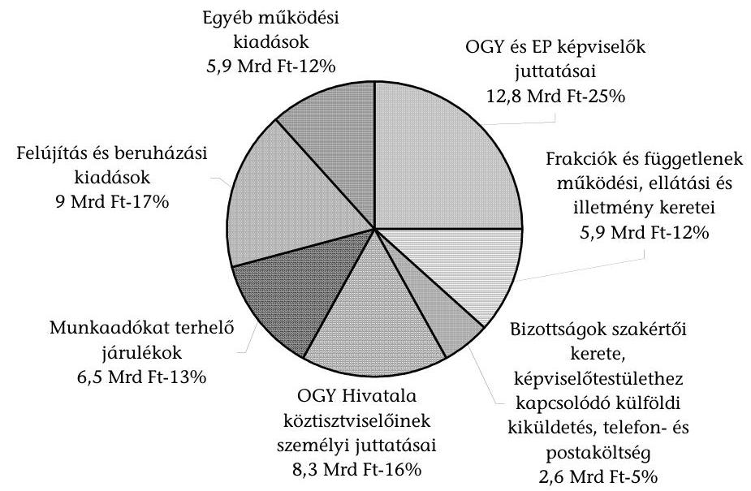
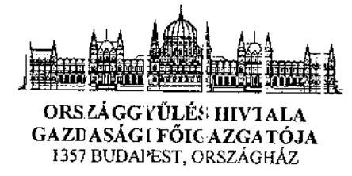
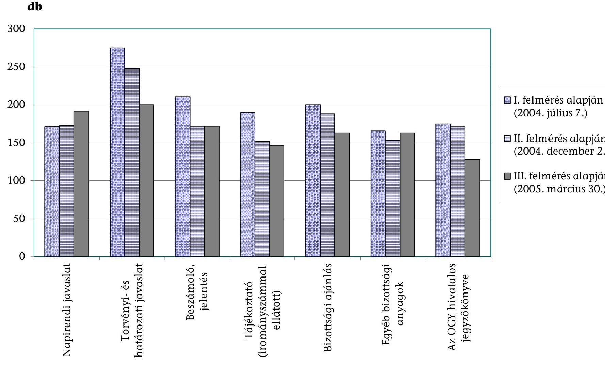

# JELENTÉS 

## az Országgyúlés fejezet müködésének ellenőrzéséről

---

# 2. Államháztartás Központi Szintjét Ellenőrző Igazgatóság 2.3. Átfogó Ellenőrzési Főcsoport 

Iktatószám: V-8-34/2005.
Témaszám: 766.
Vizsgálat-azonosító szám: V0194

## Az ellenőrzést felügyelte:

## Bihary Zsigmond

főigazgató
Az ellenőrzés végrehajtásáért felelős:
Hegedűsné dr. Müllern Veronika
főcsoportfőnök

## Az ellenőrzést vezette:

## dr. Horváth Margit

osztályvezető főtanácsos

## Az ellenőrzést végezték:

| dr. Bartos László Pál | Dede Katalin | Krüzselyi Attila |
| :-- | :-- | :-- |
| számvevő | számvevő tanácsos | számvevő |
| Szendrődi Józsefné | Szólya Ildikó |  |
| számvevő tanácsos, | számvevő |  |
| tanácsadó |  |  |

Jelentéseink az Országgyűlés számítógépes hálózatán és az Interneten a www.asz.hu címen is olvashatók.

---

# A témához kapcsolódó eddig készített számvevőszéki jelentések: címe 

Jelentés az Országgyúlés fejezet múködésének pénzügyi-gazdasági 395 ellenőrzéséről
Jelentés az Országgyúlés fejezet múködésének ellenőrzéséről ..... 0129
Jelentés a Magyar Köztársaság 2001. évi költségvetése ..... 0232
végrehajtásának ellenőrzéséről
Jelentés a Történeti Hivatal fejezet múködésének ellenőrzéséről ..... 0322
Jelentés a Magyar Köztársaság 2002. évi költségvetése ..... 0329
végrehajtásának ellenőrzéséről
Jelentés a Magyar Köztársaság 2003. évi költségvetése ..... 0443
végrehajtásának ellenőrzéséről
Vélemény a Magyar Köztársaság 2001. és 2002. évi költségvetési ..... 0034
törvényjavaslatáról
Vélemény a Magyar Köztársaság 2003. évi költségvetési ..... 0241
törvényjavaslatáról
Vélemény a Magyar Köztársaság 2004. évi költségvetési ..... 0338
törvényjavaslatáról
Vélemény a Magyar Köztársaság 2005. évi költségvetési ..... 0449
törvényjavaslatáról

---

# TARTALOMJEGYZÉK 

BEVEZETÉS ..... 5
I. ÖSSZEGZŐ MEGÁLLAPÍTÁSOK, KÖVETKEZTETÉSEK, JAVASLATOK ..... 7
II. RÉSZLETES MEGÁLLAPÍTÁSOK ..... 12

1. A feladatrendszer és a szabályozási környezet összhangja ..... 12
1.1. A fejezet feladatrendszerének alakulása ..... 12
1.1.1. Az OGY Hivatala, mint az Országgyűlés munkaszervezete feladatrendszerének alakulása ..... 12
1.1.2. A Történeti Levéltár, mint az információs kárpótlást megvalósító szervezet feladatrendszerének alakulása ..... 15
1.2. A szabályozási környezet alakulása ..... 17
1.3. A működés kontroll környezetének kiemelt részterületei ..... 23
1.3.1. A fejezeti irányítás és felügyelet kontroll tevékenységeinek alakulása ..... 23
1.3.2. Az információs rendszerek informatikai támogatottságának alakulása ..... 26
2. A fejezet gazdálkodása ..... 29
2.1. A költségvetés tervezése ..... 30
2.2. Az előirányzatok módosítása, az előirányzat-maradványok alakulása ..... 32
2.3. A költségvetés végrehajtása ..... 34
2.3.1. A személyi juttatásokkal és a létszámmal való gazdálkodás ..... 34
2.3.2. A bel- és külföldi kiküldetések és a reprezentációs kiadások alakulása ..... 38
2.3.3. Az üzemeltetési-fenntartási és felújítási tevékenység alakulása ..... 39
2.3.4. Az ingatlanvagyon alakulása ..... 42
2.3.5. Az eszközökkel való gazdálkodás ..... 44
2.4. A képviselőcsoportok gazdálkodása, a ciklusváltással kapcsolatos eszközelszámoltatás ..... 46
2.5. A fejezeti kezelésű előirányzatok felhasználása ..... 51
3. A képviselői távmunkavégzés teljesítmény-ellenőrzése ..... 53
4. Az előző vizsgálataink javaslatai alapján megtett intézkedések ..... 59

---

# MELLÉKLETEK 

1. számú Észrevétel
2. számú A költségvetési gazdálkodás adatait tartalmazó táblázatok (1-9 sz.)
3. számú Az eFutár bevezetését követően papíralapú futárpostát igénylők számának alakulása

---

# RÖVIDÍTÉSEK JEGYZÉKE 

| Áht. | az államháztartásról szóló, többször módosított 1992. évi XXXVIII. törvény |
| :--: | :--: |
| Ámr. | az államháztartás múködési rendjéről szóló, többször módosított 217/1998. (XII. 30.) Korm. rendelet |
| ÁSZ | Állami Számvevőszék |
| Ber. | a költségvetési szervek belső ellenőrzéséről szóló 193/2003. (XI. 26.) Korm. rendelet |
| BM KGF | a Belügyminisztérium Központi Gazdasági Főigazgatósága |
| COSAC | az európai integrációs bizottságok közös fóruma |
| EIÜB | Európai Integrációs Ügyek Bizottsága |
| eKormányzat | elektronikus kormányzat |
| eParlament | elektronikus parlament |
| EP | Európai Parlament |
| Er. | a központi, a társadalombiztosítási és a köztestületi költségvetési szervek kormányzati, felügyeleti, valamint belső költségvetési ellenőrzéséről szóló 15/1999. (II. 5.) Korm. rendelet |
| FEUVE | folyamatba épített előzetes és utólagos vezetői ellenőrzés |
| IBSZ | informatikai biztonsági szabályzat |
| ifm | iratfolyóméter |
| Kbt. | a közbeszerzésekről szóló 1995. évi XL. törvény |
| KEH | Köztársasági Elnöki Hivatal |
| Kincstár | Magyar Államkincstár |
| KT | Közbeszerzések Tanácsa |
| Ktv. | a köztisztviselők jogállásáról szóló 1992. évi XXIII. törvény, illetve a köztisztviselők jogállásáról szóló 1992. évi XXIII. törvény, valamint egyéb törvények módosításáról szóló 2001. évi XXXVI. törvény |
| KVI | Kincstári Vagyoni Igazgatóság |
| Levéltár, Történeti Levéltár | Állambiztonsági Szolgálatok Történeti Levéltára |
| MeH | Miniszterelnöki Hivatal |
| MÉD | muzeális értékú dokumentumok |
| MITS | Magyar Információs Társadalom Stratégia |
| Mt. | a Munka Törvénykönyvéről szóló, többször módosított 1992. évi XXII. törvény |
| NKÖM | Nemzeti Kulturális Örökség Minisztériuma |
| NOIJ | Napi Operatív Információs Jelentés |
| OGY | Országgyúlés |
| OGY Hivatala | Országgyúlés Hivatala |
| PAIR | Parlamenti Információs Rendszer |
| ParlaNet | a parlament belső információs rendszere |

---

| PM | Pénzügyminisztérium |
| :-- | :-- |
| SzMSz | Szervezeti és Múködési Szabályzat |
| Szt. | a számvitelről szóló 2000. évi C. törvény |
| Új Kbt. | a közbeszerzésekről szóló 2003. évi CXXIX. törvény |
| TAIR | Törvényalkotási Információs Rendszer |

---

# JELENTÉS   az Országgyúlés fejezet múködésének ellenőrzéséről 

## BEVEZETÉS

Az éves költségvetési törvények az Országgyűlés (OGY) fejezetben határozzák meg az annak múködését szolgáló pénzügyi kereteket. A fejezet előirányzatai fedezik a képviselöcsoportok múködésének kiadásait is. A frakciók a Házszabály előírásai szerint gazdálkodnak a rendelkezésükre bocsátott költségkeretekkel.

A fejezet előirányzatai között megjelennek az OGY múködésével közvetlen öszszefüggésben nem álló címek, előirányzatok is, így a fejezeti jogosítvánnyal rendelkező Közbeszerzések Tanácsa költségvetési cím, valamint a kisebbségek, pártok, médiumok részére juttatott támogatások, amelyeknél a költségvetési források felhasználásának ellenőrzése külön számvevőszéki vizsgálatok keretében történik.

2003-tól a fejezethez sorolták az Állambiztonsági Szolgálatok Történeti Levéltárát ${ }^{1}$ (Történeti Levéltár, Levéltár), amely önálló, teljes gazdálkodási jogkörú költségvetési szerv. Az intézmény költségvetési felügyeletét az Országgyúlés Hivatala (OGY Hivatala, Hivatal) látja el.

A fejezet felügyeletét ellátó szervhez tartozó címek eredeti kiadási előirányzata 2001-ről (9,3 Mrd Ft) 2004-re 53\%-kal nőtt. A fejezet felügyeletét ellátó szervezet vezetőjének döntési körébe tartozó címek: az 1. cím: OGY Hivatala, a 2. cím: Történeti Levéltár; 3. cím: üres, 4. cím: Fejezeti kezelésú előirányzatok, (a továbbiakban e címek együttesét nevezi a jelentés fejezetnek). A Magyar Köztársaság 2004. évi költségvetéséről ${ }^{2}$ és az államháztartás hároméves kereteiről szóló 2003. évi CXVI. törvény szerint a fejezeti költségvetési címekhez tartozó kiadási előirányzat 14,2 Mrd Ft, amelyet 13,9 Mrd Ft támogatással és 0,3 Mrd Ft saját bevétellel terveztek fedezni. A fejezet 2004. évi költségvetési létszáma 1331 fő, ebből az OGY Hivatalának létszáma 1247 fő, a Levéltáré 84 fő.

[^0]
[^0]:    ${ }^{1}$ Az Állambiztonsági Szolgálatok Történeti Levéltár alapvetően jogelődje, a Történeti Hivatal szervezeti rendszerében és tevékenységi körével alakult meg 2003. április 1-jei hatállyal, az elmúlt rendszer titkosszolgálati tevékenységének feltárásáról és az Állambiztonsági Szolgálatok Történeti Levéltára létrehozásáról szóló 2003. évi III. törvény alapján. A fejezet címrendjében 2. címként szerepel.
    ${ }^{2}$ A Magyar Köztársaság 2005. évi költségvetéséről szóló 2004. évi CXXXV. tv. szerint a fejezeti költségvetési címekhez tartozó kiadási előirányzat 16,5 Mrd Ft, amelyet 16,2 Mrd Ft támogatással és 0,3 Mrd Ft saját bevétellel terveztek fedezni.

---

Az Állami Számvevőszék (ÁSZ) az OGY fejezetnél előzőleg 1992-ben, 1997-ben és 2001-ben, a Levéltár jogelődjénél, a Történeti Hivatal fejezetnél 2003-ban végzett átfogó ellenőrzést. Ezen túlmenően minden évben véleményezte a fejezet éves költségvetési javaslatának megalapozottságát, továbbá ellenőrizte a költségvetése végrehajtásáról készített beszámolót.

# Ellenőrzésünk célja annak értékelése volt, hogy 

- a fejezet szervezeti, irányítási és működési rendszere, költségvetési előirányzatai összhangban voltak-e a jogszabályokban meghatározott szakmai feladatokkal, azok változásával, biztosították-e a hatékony feladatellátást;
- a költségvetés végrehajtása során a fejezet intézményeinél, illetve a képviselöcsoportoknál a rendelkezésre álló költségvetési forrásokat (kereteket) sza-bály- és célszerűen használták-e fel;
- a 2002. évi ciklusváltás költségeinek fedezetére szolgáló fejezeti kezelésű előirányzat felhasználásánál szabályszerűen jártak-e el;
- a korábbi számvevőszéki ellenőrzések megállapításait, ajánlásait a fejezeti irányító és gazdálkodási tevékenységben hasznosították-e.

Az átfogó ellenőrzésünk a 2001-2004. év végéig terjedő időszak feladatellátására, gazdálkodására terjedt ki, a helyszíni ellenőrzés lezárásáig tartó időszak gazdálkodási folyamataira is kitekintettünk.

Az ellenőrzést az Állami Számvevőszékről szóló 1989. évi XXXVIII. törvény 2. § (3), illetve 17. § (3) bekezdései alapján végeztük.

Az ellenőrzés keretében kérdések, kritériumok, adatforrások alapján teljesítmény jellegű ellenőrzéssel, eredményszemléletű megközelítéssel megvizsgáltuk az eParlament ${ }^{3}$ keretében megvalósult Távmunka és eFutár projektekre fordított pénzeszközök hasznosulását, a képviselői munka E-alapú támogatására kialakított rendszer múködését.

Egyidejúleg elvégeztük a fejezet 2004. évi költségvetése végrehajtására, a költségvetési beszámoló megbízhatóságára vonatkozó ellenőrzést. A megállapításokat a Magyar Köztársaság 2004. évi költségvetése végrehajtásának ellenőrzéséről szóló jelentésünk tartalmazza.

A jelentéstervezetet egyeztettük az Országgyűlés Gazdasági Főigazgatójával, véleménykülönbség nem maradt fenn (1. sz. melléklet).

[^0]
[^0]:    ${ }^{3}$ Az elektronikus parlament keretében korszerűsítették a törvényalkotás információs rendszerét, hozzáférhetővé tették a parlamenti adatbázis nyilvános részét, kialakították a képviselőket támogató távmunka-rendszert, az irományok elektronikus eljuttatását.

---

# I. ÖSSZEGZŐ MEGÁLLAPÍTÁSOK, KÖVETKEZTETÉSEK, JAVASLATOK 

A fejezet feladatellátásának középpontjában a Magyar Köztársaság Országgyűlésének zavartalan munkájához szükséges feltételek biztosítása áll(t), amely az erre alapított OGY Hivatala feladatkörét képezte.

A Hivatal stabil szervezetrendszerben, az EU csatlakozás, valamint az informatika súlyának növekedése által támasztott követelményekhez célszerűen igazodva látta el feladatát. Az OGY múködésének szabályozási keretét az Alkotmány és a Házszabály határozta meg, ezekhez a Hivatal részletes, karbantartott, a jogszabályi előírásoknak és a feladatellátás sajátosságaiból adódó követelményeknek megfelelő belső szabályozási környezetet alakított ki, amelyben a gazdálkodási terület szabályozásán túl hangsúlyosan kezelte az informatikai terület múködtetését, egyben csatlakozott az uniós tagországok eParlament projektjéhez, megteremtette a képviselői távmunka végzésének feltételeit.

Az OGY Hivatala gazdálkodási feladatait az államháztartásról szóló törvény (Áht.) és az államháztartás múködési rendjéről szóló kormányrendelet (Ámr.) előírásainak betartásával a Gazdasági Főigazgatóság végezte. A költségvetési gazdálkodási rendszer keretgazdálkodásra épült, a jóváhagyott kiemelt előirányzatokból képzett felhasználási keretekkel a megbízott hivatali vezetők, mint döntéshozók önállóan és felelősen gazdálkodtak. A Hivatal a képviselőcsoportok, mint részjogkörű költségvetési egységek gazdálkodásával kapcsolatban elsősorban szabályozási eszközöket alkalmazott. Kiterjesztette a belső szabályzatainak hatályát a képviselőcsoportokra, egyúttal meghatározta a frakciók önálló szabályozási körébe tartozó területeket (a múködési és ellátási kerettel való gazdálkodás rendje; az egyes gazdálkodási funkciók megosztása; a készpénzkezelés és az egyéb személyi juttatások).

A részjogkörű költségvetési egységként múködő képviselöcsoportok önállóan gazdálkodtak a múködési keretükkel, az ellátási- és illetmény-keretek felhasználása során érvényesültek a Hivatal belső kontroll folyamatai. A vizsgált időszakban - az MDF képviselőcsoport hivatala múködési rendjének szabályzata kivételével - rendelkeztek az előírt és a sajátosságaiknak megfelelő belső szabályzatokkal.

A fejezet másik intézményénél, a Levéltárnál a jogelőd átfogó ÁSZ ellenőrzése és a felügyeleti ellenőrzés által is hiányolt szabályozások elkészültek, ennek ellenére főként a gazdálkodás szabályozottságában mutatkoztak hiányosságok, továbbá a pénzügyi jogkörök gyakorlásánál nem minden esetben jártak el az előírások szerint. A Levéltár gazdasági szervezete nem rendelkezett az Ámr. szerinti ügyrenddel, illetve múködése nem felelt meg maradéktalanul az önálló költségvetési szerv gazdálkodó szervezetével szemben az Ámr-ben támasztott követelményeknek, a FEUVE rendszer teljes körű alkalmazására csak 2004. év

---

végétől ${ }^{4}$ került sor. A vizsgált időszakban az ellátmány-pénzkezelő konkrét eljárási szabályok és felelősségvállalási nyilatkozat nélkül végezte a feladatát, ezáltal nem teljesültek a felelősségvállalás feltételei.

A fejezet felügyeletét ellátó szerv vezetője - az Országgyűlés Hivatalának gazdasági főigazgatója - gondoskodott a költségvetési gazdálkodás megszervezéséről, annak végrehajtási szabályairól, valamint a gazdálkodás felügyeleti költségvetési (2004-től belső) ellenőrzéséről. Kiemelt figyelmet fordítottak a felügyelet keretében az informatikai területre és az intézmények belső ellenőrzésének múködtetésére.

A Hivatal a vizsgált időszak alatt - az ÁSZ financial audit módszertanának figyelembe vételével - elvégezte a Hivatal és a Levéltár költségvetési beszámolóinak megbízhatósági ellenőrzését. Megállapította, hogy az intézmények beszámolói a gazdálkodásról valós képet mutattak, lényeges hibát egy alkalommal, a Történeti Levéltár 2003. évi költségvetése vizsgálatakor találtak. A feltárt, téves főkönyvi könyvelésből adódó, közel 3 M Ft-os eltérést rendezték.

Az informatikai tevékenységet a Hivatalnál 2004. év végére újra szabályozták, megújították az informatikai biztonság szempontjából fontos szabályzatokat. Átdolgozták az Informatikai Stratégiát, az informatikai eszközök múködtetéséről, használatáról, az informatikai rendszerek szoftver jogtisztaságáról és biztonságáról szóló utasítást, az üzemeltetési útmutatót. Külön utasításban szabályozták a mentési tevékenységet és a felhasználói jogosultságokat.

A Levéltár informatikai tevékenysége szabályozásában 2004. év végére jelentős javulás következett be. Az Informatikai Szabályzat aktualizálása mellett a jogelődöt érintő 2003. évi átfogó ÁSZ ellenőrzés nyomán az informatikai szabályozási hiányosságokat pótolták, elkészült a Levéltár Informatikai Stratégiája, valamint a Katasztrófa-megelőzési és mentési terve.

A belső ellenőrzést az intézmények a vizsgált időszakban szabályozták, a szabályozás a Történeti Levéltárnál nem volt teljes körű, nem tartalmazta az ellenőrzési program, a megbízólevél és az ellenőrzés végrehajtása és realizálása eljárási szabályait. A gyakorlatban a megbízólevél ellenőrzési programhoz való kiadása kivételével megfelelően alkalmazták a jogszabályi előírásokat.

Mindkét intézménynél 2004-ben kiadták a vonatkozó jogszabályi előírásnak megfelelően az Ellenőrzési Kézikönyvet és az annak részét képező módszertani útmutatókat, továbbá elkészítették a stratégiai ellenőrzési tervet is.

[^0]
[^0]:    ${ }^{4}$ A FEUVE bevezetésére az Ámr. módosításáról szóló 280/2003. (XII. 29.) Korm. rendeletben előírt határidő 2004. január 1-je volt.

---

A vizsgált időszakban a költségvetési források biztosították a kiegyensúlyozott és zavartalan múködést, a 2001-2004. évek között a Hivatal az Országgyúlés működési feltételeinek biztosítására 51 Mrd Ft költségvetési forrást használt fel.

A kiadási előirányzatok a vizsgált időszakban évente a feladatokkal összhangban növekedtek, melyet 2002-ben a ciklusváltás többletköltségei ( $1850,0 \mathrm{M} \mathrm{Ft}$ ), 2003-ban a Levéltár fejezethez sorolása ( $496,5 \mathrm{M} \mathrm{Ft}$ ) és az integrációs előkészületek többletköltségei ( $150,0 \mathrm{M} \mathrm{Ft}$ ), 2004-ben az Európai Unióhoz való csatlakozás ( $253,8 \mathrm{M} \mathrm{Ft}$ ) indokoltak.

Előirányzat-módosításokra az előző évi maradványok igénybevétele, a 2002. évi fejezeti kezelésű előirányzat felhasználása, a kormányzati hatáskörben elrendelt támogatási többletek és a saját többletbevételek nyújtottak lehetőséget. Az előirányzat-módosítások minden esetben szabályosak és dokumentáltak voltak. A fejezetnél keletkezett elöirányzat-maradvány összege nem volt jelentős, azok döntően kiadási megtakarításból származtak.

A személyi juttatásokra teljesített kiadások ${ }^{5}$ tették ki az ellenőrzött időszakban az összes kiadás 50\%-át. Az e célra történő kifizetések jelentősen növekedtek, 2001-ről 2004-re 53\%-kal a központi intézkedések hatására, illetve a többletfeladatok létszámvonzatával összefüggésben. A rendszeres személyi juttatások közel kétharmadát tették ki az országgyűlési és az európai parlamenti képviselők járandóságaira kifizetett összegek. Jutalmazásra a nem rendszeres személyi juttatások 50\%-át fordították. A források a vizsgált időszakban évente átlagosan egyhavi illetménynek megfelelő jutalom kifizetését tették lehetővé.

[^0]
[^0]:    ${ }^{5}$ A munkaadókat terhelő járulékok nélkül.

---

A Történeti Levéltárnál egyes, adható juttatásoknál az 50 E Ft feletti kifizetések a jogszabályok előírásaival ellentétesen kötelezettségvállalás és ellenjegyzés nélkül történtek. A jutalmak, a megbízási díjak és az illetményelőlegek az Ámr. előírásaival ellentétesen a házipénztárból kerültek kifizetésre.

Az ellenőrzött időszakban felmerült összes kiadás 19\%-át fordították dologi kiadásokra, melyek között meghatározó volt az üzemeltetésre, fenntartásra, továbbá a szolgáltatások igénybevételére fordított összegek nagysága. A kiadások közel 50\%-os növekedését a feladatbővülés, a fejezet intézményeinek kezelésébe a vizsgált időszakban került épületek (OGY Könyvtár raktára, Levéltár épülete) és az informatikai rendszerek üzemeltetése, továbbá az EU integrációval kapcsolatos külföldi kiküldetések indokolták.

Az ellenőrzött időszakban a beruházási és felújítási kiadások összege a Hivatalnál alig változott, a Levéltárnál viszont több mint kétszeresére nőtt az Eötvös utcai épület átalakítási, bővítési munkálatai, valamint a fűtési kiadások csökkentése érdekében megvalósított beruházások miatt. Az intézményeknél a takarékos gazdálkodás érdekében hozott intézkedések megfelelően elősegítették a vonatkozó kormányrendeletekben előírt költségcsökkentési elvárásokat.

Az ingatlanok kihasználtsága az Országházban és az OGY Irodaházban teljes körű volt. A területek felosztását a képviselőcsoportok külön megállapodásban határozták meg. Az OGY Hivatala az Országházban elhelyezett Köztársasági Elnöki Hivatal ${ }^{6}$, a Miniszterelnöki Hivatal részére üzemeltetési és épületgondnoksági szolgáltatásokat végzett. Az elszámolások keretszerződéseken és az azokat konkretizáló éves megállapodásokon alapultak.

A Levéltárnál egy esetben nem tartották be a Kbt. előírásait, közbeszerzési eljárás nélkül bonyolítottak le értékhatárt meghaladó beszerzést, az alkalmazott szabadkézi eljárási mód pénzügyi veszteséget azonban nem okozott. Egyszer előfordult, hogy a központosított közbeszerzés keretében a kötelezettségvállaló nem a belső szabályozásban erre felhatalmazott vezető volt.

A fejezeti kezelésú előirányzatot szabályosan, a célja szerint használták fel. A felhasználásról megfelelően dokumentált és részletezett elszámolást készítettek. A 2002. évi országgyűlési képviselőtestület-váltás egyszeri kiadási előirányzatának ütemterv szerinti felhasználása biztosította a ciklusváltás zökkenőmentes lebonyolítását.

A Hivatal az Informatikai Stratégiájában meghatározott fő irányokkal összhangban, az EU tagországok parlamenti információs rendszerei, fejlesztési tapasztalatainak figyelembe vételével megvalósította a képviselők és szakértőik munkáját segítő Távmunka, valamint a papír alapú futárpostát kiváltó elektronikus adattovábbítás eFutár projektjét.

[^0]
[^0]:    ${ }^{6}$ A Köztársasági Elnöki Hivatal 2003-ban átköltözött a budavári Sándor-palotába, azóta a KEH az Országház épületében a korábbi 4\%-nak megfelelő hasznos alapterület helyett $0,7 \%$-ot használt.

---

A képviselői informatikai infrastruktúra kialakítása során a költséghatékonyság szempontjai érvényesültek, a projektekkel szemben támasztott követelmények és célok teljesültek. A projektek megvalósítása eredményes volt, azt az erre kialakított és alkalmazott monitoring is alátámasztotta, a tapasztalatokat az intézmény hasznosította. Az elektronikus dokumentumhasználat bevezetése a Hivatal múködési költségvetésében az üzemszerú múködés első félévében kb. 30,0 M Ft megtakarítást is eredményezett, egyben a munkamódszerek megújítását, az informatikai kultúra elterjesztését is szolgálta. Jelentősége túlmutat a képviselői munka feltételeinek korszerűsítésén, mivel valamennyi információ összhangban a személyes adatok védelméről és a közérdekú adatok nyilvánosságáról szóló törvénynek a közérdekú adatok megismeréséhez való jog érvényesülését szolgáló rendelkezéseivel - az Interneten, a nyilvánosság számára is hozzáférhető módon érhető el.

A korábbi ellenőrzésünk megállapításai, javaslatai alapján intézkedési tervet készítettek, az abban foglalt feladatokat végrehajtották, így a javaslataink hasznosultak.

A jelen ellenőrzés megállapításainak hasznosítása mellett javasoljuk:

# a fejezet felügyeletét ellátó szerv vezetőjének: 

felügyeleti jogkörében intézkedjen annak érdekében, hogy a Levéltár főigazgatója biztosítsa:
a) az általa vezetett gazdálkodó szervezetnél az Ámr. 17. §-ában foglaltaknak megfelelő szabályozottságot és múködést;
b) az intézménynél a belső kontrollok keretében feltárt szabályozási hiányosságok, illetve pontatlanságok megszüntetését;
c) a pénzügyi jogkörök gyakorlására és a házipénztár múködésére vonatkozó jogszabályi előírások betartását.

---

# II. RÉSZLETES MEGÁLLAPÍTÁSOK 

## 1. A FeladATRENDSZER és a Szabályozási KÖRnyEZET ÖSSZHANGJA

### 1.1. A fejezet feladatrendszerének alakulása

Az Országgyűlés fejezet feladatai a vizsgált időszakban az Állambiztonsági Szolgálatok Történeti Levéltára fejezethez sorolásával, valamint az EU csatlakozás miatt bővültek.

A fejezet közvetlen hatáskörébe rendelt 1-4. cím szerkezete 2003-ban - a Történeti Levéltár (2. cím) fejezethez sorolásával - változott, fejezeti kezelésű előirányzattal (4. cím) csak 2002-ben rendelkezett.

A fejezethez 2003-tól két, egymástól eltérő szakfeladatú és struktúrájú, önálló, teljes gazdálkodási jogkörű intézmény (az Országgyűlés Hivatala és a Történeti Levéltár) tartozott. Az Országgyűlés Hivatala címhez részjogkörű költségvetési egységként kapcsolódtak a képviselöcsoportok.

### 1.1.1. Az OGY Hivatala, mint az Országgyúlés munkaszervezete feladatrendszerének alakulása

A fejezet feladatellátásának középpontjában az Országgyűlés munkájának folyamatos, zavartalan biztosítása állt. A feladatot az OGY Hivatala látta el.

Az Országgyűlés feladatait és hatáskörét az Alkotmány mellett különböző törvények, OGY határozatok is kijelölik. A törvényekben meghatározott feladatok 1990-től folyamatosan bővültek, a vizsgált időszakra egy stabil feladatstruktúra jött létre. Az OGY két fő funkciója a törvényalkotás és a Kormány ellenőrzése. Emellett fontosabb feladatai: a Kormány programjának elfogadása, a közjogi méltóságok megválasztása, a legfontosabb nemzetközi szerződések jóváhagyása, a hadüzenetről és békekötésről való döntés, valamint a rendkívüli és a szükségállapot kihirdetése, az országos népszavazások kiírása.

Az Országgyűlés működésének alapvető, garanciális szabályait az Alkotmány rögzíti, a működési rend részletes szabályait a 46/1994. (IX. 30.) OGY határozattal kiadott Házszabály állapítja meg. Az Országgyűlést négyévi időtartamra választják, megbízatása az alakuló üléssel kezdődik, működése az új Országgyűlés alakuló üléséig tart.

A Házszabályt a vizsgált időszakban többször módosították, 2001-ben három, 2004-ben két alkalommal, szabályai a zavartalan, folyamatos múködés biztosítékát jelentik. A Házszabály 2004. évi módosításai az európai uniós ügyekkel kapcsolatos parlamenti eljárás szabályozását, valamint az Európai Parlament magyarországi (EP) képviselőinek jogait rendezte.

---

A Hivatal az Országgyúlés munkaszervezete, biztosítja az Országgyúlés folyamatos múködését, segíti a képviselők, a bizottságok és az OGY tisztségviselőinek tevékenységét, ellátja a gazdálkodással, múködtetéssel kapcsolatos feladatokat. Emellett a négy párt képviselőcsoportja részére a képviselőik számához igazodó létszámú frakcióirodákat is múködtet.

A Hivatal gondoskodik az Országgyúlés ülésszakai, ülései, továbbá a bizottsági ülések előkészítéséről és lefolytatásáról, az Országgyúlés Hiteles Jegyzőkönyvének szerkesztéséről és kiadásáról, szerkeszti, illetve kihirdetésre előkészíti a törvényeket és az Országgyúlés határozatait. A gazdálkodással, múködtetéssel kapcsolatos tevékenysége keretében kezeli az Országgyúlés vagyonát, ellátja a múködéssel kapcsolatos általános igazgatási és ügyviteli feladatokat, végzi a fejezet és a Hivatal vonatkozásában az intézményi költségvetési ellenőrzést. A Hivatal ellátja továbbá az OGY elnökének a társadalmi és nemzetközi kapcsolataival, valamint a sajtótevékenységgel összefüggő, továbbá a könyvtári, szakirodalmi információs feladatokat.

A Hivatal munkáját az Országgyúlés elnöke irányítja az egyes hivatali szervek vezetői útján, gondoskodik az Országgyúlés rendjének és biztonságának fenntartásáról, valamint az OGY munkájának megszervezéséről. A Hivatal a vizsgált időszakban stabil szervezeti rendben múködött, a feladataihoz igazodva hat önálló, egymással mellérendeltségi viszonyban álló Hivatali Szervből - Főtitkárság, Gazdasági Főigazgatóság, Elnöki Kabinet, Külügyi Hivatal, Országgyúlési Könyvtár és Sajtószolgálat - állt.

Az OGY elnöke nevezi ki - a Házbizottság előzetes meghallgatásával és véleményezésével - és menti fel a Hivatal vezetőit, a főtitkárhelyettest, a gazdasági fö-igazgató-helyettest és a Könyvtár főigazgató-helyetteseit, felettük munkáltatói jogkört gyakorol, továbbá jóváhagyja az Országgyúlés Hivatala Szervezeti és Múködési Szabályzatát, kiadja az Országgyúlés Hivatalára vonatkozó egyéb rendelkezéseket.

Az ellenőrzött időszakban csak egyes szervezeti egységeiben történtek változások a Hivatal feladatbővülésével (EU integrációs feladatok), illetve az informatika szerepének és a tájékoztatási igények növekedésével összhangban, azok szakmailag indokoltak, célszerűek, továbbá szabályozási oldalról elnöki rendelkezéssel és gazdasági főigazgatói utasítással alátámasztottak voltak.

A bekövetkezett szervezeti változások a Főtitkárságot (Szervezési és Tájékoztatási Főosztály szétválasztása), a Gazdasági Főigazgatóságot (Informatikai főosztály megalakítása), a Külügyi Hivatalt (EU főosztály megalakítása) és az Országgyúlési Könyvtárt (Képviselői Kutatószolgálat megalakítása) érintették.

A csatlakozással összefüggő többletfeladatokkal összhangban az OGY Hivatalában megerősítették az Európai Integrációs Ügyek Bizottságát (EIÜB) kiszolgáló adminisztratív apparátust, a Külügyi Hivatalon belül létrehozták az EU Főosztályt, továbbá a Magyar Országgyúlés Hivatalának brüsszeli Állandó Irodáját.

A közösségi joganyag integrációjához kapcsolódó törvényalkotó és törvénymódosító tevékenység mellett a csatlakozást megelőző időszakban kiemelt feladat volt a képviselők információval és dokumentumokkal való ellátása, az Európai Uniós Nagybizottság titkársági teendőinek ellátása, a négy parlamenti

---

párt népszavazást megelőző országos körútjának megszervezése, a 24 országgyúlési képviselő megfigyelői státusszal járó utaztatása.

A 2002-ben megalakított Európai Uniós Nagybizottság feladata volt, hogy egyeztessen az Európai Unió intézményeiben és más fórumain képviselendő álláspontról, és a csatlakozással összefüggő legfontosabb teendőkről.

Az európai uniós csatlakozás népszerűsítése érdekében a négy parlamenti párt képviselői 2002. november 11. - 2003. április 09. között minden megyét érintő országjáró körúton („Együtt az egységes Európáért" kampány) vettek részt.

A 2004-ben taggá váló tíz ország képviselői a csatlakozási szerződés 2003. április 16-i aláírása óta vehettek részt „aktív megfigyelőként" az uniós intézmények munkájában.

A feladatellátásban az OGY Főtitkársága, a Külügyi Hivatal, valamint az OGY Könyvtár és a Gazdasági Főigazgatóság vett részt, tevékenységük hozzájárult az országgyűlési képviselők európai uniós ismeretei bővítéséhez, a leendő EP képviselők felkészítéséhez.

A Főtitkárság az Európai Integrációs Ügyek Bizottsága titkárságán keresztül részt vett a csatlakozási tárgyalások, az ország integrációs felkészülésének ellenőrzése, és a jogharmonizáció felügyeletének parlamenti koordinációjában, továbbá szervezte a hivatali munkatársaknak az uniós tagságból a Hivatalra háruló feladatokra való felkészítését.

A Külügyi Hivatal az Európai Uniós Nagybizottság titkársági teendőit ellátása mellett az EP megfigyelői státuszú képviselők részére EU pártcsoportonként felkészítőt tartott, valamint háttéranyagot biztosított a bizottsági munkához.

Az OGY Könyvtár - Európai Bizottsági döntés alapján - kialakította az EU letéti könyvtárát, a kapott státus ingyenes hozzáférést biztosít az EU által kiadott valamennyi hivatalos publikációhoz, valamint a közösségi adatbázishoz.

A Gazdasági Főigazgatóság egyedi adatbázist kezelő szoftvert fejlesztett ki az EU-s joganyagok feldolgozásához, megállapodást kötött az Európa Parlament illetékes hivatalával a megfigyelői státuszú képviselők utaztatásának pénzügyi lebonyolítására.

Magyarország Európai Unióhoz való csatlakozásával, valamint a 2004. júniusi EP-választásokat követően a feladatok megváltoztak, előtérbe került az országgyűlési állásfoglalások előkészítése a közösségi jogszabálytervezetek kapcsán, az OGY és a Kormány közötti koordináció, az EUDOC adatbázis, a képviselői kutatószolgálat múködtetése.

A Főtitkárság az EÜB titkárságán keresztül országgyúlési állásfoglalásokat készített elő a közösségi jogszabály-tervezetekről, koordinálta az OGY és a Kormány közötti kapcsolattartást, szerkesztette az OGY integrációs honlapját, múködtette az EUDOC adatbázist (a csatlakozástól napjainkig mintegy 41000 dokumentum érkezett) és részt vett az európai integrációs bizottságok közös fórumán (COSAC) résztvevő magyar delegáció felkészítésében.

A Külügyi Hivatal - melynek vezetője 2004 májusától államtitkári besorolású vezetőként látta el feladatait - félévente készített elemzést az adott időszak uniós

---

stratégiai irányairól, az EU napirendjén szereplő fontosabb kérdésekről az OGY elnöke számára.

A Gazdasági Főigazgatóság a 2004. évi LVII. törvény alapján folyósította a 24 EP képviselő járandóságait és biztosította tevékenységük személyi és tárgyi feltételeit, továbbá részt vett az egyeztetési eljárást támogató informatikai háttér (EUDOC) üzemeltetésében és fejlesztésében.

A Könyvtár 2004 évtől Képviselői Kutatószolgálat útján látta el a képviselők tájékoztatásával kapcsolatos egyes feladatokat. Az EU hivatalos dokumentumaiban való eligazodáshoz kiadványt jelentetett meg, 2005-től újraindította a Parlamenti Európa Klubot.

Az Országgyűlés brüsszeli irodája múködtetésével, annak informatikai infrastruktúrája kialakításával biztosították az EP képviselők információkhoz juttatását.

Az Országgyűlés törvényben ${ }^{7}$ szabályozta az Európai Parlament magyarországi képviselőinek jogállását, létrehozta a magyar képviselők konzultatív testületét (Európai Parlamenti Képviselők Fóruma) a különösen fontos, stratégiai jelentőségű kérdésekről való véleménycsere biztosítására. A törvény szerint a képviselők tanácskozási joggal részt vehetnek az Országgyűlés állandó bizottságainak ülésein, valamint a plenáris ülések európai integrációval összefüggő napirendi pontjainak tárgyalásán. Ugyancsak tájékoztatást adhatnak az érintett bizottságok számára az EP tevékenységéről, illetve az Európai Parlament napirendjén szereplő, hazánkat érintő ügyekről.

A Magyar Köztársaság Európai Unió mellett múködő Állandó Képviseletére 2004. augusztus 1-jétől a 2155/2004. (VI. 28.) Korm. határozat alapján az OGY Hivatalától a Külügyminisztériumhoz történő áthelyezéssel egy köztisztviselő kiküldésére került sor, az Országgyűlésnek az Európai Parlament, illetve a jogalkotásban közreműködő európai intézmények tevékenységéről történő tájékoztatása, az Országgyűlés és az uniós intézmények közötti, valamint az Európai Parlament képviselőivel és főtitkárságával való kapcsolattartás feladatainak ellátására.

# 1.1.2. A Történeti Levéltár, mint az információs kárpótlást megvalósító szervezet feladatrendszerének alakulása 

A Történeti Levéltár feladatait és hatáskörét az elmúlt rendszer titkosszolgálati tevékenységének feltárásáról és az Állambiztonsági Szolgálatok Történeti Levéltára létrehozásáról szóló 2003. évi III. törvény, valamint a szakmai múködése alapkövetelményeit meghatározó jogszabályok ${ }^{8}$ határozzák meg.

[^0]
[^0]:    ${ }^{7}$ Az Európai Parlament magyarországi képviselőinek jogállásáról szóló 2004. évi LVII. törvény.
    ${ }^{8}$ A köziratokról, a közlevéltárakról és a magánlevéltári anyag védelméről szóló, többször módosított 1995. évi LXVI. törvény (Ltv.) és a közlevéltárak és a nyilvános magánlevéltárak tevékenységével összefüggő szakmai követelményekről szóló 10/2002. (IV. 13.) NKÖM rendelet.

---

A Levéltár önálló, teljes gazdálkodási jogkörrel rendelkező költségvetési szerv, feladata a hagyományos levéltári teendők mellett a rendszerváltás előtti állambiztonsági szervek által gyűjtött adatok szolgáltatása (információs kárpótlás) az állampolgárok kérésére, az Átvilágító Bizottságok és más szervek megkereséseire, továbbá a közszereplők állambiztonsági múltjáról történő adatszolgáltatás.

A Levéltár a jogelőd Történeti Hivatal tevékenységi körével alakult meg. Az alapítás, a 2003. évi III. törvény szerinti feladatellátás feltételeinek biztosítása, a szervezeti rend felépítése, a múködési rend kialakítása közben a szakmai feladatok ellátása folyamatos volt. Az intézményt létrehozó törvény alapján azonban egyrészt nőtt a feldolgozásra váró iratok mennyisége, másrészt megváltoztak az iratbetekintés és a kutatás szabályai.

A jogutódlás, a feladatok zökkenőmentes és folyamatos ellátása pénzügyi fedezetére a 2063/2003. (III. 31.) Korm. határozattal 133,3 M Ft többletforrást (ezen belül 5 fős létszámnövekedés fedezetét) biztosítottak az OGY Hivatalánál keletkezett, kötelezettségvállalással nem terhelt maradvány terhére.

A Történeti Hivataltól megörökölt, mintegy 3,5 millió oldalt kitevő III/III-as aktákkal együtt a Történeti Levéltár teljes anyaga, az 1944. és 1990. között keletkezett titkosszolgálati iratok a becslések szerint mintegy 15 millió oldalt tesznek ki. Az állambiztonsági aktákba megfelelő előkészítés, vagyis anonimizálás után bárki betekinthet, a tudományos kutatók széleskörű betekintési jogot kaptak.

Az elmúlt rendszer állambiztonsági szervei által gyűjtött, illetve kezelt iratainak átadás-átvételét Felügyelő Bizottság ${ }^{9}$ ellenőrzése mellett végezték, az átvett iratok mennyisége 2003-ban 400,2 iratfolyóméter (ifm), 2004-ben 168,6 ifm volt. Az iratmennyiség elhelyezésére 2004-ben megkezdték az épület átalakítását, irattárak és új tetőtéri irodahelyiségek kialakítását.

A Történeti Levéltár iratainak mennyisége 2003. november 1-jén 3096,4 iratfolyóméter volt, melynek mintegy kétharmadát (2028,6 ifm.) különböző típusú dossziék, kisebb részét pedig a volt állambiztonsági szervek múködési iratai, valamint a szervek által készített és használt gyűjtemények, háttéranyagok tették ki. Adathordozóját tekintve a levéltár javarészt papír alapú dokumentumokat őriz, de nagy mennyiségben került kezelésükbe a vizsgálati valamint operatív dossziékról, illetve a Napi Operatív Információs Jelentésekről (NOIJ) készült egykori biztonsági mikrofilm-másolat.

A 2003. évi III. törvény előírásai szerint az információs kárpótlásra jogosultak a róluk szóló jelentésen túl - megismerhetik a hálózati személy adatait is, ennek eredményeként megszaporodtak a betekintési kérelmek, egyben növekedett a feltáratlan iratok aránya.

[^0]
[^0]:    ${ }^{9}$ Az iratátadás felügyeletére alakított bizottság tagjait a Kormány, a Magyar Tudományos Akadémia elnöke és a Magyar Történelmi Társulat elnöke jelölésével, „C" típusú nemzetbiztonsági ellenőrzést követően, az Országgyúlés elnöke nevezte ki. A bizottság az iratok átadásáról jelentést készített.

---

A korábbi, Történeti Hivatalra vonatkozó törvény szerint az érintett "a rá vonatkozó" adatot ismerhette meg, míg a jelenlegi szabályozás alapján a "kizárólag vele kapcsolatba hozható adatokat". Egy levéltári hatásvizsgálat szerint a korábbiakhoz képest $30 \%$-kal több időráfordítással, $25-30 \%$-kal kevesebb adatot tudnak majd kiadni az állampolgároknak.

Az állampolgári kérelmek száma 2003-ban 1222 (ebből eredményes 638), 2004ben 2900 (ebből eredményes 469), a kutatási esetek száma 2003-ban 938 (ebből új 172), 2004-ben 1654 (ebből új 200), az Átvilágító Bizottságok megkeresése 2003-ban 2769, 2004-ben 1676 volt (az összes keresett személy 1,1\%-a szerepelt az iratokban).

A kiadott fénymásolatok száma állampolgároknak 2003-ban 41457, 2004-ben 27709 (átlagosan 56 lap/kérelem), kutatóknak 2003-ban 62009, 2004-ben 27734 (átlagosan 240 lap/kérelem) volt.

A jogelődtől öröklött szervezeti felépítés alapvetően nem változott, a Történeti Levéltár megalakulásával főosztályi egységbe szervezték a hagyományos levéltári tevékenységet végző, valamint a napi múködést biztosító osztályokat, kinevezték a gazdasági és üzemeltetési főosztályvezetőt. A szervezet kialakítása szakmai oldalról célszerú volt, lefedte a feladatokat. A főigazgató közvetlen felügyelete mellett szaklevéltári tanácsadó és titokvédelmi felügyelő működött.

A Levéltári Főosztály szervezeti rendjébe tagolódott az Informatikai és Iratfeldolgozó Osztály, az Állampolgári Adatszolgáltató Osztály, a Kutatást Előkészítő Osztály és az Úgyfélszolgálati Osztály.

Az intézmény gazdálkodási és üzemeltetési feladatait, az ügyviteli és titokvédelmi tevékenységet a főigazgató közvetlen irányítása és ellenőrzése alatt a Gazdasági és Üzemeltetési Főosztály végezte.

# 1.2. A szabályozási környezet alakulása 

Az OGY Hivatalánál a belső szabályozási környezet kialakítása és múködése célszerű volt. Rendelkeztek a hatályos jogszabályi előírásoknak megfelelő, rendszeresen karbantartott belső szabályzatokkal, az irányítási, döntési mechanizmusok kialakításában figyelembe vették a feladatellátás sajátosságait, célszerűen alakították ki a belső ellenőrzési és az információs rendszert. Ugyanakkor a fejezet másik intézményénél, a Levéltár jogelődjének az ÁSZ átfogó ellenőrzése óta a formai javulás ellenére, főként a gazdálkodás szabályozottságában, továbbá a pénzügyi jogkörök gyakorlásánál mutatkoztak hiányosságok.

A Hivatal és a Levéltár múködését az Alapító okirat és az SzMSz, továbbá a Hivatalnál a gazdasági szervezetre vonatkozó ügyrend mellett több mint 40, különféle részterületre vonatkozó belső szabályzat, utasítás határozta meg. A Hivatalnál az egyes részterületeket érintő belső szabályozók a jogszabályokkal és a belső folyamatokkal összhangban álltak, azokat a változásoknak megfelelően aktualizálták. A belső irányítási mechanizmus lényeges elemét képezték a valamennyi munkatárs számára személyre szabottan elkészített munkaköri leírások. Az irányítási, döntési mechanizmusok ki-

---

alakításánál figyelembe vették a feladatellátás sajátosságait, a vezetők hatáskörét célszerűen alakították ki.

A Hivatal az Országgyúlés elnökének felügyelete mellett múködő hat Hivatali Szervet vezetők (főtitkár, gazdasági főigazgató, külügyi hivatalvezető, kabinetfőnök, OGY Könyvtár főigazgatója, sajtófőnök) és azok helyettesei irányításával múködött. A Hivatalon belül a vizsgált időszakban - a működési rendjét részben önállóan meghatározó - 4 (a 2002. évi ciklusváltásig 6) részjogkörú költségvetési egység (frakcióhivatal) múködött.

A Történeti Levéltárnál az átfogó ÁSZ vizsgálatot követően a felügyeleti szerv utasítására a szabályozási hiányosságokat megszüntették, a gazdálkodási és informatikai szabályzatokat 2003. novemberében kiadták. Az új szervezeti kereteknek megfelelően átdolgozták az SzMSz-t és a múködést biztosító szabályzatokat, figyelembe véve a levéltári feladatellátás sajátosságait.

Alapító okirattal a jogelőd Történeti Hivatal nem rendelkezett, a Levéltár alapító okiratának kiadására az OGY fejezet felügyeleti szerv vezetőjének rendelkezése alapján került sor 2003. június 27-én. A Levéltár SzMSz-e 2003. július 1-jei hatállyal, az OGY elnöke jóváhagyásával lépett hatályba.

Az intézmény mind a külső (kérelem alapján a levéltári Kutatási Kuratórium kutatási engedélyével), mind a belső (munkaköri feladataként, illetve esetenkénti felkérés alapján végzett) kutatások rendjét szabályozta, továbbá Betekintési szabályzatban határozták meg az egyéni, valamint a külső szervek (bíróságok és más közfeladatot ellátó szervek) megkereséseire vonatkozó eljárási szabályokat.

A fejezet intézményeinél az Ámr. 10. § (6) bekezdésének előírása szerint a költségvetési alapokmányt minden évben elkészítették, a gazdasági területük múködésére vonatkozóan az előírt és a sajátosságaiknak megfelelő szabályzatokkal - a Levéltárnál a gazdasági szervezet ügyrendje kivételével rendelkeztek.

A Hivatal gazdálkodási feladatait a Gazdasági Főigazgatóság végezte. A költségvetési gazdálkodási rendszer keretgazdálkodásra épült. A jóváhagyott előirányzatokból képzett felhasználási kereteken belül az egyes döntéshozók önállóan és felelősséggel gazdálkodtak mind a személyi juttatások, mind a dologi, mind a felhalmozási kiadások területén.

A Gazdasági Főigazgatóság Úgyrendje részletesen szabályozta az egyes szervezeti egységek, azok vezetőinek és munkatársainak feladatát, hatáskörét és felelősségét, rendelkezett a szervezeti egységek közötti együttmúködésről, a vezetők kiadmányozási és képviseleti jogosultságairól. A megosztott gazdálkodási jogkörökhöz a belső szabályzatok ellátási és gazdálkodási keretet, normatívát határoztak meg.

A 2002. évi fejezeti kezelésú előirányzat felhasználási, elszámolási rendje a vizsgált időszakban megfelelően szabályozott volt. A fejezet felügyeletét ellátó szerv vezetője - az Áht. 24. § (9) bekezdése, a 49. § o) pontja, valamint az SzMSz 4. §. 3. pontja alapján a megadott határidőre, a Pénzügyminisztériummal egyeztetve - elkészítette a fejezeti kezelésű előirányzatok felhasználásának rendjéről szóló belső szabályzatot. A szabályzat lefedte az Áht.

---

vonatkozó rendelkezésében előírt, szabályozandó területeket, teljes körűen tartalmazta a képviselő-testület váltásával kapcsolatos kiadások fejezeti kezelésű előirányzata felhasználására vonatkozó általános szabályokat.

A gazdálkodás hagyományos területein kívül a Hivatal sajátosságaként szabályozták a képviselők és képviselőcsoportok ellátási rendjét, az EU parlamenti képviselők juttatásainak rendjét, az OGY eseti és állandó bizottságok ellátásának rendjét is.

A Hivatal a képviselőcsoportok, mint részjogkörű költségvetési egységek gazdálkodásával kapcsolatban elsősorban szabályozási eszközöket alkalmazott. A képviselöcsoportok gazdálkodására is vonatkoztak az OGY Hivatalának belső szabályzatai, ezeken túl a frakcióknak önállóan kellett rendelkezni a múködési és ellátási kerettel való gazdálkodás rendjéről, az egyes gazdálkodási funkciók megosztásáról (kötelezettség-vállalástól az érvényesítésig), a készpénz-kezelés és az egyéb személyi juttatások szabályairól.

A frakciók három, gazdálkodási szempontból eltérő súlyú kerettel (illetmény, múködési, ellátási) rendelkeztek, a múködési és az ellátási keretük felett önállóan. A keretek mértékét az 1990. évi LVI. törvény, felhasználásuk kereteit az országgyűlési képviselők és a képviselőcsoportok ellátási rendjéről szóló 17/1997. gazdasági főigazgatói szabályzat határozta meg. Az illetmény- és ellátási keret mind a kötelezettségvállalás, mind a pénzügyi folyamatok vonatkozásában integrálódott a Hivatal gazdálkodásába, a múködési keret vonatkozásában a frakciók önálló kincstári ügyfelek voltak, a készpénzes kifizetéseik lebonyolítására házipénztárt múködtettek.

Az EP képviselők tiszteletdíjra, valamint a munkájukat segítő köztisztviselők elhelyezésére, az Országgyűlés bizottságai szakértői és dologi kiadási kerettel való gazdálkodásra jogosultak, melyek eljárási szabályait külön szabályzatokban határozták meg.

A képviselöcsoportok a vizsgált időszakban - az MDF képviselőcsoport hivatala múködési rendjének szabályzata kivételével - rendelkeztek az előírt és a sajátosságaiknak megfelelő belső szabályzatokkal, ezekben meghatározták a frakciót kiszolgáló hivatal szervezeti és múködési rendjét, a gazdálkodási rendet, a pénzügyi jogkörök gyakorlását, a házipénztár múködtetését és a pénzkezelést.

Az MDF Frakcióhivatal múködési rendjének szabályzatba foglalása a Frakció SzMSz 29. § (3) a) pontjában előírtak ellenére elmaradt. Az előző, 1998-2000. éveket érintő ÁSZ átfogó vizsgálatunk ugyanezen hiányosság pótlását javasolta.

A FIDESZ MPSZ és az SZDSZ frakció külön szabályzatban rendelkezett a frakcióhivatalokban foglalkoztatottak különböző juttatásairól (üdülési, albérleti, képzési, beiskolázási támogatás) is. Takarékossági szempontból a FIDESZ MPSZ, az MDF és az SZDSZ frakció a mobiltelefon-használat, a FIDESZ MPSZ és az SZDSZ képviselőcsoportja a gépjármú-használat rendjének szabályzatában határozta meg a költségtérítés mértékét és a felhasználás eljárási szabályait.

A képviselőcsoportok - az MDF frakció kivételével - 2004-ben, az OGY Hivatala közbeszerzési szabályzatát figyelembe véve, belső szabályzatban gondoskodtak

---

az ellátási és működési keretük terhére kezdeményezett közbeszerzési eljárások szabályozásáról.

A szabályzatok a jogszabályi előírásokkal összhangban álltak, azokat részben a jogszabályi környezet változásainak, részben az OGY Hivatala belső ellenőrzése javaslatainak megfelelően aktualizálták.

A belső ellenőrzés javaslatai alapján egészítették ki a házipénztár működési rendjéről szóló szabályzatokat a FIDESZ MPSZ, az MDF és az MSZP frakciónál a pénz-tár-ellenőrzés eljárási szabályaival.

A frakcióhivatalokban dolgozók tekintetében a munkáltatói jogokat az OGY Hivatalának gazdasági főigazgatója és a képviselőcsoport vezetője között megkötött megállapodás szerint, megosztva gyakorolták.

A megállapodásban rendelkeztek mind a gazdasági főigazgató hatáskörébe tartozó (besorolás, átsorolás, illetmény-megállapítás, személyi illetmény, címadományozás stb.), mind a frakcióvezetők munkáltatói jogosítványairól (pályázat kiírása, munkaidő-beosztás, szabadság-kiadás, minősítés, stb.). A megosztott joggyakorláshoz az OGY Hivatala részéről folyamatos kontroll kapcsolódott, a közszolgálati nyilvántartás és adatszolgáltatás a Gazdasági Főigazgatóság hatáskörében maradt. A képviselőcsoportok hivatalai a hozott munkáltatói intézkedések 1-1 példányát az illetékes főosztályra szakmai ellenjegyzésre és végrehajtásra megküldték.

A Levéltárnál elsősorban a gazdálkodás szabályozottságában fordultak elő hiányosságok, ismétlődő, illetve nem egyértelmú fogalmi meghatározások, illetve eljárásbeli előirások. A gazdasági szervezet nem rendelkezett az Ámr. 17. § (5) bekezdése szerinti ügyrenddel, továbbá múködése nem felelt meg maradéktalanul az önálló költségvetési szerv gazdálkodó szervezetével szemben az Ámr-ben támasztott követelményeknek. Egyes pénzügyi jogkörök (érvényesítés, pénztári ellenőrzés, utalványozás és annak ellenjegyzése) gyakorlását a Belügyminisztérium Központi Gazdasági Főigazgatósága (BM KGF) végezte megállapodás alapján.

A gazdálkodási feladatok és jogkörök átadásával a vizsgált időszak egy részében nem érvényesült az Áht. 121. §-a szerint azon előírása, hogy a FEUVE rendszernek biztosítania kell az előzetes és utólagos pénzügyi ellenőrzést, a pénzügyi döntések szabályszerűségi és szabályozottsági szempontból történő jóváhagyását, illetve ellenjegyzését.

A BM KGF a megkötött szerződés szerint ellátta a Levéltár dolgozói illetményének és egyéb személyi jellegű kifizetéseinek számfejtését, a költségvetés teljesítésével kapcsolatos kifizetéseket, a nyilvántartási, bevételezési, selejtezési feladatokat, a főkönyvi könyvelést, a házipénztár működtetését, az ingatlan- és a kincstári va-gyon-nyilvántartás vezetését, a költségvetési beszámoló számszaki részének elkészítését.

Mind a 2003. évi költségvetés végrehajtásának ÁSZ ellenőrzése, mind a felügyeleti ellenőrzés kifogásolta, hogy a BM KGF dolgozói gyakorolnak egyes pénzügyi jogköröket. A megállapodást 2004. november 1-jei hatállyal módosították, eszerint a Levéltár gyakorolja a pénzügyi jogköröket (záradékol, érvé-

---

nyesít, utalványoz és ellenjegyez). A 2004. évi banki és pénztár bizonylatok ellenőrzése alapján a pénzügyi jogköröket már megfelelően gyakorolták.

A szabályzatok ismétlődő rendelkezéseket tartalmaztak (pl. a vagyonnyilatko-zat-tételre kötelezettek körét mind a Közszolgálati Szabályzat, mind a Közszolgálati Adatvédelmi Szabályzat tartalmazta), amelyet a felügyeleti ellenőrzés is kifogásolt.

A belső ellenőrzés 2004. évben vizsgálta a Történeti Levéltár szabályozottságát. A vizsgálat során javaslatot tettek az ismétlődő előírásokkal, valamint a hiányosságokkal kapcsolatban. Pl. a 2003. évi felügyeleti ellenőrzés javaslatai alapján 2005. évi hatállyal átdolgozásra került a közbeszerzési szabályzat, a kötelezettségvállalási szabályzat, a pénzkezelési szabályzat, a számviteli politika, átalakításra került a belső ellenőrzés (egy 2000-ben kiadott általános megbízólevél alapján folytatták az ellenőrzéseket).

A Történeti Levéltár pénzkezelési szabályzatában nem volt tisztázott a pénzkezelés és a pénzkezeléssel kapcsolatos munkakörök fogalmi elhatárolása. A szabályzat a Levéltár pénzügyi munkatársa által végzett ellátmánypénz-kezelés feladatait nem tartalmazta, míg a gazdálkodási feladatok ellátására igénybe vett közreműködő szervezet által végzett pénzkezelés szabályait taglalta. A vizsgált időszakban az ellátmánypénz-kezelő konkrét eljárási szabályok és felelősségvállalási nyilatkozat nélkül végezte a feladatát, ezáltal nem teljesültek a felelősségvállalás feltételei.

A Levéltár részére a BM KGF külön üzemeltetett önálló házipénztárt, azonban a házipénztárban - az 1 M Ft-os ellátmánypénz bevételén és kiadásán kívül - tényleges pénzforgalom nem történt. A tényleges pénzkifizetések a Levéltár épületében történtek megfelelő biztonsági és pénzkezelési feltételek biztosítása nélkül.

A fejezet intézményeinél kiemelt figyelmet fordítottak az informatikai területre. A Hivatal informatikai tevékenységét a 2004. év végére újra szabályozták, megújították az informatikai biztonság szempontjából fontos szabályzatokat. Átdolgozásra került az Informatikai Stratégia, az informatikai eszközök működtetéséről, használatáról, az informatikai rendszerek szoftver jogtisztaságáról és biztonságáról szóló utasítás, az üzemeltetési útmutató. Külön utasításban szabályozták a mentési tevékenységet és a felhasználói jogosultságokat.

A feladatellátás sajátosságaihoz igazodtak az azokat támogató informatikai rendszerek is, az Informatikai főosztály által üzemeltetett rendszerek - a parlamenti és törvényalkotási munkát támogató információs rendszerek (a PAIR és a TAIR), az üléstermi szavazatszámláló- és konferencia rendszer, a ParlaNet és a honlap - aktív kapcsolatban álltak a Hivatal funkcionálisan és fizikailag különálló alrendszereivel, az Országgyűlési Könyvtár által üzemeltetett számítógépes hálózattal, a Gazdasági Igazgatóság által üzemeltetett számítógépes rendszerrel, a Közszolgálati Főosztály számítógépes rendszerével és az Általános Igazgatási Főosztály által üzemeltetett rendszerrel.

Az üzemeltetési útmutató részletesen tartalmazta az Informatikai főosztályhoz tartózó rendszerek üzemeltetési feladatait, a rendszergazdai és a felhasználói jogosultságokat, a vírusvédelmi, mentési és hibaelhárítási feladatokat, az elhárítási és tűzriadó-tervet.

---

Az Informatikai Biztonsági Szabályzat (IBSZ) kidolgozásakor meghatározták és minősítették az egyes rendszerek által kezelt adatok kockázati helyzetét, valamint az azokat meghatározó feltételek változása esetén szükséges teendőket.

Külön belső szabályzatban rögzítették a Gazdasági rendszer mentéseinek (rend-szer- és adatmentés) eljárási rendjét, valamint a hozzáférés kontrolljait.

A Gazdasági rendszerben az integráltság, valamint a beépített kontrollok biztosítják az adatok egyezőségét és a rendszer zártságát. A program az elemi költségvetés előirányzatainak gazdálkodási keretekre történő bontásától, a kötelezettségvállalások és a vagyonváltozások nyilvántartásán keresztül a pénzügyi teljesítésig, valamint a fókönyvi rögzítést követő beszámolásig teljes körűen követi a gazdasági folyamatokat.

A Levéltár informatikai tevékenysége szabályozásában 2004 év végére jelentős javulás következett be, az Informatikai szabályzat aktualizálása mellett a jogelődöt érintő 2003. évi ÁSZ átfogó ellenőrzés nyomán az informatika területét érintő szabályozási hiányosságokat pótolták, elkészült a Levéltár Informatikai Stratégiája, valamint a Katasztrófa-megelőzési és mentési terve.

Az Informatikai Szabályzat tartalmazta az üzemeltetési feladatokat, a rendszergazdai és a felhasználói jogosultságokat, a Katasztrófa-megelőzési és mentési tervben meghatározták a vírusvédelmi, mentési és hibaelhárítási feladatokat.

A belső ellenőrzést az intézmények a vizsgált időszakban szabályozták. 2004-ben kiadták az Ellenőrzési Kézikönyvet és az annak részét képező módszertani útmutatókat, továbbá elkészítették a stratégiai ellenőrzési tervet is.

Az Ellenőrzési Kézikönyv mindkét intézménynél a PM útmutatója alapján készült, az ellenőrökre vonatkozó etikai előírások, továbbá a részletes eljárási szabályok mellett útmutatókat tartalmaz a rendszer ellenőrzésre és a teljesítmény ellenőrzésre vonatkozóan.

A Hivatalnál a stratégiai ellenőrzési terv a törvényhozási ciklushoz igazodóan határozta meg a feladatokat, illetve az ellenőrzési prioritásokat. A tervezés során a Hivatal gazdálkodásának sajátosságait figyelembe vették.

A Történeti Levéltár stratégiai ellenőrzési tervében meghatározták a feladatokat, illetve az ellenőrzési prioritásokat.

Az Ellenőrzési Kézikönyv kiadásáig belső ellenőrzési szabályzat határozta meg a belső ellenőrzés eljárási szabályait, amely a Történeti Levéltárnál nem volt teljes körú, nem tartalmazta az ellenőrzési program, a megbízólevél és az ellenőrzés végrehajtása és realizálása eljárási szabályait. A gyakorlatban azonban a megbízólevél ellenőrzési programhoz való kiadása kivételével megfelelően alkalmazták a belső ellenőrzésre vonatkozó jogszabályok előírásait.

A Történeti Levéltárnál az ellenőrzéseket egy 2000-ben kiadott általános megbízólevél alapján folytatták, a felügyeleti ellenőrzés javaslata nyomán 2004-től a szabályok szerint jártak el.

A Hivatal az Áht. és az Ámr. módosításának megfelelően, határidőre átszervezte a folyamatba épített elózetes és utólagos vezetői ellenőrzés (FEUVE) rendszerét. Elkészítették és kiadták a szabálytalanságok kezelésének

---

rendjéről, a Hivatal gazdálkodásában rejlő kockázatok kezeléséről, továbbá a folyamatba épített vezetői és a munkatársi ellenőrzésekről szóló belső rendelkezéseiket.

A szabályzatok megfeleltek a PM módszertani útmutatóiban megfogalmazott követelményeknek, folyamatok szerint tartalmazták az intézmény sajátosságait.

Az „Üvegzseb" törvényben előírt értékhatárt meghaladó termékbeszerzések, szolgáltatás-vásárlások során megkötött szerződések adatait a Hivatal és a Történeti Levéltár honlapján közzétették.

A Hivatal gazdasági főigazgatója szabályzatban rendelkezett az ötmillió forintos értékhatárt meghaladó szerződések, valamint az Ámr. 22. sz. mellékletében előírt közérdekű adatainak a Hivatal honlapján való közzétételéről, azok eljárási szabályairól, köztük a folyamatba épített belső ellenőrzési feladatról.

A Levéltár a közzétételi kötelezettségének eleget tett, 2004-ben mindössze 3 esetben kötöttek ötmillió forintos értékhatárt meghaladó szerződést, amelyek adatait a honlapjukon közzétették.

# 1.3. A múködés kontroll környezetének kiemelt részterületei 

### 1.3.1. A fejezeti irányítás és felügyelet kontroll tevékenységeinek alakulása

A fejezet felügyeletét ellátó szerv vezetője - a Hivatal gazdasági főigazgatója - a fejezet alapfeladatainak ellátására szolgáló pénzeszközök szabályszerű és hatékony felhasználása érdekében, az Áht. és az Ámr. előírásait figyelembe véve belső szabályzatban gondoskodott a költségvetési gazdálkodás megszervezéséről, annak végrehajtási szabályairól, valamint a gazdálkodás belső ellenőrzéséről.

A költségvetési gazdálkodásról szóló szabályzatban részletesen meghatározták a fejezet felügyeletét ellátó szerv vezetőjének felügyeleti jogkörét, továbbá az intézmények vezetőinek a gazdálkodással kapcsolatos feladatkörét.

Az intézmények részére, a gazdálkodásukhoz szükséges költségvetési előirányzatot a Hivatal gazdasági főigazgatója biztosítja, az intézményi jogköröket a Hivatalnál a főigazgató, a Levéltárnál a Levéltár főigazgatója gyakorolja.

A belső ellenőrzést az Ellenőrzési Főosztály végezte, az OGY Hivatalánál folyamatos belső ellenőrzés, a Történeti Levéltárnál legalább háromévenkénti belső ellenőrzés keretében.

A Levéltár 2003. évi III. törvény előírásai alapján kibővülő feladatainak, valamint az átállással kapcsolatos teendőknek az ellátására a felügyeleti szervtől kapott átvett pénzeszközök ( $45,1 \mathrm{M} \mathrm{Ft}$ ), felügyeleti hatáskörben végrehajtott előirányzat-módosítások ( 97 M Ft$)^{10}$ megfelelő fedezetet biztosítottak. A Levéltár

[^0]
[^0]:    ${ }^{10}$ Az ÁSZ-nak a Magyar Köztársaság 2003. évi költségvetése végrehajtásának ellenőrzéséről szóló jelentése szerint: „Az elöirányzat-átcsoportositásokat a hatásköri elöirásoknak

---

OGY fejezethez történő integrálása zökkenőmentes volt, működése, a levéltári feladatok ellátása ez idő alatt is biztosított volt.

Az elmúlt rendszer titkosszolgálati tevékenységének feltárásáról és az Állambiztonsági Szolgálatok Történeti Levéltára létrehozásáról szóló 2003. évi III. törvény végrehajtásához szükséges költségvetési források biztosításáról rendelkező 2063/2003. (III. 31.) Korm. határozat értelmében az átállással kapcsolatos teendők többletigényét, a Levéltár feladatai zökkenőmentes és folyamatos ellátásához szükséges fedezetet a 2002. évi kötelezettség-vállalással nem terhelt előirányzatmaradvány terhére biztosították. Ebből finanszírozták többek között a korábbi vezetők végkielégítését, az újonnan átadásra kerülő iratanyagok átvételét segítő 5 fő személyi juttatásait, az átalakulásnál felmerülő adminisztratív kiadásokat, az internetes honlap átalakításának költségeit stb.

A Történeti Levéltár alapítását elrendelő törvény és az Ámr. előírásai alapján múködése felügyeletét az OGY elnöke, a költségvetési cím felügyeletét az OGY Hivatala gazdasági főigazgatója gyakorolja. Az államtitkári besorolású főigazgatót és a helyettes államtitkári jogállású főigazgató-helyettest (a főigazgató véleményének kikérése után) az Országgyűlés elnöke 7 évre nevezi ki, a főigazgató feletti egyéb munkáltatói jogkört - a kinevezésen és felmentésen felül - az OGY főtitkára gyakorolja. A jelöltek kiválasztása nyilvános pályázat útján történt, kinevezésükre az Országgyűlés Nemzetbiztonsági bizottsága, valamint Kulturális és sajtó bizottsága ajánlása alapján került sor.

2003 februárjában az OGY elnöke pályázati felhívást tett közzé a Történeti Levéltár főigazgatói, áprilisban a főigazgató-helyettesi tisztség betöltésére. A főigazga-tó-helyettesi pályázat sikertelen volt, a tisztséget a 2004. évi megismételt pályáztatás után 2004 júliusától töltötték be.

A gazdasági és üzemeltetési főosztályvezető kinevezése és felmentése - a munkáltatói jogokat gyakorló főigazgató javaslata alapján - a Hivatal gazdasági főigazgatójának hatásköre.

A Hivatal Ellenőrzési Főosztálya az intézmény és részjogkörű költségvetési egységei ellenőrzése mellett a fejezethez tartozó Történeti Levéltár felügyeleti ellenőrzését is végezte.

A vizsgált időszakban a belső ellenőrzés - felügyeleti hatáskörben - vizsgálta a Történeti Levéltár gazdálkodását, annak szabályozottságát és a közbeszerzések szabályszerűségét.

A 2003. évi költségvetési beszámoló, a gazdálkodás szabályozottsága, a belső ellenőrzés múködése ellenőrzése során szabályozási hiányosságokra, redundáns, illetve rosszul értelmezett előírásokra, a pénzügyi jogkörök nem teljes körű gyakorlására, valamint a belső ellenőrzés szabályozási hiányosságaira hívták fel a figyelmet.

A Levéltár főigazgatója a javaslatok realizálása érdekében intézkedési tervet készített, mely alapján megszüntették a hiányosságokat.
megfelelően, a kiemelt előirányzatokra vonatkozó szabályok betartásával hajtották végre. Az előirányzat-módosítások szükségességét megfelelően dokumentálták.".

---

A belső ellenőrzés 2002-től évente - az ÁSZ financial audit módszertana alapján - elvégezte a Hivatal és 2004-től a Levéltár költségvetési beszámolójának megbízhatósági ellenőrzését. Megállapította, hogy az intézmények beszámolói a gazdálkodásról valós képet mutattak, lényeges hibát egy alkalommal, a Történeti Levéltár 2003. évi költségvetése vizsgálatakor találtak. A feltárt, téves főkönyvi könyvelésből adódó, közel 3 M Ft-os eltérést, mint hibát a beszámolási időszakban javították.

Az analitika és a főkönyvi kivonat egyezőségének vizsgálata során 2,7 M Ft eltérést találtak, amely téves főkönyvi könyvelésből adódott. A már leadott mérlegjelentés, a főkönyvi kivonat és az analitikus nyilvántartás összesítő listájában a hibás sorok javításával megteremtették az egyezőséget. A javítást megfelelően bizonylatolták.

A belső ellenőrzés kialakítása az intézményeknél az Áht-nak és a vonatkozó kormányrendeleteknek ${ }^{11}$ (Er, Ber.) megfelelően történt, az azonban a Történeti Levéltárnál nem múködött teljes körúen, illetve hatékonyan.

A Történeti Levéltárnál az előzetes és utólagos vezetői és a folyamatba épített ellenőrzés nem működött hatékonyan, szabályozták ugyan a vezetők ellenőrzési kötelezettségeit, a beszámoltatás rendjét, valamint meghatározták a munkafolyamatba épített ellenőrzési pontokat is, azonban azok gyakorlását nem tartották be következetesen. Előfordultak szabálytalan felhasználások (egyes költségtérítések kifizetései kötelezettségvállalás és ellenjegyzés nélkül történtek), valamint nem a jogosult általi kötelezettségvállalás is.

A Hivatalnál a vizsgált időszakban a(z előzetes és utólagos) vezetői ellenőrzés rendszere a jogszabályi előírásoknak megfelelően működött. A folyamatokba épített kontrollpontokat (a munkáltatói és egyéb gazdálkodási jogkörök gyakorlása, a pénztárellenőrzés, a főkönyvi könyvelés ellenőrzése, stb.) kialakították, megfelelően dokumentálták.

A belső ellenőrzési tevékenységet az OGY Hivatalánál a vizsgált időszak döntő részében 2, majd 2004. második felétől 3 főből álló Ellenőrzési főosztály, a Történeti Levéltárnál megbízási szerződéssel foglalkoztatott belső ellenőr látta el, a belső ellenőrzés szervezeti függetlensége biztosított volt. Az ellenőrzést végzők megfeleltek a vonatkozó rendeletekben megállapított követelményeknek, tevékenységük során összeférhetetlenség nem merült fel.

A belső ellenőrzések az ellenőrzésekre vonatkozó kormányrendeletek előírásainak megfelelő éves ellenőrzési terv alapján történtek, a végrehajtott ellenőrzések lefedték a gazdálkodás valamennyi lényeges elemét, a megállapítások hasznosulását indokolt esetben önállóan, illetve a terület soron következő ellenőrzése részeként utóellenőrizték.

[^0]
[^0]:    ${ }^{11}$ A központi, a társadalombiztosítási és a köztestületi költségvetési szervek kormányzati, felügyeleti, valamint belső költségvetési ellenőrzéséről szóló 15/1999. (II. 5.) Korm. rendelet és a költségvetési szervek belső ellenőrzéséről szóló 193/2003. (XI. 26.) Korm. rendelet.

---

A belső ellenőrök a vizsgált időszakban összesen 48 db ellenőrzést hajtottak végre, ellenőrizték a képviselőcsoportok gazdálkodását, az OGY bizottságai kereteinek felhasználását, a képviselők és a köztisztviselők juttatásainak alakulását, a dologi és felhalmozási kiadások hatékonyságát, a külföldi kiküldetések elszámolási rendjét. Az utóellenőrzések kiterjedtek az ÁSZ javaslatainak végrehajtására is.

A Történeti Levéltárnál a Ber. 21. §-ának előírása ellenére a 2004. évi tervezés során kockázatelemzést nem végeztek. Az ellenőrzött időszakban vizsgálták ugyanakkor a szabályozottságot, az éves és féléves beszámoló számszaki megalapozottságát, a 2004. évi beruházás közbeszerzési folyamatát és kivitelezését, a gépjárművek használatának, üzemeltetésének rendjét és a lakáscélú munkáltatói támogatás szabályszerűségét.

Az ellenőrzések nyomán a Hivatalnál egy alkalommal büntető feljelentés megtételére került sor, az ügy a helyszíni ellenőrzés lezárásakor bírósági szakaszban volt. Egy alkalommal kezdeményeztek fegyelmi eljárást, melyet a munkáltatói jogkör gyakorlója, az OGY Könyvtár főigazgatója a muzeális értékű dokumentumok (MÉD) tárolási, kezelési szabályainak megsértése miatt le is folytatott.

A képviselöcsoportok gazdálkodása szabályszerűségének 2004. évi vizsgálatakor az egyik képviselőcsoport múködési keretének ellenőrzése során fiktív számlákat találtak. Az esetről a Ber. 26. § (3) bekezdés szerinti jegyzőkönyvet felvették, a frakció - a gazdasági főigazgató tájékoztatása mellett - saját hatáskörben megtette a büntető feljelentést.

Az OGY Könyvtárnál a muzeális értékű dokumentumok tárolási, kezelési szabályainak megsértése miatt egy fő ellen indult fegyelmi eljárás, megrovásban részesült, továbbá egy fő vezetői megbízását visszavonták. A 2004. évben - részben a belső ellenőrzés vizsgálatának megállapításai hatására - újraszabályozták a muzeális értékű dokumentumok különgyűjteménye tárolásának és kezelésének rendjét.

Az ellenőrzések megállapításairól, javaslatairól a jelentéseket elkészítették, az ellenőrzések javaslatai nyomán a megfelelő intézkedéseket meghozták, az ellenőrzés javaslatai érvényre jutottak.

# 1.3.2. Az információs rendszerek ${ }^{12}$ informatikai támogatottságának alakulása 

Az intézményeknek az Informatikai Stratégiáikban megfogalmazott informatikai területet érintő célkitúzéseik a feladataikkal összhangban kerültek meghatározásra. Az intézmények az Informatikai Stratégiát a központi államigazgatás szervezetei részére kidolgozott Informatikai Stratégiai Útmutató alapján készítették el.

[^0]
[^0]:    ${ }^{12}$ A fejezet csak közvetetten kapcsolódik a Magyar Információs Társadalom Stratégia (MITS) célkitűzéseihez, az eKormányzat kialakításához. Az informatikai rendszerrel kapcsolatos követelményeket az intézmények célkitűzései határozzák meg.

---

Az Informatikai Stratégiában helyzetfelmérésre alapozva meghatározták a célkitűzésekhez megvalósítandó projekteket, azok ütemezését, a feladatokhoz szükséges informatikai támogatás módját, mértékét, erőforrásigényét.

A Hivatal az eParlament megteremtése és az állampolgárok gyors és kultúrált tájékoztatása érdekében a parlamenti és törvényalkotási munka színvonalának informatikai támogatással való javítását, az állampolgárok naprakész, folyamatos tájékoztatását, valamint a hivatali belső folyamatok informatikai támogatottságának növelését határozta meg elérendő célként.

A Történeti Levéltár célkitűzései az állampolgári adatszolgáltatás és a tudományos kutatás elősegítése, a dossziék tematikus feltárása, a digitalizált iratok kezelése, valamint az ügyfél- és kutatószolgálati nyilvántartások vezetése voltak.

Az informatikai rendszer kialakításánál a Hivatal az EU tagállamok parlamentjeinek fejlesztési irányait, valamint az eEurope ${ }^{13}$ program keretében meghirdetett eGovernment program célkitűzéseit, a Történeti Levéltár a jogelőd Történeti Hivatal informatikai koncepciójában megfogalmazott irányokat vette figyelembe.

Az Európai Unió a parlamenti informatikával kapcsolatosan nem rendelkezik egységesen megfogalmazott követelményekkel, azonban a kialakított saját információs társadalom stratégiában (eEurope), valamint az eEurope 2005 akciótervében megfogalmazott célkitűzései értelmében a tagországoknak az online adminisztráció megteremtésére kell törekedniük. Ez megköveteli a belső folyamatok hatékonyságának emelését, az ügymenet digitalizálását, a papírmentes iroda kialakítását.

Az eParlament működési struktúrájának alapja az előző kormányzati ciklusokban létrejött PAIR - Parlamenti Információs Rendszer, a törvényhozással kapcsolatos adatok tárháza, mely tartalmazza a parlamenti munka összes eseményét, a plenáris és bizottsági ülések jegyzőkönyveit, a felszólalásokat, a benyújtott javaslatokat, módosító indítványokat.

A Történeti Levéltár a jogelőd hivatal egyedi fejlesztésű informatikai rendszeréhez kapcsolódóan a központi adatbázis fejlesztési prioritásait vette alapul (a fond ${ }^{14}$ és állagjegyzékre épülő adatbázis létrehozását, a történeti értékű fényképállományt tartalmazó fotóadatbázis kialakítását, valamint az iratok nyomvonalát követő rendszer bevezetését).

Az informatikai tevékenység irányítása - a feladatok súlyának növekedésével összhangban - a Hivatalban a gazdasági főigazgató, a Történeti Levéltárnál a főigazgató közvetlen hatáskörében volt. Az informatikai feladatokat a Hivatalban az Informatikai osztály, majd 2003-tól a Telekommunikációs osztállyal va-

[^0]
[^0]:    ${ }^{13}$ Az eEurope célkitűzése szerint a tagállamoknak rendelkezniük kell modern elektronikus kormányzati szolgáltatásokkal. A terv többek között tartalmazza a nagysebességű Internet-hozzáférés elterjedését, a biztonságos információs struktúra bevezetését.
    ${ }^{14}$ A fond valamely szerv, illetve személy irattári anyagába való tartozás (a keletkezés szerinti rendeltetésszerú hely) vagy a korbeli, személyi, tárgyi, területi, formai stb. vonatkozás azonossága alapján összetartozó maradandó értékű iratok együttese.

---

ló egyesüléssel létrejött Informatikai főosztály, a Történeti Levéltárnál a Levéltári főosztályon belül az Informatikai és Iratfeldolgozó Osztály látta el.

A Hivatalnál 2003 májusáig az informatikai terület a Műszaki Igazgatósághoz tartozott, osztályszintú szervezetséggel, a főosztályi szintre emeléssel és a telekommunikációs feladatok átvételével egy időben került a gazdasági főigazgató közvetlen hatáskörébe. Az Informatikai főosztály vezetője részt vesz a gazdasági főigazgató irányítása alá tartozó szervezeti egységek vezetőinek tartott heti rendszerességú főosztályvezetői értekezleten.

A Történeti Levéltárnál az Informatikai és Iratfeldolgozó Osztály vezetője informatikai kérdésekben, mint szaklevéltári tanácsadó közvetlenül a főigazgató irányításával és ellenőrzésével végzi a munkáját.

A vizsgált időszakban az általános - üzemeltetési, fejlesztési és beszerzési tevékenységeken túl, az informatikai szervezetek kiemelt feladata volt a Hivatalban a parlamenti törvényalkotási munka informatikai támogatása, a ciklusváltáshoz kapcsolódó teendők és az uniós csatlakozással kapcsolatos feladatok ellátása, továbbá az Országgyúlés munkájának a széles nyilvánosság számára követhetővé tétele, míg a Történeti Levéltárban a dossziék névanyagának számítógépes rögzítése (névmutatózás), az iratok tematikus feltárása, valamint a gyakran használt és/vagy rossz fizikai állapotban lévő iratok teljes digitalizálása volt.

A Hivatalban 2001-2004 között továbbfejlesztették a PAIR-t, a ParlaNet belső információs rendszert, az Internetes honlapot, az üléstermi szavazatszámláló- és konferencia rendszert, a gazdasági és a könyvtári rendszert. 2004. évtől múködtetik zárt belső hálózaton a TAIR törvényelőkészítő programot, valamint a képviselői munka támogatásának távmunka rendszerét.

A 2002. évi ciklusváltással egy időben egységes rendszerrel váltották ki a korábbi levelezőrendszereket, bevezették a plenáris ülések Internetes közvetítését, megoldották a felszólalások visszakereshetőségét. Az Informatikai Főosztály 2003-ban kapcsolódott az uniós belépéssel kapcsolatos feladatok ellátásába, előkészítette az un. Interim rendszerhez ${ }^{15}$ való csatlakozást, kialakította az uniós dokumentumok kezeléséhez szükséges EUDOC adatbázist, valamint a strasbourgi és a brüsszeli irodák informatikai infrastruktúráját.

A Történeti Levéltárnál az átvett iratokban szereplő személyek azonosító adatait folyamatosan rögzítették az adatbázisban, a helyszíni ellenőrzés idejére 506 ezer névadat szerepelt az adatbázisban a 2003. évi 64 ezer új név felvitele, 30 ezer pontosítása, kiegészítése, továbbá 2004. évi 84 ezer új név felvitele, illetve pontosítása eredményeként. A veszélyeztetett, illetve a leggyakrabban használt iratokat azok digitalizálásával, illetve az eredeti iratanyag restaurálásával védik, 2003-ban 55 ezer, 2004-ben 175 ezer oldalnyi digitális másolatot készítettek.

Az IT rendszerhez kapcsolódó funkciók egy részét mind a Hivatalnál, mind a Történeti Levéltárnál - megfelelő szerződéses feltételek mellett - külső szervezetek látták el.
${ }^{15}$ Az EU a csatlakozási dokumentumokat 2003-tól csak elektronikusan, interim e-mail címre juttatja el mind az uniós, mind a csatlakozó országokba.

---

Külső vállalkozások támogatták a Hivatalban a TAIR, valamint - a parlamenti munkához szorosan nem kapcsolódó - a közszolgálati és igazgatási rendszer, a Gazdasági Rendszer fejlesztését, üzemeltetését, az integrált könyvtári rendszer fejlesztését.

A Történeti Levéltárnál külső szakértő múködött közre a hálózat kialakításában és fejlesztésében, a központi adatbázis és a honlap karbantartásában, továbbá részt vett a felhasználói igények megvalósításában is.

Az informatikai rendszerek fizikai és logikai védelme megoldott (a rendszer és központi gépei fizikailag rendkívül jól és korszerűen védett környezetben üzemelnek), rendelkeztek a felhasználói adminisztrációról, a hozzáféréseket biztosító jelszavak képzéséről, azok engedélyezési rendjéről, dokumentálásáról, valamint a rendszer- és adatmentésekről. Az internetes hálózatot külön választották a belső hálózaton múködő központi adatbázistól.

Az informatikai hálózatok biztonságát tűzfalrendszer, valamint behatolásdetektáló (IDS) rendszer védi, a vírus és spam ${ }^{16}$ védelmet megoldották.

A mentési, archiválási feladatokat a Hivatalban központosított mentési rendszeren keresztül, a Történeti Levéltárban külső szakértő megbízásával látták el.

Az intézményeknél alkalmazott hardver és alapszoftver platform egységes, a felhasználói munkaállomásokon azonos műszaki paraméterekkel rendelkező, korszerű informatikai hátteret alakítottak ki.

A felhasználói munkaállomások jellemzően IBM kompatíbilis PC-k, operációs rendszerként jellemzően Windows NT és Windows XP operációs rendszert, irodai szoftverként MS Office-t használtak. Szerverként Sun, Compaq szervereket, szerver oldali operációs rendszerként Unix alapú LINUX és Windows implementációkat alkalmaztak.

A Hivatal gazdasági tevékenységet támogató informatikai rendszere zárt hálózaton, a Parlament épületében és a frakcióknál lévő munkaállomásokon pedig kliens programon keresztül IBM kompatibilis PC-n múködött.

# 2. A FEJEZET GAZDÁlKODÁSA 

A fejezet felügyeletét ellátó szervezet vezetője döntési körébe rendelt költségvetési címekhez tartozó módosított kiadási előirányzat a 2001. évi 10,7 Mrd Ftról 2004-re 15,7 Mrd Ft-ra emelkedett, ezen belül a támogatás 9,5 Mrd Ft-ról 14,4 Mrd Ft-ra, a bevétel 0,5 Mrd Ft-ról 0,6 Mrd Ft-ra.

A kiadási előirányzatok a vizsgált időszak minden évében a feladatokkal összhangban növekedtek, melyet 2002-ben a ciklusváltás többletköltségei ( 1850 M Ft), 2003-ban a Levéltár fejezethez sorolása ( 496,5 M Ft) és az integrációs előkészületek többletköltségei ( 150 M Ft), 2004-ben az Európai Unióhoz való csatlakozás (253,8 M Ft) indokoltak.

[^0]
[^0]:    ${ }^{16}$ Kéretlen levelek

---

A kiadások átlagosan 49 \%-át fordították a vizsgált időszakban az országgyűlési képviselők tiszteletdíjáról, költségtérítéséről és kedvezményeiről szóló 1990. évi LVI. törvény szerinti kiadásokra.

A költségvetés címrendjében a Képviselő Testület külön (al)címként nem szerepel, az OGY Hivatala azonban a saját analitikájában a személyi juttatásokat elkülönítetten szerepelteti, biztosítva a pénzügyi ráfordítások nyomon követhetőségét. A képviselőcsoportok különféle kereteit a Hivatal költségvetésén belül szintén elkülönítve kezelték.

Az éves költségvetési törvényekben meghatározott, a fejezet rendelkezésére bocsátott előirányzatok biztosították az intézmények kiegyensúlyozott múködését. Az évközben jelentkező többletfeladatok ellátásához előirányzat módosítással teremtették meg a szükséges forrásokat.

# 2.1. A költségvetés tervezése 

Az OGY fejezet éves költségvetésének tervezését a szabályzatoknak megfelelően a PM-mel egyeztetett módon végezték. A költségvetés éves tervezése a várható kiadások számbavételén alapult, a PM által javasolt bázis szemléletű költségvetési előirányzatoktól való eltérést részletes számításokkal támasztották alá.

A fejezet felügyeletét ellátó szerv vezetője tervezési módszertant és útmutatót (mellékelve a PM Tervezési Köriratát) a 2004-2005. évi tervezések során adott ki, mivel a fejezet 2003-ig egy intézményből állt. Az éves előirányzatokat a Házszabály 135. § (2) bekezdése alapján a Házbizottság és a Költségvetési és Pénzügyi Bizottság is megvitatta, mindkét bizottság támogatta a javaslatot.

A fejezet eredeti kiadási előirányzata a 2001. évi 9 288,6 M Ft-ról a 2004. évi 14 209,8 M Ft-ra, 53\%-kal emelkedett (1. sz. táblázat). A támogatási elő-irányzat-növekedést a köztisztviselők jogállásáról szóló 1992. évi XXIII. törvény (Ktv.) módosítása miatti személyi juttatások emelkedése, a 2002. évi ciklusváltás többletköltsége, a Történeti Levéltár fejezethez való kerülése és az EU integrációval kapcsolatos többletfeladatok ellátása indokolta.

A vizsgált időszakban az eredeti kiadási előirányzat a Hivatalnál 45,4\%-kal, a Történeti Levéltárnál 42,2\%-kal nőtt, a kiadási előirányzat átlagosan 96,5\% és $99,5 \%$-át fedezte költségvetési támogatás.

Az integrációval kapcsolatos többletfeladatok finanszírozása az OGY Hivatala költségvetésében biztosított európai uniós keretből (a 2001-2002 években 50 M Ft, a 2003. és a 2004. években 200 M Ft) történt. A keret terhére valósultak meg az EIÜB múködését segítő fejlesztések, az EIÜB és az EU-albizottságok integrációs feladatait szolgáló utazásai és küldöttségek fogadásai, nyelvi és európai integrációs képzések, az integrációval kapcsolatos tájékoztatások, valamint az „Együtt az egységes Európáért" kampány kiadásai. A keret felhasználására a főtitkár, a Külügyi Hivatal vezetője, valamint az OGY Könyvtár főigazgatója együttesen tett javaslatot.

A Levéltár esetében a kiadási előirányzat növekedését a többletfeladatok indokolták (a kezelésbe rendelt iratmennyiség és az ahhoz kapcsolódó szolgáltatási kötelezettség növekedett).

---

A tervezett kiadási előirányzaton belül a vizsgált időszakban meghatározó volt a személyi juttatások aránya (51,6\%), mértékének meghatározásánál a törvényben foglalt előírásokat figyelembe vették.

A képviselők részére az országgyúlési képviselők tiszteletdíjáról, költségtérítéséről és kedvezményeiről szóló többször módosított 1990. évi LVI. törvény, a köztisztviselők számára a köztisztviselői törvény előírásai, valamint a jogszabály szerint adható juttatások körét magában foglaló kormányhatározatok írják elő az adható juttatások mértékét és körét.

A Hivatalnál a személyi juttatások és a munkaadókat terhelő járulékok eredeti előirányzata az ellenőrzött időszakban 5760,9 M Ft-ról 9081,7 M Ft-ra (57,6\%$\mathrm{kal})$, a Levéltárnál 343,9 M Ft-ról 380,4 M Ft-ra (2003-ról 2004-re 10,6\%-kal) növekedett.

A dologi kiadások esetében a Hivatalnál - a vizsgált időszakot megelőzően bevezetett - keretgazdálkodási rendszer múködtetésével kívánták a kiadások optimalizálását elérni, ami egyben a tervezés megalapozottságát is biztosította. A Történeti Levéltárnál a dologi kiadások tervezése a PM-mel egyeztetett sarokszámok alapján történt.

A Hivatalnál a dologi kiadások eredeti előirányzata az ellenőrzött időszakban 1940,0 M Ft-ról 2699,0 M Ft-ra (39,1\%-kal), a Levéltárnál (2003-ról 2004-re 23,8\%-kal) 95,6 M Ft-ról 118,4 M Ft-ra növekedett.

A felhalmozási kiadásokon belül a felújítási kiadások eredeti előirányzatának magas arányát (71,9\%) az Országház épületének folyamatos rekonstrukciója indokolta. A Történeti Levéltárnál a beruházási kiadások 2004. évi tervszámát a tetőtér beépítéssel kapcsolatos többletigény (140,0 M Ft) indokolta.

A felhalmozási kiadások eredeti előirányzata a Hivatalnál a 2001. évi 1587,7 M Ft-ról a 2004. évi 1723,3 M Ft-ra (8,5\%-kal), a Levéltárnál a 2003. évi 53,0 M Ft-ról 2004-re 203,0 M Ft-ra (283,0\%-kal) növekedett.

A Hivatal költségvetési létszáma 2001-től 2004-ig - csekély ingadozással 1189 fơről 1247 fôre, a Történeti Levéltáré a 2004. évi tervezés során 79 fôről 84 fôre növekedett.

A Hivatalnál bekövetkezett 58 fős létszámnövekedés a frakcióalkalmazottak számának növekedéséből, az OGY alelnökei számának növekedéséből (3-ról 5re), a bizottságok (és az adminisztratív apparátus) számának növekedéséből, továbbá az EU csatlakozással összefüggő feladatok létszámtöbbletéből ered.

A fejezet az ellenőrzött időszakban csak 2002-ben rendelkezett fejezeti kezelésú előirányzattal a 2002. évi ciklusváltás feladatainak végrehajtására.

A Hivatal határidőben, az Ámr. rendelkezéseinek megfelelő formában és a Magyar Köztársaság 2001. és 2002. évi költségvetéséről szóló 2000. évi CXXXIII. törvényben foglalt kiemelt előirányzati bontásnak és adatoknak megfelelően elkészítette a képviselő-testület váltásával kapcsolatos kiadások fejezeti kezelésű előirányzatának elemi költségvetését, melyet a gazdasági főigazgató 2002 februárjában hagyott jóvá.

---

A Képviselő-testület váltással kapcsolatos kiadások fejezeti kezelésű előirányzat tervezése megfelelően dokumentált volt, azt részletes előzetes számítási anyag támasztotta alá. A 2002. évi ciklusváltás tervezett költségkihatásaira vonatkozó számítási mellékletben az előirányzat felosztását célszerűen, az 1998. évi ciklusváltás tapasztalatai, valamint a 2/2002. számú GF szabályzatban megjelölt prioritási szempontok figyelembe vételével határozták meg.

A számítási mellékletben a távozó képviselők felmentésére, az újonnan megválasztott képviselők tiszteletdíj átfedésére, a frakció alkalmazottak, illetve a hivatali dolgozók felmentésével, végkielégítésével összefüggő kiadásokra, a kapcsolódó felhalmozási jellegű és felújítási munkákra, valamint tartalék címén összesen 1850 M Ft -ot terveztek.

Az előirányzatok megalapozott tervezését befolyásoló objektív bizonytalansági tényezők (az újraválasztási arány, valamint a felmentendő köztisztviselők várható létszáma) ellenére a rendelkezésre álló források a ciklusváltás feladataira fedezetet biztosítottak.

# 2.2. Az előirányzatok módosítása, az előirányzatmaradványok alakulása 

Előirányzat-módosításokra az előző évi maradványok igénybevétele, a 2002. évi fejezeti kezelésű előirányzat felhasználása, a kormányzati hatáskörben elrendelt támogatási többletek és a saját többletbevételek nyújtottak lehetőséget.

A végrehajtott előirányzat-módosítások következtében a fejezet költségvetése az eredeti kiadási előirányzathoz képest évente 10-22\%-kal növekedett (2. sz. táblázat).

Az előirányzat-módósítás 2001-ben 1462,5 M Ft, 2002-ben 2470,3 M Ft, 2003-ban 1573,7 M Ft, 2004-ben 1468,3 M Ft volt. A 2002. évi 21,7 \%-os növekedés indoka az új közszolgálati illetmény rendszer bevezetése 2002. évre áthúzódó hatásának, valamint a 2002. évi ciklusváltás rendkívüli feladatai végrehajtásának finanszírozása volt.

Az előirányzat növekedés összesen 37,1 \%-át, 2587,6 M Ft-ot kormányzati hatáskörben végrehajtott előirányzat-módosítások eredményezték. Az Áht. 39. § (5) bekezdéseinek megfelelően a központi költségvetésben fejezetet alkotó, de a Kormány irányítási és felügyeleti jogkörébe nem tartozó szervek és testületek esetében a Kormány hatáskörébe tartozó előirányzat-átcsoportosítási jogokat a fejezet felügyeletét ellátó szerv vezetője gyakorolta.

Kormányzati hatáskörben 2001-ben 631,5 M Ft, 2002-ben 1582,0 M Ft, 2003-ban 123,8 M Ft és 2004-ben 250,3 M Ft összeggel növelték a fejezet eredeti előirányzatát. A 2001-2003. években az új közszolgálati illetmény rendszer bevezetéséből adódó többletkiadásokra, a létszámcsökkentések többletkiadásaira a központi költségvetés általános és céltartaléka terhére kaptak több ütemben forrást.

A fejezettől a 2002. évi árhullám okozta károk enyhítésének fedezetére a 2363/2002. (XII. 5.) Korm. határozat alapján 34,9 M Ft-ot vontak el.

---

A fejezet 2002-ben az OGY Könyvtára külső raktár felújításra 50 M Ft, a Köztársasági Elnöki Hivatal költözésével kapcsolatos felújítási kiadások finanszírozására 150 M Ft többlettámogatásban részesült.

2004-ben az Európai Parlament magyarországi képviselői kiadásaira 254 M Ft többlettámogatásban részesültek a központi költségvetés általános tartalékának a terhére.

A felügyeleti szervi hatáskörben végrehajtott előirányzatmódosításokat a 2002. évi fejezeti kezelésű előirányzat módosításán felül az átvett pénzeszközök és a saját bevételi előirányzat növelése indokolta.

A fejezeti kezelésű előirányzat felhasználása a Hivatalnál realizálódott. A forrásokat az OGY Hivatala címhez az előirányzat céljának és rendeltetésének megfelelően az Áht-ben és a vonatkozó Kormányrendeletben meghatározott módon előirányzat-módosítással, a fejezet felügyeletét ellátó szerv vezetője hatáskörében csoportosították át.

Az előirányzat-módosítások minden esetben szabályosak és dokumentáltak voltak, azokat folyamatosan, tételesen vezették, a bizonylatok (az elő-irányzat-módosítást kezdeményező feljegyzés, a Kincstári adatlapok, a könyvelés bizonylata) rendelkezésre álltak. Az előirányzat-módosítások megfeleltek a hatásköri előírásoknak, figyelemmel az Áht. 24. §. (2) - (3) bekezdésének a kiemelt előirányzatok túllépését tiltó törvényi előírásaira.

Az ellenőrzött időszakban a fejezetnél keletkezett előirányzatmaradvány összege nem volt jelentős, azok döntően kiadási megtakarításból származtak (3. sz. táblázat).

A vizsgált időszakban a tárgyévi összes előirányzat-maradvány a módosított kiadási előirányzatok 2,9 és 7,9\%-a között, a Történeti Levéltár esetében 0,9 és 5,4\% között alakult.

A PM a vizsgált időszak minden évében - bár a Hivatal adatszolgáltatását a PM felé a tárgyévet megelőző év vonatkozásában minden esetben határidőben teljesítette - az Ámr. 66. § (1) bekezdésében előírt határidőt követően hagyta jóvá a fejezet összesített előirányzat-maradványát.

A hatályos szabályozás szerint a PM-nek a tárgyévet követő év május 15 -ig kellett volna a fejezet előirányzat-maradványát jóváhagynia. Ezzel szemben például a 2001. évi előirányzat-maradványt csak 2002. július 11-én hagyta jóvá, a 2002. évit 2003. december 19-én, a 2003. évit 2004. december 16-án.

A jóváhagyott előirányzat-maradványokat a kötelezettségvállalások szerint, a jogszabályi előírások figyelembevételével használták fel elsősorban beruházási kiadásokra.

Az összesen felhasznált 2594,8 M Ft előirányzat-maradvány 24\%-át személyi juttatásokra, $21 \%$-át dologi és egyéb múködési célú kiadásokra, $32 \%$-át beruházási kiadásokra és $23 \%$-át felújításra fordították.

---

# 2.3. A költségvetés végrehajtása 

A fejezet költségvetési intézményeire, valamint a fejezeti kezelésű előirányzatokra vonatkozóan az éves költségvetési beszámolókat a 249/2000. (XII. 24.) Korm. rendelet előírásai alapján készítették el és megfelelő dokumentációval támasztották alá ${ }^{17}$.

### 2.3.1. A személyi juttatásokkal és a létszámmal való gazdálkodás

A személyi juttatásokra (munkaadói járulékok nélkül) összesen 26 046,0 M Ft (az összes kiadás 50\%-a) kiadást teljesítettek. A kifizetések a 2001-2004. évek között - évről évre eltérő mértékben - összesen 53,0\%-kal (4950,8 M Ft-ról 7574,7 M Ft-ra) növekedtek (4. sz. táblázat).

A növekedésben szerepet játszott az engedélyezett létszám növekedése (a Hivatalnál 58, a Levéltárnál 5 fővel), a köztisztviselői illetményalap emelkedése, a képviselők és a képviselőcsoportok által felhasználható költségkeretek mértékének növekedése, a miniszterelnöki, a miniszteri és a politikai államtitkári tisztséget betöltő képviselők tiszteletdíjának emelkedése, továbbá a ciklusváltással kapcsolatban 740 M Ft , személyi juttatásra felhasznált fejezeti kezelésű előirányzat nagysága.

A személyi juttatásokon belül a rendszeres személyi juttatások teljesített kiadásai fejezeti szinten 48,4\%-kal növekedtek (3825,6 M Ft-ról 5677,1 M Ft-ra), a kifizetések több mint háromnegyedét jelentették a személyi juttatásoknak.

A Hivatalnál kifizetett rendszeres személyi juttatások - amelyek magukba foglalják a képviselők és magánalkalmazottaik tiszteletdíját, a képviselőcsoportok hivatalai és a Hivatal köztisztviselői és fizikai állományú dolgozói rendszeres járandóságait - a vizsgált időszakban 42,5\%-kal, 3825,6 M Ft-ról 5453,0 M Ft-ra növekedtek.

A Történeti Levéltárnál a rendszeres személyi juttatások kiadása - a Ktv. alapján megállapított alapilletmény és illetménykiegészítés, valamint pótlék - a 2003. évi 230,0 M Ft-ról a 2004. évre 224,6 M Ft-ra csökkent, melyet a 13. havi juttatás csökkentett összegben ( $1 / 12$ rész) történő kifizetése okozott.

A vizsgált időszakban a Hivatalnál a köztisztviselők személyi juttatásai közül az alapilletményeké $32,7 \%$-kal, az illetménykiegészítésé $63,6 \%$-kal, míg a pótlékokra fordított összeg 76,5\%-kal emelkedett, azok megállapításánál és kifizetésénél érvényesítették a Ktv. (44. § (5), 46. § (1) bekezdés és a 48. §) előírásait.

A változások alapvető okai a feladatváltozással arányos 58 fős létszámnövekedés mellett a Ktv. 2001. és 2003. évi módosulása, valamint az illetményalap változásai voltak.

[^0]
[^0]:    ${ }^{17}$ Az ÁSZ-nak a Magyar Köztársaság 2000., 2001., 2002., 2003. illetve 2004. évi költségvetése végrehajtásának ellenőrzéséről szóló 0126, 0232, 0329, 0443 és 0540 sz. jelentései az OGY fejezet intézményeire egyező megállapításokat tettek.

---

A Ktv. módosulásai kapcsán az Mt. alá tartozók köre a vizsgált időszakban többször változott, 2004. végén e körbe a Hivatalnál 164 fő, a Történeti Levéltárnál 3 fő fizikai alkalmazott (karbantartó szakmunkások, gondnoksági dolgozók, takarítók, gépkocsivezetők) tartozott.

A Hivatalnál a rendszeres személyi juttatások 63-68\%-át tették ki az országgyúlési és az európai parlamenti képviselők járandóságaira (tiszteletdíj, költségtérítések) kifizetett összegek. A vizsgált időszakban erre a célra összesen 12, 8 Mrd Ft-ot fordítottak (5. sz. táblázat).

Az 1990. évi LVI. törvény értelmében a képviselőket tiszteletdíj és költségtérítés (általány, szállás és alkalmazotti) illeti meg. A tiszteletdíj összetevői az alapdíj, továbbá az Országgyúlés tisztségviselőinek és a legfeljebb két országgyúlési bizottság tagjaként járó pótdíj.

A költségtérítési átalány minden képviselőt megillet, mértéke a lakóhelytől való távolság függvényében az alapdíj 70-160\%-a. A szállásköltség térítést illetően 2003. január 1-jétől általányként a képviselő a havi alapdíj 50\%-ával megegyező összegű költségtérítésre jogosult akkor, ha nem igényli az OGY hivatali szervezete által biztosított szállást. (Ezt megelőzően a szállásköltség térítés felhasználását bizonylattal kellett igazolni.) A képviselői alkalmazott 2003. január 1-jétől a képviselő alapdíja 60\%-ának mértékéig vehető igénybe, célja a képviselő munkájának segítése.

Az Európai Parlament magyarországi képviselőinek jogállásáról szóló 2004. évi LVII. törvény szerint az EP képviselőjét tiszteletdíj és nyelvpótlék illeti meg a megválasztása időpontjától.

A vizsgált időszakban az országgyúlési képviselők részére fizetett alapdíj részben a köztisztviselői illetményalap, részben a meghatározásához szükséges szorzószámemelés (2003-tól hatszoros) hatására havi 153 E Ft-ról 198 E Ft-ra (29,4\%-kal) emelkedett. A pótdíj százalékok nem, viszont a kiemelt pótdíj százalékkal járó bizottságok köre változott. Az EP képviselők alapdíját és a nyelvpótlékát ${ }^{18}$ a főtisztviselői alapilletmény határozza meg (annak 2,5-szerese).

Az OGY és a Kormány európai uniós ügyekben történő együttműködéséről szóló 2004. évi LIII. tv. 10. §-a kibővítette a kiemelt bizottságok körét az Európai integrációs ügyek bizottságával, így a bizottság tisztségviselője és tagja további 40\%-os pótdíjban részesül (a tagokat ennek alapján $80 \%$-os pótdíj illeti meg).

Az EP képviselők nyelvpótlékának minimális összege nyelvenként a főtisztviselői alapilletmény 15\%-a középfokú A, illetve B típusú nyelvvizsga esetén (2004. évben $64350 \mathrm{Ft} /$ hó), maximuma a főtisztviselői alapilletmény 50\%-a (2004 évben $214500 \mathrm{Ft} /$ hó).

A kifizetések megfeleltek a jogszabályi előírásoknak és a belső szabályozásoknak. A képviselői hiányzásokat figyelemmel kísérték, és az igazolatlan

[^0]
[^0]:    ${ }^{18}$ Az EP tagjai 2004. június 13-i választásának kiírásakor sem a 23/2004. (VI. 8.) BM rendelet, sem más jogszabály nem kötötte nyelvismeret igazolásához a képviselők jelölését.

---

távollétek esetén a Házszabályban meghatározott mértékben csökkentették a tiszteletdíjat.

A vizsgált időszakban csak 2001-ben fordult elő, hogy képviselők a megengedett et meghaladóan hiányoztak a szavazásról, és a képviselőcsoportok vezetői nem igazolták a távolmaradást. Ez 1,1 M Ft levonást eredményezett, az intézkedés 12 képviselőt érintett.

A nem rendszeres személyi juttatásokon belül a vizsgált időszakban a legmagasabb arányt (50\%) a jutalmak kifizetése képviselte, melynek fedezetét illetmény-megtakarítás (betegállományból eredő megtakarítás, engedélyezett, de még fel nem töltött létszám illetmény-megtakarítása) és többletbevétel biztosította.

Nem rendszeres személyi kifizetésekre 2783,4 M Ft kiadást (2001-ben 539,6 M Ftot, 2002-ben 726,6 M Ft-ot, 2003-ban 706,0 M Ft-ot és 2004-ben 811,2 M Ft-ot) teljesítettek. A vizsgált időszakban évente átlagosan egy havi illetménynek megfelelő összegű jutalmat fizettek az intézményeknél.

A jubileumi jutalomra fordított kiadások minden évben meghaladták az előirányzatokat, ennek oka a felmentések, előrehozott nyugdíjaztatások miatti nem tervezett kifizetés volt. Az ellenőrzött időszakban ezen a címen összesen 263,3 M Ft-ot fizettek ki.

Az étkezési hozzájárulást, a ruházati költségtérítést, üdülési hozzájárulást, közlekedési költségtérítést, stb. mind a Hivatalnál, mind a Levéltárnál a Ktv-ben meghatározott mértéken belül az adómentesség határát figyelembe véve állapították meg és fizették ki.

A Hivatal belső szabályzata lehetőséget biztosított, az ún. „adható juttatásokra" is (pl. a saját gépkocsival történő munkába járás finanszírozása), ezzel a lehetőséggel azonban a vizsgált időszakban kevesen (2002-ben 5 fő, 2004-ben 4 fő) éltek.

A Történeti Levéltárnál adható juttatás címén szemüveg hozzájárulást és fogpótlási támogatást biztosítottak a munkatársak számára a Levéltár Főigazgatójának vonatkozó utasításai alapján, a kifizetések során azonban nem minden esetben az előirások szerint jártak el. A képernyő előtti munkavégzéshez szükséges éles látást biztosító szemüvegre fizetett költségtérítések esetén - bár az átvizsgált elszámolásoknál a térítés mértéke megfelelt a belső szabályzatban foglaltaknak -, a kifizetések a pénzügyi osztályvezető javaslata alapján, kötelezettségvállalás és ellenjegyzés ${ }^{19}$ nélkül történtek, annak ellenére, hogy a kötelezettségvállalás rendjét megfelelően szabályozták (24/2003. sz. és a 14/2005. sz. főigazgatói utasítás).

Szemüvegtérítés és fogpótlás címén fizettek költségtérítést a belügyminiszter irányítása alatt álló fegyveres szervek hivatásos állományú tagjai fogpótlással

[^0]
[^0]:    ${ }^{19}$ Az Áht. 98. §-a és az Ámr. 134. §-a alapján kiadási előirányzatokat terhelő fizetési vagy más teljesítési kötelezettségvállalás ellenjegyzés után és - az 50 E Ft-ot el nem érő kifizetések kivételével - csak írásban történhet.

---

kapcsolatos költségtérítéséről és a szemüvegtérítés egyes kérdéseiről szóló 1/1998. (I. 16.) BM rendeletre hivatkozva, annak ellenére, hogy a rendelet hatálya nem terjed ki a Történeti Levéltárra. Előfordult, hogy szemüvegtérítés címén egy éven belül ismételten, valamint fogpótlásra orvosi igazolás nélkül adtak költségtérítést. A kifizetések javaslat alapján, kötelezettségvállalás és ellenjegyzés nélkül történtek.

Szemüvegtérítés címén az ellenőrzött időszakban 23 esetben 21 főnek adtak költségtérítést. Az intézmény tájékoztatása szerint a szemüvegtérítés évente egyszer jár (eljárási szabályok nincsenek), ennek ellenére egy esetben egy éven belül kétszer is adtak.

2003 februárjában fogpótlás költségtérítése címén 60480 Ft -ot fizettek, „fogászati kezelés nem szükséges" szűrővizsgálati igazolás alapján.

Külső személyi juttatásokra évente növekvő mértékben, összesen 3603,2 M Ft-ot teljesítettek. A Történeti Levéltárnál megbízási szerződéseket nagyobb részt saját dolgozóval kötöttek a munkakörükbe nem tartozó feladatok elvégzésére. A teljesítést az arra kijelölt személy minden hónapban igazolta, azonban megbízási díjak (csakúgy, mint a jutalmak és az illetményelőlegek) az Ámr. 133. § (3) bekezdése előírásaival ellentétesen a Történeti Levéltár házipénztárából kerültek kifizetésre.

Az állami vezetői juttatásokat a törvényi előírások szerint biztosították. 2004-ben összesen 13 fő volt jogosult a Kormány tagjai és az államtitkárok jogállásáról és felelősségéről szóló 1997. évi LXXIX törvényben és a 131/1997. (VII. 24.) Korm. rendeletben meghatározott juttatásokra: 5 fő országgyűlési alelnök, a Hivatal vezetői és helyettesei (6 fő), továbbá a Levéltár főigazgatója és helyettese.

Az OGY 2002. május 15-i alakuló ülésének előkészítéséről megállapodást írtak alá a pártok képviselőcsoportjainak megbízottjai, amelyben többek között rögzítették, hogy az OGY az eddigi 3 alelnök helyett 5 alelnököt választ.

A Hivatalnál az állami vezetői juttatásokra jogosultak száma összességében nem változott, azonban ezen belül a magasabb szintű juttatásban részesülők száma nőtt. A jogszabályok erre vonatkozó előírása hiányában, az abban meghatározott juttatásokat elkülönítve nem mutatták ki.

Az állami vezetői juttatásban részesülő személyek ideiglenes külföldi kiküldetésekor járó napidíj és devizaellátmány kifizetése és elszámolása során a vonatkozó törvényben és a belső szabályzatban meghatározottak szerint jártak el.

A vizsgált időszakban a Hivatal engedélyezett létszáma 4,9\%-kal, 58 fővel emelkedett, mindez úgy, hogy a közszférát érintő létszámcsökkentés az OGY Hivatalánál is érvényesült (6. sz. táblázat). A létszámnövekedést minden esetben alátámasztotta a feladatok számának növekedése, illetve a törvénymódosítás.

Az 1990. évi LVI. törvény 2001. július 1-jétől hatályba lépett módosítása a frak-ció-alkalmazottak számát 27 fővel, a 2004. szeptember 1-jei módosítása pedig további 10 fővel növelte.

---

Az EU csatlakozással összefüggésben a megnövekedett feladatok ellátására 5 fővel, az Európai Parlamenti választások után 24 fő parlamenti képviselővel és 2 fő köztisztviselővel növelték a létszámot.

Az alelnökök számának növekedése következtében a titkárságok kialakítása 8 fő létszámnövekedést indokolt.

A frakcióhivatalok létszáma annak ellenére, hogy a frakciók száma hatról négyre csökkent, a vizsgált időszakban lényegében nem változott, 2001-ben 190, 2004-ben 189 fő volt az EP képviselők mellett foglalkoztatott 2 fővel együtt (7. sz. táblázat). A képviselöcsoportok hivatalának létszáma az 1990. évi LVI. törvény előírásainak megfelelően alakult.

Az 1990. évi LVI. törvény 6. §-a szerint minden képviselőcsoport 13, valamint minden ötödik tagja után további 2 köztisztviselőre tarthat igényt, de az alkalmazottak száma nem haladhatja meg a frakció létszámát.

A Hivatalnál minden évben voltak betöltetlen álláshelyek. A tartósan üres (4 hónapot meghaladó) álláshelyek után - a szabályozásnak megfelelően - 2003-2004-ben lemondtak a vonatkozó előirányzat igénybe vételéről.

A Levéltár engedélyezett létszáma 2003-ban 79 fő volt, 2004-ben a többletfeladatok elvégzése érdekében a költségvetési törvényben megemelték az engedélyezett létszámot 5 fővel. 2004-ben a státuszjegyzék alapján egy betöltetlen álláshellyel rendelkezett az intézmény.

# 2.3.2. A bel- és külföldi kiküldetések és a reprezentációs kiadások alakulása 

Belföldi kiküldetésekre összesen 18,2 M Ft-ot fordítottak az ellenőrzött időszakban.

A Hivatalnál a belföldi kiküldetésekre fordított összegek nem mutattak egységes tendenciát a vizsgált időszakban, 2001-ben 6,5 M Ft, 2002-ben 1,5 M Ft, 2003ban 7,6 M Ft és 2004-ben 2,2 M Ft volt.

A Levéltár belföldi kiküldetésekre fordított kiadása 2003-ban 22 E Ft, 2004-ben 359 E Ft volt.

A külföldi kiküldetések kiadásai az Országgyűlés nemzetközi kapcsolatrendszerének, külügyi tevékenységének dinamikus fejlődése, az EU integrációval kapcsolatos kiküldetések és a külföldről érkező delegációk növekedése hatására a Hivatalnál a 2001-2004. évek között 187,9 M Ft-ról 226,2 M Ft-ra emelkedtek.

A Hivatalnál a kiutazások a Külügyi Hivatal szervezésében éves kiutazási, illetve 2003-tól engedélyezési tervek alapján történtek.

A 2003. évet alapvetően meghatározta az Európai Unióra való felkészülés, amelynek keretében 24 képviselő utazott európai parlamenti megfigyelőként, valamint biztosítani kellett az Európai Konventben való részvételt is.

---

A Levéltárnál az évente egy-egy külföldi kiküldetésre 2003-ban 165 E Ft-ot és 2004-ben 162 E Ft-ot fordítottak.

A frakciók keretei terhére megvalósult kiküldetésekre fordított összeg 2001-ről 2004-re megduplázódott, de legtöbbet 2003-ban fordítottak utazásra a képviselöcsoportok (8. sz. táblázat).

A vizsgált időszakban a legtöbb delegáció a nemzetközi szervezetek tanácskozásain történő részvétel miatt utazott.

A kiutaztatások tematikusan öt csoportba sorolhatók: elnöki, alelnöki, bizottsági és baráti tagozati, nemzetközi szervezetekkel kapcsolatos és egyéb utazások (tanulmány utak, sport rendezvények, stb.).

A külföldi kiküldetések között elszámolt kiadások tartalmazták a külföldről érkező delegációk fogadásával összefüggő ellátás (szálloda, utaztatás, vendéglátás, kulturális jellegű ráfordítások) költségeit is.

A kiküldetések dokumentálása (az engedélyezéstől az elszámolásig) megfelelő, az elszámolás szabályszerú volt.

A reprezentációs kiadások a Hivatalnál 2001-ről 2004-re több mint kétszeresükre (54,2 M Ft-ról 129 M Ft-ra), a Levéltárnál 2003-ról 2004-re 35\%-kal (1175 E Ft-ról 1586 E Ft-ra) emelkedtek. A kereteket (pl. fogadott delegációkra, az intézményekkel kapcsolatban álló partnerekre fordított ajándékozás, étkeztetés) - törekedve a takarékosságra - az inflációt el nem érő mértékben módosították.

A Hivatalnál a reprezentációs kiadásokról a 8/1995. számú gazdasági főigazgatói szabályzat rendelkezik. A szabályzat az OGY és a Hivatal vezető beosztású tisztségviselői és a képviselőcsoportok vezetői reprezentáció jellegű kiadásainak teljes körét lefedte.

A Levéltár reprezentációs felhasználását a Közszolgálati Szabályzat nem kellő részletezettséggel határozta meg. A 2005. január 1-jétől hatályba lépett 19/2005. utasítás már részletes útmutatást ad a felhasználás körére és az elszámolásra vonatkozóan is.

Az ellenőrzött reprezentációs tételeknél az engedélyezés, az előzetes kalkuláció, az elszámolás megfelelt a szabályozásnak. A kifizetéseket és elszámolásokat mind a vezetői ráfordításoknál, mind az egyéb reprezentációnál mindkét intézménynél számlák támasztották alá.

# 2.3.3. Az üzemeltetési-fenntartási és felújítási tevékenység alakulása 

Az ellenőrzött időszakban felmerült összes kiadás 19,4\%-t fordították dologi és egyéb folyó kiadásokra, melyek között meghatározó volt az üzemeltetésre, fenntartásra, továbbá a szolgáltatások igénybevételére fordított összegek nagysága.

Az üzemeltetési és fenntartási kiadások - a vásárolt termékek és szolgáltatások vissza nem igényelhető ÁFA-jával együtt - meghaladták a dologi kiadások kétharmadát.

---

A Hivatalnál 2001-ről 2004-re 44,3\%-kal (1284,4 M Ft-ról 1853,7 M Ft-ra), a Levéltárnál 2003-ról 2004-re 12,6\%-kal ( 95,0 M Ft-ról 106,9 M Ft-ra) növekedtek.

Az alapellátás üzemeltetési és fenntartási kiadásai az évenként tervezett mértéket nem haladták meg, biztosították a folyamatos és hatékony feladatellátást. A képviselőcsoportok részére a jogszabályokban előírt működési feltételeket folyamatosan és kellő színvonalon biztosították. A frakciók részére működési, illetőleg ellátási keretük terhére - nyújtott plusz beszerzések értékét folyamatosan figyelemmel kísérték, a szolgáltatások megrendelése szabályszerű volt.

A Hivatal tevékenységét alapvetően két épületben látta el, az Országház épületében és az OGY Irodaházában, valamint további ingatlannal rendelkeztek a Balassi Bálint utcában (bérház) és 2003-tól a Nagyenyed utcában (az OGY Könyvtár raktára). A két főépület fenntartási kiadásai folyamatosan emelkedő tendenciát mutattak, a 2001. évi 181,2 M Ft-ról 2004-re 284,7 M Ft-ra növekedtek.

A költségek növekedésében az infláció, a közüzemi díjak emelkedése, valamint az adójogszabályok kedvezőtlen változásából eredő emelkedések játszottak szerepet.

Üzemeltetés és fenntartás szempontjából 2003 áprilisától a fejezethez tartozik a Levéltár Eötvös utcai épülete is, amely a fejezet összes ilyen célú kiadásaiból a vizsgált időszakban évente 15-16 \%-ban részesedett.

A Hivatal az Országházban elhelyezett Köztársasági Elnöki Hivatal (KEH) és a Miniszterelnöki Hivatal (MeH) részére üzemeltetési és épületgondnoksági, valamint ügyviteli szolgáltatásokat végzett. Az elszámolások keretszerződéseken és azokat konkretizáló éves megállapodásokon alapultak. A megállapodások keretbe foglalásához alapul vették az OGY Hivatal Műszaki Igazgatóságának jelentéseit, a különböző szervezeteknek az épületben elfoglalt helyét százalékos arányban feltüntető kimutatását.

A KEH 2003-ban véglegesen átköltözött a budavári Sándor Palotába. A részükről átadott helyiségekbe egyfelől a MeH , másfelől az OGY Hivatala költözött be, ezért módosultak a bérleti és egyéb szolgáltatások díjai is.

A KEH az Országház épületében a helyszíni ellenőrzés idejében 3 helyiséget használt, amelyhez az OGY Hivatala biztosította a közműszolgáltatást, takarítást, hű-tő,- fűtő,- és szellőzési szolgáltatást, a teljes informatikai és telekommunikációs szolgáltatást, valamint egyéb kiegészítő szolgáltatásokat. A felek megállapodása szerint 2004-ben a KEH által kifizetett összeg ÁFÁ-val együtt 11,1 M Ft volt.

Az Országház épületében a MeH által kizárólagosan használt helyiségekhez (megközelítőleg $4107 \mathrm{~m}^{2}$-t) az OGY Hivatala által nyújtott épületgondnoksági és intézményüzemeltetési feladatok, valamint a kapcsolódó szolgáltatások összege 102,7 M Ft volt.

A Levéltárnál a szolgáltatási kiadásokra fordított összeg 2003-ban 47,9 M Ft, 2004-ben 61,0 M Ft volt. Ebbe a körbe tartoztak az épület őrzésére, takarításra, nyomdaköltségre fordított kiadások, valamint a közművekre és a könyvelésre

---

fordított összeg. Az emelkedést a közmű- és egyéb szolgáltatások árának növekedése indokolta.

A fejezet az ellenőrzött időszakban beruházások céljaira 3066,3 M Ft-ot, felújítási kiadásokra 6178,0 M Ft-ot fordított. A Hivatalnál a beruházási és felújítási kiadásokra fordított összeg alig változott (a beruházások 2,4 \%-kal csökkentek, a felújítások 9,3 \%-kal növekedtek). A Levéltárnál ugyanakkor a beruházási és felújítási kiadások több mint duplájukra nőttek 2003-ról 2004-re, a fűtési kiadások csökkentése érdekében megvalósított beruházások, valamint az Eötvös utcai épület átalakítási, bővítési munkálatai miatt.

A Hivatal többségében az Országház folyamatos rekonstrukciójához és az informatikai terület korszerűsítéséhez kapcsolódóan valósított meg fejlesztéseket. A fontosabb beruházások: az Országház déli kőtornyának és a duna-parti homlokzatainak felújítása, egyedi bútorok tervezése és gyártása, a számítóközpont és az informatikai hálózat felújítása voltak.

A Levéltár Eötvös utcai épülete tetőterében irodákat, a pincében új raktárakat, irattárakat alakítottak ki, valamint felújították a lépcsőházat és a kapcsolódó gépészetet.

A Hivatal és a Levéltár, a vizsgált időszakban, minden évben készített az előírt tartalommal vagyongazdálkodási tervet, továbbá az Ámr. 63/A. § (5) bekezdésének megfelelően értékelte az éves vagyongazdálkodási programot, a dokumentumokat megküldték a Kincstári Vagyoni Igazgatóságnak (KVI).

A takarékos gazdálkodás érdekében hozott intézkedések a Hivatalnál és a Levéltárnál megfelelően elősegítették a vonatkozó kormányrendeletekben előírt költségcsökkentési elvárásokat.

A kormányzati kiadások csökkentéséről szóló, 2003-ban megfogalmazott kor-mányhatározat-tervezetben foglaltak előírásainál, illetőleg elvárásainál már akkor is kedvezőbb paraméterekkel rendelkeztek (pl. vezetők-beosztottak aránya, gépjárművek száma/fő).

A Levéltárban 2004-ben a fűtési kiadások csökkentése érdekében lecserélték a korszerűtlen gázkazánt és kicserélték az elhasználódott nyílászárókat korszerú, hőszigeteltre.

A 2004. év folyamán célzottan valósítottak meg takarékossági, a költséghatékonyság követelményét érvényesítő intézkedéseket. A Hivatal rendszeresen kihasználta a közbeszerzési eljárások árcsökkentő hatását. A 2004. évben lebonyolított 41 eljárásból a költséghatékonyság javítása a lefolytatott 15 tárgyalásos eljárás során mutatkozott meg, ezek eredményeként átlagosan mintegy 20\%-os megtakarítást értek el.

A képviselői Irodaház duna-parti oldalán a vizsgált időszakban - közbeszerzési eljárást követően - 54 db ablak, és két homlokzati üvegfal cseréje történt meg korszerű, hőszigetelő üveget tartalmazó nyílászárókra. (Költsége 32,4 M Ft volt.)

Az eParlament projekt keretében a Hivatal a korábban futárpostával kézbesített, az Országgyúlés munkájával kapcsolatos anyagokat (törvényjavaslatok, módosító indítványok, napirend stb.) elektronikus formában juttatja el

---

az országgyűlési képviselők részére az ún. eFutár szolgáltatással. A projekt eredményeként (egyik fő célkitűzése a papírtakarékos környezet kialakítása volt), valamint a korszerűbb, nagy teljesítményű fénymásoló gépeknek köszönhetően a nyomatszám tendenciájában csökkent (2001-ben 14, 2002-ben 10,6, 2003-ban 11,2, 2004-ben 7,7 millió másolat), ez 2003-ról 2004-re 10,5 M Ft megtakarítást eredményezett.

A kisebb (irodai) másolók tekintetében a vizsgált időszakban csekély emelkedés észlelhető, amelynek magyarázata a 2002-ben beszerzett multifunkciós (fax+nyomtató+fénymásoló) készülékek elterjedése. Az új technika következtében itt jelent meg az addig máshol keletkezett nyomtatási és faxolási lapmennyiség egy része. 2004-ben az eParlament projekt bevezetése következtében az ezeken a gépeken keletkező nyomatok száma is 400000 -rel csökkent, amely további mintegy $1,5 \mathrm{M}$ Ft megtakarítást jelentett.

A Hivatal a kincstári kártyával nem rendelkező országgyúlési képviselők, valamint frakció- és hivatali munkatársak részére történő AMEX hitelkártya biztosításával a készpénzkímélő fizetési módok alkalmazásának újabb változatát vezette be. A költségcsökkentő hatás nehezen számszerűsíthető, azonban a kártyával történő fizetés (szállás, dologi kiadások) a valutafelvételek összegét csökkenti: a kiküldöttnek vagy a delegációt kísérő külügyi munkatársnak kevesebb készpénzre van szüksége, mivel a számlák egy részét hitelkártyával egyenlítheti ki.

A kártya a külföldi kiküldetések mellett a belföldi kiküldetés, vendéglátás és egyéb protokoll kiadások kiegyenlítésére is használható.

A költséghatékonyság javítása érdekében a Levéltár is több fontos intézkedést hozott: alapvetően a felhasznált energia csökkentéséből adódó megtakarításokra összpontosítottak.

2004-ben a fűtési kiadások csökkentése érdekében lecserélték a korszerűtlen gázkazánt és kicserélték az elhasználódott nyilászárókat korszerű, hőszigeteltre. A beruházást megelőzően készíttetett energetikai szakvélemény szerint éves szinten az energia-megtakarítás költsége megközelítheti az 1,5 M Ft-ot, az energiagazdálkodás megtérülési ideje 10 év körül lesz.

# 2.3.4. Az ingatlanvagyon alakulása 

A befektetett eszközök értéke az ellenőrzött időszakban a Hivatalnál 56,8 \%-kal (6 788,7 M Ft-ról 10641,9 M Ft-ra ), a Levéltár címnél 31,8 \%kal (682,3 M Ft-ról 899,5 M Ft-ra ) növekedett. A befektetett eszközök értéke döntően az ingatlanok és kapcsolódó vagyoni értékű jogok növekedése miatt emelkedett az Országház felújításához kapcsolódóan.

A befektetett eszközökön belül valamennyi vizsgált évben a tárgyi eszközök aránya volt a meghatározó: a Hivatalnál átlagosan 98,3\%, a Levéltár címnél 97,6\%.

Az ingatlanok értéke az ellenőrzött időszakban növekedett, a Hivatalnál 66,0 \%-kal (5 552,1 M Ft-ról 9 217,5 M Ft-ra) elsősorban az állomány bővülése, a Levéltár címnél 31,5 \%-kal (578,5 M Ft-ról 760,7 M Ft-ra) a felújítások miatt. Arányuk a tárgyi eszközökön belül valamennyi vizsgált évben meghaladta a $80 \%$-ot.

---

A Hivatal ingatlangazdálkodási tevékenységének két fő területe az Országház kiemelkedő építészeti és esztétikai értékének a megőrzése, illetve folyamatos helyreállítása, valamint az OGY zavartalan múködésének biztosítása volt.

Az Országház épületének és az OGY Irodaházának kihasználtsága a vizsgált időszakban teljes körű volt. Az Országház épületében a KEH - a 2003. évi Sándor Palotába költözés után - az összes hasznos alapterület közel 1\%-át, a MeH $35 \%$-át, az Országgyúlési Könyvtár 9\%-át, az OGY Hivatala, illetve az Országgyúlés $55 \%$-ot foglal el.

A terület felosztását a Gazdasági Főigazgatóság és a Képviselőcsoportok által 2002. május 13-án kötött (a ciklusváltást megelőzően 1998. június 17-én), továbbá a MeH-hel és a KEH-hel évente aktualizált megállapodás határozta meg.

A képviselőcsoportok közötti elosztás tükrözi a képviselők, illetve a frakciók alkalmazottainak arányát, az egy főre jutó irodaterület képviselöcsoportonként 11,2 és $11,9 \mathrm{~m}^{2}$ között - szóródott.

A Balassi utcai bérház 38 lakását a Hivatal jelenlegi, illetve egykori munkatársai bérlik. A lakásbérlethez jutás feltételeit tartalmazó belső szabályozás előírásait betartották.

A bérleti díjat a fővárosi lakásrendelet és az V. kerületi Önkormányzat által megállapított lakbérek figyelembevételével állapították meg, a közüzemi díjakat a mérhető fogyasztási adatok alapján fizették a bérlők.

A Könyvtár raktározási nehézségeinek enyhítésére a Hivatal összességében $400 \mathrm{~m}^{2}, \mathrm{~kb} .1700$ polcfolyóméter befogadására alkalmas területet adott át a Könyvtárnak. A Könyvtár az új szakmai és az ezzel összefüggő helyiség-igényeit (uniós olvasóterem és kutatószolgálat) az állomány számottevő részének épületen kívül történő elhelyezése, a 2003-tól a KVI-től kezelésbe vett Nagyenyed utcai külső raktár oldotta meg.

A raktár - a szükséges átalakítások után - a Könyvtár mintegy 21000 polcfolyóméternyi dokumentumállományából a helyszíni ellenőrzés idején 8200 polcfolyóméter tárolására nyújtott lehetőséget.

A Hivatal által kezelt területen több külső szervezet is múködött, valamennyi a képviselőcsoportok, a bizottságok, a képviselők és az ott dolgozók jobb ellátását segítette.

Az Országházban illetve az Irodaházban vendéglátó egységek, orvosi rendelők, fodrász, OTP, postahivatal múködött.

A Levéltár elhelyezése a 2003-2004. évi tetőtér beépítési és felújítási munkákat követően megoldott. A múemléképület átépítésének befejeztével alkalmassá vált a 2003. évi III. törvény alapján őrizetébe rendelt iratmennyiség elhelyezésére és kezelésére.

---

# 2.3.5. Az eszközökkel való gazdálkodás 

A Hivatalban integrált eszközgazdálkodást folytattak, a vizsgált időszakban az eszközökben vagyon-, illetőleg értékvesztés nem történt. Az eszköznyilvántartások és a leltározások mind a Hivatal, mind a képviselőcsoportok esetében megfelelőek voltak, évente legalább egyszer, ciklusváltáskor év közben is el kellett számolniuk a frakcióknak.

A Hivatal helyiségeiben és raktáraiban, valamint az idegen helyen tárolt saját és idegen tulajdonú tárgyi eszközök leltározása mennyiségi felvétellel, az immateriális javak leltározása egyeztetéssel, a személyi leltárak ellenőrzése önbevallással történt. Az előkészítések során a gazdasági főigazgató körlevélben határozta meg a leltározások menetét.

A leltározás folyamán közel 1300 helyiség berendezési tárgyainak és eszközeinek felvételére és mintegy 800 személyi leltár ellenőrzésére került sor. A vagyonvédelmi intézkedések eredményességét tükrözi, hogy míg 1997-ben 11,6 M Ft, 1998ban 14,1 M Ft volt a leltárhiány értéke, 2003-ban ez az érték már csak 9,3 M Ft, 2004-ben pedig $4,3 \mathrm{M} \mathrm{Ft}$.

A számítástechnikai eszköz-beruházások alapvetően a szolgáltatások kibővítésére, az informatikai biztonság javítására, valamint a szoftver-, illetve hardverelemek korszerűsítésére, cseréjére irányultak. A Hivatal a vizsgált időszakban a jogszabályban meghatározott mértéken túl biztosítani tudta mind a frakcióhivatalok, mind a saját hivatali apparátusa számára a magas színvonalú számítástechnikai eszközellátást, valamint a kapcsolódó szerviz szolgáltatásokat. A Levéltárnál a számítástechnikai eszközellátottság megfelelő volt.

2001 végére a Hivatal teljes számítógép állománya meghaladta az 1400 db -ot, ezzel megvalósították, hogy mindenkinek, akinek a munkája indokolta, számítógépet biztosítottak. A nagyteljesítményű nyomtatók száma 9-ről 12-re növekedett, míg a kisteljesítményű (többfunkciós) gépek száma elérte a 193 db-ot.

A Levéltárnál a vizsgált időszakban a számítógépek száma 30\%-kal növekedett, 2004-re elérte a 172 db-ot. A nyomtatók száma is majdnem megduplázódott. A legnagyobb igénybevételnek kitett eszközök - a Levéltár munkájának jellegéből adódóan - a fénymásolók voltak. Tekintve, hogy a Levéltár nem rendelkezik nagy teljesítményű másolóeszközökkel, csak kis,- illetőleg közepes kategóriájúakkal, az eszközkihasználtság közelít a maximumhoz.

A gépek és berendezések bruttó értéke az intézményeknél 2004-ben 4479 M Ft, a nettó nyilvántartási érték 1197 M Ft volt.

Az alacsony nettó érték indoka a magas amortizáció (az eszközök értéke 3 év alatt „0"-ra íródott) volt. Az eszközök nagyobb része még használatban maradt, így a nulla értéken nyilvántartott eszközök állománya az ellenőrzött években 33$47 \%$ között mozgott.

A Hivatal gépkocsiállománya 2001-ről 2004-re 49-ről 53-ra emelkedett. A növekedést a 2002-es ciklusváltás után az OGY alelnökök számának 2 fővel történő növekedése okozta. A gépkocsik elhasználódottsági szintje közepes volt, 2004-ben 197,9 M Ft a nettó értékük, amely átlagosan a beszerzéskori bruttó érték $44 \%$-a. A gépkocsik átlagos életkora 3,2 év volt.

---

A Levéltár a vizsgált időszakban 6 személygépkocsival rendelkezett, amelyből egyet 2003 végén értékesítettek. Az ellenőrzés idején meglévő 5 közép kategóriás gépkocsi átlagéletkora alig haladta meg a 2,5 évet. A járművek bruttó értékét 2004-ben 29,1 M Ft-on tartották nyilván.

A gépkocsik beszerzésére, használatára és üzemeltetésére vonatkozó szabályozás alapján a Hivatalnál kétlépcsős használati rendszer múködött. A személyi használatra kiadott gépkocsikat általában négy év után - vagy amikor az üzemeltetési, illetőleg szervizelési költségek már ezt indokolták - cserélték, illetőleg értékesítették. A viszonylag még gazdaságosan üzemeltethető gépkocsikat kihelyezett, illetve taxi-gépkocsiként használták tovább. ${ }^{20}$ A kihelyezett gépkocsiknál szigorú km-korlátozás volt érvényben.

A gépkocsiállomány múködtetése és a kapcsolódó nyilvántartások (menetlevél, üzemanyag, biztosítások, szervizelés stb.) az intézményeknél megfelelően rendezettek és ellenőrizhetőek voltak. Valamennyi gépkocsi üzemanyag ellátását - központi közbeszerzés keretében - a MOL-lal kötött szerződés alapján, üzemanyagkártyával oldották meg.

A Levéltár esetében a gépjárművek használati rendje ugyancsak megfelelő, az üzemanyag fogyasztás, illetőleg menetlevél alapján a megtett útvonalak hoszsza követhető és ellenőrizhető volt.

A Hivatal a beszerzései során minden esetben szem előtt tartotta a közbeszerzésről szóló jogszabályokat, és az abban foglalt eljárási rend szerint bonyolította a beszerzéseit, valamint csatlakozott a központosított közbeszerzési rendszerhez ${ }^{21}$. Alkalmazták az „Úvegzseb" törvény előírásait is, mind a Hivatal, mind a Levéltár eleget tett közzétételi kötelezettségeinek.

Az új Kbt. jogsértő mellőzésének megakadályozása érdekében előírták, hogy az érintett szervezeti egység vezetője írásbeli, kellően megalapozott kérelmére a fő-igazgató-helyettes hagyhatja jóvá a törvény 296. §-a szerinti kivétel alkalmazását, vagy javasolja a főigazgatónak a közbeszerzési eljárás lefolytatását.

Tekintettel arra, hogy gyakoriak az olyan eseti beszerzések, amelyek értéke jelentősen alatta marad a közbeszerzési értékhatároknak, a pénzügyi nyilvántartó programot úgy alakíttatták át, hogy az egy vállalkozó részére kifizetett azonos vagy hasonló tárgyú beszerzések lekérdezhetőek legyenek, így - szükség esetén a 2 M Ft-os értékhatár elérése előtt intézkedni lehet a közbeszerzési eljárás megindításáról.

[^0]
[^0]:    ${ }^{20}$ A kihelyezett gépkocsikat a Hivatal olyan osztályai használják, amelyeknek feladatellátásához szükséges a gépkocsi megléte (pl. anyagbeszerzés). Az ún. „taxi" gépkocsik pedig olyankor kerülnek használatba, amikor valamely hivatali osztály átmenetileg megnövekedett feladatai során a részükre biztosított járművek száma nem elégséges a megfelelő szintű teljesítéshez.
    ${ }^{21}$ A központosított közbeszerzési rendszerről, valamint a központi beszerző szervezet fe-ladat- és hatásköréről szóló 168/2004. (V. 25.) Korm. rendelet 1. § (1) bekezdése szerint hivatkozott kormányrendelet nem vonatkozik a Hivatalra.

---

A közbeszerzésekre vonatkozó törvények előírásainak megfelelően a Hivatal valamennyi vizsgált évben a jogszabály által előírt tartalmi részletezettséggel beszámolt a közbeszerzéseiről, valamint határidőre elkészítette és közzé tette a közbeszerzési tervet.

A 2004. évi összegzésnél figyelembe vették a közbeszerzési és a tervpályázati hirdetmények, a bírálati összegezések és az éves statisztikai összegezések mintáiról szóló 15/2004. (IV. 25.) IM rendelet előírásait.

A Hivatal a 2001-2003 közötti időszakban 27 eredményes közbeszerzési eljárást bonyolított le összesen bruttó 5509,4 M Ft értékben, amiből 17 nyílt, 10 pedig hirdetménnyel indított tárgyalásos eljárás volt.

Tárgyát tekintve a közbeszerzések között többek között építészeti felújítási munkák, a Könyvtár állományvédelmi és állomány-nyilvántartási rendszerének kiépítése, számítástechnikai fejlesztések, belföldi és külföldi időszaki kiadványok beszerzése, rendezvényszervezés stb. szerepelt.

2004 első harmadában csak két közbeszerzési eljárást folytattak le: az egyik eljárás részben eredményes (bruttó értéke 3,6 M Ft), míg a másik eredménytelen volt. A Hivatal múködését biztosító beszerzések jelentős részét a központi költségvetési szervek szabadkézi vétellel történő beszerzéseinek szabályairól szóló 126/1996. (VII.24.) Korm. rendelet alkalmazásával végezték a Hivatal szervezeti egységei.
2004. május 1. és december 31. között két, a közösségi értékhatárokat elérő vagy meghaladó értékű közbeszerzést bonyolítottak le bruttó 108,5 M Ft értékben, továbbá négy, a nemzeti értékhatárokat elérő vagy meghaladó értékű közbeszerzést bruttó 65,3 M Ft értékben, valamint 33 egyszerű közbeszerzési eljárást bruttó 129,0 M Ft értékben.

A Levéltárnál a vizsgált időszakban a szerverbővítéssel, valamint a tetőtér beépítéssel kapcsolatosban bonyolítottak le közbeszerzési eljárást, összesen bruttó 212 M Ft értékben. Előfordult értékhatárt meghaladó beszerzés közbeszerzési eljárás nélkül, az alkalmazott szabadkézi eljárási mód pénzügyi veszteséget azonban nem okozott, mivel a központosított beszerzéshez képest az intézmény 15-18\%-os árelőnyt ért el. Egy esetben az előírt hatásköri rendelkezések megsértésével bonyolították le a közbeszerzési eljárást.

A központi számítógép szerverbővítésének a központosított közbeszerzés keretében történt lebonyolítása során megsértették a kötelezettségvállalás szabályait. A 19 M Ft-os megrendelést a Levéltári Főosztály főosztályvezető-helyettese és a külső szakértő a belső szabályzat rendelkezései ellenére írta alá, mivel a főosztályve-zető-helyettes az informatikai beszerzések területén csak nettó 200 E Ft-ig vállalhatott volna kötelezettséget. A beszerzést a Levéltár vezetése tudomásul vette.

# 2.4. A képviselöcsoportok gazdálkodása, a ciklusváltással kapcsolatos eszközelszámoltatás 

A vizsgált időszakban a frakciók és a független képviselők rendelkezésére álló keretek mértéke 54\%-kal növekedett, a 2001. évi 1131,1 M Ft-ról, a 2004. évi 1743,1 M Ft-ra. A kiadásokból az illetménykeret 52\%-ot, a múködési keret $32 \%$-ot, az ellátási keret $16 \%$-ot képviselt átlagosan (9. sz. táblázat).

---

Az 1990. évi LVI. törvény, valamint a Hivatal gazdasági főigazgatója rendelkezése alapján a frakciók illetmény-, működési- és ellátási keret, a független képviselők múködési és ellátási keret felett rendelkeznek.

Az illetménykeret a képviselőcsoport munkáját segítő hivatali személyzet alkalmazásának pénzügyi feltételeit, a működési keret a képviselők tevékenységének speciális tárgyi és személyi (főleg szakértői) hátterét, az ellátási keret az alapellátáson felüli tárgyi feltételek pénzügyi fedezetét biztosítja.

A FIDESZ MPSZ rendelkezett un. lemondási kerettel is, a képviselők a frakcióvezető javára lemondtak a magánalkalmazott igénybevételéről. A lemondási keret terhére a frakcióvezető kezdeményezésére szakértőket alkalmaztak.

A keretek növekedését a köztisztviselői illetményalap növekedése (8\%), valamint az alapdíj meghatározásához szükséges szorzószámemelés (2003-tól hatszoros) okozta. Az év végi keretmaradványokat a következő év(ek)ben felhasználták. (A keretmaradvány cikluson belül és jogutódlás esetén ciklusok között is felhasználható.)

Az éves múködési keretek kialakítása, megtervezése szabályos volt. A képviselőcsoportok a működési keret elemi költségvetését a Hivatal gazdasági főigazgatójának jóváhagyásával, minden évben elkészítették.

Az elemi költségvetést a PM által előírt szerkezetben, a gazdasági főigazgatóhelyettes koordinálásával készítették.

A frakciók múködési kereteiket kiemelt előirányzati bontásban tervezték meg, a keret konkrét összegét az aktuális képviselői létszám figyelembe vételével az OGY Hivatalának Gazdasági Igazgatósága havonta állapította meg és - az előző havi keret elszámolás, valamint a keretet terhelő közterhekről (a megbízási díjak és a reprezentációs kiadások adóvonzata) való adatszolgáltatás után - gondoskodott annak a kincstári számlára való utalásáról.

A frakciók és a független képviselők múködési kiadásokra összesen 2146,1 M Ft-ot fordítottak, nagyobb részt (75-94\%-át) dologi kiadásokra, (0,2-$21 \%$-át) személyi juttatásokra és a munkaadókat terhelő járulékokra, továbbá $(3,7-5,8 \%-a ́ t)$ felhalmozásra.

A múködési keretek felhasználása során a frakciók - az MDF képviselőcsoport kivételével - a belső szabályzatok előírásait alapvetően betartották, a kötelezettségvállalások írásbeliségi, ellenjegyzési és nyilvántartási követelményének eleget tettek.

A kötelezettségvállalásokat 2003. január 1-től a Hivatal informatikai rendszerébe integrált pénzügyi és számviteli rendszer almoduljába rögzítették.

Az MDF frakciónál a gazdálkodási jogkörök gyakorlásánál kötelezettségvállalásra fel nem hatalmazott által, illetve annak ellenjegyzése nélkül kötöttek szerződést. A teljesítésigazolást - módjának és formájának meghatározása hiányában - nem egyértelmúen gyakorolták.

A nem előírásszerű gyakorlaton a 2004. évi belső ellenőrzés javaslatai nyomán változtattak, az ellenjegyzésre bélyegzőt vezettek be, azonban azt csak a pénzforgalmi bizonylatokon alkalmazták.

---

A kifizetések bizonylatokkal alátámasztottak voltak, ugyanakkor előfordult a bizonylati rend előírásainak nem megfelelő javítás (SZDSZ frakció), valamint utalványozás nélküli pénztári kifizetések (2001-2003. években az MDF frakciónál).

Az SZDSZ frakciónál a helyszíni ellenőrzés során három esetben fordult elő, hogy a kiadási pénztárbizonylathoz csatolt szerződéseken a dátumokat, egy esetben a megbízási díjat hibajavító festék igénybevételével javították. A helyszíni vizsgálat során a szerződő felek írásban nyilatkoztak arról, hogy a javítások a közös megegyezés szerint történtek.

Az MDF frakciónál a vizsgált minta kiadási pénztárbizonylatai egyikén sem volt fellelhető - a 2004. évi kivételével - az utalványozó aláírása. A 2004. évi gazdasági eseményeinél már megfelelően gyakorolták a pénzügyi jogköröket.

A képviselöcsoportok hivatalai könyvvezetésüket az előírásoknak megfelelően végezték, az OGY Hivatalának számviteli politikája ${ }^{22}$ alapján.

A múködési támogatás felhasználását folyamatosan rögzítették, a havi zárlatot követően a hitelesített főkönyvi kivonatot a havi utolsó kincstári kivonat és a havi pénztárjelentés másolatát, az előírt adatszolgáltatásokat - adó- és járulékköteles kiadások közterheiről, beleértve a reprezentációs kiadások közterheit - megküldték a Számviteli Osztályra. A pénzforgalom egyeztetését a MÁK adataival és a szükséges helyesbítéseket havonta elvégezték.

A múködési keret terhére beszerzett eszközökről az állományba-vételi lapokat kitöltötték, a nyilvántartás adatait az előírásoknak megfelelően, havi feladás keretében egyeztették.

Az SZDSZ frakció könyvvezetését végző pénzügyi munkatárs megsértette a Ktv. 21. § (5) c pontjában foglalt összeférhetetlenségi szabályt, mivel ügyvezetője volt egy, a résztulajdonában álló kft-nek. A helyszíni ellenőrzés ideje alatt az összeférhetetlenség megszüntetésére munkáltatói intézkedés született.

A Hivatal gazdasági főigazgatójának, mint munkáltatói jogkörgyakorlójának felszólítását követően a pénzügyi munkatárs az ügyvezetői státuszát megszüntette, ezt a fővárosi Cégbíróság 2005. 06. 16-i hatállyal bejegyezte.

A frakciók önálló kincstári ügyfélként az OGY Hivatala kincstári számlájának alárendelt előirányzat-felhasználási keretszámlával rendelkeztek. Az előirány-zat-felhasználási keretszámla feletti rendelkezési jogot meghatározó aláírás bejelentések megtörténtek, azokat a frakcióvezetésben bekövetkezett változásokkal összhangban aktualizálták.

A házipénztárak múködtetése az előírásoknak megfelelően történt, kialakításuknál figyelembe vették a biztonsági követelményeket, a pénztárosok rendelkeztek felelősségvállalási nyilatkozattal.

[^0]
[^0]:    ${ }^{22}$ A számviteli politikáról és a számviteli rendről szóló 4/2001. számú gazdasági főigazgatói szabályzat hatálya a képviselöcsoportokra is kiterjedt.

---

A házipénztárak védőráccsal ellátott helyiségekben, kulcsos lemezszekrényben, vaskazetta alkalmazásával kerültek kialakításra. A pénzszállítás körülményei megfeleltek a készpénz mennyiségével arányos biztonsági, valamint az előírt szabályoknak.

# A létszám- és illetménykeretek a vonatkozó törvényi előírásoknak megfelelően kerültek megállapításra. 

A képviselőcsoportok közszolgálati jogviszonyban foglalkoztatták munkatársaikat, melyhez, valamint az egyéb juttatások fedezetére az OGY Hivatala az 1990. évi LVI. tv. alapján bérkeretet és 10\%-os külön keretet biztosított.

A keret mértékéről a Hivatal havonta tájékoztatta a frakcióhivatalokat. A keretek nem léphetőek túl, a személyi juttatások adó- és járulék terheit az OGY Hivatala költségvetésében nem különítették el.

A képviselőcsoportok illetménykerete (a 10\%-os külön kerettel együtt) a vizsgált időszakban 71\%-kal növekedett, a 2001. évi 517,9 M Ft-ról, a 2004. évi 884,2 M Ft-ra. A külön keretet a képviselőcsoportok jutalomra, önkéntes nyugdíjpénztári tagsági támogatásra, helyi utazási bérlet-támogatásra, üdülési hozzájárulásra és továbbképzési támogatásra fordították.

A vizsgált időszakban az egyéb juttatásokra összesen 260,6 M Ft-tal rendelkeztek a frakciók, amelyből 236,5 M Ft-ot használtak fel. A legnagyobb tételek éves szinten a jutalom kifizetések (47-84\%) voltak.

Az ellátási keretek felhasználása során a hivatali kontrollokat érvényesítették, a keret felhasználása a frakciók felhatalmazott munkatársai kötelezettségvállalásával, a Hivatal Gazdasági Igazgatósága ellenjegyzésével történt.

Az ellátási keretet az OGY Hivatal Gazdasági Igazgatósága kezelte, bonyolította le a pénzforgalmat, gyűjtötte és könyvelte a hozzá tartozó bizonylatokat. A keretek alakulásáról havonta tájékoztatták a frakciókat.

Az eszközök beszerzése a közbeszerzési szabályok betartásával, az OGY Hivatalon keresztül, illetve annak jóváhagyásával történt. Az „Üvegzseb" törvény előírásainak megfelelően a frakcióhivatalok által megkötött, értékhatárt elérő szerződéseket a Hivatal honlapján közzétették.

A képviselőcsoportok és a független képviselők ellátási kerete a vizsgált időszakban a kétszeresére növekedett, a 2001. évi 122,3 M Ft-ról, a 2004. évi 244,0 M Ft-ra.

Az OGY Hivatala a képviselőcsoportok részére alapszolgáltatásként a frakciók létszáma függvényében biztosított irodai helyiségeket, bútorzatot, számítástechnikai és műszaki eszközöket, a Magyar Közlönyre előfizetést és névjegykártyát.

A képviselőcsoportok részére alapszolgáltatásként juttatott eszközállomány, továbbá az ellátási és a múködési kereteik terhére megvalósított eszközbeszerzések biztosították a képviselői tevékenység technikai hátterének magas színvonalát.

A Hivatal a képviselőcsoportok részére alapszolgáltatásként 281 számítógépet, 391 laptopot, 159 nyomtatót, 65 televíziót, 39 mobiltelefont és 1 videokamerát

---

biztosított. A fejlesztések eredményeként a helyszíni ellenőrzés idején frakcióhivataloknál 461 számítógép, 392 laptop, 382 nyomtató, 131 televízió, 476 mobiltelefon, 16 videokamera és 15 szkenner állt rendelkezésre.

A frakciók gazdálkodási körében a vagyongazdálkodás feladatai a frakciót terhelő vagyontárgyak meglétére, valamint a helyiségleltárak változásainak követésére koncentrálódtak, a vagyongazdálkodás egyéb feladatait az OGY Hivatala látta el.

A frakciók az „ESZKÖZ 2000" nyilvántartó program integrált részeként múködő rendszerben vezették az általuk használt vagyontárgyak analitikus könyvelését. A frakciók által vezetett eszköznyilvántartás adatait az OGY Hivatalával negyedévente tételesen egyeztették.

A vagyontárgyak épületen belüli mozgatása, áthelyezése számítástechnikai nyilvántartási eszközök bevonásával egyidejúleg történt. A tárgyi eszközök selejtezése kizárólagosan hivatali hatáskörben történt, a frakciók által használt eszközök avulása esetén azokat visszaadták a Hivatalnak.

Az 1998-2002. évek közötti parlamenti ciklus pénzügyi-gazdasági lezárása és az új ciklus megkezdése ütemtervben rögzített feladatainak megfelelően összeállították a függő pénzügyi kérdéssel érintett képviselők jegyzékét. A képviselők el nem számolt külföldi kiküldetéseiről és egyéb függőben lévő tartozásairól (pl. mobiltelefon keret-túllépés) készült kimutatások alapján megállapítható volt, hogy néhány képviselő az OGY által külföldre ideiglenesen kiküldöttek devizaellátmányáról, a kiküldetéssel, valamint a hivatalos külföldi vendégek meghívásával összefüggő eljárás rendjéről és a költségek megtérítéséről szóló 8/1994. számú GF szabályzat 8 napos határidejére nem számolt el a költségekkel. A felszólítások eredményeként a képviselők úti elszámolásaikat átadták az OGY Hivatal Gazdasági Igazgatósága részére, a felvett előleggel elszámoltak, tartozásaikat befizették a Hivatal pénztárába.

A ciklusváltáskori eszközelszámoltatás során a képviselők személyi leltárában szereplő eszközök leltározása és a személyi leltárak feldolgozása az ütemtervben foglaltaknak megfelelően megtörtént. A leköszönő és mandátumot nem szerzett képviselők írásban nyilatkoztak a személyi használatukban lévő, az OGY Hivatala tulajdonát képező eszközöknek - azok feleslegessé nyilvánítását követő - megvásárlásáról. Az eszközök értékesítéséről kiállított számlák alapján a képviselők 6,6 M Ft összeget fizettek be.

A Hivatal részéről az eszközelszámoltatás során tett intézkedések mellett 407 E Ft összegű tartozás bírósági fizetési meghagyást követően került csak rendezésre.

A Hivatal a képviselőknek juttatott telefonállomás szolgálati jellegének az alakuló ülés napjával történő megváltoztatására, illetve megszüntetésére a választásokon nem induló vagy mandátumot nem nyert képviselők esetében az ütemtervben foglaltaknak megfelelően intézkedett. A helyszíni ellenőrzéskor a Hivatalnál nyilvántartott közületi állomások aktív, mandátummal rendelkező képviselők munkáját segítették.

A ciklusváltás idején 33 országgyúlési képviselő rendelkezett közületi telefonállomással, melyet részükre az 1990. évi LVI. törvény 6. §. (8) bekezdése alapján

---

biztosított a Hivatal. Közülük 11-en nem indultak az országgyúlési választásokon, illetve nem nyertek mandátumot.

Az ütemtervben foglaltaknak megfelelően megtörtént a ciklusváltás során megszűnő két képviselőcsoport (FKGP, MIÉP) gazdálkodásának lezárása, ezzel egyidejűleg a képviselőcsoportok működési kerettel való gazdálkodásának pénzügyi-gazdasági ellenőrzése is a korábban ellenőrzéssel nem érintett évek (2001-2002) vonatkozásában. Az ellenőrzés lényeges szabálytalanságot egyik képviselőcsoport gazdálkodásában sem tárt fel.

A megszűnő képviselőcsoportok működési kerete számviteli anyagainak és a pénzforgalom bizonylatainak átadás-átvétele szabályszerűen történt, arról az érintettek jelenlétében felvett jegyzőkönyv készült. A múködési kerettel kapcsolatos bank-, pénztár- és vegyes bizonylatokat évenként elkülönítve, valamint a szigorú számadású okmányok nyilvántartó könyvét, az analitikus nyilvántartásokat és egyéb gazdasági jellegű iratokat irattárba helyezték.

# 2.5. A fejezeti kezelésű előirányzatok felhasználása 

Az előirányzat felhasználásával összefüggő feladatok ütemterv szerinti végrehajtásával a ciklusváltás zökkenőmentes lebonyolítása biztosított volt.

A feladatokra a gazdasági főigazgató jóváhagyásával ütemtervet adtak ki, amely rögzítette az elvégzendő feladatokat, határidő és felelős megjelölésével.

A 2002. évi képviselőtestület váltásával kapcsolatos kiadások fedezetére rendelkezésre álló fejezeti kezelésű előirányzatot az Áht. 24. § (9) bekezdésének előírásaival összhangban, a költségvetési törvényben és a belső szabályzatban meghatározott célra, feladatokra fordították, felhasználása célszerú és indokolt volt.

A 2002. évi előirányzat-maradvány terhére a képviselők részére irodai és távmunka végzésére alkalmas 400 db hordozható számítógép került beszerzésre, mely az előzetes számítási anyagokban, tervezési dokumentumokban a 2000. évben még nevesítve nem szerepelt. A beszerzés azonban összhangban volt a költségvetési törvényjavaslat - OGY elnöke által 2000 szeptemberében meghatározott - fejezeti indokolásában foglaltakkal.

A ciklusváltással kapcsolatos többletfeladatokra jóváhagyott 1.850 M Ft-ból 2002-ben összesen 1.531,2 M Ft (az előirányzat 82,8 \%-a) felhasználása történt meg.

A felhasznált összegből személyi juttatásokra 2002-ben 542,1 M Ft-ot, járulékokra 164,5 M Ft-ot, dologi kiadásokra 101,4 M Ft-ot, átadott pénzeszközökre 2,4 M Ftot, beruházási kiadásokra 472,3 M Ft-ot, felújításokra 248,5 M Ft-ot fordítottak.

A személyi juttatásoknál a tervezett ( 740 M Ft ) előirányzathoz képest öszszességében 564,8 M Ft előirányzat felhasználására ${ }^{23}$ került sor. A kia-

[^0]
[^0]:    ${ }^{23}$ A 2002. évben kifizetett 542,1 M Ft mellett a felmentési idők miatt 22,7 M Ft kifizetése 2003-ra csúszott át.

---

dási előirányzat felhasználására kedvezően hatott, hogy a ciklusváltáskor a tervezettnél ( $80+10$ fő) kedvezőbb létszám feltételeinek megfelelően került sor a frakcióhivatalokat és a Hivatalt érintően a köztisztviselők felmentésére, valamint a tervezettnél 115 fővel kevesebb volt az újra nem választott képviselők száma.

A személyi juttatások címén kifizetett összeg tartalmazta a leköszönő és az új képviselők járandóságait. A jogszabályi rendelkezéseknek megfelelően az újra nem választott képviselőt megbízatása megszűnésével (május 15.) 6 havi alapdíja és pótdíja átlagának megfelelő juttatás illette meg. Az új képviselők megválasztásuktól (április 7., illetve 21.) május 15 -ig szóló időtartamra járó juttatásai ugyancsak a fejezeti kezelésű előirányzat terhére kerültek elszámolásra.

A tervezettől elmaradt a felújítások előirányzatának felhasználása, mely a tervezett összeg 56,7 \%-ában (249,7 M Ft) teljesült.

A felújításra eredetileg tervezett előirányzatból fedezték az Országház és az Irodaház szobáinak felújítását és az Irodaház ablakcseréit.

A beruházási kiadásoknál a költségvetésben eredetileg tervezett 380 M Ft-tal szemben a felhasználás kétszeres, 758,5 M Ft (2002-ben 472,3 M Ft, 2003-ban 286,2 M Ft) volt. A dologi kiadások felhasználása a 2000 nyarán elkészített előzetes terveket $27,6 \%$-kal haladta meg. A tervezettet meghaladó felhasználásra a képviselő-testület váltásával kapcsolatos kiadások tervezett tartaléka, a személyi juttatások, munkaadókat terhelő járulékok és a felújítások előirány-zat-maradványa biztosított fedezetet.

A beruházási kiadások előirányzata terhére 2002-ben az Irodaház épületében 90 munkaszoba teljes bútorzatának cseréjét, a számítógépes hálózat korszerűsítését, számítógépek és hozzá kapcsolódó szoftverek, valamint telekommunikációs eszközök beszerzését valósították meg. Dologi kiadásként képviselői igazolványok, belépők, parkolójegyek cseréje, képviselők alapfelszerelése, kiadványok készítése, a selejtté és feleslegessé nyilvánított eszközök értékbecslési díja stb. merült fel.

A képviselő-testület váltásra biztosított fejezeti kezelésű előirányzatból a 2003. évre áthúzódó kötelezettségvállalás összege 318,8 M Ft volt, melynek $90 \%$-át az eParlament alapjául szolgáló képviselői távmunka lehetőség megteremtésével összefüggő laptop beszerzés, valamint az év végén még folyamatban lévő egyéb műszaki (pl. informatikai hálózat) fejlesztések kötelezettségvállalása tette ki. A kötelezettség-vállalással terhelt előirányzatmaradvány összege bizonylatokkal megfelelően alátámasztottak voltak. A kötelezettségvállalással nem terhelt rész a felújítás előirányzatán keletkezett kiadási megtakarításból képződött.

A tárgyévben fel nem használt előirányzat (318,8 M Ft) 99,9 \%-a kötelezettségvállalással terhelt volt. A felújítások 39 E Ft kötelezettség-vállalással nem terhelt maradványát (mely az Országház márvány lépcsőí felújítási munkáinak alacsonyabb kivitelezési költségéből adódott) a 2002. évi előirányzat-maradvány elszámolásakor elvonásra felajánlották.

---

# 3. A KÉPVISELŐI TÁVMUNKAVÉGZÉS TELJESÍTMÉNY-ELLENŐRZÉSE 

A magyar parlament csatlakozott az Európai Unió információs társadalom stratégiája elsőszámú prioritási területeként meghatározott eGovernment programban deklarált célokhoz. Ennek alapján az elektronikus parlament (eParlament) kialakítása már az előző kormányzati ciklusban megkezdődött.

Az egységes rendszerben kiépült elektronikus parlament a Parlament belső múködése (döntéshozatalt támogató rendszer) és a képviselői munka támogatásán túl az állampolgárokkal, a Kormányzat intézményeivel, valamint a külföldi parlamentekkel való elektronikus kapcsolat megteremtését célozta.

Az eParlament kialakításához a Házszabály időközi módosításával megfelelő szabályozási alapot teremtettek.

A Magyar Köztársaság Országgyűlésének Házszabályáról szóló 46/1994. (IX. 30.) OGY határozat 41. § (1) bekezdése értelmében az Országgyűlés nyilvános ülésének jegyzőkönyveit és a nyilvános ülésen tárgyalt irományokat (a futárpostát képező anyagokat) az Internet hálózaton hozzáférhetővé kell tenni.

Az eParlament kialakítása a 2002. évi ciklusváltásra való felkészülés során a Hivatal informatikai stratégiájának kidolgozásánál alapvető szempontként szerepelt. A stratégia tartalmazta az eParlament tervezését, az ezekhez szükséges projektek nevesítését, valamint a prioritások szerinti ütemezést.

A stratégiában célként fogalmazódott meg a távoli elérés lehetőségének biztosítása a képviselők és szakértőik részére, amely a futárpostát alkotó iratok továbbításán túl lehetővé teszi az OGY informatikai hálózatába történő biztonságos belépést, és alapját jelentheti a papírmentes parlamenthez vezető fejlesztéseknek.

Az OGY Hivatalának informatikai szakterülete naprakész információkkal rendelkezett az európai parlamentek fejlesztési tapasztalatairól, így azon túl, hogy az infrastruktúra fejlesztése a korábbi időszakban is az Európai Unió normáinak megfelelően történt, az új projekteket is az EU más parlamenti információs rendszereinek, az ott megvalósuló, illetve folyamatban lévő fejlesztések tapasztalatainak figyelembe vételével tervezték.

Az informatika mindenkori vezetője több más, a törvényalkotás informatikájával foglalkozó szakcsoport mellett tagja az európai parlamentek informatikai vezetöit tömörítő munkacsoportnak. A munkacsoport évente ülésezett, ahol az informatika folyamatosan értesült a nemzetközi fejlesztési irányokról.

2002 júniusában tapasztalatcserére került sor Bécsben az osztrák parlament képviselői munkájának informatikai támogatásával kapcsolatban. Az OGY delegációja megismerkedett az elektronikus dokumentumok használatának bevezetését és a nagytömegú nyomtatás megszüntetését célzó osztrák tervekkel, a képviselők hordozható számítógéppel (laptop) való ellátásának, valamint az európai uniós joganyag elektronikus kezelésének tapasztalataival.

Az eParlament egyik eleme a képviselők és szakértőik munkáját megfelelő biztonságú informatikai infrastruktúra biztosításával, másrészt egységes és szabványos felhasználói felületen elérhető alkalmazásokkal segítő Távmunka

---

projekt (eParlament I. ütem). A projekt informatikai stratégiában is deklarált célja a távoli elérés és a távmunka megvalósíthatóságának vizsgálata, a szükséges biztonsági szabályozások kialakítása, hardver fejlesztések elvégzése, melytől a képviselői, illetve a hivatali munka távoli végzésével a hatékonyság és a támogatás (információk gyors elérése) növelését várták.

Az eParlament másik eleme az eFutár projekt (eParlament II. ütem), melynek fố célkitűzései a hivatali munka során a papírtakarékos környezet kialakítása az elektronikus dokumentumok kezelésének korszerűsítése, a papír alapú futárposta elektronikussá tétele útján, illetve az információk gyorsabb továbbításának igénye voltak.

A képviselők a parlamenti munkához szükséges döntés előkészítő anyagokat (a plenáris ülés anyagaival együtt) korábban futárpostai szolgáltatás közvetítésével kapták meg. Ez a megoldás a kézbesítési díjak (vidéki szállítások, hétvégi túlórák) miatt rendkívül költséges volt. Az országgyűlési küldemények továbbításának éves költsége a futárszolgálat kimutatása szerint a 2001. évben 55 M Ft-ot, a parlamenti ciklus teljes időtartama alatt 210-220 M Ft-ot tett ki. Az információk esetenként késéssel jutottak el a képviselőkhöz.

Az eParlament kereteinek meghatározása, a projektek megvalósítását célzó feladatok részletes lebontása (az Informatikai Főosztály éves munkaterveiben), a Távmunka és az eFutár projektek megvalósításának ütemezése az informatikai stratégiában meghatározott fő irányokkal összhangban történt. A projektek a tervezett részhatáridőkre (Távmunka projekt 2002-2003; eFutár projekt 2003-2004), illetve azt megelőzően megvalósultak.

A 2002. évi munkaterv tartalmazta a képviselői távmunka megvalósítására történő felkészülés feladatait (távmunkára alkalmas számítógép konfiguráció meghatározása, a szükséges infrastruktúra kialakítása, a képviselői ülésterem felkészítése a laptopok fogadására).

A 2003. évi munkatervben a távmunka megvalósítása keretében a laptopok beszerzése, felkészítése a biztonságos távmunka végzésre, testre szabása és a képviselők oktatása, csakúgy, mint az eParlament II. ütemének tervezése szerepelt a futárpostai szolgáltatás elektronikus úton történő kiváltása megoldásának meghatározásával, a felhasználói igények felmérésével.

A 2004. évre az eFutár éles bevezetését, a dokumentumok digitalizálásának, illetve a távmunka projekt további feladatainak megvalósítását tervezték.

A projektek célkitűzéseinek a felső vezetés részéről történő támogatottsága a projektek tervezése során és a megvalósítás teljes folyamatában biztosított volt.

A projektek megvalósításának lényegét érintően pl. az eFutár bevezetéséről és tartalmáról a Házbizottság állásfoglalása alapján az OGY elnöke külön elnöki rendelkezésben intézkedett.

Az OGY elnöke által kijelölt alelnökből, a főtitkárból, a gazdasági főigazgatóból, az Informatikai, valamint a Tájékoztatási Főosztály vezetőiből, és a frakciók képviselőiből (akik egyben az Informatikai és Távközlési Bizottság tagjai is) egyeztető bizottság alakult, amely az eParlament programmal kapcsolatos előterjesztéseket folyamatosan megvitataita, az ütemezés szerinti feladatok végrehajtását, az elért eredményeket értékelte.

---

A képviselők távoli munkavégzésének feltételrendszerét hatástanulmánnyal alapozták meg. Az Informatikai és Távközlési Bizottság 2002 júliusában végzett kérdőíves állapotfelmérést a képviselők számítógép-használati szokásainak és felhasználói igényeinek feltárására annak érdekében, hogy a képviselők munkáját segítő új rendszer minél hatékonyabb legyen. A képviselők által támasztott felhasználói igények meghatározása mellett a távmunka technikai, biztonsági, jogi és pénzügyi feltételeinek felmérése is megtörtént.

A kérdőív a képviselők számítógépes ismereteinek és számítógép-használati szokásainak felmérése mellett egyebek között arra kereste a választ, hogy a képviselők mennyiben igényelnék az ülésteremben és a bizottsági tárgyalókban is használható hordozható számítógép, illetve Internet hozzáférés biztosítását.

Az előzetes tervezést és a - távoli munkavégzés megvalósítása érdekében megvalósítandó technikai megoldást szolgáló javaslat kidolgozását megnehezítette, hogy a válaszadás nem volt teljes körü, különösen arra vonatkozóan, hogy hány képviselő rendelkezett Internet eléréssel és annak milyen megoldásával. A felmérés - bár a válaszadók $90 \%$-a látta szükségesnek, hogy valamennyi parlamenti anyagát és hivatalos elektronikus levelét otthonról is el tudja érni - az alacsony válaszadási arányból következően nem tette lehetővé a teljes képviselői kört érintően a valós felhasználói követelmények meghatározását.

A távoli munkavégzés technikai megoldásának kiválasztása (betárcsázásos megoldás, vagy idegen szolgáltatón keresztüli elérés), valamint a hordozható számítógépek átadását megelőző oktatás, „testre-szabás" megszervezése szükségessé tette a képviselők ismételt megkérdezését. A frakcióhivatalokon keresztül lebonyolított megkérdezés a korábbi felméréssel ellentétben eredménnyel járt.

A kérdőívet 2002 júliusában a képviselők mindössze $30 \%$-a, 119 képviselő válaszolta meg. A 2003. év elején a frakcióhivatalok intézkedéseinek eredményeként a válaszadás teljes körű volt. A kérdőív - néhány korábban is feltett kérdés mellett - ezúttal elsődlegesen a képviselők otthonában, irodájában stb. rendelkezésre álló kommunikációs csatornára, illetve az igényelt gépbeállítás, oktatás, egyedi konzultáció formájára vonatkozó kérdéseket tartalmazott.

A felhasználói oldal álláspontjának érvényesülését a projektek megvalósításának döntési folyamatában a frakciók képviselői biztosították az eParlament kialakítására létrehozott, a projektszerű működést biztosító testületben.

Az eParlament I. és II. ütemének megvalósítására a helyszíni vizsgálat lezárásáig a vizsgálat rendelkezésére bocsátott adatok alapján összességében 455,2 M Ft-ot fordítottak az OGY Hivatal dologi és beruházási kerete, valamint a képviselő-testület váltásával kapcsolatos kiadások fejezeti kezelésű előirányzata terhére. Az Informatikai Főosztály pénzügyi kereteinek (dologi, felhalmozási) felhasználására vonatkozó javaslatok, költségfelosztási tervek a projektek megvalósítását célzó feladatokat nevesítve tartalmazták, ami alapján a tervezett és felhasznált források alakulása nyomon követhető.

---

A felhasznált összeg nyújtott fedezetet a laptopok beszerzésére és a hivatali belső hálózatba történő belépés technológiájának kidolgozására ( $307,3 \mathrm{M} \mathrm{Ft}$ ), érvényesítésére ( $3,9 \mathrm{M} \mathrm{Ft}$ ), szoftverkövetésre ( $25,8 \mathrm{M} \mathrm{Ft}$ ), a távmunka hálózati költségeire ( $45,3 \mathrm{M} \mathrm{Ft}$ ), a képviselői ülésterem aktív végpontjainak kiépítésére ( $26,5 \mathrm{M} \mathrm{Ft}$ ), a távmunka (MATÁV) támogatására ( $30,1 \mathrm{M}$ Ft) (I. ütem), illetve magában foglalta a papíralapú dokumentumok digitalizálására ( $12,5 \mathrm{M} \mathrm{Ft}$ ), és az eFutár megvalósíthatósági tanulmányának elkészítésére ( $3,8 \mathrm{M} \mathrm{Ft}$ ) (II. ütem) fordított összegeket.

A projektek megvalósításától várt megtakarításoknak, illetve a megvalósítás és üzemeltetés költségvetési és személyi forrásigényének felmérése a projektek tervezésének szakaszában megtörtént. Az informatikai stratégiában és éves munkatervekben rögzített feladatok tervezett költségeit, becsült ráfordításait részletes számításokkal támasztották alá, felmérésekkel, konkrét ajánlatkérésekkel alapozták meg.

A Hivatal előzetesen (2002 júniusában) tájékozódott az országgyűlési képviselőknek küldött futárposta költségeiről, valamint a futárposta elektronikus úton történő kiváltásának lehetőségéről. A futárposta az OGY Hivatalnál és a BM Állami Futárszolgálatnál, illetve a minisztériumoknál felmerülő becsült költsége (azaz a futárposta elektronikus úton történő kiváltása esetén elérhető megtakarítás) éves szinten mintegy 130 M Ft , a 4 éves parlamenti ciklusra vonatkozóan 500 M Ft nagyságrendú.

A távmunka végzésére alkalmas laptopok kiválasztásához és a beszerzés költségeinek tervezéséhez előzetesen, két lépésben 400 db laptopra vonatkozóan kértek be ajánlatot a központosított közbeszerzésben szereplő szállítóktól.

Az informatikai eszközök beszerzésénél, az infrastruktúra kialakításánál érvényesültek a költséghatékonyság szempontjai. Az ajánlattevőkkel folytatott tárgyalások eredményeként részint a nagy mennyiségű beszerzés ( 400 db ) miatt, részint a kiegészítő szolgáltatások területén jelentős kedvezményekre tettek szert.

A központosított közbeszerzésben szereplő ajánlatok az alapkiépítésre (oktatás, országos felhasználói támogatás és kiegészítő tartozékok nélkül) 230-430 M Ft közötti bruttó árat tartalmaztak. A 400 db távmunka eszköz beszerzése oktatással, 2006 szeptemberéig tartó országos szervízszolgáltatással és egyéb nélkülözhetetlen technikai kiegészítőkkel együtt kiépült teljes konfigurációban $262,3 \mathrm{M}$ Ftból valósult meg. A legjobbnak tartott ajánlatot adó két cég végleges árajánlata alapján a technikai paraméterei tekintetében egyenrangú két konstrukció közül az alapkiépítésben összességében még $14,2 \%$-kal drágább, viszont a teljes kiépítést tekintve $4,6 \%$-kal olcsóbb ajánlat mellett született döntés.

A távmunka projekt költségbecslése a Hivatal által üzemeltetett intranet rendszernek a képviselők általi elérését biztosító rendszer várható költségei között 4 db ISDN30 létesítési díjára 5 M Ft -ot tervezett, mely összeget a MATÁV teljes egészében elengedett.

A középtávú Informatikai Stratégiában előzetesen megfogalmazták a projektekkel szembeni követelményeket, az azok megvalósításától várt előnyöket. A projektek megvalósításától a távmunka környezet kialakítása révén az országgyűlési képviselők informatikai kultúrájának növelését, az elektronikus dokumentumok kezelésének korszerűsítése, a papíralapú futárposta elekt-

---

ronikussá tétele révén a parlamenti munka során papírtakarékos környezet kialakítását, illetve a parlamenti munka széleskörű nyilvánosságának biztosítását és az információáramlás gyorsítását várták.

A projektek megvalósítása eredményes volt, az OGY Hivatala által kitűzött, Informatikai Stratégiában deklarált célkitúzések teljesültek. A távmunka projekt eredményeként a képviselők a parlament informatikai rendszerét az OGY hivatali környezetéből, az ülésteremből, valamint a felhasználó által megjelölt távoli munkahelyekről is biztonságosan elérhetik. 2004. szeptember 1-jétől az országgyűlési képviselők munkájához szükséges parlamenti anyagok kézbesítésének, hozzáférhetővé tételének elsődleges eszköze lett az eFutár, így ma már valamennyi döntés előkészítő dokumentum elektronikus formában haladéktalanul jut(hat) el a képviselőkhöz, a kormányzati munkatársakhoz és a széles nyilvánossághoz. A képviselők rendelkezésére bocsátott futárposta tartalmának a parlament honlapján történő megjelenése biztosítja az OGY működésének nyilvánosságát, átláthatóságát.

A biztonságos távoli munkavégzés megvalósítása érdekében 400 darab laptop, kiegészítő szolgáltatások és központi azonosító rendszer beszerzésére került sor. A projekt keretében megtörtént a képviselői ülésterem felkészítése a hivatali hálózat használatára és a laptopok fogadására, valamint szervezett oktatás keretében a korábban számítógépet nem használó, illetve kevés gyakorlattal rendelkező képviselők megismertetése a laptopok kezelésével.

A helyszíni vizsgálat lezárásáig 374 képviselő (az összes képviselő közel 97\%-a) otthonában történt meg - 5 alkalommal meghirdetett közbeszerzési eljárás keretében - szélessávú Internet elérést biztosító végpontok telepítése. A szélessávú Internet szolgáltatást nem igénylő, illetve a technikailag lefedetlen területen lakó országgyűlési képviselők a távmunkát ún. betárcsázásos módszerrel tudják megvalósítani.

Az előzetesen megfogalmazott céloknak megfelelően az elektronikus dokumentumhasználat bevezetése a hagyományos, heti rendszerességű futárpostai szolgáltatás igénybe vételének megszűnése, a felhasznált papír menynyiségének és a nyomtatás költségeinek csökkenése folytán az OGY Hivatala múködési költségvetésében számszerúsíthető megtakarítást is eredményezett. A költségvetési törvényjavaslat 2004-ben csak 160 példányban került benyújtásra, ami önmagában 600 ezer lap. Az eFutár bevezetése az országházi központi másoló nagyteljesítményű gépein a 2003. évhez viszonyítva 30\%-os megtakarítást (több mint 3 millió fénymásolt oldal) eredményezett. A hagyományos futárpostai szolgáltatás igénybe vételének megszűnése az eFutár üzemszerű működésének első fél évében kb. 30 M Ft megtakarítást jelentett.

A futárpostai szolgáltatás megszüntetése ugyanakkor nem kizárólag és elsődlegesen az OGY-nél, hanem a Kormánynál jelent a költségekben is kimutatható csökkenést.

Az eFutár szolgáltatás eredményeként a Kormány által az OGY elnökéhez benyújtott önálló indítványok példányszáma egy-egy javaslatnál 650-ről 216-ra csökkent, a képviselők által benyújtott, illetve az őket tájékoztató anyagok már csak 200 nyomtatott példányban készülnek. Az OGY Hivatala a plenáris és bizottsági ülések hiteles jegyzőkönyvét - azok Interneten való hozzáférhetősége miatt - a korábbi 750 példány helyett 300 példányban állítja elő.

---

Az eFutár éles bevezetését követő felmérések adatai alapján megállapítható, hogy a papír formátumban az országgyűlési képviselők rendelkezésére bocsátott parlamenti anyagok példányszáma, mennyisége fokozatosan csökkent. Ezzel együtt az eFutár alkalmazásával párhuzamosan - a Házbizottság állásfoglalásában rögzített dokumentumok körében és mértékben - a rendszeres időközönként felmért képviselői igényeknek megfelelően a fizikai dokumentum-továbbítás is fennmaradt a Hivatalon belül (önálló indítványok, a kijelölt bizottságoknak módosító és kapcsolódó javaslatok) (10. sz. táblázat).

2004 júniusában a Házbizottság állásfoglalásában rögzítette az elektronikus futárposta bevezetését követően elektronikus úton elérhető, illetve a továbbiakban papír formátumban is - a frakcióirodákon keresztül és a bizottsági munkához kapcsolódóan - a képviselők rendelkezésére bocsátott parlamenti anyagok körét.

A Hivatal a 2004 decemberében átdolgozott középtávú Informatikai Stratégiájában hasznosította a megvalósult projektek eredményeit és az alkalmazás során nyert tapasztalatokat. A következő időszakra vonatkozó fejlesztések irányaként a képviselők távmunka lehetőségeinek továbbfejlesztését, a laptopok technológiai fejlesztését, a 2006. évi ciklusváltáshoz kötődően azok esetleges cseréjét, az Internet végpontok kiépítésének befejezését nevesítette annak érdekében, hogy a képviselők a rendelkezésükre bocsátott eszközöket és lehetőségeket nagyobb hatásfokkal tudják használni. Továbblépésként a stratégia célul tűzte ki a képviselőkhöz eljuttatott papíralapú futárposta elektronikus futárpostával történő teljes körű kiváltását.

A Távmunka és az eFutár projektekkel kapcsolatban előzetesen megfogalmazott célok teljesítésének mérésére kialakított és alkalmazott monitoring a projektek eredményességének megítélését megfelelően szolgálta. A képviselők hordozható számítógép használati jellemzői a Távmunka projekt megvalósítása után, illetve az elektronikus futárpostai szolgáltatás igénybevétele a Hivatal informatikai rendszereiből kinyerhető információk, azokból készült elemzések, valamint az időszakonként (pl. a papíralapú futárpostát igénylőkről rendszeres időközönként, illetve a laptop érvényesítés és frissítés alkalmával) megvalósuló felmérések adatai alapján megfelelően nyomon követhető. Az adatok feldolgozása, az ily módon nyert tapasztalatok hasznosítása folyamatosan megtörtént, biztosítva a célok teljesítésének kontrollját.

Annak megítélésére, hogy a képviselői munka E-alapú támogatására kialakított Távmunka és az eFutár projekteket az azokat használó képviselők összességében mennyire ítélik hasznosnak, a képviselői munka ellátása során a hordozható számítógép nyújtotta lehetőségeket mennyire tudják kihasználni, nem készült kérdőíves felmérés. A távmunka projekt egyéves múködését követöen először 2004, majd 2005 áprilisában azonban (a laptopok felülvizsgálata és chipkártyái éves érvényesítési eljárása során) személyes kontaktus alapján sor került a képviselők távmunka tapasztalatainak felmérésére és összegzésére. A tapasztalatok alapján a képviselők több mint egyharmada folyamatosan és rendeltetésszerűen használja a távmunka eszközt, ugyanekkora hányada elfogadja a rendszer nyújtotta lehetőségeket és a laptopot alkalmanként használja.

---

Voltak olyan képviselők, akiknek azonban problémát okozott a távmunka eszköz és a Hivatal által biztosított szolgáltatások (elektronikus levelezőrendszer, intranet, eFutár) használata. A felmérés tapasztalatai alapján a Hivatal a képviselők részére további oktatást, személyre szabott konzultációs lehetőséget biztosított.

A képviselők távmunka aktivitásának elemzésére, a képviselők számí-tógép-használati jellemzőire vonatkozóan rendelkezésre álló adatokból - a vezetés rendszeres informálását szolgáló - statisztikák, jelentések generálására a Hivatal saját informatikai programot múködtet.

Az informatikai rendszerből előállítható kimutatások a hozzáférések statisztikáit különböző szempontok alapján feldolgozó adatokra épülnek. E kimutatások alapján nyomon követhető a parlament információs rendszeréhez a hordozható számítógépeken keresztül történő hozzáférések számának alakulása. A statisztikák különböző elemzési időszakokra vonatkozó adatok összehasonlítását is lehetővé teszik.

Az előállított statisztikák, kimutatások adatai alapján a képviselők számítógéphasználati szokásainak - a projektek célkitúzéseiben megfogalmazott - átalakulása, a képviselők távoli munkavégzésének fokozatos elterjedése egyértelműen igazolható.

A vizsgálat rendelkezésére bocsátott statisztikák, kimutatások alapján megállapítható, hogy a hozzáférések száma évenként átlagosan kb. 15\%-kal nőtt. Naponta átlagosan 66-76 hozzáférés történik. A távmunka rendszert hétfőn, kedden és szombaton kevésbé használják, sok belépés történik azonban vasárnap az ülés előtti napon. A képviselői távmunka során a szélessávú Internet igénybe vételének elterjedését jelzi, hogy 2005-re a betárcsázós kapcsolatok száma 89-ről 21-re csökkent.

# 4. AZ ELŐZŐ VIZSGÁLATAINK JAVASLATAI ALAPJÁN MEGTETT INTÉZKEDÉSEK 

Az ÁSZ az OGY fejezetnél 2001-ben végzett átfogó ellenőrzést. A fejezetnél a javaslatainkat maradéktalanul hasznosították.

Javaslataink a képviselöcsoportok gazdálkodásában tapasztalt hiányosságok felszámolására, ennek a Hivatal belső ellenőrzésén keresztül történő nyomon követésére, a frakciók főkönyvi könyvelési adatainak a Hivatal számviteli rendszerébe történő szakszerű integrálására, az OGY Könyvtára könyv-és folyóirat állománya megfelelő tárolási, raktározási feltételeinek biztosítására irányultak.

A képviselöcsoportoknál a gazdálkodási jogkörök szabályszerű megosztása és előíásszerű gyakorlása terén tapasztalt hiányosságokat megszüntették, a kialakított szabályozás biztosítja, hogy a napi múködés során összeférhetetlenség ne álljon fenn.

Majdnem minden - főként a kisebb létszámú - frakciónál problémaként jelentkezett, hogy a személyi feltételek nem tették lehetővé a kötelezettségvállalásra, ellenjegyzésre, utalványozásra és érvényesítésre vonatkozó összeférhetetlenségi szabályok betartását.

---

A hiányosságok felszámolására tett intézkedéseket a Hivatal belső ellenőrzése a 2002. év második félévében, az új frakciók megalakulását követően valamenynyi frakcióhivatal ciklusváltás után átalakult gazdálkodási rendszerének vizsgálata keretében áttekintette, majd 2004-ben valamennyi képviselőcsoport költségvetési gazdálkodását teljes körűen megvizsgálta.

A kisebb jelentőségű észrevételek nyomán a hiányosságok pótlásáról, kijavításáról zömében még az ellenőrzés ideje alatt gondoskodtak. Az MDF frakciónál büntető feljelentésre került sor ismeretlen tettes ellen csalás gyanújával. Több frakció (MSZP, FIDESZ) a közbeszerzési szabályait az ellenőrzés hatására alakította ki.

A képviselöcsoportok pénzügyi és számviteli rendszerének integrálása a Hivatal informatikai rendszerébe - a megfelelő informatikai háttér kialakítását és a képviselőcsoportoknál alkalmazott szakemberek betanítását követően - 2003. január 1-jei hatállyal megtörtént. A frakciók és a Hivatal gazdasági folyamatainak egységes információs rendszerben történő kezelése - a manuális funkciók megszüntetése útján - lehetővé tette az ellenőrzési feladatok minimalizálását, valamint a frakciók és a Hivatal könyvelésére vonatkozó naprakész információk lekérdezését.

2002 végéig a képviselöcsoportok a Hivatal feldolgozási rendszerétől független programmal végezték számviteli feladataikat, a főkönyvi számlák egyenlege manuális úton került be a Hivatal adatállományába.

Az OGY Könyvtára könyv- és folyóirat-állományának tárolási, raktározási nehézségei az állomány számottevő részének épületen kívül történő elhelyezésével megoldódtak.

A kialakított raktári rendszer közel 15 évi dokumentum-gyarapodás elhelyezését teszi lehetővé.

Az ÁSZ a központi költségvetés szerkezeti rendjében önálló fejezetként működő Történeti Hivatal (TH) gazdálkodását alapításától (1997) az Állambiztonsági Szolgálatok Történeti Levéltára létrehozásáig vizsgálta. ${ }^{24}$ Az OGY fejezet felügyeletét ellátó szerv vezetőjének címzett ajánlásaiban a jogelőd szervezetnél felmerült, alapvetően szabályozásbeli, valamint az informatika területét érintő hiányosságok kiküszöbölésére hívta fel a figyelmet.

A Levéltár főigazgatója a javaslatok realizálása érdekében intézkedési tervet készített, az abban foglaltak végrehajtásáról folyamatosan beszámolt az OGY gazdasági főigazgatójának.

A Levéltár 2003. évi költségvetési beszámolójának megbízhatósági ellenőrzése kiegészült az ÁSZ vizsgálat tapasztalatainak utóellenőrzésével, valamint a belső szabályozás és az ellenőrzési rendszer múködésének vizsgálatával.

[^0]
[^0]:    ${ }^{24}$ A korábbi átfogó vizsgálat a fejezet 1997-2002. évi múködésére terjedt ki, a Levéltár OGY fejezethez történő integrálását, annak pénzügyi vonatkozásait részleteiben az ÁSZ a Magyar Köztársaság 2003. évi költségvetése végrehajtásának ellenőrzése során tekintette át.

---

A Levéltár alapító okiratát kiadták. Megtörtént az SzMSz-nek, valamint az SzMSz mellékletét képező szabályozásoknak - beleértve az ÁSZ által is kifogásolt, belső ellenőrzésre vonatkozó szabályzatot - a Levéltár jogszabályi létrehozásával szükségessé váló teljes körü átdolgozása.

Az intézkedési tervben foglalt ütemezésnek megfelelően elkészült a Levéltár középtávú informatikai stratégiája. Az intézmény helyszíni vizsgálat idején hatályban lévő, többségében a 2004-2005. években életbe lépett informatikai tárgyú szabályzataiban pótolták azokat a hiányosságokat, amelyeket az ÁSZ jelentés kifogásolt.

Budapest, 2005. október " 17 "

Melléklet: $\quad 3 \mathrm{db} \quad 8$ lap

---

ORSZÁGGYÜLÉE HIVTALA GAZEASÁGI FÓIC AZGATÓJA 1357 BUDAPEST, ORSZAGHÁZ

GF- $4713 / 2005$.

Dr. Ko 'ács Árpác' úr, Állami Szánvevöszék clnöke

# Pudapest 

## Tisztelt iZInök Úr!

Ezúton tájékoztat om, hogy az Oszággyülés fejezet rüüködésénak átogó zllenürzésiről készült jelenéssel kapcsolatban észrevétel nem merült fel.

Egyidejüleg haladéktalanul intézkedem a javaslatokban foglaltak érvényre juttatása érdekében, i.zy lezélbe.1 fordulok a Történe.i Lezéltár föigazgatijához kérve azt, hogy a f.ladat elvézzésére Intézkedési Tervet készítsenek. Az Intézkedési Tervet Elnök úr részére a 30 lapos hatá idôn belül megküldöm.

A vizsgálatban résztvevöknek köszönetemet fejezzm ki mun cájukért.

Budapest, 2005. október 13.

---

# A KÖLTSÉGVETÉSI GAZDÁLKODÁS ADATAIT TARTALMAZÓ TÁBLÁZATOK 

1. számú táblázat
2. számú táblázat
3. számú táblázat
4. számú táblázat
5. számú táblázat
6. számú táblázat
7. számú táblázat
8. számú táblázat
9. számú táblázat

A kiadások alakulása kiemelt előirányzatonként
A kiadási és a bevételi előirányzatok módosítása
Az előirányzat-maradványok alakulása
A személyi juttatások alakulása
A személyi juttatások megoszlása
A létszámváltozás összetevői
A frakcióirodák létszámának alakulása
A frakciók ellátási kerete terhére megvalósult külföldi kiküldetések

A képviselőcsoportok illetmény, múködési és ellátási keretének alakulása

---

# A KIADÁSOK ALAKULÁSA KIEMELT ELŐIRÁNYZATONKÉNT

|  Megnevezés | 2001. év |  |  | 2002. év |  |  | 2003. év* |  |  | 2004.év |  |   |
| --- | --- | --- | --- | --- | --- | --- | --- | --- | --- | --- | --- | --- |
|   | Eredeti | Mód. | Teljesítés | Eredeti | Mód. | Teljesítés | Eredeti | Mód. | Teljesítés | Eredeti | Mód. | Teljesítés  |
|   | előirányzat |  |  | előirányzat |  |  | előirányzat |  |  | előirányzat |  |   |
|  Személyi juttatások | 4569500 | 5117680 | 4950793 | 5630000 | 6570256 | 6334243 | 7221600 | 7393133 | 7186201 | 7546200 | 7811973 | 7574722  |
|  Munkaadókat terhelő járulékok | 1191400 | 1385108 | 1325161 | 1372300 | 1699954 | 1644241 | 1827700 | 1892117 | 1807113 | 1915900 | 1998284 | 1910796  |
|  Dologi kiadások | 1818900 | 1791128 | 1778918 | 1876543 | 2024326 | 1994317 | 2548888 | 2776474 | 2735372 | 2699749 | 2910072 | 2731468  |
|  Egyéb folyó kiadások | 121100 | 220713 | 203994 | 218957 | 254288 | 240360 | 174012 | 219417 | 219359 | 117651 | 211172 | 237016  |
|  Múködési és felhalmozású célú pénzeszközátadás | 0 | 19986 | 17454 | 0 | 46776 | 46297 | 0 | 102742 | 102742 | 0 | 13431 | 13430  |
|  Felújítás | 1200000 | 1605725 | 1534166 | 1590000 | 1735069 | 1455299 | 1304000 | 1547616 | 1497107 | 1296800 | 1811875 | 1691375  |
|  Beruházási kiadások | 387700 | 596770 | 415512 | 717000 | 1539513 | 1049485 | 375000 | 1070527 | 1020379 | 629500 | 899277 | 580920  |
|  Pénzügyi befektetések | 0 | 0 | 0 | 0 | 0 | 0 | 0 | 0 | 0 | 0 | 0 | 0  |
|  Kölcsönök nyújtása és törlesztése | 0 | 13965 | 13965 | 0 | 4932 | 4932 | 4000 | 26846 | 19046 | 4000 | 22050 | 21450  |
|  Pénzforgalom nélküli kiadások | 0 | 0 | 0 | 0 | 0 | 0 | 0 | 0 | 0 | 0 | 0 | 0  |
|  Költségvetési kiadások összesen | 9288600 | 10751075 | 10239963 | 11404800 | 13875114 | 12769174 | 13455200 | 15028872 | 14587319 | 14209800 | 15678134 | 14761177  |
|  Függő, átfutó, kiegyenlítő kiadások | 0 | 0 | 1393 | 0 | 0 | 71 | 0 | 0 | 2357 | 0 | 0 | 271  |

*Az Állambiztonsági Szolgálatok Történeti Levéltára 2003. április 1-jétől került a fejezethez, adatai a 2003. évtől szerepelnek

---

2. sz. táblázat

a V-8-34/2005. számú jelentéshez

# A KIADÁSI ÉS A BEVÉTELI ELŐIRÁNYZATOK MÓDOSÍTÁSA 

| Megnevezés | 2001. év | 2002. év | 2003. év* | 2004. év |
| :--: | :--: | :--: | :--: | :--: |
| Eredeti kiadási előirányzat | 9288600 | 11404800 | 13455200 | 14209800 |
| Módosítás összesen | 1462475 | 2470314 | 1573672 | 1468334 |
| Hatáskörök szerint: | - | - | - | - |
| OGY | 0 | 0 | 0 | 0 |
| Kormány | 631537 | 1582015 | 123760 | 250271 |
| Felügyeleti szervi | 290824 | 373901 | 348183 | 208251 |
| Saját | 540114 | 514398 | 1101729 | 1009812 |
| - előirányzat-maradványból | 540114 | 514398 | 1096863 | 438556 |
| - többletbevételből | 0 | 0 | 0 | 569976 |
| - egyéb forrásból | 0 | 0 | 0 | 1280 |
| Módosított kiadási elöirányzat | 10751075 | 13875114 | 15028872 | 15678134 |
| Eredeti bevételi előirányzat | 9288600 | 11404800 | 13455200 | 14209800 |
| Módosítás összesen | 1462475 | 2470314 | 1573672 | 1468334 |
| Ebből: saját bevétel | 191290 | 167959 | 124696 | 424450 |
| átvett pénzeszköz | 99534 | 203222 | 214345 | 146806 |
| költségvetési támogatás | 631537 | 1584735 | 132902 | 458522 |
| pénzforgalom nélküli bevétel | 540114 | 514398 | 1101729 | 438556 |
| Módosított bevételi elöirányzat | 10751075 | 13875114 | 15028872 | 15678134 |

*Az Állambiztonsági Szolgálatok Történeti Levéltára 2003. április 1-jétől került a fejezethez, adatai a 2003. évtől szerepelnek

---

# AZ ELŐIRÁNYZAT-MARADVÁNYOK ALAKULÁSA 

|  |  |  |  |  |
| :-- | --: | --: | --: | --: |
| Megnevezés | $\mathbf{2 0 0 1 . ~ e ́ v ~}$ | $\mathbf{2 0 0 2 . ~ e ́ v ~}$ | $\mathbf{2 0 0 3 . ~ e ́ v *}$ | $\mathbf{2 0 0 4 . ~ e ́ v}$ |
| Előző évek előirányzat maradványa | 0 | 0 | 0 | 0 |
| Tárgyévben képződött előirányzat maradványa | 514398 | 1096863 | 438556 | 916236 |
| Ebből: |  |  |  |  |
| - kiadási megtakarítás | 511112 | 1105940 | 441553 | 916957 |
| - bevételi többlet | 3286 | -9077 | -2997 | -721 |
| Jóváhagyandó előirányzat maradvány | 514398 | 1096863 | 438556 | 916236 |
| Elvonásra felajánlott előirányzat maradvány | 97872 | 170853 | 76634 | 319851 |
| Felhasználásra javasolt előirányzat maradvány | 416526 | 926010 | 361922 | 596385 |
| Felülvizsgálat alapján előirányzat maradvány elvonás | 97954 | 63993 | 76634 | 0 |
| Beszámolási időszakban felhasznált előirányzat maradvány összesen | 540114 | 514398 | 1101729 | 438556 |
| Ebből: |  |  |  |  |
| - jutalmazásra | 76949 | 90841 | 47104 | 97855 |
| - egyéb személyi juttatásra | 8493 | 3435 | 81131 | 61937 |
| - munkaadókat terhelő járulékokra | 28987 | 34604 | 31731 | 57729 |
| - dologi kiadásokra | 128535 | 127100 | 84470 | 120377 |
| - egyéb müködési célú támogatásokra, kiadásokra | 496 | 2532 | 95462 | 0 |
| - intézményi beruházási kiadásokra | 136947 | 160421 | 473958 | 50149 |
| - felújításra | 159707 | 95465 | 287873 | 50509 |
| - egyéb felhalmozási célú támogatásokra | 0 | 0 | 0 | 0 |

*Az Állambiztonsági Szolgálatok Történeti Levéltára
2003. április 1-jétől került a fejezethez, adatai a 2003. évtől szerepelnek

---

# A SZEMÉLYI JUTTATÁSOK ALAKULÁSA

|  Megnevezés | 2001. év |  |  | 2002. év |  |  | 2003. év |  |  | 2004. év |   |
| --- | --- | --- | --- | --- | --- | --- | --- | --- | --- | --- | --- |
|   | Eredeti | Mód. | Teljesítés | Eredeti | Mód. | Teljesítés | Eredeti | Mód. | Teljesítés | Eredeti | Mód.  |
|   | előirányzat |  |  | előirányzat |  |  | előirányzat |  |  | előirányzat |   |
|  Rendszeres személyi juttatások | 3853920 | 4254093 | 3825621 | 4780792 | 5395196 | 4696834 | 5870204 | 5951664 | 5459810 | 6081263 | 6269456  |
|  Ebből: |  |  |  |  |  |  |  |  |  |  |   |
|  alapilletmény | 1085883 | 1317700 | 1029600 | 1351445 | 1627489 | 1257557 | 1776993 | 1819879 | 1552728 | 1878102 | 1879680  |
|  Nem rendszeres személyi juttatások | 184437 | 324287 | 539599 | 292734 | 510596 | 726605 | 465320 | 566633 | 705957 | 492326 | 630627  |
|  Ebből: |  |  |  |  |  |  |  |  |  |  |   |
|  jutalom | 0 | 88854 | 274722 | 0 | 230815 | 426134 | 139956 | 198230 | 324097 | 155537 | 288196  |
|  jubileumi jutalom | 19913 | 38615 | 47260 | 32672 | 65474 | 61910 | 58706 | 64483 | 64142 | 75075 | 75075  |
|  végkielégités | 0 | 859 | 2577 | 114300 | 20998 | 12886 | 0 | 10794 | 10794 | 0 | 4435  |
|  Külső személyi juttatások | 531143 | 539300 | 585573 | 556474 | 664464 | 910804 | 886076 | 874836 | 1020434 | 972611 | 911890  |
|  Ebből: |  |  |  |  |  |  |  |  |  |  |   |
|  állományba nem tart. juttatásai | 531143 | 539300 | 585573 | 556474 | 664464 | 910784 | 886076 | 874836 | 1019974 | 972611 | 911890  |
|  Személyi juttatások összesen | 4569500 | 5117680 | 4950793 | 5630000 | 6570256 | 6334243 | 7221600 | 7393133 | 7186201 | 7546200 | 7811973  |
|  Ebből: nyugdíjas foglalkoztatottak juttatásai | 0 | 0 | 96643 | 0 | 0 | 118542 | 0 | 0 | 149618 | 0 | 0  |

---

# A SZEMÉLYI JUTTATÁSOK MEGOSZLÁSA

|  Megnevezés | 2001 |  | 2002 |  | 2003 |  | 2004 |   |
| --- | --- | --- | --- | --- | --- | --- | --- | --- |
|   | E Ft |  | E Ft |  | E Ft |  | E Ft |   |
|  Rendszeres személyi juttatások | 3825621 | 77,3\% | 4696834 | 74,1\% | 5459810 | 76,0\% | 5677083 | 74,9\%  |
|  - OGY és EP képviselők | 2256153 | 59,0\% | 2686116 | 57,2\% | 2936960 | 53,8\% | 3184308 | 56,1\%  |
|  - képviselőcsoportok illetménykerete | 487783 | 12,8\% | 518286 | 11,0\% | 885463 | 16,2\% | 898652 | 15,8\%  |
|  - OGY Hivatala* | 1081685 | 28,3\% | 1492432 | 31,8\% | 1407293 | 25,8\% | 1370061 | 24,1\%  |
|  - Történeti Levéltár | - |  | - |  | 230034 | 4,2\% | 224062 | 3,9\%  |
|  Nem rendszeres személyi juttatások | 539599 | 10,9\% | 726605 | 11,5\% | 705957 | 9,8\% | 811236 | 10,7\%  |
|  - OGY Hivatala | 539599 | 100,0\% | 726605 | 100,0\% | 645436 | 91,4\% | 754803 | 93,0\%  |
|  - Történeti Levéltár | - |  | - |  | 60521 | 8,6\% | 56433 | 7,0\%  |
|  Külső személyi juttatások | 585573 | 11,8\% | 910804 | 14,4\% | 1020434 | 14,2\% | 1086403 | 14,3\%  |
|  ebből képviselői alkalmazottak térítései | 354002 | 60,5\% | 377147 | 41,4\% | 491271 | 48,1\% | 511642 | 47,1\%  |
|  Személyi juttatás összesen | 4950793 | 100,0\% | 6334243 | 100,0\% | 7186201 | 100,0\% | 7574722 | 100,0\%  |
|  ebből képviselők és a frakciók és a képviselői alkalmazottak | 3097938 | 62,6\% | 3581549 | 56,5\% | 4313694 | 60,0\% | 4594602 | 60,7\%  |

*2002. évben tartalmazza a fejezeti kezelésű előirányzatból a képviselők részére kifizetett összeget is

---

# A LÉTSZÁMVÁLTOZÁS ÖSSZETEVŐI 

fő

| Költségvetési cím | 2001 | 2002 | 2003 | 2004 |
| :--: | :--: | :--: | :--: | :--: |
|  | költségvetési engedélyezett létszámkeret |  |  |  |
| 1. cím: Országgyúlés Hivatala | 1189 | 1177 | 1239 | 1247 |
| 2. cím: Állambiztonsági Szolgálatok Történeti Levéltára | - | - | - | 84 |
| Összesen: | 1189 | 1177 | 1239 | 1331 |
| Létszámváltozás összetevői | Költségvetési engedélyezett létszám |  |  |  |
|  | Országgyúlés Hivatala |  | Történeti Levéltár |  |
|  | növekedés | csökkenés | növekedés | csökkenés |
| 2000. évi eredeti elöáirányzat | 1199 |  | - |  |
| Országgyúlés volt elnökének titkársága |  | $-2$ |  |  |
| Létszámcsökkentés |  | $-20$ |  |  |
| Atvilágító bírák (Egyes fontos, valamint közbizalmi és közvélemény-formáló tisztségeket betöltő személyek ellenőrzéséről szóló 1994. évi XXIII. törvény) | 12 |  |  |  |
| 2001. évi eredeti előirányzat | 1189 |  | - |  |
| Létszámcsökkentés |  | $-12$ |  |  |
| 2002. évi eredeti előirányzat | 1177 |  | - |  |
| Az országgyúlési képviselők tiszteletdíjáról, költségtérítéséről és kedvezményeiről szóló 1990. évi LVI. törvény változása miatti létszámnövekedés (frakcióalkalmazottak létszáma) | 27 |  |  |  |
| Többletfeladatok miatti létszámnövekedések |  |  |  |  |
| Alelnöki Titkárságok számának növekedése (2 új alelnök) | 8 |  |  |  |
| Főtitkárság bizottsági titkárságainak növekedése (bizottságok számának növekedése 16-ról 25-re) | 7 |  |  |  |
| Országgyúlés volt elnökének titkársága | 2 |  |  |  |
| Civiliroda létrehozása | 3 |  |  |  |
| Külügyi Hivatal, EU csatlakozással összefüggő feladatok | 5 |  |  |  |
| OGY Könyvtár kutatószolgálat létrehozása | 2 |  |  |  |
| Informatikai Főosztály, új informatikai feladatok | 8 |  |  |  |
| 2003. évi eredeti előirányzat | 1239 |  | 79 |  |
| Országgyúlés volt elnökének titkársága |  | $-2$ |  |  |
| Képviselőtestület szerkezeti változás (1990. évi LVI. törvény változása miatti 2003. évi áthúzódó hatás) | 1 |  |  |  |
| Országgyúlési bizottságok megerősítése (az Országgyúlés és a Kormány európai uniós ügyekben történő együttműködéséről szóló 2004. évi LIII. törvény | 8 |  |  |  |
| Országgyúlési Könyvtár kutatószolgálat bővítése | 5 |  |  |  |
| Brüsszeli Iroda múködtetése | 2 |  |  |  |
| Fejezeti feladatok növekedése (Levéltár a fejezethez került) | 2 |  |  |  |
| Létszámcsökkentés |  | $-8$ |  |  |
| Többletfeladatok miatti létszámnövekedés (Az elmúlt rendszer titkosszolgálati tevékenységének feltárásáról és az Állambiztonsági szolgálatok Történeti Levéltása létrehozásáról szóló 2003. évi III. törvény) |  |  | 5 |  |
| 2004. évi eredeti előirányzat | 1247 |  | 84 |  |

---

# A FRAKCIÓIRODÁK LÉTSZÁMÁNAK ALAKULÁSA

|  Megnevezés | 2001. XII. 31-én |  |  | 2002. XII. 31-én |  |  | 2003. XII. 31-én |  |  | 2004. XII. 31-én |  |   |
| --- | --- | --- | --- | --- | --- | --- | --- | --- | --- | --- | --- | --- |
|   | köztiszt-
viselő | fizikai | összes | köztiszt-
viselő | fizikai | összes | köztiszt-
viselő | fizikai | összes | köztiszt-
viselő | fizikai | összes  |
|  FIDESZ | 57 | 2 | 59 | 66 | 2 | 68 | 70 | 4 | 74 | 72 | 2 | 74  |
|  MDF | 14 | 0 | 14 | 22 | 0 | 22 | 22 | 0 | 22 | 8 | 0 | 8  |
|  MSZP | 60 | 2 | 62 | 72 | 2 | 74 | 77 | 3 | 80 | 73 | 3 | 76  |
|  SZDSZ | 20 | 2 | 22 | 16 | 1 | 17 | 17 | 1 | 18 | 18 | 0 | 18  |
|  Független képviselők | 3 | 0 | 3 | 0 | 0 | 0 | 2 | 0 | 2 | 9 | 0 | 9  |
|  MIEP | 8 | 0 | 8 | 0 | 0 | 0 | 0 | 0 | 0 | 0 | 0 | 0  |
|  FKGP* | 20 | 2 | 22 | 3 | 0 | 3 | 3 | 0 | 3 | 2 | 0 | 2  |
|  EP képviselők | 0 | 0 | 0 | 0 | 0 | 0 | 0 | 0 | 0 | 2 | 0 | 2  |
|  Összesen | 182 | 8 | 190 | 179 | 5 | 184 | 191 | 8 | 199 | 184 | 5 | 189  |

Megjegyzés: Az FKGP frakció 2002-ben megszünt, az állományban tartósan távollévő munkatársak szerepelnek

---

# A FRAKCIÓK ELLÁTÁSI KERETE TERHÉRE MEGVALÓSULT KÜLFÖLDI KIKÜLDETÉSEK

|  Megnevezés | 2001 |  | 2002 |  | 2003 |  | 2004 |   |
| --- | --- | --- | --- | --- | --- | --- | --- | --- |
|   | utak db.
száma | Kiadások | utak db.
száma | Kiadások | utak db.
száma | Kiadások | utak db.
száma | Kiadások  |
|  FIDESZ | 47 | 5398,0 | 58 | 5337,5 | 98 | 11352,2 | 100 | 24663,6  |
|  MDF | 1 | 41,2 | 0 | 0,0 | 10 | 3470,9 | 3 | 539,0  |
|  MSZP | 68 | 16147,1 | 62 | 16353,1 | 111 | 34680,5 | 63 | 17304,6  |
|  SZDSZ | 0 | 0,0 | 0 | 0,0 | 1 | 28,1 | 0 | 0,0  |
|  FKGP | 1 | 126,7 | 2 | 218,7 | 0 | 0,0 | 0 | 0,0  |
|  FÜGGETLENEK | 1 | 68,1 | 0 | 0,0 | 0 | 0,0 | 0 | 0,0  |
|  Összesen | 118 | 21781,0 | 122 | 21909,2 | 220 | 49531,7 | 166 | 42507,2  |

---

A KÉPVISELŐCSOPORTOK ILLETMÉNY, MŰKÖDÉSI ÉS ELLÁTÁSI KERETÉNEK ALAKULÁSA

|  Költség keret | 2001. év |  | 2002. évi ciklusváltás |  |  |  | 2003. év |  | 2004. év |   |
| --- | --- | --- | --- | --- | --- | --- | --- | --- | --- | --- |
|   |  |  | előtt |  | után |  |  |  |  |   |
|   | keret | teljesítés | keret | teljesítés | keret | teljesítés | keret | teljesítés | keret | teljesítés  |
|  Illetmény keret | 517907 | 487783 | 412954 | 327580 | 483129 | 518286 | 882709 | 885463 | 884153 | 898652  |
|  Müködési keret | 490901 | 484342 | 222853 | 224207 | 256970 | 274203 | 599958 | 583533 | 614878 | 579829  |
|  Ellátási keret | 122266 | 111328 | 53656 | 37239 | 85171 | 93845 | 234626 | 220854 | 244029 | 231420  |
|  Összesen | 1131074 | 1083453 | 689463 | 589026 | 825270 | 886334 | 1717293 | 1689850 | 1743060 | 1709901  |

---

# AZ eFUTÁR BEVEZETÉSÉT KÖVETŐEN PAPÍRALAPÚ FUTÁRPOSTÁT IGÉNYLŐK SZÁMÁNAK ALAKULÁSA 

