# JELENTÉS 

a Nemzeti Kulturális Alapprogramra fordított pénzeszközök hasznosulásának ellenőrzéséről

---

2. Államháztartás Központi Szintjét Ellenőrző Igazgatóság
2.1 Teljesítmény Ellenőrzési FőcsoportIktatószám: V-31-135/2004-2005.Témaszám: 742
Vizsgálat-azonosító szám: V0143
Az ellenőrzést felügyelte:
Bihary Zsigmond
föigazgató
Az ellenőrzés végrehajtásáért felelős:
Kemény Emil
főcsoportfőnök
Az ellenőrzést vezette:
Bittó Zoltán
számvevő igazgatóhelyettes
Az ellenőrzést végezték:

| Deák Tamásné | Varga Szabolcs | Dr. Novák Zsuzsanna |
| :-- | :-- | :-- |
| számvevő tanácsos, | számvevő tanácsos, | Csilla |
| főtanácsadó | tanácsadó | számvevő tanácsos |
| Eötvös Magdolna | Horváthné Herbáth | Samu István |
| számvevő | Mária | számvevő |

A témához kapcsolódó eddig készített számvevőszéki jelentések:

# Címe 

sorszáma
Jelentés a Nemzeti Kulturális Alap pénzügyi-gazdasági 9825 ellenőrzéséről
Jelentés a Magyar Köztársaság 2002. évi költségvetése 0329 végrehajtásának ellenőrzéséről
Jelentés az NKÖM fejezet múködésének ellenőrzéséről 0316
Jelentés a Magyar Köztársaság 2003. évi költségvetése 0443 végrehajtásának ellenőrzéséről

---

# TARTALOMJEGYZÉK 

BEVEZETÉS ..... 5
I. ÖSSZEGZŐ MEGÁLLAPÍTÁSOK, KÖVETKEZTETÉSEK, JAVASLATOK ..... 8
II. RÉSZLETES MEGÁLLAPÍTÁSOK ..... 14

1. Az NKA törvényi célok szerinti küldetésének teljesítése és feltételrendszere ..... 14
1.1. Az Alapprogram cél- és feladat-meghatározása, támogatási stratégiája, prioritásai ..... 14
1.2. Az Alapprogram feladatainak végrehajtásához szükséges pénzeszközök biztosítása ..... 17
1.3. A döntéshozó testületek kialakítása, múködése ..... 20
1.4. Az NKA Igazgatóság szervezete, múködése ..... 23
2. A támogatások lebonyolítási rendszere ..... 25
2.1. A pályázati-, támogatási rendszer kialakítása és múködése ..... 25
2.1.1. A szakmai kollégiumok pályáztatási és támogatási rendszere ..... 25
2.1.2. A miniszteri keretből nyújtott támogatások ..... 32
2.2. A beszámoltatás, az értékelés és az ellenőrzés rendszere ..... 35
3. A támogatások felhasználásának eredményessége és hatékonysága ..... 37
3.1. A támogatási célok szerinti eredményesség ..... 37
3.2. A kulturális tevékenységi területek eredményessége és hatékonysága ..... 42
4. Az 1998. évi átfogó ÁSZ ellenőrzés javaslatainak utóellenőrzése ..... 49
4.1. A Kormánynak és a miniszternek címzett javaslatok hasznosulása ..... 49
4.2. Az NKA Igazgatóság részére kezdeményezett javaslatok megvalósítása ..... 50

---

# MELLÉKLETEK 

1. sz. melléklet A Nemzeti Kulturális Örökség Minisztériuma közigazgatási államtitkárának észrevételező levele
2. sz. melléklet A Nemzeti Kulturális Alapprogram pályázati rendszerének folyamatábrája
3. sz. melléklet Az NKA kulturális szakfeladatainak részesedése a költségvetés kulturális kiadásaiból 2002-2003-ban
4. sz. melléklet Diagramok (1-8)
5. sz. melléklet Tanúsítványok (1-14)
6. sz. melléklet A szakmai kollégiumok összegezett véleménye az NKA támogatási rendszeréről, kérdőíves felmérés alapján
7. sz. melléklet Összesítés a helyszíni ellenőrzésre kiválasztott szervezetekről és személyekről
8. sz. melléklet Előadások, rendezvények adatai az ellenőrzött felhasználó szervezeteknél
9. sz. melléklet Képek az ellenőrzött pályázati rendezvényekről
10. sz. melléklet A felhasználó szervezetek összegezett véleménye az NKA támogatási rendszeréről és a támogatások hasznosításáról, kérdőíves felmérés alapján
11. sz. melléklet A szakmai szövetségek, érdekképviseleti szervezetek összegezett véleménye az NKA támogatási rendszeréről, kérdőíves felmérés alapján
12. sz. melléklet Az elutasított pályázók összegezett véleménye az NKA támogatási rendszeréről, kérdőíves felmérés alapján
13. sz. melléklet Kérdések, kritériumok és adatforrások a Nemzeti Kulturális Alapprogramra fordított pénzeszközök hasznosulásának ellenőrzéséhez

---

# RÖVIDÍTÉSEK JEGYZÉKE 

| Ámr. | 217/1998. (XII. 30.) Korm. rendelet az államháztartás működési rendjéről |
| :--: | :--: |
| APEH | Adó- és Pénzügyi Ellenőrzési Hivatal |
| ÁSZ | Állami Számvevőszék |
| ELTE | Eötvös Loránd Tudományegyetem |
| EU | Európai Unió |
| GDP | Bruttó hazai termék (Gross Domestic Product) |
| Kft. | Korlátolt felelősségű társaság |
| Kht. | Közhasznú társaság |
| KSH | Központi Statisztikai Hivatal |
| MIDEM | Nemzetközi Zenei Kiállítás és Szakvásár (Marché International de la Musique) |
| MTA | Magyar Tudományos Akadémia |
| MTI | Magyar Távirati Iroda |
| MTV | Magyar Televízió |
| NKA | Nemzeti Kulturális Alapprogram |
| NKA tv. | 1993. évi XXIII. törvény a Nemzeti Kulturális Alapprogramról |
| NKÖM | Nemzeti Kulturális Örökség Minisztériuma |
| SZMSZ | Szervezeti és Múködési Szabályzat |
| Vhr. | 13/1999. (VIII. 27.) NKÖM rendelet a Nemzeti Kulturális Alapprogramról szóló 1993. évi XXIII. törvény végrehajtásáról (hatályos: 1999. szeptember 4-től) |

---

# 4

---

# JELENTÉS 

## a Nemzeti Kulturális Alapprogramra fordított pénzeszközök hasznosulásának ellenőrzéséről

## BEVEZETÉS

A kulturális élet állami támogatása a központi költségvetésben a Nemzeti Kulturális Örökség Minisztériuma (továbbiakban: NKÖM) és több más fejezet előirányzatain keresztül valósul meg. Az NKÖM fejezeti kezelésű előirányzatai között megjelenő Nemzeti Kulturális Alapprogram (továbbiakban: Alapprogram vagy NKA) az állam finanszírozói szerepét kiteljesítő - civil kulturális szervezetek és személyek által kezdeményezett -, hosszú távon és kiszámítható módon múködő pénzügyi forrás. Fő feladata a magyar és magyarországi kultúra feltételrendszerének javítása, a művészi alkotások létrehozásának és a kultúra közvetítésének, a kulturális értékek megőrzésének támogatása. Alapelvei között meghatározó jelentőségű a kulturális egyenjogúság biztosítása.

Az Alapprogram jogelődje, a Nemzeti Kulturális Alap az 1993. évi XXIII. törvénnyel jött létre, a nemzeti és egyetemes értékek létrehozásának, megőrzésének, valamint hazai és határon túli terjesztésének támogatásával kapcsolatos törvényi célok megvalósítására és feladatok ellátására. A Magyar Köztársaság 1999. évi költségvetéséről szóló 1998. évi XC. törvény az Alapot 1999. január 1jei hatállyal - a jelzett NKA törvény megváltoztatásával, a törvényi célok és feladatok változatlanul hagyása mellett - Alapprogramra módosította. Megszüntette az Alap elkülönített állami pénzalapként való múködését és fejezeti kezelésű előirányzatként helyezte be az NKÖM költségvetési fejezetbe. A Nemzeti Kulturális Alap átfogó pénzügyi-gazdasági ellenőrzését 1998-ban végezte az Állami Számvevőszék ${ }^{1}$.

Az Alapprogram múködését, forrásainak képzését és felhasználását az NKA törvény, a végrehajtásáról szóló többször módosított 13/1999. (VIII. 27.) NKÖM rendelet, a központi költségvetési szervek gazdálkodásáról, valamint a fejezeti kezelésű előirányzatok felhasználásáról szóló jogszabályok, továbbá a belső szabályzatok határozzák meg.

Az NKA törvény céljainak megvalósítását szolgáló elvi, irányító és koordináló döntések meghozatalára jogosult testület az Alapprogram Bizottsága (a továbbiakban: Bizottság), amelynek élén a nemzeti kulturális örökség minisztere által kinevezett elnök áll. A miniszter, a Bizottsággal egyeztetve szakmai kollégi-

[^0]
[^0]:    ${ }^{1}$ „Jelentés a Nemzeti Kulturális Alap pénzügyi-gazdasági ellenőrzéséről" c., 9825 sorszámú számvevőszéki jelentés.

---

umokat hoz létre, melyek az Alapprogram kulturális támogatási stratégiájának megfelelően megfogalmazzák a pályázati célokat, meghatározzák az egyes támogatási célokra fordítható összeget, meghirdetik és elbírálják a pályázatokat, a támogatás felhasználásáról beszámoltatják a pályázókat. 1999-ben 14, 2000. és 2003. években 15, 2004. évtől 16 állandó szakmai- és összesen 15 (évenként átlagosan 5) ideiglenes szakmai kollégium múködött az 1999-2004 közötti időszakban.

Az Alapprogram fő bevételi forrását képező kulturális járulék a fejezet költségvetésében 1999. és 2000. években a fejezeti kezelésű előirányzat bevételeként, 2001-től központosított bevételként szerepel az éves költségvetési törvényekben. Az Alapprogram céljaira biztosított költségvetési támogatás összege megegyezik a befizetett kulturális járulékkal. Az NKA pénzeszközeit a nemzeti kulturális örökség minisztere által alapított, önállóan gazdálkodó költségvetési szervként múködő Nemzeti Kulturális Alapprogram Igazgatósága (a továbbiakban: Igazgatóság) kezeli. Az Alapprogram pénzeszközeinek felhasználása 1999-ben 4,1 Mrd Ft, 2000-ben 3,9 Mrd Ft, 2001-ben 5,3 Mrd Ft, 2002-ben 5,6 Mrd Ft, 2003-ban 6,3 Mrd Ft volt, 2004-ben 9,0 Mrd Ft volt. 2005-ben az eredeti költségvetési kiadási előirányzat 9,7 Mrd Ft-ot tett ki.

Az Alapprogramból kiadások a törvényben meghatározott célokra teljesíthetők, alapvetően a szakmai kollégiumi keretek és a miniszteri keret felhasználásával, valamint az Igazgatóság múködési céljaira. Az Alapprogramból természetes és jogi személyek, valamint jogi személyiség nélküli gazdasági társaságok egyaránt igényelhetnek támogatást. A támogatások nyilvános pályázatok útján, illetve egyedi elbírálás alapján nyerhetők el. Az Alapprogram terhére a támogatás visszatérítendő és részben vagy egészben vissza nem térítendő formában nyújtható.

Az 1999-2004 közötti időszakban összesen 70155 db pályázat érkezett be elbírálásra az NKA-hoz, 96706 M Ft támogatási igénnyel. A beérkezett pályázatokból összesen 40511 db -ot fogadtak el, a támogatott pályázók által igényelt 57795 M Ft-ból 34004 M Ft-ot ítéltek meg. Az elfogadott pályázatok száma 1999-ben 5848 db, 2004-ben 8133 db volt.

Az ellenőrzés végrehajtására az Állami Számvevőszékről szóló 1989. évi XXXVIII. törvény 2. § (3), (5) valamint 17. § (3) bekezdéseiben foglaltak adtak jogszabályi alapot.

Az ellenőrzés célja annak értékelése volt, hogy

- a Nemzeti Kulturális Alapprogram gazdálkodása, feladat-ellátási feltételeinek biztosítása célszerű volt-e, az Alapprogram pénzeszközei milyen eredményességgel járultak hozzá az előirányzott kulturális célok megvalósításához;
- az egyes kulturális szakterületek támogatási rendszere, a szakterületekre fordított pénzeszközök hasznosítása és az Alapprogramból támogatott szervezetek, személyek pályázati pénzfelhasználása eredményesen, hatékonyan tör-tént-e, s milyen értékgyarapodást eredményezett;

---

- a jogelőd Nemzeti Kulturális Alapnál 1998-ban végzett átfogó ÁSZ ellenőrzés javaslatait és azok realizálására készített intézkedési tervet hogyan hajtották végre.

Az ellenőrzés a jogelőd - Nemzeti Kulturális Alap - 1998. évi számvevőszéki ellenőrzését követő 1999-2004 közötti időszakra, ezen belül kiemelten a 20022004. évekre irányult. A vizsgálat a helyszíni ellenőrzés befejezéséig terjedő időszak tendenciáinak értékelésére is kiterjedt.

Az NKA pénzeszközeinek helyszíni ellenőrzése a szakmai kollégiumi keretfelhasználás 1999-2004. évi összegének közel 50\%-át kitevő 7 állandó és 4 ideiglenes kollégiumra, a miniszteri keret felhasználására, valamint az Igazgatóság költségvetési kiadásaira terjedt ki. További helyszíni ellenőrzésre - a kiválasztott szakmai kollégiumok pályázati kereteiből, valamint a miniszteri keretből támogatott - 41 magyarországi felhasználó szervezetnél és 13 természetes személynél került sor. Mindez 115 támogatott pályázat s egyben az ellenőrzött időszak NKA támogatási összege közel 4\%-ának helyszíni ellenőrzését jelentette. Az ellenőrzött kollégiumok, valamint a felhasználó szervezetek és személyek körének meghatározása - az ellenőrzési célokhoz és szempontokhoz igazodóan - a szakterületenként és szervezeti formánként érvényesített, a keretösszegek és a folyósított támogatás nagyságán alapuló kiválasztással történt.

Az ellenőrzés a teljesítmény ellenőrzés módszerével történt, amelynek során az értékelés alapvetően az eredményesség és a hatékonyság elemeit foglalta magában. Az ellenőrzés szempontjainak megalapozását képező kérdéseket, kritériumokat és adatforrásokat a 13. sz. melléklet rögzíti.

A jelentést megküldtük észrevételezésre a nemzeti kulturális örökség miniszterének, aki a levelében a jelentésre nem tett észrevételt (1. sz. melléklet).

---

# I. ÖSSZEGZŐ MEGÁLLAPÍTÁSOK, KÖVETKEZTETÉSEK, JAVASLATOK 

A magyarországi kulturális kiadások - a KSH adatai szerint - a GDP \%-ában 1999-ről 2003-ra 0,7\%-ról, 0,9\%-ra növekedtek². Az NKÖM fejezet kiadásain belül az NKA által teljesített éves kiadások növekvő összegekkel az ellenőrzött időszakban 5-12\%-os arányt képviseltek. Az NKA kiadásai az ellenőrzött időszakban az alábbiak szerint alakultak ${ }^{3}$ :
adatok: Mrd Ft-ban
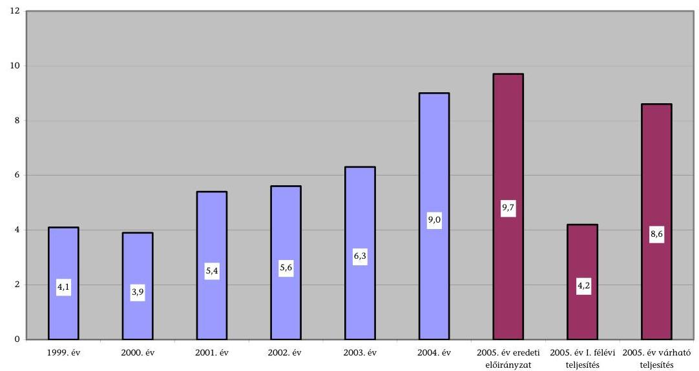

Nemzeti Kulturális Alapprogram feladatai megvalósításához rendelt feltételrendszer egyes elemei - cél- és feladatmeghatározás, a pénzeszközök biztosítása, a döntéshozó testületek és az igazgatósági szervezet működése - megfelelően segítették a törvényi célok megvalósítását. Az ellenőrzött időszakban az NKA feladatteljesítését a célul tűzött projekt- és produkciótámogatás jellemezte. Tevékenységét az NKA törvényben előírt célok szerint végezte, amelyek alapvetően általános célok. A törvény által előírt pótlólagos kultúrafinanszírozó sze-

[^0]
[^0]:    ${ }^{2}$ Az ellenőrzött időszakban a kormányprogramok stratégiai kérdésnek tekintették a nemzeti kultúra helyzetének javítását, a kulturális értékek megőrzését és megismertetését a világgal. A 2004. évi KSH-adatok a jelentés készítésekor még nem álltak rendelkezésre.
    ${ }^{3}$ Az NKA Igazgatósága 2005. szeptember 28-i közlésén alapuló 2005. évi kiadások alakulását a 2004. évről áthúzódó 3,0 Mrd Ft-os kötelezettségvállalás teljesítése és a 2005. évi 4,1 Mrd Ft-os kötelező maradványképzés együttesen befolyásolja.

---

rep ${ }^{4}$ sajátos céljait - mint a professzionális és amatőr tevékenység támogatása sem az NKA létrehozásakor, sem az azóta történt jogszabály módosításoknál nem határozták meg. Az NKA törvény a kulturális élet egészének és minden szereplőjének - a kulturális egyenjogúság elve alapján - támogatási lehetőséget biztosított.

Az NKA rendelkezésére álló fejezeti kezelésű előirányzat összege 2004-ben közel két és félszeresét tette ki az 1999. évi összegnek. Az NKA forrását alapvetően a befolyt kulturális járulék képezte. Az önkéntes befizetők bevonására tett eddigi intézkedések nem jártak eredménnyel, szponzori támogatásban az Alapprogram nem részesült. Az NKA pénzügyi helyzete az ellenőrzött időszakban biztonságos volt. 2004-2005. évi gazdálkodását nehezítette a kulturális járulékból származó tervezett bevétel csökkenése ${ }^{5}$ és pénzellátási rendjének - kormányrendelettel - havi finanszírozásúvá történt átalakítása.

Az NKA Bizottság a törvényben meghatározott stratégiai jellegű döntéselőkészítő és keretmeghatározó szerepét megfelelően betöltötte. A rövid- és középtávú stratégián túl a szakmai kollégiumok számára éves támogatási célokat, prioritásokat határozott meg. Évente körültekintően döntött az egyes kollégiumok által felhasználható, a támogatási célokhoz rendelt éves pénzkeret nagyságáról - a kollégium javaslatai, az adott szakterület súlya, értékalkotó tevékenysége és támogatandó feladatai figyelembe vételével.

Az Igazgatóság az NKA törvényben előírt feladatai megoldásával biztosította a döntéshozó testületek tevékenységéhez szükséges feltételeket, a pályáztatási rendszer zavartalan működését. Az ellenőrzött időszakban végrehajtott igazgatósági szervezeti átalakítások a célszerűbb munkamegosztást, a hatásköri átfedések kiküszöbölését eredményezték. Az Igazgatóságon a feladatok ellátásához szükséges személyi feltételek többsége rendelkezésre állt. A döntéshozó testületek és az Igazgatóság közötti együttmúködés megfelelő munkamegosztáson alapult, ugyanakkor nem kellően biztosított a szakmai-társadalmi megbízást teljesítő kollégiumi tagok leterheltsége miatt a döntéseik megalapozását, a döntések hatásainak elemzését, valamint a támogatások teljesítményértékelését segítő szakértői háttér.

A támogatások és felhasználások pénzügyi elszámolási rendszere - az NKA Igazgatósága működtetésében - a folyamatba épített kontroll és elszámoltatás révén alkalmas a pénzeszközök szabályszerű felhasználásának megítélésére. A felhasználói szakmai beszámolók alapján a szerződésben vállalt cél megvalósítása értékelhető, de a megvalósítás hatása, hatékonysága teljesítménymutatók hiányában nem. Az NKA részéről a támogatott felhasználóknál végzett hely-

[^0]
[^0]:    ${ }^{4}$ A 2004. évben megítélt összes támogatás - NKA szinten átlagosan - a megvalósításhoz szükséges összeg $12,2 \%$-át tette ki, de a miniszteri keretnél egyes esetekben előfordult $100 \%$-os támogatás.
    ${ }^{5}$ A kulturális járulék 2004. évben az eredeti előirányzathoz képest 87,8\%-ban teljesült, az NKA törvény mellékletében felsorolt termékek és szolgáltatások után az APEH-hez befizetett alacsonyabb összegű járulék következtében, ami 1087 M Ft bevételkieséssel járt.

---

színi ellenőrzések száma és aránya a nyertes pályázói számhoz és pályázathoz viszonyítottan alacsony volt. 2004-ben 22 pályázó 93 pályázatát ellenőrizték, amely a támogatási összegek $4 \%$-át tette ki. A komplex szakmai-pénzügyi ellenőrzési rendszer alapjait, eljárási szabályait az NKA kialakította. A támogatási rendszer egészére vonatkozó, eredményközpontú értékelési módszerek konkrét kialakítása és gyakorlati alkalmazása az ellenőrzött időszakban még nem történt meg.

Az NKA kultúra támogatási tevékenysége a kulturális stratégiai célokat megvalósító szakmai kollégiumok pályázati rendszerén és a jellemzően egyedi döntésű miniszteri keret működésén keresztül érvényesült. Az ellenőrzött időszakban a megítélt támogatások átlagosan 70\%-át a kollégiumi keretek, 30\%át a miniszteri keret biztosította évente.

Az állandó kollégiumok a szakmaiság által kifejlesztett struktúra szerint bevált működési renddel, növekvő számmal, s a kulturális szakágazati rendhez képest mélyebb tagoltsággal múködtek. Ez a kollégiumi keretösszegek aprózódásában is megjelent. Az ideiglenes kollégiumok jellemzően egy-egy speciális feladat időszakos támogatását végezték. A szakmai kollégiumok pályázati programcéljai igazodtak az alapvető törvényi és bizottsági stratégiai célokhoz. Az egyes években kialakított pályázati kiírások tükrözték az adott szakterületek aktuális igényeit. A kollégiumok nem rendelkeztek a miniszteri rendeletben előírt saját, stratégiai jellegű támogatási célkitűzésekkel.

A pályázatok meghirdetésekor érvényesült az esélyegyenlőség elve, a pályázati kiírás tartalmi elemei között azonban eredményességi kritériumokat nem határoztak meg. A pályázati feltételek egy része - évközi kiírási időpont, rövid megvalósítási idő, pályázati feltételek körülményes megfogalmazása - nem kellően segítette elő az eredményes megvalósulást. A kollégiumi döntéshozatali folyamat 2005-től bevezetett pontozásos rendszere - minden kollégiumnál egy témában - erősíti a bírálatok elfogulatlanságát. A döntési összeférhetetlenséget szabályozták és betartották ${ }^{6}$, ugyanakkor a kulturális egyenjogúság biztosítása szempontjából problémát jelentett, hogy a kollégiumok tagjai gyakran egyben a támogatott szervezetek képviselői és szervezeteik az átlagosnál nagyobb mértékben részesedtek a támogatásokból ${ }^{7}$.

A kollégiumok a közös pályáztatási lehetőségekkel ritkán éltek. A szakmai kollégiumok pályáztatási céljaikat - bizottsági koordináció hiányában - nem hangolták össze kellően. Azonos jellegű témában több szakmai kollégiumnál, emellett a miniszteri keretből is nyertek támogatást a pályázó szervezetek. A visszatérítendő és részben visszatérítendő támogatások nyújtására vonatkozóan sem a Bizottság, sem a kollégiumok nem dolgoztak ki szempontokat és szabályokat.

[^0]
[^0]:    ${ }^{6}$ A kollégiumi tagok a szervezeteik pályázatának elbírálásában nem vehettek, illetve nem vettek részt.
    ${ }^{7}$ 2005. I. félévében a kollégiumok a beérkezett pályázatok átlagosan 49,7\%-át támogatták; a kollégiumi vezetők és tagok által képviselt szervezetektől benyújtott pályázatoknak átlagosan $82,4 \%$-a volt sikeres.

---

A miniszteri keret tartalmi felhasználási céljai, prioritásai (hazai és nemzetközi fesztiválok, nagyrendezvények, központi költségvetési intézmények, kiemelkedő műhelyek, valamint egyéb célok támogatása) megfeleltek a szabályozásnak. A gyakorlatban a miniszteri keret olyan célokra is biztosított támogatást, melyre a kollégiumok kiírtak pályázatot. A kiemelkedő műhelyek és a nagyrendezvények miniszteri keretből való támogatása indokolt volt, mivel ezek támogatási igénye a kollégiumi keretlehetőségeket meghaladta. A kulturális esélyegyenlőség ellen szól az a támogatási gyakorlat, hogy a minisztériumi felügyelet alá tartozó költségvetési intézmények és a miniszter által alapított egyéb szervezetek kiemelten részesülhetnek a miniszteri keretből, és emellett a szakmai kollégiumoktól is kaphattak támogatást.

A nagyrendezvények, fesztiválok támogatása jellemzően minisztériumi kezdeményezésre alakult ki, a támogatási megállapodásokban foglalt feltételek előírásával. A miniszteri keretből történt támogatások részaránya a megvalósított produkciók finanszírozásán belül 10-60\% közötti részarányt képviselt.

A támogatások lebonyolítási rendszere mind a miniszteri, mind a kollégiumi keretek esetében biztosította a célok megvalósítását, viszont az elbírálásnál és értékelésnél nem fektettek hangsúlyt a megvalósítás hatásaira, a pénzeszközök hasznosulására. Ez utóbbira a jelenlegi szakmai beszámoltatási rendszer sem alkalmas, ugyanis a kollégiumok a pályázók szakmai beszámolóinak elkészítéséhez és értékeléséhez nem alakítottak ki szempontokat, kritériumokat. A támogatási szerződések konkrét teljesítménymutatókat - nézőszám, jegybevétel, könyv példányszám, stb. - nem fogalmaztak meg teljesítési követelményként a miniszteri keret felhasználói számára sem, csupán a kulturális cél megvalósítását és ennek teljesítéséről szóló elszámolási és beszámolási kötelezettséget írtak elő. Nem megoldott kritériumok és szakértők hiányában a pályázati döntések hatáselemzése.

A támogatások felhasználása során a kulturális értékek gyarapítására, megőrzésére kitűzött pályázati célok alapvetően teljesültek, mivel a támogatások döntő többsége, 85-90\%-a sikeres volt a számvevőszéki ellenőrzés során kialakított mutatók, valamint a szakmai kritikák, vélemények alapján. A támogatásoknál alapvetően a több pályázó alacsonyabb összegű támogatásának elve érvényesült, ennek következtében a támogatási összegek elaprózódtak ${ }^{8}$. Az ellenőrzés céltól eltérő, szabálytalan felhasználást nem tárt fel.

Az ellenőrzött időszakban a felhasználások 43\%-a a művészeti alkotások létrehozását, 57\%-a a kulturális értékek megőrzését és terjesztését szolgálta. A határokon túli magyar kultúra támogatását - mint bizottsági határozatokban kiemelt támogatási cél - mindössze átlagosan évi 3\%-os összeg biztosította az NKA részéről, a benyújtott pályázati számmal és színvonallal összefüggésben.

[^0]
[^0]:    ${ }^{8}$ Az ellenőrzött kollégiumok közül kivételt képezett ez alól az Ismeretterjesztés és Környezetkultúra Szakmai Kollégium, valamint a Közkultúra Informatika Ideiglenes Szakmai Kollégium, melyeknél a kevesebb pályázó-nagyobb összegű támogatás stratégiáját alkalmazták. Az egy elfogadott pályázatra jutó átlagos támogatás összege 1999ben 633 E Ft, 2004-ben pedig 1067 E Ft volt.

---

A támogatások 10-15\%-a részlegesen vagy nem megfelelően hasznosult. A felhasználó szervezeteknél főként a kulturális, művészeti folyóiratok kiadása esetében okozott gondot az eladatlan példányok magas aránya, továbbá a filmforgalmazásban, könyvek és zenei CD-k terjesztésében jelentkeztek értékesítési problémák. A költségvetési támogatással létrejött magán alkotások további hasznosítása nem megoldott.

Az ellenőrzött időszakban a támogatások 30\%-át államháztartáson belüli, 70\%-át államháztartáson kívüli szervezetek, illetve magánszemélyek használták fel. A költségvetési intézmények döntő többsége az alapfeladata körébe tartozó produkciók megvalósítására használta fel az NKA támogatását ${ }^{9}$. A központi és önkormányzati költségvetési intézmények az ellenőrzött időszak összes támogatásából évente átlagosan 33-35\%-ban részesedtek.

A támogatások a kulturális gazdasági társaságok, alapítványok feladatellátásában kedvező változásokat, hatásokat eredményeztek, elmaradásuk az adott projekt megvalósítását veszélyeztette volna. A támogatások közvetett, a felhasználói szervezeten kívüli eredményeket is biztosítottak (pl.: külföldi művészeti tapasztalatok átadása - megszerzése). A kulturális fesztiválok jellemző hatása volt, hogy hozzájárult a turizmus élénkítéséhez, kulturális értékeink megismertetéséhez.

A felhasználók mindössze egyharmad része alakított ki mérőszámokat a kulturális teljesítmények mérésére, az NKA támogatás produkciós összegen belüli alacsony részaránya és a mérhetőség nehézségei miatt. A felhasználó szervezetek véleménye szerint az NKA támogatási rendszere eléggé bürokratikus, ugyanakkor a kulturális célokat megfelelően szolgálja, fenntartása szükséges.

Az utóellenőrzés a jogelőd Nemzeti Kulturális Alapnál végzett 1998. évi ÁSZellenőrzés ${ }^{10}$ javaslatainak megvalósítását célozta. A kulturális célok sokcsatornás finanszírozásának átláthatóbbá tételére irányuló javaslattal kormányzati szinten nem foglalkoztak, így a kulturális élet finanszírozási gyakorlata lényegesen nem változott.

A miniszteri keret céljára, maximált összegére, képzése, elosztása szabályainak meghatározására irányuló javaslat alapvetően hasznosult. Az NKA törvény 2002. évi módosítása - a korábbi 50\%-os lehetőséggel szemben - 25\%-ban maximálta a miniszteri keret nagyságát a támogatási előirányzaton belül. Az NKA tv. végrehajtási rendelete szabályozta a miniszteri keret fő támogatási céljait, a keret felhasználási módját. A keret képzésének, elosztásának és felhasználásának részletes szabályait - melyet jelen ellenőrzés értékelt - az NKA

[^0]
[^0]:    ${ }^{9}$ Az ellenőrzésbe vont költségvetési szervezetek az ellenőrzött időszak támogatási kereteiből 24\%-os arányban részesültek. A múzeumi szakmai kollégiumi kereten belül, 2003-2004-ben 88-90\%-os arányú volt a költségvetési intézmények támogatásának részaránya (szakterületi szerepük alapján).
    ${ }^{10}$ A Nemzeti Kulturális Alap pénzügyi-gazdasági ellenőrzéséről szóló 9825. sorszámú ÁSZ-jelentés (1998.)

---

SZMSZ-e rögzítette. Megoldatlan maradt a miniszteri keret ellenőrzésére vonatkozó javaslat.

Az Igazgatóság 1998 szeptemberében intézkedési tervet készített a feltárt szabályozási, szervezési és működési hiányosságok kiküszöbölésére. Ennek keretében 1998. végére felülvizsgálták és korszerűsítették az Igazgatóság SZMSZ-ét. Az ÁSZ javaslatának megfelelően a belső ellenőrzést mentesítették az előzetes ellenőrzés alól, megerősítették az elszámoltatás szervezetét. Az ellenőrzési szervezet személyi megerősítése csak 2005-ben valósult meg. A pályázó szervezetek köztartozási igazolásának egyszerűsítése érdekében tett javaslat a MÁK elzárkózása miatt nem valósult meg.

Az NKA pénzeszközei - a feltételrendszer, a támogatási rendszer, a felhasználások és az utóellenőrzés együttes értékelése alapján - a célok megvalósításával alapvetően eredményesen hasznosultak. A teljes rendszer működésében és a támogatások elaprózottságában visszatükröződnek a kulturális élet finanszírozásának problémái (finanszírozási stratégia hiánya, az állami kulturális intézmények alapfeladatainak nem teljes körű finanszírozása). A támogatási rendszer nehezen átlátható az NKA-n belüli pályázati lehetőségek átfedései és a kulturális élet szereplőinek évenkénti nagyszámú pályázata következtében. Az előbbi okok, továbbá a pályázati kiírások, a döntések és a támogatásértékelések teljesítménykövetelményének hiánya miatt a rendszer nem kellően hatékony.

A helyszíni ellenőrzés megállapításainak a szakmai kollégiumoknál történő hasznosítása mellett javasoljuk:

# a nemzeti kulturális örökség miniszterének: 

1. Kezdeményezze az NKA támogatási rendszere átláthatóságának és hatékonyságának növelése érdekében a jogi szabályozás megváltoztatása útján a sajátos kulturális támogatási célok kialakítását, a miniszteri keret felhasználási céljainak és szerepének újragondolását, a pályázati lehetőségek átfedéseinek megszüntetését és a jelenlegi szakmai kollégiumi rendszer felülvizsgálatát.
2. Tekintse át a kultúra finanszírozási rendszer keretei között a szektorsemlegesség és a kulturális egyenjogúság biztosítása érdekében a költségvetési szervezetek NKA támogatásának szabályozását, továbbá kezdeményezze az összeférhetetlenségi szabályok szigorítását a bizottsági és kollégiumi tagok pályázatai elbírálása során.
3. Intézkedjen, hogy az NKA Bizottság elnöke a pénzeszközök jobb hasznosulása érdekében az NKA támogatások egészére vonatkozó szakmai ellenőrzési rendszert alakítson ki és törekedjen az eredményközpontú értékelési rendszer kimunkálására, valamint a döntések hatáselemzésére az NKA Igazgatóságával együttmúködésben.
4. Gondoskodjon arról, hogy az NKA-n belül szabályozzák a miniszteri és a kollégiumi támogatások egyeztetését, a visszatérítendő és részben visszatérítendő támogatások nyújtásának szempontjait, továbbá segítsék elő a támogatott kulturális termékek, produkciók jobb megismertetését, a létrejött alkotások további hasznosítását.
5. Számoltassa be az NKA Bizottság elnökét és a szakmai kollégiumok elnökeit az ellenőrzés tapasztalatai alapján megtett intézkedéseikről.

---

# II. RÉSZLETES MEGÁLLAPÍTÁSOK 

## 1. Az NKA TÖRVÉNYI CÉLOK SZERINTI KÜLDETÉSÉNEK TELJESÍTÉSE ÉS FELTÉTELRENDSZERE

### 1.1. Az Alapprogram cél- és feladat-meghatározása, támogatási stratégiája, prioritásai

A Nemzeti Kulturális Alapprogram - amely egyike a kulturális élet állami támogatását biztosító intézményrendszernek és pénzügyi forrásnak - az ellenőrzött időszakban az 1993. évi XXIII. törvény (továbbiakban: NKA tv.), a 13/1999. (VIII. 27.) NKÖM rendelet (továbbiakban Vhr.) és az Alapprogram Szervezeti és Múködési Szabályzata (továbbiakban SZMSZ) alapján végezte tevékenységét. (Az NKA pályázati rendszerének folyamatábráját a 2. sz. melléklet mutatja be.)

A kulturális tevékenységre fordított (a kulturális szakfeladatok szerinti) költségvetési kiadásoknak a GDP-hez viszonyított aránya 1999-ben 0,7\% volt, az új évezred első három évében $0,9 \%$ körül stabilizálódott. Az összes költségvetési kulturális kiadásnak 1999-ben 5,3\%-át, 2003-ban 3,4\%-át tették ki az NKA kiadásai ${ }^{11}$ (3. sz. melléklet). Az NKÖM fejezet kiadásain belül az NKA teljesített kiadása az ellenőrzött időszakban 5-12\%-os arányt képviselt, a legnagyobb összeget 2004. évben $(9,0 \mathrm{Mrd} \mathrm{Ft})$.

Az Alapprogram kultúrafinanszírozásban betöltött sajátos szerepét - mint pl. a professzionális és amatőr tevékenység támogatása - nem határozták meg. Ez összefüggést jelez a kulturális stratégia és a magyar kulturális élet finanszírozása koncepciójának hiányával. A célok a kulturális ágazat teljes tevékenységi körére támogatási lehetőséget biztosítottak, ennek következtében a pénzeszközök elaprózódtak.

Az ellenőrzött időszakban az NKA 40511 pályázatot támogatott 34,0 Mrd Ft-tal. Az egy pályázatra jutó támogatás összege az Alapprogram egészére vonatkoztatva 1999-ben 633 E Ft, 2004-ben 1067 E Ft volt. A miniszteri keret nélküli kollégiumi támogatásokat vizsgálva ez az összeg 1999-ben 517 E Ft, 2004-ben 910 E Ft volt.

Kérdőíves megkérdezés alapján az ellenőrzött időszakban 7-11 kollégium pályázóinál fordult elő a pályázati célról való lemondás az alacsony támogatási összeg miatt.

[^0]
[^0]:    ${ }^{11}$ Az 1999. évben az NKA összes kiadását egy kulturális szakfeladaton számolta el, míg 2004-ben az Igazgatóság kiadásai és az egyéb kiadások „a máshová nem sorolt egyéb szolgáltatás" szakfeladaton jelentek meg.

---

A támogatásban részesíthetők körét az NKA tv. egyértelmúen rögzítette. A felhasználási jogcímeket - a támogatott feladathoz igazodóan - a kollégiumok a pályázati kiírásokban határozták meg.

Az Alapprogram múködésére vonatkozó különböző szintű jogszabályok és belső szabályzatok összhangban voltak egymással, kivéve az NKA tv. és a költségvetési törvények rendelkezéseit az Alapprogram pénzellátására vonatkozóan. Az NKA tv. szerint a célelőirányzat forrása a kulturális járulék, míg a költségvetési törvényekben 2001-től a célelőirányzat forrásaként állami támogatás szerepel.

Az ellenőrzés időszakában végrehajtott jogszabályi változások segítették az Alapprogram hatékonyabb feladatellátását.

A legfontosabb tartalmi változások törvényi szinten: pl. a miniszteri keret mértékének módosítása; más fejezeti kezelésű előirányzatok átvételének lehetősége közös pályáztatás céljából; a felhasználási célok bővítése; a folyamatos programfinanszírozás lehetőségének megteremtése.

NKÖM rendeleti szinten: pl. a miniszteri keret felhasználási körének meghatározása; a kollégiumi vezetők és tagok mandátum idejének újraszabályozása; a pályázati rendszer több elemének pontosítása.

Az Alapprogram céljainak megvalósítását szolgáló elvi, irányító és koordináló döntések meghozatala a Bizottság feladata.

# A Bizottság a vizsgált időszakban két középtávú stratégiát dolgozott 

ki, amelyek elkészítésénél alapvetően figyelembe vette a törvényi célokat. A két stratégia fó kérdései folyamatosságot mutattak. (A törvényi célok, valamint a fő a stratégiai célkitúzések megvalósulását a 1-3. sz. tanúsítványok tartalmazzák.)

Az ellenőrzött időszakban a megítélt támogatások 43\%-a a művészeti alkotások létrehozását, 57\%-a a kulturális értékek megőrzését és terjesztését szolgálta. Emelkedett a kulturális értékek megóvásának és a nemzetközi kapcsolatoknak a támogatottsága. A stratégiai célkitúzésektől eltérően csak szerény mértékben (évi 3\%) biztosított a határon túli magyar kultúra támogatottsága. Ennek oka az alacsony pályázati szám és a pályázati kiírásokban foglalt feltételek hiányos teljesítése. A vidék - fővárossal szembeni - kulturális hátrányának csökkentésében a vizsgált időszakban minimális volt az előrelépés.

A Bizottság évente meghatározta a különösen fontosnak tartott támogatási célokat. Ezek érvényesülése céljából a prioritásokat kifejező határozatokat hozott és ajánlásokat fogalmazott meg.

Pl. a 2000. évi támogatási prioritások: a (bi)milleniumi programok, gyermekek és az ifjúság művelődését segítő programok, határon túli magyar kultúra támogatása; a 2001. évi prioritások: az olvasás éve program, a határon túli magyar kultúra és a magyar kortárs művészet támogatása; a 2003. évi prioritások: az NKA 10 éves évfordulójához kapcsolódó programok és a fiatalok számára lehetőséget nyújtó produkciók támogatása; a 2004. évi prioritások: kutatási, elemzési pályázatok kiírásának támogatás; EU csatlakozással kapcsolatos rendezvények támogatása.

---

Az Alapprogram a törvényben meghatározott céljait a szakmai kollégiumi keretek és a miniszteri keret felhasználásával valósította meg. Az ellenőrzött időszakban az NKA támogatáson belül a szakmai kollégiumi keretek részaránya átlagosan 70\%-os, a miniszteri kereté átlagosan 30\%-os volt.

# A miniszteri keret célját a Vhr. 8. § (3) bekezdése rögzítette. 

A keretből kulturális nagyrendezvények, kulturális feladatot ellátó központi költségvetési szervek, továbbá a miniszter által más szervezeti formában alapított kulturális intézmények programjai, a kulturális élet nemzetközi rangú műhelyei támogathatók, valamint olyan egyedi pályázatok, amelyeket a miniszter - a keret terhére - támogatásra méltónak ítél.

Az NKA SZMSZ alapján a miniszteri keretből adható egyedi támogatás felső összeghatárát a miniszter és a Bizottság az egyes évekre meghatározzák. Az ellenőrzött időszakban az összeghatár megállapítására nem intézkedtek.

A miniszteri keret képzésére és felhasználhatóságára vonatkozó jogszabályokat az ellenőrzött időszakban négy alkalommal módosították. A támogatási rendszer eredményessége a jogszabály-módosítások következtében csak részben javult.

A miniszteri keret mértékét az NKA tv. a célok megvalósítását szolgáló előirányzat múködési költségekkel csökkentett \%-ában határozza meg. A keret mértéke az ellenőrzött időszak elején 2002. december 31-ig 50\% volt. Ez a kollégiumok számára - az alacsonyabb összegű pénzügyi keret miatt - csökkentette a pályázatok megvalósíthatóságának eredményességét. A jelentős összegű miniszteri keret ugyanakkor eredményesen biztosította a nagy költségigényű, kiemelkedő hazai és nemzetközi kulturális, művészeti programok megvalósítását.
2000. március 12-ig a miniszteri keretből támogatott pályázó adott évben, azonos célra szakmai kollégiumtól már nem részesülhetett támogatásban. Ezt követően az NKÖM felügyelete alá tartozó központi költségvetési szervek miniszteri támogatást igényelhettek, de a saját szakterületük szerinti szakmai kollégiumnál nem pályázhattak. 2002. november 27-től a korlátozás megszűnt, de ez rövid idő múlva (2003. január 1-től) együtt járt a miniszteri keret 25\%-ra történő csökkentésével.

A miniszteri keret csökkentése a kollégiumi keretek növelésével járt. Mivel a költségvetési intézmények ismét pályázhattak a szakterületi kollégiumoknál is, a kollégiumi pályáztatás eredményessége - a pályázók nagyobb száma miatt - csak részben javult.

A miniszteri keret felhasználása és támogatási összege az ellenőrzött időszakban a jogszabályoknak megfelelő volt. A keret felhasználása összhangban volt az Alapprogram stratégiai céljaival. (A keret célok szerint felhasználásának alakulását a 4. sz. tanúsítvány mutatja be.)

A helyszíni ellenőrzésbe bevont programok egy része a gyermek és ifjúsági korosztály művelődési lehetőségét, a határon túli kapcsolatok erősítését szolgálta.

A szakmai kollégiumok támogatási céljai a pályázati kiírásokban tükröződtek, nem tartották lényegesnek kiemelt támogatási célok megfogal-

---

mazását. A kollégiumok a pályázati kiírásokat a szakma elsődlegesnek ítélt részterületeire írták ki a kollégiumi keretek ismeretében.

Ennek során a Bizottság határozatait, ajánlásait 12 kollégium figyelembe vette, 1 kollégium nem, 3 kollégium részben vette figyelembe.

A kollégiumok - a Vhr. szabályozása szerint - javaslatot tesznek a Bizottságnak a támogatási célokhoz szükséges összegek nagyságrendjére és a kiemelt célok előnybe részesítésére vonatkozóan. Ezzel a jogosítvánnyal a kollégiumok egy része nem élt, habár a Bizottság az ellenőrzött időszakban többször is konzultált a kollégiumi elnökökkel - kibővített bizottsági ülés keretében - a támogatni kívánt célok meghatározásáról.

Az állandó kollégiumok kérdőíves felmérése szerint a Bizottság támogatási döntéseinek kidolgozásához a kollégiumok 31\%-a nem adott javaslatot.

A célok meghatározásában elsősorban a Bizottságé volt a kezdeményező szerep.

A pályázati kiírások más szervezetek pályázataival történő összehangolását teljes körű információk hiányában, a kollégiumok csak részben valósították meg.

A pályázati kiírásokat megelőzően a kollégiumok közel 50\%-ának volt, 44\%ának részben volt információja más pályáztatók azonos vagy hasonló célú felhívásáról. Ezek ismeretében a kollégiumok fele együttmúködött, harmada eltérő pályázói kört célzott meg, míg a további hányad nem írt ki pályázatot (6. sz. melléklet).

# 1.2. Az Alapprogram feladatainak végrehajtásához szükséges pénzeszközök biztosítása 

Az NKA tv. értelmében az Alapprogram fejezeti kezelésű előirányzat. Fő bevételi forrását a kulturális járulék képezi, mely a költségvetési törvényekben 1999-ben és 2000-ben a fejezeti kezelésű előirányzat bevételeként, a 20012004. évek közötti időszakban központosított bevételként szerepelt. Az Alapprogram kiadási előirányzata központosított bevétellel finanszírozott célelőirányzatként működött. Ennek fedezetére tervezett állami támogatás összege megegyezett a kulturális járulék előirányzatával. A kulturális járulékból származó bevételek eredeti előirányzatát az előző évi tapasztalati adatok, a várható infláció, valamint a jogszabályi előírások változásának figyelembevételével tervezték meg.

A kulturális járulékon felül, a saját bevételek (kötbér, nevezési díj, késedelmi pótlék, támogatás visszatérülés, stb.) aránya alacsony volt az összbevételhez képest. Ez a tervekben is tükröződött.

Az ellenőrzött időszakban az Alapprogram tervezett bevételei az 1999. évi 4628 M Ft-ról 9002 M Ft-ra 94,5\%-kal növekedtek. Ebből a kulturális járulék aránya 98,1-99,4\%-ban, meghatározó volt. Az egyéb tervezett bevételek ugyanebben az időszakban 28 M Ft-ról 115 M Ft-ra növekedtek, arányuk az összbevételen belül azonban mindössze $0,6-1,9 \%$ volt.

---

# A kulturális járulék teljesítése az ellenőrzött időszakban - a 2003. év kivételével - nem érte el az eredeti előirányzatot. 

A kulturális járulékból származó bevétel tervének teljesítése több bizonytalansági tényezővel volt összefüggésben: az éves inflációval, a járulékfizetést megalapozó tevékenységekből származó vállalkozói bevételek változásával, az adófizetői morállal, illetve az APEH számonkérésének eredményességével. A bevétel közvetlen befolyásolására az NKA-nak, illetve az Igazgatóságnak nem volt lehetősége.

A tényleges kulturális járulék 1999-ben 84,8\%-a, 2000-ben 95,4\%-a, 2001-ben $92,3 \%-a, 2002$-ben $99,5 \%-a, 2004$-ben $87,8 \%-a$ volt a tervezettnek. 2003-ban a kulturális járulékból származó tényleges bevétel $11 \%$-kal haladta meg a tervezettet, ami 780,5 M Ft többletbevételt jelentett.

A járulékon felüli befolyt egyéb bevételek közül a pályázatok meghiúsulásából származó támogatási visszafizetések, valamint az átvett pénzeszközök összege volt viszonylag jelentős.

A járulékon felüli egyéb bevételek az ellenőrzött időszakban 137 M Ft-ról 578 M Ft-ra növekedtek.

Az NKA tv. 2003. évi módosítása lehetővé tette a központi költségvetési szervek számára hogy, kulturális célú pályázataikat az NKA együttmúködésével bonyolítsák le, ami az Alapprogram számára egyéb pótlólagos forrásokat jelentett.

Ennek következtében a költségvetési szervektől és egyéb szervezetektől származó forrásokkal 2003-ban 160 M Ft-tal, 2004-ben 458 M Ft-tal bővült az NKA bevételeinek összege.

Az 1999-2004 közötti időszakban - egyéb pótlólagos forrásként - a szponzorok felkutatására tett intézkedések nem jártak eredménnyel. A szponzorok előnyben részesítik a kulturális, művészeti tevékenységek megvalósítóinak közvetlen támogatását.

A tervezett bevételek elmaradásából adódó kockázatok kezelésére - 2004. kivételével - minden évben képeztek tartalék keretet.

A keretek elosztásánál képzett tartalék nagyságrendje az 1999-2003 közötti időszakban változó mértékű $625 \mathrm{M} \mathrm{Ft}, 603 \mathrm{M} \mathrm{Ft}, 549 \mathrm{MFt}, 401 \mathrm{MFt}, 700 \mathrm{MFt}$ volt.

A 2003. évi kiemelkedő bevételi növekedés okáról - az NKA és az APEH közötti tájékoztatási megállapodás ellenére - az APEH-tól nem kaptak tájékoztatást. A többletbevételből a folyóirat támogatási rendszer finanszírozásának változtatását valósították meg, ezáltal az adott évi támogatás odaítélésére már az előző év végén sor került.

2004-ben a kulturális járulék tervezett összegének 87,8\%-a folyt be, ami 1087 M Ft bevételkieséssel járt. A bevételek elmaradása miatt csökkentették a kollégiumi kereteket és a miniszteri keretet is (összesen 1294 M Ft-tal). Az Igazgatóság múködési támogatásából 157,5 M Ft-ot nem

---

utaltak át a tárgyévben, a vállalt kötelezettségek egy részét átütemezték 2005-re.

Az NKA-nál nem alakítottak ki elveket arra vonatkozóan, hogy a pénzügyi feltételek évközi változásával hogyan módosuljanak az elosztás szempontjai. Ez összefüggésben van a bevételek tervezésének bizonytalansági tényezőivel is. Adott helyzetben a pénzügyi feltételek változására rugalmasan reagáltak, döntéseik összhangban voltak az éves prioritásokkal.

Az Alapot az 1999. évi költségvetésről szóló 1998. évi XC. törvény Alapprogrammá változtatta, de a hatályos jogszabályi háttér 1999-2004. években fenntartotta az Alapprogram „alapszerü" múködését. Az állami támogatás összege megegyezett a kulturális járulékból tervezett, illetve teljesített bevétel összegével. Az NKA tv. 4. § (3) bekezdése úgy rendelkezik, hogy az Alapprogram bevétele és év végi maradványa nem vonható el. A jogszabály lehetőséget ad több évre áthúzódó kötelezettségvállalásra a tárgyévet követően legfeljebb két évre.

A Kincstár a beérkezett bevételek eredeti előirányzatának mértékéig automatikusan, az azt meghaladó bevétel terhére az előirányzat végrehajtását követően bocsátotta az Alapprogram rendelkezésére az előirányzat-felhasználási keretet.

A 382/2004. (XII. 9.) Korm. rendelettel módosított Ámr. megszüntette a korábbi eljárást, így 2005. január 1-től az NKA pénzellátása az Ámr. 109. § (1) bekezdése alapján havi időarányos előirányzat-felhasználási keret megnyitásával történik.

A 2005. évi költségvetési törvény indoklása szerint a ténylegesen befolyó bevétel nagyságától függetlenül a támogatási előirányzatként betervezett összeg áll tárgyévben a célelőirányzat rendelkezésére. A tervezett és tényleges bevétel közötti különbözet a tényadatok ismeretében a tárgyévet követő év elején egy összegben kerül elszámolásra. Az ezzel kapcsolatos végrehajtási rendelkezéseket az államháztartás múködési rendjéről szóló 217/1998. (XII. 30.) Korm. rendelet fogja tartalmazni. Az Ámr. 2004. évi módosítása azonban nem tartalmaz a központosított bevételből finanszírozott célelőirányzatra vonatkozóan előírásokat.

A kulturális járulék beszedését a kulturális járulék beszedési számlára végzi az adóhatóság. Az NKA tv. szerint az adóhatóság negyedévenként, a negyedévet követő második hó 20. napjáig átutalja a beszedési számla egyenlegét az Alapprogram számlája javára. Egy 1995. évben az Alappal megkötött szerződés alapján azonban az APEH havonta utalta a beszedett járulékot. A járulék havonta történő átutalása, így a megállapodás, nem állt összhangban az NKA tv. előírásával. Az APEH 2004. október 20-i hatállyal felmondta a megállapodást.

A bevételek 2004. évi visszaesése ellenére az ellenőrzött időszakban az Alapprogram pénzellátása folyamatos volt. A pályázatok kiírását, elbírálását, a szerződéskötéseket és a támogatások kiutalását a bevételek teljesítésének megfelelően ütemezték.

Az előző évi előirányzat-maradványok igénybevételével együtt az Alapprogram összbevételei jelentősen meghaladták mind az eredeti

---

tervszámokat, mind a kiadások teljesítését. (Az NKA bevételeinek és kiadásainak alakulását a vizsgált időszakban az 5. és 6. sz. tanúsítvány és a 3. sz. diagram tartalmazza.)

A Bizottság az állandó szakmai kollégiumok által felhasználható éves pénzkeretek nagyságáról a kollégiumok javaslatait figyelembe véve, az adott szakterület súlyát, értékalkotó tevékenységét és támogatandó feladatait mérlegelve döntött. Gyakorlatilag bázis szemléletben osztották fel a keretet a kollégiumok között. A keretek nagyságrendjére vonatkozó javaslataikat a kollégiumok beszámolóikban, valamint az évente megtartott kibővített bizottsági üléseken terjeszthették elő.

A kérdőíves felmérés szerint a kiemelt támogatási célkitűzések megvalósításához szükséges keretösszeggel, az ellenőrzött időszakban a kollégiumok harmada, illetve fele rendelkezett. A többi kollégiumnál a szükséges pénzeszközök csak részben, illetve nem (13-31\%) voltak biztosítottak.

A kuratóriumok kérdőíves megkérdezésekor arra a kérdésre, hogy figyelembe vet-te-e a Bizottság a javaslataikat az éves keretösszeg megállapításakor a kollégiumok $31 \%$-a igen, $19 \%$-a nem, $50 \%$-a részben választ adott.

A Bizottság a szakmai kollégiumok részére éves támogatási prioritásokat határozott meg. Az egyes kiemelt támogatási célokhoz a Bizottság hozzárendelte a forrást cél-, vagy címzett támogatás formájában. Ezek felhasználásánál a kollégiumok a Bizottsági határozatok szerint jártak el.

A Bizottság az ellenőrzött időszakban jóváhagyott éves keretük 10\%-ában határozta meg a szakmai kollégiumok által egyedi támogatásokra felhasználható összeg mértékét. A kollégiumok éltek a lehetőséggel és pályázaton kívül is nyújtottak támogatást.

Az ideiglenes szakmai kollégiumok támogatási keretösszegeit a törvényi célokhoz igazodóan alakították ki. Új feladatnál a forrás meglétét követően hozták létre az ideiglenes kollégiumot.

# 1.3. A döntéshozó testületek kialakítása, múködése 

A Nemzeti Kulturális Alapprogram céljainak megvalósulása testületeinek - a Bizottságnak és a szakmai kollégiumoknak - döntéshozó tevékenységén keresztül történt.

A Bizottság az elnökből és 2000. január 1-jéig 10, ezt követően 12 tagból álló testület. A Bizottság létszáma, tagjainak megbízása a jogszabályoknak megfelelő volt. Az ellenőrzött időszakban a testület tagjai részben a kulturális élet különböző területeinek képviselői voltak, kisebb részben a nagy járulékfizető területeket (reklámpiac, lapkiadók, vállalkozói szövetségek) képviselték.

A Bizottság a jogszabály által meghatározott feladatok ellátásához részben rendelkezett megfelelő eszközökkel. A jelenlegi jogi szabályozás azonban nem írja elő, hogy határozatai kötelezőek a kollégiumok számára. Az erre vonatkozó előírást az Alapprogram SZMSZ-e tartalmazza.

---

A Bizottság céljainak megvalósítása érdekében határozatokat hozott, ajánlásokat alakított ki.

Meghatározta az egyes szakmai kollégiumok támogatásra fordítható pénzkeretét, az egyedi támogatásra fordítható összeg nagyságát, előírta a kiemelt támogatási célokat, vitás esetekben dönthetett a pályázatok kiírásáról, illetve elbírálásáról.

Az állandó kollégiumok létrehozásáról, megszüntetéséről a miniszter a Bizottsággal egyeztetve dönt. A Bizottság javaslatot tehet a miniszternek ideiglenes szakmai kollégium létrehozására. Az Alapprogramnak 1999-ben 14, 2000-2001. években 15, 2002. és 2004. években 16 állandó szakmai kollégiuma volt. A vizsgálat időszakában összesen 15 ideiglenes szakmai kollégium működött egy, vagy néhány éves időtartamra. Az állandó szakmai kollégiumokat a kulturális szakágazati rendhez képest mélyebb tagoltsággal szervezték meg (pl. az alkotó és előadó-művészeti ágazaton belül). Mindez a támogatási összegek aprózódásában is jelentkezett (lásd 11. sz. tanúsítvány). Az ideiglenes kollégiumok jellemzően egy-egy speciális feladat támogatását végezték.

Az ideiglenes szakmai kollégiumok különböző okokból jöttek létre. Egy részüket - tárcaközi megállapodás alapján - közös pályáztatásra alapították.

Mivel a jelenlegi szabályozás szerint az NKA forrásai harmadik fél részére nem ruházhatók át, a közös pályáztatás az Alapprogramnál ideiglenes szakmai kollégium létrehozásával oldható meg. (Ilyenek voltak, pl. a Kulturális Turisztikai, a Közkultúra Informatika Ideiglenes Szakmai Kollégiumok). Ezek a pályázati lehetőségek azonban nem kiszámíthatóak a pályázók számára.

Létrejöttek ideiglenes szakmai kollégiumok, olyan kulturális célok támogatására, melyeknél a döntéshez különböző területek szakmai kompetenciája szükséges.
(Ilyenek voltak, pl. a Népművészet-Táncművészeti, a Művészetoktatási vagy az Összművészeti Fesztivál Ideiglenes Szakmai Kollégiumok.)

Az adott cél több kulturális terület kompetenciájába tartozott (pl. a Holocaust megemlékezéseknél: film, könyv, emlékmű, rendezvény stb.) a Bizottság nem kívánt dönteni a rendelkezésre álló pénzkeret allokációjáról. Ezért bízta a feladatot egy e célra létrehozott ideiglenes kollégiumra.

A Bizottság jogszabályban meghatározott feladata a kollégiumok tevékenységének összehangolása. A jelenlegi szabályozás szerint ugyanazon témában több szakmai kollégiumhoz is benyújtható pályázat, s ez - tekintettel a pályázatok nagy számára - hozzájárult az elaprózott támogatásokhoz.

A támogatottak nyilvántartása a szakmai kollégiumok szintjén megfelelő, azonban a pályázók több kuratóriumnál - esetleg ugyanarra a pályázati célra, vagy azonos pályázati cél más részterületének támogatására - beadott igényéről nem szereznek tudomást a döntéshozók.

---

Az NKA informatikai rendszerének múködése lehetőséget ad arra, hogy az adott pályázó más kollégiumokhoz benyújtott, rögzített pályázatai megismerhetők legyenek. Ezzel a lehetőséggel a kuratóriumok általában nem éltek.

A kollégiumok együttműködésével kapcsolatos szabályozás - az NKA SZMSZében - csak a közös pályáztatás lehetőségére vonatkozóan található. A kitöltött kérdőívekben a kollégiumok 56\%-a válaszolta, hogy közös pályáztatásra szabályokat nem dolgoztak ki. Ennek oka, hogy közös pályáztatást, csak a kollégiumok egy része valósított meg.

A szakmai kollégiumok - Bizottság által történő - beszámoltatása előre meghatározott szempontok alapján történt. A beszámoltatás nem terjedt ki annak értékelésére, hogy a pályázati kiírások során milyen konkrét célokat kívántak elérni a kollégiumok, és döntéseiknek milyen számszerúsíthető eredményei, hatásai voltak egy- egy szakterület egészére.

A kollégium tagjainak létszámáról a miniszter a Bizottsággal egyeztetve döntött, a tagok felét saját hatáskörben kérte fel, másik felét a szakmai, társadalmi szervezetek delegálták. A kollégiumok beszámolói, valamint a kérdőíves felmérés válaszai szerint a tagság szakmai összetételét a kollégiumok csak részben tartják megfelelőnek.

Voltak kollégiumok, amelyek egy-egy szakterület képviseletét hiányolták volt, ahol a miniszter által felkért tagok magas arányát kifogásolták.

A kollégiumok többsége (14) a megállapított létszámukat megfelelőnek tartotta. A szakmai összetétellel 11 kollégium volt elégedett, a döntési mechanizmust az összes kollégium közül 13 látta megfelelőnek.

A kollégiumok tagsága többnyire az adott kulturális szakterület - gyakran a támogatotti kör - képviselőiből áll. Ez felveti az összeférhetetlenség problémáját. A Vhr. és az NKA SZMSZ jelenlegi szabályozása alapján nem vehet részt a bírálatban az a döntéshozó, akinél összeférhetetlenség áll fenn. A vizsgálat tapasztalatai alapján ezt be is tartották. Az ellenőrzés megállapítása szerint a kurátorok által képviselt szervezetek magasabb arányban részesedtek a támogatásból, mint a további pályázói kör. A pályázatok elbírálása során a kurátorok szakszerűen, értéksemlegesen jártak el.

A beérkezett pályázatoknak 2002-ben 3,36\%-a 2004-ben 4,25\%-a volt összeférhetetlenségi nyilatkozattal érintett. A 2005. év első félévének rendelkezésre álló adatai alapján a beérkezett pályázatoknak 49,7\%-a részesült támogatásban Ez az arány az összeférhetetlenségi nyilatkozattal érintett pályázatok esetében 82,4\% volt.

A kérdőíves felmérés alapján a döntéshozatalok során a különböző szakterületek arányos képviselete többségében - 14 kollégiumi vélemény szerint - biztosított volt.

A döntéshozatal objektivitását a pályázók anonimitása 11 kollégium véleménye szerint nem, öt vélemény szerint a pályázók egy részénél erősítené.

A pályázati döntésekben 7 szakmai kollégium véleménye szerint a szakmai színvonal, 6 kollégium álláspontja alapján a prioritások megvalósulása, mindössze 2

---

vélemény szerint a támogatás felhasználásának várható hatékonysága, 1 kollégium esetében a rendelkezésre álló keretösszeg a meghatározó.

A pályázatokban kitűzött feladatok teljesítésének figyelemmel kísérése és értékelése a szakmai kollégiumok jogszabályban meghatározott feladata. A hoszszabb átfutású pályázatok teljesítésének menet közbeni nyomon követésére vonatkozó dokumentáció nem volt fellelhető. A szakmai beszámolók elfogadása az ellenőrzést végző kollégiumi tag nyilatkozata alapján történt. A helyszíni szakmai ellenőrzések színvonala, mélysége többnyire az ellenőrzést végző kollégiumi tag minősítésének alaposságától függött.

# 1.4. Az NKA Igazgatóság szervezete, múködése 

A hatályos jogszabályi háttér és a belső szabályozás rendszere egyértelműen elkülöníti az Alapprogram döntéshozó testületeinek és a programkezelőnek a hatáskörét és felelősségét.

## Az intézmény belső szabályozási rendszere megfelelő feltételeket biztosított a hatékony és gazdaságos feladatellátáshoz, a törvényben deklarált célok megvalósításához.

Az NKA Igazgatósága - a költségvetési törvényekben előírt, 8-12\% közötti NKA pénzeszköz felhasználásával múködött.

Az ellenőrzött időszakban végrehajtott szervezeti átalakítások a célszerűbb munkamegosztást, a hatásköri átfedések kiküszöbölését, a feladatok hatékonyabb ellátását célozták.

Az 1998. évi számvevőszéki javaslattal összhangban, 1999-ben az ellenőrzés szervezetét kettéválasztották, létrehozva az Elszámoltatási Osztályt és a függetlenített belső ellenőrzést. 2003-ban a szakmai területeken kiküszöbölték a korábbi vezetői, illetve felügyeleti átfedéseket. A hatékonyabb múködés elősegítéseként 2004-től önálló Igazgatási Osztályt szerveztek. Ugyanebben az évben önálló szervezeti egységként kialakították az Igazgatóság Belső Ellenőrzési Osztályát. Az NKA Igazgatósága 2004. január 1-jétől új szervezeti egységgel, a Fejezeti Pályáztatási Csoporttal bővült. Feladatuk az NKÖM fejezeti kezelésű előirányzatai terhére kiírt pályázatok kezelése.

Az időközi feladat- és szervezeti változást, az Igazgatóság 1999. évtől hatályos alapító okirata, valamint a 2003. novemberétől hatályos SZMSZ nem tartalmazta, ezért szükséges azok módosítása.

A vezetői ellenőrzés és a munkafolyamatba épített ellenőrzés megfelelően szolgálta az Igazgatóság operatív gazdálkodási és az Alapprogram múködését segítő feladatainak eredményes, szabályos végrehajtását.

Az NKA Igazgatóságánál a feladatok ellátásához szükséges személyi feltételek döntő többségében biztosítottak voltak. A kivételt a belső ellenőrzés és a jogi csoport nem kellő létszám-ellátottsága képezte. A státuszok betöltésénél korlátot jelentett az elhelyezési körülmények szűkössége. Egy igazgatósági alkalmazottra 1999-ben 244 db, 2003-ban 215 db és 2004-ben 233 db beérkezett pályázat jutott (a Fejezeti Pályáztatási Csoport adatai nélkül). A

---

munkatársak megfelelő szakmai felkészültséggel, többéves gyakorlati tapasztalattal rendelkeznek, feladatukat magas színvonalon, látták el. A fluktuáció nem volt jellemző. A pályázatok számának növekedése, továbbá a papír alapú ügykezelés miatt a kollégiumi titkárok leterheltsége időszakonként magas volt. (Az Igazgatóság pénzügyi adatait, valamint a létszám és a pályázatok alakulására vonatkozó adatokat a 7-9. sz. tanúsítványok tartalmazzák.)

Az ellenőrzött időszak első éveiben, a feladatok bővülése miatt felmerült egy új, korszerű programrendszer alkalmazásának szükségessége, melyet a GrantSys integrált pályázati szoftverrendszer létrehozásával értek el. 2003-tól a GrantSys önállóan látta el a pályáztatás, keretnyilvántartás, elszámoltatás, pénzügy teljes körű adatfeldolgozását. Az adatbázisból egy adott pályázóról, vagy pályázatról minden lényeges adat lekérhető. A szoftver többirányú kimutatások készítését teszi lehetővé. Erőssége, hogy zárt rendszerben kezeli az adatokat a pályázat beérkezésétől, annak lezárásáig és az utólagos helyszíni ellenőrzésig.

1999-2004 időszakában az Igazgatóság, valamint a döntéshozó testületek elhelyezési feltételeit nem tudták a feladatok növekedéséhez igazítani.

#### Abstract

Az elhelyezési körülmények javítására különböző megoldásokat kerestek, azonban az 1999-2002. évek közötti próbálkozások nem jártak sikerrel. Az elhelyezés megoldására 2002 novemberében „hirdetmény közzététele nélkül induló tárgyalásos közbeszerzési eljárást" indítottak. A hirdetmény közzététele a szerződéses feltételek pontos meghatározását követelte meg, amire a különböző alternatív lehetőségek miatt nem volt mód. Megfelelő ajánlat csak a negyedik, 2003. októberi felhívásra érkezett. Ekkor a négy felkért szervezettől csak egy ajánlatot kaptak.

2003. év végén megvették a Budapest VIII. kerület, Gyulai Pál utca 11. és 13. szám alatti ingatlanokat. A megvásárolt ingatlan egy $2228 \mathrm{~m}^{2}$ hasznos szintterületű épületből és a mellette lévő $547 \mathrm{~m}^{2}$-es üres telekből állt, ami alkalmas parkoló kialakítására, vagy egyéb célú hasznosításra. A költözést 2004. első felére tervezték, a felújítás elhúzódása miatt azonban a számvevőszék helyszíni vizsgálatának befejezéséig nem valósult meg.

Az ellenőrzés a székház beruházás előkészítése folyamatában eljárásbeli hiányosságokat tapasztalt, mivel a beruházás előkészítése az ajánlati felhívás céljainak és kritériumainak nem minden esetben felelt meg.

Az ajánlati felhívásban kritériumként határozták meg, hogy az ingatlan műszaki színvonala alapján a felújítás, vagy átalakítás ne haladja meg a 4 hónapot. A kritérium meghatározása pontatlan volt, mivel nem derült ki egyértelműen, hogy a 4 hónapos időtartam együttesen a felújítás minden fázisára (tervezés, engedélyeztetés, kivitelezés) vonatkozott, vagy csak a műszaki kivitelezésre. Az ellenőrzés megállapította, hogy a szemrevételezésről jegyzökönyv, emlékeztető nem készült. Beszerzés előtt nem történt múszaki felmérés az ingatlan állapotáról, annak ellenére, hogy a pályázati felhívás szerint volt rá lehetőség. A 2004. januárjában kezdeményezett múszaki feltárást követően kiderült, hogy az irodaház felújítása és átalakítása időigényesebb a tervezetthez képest.

---

Az ellenőrzött időszakban az Igazgatóság az NKA tv-ben előírt feladatainak ellátásával biztosította a döntéshozó testületek tevékenységének ellátásához szükséges feltételeket és a pályázati rendszer zavartalan működését. Az elhelyezési körülmények szűkössége miatt a kollégiumi ülések megtartásához egyetlen tárgyalóterem állt rendelkezésre, melyet a kollégiumok nehezményeztek.

A 11 ellenőrzésbe vont szakmai kollégium megítélése szerint a múködéséhez szükséges feltételek teljes mértékben rendelkezésre álltak. A tárgyi feltételeket öt, az informatikai feltételeket két kollégium nem találta megfelelőnek.

# 2. A TÁMOGATÁSOK LEBONYOLÍTÁSI RENDSZERE 

### 2.1. A pályázati-, támogatási rendszer kialakítása és múködése

Az NKA tv. 3. §-a szerint az Alapprogram pótlólagos forrást biztosít a célja szerint megvalósítandó feladatokhoz.

A megítélt támogatás NKA szinten az ellenőrzött időszakban átlagosan a megvalósításhoz szükséges teljes összeg 12,2\%-a volt, mellyel teljesült az Alapprogram pótlólagos forrás szerepe.

A támogatások pályáztatással, valamint egyedi elbírálás útján voltak elnyerhetők a szakmai kollégiumoktól vagy a miniszteri keretből.

### 2.1.1. A szakmai kollégiumok pályáztatási és támogatási rendszere

A NKA pályáztatási rendszere lehetővé tette a törvényi célok, stratégiai célkitúzések és a prioritások megvalósítását.

A támogatások - az NKA tv. értelmében - visszatérítendő, vissza nem térítendő, valamint részben vissza nem térítendő formában nyújthatók. Az intézmények, szervezetek, magánszemélyek az ellenőrzött időszakban - minimális mértékű kivételtől eltekintve - vissza nem térítendő támogatásban részesültek. A vizsgált időszakban a visszatérítendő támogatás öszszege $66,4 \mathrm{M} F \mathrm{t}$ volt, ez összesen 17 pályázatot érintett. A támogatások pénzügyi forrásán belül mindössze $0,8-2,0 \%$ közötti arányt képviseltek a visszatérített pénzeszközök. Visszatérítendő támogatást elsősorban azok a pályázók igényeltek, melyek valószínűsítették, hogy a teljesített feladat bevételéből a támogatási összeg visszatérül. Visszatérítendő támogatást a pályázók többnyire könyv- és folyóirat kiadásra kértek. Kifejezetten visszatérítendő támogatásra vonatkozó pályázati kiírás nem volt. Esetenként a pályázók jelölték meg a pályázati adatlapon, hogy a támogatást vagy annak egy részét ebben a formában kérik (10. sz. tanúsítvány).

A kollégiumok a támogatások nyújtásának módjára bizottsági útmutatás hiányában nem alakítottak ki szempontokat.

---

Az egyedi kérelmek teljesítésére felhasználható keretről a Bizottság döntött. Az egyedi elbírálás rendszere egyrészt olyan pályázati típusoknál volt nagy jelentőségű, ahol előre nem látható szakmai eseményhez kértek támogatást, másrészt azoknál a témáknál, amelyeknek pályázati kiírása a szűkös források miatt nem volt célszerű (pl. szakkönyvírás támogatása).

A Bizottság határozatában az egyedi támogatások minimalizálására szólította fel a kollégiumokat. A kollégiumok által egyedi elbírálással megítélt támogatások átlagos aránya a Bizottság által meghatározott 10\%os mérték alatt volt, az 1999. évről 2004-re 6,3\%-ról 3,1\%-re csökkent.

Az egyedi elbírálással támogatásban részesült pályázók egy része olyan célkitűzések megvalósítására kapott támogatást, amelyre a kollégium nyilvános pályázatot is írt ki (pl. Színházi Szakmai Kollégium, Zenei Szakmai Kollégium).

# A kollégiumok a pályáztatási rendszerben döntően a nyílt pályáztatást alkalmazták, ezzel egyben megteremtették az esélyegyenlőség feltételeit. 

Meghívásos pályázat ritkán fordult elő, ezeket a pályázatokat a cél sajátossága indokolta. Akkor alkalmazták, amikor úgy ítélték meg, hogy a pályázati célkitűzést csak meghatározott pályázók tudják megvalósítani. A meghívásos pályázatok nem jelentettek valódi versenyeztetést, mivel gyakran egy meghívottnak szóltak.

Pl. A Kulturális Turisztikai Ideiglenes Szakmai Kollégium a nyilvános pályázatának nevezési díjából befolyt összeget ( 12 M Ft ) a fesztiválok tevékenységének, hatásainak elemzésével kapcsolatos kutatásra, a fesztiválok támogatási, értékelési rendszerének kidolgoztatására fordította, amely meghívásos pályázati kiírás volt - sajátos módon - egy meghívottat érintően.

Az Ismeretterjesztés és Környezetkultúra Szakmai Kollégium a Környezetvédelmi és Vízügyi Minisztérium által pályázati célra átadott támogatási összegre hirdetett meghívásos pályázatot.

Az ellenőrzés megállapította, hogy a pályázati kiírások - témájuk alapján - általánosak voltak. Az ellenőrzött időszakban - néhány új kiírástól eltekintve - több éven keresztül ugyanazok a pályázati témák szerepeltek (pl. Színházi, Zenei Szakmai Kollégiumok). Ennek előnye volt a kiszámíthatóság, de nem tükrözték a kollégiumok által kiemelten elérni kívánt célokat. A kiírások nem tartalmazták, hogy a pályázóknak milyen feltételeknek kell eleget tenniük. Eredményességi kritériumokat a kollégiumok többsége nem határozott meg a pályázati kiírásban.

## A pályázatban meghatározott felhasználási jogcímek elősegítették a kitüzött célok megvalósulását.

A pályázati kiírásokban az NKA szabályozásnak megfelelően - a műemlékvédelem kivételével - valamennyi szakmai kollégium kizárta az építési beruházásra, felújításra történő támogatást, valamint az 5\%-os átalányon felüli fenntartási és üzemeltetési kiadásokra, alaptőke emelésre történő felhasználást.

---

A 2004. év előtt a pályázatok és a támogatások odaítélésének, elbírálási rendszerének szempontjait nem dokumentálták, azok a pályázati felhívásokban nem jelentek meg. A megjelölt évtől kezdődően néhány kollégium esetében (pl. Táncművészeti, Szépirodalmi, Színházi Szakmai Kollégiumok) - a kiírásokban a célok konkrét meghatározása, valamint a bírálat szempontjainak meghatározása és közzététele tekintetében - előrelépés volt tapasztalható.

A kiírásokat az utóbbi években pontosították, több követelményt fogalmaztak meg (Pl. a Színházi Szakmai Kollégium a folyóirat pályázatainál 1 M Ft-os támogatás felett $30 \%$ önerő biztosítása, nyomdai árajánlatok beküldése; szabadtéri előadások esetén csak új produkciók támogatása).

A kollégiumok kialakítottak szakmai értékrendet, azonban nem dolgoztak ki olyan konkrét szakmai célokat, amelyek elérésére való törekvés egyértelműen kirajzolódott volna a kiírásokban és döntésekben.

A pályázati kiírásokban a saját forrás igénye kétféle módon, az önrész konkrét \%-os mértékének megjelölésével, vagy „előnyt jelent" megfogalmazással jelent meg (pl. Múzeumi, Zenei Szakmai Kollégiumok). Ténylegesen a pályázati kiírásokban gyakran hiányzott az önrész előírása. 2002-ben a pályázati felhívások $82,1 \%-a$, 2004-ben pedig $85,6 \%$-a nem tartalmazott az önrész előírására vonatkozó kötelezettséget. Az önrész meglétét, a kollégiumok a kollégiumi titkárokon keresztül vizsgálták.

A pályáztatás ütemezése az ellenőrzött kollégiumok egy részénél segítette a pályázati célok eredményes megvalósítását (pl. a Múzeumi, a Zenei Szakmai Kollégiumnál, a folyóiratok esetében a Színházi, Táncművészeti Szakmai Kollégiumoknál).

Előfordult, hogy a pályáztatás időbeli ütemezésének gyakorlata csak kis mértékben segítette, esetenként veszélyeztette a célok megvalósítását (pl. Mozgókép Szakmai Kollégium).

# Az ellenőrzött ideiglenes szakmai kollégiumok a pályázati felhívásokban többnyire rögzítették a pályázattal elérni kívánt szakmai, kultúrpolitikai célokat. Olyan feltételeket, követelményeket, bírálati szempontokat határoztak meg, amelyek alapján az eredményesség részben megítélhető volt. 

A Kulturális Turisztika Ideiglenes Szakmai Kollégium szakmai referencia, részletes program, vagy műsorterv, művészeti és helytörténeti értékeken túlmutató turisztikai vonzerő bemutatását kérte, valamint meghatározta a saját bevétel követelményét is. Pályázati feltételként pontosan meghatározott, mérhető adatokat (turisztikai hatásvizsgálatot) kértek a teljesítésről. A támogatás összegét a összköltség 50\%-ának megfelelő mértékben, legfeljebb 15 M Ft-ban maximálták.

A Népművészet-Táncművészeti Ideiglenes Szakmai Kollégium 2000. évi kiírásában elvárásként határozta meg, hogy a támogatás amatőr táncegyüttesek legalább 10-szer bemutatott új produkcióihoz nyújt kiegészítő forrást. Előnybe részesítették az államalapítás ezeréves évfordulója tiszteletére készült produkciók támogatását, valamint a gyermek és ifjúsági csoportok pályázatait. A 2003. évben maximálták az igényelhető támogatás összegét ( 400 E Ft), 2004-ben további szü-

---

kítették a lehetőségeket, a két évnél nem régebben minősített néptánc együttesek pályázhattak.

A Közkultúra Informatika Ideiglenes Szakmai Kollégium a múzeumi pályázaton meghatározta a résztvevők körét, a pályázati összeghatárt, a saját forrás mértékét, a témával összefüggő tényezőket. A kialakított követelmények: nagyobb online tartalombővülés, illetve magasabb színvonalú webes és helyszíni online szolgáltatás, múzeumpedagógiai hasznosulás, a fogyatékkal élők speciális igényeinek figyelembe vétele, idegen nyelvű elérés, a rendszer legalább 5 éven keresztüli fenntartása, gyűjtemény iránti érdeklődés, informatikai, szakmai tartalom voltak. A könyvtári pályázatnál értékelték a gyűjtemény egyediségét és sajátosságát, a rekordbővülés nagyságát, a könyvtár informatikai szolgáltatásának színvonalát, illetve a támogatásból további magas szintű szolgáltatások beindítását.

A Kultúra 2000 Ideiglenes Szakmai Kollégium pályázati felhívása tartalmazta az EU által aláírt szerződés becsatolását, az egyes projektek esetében az adható támogatás nagyságát.

A pályázati témakörök meghirdetésénél biztosították a megfelelő nyilvánosságot. A felhívások a Vhr-nek és az SZMSZ-nek megfelelően megjelentek két országos napilapban (2002-ig a felhívás teljes szövege, ezt követően a Vhr. módosításával a kiírás ténye), az NKA Hírlevélben, Hivatalos Értesítőben az Alapprogram honlapján, valamint szakmai lapokban is.

A kollégiumi testületi döntések megalapozásához az utóbbi évekig egységes, mérhető teljesítménymutatókat, a pályázók által megismerhető bírálati szempontrendszert nem alakítottak ki. A pályázati felhívásokban 2003-tól jelentek meg azok a szempontok, amelyekben feltüntették, hogy milyen produkciókat részesít előnyben a kollégium.

# A pályázónként elnyert támogatási összegek meghatározásában eredményességi szempontokat nem vettek figyelembe, de figyelemmel voltak a pályázati költségterv, valamint a források nagyságának egyensúlyára. 

A kollégiumok a pályázati kiírásokban meghatározták, hogy milyen szakmai anyagokat kell a pályázathoz csatolni, amelyek lehetővé tették a pályázatok szakmai és gazdasági szempontok alapján történő elbírálását és segítették a megalapozott döntéseket.

A pályázóktól kért információk a lehetőséget adtak a döntések szakmai és gazdasági megalapozására (pl. Mozgókép, Múzeumi Szakmai Kollégiumok).

A pályázati adatlap és a bekért jogi dokumentációk, szakmai mellékletek, az intézményre vonatkozó adatok mellett tartalmazták a pályázati téma szakmai információit. A gazdasági megalapozottságot az igényelt támogatásokhoz kért költségvetés, illetve annak részletezettségét tartalmazó betétlap mutatta be.

A kollégiumok nagy részének (13) kérdőíves megkérdezése szerint kértek a pályázóktól a támogatási igények gazdasági megalapozottságát alátámasztó adatokat, információkat.

---

A pályázóktól bekért információkat az ellenőrzött időszakban folyamatosan bővítették. Az utóbbi évek kiírásaiban kért információk javították a szakértő zsűri számára a döntések szakmai megalapozottságát (pl. Színházi, Táncmúvészeti Szakmai Kollégiumok).

A Bizottság kezdeményezésére 2004-ben két kollégium, 2005-ben minden szakmai kollégium - egy-egy pályázatnál, kísérleti jelleggel - előzetesen kialakított szempontrendszer szerint, pontozásos bírálati módszert alkalmaz. Ennek tapasztalatai alapján kívánják a rendszert tökéletesíteni, és általánossá tenni. A kísérleti bevezetési időszak módot adott a kellően át nem gondolt szempontok tökéletesítésére. Az eddigi tapasztalatok szerint a módszer erősítette a döntések objektivitását.

A kollégiumok a pályázatkezelési szabályzatnak megfelelően a pályázatok eredményeit nyilvánosságra hozták. A támogatási célt és a megítélt támogatás összegét 15 napon belül az NKA honlapján, illetve az NKA hírlevélben közzétették. A pályázókat emellett levélben is értesítették. Az Alapprogram szakmai kollégiumainak döntését felülbírálni nem lehet. Döntéseiket nem indokolták, erre vonatkozó előírást jogszabály nem tartalmaz.

A pályázati döntések eredményeit minden kollégium közzétette, 2 kollégium kivételével nem indokolta.

Az állandó és ideiglenes szakmai kollégiumok által támogatott összes pályázat száma folyamatosan nőtt, az 1999. évi 5238 db-ról 2004. évre 7041 db-ra. Ebből a pályázati döntéssel támogatottak aránya $94,9 \%$-ot, illetve $97,4 \%$-ot tett ki. A kollégiumi keretek az ellenőrzött időszakban folyamatosan növekedtek, de így is csak a pályázói igények 30-50\%-ának kielégítését tették lehetővé.

A kollégiumok által megítélt támogatás összege emelkedett. 1999. évben 2708,8 M Ft, 2004. évben 6404,8 M Ft volt (4. sz. diagram).

A kollégiumok összességét tekintve az egy pályázatra jutó támogatás 1999. évben 517 E Ft, 2004. évben 910 E Ft volt. Az ellenőrzött időszak első és utolsó évében az egy pályázatra jutó támogatás az állandó kollégiumoknál 531 E Ft, illetve 856 E Ft volt. Ugyanez az ideiglenes kollégiumoknál 1999. évben 300 E Ft-ot, 2004-ben 2029 E Ft-ot tett ki. A kollégiumoknál az egy pályázatra jutó támogatás a miniszteri keret fajlagos mutatójának 43,7\%-át tette ki (11. sz. tanúsítvány és az 5. sz. diagram).

Az ellenőrzésbe vont állandó szakmai kollégiumok által támogatott pályázatok száma az ellenőrzött időszakban 1712 db-ról 2478 db-ra nőtt, amelyekre a megítélt támogatás összege 1315 M Ft , illetve 2893 M Ft volt (12. sz. tanúsítvány).

Az ellenőrzésbe vont állandó kollégiumok nyertes pályázóinál az elnyert támogatás aránya az igényelthez viszonyítva 33,6\% (Táncművészeti Szakmai Kollégium) és 71,5\% (Szépirodalmi Szakmai Kollégium ) között mozgott az ellenőrzött időszakban. Az ellenőrzött ideiglenes szakmai kollégiumoknál ugyanez a mutató 28,5\% (Kulturális Turisztikai Szakmai Kollégium) és 100,0\% (Kultúra 2000 Ideiglenes Szakmai Kollégium) szélső értékek között ingadozott.

---

A támogatott programok teljes költségét alapul véve az elnyert támogatások összege - az állandó szakmai kollégiumok által megítélt támogatásoknál - 1,4\% (Zenei Szakmai Kollégium), illetve 41,2\% (Szépirodalmi Szakmai Kollégium) szélső értékeket mutatott. A 7 vizsgált állandó kollégium közül 5 esetben ez az arány $\mathbf{3 0 , 0 \%}$ alatti volt. Ez az NKA pótlólagos forrásként való múködését igazolta.

Az ellenőrzésbe vont ideiglenes 4 kollégium közül 1999. évben 1 múködött, ezért ebben az évben a támogatott 45 db pályázat és az ezekre megítélt 12 M Ft támogatás csak a Népmúvészet-Táncmúvészeti Ideiglenes Szakmai Kollégiumot érintette. A 2004. évi támogatott pályázatok száma 157 db volt, 554 M Ft támogatással.

A megítélt támogatás aránya az igényelt összeghez viszonyítva 1999. évben 57,1\% volt. Ugyanez az arány 2004. évben 5,3\% (Kulturális Turisztikai Ideiglenes Szakmai Kollégium) és 80,5\% (Kultúra 2000 Ideiglenes Szakmai Kollégium) között szóródott. (Ez utóbbi esetben 21 pályázat 103 M Ft összegű igényével szemben 83 M Ft-ot tett ki az elnyert támogatás. Az egy pályázatra jutó megítélt támogatás átlagosan 4 M Ft.)

Az intézmények az igényeltnél kevesebb csökkentett támogatás megítélése esetén elsősorban más támogatási forrásokat kerestek ( 34 eset), az önrész növelésére törekedtek ( 23 eset), vagy átdolgozták a költségvetésüket, illetve 5 esetben nem valósították meg a feladatot.

Az ellenőrzött időszakban a támogatások 30\%-át államháztartáson belüli, 70\%-át államháztartáson kívüli szervezetek nyerték el.

A 2004. évben a támogatások 14\%-át költségvetési szervezetek, 15\%-át non-profit szervezetek, 19\%-át önkormányzati intézmények, 5\%-át magánszemélyek, 16\%át a vállalkozások, $13 \%$-át alapítványok, $13 \%$-át egyesületek, $3 \%$-át külföldi és $2 \%$-át egyházi intézmények nyerték el (6. sz. diagram).

A kulturális szakterületek szerint a zene, a közmúvelődés, múzeum, szépirodalom, színház és ismeretterjesztés képviselte a támogatások 56,0-59,2\%-át a 2003-2004. években (13. sz. tanúsítvány és 7. sz. diagram). Tevékenységenként pedig a folyóirat-, rendezvény-, könyv-, kiállítás-, és katalógustámogatás tette ki a pályázati összegek 55,1-56,4\%-át ( 8. sz. diagram).

A múzeumi kollégiumi kereten belül, 2003-2004-ben 88-90\%-os arányú volt a költségvetési intézmények támogatásának részaránya.

# A támogatások lebonyolítási rendszere alapvetően biztosította a pályázati célok megvalósítását, de az elbírálásoknál és az értékeléseknél a pénzeszközök várható hasznosulását nem vették figyelembe. 

A célok megvalósulását 9 kollégium véleménye szerint leggyakrabban a rendelkezésre álló keretösszeg akadályozza. Két-két kollégium a pályázatok alacsony színvonalát, egy pedig a pályázók nem megfelelő informáltságát jelölte meg gátló tényezőként. Két kollégium egyéb - nem konkretizált - okot jelölt meg.

---

A támogatási szerződések biztosították a vállalt feladatok teljesítését. A szerződéskötéseknél az NKA tv. és az SZMSZ előírásainak megfelelően jártak el. A szerződéseket az Igazgatóság kötötte meg a támogatást elnyerő pályázóval.

A támogatási szerződések meghatározták a teljesítés, a pénzügyi elszámolás módját, a szakmai beszámolás és a pénzügyi elszámolás határidejét. Megfelelő garanciákat és szankciókat tartalmaztak a vállalt feladat megvalósítására. Néhány szakmai kollégium kivételével - pl. Műemléki-, Kultúra és Turizmus nem szerepeltek a szerződésekben a szakmai beszámoló szempontjaira vonatkozó előírások.

Lehetőség volt a szerződések egy alkalommal történő módosítására, a megvalósítás illetve az elszámolás határidejére, valamint a felhasználás jogcímének változására vonatkozóan.

A szerződés szerint a kedvezményezettnek a támogatás összegét, egyéb pénzeszközeitől elkülönítetten kell kezelnie. A támogatási határidőn túl bejelentett meghiúsulás, illetve az elszámolással való indokolatlan késedelem esetén a támogatott a határidőtől számítva a támogatás összegére számított jegybanki alapkamatnak megfelelő kötbért köteles fizetni. A vállalt feladat meghiúsulása esetén a kedvezményezettnek a támogatás összegét az Alapprogram részére vissza kell utalni.

A Bizottság határozata alapján azok a pályázók, akik a korábbi támogatási szerződésüknek a bírálat napjáig nem megfelelően tettek eleget az adott pályázati ciklusban nem vehettek részt. Ennek ellenőrzéséről az Elszámolási Osztály gondoskodott.

A támogatás ütemezését a szerződések tartalmazták. Ennek megfelelően az Igazgatóság egy összegben, vagy részletekben utalta a támogatást. A finanszírozás ütemezése többnyire igazodott a feladatok szakmai teljesítéséhez (pl. Mozgókép, Múzeumi, Színházi Szakmai Kollégiumok).

# A pályázók egy részénél a pénzügyi ütemezés nem biztosította megfelelően a tervezett célok megvalósítását. 

A kiállítás támogatását röviddel a rendezvény bezárása előtt utalták át (Budapesti Történeti Múzeum); a kiállítások megrendezése során a múzeum minden esetben kénytelen volt megelőlegezni a támogatási összeget (Magyar Természettudományi Múzeum).

A lapkiadási pályázatoknál 2003-ig, - amíg a pályázatok elbírálása a megjelenés évében történt - a pénzeszközök átutalásának időbeni ütemezése nem volt megfelelő a pályázók számára. Az elnyert összeg első részét a tárgyévi döntést követően az intézmények csak májusban kapták meg, ez az év első felében likviditási problémát okozott. A 2004. évi támogatásnál már a tárgyévet megelőzően, a 2003. év őszén írták ki a pályázatot és így nagymértékben javult a pályázók helyzete. A kiutalás időbeni ütemezése - az év első hónapjait kivéve - összhangban volt a teljesítéssel.

---

A Kelet-Közép Európai Kulturális Obszervatórium Alapítványnál a 2005. január végén esedékes utalásra csak március végén került sor. A kiutalás az ideiglenes szakmai kollégium részbeszámolót elfogadó döntésének elhúzódása miatt késett.

A támogatási szerződésekben foglaltak - a Közkultúra Informatika Ideiglenes Szakmai Kollégium nyertes pályázatait kivéve - lehetővé tették a szerződés időtartama alatt a pályázati célkitűzések megvalósítását.

# 2.1.2. A miniszteri keretből nyújtott támogatások 

A miniszteri keret kiemelt céljai voltak: a kulturális nagyrendezvények, a jelentős nemzetközi rangú műhelyek, a NKÖM felügyelete alá tartozó kulturális feladatot ellátó költségvetési és egyéb szervezetek programjainak, valamint kiemelkedő jelentőségű egyedi programok támogatása. A célok összetételének arányára nem határoztak meg kritériumokat. Az egyes célok felhasználási arányai már nem a jogszabályalkotói szándékot tükrözik a gyakorlatban, különös tekintettel az egyéb célok (egyedi kérelmek) 1999. évi 40\%-os és 2004. évi $61 \%$-os részarányára. A támogatások egyedi elbírálás és pályáztatás útján voltak elnyerhetők.

## A kiemelkedő műhelyek és a nagyrendezvények támogatási igénye többnyire a kollégiumi kereteket lényegesen meghaladó összegű, ezért a miniszteri keretből való támogatásuk indokolt volt.

A miniszteri keretből támogathatók voltak az NKÖM felügyelete alá tartozó intézmények programjai is. A jelenlegi szabályozás szerint a minisztériumi felügyelet alá tartozó, intézményi háttérrel - intézményfinanszírozással rendelkező szervezetek alapfeladatukhoz tartozó programjaikra a fenntartón kívül az NKA miniszteri keretéből és a szakmai kollégiumoktól egyaránt kaphatnak támogatást.

A kollégiumi és a miniszteri keretből megítélt támogatások megoszlását a 4. sz. diagram szemlélteti.

A központi intézmények támogatása a 2002-ben a miniszteri keret 23,7\%-a, 2003-ban 17,5\%-a, 2004-ben pedig 19,5\%-a volt. 2002-től az Alapprogram összes támogatásainak 25, 7-30, 5\%-a került államháztartáson belülre, ebből a központi költségvetési intézmények támogatása 8, 8-12, 9\% volt.

A miniszteri keretből megítélt támogatások egy része olyan egyedi támogatási igény volt, amely a kollégiumok pályázati kiírásaiban nem szerepelt. A pályázók egy része - nagyobb összegű támogatási igény esetén - olyan célokra is a miniszter támogatását kértek, amelyre a kollégiumok is írtak ki pályázatot.

A Nemzetközi Tánc és Kultúra Alapítvány részére 2003-ban a „Táncpaletta" című rendezvény megvalósítására a Táncművészeti Szakmai Kollégium 0,8 M Ft-os támogatása mellett, 2,5 M Ft- támogatást kapott a miniszteri keretből.

A Petőfi Irodalmi Múzeum a Jókai emlékkiállításra a Múzeumi Szakmai Kollégiumtól kapott 2 M Ft támogatás mellett, a miniszteri keretből további 1,3 M Ft-ot, NKÖM pályázattal 1 M Ft-ot kapott.

---

A V.I.P. Arts Management Kft. a XIII. BUDAFEST Nyári Opera és Balett Fesztivál megrendezéséhez a Kulturális Turisztikai Ideiglenes Szakmai Kollégiumtól elnyert 2 M Ft-os támogatás mellett 25 M Ft -ot nyert el a miniszteri keretből.

A megítélt támogatások között - a tanúsítványi adatok szerint - az első két év kivételével az egyedi „pályázatok" képviselték a legnagyobb arányt a felhasználási célok között. Ez az elbírálási forma 1999-ben 88,2\%-ot, 2004ben pedig $94,2 \%$-ot tett ki. A pályáztatással elbírált támogatások aránya mindösszesen 5,8-11,8\% közötti volt.

Az egyedi támogatásokon kívül a Vhr. 8. § (3) d pontban szereplő nagyrendezvények, a kulturális műhelyek és a költségvetési intézmények programjainak támogatásánál a „pályázat" elnevezés a gyakorlatban csak formális volt, pályázati kiírás nem kapcsolódott hozzá. Ezek a miniszterhez benyújtott támogatási igényeket megfogalmazó kérelmeket jelentették. A kialakult gyakorlat az abszolút egyedi döntések irányába tolódott el.

A miniszteri keretből megítélt támogatások az igények háromnegyedét teljes mértékben (100\%), a további hányadát 7,9-33,3\% közötti mértékben elégítették ki. (Az igények jellemzően nem a teljes megvalósítási költséget tartalmazzák.)

A miniszteri keretből nyújtott támogatások gyakran túlmutattak a törvény által meghatározott pótlólagos szerepen. Egyes, az ellenőrzésbe vont programok esetében a kitűzött cél teljes megvalósítási költségét a miniszteri keret fedezte.

A „pályázó" igénye alapján három feladatot teljes, 100\%-os mértékben finanszírozott a miniszteri keret. Pl.: Az Atlanti Kutató és Kiadó Közalapítvány angol nyelvű tudományos köteteit ( 15 M Ft), valamint a Magyar Rádió Zenekaráért Alapítvány hangverseny sorozatait és szakmai feltételeinek biztosítását (3030 M Ft). Továbbá az NKÖM kezdeményezésére és megbízásából a Balassi Kiadó Kft. által megjelentetett „Holokauszt Magyarországon - európai perspektívában" című kötetet magyar és angol nyelven.

A további 15 kulturális cél teljes megvalósítási költségét - az igénnyel azonos támogatás mellett, miniszteri keret támogatásával is - a miniszteri keret csak 1,4\%-50\% közötti arányban finanszírozta. Az alacsony mértékű hozzájárulás elsősorban magas költségvetésű célok (filmgyártás, fesztiválszervezés) esetében fordult elő.

A miniszteri keret az ellenőrzött időszakban előnyös „pályázati" forrásnak bizonyult, amelyet az elnyert támogatás és az igényelt támogatás aránya fejez ki. Ez az arány a miniszteri keret egészét tekintve 2004-ben 84,6\%-ot, míg NKA szinten átlagosan csak 31,2\%-ot tett ki. Az ellenőrzésbe vont programok adatai a következők szerint alakultak: a kiemelkedő műhelyek programjainak megvalósítására nyújtott támogatás az igényelthez viszonyítva $86,7 \%$, a nagyrendezvényeknél $71,7 \%$, a miniszteri egyéb (egyedi) támogatásoknál $80,8 \%$ volt.

Az elnyert támogatás a programok megvalósításának teljes költségéhez viszonyítva a kiemelkedő műhelyek esetében volt a legmagasabb 58,3\%, az egyéb (egyedi) támogatásoknál $36,3 \%$, míg a nagyrendezvényeknél $11,9 \%$ volt.

---

# A miniszteri keret terhére nyújtott támogatások minden esetben vissza nem térítendő juttatások voltak. 

A miniszteri keret meghatározó részét a zene, a képzőművészet, a közművelődés és a szépirodalom támogatása tette ki.

A miniszteri keret terhére elbírált pályázatok száma az 1999. és 2004. években 675 -ről 1391-re emelkedett. A támogatott „pályázatoknak" az elbírált „pályázatokhoz" viszonyított aránya 90,41\%-ról 78,5\%-ra csökkent.

A pályázatokat a miniszteri keretből e célra elkülönített pénzeszközöknek az illetékes szakmai (állandó vagy ideiglenes) kollégium részére történő átadásával finanszírozták.

A jogszabályok és a belső szabályozás nem tartalmaztak a miniszteri keret terhére igényelt támogatások elbírálásához egyeztetési, véleményezési kötelezettséget. A kérelmeket az illetékes főosztály szakmai referense véleményezte.

A döntések nyilvánosságának megvalósulása érdekében a miniszteri keret felosztásáról szóló tájékoztatást rendszeresen az NKA Hírlevélben és az NKA honlapján tették közzé.

A miniszteri keret összege a vizsgált időszakban a járulékbevétel növekedésének megfelelően alakult. Az egyes években 1,0 Mrd Ft, 1,5 Mrd Ft, 1,7 Mrd Ft, 2,3 Mrd Ft, 1,4 Mrd Ft, illetve ismételten 2,3 Mrd Ft támogatásról döntött a miniszter. A támogatások összege az 1999. évről 2004. évre 228,8\%-ra nőtt.

A miniszteri keret évről-évre egyre több igényt vont ki a szakmai kollégiumok által képviselt művészeti területekről. Ebben szerepet játszott az is, hogy a miniszteri keret terhére folyósított támogatások az igényeket jellemzően nagyobb arányban finanszírozták.

A támogató a különböző műfajok, művészeti ágak jellemzőinek figyelembe vételével nem alakított ki olyan mérő- és mutatószámokat, amelyek a döntések objektivitásának mérését segítették volna.

A miniszteri keret finanszírozási ütemezése általánosan nem volt meghatározott. Az ellenőrzött programoknál fele-fele arányban elő-, illetve utófinanszírozással történt a támogatások folyósítása.

A szerződések a felhasználási célon és az elszámolási, beszámolási határidőn túl teljesítmény- és eredménykövetelményi elemeket nem tartalmaztak.

A szerződésekben rögzített határidő módosítása az ellenőrzött programok 10\%ánál (3 esetben) fordult elő. Két módosítási igény elmulasztása pedig kötbér megfizetését ( 25 E Ft és 246,5 E Ft) vonta maga után.

---

# 2.2. A beszámoltatás, az értékelés és az ellenőrzés rendszere 

Az NKA tv. és a Vhr. előírásainak megfelelően a kedvezményezettek a vállalt feladatok megvalósításáról pénzügyi elszámolást és szakmai beszámolót készítettek.

A pénzügyi elszámolások ellenőrzését az Elszámoltatási Osztály végezte. A pénzügyi elszámoltatás a támogatás felhasználását igazoló számlamásolatok szabályszerűségének vizsgálatára, a támogatás cél szerinti, a szerződésben meghatározott jogcím szerinti felhasználásának ellenőrzésére irányult. A céltól, illetve szerződéstől való eltérés esetén az Elszámoltatási Osztály nem fogadta el az elszámolást, a nem megfelelően felhasznált támogatást viszsza kellett fizetni. Nem teljes körű elszámolás esetén hiánypótlást kezdeményeztek.

A szakmai beszámolókat a kollégium tagjai ellenőrizték. Az Elszámoltatási Osztály munkatársai gondoskodtak arról, hogy a szöveges szakmai beszámolók a szakmai kollégiumokhoz kerüljenek.

A szakmai beszámolók értékelésére háromféle minősítést alakítottak ki: szakmailag elfogadható, kiegészítésre javasolt, nem fogadható el.

Kiadványok esetén elegendő volt a könyv vagy folyóirat beküldése az Igazgatósághoz. Az egyes produkciókról megjelent kritikák, digitális anyagok beadásával esetenként kiegészítették a szakmai beszámolókat.

A szakmai beszámolók és a pénzügyi elszámolások alkalmasak voltak a szerződés szerinti célok megvalósulásának megítélésére.

A szakmai beszámolók elkészítéséhez ugyanakkor nem került meghatározásra egységes szempontrendszer.

A pályáztatók sem a kollégiumi, sem a miniszteri keretből nyújtott támogatások hasznosításáról nem kértek teljesítménymutatókat. Emiatt a beszámolók nem voltak alkalmasak a pénzeszközök eredményes, hatékony felhasználásának értékelésére.

A pályázók beszámolóinak tartalmi minősítésekor a kurátorok a rendelkezésükre álló információkra és személyes szakmai tapasztalataikra is támaszkodtak. A szakmai értékelést közvetett információk (sajtóban, szakmai kiadványokban megjelent kritikák, a jegyeladásról, a nézőszámról, a lemez-, könyveladásról készített kimutatások) is segítették. A beszámolók tartalma nagyon eltérő volt, alapos, részletesen kidolgozott, illetve rövid, sablonos tartalmú. Utóbbi esetekben a kollégiumok kiegészítéseket kértek.

A szakmai kollégiumok éves tevékenységükről az SZMSZ-nek megfelelően minden évben beszámoltak a Bizottságnak. A beszámolók egységes szempontok alapján készültek, amelyeket a Bizottság évente határozatokban állapított meg.

A 2004. évi beszámoltatás szempontjai voltak, pl. a pályáztatás sikeressége, a szakmai terület problémái, új pályázati területek, középtávú stratégia kialakítá-

---

sának lehetősége, az NKA és az NKÖM viszonya, a Bizottság és a szakmai kollégium viszonya, az NKA Igazgatóság és a kollégium viszonya, a pályázati tapasztalatok.

A támogatásban részesülőkkel szemben - a teljesítés eredményességével, hatékonyságával összefüggő mérhető követelményeket - nem fogalmaztak meg a pályáztatók. A kollégiumok szakmai beszámoltatása során sem kértek számon a célok teljesülését kifejező mérő-, illetve mutatószámokat, így a szakmai beszámolók elkészítésénél ilyen jellegú információk nem álltak rendelkezésre.

Az ellenőrzött pályázók egy részénél különösen, ahol megfelelő intézményi háttér állt rendelkezésre, megbízható adatokat tudtak szolgáltatni a támogatás eredményességéről (pl. Színházi Szakmai Kollégium: látogatók száma, jegybevétel, az értékesített folyóiratok példányszáma stb.) Az adatok a produkciók sikerességét igazolták.

A kollégiumok a támogatások felhasználásának hatásáról, eredményességéről nem készítettek felmérést.

A pályázók egy részénél az NKA helyszíni ellenőrzést is végzett. A helyszíni ellenőrzés döntő része pénzügyi ellenőrzés, egy része komplex szakmai és pénzügyi ellenőrzés volt.

A rendelkezésre álló ellenőri létszám következtében a helyszíni ellenőrzések aránya az összes pályázatnak csak 4,7\%-át tette ki. A támogatási célok szerződés szerinti teljesítését a Belső Ellenőrzési Szabályzatnak megfelelően végezték.
1999. évben a pályázóknál komplex ellenőrzés nem volt. 2000-ben 4 pályázó 15 pályázatát; 2001-ben 7 pályázó 34 pályázatát; 2002-ben 16 pályázó 49 pályázatát; 2003-ban 28 pályázó 160 pályázatát ellenőrizték komplex módon. 2004. évben a helyszíni ellenőrzések kizárólag pénzügyi ellenőrzések voltak.
2004. évben NKA szinten 22 pályázónál tartottak terv szerinti helyszíni ellenőrzést, melynek keretében 93 pályázatot vizsgáltak meg. Ez összesen 327 M Ft öszszegű támogatás felhasználás áttekintését jelentette, ami a támogatások 4\%-át tette ki. 1999-2004 között a vizsgált pályázók száma 18-48 között, az ellenőrzött pályázatok száma 65-192 között alakult (14. sz. tanúsítvány).

A miniszteri keret feletti ellenőrzésre az NKA SZMSZ-ben meghatározottak szerint a Bizottság elnökének van jogosultsága, de ezt a vizsgált időszakban nem gyakorolta. Az ellenőrzés tapasztalatai alapján azonban a miniszteri keretből finanszírozott, ellenőrzésbe vont szervezetek közül kettőnél a helyszíni ellenőrzést az NKA Ellenőrzési Osztálya végezte.

A helyszíni ellenőrzések megállapították, hogy a pályázók a kapott támogatásokat minden esetben a támogatási szerződésben megjelölt célra használták fel. Több pontatlanság volt az áfa elszámolásokban, a támogatások elkülönítése több helyen nem valósult meg.

A helyszíni ellenőrzésekhez nem alakítottak ki eredményességi kritériumokat is tartalmazó szempontrendszert.

---

Az ellenőrzési feladatok ellátásához a függetlenített belső ellenőrök számát megnövelték, létrehozták a Belső Ellenőrzési Osztályt. A helyszíni teljesítményellenőrzéseket a szakmai kollégiumok tagjainak bevonásával 2005-ben tervezik megvalósítani. A teljesítmény-vizsgálatok tartalmi szempontjait, munkaprogram-vázlatát a 2005. évi tapasztalatok alapján 2006. év elejére alakítják ki.

# 3. A TÁmOGATÁSOK FELHASZNÁLÁSÁNAK EREDMÉNYESSÉGE ÉS HA TÉKONYSÁGA 

A helyszíni ellenőrzés a 16 állandó szakmai kollégiumból 7 (Ismeretterjesztés és Környezetkultúra, Mozgókép, Múzeumi, Színházi, Szépirodalmi, Táncművészeti és Zenei Szakmai Kollégium), a 15 ideiglenes szakmai kollégiumból 4 (Közkultúra Informatika, Kulturális Turisztikai, Népművészet-Táncművészeti, Kultúra 2000 Ideiglenes Szakmai Kollégium) kollégiumra terjedt ki.

A 41 ellenőrzésbe vont szervezet között 9 központi költségvetési intézmény, 3 önkormányzati intézmény, 10 alapítvány, 8 Kft., 4 Kht., 3 egyesület, 2 szövetség, 2 egyéb szakmai szervezet szerepelt. Az intézmények mellett sor került 13 magánszemély pályázó támogatásának vizsgálatára is. (A helyszíni ellenőrzésre kiválasztott támogatásokról szóló összesítést a 7. sz. melléklet, a kiválasztott rendezvényeket bemutató képeket a 9. sz. melléklet tartalmazza.)

A támogatott intézmények az ellenőrzött területeken a befejezett projektek alapján megvalósították a kulturális értékek megőrzésére, gyarapítására a pályázatokban meghatározott kitüzött célokat.

A támogatások felhasználását az Alapprogram alapvetően a támogatott projektek megvalósításával az eredményesség szempontjainak teljesítése alapján minősítette.

Az intézményeknél az eredményesség mellett szélesebb körben mérték és minősítették a felhasználó szervezeten kívüli eredményeket és hatásokat. A hatékonyságot bemutató, számszerűsíthető adatokat (pl. látogatók száma, nézőszám, bevételek alakulása, gyűjteménygyarapodás, stb.) az intézmények egy részénél - ahol ez megvalósítható volt - a támogatott programokra lebontva nyilvántartották, esetenként értékelték.

### 3.1. A támogatási célok szerinti eredményesség

A támogatási célok megvalósulásának eredményességét befolyásolták a pályázati feltételek.

## A pályázati feltételek nem minden eleme segítette a célok megvalósulását.

A pályázati kiírások nem voltak egyértelmúek.
Nem volt pontosan meghatározva a pályázati kör, nem volt egyértelmú a pályáztató célja (a célközönség, a feladatok köre, a megjelenés kötelező gyakorisága, stb.) a szakmai folyóiratok megjelentetésével például a Színházi Szakmai Kollégiumnál. A kiírásokból nem derült ki, hogy mely pályázatok élveznek előnyt,

---

melyek a bírálati szempontok. A pályázói vélemények is alátámasztották, hogy a kiírások konkrétabbá váltak (pl. Hungaroton Records Kft.), azokat az utóbbi években folyamatosan pontosították, kiegészítették, több követelményt fogalmaztak meg, de még a legutóbbi kiírás sem rögzítette a pályázati célokat (Színház Alapítvány).

A pályázati kiírásban megadott megvalósítási határidő és a szerződéskötés el-húzódása- a Közkultúra Informatika Ideiglenes Szakmai Kollégium pályázatai esetében - nem segítette elő megfelelően a tervezett célok megvalósítását.

A pályázat teljesítésének kiírás szerinti eredeti határideje 2004. december 31. volt, amit azonban 2005. március 31-ére módosítottak. Az intézmények (Kuny Domokos Megyei Múzeum, Országos Idegennyelvű Könyvtár) az augusztus 30-i döntés alapján a szerződést az év utolsó hónapjában írták alá. A pályázati cél megvalósítására 3, illetve 4 hónap állt rendelkezésre, ami nem tette lehetővé a megvalósítást. A Bizottság határozatában az összes megnyert pályázat megvalósítási idejét 2005. június 30 -ára, az elszámolási határidőt július 15 -ére módosította.

A meghirdetett beadási határidő többnyire biztosította a pályázatok megfelelő kimunkálását, egyes szakmai területeken azonban kevés volt a pályázat megalapozott kidolgozásához.

A felhívás és a benyújtási határidő között biztosított 30 nap egyes szakmai területeken elegendő volt a pályázat megalapozott elkészítéséhez. (Magyar Napló Kiadó Kft., Jelenkor Alapítvány, Magyar Írószövetség, Budapesti Történeti Múzeum, Nemzetközi Tánc és Kultúra Alapítvány, Trafó Kortárs Művészetek Háza Kht.)

A Múzeumi Szakmai Kollégium által meghirdetett pályázatok beadási határideje az egyes években közel azonos időpontra esett, ami kiszámítható lehetőséget biztosított a pályázatok kimunkálására (Magyar Természettudományi Múzeum, Bihari János Kulturális Egyesület, Petőfi Irodalmi Múzeum).

Egyes pályázatoknál a meghirdetett határidőre - annak rövidsége miatt - csak részben volt megalapozottan elvégezhető a pályázat kidolgozása. Ez esetenként bizonytalanná tette a tervezést (Budapesti Történeti Múzeum, Kelet-Közép Európai Kulturális Obszervatórium Alapítvány).

A Kultúra 2000 Ideiglenes Szakmai Kollégium pályázatának beadási határideje nem igazodott megfelelően az Európai Bizottság Kultúra 2000 programjának időbeli döntési mechanizmusához, pedig a pályázat célja az EU nyertes pályázatok önrészének finanszírozása volt (C3 Kulturális és Kommunikációs Központ Alapítvány, Baltazár Színház Alapítvány, Honvéd Együttes).

A támogatások odaítélése megfelelt az alkalmazott pályázati rendszer előírásainak, azonban a pénzeszközök elosztása hátrányos helyzetet teremtett a kisebb intézményi pályázók részére.

A muzeális közgyűjtemények például alapvetően hierarchizáltak, nem egyenlők az esélyeik a tervezett programok megvalósítására. A nagy szakmai hátterű és jelentősebb programokat megvalósító nagy múzeumok szinte automatikusan előnyhöz jutottak a kisebb múzeumokkal szemben.

A gyakran pályázók elsősorban a nagyobb intézmények köréből kerültek ki. A vizsgált támogatottak köréből 2004-ben az alábbiak nyertek az átlagosnál

---

többször támogatást (az adatok a megítélt és nem a kifizetett összegekre vonatkoznak):

Balassi Kiadó Kft.: támogatás miniszteri-egyéb forrásból 3 esetben, 1-1 kollégiumtól 4, illetve 2 alkalommal, 2 kollégiumtól 1-1 esetben, összesen 22,2 M Ft összegben kapott támogatást.

Hagyományok Háza: a miniszteri-központi intézmények keretéből, továbbá 1-1 kuratóriumtól 9, illetve 2 alkalommal, összesen 14,6 M Ft támogatást kapott.

Magyar Nemzeti Múzeum: 1 kuratóriumtól 11, 1-1 kuratóriumtól 3, illetve 2 alkalommal, a miniszteri-központi intézmények keretéből 2 esetben, összesen 50,7 M Ft összegű támogatást kapott.

Kuny Domokos Megyei Múzeum: 1-1 kollégiumtól 9, illetve 1 esetben nyert el támogatást, összesen 40,5 M Ft összegben.

Méliusz Juhász Péter Megyei Könyvtár: 1-1 kollégiumtól 8, illetve 1 alkalommal, összesen 17,4 M Ft összegben kapott támogatást.

Petőfi Irodalmi Múzeum: összesen 6 kuratóriumtól, ebből 1-1 kuratóriumtól 8, 4, illetve 2 esetben, összesen 14,8 M Ft összegű támogatást kapott.

Trafó Kortárs Művészetek Háza Kht.: 4 kollégiumtól 5, 4, 2, illetve 1 alkalommal, összesen 20,7 M Ft támogatást nyert el.

A támogatás összegének az eredményességet befolyásoló szerepe attól is függött, hogy a pályázók - szakmai célkitűzéseik tervezésekor - milyen mértékben számoltak a pályázatokon elnyerhető forrásokkal.

Az ellenőrzött intézmények között voltak olyanok, melyeknél egyes kulturális célok megvalósítására saját forrás nem, vagy csak csekély mértékben állt rendelkezésre. Ezeket az NKA pályázati felhívásának ismeretében tervezték (Magyar Természettudományi Múzeum, Magyar Napló Kiadó Kft., Jelenkor Alapítvány, Magyar Írószövetség, Színház Alapítvány, Alternatív és Független Színházak Szövetsége, Nemzetközi Tánc és Kultúra Alapítvány, ELTE Néptáncegyüttesért Alapítvány, Botafogo Szabadidő, Sport és Kulturális Szolgáltató Egyesület).

Más intézmények a támogatásból megvalósult produkciókat a támogatástól függetlenül tervezték, de a támogatás megkönnyítette azok megvalósítását (Szigligeti Színház, Hungaroton Records Kft., Liszt Ferenc Zenemúvészeti Egyetem).

A korábban már tervezett programok, produkciók megvalósítását csak a támogatás tette lehetővé, pl. Magyar Nemzeti Galéria, Laurinfilm Alkotói Kft., Magyar Nemzeti Filmarchívum esetében.

A programok megvalósításához a tervezettnél kevesebb támogatás elnyerése esetén más forrásokat kerestek, vagy a kiadásokat a rendelkezésre álló forrásokhoz igazították. Jellemzően a reklámköltségeket, esetenként a kiállítási terület nagyságát csökkentették (V.I.P. Arts Management Kft., Petőfi Irodalmi Múzeum, Magyar Természettudományi Múzeum).

A támogatott felhasználók véleménye alapján 31 intézmény azt a kulturális támogatási stratégiát tartaná jobbnak, amelyben kevesebb pályázó nagyobb összegű támogatásban részesül.

---

A Vhr. 27. § (2) bekezdése a pályázóval történt megállapodás alapján lehetőséget biztosított a támogatási összeg maximum 5\%-ának rezsi jellegú költségekként való elszámolására. Ez azokban az esetekben - pl. a folyóirat támogatásoknál - nem történt meg, ahol a döntéshozók megítélése szerint saját forrásból a rezsi fedezhető, s ezt az NKA a támogatási szerződésekben kizárta. Ez a megoldás több szervezetnek (Magyar Napló Kiadó Kft., Jelenkor Alapítvány, Magyar Írószövetség) pénzügyi nehézséget jelentett.

A támogatások felhasználásával a szerződés szerinti kulturális eredmények a vizsgálatba vont intézményeknél megvalósultak. Az intézményi önértékelés szerint 32 szervezetnél teljes mértékben, 9-nél részben állapítható meg az eredményesség.

A kiválasztott 115 pályázatból - ami a teljes NKA támogatás 3,6\%-át képviseli - 15 esetében az állami pénzeszközök a forgalmazás, terjesztés szempontjából részlegesen vagy nem megfelelően hasznosultak. Főként a szépirodalom, táncművészet, színház területén működő kulturális folyóiratoknál okozott gondot az eladatlan példányok magas, 38-68\%-os aránya. Emellett a filmforgalmazásban és egyes könyvek és zenei CD-k terjesztésében jelentkezett értékesítési probléma. A rendezvények és előadások tekintetében az adatok alapján jól hasznosult az NKA támogatás, a 348 előadást 236 ezer néző tekintette meg (8. sz. melléklet). Az elnyert támogatásról egy esetben mondtak le.

A múzeumi informatikai fejlesztés végrehajtása (Kuny Domokos Múzeum) a helyszíni ellenőrzés időszakában még nem fejeződött be.

A vizsgálat időpontjáig a szerződés szerinti teljesítési és elszámolási határidő még nem járt le, de a kulturális fesztiválok értékelési modelljének kidolgozására szolgáló tanulmány elkészült (Kelet-Közép Európai Kulturális Obszervatórium Alapítvány).

# A támogatást a kedvezményezett intézmények a támogatási cél érdekében, a szerződésben meghatározott feladat megvalósítására használták fel. 

A kulturális intézményfinanszírozásban is részesülő szervezetek a támogatást döntően az alapfeladatok megvalósítására használták fel. Az ellenőrzésbe vont 12 költségvetési szervezetből 10 esetben fordították alaptevékenységre.

A kulturális intézményfinanszírozás évente meghatározott összeget biztosít az ún. szaktörvényi feladatokra, ebből az intézmények az alaptevékenységen felüli célfeladatokat esetenként nem tudják megvalósítani (pl. Magyar Nemzeti Galéria).

A Hagyományok Háza a NKA támogatásokat, a költségvetési alapokmányban alaptevékenységként rögzített feladatokhoz kiegészítő jelleggel vette igénybe, mivel a költségvetés nem nyújtott megfelelő fedezetet valamennyi tervezett feladat végrehajtására.

Az elnyert támogatásokat az alapfeladatán kívüli célok megvalósítására hasznosította a Liszt Ferenc Zeneművészeti Egyetem, mivel a megpályázott témák

---

(hangversenysorozat rendezése, zeneművek felújítása, bemutatása, mesterkurzusok szervezése) nem tartoznak az alaptevékenységi körbe.

A Petőfi Irodalmi Múzeum a Palotakerti esték rendezvénysorozatnál a támogatást szintén kiegészítő feladat megvalósítására fordította.

# Az intézmények a támogatás felhasználása során a lehetőségek keretei között a maximális eredmény elérésére törekedtek. 

Az elkészített lemezek magas színvonalú művészi megoldással létrehozott felvételeket tartalmaznak (Hungaroton Records Kft.).

Kópia készült a „Szerelmi álmok" című film negatívjáról, erről eddig nem volt vetíthető minőségű film. A „Mire megvénülünk" című fekete-fehér némafilmet színes nyersanyagon rekonstruálták.

A Közép-Kelet Európai Kulturális Obszervatórium Alapítvány a kulturális fesztiválok értékelési modelljének kidolgozása során a pályázati kiírásban szereplő 10 fesztivál helyett 13 fesztivál felmérését végezte el.

## Az elérendő közvetlen célok mellett a támogatás az intézmények egy részénél közvetett, a felhasználó szervezeten kívüli eredményeket és hatásokat is biztosított.

A kiállításokkal megvalósított közvetlen célokon túlmutatott a múzeumi turizmus fellendülése, a kiadványok, tudományos eredmények időtállósága, a műtárgy állomány megmentése (pl. Magyar Nemzeti Galéria).

A „Budavári palota évszázadai" című kiállítást a párizsi Carnavale múzeumba, az „Áttörés kora" című kiállítást a szentpétervári Ermitázsba hívták meg (Budapesti Történeti Múzeum).

Az „Európai grafika" című kiállítás nemzetközi szinten - Németországban is - jelentős pozitív kritikákat kapott (Magyar Nemzeti Galéria).

A pályázatok támogatásának felhasználása, szervezeten kívüli eredménye és hatása esetenként nehezen és közvetett módon mérhető. Pl. a mesterkurzus támogatása eredményezheti tehetséges hallgatók meghívását, ugyanakkor a vendégtanár előadása, hangszeres bemutatása ma még kevéssé ismert hatással lehet a kurzus hallgatóira (Liszt Ferenc Zeneművészeti Egyetem).

A C3 Kulturális és Kommunikációs Központ Alapítvány közreműködésével szervezett kiállítás nemzetközi jellegű volt, azon közel 150 művész vett részt, a kiállított projektek száma meghaladta a százat. A rendezvénynek nemzetközi sajtóvisszhangja volt, katalógusát az MTI Press is megjelentette.

A Baltazár Színház Alapítvány részvételével szervezett rendezvényeken 4 országból érkező színházi együttesek értelmileg sérült színészekkel dolgoznak. A projekt - 4 ország művészeinek szakmai tapasztalatcseréje - megvalósult.

A Palotakerti esték rendezvénysorozat a nyári turistaszezonban, Budapest belvárosában nyújtott igényes kulturálódási lehetőséget (Petőfi Irodalmi Múzeum).

---

# 3.2. A kulturális tevékenységi területek eredményessége és hatékonysága 

Az ellenőrzés - a kedvezményezettek szakmai beszámolói, a tanúsítványi adatok, a helyszíni tapasztalatok, valamint a támogatott projektekről szóló szakmai vélemények, híradások alapján - megállapította, hogy az elnyert támogatások felhasználása összességében eredményes volt. A támogató azonban nem támasztott elvárásokat, nem határozott meg teljesítményelemeket, mutató-, illetve mérőszámokat, amelyek a támogatás eredményességének, hatékonyságának megítéléséhez segítséget, objektív lehetőséget nyújthattak volna.

A megvalósult kulturális teljesítmény mérésére 14 intézménynél alkalmaztak mérőszámokat, közülük 9-nél nyomon követték azok alakulását.

A támogatások felhasználásának hatásairól, eredményességéről utólagos elemzést a vizsgált intézmények közül számszerúsített formában 6 intézménynél, számadatok nélküli szöveges értékeléssel 16 intézménynél készítettek.

A Magyar Természettudományi Múzeumnál értékelték a támogatás eredményességét, a kiállításoknál szakmai értékelést készítettek. Az értékelés tartalmazza a kiállítás szakmai minősítését, a média programok bemutatását, a látogatói adatokat, a kiállításról megjelent sajtó, rádió és TV kritikát, ismertetőket.

A Budapesti Történeti Múzeumnál az egyes kiállításokat utólagos szöveges értékeléssel minősítették.

A Petőfi Irodalmi Múzeumnál a kiállítások, rendezvények eredményességének, hatékonyságának elemzését a Közönségkapcsolatok és Marketing Főosztály folyamatosan végezte.

A támogatás eredményességét, hatásait önállóan nem értékelték, a támogatások felhasználását az éves beszámolóban és az NKA részére készített szakmai és pénzügyi beszámolóban mutatták be (Magyar Napló Kiadó Kft., Jelenkor Alapítvány, Magyar Írószövetség, Nemzeti Táncszínház Kht., Trafó Kortárs Művészetek Háza Kht., Méliusz Juhász Péter Megyei Könyvtár, Országos Idegennyelvű Könyvtár).

Az intézményeknél esetenként értékelték a támogatás eredményességét, mérésére az általánosan használt mérőszámokat (nézők száma, a produkciók jegybevétele, hazai, nemzetközi díjak, elismerések száma) alkalmazták. (Hunnia Filmstúdió Kft., Focusfilm Filmgyártó és Filmfogalmazó Kft., ARS-IN-KOM Művészeti és Kommunikációs Kft.).

A pályázati támogatás eredményes felhasználását, hasznosítását a vezetés a kedvezményezett intézmények kisebb hányadánál kísérte figyelemmel.

Az ellenőrzött intézmények egy részénél pályázatok megvalósulását, az elszámolások határidőre történő elkészítését a vezetés minden esetben figyelemmel kísérte (Hungaroton Records Kft., Liszt Ferenc Zeneművészeti Egyetem, C3 Kulturális és Kommunikációs Központ Alapítvány, Honvéd Együttes, Petőfi Irodalmi Múzeum, Laurinfilm Alkotói Kft., Hagyományok Háza, Magyar Nemzeti Filmarchívum, Budapesti Történeti Múzeum, Magyar Természettudományi Múzeum, Magyar Nemzeti Galéria).

---

A kiállításokat szervező múzeumok, egyéb szervezetek a támogatást jellemzően alapfeladatuk megvalósításához használták fel, többnyire nagy költségigényű, jelentős kiállítási anyag bemutatásához. A támogatott kiállítások a látogatószám, valamint jegybevétel alapján eredményesek voltak. Az intézmények a kiállítási téma mélyebb megismeréséhez katalógusok kiadásával, tárlatvezetéssel, múzeumpedagógiai foglalkozásokkal is hozzájárultak. A külföldi kiállítás hozzájárult a magyar kultúra nemzetközi ismertségéhez. A támogatott múzeumi kiadványok szakmailag kiemelkedtek a hasonló témát feldolgozó kiadványok közül, mivel eddig nem publikált korabeli leírásokat, archív rajzokat és képeket is tartalmaznak.

A Budapesti Történeti Múzeumnál a 3 támogatott kiállítás látogatóinak száma 165696 fő volt, a jegybevétel 30,1 M Ft-ot tett ki. Két kiállításhoz katalógus (egyik két kötetes, több mint 600 oldalas kiadvány), 3 nyelvű képes ismertető készült, magyar és osztrák kutatók előadásokat tartottak.

A Magyar Nemzeti Galériánál tudományos és közönségkatalógust adtak ki. A „Történelem-kép" című kiállítás szakmai fogadtatása nagyon pozitív volt, az Európai Grafika kiállítás és a Mányoki kiállítás jó kritikákat kapott. Az MTA Opus mirabile díját 2001-ben nyerte el a „Történelem-kép" című kiállítás, a Mányoki kiállítás 2004-ben, az „Európai Grafika" című kiállítás 2005-ben a díj 2. helyezettje lett. A kiállítás rendezői több szakmai díjat (Móra Ferenc-, Németh Lajos-, Ránki György díj) nyertek el. A 3 kiállítás látogatóinak száma 70239 , 54133 , illetve 53430 fő volt, az összes jegybevétel 20,4 M Ft-ot, 20,9 M Ft-ot, illetve 6,3 M Ft-ot tett ki. A kiállítások alapterülete azonos, $11002 \mathrm{~m}^{2}$ volt.

A Magyar Természettudományi Múzeumnál a 3 támogatott kiállítás közül a 2 állandó kiállításon múzeumpedagógiai foglalkozást 118 esetben, közművelődési programot 7, gyermekprogramokat 33 alkalommal, tárlatvezetést 113-szor tartottak. Múzeumpedagógiai munkafüzet, angol nyelvű múzeumpedagógiai kézikönyv készült. A múzeumpedagógiai tevékenységért Nívó-díjban részesültek. A 3 támogatott kiállítás látogatásainak száma 621146 fő volt, a jegybevétel pedig 145,2 M Ft-ot tett ki.

A Kuny Domokos Múzeum Tatabányai Múzeuma a Tatai Szénmedencék 100 éve című kiállítás megrendezésére a megvalósítás teljes költségének 69,7\%-át nyerte el. A látogatók száma 2002-2004 között dinamikusan 100,9\%-kal, 9682 főre emelkedett. A kiállítás jegybevétele összesen 441 E Ft volt az elmúlt három évben. Támogatott kiadványuk a Múzeumi Közlemények 6. kötete értékesítésénél a terjesztési adatok szerinti hasznosulás nem volt megfelelő.

A Petőfi Irodalmi Múzeum Jókai emlékkiállítása a látogatottsági adatok, a sajtó híradásai, valamint a vendégkönyv bejegyzései szerint egyaránt sikeres. Az eredményességet mutatja, hogy az „időszaki" kiállítás az érdeklődés miatt már ötödik éve látogatható.

A C3 (Center for Culture and Communication) Kulturális és Kommunikációs Központ Alapítvány részvételével szervezett kiállítás, amely a németországi Karlsruheban került megrendezésre, a jegybevétel és a látogatók száma alapján sikeres volt. A kiállítás által nőtt a magyar kultúra nemzetközi ismertsége. A C3 Kulturális és Kommunikációs Központ Alapítvány volt az egyetlen magyarországi projekt a több, mint 20 országból érkezett alkotások között.

A Rákóczi Múzeum Sárospatak (a Magyar Nemzeti Múzeum fiókintézménye) által kiadott 2 kötet gyarapította a magas színvonalú kiadványok számát. A „Pa-

---

tak vára" című kötet 530, a „Rákóczi szabadságharc és Közép-Európa" című kétrészes tanulmánykötet 1000 példányban jelent meg. A helyszíni ellenőrzés időpontjában a készleten maradt példányok száma 203, illetve 691 db volt.

# Az irodalmi és múvészeti folyóiratok piaci alapon nem tudnak mú- 

ködni. A lapok kiadását csak támogatással tudják megvalósítani, melyben az ellenőrzött időszakban kiemelkedő szerepe volt az NKA-nak. A helyszíni ellenőrzésbe bevont NKA laptámogatások az érintett folyóiratok teljes költségvetésének 39,0-70,0\%-át tették ki.

A folyóirat-támogatások eredményességét rontotta a magas remittenda-arány, mely elsősorban piaci okokra vezethető vissza. Megfelelő marketing-munkára jóformán egyik irodalmi, művészeti műhelynek sincs lehetősége. Sem az NKA pályázatai, sem más pályázati formák (általában) nem engedik meg a promocionális kiadások elszámolását; holott a (részben) piaci viszonyok közt helytállni kényszerülő irodalmi, művészeti munkának ez feltétele, és a támogatás eredményességét ez nagymértékben javítaná.

A remittenda döntő része a folyóiratok többségénél a szabadárus helyeken történő értékesítésből keletkezett. A szerkesztőségekhez visszakerült eladatlan példányokat elajándékozták, illetve promóciós céllal továbbadták határon túli magyar kulturális intézményeknek, társfolyóiratoknak, iskolai irodalmi rendezvények és irodalmi estek szervezőinek.

A Magyar Napló című folyóirat éves szinten 25837 példányban jelent meg, értékesítéssel és könyvtári terjesztéssel a lapok 38\%-át adták el. Az értékesítés árbevétele a teljes költség 6,9\%-át tette ki. A remittenda a vizsgált évben magas, 63,7\% volt. A Kiadó a teljesítmény követelményeket figyelembe véve 2005-ben a példányszámot a korábbinak 60\%-ára csökkentette (Magyar Napló Kiadó Kft.).

A Jelenkor címú folyóirat a vizsgált években éves szinten 14850 példányban jelent meg. Az értékesítés árbevétele a teljes költség 5,8\%-át, illetve 11,6\%-át fedezte. A remittenda aránya 43\%-ról 38\%-ra csökkent (Jelenkor Alapítvány).

A Kortárs című folyóirat éves szinten 33200 példányban jelent meg. Az értékesítés árbevétele a teljes költség 9,4\%-át tette ki. A remittenda aránya nagyon magas, $68 \%$ volt, a kiadó a példányszámot kb. 10\%-kal csökkentette (Magyar Írószövetség).

A Táncművészet című folyóiratot éves szinten 12000 példányban adták ki, az értékesített mennyiség ennek $31 \%$-a volt. Az értékesítés árbevétele a teljes költség $4 \%$-át tette ki. A példányszám $29 \%$-át promóciós céllal juttatták el szakmai és egyéb szervezetekhez. A remittenda a szerkesztőség által kitöltött adatlap szerint a vizsgált évben $40 \%$ volt, ami két százalékponttal emelkedett 2004-ben. (Nemzetközi Tánc és Kultúra Alapítvány).

A Színház című folyóirat hozzájárult új magyar drámák megjelenéséhez, az új színházi kezdeményezések megismertetéséhez (Színház Alapítvány). A lapot az ellenőrzött időszakban éves szinten átlagosan 43000 példányban adták ki. Az eladott éves példányszám az ellenőrzött időszakban 25578 -ról 18 504-re, azaz $28 \%$-kal esett vissza. A készleten maradt példányok aránya $43 \%$-ról $49 \%$-ra emelkedett.

---

A tudományos ismeretterjesztési célú folyóiratok támogatása eredményes volt, ezt az értékesítési adatok is alátámasztották. A támogatott kiadványok különösen az ifjúsági korosztály ismereteinek elmélyülését segítették elő.

A Tudományos Ismeretterjesztő Társulat által kiadott a Természet Világa című folyóirat, a támogatás évében 1999-ben 12 alkalommal jelent meg. Eladott példányszáma 44976 db , az értékesítés bevétele 5112 E Ft , a készleten maradt példányok aránya $2,2 \%$ volt. A 2002-ben támogatással kiadott Valóság címú folyóirat 12 alkalommal jelent meg, 6267 db-ot értékesítettek. Az értékesítés bevétele 3506 E Ft volt, a lapok 7,0\%-a maradt készleten. Az Élet és Tudomány címú hetilapból a támogatás évében 2004-ben 343766 példányt adtak el, 74156 E Ft árbevételt értek el, a lapoknak mindössze $0,27 \%$-a maradt készleten.

A táncmúvészeti tevékenységgel foglalkozó szervezetek egy részénél - jellemzően a néptáncosokat felléptető szervezeteknél - nem álltak rendelkezésre megbízható adatok a nézőszámra vonatkozóan. A jegybevétel a rendezvényszervezőnél jelentkezett, az együttesek pedig fellépti díjat kaptak. A fellépések által ugyanakkor növekedett a magyar kultúra ismertsége, megvalósult a néptánc hagyomány ápolása, terjesztése. Azoknál a támogatott táncmúvészeti rendezvényeknél, ahol rendelkezésre álltak a látogatottsági adatok - kevés kivétellel - magas volt a látogatószám és a férőhelyek kihasználtsága.

A Nemzeti Táncszínház Kht. által megrendezett II. Táncfesztivál keretében a Carolina Balett vendégszereplését összesen 1425 fő tekintette meg, a támogatott vendégszereplés jegybevétele összesen 931 E Ft volt. A III. Táncfesztiválon az 5 előadást 1537 fő tekintette meg. A jegybevétel 3,327 M Ft volt, ami a teljes költség 18\%-ára biztosított fedezetet. A helykihasználtság 86-100\% közötti volt. A Nemzeti Táncszínház refektóriumában 2004-ben 17 előadást tartottak, a nézők száma 894 volt. A 72 fős refektóriumban a férőhely kihasználtság 66\%-os volt. Az előadások jegybevétele 507 E Ft-ot tett ki, amely az összes kiadásnak minimális részét, $1,6 \%$-át fedezte.

A Trafó Kortárs Művészetek Háza Kht-nál a Bozsik Yvette Társulat által tartott 5 előadást 1453 néző tekintette meg, a férőhely kihasználtság 99\%-os volt. Az egy előadásra vetített jegybevétel 266 E Ft volt, ami $91 \%$-kal magasabb az átlagos jegybevételnél. A Frenák Pál Társulat hat alkalommal mutatta be a Káosz címú produkciót, amelyet összesen 1243 fő tekintett meg, a támogatott vendégszereplés jegybevétele összesen 1176 E Ft volt.

A Honvéd Együttes részvételével megvalósított projektet az olasz Provincia di Trieste szervezte. A támogatás felhasználása számszerúen nem, hatásaiban azonban több vonatkozásban felmérhető. Az együttes a projekt támogatásával Romániában, Szlovákiában összesen 7, Brüsselben 1 alkalommal tartott előadást. Jelentős közönségsikert aratott, a 8 előadást több mint 4000 néző tekintette meg. A projekt által növekedett a magyar kultúra nemzetközi ismertsége, megvalósult a hagyományőrzés. A bemutatott előadások között gyermekelőadás is szerepelt.

A Bihari János Kulturális Egyesület, az ELTE Néptáncegyüttesért Alapítvány és a Botafogo Szabadidő, Sport és Kulturális Egyesület esetében a külföldön fellépő együttesek és produkciók által növekedett a magyar kultúra nemzetközi ismertsége. Tevékenységükkel javult a gyermek és ifjúsági korosztály színvonalas kultú-

---

rálódási lehetősége, a magyar népzenei és néptánc hagyomány ápolása és fejlesztése és széles körű elterjesztése.

A Nemzetközi Tánc és Kultúra Alapítvány a Táncpaletta IX. és XIII. Gálaestjét a Magyar Állami Operaházban sikeresen rendezte meg. A táncgálán több mint 200 táncos lépett fel és húsz hazai és külföldi koreográfus táncművét, illetve annak egy-egy részletét adták elő.

# A fesztiválokat megrendező szervezetek támogatása megfelelően 

hasznosult. A támogatott fesztiválok elősegítették új művészeti alkotások, bemutatók létrehozását, a kultúra széles rétegekhez való eljuttatását, a magyar kulturális alkotások ismertségének növekedését. Megvalósították a hagyományőrzést. Hozzájárultak a turizmus élénkítéséhez, így a kulturális szerepük mellett gazdasági szerepük sem elhanyagolható.

A V.I.P. Arts Management Kft. szervezésében, a XIII. BUDAFEST Nyári Opera és Balettfesztivál rendezvénysorozatán évente 8-10 előadást tartottak. A látogatók száma 1999-től 2004-re 6400 fơről 10800 főre, $69 \%$-kal emelkedett. A rendezvénysorozat évek óta lehetőséget nyújt új opera és balett bemutatók létrehozására, hozzájárul a magyar zene ismertségének, hírnevének javításához.

A Budapesti Fesztivál Központ Kht. által szervezett 2002. évi Budapesti Tavaszi Fesztivál jegybevétele 226,7 M Ft értékű jegykontingensből 170,4 M Ft volt. További 56,3 M Ft-ot tett ki a tiszteletjegyek és a szakmai jegyek értéke. A látogatottság $98,7 \%$ volt. A rendezvénysorozattal teljesültek az NKA stratégiai céljai is, mivel a fesztivál hagyományaihoz híven ingyenes rendezvények is voltak, amelyek biztosították a kultúra széles rétegekhez való eljutását. A fesztivál hozzájárult a turizmus fellendítéséhez. Javult a gyermek és ifjúsági korosztály színvonalas kulturálódási lehetősége.

Az ARS-IN-KOM Művészeti és Kommunikációs Kft. által megszervezett VIII. és X. Szolnoki Zenei Fesztivál rendezvényein a látogatók száma 4950 fő, illetve 5100 fő volt, a jegy árbevétel $0,81 \mathrm{M} \mathrm{Ft}-\mathrm{ot}$, illetve $1,6 \mathrm{M}$ Ft-ot tett ki. A fesztiválok megszervezésénél a kft. a hangsúlyt elsősorban a magas művészi értékek létrehozására helyezte. A programok kb. $80 \%$-a komolyzenei előadás, a többi hányadot a tánc, balett, esetenként kiállítás tette ki. Rendszeressé vált a külföldi művészek fellépése, arányaiban 30-40\%-ot tett ki. A jelenlévő külföldiek révén javult a magyar kultúra nemzetközi ismertsége.

## A filmek előkészítését, gyártását, forgalmazását és archiválását végző szervezetek támogatásának eredményességét kifejező mutatók ellentmondásosak voltak. Megállapítható, hogy a sikeresnek minősíthető film esetében is csak a bemutatás évében volt jelentős a nézőszám, ezt követően az érdeklődés nagymértékben csökkent. Előfordult, hogy a támogatott film hazai és nemzetközi fesztiválokon szakmai sikert aratott, ugyanakkor a vetítések nézőszáma nagyon alacsony volt. A filmek archiválásához nyújtott támogatás segítette a nemzeti örökségünk részét képező filmgyűjtemény megmentését.

A Laurinfilm Alkotói Kft. által szervezett „Boldog Születésnapot" című film forgalmazása a mozikban az első évben sikeres volt. A vetítések száma 2003-ban 2137, a nézőszám 51301 fő volt. A következő évben a film iránti érdeklődés jelentősen csökkent. A „Szép napok" című film a szerződésben meghatározott feltételeknek (a vetítés 1 éve alatt minimum 5000 nézőszám igazolása) minimális mértékben felelt meg, ugyanakkor több - nemzetközi és hazai - fesztiválon sike-

---

reket ért el. (Ezüst Leopárd díj - a 2002. évi Locarnoi Fesztiválon, Gene Moskowitz díj, a 33. Magyar Filmszemlén a külföldi kritikusok díja, a zsúri különdíja, a legjobb női mellékszereplőnek járó díj.)

A Focusfilm Filmgyártó és Filmfogalmazó Kft. által készített és forgalmazott „Perlasca - Egy igaz ember története" című magyar-olasz koprodukciós filmet 2004-ben 395-ször vetítették, a nézők száma 4989 fő volt. A film forgalmazása szempontjából az adatok nem kedvezőek, ugyanakkor gyarapodott az új művészi alkotások száma. A filmet a Magyar Televízió is közvetítette, ezzel hozzájárult a kultúrának széles közönséghez való eljuttatásához.

A Magyar Nemzeti Filmarchívum által rekonstruált, archivált filmek a magyar filmgyűjtemény részét képezik. A filmgyűjteményben 39 némafilmet restauráltak, az 1945. előtt készült hangos magyar játékfilmek közül 75-öt, az 1945-89 között készített magyar játékfilmekből 400-at újítottak fel. Több száz filmtörténeti értékű plakát digitalizálására, illetve restaurálására került sor az elmúlt két évben. Az Örökmozgó Filmmúzeumban - a Filmarchívum működtetésében - magyar filmtörténeti és kortárs filmek rendszeresen műsoron vannak.

A támogatott zenei produkciók közül a komolyzenei koncertek látogatottsága - a férőhelyek 70-95\%-os kihasználtságával - megfelelő volt. A programok az NKA stratégiai célkitűzéseinek megfelelően hozzájárultak a gyer-mek- és ifjúsági korosztály múvelődéséhez, lehetővé tették új múvek bemutatását is. Több esetben a fellépésről, koncertről CD, TV illetve rádiófelvétel is készült. A kiadott lemezek, CD-k hozzájárultak a magyar művészek nemzetközi ismertségéhez, a támogatással kiadott CD-k esetében ugyanakkor nagyon magas a készleten maradt példányok száma.

A MÁV Szimfonikusok Zenekari Alapítvány által elnyert támogatások eredményesen hasznosultak. NKA támogatás felhasználásával 1999-ben 10, 2000-ben 17, 2004-ben 30 koncertet tartottak, melyek látogatóinak száma 7200 fő, 15 150, illetve 21000 fő volt. A férőhelyek kihasználtsága 1999-ben 81,8\%, 2000-ben $92,3 \%, 2004$-ben pedig $85,5 \%$ volt. A támogatott hangversenysorozat részeként megrendezett „Unokák és nagyszülők" hangversenysorozat hozzájárult a gyer-mek- és ifjúsági korosztály zenei neveléséhez.

A Budafoki Dohnányi Ernő Szimfonikus Zenekar Kht. számára külföldi vendégművészek meghívására biztosított támogatással 6 előadást tartottak, amelyet összesen 5350 néző látogatott. Az előadások jegybevétele 6,1 M Ft-ot tett ki, a férőhelyek kihasználtsága 70-95\% közötti volt. A 2002/2003-as évadban a zenekar összesen 81 előadást tartott, 48600 (ebből 12300 gyermek és diák) hallgatóval, a férőhelyek kihasználtsága 70-80\%-ot tett ki. A 2004. évi előadássorozat látogatottsága 44700 fő volt, a férőhelyek kihasználtsága átlagosan $85 \%$ körül alakult. A koncertsorozatról és egyéb fellépésekről CD-, TV-, rádiófelvétel és videofilm készült. A hangversenysorozatok programjába esetenként új, ismeretlen, illetve kortárs műveket is felvettek. Nagy hangsúlyt helyeztek a fiatal korosztály kulturális igényeire.

A Danubia Szimfonikus Zenekar által 2004-ben megtartott koncertsorozat 7 előadásán összesen 6200 látogató vett részt. A jegybevétel $2,5 \mathrm{M}$ Ft volt (az adat 5 előadás bevételét tartalmazza), az átlagos nézőszám magas, a helykihasználtság $95 \%$-ot ért el. A Zeneakadémián tartott 4 hangversenyről rádiófelvétel, CD felvétel készült, az MTV ünnepi műsor keretében sugározta. A bérleti hangversenysorozat felnőtt közönség részére 3 előadásán 2700 fő volt a látogatók száma, a jegybevétel összege 2,4 M Ft-ot tett ki, a látogatottság 95\%-os volt. Az „Ifjúsági

---

hangversenysorozat megrendezése a Fáklya klubban" címmel 2 előadást tartottak 300 fő (ebből 140 gyermek) részvételével. A jegybevétel 20 E Ft, a férőhely kihasználtság $90 \%$-os volt.

A Liszt Ferenc Zeneművészeti Egyetem szervezésében „A magyar kórusmuzsika évszázadai" hangversenysorozaton a magyar kórusmuzsika kiemelkedő alkotásait mutatták be. A Weiner-Vörösmarty-művet (Csongor és Tünde) a Zene világnapján jelentős sikerrel mutatták be. A rendezvények célja - ritkán előadott, mellőzött művek bemutatása - megvalósult.

A Hungaroton Records Kft. által elnyert 3 támogatott pályázat közül a Hungaroton Classic pályázat 17 db CD-vel ( 17371 db lemezt gyártottak) jelent meg, az árbevétel 13,2 M Ft volt. A Magyar Kortárs Kóruszene CD sorozat első lemezéből 515 példányt készítettek, az árbevétel 0,2 M Ft volt. A 2004. évi MIDEM-re készült 4 CD-t 3711 példányban adták ki, az árbevétel 2,3 M Ft volt. A készleten maradt lemezek aránya mindhárom pályázat esetében nagyon magas, a kiadott lemezek $41 \%$-át, $70 \%$-át, illetve $52 \%$-át tette ki. A létrejött lemezek erősítik a Hungaroton, a művészek, együttesek nemzetközi ismertségét, emellett az előadott művek népszerűsítéséhez is hozzájárulnak.

A támogatott kőszínházi előadások látogatottsága előadásonként megközelítette vagy meghaladta az adott színház átlagos látogatottságát. A támogatások felhasználásával többnyire magas művészi értékű, de nem kasszasikernek ígérkező produkciókat ismertettek meg a közönséggel. Az Alternatív Színházi Szemle megrendezésére nyújtott támogatás hatása az alternatív színjátszás eredményeinek széleskörű megismertetésében, szakmai tapasztalatcserében jelentkezett.

A Szigligeti Színház által bemutatott darabok közül az „Ezeregy év meséi" című milleneumi produkciót 30 alkalommal játszották, 14355 néző tekintette meg. Egy előadás átlagos nézőszáma 1\%-kal, jegybevétele 17\%-kal magasabb volt a támogatott produkcióknál, mint a színház átlagánál. Füst Milán Catullus című darabját az előadás évében 6, azt követően 22 előadáson játszották, összesen 12857 néző tekintette meg. A férőhelyek kihasználtsága 96,0-98,7\%-os volt. A Ketten egyedül címú szobaszínházi előadás nézőszáma valamivel alacsonyabb volt a szobaszínház átlagánál, de a férőhelyek kihasználtsága ( $97,8 \%$ ) így is jónak mondható volt.

Az Alternatív és Független Színházak Szövetsége által szervezett 9. Alternatív Színházi Szemle támogatásának eredményessége számszerú teljesítménymutatókkal nem volt mérhető (belépőjegy híján a látogatottsági adatokról nem állt rendelkezésre pontos kimutatás). A Szemle ugyanakkor lehetőséget adott a kapcsolatok építésére, a magyar alternatív színjátszás eredményeinek népszerúsítésére.

A felhasználó szervezetek, intézmények mellett 13 magánszemély pályázó 6 szakmai kollégiumtól kapott támogatásának ellenőrzésére került sor. A pályázatokat 2004-ben nyújtották be, az igényelt összeg 13,6 M Ft, a ténylegesen elnyert támogatás $8,72 \mathrm{M}$ Ft volt.

Az egyes szakmai területek alkotói koreográfiakészítésre, életmúkötet monográfiaírásra, fordításra, regényírásra, dráma, színdarab megírására, diplomafilm készítésre, forgatókönyv írására, kiadvány, könyv megírására, kamaraopera bérletsorozat megrendezésére nyertek el támogatást.

---

Az ellenőrzés megállapította, hogy a támogatás felhasználása eredményes volt, a szerződésekben foglalt pályázati célkitúzések megvalósultak. A támogatások hasznosítása, hatása 8 támogatott esetében nem állapítható meg, ugyanis ehhez a megírt művek kéziratainak kiadására, a színházi darabok előadására, az elkészült diplomafilm bemutatására van szükség. Mindezek alapján az ellenőrzés megállapította, hogy az állami támogatással létrejött magánalkotások további hasznosítása nem megoldott.

Két pályázó esetében a teljesítésre és az elszámolásra a vizsgálat befejezését követően kerül sor, a szerződés szerinti eredmény nem volt mérhető.

# 4. Az 1998. ÉVI ÁtFOGÓ ÁSZ ELLENŐRZÉS JAVASLATAINAK UTÓELLENŐRZÉSE 

### 4.1. A Kormánynak és a miniszternek címzett javaslatok hasznosulása

A Kormány részére megfogalmazott ÁSZ javaslat a kulturális célok sokcsatornás finanszírozásának átláthatóbbá tételére irányult. A kulturális célok finanszírozási gyakorlata az eltelt időszakban lényegesen nem változott, a javaslat nem hasznosult.

A jogszabályi ellentmondások megszüntetésére tett javaslatok az elkülönített állami pénzalap megszüntetésével aktualitásukat vesztették.

A miniszter részére megfogalmazott javaslat a miniszteri keret céljának, képzésének, elosztásának, felhasználásának és elszámolásának szabályozására, valamint a keret összegének maximálására vonatkozott. A javaslat hasznosult, a Vhr. 8. § (3)-(4) bekezdése meghatározta a miniszteri keretből támogatható fő célokat, és a keret felhasználási módját. A részletes szabályozást SZMSZ I. fejezetének 3.) pontja tartalmazza. A miniszteri keret maximumát az NKA tv. 2. § 3/b. pontja szabályozta.

Az ÁSZ javasolta a miniszteri keret feletti ellenőrzési kötelezettség jogszabályi előírásával bővíteni a Bizottság hatáskörét, erről azonban nem rendelkezett a Vhr. Az Alapprogram SZMSZ-e szerint a miniszteri keretből támogatott pályázók szakmai beszámolóinak elbírálása és indokolt esetben a felhasználás helyszíni ellenőrzése a Bizottság elnökének feladata.

A vizsgálati jelentés azt javasolta, hogy miniszteri rendelet állapítsa meg az ad hoc szakmai kollégiumok szükségessége esetén létesítésük és múködésük szabályait. A javaslat oly módon hasznosult, hogy a Vhr. előírta, hogy a miniszter a Bizottsággal egyeztetve dönt az ideiglenes szakmai kollégiumok létrehozásával, múködésével kapcsolatos fő kérdésekben. A részletes szabályozást az SZMSZ tartalmazza.

Az ÁSZ javasolta a bizottsági és kollégiumi tagok újraválaszthatóságának lehetővé tételét, a miniszter által felkért körben egy-egy köztisztviselő jelölését, továbbá az azonos időpontra vonatkozó bizottsági és kollégiumi tagság közötti összeférhetetlenséget törvényi szinten szabályozni. A Vhr. 11. § (3) bekezdése

---

lehetővé tette a kollégiumi tagok újraválaszthatóságát, a bizottsági tagokra vonatkozóan, pedig nincs jogszabályi tiltás. Törvényi szinten nem szabályozták, de alacsonyabb szintű jogszabály, a Vhr. 32. § (1) bekezdése kimondja, hogy a szakmai kollégium döntéseinek meghozatalában, nem vehet részt a Bizottság elnöke vagy tagja.

# 4.2. Az NKA Igazgatóság részére kezdeményezett javaslatok megvalósítása 

Az Igazgatóság 1998 szeptemberében intézkedési tervet készített a feltárt hiányosságok kiküszöbölésére. Az intézkedési tervet a számvevőszék elfogadta. Felkérte a minisztert, hogy 1999-ben, az intézkedési tervben foglalt feladatok végrehajtásáról tájékoztassa az ÁSZ-t, azonban ez nem történt meg.

Az NKA Igazgatóság Belső Ellenőrzési Osztálya 2004 novemberében ellenőrizte az intézkedések végrehajtását és megállapította, hogy az ÁSZ javaslatok végrehajtása érdekében, az Igazgatóság a hatás- és illetékességi körébe tartozó feladatokat teljesítette.

## A javaslat alapján felülvizsgálták és aktualizálták az Igazgatóság SZMSZ-ét. A folyamatos változás, struktúraváltás miatt a Szabályzat átdolgozása 2004. év végére ismét indokolttá vált.

Az ÁSZ javasolta, hogy az ellenőrzés hatékonyabbá tétele érdekében, határozzák meg az alkalmazásra kerülő ellenőrzési módszereket, a helyszíni ellenőrzés általános szempontjait, mentesítsék a pályázatok előzetes elbírálása alól a belső ellenőrzést, fontossági sorrend szerint ütemezzék a helyszíni ellenőrzéseket. A belső ellenőrzést az Elszámoltatási Osztály létrehozásával mentesítették az előzetes ellenőrzés alól. A szabályozást illető javaslatnak eleget tettek. Belső Ellenőrzési Szabályzatban rögzítették az NKA és az Igazgatóság ellenőrzési feladatait. 2004. június 28 -án pedig a jogszabályoknak megfelelően hatályba lépett az NKA Igazgatósága Belső Ellenőrzési Kézikönyve. Az ellenőrzési szervezetet 2005-ben erősítették meg. Ezt megelőzően, a javaslat által leírt követelmények következetes megvalósítása még nem történt meg, mert a pályázók helyszíni ellenőrzése az ellenőri kapacitás hiánya miatt nem volt megfelelő mértékű.

Az ÁSZ javasolta, hogy kezdeményezzenek a Kincstárral olyan szerződést, melynek alapján a Kincstár az ügyfelek adóhatósággal szembeni tartozását azok hozzájárulásával - megvizsgálja. E téren nem történt előrelépés, mivel a Kincstár jogszabályi előírásokra hivatkozva elzárkózott a kezdeményezéstől.

Budapest, 2005. október 18.

Melléklet: $\quad 13 \mathrm{db} \quad 36$ lap
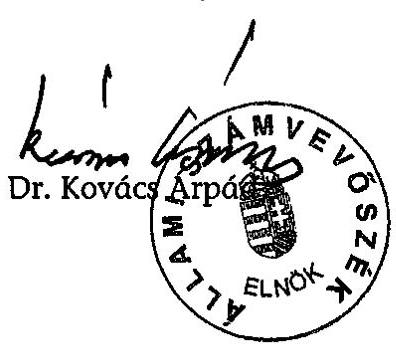

---

MELLÉKLETEK

---

1. sz. melléklet

a V-31-135/2004-2005. sz. jelentéshez

# A Nemzeti Kulturális Örökség Minisztériuma minisztere észrevételező levele

---

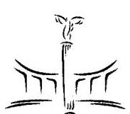

# NEMZETI KULTURÁLIS ÖRÖKSÉG MINISZTÉRIUMA 

## MINISZTER

Iktatószám: 2.1.1/299-3/2005.
Hivatkozási szám: V31-133/2004-2005.

Dr. Kovács Árpád úr
elnök
Állami Számvevőszék

Budapest

Tisztelt Elnök Úr!
$3 i^{\prime} \log _{0} i^{\prime}$.
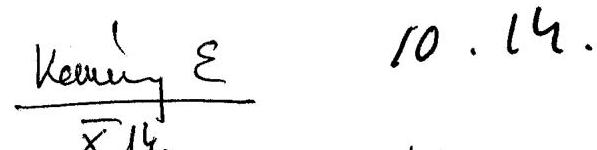
$10.14$.
$30 / 10$ ?
$10.17 \log _{1}-$
Köszönettel megkaptam a Nemzeti Kulturális Alapprogramra fordított pénzeszközök hasznosulásának ellenőrzéséről készült ÁSZ jelentést. Tájékoztatom, hogy a jelentés tartalmával egyetértek, azzal kapcsolatban nem kívánok észrevéteit tenni, ugyanakkor a javaslatok hasznosítására a tervezett törvénymódosítás és a végrehajtási rendelet korszerűsítése során törekedni fogunk.

Budapest, 2005. október „D „
Tisztelettel,
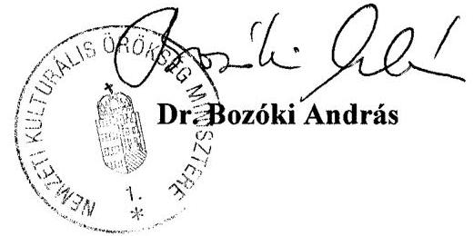

---

2. sz. melléklet a V-31-135/2004-2005. sz. jelentéshez

A Nemzeti Kulturális Alapprogram pályázati rendszerének folyamatábrája
(1999-2004 közötti időszakra vonatkozóan)

Döntéshozó testületek

Bizottság
Pályázati folyamat

Támogatási stratégia kidolgozása

Támogatási keretösszeg meghatározása

Támogatási keretösszeg meghatározása

Szakmai kollégiumok, miniszter,
Bizottság
Pályázati cél és pályázói kör meghatározása
(pályázati felhívás megfogalmazása)

A Bizottság elnöke
A pályázati felhívás ellenjegyzése

A pályázati felhívás közzététele

A pályázatok iktatása, számítógépes rögzítése

Döntéselőkészítés

Bírálat, döntés

A pályázati eredmények közzététele,
a pályázók értesítése

Szerződéskötés

A támogatások kiutalása

A pályázati cél megvalósítása

A támogatott pályázók elszámoltatása

A pályázat lezárása, archiválása
Pólyázatátási Osztály, Informatikai Osztály,
PR szolgálat,

Pályáztatási Osztály, Informatikai Osztály,
Pályáztatási Osztály, Informatikai Osztály

Pályáztatási Osztály, Elszámoltatási Osztály

Pályáztatási Osztály, PR szolgálat,
Informatikai Osztály

Igazgató, Gazdasági Osztály, Informatikai és
Pályáztatási Osztály

Gazdasági Osztály, Pályáztatási Osztály

Elszámoltatási Osztály

Elszámoltatási Osztály

---

# Az NKA kulturális szakfeladatainak részesedése a költségvetés kulturális kiadásaiból 2002-2003-ban 

Adatok: M Ft-ban

| Megnevezés | 2002 |  |  |
| :--: | :--: | :--: | :--: |
|  | NKA kulturális   szakfeladatai | Költségvetés   összesen | Arány |
| Könyv, zenemú- és lapkiadás | 562 | 2623 | $21,4 \%$ |
| Rádió-televízió músorszolgáltatás | 0 | 1695 | $0,0 \%$ |
| Közmúvelődési tevékenység | 1461 | 72082 | 2,0\% |
| ebből múvelődési házak, központok | 763 | 23072 | $3,3 \%$ |
| ebből könyvtárak | 319 | 23196 | $1,4 \%$ |
| ebből múzeumok, levéltárak | 379 | 25814 | $1,5 \%$ |
| Múvészeti tevékenység | 3169 | 54771 | $5,8 \%$ |
| ebből színházak | 396 | 22606 | $1,8 \%$ |
| ebből zene és táncmúvészet | 1241 | 12762 | $9,7 \%$ |
| Állat, növénykertek és nemzeti parkok tevékenysége | 0 | 7692 | $0,0 \%$ |
| Egyéb szórakoztatási kulturális tevékenység | 0 | 9219 | $0,0 \%$ |
| Összesen | 5192 | 148082 | $3,5 \%$ |

Adatok: M Ft-ban

| Megnevezés | 2003 |  |  |
| :--: | :--: | :--: | :--: |
|  | NKA kulturális   szakfeladatai | Költségvetés   összesen | Arány |
| Könyv, zenemú- és lapkiadás | 1413 | 3872 | $36,5 \%$ |
| Rádió-televízió músorszolgáltatás | 0 | 2095 | $0,0 \%$ |
| Közmúvelődési tevékenység | 981 | 86521 | $1,1 \%$ |
| ebből múvelődési házak, központok | 449 | 25886 | $1,7 \%$ |
| ebből könyvtárak | 171 | 27268 | $0,6 \%$ |
| ebből múzeumok, levéltárak | 361 | 33367 | $1,1 \%$ |
| Múvészeti tevékenység | 3089 | 49073 | $6,3 \%$ |
| ebből színházak | 379 | 26157 | $1,4 \%$ |
| ebből zene és táncmúvészet | 1145 | 15076 | 7,6\% |
| Állat, növénykertek és nemzeti parkok tevékenysége | 4 | 8602 | $0,0 \%$ |
| Egyéb szórakoztatási kulturális tevékenység | 0 | 13222 | $0,0 \%$ |
| Összesen | 5487 | 163385 | $3,4 \%$ |

Forrás: NKA, KSH
Megjegyzés: A 2004. évi KSH adatok a jelentés készítésekor meg nem álltak rendelkezésre.

---

4. sz. melléklet

a V-31-135/2004-2005. sz. jelentéshez

# DIAGRAMOK   $(1-8)$

---

1. sz. diagram a V-31-135/2004-2005. sz. jelentéshez

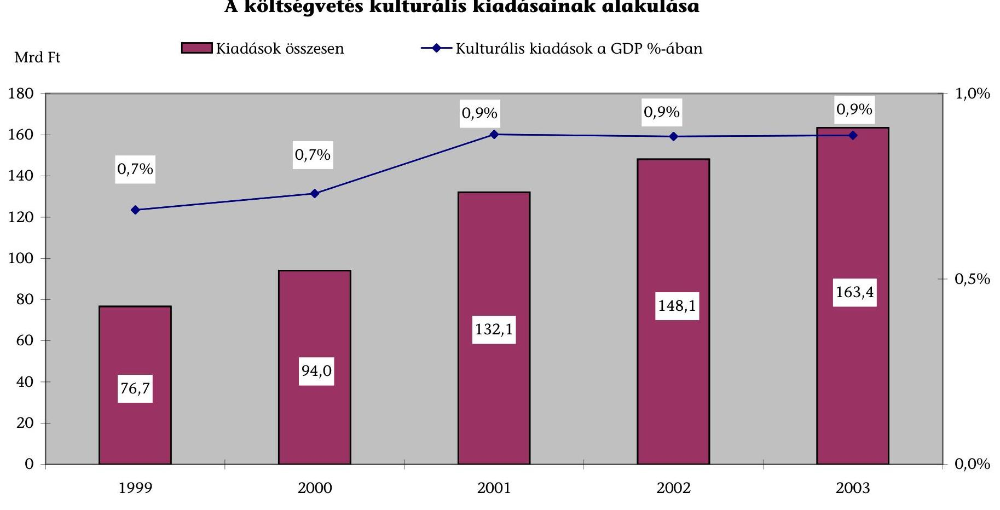

# A költségvetés kulturális kiadásainak alakulása

|  Mrd Ft | Kiadások összesen | Kulturális kiadások a GDP %-ában  |
| --- | --- | --- |
|  180 | 0.7% | 0.0%  |
|  160 | 0.7% | 0.0%  |
|  140 | 0.7% | 0.0%  |
|  120 | 0.7% | 0.0%  |
|  80 | 0.7% | 0.0%  |
|  60 | 0.7% | 0.0%  |
|  40 | 0.7% | 0.0%  |
|  20 | 0.7% | 0.0%  |
|  0 | 0.7% | 0.0%  |

Forrás: KSH: Magyar Statisztikai Évkönyv 2000, 2003; Magyarország Nemzeti Számlái 2002-2003. Megjegyzés: A 2004. évi adatok a jelentés készítésekor még nem voltak ismertek.

---

# A költségvetés kulturális kiadásai 1999-ben, tevékenységenként 

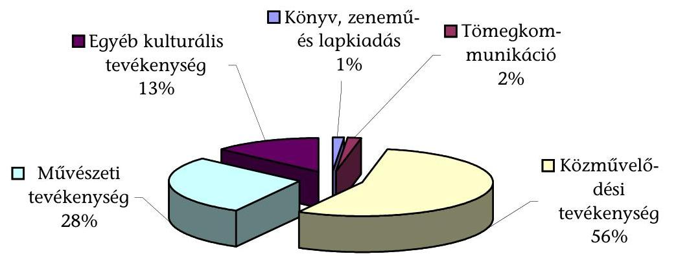
2/b. sz. diagram
a V-31-135/2004-2005. sz. jelentéshez

## A költségvetés kulturális kiadásai 2003-ban, tevékenységenként

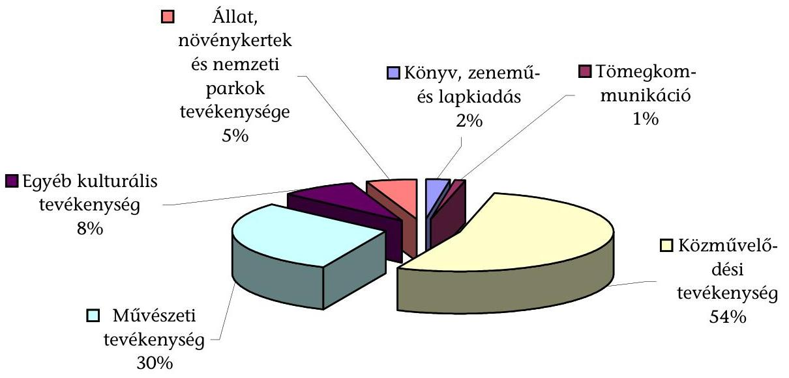

Forrás: KSH: Magyar Statisztikai Évkönyv 2000, 2003.

---

# Az NKA teljesített kiadásai jogcímenként a vizsgált időszakban 

$\square$ NKA Igazgatóság $\square$ Kollégiumi keretek $\square$ Miniszteri keret $\square$ Egyéb
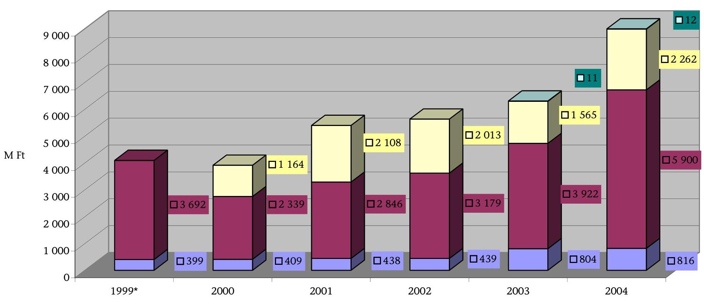

Forrás: 5. számú NKA tanúsítvány (költségvetési beszámolók adatai alapján)

---

4. sz. diagram a V-31-135/2004-2005. sz. jelentéshez

# A kollégiumi és a miniszteri keretből megítélt támogatások megoszlása 1999-2004 között

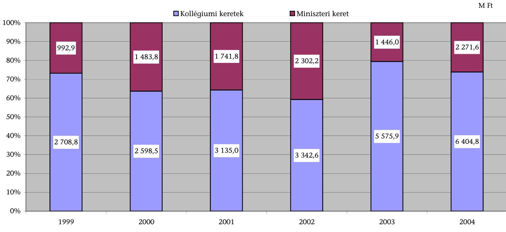

M Ft

|  1999 | 2000 | 2001 | 2002 | 2003 | 2004  |
| --- | --- | --- | --- | --- | --- |
|  100% | 992,9 | 1 483,8 | 1 741,8 | 2 302,2 | 1 446,0  |
|  90% |  |  |  |  | 2 271,6  |
|  80% |  |  |  |  |   |
|  70% |  |  |  |  |   |
|  60% |  |  |  |  |   |
|  50% |  |  |  |  |   |
|  40% |  |  |  |  |   |
|  30% |  |  |  |  |   |
|  20% |  |  |  |  |   |
|  10% |  |  |  |  |   |
|  0% |  |  |  |  |   |

Forrás: 11. számú NKA tanúsítvány

---

5. sz. diagram
a V-31-135/2004-2005. sz. jelentéshez
adatok: E Ft-ban

# Egy pályázatra jutó támogatás összege az állandó kollégiumoknál és a miniszteri keretnél 2004-ben 

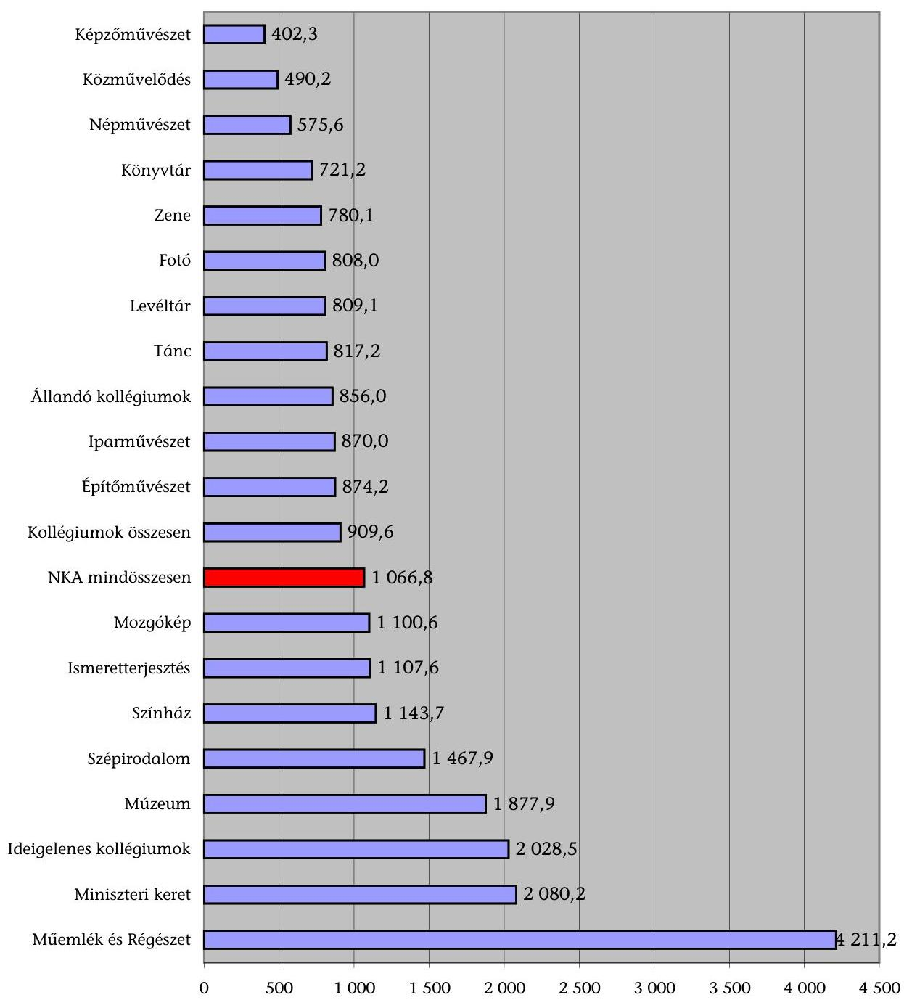

Forrás: 11. számú NKA tanúsítvány

---

# A nyertes pályázók szervezeti forma szerinti megoszlása 1999-ben és 2004-ben 

1999. év: 3692 M Ft
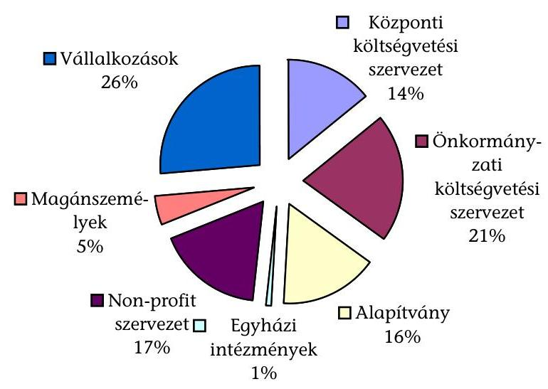
2004. év: 8174 M Ft
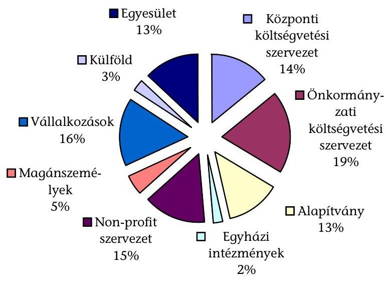

Forrás: 6. számú NKA tanúsítvány

---

7. sz. diagram

a V-31-135/2004-2005. sz. jelentéshez

# Az NKA támogatás kulturális szakterületek szerinti megoszlása 2004-ben 

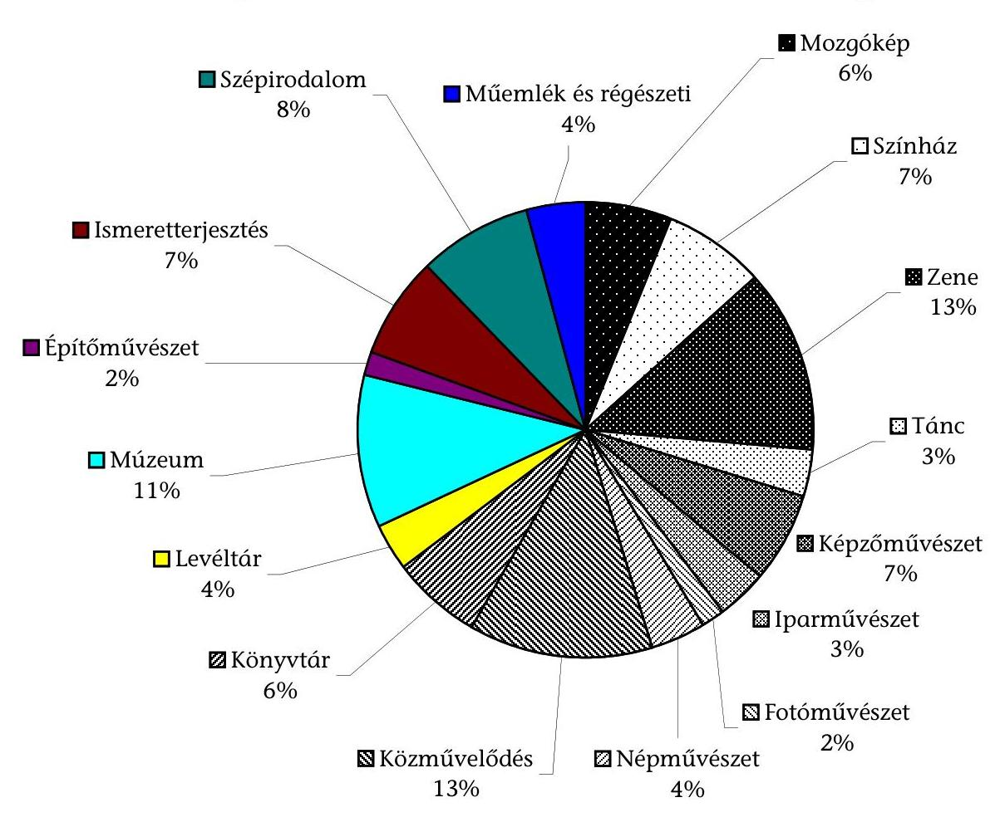

Forrás: 13. számú NKA tanúsítvány

---

# A 2004. évi NKA támogatás tevékenységenként 

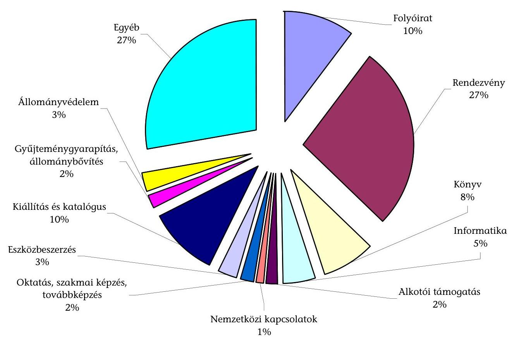

Forrás: NKA adatszolgáltatás

---

# TANÚSÍTVÁNYOK 

1. sz. tanúsítvány: A pályázati tevékenység részletezése a törvényi célkitűzések szerint 1999-2004. években
2. sz. tanúsítvány: A támogatott pályázatok részletezése a pályázók területi illetősége szerint
3. sz. tanúsítvány: A támogatott pályázatok részletezése a pályázat megvalósulásának helye szerint
4. sz. tanúsítvány: A miniszteri keret célok szerinti felhasználása az ellenőrzött időszakban
5. sz. tanúsítvány: Az NKA költségvetésének alakulása a vizsgált időszakban
6. sz. tanúsítvány: Az NKA teljesített kiadásai tevékenységenkénti bontásban, az egyéb pénzeszköz átadások részletezése a pályázók szervezeti formája szerint
7. sz. tanúsítvány: Az Igazgatóság kiadásainak alakulása kiemelt előirányzatonként
8. sz. tanúsítvány: A költségvetési létszám, valamint az egy alkalmazottra jutó pályázatok számának alakulása
9. sz. tanúsítvány: Az Igazgatóság eszközeinek és forrásainak alakulása
10. sz. tanúsítvány: A visszatérítendő támogatásoknál a követelések behajtási arányának alakulása
11. sz. tanúsítvány: Az NKA támogatások részletezése egyedi és pályázati döntés szerinti bontásban
12. sz. tanúsítvány: Az ellenőrzésbe vont állandó és ideiglenes szakmai kollégiumok pályázati tevékenysége
13. sz. tanúsítvány: Az NKA évenkénti támogatásának kulturális szakterületek szerinti megoszlása
14. sz. tanúsítvány: A pályázati elszámoltatások és a helyszíni ellenőrzések alakulása a vizsgált időszakban

---

# A pályázati tevékenység részletezése a törvényi célkitűzések szerint

## 1999-2004. években

|  Támogatott célok | 1999 |  |  | 2000 |  |  | 2001 |  |  | 2002 |  |  | 2003 |  |  | 2004 |  |   |
| --- | --- | --- | --- | --- | --- | --- | --- | --- | --- | --- | --- | --- | --- | --- | --- | --- | --- | --- |
|   | tám. pályázat (db) | megítélt tám. (M Ft) | megosz- tás (%) | tám. pályázat (db) | megítélt tám. (M Ft) | megosz- tás (%) | tám. pályázat (db) | megítélt tám. (M Ft) | megosz- tás (%) | tám. pályázat (db) | megítélt tám. (M Ft) | megosz- tás (%) | tám. pályázat (db) | megítélt tám. (M Ft) | megosz- tás (%) | tám. pályázat (db) | megítélt tám. (M Ft) | megosz- tás (%)  |
|  1. Megvédelítés, létrehozás | 2247 | 2023 | 54,65 | 2838 | 2520 | 61,74 | 4038 | 3129 | 64,17 | 3152 | 2180 | 38,62 | 2423 | 2182 | 31,08 | 2839 | 2509 | 28,91  |
|  2. Megővás, megőrzés | 150 | 78 | 2,10 | 201 | 134 | 3,28 | 279 | 165 | 3,38 | 333 | 221 | 3,92 | 488 | 358 | 5,67 | 616 | 724 | 8,30  |
|  3. Nyilvánosságra hozás | 1258 | 845 | 22,82 | 784 | 770 | 18,87 | 1175 | 888 | 18,22 | 1411 | 1378 | 24,42 | 1784 | 2323 | 33,08 | 1838 | 2420 | 27,9  |
|  4. Nemzetközi kapcsolatok | 513 | 221 | 5,98 | 513 | 271 | 6,64 | 552 | 248 | 5,09 | 588 | 950 | 17,59 | 649 | 750 | 10,68 | 869 | 1123 | 12,95  |
|  5. Kulturális évfordulók | 201 | 51 | 1,39 | 78 | 26 | 0,63 | 43 | 22 | 0,45 | 56 | 46 | 0,86 | 81 | 46 | 0,66 | 120 | 93 | 1,07  |
|  6. Tudományos kutatások | 41 | 21 | 0,58 | 8 | 4 | 0,10 | 46 | 27 | 0,55 | 77 | 62 | 1,10 | 126 | 82 | 1,17 | 159 | 164 | 1,69  |
|  7. Egyéb | 1440 | 462 | 12,49 | 1280 | 357 | 8,75 | 1071 | 397 | 8,15 | 948 | 762 | 13,31 | 1662 | 1240 | 17,66 | 1898 | 1643 | 18,60  |
|  Összesen | 5848 | 2791 | 100% | 5508 | 4062 | 100% | 7204 | 4876 | 100% | 6606 | 5645 | 100% | 7213 | 7521 | 100% | 8133 | 8676 | 100%  |

Igazolom, hogy a tanúsítványban szereplő adatok a nyilvántartások adataival megegyeznek.

Dátum: 2005. március 9.

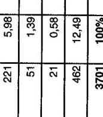

---

2. sz. tanúsítvány a V-31-135/2004-2005. sz. jelentéshez

Nemzeti Kulturális Alapprogram Kítőtésért felelős: dr. Óvári László, Debreczeni Gábor Telefon: 351-5481/106

A támogatott pályázatok részletezése a pályázók területi illetősége szerint

|  Terület | 1999 |  |  | 2000 |  |  | 2001 |  |  | 2002 |  |  | 2003 |  |  | 2004 |  |   |
| --- | --- | --- | --- | --- | --- | --- | --- | --- | --- | --- | --- | --- | --- | --- | --- | --- | --- | --- |
|   | Pályázatok db | Támogatás M Ft | Megosz tás % | Pályázatok db | Támogatás M Ft | Megosz tás % | Pályázatok db | Támogatás M Ft | Megosz tás % | Pályázatok db | Támogatás M Ft | Megosz tás % | Pályázatok db | Támogatás M Ft | Megosz tás % | Pályázatok db | Támogatás M Ft | Megosz tás %  |
|  Vidék | 3074 | 1149 | 31,05 | 2783 | 1130 | 27,68 | 3681 | 1404 | 28,79 | 3095 | 1710 | 30,30 | 3426 | 2170 | 31,00 | 4168 | 2941 | 33,91  |
|  Budapest | 2680 | 2512 | 67,87 | 2539 | 2574 | 63,06 | 3105 | 3258 | 66,82 | 3120 | 3727 | 66,02 | 3341 | 4599 | 65,00 | 3568 | 5514 | 63,55  |
|  Határon túli | 73 | 32 | 0,86 | 157 | 94 | 2,30 | 398 | 204 | 4,18 | 390 | 208 | 3,68 | 446 | 253 | 4,00 | 397 | 221 | 2,54  |
|  Külföldi magyar intézetek | 21 | 8 | 0,22 | 29 | 284 | 6,96 | 20 | 10 | 0,21 | 0 | 0 | 0 | 0 | 0 | 0 | 0 | 0 | 0  |
|  Összesen | 5848 | 3701 | 100% | 5508 | 4082 | 100% | 7204 | 4876 | 100% | 6605 | 5645 | 100% | 7213 | 7022 | 100% | 8133 | 8676 | 100%  |

Igazolom, hogy a tanúsítványban szereplő adatok a nyilvántartások adatával megegyeznek.

Dátum: 2005. március 9.

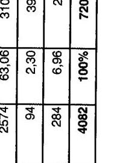

alárás

---

3. sz. tanúsítvány a V-31-135/2004-2005. sz. jelentéshez

Nemzeti Kulturális Alapprogram

Kitöltésért felelős: dr. Óvári László, Debreczeni Gábor

Telefon: 351-5461/106

A támogatott pályázatok részletezése a pályázat megvalósulásának helye szerint

|  Megvalósítás helye | 1999* |  | 2000* |  | 2001 |  | 2002 |  | 2003 |  | 2004 |   |
| --- | --- | --- | --- | --- | --- | --- | --- | --- | --- | --- | --- | --- | --- |
|   | Pályázatok db. | Támogatás M Ft. | Megosz- tás % | Pályázatok db. | Támogatás M Ft. | Megosz- tás % | Pályázatok db. | Támogatás M Ft. | Megosz- tás % | Pályázatok db. | Támogatás M Ft. | Megosz- tás % | Pályázatok db.  |
|  Nemzetközi | 0 | 0 | 0 | 0 | 0 | 577 | 504 | 10,34 | 472 | 804 | 14,25 | 483 | 621  |
|  Határon túli | 0 | 0 | 0 | 0 | 0 | 0 | 0 | 0 | 0 | 0 | 0 | 0 | 0  |
|  Küföld | 0 | 0 | 0 | 0 | 0 | 617 | 594 | 12,18 | 403 | 561 | 9,93 | 368 | 301  |
|  Küföldi magyar int. | 0 | 0 | 0 | 0 | 0 | 152 | 114 | 2,34 | 57 | 103 | 1,83 | 60 | 74  |
|  Országos | 0 | 0 | 0 | 0 | 0 | 1454 | 1403 | 28,78 | 1635 | 1580 | 27,99 | 1588 | 2453  |
|  Budapest | 0 | 0 | 0 | 0 | 0 | 1236 | 1164 | 23,85 | 1315 | 1147 | 20,32 | 1529 | 1706  |
|  Több megye | 0 | 0 | 0 | 0 | 0 | 190 | 68 | 1,40 | 216 | 116 | 2,05 | 280 | 164  |
|  Megyei szinten | 0 | 0 | 0 | 0 | 0 | 703 | 366 | 7,50 | 699 | 391 | 6,92 | 747 | 554  |
|  Település | 0 | 0 | 0 | 0 | 0 | 2275 | 664 | 13,62 | 1430 | 711 | 12,80 | 1715 | 900  |
|  Összesen | 0 | 0 | 0% | 0 | 0 | 0% | 7204 | 4877 | 100% | 6605 | 5645 | 100% | 7213  |

- Az 1999-2000. évben a pályázat megvalósulásának helyét az NKA Igazgatósága még nem tartotta nyitásigazolom, hogy a tanúsítványban szereplő adatok a nyilvántartások adataival megegyeznek.

Dátum: 2005. március 9.

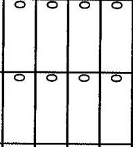

aláírás

---

4. sz. tanúsítvány a V-31-135/2004-2005. sz. jelentéshez

Nemzeti Kulturaíla Alapprogram Kitöltésért felelős: dr. Óvári László, Debreczeni Gábor Telefon: 351-5461/106

A miniszteri keret célok szerinti felhasználása az ellenőrzött időszakban

|  Megnevezés | 1988 |  |  |  | 2000 |  |  |  | 2001 |  |  |  | 2002 |  |  |  | 2003 |  |  |  | 2004 |  |  |   |
| --- | --- | --- | --- | --- | --- | --- | --- | --- | --- | --- | --- | --- | --- | --- | --- | --- | --- | --- | --- | --- | --- | --- | --- | --- |
|   | Pályázatok száma | támogatás M Ft | % | Pályázatok száma | támogatás M Ft | % | Pályázatok száma | támogatás M Ft | % | Pályázatok száma | támogatás M Ft | % | Pályázatok száma | támogatás M Ft | % | Pályázatok száma | támogatás M Ft | % | Pályázatok száma | támogatás M Ft | % | Pályázatok száma | támogatás M Ft | %  |
|   | elbír. | tám. |  | elbír. | tám. |  | elbír. | tám. |  | elbír. | tám. |  | elbír. | tám. |  | elbír. | tám. |  | elbír. | tám. |  | elbír. | tám.  |
|  Miniszteri keretből teljesített kifizetések összesen | 675 | 610 | 960 | 100% | 885 | 747 | 1483 | 100% | 868 | 868 | 1742 | 100% | 1290 | 1156 | 2277 | 100% | 387 | 363 | 1426 | 100% | 1391 | 1093 | 2272  |
|  eldről: |  |  |  |  |  |  |  |  |  |  |  |  |  |  |  |  |  |  |  |  |  |  |   |
|  - nagyrendezvényekre | 13 | 13 | 473 | 47,83 | 9 | 9 | 518 | 34,93 | 8 | 8 | 484 | 27,79 | 12 | 12 | 624 | 27,40 | 7 | 7 | 212 | 14,87 | 2 | 2 | 152  |
|  - központi intézményeknek | 0 | 0 | 0 | 0,00 | 200 | 200 | 425 | 28,68 | 252 | 252 | 496 | 28,47 | 263 | 263 | 540 | 23,72 | 20 | 20 | 250 | 17,53 | 60 | 60 | 442  |
|  - kiemelkedő műhelyeknek | 0 | 0 | 0 | 0,00 | 2 | 2 | 40 | 2,70 | 2 | 2 | 38 | 2,18 | 1 | 1 | 40 | 1,76 | 3 | 3 | 150 | 10,52 | 7 | 7 | 163  |
|  - pályázatással elbírált | 140 | 75 | 119 | 11,98 | 215 | 77 | 107 | 7,22 | 5 | 5 | 8 | 0,46 | 219 | 85 | 120 | 5,27 | 15 | 11 | 20 | 1,40 | 711 | 412 | 131  |
|  - egyéb | 522 | 522 | 401 | 40,38 | 459 | 459 | 383 | 26,50 | 601 | 601 | 748 | 41,10 | 795 | 795 | 953 | 41,85 | 322 | 322 | 814 | 57,08 | 611 | 611 | 1384  |

taszolom, hogy a tanúsítványban szereplő adatok a nyilvántartások adataival megegyeznek.

Dátum: 2009. március 9.

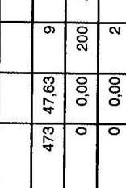

---

5. sz. tanúsítvány a V-31-135/2004-2005. sz. jelentéshez

Nemzeti Kulturaös Alapprogrom Kötítésért felelős: Kiszolt Jenőné Telefon:201-5461/130

Az NKA költségvetésének alakulása a vizsgált időszakban

|  Megnevezés | 1999 |  |  | 2000 |  |  | 2001 |  |  | 2002 |  |  | 2003 |  |  | 2004 |  |   |
| --- | --- | --- | --- | --- | --- | --- | --- | --- | --- | --- | --- | --- | --- | --- | --- | --- | --- | --- |
|   | eredeti
allárányzat | tényleges | tényl.
összét,
%-a | eredeti
allárányzat | tényleges | tényl.
összét,
%-a | eredeti
allárányzat | tényleges | tényl.
összét,
%-a | eredeti
allárányzat | tényleges | tényl.
összét,
%-a | eredeti
allárányzat | tényleges | tényl.
összét,
%-a | eredeti
allárányzat | tényleges | tényl.
összét,
%-a  |
|  1. BEVÉTELEN ÖSSZESZEN | 4628 | 4554 | 100% | 4628 | 6290 | 100% | 5610 | 6675 | 100% | 6110 | 7280 | 100% | 7365 | 9920 | 100% | 9002 | 12803 | 100%  |
|  ebből: |  |  |  |  |  |  |  |  |  |  |  |  |  |  |  |  |  |   |
|  - kulturális járulék | 4600 | 3890 | 80,3 | 4600 | 4388 | 82,9 | 5500 | 5075 | 77,2 | 6000 | 5971 | 82,0 | 7250 | 8031 | 81,8 | 8667 | 7800 |   |
|  - támogatási visszafizetések |  | 107 | 2,2 |  | 120 | 2,2 |  | 102 | 1,8 |  | 119 | 1,7 |  | 94 | 0,8 |  | 101 | 0,8  |
|  - átvett pénzeszközök |  |  |  |  |  |  |  |  |  |  |  |  |  | 160 | 1,6 |  | 458 | 3,6  |
|  - kötőek, késedeleti pótlék | 12 | 16 | 0,3 | 12 | 14 | 0,2 | 110 | 10 |  | 115 | 7 |  | 115 | 4 |  | 115 | 6 |   |
|  - egyéb | 16 | 14 | 0,3 | 16 | 11 | 0,2 |  | 5 |  |  |  |  |  |  |  |  | 13 | 0,1  |
|  - előző évi pénzmaradvány felhasználása |  | 818 | 16,5 |  | 763 | 14,5 |  | 1363 | 21,2 |  | 1163 | 16,3 |  | 1649 | 16,8 |  | 3626 | 30,3  |
|  8. KIÁDÁSOK ÖSSZESZEN | 4628 | 4591 | 100% | 4628 | 3912 | 100% | 5910 | 6392 | 100% | 6110 | 5631 | 100% | 7365 | 6302 | 100% | 9002 | 6996 | 100%  |
|  ebből: |  |  |  |  |  |  |  |  |  |  |  |  |  |  |  |  |  |   |
|  - NKA igazgatóság kiadásai | 398 | 399 | 9,6 | 409 | 408 | 10,4 | 436 | 438 | 6,1 | 435 | 438 | 7,8 | 804 | 804 | 12,8 | 919 | 919 | 6,1  |
|  - szakmai kollégium keretek felhasználása | 4229 | 3692 | 80,2 | 4219 | 2338 | 59,8 | 5172 | 2946 | 52,8 | 5676 | 3179 | 56,4 | 6051 | 5922 | 62,2 | 6081 | 5930 | 69,6  |
|  - sénézket keret felhasználása |  |  |  |  | 1154 | 29,5 |  | 2108 | 39,1 |  | 2013 | 35,8 |  | 1995 | 24,9 | 1990 | 2262 | 25,3  |
|  - egyéb |  |  |  |  |  |  |  |  |  |  |  |  |  | 10 | 11 | 0,1 | 12 | 0,1  |
|  TÁRÓTÉVI PÉNDMARADVÁNY |  | 792 | 18,7 |  | 1284 | 35,4 |  | 1153 | 21,9 |  | 1649 | 25,2 |  | 3025 | 87,8 |  | 3013 | 32,8  |

Igazalom, hogy a tanúsítványban szereplő adatok a nyilvántartások adataival megegyeznek.

P.H.

Dák Budapest,2005.03.07

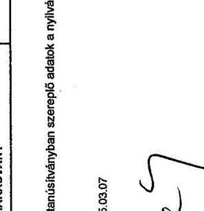

---

6. sz. tanúsítvány a V-31-135/2004-2005. sz. jelentéshez

Nemzeti Kulturális Alapprogram Kitöltésért felelős: Klucsik Jenőné Telefon: 351-5461/130

Az NKA teljesített kiadásai tevékenységenkénti bontásban, az egyéb pénzeszköz átadások részletezése a pályázók szervezeti formája szerint

|  Megnevezés | 1999 |  | 2000 |  | 2001 |  | 2002 |  | 2003 |  | 2004 |   |
| --- | --- | --- | --- | --- | --- | --- | --- | --- | --- | --- | --- | --- |
|   |  |  |  |  |  |  |  |  |  |  |  |   |
|   |  |  |  |  |  |  |  |  |  |  |  |   |
|  NKA KIADÁSOK ÖSSZESEN | 4091 |  | 100% | 3912 | 100% | 5392 | 100% | 5631 | 100% | 6302 | 100% | 8990  |
|  ebből: |  |  |  |  |  |  |  |  |  |  |  |   |
|  A. NKA igazgatóság működési kiadásai | 399 |  | 9,8 | 409 | 10,5 | 339 | 6,3 | 353 | 6,3 | 810 | 12,9 | 527  |
|  B. NKA igazgatóság felhalmozási kiadásai |  |  |  |  |  | 99 | 1,8 | 86 | 1,5 |  |  | 269  |
|  C. Egyéb pénzeszköz átadások összesen ebből: | 3692 |  | 90,2 | 3503 | 89,5 | 4954 | 91,9 | 5192 | 92,2 | 5497 | 87,1 | 8174  |
|  C/1. Államháztartáson belülre: | 1.293 |  | 31,5 | 1.155 | 29,5 | 1.356 | 25,2 | 1.446 | 25,7 | 1.465 | 23,3 | 2.749  |
|  - központi költségvetési | 525 |  | 12,8 | 529 | 13,5 | 562 | 10,4 | 499 | 8,8 | 535 | 8,5 | 1.165  |
|  - önkormányzati intézmény | 768 |  | 18,7 | 626 | 16 | 794 | 14,8 | 947 | 16,9 | 938 | 14,8 | 1584  |
|  C/2. Államháztartáson kívülre: | 2399 |  | 58,7 | 2348 | 60 | 3556 | 66,7 | 3746 | 66,5 | 4023 | 63,8 | 5425  |
|  - alapítvány | 586 |  | 14,3 | 574 | 14,7 | 632 | 11,7 | 701 | 12,4 | 660 | 14 | 1038  |
|  - egyesület |  |  |  |  |  | 471 | 8,7 | 674 | 12 | 755 | 12 | 1074  |
|  - egyházi intézmények | 31 |  | 0,8 | 38 | 1 | 95 | 1,8 | 97 | 1,7 | 87 | 1,4 | 176  |
|  - non profit szervezet | 634 |  | 15,5 | 677 | 22,4 | 1184 | 22 | 965 | 17,1 | 944 | 15 | 1221  |
|  - magánszemélyek | 177 |  | 4,3 | 197 | 5 | 254 | 4,7 | 262 | 4,7 | 215 | 3,4 | 382  |
|  - vállalkozások | 871 |  | 23,9 | 662 | 16,9 | 848 | 15,7 | 582 | 15,7 | 968 | 15,3 | 1305  |
|  - külföld |  |  |  |  |  | 114 | 2,1 | 165 | 2,9 | 174 | 2,7 | 224  |

Igazolom, hogy a tanúsítványban szereplő adatok a nyilvántartások adatával megegyeznek.

P.H.

Dátum: 351-5461/130

P.H.

P. 31. 135/2004-2005. sz. jelentéshez

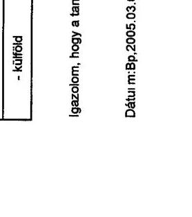

---

## 7. sz. tanúsítvány a V-31-135/2004-2005. sz. jelentéshez

## Nemzeti Kulturális Alapprogram

Kitöltésért felelős: Ékessy Éva

Telefon: 351-5461/126

## Az Igazgatóság kiadásainak alakulása kiemelt előirányzatonként

|  Megnevezés | 1999 |  |  | 2000 |  |  | 2001 |  |  | 2002 |  |  | 2003 |  |  | 2004 |  |   |
| --- | --- | --- | --- | --- | --- | --- | --- | --- | --- | --- | --- | --- | --- | --- | --- | --- | --- | --- |
|   | eredeti
elői. | tényl. | telj.
ben | eredeti
elői. | tényl. | telj.
ben | eredeti
elői. | tényl. | telj.
ben | eredeti
elői. | tényl. | telj.
ben | eredeti
elői. | tényl. | telj
ben | eredeti
elői. | tényl. | telj
ben  |
|  1. Személyi juttatások | 134,6 | 126,7 | 94% | 141,4 | 141,4 | 100 | 11,3 | 184,3 | 1630,9 | 11,3 | 196,9 | 1742,5 | 253,9 | 236,7 | 93,2 | 329,9 | 312,4  |
|  ebből |  |  |  |  |  |  |  |  |  |  |  |  |  |  |  |  |  |   |
|  - rendszeres személyi juttatások | 71,6 | 69,2 | 63% | 79,7 | 62,2 | 76 |  | 77,1 |  |  | 104,4 |  | 160,7 | 125,6 | 78,2 | 288 | 181,8  |
|  - nem rendszeres személyi juttatások | 21,7 | 33,9 | 156% | 19,6 | 40,7 | 233,2 |  | 69 |  |  | 62,3 |  | 35,4 | 60 | 183,6 | 51,9 | 97,2  |
|  - külső személyi juttatások | 41,3 | 33,6 | 81% | 42,1 | 33,5 | 79,6 | 11,3 | 35,2 | 335,1 | 11,3 | 40,2 | 355,8 | 87,8 | 46,1 | 79,8 | 73 | 63,4  |
|  2. Tői járulék, egészségügyi és táppénz hozzájárulások | 47,0 | 35,5 | 75,5 | 40,9 | 42,7 | 105,2 |  | 50,9 |  |  | 52,4 |  | 63,7 | 62,5 | 98,1 | 84,4 | 79,9  |
|  3. Munkaadókat terhedi járulékok | 2,8 | 2,8 | 100 | 3,1 | 3,2 | 103,2 |  | 4,1 |  |  | 4,6 |  | 5,8 | 5,2 | 92,9 | 7,1 | 7,3  |
|  4. Dologi kiadások | 96,1 | 86,7 | 90,2 | 96,1 | 78,6 | 81,8 |  | 114,3 |  |  | 108,2 |  | 198,8 | 97,1 | 48,8 | 212 | 143,8  |
|  5. Egyéb folyó kiadások |  | 3,9 |  | 4,8 | 4,8 | 104,4 |  | 3,8 |  |  | 4,3 |  | 4,7 | 4,7 | 100 | 8 | 8  |
|  6. Egyéb működési célú kiadások | 25,5 | 20,2 | 79,2 | 25,5 | 20,2 | 79,2 |  | 13,3 |  |  | 10 |  |  |  |  |  | 12,5  |
|  7. Kamatkiadások |  |  |  |  |  |  |  |  |  |  |  |  |  |  |  |  |   |
|  8. Felhalmozási kiadások | 128,6 | 34,4 | 26,7 | 128,6 | 11,7 | 9,1 |  | 29 |  |  | 38,8 |  | 288,6 | 604,4 | 205,4 | 288,8 | 49,4  |
|  ebből |  |  |  |  |  |  |  |  |  |  |  |  |  |  |  |  |   |
|  - felújítás | 29 | 1,8 | 5,5 | 29 | 0,1 | 0,3 |  |  |  |  |  |  | 16,6 |  |  |  |   |
|  - beruházás | 99,6 | 32,9 | 31,3 | 99,6 | 11,6 | 11,7 |  | 29 |  |  | 38,5 |  | 272 | 604,4 | 222,2 | 288,8 | 49,4  |
|  - egyéb |  |  |  |  |  |  |  |  |  |  |  |  |  |  |  |  |   |
|  9. Költségvetési kiadások | 434,6 | 310,2 | 71,4 | 439,9 | 302,6 | 68,8 | 11,3 | 399,7 | 3537,2 | 11,3 | 412,9 | 3684 | 810,3 | 1010,6 | 123,9 | 930 | 613,3  |

Igazolom, hogy a tanúsítványban szereplő adatok a nyilvántartások adataival megegyeznek.

Dátum: 2005. Március 9.

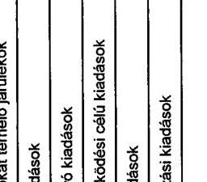

---

8. sz. tanúsítvány a V-31-135/2004-2005. sz. jelentéshez

Nemzeti Kulturális Alapprogram Kötítésért felelős: Ékessy Éva Telefon: 351-5481/126

A költségvetési létszám, valamint az egy alkalmazottra jutó pályázatok számának alakulása

|  |   |   |   |   |   |   |   |   |   |   |   |   |   |   |   |   |   |   |   |   |   |   |   |   |   |   |   |   |   |   |   |   |   |   |   |   |   |   |   |   |   |   |   |   |   |   |   |   |   |   |   |   |   |   |   |   |   |   |   |   |   |   |   |   |   |   |   |   |   |   |   |   |   |   |   |   |   |   |   |   |   |   |   |   |   |   |   |   |   |   |   |   |   |   |   |   |   |   |   |   |

---

Nemzeti Kulturális Alapprogram Kitöltésért felelős: Ékessy Éva Telefon: 351-5461/126 9. sz. tanúsítvány a V-31-135/2004-2005. sz. jelentéshez

Az Igazgatóság eszközeinek és forrásainak alakulása

|  Sorsz. | Megnevezés | 1999. december 31. | 2000. december 31. | 2001. december 31. | 2002. december 31. | 2003. december 31. | 2004. december 31.  |
| --- | --- | --- | --- | --- | --- | --- | --- |
|  I. | Immateriális javak | 13,1 | 12,8 | 15,3 | 22,1 | 27 | 34,3  |
|  1. | Ingatlanok | 80 | 78,3 | 78,9 | 85,8 | 84,5 | 82,6  |
|  2. | Gápek, berendezések, felszerelések | 16,7 | 11,4 | 16 | 18,9 | 18,3 | 16,3  |
|  3. | Járművek | 0,6 | 0,1 |  |  | 4,9 | 3,9  |
|  4. | Állatok |  |  |  |  |  |   |
|  5. | Beruházások, felújítások |  |  |  |  | 569,8 | 581,6  |
|  6. | Beruházásra adott előlegek |  |  |  |  |  |   |
|  II. | Tárgyi eszközök összesen | 97,3 | 89,8 | 94,9 | 104,7 | 677,5 | 684,4  |
|  III. | Befektetett pénzügyi eszközök |  |  |  |  |  |   |
|  IV. | Üzemeltetésre, kezelésre, konc. adott eszközök |  |  |  |  |  |   |
|  A. | BEFEKTETETT ESZKÖZÖK ÖSSZESEN | 110,4 | 102,6 | 110,2 | 126,8 | 704,5 | 718,7  |
|  I. | Készletek összesen |  |  |  |  |  |   |
|  II. | Követelések összesen |  |  |  |  |  |   |
|   | ebből: követelések, áruszállítás és szolgáltatás |  |  |  |  |  |   |
|  III. | Értékpapírok összesen |  |  |  |  |  |   |
|  IV. | Pénzeszközök összesen | 125,2 | 247,2 | 293 | 330,3 | 138,7 | 365,8  |
|  V. | Egyéb aktív pénzügyi elszámolások | 0,7 | 0,8 | 1,0 | 2 | 2,6 | 2,3  |
|  B. | FORGÓESZKÖZÖK ÖSSZESEN | 125,9 | 248 | 294,5 | 332,3 | 133,5 | 368,3  |
|   | ESZKÖZÖK ÖSSZESEN | 236,3 | 350,6 | 404,7 | 459,1 | 838 | 1087  |
|  1. | Induló tőke |  |  |  |  |  |   |
|  2. | Tőkeváltozások | 106,9 | 98,6 | 100,6 | 118,7 | 701 | 711,7  |
|  D. | SAJÁT TÖKE | 106,9 | 98,6 | 100,6 | 118,7 | 701 | 711,7  |
|  I. | Költségvetési tartalékok | 125,9 | 248 | 294,5 | 332,3 | 133,5 | 368,3  |
|  II. | Vállalkozási tartalékok |  |  |  |  |  |   |
|  E. | TARTALÉKOK ÖSSZESEN | 125,9 | 248 | 294,5 | 332,3 | 133,5 | 368,3  |
|  I. | Hosszúlejáratú kötelezettségek |  |  |  |  |  |   |
|  II. | Rövidlejáratú kötelezettségek | 3,9 | 4 | 9,6 | 8,1 | 3,5 | 6,9  |
|   | ebből: kötelezettség áruszállításból és szolgáltatásból | 3,9 | 4 | 9,6 | 8,1 | 3,5 | 6,9  |
|  III. | Egyéb passzív pénzügyi kötelezettségek összesen |  |  |  |  |  | 6,1  |
|  F. | KÖTELEZETTSÉGEK ÖSSZESEN | 3,9 | 4 | 9,6 | 8,1 | 3,5 | 7  |
|   | FORRÁSOK ÖSSZESEN | 236,3 | 350,6 | 404,7 | 459,1 | 838 | 1087  |

Igazolom, hogy a tanúsítványban szereplő adatok a nyilvántartások adatainak megegyezéseit.

---

1. sz. tanúsítvány a V-31-135/2004-2005. sz. jelentéshez

Nemzeti Kulturális Alapprogram Kítőtésért felelős: Barna Márton Telefon: 351-54-61 / 107

A visszatérítendő támogatásoknál a követelések behajtási arányának alakulása

|  Megnevezés | 1999 | 2000 | 2001 | 2002 | 2003 | 2004  |
| --- | --- | --- | --- | --- | --- | --- |
|  Teljesített támogatások összege (E Ft) * | 3.701.702 | 4.082.329 | 4.876.767 | 5.644.770 | 7.021.916 | 8.676.401  |
|  ebből: |  |  |  |  |  |   |
|  - visszatérítendő (E Ft) | 33 000 | 18.500 | 5.000 | 6.300 |  | 3.560  |
|  - vissza nem térítendő (E Ft) | 3.668.702 | 4.063.829 | 4.871.767 | 5.638.470 | 7.021.916 | 8.672.841  |
|  A visszatérítendő támogatásokból december 31-én a követelések összege (E Ft) | 0 | 0 | 0 | 0 | 0 | 0  |
|  Hátralékok, határidőn túli be nem hajtott követelések december 31-én (E Ft) | 0 | 0 | 0 | 0 | 0 | 0  |
|  Behajtott követelések (E Ft) | 0 | 0 | 0 | 0 | 0 | 0  |
|  Követelésbehajtási arány (%) | 0 | 0 | 0 | 0 | 0 | 0  |

- A miniszteri keret - és a kollégiumi keretek terhére vállalt kötelezettségek összege - nem a tényleges pénzforgalom.

Igazolom, hogy a tanúsítványban szereplő adatok a nyilvántartások adataival megjegyzik.

Dátum: 2005. március 08

aláírás

---

Nemzeti Kulturális Alapprogram 11. sz. tanúsítvány a V-31-135/2004-2005. sz. jelentéshez

Kitöltésért felelős: dr. Óvári László, Debreczeni Gábor Telefon: 351-5461/106

Az NKA támogatások részletezése egyedi és pályázati döntés szerinti bontásban adatok: db, illetve E FI

|  Megnevezése | 1999 | 2000 | 2001 | 2002 | 2003 | 2004  |
| --- | --- | --- | --- | --- | --- | --- |
|   | pály. száma (db) | meglátó táv | pály. száma (db) | meglátó táv | pály. száma (db) | meglátó táv  |
|  1. SZAKMAI KOLLEGENE TÁM. ÖSSZESEN | 6322 | 2759759 | 4751 | 3588540 | 6556 | 3134570  |
|  ebből: |  |  |  |  |  |   |
|  A. Egyedi elbírálással támogatott | 204 | 109961 | 216 | 100000 | 234 | 100700  |
|  A. Árányo összesen egyedi elbírálással (%) | 0,04 | 0,03 | 4,94 | 4,95 | 0,05 | 0,20  |
|  Kolleghalék összesen |  |  |  |  |  |   |
|  10 Mozgókép | 24 | 15080 | 17 | 20890 | 6 | 16650  |
|  11 Irodalom | 21 | 32991 | 25 | 18750 | 22 | 11260  |
|  12 Folyóirat | 3 | 956 | 0 | 0 | 0 | 0  |
|  13 Színház | 10 | 9200 | 20 | 23800 | 15 | 17450  |
|  14 Zene | 42 | 17953 | 15 | 12240 | 6 | 12225  |
|  15 Tánc | 8 | 5980 | 16 | 11351 | 10 | 7296  |
|  16 Képzőművészet | 49 | 32947 | 34 | 23740 | 70 | 40390  |
|  17 Iparművészet | 50 | 20800 | 31 | 14450 | 45 | 33731  |
|  18 Fotó | 21 | 6245 | 12 | 8512 | 6 | 7140  |
|  19 Népművészet | 4 | 3400 | 3 | 1400 | 9 | 2977  |
|  20 Közművelődés | 1 | 2000 | 18 | 4962 | 6 | 4986  |
|  21 Könyvtár | 0 | 0 | 9 | 4060 | 1 | 15000  |
|  22 Leváltár | 10 | 13003 | 14 | 8000 | 10 | 9000  |
|  23 Múzeum | 7 | 7700 | 2 | 4500 | 3 | 7000  |
|  24 Építőművészet | 0 | 0 | 0 | 0 | 19 | 10890  |
|  25 Ismenterjesztés | 0 | 0 | 0 | 0 | 0 | 5  |
|  26 Szépirodalom | 0 | 0 | 0 | 0 | 0 | 0  |
|  27 Műenték és Régészet | 0 | 0 | 0 | 0 | 0 | 0  |
|  60 Kultúra 2000 | 0 | 0 | 0 | 0 | 0 | 0  |
|  61 Millenáris | 0 | 0 | 0 | 0 | 0 | 0  |
|  62 EU Kommunikáció | 0 | 0 | 0 | 0 | 0 | 0  |
|  63 Külhori Intézmények | 0 | 0 | 0 | 0 | 0 | 0  |
|  64 Művészetoldalás | 0 | 0 | 0 | 0 | 0 | 0  |
|  65 Holocaust | 0 | 0 | 0 | 0 | 0 | 0  |
|  70 Digitális Média | 0 | 0 | 0 | 0 | 0 | 0  |
|  71 Magyar Művészet | 0 | 0 | 0 | 0 | 0 | 0  |
|  72 Kulturális Tűrisztika | 0 | 0 | 0 | 0 | 0 | 0  |
|  74 Fogyatékkal élőik | 0 | 0 | 0 | 0 | 0 | 0  |
|  75 Közkultura Informatika | 0 | 0 | 0 | 0 | 0 | 0  |
|  76 Digitális Médieművészet 2004 | 0 | 0 | 0 | 0 | 0 | 0  |
|  80 Közgyűjteményi Testület | 0 | 0 | 0 | 0 | 0 | 0  |
|  81 Népművészet-Tánc | 1 | 1000 | 0 | 0 | 0 | 0  |
|  82 Közművelődés-Könyvtár | 0 | 0 | 0 | 0 | 0 | 0  |
|  83 Közművelődés-Zene | 13 | 2549 | 0 | 0 | 0 | 0  |
|  98 NKA Lebergyűlítású pályázatok | 0 | 0 | 0 | 0 | 0 | 0  |
|  II. Pályázati döntéssel támogatva | 4574 | 2938796 | 4549 | 3441885 | 5102 | 2628175  |
|  A. Árányo összesen pályázati döntéssel (%) | 94,98 | 91,73 | 95,46 | 93,97 | 96,31 | 93,76  |
|  Kolleghalék összesen |  |  |  |  |  |   |
|  10 Mozgókép | 261 | 244858 | 302 | 256348 | 380 | 276173  |
|  11 Irodalom | 463 | 224799 | 400 | 231948 | 519 | 284624  |

---

|  Megnevezése | 1999 |  | 2000 |  | 2001 |  | 2002 |  | 2003 |  | 2004 |   |
| --- | --- | --- | --- | --- | --- | --- | --- | --- | --- | --- | --- | --- |
|   | pály. száma (dib) | meghálló (dib) | pály. száma (dib) | meghálló (dib) | pály. száma (dib) | meghálló (dib) | pály. száma (dib) | meghálló (dib) | pály. száma (dib) | meghálló (dib) | pály. száma (dib) | meghálló (dib)  |
|  12 Folyóirat | 82 | 188100 | 100 | 191666 | 133 | 244400 | 0 | 0 | 0 | 0 | 0 | 0  |
|  13 Színház | 255 | 256652 | 252 | 225115 | 204 | 288844 | 218 | 280200 | 327 | 401030 | 328 | 365180  |
|  14 Zene | 302 | 208210 | 350 | 181970 | 366 | 229861 | 369 | 246235 | 384 | 378507 | 495 | 379144  |
|  15 Tánc | 149 | 129267 | 168 | 121829 | 213 | 142833 | 196 | 147942 | 266 | 228554 | 286 | 229548  |
|  16 Képzőművészet | 530 | 214279 | 365 | 214240 | 596 | 244269 | 521 | 247805 | 770 | 481584 | 971 | 395270  |
|  17 Iparművészet | 247 | 145574 | 230 | 164970 | 282 | 191688 | 240 | 157931 | 426 | 345058 | 326 | 281591  |
|  18 Fotó | 129 | 69245 | 95 | 61708 | 140 | 72091 | 145 | 75905 | 180 | 152530 | 168 | 136288  |
|  19 Népművészet | 296 | 103748 | 264 | 113579 | 292 | 127106 | 402 | 166581 | 526 | 223437 | 520 | 296826  |
|  20 Közművelődés | 1214 | 267285 | 1308 | 307130 | 1943 | 354690 | 765 | 305152 | 972 | 401909 | 964 | 450842  |
|  21 Könyvtár | 411 | 153152 | 290 | 147104 | 486 | 183238 | 521 | 194106 | 622 | 268335 | 607 | 438480  |
|  22 Leváltár | 172 | 80735 | 151 | 80489 | 156 | 83354 | 214 | 111592 | 196 | 145366 | 366 | 297563  |
|  23 Múzeum | 170 | 164405 | 191 | 104462 | 245 | 134221 | 298 | 160989 | 393 | 318395 | 388 | 727985  |
|  24 Építőművészet | 0 | 0 | 33 | 30006 | 91 | 69241 | 96 | 70297 | 176 | 176343 | 141 | 123508  |
|  25 Ismenetlerjesztés | 0 | 0 | 0 | 0 | 0 | 0 | 258 | 243298 | 406 | 465687 | 333 | 368589  |
|  26 Széprodalom | 0 | 0 | 0 | 0 | 0 | 0 | 473 | 333487 | 357 | 654609 | 252 | 375145  |
|  27 Műemlék és Régészet | 0 | 0 | 0 | 0 | 0 | 0 | 0 | 0 | 0 | 0 | 85 | 364721  |
|  60 Kultúra 2000 | 0 | 0 | 0 | 0 | 0 | 0 | 0 | 0 | 1 | 4500 | 21 | 82687  |
|  61 Mifeméris | 0 | 0 | 0 | 0 | 0 | 0 | 0 | 0 | 42 | 50000 | 0 | 0  |
|  62 EU Kommunikáció | 0 | 0 | 0 | 0 | 0 | 0 | 0 | 0 | 15 | 37970 | 0 | 0  |
|  63 Külhoni Intézmények | 0 | 0 | 0 | 0 | 0 | 0 | 0 | 0 | 27 | 83500 | 0 | 0  |
|  64 Művészetoktatás | 0 | 0 | 0 | 0 | 0 | 0 | 0 | 0 | 46 | 15000 | 0 | 0  |
|  65 Holocaust | 0 | 0 | 0 | 0 | 0 | 0 | 0 | 0 | 0 | 0 | 165 | 100000  |
|  70 Digitalis Media | 64 | 49970 | 0 | 0 | 0 | 0 | 0 | 0 | 62 | 99999 | 0 | 0  |
|  71 Magyar Művészet | 0 | 0 | 0 | 0 | 0 | 0 | 0 | 0 | 0 | 0 | 0 | 0  |
|  72 Kulturális Túrisztika | 0 | 0 | 0 | 0 | 0 | 0 | 0 | 0 | 0 | 0 | 80 | 212000  |
|  74 Fogyatékkal élők | 0 | 0 | 0 | 0 | 0 | 0 | 0 | 0 | 32 | 30046 | 0 | 0  |
|  75 Közkultúra Informatika | 0 | 0 | 0 | 0 | 0 | 0 | 0 | 0 | 0 | 0 | 22 | 247500  |
|  76 Digitalis Médiaművészet 2004 | 0 | 0 | 0 | 0 | 0 | 0 | 0 | 0 | 0 | 0 | 0 | 0  |
|  80 Közgyűjteményi Testület | 0 | 0 | 0 | 0 | 0 | 0 | 0 | 0 | 0 | 0 | 0 | 0  |
|  81 Népművészet-Tánc | 44 | 11062 | 43 | 9993 | 56 | 12542 | 42 | 10833 | 48 | 14738 | 34 | 11023  |
|  82 Közművelődés-Könyvtár | 119 | 14598 | 0 | 0 | 0 | 0 | 0 | 0 | 0 | 0 | 0 | 0  |
|  83 Közművelődés-Zene | 66 | 12859 | 0 | 0 | 0 | 0 | 0 | 0 | 0 | 0 | 0 | 0  |
|  98 NKA Lebonyolítású pályázatok | 0 | 0 | 0 | 0 | 0 | 0 | 40 | 37733 | 0 | 0 | 0 | 0  |
|  1. MINISZTÉRI KÉRETBŐL ŐBSZÉS TÁMOGATÁS (6000) | 619 | 992943 | 747 | 1493794 | 868 | 1741796 | 1138 | 2392713 | 393 | 1444940 | 5082 | 2271812  |
|  A. Egyedi elbírálással támogatva | 535 | 873537 | 670 | 1376508 | 863 | 1733396 | 1071 | 2182213 | 352 | 1425980 | 680 | 2140552  |
|  B. Pályázati elbírtéssel támogatva | 75 | 119406 | 77 | 107280 | 5 | 8400 | 85 | 120000 | 11 | 20000 | 412 | 131060  |
|  2. TÁMOGATÁSOK MINIÓŐSZÉSEN (1+2) (6000) | 9848 | 9701752 | 5506 | 4082328 | 7354 | 4576766 | 8605 | 6644771 | 7213 | 7021918 | 9133 | 5679400  |
|  A. Egyedi elbírálással támogatva | 799 | 1043498 | 886 | 1533163 | 1097 | 1929191 | 1324 | 2396790 | 617 | 1669877 | 861 | 2341268  |
|  Aránya összesen belül (%) | 13,68 | 28,19 | 16,09 | 37,56 | 15,23 | 39,56 | 20,05 | 42,46 | 8,55 | 23,78 | 10,59 | 26,98  |
|  B. Pályázati elbírtéssel támogatva | 5049 | 2658204 | 4622 | 2549165 | 6107 | 2947575 | 5281 | 3247981 | 6596 | 5352039 | 7272 | 6335134  |
|  Aránya összesen belül (%) | 86,34 | 71,81 | 83,91 | 62,44 | 84,77 | 60,44 | 79,95 | 57,54 | 91,45 | 76,22 | 89,41 | 73,02  |

Igazolom, hogy a tanúsítványban szereplő adatok a nyilvántartások adatával megegyeznek.

Dátum: 2005. március 9.

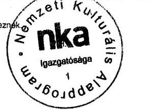

aláírás

---

Kitöltésért felelős: dr. Óvári László, Debreczeni Gábor Telefon: 351-5461/106 Az ellenőrzésbe vont állandó és ideiglenes szakmai kollégiumok pályázati tevékenysége

| Kollégiumok | 1999 | 2000 | 2001 | 2002 | 2003 | 2004 |
| :--: | :--: | :--: | :--: | :--: | :--: | :--: |
| Állandó Szakmai Kollégiumok |  |  |  |  |  |  |
| Mozgókép Szakmai Kollégium |  |  |  |  |  |  |
| - pályázati kiírások száma (db) | 19 | 18 | 16 | 15 | 15 | 16 |
| - beérkezett pályázatok száma (db) | 585 | 637 | 717 | 815 | 954 | 546 |
| - érvénytelen pályázatok száma (db) | 17 | 47 | 16 | 33 | 17 | 6 |
| - elutasított pályázatok száma (db) | 283 | 271 | 313 | 369 | 604 | 215 |
| - támogatott pályázatok száma (db) | 285 | 319 | 388 | 416 | 333 | 325 |
| - igényelt támogatás (M Ft) | 1200 | 1072 | 1618 | 1802 | 1723 | 1031 |
| - támogatott pályázatok igénye (M Ft) | 439 | 479 | 612 | 654 | 669 | 661 |
| - megítélt támogatás (M Ft) | 260 | 277 | 293 | 361 | 384 | 358 |
| - tárgyévi keretet terhelő támogatás (M Ft) | 250 | 277 | 289 | 339 | 384 | 347 |
| - következő 2 évre megítélt támogatás (M Ft) | 10 | 0 | 4 | 22 | 0 | 11 |
| - egy pályázatra jutó támogatás (M Ft) | 0,91 | 0,87 | 0,76 | 0,87 | 1,15 | 1,10 |
| Irodalmi és Könyv / Szépirodalmi Szakmai Kollégium |  |  |  |  |  |  |
| - pályázati kiírások száma (db) | 13 | 10 | 9 | 5 | 6 | 6 |
| - beérkezett pályázatok száma (db) | 1010 | 932 | 1214 | 914 | 648 | 574 |
| - érvénytelen pályázatok száma (db) | 72 | 75 | 86 | 5 | 16 | 20 |
| - elutasított pályázatok száma (db) | 454 | 432 | 587 | 419 | 266 | 294 |
| - támogatott pályázatok száma (db) | 484 | 425 | 541 | 490 | 366 | 260 |
| - igényelt támogatás (M Ft) | 810 | 805 | 1245 | 926 | 1528 | 1052 |
| - támogatott pályázatok igénye (M Ft) | 373 | 351 | 562 | 608 | 1222 | 739 |
| - megítélt támogatás (M Ft) | 258 | 251 | 296 | 356 | 669 | 382 |
| - tárgyévi keretet terhelő támogatás (M Ft) | 253 | 241 | 267 | 324 | 624 | 201 |
| - következő 2 évre megítélt támogatás (M Ft) | 5 | 10 | 28 | 32 | 45 | 181 |
| - egy pályázatra jutó támogatás (M Ft) | 0,53 | 0,59 | 0,55 | 0,73 | 1,83 | 1,47 |
| Zenei Szakmai Kollégium |  |  |  |  |  |  |
| - pályázati kiírások száma (db) | 13 | 16 | 13 | 9 | 17 | 12 |
| - beérkezett pályázatok száma (db) | 515 | 659 | 732 | 796 | 782 | 985 |
| - érvénytelen pályázatok száma (db) | 27 | 39 | 19 | 24 | 48 | 28 |
| - elutasított pályázatok száma (db) | 144 | 255 | 339 | 369 | 324 | 439 |
| - támogatott pályázatok száma (db) | 344 | 365 | 374 | 389 | 410 | 518 |
| - igényelt támogatás (M Ft) | 867 | 1077 | 1043 | 1139 | 1689 | 2095 |
| - támogatott pályázatok igénye (M Ft) | 628 | 504 | 609 | 496 | 879 | 1072 |
| - megítélt támogatás (M Ft) | 225 | 194 | 242 | 268 | 416 | 404 |
| - tárgyévi keretet terhelő támogatás (M Ft) | 225 | 194 | 242 | 245 | 379 | 350 |
| - következő 2 évre megítélt támogatás (M Ft) | 0 | 0 | 0 | 23 | 37 | 54 |
| - egy pályázatra jutó támogatás (M Ft) | 0,65 | 0,53 | 0,65 | 0,69 | 1,01 | 0,78 |
| Színház Szakmai Kollégium |  |  |  |  |  |  |
| - pályázati kiírások száma (db) | 7 | 7 | 7 | 6 | 6 | 8 |
| - beérkezett pályázatok száma (db) | 485 | 530 | 517 | 540 | 706 | 625 |
| - érvénytelen pályázatok száma (db) | 6 | 19 | 31 | 24 | 13 | 23 |
| - elutasított pályázatok száma (db) | 214 | 239 | 267 | 265 | 346 | 252 |
| - támogatott pályázatok száma (db) | 265 | 272 | 219 | 251 | 347 | 350 |
| - igényelt támogatás (M Ft) | 1046 | 1181 | 1460 | 1473 | 1938 | 1622 |

---

|  Kollégiumok | 1999 | 2000 | 2001 | 2002 | 2003 | 2004  |
| --- | --- | --- | --- | --- | --- | --- |
|  - támogatott pályázatok igénye (M Ft) | 576 | 614 | 550 | 681 | 976 | 935  |
|  - megítélt támogatás (M Ft) | 266 | 249 | 306 | 319 | 425 | 400  |
|  - tárgyévi keretet terhelő támogatás (M Ft) | 266 | 249 | 306 | 319 | 424 | 347  |
|  - következő 2 évre megítélt támogatás (M Ft) | 0 | 0 | 0 | 0 | 0,8 | 54  |
|  - egy pályázatra jutó támogatás (M Ft) | 1,00 | 0,92 | 1,40 | 1,27 | 1,22 | 1,14  |
|  Táncmüvészeti Szakmai Kollégium |  |  |  |  |  |   |
|  - pályázati kiírások száma (db) | 11 | 12 | 14 | 14 | 13 | 15  |
|  - beérkezett pályázatok száma (db) | 244 | 279 | 366 | 381 | 407 | 461  |
|  - érvénytelen pályázatok száma (db) | 7 | 19 | 41 | 6 | 16 | 47  |
|  - elutasított pályázatok száma (db) | 80 | 78 | 102 | 160 | 105 | 116  |
|  - támogatott pályázatok száma (db) | 157 | 182 | 223 | 215 | 286 | 298  |
|  - igényelt támogatás (M Ft) | 555 | 465 | 600 | 647 | 816 | 955  |
|  - támogatott pályázatok igénye (M Ft) | 312 | 330 | 450 | 489 | 679 | 727  |
|  - megítélt támogatás (M Ft) | 134 | 133 | 150 | 170 | 250 | 244  |
|  - tárgyévi keretet terhelő támogatás (M Ft) | 134 | 133 | 150 | 170 | 250 | 207  |
|  - következő 2 évre megítélt támogatás (M Ft) | 0 | 0 | 0 | 0 | 0 | 36  |
|  - egy pályázatra jutó támogatás (M Ft) | 0,85 | 0,73 | 0,67 | 0,79 | 0,87 | 0,82  |
|  Ismeretterjesztés és Környezetkultúra Szakmai Kollégium |  |  |  |  |  |   |
|  - pályázati kiírások száma (db) | 0 | 0 | 0 | 6 | 6 | 7  |
|  - beérkezett pályázatok száma (db) | 0 | 0 | 0 | 812 | 882 | 1020  |
|  - érvénytelen pályázatok száma (db) | 0 | 0 | 0 | 4 | 38 | 221  |
|  - elutasított pályázatok száma (db) | 0 | 0 | 0 | 545 | 432 | 462  |
|  - támogatott pályázatok száma (db) | 0 | 0 | 0 | 263 | 412 | 337  |
|  - igényelt támogatás (M Ft) | 0 | 0 | 0 | 1324 | 1786 | 1769  |
|  - támogatott pályázatok igénye (M Ft) | 0 | 0 | 0 | 511 | 940 | 635  |
|  - megítélt támogatás (M Ft) | 0 | 0 | 0 | 250 | 473 | 373  |
|  - tárgyévi keretet terhelő támogatás (M Ft) | 0 | 0 | 0 | 250 | 473 | 199  |
|  - következő 2 évre megítélt támogatás (M Ft) | 0 | 0 | 0 | 0 | 0 | 175  |
|  - egy pályázatra jutó támogatás (M Ft) | 0 | 0 | 0 | 0,95 | 1,15 | 1,11  |
|  Múzeum Szakmai Kollégium |  |  |  |  |  |   |
|  - pályázati kiírások száma (db) | 6 | 5 | 6 | 7 | 7 | 7  |
|  - beérkezett pályázatok száma (db) | 477 | 366 | 417 | 416 | 639 | 630  |
|  - érvénytelen pályázatok száma (db) | 27 | 0 | 2 | 9 | 26 | 10  |
|  - elutasított pályázatok száma (db) | 273 | 173 | 167 | 103 | 215 | 230  |
|  - támogatott pályázatok száma (db) | 177 | 193 | 248 | 304 | 398 | 390  |
|  - igényelt támogatás (M Ft) | 786 | 454 | 544 | 435 | 918 | 1483  |
|  - támogatott pályázatok igénye (M Ft) | 306 | 233 | 298 | 320 | 596 | 1130  |
|  - megítélt támogatás (M Ft) | 172 | 109 | 141 | 169 | 326 | 732  |
|  - tárgyévi keretet terhelő támogatás (M Ft) | 172 | 109 | 141 | 168 | 326 | 721  |
|  - következő 2 évre megítélt támogatás (M Ft) | 0 | 0 | 0 | 1,5 | 0,7 | 11  |
|  - egy pályázatra jutó támogatás (M Ft) | 0,97 | 0,56 | 0,57 | 0,56 | 0,82 | 1,88  |
|  Ideiglenes Szakmai Kollégiumok |  |  |  |  |  |   |
|  Népmüvészet-Táncmüvészet Ideiglenes Szakmai Kollégium |  |  |  |  |  |   |
|  - pályázati kiírások száma (db) | 2 | 1 | 1 | 1 | 1 | 1  |
|  - beérkezett pályázatok száma (db) | 54 | 66 | 82 | 53 | 53 | 44  |
|  - érvénytelen pályázatok száma (db) | 5 | 1 | 12 | 6 | 5 | 10  |
|  - elutasított pályázatok száma (db) | 4 | 22 | 14 | 5 | 2 | 0  |
|  - támogatott pályázatok száma (db) | 45 | 43 | 56 | 42 | 46 | 34  |
|  - igényelt támogatás (M Ft) | 21 | 37 | 47 | 15 | 19 | 16  |
|  - támogatott pályázatok igénye (M Ft) | 18 | 23 | 28 | 12 | 16 | 13  |
|  - megítélt támogatás (M Ft) | 12 | 10 | 13 | 11 | 15 | 11  |
|  - tárgyévi keretet terhelő támogatás (M Ft) | 12 | 10 | 13 | 11 | 15 | 11  |

---

|  Kollégiumok | 1999 | 2000 | 2001 | 2002 | 2003 | 2004  |
| --- | --- | --- | --- | --- | --- | --- |
|  - következő 2 évre megítélt támogatás (M Ft) | 0 | 0 | 0 | 0 | 0 | 0  |
|  - egy pályázatra jutó támogatás (M Ft) | 0,27 | 0,23 | 0,23 | 0,26 | 0,33 | 0,32  |
|  Közkultúra-Informatika Ideiglenes Szakmai Kollégium |  |  |  |  |  |   |
|  - pályázati kiírások száma (db) | 0 | 0 | 0 | 0 | 0 | 2  |
|  - beérkezett pályázatok száma (db) | 0 | 0 | 0 | 0 | 0 | 64  |
|  - érvénytelen pályázatok száma (db) | 0 | 0 | 0 | 0 | 0 | 0  |
|  - elutasított pályázatok száma (db) | 0 | 0 | 0 | 0 | 0 | 42  |
|  - támogatott pályázatok száma (db) | 0 | 0 | 0 | 0 | 0 | 22  |
|  - igényelt támogatás (M Ft) | 0 | 0 | 0 | 0 | 0 | 1608  |
|  - támogatott pályázatok igénye (M Ft) | 0 | 0 | 0 | 0 | 0 | 285  |
|  - megítélt támogatás (M Ft) | 0 | 0 | 0 | 0 | 0 | 248  |
|  - tárgyévi keretet terhelő támogatás (M Ft) | 0 | 0 | 0 | 0 | 0 | 248  |
|  - következő 2 évre megítélt támogatás (M Ft) | 0 | 0 | 0 | 0 | 0 | 0  |
|  - egy pályázatra jutó támogatás (M Ft) | 0 | 0 | 0 | 0 | 0 | 11,27  |
|  Kulturális Turisztikai Ideiglenes Szakmai Kollégium |  |  |  |  |  |   |
|  - pályázati kiírások száma (db) | 0 | 0 | 0 | 0 | 0 | 2  |
|  - beérkezett pályázatok száma (db) | 0 | 0 | 0 | 0 | 0 | 664  |
|  - érvénytelen pályázatok száma (db) | 0 | 0 | 0 | 0 | 0 | 5  |
|  - elutasított pályázatok száma (db) | 0 | 0 | 0 | 0 | 0 | 579  |
|  - támogatott pályázatok száma (db) | 0 | 0 | 0 | 0 | 0 | 80  |
|  - igényelt támogatás (M Ft) | 0 | 0 | 0 | 0 | 0 | 3979  |
|  - támogatott pályázatok igénye (M Ft) | 0 | 0 | 0 | 0 | 0 | 745  |
|  - megítélt támogatás (M Ft) | 0 | 0 | 0 | 0 | 0 | 212  |
|  - tárgyévi keretet terhelő támogatás (M Ft) | 0 | 0 | 0 | 0 | 0 | 212  |
|  - következő 2 évre megítélt támogatás (M Ft) | 0 | 0 | 0 | 0 | 0 | 0  |
|  - egy pályázatra jutó támogatás (M Ft) | 0 | 0 | 0 | 0 | 0 | 2,65  |
|  Kultúra 2000 Ideiglenes Szakmai Kollégium |  |  |  |  |  |   |
|  - pályázati kiírások száma (db) | 0 | 0 | 0 | 0 | 2 | 1  |
|  - beérkezett pályázatok száma (db) | 0 | 0 | 0 | 0 | 2 | 23  |
|  - érvénytelen pályázatok száma (db) | 0 | 0 | 0 | 0 | 0 | 2  |
|  - elutasított pályázatok száma (db) | 0 | 0 | 0 | 0 | 1 | 0  |
|  - támogatott pályázatok száma (db) | 0 | 0 | 0 | 0 | 1 | 21  |
|  - igényelt támogatás (M Ft) | 0 | 0 | 0 | 0 | 17 | 103  |
|  - támogatott pályázatok igénye (M Ft) | 0 | 0 | 0 | 0 | 5 | 99  |
|  - megítélt támogatás (M Ft) | 0 | 0 | 0 | 0 | 5 | 83  |
|  - tárgyévi keretet terhelő támogatás (M Ft) | 0 | 0 | 0 | 0 | 5 | 83  |
|  - következő 2 évre megítélt támogatás (M Ft) | 0 | 0 | 0 | 0 | 0 | 0  |
|  - egy pályázatra jutó támogatás (M Ft) | 0 | 0 | 0 | 0 | 5,00 | 3,95  |

Igazolom, hogy a tanúsítványban szereplő adatok a nyilvántartások adataival megegyeznek.

Dátum: 2005. március 9.

---

1. sz. tanúsítvány a V-31-135/2004-2005. sz. jelentéshez

Nemzeti Kulturális Alapprogram

Kitöltésért felelős: dr. Óvári László, Debreczeni Gábor

Telefon: 351-5461/106

Az NKA évenkénti támogatásának kulturális szakterületek szerinti megoszlása

|  Szakterület | 1999* |  | 2000* |  | 2001* |  | 2002* |  | 2003* |  | 2004 |   |
| --- | --- | --- | --- | --- | --- | --- | --- | --- | --- | --- | --- | --- |
|   | megítélt
tám.
(M Ft) | % | megítélt
tám.
(M Ft) | % | megítélt
tám.
(M Ft) | % | megítélt
tám.
(M Ft) | % | megítélt
tám.
(M Ft) | % | megítélt
tám.
(M Ft) | %  |
|  Mozgóköp | 0 | 0 | 0 | 0 | 0 | 0 | 0 | 0 | 456 | 6,52 | 539 | 6,22  |
|  Színház | 0 | 0 | 0 | 0 | 0 | 0 | 0 | 0 | 589 | 8,39 | 610 | 7,03  |
|  Zene | 0 | 0 | 0 | 0 | 0 | 0 | 0 | 0 | 1051 | 14,97 | 1134 | 13,07  |
|  Tánc | 0 | 0 | 0 | 0 | 0 | 0 | 0 | 0 | 301 | 4,29 | 289 | 3,34  |
|  Képzőművészet | 0 | 0 | 0 | 0 | 0 | 0 | 0 | 0 | 702 | 10,00 | 567 | 6,53  |
|  Iparművészet | 0 | 0 | 0 | 0 | 0 | 0 | 0 | 0 | 362 | 5,16 | 299 | 3,44  |
|  Fotóművészet | 0 | 0 | 0 | 0 | 0 | 0 | 0 | 0 | 190 | 2,71 | 146 | 1,68  |
|  Népművészet | 0 | 0 | 0 | 0 | 0 | 0 | 0 | 0 | 263 | 4,03 | 339 | 3,90  |
|  Közművelődés | 0 | 0 | 0 | 0 | 0 | 0 | 0 | 0 | 508 | 7,23 | 1129 | 13,01  |
|  Könyvtár | 0 | 0 | 0 | 0 | 0 | 0 | 0 | 0 | 275 | 3,92 | 552 | 6,36  |
|  Levétár | 0 | 0 | 0 | 0 | 0 | 0 | 0 | 0 | 163 | 2,32 | 304 | 3,50  |
|  Múzeum | 0 | 0 | 0 | 0 | 0 | 0 | 0 | 0 | 363 | 5,17 | 943 | 10,87  |
|  Építőművészet | 0 | 0 | 0 | 0 | 0 | 0 | 0 | 0 | 185 | 2,63 | 131 | 1,51  |
|  Összművészeti feszítválok | 0 | 0 | 0 | 0 | 0 | 0 | 0 | 0 | 170 | 2,42 | 0 | 0,00  |
|  Ismenefterjesztés | 0 | 0 | 0 | 0 | 0 | 0 | 0 | 0 | 548 | 7,80 | 624 | 7,20  |
|  Szépirodalom | 0 | 0 | 0 | 0 | 0 | 0 | 0 | 0 | 874 | 12,45 | 698 | 8,05  |
|  Műemlélt és régészeti | 0 | 0 | 0 | 0 | 0 | 0 | 0 | 0 | 0 | 0,00 | 373 | 4,30  |
|  Összesen | 0 | 0% | 0 | 0% | 0 | 0% | 0 | 0% | 7022 | 100% | 8677 | 100%  |

- 1999-2003. évben az NKA Igazgatósága a kulturális szakterületek szerinti megoszlást teszi. Igazolom, hogy a tanúsítványban szereplő adatok a nyilvántartások adatairai megoszlat.

Dátum: 2005. március 9.

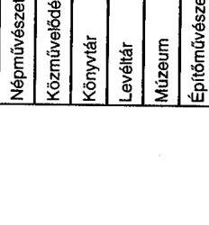

aláírás

---

# Nemzeti Kulturális Alapprogram

Kitöltésért felelős:Czeibert Lajos 6.8.sorok, Tóth Gáborné: többi sor 24 Telefon:Czeibert:484-71-00/6812; Tóth:351-54-61/121

## A pályázati elszámoltatások és a helyszíni ellenőrzések alakulása a vizsgált időszakban

|  Megnevezés | 1999 | 2000 | 2001 | 2002 | 2003 | 2004  |
| --- | --- | --- | --- | --- | --- | --- |
|  1. Támogatott pályázatok összesen (db) * | 5848 | 5508 | 7204 | 6605 | 7213 | 8133  |
|  2. Befejezett (lezárt) pályázatok száma (db) | 5836 | 5462 | 7130 | 6485 | 6234 | 1277  |
|  3. Befejezett pályázatok a támogatott pályázatok arányában (%) | 99,7 | 99,1 | 98,9 | 98,2 | 86,4 | 15,7  |
|  4. Nem lezárt pályázatok száma, összesen (db) | 12 | 46 | 74 | 120 | 979 | 6856  |
|  ebből: |  |  |  |  |  |   |
|  - jogi úton lévő pályázatok száma (db) | 7 | 2 | 14 | 11 | 7 | 2  |
|  - elszámolás alatti pályázatok száma (db) | 5 | 5 | 4 | 11 | 456 | 1700  |
|  - elszámolásra felszólított pályázatok száma (db) |  |  | 1 | 4 | 144 | 259  |
|  - elszámolásuk később aktuális pályázatok száma (db) |  |  |  | 3 | 66 | 4346  |
|  5. Pénzügyleg ellenőrzött, szakmai ellenőrzésre váró pályázatok száma (db) |  | 39 | 55 | 91 | 306 | 549  |
|  6. Az NKA által helyszínen ellenőrzött |  |  |  |  |  |   |
|  - pályázók száma | 33 | 46 | 18 | 41 | 48 | 22  |
|  - pályázatok száma | 81 | 90 | 65 | 87 | 192 | 93  |
|  - azok aránya a befejezett pályázatokon belül | 1,4 | 1,6 | 0,9 | 1,3 | 3,1 | 7,3  |
|  7. Az összes pályázat teljesített támogatási összege (M Ft) | 3692 | 3503 | 4954 | 5192 | 5487 | 8162  |
|  8. A helyszínen ellenőrzöttek támogatási összege (M Ft) | 318 | 252 | 171 | 165 | 229 | 327  |
|  9. Aránya az összes teljesített támogatáson belül % | 8,6 | 7,2 | 3,5 | 3,2 | 4,2 | 4  |

*Csak az NKA pályázatokat tartalmazza FEPÁCS nélkül!

Igazolom, hogy a tanúsítványban szereplő adatok a nyilvántartások adataivaló pályázatok.

Budapest, 2005.03.07.

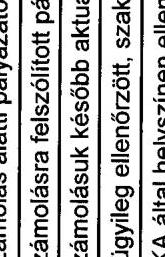

---

# A szakmai kollégiumok összegezett véleménye az NKA támogatási rendszeréről, kérdőíves felmérés alapján 

| Sorszám | Kérdések | Igen | Nem | Részben | Rangsorolás |
| :--: | :--: | :--: | :--: | :--: | :--: |
| 1. | Meghatározták-e szakterületükön a legfontosabb támogatási célokat? | 16 | 0 |  |  |
| 2. | A támogatási célkitűzések meghatározatásakor figyelembe vették-e a Bizottsági határozatokat, ajánlásokat? | 12 | 1 | 3 |  |
| 3. | Adtak-e javaslatokat a Bizottság támogatási stratégiájának, döntéseinek kidolgozásához? |  |  |  |  |
|  | - igen, a támogatandó területre és a keretösszegre vonatkozóan egyaránt | 4 |  |  |  |
|  | - igen, a támogatandó területre vonatkozóan | 6 |  |  |  |
|  | - igen, a támogatás keretösszegére vonatkozóan | 1 |  |  |  |
|  | - nem |  | 5 |  |  |
| 4. | Pályázati kiírásaikat megelőzően volt-e információjuk más pályáztatók azonos vagy hasonló célú felhívásairól? | 8 | 1 | 7 |  |
| 5. | Más pályáztatók azonos célú támogatásának ismeretében: |  |  |  |  |
|  | - a támogatási cél megvalósulása érdekében együttműködtek velünk | 8 |  |  |  |
|  | - eltérő pályázói kört céloztak meg | 6 |  |  |  |
|  | - nem írtak ki pályázatot | 4 |  |  |  |
| 6. | A kollégium által kiemelt támogatási célkitűzések megvalósításához szükséges keretösszeg biztosított volt-e? |  |  |  |  |
|  | - 1999. | 5 | 2 | 6 |  |
|  | - 2002. | 8 | 3 | 5 |  |
|  | - 2003. | 7 | 3 | 6 |  |
|  | - 2004. | 5 | 5 | 6 |  |
| 7. | Biztosította-e az Igazgatóság a szakmai kollégium múködéséhez szükséges feltételeket? |  |  |  |  |
|  | - igen, teljes mértékben | 10 |  |  |  |
|  | - részben, mert a személyi feltételek nem voltak megfelelőek | 0 |  |  |  |
|  | - részben, mert a tárgyi feltételek nem voltak megfelelőek | 5 |  |  |  |
|  | - részben, mert nem volt megfelelő az informatikai rendszer | 2 |  |  |  |
|  | - nem |  | 0 |  |  |
| 8. | Kialakították-e a visszatérítendő, illetve a vissza nem térítendő támogatások nyújtásának szempontjait? | 8 | 8 |  |  |
| 9. | Kidolgozták-e a szakmai kollégiumok közös pályáztatásának szabályait? | 4 | 9 |  |  |
| 10. | Figyelembe vette-e a Bizottság, a szakkolégium javaslatait az éves keretösszeg megállapításakor? | 5 | 3 | 8 |  |

---

| 11. | Megfelelőnek tartja-e szakmai kollégiumának: |  |  |  |  |
| :--: | :--: | :--: | :--: | :--: | :--: |
|  | - létszámát | 14 | 1 | 1 |  |
|  | - szakmai összetételét | 11 | 2 | 3 |  |
|  | - döntési mechanizmusát | 13 | 0 | 2 |  |
| 12. | Biztosított volt-e a döntéshozatal során: |  |  |  |  |
|  | - a különböző szakterületek arányos képviselete | 14 | 1 |  |  |
|  | - az érdekeltek szavazásból történő kizárása | 16 | 0 |  |  |
| 13. | Erősítené-e a döntéshozatal objektivitását a pályázók anonimitása? |  |  |  |  |
|  | - igen | 0 |  |  |  |
|  | - nem |  | 11 |  |  |
|  | - a pályázati döntések egy részénél | 5 |  |  |  |
| 14. | A felsorolt tényezők közül, melyeknek van nagyobb szerepe a szakkollégium pályázati döntéseiben? |  |  |  |  |
|  | - a Bizottság stratégiai célkitűzéseinek megvalósulása |  |  |  | 0 |
|  | - a pályázat szakmai színvonala |  |  |  | 7 |
|  | - a pályázat gazdasági megalapozottsága |  |  |  | 0 |
|  | - a kollégium által kidolgozott prioritások megvalósulása |  |  |  | 6 |
|  | - a rendelkezésre álló keretösszeg |  |  |  | 1 |
|  | - a támogatás felhasználásának várható hatékonysága |  |  |  | 2 |
|  | - a pályázó referenciái |  |  |  | 0 |
| 15. | Kialakítottak-e a döntéshozatalhoz mérhető szempontrendszert? | 11 | 4 |  |  |
| 16. | Rangsorolja 1-től 7-ig, hogy a pályázati célok megvalósulását, mely tényezők akadályozzák leggyakrabban! |  |  |  |  |
|  | - a rendelkezésre álló keretösszeg nagysága |  |  |  | 9 |
|  | - a pályázat alacsony szakmai színvonala |  |  |  | 2 |
|  | - a pályázat formai, kellékbeli hiányosságai |  |  |  | 2 |
|  | - a pályázók nem megfelelő informáltsága |  |  |  | 1 |
|  | - a szükséges önerő hiánya |  |  |  | 0 |
|  | - a pályázati rendszer bürokratizmusa |  |  |  | 0 |
|  | - egyéb tényezők |  |  |  | 2 |
| 17. | A pályázati kiírásokban: |  |  |  |  |
|  | - megjelölik-e a pályázattal elérni kívánt kulturális célt? | 16 | 0 |  |  |
|  | - megismerhetővé teszik-e a bírálati szempontokat? | 8 | 6 |  |  |
|  | - biztosítják-e a pályázók esélyegyenlőségét? | 16 | 0 |  |  |
| 18. | A pályázóktól kérnek-e igényeik gazdasági megalapozottságát alátámasztó adatokat, információkat? | 13 | 2 |  |  |
| 19. | A pályázatok eredményeit |  |  |  |  |
|  | - közzéteszik-e? | 16 | 0 |  |  |
|  | - indokolják-e? | 2 | 13 |  |  |
| 20. | Előfordult-e az alacsony támogatási összeg miatt a pályázati célról való lemondás? |  |  |  |  |
|  | - 1999. | 7 | 7 |  |  |
|  | - 2002. | 10 | 5 |  |  |
|  | - 2003. | 11 | 4 |  |  |
|  | - 2004. | 11 | 5 |  |  |

---

| 21. | Rangsorolja 1-től 3-ig terjedő sorszámozással, hogy a   szerződések teljesitését milyen módszerekkel ellenőrzik! |  |  |  |  |
| :-- | :-- | :-- | :-- | :-- | :--: |
|  | - a támogatott beszámoltatásával |  |  |  | 12 |
|  | - helyszíni ellenőrzéssel |  |  |  | 2 |
|  | - egyéb módszerek |  |  |  | 3 |
| 22. | Készítenek-e utólagos elemzést, értékelést a támogatások   felhasználásának eredményességéről? | 7 | 8 |  |  |

Információ szolgáltató: az NKA 16 állandó szakmai kollégiuma

---

# Összesítés a helyszíni ellenőrzésre kiválasztott szervezetekről és személyekről

|  Évek | Felhasználó szervezet | Pályázat megnevezése | Elnyert
támogatás  |
| --- | --- | --- | --- |
|  I. MINISZTERI KERET |  |  |   |
|  1. Miniszteri nagyrendezvények |  |  |   |
|  2002. | Budapesti Fesztivál Központ Kht. | 2002. évi Budapesti Tavaszi Fesztivál megrendezése | 120000  |
|  1999 |  | A Centre National des Arts Du Cirque budapesti vendégszerepléséhez | 600  |
|  2003 |  | A Liliom bemutatása a Hamburgi Thalia előadásában a Budapesti Öszi Fesztiválon | 3000  |
|  2002. | Hagyományok Háza | A Visegrádi együttműködés országai folklórtalálkozójának megvalósítása | 17000  |
|  2003. |  | Veszett világ címú produkció létrehozására (tánc kollégiumi keretből) | 3000  |
|  2004. |  | Európa emlékei c. produkció létrehozására (tánc kollégiumi keretből ) | 4500  |
|  2002. | Focusfilm Filmgyártó és Filmforgalmazó Kft. | A Perlasca c. film befejező munkálatai | 25000  |
|  2003. |  | Perlasca - Egy igaz ember története c. film gyártása (minisztériumi egyéb) | 20000  |
|  2003. |  | Perlasca - Egy igaz ember története c. film forgalmazása (mozgókép keretből) | 1200  |
|  2. Miniszteri kiemelkedő műhelyek |  |  |   |
|  2004. | Budafoki Dohnányi Ernő | A zenekar 2004. évi második félévi hangversenyeinek meg rendezése | 35000  |
|  2002. | Szimfonikus Zenekar Kulturális Kht. | Külföldi művészek vendégszereplésére (miniszteri egyéb keretből) | 2905  |
|  2002. |  | A 2002/2003. évadbeli hangversenysorozat megvalósítására (zenei kollégiumi keretből) | 2000  |
|  2004. | A Magyar Rádió Zenekaráért Alapitvány | "Komolyzenei művészi élmény eljuttatása minél szélesebb közönséghez" program | 30000  |
|  2003. |  | A Magyar Rádió 2003. évi koncertjei szakmai feltételeinek biztosítására (miniszteri egyéb keretből) | 30000  |
|  2004. | Danubia Kulturális Közhasznú Egyesület | A Danubia Szimfonikus Zenekar koncertsorozataira | 15000  |
|  2004. |  | Bérleti hangversenysorozat felnőtt közönség részére (zenei kollégiumi keretből) | 3000  |
|  2004. |  | Ifjúsági hangversenysorozat megrendezésére Fáklya Klubban (zenei kollégiumi keretből) | 600  |

---

|  Évek | Felhasználó szervezet | Pályázat megnevezése | Elnyert
támogatás  |
| --- | --- | --- | --- |
|  3. Miniszteri egyéb keret |  |  |   |
|  2002 | ARS-IN-KOM Művészeti és | X. Szolnoki Zenei Fesztivál megrendezése | 2000  |
|  1999 | Kommunikációs Kft. | VIII. Szolnoki Zenei Fesztivál megrendezése az ezredforduló jegyében (zenei kollégiumi keretből) | 900  |
|  2003 | Atlanti Kutató és Kiadó | Négy kötet megjelentetése | 15000  |
|  2003 | Közalapítvány | Komoróczy Géza angol nyelvű tudományos könyvének kiadására | 5000  |
|  2004 |  | A 2004. évi publikációs terv 3 kötetének megjelentetése | 20000  |
|  2004 | Balassi Kiadó Kft. | Holokauszt Magyarországon - Európai perspektívában c. kötet kiadása magyar és angol nyelven | 14000  |
|  2003 |  | A Váradi Biblia Facsimile kiadása | 6500  |
|  2002 |  | "Krakkó a magyar kultúrában" c. tanulmánykötet megjelentetése | 1000  |
|  II. ÁLLANDÓ SZAKMAI KOLLÉGIUMOK |  |  |   |
|  1. Mozgókép Szakmai Kollégium |  |  |   |
|  1999 | Hunnia Filmstúdió Kft. | Hamis jegyek c. film előkészítése | 30000  |
|  2002 |  | Chico c. játékfilm magyarországi fogalmazása | 1800  |
|  2002 | Laurinfilm Alkotói Kft. | Fehér Tenyér c. film gyártás-előkészítése | 30000  |
|  2002 |  | A Szép napok c. film forgalmazása | 900  |
|  2003 |  | A Boldog születésnapot c. játékfilm forgalmazása | 4000  |
|  2003 | Magyar Nemzeti Filmarchívum | A Magyar Nemzeti Filmgyűjtemény megmentésére - a magyar némafilmektől a 70-es évekig | 10000  |
|  1999 |  | Hazai filmek megmentése, archiválása | 4.000  |
|  2004 | Dárday István, Budapest | Alkotói támogatás "Füstjelek" c. dokumentumfilm forgatókönyvére | 500  |
|  2004 | Erdélyi Judit, Piliscsaba | Alkotói támogatás "Kereső" c. diplomafilm elkészítésére | 360  |
|  2. Színházá Szakmai Kollégium |  |  |   |
|  1999 | Szigligeti Színház | Az ezeregy év meséi c. produkció támogatására (miniszteri egyéb keretből) | 10000  |
|  2003 |  | Füst Milán: Catullus c. produkció megvalósítására | 3000  |
|  2003 |  | Duras: La Musica Deuxieme c. darab bemutatására | 1900  |
|  1999 | Színház Alapítvány | Színház c. folyóirat megjelentetése | 13000  |
|  2003 |  | Színház c. folyóirat 2004. évi 12 számának megjelentetése | 17300  |
|  2002 | Alternatív és Független Színházak Szövetsége | A 9. Alternatív Színházi Szemle megszervezésére | 1300  |

---

|  Évek | Felhasználó szervezet | Pályázat megnevezése | Elnyert
támogatás  |
| --- | --- | --- | --- |
|  2004 | Háy János, Budapest | Alkotói támogatás "A főszereplő a halál" c. dráma megírásához | 600  |
|  2004 | Bartis Attila, Budapest | Alkotói támogatás "A farkasok hagyatéka" c. dráma megírására | 600  |
|  3. Zenei Szakmai Kollégium |  |  |   |
|  1999 | Hungaroton Records Kft. | A Hungaroton Classic márka 1999. évi hanglemez-kiadási terveihez | 15300  |
|  2002 |  | A magyar kortárs kóruszene CD-sorozat első lemezének kiadása | 1500  |
|  2003 |  | 4 CD megjelentetése a 2004. évi MIDEM-re | 6600  |
|  2004 | Liszt Ferenc Zeneművészeti Egyetem | Nemzetközi rangú tanárok vezetésével mesterkurzusok megrendezése | 3000  |
|  2003 |  | Csongor és Tünde előadása | 900  |
|  1999 |  | Magyar kórusmuzsika évszázadai hangversenysorozat | 700  |
|  1999 | MÁV Szimfonikusok Zenekari | Az 1999-2000. évad 16 hangversenye a Zeneakadémián és 9 ifjúsági koncert | 900  |
|  2004 | Alapítvány | A 2004. évi bérleti hangversenyek megrendezése (miniszteri keretből) | 35000  |
|  2004 | Németh Pál, Budapest | Kamaraopera bérletsorozat a Gödöllől Kastély Barokk Színházban | 500  |
|  4. Táncművészeti Szakmai Kollégium |  |  |   |
|  2002 | Nemzeti Táncszínház Kht. | A Carolina Balett magyarországi vendégszereplése (miniszteri keretből) | 10000  |
|  2003 |  | III. Táncfesztiválon külföldi együttesek fogadása | 4000  |
|  2004 |  | Alternatív előadásokra a Nemzeti Táncszínház refektóriumában | 1000  |
|  2003 |  | A Táncművészet c. folyóirat 2003. évi 6 számának megjelentetése | 10000  |
|  2003 | Nemzetközi Tánc és Kultúra Alapítvány | A Táncpaletta 2003. - XIII. Magyar Sztárgála megrendezése az Operában | 800  |
|  1999 |  | A Táncpaletta 1999. - Magyar Sztárgála megrendezése az Operában | 500  |
|  2004 | Trafó Kortárs Művészetek Háza Kht. | Kortárs külföldi táncegyüttesek fellépésére a Trafóban | 10000  |
|  2002 |  | Magyar Kortárs táncprodukciók bemutatása a Trafóban a 2002/2003. szezonban | 3250  |
|  2004 | Tóth (Hód) Adrienn, Budapest | A Tinitáji táncok produkció létrehozása | 500  |
|  2004 | Juhász Zsolt, Budakalász | A Duna Táncműhely Pygmalion c. produkció létrehozására | 1000  |

---

|  Évek | Felhasználó szervezet | Pályázat megnevezése | Elnyert
támogatás  |
| --- | --- | --- | --- |
|  5. Múzeumi Szakmai Kollégium |  |  |   |
|  2004 | Budapesti Történeti Múzeum | Az Áttörés kora, Bécs és Budapest kiállítás megvalósítása | 64500  |
|  2002 |  | A BTM Kiscelli Múzeumban Budapest újkori építészetét bemutató állandó kiállítás | 2193  |
|  1999 |  | A Budavári Palota évszázadai reprezentatív kiállítás | 1600  |
|  2004 | Magyar Nemzeti Galéria | Európai Grafika 1900-1930 című kiállítás megrendezése | 16000  |
|  2003 |  | Mányoki Ádám c. kiállítás megvalósítása | 5000  |
|  1999 |  | Történelem-Kép-História és Művészet Magyarországon c. kiállítás | 3000  |
|  1999 | Magyar Temészettudományi Múzeum | A Kárpátmedence kincseit bemutató országos kiállítás | 7000  |
|  2002 |  | Túl az Óperencián c. jubileumi kiállítás | 4100  |
|  2004 |  | Szárnybontás - a repülés szerepe az élővilágban c. kiállítás | 1000  |
|  6. Ismeretterjesztés és Környezetkultúra Szakmai Kollégium |  |  |   |
|  2003 | Tudományos Ismeretterjesztő Társulat | Az Élet és Tudomány c. hetilap 2004. évi megjelentetése | 8000  |
|  2002 |  | A Valóság c. folyóirat 2002. évi megjelentetése | 3000  |
|  1999 |  | A Természet világa c. lap kiadása | 4500  |
|  2002 | Magyar Nemzeti Múzeum | "Patak vára" c. kötet megjelentetése | 500  |
|  2003 |  | A Rákóczi szabadságharc és Közép-Európa 2 kötetes tanulmánykötet megjelentetése | 1000  |
|  2004 | Veres László, Miskolc | Alkotói tám. Kárpád-medencei üvegművesség XVI-XIX. sz. történelmének feltárására és emlékanyagának bemutatására | 1000  |
|  2004 | Bálint István János, Szentendre | Alkotói támogatás a "Vén Szilágy" c. mű megírására | 1000  |
|  2004 | Mádiné dr. Szőnyi Judit, Budapest | Alkotói támogatás a "Föld alatti csodák Budapest szívében" c. mű megírásához | 1000  |
|  7. Szépirodalmi Szakmai Kollégium |  |  |   |
|  2003 | Magyar Napló Kiadó Kft. | A Magyar Napló c. folyóirat 2003. évi 12 lapszámának megjelentetése | 14000  |
|  2002 |  | Az év versei 2003. c. antológia megjelentetése | 500  |
|  2002 |  | A Magyar Napló esszéantológiájának kiadása | 400  |
|  2003 | Jelenkor Alapítvány | A Jelenkor folyóirat 2003. évi 11 lapszámának megjelentetése | 10000  |
|  2002 |  | A Jelenkor folyóirat 2002. évi 11 lapszámának megjelentetése | 9000  |
|  2004 |  | A város/víziók c. kiállítás megrendezésére (építőművészeti kollégiumi keretből) | 300  |

---

|  Évek | Felhasználó szervezet | Pályázat megnevezése | Elnyert
támogatás  |
| --- | --- | --- | --- |
|  2004 | Magyar Írószövetség | A Kortárs c. folyóirat 2004. évi 12 lapszámának megjelentetése | 18000  |
|  2002 |  | 2003.01.01-12.31. közötti irodalmi rendezvények | 5000  |
|  2004 | Arday Géza, Budapest | Alkotói támogatás monográfia megírására Cs. Szabó László életművéből | 420  |
|  2004 | Bart István, Budapest | Alkotói támogatás George Steiner "After Babel" c. mű fordítására | 840  |
|  2004 | Nagy Gabriella, Budapest | Alkotói támogatás regény megírására az "Ikrek" munkacímmel | 420  |
|  III. IDEIGLENES SZAKMAI KOLLÉGIUMOK |  |  |   |
|  1. Kultúra 2000 Ideiglenes Szakmai Kollégium |  |  |   |
|  2004 | C3 Kulturális és Kommunikációs Központ Alapítvány | A Light (Image) Illusion c. projekt megvalósítására | 3750  |
|  2004 |  | A Making Things Public c. kiállítás megvalósítására | 2457  |
|  2004 |  | A Trója c. projekt megvalósítására | 6250  |
|  2004 | Baltazár Színház Alapítvány | A Lezéle Du Dezir projektben való részvétel | 3742  |
|  2004 | Honvéd Együttes | Velence a Kelet Kapuja c. projektben való fellépés | 2460  |
|  2. Kulturális Turisztikai Ideiglenes Szakmai Kollégium |  |  |   |
|  2004 | Közép-Kelet Európai Kulturális Obszervatórium Alapítvány | Kulturális fesztiválok értékelési modelljének kidolgozása | 12000  |
|  2004 | V.I.P. Arts Management Kft. | Belvárosi nyári szimfonikus koncertek megvalósítása a Bazilikánál | 5000  |
|  2004 |  | A XIII. Budapest Nyári Opera- és Balettfesztivál megrendezése a Magyar Állami Operaházban | 2000  |
|  2004 | Petőfi Irodalmi Múzeum | Palotakerti esték rendezvénysorozat | 3000  |
|  1999 |  | Jókai emlékkiállítás megrendezése (múzeumi kollégiumi keretből) | 2000  |
|  3. Közkultúra Informatika Ideiglenes Szakmai Kollégium |  |  |   |
|  2004 | Komárom-Esztergom Megyei | A Megyei Múzeum és Intézményei integrált múzeuminformatikai fejlesztése | 34310  |
|  2002 | Önkormányzat Kuny Domokos Megyei Múzeum (Tata) | A Tatai Szénmedence 100 éve c. kiállítás megrendezése | 3000  |
|  1999 |  | Múzeumi követelmények 6. kötet megjelentetése (múzeumi kollégiumi keretből) | 1500  |
|  2004 | Méliusz Juhász Péter Megyei Könyvtár (Debrecen) | Integrált könyvtári rendszer beszerzése | 10000  |
|  2002 |  | Olvasóvá nevelő gyermekrendezvények szervezése (könyvtári kollégiumi keretből) | 700  |
|  1999 |  | Millenniumi évfordulóhoz kapcsolódó programsorozat (közművelődési keretből) | 400  |
|  2004 | Országos Idegennyelvű Könyvtár | A Mokka rendszerrel kompatibilis integrált könyvtári rendszer bevezetése | 8000  |

---

|  Évek | Felhasználó szervezet | Pályázat megnevezése | Elnyert
támogatás  |
| --- | --- | --- | --- |
|  4. Népművészet-Táncművészet Ideiglenes Szakmai Kollégium |  |  |   |
|  2004 | Bihari János Kulturális Egyesület | Sárközi, Györgyfalvi és Galgai koreográfiák elkészítésére | 400  |
|  2003 |  | A Lesők, Marossárpataki táncok, Galga vidéki táncok és a Rege munkacímű pr. | 400  |
|  2002 |  | Új koreográfiák készítése | 300  |
|  2004 | ELTE Néptáncegyüttesért Alapítvány | Bonchidai táncok koreográfia elkészítésére | 400  |
|  2003 |  | Palócok című koreográfiára | 400  |
|  2002 |  | Sárközi táncok címmel koreográfia készítése az ELTE Néptánc együttes számára | 300  |
|  2004 | Botafogó Szabadidő, Sport és Kulturális Szolgáltató Egyesület | Gregorián c. koreográfia bemutatása | 400  |
|  2002 |  | A Botafogó táncegyüttes: Sangre Gitana című koreográfiájára | 200  |
|  2002 |  | A Botafogó táncegyüttes 1999. évi Gyökerek c. új koreográfiájának létrehozása és bemutatása | 531  |
|   | Kiválasztott pályázatok támogatása összesen (E Ft) |  | 895088  |
|   | Kiválasztott pályázatok támogatási aránya a teljes (1999, 2002, 2003, 2004) NKA támogatásból |  | 3,6\%  |
|   | Kiválasztott pályázatok darabszáma (db) |  | 115  |
|   | Kiválasztott pályázatok számának aránya a teljes (1999, 2002, 2003, 2004) NKA pályázatokból |  | 0,4\%  |

---

# Előadások, rendezvények adatai az ellenőrzött felhasználó szervezeteknél

|  Ssz. | Felhasználó szervezet megnevezése | Látogatók
száma | Előadások
száma | Jegybevétel
(E Ft) | Férőhely | Egy
előadásra
jutó látogató | Egy látogatóra
jutó jegybe-
vétel (E Ft)  |
| --- | --- | --- | --- | --- | --- | --- | --- |
|  1 | Budapesti Fesztiválközpont Kht. | 2054 | 2 |  |  | 1027 | 0,000  |
|  2 | Budapesti Fesztiválközpont Kht. | 1146 | 1 | 1164 |  | 1146 | 1,016  |
|  3 | Hagyományok Háza | 800 | 2 | 152 | 518 | 400 | 0,190  |
|  4 | Hagyományok Háza | 291 | 1 | 374 | 518 | 291 | 1,285  |
|  5 | Budafoki Dohnányi Ernő Szimfonikus Zenekar Kulturális Kht. | 44700 | 63 | 30535 | 350-1500 | 710 | 0,683  |
|  6 | Budafoki Dohnányi Ernő Szimfonikus Zenekar Kulturális Kht. | 2600 | 3 | 3121 | 150-960 | 867 | 1,200  |
|  7 | Budafoki Dohnányi Ernő Szimfonikus Zenekar Kulturális Kht. | 2750 | 3 | 3026 | 150-960 | 917 | 1,100  |
|  8 | Budafoki Dohnányi Ernő Szimfonikus Zenekar Kulturális Kht. | 25800 | 16 | 20743 | 150-960 | 600 | 0,804  |
|  9 | Budafoki Dohnányi Ernő Szimfonikus Zenekar Kulturális Kht. | 22800 | 20 | 20688 | 150-960 | 600 | 0,907  |
|  10 | Danubia Kulturális Közhasznú Egyesület | 300 | 2 | 20 | 160 | 150 | 0,067  |
|  11 | Danubia Kulturális Közhasznú Egyesület | 2700 | 3 | 2400 | 950 | 900 | 0,889  |
|  12 | Danubia Kulturális Közhasznú Egyesület | 6200 | 7 | 2500 | 950-150 | 886 | 0,403  |
|  13 | ARS-IN-KOM Művészeti és Kommunikációs Kft. | 6250 | 8 | 4500 |  | 781 | 0,720  |
|  14 | ARS-IN-KOM Művészeti és Kommunikációs Kft. | 5100 | 9 | 1600 |  | 567 | 0,314  |
|  15 | ARS-IN-KOM Művészeti és Kommunikációs Kft. | 4950 | 9 | 810 |  | 550 | 0,164  |
|  16 | A Magyar Rádió Zenekaráért Alapítvány | 10000 | 11 | 2000 | 300-1200 | 909 | 0,200  |
|  17 | A Magyar Rádió Zenekaráért Alapítvány | 5000 | 11 |  | 500-800 | 455 | 0,000  |
|  18 | Szigligeti Színház | 14335 | 30 | 11376 | 468 | 478 | 0,794  |
|  19 | Szigligeti Színház | 510 | 1 | 894 | 468 | 510 | 1,753  |
|  20 | Szigligeti Színház | 2698 | 6 | 2915 | 468 | 450 | 1,080  |
|  21 | Szigligeti Színház | 10159 | 22 | 9754 | 468 | 462 | 0,960  |

---

|  Ssz. | Felhasználó szervezet megnevezése | Látogatók
száma | Előadások
száma | Jegybevétel
(E Ft) | Férőhely | Egy
előadásra
jutó látogató | Egy látogatóra
jutó jegybe-
vétel (E Ft)  |
| --- | --- | --- | --- | --- | --- | --- | --- |
|  22 | Szigligeti Színház | 572 | 9 | 452 | 65 | 64 | 0,790  |
|  23 | MÁV Szimfonikusok Zenekari Alapítvány | 7200 | 10 | 9060 | 8800 | 720 | 1,258  |
|  24 | MÁV Szimfonikusok Zenekari Alapítvány | 15150 | 17 | 10289 | 16400 | 891 | 0,679  |
|  25 | MÁV Szimfonikusok Zenekari Alapítvány | 21000 | 30 | 14126 | 29600 | 700 | 0,673  |
|  26 | Nemzeti Táncszínház Kht. | 1425 | 3 | 931 | 981-668 | 475 | 0,653  |
|  27 | Nemzeti Táncszínház Kht. | 1537 | 5 | 3327 | 252-668 | 307 | 2,165  |
|  28 | Trafó Kortárs Művészetek Háza Kft. | 485 | 3 | 791 | 299 | 162 | 1,631  |
|  29 | Trafó Kortárs Művészetek Háza Kft. | 279 | 1 | 422 | 279 | 279 | 1,513  |
|  30 | Trafó Kortárs Művészetek Háza Kft. | 444 | 2 | 389 | 222 | 222 | 0,876  |
|  31 | Trafó Kortárs Művészetek Háza Kft. | 1243 | 6 | 1176 | 232 | 207 | 0,946  |
|  32 | Trafó Kortárs Művészetek Háza Kft. | 498 | 2 | 328 | 307 | 249 | 0,659  |
|  33 | Trafó Kortárs Művészetek Háza Kft. | 476 | 3 | 302 | 176 | 159 | 0,634  |
|  34 | Trafó Kortárs Művészetek Háza Kft. | 1453 | 5 | 1328 | 294 | 291 | 0,914  |
|  35 | Trafó Kortárs Művészetek Háza Kft. | 609 | 2 | 811 | 304 | 305 | 1,332  |
|  36 | Trafó Kortárs Művészetek Háza Kft. | 380 | 3 | 234 | 288 | 127 | 0,616  |
|  37 | V.I.P. Arts Management Kft. | 1000 | 1 | 5600 | 1200 | 1000 | 5,600  |
|  38 | V.I.P. Arts Management Kft. | 10800 | 16 | 45000 |  | 675 | 4,167  |
|  39 | Összesen | 235694 | 348 | 213138 |  | 677 | 0,904  |
|  40 | Miniszteri keret | 143441 | 171 | 93633 |  | 839 | 0,653  |
|  41 | Kollégiumok | 92253 | 177 | 119505 |  | 521 | 1,295  |

Forrás: A felhasználó szervezetek által kitöltött adatlap

---

# Képek az ellenőrzött pályázati rendezvényekről 

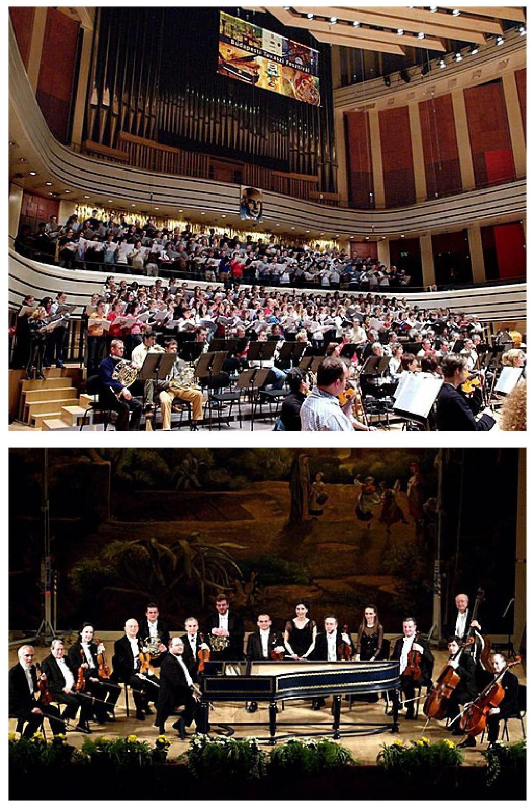

A Budapesti Fesztivál Központ Kht. által megrendezett Budapesti Tavaszi Fesztivál előadásai.

---

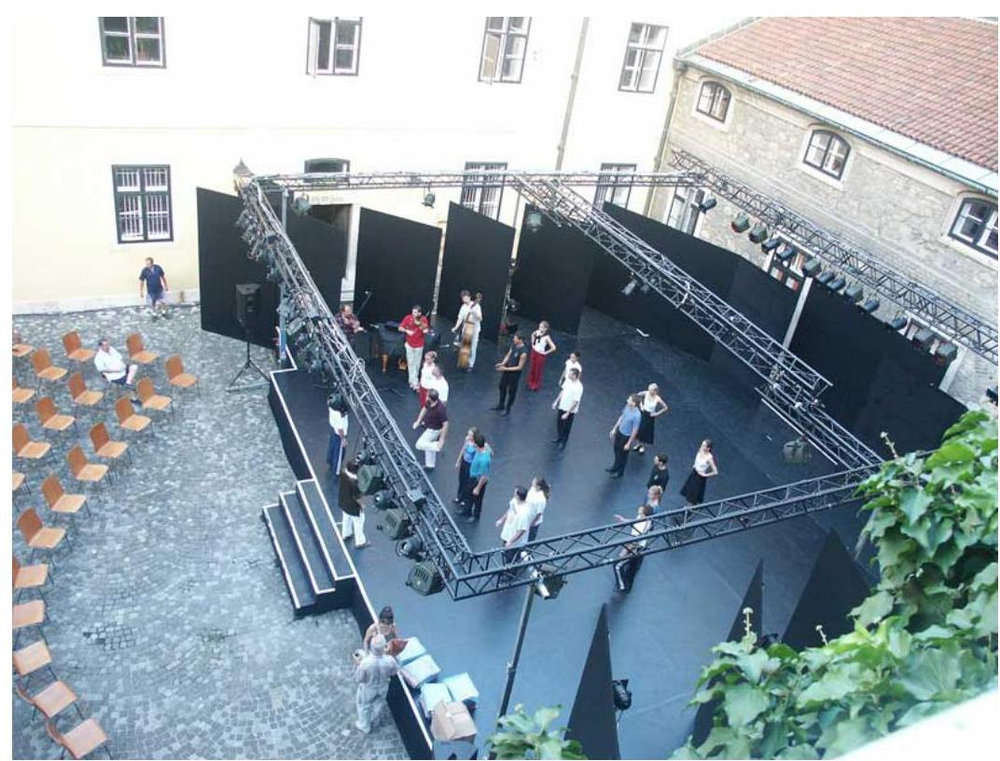

A Nemzeti Táncszínház Kht. produkciós próbája.
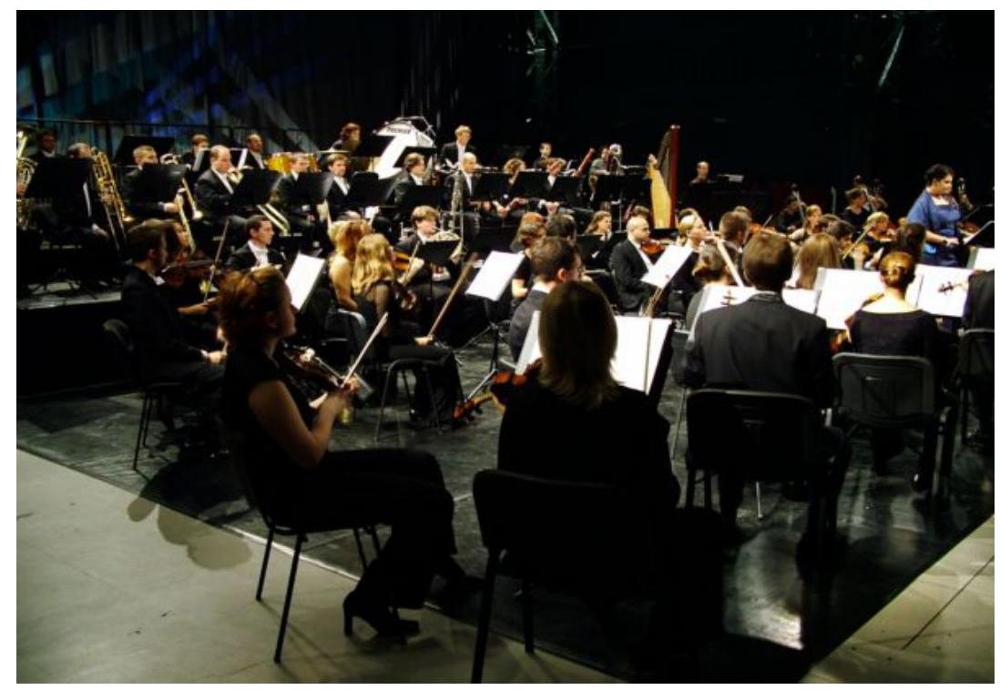

A Budafoki Dohnányi Ernő Szimfonikus Zenekar Kulturális Kht. hangversenye.

---

# A felhasználó szervezetek összegezett véleménye az NKA támogatási rendszeréről és a támogatások hasznosításáról, kérdőíves felmérés alapján 

| Sorszám | Kérdések | Igen | Nem | Részben | Rangsorolás |
| :--: | :--: | :--: | :--: | :--: | :--: |
| 1. | Jelöljék meg, hogy az alábbi évek közül mely(ek)ben kaptak támogatást az NKA-tól! |  |  |  |  |
|  | - 1999. | 31 |  |  |  |
|  | - 2000. | 33 |  |  |  |
|  | - 2001. | 34 |  |  |  |
|  | - 2002. | 37 |  |  |  |
|  | - 2003. | 38 |  |  |  |
|  | - 2004. | 39 |  |  |  |
| 2. | A támogatásból finanszírozott kulturális cél megvalósulását |  |  |  |  |
|  | - az NKA pályázati felhívásának ismeretében tervezték | 14 | 13 |  |  |
|  | - a pályázati kiírástól függetlenül tervezték, de a támogatási lehetőség megkönnyítette azt | 27 | 3 |  |  |
|  | - korábban már tervezték, de csak a támogatás tette azt lehetővé | 20 | 10 |  |  |
| 3. | Milyen forrásból szereztek információt a pályázati (támogatási) lehetőségről? |  |  |  |  |
|  | - országos napilap | 14 |  |  |  |
|  | - NKA Hírlevél | 17 |  |  |  |
|  | - NKA internetes honlapja | 35 |  |  |  |
|  | - egyéb információs forrásból | 5 |  |  |  |
| 4. | Milyennek ítélik meg az NKA pályázati rendszerének alábbi elemeit? |  |  |  |  |
|  | a.) a pályáztatás nyilvánossága |  |  |  |  |
|  | jó |  |  |  | 40 |
|  | közepes |  |  |  | 1 |
|  | nem megfelelő |  |  |  |  |
|  | b.) a pályázati felhívás megjelenésének időpontja |  |  |  |  |
|  | jó |  |  |  | 22 |
|  | közepes |  |  |  | 14 |
|  | nem megfelelő |  |  |  | 5 |
|  | c.) a pályázati kiírás és a feltételek egyértelműsége |  |  |  |  |
|  | jó |  |  |  | 27 |
|  | közepes |  |  |  | 9 |
|  | nem megfelelő |  |  |  | 5 |
|  | d.) a beadási határidő |  |  |  |  |
|  | jó |  |  |  | 22 |
|  | közepes |  |  |  | 14 |
|  | nem megfelelő |  |  |  | 5 |

---

|  | e.) | a pályázati ügyintézés színvonala |  |  |  |  |
| :--: | :--: | :--: | :--: | :--: | :--: | :--: |
|  |  | jó |  |  |  | 27 |
|  |  | közepes |  |  |  | 13 |
|  |  | nem megfelelő |  |  |  | 1 |
|  | f.) | az elbírálás gyorsasága |  |  |  |  |
|  |  | jó |  |  |  | 13 |
|  |  | közepes |  |  |  | 22 |
|  |  | nem megfelelő |  |  |  | 5 |
|  | g.) | a döntés indoklása |  |  |  |  |
|  |  | jó |  |  |  | 16 |
|  |  | közepes |  |  |  | 13 |
|  |  | nem megfelelő |  |  |  | 9 |
|  | h.) | a támogatás kiutalásának ütemezése |  |  |  |  |
|  |  | jó |  |  |  | 21 |
|  |  | közepes |  |  |  | 10 |
|  |  | nem megfelelő |  |  |  | 10 |
|  | i.) | a beszámoló beküldésének határideje |  |  |  |  |
|  |  | jó |  |  |  | 35 |
|  |  | közepes |  |  |  | 4 |
|  |  | nem megfelelő |  |  |  | 2 |
|  | 5. | Véleményük szerint a felhívásokban megjelölt pályázati kör: |  |  |  |  |
|  | a.) | megfelelő |  |  |  | 22 |
|  | b.) | szűkítése indokolt |  |  |  | 5 |
|  | c.) | szélesítése indokolt |  |  |  | 13 |
|  | 6. | Melyik kulturális támogatási stratégiát tartják jobbnak? |  |  |  |  |
|  | a.) | ha több pályázó kap kisebb összegű támogatás |  |  |  | 7 |
|  | b.) | ha kevesebb pályázó nagyobb összegű támogatásban részesül |  |  |  | 31 |
|  | 7. | Volt-e elutasított pályázatuk? | 34 | 7 |  |  |
|  | 8. | Előfordult-e, hogy az elnyert támogatást - a megítélt alacsony támogatási összeg miatt - nem vették igénybe? | 5 | 36 |  |  |
|  | 9. | Előfordult-e valamely pályázatukkal kapcsolatban szerződésmódosítás? (több válaszos) |  |  |  |  |
|  | a.) | igen, a megvalósítás határidejére vonatkozóan | 29 |  |  |  |
|  | b.) | igen, a kiadási jogcímek változása miatt | 16 |  |  |  |
|  | c.) | igen, a pályázati tartalom változása miatt | 7 |  |  |  |
|  | d.) | igen, egyéb okból | 2 |  |  |  |
|  | e.) | nem |  | 5 |  |  |
|  | 10. | Az igénybevételhez képest csökkentett összegű támogatás megítélése esetén: (több válaszos) |  |  |  |  |
|  | a.) | az önrész növelésére törekedtek |  |  |  | 23 |
|  | b.) | más támogatási forrásokat kerestek |  |  |  | 34 |
|  | c.) | átdolgozták a költségvetésüket |  |  |  | 21 |
|  | d.) | nem valósították meg a feladatot |  |  |  | 5 |
|  | 11. | A támogatás felhasználásával a kitűzött kulturális céljaik megvalósultak-e? | 32 | 0 | 10 |  |

---

| 12. | Kialakítottak-e mérőszámokat a támogatással megvalósult kulturális teljesítmény mérésére? | 14 | 27 |  |  |
| :--: | :--: | :--: | :--: | :--: | :--: |
| 13. | Ha igen, nyomon követték-e ezek alakulását? | 11 | 9 | 4 |  |
| 14. | Jelöljék meg, hogy szakterületükön mely mérőszámokat találják a legalkalmasabbaknak a kulturális teljesítmény mérésére (több válaszos) |  |  |  |  |
|  | a.) a látogatók, a nézők száma |  |  |  | 24 |
|  | b.) a produkció jegybevétele |  |  |  | 9 |
|  | c.) a megjelent kiadványok példányszáma |  |  |  | 8 |
|  | d.) az értékesített kiadványok példányszáma |  |  |  | 10 |
|  | e.) a bemutatási lehetőség száma (fellépés, előadás, kiállítás, vetítés stb.) |  |  |  | 11 |
|  | f.) a hazai és nemzetközi díjak, elismerések száma |  |  |  | 13 |
|  | g.) az elkészült új művek, produkciók száma |  |  |  | 12 |
|  | h.) a szakmai elismertség növekedése |  |  |  | 28 |
|  | i.) a visszatérő látogatók, nézők száma |  |  |  | 14 |
|  | j.) egyéb mérőszámok |  |  |  | 3 |
| 15. | Megvalósult-e a támogatásból finanszírozott kiadások és a támogatás felhasználásához kapcsolódó bevételek elkülönített nyilvántartása? | 36 | 4 |  |  |
| 16. | a.) Előfordult-e, hogy kiegészítésre szorult |  |  |  |  |
|  | - pénzügyi elszámolásuk | 24 | 14 |  |  |
|  | - szakmai beszámolójuk | 10 | 29 |  |  |
|  | b.) Előfordult-e, hogy nem volt elfogadható |  |  |  |  |
|  | - pénzügyi elszámolásuk |  | 25 |  |  |
|  | - szakmai beszámolójuk |  | 26 |  |  |
| 17. | Ellenőrizték-e Önöknél helyszíni ellenőrzéssel a támogatás felhasználását? | 19 | 21 |  |  |
| 18. | A helyszíni ellenőrzés megállapított-e hiányosságot, nem megfelelő felhasználást? | 1 | 20 | 11 |  |
| 19. | Készítenek-e utólagos elemzést, értékelést a támogatások felhasználásának hatásairól, eredményességéről? |  |  |  |  |
|  | a.) igen, számszerűsített formában | 6 |  |  |  |
|  | b.) igen, de nem számszerűsített formában | 16 |  |  |  |
|  | c.) nem, mert az utólagos hatások értékelése nem megvalósítható | 13 |  |  |  |
|  | d.) nem, egyéb okból | 5 |  |  |  |
| 20. | Értékeljék az NKA támogatási rendszerét az alábbi szempontok szerint: |  |  |  |  |
|  | a.) a pályázati célok meghatározása |  |  |  |  |
|  | kitűnő |  |  |  | 15 |
|  | jó |  |  |  | 19 |
|  | közepes |  |  |  | 5 |
|  | elégséges |  |  |  | 2 |
|  | elégtelen |  |  |  | 0 |
|  | b.) a pályázati feltételek meghatározása |  |  |  |  |
|  | kitűnő |  |  |  | 11 |

---

| jó |  |  |  | 20 |
| :--: | :--: | :--: | :--: | :--: |
| közepes |  |  |  | 8 |
| elégséges |  |  |  | 0 |
| elégtelen |  |  |  | 1 |
| c.) a döntéshozatal objektivitása |  |  |  |  |
| kitűnő |  |  |  | 7 |
| jó |  |  |  | 20 |
| közepes |  |  |  | 11 |
| elégséges |  |  |  | 1 |
| elégtelen |  |  |  | 1 |
| d.) az ügyintézés gördülékenysége |  |  |  |  |
| kitűnő |  |  |  | 9 |
| jó |  |  |  | 17 |
| közepes |  |  |  | 10 |
| elégséges |  |  |  | 4 |
| elégtelen |  |  |  | 0 |
| e.) a megítélt támogatás összege |  |  |  |  |
| kitűnő |  |  |  | 1 |
| jó |  |  |  | 10 |
| közepes |  |  |  | 22 |
| elégséges |  |  |  | 6 |
| elégtelen |  |  |  | 1 |

Információ szolgáltató: 41 felhasználó szervezet

---

# A szakmai szövetségek, érdekképviseleti szervezetek összegezett véleménye az NKA támogatási rendszeréről, kérdőíves felmérés alapján 

| Sorszám | Kérdések | Igen | Nem | Részben | Rangsorolás |
| :--: | :--: | :--: | :--: | :--: | :--: |
| 1. | Jelöltek-e tagot az 1999-2004 közötti időszakban az NKA Bizottságába? | 11 | 0 |  |  |
| 2. | Jelölésüket a miniszter elfogadta-e? | 10 | 1 |  |  |
| 3. | Részt vett-e Önök által delegált képviselő, a szakterületükhöz tartozó szakmai kollégium munkájában 1999-2004 közötti időszakban? | 10 | 1 |  |  |
| 4. | Ha igen, beszámoltatták-e a szakmai kollégiumban végzett tevékenységéről? | 4 | 6 |  |  |
| 5. | Részesültek-e a fent megjelölt időszakban az NKA támogatásában? | 11 | 0 |  |  |
| 6. | Véleményük szerint az NKA pályázati kiírásai az adott kulturális szakterület legfontosabb feladatainak megoldására irányulnak$e ?$ | 6 | 0 | 5 |  |
| 7. | Megfelelőnek tartják-e az NKA szakmai kollégiumaiban, az Önök által képviselt kulturális terület különböző érdekcsoportjainak részvételi arányát? | 7 | 4 |  |  |
| 8. | Véleményük szerint a felhívásokban megjelölt pályázói kör: |  |  |  |  |
|  | - megfelelő | 7 |  |  |  |
|  | - szűkítése indokolt | 0 |  |  |  |
|  | - bővítése indokolt | 4 |  |  |  |
| 9. | Melyik kulturális támogatási stratégiát tartják jobbnak? |  |  |  |  |
|  | - ha több pályázó kap kisebb összegű támogatást | 5 |  |  |  |
|  | - ha kevesebb pályázó nagyobb összegű támogatásban részesül | 6 |  |  |  |
| 10. | Az Önök által képviselt kulturális szakterületen, mely tényezők erősíthetnék a döntéshozatal objektivitását? |  |  |  |  |
|  | - a pályázóktól referenciák kérése |  |  |  | 10 |
|  | - pontozáson alapuló döntéshozatali rendszer kialakítása |  |  |  | 1 |
|  | - a pályázóktól bekért információk körének bővítése |  |  |  | 4 |
|  | - a döntéshozó testületek létszámának, szakmai összetételének módosítása |  |  |  | 3 |
|  | - egyéb tényezők |  |  |  | 2 |
| 11. | Erősítené-e a döntéshozatal objektivitását a pályázók anonimitása? | 1 | 7 | 3 |  |
| 12. | Jelöljék meg, hogy szakterületükön mely mérőszámokat találják a legalkalmasabbaknak a kulturális teljesítmény mérésére! |  |  |  |  |
|  | - a látogatók, nézők száma |  |  |  | 5 |
|  | - a produkciók jegybevétele |  |  |  | 1 |

---

|  | - a megjelent kiadványok példányszáma |  |  |  | 2 |
| :--: | :--: | :--: | :--: | :--: | :--: |
|  | - az értékesített kiadványok példányszáma |  |  |  | 1 |
|  | - a bemutatási lehetőség száma (fellépés, előadás, kiállítás, vetítés stb.) |  |  |  | 4 |
|  | - a hazai és nemzetközi díjak, elismerések száma |  |  |  | 5 |
|  | - az elkészült új művek, produkciók száma |  |  |  | 7 |
|  | - a szakmai elismertség növekedése |  |  |  | 8 |
|  | - a visszatérő látogatók, nézők száma |  |  |  | 4 |
|  | - egyéb mérőszámok |  |  |  | 0 |
| 13. | Értékeljék az NKA támogatási rendszerét 1-től 5-ig az alábbi szempontok szerint: |  |  |  |  |
|  | - a pályázati célok meghatározása |  |  |  |  |
|  | kitűnő |  |  |  | 2 |
|  | jó |  |  |  | 6 |
|  | közepes |  |  |  | 3 |
|  | elégséges |  |  |  | 0 |
|  | elégtelen |  |  |  | 0 |
|  | - a pályázati feltételek meghatározása |  |  |  |  |
|  | kitűnő |  |  |  | 2 |
|  | jó |  |  |  | 6 |
|  | közepes |  |  |  | 2 |
|  | elégséges |  |  |  | 1 |
|  | elégtelen |  |  |  | 0 |
|  | - a döntéshozatal objektivitása |  |  |  |  |
|  | kitűnő |  |  |  | 2 |
|  | jó |  |  |  | 5 |
|  | közepes |  |  |  | 4 |
|  | elégséges |  |  |  | 0 |
|  | elégtelen |  |  |  | 0 |
|  | - az ügyintézés gördülékenysége |  |  |  |  |
|  | kitűnő |  |  |  | 4 |
|  | jó |  |  |  | 3 |
|  | közepes |  |  |  | 2 |
|  | elégséges |  |  |  | 2 |
|  | elégtelen |  |  |  | 0 |
|  | - a támogatás összegének nagyságrendje |  |  |  |  |
|  | kitűnő |  |  |  | 0 |
|  | jó |  |  |  | 3 |
|  | közepes |  |  |  | 6 |
|  | elégséges |  |  |  | 2 |
|  | elégtelen |  |  |  | 0 |

Információ szolgáltató: 11 szakmai szövetség, érdekképviseleti szervezet

---

# Az elutasított pályázók összegezett véleménye az NKA támogatási rendszeréről, kérdőíves felmérés alapján 

| Sorszám | Kérdések | Igen | Nem | Részben | Rangsorolás |
| :--: | :--: | :--: | :--: | :--: | :--: |
| 1. | Jelöljék meg, hogy az alábbi évek közül mely(ek)ben kaptak támogatást az NKA-tól és mely(ek)ben volt sikertelen pályázatuk |  |  |  |  |
|  | a.) sikeres pályázat |  |  |  |  |
|  | - 1999. | 7 |  |  |  |
|  | - 2000. | 9 |  |  |  |
|  | - 2001. | 9 |  |  |  |
|  | - 2002. | 8 |  |  |  |
|  | - 2003. | 9 |  |  |  |
|  | - 2004. | 10 |  |  |  |
|  | b.) sikertelen pályázat |  |  |  |  |
|  | - 1999. | 4 |  |  |  |
|  | - 2000. | 5 |  |  |  |
|  | - 2001. | 9 |  |  |  |
|  | - 2002. | 10 |  |  |  |
|  | - 2003. | 11 |  |  |  |
|  | - 2004. | 15 |  |  |  |
| 2. | Mi volt a pályázat(ok) elutasításának oka? |  |  |  |  |
|  | a.) az előírt mellékletek (igazolások, okiratok) hiánya, benyújtási késedelme |  |  |  | 1 |
|  | b.) nem felelt meg a pályázati kiírás feltételeinek |  |  |  | 3 |
|  | c.) a pályázati adatlap kitöltési hiányosságai |  |  |  | 0 |
|  | d.) az NKA-val szemben fennálló elszámolatlan kötelezettség |  |  |  | 0 |
|  | e.) a pályázat nem megfelelő szakmai színvonala |  |  |  | 0 |
|  | f.) adott időszak támogatási keretének hiánya (halasztott pályázat esetében) |  |  |  | 4 |
|  | g.) egyéb ok |  |  |  | 10 |
| 3. | Kaptak-e indoklást a pályázat sikertelenségének okáról? |  |  |  |  |
|  | - igen, minden esetben | 1 |  |  |  |
|  | - nem |  | 12 |  |  |
|  | - csak, ha a pályázat érvénytelen volt |  |  | 3 |  |
| 4. | Elutasított pályázat esetén: |  |  |  |  |
|  | a.) más szakmai kollégiumnál próbálták ismét benyújtani | 5 |  |  |  |
|  | b.) az eredeti kiírást közzétevő szakmai kollégiumhoz a következő pályázati ciklusban újra benyújtották | 7 |  |  |  |

---

|  | c.) a feladat megvalósítására a miniszteri keretből kértek támogatást | 4 |  |  |  |
| :--: | :--: | :--: | :--: | :--: | :--: |
|  | d.) egyedi kérelmet nyújtottak be | 0 |  |  |  |
|  | e.) az NKA-n kívüli szponzort kerestek | 11 |  |  |  |
|  | f.) nem valósították meg a pályázati célt | 6 |  |  |  |
| 5. | Milyennek ítélik meg az NKA pályázati rendszerének alábbi elemeit? |  |  |  |  |
|  | a.) a pályáztatás nyilvánossága |  |  |  |  |
|  | - jó |  |  |  | 5 |
|  | - közepes |  |  |  | 6 |
|  | - nem megfelelő |  |  |  | 0 |
|  | b.) a pályázati felhívás megjelenésének időpontja |  |  |  |  |
|  | - jó |  |  |  | 8 |
|  | - közepes |  |  |  | 6 |
|  | - nem megfelelő |  |  |  | 3 |
|  | c.) a pályázati kiírás és a feltételek egyértelműsége |  |  |  |  |
|  | - jó |  |  |  | 7 |
|  | - közepes |  |  |  | 9 |
|  | - nem megfelelő |  |  |  | 1 |
|  | d.) a beadási határidő |  |  |  |  |
|  | - jó |  |  |  | 6 |
|  | - közepes |  |  |  | 8 |
|  | - nem megfelelő |  |  |  | 3 |
|  | e.) a pályázati ügyintézés színvonala |  |  |  |  |
|  | - jó |  |  |  | 8 |
|  | - közepes |  |  |  | 5 |
|  | - nem megfelelő |  |  |  | 3 |
|  | f.) az elbírálás gyorsasága |  |  |  |  |
|  | - jó |  |  |  | 4 |
|  | - közepes |  |  |  | 8 |
|  | - nem megfelelő |  |  |  | 5 |
| 6. | Véleményük szerint a felhívásokban megjelölt pályázói kör: |  |  |  |  |
|  | a.) megfelelő |  |  |  | 9 |
|  | b.) szűkítése indokolt |  |  |  | 2 |
|  | c.) bővítése indokolt |  |  |  | 5 |
| 7. | Melyik kulturális támogatási stratégiát tartják jobbnak? |  |  |  |  |
|  | a.) ha több pályázó kap kevesebb összegű támogatást | 10 |  |  |  |
|  | b.) ha kevesebb pályázó nagyobb összegű támogatásban részesül | 7 |  |  |  |
| 8. | Véleményük szerint megfelelő-e az NKA szakmai kollégiumaiban az adott szakterület különböző érdekcsoportjainak a képviselete? | 9 | 8 |  |  |
| 9. | Véleményük szerint a pályázatok benyújtásakor az NKA által kért információ elegendő-e az objektív döntéshez, a pályázat szakmai színvonalának megítélésére? | 6 | 3 | 7 |  |

---

| 10. | Az Önök kulturális szakterületén, mely tényezők erősíthetnék a döntéshozatal objektivitását? |  |  |  |  |
| :--: | :--: | :--: | :--: | :--: | :--: |
|  | a.) a pályázók anonimitása |  |  |  | 3 |
|  | b.) a pályázóktól referenciák kérése |  |  |  | 9 |
|  | c.) pontozáson alapuló döntéshozatali rendszer kialakítása |  |  |  | 7 |
|  | d.) a pályázóktól bekért információk körének bővítése |  |  |  | 7 |
|  | e.) a döntéshozó testületek létszámának, szakmai összetételének módosítása |  |  |  | 9 |
|  | f.) egyéb tényezők |  |  |  | 2 |
| 11. | Jelöljék meg, hogy szakterületükön mely mérőszámokat találják a legalkalmasabbnak a kulturális teljesítmény mérésére |  |  |  |  |
|  | a.) a látogatók, nézők száma |  |  |  | 11 |
|  | b.) a produkciók jegybevétele |  |  |  | 5 |
|  | c.) a megjelent kiadványok példányszáma |  |  |  | 2 |
|  | d.) az értékesített kiadványok példányszáma |  |  |  | 2 |
|  | e.) a bemutatási lehetőség száma (fellépés, előadás, kiállítás, vetítés stb.) |  |  |  | 6 |
|  | f.) a hazai és nemzetközi díjak, elismerések száma |  |  |  | 5 |
|  | g.) az elkészült új múvek, produkciók száma |  |  |  | 4 |
|  | h.) a szakmai elismertség növekedése |  |  |  | 10 |
|  | i.) a visszatérő látogatók, nézők száma |  |  |  | 8 |
|  | j.) egyéb mérőszámok |  |  |  | 1 |
| 12. | Értékeljék az NKA támogatási rendszerét 1-től 5-ig, az alábbi szempontok szerint! |  |  |  |  |
|  | a.) a pályázati célok meghatározása |  |  |  |  |
|  | - kitűnő |  |  |  | 3 |
|  | - jó |  |  |  | 7 |
|  | - közepes |  |  |  | 4 |
|  | - elégséges |  |  |  | 1 |
|  | - elégtelen |  |  |  | 0 |
|  | b.) a pályázati feltételek meghatározása |  |  |  |  |
|  | - kitűnő |  |  |  | 2 |
|  | - jó |  |  |  | 5 |
|  | - közepes |  |  |  | 6 |
|  | - elégséges |  |  |  | 2 |
|  | - elégtelen |  |  |  | 0 |
|  | c.) a döntéshozatal objektivitása |  |  |  |  |
|  | - kitűnő |  |  |  | 1 |
|  | - jó |  |  |  | 2 |
|  | - közepes |  |  |  | 6 |
|  | - elégséges |  |  |  | 4 |
|  | - elégtelen |  |  |  | 2 |
|  | d.) az ügyintézés gördülékenysége |  |  |  |  |
|  | - kitűnő |  |  |  | 3 |
|  | - jó |  |  |  | 4 |

---

| - | közepes |  |  |  | 4 |
| :-- | :-- | :-- | :-- | :-- | :--: |
| - | elégséges |  |  |  | 4 |
| - | elégtelen |  |  |  | 1 |
| e.) a megítélt támogatás összege |  |  |  |  |  |
| - kitűnő |  |  |  |  | 0 |
| - jó |  |  |  |  | 5 |
| - közepes |  |  |  |  | 4 |
| - elégséges |  |  |  |  | 5 |
| - elégtelen |  |  |  |  | 3 |

Információ szolgáltató: 17 elutasított pályázó

---

# Kérdések, kritériumok és adatforrások a Nemzeti Kulturális Alapprogramra fordított pénzeszközök hasznosulásának ellenőrzéséhez

Az ellenőrzés fő kérdése: Eredményes volt-e Nemzeti Kulturális Alapprogram pénzeszközeinek hasznosítása?

|  Kérdések | Kritériumok | Adatforrások  |
| --- | --- | --- |
|  1. A Nemzeti Kulturális Alapprogram célmeghatározása és a feladatai megvalósításához rendelt feltételek megfelelően elősegítették-e pótlólagos forrást betöltő szerepének teljesítését?
1.1 A Nemzeti Kulturális Alapprogram cél- és feladatmeghatározása, stratégiai célkitűzései és prioritásai megfelelően segítették-e a különböző kulturális szakterületek eredményes és hatékony támogatását? | Eredményesség:
- a vizsgált időszak kormányprogramjaiban az NKA szerepére vonatkozó elképzelések megvalósulása;
- a támogatási célok összhangja a kormány kulturális politikájával és a kulturális tárca főbb stratégiai célkitűzéseivel;
- a Bizottság rövid- és középtávú támogatási stratégiájának, határozatainak és ajánlásainak összhangja a jogszabályban meghatározott célokkal;
- a Bizottság szakmai kollégiumokra vonatkozó határozatainak, ajánlásainak megvalósulása;
- a szakmai kollégiumok támogatási célkitűzéseinek meghatározása és annak összhangja a Bizottság kulturális stratégiájával;
- a szakmai kollégiumok támogatási céljainak összehangoltsága más szervezetek pályázataival; | - a vizsgált időszak kormányprogramjai;
- a kulturális tárca főbb stratégiai célkitűzései;
- az NKA közép- és rövidtávú kulturális támogatási stratégiája;
- az NKA Bizottság által kidolgozott támogatási szempontok, prioritások;
- Bizottsági határozatok, ajánlások;
- az NKA törvény és végrehajtási rendeletének előírásai, a miniszteri keret nagyságára, felhasználhatóságára vonatkozóan;
- a Bizottság szakmai kollégiumokra vonatkozó határozatai, ajánlásai;
- a szakmai kollégiumok közép- és rövidtávú támogatási stratégiája;
- az egyes szakmai kollégiumok által évenként meghatározott prioritások;  |

---

|  Kérdések | Kritériumok | Adatforrások  |
| --- | --- | --- |
|   | **Mérőszámok, mutatószámok:**
- az NKA rendelkezésére bocsátott pénzösszeg/a kulturális célokra fordított összes NKÖM fejezeti támogatás;
- az NKA támogatásra fordítható pénzeszközei/egyéb kulturális pályáztatók forrásösszege; | - a szakmai kollégiumok által meghirdetett közös támogatási célok;
- 1. sz. tanúsítvány (A pályázati tevékenység részletezése a törvényi célkitűzések szerint 1999-2004. években).  |
|  1.2 Az Alapprogram feladatainak végrehajtásához biztosított pénzeszközök lehetővé tették-e a támogatási rendszer eredményes működését? | **Eredményesség:**
- az éves költségvetési törvények NKA-ra vonatkozó bevételi előirányzatainak teljesülése;
- az NKA évenkénti bevételi és kiadási előirányzatainak teljesülése;
- a pótlólagos források bevonására tett javaslatok, intézkedési tervek és azok megvalósulása;
- az évenkénti tartalékkeret meghatározása és azok megvalósulása;
**Hatékonyság:**
- a pénzügyi keretek felosztásakor a hatékonysági szempontok figyelembevétele; a pótlólagos bevételek keretfelosztási szempontjai;
**Mérőszámok, mutatószámok:**
- a bevételek időszakonkénti és forrásonkénti alakulása; | - az NKA törvényi bevételi forrásokra és ütemezésre vonatkozó előírásai;
- az egyéb pótlólagos források bevonására tett javaslatok, intézkedési tervek;
- az évenkénti tartalékkeretek;
- bizottsági határozatok, ajánlások a pótlólagos bevételek elosztási szempontjairól;
- az NKA évenkénti költségvetése; bevételi és kiadási előirányzatai és azok teljesülése;
- a fejezeti kezelésű előirányzatok felhasználásának jogszabályi előírásai;
- 5. sz. tanúsítvány (Az NKA költségvetésének alakulása a vizsgált időszakban);
- 6. sz. tanúsítvány (Az NKA teljesített kiadásai tevékenységenkénti bontásban, az egyéb pénzeszköz átadások részletezése a pályázók szervezeti formája szerint);
- az állandó és ideiglenes kollégiumi keretek meghatározásáról, valamint az egyedi támogatások mértékéről szóló bizottsági határozatok;  |

---

|  Kérdések | Kritériumok | Adatforrások  |
| --- | --- | --- |
|   | - a kiadások felhasználási célok szerinti alakulása;
- a miniszteri keret és a kollégiumi keretek nagyságának és egymáshoz viszonyított arányának alakulása;
- az Igazgatóság költségvetési részaránya az NKA költségvetésén belül; | - a jogszabályok és az NKA SZMSZ előírásai az Igazgatóság működési költségvetéséről, a miniszteri keret nagyságrendjéről, felhasználási céljairól;  |
|  1.3 A döntéshozó testületek kialakítása, működése eredményesen és hatékonyan biztosította-e az Alapprogram céljainak megvalósulását? | Eredményesség:
- a szakmai kollégiumok számának növekedésével, a szakmai kompetencia erősödése, a pályázatok döntési határidejének rövidülése;
Hatékonyság:
- az ideiglenes kollégiumok létrehozásának szakmai szükségszerűsége, hatékonysága;
Mérőszámok, mutatószámok:
- az ideiglenes szakmai kollégiumok száma, működésük időtartama;
- az állandó és ideiglenes kollégiumok számának, létszámának és szakmai összetételének alakulása;
- a pályázatok beadásától a döntésig eltelt átlagos időtartam alakulása évenként; | - az NKA törvényben, annak végrehajtási rendeletében, valamint az NKA SZMSZ-ben megfogalmazott előírások a döntéshozó testületek (Bizottság, állandó és ideiglenes kollégiumok) létrehozására és működésére vonatkozóan;
- az NKA belső szabályzatainak előírásai a döntéshozó testületek működésére vonatkozóan (NKA SZMSZ, Pályázatkezelési Szabályzat);
- az NKA törvény végrehajtására vonatkozó NKÖM rendelet, valamint az NKA SZMSZ és a Pályázatkezelési Szabályzat összeférhetetlenségre vonatkozó előírásai;  |

---

|  Kérdések | Kritériumok | Adatforrások  |
| --- | --- | --- |
|  1.4 A Programkezelő (NKA Igazgatóság) szervezeti felépíse, feltételrendszere és feladatellátása biztosította-e az Alapprogram eredményes müködését? | Hatékonyság:
- az NKA és az Igazgatóság SZMSZ-ének összhangja a jogszabályokkal, a szervezeti felépítés kialakításának és a munkafolyamatok szabályozásának célszerűsége;
- a munkaköri leírásokban a hatásköri átfedések kiküszöbölése;
- a döntéshozó testületek és az Igazgatóság zavartalan együttműködésének megvalósulása;
- az Igazgatóság eszköz- és munkaerőellátottságának feladatokhoz igazodó alakulása;
- hatékony ügyintézést és megfelelő informáltságot biztosító informatikai rendszer működtetése;
Eredményesség:
- a visszatérítendő támogatások szerződés szerinti visszafizetésének biztosítása, a követelések behajtása;
Gazdaságosság:
- a humán erőforrások és a tárgyi feltételek fejlesztése során a gazdaságosság szempontjainak érvényesítése;
- az informatikai rendszer gazdaságos fejlesztése; | - a döntéshozó testületek és az Igazgatóság beszámolói;
- a szakmai kollégiumok kérdőíves felméréseinek eredményei;
- költségvetési beszámolók;
- kimutatás az Igazgatóság tárgyi eszközállományáról, valamint a beérkezett és feldolgozott pályázatok alakulásáról a vizsgált időszakban;
- 7. sz. tanúsítvány (Az Igazgatóság kiadásainak alakulása kiemelt előirányzatonként);
- 8. sz. tanúsítvány (A költségvetési létszám, valamint az egy alkalmazottra jutó pályázatok számának alakulása);
- 9. sz. tanúsítvány (Az Igazgatóság eszközeinek és forrásainak alakulása);
- 10. sz. tanúsítvány (A visszatérítendő támogatásoknál a követelések behajtási arányának alakulása);
- 14. sz. tanúsítvány (A pályázati elszámoltatások és a helyszíni ellenőrzések alakulása a vizsgált időszakban);  |

---

|  Kérdések | Kritériumok | Adatforrások  |
| --- | --- | --- |
|   | **Mérőszámok, mutatószámok:**
- az Igazgatóság létszámának, eszközállományának, informatikai ellátottságának a feladatokhoz mért alakulása;
- feldolgozott pályázatok száma (db/év);
- egy ügyintézőre jutó pályázatok száma (db/fő/év);
- a támogatottak pénzügyi elszámoltatásának aránya évenként;
- a számítástechnikai rendszerből nyerhető információcsoportok száma (db);
- a követelések nagysága és aránya az összes támogatáshoz viszonyítva;
- a követelésbehajtási arány %; |   |
|  2. A támogatások lebonyolítási rendszere biztosította-e az NKA pénzeszközeinek eredményes és hatékony felhasználását? |  |   |
|  2.1 A pályázati, támogatási rendszer kialakítása és működése hozzájárult-e a célok eredményes és hatékony megvalósulásához? | **Eredményesség:**
- az alkalmazott támogatási formák (pályáztatás, egyedi elbírálás, miniszteri keret) megalapozottsága;
- a pályáztatás során a törvényi felhasználási célokhoz igazodó pályázati célok és prioritások kialakítása;
- a testületi döntéseket megalapozó, objektív bírálati szempontrendszer működtetése;
- a döntések nyilvánosságának megvalósulása; | - az NKA törvény és a végrehajtásáról szóló rendelet pályáztatásra vonatkozó előírásai;
- az egyedi elbírálás alkalmazásáról és annak mértékéről szóló bizottsági határozatok;
- a visszatérítendő és vissza nem térítendő támogatások odaitélésének belső szabályozása;
- a támogatásban részesült és elutasított pályázókkal készített kérdőíves felmérés;  |

---

|  Kérdések | Kritériumok | Adatforrások  |
| --- | --- | --- |
|   | - a szerződések egyértelmű, minden lényeges feltételre kiterjedő megfogalmazása; teljesítmény- és eredménykövetelmények kialakítása;
- a támogatási szerződésekben a pályázati cél és a támogatott pályázati tartalom összhangja;
- a feladat megvalósíthatósága a szerződés szerinti időtartam alatt;
Mérőszámok, mutatószámok:
- a támogatások törvényi célkitűzések szerinti arányának alakulása;
- a meghirdetett pályázati témák száma és időbeni alakulása a vizsgált szakkollégiumoknál;
- érvénytelen pályázat/összes beérkezett pályázat (\%);
- támogatott pályázat/beérkezett pályázat szakmai kollégiumonként (\%);
- sikertelen pályázat/beérkezett pályázat szakmai kollégiumonként (\%);
- a támogatási összeg/igényelt összeg szakmai kollégiumonként (\%);
- az egyedi igények és odaítélések aránya az összes támogatáson belül;
- a támogatottak szakterületenkénti és szervezeti formánkénti arányának alakulása;
- Budapest, vidék, határon túli támogatások arányának alakulása; | - pályázati felhívások;
- pályázati adatlapok;
- a pályázatok elbírálásához kialakított szempontrendszer;
- az Áht. és Ámr. rendelkezései a költségvetési szervek kötelezettségvállalásáról és a kötelezettségvállalások teljesítéséről;
- az NKA támogatási szerződései;
1. sz. tanúsítvány (A pályázati tevékenység részletezése a törvényi célok szerint);
2. sz. tanúsítvány (A támogatott pályázatok részletezése a pályázók területi illetősége szerint);
3. sz. tanúsítvány (A támogatott pályázatok részletezése a pályázat megvalósulásának helye szerint);
4. sz. tanúsítvány (A miniszteri keret célok szerinti felhasználása az ellenőrzött időszakban);
5. sz. tanúsítvány (Az NKA teljesített kiadásai tevékenységenkénti bontásban, az egyéb pénzeszköz átadások részletezése a pályázók szervezeti formája szerint);
6. sz. tanúsítvány (Az NKA támogatások részletezése egyedi és pályázati döntés szerinti bontásban);  |

---

|  Kérdések | Kritériumok | Adatforrások  |
| --- | --- | --- |
|   | - az iparművészet, népművészet és közművelődés együttes támogatási aránya az NKA összes támogatásán belül;
- az el nem fogadott beszámoló/összes beszámoló (\%); | - 12. sz. tanúsítvány (Az ellenőrzésbe vont állandó és ideiglenes szakmai kollégiumok pályázati tevékenysége);
- 13. sz. tanúsítvány (Az NKA évenkénti támogatásának kulturális szakterületek szerinti megoszlása);  |
|  2.2 A beszámoltatás és ellenőrzés rendszere hozzájárult-e az Alapprogram feladatainak eredményes és hatékony ellátásához? | Eredményesség:
- a támogatás felhasználásának eredményességét, hatékonyságát is tükröző beszámoltatási rendszer kialakítása;
- a kedvezményezettek beszámolóinak hasznosíthatósága;
- a komplex ellenőrzések során eredményességi, hatékonysági kritériumok kidolgozása, azok érvényesítése;
- az ellenőrzési terv megvalósulása, az ellenőrzöttek körének bővülése;
- az ellenőrzéseket követő intézkedések, szankciók eredményessége;
Hatékonyság:
- a döntéshozó testületek beszámolóinak egységes szempontrendszere; | - a kedvezményezettek beszámolói;
- a beszámoltatáshoz kialakított szempontrendszer;
- az elszámoló lap tartalma;
- bizottsági határozatok, intézkedési tervek, a szakmai döntéshozó testületek beszámolóihaz kapcsolódóan;
- 14. sz. tanúsítvány (A pályázatok elszámoltatásának és helyszíni ellenőrzésének alakulása a vizsgált időszakban);
- az SZMSZ (NKA és Igazgatóság), valamint a Pályázatkezelési Szabályzat előírásai az elszámoltatás rendjéről;
- a költségvetési szervek belső ellenőrzéséről szóló 193/2003. (XI.26.) Korm.rendelet előírásai;
- az NKA Belső Ellenőrzési Szabályzata;  |

---

|  Kérdések | Kritériumok | Adatforrások  |
| --- | --- | --- |
|   | Mérőszámok, mutatószámok:
- komplex ellenőrzések száma/összes támogatott pályázat (\%) |   |
|  3. A támogatás felhasználói, az NKA által biztosított pótlólagos forrás segítségével, elérték-e a kulturális értékek megőrzésére, gyarapítására kitűzött célokat?
3.1 A pályázati feltételek elősegítették-e a célok megvalósulását? | Eredményesség:
- a nyilvános pályázati felhívások feltételeinek (a támogatás összege, ütemezése, a pályázói kör meghatározása) összhangja a pályázati célokkal;
- a pályázati felhívásban megjelölt, illetve az "elnyert" támogatási összeggel a pályázati cél megvalósíthatósága;
- az előírt önrész megléte a pályázónál;
Mérőszámok, mutatószámok:
- az elnyert támogatás összege/az igényelt támogatás összege (\%);
- a támogatás összege/a megvalósítás teljes költsége (\%); | - az NKA honlap, valamint az NKA Hírlevelek pályázati felhívásai;
- a Pályázatkezelési Szabályzat előírásai a pályázatok meghirdetéséről, a határidőkről;
- az alacsony támogatási összeg miatt meghiúsult szerződések kimutatása;
- az Áht. és Ámr. rendelkezései a kötelezettségvállalások teljesítéséről;
- a támogatott pályázókkal és a szakmai, érdekképviseleti szervekkel készített kérdőíves felmérés eredményei;
- a Ptk. rendelkezései a szerződések módosításáról;
- az NKA-n kívüli kulturális célú pályázati lehetőségek;  |

---

|  Kérdések | Kritériumok | Adatforrások  |
| --- | --- | --- |
|  3.2 A kedvezményezettek biztosították-e a támogatások célnak megfelelő, eredményes és hatékony hasznosítását? | **Eredményesség-hatékonyság:**
- a meghirdetett, illetve a szerződés szerinti pályázati célkitűzések megvalósulása;
- a támogatás eredményes és hatékony hasznosítása közvetlen és közvetett hatásainak mérhetősége;
- a pályázati célban rögzített és a támogatási szerződésben vállalt kulturális-szakmai eredmény biztosítása;
**Mérőszámok, teljesítménymutatók a felhasználóknál:**
**Előadások, rendezvények** (zene, színház, mozgókép, táncművészet)
- előadások száma; fizető nézőszám; jegybevétel összesen és fajlagosan; férőhelyek kihasználtsága;
**Kiállítások** (múzeum, ismeretterjesztés)
- látogatók száma; jegybevétel; kiállított művek; kiállító művészek száma; kiállítási terület;
**Könyvek, hanghordozók, folyóiratok, katalógusok** (szépirodalom, zene, ismeretterjesztés)
- megjelent példányszám, terjedelem; fajlagos költség; eladott példányszám; előfizetése (folyóirat); könyvtári terjesztés; | - a meghirdetett pályázati célkitűzések;
- a pályázatban szereplő, valamint szerződés szerinti pályázati célok;
- az eredmények dokumentálása;
- a szakterületenként kialakított teljesítménymutatók;
- a támogatott kulturális területről megjelent értékelések, felmérések;
- a felhasználó szervezet vezetőinek értékelései;
- a felhasználó szervezetek belső ellenőreinek megállapításai a támogatás felhasználásának eredményességéről, hatékonyságáról;
- támogatás-felhasználói tanúsítványi adatlapok;
- kérdőíves felmérések és interjúk.  |

---

|  Kérdések | Kritériumok | Adatforrások  |
| --- | --- | --- |
|   | Szakmai rendezvények, alkotótáborok (könyv, színház, zene, mozgókép)
- résztvevők száma; bemutatott, illetve új művek száma; szakmai részvétel
Nagyrendezvények, rendezvénysorozat (miniszteri keret)
- rendezvények száma; látogatók száma, összetétele; visszatérő látogatók; egy napra, illeve előadásra jutó látogatók; jegyárbevétel összesen és fajlagosan; addicionális költés (turisztikai programoknál). |   |

Budapest, 2005. október