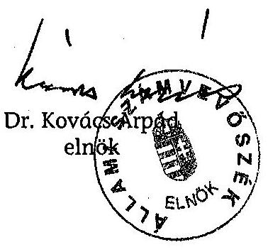
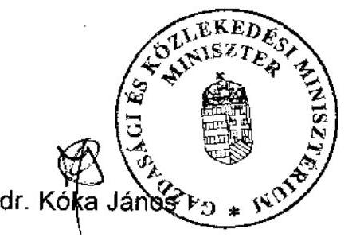
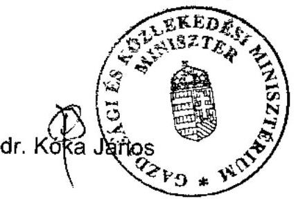
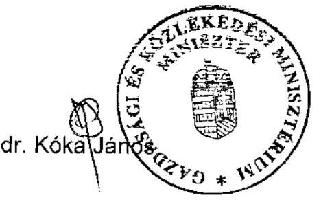
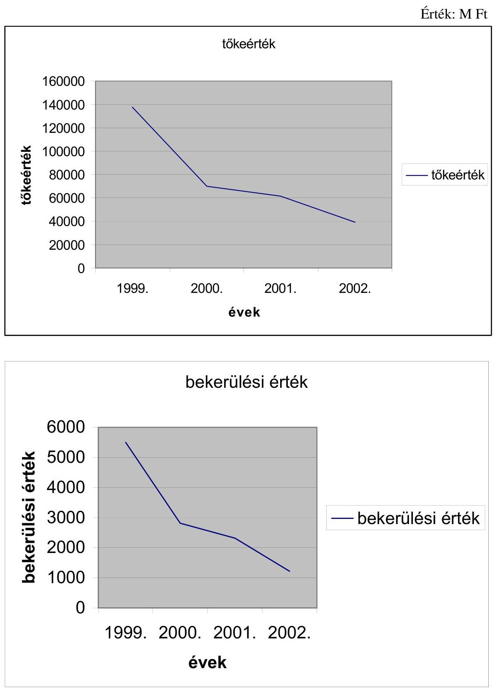

# JELENTÉS 

a Magyar Követeléskezelő Rt. múködésének ellenőrzéséről

---

2. Államháztartás Központi Szintjét Ellenőrző Igazgatóság
2.1. Teljesítmény Ellenőrzési FőcsoportIktatószám: V-7-41/2005.Témaszám: 763Vizsgálat-azonosító szám: V0218
Az ellenőrzést felügyelte:
Bihary Zsigmond
főigazgató
Az ellenőrzés végrehajtásáért felelős:
Kemény Emil
főcsoportfőnök
Az ellenőrzést vezette:
Makkai Mária
főcsoportfőnökhelyettes
Az ellenőrzést végezték:
Czúcz Dénes
számvevő gyakornok
Hajagos Józsefné
főtanácsadó
Kun Eszter
számvevő
A témához kapcsolódó eddig készített számvevőszéki jelentések:
címe
sorszáma
Jelentés a Magyar Köztársaság 2002. évi költségvetése ..... 0329
végrehajtásának ellenőrzéséről
Jelentés a Magyar Köztársaság 2003. évi költségvetése ..... 0443
végrehajtásának ellenőrzéséről
Jelentés a Magyar Köztársaság 2004. évi költségvetése ..... 0540
végrehajtásának ellenőrzéséről

---

# TARTALOMJEGYZÉK 

BEVEZETÉS ..... 5
I. ÖSSZEGZŐ MEGÁLLAPÍTÁSOK, KÖVETKEZTETÉSEK, JAVASLATOK ..... 7
II. RÉSZLETES MEGÁLLAPÍTÁSOK ..... 12

1. Az MKK feladata, működésének szabályozottsága és szervezete ..... 12
1.1. Az MKK feladata és múködésének szabályozottsága ..... 12
1.2. Az MKK szervezete, döntési és irányítói tevékenysége ..... 14
2. A tulajdonosi irányítás és a vezető testületek múködése ..... 16
3. Az MKK stratégiája és éves üzleti tervei ..... 18
3.1. A stratégiai célok és az üzleti tervek meghatározása ..... 18
3.2. A középtávú stratégiai célkitűzések és az éves üzleti tervek végrehajtása ..... 20
4. Az MKK üzleti tevékenysége ..... 24
4.1. Köztartozások kezelése ..... 24
4.2. A köztartozások kezelésének eredményessége ..... 25
4.3. Az egyedi követelések kezelése ..... 28
4.4. A finanszírozói faktoring tevékenység alakulása ..... 31
4.5. Az üzleti tevékenység szabályozottsága ..... 32
5. A Társaság gazdálkodása ..... 33
5.1. A Társaság vagyoni helyzete, az eredményt befolyásoló tényezők ..... 33
5.2. A pénzügyi befektetések és értékpapírok kezelése ..... 39
5.3. A követelés fejében átvett vagyon alakulása ..... 41
5.4. Likviditás és forrásbiztosítás ..... 42
MELLÉKLETEK
6. sz. A Gazdasági és Közlekedési Minisztérium észrevétele
7. sz. Az APEH és az MKK között létrejött megállapodás alapján engedményezett követelések tőkeértékének és a bekerülési érték trendje az 1992-2002. években
8. sz. A stratégia és az üzleti terv alakulása
9. sz. A kiadások alakulása
10. sz. A bevételek, költségek és ráfordítások, valamint az eredmények alakulása 2002. és 2005. I. negyedév között
11. sz. Kritériumok és teljesítménymutatók a Magyar követeléskezelő Rt. múködésének ellenőrzéséhez

---

.

---

# RÖVIDÍTÉSEK JEGYZÉKE 

| APEH | Adó- és Pénzügyi Ellenőrzési Hivatal |
| :-- | :-- |
| ÁSZ | Állami Számvevőszék |
| CB | Cenzúra Bizottság |
| Ctv. | A cégnyilvántartásról, a cégnyilvánosságról és a bírósági |
|  | cégeljárásról szóló 1997. évi CXLV. törvény |
| Csődtv. | A csődeljárásról, a felszámolási eljárásról és a végelszámolásról szóló 1991. évi XLIX. törvény |
| FB | Felügyelő Bizottság |
| Gt. | A gazdasági társaságokról szóló 1997. évi CXLIV. törvény |
| Hpt. | A hitelintézetekről és pénzügyi vállalkozásokról szóló |
|  | 1996. évi CXII. törvény |
| KEHI | Kormányzati Ellenőrzési Hivatal |
| KKV | Kis- és Közép vállalkozás |
| MFB (vagy Bank) | Magyar Fejlesztési Bank Részvénytársaság |
| MKK (vagy Társaság | Magyar Követéskezelő Rt. |
| PSZÁF | Pénzügyi Szervezetek Állami Felügyelete |
| SZMSZ | Szervezeti és Múködési Szabályzat |
| Sztv. | A számvitelről szóló 2000. évi C. törvény |

---

.

---

# JELENTÉS 

## a Magyar Követeléskezelő Rt. múködésének ellenőrzéséról

## BEVEZETÉS

A Magyar Követeléskezelő Rt.-t (továbbiakban: MKK vagy Társaság) a Magyar Fejlesztési Bank Részvénytársaság (továbbiakban: MFB vagy Bank) hozta létre 1997. január 1-jei hatállyal, az INVECO Portfoliókezelő Pénzügyi Kft. általános jogutódjaként. A Társaság - létrehozása óta az MFB 100\%-os tulajdonában, közvetett módon 100\%-os állami tulajdonban lévő - pénzügyi vállalkozás.

Kezdetben a Társaság legfőbb feladata az állami tulajdonú kereskedelmi bankok konszolidációja során keletkezett - közvetlenül az MFB-től átvett - követelésállomány kezelése volt. 1999-től tevékenysége kiegészült a felszámolás alatt álló társaságokkal szembeni adó- és társadalombiztosítási járulékkövetelések kezelésével, amelyeket az Adó- és Pénzügyi Ellenőrzési Hivatallal (továbbiakban: APEH) kötött megállapodás alapján vett át, illetve 2003. január 1-től pályázati úton vásárolt meg. Az MKK 2001-től foglalkozik faktoring tevékenységgel, 2004-ben pedig a Pénzügyi Szervezetek Állami Felügyelete (továbbiakban: PSZÁF vagy Felügyelet) engedélyezte tevékenységi körének bővítését követelés megvásárlási, leszámítolási és ügynöki tevékenységekkel.

Az MKK múködését a hitelintézetekről és pénzügyi vállalkozásokról szóló 1996. évi CXII. törvény (továbbiakban: Hpt.), a gazdasági társaságokról szóló 1997. évi CXLIV. törvény (továbbiakban: Gt.) szabályozza, valamint múködését befolyásolja a csődeljárásról, a felszámolási eljárásról és a végelszámolásról szóló 1991. évi XLIX. törvény (továbbiakban: Csődtv.) és a cégnyilvántartásról, a cégnyilvánosságról és a bírósági cégeljárásról szóló 1997. évi CXLV. törvény (továbbiakban: Ctv.).

A Kormányzati Ellenőrzési Hivatal (továbbiakban: KEHI) 2002-ben átfogóan ellenőrizte a Társaság 1998. január 1. és 2002. május 31. közötti gazdálkodását, múködését.

A Felügyelet 2004-ben végzett átfogó vizsgálatot az MKK-nál, amelynek során a Hpt. betartásával kapcsolatos hiányosságokat tárt fel az ügyviteli tevékenységben, a Felügyelő Bizottság (továbbiakban: FB) ügyrendjében, a Szervezeti és Múködési Szabályzatban (továbbiakban: SZMSZ), valamint az üzletszabályzatban. A feltárt hiányosságok megszüntetésére a Társaság intézkedési tervet készített és az abban foglaltakat végrehajtotta.

Az Állami Számvevőszék (továbbiakban: ÁSZ) átfogóan még nem ellenőrizte a Társaság tevékenységét, azonban az éves zárszámadások keretében a köztarto-

---

zások engedményezésére vonatkozó megállapodások teljesítését minden évben vizsgálta.

Az ellenőrzés célja annak értékelése volt, hogy a Társaság

- működése megfelelt-e az irányadó törvényekben előírtaknak, a tulajdonosi elvárásoknak;
- szabályszerűen és célszerűen gazdálkodott-e;
- üzleti tevékenysége, a követelések - ezen belül az APEH által engedményezett köztartozások - kezelése, behajtása eredményes volt-e, az engedményezésekért fizetett ellenérték nagyságát alátámasztották-e a megtérülések.

Az ellenőrzés a Társaság 2002-2004. évi tevékenységére irányult, de szükség szerint értékelte a korábbi évek eseményeit és figyelemmel kísérte a helyszíni vizsgálat végéig terjedő időszakot is.

Az ellenőrzés jogalapját az Állami Számvevőszékről szóló 1989. évi XXXVIII. törvény 2. § (6) bekezdése képezte.

A jelentést egyeztetésre megküldtük a gazdasági és közlekedési miniszternek. Válaszlevele másolatát az 1. sz. melléklet tartalmazza.

---

# I. ÖSSZEGZŐ MEGÁLLAPÍTÁSOK, KÖVETKEZTETÉSEK, JAVASLATOK 

Az MKK múködéséről külön törvény nem rendelkezik, tevékenységét az alapító okirat határozza meg. A kezelésre átvett követeléseknek 2002. évben 79,3\%-a, 2004. év végén 55,7\%-a az APEH-tól átvett köztartozások (felszámolás alatt álló társaságok adó- és társadalombiztosítási járuléktartozásai) voltak, amely 2005. I. félév végére 37,6\%-ra csökkent. 2003. január 1-ig az APEH kormányrendelet alapján engedményezte a követeléseket a Társaságra. Az APEH-ról szóló törvény - önálló képviselői indítvány alapján - 2005 júniusában elfogadott módosítása lehetőséget ad arra, hogy a köztartozásokat az APEH az MKK-ra engedményezze. Az engedményezésre hatástanulmány nem készült, a Kormány az MKK ez irányú tevékenységével kapcsolatban elvárásokat nem fogalmazott meg. A köztes időben az APEH a követeléseket pályázat útján értékesítette.

A tulajdonosi jogokat gyakorló MFB igazgatósága az MKK középtávú, 20032007. évekre vonatkozó üzleti stratégiáját megtárgyalta és elfogadta, azonban elmulasztotta az alapítói okirat szerinti jóváhagyást rögzítő alapítói határozat meghozatalát. A stratégiában fő tevékenység a követeléskezelés, de ehhez az intézményi kör bővítését és az üzleti tevékenység szélesítését tűzte ki célul az MKK. Az üzleti tevékenység szélesítését indokolta, hogy az APEH-tól vásárolt követelésállomány évről-évre csökkent. A követelések tőkeértéke az 1999. évi 140 milliárd Ft-ról 2002. évre 40 milliárd Ft-ra mérséklődött. A stratégia azt is rögzítette, hogy a Bank szándéka szerint az MKK, az MFB bankcsoport követeléskezelő szervezeteként múködik. Az intézményi kör szélesítése és a bankcsoporton belüli követeléskezelés nem teljesült. 2002 és 2004 között az MFB az MKK-nak olyan feladatot nem adott, amely hatással volt az üzleti tevékenységére. A Társaság formailag a bankcsoporthoz tartozott, de tevékenysége nem kapcsolódott annak feladataihoz.

Az üzleti stratégia és a középtávú terv a mérlegfőösszeg folyamatos növekedésével számolt. Az éves üzleti tervek, illetve azok módosításai azonban már a mérlegfőösszeg 40-50\%-os csökkenését irányozták elő, amelyeket az éves teljesítések igazoltak is. A folyamatos vagyonnövekedés helyett a Társaság vagyonvesztést szenvedett el, az üzleti portfolió értéke évről évre csökkent. Ennek külső okai a jogszabályi változások és bírósági határozatok voltak, amelyek hatásaként romlottak az MKK követelésmegtérülési esélyei. (A felszámolási eljárás során a kielégítési sorrendben a kis- és mikrovállalkozások, őstermelők követelései megelőzik a köztartozásokat. Az APEH által az MKK-ra engedményezett követeléseknél a Társaság a kötelezett tartozásait a mögöttes felelőstől (gazdasági társaságok közvetlen irányításáért felelős tulajdonosok) polgári peres eljárásban nem követelheti az adó megfizetésére kötelező határozat hiányában.) Ezen túl a mérlegfőösszeg növekedésének elmaradásában szerepet játszott az is, hogy az MKK üzleti tevékenység kiszélesítésére irányuló terve nem teljesült. (A kórházak adósságrendezése a tervezettől eltérő módon valósult meg, az APEHtól pályázat útján kevesebb követelést vásárolt, a banki követelések vásárlása a tervezettnél kisebb eredménnyel járt, elmaradt a faktoring tevékenység dinamikus felfutása.)

---

A Társaság jegyzett tőkéjét az MFB a 2002 és 2004 közötti években 1500 millió Ft-ról 4000 millió Ft-ra emelte. Ugyanakkor a saját tőkéje ezen időszak alatt 2,5 milliárd Ft körül alakult, a 2003. év kivételével, amikor meghaladta a 3,4 milliárd Ft-ot. Minden egyes tőkeemelést a bevételek elmaradása és a likviditási feszültségek indokolták. 2004. december 31-én a saját tőke a jegyzett tőke 2/3-a alá csökkent, amely a törvényi szabályozás következtében tőkerendezést tett szükségessé. A tőkerendezést 2005-ben az MFB 1,6 milliárd Ft-os jegyzett tőke leszállítással hajtotta végre.

A szervezeti felépítés a feladatok változatlansága mellett - szakmai indokok nélkül - 2002 és 2004 között 6 alkalommal módosult. A Társaságnak három év alatt három vezérigazgatója volt, a vezérigazgató-helyettesek száma pedig a 2002. év végi 4-ről 2004 végére 1 főre csökkent. Ugyanezen időszak alatt az igazgatóság összetétele négyszer, az FB-é háromszor változott. A felső és középvezetők beosztottakhoz viszonyított aránya a 2002. évi $26 \%$-ról $41 \%$-ra nőtt 2004-ben. Az irányító testületek összetételének és a vezető személyek gyakori változása működési kockázatot jelent, azonban a vizsgált időszakban fennakadást nem okozott a Társaság múködésében.

Az MKK Rt. irányítási rendje az egyszemélyi felelősség, valamint az egyeneságú alá- és fölérendeltségi kapcsolatok elvére épül fel, a szervezet irányítása, múködése koordinált. Az SZMSZ világosan és átlátható módon szabályozza az egyes vezetői szintekhez tartozó döntési értékhatárokat.

Az igazgatóság múködése megfelelt a jogszabályokban (Hpt., Gt.) és az ügyrendjében foglaltaknak, ugyanakkor az igazgatósági határozatok nyilvántartása nem zárt rendszerú, mivel azok számozása minden ülésen újra kezdődik, ami lehetőséget ad az utólagos határozathozatalra.

Az FB múködése nem felelt meg maradéktalanul az ügyrendjében előírtaknak. Munkatervet a 2002-2004. évekre nem készített, 2004-ben 3 alkalommal hozott - az igazgatósággal közös - írásbeli határozatot, amelyre az ügyrend nem ad lehetőséget. Az igazgatósági határozatokhoz hasonlóan az FB határozatoknál sincs hézagmentes számozás. A függetlenített belső ellenőr az FB irányítása mellett látta el feladatát. Az ellenőr a munkáját éves munkatervek alapján végezte, a vizsgálati megállapításokról intézkedési terveket készített, amelyeknek végrehajtását folyamatosan figyelemmel kísérte.

A Társaság rendelkezik mindazon szabályzatokkal, amelyet a Gt., a Hpt., vagy az Sztv. számára előír.

Az MKK követeléskezelése megfelel a jogszabályoknak és belső szabályzatoknak. Ugyanakkor a szabályzatok nem rögzítik teljes körűen a követeléskezelés során követendő eljárásokat (megtartandó követelések kezelése, a követelésekről való lemondás).

A vizsgált időszakban az APEH a köztartozásokat 3 csomagban engedményezte az MKK-ra. Az első csomag két részből - az 1998-ig, valamint az 1999-ben közzétett felszámolás alatt álló társaságokkal szembeni követelések - áll. A Társaság az egyes csomagokat teljes körűen még nem értékesítette, így megtérülés eredményessége azokra nem számolható. Az archivált (továbbengedményezett,

---

leírt, befolyt, azaz már nem élő követelés) állományra számított tőkearányos megtérülési ráta (1. csomagnál $4,34 \%$, illetve $2,57 \%, 2$. csomagnál $6,22 \%, 3$. csomagnál $1,05 \%$ ) - amely a pillanatnyi és nem a végleges helyzetet mutatja azt jelzi, hogy a csomagonként fizetett ellenérték ( $4 \%, 3 \%, 2 \%$ ) és az MKK által realizált bevétel az első csomagnál közel azonos. A 2. csomagnál kimutatott 3,22 százalékpontos eltérés alapján - figyelemmel a $40 \%$-os élő állományra és a meglévő portfoliónak a romlására - az prognosztizálható, hogy a vételár és a megtérülés közel azonos lesz. A 3. csomagnál hasonló mértékű élő állomány mellett megtérülés nem várható.

Az APEH, az MKK, valamint az MFB között 1999 márciusában létrejött és a PM által jóváhagyott megállapodás többször módosult. A megállapodás szerint a csomagok megtérülésén felüli nyereség $90 \%$-át vissza kell utalni az APEH részére. Tekintettel arra, hogy egyik csomag értékesítése sem zárult le, így ilyen címen az APEH visszatérítést nem kapott. A megállapodásban biztosított költségbeszámításhoz, ami a tőkeérték 1\%-a, nem szabályozták az elszámolás módját, és nem határozták meg az elszámolható költségeket. A megállapodás alapján átvett köztartozások ellenértéke 13 milliárd Ft, amelyből 2005. február 26-ig 12,7 milliárd Ft-ot kiegyenlített az MKK úgy, hogy 4,2 milliárd Ft költséget elszámolhatott tevékenységére. Ez azt jelenti, hogy a költségvetésnek 8,5 milliárd Ft bevétele keletkezett, amelyet tovább csökkentett a mögöttes felelősség érvényesíthetetlensége miatti 658 millió Ft veszteségtérítés az MKK részére. A Társaságnak 2005. április 26 -ig 10,1 milliárd Ft bevétele származott a megállapodás alapján kezelt köztartozásokból. A költségtérítés már lezárult ( 4179 és 658 millió Ft), így a 2005. december 31-ig esedékes 13 milliárd Ft vételár figyelembevételével a költségvetésnek összességében 8,2 milliárd Ft bevétele képződik, amely a megállapodással átadott követelések összes tőkeértékének 1,96\%-a.

2003-tól pályázati rendszerben értékesítette az APEH a felszámolás alatt álló cégek köztartozásait. Az MKK a 6 meghirdetett pályázatból három esetben nyerte el a követeléscsomagot, amelynek összes tőkeértéke 14 milliárd Ft, bekerülési értéke 209 millió Ft. Ehhez nem kapcsolódik költségtérítés. Az állományok $60 \%$-a még élő, így a megtérülés nem értékelhető. A költségvetés bevételét érintően a pályázati rendszer nem hozott áttörést. A pályázatokon elért összes bevétel a tőkeérték $1,25 \%$-a volt.

Az egyedi ügyek körébe a bankoktól vásárolt követeléscsomagok, a nemzetközi követelések és a hitelkonszolidációs csomag tartozik. Egy-egy csomag kifutása meghaladja a három évet, megtérülésük változó. Ezek közül állami követelés a hitelkonszolidációs csomag volt. A 63,7 milliárd Ft tőkeértékű, több mint 6000 db-ból álló hitelkonszolidációs követeléscsomag értékesítéséből az MKK - a költségeinek levonása után - 573 millió Ft-ot utalt át a PM-nek 2000 márciusáig. A költségelszámolásra a PM és az MFB között 1994. december 30-án kötött adásvételi szerződés adott lehetőséget. ${ }^{1}$ A 2001 februárjában a PM, az MFB és

[^0]
[^0]:    ${ }^{1}$ Az ÁSZ 1998. évben kiadott 322. számú, a hitel-, a bank és adóskonszolidáció végrehajtásának ellenőrzéséről a Magyar Hitelbanknál, a Magyar Befektetési és Fejlesztési Banknál és a Konzumbanknál címú jelentése megállapította, hogy a szerződés nem szabott felső határt az elszámolható költségekre, továbbá az állam számára előnytelen volt.

---

az MKK által aláírt megállapodásban az MKK nyilatkozott arról, hogy a követelésekből több megtérülésre nem lehet számítani. A megállapodás azt is tartalmazza, hogy a feleknek további elszámolási igényük egymással szemben nincs. A valóságban az MKK további 781,6 millió Ft bevételt realizált 2004. december 31-ig. A KEHI 2002-ben lefolytatott vizsgálata már feltárta a többletbevétel egy részét, a rendezésére azonban intézkedés nem történt. A hitelkonszolidáció 1993-1994. évi lebonyolításakor a Magyar Állam a hitelintézetektől államkötvény ellenében vásárolta meg a rossz követeléseket. Megítélésünk szerint - mivel állami követelések megtérüléséről van szó - a bevétel az államot illeti, függetlenül attól, hogy a felek a lezáró nyilatkozatban miben állapodtak meg. A többletbevételből az államot megillető rész meghatározása az új alapokra helyezett költségelszámolás alapján lehetséges.

Az MKK múködése 2002-ben és 2004-ben veszteségesen alakult ( 659 millió Ft, illetve 1954 millió Ft), míg 2003. évben az adózás előtti eredmény 16 millió Ft volt. A veszteség kialakulásában - a bevételek elmaradásán felül - 2002-ben az értékvesztés elszámolásának módosulása (korábban a Társaság nem a jogszabályoknak megfelelően számolta el az értékvesztést, illetve képezte a céltartalékot) és 2004-ben ezen felül a követeléskezelés jogi környezete megváltozása (a mögöttes felelősség nem érvényesíthető) játszott szerepet. Ez utóbbi összesen 1,6 milliárd Ft-os követelés-állomány leírását tette szükségessé. Az összeg alakulásában szerepe volt annak is, hogy az MKK a csomagban átvett követeléseket egyedileg átárazta. A leírandó követeléseknek magasabb volt a nyilvántartási ára, mint amit az APEH a megállapodás szerint elismerhetett. A veszteség alakulására annak nem volt hatása, hogy a Társaság a követeléseket pályázati úton vásárolta az APEH-tól. A Társaság adózás előtti eredménye 2005 augusztusában meghaladta az 1 milliárd Ft-ot. ${ }^{2}$

A Társaságnál az igazgatási költségeken belül a személyi jellegű ráfordítások voltak a legmagasabbak, arányuk a költségracionalizálás mellett évről-évre növekedett, a 2002. évi 59,5\%-ról 2004. évre 73,4\%-ra. Ugyanakkor a bérköltség 100 millió Ft-tal mérséklődött a feladat beszúkülése miatt végrehajtott létszámcsökkenés következtében. A múködési költségek másik meghatározó eleme az igénybe vett szolgáltatások költsége, amely aránya a 2002. évi 33,7\%-ról 2004. évre $23 \%$-ra csökkent úgy, hogy 2003. évben csak 1,5\%-kal mérséklődött. A csökkenést a jogi személyeknek kifizetett szakértői díjak, a reklám- és marketing költségek, valamint a bérleti díjak mérséklése idézte elő.

A munkavállalók zárólétszáma a 2002. évi 57 fơről 2004. évre 38 főre csökkent. A létszámcsökkentést a Társaság tevékenységének szükülése indokolta. Az MKK a közbeszerzési törvény hatálya alá tartozik, a múködéshez szükséges eszközöket ennek megfelelően szerezték be. A létszámhoz viszonyítva 10 személygépkocsi - amelynek fele személyi használatú - üzemeltetése nem indokolt. A Társaság üzleti tevékenységét - követeléskezelés és faktorálás - bérelt informatikai rendszerek támogatják.

[^0]
[^0]:    ${ }^{2}$ Az adat tájékoztató jellegű, mivel 2005. év az ellenőrzött időszakon kívül esik.

---

A Társaság befektetési politikája 2002-ben az MFB új menedzsmentjének irányítása alatt megváltozott. Az ingatlanfejlesztéssel és -forgalmazással foglalkozó társaságokat az MKK tőkeemelés után nyilvántartási értéken értékesítette, azaz a befektetések eredményt nem termeltek. A Társaság tulajdonában egy befektetés - a CWAG „va" - maradt, amelynek végelszámolása a 2002. év vége helyett, a sorozatos perek miatt, még a helyszíni vizsgálat lezárásakor sem fejeződött be. A Társaságnak a követelései kiegyenlítéseként a felszámolási eljárások lezárásakor különféle vagyonelemet - ingatlant, részesedéseket, ingóságokat, követeléseket - juttatnak a bírósági végzésekben. A vagyonelemek hasznosulása bizonytalan, az ingóságokat selejtezni kellett.

A részletes megállapítások hasznosításán túl javasoljuk az MKK igazgatóságának, hogy:

- intézkedjen annak érdekében, hogy a követeléskezelés során követendő eljárásokat a szabályzatok teljes körűen tartalmazzák;
- biztosítsa az APEH-tól a jövőben átveendő követelések nyilvántartási értékének meghatározásánál, hogy a követelések egyedi értéke megegyezzen az átadási árral.

A helyszíni ellenőrzés megállapításainak hasznosítása mellett javasoljuk:

# a Kormánynak 

1. Mérlegelje a Társaság állami tulajdonban tartásának célszerűségét, tekintettel a köztartozás alacsony megtérülésére és az MKK-nál végrehajtott tőkerendezésekre.
2. Vizsgáltassa felül a PM-MFB és MKK között létrejött, a hitelkonszolidáció elszámolásával kapcsolatos megállapodást és intézkedjen annak érdekében, hogy a többletbevétel - az MKK reális költségeinek elszámolása mellett - a hitelkonszolidáció miatt keletkezett államadósságot csökkentse.

## a gazdasági és közlekedési miniszternek

1. Intézkedjen, hogy az MFB igazgatósága
a) vizsgálja felül a Kormány döntésének függvényében az MKK tevékenysége bővítésének lehetőségét és gondoskodjon annak gyakorlati megvalósításáról;
b) gondoskodjon az MKK igazgatósága és felügyelő bizottsága által hozott határozatok folytonos, teljes körű számozási rendben történő nyilvántartásáról.
2. Számoltassa be az MFB-t a Társaság igazgatóságának tett ajánlások megvalósításáról.

---

# II. RÉSZLETES MEGÁLLAPÍTÁSOK 

## 1. Az MKK feladata, múködésének szabályozottsága és SZERVEZETE

### 1.1. Az MKK feladata és múködésének szabályozottsága

Az MKK működését külön törvény nem szabályozza. Tevékenységi körét az alapító okirat határozza meg, amely egyéb hitelnyújtást és máshová nem sorolt egyéb pénzügyi kiegészítő tevékenységet jelent. Mindez magába foglalja a követelések megvásárlását, megelőlegezését, a kintlévőségek kezelését, a faktoring és az ügynöki tevékenységet.

Az alapító okiratot az MFB a vizsgált időszakban tízszer módosította. A változtatások - többek között - a vezető tisztségviselők személyét, a Felügyelet által engedélyezett tevékenységi kört, a Bank kizárólagos döntési hatáskörét, az alaptőke nagyságát érintették. Az alapító okirat megfelel a jogszabályi előírásoknak.

A Kormány 1999. március 18-i hatállyal, a 48/1999. (III. 18) Korm. rendelettel módosította az Adó- és Pénzügyi Ellenőrzési Hivatalról szóló 55/1991. (IV. 11.) Korm. rendeletet, amely szerint az APEH adó- és társadalombiztosítási követeléseit - amelyek csőd- és felszámolási eljáráshoz kapcsolódnak - engedményezheti az MKK-nak. A kormányrendelet módosításának előkészítése elmaradt. Nem készült előterjesztés, amely részletezte volna a módosítás indokait és várható hatásait. Az engedményezés feltételeit - a kormányrendelet 5. §-a alapján - az APEH elnöke és az MKK vezérigazgatója által kötött megállapodás szabályozza, amely a pénzügyminiszter jóváhagyását követően - 1999. március 19én - lépett hatályba.

Az APEH a kifejezetten bizonytalan követeléseket engedményezte az MKK-nak. A követeléseket terhelő kötelezettségekért az MFB visszavonhatatlan készfizető kezességet vállalt. A követelés-érvényesítés eredményének - amennyiben az meghaladja az engedményezés ellenértékét - a 90\%-át a Társaság visszafizeti az APEHnek. A szerződést a felek közös akarattal összesen 6 alkalommal módosították.

Az Adó- és Pénzügyi Ellenőrzési Hivatalról szóló 2002. évi LXV. törvény 2003. január 1-jei hatálybalépése után - amely hatályon kívül helyezte a 48/1999. (III. 18.) Korm. rendeletet - az APEH a követelések engedményezéséhez való jogát pályáztatás útján gyakorolhatja.

Az APEH engedményezési jogkörét - a helyszíni vizsgálat lezárását követően önálló képviselői indítványra elfogadott 2005. évi LVI. törvény módosította. Ennek értelmében az APEH a felszámolás, illetve végelszámolás alatt álló szervezetekkel szemben fennálló követeléseit az MKK-ra ruházhatja át és az MKK azt tovább engedményezheti. A továbbengedményezés lehetőségének törvénybe foglalása az egységes bírói gyakorlatot biztosítja.

---

A Társaság peres ügyei közül kiemelkedő a Fővárosi Főügyészség által az MKK ellen indított keresete, amelyet társadalombiztosítási követelésének értékesítése tárgyában kötött engedményezési szerződés semmisségének megállapítása céljából indított. A másod fokon eljáró Fővárosi Bíróság megállapította, hogy az engedményezési szerződés jogszabályba ütközik, és mint ilyen semmis. A Legfelsőbb Bíróság - mint felülvizsgálati bíróság - a Fővárosi Bíróság ítéletét hatályában fenntartotta, mert jogszabályi értelmezése szerint az MKK a követelés tulajdonjogát nem szerezte meg, ezért azt tovább sem engedményezhette. A további tevékenység megalapozásához az MKK nem kért állásfoglalást, hanem a Legfelsőbb Bíróság határozatát követően kötött szerződésekben felhívta a vevő figyelmét a tovább engedményezés semmisségét - egy konkrét ügyben - kimondott bírói ítéletre. A 2005. július 10-én hatályba lépett 2005. évi LVI. tv. már tartalmazza a továbbengedményezés lehetőségét.

Az állami követelések kezelésének törvényi módosításakor annak teljes körű hatásait nem vizsgálták. Az ellenőrzés számára e témában átadott elemzés csak múltbeli adatokra támaszkodik, nem tér ki az APEH jelenlegi követelésállományának elemzésére és a várható hatásokat sem mutatja be. Ezt az elemzést az MKK megrendelésére egy ügyvédi iroda készítette.

A Társaság múködésének alapjait a Hpt. és a Gt. szabályozza. Az MKK tevékenységére hatással van a Csődtv., amelynek 57. §-a rendelkezik a tartozások, a gazdálkodó szervezetek felszámolás körébe tartozó vagyonából történő kielégítési sorrendjéről. A 2001. november 1-jétől hatályos Csődtv. a kis- és mikrovállalkozások, valamint a mezőgazdasági őstermelők követelését az adókövetelések elé sorolta. 2002. január 1-jétől pedig a magán-nyugdíjpénztári tagdíj tartozásokat is az adó- és társadalombiztosítási tartozásokkal együtt elégítik ki. Ezekkel a módosításokkal romlottak a Társaság követelésmegtérülési esélyei.

Az MFB-ről szóló 2001. évi XX. törvényt módosító 2003. évi XXVIII. törvény a más gazdasági társaságban lévő közvetlen, illetőleg közvetett tulajdoni hányadát maximálisan 49\%-ra korlátozza. A törvénymódosítás nem érinti a bankcsoporthoz tartozó társaságok - köztük az MKK - tulajdonosi szerkezetét, amelyek továbbra is az MFB 100\%-os tulajdonában maradnak, azonban hatásaként az egyes felszámolási eljárásokban az MKK nem élhet ezután az adós felvásárlásának lehetőségével, ezáltal az alkalmazható eszközök köre szűkül.
2004. január 1-jétől a cégnyilvántartásról, a cégnyilvánosságról szóló 1997. évi CXLV. törvény kiegészült egy új nem peres eljárással - az ún. vagyonrendezési eljárással - rendezve ezzel a cég törlése után ismertté vált vagyon sorsát. Ezáltal az MKK-nak lehetősége nyílik a felszámolás alatt álló társaságokkal szembeni követeléseik kielégítésére, az esetlegesen később előkerült vagyonuk terhére.

A Legfelsőbb Bíróság jogegységi tanácsa 2004. március 25-én - az egységes ítélkezési gyakorlat biztosítása érdekében - polgári jogegységi határozatot hozott. A 2/2004. Polgári Jogegységi határozat kimondja, hogy az APEH által engedményezett követeléseknél - adóhatóság által hozott határozat hiányában az engedményes polgári peres eljárásban nem követelheti az adótartozás megfizetését a mögöttesen felelős személytől. Ez a határozat több mint 1600 millió Ft veszteséget eredményezett a Társaságnak a folyamatban lévő perek költségei és az elmaradt megtérülés miatt. A 2005. évi LVI. törvény rendezi ezt a joghé-

---

zagot, amely szerint határozat hiányában is érvényesíthető a mögöttes felelősökkel szembeni követelés.

A Társaság belső szabályozási rendszere szabályzatokból, vezérigazgatói utasításokból és körlevelekből áll.

A Társaság rendelkezik mindazon szabályzatokkal, amelyet a Gt., a Hpt., és az Sztv. számára előír. A Társaságnál jelenleg 36 hatályos szabályzat van. Az Adatvédelmi és adatbiztonsági Szabályzat 2004. január 1-jén, az Informatikai Biztonsági Szabályzat 2004. március 17-én, a Közbeszerzési szabályzat pedig 2005. február 23-án lépett hatályba.

Az SZMSZ tartalmazza a munkaszervezet felépítését, munkaköröket, feladatokat, működése fő folyamatait valamint a döntési jogkörökre vonatkozó általános jellegű rendelkezéseket. Üzletszabályzatokban rögzítik a Társaság üzleti tevékenységének egyes üzletágakra és területekre vonatkozó - az ügyfelek részére nyilvános - előírásait. A szabályzatok pedig a Társaság operatív működésének keretét meghatározó - az ügyfelek részére nem nyilvános - rendelkezéseket tartalmazzák.

A szabályzatok nyilvántartását a Titkárság végzi. A nyilvántartásból nyomon követhető a hatályba lépés, a hatályon kívül helyezés és a módosítás időpontja.

A vezérigazgatói utasítások a napi zavartalan múködés feltételeit biztosító, a gazdálkodás és múködés lényeges eljárásáról rendelkeznek. Jelenleg 25 vezérigazgatói utasítás hatályos.

A vezérigazgatói körlevél azon intézkedéseket tartalmazza, amelyek a Társaság csupán egyes területeit érintik, illetve egyszeri alkalomra, vagy átmeneti időszakra szólnak.

A Társaság nem rendelkezik a vezérigazgatói utasításokról és körlevelekről vezetett minden munkavállaló számára elérhető elektronikus nyilvántartással. Azokat e-mail útján, célzottan hirdetik ki a munkavállalóknak. Ez az eljárás nem biztosítja az utasítások és a körlevelek átláthatóságát, nem különülnek el a hatályos és a hatályon kívül helyezett rendelkezések.

A belső szabályozási rendszert a 2002-2004 közötti időszakban a PSZÁF (a Hpt. vonatkozásában), a KEHI és az MFB belső ellenőrzése is vizsgálta. Megállapításaikat a Társaság átvezette a szabályzatokban.

# 1.2. Az MKK szervezete, döntési és irányítói tevékenysége 

A szervezeti struktúra a vizsgált időszakban a feladatok változatlansága mellett 6 alkalommal módosult. Az egyes módosítások átgondolatlanok voltak.

2002 elején a Társaság 50 fős állományi létszámmal rendelkezett. Az MKK élén vezérigazgató állt. A vezérigazgatóhelyettes feladata volt 2 üzleti igazgatóság irányítása.

---

A szervezeti felépítés első alkalommal 2002. szeptember 4-én változott. A személyi állomány 56 főre nőtt. Létrehozták a Cenzúra Bizottságot, kineveztek 2 újabb vezérigazgató-helyettest és egy vezető jogtanácsost, valamint megszüntették a Tikárságot. Ekkor a Társaság már 3 vezérigazgató-helyettessel rendelkezett, közülük az egyikhez beosztott nem tartozott.

Az SZMSZ 2002. szeptember 23-i újbóli módosítása következtében a létszám 2 fővel (58 főre) nőtt. Kineveztek egy újabb vezérigazgató-helyettest (privatizációs követeléskezelési vezérigazgató-helyettes) az újonnan létrehozott Nemzetközi- és a Privatizációs követeléskezelési Osztályok irányítására. 2002 októberében még egyik osztály sem rendelkezett munkavállalóval. Ezzel az átalakítással a vezér-igazgató-helyettesek száma 4 főre növekedett.
2002. november 8-án a szervezeti felépítés újra változott: a 2 hónappal korábban létrehozott vezető jogtanácsosi pozíciót megszüntették. Ekkortól folyamatos létszámleépítés jellemezte a Társaságot, a 2003. augusztus állapot szerint már csak 49 alkalmazottja volt az MKK-nak. A 4 vezérigazgató-helyettesi pozíciót ekkor 2 vezérigazgató-helyettes töltötte be.

Az MKK-nál 2003. október 9-én ismét felállították a Jogi osztályt és megszüntettek több szervezeti egységet.
2004. május 5-én megszűnt az egyik vezérigazgató helyettesi pozíció. A szervezeti felépítés 2004. december 2-ai hatállyal ismét módosult, egyszerűsödött, az állományi létszám 39 főre csökkent. A 2003-ban megszüntetett Titkárságot újra felállították. Az átalakítás során megszüntették azokat a szervezeti egységeket, amelyhez személyi állomány nem tartozott. Ezt követően szervezeti változás nem volt.

A vizsgált időszakban a Felügyelet 7 felsővezető kinevezését engedélyezte. A Társaságnak három év alatt három vezérigazgatója volt, a vezérigazgatóhelyettesek száma pedig a 2002. év végi 4-ről 2004. végére 1 főre csökkent. A vezetők közül 5-öt hívtak vissza mandátumának letelte előtt, aminek a következtében a Társaságnak 112 millió Ft végkielégítési kötelezettsége keletkezett.

Az összes munkavállaló döntő többsége (2002-ben 75\%, 2003-ban 73\%, 2004ben $68 \%$ ) felsőfokú végzettséggel rendelkezik.

A felső- és középvezetők beosztottakhoz viszonyított aránya jelentősen nőtt 2004-ben. Míg ez az arány 2003-ban 26\% volt, addig 2004-ben 41\%-ra nőtt.

A munkavállalók aktualizált munkaszerződéssel és munkaköri leírással rendelkeznek. A munkaszerződések a munkatörvénykönyv előírásai alapján készültek.

A kilépők száma 2002-ben 11, 2003-ban 19, 2004-ben 18 fő, ami az év eleji létszám 21, 33, és $38 \%$-a. A létszámcsökkenést a feladatok szűkülése indokolta.

Az MKK döntési és irányító tevékenységének szabályozását az SZMSZ-ben határozza meg.

A hatályos SZMSZ világosan és átlátható módon szabályozza az egyes vezetői szintekhez tartozó döntési értékhatárokat. A döntési hatáskörök az értékben nem kifejezhető döntések esetében is jól elkülönülnek.

---

Az MKK irányítási rendje az egyszemélyi felelősség, valamint a közvetlen aláés fölérendeltségi kapcsolatok elvére épül fel, a szervezet irányítása, múködése koordinált.

# 2. A TULAJDONOSI IRÁNYÍTÁs ÉS A VEZETŐ TESTÜLETEK MŰKÖDÉSE 

A Társaság 100\%-os tulajdonosa az MFB, illetőleg azon keresztül a Magyar Állam. A tulajdonosi szerkezet a vizsgált időszakban változatlan. Az MKK-nál a legfőbb szervet megillető közgyűlési jogokat az MFB gyakorolja.

A Bank a hatáskörébe tartozó ügyekben - a Gt. 270. § (1) bekezdésének megfelelően, írásban - alapítói határozatok útján döntött. A három év alatt hozott 31 alapítói határozat minden olyan kérdéssel foglalkozott, amelyet a Gt. előír. A Bank saját kizárólagos hatáskörébe vonta - az alapító okiratban - a stratégiai és éves terv jóváhagyását, továbbá az igazgatóság éves beszámolóinak elfogadását, amelyekről alapítói határozatot nem hozott, miközben azokat igazgatósága megtárgyalta és elfogadta.

2002 elején a Társaság 5-tagú igazgatósággal rendelkezett. A vizsgált időszakban négyszer változtattak az igazgatóság összetételén, ami kockázati tényezőt jelent a Társaság üzletmenetének és irányításának folyamatos továbbvitelében. Az igazgatóság jelenlegi tagjai közül - az MKK vezérigazgatóján kívül - mindenki az MFB vezető állású alkalmazottja, ami fokozott tulajdonosi kontrollt jelent. Az igazgatóság összetételének változásai a Társaság múködésében fennakadást nem okoztak.

Az igazgatóság az alapító okiratban, az SZMSZ-ben és a saját ügyrendjében foglaltaknak megfelelően végezte a munkáját. Az előírtnál gyakrabban ülésezett, három év alatt 55 ülést tartott és mindösszesen 181 határozatot hozott.

Az igazgatósági határozatok számozása 2002. II. félévtől minden igazgatósági ülésen újra kezdődik, nincs folyamatos számozási sorrend, így nem biztosított azok zártsága, teljes körűsége és átláthatósága.

Az FB feladata a Társaság ügyvezetésének az ellenőrzése, valamint a belső ellenőrzési szervezet múködtetése.

Az FB személyi összetétele a vizsgált időszakban háromszor változott, jelenlegi (4 fős) formáját 2005. január 31-én nyerte el.

Az FB tevékenységét a Gt., a Hpt, az alapító okirat, valamint a saját ügyrendje szabályozza. Ugyrendje szerint az FB munkaterv alapján látja el feladatait, azonban azzal 2002-2004. évekre nem rendelkezett. 2005. évi munkatervét 2004. december 2-án elfogadta.

Az MFB Belső Ellenőrzési Igazgatósága által 2004. elején végzett vizsgálat tárta fel ezt a hiányosságot.

A vizsgált időszakban az FB az előírtnál gyakrabban ülésezett, három év alatt 24 ülést tartott és 97 határozatot hozott.

---

Az FB 2004-ben 3 alkalommal hozott - az igazgatósággal közös - írásbeli határozatot, amelyre az ügyrendje nem ad lehetőséget. Az ügyrend szerint határozatot csak szabályszerűen összehívott ülésen hozhat, ülés nélküli írásbeli szavazás nem megengedett.

Az igazgatósági határozatokhoz hasonlóan az FB határozatok számozása is minden ülésen újra kezdődik, nem biztosított a határozatok teljes körűsége. Az ellenőrzés talált olyan FB határozatot, amelyet a nyilvántartás nem tartalmazott.

A Hpt. 66. §-a feladatként írja elő az FB számára a belső ellenőrzési szervezet irányítását. A belső ellenőrzési szervezet múködésének kereteit - az igazgatóság által jóváhagyott - Belső ellenőrzési szabályzat rögzíti. Az első szabályzat 2002. február 7-én lépett hatályba, amit ezt követően kétszer módosítottak. A módosítások technikai jellegüek voltak.

A vezetői ellenőrzés feladata a vezetők által, az irányításuk alá tartozó szervezeti egységek alkalmazottai munkájának figyelemmel kísérése. Eszközei jellemzően a beszámoltatás, az információkérés, valamint az ellenjegyzési jog gyakorlása. A vezetői információs rendszer tartalmazza a mindenkori input és output információkat, ami a vezetők piaci és belső gazdálkodási döntéseinek a megalapozását segíti.

A munkafolyamatba épített ellenőrzés az operatív, ismétlődően végrehajtandó feladatokból eredő kockázatok elhárítására irányul. A szabályzat az egyes szakterületek vezetőinek a feladatkörébe utalja a munkafolyamatba épített ellenőrzés kiépítését, az ellenőrzési pontok kialakítását.

Az MKK kockázatok mérséklése érdekében az ügyviteli szoftverek hozzáférését korlátozza. Minden felhasználó tekintetében meghatározták a jogosultságokat, hogy mely szoftverek mely alkalmazásait használhatják. A számítástechnikai rendszer naplózza a rendszerbe történő be-, ill. kilépéseket és az adott utasításokat.

A függetlenített belső ellenőr tevékenységét közvetlenül a vezérigazgatónak alárendelve, az FB irányítása mellett látja el. A Belső ellenőrzési szabályzat teljes körűen rögzíti a belső ellenőr feladatait, hatáskörét, jogait és kötelezettségeit, valamint a munkája során követendő eljárási szabályokat.

A Társaságnál a vizsgálat teljes időtartama alatt egy fő dolgozott belső ellenőrként. Az FB 2003. elején - a belső ellenőri munka „súlytalanságára" hivatkozva - az addigi részmunkaidős állás megszüntetését és új pályázat kiírását kezdeményezte egy főállású belső ellenőri pozícióra. A vezérigazgató által - az FB egyetértésével - kiválasztott új belső ellenőr 2003. június 17-én állt munkába.

Az ellenőr a munkáját éves munkaterv alapján végzi. 2002-2004. időszakra összesen 30 különböző vizsgálati témát terveztek, amelyből 2004 végéig 19-et végeztek el. 1 vizsgálat 2005-re tolódott át.

A belső ellenőr a vizsgálati megállapításaihoz kapcsolódóan intézkedési tervet készített, amelyről folyamatos nyilvántartást vezet. A táblázat az intézkedési

---

javaslatokon túl, tartalmazza a végrehajtási határidőt, a felelős személyét, az esetleges megjegyzéseket, valamint a végrehajtást, illetve a végrehajtás ellenőrzésének tényét.

# 3. Az MKK STRATÉGIÁJA ÉS ÉVES ÜZLETI TERVEI 

### 3.1. A stratégiai célok és az üzleti tervek meghatározása

2002 és 2004 közötti években több üzleti stratégia és középtávú terv volt hatályban.

A Társaság igazgatósága 2002. és 2003. években a középtávú üzleti stratégia és a hozzá kapcsolódó 2003-2007 közötti időszakra vonatkozó középtávú tervet összesen 7 alkalommal tárgyalta. 2002. évben az igazgatóság határozatot hozott az üzleti stratégiai koncepció és a középtávú üzleti terv elfogadásáról. 2003. évben- jogszabályi változások miatt - stratégiát és üzleti tervet módosították, amelyet az igazgatóság 2003. június 27 -én fogadott el. Az elfogadott stratégiát 2003 júliusában ismételten módosították.

Mindkét üzleti stratégia gazdálkodási előirányzatait a középtávú üzleti terv részletezi. A középtávú üzleti terv mellékletét képezi a 2003-2007. évekre szóló mérleg- és eredményterv. Az éves üzleti tervekhez elkészült a mérleg és eredményterv, azonban az előterjesztések csak eredmény szemléletűek. Ugyanakkor az eredménytervek más szerkezetben készültek, a bevételek és kiadások bontása eltér, így az összehasonlíthatóság csak a fősoroknál biztosított. Az éves eredménykimutatás szerkezetével azonban egyik eredményterv bontása sem egyezik meg.

A stratégia és a középtávú üzleti terv a bevételeket tevékenységek szerint bontja. Az éves üzleti terv pedig alaptevékenység, pénzügyi műveletek, nem pénzügyi műveletek és egyéb bevételek kategóriákat alkalmaz.

Az éves üzleti terveket az igazgatóság minden évben módosította, kivétel a 2003. évi. A tulajdonosi jogokat gyakorló MFB csak a 2004. évi tervmódosítást és a 2005. évi tervet hagyta jóvá határozatával, bár a stratégiához hasonlóan ez is kizárólagos hatáskörébe tartozik.

Az üzleti stratégia és a középtávú terv célkitűzéseitől a kialakított éves üzletpolitika eltért. Az eltérések külső okai voltak a jogszabályi változások és a jogerős bírósági határozatok, illetve ítéletek, melyeket általános érvényűnek kellett tekinteni. A belső ok volt az MKK üzleti tevékenysége kiszélesítésének - beleértve a tulajdonos elvárásait és feladatátcsoportosításait - optimista prognózisa és az elszámolt értékvesztés mértéke.

Az előzetes éves üzletpolitikai célkitűzések és terv valamint a mérlegszerkezetben készített stratégia és középtávú üzleti terv előirányzatai közötti eltérésekben meghatározó a követelésállomány (1. sz. melléklet). Az üzletpolitika 2002. december 31-re 6,2 milliárd Ft követelés állomány elérését tűzte ki célul, ami 1,9 milliárd Ft-tal haladta meg a 2000. évben megfogalmazott célt.

---

A Társaság 2002-ben az éves üzletpolitikai célkitűzéseit is átalakította, amelyet azzal indokoltak, hogy jogszabály módosítás miatt a köztartozások megtérülési feltételei romlottak, a terv időarányosan nem teljesült. A módosított üzleti tervben a mérlegfőösszeg 626 millió Ft-tal 6284 millió Ft-ra csökkent.

A Csődtv. 57. § (1) bekezdés szerinti kielégítési sorrend változott, a 2001. szeptember 1-jétől indult felszámolásoknál a kis- és mikrovállalkozás, valamint a mezőgazdasági őstermelő követelése megelőzi a köztartozásokat.

A 2003. évre kialakított üzletpolitika a 2002 októberében elfogadott - a szeptemberben jóváhagyott üzleti stratégiai koncepció alapján készített - középtávú üzleti terven alapult.

Az APEH követelések engedményezése a korábban megkötött megállapodás szerint lett előirányozva. Ez nem teljesülhetett maradéktalanul, mert az Adó és Pénzügyi Ellenőrzési Hivatalról szóló 2002. évi LXV. tv. 2. § (8) bekezdése szerint az APEH 2003. január 1-jétől engedményezési jogát pályáztatás útján gyakorolhatja.

Új - a stratégiai koncepcióban megfogalmazott - tevékenységek beindításával számolt, részvétel az egészségügyi kormányzati célok megvalósításában, az önkormányzati feladatok ellátásában, a KKV beszállítóinak faktorálása. A jövedelmezőség csökkenésének enyhítése érdekében tervezett új tevékenységek feltérképezését szükségessé tette az a tény, hogy a hitelezésből származó követelésállomány lecsökkent, továbbá az APEH által az 55/1991. (IV. 11.) Korm. rendelet alapján megállapodás útján az MKK-ra újonnan engedményezett köztartozások tőkeértéke a grafikon (1. sz. melléklet) szerinti mértékben évről évre csökkent, mintegy 140 milliárd Ft-ról 40 milliárd Ft-ra.

A 2002. évben elfogadott üzleti stratégia 2003. évi módosításával hangsúlyozottabbá vált a Társaság és a Bank közötti üzleti kapcsolat. A stratégia rögzíti, az MFB szándéka szerint az MKK követeléskezelőként kapcsolódjon a bankcsoport munkájába. A Társaság üzleti tevékenységét két fő területre osztotta, a követeléskezelés és a faktorálás. A követeléskezelésen belül a köztartozások-, a banki és pénzintézeti követelések (work-out) és a nemzetközi követelések kezelése. A követeléskezelésbe bevont intézményi kör azonos a 2002. évi stratégiában részletezettekkel.

# Az éves üzletpolitikák a stratégiában és a középtávú üzleti tervben megfogalmazott tevékenységeken - a követeléskezelés és faktorálás és azok részfeladatai - alapultak. Ugyanakkor közöttük arányeltolódás áll fenn, illetve egyes részfeladatok célkitűzései már nem jelentek meg az éves üzletpolitikában, illetve üzleti tervben. 

A stratégia szerint az üzleti tervben kitűzött célok közül a kórházak adósság rendezése nem -, a követelések vásárlása és a faktorálás alacsonyabb szinten teljesül. Ennek megfelelően az üzleti tevékenység alapján a követelés állományt kisebb értékkel ( 5379 millió Ft, amely mintegy 3300 millió Ft-tal kevesebb az éves tervben jóváhagyott értéknél) irányozták elő.

A 2004. évi stratégiai célkitűzések alapján kialakított éves üzleti tervet 2004-ben március és december hónapban is módosították. A márciusi módosítás az üzletpolitika változásával összefüggésben megemelte az ÁPV Rt.-vel való elszámolás bevételét. A decemberi módosítás éves üzletpolitikára már nem volt hatással, lé-

---

nyegében a tervezett bevételek csökkentek úgy, hogy az ÁPV Rt.-től tervezett bevételt törölték. Az ÁPV Rt.-től tervezett bevétel elmaradása már 2004. II. negyedévben ismert volt.

A 2005. évre vonatkozó éves terv az első, amelyben az üzletpolitika nevesíti a Társaság és az MFB együttműködését - az MKK, mint ügynök jár el - a hitelkihelyezésekből és a fejlesztési tőkefinanszírozásból származó követelések kezelésében, valamint az agrárhitelek work-out és monitoring tevékenységében; a részvételét az Eximbank és a MEHIB kétes követeléseinek kezelésében.

# 3.2. A középtávú stratégiai célkitűzések és az éves üzleti tervek végrehajtása 

A középtávú valamint az éves terv megvalósításának adatait a 2. sz. melléklet részletezi. A Társaság mérlegfőösszegei a 2003-2005. évek között a középtávú üzleti terv szerint folyamatosan növekedtek ( 6910 millió Ft-ról 7657 millió Ft-ra), összességében több mint $23 \%$-kal. Az eredetileg jóváhagyott éves üzleti tervek is 2002. és 2003. évben a stratégiához képest a mérlegfőösszeg további 7 és $4 \%$-os növekedésével számoltak. Ugyanakkor valamennyi éves üzleti terv módosítása az eredeti előirányzatot a középtávú üzleti tervben szereplő mérlegfőösszeg értéke alá csökkentette. A tényleges adatok teljesítése visszaigazolta a módosítások mértékét. Ez azt jelentette, hogy a középtávú tervben meghatározott vagyonnövekedés helyett a Társaságnál folyamatos volt a vagyonvesztés. A Társaság üzleti portfoliója időről időre szűkült, a korábbi követelések megtérüléssel vagy leírással megszűntek/megszűnnek, az újabbak nem a tervezett méretűek, egyes tevékenységek pedig tervszinten maradtak, mások pedig nem is realizálódtak. A vásárolt követelés állomány bruttó nyilvántartási értéke 2002. december 31. és 2005. március 31. között 6,1 milliárd Ft-ról 3,5 milliárd Ft-ra csökkent. A mérlegfőösszegnek a középtávú üzleti tervben előirányzott és az éves tényadatok közötti eltérésére hatással volt az elszámolt értékvesztés alakulása.

A csökkenés lényegében 2004. évben következett be, amiben szerepe volt a betéti társaságok, a közkereseti társaságok, a gmk-k mögöttes felelőseivel szemben fennálló követelések miatti, - tekintettel az érvényesíthetőségéről szóló 2/2004. PJE jogegységi határozatban foglaltakra -, valamint a jogerősen lezárt felszámolások miatti leírásoknak. Mindezek az Szt. 3. § (4) bekezdés 10. pontja szerint behajthatatlan követelések. A leírás több mint 2500 követelést érintett, amelyből a jogegységi határozat alapján a vagyonvesztés 1627 millió Ft volt.

A középtávú üzleti terv értékvesztésre és értékesítési veszteségre 2003. évben 967 millió Ft-ot irányzott elő, az éves terv 2267 millió Ft-ot irányzott elő, amely 2438 millió Ft-ra teljesült. A 2004. évre a középtávú üzleti terv 300 millió Ft-ot irányozott elő, ami 2492 millió Ft-ra teljesült.

A kiadások alakulását a 3. sz. melléklet részletezi. Az éves üzleti tervek a középtávú tervben szereplő adatokat felül írták a 2004-2005. közötti időszakban. Az éves üzleti tervben végrehajtott korrekciók - tényszámok alapján - nem voltak reálisak, a 2002-2004. közötti időszakban azok mindkét irányban eltértek a teljesítéstől. A Társaság a saját költségtakarékos tervét minden évben végrehajtotta, az eszközökhöz kapcsolódó értékvesztés elszámolást, céltartalék képzés és ér-

---

tékesítési veszteség hatását kiszűrve az éves tervszámok ( $17 \% \div 32 \%$-kal) és a teljesítések ( $4 \% \div 24 \%$-kal) is alatta maradtak a középtávú terv adatainak.

A Társaság tevékenységét áttekintve megállapítható, hogy a köztartozások 4 célkitűzéséből 2 úgy teljesült, hogy a Társaság eredményes működéséhez való hozzájárulása még nem minősíthető.

Az APEH által megállapodás alapján engedményezett követelések tőkeértékére, mennyiségére az MKK-nak nem volt ráhatása, a bekerülési érték csomagonként rögzített. Az APEH összesen 3 csomagot adott át a tőkeérték 4\%, 3\% és $2 \%$-án, az összes vételár 13043 millió Ft, amelyből az MKK 2005. február 28-ig 12696 millió Ft-ot már rendezett. A hátralévő 348 millió Ft megfizetése 2005. december 31-ig esedékes. Az MKK-hoz 1999. március 22. és 2005. április 26. között befolyt összeg 10064 millió Ft, melyből 543 millió Ft a mögöttes érvényesítéséből adódott. A megállapodás szerint az APEH a csomagok kezelésére a költségeket és ráfordításokat maximum az átadott tőkeérték $1 \%$-ig megtéríti. A költségtérítés 2005. február 26-án 4179 millió Ft-tal lezárult. A bevétel másik része, amelyre az MKK tevékenysége is hat, nem ítélhető meg, mivel a csomagban lévő követelések egy része még élő állomány (nem engedményezték tovább, a felszámolás nem zárult le).

A mérlegben szereplő vásárolt követelések állományának értéke eltér a bekerülési értéktől, mivel a csomagban vásárolt követeléseket a lehetséges megtérülések figyelembevételével az MKK egyedileg beárazta. Az értékesítések és leírások miatt a megmaradt portfolió nyilvántartási értéke és a vételára között ma már semmilyen összefüggés nem állapítható meg.

Az APEH által a követelések engedményezésére kiírt 6 pályázatból 3 alkalommal az MKK lett a győztes. Az a célkitúzés, hogy évente több százmillió Ft-os üzletet bonyolítson a Társaság ugyan nem teljesült, a 2003. és 2004. évben elnyert csomagok vételára összesen 254 millió Ft volt, amely az APEH által kiírt pályázatok összes vételárának $66 \%$-a volt. Az még nem állapítható meg, hogy a csomagok mennyiben járulnak hozzá a Társaság eredményes müködéséhez, mivel a követelések teljes értékesítése nem történt meg. A 254 millió Ft vételár a helyszíni vizsgálat lezárásának időpontjáig $66 \%$-ban térült meg.

Az illeték követelések és az állami intézmények által nyújtott támogatásokból származó követelések kezelését a hatályos törvények alapján az MKK nem végezhette, a tervezett törvénymódosítások pedig elmaradtak.

Az ÁPV Rt.-vel nem jött létre megállapodás a mögöttes felelősségből eredő követelések rendezésére - bár ez ügyben a felek folyamatosan egyeztettek - a 2/2004. Polgári jogegységi határozatban foglaltak alapján, amelyet a Legfelsőbb Bíróság 2004. március 25 -én tartott ülésén hozott. A jogegységi határozat szerint az adózónak nem minősülő mögöttes felelőssel szemben az adókövetelés kizárólag az adóhatóság által lefolytatott adóigazgatási eljárásban lehetséges. Ennek hiányában a mögöttes felelős nem válik kötelezetté az adó megfizetésére. Azzal, hogy az APEH engedményezte a követelést, lemondott arról, így utólag sem hozható meg az adó megfizetésére vonatkozó határozat.

A work-out tevékenység célkitűzései is csak részlegesen teljesültek. A meglévő portfolióból 2004. év végére a hitelkonszolidációs csomag lezárult, a Rákóczi Banktól átvett követelések számát és bekerülési értékét tekintve 1/3-ra, a nyilvántartási érték 1/4-re csökkent, ugyanakkor 2002. évet megelőzően az MFB-től átvett és 2002. január 1-jén az állományban lévő 9 követelésből 5 még 2004.

---

december 31-én is az MKK állományában volt. A hitelkonszolidációs csomag értékesítési ára több száz százalékkal meghaladta a bekerülési értéket, a Rákóczi Bank követeléseinek kezeléséből az MKK összesen mintegy 25\%-os hozamot ért el, az MFB követeléseknél a hozam 1,4-3,9\% között mozgott.

Az MFB hitel- és tőkekihelyezéseiből származó követelések megvásárlása és kezelése nem teljesült. Az MKK és az MFB közötti együttműködés hiányára a Bank 9/2004. sz. átfogó vizsgálati jelentése is rámutatott. Felhívta a tulajdonos figyelmét a rendszeres munkakapcsolatra, a feladatok átcsoportosítására, amellyel a Társaság jövedelemtermelő képessége javul. A lehetséges együttmúködési területek konkretizálása csak a bankcsoporthoz tartozó Konzumbank értékesítését követően gyorsult fel.

A Bank és az MKK között 2004. február 24-én egyes minősített követelések engedményezésére keretszerződés jött létre. A keretszerződés alapján az MKK 5 követelést vizsgált be, 3-ra tett ajánlatot, amit a Bank nem fogadott el, továbbá egy követelés értékesítésének pályáztatását készítette elő. Az elégtelen együttmúködésre utal az igazgatóság 2004. május 26-i ülésének jegyzőkönyve, ami szerint „hatékonyabban kellene múködtetni az MFB és MKK közötti megállapodást". Ugyanakkor az MFB részéről elhangzott „több ügyletet előkészitettek, melyek eljutottak az MFB döntéshozó testületéig, keresik azokat az ügyeket, mellyel az MFB portfolióját tisztitani lehet." A 2004. évi ügyletek sem az MKK tevékenységét nem befolyásolta kedvezően, és vélhetően az MFB portfolióját sem tisztította számottevően.

A tulajdonos és az MKK közötti együttmúködés új formáját fogalmazták meg 2005 februárjában. Az MKK az MFB részére ügynöki tevékenységet végez a Bank által nyújtott és meg nem térült kölcsönök esetében. Az MKK tevékenysége vonatkozik a Hitelgarancia Rt. által készízető kezességgel biztosított kölcsönökre is, amikor a kezességet beváltották, de a Hitelgarancia Rt.-re szállt követeléseket a Bank kezeli. A szerződéskötésre a középtávú üzleti stratégia félidejének elteltével került sor, holott az ügynöki tevékenység végzésére vonatkozó jelenlegi Hpt szabályozás 2001. január 1-jétől hatályos. A PSZÁF az MKK tevékenységének módosítására (az ügynöki tevékenység végzésének engedélyezése) vonatkozó határozatát 2004. november 12-én meghozta. A szerződés megkötése nem jelenti a konkrét ügynöki tevékenység végzését (csak lehetőséget), mivel a kölcsönügyletek körét és számát az MFB önállóan, saját belátása szerint határozhatja meg és arra nem vállal kötelezettséget, hogy meghatározott tőkeértékű illetve számú kölcsönügyletet adjon át kezelésre. Az egyes ügyleteket átadás-átvételi jegyzőkönyvileg adják át. A tevékenység végzésének feltétele, hogy a PSZÁF a Hpt. 14. §. (1) bekezdés h. pontja alapján engedélyezze a Bank számára ügynök igénybevételét. A Felügyelet az engedélyt határozatával 2005. március 24-én megadta. A helyszíni vizsgálat lezárásáig átadás-átvételi jegyzőkönyv még nem született.

Az agrár-hitelek közül a családi gazdálkodók és a KKV részére kihelyezett fel-mondott-, problémás- valamint 100 millió Ft feletti kölcsönök kezelésére 2005. március 3-án kötött megállapodást az MFB és az MKK. A megállapodás szintén ügynöki tevékenység végzéséről szól. Ebben sem vállal semmiféle kötelezettséget a Bank, az ügyletek körét és számát a saját belátása szerint határozhatja meg. ${ }^{3} \mathrm{~A}$ Felügyelet az ügynök igénybevételére vonatkozó engedélyét 2005. március 31-én adta meg a Banknak.

[^0]
[^0]:    ${ }^{3}$ A Társaság 2005. július 25-én kelt levele szerint 2005. június 30-ig 34 db követelést vett át a Banktól, amelynek tőkeértéke 1744 millió Ft.

---

A lejárt banki követelések piacán bár rendszeresen pályázott az MKK, számos esetben nem járt eredménnyel. A Társaság ez irányú tevékenységének bővítésére gazdálkodó szervezetek követeléseinek értékesítését is felvállalta. Az MKK 2003-ban 2 kereskedelmi bank csomagban értékesített követeléseit és 4 gazdálkodó követelését vásárolta meg; 2004-ben 45 pályázati kiírás értékelése után 12 pályázatot nyújtott be és 3 esetben nyert; 2005-ben 1 pályázatot nyújtott be (bár 8 pályázati kiírást bevizsgált), de nem nyert.

A Társaság a bankcsoporton belül 2002. és 2004. között work-out tevékenységet nem végzett, erre vonatkozó szerződéssel nem rendelkezik.

A nemzetközi követelések kezelésének azon célkitűzése, hogy a meglévő portfolió kezeléséből maximális megtérülést érjen el a Társaság, maradéktalanul teljesült, de az időben jobban elhúzódott mint azt a stratégiában tervezték. Ugyanakkor a portfolió bővítése nem valósult meg.

A rövid távú faktoring felfutása és ügyfélköre eltér a stratégiában megfogalmazottól. Az egészségügy konszolidálása más formában valósult meg, mint amivel a stratégia összeállításánál számoltak. Így ezen ügyfélkörnél a faktorálás minimális. A KKV állami támogatásának faktorálása az Európai Unió vonatkozó irányelve, illetve Hpt. előírásai miatt nem teljesült. A faktoring ügyfélköre vevő oldalon megtalálhatók a „multi" kereskedők és a beszállítóik, akik a forgóeszköz hitelfelvételt váltják ki a követeléseik értékesítésével. A mik-ró- és kisvállalkozások faktoring támogatására a GKM meghirdette a Lánchíd Faktoring Programot, illetve pályázati felhívást tett közzé faktoring szolgáltatások nyújtására. A pályázatok alapján a GKM 33 társasággal, többek között az MKK-val 2003. szeptember 19-én írta alá a megállapodást a faktoring szolgáltatások nyújtására. A programban meghirdetett feltételeknek megfelelő ügyfele azonban még nem volt a Társaságnak. A tevékenység felfutása elhúzódásának külső oka, hogy az ügyfelek akvirálásában a hitelintézetek jobb pozícióban vannak, mivel a pénzügyi szolgáltatások széles körét tudják nyújtani az ügyfeleknek, a számlavezetéssel pedig közvetlen információval rendelkeznek az ügyfelek pénzügyeiről. Ugyanakkor a Társaság sem volt kellően felkészülve e tevékenység folytatására. 2003. I. féléve a felkészülés időszaka volt, mind a személyi állomány, mind a belső szabályzatok tekintetében. A stratégiában 2003. évre előirányzott 5 milliárd Ft-os forgalmat csak 2004. év végére érte el a Társaság.

A hosszú lejáratú finanszírozás célkitűzései nem teljesültek. Az önkormányzatok tulajdonában álló lakások eladásából származó követelések megvásárlásához 2003-ban 4 csomagot vizsgáltak be és 1 pályázatot adtak be, amit nem az MKK nyert meg. A következő évben 3 önkormányzat lakásköveteléseit vizsgálta meg az MKK, 1 pályázatot adott be, de azt a pályázatot az önkormányzat eredménytelennek minősítette. A Társaság tájékoztatása szerint a célkitűzésükkel a jövőben nem kívánnak foglalkozni.

---

# 4. Az MKK ÜZLEti TEVÉKENYSÉGE 

### 4.1. Köztartozások kezelése

A kezelésre átvett követelés portfolió összetételében meghatározó a köztartozás, 2002. évi részaránya a bekerülési érték 79,3\%-a volt, amely 2004. év végére $55,7 \%$-ra csökkent.

A köztartozások (követelések) vásárlása két időszakra osztható.
A 2005. március 31-ig megállapodás alapján átvett 30820 db követelésből, - amelynek tőkeértéke 352 milliárd Ft volt - 3410 db az élő állomány, melynek tőkeértéke 83443 millió Ft, bekerülési értéke 2940 millió Ft. A kormányrendelet alapján átadott élő ügyek teszik ki a kezelt követelések 73,4\%-át.

A pályázati rendszerben vásárolt követelések (1797 db) 69\%-a még élő követelés ( 1237 db ), amelynek tőkeértéke 14 milliárd Ft, bekerülési értéke 209 millió Ft.

A követelések minősége rossz kategóriába tartozik. A felszámolásban való besorolás szerint az élő állomány $8,8 \%$-a „b" kategóriás követelés, ami nem jelent garanciát a megtérülésre.

Az MKK ügykezelése az APEH-tól átvett csomagok esetében arra irányul, hogy megakadályozza a további értékveszést a bekerülési értékhez viszonyítva, illetve javítsa a megtérülést. Az átvett követeléseknél a kockázat már fellépett, a követelések értéküket részben vagy egészben elvesztették. A fedezetek, szerződési feltételek már adottak.

A fedezeteket az APEH már átadás előtt igénybe veszi, az adósaival szemben automatikusan él számlainkasszós jogával, illetve ennek sikertelensége esetén végrehajtási jogával.

Az APEH-tól megállapodás alapján átvett követelések alapja a 48/1999. (III. 18.) Korm. rendelet volt, amely szerint engedményesként az MKK járt el mindazon adó-, vám- és társadalombiztosítási követelések esetében, amelyek behajtására az APEH jogosult. Ebbe a rendszerbe három csomag engedményezése tartozott, az egyes csomagokat a felszámolás kezdő időpontja határozta meg. Az APEH egy-egy csomagon belül több ütemben adta át a követeléseket. Az első csomagba az 1999. december 31-ig közzétett felszámolások tartoztak, de a csomagba tartozó adó követeléseket 34 ütemben, a TB követeléseket 25 ütemben adták át, melynek utolsó üteme 2003 szeptemberében érkezett be.

Az egyes csomagokhoz tartozó ügyek átadása azért húzódott el 2-3 évig, mert az APEH a felszámolási eljárások során bejelentett és a felszámoló által visszaigazolt, a tevékenység záróbevallását követő revízió alapján véglegesen besorolt hitelezői igényeket engedményezheti. Ez az átadott dokumentumok szerint is elhúzódott (adós megtámadhatja, felszámoló vitathatja stb.)

Ha a felszámolás 1999. december 31. előtt kezdődött, akkor az az 1. csomaghoz tartozik, függetlenül az átadás időpontjától. Ez ugyanígy múködik a 2. és 3. cso-

---

mag esetében is, azzal a különbséggel, hogy a 2. csomag követelései 3\%-ba kerültek és a 2000-ben megindult felszámolásokat tartalmazza, a 3. csomag pedig már csak 2\%-ba került és a 2001-ben indult felszámolásokat tartalmazza. A három csomag átadása nem egymás után, hanem párhuzamosan történt.

Az átlagos vételárat azért csökkentették, mert - a Társaság tájékoztatása szerint az APEH nem végzett megtérülési kalkulációt az egyes követelésekre, hanem a korábbi évek megtérülési tapasztalatai alapján kalkulálta az átlagosan eredetileg meghatározott $4 \%$-os megtérülést. A gyakorlat nem igazolta vissza ezt a megtérülést, így minden évben az elszámoláskor újratárgyalták a kondíciókat.
2003. január 1-jétől az APEH csak nyílt pályázat útján értékesíti a követeléseit.

Az ÁSZ a 2001. évi zárszámadásról szóló jelentésében az alacsony megtérülés és a magas költségvonzat miatt javasolta a PM-nek, hogy a követelések engedményezését pályáztatással végezze.

A pályázaton való részvételről a döntés úgy születik, hogy nincs megbízható, hivatalos dokumentumokkal alátámasztott információ. Ez nem az MKK hibája, hanem a felszámolási eljárásból adódó körülmény, amely megnöveli az MKK kockázatát.

2003-2005. első negyedévig 5 pályázat volt, melyből 2003-ban egy csomagot, 2004-ben két csomagot nyert el a Társaság. Az APEH a pályázatokon a csomagok minimális ellenértékeként a tőkekövetelések 1\%-át írta elő. Az 5 pályázatból a tőkekövetelések 1,25\%-át érte el bevételként.

A 2003 szeptemberében vásárolt C1-es követeléscsomag vételára megtérült 2005. első negyedévében ( 111 millió Ft).

A 2004. május 14-én 62 millió Ft-ért vásárolt csomagban a megtérüléseként az MKK 96 millió Ft-al számolt. Ennek 74,5\%-a, mintegy 72,4 millió Ft, egyetlen társasággal szembeni követelés. Ettől a követeléstől függ a csomag megtérülése.

A 2004. november 17-én vásárolt csomag vételára 80,49 millió Ft volt. A csomagra 2004. december 31-ig 6 millió Ft pénzbefolyás érkezett, majd a vizsgálat idején további 40 millió Ft.

# 4.2. A köztartozások kezelésének eredményessége 

A köztartozás kezelés eredményességének évenkénti értéke nem mutat reális képet. Ennek oka, hogy a csomagban vásárolt követeléseket az MKK tételesen beárazza, biztosítva, hogy az árazás alapján megállapított összes érték megegyezzék a csomagárral. A követelések minősége különböző, így megtérülésük is, továbbá más-más ideig vannak a Társaság portfoliójában, amely tényezők együttes hatásaként a csomag bekerülési értéke és annak éves nyilvántartási értéke az értékesítés, a megtérülés illetve a leírás következtében elvált egymástól. Először a jobb minőségű és könnyen értékesíthető követelések kerültek ki a portfolióból és így a Társaság eredményét javították, miközben a megmaradt portfolió minősége romlott, amely a későbbi években az eredményt rontotta. A Társaság tevékenységének eredményességét a teljes csomag értékesítését követően lehet reálisan megítélni.

---

A csomag egyedi beárazása a megvásárláskor a Pénzügyminisztérium 2000. május 2-án kelt állásfoglalása alapján lehetséges.

A követelésérvényesítési tevékenység eredményességére hatással van a változó jogszabályi háttér is.

A Társaság belső ellenőrének vizsgálata szerint 1991 előtt indult felszámolási eljárásoknál a felszámolónak nem kellett közbenső mérleget készítenie és nem volt tájékoztatási kötelezettsége. A jogszabály későbbi változásai során előírták a tájékoztatási kötelezettséget, de ez mind a mai napig különféle módszerekkel kijátszható, lassítható. Előrelépést jelentett a különféle követeléskategóriák bevezetése, a követelések osztályba sorolása. Megállapítása szerint a jogos információigény kielégítetlenségéből több esetben az MKK ügykezelője és a felszámoló között konfliktus keletkezett, amely bírói intézkedést követelt, de a bíróság a kötelezettséget felemásan ítélte meg.

A jelentés azt is tartalmazza, hogy a felszámolások elhúzódásának oka legtöbb esetben a hosszadalmas bírósági eljárás, a szakértői vélemény beszerzésének időigénye, a kapcsolódó peres eljárások valamint a Csődtv. értelmezési szabadsága, illetve a törvény által biztosított lehetőségek végletes kihasználása. Megállapítása szerint a legtöbb esetben az ügykezelő nem tudja az ügyek lezárását gyorsítani. Ráhatása a felszámolási eljárásra korlátozott, csak a törvény által biztosított kötelezettségek konkrét számonkérésén keresztül (közbenső mérleg bekérése, konkrét ügyletekre kérdezés, ütemterv ellenőrzése, mérleg megkifogásolása, stb.) volt.

# A konkrét ügyeken keresztüli tapasztalataink szerint is a felszámolásra vonatkozó jogszabályok és a felszámolási gyakorlat kockázati tényezője az eredményes követeléskezelési tevékenységnek. 

Egy Kft. esetében a felszámoló 2004. májusában arról tájékoztatta az MKK-t, hogy a cég vagyona 2 db követelés, mely behajtásra került, így a várható megtérülés 6500 ezer Ft lesz. Kérték a felszámolót, hogy készítsen közbenső vagy záró mérleget. A felszámoló egy újabb levélben tájékoztatást adott, hogy az iratok átvizsgálása után két követelés miatti per indítását fontolgatja. A volt ügyvezető és ügyvédjének tájékoztatása szerint a felszámolást megelőzően a cégnek nagy öszszegű követelése volt, amely értékesítésre került a felszámolás alatt aránytalanul kis összegért ( 160 millió Ft-ot inkasszált az engedményes a 6 millió Ft-ért vásárolt követelésből). A felszámoló szervezet ügyvezetője és a követelés vevőjének felügyelő bizottsági tagja ugyanaz a személy. Az MKK kifogást emelt a felszámoló ellen a Cstv. 49. § 1-3. bekezdése, valamint az 50. § miatt. A Budakörnyéki ügyészség nyomozást rendelt el különösen nagy öszszegre történt hűtlen kezelés gyanúja miatt. A bíróság a felszámolót felmentette. A felszámoló ezt a végzést megfellebbezte, új felszámoló még nincs kijelölve.

Az MKK megállapodás alapján egy Rt.-vel szemben fennálló 866 millió Ft tőkeértékű, „b" kategóriába sorolt követelését vette át az APEH-tól 2002 februárjában. A követelés fedezete az Rt. tulajdonában álló ingatlan. Az első (és mindmáig az egyetlen) 2002. június 11-i fordulónappal készítette közbenső mérlegre az MKK és más hitelező is észrevételt tett, bizonyos felszámolási költségek felmerülésének indokolását kérve. A Bíróság nem hozott végzést a közbenső mérlegről. Az MKK a követelést nyilvános pályázaton meghirdette, amelyre elfogadható ajánlat nem érkezett. A pályázat eredménytelenségében - a Társaság elmondása szerint - szerepet játszott a felszámoló azon döntése, hogy megváltoztatta

---

a követelés besorolását. Az eredetileg teljes egészében „b" kategóriába sorolt követelések 11\%-át „e", 52\%-át „g" kategóriába sorolta át. ${ }^{4}$ Az MKK ezt megkifogásolta az eljáró bíróságon, amelyet a bíróság elutasított. A végzés ellen fellebbezéssel éltek a Fővárosi Ítélőtábla felé. Az MKK a Hitelezői Választmány elnökeként 2003. szeptember 9-én kelt beadványával kifogással élt a felszámoló tevékenysége ellen, melyben kérte a bíróságot, hogy kötelezze a felszámolót a fedezetet jelentő ingatlan nyilvános pályázaton történő meghirdetésére. A Bíróság a helyszíni ellenőrzés végéig nem hozott végzést a kifogás elbírálásáról és nem kötelezte a felszámolót az ingatlan meghirdetésére. A jogi útra terelt intézkedések eredménytelensége miatt az MKK a követelés besorolásával kapcsolatos fellebbezést a felszámolóval együtt megfogalmazott közös kérelemben 2004. április 27. napján visszavonták, és a felszámoló - az eljárás mielőbbi lezárása érdekében - a követelések besorolásának a Társaság szempontjából kedvezőbb változtatásával ( $73 \%$ „b" kategória) igazolta vissza a hitelezői igényüket 2004. június 24-én. A jogi úton megkísérelt érdekérvényesítés nem hozott eredményt, de a felszámolóval kötött egyezség sem.

A vizsgált ügyek kapcsán arra is volt példa, hogy a bíróság olyan kielégítést ítélt meg az MKK részére, ami nem felelt meg a jogszabályoknak. Pl. a felszámolásból visszaigényelhető áfá-t abban az időszakban, amikor ezt jogszabály nem tette lehetővé.
2000. előtt lehetőség volt az áfa visszaigénylésére mind a felszámolási költség esetében, mind a tevékenység zárómérlege alapján. 2000-2003. január 1-jéig erre nem volt mód. Két kft. esetében az APEH a jogszabályra hivatkozva nem fizette vissza az áfá-t, de a bíróság nem vette figyelembe, hogy a jogszabály szerint már nem igényelhető vissza az áfa. Úgy tekintette, mintha az MKK kielégítést nyert volna.

A Csődtv. előírásai és a hosszadalmas ítélkezési, illetve felszámolási gyakorlat kockázatot jelent az állami követelések megtérülésére. Ugyanakkor az ellenőrzés olyan dokumentumot nem kapott, amely a jogi környezet és gyakorlat megváltoztatását kezdeményezte annak érdekében, hogy az állami követelések megtérülése biztosított legyen.

Az állami követelések behajtásának érvényesítéséből jövedelmezőséget a hagyományos mutatószámokkal nem lehet mérni, mivel a bevételek és ráfordítások nem egyenletesen generálódnak, időben akár évekre elválhatnak egymástól. További akadálya az eredményesség megállapításának, hogy az APEH kormányrendelet alapján kötött megállapodása keretében átadott követeléscsomagok közül még egyik sem zárult le, és mivel mindegyik bizonytalan kimenetelű követelés, nem lehet az eredményét elemezni, míg az utolsó követelés is ki nem fut. Ebből következik, hogy az MKK és APEH között 2005. december 31-ig esedékes utolsó részletfizetéskor nem lehet lezárni az elszámolást. A megállapodás szerint a követelések 95\%-nak archíválásakor kötelező elszámolni

[^0]
[^0]:    ${ }^{4}$ A Csődtv. 57. § (1) bekezdése szerint „b" kategória a felszámolás kezdő időpontja előtt zálogjoggal biztosított követelések a zálogtárgy értékének erejéig, „e" kategória a társadalombiztosítási tartozások és a magán-nyugdíjpénztári tagdíj tartozások, az adók és adók módjára behajtható köztartozások, a visszafizetendő állami támogatások, valamint a víz- és csatornadíjak, „g" kategória a keletkezés idejétől és jogcímétől függetlenül a késedelmi kamat és késedelmi pótlék, továbbá a pótlék és bírság jellegű tartozás.

---

egymással. A 95\%-os archiválás egzakt meghatározását bonyolítja a Ctv. 58/A. $\S-a$, miszerint a felszámolás lezárása után fellelt vagyon esetén a bíróság a hitelezői igények további kielégítéséről dönt. Az MKK ez esetben a már archivált követelést dearchiválja. 2005-ben az MKK 14 ügyféllel szembeni 24 követelését archiválta vissza. Az MKK kifizeti az utolsó vételárrészletet a kormányrendelethez kapcsolódó megállapodás alapján, de a jövőre nézve még nem állapodtak meg, hogy hogyan kísérik figyelemmel a nyitott követeléscsomagok sorsát, illetve mikor kell ezt követően az APEH-ot tájékoztatni az állomány állásáról, mivel a csomagár feletti megtérülés $90 \%$-a visszajár az adóhatóságnak.

# A 2004. december 31-i állapot szerint az archivált követelés állomány $27961 \mathrm{db},(91,7 \%)$. 

A nyilvántartások szerint a megállapodással átvett követelések archivált állomány (adó és társadalombiztosítás együttesen) összes tőkeértéke: 280994 millió Ft, amelynek bekerülési értéke 10108 millió Ft, a befolyt összeg 8710 millió Ft, az APEH-hal elszámolt korrekció összege 1140 millió Ft.

## A teljes archivált állományra számított megtérülési ráta (a befolyt összeg + az APEH-hal elszámolt korrekció együttes összege és a tőkeérték hányadosa) ezen összegek alapján 3,51\%.

Az egyes csomagok - a Társaság monitoring jelentése szerint - megtérülési rátája egy pillanatnyi érték, azok a teljes archiválásig folyamatosan módosulnak. A tőkearányos megtérülési ráta 2004. december 31-én:

| Cso-   mag | Megnevezés | Átvett   tőkeköveelések   archiválásának   mértéke | Megtérülési   ráta | APEH-nek   fizetett vételár   a tőkekövete-   lés mértékében |
| :--: | :--: | :--: | :--: | :--: |
| 1. | 1998-ig közzé-   tett felszámolá-   sok | $80,7 \%$ | $4,34 \%$ | $4 \%$ |
|  | 1999-ben közzé-   tett felszámolá-   sok | $85 \%$ | $2,57 \%$ | $4 \%$ |
| 2. | 2000-ben közzé-   tett felszámolá-   sok | $60,0 \%$ | $6,22 \%$ | $3 \%$ |
| 3. | 2001-ben közzé-   tett felszámolá-   sok | $63,0 \%$ | $1,05 \%$ | $2 \%$ |

A pályázati úton vásárolt három követeléscsomag értékelése korai, mivel a csomagok $69 \%$-a élő követelés.

### 4.3. Az egyedi követelések kezelése

Az MKK-nál 2002 végén 297 db egyedi követelés volt, melyek bekerülési értéke 1516,3 millió Ft-ot tett ki. Ezen belül a Rákóczi banki követelések (45 db) rész-

---

aránya 9,4\%, az MFB-től kapott ( 7 db ) részaránya $12,1 \%$, a hitelkonszolidációs csomag maradványa ( 22 db ) $2,3 \%$-ot, a nemzetközi követelések $0,1 \%$-ot, a köztartozások fejében kapott természetbeni juttatás $9,7 \%$-ot és az egyéb $66,4 \%$-ot foglaltak el.

A 2004. december 31-én nyilvántartott 475 db követelés bekerülési értéke 1285 millió Ft. Az állomány változásban szerepe volt a Rákóczi banki követelések csökkenésének, a hitelkonszolidációs követelések kikerülésének, követelések vásárlásának és az MKK-n belüli eszközök átvételének, valamint a követelések archiválásának.

A Rákóczi Regionális Fejlesztési Bankos követelések részben felszámolás alatt álló, végrehajtás alatti, részben élő hitelügyek voltak, melyekből jelentős megtérülés származott. A 294 millió Ft-ért 2000-ben vásárolt 413 követelésből elért bevétel 460 millió Ft volt 2005. április 30-ig.

A 2005. április 30-án meglévő 12 db követelés vételára 44 millió Ft. Ebből egyet 2005. május 5-én tőkeértéken ( 2599998 Ft ) eladtak.

A Társaság a hitelkonszolidációs követelések csomagját 1997 márciusában vette át kezelésre az MFB-től, majd jogszabályi változások miatt 1999. április 13án engedményezési szerződéssel megvásárolta. A Bank a teljes követelésállomány tulajdonjogát 1995. január 1-i hatállyal szerezte meg a PM-mel 1994. december 29-én kötött adásvételi (engedményezési) szerződés alapján, azaz az államot megillető követelések tekintetében - a szerződésben rögzített feltételek szerint - jogatód lett. A szerződés rögzítette, hogy az 1996. december 31-én még fennálló követeléseket a Bank leírhatja. Az MFB ezen lehetőséggel nem élt. Így továbbra is jogutódja maradt az állami követeléseknek tekintettel arra, hogy a megszüntetésnek egyéb módját a szerződés nem nevesítette. Ezzel összefüggésben 1999. október 25-én az MFB és az MKK között tartozásátvállalási megállapodás jött létre 1999. január 1-i visszamenőleges hatállyal. A PM a szerződéshez nem adta hozzájárulását, azt alá nem írta. Ugyanakkor a 2001. február 13-án - 2000. március 31-i visszamenőleges hatályú - a PM-MFB-MKK között létrejött háromoldalú megállapodás a korábbi gyakorlatot (a követelések engedményezése az MKK-ra, valamint azok hasznosulásából származó fizetési kötelezettség teljesítése az MKK által) rögzítette. Az MKK a 63,7 milliárd Ft névértékű több mint 6000 tételből álló csomagból 2000. márciusáig 573 millió Ft-ot utalt át a PM-nek. A megállapodás rögzítette az MKK azon kijelentését, hogy a követeléscsomagból további megtérülés nem várható, illetve a feleknek 2000. március 31-től további elszámolási igényük egymással szemben nem áll fenn. A valóságban az MKK a megállapodás aláírását megelőzően 2000. április 1. és 2000. december 31. között 284 millió Ft bevételt realizált. A bevételek elérése érdekében keletkezett ráfordítások elszámolásáról a PM és az MFB között létrejött adásvételi szerződés rendelkezik, levonhatók a követelésérvényesítés során felmerülő adók, illetékek illetve a kezelési rendszerbe bevont szakértőknek kifizetett sikerdíjak. ${ }^{5}$ Az MFB és az MKK által aláírt tartozásátvállalási megállapodás azonban az elszámolható költségeket nem nevesíti, továbbá nem ismertek a hitelkonszolidációs elszámolások lezá-

[^0]
[^0]:    ${ }^{5}$ Az ÁSZ 1998. évben kiadott 322. számú, a hitel-, a bank és adóskonszolidáció végrehajtásának ellenőrzéséről, a Magyar Hitelbanknál, a Magyar Befektetési és Fejlesztési Banknál és a Konzumbanknál címú jelentése megállapította, hogy a szerződés nem szabott felső határt az elszámolható költségekre, továbbá az állam számára előnytelen volt.

---

rásánál elismert tételek sem. 2000. április 1. óta nem volt elszámolás a felek között, a kezelés érvényesíthető ráfordításait az MKK nem tartotta külön nyilván. Mindezek azt jelentették, hogy az ellenőrzött időszakban nem volt költségelszámolás, illetve nem határozható meg az elszámolható összes költség. Az MKK az észrevételéhez csatolt egy elvi - a PM és az MFB között létrejött adásvételi szerződés szerinti - költségkimutatást, amely azonban nem fogadható el. Elszámolt olyan mértékű társasági adókat, amelyek fel sem merültek, tekintettel a veszteséges gazdálkodási évekre (2002. és 2004.) illetve a közel nulla 2003. évi eredményre. A KEHI 2002. évi jelentése szerint az „elszámolás időpontjáig az MKK Rt. 1,4 milliárd Ft bevételt ért el, ebből 817 millió Ft maradt nála a PM-nek átutalt összeg figyelembevételével."

A dokumentumok tanúsága szerint az MKK-nak 2000. április 1. és 2004. december 31. között összesen 781,6 millió Ft bevétele keletkezett. A közvetetten 100\%-os állami tulajdonban lévő MKK nem tisztázta a PM-el a megállapodást követően beérkezett, hitelkonszolidációs állami követelésekből származó bevételek további sorsát, holott az MKK korábbi nyilatkozata valótlannak bizonyult.
2003. év vége óta az MKK-nak csak három követelése maradt, amelyeknél pénzmozgás nem volt a vizsgált időszakban.

A KEHI jelentés rögzítette, hogy az MKK 2000. december 29-én úgy adott el 1756 db 10,8 milliárd Ft értékű követelést 41 millió Ft-ért a 2000. október 4-én a Konzumbanktól megvásárolt 25 Rt.-nek, majd további 132 db-ot 1000 Ft-os eszmei értéken, hogy ehhez 30 millió Ft hitelt nyújtott. A követeléseket egyedileg nem értékelték, és kölcsönösen lemondtak az értékaránytalanság miatti megtámadás jogáról. Az MKK-nál a 25 Rt.-nek átadott dokumentumokból még másolat sem maradt. Az ügylet után 2 hónappal az MKK eladta a 25 Rt. teljes részvénycsomagját 2 magánszemélynek 10 millió Ft-ért, azzal a kitétellel, hogy a vevők visszafizetik a 30 millió Ft hitelt. Az APEH, a KEHI, és a rendőrség vizsgálja az ügyet.

Az MFB-től átvett követelések száma és értéke nem változott. 2005 májusában az MKK 1 követelést értékesített. Az ügyletből származó bevételből a teljes csomag vételárának $80 \%$-a térült meg.

A nemzetközi követeléseket az MKK az MNB 2001 októberében meghirdetett pályázatán nyerte el. A 13 db 11542 millió Ft bruttó értékű külföldi követelést a Társaság 51 millió Ft-ért vásárolta. Egy követelés kivételével mindegyiket 1000 Ftért engedményezték a Társaságra. Az MKK-nak 808 millió Ft bevétele származott 2 követelés értékesítéséből. Egy követelés részleges megtérüléséből további 2,4 millió Ft bevételt realizált az MKK. Kettő követelés behajtásában a Magyar Államkincstár is érdekelt.

Az MKK-án belüli átvett eszközök azok, amelyeket a felszámoló követelés fejében a felszámolás lezárásaként ítélt meg. Ilyenek más társaságokkal szembeni követelések, ingatlanok, ingó dolgok, érdekeltségek. A kielégítésként kapott követelések 112 millió Ft-os állománya 2002. december 31-ről 2004. december 31-re 301 millió Ft-ra változott, számuk pedig 141-ről 283-ra növekedett.

A kielégítésként kapott követelések megtérülése 2002 és 2004 közötti időszakban $2,3 \%, 10 \%$ és $9 \%$ volt. Az alacsony megtérülés okai voltak: a kapott követelések egy másik felszámolásba levő társaság tartozásai, dokumentációval nem bizonyított a követelés, már nem létező vállalkozással szemben fennálló a követelés.

---

A Csődtv. lehetőséget ad arra, hogy a felszámolásból a természetbeni kielégítést vissza lehet utasítani. A Társaságnak nem volt kimutatása arról, hogy hány esetben utasították vissza a felszámoló által felajánlott természetbeni kielégítést.

A vásárolt követelések száma 2004. december 31-én 151 db volt. Legnagyobb élő követelés a Magyar Úttörők Szövetséggel szembeni 443 millió Ft, melyet a Konzumbanktól vettek 2001. május 31-én.

A vásárláskor már 1 éve folyt a per az úttörőtábor ingatlan átruházási szerződés érvénytelenítésére. A követelés után 100\%-os értékvesztést számolt el az MKK. A követelést azért vették meg a Konzumbanktól, mert a bank jelentős veszteséggel rendelkezett és a mérlegét nem akarták tovább rontani a 438 milliós értékvesztéssel. Az MFB igazgatósága hagyta jóvá az előterjesztést.

Ezen túl követeléseket vásároltak a Budapest Banktól, a Hitelgarancia Rt.-től (a Széchenyi hitelkártya konstrukció adósaival szembeni követeléseket) a Postabanktól, Raiffeisen Bank Rt.-től

A Budapest Banktól vásárolt csomag 200\%-ban úgy térült meg, hogy a teljes állomány még nincs archiválva. A további csomagoknál a megtérülés részleges a Postabank kivételével, ahol még bevételt nem realizált az MKK.

2004 augusztusától múködik az egyedi ügyek nyilvántartására készített rendszer, amelyet csak az élő állománnyal töltöttek fel. Ez az MKK jelenlegi tevékenysége szempontjából megfelelő. Az ÁSZ ellenőrzés által vizsgált dossziék csak részben tartalmazzák a gépen tárolt információkat. A dossziékhoz nem tartozik tartalomjegyzék. Az átvételkor készült iratjegyzéket nem vezetik tovább. Az irattározott, vagy régebbi dossziék mind a belső ellenőr vizsgálata, mind az ÁSZ vizsgálat tapasztalata alapján rendezetlenek voltak. 2005 áprilisában vezérigazgatói utasításban a Társaság elrendelte az ellenőrző lista elkészítését.

Ugyanazon céggel szemben fennálló követelések dokumentációja nem volt rendszerezve és összegezve, hanem elkülönülten kezelték a cég köz- és magántartozásait.

A követeléseket tenderen értékesítik, a behajthatatlanokat pedig leírják.
A követelések leírását a Vezérigazgató vagy a CB hagyja jóvá. A Társaság egy követelésről sem mond le, ha a ráfordításokat meghaladó megtérülésre lehet számítani.

# 4.4. A finanszírozói faktoring tevékenység alakulása 

Az MKK 1998-ban kapott engedélyt a Felügyelettől faktoring tevékenység végzésére. A faktoring finanszírozás a CIB Bank által biztosított faktoring hitelkeretből, illetve saját forrásból történt. Az MKK finanszírozási kockázatának csökkentése érdekében biztosítási szerződést kötött a MEHIB Rt.-vel, a vevő nem fizetése esetére.

2001-ig az MKK faktoring tevékenységet nem végzett. 2003. májusáig csak két ügyfelük volt, akiknek 75 millió Ft forgalmát finanszírozták meg. Ennek a két ügyfélnek az év folyamán több forgalma nem volt, a szerződések megszűntek.

---

Az akvizíció 2003 májusában kezdődött. Az akvizíciót nehezítette, hogy MKK nem rendelkezett saját honlappal. ${ }^{6}$

2004-ben az MKK 14 ügyfélnek finanszírozta a forgalmát, amelyből 135,5 millió Ft bevétele származott. A 2004. évi forgalom 64\%-a 2 társasághoz kapcsolódott.

2005-ben 15 jóváhagyott szállítói limit van érvényben, négy szerződés mögött található MEHIB biztosítás, a többi 100\%-os visszkeresettel van fedezve.

# A faktoring nyilvántartásaiban minden dokumentum megtalálható, az előterjesztések, jóváhagyások és a dokumentáció elemei megfelelnek a belső szabályoknak. Ugyanakkor a teljes körú ügyféldosszié hiányában a nyilvántartási rendszer nem áttekinthető és nem elégíti ki a szabályzat erre vonatkozó előírásait. 

#### Abstract

A kérelmek, előterjesztések, jóváhagyások és szerződések, valamint azok módosításai nem ügyfelenként vannak nyilvántartva, amely nehezíti az ellenőrizhetőséget és az átláthatóságot. A Számlavásárlási szabályzat 6. pontja előírja, hogy „Külön ügyfélszámmal ellátott dossziénak kell tartalmaznia az ügyfellel és a kötelezettel kötött szerződéseket, az előterjesztést (melyhez tartozik az adósminősités és a kockázatelemzés is), a cenzúrahatározatot és minden olyan dokumentumot eredeti példányban, mely az ügyfélkapcsolat során keletkezett és az MKK-hoz került." Az ügyfél dossziéban csak az ügyfél által beküldött mérlegek, adatlapok, igazolások és levelezés van. A szerződések kronológiai sorrendben, az előterjesztések, kockázatelemzések és jóváhagyások CB számszerint, a MEHIB szerződés és az abból kért limitek és válaszok kronológia szerint, a kötelezettek engedményezési nyilatkozatai ügyfél szerint, mind egy-egy külön gyűjtődossziéban szerepelnek az összes ügyfélre vonatkozóan.

Az akvizíció felfutásával egyidejűleg a tevékenység szabályozottsága, dokumentáltsága, szervezettsége, kockázatkezelése nem volt kielégítő, amelyre a belső ellenőr 2003. évi vizsgálatában felhívta a figyelmet. A belső ellenőr 2004-ben utóvizsgálatot tartott és megállapította, hogy a folyamatba épített ellenőrzés és az ügyfél telephelyén tett látogatás dokumentálása kivételével az MKK a hiányosságokat megszüntette.

### 4.5. Az üzleti tevékenység szabályozottsága

Az üzleti területre vonatkozó szabályzatok rendszere jól áttekinthető, egységes, a jogszabályi háttérrel és a belső szabályzatokkal összehangoltak.

Az üzleti területre egy eljárásrend készült, ami a munkafolyamatokat szabályozza, azonban nem teljes körűen.

Nincs szabályozva az, hogy a kielégítésként kapott követelések megvizsgálása során értéktelennek ítélt követelésekről milyen szintű engedéllyel lehet lemondani.

[^0]
[^0]:    ${ }^{6}$ Az MKK az ÁSZ helyszíni vizsgálatát követően elkészítette a honlapját.

---

Az eljárási szabályzat nem határozza meg a megtartandó és a leírandó követelésekkel kapcsolatos teendőket, az kizárólag az értékesítés formáival foglalkozik.

Kockázatelemzési szabályzattal 2003 októberétől rendelkezik a Társaság.
Előzőleg az ügylet kockázatának megítélése és végrehajtása is ugyanazon üzletkötő feladata volt, azaz a szervezeti felépítés nem biztosította a kockázatkezelés és az üzleti tevékenység elkülönülését. Az új rendszerben az üzleti területtől független (vezérigazgató közvetlen irányítása alá tartozó) a kockázatelemzés. Minden kötelezettségvállalást, beárazást, portfolióval kapcsolatos döntést, vásárlást, értékesítést az előterjesztést megelőzően a kockázatelemzés véleményez.

A Belső Ellenőr rendszeresen vizsgálja az üzleti területeket, az ügykezelést. Ezen belül a szabályzatok alkalmasságát és betartását. Jelentéseinek következményeként akár a gyakorlatra akár a szabályzatokra vonatkozó kifogással élt, annak korrigálását vezérigazgatói utasítás vagy feljegyzés, illetve intézkedési terv formájában megkövetelik az adott területtől. Az ellenőr munkája hozzájárult a belső szabályok aktualizálásához, és a szabályok betartásához.

Az MKK és más társaságok által kiírt pályázatok előkészítése, dokumentációja, előterjesztése, jóváhagyása és a lebonyolítása megfelelt a belső szabályzatokban előírtaknak.

# 5. A TÁRSASÁG GAZDÁlKODÁSA 

### 5.1. A Társaság vagyoni helyzete, az eredményt befolyásoló tényezők

A 2002-2004. közötti időszakot a vagyonvesztés jellemezte. Ugyanakkor a Bank a Társaság jegyzett tőkéjét 2002-2004. közötti időszakban minden évben emelte, összességében 2,5 milliárd Ft-tal. A tőkeemelést stratégiai célok megvalósítása, bevételkiesés és likviditási nehézségek indokolták.

A Társaság saját tőkéjének alakulása:
Érték: M Ft-ban

| Megnevezés | 2001.   december 31. | 2002.   december 31. | 2003.   december 31. | 2004.   december 31. |
| :-- | --: | --: | --: | --: |
| jegyzett tőke | 1500 | 2000 | 3000 | 4000 |
| eredménytartalék | 724 | 1068 | 409 | 413 |
| mérleg sz.eredmény | 344 | -659 | 4 | -1954 |
| saját tőke | $\mathbf{2 5 6 8}$ | $\mathbf{2 4 0 9}$ | $\mathbf{3 4 1 3}$ | $\mathbf{2 4 5 9}$ |

2003-ban a mintegy 42\%-os növekedés az évközi 1 milliárd Ft-os jegyzett tőkeemelésből származott és nem a Társaság üzleti tevékenysége eredményezte.

A Társaság a 2002. év végi 1068 millió Ft nagyságú eredménytartalékát 2005. január 1-re felhasználta és az induló állapot -1541 millió Ft lett az éves mérleg szerinti veszteségek következtében. A 2004. december 31-én kimutatott saját tőke értéke a jegyzett tőke 2/3-a alá csökkent. A Gt. 243. § (1) bekezdése szerint az igazgatóságnak intézkednie kellett a tőkerendezés kérdésében. Ennek következ-

---

tében a 7/2005. (IV. 8.) sz. alapítói határozat szerint az alaptőkét 1,6 milliárd Ft-tal le kell szállítani.

A 2002-2005. I. negyedévi bevételek, költségek és ráfordítások valamint az eredmény alakulását a 4. sz. melléklet részletezi. Az összes bevétel a 2002. évi 2643 millió Ft-ról 2003. évre több mint $70 \%$-kal 4572 millió Ft-ra növekedett, amely 2004. évre mintegy $60 \%$-kal 2821 millió Ft-ra csökkent. A bevételek között kimutatott értékvesztés, visszaírás és céltartalék felhasználás hatását kiszűrve a bevételek összességében közel $30 \%$-kal, 2566 millió Ft-ról 1825 millió Ft-ra csökkentek, miközben 2003. évben volt egy 3\%-os növekedés. Az alaptevékenységből, egyéb üzleti tevékenységből és a kapott kamatokból realizált bevételek 2002. évi $49 \%, 47 \%$ és $4 \%$-os megoszlása 2004. évre $60 \%, 25 \%$ és $15 \%$-ra változott úgy, hogy 2003. évben az arány $63,6 \%, 32,8 \%$ és $3,6 \%$ volt. Ez azt jelentette, hogy a bevételek alakulásában az alaptevékenység hozama lett a meghatározó, valamint növekedett a faktoringból származó kamatbevétel. Az alaptevékenységen belül 2002-2004. években a követeléskezelésből származó bevétel összesen 1083 millió Ft, 1293 millió Ft és 1060 millió Ft volt, ami az alaptevékenység bevételének $86 \%, 77 \%$, illetve $97 \%$-át jelentette.

A követeléskezelésen belül az APEH által engedményezett követelések megtérülése 2002. évben 854 millió Ft, 2003. évben 1096 millió Ft volt, azaz a követeléskezelés bevételének 79\%-a illetve 85\%-a származott e tevékenységből. Ez az arány 2004. évre $47,2 \%$-ra esett vissza. A visszaesést több tényező együttes hatása idézte elő, nevezetesen jogszabályi változások (Csődtv., az APEH pályázat útján engedményezi a követeléseket és így kevesebb követelést tudott átvenni az MKK, a 2/2004. PJE miatt a portfolió jelentős részét le kellett írni), a portfolió romlása az évek során és a Legfelsőbb Bíróság - egy követelés továbbengedményezésének semmisségére vonatkozó - ítélete alapján elrendelt 3 hónapos értékesítési moratórium.

Az alaptevékenység között szerepel az egyedi és a nemzetközi követelések kezelése. Az MKK-nak 2002. és 2003. évben az egyedi követelések kezelése révén 230 millió Ft illetve 197 millió Ft bevétele származott, amelynek $74 \%$-át illetve $60 \%$-át a hitelkonszolidációs csomag értékesítéséből érte el. 2004-ben a hitelkonszolidációs csomagból származó követelések megtérülése nem volt hatással a bevételek alakulására, annak 32\%-a (339 millió Ft) a nemzetközi követelések kezeléséből származott. 2002. és 2003. évben befektetések értékesítéséből realizált többletbevétel 173 millió Ft illetve 359 millió Ft volt, ami az alaptevékenységből származó bevétel $6,7 \%$-át illetve $13,6 \%$-át eredményezte.

A Társaságnak 2002-2004. évek közötti időszakban az egyéb üzleti bevétele 1208 millió Ft, 869 millió Ft és 456 millió Ft volt, ami az összes bevétel $47 \%$, $33 \%$ illetve $25 \%$-a. Ezen bevételekben a meghatározó az APEH költségtérítése volt, 2002-ben az egyéb bevétel $98,5 \%$-a származott belőle, ami 2004. évre $83,1 \%$-ra csökkent. Ez a csökkenés nem azt jelentette, hogy az APEH által engedményezett követelések kezelésénél kevesebb volt a költség és ráfordítás, hanem az elszámolás-technika következménye volt.

A megállapodással engedményezett követeléseknél a felek rögzítették, hogy a követelések érvényesítése érdekében felmerült és igazolt költségeket és ráfordításokat az APEH megtéríti az MKK-nak, legfeljebb a tőkekövetelés összege $1 \%$-nak erejéig. A megállapodás azonban az elszámolást nem szabályozta, nem határoz-

---

ta meg az elszámolható költségeket, az általános igazgatási költségek megosztásának módszerét. A felmerült költségek és ráfordítások mértékét az APEH minden évben ellenőrizte és az elszámolás gyakorlata is az ellenőrzések során alakult ki. A szabályozás hiánya az elszámolható költségek és ráfordítások maximumát nem befolyásolta, csak az egyes évekre eső mértéket. A 2003 februárjában végzett ellenőrzéskor az átadott követelések korrigált tőkeértéke 2002. december 31-én 314543 millió Ft volt, így az elszámolható maximális térítés összege 3145 millió Ft, amelyből a korábbi években már 2376 millió Ft-ot elszámolt az MKK, azaz a még elszámolható költség 769 millió Ft. Az APEH-hal felvett jegyzőkönyv szerint az elismert költség összeg 1395 millió Ft volt, azonban a megállapodás 626 millió Ft érvényesítésére már nem ad lehetőséget. A 2004. évben a revízió által elismert 1290 millió Ft-ból már csak 353 millió Ft volt érvényesíthető az elszámolásnál és 2005-ben 23 millió Ft.

A 2/2004. sz. PJE határozat miatt - mi szerint APEH határozat hiányában a háttérfelelősség nem érvényesíthető - keletkezett veszteségek ellentételezésére a követelések engedményezésére vonatkozó APEH, MFB és az MKK között létrejött megállapodást a felek 2004. július 28 -án módosították és maximum 692 millió Ft számolható el a megállapított $1 \%$-os költségtérítésen felül. Az MKK nyilvántartása szerint a mögöttes felelősségből származó veszteség mintegy 100 millió Ft-tal haladja meg az APEH által elismert értéket, amelynek oka a követelések átárazása volt.

A bevételek elérése érdekében a ráfordítások és költségek 2002. és 2004. évben meghaladták a tárgyévi bevételeket, a 2002. évi 3225 millió Ft-ról 2004. évre 3779 millió Ft-ra növekedett. Ennek 2002-ben 14\%-át, 2003-ban 18\%-át, 2004-ben $50 \%$-át tette ki a felszámolás során a jogerősen lezárt ügyek és a behajthatatlan követelések miatti ráfordítás.

Az üzleti tevékenység egyéb ráfordításai (értékesített múködési eszközök nyilvántartási értéke, készletek utáni értékvesztések, adók, illetékek) 2002 és 2004 közötti években 63 millió Ft-ról 289 millió Ft-ra növekedett.

Az általános igazgatási költségek részaránya az összes kiadáson belül a 2002. évi mintegy 43\%-ról 2004. évre 25\%-ra, összegét tekintve 1379 millió Ft-ról 947 millió Ft-ra csökkent. A költségek csökkenése mögött a létszám csökkentése és a Társaság saját költségtakarékos tervének megvalósítása állt. A személyi jellegú ráfordítások csökkenése a 2002. és 2004. közötti időszakban meghaladta a 15\%-ot, 820 millió Ft-ról 695 millió Ft-ra mérséklődött. Ezen belül a bérköltség mintegy 100 millió Ft-tal, 564 millió Ft-ról 460 millió Ft-ra csökkent. A 2003. évi csökkenés oka az volt, hogy 2002-ben a Társaság menedzsmentjét lecserélték és ehhez 85 millió Ft bérköltség és 27 millió Ft járulékfizetés kapcsolódott. 2003-ban nem volt bérfejlesztés, azonban a prémiumra fordított kifizetés 1/3-dal, a jutalmak 5,8\%-kal növekedtek. 2004-ben az érdekeltségi rendszer megváltozása miatt prémiumra és jutalomra a 2003. évi $80 \%$-át fizették ki, de a 13. és 14. havi munkabér bevezetésével az elmaradt 20\%-ot kompenzálták. 2004-ben az MFB-től átveendő agrárhitelek kezelésére való felkészülés teljesítésére 1 havi alapbérnek megfelelő célprémium kitűzésére került sor.

Az átlagos statisztikai létszám 2002. és 2003. évben is 54 fő volt, ami 2004-ben 44 főre csökkent. Az egy főre jutó átlag kereset 2002-ben 870 ezer Ft/hó, 2003-ban 775 ezer Ft/hó és 2004-ben 872 ezer Ft/hó volt. A személyi jellegú egyéb kifizetések 2002. és 2003. években a bérköltség 10\%-a körül alakultak,

---

2004-ben a bérköltség 15\%-a volt, ami 22 millió Ft végkielégítés kifizetéséből származott. A végkielégítés figyelembe vétele nélkül a személyi jellegű egyéb költségek megmaradtak a bérköltség 10\%-os szintjén.

#### Abstract

A személyi jellegű egyéb kifizetések között szerepelnek a természetbeni juttatások, mint például az ásványvíz, üdítő, kávé, stb., de itt számolták el az év végi ajándékok és összejövetel költségeit. Ez utóbbi 2002. évben mintegy 500 ezer Ft, illetve 2175 ezer Ft volt. 2002-ben a külföldi üdülések e költség kategóriát terhelték, mintegy 12 millió Ft összegben. (2003-tól megszűnt a külföldi üdüléshez nyújtott támogatás) Az átlagos állományi létszámra vetítve az egy főre jutó támogatás meghaladta a 220 ezer Ft-ot.

Az egyéb igazgatási költségek 2002 és 2004 közötti időszakban több mint $50 \%$-kal, 559 millió Ft-ról 252 millió Ft-ra csökkentek. A költségek mérséklődésében a takarékos gazdálkodáson kívül szerepe volt a létszámcsökkenésnek, a tevékenységi kör szűkülésének. 2002-ben az 559 millió Ft egyéb igazgatási költségen belül, több mint $50 \%$-ot a jogi személyeknek fizetett szakértői díjak (26\%), a bérleti díjak (16\%) és a reklám költségek (14\%) tették ki. Ezek a költségek 2004. évre $65 \%$-kal, $44 \%$-kal illetve $94 \%$-kal csökkentek. Ugyanakkor a költségeken belüli a jogi személyeknek fizetett szakértői díjak (20\%) és a bérleti díjak (20\%) dominanciája megmaradt. A szúrópróbaszerűen kiválasztott ügyvédi megbízási szerződésekkel kapcsolatosan megállapítható, hogy esetleges feladatokra szólnak, átgondolatlanok.

A 2002. évi reklám költségek teljesítése nem átlátható. A szerződésben előírt kimutatás a végzett tevékenységekről nincs csatolva a benyújtott számlákhoz, a reklámfelületekért fizetett díj hasznosulása nem állapítható meg. Ezt követően a reklám tevékenység dokumentált volt.

Az egyéb szakértői díjak között olyan kifizetések is találhatók, amelyeknél a megkötött megbízási szerződés nem határoz meg feladatot.

Az MKK 2004. március 1-jén egy olyan megbízási szerződést kötött, amelyben nincs a feladat konkrétan meghatározva, nem állapítható meg annak terjedelme, kik felett és milyen kontrolt lát el. A szerződés határozatlan idejű volt, a megbízottat megillető havi díj fix, (500 ezer Ft) míg a feladat meghatározása eseti. ${ }^{7}$

Az egyéb igénybevett szolgáltatások költségei között szerepelnek olyan szerződések kifizetései is, amelyek nem illeszkednek sem a Társaság tevékenységéhez, sem a funkcionális feladatokhoz illetve tényleges tevékenységhez vagy a hivatkozott szerződés nem hatályos.

Az immateriális javak és a tárgyi eszközök után elszámolt értékcsökkenés éves növekedési üteme mérséklődött 2002. és 2004. év közötti időszakban. 2002. évben az értékcsökkenés növekedése 102 millió Ft volt, amely 2004. évre 33\%-kal, 69 millió Ft-ra csökkent. Ennek indoka, hogy a Társaság visszafogottabb beruházási politikát folytat, 2003. évben pedig székház változás miatt a tárgyi eszközök jelentős hányadát (mintegy 40 millió Ft értékűt) az MFB-nek értékesítette.

[^0]
[^0]:    ${ }^{7}$ Az MKK 2005. július 25-én kelt levele szerint a szerződést 2004-ben megszüntették.

---

A Társaság 1999 novembere és 2003 októbere közötti időszakban az MFB tulajdonában lévő irodaházat bérelte. Az ingatlan berendezését az MKK saját igényének megfelelően, saját költségére szerezte be még a 2002. évet megelőzően. 2003. évben az MFB a tulajdonában lévő irodaház értékesítéséről döntött, amely miatt új irodai elhelyezkedésről kellett gondoskodnia a Társaságnak. Az MKK a bérleti szerződést 2003. augusztus 1-jén kötötte meg a Margit Palace Kft.-vel. A bérleti szerződés 3 éves futamidejű, így ez 3 éves kötelezettségvállalást jelent és az összeg mintegy 200 millió Ft. Az SZMSZ szerint ilyen összegű kötelezettség vállaláshoz igazgatósági jóváhagyás szükséges. Ez nem történt meg, az igazgatóság 2003. augusztus 7-i ülésén tájékoztatást kapott a szerződésről és a beköltözéshez kapcsolódó projektek helyzetéről. A követelések után elszámolt értékvesztés 2002. évről több mint kétszeresére 1228 millió Ft-ról 2626 millió Ft-ra növekedett 2003. évre. 2004. évben a követelések után elszámolt értékvesztés 1050 millió Ft volt, azaz a növekedése mértéke csökkent.

Az eredmény alakulásában a legkedvezőtlenebb a 2004. év volt. A bevételek valamint a ráfordítások és költségek egyenlege, azaz a szokásos üzleti eredmény 2002. évben és 2004. évben -654 millió Ft-os illetve -1954 millió Ft-os veszteség. A pénzügyi műveletek nettó eredménye, az egyéb üzleti tevékenység eredménye és a kamatkülönbözet 2002. és 2003. évben együttesen fedezte az általános igazgatási költségeket úgy, hogy az APEH-tól származó költségtérítés a Társaság összes bevételének 46,4\%, illetve 30\% volt. 2004. évben a bevételek 20,8\%-át tette ki a költségtérítés, amely már nem kompenzálta a pénzügyi műveletek 1289 millió Ft-os veszteségét, így a múködési kiadás a Társaság tevékenységéből származó veszteséget tovább növelte. 2002. évben a rendkívüli bevételek és ráfordítások egyenlege -5 millió Ft-tal növelte a veszteséget. 2003. évben a szokásos üzleti eredmény 20 millió Ft volt, amelyet a -4 millió Ft öszszegű rendkívüli ráfordítás 16 millió Ft-ra csökkentett, az adófizetési kötelezettség teljesítésével a mérleg szerinti eredmény 4 millió Ft lett. A rendkívüli ráfordítások között a véglegesen átadott pénzeszközök szerepelnek.

A szokásos üzleti tevékenység eredményének éves alakulásában a portfolió romlása miatt az utánuk elszámolt értékvesztésnek meghatározó szerepe volt a 2002-2004. években. Ez leginkább a 2004. évi 1954 millió Ft-os veszteség nagyságában nyilvánult meg. Az APEH által engedményezett követeléseket 1999. évtől kezelte az MKK. A Társaság 1999-2001. közötti években nyereséges volt, az elért eredmény után a tulajdonos MFB-nek osztalékot fizetett, összesen mintegy 750 millió Ft-ot. Ugyanakkor a Társaság a 2002-2004. között - a 2003. évet kivéve - az éveket veszteséggel zárta. A veszteség kialakulásának oka - az MKK elemzése szerint - az volt, hogy az 1999. és 2001. közötti években, a követelések átvételekor, valamint ezt követő időszakban az akkori vezetés „nem rendelkezett megfelelő ismerettel" a követelések megtérüléséről, az elérhető hozamokról valamint a felszámolások befejeződéséről, továbbá üzletpolitikájuknak megfelelően nem képeztek megfelelő mértékű céltartalékot, illetve nem számolták el az indokolt értékvesztést. A 2002. évi vezetőváltás utáni időszakot is a korábbi gyakorlat jellemezte, azaz az elszámolt értékvesztés elégtelensége. Ugyanakkor a könyvvizsgáló minden évben korlátozás nélküli záradékkal fogadta el a beszámolót. A teljes portfolió felülvizsgálatára és az értékvesztés elszámolására 2004. évben került sor, tekintettel a megállapodás alapján engedményezett követelések vételárának 2005. évi elszámolási kötelezettségére.

---

Az üzleti területek nyilvántartási rendszere alkalmas arra, hogy szervezeti egységenként, akár negyedévente kimutassa az üzleti tevékenység jövedelmezőségét, de a cég vezetése nem él ezzel a lehetőséggel.

A monitoring jelentések részletes forgalmi adatait nem használják fel arra, hogy mérjék a három üzleti terület hatékonyságát, jövedelmezőségét, illetve, hogy kitermeli-e a működési költségét. A számviteli nyilvántartás alkalmas az ehhez szükséges adatok biztosítására. Ilyen számításokat a kontrolling területen sem végeztek.

Az egyes területek megtérülése a Társaság anyagaiban azt jelenti, hogy a vételárat/bekerülési értéket összehasonlítják a követelésekre befolyt bevételekkel.

A Társaság üzleti tevékenységét és múködését támogató informatikai rendszerekkel rendelkezik. A mintegy 30 ezer tételszámú követelés állomány kezeléséhez 2002 januárjában az MKK már egy kiépült informatikai háttérrel rendelkezett, ami a következő évekre determinációt jelentett.

Az MKK 2002. évben 14629 ezer Ft volt a számítástechnikai eszközök és 3421 ezer Ft a szoftverek vásárlására fordított összeg. A számítógépek egyedi beszerzésűek voltak. A szállító között volt egy olyan bt. is, amelynek beltagja egyúttal az MKK munkatársa, ahol informatikus munkakört töltött be 2004 januárjáig. A REZOR BT. által szállított eszközök számláinak kiegyenlítési módja készpénz volt.

A számítástechnikai eszközök állománya 2003. évben 28679 ezer Ft-tal növekedett és 33120 ezer Ft-tal csökkent. Az állománynövekedés közel 87\%-a követelés fejében átvett eszközökből származott. Az eszközök csökkenésének mintegy 50\%-át (16 198 ezer Ft) a térítés nélküli átadás, 20\%-át a selejtezés, 17\%-át értékesítés és 13\%-át leltárhiány jelentette.

A Társaság 2003-ban megkezdte az informatikai stratégia és a komplex vállalatirányítási rendszer kidolgozását, amelynél tanácsadót vett igénybe. 2003-ban a tanácsadás és a projekttámogatás összes költsége 24550 ezer Ft volt. Az integrált vállalatirányítási rendszer megvalósításáról az MKK a likviditási helyzetre való hivatkozással 2004-ben lemondott, az erre fordított 18772 ezer Ft összegű fejlesztést leírta.

Az MKK 2004. évben a szoftverek fejlesztésére illetve vételére 14526 ezer Ft-ot, a számítástechnikai eszközök beszerzéséhez 3475 ezer Ft-ot használt fel. A szoftver fejlesztések közül meghatározó volt az egyedi követelések nyilvántartási rendszerének fejlesztése, a szoftver beruházásokhoz felhasznált összeg mintegy $75 \%$-át fordították e célra.

A Társaság üzleti tevékenységének szűkülésével párhuzamosan évről évre csökkentek az egyéb eszközbeszerzései.

2002-ben az eszközök beszerzésére fordított 87740 ezer Ft 2,4\%-áért távközlési berendezéseket, 65,3\%-áért gépjárműveket, 5,3\%-áért irodabútorokat, 1,8\%-áért egyéb irodai berendezéseket, valamint összesen mintegy 4 millió Ft-ért képzőművészeti alkotásokat, kis értékű műszaki berendezéseket és egyéb

---

eszközöket vásárolt az MKK. Az eszközbeszerzések meghatározó része az új menedzsment felállását követő időszakra esett.

A 2 millió Ft-ért beszerzett távközlési eszközök közül, 2002. II. félévében 1,5 millió Ft-ot fordítottak mobil telefonok beszerzésére.

A 9 személygépkocsi és tartozékai beszerzésére összesen 57316 ezer Ft-ot fordítottak, amelyből 3 db-ot 15604 ezer Ft értékben az I. félévben vásároltak. 2002. év végén az MKK tulajdonában 12 személygépkocsi volt, amelyből személyi használatra 8 darabot adott ki. A gépkocsik használatáról vezérigazgatói utasítás rendelkezik. Ennek értelmében 3 éves használatot követően, vagy 100 ezer km futásteljesítmény elérésekor a gépkocsikat nettó könyvszerinti értéken illetve piaci értéken felkínálják a használónak megvételre. A személyi használatú gépkocsiknál minden költséget a tulajdonos visel.

A 4692 ezer Ft-os irodabútor és a 1559 ezer Ft-os egyéb irodai berendezések beszerzése az új menedzsment múködésének megkezdése utáni időszakra esett. A képzőművészeti alkotások beszerzése mintegy 50\%-50\%-ban megoszlott az I. és II. félév között.

A Társaság 2003. évben az új székház berendezésére 65 millió Ft-ot használt fel. Az új székházhoz kapcsolódik a távközlési eszközök beszerzése mintegy 6,5 millió Ft-ért. Mind a bútorokat, mind a távközlési eszközöket központosított közbeszerzés keretében szerezte be az MKK, amelyhez önként csatlakozott.

A személygépkocsik állománya összességében 2 db-bal, 16526 ezer Ft-tal csökkent úgy, hogy 1 gépkocsit vásároltak és 3 db-ot értékesítettek. Az év végén a Társaság összesen 10 gépkocsival rendelkezett, amelyből 5 volt a személyi használatú.

A 2004. évi eszközbeszerzésekre az MKK összesen 4110 ezer Ft-ot fordított, amelynek több mint $60 \%$-át 2576 ezer Ft-ot az anyagok és eszközök biztonságos tárolásának kialakítására használta fel.

# 5.2. A pénzügyi befektetések és értékpapírok kezelése 

A Társaság olyan szabályzattal nem rendelkezik, amely a befektetések és értékpapírok kezelésére, az eljárási rendre vonatkozik. Az SzMSz szabályozza a döntési hatásköröket, de csak a követelések értékesítése és a kötelezettségek vállalások vonatkozásában. A főkönyvelő feladata a szabad pénzeszközök folyamatos és biztonságos befektetése.

A Társaság 2001. december 31-én 4 befektetési célú részesedéssel rendelkezett, amelyeknek nyilvántartása értéke 628801 ezer Ft volt. Az ingatlanfejlesztéssel és forgalmazással foglalkozó társaságok - a Land-Trade Kft. és D-Park Kft. 1998. évi illetve 2000. évi alapításában az MKK részt vett, a Lencsehegyi Szénbánya Kft.-t (továbbiakban: LESZ) és a CW Abwicklungs AG-t (továbbiakban: CWAG) 2000-ben illetve 2001-ben vásárolta. 2002. évben az MFB döntése szerint 3 részesedést értékesített és az állomány 235701 ezer Ft-ra csökkent. Az értékesítést megelőzően tőkeemeléssel illetve vásárlással növelte a befektetésekben a tulajdoni hányadát és állományi értékét. Az MKK-nak az ingatlanforgalmazással foglalkozó társaságok értékesítéséből összesen 10 millió Ft veszte-

---

sége keletkezett. A korábbi években a társaságok osztalékot nem fizettek az MKK-nak. Mindkét társaság alapfeladata lakóprojekt megvalósítása volt, amelyhez a telekingatlant a XI. kerületi Önkormányzat biztosította apport, illetve csere által. Az MKK a LESZ Kft. üzletrészét úgy értékesítette, hogy 173 millió Ft többletbevételt realizált.

Az MKK az MNB-től vásárolta a CWAG-t, amely a vételkor (2001. évben) végelszámolás alatt állt. Az MNB és az MKK között a részvények eladásáról szóló, 2001. április 23-án létrejött megállapodásban illetve annak módosításában a az MNB szavatolta, hogy a CWAG mindenkori eszközei a vételár összegét és a korábbi dolgozóinak vele szemben fennálló igényét 2002. szeptember 30 -áig fedezni fogják, valamint a 2002. szeptember 30-i auditált mérleg alapján a nettó eszközértéket - csökkentve az MNB követelés elengedésével - az MKK megfizeti az MNB-nek.

Nem teljesült az eredetileg kitűzött határidőre (2002. december 31.) a CWAG tevékenységének a befejezése. A határidő 2002. és 2005. közötti időszakban többször módosult. Az MNB, az MKK és a CWAG 2003. március 7-én egyetértőleges megállapodást kötöttek, amely a CWAG részvények átvételére vonatkozó megállapodást teljesítettnek tekintik. Függőben maradt a munkaügyi perekre képzett céltartalék elszámolása az MNB-vel, valamint a CWAG tulajdonában lévő részvények értékesítése és az abból származó bevétel átutalása az MNBnek. A megállapodás rögzítette, hogy amennyiben a végelszámoló a részvényeket nem tudja értékesíteni, azokat az MKK 630 ezer EUR-ért megvásárolja. Az ügyletre a Társaságnak nem volt felhatalmazása az igazgatóságtól. Az MKK igazgatósága a befektetést, illetve a végelszámolás alakulását, a kitűzött határidő teljesülését figyelemmel kísérte, azonban arra ráhatása nem volt. A végelszámoló levele szerint a lezárás 2005. december végére fejeződhet be.

Az ellenőrzés számára átadott dokumentumok szerint az MKK-nak a befektetéséből a 2003. évben összesen 396 millió Ft bevétele származott, a részvények értékesítéséből mintegy 365 millió Ft, a javára engedményezett követelésből 31 millió Ft. A végelszámoló kalkulációja szerint a zárást követő vagyonfelosztásból további bevételre számíthat az MKK.

A forgatási célú befektetések között szerepelnek azok a befektetések, mely az MKK jogelődjének tulajdonát képezték, és eszmei értéken kerültek az átalakulási vagyonmérlegbe, valamint a követelés fejében átvett részesedések. 2001. december 31. és 2004. december 31. közötti időszakban a forgatási célú befektetések állománya 36001 ezer Ft-ról 28,5\%-kal 25765 ezer Ft-ra csökkent úgy, hogy 2002. december 31-én az állomány 7,7\%-kal növekedett. Az állományváltozásban szerepe volt a befektetések átvételének és értékesítésének. 2002-ben 2 felszámolás alatt álló társaság üzletrészét vette át az MKK, ugyanakkor értékvesztést nem számolt el utánuk. Mindkettőt 2003. évben leírta. A befektetések állománycsökkenése 2003. évben leírásból (13 638 ezer Ft), 2004. évben értékesítésből (12 916 ezer Ft) származott. A portfolió összetétele a 2002. és 2004. közötti időszakban évről évre romlott. 2001. december 31-én az MKK a befektetések után nem számolt el értékvesztést, 2002-ben az elszámolt értékvesztés a befektetések nyilvántartási értékének $25,8 \%$-a volt, amely 2004. év végére $92,1 \%$-ra növekedett.

---

A Társaság az átmenetileg szabad pénzeszközei egy részét állampapírokba fektette, másik részét hitelintézeteknél lekötött betét formájában helyezte el.

A Társaság portfoliókezelést nem végez, az értékpapírokat azok lejáratakor beváltja, esetenként az értékpapírszámláját vezető hitelintézeti munkatársaktól kapott kedvező vételi ajánlat esetén értékesíti. Az értékpapírok vásárlása eseti, arról a hitelintézetek ajánlatai alapján az MKK vezérigazgató helyettese és főkönyvelője döntött, előzetes hozamszámításról szóló dokumentációt a Társaság nem tudta bemutatni. Az MKK értékpapírszámla vezetésére 4 hitelintézettel kötött szerződést, az ügyleteket pedig egyedi szerződésekkel bonyolította.

A Társaság az átmenetileg szabad pénzeszközei egy részét állampapírokba fektette, másik részét hitelintézeteknél lekötött betét formájában helyezte el. Az MKK 2002. év végén értékpapírral nem rendelkezett, a 2003. év végi állomány 304 millió Ft volt. A Társaság 2004 augusztusától folyamatosan 1-1,5 milliárd Ft feletti értékpapír állománnyal rendelkezik. Ezen felül 2004. december 31-én a lekötött betétek állománya több mint 700 millió Ft volt. Ez a mennyiségú szabad pénzeszköz is azt mutatja, hogy a Társaság tevékenysége beszűkült.

# 5.3. A követelés fejében átvett vagyon alakulása 

A Társaság követeléseinek kiegyenlítéseként jellemzően a felszámolási eljárások lezárásakor készpénzbeli megtérítése helyett különféle vagyonelemeket ingatlanokat, részesedéseket, ingóságokat, követeléseket és vagyonértékű jogokat - kapott. Ezek a vagyonelemek általában piacképtelenek így a felszámoló nem tudta az eljárás során értékesíteni azokat. Az ingatlanok egy részénél hiányosak a záróvégzések, rendezetlenek a tulajdonviszonyok, a földhivatali bejegyzések, a részesedések csődközeli helyzetben vagy felszámolás alatt vannak, kisebbségi tulajdoni hányadot testesítenek meg. Az átvett ingatlanok és részesedések év végi állományának alakulása a következő:

Érték: E Ft-ban

| Megnevezés | 2002.   jan. 1. | 2002.   dec. 31. | 2003.   dec. 31. | 2004.   dec. 31. | 2005.   márc. 31. |
| :-- | --: | --: | --: | --: | --: |
| ingatlan db szám | 14 | 21 | 28 | 15 | 18 |
| névérték | 9158 | 22099 | 10565 | 12913 | 13479 |
| könyv szerinti érték | 6138 | 6045 | 2340 | 5112 | 5679 |
| részesedések száma | 10 | 13 | 12 | 9 | 8 |
| névérték | 73439 | 77713 | 136703 | 88638 | 88514 |
| könyv szerinti érték | 24994 | 28061 | 17219 | 22759 | 22759 |

Az átadott ingatlanok között üzemi terület, garázs, lakóingatlan, telek és külterületen kívül volt agyagbánya, temető, út, erdő és szántó is. Ez utóbbit az MKK a bíróságon visszautasította, mivel törvényi szabályozás értelmében nem is lehet annak tulajdonosa.

Az eszközök könyv szerinti állományának változása a tárgyévi átvételek, értékesítések, átsorolások a „0" számlaosztályba, az APEH-hal való elszámolás és a leírás együttes hatása. Az MKK 2002-ben 2, 2003-ban 4 és 2004-ben 14 ingat-

---

lant értékesített, továbbá 2002-ben 2 ingatlant földhivatali rendezetlenség miatt átsorolt, 2003-ban 4 ingatlannal elszámolt az APEH-hal, valamint 2003-ban és 2004-ben 1-1 ingatlant leírt. 2005-ben az ingatlanok számának változására csak az átvétel volt hatással.

A részesedések könyvszerinti értéke 0 , ha velük szemben felszámolási eljárás indult vagy végelszámolás alatt állnak. 2002. január 1. és 2004. december 31. közötti időszakban összesen 21 társaságban rendelkezett részesedéssel az MKK, amelyből ötnek volt a könyvszerinti értéke 0 . Az MKK az 5 társaságból 3-t megszűnés miatt leírt. Ugyanakkor a könyvszerinti értékkel rendelkező társaságok közül még további 4 befektetést kellett megszűnés miatt leírni 2003. évben. A leírás miatti összes veszteség 13,6 millió Ft volt. A portfolióból az MKK 2002 és 2004. közötti időszakban összesen 5 részesedését értékesítette, amelyek nyilvántartási értéke mintegy 6 millió Ft volt, amelynél az árbevétel $22 \%$-kal volt magasabb. 2005. I. negyedévében 1 befektetést értékesített a portfolióból az MKK, amelynek könyvszerinti értéke 0 volt.

Az MKK követeléseinek természetbeni kielégítésére különféle ingóságokat többnyire gépeket és berendezéseket - is kapott, amelyek összes nyilvántartási értéke mintegy 55 millió Ft volt. Az egyes ingóságok nem voltak fellelhetők, mások a teljes belső szerkezet hiányában múködésképtelenek voltak. A Társaság ezeket selejtezte. Jelenleg egy 53 millió Ft bekerülési értékű öntözőrendszerrel rendelkezik, amely az ÁPV Rt.-vel közös tulajdonban van.

A természetben kapott eszközök portfoliója fokozatosan romlott. A Társaság 2002. január 1-én a közel 32 millió Ft nyilvántartású eszközök után értékvesztést nem számolt el, míg 2004. december 31-én a 81 millió Ft-os eszközállomány után elszámolt értékvesztés 74,5 millió Ft volt, azaz az állomány több mint $90 \%$-a után számolt el értékvesztést.

Az MKK az ingatlanokat az értékesítésig nem hasznosítja, abból bevétele nem származott, ugyanakkor kapcsolódó költségeket még nem fizetett.

A természetben kapott eszközök kezelését a Társaság belső utasításban nem szabályozta, külön eljárási rendet nem készített. Ugyanakkor az ingatlanok megbízható nyilvántartása érdekében a vezérigazgató 2004. szeptember 24-én hatályba lépett utasítása előírta az üzleti, a számviteli és a jogi terület együttműködését. Ennek keretében fel kell mérni a követelés fejében kapott ingatlanokat, az azokhoz kapcsolódó fizetési kötelezettségeket és határidőket. Az eszközökben rejlő kockázatok, az esetlegesen felmerülő költségek miatt az MKK a mielőbbi értékesítésüket tűzte ki célul.

# 5.4. Likviditás és forrásbiztosítás 

A Társaságnál a likviditás biztosítására, az eszköz-forrásgazdálkodásra nem készült szabályzat. Az SZMSZ 2002. évben a pénzügyi ügyvezető feladatául írta elő a likviditás figyelését és az ügyvezetés tájékoztatását. A 2003. évtől az SZMSZ a likviditással kapcsolatos előbbi feladatot a főkönyvelőhöz rendeli. A Társaságnál likviditási terv nem, hanem a belső szabályzatnak megfelelően cash-flow készül.

---

A likviditás menedzseléséhez az MKK napi kimutatást készít a bankszámlák (látra szóló, lekötött betétek) aktuális pénzkészletéről és az értékpapírszámlák összesített állományáról, valamint a napi bevételekről és kiadásokról, továbbá a szállítói számlák fizetési határidejéről. Mindezek alapján dönt a szabad pénzeszközök hasznosításáról betét formájában vagy állampapír vásárlással. A betét lekötéseknél a futamidő 1 hét, 2 hónap és 6 hónap, a likviditás folyamatos biztosításához.

A Társaságnál 2002. és 2004. közötti időszakban 2 alkalommal - 2002. év végén és 2004. év közepén - volt likviditási feszültség. Mindkét alkalommal az APEH-tól megállapodással átvett követelések vételár részletének fizetési kötelezettség teljesítés volt a közvetlen kiváltó ok. E mellett 2002-ben további kifizetéseket (osztalékot a tulajdonosnak, a korábbi menedzsment felmentéséhez kapcsolódó személyi kiadások) kellett teljesítenie, 2004-ben pedig a 2/2004. PJE alapján elmaradt a 2004. évi tervben számításba vett - ÁPV Rt.-vel szembeni követelés megtérülése - több mint 2 milliárd Ft-os bevétel. Az igazgatóság számára készített, a 2004. évi likviditási helyzettel foglalkozó előterjesztés rögzítette, hogy a bevétel szempontjából a nyári hónapok a kritikusak, tekintettel a bírósági ítélkezési szünetre.

A likviditási nehézségek kezelésének eszközei - az értékpapír beváltáson felül voltak rövidtávon, folyószámla hitelszerződés, az APEH megállapodás szerinti törlesztések átütemezése illetve a költségtérítések éven belüli több ütemű elszámolása, a jobb besorolású követelések, a várhatóan nagyobb megtérülésű követelések azonnali értékesítése.

A saját források kímélése, a likviditás fenntartása érdekében a faktoring tevékenység finanszírozása hitelkeretből valósul meg az igazgatóság 2003. április 28-i határozta alapján. Ajánlatok bekérése alapján a CIB és az MKK között 500 millió Ft összegben hitelkeret szerződés jött létre. A faktoring finanszírozása e konstrukcióban biztosíték az MKK-nak, mivel a kereskedelmi bank vezeti az ügyfelek számláit, és így közvetlen rálátása van az egyes társaságok üzletmenetére. A CIB a szerződés keretében nyújtott hitel biztosítékául az MFB által kibocsátott Comfort Letter-t, a faktorált követelésekre alapított zálogjogot írta elő.

A helyszíni vizsgálat lezárásakor a Társaság likviditási helyzete stabil volt és tevékenységének bővítéséhez (követelések vásárlásához) rendelkezett szabad pénzeszközökkel.

Budapest, 2005. november 5.

Melléklet: $\quad 6 \mathrm{db} \quad 9$ lap

---

MELLÉKLETEK

---

III-9/33/13/2005.

Dr. Kovács Árpád
Elnök

# Állami Számvevőszék Budapest 

## Tisztelt Elnök Úr!

A Magyar Követeléskezelő Rt. müködésének ellenőrzéséről készített Jelentésben foglaltakkal összhangban ezúton tájékoztatom, hogy felkértem az MFB Rt. Igazgatóságát, hogy a Jelentésben foglalt javaslataikkal összefüggésben a szükséges intézkedéseket tegyék meg.

A Kormány részére tett javaslataik körében a 2. pont vonatkozásában Veres János pénzügyminiszter urat kértem fel a szükséges intézkedések megtételére.

Még egyszer szeretném megköszönni Önnek, illetve munkatársainak az ellenőrzés során végzett magas színvonalú szakmai munkáját.

Budapest, 2005. október „19."

Szívélyes üdvözlettel:

Melléklet: Veres János pénzügyminiszter úr részére írt levél Erős János és Czirják Sándor vezérigazgató urak részére írt levél

---

# DR. KÓKA JÁNOS   MINISZTER 

III-9/33/15/2005.

## Veres János

Pénzügyminiszter úr

## Pénzügyminisztérium Budapest

## Tisztelt Pénzügyminiszter Úr!

Az Állami Számvevőszék elkészítette és részemre megküldte a Magyar Követeléskezelő Rt-nél végzett helyszíni ellenőrzéséről készített Jelentését.

A Jelentésben a Kormánynak tett javaslatok 2. pontja - „vizsgáltassa felül a PM-MFB és MKK között létrejött, a hitelkonszolidáció elszámolásával kapcsolatos megállapodást és intézkedjen annak érdekében, hogy a többletbevétel - az MKK reális költségeinek elszámolása mellett - a hitelkonszolidáció miatt keletkezett államadósságot csökkentse" - tekintetében kérem Miniszter Úr szíves intézkedését.

Budapest, 2005. október ${ }^{49}$.
Szívélyes üdvözlettel:

Melléklet: az Állami Számvevőszék végleges jelentésének másolata

---

# Erős János 

Vezérigazgató úr

## Czirják Sándor

Vezérigazgató úr

## Magyar Fejlesztési Bank Részvénytársaság Budapest

Nádor u. 31.

## Tisztelt Vezérigazgató Urak!

Mellékelten megküldöm az Állami Számvevőszéknek a Magyar Követeléskezelő Rt. működésének helyszíni ellenőrzéséről készített végleges Jelentését. Felkérem az MFB Rt. Igazgatóságát tegye meg a szükséges intézkedéseket az Állami Számvevőszék jelentésében a MKK Rt. Igazgatósága, valamint az MFB Rt. Igazgatósága részére megfogalmazott ajánlások vonatkozásában.

Kérem továbbá, hogy az Igazgatóság a Magyar Fejlesztési Bank Rt. a Kormány által jóváhagyott középtávú stratégiájával összhangban tekintse át az MKK Rt. közvetett állami tulajdonban tartásának szükségességét és erről részemre átfogó összegzést készítsen.

Tájékoztatom továbbá az Igazgatóságot, hogy a PM-MFB-MKK megállapodással összefüggésben tett ÁSZ javaslat vonatkozásában a mellékelt levélben kértem fel Veres János pénzügyminiszter urat hogy a szükséges intézkedéseket megtételére és egyben kérem, hogy az MFB Rt. és az MKK Rt. részéről a szükséges közreműködést a Pénzügyminisztérium részére megadni szíveskedjenek.

Kérem, hogy a megtett intézkedésekről 2005. december 15-ig részemre tájékoztatást szíveskedjenek adni.

Budapest, 2005. október „R. "

Szivélyes üdvözlettel:

Melléklet: szöveg szerint

---

Az APEH és az MKK között létrejött megállapodás alapján engedményezett követelések tőkeértékének és a bekerülési érték trendje az 1999-2002. években

---

# A stratégia és az üzleti terv alakulása

|  Megnevezés | 2000. évi stratégia | 2002. évi stratégia |  |  | 2003. évi stratégia |  |  | üzleti terv |  |  |  |  |  |  | tény |  |  |   |
| --- | --- | --- | --- | --- | --- | --- | --- | --- | --- | --- | --- | --- | --- | --- | --- | --- | --- | --- |
|   | 2002. | 2003. | 2004. | 2005. | 2003. | 2004. | 2005. | 2002. | 2002. m | 2003. | 2003. m | 2004. | 2004. m | 2005. | 2002. | 2003. | 2004. | 2005.l  |
|  Források |  |  |  |  |  |  |  |  |  |  |  |  |  |  |  |  |  |   |
|  bankhitelek, egyéb | 1800 | 1140 | 1818 | 2462 | 826 | 3200 | 3850 | 900 | 500 | 85 | 1424 | 790 | 790 | 635 | 1133 | 657 | 960 |   |
|  APEH követelés halasztott fiz. | 600 | 3600 | 4200 | 4725 | 1932 | 500 | 200 | 2740 | 3122 | 1129 | 1129 | 465 | 465 | 0 | 3123 | 1803 | 1088 |   |
|  idegen forrás összesen | 2400 | 4740 | 6018 | 7187 | 2758 | 3700 | 4050 | 3640 | 3622 | 1214 | 2553 | 1254 | 1254 | 635 | 4256 | 2460 | 2048 | 733  |
|  saját tőke | 4080 | 4612 | 4854 | 5024 | 3449 | 3548 | 3607 | 3683 | 2567 | 8448 | 3449 | 4558 | 2265 | 0 | 2409 | 3413 | 2459 | 3135  |
|  céltartalék | 430 |  |  |  |  |  |  | 0 | 0 | 5 | 5 | 0 | 0 | 3121 | 5 | 5 | 22 | 20  |
|  passzív időbeli elhatárolás |  |  |  |  |  |  |  | 95 | 95 | 100 | 200 | 197 | 197 | 260 | 137 | 243 | 405 | 909  |
|  Források összesen | 6910 | 9352 | 10872 | 12211 | 6207 | 7248 | 7657 | 7418 | 6284 | 9767 | 6207 | 6009 | 3716 | 4016 | 6807 | 6121 | 4934 | 4797  |
|  Eszközök |  |  |  |  |  |  |  |  |  |  |  |  |  |  |  |  |  |   |
|  befektetett | 1155 | 57 | 60 | 60 | 394 | 323 | 386 | 943 | 943 | 394 | 394 | 117 | 117 | 120 | 413 | 404 | 336 | 335  |
|  - pénzügyi | 1000 |  |  |  |  |  |  | 773 | 773 | 240 | 236 | 0 | 0 | 0 | 236 | 236 | 236 | 236  |
|  - tárgyi, immat. | 155 |  |  |  |  |  |  | 170 | 170 | 154 | 158 | 117 | 117 | 120 | 177 | 168 | 100 | 99  |
|  követelés állomány | 4300 | 8880 | 10575 | 12088 | 5379 | 6750 | 7000 | 6242 | 4439 | 8710 | 5379 | 3920 | 2920 | 1864 | 4811 | 4526 | 3454 | 2990  |
|  - vásárolt | 4000 |  |  |  |  |  |  | 5835 | 5835 | 9177 |  |  | 5500 | 4228 | 6083 | 5975 | 3694 | 3540  |
|  - egyéb | 300 |  |  |  |  |  |  | 250 | 250 | 350 |  |  | 300 | 151 | 426 | 216 | 950 |   |
|  - faktoring |  |  |  |  |  |  |  | 1000 | 150 | 1450 |  |  | 1150 | 900 | 117 | 773 | 1292 |   |
|  - ÉV |  |  |  |  |  |  |  | $-843$ | $-1796$ | $-2267$ |  |  | $-4030$ | $-3415$ | $-1815$ | $-2438$ | $-2492$ | $-2447$  |
|  pénzeszközök, értékpapírok | 525 | 415 | 236 | 63 | 386 | 144 | 245 | 200 | 869 | 645 | 416 | 1907 | 614 | 1975 | 1544 | 1159 | 1111 | 1427  |
|  egyéb | 930 |  |  |  | 48 | 31 | 26 | 33 | 33 | 18 | 18 | 65 | 65 | 57 | 39 | 32 | 33 | 45  |
|  - készletek |  |  |  |  |  |  |  | 8 | 8 | 8 | 8 | 10 | 10 | 9 | 7 | 5 | 7 | 8  |
|  - aktív időbeli elhatárolás |  |  |  |  |  |  |  | 25 | 25 | 10 | 10 | 55 | 55 | 48 | 32 | 27 | 26 | 37  |
|  Eszközök összesen | 6910 | 9352 | 10871 | 12211 | 6207 | 7248 | 7657 | 7418 | 6284 | 9767 | 6207 | 6009 | 3716 | 4016 | 6807 | 6121 | 4934 | 4797  |

---

# A kiadások alakulása

|  Kiadások | 2000. évi stratégia | 2002. évi stratégia |  |  | 2003. évi stratégia |  |  | üzleti terv |  |  |  |  |  |  |  | tény |  |  |   |
| --- | --- | --- | --- | --- | --- | --- | --- | --- | --- | --- | --- | --- | --- | --- | --- | --- | --- | --- | --- |
|   | 2002. | 2003. | 2004. | 2005. | 2003. | 2004. | 2005. | 2002. | 2002.(m) | 2003. | 2003.(m) | 2004. | 2004.(m) | 2004.(m) | 2005. | 2002. | 2003. | 2004. | 2005.I.  |
|  személyi jellegű |  | 697 | 756 | 809 | 709 | 606 | 636 | 611 | 746 | 767 | 709 | 717 | 731 | 731 | 681 | 812 | 722 | 693 | 96  |
|  egyéb működési |  |  |  |  |  |  |  | 475 | 643 | 551 |  | 338 | 304 | 304 | 279 | 564 | 396 | 231 | 46  |
|  működési költség |  |  |  |  |  |  |  | 1086 | 1389 | 1318 |  | 1055 | 1035 | 1035 | 960 | 1376 | 1118 | 924 | 142  |
|  általános jellegű |  | 609 | 633 | 652 | 1601 | 960 | 751 | 1403 | 1875 | 1090 | 1601 | 2060 | 2327 | 2280 | 402 | 1757 | 1412 | 2778 | 16  |
|  értékcsökkenés |  | 102 | 57 | 15 | 110 | 77 | 64 | 105 |  | 150 | 110 | 106 | 115 | 115 | 59 | 102 | 97 | 69 | 13  |
|  hitelköltség |  | 3 | 2 | 2 | 12 | 218 | 265 | 45 |  | 337 | 12 |  |  |  |  |  |  |  |   |
|  összesen |  | 1411 | 1448 | 1478 | 2432 | 1861 | 1716 | 2639 | 3264 | 2895 | 2432 | 3221 | 3477 | 3430 | 1421 | 3235 | 2627 | 3771 | 171  |
|  ebből
- értékveszt., CT
képz. |  |  |  |  | 967 | 300 | 100 | 350 | 1143 | 344 | 374 | 1023 | 1580 | 1580 | 70 | 1182 | 704 | 237 | 45  |
|  - értékesít.veszt., leírás |  |  |  |  |  |  |  | 980 | 980 | 593 | 593 | 837 | 550 | 550 | 250 | 496 | 543 | 2340 | $-35$  |
|  - összesen |  |  |  |  | 967 | 300 | 100 | 1330 | 2123 | 937 | 967 | 1860 | 2130 | 2130 | 320 | 1678 | 1247 | 2577 | 10  |
|  Kiadások ET, CT, leírás nélkül |  |  |  |  | 1465 | 1561 | 1616 | 1309 | 1141 | 1958 | 1465 | 1361 | 1347 | 1300 | 1101 | 1557 | 1380 | 1194 | 161  |

---

# A bevételek, költségek és ráfordítások, valamint az eredmény alakulása 2002. és 2005. I. negyedév között

|  Megnevezés | 2002. | 2003. | 2004. | 2005.I.  |
| --- | --- | --- | --- | --- |
|  Egyéb pénzügyi szolgáltatás bevételei | 1260 | 1684 | 1095 | 596  |
|  Egyéb pénzügyi szolgáltatás ráfordításai | 506 | 574 | 2384 | 35  |
|  Pénzügyi műveletek nettó eredménye | 754 | 1110 | $-1289$ | 561  |
|  Egyéb bevételek üzleti tevékenységből | 1208 | 869 | 456 | 193  |
|  Egyéb ráfordítások üzleti tevékenységből | 63 | 99 | 289 | 19  |
|  Egyéb üzleti tevékenység eredménye | 1145 | 770 | 167 | 174  |
|  Kapott kamatok | 98 | 96 | 273 | 75  |
|  Fizetett kamatok | 8 | 5 | 35 | 22  |
|  Kamatkülönbözet | 90 | 91 | 238 | 53  |
|  Személyi jellegű ráfordítások | 820 | 727 | 695 | 95  |
|  Egyéb igazgatási költségek | 559 | 424 | 252 | 49  |
|  Általános igazgatási költségek | 1379 | 1151 | 947 | 144  |
|  Értékcsökkenési leírás | 102 | 97 | 69 | 13  |
|  Értékvesztés elszámolás követelések után | 1228 | 2626 | 1050 |   |
|  ÉV visszaírás követelések után | 66 | 1923 | 996 | 45  |
|  ÉV a befektetett pénzügyi eszközök után | 10 |  |  |   |
|  ÉV visszaírás befektetett pénzügyi eszközök után | 10 |  |  |   |
|  Értékvesztés elszámolás egyenlege | $-1162$ | $-703$ | $-54$ | 45  |
|  Szokásos üzleti eredmény | $-654$ | 20 | $-1954$ | 676  |
|  Rendkívüli bevételek |  |  | 1 |   |
|  Rendkívüli ráfordítások | 5 | 4 | 1 | 1  |
|  Rendkívüli eredmény | $-5$ | $-4$ | 0 | $-1$  |
|  Adózás előtti eredmény | $-659$ | 16 | $-1954$ | 675  |
|  Adófizetési kötelezettség |  | 12 |  |   |
|  Adózott eredmény | $-659$ | 4 | $-1954$ | 675  |
|  összes bevétel | 2566 | 2649 | 1825 | 864  |
|  összes költség és ráfordítás | 3225 | 2633 | 3779 | 189  |
|  Adózás előtti eredmény | $-659$ | 16 | $-1954$ | 675  |

---

|  Fő kérdés: Eredményes volt-e a Magyar Követeléskezelő Rt. követelésbehajtási tevékenysége? |  |  |   |
| --- | --- | --- | --- |
|  Témakörök | Kérdés-alkérdés | Eredményesség kritériuma | Mutatószám, mérőszám  |
|  A 48/1999. (III.18.) Korm. rendelet alapján APEH-től vásárolt felszámolás és végrehajtás alatt lévő követelések | Kormányzati felhatalmazás útján kapott követelések megtérülése fedezte-e a szerződésben vállalt vételárat és a behajtás során felmerült költségeket? | Az MKK kockázatkezelése csak arra irányulhat, hogy megakadályozza a további értékvesztést a bekerülési értékhez viszonyítva, illetve javítsa a megtérülést. | Bekerülési érték + a ráfordítások < vagy = megtérülés  |
|   |  | Az átvett követeléseknél a kockázat már fellépett, a követelések értéküket már részben vagy egészben elvesztették. A fedezetek, szerződési feltételek már adottak. |   |
|  A 2002. évi LXV. törvény által előírt pályázati rendszerben vásárolt követelések | Pályázati úton vásárolt köztartozás értékesítése fedezte-e legalább a ráfordításokat? | Az értékesítési áraknál minimális elvárás, hogy a követelés, vagy csomag a bekerülési árnál magasabb áron kerüljön értékesítésre. | Bekerülési érték + a ráfordítások < vagy = megtérülés  |
|  Egyedi követelésvásárlások | Az egyedileg vásárolt követelések értékesítése során nagyobb jövedelemre tettek-e szert, mint a bekerülési érték és a felmerült költségek? | Az üzletágra eső költségek és ráfordítások megtérülése, nyereséges működés | Bekerülési érték+ a ráfordítások < megtérülés  |
|   | A követelésvásárlást megelőző előkészítő munka és kockázatelemzés során számbavette-e az üggyel kapcsolatos minden várható kockázatot? |  | Bekerülési érték+ a ráfordítások < megtérülés  |
|   | Az ajánlati ár kialakításásnál figyelembe vette-e valamennyi kockázatot? | Problémák esetén a szerződések és a fedezetek biztosítják a megtérülést |   |

---

|   |  | Eredményesség |   |
| --- | --- | --- | --- |
|  Faktoring | A szerződő partner vevőkövetelései megtérülésének kockázatát és költségeit megfelően mérték-e fel? | Az üzletágra eső költségek és ráfordítások megtérülése, nyereséges működés | Bekerülési érték+ a ráfordítások < megtérülés  |
|   | Nyereséges volt-e az üzletág ? | Problémák esetén a szerződések és a fedezetek biztosítják a megtérülést |   |